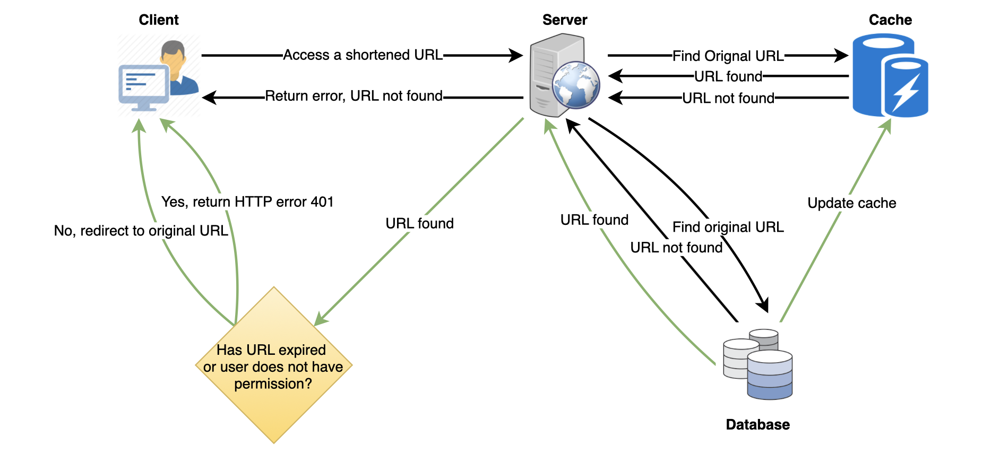
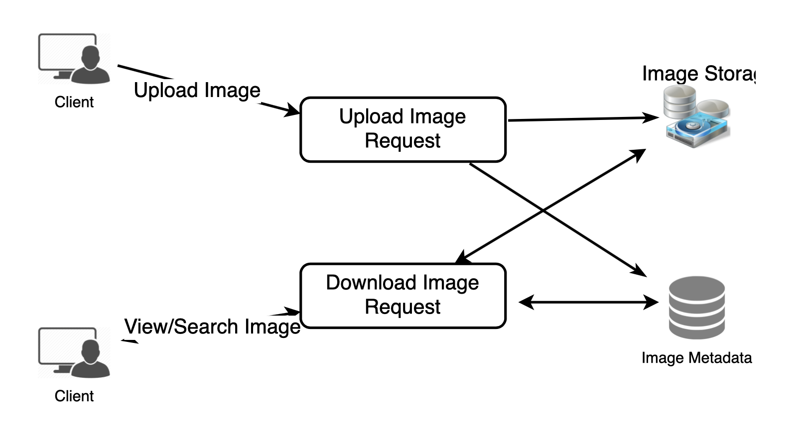

# System Design Problems

## System Design Interviews: A step by step guide

### Step 1: Requirements clarifications
It is always a good idea to ask questions about the exact scope of the problem we are trying to solve. Design questions are mostly open-ended, and they don’t have ONE correct answer. That’s why clarifying ambiguities early in the interview becomes critical. Candidates who spend enough time to define the end goals of the system always have a better chance to be successful in the interview. Also, since we only have 35-40 minutes to design a (supposedly) large system, we should clarify what parts of the system we will be focusing on.

Let’s expand this with an actual example of designing a Twitter-like service. Here are some questions for designing Twitter that should be answered before moving on to the next steps:
* Will users of our service be able to **post** tweets and **follow** other people?
* Should we also design to create and display the user’s **timeline**?
* Will tweets contain **photos** and **videos**?
* Are we focusing on the **backend** only, or are we developing the front-end too?
* Will users be able to **search** tweets?
* Do we need to display **hot trending topics**?
* Will there be any push **notification** for new (or important) tweets?

All such questions will determine how our end design will look like.

### Step 2: Back-of-the-envelope estimation
It is always a good idea to estimate the scale of the system we’re going to design. This will also help later when we focus on scaling, partitioning, load balancing, and caching.
* What **scale** is expected from the system (e.g., number of new tweets, number of tweet views, number of timeline generations per sec., etc.)?
* How much **storage** will we need? We will have different storage requirements if users can have photos and videos in their tweets.
* What **network** bandwidth usage are we expecting? This will be crucial in deciding how we will manage traffic and balance load between servers.

### Step 3: System interface definition
Define what APIs are expected from the system. This will establish the exact contract expected from the system and ensure if we haven’t gotten any requirements wrong. Some examples of APIs for our Twitter-like service will be:
```mysql
postTweet(user_id, tweet_data, tweet_location, user_location, timestamp, …)
generateTimeline(user_id, current_time, user_location, …)
markTweetFavorite(user_id, tweet_id, timestamp, …)
```
### Step 4: Defining data model
Defining the data model in the early part of the interview will clarify how data will flow between different system components. Later, it will guide for data partitioning and management. The candidate should identify various entities of the system, how they will interact with each other, and different aspects of data management like storage, transportation, encryption, etc. Here are some entities for our Twitter-like service:

User: UserID, Name, Email, DoB, CreationData, LastLogin, etc.
Tweet: TweetID, Content, TweetLocation, NumberOfLikes, TimeStamp, etc.
UserFollow: UserID1, UserID2
FavoriteTweets: UserID, TweetID, TimeStamp

Which database system should we use? Will NoSQL like Cassandra best fit our needs, or should we use a MySQL-like solution? What kind of block storage should we use to store photos and videos?

### Step 5: High-level design
Draw a block diagram with 5-6 boxes representing the core components of our system. We should identify enough components that are needed to solve the actual problem from end-to-end.

For Twitter, at a high-level, we will need multiple application servers to serve all the read/write requests with load balancers in front of them for traffic distributions. If we’re assuming that we will have a lot more read traffic (compared to write), we can decide to have separate servers to handle these scenarios. On the back-end, we need an efficient database that can store all the tweets and support a huge number of reads. We will also need a distributed file storage system for storing photos and videos.


### Step 6: Detailed design
Dig deeper into two or three major components; the interviewer’s feedback should always guide us to what parts of the system need further discussion. We should present **different approaches**, their **pros and cons**, and explain why we will prefer one approach over the other. Remember, there is no single answer; the only important thing is to consider **tradeoffs** between different options while keeping system constraints in mind.
* Since we will be storing a massive amount of data, how should we **partition** our data to distribute it to multiple databases? Should we try to store all the data of a user on the same database? What issue could it cause?
* How will we handle **hot users** who tweet a lot or follow lots of people?
* Since users’ timeline will contain the most recent (and relevant) tweets, should we try to store our data so that it is optimized for scanning the latest tweets?
* How much and at which layer should we introduce **cache** to speed things up?
* What components need better **load balancing**?

### Step 7: Identifying and resolving bottlenecks
Try to discuss as many bottlenecks as possible and different approaches to mitigate them.
* Is there any **single point of failure** in our system? What are we doing to mitigate it?
* Do we have enough **replicas of the data** so that we can still serve our users if we lose a few servers?
* Similarly, do we have **enough copies of different services** running such that a few failures will not cause a total system shutdown?
* How are we **monitoring** the performance of our service? Do we get **alerts** whenever critical components fail or their performance degrades?

## Designing a URL Shortening service like TinyURL

### Why do we need URL shortening?
URL shortening is used to create shorter aliases for long URLs. We call these shortened aliases "short links." Users are redirected to the original URL when they hit these short links. Short links save a lot of space when displayed, printed, messaged, or tweeted. Additionally, users are less likely to mistype shorter URLs.

For example, if we shorten this page through TinyURL:
> https://www.educative.io/collection/page/5668639101419520/5649050225344512/5668600916475904/

We would get:
> http://tinyurl.com/jlg8zpc

The shortened URL is nearly one-third the size of the actual URL.

URL shortening is used to optimize links across devices, track individual links to analyze audience, measure ad campaigns’ performance, or hide affiliated original URLs.

If you haven’t used tinyurl.com before, please try creating a new shortened URL and spend some time going through the various options their service offers. This will help you a lot in understanding this chapter.

### Requirements and Goals of the System
:bulb: You should always clarify requirements at the beginning of the interview. Be sure to ask questions to find the exact scope of the system that the interviewer has in mind.

1. Functional Requirements:
    * Given a URL, our service should generate a shorter and **unique alias** of it. This is called a short link. This link should be **short enough** to be easily copied and pasted into applications.
    * When users access a short link, our service should **redirect** them to the original link.
    * Users should optionally be able to pick a **custom** short link for their URL.
    * Links will expire after a standard default timespan. Users should be able to specify the **expiration** time.

2. Non-Functional Requirements:
    * The system should be **highly available**. This is required because, if our service is down, all the URL redirections will start failing.
    * URL redirection should happen in **real-time** with minimal latency.
    * Shortened links should not be **guessable** (not predictable).

3. Extended Requirements:
    * Analytics; e.g., how many times a redirection happened?
    * Our service should also be accessible through REST APIs by other services.

### Capacity Estimation and Constraints
:bulb: Our system will be read-heavy. There will be lots of redirection requests compared to new URL shortenings. Let’s assume a 100:1 ratio between read and write.

1. Traffic estimates:
    * Assuming, we will have 500M new URL shortenings per month, with 100:1 read/write ratio, we can expect 50B redirections during the same period:

> 100 * 500M => 50B

    * What would be Queries Per Second (QPS) for our system? New URLs shortenings per second:

    > 500 million / (30 days * 24 hours * 3600 seconds) = ~200 URLs/s

* Considering 100:1 read/write ratio, URLs redirections per second will be:

        > 100 * 200 URLs/s = 20K/s

2. Storage estimates:
    * Let’s assume we store every URL shortening request (and associated shortened link) for 5 years. Since we expect to have 500M new URLs every month, the total number of objects we expect to store will be 30 billion:

> 500 million * 5 years * 12 months = 30 billion

    * Let’s assume that each stored object will be approximately 500 bytes (just a ballpark estimate–we will dig into it later). We will need 15TB of total storage:

        > 30 billion * 500 bytes = 15 TB

3. Bandwidth estimates:
    * For write requests, since we expect 200 new URLs every second, total incoming data for our service will be 100KB per second:

> 200 * 500 bytes = 100 KB/s

    * For read requests, since every second we expect ~20K URLs redirections, total outgoing data for our service would be 10MB per second:

        > 20K * 500 bytes = ~10 MB/s

4. Memory estimates:
    * If we want to cache some of the hot URLs that are frequently accessed, how much memory will we need to store them? If we follow the 80-20 rule, meaning 20% of URLs generate 80% of traffic, we would like to cache these 20% hot URLs.

    * Since we have 20K requests per second, we will be getting 1.7 billion requests per day:

> 20K * 3600 seconds * 24 hours = ~1.7 billion

    * To cache 20% of these requests, we will need 170GB of memory.

    > 0.2 * 1.7 billion * 500 bytes = ~170GB

    * One thing to note here is that since there will be many duplicate requests (of the same URL), our actual memory usage will be less than 170GB.

5. High-level estimates:
    Assuming 500 million new URLs per month and 100:1 read:write ratio, following is the summary of the high level estimates for our service:
    New URLs   |  200/s
    --- | ---
    URL redirections  |  20K/s
    Incoming data  |  100KB/s
    Outgoing data   | 10MB/s
    Storage for 5 years   | 15TB
    Memory for cache  |  170GB

### System APIs
:bulb: Once we've finalized the requirements, it's always a good idea to define the system APIs. This should explicitly state what is expected from the system.

We can have SOAP or REST APIs to expose the functionality of our service. Following could be the definitions of the APIs for creating and deleting URLs:
> createURL(api_dev_key, original_url, custom_alias=None, user_name=None, expire_date=None)

Parameters | Doc
--- | ---
api_dev_key (string) | The API developer key of a registered account. This will be used to, among other things, throttle users based on their allocated quota.
original_url (string) | Original URL to be shortened.
custom_alias (string) | Optional custom key for the URL.
user_name (string) | Optional user name to be used in the encoding.
expire_date (string) | Optional expiration date for the shortened URL.
Returns: (string) | A successful insertion returns the shortened URL; otherwise, it returns an error code.

> deleteURL(api_dev_key, url_key)
Where "url_key" is a string representing the shortened URL to be retrieved; a successful deletion returns ‘URL Removed’.

* How do we detect and prevent abuse?
    * A malicious user can put us out of business by consuming all URL keys in the current design. To prevent abuse, we can limit users via their api_dev_key. Each api_dev_key can be limited to a certain number of URL creations and redirections per some time period (which may be set to a different duration per developer key).

### Database Design
:bulb: Defining the DB schema in the early stages of the interview would help to understand the data flow among various components and later would guide towards data partitioning.

* A few observations about the nature of the data we will store:
    * We need to store billions of records.
    * Each object we store is small (less than 1K).
    * There are no relationships between records—other than storing which user created a URL.
    * Our service is read-heavy.

* Database Schema:
* We would need two tables: one for storing information about the URL mappings and one for the user’s data who created the short link.

Table | URL
--- | ---
Hash (RK) | varchar(16)
OriginURL | varchar(512)
CreationData | datetime
ExpirationData | datetime
UserID | int


Table | USER
--- | ---
Name | varchar(30)
Email | varchar(20)
CreationData | datetime
LastLogin | datetime

* What kind of database should we use?
    * Since we anticipate storing billions of rows, and we don’t need to use relationships between objects – a NoSQL store like DynamoDB, Cassandra or Riak is a better choice. A NoSQL choice would also be easier to scale. Please see SQL vs NoSQL for more details.

### Basic System Design and Algorithm
The problem we are solving here is how to generate a short and unique key for a given URL.

In the TinyURL example in Section 1, the shortened URL is "http://tinyurl.com/jlg8zpc". The last seven characters of this URL is the short key we want to generate. We’ll explore two solutions here:

1. Encoding actual URL
    We can compute a unique hash (e.g., MD5 or SHA256, etc.) of the given URL. The hash can then be encoded for display. This encoding could be base36 ([a-z ,0-9]) or base62 ([A-Z, a-z, 0-9]) and if we add ‘+’ and ‘/’ we can use Base64 encoding. A reasonable question would be, what should be the length of the short key? 6, 8, or 10 characters?

    Using base64 encoding, a 6 letters long key would result in 64^6 = ~68.7 billion possible strings.

    Using base64 encoding, an 8 letters long key would result in 64^8 = ~281 trillion possible strings.

    With 68.7B unique strings, let’s assume six letter keys would suffice for our system.

    If we use the MD5 algorithm as our hash function, it’ll produce a 128-bit hash value. After base64 encoding, we’ll get a string having more than 21 characters (since each base64 character encodes 6 bits of the hash value). Now we only have space for 8 characters per short key; how will we choose our key then? We can take the first 6 (or 8) letters for the key. This could result in key duplication; to resolve that, we can choose some other characters out of the encoding string or swap some characters.

    * What are the different issues with our solution? We have the following couple of problems with our encoding scheme:
        1. If multiple users enter the same URL, they can get the same shortened URL, which is not acceptable.
        2. What if parts of the URL are URL-encoded? e.g., http://www.educative.io/distributed.php?id=design, and http://www.educative.io/distributed.php%3Fid%3Ddesign are identical except for the URL encoding.

    * Workaround for the issues:
        * We can append an increasing sequence number to each input URL to make it unique and then generate its hash. We don’t need to store this sequence number in the databases, though. Possible problems with this approach could be an ever-increasing sequence number. Can it overflow? Appending an increasing sequence number will also impact the performance of the service.
        * Another solution could be to append the user id (which should be unique) to the input URL. However, if the user has not signed in, we would have to ask the user to choose a uniqueness key. Even after this, if we have a conflict, we have to keep generating a key until we get a unique one.
    

2. Generating keys offline
    We can have a standalone Key Generation Service (KGS) that generates random six-letter strings beforehand and stores them in a database (let’s call it key-DB). Whenever we want to shorten a URL, we will take one of the already-generated keys and use it. This approach will make things quite simple and fast. Not only are we not encoding the URL, but we won’t have to worry about duplications or collisions. KGS will make sure all the keys inserted into key-DB are unique

    * **Can concurrency cause problems?**
        * As soon as a key is used, it should be marked in the database to ensure that it is not used again. If there are multiple servers reading keys concurrently, we might get a scenario where two or more servers try to read the same key from the database. How can we solve this concurrency problem?
        * Servers can use KGS to read/mark keys in the database. KGS can use two tables to store keys: one for keys that are not used yet, and one for all the used keys. As soon as KGS gives keys to one of the servers, it can move them to the used keys table. KGS can always keep some keys in memory to quickly provide them whenever a server needs them.

        * For simplicity, as soon as KGS loads some keys in memory, it can move them to the used keys table. This ensures each server gets unique keys. If KGS dies before assigning all the loaded keys to some server, we will be wasting those keys–which could be acceptable, given the huge number of keys we have.

        * KGS also has to make sure not to give the same key to multiple servers. For that, it must synchronize (or get a lock on) the data structure holding the keys before removing keys from it and giving them to a server.

        * What would be the key-DB size? With base64 encoding, we can generate 68.7B unique six letters keys. If we need one byte to store one alpha-numeric character, we can store all these keys in:

    > 6 (characters per key) * 68.7B (unique keys) = 412 GB.

    * **Isn’t KGS a single point of failure?**

    * Yes, it is. To solve this, we can have a standby replica of KGS. Whenever the primary server dies, the standby server can take over to generate and provide keys.

* **Can each app server cache some keys from key-DB?**

    * Yes, this can surely speed things up. Although, in this case, if the application server dies before consuming all the keys, we will end up losing those keys. This can be acceptable since we have 68B unique six-letter keys.

    * **How would we perform a key lookup?**

* We can look up the key in our database to get the full URL. If it’s present in the DB, issue an "HTTP 302 Redirect" status back to the browser, passing the stored URL in the "Location" field of the request. If that key is not present in our system, issue an "HTTP 404 Not Found" status or redirect the user back to the homepage.

    * **Should we impose size limits on custom aliases?**

        * Our service supports custom aliases. Users can pick any ‘key’ they like, but providing a custom alias is not mandatory. However, it is reasonable (and often desirable) to impose a size limit on a custom alias to ensure we have a consistent URL database. Let’s assume users can specify a maximum of 16 characters per customer key (as reflected in the above database schema).

    

### Data Partitioning and Replication
To scale out our DB, we need to partition it so that it can store information about billions of URLs. We need to develop a partitioning scheme that would divide and store our data into different DB servers.

1. Range Based Partitioning:
    We can store URLs in separate partitions based on the hash key’s first letter. Hence we save all the URLs starting with the letter ‘A’ (and ‘a’) in one partition, save those that start with the letter ‘B’ in another partition, and so on. This approach is called range-based partitioning. We can even combine certain less frequently occurring letters into one database partition. We should come up with a static partitioning scheme to always store/find a URL in a predictable manner.

    The main problem with this approach is that it can lead to unbalanced DB servers. For example, we decide to put all URLs starting with the letter ‘E’ into a DB partition, but later we realize that we have too many URLs that start with the letter ‘E.’

2. Hash-Based Partitioning:
    In this scheme, we take a hash of the object we are storing. We then calculate which partition to use based upon the hash. In our case, we can take the hash of the ‘key’ or the short link to determine the partition in which we store the data object.

    Our hashing function will randomly distribute URLs into different partitions (e.g., our hashing function can always map any ‘key’ to a number between [1…256]). This number would represent the partition in which we store our object.

This approach can still lead to overloaded partitions, which can be solved using [Consistent Hashing](https://www.educative.io/collection/page/5668639101419520/5649050225344512/5709068098338816/).

### Cache
We can cache URLs that are frequently accessed. We can use some off-the-shelf solution like Memcached, which can store full URLs with their respective hashes. Before hitting backend storage, the application servers can quickly check if the cache has the desired URL.

* How much cache memory should we have?
    * We can start with 20% of daily traffic and, based on clients’ usage patterns, we can adjust how many cache servers we need. As estimated above, we need 170GB memory to cache 20% of daily traffic. Since a modern-day server can have 256GB memory, we can easily fit all the cache into one machine. Alternatively, we can use a couple of smaller servers to store all these hot URLs.

* Which cache eviction policy would best fit our needs?
    * When the cache is full, and we want to replace a link with a newer/hotter URL, how would we choose? Least Recently Used (LRU) can be a reasonable policy for our system. Under this policy, we discard the least recently used URL first. We can use a Linked Hash Map or a similar data structure to store our URLs and Hashes, which will also keep track of the URLs that have been accessed recently.

To further increase the efficiency, we can replicate our caching servers to distribute the load between them.

* How can each cache replica be updated?
    * Whenever there is a cache miss, our servers would be hitting a backend database. Whenever this happens, we can update the cache and pass the new entry to all the cache replicas. Each replica can update its cache by adding the new entry. If a replica already has that entry, it can simply ignore it.



### Load Balancer (LB)
* We can add a Load balancing layer at three places in our system:
    * Between Clients and Application servers
    * Between Application Servers and database servers
    * Between Application Servers and Cache servers

Initially, we could use a simple Round Robin approach that distributes incoming requests equally among backend servers. This LB is simple to implement and does not introduce any overhead. Another benefit of this approach is that if a server is dead, LB will take it out of the rotation and will stop sending any traffic to it.

A problem with Round Robin LB is that we don’t take the server load into consideration. If a server is overloaded or slow, the LB will not stop sending new requests to that server. To handle this, a more intelligent LB solution can be placed that periodically queries the backend server about its load and adjusts traffic based on that.

### Purging or DB cleanup
Should entries stick around forever, or should they be purged? If a user-specified expiration time is reached, what should happen to the link?

If we chose to actively search for expired links to remove them, it would put a lot of pressure on our database. Instead, we can slowly remove expired links and do a lazy cleanup. Our service will ensure that only expired links will be deleted, although some expired links can live longer but will never be returned to users.
* Whenever a user tries to access an expired link, we can delete the link and return an error to the user.
* A separate Cleanup service can run periodically to remove expired links from our storage and cache. This service should be very lightweight and can be scheduled to run only when the user traffic is expected to be low.
* We can have a default expiration time for each link (e.g., two years).
* After removing an expired link, we can put the key back in the key-DB to be reused.
* Should we remove links that haven’t been visited in some length of time, say six months? This could be tricky. Since storage is getting cheap, we can decide to keep links forever.


### Telemetry
How many times a short URL has been used, what were user locations, etc.? How would we store these statistics? If it is part of a DB row that gets updated on each view, what will happen when a popular URL is slammed with a large number of concurrent requests?

Some statistics worth tracking: country of the visitor, date and time of access, web page that referred the click, browser, or platform from where the page was accessed.

### Security and Permissions
Can users create private URLs or allow a particular set of users to access a URL?

We can store the permission level (public/private) with each URL in the database. We can also create a separate table to store UserIDs that have permission to see a specific URL. If a user does not have permission and tries to access a URL, we can send an error (HTTP 401) back. Given that we are storing our data in a NoSQL wide-column database like Cassandra, the key for the table storing permissions would be the ‘Hash’ (or the KGS generated ‘key’). The columns will store the UserIDs of those users that have permission to see the URL.

## Designing Pastebin

## Designing Instagram

### Requirements and Goals of the System
1. Functional Requirements
    * Users should be able to upload/download/view photos.
    * Users can perform searches based on photo/video titles.
    * Users can follow other users.
    * The system should generate and display a user’s News Feed consisting of top photos from all the people the user follows.

2. Non-functional Requirements
    * Our service needs to be **highly available**.
    * The acceptable **latency** of the system is 200ms for News Feed generation.
    * **Consistency** can take a hit (in the interest of availability) if a user doesn’t see a photo for a while; it should be fine.
    * The system should be **highly reliable**; any uploaded photo or video should never be lost.

    **Not in scope:** Adding tags to photos, searching photos on tags, commenting on photos, tagging users to photos, who to follow, etc.

### Some Design Considerations

The system would be read-heavy, so we will focus on building a system that can retrieve photos quickly.

Practically, users can upload as many photos as they like; therefore, efficient management of storage should be a crucial factor in designing this system.

Low latency is expected while viewing photos.

Data should be 100% reliable. If a user uploads a photo, the system will guarantee that it will never be lost.

### Capacity Estimation and Constraints
* Let’s assume we have 500M total users, with 1M daily active users.
* 2M new photos every day, 23 new photos every second.
* Average photo file size => 200KB
* Total space required for 1 day of photos
    * 2M * 200KB => 400 GB
* Total space required for 10 years:
    * 400GB * 365 (days a year) * 10 (years) ~= 1425TB

### High Level System Design
At a high-level, we need to support two scenarios, one to upload photos and the other to view/search photos. Our service would need some [object storage](https://en.wikipedia.org/wiki/Object_storage) servers to store photos and some database servers to store metadata information about the photos.


### Database Schema
:blub: Defining the DB schema in the early stages of the interview would help to understand the data flow among various components and later would guide towards data partitioning.

We need to store data about users, their uploaded photos, and the people they follow. The Photo table will store all data related to a photo; we need to have an index on (PhotoID, CreationDate) since we need to fetch recent photos first.


A straightforward approach for storing the above schema would be to use an RDBMS like MySQL since we require joins. But relational databases come with their challenges, especially when we need to scale them. For details, please take a look at [SQL vs. NoSQL](https://www.educative.io/collection/page/5668639101419520/5649050225344512/5728116278296576/).

We can store photos in a distributed file storage like HDFS or S3.

We can store the above schema in a distributed key-value store to enjoy the benefits offered by NoSQL. All the metadata related to photos can go to a table where the ‘key’ would be the ‘PhotoID’ and the ‘value’ would be an object containing PhotoLocation, UserLocation, CreationTimestamp, etc.

If we go with a NoSQL database, we need an additional table to store the relationships between users and photos to know who owns which photo. Let’s call this table ‘UserPhoto’. We also need to store the list of people a user follows. Let’s call it ‘UserFollow’. For both of these tables, we can use a wide-column datastore like Cassandra. For the ‘UserPhoto’ table, the ‘key’ would be ‘UserID’, and the ‘value’ would be the list of ‘PhotoIDs’ the user owns, stored in different columns. We will have a similar scheme for the ‘UserFollow’ table.

Cassandra or key-value stores, in general, always maintain a certain number of replicas to offer reliability. Also, in such data stores, deletes don’t get applied instantly; data is retained for certain days (to support undeleting) before getting removed from the system permanently.

### Data Size Estimation
Let’s estimate how much data will be going into each table and how much total storage we will need for 10 years.

1. User:
    * Assuming each "int" and "dateTime" is four bytes, each row in the User’s table will be of 68 bytes:

        > UserID (4 bytes) + Name (20 bytes) + Email (32 bytes) + DateOfBirth (4 bytes) + CreationDate (4 bytes) + LastLogin (4 bytes) = 68 bytes
    * If we have 500 million users, we will need 32GB of total storage.

        > 500 million * 68 ~= 32GB

2. Photo:
    * Each row in Photo’s table will be of 284 bytes:

        > PhotoID (4 bytes) + UserID (4 bytes) + PhotoPath (256 bytes) + PhotoLatitude (4 bytes) + PhotoLongitude(4 bytes) + UserLatitude (4 bytes) + UserLongitude (4 bytes) + CreationDate (4 bytes) = 284 bytes
    * If 2M new photos get uploaded every day, we will need 0.5GB of storage for one day:

    > 2M * 284 bytes ~= 0.5GB per day
    * For 10 years we will need 1.88TB of storage.

2. UserFollow:
    * Each row in the UserFollow table will consist of 8 bytes. If we have 500 million users and on average each user follows 500 users. We would need 1.82TB of storage for the UserFollow table:

        > 500 million users * 500 followers * 8 bytes ~= 1.82TB
    * Total space required for all tables for 10 years will be 3.7TB:

        > 32GB + 1.88TB + 1.82TB ~= 3.7TB

###  Component Design
Photo uploads (or writes) can be slow as they have to go to the disk, whereas reads will be faster, especially if they are being served from cache.

Uploading users can consume all the available connections, as uploading is a slow process. This means that ‘reads’ cannot be served if the system gets busy with all the ‘write’ requests. **We should keep in mind that web servers have a connection limit before designing our system**. If we assume that a web server can have a maximum of 500 connections at any time, then it can’t have more than 500 concurrent uploads or reads. To handle this bottleneck, we can split reads and writes into separate services. We will have dedicated servers for reads and different servers for writes to ensure that uploads don’t hog the system.

Separating photos’ read and write requests will also allow us to scale and optimize each of these operations independently.




### Reliability and Redundancy
Losing files is not an option for our service. Therefore, we will store multiple copies of each file so that if one storage server dies, we can retrieve the photo from the other copy present on a different storage server.

This same principle also applies to other components of the system. If we want to have high availability of the system, we need to have multiple replicas of services running in the system so that even if a few services die down, the system remains available and running. **Redundancy removes the single point of failure in the system**.

If only one instance of a service is required to run at any point, we can run a redundant secondary copy of the service that is not serving any traffic, but it can take control after the failover when the primary has a problem.

Creating redundancy in a system can remove single points of failure and provide a backup or spare functionality if needed in a crisis. For example, if there are two instances of the same service running in production and one fails or degrades, the system can failover to the healthy copy. Failover can happen automatically or require manual intervention.


### Data Sharding

Let’s discuss different schemes for metadata sharding:

1. Partitioning based on UserID
    Let’s assume we shard based on the ‘UserID’ so that we can keep all photos of a user on the same shard. If one DB shard is 1TB, we will need four shards to store 3.7TB of data. Let’s assume, for better performance and scalability, we keep 10 shards.

    So we’ll find the shard number by UserID % 10 and then store the data there. To uniquely identify any photo in our system, we can append the **shard number with each PhotoID**.

    How can we generate PhotoIDs?
    * Each DB shard can have its own **auto-increment sequence** for PhotoIDs, and since we will append ShardID with each PhotoID, it will make it unique throughout our system.

    What are the different issues with this partitioning scheme?
    1. How would we handle **hot users**? Several people follow such hot users, and a lot of other people see any photo they upload.
    2. Some users will have a lot of photos compared to others, thus making a non-uniform distribution of storage.
    3. What if we cannot store all pictures of a user on one shard? If we distribute photos of a user onto multiple shards, will it cause higher latencies?
    4. Storing all photos of a user on one shard can cause issues like unavailability of all of the user’s data if that shard is down or higher latency if it is serving high load etc.

2. Partitioning based on PhotoID
    If we can generate unique PhotoIDs first and then find a shard number through "PhotoID % 10", the above problems will have been solved. We would not need to append ShardID with PhotoID in this case, as PhotoID will itself be unique throughout the system.

    How can we generate PhotoIDs?
    * Here, we cannot have an auto-incrementing sequence in each shard to define PhotoID because we need to know PhotoID first to find the shard where it will be stored. One solution could be that we **dedicate a separate database instance to generate auto-incrementing IDs**. If our PhotoID can fit into 64 bits, we can define a table containing only a 64 bit ID field. So whenever we would like to add a photo in our system, we can insert a new row in this table and take that ID to be our PhotoID of the new photo.

    Wouldn’t this key generating DB be a single point of failure? Yes, it would be. A workaround for that could be to define two such databases, one generating even-numbered IDs and the other odd-numbered. For MySQL, the following script can define such sequences:
        ```sql
        KeyGeneratingServer1:
        auto-increment-increment = 2
        auto-increment-offset = 1

        KeyGeneratingServer2:
        auto-increment-increment = 2
        auto-increment-offset = 2
        ```

    We can put a load balancer in front of both of these databases to round-robin between them and to deal with downtime. Both these servers could be out of sync, with one generating more keys than the other, but this will not cause any issue in our system. We can extend this design by defining separate ID tables for Users, Photo-Comments, or other objects present in our system.

    Alternately, we can implement a ‘key’ generation scheme similar to what we have discussed in Designing a URL Shortening service like TinyURL.

    How can we plan for the future growth of our system?

    * We can have a large number of logical partitions to accommodate future data growth, such that in the beginning, multiple logical partitions reside on a single physical database server. Since each database server can have multiple database instances running on it, we can have separate databases for each logical partition on any server. So whenever we feel that a particular database server has a lot of data, we can migrate some logical partitions from it to another server. We can maintain a config file (or a separate database) that can map our logical partitions to database servers; this will enable us to move partitions around easily. Whenever we want to move a partition, we only have to update the config file to announce the change.

### Ranking and News Feed Generation

To create the News Feed for any given user, we need to fetch the latest, most popular, and relevant photos of the people the user follows.

For simplicity, let’s assume we need to fetch the top 100 photos for a user’s News Feed. Our application server will first get a list of people the user follows and then fetch metadata info of each user’s latest 100 photos. In the final step, the server will submit all these photos to our ranking algorithm, which will determine the top 100 photos (based on recency, likeness, etc.) and return them to the user. A possible problem with this approach would be higher latency as we have to query multiple tables and perform sorting/merging/ranking on the results. To improve the efficiency, we can pre-generate the News Feed and store it in a separate table.

**Pre-generating the News Feed**: We can have dedicated servers that are continuously generating users’ News Feeds and storing them in a ‘UserNewsFeed’ table. So whenever any user needs the latest photos for their News-Feed, we will simply query this table and return the results to the user.

Whenever these servers need to generate the News Feed of a user, they will first query the UserNewsFeed table to find the last time the News Feed was generated for that user. Then, new News-Feed data will be generated from that time onwards (following the steps mentioned above).

What are the different approaches for sending News Feed contents to the users?
1. **Pull**: Clients can pull the News-Feed contents from the server at a regular interval or manually whenever they need it. Possible problems with this approach are:
    * New data might not be shown to the users until clients issue a pull request
    * Most of the time, pull requests will result in an empty response if there is no new data.

2. **Push**: Servers can push new data to the users as soon as it is available. To efficiently manage this, users have to maintain a Long Poll request with the server for receiving the updates. A possible problem with this approach is a user who follows a lot of people or a celebrity user who has millions of followers; in this case, the server has to push updates quite frequently.

3. **Hybrid**: We can adopt a hybrid approach. We can move all the users who have a high number of followers to a pull-based model and only push data to those who have a few hundred (or thousand) follows. Another approach could be that the server pushes updates to all the users not more than a certain frequency and letting users with a lot of followers/updates to pull data regularly.

For a detailed discussion about News-Feed generation, take a look at Designing Facebook’s Newsfeed.

### News Feed Creation with Sharded Data

One of the most important requirements to create the News Feed for any given user is to fetch the latest photos from all people the user follows. For this, we need to have a mechanism to sort photos on their time of creation. To efficiently do this, we can make photo creation time part of the PhotoID. As we will have a primary index on PhotoID, it will be quite quick to find the latest PhotoIDs.

We can use epoch time for this. Let’s say our PhotoID will have two parts; the first part will be representing epoch time, and the second part will be an auto-incrementing sequence. So to make a new PhotoID, we can take the current epoch time and append an auto-incrementing ID from our key-generating DB. We can figure out the shard number from this PhotoID ( PhotoID % 10) and store the photo there.

What could be the size of our PhotoID? Let’s say our epoch time starts today; how many bits we would need to store the number of seconds for the next 50 years?
> 86400 sec/day * 365 (days a year) * 50 (years) => 1.6 billion seconds

We would need 31 bits to store this number. Since, on average, we are expecting 23 new photos per second, we can allocate 9 additional bits to store the auto-incremented sequence. So every second, we can store (2^9=>512) new photos. We are allocating 9 bits for the sequence number which is more than what we require; we are doing this to get a full byte number (as 40bits=5bytes). We can reset our auto-incrementing sequence every second.

We will discuss this technique under ‘Data Sharding’ in Designing Twitter.

### Cache and Load balancing

Our service would need a massive-scale photo delivery system to serve globally distributed users. Our service should push its content closer to the user using a large number of geographically distributed photo cache servers and use CDNs (for details, see Caching).

We can introduce a cache for metadata servers to cache hot database rows. We can use Memcache to cache the data, and Application servers before hitting the database, can quickly check if the cache has desired rows. Least Recently Used (LRU) can be a reasonable cache eviction policy for our system. Under this policy, we discard the least recently viewed row first.

How can we build a more intelligent cache?
* If we go with the eighty-twenty rule, i.e., 20% of daily read volume for photos is generating 80% of the traffic, which means that certain photos are so popular that most people read them. This dictates that we can try caching 20% of the daily read volume of photos and metadata.

## Designing Dropbox
## Designing Facebook Messenger

## Designing Twitter

### 2. Requirements and Goals of the System
1. Functional Requirements
    * Users should be able to post new tweets.
    * A user should be able to follow other users.
    * Users should be able to mark tweets as favorites.
    * The service should be able to create and display a user’s timeline consisting of top tweets from all the people the user follows.
    * Tweets can contain photos and videos.

2. Non-functional Requirements
    * Our service needs to be highly available.
    * Acceptable latency of the system is 200ms for timeline generation.
    * Consistency can take a hit (in the interest of availability); if a user doesn’t see a tweet for a while, it should be fine.

3. Extended Requirements
    * Searching for tweets.
    * Replying to a tweet.
    * Trending topics – current hot topics/searches.
    * Tagging other users.
    * Tweet Notification.
    * Who to follow? Suggestions?
    * Moments.

## Designing Youtube or Netflix
## Designing Typeahead Suggestion
## Designing an API Rate Limiter
## Designing Twitter Search
## Designing a Web Crawler
## Designing Facebook’s Newsfeed
## Designing Yelp or Nearby Friends
## Designing Uber backend
## Design Ticketmaster

# Glossary of System Design Basics
Whenever we are designing a large system, we need to consider a few things:
* What are the **different architectural pieces** that can be used?
* How do these pieces work with each other?
* How can we best utilize these pieces: what are the right **tradeoffs**?

Investing in scaling before it is needed is generally not a smart business proposition; however, some forethought into the design can save valuable time and resources in the future. In the following chapters, we will try to define some of the core building blocks of scalable systems. Familiarizing these concepts would greatly benefit in understanding distributed system concepts. In the next section, we will go through Consistent Hashing, CAP Theorem, Load Balancing, Caching, Data Partitioning, Indexes, Proxies, Queues, Replication, and choosing between SQL vs. NoSQL.

Let’s start with the Key Characteristics of Distributed Systems.

## System Design Basics

### Scalability
Scalability: _is the capability of a system, process, or a network to grow and manage increased demand_.

Any distributed system that can continuously evolve in order to support the growing amount of work is considered to be scalable.

A system may have to scale because of many reasons like increased data volume or increased amount of work, e.g., number of transactions. A scalable system would like to achieve this scaling without performance loss.

Generally, the performance of a system, although designed (or claimed) to be scalable, declines with the system size due to the management or environment cost. For instance, network speed may become slower because machines tend to be far apart from one another. More generally, some tasks may not be distributed, either because of their inherent atomic nature or because of some flaw in the system design. At some point, such tasks would limit the speed-up obtained by distribution. A scalable architecture avoids this situation and attempts to balance the load on all the participating nodes evenly.

**Horizontal vs. Vertical Scaling**: Horizontal scaling means that you scale by adding more servers into your pool of resources whereas Vertical scaling means that you scale by adding more power (CPU, RAM, Storage, etc.) to an existing server.

With horizontal-scaling it is often easier to scale dynamically by adding more machines into the existing pool; Vertical-scaling is usually limited to the capacity of a single server and scaling beyond that capacity often involves downtime and comes with an upper limit.

Good examples of horizontal scaling are Cassandra and MongoDB as they both provide an easy way to scale horizontally by adding more machines to meet growing needs. Similarly, a good example of vertical scaling is MySQL as it allows for an easy way to scale vertically by switching from smaller to bigger machines. However, this process often involves downtime.


### Reliability
**Reliability can be defined as the probability that a system will produce correct outputs up to some given time.** [Wiki](https://en.wikipedia.org/wiki/Reliability,_availability_and_serviceability)

In simple terms, a distributed system is considered reliable if it keeps delivering its services even when one or several of its software or hardware components fail. Reliability represents one of the main characteristics of any distributed system, since in such systems any failing machine can always be replaced by another healthy one, ensuring the completion of the requested task.

Take the example of a large electronic commerce store (like Amazon), where one of the primary requirement is that any user transaction should never be canceled due to a failure of the machine that is running that transaction. For instance, if a user has added an item to their shopping cart, the system is expected not to lose it. A reliable distributed system achieves this through redundancy of both the software components and data. If the server carrying the user’s shopping cart fails, another server that has the exact replica of the shopping cart should replace it.

Obviously, redundancy has a cost and a reliable system has to pay that to achieve such resilience for services by eliminating every single point of failure.

### Availability
**Availability means the probability that a system is operational at a given time**. [Wiki](https://en.wikipedia.org/wiki/Reliability,_availability_and_serviceability)

It is a simple measure of the percentage of time that a system, service, or a machine remains operational under normal conditions. An aircraft that can be flown for many hours a month without much downtime can be said to have a high availability. **Availability takes into account maintainability, repair time, spares availability, and other logistics considerations**. If an aircraft is down for maintenance, it is considered not available during that time.

Reliability is availability over time considering the full range of possible real-world conditions that can occur. An aircraft that can make it through any possible weather safely is more reliable than one that has vulnerabilities to possible conditions.

**Reliability Vs. Availability**
* If a system is reliable, it is available. However, if it is available, it is not necessarily reliable. In other words, **high reliability contributes to high availability**, but it is possible to achieve a high availability even with an unreliable product by minimizing repair time and ensuring that spares are always available when they are needed. Let’s take the example of an online retail store that has 99.99% availability for the first two years after its launch. However, the system was launched without any information security testing. The customers are happy with the system, but they don’t realize that it isn’t very reliable as it is vulnerable to likely risks. In the third year, the system experiences a series of information security incidents that suddenly result in extremely low availability for extended periods of time. This results in reputational and financial damage to the customers.

### Efficiency
To understand how to measure the efficiency of a distributed system, let’s assume we have an operation that runs in a distributed manner and delivers a set of items as result. Two standard measures of its efficiency are the response time (or **latency**) that denotes the delay to obtain the first item and the **throughput** (or bandwidth) which denotes the number of items delivered in a given time unit (e.g., a second). The two measures correspond to the following unit costs:
* Number of messages globally sent by the nodes of the system regardless of the message size.
* Size of messages representing the volume of data exchanges.

The complexity of operations supported by distributed data structures (e.g., searching for a specific key in a distributed index) can be characterized as a function of one of these cost units. Generally speaking, the analysis of a distributed structure in terms of ‘number of messages’ is over-simplistic. It ignores the impact of many aspects, including the network topology, the network load, and its variation, the possible heterogeneity of the software and hardware components involved in data processing and routing, etc. However, it is quite difficult to develop a precise cost model that would accurately take into account all these performance factors; therefore, we have to live with rough but robust estimates of the system behavior.
### Serviceability or Manageability
Another important consideration while designing a distributed system is how easy it is to operate and maintain. **Serviceability or manageability is the simplicity and speed with which a system can be repaired or maintained** [Wiki](https://en.wikipedia.org/wiki/Reliability,_availability_and_serviceability); if the time to fix a failed system increases, then availability will decrease. Things to consider for manageability are the ease of diagnosing and understanding problems when they occur, ease of making updates or modifications, and how simple the system is to operate (i.e., does it routinely operate without failure or exceptions?).

Early detection of faults can decrease or avoid system downtime. For example, some enterprise systems can automatically call a service center (without human intervention) when the system experiences a system fault.

## Key Characteristics of Distributed Systems

### Load Balancing
Load Balancer (LB) is another critical component of any distributed system. It helps to spread the traffic across a cluster of servers to improve responsiveness and availability of applications, websites or databases. LB also keeps track of the status of all the resources while distributing requests. If a server is not available to take new requests or is not responding or has elevated error rate, LB will stop sending traffic to such a server.


Typically a load balancer sits between the client and the server accepting incoming network and application traffic and distributing the traffic across multiple backend servers using various algorithms. By balancing application requests across multiple servers, a load balancer reduces individual server load and prevents any one application server from becoming a single point of failure, thus improving overall application availability and responsiveness.

To utilize full scalability and redundancy, we can try to balance the load at each layer of the system. We can add LBs at three places:
* Between the user and the web server
* Between web servers and an internal platform layer, like application servers or cache servers
* Between internal platform layer and database.


### Benefits of Load Balancing
1. Users experience faster, uninterrupted service. Users won’t have to wait for a single struggling server to finish its previous tasks. Instead, their requests are immediately passed on to a more readily available resource.
2. Service providers experience less downtime and higher throughput. Even a full server failure won’t affect the end user experience as the load balancer will simply route around it to a healthy server.
3. Load balancing makes it easier for system administrators to handle incoming requests while decreasing wait time for users.
4. Smart load balancers provide benefits like predictive analytics that determine traffic bottlenecks before they happen. As a result, the smart load balancer gives an organization actionable insights. These are key to automation and can help drive business decisions.
5. System administrators experience fewer failed or stressed components. Instead of a single device performing a lot of work, load balancing has several devices perform a little bit of work.

### Load Balancing Algorithms
**How does the load balancer choose the backend server?**
Load balancers consider two factors before forwarding a request to a backend server. They will first ensure that the server they choose is actually responding appropriately to requests and then use a pre-configured algorithm to select one from the set of healthy servers. We will discuss these algorithms shortly.

**Health Checks** - Load balancers should only forward traffic to "healthy" backend servers. To monitor the health of a backend server, "health checks" regularly attempt to connect to backend servers to ensure that servers are listening. If a server fails a health check, it is automatically removed from the pool, and traffic will not be forwarded to it until it responds to the health checks again.

There is a variety of load balancing methods, which use different algorithms for different needs.
1. **Least Connection Method** — This method directs traffic to the server with the fewest active connections. This approach is quite useful when there are a large number of persistent client connections which are unevenly distributed between the servers.
2. **Least Response Time Method** — This algorithm directs traffic to the server with the fewest active connections and the lowest average response time.
3. **Least Bandwidth Method** - This method selects the server that is currently serving the least amount of traffic measured in megabits per second (Mbps).
4. **Round Robin Method** — This method cycles through a list of servers and sends each new request to the next server. When it reaches the end of the list, it starts over at the beginning. It is most useful when the servers are of equal specification and there are not many persistent connections.
5. **Weighted Round Robin Method** — The weighted round-robin scheduling is designed to better handle servers with different processing capacities. Each server is assigned a weight (an integer value that indicates the processing capacity). Servers with higher weights receive new connections before those with less weights and servers with higher weights get more connections than those with less weights.
6. **IP Hash** — Under this method, a hash of the IP address of the client is calculated to redirect the request to a server.

### Redundant Load Balancers
The load balancer can be a single point of failure; to overcome this, a second load balancer can be connected to the first to form a cluster. Each LB monitors the health of the other and, since both of them are equally capable of serving traffic and failure detection, in the event the main load balancer fails, the second load balancer takes over.

Following links have some good discussion about load balancers:
* [What is load balancing](https://avinetworks.com/what-is-load-balancing/)
* [Introduction to architecting systems](https://lethain.com/introduction-to-architecting-systems-for-scale/)
* [Load balancing](https://en.wikipedia.org/wiki/Load_balancing_(computing))


## Caching
Load balancing helps you scale horizontally across an ever-increasing number of servers, but caching will enable you to make vastly better use of the resources you already have as well as making otherwise unattainable product requirements feasible.

Caches take advantage of the locality of reference principle: _recently requested data is likely to be requested again_.

They are used in almost every layer of computing: hardware, operating systems, web browsers, web applications, and more. A cache is like short-term memory: it has a limited amount of space, but is typically faster than the original data source and contains the most recently accessed items. Caches can exist at all levels in architecture, but are often found at the level nearest to the front end where they are implemented to return data quickly without taxing downstream levels.

### Application server cache
Placing a cache directly on a request layer node enables the local storage of response data. Each time a request is made to the service, the node will quickly return local cached data if it exists. If it is not in the cache, the requesting node will query the data from disk. The cache on one request layer node could also be located both in memory (which is very fast) and on the node’s local disk (faster than going to network storage).

What happens when you expand this to many nodes? If the request layer is expanded to multiple nodes, it’s still quite possible to have each node host its own cache. However, if your load balancer randomly distributes requests across the nodes, the same request will go to different nodes, thus increasing cache misses. Two choices for overcoming this hurdle are **global caches** and **distributed caches**.

### Content Distribution Network (CDN)
CDNs are a kind of cache that comes into play for sites serving large amounts of static media. In a typical CDN setup, a request will first ask the CDN for a piece of static media; the CDN will serve that content if it has it locally available. If it isn’t available, the CDN will query the back-end servers for the file, cache it locally, and serve it to the requesting user.

If the system we are building isn’t yet large enough to have its own CDN, we can ease a future transition by serving the static media off a separate subdomain (e.g. static.yourservice.com) using a lightweight HTTP server like Nginx, and cut-over the DNS from your servers to a CDN later.

### Cache Invalidation
While caching is fantastic, it does require some maintenance for keeping cache coherent with the source of truth (e.g., database). If the data is modified in the database, it should be invalidated in the cache; if not, this can cause inconsistent application behavior.

Solving this problem is known as cache invalidation; there are three main schemes that are used:

* **Write-through cache**: Under this scheme, data is written into the cache and the corresponding database at the same time. The cached data allows for fast retrieval and, since the same data gets written in the permanent storage, we will have complete data consistency between the cache and the storage.
    * **Pros:** this scheme ensures that nothing will get lost in case of a crash, power failure, or other system disruptions.
    * **Cons:** write through minimizes the risk of data loss, since every write operation must be done twice before returning success to the client, this scheme has the disadvantage of higher latency for write operations.

* **Write-around cache**: This technique is similar to write through cache, but data is written directly to permanent storage, bypassing the cache.
    * **Pros**: This can reduce the cache being flooded with write operations that will not subsequently be re-read
    * **Con**s: a read request for recently written data will create a “cache miss” and must be read from slower back-end storage and experience higher latency.

* **Write-back cache**: Under this scheme, data is written to cache alone and completion is immediately confirmed to the client. The write to the permanent storage is done after specified intervals or under certain conditions.
    * **Pros**: This results in low latency and high throughput for write-intensive applications
    * **Cons**: this speed comes with the risk of data loss in case of a crash or other adverse event because the only copy of the written data is in the cache.

### Cache eviction policies
1. **First In First Out (FIFO)**: The cache evicts the first block accessed first without any regard to how often or how many times it was accessed before.
2. **Last In First Out (LIFO)**: The cache evicts the block accessed most recently first without any regard to how often or how many times it was accessed before.
3. **Least Recently Used (LRU)**: Discards the least recently used items first.
4. **Most Recently Used (MRU)**: Discards, in contrast to LRU, the most recently used items first.
5. **Least Frequently Used (LFU)**: Counts how often an item is needed. Those that are used least often are discarded first.
6. **Random Replacement (RR)**: Randomly selects a candidate item and discards it to make space when necessary.

Following links have some good discussion about caching:
* [[1] Cache](https://en.wikipedia.org/wiki/Cache_(computing))
* [[2] Introduction to architecting systems](https://lethain.com/introduction-to-architecting-systems-for-scale/)

## Data Partitioning
Data partitioning is a technique to break up a big database (DB) into many smaller parts. It is the process of splitting up a DB/table across multiple machines to improve the manageability, performance, availability, and load balancing of an application. The justification for data partitioning is that, after a certain scale point, it is cheaper and more feasible to scale horizontally by adding more machines than to grow it vertically by adding beefier servers.

### Partitioning Methods
There are many different schemes one could use to decide how to break up an application database into multiple smaller DBs. Below are three of the most popular schemes used by various large scale applications.

1. Horizontal partitioning

    In this scheme, we put different rows into different tables. For example, if we are storing different places in a table, we can decide that locations with ZIP codes less than 10000 are stored in one table and places with ZIP codes greater than 10000 are stored in a separate table. This is also called a **range based partitioning** as we are storing different ranges of data in separate tables. Horizontal partitioning is also called as **Data Sharding**.

    The key problem with this approach is that if the value whose range is used for partitioning isn’t chosen carefully, then the partitioning scheme will _lead to unbalanced servers_. In the previous example, splitting location based on their zip codes assumes that places will be evenly distributed across the different zip codes. This assumption is not valid as there will be a lot of places in a thickly populated area like Manhattan as compared to its suburb cities.

2. Vertical Partitioning

    In this scheme, we divide our data to store tables related to a specific feature in their own server. For example, if we are building Instagram like application - where we need to store data related to users, photos they upload, and people they follow - we can decide to place user profile information on one DB server, friend lists on another, and photos on a third server.

    Vertical partitioning is straightforward to implement and has a low impact on the application. The main problem with this approach is that if our application experiences additional growth, then _it may be necessary to further partition a feature specific DB across various servers_ (e.g. it would not be possible for a single server to handle all the metadata queries for 10 billion photos by 140 million users).

3. Directory Based Partitioning

    A loosely coupled approach to work around issues mentioned in the above schemes is to create a lookup service which knows your current partitioning scheme and abstracts it away from the DB access code. So, to find out where a particular data entity resides, we query the directory server that holds the mapping between each tuple key to its DB server. This loosely coupled approach means we can perform tasks like adding servers to the DB pool or changing our partitioning scheme without having an impact on the application.

### Partitioning Criteria
1. Key or Hash-based partitioning

    Under this scheme, we apply a hash function to some key attributes of the entity we are storing; that yields the partition number. For example, if we have 100 DB servers and our ID is a numeric value that gets incremented by one each time a new record is inserted. In this example, the hash function could be ‘ID % 100’, which will give us the server number where we can store/read that record. This approach should ensure a uniform allocation of data among servers. The fundamental problem with this approach is that it effectively fixes the total number of DB servers, since adding new servers means changing the hash function which would require redistribution of data and downtime for the service. A workaround for this problem is to use Consistent Hashing.

2. List partitioning

    In this scheme, each partition is assigned a list of values, so whenever we want to insert a new record, we will see which partition contains our key and then store it there. For example, we can decide all users living in Iceland, Norway, Sweden, Finland, or Denmark will be stored in a partition for the Nordic countries.

3. Round-robin partitioning

    This is a very simple strategy that ensures uniform data distribution. With ‘n’ partitions, the ‘i’ tuple is assigned to partition (i mod n).

4. Composite partitioning

    Under this scheme, we combine any of the above partitioning schemes to devise a new scheme. For example, first applying a list partitioning scheme and then a hash based partitioning. Consistent hashing could be considered a composite of hash and list partitioning where the hash reduces the key space to a size that can be listed.

### Common Problems of Data Partitioning
On a partitioned database, there are certain extra constraints on the different operations that can be performed. Most of these constraints are due to the fact that operations across multiple tables or multiple rows in the same table will no longer run on the same server. Below are some of the constraints and additional complexities introduced by partitioning:

1. Joins and Denormalization

    Performing joins on a database which is running on one server is straightforward, but once a database is partitioned and spread across multiple machines it is often not feasible to perform joins that span database partitions. Such joins will not be performance efficient since data has to be compiled from multiple servers. A common workaround for this problem is to denormalize the database so that queries that previously required joins can be performed from a single table. Of course, the service now has to deal with all the perils of denormalization such as data inconsistency.

2. Referential integrity

    As we saw that performing a cross-partition query on a partitioned database is not feasible, similarly, trying to enforce data integrity constraints such as foreign keys in a partitioned database can be extremely difficult.

    Most of RDBMS do not support foreign keys constraints across databases on different database servers. Which means that applications that require referential integrity on partitioned databases often have to enforce it in application code. Often in such cases, applications have to run regular SQL jobs to clean up dangling references.

3. Rebalancing

    * There could be many reasons we have to change our partitioning scheme:
        * The data distribution is not uniform, e.g., there are a lot of places for a particular ZIP code that cannot fit into one database partition.
        * There is a lot of load on a partition, e.g., there are too many requests being handled by the DB partition dedicated to user photos.

In such cases, either we have to create more DB partitions or have to rebalance existing partitions, which means the partitioning scheme changed and all existing data moved to new locations. Doing this without incurring downtime is extremely difficult. Using a scheme like directory based partitioning does make rebalancing a more palatable experience at the cost of increasing the complexity of the system and creating a new single point of failure (i.e. the lookup service/database).
## Indexes
## Proxies
## Redundancy and Replication
## SQL vs. NoSQL
## CAP Theorem
## Consistent Hashing
## Long-Polling vs WebSockets vs Server-Sent Events
