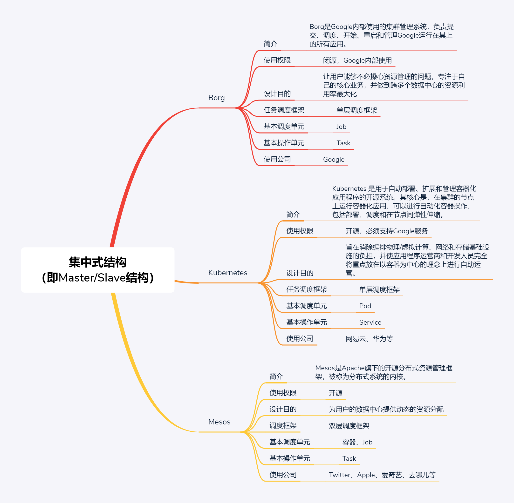
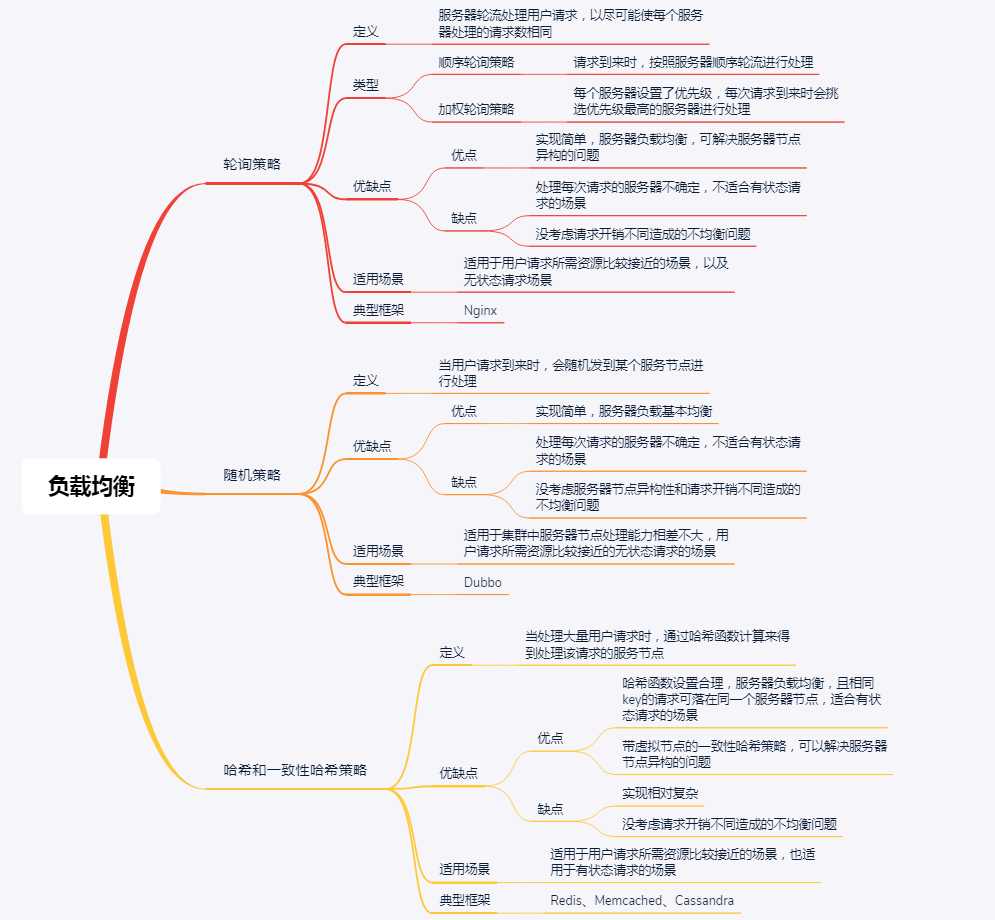

# Distributed System Architecture

# Distributed Coordination and Synchronization
## Consensus
* [Paxos](https://en.wikipedia.org/wiki/Paxos_(computer_science))
* 

## Election

## Mutex

## Mutex

## Transaction

# Distributed Resource Management & Load Balance
## Distributed Centralized Arch

## Distributed Non-centralized Arch

## Distributed Shared-state Schedule

## Distributed Single Schedule

## Distributed Two Level Schedule

# Distributed Computing
## Actor

## Assembly Line

## Map Reduce

## Stream

# Distributed Communication
## Message Queue

## Publish Subscribe

## Remote Procedure Call

# Distributed Storage
## Cache

## CAP

## Replication

## Partition

## Producer Cosumer Index Store

# Distributed High Avilability
## Fault Isolation

## Fault Recoverty

## Flow Control

## Load Balance

# Distributed Coordination and Synchronization

## Distributed Mutex

1. **Centralized Algorithm**
  Centralized algorithms are simple and easy to implement, but availability and performance are easily affected by coordinators.

2. **Distributed Algorithm**

    Distributed algorithms are suitable for systems with a small number of nodes and infrequent changes, and because each program requires communication and interaction, it is suitable for systems with P2P architecture.

    The distributed algorithm is a "first come, first served" and "vote all votes" fair access mechanism, but the communication cost is higher, the availability is lower than the centralized algorithm, it is suitable for critical resource use frequency is less, and the system scale is relatively Small scene.

3. **Token Ring Algorithm**

## Distributed Election

1. **Bully Algorithm**
  Priciple: select the node with maximum id as master node.

  Three types of messages:
  * Election: start a election
  * Alive: respond to an election
  * Victory: master broadcasts its sovereignty to other nodes

  Pre-condition: all nodes known ids of each other.

  Advantages:
    * fast to select, low complexity, easy to implement

  Disadvantages:
    * Every node needs to known global id information
    * The election can be frequent if a node with biggest id joins/exits the cluster after failure resume

2. **Raft Algorithm**
  The process of election:
  * In initialization, all nodes in **Follower** state
  * When starting to elect master, all nodes status turn from **Follower** to **Candidate**, and send a request to other nodes
  * According the order of received requests, other nodes reply whether they agree to become master, each node can only cast one vote in each election
  * If the election initializer gets more than half of the votes, it status turns from **Candidate** to **Leader**, other nodes status turn from **Candidate** to **Follower**
  * Heartbeat packets are periodically sent between Leader and Follower to detect whether the master node is alive. When the term of the master node is up, that is other nodes start the next election cycle, master node turns its status from Leader to Follower, and enters a new round election.

  Advantages:
  * fast to elect, low complexity, easy to implement

  Disadvantages:
  * Each node has to communicate with each other, master requires more than half of votes, so the communication volume is large.
  * It's stable than Bully, when a new node joins the cluster or after failure resume, it may trigger an election, but may not switch-off master node.

3. **ZAB(ZooKeeper Atomic Broadcast) Algorithm**
  Compared with Raft, ZAB adds data ID and node ID as reference to select the master node, the larger the data ID and node Data, the new the data and priority to become the master.

## Distributed Consensus
  Distributed Consensus is a process making all nodes agree on a certain state when each node can operate and record independently.

## Distributed Transaction
1. Two-phase commit protocol
  Disadvantage:
  * Synchronization blocking problem
  * Single point of failure
  * Data non-consistency problem

2. Three-phase commit protocol
  Three phases:
  * CanCommit
  * PreCommit
  * DoCommit

3. Eventual consistency based on messages
  Asynchronously execute the distributed transactions through messages or logs. Messages or logs can be stored in local files, databases, or message queues, and then retry failures through business rules.

## Distributed Mutual Exclusion
  1. Mutex based on database
    Use scenario: low concurrence, low performance, because of expensive IO operations.

  2. Mutex based on Redis

  3. Mutex basd on ZooKeeper

# Distributed High Avaialibity
## Load Banlance

## Flow Control

## Fault Isolation

## Recovery
