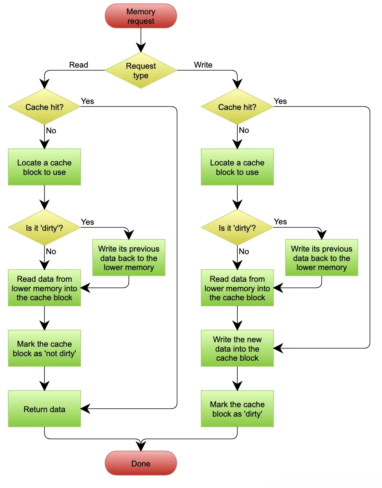

# Microservice


## Service Description
RESTfull API, XML, IDL

## Service Registry
1. Registry API
    1. Registor API
    2. Anti-Registor API
    3. Hearbeat Report API
    4. Service Subscript API
    5. Service Update API
    6. Service Get API
2. Cluster Deploy
3. Services Health Status Dectation
4. Service Status Change Notification
5. Whitelist

## Service Monitor
1. Monitor Object
    1. Client Monitor
    2. Interface Monitor
    3. Resource Monitor
    4. Infrastructure Monitor

2. Monitor Indicator
    1. QPS (Query Per Seconds)
    2. Response Time
    3. Failure Rate

3. Data Collection
    1. Servcie Activly Report
    2. Agent Collection
    3. Smapling Rate
4. Data Transmition
    1. UDP
    2. Kafka
    3. Binary Foramt: PB
    4. Text Foramt: JSON, XML
5. Data Process
    1. Aggragate by interface/machine
    2. Index DB, time series DB
6. Data Demonstration

7. Practice
    1. Beats, LogStash: Collect & Transform
    2. ElasticSearch: Search & Analyze
    3. Kibana: Visualize & Manager

## Service Track
[Dapper, a Large-Scale Distributed Systems Tracing Infrastructure](https://research.google/pubs/pub36356/)

## Service Governance
1. Nodes Management
    1. Remove by registry
    2. Remove by service consumer
2. Load balance
    1. Round-robin
    2. Weighted round-robin
    3. Least Active
    4. Consistent Hash
    5. Random

3. Service Routing
    1. Use case:
        * Nearby access
        * Grayscale release
        * Trafic switching
        * Read write separation
    2. Routing Rules:
        * Condition Routing:
            ```
            condition://0.0.0.0/dubbo.test.interfaces.TestService?category=routers&dynamic=true&priority=2&enabled=true&rule=" + URL.encode(" host = 10.20.153.10=> host = 10.20.153.11")
            ```
            * Exclude some service nodes
            * Whitelise and blacklist
            * IDC separation
            * Read write separation
        * Script Routing:
    3. Get Rule files:
        * Local configuration files
        * Configuration center
        * Dynamic delivery

4. Service Fault Tolerance
    1. FailOver: Automatic switching on failure
    2. FailBack: Notification on failure
    3. FailCache: Cache on failure
    4. FailFast

5. Service Health Management
    1. Heartbeat switch protection mechanism
        * Protect registry center against vast requests from client when network is unstable
    2. Service node removal protection mechanism
        * Protect registry center against removing all nodes when the network is unstable

6. Configuration Center
    1. Application:
        1. Resource Servicing
        2. Business dynamic degradation
        3. Packet traffic switching

## Service Spliting
1. Service Granularity
    1. Split by business logic
    2. Split by extensibility: stable and unstable
    3. Split by avilability
    4. Split by performance


## Service Communication
### Direct Client‑to‑Microservice Communication
* Cons: [:link: Ref](https://www.nginx.com/blog/building-microservices-using-an-api-gateway/)
    * One problem is the mismatch between the needs of the client and the fine‑grained APIs exposed by each of the microservices.
    * Some services might use protocols that are not web‑friendly. One service might use Thrift binary RPC while another service might use the AMQP messaging protocol. Neither protocol is particularly browser‑ or firewall‑friendly and is best used internally.
    * It makes it difficult to refactor the microservices.

### API Gateway
API Gateway is the single point of entry for the all the client requests. It acts like a reverse proxy that serves all the client traffic to the microservices in the cluster.

An API gateway takes all API calls from clients, then routes them to the appropriate microservice with request routing, composition, and protocol translation. Typically it handles a request by invoking multiple microservices and aggregating the results, to determine the best path. It can translate between web protocols and web‑unfriendly protocols that are used internally.

* Functionalities of API Gateway: [:link: Ref](https://medium.com/dev-genius/microservices-design-api-gateway-pattern-980e8d02bdd5)
    * Routing
        
        > Encapsulating the underlying system and decoupling from the clients, the gateway provides a single entry point for the client to communicate with the microservice system.
    * Offloading
        > API gateway consolidates the edge functionalities rather than making every microservices implementing them. Some of the functionalities are:
        * Identity Provider, Authentication and Authorization
        * Service discovery integration
        * Response caching
        * Retry policies, circuit breaker, and QoS
        * Rate limiting and throttling
        * Load balancing
        * Logging, tracing, correlation
        * Headers, query strings, and claims transformation
        * IP whitelisting
        * IAM
    * Centralized Logging (transaction ID across the servers, error logging)
    
* Advantages of the modified architecture with API Gateway: [:link: Ref](https://contextswitch.dev/microservices-patterns-1/)
    1. Every client is not required to be **aware of all the microservices** and the endpoints it needs to talk to. This gives the application team **flexibility** to eventually migrate out of a microservice , make modifications to existing services or create a new microservice.
    2. We can offload any **cross cutting concerns** like Authentication, Logging and Caching to this gateway layer. For instance, by allowing only Authenticated and Trusted client traffic to flow through the gateway to microservices. Also internal communication between the services can happen over a trusted private network without worrying about handling additional overhead like Authenticating the request and securing communications over SSL.
    3. It can also help with **API Composition** by querying multiple microservices and joining on the results to produce the final aggregated response.
    4. It can also act as a **Rate Limiter** by throttling requests coming from a client that has gone into a bad state, this helps in making the cluster more fault tolerant.

* Drawbacks of API Gateway [:link: Ref](https://www.nginx.com/blog/building-microservices-using-an-api-gateway/)
    * It is yet another highly available component that must be developed, deployed, and managed.
    * There is also a risk that the API Gateway becomes a development bottleneck.
    * Developers must update the API Gateway in order to expose each microservice’s endpoints.
    * It is important that the process for updating the API Gateway be as lightweight as possible. Otherwise, developers will be forced to wait in line in order to update the gateway.

* Service Mesh and API Gateway
    * It appears as though API gateways and service meshes solve the same problem and are therefore redundant. They do solve the same problem but in different contexts.
    * API gateway is deployed as a part of a business solution that is discoverable by the external clients handling north-south traffic(face external client).
    * Service mesh handles east-west traffic (among different microservices).


### Message Bus
* Advantages:
    1. Enables **decoupling** of the request producer from the request consumer giving them the flexibility to process requests at their own scale.
    2. Gives the **flexibility** for each microservice to **scale up and down** based on the bursts in traffic. Neither the producer nor the consumer need to worry about request throttling.
    3. Improves the overall **availability** and **fault tolerance** of the system as the producer is less concerned with handling failures from the consumer. Consumers can be rest assured that as long as the proper message payload is published to the Message Bus it will be processed eventually.

### Circuit Breaker
### CQRS (Command Query Response Segregation)

### Protocols of Asynchronous
* [MQTT](https://en.wikipedia.org/wiki/MQTT) — Message Queue Telemetry Transport (MQTT) is an ISO standard pub-sub based lightweight messaging protocol used widely in the [Internet Of Things](https://www.integrasources.com/blog/mqtt-protocol-iot-devices/).
* AMQP — Advanced Message Queuing Protocol (AMQP) is an open standard application layer protocol for message-oriented middleware.
* [STOMP](http://stomp.github.io/) — Simple Text Oriented Messaging Protocol, (STOMP), is a text-based protocol modeled on HTTP for interchanging data between services.

### References
* [Microservice Architecture — Communication & Design Patterns](https://medium.com/dev-genius/microservice-architecture-communication-design-patterns-70b37beec294)

## Microservices Design Pattern
### Saga Pattern — Maintaining Atomicity Across Multiple Services
A saga is a sequence of local transactions that updates each service and publishes a message/event to trigger the next local transaction. In case of failure of any of the local transactions, saga executes series of compensating transactions that undo changes made by preceding local transactions thereby preserving atomicity.

* Choreography Based saga — participants exchange events without a centralized point of control.
* Orchestration Based saga — a centralized controller tells the saga participants what local transactions to execute.
* 
* [Microsoft Safa](https://docs.microsoft.com/en-us/azure/architecture/reference-architectures/saga/saga)

### Event Sourcing — Alternative to State Oriented Persistence

### CQRS — Command Query Responsibility Segregation

### Transactional Outbox Pattern

### Change Data Capture (CDC)

### Considerations for Microservice Design
1. Idempotent Transactions
2. Eventual Consistency
3. Distributed Tracing
4. Service Mesh

## Authentication & Authorization

### Token Validation Microservice
[Token Validation Microservice](https://backstage.forgerock.com/docs/tvm/1/user-guide/)

* The Token Validation Microservice is to introspect and validate OAuth 2.0 access_tokens that adhere to either of the following IETF specifications:
    * [OAuth 2.0 Bearer Token Usage](https://tools.ietf.org/html/rfc6750)
    * [JSON Web Token (JWT) Profile for OAuth 2.0 Client Authentication and Authorization Grants](https://tools.ietf.org/html/rfc7523.txt)
* The Token Validation Microservice uses the introspection endpoint defined in RFC-7662, [OAuth 2.0 Token Introspection](https://tools.ietf.org/html/rfc7662).


1. A client requests access to Secured Microservice A, providing a stateful OAuth 2.0 access_token as credentials.
2. Secured Microservice A passes the access_token for validation to the Token Validation Microservice, using the /introspect endpoint.
3. The Token Validation Microservice requests the Authorization Server to validate the token.
4. The Authorization Server introspects the token, and sends the introspection result to the Token Validation Microservice.
5. The Token Validation Microservice caches the introspection result, and sends it to Secured Microservice A.
6. Secured Microservice A uses the introspection result to decide how to process the request. In this case it continues processing the request. Secured Microservice A asks for additional information from Secured Microservice B, providing the validated token as credentials.
7. Secured Microservice B passes the access_token to the Token Validation Microservice for validation, using the /introspect endpoint.
8. The Token Validation Microservice retrieves the introspection result from the cache, and sends it to Secured Microservice B.
9. Secured Microservice B uses the introspection result to decide how to process the request. In this case it passes its response to Secured Microservice A.
10. Secured Microservice A passes its response to the client.

* [Bringing Token state consistency to the Edge](https://charan-mann.medium.com/bringing-token-state-consistency-to-the-edge-eeaffc911b08)
* [ForgeRock: Identity Gateway](https://backstage.forgerock.com/docs/ig/7/gateway-guide/index.html#preface)


# High Performance Design
1. Read and write separation
    1. Duplication Delay
        1. After writing, the read operation routed to the master server
        2. If read slave server failed, read master.
        3. Only non-key business use read and write separation
    2. Allocation Mechanism
        1. Code encapsulation
        2. Middle-ware encapsulation
2. Database and table separation
    1. Business database separation
        * have join, transaction, cost issues
    2. Table separation
        1. vertical separation
            1. Split out not frequently used, occupy a lot of space columns
            2. The complexity comes from increasing the number of operations
        2. horizontal separation
            1. Suitable for very big tables, e.g., more than 50,000,000 rows
            2. Complexity: data routing(Range, Hash, Configuration), join, count, order by
3. Cache
    * Issues
        1. **Cache Penetration**: the data to be searched doesn't exist at DB and the returned empty result set is not cached as well and hence every search for the key will hit the DB eventually.
            1. Cache empty/null result
            2. Bloom filter

        2. **Cache breakdown**: the cached data expires and at the same time there are lots of search on the expired data which suddenly cause the searches to hit DB directly and increase the load to the DB layer dramatically.
            1. Use lock
            2. Asynchronous update

        3. **Cache avalanche**: lots of cached data expire at the same time or the cache service is down and all of a sudden all searches of these data will hit DB and cause high load to the DB layer and impact the performance.
            1. Using clusters to ensure that some cache server instance is in service at any point of time.
            2. Some other approaches like hystrix circuit breaker and rate limit can be configured so that the underlying system can still serve traffic and avoid high load
            3. Can adjust the expiration time for different keys so that they will not expire at the same time.

        4. **Cache hotspot**
    * Policies
        * Cache Aside
            * Miss: The application first fetches the data from the Cache, if not, fetches the data from the database, and puts it in the cache after success. 
            * Hit: The application fetches data from the Cache and returns after fetching it. 
            * Update: First save the data in the database, and then invalidate the cache after success.
        * Read/write Throught
            * 
        * Read/write Back
            * 
4. Load Balance
    1. DNS Load Balance: geographic-level
    2. Hardware Load Balance: cluster-level
    3. Software Load Balance: machine-level
        * [LVS: IP, TCP Layer](https://en.wikipedia.org/wiki/Linux_Virtual_Server)
        * [Nginx: Application Layer]()

# High Availability Design
1. High availability Storage Architecture
    1. Double Machine
        1. How master copys data to slave
        2. How slave detects health status of master
        3. How switch off when master down
    2. Cluster and Partition
        1. Need to consider data's: balance, fault tolerence, scalibility
        2. Data partition Ruls: by address location: state, country
        3. Data duplicaton: Centralized, mutual backup, independent
2. Live more in different places
    1. Key business first
    2. Make sure key data BASE
    3. Multiple sync methods: MSQ, read again, sync by storage system, back to source read, regenerate data
    4. Guarantee most user
3. Practice: Live more in different places
    1. Classify Business: highly visited business, core business, profitable business
    2. Classify Data: amount, uniqueness, lossability, recoverablity,
    3. Data sync: storage system sync, MSQ, regenerate
    4. Handle exception: multil-channel sync, log record, compensate user
4. Handle interface-level failure
    1. System degradation
    2. Circute break
    3. Flow limite
    4. Queue

# High Scalability Design
1. Split System
    1. Process-oriented split: split the entire business process into several stages, with each stage as a part.
    2. Service-oriented split: split the services provided by the system, each as a part.
    3. Function-oriented split: split the functions provided by the system, and each function as a part.
2. Architecture:
    1. Process-oriented split: layered architecture.
    2. Service-oriented split: SOA, microservices.
    3. Function-oriented split: microkernel architecture.

# Resilience Design
**Resilience** in microservices is the ability of recover from failures and return to the fully functional state. [:link: Ref](https://kellerwilliam.medium.com/introduction-fd326099e993)

It’s not about avoiding failures but responding to failures in a way that avoids downtime and data loss.

## Circuit Breaker
The initial state of a CB is **Closed**, what means that information is flowing from one service to another².

After an specific event occurrence (usually a certain amount of tries that result in error) the circuit goes to **OPEN** state, which means that the information flow is interrupted². It stays there for a certain amount of time or even until another criteria is reached². Thus, during this period every call to the function returns a circuit break error².

After this, the circuit goes to a **Half Open State**, when the function is called again it tries to contact the other service one more time². If it succeeds the CB goes to Closed state, otherwise it goes back to OPEN².


