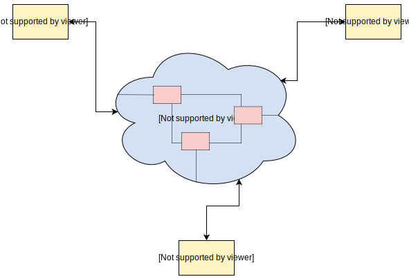

# 1. Before Getting Started
## Introduction

# 2. Introduction to Distributed Systems
## Getting Started
* What is a distributed system?

    According to Coulouris et al., **"A distributed system is a system whose components are located on different networked computers, which communicate and coordinate their actions by passing messages to one another."**

    The components of this system can be thought of as software programs that run on physical hardware, such as computers. These components take many forms; e.g., they can be web servers, routers, web browsers, etc. To keep a generic view, we assume that each program runs on a separate machine. We refer to each of these machines as a **node**.
    

    * Parts of a distributed system

        There are two categories of the central parts that help distributed systems function:
        * The various parts that compose a distributed system: These are located remotely and are separated by a network
        * The network that separates the various parts of a distributed system: It acts as a communication mechanism that lets them exchange messages.

* Why we need a distributed system
    There are three main benefits of distributed systems, as shown in the illustration below.
    

    * Performance

        According to Mohan et al., **"Performance is the degree to which a software system or component meets its objectives for timeliness."**

        * Problem with a single computer
            The physical constraints of its hardware impose certain limits on the performance of a single computer. Moreover, it is extremely expensive to improve a single computer’s performance after a certain point.

        * Solution

            We can achieve the same performance with two or more low-spec computers as with a single, high-end computer. So, distributed systems allow us to achieve better performance at a lower cost.

            > Note that better performance can translate to different things depending on the context, such as lower latency per request, higher throughput, etc.
    * Scalability

        According to Bondi et al., **"Scalability is the capability of a system, network, or process to handle a growing amount of work, or its potential to be enlarged to accommodate that growth."**

        * Problem with a single computer

            Data storage and processing are responsible for most of the value that software systems impart in the real world. As a system’s customer base grows, the system needs to handle more traffic and store larger amounts of data. However, a system that comprises a single computer can only scale up to a certain point, as explained earlier.

        * Solution

            If we build a distributed system, we can split and store the data in multiple computers, and distribute the processing work.

            > **Vertical scaling** refers to the approach of scaling a system by adding resources (memory, CPU, disk, etc.) to a single node. Meanwhile, **horizontal scaling** refers to the approach of scaling by adding more nodes to the system.

            As a result of this, we can scale our systems to sizes that we could not imagine with a single computer system.

    * Availability

        In the context of software systems, **availability is the probability of a system to work as required, when required, during a mission**.

        * Problem with a single computer

            Nowadays, most online services need to operate all the time (also known as "24/7 service"), which is a huge challenge. When a service states that it has five-nine availability, it usually operates 99.999% of the time. This implies that it can be down for only 5 minutes at most per year to satisfy this guarantee.

            If we consider how unreliable hardware can be, we can easily understand how big an undertaking this is. Of course, it would be infeasible to provide this kind of guarantee with a single computer.

        * Solution

            **Redundancy** is one of the widely used mechanisms to achieve higher availability. It refers to storing data into multiple, redundant computers. So, when one computer fails, we can efficiently switch to another one. This way, we’ll prevent our customers from experiencing this failure.

            Given that data are stored now in multiple computers, we end up with a distributed system!

            > If we leverage a distributed system, we get all of the above benefits. However, as we will see later on, there is tension between them and several other properties. So, in most cases, we have to make a trade-off. To do this, we must understand the basic constraints and limitations of distributed systems. The first part of this course will help us with this.

## Fallacies of Distributed Computing
* The difference in developing software for distributed systems

    Distributed systems are subject to many more constraints than software systems that run on a single computer. As a result, the development of software for distributed systems is also very different. However, those who are new to distributed systems make assumptions based on their experience with software development for systems that run on a single computer. Of course, this creates a lot of problems down the road in the systems they build.

    To eliminate this confusion and help people build better systems, L Peter Deutsch and others at Sun Microsystems created a collection of these false assumptions. These are [the fallacies of distributed computing](https://en.wikipedia.org/wiki/Fallacies_of_distributed_computing)

    

* Fallacies
    * The network is reliable

        The abstractions developers learn from various technologies and protocols often enforce this common fallacy. As we will see in a later chapter, networking protocols like TCP can make us believe that the network is reliable and never fails. However, this is just an illusion with significant repercussions. Also, we build network connections on top of hardware that will also fail at some point. Hence, we should design our systems accordingly.

    * Latency is zero

        Libraries that attempt to model remote procedure calls as local calls, such as gRPC or Thrift, enforce this assumption. We should always remember that there’s a large difference (from milliseconds to nanoseconds) in latency between a call to a remote system and that to local memory access. This gets even worse when we consider calls between data centers on different continents. Thus, this is another thing to keep in mind when deciding how to geo-distribute our system.

    * Bandwidth is infinite

        This fallacy is weaker nowadays. This is because the bandwidth we can achieve has significantly improved in the last few decades. For instance, we can now build high-bandwidth connections in our own data centers. However, this does not mean we can use all of it if our traffic needs to cross the Internet. This is important to consider when we make decisions about our distributed system’s topology, and when requests travel through the Internet.

    * The network is secure

        This fallacy shows that the wider network used by two nodes to communicate is not necessarily under their control. Thus, we should consider it insecure.

        The course dedicates a portion to security, where it explains the various techniques we can use to securely utilize an insecure network. This network also comprises many different parts that different organizations may manage with different hardware. Moreover, failures in some parts of this network may require us to change its topology to keep it functional.

        The following fallacies highlight this:
        * Topology doesn’t change
        * There is one administrator
        * The network is homogeneous

    * Transport cost is zero
        The transportation of data between two points incurs financial costs. We should factor this in when we build a distributed system.

* The global clock fallacy

    There’s one fallacy that’s not a part of the above set, but still often causes confusion amongst people new to distributed systems. If we follow the same style as above, we can phrase this fallacy as:
        > “Distributed systems have a global clock, which we can use to identify when events happen.”

    This assumption is quite deceiving since it’s somewhat intuitive and holds true even in non-distributed systems. For instance, an application that runs on a single computer can use the computer’s local clock to decide when events happen, and in what order. However, this is not true in a distributed system, where every node in the system has its own local clock that runs at a unique rate.

    While there are ways to keep the clocks in sync, some are very expensive and don’t completely eliminate these differences. [Physical laws](https://en.wikipedia.org/wiki/Time_dilation) also bind this limitation. An example of h is the TrueTime API built by Google, which exposes the clock uncertainty explicitly as a first-class citizen.

    > However, as we’ll see in the upcoming lessons that discuss cause and effects, there are other ways to reason about time using logical clocks.

## Difficulties Designing Distributed Systems
* Why distributed systems are hard to design

    In general, distributed systems are hard to design, build, and reason about. This increases the risk of error.

    > This will become more evident later in this course when we explore some algorithms that solve fundamental problems in distributed systems.

    It’s worth questioning this: why are distributed systems so hard to design? The answer to this question will help us eliminate our blind spots, and provide guidance on some aspects we should pay attention to.
    

    * Properties that make distributed systems challenging
        * Network asynchrony

            Network asynchrony is a property of communication networks that cannot provide strong guarantees around delivering events, e.g., a maximum amount of time a message requires for delivery. This can create a lot of counter-intuitive behaviors that are not present in non-distributed systems. This contrasts to memory operations that provide much [stricter guarantees](https://en.wikipedia.org/wiki/CAS_latency). For instance, messages might take extremely long to deliver in a distributed system. They may even deliver out of order—or not at all.

        * Partial failures

            Partial failures are the cases where only some components of a distributed system fail. This behavior can contrast with certain kinds of applications a single server deploys. These applications work under the assumption that either everything is working fine, or there has been a server crash. It introduces significant complexity when it requires atomicity across components in a distributed system. Thus, we must ensure that we either apply an operation to all the nodes of a system, or to none of them.
            

        * Concurrency

            Concurrency is the execution of multiple computations at the same time, and potentially on the same piece of data. These computations interleave with each other. This introduces additional complexity since these computations can interfere with each other and create unexpected behaviors. This is, again, in contrast to simplistic applications with no concurrency, where the program runs in the order the sequence of commands in the source code defined.

## Measures of Correctness in Distributed Systems
## System Models
## Types of Failures
## The Tale of Exactly-Once Semantics
## Failure in the World of Distributed Systems
## Stateless and Stateful Systems

# 3. Basic Concepts and Theorems
## Partitioning
## Algorithms for Horizontal Partitioning
## Replication
## Single-Master Replication Algorithm
## Multi-Master Replication Algorithm
## Quorums in Distributed Systems
## Safety Guarantees in Distributed Systems
## ACID Transactions
## The CAP Theorem
## Consistency Models
## CAP Theorem's Consistency Model
## Isolation Levels and Anomalies
## Prevention of Anomalies in Isolation Levels
## Consistency and Isolation
## Hierarchy of Models
## Why All the Formalities?

# 4. Distributed Transactions
## Introduction to Distributed Transactions

# 5. Achieving Isolation
## Achieving Serializability
## Pessimistic Concurrency Control (PCC)
## Optimistic Concurrency Control (OCC)
## Achieving Snapshot Isolation
## Achieving Full Serializable Snapshot Isolation

# 6. Achieving Atomicity
## Hard to Guarantee Atomicity
## 2-Phase Commit (2PC)
## 3-Phase Commit (3PC)
## Quorum-Based Commit Protocol

# 7. Concluding Distributed Transactions
## How It All Fits Together
## Long-Lived Transactions and Sagas
# 8. Consensus
## Defining the Consensus Problem
## FLP Impossibility
## The Paxos Algorithm
## Intricacies of Paxos
## Paxos in Real Life
## Replicated State Machine via Consensus
## Distributed Transactions via Consensus
## An introduction to Raft
## Communication among Raft Nodes
## Raft's Implementation
## Standing on the Shoulders of Giants

# 9. Time
## What is Different in a Distributed System?
## A Practical Perspective
## A Theoretical Perspective
## Logical Clocks

# 10. Order
## Total and Partial Ordering
## The Concept of Causality
## Lamport Clocks
## Vector Clocks
## Version Vectors
## Dotted Version Vectors
## Distributed Snapshot Problem
## Solving the Distributed Snapshot Problem
## Physical and Logical Time: Closing Thoughts

# 11. Networking
## Introduction
## The Physical Layer
## The Link Layer - Services
## The Link-Layer Protocols
## The Network Layer
## The Transport Layer
## The Application Layer
## Taking a Step Back

# 12. Security
## Introduction
## Authentication
## Confidentiality
## Integrity
## A Cryptography Primer
## Symmetric/Asymmetric Encryption and Digital Signatures

# 13. Security Protocols
## Transport Layer Security (TLS)
## Public-Key Infrastructure (PKI)
## Web of Trust (PGP)
## OAuth Protocol

# 14. From Theory to Practice
## Introduction
# 15. Case Study 1: Distributed File Systems
## Hadoop Distributed File System and Google File System
## Creating and Reading Files
## Writing and Deleting Files
## GFS Consistency Model

# 16. Case Study 2: Distributed Coordination Service
## Coordination Service
## Zookeeper
## Guarantees Provided by Zookeeper
## Zookeeper's ZAB Protocol
## Examples of Powerful Primitives by Zookeeper’s API

# 17. Case Study 3: Distributed Data Stores
## Introduction
## BigTable/HBase Architecture
## Appends and Read Operations in HBase
## Guarantees Provided by HBase
## Cassandra's Data Model
## Cassandra's Cluster Internode Communication
## Cassandra's Consistency Levels
## Linearizability Violations in Cassandra
## Linearizability Guarantees by Cassandra
## Cassandra Performing Queries Efficiently
## Spanner's Data Model
## Spanner's Architecture
## Spanner using TrueTime
## Spanner Operations
## FaunaDB

# 18. Case Study 4: Distributed Messaging System
## Introduction to Kafka
## Kafka Levers
## Kafka's Messaging Guarantees
## Transactions, Storage Layout, and other Guarantees

# 19. Case Study 5: Distributed Cluster Management
## Kubernetes
## Components of Master and Worker Nodes

# 20. Case Study 6: Distributed Ledger
## Introduction to Corda
## Corda's Data Model
## Corda's Architecture
## Backwards Compatibility provided by Corda

# 21. Case Study 7: Distributed Data Processing Systems
## Introduction
## Introduction to MapReduce
## MapReduce's Master-Worker Architecture
## Introduction to Apache Spark
## Stages of Digital Acrylic Graph (DAG) in Apache Spark
## Perks of Apache Spark
## Apache Flink
## Time and Watermarks in Flink
## Failure Recovery in Flink

# 22. Practices & Patterns
## Introduction

# 23. Communication Patterns
## Creating and Parsing Data
## Transfer of Data
## Datastores for Asynchronous Communication
## Communication Models

# 24. Coordination Patterns
## Coordination Patterns

# 25. Data Synchronization
## Data Synchronisation
## Event Sourcing

## Change Data Capture (CDC)
# 26. Shared-nothing Architectures
## Sharing Problems and their Solution
## Benefits and Drawbacks

# 27. Distributed Locking
## Leases in Distributed Systems
## Preventing Safety Risks in Leases

# 28. Compatibility Patterns
## Backwards Compatibility
## Maintaining Backwards Compatibility

# 29. Dealing with Failure
## Failure Handling Techniques
## Applying Failure Handling Techniques
## Retries
## Containing Impact of Failure
## Backpressure
## Reacting to Backpressure

# 30. Distributed Tracing
## Recording Program's Execution

# 31. Concluding this Course
## Recap of the Course
## Some More Things to Discover