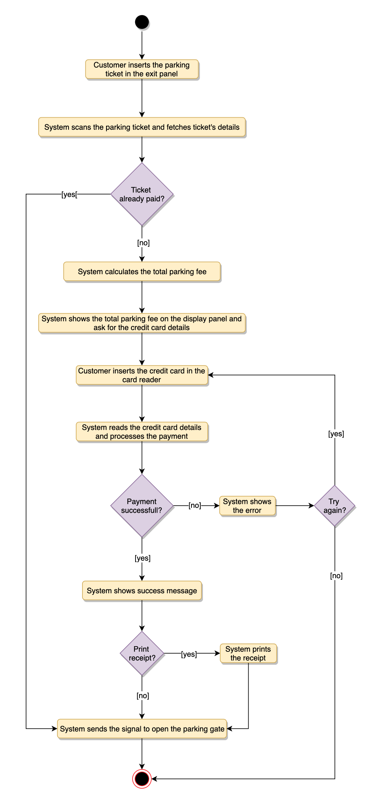

# Object-Oriented Design and UML

## Object-Oriented Basics
Object-oriented programming (OOP) is a style of programming that focuses on using objects to design and build applications. Contrary to procedure-oriented programming where programs are designed as blocks of statements to manipulate data, OOP organizes the program to combine data and functionality and wrap it inside something called an "Object".

If you have never used an object-oriented programming language before, you will need to learn a few basic concepts before you can begin writing any code. This chapter will introduce some basic concepts of OOP:

**Objects**: Objects represent a real-world entity and the basic building block of OOP. For example, an Online Shopping System will have objects such as shopping cart, customer, product item, etc.

**Class**: Class is the prototype or blueprint of an object. It is a template definition of the attributes and methods of an object. For example, in the Online Shopping System, the Customer object will have attributes like shipping address, credit card, etc., and methods for placing an order, canceling an order, etc.

The four principles of object-oriented programming are encapsulation, abstraction, inheritance, and polymorphism.

**Encapsulation**: Encapsulation is the mechanism of binding the data together and hiding it from the outside world. Encapsulation is achieved when each object keeps its state private so that other objects don’t have direct access to its state. Instead, they can access this state only through a set of public functions.

**Abstraction**: Abstraction can be thought of as the natural extension of encapsulation. It means hiding all but the relevant data about an object in order to reduce the complexity of the system. In a large system, objects talk to each other, which makes it difficult to maintain a large code base; abstraction helps by hiding internal implementation details of objects and only revealing operations that are relevant to other objects.

**Inheritance**: Inheritance is the mechanism of creating new classes from existing ones.

**Polymorphism**: Polymorphism (from Greek, meaning "many forms") is the ability of an object to take different forms and thus, depending upon the context, to respond to the same message in different ways. Take the example of a chess game; a chess piece can take many forms, like bishop, castle, or knight and all these pieces will respond differently to the ‘move’ message.

## OO Analysis and Design
OO Analysis and Design is a structured method for analyzing and designing a system by applying object-oriented concepts. This design process consists of an investigation into the objects constituting the system. It starts by first identifying the objects of the system and then figuring out the interactions between various objects.

* The process of OO analysis and design can be described as:
    * Identifying the objects in a system;
    * Defining relationships between objects;
    * Establishing the interface of each object;
    * Making a design, which can be converted to executables using OO languages.

We need a standard method/tool to document all this information; for this purpose we use UML. UML can be considered as the successor of object-oriented (OO) analysis and design. UML is powerful enough to represent all the concepts that exist in object-oriented analysis and design. UML diagrams are a representation of object-oriented concepts only. Thus, before learning UML, it is essential to understand OO concepts.

## What is UML?
UML stands for Unified Modeling Language and is used to model the Object-Oriented Analysis of a software system. UML is a way of visualizing and documenting a software system by using a collection of diagrams, which helps engineers, businesspeople, and system architects understand the behavior and structure of the system being designed.

* Benefits of using UML:
    * Helps develop a quick understanding of a software system.
    * UML modeling helps in breaking a complex system into discrete pieces that can be easily understood.
    * UML’s graphical notations can be used to communicate design decisions.
    * Since UML is independent of any specific platform or language or technology, it is easier to abstract out concepts.
    * It becomes easier to hand the system over to a new team.

Types of UML Diagrams: The current UML standards call for 14 different kinds of diagrams. These diagrams are organized into two distinct groups: structural diagrams and behavioral or interaction diagrams. As the names suggest, some UML diagrams analyze and depict the structure of a system or process, whereas others describe the behavior of the system, its actors, and its building components. The different types are broken down as follows:

* Structural UML diagrams
    * Class diagram
    * Object diagram
    * Package diagram
    * Component diagram
    * Composite structure diagram
    * Deployment diagram
    * Profile diagram

* Behavioral UML diagrams
    * Use case diagram
    * Activity diagram
    * Sequence diagram
    * State diagram
    * Communication diagram
    * Interaction overview diagram
    * Timing diagram

* In this course, we will be focusing on the following UML diagrams:
    * **Use Case Diagram**: Used to describe a set of user scenarios, this diagram, illustrates the functionality provided by the system.
    * **Class Diagram**: Used to describe structure and behavior in the use cases, this diagram provides a conceptual model of the system in terms of entities and their relationships.
    * **Activity Diagram**: Used to model the functional flow-of-control between two or more class objects.
    * **Sequence Diagram**: Used to describe interactions among classes in terms of an exchange of messages over time.

* UML Conventions
    * 

## Use Case Diagrams
Use case diagrams describe a set of actions (called use cases) that a system should or can perform in collaboration with one or more external users of the system (called actors). Each use case should provide some observable and valuable result to the actors.

* Use Case Diagrams describe the high-level functional behavior of the system.
* It answers what system does from the user point of view.
* Use case answers ‘What will the system do?’ and at the same time tells us ‘What will the system NOT do?’.

A use case illustrates a unit of functionality provided by the system. The primary purpose of the use case diagram is to help development teams visualize the functional requirements of a system, including the relationship of "actors" to the essential processes, as well as the relationships among different use cases.

To illustrate a use case on a use case diagram, we draw an oval in the middle of the diagram and put the name of the use case in the center of the oval. To show an actor (indicating a system user) on a use-case diagram, we draw a stick figure to the left or right of the diagram.

* The different components of the use case diagram are:
    * **System boundary**: A system boundary defines the scope and limits of the system. It is shown as a rectangle that spans all use cases of the system.
    * **Actors**: An actor is an entity who performs specific actions. These roles are the actual business roles of the users in a given system. An actor interacts with a use case of the system. For example, in a banking system, the customer is one of the actors.
    * **Use Case**: Every business functionality is a potential use case. The use case should list the discrete business functionality specified in the problem statement.
    * **Include**: Include relationship represents an invocation of one use case by another use case. From a coding perspective, it is like one function being called by another function.
    * **Extend**: This relationship signifies that the extended use case will work exactly like the base use case, except that some new steps will be inserted in the extended use case.

## Class Diagram
Class diagram is the backbone of object-oriented modeling - it shows how different entities (people, things, and data) relate to each other. In other words, it shows the static structures of the system.

A class diagram describes the attributes and operations of a class and also the constraints imposed on the system. Class diagrams are widely used in the modeling of object-oriented systems because they are the only UML diagrams that can be mapped directly to object-oriented languages.

* The purpose of the class diagram can be summarized as:
    * Analysis and design of the static view of an application;
    * To describe the responsibilities of a system;
    * To provide a base for component and deployment diagrams; and,
    * Forward and reverse engineering.

A class is depicted in the class diagram as a rectangle with three horizontal sections, as shown in the figure below. The upper section shows the class’s name (Flight), the middle section contains the properties of the class, and the lower section contains the class’s operations (or "methods").

* These are the different types of relationships between classes:
    * **Association**: If two classes in a model need to communicate with each other, there must be a link between them. This link can be represented by an association. Associations can be represented in a class diagram by a line between these classes with an arrow indicating the navigation direction.
        * By default, associations are always assumed to be bi-directional; this means that both classes are aware of each other and their relationship. In the diagram below, the association between Pilot and FlightInstance is bi-directional, as both classes know each other.
        * By contrast, in a uni-directional association, two classes are related - but only one class knows that the relationship exists. In the below example, only Flight class knows about Aircraft; hence it is a uni-directional association
    * **Multiplicity**: Multiplicity indicates how many instances of a class participate in the relationship. It is a constraint that specifies the range of permitted cardinalities between two classes. For example, in the diagram below, one FlightInstance will have two Pilots, while a Pilot can have many FlightInstances. A ranged multiplicity can be expressed as "0…*" which means "zero to many" or as "2…4" which means "two to four".
        * We can indicate the multiplicity of an association by adding multiplicity adornments to the line denoting the association. The below diagram, demonstrates that a FlightInstance has exactly two Pilots but a Pilot can have many FlightInstances.
    * **Aggregation**: Aggregation is a special type of association used to model a "whole to its parts" relationship. In a basic aggregation relationship, the lifecycle of a PART class is independent of the WHOLE class’s lifecycle. In other words, aggregation implies a relationship where the child can exist independently of the parent. In the above diagram, Aircraft can exist without Airline.
    * **Composition**: The composition aggregation relationship is just another form of the aggregation relationship, but the child class’s instance lifecycle is dependent on the parent class’s instance lifecycle. In other words, Composition implies a relationship where the child cannot exist independent of the parent. In the above example, WeeklySchedule is composed in Flight which means when Flight lifecycle ends, WeeklySchedule automatically gets destroyed.
    * **Generalization**: Generalization is the mechanism for combining similar classes of objects into a single, more general class. Generalization identifies commonalities among a set of entities. In the above diagram, Crew, Pilot, and Admin, all are Person.
    * **Dependency**: A dependency relationship is a relationship in which one class, the client, uses or depends on another class, the supplier. In the above diagram, FlightReservation depends on Payment.
    * **Abstract class**: An abstract class is identified by specifying its name in italics. In the above diagram, both Person and Account classes are abstract classes.

## Sequence diagram
Sequence diagrams describe `interactions among classes` in terms of an exchange of messages over time and are used to explore the logic of complex operations, functions or procedures. In this diagram, the sequence of interactions between the objects is represented in a step-by-step manner.

Sequence diagrams show a detailed flow for a specific use case or even just part of a particular use case. They are almost self-explanatory; they show the calls between the different objects in their sequence and can explain, at a detailed level, different calls to various objects.

A sequence diagram has two dimensions: The vertical dimension shows the sequence of messages in the chronological order that they occur; the horizontal dimension shows the object instances to which the messages are sent.

A sequence diagram is straightforward to draw. Across the top of your diagram, identify the class instances (objects) by putting each class instance inside a box (see below figure). If a class instance sends a message to another class instance, draw a line with an open arrowhead pointing to the receiving class instance and place the name of the message above the line. Optionally, for important messages, you can draw a dotted line with an arrowhead pointing back to the originating class instance; label the returned value above the dotted line.

## Activity Diagrams
We use Activity Diagrams to illustrate the `flow of control in a system`. An activity diagram shows the flow of control for a system functionality; it emphasizes the condition of flow and the sequence in which it happens. We can also use an activity diagram to refer to the steps involved in the execution of a use case.

Activity diagrams illustrate the dynamic nature of a system by modeling the flow of control from activity to activity. An activity represents an operation on some class in the system that results in a change in the state of the system. Typically, activity diagrams are used to model workflow or business processes and internal operations.

* What is the difference between Activity diagram and Sequence diagram?
    * **Activity diagram** captures the process flow. It is used for functional modeling. A functional model represents the flow of values from external inputs, through operations and internal data stores, to external outputs.
    * **Sequence diagram** tracks the interaction between the objects. It is used for dynamic modeling, which is represented by tracking states, transitions between states, and the events that trigger these transitions.

# Object Oriented Design Case Studies

## Design a Library Management System
### System Requirements
* We will focus on the following set of requirements while designing the Library Management System:
    * Any library member should be able to search books by their title, author, subject category as well by the publication date.Each book will have a unique identification number and other details including a rack number which will help to physically locate the book.
    * There could be more than one copy of a book, and library members should be able to check-out and reserve any copy. We will call each copy of a book, a book item.
    * The system should be able to retrieve information like who took a particular book or what are the books checked-out by a specific library member.
    * There should be a maximum limit (5) on how many books a member can check-out.
    * There should be a maximum limit (10) on how many days a member can keep a book.
    * The system should be able to collect fines for books returned after the due date.
    * Members should be able to reserve books that are not currently available.
    * The system should be able to send notifications whenever the reserved books become available, as well as when the book is not returned within the due date.
    * Each book and member card will have a unique barcode. The system will be able to read barcodes from books and members’ library cards.
    * Any library member should be able to search books by their title, author, subject category as well by the publication date.Each book will have a unique identification number and other details including a rack number which will help to physically locate the book.
    * There could be more than one copy of a book, and library members should be able to check-out and reserve any copy. We will call each copy of a book, a book item.
    * The system should be able to retrieve information like who took a particular book or what are the books checked-out by a specific library member.
    * There should be a maximum limit (5) on how many books a member can check-out.
    * There should be a maximum limit (10) on how many days a member can keep a book.
    * The system should be able to collect fines for books returned after the due date.
    * Members should be able to reserve books that are not currently available.
    * The system should be able to send notifications whenever the reserved books become available, as well as when the book is not returned within the due date.
    * Each book and member card will have a unique barcode. The system will be able to read barcodes from books and members’ library cards.

### Use case diagram
* We have three main actors in our system:
    * **Librarian**: Mainly responsible for adding and modifying books, book items, and users. The Librarian can also issue, reserve, and return book items.
    * **Member**: All members can search the catalog, as well as check-out, reserve, renew, and return a book.
    * **System**: Mainly responsible for sending notifications for overdue books, canceled reservations, etc.

* Here are the top use cases of the Library Management System:
    * **Add/Remove/Edit book**: To add, remove or modify a book or book item.
    * **Search catalog**: To search books by title, author, subject or publication date.
    * **Register new account/cancel membership**: To add a new member or cancel the membership of an existing member.
    * **Check-out book**: To borrow a book from the library.
    * **Reserve book**: To reserve a book which is not currently available.
    * **Renew a book**: To reborrow an already checked-out book.
    * **Return a book**: To return a book to the library which was issued to a member.

### Class diagram
* **Library**: The central part of the organization for which this software has been designed. It has attributes like ‘Name’ to distinguish it from any other libraries and ‘Address’ to describe its location.
* **Book**: The basic building block of the system. Every book will have ISBN, Title, Subject, Publishers, etc.
* **BookItem**: Any book can have multiple copies, each copy will be considered a book item in our system. Each book item will have a unique barcode.
* **Account**: We will have two types of accounts in the system, one will be a general member, and the other will be a librarian.
* **LibraryCard**: Each library user will be issued a library card, which will be used to identify users while issuing or returning books.
* **BookReservation**: Responsible for managing reservations against book items.
* **BookLending**: Manage the checking-out of book items.
* **Catalog**: Catalogs contain list of books sorted on certain criteria. Our system will support searching through four catalogs: Title, Author, Subject, and Publish-date.
* **Fine**: This class will be responsible for calculating and collecting fines from library members.
* **Author**: This class will encapsulate a book author.
* **Rack**: Books will be placed on racks. Each rack will be identified by a rack number and will have a location identifier to describe the physical location of the rack in the library.
* **Notification**: This class will take care of sending notifications to library members.

### Activity diagrams
* **Check-out a book**: Any library member or librarian can perform this activity. Here are the set of steps to check-out a book:
    * 
* **Return a book**: Any library member or librarian can perform this activity. The system will collect fines from members if they return books after the due date. Here are the steps for returning a book:
    * 
* **Renew a book**: While renewing (re-issuing) a book, the system will check for fines and see if any other member has not reserved the same book, in that case the book item cannot be renewed. Here are the different steps for renewing a book:
    * 

## Design a Parking Lot
A parking lot or car park is a dedicated cleared area that is intended for parking vehicles. In most countries where cars are a major mode of transportation, parking lots are a feature of every city and suburban area. Shopping malls, sports stadiums, megachurches, and similar venues often feature parking lots over large areas.

### System Requirements
The parking lot should have multiple floors where customers can park their cars.
The parking lot should have multiple entry and exit points.
* Customers can collect a parking ticket from the entry points and can pay the parking fee at the exit points on their way out.
* Customers can pay the tickets at the automated exit panel or to the parking attendant.
* Customers can pay via both cash and credit cards.
* Customers should also be able to pay the parking fee at the customer’s info portal on each floor. If the customer has paid at the info portal, they don’t have to pay at the exit.
* The system should not allow more vehicles than the maximum capacity of the parking lot. If the parking is full, the system should be able to show a message at the entrance panel and on the parking display board on the ground floor.
* Each parking floor will have many parking spots. The system should support multiple types of parking spots such as Compact, Large, Handicapped, Motorcycle, etc.
* The Parking lot should have some parking spots specified for electric cars. These spots should have an electric panel through which customers can pay and charge their vehicles.
* The system should support parking for different types of vehicles like car, truck, van, motorcycle, etc.
* Each parking floor should have a display board showing any free parking spot for each spot type.
* The system should support a per-hour parking fee model. For example, customers have to pay $4 for the first hour, $3.5 for the second and third hours, and $2.5 for all the remaining hours.

### Use case diagram
* Here are the main Actors in our system:
    * **Admin**: Mainly responsible for adding and modifying parking floors, parking spots, entrance, and exit panels, adding/removing parking attendants, etc.
    * **Customer**: All customers can get a parking ticket and pay for it.
    * **Parking attendant**: Parking attendants can do all the activities on the customer’s behalf, and can take cash for ticket payment.
    * **System**: To display messages on different info panels, as well as assigning and removing a vehicle from a parking spot.

* Here are the top use cases for Parking Lot:
    * **Add/Remove/Edit parking floor**: To add, remove or modify a parking floor from the system. Each floor can have its own display board to show free parking spots.
    * **Add/Remove/Edit parking spot**: To add, remove or modify a parking spot on a parking floor.
    * **Add/Remove a parking attendant**: To add or remove a parking attendant from the system.
    * **Take ticket**: To provide customers with a new parking ticket when entering the parking lot.
    * **Scan ticket**: To scan a ticket to find out the total charge.
    * **Credit card payment**: To pay the ticket fee with credit card.
    * **Cash payment**: To pay the parking ticket through cash.
    * **Add/Modify parking rate**: To allow admin to add or modify the hourly parking rate.

### Class diagram
* **ParkingLot**: The central part of the organization for which this software has been designed. It has attributes like ‘Name’ to distinguish it from any other parking lots and ‘Address’ to define its location.
* **ParkingFloor**: The parking lot will have many parking floors.
* **ParkingSpot**: Each parking floor will have many parking spots. Our system will support different parking spots 1) Handicapped, 2) Compact, 3) Large, 4) Motorcycle, and 5) Electric.
* **Account**: We will have two types of accounts in the system**: one for an Admin, and the other for a parking attendant.
* **Parking ticket**: This class will encapsulate a parking ticket. Customers will take a ticket when they enter the parking lot.
* **Vehicle**: Vehicles will be parked in the parking spots. Our system will support different types of vehicles 1) Car, 2) Truck, 3) Electric, 4) Van and 5) Motorcycle.
* **EntrancePanel and ExitPanel**: EntrancePanel will print tickets, and ExitPanel will facilitate payment of the ticket fee.
* **Payment**: This class will be responsible for making payments. The system will support credit card and cash transactions.
* **ParkingRate**: This class will keep track of the hourly parking rates. It will specify a dollar amount for each hour. For example, for a two hour parking ticket, this class will define the cost for the first and the second hour.
* **ParkingDisplayBoard**: Each parking floor will have a display board to show available parking spots for each spot type. This class will be responsible for displaying the latest availability of free parking spots to the customers.
* **ParkingAttendantPortal**: This class will encapsulate all the operations that an attendant can perform, like scanning tickets and processing payments.
* **CustomerInfoPortal**: This class will encapsulate the info portal that customers use to pay for the parking ticket. Once paid, the info portal will update the ticket to keep track of the payment.
* **ElectricPanel**: Customers will use the electric panels to pay and charge their electric vehicles.

### Activity diagrams
Customer paying for parking ticket: Any customer can perform this activity. Here are the set of steps:

## Design Amazon - Online Shopping System

### Requirements and Goals of the System
* Users should be able to add new products to sell.
* Users should be able to search for products by their name or category.
* Users can search and view all the products, but they will have to become a registered member to buy a product.
* Users should be able to add/remove/modify product items in their shopping cart.
* Users can check out and buy items in the shopping cart.
* Users can rate and add a review for a product.
* The user should be able to specify a shipping address where their order will be delivered.
* Users can cancel an order if it has not shipped.
* Users should get notifications whenever there is a change in the order or shipping status.
* Users should be able to pay through credit cards or electronic bank transfer.
* Users should be able to track their shipment to see the current state of their order.

### Use case Diagram
* We have four main Actors in our system:
    * Admin: Mainly responsible for account management and adding or modifying new product categories.
    * Guest: All guests can search the catalog, add/remove items to the shopping cart, as well as become registered members.
    * Member: Members can perform all the activities that guests can, in addition to which, they can place orders and add new products to sell.
    * System: Mainly responsible for sending notifications for orders and shipping updates.

* Here are the top use cases of the Online Shopping System:
    * Add/update products; whenever a product is added or modified, we will update the catalog.
    * Search for products by their name or category.
    * Add/remove product items in the shopping cart.
    * Check-out to buy product items in the shopping cart.
    * Make a payment to place an order.
    * Add a new product category.
    * Send notifications to members with shipment updates.

### Class diagram
* **Account**: There are two types of registered accounts in the system**: one will be an Admin, who is responsible for adding new product categories and blocking/unblocking members; the other, a Member, who can buy/sell products.
* **Guest**: Guests can search for and view products, and add them in the shopping cart. To place an order they have to become a registered member.
* **Catalog**: Users of our system can search for products by their name or category. This class will keep an index of all products for faster search.
* **ProductCategory**: This will encapsulate the different categories of products, such as books, electronics, etc.
* **Product**: This class will encapsulate the entity that the users of our system will be buying and selling. Each Product will belong to a ProductCategory.
* **ProductReview**: Any registered member can add a review about a product.
* **ShoppingCart**: Users will add product items that they intend to buy to the shopping cart.
* **Item**: This class will encapsulate a product item that the users will be buying or placing in the shopping cart. For example, a pen could be a product and if there are 10 pens in the inventory, each of these 10 pens will be considered a product item.
* **Order**: This will encapsulate a buying order to buy everything in the shopping cart.
* **OrderLog**: Will keep a track of the status of orders, such as unshipped, pending, complete, canceled, etc.
* **ShipmentLog**: Will keep a track of the status of shipments, such as pending, shipped, delivered, etc.
* **Notification**: This class will take care of sending notifications to customers.
* **Payment**: This class will encapsulate the payment for an order. Members can pay through credit card or electronic bank transfer.

### Activity Diagram
Following is the activity diagram for a user performing online shopping:

### Sequence Diagram
* Here is the sequence diagram for searching from the catalog:
    * 

* Here is the sequence diagram for adding an item to the shopping cart:
    * 

* Here is the sequence diagram for checking out to place an order:
    * 

## Design Stack Overflow
### Requirements and Goals of the System
* Any non-member (guest) can search and view questions. However, to add or upvote a question, they have to become a member.
* Members should be able to post new questions.
* Members should be able to add an answer to an open question.
* Members can add comments to any question or answer.
* A member can upvote a question, answer or comment.
* Members can flag a question, answer or comment, for serious problems or moderator attention.
* Any member can add a bounty to their question to draw attention.
* Members will earn badges for being helpful.
* Members can vote to close a question; Moderators can close or reopen any question.
* Members can add tags to their questions. A tag is a word or phrase that describes the topic of the question.
* Members can vote to delete extremely off-topic or very low-quality questions.
* Moderators can close a question or undelete an already deleted question.
* The system should also be able to identify most frequently used tags in the questions.

### Use-case Diagram
* We have five main actors in our system:
    * **Admin**: Mainly responsible for blocking or unblocking members.
    * **Guest**: All guests can search and view questions.
    * **Member**: Members can perform all activities that guests can, in addition to which they can add/remove questions, answers, and comments. Members can delete and un-delete their questions, answers or comments.
    * **Moderator**: In addition to all the activities that members can perform, moderators can close/delete/undelete any question.
    * **System**: Mainly responsible for sending notifications and assigning badges to members.

* Here are the top use cases for Stack Overflow:
    * Search questions.
    * Create a new question with bounty and tags.
    * Add/modify answers to questions.
    * Add comments to questions or answers.
    * Moderators can close, delete, and un-delete any question.

### Class diagram
* **Question**: This class is the central part of our system. It has attributes like Title and Description to define the question. In addition to this, we will track the number of times a question has been viewed or voted on. We should also track the status of a question, as well as closing remarks if the question is closed.
* **Answer**: The most important attributes of any answer will be the text and the view count. In addition to that, we will also track the number of times an answer is voted on or flagged. We should also track if the question owner has accepted an answer.
* **Comment**: Similar to answer, comments will have text, and view, vote, and flag counts. Members can add comments to questions and answers.
* **Tag**: Tags will be identified by their names and will have a field for a description to define them. We will also track daily and weekly frequencies at which tags are associated with questions.
* **Badge**: Similar to tags, badges will have a name and description.
* **Photo**: Questions or answers can have photos.
* **Bounty**: Each member, while asking a question, can place a bounty to draw attention. Bounties will have a total reputation and an expiry date.
* **Account**: We will have four types of accounts in the system, guest, member, admin, and moderator. Guests can search and view questions. Members can ask questions and earn reputation by answering questions and from bounties.
* **Notification**: This class will be responsible for sending notifications to members and assigning badges to members based on their reputations.

### Activity diagrams
Post a new question: Any member or moderator can perform this activity. Here are the steps to post a question:

### Sequence Diagram

## Design a Movie Ticket Booking System
### Requirements and Goals of the System
* It should be able to list the cities where affiliate cinemas are located.
* Each cinema can have multiple halls and each hall can run one movie show at a time.
* Each Movie will have multiple shows.
* Customers should be able to search movies by their title, language, genre, release date, and city name.
* Once the customer selects a movie, the service should display the cinemas running that movie and its available shows.
* The customer should be able to select a show at a particular cinema and book their tickets.
* The service should show the customer the seating arrangement of the cinema hall. The customer should be able to select multiple seats according to their preference.
* The customer should be able to distinguish between available seats and booked ones.
* The system should send notifications whenever there is a new movie, as well as when a booking is made or canceled.
* Customers of our system should be able to pay with credit cards or cash.
* The system should ensure that no two customers can reserve the same seat.
* Customers should be able to add a discount coupon to their payment.

### Use case diagram
* We have five main Actors in our system:
    * **Admin**: Responsible for adding new movies and their shows, canceling any movie or show, blocking/unblocking customers, etc.
    * **FrontDeskOfficer**: Can book/cancel tickets.
    * **Customer**: Can view movie schedules, book, and cancel tickets.
    * **Guest**: All guests can search movies but to book seats they have to become a registered member.
    * **System**: Mainly responsible for sending notifications for new movies, bookings, cancellations, etc.

* Here are the top use cases of the Movie Ticket Booking System:
    * **Search movies**: To search movies by title, genre, language, release date, and city name.
    * **Create/Modify/View booking**: To book a movie show ticket, cancel it or view details about the show.
    * **Make payment for booking**: To pay for the booking.
    * **Add a coupon to the payment**: To add a discount coupon to the payment.
    * **Assign Seat**: Customers will be shown a seat map to let them select seats for their booking.
    * **Refund payment**: Upon cancellation, customers will be refunded the payment amount as long as the cancellation occurs within the allowed time frame.

### Class diagram
* **Account**: Admin will be able to add/remove movies and shows, as well as block/unblock accounts. Customers can search for movies and make bookings for shows. FrontDeskOffice can book tickets for movie shows.
* **Guest**: Guests can search and view movies descriptions. To make a booking for a show they have to become a registered member.
* **Cinema**: The main part of the organization for which this software has been designed. It has attributes like ‘name’ to distinguish it from other cinemas.
* **CinemaHall**: Each cinema will have multiple halls containing multiple seats.
* **City**: Each city can have multiple cinemas.
* **Movie**: The main entity of the system. Movies have attributes like title, description, language, genre, release date, city name, etc.
* **Show**: Each movie can have many shows; each show will be played in a cinema hall.
* **CinemaHallSeat**: Each cinema hall will have many seats.
* **ShowSeat**: Each ShowSeat will correspond to a movie Show and a CinemaHallSeat. Customers will make a booking against a ShowSeat.
* **Booking**: A booking is against a movie show and has attributes like a unique booking number, number of seats, and status.
* **Payment**: Responsible for collecting payments from customers.
* **Notification**: Will take care of sending notifications to customers.

### Activity Diagram
Make a booking: Any customer can perform this activity. Here are the steps to book a ticket for a show:

Cancel a booking: Customer can cancel their bookings. Here are the steps to cancel a booking:

## Design an ATM
### Requirements and Goals of the System
* The main components of the ATM that will affect interactions between the ATM and its users are:
    * **Card reader**: to read the users’ ATM cards.
    * **Keypad**: to enter information into the ATM e.g. PIN. cards.
    * **Screen**: to display messages to the users.
    * **Cash dispenser**: for dispensing cash.
    * **Deposit slot**: For users to deposit cash or checks.
    * **Printer**: for printing receipts.
    * **Communication/Network Infrastructure**: it is assumed that the ATM has a communication infrastructure to communicate with the bank upon any transaction or activity.

* The user can have two types of accounts: 1) Checking, and 2) Savings, and should be able to perform the following five transactions on the ATM:
    * **Balance inquiry**: To see the amount of funds in each account.
    * **Deposit cash**: To deposit cash.
    * **Deposit check**: To deposit checks.
    * **Withdraw cash**: To withdraw money from their checking account.
    * **Transfer funds**: To transfer funds to another account.

### How ATM works?
The ATM will be managed by an operator, who operates the ATM and refills it with cash and receipts. The ATM will serve one customer at a time and should not shut down while serving. To begin a transaction in the ATM, the user should insert their ATM card, which will contain their account information. Then, the user should enter their Personal Identification Number (PIN) for authentication. The ATM will send the user’s information to the bank for authentication; without authentication, the user cannot perform any transaction/service.

The user’s ATM card will be kept in the ATM until the user ends a session. For example, the user can end a session at any time by pressing the cancel button, and the ATM Card will be ejected. The ATM will maintain an internal log of transactions that contains information about hardware failures; this log will be used by the ATM operator to resolve any issues.

* Identify the system user through their PIN.
* In the case of depositing checks, the amount of the check will not be added instantly to the user account; it is subject to manual verification and bank approval.
* It is assumed that the bank manager will have access to the ATM’s system information stored in the bank database.
* It is assumed that user deposits will not be added to their account immediately because it will be subject to verification by the bank.
* It is assumed the ATM card is the main player when it comes to security; users will authenticate themselves with their debit card and security pin.

### Use cases
* **Operator**: The operator will be responsible for the following operations:
    * Turning the ATM ON/OFF using the designated Key-Switch.
    * Refilling the ATM with cash.
    * Refilling the ATM’s printer with receipts.
    * Refilling the ATM’s printer with INK.
    * Take out deposited cash and checks.

* **Customer**: The ATM customer can perform the following operations:
    * Balance inquiry: the user can view his/her account balance.
    * Cash withdrawal: the user can withdraw a certain amount of cash.
    * Deposit funds: the user can deposit cash or checks.
    * Transfer funds: the user can transfer funds to other accounts.

* **Bank Manager**: The Bank Manager can perform the following operations:
    * Generate a report to check total deposits.
    * Generate a report to check total withdrawals.
    * Print total deposits/withdrawal reports.
    * Checks the remaining cash in the ATM.
    * Here is the use case diagram of our ATM system:

### Class diagram
* **ATM**: The main part of the system for which this software has been designed. It has attributes like ‘atmID’ to distinguish it from other available ATMs, and ‘location’ which defines the physical address of the ATM.
* **CardReader**: To encapsulate the ATM’s card reader used for user authentication.
* **CashDispenser**: To encapsulate the ATM component which will dispense cash.
* **Keypad**: The user will use the ATM’s keypad to enter their PIN or amounts.
* **Screen**: Users will be shown all messages on the screen and they will select different transactions by touching the screen.
* **Printer**: To print receipts.
* **DepositSlot**: User can deposit checks or cash through the deposit slot.
* **Bank**: To encapsulate the bank which ownns the ATM. The bank will hold all the account information and the ATM will communicate with the bank to perform customer transactions.
* **Account**: We’ll have two types of accounts in the system**: 1)Checking and 2)Saving.
* **Customer**: This class will encapsulate the ATM’s customer. It will have the customer’s basic information like name, email, etc.
* **Card**: Encapsulating the ATM card that the customer will use to authenticate themselves. Each customer can have one card.
* **Transaction**: Encapsulating all transactions that the customer can perform on the ATM, like BalanceInquiry, Deposit, Withdraw, etc.

### Activity Diagram
* Customer authentication: Following is the activity diagram for a customer authenticating themselves to perform an ATM transaction:
    * 

* Withdraw: Following is the activity diagram for a user withdrawing cash:
    * 

* Deposit check: Following is the activity diagram for the customer depositing a check:
    * 
* Transfer: Following is the activity diagram for a user transferring funds to another account:
    * 

### Sequence Diagram
Here is the sequence diagram for balance inquiry transaction:

## Design an Airline Management System
### System Requirements
* Customers should be able to search for flights for a given date and source/destination airport.
* Customers should be able to reserve a ticket for any scheduled flight. Customers can also build a multi-flight itinerary.
* Users of the system can check flight schedules, their departure time, available seats, arrival time, and other flight details.
* Customers can make reservations for multiple passengers under one itinerary.
* Only the admin of the system can add new aircrafts, flights, and flight schedules. Admin can cancel any pre-scheduled flight (all stakeholders will be notified).
* Customers can cancel their reservation and itinerary.
* The system should be able to handle the assignment of pilots and crew members to flights.
* The system should be able to handle payments for reservations.
* The system should be able to send notifications to customers whenever a reservation is made/modified or there is an update for their flights.

### Use case diagram
* We have five main Actors in our system:
    * **Admin** Responsible for adding new flights and their schedules, canceling any flight, maintaining staff-related work, etc.
    * **Front desk officer** Will be able to reserve/cancel tickets.
    * **Customer** Can view flight schedule, reserve and cancel tickets.
    * **Pilot/Crew** Can view their assigned flights and their schedules.
    * **System** Mainly responsible for sending notifications regarding itinerary changes, flight status updates, etc.

* Here are the top use cases of the Airline Management System:
    * **Search Flights**: To search the flight schedule to find flights for a suitable date and time.
    * **Create/Modify/View reservation**: To reserve a ticket, cancel it, or view details about the flight or ticket.
    * **Assign seats to passengers**: To assign seats to passengers for a flight instance with their reservation.
    * **Make payment for a reservation**: To pay for the reservation.
    * **Update flight schedule**: To make changes in the flight schedule, and to add or remove any flight.
    * **Assign pilots and crew**: To assign pilots and crews to flights.

### Class diagram
* **Airline**: The main part of the organization for which this software has been designed. It has attributes like ‘name’ and an airline code to distinguish the airline from other airlines.
* **Airport**: Each airline operates out of different airports. Each airport has a name, address, and a unique code.
* **Aircraft**: Airlines own or hire aircraft to carry out their flights. Each aircraft has attributes like name, model, manufacturing year, etc.
* **Flight**: The main entity of the system. Each flight will have a flight number, departure and arrival airport, assigned aircraft, etc.
* **FlightInstance**: Each flight can have multiple occurrences; each occurrence will be considered a flight instance in our system. For example, if a British Airways flight from London to Tokyo (flight number**: BA212) occurs twice a week, each of these occurrences will be considered a separate flight instance in our system.
* **WeeklySchedule and CustomSchedule**: Flights can have multiple schedules and each schedule will create a flight instance.
* **FlightReservation**: A reservation is made against a flight instance and has attributes like a unique reservation number, list of passengers and their assigned seats, reservation status, etc.
* **Itinerary**: An itinerary can have multiple flights.
* **FlightSeat**: This class will represent all seats of an aircraft assigned to a specific flight instance. All reservations of this flight instance will assign seats to passengers through this class.
* **Payment**: Will be responsible for collecting payments from customers.
* **Notification**: This class will be responsible for sending notifications for flight reservations, flight status update, etc.

### Activity diagrams
* Reserve a ticket: Any customer can perform this activity. Here are the steps to reserve a ticket:
    * 
* Cancel a reservation: Any customer can perform this activity. Here are the set of steps to cancel a reservation:
    * 

## Design Blackjack and a Deck of Cards
### System Requirements
Blackjack is played with one or more standard 52-card decks. The standard deck has 13 ranks in 4 suits.

* Background
    * To start with, the players and the dealer are dealt separate hands. Each hand has two cards in it.
    * The dealer has one card exposed (the up card) and one card concealed (the hole card), leaving the player with incomplete information about the state of the game.
    * The player’s objective is to make a hand that has more points than the dealer, but less than or equal to 21 points.
    * The player is responsible for placing bets when they are offered, and taking additional cards to complete their hand.
    * The dealer will draw additional cards according to a simple rule: when the dealer’s hand is 16 or less, they will draw cards (called a hit), when it is 17 or more, they will not draw additional cards (or stand pat).

* Points calculation
    * Blackjack has different point values for each of the cards:
    * The number cards (2-10) have the expected point values.
    * The face cards (Jack, Queen, and King) all have a value of 10 points.
    * The Ace can count as one point or eleven points. Because of this, an Ace and a 10 or face card totals 21. This two-card winner is called "blackjack".
    * When the points include an ace counting as 11, the total is called soft-total; when the ace counts as 1, the total is called hard-total. For example, A+5 can be considered a soft 16 or a hard 6.

* Gameplay
    * The player places an initial bet.
    * The player and dealer are each dealt a pair of cards.
    * Both of the player’s cards are face up, the dealer has one card up and one card down.
    * If the dealer’s card is an ace, the player is offered insurance.

* Initially, the player has a number of choices:
    * If the two cards are the same rank, the player can elect to split into two hands.
    * The player can double their bet and take just one more card.
    * The more typical scenario is for the player to take additional cards (a hit ) until either their hand totals more than 21 (they bust ), or their hand totals exactly 21, or they elect to stand.

If the player’s hand is over 21, their bet is resolved immediately as a loss. If the player’s hand is 21 or less, it will be compared to the dealer’s hand for resolution.

**Dealer has an Ace**. If the dealer’s up card is an ace, the player is offered an insurance bet. This is an additional proposition that pays 2:1 if the dealer’s hand is exactly 21. If this insurance bet wins, it will, in effect, cancel the loss of the initial bet. After offering insurance to the player, the dealer will check their hole card and resolve the insurance bets. If the hole card is a 10-point card, the dealer has blackjack, the card is revealed, and insurance bets are paid. If the hole card is not a 10-point card, the insurance bets are lost, but the card is not revealed.

**Split Hands**. When dealt two cards of the same rank, the player can split the cards to create two hands. This requires an additional bet on the new hand. The dealer will deal an additional card to each new hand, and the hands are played independently. Generally, the typical scenario described above applies to each of these hands.

* Bets
    * Ante: This is the initial bet and is mandatory to play.
    * Insurance: This bet is offered only when the dealer shows an ace. The amount must be half the ante.
    * Split: This can be thought of as a bet that is offered only when the player’s hand has two cards of equal rank. The amount of the bet must match the original ante.
    * Double: This can be thought of as a bet that is offered instead of taking an ordinary hit. The amount of the bet must match the original ante.

### Use case diagram
* We have two main Actors in our system:
    * Dealer: Mainly responsible for dealing cards and game resolution.
    * Player: Places the initial bets, accepts or declines additional bets - including insurance, and splits hands. Accepts or rejects the offered resolution, including even money. Chooses among hit, double and stand pat options.

* Here are the top use cases of the Blackjack game:
    * **Create Hands**: Initially both the player and the dealer are given two cards each. The player has both cards visible whereas only one card of the dealer’s hand is visible to the player.
    * **Place Bet**: To start the game, the player has to place a bet.
    * **Player plays the hand**: If the hand is under 21 points, the player has three options**:
        * **Hit**: The hand gets an additional card and this process repeats.
        * **Double Down**: The player creates an additional bet, and the hand gets one more card and play is done.
        * **Stands Pat**: If the hand is 21 points or over, or the player chooses to stand pat, the game is over.
        * **Resolve Bust**. If a hand is over 21, it is resolved as a loser.
    * **Dealer plays the hand**: The dealer keeps getting a new card if the total point value of the hand is 16 or less, and stops dealing cards at the point value of 17 or more.
        * **Dealer Bust**: If the dealer’s hand is over 21, the player’s wins the game. Player Hands with two cards totaling 21 ( "blackjack" ) are paid 3**:2, all other hands are paid 1**:1.
    * **Insurance**: If the dealer’s up card is an Ace, then the player is offered insurance**:
        * **Offer Even Money**: If the player’s hand totals to a soft 21, a blackjack; the player is offered an even money resolution. If the player accepts, the entire game is resolved at this point. The ante is paid at even money; there is no insurance bet.
        * **Offer Insurance**: The player is offered insurance, which they can accept by creating a bet. For players with blackjack, this is the second offer after even money is declined. If the player declines, there are no further insurance considerations.
        * **Examine Hole Card**: The dealer’s hole card is examined. If it has a 10-point value, the insurance bet is resolved as a winner, and the game is over. Otherwise, the insurance is resolved as a loser, the hole card is not revealed, and play continues.
    * **Split**: If the player’s hand has both cards of equal rank, the player is offered a split. The player accepts by creating an additional Bet. The original hand is removed; The two original cards are split and then the dealer deals two extra cards to create two new Hands. There will not be any further splitting.
    * **Game Resolution**: The Player’s Hand is compared against the Dealer’s Hand, and the hand with the higher point value wins. In the case of a tie, the bet is returned. When the player wins, a winning hand with two cards totaling 21 ("blackjack") is paid 3:2, any other winning hand is paid 1:1.

### Class diagram
* **Card**: A standard playing card has a suit and point value from 1 to 11.
* **BlackjackCard**: In blackjack, cards have different face values. For example, jack, queen, and king, all have a face value of 10. An ace can be counted as either 1 or 11.
* **Deck**: A standard playing card deck has 52 cards and 4 suits.
* **Shoe**: Contains a set of decks. In casinos, a dealer’s shoe is a gaming device to hold multiple decks of playing cards.
* **Hand**: A collection of cards with one or two point values: a hard value (when an ace counts as 1) and a soft value (when an ace counts as 11).
* **Player**: Places the initial bets, updates the stake with amounts won and lost. Accepts or declines offered additional bets - including insurance, and split hands. Accepts or declines offered resolution, including even money. Chooses between hit, double and stand options.
* **Game**: This class encapsulates the basic sequence of play. It runs the game, offers bets to players, deals the cards from the shoe to hands, updates the state of the game, collects losing bets, pays winning bets, splits hands, and responds to player choices of a hit, double or stand.

### Activity diagrams
Blackjack hit or stand: Here are the set of steps to play blackjack with hit or stand:

## Design a Hotel Management System
### System Requirements
* The system should support the booking of different room types like standard, deluxe, family suite, etc.
* Guests should be able to search the room inventory and book any available room.
* The system should be able to retrieve information, such as who booked a particular room, or what rooms were booked by a specific customer.
* The system should allow customers to cancel their booking - and provide them with a full refund if the cancelation occurs before 24 hours of the check-in date.
* The system should be able to send notifications whenever the booking is nearing the check-in or check-out date.
* The system should maintain a room housekeeping log to keep track of all housekeeping tasks.
* Any customer should be able to add room services and food items.
* Customers can ask for different amenities.
* The customers should be able to pay their bills through credit card, check or cash.

### Use case diagram
* Here are the main Actors in our system:
    * **Guest**: All guests can search the available rooms, as well as make a booking.
    * **Receptionist**: Mainly responsible for adding and modifying rooms, creating room bookings, check-in, and check-out customers.
    * **System**: Mainly responsible for sending notifications for room booking, cancellation, etc.
    * **Manager**: Mainly responsible for adding new workers.
    * **Housekeeper**: To add/modify housekeeping record of rooms.
    * **Server**: To add/modify room service record of rooms.

* Here are the top use cases of the Hotel Management System:
    * **Add/Remove/Edit room**: To add, remove, or modify a room in the system.
    * **Search room**: To search for rooms by type and availability.
    * **Register or cancel an account**: To add a new member or cancel the membership of an existing member.
    * **Book room**: To book a room.
    * **Check-in**: To let the guest check-in for their booking.
    * **Check-out**: To track the end of the booking and the return of the room keys.
    * **Add room charge**: To add a room service charge to the customer’s bill.
    * **Update housekeeping log**: To add or update the housekeeping entry of a room.

### Class diagram
* **Hotel and HotelLocation**: Our system will support multiple locations of a hotel.
* **Room**: The basic building block of the system. Every room will be uniquely identified by the room number. Each Room will have attributes like Room Style, Booking Price, etc.
* **Account**: We will have different types of accounts in the system: one will be a guest to search and book rooms, another will be a receptionist. Housekeeping will keep track of the housekeeping records of a room, and a Server will handle room service.
* **RoomBooking**: This class will be responsible for managing bookings for a room.
* **Notification**: Will take care of sending notifications to guests.
* **RoomHouseKeeping**: To keep track of all housekeeping records for rooms.
* **RoomCharge**: Encapsulates the details about different types of room services that guests have requested.
* **Invoice**: Contains different invoice-items for every charge against the room.
* **RoomKey**: Each room can be assigned an electronic key card. Keys will have a barcode and will be uniquely identified by a key-ID.

### Activity diagrams
* Make a room booking: Any guest or receptionist can perform this activity. Here are the set of steps to book a room:
    * 
* Check in: Guest will check in for their booking. The Receptionist can also perform this activity. Here are the steps:
    * 
* Cancel a booking: Guest can cancel their booking. Receptionist can perform this activity. Here are the different steps of this activity:
    * 

## Design a Restaurant Management system
### System Requirements
* The restaurant will have different branches.
* Each restaurant branch will have a menu.
* The menu will have different menu sections, containing different menu items.
* The waiter should be able to create an order for a table and add meals for each seat.
* Each meal can have multiple meal items. Each meal item corresponds to a menu item.
* The system should be able to retrieve information about tables currently available to seat walk-in customers.
* The system should support the reservation of tables.
* The receptionist should be able to search for available tables by date/time and reserve a table.
* The system should allow customers to cancel their reservation.
* The system should be able to send notifications whenever the reservation time is approaching.
* The customers should be able to pay their bills through credit card, check or cash.
* Each restaurant branch can have multiple seating arrangements of tables.

### Use case diagram
* * Here are the main Actors in our system:
    * **Receptionist**: Mainly responsible for adding and modifying tables and their layout, and creating and canceling table reservations.
    * **Waiter**: To take/modify orders.
    * **Manager**: Mainly responsible for adding new workers and modifying the menu.
    * **Chef**: To view and work on an order.
    * **Cashier**: To generate checks and process payments.
    * **System**: Mainly responsible for sending notifications about table reservations, cancellations, etc.

* Here are the top use cases of the Restaurant Management System:
    * **Add/Modify tables**: To add, remove, or modify a table in the system.
    * **Search tables**: To search for available tables for reservation.
    * **Place order**: Add a new order in the system for a table.
    * **Update order**: Modify an already placed order, which can include adding/modifying meals or meal items.
    * **Create a reservation**: To create a table reservation for a certain date/time for an available table.
    * **Cancel reservation**: To cancel an existing reservation.
    * **Check-in**: To let the guest check in for their reservation.
    * **Make payment**: Pay the check for the food.

### Class diagram
* **Restaurant**: This class represents a restaurant. Each restaurant has registered employees. The employees are part of the restaurant because if the restaurant becomes inactive, all its employees will automatically be deactivated.
* **Branch**: Any restaurants can have multiple branches. Each branch will have its own set of employees and menus.
* **Menu**: All branches will have their own menu.
* **MenuSection and MenuItem**: A menu has zero or more menu sections. Each menu section consists of zero or more menu items.
* **Table and TableSeat**: The basic building block of the system. Every table will have a unique identifier, maximum sitting capacity, etc. Each table will have multiple seats.
* **Order**: This class encapsulates the order placed by a customer.
* **Meal**: Each order will consist of separate meals for each table seat.
* **Meal Item**: Each Meal will consist of one or more meal items corresponding to a menu item.
* **Account**: We’ll have different types of accounts in the system, one will be a receptionist to search and reserve tables and the other, the waiter will place orders in the system.
* **Notification**: Will take care of sending notifications to customers.
* **Bill**: Contains different bill-items for every meal item.

### Activity diagrams
* **Place order**: Any waiter can perform this activity. Here are the steps to place an order:
    * 
* **Make a reservation**: Any receptionist can perform this activity. Here are the steps to make a reservation:
    * 

* **Cancel a reservation**: Any receptionist can perform this activity. Here are the steps to cancel a reservation:
    * 

## Design Chess
### System Requirements
* We’ll focus on the following set of requirements while designing the game of chess:
* The system should support two online players to play a game of chess.
* All rules of international chess will be followed.
* Each player will be randomly assigned a side, black or white.
* Both players will play their moves one after the other. The white side plays the first move.
* Players can’t cancel or roll back their moves.
* The system should maintain a log of all moves by both players.
* Each side will start with 8 pawns, 2 rooks, 2 bishops, 2 knights, 1 queen, and 1 king.
* The game can finish either in a checkmate from one side, forfeit or stalemate (a draw), or resignation.

### Use case diagram
* We have two actors in our system:
    * Player: A registered account in the system, who will play the game. The player will play chess moves.
    * Admin: To ban/modify players.

* Here are the top use cases for chess:
    * Player moves a piece: To make a valid move of any chess piece.
    * Resign or forfeit a game: A player resigns from/forfeits the game.
    * Register new account/Cancel membership: To add a new member or cancel an existing member.
    * Update game log: To add a move to the game log.

### Class diagram
* **Player**: Player class represents one of the participants playing the game. It keeps track of which side (black or white) the player is playing.
* **Account**: We’ll have two types of accounts in the system**: one will be a player, and the other will be an admin.
* **Game**: This class controls the flow of a game. It keeps track of all the game moves, which player has the current turn, and the final result of the game.
* **Box**: A box represents one block of the 8x8 grid and an optional piece.
* **Board**: Board is an 8x8 set of boxes containing all active chess pieces.
* **Piece**: The basic building block of the system, every piece will be placed on a box. This class contains the color the piece represents and the status of the piece (that is, if the piece is currently in play or not). This would be an abstract class and all game pieces will extend it.
* **Move**: Represents a game move, containing the starting and ending box. The Move class will also keep track of the player who made the move, if it is a castling move, or if the move resulted in the capture of a piece.
* **GameController**: Player class uses GameController to make moves.
* **GameView**: Game class updates the GameView to show changes to the players.

### Activity diagrams
* Make move: Any Player can perform this activity. Here are the set of steps to make a move:
    * 

## Design an Online Stock Brokerage System
### System Requirements
* Any user of our system should be able to buy and sell stocks.
* Any user can have multiple watchlists containing multiple stock quotes.
* Users should be able to place stock trade orders of the following types**: 1) market, 2) limit, 3) stop loss and, 4) stop limit.
* Users can have multiple ‘lots’ of a stock. This means that if a user has bought a stock multiple times, the system should be able to differentiate between different lots of the same stock.
* The system should be able to generate reports for quarterly updates and yearly tax statements.
* Users should be able to deposit and withdraw money either via check, wire, or electronic bank transfer.
* The system should be able to send notifications whenever trade orders are executed.

### Usecase diagram
* We have three main Actors in our system:
    * **Admin**: Mainly responsible for administrative functions like blocking or unblocking members.
    * **Member**: All members can search the stock inventory, as well as buy and sell stocks. Members can have multiple watchlists containing multiple stock quotes.
    * **System**: Mainly responsible for sending notifications for stock orders and periodically fetching stock quotes from the stock exchange.

* Here are the top use cases of the Stock Brokerage System:
    * **Register new account/Cancel membership**: To add a new member or cancel the membership of an existing member.
    * **Add/Remove/Edit watchlist**: To add, remove or modify a watchlist.
    * **Search stock inventory**: To search for stocks by their symbols.
    * **Place order**: To place a buy or sell order on the stock exchange.
    * **Cancel order**: Cancel an already placed order.
    * **Deposit/Withdraw money**: Members can deposit or withdraw money via check, wire or electronic bank transfer.

### Class diagram
* **Account**: Consists of the member’s name, address, e-mail, phone, total funds, funds that are available for trading, etc. We’ll have two types of accounts in the system**: one will be a general member, and the other will be an Admin. The Account class will also contain all the stocks the member is holding.
* **StockExchange**: The stockbroker system will fetch all stocks and their current prices from the stock exchange. StockExchange will be a singleton class encapsulating all interactions with the stock exchange. This class will also be used to place stock trading orders on the stock exchange.
* **Stock**: The basic building block of the system. Every stock will have a symbol, current trading price, etc.
* **StockInventory**: This class will fetch and maintain the latest stock prices from the StockExchange. All system components will read the most recent stock prices from this class.
* **Watchlist**: A watchlist will contain a list of stocks that the member wants to follow.
* **Order**: Members can place stock trading orders whenever they would like to sell or buy stock positions. The system would support multiple types of orders:
    * **Market Order**: Market order will enable users to buy or sell stocks immediately at the current market price.
    * **Limit Order**: Limit orders will allow a user to set a price at which they want to buy or sell a stock.
    * **Stop Loss Order**: An order to buy or sell once the stock reaches a certain price.
    * **Stop Limit Order**: The stop-limit order will be executed at a specified price or better after a given stop price has been reached. Once the stop price is reached, the stop-limit order becomes a limit order to buy or sell at the limit price or better.
* **OrderPart**: An order could be fulfilled in multiple parts. For example, a market order to buy 100 stocks could have one part containing 70 stocks at $10 and another part with 30 stocks at $10.05.
* **StockLot**: Any member can buy multiple lots of the same stock at different times. This class will represent these individual lots. For example, the user could have purchased 100 shares of AAPL yesterday and 50 more stocks of AAPL today. While selling, users will be able to select which lot they want to sell first.
* **StockPosition**: This class will contain all the stocks that the user holds.
* **Statement**: All members will have reports for quarterly updates and yearly tax statements.
* **DepositMoney & WithdrawMoney**: Members will be able to move money through check, wire or electronic bank transfers.
* **Notification**: Will take care of sending notifications to members.

### Activity diagrams
* **Place a buy order**: Any system user can perform this activity. Here are the steps to place a buy order:
    * 
* **Place a sell order**: Any system user can perform this activity. Here are the steps to place a buy order:
    * 

## Design a Car Rental System
A Car Rental System is a software built to handle the renting of automobiles for a short period of time, generally ranging from a few hours to a few weeks. A car rental system often has numerous local branches (to allow its user to return a vehicle to a different location), and primarily located near airports or busy city areas.

### System Requirements
* We will focus on the following set of requirements while designing our Car Rental System:
* The system will support the renting of different automobiles like cars, trucks, SUVs, vans, and motorcycles.
* Each vehicle should be added with a unique barcode and other details, including a parking stall number which helps to locate the vehicle.
* The system should be able to retrieve information like which member took a particular vehicle or what vehicles have been rented out by a specific member.
* The system should collect a late-fee for vehicles returned after the due date.
* Members should be able to search the vehicle inventory and reserve any available vehicle.
* The system should be able to send notifications whenever the reservation is approaching the pick-up date, as well as when the vehicle is nearing the due date or has not been returned within the due date.
* The system will be able to read barcodes from vehicles.
* Members should be able to cancel their reservations.
* The system should maintain a vehicle log to track all events related to the vehicles.
* Members can add rental insurance to their reservation.
* Members can rent additional equipment, like navigation, child seat, ski rack, etc.
* Members can add additional services to their reservation, such as roadside assistance, additional driver, wifi, etc.

### Use case diagram
* We have four main Actors in our system:
    * **Receptionist**: Mainly responsible for adding and modifying vehicles and workers. Receptionists can also reserve vehicles.
    * **Member**: All members can search the catalog, as well as reserve, pick-up, and return a vehicle.
    * **System**: Mainly responsible for sending notifications about overdue vehicles, canceled reservation, etc.
    * **Worker**: Mainly responsible for taking care of a returned vehicle and updating the vehicle log.

* Here are the top use cases of the Car Rental System:
    * **Add/Remove/Edit vehicle**: To add, remove or modify a vehicle.
    * **Search catalog**: To search for vehicles by type and availability.
    * **Register new account/Cancel membership**: To add a new member or cancel an existing membership.
    * **Reserve vehicle**: To reserve a vehicle.
    * **Check-out vehicle**: To rent a vehicle.
    * **Return a vehicle**: To return a vehicle which was checked-out to a member.
    * **Add equipment**: To add an equipment to a reservation like navigation, child seat, etc.
    * **Update car log**: To add or update a car log entry, such as refueling, cleaning, damage, etc.

### Class diagram
* **CarRentalSystem**: The main part of the organization for which this software has been designed.
* **CarRentalLocation**: The car rental system will have multiple locations, each location will have attributes like ‘Name’ to distinguish it from any other locations and ‘Address’ which defines the address of the rental location.
* **Vehicle**: The basic building block of the system. Every vehicle will have a barcode, license plate number, passenger capacity, model, make, mileage, etc. Vehicles can be of multiple types, like car, truck, SUV, etc.
* **Account**: Mainly, we will have two types of accounts in the system, one will be a general member and the other will be a receptionist. Another account can be of the worker taking care of the returned vehicle.
* **VehicleReservation**: This class will be responsible for managing reservations for a vehicle.
* **Notification**: Will take care of sending notifications to members.
* **VehicleLog**: To keep track of all the events related to a vehicle.
* **RentalInsurance**: Stores details about the various rental insurances that members can add to their reservation.
* **Equipment**: Stores details about the various types of equipment that members can add to their reservation.
* **Service**: Stores details about the various types of service that members can add to their reservation, such as additional drivers, roadside assistance, etc.
* **Bill**: Contains different bill-items for every charge for the reservation.

### Activity diagrams
* Pick up a vehicle: Any member can perform this activity. Here are the steps to pick up a vehicle:
    * 
* Return a vehicle: Any worker can perform this activity. While returning a vehicle, the system must collect a late fee from the member if the return date is after the due date. Here are the steps for returning a vehicle:
    * 

## Design LinkedIn
### System Requirements
* Each member should be able to add information about their basic profile, experiences, education, skills, and accomplishments.
* Any user of our system should be able to search for other members or companies by their name.
* Members should be able to send or accept connection requests from other members.
* Any member will be able to request a recommendation from other members.
* The system should be able to show basic stats about a profile, like the number of profile views, the total number of connections, and the total number of search appearances of the profile.
* Members should be able to create new posts to share with their connections.
* Members should be able to add comments to posts, as well as like or share a post or comment.
* Any member should be able to send messages to other members.
* The system should send a notification to a member whenever there is a new message, connection invitation or a comment on their post.
* Members will be able to create a page for a Company and add job postings.
* Members should be able to create groups and join any group they like.
* Members should be able to follow other members or companies.

### Use case diagram
* We have three main Actors in our system:
    * **Member**: All members can search for other members, companies or jobs, as well as send requests for connection, create posts, etc.
    * **Admin**: Mainly responsible for admin functions such as blocking and unblocking a member, etc.
    * **System**: Mainly responsible for sending notifications for new messages, connections invites, etc.

* Here are the top use cases of our system:
* **Add/update profile**: Any member should be able to create their profile to reflect their experiences, education, skills, and accomplishments.
* **Search**: Members can search other members, companies or jobs. Members can send a connection request to other members.
* **Follow or Unfollow member or company**: Any member can follow or unfollow any other member or a company.
* **Send message**: Any member can send a message to any of their connections.
* **Create post**: Any member can create a post to share with their connections, as well as like other posts or add comments to any post.
* **Send notifications**: The system will be able to send notifications for new messages, connection invites, etc.

### Class diagram
* **Member**: This will be the main component of our system. Each member will have a profile which includes their Experiences, Education, Skills, Accomplishments, and Recommendations. Members will be connected to other members and they can follow companies and members. Members will also have suggestions to make connections with other members.
* **Search**: Our system will support searching for other members and companies by their names, and jobs by their titles.
* **Message**: Members can send messages to other members with text and media.
* **Post**: Members can create posts containing text and media.
* **Comment**: Members can add comments to posts as well as like them.
* **Group**: Members can create and join groups.
* **Company**: Company will store all the information about a company’s page.
* **JobPosting**: Companies can create a job posting. This class will handle all information about a job.
* **Notification**: Will take care of sending notifications to members.

### Activity diagrams
* Add experience to profile: Any LinkedIn member can perform this activity. Here are the steps to add experience to a member profile:
    * 
* Send message: Any Member can perform this activity. After sending a message, the system needs to send a notification to all the requested members. Here are the steps for sending a message:
    * 

## Design Cricinfo
### System Requirements
* The system should keep track of all cricket-playing teams and their matches.
* The system should show live ball-by-ball commentary of cricket matches.
* All international cricket rules should be followed.
* Any team playing a tournament will announce a squad (a set of players) for the tournament.
* For each match, both teams will announce their playing-eleven from the tournament squad.
* The system should be able to record stats about players, matches, and tournaments.
* The system should be able to answer global stats queries like, "Who is the highest wicket taker of all time?", "Who has scored maximum numbers of 100s in test matches?", etc.
* The system should keep track of all ODI, Test and T20 matches.

### Use case diagram
* We have two main Actors in our system:
    * **Admin**: An Admin will be able to add/modify players, teams, tournaments, and matches, and will also record ball-by-ball details of each match.
    * **Commentator**: Commentators will be responsible for adding ball-by-ball commentary for matches.

* Here are the top use cases of our system:
    * **Add/modify teams and players**: An Admin will add players to teams and keeps up-to-date information about them in the system.
    * **Add tournaments and matches**: Admins will add tournaments and matches in the system.
    * **Add ball**: Admins will record ball-by-ball details of a match.
    * **Add stadium, umpire, and referee**: The system will keep track of stadiums as well as of the umpires and referees managing the matches.
    * **Add/update stats**: Admins will add stats about matches and tournaments. The system will generate certain stats.
    * **Add commentary**: Add ball-by-ball commentary of matches.

### Class diagram
* **Player**: Keeps a record of a cricket player, their basic profile and contracts.
* **Team**: This class manages cricket teams.
* **Tournament**: Manages cricket tournaments and keeps track of the points table for all playing teams.
* **TournamentSquad**: Each team playing a tournament will announce a set of players who will be playing the tournament. TournamentSquad will encapsulate that.
* **Playing11**: Each team playing a match will select 11 players from their announced tournaments squad.
* **Match**: Encapsulates all information of a cricket match. Our system will support three match types**: 1) ODI, 2) T20, and 3) Test
* **Innings**: Records all innings of a match.
* **Over**: Records details about an Over.
* **Ball**: Records every detail of a ball, such as the number of runs scored, if it was a wicket-taking ball, etc.
* **Run**: Records the number and type of runs scored on a ball. The different run types are**: Wide, LegBy, Four, Six, etc.
* **Commentator and Commentary**: The commentator adds ball-by-ball commentary.
* **Umpire and Referee**: These classes will store details about umpires and referees, respectively.
* **Stat**: Our system will keep track of the stats for every player, match and tournament.
* **StatQuery**: This class will encapsulate general stat queries and their answers, like "Who has scored the maximum number of 100s in ODIs?" or, "Which bowler has taken the most wickets in test matches?", etc.

### Activity diagrams
* Record a Ball of an Over: Here are the steps to record a ball of an over in the system:
    * 

## Design Facebook - a social network
### System Requirements
* Each member should be able to add information about their basic profile, work experience, education, etc.
* Any user of our system should be able to search other members, groups or pages by their name.
* Members should be able to send and accept/reject friend requests from other members.
* Members should be able to follow other members without becoming their friend.
* Members should be able to create groups and pages, as well as join already created groups, and follow pages.
* Members should be able to create new posts to share with their friends.
* Members should be able to add comments to posts, as well as like or share a post or comment.
* Members should be able to create privacy lists containing their friends. Members can link any post with a privacy list to make the post visible only to the members of that list.
* Any member should be able to send messages to other members.
* Any member should be able to add a recommendation for any page.
* The system should send a notification to a member whenever there is a new message or friend request or comment on their post.
* Members should be able to search through posts for a word.
* Extended Requirement: Write a function to find a connection suggestion for a member.

### Use case diagram
* We have three main Actors in our system:
    * **Member**: All members can search for other members, groups, pages, or posts, as well as send friend requests, create posts, etc.
    * **Admin**: Mainly responsible for admin functions like blocking and unblocking a member, etc.
    * **System**: Mainly responsible for sending notifications for new messages, friend requests, etc.

Here are the top use cases of our system:
* **Add/update profile**: Any member should be able to create their profile to reflect their work experiences, education, etc.
* **Search**: Members can search for other members, groups or pages. Members can send a friend request to other members.
* **Follow or Unfollow a member or a page**: Any member can follow or unfollow any other member or page.
* **Send message** Any member can send a message to any of their friends.
* **Create post** Any member can create a post to share with their friends, as well as like or add comments to any post visible to them.
* **Send notification** The system will be able to send notifications for new messages, friend requests, etc.

### Class diagram
 * **Member**: This will be the main component of our system. Each member will have a profile which includes their Work Experiences, Education, etc. Members will be connected to other members and they can follow other members and pages. Members will also have suggestions to send friend requests to other members.
 * **Search**: Our system will support searching for other members, groups and pages by their names, and through posts for any word.
 * **Message**: Members can send messages to other members with text, photos, and videos.
 * **Post**: Members can create posts containing text and media, as well as like and share a post.
 * **Comment**: Members can add comments to posts as well as like any comment.
 * **Group**: Members can create and join groups.
 * **PrivacyList**: Members can create privacy lists containing their friends. Members can link any post with a privacy list, to make the post visible only to the members of that list.
 * **Page**: Members can create pages that other members can follow, and share messages there.
 * **Notification**: This class will take care of sending notifications to members. The system will be able to send a push notification or an email.

### Activity diagrams
* Add work experience to profile: Any Facebook member can perform this activity. Here are the steps to add work experience to a member’s profile:
    * 
* Create a new post: Any Member can perform this activity. Here are the steps for creating a post:
    * 
