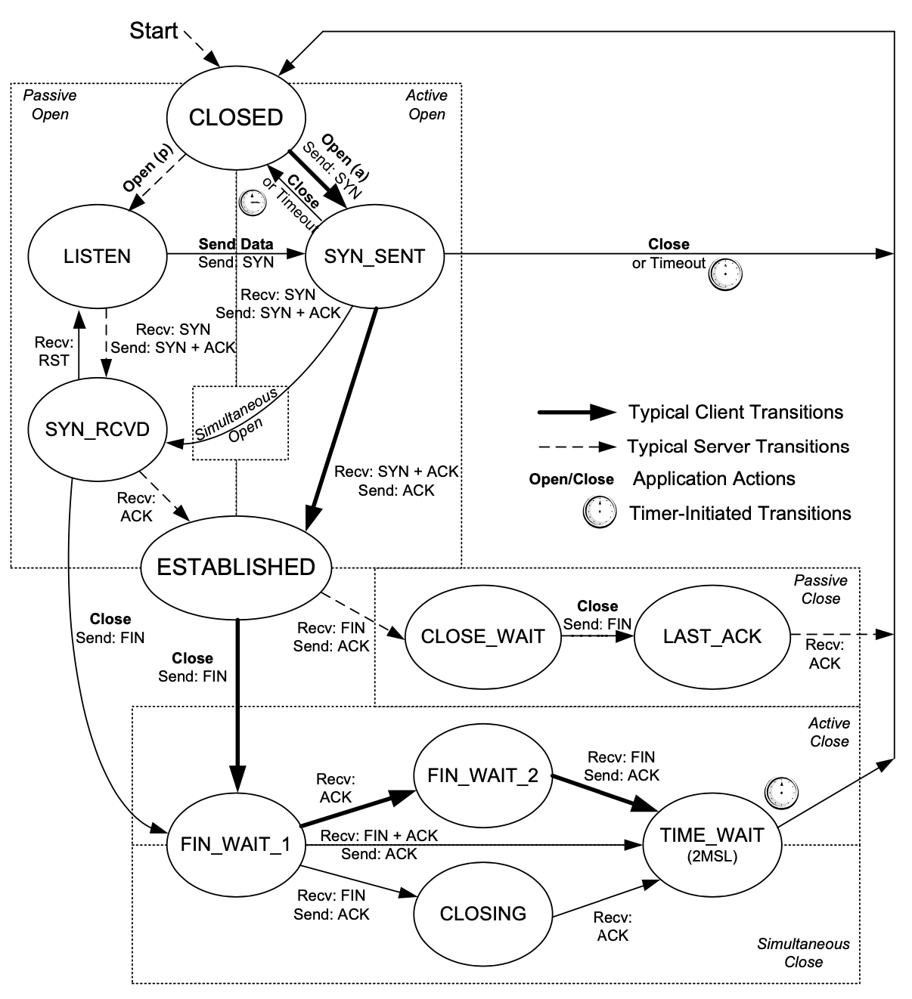

# 1 Introduction

### 1.1 Architecture Priciples
#### 1.1.1 Packets, Connections, and Datagrams

In **statistical multiplexing**, traffic is mixed together based on the arrival statistics or timing pattern of the traffic.

Alternative techniques, such as time-division multiplexing **(TDM)** and **static multiplexing**, typically reserve a certain amount of time or other resources for data on each connection.


Note that while circuits are straightforwardly implemented using TDM techniques, **virtual circuits (VCs)** that exhibit many of the behaviors of circuits but do not depend on physical circuit switches can be implemented atop connection-oriented packets.

The per-flow state is established prior to the exchange of data on a VC using a signaling protocol that supports connection establishment, clearing, and status information. Such networks are consequently called **connection-oriented**.

#### 1.1.2 The End-to-End Argument and Fate Sharing

The function in question can completely and correctly be implemented only with the knowledge and help of the application standing at the end points of the communication system. 

Fate sharing suggests placing all the necessary state to maintain an active communication association (e.g., virtual connection) at the same location with the communicating endpoints.

#### 1.1.3 Error Control and Flow Control

### 1.2 Design and Implementation

# 12 TCP: The Transmisssion Control Protocol(Premilinary)

### 12.2 Introduction to TCP

#### 12.2.1 The TCP Service Model

TCP provides a connection-oriented, reliable, byte stream service.

#### 12.2.2 Reliability in TCP

If a segment arrives with an invalid checksum, TCP discards it without sending any acknowledgment for the discarded packet.

When TCP sends a group of segments, it normally sets a single retransmission timer, waiting for the other end to acknowledge reception. TCP does not set a different retransmission timer for every segment. Rather, it sets a timer when it sends a window of data and updates the timeout as ACKs arrive.

This acknowledgment may not be sent immediately but is normally delayed a fraction of a second. The ACKs used by TCP are cumulative in the sense that an ACK indicating byte number N implies that all bytes up to number N (but not including it) have already been received successfully. 

This provides some robustness against ACK loss—if an ACK is lost, it is very likely that a subsequent ACK is sufficient to ACK the previous segments.

Once a connection is established, every TCP segment that contains data flowing in one direction of the connection also includes an ACK for segments flowing in the opposite direction.

### 12.3 Tcp Header and Encapsulation

```C++
    0                             15 16                            31
    -----------------------------------------------------------------
        Source Port(16)             |    Destination Port(16)
    -----------------------------------------------------------------
                            Sequence Number(32)
    -----------------------------------------------------------------
                            Acknowledgment Number(32)
    -----------------------------------------------------------------
     Header  Reserv  C E U A P R S F|
     Length   (4)    W C R C S S Y I|       Window Size(16)
       (4)           R E G K H T N N|
    -----------------------------------------------------------------
            Checksum(16)            |       Urgent Pointer(16)
    -----------------------------------------------------------------
                                Options
    kind(1) | lenth(1)  | info(n)
    0                   |   EOL
    1                   |   NOP
    2           4       |   MSS
    3           3       |   WSCALE/WSOPT
    4           2       |   SACK
    5           N*8 + 2 |   [,]...[,]
    8           10      |   TSOPT: TSV(4) TSER(4)
    -----------------------------------------------------------------
```

 The combination of an IP address and a port number is sometimes called an **endpoint or socket** in the TCP literature. 

 The **Sequence Number** field identifies the byte in the stream of data from the sending TCP to the receiving TCP that the first byte of data in the containing segment represents. 

 The **ACK** Number contains the next sequence number that the sender of the acknowledgment expects to receive.

 The sequence number of the first byte of data sent on this direction of the connection is the ISN plus 1 because the SYN bit field consumes one sequence number.

 As we shall see later, consuming a sequence number also implies reliable delivery using retransmission. Thus, SYNs and application bytes (and FINs, which we will see later) are reliably delivered. ACKs, which do not consume sequence numbers, are not.

 This **urgent pointer** is a positive offset that must be added to the Sequence Number field of the segment to yield the sequence number of the last byte of urgent data. 

 To be more efficient, multiple packets must be injected into the network before an ACK is received. This approach is more efficient but also more complex. A typical approach to managing the complexity is to use sliding windows, whereby packets are marked with sequence numbers, and the window size bounds the number of such packets. When the window size varies based on either feedback from the receiver or other signals (such as dropped packets), both flow control and congestion control can be achieved.

 # 13 Connection Management

### 13.2 Tcp Connection Establishment and Termination
#### 13.2.1 Tcp half-close 
#### 13.2.2 Simultaneous Open and Close

A simultaneous open requires the exchange of four segments, one more than the normal three-way handshake.

With a simultaneous close the same number of segments are exchanged as in the normal close. The only real difference is that the segment sequence is interleaved instead of sequential.

#### 13.2.3 Initial Sequence Number
[RFC0793] specifies that the ISN should be viewed as a 32-bit counter that increments by 1 every 4μs. The purpose of doing this is to arrange for the sequence numbers for segments on one connection to not overlap with sequence numbers on a another (new) identical connection. 

#### 13.2.6 Connections and Translator
By implementing a portion of the TCP state machine in a NAT (see, for example, Sections 3.5.2.1 and 3.5.2.2 of [RFC6146]), the connection can be tracked, including the current states, sequence numbers in each direction, and corresponding ACK numbers. Such state tracking is typical for NAT implementations.

### 13.3 Tcp Options
Note that the MSS option is not a negotiation between one TCP and its peer; it is a limit. When one TCP gives its MSS option to the other, it is indicating its unwillingness to accept any segments larger than that size for the duration of the connection.

#### 13.3.2 Selective Ackownledgment(SACK)
Once this has taken place, the TCP receiving out-of-sequence data may provide a SACK option that describes the out-of-sequence data to help its peer perform retransmissions more efficiently. SACK information contained in a SACK option consists of a range of sequence numbers representing data blocks the receiver has successfully received. Each range is called a SACK block and is represented by a pair of 32-bit sequence numbers. Thus, a SACK option containing n SACK blocks is (8n + 2) bytes long. Two bytes are used to hold the kind and length of the SACK option.

#### 13.3.3 WSCALE/WSOPT
1. This option can appear only in a SYN segment. 
2. The 1-byte shift count is between 0 and 14 (inclusive). A shift count of 0 indicates no scaling. The maximum scale value of 14 provides for a maximum window of 1,073,725,440 bytes (65,535 × 214), close to 1,073,741,823 (230 −1), effectively 1GB. TCP then maintains the "real" window size internally as a 32-bit value.
3. To enable window scaling, both ends must send the option in their SYN segments. 

#### 13.3.4 Timestamp Option and Protection Against Wrapped Sequence Number
The main reason for wishing to calculate a good estimate of the connection’s RTT is to set the retransmission timeout.

The PAWS algorithm does not require any form of time synchronization between the sender and the receiver. All the receiver needs is for the timestamp values to be monotonically increasing, and to increase by at least 1 per window of data.

#### 13.3.5 User Timeout(UTO) Option
The UTO value (USER_TIMEOUT) specifies the amount of time a TCP sender is willing to wait for an ACK of outstanding data before concluding that the remote end has failed.

The UTO option allows one TCP to signal its USER_TIMEOUT value to its connection peer.

NAT devices could also interpret such information to help set their connection activity timers.
```C++
USER_TIMEOUT = min(U_LIMIT, max(ADV_UTO, REMOTE_UTO, L_LIMIT))
```
#### 13.3.6 Authentication Option

### 13.4 Path MTU Discovery with TCP

### 13.5 Tcp State Transition
#### 13.5.2 TIME_WAIT(2 MSL)
The final ACK is resent not because the TCP retransmits ACKs (they do not consume sequence numbers and are not retransmitted by TCP), but because the other side will retransmit its FIN (which does consume a sequence number). 

Any delayed segments that arrive for a connection while it is in the 2MSL wait state are discarded. 

### 13.5.3 Quiet Time Concept
[RFC0793] states that TCP should wait an amount of time equal to the MSL before creating any new connections after a reboot or crash. This is called the **quiet time**. Few implementations abide by this because most hosts take longer than the MSL to reboot after a crash.

#### 13.5.4 FIN_WAIT_2 State
One end of the connection can remain in this state forever. The other end is still in the CLOSE_WAIT state and can remain there forever, until the application decides to issue its close.

Solution: If the application that does the active close does a complete close, not a half-close indicating that it expects to receive data, a timer is set. If the connection is idle when the timer expires, TCP moves the connection into the CLOSED state.

#### 13.5.5 Simultaneous Open and Close Transitions



Both ends go from ESTABLISHED to FIN_WAIT_1 when the application issues the close. This causes both FINs to be sent, and they probably pass each other somewhere in the network. When its peer’s FIN arrives, each end transitions from FIN_WAIT_1 to the CLOSING state, and each endpoint sends its final ACK. Upon receiving a final ACK, each endpoint’s state changes to TIME_WAIT, and the 2MSL wait is initiated.


### 13.6 RESET Segments

A reset is sent by TCP whenever a segment arrives that does not appear to be correct for the referenced connection. 

Resets ordinarily result in a fast teardown of a TCP connection. 

Circumstances:
1. connection to nonexistent port
2. aborting a connection

    * any queued data is thrown away and a reset segment is sent immediately
    * the receiver of the reset can tell that the other end did an abort instead of a normal close.

3. half-open close connections

    A TCP connection is said to be **half-open** if one end has closed or aborted the connection without the knowledge of the other end.

4. TIME-WAIT assassination

    * During TIME_WAIT state, the late-arriving segment is sent from the server to the client using sequence number L 100 and containing ACK number K 200. When the client receives this segment, it determines that both the sequence number and ACK values are "old." When receiving such old segments, TCP responds by sending an ACK with the most current sequence number and ACK values (K and L, respectively).
    * Most systems avoid this problem by simply not reacting to reset segments while in the TIME_WAIT state.

For a reset segment to be accepted by a TCP, the ACK bit field must be set and the ACK Number field must be within the valid window (see Chapter 12). This helps to prevent a simple attack in which anyone able to generate a reset.

### 13.7 TCP Server Operation
#### 13.7.4 Incomming Connection Queue


Operating system ordinarily has two distinct connection queues:
1. Connections in SYN_RCVD state
2. Connections in ESTANBLISHED state but not acceped by server application


Linux rules on Connection Queue:
1. If the number of connections in the SYN_RCVD state would exceed **net.ipv4.tcp_max_syn_backlog**(default 1000) threshold, the incoming connection is rejected.
2. Berkeley listen API backlog value specifies only the maximum number of queued connections for one listening endpoint, all of which have already been accepted by TCP and are waiting to be accepted by the application.
3. If there is room on this listening endpoint’s queue for this new connection, the TCP module ACKs the SYN and completes the connection. The server application with the listening endpoint does not see this new connection until the third segment of the three-way handshake is received. Also, the client may think the server is ready to receive data when the client’s active open completes successfully, before the server application has been notified of the new connection. If this happens, the server’s TCP just queues the incoming data.
4. If there is not enough room on the queue for the new connection, the TCP delays responding to the SYN, to give the application a chance to catch up. 

### 13.8 Attacks Involing TCP Connection Management

**SYN floods attack**
> The main insight with SYN cookies is that most of the information that would be stored for a connection when a SYN arrives could be encoded inside the Sequence Number field supplied with the SYN + ACK. 

SYN Cookies:   
> The top 5 bits are (t mod 32) where t is a 32-bit counter that increases by 1 every 64s, the next 3 bits are an encoding of the server’s MSS (one of eight possibilities), and the remaining 24 bits are a server-selected cryptographic hash of the connection 4-tuple and t value. 

There are at least two pitfalls of this approach:   
1. The scheme prohibits the use of arbitrary-size segments because of the encoding of the MSS.
2. The much less serious, connection establishment cycles that are very long (longer than 64s) do not work properly because the counter would wrap. 

**Degradation attacks with PMTUD**
> an attacker fabricates an ICMP PTB message containing a very small MTU value (e.g., 68 bytes). This forces the victim TCP to attempt to fit its data into very small packets, greatly reducing its performance.

Solution:
1. disable PMTUD
2. disable PMTUD in cases where an ICMP PTB message with next-hop MTU under 576 bytes is received
3. insist that the minimum packet size (for large packets used by TCP) always be fixed at some value, and larger packets simply not have the IPv4 DF bit field turned on.

**Hijacking**

**Spoofing attacks**
> TCP segments that have been specially tailored by an attacker to disrupt or alter the behavior of an existing TCP connection.

Mitigation techniques:
1. authenticating each segment (e.g., using the TCP-AO option)
2. requiring reset segments to have one particular sequence number instead of one from a range
3. requiring particular values in the Timestamps option
4. using other forms of cookies in which otherwise noncritical data values are arranged to depend on more exact knowledge of the connection or a secret value.

# 14 TCP Timeout and Retransmission
### 14.1 Introduction
**Fast retransmit** is based on inferring losses by noticing when TCP’s cumulative acknowledgment fails to advance in the ACKs received over time, or when ACKs carrying selective acknowledgment information (SACKs) indicate that out-of-order segments are present at the receiver.

TCP has two thresholds:
1. Threshold R1 indicates the number of tries TCP will make (or the amount of time it will wait) to resend a segment before passing "negative advice" to the IP layer (e.g., causing it to reevaluate the IP route it is using). **net.ipv4.tcp_retries1** default is 15(roughly 15~30minutes)
2. Threshold R2 (larger than R1) dictates the point at which TCP should abandon the connection. **net.ipv4.tcp_retries2** default is 3.

### 14.3 Setting the Retransmisstion Timeout(RTO)
TCP sends acknowledgments when it receives data, it is possible to send a byte with a particular sequence number and measure the time required to receive an acknowledgment that covers that sequence number. 

The RTT is estimated for each TCP connection separately, and one retransmission timer is pending whenever any data is in flight that consumes a sequence number (including SYN and FIN segments).

#### 14.3.1 The Classical Method
```C++
SRTT ← α(SRTT) + (1 − α) RTTs
RTO = min(ubound, max(lbound,(SRTT)β))
```

Problems with the classic method: 
> the timer specified by [RFC0793] cannot keep up with wide fluctuations in the RTT (and in particular, it causes unnecessary retransmissions when the real RTT is much larger than expected). 

#### 14.3.2 The Standard Method
> * TODO

#### 14.3.3 The Linux Method
It uses a clock granularity of 1ms, which is finer than that of many other implementations, along with the TSOPT.
> * TODO

#### 14.3.4 RTT Estimator Behaviors
> * TODO 

#### 14.3.5 RTTM Robustness to Loss and Reordering
> * TODO

### 14.4 Timer-based Retransmission
When retransmission happens Tcp quickly reducing the rate at which it sends data into the network in two ways:  
 1. reduce its sending window size based on congestion control procedures. 
 2. keep increasing a multiplicative backoff factor applied to the RTO each time a retransmitted segment is again retransmitted. 

### 14.5 Fast Retransmit
It is important to realize that TCP is required to generate an immediate acknowledgment (a "duplicate ACK") when an out-of-order segment is received, and that the loss of a segment implies out-of-order arrivals at the receiver when subsequent data arrives. 

The duplicate ACKs sent immediately when out-of-order data arrives are not delayed. 

Duplicate ACKs can also appear when there is packet reordering in the network—if a receiver receives a packet for a sequence number beyond the one it is expecting next, the expected packet could be either missing or merely delayed. Because we generally do not know which one, TCP waits for a small number of duplicate ACKs (called the duplicate ACK threshold or dupthresh) to be received before concluding that a packet has been lost and initiating a fast retransmit. 

#### 14.5.1 Example

The ACK at time 0.853 is not considered a duplicate ACK because it contains a window update.

The second retransmission is somewhat different from the first. When the first retransmission takes place, the sending TCP notes the highest sequence number it had sent just before it performed the retransmission (43401 + 1400 = 44801). This is called the **recovery point**.

TCP is considered to be **recovering from loss** after a retransmission until it receives an ACK that matches or exceeds the sequence number of the recovery point.

When **partial ACKs** arrive, the sending TCP immediately sends the segment that appears to be missing (26601 in this case) and continues this way until the recovery point is matched or exceeded by an arriving ACK. If permitted by congestion control procedures, it may also send new data it has not yet sent.

### 14.6 Retransmission with Selective Acknowledgments
A SACK-capable TCP receiver is able to describe data it has received with sequence numbers beyond the cumulative ACK Number field it sends in the primary portion of the TCP header. 

A SACK option that specifies n blocks has a length of 8n + 2 bytes, so the 40 bytes available to hold TCP options can specify a maximum of four blocks. It is expected that SACK will often be used in conjunction with the TSOPT, which takes an additional 10 bytes (plus 2 bytes of padding), meaning that SACK is typically able to include only three blocks per ACK.

#### 14.6.1 SACK Receiver Behavior
A receiver generates SACKs whenever there is any out-oforder data in its buffer in two cases:
1. data was lost in transit
2. it has been reordered and newer data has arrived at the receiver before older data

Behavior:
1. The receiver places in the first SACK block the sequence number range contained in the segment it has most recently received.
2. **???** Other SACK blocks are listed in the order in which they appeared as first blocks in previous SACK options. That is, they are filled in by repeating the most recently sent SACK blocks (in other segments) that are not subsets of another block about to be placed in the option being constructed.

[RFC6675]Note that an ACK which carries new SACK data is counted as a duplicate acknowledgment under this definition even if it carries new data, changes the advertised window, or moves the cumulative acknowledgment point, which is different from the definition of duplicate acknowledgment in [RFC5681].

#### 14.6.2 SACK Sender Behavior
The SACK sender keeps track of any cumulative ACK information it receives (like any TCP sender), plus any SACK information it receives.

It uses the SACK information it receives in ACKs generated at the receiver to avoid retransmitting data the receiver reports that it already has. 

One way it can do this is to keep a "SACKed" indication for each segment in its retransmission buffer that is set whenever a corresponding range of sequence numbers arrives in a SACK.

When a SACK-capable sender has the opportunity to perform a retransmission, usually because it has received a SACK or seen multiple duplicate ACKs, it has the choice of whether it sends new data or retransmits old data.

The SACK information provides the sequence number ranges present at the receiver, so the sender can infer what segments likely need to be retransmitted to fill the receiver’s holes. The simplest approach is to have the sender first fill the holes at the receiver and then move on to send more new data [RFC3517] if the congestion control procedures allow. This is the most common approach.

#### 14.6.3 Example
The ACK for 23801 contains a SACK block of [25201,26601], indicating a hole at the receiver. The receiver is missing the sequence number range [23801,25200], which corresponds to the single 1400-byte packet starting with sequence number 23801. Note that this SACK is a window update and is not counted as a duplicate ACK for the reasons discussed earlier. It does not trigger fast retransmit.

The SACK arriving at time 0.967 contains two SACK blocks: [28001,29401] and [25201,26601]. Recall that the first SACK blocks from previous SACKs are repeated in later positions in subsequent SACKs for robustness against ACK loss. This SACK is a duplicate ACK for sequence number 23801 and suggests that the receiver now requires two full-size segments starting with sequence numbers 23801 and 26601. The sender reacts immediately by initiating fast retransmit, but because of congestion control procedures, the sender sends only one retransmission, for segment 23801. With the arrival of two additional ACKs, the sender is permitted to send its second retransmission, for segment 26601.

### 14.7 Spurious Tiemouts and Retransmission
Caused by:
1. spurious timeouts (timeouts firing too early) 

    * **Detection algorithm** attempts to determine whether a timeout or timer-based retransmission was spurious.
    * **Response algorithm** is invoked once a timeout or retransmission is deemed spurious. Its purpose is to undo or mitigate some action that is otherwise normally performed by TCP when a retransmission timer expires. 
2. packet reordering, packet duplication
3. lost ACKs
4. when the real RTT has recently increased significantly beyond the RTO

#### 14.7.1 Duplicate SACK(DSACK) Extension
With a non-SACK TCP, an ACK can indicate only the highest in-sequence segment back to the sender. With SACK, it can signal other (out-of-order) segments as well.

A receiver receives duplicate data segments can be the result of spurious retransmissions, duplication within the network, or other reasons.

D-SACK is a rule, applied at the SACK receiver and interoperable with conventional SACK senders, that causes the first SACK block to indicate the sequence numbers of a duplicate segment that has arrived at the receiver. 

Purpose:	
to determine when a retransmission was not necessary and to learn additional facts about the network. With it, a sender has at least the possibility of inferring whether packet reordering, loss of ACKs, packet replication, and/or spurious retransmissions are taking place.

Usage:  
1. A change is made to the content of SACKs sent from the receiver and a corresponding change to the logic at the sender.
2. The change to the SACK receiver is to allow a SACK block to be included even if it covers sequence numbers below (or equal to) the cumulative ACK Number field.

DSACK information is included in only a single ACK, and such an ACK is called a DSACK. DSACK information is not repeated across multiple SACKs as conventional SACK information is. As a consequence, DSACKs are less robust to ACK loss than regular SACKs.

DSACKs, conversely, are able to be sent only after a duplicate segment has arrived at the receiver and able to be acted upon only after the DSACK is returned to the sender.

How to identify a DSACK block within an ACK segment:
1. if the first SACK block number < ACK number, it's DSACK
2. else if the 2nd SACK number contains the 1st SACK number, the 1st SACK block is DSACK
3. else it's normal SACK

Reference:
* https://www.cnblogs.com/lshs/p/6038617.html

#### 14.7.2 The Eifel Detection Algorithem
The experimental Eifel Detection Algorithm [RFC3522] deals with this problem using the TCP TSOPT to detect spurious retransmissions. 

After a retransmission timeout occurs, Eifel awaits the next acceptable ACK. If the next acceptable ACK indicates that the first copy of a retransmitted packet (called the original transmit) was the cause for the ACK, the retransmission is considered to be spurious.

The Eifel Detection Algorithm is able to detect spurious behavior earlier than the approach using only DSACK because it relies on ACKs generated as a result of packets arriving before loss recovery is initiated.

DSACKs, conversely, are able to be sent only after a duplicate segment has arrived at the receiver and able to be acted upon only after the DSACK is returned to the sender.

Mechanism:   
* When a retransmission is sent (either a timer-based retransmission or a fast retransmit), the TSV value is stored. When the first acceptable ACK covering its sequence number is received, the incoming ACK’s TSER is examined. If it is smaller than the stored value, the ACK corresponds to the original transmission of the packet and not the retransmission, implying that the retransmission must have been spurious.
* This approach is fairly robust to ACK loss as well. If an ACK is lost, any subsequent ACKs still have TSER values less than the stored TSV of the retransmitted segment. Thus, a retransmission can be deemed spurious as a result of any of the window’s worth of ACKs arriving, so a loss of any single ACK is not likely to cause a problem.
* The Eifel Detection Algorithm can be combined with DSACKs. This can be beneficial in the situation where an entire window’s worth of ACKs are lost but both the original transmit and retransmission have arrived at the receiver.

#### 14.7.3 Foward-RTO(FRTO)
It does not require any TCP options, so when it is implemented in a sender. It attempts to detect only spurious retransmissions caused by expiration of the retransmission timer.

Mechanism:
1. F-RTO modifies the ordinary behavior of TCP by having TCP send new (so far unsent) data after the timeout-based retransmission when the first ACK arrives. It then inspects the second arriving ACK.
2. If either of the first two ACKs arriving after the retransmission was sent are duplicate ACKs, the retransmission is deemed OK
3. If they are both acceptable ACKs that advance the sender’s window, the retransmission is deemed to have been spurious. 

#### 14.7.4 The Eifel Response Algorithem


### 14.8 Packet Reodering and Duplication
#### 14.8.1 Reordering
1. If reordering takes place in the *reverse (ACK) direction*, it causes the sending TCP to receive some ACKs that move the window significantly forward followed by some evidently old redundant ACKs that are discarded. This can lead to an unwanted burstiness (instantaneous high-speed sending) behavior in the sending pattern of TCP and also trouble in taking advantage of available network bandwidth, because of the behavior of TCP’s congestion control (see Chapter 16).
2. If reordering occurs in the *forward direction*, TCP may have trouble distinguishing this condition from loss. Both loss and reordering result in the receiver receiving out-of-order packets that create holes between the next expected packet and the other packets received so far. When reordering is moderate (e.g., two adjacent packets switch order), the situation can be handled fairly quickly. When reorderings are more severe, TCP can be tricked into believing that data has been lost even though it has not. This can result in spurious retransmissions, primarily from the fast retransmit algorithm

#### 14.8.2 Duplicaton
Although rare, the IP protocol may deliver a single packet more than one time. This can happen, for example, when a link-layer network protocol performs a retransmission and creates two copies of the same packet. 

### 14.9 Destination Metrics

### 14.10 Repacketization
When TCP times out and retransmits, it does not have to retransmit the identical segment. Instead, TCP is allowed to perform repacketization, sending a bigger segment, which can increase performance. 

# 15 Data Flow and Window Management

### 15.3 Delayed Ackowledgements
### 15.4 Nagle Algorithm
When a TCP connection has outstanding data that has not yet been acknowledged, small segments (those smaller than the SMSS) cannot be sent until all outstanding data is acknowledged.

Instead, small amounts of data are collected by TCP and sent in a single segment when an acknowledgment arrives. 

This procedure effectively forces TCP into stop-and-wait behavior—it stops sending until an ACK is received for any outstanding data.

The trade-off the Nagle algorithm makes: fewer and larger packets are used, but the required delay is higher.

### 15.5 Flow Control and Window Management
The Window Size field in each TCP header indicates the amount of empty space, in bytes, remaining in the receive buffer. The field is 16 bits in TCP, but with the Window Scale option, values larger than 65,535 can be used.

#### 15.5.1 Sliding Window
