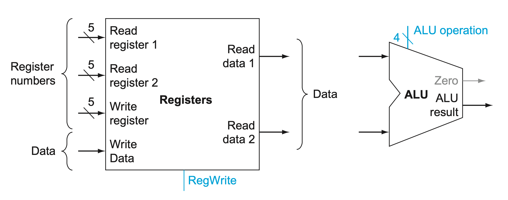
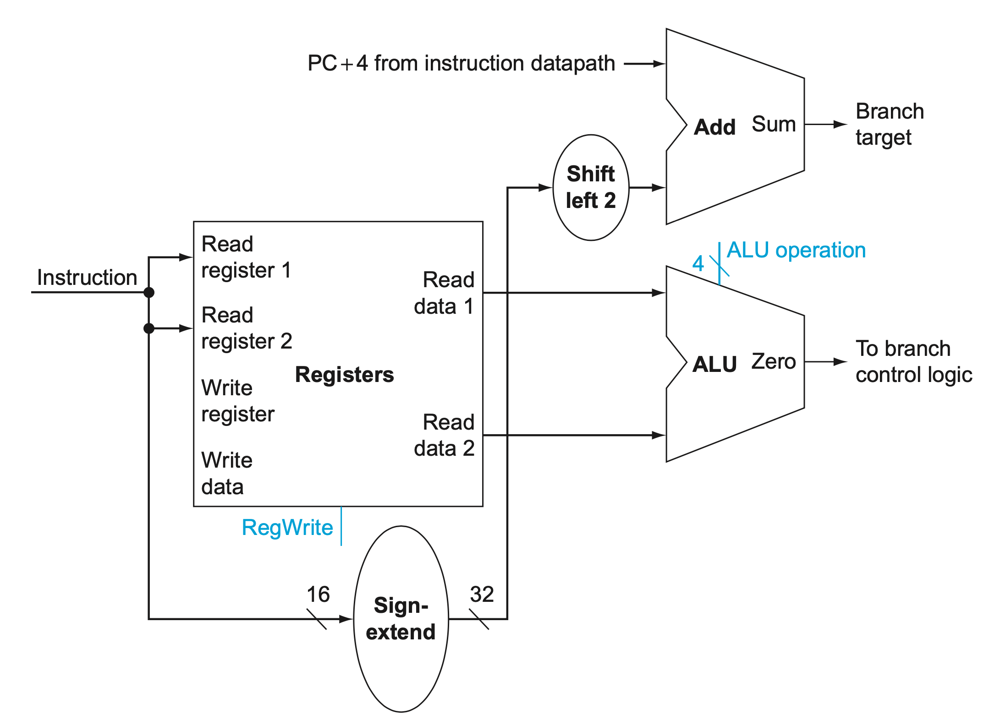
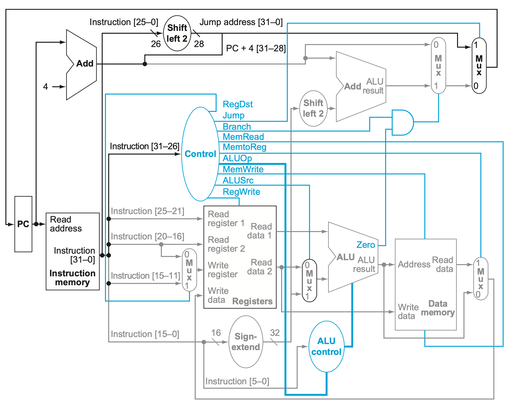

# 4 The Processor

## 4.1 Introduction
* performance of a computer is determined by three key factors: instruction count, clock cycle time, and clock cycles per instruction (CPI).
* compiler and the instruction set architecture determine the instruction count required for a given program

### 4.1.2 An Overview of the Implementation

For every instruction, the first two steps are identical:
1. Send the program counter (PC) to the memory that contains the code and fetch the instruction from that memory.
2. Read one or two registers, using fields of the instruction to select the registers to read. For the load word instruction, we need to read only one register, but most other instructions require reading two registers.

The simplicity and regularity of the MIPS instruction set simplifies the implementation by making the execution of many of the instruction classes similar.

All instruction classes, except jump, use the arithmetic-logical unit (ALU) after reading the registers. The memory-reference instructions use the ALU for an address calculation, the arithmetic-logical instructions for the operation execution, and branches for comparison. After using the ALU, the actions required to complete various instruction classes differ:
* A **memory-reference** instruction will need to access the memory either to read data for a load or write data for a store.
* An **arithmetic-logical** or load instruction must write the data from the ALU or memory back into a register.
* For a **branch instruction**, we may need to change the next instruction address based on the comparison; otherwise, the PC should be incremented by 4 to get the address of the next instruction.


* 
* The top multiplexor (“Mux”) controls what value replaces the PC (PC + 4 or the branch destination address),  the multiplexor is controlled by the gate that “ANDs” together the Zero output of the ALU and a control signal that indicates that the instruction is a branch
* The middle multiplexor, whose output returns to the register file, is used to steer the output of the ALU (in the case of an arithmetic-logical instruction) or the output of the data memory (in the case of a load) for writing into the register file.
* The bottommost multiplexor is used to determine whether the second ALU input is from the registers (for an arithmetic-logical instruction or a branch) or from the offset field of the instruction (for a load or store).

## 4.2 Logic Design Conventions

The datapath elements in the MIPS implementation consist of two different types of logic elements:
1. The elements that operate on data values are all combinational, which means that their outputs depend only on the current inputs. Given the same input, a **combinational element** always produces the same output.
2.  **State elements** in the design are not combinational, but instead contain state. An element contains state if it has some internal storage.
    * A state element has at least two inputs and one output. The required inputs are the data value to be written into the element and the clock, which determines when the data value is written. The output from a state element provides the value that was written in an earlier clock cycle.

## 4.2.1 Clocking Methodology

A **clocking methodology** defines when signals can be read and when they can be written.

An **edge-triggered clocking methodology** means that any values stored in a sequential logic element are updated only on a clock edge, which is a quick transition from low to high or vice versa

## 4.3 Building a Datapath

**Datapath element** A unit used to operate on or hold data within a processor. In the MIPS implementation, the datapath elements include the instruction and data memories, the register file, the ALU, and adders.

* Register file
    * 
    * The register file always outputs the contents of the registers corresponding to the Read register inputs on the outputs, no other control inputs are needed
    * Register write must be explicitly indicated by asserting the write control signal.

* 
    * **branch target address** The address specified in a branch, which becomes the new program counter (PC) if the branch is taken. In the MIPS architecture the branch target is given by the sum of the offset field of the instruction and the address of the instruction following the branch.
    * branch datapath must do two operations:
        1. compute the branch target address and
        2. compare the register contents.

* Data memory unit
    * The memory unit needs a read signal, since, unlike the register file, reading the value of an invalid address can cause problems

* [Dadapath](https://www.cise.ufl.edu/~mssz/CompOrg/CDA-proc.html) is the hardware that performs all the required operations, for example, ALU, registers, and internal buses.

## 4.4 A Simple Implementation Scheme

* The ALU Control
    * For the R-type instructions, the ALU needs to perform one of the five actions (AND, OR, subtract, add, or set on less than), depending on the value of the 6-bit funct (or function) field in the low-order bits of the instruction.
    * We can generate the 4-bit ALU control input using a small control unit that has as inputs the function field of the instruction and a 2-bit control field, which we call ALUOp. ALUOp indicates whether the operation to be performed should be add (00) for loads and stores, subtract (01) for beq, or determined by the operation encoded in the funct field (10).
    * **Multi-level decoding** -- main control generates ALUop bits, which are input to ALU control. The ALU control then generates the three-bit codes
        * The advantage of a hierarchically partitioned or pipelined control scheme is realized in reduced hardware (several small control units are used instead of one large unit).
    * 
    * 

* Designing the Main Control Unit
    * 
    * Instruction format for **R-format instructions**, which all have an opcode of 0. These instructions have three register operands: rs, rt, and rd. Fields rs and rt are sources, and rd is the destination. The ALU function is in the funct field and is decoded by the ALU control design in the previous section. The R-type instructions that we implement are add, sub, AND, OR, and slt. The shamt field is used only for shifts; we will ignore it in this chapter.
    * Instruction format for **load (opcode = 35ten) and store** (opcode = 43ten) instructions. The register rs is the base register that is added to the 16-bit address field to form the memory address. For loads, rt is the destination register for the loaded value. For stores, rt is the source register whose value should be stored into memory.
    * Instruction format for **branch equal** (opcode =4). The registers rs and rt are the source registers that are compared for equality. The 16-bit address field is sign-extended, shifted, and added to the PC + 4 to compute the branch target address.

    * 

    * 
    * 

* Operation of the Datapath
    * R-type instruction, such as add $t1,$t2,$t3
        1. (IF) The instruction is fetched, and the PC is incremented.
        2. (ID) Two registers, $t2 and $t3, are read from the register file; also, the main control unit computes the setting of the control lines during this step.
        3. (EX) The ALU operates on the data read from the register file, using the function code (bits 5:0, which is the funct field, of the instruction) to generate the ALU function.
        4. (WB) The result from the ALU is written into the register file using bits 15:11 of the instruction to select the destination register ($t1).
    * jump instruction
        * 
        * the low-order 2 bits of a jump address are always 00two. The next lower 26 bits of this 32-bit address come from the 26-bit immediate field in the instruction.
        * The upper 4 bits of the address that should replace the PC come from the PC of the jump instruction plus 4. Thus, we can implement a jump by storing into the PC the concatenation of
            * the upper 4 bits of the current PC + 4 (these are bits 31:28 of the sequentially following instruction address)
            * the 26-bit immediate field of the jump instruction
            * the bits 00
            * 

* Why a Single-Cycle Implementation Is Not Used Today
    * the clock cycle must have the same length for every instruction in this single-cycle design. Of course, the longest possible path in the processor determines the clock cycle.

## 4.5 An Overview of Pipelining

All the pipeline stages take a single clock cycle, so the clock cycle must be long enough to accommodate the slowest operation.

We can turn the pipelining speed-up discussion above into a formula:
> [Time between instructions(pipelined)] = [Time between instructionnon(pipelined)] / [Number of pipe stages]
* Under ideal conditions and with a large number of instructions, the speed-up from pipelining is approximately equal to the number of pipe stages; a five-stage pipeline is nearly five times faster.


Pipelining improves performance by increasing instruction throughput, as opposed to decreasing the execution time of an individual instruction, but instruction throughput is the important metric because real programs execute billions of instructions.

Pipelining increases the number of simultaneously executing instructions and the rate at which instructions are started and completed. Pipelining does not reduce the time it takes to complete an individual instruction, also called the latency.

Pipelining improves instruction throughput rather than individual instruction execution time or latency.

**latency** (pipeline) The number of stages in a pipeline or the number of stages between two instructions during execution

### 4.5.1 Designing Instruction Sets for Pipelining
1. All MIPS instructions are the **same length**. This restriction makes it much easier to fetch instructions in the first pipeline stage and to decode them in the second stage.
2. MIPS has only a few instruction formats, with the source register fields being located in the same place in each instruction. This symmetry means that the second stage can begin reading the register file at the **same time** that the hardware is determining what type of instruction was fetched.
3. **Memory operands** only appear in loads or stores in MIPS. This restriction means we can use the execute stage to calculate the memory address and then access memory in the following stage.
4. Operands must be **aligned** in memory. Hence, we need not worry about a single data transfer instruction requiring two data memory accesses; the requested data can be transferred between processor and memory in a single pipeline stage.

### 4.5.2 Pipeline Hazards

#### Structural Hazard

It means that the hardware cannot support the combination of instructions that we want to execute in the same clock cycle.

#### Data Hazards

**Data hazard** when the pipeline must be stalled because one step must wait for another to complete.

**load-use data hazard** A specific form of data hazard in which the data being loaded by a load instruction has not yet become available when it is needed by another instruction.

**pipeline stall (bubble)** A stall initiated in order to resolve a hazard.

* Graphical representation of forwarding
    * 

* We need a stall even with forwarding when an R-format instruction following a load tries to use the data
    * 

How we can handle hard cases to avoid load-use pipeline stalls
1. using hardware detection
2. stalls
3. software that reorders code

#### Control Hazards

control hazard, arising from the need to make a decision based on the results of one instruction while others are executing.

**control hazard (branch hazard)** When the proper instruction cannot execute in the proper pipeline clock cycle because the instruction that was fetched is not the one that is needed; that
is, the flow of instruction addresses is not what the pipeline expected.

Two solutions to control hazards:
1. Stall.
    * Notice that we must begin fetching the instruction following the branch on the very next clock cycle. Nevertheless, the pipeline cannot possibly know what the next instruction should be, since it only just received the branch instruction from memory
    * 
    * If we cannot resolve the branch in the second stage, as is often the case for longer pipelines, then we’d see an even larger slowdown if we stall on branches. The cost of this option is too high for most computers to use
2. Predict
    * This option does not slow down the pipeline when you are correct. When you are wrong, however, you need to redo the load that was washed while guessing the decision.
    * 
3. Delayed decision
    * The delayed branch always executes the next sequential instruction, with the branch taking place after that one instruction delay.
    * MIPS software will place an instruction immediately after the delayed branch instruction that is not affected by the branch, and a taken branch changes the address of the instruction that follows this safe instruction.

## 4.6 Pipelined Datapath and Control

The division of an instruction into five stages means a five-stage pipeline, which in turn means that up to five instructions will be in execution during any single clock cycle.
1. IF: Instruction fetch
2. ID: Instruction decode and register file read
3. EX: Execution or address calculation
4. MEM: Data memory access
5. WB: Write back to register


lw example
* 
    * This incremented address is also saved in the IF/ID pipeline register in case it is needed later for an instruction, such as beq. The computer cannot know which type of instruction is being fetched, so it must prepare for any instruction, passing potentially needed information down the pipeline.

* 
    * 16-bit immediate field, which is sign-extended to 32 bits, , and the register numbers to read the two registers. All three values are stored in the ID/EX pipeline register, along with the incremented PC address.

* 
* 
* 


### 4.6.1 Graphically Representing Pipelines

multiple-clock-cycle

single-clock-cycle

### 4.6.2 Pipeline Control


1. Instruction fetch: The control signals to read instruction memory and to write the PC are always asserted, so there is nothing special to control in this pipeline stage.
2. Instruction decode/register file read: As in the previous stage, the same thing happens at every clock cycle, so there are no optional control lines to set.
3. Execution/address calculation: The signals to be set are RegDst, ALUOp, and ALUSrc (see Figures 4.47 and 4.48). The signals select the Result register, the ALU operation, and either Read data 2 or a sign-extended immediate for the ALU.
4. Memory access: The control lines set in this stage are Branch, MemRead, and MemWrite. The branch equal, load, and store instructions set these signals, respectively. Recall that PCSrc in Figure 4.48 selects the next sequential address unless control asserts Branch and the ALU result was 0.
5. Write-back: The two control lines are MemtoReg, which decides between sending the ALU result or the memory value to the register file, and Reg- Write, which writes the chosen value.


* Implementing control means setting the nine control lines to these values in each stage for each instruction. The simplest way to do this is to extend the pipeline registers to include control information.
* Since the control lines start with the EX stage, we can create the control information during instruction decode.

## 4.7 Data Hazards: Forwarding versus Stalling

```assembly
dependency hazard type:
1a. EX/MEM.RegisterRd = ID/EX.RegisterRs
1b. EX/MEM.RegisterRd = ID/EX.RegisterRt
2a. MEM/WB.RegisterRd = ID/EX.RegisterRs
2b. MEM/WB.RegisterRd = ID/EX.RegisterRt

sub   $2, $1,$3     #       Register $2 written by sub
and   $12,$2,$5     # 1a    1st operand($2) depends on sub
or    $13,$6,$2     # 2b    2nd operand($2) depends on sub
add   $14,$2,$2     #       1st($2) & 2nd($2) depend on sub
sw    $15,100($2)   #       Base ($2) depends on sub
```

* 
    * What happens when a register is read and written in the same clock cycle? We assume that the write is in the first half of the clock cycle and the read is in the second half, so the read delivers what is written. As is the case for many implementations of register files, we have no data hazard in this case.
    * the value of register $2, which changes during the middle of clock cycle 5, when the sub instruction writes its result.
    * only add and sw instructions would get correct value of $2
    * the desired result is available at the end of the EX stage or clock cycle 3. When is the data actually needed by the AND and OR instructions? At the beginning of the EX stage, or clock cycles 4 and 5, respectively. Thus, we can execute this segment without stalls if we simply forward the data as soon as it is available to any units that need it before it is available to read from the register file.

**Avoid unnecessary forwading** Because some instructions do not write registers, this policy is inaccurate; sometimes it would forward when it shouldn’t. One solution is simply to check to see if the RegWrite signal will be active: examining the WB control field of the pipeline register during the EX and MEM stages determines whether RegWrite is asserted.

## 4.8 Control Hazards
## 4.9 Exceptions
## 4.10 Parallelism via Instructions
## 4.11 Real Stuff: The ARM Cortex-A8 and Intel Core i7 Pipelines
## 4.12 Going Faster: Instruction-Level Parallelism and Matrix Multiply
## 4.13 Advanced Topic: An Introduction to Digital Design Using a Hardware Design Language to Describe and Model a Pipeline and More Pipelining Illustrations
## 4.14 Fallacies and Pitfalls
## 4.15 Concluding Remarks
## 4.16 Historical Perspective and Further Reading

## Reference
* [4. Processors - Computer Organization and Design (2009)](https://www.cise.ufl.edu/~mssz/CompOrg/CDA-proc.html)