# Chapter 1 A Tour of Computer System
## 1.1 Information Is Bits + Context
The source program is a sequence of bits, each with a value of 0 or 1, organized in 8-bit chunks called bytes. Each byte represents some text character in the program.

All information in a system—including disk files, programs stored in memory, user data stored in memory, and data transferred across a network—is represented as a bunch of bits.

The only thing that distinguishes different data objects is the context in which we view them.

## 1.2 Programs Are Translated by Other Programs into Different Forms


* Compilation System:
    1. Preprocessor Phase:
        * modifies the original C program according to directives that begin with the # character.
    2. Compiler Phase:
        * Each statement in an assembly-language program exactly describes one low-level machine-language instruction in a standard text form.
        * Assembly language is useful because it provides a common output language for different compilers for different high-level languages.
    3. Assembler Phase:
        * Assembler (as) translates hello.s into machine-language instructions, packages them in a form known as a **relocatable object program**, and stores the result in the object file.
    4. Linker

## 1.3 It Pays to Understand How Compilation Systems Work
* Optimizing program performance
    * Is a switch statement always more efficient than a sequence of if-else statements?
    * How much overhead is incurred by a function call?
    * Is a while loop more efficient than a for loop?
    * Are pointer references more efficient than array indexes?
    * Why does our loop run so much faster if we sum into a local variable instead of an argument that is passed by reference?
    * How can a function run faster when we simply rearrange the parentheses in an arithmetic expression?

* Understanding link-time errors.
* Avoiding security holes.

## 1.4 Processors Read and Interpret Instructions Stored in Memory

### 1.4.1 Hardware Organization of a System
* 
    * CPU: Central Processing Unit
    * ALU: Arithmetic/Logic Unit
    * PC: Program counter
    * USB: Universal Serial Bus.

* Buses
    * carry bytes of information back and forth between the components.
    * Buses are typically designed to transfer fixed-sized chunks of bytes known as **words**.
    * The number of bytes in a word (the word size) is a fundamental system parameter that varies across systems.

* I/O Devices
    * Each I/O device is connected to the I/O bus by either a **controller** or an **adapter**.
    * Controllers are chip sets in the device itself or on the system’s main printed circuit board (often called the motherboard).
    * An adapter is a card that plugs into a slot on the motherboard.

* Main Memory
    * memory is organized as a linear array of bytes, each with its own unique address (array index) starting at zero.

* Processor
    * At its core is a word-sized storage device (or register) called the program counter (PC).
    * A processor appears to operate according to a very simple instruction execution model, defined by its **instruction set architecture**.
    * The processor **reads** the instruction from memory pointed at by the program counter (PC), **interprets** the bits in the instruction, **performs** some simple operation dictated by the instruction, and then updates the PC to point to the next instruction, which may or may not be contiguous in memory to the instruction that was just executed.
    * The **register file** is a small storage device that consists of a collection of word-sized registers, each with its own unique name.
    * The **arithmetic/logic unit (ALU)** computes new data and address values.
    * Examples of the simple operations that the CPU might carry out at the request of an instruction:
        * **Load**: Copy a byte or a word from main memory into a register, overwriting the previous contents of the register.
        * **Store**: Copy a byte or a word from a register to a location in main memory, overwriting the previous contents of that location.
        * **Operate**: Copy the contents of two registers to the ALU, perform an arithmetic operation on the two words, and store the result in a register, overwriting the previous contents of that register.
        * **Jump**: Extract a word from the instruction itself and copy that word into the program counter (PC), overwriting the previous value of the PC.

### 1.4.2 Running the hello Program
1.  Read Command
    * Initially, the shell program is executing its instructions, waiting for us to type a command. As we type the characters “./hello” at the keyboard, the shell program reads each one into a register, and then stores it in memory
    * 
2. Execute command
    * When we hit the enter key on the keyboard, the shell knows that we have finished typing the command.
    * The shell then loads the executable hello file by executing a sequence of instructions that copies the code and data in the hello object file from disk to main memory.
    * 
3. Execute Programe
    * Using a technique known as direct memory access (DMA, discussed in Chapter 6), the data travels directly from disk to main memory, without passing through the processor
    * Once the code and data in the hello object file are loaded into memory, the processor begins executing the machine-language instructions in the hello program’s main routine.
    * These instructions copy the bytes in the “hello, world\n” string from memory to the register file, and from there to the display device, where they are displayed on the screen.
    * 

## 1.5 Caches Matter
* An important lesson from this simple example is that a system spends a lot of time moving information from one place to another.

* The disk drive on a typical system might be 1000 times larger than the main memory, but it might take the processor 10,000,000 times longer to read a word from disk than from memory.

* The processor can read data from the register file almost 100 times faster than from memory.

* It might take 5 times longer for the process to access the L2 cache than the L1 cache, but this is still 5 to 10 times faster than accessing the main memory.

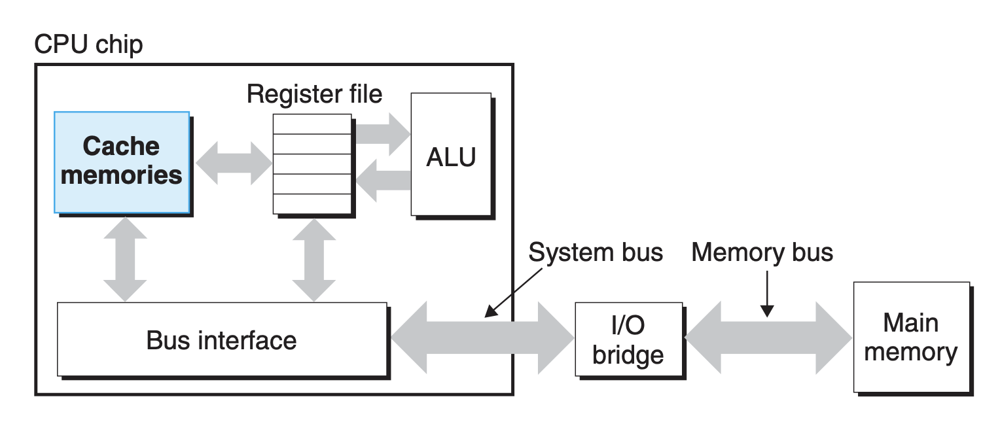

## 1.6 Storage Devices Form a Hierarchy
The main idea of a memory hierarchy is that storage at one level serves as a cache for storage at the next lower level.

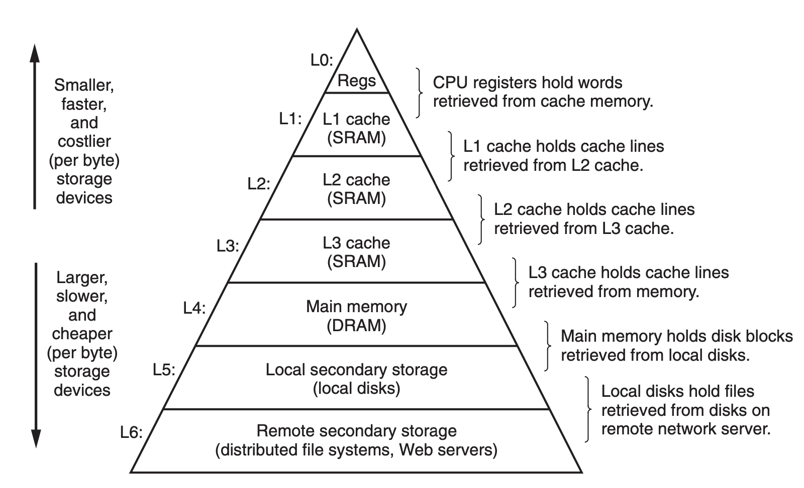

## 1.7 The Operating System Manages the Hardware
* The operating system has two primary purposes:
    1. to protect the hardware from misuse by runaway applications
    2. to provide applications with simple and uniform mechanisms for manipulating complicated and often wildly different low-level hardware devices.

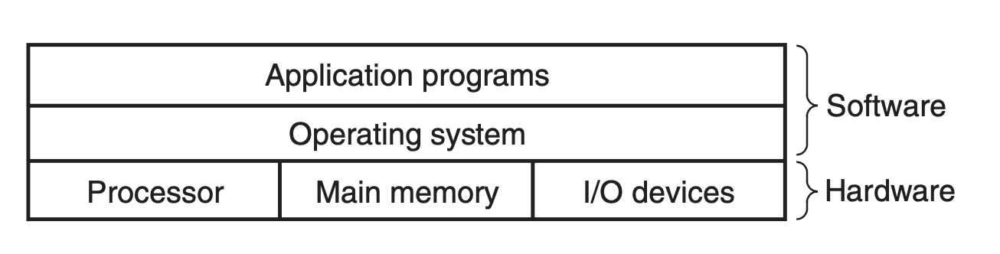


* **Files** are abstractions for I/O devices
* **virtual memory** is an abstraction for both the main memory and disk I/O devices
* **processes** are abstractions for the processor, main memory, and I/O devices.
* **virtual machine** provids an abstraction of the entire computer, including the operating system, the processor, and the programs.

Posix standards, that cover such issues as the C language interface for Unix system calls, shell programs and utilities, threads, and network programming.

### 1.7.1 Processes
A **process** is the operating system’s abstraction for a running program. Multiple processes can run concurrently on the same system, and each process appears to have exclusive use of the hardware.

**Context**, includes information such as the current values of the PC, the register file, and the contents of main memory.

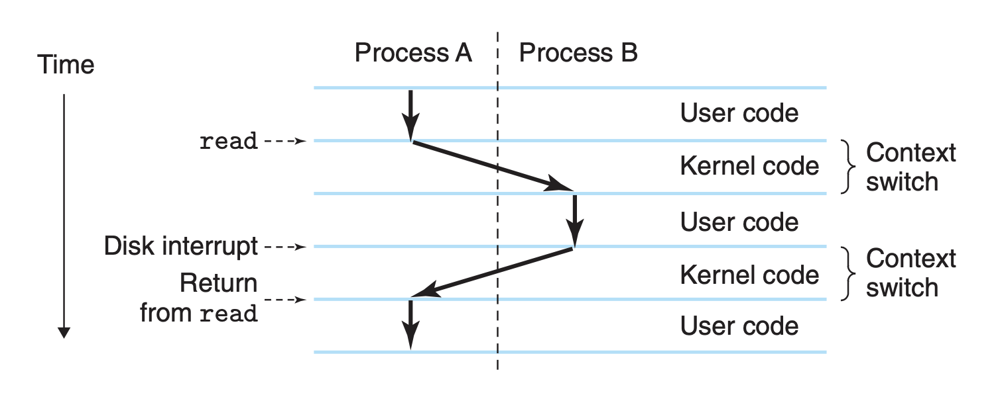

### 1.7.2 Threads
A process can actually consist of multiple execution units, called threads, each running in the context of the process and sharing the same code and global data.

It is easier to share data between multiple threads than between multiple processes, and because threads are typically more efficient than processes.

### 1.7.3 Virutal Memory
Virtual memory is an abstraction that provides each process with the illusion that it has exclusive use of the main memory.
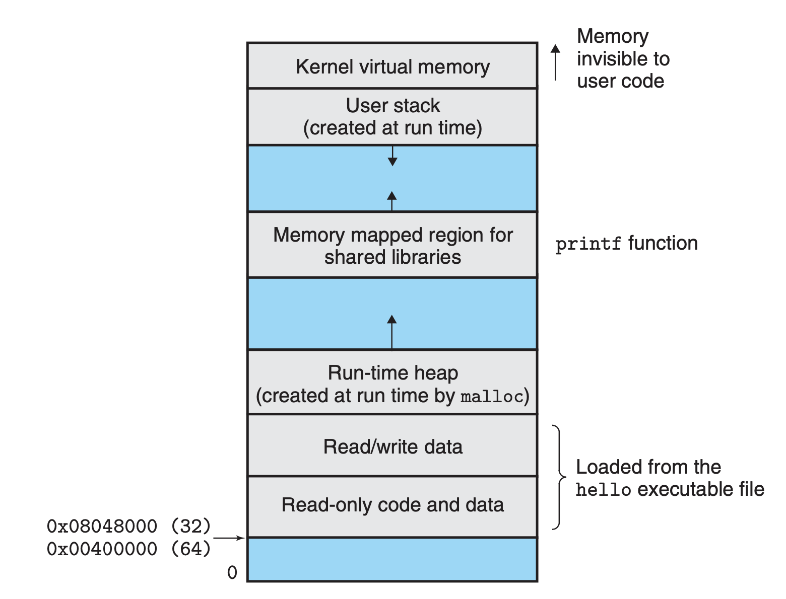

### 1.7.4 Files
A **file** is a sequence of bytes, nothing more and nothing less. Every I/O device, including disks, keyboards, displays, and even networks, is modeled as a file.

```email
From: torvalds@klaava.Helsinki.FI (Linus Benedict Torvalds)
Newsgroups: comp.os.minix
Subject: What would you like to see most in minix?
Summary: small poll for my new operating system
Date: 25 Aug 91 20:57:08 GMT

Hello everybody out there using minix -
I’m doing a (free) operating system (just a hobby, won’t be big and
professional like gnu) for 386(486) AT clones. This has been brewing
since April, and is starting to get ready. I’d like any feedback on
things people like/dislike in minix, as my OS resembles it somewhat
(same physical layout of the file-system (due to practical reasons)
among other things).
I’ve currently ported bash(1.08) and gcc(1.40), and things seem to work.
This implies that I’ll get something practical within a few months, and
I’d like to know what features most people would want. Any suggestions
are welcome, but I won’t promise I’ll implement them :-)

Linus (torvalds@kruuna.helsinki.fi)
```

## 1.8 Systems Communicate with Other Systems Using Networks

## 1.9 Important Themes
### 1.9.1 Concurrency and Parallelism
* **concurrency** refers to the general concept of a system with multiple, simultaneous activities,
* **parallelism** refers to the use of concurrency to make a system run faster.


* **Thread-Level Concurrency**
    * **Hyperthreading**, sometimes called simultaneous multi-threading, is a technique that allows a single CPU to execute multiple flows of control.
        * It involves having multiple copies of some of the CPU hardware, such as program counters and register files, while having only single copies of other parts of the hardware, such as the units that perform floating-point arithmetic.
        * Whereas a conventional processor requires around 20,000 clock cycles to shift between different threads, a hyperthreaded processor decides which of its threads to execute on a cycle-by-cycle basis.
    * The use of multiprocessing can improve system performance in two ways:
        1. It reduces the need to simulate concurrency when performing multiple tasks.
        2. It can run a single application program faster, but only if that program is expressed in terms of multiple threads that can effectively execute in parallel.

* **Instruction-Level Parallelism**
    * Early microprocessors, such as the 1978-vintage Intel 8086 required multiple (typically, **3–10) clock cycles** to execute a single instruction. More recent processors can sustain execution rates of **2–4 instructions per clock cycle**.
    * In Chapter 4, we will explore the use of **pipelining**, where the actions required to execute an instruction are partitioned into different steps and the processor hardware is organized as a series of stages, each performing one of these steps.
    * The stages can operate in parallel, working on different parts of different instructions.
    * Processors that can sustain execution rates faster than one instruction per cycle are known as **superscalar processors**.

* **Single-Instruction, Multiple-Data (SIMD) Parallelism**
    * At the lowest level, many modern processors have special hardware that allows a single instruction to cause multiple operations to be performed in parallel, a mode known as single-instruction, multiple-data, or **“SIMD”** parallelism.

### 1.9.2 The Importance of Abstractions in Computer Systems
* One aspect of good programming practice is to formulate a simple application-program interface (API) for a set of functions that allow programmers to use the code without having to delve into its inner workings.

# Chapter 2 Representing and Manipulating Information
* **Unsigned encodings** are based on traditional binary notation, representing numbers greater than or equal to 0.
* **Two’s-complement encodings** are the most common way to represent signed integers, that is, numbers that may be either positive or negative.
* **Floating-point encodings** are a base-two version of scientific notation for representing real numbers.
    * Floating-point arithmetic has altogether different mathematical properties. The product of a set of positive numbers will always be positive, although overflow will yield the special value +∞.
    * Floating-point arithmetic is not associative, due to the finite precision of the representation.
    * The different mathematical properties of integer vs. floating-point arithmetic stem from the difference in how they handle the finiteness of their representations — integer representations can encode a comparatively small range of values, but do so precisely, while floating-point representations can encode a wide range of values, but only approximately.

## 2.1 Information Storage
Rather than accessing individual bits in memory, most computers use blocks of eight bits, or bytes, as the smallest addressable unit of memory.

The actual **virtual address space** implementation (presented in Chapter 9) uses a combination of random-access memory (RAM), disk storage, special hardware, and operating system software to provide the program with what appears to be a monolithic byte array.

The value of a **pointer** in C—whether it points to an integer, a structure, or some other program object—is the virtual address of the first byte of some block of storage.

### 2.1.1 Hexadecimal Notation

### 2.1.2 Words
Since a virtual address is encoded by such a word, the most important system parameter determined by the word size is the maximum size of the virtual address space.

### 2.1.3 Data Sizes
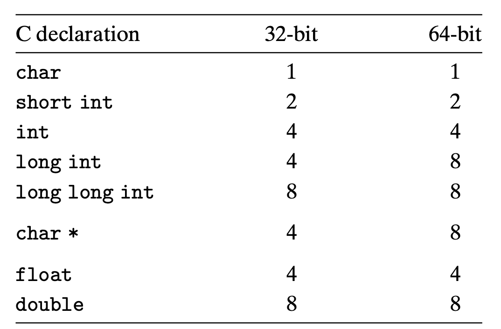

### 2.1.4 Addressing and Byte Ordering
* For program objects that span multiple bytes, we must establish two conventions:
    * what the address of the object will be
    * how we will order the bytes in memory

* little endian: the least significant byte comes first

* Byte ordering becomes an issue:
    1. The first is when binary data are communicated over a network between different machines.
    2. A second case where byte ordering becomes important is when looking at the byte sequences representing integer data.
    3. A third case where byte ordering becomes visible is when programs are written that circumvent the normal type system.

### 2.1.5 Representing Strings
A **string** in C is encoded by an array of characters terminated by the null (having value 0) character.

### 2.1.7 Introduction to Boolean Algebra
Boole observed that by encoding logic values True and False as binary values 1 and 0, he could formulate an algebra that captures the basic principles of logical reasoning.

### 2.1.8 Bit-Level Operations in C

### 2.1.9 Logical Operations in C

### 2.1.10 Shift Operations in C

## 2.2 Integer Representations

### 2.2.3 Two’s-Complement Encodings
* This is defined by interpreting the most significant bit (sign bit) of the word to have negative weight.

* The two’s-complement range is asymmetric: |TMin| = |TMax| + 1
    * This asymmetry arises, because half the bit patterns (those with the sign bit set to 1) represent negative numbers, while half (those with the sign bit set to 0) represent nonnegative numbers. Since 0 is nonnegative, this means that it can represent one less positive number than negative.
* The maximum unsigned value is just over twice the maximum two’s-complement value: UMax = 2TMax + 1

### 2.2.4 Conversions between Signed and Unsigned
The effect of casting is to keep the bit values identical but change how these bits are interpreted.

In casting from unsigned int to int, the underlying bit representation stays the same.

This is a general rule for how most C implementations handle conversions between signed and unsigned numbers with the same word size—the numeric values might change, but the bit patterns do not.

### 2.2.5 Signed vs. Unsigned in C

Some of the peculiar behavior arises due to C’s handling of expressions containing combinations of signed and unsigned quantities. When an operation is performed where one operand is signed and the other is unsigned, C implicitly casts the signed argument to unsigned and performs the operations assuming the numbers are nonnegative. As we will see, this convention makes little difference for standard arithmetic operations, but it leads to nonintuitive results for relational operators such as < and >.

    Consider the comparison -1 < 0U. Since the second operand is unsigned, the first one is implicitly cast to unsigned, and hence the expression is equivalent to the comparison 4294967295U < 0U (recall that T2Uw (−1) = UMaxw), which of course is false.
### 2.2.6 Expanding the Bit Representation of a Number
To convert an unsigned number to a larger data type, we can simply add *leading zeros* to the representation; this operation is known as **zero extension**.

For converting a two’s-complement number to a larger data type, the rule is to perform a **sign extension**, adding copies of the *most significant bit* to the representation.

    short sx = -1234;
    unsigned uy = sx;
    printf("uy = %u\n", uy); // 4294954951: ff ff cf c7

    when converting from short to unsigned, we first change the size and then from signed to unsigned. That is, (unsigned) sx is equivalent to (unsigned) (int) sx, evaluating to 4,294,954,951, not (unsigned) (unsigned short) sx, which evaluates to 53,191. Indeed this convention is required by the C standards.

### 2.2.7 Truncating Numbers
For an unsigned number x, the result of truncating it to k bits is equivalent to computing x mod 2k.


## 2.3 Integer Arithmetic
> TODO

## 2.4 Floating Point
### 2.4.1 Fractional Binary Number


# Chapter 3 Machine-Level Representation of Programs

## 3.2 Program Encodings
### 3.2.1 Machine-Level Code
* Registers:
    * The **program counter** (commonly referred to as the “PC,” and called %eip in IA32) indicates the address in memory of the next instruction to be executed.
    * The **integer register file** contains eight named locations storing 32-bit values. These registers can hold addresses (corresponding to C pointers) or integer data. Some registers are used to keep track of critical parts of the program state, while others are used to hold temporary data, such as the local variables of a procedure, and the value to be returned by a function.
    * The **condition code registers** hold status information about the most recently executed arithmetic or logical instruction. These are used to implement conditional changes in the control or data flow, such as is required to implement if and while statements.
    * A set of **floating-point registers** store floating-point data.

### 3.2.3 Code Example
* Several features about machine code:
    * IA32 instructions can range in length from 1 to 15 bytes. The instruction encoding is designed so that commonly used instructions and those with fewer operands require a smaller number of bytes than do less common ones or ones with more operands.
    * The instruction format is designed in such a way that from a given starting position, there is a unique decoding of the bytes into machine instructions. For example, only the instruction pushl %ebp can start with byte value 55.
    * The disassembler determines the assembly code based purely on the byte sequences in the machine-code file. It does not require access to the source or assembly-code versions of the program.
    * The disassembler uses a slightly different naming convention for the instructions than does the assembly code generated by GCC. In our example, it has omitted the suffix ‘1’ from many of the instructions. These suffixes are size designators and can be omitted in most cases.

## 3.3 Data Formts
Due to its origins as a 16-bit architecture that expanded into a 32-bit one, Intel uses the term **word** to refer to a 16-bit data type. Based on this, they refer to 32bit quantities as **double words**. They refer to 64-bit quantities as **quad words**.


## 3.4 Accessing Information


* Some instructions use fixed registers as sources and/or destinations.

* Within procedures there are different conventions for saving and restoring the first three registers (%eax, %ecx, and %edx) than for the next three (%ebx, %edi, and %esi).
* The low-order 2 bytes of the first four registers can be independently read or written by the byte operation instructions.

* When a byte instruction updates one of these single-byte “register elements,” the remaining 3 bytes of the register do not change.

### 3.4.1 Operand Specifiers


### 3.4.2 Data Movement Instructions


* IA32 imposes the restriction that a move instruction cannot have both operands refer to memory locations.
    * Copying a value from one memory location to another requires two instructions:
        * the first to load the source value into a register
        * the second to write this register value to the destination.

* Both the movs and the movz instruction classes serve to copy a smaller amount of source data to a larger data location, filling in the upper bits by either sign expansion (movs) or by zero expansion (movz).
    * With sign expansion, the upper bits of the destination are filled in with copies of the most significant bit of the source value.
    * With zero expansion, the upper bits are filled with zeros.

    ```assembly
    // %dh = CD, %eax = 98765432
    movb    %dh %eax;   // %eax = 987654CD
    movsbl  %dh %eax;   // %eax = FFFFFFCD
    movzbl  %dh %eax;   // %eax = 000000CD
    ```
* `pushl %ebp` equals to
    ```
    subl $4, %esp       // decrement stack pointer
    movl %ebp, (%esp)   // store %ebp on stack
    ```
* `popl %eax` equals to
    ```
    movl (%esp), %eax   // read %eax from stack
    subl $4, %esp       // increment stack pointer
    ```

Question:
```
movb $0xF, (%bl)    // Cannot use %bl as address register
```

* Example:
    ```C++
    int exchange(int *xp, int y) {
        int x = *xp;                movl 8(%ebp),   %edx
                                    movl (%edx),    %eax
        *xp = y;                    movl 12(%ebp),  %ecx
        return x;                   movl %ecx,      (%edx)
    }
    ```
    * Two features about this assembly code are worth noting.
        * We see that what we call “pointers” in C are simply addresses. Dereferencing a pointer involves copying that pointer into a register, and then using this register in a memory reference.
        * Local variables such as x are often kept in registers rather than stored in memory locations. Register access is much faster than memory access.

## 3.5 Arithmatic and Logic Operations

### 3.5.1 Load Affect Address


* The load effective address instruction leal is actually a variant of the movl instruction. It has the form of an instruction that reads from memory to a register, but it does not reference memory at all.

### 3.5.2 Unary and Binary Operations
* Unary operations, with the single operand serving as both source and destination. This operand can be either a register or a memory location.

* Binary operations, where the second operand is used as both a source and a destination.
    * The first operand can be either an immediate value, a register, or a memory location.
    * The second can be either a register or a memory location.
    * As with the movl instruction, two operands cannot both be memory locations.

### 3.5.3 Shift Operations
* The shift amount is encoded as a **single byte**, since only shift amounts between 0 and 31 are possible (only the low-order 5 bits of the shift amount are considered).
* The shift amount is given either as an immediate or in the singlebyte register element %cl. (These instructions are unusual in only allowing this specific register as operand.)
* The destination operand of a shift operation can be either a register or a memory location.
* The left shift instruction: sal and shl. Both have the same effect, filling from the right with zeros.
* The right shift instructions differ in that sar performs an arithmetic shift (fill with copies of the **sign bit**), whereas shr performs a logical shift (fill with **zeros**).


### 3.5.4 Discussion
* Only right shifting requires instructions that differentiate between signed versus unsigned data. This is one of the features that makes two’s-complement arithmetic the preferred way to implement signed integer arithmetic.

### 3.5.5 Special Arithmetic Operations
The table describes instructions that support generating the full 64-bit product of two 32-bit numbers, as well as integer division.


* For both of these, one argument must be in register %eax, and the other is given as the instruction source operand.
* mul
    * The product is then stored in registers %edx (high-order 32 bits) and %eax (low-order 32 bits).
    * Example:
        * we have signed numbers x and y stored at positions 8 and 12 relative to %ebp, and we want to store their full 64-bit product as 8 bytes on top of the stack.
        ```
        movl    12(%ebp),   %eax    // put y int eax
        imull   8(%ebp)             // multiply by x
        movl    %eax,       (%esp)  // store low-order 32 bits
        movl    %ebx,       4(%esp) // store high-order 32 bits
        ```
* div
    * The signed division instruction idivl takes as dividend the 64-bit quantity in registers %edx (high-order 32 bits) and %eax (low-order 32 bits).
    * The divisor is given as the instruction operand. The instruction stores the quotient in register %eax and the remainder in register %edx.
    * Example
        * we have signed numbers x and y stored at positions 8 and 12 relative to %ebp, and we want to store values x/y and x mod y on the stack.
        ```
        movl    8(%ebp),    %edx    // put x in edx
        movl    %edx,       %eax    // copy x to eax
        sarl    $31,        %edx    // sign extend x in edx // Q?: why need this extend?
        idivl   12(%ebp)            // divid by y
        movl    %eax,       4(%esp) // store x / y
        movl    %edx,       (%esp)  // store x % y
        ```
        * The move instruction on line 1 and the arithmetic shift on line 3 have the combined effect of setting register %edx to either all zeros or all ones depending on the sign of x, while the move instruction on line 2 copies x into %eax. Thus, we have the combined registers %edx and %eax storing a 64-bit, sign-extended version of x.
* cltd
    * A more conventional method of setting up the divisor makes use of the cltd1 instruction. This instruction sign extends %eax into %edx.
    ```
    movl    8(%ebp),    %eax    // put x in eax
    cltd                        // sign extend into edx
    idivl   12(%ebp)            // divid by y
    movl    %eax,       4(%esp) // store x / y
    movl    %edx,       (%esp)  // store x % y
    ```
    * The first two instructions have the same overall effect as the first three instructions in our earlier code sequence.

## 3.6 Control

### 3.6.1 Condition Codes
* The CPU maintains a set of **single-bit** condition code registers describing attributes of the most recent arithmetic or logical operation.

* **CF**: Carry Flag. The most recent operation generated a carry out of the most significant bit. Used to detect overflow for unsigned operations.
* **ZF**: Zero Flag. The most recent operation yielded zero.
* **SF**: Sign Flag. The most recent operation yielded a negative value.
* **OF**: Overflow Flag. The most recent operation caused a two’s-complement overflow—either negative or positive.


### 3.6.2 Accessing the Condition Codes
* There are three common ways of using the condition codes:
    * we can set a single byte to 0 or 1 depending on some combination of the condition codes
        * 
        * It is important to recognize that the suffixes for these instructions denote different conditions and not different operand sizes. For example, instructions setl and setb denote “set less” and “set below,” not “set long word” or “set byte.”
    * we can conditionally jump to some other part of the program
    * we can conditionally transfer data.
* A SET instruction has either one of the eight single-byte register elements or a single-byte memory location as its destination, setting this byte to either 0 or 1.
* Although all arithmetic and logical operations set the condition codes, the de- scriptions of the different set instructions apply to the case where a comparison instruction has been executed, setting the condition codes according to the com- putation t = a-b.

### 3.6.3 Jump Instructions and Their Encoding
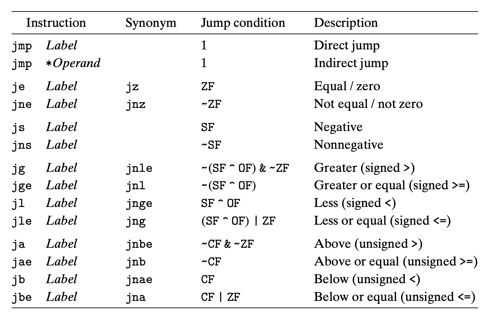

* In generating the object-code file, the assembler determines the addresses of all labeled instruc- tions and encodes the jump targets (the addresses of the destination instructions) as part of the jump instructions.
* In assembly code, jump targets are written using symbolic labels. The assembler, and later the linker, generate the proper encodings of the jump targets.
* There are several different encodings for jumps:
    * The most commonly used ones are PC relative. That is, they encode the difference between the address of the target instruction and the address of the instruction immediately following the jump. These offsets can be encoded using 1, 2, or 4 bytes.
    * A second encoding method is to give an “absolute” address, using 4 bytes to directly specify the target.

### 3.6.4 Translating Conditional Branches
```c++
void cond(int a, int *p) {
    if (p && a > 0)
        *p += a;
}

movl    8(%ebp),    %edx
movl    12(%ebp),   %eax
testl   %eax,       %eax
je      .L3
testl   %edx,       %edx
jle     .L3
.L3:
```
```c++
int test(int x, int y) {
    int val = x^y;
    if (x < -3) {
        if (y < x) {
            val = x*y;
        } else {
            val = x+y;
        }
    } else if (x > 2) {
        val = x-y;
    }

    return val;
}

    movl    8(%ebp),    %eax // x
    movl    12(%ebp),   %edx // y
    cmpl    $-3,        %eax
    jge     .L2
    cmpl    %edx,       %eax
    jle     .L3
    imull   %edx,       %eax
    jmp     .L4
.L3:
    leal    (%edx, %eax), %eax
    jmp     .L4
.L2:
    cmpl    $2,     %eax
    jg      .L5
    xorl    %edx,   %eax
    jmp     .L4
.L5:
    subl    %edx,   %eax
.L4:
```

### 3.6.5 Loops
* Most compilers generate loop code based on the do-while form of a loop, even though this form is relatively uncommon in actual programs. Other loops are transformed into do- while form and then compiled into machine code.

* do-while
    ```c++
    do
        statement;
    while (test-expr);
    /**********************/
    loop:
        statment;
        t = test-expr;
        if (t)
            goto loop;
    ```
* while
    ```c++
    while (!test-expr) {
        statment;
    }
    /**********************/
    if (!test-expr)
        goto done;
    do {
        statment;
    } while (test-expr);
    done:
    ```
* for
    ```c++
    for (init-expr; test-expr; update-expr)
        statment;
    /**********************/
    init-expr;
    if (!test-expr)
        goto done;
    do {
        statment;
        update-expr;
    } while (test-expr);
    done:
    ```

### 3.6.6 Conditional Move Instructions
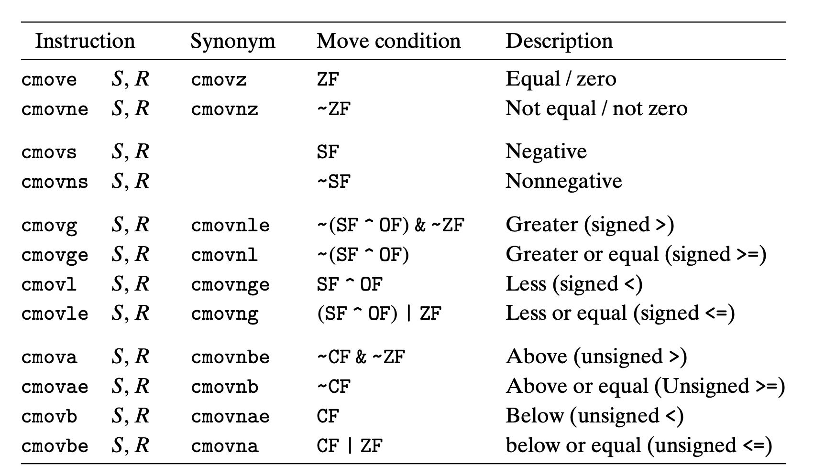

### 3.6.7 Switch Statements

## 3.7 Procedures
### 3.7.3 Register Usage Conventions
Registers %eax, %edx, and %ecx are classified as **caller-save registers**. When procedure Q is called by P, it can overwrite these registers without destroying any data required by P.

On the other hand, registers %ebx, %esi, and %edi are classified as **callee-save registers**. This means that Q must save the values of any of these registers on the stack before overwriting them, and restore them before returning.

### 3.8.2 Pointer Arithmetic


## 3.9 Heterogeneous Data Structures

### 3.12.1 Thwarting Buffer Overflow Attack
**Statck Randomization**

    In order to insert exploit code into a system, the attacker needs to inject both the code as well as a pointer to this code as part of the attack string.

    The idea of stack randomization is to make the position of the stack vary from one run of a program to another.

    This is implemented by allocating a random amount of space between 0 and n bytes on the stack at the start of a program.

**Stack Corruption Detection**

**Limiting Executable Code Regions**

# Chapter 4 Processor Arthitecture
The instructions supported by a particular processor and their byte-level encodings are known as its instruction-set architecture (ISA).

## 4.1 The Y86 Instruction Set Architecture
### 4.1.1 Programmer-Visible State
1. Program registers: %eax, %ebx %ecx, %edx, %edi, %esi, %ebp, %esp
2. Condition codes: ZF, SF, OF


# Chapter 6 The Memory Hierarchy
## 6.4 Cache Memories
### 6.4.1 Generic Cache Memory Organization


Why index with the middle bits?
> If the high-order bits are used as an index, then some contiguous memory blocks will map to the same cache set.

### 6.4.5 Issues with Writes
As a rule, caches at lower levels of the memory hierarchy are more likely to use write-back instead of write-through because of the larger transfer times.

### 6.4.7 Performance Impact of Cache Parameters
1. Hit rate
2. Hit time
3. Miss rate
4. Miss penalty

## 6.5 Writing Cache-friendly Code
Programs with better locality will tend to have lower miss rates, and programs with lower miss rates will tend to run faster than programs with higher miss rates.


# Chapter 8 Exceptional Control Flow
## 8.1 Exception
When the exception handler finishes processing, one of three things happens, depending on the type of event that caused the exception:
1. The handler returns control to the current instruction Icurr, the instruction that was executing when the event occurred.
2. The handler returns control to Inext, the instruction that would have executed next had the exception not occurred.
3. The handler aborts the interrupted program.

### 8.1.2 Classes of Exceptions
1. Interrupt
2. Trapping System Call
3. Fatal
    If the handler is able to correct the error condition, it returns control to the faulting instruction, thereby reexecuting it. Otherwise, the handler returns to an abort routine in the kernel that terminates the application program that caused the fault.
4. Abort

## 8.1.3 Exceptions in Linux/IA32 Systems
All parameters to Linux system calls are passed through general purpose registers rather than the stack. **rdi, rsi, rbx, rcx, rdx, ebp**

## 8.2 Processes
The process abstractions that provided to the application:
1. An independent logical control flow that provides the illusion that our program has exclusive use of the processor.
2. A private address space that provides the illusion that our program has exclusive use of the memory system.

### 8.2.2 Concurrent Flows
A logical flow whose execution overlaps in time with another flow is called a **concurrent flow**, and the two flows are said to run concurrently.

If two flows are running concurrently on different processor cores or computers, then we say that they are **parallel flows**.

### 8.2.4 User and Kernel Mode
When the exception occurs, and control passes to the exception handler, the processor changes the mode from user mode to kernel mode. The handler runs in kernel mode.

### 8.2.5 Context Switch
The context switch mechanism is built on top of the lower-level exception mechanism.

The kernel maintains a context for each process. The context is the state that the kernel needs to restart a preempted process. It consists of the values of objects such as the **general purpose registers**, the **floating-point registers**, the **program counter**, **user’s stack**, **status registers**, **kernel’s stack**, and various kernel data structures such as a **page table** that characterizes the address space, a **process table** that contains information about the current process, and a **file table** that contains information about the files that the process has opened.

context switch that:
1. saves the context of the current process
2. restores the saved context of some previously preempted process
3. passes control to this newly restored process.

If the system call blocks because it is waiting for some event to occur, then the kernel can put the current process to sleep and switch to another process.

## 8.4 Process Control
### 8.4.3 Reaping Child Process
If the parent process terminates without reaping its zombie children, the kernel arranges for the init process to reap them.

## 8.5 Signals
### 8.5.1 Signal Terminology
A signal that has been sent but not yet received is called a **pending signal**.

At any point in time, there can be at most one pending signal of a particular type.

When a signal is blocked, it can be delivered, but the resulting pending signal will not be received until the process unblocks the signal.

Kernel maintains the set of pending signals in the pending bit vector, and the set of blocked signals in the blocked bit vector.

### 8.5.4 Signal Handling Issues
1. Pending signals are blocked.
2. Pending signals are not queued. There can be at most one pending signal of any particular type.
3. System calls (e.g., read, write, accept) can be interrupted, when a handler catches a signal do not resume when the signal handler returns, but instead return immediately to the user with an error condition and errno set to EINTR.

On particular system, slow system calls such as read are not restarted automatically after they are interrupted by the delivery of a signal.
Instead, they return prematurely to the calling application with an error condition, unlike Linux systems, which restart interrupted system calls automatically.

### Linux Signal Handling


# Chapter 9 Virtual Memory
Virtual memory is an elegant interaction of hardware exceptions, hardware address translation, main memory, disk files, and kernel software that provides each process with a large, uniform, and private address space.

virtual memory provides three important capabilities:
* It uses main memory efficiently by treating it as a cache for an address space stored on disk, keeping only the active areas in main memory, and transferring data back and forth between disk and memory as needed.
* It simplifies memory management by providing each process with a uniform address space.
* It protects the address space of each process from corruption by other processes.

## 9.4 VM as a Tool for Memory Management
VM simplifies linking and loading, the sharing of code and data, and allocating memory to applications.

## 9.7 Case Study: The Intel Core i7/Linux Memory System
The TLBs are virtually addressed, and four-way set associative. The L1, L2, and L3 caches are physically addressed, and eight-way set associative, with a block size of 64 bytes. The page size can be configured at start-up time as either 4 KB or 4 MB. Linux uses 4-KB pages.

## 9.8 Memory Mapping
Areas can be mapped to one of two types of objects:
1. Regular file in the Unix file system:
2. Anonymous file. Pages in areas that are mapped to anonymous files are sometimes called demand-zero pages.

### 9.8.3 The execve Function Revisited
Loading and running a.out requires the following steps
1. Delete existing user areas.
2. Map private areas. text, data, bss, and stack areas of the new program. All of these new areas are private copy-on-write.
3. Map shared areas.
4. Set the program counter (PC).

## 9.9 Dynamic Memory Allocation
### 9.9.5 Implementation Issues
A practical allocator that strikes a better balance between throughput and utilization must consider the following issues:
1. Free block organization: How do we keep track of free blocks?
2. Placement: How do we choose an appropriate free block in which to place a newly allocated block?
3. Splitting: After we place a newly allocated block in some free block, what do we do with the remainder of the free block?
4. Coalescing: What do we do with a block that has just been freed?

### 9.9.6 Implicit Free Lists


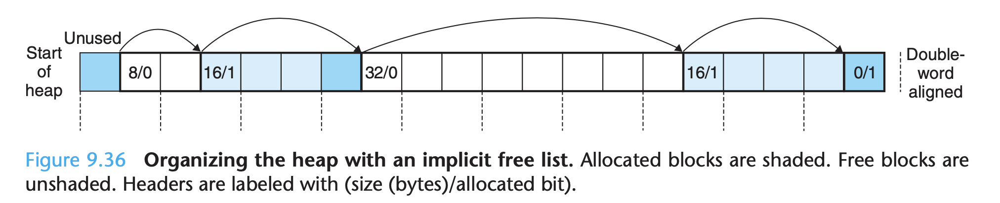

### 9.9.7 Placing Allocated Blocks
Placement policy: first fit, next fit, and best fit.

### 9.9.10 Coalescing Free Blocks
### 9.9.11 Coalescing with Boundary Tags
It's easy to coalesce next blocks with implicit format, but hard for previous blocks. To address this issues, blocks with boundary tags come.

There is one somewhat subtle aspect. The free list format we have chosen—with its prologue and epilogue blocks that are always marked as allocated—allows us to ignore the potentially troublesome edge conditions where the requested block bp is at the beginning or end of the heap.

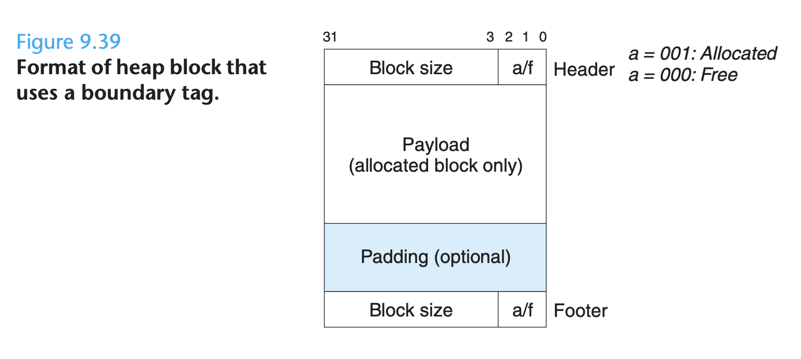

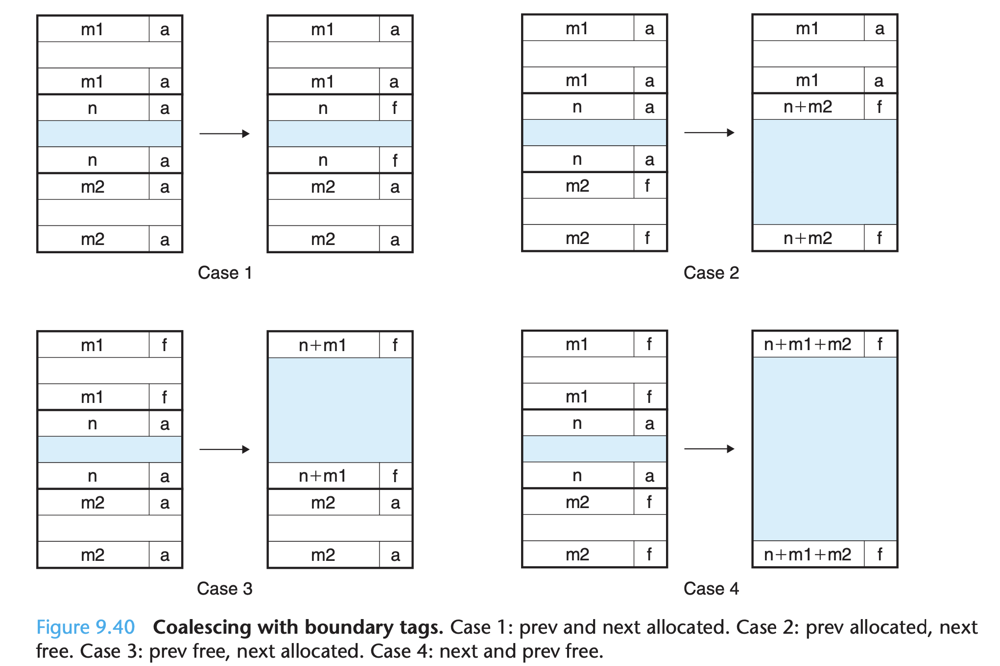

### 9.9.13 Explicit Free Lists
Because block allocation time is linear in the total number of heap blocks, the implicit free list is not appropriate for a general-purpose allocator.

Using a doubly linked list instead of an implicit free list reduces the first fit allocation time from linear in the total number of blocks to linear in the number of free blocks.

### 9.9.14 Segregated Free Lists
Segregated Fits
Each free list is associated with a size class and is organized as some kind of explicit or implicit list.

Search times are reduced because searches are limited to particular parts of the heap instead of the entire heap. Memory utilization can improve because of the interesting fact that a simple first-fit search of a segregated free list approximates a best-fit search of the entire heap.

## Reference
https://mp.weixin.qq.com/s?__biz=MzkwOTE2OTY1Nw==&mid=2247486881&idx=2&sn=77785597cd937db3013ad6c395b557a3&source=41#wechat_redirect

# Chapter 10 System-Level I/O

## Unix I/O


```
Questions:
1. Hoe does Optimizing address translation work? Page-1119
2.
```