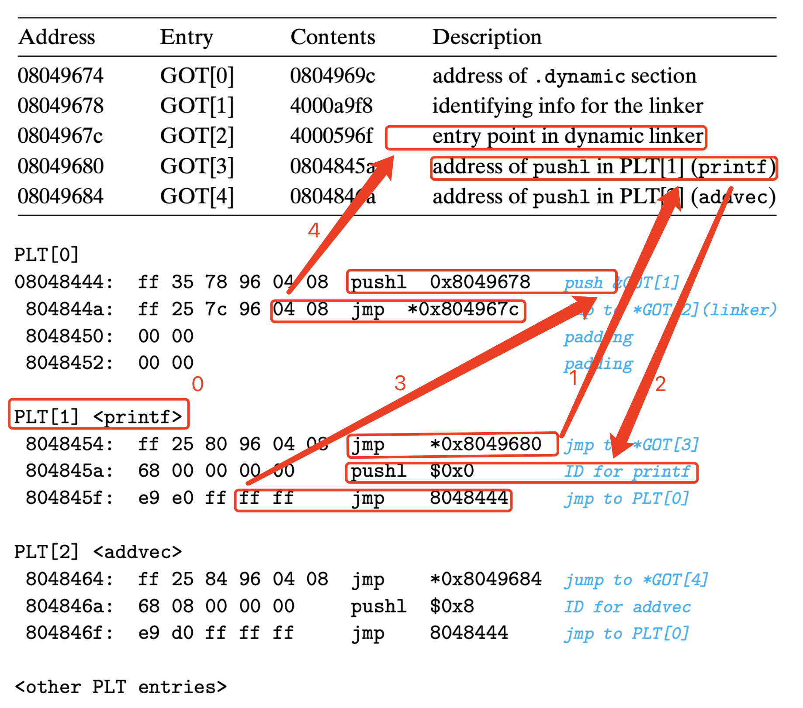
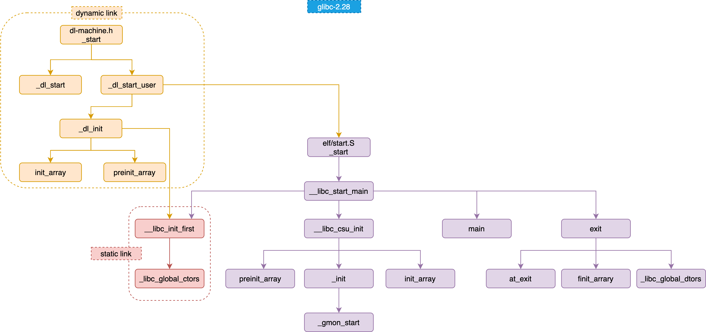

* [GNU Compiler Collection (GCC) Internals](https://gcc.gnu.org/onlinedocs/gccint/index.html#SEC_Contents)

* [2 Compiling and Linking](#2-Compiling-and-Linking)
    * [2.1 The process of being hidden](#21-The-process-of-being-hidden)
    * [2.2 What does the compiler do](#22-What-does-the-compiler-do)
    * [2.3 The linker is older than the compiler](#23-The-linker-is-older-than-the-compiler)
    * [2.4 Module assembly-static link](#24-Module-assembly-static-link)
* [3 What's in the object file](#3-Whats-in-the-object-file)
    * [3.1 The format of the object file](#31-The-format-of-the-object-file)
    * [3.2 What does the object file look like?](#32-What-does-the-object-file-look-like)
    * [3.3 Mining SimpleSection.o](#33-Mining-SimpleSectiono)
    * [3.4 ELF file structure description](#34-ELF-file-structure-description)
    * [3.5 Linked interface-symbol](#35-Linked-interface-symbol)
    * [3.6 Debugging information](#36-Debugging-information)
* [4 Static link](#4-Static-link)
    * [4.1 Space and address allocation](#41-Space-and-address-allocation)
    * [4.2 Symbol resolution and relocation](#42-Symbol-resolution-and-relocation)
    * [4.3 COMMON Block](#43-COMMON-Block)
    * [4.4 C++ related issues](#44-C-related-issues)
    * [4.5 Static library link](#45-Static-library-link)
    * [4.6 Link process control](#46-Link-process-control)
    * [4.7 BFD library](#47-BFD-library)
* [6 Executable file loading and process](#6-Executable-file-loading-and-process)
    * [6.1 Process virtual address space](#61-Process-virtual-address-space)
    * [6.2 Method of loading](#62-Method-of-loading)
    * [6.3 The loading from OS view](#63-The-loading-from-OS-view)
    * [6.4 Process virtual memory space layout](#64-Process-virtual-memory-space-layout)
        * [6.4.1 ELF Linking View and Execution View](#641-ELF-Linking-View-and-Execution-View)
        * [6.4.2 Heap and Stack](#642-Heap-and-Stack)
        * [6.4.3 Maximum number of heap allocation](#643-Maximum-number-of-heap-allocation)
        * [6.4.4 Segment Address Alignment](#644-Segment-Address-Alignment)
        * [6.4.5 Process Stack Initalization](#645-Process-Stack-Initalization)
    * [6.5 Introduction to Linux Kernel Loading ELF Process](#65-Introduction-to-Linux-Kernel-Loading-ELF-Process)
* [7 Dynamic link](#7-Dynamic-link)
    * [7.1 Why dynamic link](#71-Why-dynamic-link)
    * [7.2 Simple dynamic link example](#72-Simple-dynamic-link-example)
    * [7.3 PIC](#73-PIC)
        * [7.3.1 Trouble with fixed load address](#731-Trouble-with-fixed-load-address)
        * [7.3.2 Load Time Relocation](#732-Load-Time-Relocation)
        * [7.3.3 PIC](#733-PIC)
            * [GOT](#GOT)
        * [7.3.4 Global variables in shared modules](#734-Global-variables-in-shared-modules)
        * [7.3.5 Data segment position independent](#735-Data-segment-position-independent)
    * [7.4 Delayed binding (PLT)](#74-Delayed-binding-PLT)
    * [7.5 Dynamic link related structure](#75-Dynamic-link-related-structure)
        * [7.5.1 .interp](#751-interp)
        * [7.5.2 .dynamic](#752-dynamic)
        * [7.5.3 .dynsym](#753-dynsym)
        * [7.5.3 .rel.dyn .rel.plt](#753-reldyn-relplt)
        * [7.5.4 Headp Stack Initialization](#754-Headp-Stack-Initialization)
    * [7.6 Implementation of dynamic linking](#76-Implementation-of-dynamic-linking)
        * [7.6.1 Dynamic linker bootstrapping](#761-Dynamic-linker-bootstrapping)
        * [7.6.2 Load shared objects](#762-Load-shared-objects)
        * [7.6.3 Relocation and Initialization](#763-Relocation-and-Initialization)
        * [7.6.4 Linux Dynamic Linker](#764-Linux-Dynamic-Linker)
    * [7.7 Explicit runtime linking](#77-Explicit-runtime-linking)
* [8 Organization of Linux shared libraries](#8-Organization-of-Linux-shared-libraries)
    * [8.1 Shared library version](#81-Shared-library-version)
    * [8.2 Symbol version](#82-Symbol-version)
    * [8.3 Shared library system path](#83-Shared-library-system-path)
    * [8.4 Shared library search process](#84-Shared-library-search-process)
    * [8.5 Environment variables](#85-Environment-variables)
    * [8.6 Creation and installation of shared libraries](#86-Creation-and-installation-of-shared-libraries)
* [10 Memory](#10-Memory)
    * [10.1 Program memory layout](#101-Program-memory-layout)
    * [10.2 Stack and calling convention](#102-Stack-and-calling-convention)
    * [10.3 Heap and memory management](#103-Heap-and-memory-management)
* [11 Runtime library](#11-Runtime-library)
    * [11.1 Entry function and program initialization](#111-Entry-function-and-program-initialization)
        * [Static Load](#Static-Load)
            * [_start](#_start)
            * [__libc_start_main](#__libc_start_main)
            * [__libc_csu_init](#__libc_csu_init)
            * [__libc_init_first](#__libc_init_first)
            * [_init](#_init)
        * [Dynamic Load](#Dynamic-Load)
            * [_start](#_start)
            * [_dl_init](#_dl_init)
    * [11.2 C/C++ runtime library](#112-CC-runtime-library)
        * [crt1 crti crtn](#crt1-crti-crtn)
    * [11.3 Runtime library and multithreading](#113-Runtime-library-and-multithreading)
    * [11.4 C++ global construction and destruction](#114-C-global-construction-and-destruction)
    * [11.5 fread implementation](#115-fread-implementation)
* [12 System calls and API](#12-System-calls-and-API)
    * [12.1 Introduction to System Call](#121-Introduction-to-System-Call)
    * [12.2 Principle of System Call](#122-Principle-of-System-Call)
* [13 Runtime library implementation](#13-Runtime-library-implementation)
    * [13.1 C language runtime library](#131-C-language-runtime-library)
    * [13.2 How to use Mini CRT](#132-How-to-use-Mini-CRT)
    * [13.3 Implementation of C++ runtime library](#133-Implementation-of-C-runtime-library)
    * [13.4 How to use Mini CRT++](#134-How-to-use-Mini-CRT)

# 2 Compiling and Linking
## 2.1 The process of being hidden


## 2.2 What does the compiler do


* **Lexical analysis**

    First, the source code program is input to the scanner. It simply performs lexical analysis. Using an algorithm similar to a finite state machine (Finite State Machine) can easily convert the source code. The character sequence is divided into a series of tokens

    Tokens includes: `keywords`, `identifiers`, `literals` (Including numbers, strings, etc.) and special symbols (such as plus signs, equal signs).

* **Grammar Parser**

    The Grammar Parser will perform grammatical analysis on the tokens to generate a Syntax Tree. The whole analysis process uses the analysis method of Context-free Grammar

    At the same time of grammatical analysis, the priority and meaning of many arithmetic symbols have also been determined.

* **Semantic Analyzer**

    The grammatical analysis only completes the analysis of the grammatical level of the expression, but it does not know whether the sentence is really meaningful. For example, it is meaningless to do multiplication of two pointers in C language, but this statement is grammatically legal.

    The semantics that the compiler can analyze is static semantics. The so-called static semantics refers to the semantics that can be determined at compile time, and the corresponding dynamic semantics is the semantics that can only be determined at runtime.

    **Static semantics** usually include `declaration` and `type matching`, and `type conversion`. For example, when a floating-point expression is assigned to an integer expression, it implies a floating-point to integer conversion process. This step needs to be completed in the semantic analysis process. For example, when assigning a floating-point type to a pointer, the semantic analysis program will find that the type does not match, and the compiler will report an error. **Dynamic semantics** generally refers to semantic-related problems that occur at runtime. For example, using 0 as a divisor is a runtime semantic error.

    After the semantic analysis stage, the expressions of the entire syntax tree are marked with types. If some types need to be implicitly converted, the semantic analysis program will insert the corresponding conversion nodes in the syntax tree.

* **Code Generator**
    The code generator converts the intermediate code into the object machine code. This process is very dependent on the object machine, because different machines have different word lengths, registers, integer data types, and floating-point data types.

* **Code Optimizer**
    Selecting the appropriate addressing method, using displacement instead of multiplication, deleting redundant instructions, etc.

## 2.3 The linker is older than the compiler
The concept of **Symbol** is quickly used with the popularity of assembly language. It is used to represent an address. This address may be the starting address of a subroutine (later developed into a function) or the starting address of a variable.

## 2.4 Module assembly-static link
The linking process mainly includes the steps of
* Address
* Storage Allocation
* Symbol Resolution
* Relocation.

# 3 What's in the object file

## 3.1 The format of the object file
The popular executable file format (Executable) of the PC platform is mainly **PE** (Portable Executable) under Windows and **ELF** (Executable Linkable Format) of Linux, both of which are variants of COFF (Common file format).

The static link library is slightly different. It bundles many object files together to form a file, plus some indexes, you can simply understand it as a file package containing many object files.

```
$ file foobar.o
foobar.o: ELF 32-bit LSB relocatable, Intel 80386, version 1 (SYSV), not stripped

$ file /bin/bash
/bin/bash: ELF 32-bit LSB executable, Intel 80386, version 1 (SYSV), for GNU/Linux 2.6.8, dynamically

$ file /lib/ld-2.6.1.so
/lib/libc-2.6.1.so: ELF 32-bit LSB shared object, Intel 80386, version 1 (SYSV), for GNU/Linux 2.6.8, stripped
```

## 3.2 What does the object file look like?


BSS(Block Started by Symbol), Unix FAQ section 1.3(http://www.faqs.org/faqs/unix-faq/faq/part1/section-3.html

Separating data and instruction has many benefits:
* On the one hand, when the program is loaded, the data and instructions are respectively mapped to two virtual memory areas. The **permissions** of these two virtual storage areas can be set to read-write and read-only respectively. This prevents program instructions from being rewritten intentionally or unintentionally.
* Improving perform through data **cache** and instruction cache
* When multiple copies of the program are running in the system, their instructions are the same, so only **one copy** of the program's instruction needs to be stored in the memory.

## 3.3 Mining SimpleSection.o

## 3.4 ELF file structure description


```c++
typedef struct elf32_hdr {
    unsigned char   e_ident[EI_NIDENT];
    Elf32_Half      e_type;
    Elf32_Half      e_machine;
    Elf32_Word      e_version;
    Elf32_Addr      e_entry;	/* Entry point */
    Elf32_Off       e_phoff;
    Elf32_Off       e_shoff;
    Elf32_Word      e_flags;
    Elf32_Half      e_ehsize;
    Elf32_Half      e_phentsize;
    Elf32_Half      e_phnum;
    Elf32_Half      e_shentsize;
    Elf32_Half      e_shnum;
    Elf32_Half      e_shstrndx;
} Elf32_Ehdr;
```

## 3.5 Linked interface-symbol

In linking, the merging of object files is actually a reference to addresses between object files, that is, references to addresses of functions and variables.

* **ELF symble table struct**

```c++
typedef struct elf64_sym {
  Elf64_Word    st_name;  /* Symbol name, index in string tbl */
  unsigned char st_info;  /* Type and binding attributes: STB_LOCAL, STB_GLOBAL, STB_WEAK | STT_NOTYPE, STT_OBJECT, STT_FUNC */
  unsigned char st_other; /* No defined meaning, 0 */
  Elf64_Half    st_shndx; /* Associated section index: SHN_ABS, SHN_COMMON, SHN_UNDEF */
  Elf64_Addr    st_value; /* Value of the symbol */
  Elf64_Xword   st_size;  /* Associated symbol size */
} Elf64_Sym;
```

* **Special Symble**

```c++
__executable_start // the start address of the program, not entry
__etext or etext or etext // the end address of .text
_edata or edata // the end address of .data
_end or end // the end address of the program
```

```c++
#include <stdio.h>

extern char __executable_start[];
extern char etext[], _etext[], __etext[];
extern char edata[], _edata[];
extern char end[], _end[];

int main() {
    printf("Executable Start %X\n", __executable_start);
    printf("Text End %X %X %X\n", etext, _etext, __etext);
    printf("Data End %X %X\n", edata, _edata);
    printf("Executable End %X %X\n", end, _end);
}
```

* **C++ Name Mangling**
    The basic C++ name modification method of GCC is as follows: All symbols start with "_Z", for nested names (in the namespace or in the class), followed by "N", then the lenght of each name, and then each name space and class Name, and then ends with "E".

    ```c++
    int C::C2::func(int) -> _ZN1C2C24funcEi
    ```

    ```c++
    #ifdef __cplusplus
    extern "C" {
        printf( "%d\n", _ZN6myname3varEi );
    #endif
        void *memset (void *, int, size_t);
    #ifdef __cplusplus
        }
    #endif
    ```

* **Strong Symbol and Weak Symbol**

    For the C/C++ language, the compiler default functions and initialized global variables are **strong symbols**, and uninitialized global variables are **weak symbols**. We can also define any strong symbol as a weak symbol through GCC's "__attribute__((weak))". Note that both strong symbols and weak symbols are for definitions, not for symbol references.

    Rule processing and selection of global symbols that have been defined multiple times:
    1. Strong symbols are not allowed to be defined multiple times (that is, different object files cannot have strong symbols with the same name); if there are multiple strong symbol definitions, the linker reports a symbol duplication definition error.
    2. If a symbol is a strong symbol in a certain object file, but is a weak symbol in other files, then choose a strong symbol.
    3. If a symbol is a weak symbol in all object files, choose the one that occupies the largest space. For example, object file A defines global variable global as int type, which occupies 4 bytes; object file B defines global as double type, which occupies 8 bytes, then after object file A and B are linked, the symbol global occupies 8 bytes ( Try not to use multiple weak symbols of different types, otherwise it will easily lead to program errors that are difficult to find).

* **Weak references and strong references**

    The symbol references we have seen to external object files so far need to be correctly resolved when the object file is finally linked into an executable file. If the definition of the symbol is not found, the linker will report the symbol Undefined error, this is called a **strong reference**.

    When dealing with **weak references**, if the symbol is defined, the linker determines the symbol's reference; if the symbol is not defined, the linker does not treat the reference as an error.

    The linker processes strong references and weak references in almost the same way, except that for undefined weak references, the linker does not consider it an error. Generally, for undefined weak references, the linker defaults it to 0, or a special value, so that the program code can recognize it.

    We can declare a reference to an external function as a weak reference by using the extended keyword "__attribute__((weakref))", such as the following code:

    ```c++
    __attribute__ ((weakref)) void foo();

    int main() {
        foo();
    }
    ```

    Such weak symbols and weak references are very useful for libraries. For example, the weak symbols defined in the library can be overwritten by user-defined strong symbols, so that the program can use a custom version of the library function; or the program can define some extended function module as a weak reference. When we link the extension module with the program, the function module can be used normally; if we remove some function modules, the program can also be linked normally, but the corresponding function is missing , Which makes it easier to cut and combine the functions of the program.

    ```c++
    #include <stdio.h>
    #include <pthread.h>

    int pthread_create( pthread_t*, const pthread_attr_t*, void* (*)(void*), void*) __attribute__ ((weak));

    int main()
    {

        if (pthread_create) {
            printf("This is multi-thread version!\n");
            // run the multi-thread version
            // main_multi_thread()
        } else {
            printf("This is single-thread version!\n");
            // run the single-thread version
            // main_single_thread()
        }
    }

    gcc pthread.c -o pt // single-thread
    gcc pthread.c -o pt -lpthread // multi-thread
    ```

## 3.6 Debugging information

# 4 Static link

```c++
// a.c
extern int shared;
extern int swap(int* a, int *b);

int main() {
    int a = 100;
    swap(&a, &shared);
}

// b.c
int shared = 1;

int swap(int* a, int *b) {
    *a ^= *b ^= *a ^= *b;
}
```

## 4.1 Space and address allocation

* **Similar section merge**
    

    As we mentioned earlier, the ".bss" section does not occupy file space in object files and executable files, but it occupies address space when loading. Therefore, when the linker merges each section, it also merges ".bss" and allocates virtual space.

    "The linker allocates address and space for the object file" actually has two meanings:
    1. the space in the output executable file
    2. the virtual address space after loading

    For sections with actual data, such as ".text" and ".data", they must allocate space in the file and in the virtual address space, because they exist in both; and for ".bss", the meaning of allocated space is limited to the virtual address space, because it has no content in the file.

    * Two-pass linking:
        * **Address space allocation**: scans all input object files, and obtains the length, attributes and positions of their respective sections, and collects all symbol definitions and symbol references in the symbol table in the input object file, and puts them together A global symbol table. In this step, the linker will be able to obtain the section lengths of all input object files, merge them, calculate the combined length and position of each section in the output file, and establish a mapping relationship.

        * **Symbol resolution and relocation**: Use all the information collected in the first step above to read the data and relocation information in the middle of the input file, and perform symbol resolution and relocation, and adjust the address in the code. In fact, the second step is the core of the linking process, especially the relocation process.

    ```c++
    gcc -c a.c b.c

    // -e main means that the main function is used as the program entry
    // the default program entry of the ld linker is _start symble
    ld a.o b.o -e main -o ab
    ```

    ```c++
    // VMA: virtual memory address
    // LMA: load memory address

    [root@VM-16-17-centos code]# objdump -h a.o
    a.o:     file format elf64-x86-64

    Sections:
    Idx Name          Size      VMA               LMA             File off  Algn
    0 .text         00000027  0000000000000000  0000000000000000  00000040  2**0
                    CONTENTS, ALLOC, LOAD, RELOC, READONLY, CODE
    1 .data         00000000  0000000000000000  0000000000000000  00000067  2**0
                    CONTENTS, ALLOC, LOAD, DATA
    2 .bss          00000000  0000000000000000  0000000000000000  00000067  2**0
                    ALLOC
    3 .comment      0000002d  0000000000000000  0000000000000000  00000067  2**0
                    CONTENTS, READONLY
    4 .note.GNU-stack 00000000  0000000000000000  0000000000000000  00000094  2**0
                    CONTENTS, READONLY
    5 .eh_frame     00000038  0000000000000000  0000000000000000  00000098  2**3
                    CONTENTS, ALLOC, LOAD, RELOC, READONLY, DATA
    ```

    ```c++
    [root@VM-16-17-centos code]# objdump -h b.o
    b.o:     file format elf64-x86-64

    Sections:
    Idx Name          Size      VMA               LMA               File off  Algn
    0 .text         0000004b  0000000000000000  0000000000000000  00000040  2**0
                    CONTENTS, ALLOC, LOAD, READONLY, CODE
    1 .data         00000004  0000000000000000  0000000000000000  0000008c  2**2
                    CONTENTS, ALLOC, LOAD, DATA
    2 .bss          00000000  0000000000000000  0000000000000000  00000090  2**0
                    ALLOC
    3 .comment      0000002d  0000000000000000  0000000000000000  00000090  2**0
                    CONTENTS, READONLY
    4 .note.GNU-stack 00000000  0000000000000000  0000000000000000  000000bd  2**0
                    CONTENTS, READONLY
    5 .eh_frame     00000038  0000000000000000  0000000000000000  000000c0  2**3
                    CONTENTS, ALLOC, LOAD, RELOC, READONLY, DATA
    ```

    ```c++
    [root@VM-16-17-centos code]# objdump -h ab
    ab:     file format elf64-x86-64

    Sections:
    Idx Name          Size      VMA               LMA             File off  Algn
    0 .text         00000072  00000000004000e8  00000000004000e8  000000e8  2**0
                    CONTENTS, ALLOC, LOAD, READONLY, CODE
    1 .eh_frame     00000058  0000000000400160  0000000000400160  00000160  2**3
                    CONTENTS, ALLOC, LOAD, READONLY, DATA
    2 .data         00000004  0000000000601000  0000000000601000  00001000  2**2
                    CONTENTS, ALLOC, LOAD, DATA
    3 .comment      0000002c  0000000000000000  0000000000000000  00001004  2**0
                    CONTENTS, READONLY
    ```

    

* **Symble Address Resolution**

## 4.2 Symbol resolution and relocation

* **Relocation**
    ```c++
    [root@VM-16-17-centos code]# objdump -d a.o
    a.o:     file format elf64-x86-64
    Disassembly of section .text:

    0000000000000000 <main>:
    0:   55                      push   %rbp
    1:   48 89 e5                mov    %rsp,%rbp
    4:   48 83 ec 10             sub    $0x10,%rsp
    8:   c7 45 fc 64 00 00 00    movl   $0x64,-0x4(%rbp)    // 100
    f:   48 8d 45 fc             lea    -0x4(%rbp),%rax
    13:   be 00 00 00 00         mov    $0x0,%esi           // shared
    18:   48 89 c7               mov    %rax,%rdi
    1b:   e8 00 00 00 00         callq  20 <main+0x20>      // swap
    20:   b8 00 00 00 00         mov    $0x0,%eax
    25:   c9                     leaveq
    26:   c3                     retq
    ```

    `callq` is a `call near, relative, displacement relative to next instruction`. The next 4 bytes (e8 `00`) are the offset of the called function relative to the next instruction of the calling instruction.

* **Relocation Table**

    ```c++
    [root@VM-16-17-centos code]# readelf -r a.o

    Relocation section '.rela.text' at offset 0x1f0 contains 2 entries:
    Offset          Info           Type           Sym. Value    Sym. Name + Addend
    000000000014  00090000000a R_X86_64_32       0000000000000000 shared + 0
    00000000001c  000a00000004 R_X86_64_PLT32    0000000000000000 swap   - 4

    Relocation section '.rela.eh_frame' at offset 0x220 contains 1 entry:
    Offset          Info           Type           Sym. Value    Sym. Name + Addend
    000000000020  000200000002 R_X86_64_PC32     0000000000000000 .text  + 0
    ```

    ```c++
    [root@VM-16-17-centos code]# readelf -s ab
    Symbol table '.symtab' contains 15 entries:

    Num:    Value          Size Type    Bind   Vis      Ndx Name
        0: 0000000000000000     0 NOTYPE  LOCAL  DEFAULT  UND
        1: 00000000004000e8     0 SECTION LOCAL  DEFAULT    1
        2: 0000000000400160     0 SECTION LOCAL  DEFAULT    2
        3: 0000000000601000     0 SECTION LOCAL  DEFAULT    3
        4: 0000000000000000     0 SECTION LOCAL  DEFAULT    4
        5: 0000000000000000     0 FILE    LOCAL  DEFAULT  ABS a.c
        6: 0000000000000000     0 FILE    LOCAL  DEFAULT  ABS b.c
        7: 0000000000000000     0 FILE    LOCAL  DEFAULT  ABS
        8: 0000000000601000     0 OBJECT  LOCAL  DEFAULT    3 _GLOBAL_OFFSET_TABLE_
        9: 000000000040010f    75 FUNC    GLOBAL DEFAULT    1 swap
       10: 0000000000601000     4 OBJECT  GLOBAL DEFAULT    3 shared
       11: 0000000000601004     0 NOTYPE  GLOBAL DEFAULT    3 __bss_start
       12: 00000000004000e8    39 FUNC    GLOBAL DEFAULT    1 main
       13: 0000000000601004     0 NOTYPE  GLOBAL DEFAULT    3 _edata
       14: 0000000000601008     0 NOTYPE  GLOBAL DEFAULT    3 _end
    ```

    ```c++
    [root@VM-16-17-centos code]# objdump -d ab
    ab:     file format elf64-x86-64
    Disassembly of section .text:

    00000000004000e8 <main>:
    4000e8:       55                      push   %rbp
    4000e9:       48 89 e5                mov    %rsp,%rbp
    4000ec:       48 83 ec 10             sub    $0x10,%rsp
    4000f0:       c7 45 fc 64 00 00 00    movl   $0x64,-0x4(%rbp)   // 100
    4000f7:       48 8d 45 fc             lea    -0x4(%rbp),%rax
    4000fb:       be 00 10 60 00          mov    $0x601000,%esi     // shared
    400100:       48 89 c7                mov    %rax,%rdi
    400103:       e8 07 00 00 00          callq  40010f <swap>      // 07 = 40010f + (-4) - 400104 // (S + A - P)
    400108:       b8 00 00 00 00          mov    $0x0,%eax
    40010d:       c9                      leaveq
    40010e:       c3                      retq

    000000000040010f <swap>:
    40010f:       55                      push   %rbp
    ```

* **Symble Resolution**

    ```c++
    typedef struct {
        int offset;     /* Offset of the reference to relocate */
        int symbol:24,  /* Symbol the reference should point to */
            type:8;     /* Relocation type */
    } Elf32_Rel;
    ```

    ```c++
    [root@VM-16-17-centos code]# readelf -s a.o

    Symbol table '.symtab' contains 11 entries:
    Num:    Value          Size Type    Bind   Vis      Ndx Name
        0: 0000000000000000     0 NOTYPE  LOCAL  DEFAULT  UND
        1: 0000000000000000     0 FILE    LOCAL  DEFAULT  ABS a.c
        2: 0000000000000000     0 SECTION LOCAL  DEFAULT    1
        3: 0000000000000000     0 SECTION LOCAL  DEFAULT    3
        4: 0000000000000000     0 SECTION LOCAL  DEFAULT    4
        5: 0000000000000000     0 SECTION LOCAL  DEFAULT    6
        6: 0000000000000000     0 SECTION LOCAL  DEFAULT    7
        7: 0000000000000000     0 SECTION LOCAL  DEFAULT    5
        8: 0000000000000000    39 FUNC    GLOBAL DEFAULT    1 main
        9: 0000000000000000     0 NOTYPE  GLOBAL DEFAULT  UND shared
       10: 0000000000000000     0 NOTYPE  GLOBAL DEFAULT  UND swap
    ```

* **Intruction Modification**

    * There are only two instruction addressing modes modified by the relocation entry of the ELF file under the 32-bit x86 platform:
        * Absolute near address 32-bit addressing
        * Relatively near address 32-bit addressing.

    Macro | Value | Relocation Method
    --- | --- | ---
    R_386_32 | 1 | absolute address: S + A
    R_386_PC32 | 2 | relative address: S + A - P
    R_386_PLT32 | 4 | same as R_386_PC32

    * **S** is the value of the symbol (st_value of Elf64_Sym)
    * **A** is the addend
    * **P** is the address of the memory location being relocated (the start of the address of the call to Other)

    ```c++
    void foreach_section_s() {
        void foreach_relocation_entry_r() {
            refptr = s + r.offset;   /* ptr to reference to be relocated */

            if (r.type == R_386_PC32) { /* Relocate a PC-relative reference */
                refaddr = ADDR(s) + r.offset; /* ref’s run-time address */
                *refptr = (unsigned) (ADDR(r.symbol) + *refptr - refaddr);
            }

            if (r.type == R_386_32) /* Relocate an absolute reference */
                *refptr = (unsigned) (ADDR(r.symbol) + *refptr);
        }
    }
    ```

    * The difference between absolute addressing correction and relative addressing correction is that
        * the address after absolute addressing correction is the actual address of the symbol;
        * the address after relative addressing correction is the address difference between the symbol and the corrected position.


## 4.3 COMMON Block

What if a weak symbol is defined in multiple object files and their types are different?

The current linker itself does not support symbol types, that is, the variable type is transparent to the linker. It only knows the name of a symbol and does not know whether the types are consistent.

So when we define multiple symbol definition types are inconsistent, how should the linker deal with it?

Symbol definition types are inconsistent:
* Two or more strong symbol types are inconsistent;
    * error
* There is a strong symbol, the others are weak symbols, and the types are inconsistent;
    * the strong symbol prevails. If the weak symbol size is big than strong symbol's, there's warning: ld: warning: alignment 4 of symbol `global’ in a.o is smaller than 8 in b.o
* Two or more weak symbol types are inconsistent.
    * the type requiring larger block shall prevail

When the compiler compiles a compilation unit into an object file, if the compilation unit contains weak symbols (uninitialized global variables are typical weak symbols), then the size of the final space occupied by the weak symbols is unknown at this time, because it is possible that the space occupied by the symbol in other compilation units is larger than the space occupied by the symbol in this compilation unit.

Therefore, the compiler cannot allocate space in the BSS segment for the weak symbol at this time, because the size of the required space is unknown. But the linker can determine the size of the weak symbol during the linking process, because after the linker reads all input object files, the final size of any weak symbol can be determined, so it can be set in the BSS section of the final output file. So overall, uninitialized global variables are ultimately placed in the BSS segment.


## 4.4 C++ related issues

* **Duplicate code elimination**

    A more effective way is to store the instance code of each template separately in a section, and each section contains only one template instance. For example, if a template function is add<T>(), a compilation unit instantiates the template function with int type and float type, then the object file of the compilation unit contains two sections of the template instance. For the sake of simplicity, we assume that the names of these two sections are called .temp.add<int> and .temp.add<float> respectively. In this way, when other compilation units also instantiate the template function with int or float type, they will also generate the same name, so that the linker can distinguish these same template instance segments when they are finally linked, and then merge them into the final Code snippet.

    Although this method can basically solve the problem of code duplication, there are still some problems. For example, segments with the same name may have different contents. This may be because different compilation units use different compiler versions or compilation optimization options, resulting in different actual codes compiled by the same function.


* **Global Contruction and Destruction**

    **.init** This section saves executable instructions, which constitute the initialization code of the process. Therefore, when a program starts to run, before the main function is called, the initialization part of Glibc arranges to execute the code in this section.

    **.fini** This section holds the process termination code instruction. Therefore, when the main function of a program exits normally, Glibc will arrange to execute the code in this section.

## 4.5 Static library link

## 4.6 Link process control

* The methods cotroling link process:
    * Use the command line to specify parameters to the linker
    * Store the link instructions in the object file, and the compiler often passes instructions to the linker in this way.
    * Use link control script

* Link Control Script
    * ld -verbose
    * /usr/lib/ldscripts/
    * elf_i386.x, elf_i386.xs
    * ld -T my-link.script

* The Tiny Program

    ```c++
    char* str = "Hello world!\n";

    void print() {
        asm("movl $13, %%edx \n\t"
            "movl %0, %%ecx  \n\t"
            "movl $0, %%ebx  \n\t"
            "movl $4, %%eax  \n\t"
            "int $0x80       \n\t"
            ::"r"(str):"edx", "ecx", "ebx");
    }

    void exit() {
        asm("movl $42, %ebx  \n\t"
            "movl $1, %eax   \n\t"
            "int $0x80       \n\t" );
    }

    void nomain() {
        print();
        exit();
    }
    ```

    ```c++
    gcc -c -fno-builtin nomain.c

    ld -static -e nomain -o nomain nomain.o
    ```

    ```c++
    // nomain.lds

    ENTRY(nomain)

    SECTIONS
    {
        . = 0x08048000 + SIZEOF_HEADERS;
        tinytext  : { *(.text) *(.data) *(.rodata) }
        /DISCARD/ : { *(.comment) }
    }
    ```

    ```
    gcc -c -fno-builtin nomain.c
    ld -static -T nomain.lds -o nomain nomain.o
    ```

* **Introduction to ld link script syntax**

## 4.7 BFD library
* Binary File Descriptor library: handle different object file formats through a unified interface
* http://sources.redhat.com/binutils/


# 6 Executable file loading and process
## 6.1 Process virtual address space

## 6.2 Method of loading

* **Overlay**

    The task of tapping the memory potential is handed over to the programmer. The programmer must manually divide the program into several blocks when writing the program, and then write a small auxiliary code to manage when these modules should reside in memory and when they should be Replace. This small auxiliary code is the so-called Overlay Manager.

    

* **Paging**

    The data and instructions in the memory and all disks are divided into several pages according to the unit of "Page", and the unit of all subsequent loading and operations is the page.


## 6.3 The loading from OS view
* **Creat Process**
    * Create an independent virtual address space.
    * Read the executable file header, and establish the mapping relationship between the virtual space and the executable file.
    * Set the instruction register of the CPU to the entry address of the executable file and start the operation.

* **Page Fault**

## 6.4 Process virtual memory space layout

### 6.4.1 ELF Linking View and Execution View

[Executable and Linkable Format (ELF)](http://www.skyfree.org/linux/references/ELF_Format.pdf)

When the number of sections increases, the problem of space waste will arise. Because we know that when the ELF file is mapped, the system page size is used as the unit, so the size of each section during the mapping should be an integer multiple of the system page size; if not, the extra part will also occupy a page.

OS does not actually care about the actual content contained in each section of the executable file. The operating system only cares about some problems related to loading, the most important thing is the permissions of the section (readable, writable, executable)

For segments with the same permissions, merge them together as a segment for mapping. For example, there are two sections called ".text" and ".init", they contain the executable code and initialization code of the program, and they have the same permissions, and they are both readable and executable. Assuming that .text is 4097 bytes and .init is 512 bytes, these two segments will occupy three pages if they are mapped separately, but if they are merged together and mapped, only two pages will be occupied.


ELF executable files introduce a concept called **Segment**. A "Segment" contains one or more **Sections** with similar attributes. As we have seen in the above example, if the ".text" section and the ".init" section are combined together as a "Segment", then they can be viewed as a whole and mapped together when loading. That is to say, after the mapping, there is only one corresponding VMA in the process virtual memory space, instead of two. The advantage of this is that it can obviously reduce the internal fragmentation of the page, thereby saving memory space.

```c++
// sleep.c
#include <stdlib.h>
#include <unistd.h>

int main() {
    while (1) {
        sleep(1000);
    }
    return 0;
}

gcc sleep.c -o sleep.elf
```

```c++
[root@VM-16-17-centos code]# readelf -S sleep.elf
There are 30 section headers, starting at offset 0x3c98:

Section Headers:
[Nr] Name              Type             Address           Offset
    Size              EntSize          Flags  Link  Info  Align
[ 0]                   NULL             0000000000000000  00000000
    0000000000000000  0000000000000000           0     0     0
[ 1] .interp           PROGBITS         0000000000400238  00000238
    000000000000001c  0000000000000000   A       0     0     1
[ 2] .note.ABI-tag     NOTE             0000000000400254  00000254
    0000000000000020  0000000000000000   A       0     0     4
[ 3] .note.gnu.build-i NOTE             0000000000400274  00000274
    0000000000000024  0000000000000000   A       0     0     4
[ 4] .gnu.hash         GNU_HASH         0000000000400298  00000298
    000000000000001c  0000000000000000   A       5     0     8
[ 5] .dynsym           DYNSYM           00000000004002b8  000002b8
    0000000000000090  0000000000000018   A       6     1     8
[ 6] .dynstr           STRTAB           0000000000400348  00000348
    0000000000000074  0000000000000000   A       0     0     1
[ 7] .gnu.version      VERSYM           00000000004003bc  000003bc
    000000000000000c  0000000000000002   A       5     0     2
[ 8] .gnu.version_r    VERNEED          00000000004003c8  000003c8
    0000000000000020  0000000000000000   A       6     1     8
[ 9] .rela.dyn         RELA             00000000004003e8  000003e8
    0000000000000060  0000000000000018   A       5     0     8
[10] .rela.plt         RELA             0000000000400448  00000448
    0000000000000018  0000000000000018  AI       5    22     8
[11] .init             PROGBITS         0000000000400460  00000460
    000000000000001b  0000000000000000  AX       0     0     4
[12] .plt              PROGBITS         0000000000400480  00000480
    0000000000000020  0000000000000010  AX       0     0     16
[13] .text             PROGBITS         00000000004004a0  000004a0
    0000000000000175  0000000000000000  AX       0     0     16
[14] .fini             PROGBITS         0000000000400618  00000618
    000000000000000d  0000000000000000  AX       0     0     4
[15] .rodata           PROGBITS         0000000000400628  00000628
    0000000000000010  0000000000000000   A       0     0     8
[16] .eh_frame_hdr     PROGBITS         0000000000400638  00000638
    000000000000003c  0000000000000000   A       0     0     4
[17] .eh_frame         PROGBITS         0000000000400678  00000678
    00000000000000e8  0000000000000000   A       0     0     8
[18] .init_array       INIT_ARRAY       0000000000600e00  00000e00
    0000000000000008  0000000000000008  WA       0     0     8
[19] .fini_array       FINI_ARRAY       0000000000600e08  00000e08
    0000000000000008  0000000000000008  WA       0     0     8
[20] .dynamic          DYNAMIC          0000000000600e10  00000e10
    00000000000001d0  0000000000000010  WA       6     0     8
[21] .got              PROGBITS         0000000000600fe0  00000fe0
    0000000000000020  0000000000000008  WA       0     0     8
[22] .got.plt          PROGBITS         0000000000601000  00001000
    0000000000000020  0000000000000008  WA       0     0     8
[23] .data             PROGBITS         0000000000601020  00001020
    0000000000000004  0000000000000000  WA       0     0     1
[24] .bss              NOBITS           0000000000601024  00001024
    0000000000000004  0000000000000000  WA       0     0     1
[25] .comment          PROGBITS         0000000000000000  00001024
    000000000000002c  0000000000000001  MS       0     0     1
[26] .gnu.build.attrib NOTE             0000000000a01028  00001050
    0000000000001b60  0000000000000000           0     0     4
[27] .symtab           SYMTAB           0000000000000000  00002bb0
    0000000000000990  0000000000000018          28    82     8
[28] .strtab           STRTAB           0000000000000000  00003540
    000000000000063c  0000000000000000           0     0     1
[29] .shstrtab         STRTAB           0000000000000000  00003b7c
    0000000000000119  0000000000000000           0     0     1
Key to Flags:
W (write), A (alloc), X (execute), M (merge), S (strings), I (info),
L (link order), O (extra OS processing required), G (group), T (TLS),
C (compressed), x (unknown), o (OS specific), E (exclude),
l (large), p (processor specific)
```

```c++
[root@VM-16-17-centos code]# readelf -l sleep.elf

Elf file type is EXEC (Executable file)
Entry point 0x4004a0
There are 9 program headers, starting at offset 64

Program Headers:
Type            Offset             VirtAddr           PhysAddr
                FileSiz            MemSiz              Flags  Align
PHDR            0x0000000000000040 0x0000000000400040 0x0000000000400040
                0x00000000000001f8 0x00000000000001f8  R      0x8
INTERP          0x0000000000000238 0x0000000000400238 0x0000000000400238
                0x000000000000001c 0x000000000000001c  R      0x1
    [Requesting program interpreter: /lib64/ld-linux-x86-64.so.2]
LOAD            0x0000000000000000 0x0000000000400000 0x0000000000400000
                0x0000000000000760 0x0000000000000760  R E    0x200000
LOAD            0x0000000000000e00 0x0000000000600e00 0x0000000000600e00
                0x0000000000000224 0x0000000000000228  RW     0x200000
DYNAMIC         0x0000000000000e10 0x0000000000600e10 0x0000000000600e10
                0x00000000000001d0 0x00000000000001d0  RW     0x8
NOTE            0x0000000000000254 0x0000000000400254 0x0000000000400254
                0x0000000000000044 0x0000000000000044  R      0x4
GNU_EH_FRAME    0x0000000000000638 0x0000000000400638 0x0000000000400638
                0x000000000000003c 0x000000000000003c  R      0x4
GNU_STACK       0x0000000000000000 0x0000000000000000 0x0000000000000000
                0x0000000000000000 0x0000000000000000  RW     0x10
GNU_RELRO       0x0000000000000e00 0x0000000000600e00 0x0000000000600e00
                0x0000000000000200 0x0000000000000200  R      0x1

Section to Segment mapping:
Segment Sections...
00
01     .interp
02     .interp .note.ABI-tag .note.gnu.build-id .gnu.hash .dynsym .dynstr .gnu.version .gnu.version_r .rela.dyn .rela.plt .init .plt .text .fini .rodata .eh_frame_hdr .eh_frame
03     .init_array .fini_array .dynamic .got .got.plt .data .bss
04     .dynamic
05     .note.ABI-tag .note.gnu.build-id
06     .eh_frame_hdr
07
08     .init_array .fini_array .dynamic .got
[root@VM-16-17-centos code]#
[18] .init_array       INIT_ARRAY       0000000000600e00  00000e00
    0000000000000008  0000000000000008  WA       0     0     8
[19] .fini_array       FINI_ARRAY       0000000000600e08  00000e08
    0000000000000008  0000000000000008  WA       0     0     8
```

```c++
[root@VM-16-17-centos code]# cat /proc/3983804/maps
VStart      VEnd        Permission  OffSet  Device NodeNum         Path
00400000    -00401000     r-xp      00000000 fd:01 665751       /root/code/sleep.elf
00600000    -00601000     r--p      00000000 fd:01 665751       /root/code/sleep.elf
00601000    -00602000     rw-p      00001000 fd:01 665751       /root/code/sleep.elf
7fbdd30d3000-7fbdd30d6000 r-xp      00000000 fd:01 268307       /usr/lib64/libdl-2.28.so
7fbdd32d7000-7fbdd3493000 r-xp      00000000 fd:01 268071       /usr/lib64/libc-2.28.so
7fbdd3698000-7fbdd369c000 rw-p      00000000 00:00 0
7fbdd369c000-7fbdd36c8000 r-xp      00000000 fd:01 268057       /usr/lib64/ld-2.28.so
7fbdd37b6000-7fbdd37b9000 rw-p      00000000 00:00 0
7fbdd37bf000-7fbdd37c2000 r-xp      00000000 fd:01 270225       /usr/lib64/libonion_security.so.1.0.19
7fbdd38c3000-7fbdd38c5000 rw-p      00000000 00:00 0
7fbdd38c6000-7fbdd38c8000 rw-p      00000000 00:00 0
7fbdd38c8000-7fbdd38c9000 r--p      0002c000 fd:01 268057       /usr/lib64/ld-2.28.so
7ffefd7ed000-7ffefd80e000 rw-p      00000000 00:00 0            [stack]
7ffefd8b4000-7ffefd8b8000 r--p      00000000 00:00 0            [vvar]
7ffefd8b8000-7ffefd8ba000 r-xp      00000000 00:00 0            [vdso]
ffffffffff600000-ffffffffff601000 r-xp 00000000 00:00 0         [vsyscall]
```


```c++
// program header
typedef struct elf32_phdr{
    Elf32_Word  p_type;
    Elf32_Off   p_offset;   // offset in file
    Elf32_Addr  p_vaddr;
    Elf32_Addr  p_paddr;    // LMA (load memory address)
    Elf32_Word  p_filesz;   // size of file
    Elf32_Word  p_memsz;    // size of virtual memory
    Elf32_Word  p_flags;    // R W E
    Elf32_Word  p_align;
} Elf32_Phdr;
```

If p_memsz is greater than p_filesz, it means that the size of the "Segment" allocated in the memory exceeds the actual size of the file, and the "excess" part of this part is filled with "0". The advantage of this is that we don't need to set up the "Segment" of the BSS when constructing the ELF executable file. The p_memsz of the data "Segment" can be expanded. Those extra parts are the BSS. Because the only difference between the data segment and the BSS is: the data segment initializes the content from the file, and the content of the BSS segment is all initialized to zero. This means that in the previous example, we only saw two "LOAD" type segments instead of three. The BSS has been merged into the data type segment.

### 6.4.2 Heap and Stack

In the operating system, in addition to being used to map each "Segment" in the executable file, VMA can also have other functions. The operating system uses VMA to manage the address space of the process.

### 6.4.3 Maximum number of heap allocation

### 6.4.4 Segment Address Alignment

We need to map a piece of physical memory and process virtual address space to establish a mapping relationship. The length of this memory space, the starting address of this space in the physical memory and process virtual address space must be an integer multiple of 4096.

In one case, the length of each segment is not an integral multiple of the page size. One of the simplest mapping methods is to map each segment separately, and the part with a length of less than one page occupies one page.

This alignment will have a lot of internal fragments in the file segment, wasting disk space.

Some UNIX systems have adopted a tricky method, which is to make the bordering parts of each segment share a physical page, and then map the physical page twice.


### 6.4.5 Process Stack Initalization
```c++
HOME=/home/user
PATH=/usr/bin

$ prog 123
```


## 6.5 Introduction to Linux Kernel Loading ELF Process

# 7 Dynamic link
## 7.1 Why dynamic link

* **Memory and Disk Space**

    

* **Program development and release**

    Once any modules in the program are updated, the entire program must be re-linked and released to users

## 7.2 Simple dynamic link example

```c++
// alice.c
#include "lib.h"

int main() {
    foo(1);
    return 0;
}
```

```c++
// bob.c
#include "lib.h"

int main() {
    foo(2);
    retur 0;
}
```

```c++
// lib.h
#ifndef LIB_H
#define LIB_H

void foo(int i);

#endif
```

```c++
// lib.c
#include "lib.h"
#include <stdio.h>

int global_data = 4;

void foo(int i) {
    printf("Printing from Lib.so %d\n", i);
}
```

```c++
gcc -fPIC -shared -o Lib.so lib.c

gcc -o Alice alice.c ./Lib.so

gcc -o Bob bob.c ./Lib.so
```

* Address space layout during runtime of dynamic linker

    ```c++
    [root@VM-16-17-centos code]# bash: ./Bob &
    [2] 3532186
    [1]   Exit 127                ./bob
    [root@VM-16-17-centos code]# Printing from Lib.so 3
    [root@VM-16-17-centos code]# cat /proc/3532186/maps
    VStart          VEnd Permission OffSet Device NodeNum         Path
            00400000-00401000 r-xp 00000000 fd:01 665758        /root/code/Bob
            00600000-00601000 r--p 00000000 fd:01 665758        /root/code/Bob
            00601000-00602000 rw-p 00001000 fd:01 665758        /root/code/Bob
            02141000-02162000 rw-p 00000000 00:00 0             [heap]
    7f785c58c000-7f785c58f000 r-xp 00000000 fd:01 268307        /usr/lib64/libdl-2.28.so
    7f785c790000-7f785c94c000 r-xp 00000000 fd:01 268071        /usr/lib64/libc-2.28.so
    7f785cb51000-7f785cb55000 rw-p 00000000 00:00 0
    7f785cb55000-7f785cb56000 r-xp 00000000 fd:01 665756        /root/code/Lib.so
    7f785cb56000-7f785cd55000 ---p 00001000 fd:01 665756        /root/code/Lib.so
    7f785cd55000-7f785cd56000 r--p 00000000 fd:01 665756        /root/code/Lib.so
    7f785cd56000-7f785cd57000 rw-p 00001000 fd:01 665756        /root/code/Lib.so
    7f785cd57000-7f785cd83000 r-xp 00000000 fd:01 268057        /usr/lib64/ld-2.28.so
    7f785ce72000-7f785ce74000 rw-p 00000000 00:00 0
    7f785ce7a000-7f785ce7d000 r-xp 00000000 fd:01 270225        /usr/lib64/libonion_security.so.1.0.19
    7f785cf7e000-7f785cf80000 rw-p 00000000 00:00 0
    7f785cf81000-7f785cf83000 rw-p 00000000 00:00 0
    7f785cf83000-7f785cf84000 r--p 0002c000 fd:01 268057        /usr/lib64/ld-2.28.so
    7f785cf84000-7f785cf86000 rw-p 0002d000 fd:01 268057        /usr/lib64/ld-2.28.so
    7ffd9f23a000-7ffd9f25b000 rw-p 00000000 00:00 0             [stack]
    7ffd9f30c000-7ffd9f310000 r--p 00000000 00:00 0             [vvar]
    7ffd9f310000-7ffd9f312000 r-xp 00000000 00:00 0             [vdso]
    ffffffffff600000-ffffffffff601000 r-xp 00000000 00:00 0     [vsyscall]
    ```

    ```c++
    [root@VM-16-17-centos code]# readelf -l Lib.so

    Elf file type is DYN (Shared object file)
    Entry point 0x550
    There are 7 program headers, starting at offset 64

    Program Headers:
    Type           Offset             VirtAddr           PhysAddr
                    FileSiz            MemSiz              Flags  Align
    LOAD            0x0000000000000000 0x0000000000000000 0x0000000000000000
                    0x00000000000006e4 0x00000000000006e4  R E    0x200000
    LOAD            0x0000000000000e08 0x0000000000200e08 0x0000000000200e08
                    0x0000000000000228 0x0000000000000230  RW     0x200000
    DYNAMIC         0x0000000000000e20 0x0000000000200e20 0x0000000000200e20
                    0x00000000000001c0 0x00000000000001c0  RW     0x8
    NOTE            0x00000000000001c8 0x00000000000001c8 0x00000000000001c8
                    0x0000000000000024 0x0000000000000024  R      0x4
    GNU_EH_FRAME    0x0000000000000660 0x0000000000000660 0x0000000000000660
                    0x000000000000001c 0x000000000000001c  R      0x4
    GNU_STACK       0x0000000000000000 0x0000000000000000 0x0000000000000000
                    0x0000000000000000 0x0000000000000000  RW     0x10
    GNU_RELRO       0x0000000000000e08 0x0000000000200e08 0x0000000000200e08
                    0x00000000000001f8 0x00000000000001f8  R      0x1

    Section to Segment mapping:
    Segment Sections...
    00     .note.gnu.build-id .gnu.hash .dynsym .dynstr .gnu.version .gnu.version_r .rela.dyn .rela.plt .init .plt .text .fini .rodata .eh_frame_hdr .eh_frame
    01     .init_array .fini_array .data.rel.ro .dynamic .got .got.plt .bss
    02     .dynamic
    03     .note.gnu.build-id
    04     .eh_frame_hdr
    05
    06     .init_array .fini_array .data.rel.ro .dynamic .got
    ```

## 7.3 PIC
### 7.3.1 Trouble with fixed load address
Shared objects cannot assume their position in the virtual address space of the process at compile time. The difference is that the executable file can basically determine its starting position in the process virtual space, because the executable file is often the first file to be loaded, and it can choose a fixed free address.

### 7.3.2 Load Time Relocation
When linking, all references to `absolute addresses` are not relocated, and this step is postponed until loading. Once the module loading address is determined, that is, the target address is determined, the system will relocate all absolute address references in the program.

* Issue with load time relocation
    * It is conceivable that after the shared object module is loaded and mapped to the virtual space, the instruction part is shared among multiple processes. Because the method of relocation during loading needs to modify the instruction, there is no way to share the same instruction by multiple processes. Because the instructions are different for each process after being relocated. Of course, the modifiable data part of the dynamic link library has multiple copies for different processes, so they can be solved by relocation while loading.

Loading-time relocation is one of the solutions to the absolute address reference in dynamic modules, but it has a big disadvantage that the instruction part cannot be shared among multiple processes, which loses the advantage of dynamic linking to save memory.

Linux and GCC support this loading-time relocation method. We used two GCC parameters **-shared** and **-fPIC** when generating shared objects. If only "-shared" is used, then the output shared object is to use the method of loading-time relocation.

### 7.3.3 PIC
The shared instruction part of the program does not need to be changed due to the change of the load address when loading, so the basic idea is to separate the part of the instruction that needs to be modified and put it together with the data part, so that the instruction part can remain unchanged, and the data part can have a copy in each process. This kind of scheme is the technology called Position-independent Code (**PIC**).

Address referece methods:
1. Inner-module data access
    * The relative position between any instruction and the internal data of the module that it needs to access is fixed, so you only need to add a fixed offset relative to the current instruction to access the internal data of the module.

2. Inter-module data access
    * The data access target address between modules will not be determined until the load. For example, the variable b in the above example is defined in other modules, and the address can be determined only when it is loaded. As we mentioned earlier, to make the code address irrelevant, the basic idea is to put the address-related part in the data section. Obviously, the addresses of the global variables of these other modules are related to the module loading address.
    * The ELF approach is to create an array of pointers to these variables in the data section, also known as the **Global Offset Table (GOT)**. When the code needs to refer to the global variable, it can use the corresponding item in the GOT Indirect reference.

3. Inner-module call
    * Because the called function and the caller are in the same module, the relative position between them is fixed, so this situation is relatively simple. For modern systems, the jumps and function calls inside the module can be relative address calls, or register-based relative calls, so there is no need to relocate this type of instruction.

4. Inter-module call
    * The corresponding item in GOT saves the address of the target function. When the module needs to call the target function, it can jump indirectly through the item in GOT.

#### GOT
Module can determine the offset of the module's internal variables relative to the current instruction at compile time, and then we can also determine the offset of the GOT relative to the current instruction at compile time. Determining the position of the GOT is basically the same as the method of accessing a variable. By obtaining the PC value and adding an offset, the position of the GOT can be obtained. Then we can get the address of the variable according to the offset of the variable address in GOT. Of course, which variable each address in GOT corresponds to is determined by the compiler. For example, the first address corresponds to variable b, and the second corresponds to variable c.
```c++
GOT addr = (current instruction addr) + (GOT offset)
variable addr = (GOT addr) + (variable offset in GOT)
```

* GOT Data
    * 

* GOT Function
    * 

* GOT PLT
    * 

```c++
// pic.c
static int a;
extern int b;
extern void ext();

void bar() {
    a = 1;
    b = 2;
}

void foo() {
    bar();
    ext();
}

```

```c++
gcc -fPIC -shared pic.so pic.c

[root@VM-16-17-centos code]# objdump -d pic.so

pic.so:     file format elf64-x86-64

Disassembly of section .init:

0000000000000520 <_init>:
 520:   f3 0f 1e fa             endbr64
 524:   48 83 ec 08             sub    $0x8,%rsp
 528:   48 8b 05 b9 0a 20 00    mov    0x200ab9(%rip),%rax  # 200fe8 <__gmon_start__>
 52f:   48 85 c0                test   %rax,%rax
 532:   74 02                   je     536 <_init+0x16>
 534:   ff d0                   callq  *%rax
 536:   48 83 c4 08             add    $0x8,%rsp
 53a:   c3                      retq

Disassembly of section .plt:

0000000000000540 <.plt>:
 540:   ff 35 c2 0a 20 00       pushq  0x200ac2(%rip)       # 201008 <_GLOBAL_OFFSET_TABLE_+0x8>  GOT[1]
 546:   ff 25 c4 0a 20 00       jmpq   *0x200ac4(%rip)      # 201010 <_GLOBAL_OFFSET_TABLE_+0x10> GOt[2]
 54c:   0f 1f 40 00             nopl   0x0(%rax)

0000000000000550 <bar@plt>:
 550:   ff 25 c2 0a 20 00       jmpq   *0x200ac2(%rip)      # 201018 <bar@@Base+0x2009df>
 556:   68 00 00 00 00          pushq  $0x0
 55b:   e9 e0 ff ff ff          jmpq   540 <.plt>

Disassembly of section .text:

0000000000000639 <bar>:
 639:   55                      push   %rbp
 63a:   48 89 e5                mov    %rsp,%rbp
 63d:   c7 05 ed 09 20 00 01    movl   $0x1,0x2009ed(%rip)  # 201034 <a>
 644:   00 00 00
 647:   48 8b 05 92 09 20 00    mov    0x200992(%rip),%rax  # 200fe0 <b>
 64e:   c7 00 02 00 00 00       movl   $0x2,(%rax)
 654:   90                      nop
 655:   5d                      pop    %rbp
 656:   c3                      retq
```

### 7.3.4 Global variables in shared modules

Elf defines global variables in the module as external variables when it compiles the code.

When the shared module is loaded,
* case 1: if a global variable has a copy in the executable file (allocated in .bss), the dynamic linker will point the corresponding address in the GOT to the copy, so that the variable will actually have only one instance at runtime. If the variable is initialized in the shared module, the dynamic linker also needs to copy the initialization value to the copy of the variable in the main module of the program;
* case 2: if the global variable does not have a copy in the main module of the program (explicit runtime linking), e.g., use dlsym to access the variable direclty, then the corresponding address in the GOT points to internal copy of the variable in the shared module (the variable is copied at mmap section).

Assuming that module.c is a part of a shared object, then the GCC compiler will generate code for calls to global variables in a cross-module mode in the case of -fPIC. The reason is also simple: the compiler cannot determine whether the reference to global is cross-module or internal. Even if it is inside a module, that is, a reference to a global variable inside a module, according to the above conclusion, cross-module code will still be generated, because global may be referenced by executable files, so that references to global variables in shared modules is the copy in executable files.

Q: If a global variable G is defined in a lib.so, and both process A and process B use lib.so. When process A changes the value of G, does the G in process B will be affected?

A: No. Because when lib.so is loaded by two processes, its data section part has independent copies in each process. From this perspective, the global variables in the shared object are actually the same as the global variables defined in the program. Any process accesses only its own copy, and does not affect other processes.

```c++
// global-case-1.c
#include "lib.h"

// the global_data is allocated in .bss when loading
extern int global_data;

int main() {
    global_data = 12;
    foo(1);
    return 0;
}
```

```c++
// global-case-2.c
int main(int argc, char* argv[]) {
    char* error;
    void* handle = dlopen("./Lib.so", RTLD_NOW);

    if (handle == NULL) {
        printf("Open library %s error: %s\n", argv[1], dlerror());
        return -1;
    }

    // global_data_ptr points to the address at mmap section
    int* global_data_ptr = sinFn = dlsym(handle,"sin");
    if ((error = dlerror()) != NULL ) {
        printf("Symbol sin not found: %s\n", error);
        goto exit_runso;
    }

    printf("%d\n", *global_data_ptr);

    exit_runso:
        dlclose(handle);
}
```

### 7.3.5 Data segment position independent
```c++
static int a;
static int* p = &a;
```

If there is such a piece of code in a shared object, then the address of pointer p is an absolute address, which points to variable a, and the address of variable a will change as the load address of the shared object changes. So is there any way to solve this problem?

We can use `Load Time Relocation` to solve the problem of absolute address reference in the data section. For shared objects, if there is an absolute address reference in the data section, the compiler and linker will generate a relocation table, which contains a relocation entry of type "R_386_RELATIVE" to solve the above problems. When the dynamic linker loads a shared object, if it finds that the shared object has such a relocation entry, the dynamic linker will relocate the shared object.

```c++
$gcc -shared pic.c -o pic.so
```
The above command will generate a shared object that does not use PIC but uses load-time relocation. But as we have analyzed before, if the code is not position-independent, it cannot be shared between multiple processes, so the advantage of saving memory is lost. However, shared objects that are relocated during loading run faster than shared objects that use PIC, because it eliminates the need to calculate the current address and indirect address addressing every time global data and functions are accessed in PIC.

## 7.4 Delayed binding (PLT)

The main reason why dynamic link is slower than static link is that under dynamic link, global and static data access must be complicated GOT positioning, and then indirect addressing; for calls between modules, GOT must be located first, and then indirect jump.

Another reason is that the link work of the dynamic link is completed at runtime, that is, when the program starts to execute, the dynamic linker must perform the link work. As we mentioned above, the dynamic linker will find and load the share objects, and then perform symbol resolution, address relocation, etc.

When we call a function of an external module, the usual way should be to indirectly jump through the corresponding item in the GOT. In order to realize delayed binding, PLT adds another layer of indirect jump in the process. The calling function does not jump directly through GOT, but jumps through a structure called PLT item. Each external function has a corresponding item in the PLT, for example, the address of the item of the bar() function in the PLT is called bar@plt

```c++
// pic.c
static int a;
extern int b;
extern void ext();

void bar() {
    a = 1;
    b = 2;
}

void foo() {
    bar();
    ext();
}

```

```c++
gcc -fPIC -shared pic.so pic.c

[root@VM-16-17-centos code]# objdump -d pic.so

pic.so:     file format elf64-x86-64

Disassembly of section .init:

0000000000000520 <_init>:
 520:   f3 0f 1e fa             endbr64
 524:   48 83 ec 08             sub    $0x8,%rsp
 528:   48 8b 05 b9 0a 20 00    mov    0x200ab9(%rip),%rax  # 200fe8 <__gmon_start__>
 52f:   48 85 c0                test   %rax,%rax
 532:   74 02                   je     536 <_init+0x16>
 534:   ff d0                   callq  *%rax
 536:   48 83 c4 08             add    $0x8,%rsp
 53a:   c3                      retq

Disassembly of section .plt:

0000000000000540 <.plt>:
 540:   ff 35 c2 0a 20 00       pushq  0x200ac2(%rip)       # 201008 <_GLOBAL_OFFSET_TABLE_+0x8>
 546:   ff 25 c4 0a 20 00       jmpq   *0x200ac4(%rip)      # 201010 <_GLOBAL_OFFSET_TABLE_+0x10>
 54c:   0f 1f 40 00             nopl   0x0(%rax)

0000000000000550 <bar@plt>:
 550:   ff 25 c2 0a 20 00       jmpq   *0x200ac2(%rip)      # 201018 <bar@@Base+0x2009df>
 556:   68 00 00 00 00          pushq  $0x0
 55b:   e9 e0 ff ff ff          jmpq   540 <.plt>

Disassembly of section .text:

0000000000000639 <bar>:
 639:   55                      push   %rbp
 63a:   48 89 e5                mov    %rsp,%rbp
 63d:   c7 05 ed 09 20 00 01    movl   $0x1,0x2009ed(%rip)  # 201034 <a>
 644:   00 00 00
 647:   48 8b 05 92 09 20 00    mov    0x200992(%rip),%rax  # 200fe0 <b>
 64e:   c7 00 02 00 00 00       movl   $0x2,(%rax)
 654:   90                      nop
 655:   5d                      pop    %rbp
 656:   c3                      retq
```


## 7.5 Dynamic link related structure

### 7.5.1 .interp

The path of dynamic linker.

```c++
[root@VM-16-17-centos code]# objdump -s Alice

Alice:     file format elf64-x86-64

Contents of section .interp:
400238 2f6c6962 36342f6c 642d6c69 6e75782d  /lib64/ld-linux-
400248 7838362d 36342e73 6f2e3200           x86-64.so.2.
```

### 7.5.2 .dynamic

.dynamic section stores depended shared objects, the location of the `.dynsym` (dynamic link symbol table), the `.rel.dyn` `.rel.plt` (location of the dynamic link relocation table), `.init` (the address of the shared object initialization code), etc.

```c++
typedef struct dynamic{
    Elf32_Sword d_tag;
    union{
        Elf32_Sword d_val;
        Elf32_Addr  d_ptr;
    } d_un;
} Elf32_Dyn;
```

d_tag | d_val/d_ptr |
--- | ---
DT_SYMTAB | d_ptr the address of .dynsym
DT_STRTAB | d_ptr the address of .dynstr
DT_STRSZ | the size of .dynstr
DT_HASH | the address of hash table
DT_SONAME | SO-NAME
DT_RPATH | search path of shared objects
DT_INIT | the address of .init
DT_FINIT | the address of .finit
DT_NEED | dependent shared objects
DT_REL | the address of relocation table
DT_RELA | the address of relocation table
DT_RELENT | the number of relocation entry
DT_RELAENT | the number of relocation entry

* Linux-4.19.y/include/uapi/linux/elf.h

```c++
// Display the dynamic section (if present)
[root@VM-16-17-centos code]# readelf -d Alice

Dynamic section at offset 0xe00 contains 25 entries:
  Tag        Type                         Name/Value
 0x0000000000000001 (NEEDED)             Shared library: [./Lib.so]
 0x0000000000000001 (NEEDED)             Shared library: [libc.so.6]
 0x000000000000000c (INIT)               0x4004e0
 0x000000000000000d (FINI)               0x400698
 0x0000000000000019 (INIT_ARRAY)         0x600df0
 0x000000000000001b (INIT_ARRAYSZ)       8 (bytes)
 0x000000000000001a (FINI_ARRAY)         0x600df8
 0x000000000000001c (FINI_ARRAYSZ)       8 (bytes)
 0x000000006ffffef5 (GNU_HASH)           0x400298
 0x0000000000000005 (STRTAB)             0x4003a0
 0x0000000000000006 (SYMTAB)             0x4002c8
 0x000000000000000a (STRSZ)              147 (bytes)
 0x000000000000000b (SYMENT)             24 (bytes)
 0x0000000000000015 (DEBUG)              0x0
 0x0000000000000003 (PLTGOT)             0x601000
 0x0000000000000002 (PLTRELSZ)           24 (bytes)
 0x0000000000000014 (PLTREL)             RELA
 0x0000000000000017 (JMPREL)             0x4004c8
 0x0000000000000007 (RELA)               0x400468
 0x0000000000000008 (RELASZ)             96 (bytes)
 0x0000000000000009 (RELAENT)            24 (bytes)
 0x000000006ffffffe (VERNEED)            0x400448
 0x000000006fffffff (VERNEEDNUM)         1
 0x000000006ffffff0 (VERSYM)             0x400434
 0x0000000000000000 (NULL)               0x0
```

### 7.5.3 .dynsym

".dynsym" only saves symbols related to dynamic linking, and does not save the symbols inside those modules, such as module private variables. In many cases, a dynamically linked module has two tables, ".dynsym" and ".symtab". ".symtab" often saves all symbols, including the symbols in ".dynsym".

```c++
[root@VM-16-17-centos code]# readelf -sD Lib.so
Symbol table of `.gnu.hash' for image:
  Num Buc:    Value          Size   Type   Bind Vis      Ndx Name
    7   0: 0000000000201030     0 NOTYPE  GLOBAL DEFAULT  21 _edata
    8   0: 0000000000000609    46 FUNC    GLOBAL DEFAULT  11 foo
    9   0: 0000000000201038     0 NOTYPE  GLOBAL DEFAULT  22 _end
   10   1: 0000000000201030     0 NOTYPE  GLOBAL DEFAULT  22 __bss_start
```

### 7.5.3 .rel.dyn .rel.plt

The dynamically linked executable file uses the PIC method, but this cannot change the nature of its need for relocation. **For dynamic linking, if a shared object is not compiled in PIC mode, then there is no doubt that it needs to be relocated at `load time`; if a shared object is compiled in PIC mode, then it also needs to be relocated at load time which is delayed to` run time`.**

For executable files or shared objects using PIC technology, although their code section do not need to be relocated (because the address is irrelevant), the data section also contains references to absolute addresses, because the absolute address-related parts in the code section are being separated, it becomes GOT, and GOT is actually part of the data section. In addition to GOT, the data section may also contain absolute addresses reference.

```c++
[root@VM-16-17-centos code]# readelf -r Lib.so

Relocation section '.rela.dyn' at offset 0x400 contains 7 entries:
  Offset          Info           Type           Sym. Value    Sym. Name + Addend
000000200e08  000000000008 R_X86_64_RELATIVE                    600
000000200e10  000000000008 R_X86_64_RELATIVE                    5c0
000000200e18  000000000008 R_X86_64_RELATIVE                    200e18
000000200fe0  000100000006 R_X86_64_GLOB_DAT 0000000000000000 _ITM_deregisterTMClone + 0
000000200fe8  000300000006 R_X86_64_GLOB_DAT 0000000000000000 __gmon_start__ + 0
000000200ff0  000400000006 R_X86_64_GLOB_DAT 0000000000000000 _ITM_registerTMCloneTa + 0
000000200ff8  000600000006 R_X86_64_GLOB_DAT 0000000000000000 __cxa_finalize@GLIBC_2.2.5 + 0

Relocation section '.rela.plt' at offset 0x4a8 contains 3 entries:
  Offset          Info           Type           Sym. Value    Sym. Name + Addend
000000201018  000200000007 R_X86_64_JUMP_SLO 0000000000000000 printf@GLIBC_2.2.5 + 0
000000201020  000500000007 R_X86_64_JUMP_SLO 0000000000000000 sleep@GLIBC_2.2.5 + 0
000000201028  000600000007 R_X86_64_JUMP_SLO 0000000000000000 __cxa_finalize@GLIBC_2.2.5 + 0
```

```c++
[root@VM-16-17-centos code]# readelf -S Lib.so
There are 28 section headers, starting at offset 0x1948:

Section Headers:
  [Nr] Name              Type             Address           Offset
       Size              EntSize          Flags  Link  Info  Align
  [ 3] .dynsym           DYNSYM           0000000000000228  00000228
       0000000000000108  0000000000000018   A       4     1     8
  [ 4] .dynstr           STRTAB           0000000000000330  00000330
       0000000000000094  0000000000000000   A       0     0     1
  [ 7] .rela.dyn         RELA             0000000000000400  00000400
       00000000000000a8  0000000000000018   A       3     0     8
  [ 8] .rela.plt         RELA             00000000000004a8  000004a8
       0000000000000048  0000000000000018  AI       3    21     8
  [10] .plt              PROGBITS         0000000000000510  00000510
       0000000000000040  0000000000000010  AX       0     0     16
  [19] .dynamic          DYNAMIC          0000000000200e20  00000e20
       00000000000001c0  0000000000000010  WA       4     0     8
  [20] .got              PROGBITS         0000000000200fe0  00000fe0
       0000000000000020  0000000000000008  WA       0     0     8
  [21] .got.plt          PROGBITS         0000000000201000  00001000
       0000000000000030  0000000000000008  WA       0     0     8
Key to Flags:
  W (write), A (alloc), X (execute), M (merge), S (strings), I (info),
  L (link order), O (extra OS processing required), G (group), T (TLS),
  C (compressed), x (unknown), o (OS specific), E (exclude),
  l (large), p (processor specific)
```


If an ELF file is compiled in PIC mode (dynamically linked executable files are generally PIC), and an external function bar is called, bar will appear in ".rel.plt"; and if it is compiled not in PIC Mode, then bar will appear in ".rel.dyn"


### 7.5.4 Headp Stack Initialization

```c++
typedef struct {
    unint32_t       a_type;
    union {
        uint32_t    a_val;
    } a_un;
} Elf32_auxv_t;

#define AT_NULL   0 /* end of vector */
#define AT_IGNORE 1 /* entry should be ignored */
#define AT_EXECFD 2 /* file descriptor of program */
#define AT_PHDR   3 /* program headers for program */
#define AT_PHENT  4 /* size of program header entry */
#define AT_PHNUM  5 /* number of program headers */
#define AT_PAGESZ 6 /* system page size */
#define AT_BASE   7 /* base address of interpreter */
#define AT_FLAGS  8 /* flags */
#define AT_ENTRY  9 /* entry point of program */
```


## 7.6 Implementation of dynamic linking

### 7.6.1 Dynamic linker bootstrapping

First, the dynamic linker itself cannot depend on any other shared objects; secondly, the relocation of global and static variables required by the dynamic linker itself is done by itself.

For the first condition, we can control it artificially, and ensure that no system library or runtime library is used when writing the dynamic linker; for the second condition, the dynamic linker must have a very delicate code at startup to complete this Hard work without using global and static variables. This kind of boot code with certain restrictions is often called **Bootstrap**.

### 7.6.2 Load shared objects

```c++
// -Xlinker -rpath ./ linker find the shared objects in pwd
// -Xlinker <arg> Pass <arg> on to the linker.
gcc main.c b1.so b2.so -o main -Xlinker -rpath ./
```

In the ".dynamic" section, one type of entry is **DT_NEEDED**, which refers to the shared object on which the executable file (or shared object) depends. As a result, the linker can list all the shared objects required by the executable file and put the names of these shared objects into a load set. Then the linker starts to take the name of a required shared object from the collection, opens the file after finding the corresponding file, reads the corresponding ELF file header and ".dynamic" section, and then transfers its corresponding code and data segments Mapped to the process space.

The phenomenon that a global symbol in a shared object is covered by a global symbol of the same name in another shared object is called **Global Symbol Interpose**.

Linux handles Global Symbol Interpose: When a symbol needs to be added to the global symbol table, if the same symbol name already exists, the added symbol will be ignored. As you can see from the loading sequence of the dynamic linker, it is loaded in breadth-first order

### 7.6.3 Relocation and Initialization

The dynamic linker starts to traverse the executable file and the relocation table of each shared object again, and relcoate their GOT/PLT that needs to be relocated. Because at this time the dynamic linker already has the global symbol table of the process.

After the relocation, if a shared object has a ".init" section, the dynamic linker will execute the code in the ".init" section to implement the unique initialization process of the shared object, such as the most common, The construction of C++ global/static objects needs to be initialized by ".init". Correspondingly, there may be a ".finit" section in the shared object, and the code in the ".finit" section will be executed when the process exits, which can be used to implement operations like C++ global object destructuring.

If the executable file of the process also has an ".init" section, the dynamic linker will not execute it, because the ".init" and ".finit" sections in the executable file are executed by the program initialization code.

### 7.6.4 Linux Dynamic Linker

Path: glibc-2.15/elf/rtld.c _dl_start (void *arg)
_dl_start -> _dl_start_final -> _dl_sysdep_start -> _dl_main

For dynamically linked executable files, the kernel will analyze its dynamic linker address (in the ".interp" section), map the dynamic linker to the process address space, and then transfer control to the dynamic linker.

In fact, the Linux kernel does not care whether the target ELF file is executable when executing execve() (file header e_type is ET_EXEC or ET_DYN), it simply loads the file according to the description in the program header table and then transfers the control to the ELF entry Address (without ".interp" is the e_entry of the ELF file; if there is ".interp", it is the e_entry of the dynamic linker).

## 7.7 Explicit runtime linking
```c++
#include <dlfcn.h>
void *dlopen(const char *filename, int flag); // RTLD_GLOBAL, RTLD_NOW, RTLD_LAZY
void *dlsym(void *handle, char *symbol);
int dlclose (void *handle);
const char *dlerror(void);
```

Linux Dynamic Linker path: /lib64/ld-linux-x86-64.so.2

Dynamic libraries search order:
* LD_LIBRARY_PATH
* /etc/ld.so.cache
* /lib, /usr/lib

If there is a dependency relationship between the loaded modules, such as module A and module B, the programmer needs to manually load the dependent modules, for example, load B first, then load A.

The value returned by **dlsym** has different meanings for different types of symbols:
* If the symbol is a **function**, then it returns the address of the function
* If it is a **variable**, it returns the address of the variable
* If the symbol is a **constant**, then it returns the value of the constant

**Name Conflict**: dlopen uses Load Ordering while dlsym uses Dependency Ordering:
* When multiple symbols with the same name conflict, the symbol loaded first takes precedence. We call this priority method **Load Ordering**.
* **Dependency Ordering**: take the shared object opened by dlopen() as the root node, and perform breadth-first traversal of all dependent shared objects until the symbol is found

```c++
// dlapi.c

#include <stdio.h>
#include <dlfcn.h>

int main(int argc, char* argv[]) {
    char* error;
    double (*sinFn)(double);
    void* handle = dlopen(argv[1], RTLD_NOW);

    if (handle == NULL) {
        printf("Open library %s error: %s\n", argv[1], dlerror());
        return -1;
    }

    sinFn = dlsym(handle,"sin");
    if ((error = dlerror()) != NULL ) {
        printf("Symbol sin not found: %s\n", error);
        goto exit_runso;
    }

    printf("%f\n", sinFn(3.1415926 / 2));

    exit_runso:
        dlclose(handle);
}
```

```c++
gcc -o dlapi dlapi.c -ldl
./dlapi /lib64/libm.so.6
```

# 8 Organization of Linux shared libraries

## 8.1 Shared library version

* Version

    For different languages, **ABI** (Application Binary Interface) mainly includes some memory layout such as function call heap stack structure, symbol naming, parameter rules, and data structure.

* NAME

    libname.so.x.y.z

* SO-NAME

    The purpose of establishing a soft link named SO-NAME is to make all modules that depend on a shared library use the SO-NAME of the shared library instead of the detailed version number when compiling, linking and running.

    ```c++
    [root@VM-16-17-centos code]# readelf -d Lib.so

    Dynamic section at offset 0xe20 contains 24 entries:
    Tag        Type                         Name/Value
    0x0000000000000001 (NEEDED)             Shared library: [libc.so.6]
    ```

    `ldconfig` can auto update shared library when system upgrade or install new shared library

* Link Name
    ```c++
    gcc -o dlapi dlapi.c -ldl
    ./dlapi /lib64/libm.so.6
    ```

## 8.2 Symbol version

Minor-revision Rendezvous Problem

```c++
asm(".symver old_printf, printf@VERS_1.1");
asm(".symver new_printf, printf@VERS_1.2");

int old_printf() {

}

int new_printf() {

}
```

```c++
// -Xlinker <arg> Pass <arg> on to the linker.
gcc -shared -fPIC lib.c -Xlinker --version-script lib.ver -o lib.so

VERS_1.2 {
    global:
        foo;
    local:
        *;
};
```


## 8.3 Shared library system path
**/lib**, this location mainly stores the most critical and basic shared libraries of the system, such as dynamic linker, C language runtime library, mathematics library, etc. These libraries are mainly used by the programs under /bin and /sbin. There are also libraries that are needed when the system is started.

**/usr/lib**, this directory mainly saves some key shared libraries that are not required by the system runtime, mainly some shared libraries used during development. These shared libraries are generally not used by user programs or shell scripts. Used directly. This directory also contains static libraries and object files that may be used during development.

**/usr/local/lib**, this directory is used to store some libraries that are not very related to the operating system itself, mainly libraries for some third-party applications.

## 8.4 Shared library search process

There is a program called **ldconfig** in the Linux system. The function of this program is to create, delete or update the corresponding SO-NAME (ie the corresponding symbolic link) for each shared library in the shared library directory, so that the SO-NAME of each shared library can point to the correct shared library file.

This program will also collect these SO-NAMEs, store them centrally in the **/etc/ld.so.cache** file, and create a SO-NAME cache. When the dynamic linker wants to find a shared library, it can find it directly from /etc/ld.so.cache. The structure of /etc/ld.so.cache is specially designed and is very suitable for searching, so this design greatly speeds up the search process of shared libraries.

Linux Dynamic Linker path: /lib64/ld-linux-x86-64.so.2

Dynamic libraries search order:
* LD_LIBRARY_PATH
* /etc/ld.so.cache
* /lib, /usr/lib

## 8.5 Environment variables

* LD_PRELOAD
    * etc/ld.so.preload
    * Specify some preloaded shared libraries or object files

* LD_LIBRARY_PATH

* LD_DEBUG
    Arg | Val
    --- | ---
    files | show load process
    bindings | show symbol resolution
    libs |  show search dependent libraries
    versions | show version dependence
    reloc | show symbol relocation
    symbols | show search symbols
    statistics |

    ```c++
    [root@VM-16-17-centos code]# LD_DEBUG=reloc ./Alice
    4077263:     relocation processing: /lib64/libc.so.6
    4077263:     relocation processing: /lib64/libdl.so.2
    4077263:     relocation processing: ./Lib.so (lazy)
    4077263:     relocation processing: /lib64/libonion.so (lazy)
    4077263:     relocation processing: ./Alice (lazy)
    4077263:     relocation processing: /lib64/ld-linux-x86-64.so.2
    4077263:     calling init: /lib64/libc.so.6
    4077263:     calling init: /lib64/libdl.so.2
    4077263:     calling init: ./Lib.so
    4077263:     calling init: /lib64/libonion.so
    4077263:     initialize program: ./Alice
    4077263:     transferring control: ./Alice
    ```

## 8.6 Creation and installation of shared libraries
```c++
// -Wa,<options> Pass comma-separated <options> to the assembler.
// -Wp,<options> Pass comma-separated <options> to the preprocessor.
// -Wl,<options> Pass comma-separated <options> to the linker.

$gcc -shared -fPIC -Wl,-soname,libfoo.so.1 -o libfoo.so.1.0.0 \
   libfoo1.c libfoo2.c \
   -lbar1 -lbar2

$gcc -c -g -Wall -o libfoo1.o libfoo1.c
$gcc -c -g -Wall -o libfoo2.o libfoo2.c
$ld -shared -soname libfoo.so.1 -o libfoo.so.1.0.0 libfoo1.o libfoo2.o -lbar1 -lbar2
```

If we do not use `-soname` to specify the `SO-NAME` of the shared library, then the shared library does not have an SO-NAME by default. Even if ldconfig is used to update the SO-NAME soft link, the shared library will have no effect.

Tips:
* Do not remove the symbols and debugging information in the output shared library, and do not use the "-fomit-frame-pointer" option of GCC
* `-rpath PATH`   Set runtime shared library search path
* `-rpath-link PATH`  Set link time shared library search path

```c++
// run init_function_1 first then init_function_2
void __attribute__((constructor(1))) init_function_1(void);
void __attribute__((constructor(2))) init_function_2(void);

// run fini_function_2 first then fini_function_1
void __attribute__((destructor(2)))  fini_function_2(void);
void __attribute__((destructor(1)))  fini_function_1(void);
```

# 10 Memory
## 10.1 Program memory layout

## 10.2 Stack and calling convention
* The order and way of passing function parameters

    ```c++
    int __attribute__((cdecl) foo();
    ```
* Stack maintain

* Name-mangling

* Calling Convention

    [Wiki: x86 calling conventions](https://en.wikipedia.org/wiki/X86_calling_conventions)

    x86_64 and macOS follow the [System V AMD64 C ABI.pdf](https://raw.githubusercontent.com/wiki/hjl-tools/x86-psABI/x86-64-psABI-1.0.pdf)  and [Itanium C++ ABI](https://itanium-cxx-abi.github.io/cxx-abi/abi.html)

    Calling Convention | Stack cleanup | Pass Parameters | Name-mangling
    -- | -- | -- | ---
    cdecl | Caller | R -> L | <_> + <name>
    thiscall | Caller | R -> L |
    stdcall | Callee | R -> L | <_> + <name> + <@> + <name size>
    fastcall | Callee | R -> L | <@> + <name> + <@> + <name size>


## 10.3 Heap and memory management

The starting address and size of the space requested by **mmap()** must be an integer multiple of the size of the system page.


# 11 Runtime library
## 11.1 Entry function and program initialization
The code in .init and .finit sections will eventually be combined into two functions _init() and _finit(), these two functions will be executed before/after the main function.

* [GCC: 18.20.5 How Initialization Functions Are Handled](https://gcc.gnu.org/onlinedocs/gccint/Initialization.html)
* [Linux x86 Program Start Up or How do we get to main?](http://www.dbp-consulting.com/tutorials/debugging/linuxProgramStartup.html)
* [How libc startup in a process works](https://www.gnu.org/software/hurd/glibc/startup.html)


---



### Static Load

#### _start
```c++
// glibc-2.28/sysdeps/x86_64/elf/start.S
_start:
    /* Clear the frame pointer.  The ABI suggests this be done, to mark
    the outermost frame obviously.  */
    xorl %ebp, %ebp

    /* Extract the arguments as encoded on the stack and set up
    the arguments for __libc_start_main (int (*main) (int, char **, char **),
        int argc, char *argv,
        void (*init) (void), void (*fini) (void),
        void (*rtld_fini) (void), void *stack_end).
    The arguments are passed via registers and on the stack:
    main:        %rdi
    argc:        %rsi
    argv:        %rdx
    init:        %rcx
    fini:        %r8
    rtld_fini:    %r9
    stack_end:    stack.    */

    movq %rdx, %r9  /* Address of the shared library termination function.  */
    popq %rsi       /* Pop the argument count.  */
    movq %rsp, %rdx /* argv starts just at the current stack top.  */
    /* Align the stack to a 16 byte boundary to follow the ABI.  */
    andq  $~15, %rsp

    pushq %rax      /* Push garbage because we push 8 more bytes.  */

    /* Provide the highest stack address to the user code (for stacks which grow downwards).  */
    pushq %rsp

#ifdef SHARED
    /* Pass address of our own entry points to .fini and .init.  */
    movq __libc_csu_fini@GOTPCREL(%rip), %r8
    movq __libc_csu_init@GOTPCREL(%rip), %rcx

    movq BP_SYM (main)@GOTPCREL(%rip), %rdi

    /* Call the user's main function, and exit with its value.
    But let the libc call main.      */
    call BP_SYM (__libc_start_main)@PLT
#else
    /* Pass address of our own entry points to .fini and .init.  */
    movq $__libc_csu_fini, %r8
    movq $__libc_csu_init, %rcx

    movq $BP_SYM (main), %rdi

    /* Call the user's main function, and exit with its value.
    But let the libc call main.      */
    call BP_SYM (__libc_start_main)
#endif

    hlt            /* Crash if somehow `exit' does return.     */

/* Define a symbol for the first piece of initialized data.  */
    .data
    .globl __data_start
__data_start:
    .long 0
    .weak data_start
    data_start = __data_start

```

csu -> C start up

#### __libc_start_main
```c++
// glibc-2.28/csu/libc-start.c

int __libc_start_main (
    int (*main) (int, char **, char ** MAIN_AUXVEC_DECL),
    int argc,
    char **argv,
    __typeof (main) init,
    void (*fini) (void),
    void (*rtld_fini) (void),
    void *stack_end)
{
    char ** ubp_ev = &ubp_av[argc + 1];

    /* Result of the 'main' function.  */
    int result;
    __libc_multiple_libcs = &_dl_starting_up && !_dl_starting_up;

    INIT_ARGV_and_ENVIRON;

    /* Store the lowest stack address.  */
    __libc_stack_end = stack_end;

    __pthread_initialize_minimal ();

    /* Register the destructor of the dynamic linker if there is any.  */
    if (__builtin_expect (rtld_fini != NULL, 1))
        __cxa_atexit((void (*) (void *)) rtld_fini, NULL, NULL);

    /* Call the initializer of the libc.  This is only needed here if we
        are compiling for the static library in which case we haven't
        run the constructors in `_dl_start_user'.  */
    #ifndef SHARED
        __libc_init_first(argc, argv, __environ);
    #endif

    __cxa_atexit((void (*) (void *)) fini, NULL, NULL);

    (*init) (argc, argv, __environ MAIN_AUXVEC_PARAM);

    result = main (argc, argv, __environ);

    exit(result);
}

void exit (int status)
{
    while (__exit_funcs != NULL) {
        __exit_funcs();
        __exit_funcs = __exit_funcs->next;
    }
    _exit (status);
}

_exit:
    movl    4(%esp), %ebx
    movl    $__NR_exit, %eax
    int     $0x80
    hlt
```

#### __libc_csu_init
```c++
// glibc-2.28/csu/elf-init.c

/* These function symbols are provided for the .init/.fini section entry
   points automagically by the linker.  */
extern void _init (void);
extern void _fini (void);

void __libc_csu_init (int argc, char **argv, char **envp)
{
    /* For dynamically linked executables the preinit array is executed by
        the dynamic linker (before initializing any shared object).  */

    #ifndef LIBC_NONSHARED
    /* For static executables, preinit happens right before init.  */
    {
        const size_t size = __preinit_array_end - __preinit_array_start;
        size_t i;
        for (i = 0; i < size; i++)
            (*__preinit_array_start [i]) (argc, argv, envp);
    }
    #endif

    _init();

    const size_t size = __init_array_end - __init_array_start;
    for (size_t i = 0; i < size; i++)
        (*__init_array_start [i]) (argc, argv, envp);
}

void __libc_csu_fini (void)
{
    #ifndef LIBC_NONSHARED
    size_t i = __fini_array_end - __fini_array_start;
    while (i-- > 0)
        (*__fini_array_start [i]) ();

    _fini();
    #endif
}
```

#### __libc_init_first
```c++
// glibc-2.28/csu/init-first.c
void __libc_init_first(int argc, char *arg0, ...)
{
#ifdef SHARED
  /* For DSOs we do not need __libc_init_first but instead _init.  */
}

void
attribute_hidden
_init (int argc, char **argv, char **envp)
{
#endif

  __libc_multiple_libcs = &_dl_starting_up && !_dl_starting_up;

  /* Save the command-line arguments. */
  __libc_argc = argc;
  __libc_argv = argv;
  __environ = envp;

  __init_misc (argc, argv, envp);

  /* Initialize ctype data.  */
  __ctype_init ();

  __libc_global_ctors();
}

// glibc-2.28/elf/soinit.c
void __libc_global_ctors(void)
{
    while (*++__CTOR_LIST__)
        (**__CTOR_LIST__)();
}
```

#### _init
```c++
08048274 <_init>:
    8048274:       55                      push   %ebp
    8048275:       89 e5                   mov    %esp,%ebp
    8048277:       53                      push   %ebx
    8048278:       83 ec 04                sub    $0x4,%esp
    804827b:       e8 00 00 00 00          call   8048280 <_init+0xc>
    8048280:       5b                      pop    %ebx
    8048281:       81 c3 74 1d 00 00       add    $0x1d74,%ebx        (.got.plt)
    8048287:       8b 93 fc ff ff ff       mov    -0x4(%ebx),%edx
    804828d:       85 d2                   test   %edx,%edx
    804828f:       74 05                   je     8048296 <_init+0x22>
    8048291:       e8 1e 00 00 00          call   80482b4 <__gmon_start__@plt>
    8048296:       e8 d5 00 00 00          call   8048370 <frame_dummy>
    804829b:       e8 70 01 00 00          call   8048410 <__do_global_ctors_aux>
    80482a0:       58                      pop    %eax
    80482a1:       5b                      pop    %ebx
    80482a2:       c9                      leave
    80482a3:       c3                      ret
```

```c++
// glibc-2.28/sysdeps/x86_64/crti.S

#ifndef PREINIT_FUNCTION
# define PREINIT_FUNCTION __gmon_start__
#endif

_init:
    _CET_ENDBR
    /* Maintain 16-byte stack alignment for called functions.  */
    subq $8, %rsp
#if PREINIT_FUNCTION_WEAK
    movq PREINIT_FUNCTION@GOTPCREL(%rip), %rax
    testq %rax, %rax
    je .Lno_weak_fn
    call *%rax
.Lno_weak_fn:
#else
    call PREINIT_FUNCTION
#endif
```

### Dynamic Load

#### _start
```c++
// glibc-2.28/sysdeps/x86_64/dl-machine.h
#define RTLD_START asm ("
.text
    .align 16
.globl _start
.globl _dl_start_user

_start:
    movq %rsp, %rdi
    call _dl_start

_dl_start_user:
    # Save the user entry point address in %r12.
    movq %rax, %r12

    # See if we were run as a command with the executable file

    # name as an extra leading argument.
    movl _dl_skip_args(%rip), %eax

    # Pop the original argument count.
    popq %rdx

    # Adjust the stack pointer to skip _dl_skip_args words.
    leaq (%rsp,%rax,8), %rsp

    # Subtract _dl_skip_args from argc.
    subl %eax, %edx

    # Push argc back on the stack.
    pushq %rdx

    # Call _dl_init (struct link_map *main_map, int argc, char **argv, char **env)

    # argc -> rsi
    movq %rdx, %rsi

    # Save %rsp value in %r13.
    movq %rsp, %r13

    # And align stack for the _dl_init call.
    andq $-16, %rsp

    # _dl_loaded -> rdi
    movq _rtld_local(%rip), %rdi

    # env -> rcx
    leaq 16(%r13,%rdx,8), %rcx

    # argv -> rdx
    leaq 8(%r13), %rdx

    # Clear %rbp to mark outermost frame obviously even for constructors.
    xorl %ebp, %ebp

    # Call the function to run the initializers.
    call _dl_init

    # Pass our finalizer function to the user in %rdx, as per ELF ABI.
    leaq _dl_fini(%rip), %rdx

    # And make sure %rsp points to argc stored on the stack.
    movq %r13, %rsp

    # Jump to the user's entry point glibc-2.28/sysdeps/x86_64/elf/start.S
    jmp *%r12 #

.previous

");
```

#### _dl_init
```c++
// glibc-2.28/elf/dl-init.c
void _dl_init (struct link_map *main_map, int argc, char **argv, char **env)
{
  ElfW(Dyn) *preinit_array = main_map->l_info[DT_PREINIT_ARRAY];
  ElfW(Dyn) *preinit_array_size = main_map->l_info[DT_PREINIT_ARRAYSZ];
  unsigned int i;

  if (__glibc_unlikely (GL(dl_initfirst) != NULL))
    {
      call_init (GL(dl_initfirst), argc, argv, env);
      GL(dl_initfirst) = NULL;
    }

  /* Don't do anything if there is no preinit array.  */
  if (__builtin_expect (preinit_array != NULL, 0)
      && preinit_array_size != NULL
      && (i = preinit_array_size->d_un.d_val / sizeof (ElfW(Addr))) > 0)
    {
      ElfW(Addr) *addrs;
      unsigned int cnt;

      addrs = (ElfW(Addr) *) (preinit_array->d_un.d_ptr + main_map->l_addr);
      for (cnt = 0; cnt < i; ++cnt)
        ((init_t) addrs[cnt]) (argc, argv, env);
    }

  /* Stupid users forced the ELF specification to be changed.  It now
     says that the dynamic loader is responsible for determining the
     order in which the constructors have to run.  The constructors
     for all dependencies of an object must run before the constructor
     for the object itself.  Circular dependencies are left unspecified.

     This is highly questionable since it puts the burden on the dynamic
     loader which has to find the dependencies at runtime instead of
     letting the user do it right.  Stupidity rules!  */

  i = main_map->l_searchlist.r_nlist;
  while (i-- > 0)
    call_init (main_map->l_initfini[i], argc, argv, env);

#ifndef HAVE_INLINED_SYSCALLS
  /* Finished starting up.  */
  _dl_starting_up = 0;
#endif
}
```

```c++
// glibc-2.28/elf/dl-init.c
static void call_init (struct link_map *l, int argc, char **argv, char **env)
{
    if (l->l_init_called)
        /* This object is all done.  */
        return;

    /* Avoid handling this constructor again in case we have a circular
        dependency.  */
    l->l_init_called = 1;

    /* Check for object which constructors we do not run here.  */
    if (__builtin_expect (l->l_name[0], 'a') == '\0' && l->l_type == lt_executable)
        return;

    /* Are there any constructors?  */
    if (l->l_info[DT_INIT] == NULL && __builtin_expect (l->l_info[DT_INIT_ARRAY] == NULL, 1))
        return;
    /* Now run the local constructors.  There are two forms of them:
        - the one named by DT_INIT
        - the others in the DT_INIT_ARRAY.
    */
    if (l->l_info[DT_INIT] != NULL)
        DL_CALL_DT_INIT(l, l->l_addr + l->l_info[DT_INIT]->d_un.d_ptr, argc, argv, env);

    /* Next see whether there is an array with initialization functions.  */
    ElfW(Dyn) *init_array = l->l_info[DT_INIT_ARRAY];
    if (init_array != NULL)
    {
        unsigned int j;
        unsigned int jm;
        ElfW(Addr) *addrs;

        jm = l->l_info[DT_INIT_ARRAYSZ]->d_un.d_val / sizeof (ElfW(Addr));

        addrs = (ElfW(Addr) *) (init_array->d_un.d_ptr + l->l_addr);
        for (j = 0; j < jm; ++j)
            ((init_t) addrs[j]) (argc, argv, env);
    }
}
```

## 11.2 C/C++ runtime library

glib c header: `/usr/include`

glib c library: `/lib64/libc.so.6`, `/usr/lib64/libc.a`, `/usr/lib64/crt1.o`, `/usr/lib64/crti.o`, `/usr/lib64/crtn.o`

A C language runtime roughly includes the following functions:
* **Start and exit**: including entry function and other functions that the entry function depends on.
* **Standard functions**: The functions owned by the C language standard library specified by the C language standard are implemented.
* **I/O**: I/O function encapsulation and realization.
* **Heap**: The encapsulation and implementation of the heap.
* **Language realization**: the realization of some special functions in the language.
* **Debugging**: the code that realizes the debugging function.

```c++
#define va_list char*
#define va_start(ap,arg) (ap=(va_list)&arg+sizeof(arg))
#define va_arg(ap,t) (*(t*)((ap+=sizeof(t))-sizeof(t)))
#define va_end(ap) (ap=(va_list)0)
```

An easy way to see what's in there is to set the environment variable `LD_SHOW_AUXV=1` before running the program.
```c++
[root@VM-16-17-centos code]# LD_SHOW_AUXV=1 ./Alice
AT_SYSINFO_EHDR: 0x7ffef9b39000
AT_HWCAP:        f8bfbff
AT_PAGESZ:       4096
AT_CLKTCK:       100
AT_PHDR:         0x400040
AT_PHENT:        56
AT_PHNUM:        9
AT_BASE:         0x7f7196293000
AT_FLAGS:        0x0
AT_ENTRY:        0x400520
AT_UID:          0
AT_EUID:         0
AT_GID:          0
AT_EGID:         0
AT_SECURE:       0
AT_RANDOM:       0x7ffef9aa0a99
AT_HWCAP2:       0x2
AT_EXECFN:       ./Alice
AT_PLATFORM:     x86_64
```

### crt1 crti crtn

The code crti.o and crtn.o is actually the beginning and end of the _init() function and _finit() function, when these two files and other object files are linked in the order of installation, two complete functions _init() and _finit() are formed.
* **crti.o**
    ```c++
    [root@VM-16-17-centos lib64]# objdump -dr /usr/lib64/crti.o

    /usr/lib64/crti.o:     file format elf64-x86-64

    Disassembly of section .init:

    0000000000000000 <_init>:
    0:   f3 0f 1e fa             endbr64
    4:   48 83 ec 08             sub    $0x8,%rsp
    8:   48 8b 05 00 00 00 00    mov    0x0(%rip),%rax  # f <_init+0xf>
                            b: R_X86_64_REX_GOTPCRELX   __gmon_start__-0x4
    f:   48 85 c0                test   %rax,%rax
    12:  74 02                   je     16 <_init+0x16>
    14:  ff d0                   callq  *%rax

    Disassembly of section .fini:

    0000000000000000 <_fini>:
    0:   f3 0f 1e fa             endbr64
    4:   48 83 ec 08             sub    $0x8,%rsp
    ```

* **crtn.o**
    ```c++
    [root@VM-16-17-centos lib64]# objdump -dr /usr/lib64/crtn.o

    /usr/lib64/crtn.o:     file format elf64-x86-64

    Disassembly of section .init:

    0000000000000000 <.init>:
    0:   48 83 c4 08             add    $0x8,%rsp
    4:   c3                      retq

    Disassembly of section .fini:

    0000000000000000 <.fini>:
    0:   48 83 c4 08             add    $0x8,%rsp
    4:   c3                      retq
    ```

The ".init" section of the output object file contains only one function _init(). The beginning part of this function comes from the ".init" section of crti.o, and the end part comes from the ".init" section of crtn.o. part.

In order to ensure the correctness of ".init" and ".finit" in the final output file, we must ensure that when linking, crti.o must be before the user object file and system library, and crtn.o must be in the user object file and system library. After the library. The input file sequence of the linker is generally:
```c++
ld crt1.o crti.o crtbegin.o [user_objects] [system_libraries] crtend.o crtn.o -lgcc

-nostartfile -nostdlib

__ attribute__((section(".init")))
```

You can use "\__attribute__((section(".init")))" to put functions in the .init section, but it should be noted that putting ordinary functions in ".init" will destroy their structure, because the function of the return instruction causes the _init() function to return early. The assembly instruction must be used, and the compiler cannot generate a "ret" instruction.


* C++ construct destruct object
    * /usr/lib/gcc/x86_64-redhat-linux/8/crtbegin.o
    * /usr/lib/gcc/x86_64-redhat-linux/8/crtend.o

/usr/lib/gcc/x86_64-redhat-linux/8/libgcc.a
/usr/lib/gcc/x86_64-redhat-linux/8/libgcc_eh.a


## 11.3 Runtime library and multithreading

## 11.4 C++ global construction and destruction

```c++
// gcc/libgcc/crtstuff.c
//  _start –> __libc_start_main –> _libc_csu_init -> _init -> __do_global_ctors_aux:

void __do_global_ctors_aux (void)       /* prologue goes in .init section */
{
  FORCE_CODE_SECTION_ALIGN              /* explicit align before switch to .text */
  asm (__LIBGCC_TEXT_SECTION_ASM_OP__); /* don't put epilogue and body in .init */
  DO_GLOBAL_CTORS_BODY;
  atexit (__do_global_dtors);
}

#define DO_GLOBAL_CTORS_BODY                                \
do {                                                        \
  __SIZE_TYPE__ nptrs = (__SIZE_TYPE__) __CTOR_LIST__[0];   \
  unsigned i;                                               \
  if (nptrs == (__SIZE_TYPE__)-1)                           \
    for (nptrs = 0; __CTOR_LIST__[nptrs + 1] != 0; nptrs++);\
  for (i = nptrs; i >= 1; i--)                              \
    __CTOR_LIST__[i] ();                                    \
} while (0)
#endif
```

For each compilation unit (.cpp), the GCC compiler will traverse all global objects in it and generate a special function. The purpose of this special function is to initialize all global objects in this compilation unit.

When the linker links the user's target file, **crtbegin.o** is always in front of the user's target file, and **crtend.o** is always behind the user's target file

Before and after the target file, you need to link crtbegin.o and crtend.o. These two glibc target files also have a .ctors section. When linking, the contents of the .ctors section of these two files will also be merged into the final executable file.

The .ctor section of crtbegin.o is a 4-byte -1 (0xFFFFFFFF), and the linker is responsible for changing this value to the number of global constructions. Then this section also defines the starting address as the symbol `__CTOR_LIST__`, so that in fact `__CTOR_LIST__` represents the starting address of all the .ctor sections that are finally merged.

crtend.o: The content of .ctors in this file is even simpler, its content is a 0, and then a symbol `__CTOR_END__` is defined, pointing to the end of the .ctor section.

```c++
#include <stdio.h>
#include <stdlib.h>

#define printf_func() printf("%s\n", __FUNCTION__)

#define SECTION(S) __attribute__((section(S)))

void _preinit_arr(int argc, char **argv, char **envp) {
    printf_func();
}

void _init(int argc, char **argv, char **envp) {
    printf_func();
}

void _init_arr(int argc, char **argv, char **envp) {
    printf_func();
}

void _fini_arr() {
    printf_func();
}

SECTION(".preinit_array") typeof(_preinit_arr)* preinit_arr = _preinit_arr;
SECTION(".preinit_array") typeof(_init)* init = _init;
SECTION(".init_array") typeof(_init_arr)* init_arr = _init_arr;
SECTION(".fini_array") typeof(_fini_arr)* fini_arr = _fini_arr;

void  __attribute__ ((constructor)) constructor() {
    printf_func();
}

void __attribute__ ((destructor)) destructor() {
    printf_func();
}

void exit_1() {
    printf_func();
}

void exit_2() {
    printf_func();
}

int main() {
    atexit(exit_1);
    atexit(exit_2);
}
```

```c++
(gdb) set disassemble-next-line on
```

Since the construction and destruction of global objects are done by the runtime, when there are global objects in the program or shared library, remember that you cannot use the **-nonstartfiles** or **-nostdlib** option, otherwise, the construction and destructor will Can't execute normally

* collect2

    On some systems, the assembler and linker do not support the ".init" and ".ctor" mechanisms introduced in this section. Therefore, in order to execute the code before the main function, special processing must be performed during linking. The Collect2 program is used to achieve this function.

    It will "collect" all the specially named symbols in the input target file. These special symbols indicate that they are global constructors or executed before main. Collect2 will generate one Temporary .c file, the addresses of these symbols are collected into an array, and then put into this .c file, after compilation, it is linked to the final output file together with other object files.

## 11.5 fread implementation

# 12 System calls and API
## 12.1 Introduction to System Call
## 12.2 Principle of System Call

```c++
[root@VM-16-17-centos code]# ldd /bin/bash
    linux-vdso.so.1 (0x00007fff1874d000)
    /$LIB/libonion.so => /lib64/libonion.so (0x00007fbce09bb000)
    libtinfo.so.6 => /lib64/libtinfo.so.6 (0x00007fbce034d000)
    libdl.so.2 => /lib64/libdl.so.2 (0x00007fbce0149000)
    libc.so.6 => /lib64/libc.so.6 (0x00007fbcdfd84000)
    /lib64/ld-linux-x86-64.so.2 (0x00007fbce0898000)
```

```c++
[root@VM-16-17-centos code]# cat /proc/106707/maps
564e81db9000-564e81ec1000 r-xp 00000000 fd:01 268773                     /usr/bin/bash
564e820c0000-564e820c4000 r--p 00107000 fd:01 268773                     /usr/bin/bash
564e820c4000-564e820cd000 rw-p 0010b000 fd:01 268773                     /usr/bin/bash
564e820cd000-564e820d7000 rw-p 00000000 00:00 0
564e83987000-564e83b17000 rw-p 00000000 00:00 0                          [heap]
7f7b522bb000-7f7b522c6000 r-xp 00000000 fd:01 268316                     /usr/lib64/libnss_files-2.28.so
7f7b522c6000-7f7b524c6000 ---p 0000b000 fd:01 268316                     /usr/lib64/libnss_files-2.28.so
7f7b524c6000-7f7b524c7000 r--p 0000b000 fd:01 268316                     /usr/lib64/libnss_files-2.28.so
7f7b524c7000-7f7b524c8000 rw-p 0000c000 fd:01 268316                     /usr/lib64/libnss_files-2.28.so
7f7b524c8000-7f7b524ce000 rw-p 00000000 00:00 0
7f7b524ce000-7f7b52da2000 r--s 00000000 fd:01 394547                     /var/lib/sss/mc/passwd
7f7b52da2000-7f7b52dac000 r-xp 00000000 fd:01 280182                     /usr/lib64/libnss_sss.so.2
7f7b52dac000-7f7b52fab000 ---p 0000a000 fd:01 280182                     /usr/lib64/libnss_sss.so.2
7f7b52fab000-7f7b52fac000 r--p 00009000 fd:01 280182                     /usr/lib64/libnss_sss.so.2
7f7b52fac000-7f7b52fad000 rw-p 0000a000 fd:01 280182                     /usr/lib64/libnss_sss.so.2
7f7b52fad000-7f7b53225000 r--p 00000000 fd:01 267823                     /usr/lib/locale/en_US.utf8/LC_COLLATE
7f7b53225000-7f7b533e1000 r-xp 00000000 fd:01 268071                     /usr/lib64/libc-2.28.so
7f7b533e1000-7f7b535e0000 ---p 001bc000 fd:01 268071                     /usr/lib64/libc-2.28.so
7f7b535e0000-7f7b535e4000 r--p 001bb000 fd:01 268071                     /usr/lib64/libc-2.28.so
7f7b535e4000-7f7b535e6000 rw-p 001bf000 fd:01 268071                     /usr/lib64/libc-2.28.so
7f7b535e6000-7f7b535ea000 rw-p 00000000 00:00 0
7f7b535ea000-7f7b535ed000 r-xp 00000000 fd:01 268307                     /usr/lib64/libdl-2.28.so
7f7b535ed000-7f7b537ec000 ---p 00003000 fd:01 268307                     /usr/lib64/libdl-2.28.so
7f7b537ec000-7f7b537ed000 r--p 00002000 fd:01 268307                     /usr/lib64/libdl-2.28.so
7f7b537ed000-7f7b537ee000 rw-p 00003000 fd:01 268307                     /usr/lib64/libdl-2.28.so
7f7b537ee000-7f7b53817000 r-xp 00000000 fd:01 267574                     /usr/lib64/libtinfo.so.6.1
7f7b53817000-7f7b53a16000 ---p 00029000 fd:01 267574                     /usr/lib64/libtinfo.so.6.1
7f7b53a16000-7f7b53a1a000 r--p 00028000 fd:01 267574                     /usr/lib64/libtinfo.so.6.1
7f7b53a1a000-7f7b53a1b000 rw-p 0002c000 fd:01 267574                     /usr/lib64/libtinfo.so.6.1
7f7b53a1b000-7f7b53a47000 r-xp 00000000 fd:01 268057                     /usr/lib64/ld-2.28.so
7f7b53ab8000-7f7b53ad9000 rw-p 00000000 00:00 0
7f7b53ad9000-7f7b53b2c000 r--p 00000000 fd:01 268271                     /usr/lib/locale/en_US.utf8/LC_CTYPE
7f7b53b2c000-7f7b53b2d000 r--p 00000000 fd:01 268278                     /usr/lib/locale/en_US.utf8/LC_NUMERIC
7f7b53b2d000-7f7b53b2e000 r--p 00000000 fd:01 268266                     /usr/lib/locale/en_US.utf8/LC_TIME
7f7b53b2e000-7f7b53b2f000 r--p 00000000 fd:01 268262                     /usr/lib/locale/en_US.utf8/LC_MONETARY
7f7b53b2f000-7f7b53b36000 r--s 00000000 fd:01 262182                     /usr/lib64/gconv/gconv-modules.cache
7f7b53b36000-7f7b53b38000 rw-p 00000000 00:00 0
7f7b53b38000-7f7b53b39000 r--p 00000000 fd:01 268274                     /usr/lib/locale/en_US.utf8/LC_MESSAGES/SYS_LC_MESSAGES
7f7b53b39000-7f7b53b3a000 r--p 00000000 fd:01 267843                     /usr/lib/locale/en_US.utf8/LC_PAPER
7f7b53b3a000-7f7b53b3b000 r--p 00000000 fd:01 268276                     /usr/lib/locale/en_US.utf8/LC_NAME
7f7b53b3b000-7f7b53b3c000 r--p 00000000 fd:01 267773                     /usr/lib/locale/en_US.utf8/LC_ADDRESS
7f7b53b3c000-7f7b53b3d000 r--p 00000000 fd:01 268264                     /usr/lib/locale/en_US.utf8/LC_TELEPHONE
7f7b53b3d000-7f7b53b3e000 r--p 00000000 fd:01 268261                     /usr/lib/locale/en_US.utf8/LC_MEASUREMENT
7f7b53b3e000-7f7b53b41000 r-xp 00000000 fd:01 270225                     /usr/lib64/libonion_security.so.1.0.19
7f7b53b41000-7f7b53c41000 ---p 00003000 fd:01 270225                     /usr/lib64/libonion_security.so.1.0.19
7f7b53c41000-7f7b53c42000 rw-p 00003000 fd:01 270225                     /usr/lib64/libonion_security.so.1.0.19
7f7b53c42000-7f7b53c44000 rw-p 00000000 00:00 0
7f7b53c44000-7f7b53c45000 r--p 00000000 fd:01 268259                     /usr/lib/locale/en_US.utf8/LC_IDENTIFICATION
7f7b53c45000-7f7b53c47000 rw-p 00000000 00:00 0
7f7b53c47000-7f7b53c48000 r--p 0002c000 fd:01 268057                     /usr/lib64/ld-2.28.so
7f7b53c48000-7f7b53c4a000 rw-p 0002d000 fd:01 268057                     /usr/lib64/ld-2.28.so
7ffd93a44000-7ffd93a65000 rw-p 00000000 00:00 0                          [stack]
7ffd93bdf000-7ffd93be3000 r--p 00000000 00:00 0                          [vvar]
7ffd93be3000-7ffd93be5000 r-xp 00000000 00:00 0                          [vdso]
ffffffffff600000-ffffffffff601000 r-xp 00000000 00:00 0                  [vsyscall]
```

```c++
dd if=/proc/162996/mem of=./linux-gate.dso bs=4096 skip=34358184247 count=1

objdump -T linux-gate.dso

objdump -d --start-address=0xffffe400 --stop-address=0xffffe408 linux-gate.dso

objdump -d --start-address=0xffffe400 --stop-address=0xffffe414 linux-gate.dso
```

# 13 Runtime library implementation
## 13.1 C language runtime library
## 13.2 How to use Mini CRT
## 13.3 Implementation of C++ runtime library
## 13.4 How to use Mini CRT++