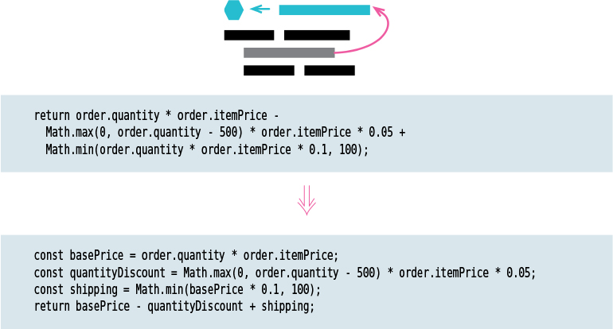

# 1 Refactoring: A First Example

## The Starting Point
```json
{
  "hamlet": {"name": "Hamlet", "type": "tragedy"},
  "as-like": {"name": "As You Like It", "type": "comedy"},
  "othello": {"name": "Othello", "type": "tragedy"}
}
```

```json
[
  {
    "customer": "BigCo",
    "performances": [
      {
        "playID": "hamlet",
        "audience": 55
      },
      {
        "playID": "as-like",
        "audience": 35
      },
      {
        "playID": "othello",
        "audience": 40
      }
    ]
  }
]
```

```js
function statement (invoice, plays) {
  let totalAmount = 0;
  let volumeCredits = 0;
  let result = `Statement for ${invoice.customer}\n`;
  const format = new Intl.NumberFormat("en-US",
    { style: "currency", currency: "USD", minimumFractionDigits: 2 }).format;

  for (let perf of invoice.performances) {
    const play = plays[perf.playID];
    let thisAmount = 0;

    switch (play.type) {
    case "tragedy":
      thisAmount = 40000;
      if (perf.audience > 30) {
        thisAmount += 1000 * (perf.audience - 30);
      }
      break;
    case "comedy":
      thisAmount = 30000;
      if (perf.audience > 20) {
        thisAmount += 10000 + 500 * (perf.audience - 20);
      }
      thisAmount += 300 * perf.audience;
      break;
    default:
        throw new Error(`unknown type: ${play.type}`);
    }

    // add volume credits
    volumeCredits += Math.max(perf.audience - 30, 0);
    // add extra credit for every ten comedy attendees
    if ("comedy" === play.type) volumeCredits += Math.floor(perf.audience / 5);

    // print line for this order
    result += `  ${play.name}: ${format(thisAmount/100)} (${perf.audience} seats)\n`;
    totalAmount += thisAmount;
  }
  result += `Amount owed is ${format(totalAmount/100)}\n`;
  result += `You earned ${volumeCredits} credits\n`;
  return result;
}
```

A poorly designed system is hard to change—because it is difficult to figure out what to change and how these changes will interact with the existing code to get the behavior I want. And if it is hard to figure out what to change, there is a good chance that I will make mistakes and introduce bugs.

## Comments on the Starting Program
When you have to add a feature to a program but the code is not structured in a convenient way, first refactor the program to make it easy to add the feature, then add the feature.

Making a copy may not seem too onerous a task, but it sets up all sorts of problems for the future. Any changes to the charging logic would force me to update both methods—and to ensure they are updated consistently.

## The First Step in Refactoring
Before you start refactoring, make sure you have a solid suite of tests. These tests must be self­ checking.

## Decomposing the statement Function
When refactoring a long function like this, I mentally try to identify points that separate different parts of the overall behavior.

First, I need to look in the fragment for any variables that will no longer be in scope once I’ve extracted the code into its own function.

Once I’ve used Extract Function (106), I take a look at what I’ve extracted to see if there are any quick and easy things I can do to clarify the extracted function. The first thing I do is rename some of the variables to make them clearer, such as changing thisAmount to result.

When I’m breaking down a long function, I like to get rid of variables like play, because temporary variables create a lot of locally scoped names that complicate extractions. The refactoring I will use here is Replace Temp with Query (178).

Temporary variables can be a problem. They are only useful within their own routine, and therefore they encourage long, complex routines.

:bulb: Refactoring changes the programs in small steps, so if you make a mistake, it is easy to find where the bug is.

:bulb: Any fool can write code that a computer can understand. Good programmers write code that humans can understand.

The great benefit of removing local variables is that it makes it much easier to do extractions, since there is less local scope to deal with.

So, my overall advice on performance with refactoring is: Most of the time you should ignore it. If your refactoring introduces performance slow-downs, finish refactoring first and do performance tuning afterwards.

* The second aspect I want to call your attention to is how small the steps were to remove volumeCredits:
    1. Split Loop (227) to isolate the accumulation
    2. Slide Statements (223) to bring the initializing code next to the accumulation
    3. Extract Function (106) to create a function for calculating the total
    4. Inline Variable (123) to remove the variable completely

In particular, should a test fail during a refactoring, if I can’t immediately see and fix the problem, I’ll revert to my last good commit and redo what I just did with smaller steps.

## Status: Lots of Nested Functions
```js
function statement (invoice, plays) {
  let result = `Statement for ${invoice.customer}\n`;
  for (let perf of invoice.performances) {
    result += `  ${playFor(perf).name}: ${usd(amountFor(perf))} (${perf.audience} seats)\n`;
  }
  result += `Amount owed is ${usd(totalAmount())}\n`;
  result += `You earned ${totalVolumeCredits()} credits\n`;
  return result;
}

function totalAmount() {
  let result = 0;
  for (let perf of invoice.performances) {
      result += amountFor(perf);
  }
  return result;
}

function totalVolumeCredits() {
  let result = 0;
  for (let perf of invoice.performances) {
      result += volumeCreditsFor(perf);
  }
  return result;
}
function usd(aNumber) {
  return new Intl.NumberFormat("en-US",
    { style: "currency", currency: "USD", minimumFractionDigits: 2 }).format(aNumber/100);
}

function volumeCreditsFor(aPerformance) {
  let result = 0;
  result += Math.max(aPerformance.audience - 30, 0);
  if ("comedy" === playFor(aPerformance).type) result += Math.floor(aPerformance.audience / 5);
  return result;
  }
  function playFor(aPerformance) {
  return plays[aPerformance.playID];
}

function amountFor(aPerformance) {
  let result = 0;
  switch (playFor(aPerformance).type) {
  case "tragedy":
      result = 40000;
      if (aPerformance.audience > 30) {
      result += 1000 * (aPerformance.audience - 30);
      }
      break;
  case "comedy":
      result = 30000;
      if (aPerformance.audience > 20) {
      result += 10000 + 500 * (aPerformance.audience - 20);
      }
      result += 300 * aPerformance.audience;
      break;
  default:
      throw new Error(`unknown type: ${playFor(aPerformance).type}`);
  }
  return result;
}
```

## Splitting the Phases of Calculation and Formatting
So far, my refactoring has focused on adding enough structure to the function so that I can understand it and see it in terms of its logical parts. This is often the case early in refactoring. Breaking down complicated chunks into small pieces is important, as is naming things well.

```js
import createStatementData from './createStatementData.js';

function statement (invoice, plays) {
  return renderPlainText(createStatementData(invoice, plays));
}

function renderPlainText(data, plays) {
  let result = `Statement for ${data.customer}\n`;
  for (let perf of data.performances) {
    result += `  ${perf.play.name}: ${usd(perf.amount)} (${perf.audience} seats)\n`;
  }
  result += `Amount owed is ${usd(data.totalAmount)}\n`;
  result += `You earned ${data.totalVolumeCredits} credits\n`;
  return result;
}

function htmlStatement (invoice, plays) {
  return renderHtml(createStatementData(invoice, plays));
}

function renderHtml (data) {
  let result = `<h1>Statement for ${data.customer}</h1>\n`;
  result += "<table>\n";
  result += "<tr><th>play</th><th>seats</th><th>cost</th></tr>";
  for (let perf of data.performances) {
    result += `  <tr><td>${perf.play.name}</td><td>${perf.audience}</td>`;
    result += `<td>${usd(perf.amount)}</td></tr>\n`;
  }
  result += "</table>\n";
  result += `<p>Amount owed is <em>${usd(data.totalAmount)}</em></p>\n`;
  result += `<p>You earned <em>${data.totalVolumeCredits}</em> credits</p>\n`;
  return result;
}

function usd(aNumber) {
  return new Intl.NumberFormat(
    "en-US", { style: "currency", currency: "USD", minimumFractionDigits: 2 }
  ).format(aNumber/100);
}
```


```js
export default function createStatementData(invoice, plays) {
  const result = {};
  result.customer = invoice.customer;
  result.performances = invoice.performances.map(enrichPerformance);
  result.totalAmount = totalAmount(result);
  result.totalVolumeCredits = totalVolumeCredits(result);
  return result;

  function enrichPerformance(aPerformance) {
    const result = Object.assign({}, aPerformance);
    result.play = playFor(result);
    result.amount = amountFor(result);
    result.volumeCredits = volumeCreditsFor(result);
    return result;
  }

  function playFor(aPerformance) {
    return plays[aPerformance.playID]
  }

  function amountFor(aPerformance) {
    let result = 0;
    switch (aPerformance.play.type) {
    case "tragedy":
      result = 40000;
      if (aPerformance.audience > 30) {
        result += 1000 * (aPerformance.audience - 30);
      }
      break;
    case "comedy":
      result = 30000;
      if (aPerformance.audience > 20) {
        result += 10000 + 500 * (aPerformance.audience - 20);
      }
      result += 300 * aPerformance.audience;
      break;
    default:
        throw new Error(`unknown type: ${aPerformance.play.type}`);
    }
    return result;
  }

  function volumeCreditsFor(aPerformance) {
    let result = 0;
    result += Math.max(aPerformance.audience - 30, 0);
    if ("comedy" === aPerformance.play.type) result += Math.floor(aPerformance.audience / 5);
    return result;
  }

  function totalAmount(data) {
    return data.performances
      .reduce((total, p) => total + p.amount, 0);
  }

  function totalVolumeCredits(data) {
    return data.performances
      .reduce((total, p) => total + p.volumeCredits, 0);
  }
}
```

## Status: Separated into Two Files (and Phases)
The extra code breaks up the logic into identifiable parts, separating the calculations of the statements from the layout. This modularity makes it easier for me to understand the parts of the code and how they fit together. Brevity is the soul of wit, but clarity is the soul of evolvable software.

:bulb: When programming, follow the camping rule: Always leave the code base healthier than when you found it.

## Reorganizing the Calculations by Type
Now I’ll turn my attention to the next feature change: supporting more categories of plays, each with its own charging and volume credits calculations.

Conditional logic tends to decay as further modifications are made unless it’s reinforced by more structural elements of the programming language.

## Status: Creating the Data with the Polymorphic Calculator
```js
export default function createStatementData(invoice, plays) {
  const result = {};
  result.customer = invoice.customer;
  result.performances = invoice.performances.map(enrichPerformance);
  result.totalAmount = totalAmount(result);
  result.totalVolumeCredits = totalVolumeCredits(result);
  return result;

  function enrichPerformance(aPerformance) {
    const calculator = createPerformanceCalculator(aPerformance, playFor(aPerformance));
    const result = Object.assign({}, aPerformance);
    result.play = calculator.play;
    result.amount = calculator.amount;
    result.volumeCredits = calculator.volumeCredits;
    return result;
  }
  function playFor(aPerformance) {
    return plays[aPerformance.playID]
  }
  function totalAmount(data) {
    return data.performances
      .reduce((total, p) => total + p.amount, 0);
  }
  function totalVolumeCredits(data) {
    return data.performances
      .reduce((total, p) => total + p.volumeCredits, 0);
  }
}

function createPerformanceCalculator(aPerformance, aPlay) {
    switch(aPlay.type) {
    case "tragedy":
      return new TragedyCalculator(aPerformance, aPlay);
    case "comedy" :
      return new ComedyCalculator(aPerformance, aPlay);
    default:
        throw new Error(`unknown type: ${aPlay.type}`);
    }
}

class PerformanceCalculator {
  constructor(aPerformance, aPlay) {
    this.performance = aPerformance;
    this.play = aPlay;
  }
  get amount() {
    throw new Error('subclass responsibility');}
  get volumeCredits() {
    return Math.max(this.performance.audience - 30, 0);
  }
}

class TragedyCalculator extends PerformanceCalculator {
  get amount() {
    let result = 40000;
    if (this.performance.audience > 30) {
      result += 1000 * (this.performance.audience - 30);
    }
    return result;
  }
}

class ComedyCalculator extends PerformanceCalculator {
  get amount() {
    let result = 30000;
    if (this.performance.audience > 20) {
      result += 10000 + 500 * (this.performance.audience - 20);
    }
    result += 300 * this.performance.audience;
    return result;
  }
  get volumeCredits() {
    return super.volumeCredits + Math.floor(this.performance.audience / 5);
  }
}
```

The benefit here is that the calculations for each kind of play are grouped together. If most of the changes will be to this code, it will be helpful to have it clearly separated like this. Adding a new kind of play requires writing a new subclass and adding it to the creation function.

My choice on whether to return the instance or calculate separate output data depends on who is using the downstream data structure. In this case, I preferred to show how to use the intermediate data structure to hide the decision to use a polymorphic calculator.

## Final Thoughts
As is often the case with refactoring, the early stages were mostly driven by trying to understand what was going on. A common sequence is: Read the code, gain some insight, and use refactoring to move that insight from your head back into the code.

:bulb: The true test of good code is how easy it is to change it.

Code should be obvious: When someone needs to make a change, they should be able to find the code to be changed easily and to make the change quickly without introducing any errors.

The key to effective refactoring is recognizing that you go faster when you take tiny steps, the code is never broken, and you can compose those small steps into substantial changes. Remember that—and the rest is silence.

# 2 Principles in Refactoring
**Refactoring (noun)**: a change made to the internal structure of software to make it easier to understand and cheaper to modify without changing its observable behavior.

**Refactoring (verb)**: to restructure software by applying a series of refactorings without changing its observable behavior.

:bulb: If someone says their code was broken for a couple of days while they are refactoring, you can be pretty sure they were not refactoring.


## The Two Hats
* Kent Beck came up with a metaphor of the two hats. When I use refactoring to develop software, I divide my time between two distinct activities: adding functionality and refactoring.
  * When I **add functionality**, I shouldn’t be changing existing code; I’m just adding new capabilities. I measure my progress by adding tests and getting the tests to work.
  * When I **refactor**, I make a point of not adding functionality; I only restructure the code. I don’t add any tests (unless I find a case I missed earlier); I only change tests when I have to accommodate a change in an interface.

## Why Should We Refactor?
I don’t want to claim refactoring is the cure for all software ills. It is no “silver bullet.” Yet it is a valuable tool—a pair of silver pliers that helps you keep a good grip on your code. Refactoring is a tool that can—and should—be used for several purposes.

1. Refactoring Improves the Design of Software
2. Refactoring Makes Software Easier to Understand
3. Refactoring Helps Me Find Bugs
4. Refactoring Helps Me Program Faster

## When Should We Refactor?
* The Rule of Three (Three strikes, then you refactor)
  * Here’s a guideline Don Roberts gave me: The first time you do something, you just do it. The second time you do something similar, you wince at the duplication, but you do the duplicate thing anyway. The third time you do something similar, you refactor.

* Preparatory Refactoring: Making It Easier to Add a Feature

  The best time to refactor is just before I need to add a new feature to the code base. As I do this, I look at the existing code and, often, see that if it were structured a little differently, my work would be much easier.

* Comprehension Refactoring: Making Code Easier to Understand

  I do comprehension refactoring on little details. I rename a couple variables now that I understand what they are, or I chop a long function into smaller parts. Then, as the code gets clearer, I find I can see things about the design that I could not see before.

* Litter: Pickup Refactoring

  There’s a bit of a tradeoff here. I don’t want to spend a lot of time distracted from the task I’m currently doing, but I also don’t want to leave the trash lying around and getting in the way of future changes. If it’s easy to change, I’ll do it right away. If it’s a bit more effort to fix, I might make a note of it and fix it when I’m done with my immediate task.

  As the old camping adage says, always leave the camp site cleaner than when you found it. If I make it a little better each time I pass through the code, over time it will get fixed.

* Planned and Opportunistic Refactoring

  The examples above—preparatory, comprehension, litter-pickup refactoring—are all opportunistic.

  Refactoring isn’t an activity that’s separated from programming—any more than you set aside time to write if statements. I don’t put time on my plans to do refactoring; most refactoring happens while I’m doing other things.

  :bulb: You have to refactor when you run into ugly code—but excellent code needs plenty of refactoring too.

  “for each desired change, make the change easy (warning: this may be hard), then make the easy change” — Kent Beck, https://twitter.com/kentbeck/status/250733358307500032

  Good developers know that, often, the fastest way to add a new feature is to change the code to make it easy to add. Software should thus be never thought of as “done.” As new capabilities are needed, the software changes to reflect that. Those changes can often be greater in the existing code than in the new code.

* Long-Term Refactoring

  Even in such cases, I’m reluctant to have a team do dedicated refactoring. Often, a useful strategy is to agree to gradually work on the problem over the course of the next few weeks.

  Whenever anyone goes near any code that’s in the refactoring zone, they move it a little way in the direction they want to improve. This takes advantage of the fact that refactoring doesn’t break the code—each small change leaves everything in a still-working state.

  To change from one library to another, start by introducing a new abstraction that can act as an interface to either library. Once the calling code uses this abstraction, it’s much easier to switch one library for another. (This tactic is called Branch By Abstraction [mf-bba].)

* Refactoring in a Code Review

  Code reviews help spread knowledge through a development team. Reviews help more experienced developers pass knowledge to those less experienced. They help more people understand more aspects of a large software system. They are also very important in writing clear code.

  Reviews also give the opportunity for more people to suggest useful ideas. I can only think of so many good ideas in a week.

  It’s better to have the original author of the code present because the author can provide context on the code and fully appreciate the reviewers’ intentions for their changes.

* What Do I Tell My Manager?

* When Should I Not Refactor?

  If I run across code that is a mess, but I don’t need to modify it, then I don’t need to refactor it.

  Another case is when it’s easier to rewrite it than to refactor it.

## Problems with Refactoring

* Slowing Down New Features

  :bulb: The whole purpose of refactoring is to make us program faster, producing more value with less effort.

  I’m more likely to not refactor if it’s part of the code I rarely touch and the cost of the inconvenience isn’t something I feel very often. Sometimes, I delay a refactoring because I’m not sure what improvement to do, although at other times I’ll try something as an experiment to see if it makes things better.

  Still, the evidence I hear from my colleagues in the industry is that too little refactoring is far more prevalent than too much. In other words, most people should try to refactor more often.

  The point of refactoring isn’t to show how sparkly a code base is—it is purely economic. We refactor because it makes us faster—faster to add features, faster to fix bugs.

* Code Ownership

  Code ownership boundaries get in the way of refactoring because I cannot make the kinds of changes I want without breaking my clients.

  Due to these complexities, I recommend against fine-grained strong code ownership. Some organizations like any piece of code to have a single programmer as an owner, and only allow that programmer to change it.

* Branches

  There are downsides to feature branches like this. The longer I work on an isolated branch, the harder the job of integrating my work with mainline is going to be when I’m done.

  If Rachel is working on her branch I don’t see her changes until she integrates with mainline; at that point, I have to merge her changes into my feature branch, which may mean considerable work.

  The hard part of this work is dealing with semantic changes. Modern version control systems can do wonders with merging complex changes to the program text, but they are blind to the semantics of the code. If I’ve changed the name of a function, my version control tool may easily integrate my changes with Rachel’s. But if, in her branch, she added a call to a function that I’ve renamed in mine, the code will fail.

  Continuous Integration (CI), also known as Trunk-Based Development. With CI, each team member integrates with mainline at least once per day. This prevents any branches diverting too far from each other and thus greatly reduces the complexity of merges.

  Fans of CI like it partly because it reduces the complexity of merges, but the dominant reason to favor CI is that it’s far more compatible with refactoring.

* Testing

  One of the key characteristics of refactoring is that it doesn’t change the observable behavior of the program.

  Self-testing code not only enables refactoring—it also makes it much safer to add new features, since I can quickly find and kill any bugs I introduce

  Self-testing code is, unsurprisingly, closely associated with Continuous Integration—it is the mechanism that we use to catch semantic integration conflicts. Such testing practices are another component of Extreme Programming and a key part of Continuous Delivery.

* Legacy Code

  Refactoring can be a fantastic tool to help understand a legacy system.

  If you have a big legacy system with no tests, you can’t safely refactor it into clarity.

  The obvious answer to this problem is that you add tests.

  The best advice I can give is to get a copy of <Working Effectively with Legacy Code [Feathers]> and follow its guidance. Don’t be worried by the age of the book—its advice is just as true more than a decade later.

* Databases

  My colleague Pramod Sadalage developed an approach to evolutionary database design [mf-evodb] and database refactoring [Ambler & Sadalage] that is now widely used. The essence of the technique is to combine the structural changes to a database’s schema and access code with data migration scripts that can easily compose to handle large changes.

  One difference from regular refactorings is that database changes often are best separated over multiple releases to production. This makes it easy to reverse any change that causes a problem in production. So, when renaming a field, my first commit would add the new database field but not use it. I may then set up the updates so they update both old and new fields at once. I can then gradually move the readers over to the new field. Only once they have all moved to the new field, and I’ve given a little time for any bugs to show themselves, would I remove the now-unused old field. This approach to database changes is an example of a general approach of parallel change [mf-pc] (also called expand-contract).

## Refactoring, Architecture, and Yagni
Refactoring has profoundly changed how people think about software architecture.

The real impact of refactoring on architecture is in how it can be used to form a well-designed code base that can respond gracefully to changing needs.

One way of dealing with future changes is to put flexibility mechanisms into the software.

With refactoring, I can use a different strategy. Instead of speculating on what flexibility I will need in the future and what mechanisms will best enable that, I build software that solves only the currently understood needs, but I make this software excellently designed for those needs. As my understanding of the users’ needs changes, I use refactoring to adapt the architecture to those new demands.

This approach to design goes under various names: simple design, incremental design, or yagni [mf-yagni] (originally an acronym for “you aren’t going to need it”).

## Refactoring and the Wider Software Development Process

To really operate in an agile way, a team has to be capable and enthusiastic refactorers—and for that, many aspects of their process have to align with making refactoring a regular part of their work.

The first foundation for refactoring is `self-testing code`.

To refactor on a team, it’s important that each member can refactor when they need to without interfering with others’ work. This is why I encourage `Continuous Integration`. With CI, each member’s refactoring efforts are quickly shared with their colleagues.

Refactoring and `yagni` positively reinforce each other: Not just is refactoring (and its prerequisites) a foundation for yagni—yagni makes it easier to do refactoring. This is because it’s easier to change a simple system than one that has lots of speculative flexibility included.

`Continuous Delivery` keeps our software in an always-releasable state. This is what allows many web organizations to release updates many times a day—but even if we don’t need that, it reduces risk and allows us to schedule our releases to satisfy business needs rather than technological constraints.

## Refactoring and Performance
I often make changes that will cause the program to run slower. This is an important issue. I don’t belong to the school of thought that ignores performance in favor of design purity or in hopes of faster hardware.

The secret to fast software, in all but hard real-time contexts, is to write tunable software first and then tune it for sufficient speed.

* I’ve seen three general approaches to writing fast software.
    1. The most serious of these is time budgeting, often used in hard real-time systems. As you decompose the design, you give each component a budget for resources—time and footprint.
    2. The second approach is the constant attention approach.
        * The performance improvements are spread all around the program; each improvement is made with a narrow perspective of the program’s behavior, and often with a misunderstanding of how a compiler, runtime, and hardware behaves.
        * The interesting thing about performance is that in most programs, most of their time is spent in a small fraction of the code.
    3. The third approach to performance improvement takes advantage of this 90-percent statistic. I follow a specific process to tune the program:
        * I begin by running the program under a profiler that monitors the program and tells me where it is consuming time and space.
        * This way I can find that small part of the program where the performance hot spots lie.
        * I then focus on those performance hot spots using the same optimizations I would use in the constant-attention approach
        * But since I’m focusing my attention on a hot spot, I’m getting much more effect with less work.

* Having a well-factored program helps with this style of optimization in two ways.
    * First, it gives me time to spend on performance tuning. With well-factored code, I can add functionality more quickly. This gives me more time to focus on performance. (Profiling ensures I spend that time on the right place.)
    * Second, with a well-factored program I have finer granularity for my performance analysis. My profiler leads me to smaller parts of the code, which are easier to tune. With clearer code, I have a better understanding of my options and of what kind of tuning will work.

## Where Did Refactoring Come From?

Good programmers have always spent at least some time cleaning up their code. They do this because they have learned that clean code is easier to change than complex and messy code, and good programmers know that they rarely write clean code the first time around.

## Automated Refactorings

## Going Further

Bill Wake’s Refactoring Workbook [Wake] that contains many exercises to practice refactoring.

Refactoring to Patterns [Kerievsky], which looks at the most valuable patterns from the hugely influential “Gang of Four” book [gof] and shows how to use refactoring to evolve towards them.

Refactoring Databases [Ambler & Sadalage] (by Scott Ambler and Pramod Sadalage) and Refactoring HTML [Harold] (by Elliotte Rusty Harold).

Michael Feathers’s Working Effectively with Legacy Code [Feathers], which is primarily a book about how to think about refactoring an older codebase with poor test coverage.

# 3 Bad Smells in Code

## Mysterious Name

## Duplicated Code

## Long Function

## Long Parameter List

## Global Data

## Mutable Data

## Divergent Change

## Shotgun Surgery

## Feature Envy

## Data Clumps

## Primitive Obsession

## Repeated Switches

## Loops

## Lazy Element

## Speculative Generality

## Temporary Field

## Message Chains

## Middle Man

## Insider Trading

## Large Class

## Alternative Classes with Different Interfaces

## Data Class

## Refused Bequest

## Comments


# 4 Building Tests

## The Value of Self-Testing Code

## Sample Code to Test

## A First Test

## Add Another Test

## Modifying the Fixture

## Probing the Boundaries

## Much More Than This


# 5 Introducing the Catalog

## Format of the Refactorings
* As I describe the refactorings in the catalog, I use a standard format. Each refactoring has five parts, as follows:
    * I begin with a `name`. The name is important to building a vocabulary of refactorings. This is the name I use elsewhere in the book. Refactorings often go by different names now, so I also list any aliases that seem to be common.

    * I follow the name with a short `sketch` of the refactoring. This helps you find a refactoring more quickly.

    * The `motivation` describes why the refactoring should be done and describes circumstances in which it shouldn’t be done.

    * The `mechanics` are a concise, step-by-step description of how to carry out the refactoring.

    * The `examples` show a very simple use of the refactoring to illustrate how it works.

## The Choice of Refactorings


# 6 A First Set of Refactorings

Probably the most common refactoring I do is extracting code into a function (`Extract Function` (106)) or a variable (`Extract Variable` (119)). Since refactoring is all about change, it’s no surprise that I also frequently use the inverses of those two (`Inline Function` (115) and `Inline Variable` (123)).

Extraction is all about giving names, and I often need to change the names as I learn. `Change Function Declaration` (124) changes names of functions; I also use that refactoring to add or remove a function’s arguments. For variables, I use `Rename Variable` (137), which relies on `Encapsulate Variable` (132). When changing function arguments, I often find it useful to combine a common clump of arguments into a single object with `Introduce Parameter Object` (140).

 I use `Combine Functions into Class` (144) to group functions, together with the data they operate on, into a class. Another path I take is to combine them into a transform (`Combine Functions into Transform` (149)), which is particularly handy with read-only data. At a step further in scale, I can often form these modules into distinct processing phases using `Split Phase` (154).

## Extract Function


* Motivation:

  I’ve heard many arguments about when to enclose code in its own function. The argument that makes most sense to me, however, is the separation between intention and implementation. If you have to spend effort looking at a fragment of code and figuring out what it’s doing, then you should extract it into a function and name the function after the “what.”

* Mechanics
    1. Create a new function, and name it after the intent of the function (name it by what it does, not by how it does it).

        If I can’t come up with a more meaningful name, that’s a sign that I shouldn’t extract the code.

    2. Copy the extracted code from the source function into the new target function.

    3. Scan the extracted code for references to any variables that are local in scope to the source function and will not be in scope for the extracted function. Pass them as parameters.

        I find that too many local variables are being assigned by the extracted code. It’s better to abandon the extraction at this point. When this happens, I consider other refactorings such as Split Variable (240) or Replace Temp with Query (178) to simplify variable usage and revisit the extraction later.

    4. Compile after all variables are dealt with.

    5. Replace the extracted code in the source function with a call to the target function.

    6. Test.

    7. Look for other code that’s the same or similar to the code just extracted, and consider using Replace Inline Code with Function Call (222) to call the new function.

* Example
    ```js
    function printOwing(invoice) {
        let outstanding = 0;

        console.log("***********************");
        console.log("**** Customer Owes ****");
        console.log("***********************");

        // calculate outstanding
        for (const o of invoice.orders) {
            outstanding += o.amount;
        }

        // record due date
        const today = Clock.today;
        invoice.dueDate = new Date(today.getFullYear(), today.getMonth(), today.getDate() + 30);

        //print details
        console.log(`name: ${invoice.customer}`);
        console.log(`amount: ${outstanding}`);
        console.log(`due: ${invoice.dueDate.toLocaleDateString()}`);
    }
    ```
    ```js
    function printOwing(invoice) {
        printBanner();
        recordDueDate(invoice);
        printDetails(invoice, calculateOutstanding(invoice));
    }

    function printBanner() {
        console.log("***********************");
        console.log("**** Customer Owes ****");
        console.log("***********************");
    }

    // Example: Using Local Variables
    function recordDueDate(invoice) {
        const today = Clock.today;
        invoice.dueDate = new Date(today.getFullYear(), today.getMonth(), today.getDate() + 30);
    }

    function printDetails(invoice, outstanding) {
        console.log(`name: ${invoice.customer}`);
        console.log(`amount: ${outstanding}`);
        console.log(`due: ${invoice.dueDate.toLocaleDateString()}`);
    }

    // Example: Reassigning a Local Variable
    function calculateOutstanding(invoice) {
        let outstanding = 0;
        for (const o of invoice.orders) {
            outstanding += o.amount;
        }
        return outstanding;
    }
    ```

## Inline Function


* Motivation

    One of the themes of this book is using short functions named to show their intent, because these functions lead to clearer and easier to read code.

* Mechanics
    1. Check that this isn’t a polymorphic method.

    2. Find all the callers of the function.

    3. Replace each call with the function’s body.

    4. Test after each replacement.

    5. Remove the function definition.

* Example
    ```js
    function reportLines(aCustomer) {
        const lines = [];
        gatherCustomerData(lines, aCustomer);
        return lines;
    }

    function gatherCustomerData(out, aCustomer) {
        out.push(["name", aCustomer.name]);
        out.push(["location", aCustomer.location]);
    }
    ```

    ```js
    function reportLines(aCustomer) {
        const lines = [];
        lines.push(["name", aCustomer.name]);
        lines.push(["location", aCustomer.location]);
        return lines;
    }
    ```

## Extract Variable



* Motivation

    Expressions can become very complex and hard to read. In such situations, local variables may help break the expression down into something more manageable

    Such variables are also handy for debugging, since they provide an easy hook for a debugger or print statement to capture.

    I also think about the context of that name. If it’s only meaningful within the function I’m working on, then Extract Variable is a good choice—but if it makes sense in a broader context, I’ll consider making the name available in that broader context, usually as a function.

    The downside of promoting the name to a broader context is extra effort. If it’s significantly more effort, I’m likely to leave it till later when I can use Replace Temp with Query (178).

* Mechanics
    1. Ensure that the expression you want to extract does not have side effects.

    2. Declare an immutable variable. Set it to a copy of the expression you want to name.

    3. Replace the original expression with the new variable.

    4. Test.

* Example
    ```js
    function price(order) {
        //price is base price - quantity discount + shipping
        return order.quantity * order.itemPrice -
        Math.max(0, order.quantity - 500) * order.itemPrice * 0.05 +
        Math.min(order.quantity * order.itemPrice * 0.1, 100);
    }
    ```
    ```js
    function price(order) {
        const basePrice = order.quantity * order.itemPrice;
        const quantityDiscount = Math.max(0, order.quantity - 500) * order.itemPrice * 0.05;
        const shipping = Math.min(basePrice * 0.1, 100);
        return basePrice - quantityDiscount + shipping;
    }
    ```

* Example: With a Class
    ```js
    class Order {
        constructor(aRecord) {
            this._data = aRecord;
        }

        get quantity()  {return this._data.quantity;}
        get itemPrice() {return this._data.itemPrice;}
        get price() {
            return this.quantity * this.itemPrice -
                Math.max(0, this.quantity - 500) * this.itemPrice * 0.05 +
                Math.min(this.quantity * this.itemPrice * 0.1, 100);
        }
    }
    ```
    ```js
    class Order {
        constructor(aRecord) {
            this._data = aRecord;
        }
        get quantity()  {return this._data.quantity;}
        get itemPrice() {return this._data.itemPrice;}
        get price() {
            return this.basePrice - this.quantityDiscount + this.shipping;
        }
        get basePrice()        {return this.quantity * this.itemPrice;}
        get quantityDiscount() {return Math.max(0, this.quantity - 500) * this.itemPrice * 0.05;}
        get shipping()         {return Math.min(this.basePrice * 0.1, 100);}
    }
    ```

## Inline Variable


* Motivation

    Variables provide names for expressions within a function, and as such they are usually a Good Thing. But sometimes, the name doesn’t really communicate more than the expression itself.

* Mechanics
    1. Check that the right-hand side of the assignment is free of side effects.

    2. If the variable isn’t already declared immutable, do so and test.

    3. Find the first reference to the variable and replace it with the right-hand side of the assignment.

    4. Test.

    5. Repeat replacing references to the variable until you’ve replaced all of them.

    6. Remove the declaration and assignment of the variable.

    7. Test.

## Change Function Declaration


* Motivation

    Functions represent the joints in our software systems. And, as with any construction, much depends on those joints. Good joints allow me to add new parts to the system easily, but bad ones are a constant source of difficulty, making it harder to figure out what the software does and how to modify it as my needs change.

    A good name allows me to understand what the function does when I see it called, without seeing the code that defines its implementation.

* Mechanics
    * Simple Mechanics
        1. If you’re removing a parameter, ensure it isn’t referenced in the body of the function.
        2. Change the method declaration to the desired declaration.
            * It’s often best to separate changes, so if you want to both change the name and add a parameter, do these as separate steps.
        3. Find all references to the old method declaration, update them to the new one.
        4. Test.

    * Migration Mechanics
        1. If necessary, refactor the body of the function to make it easy to do the following extraction step.
        2. Use Extract Function (106) on the function body to create the new function.
            * If the new function will have the same name as the old one, give the new function a temporary name that’s easy to search for.
        3. If the extracted function needs additional parameters, use the simple mechanics to add them.
        4. Test.
        5. Apply Inline Function (115) to the old function.
        6. If you used a temporary name, use Change Function Declaration (124) again to restore it to the original name.
        7. Test

* Example: Renaming a Function (Simple Mechanics)
    ```js
    function circum(radius) {
        return 2 * Math.PI * radius;
    }
    ```
    ```js
    function circumference(radius) {
        return 2 * Math.PI * radius;
    }
    ```

    If I’m both renaming the function and adding a parameter, I first do the rename, test, then add the parameter, and test again.

* Example: Renaming a Function (Migration Mechanics)
    ```js
    function circum(radius) {
        return 2 * Math.PI * radius;
    }
    ```
    ```js
    // Extract Function (106) to the entire function body.
    function circum(radius) {
        return circumference(radius);
    }

    function circumference(radius) {
        return 2 * Math.PI * radius;
    }
    ```

* Example: Adding a Parameter
    ```js
    addReservation(customer) {
        this._reservations.push(customer);
    }
    ```
    ```js
    // Extract Function (106)
    addReservation(customer) {
        this.zz_addReservation(customer);
    }

    zz_addReservation(customer) {
        this._reservations.push(customer);
    }
    ```
    ```js
    // add the parameter to the new declaration and its call
    addReservation(customer) {
        this.zz_addReservation(customer, false);
    }

    zz_addReservation(customer, isPriority) {
        this._reservations.push(customer);
    }
    ```
    ```js
    // Introduce Assertion (302) to check the new parameter is used by the caller.
    zz_addReservation(customer, isPriority) {
        assert(isPriority === true || isPriority === false);
        this._reservations.push(customer);
    }
    ```
    ```js
    // Inline Function (115) on the original function
    addReservation(customer, isPriority) {
        assert(isPriority === true || isPriority === false);
        this._reservations.push(customer);
    }
    ```

* Example: Changing a Parameter to One of Its Properties
    ```js
    function inNewEngland(aCustomer) {
        return ["MA", "CT", "ME", "VT", "NH", "RI"].includes(aCustomer.address.state);
    }

    const newEnglanders = someCustomers.filter(c => inNewEngland(c));
    ```
    inNewEngland only uses the customer’s home state to determine if it’s in New England. I’d prefer to refactor inNewEngland so that it takes a state code as a parameter, making it usable in more contexts by removing the dependency on the customer.
    ```js
    //  Extract Variable (119)
    function inNewEngland(aCustomer) {
        const stateCode = aCustomer.address.state;
        return ["MA", "CT", "ME", "VT", "NH", "RI"].includes(stateCode);
    }
    ```
    ```js
    // use Extract Function (106) to create that new function
    function inNewEngland(aCustomer) {
        const stateCode = aCustomer.address.state;
        return xxNEWinNewEngland(stateCode);
    }

    function xxNEWinNewEngland(stateCode) {
        return ["MA", "CT", "ME", "VT", "NH", "RI"].includes(stateCode);
    }
    ```
    ```js
    // apply Inline Variable (123) on the input parameter in the original function.
    function inNewEngland(aCustomer) {
        return xxNEWinNewEngland(aCustomer.address.state);
    }
    ```
    ```js
    // I use Inline Function (115) to fold the old function into its callers,
    // effectively replacing the call to the old function with a call to the new one.
    const newEnglanders = someCustomers.filter(c => xxNEWinNewEngland(c.address.state));
    ```
    ```js
    // Once I’ve inlined the old function into every caller,
    // I use Change Function Declaration again to change the name of the new function to that of the original.
    const newEnglanders = someCustomers.filter(c => inNewEngland(c.address.state));

    function inNewEngland(stateCode) {
        return ["MA", "CT", "ME", "VT", "NH", "RI"].includes(stateCode);
    }
    ```


## Encapsulate Variable

* Motivation

    Refactoring is all about manipulating the elements of our programs. Data is more awkward to manipulate than functions.

    Data is more awkward because I can’t do that. If I move data around, I have to change all the references to the data in a single cycle to keep the code working. For data with a very small scope of access, such as a temporary variable in a small function, this isn’t a problem. But as the scope grows, so does the difficulty, which is why global data is such a pain.

    So if I want to move widely accessed data, often the best approach is to first encapsulate it by routing all its access through functions. That way, I turn the difficult task of reorganizing data into the simpler task of reorganizing functions.

    The greater the scope of the data, the more important it is to encapsulate. My approach with legacy code is that whenever I need to change or add a new reference to such a variable, I should take the opportunity to encapsulate it. That way I prevent the increase of coupling to commonly used data.

    Keeping data encapsulated is much less important for immutable data.

* Mechanics
    1. Create encapsulating functions to access and update the variable.
    2. Run static checks.
    3. For each reference to the variable, replace with a call to the appropriate encapsulating function. Test after each replacement.
    4. Restrict the visibility of the variable.
        * Sometimes it’s not possible to prevent access to the variable. If so, it may be useful to detect any remaining references by renaming the variable and testing.
    5. Test.
    6. If the value of the variable is a record, consider Encapsulate Record (162).

* Example
    ```js
    // global variable
    let defaultOwner = {firstName: "Martin", lastName: "Fowler"};

    // usage
    spaceship.owner = defaultOwner;
    defaultOwner = {firstName: "Rebecca", lastName: "Parsons"};
    ```

    ```js
    // defining functions to read and write the data.
    function getDefaultOwner()    {return defaultOwner;}
    function setDefaultOwner(arg) {defaultOwner = arg;}
    ```

    ```js
    // replace the global variable usage with functions
    spaceship.owner = getDefaultOwner();
    setDefaultOwner({firstName: "Rebecca", lastName: "Parsons"});
    ```
    ```js
    // restrict the visibility of the variable.
    // This both checks that there aren’t any references that I’ve missed,
    // and ensures that future changes to the code won’t access the variable directly
    let defaultOwner = {firstName: "Martin", lastName: "Fowler"};
    export function getDefaultOwner()    {return defaultOwner;}
    export function setDefaultOwner(arg) {defaultOwner = arg;}
    ```

* Example: Encapsulating the Value

    The basic refactoring I’ve outlined here encapsulates a reference to some data structure, allowing me to control its access and reassignment. But it doesn’t control changes to that structure.
    ```js
    const owner1 = defaultOwner();
    assert.equal("Fowler", owner1.lastName, "when set");
    const owner2 = defaultOwner();
    owner2.lastName = "Parsons";
    assert.equal("Parsons", owner1.lastName, "after change owner2"); // is this ok?
    ```

    The basic refactoring encapsulates the reference to the data item. In many cases, this is all I want to do for the moment. But I often want to take the encapsulation deeper to control not just changes to the variable but also to its contents.

    An alternative is to prevent changes—and a good way of doing that is Encapsulate Record (162).

    ```js
    let defaultOwnerData = {firstName: "Martin", lastName: "Fowler"};
    export function defaultOwner()       {return new Person(defaultOwnerData);}
    export function setDefaultOwner(arg) {defaultOwnerData = arg;}

    class Person {
        constructor(data) {
            this._lastName = data.lastName;
            this._firstName = data.firstName
        }

        get lastName() {return this._lastName;}
        get firstName() {return this._firstName;}
        // and so on for other properties
    }
    ```

## Rename Variable


* Motivation

    Naming things well is the heart of clear programming. Variables can do a lot to explain what I’m up to—if I name them well.

    Even more than most program elements, the importance of a name depends on how widely it’s used.

* Mechanics
    1. If the variable is used widely, consider Encapsulate Variable (132).
    2. Find all references to the variable, and change every one.
        * If there are references from another code base, the variable is a published variable, and you cannot do this refactoring.
        * If the variable does not change, you can copy it to one with the new name, then change gradually, testing after each change.
    3. Test.

* Example
    ```js
    let tpHd = "untitled";

    result += `<h1>${tpHd}</h1>`;
    tpHd = obj['articleTitle'];
    ```

    ```js
    // Encapsulate Variable (132)
    result += `<h1>${title()}</h1>`;

    setTitle(obj['articleTitle']);

    function title()       {return tpHd;}
    function setTitle(arg) {tpHd = arg;}
    ```
    ```js
    // rename variable
    let _title = "untitled";

    function title()       {return _title;}
    function setTitle(arg) {_title = arg;}
    ```

* Example: Renaming a Constant

    ```js
    const cpyNm = "Acme Gooseberries";
    ```
    ```js
    const companyName = "Acme Gooseberries";
    const cpyNm = companyName;
    ```

## Introduce Parameter Object


* Motivation

    Grouping data into a structure is valuable because it makes explicit the relationship between the data items. It reduces the size of parameter lists for any function that uses the new structure. It helps consistency since all functions that use the structure will use the same names to get at its elements.

    But the real power of this refactoring is how it enables deeper changes to the code. This process can change the conceptual picture of the code, raising these structures as new abstractions that can greatly simplify my understanding of the domain.

* Mechanics
    1. If there isn’t a suitable structure already, create one.
    2. I prefer to use a class, as that makes it easier to group behavior later on. I usually like to ensure these structures are value objects [mf-vo].
    3. Test.
    4. Use Change Function Declaration (124) to add a parameter for the new structure.
    5. Test.
    6. Adjust each caller to pass in the correct instance of the new structure. Test after each one.
    7. For each element of the new structure, replace the use of the original parameter with the element of the structure. Remove the parameter.
    8. Test.

* Example
    ```js
    const station = {
        name: "ZB1",
        readings: [
            {temp: 47, time: "2016-11-10 09:10"},
            {temp: 53, time: "2016-11-10 09:20"},
            {temp: 58, time: "2016-11-10 09:30"},
            {temp: 53, time: "2016-11-10 09:40"},
            {temp: 51, time: "2016-11-10 09:50"},
        ]
    };

    function readingsOutsideRange(station, min, max) {
        return station.readings.filter(r => r.temp < min || r.temp > max);
    }

    alerts = readingsOutsideRange(station, operatingPlan.temperatureFloor, peratingPlan.temperatureCeiling);
    ```

    ```js
    class NumberRange {
        constructor(min, max) {
            this._data = {min: min, max: max};
        }
        get min() {return this._data.min;}
        get max() {return this._data.max;}
    }
    ```
    ```js
    // Change Function Declaration
    function readingsOutsideRange(station, min, max, range) {
        return station.readings .filter(r => r.temp < min || r.temp > max);
    }

    // caller
    alerts = readingsOutsideRange(
        station,
        operatingPlan.temperatureFloor,
        operatingPlan.temperatureCeiling,
        null);
    ```

    ```js
    // replacing the usage of the parameters
    function readingsOutsideRange(station, range) {
        return station.readings.filter(r => r.temp < range.min || r.temp > range.max);
    }

    // caller
    const range = new NumberRange(operatingPlan.temperatureFloor, operatingPlan.temperatureCeiling);
    alerts = readingsOutsideRange(station,  range);
    ```

    However, replacing a clump of parameters with a real object is just the setup for the really good stuff. The great benefits of making a class like this is that I can then move behavior into the new class.

    ```js
    function readingsOutsideRange(station, range) {
        return station.readings.filter(r => !range.contains(r.temp));
    }

    contains(arg) {return (arg >= this.min && arg <= this.max);}
    ```

## Combine Functions into Class


## Combine Functions into Transform

## Split Phase


# 7 Encapsulation

## Encapsulate Record

## Encapsulate Collection

## Replace Primitive with Object

## Replace Temp with Query

## Extract Class

## Inline Class

## Hide Delegate

## Remove Middle Man

## Substitute Algorithm


# 8 Moving Features

## Move Function

## Move Field

## Move Statements into Function

## Move Statements to Callers

## Replace Inline Code with Function Call

## Slide Statements

## Split Loop

## Replace Loop with Pipeline

## Remove Dead Code


# 9 Organizing Data

## Split Variable

## Rename Field

## Replace Derived Variable with Query

## Change Reference to Value

## Change Value to Reference


# 10 Simplifying Conditional Logic

## Decompose Conditional
## Consolidate Conditional Expression

## Replace Nested Conditional with Guard Clauses

## Replace Conditional with Polymorphism

## Introduce Special Case

## Introduce Assertion


# 11 Refactoring APIs

## Separate Query from Modifier

## Parameterize Function

## Remove Flag Argument

## Preserve Whole Object

## Replace Parameter with Query

## Replace Query with Parameter

## Remove Setting Method

## Replace Constructor with Factory Function
## Replace Function with Command

## Replace Command with Function


# 12 Dealing with Inheritance

## Pull Up Method

## Pull Up Field

## Pull Up Constructor Body

## Push Down Method

## Push Down Field

## Replace Type Code with Subclasses

## Remove Subclass

## Extract Superclass

## Collapse Hierarchy

## Replace Subclass with Delegate

## Replace Superclass with Delegate