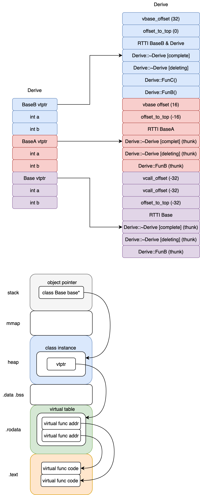

TODO:
    1. 3.4, 3.5, 3.6 look back
        2. 4.2 look back

# 1. Object Lessons

* Layout costs for Adding Encapsulation:
    1. `Data members` are directly contained within each class object;
    2. `Function members`:
        * one copy only of each non-inline member function is gernerated;
        * Each inline function has either zero or one definition of itself generated with module in which it is used.
    3. `Virtual function` is the primary layout and access-time overheads:
        1. The virual function mechanism in its support of an efficient run-time binding.
        2. A virtual base class in its support of a single, shared instance of a base class occurring multiple times with an inheritance hierarchy.

## 1.1 The C++ Object Model
1. Non static data members are allocated directly within each class object.
2. Static data members are stored outside the individual class object.
3. Static and nonstatic function members are also hoisted outside the class object.
4. Virtual funtions are supported in two steps:
    1. A table of pointers to virutal functions is generated for each class(virutal table, `vtbl`).
    2. A single pointer to associated virtual table is inserted within each class object(`vptr`).
        * The setting, resetting, and not setting of the vptr is handled automatically through code generated with each class constructor, destructor, and copy assignment operator.
        * The `type_info` object associated with each class in support of runtime type identification(`RTTI`) is also addressed within the virtual table, usually within the table's first slot.
5. Addint Inheritance:
    * The original model of virtual base class support added a pointer into the calss object for each associated virtual base class. Alternative models have evolved that either introduce a virutal bases class table or augment the existing virual tabls to maintain the location of each virual base calss.

## 1.3 An Object Distinction
1. The C++ language supports polymorphism in the following ways:
    1. Through a set of `implicit conversion`, such as the conversion of a derived class pointer to a pointer of it's public base type.
    2. Through the `virtual function` mechanism.
    3. Through the `dynamic_case` and `typeif operator`.
        ```C++
        if (circle pc = dynamic_case<circle>(pc))  {

        }
        ```
2. The primary use of polymorphism is to effect type encapsulation through a shared interface usually defined within an abstract base class from which specific subtypes are derived.
3. The memory requirement to represent a class object in general are the following:
    1. The accumulated size of its nonstatic data member
    2. Plus any padding(between members or on the aggreaget boundary itself) due to the alignment constrints.
    3. Plus any internally generated overhead to support the virtuals

# 2. The Semantics of Constructor
## 2.1 Default Constructor Construction
1. If there is no user-declared constructor for class X, a default constructor is implicityly declared
2. A constructor is `trivial` if it is an implicitly declared default constructor
3. The Four conditions that default constructor is `nontrivial`:
    1. Member Class Object with Default Constructor.
        * Compiler will generate default constructor for Class object which has ojbect member and without any constructor.
        * Compiler will expand user defined contructor which not initialized the object member
    2. Base class with constructor
    3. Class with virutal function
        * The class ethier declares(or inherits) a virtual function
        * The class is derived from an inheritance chain in which one or more base classes are virtual.
        * The following two class `augmentation` occur during compilation:
            1. A virtual function table(`vtbl`) is generated and populated with the address of the active virtual functions for that class.
            2. Within each class object, an additional pointer member(`vptr`) is synthesized to hold the address of the associated class vtbl.
    4. Class with a virutal Base class

4. Summary:
    1. The four above characteristics of a class under which the compiler needs to synthesize a default constructor for a class that declare no constructor at all.
    2. The synthesized constructor fulfills only an implementation need.

## 2.2 Copy Constructor Construction

1. Copy constructor happens:
    1. When we use =
    2. Pass an object as an argument to parameter of non-reference type
    3. Return an object from a function that has non-reference return type
    4. `Brace initialize` the elements of an array or elements of aggregate class

2. Default Memberwise Initializaion
    1. If the class does not provide an explicit copy constructor. Each class object initialized with another object of its class is initialized by what is called `default memberwise initialization`.
    2. A class object can be copied in two way:
        1. By initialization(`copy constructor`)
        2. By assignment(`copy assignment`)
    3. The Standard distinguishes between a trivial and nontrivial copy constructor. __It is only nontrivial instance that in practice is synthesized within the program. The criteria for determining whether a copy constructor is trivial is whether the class exhibits bitwise copy semantics__.

3. Bitwise Copy Semantics -- Not！
    1. When are bitwise copy semantics not exhibited by a class. There are four instances:
        1. When the class contains a `member object of a class` for which a `copy constructor` exists (either declared by class designer or synthesized by compiler).
        2. When the class is derived from a `base class` for which a `copy constructor` exists(either explicity declared synthesized by compiler).
        3. When the class declares one or more `virtual functions`.
        4. When the class is derived from an inheritance chain in which one or more `base class are virtual`.

4. Global objects are guaranteed to have their associated memory `zeroed out` at program start-up. Local objects allocated on the program stack and heap objects allocated on the free-store do not have their associated memory zeroed out; rather, the memory retains the arbitrary bit pattern of its previous use.

5. Resetting the Virtual Table Pointer
    1. Recall that two program `augmentations` occur during compilation whenever a class declares one or more virtual functions.
        1. A virtual function table that contains the address of each active virtual function associated with that class (the `vtbl`) is generated.
        2. A pointer to the virtual function table is inserted within each class object (the `vptr`).
    2. Once the compiler introduces a vptr into a class, the affected class no longer exhibits bitwise semantics.
    3. Rather, the implementation now needs to synthesize a copy constructor in order to properly initialize the vptr.

6. Handling the Virtual Base Class Subobject
    1. The compiler must synthesize a copy constructor, inserting code to initialize the virtual base class pointer/offset (or simply being sure that it not be reset), performing the necessary memberwise initializations of its members, and other memory tasks.

7. The copy between objects of the same level of hierarchy is bitwise copy semantics
8. The initialization of one ZooAnimal class object with another or one Bear class object with another is straightforward and could actually be implemented with bitwise copy semantics.

9. Summary:
 1. The four conditions above under which bitwise copy semantics do not hold for a class and the default copy constructor, if undeclared, is considered nontrivial. Under these conditions, the compiler, in the absence of a declared copy constructor, must synthesize a copy constructor in order to correctly implement the initialization of one class object with another.

## 2.3 Program Transformation Semantics
1. Explicit Initialization:
    1. The required program transformation is two-fold:
        1. Each definition is rewritten with the initialization stripped out.
        2. An invocation of the class copy constructor is inserted.
        ```C++
        X x0;                       // May be transfromed to:
        void foo_bar() {            void foo_bar() {
            X x1( x0 );                 X x1, x2, x3;
            X x2 = x0;                  x1.X::X( x0 );
            X x3 = x( x0 );             x2.X::X( x0 );
            // ...                      x3.X::X( x0 );
        }                           }
        ```
2. Argument Initialization:
    1. Passing a class object as an argument to a function (or as that function's return value) is equivalent to the following form of initialization:
        ```C++
        X xx = arg; // xx refers to formal argument, foo(X xx);
        ```
    2. One implementation strategy is to introduce a `temporary object`, initialize it with a call of the copy constructor, and then pass that temporary object to the function.
    3. The another implementation is to `copy construct` the actual argument directly onto its place within the function's activation recored on the program stack. Prior to the return of the function, the local object's destructor, if defined, is applied to it.

3. Return Value Initialization:
    ```C++
    X bar() {
        X xx;
        // process xx ...
        return xx;
    }
    ```
    1. Stroustrup's solution in cfront is a two-fold transformation:
        1. Add an additional argument of type reference to the class object. This argument will hold the copy constructed "return value."
        2. Insert an invocation of the copy constructor prior to the return statement to initialize the added
            argument with the value of the object being returned.
    2. The codes are transformed to:
        ```C++
        void bar( X& __result ) {
            X xx;
            // compiler generated invocation of default constructor
            xx.X::X();
            // ... process xx
            // compiler generated invocation of copy constructor
            __result.X::X( xx );
            return;
        }
        ```

4. Optimization at the User Level:

5. Optimization at Compiler Level:
    1. All return statements return the same named value, it is possible for the compiler itself to optimize the function by substituting the result arguement for the named return value. This optimization referred to as the `Named Return Value(NRV)` optimization.
    ```C++
    X bar() {                   void bar(X& _result) {
        X xx;                       _result.X::XX();
        // processing xx            // processing...
        return xx;                  return;
    }                           }
    ```

6. The Copy Constructor: To Have or To Have Not?

7. Summary:

    * Also, the compiler optimizes away the copy constructor invocation where possible, replacing the NRV with and additional first argument within which the value is stored directly.

## 2.4 Member Initialization List:

1. Member Initialization list is used in order for program to compile:
    1. When initialize a reference member
    2. When initialize a const member
    3. When invoking a base or member class constructor with a set of arguments
2. The compiler iterates over the initialization list, inserting the initializations in the proper order within the constructor prior to any explicit user code.
3. The order in which the list entries are set down is determined by the declaration order of the members within the class declaration.
    ```C++
    class Base {
    public:
        Base(int val) : j(val+1), i(j-1) {} // i is initialized before j
    private:
        int i, j;
    };
    ```
# 3. The Semantics of Data
```C++
class X {};
class Y : public virtual X {};
class Z : public virtual X {};
class A : public virtual Y, public virtual Z {};
```
1. An `empty class` is never empty, it has an associated size of `1 byte` -- a char member inserted by compiler in order to `allocate unique address` for object in memory.
2. The size of class Y and class Z on any machine is the interplay of three factors:
    1. Language support overhead. Within the derived class, this overhead is reflect as some form of pointer, either virtual base class subojbect or to an associated table within which either the address or offset to the virutal base class suboject is stored.
    2. Compiler optimization of recognized special cases.
    3. Alignment constraints.
3. Static data members are maintained within the global data segment of the program and do not affect the size of individual class objects.

## 3.1 The Binding of A Data Member
1. The analysis of the member function's body is delayed until the entire class declaration is seen. Thus the binding of a data member within the body of an inline member function does not occur until the after the entire class declaration is seen.
2. When the subsequent declaration of the nested type is encountered, the Standard requires that the earlier bindings be flagged as illegal.

## 3.2 Data Member Layout
1. The Standard requires within an access section(private, public, protected) only that the member be set down such that `later members have higher address within a class object`.

2. What might intervene between the declared members?
    1. `Alignment` constraints on the type of a succeeding member may require padding.
    2. The compiler may synthesize one or more additional `internal data members` in support of the Object Model.
        1.  The standard allows the compiler the freedom to insert these internally generated members anywhere, even between those explicitly declared by the programmer.
        2. The Standard also allows the compiler the freedom to order the data members within multiple access sections within a class in whatever order it sees fit.

## 3.3 Access of Data Member
1. Static Data Member:
    1. Each member's access permission and class association is maintained without incurring any space or runtime overhead either in the individual class object or in the static data member itself.
    2. A single instance of each class static data member is stored within the data segment of the program. Each reference to the static member is internally translated to be a direct reference of that single extern instance, **this is the only case in the language where the access of a member through a pointer and through an object are exactly equivalent in terms of the instructions actually executed**.
    3. No mater static member is an inherited member of a complex inheritance hierarchy, there is still only a single instance of the member within the program, an its access is direct.
    4. When static data member is invocated by a function, the Standard C++ explicitly require the function should be evaluated, although no use is made of its result.
        ```C++
        // foolbar().chunckSize = 250;
        // evaluate expression, discarding result
        (void) foolvar();
        Point3d.chunkSize = 250;
        ```
    5. If two classes each declare a static member 'freeList', then placing both of them in the program data segment is going to result a name conflict. The compiler resolves this by internally encoding the name of the each static data member `name-mangling` to yield a unique program identifier.

2. NonStatic Data Member:
    1. Nonstatic data members are stored directly within each class obejct and cannot be accessed except through an explicit or implicit class object. An implicit class object is present whenever the programmer directly accesses a nonstatic data member within a member function.
    2. Access of a nonstatic data member requires the addition of the `begining address` of the class object with the `offset location` of the data member.
        ```C++
        origin._y = 0.0;
        &origin._y == &origin + (&Point3d::_y - 1);
        ```
    3. The offset of each nonstatic data member is known at compile time, even if the member belongs to a base class subobject derived through a single or multiple inheritance chain. Access of a nonstatic data member, therefore, is equivalent in performance to that of a C struct member or the member of a nonderived class.
    3. Virtual inheritance introduces an additional level of indirection in the access of its member throuth a base class suboject.
        ```C++
        Point3d pt3d;  pt3d->_x = 0.0;
        ```
        * Performs equivalently if _x is a member of a struct, class, single inheritance hierarchy, or multiple inheritance hierarchy, but it performs slower if it is a member of virutal base class.
    4. Access a data member through a pointer or class object is significantly different when class is a derived class contianing a virutal base class within its inheritance hierarchy and the member being accesed is an inherited member of that virtual base class.
        * In this case, with pointer, we cannot say with any certainty which class type pt address (and therefore we cannot know at compile time the actual offset location of the member), so the resolution of the access must be delayed until runtime through an additional indrection.
        * But this is not the case with class object, its type is clear, and the offset location of even inherited virutal bases class member are fixed at compile time.

## 3.4 Inheritance and the Data Member
1. The actual ordering of the derived and base class parts is left unspecified by the Standard. In theory, a compiler is free to place either the base or the derived part first in the derived class object. In practice, the base class members always appear first, except in the case of a virtual base class.

2. Inheritance without Polymorphism
    1. If the language were to pack the derived class members Concrete2::bit2 or Concrete3::bit3 into the Concrete1 subobject, these language semantics could not be preserved. An assignment would overwrite the values of the packed inherited members.
    ```C++
    Base base1, base2;
    Drive derive;

    base1 = base2 = new Base();
    base1 = derive;
    base1 = base1; // inherited member in derive will overwrite
    ```

3. Addind Polymorphism
    * Polymorphism introduce a number of space and access-time overheads:
        1. Introduction of a virtual table(`vtbl`) to hold the address of each virtual function it declares. The size of this table in general is the number of virtual functions declared plus an additional one or two slots to support runtime type identification.
        2. Introduction of the `vptr` within each class object. The vptr provides the runtime link for an object to efficiently find its associated virtual table.
        3. Augmentation of the __constructor to initialize the object's vptr__ to the virtual table of the class.  Depending on the aggressiveness of the compiler's optimization, this may mean resetting the vptr within the derived and each base class constructor.
        4. Augmentation of the __destructor to reset the vptr__ to the associated virtual table of the class. (It is likely to have been set to address the virtual table of the derived class within the destructor of the derived class. Remember, the order of destructor calls is in reverse: derived class and then base class.) An aggressive optimizing compiler can suppress a great many of these assignments.

4. Multiple Inheritance
    1. Up/down cast:
        1. The assignment of the address of a multiply derived object to a pointer of its leftmost (that is, first) base class is the same as that for single inheritance, since both point to the same beginning address.
        2. The cost is simply the assignment of that address. The assignment of the address of a second or subsequent base class, however, requires that that address be modified by the addition (or subtraction in the case of a downcast) of the size of the intervening base class subobject(s).
    2. What about access of a data member of a second or subsequent base class?
        * The member's location is fixed at compile time. Hence its access is a simple offset the same as under single inheritance regardless of whether it is a pointer, reference, or object through which the member is being accessed.

5. Virutal Inheritance
    1. A class containing one or more virtual base class subobjects is divided into two regions:
        1. Data within the `invariant region` remains at a fixed offset from the start of the object regardless of subsequent derivations. So members within the invariant region can be accessed directly.
        2. The `shared region` represents the virtual base class subobjects. The location of data within the shared region fluctuates with each derivation. So members within the shared region need to be accessed indirectly. What has varied among implementations is the method of indirect access.
    2. How is the implementation to gain access to the shared region of the class?
        * A pointer to each virtual base class is inserted within each derived class object. Access of the inherited virtual base class members is achieved indirectly through the associated pointer.
    3. There are two primary weaknesses with this implementation model:
        1. An object of the class carries an additional pointer for each virtual base class. Ideally, we want a constant overhead for the class object that is independent of the number of virtual base classes within its inheritance hierarchy.
        2. As the virtual inheritance chain lengthens, the level of indirection increases to that depth. This means that three levels of virtual derivation requires indirection through three virtual base class pointers. Ideally, we want a constant access time regardless of the depth of the virtual derivation.
    4. There are two general solutions to the first problem.
        1. Microsoft's compiler introduced the `virtual base class table`. Each class object with one or more virtual base classes has a pointer to the virtual base class table inserted within it.
        2. Bjarne's solution is to `place not the address but the offset` of the virtual base class within the virtual function table.
            * Obejct layout & vtb laytout
                ```c++
                // object layout
                clang -Xclang -fdump-record-layouts -stdlib=libc++ -std=c++17 -c model.cc

                // vtb layout
                clang -Xclang -fdump-vtable-layouts -stdlib=libc++ -std=c++17 -c model.cc
                ```

                ```c++
                struct Base {
                    virtual ~Base() = defaul`t;

                    virtual void FuncB() {  }

                    int a;
                    int b;
                };

                struct BaseA : virtual public Base {
                    virtual ~BaseA() = default;

                    virtual void FuncB() {  }

                    int a;
                    int b;
                };

                struct BaseB : virtual public Base {
                    virtual ~BaseB() = default;

                    virtual void FuncC() {  }

                    int a;
                    int b;
                };

                struct Derive : public BaseB, public BaseA {
                    void FuncB() override {  }
                    void FuncC() override {  }
                };

                int main() {
                    BaseA a;
                    Derive d;
                    return 0;
                }
                ```
                ```c++
                Vtable for 'Derive' (20 entries).
                 0 | vbase_offset (32)
                 1 | offset_to_top (0)
                 2 | Derive RTTI
                     -- (BaseB, 0) vtable address --
                     -- (Derive, 0) vtable address --
                 3 | Derive::~Derive() [complete]
                 4 | Derive::~Derive() [deleting]
                 5 | void Derive::FuncC()
                 6 | void Derive::FuncB()
                 7 | vbase_offset (16)
                 8 | offset_to_top (-16)
                 9 | Derive RTTI
                     -- (BaseA, 16) vtable address --
                10 | Derive::~Derive() [complete]
                     [this adjustment: -16 non-virtual] method: BaseA::~BaseA()
                11 | Derive::~Derive() [deleting]
                     [this adjustment: -16 non-virtual] method: BaseA::~BaseA()
                12 | void Derive::FuncB()
                     [this adjustment: -16 non-virtual] method: void BaseA::FuncB()
                13 | vcall_offset (-32)
                14 | vcall_offset (-32)
                15 | offset_to_top (-32)
                16 | Derive RTTI
                     -- (Base, 32) vtable address --
                17 | Derive::~Derive() [complete]
                     [this adjustment: 0 non-virtual, -24 vcall offset offset] method: Base::~Base()
                18 | Derive::~Derive() [deleting]
                     [this adjustment: 0 non-virtual, -24 vcall offset offset] method: Base::~Base()
                19 | void Derive::FuncB()
                     [this adjustment: 0 non-virtual, -32 vcall offset offset] method: void Base::FuncB()

                Virtual base offset offsets for 'Derive' (1 entry).
                Base | -24

                Thunks for 'Derive::~Derive()' (2 entries).
                0 | this adjustment: -16 non-virtual
                1 | this adjustment: 0 non-virtual, -24 vcall offset offset

                Thunks for 'void Derive::FuncB()' (2 entries).
                0 | this adjustment: -16 non-virtual
                1 | this adjustment: 0 non-virtual, -32 vcall offset offset

                VTable indices for 'Derive' (4 entries).
                0 | Derive::~Derive() [complete]
                1 | Derive::~Derive() [deleting]
                2 | void Derive::FuncC()
                3 | void Derive::FuncB()
                ```
                ```c++
                *** Dumping AST Record Layout
                         0 | struct Derive
                         0 |   struct BaseB (primary base)
                         0 |     (BaseB vtable pointer)
                         8 |     int a
                        12 |     int b
                        16 |   struct BaseA (base)
                        16 |     (BaseA vtable pointer)
                        24 |     int a
                        28 |     int b
                        32 |   struct Base (virtual base)
                        32 |     (Base vtable pointer)
                        40 |     int a
                        44 |     int b
                           | [sizeof=48, dsize=48, align=8,
                           |  nvsize=32, nvalign=8]
                ```
            * 
                * BaseA has its own virtual `FunB`, Derive overrides it and adds it into vtable of both BaseA and BaseB.

    5. In general, the most efficient use of a virtual base class is that of an abstract virtual base class with no associated data members.
    6. Ref:
        1. https://www.nowcoder.com/profile/3669004/note/detail/232803
        2. https://mp.weixin.qq.com/s?__biz=MzkyODE5NjU2Mw==&mid=2247484758&idx=1&sn=4e614430f666f63ab135c13a716d07c1&chksm=c21d37eaf56abefc8d2a1dc3e09a8146d242475cb0900ee5a94ab6a94a991168a887f7351821&scene=178&cur_album_id=1667018561883570181#rd

## 3.5 Object Member Efficiency
1. In terms of actual program performance, the important point here is that with optimization turned on, no runtime performance cost for encapsulation and the use of inline access functions was exhibited.
2. Single inheritance should not affect the test performance, since the members are stored contiguously within the derived class object and their offsets are known at compile time.
3. The lesson again is that the programmer concerned with efficiency must actually measure the performance of his or her program and not leave the measurement of the program to speculation and assumption. It is also worth noting that optimizers don't always work.
4. The virtual inheritance performance is disappointing in that neither compiler recognized that the access of the inherited data member pt1d::_x is through a nonpolymorphic class object and that therefore indirect runtime access is unnecessary.

## 3.6 Poiner to Data Member
```C++
class Point3d {
public:
    virtual ~Point3d();
    // ... protected:
    static Point3d origin;
    float x, y, z;
};
```

1. What does it mean, then, to take the address of one of the coordinate members?
    ```C++
    auto offset = &3d_point::z;
    ```
    * It is going to yield the z-coordinate's `offset` within the class object. Minimally, this has to be the size of the x and y members, since the language requires the members within an access level be set down in the order of declaration.
2. The value returned from taking the member's address, however, is always bumped up by 1. Thus the actual values are 1, 5, and 9, and so on.
3. Do you see why Bjarne decided to do that?

    * The problem is distinguishing between a pointer to no data member and a pointer to the first data member.
4. Taking the address of a nonstatic data member yields its `offset within the class`, taking the address of a data member bound to an actual class object yields the `member's actual address` in memory.

## 3.7 Efficiency of Pointers to Members
```
Point3d pA, pB;
                                                                    optimized           non-optmized
Direct Access:              int px = PA.x;                          0.8                 1.42
Point to bound member:      int px = &pA.x;                         0.8                 3.04
Point to data member:       int Point3d::px = &Point3d::x;          0.8                 5.34
```

1. The optimized results are same, but non-optimized results show:
    1. The addition of one indirection per member access through the bound pointer more than doubles the execution time.
    2. The pointer-to-member access again nearly doubles the execution time.
        * The binding of the pointer to data member to the class object requires the addition of the offset minus 1 to the address of the object.
        ```
        Optimized                       Non-optimized
        No Inheritance  0.80            5.34
        SI (3 levels)   0.80            5.34
        VI (1 level)    1.60            5.44
        VI (2 level)    2.14            5.51

        SI:  Single Inheritance
        VI:  Virtual Inheritance
        ```
2. Inherited data members are stored directly within the class object, the introduction of inheritance does not affect the performance of the code at all. The major impact of introducing virtual inheritance is to impede the effectiveness of the optimizer.

# 4. The Semantics of Function
## 4.1 Varieties of Member Invocation
1. Nonstatic Member Function:
    1. One C++ design criterion is that a nonstatic member function at a minimum must be as efficient as its analogous nonmember function.
    2. The member function is transformed internally to be equivalent to the nonmember instance:
        1. Rewrite the signature to insert an additional argument to the member function that provides access to the invoking class object.
            ```C++
            Point3d::magnitude(Point3d* const this)
            ```
        2. Rewrite each direct access of a nonstatic data member of the class to access the member through the `this` pointer
            ```C++
            {
                return sqrt(
                    this->_x  this->_x +
                    this->_y  this->_y +
                    this->_z  this->_z
                );
            }
            ```
        3. Rewrite the member function into an external function, mangling its name so that it's lexically unique within the program:
            ```C++
            extern magningtude_7Point3dFv(register Point3d const this);
            ```
    3. Name Mangling
        * In general, member names are made unique by concatenating the name of the member with that of the class.
        ```C++
        Point3d Point3d::normalize() const
        {
            register float mag = magnitude();
            return Point3d( _x/mag, _y/mag, _x/mag );
        }
        // Is transformed into:
        void normalize__7Point3dFv(register const Point3d const this, Point3d &__result) {
            register float mag = this->magnitude();
            // __result substituted for return value __result.Point3d::Point3d(
            this->_x/mag, this->_y/mag, this->_z/mag );
            return;
        }
        ```

2. Virtual Member Function:
    1. ptr->normalize(); [ internally transformed to >>> (ptr->vptr[1])(ptr);
    2. magnitude() were a virtual function, its invocation within normalize() would be transformed to:
        ```C++
        // register float mag = magnitude();
        register float mag = (this->vptpr[2])(this);
        register float mag = Point3d::magnitude();
        register float mag = magnitude_7Point3dFv(this);
        ```
    3. The invocation of a virtual function through a class object should always be resolved by your compiler as an ordinary nonstatic member function.

3. Static Member Function:
    1. A static member function, both its invocations would be internally transformed into `ordinary` nonmember function calls such as:
        ```C++
        obj.normalize();    // normalize__7Point3dSFv();
        ptr->normalize();   // normalize__7Point3dSFv();
        ```
    2. Characteristics of static memeber function:
        1. without `this` pointer
        2. Cannot directly access the nonstatic members of its class
        3. Cannot be declared const, volatitle, virutal
        4. Does not need to invoked throuth an object of its class.

    3. If the class object is obtained as a side effect of some expression, such as a function call:
        ```C++
        if ( foo().object_count() > 1 )     //The expression still needs to be evaluated:

        (void) foo();                       // transformation to preserve side-effects
        if (Point3d::object_count() > 1 )
        ```
    4. Taking the address of a static member function always yields the value of its location in memory.
    5. Static member functions, by beging this-less and therefore of the same type as an equivalent nonmember function.

## 4.2 Virtual Member Functions:
1. Virtual function implementation model:

    * The class-specific virtual table that contains the addresses of the set of active virtual functions for the class and the vptr that addresses that table inserted within each class object.
2. To support a virtual function mechanism, some form of runtime type resolution applied to polymorphic objects must be supported. That is, if we have the call _ptr->z();_ there needs to be some information associated with ptr available at runtime such that the appropriate instance of z() can be identified, found, and invoked.
3. In C++ polymorphism `exhibits` itself as the potential addressing of a derived class object through a `pointer` or `reference` of a public base class.
4. What information is needed to invoke the correct runtime instance of z()? We need to know:
    1. the actual `type` of the object addressed by ptr. This allows us to choose the correct instance of z();
    2. the `location` of that instance of z() in order to invoke it.
5. The virtual table is generated on a per-class basis. Each table holds the addresses of all the virtual function instances "active" for objects of the table's associated class. These active functions consist of the following:
    1. An instance defined within the class, thus overriding a possible base class instance
    2. An instance inherited from the base class, should the derived class choose not to override it
    3. A `pure_virtual_called()` library instance that serves as both a placeholder for a pure virtual function and a runtime exception should the instance somehow be invoked.

6. What happens when a class is subsequently derived from calss having virutal funtions:
    1. It can `inherit` the instance of the virtual function declared within the base class. Literally, the address of that instance is copied into the associated slot in the derived class's virtual table.
    2. It can `override` the instance with one of its own.
    3. It can introduce a `new virtual function` not present in the base class. In this case, the virtual table is grown by a slot and the address of the function is placed within that slot.

7. How do we know enough at compile time to set up the virtual function call?
    1. In general, we don't know the exact type of the object ptr addresses at each invocation of z(). We do know, however, that through ptr we can access the virtual table associated with the object's class.
    2. Although we again, in general, don't know which instance of z() to invoke, we know that each instance's address is contained in slot 4.

8. Virtual Function Under MI:
    1. The complexity of virtual function support under multiple inheritance revolves around the second and subsequent base classes and the need to adjust the this pointer at runtime.

    2. The address of the new Derived object must be adjusted to address its Base2 subobject. The code to accomplish this is generated at compile time:
        ```C++
        Base2* pbase2 = new Derived;

        Derived* temp = new Derived;    // transformation to support second base class
        Base2* pbase2 = temp ? temp + sizeof( Base1 ) : 0;
        ```
        Without this adjustment, any nonpolymorphic use of the pointer would fail.

    3. When the programmer now wants to delete the object addressed by pbase2
        ```C++
        // must first invoke the correct virtual instance of the destructor, then apply operator delete
        // pbase2 may required to be readjusted to address the beginning of the complete object
        delete pbase2;
        ```
        The pointer must be readjusted in order to again address the beginning of the Derived class object (presuming it still addresses the Derived class object). This offset addition, however, cannot directly be set up at compile time because the actual object that pbase2 addresses generally can be determined only at runtime.

    4. The `thunk` is a small assembly stub that
        1. adjusts the this pointer with the appropriate offset and then
        2. jumps to the virtual function.
        3. The general rule is that the this pointer adjustment of a derived class virtual function invocation through a pointer/reference of a second or subsequent base class must be accomplished at runtime.

    5. Three cases that the presence of second or subsequent base class affect support of virtual functions:
        1. Derived class virtual function is invoked through a pointer of second base classs.
            ```C++
            Base2* ptr = new Derived;
            // invokes Derived::~Derived
            // ptr must be adjusted backward by sizeof( Base1 )
            delete ptr;
            ```
        2. invocation of the inherited virtual function of the second base class through a derived class pointer.
            ```C++
            Derived* pder = new Derived;
            // invokes Base2::mumble()
            // pder must be adjusted forward by sizeof( Base1 )
            pder->mumble();
            ```
        3. allows the return type of a virtual function to vary with regard to the base and publicly derived types of an inheritance hierarchy.
            ```C++
            Base2* pb1 = new Derived;
            // invokes Derived Derived::clone()
            // return must be adjusted to address Base2 subobject
            Base2* pb2 = pb1->clone();
            ```

9. Virtual Functions under Virtual Inheritance

    * TODO
## 4.3 Function Efficiency
1. A nonmember, static member, and nonstatic member function are internally transformed into equivalent representations. So there is no difference in performance between these three forms.
2. Inline expansion not only saves the overhead associated with a function call but also provides additional opportunities for program optimization.
3. Virtual invocation under both single and multiple inheritances share the same overhead. Under the thunk model, of course, the this pointer adjustment costs are localized to those calls requiring it.
4. With each additional level of inheritance I added, the performance time of the virtual function executable increased significantly, because each additional level of inheritance adds an additional setting of the vptr.
5. The language does not provide a mechanism by which to indicate that an invocation of a default constructor is unnecessary and should be elided. That is, the declaration of the local pC class object does not in our use of it require a constructor to be applied, but we can eliminate its invocation only by eliminating our use of the local object.

## 4.4 Pointer to Member Functions
```C++
double          // return type
(Point::        // class the function is member
pmf)            // name of pointer to member
();             // argument list

double (Point::coord)() = &Point::x;   // define and initialize a pointer to class member
coord = &Point::y;                     // assign a value
( origin.coord )();                    // transfromed to ( coord )( & origin );
( ptr->coord )();                      // transformed to ( coord )( ptr );
```

1. A pointer to member would be no more expensive than a nonmember pointer to function if it weren't for virutal function and multiple inheritance, which complicate both the type and invocation of a pointer to member.

2. Supporting Pointer-to-Virtual-Member Functions
    1. Virtual mechanism still work using pointer-to-member functions.
    2. Taking the address of a `nonstatic member function` yields its `address` in memory.
    3. Taking the address of a `virtual member function` yields its `index` into it's associated virtual table.
    4. Evaluation of a pointer-to-member function is complicated by the dual values (nonvirutal and virutal) it can hold and by the very different invocation strategies those value require.
    5. One yields an address in memory (a large number) and the other an index into the virtual table (a small number). Internally, the compiler must define pmf such that (a) it can hold both values and (b) more important, the type of the value can be distinguished.
        ```C++
        (((int)pmf) & ~127)
            ? (pmf)(ptr)                  // non-virtual invocation
            : (ptr->vptr[(int)pmf](ptr)); // virtual invocation
        ```
        This implementation assumes a limit of 128 virtual functions to an inheritance graph. This is not desirable, but in practice it has proved viable.

3. Pointer-to-Member Function Under MI
    ```C++
    // fully general structure to support pointer to member functions under MI
    struct __mptr { //
        int delta;  // offset of this pointer  (pmf.index < 0) ? (pmf.addr)(ptr) : (ptr->vptr[pmf.indx](ptr));
        int index;  // index in the virtual table
        union {
            ptrtofunc  faddr;
            int        v_offset; // holds the location of the vptr of a virtual(or second or subsequent)base class.
        };
    };
    (ptr->pmf)(); // becames
    ( pmf.index < 0 )
        ? ( pmf.faddr )( ptr )                 // non-virtual invocation
        : (  ptr->vptr[ pmf.index ]( ptr );    // virtual invocation
    ```
    Microsoft removed this check (and therefore the presence of the index member) by introducing what it terms a vcall `thunk`.

4. Pointer-to-Member Efficiency

## 4.5 Inline Function

* There are two phases to the handling of an inline function:
    1. The analysis of the function definition to determine the "intrisic inline-ability" of the function. If the function is judged non-inlineable, due either to its complexity or its construction, it is turned into a static function and definition is generated within the module being compiled.
    2. The actual inline expansion of the funtion at a point of call. This involves arguement evaluation and management of temporaries.

### 4.5.1 Formal Arguments
* What happens during inline function expasion? Each formal argument is replaced with its corresponding actual argument:
    1. If the actual arguments exhibits a `side effect`, there will be a `tempory object`.
    2. If the actual argument is a `constant expression`, we'd like to `evaluated` prior to its substitution. subsequent constant folding may also be performed.
    3. If it is `neither` a constant expression nor an expression with side effect, a `straight substitution` of each argument with associated formal argument is carried out.
        ```C++
        inline int min(int a, int b) {return a < b ? a : b; }
        min(va, vb);              // return va < vb ? va : vb;
        min(12, 13);              // return 12;
        min(foo(), bar() + 1);    // tmp1 = foo(), tmp2 = bar()+ 1; return tmp1 < tmp2 ? tmp1 : tmp2;
        ```

### 4.5.2 Local Variables
1. The combination of local variables within an inline function together with arguments to the call with side effects can result in a surprising number of internally generated temporaries within the site of the expansion, particularly if it is expanded multiple times within a single expression.

2. Arguments with side effects, multiple calls within a single expression, and multiple local variables within the inline itself can all create temporaries that the compiler may or may not be able to remove.

# 5. Semantics of Construction, Destruction, and Copy
1. Presence of a Pure Virtual Destructor
    1. Every derived class destructor is internally augmented to statically invoke each of its virtual base and immediate base class destructors.
    2. Pure virtual destructor must be defined by the class designer: Every derived class destructor is internally augmented to statically invoke each of its virtual base and immediate base class destructor. __The absence of a definition of any of the base class destructor in general results in a link-time error__.
2. Presence of a Virtual Specification
    * It is still a bad design choice to declare all functions virtual and to depend on the compiler to optimize away unnecessary virtual invocations.
3. Presence of const within a Virtual Specification
4. A Reconsidered Class Declaration

## 5.1 Object Construction without Inheritance
1. Abstract Data Type
    * There are three drawbacks of an explicit initialization list:
        1. It can be used only if all the class members are public.
        2. It can specify only constant expressions (those able to be evaluated at compile time).
        3. Because it is not applied automatically by the compiler, the likelihood of failure to initialize an object is significantly heightened.

2. Preparing for Inheritance
    1. The compiler, in an optimization, may copy contiguous chucks of one object into another rather than implement a strict memberwise assignment.
    2. The Standard requires implementations to defer the actual synthesis of these nontrivial members until an actual use is encountered.
    3. In general, if your design includes a number of `functions` requiring the definition and `return of a local class object by value`, then it makes good sense to `provide a copy constructor` even if the default memberwise semantics are sufficient. Its presence triggers the application of the `NRV optimization`. (Copy elision is mandatory since C++17)

## 5.2 Object Construction under Inheritance
1. The general sequence of **compiler augmentations** is as follows:
    1. The data members initialized `in the member initialization list` have to be entered within the body of the constructor in the order of member declaration.
    2. If a member class object is `not` present in the `member initialization list` but has an associated default constructor, that `default constructor` must be invoked.
    3. Prior to that, if there is a virtual table pointer `vtbl` (or pointers) contained within the class object, i (they) must be initialized with the address of the appropriate virtual table(s).
    4. Prior to that, all immediate `base class constructors` must be invoked in the order of base class declaration(the order within the member initialization list is not relevant).
        1. If the base class is listed within the member initialization list, the explicit arguments, if any, must
            be passed.
        2. If the base class is not listed within the member initialization list, the default constructor (or default memberwise copy constructor) must be invoked, if present.
        3. If the base class is a second or subsequent base class, the this pointer must be adjusted.
    5. Prior to that, all `virtual base class constructors` must be invoked in a left-to-right, depth-first search of the inheritance hierarchy defined by the derived class.
        1. If the class is listed within the member initialization list, the explicit arguments, if any, must be passed. Otherwise, if there is a default constructor associated with the class, it must be invoked.
        2. In addition, the offset of each virtual base class subobject within the class must somehow be made accessible at runtime.
        3. These constructors, however, may be invoked if, and only if, the class object represents the "most-derived class." Some mechanism supporting this must be put into place.

2. When generating the copy operator, it does not condition the copy by a guard of the form
    ```C++
    if ( this == &rhs ) return this;
    ```

3. In the case of a compiler-synthesized copy operator, the duplication is safe but redundant, since no deallocation of resources is involved. Failure to check for an `assignment to self` in a user-supplied copy operator is a common pitfall of the beginner programmer.
    ```C++
    String& String::operator=( const String &rhs ) {
        // need guard here before deallocate resources
      	delete [] str;
        str = new char[ strlen( rhs.str ) + 1 ];
    }
    ```

4. Virtual Inheritance
    1. The conventional constructor augmentation does not work due to the shared nature of the virtual base class
    2. The traditional strategy for supporting this sort of "now you initialize the virtual base class, now you don't" is to introduce an additional argument in the constructor(s) indicating whether the virtual base class constructor(s) should be invoked.
    3. Virtual base class constructors are invoked when a complete class object is being defined, they are not invoked when the object serves as a subobject of an object of a subsequently derived class.
        ```c++
        class Vertex   : virtual public Point { };
        class Point3d  : virtual public Point { };
        class Vertex3d : public Point3d, public Vertex { };
        class PVertex  : public Vertex3d { };

        Point3d* Point3d::Point3d(Point3d *this, bool __most_derived, float x, float y, float z ) {
            if ( __most_derived != false )
                    this->Point::Point( x, y);

            this->__vptr__Point3d = __vtbl__Point3d;
            this->__vptr__Point3d__Point = __vtbl__Point3d__Point;
            this->_z = rhs._z;

            return this;
        }

        PVertex* PVertex::PVertex( Pvertex* this, bool __most_derived, float x, float y, float z ) {
            // 1. conditionally invoke the virtual base constructor
            if ( __most_derived != false ) {
                __most_derived = false;
                this->Point::Point( x, y );
            }
            // 2. unconditional invocation of immediate base
            this->Vertex3d::Vertex3d( x, y, z );
            // 3. initialize associated vptrs
            this->__vptr__PVertex = __vtbl__PVertex;
            this->__vptr__Point__PVertex = __vtbl__Point__PVertex;
            // 4. member initialization list
            // 5. explicit user code
            if ( spyOn )
                cerr << "within Point3d::Point3d()"
                    << " size: "
                    // invocation through virtual mechanism
                    << (*this->__vptr__PVertex[ 3 ].faddr)(this)
                    << endl;
            // return constructed object
            return this;
        }

        ```
    4. Some newer implementations split each constructor into a complete object and a subobject instance. The `complete object` version unconditionally invokes the `virtual base constructors`, `sets all vptrs`, and so on. The `subobject` version does `not invoke the virtual base class constructors`, may possibly not set the `vptrs`, and so on.

5. The Semantics of the vptr Initialization
    1. Within the constructors (and destructor) of a class, the invocation of a virtual function by the object under construction is limited to the virtual functions active within the class.
    2. This is necessary because of the class `order of constructor invocation`: Classes are built from the `bottom up` and then the `inside out`. As a result, the derived instance is not yet constructed while the base class constructor executes.
    3. What actually determines the virtual function set active for a class: the virtual table.
    4. How is that virtual table accessed and thus the active set of virtual functions determined?
        * By the address to which the vptr is set. So to control the set of active functions for a class, the compilation system need simply control the initialization and setting of the vptr. (It is the compiler's responsibility to set the vptr, of course, not something the programmer need or should worry about.)
    5. If each constructor waits to set its object's vptr until after its base class constructors have executed, then the correct instance of the virtual function is invoked each time.

    6. By having each base class constructor set its object's vptr to the virtual table associated with its class, the object under construction literally becomes an object of that class for the duration of the constructor.
        * That is, a PVertex object in turn becomes a Point object, a Point3d object, a Vertex object, a Vertex3d object, and then a PVertex object.

    7. __The general algorithm of constructor execution is as follows:__
        1. Within the derived class constructor, all `virtual base class` and then `immediate base class` constructors are invoked.
        2. That done, the object's `vptr`(s) are initialized to address the associated virtual table(s).
        3. The `member initialization list`, if present, is expanded within the body of the constructor. This must be done after the vptr is set in case a virtual member function is called.
        4. The explicit `user-supplied code` is executed.

    8. There are two conditions under which the vptr must be set:
        1. When a complete object is being constructed. If we declare a Point object, the Point constructor must set its vptr.
        2. When, within the construction of a subobject, a virtual function call is made either directly or indirectly

    9. __Is it safe to invoke a virtual function of the class within its constructor's member initialization list?__
        1. It is always safe when the function is applied to the initialization of a data member of the class. This is because, as we've seen, the vptr is guaranteed to have been set by the compiler prior to the expansion of the member initialization list.
        2. It may not be semantically safe, however, because the function itself may depend on members that are not yet initialized. It is not an idiom I recommend. However, from the point of view of the integrity of the vptr, it is a safe operation.
        3. When providing an argument for a base class constructor, it's not safe. The vptr is either not set or set to the wrong class. Further, any of the data members of the class that are accessed within the function are guaranteed to not yet be initialized.

## 5.3 Object Copy Semantics
1. A copy assignment operator is necessary only if the default behavior results in semantics that are either unsafe or incorrect.
2. I recommend not permitting the copy operation of a virtual base class whenever possible. An even stronger recommendation: Do not declare data within any class that serves as a virtual base class.

## 5.4 Object Efficiency

## 5.5 Semantics of Destructor
1. A user-defined destructor is augmented in much the same way as are the constructors, except in reverse order:
    1. If the object contains a `vptr`, it is reset to the virtual table associated with the class.
    2. The body of the destructor is then executed; that is, the vptr is reset prior to evaluating the user-supplied code.
    3. If the class has `member class` objects with destructors, these are invoked in the reverse order of their declaration.
    4. If there are any `immediate nonvirtual base classes` with destructors, these are invoked in the reverse order of their declaration.
    5. If there are any `virtual base classes` with destructors and this class represents the most-derived class, these are invoked in the reverse order of their original construction.

2. As with constructors, current thinking on the best implementation strategy for the destructor is to maintain two destructor instances:
    1. A complete object instance that always sets the vptr(s) and invokes the virtual base class destructors
    2. A base class subobject instance that never invokes the virtual base class destructors and sets the vptr(s) only if a virtual function may be invoked from within the body of the destructor


# 6. Runtime Semantics
## 6.1 Object Construction and Destruction
1. In general, place an object as close as possible to the code segment actually using it. Doing this can save you unnecessary object creation and destruction
2. Global Objects

3. Local Static Objects
    ```C++
    const Matrix& identity() {
        static Matrix mat_identity; // ...
        return mat_identity;
    }
    ```
    * What are the guaranteed semantics of the local static class object?
        1. mat_identity must have its constructor applied only once, although the function may be invoked multiple times.
        2. mat_identity must have its destructor applied only once, although again the function may be invoked multiple times.

4. Arrays of Objects
    ```C++
    Point knots[ 10 ];
    ```
    1. If Point defines neither a constructor nor a destructor, then we need do no more than what is done for an array of built-in types, that is, allocate memory sufficient to store ten contiguous elements of type Point.
    2. Point, however, does define a default constructor, so it must be applied to each of the elements in turn. In general, this is accomplished through one or more runtime library functions.

5. Default Constructors and Arrays
    1. Prior to cfront's Release 2.0, declaring an array of class objects meant the class had to declare either no constructors or a default constructor taking no arguments. A constructor taking one or more default arguments was not permitted.
    2. The solution is to generate an internal stub constructor that takes no arguments. Within the body, the
        user-supplied constructor is invoked, with the default arguments made explicit. Of course, the stub
        instance is generated and used only if an array of class objects is actually created.

## 6.2 Operators new and delete
```C++
new T[ 0 ];
```
1. The language requires that each invocation of operator new return a unique pointer. The conventional way of solving this is to return a pointer to a default 1-byte memory chunk (this is why size is set to 1).
2. Operator new in practice has always been implemented in terms of the standard C malloc().
3. The Semantics of new Arrays

## 6.3 Temporary Objects
1. Whether a temporary results depends in part on the aggressiveness of the compiler and in part on the program context in which the expression occurs.
2. Any expression of the form
    ```C++
    T c = a + b; // where the addition operator is defined as either
    T operator+( const T&, const T& );
    T T::operator+( const T& );
    ```
    is implemented without the generation of a temporary.

3. However, that the equivalent assignment statement
    ```C++
    c = a + b; // cannot safely eliminate the temporary.
    // Rather, this results in the following general sequence:
    // Pseudo C++ code
    // T temp = a + b;
    T temp;
    a.operator+( temp, b );
    // c = temp
    c.operator =( temp ); // 2
    temp.T::~T();
    ```

4. A third form of the expression is without any target:
    ```C++
    a + b; // no targeta
    ```
    In this case, a temporary is necessarily generated to hold the expression.

5. Temporary objects are destroyed as the last step in evaluating the full-expression that (lexically) contains the point where they were created.
6. The temporary that holds the result of the expression shall persist until the object's initialization is complete.

7. here is an initialization that is guaranteed to fail under the new lifetime of temporaries rule:
    ```C++
    // Oops: not a good idea
    const char progNameVersion = progName + progVersion;

    // Pseudo C++ Code
    String temp;
    operator+( temp, progName, progVersion );
    progNameVersion = temp.String::operator char();
    temp.String::~String();
    ```
    progNameVersion now points into undefined heap memory.

8. The second exception to the lifetime of temporaries rule concerns when a `temporary is bound to a reference`.
    ```C++
    const String &space = " ";

    // Pseudo C++ Code
    String temp;
    temp.String::String( " " );
    const String &space = temp;
    ```
    A temporary bound to a reference persists for the lifetime of the reference initialized or until the end of the scope in which the temporary is created, whichever comes first.

9. A Temporary Myth
    1. The translation systems we tested are evidently able to eliminate local variables of built-in type, but not local variables of class type. This is a limitation of C back-ends, not of the C++ front-end, and it appears to be pervasive, since it appears in both [sic] Sun CC, GNU g++, and HP CC.
    2. Disaggregation of structs is achievable with modest effort, but has not generally been recognized as an important optimization prior to the introduction of C++.

# 7. On the Cusp of the Object Model
## 7.1 Templates
## 7.2 Exception Handling
## 7.3 Runtime Type Identification
1. Introducing a Type-Safe Downcast
    1. A type-safe downcast requires a runtime query of the pointer as to the actual type of the object it addresses.
    2. Thus support for a type-safe downcast mechanism brings with it both space and execution time overhead:
        1. It requires additional space to store type information, usually a pointer to some type information node.
        2. It requires additional time to determine the runtime type, since, as the name makes explicit, the determination can be done only at runtime.
    3. The C++ RTTI mechanism provides a type-safe downcast facility but only for those types exhibiting polymorphism (those that make use of inheritance and dynamic binding).

2. A Type-Safe Dynamic Cast
