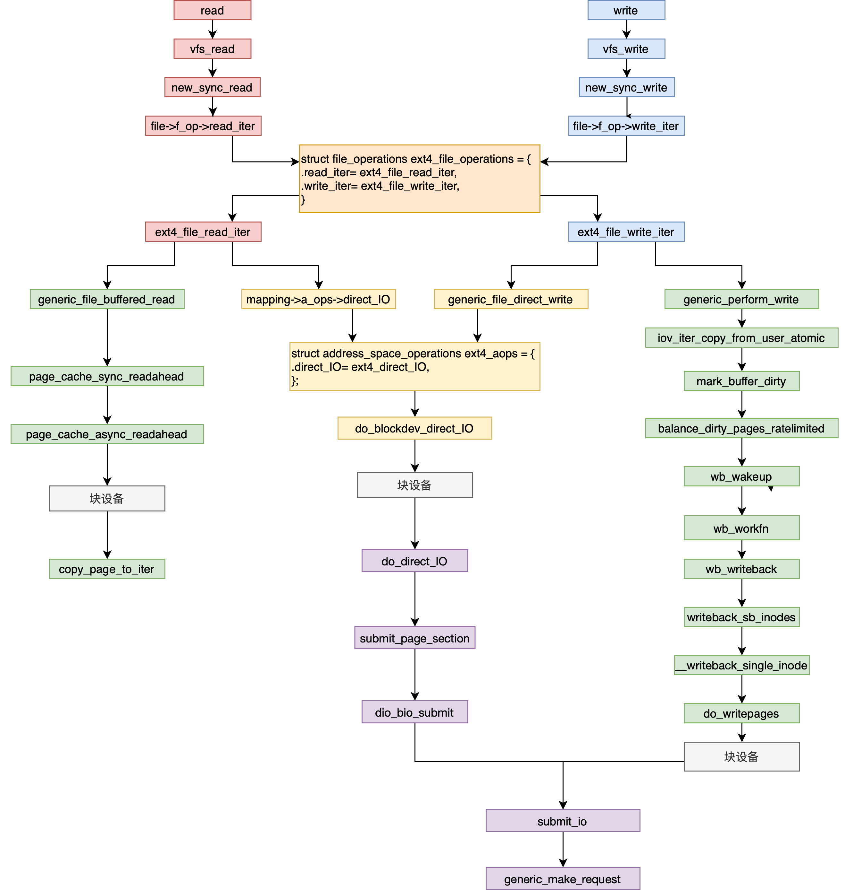
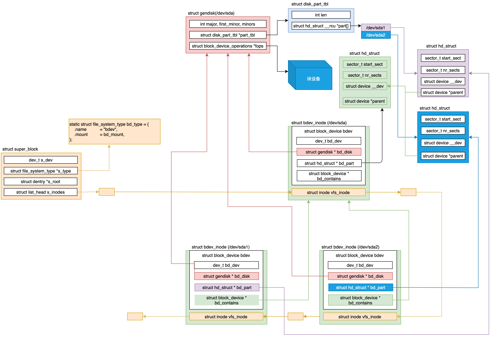
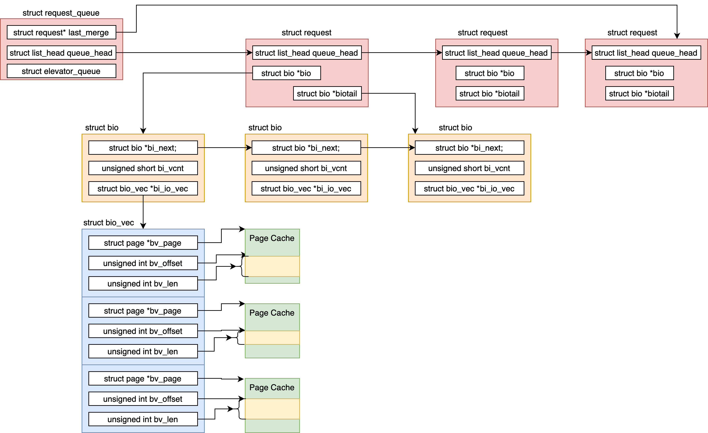
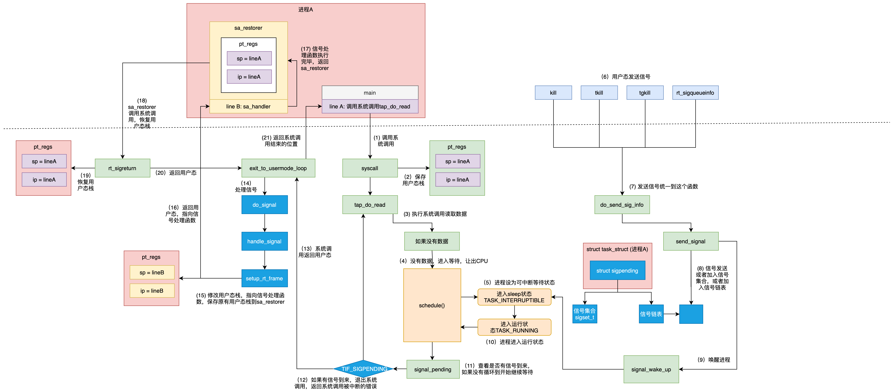
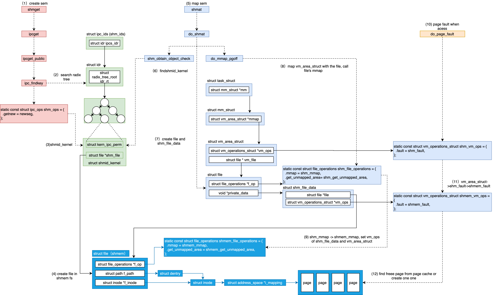
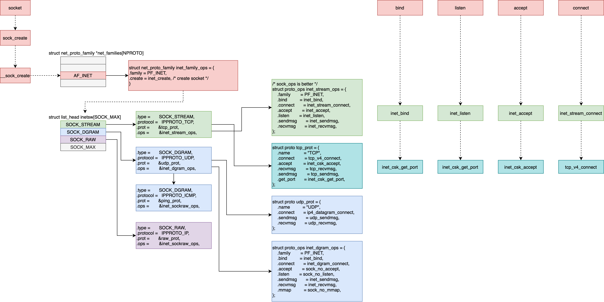
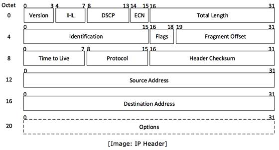
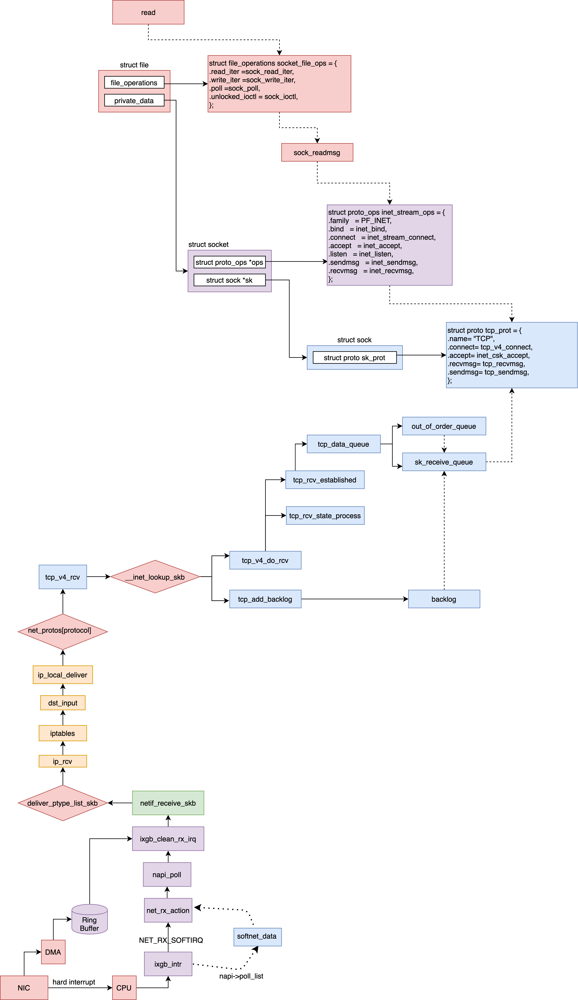

# Process Management

### fork


### exec
```C++
do_execve(getname(filename), argv, envp);
    do_execveat_common
        exec_binprm
            search_binary_handler // fs/exec.c
                load_elf_binary // fs/binfmt_elf.c
                    setup_new_exec(); // set mmap_base
                    setup_arg_pages();
                    elf_map(); // map the code in elf file to memory
                    set_brk(); // setup heap area
              load_elf_interp(); // load dependent *.so
                    start_thread(regs, elf_entry, bprm->p); // arch/x86/kernel/process_32.c
```

### pthread
```C++
// Linux pthread implementation
__pthread_create_2_1 // binfmt_elf.c
    ALLOCATE_STACK (iattr, &pd); // allocatestack.c
        /* Adjust the stack size for alignment. */
        /* call mmap to alloc thread statck in process heap*/
        /* set protection of this thread stack memory */
        /* populate member: stackblock、stackblock_size、guardsize、specific */
        /* And add to the list of stacks in use. */
    // start thread
    create_thread (pd, iattr, stackaddr, stacksize); // sysdeps/pthread/createthread.c
    do_clone (pd, attr, clone_flags, start_thread/*pthread func*/, stackaddr, stacksize, 1);
        ARCH_CLONE (start_thread, stackaddr, stacksize,, clone_flags, pd, &pd->tid, TLS_VALUE, &pd->tid);
            _do_fork();
    start_thread // pthread_creat.c
        THREAD_SETMEM (pd, result, pd->start_routine (pd->arg));
        // pd->result = pd->start_routine(pd->arg);
    __free_tcb
        __deallocate_stack
            queue_stack
```

### schedule
#### voluntary schedule

```c++
schedule(void)
    __schedule(false), // kernel/sched/core.c
        pick_next_task(rq, prev, &rf);
        context_switch(rq, prev, next, &rf);
            switch_mm_irqs_off(prev->active_mm, next->mm, next) {
              load_new_mm_cr3()
            }
            switch_to(prev, next, prev);
                __switch_to_asm(); // switch registers, but not EIP [arch/x86/entry/entry_64.S]
                    __switch_to(); // switch stack [arch/x86/kernel/process_32.c]
                        this_cpu_write(current_task, next_p); //
            barrier();
            return finish_task_switch(prev);
```

#### involuntary shcedule(preempty)
```C++
// 1. mark TIF_NEED_RESCHED
// no time slice
scheduler_tick(); // kernel/sched/core.c
    task_tick_fair(rq, curr, 0);
        entity_tick(cfs_rq, se, queued);
            check_preempt_tick(cfs_rq, curr);
                resched_curr(rq_of(cfs_rq));
                    set_tsk_need_resched();

// wake up
try_to_wake_up(); // kernel/sched/core.c
    ttwu_queue
        ttwu_do_activate
            ttwu_do_wakeup
                check_preempt_curr
                    resched_curr
                        --->

// 2. real time shceudle
// real user space preempty time: 1. return from system call
do_syscall_64();
    syscall_return_slowpath();
        prepare_exit_to_usermode();
            exit_to_usermode_loop(struct pt_regs *regs, u32 cached_flags) {
                while (true) {
                    if (cached_flags & _TIF_NEED_RESCHED)
                        schedule();

                    if (cached_flags & _TIF_SIGPENDING)
                      do_signal(regs); // --->

                    if (!(cached_flags & EXIT_TO_USERMODE_LOOP_FLAGS))
                        break;
                }
            }

// real user space preempty time: 2. return from interrupt
do_IRQ
    retint_user //arch/x86/entry/entry_64.S
        prepare_exit_to_usermode
            exit_to_usermode_loop
                --->


// real kernel preempty time: 1. preempty_enble
preempt_enable
    preempt_count_dec_and_test
        preempt_schedule
            preempt_schedule_common
                __schedule
                    --->

// real kernel preempty time: 2. return from interrupt
do_IRQ
    retint_kernel
        prepare_exit_to_usermode
            --->
```

# Memory Management
### segment
```C++
#define GDT_ENTRY_INIT(flags, base, limit) { { { \
    .a = ((limit) & 0xffff) | (((base) & 0xffff) << 16), \
    .b = (((base) & 0xff0000) >> 16) | (((flags) & 0xf0ff) << 8) | \
      ((limit) & 0xf0000) | ((base) & 0xff000000), \
  } } }

DEFINE_PER_CPU_PAGE_ALIGNED(struct gdt_page, gdt_page) = { .gdt = {
#ifdef CONFIG_X86_64
  [GDT_ENTRY_KERNEL32_CS]    = GDT_ENTRY_INIT(0xc09b, 0, 0xfffff),
  [GDT_ENTRY_KERNEL_CS]    = GDT_ENTRY_INIT(0xa09b, 0, 0xfffff),
  [GDT_ENTRY_KERNEL_DS]    = GDT_ENTRY_INIT(0xc093, 0, 0xfffff),
  [GDT_ENTRY_DEFAULT_USER32_CS]  = GDT_ENTRY_INIT(0xc0fb, 0, 0xfffff),
  [GDT_ENTRY_DEFAULT_USER_DS]  = GDT_ENTRY_INIT(0xc0f3, 0, 0xfffff),
  [GDT_ENTRY_DEFAULT_USER_CS]  = GDT_ENTRY_INIT(0xa0fb, 0, 0xfffff),
#else
  [GDT_ENTRY_KERNEL_CS]    = GDT_ENTRY_INIT(0xc09a, 0, 0xfffff),
  [GDT_ENTRY_KERNEL_DS]    = GDT_ENTRY_INIT(0xc092, 0, 0xfffff),
  [GDT_ENTRY_DEFAULT_USER_CS]  = GDT_ENTRY_INIT(0xc0fa, 0, 0xfffff),
  [GDT_ENTRY_DEFAULT_USER_DS]  = GDT_ENTRY_INIT(0xc0f2, 0, 0xfffff),

#endif
} };
EXPORT_PER_CPU_SYMBOL_GPL(gdt_page);

#define __KERNEL_CS      (GDT_ENTRY_KERNEL_CS*8)
#define __KERNEL_DS      (GDT_ENTRY_KERNEL_DS*8)
#define __USER_DS      (GDT_ENTRY_DEFAULT_USER_DS*8 + 3)
#define __USER_CS      (GDT_ENTRY_DEFAULT_USER_CS*8 + 3)
```


### paging


### user space
```C++

#ifdef CONFIG_X86_32
/*
 * User space process size: 3GB (default).
 */
#define TASK_SIZE    PAGE_OFFSET
#define TASK_SIZE_MAX    TASK_SIZE
/*
config PAGE_OFFSET
        hex
        default 0xC0000000
        depends on X86_32
*/
#else
/*
 * User space process size. 47bits minus one guard page.
*/
#define TASK_SIZE_MAX  ((1UL << 47) - PAGE_SIZE)
#define TASK_SIZE    (test_thread_flag(TIF_ADDR32) ? \
          IA32_PAGE_OFFSET : TASK_SIZE_MAX)
struct mm_struct {
  unsigned long mmap_base;  /* base of mmap area */
  unsigned long total_vm;   /* Total pages mapped */
  unsigned long locked_vm;  /* Pages that have PG_mlocked set */
  unsigned long pinned_vm;  /* Refcount permanently increased */
  unsigned long data_vm;    /* VM_WRITE & ~VM_SHARED & ~VM_STACK */
  unsigned long exec_vm;    /* VM_EXEC & ~VM_WRITE & ~VM_STACK */
  unsigned long stack_vm;   /* VM_STACK */
  unsigned long start_code, end_code, start_data, end_data;
  unsigned long start_brk, brk, start_stack;
  unsigned long arg_start, arg_end, env_start, env_end;

  struct vm_area_struct *mmap;    /* list of VMAs */
  struct rb_root mm_rb;
};

struct vm_area_struct {
  /* The first cache line has the info for VMA tree walking. */
  unsigned long vm_start;    /* Our start address within vm_mm. */
  unsigned long vm_end;    /* The first byte after our end address within vm_mm. */
  /* linked list of VM areas per task, sorted by address */
  struct vm_area_struct *vm_next, *vm_prev;
  struct rb_node vm_rb;

  struct mm_struct *vm_mm;  /* The address space we belong to. */
  struct list_head anon_vma_chain; /* Serialized by mmap_sem &
            * page_table_lock */
  const struct vm_operations_struct *vm_ops;

  struct anon_vma *anon_vma;  /* Serialized by page_table_lock */
  /* Function pointers to deal with this struct. */
  struct file * vm_file;    /* File we map to (can be NULL). */
  void * vm_private_data;    /* was vm_pte (shared mem) */
} __randomize_layout;


static int load_elf_binary(struct linux_binprm *bprm)
{

  setup_new_exec(bprm);

  retval = setup_arg_pages(bprm, randomize_stack_top(STACK_TOP),
         executable_stack);

  error = elf_map(bprm->file, load_bias + vaddr, elf_ppnt,
        elf_prot, elf_flags, total_size);

  retval = set_brk(elf_bss, elf_brk, bss_prot);

  elf_entry = load_elf_interp(&loc->interp_elf_ex,
              interpreter,
              &interp_map_addr,
              load_bias, interp_elf_phdata);

  current->mm->end_code = end_code;
  current->mm->start_code = start_code;
  current->mm->start_data = start_data;
  current->mm->end_data = end_data;
  current->mm->start_stack = bprm->p;
}
```


### kernel
```C++
/* PKMAP_BASE:
 * use alloc_pages() get struct page, user kmap() map the page to this area */

/* FIXADDR_START:
 * use kmap_atomic() to map a file to write it back to physic disk */
```


### physic
#### numa node
```C++
struct pglist_data *node_data[MAX_NUMNODES];

typedef struct pglist_data {
  struct zone node_zones[MAX_NR_ZONES];
  struct zonelist node_zonelists[MAX_ZONELISTS];
  int nr_zones;
  struct page *node_mem_map;
  unsigned long node_start_pfn;
  unsigned long node_present_pages; /* total number of physical pages */
  unsigned long node_spanned_pages; /* total size of physical page range, including holes */
  int node_id;
} pg_data_t;

enum zone_type {
#ifdef CONFIG_ZONE_DMA
  ZONE_DMA,
#endif
#ifdef CONFIG_ZONE_DMA32
  ZONE_DMA32,
#endif
  ZONE_NORMAL,
#ifdef CONFIG_HIGHMEM
  ZONE_HIGHMEM,
#endif
  ZONE_MOVABLE,
  __MAX_NR_ZONES
};
```
#### zone
```C++
struct zone {
  struct pglist_data  *zone_pgdat;
  struct per_cpu_pageset *pageset; // hot/cold page

  unsigned long    zone_start_pfn;
  unsigned long    managed_pages; // managed_pages = present_pages - reserved_pages
  unsigned long    spanned_pages; // spanned_pages = zone_end_pfn - zone_start_pfn
  unsigned long    present_pages; // present_pages = spanned_pages - absent_pages(pages in holes)

  const char    *name;
  /* free areas of different sizes */
  struct free_area  free_area[MAX_ORDER];
  /* zone flags, see below */
  unsigned long    flags;

  /* Primarily protects free_area */
  spinlock_t    lock;
};
```

#### page
```C++
struct page {
  unsigned long flags;    /* Atomic flags, some possibly
           * updated asynchronously */
  union {
    struct {  /* Page cache and anonymous pages */
      struct list_head lru; /* See page-flags.h for PAGE_MAPPING_FLAGS */
      struct address_space *mapping;
      pgoff_t index;    /* Our offset within mapping. */
      unsigned long private;
    };

    struct {  /* page_pool used by netstack */
      dma_addr_t dma_addr;
    };

    struct {  /* slab, slob and slub */
      union {
        struct list_head slab_list;
        struct {  /* Partial pages */
          struct page *next;
          int pages;  /* Nr of pages left */
          int pobjects;  /* Approximate count */
        };
      };

      struct kmem_cache *slab_cache; /* not slob */
      void *freelist;    /* first free object */
      union {
        void *s_mem;  /* slab: first object */
        unsigned long counters;    /* SLUB */
        struct {      /* SLUB */
          unsigned inuse:16;
          unsigned objects:15;
          unsigned frozen:1;
        };
      };
    };

    struct {  /* Tail pages of compound page */
      unsigned long compound_head;  /* Bit zero is set */
      unsigned char compound_dtor; /* First tail page only */
      unsigned char compound_order;
      atomic_t compound_mapcount;
    };

    struct {  /* Second tail page of compound page */
      unsigned long _compound_pad_1;  /* compound_head */
      unsigned long _compound_pad_2;
      struct list_head deferred_list; /* For both global and memcg */
    };

    struct {  /* Page table pages */
      unsigned long _pt_pad_1;  /* compound_head */
      pgtable_t pmd_huge_pte; /* protected by page->ptl */
      unsigned long _pt_pad_2;  /* mapping */
      union {
        struct mm_struct *pt_mm; /* x86 pgds only */
        atomic_t pt_frag_refcount; /* powerpc */
      };
      spinlock_t *ptl;
    };

    struct {  /* ZONE_DEVICE pages */
      struct dev_pagemap *pgmap;
      void *zone_device_data;
    };

    struct rcu_head rcu_head;
  };

  union {    /* This union is 4 bytes in size. */
    atomic_t _mapcount;
    unsigned int page_type;
    unsigned int active;  /* SLAB */
    int units;            /* SLOB */
  };
  atomic_t _refcount;

#ifdef CONFIG_MEMCG
  struct mem_cgroup *mem_cgroup;
#endif

#if defined(WANT_PAGE_VIRTUAL)
  void *virtual;      /* Kernel virtual address (NULL if
             not kmapped, ie. highmem) */
#endif /* WANT_PAGE_VIRTUAL */

#ifdef LAST_CPUPID_NOT_IN_PAGE_FLAGS
  int _last_cpupid;
#endif
} _struct_page_alignment;
```


### buddy system
```C++
struct free_area  free_area[MAX_ORDER];
#define MAX_ORDER 11
```


```C++
static inline struct page *
alloc_pages(gfp_t gfp_mask, unsigned int order)
{
  return alloc_pages_current(gfp_mask, order);
}

/*  %GFP_USER     user allocation,
 *  %GFP_KERNEL   kernel allocation,
 *  %GFP_HIGHMEM  highmem allocation,
 *  %GFP_FS       don't call back into a file system.
 *  %GFP_ATOMIC   don't sleep.
 *  @order: Power of two of allocation size in pages. 0 is a single page. */
struct page *alloc_pages_current(gfp_t gfp, unsigned order)
{
  struct mempolicy *pol = &default_policy;
  struct page *page;

  page = __alloc_pages_nodemask(gfp, order,
          policy_node(gfp, pol, numa_node_id()),
          policy_nodemask(gfp, pol));
  return page;
}

// __alloc_pages_nodemask ->
static struct page *
get_page_from_freelist(gfp_t gfp_mask, unsigned int order, int alloc_flags,
            const struct alloc_context *ac)
{
  for_next_zone_zonelist_nodemask(zone, z, ac->zonelist, ac->high_zoneidx, ac->nodemask) {
    struct page *page;
    page = rmqueue(ac->preferred_zoneref->zone, zone, order,
        gfp_mask, alloc_flags, ac->migratetype);
  }
}

// rmqueue->__rmqueue->__rmqueue_smallest
static inline
struct page *__rmqueue_smallest(struct zone *zone, unsigned int order,
            int migratetype)
{
  unsigned int current_order;
  struct free_area *area;
  struct page *page;

  /* Find a page of the appropriate size in the preferred list */
  for (current_order = order; current_order < MAX_ORDER; ++current_order) {
    area = &(zone->free_area[current_order]);
    page = list_first_entry_or_null(&area->free_list[migratetype],
              struct page, lru);
    if (!page)
      continue;
    list_del(&page->lru);
    rmv_page_order(page);
    area->nr_free--;
    expand(zone, page, order, current_order, area, migratetype);
    set_pcppage_migratetype(page, migratetype);
    return page;
  }
  return NULL;
}

static inline void expand(struct zone *zone, struct page *page,
  int low, int high, struct free_area *area,
  int migratetype)
{
  unsigned long size = 1 << high;

  while (high > low) {
    area--;
    high--;
    size >>= 1;

    list_add(&page[size].lru, &area->free_list[migratetype]);
    area->nr_free++;
    set_page_order(&page[size], high);
  }
}
```

### slab/slub/slob system
```C++
static struct kmem_cache *task_struct_cachep;

task_struct_cachep = kmem_cache_create("task_struct",
      arch_task_struct_size, align,
      SLAB_PANIC|SLAB_NOTRACK|SLAB_ACCOUNT, NULL);

static inline struct task_struct *alloc_task_struct_node(int node)
{
  return kmem_cache_alloc_node(task_struct_cachep, GFP_KERNEL, node);
}

static inline void free_task_struct(struct task_struct *tsk)
{
  kmem_cache_free(task_struct_cachep, tsk);
}

// all caches will listed into LIST_HEAD(slab_caches)
struct kmem_cache {
  struct kmem_cache_cpu *cpu_slab;
  struct kmem_cache_node *node[MAX_NUMNODES];
  /* Used for retriving partial slabs etc */
  unsigned long flags;
  unsigned long min_partial;
  int size;         /* The size of an object including meta data */
  int object_size;  /* The size of an object without meta data */
  int offset;       /* Free pointer offset. */
#ifdef CONFIG_SLUB_CPU_PARTIAL
  int cpu_partial;  /* Number of per cpu partial objects to keep around */
#endif
  struct kmem_cache_order_objects oo;
  /* Allocation and freeing of slabs */
  struct kmem_cache_order_objects max;
  struct kmem_cache_order_objects min;
  gfp_t allocflags;  /* gfp flags to use on each alloc */
  int refcount;      /* Refcount for slab cache destroy */
  void (*ctor)(void *);
  const char *name;       /* Name (only for display!) */
  struct list_head list;  /* List of slab caches */
};

struct kmem_cache_cpu {
  void **freelist;    /* Pointer to next available object */
  struct page *page;  /* The slab from which we are allocating */
#ifdef CONFIG_SLUB_CPU_PARTIAL
  struct page *partial;  /* Partially allocated frozen slabs */
#endif
  unsigned long tid;     /* Globally unique transaction id */
};

struct kmem_cache_node {
  spinlock_t list_lock;
#ifdef CONFIG_SLUB
  unsigned long nr_partial;
  struct list_head partial;
#endif
};
```


```C++
// alloc_task_struct_node -> kmem_cache_alloc_node
static void *slab_alloc_node(struct kmem_cache *s,
    gfp_t gfpflags, int node, unsigned long addr)
{
  void *object;
  struct kmem_cache_cpu *c;
  struct page *page;
  unsigned long tid;

  tid = this_cpu_read(s->cpu_slab->tid);
  c = raw_cpu_ptr(s->cpu_slab);

  object = c->freelist;
  page = c->page;
  if (unlikely(!object || !node_match(page, node))) {
    object = __slab_alloc(s, gfpflags, node, addr, c);
    stat(s, ALLOC_SLOWPATH);
  } else {
    /* update the freelist and tid to new values */
    void *next_object = get_freepointer_safe(s, object);
    if (unlikely(!this_cpu_cmpxchg_double(
        s->cpu_slab->freelist, s->cpu_slab->tid,
        object, tid,
        next_object, next_tid(tid)))) {
      note_cmpxchg_failure("slab_alloc", s, tid);
      goto redo;
    }
    prefetch_freepointer(s, next_object);
    stat(s, ALLOC_FASTPATH);
  }
  return object;
}

static void *__slab_alloc(struct kmem_cache *s, gfp_t gfpflags, int node,
        unsigned long addr, struct kmem_cache_cpu *c)
{
  void *freelist;
  struct page *page;
redo:
  // 1. try freelist again in case of cpu migration or IRQ
  freelist = c->freelist;
  if (freelist)
    goto load_freelist;

  freelist = get_freelist(s, page);
  if (!freelist) {
    c->page = NULL;
    stat(s, DEACTIVATE_BYPASS);
    goto new_slab;
  }

load_freelist:
  c->freelist = get_freepointer(s, freelist);
  c->tid = next_tid(c->tid);
  return freelist;

new_slab:
  // 2. replace cpu page with partial
  if (slub_percpu_partial(c)) {
    page = c->page = slub_percpu_partial(c);
    slub_set_percpu_partial(c, page);
    stat(s, CPU_PARTIAL_ALLOC);
    goto redo;
  }

  // 3. need alloc new slak objects
  freelist = new_slab_objects(s, gfpflags, node, &c);
  return freeli
}

static inline void *new_slab_objects(struct kmem_cache *s, gfp_t flags,
      int node, struct kmem_cache_cpu **pc)
{
  void *freelist;
  struct kmem_cache_cpu *c = *pc;
  struct page *page;

  // 3.1. get partial from kmem_cache_node indexed by node
  freelist = get_partial(s, flags, node, c); // -> get_partial_node()
  if (freelist)
    return freelist;

  // 3.2. no memory in kmem_cache_node, alloc new
  page = new_slab(s, flags, node);
  if (page) {
    c = raw_cpu_ptr(s->cpu_slab);
    if (c->page)
      flush_slab(s, c);

    freelist = page->freelist;
    page->freelist = NULL;

    stat(s, ALLOC_SLAB);
    c->page = page;
    *pc = c;
  } else
    freelist = NULL;

  return freelis
}

static void *get_partial_node(struct kmem_cache *s, struct kmem_cache_node *n,
        struct kmem_cache_cpu *c, gfp_t flags)
{
  struct page *page, *page2;
  void *object = NULL;
  int available = 0;
  int objects;

  list_for_each_entry_safe(page, page2, &n->partial, lru) {
    void *t;
    t = acquire_slab(s, n, page, object == NULL, &objects);
    if (!t)
      break;

    available += objects;
    if (!object) {
      c->page = page;
      stat(s, ALLOC_FROM_PARTIAL);
      object = t;
    } else {
      put_cpu_partial(s, page, 0);
      stat(s, CPU_PARTIAL_NODE);
    }
    if (!kmem_cache_has_cpu_partial(s)
      || available > slub_cpu_partial(s) / 2)
      break;
  }

  return object;
}

static inline void *acquire_slab(struct kmem_cache *s,
    struct kmem_cache_node *n, struct page *page,
    int mode, int *objects)
{
  void *freelist;
  unsigned long counters;
  struct page new;

  freelist = page->freelist;
  counters = page->counters;
  new.counters = counters;
  *objects = new.objects - new.inuse;
  if (mode) {
    new.inuse = page->objects;
    new.freelist = NULL;
  } else {
    new.freelist = freelist;
  }

  new.frozen = 1;

  if (!__cmpxchg_double_slab(s, page,
      freelist, counters,
      new.freelist, new.counters,
      "acquire_slab"))
    return NULL;

  remove_partial(n, page);
  return freelist;
}

// new_slab_objects -> new_slab, no memory in kmem_cache_node
static struct page *allocate_slab(struct kmem_cache *s, gfp_t flags, int node)
{
  struct page *page;
  struct kmem_cache_order_objects oo = s->oo;
  gfp_t alloc_gfp;
  void *start, *p;
  int idx, order;
  bool shuffle;

  flags &= gfp_allowed_mask;

  page = alloc_slab_page(s, alloc_gfp, node, oo);
  if (unlikely(!page)) {
    oo = s->min;
    alloc_gfp = flags;

    page = alloc_slab_page(s, alloc_gfp, node, oo);
    if (unlikely(!page))
      goto out;
    stat(s, ORDER_FALLBACK);
  }
  return page;
}

static inline struct page *alloc_slab_page(struct kmem_cache *s,
    gfp_t flags, int node, struct kmem_cache_order_objects oo)
{
  struct page *page;
  unsigned int order = oo_order(oo);

  if (node == NUMA_NO_NODE)
    page = alloc_pages(flags, order);
  else
    page = __alloc_pages_node(node, flags, order);

  if (page && charge_slab_page(page, flags, order, s)) {
    __free_pages(page, order);
    page = NULL;
  }

  return page;
}
```


### Reference:
[slaballocators.pdf](https://events.static.linuxfound.org/sites/events/files/slides/slaballocators.pdf)

### kswapd
```C++
//1. actice page out when alloc
get_page_from_freelist();
    node_reclaim();
        __node_reclaim();
            shrink_node();

// 2. positive page out by kswapd
static int kswapd(void *p)
{
  unsigned int alloc_order, reclaim_order;
  unsigned int classzone_idx = MAX_NR_ZONES - 1;
  pg_data_t *pgdat = (pg_data_t*)p;
  struct task_struct *tsk = current;

  for ( ; ; ) {
    kswapd_try_to_sleep(pgdat, alloc_order, reclaim_order,
        classzone_idx);
    reclaim_order = balance_pgdat(pgdat, alloc_order, classzone_idx);
  }
}
// balance_pgdat->kswapd_shrink_node->shrink_node

/* This is a basic per-node page freer.  Used by both kswapd and direct reclaim. */
static void shrink_node_memcg(struct pglist_data *pgdat, struct mem_cgroup *memcg,
            struct scan_control *sc, unsigned long *lru_pages)
{
  unsigned long nr[NR_LRU_LISTS];
  enum lru_list lru;

  while (nr[LRU_INACTIVE_ANON] || nr[LRU_ACTIVE_FILE] ||
          nr[LRU_INACTIVE_FILE]) {
    unsigned long nr_anon, nr_file, percentage;
    unsigned long nr_scanned;

    for_each_evictable_lru(lru) {
      if (nr[lru]) {
        nr_to_scan = min(nr[lru], SWAP_CLUSTER_MAX);
        nr[lru] -= nr_to_scan;

        nr_reclaimed += shrink_list(lru, nr_to_scan,
                  lruvec, memcg, sc);
      }
    }
  }
}

/* There are two kinds pages:
 * Anonynmous page: mapped to virtual address space
 * File mapped page: mapped to both virtual address space and a file.
 *
 * Each kind page has active and inactive queues. */
enum lru_list {
  LRU_INACTIVE_ANON = LRU_BASE,
  LRU_ACTIVE_ANON   = LRU_BASE + LRU_ACTIVE,

  LRU_INACTIVE_FILE = LRU_BASE + LRU_FILE,
  LRU_ACTIVE_FILE   = LRU_BASE + LRU_FILE + LRU_ACTIVE,

  LRU_UNEVICTABLE,
  NR_LRU_LISTS
};

#define for_each_evictable_lru(lru) for (lru = 0; lru <= LRU_ACTIVE_FILE; lru++)

static unsigned long shrink_list(enum lru_list lru, unsigned long nr_to_scan,
         struct lruvec *lruvec, struct mem_cgroup *memcg,
         struct scan_control *sc)
{
  if (is_active_lru(lru)) {
    if (inactive_list_is_low(lruvec, is_file_lru(lru),
           memcg, sc, true))
      shrink_active_list(nr_to_scan, lruvec, sc, lru);
    return 0;
  }

  return shrink_inactive_list(nr_to_scan, lruvec, sc, lru);
}
```

### malloc
```C++
// mm/mmap.c
SYSCALL_DEFINE1(brk, unsigned long, brk)
{
    unsigned long retval;
    unsigned long newbrk, oldbrk;
    struct mm_struct *mm = current->mm;
    struct vm_area_struct *next;
    //
    newbrk = PAGE_ALIGN(brk);
    oldbrk = PAGE_ALIGN(mm->brk);
    if (oldbrk == newbrk)
        goto set_brk;

    /* Always allow shrinking brk. */
    if (brk <= mm->brk) {
        if (!do_munmap(mm, newbrk, oldbrk-newbrk, &uf))
            goto set_brk;
        goto out;
    }

    /* Check against existing mmap mappings. */
    next = find_vma(mm, oldbrk);
    if (next && newbrk + PAGE_SIZE > vm_start_gap(next))
        goto out;

    /* Ok, looks good - let it rip. */
    if (do_brk(oldbrk, newbrk-oldbrk, &uf) < 0)
        goto out;

set_brk:
  mm->brk = brk;
//
  return brk;
out:
  retval = mm->brk;
  return retval
}

static int do_brk(unsigned long addr, unsigned long len, struct list_head *uf)
{
  return do_brk_flags(addr, len, 0, uf);
}

static int do_brk_flags(unsigned long addr, unsigned long request,
  unsigned long flags, struct list_head *uf)
{
  struct mm_struct *mm = current->mm;
  struct vm_area_struct *vma, *prev;
  unsigned long len;
  struct rb_node **rb_link, *rb_parent;
  pgoff_t pgoff = addr >> PAGE_SHIFT;
  int error;

  len = PAGE_ALIGN(request);

  find_vma_links(mm, addr, addr + len, &prev, &rb_link,
            &rb_parent);

  vma = vma_merge(mm, prev, addr, addr + len, flags,
      NULL, NULL, pgoff, NULL, NULL_VM_UFFD_CTX);
  if (vma)
    goto out;

  vma = kmem_cache_zalloc(vm_area_cachep, GFP_KERNEL);
  INIT_LIST_HEAD(&vma->anon_vma_chain);
  vma->vm_mm = mm;
  vma->vm_start = addr;
  vma->vm_end = addr + len;
  vma->vm_pgoff = pgoff;
  vma->vm_flags = flags;
  vma->vm_page_prot = vm_get_page_prot(flags);
  vma_link(mm, vma, prev, rb_link, rb_parent);
out:
  perf_event_mmap(vma);
  mm->total_vm += len >> PAGE_SHIFT;
  mm->data_vm += len >> PAGE_SHIFT;
  if (flags & VM_LOCKED)
    mm->locked_vm += (len >> PAGE_SHIFT);
  vma->vm_flags |= VM_SOFTDIRTY;
  return 0;
}
```

### mmap
```C++
struct mm_struct {
  struct vm_area_struct *mmap;    /* list of VMAs */
  pgd_t * pgd;
}

struct vm_area_struct {
  /* For areas with an address space and backing store,
   * linkage into the address_space->i_mmap interval tree. */
  struct {
    struct rb_node rb;
    unsigned long rb_subtree_last;
  } shared;

  /* A file's MAP_PRIVATE vma can be in both i_mmap tree and anon_vma list
   * An anonymous MAP_PRIVATE, stack or brk vma can only be in an anon_vma list.
   * A MAP_SHARED vma can only be in the i_mmap tree. */
  struct list_head anon_vma_chain;
  struct anon_vma *anon_vma;

  const struct vm_operations_struct *vm_ops;

  unsigned long vm_pgoff;  /* Offset (within vm_file) in PAGE_SIZE units */
  struct file * vm_file;    /* File we map to (can be NULL). */
  void * vm_private_data; /* was vm_pte (shared mem) */
}

SYSCALL_DEFINE6(mmap, unsigned long, addr, unsigned long, len,
                unsigned long, prot, unsigned long, flags,
                unsigned long, fd, unsigned long, off)
{
  error = sys_mmap_pgoff(addr, len, prot, flags, fd, off >> PAGE_SHIFT);
}

SYSCALL_DEFINE6(mmap_pgoff, unsigned long, addr, unsigned long, len,
    unsigned long, prot, unsigned long, flags,
    unsigned long, fd, unsigned long, pgoff)
{
  struct file *file = NULL;

  file = fget(fd);

  retval = vm_mmap_pgoff(file, addr, len, prot, flags, pgoff);
  return retval;
}

//  vm_mmap_pgoff->do_mmap_pgoff->do_mmap
unsigned long do_mmap(struct file *file, unsigned long addr,
      unsigned long len, unsigned long prot,
      unsigned long flags, vm_flags_t vm_flags,
      unsigned long pgoff, unsigned long *populate,
      struct list_head *uf)
{
  addr = get_unmapped_area(file, addr, len, pgoff, flags);
  if (IS_ERR_VALUE(addr))
    return addr;

  addr = mmap_region(file, addr, len, vm_flags, pgoff, uf);
  return addr;
}

// 1. get_unmapped_area
unsigned long
get_unmapped_area(struct file *file, unsigned long addr, unsigned long len,
    unsigned long pgoff, unsigned long flags)
{
  unsigned long (*get_area)(struct file *, unsigned long,
          unsigned long, unsigned long, unsigned long);
  get_area = current->mm->get_unmapped_area;
  if (file) {
    if (file->f_op->get_unmapped_area)
      get_area = file->f_op->get_unmapped_area;
  }
}

const struct file_operations ext4_file_operations = {
  .mmap           = ext4_file_mmap
  .get_unmapped_area = thp_get_unmapped_area,
};

unsigned long __thp_get_unmapped_area(struct file *filp, unsigned long len,
                loff_t off, unsigned long flags, unsigned long size)
{
  unsigned long addr;
  loff_t off_end = off + len;
  loff_t off_align = round_up(off, size);
  unsigned long len_pad;
  len_pad = len + size;

  addr = current->mm->get_unmapped_area(filp, 0, len_pad,
                                        off >> PAGE_SHIFT, flags);
  addr += (off - addr) & (size - 1);
  return addr;
}

// 2. mmap_region
unsigned long mmap_region(struct file *file, unsigned long addr,
    unsigned long len, vm_flags_t vm_flags, unsigned long pgoff,
    struct list_head *uf)
{
  struct mm_struct *mm = current->mm;
  struct vm_area_struct *vma, *prev;
  struct rb_node **rb_link, *rb_parent;

  vma = vma_merge(mm, prev, addr, addr + len, vm_flags,
      NULL, file, pgoff, NULL, NULL_VM_UFFD_CTX);
  if (vma)
    goto out;

  vma = kmem_cache_zalloc(vm_area_cachep, GFP_KERNEL);
  if (!vma) {
    error = -ENOMEM;
    goto unacct_error;
  }

  vma->vm_mm = mm;
  vma->vm_start = addr;
  vma->vm_end = addr + len;
  vma->vm_flags = vm_flags;
  vma->vm_page_prot = vm_get_page_prot(vm_flags);
  vma->vm_pgoff = pgoff;
  INIT_LIST_HEAD(&vma->anon_vma_chain);

  if (file) {
    vma->vm_file = get_file(file);
    error = call_mmap(file, vma);
    addr = vma->vm_start;
    vm_flags = vma->vm_flags;
  }
  vma_link(mm, vma, prev, rb_link, rb_parent);
  return addr;
}

static inline int call_mmap(struct file *file, struct vm_area_struct *vma)
{
  return file->f_op->mmap(file, vma);
}

static int ext4_file_mmap(struct file *file, struct vm_area_struct *vma)
{
  vma->vm_ops = &ext4_file_vm_ops;
}

struct address_space {
  struct inode    *host;
  /* tree of private and shared mappings. e.g., vm_area_struct */
  struct rb_root    i_mmap; // link the vma to the file
  const struct address_space_operations *a_ops;
}

static void __vma_link_file(struct vm_area_struct *vma)
{
  struct file *file;

  file = vma->vm_file;
  if (file) {
    struct address_space *mapping = file->f_mapping;
    vma_interval_tree_insert(vma, &mapping->i_mmap);
  }
}
```


### page fault
```C++
// page cache in memory
struct address_space {
  struct inode    *host;
  struct xarray    i_pages;
  struct rb_root_cached  i_mmap;
  atomic_t    i_mmap_writable;
  const struct address_space_operations *a_ops;

  gfp_t      gfp_mask;
  struct rw_semaphore  i_mmap_rwsem;
  unsigned long    nrpages;
  unsigned long    nrexceptional;
  pgoff_t      writeback_index;
  unsigned long    flags;
  errseq_t    wb_err;
  spinlock_t    private_lock;
  struct list_head  private_list;
  void      *private_data;
};

dotraplinkage void
do_page_fault(struct pt_regs *regs, unsigned long hw_error_code,
    unsigned long address)
{
  if (unlikely(fault_in_kernel_space(address)))
    do_kern_addr_fault(regs, hw_error_code, address);
  else
    do_user_addr_fault(regs, hw_error_code, address);
}

static inline
void do_user_addr_fault(struct pt_regs *regs,
      unsigned long hw_error_code,
      unsigned long address)
{
  struct vm_area_struct *vma;
  struct task_struct *tsk;
  struct mm_struct *mm;
  vm_fault_t fault, major = 0;
  unsigned int flags = FAULT_FLAG_ALLOW_RETRY | FAULT_FLAG_KILLABLE;

  tsk = current;
  mm = tsk->mm;

  __do_page_fault(regs, error_code, address);
}

static noinline void
__do_page_fault(struct pt_regs *regs, unsigned long error_code,
    unsigned long address)
{
  struct vm_area_struct *vma;
  struct task_struct *tsk;
  struct mm_struct *mm;
  tsk = current;
  mm = tsk->mm;

  if (unlikely(fault_in_kernel_space(address))) {
    if (vmalloc_fault(address) >= 0)
      return;
  }

  vma = find_vma(mm, address);
  fault = handle_mm_fault(vma, address, flags);
}

static int __handle_mm_fault(struct vm_area_struct *vma, unsigned long address,
    unsigned int flags)
{
  struct vm_fault vmf = {
    .vma = vma,
    .address = address & PAGE_MASK,
    .flags = flags,
    .pgoff = linear_page_index(vma, address),
    .gfp_mask = __get_fault_gfp_mask(vma),
  };

  struct mm_struct *mm = vma->vm_mm;
  pgd_t *pgd;
  p4d_t *p4d;
  int ret;

  pgd = pgd_offset(mm, address);
  p4d = p4d_alloc(mm, pgd, address);

  vmf.pud = pud_alloc(mm, p4d, address);
  vmf.pmd = pmd_alloc(mm, vmf.pud, address);

  return handle_pte_fault(&vmf);
}

static int handle_pte_fault(struct vm_fault *vmf)
{
  pte_t entry;
  vmf->pte = pte_offset_map(vmf->pmd, vmf->address);
  vmf->orig_pte = *vmf->pte;

  if (!vmf->pte) {
    if (vma_is_anonymous(vmf->vma))
      return do_anonymous_page(vmf);
    else
      return do_fault(vmf);
  }

  if (!pte_present(vmf->orig_pte))
    return do_swap_page(vmf);
}

// 1. map to anonymouse page
/* do_anonymous_page -> pte_alloc -> alloc_zeroed_user_highpage_movable ->
 * alloc_pages_vma -> __alloc_pages_nodemask */
static int do_anonymous_page(struct vm_fault *vmf)
{
  struct vm_area_struct *vma = vmf->vma;
  struct mem_cgroup *memcg;
  struct page *page;
  int ret = 0;
  pte_t entry;

  if (pte_alloc(vma->vm_mm, vmf->pmd, vmf->address))
    return VM_FAULT_OOM;

  page = alloc_zeroed_user_highpage_movable(vma, vmf->address);
  entry = mk_pte(page, vma->vm_page_prot);
  if (vma->vm_flags & VM_WRITE)
    entry = pte_mkwrite(pte_mkdirty(entry));

  vmf->pte = pte_offset_map_lock(vma->vm_mm, vmf->pmd, vmf->address,
      &vmf->ptl);
  set_pte_at(vma->vm_mm, vmf->address, vmf->pte, entry);
}

// 2. map to a file
static int __do_fault(struct vm_fault *vmf)
{
  struct vm_area_struct *vma = vmf->vma;
  if (pmd_none(*vmf->pmd) && !vmf->prealloc_pte) {
    vmf->prealloc_pte = pte_alloc_one(vmf->vma->vm_mm);
    if (!vmf->prealloc_pte)
      return VM_FAULT_OOM;
    smp_wmb(); /* See comment in __pte_alloc() */
  }
  int ret;
  ret = vma->vm_ops->fault(vmf);
  return ret;
}

static const struct vm_operations_struct ext4_file_vm_ops = {
  .fault    = ext4_filemap_fault,
  .map_pages  = filemap_map_pages,
  .page_mkwrite   = ext4_page_mkwrite,
};

int ext4_filemap_fault(struct vm_fault *vmf)
{
  struct inode *inode = file_inode(vmf->vma->vm_file);
  err = filemap_fault(vmf);
  return err;
}

int filemap_fault(struct vm_fault *vmf)
{
  int error;
  struct file *file = vmf->vma->vm_file;
  struct address_space *mapping = file->f_mapping;
  struct inode *inode = mapping->host;
  pgoff_t offset = vmf->pgoff;
  struct page *page;
  int ret = 0;

  page = find_get_page(mapping, offset);
  if (likely(page) && !(vmf->flags & FAULT_FLAG_TRIED)) {
    do_async_mmap_readahead(vmf->vma, ra, file, page, offset);
  } else if (!page) {
    goto no_cached_page;
  }

  vmf->page = page;
  return ret | VM_FAULT_LOCKED;
no_cached_page:
  error = page_cache_read(file, offset, vmf->gfp_mask);
}

static int page_cache_read(struct file *file, pgoff_t offset, gfp_t gfp_mask)
{
  struct address_space *mapping = file->f_mapping;
  struct page *page;

  page = __page_cache_alloc(gfp_mask|__GFP_COLD);
  ret = add_to_page_cache_lru(page, mapping, offset, gfp_mask & GFP_KERNEL);
  ret = mapping->a_ops->readpage(file, page);
}

static const struct address_space_operations ext4_aops = {
  .readpage    = ext4_readpage,
  .readpages    = ext4_readpages,
};

static int ext4_read_inline_page(struct inode *inode, struct page *page)
{
  void *kaddr;

  kaddr = kmap_atomic(page);
  ret = ext4_read_inline_data(inode, kaddr, len, &iloc);
  flush_dcache_page(page);
  kunmap_atomic(kaddr);
}

// 3. map to a swap
int do_swap_page(struct vm_fault *vmf)
{
  struct vm_area_struct *vma = vmf->vma;
  struct page *page, *swapcache;
  struct mem_cgroup *memcg;
  swp_entry_t entry;
  pte_t pte;

  entry = pte_to_swp_entry(vmf->orig_pte);
  page = lookup_swap_cache(entry);
  if (!page) {
    page = swapin_readahead(entry, GFP_HIGHUSER_MOVABLE, vma,
          vmf->address);
  }

  swapcache = page;
  pte = mk_pte(page, vma->vm_page_prot);
  set_pte_at(vma->vm_mm, vmf->address, vmf->pte, pte);
  vmf->orig_pte = pte;
  swap_free(entry);
}

// swapin_readahead ->
int swap_readpage(struct page *page, bool do_poll)
{
  struct bio *bio;
  int ret = 0;
  struct swap_info_struct *sis = page_swap_info(page);
  blk_qc_t qc;
  struct block_device *bdev;

  if (sis->flags & SWP_FILE) {
    struct file *swap_file = sis->swap_file;
    struct address_space *mapping = swap_file->f_mapping;
    ret = mapping->a_ops->readpage(swap_file, page);
    return ret;
  }
}
```


### pgd
`cr3` register points to current process's `pgd`, which is set by `load_new_mm_cr3`.
```C++
/* alloc pgd in mm_struct when forking */
static struct mm_struct *dup_mm(struct task_struct *tsk)
{
  struct mm_struct *mm, *oldmm = current->mm;
  mm = allocate_mm();
  memcpy(mm, oldmm, sizeof(*mm));
  if (!mm_init(mm, tsk, mm->user_ns))
    goto fail_nomem;
  err = dup_mmap(mm, oldmm);
  return mm;
}
// mm_init->
static inline int mm_alloc_pgd(struct mm_struct *mm)
{
  mm->pgd = pgd_alloc(mm);
  return 0;
}

static void pgd_ctor(struct mm_struct *mm, pgd_t *pgd)
{
  /* If the pgd points to a shared pagetable level (either the
     ptes in non-PAE, or shared PMD in PAE), then just copy the
     references from swapper_pg_dir. */
  if (CONFIG_PGTABLE_LEVELS == 2 ||
      (CONFIG_PGTABLE_LEVELS == 3 && SHARED_KERNEL_PMD) ||
      CONFIG_PGTABLE_LEVELS >= 4) {
    clone_pgd_range(pgd + KERNEL_PGD_BOUNDARY,
        swapper_pg_dir + KERNEL_PGD_BOUNDARY,
        KERNEL_PGD_PTRS);
  }
}
```

### kernel mapping
```C++
// arch/x86/include/asm/pgtable_64.h
extern pud_t level3_kernel_pgt[512];
extern pud_t level3_ident_pgt[512];

extern pmd_t level2_kernel_pgt[512];
extern pmd_t level2_fixmap_pgt[512];
extern pmd_t level2_ident_pgt[512];

extern pte_t level1_fixmap_pgt[512];
extern pgd_t init_top_pgt[];

#define swapper_pg_dir init_top_pgt

// arch\x86\kernel\head_64.S
__INITDATA
NEXT_PAGE(init_top_pgt)
  .quad   level3_ident_pgt - __START_KERNEL_map + _KERNPG_TABLE
  .org    init_top_pgt + PGD_PAGE_OFFSET*8, 0
  .quad   level3_ident_pgt - __START_KERNEL_map + _KERNPG_TABLE
  .org    init_top_pgt + PGD_START_KERNEL*8, 0
  /* (2^48-(2*1024*1024*1024))/(2^39) = 511 */
  .quad   level3_kernel_pgt - __START_KERNEL_map + _PAGE_TABLE

NEXT_PAGE(level3_ident_pgt)
  .quad  level2_ident_pgt - __START_KERNEL_map + _KERNPG_TABLE
  .fill  511, 8, 0
NEXT_PAGE(level2_ident_pgt)
  /* Since I easily can, map the first 1G.
   * Don't set NX because code runs from these pages.
   */
  PMDS(0, __PAGE_KERNEL_IDENT_LARGE_EXEC, PTRS_PER_PMD)


NEXT_PAGE(level3_kernel_pgt)
  .fill  L3_START_KERNEL,8,0
  /* (2^48-(2*1024*1024*1024)-((2^39)*511))/(2^30) = 510 */
  .quad  level2_kernel_pgt - __START_KERNEL_map + _KERNPG_TABLE
  .quad  level2_fixmap_pgt - __START_KERNEL_map + _PAGE_TABLE


NEXT_PAGE(level2_kernel_pgt)
  /*
   * 512 MB kernel mapping. We spend a full page on this pagetable
   * anyway.
   *
   * The kernel code+data+bss must not be bigger than that.
   *
   * (NOTE: at +512MB starts the module area, see MODULES_VADDR.
   *  If you want to increase this then increase MODULES_VADDR
   *  too.)
   */
  PMDS(0, __PAGE_KERNEL_LARGE_EXEC,
    KERNEL_IMAGE_SIZE/PMD_SIZE)


NEXT_PAGE(level2_fixmap_pgt)
  .fill  506,8,0
  .quad  level1_fixmap_pgt - __START_KERNEL_map + _PAGE_TABLE
  /* 8MB reserved for vsyscalls + a 2MB hole = 4 + 1 entries */
  .fill  5,8,0


NEXT_PAGE(level1_fixmap_pgt)
  .fill  51


PGD_PAGE_OFFSET = pgd_index(__PAGE_OFFSET_BASE)
PGD_START_KERNEL = pgd_index(__START_KERNEL_map)
L3_START_KERNEL = pud_index(__START_KERNEL_map)
```


```C++
// kernel mm_struct
struct mm_struct init_mm = {
  .mm_rb    = RB_ROOT,
  .pgd    = swapper_pg_dir,
  .mm_users  = ATOMIC_INIT(2),
  .mm_count  = ATOMIC_INIT(1),
  .mmap_sem  = __RWSEM_INITIALIZER(init_mm.mmap_sem),
  .page_table_lock =  __SPIN_LOCK_UNLOCKED(init_mm.page_table_lock),
  .mmlist    = LIST_HEAD_INIT(init_mm.mmlist),
  .user_ns  = &init_user_ns,
  INIT_MM_CONTEXT(init_mm)
};

// init kernel mm_struct
void __init setup_arch(char **cmdline_p)
{
  clone_pgd_range(swapper_pg_dir     + KERNEL_PGD_BOUNDARY,
      initial_page_table + KERNEL_PGD_BOUNDARY,
      KERNEL_PGD_PTRS);

  load_cr3(swapper_pg_dir);
  __flush_tlb_all();

  init_mm.start_code = (unsigned long) _text;
  init_mm.end_code = (unsigned long) _etext;
  init_mm.end_data = (unsigned long) _edata;
  init_mm.brk = _brk_end;
  init_mem_mapping();
}

// init_mem_mapping ->
unsigned long __meminit
kernel_physical_mapping_init(
  unsigned long paddr_start,
  unsigned long paddr_end,
  unsigned long page_size_mask)
{
  unsigned long vaddr, vaddr_start, vaddr_end, vaddr_next, paddr_last;

  paddr_last = paddr_end;
  vaddr = (unsigned long)__va(paddr_start);
  vaddr_end = (unsigned long)__va(paddr_end);
  vaddr_start = vaddr;

  for (; vaddr < vaddr_end; vaddr = vaddr_next) {
    pgd_t *pgd = pgd_offset_k(vaddr);
    p4d_t *p4d;

    vaddr_next = (vaddr & PGDIR_MASK) + PGDIR_SIZE;

    if (pgd_val(*pgd)) {
      p4d = (p4d_t *)pgd_page_vaddr(*pgd);
      paddr_last = phys_p4d_init(p4d, __pa(vaddr),
               __pa(vaddr_end),
               page_size_mask);
      continue;
    }

    p4d = alloc_low_page();
    paddr_last = phys_p4d_init(p4d, __pa(vaddr), __pa(vaddr_end),
             page_size_mask);

    p4d_populate(&init_mm, p4d_offset(pgd, vaddr), (pud_t *) p4d);
  }
  __flush_tlb_all();

  return paddr_l
```

### vmalloc
```C++
void *vmalloc(unsigned long size)
{
  return __vmalloc_node_flags(size, NUMA_NO_NODE,
            GFP_KERNEL);
}

static void *__vmalloc_node(unsigned long size, unsigned long align,
          gfp_t gfp_mask, pgprot_t prot,
          int node, const void *caller)
{
  return __vmalloc_node_range(size, align, VMALLOC_START, VMALLOC_END,
        gfp_mask, prot, 0, node, caller);
}
```

### kmap_atomic
```C++
void *kmap_atomic(struct page *page)
{
  return kmap_atomic_prot(page, kmap_prot);
}

void *kmap_atomic_prot(struct page *page, pgprot_t prot)
{
  // on 64 bit machine doesn't have high memory
  if (!PageHighMem(page))
    // get virtual address of a page from `page_address_htable`
    return page_address(page);

  // on 32 bit machine
  vaddr = __fix_to_virt(FIX_KMAP_BEGIN + idx);
  set_pte(kmap_pte-idx, mk_pte(page, prot));

  return (void *)vaddr;
}

// page_address ->
static __always_inline void *lowmem_page_address(const struct page *page)
{
  return page_to_virt(page);
}

#define page_to_virt(x)  __va(PFN_PHYS(page_to_pfn(x)
```

### kernel page fault
```C++
static noinline int vmalloc_fault(unsigned long address)
{
  unsigned long pgd_paddr;
  pmd_t *pmd_k;
  pte_t *pte_k;

  if (!(address >= VMALLOC_START && address < VMALLOC_END))
    return -1;

  pgd_paddr = read_cr3_pa();
  pmd_k = vmalloc_sync_one(__va(pgd_paddr), address);
  if (!pmd_k)
    return -1;

  pte_k = pte_offset_kernel(pmd_k, address);
  if (!pte_present(*pte_k))
    return -1;

  return 0
}
```

### Q:
1. Does different kmem_cache share the same kmem_cache_cpu?
2. Where does `struct kmem_cache_cpu __percpu *cpu_slab;` stored in each cpu?
3. How `swapper_pg_dir` is initialized?
4. Does  `alloc_zeroed_user_highpage_movable` alloc a page each time for each anonymous mapping?

# File Management


### inode, extents
```C++
struct inode {
  const struct inode_operations  *i_op;
  struct super_block  *i_sb;
  struct address_space  *i_mapping;

  union {
    const struct file_operations  *i_fop;  /* former ->i_op->default_file_ops */
    void (*free_inode)(struct inode *);
  };

  dev_t             i_rdev;
  struct list_head  i_devices;
  union {
    struct pipe_inode_info  *i_pipe;
    struct block_device     *i_bdev;
    struct cdev             *i_cdev;
    char                    *i_link;
    unsigned                i_dir_seq;
  };

  umode_t      i_mode;
  unsigned short    i_opflags;
  kuid_t      i_uid;
  kgid_t      i_gid;
  unsigned int    i_flags;

  unsigned long    dirtied_when;  /* jiffies of first dirtying */
  unsigned long    dirtied_time_when;

  struct hlist_node  i_hash;
  struct list_head  i_io_list;  /* backing dev IO list */
  struct bdi_writeback  *i_wb;    /* the associated cgroup wb */

  struct file_lock_context  *i_flctx;
  struct address_space  i_data;
};

struct ext4_inode {
  __le16  i_mode;    /* File mode */
  __le16  i_uid;    /* Low 16 bits of Owner Uid */
  __le32  i_size_lo;  /* Size in bytes */
  __le32  i_atime;  /* Access time */
  __le32  i_ctime;  /* Inode Change time */
  __le32  i_mtime;  /* Modification time */
  __le32  i_dtime;  /* Deletion Time */
  __le16  i_gid;    /* Low 16 bits of Group Id */
  __le16  i_links_count;  /* Links count */
  __le32  i_blocks_lo;  /* Blocks count */
  __le32  i_flags;  /* File flags */

  __le32  i_block[EXT4_N_BLOCKS];/* Pointers to blocks */
  __le32  i_generation;  /* File version (for NFS) */
  __le32  i_file_acl_lo;  /* File ACL */
  __le32  i_size_high;

};

// Each block (leaves and indexes), even inode-stored has header.
struct ext4_extent_header {
  __le16  eh_magic;  /* probably will support different formats */
  __le16  eh_entries;  /* number of valid entries */
  __le16  eh_max;    /* capacity of store in entries */
  __le16  eh_depth;  /* has tree real underlying blocks? */
  __le32  eh_generation;  /* generation of the tree */
};

struct ext4_extent_idx {
  __le32  ei_block;  /* index covers logical blocks from 'block' */
  __le32  ei_leaf_lo;  /* pointer to the physical block of the next *
         * level. leaf or next index could be there */
  __le16  ei_leaf_hi;  /* high 16 bits of physical block */
  __u16  ei_unused;
};

struct ext4_extent {
  __le32  ee_block;  /* first logical block extent covers */
  // the most significant bit used as a flag to identify whether
  // this entent is initialized, 15 bits can present max 128MB data
  __le16  ee_len;    /* number of blocks covered by extent */
  __le16  ee_start_hi;  /* high 16 bits of physical block */
  __le32  ee_start_lo;  /* low 32 bits of physical block */
};
```


```C++
const struct inode_operations ext4_dir_inode_operations = {
  .create    = ext4_create,
  .lookup    = ext4_lookup,
  .link    = ext4_link,
  .unlink    = ext4_unlink,
  .symlink  = ext4_symlink,
  .mkdir    = ext4_mkdir,
  .rmdir    = ext4_rmdir,
  .mknod    = ext4_mknod,
  .tmpfile  = ext4_tmpfile,
  .rename    = ext4_rename2,
  .setattr  = ext4_setattr,
  .getattr  = ext4_getattr,
  .listxattr  = ext4_listxattr,
  .get_acl  = ext4_get_acl,
  .set_acl  = ext4_set_acl,
  .fiemap         = ext4_fiemap,
};

// ext4_create->ext4_new_inode_start_handle->__ext4_new_inode
struct inode *__ext4_new_inode(handle_t *handle, struct inode *dir,
             umode_t mode, const struct qstr *qstr,
             __u32 goal, uid_t *owner, __u32 i_flags,
             int handle_type, unsigned int line_no,
             int nblocks)
{
inode_bitmap_bh = ext4_read_inode_bitmap(sb, group);
ino = ext4_find_next_zero_bit((unsigned long *)
                inode_bitmap_bh->b_data,
                EXT4_INODES_PER_GROUP(sb), ino);
}
```

### Meta Block Group
```C++
struct ext4_group_desc
{
  __le32  bg_block_bitmap_lo;  /* Blocks bitmap block */
  __le32  bg_inode_bitmap_lo;  /* Inodes bitmap block */
  __le32  bg_inode_table_lo;  /* Inodes table block */
};
```


```C++
struct ext4_super_block {
  __le32  s_blocks_count_lo;  /* Blocks count */
  __le32  s_r_blocks_count_lo;  /* Reserved blocks count */
  __le32  s_free_blocks_count_lo;  /* Free blocks count */

  __le32  s_blocks_count_hi;  /* Blocks count */
  __le32  s_r_blocks_count_hi;  /* Reserved blocks count */
  __le32  s_free_blocks_count_hi;  /* Free blocks count */
}

struct super_block {
  struct dentry    *s_root;
  struct file_system_type  *s_type;
  const struct super_operations  *s_op;

  dev_t      s_dev;    /* search index; _not_ kdev_t */
  struct block_device  *s_bdev;

  struct list_head  s_list;    /* Keep this first */
  unsigned char    s_blocksize_bits;
  unsigned long    s_blocksize;
  loff_t      s_maxbytes;  /* Max file size */
  struct backing_dev_info *s_bdi;
  struct hlist_node  s_instances;

  struct list_head  s_mounts; /* list of mounts; _not_ for fs use */
  struct list_head  s_inodes; /* all inodes */
  struct list_head  s_inodes_wb; /* writeback inodes */
}
```


### directory
```C++
struct ext4_dir_entry {
  __le32  inode;      /* Inode number */
  __le16  rec_len;    /* Directory entry length */
  __le16  name_len;    /* Name length */
  char  name[EXT4_NAME_LEN];  /* File name */
};
struct ext4_dir_entry_2 {
  __le32  inode;      /* Inode number */
  __le16  rec_len;    /* Directory entry length */
  __u8  name_len;    /* Name length */
  __u8  file_type;
  char  name[EXT4_NAME_LEN];  /* File name */
};

struct dx_root
{
  struct fake_dirent dot;
  char dot_name[4];
  struct fake_dirent dotdot;
  char dotdot_name[4];
  struct dx_root_info
  {
    __le32 reserved_zero;
    u8 hash_version;
    u8 info_length; /* 8 */
    u8 indirect_levels;
    u8 unused_flags;
  }
  info;
  struct dx_entry  entries[0];
};

struct dx_entry
{
  __le32 hash;
  __le32 block;
};
```


### hard/symbolic link
```C++
 ln [args] [dst] [src]
```


### vfs

```C++
register_filesystem(&ext4_fs_type);

static struct file_system_type ext4_fs_type = {
  .owner    = THIS_MODULE,
  .name    = "ext4",
  .mount    = ext4_mount,
  .kill_sb  = kill_block_super,
  .fs_flags  = FS_REQUIRES_DEV,
};
```

### mount

```C++

SYSCALL_DEFINE5(mount, char __user *, dev_name, char __user *, dir_name, char __user *, type, unsigned long, flags, void __user *, data)
{
  ret = do_mount(kernel_dev, dir_name, kernel_type, flags, options);
}

/* ksys_mount -> do_mount -> do_new_mount -> */
struct vfsmount *
vfs_kern_mount(struct file_system_type *type, int flags, const char *name, void *data)
{
  mnt = alloc_vfsmnt(name);
  struct dentry* root = mount_fs(type, flags, name, data); /* super_lock.s_root */

  mnt->mnt.mnt_root = root;
  mnt->mnt.mnt_sb = root->d_sb;
  mnt->mnt_mountpoint = mnt->mnt.mnt_root;
  mnt->mnt_parent = mnt;
  list_add_tail(&mnt->mnt_instance, &root->d_sb->s_mounts);
  return &mnt->mnt;
}

struct mount {
  struct hlist_node mnt_hash;
  struct mount *mnt_parent;
  struct dentry *mnt_mountpoint;
  struct vfsmount mnt;

  union {
    struct rcu_head mnt_rcu;
    struct llist_node mnt_llist;
  };
  struct list_head mnt_mounts;  /* list of children, anchored here */
  struct list_head mnt_child;  /* and going through their mnt_child */
  struct list_head mnt_instance;  /* mount instance on sb->s_mounts */
  const char *mnt_devname;  /* Name of device e.g. /dev/dsk/hda1 */
  struct list_head mnt_list;
} __randomize_layout;

struct vfsmount {
  struct dentry *mnt_root;  /* root of the mounted tree */
  struct super_block *mnt_sb;  /* pointer to superblock */
  int mnt_flags;
} __randomize_layout;

struct dentry *
mount_fs(struct file_system_type *type, int flags, const char *name, void *data)
{
  struct dentry *root;
  struct super_block *sb;
  root = type->mount(type, flags, name, data);
  sb = root->d_sb;
}

static struct dentry *ext4_mount(struct file_system_type *fs_type, int flags, const char *dev_name, void *data)
{
  return mount_bdev(fs_type, flags, dev_name, data, ext4_fill_super);
}
// ---> see mount block device in IO part
```


```C++
struct file {
  struct path    f_path;
  struct inode    *f_inode;  /* cached value */
  const struct file_operations  *f_op;
  struct address_space  *f_mapping;
  void* private_data; // used for tty, pipe

  spinlock_t                    f_lock;
  enum rw_hint                  f_write_hint;
  atomic_long_t                 f_count;
  unsigned int                  f_flags;
  fmode_t                       f_mode;
  loff_t                         f_pos;
  struct mutex                  f_pos_lock;
  struct fown_struct            f_owner;

  errseq_t    f_wb_err;
  union {
      struct llist_node  fu_llist;
      struct rcu_head   fu_rcuhead;
  } f_u;
};

struct path {
  struct vfsmount *mnt;
  struct dentry *dentry;
};

// memroy chache of dirctories and files
// associate inode and file
struct dentry {
  unsigned int d_flags;    /* protected by d_lock */
  struct dentry *d_parent;  /* parent directory */
  struct inode *d_inode;    /* Where the name belongs to - NULL is
           * negative */
  const struct dentry_operations *d_op;
  struct super_block *d_sb;  /* The root of the dentry tree */

  struct hlist_bl_node d_hash;  /* lookup hash list */
  union {
    struct list_head d_lru;    /* LRU list */
    wait_queue_head_t *d_wait;  /* in-lookup ones only */
  };
  struct qstr d_name;
  unsigned char d_iname[DNAME_INLINE_LEN];  /* small names */
  struct list_head d_child;  /* child of parent list */
  struct list_head d_subdirs;  /* our children */
} __randomize_layout;
```

### open
```C++
struct task_struct {
  struct fs_struct    *fs;
  struct files_struct *files;
  struct nsproxy  *nsproxy;
}

struct files_struct {
  struct file __rcu * fd_array[NR_OPEN_DEFAULT];
};

SYSCALL_DEFINE3(open, const char __user *, filename, int, flags, umode_t, mode)
{
  return do_sys_open(AT_FDCWD, filename, flags, mode);
}

long do_sys_open(int dfd, const char __user *filename, int flags, umode_t mode)
{
  fd = get_unused_fd_flags(flags);
  if (fd >= 0) {
    struct file *f = do_filp_open(dfd, tmp, &op);
    if (IS_ERR(f)) {
      put_unused_fd(fd);
      fd = PTR_ERR(f);
    } else {
      fsnotify_open(f);
      fd_install(fd, f);
    }
  }
  putname(tmp);
  return fd;
}

struct file *do_filp_open(int dfd, struct filename *pathname,
    const struct open_flags *op)
{
  set_nameidata(&nd, dfd, pathname);
  filp = path_openat(&nd, op, flags | LOOKUP_RCU);
  restore_nameidata();
  return filp;
}


static struct file *path_openat(struct nameidata *nd,
      const struct open_flags *op, unsigned flags)
{
  file = get_empty_filp();
  s = path_init(nd, flags);
  while (!(error = link_path_walk(s, nd)) &&
    (error = do_last(nd, file, op, &opened)) > 0) {
  }
  terminate_walk(nd);
  return file;
}

static int do_last(struct nameidata *nd,
       struct file *file, const struct open_flags *op,
       int *opened)
{
  error = lookup_fast(nd, &path, &inode, &seq); // loopup in dcache
  error = lookup_open(nd, &path, file, op, got_write, opened);
  error = vfs_open(&nd->path, file, current_cred());
}

static int lookup_open(struct nameidata *nd, struct path *path,
  struct file *file,
  const struct open_flags *op,
  bool got_write, int *opened)
{
  // open with O_CREAT flag
  if (!dentry->d_inode && (open_flag & O_CREAT)) {
    error = dir_inode->i_op->create(dir_inode, dentry, mode,
            open_flag & O_EXCL);
  }

  dentry = d_alloc_parallel(dir, &nd->last, &wq);
  struct dentry *res = dir_inode->i_op->lookup(dir_inode, dentry,
                  nd->flags);
  path->dentry = dentry;
  path->mnt = nd->path.mnt;
}

const struct inode_operations ext4_dir_inode_operations = {
  .create    = ext4_create,
  .lookup    = ext4_lookup
}

int vfs_open(const struct path *path, struct file *file,
  const struct cred *cred)
{
  struct dentry *dentry = d_real(path->dentry, NULL, file->f_flags, 0);
  file->f_path = *path;
  return do_dentry_open(file, d_backing_inode(dentry), NULL, cred);
}

static int do_dentry_open(struct file *f,
  struct inode *inode,
  int (*open)(struct inode *, struct file *),
  const struct cred *cred)
{
  f->f_mode = OPEN_FMODE(f->f_flags) | FMODE_LSEEK |
        FMODE_PREAD | FMODE_PWRITE;
  path_get(&f->f_path);
  f->f_inode = inode;
  f->f_mapping = inode->i_mapping;
  f->f_op = fops_get(inode->i_fop);
  open = f->f_op->open;
  error = open(inode, f);
  f->f_flags &= ~(O_CREAT | O_EXCL | O_NOCTTY | O_TRUNC);
  file_ra_state_init(&f->f_ra, f->f_mapping->host->i_mapping);
  return 0;
}


const struct file_operations ext4_file_operations = {
  .open    = ext4_file_open,
};

```


### read/write
```C++
SYSCALL_DEFINE3(read, unsigned int, fd, char __user *, buf, size_t, count)
{
  struct fd f = fdget_pos(fd);
  loff_t pos = file_pos_read(f.file);
  ret = vfs_read(f.file, buf, count, &pos);
}

SYSCALL_DEFINE3(write, unsigned int, fd, const char __user *, buf,
    size_t, count)
{
  struct fd f = fdget_pos(fd);
  loff_t pos = file_pos_read(f.file);
    ret = vfs_write(f.file, buf, count, &pos);
}

ssize_t __vfs_read(struct file *file, char __user *buf, size_t count,
       loff_t *pos)
{
  if (file->f_op->read)
    return file->f_op->read(file, buf, count, pos);
  else if (file->f_op->read_iter)
    return new_sync_read(file, buf, count, pos);
  else
    return -EINVAL;
}


ssize_t __vfs_write(struct file *file, const char __user *p, size_t count,
        loff_t *pos)
{
  if (file->f_op->write)
    return file->f_op->write(file, p, count, pos);
  else if (file->f_op->write_iter)
    return new_sync_write(file, p, count, pos);
  else
    return -EINVAL;
}

const struct file_operations ext4_file_operations = {
  .read_iter  = ext4_file_read_iter,
  .write_iter  = ext4_file_write_iter,
  .write_begin = ext4_write_begin,
  .write_end = ext4_write_end
}
// ext4_file_{read, write}_iter->generic_file_{read, write}_iter
ssize_t
generic_file_read_iter(struct kiocb *iocb, struct iov_iter *iter)
{
    if (iocb->ki_flags & IOCB_DIRECT) {
        struct address_space *mapping = file->f_mapping;
        retval = mapping->a_ops->direct_IO(iocb, iter);
    }
    retval = generic_file_buffered_read(iocb, iter, retval);
}

ssize_t __generic_file_write_iter(struct kiocb *iocb, struct iov_iter *from)
{
    if (iocb->ki_flags & IOCB_DIRECT) {
        written = generic_file_direct_write(iocb, from);
    } else {
        written = generic_perform_write(file, from, iocb->ki_pos);
    }
}
```

#### direct IO
```C++
static const struct address_space_operations ext4_aops = {
  .direct_IO    = ext4_direct_IO,
};

static ssize_t ext4_direct_IO(struct kiocb *iocb, struct iov_iter *iter)
{
  struct file *file = iocb->ki_filp;
  struct inode *inode = file->f_mapping->host;
  size_t count = iov_iter_count(iter);
  loff_t offset = iocb->ki_pos;
  ssize_t ret;
  ret = ext4_direct_IO_write(iocb, iter);
}

static ssize_t ext4_direct_IO_write(struct kiocb *iocb, struct iov_iter *iter)
{
  struct file *file = iocb->ki_filp;
  struct inode *inode = file->f_mapping->host;
  struct ext4_inode_info *ei = EXT4_I(inode);
  ssize_t ret;
  loff_t offset = iocb->ki_pos;
  size_t count = iov_iter_count(iter);

  ret = __blockdev_direct_IO(iocb, inode, inode->i_sb->s_bdev, iter,
           get_block_func, ext4_end_io_dio, NULL,
           dio_flags);
}

// __blockdev_direct_IO->do_blockdev_direct_IO
static inline ssize_t
do_blockdev_direct_IO(struct kiocb *iocb, struct inode *inode,
  struct block_device *bdev, struct iov_iter *iter,
  get_block_t get_block, dio_iodone_t end_io,
  dio_submit_t submit_io, int flags)
{
  // see do_blockdev_direct_IO in IO management part
}
```

#### buffered write
```C++
ssize_t generic_perform_write(struct file *file,
        struct iov_iter *i, loff_t pos)
{
  struct address_space *mapping = file->f_mapping;
  const struct address_space_operations *a_ops = mapping->a_ops;
  do {
    struct page *page;
    unsigned long offset;  /* Offset into pagecache page */
    unsigned long bytes;  /* Bytes to write to page */
    status = a_ops->write_begin(file, mapping, pos, bytes, flags,
            &page, &fsdata) {
                grab_cache_page_write_begin();
                ext4_journal_start();
            }
    copied = iov_iter_copy_from_user_atomic(page, i, offset, bytes);
    flush_dcache_page(page);
    status = a_ops->write_end(file, mapping, pos, bytes, copied,
            page, fsdata) {
                ext4_journal_stop() {
                    // block_write_end->__block_commit_write->mark_buffer_dirty
                }
            }
    pos += copied;
    written += copied;

    balance_dirty_pages_ratelimited(mapping);
  } while (iov_iter_count(i));
}

struct page *grab_cache_page_write_begin(struct address_space *mapping,
          pgoff_t index, unsigned flags)
{
  struct page *page;
  int fgp_flags = FGP_LOCK|FGP_WRITE|FGP_CREAT;
  page = pagecache_get_page(mapping, index, fgp_flags,
      mapping_gfp_mask(mapping));
  if (page)
    wait_for_stable_page(page);
  return page;
}

size_t iov_iter_copy_from_user_atomic(struct page *page,
    struct iov_iter *i, unsigned long offset, size_t bytes)
{
  char *kaddr = kmap_atomic(page), *p = kaddr + offset;
  iterate_all_kinds(i, bytes, v,
    copyin((p += v.iov_len) - v.iov_len, v.iov_base, v.iov_len),
    memcpy_from_page((p += v.bv_len) - v.bv_len, v.bv_page,
         v.bv_offset, v.bv_len),
    memcpy((p += v.iov_len) - v.iov_len, v.iov_base, v.iov_len)
  )
  kunmap_atomic(kaddr);
  return bytes;
}

void balance_dirty_pages_ratelimited(struct address_space *mapping)
{
  struct inode *inode = mapping->host;
  struct backing_dev_info *bdi = inode_to_bdi(inode);
  struct bdi_writeback *wb = NULL;
  int ratelimit;
  if (unlikely(current->nr_dirtied >= ratelimit))
    balance_dirty_pages(mapping, wb, current->nr_dirtied);
}
// balance_dirty_pages->wb_start_background_writebac->wb_wakeup
struct backing_dev_info {
  struct bdi_writeback wb;  /* the root writeback info for this bdi */
}

struct bdi_writeback {
  struct delayed_work dwork;  /* work item used for writeback */
}

struct delayed_work {
  struct work_struct work;
  struct timer_list timer;

  /* target workqueue and CPU ->timer uses to queue ->work */
  struct workqueue_struct *wq;
  int cpu;
};

typedef void (*work_func_t)(struct work_struct *work);
struct work_struct {
  atomic_long_t data;
  struct list_head entry;
  work_func_t func;
};

static void wb_wakeup(struct bdi_writeback *wb)
{
  spin_lock_bh(&wb->work_lock);
  if (test_bit(WB_registered, &wb->state))
    mod_delayed_work(bdi_wq, &wb->dwork, 0);
  spin_unlock_bh(&wb->work_lock);
}

/* global variable, all backing task stored here */
/* bdi_wq serves all asynchronous writeback tasks */
struct workqueue_struct *bdi_wq;

static inline bool mod_delayed_work(struct workqueue_struct *wq,
            struct delayed_work *dwork,
            unsigned long delay)
{ }

static int wb_init(struct bdi_writeback *wb, struct backing_dev_info *bdi,
       int blkcg_id, gfp_t gfp)
{
  wb->bdi = bdi;
  wb->last_old_flush = jiffies;
  INIT_LIST_HEAD(&wb->b_dirty);
  INIT_LIST_HEAD(&wb->b_io);
  INIT_LIST_HEAD(&wb->b_more_io);
  INIT_LIST_HEAD(&wb->b_dirty_time);
  wb->bw_time_stamp = jiffies;
  wb->balanced_dirty_ratelimit = INIT_BW;
  wb->dirty_ratelimit = INIT_BW;
  wb->write_bandwidth = INIT_BW;
  wb->avg_write_bandwidth = INIT_BW;
  spin_lock_init(&wb->work_lock);
  INIT_LIST_HEAD(&wb->work_list);
  INIT_DELAYED_WORK(&wb->dwork, wb_workfn);
  wb->dirty_sleep = jiffies;
}

#define __INIT_DELAYED_WORK(_work, _func, _tflags)      \
  do {                \
    INIT_WORK(&(_work)->work, (_func));      \
    __setup_timer(&(_work)->timer, delayed_work_timer_fn,  \
            (unsigned long)(_work),      \
// wb_workfn -> wb_do_writeback -> wb_writeback -> writeback_sb_inodes
// -> __writeback_single_inode -> do_writepages -> ext4_writepages
// ---> see ext4_writepages in IO management
```

#### buffered read
```C++
static ssize_t generic_file_buffered_read(struct kiocb *iocb,
    struct iov_iter *iter, ssize_t written)
{
  struct file *filp = iocb->ki_filp;
  struct address_space *mapping = filp->f_mapping;
  struct inode *inode = mapping->host;
  for (;;) {
    struct page *page;
    pgoff_t end_index;
    loff_t isize;
    page = find_get_page(mapping, index);
    if (!page) {
      if (iocb->ki_flags & IOCB_NOWAIT)
        goto would_block;
      page_cache_sync_readahead(mapping,
          ra, filp,
          index, last_index - index);
      page = find_get_page(mapping, index);
      if (unlikely(page == NULL))
        goto no_cached_page;
    }
    if (PageReadahead(page)) {
      page_cache_async_readahead(mapping,
          ra, filp, page,
          index, last_index - index);
    }
    /*
     * Ok, we have the page, and it's up-to-date, so
     * now we can copy it to user space...
     */
    ret = copy_page_to_iter(page, offset, nr, iter);
    }
}
```

Direct IO and buffered IO will eventally call `submit_bio`.



### Question:
1. How to use inode bit map present all inodes?
2. Does system alloc a block for a dirctory or a file?
3. What does ext4_file_open do?

### TODO
1. xarray

# IO
All devices have the corresponding device file in /dev(is devtmpfs file system), which has inode, but it's not associated with any data in the storage device, it's associated with the device's drive. And this device file belongs to a special file system: devtmpfs.

```c++
lsmod           // list installed modes
insmod *.ko     // install mode
mknod filename type major minor  // create dev file in /dev/

/*
/sys has following directories
/sys/devices represent all kernel devices in layer
/sys/dev has a char directory and block directory, maintain symbolic link files linked to real devices
/sys/block all block devices
/sys/module all modes information
*/
```


### char dev
#### kernal module
```C++
module_init(logibm_init);
module_exit(logibm_exit);
```

A kernel module consists:
1. header
  ```C++
  #include <linux/module.h>
  #include <linux/init.h>
  ```
2. define functions, handling kernel module main logic
3. Implement a file_operation interface
  ```C++
  static const struct file_operations lp_fops = {
    .owner    = THIS_MODULE,
    .write    = lp_write,
    .unlocked_ioctl  = lp_ioctl,
    #ifdef CONFIG_COMPAT
    .compat_ioctl  = lp_compat_ioctl,
    #endif
    .open    = lp_open,
    .release  = lp_release,
    #ifdef CONFIG_PARPORT_1284
    .read    = lp_read,
    #endif
    .llseek    = noop_llseek,
  };
  ```
4. define init and exit functions
5. invoke `module_init` and `moudle_exit`
6. declare lisence, invoke MODULE_LICENSE

#### insmod

```C++
static int __init lp_init (void)
{
  if (register_chrdev (LP_MAJOR, "lp", &lp_fops)) {
    printk (KERN_ERR "lp: unable to get major %d\n", LP_MAJOR);
    return -EIO;
  }
}

int __register_chrdev(unsigned int major, unsigned int baseminor,
  unsigned int count, const char *name,
  const struct file_operations *fops)
{
  struct char_device_struct *cd;
  struct cdev *cdev;
  int err = -ENOMEM;

  cd = __register_chrdev_region(major, baseminor, count, name);
  cdev = cdev_alloc();
  cdev->owner = fops->owner;
  cdev->ops = fops;
  kobject_set_name(&cdev->kobj, "%s", name);
  err = cdev_add(cdev, MKDEV(cd->major, baseminor), count);
  cd->cdev = cdev;
  return major ? 0 : cd->major;
}

int cdev_add(struct cdev *p, dev_t dev, unsigned count)
{
  int error;
  p->dev = dev;
  p->count = count;

  error = kobj_map(cdev_map, dev, count, NULL,
       exact_match, exact_lock, p);
  kobject_get(p->kobj.parent);

  return 0;
}
```

#### mknod
```C++
SYSCALL_DEFINE3(mknod, const char __user *, filename, umode_t, mode, unsigned, dev)
{
  return sys_mknodat(AT_FDCWD, filename, mode, dev);
}

SYSCALL_DEFINE4(mknodat, int, dfd, const char __user *, filename, umode_t, mode,
    unsigned, dev)
{
  struct dentry *dentry;
  struct path path;
  dentry = user_path_create(dfd, filename, &path, lookup_flags);
  switch (mode & S_IFMT) {
    case 0: case S_IFREG:
      error = vfs_create(path.dentry->d_inode,dentry,mode,true);
      if (!error)
        ima_post_path_mknod(dentry);
      break;
    case S_IFCHR: case S_IFBLK:
      error = vfs_mknod(path.dentry->d_inode,dentry,mode,
          new_decode_dev(dev));
      break;
    case S_IFIFO: case S_IFSOCK:
      error = vfs_mknod(path.dentry->d_inode,dentry,mode,0);
      break;
  }
}

int vfs_mknod(struct inode *dir, struct dentry *dentry, umode_t mode, dev_t dev)
{
  error = dir->i_op->mknod(dir, dentry, mode, dev);
}

// the file system of /dev is devtmpfs
static struct file_system_type dev_fs_type = {
  .name = "devtmpfs",
  .mount = dev_mount,
  .kill_sb = kill_litter_super,
};

static struct dentry *dev_mount(struct file_system_type *fs_type, int flags,
          const char *dev_name, void *data)
{
#ifdef CONFIG_TMPFS
  return mount_single(fs_type, flags, data, shmem_fill_super);
#else
  return mount_single(fs_type, flags, data, ramfs_fill_super);
#endif
}

static const struct inode_operations ramfs_dir_inode_operations = {
  .mknod    = ramfs_mknod,
};

static const struct inode_operations shmem_dir_inode_operations = {
#ifdef CONFIG_TMPFS
  .mknod    = shmem_mknod,
};

void init_special_inode(struct inode *inode, umode_t mode, dev_t rdev)
{
  inode->i_mode = mode;
  if (S_ISCHR(mode)) {
    inode->i_fop = &def_chr_fops;
    inode->i_rdev = rdev;
  } else if (S_ISBLK(mode)) {
    inode->i_fop = &def_blk_fops;
    inode->i_rdev = rdev;
  } else if (S_ISFIFO(mode))
    inode->i_fop = &pipefifo_fops;
  else if (S_ISSOCK(mode))
    ;  /* leave it no_open_fops */
}
```

#### open dev
```C++
const struct file_operations def_chr_fops = {
  .open = chrdev_open,
};

static int chrdev_open(struct inode *inode, struct file *filp)
{
  const struct file_operations *fops;
  struct cdev *p;
  struct cdev *new = NULL;
  int ret = 0;

  p = inode->i_cdev;
  if (!p) {
    struct kobject *kobj;
    int idx;
    kobj = kobj_lookup(cdev_map, inode->i_rdev, &idx);
    new = container_of(kobj, struct cdev, kobj);
    p = inode->i_cdev;
    if (!p) {
      inode->i_cdev = p = new;
      list_add(&inode->i_devices, &p->list);
      new = NULL;
    }
  }
  fops = fops_get(p->ops);

  replace_fops(filp, fops);
  if (filp->f_op->open) {
    ret = filp->f_op->open(inode, filp);
  }
}
```

#### write char dev
```C++
ssize_t __vfs_write(struct file *file, const char __user *p, size_t count, loff_t *pos)
{
  if (file->f_op->write)
    return file->f_op->write(file, p, count, pos);
  else if (file->f_op->write_iter)
    return new_sync_write(file, p, count, pos);
  else
    return -EINVAL;
}

static ssize_t lp_write(struct file * file, const char __user * buf,
            size_t count, loff_t *ppos)
{
  unsigned int minor = iminor(file_inode(file));
  struct parport *port = lp_table[minor].dev->port;
  char *kbuf = lp_table[minor].lp_buffer;
  ssize_t retv = 0;
  ssize_t written;
  size_t copy_size = count;

  /* Need to copy the data from user-space. */
  if (copy_size > LP_BUFFER_SIZE)
    copy_size = LP_BUFFER_SIZE;

  if (copy_from_user (kbuf, buf, copy_size)) {
    retv = -EFAULT;
    goto out_unlock;
  }

  do {
    /* Write the data. */
    written = parport_write (port, kbuf, copy_size);
    if (written > 0) {
      copy_size -= written;
      count -= written;
      buf  += written;
      retv += written;
    }

        if (need_resched())
      schedule ();


    if (count) {
      copy_size = count;
      if (copy_size > LP_BUFFER_SIZE)
        copy_size = LP_BUFFER_SIZE;

      if (copy_from_user(kbuf, buf, copy_size)) {
        if (retv == 0)
          retv = -EFAULT;
        break;
      }
    }
  } while (count > 0);
```


#### ioctl
```C++
SYSCALL_DEFINE3(ioctl, unsigned int, fd, unsigned int, cmd, unsigned long, arg)
{
  int error;
  struct fd f = fdget(fd);
  error = do_vfs_ioctl(f.file, fd, cmd, arg);
  fdput(f);
  return error;
}

int do_vfs_ioctl(struct file *filp, unsigned int fd, unsigned int cmd,
       unsigned long arg)
{
  int error = 0;
  int __user *argp = (int __user *)arg;
  struct inode *inode = file_inode(filp);

  switch (cmd) {
  case FIONBIO:
    error = ioctl_fionbio(filp, argp);
    break;

  case FIOASYNC:
    error = ioctl_fioasync(fd, filp, argp);
    break;

  case FICLONE:
    return ioctl_file_clone(filp, arg, 0, 0, 0);

  default:
    if (S_ISREG(inode->i_mode))
      error = file_ioctl(filp, cmd, arg);
    else
      error = vfs_ioctl(filp, cmd, arg);
    break;
  }
  return error;
}

long vfs_ioctl(struct file *filp, unsigned int cmd, unsigned long arg)
{
  int error = -ENOTTY;
  if (!filp->f_op->unlocked_ioctl)
    goto out;

  error = filp->f_op->unlocked_ioctl(filp, cmd, arg);
  if (error == -ENOIOCTLCMD)
    error = -ENOTTY;
 out:
  return error;
}

static long lp_ioctl(struct file *file, unsigned int cmd,
      unsigned long arg)
{
  unsigned int minor;
  struct timeval par_timeout;
  int ret;

  minor = iminor(file_inode(file));
  mutex_lock(&lp_mutex);
  switch (cmd) {
  default:
    ret = lp_do_ioctl(minor, cmd, arg, (void __user *)arg);
    break;
  }
  mutex_unlock(&lp_mutex);
  return ret;
}


static int lp_do_ioctl(unsigned int minor, unsigned int cmd,
  unsigned long arg, void __user *argp)
{
  int status;
  int retval = 0;

  switch ( cmd ) {
    case LPTIME:
      if (arg > UINT_MAX / HZ)
        return -EINVAL;
      LP_TIME(minor) = arg * HZ/100;
      break;
    case LPCHAR:
      LP_CHAR(minor) = arg;
      break;
    case LPABORT:
      if (arg)
        LP_F(minor) |= LP_ABORT;
      else
        LP_F(minor) &= ~LP_ABORT;
      break;
    case LPABORTOPEN:
      if (arg)
        LP_F(minor) |= LP_ABORTOPEN;
      else
        LP_F(minor) &= ~LP_ABORTOPEN;
      break;
    case LPCAREFUL:
      if (arg)
        LP_F(minor) |= LP_CAREFUL;
      else
        LP_F(minor) &= ~LP_CAREFUL;
      break;
    case LPWAIT:
      LP_WAIT(minor) = arg;
      break;
    case LPSETIRQ:
      return -EINVAL;
      break;
    case LPGETIRQ:
      if (copy_to_user(argp, &LP_IRQ(minor),
          sizeof(int)))
        return -EFAULT;
      break;
    case LPGETSTATUS:
      if (mutex_lock_interruptible(&lp_table[minor].port_mutex))
        return -EINTR;
      lp_claim_parport_or_block (&lp_table[minor]);
      status = r_str(minor);
      lp_release_parport (&lp_table[minor]);
      mutex_unlock(&lp_table[minor].port_mutex);

      if (copy_to_user(argp, &status, sizeof(int)))
        return -EFAULT;
      break;
    case LPRESET:
      lp_reset(minor);
      break;
     case LPGETFLAGS:
       status = LP_F(minor);
      if (copy_to_user(argp, &status, sizeof(int)))
        return -EFAULT;
      break;
    default:
      retval = -EINVAL;
  }
  return retval
}
```


### interruption


```C++
static int logibm_open(struct input_dev *dev)
{
  if (request_irq(logibm_irq, logibm_interrupt, 0, "logibm", NULL)) {
    printk(KERN_ERR "logibm.c: Can't allocate irq %d\n", logibm_irq);
    return -EBUSY;
  }
  outb(LOGIBM_ENABLE_IRQ, LOGIBM_CONTROL_PORT);
  return 0;
}

static irqreturn_t logibm_interrupt(int irq, void *dev_id)
{
  char dx, dy;
  unsigned char buttons;

  outb(LOGIBM_READ_X_LOW, LOGIBM_CONTROL_PORT);
  dx = (inb(LOGIBM_DATA_PORT) & 0xf);
  outb(LOGIBM_READ_X_HIGH, LOGIBM_CONTROL_PORT);
  dx |= (inb(LOGIBM_DATA_PORT) & 0xf) << 4;
  outb(LOGIBM_READ_Y_LOW, LOGIBM_CONTROL_PORT);
  dy = (inb(LOGIBM_DATA_PORT) & 0xf);
  outb(LOGIBM_READ_Y_HIGH, LOGIBM_CONTROL_PORT);
  buttons = inb(LOGIBM_DATA_PORT);
  dy |= (buttons & 0xf) << 4;
  buttons = ~buttons >> 5;

  input_report_rel(logibm_dev, REL_X, dx);
  input_report_rel(logibm_dev, REL_Y, dy);
  input_report_key(logibm_dev, BTN_RIGHT,  buttons & 1);
  input_report_key(logibm_dev, BTN_MIDDLE, buttons & 2);
  input_report_key(logibm_dev, BTN_LEFT,   buttons & 4);
  input_sync(logibm_dev);


  outb(LOGIBM_ENABLE_IRQ, LOGIBM_CONTROL_PORT);
  return IRQ_HANDLED
}

irqreturn_t (*irq_handler_t)(int irq, void * dev_id);
enum irqreturn {
  IRQ_NONE    = (0 << 0),
  IRQ_HANDLED    = (1 << 0),
  IRQ_WAKE_THREAD    = (1 << 1),
};
```

#### dev register irq handler
```C++
static inline int __must_check
request_irq(unsigned int irq, irq_handler_t handler, unsigned long flags, const char *name, void *dev)
{
  return request_threaded_irq(irq, handler, NULL, flags, name, dev);
}

int request_threaded_irq(unsigned int irq, irq_handler_t handler,
  irq_handler_t thread_fn, unsigned long irqflags,
  const char *devname, void *dev_id)
{
  struct irqaction *action;
  struct irq_desc *desc;
  int retval;

  desc = irq_to_desc(irq);

  action = kzalloc(sizeof(struct irqaction), GFP_KERNEL);
  action->handler = handler;
  action->thread_fn = thread_fn;
  action->flags = irqflags;
  action->name = devname;
  action->dev_id = dev_id;
  retval = __setup_irq(irq, desc, action);
}

struct irq_data {
  u32      mask;
  unsigned int    irq;
  unsigned long    hwirq;
  struct irq_common_data  *common;
  struct irq_chip    *chip;
  struct irq_domain  *domain;
#ifdef  CONFIG_IRQ_DOMAIN_HIERARCHY
  struct irq_data    *parent_data;
#endif
  void      *chip_data;
};

struct irq_desc {
  struct irqaction  *action;  /* IRQ action list */
  struct module    *owner;
  struct irq_data    irq_data;
  const char    *name;
};

struct irqaction {
  irq_handler_t    handler;
  void      *dev_id;
  void __percpu    *percpu_dev_id;
  struct irqaction  *next;
  irq_handler_t    thread_fn;
  struct task_struct  *thread;
  struct irqaction  *secondary;
  unsigned int    irq;
  unsigned int    flags;
  unsigned long    thread_flags;
  unsigned long    thread_mask;
  const char    *name;
  struct proc_dir_entry  *dir;
};

#ifdef CONFIG_SPARSE_IRQ
static RADIX_TREE(irq_desc_tree, GFP_KERNEL);

struct irq_desc *irq_to_desc(unsigned int irq)
{
  return radix_tree_lookup(&irq_desc_tree, irq);
}
#else /* !CONFIG_SPARSE_IRQ */
struct irq_desc irq_desc[NR_IRQS] __cacheline_aligned_in_smp = {
  [0 ... NR_IRQS-1] = { }
};
struct irq_desc *irq_to_desc(unsigned int irq)
{
  return (irq < NR_IRQS) ? irq_desc + irq : NULL;
}
#endif /* !CONFIG_SPARSE_IRQ */

static int
__setup_irq(unsigned int irq, struct irq_desc *desc, struct irqaction *new)
{
  struct irqaction *old, **old_ptr;
  unsigned long flags, thread_mask = 0;
  int ret, nested, shared = 0;

  new->irq = irq;

  if (new->thread_fn && !nested) {
    ret = setup_irq_thread(new, irq, false);
  }

  old_ptr = &desc->action;
  old = *old_ptr;
  if (old) {
    /* add new interrupt at end of irq queue */
    do {
      thread_mask |= old->thread_mask;
      old_ptr = &old->next;
      old = *old_ptr;
    } while (old);
  }
  *old_ptr = new;
  if (new->thread)
    wake_up_process(new->thread);
}

static int
setup_irq_thread(struct irqaction *new, unsigned int irq, bool secondary)
{
  struct task_struct *t;
  struct sched_param param = {
    .sched_priority = MAX_USER_RT_PRIO/2,
  };

  t = kthread_create(irq_thread, new, "irq/%d-%s", irq, new->name);
  sched_setscheduler_nocheck(t, SCHED_FIFO, &param);
  get_task_struct(t);
  new->thread = t;

  return 0;
}

/* How interrupt happens:
 * 1. extern dev sends physic interrupt to interrupt controller
 * 2. interrupt controller converts interrupt signal to interrupt vector, sends it to each cpu
 * 3. cpu call IRQ hanlder according to interrupt vector
 * 4. IRQ handler converts interrupt vector to abstract interrupt signal, handle it with irq_handler_t */


/* arch/x86/include/asm/irq_vectors.h
 * Linux IRQ vector layout.
 *
 * There are 256 IDT entries (per CPU - each entry is 8 bytes) which can
 * be defined by Linux. They are used as a jump table by the CPU when a
 * given vector is triggered - by a CPU-external, CPU-internal or
 * software-triggered event.
 *
 * Linux sets the kernel code address each entry jumps to early during
 * bootup, and never changes them. This is the general layout of the
 * IDT entries:
 *
 *  Vectors   0 ...  31 : system traps and exceptions - hardcoded events
 *  Vectors  32 ... 127 : device interrupts
 *  Vector  128         : legacy int80 syscall interface
 *  Vectors 129 ... INVALIDATE_TLB_VECTOR_START-1 except 204 : device interrupts
 *  Vectors INVALIDATE_TLB_VECTOR_START ... 255 : special interrupts
 *
 * 64-bit x86 has per CPU IDT tables, 32-bit has one shared IDT table.
 *
 * This file enumerates the exact layout of them: */
#define FIRST_EXTERNAL_VECTOR    0x20 // 32
#define IA32_SYSCALL_VECTOR    0x80   // 128
#define NR_VECTORS       256
#define FIRST_SYSTEM_VECTOR    NR_VECTORS

// arch/x86/kernel/traps.c, per cpu
struct gate_struct {
  u16    offset_low; // system irq hanlder addr
  u16    segment;   // KERNEL_CS
  struct idt_bits  bits;
  u16    offset_middle;  // addr >> 16
#ifdef CONFIG_X86_64
  u32    offset_high;    // adr >> 32
  u32    reserved;      // 0
#endif
};
struct idt_bits {
  u16 ist  : 3,   // DEFAULT_STACK
      zero  : 5,
      type  : 5,  // GATE_{INTERRUPT, TRAP, CALL, TASK}
      dpl  : 2,   // DPL (Descriptor privilege level), DLP0, DLP3
                  // RPL (Requested privilege level)
      p  : 1;
};
```

#### init idt_table
```C++
gate_desc idt_table[NR_VECTORS] __page_aligned_bss;

void __init trap_init(void)
{
  int i;
  set_intr_gate(X86_TRAP_DE, divide_error);
  // ...
  set_intr_gate(X86_TRAP_XF, simd_coprocessor_error);

  /* Reserve all the builtin and the syscall vector: */
  for (i = 0; i < FIRST_EXTERNAL_VECTOR; i++)
    set_bit(i, used_vectors);

#ifdef CONFIG_X86_32
  set_system_intr_gate(IA32_SYSCALL_VECTOR, entry_INT80_32);
  set_bit(IA32_SYSCALL_VECTOR, used_vectors);
#endif
  __set_fixmap(FIX_RO_IDT, __pa_symbol(idt_table), PAGE_KERNEL_RO);
  idt_descr.address = fix_to_virt(FIX_RO_IDT);
}

// set_intr_gate -> _set_gate
static inline void _set_gate(int gate, unsigned type, void *addr,
           unsigned dpl, unsigned ist, unsigned seg)
{
  gate_desc s;
  pack_gate(&s, type, (unsigned long)addr, dpl, ist, seg);
  write_idt_entry(idt_table, gate, &s);
}

// arch/x86/include/asm/traps.h
enum {
  X86_TRAP_DE = 0,  /*  0, Divide-by-zero */
  X86_TRAP_DB,    /*  1, Debug */
  X86_TRAP_NMI,    /*  2, Non-maskable Interrupt */
  X86_TRAP_BP,    /*  3, Breakpoint */
  X86_TRAP_OF,    /*  4, Overflow */
  X86_TRAP_BR,    /*  5, Bound Range Exceeded */
  X86_TRAP_UD,    /*  6, Invalid Opcode */
  X86_TRAP_NM,    /*  7, Device Not Available */
  X86_TRAP_DF,    /*  8, Double Fault */
  X86_TRAP_OLD_MF,  /*  9, Coprocessor Segment Overrun */
  X86_TRAP_TS,    /* 10, Invalid TSS */
  X86_TRAP_NP,    /* 11, Segment Not Present */
  X86_TRAP_SS,    /* 12, Stack Segment Fault */
  X86_TRAP_GP,    /* 13, General Protection Fault */
  X86_TRAP_PF,    /* 14, Page Fault */
  X86_TRAP_SPURIOUS,  /* 15, Spurious Interrupt */
  X86_TRAP_MF,    /* 16, x87 Floating-Point Exception */
  X86_TRAP_AC,    /* 17, Alignment Check */
  X86_TRAP_MC,    /* 18, Machine Check */
  X86_TRAP_XF,    /* 19, SIMD Floating-Point Exception */
  X86_TRAP_IRET = 32,  /* 32, IRET Exception */
};
```
#### init_IRQ
```C++
// after kernel called trap_init(), it invokes init_IRQ() to init other dev interrupt
void __init native_init_IRQ(void)
{
  int i;
  i = FIRST_EXTERNAL_VECTOR;
#ifndef CONFIG_X86_LOCAL_APIC
#define first_system_vector NR_VECTORS
#endif
  for_each_clear_bit_from(i, used_vectors, first_system_vector) {
    /* IA32_SYSCALL_VECTOR could be used in trap_init already. */
    set_intr_gate(i, irq_entries_start +
        8 * (i - FIRST_EXTERNAL_VECTOR));
  }
}

// irq_entries_start defined in arch\x86\entry\entry_{32, 64}
ENTRY(irq_entries_start)
    vector=FIRST_EXTERNAL_VECTOR
    .rept (FIRST_SYSTEM_VECTOR - FIRST_EXTERNAL_VECTOR)
  pushl  $(~vector+0x80)      /* Note: always in signed byte range */
    vector=vector+1
  jmp  common_interrupt /* invoke do_IRQ */
  .align  8
    .endr
END(irq_entries_start)


common_interrupt:
  ASM_CLAC
  addq  $-0x80, (%rsp)      /* Adjust vector to [-256, -1] range */
  interrupt do_IRQ
  /* 0(%rsp): old RSP */
ret_from_intr:

  /* Interrupt came from user space */
GLOBAL(retint_user)

/* Returning to kernel space */
retint_kernel:


/* Note: the interrupt vector interrupt controller sent to
 * each cpu is per cpu local variable, but the abstract
 * layer's virtual signal irq and it's handler is global. */

__visible unsigned int __irq_entry do_IRQ(struct pt_regs *regs)
{
  struct pt_regs *old_regs = set_irq_regs(regs);
  struct irq_desc * desc;
  /* high bit used in ret_from_ code  */
  unsigned vector = ~regs->orig_ax;

  desc = __this_cpu_read(vector_irq[vector]);
  if (!handle_irq(desc, regs)) {

  }

  set_irq_regs(old_regs);
  return 1;
}
```

#### init vector_irq
```C++
typedef struct irq_desc* vector_irq_t[NR_VECTORS];
DECLARE_PER_CPU(vector_irq_t, vector_irq);

// assign virtual irq to a cpu
static int __assign_irq_vector(int irq, struct apic_chip_data *d,
  const struct cpumask *mask,
  struct irq_data *irqdata)
{
  static int current_vector = FIRST_EXTERNAL_VECTOR + VECTOR_OFFSET_START;
  static int current_offset = VECTOR_OFFSET_START % 16;
  int cpu, vector;

  while (cpu < nr_cpu_ids) {
    int new_cpu, offset;

    vector = current_vector;
    offset = current_offset;
next:
    vector += 16;
    if (vector >= first_system_vector) {
      offset = (offset + 1) % 16;
      vector = FIRST_EXTERNAL_VECTOR + offset;
    }
    /* If the search wrapped around, try the next cpu */
    if (unlikely(current_vector == vector))
      goto next_cpu;

    if (test_bit(vector, used_vectors))
      goto next;

    /* Found one! */
    current_vector = vector;
    current_offset = offset;
    /* Schedule the old vector for cleanup on all cpus */
    if (d->cfg.vector)
      cpumask_copy(d->old_domain, d->domain);
    for_each_cpu(new_cpu, vector_searchmask)
      per_cpu(vector_irq, new_cpu)[vector] = irq_to_desc(irq);
    goto update;

next_cpu:
    cpumask_or(searched_cpumask, searched_cpumask, vector_cpumask);
    cpumask_andnot(vector_cpumask, mask, searched_cpumask);
    cpu = cpumask_first_and(vector_cpumask, cpu_online_mask);
    continue;
}

static inline void generic_handle_irq_desc(struct irq_desc *desc)
{
  desc->handle_irq(desc);
}

irqreturn_t __handle_irq_event_percpu(struct irq_desc *desc, unsigned int *flags)
{
  irqreturn_t retval = IRQ_NONE;
  unsigned int irq = desc->irq_data.irq;
  struct irqaction *action;

  record_irq_time(desc);

  for_each_action_of_desc(desc, action) {
    irqreturn_t res;
    res = action->handler(irq, action->dev_id);
    switch (res) {
    case IRQ_WAKE_THREAD:
      __irq_wake_thread(desc, action);
    case IRQ_HANDLED:
      *flags |= action->flags;
      break;
    default:
      break;
    }
    retval |= res;
  }
  return retval;
}
```
 

 

### block dev
```C++
void init_special_inode(struct inode *inode, umode_t mode, dev_t rdev)
{
  inode->i_mode = mode;
  if (S_ISCHR(mode)) {
    inode->i_fop = &def_chr_fops;
    inode->i_rdev = rdev;
  } else if (S_ISBLK(mode)) {
    inode->i_fop = &def_blk_fops;
    inode->i_rdev = rdev;
  } else if (S_ISFIFO(mode))
    inode->i_fop = &pipefifo_fops;
  else if (S_ISSOCK(mode))
    ;  /* leave it no_open_fops */
}

const struct file_operations def_blk_fops = {
  .open           = blkdev_open, // call blkdev_get
  .release        = blkdev_close,
  .llseek         = block_llseek,
  .read_iter      = blkdev_read_iter,
  .write_iter     = blkdev_write_iter,
  .mmap           = generic_file_mmap,
  .fsync          = blkdev_fsync,
  .unlocked_ioctl = block_ioctl,
  .splice_read    = generic_file_splice_read,
  .splice_write   = iter_file_splice_write,
  .fallocate      = blkdev_fallocate,
};

static struct file_system_type ext4_fs_type = {
  .owner    = THIS_MODULE,
  .name    = "ext4",
  .mount    = ext4_mount,
  .kill_sb  = kill_block_super,
  .fs_flags  = FS_REQUIRES_DEV,
};
```

#### mount
```C++
static struct dentry *ext4_mount(struct file_system_type *fs_type, int flags, const char *dev_name, void *data)
{
  return mount_bdev(fs_type, flags, dev_name, data, ext4_fill_super);
}

struct dentry *mount_bdev(struct file_system_type *fs_type,
  int flags, const char *dev_name, void *data,
  int (*fill_super)(struct super_block *, void *, int))
{
  struct block_device *bdev;
  struct super_block *s;
  fmode_t mode = FMODE_READ | FMODE_EXCL;
  int error = 0;

  if (!(flags & MS_RDONLY))
    mode |= FMODE_WRITE;

  bdev = blkdev_get_by_path(dev_name, mode, fs_type);
  s = sget(fs_type, test_bdev_super, set_bdev_super, flags | MS_NOSEC, bdev);
  return dget(s->s_root);
}
```
##### blkdev_get_by_path

```C++
struct block_device *blkdev_get_by_path(const char *path, fmode_t mode,
  void *holder)
{
  struct block_device *bdev;
  int err;

  bdev = lookup_bdev(path);             // find blk device
  err = blkdev_get(bdev, mode, holder); // open blk device
  return bdev;
}

// 1. find the block device file under /dev which is devtmpfs file system
struct block_device *lookup_bdev(const char *pathname)
{
  struct block_device *bdev;
  struct inode *inode;
  struct path path;
  int error;

  if (!pathname || !*pathname)
    return ERR_PTR(-EINVAL);

  error = kern_path(pathname, LOOKUP_FOLLOW, &path);
  if (error)
    return ERR_PTR(error);

  inode = d_backing_inode(path.dentry);
  bdev = bd_acquire(inode);
  goto out;
}

// 2. find the block device in bdev file system by its key: dev_t
static struct block_device *bd_acquire(struct inode *inode)
{
  struct block_device *bdev;
  bdev = bdget(inode->i_rdev);
  if (bdev) {
    spin_lock(&bdev_lock);
    if (!inode->i_bdev) {
      bdgrab(bdev);
      inode->i_bdev = bdev;
      inode->i_mapping = bdev->bd_inode->i_mapping;
    }
  }
  return bdev;
}

struct block_device *bdget(dev_t dev)
{
  struct block_device *bdev;
  struct inode *inode;

  inode = iget5_locked(blockdev_superblock, hash(dev),
                  bdev_test, bdev_set, &dev);
  bdev = &BDEV_I(inode)->bdev;

  if (inode->i_state & I_NEW) {
    bdev->bd_contains = NULL;
    bdev->bd_super = NULL;
    bdev->bd_inode = inode;
    bdev->bd_block_size = i_blocksize(inode);
    bdev->bd_part_count = 0;
    bdev->bd_invalidated = 0;
    inode->i_mode = S_IFBLK;
    inode->i_rdev = dev;
    inode->i_bdev = bdev;
    inode->i_data.a_ops = &def_blk_aops;
    mapping_set_gfp_mask(&inode->i_data, GFP_USER);
    spin_lock(&bdev_lock);
    list_add(&bdev->bd_list, &all_bdevs);
    spin_unlock(&bdev_lock);
    unlock_new_inode(inode);
  }
  return bdev;
}

// 3rd file system
struct super_block *blockdev_superblock;
static struct file_system_type bd_type = {
  .name           = "bdev",
  .mount          = bd_mount,
  .kill_sb        = kill_anon_super,
};
/* All block device inodes stored in bdev file system for convenient management.
 * Linux associates block_device with inode of bdev with bdev_inode */
struct bdev_inode {
  struct block_device bdev;
  struct inode vfs_inode;
};

// init blockdev_superblock
void __init bdev_cache_init(void)
{
  static struct vfsmount *bd_mnt;

  bdev_cachep = kmem_cache_create("bdev_cache", sizeof(struct bdev_inode), 0,
    (SLAB_HWCACHE_ALIGN|SLAB_RECLAIM_ACCOUNT|SLAB_MEM_SPREAD|SLAB_ACCOUNT|SLAB_PANIC),
    init_once);
  err = register_filesystem(&bd_type);
  if (err)
    panic("Cannot register bdev pseudo-fs");
  bd_mnt = kern_mount(&bd_type);
  if (IS_ERR(bd_mnt))
    panic("Cannot create bdev pseudo-fs");
  blockdev_superblock = bd_mnt->mnt_sb;   /* For writeback */
}

struct block_device {
  dev_t      bd_dev;  /* not a kdev_t - it's a search key */
  int      bd_openers;
  struct super_block *  bd_super;

  struct block_device *  bd_contains;
  unsigned    bd_block_size;
  struct hd_struct *  bd_part;
  unsigned    bd_part_count;
  int      bd_invalidated;
  struct gendisk *  bd_disk;
  struct request_queue *  bd_queue;
  struct backing_dev_info *bd_bdi;
  struct list_head  bd_list;
};

struct gendisk {
  int major;      /* major number of driver */
  int first_minor;
  int minors; /* maximum number of minors, =1 for disks that can't be partitioned. */
  char disk_name[DISK_NAME_LEN]; /* name of major driver */
  char *(*devnode)(struct gendisk *gd, umode_t *mode);

  struct disk_part_tbl __rcu *part_tbl;
  struct hd_struct part0;

  const struct block_device_operations *fops;
  struct request_queue *queue;
  void *private_data;

  int flags;
  struct kobject *slave_dir;
};

struct hd_struct {
  sector_t start_sect;
  sector_t nr_sects;

  struct device __dev;
  struct kobject *holder_dir;
  int policy, partno;
  struct partition_meta_info *info;

  struct disk_stats dkstats;
  struct percpu_ref ref;
  struct rcu_head rcu_head;
};

// blkdev_get -> __blkdev_get
static int __blkdev_get(struct block_device *bdev, fmode_t mode, int for_part)
{
  struct gendisk *disk;
  struct module *owner;
  int ret;
  int partno;
  int perm = 0;

  if (mode & FMODE_READ)
    perm |= MAY_READ;
  if (mode & FMODE_WRITE)
    perm |= MAY_WRITE;

  disk = get_gendisk(bdev->bd_dev, &partno);

  owner = disk->fops->owner;

  if (!bdev->bd_openers) {
    bdev->bd_disk = disk;
    bdev->bd_queue = disk->queue;
    bdev->bd_contains = bdev;

    if (!partno) { // 1. open whole disk
      ret = -ENXIO;
      bdev->bd_part = disk_get_part(disk, partno);

      if (disk->fops->open) {
        ret = disk->fops->open(bdev, mode);
      }

      if (!ret)
        bd_set_size(bdev,(loff_t)get_capacity(disk)<<9);

      if (bdev->bd_invalidated) {
        if (!ret)
          rescan_partitions(disk, bdev);
      }

    } else {  // 2. open a partition
      struct block_device *whole;
      whole = bdget_disk(disk, 0);
      ret = __blkdev_get(whole, mode, 1);
      bdev->bd_contains = whole;
      bdev->bd_part = disk_get_part(disk, partno);
      bd_set_size(bdev, (loff_t)bdev->bd_part->nr_sects << 9);
    }
  }

  bdev->bd_openers++;
  if (for_part)
    bdev->bd_part_count++;
}

struct gendisk *get_gendisk(dev_t devt, int *partno)
{
  struct gendisk *disk = NULL;

  if (MAJOR(devt) != BLOCK_EXT_MAJOR) { // 1. get the whole device
    struct kobject *kobj;
    kobj = kobj_lookup(bdev_map, devt, partno);
    if (kobj)
      disk = dev_to_disk(kobj_to_dev(kobj));
  } else { // 2. get a partition
    struct hd_struct *part;
    part = idr_find(&ext_devt_idr, blk_mangle_minor(MINOR(devt)));
    if (part && get_disk(part_to_disk(part))) {
      *partno = part->partno;
      disk = part_to_disk(part);
    }
  }
  return disk;
}
```

```C++
static struct kobj_map *bdev_map;
// map a dev_t with a gendisk
static inline void add_disk(struct gendisk *disk)
{
  device_add_disk(NULL, disk);
}

void device_add_disk(struct device *parent, struct gendisk *disk)
{
  blk_register_region(disk_devt(disk), disk->minors, NULL,
          exact_match, exact_lock, disk);
}

void blk_register_region(dev_t devt, unsigned long range, struct module *module,
       struct kobject *(*probe)(dev_t, int *, void *),
       int (*lock)(dev_t, void *), void *data)
{
  kobj_map(bdev_map, devt, range, module, probe, lock, data);
}
```

##### sget
```C++
// drivers/scsi/sd.c
static const struct block_device_operations sd_fops = {
  .owner      = THIS_MODULE,
  .open      = sd_open,
  .release    = sd_release,
  .ioctl      = sd_ioctl,
  .getgeo      = sd_getgeo,
#ifdef CONFIG_COMPAT
  .compat_ioctl    = sd_compat_ioctl,
#endif
  .check_events    = sd_check_events,
  .revalidate_disk  = sd_revalidate_disk,
  .unlock_native_capacity  = sd_unlock_native_capacity,
  .pr_ops      = &sd_pr_ops,
};

static int sd_open(struct block_device *bdev, fmode_t mode)
{ }

static int set_bdev_super(struct super_block *s, void *data)
{
  s->s_bdev = data;
  s->s_dev = s->s_bdev->bd_dev;
  s->s_bdi = bdi_get(s->s_bdev->bd_bdi);
  return 0;
}

struct super_block *sget(struct file_system_type *type,
  int (*test)(struct super_block *,void *),
  int (*set)(struct super_block *,void *),
  int flags,
  void *data)
{
  return sget_userns(type, test, set, flags, user_ns, data);
}

struct super_block *sget_userns(struct file_system_type *type,
  int (*test)(struct super_block *,void *),
  int (*set)(struct super_block *,void *),
  int flags, struct user_namespace *user_ns,
  void *data)
{
  struct super_block *s = NULL;
  struct super_block *old;
  int err;

  if (!s) {
    s = alloc_super(type, (flags & ~MS_SUBMOUNT), user_ns);
  }
  err = set(s, data);

  s->s_type = type;
  strlcpy(s->s_id, type->name, sizeof(s->s_id));
  list_add_tail(&s->s_list, &super_blocks);
  hlist_add_head(&s->s_instances, &type->fs_supers);
  spin_unlock(&sb_lock);
  get_filesystem(type);
  register_shrinker(&s->s_shrink);
  return s;
}
```



### direct IO
```C++
static const struct address_space_operations ext4_aops = {
  .direct_IO    = ext4_direct_IO,
};

static ssize_t ext4_direct_IO(struct kiocb *iocb, struct iov_iter *iter)
{
  struct file *file = iocb->ki_filp;
  struct inode *inode = file->f_mapping->host;
  size_t count = iov_iter_count(iter);
  loff_t offset = iocb->ki_pos;
  ssize_t ret;
  ret = ext4_direct_IO_write(iocb, iter);
}

static ssize_t ext4_direct_IO_write(struct kiocb *iocb, struct iov_iter *iter)
{
  struct file *file = iocb->ki_filp;
  struct inode *inode = file->f_mapping->host;
  struct ext4_inode_info *ei = EXT4_I(inode);
  ssize_t ret;
  loff_t offset = iocb->ki_pos;
  size_t count = iov_iter_count(iter);

  ret = __blockdev_direct_IO(iocb, inode, inode->i_sb->s_bdev, iter,
           get_block_func, ext4_end_io_dio, NULL,
           dio_flags);
}

// __blockdev_direct_IO->do_blockdev_direct_IO
static inline ssize_t
do_blockdev_direct_IO(struct kiocb *iocb, struct inode *inode,
  struct block_device *bdev, struct iov_iter *iter,
  get_block_t get_block, dio_iodone_t end_io,
  dio_submit_t submit_io, int flags)
{
  unsigned i_blkbits = ACCESS_ONCE(inode->i_blkbits);
  unsigned blkbits = i_blkbits;
  unsigned blocksize_mask = (1 << blkbits) - 1;
  ssize_t retval = -EINVAL;
  size_t count = iov_iter_count(iter);
  loff_t offset = iocb->ki_pos;
  loff_t end = offset + count;
  struct dio *dio;
  struct dio_submit sdio = { 0, };
  struct buffer_head map_bh = { 0, };

  dio = kmem_cache_alloc(dio_cache, GFP_KERNEL);
  dio->flags = flags;
  dio->i_size = i_size_read(inode);
  dio->inode = inode;
  if (iov_iter_rw(iter) == WRITE) {
    dio->op = REQ_OP_WRITE;
    dio->op_flags = REQ_SYNC | REQ_IDLE;
    if (iocb->ki_flags & IOCB_NOWAIT)
      dio->op_flags |= REQ_NOWAIT;
  } else {
    dio->op = REQ_OP_READ;
  }
  sdio.blkbits = blkbits;
  sdio.blkfactor = i_blkbits - blkbits;
  sdio.block_in_file = offset >> blkbits;

  sdio.get_block = get_block;
  dio->end_io = end_io;
  sdio.submit_io = submit_io;
  sdio.final_block_in_bio = -1;
  sdio.next_block_for_io = -1;

  dio->iocb = iocb;
  dio->refcount = 1;

  sdio.iter = iter;
  sdio.final_block_in_request =
    (offset + iov_iter_count(iter)) >> blkbits;

  sdio.pages_in_io += iov_iter_npages(iter, INT_MAX);

  retval = do_direct_IO(dio, &sdio, &map_bh);
}

static int do_direct_IO(struct dio *dio, struct dio_submit *sdio,
      struct buffer_head *map_bh)
{
  const unsigned blkbits = sdio->blkbits;
  const unsigned i_blkbits = blkbits + sdio->blkfactor;
  int ret = 0;

  while (sdio->block_in_file < sdio->final_block_in_request) {
    struct page *page;
    size_t from, to;

    page = dio_get_page(dio, sdio);
        from = sdio->head ? 0 : sdio->from;
    to = (sdio->head == sdio->tail - 1) ? sdio->to : PAGE_SIZE;
    sdio->head++;

    while (from < to) {
      unsigned this_chunk_bytes;  /* # of bytes mapped */
      unsigned this_chunk_blocks;  /* # of blocks */
            ret = submit_page_section(dio, sdio, page,
              from,
              this_chunk_bytes,
              sdio->next_block_for_io,
              map_bh);

      sdio->next_block_for_io += this_chunk_blocks;
      sdio->block_in_file += this_chunk_blocks;
      from += this_chunk_bytes;
      dio->result += this_chunk_bytes;
      sdio->blocks_available -= this_chunk_blocks;
      if (sdio->block_in_file == sdio->final_block_in_request)
        break;
      }
  }
}
// bmit_page_section -> dio_bio_submit -> submit_bio
```

### buffered IO write
```C++
// wb_workfn->wb_do_writeback->wb_writeback->writeback_sb_inodes
// ->__writeback_single_inode->do_writepages->ext4_writepages
static int ext4_writepages(struct address_space *mapping,
         struct writeback_control *wbc)
{
  struct mpage_da_data mpd;
  struct inode *inode = mapping->host;
  struct ext4_sb_info *sbi = EXT4_SB(mapping->host->i_sb);

  mpd.do_map = 0;
  mpd.io_submit.io_end = ext4_init_io_end(inode, GFP_KERNEL);
  ret = mpage_prepare_extent_to_map(&mpd);
  /* Submit prepared bio */
  ext4_io_submit(&mpd.io_submit);
}

struct mpage_da_data {
  struct inode *inode;
  pgoff_t first_page;  /* The first page to write */
  pgoff_t next_page;  /* Current page to examine */
  pgoff_t last_page;  /* Last page to examine */
  struct ext4_map_blocks map;
  struct ext4_io_submit io_submit;  /* IO submission data */
  unsigned int do_map:1;
};

struct ext4_io_submit {
  struct bio    *io_bio;
  ext4_io_end_t    *io_end;
  sector_t    io_next_block;
};

// mpage_prepare_extent_to_map -> mpage_process_page_bufs ->
// mpage_submit_page -> ext4_bio_write_page -> io_submit_add_bh
static int io_submit_init_bio(struct ext4_io_submit *io,
            struct buffer_head *bh)
{
  struct bio *bio;
  bio = bio_alloc(GFP_NOIO, BIO_MAX_PAGES);
  if (!bio)
    return -ENOMEM;
  wbc_init_bio(io->io_wbc, bio);
  bio->bi_iter.bi_sector = bh->b_blocknr * (bh->b_size >> 9);
  bio->bi_bdev = bh->b_bdev;
  bio->bi_end_io = ext4_end_bio;
  bio->bi_private = ext4_get_io_end(io->io_end);
  io->io_bio = bio;
  io->io_next_block = bh->b_blocknr;
  return 0;
}

void ext4_io_submit(struct ext4_io_submit *io)
{
  struct bio *bio = io->io_bio;
  if (bio) {
    int io_op_flags = io->io_wbc->sync_mode == WB_SYNC_ALL ?
          REQ_SYNC : 0;
    io->io_bio->bi_write_hint = io->io_end->inode->i_write_hint;
    bio_set_op_attrs(io->io_bio, REQ_OP_WRITE, io_op_flags);
    submit_bio(io->io_bio);
  }
  io->io_bio = NULL;
}
// ---> submit_bio
```

### submit_bio

```C++
// direct IO and buffered IO will come to here:
blk_qc_t submit_bio(struct bio *bio)
{
  return generic_make_request(bio);
}

blk_qc_t generic_make_request(struct bio *bio)
{
  /*
   * bio_list_on_stack[0] contains bios submitted by the current
   * make_request_fn.
   * bio_list_on_stack[1] contains bios that were submitted before
   * the current make_request_fn, but that haven't been processed
   * yet.
   */
  struct bio_list bio_list_on_stack[2];
  blk_qc_t ret = BLK_QC_T_NONE;

  if (current->bio_list) {
    bio_list_add(&current->bio_list[0], bio);
    goto out;
  }

  bio_list_init(&bio_list_on_stack[0]);
  current->bio_list = bio_list_on_stack;
  do {
    struct request_queue *q = bdev_get_queue(bio->bi_bdev);

    if (likely(blk_queue_enter(q, bio->bi_opf & REQ_NOWAIT) == 0)) {
      struct bio_list lower, same;

      /* Create a fresh bio_list for all subordinate requests */
      bio_list_on_stack[1] = bio_list_on_stack[0];
      bio_list_init(&bio_list_on_stack[0]);
      ret = q->make_request_fn(q, bio); // blk_queue_bio

      blk_queue_exit(q);

      /* sort new bios into those for a lower level
       * and those for the same level */
      bio_list_init(&lower);
      bio_list_init(&same);
      while ((bio = bio_list_pop(&bio_list_on_stack[0])) != NULL)
        if (q == bdev_get_queue(bio->bi_bdev))
          bio_list_add(&same, bio);
        else
          bio_list_add(&lower, bio);
      /* now assemble so we handle the lowest level first */
      bio_list_merge(&bio_list_on_stack[0], &lower);
      bio_list_merge(&bio_list_on_stack[0], &same);
      bio_list_merge(&bio_list_on_stack[0], &bio_list_on_stack[1]);
    }

    bio = bio_list_pop(&bio_list_on_stack[0]);
  } while (bio);
  current->bio_list = NULL; /* deactivate */
out:
  return ret;
}

struct request_queue {
  // Together with queue_head for cacheline sharing
  struct list_head  queue_head;
  struct request    *last_merge;
  struct elevator_queue  *elevator;
  request_fn_proc    *request_fn;
  make_request_fn    *make_request_fn;
}

struct request {
  struct list_head queuelist;
  struct request_queue *q;
  struct bio *bio;
  struct bio *biotail;
}

struct bio {
  struct bio    *bi_next;  /* request queue link */
  struct block_device  *bi_bdev;
  blk_status_t    bi_status;
  struct bvec_iter  bi_iter;
  unsigned short    bi_vcnt;  /* how many bio_vec's */
  unsigned short    bi_max_vecs;  /* max bvl_vecs we can hold */
  atomic_t    __bi_cnt;  /* pin count */
  struct bio_vec    *bi_io_vec;  /* the actual vec list */

};

struct bvec_iter {
  sector_t    bi_sector;  /* device address in 512 byte
               sectors */
  unsigned int    bi_size;  /* residual I/O count */
  unsigned int    bi_idx;    /* current index into bvl_vec */
  unsigned int    bi_bvec_done;  /* number of bytes completed in
               current bvec */
};

struct bio_vec {
  struct page  *bv_page;
  unsigned int  bv_len;
  unsigned int  bv_offset;
}
```


#### make_request_fn
```C++
// make_request_fn -> blk_queue_bio
static blk_qc_t blk_queue_bio(struct request_queue *q, struct bio *bio)
{
  struct request *req, *free;
  unsigned int request_count = 0;

  switch (elv_merge(q, &req, bio)) {
  case ELEVATOR_BACK_MERGE:
    if (!bio_attempt_back_merge(q, req, bio))
      break;
    elv_bio_merged(q, req, bio);
    free = attempt_back_merge(q, req);
    if (free)
      __blk_put_request(q, free);
    else
      elv_merged_request(q, req, ELEVATOR_BACK_MERGE);
    goto out_unlock;
  case ELEVATOR_FRONT_MERGE:
    if (!bio_attempt_front_merge(q, req, bio))
      break;
    elv_bio_merged(q, req, bio);
    free = attempt_front_merge(q, req);
    if (free)
      __blk_put_request(q, free);
    else
      elv_merged_request(q, req, ELEVATOR_FRONT_MERGE);
    goto out_unlock;
  default:
    break;
  }

get_rq:
  req = get_request(q, bio->bi_opf, bio, GFP_NOIO);
  blk_init_request_from_bio(req, bio);
  add_acct_request(q, req, where);
  __blk_run_queue(q);
out_unlock:

  return BLK_QC_T_NONE;
}

enum elv_merge elv_merge(struct request_queue *q, struct request **req,
    struct bio *bio)
{
  struct elevator_queue *e = q->elevator;
  struct request *__rq;

  if (q->last_merge && elv_bio_merge_ok(q->last_merge, bio)) {
    enum elv_merge ret = blk_try_merge(q->last_merge, bio);
    if (ret != ELEVATOR_NO_MERGE) {
      *req = q->last_merge;
      return ret;
    }
  }

  __rq = elv_rqhash_find(q, bio->bi_iter.bi_sector);
  if (__rq && elv_bio_merge_ok(__rq, bio)) {
    *req = __rq;
    return ELEVATOR_BACK_MERGE;
  }

  if (e->uses_mq && e->type->ops.mq.request_merge)
    return e->type->ops.mq.request_merge(q, req, bio);
  else if (!e->uses_mq && e->type->ops.sq.elevator_merge_fn)
    return e->type->ops.sq.elevator_merge_fn(q, req, bio);

  return ELEVATOR_NO_MERGE;
}

enum elv_merge blk_try_merge(struct request *rq, struct bio *bio)
{
  if (blk_rq_pos(rq) + blk_rq_sectors(rq) == bio->bi_iter.bi_sector)
    return ELEVATOR_BACK_MERGE;
  else if (blk_rq_pos(rq) - bio_sectors(bio) == bio->bi_iter.bi_sector)
    return ELEVATOR_FRONT_MERGE;
  return ELEVATOR_NO_MERGE;
}

// elevator_merge_fn for iosched_cfq is:
static enum elv_merge cfq_merge(struct request_queue *q, struct request **req,
         struct bio *bio)
{
  struct cfq_data *cfqd = q->elevator->elevator_data;
  struct request *__rq;

  __rq = cfq_find_rq_fmerge(cfqd, bio);
  if (__rq && elv_bio_merge_ok(__rq, bio)) {
    *req = __rq;
    return ELEVATOR_FRONT_MERGE;
  }
  return ELEVATOR_NO_MERGE;
}

static struct request *
cfq_find_rq_fmerge(struct cfq_data *cfqd, struct bio *bio)
{
  struct task_struct *tsk = current;
  struct cfq_io_cq *cic;
  struct cfq_queue *cfqq;


  cic = cfq_cic_lookup(cfqd, tsk->io_context);
  if (!cic)
    return NULL;


  cfqq = cic_to_cfqq(cic, op_is_sync(bio->bi_opf));
  if (cfqq)
    return elv_rb_find(&cfqq->sort_list, bio_end_sector(bio));


  return NUL
}
```

#### request_fn
```C++
static void scsi_request_fn(struct request_queue *q)
  __releases(q->queue_lock)
  __acquires(q->queue_lock)
{
  struct scsi_device *sdev = q->queuedata;
  struct Scsi_Host *shost;
  struct scsi_cmnd *cmd;
  struct request *req;

  /*
   * To start with, we keep looping until the queue is empty, or until
   * the host is no longer able to accept any more requests.
   */
  shost = sdev->host;
  for (;;) {
    int rtn;
    /*
     * get next queueable request.  We do this early to make sure
     * that the request is fully prepared even if we cannot
     * accept it.
     */
    req = blk_peek_request(q);

    /*
     * Remove the request from the request list.
     */
    if (!(blk_queue_tagged(q) && !blk_queue_start_tag(q, req)))
      blk_start_request(req);

    cmd = req->special;

    /*
     * Dispatch the command to the low-level driver.
     */
    cmd->scsi_done = scsi_done;
    rtn = scsi_dispatch_cmd(cmd);

  }
  return;

}
```

### init block device
```C++
// Small computer system interface
static struct scsi_device *scsi_alloc_sdev(struct scsi_target *starget,
             u64 lun, void *hostdata)
{
  struct scsi_device *sdev;
  sdev = kzalloc(sizeof(*sdev) + shost->transportt->device_size,
           GFP_ATOMIC);
  sdev->request_queue = scsi_alloc_queue(sdev);
}

struct request_queue *scsi_alloc_queue(struct scsi_device *sdev)
{
  struct Scsi_Host *shost = sdev->host;
  struct request_queue *q;

  q = blk_alloc_queue_node(GFP_KERNEL, NUMA_NO_NODE);
  if (!q)
    return NULL;
  q->cmd_size = sizeof(struct scsi_cmnd) + shost->hostt->cmd_size;
  q->rq_alloc_data = shost;
  q->request_fn = scsi_request_fn;
  q->init_rq_fn = scsi_init_rq;
  q->exit_rq_fn = scsi_exit_rq;
  q->initialize_rq_fn = scsi_initialize_rq;

  if (blk_init_allocated_queue(q) < 0) {
    blk_cleanup_queue(q);
    return NULL;
  }
  __scsi_init_queue(shost, q);
  return q
}

int blk_init_allocated_queue(struct request_queue *q)
{
  q->fq = blk_alloc_flush_queue(q, NUMA_NO_NODE, q->cmd_size);
  blk_queue_make_request(q, blk_queue_bio);
  /* init elevator */
  if (elevator_init(q, NULL)) {
    // struct elevator_type elevator_noop
    // struct elevator_type iosched_deadline
    // struct elevator_type iosched_cfq
  }
}
```



### Questions:
1. How to implement the IO port of dev register, and mmap of IO dev cache?
2. How to assign virutal irq to a cpu?
3. The interrupt controller sends interrupt to each cpu, which one will handle it?
4. How interrupt controller converts pthysical irq to interrupt vector?
5. Will first 32 interrupt call do_IRQ?
6. RAID, VLM
7. When to create block_device in bdev file system

# IPC
### pipe
```C++
SYSCALL_DEFINE1(pipe, int __user *, fildes)
{
  return sys_pipe2(fildes, 0);
}

SYSCALL_DEFINE2(pipe2, int __user *, fildes, int, flags)
{
  struct file *files[2];
  int fd[2];
  int error;

  error = __do_pipe_flags(fd, files, flags);
  if (!error) {
    if (unlikely(copy_to_user(fildes, fd, sizeof(fd)))) {
      error = -EFAULT;
    } else {
      fd_install(fd[0], files[0]);
      fd_install(fd[1], files[1]);
    }
  }
  return error;
}

static int __do_pipe_flags(int *fd, struct file **files, int flags)
{
    int error;
    int fdw, fdr;
    error = create_pipe_files(files, flags);
    error = get_unused_fd_flags(flags);
    fdr = error;

    error = get_unused_fd_flags(flags);
    fdw = error;

    fd[0] = fdr;
    fd[1] = fdw;
    return 0;
}

int create_pipe_files(struct file **res, int flags)
{
    int err;
    struct inode *inode = get_pipe_inode();
    struct file *f;
    struct path path;
    path.dentry = d_alloc_pseudo(pipe_mnt->mnt_sb, &empty_name);
    path.mnt = mntget(pipe_mnt);

    d_instantiate(path.dentry, inode);

    f = alloc_file(&path, FMODE_WRITE, &pipefifo_fops);
    f->f_flags = O_WRONLY | (flags & (O_NONBLOCK | O_DIRECT));
    f->private_data = inode->i_pipe;
    res[1] = f;

    res[0] = alloc_file(&path, FMODE_READ, &pipefifo_fops);
    path_get(&path);
    res[0]->private_data = inode->i_pipe;
    res[0]->f_flags = O_RDONLY | (flags & O_NONBLOCK);
    return 0;
}

static struct file_system_type pipe_fs_type = {
  .name    = "pipefs",
  .mount    = pipefs_mount,
  .kill_sb  = kill_anon_super,
};

static int __init init_pipe_fs(void)
{
  int err = register_filesystem(&pipe_fs_type);

  if (!err) {
    pipe_mnt = kern_mount(&pipe_fs_type);
  }
}

static struct inode * get_pipe_inode(void)
{
  struct pipe_inode_info *pipe = alloc_pipe_info();
  pipe->files = 2;
  pipe->readers = pipe->writers = 1;

  struct inode *inode = new_inode_pseudo(pipe_mnt->mnt_sb);
  inode->i_ino = get_next_ino();
  inode->i_pipe = pipe;
  inode->i_fop = &pipefifo_fops;
  inode->i_state = I_DIRTY;
  inode->i_mode = S_IFIFO | S_IRUSR | S_IWUSR;
  inode->i_uid = current_fsuid();
  inode->i_gid = current_fsgid();
  inode->i_atime = inode->i_mtime = inode->i_ctime = current_time(inode);

  return inode;
}

struct pipe_inode_info {
  struct mutex mutex;
  wait_queue_head_t rd_wait, wr_wait;
  unsigned int head;
  unsigned int tail;
  unsigned int max_usage;
  unsigned int ring_size;
  unsigned int readers;
  unsigned int writers;
  unsigned int files;
  unsigned int r_counter;
  unsigned int w_counter;
  struct page *tmp_page;
  struct fasync_struct *fasync_readers;
  struct fasync_struct *fasync_writers;
  struct pipe_buffer *bufs;
  struct user_struct *user;
};

struct pipe_buffer {
  struct page *page;
  unsigned int offset, len;
  const struct pipe_buf_operations *ops;
  unsigned int flags;
  unsigned long private;
};
```


### fifo
```C++
/* mkfifo is Glibc function */
int
mkfifo (const char *path, mode_t mode)
{
  dev_t dev = 0;
  return __xmknod (_MKNOD_VER, path, mode | S_IFIFO, &dev);
}

int
__xmknod (int vers, const char *path, mode_t mode, dev_t *dev)
{
  unsigned long long int k_dev;

  /* We must convert the value to dev_t type used by the kernel. */
  k_dev = (*dev) & ((1ULL << 32) - 1);
  return INLINE_SYSCALL (mknodat, 4, AT_FDCWD, path, mode,
                         (unsigned int) k_dev);
}

SYSCALL_DEFINE4(mknodat, int, dfd, const char __user *, filename, umode_t, mode,
    unsigned, dev)
{
  struct dentry *dentry;
  struct path path;
  dentry = user_path_create(dfd, filename, &path, lookup_flags);
  switch (mode & S_IFMT) {
    case 0: case S_IFREG:
      error = vfs_create(path.dentry->d_inode,dentry,mode,true);
      if (!error)
        ima_post_path_mknod(dentry);
      break;
    case S_IFCHR: case S_IFBLK:
      error = vfs_mknod(path.dentry->d_inode,dentry,mode,
          new_decode_dev(dev));
      break;
    case S_IFIFO: case S_IFSOCK:
      error = vfs_mknod(path.dentry->d_inode,dentry,mode,0);
      break;
  }
}

int vfs_mknod(struct inode *dir, struct dentry *dentry, umode_t mode, dev_t dev)
{
  error = dir->i_op->mknod(dir, dentry, mode, dev);
}

const struct inode_operations ext4_dir_inode_operations = {
  .mknod    = ext4_mknod,
};

static int ext4_mknod(struct inode *dir, struct dentry *dentry,
          umode_t mode, dev_t rdev)
{
  handle_t *handle;
  struct inode *inode;

  inode = ext4_new_inode_start_handle(dir, mode, &dentry->d_name, 0,
              NULL, EXT4_HT_DIR, credits);
  handle = ext4_journal_current_handle();
  if (!IS_ERR(inode)) {
    init_special_inode(inode, inode->i_mode, rdev);
    inode->i_op = &ext4_special_inode_operations;
    err = ext4_add_nondir(handle, dentry, inode);
    if (!err && IS_DIRSYNC(dir))
      ext4_handle_sync(handle);
  }
  if (handle)
    ext4_journal_stop(handle);
}

#define ext4_new_inode_start_handle(dir, mode, qstr, goal, owner, \
            type, nblocks)        \
  __ext4_new_inode(NULL, (dir), (mode), (qstr), (goal), (owner), \
       0, (type), __LINE__, (nblocks))

void init_special_inode(struct inode *inode, umode_t mode, dev_t rdev)
{
  inode->i_mode = mode;
  if (S_ISCHR(mode)) {
    inode->i_fop = &def_chr_fops;
    inode->i_rdev = rdev;
  } else if (S_ISBLK(mode)) {
    inode->i_fop = &def_blk_fops;
    inode->i_rdev = rdev;
  } else if (S_ISFIFO(mode))
    inode->i_fop = &pipefifo_fops;
  else if (S_ISSOCK(mode))
    ;  /* leave it no_open_fops */
  else
}

static int fifo_open(struct inode *inode, struct file *filp)
{
  struct pipe_inode_info *pipe;
  bool is_pipe = inode->i_sb->s_magic == PIPEFS_MAGIC;
  int ret;
  filp->f_version = 0;

  if (inode->i_pipe) {
    pipe = inode->i_pipe;
    pipe->files++;
  } else {
    pipe = alloc_pipe_info();
    pipe->files = 1;
    inode->i_pipe = pipe;
    spin_unlock(&inode->i_lock);
  }
  filp->private_data = pipe;
  filp->f_mode &= (FMODE_READ | FMODE_WRITE);

  switch (filp->f_mode) {
  case FMODE_READ:
    pipe->r_counter++;
    if (pipe->readers++ == 0)
      wake_up_partner(pipe);
    if (!is_pipe && !pipe->writers) {
      if ((filp->f_flags & O_NONBLOCK)) {
      filp->f_version = pipe->w_counter;
      } else {
        if (wait_for_partner(pipe, &pipe->w_counter))
          goto err_rd;
      }
    }
    break;
  case FMODE_WRITE:
    pipe->w_counter++;
    if (!pipe->writers++)
      wake_up_partner(pipe);
    if (!is_pipe && !pipe->readers) {
      if (wait_for_partner(pipe, &pipe->r_counter))
        goto err_wr;
    }
    break;
  case FMODE_READ | FMODE_WRITE:
    pipe->readers++;
    pipe->writers++;
    pipe->r_counter++;
    pipe->w_counter++;
    if (pipe->readers == 1 || pipe->writers == 1)
      wake_up_partner(pipe);
    break;
  }
}
```


### signal
#### resigter a sighand
```C++
struct task_struct {
    /* Signal handlers: */
    struct signal_struct    *signal;
    struct sighand_struct __rcu    *sighand;
    sigset_t      blocked;
    sigset_t      real_blocked;
    /* Restored if set_restore_sigmask() was used: */
    sigset_t      saved_sigmask;
    struct sigpending    pending;
    unsigned long      sas_ss_sp;
    size_t        sas_ss_size;
    unsigned int      sas_ss_flags;
};

typedef void (*sighandler_t)(int);
sighandler_t signal(int signum, sighandler_t handler);

int sigaction(int signum, const struct sigaction *act,
    struct sigaction *oldact);

struct sigaction {
  __sighandler_t sa_handler;
  unsigned long sa_flags;
  __sigrestore_t sa_restorer;
  sigset_t sa_mask;    /* mask last for extensibility */
};

#define signal __sysv_signal
__sighandler_t
__sysv_signal (int sig, __sighandler_t handler)
{
  struct sigaction act, oact;
  act.sa_handler = handler;
  __sigemptyset (&act.sa_mask);
  act.sa_flags = SA_ONESHOT | SA_NOMASK | SA_INTERRUPT;
  act.sa_flags &= ~SA_RESTART;
  if (__sigaction (sig, &act, &oact) < 0)
    return SIG_ERR;
  return oact.sa_handler;
}
weak_alias (__sysv_signal, sysv_signal)

int
__sigaction (int sig, const struct sigaction *act, struct sigaction *oact)
{
  return __libc_sigaction (sig, act, oact);
}


int
__libc_sigaction (int sig, const struct sigaction *act, struct sigaction *oact)
{
  int result;
  struct kernel_sigaction kact, koact;

  if (act)
  {
    kact.k_sa_handler = act->sa_handler;
    memcpy (&kact.sa_mask, &act->sa_mask, sizeof (sigset_t));
    kact.sa_flags = act->sa_flags | SA_RESTORER;

    kact.sa_restorer = &restore_rt;
  }

  result = INLINE_SYSCALL(rt_sigaction, 4,
                           sig, act ? &kact : NULL,
                           oact ? &koact : NULL, _NSIG / 8);
  if (oact && result >= 0)
  {
    oact->sa_handler = koact.k_sa_handler;
    memcpy (&oact->sa_mask, &koact.sa_mask, sizeof (sigset_t));
    oact->sa_flags = koact.sa_flags;
    oact->sa_restorer = koact.sa_restorer;
  }
  return result;
}

SYSCALL_DEFINE4(rt_sigaction, int, sig,
    const struct sigaction __user *, act,
    struct sigaction __user *, oact,
    size_t, sigsetsize)
{
  struct k_sigaction new_sa, old_sa;
  int ret = -EINVAL;
  if (act) {
    if (copy_from_user(&new_sa.sa, act, sizeof(new_sa.sa)))
      return -EFAULT;
  }

  ret = do_sigaction(sig, act ? &new_sa : NULL, oact ? &old_sa : NULL);
  if (!ret && oact) {
    if (copy_to_user(oact, &old_sa.sa, sizeof(old_sa.sa)))
      return -EFAULT;
  }
out:
  return ret;
}

int do_sigaction(int sig, struct k_sigaction *act, struct k_sigaction *oact)
{
  struct task_struct *p = current, *t;
  struct k_sigaction *k;
  sigset_t mask;
  k = &p->sighand->action[sig-1];

  spin_lock_irq(&p->sighand->siglock);
  if (oact)
    *oact = *k;

  if (act) {
    sigdelsetmask(&act->sa.sa_mask,
            sigmask(SIGKILL) | sigmask(SIGSTOP));
    *k = *act;
  }

  spin_unlock_irq(&p->sighand->siglock);
  return 0;
}
```


#### send a signal
```C++
/* kill->kill_something_info->kill_pid_info->group_send_sig_info->do_send_sig_info
 * tkill->do_tkill->do_send_specific->do_send_sig_info
 *
 * tgkill->do_tkill->do_send_specific->do_send_sig_info
 *
 * rt_sigqueueinfo->do_rt_sigqueueinfo->kill_proc_info->kill_pid_info
 * ->group_send_sig_info->do_send_sig_info */

SYSCALL_DEFINE2(kill, pid_t, pid, int, sig)
{
  struct siginfo info;

  info.si_signo = sig;
  info.si_errno = 0;
  info.si_code = SI_USER;
  info.si_pid = task_tgid_vnr(current);
  info.si_uid = from_kuid_munged(current_user_ns(), current_uid());

  return kill_something_info(sig, &info, pid);
}

static int __send_signal(int sig, struct siginfo *info, struct task_struct *t,
      int group, int from_ancestor_ns)
{
  struct sigpending *pending;
  struct sigqueue *q;
  int override_rlimit;
  int ret = 0, result;
  pending = group ? &t->signal->shared_pending : &t->pending;
  if (legacy_queue(pending, sig))
    goto ret;

  if (sig < SIGRTMIN)
    override_rlimit = (is_si_special(info) || info->si_code >= 0);
  else
    override_rlimit = 0;

  q = __sigqueue_alloc(sig, t, GFP_ATOMIC | __GFP_NOTRACK_FALSE_POSITIVE,
    override_rlimit);
  if (q) {
    list_add_tail(&q->list, &pending->list);
    switch ((unsigned long) info) {
    case (unsigned long) SEND_SIG_NOINFO:
      q->info.si_signo = sig;
      q->info.si_errno = 0;
      q->info.si_code = SI_USER;
      q->info.si_pid = task_tgid_nr_ns(current,
              task_active_pid_ns(t));
      q->info.si_uid = from_kuid_munged(current_user_ns(), current_uid());
      break;
    case (unsigned long) SEND_SIG_PRIV:
      q->info.si_signo = sig;
      q->info.si_errno = 0;
      q->info.si_code = SI_KERNEL;
      q->info.si_pid = 0;
      q->info.si_uid = 0;
      break;
    default:
      copy_siginfo(&q->info, info);
      if (from_ancestor_ns)
        q->info.si_pid = 0;
      break;
    }

    userns_fixup_signal_uid(&q->info, t);

  }

out_set:
  signalfd_notify(t, sig);
  sigaddset(&pending->signal, sig);
  complete_signal(sig, t, group);
ret:
  return ret;
}

static void complete_signal(int sig, struct task_struct *p, int group)
{
  struct signal_struct *signal = p->signal;
  struct task_struct *t;

  /*
   * Now find a thread we can wake up to take the signal off the queue.
   *
   * If the main thread wants the signal, it gets first crack.
   * Probably the least surprising to the average bear.
   */
  if (wants_signal(sig, p))
    t = p;
  else if (!group || thread_group_empty(p))
    /*
     * There is just one thread and it does not need to be woken.
     * It will dequeue unblocked signals before it runs again.
     */
    return;
  else {
    /*
     * Otherwise try to find a suitable thread.
     */
    t = signal->curr_target;
    while (!wants_signal(sig, t)) {
      t = next_thread(t);
      if (t == signal->curr_target)
        return;
    }
    signal->curr_target = t;
  }

  /*
   * The signal is already in the shared-pending queue.
   * Tell the chosen thread to wake up and dequeue it.
   */
  signal_wake_up(t, sig == SIGKILL);
  return;
}

void signal_wake_up_state(struct task_struct *t, unsigned int state)
{
  set_tsk_thread_flag(t, TIF_SIGPENDING);

  if (!wake_up_state(t, state | TASK_INTERRUPTIBLE))
    kick_process(t);
}
```

#### handle signal
```C++
static void exit_to_usermode_loop(struct pt_regs *regs, u32 cached_flags)
{
  while (true) {
    if (cached_flags & _TIF_NEED_RESCHED)
      schedule();

    /* deal with pending signal delivery */
    if (cached_flags & _TIF_SIGPENDING)
      do_signal(regs);

    if (!(cached_flags & EXIT_TO_USERMODE_LOOP_FLAGS))
      break;
  }
}

void do_signal(struct pt_regs *regs)
{
  struct ksignal ksig;

  if (get_signal(&ksig)) {
    /* Whee! Actually deliver the signal.  */
    handle_signal(&ksig, regs);
    return;
  }

  /* Did we come from a system call? */
  if (syscall_get_nr(current, regs) >= 0) {
    /* Restart the system call - no handlers present */
    switch (syscall_get_error(current, regs)) {
    case -ERESTARTNOHAND:
    case -ERESTARTSYS:
    case -ERESTARTNOINTR:
      regs->ax = regs->orig_ax;
      regs->ip -= 2;
      break;

    case -ERESTART_RESTARTBLOCK:
      regs->ax = get_nr_restart_syscall(regs);
      regs->ip -= 2;
      break;
    }
  }
  restore_saved_sigmask();
}

static void
handle_signal(struct ksignal *ksig, struct pt_regs *regs)
{
  bool stepping, failed;

  /* Are we from a system call? */
  if (syscall_get_nr(current, regs) >= 0) {
    /* If so, check system call restarting.. */
    switch (syscall_get_error(current, regs)) {
    case -ERESTART_RESTARTBLOCK:
    case -ERESTARTNOHAND:
      regs->ax = -EINTR;
      break;
    case -ERESTARTSYS:
      if (!(ksig->ka.sa.sa_flags & SA_RESTART)) {
        regs->ax = -EINTR;
        break;
      }
    /* fallthrough */
    case -ERESTARTNOINTR:
      regs->ax = regs->orig_ax;
      regs->ip -= 2;
      break;
    }
  }
  failed = (setup_rt_frame(ksig, regs) < 0);

  signal_setup_done(failed, ksig, stepping);
}

static int __setup_rt_frame(int sig, struct ksignal *ksig,
          sigset_t *set, struct pt_regs *regs)
{
  struct rt_sigframe __user *frame;
  void __user *fp = NULL;
  int err = 0;

  frame = get_sigframe(&ksig->ka, regs, sizeof(struct rt_sigframe), &fp);

  put_user_try {

    /* Set up to return from userspace.  If provided, use a stub
       already in userspace.  */
    /* x86-64 should always use SA_RESTORER. */
    if (ksig->ka.sa.sa_flags & SA_RESTORER) {
      put_user_ex(ksig->ka.sa.sa_restorer, &frame->pretcode);
    }
  } put_user_catch(err);

  err |= setup_sigcontext(&frame->uc.uc_mcontext, fp, regs, set->sig[0]);
  err |= __copy_to_user(&frame->uc.uc_sigmask, set, sizeof(*set));

  /* Set up registers for signal handler */
  regs->di = sig;
  /* In case the signal handler was declared without prototypes */
  regs->ax = 0;

  regs->si = (unsigned long)&frame->info;
  regs->dx = (unsigned long)&frame->uc;
  regs->ip = (unsigned long) ksig->ka.sa.sa_handler;

  regs->sp = (unsigned long)frame;
  regs->cs = __USER_CS;

  return 0;
}

RESTORE (restore_rt, __NR_rt_sigreturn)
#define RESTORE(name, syscall) RESTORE2 (name, syscall)
# define RESTORE2(name, syscall) \
asm                                     \
  (                                     \
   ".LSTART_" #name ":\n"               \
   "    .type __" #name ",@function\n"  \
   "__" #name ":\n"                     \
   "    movq $" #syscall ", %rax\n"     \
   "    syscall\n"                      \


asmlinkage long sys_rt_sigreturn(void)
{
  struct pt_regs *regs = current_pt_regs();
  struct rt_sigframe __user *frame;
  sigset_t set;
  unsigned long uc_flags;

  frame = (struct rt_sigframe __user *)(regs->sp - sizeof(long));
  if (__copy_from_user(&set, &frame->uc.uc_sigmask, sizeof(set)))
    goto badframe;
  if (__get_user(uc_flags, &frame->uc.uc_flags))
    goto badframe;

  set_current_blocked(&set);

  if (restore_sigcontext(regs, &frame->uc.uc_mcontext, uc_flags))
    goto badframe;

  return regs->ax;
}
```


### sem, shm, msg
```C++
struct ipc_namespace {
  struct ipc_ids  ids[3];
}

#define IPC_SEM_IDS  0
#define IPC_MSG_IDS  1
#define IPC_SHM_IDS  2

#define sem_ids(ns)  ((ns)->ids[IPC_SEM_IDS])
#define msg_ids(ns)  ((ns)->ids[IPC_MSG_IDS])
#define shm_ids(ns)  ((ns)->ids[IPC_SHM_IDS])


struct ipc_ids {
  int in_use;
  unsigned short seq;
  struct rw_semaphore rwsem;
  struct idr ipcs_idr;
  int next_id;
};

struct idr {
  struct radix_tree_root  idr_rt;
  unsigned int    idr_next;
};
```

```C++
struct kern_ipc_perm *ipc_obtain_object_idr(struct ipc_ids *ids, int id)
{
  struct kern_ipc_perm *out;
  int lid = ipcid_to_idx(id);
  out = idr_find(&ids->ipcs_idr, lid);
  return out;
}

static inline struct sem_array *sem_obtain_object(struct ipc_namespace *ns, int id)
{
  struct kern_ipc_perm *ipcp = ipc_obtain_object_idr(&sem_ids(ns), id);
  return container_of(ipcp, struct sem_array, sem_perm);
}

static inline struct msg_queue *msq_obtain_object(struct ipc_namespace *ns, int id)
{
  struct kern_ipc_perm *ipcp = ipc_obtain_object_idr(&msg_ids(ns), id);
  return container_of(ipcp, struct msg_queue, q_perm);
}

static inline struct shmid_kernel *shm_obtain_object(struct ipc_namespace *ns, int id)
{
  struct kern_ipc_perm *ipcp = ipc_obtain_object_idr(&shm_ids(ns), id);
  return container_of(ipcp, struct shmid_kernel, shm_perm);
}

struct kern_ipc_perm {
  spinlock_t  lock;
  bool      deleted;
  int       id;
  key_t     key;
  kuid_t    uid;
  kgid_t    gid;
  kuid_t    cuid;
  kgid_t    cgid;
  umode_t    mode;
  unsigned long  seq;
  void    *security;

  struct rhash_head khtnode;
  struct rcu_head rcu;
  refcount_t refcount;
};

struct sem_array {
  struct kern_ipc_perm  sem_perm;  /* permissions .. see ipc.h */
  time_t      sem_ctime;  /* create/last semctl() time */
  struct list_head  pending_alter;  /* pending operations */
                            /* that alter the array */
  struct list_head  pending_const;  /* pending complex operations */
            /* that do not alter semvals */
  struct list_head  list_id;  /* undo requests on this array */
  int      sem_nsems;  /* no. of semaphores in array */
  int      complex_count;  /* pending complex operations */
  unsigned int    use_global_lock;/* >0: global lock required */

  struct sem    sems[];
} __randomize_layout;

struct shmid_kernel /* private to the kernel */
{
  struct kern_ipc_perm  shm_perm;
  struct file    *shm_file;
  unsigned long    shm_nattch;
  unsigned long    shm_segsz;
  time_t      shm_atim;
  time_t      shm_dtim;
  time_t      shm_ctim;
  pid_t      shm_cprid;
  pid_t      shm_lprid;
  struct user_struct  *mlock_user;

  /* The task created the shm object.  NULL if the task is dead. */
  struct task_struct  *shm_creator;
  struct list_head  shm_clist;  /* list by creator */
} __randomize_layout;

struct msg_queue {
  struct kern_ipc_perm q_perm;
  time_t q_stime;      /* last msgsnd time */
  time_t q_rtime;      /* last msgrcv time */
  time_t q_ctime;      /* last change time */
  unsigned long q_cbytes;    /* current number of bytes on queue */
  unsigned long q_qnum;    /* number of messages in queue */
  unsigned long q_qbytes;    /* max number of bytes on queue */
  pid_t q_lspid;      /* pid of last msgsnd */
  pid_t q_lrpid;      /* last receive pid */

  struct list_head q_messages;
  struct list_head q_receivers;
  struct list_head q_senders;
} __randomize_layout;
```

#### shmget
```C++
SYSCALL_DEFINE3(shmget, key_t, key, size_t, size, int, shmflg)
{
  struct ipc_namespace *ns;
  static const struct ipc_ops shm_ops = {
    .getnew = newseg,
    .associate = shm_security,
    .more_checks = shm_more_checks,
  };
  struct ipc_params shm_params;
  ns = current->nsproxy->ipc_ns;
  shm_params.key = key;
  shm_params.flg = shmflg;
  shm_params.u.size = size;
  return ipcget(ns, &shm_ids(ns), &shm_ops, &shm_params);
}


int ipcget(struct ipc_namespace *ns, struct ipc_ids *ids,
    const struct ipc_ops *ops, struct ipc_params *params)
{
  if (params->key == IPC_PRIVATE)
    return ipcget_new(ns, ids, ops, params);
  else
    return ipcget_public(ns, ids, ops, params);
}

static int ipcget_public(struct ipc_namespace *ns, struct ipc_ids *ids,
    const struct ipc_ops *ops, struct ipc_params *params)
{
  struct kern_ipc_perm *ipcp;
  int flg = params->flg;
  int err;
  ipcp = ipc_findkey(ids, params->key);
  if (ipcp == NULL) {
    if (!(flg & IPC_CREAT))
      err = -ENOENT;
    else
      err = ops->getnew(ns, params);
  } else {
    if (flg & IPC_CREAT && flg & IPC_EXCL)
      err = -EEXIST;
    else {
      err = 0;
      if (ops->more_checks)
        err = ops->more_checks(ipcp, params);
    }
  }
  return err;
}

static int newseg(struct ipc_namespace *ns, struct ipc_params *params)
{
  key_t key = params->key;
  int shmflg = params->flg;
  size_t size = params->u.size;
  int error;
  struct shmid_kernel *shp;
  size_t numpages = (size + PAGE_SIZE - 1) >> PAGE_SHIFT;
  struct file *file;
  char name[13];
  vm_flags_t acctflag = 0;

  shp = kvmalloc(sizeof(*shp), GFP_KERNEL);
  shp->shm_perm.key = key;
  shp->shm_perm.mode = (shmflg & S_IRWXUGO);
  shp->mlock_user = NULL;

  shp->shm_perm.security = NULL;
  file = shmem_kernel_file_setup(name, size, acctflag);
  shp->shm_cprid = task_tgid_vnr(current);
  shp->shm_lprid = 0;
  shp->shm_atim = shp->shm_dtim = 0;
  shp->shm_ctim = get_seconds();
  shp->shm_segsz = size;
  shp->shm_nattch = 0;
  shp->shm_file = file;
  shp->shm_creator = current;

  error = ipc_addid(&shm_ids(ns), &shp->shm_perm, ns->shm_ctlmni);
  list_add(&shp->shm_clist, &current->sysvshm.shm_clist);
  file_inode(file)->i_ino = shp->shm_perm.id;

  ns->shm_tot += numpages;
  error = shp->shm_perm.id;
  return error;
}

int __init shmem_init(void)
{
  int error;
  error = shmem_init_inodecache(); // shmem means shmem fs
  error = register_filesystem(&shmem_fs_type);
  shm_mnt = kern_mount(&shmem_fs_type);
  return 0;
}

static struct file_system_type shmem_fs_type = {
  .owner    = THIS_MODULE,
  .name    = "tmpfs",
  .mount    = shmem_mount,
  .kill_sb  = kill_litter_super,
  .fs_flags  = FS_USERNS_MOUNT,
};

struct file *shmem_kernel_file_setup(const char *name, loff_t size, unsigned long flags)
{
  return __shmem_file_setup(shm_mnt, name, size, flags, S_PRIVATE);
}

static struct file *__shmem_file_setup(struct vfsmount *mnt, const char *name, loff_t size,
               unsigned long flags, unsigned int i_flags)
{
  struct inode *inode;
  struct file *res;

  if (IS_ERR(mnt))
    return ERR_CAST(mnt);

  if (size < 0 || size > MAX_LFS_FILESIZE)
    return ERR_PTR(-EINVAL);

  if (shmem_acct_size(flags, size))
    return ERR_PTR(-ENOMEM);

  inode = shmem_get_inode(mnt->mnt_sb, NULL, S_IFREG | S_IRWXUGO, 0,
        flags);
  if (unlikely(!inode)) {
    shmem_unacct_size(flags, size);
    return ERR_PTR(-ENOSPC);
  }
  inode->i_flags |= i_flags;
  inode->i_size = size;
  clear_nlink(inode);  /* It is unlinked */
  res = ERR_PTR(ramfs_nommu_expand_for_mapping(inode, size));
  if (!IS_ERR(res))
    res = alloc_file_pseudo(inode, mnt, name, O_RDWR,
        &shmem_file_operations);
  if (IS_ERR(res))
    iput(inode);
  return res;
}

int ramfs_nommu_expand_for_mapping(struct inode *inode, size_t newsize)
{
  unsigned long npages, xpages, loop;
  struct page *pages;
  unsigned order;
  void *data;
  int ret;
  gfp_t gfp = mapping_gfp_mask(inode->i_mapping);

  /* make various checks */
  order = get_order(newsize);
  if (unlikely(order >= MAX_ORDER))
    return -EFBIG;

  ret = inode_newsize_ok(inode, newsize);
  if (ret)
    return ret;

  i_size_write(inode, newsize);

  pages = alloc_pages(gfp, order);
  if (!pages)
    return -ENOMEM;

  xpages = 1UL << order;
  npages = (newsize + PAGE_SIZE - 1) >> PAGE_SHIFT;

  split_page(pages, order);

  for (loop = npages; loop < xpages; loop++)
    __free_page(pages + loop);

  /* clear the memory we allocated */
  newsize = PAGE_SIZE * npages;
  // get virtual address of a page from `page_address_htable`
  data = page_address(pages);
  memset(data, 0, newsize);

  /* attach all the pages to the inode's address space */
  for (loop = 0; loop < npages; loop++) {
    struct page *page = pages + loop;

    ret = add_to_page_cache_lru(page, inode->i_mapping, loop,
          gfp);
    if (ret < 0)
      goto add_error;

    /* prevent the page from being discarded on memory pressure */
    SetPageDirty(page);
    SetPageUptodate(page);

    unlock_page(page);
    put_page(page);
  }

  return 0;

add_error:
  while (loop < npages)
    __free_page(pages + loop++);
  return ret;
}

static const struct file_operations shmem_file_operations = {
  .mmap    = shmem_mmap,
  .get_unmapped_area = shmem_get_unmapped_area,
#ifdef CONFIG_TMPFS
  .llseek    = shmem_file_llseek,
  .read_iter  = shmem_file_read_iter,
  .write_iter  = generic_file_write_iter,
  .fsync    = noop_fsync,
  .splice_read  = generic_file_splice_read,
  .splice_write  = iter_file_splice_write,
  .fallocate  = shmem_fallocate,
#endif
};
```

#### shmat
```C++
SYSCALL_DEFINE3(shmat, int, shmid, char __user *, shmaddr, int, shmflg)
{
  unsigned long ret;
  long err;
  err = do_shmat(shmid, shmaddr, shmflg, &ret, SHMLBA);
  force_successful_syscall_return();
  return (long)ret;
}

long do_shmat(int shmid, char __user *shmaddr, int shmflg,
        ulong *raddr, unsigned long shmlba)
{
  struct shmid_kernel *shp;
  unsigned long addr = (unsigned long)shmaddr;
  unsigned long size;
  struct file *file;
  int    err;
  unsigned long flags = MAP_SHARED;
  unsigned long prot;
  int acc_mode;
  struct ipc_namespace *ns;
  struct shm_file_data *sfd;
  struct path path;
  fmode_t f_mode;
  unsigned long populate = 0;

  prot = PROT_READ | PROT_WRITE;
  acc_mode = S_IRUGO | S_IWUGO;
  f_mode = FMODE_READ | FMODE_WRITE;

  ns = current->nsproxy->ipc_ns;
  shp = shm_obtain_object_check(ns, shmid);

  path = shp->shm_file->f_path;
  path_get(&path);
  shp->shm_nattch++;
  size = i_size_read(d_inode(path.dentry));

  sfd = kzalloc(sizeof(*sfd), GFP_KERNEL);
  file = alloc_file(&path, f_mode,
        is_file_hugepages(shp->shm_file)
          ? &shm_file_operations_huge
          : &shm_file_operations);

  file->private_data = sfd;
  file->f_mapping = shp->shm_file->f_mapping;

  sfd->id = shp->shm_perm.id;
  sfd->ns = get_ipc_ns(ns);
  sfd->file = shp->shm_file;
  sfd->vm_ops = NULL;

  addr = do_mmap_pgoff(file, addr, size, prot, flags, 0, &populate, NULL);
  *raddr = addr;
  err = 0;

  return err;
}

static const struct file_operations shm_file_operations = {
  .mmap    = shm_mmap,
  .fsync    = shm_fsync,
  .release  = shm_release,
  .get_unmapped_area  = shm_get_unmapped_area,
  .llseek    = noop_llseek,
  .fallocate  = shm_fallocate,
};

static int shm_mmap(struct file *file, struct vm_area_struct *vma)
{
  struct shm_file_data *sfd = shm_file_data(file);
  int ret;
  ret = __shm_open(vma);
  ret = call_mmap(sfd->file, vma);
  sfd->vm_ops = vma->vm_ops;
  vma->vm_ops = &shm_vm_ops;
  return 0;
}

static int shmem_mmap(struct file *file, struct vm_area_struct *vma)
{
  file_accessed(file);
  vma->vm_ops = &shmem_vm_ops;
  return 0;
}

static const struct vm_operations_struct shm_vm_ops = {
  .open  = shm_open,  /* callback for a new vm-area open */
  .close  = shm_close,  /* callback for when the vm-area is released */
  .fault  = shm_fault,
};

static const struct vm_operations_struct shmem_vm_ops = {
  .fault    = shmem_fault,
  .map_pages  = filemap_map_pages,
};

static int shm_fault(struct vm_fault *vmf)
{
  struct file *file = vmf->vma->vm_file;
  struct shm_file_data *sfd = shm_file_data(file);
  return sfd->vm_ops->fault(vmf);
}

static int shmem_fault(struct vm_fault *vmf)
{
  struct vm_area_struct *vma = vmf->vma;
  struct inode *inode = file_inode(vma->vm_file);
  gfp_t gfp = mapping_gfp_mask(inode->i_mapping);

  error = shmem_getpage_gfp(inode, vmf->pgoff, &vmf->page, sgp,
          gfp, vma, vmf, &ret);
}

static int shmem_getpage_gfp(struct inode *inode, pgoff_t index,
  struct page **pagep, enum sgp_type sgp, gfp_t gfp,
  struct vm_area_struct *vma, struct vm_fault *vmf, int *fault_type)
{
  page = shmem_alloc_and_acct_page(gfp, info, sbinfo,
        index, false);
}
```


#### semget
```C++
SYSCALL_DEFINE3(semget, key_t, key, int, nsems, int, semflg)
{
  struct ipc_namespace *ns;
  static const struct ipc_ops sem_ops = {
    .getnew = newary,
    .associate = sem_security,
    .more_checks = sem_more_checks,
  };

  struct ipc_params sem_params;
  ns = current->nsproxy->ipc_ns;
  sem_params.key = key;
  sem_params.flg = semflg;
  sem_params.u.nsems = nsems;
  return ipcget(ns, &sem_ids(ns), &sem_ops, &sem_params);
}

static int newary(struct ipc_namespace *ns, struct ipc_params *params)
{
  int retval;
  struct sem_array *sma;
  key_t key = params->key;
  int nsems = params->u.nsems;
  int semflg = params->flg;
  int i;

  sma = sem_alloc(nsems);
  sma->sem_perm.mode = (semflg & S_IRWXUGO);
  sma->sem_perm.key = key;
  sma->sem_perm.security = NULL;

  for (i = 0; i < nsems; i++) {
    INIT_LIST_HEAD(&sma->sems[i].pending_alter);
    INIT_LIST_HEAD(&sma->sems[i].pending_const);
    spin_lock_init(&sma->sems[i].lock);
  }

  sma->complex_count = 0;
  sma->use_global_lock = USE_GLOBAL_LOCK_HYSTERESIS;
  INIT_LIST_HEAD(&sma->pending_alter);
  INIT_LIST_HEAD(&sma->pending_const);
  INIT_LIST_HEAD(&sma->list_id);
  sma->sem_nsems = nsems;
  sma->sem_ctime = get_seconds();
  retval = ipc_addid(&sem_ids(ns), &sma->sem_perm, ns->sc_semmni);

  ns->used_sems += nsems;

  return sma->sem_perm.id;
}

struct sem {
  int  semval;    /* current value */
  int  sempid;
  spinlock_t  lock;  /* spinlock for fine-grained semtimedop */
  struct list_head pending_alter; /* pending single-sop operations that alter the semaphore */
  struct list_head pending_const; /* pending single-sop operations that do not alter the semaphore*/
  time_t  sem_otime;  /* candidate for sem_otime */
} ____cacheline_aligned_in_smp;
```

#### semctl
```C++
SYSCALL_DEFINE4(semctl, int, semid, int, semnum, int, cmd, unsigned long, arg)
{
  int version;
  struct ipc_namespace *ns;
  void __user *p = (void __user *)arg;
  ns = current->nsproxy->ipc_ns;
  switch (cmd) {
    case IPC_INFO:
    case SEM_INFO:
    case IPC_STAT:
    case SEM_STAT:
      return semctl_nolock(ns, semid, cmd, version, p);
    case GETALL:
    case GETVAL:
    case GETPID:
    case GETNCNT:
    case GETZCNT:
    case SETALL:
      return semctl_main(ns, semid, semnum, cmd, p);
    case SETVAL:
      return semctl_setval(ns, semid, semnum, arg);
    case IPC_RMID:
    case IPC_SET:
      return semctl_down(ns, semid, cmd, version, p);
    default:
      return -EINVAL;
  }
}

static int semctl_main(struct ipc_namespace *ns, int semid, int semnum,
    int cmd, void __user *p)
{
  struct sem_array *sma;
  struct sem *curr;
  int err, nsems;
  ushort fast_sem_io[SEMMSL_FAST];
  ushort *sem_io = fast_sem_io;
  DEFINE_WAKE_Q(wake_q);
  sma = sem_obtain_object_check(ns, semid);
  nsems = sma->sem_nsems;

  switch (cmd) {
    case SETALL:
    {
      int i;
      struct sem_undo *un;

      if (copy_from_user(sem_io, p, nsems*sizeof(ushort))) {

      }

      for (i = 0; i < nsems; i++) {
        sma->sems[i].semval = sem_io[i];
        sma->sems[i].sempid = task_tgid_vnr(current);
      }

      sma->sem_ctime = get_seconds();
      /* maybe some queued-up processes were waiting for this */
      do_smart_update(sma, NULL, 0, 0, &wake_q);
      err = 0;
      goto out_unlock;
    }
  }
  wake_up_q(&wake_q);
}

static int semctl_setval(struct ipc_namespace *ns, int semid, int semnum,
    unsigned long arg)
{
  struct sem_undo *un;
  struct sem_array *sma;
  struct sem *curr;
  int err, val;
  DEFINE_WAKE_Q(wake_q);

  sma = sem_obtain_object_check(ns, semid);

  curr = &sma->sems[semnum];

  curr->semval = val;
  curr->sempid = task_tgid_vnr(current);
  sma->sem_ctime = get_seconds();
  /* maybe some queued-up processes were waiting for this */
  do_smart_update(sma, NULL, 0, 0, &wake_q);

  wake_up_q(&wake_q);
  return 0;
}
```

#### semop
```C++
SYSCALL_DEFINE3(semop, int, semid, struct sembuf __user *, tsops,
    unsigned, nsops)
{
  return sys_semtimedop(semid, tsops, nsops, NULL);
}

SYSCALL_DEFINE4(semtimedop, int, semid, struct sembuf __user *, tsops,
    unsigned, nsops, const struct timespec __user *, timeout)
{
  int error = -EINVAL;
  struct sem_array *sma;
  struct sembuf fast_sops[SEMOPM_FAST];
  struct sembuf *sops = fast_sops, *sop;
  struct sem_undo *un;
  int max, locknum;
  bool undos = false, alter = false, dupsop = false;
  struct sem_queue queue;
  unsigned long dup = 0, jiffies_left = 0;
  struct ipc_namespace *ns;

  ns = current->nsproxy->ipc_ns;

  if (copy_from_user(sops, tsops, nsops * sizeof(*tsops))) {
    error =  -EFAULT;
    goto out_free;
  }

  if (timeout) {
    struct timespec _timeout;
    if (copy_from_user(&_timeout, timeout, sizeof(*timeout))) {
    }
    jiffies_left = timespec_to_jiffies(&_timeout);
  }

  /* On success, find_alloc_undo takes the rcu_read_lock */
  un = find_alloc_undo(ns, semid);
  sma = sem_obtain_object_check(ns, semid);

  locknum = sem_lock(sma, sops, nsops);

  queue.sops = sops;
  queue.nsops = nsops;
  queue.undo = un;
  queue.pid = task_tgid_vnr(current);
  queue.alter = alter;
  queue.dupsop = dupsop;

  error = perform_atomic_semop(sma, &queue);
  if (error == 0) { /* non-blocking succesfull path */
    DEFINE_WAKE_Q(wake_q);

    do_smart_update(sma, sops, nsops, 1, &wake_q);

    sem_unlock(sma, locknum);
    wake_up_q(&wake_q);
    goto out_free;
  }
  /*
   * We need to sleep on this operation, so we put the current
   * task into the pending queue and go to sleep.
   */
  if (nsops == 1) {
    struct sem *curr;
    curr = &sma->sems[sops->sem_num];

    list_add_tail(&queue.list,
            &curr->pending_alter);
  } else {
    list_add_tail(&queue.list, &sma->pending_alter);
  }

  do {
    queue.status = -EINTR;
    queue.sleeper = current;

    __set_current_state(TASK_INTERRUPTIBLE);
    sem_unlock(sma, locknum);
    if (timeout)
      jiffies_left = schedule_timeout(jiffies_left);
    else
      schedule();

    locknum = sem_lock(sma, sops, nsops);

    error = READ_ONCE(queue.status);
    if (error != -EINTR)
      goto out_unlock_free;

    if (timeout && jiffies_left == 0)
      error = -EAGAIN;
  } while (error == -EINTR && !signal_pending(current)); /* spurious */

out_unlock_free:
  sem_unlock(sma, locknum);
  rcu_read_unlock();
out_free:
  if (sops != fast_sops)
    kvfree(sops);
  return error;
}

static int perform_atomic_semop(struct sem_array *sma, struct sem_queue *q)
{
  int result, sem_op, nsops;
  struct sembuf *sop;
  struct sem *curr;
  struct sembuf *sops;
  struct sem_undo *un;

  sops = q->sops;
  nsops = q->nsops;
  un = q->undo;

  for (sop = sops; sop < sops + nsops; sop++) {
    curr = &sma->sems[sop->sem_num];
    sem_op = sop->sem_op;
    result = curr->semval;

    result += sem_op;
    if (result < 0)
      goto would_block;

    if (sop->sem_flg & SEM_UNDO) {
      int undo = un->semadj[sop->sem_num] - sem_op;
    }
  }

  for (sop = sops; sop < sops + nsops; sop++) {
    curr = &sma->sems[sop->sem_num];
    sem_op = sop->sem_op;
    result = curr->semval;

    if (sop->sem_flg & SEM_UNDO) {
      int undo = un->semadj[sop->sem_num] - sem_op;
      un->semadj[sop->sem_num] = undo;
    }
    curr->semval += sem_op;
    curr->sempid = q->pid;
  }
  return 0;

would_block:
  q->blocking = sop;
  return sop->sem_flg & IPC_NOWAIT ? -EAGAIN : 1;
}

static void do_smart_update(struct sem_array *sma, struct sembuf *sops, int nsops,
          int otime, struct wake_q_head *wake_q)
{
  int i;
  otime |= do_smart_wakeup_zero(sma, sops, nsops, wake_q);
  if (!list_empty(&sma->pending_alter)) {
    otime |= update_queue(sma, -1, wake_q);
  } else {
    if (!sops) {
      for (i = 0; i < sma->sem_nsems; i++)
        otime |= update_queue(sma, i, wake_q);
    } else {
      for (i = 0; i < nsops; i++) {
        if (sops[i].sem_op > 0) {
          otime |= update_queue(sma, sops[i].sem_num, wake_q);
        }
      }
    }
  }
  if (otime)
    set_semotime(sma, sops);
}

static int update_queue(struct sem_array *sma, int semnum, struct wake_q_head *wake_q)
{
  struct sem_queue *q, *tmp;
  struct list_head *pending_list;
  int semop_completed = 0;

  if (semnum == -1)
    pending_list = &sma->pending_alter;
  else
    pending_list = &sma->sems[semnum].pending_alter;

again:
  list_for_each_entry_safe(q, tmp, pending_list, list) {
    int error, restart;

    error = perform_atomic_semop(sma, q);

    /* Does q->sleeper still need to sleep? */
    if (error > 0)
      continue;

    unlink_queue(sma, q);

    wake_up_sem_queue_prepare(q, error, wake_q);

  }
  return semop_completed;
}

static inline void wake_up_sem_queue_prepare(struct sem_queue *q, int error,
               struct wake_q_head *wake_q)
{
  wake_q_add(wake_q, q->sleeper);
}

void wake_up_q(struct wake_q_head *head)
{
  struct wake_q_node *node = head->first;

  while (node != WAKE_Q_TAIL) {
    struct task_struct *task;

    task = container_of(node, struct task_struct, wake_q);

    node = node->next;
    task->wake_q.next = NULL;

    wake_up_process(task);
    put_task_struct(task);
  }
}

struct sem_queue {
  struct list_head  list;   /* queue of pending operations */
  struct task_struct  *sleeper; /* this process */
  struct sem_undo    *undo;   /* undo structure */
  int      pid;   /* process id of requesting process */
  int      status;   /* completion status of operation */
  struct sembuf    *sops;   /* array of pending operations */
  struct sembuf    *blocking; /* the operation that blocked */
  int      nsops;   /* number of operations */
  bool      alter;   /* does *sops alter the array? */
  bool                    dupsop;   /* sops on more than one sem_num */
};

struct task_struct {
  struct sysv_sem sysvsem;
}

struct sysv_sem {
  struct sem_undo_list *undo_list;
};

struct sem_undo {
  struct list_head  list_proc;  /* per-process list: *
             * all undos from one process
             * rcu protected */
  struct rcu_head    rcu;    /* rcu struct for sem_undo */
  struct sem_undo_list  *ulp;    /* back ptr to sem_undo_list */
  struct list_head  list_id;  /* per semaphore array list:
             * all undos for one array */
  int      semid;    /* semaphore set identifier */
  short      *semadj;  /* array of adjustments */
            /* one per semaphore */
};

struct sem_undo_list {
  atomic_t    refcnt;
  spinlock_t    lock;
  struct list_head  list_proc;
};
```


### Q:
1. How access shm by a vm address?

# net
### socket
```C++
struct socket_alloc {
  struct socket socket;
  struct inode vfs_inode;
};

struct socket {
  socket_state    state;
  short           type;
  unsigned long   flags;

  struct file     *file;
  struct sock    *sk;
  struct socket_wq        wq;
  const struct proto_ops  *ops;
};

struct sock {
  struct sock_common  __sk_common;
  struct sk_buff      *sk_rx_skb_cache;
  struct sk_buff_head  sk_receive_queue;

  struct {
    atomic_t        rmem_alloc;
    int             len;
    struct sk_buff  *head;
    struct sk_buff  *tail;
  } sk_backlog;

  union {
    struct socket_wq  *sk_wq; /* private: */
    struct socket_wq  *sk_wq_raw; /* public: */
  };

  struct dst_entry  *sk_rx_dst;
  struct dst_entry  *sk_dst_cache;
};

struct tcp_sock {
  struct inet_connection_sock  inet_conn;
};

/* INET connection oriented sock */
struct inet_connection_sock {
  struct inet_sock  icsk_inet;
};

/* representation of INET sockets */
struct inet_sock {
  struct sock         sk;
  struct ipv6_pinfo  *pinet6;
};

SYSCALL_DEFINE3(socket, int, family, int, type, int, protocol)
{
  int retval;
  struct socket *sock;
  int flags;

  if (SOCK_NONBLOCK != O_NONBLOCK && (flags & SOCK_NONBLOCK))
    flags = (flags & ~SOCK_NONBLOCK) | O_NONBLOCK;

  retval = sock_create(family, type, protocol, &sock);
  retval = sock_map_fd(sock, flags & (O_CLOEXEC | O_NONBLOCK));

  return retval;
}

int __sock_create(struct net *net, int family, int type, int protocol,
       struct socket **res, int kern)
{
  int err;
  struct socket *sock;
  const struct net_proto_family *pf;

  sock = sock_alloc();
  sock->type = type;

  pf = rcu_dereference(net_families[family]);
  err = pf->create(net, sock, protocol, kern);

  *res = sock;

  return 0;
}

enum sock_type {
  SOCK_STREAM = 1,
  SOCK_DGRAM = 2,
  SOCK_RAW = 3,
}

/* Supported address families. */
#define AF_UNSPEC 0
#define AF_UNIX   1   /* Unix domain sockets */
#define AF_LOCAL  1   /* POSIX name for AF_UNIX */
#define AF_INET   2   /* Internet IP Protocol */
#define AF_INET6  10  /* IP version 6 */
#define AF_MPLS   28  /* MPLS */
#define AF_MAX    44  /* For now */
#define NPROTO    AF_MAX
struct net_proto_family __rcu *net_families[NPROTO] __read_mostly;

//net/ipv4/af_inet.c
static const struct net_proto_family inet_family_ops = {
  .family = PF_INET,
  .create = inet_create
}

static int inet_create(struct net *net, struct socket *sock, int protocol, int kern)
{
  struct sock *sk;
  struct inet_protosw *answer;
  struct inet_sock *inet;
  struct proto *answer_prot;
  unsigned char answer_flags;
  int try_loading_module = 0;
  int err;

  /* Look for the requested type/protocol pair. */
lookup_protocol:
  list_for_each_entry_rcu(answer, &inetsw[sock->type], list) {
    err = 0;
    /* Check the non-wild match. */
    if (protocol == answer->protocol) {
      if (protocol != IPPROTO_IP)
        break;
    } else {
      /* Check for the two wild cases. */
      if (IPPROTO_IP == protocol) {
        protocol = answer->protocol;
        break;
      }
      if (IPPROTO_IP == answer->protocol)
        break;
    }
    err = -EPROTONOSUPPORT;
  }

  sock->ops = answer->ops;
  answer_prot = answer->prot;
  answer_flags = answer->flags;

  sk = sk_alloc(net, PF_INET, GFP_KERNEL, answer_prot, kern);

  inet = inet_sk(sk);
  inet->nodefrag = 0;
  if (SOCK_RAW == sock->type) {
    inet->inet_num = protocol;
    if (IPPROTO_RAW == protocol)
      inet->hdrincl = 1;
  }
  inet->inet_id = 0;
  sock_init_data(sock, sk);

  sk->sk_destruct     = inet_sock_destruct;
  sk->sk_protocol     = protocol;
  sk->sk_backlog_rcv = sk->sk_prot->backlog_rcv;

  inet->uc_ttl  = -1;
  inet->mc_loop  = 1;
  inet->mc_ttl  = 1;
  inet->mc_all  = 1;
  inet->mc_index  = 0;
  inet->mc_list  = NULL;
  inet->rcv_tos  = 0;

  if (inet->inet_num) {
    inet->inet_sport = htons(inet->inet_num);
    /* Add to protocol hash chains. */
    err = sk->sk_prot->hash(sk);
  }

  if (sk->sk_prot->init) {
    err = sk->sk_prot->init(sk);
  }
}

static struct list_head inetsw[SOCK_MAX];
static int __init inet_init(void)
{
  /* Register the socket-side information for inet_create. */
  for (r = &inetsw[0]; r < &inetsw[SOCK_MAX]; ++r)
    INIT_LIST_HEAD(r);
  for (q = inetsw_array; q < &inetsw_array[INETSW_ARRAY_LEN]; ++q)
    inet_register_protosw(q);
}

static struct inet_protosw inetsw_array[] =
{
  {
    .type =       SOCK_STREAM,
    .protocol =   IPPROTO_TCP,
    .prot =       &tcp_prot,
    .ops =        &inet_stream_ops,
    .flags =      INET_PROTOSW_PERMANENT |
            INET_PROTOSW_ICSK,
  },
  {
    .type =       SOCK_DGRAM,
    .protocol =   IPPROTO_UDP,
    .prot =       &udp_prot,
    .ops =        &inet_dgram_ops,
    .flags =      INET_PROTOSW_PERMANENT,
  },
  {
    .type =       SOCK_DGRAM,
    .protocol =   IPPROTO_ICMP,
    .prot =       &ping_prot,
    .ops =        &inet_sockraw_ops,
    .flags =      INET_PROTOSW_REUSE,
  },
  {
    .type =       SOCK_RAW,
    .protocol =   IPPROTO_IP,  /* wild card */
    .prot =       &raw_prot,
    .ops =        &inet_sockraw_ops,
    .flags =      INET_PROTOSW_REUSE,
  }
}

const struct proto_ops inet_stream_ops = {
  .family       = PF_INET,
  .owner       = THIS_MODULE,
  .release     = inet_release,
  .bind       = inet_bind,
  .connect     = inet_stream_connect,
  .socketpair     = sock_no_socketpair,
  .accept       = inet_accept,
  .getname     = inet_getname,
  .poll       = tcp_poll,
  .ioctl       = inet_ioctl,
  .gettstamp     = sock_gettstamp,
  .listen       = inet_listen,
  .shutdown     = inet_shutdown,
  .setsockopt     = sock_common_setsockopt,
  .getsockopt     = sock_common_getsockopt,
  .sendmsg     = inet_sendmsg,
  .recvmsg     = inet_recvmsg,
  .mmap       = tcp_mmap,
};

struct proto tcp_prot = {
  .name      = "TCP",
  .owner      = THIS_MODULE,
  .close      = tcp_close,
  .connect    = tcp_v4_connect,
  .disconnect    = tcp_disconnect,
  .accept      = inet_csk_accept,
  .ioctl      = tcp_ioctl,
  .init      = tcp_v4_init_sock,
  .destroy    = tcp_v4_destroy_sock,
  .shutdown    = tcp_shutdown,
  .setsockopt    = tcp_setsockopt,
  .getsockopt    = tcp_getsockopt,
  .keepalive    = tcp_set_keepalive,
  .recvmsg    = tcp_recvmsg,
  .sendmsg    = tcp_sendmsg,
  .sendpage    = tcp_sendpage,
  .backlog_rcv    = tcp_v4_do_rcv,
  .release_cb    = tcp_release_cb,
  .hash      = inet_hash,
  .get_port    = inet_csk_get_port,
}
```

### bind
```C++
SYSCALL_DEFINE3(bind, int, fd, struct sockaddr __user *, umyaddr, int, addrlen)
{
  struct socket *sock;
  struct sockaddr_storage address;
  int err, fput_needed;

  sock = sockfd_lookup_light(fd, &err, &fput_needed);
  if (sock) {
    err = move_addr_to_kernel(umyaddr, addrlen, &address);
    if (err >= 0) {
      err = sock->ops->bind(sock,
                  (struct sockaddr *)
                  &address, addrlen);
    }
    fput_light(sock->file, fput_needed);
  }
  return err;
}

// inet_stream_ops.bind
int inet_bind(struct socket *sock, struct sockaddr *uaddr, int addr_len)
{
  struct sockaddr_in *addr = (struct sockaddr_in *)uaddr;
  struct sock *sk = sock->sk;
  struct inet_sock *inet = inet_sk(sk);
  struct net *net = sock_net(sk);
  unsigned short snum;
  snum = ntohs(addr->sin_port);

  inet->inet_rcv_saddr = inet->inet_saddr = addr->sin_addr.s_addr;
  /* Make sure we are allowed to bind here. */
  if (snum || !(inet->bind_address_no_port ||
          force_bind_address_no_port)) {
    if (sk->sk_prot->get_port(sk, snum)) { // inet_csk_get_port
      inet->inet_saddr = inet->inet_rcv_saddr = 0;
      err = -EADDRINUSE;
      goto out_release_sock;
    }
    err = BPF_CGROUP_RUN_PROG_INET4_POST_BIND(sk);
    if (err) {
      inet->inet_saddr = inet->inet_rcv_saddr = 0;
      goto out_release_sock;
    }
  }
  inet->inet_sport = htons(inet->inet_num);
  inet->inet_daddr = 0;
  inet->inet_dport = 0;
  sk_dst_reset(sk);
}
```

### listen
```C++
SYSCALL_DEFINE2(listen, int, fd, int, backlog)
{
  struct socket *sock;
  int err, fput_needed;
  int somaxconn;

  sock = sockfd_lookup_light(fd, &err, &fput_needed);
  if (sock) {
    somaxconn = sock_net(sock->sk)->core.sysctl_somaxconn;
    if ((unsigned int)backlog > somaxconn)
      backlog = somaxconn;
    err = sock->ops->listen(sock, backlog);
    fput_light(sock->file, fput_needed);
  }
  return err;
}

// inet_stream_ops.listen
int inet_listen(struct socket *sock, int backlog)
{
  struct sock *sk = sock->sk;
  unsigned char old_state;
  int err;
  old_state = sk->sk_state;

  if (old_state != TCP_LISTEN) {
    err = inet_csk_listen_start(sk, backlog);
  }
  sk->sk_max_ack_backlog = backlog;
}

int inet_csk_listen_start(struct sock *sk, int backlog)
{
  struct inet_connection_sock *icsk = inet_csk(sk);
  struct inet_sock *inet = inet_sk(sk);
  int err = -EADDRINUSE;

  reqsk_queue_alloc(&icsk->icsk_accept_queue);

  sk->sk_max_ack_backlog = backlog;
  sk->sk_ack_backlog = 0;
  inet_csk_delack_init(sk);

  sk_state_store(sk, TCP_LISTEN);
  if (!sk->sk_prot->get_port(sk, inet->inet_num)) {

  }
}
```

### accept
```C++
SYSCALL_DEFINE3(accept, int, fd, struct sockaddr __user *, upeer_sockaddr,
    int __user *, upeer_addrlen)
{
  return sys_accept4(fd, upeer_sockaddr, upeer_addrlen, 0);
}

SYSCALL_DEFINE4(accept4, int, fd, struct sockaddr __user *, upeer_sockaddr,
    int __user *, upeer_addrlen, int, flags)
{
  struct socket *sock, *newsock;
  struct file *newfile;
  int err, len, newfd, fput_needed;
  struct sockaddr_storage address;

  // listen socket
  sock = sockfd_lookup_light(fd, &err, &fput_needed);
  newsock = sock_alloc();
  newsock->type = sock->type;
  newsock->ops = sock->ops;
  newfd = get_unused_fd_flags(flags);
  newfile = sock_alloc_file(newsock, flags, sock->sk->sk_prot_creator->name);
  err = sock->ops->accept(sock, newsock, sock->file->f_flags, false);
  if (upeer_sockaddr) {
    if (newsock->ops->getname(newsock, (struct sockaddr *)&address, &len, 2) < 0) {
    }
    err = move_addr_to_user(&address,
          len, upeer_sockaddr, upeer_addrlen);
  }
  fd_install(newfd, newfile);
}

// inet_stream_ops.accept
int inet_accept(struct socket *sock, struct socket *newsock, int flags, bool kern)
{
  struct sock *sk1 = sock->sk;
  int err = -EINVAL;
  struct sock *sk2 = sk1->sk_prot->accept(sk1, flags, &err, kern);
  sock_rps_record_flow(sk2);
  sock_graft(sk2, newsock);
  newsock->state = SS_CONNECTED;
}

// tcp_prot.accept
struct sock *inet_csk_accept(struct sock *sk, int flags, int *err, bool kern)
{
  struct inet_connection_sock *icsk = inet_csk(sk);
  struct request_sock_queue *queue = &icsk->icsk_accept_queue;
  struct request_sock *req;
  struct sock *newsk;
  int error;

  if (sk->sk_state != TCP_LISTEN)
    goto out_err;

  /* Find already established connection */
  if (reqsk_queue_empty(queue)) {
    long timeo = sock_rcvtimeo(sk, flags & O_NONBLOCK);
    error = inet_csk_wait_for_connect(sk, timeo);
  }
  req = reqsk_queue_remove(queue, sk);
  newsk = req->sk;
}

static int inet_csk_wait_for_connect(struct sock *sk, long timeo)
{
  struct inet_connection_sock *icsk = inet_csk(sk);
  DEFINE_WAIT(wait);
  int err;
  for (;;) {
    prepare_to_wait_exclusive(sk_sleep(sk), &wait,
            TASK_INTERRUPTIBLE);
    release_sock(sk);
    if (reqsk_queue_empty(&icsk->icsk_accept_queue))
      timeo = schedule_timeout(timeo);
    sched_annotate_sleep();
    lock_sock(sk);
    err = 0;
    if (!reqsk_queue_empty(&icsk->icsk_accept_queue))
      break;
    err = -EINVAL;
    if (sk->sk_state != TCP_LISTEN)
      break;
    err = sock_intr_errno(timeo);
    if (signal_pending(current))
      break;
    err = -EAGAIN;
    if (!timeo)
      break;
  }
  finish_wait(sk_sleep(sk), &wait);
  return err;
}
```

### connect


#### snd
```C++
SYSCALL_DEFINE3(connect, int, fd, struct sockaddr __user *, uservaddr,
    int, addrlen)
{
  struct socket *sock;
  struct sockaddr_storage address;
  int err, fput_needed;
  sock = sockfd_lookup_light(fd, &err, &fput_needed);
  err = move_addr_to_kernel(uservaddr, addrlen, &address);
  err = sock->ops->connect(sock, (struct sockaddr *)&address, addrlen, sock->file->f_flags);
}

int __inet_stream_connect(struct socket *sock, struct sockaddr *uaddr,
        int addr_len, int flags, int is_sendmsg)
{
  struct sock *sk = sock->sk;
  int err;
  long timeo;

  switch (sock->state) {
    case SS_UNCONNECTED:
      err = -EISCONN;
      if (sk->sk_state != TCP_CLOSE)
        goto out;

      err = sk->sk_prot->connect(sk, uaddr, addr_len);
      sock->state = SS_CONNECTING;
      break;
  }

  timeo = sock_sndtimeo(sk, flags & O_NONBLOCK);

  if ((1 << sk->sk_state) & (TCPF_SYN_SENT | TCPF_SYN_RECV)) {
    if (!timeo || !inet_wait_for_connect(sk, timeo, writebias))
      goto out;
    err = sock_intr_errno(timeo);
    if (signal_pending(current))
      goto out;
  }
  sock->state = SS_CONNECTED;
}

int tcp_v4_connect(struct sock *sk, struct sockaddr *uaddr, int addr_len)
{
  struct sockaddr_in *usin = (struct sockaddr_in *)uaddr;
  struct inet_sock *inet = inet_sk(sk);
  struct tcp_sock *tp = tcp_sk(sk);
  __be16 orig_sport, orig_dport;
  __be32 daddr, nexthop;
  struct flowi4 *fl4;
  struct rtable *rt;

  orig_sport = inet->inet_sport;
  orig_dport = usin->sin_port;
  rt = ip_route_connect(fl4, nexthop, inet->inet_saddr,
            RT_CONN_FLAGS(sk), sk->sk_bound_dev_if,
            IPPROTO_TCP,
            orig_sport, orig_dport, sk);

  tcp_set_state(sk, TCP_SYN_SENT);
  err = inet_hash_connect(tcp_death_row, sk);
  sk_set_txhash(sk);
  rt = ip_route_newports(fl4, rt, orig_sport, orig_dport,
             inet->inet_sport, inet->inet_dport, sk);
  /* OK, now commit destination to socket.  */
  sk->sk_gso_type = SKB_GSO_TCPV4;
  sk_setup_caps(sk, &rt->dst);
    if (likely(!tp->repair)) {
    if (!tp->write_seq)
      tp->write_seq = secure_tcp_seq(inet->inet_saddr,
                   inet->inet_daddr,
                   inet->inet_sport,
                   usin->sin_port);
    tp->tsoffset = secure_tcp_ts_off(sock_net(sk),
             inet->inet_saddr,
             inet->inet_daddr);
  }
  rt = NULL;

  err = tcp_connect(sk);
}

/* Build a SYN and send it off. */
int tcp_connect(struct sock *sk)
{
  struct tcp_sock *tp = tcp_sk(sk);
  struct sk_buff *buff;
  int err;

  tcp_connect_init(sk);

  buff = sk_stream_alloc_skb(sk, 0, sk->sk_allocation, true);

  tcp_init_nondata_skb(buff, tp->write_seq++, TCPHDR_SYN);
  tcp_mstamp_refresh(tp);
  tp->retrans_stamp = tcp_time_stamp(tp);
  tcp_connect_queue_skb(sk, buff);
  tcp_ecn_send_syn(sk, buff);

  /* Send off SYN; include data in Fast Open. */
  err = tp->fastopen_req ? tcp_send_syn_data(sk, buff) :
        tcp_transmit_skb(sk, buff, 1, sk->sk_allocation);

  tp->snd_nxt = tp->write_seq;
  tp->pushed_seq = tp->write_seq;
  buff = tcp_send_head(sk);
  if (unlikely(buff)) {
    tp->snd_nxt  = TCP_SKB_CB(buff)->seq;
    tp->pushed_seq  = TCP_SKB_CB(buff)->seq;
  }

  /* Timer for repeating the SYN until an answer. */
  inet_csk_reset_xmit_timer(sk, ICSK_TIME_RETRANS,
          inet_csk(sk)->icsk_rto, TCP_RTO_MAX);
  return 0;
}
```

#### rcv
```C++
static struct net_protocol tcp_protocol = {
  .early_demux  =  tcp_v4_early_demux,
  .early_demux_handler =  tcp_v4_early_demux,
  .handler  =  tcp_v4_rcv,
  .err_handler  =  tcp_v4_err,
  .no_policy  =  1,
  .netns_ok  =  1,
  .icmp_strict_tag_validation = 1,
}
// tcp_v4_rcv->tcp_v4_do_rcv->tcp_rcv_state_process
int tcp_rcv_state_process(struct sock *sk, struct sk_buff *skb)
{
  struct tcp_sock *tp = tcp_sk(sk);
  struct inet_connection_sock *icsk = inet_csk(sk);
  const struct tcphdr *th = tcp_hdr(skb);
  struct request_sock *req;
  int queued = 0;
  bool acceptable;

  switch (sk->sk_state) {
    case TCP_LISTEN:
      if (th->syn) {
        acceptable = icsk->icsk_af_ops->conn_request(sk, skb) >= 0;
        if (!acceptable)
          return 1;
        consume_skb(skb);
        return 0;
      }

    case TCP_SYN_SENT:
      tp->rx_opt.saw_tstamp = 0;
      tcp_mstamp_refresh(tp);
      queued = tcp_rcv_synsent_state_process(sk, skb, th);
      if (queued >= 0)
        return queued;
      /* Do step6 onward by hand. */
      tcp_urg(sk, skb, th);
      __kfree_skb(skb);
      tcp_data_snd_check(sk);
      return 0;

    case TCP_SYN_RECV:
      if (req) {
        inet_csk(sk)->icsk_retransmits = 0;
        reqsk_fastopen_remove(sk, req, false);
      } else {
        /* Make sure socket is routed, for correct metrics. */
        icsk->icsk_af_ops->rebuild_header(sk);
        tcp_call_bpf(sk, BPF_SOCK_OPS_PASSIVE_ESTABLISHED_CB);
        tcp_init_congestion_control(sk);

        tcp_mtup_init(sk);
        tp->copied_seq = tp->rcv_nxt;
        tcp_init_buffer_space(sk);
      }
      smp_mb();
      tcp_set_state(sk, TCP_ESTABLISHED);
      sk->sk_state_change(sk);
      if (sk->sk_socket)
        sk_wake_async(sk, SOCK_WAKE_IO, POLL_OUT);
      tp->snd_una = TCP_SKB_CB(skb)->ack_seq;
      tp->snd_wnd = ntohs(th->window) << tp->rx_opt.snd_wscale;
      tcp_init_wl(tp, TCP_SKB_CB(skb)->seq);
      break;
  }
}

const struct inet_connection_sock_af_ops ipv4_specific = {
  .queue_xmit        = ip_queue_xmit,
  .send_check        = tcp_v4_send_check,
  .rebuild_header    = inet_sk_rebuild_header,
  .sk_rx_dst_set     = inet_sk_rx_dst_set,
  .conn_request      = tcp_v4_conn_request,
  .syn_recv_sock     = tcp_v4_syn_recv_sock,
  .net_header_len    = sizeof(struct iphdr),
  .setsockopt        = ip_setsockopt,
  .getsockopt        = ip_getsockopt,
  .addr2sockaddr     = inet_csk_addr2sockaddr,
  .sockaddr_len      = sizeof(struct sockaddr_in),
  .mtu_reduced       = tcp_v4_mtu_reduced,
};
// tcp_v4_conn_request ->
int tcp_conn_request(
  struct request_sock_ops *rsk_ops,
  const struct tcp_request_sock_ops *af_ops,
  struct sock *sk, struct sk_buff *skb)
{
af_ops->send_synack(sk, dst, &fl, req, &foc,
            !want_cookie ? TCP_SYNACK_NORMAL :
               TCP_SYNACK_COOKIE);
}

// send_synack ->
static int tcp_v4_send_synack(
  const struct sock *sk, struct dst_entry *dst,
  struct flowi *fl,
  struct request_sock *req,
  struct tcp_fastopen_cookie *foc,
  enum tcp_synack_type synack_type)
{

}
```


### write
#### vfs layer
```C++
static const struct file_operations socket_file_ops = {
  .owner =  THIS_MODULE,
  .llseek =  no_llseek,
  .read_iter =  sock_read_iter,
  .write_iter =  sock_write_iter,
  .poll =    sock_poll,
  .unlocked_ioctl = sock_ioctl,
  .mmap =    sock_mmap,
  .release =  sock_close,
  .fasync =  sock_fasync,
  .sendpage =  sock_sendpage,
  .splice_write = generic_splice_sendpage,
  .splice_read =  sock_splice_read,
};
```

#### socket layer
```C++
static ssize_t sock_write_iter(struct kiocb *iocb, struct iov_iter *from)
{
  struct file *file = iocb->ki_filp;
  struct socket *sock = file->private_data;
  struct msghdrg = {.msg_iter = *from,
           .msg_iocb = iocb};
  ssize_t res;

  res = sock_sendmsg(sock, &msg);
  *from = msg.msg_iter;
  return res;
}
// sock_sendmsg ->
static inline int sock_sendmsg_nosec(struct socket *sock, struct msghdr *msg)
{
  int ret = sock->ops->sendmsg(sock, msg, msg_data_left(msg));
}

// inet_stream_ops.sendmsg
int inet_sendmsg(struct socket *sock, struct msghdr *msg, size_t size)
{
  struct sock *sk = sock->sk;
  return sk->sk_prot->sendmsg(sk, msg, size);
}
```

#### tcp layer
```C++
// tcp_prot.sendmsg
int tcp_sendmsg(struct sock *sk, struct msghdr *msg, size_t size)
{
  struct tcp_sock *tp = tcp_sk(sk);
  struct sk_buff *skb;
  int flags, err, copied = 0;
  int mss_now = 0, size_goal, copied_syn = 0;
  long timeo;

  if (flags & MSG_ZEROCOPY && size && sock_flag(sk, SOCK_ZEROCOPY)) {
    skb = tcp_write_queue_tail(sk);
    uarg = sock_zerocopy_realloc(sk, size, skb_zcopy(skb));
  }

  if (unlikely(flags & MSG_FASTOPEN || inet_sk(sk)->defer_connect) &&
      !tp->repair) {
    err = tcp_sendmsg_fastopen(sk, msg, &copied_syn, size, uarg);
  }

  timeo = sock_sndtimeo(sk, flags & MSG_DONTWAIT);

  if (((1 << sk->sk_state) & ~(TCPF_ESTABLISHED | TCPF_CLOSE_WAIT)) &&
      !tcp_passive_fastopen(sk)) {
    err = sk_stream_wait_connect(sk, &timeo);
    if (err != 0)
      goto do_error;
  }

  sockcm_init(&sockc, sk);
  if (msg->msg_controllen) {
    err = sock_cmsg_send(sk, msg, &sockc);
    if (unlikely(err)) {
      err = -EINVAL;
      goto out_err;
    }
  }

  /* Ok commence sending. */
  copied = 0;
restart:
  mss_now = tcp_send_mss(sk, &size_goal, flags);

  while (msg_data_left(msg)) {
    int copy = 0;
    int max = size_goal;

    skb = tcp_write_queue_tail(sk);
    if (tcp_send_head(sk)) {
      if (skb->ip_summed == CHECKSUM_NONE)
        max = mss_now;
      copy = max - skb->len;
    }

    if (copy <= 0 || !tcp_skb_can_collapse_to(skb)) {
      bool first_skb;

new_segment:
      if (!sk_stream_memory_free(sk))
        goto wait_for_sndbuf;

      first_skb = skb_queue_empty(&sk->sk_write_queue);
      // __alloc_skb
      skb = sk_stream_alloc_skb(sk,
              select_size(sk, sg, first_skb),
              sk->sk_allocation,
              first_skb);

      skb_entail(sk, skb);
      copy = size_goal;
      max = size_goal;

    }

    /* Try to append data to the end of skb. */
    if (copy > msg_data_left(msg))
      copy = msg_data_left(msg);

    /* Where to copy to? */
    if (skb_availroom(skb) > 0) {
      /* We have some space in skb head. Superb! */
      copy = min_t(int, copy, skb_availroom(skb));
      err = skb_add_data_nocache(sk, skb, &msg->msg_iter, copy);
    } else {
      bool merge = true;
      int i = skb_shinfo(skb)->nr_frags;
      struct page_frag *pfrag = sk_page_frag(sk);

      copy = min_t(int, copy, pfrag->size - pfrag->offset);

      err = skb_copy_to_page_nocache(sk, &msg->msg_iter, skb,
                   pfrag->page, pfrag->offset, copy);
      pfrag->offset += copy;
    }

    tp->write_seq += copy;
    TCP_SKB_CB(skb)->end_seq += copy;
    tcp_skb_pcount_set(skb, 0);

    copied += copy;
    if (!msg_data_left(msg)) {
      if (unlikely(flags & MSG_EOR))
        TCP_SKB_CB(skb)->eor = 1;
      goto out;
    }

    if (skb->len < max || (flags & MSG_OOB) || unlikely(tp->repair))
      continue;

    if (forced_push(tp)) {
      tcp_mark_push(tp, skb);
      __tcp_push_pending_frames(sk, mss_now, TCP_NAGLE_PUSH);
    } else if (skb == tcp_send_head(sk))
      tcp_push_one(sk, mss_now);
    continue;

  }
}
// __tcp_push_pending_frames -> | tcp_push_one ->
static bool tcp_write_xmit(struct sock *sk, unsigned int mss_now, int nonagle, int push_one, gfp_t gfp)
{
  struct tcp_sock *tp = tcp_sk(sk);
  struct sk_buff *skb;
  unsigned int tso_segs, sent_pkts;
  int cwnd_quota;

  max_segs = tcp_tso_segs(sk, mss_now);
  while ((skb = tcp_send_head(sk))) {
    unsigned int limit;
    // tso(TCP Segmentation Offload)
    tso_segs = tcp_init_tso_segs(skb, mss_now); // DIV_ROUND_UP(skb->len, mss_now)

    cwnd_quota = tcp_cwnd_test(tp, skb);

    if (unlikely(!tcp_snd_wnd_test(tp, skb, mss_now))) {
      is_rwnd_limited = true;
      break;
    }

    limit = mss_now;
    if (tso_segs > 1 && !tcp_urg_mode(tp))
        limit = tcp_mss_split_point(sk, skb, mss_now, min_t(unsigned int, cwnd_quota, max_segs), nonagle);

    if (skb->len > limit &&
        unlikely(tso_fragment(sk, skb, limit, mss_now, gfp)))
      break;

    if (unlikely(tcp_transmit_skb(sk, skb, 1, gfp)))
      break;

repair:
    /* Advance the send_head.  This one is sent out.
     * This call will increment packets_out.
     */
    tcp_event_new_data_sent(sk, skb);

    tcp_minshall_update(tp, mss_now, skb);
    sent_pkts += tcp_skb_pcount(skb);

    if (push_one)
      break;
  }
}

static unsigned int
tcp_mss_split_point(
  const struct sock *sk,
  const struct sk_buff *skb,
  unsigned int mss_now,
  unsigned int max_segs,
  int nonagle)
{
  const struct tcp_sock *tp = tcp_sk(sk);
  u32 partial, needed, window, max_len;

  window = tcp_wnd_end(tp) - TCP_SKB_CB(skb)->seq;
  max_len = mss_now * max_segs;

  if (likely(max_len <= window && skb != tcp_write_queue_tail(sk)))
          return max_len;

  needed = min(skb->len, window);

  if (max_len <= needed)
          return max_len;

  return needed;
}

static int tcp_transmit_skb(struct sock *sk, struct sk_buff *skb, int clone_it,
                gfp_t gfp_mask)
{
  const struct inet_connection_sock *icsk = inet_csk(sk);
  struct inet_sock *inet;
  struct tcp_sock *tp;
  struct tcp_skb_cb *tcb;
  struct tcphdr *th;
  int err;

  tp = tcp_sk(sk);

  skb->skb_mstamp = tp->tcp_mstamp;
  inet = inet_sk(sk);
  tcb = TCP_SKB_CB(skb);
  memset(&opts, 0, sizeof(opts));

  tcp_header_size = tcp_options_size + sizeof(struct tcphdr);
  skb_push(skb, tcp_header_size);

  /* Build TCP header and checksum it. */
  th = (struct tcphdr *)skb->data;
  th->source      = inet->inet_sport;
  th->dest        = inet->inet_dport;
  th->seq         = htonl(tcb->seq);
  th->ack_seq     = htonl(tp->rcv_nxt);
  *(((__be16 *)th) + 6)   = htons(((tcp_header_size >> 2) << 12) |
                  tcb->tcp_flags);

  th->check       = 0;
  th->urg_ptr     = 0;

  tcp_options_write((__be32 *)(th + 1), tp, &opts);
  th->window  = htons(min(tp->rcv_wnd, 65535U));

  err = icsk->icsk_af_ops->queue_xmit(sk, skb, &inet->cork.fl);
}

const struct inet_connection_sock_af_ops ipv4_specific = {
  .queue_xmit        = ip_queue_xmit,
  .send_check        = tcp_v4_send_check,
  .rebuild_header    = inet_sk_rebuild_header,
  .sk_rx_dst_set     = inet_sk_rx_dst_set,
  .conn_request      = tcp_v4_conn_request,
  .syn_recv_sock     = tcp_v4_syn_recv_sock,
  .net_header_len    = sizeof(struct iphdr),
  .setsockopt        = ip_setsockopt,
  .getsockopt        = ip_getsockopt,
  .addr2sockaddr     = inet_csk_addr2sockaddr,
  .sockaddr_len      = sizeof(struct sockaddr_in),
  .mtu_reduced       = tcp_v4_mtu_reduced,
};
```

#### ip layer
```C++
int ip_queue_xmit(struct sock *sk, struct sk_buff *skb, struct flowi *fl)
{
  struct inet_sock *inet = inet_sk(sk);
  struct net *net = sock_net(sk);
  struct ip_options_rcu *inet_opt;
  struct flowi4 *fl4;
  struct rtable *rt;
  struct iphdr *iph;
  int res;

  inet_opt = rcu_dereference(inet->inet_opt);
  fl4 = &fl->u.ip4;
  rt = skb_rtable(skb);
  /* Make sure we can route this packet. */
  rt = (struct rtable *)__sk_dst_check(sk, 0);
  if (!rt) {
      __be32 daddr;
      /* Use correct destination address if we have options. */
      daddr = inet->inet_daddr;
      rt = ip_route_output_ports(net, fl4, sk,
                      daddr, inet->inet_saddr,
                      inet->inet_dport,
                      inet->inet_sport,
                      sk->sk_protocol,
                      RT_CONN_FLAGS(sk),
                      sk->sk_bound_dev_if);
      if (IS_ERR(rt))
          goto no_route;
      sk_setup_caps(sk, &rt->dst);
  }
  skb_dst_set_noref(skb, &rt->dst);

packet_routed:
  /* OK, we know where to send it, allocate and build IP header. */
  skb_push(skb, sizeof(struct iphdr) + (inet_opt ? inet_opt->opt.optlen : 0));
  skb_reset_network_header(skb);
  iph = ip_hdr(skb);
  *((__be16 *)iph) = htons((4 << 12) | (5 << 8) | (inet->tos & 0xff));
  if (ip_dont_fragment(sk, &rt->dst) && !skb->ignore_df)
      iph->frag_off = htons(IP_DF);
  else
      iph->frag_off = 0;
  iph->ttl      = ip_select_ttl(inet, &rt->dst);
  iph->protocol = sk->sk_protocol;
  ip_copy_addrs(iph, fl4);

  /* Transport layer set skb->h.foo itself. */
  if (inet_opt && inet_opt->opt.optlen) {
      iph->ihl += inet_opt->opt.optlen >> 2;
      ip_options_build(skb, &inet_opt->opt, inet->inet_daddr, rt, 0);
  }

  ip_select_ident_segs(net, skb, sk, skb_shinfo(skb)->gso_segs ?: 1);

  /* TODO : should we use skb->sk here instead of sk ? */
  skb->priority = sk->sk_priority;
  skb->mark = sk->sk_mark;

  res = ip_local_out(net, sk, skb);
}
```

##### route
```C++
// ip_route_output_ports -> ip_route_output_flow ->
// __ip_route_output_key -> ip_route_output_key_hash ->
// ip_route_output_key_hash_rcu ->
struct rtable *ip_route_output_key_hash_rcu(struct net *net, struct flowi4 *fl4,
  struct fib_result *res, const struct sk_buff *skb)
{
  struct net_device *dev_out = NULL;
  int orig_oif = fl4->flowi4_oif;
  unsigned int flags = 0;
  struct rtable *rth;

    err = fib_lookup(net, fl4, res, 0); // Forwarding Information Base

make_route:
  rth = __mkroute_output(res, fl4, orig_oif, dev_out, flags);
}

static inline int fib_lookup(struct net *net, const struct flowi4 *flp,
  struct fib_result *res, unsigned int flags)
{
  struct fib_table *tb;
  tb = fib_get_table(net, RT_TABLE_MAIN);
  if (tb)
    err = fib_table_lookup(tb, flp, res, flags | FIB_LOOKUP_NOREF);
}
```


```C++
# Linux Server A
default via 192.168.1.1 dev eth0
192.168.1.0/24 dev eth0 proto kernel scope link src 192.168.1.100 metric 100

# Linux router
192.168.1.0/24 dev eth0 proto kernel scope link src 192.168.1.1
192.168.2.0/24 dev eth1 proto kernel scope link src 192.168.2.1

# Linux Server B
default via 192.168.2.1 dev eth0
192.168.2.0/24 dev eth0 proto kernel scope link src 192.168.2.100 metric 100
```

```C++
// __mkroute_output ->
struct rtable *rt_dst_alloc(struct net_device *dev,
          unsigned int flags, u16 type,
          bool nopolicy, bool noxfrm, bool will_cache)
{
  struct rtable *rt;

  rt = dst_alloc(&ipv4_dst_ops, dev, 1, DST_OBSOLETE_FORCE_CHK,
        (will_cache ? 0 : DST_HOST)
        | (nopolicy ? DST_NOPOLICY : 0)
        | (noxfrm ? DST_NOXFRM : 0));

  if (rt) {
    rt->rt_genid = rt_genid_ipv4(dev_net(dev));
    rt->rt_flags = flags;
    rt->rt_type = type;
    rt->rt_is_input = 0;
    rt->rt_iif = 0;
    rt->rt_pmtu = 0;
    rt->rt_gateway = 0;
    rt->rt_uses_gateway = 0;
    rt->rt_table_id = 0;
    INIT_LIST_HEAD(&rt->rt_uncached);

    rt->dst.output = ip_output;
    if (flags & RTCF_LOCAL)
      rt->dst.input = ip_local_deliver;
  }

  return rt;
}

struct rtable {
  struct dst_entry  dst;
  int             rt_genid;
  unsigned int    rt_flags;
  __u16           rt_type;
  __u8            rt_is_input;
  __u8            rt_uses_gateway;
  int             rt_iif;
  u8              rt_gw_family;
  union {
    __be32    rt_gw4;
    struct in6_addr  rt_gw6;
  };
  u32 rt_mtu_locked:1, rt_pmtu:31;
  struct list_head  rt_uncached;
  struct uncached_list  *rt_uncached_list;
};

struct dst_entry {
  struct net_device   *dev;
  struct  dst_ops     *ops;
  unsigned long       _metrics;
  unsigned long       expires;
  struct xfrm_state   *xfrm;
  int      (*input)(struct sk_buff *);
  int      (*output)(struct net *net, struct sock *sk, struct sk_buff *skb);
};

static struct dst_ops ipv4_dst_ops = {
  .family           = AF_INET,
  .check            = ipv4_dst_check,
  .default_advmss   = ipv4_default_advmss,
  .mtu              = ipv4_mtu,
  .cow_metrics      = ipv4_cow_metrics,
  .destroy          = ipv4_dst_destroy,
  .negative_advice  = ipv4_negative_advice,
  .link_failure     = ipv4_link_failure,
  .update_pmtu      = ip_rt_update_pmtu,
  .redirect         = ip_do_redirect,
  .local_out        = __ip_local_out,
  .neigh_lookup     = ipv4_neigh_lookup,
  .confirm_neigh     = ipv4_confirm_neigh,
};
```

##### prepare ip header


##### send package
```C++
int ip_local_out(struct net *net, struct sock *sk, struct sk_buff *skb)
{
  int err;

  err = __ip_local_out(net, sk, skb);
  if (likely(err == 1))
    err = dst_output(net, sk, skb);

  return err;
}

int __ip_local_out(struct net *net, struct sock *sk, struct sk_buff *skb)
{
  struct iphdr *iph = ip_hdr(skb);
  iph->tot_len = htons(skb->len);
  skb->protocol = htons(ETH_P_IP);

  // net filter
  return nf_hook(NFPROTO_IPV4, NF_INET_LOCAL_OUT,
           net, sk, skb, NULL, skb_dst(skb)->dev,
           dst_output);
}
```


```C++
static inline int dst_output(struct net *net, struct sock *sk, struct sk_buff *skb)
{
  return skb_dst(skb)->output(net, sk, skb);
}

// ipv4_dst_ops.output
int ip_output(struct net *net, struct sock *sk, struct sk_buff *skb)
{
  struct net_device *dev = skb_dst(skb)->dev;
  skb->dev = dev;
  skb->protocol = htons(ETH_P_IP);

  return NF_HOOK_COND(NFPROTO_IPV4, NF_INET_POST_ROUTING,
          net, sk, skb, NULL, dev,
          ip_finish_output,
          !(IPCB(skb)->flags & IPSKB_REROUTED));
}
```

#### mac layer
```C++
// ip_finish_output ->
static int ip_finish_output2(struct net *net, struct sock *sk, struct sk_buff *skb)
{
  struct dst_entry *dst = skb_dst(skb);
  struct rtable *rt = (struct rtable *)dst;
  struct net_device *dev = dst->dev;
  unsigned int hh_len = LL_RESERVED_SPACE(dev);
  struct neighbour *neigh;
  u32 nexthop;

  nexthop = (__force u32) rt_nexthop(rt, ip_hdr(skb)->daddr);
  neigh = __ipv4_neigh_lookup_noref(dev, nexthop);
  if (unlikely(!neigh))
    neigh = __neigh_create(&arp_tbl, &nexthop, dev, false);
  if (!IS_ERR(neigh)) {
    int res;
    sock_confirm_neigh(skb, neigh);
    res = neigh_output(neigh, skb);
    return res;
  }
}

static inline struct neighbour *__ipv4_neigh_lookup_noref(struct net_device *dev, u32 key)
{
  return ___neigh_lookup_noref(&arp_tbl, neigh_key_eq32, arp_hashfn, &key, dev);
}

struct neigh_table arp_tbl = {
  .family     = AF_INET,
  .key_len    = 4,
  .protocol   = cpu_to_be16(ETH_P_IP),
  .hash       = arp_hash,
  .key_eq     = arp_key_eq,
  .constructor    = arp_constructor,
  .proxy_redo = parp_redo,
  .id     = "arp_cache",

  .gc_interval    = 30 * HZ,
  .gc_thresh1 = 128,
  .gc_thresh2 = 512,
  .gc_thresh3 = 1024,
};
```

##### neighbour
```C++
struct neighbour *__neigh_create(struct neigh_table *tbl,
  const void *pkey, struct net_device *dev, bool want_ref)
{
    u32 hash_val;
    int key_len = tbl->key_len;
    int error;
    struct neighbour *n1, *rc, *n = neigh_alloc(tbl, dev);
    struct neigh_hash_table *nht;

    memcpy(n->primary_key, pkey, key_len);
    n->dev = dev;
    dev_hold(dev);

    /* Protocol specific setup. */
    if (tbl->constructor && (error = tbl->constructor(n)) < 0) {

    }

    if (atomic_read(&tbl->entries) > (1 << nht->hash_shift))
        nht = neigh_hash_grow(tbl, nht->hash_shift + 1);

    hash_val = tbl->hash(pkey, dev, nht->hash_rnd) >> (32 - nht->hash_shift);

    for (n1 = rcu_dereference_protected(nht->hash_buckets[hash_val],
                        lockdep_is_held(&tbl->lock));
         n1 != NULL;
         n1 = rcu_dereference_protected(n1->next,
            lockdep_is_held(&tbl->lock))) {
        if (dev == n1->dev && !memcmp(n1->primary_key, pkey, key_len)) {
            if (want_ref)
                neigh_hold(n1);
            rc = n1;
            goto out_tbl_unlock;
        }
    }

    rcu_assign_pointer(n->next,
               rcu_dereference_protected(nht->hash_buckets[hash_val],
                             lockdep_is_held(&tbl->lock)));
    rcu_assign_pointer(nht->hash_buckets[hash_val], n);
}

static struct neighbour *neigh_alloc(struct neigh_table *tbl, struct net_device *dev)
{
  struct neighbour *n = NULL;
  unsigned long now = jiffies;
  int entries;

  n = kzalloc(tbl->entry_size + dev->neigh_priv_len, GFP_ATOMIC);
  if (!n)
    goto out_entries;

  __skb_queue_head_init(&n->arp_queue);
  rwlock_init(&n->lock);
  seqlock_init(&n->ha_lock);
  n->updated    = n->used = now;
  n->nud_state    = NUD_NONE;
  n->output    = neigh_blackhole;
  seqlock_init(&n->hh.hh_lock);
  n->parms    = neigh_parms_clone(&tbl->parms);
  setup_timer(&n->timer, neigh_timer_handler, (unsigned long)n);

  NEIGH_CACHE_STAT_INC(tbl, allocs);
  n->tbl      = tbl;
  refcount_set(&n->refcnt, 1);
  n->dead      = 1;
}

// __neigh_create -> arp_tbl.constructor ->
static int arp_constructor(struct neighbour *neigh)
{
  __be32 addr = *(__be32 *)neigh->primary_key;
  struct net_device *dev = neigh->dev;
  struct in_device *in_dev;
  struct neigh_parms *parms;

  neigh->type = inet_addr_type_dev_table(dev_net(dev), dev, addr);

  parms = in_dev->arp_parms;
  __neigh_parms_put(neigh->parms);
  neigh->parms = neigh_parms_clone(parms);

  neigh->ops = &arp_hh_ops;

  neigh->output = neigh->ops->output;
}

static const struct neigh_ops arp_hh_ops = {
  .family =    AF_INET,
  .solicit =    arp_solicit,
  .error_report =    arp_error_report,
  .output =    neigh_resolve_output,
  .connected_output =  neigh_resolve_output,
};
```

```C++
static inline int neigh_output(struct neighbour *n, struct sk_buff *skb)
{
  return n->output(n, skb);
}
// arp_hh_ops.output ->
int neigh_resolve_output(struct neighbour *neigh, struct sk_buff *skb)
{
  if (!neigh_event_send(neigh, skb)) {
    rc = dev_queue_xmit(skb);
  }
}

int __neigh_event_send(struct neighbour *neigh, struct sk_buff *skb)
{
  int rc;
  bool immediate_probe = false;

  if (!(neigh->nud_state & (NUD_STALE | NUD_INCOMPLETE))) {
    if (NEIGH_VAR(neigh->parms, MCAST_PROBES) +
        NEIGH_VAR(neigh->parms, APP_PROBES)) {
      unsigned long next, now = jiffies;

      atomic_set(&neigh->probes,
           NEIGH_VAR(neigh->parms, UCAST_PROBES));
      neigh->nud_state     = NUD_INCOMPLETE;
      neigh->updated = now;
      next = now + max(NEIGH_VAR(neigh->parms, RETRANS_TIME),
           HZ/2);
      neigh_add_timer(neigh, next);
      immediate_probe = true;
    }

  } else if (neigh->nud_state & NUD_STALE) {
    neigh_dbg(2, "neigh %p is delayed\n", neigh);
    neigh->nud_state = NUD_DELAY;
    neigh->updated = jiffies;
    neigh_add_timer(neigh, jiffies +
        NEIGH_VAR(neigh->parms, DELAY_PROBE_TIME));
  }

  if (neigh->nud_state == NUD_INCOMPLETE) {
    if (skb) {
      __skb_queue_tail(&neigh->arp_queue, skb);
      neigh->arp_queue_len_Bytes += skb->truesize;
    }
    rc = 1;
  }
out_unlock_bh:
  if (immediate_probe)
    neigh_probe(neigh);
}

static void neigh_probe(struct neighbour *neigh)
{
  struct sk_buff *skb = skb_peek_tail(&neigh->arp_queue);

  if (neigh->ops->solicit)
          neigh->ops->solicit(neigh, skb);
}
// arp_solicit ->
static void arp_send_dst(
  int type, int ptype, __be32 dest_ip,
  struct net_device *dev, __be32 src_ip,
  const unsigned char *dest_hw,
  const unsigned char *src_hw,
  const unsigned char *target_hw,
  struct dst_entry *dst)
{
  struct sk_buff *skb;

  skb = arp_create(type, ptype, dest_ip, dev, src_ip,
                    dest_hw, src_hw, target_hw);

  skb_dst_set(skb, dst_clone(dst));
  arp_xmit(skb);
}
```

#### dev layer
```C++
// dev_queue_xmit ->
static int __dev_queue_xmit(struct sk_buff *skb, void *accel_priv)
{
  struct net_device *dev = skb->dev;
  struct netdev_queue *txq;
  struct Qdisc *q; // queueing discipline

  txq = netdev_pick_tx(dev, skb, accel_priv);
  q = rcu_dereference_bh(txq->qdisc);

  if (q->enqueue) {
    rc = __dev_xmit_skb(skb, q, dev, txq);
    goto out;
  }
}

# ip addr
1: lo: <LOOPBACK,UP,LOWER_UP> mtu 65536 qdisc noqueue state UNKNOWN group default qlen 1000
    link/loopback 00:00:00:00:00:00 brd 00:00:00:00:00:00
    inet 127.0.0.1/8 scope host lo
       valid_lft forever preferred_lft forever
    inet6 ::1/128 scope host
       valid_lft forever preferred_lft forever
2: eth0: <BROADCAST,MULTICAST,UP,LOWER_UP> mtu 1400 qdisc pfifo_fast state UP group default qlen 1000
    link/ether fa:16:3e:75:99:08 brd ff:ff:ff:ff:ff:ff
    inet 10.173.32.47/21 brd 10.173.39.255 scope global noprefixroute dynamic eth0
       valid_lft 67104sec preferred_lft 67104sec
    inet6 fe80::f816:3eff:fe75:9908/64 scope link
       valid_lft forever preferred_lft forever
```


```C++
static inline int __dev_xmit_skb(
  struct sk_buff *skb,
  struct Qdisc *q,
  struct net_device *dev,
  struct netdev_queue *txq)
{
  rc = q->enqueue(skb, q, &to_free) & NET_XMIT_MASK;
  if (qdisc_run_begin(q)) {
      __qdisc_run(q);
  }
}

void __qdisc_run(struct Qdisc *q)
{
  int quota = dev_tx_weight;
  int packets;
    while (qdisc_restart(q, &packets)) {
      /* Ordered by possible occurrence: Postpone processing if
       * 1. we've exceeded packet quota
       * 2. another process needs the CPU */
      quota -= packets;
      if (quota <= 0 || need_resched()) {
          __netif_schedule(q);
          break;
      }
    }
    qdisc_run_end(q);
}

void __netif_schedule(struct Qdisc *q)
{
  if (!test_and_set_bit(__QDISC_STATE_SCHED, &q->state))
    __netif_reschedule(q);
}

static void __netif_reschedule(struct Qdisc *q)
{
  struct softnet_data *sd;
  unsigned long flags;

  local_irq_save(flags);
  sd = this_cpu_ptr(&softnet_data);
  q->next_sched = NULL;
  *sd->output_queue_tailp = q;
  sd->output_queue_tailp = &q->next_sched;
  raise_softirq_irqoff(NET_TX_SOFTIRQ);
  local_irq_restore(flags);
}

/* register soft irq when boot */
open_softirq(NET_TX_SOFTIRQ, net_tx_action);
open_softirq(NET_RX_SOFTIRQ, net_rx_action);

static __latent_entropy void net_tx_action(struct softirq_action *h)
{
  struct softnet_data *sd = this_cpu_ptr(&softnet_data);

  if (sd->output_queue) {
      struct Qdisc *head;
      local_irq_disable();
      head = sd->output_queue;
      sd->output_queue = NULL;
      sd->output_queue_tailp = &sd->output_queue;
      local_irq_enable();

      while (head) {
          struct Qdisc *q = head;
          spinlock_t *root_lock;
          head = head->next_sched;
          qdisc_run(q);
      }
  }
}

// net_tx_action -> qdisc_run -> __qdisc_run ->
static inline int qdisc_restart(struct Qdisc *q, int *packets)
{
  struct netdev_queue *txq;
  struct net_device *dev;
  spinlock_t *root_lock;
  struct sk_buff *skb;
  bool validate;

  /* Dequeue packet */
  skb = dequeue_skb(q, &validate, packets);
  if (unlikely(!skb))
          return 0;

  root_lock = qdisc_lock(q);
  dev = qdisc_dev(q);
  txq = skb_get_tx_queue(dev, skb);

  return sch_direct_xmit(skb, q, dev, txq, root_lock, validate);
}

int sch_direct_xmit(struct sk_buff *skb, struct Qdisc *q,
            struct net_device *dev, struct netdev_queue *txq,
            spinlock_t *root_lock, bool validate)
{
  int ret = NETDEV_TX_BUSY;

  if (likely(skb)) {
      if (!netif_xmit_frozen_or_stopped(txq))
          skb = dev_hard_start_xmit(skb, dev, txq, &ret);
  }

  if (dev_xmit_complete(ret)) {
      /* Driver sent out skb successfully or skb was consumed */
      ret = qdisc_qlen(q);
  } else {
      /* Driver returned NETDEV_TX_BUSY - requeue skb */
      ret = dev_requeue_skb(skb, q);
  }
}

struct sk_buff *dev_hard_start_xmit(
  struct sk_buff *first,
  struct net_device *dev,
  struct netdev_queue *txq,
  int *ret)
{
  struct sk_buff *skb = first;
  int rc = NETDEV_TX_OK;

  while (skb) {
      struct sk_buff *next = skb->next;
      rc = xmit_one(skb, dev, txq, next != NULL);
      skb = next;
      if (netif_xmit_stopped(txq) && skb) {
          rc = NETDEV_TX_BUSY;
          break;
      }
  }
}
// xmit_one -> netdev_start_xmit -> __netdev_start_xmit
static inline netdev_tx_t __netdev_start_xmit(
  const struct net_device_ops *ops,
  struct sk_buff *skb,
  struct net_device *dev, bool more)
{
    skb->xmit_more = more ? 1 : 0;
    return ops->ndo_start_xmit(skb, dev);
}
```

#### driver layer
```C++
// internet trasaction gigabit
// drivers/net/ethernet/intel/ixgb/ixgb_main.c
static const struct net_device_ops ixgb_netdev_ops = {
  .ndo_open               = ixgb_open,
  .ndo_stop               = ixgb_close,
  .ndo_start_xmit         = ixgb_xmit_frame,
  .ndo_set_rx_mode        = ixgb_set_multi,
  .ndo_validate_addr      = eth_validate_addr,
  .ndo_set_mac_address    = ixgb_set_mac,
  .ndo_change_mtu         = ixgb_change_mtu,
  .ndo_tx_timeout         = ixgb_tx_timeout,
  .ndo_vlan_rx_add_vid    = ixgb_vlan_rx_add_vid,
  .ndo_vlan_rx_kill_vid   = ixgb_vlan_rx_kill_vid,
  .ndo_fix_features       = ixgb_fix_features,
  .ndo_set_features       = ixgb_set_features,
};

static netdev_tx_t
ixgb_xmit_frame(struct sk_buff *skb, struct net_device *netdev)
{
  struct ixgb_adapter *adapter = netdev_priv(netdev);

  if (count) {
      ixgb_tx_queue(adapter, count, vlan_id, tx_flags);
      /* Make sure there is space in the ring for the next send. */
      ixgb_maybe_stop_tx(netdev, &adapter->tx_ring, DESC_NEEDED);
  }

  return NETDEV_TX_OK;
}
```


```C++
struct sk_buff {
  union {
    struct {
      struct sk_buff    *next;
      struct sk_buff    *prev;
      union {
        struct net_device *dev;
        unsigned long     dev_scratch;
      };
    };
    struct rb_node  rbnode; /* used in netem & tcp stack */
  };

  union {
    struct sock    *sk;
    int            ip_defrag_offset;
  };

  char            cb[48] __aligned(8);

  unsigned int    len, data_len;
  __u16           mac_len, hdr_len;

  __be16     protocol;
  __u16      transport_header;
  __u16      network_header;
  __u16      mac_header;

  sk_buff_data_t     tail;
  sk_buff_data_t     end;
  unsigned char     *head, *data;
  unsigned int      truesize;
  refcount_t        users;
};
```


### read
#### driver layer
```C++
MODULE_AUTHOR("Intel Corporation, <linux.nics@intel.com>");
MODULE_DESCRIPTION("Intel(R) PRO/10GbE Network Driver");
MODULE_LICENSE("GPL");
MODULE_VERSION(DRV_VERSION);

static int __init
ixgb_init_module(void)
{
  pr_info("%s - version %s\n", ixgb_driver_string, ixgb_driver_version);
  pr_info("%s\n", ixgb_copyright);

  return pci_register_driver(&ixgb_driver);
}

static struct pci_driver ixgb_driver = {
  .name     = ixgb_driver_name,
  .id_table = ixgb_pci_tbl,
  .probe    = ixgb_probe,
  .remove   = ixgb_remove,
  .err_handler = &ixgb_err_handler
};

module_init(ixgb_init_module);

static int
ixgb_probe(struct pci_dev *pdev, const struct pci_device_id *ent)
{
  struct net_device *netdev = NULL;
  struct ixgb_adapter *adapter;

  netdev = alloc_etherdev(sizeof(struct ixgb_adapter));
  SET_NETDEV_DEV(netdev, &pdev->dev);

  pci_set_drvdata(pdev, netdev);
  adapter = netdev_priv(netdev);
  adapter->netdev = netdev;
  adapter->pdev = pdev;
  adapter->hw.back = adapter;
  adapter->msg_enable = netif_msg_init(debug, DEFAULT_MSG_ENABLE);

  adapter->hw.hw_addr = pci_ioremap_bar(pdev, BAR_0);

  netdev->netdev_ops = &ixgb_netdev_ops;
  ixgb_set_ethtool_ops(netdev);
  netdev->watchdog_timeo = 5 * HZ;
  // register poll func: ixgb_clean
  netif_napi_add(netdev, &adapter->napi, ixgb_clean, 64);

  strncpy(netdev->name, pci_name(pdev), sizeof(netdev->name) - 1);

  adapter->bd_number = cards_found;
  adapter->link_speed = 0;
  adapter->link_duplex = 0;
}

struct pci_dev {
  struct device  dev;
};

struct device {
  const char          *init_name;
  struct kobject      kobj;

  struct device             *parent;
  const struct device_type  *type;
  struct device_driver      *driver; // net_device
  struct device_private     *p;

  struct bus_type  *bus;
  void    *platform_data;
  void    *driver_data;  /* dev_set_drvdata/dev_get_drvdata */
};

struct net_device {
  struct device    dev;
  const struct net_device_ops *netdev_ops;
  const struct ethtool_ops *ethtool_ops;
}

struct ixgb_adapter {
  struct timer_list watchdog_timer;
  unsigned long active_vlans[BITS_TO_LONGS(VLAN_N_VID)];
  u32 bd_number;
  u32 rx_buffer_len;
  u32 part_num;
  u16 link_speed;
  u16 link_duplex;
  struct work_struct tx_timeout_task;

  /* TX */
  struct ixgb_desc_ring tx_ring ____cacheline_aligned_in_smp;
  unsigned int restart_queue;
  unsigned long timeo_start;
  u32 tx_cmd_type;
  u64 hw_csum_tx_good;
  u64 hw_csum_tx_error;
  u32 tx_int_delay;
  u32 tx_timeout_count;
  bool tx_int_delay_enable;
  bool detect_tx_hung;

  /* RX */
  struct ixgb_desc_ring rx_ring;
  u64 hw_csum_rx_error;
  u64 hw_csum_rx_good;
  u32 rx_int_delay;
  bool rx_csum;

  /* OS defined structs */
  struct napi_struct napi;
  struct net_device *netdev;
  struct pci_dev *pdev;

  /* structs defined in ixgb_hw.h */
  struct ixgb_hw hw;
  u16 msg_enable;
  struct ixgb_hw_stats stats;
  u32 alloc_rx_buff_failed;
  bool have_msi;
  unsigned long flags;
};

struct napi_struct {
  struct list_head  poll_list;

  unsigned long     state;
  int               weight;
  unsigned long     gro_bitmask;
  int               (*poll)(struct napi_struct *, int);
  int               poll_owner;
  struct net_device *dev;
  struct gro_list   gro_hash[GRO_HASH_BUCKETS];
  struct sk_buff     *skb;
  struct list_head  rx_list; /* Pending GRO_NORMAL skbs */
  int               rx_count; /* length of rx_list */
  struct hrtimer    timer;
  struct list_head  dev_list;
  struct hlist_node napi_hash_node;
  unsigned int      napi_id;
};

// internet trasaction gigabyte
// drivers/net/ethernet/intel/ixgb/ixgb_main.c
static const struct net_device_ops ixgb_netdev_ops = {
  .ndo_open               = ixgb_open,
  .ndo_stop               = ixgb_close,
  .ndo_start_xmit         = ixgb_xmit_frame,
  .ndo_set_rx_mode        = ixgb_set_multi,
  .ndo_validate_addr      = eth_validate_addr,
  .ndo_set_mac_address    = ixgb_set_mac,
  .ndo_change_mtu         = ixgb_change_mtu,
  .ndo_tx_timeout         = ixgb_tx_timeout,
  .ndo_vlan_rx_add_vid    = ixgb_vlan_rx_add_vid,
  .ndo_vlan_rx_kill_vid   = ixgb_vlan_rx_kill_vid,
  .ndo_fix_features        = ixgb_fix_features,
  .ndo_set_features       = ixgb_set_features,
};

// activate device: ixgb_open ->
int
ixgb_up(struct ixgb_adapter *adapter)
{
  struct net_device *netdev = adapter->netdev;

    err = request_irq(adapter->pdev->irq, ixgb_intr, irq_flags,
                    netdev->name, netdev);
}

static irqreturn_t
ixgb_intr(int irq, void *data)
{
  struct net_device *netdev = data;
  struct ixgb_adapter *adapter = netdev_priv(netdev);
  struct ixgb_hw *hw = &adapter->hw;

  if (napi_schedule_prep(&adapter->napi)) {
    IXGB_WRITE_REG(&adapter->hw, IMC, ~0);
    __napi_schedule(&adapter->napi);
  }
  return IRQ_HANDLED;
}

/**
 * __napi_schedule - schedule for receive
 * @n: entry to schedule
 *
 * The entry's receive function will be scheduled to run.
 * Consider using __napi_schedule_irqoff() if hard irqs are masked.
 */
void __napi_schedule(struct napi_struct *n)
{
  unsigned long flags;

  local_irq_save(flags);
  ____napi_schedule(this_cpu_ptr(&softnet_data), n);
  local_irq_restore(flags);
}

static inline void ____napi_schedule(
  struct softnet_data *sd,
  struct napi_struct *napi)
{
  list_add_tail(&napi->poll_list, &sd->poll_list);
  __raise_softirq_irqoff(NET_RX_SOFTIRQ);
}

// NET_RX_SOFTIRQ
static __latent_entropy void net_rx_action(struct softirq_action *h)
{
  struct softnet_data *sd = this_cpu_ptr(&softnet_data);
    LIST_HEAD(list);
    list_splice_init(&sd->poll_list, &list);

  for (;;) {
    struct napi_struct *n;

    n = list_first_entry(&list, struct napi_struct, poll_list);
    budget -= napi_poll(n, &repoll);
  }
}

struct softnet_data {
  struct list_head  poll_list;

  struct Qdisc    *output_queue;
  struct Qdisc    **output_queue_tailp;
}

// polling net request: napi_poll -> ixgb_clean ->
static bool
ixgb_clean_rx_irq(struct ixgb_adapter *adapter, int *work_done, int work_to_do)
{
  struct ixgb_desc_ring *rx_ring = &adapter->rx_ring;
  struct net_device *netdev = adapter->netdev;
  struct pci_dev *pdev = adapter->pdev;
  struct ixgb_rx_desc *rx_desc, *next_rxd;
  struct ixgb_buffer *buffer_info, *next_buffer, *next2_buffer;
  u32 length;
  unsigned int i, j;
  int cleaned_count = 0;
  bool cleaned = false;

  i = rx_ring->next_to_clean;
  rx_desc = IXGB_RX_DESC(*rx_ring, i);
  buffer_info = &rx_ring->buffer_info[i];

  while (rx_desc->status & IXGB_RX_DESC_STATUS_DD) {
    struct sk_buff *skb;
    u8 status;

    status = rx_desc->status;
    skb = buffer_info->skb;
    buffer_info->skb = NULL;

    prefetch(skb->data - NET_IP_ALIGN);

    if (++i == rx_ring->count)
      i = 0;
    next_rxd = IXGB_RX_DESC(*rx_ring, i);
    prefetch(next_rxd);

    j = i + 1;
    if (j == rx_ring->count)
      j = 0;
    next2_buffer = &rx_ring->buffer_info[j];
    prefetch(next2_buffer);

    next_buffer = &rx_ring->buffer_info[i];

    length = le16_to_cpu(rx_desc->length);
    rx_desc->length = 0;

    ixgb_check_copybreak(&adapter->napi, buffer_info, length, &skb);

    /* Good Receive */
    skb_put(skb, length);

    /* Receive Checksum Offload */
    ixgb_rx_checksum(adapter, rx_desc, skb);

    skb->protocol = eth_type_trans(skb, netdev);

    netif_receive_skb(skb);

    /* use prefetched values */
    rx_desc = next_rxd;
    buffer_info = next_buffer;
  }

  rx_ring->next_to_clean = i;
}

static void ixgb_check_copybreak(
  struct napi_struct *napi,
  struct ixgb_buffer *buffer_info,
  u32 length, struct sk_buff **skb)
{
  struct sk_buff *new_skb;

  new_skb = napi_alloc_skb(napi, length);
  if (!new_skb)
    return;

  skb_copy_to_linear_data_offset(new_skb, -NET_IP_ALIGN,
               (*skb)->data - NET_IP_ALIGN,
               length + NET_IP_ALIGN);
  /* save the skb in buffer_info as good */
  buffer_info->skb = *skb;
  *skb = new_skb;
}

static inline void skb_copy_to_linear_data_offset(
  struct sk_buff *skb,
  const int offset,
  const void *from,
  const unsigned int len)
{
  memcpy(skb->data + offset, from, len);
}

struct ixgb_desc_ring {
  void *desc; /* pointer to the descriptor ring memory */
  dma_addr_t dma; /* physical address of the descriptor ring */
  unsigned int size; /* length of descriptor ring in bytes */
  unsigned int count; /* number of descriptors in the ring */
  unsigned int next_to_use; /* next descriptor to associate a buffer with */
  unsigned int next_to_clean; /* next descriptor to check for DD status bit */
  struct ixgb_buffer *buffer_info; /* array of buffer information structs */
};
// ixgb_alloc_rx_buffers maps skb to dma
struct ixgb_buffer {
  struct sk_buff *skb;
  dma_addr_t dma;
  unsigned long time_stamp;
  u16 length;
  u16 next_to_watch;
  u16 mapped_as_page;
};

struct ixgb_rx_desc {
  __le64 buff_addr;
  __le16 length;
  __le16 reserved;
  u8 status;
  u8 errors;
  __le16 special;
};
```


#### mac layer
```C++
/* netif_receive_skb -> netif_receive_skb_internal -> __netif_receive_skb
 * -> __netif_receive_skb_core */
static int __netif_receive_skb_core(struct sk_buff *skb, bool pfmemalloc)
{
  struct packet_type *ptype, *pt_prev;

  type = skb->protocol;

  deliver_ptype_list_skb(skb, &pt_prev, orig_dev, type,
             &orig_dev->ptype_specific);
  if (pt_prev) {
    ret = pt_prev->func(skb, skb->dev, pt_prev, orig_dev);
  }
}

static struct packet_type ip_packet_type = {
  .type = cpu_to_be16(ETH_P_IP),
  .func = ip_rcv,
};

static inline void deliver_ptype_list_skb(
  struct sk_buff *skb,
  struct packet_type **pt,
  struct net_device *orig_dev,
  __be16 type,
  struct list_head *ptype_list)
{
  struct packet_type *ptype, *pt_prev = *pt;

  list_for_each_entry_rcu(ptype, ptype_list, list) {
    if (ptype->type != type)
      continue;
    if (pt_prev)
      deliver_skb(skb, pt_prev, orig_dev);
    pt_prev = ptype;
  }
  *pt = pt_prev;
}

// if_ether.h inet_init -> dev_add_pack(&ip_packet_type)
void dev_add_pack(struct packet_type *pt)
{
  struct list_head *head = ptype_head(pt);
  list_add_rcu(&pt->list, head);
}

static inline struct list_head *ptype_head(const struct packet_type *pt)
{
  if (pt->type == htons(ETH_P_ALL))
      return pt->dev ? &pt->dev->ptype_all : &ptype_all;
  else
      return pt->dev ? &pt->dev->ptype_specific : &ptype_base[ntohs(pt->type) & PTYPE_HASH_MASK];
}
```

#### ip layer
```C++
int ip_rcv(struct sk_buff *skb, struct net_device *dev, struct packet_type *pt, struct net_device *orig_dev)
{
  const struct iphdr *iph;
  struct net *net;
  u32 len;

  net = dev_net(dev);

  iph = ip_hdr(skb);
  len = ntohs(iph->tot_len);
  skb->transport_header = skb->network_header + iph->ihl*4;

  return NF_HOOK(NFPROTO_IPV4, NF_INET_PRE_ROUTING,
           net, NULL, skb, dev, NULL,
           ip_rcv_finish);
}

static int ip_rcv_finish(struct net *net, struct sock *sk, struct sk_buff *skb)
{
  struct net_device *dev = skb->dev;
  int ret;

  ret = ip_rcv_finish_core(net, sk, skb, dev, NULL);
  if (ret != NET_RX_DROP)
    ret = dst_input(skb);
  return ret;
}

static int ip_rcv_finish_core(struct net *net, struct sock *sk,
  struct sk_buff *skb, struct net_device *dev,
  const struct sk_buff *hint)
{
  const struct iphdr *iph = ip_hdr(skb);
  int (*edemux)(struct sk_buff *skb);
  struct rtable *rt;
  int err;

  rt = skb_rtable(skb);
  if (rt->rt_type == RTN_MULTICAST) {
    __IP_UPD_PO_STATS(net, IPSTATS_MIB_INMCAST, skb->len);
  } else if (rt->rt_type == RTN_BROADCAST) {
    __IP_UPD_PO_STATS(net, IPSTATS_MIB_INBCAST, skb->len);
  } else if (skb->pkt_type == PACKET_BROADCAST ||
       skb->pkt_type == PACKET_MULTICAST) {
    struct in_device *in_dev = __in_dev_get_rcu(dev);
    if (in_dev &&
        IN_DEV_ORCONF(in_dev, DROP_UNICAST_IN_L2_MULTICAST))
      goto drop;
  }

  return NET_RX_SUCCESS;

drop:
  kfree_skb(skb);
  return NET_RX_DROP;
}

static inline int dst_input(struct sk_buff *skb)
{
  return skb_dst(skb)->input(skb);
}

// see at rt_dst_alloc(), rt.dst.input ->
int ip_local_deliver(struct sk_buff *skb)
{
  struct net *net = dev_net(skb->dev);

  if (ip_is_fragment(ip_hdr(skb))) {
    if (ip_defrag(net, skb, IP_DEFRAG_LOCAL_DELIVER))
      return 0;
  }

  return NF_HOOK(NFPROTO_IPV4, NF_INET_LOCAL_IN,
           net, NULL, skb, skb->dev, NULL,
           ip_local_deliver_finish);
}

static int ip_local_deliver_finish(struct net *net, struct sock *sk, struct sk_buff *skb)
{
  __skb_pull(skb, skb_network_header_len(skb));

  int protocol = ip_hdr(skb)->protocol;
  const struct net_protocol *ipprot;

  ipprot = rcu_dereference(inet_protos[protocol]);
  if (ipprot) {
    int ret;
    ret = ipprot->handler(skb);
  }
}
```

#### tcp layer
```C++
struct net_protocol __rcu *inet_protos[MAX_INET_PROTOS];

int inet_add_protocol(const struct net_protocol *prot, unsigned char protocol)
{

  return !cmpxchg((const struct net_protocol **)&inet_protos[protocol],
      NULL, prot) ? 0 : -1;
}

static int __init inet_init(void)
{
  if (inet_add_protocol(&udp_protocol, IPPROTO_UDP) < 0)
    pr_crit("%s: Cannot add UDP protocol\n", __func__);
  if (inet_add_protocol(&tcp_protocol, IPPROTO_TCP) < 0)
    pr_crit("%s: Cannot add TCP protocol\n", __func__);
}

static struct net_protocol tcp_protocol = {
  .early_demux  =  tcp_v4_early_demux,
  .early_demux_handler =  tcp_v4_early_demux,
  .handler  =  tcp_v4_rcv,
  .err_handler  =  tcp_v4_err,
  .no_policy  =  1,
  .netns_ok  =  1,
  .icmp_strict_tag_validation = 1,
};

static struct net_protocol udp_protocol = {
  .early_demux =  udp_v4_early_demux,
  .early_demux_handler =  udp_v4_early_demux,
  .handler =  udp_rcv,
  .err_handler =  udp_err,
  .no_policy =  1,
  .netns_ok =  1,
};

int tcp_v4_rcv(struct sk_buff *skb)
{
  struct net *net = dev_net(skb->dev);
  const struct iphdr *iph;
  const struct tcphdr *th;
  bool refcounted;
  struct sock *sk;
  int ret;

  th = (const struct tcphdr *)skb->data;
  iph = ip_hdr(skb);

  TCP_SKB_CB(skb)->seq = ntohl(th->seq);
  TCP_SKB_CB(skb)->end_seq = (TCP_SKB_CB(skb)->seq + th->syn + th->fin + skb->len - th->doff * 4);
  TCP_SKB_CB(skb)->ack_seq = ntohl(th->ack_seq);
  TCP_SKB_CB(skb)->tcp_flags = tcp_flag_byte(th);
  TCP_SKB_CB(skb)->tcp_tw_isn = 0;
  TCP_SKB_CB(skb)->ip_dsfield = ipv4_get_dsfield(iph);
  TCP_SKB_CB(skb)->sacked   = 0;

lookup:
  sk = __inet_lookup_skb(&tcp_hashinfo, skb, __tcp_hdrlen(th), th->source, th->dest, &refcounted);

process:
  if (sk->sk_state == TCP_TIME_WAIT)
    goto do_time_wait;

  if (sk->sk_state == TCP_NEW_SYN_RECV) {

  }

  th = (const struct tcphdr *)skb->data;
  iph = ip_hdr(skb);

  skb->dev = NULL;

  if (sk->sk_state == TCP_LISTEN) {
    ret = tcp_v4_do_rcv(sk, skb);
    goto put_and_return;
  }

  if (!sock_owned_by_user(sk)) {
    if (!tcp_prequeue(sk, skb))
      ret = tcp_v4_do_rcv(sk, skb);
  } else if (tcp_add_backlog(sk, skb)) {
    goto discard_and_relse;
  }
}

int tcp_v4_do_rcv(struct sock *sk, struct sk_buff *skb)
{
  struct sock *rsk;

  if (sk->sk_state == TCP_ESTABLISHED) { /* Fast path */
    struct dst_entry *dst = sk->sk_rx_dst;
    tcp_rcv_established(sk, skb, tcp_hdr(skb), skb->len);
    return 0;
  }

  if (tcp_rcv_state_process(sk, skb)) {

  }
  return 0;
}

int tcp_rcv_state_process(struct sock *sk, struct sk_buff *skb)
{
  struct tcp_sock *tp = tcp_sk(sk);
  struct inet_connection_sock *icsk = inet_csk(sk);
  const struct tcphdr *th = tcp_hdr(skb);
  struct request_sock *req;
  int queued = 0;
  bool acceptable;

  switch (sk->sk_state) {
    case TCP_CLOSE
    case TCP_LISTEN:
    case TCP_SYN_SENT:
  }

  switch (sk->sk_state) {
    case TCP_SYN_RECV:
    case TCP_FIN_WAIT1:
    case TCP_CLOSING:
    case TCP_LAST_ACK:
  }

  /* step 7: process the segment text */
  switch (sk->sk_state) {
    case TCP_CLOSE_WAIT:
    case TCP_CLOSING:
    case TCP_LAST_ACK:

    case TCP_FIN_WAIT1:
    case TCP_FIN_WAIT2:

    case TCP_ESTABLISHED:
  }
}

/* tcp_rcv_established ->
 * Queues:
 * 1. backlog, for irq
 * 2. prequeu, for user space
 * 3. sk_receive_queue, for kernel TCP/IP stack
 * 4. out_of_order_queue */
static void tcp_data_queue(struct sock *sk, struct sk_buff *skb)
{
  struct tcp_sock *tp = tcp_sk(sk);
  bool fragstolen = false;

  if (TCP_SKB_CB(skb)->seq == tp->rcv_nxt) {
    if (tcp_receive_window(tp) == 0)
      goto out_of_window;

    /* 1. In sequence. In window. */
    if (tp->ucopy.task == current
      && tp->copied_seq == tp->rcv_nxt && tp->ucopy.len
      && sock_owned_by_user(sk) && !tp->urg_data) {

      int chunk = min_t(unsigned int, skb->len,
            tp->ucopy.len);

      __set_current_state(TASK_RUNNING);

      // copy data to prequeue(user queue)
      if (!skb_copy_datagram_msg(skb, 0, tp->ucopy.msg, chunk)) {
        tp->ucopy.len -= chunk;
        tp->copied_seq += chunk;
        eaten = (chunk == skb->len);
        tcp_rcv_space_adjust(sk);
      }
    }

    if (eaten <= 0) {
queue_and_out:

      eaten = tcp_queue_rcv(sk, skb, 0, &fragstolen);
    }
    tcp_rcv_nxt_update(tp, TCP_SKB_CB(skb)->end_seq);

    if (!RB_EMPTY_ROOT(&tp->out_of_order_queue)) {
      tcp_ofo_queue(sk);
    }

    return;
  }

  /* 2. end_seq < rcv_nxt */
  if (!after(TCP_SKB_CB(skb)->end_seq, tp->rcv_nxt)) {
    /* A retransmit, 2nd most common case.  Force an immediate ack. */
    tcp_dsack_set(sk, TCP_SKB_CB(skb)->seq, TCP_SKB_CB(skb)->end_seq);

out_of_window:
    tcp_enter_quickack_mode(sk);
    inet_csk_schedule_ack(sk);
drop:
    tcp_drop(sk, skb);
    return;
  }

  /* 3. Out of window. F.e. zero window probe. */
  if (!before(TCP_SKB_CB(skb)->seq, tp->rcv_nxt + tcp_receive_window(tp)))
    goto out_of_window;

  /* 4. seq < rcv_next < end_seq */
  if (before(TCP_SKB_CB(skb)->seq, tp->rcv_nxt)) {
    tcp_dsack_set(sk, TCP_SKB_CB(skb)->seq, tp->rcv_nxt);
    /* If window is closed, drop tail of packet. But after
     * remembering D-SACK for its head made in previous line.
     */
    if (!tcp_receive_window(tp))
      goto out_of_window;
    goto queue_and_out;
  }

  tcp_data_queue_ofo(sk, skb);
}
```

#### vfs layer
```C++
static const struct file_operations socket_file_ops = {
  .read_iter =  sock_read_iter,
  .write_iter =  sock_write_iter,
};
```

#### socket layer
```C++
static ssize_t sock_read_iter(struct kiocb *iocb, struct iov_iter *to)
{
  struct file *file = iocb->ki_filp;
  struct socket *sock = file->private_data;
  struct msghdr msg = {.msg_iter = *to,
           .msg_iocb = iocb};
  ssize_t res;

  if (file->f_flags & O_NONBLOCK)
    msg.msg_flags = MSG_DONTWAIT;

  res = sock_recvmsg(sock, &msg, msg.msg_flags);
  *to = msg.msg_iter;
  return res;
}

// sock_recvmsg ->
static inline int sock_recvmsg_nosec(struct socket *sock, struct msghdr *msg, int flags)
{
  return sock->ops->recvmsg(sock, msg, msg_data_left(msg), flags);
}

// inet_stream_ops.inet_recvmsg
int inet_recvmsg(struct socket *sock, struct msghdr *msg, size_t size,
     int flags)
{
  struct sock *sk = sock->sk;
  int addr_len = 0;
  int err;

  err = sk->sk_prot->recvmsg(sk, msg, size, flags & MSG_DONTWAIT,
           flags & ~MSG_DONTWAIT, &addr_len);
}

int tcp_recvmsg(struct sock *sk, struct msghdr *msg, size_t len, int nonblock,
    int flags, int *addr_len)
{
  struct tcp_sock *tp = tcp_sk(sk);
  int copied = 0;
  u32 peek_seq;
  u32 *seq;
  unsigned long used;
  int err;
  int target;    /* Read at least this many bytes */
  long timeo;
  struct task_struct *user_recv = NULL;
  struct sk_buff *skb, *last;

  do {
    u32 offset;

    seq = &tp->copied_seq; /* Head of yet unread data */

    /* Next get a buffer. */
    last = skb_peek_tail(&sk->sk_receive_queue);
    skb_queue_walk(&sk->sk_receive_queue, skb) {
      last = skb;
      offset = *seq - TCP_SKB_CB(skb)->seq;
      if (offset < skb->len)
        goto found_ok_skb;
    }

    if (!sysctl_tcp_low_latency && tp->ucopy.task == user_recv) {
      /* Install new reader */
      if (!user_recv && !(flags & (MSG_TRUNC | MSG_PEEK))) {
        user_recv = current;
        tp->ucopy.task = user_recv;
        tp->ucopy.msg = msg;
      }

      tp->ucopy.len = len;
      /* Look: we have the following (pseudo)queues:
       *
       * 1. packets in flight
       * 2. backlog
       * 3. prequeue
       * 4. receive_queue
       *
       * Each queue can be processed only if the next ones
       * are empty. */
      if (!skb_queue_empty(&tp->ucopy.prequeue))
        goto do_prequeue;
    }

    if (copied >= target) {
      /* Do not sleep, just process backlog. */
      release_sock(sk);
      lock_sock(sk);
    } else {
      sk_wait_data(sk, &timeo, last);
    }

    if (user_recv) {
      int chunk;
      chunk = len - tp->ucopy.len;
      if (chunk != 0) {
        len -= chunk;
        copied += chunk;
      }

      if (tp->rcv_nxt == tp->copied_seq
        && !skb_queue_empty(&tp->ucopy.prequeue)) {
  do_prequeue:
        tcp_prequeue_process(sk);

        chunk = len - tp->ucopy.len;
        if (chunk != 0) {
          len -= chunk;
          copied += chunk;
        }
      }
    }
    continue;

  found_ok_skb:
    /* Ok so how much can we use? */
    used = skb->len - offset;
    if (len < used)
      used = len;

    if (!(flags & MSG_TRUNC)) {
      err = skb_copy_datagram_msg(skb, offset, msg, used);
    }

    *seq += used;
    copied += used;
    len -= used;

    tcp_rcv_space_adjust(sk);
  } while (len > 0);
}
// process backlog
void release_sock(struct sock *sk)
{
  if (sk->sk_backlog.tail)
    __release_sock(sk);
}

static void __release_sock(struct sock *sk)
  __releases(&sk->sk_lock.slock)
  __acquires(&sk->sk_lock.slock)
{
  struct sk_buff *skb, *next;

  while ((skb = sk->sk_backlog.head) != NULL) {
    sk->sk_backlog.head = sk->sk_backlog.tail = NULL;
    do {
      next = skb->next;
      prefetch(next);
      skb->next = NULL;
      sk_backlog_rcv(sk, skb);
      cond_resched();
      skb = next;
    } while (skb != NULL);
  }
}
```


### Q:
1. Alloc 0 sized sk_buff in `sk_stream_alloc_skb` from `tcp_sendmsg_locked` when there is not enough space for the new data?
2. The segementation deails in tcp and ip layers?
3. What's the tcp header and data memory layout?
4. When rcv, how does mutil-core cpu work?
5. How does napi works, What does net card do when cpu polling?
6. Where does net driver put new data in when cpu polling?

# virtualization

# containerization


### ns
```C++
# nsenter --target 58212 --mount --uts --ipc --net --pid -- env --ignore-environment -- /bin/bash

root@f604f0e34bc2:/# ip addr
1: lo: <LOOPBACK,UP,LOWER_UP> mtu 65536 qdisc noqueue state UNKNOWN group default qlen 1000
    link/loopback 00:00:00:00:00:00 brd 00:00:00:00:00:00
    inet 127.0.0.1/8 scope host lo
       valid_lft forever preferred_lft forever
23: eth0@if24: <BROADCAST,MULTICAST,UP,LOWER_UP> mtu 1500 qdisc noqueue state UP group default
    link/ether 02:42:ac:11:00:03 brd ff:ff:ff:ff:ff:ff
    inet 172.17.0.3/16 brd 172.17.255.255 scope global eth0
       valid_lft forever preferred_lft forever
```
```C++
unshare --mount --ipc --pid --net --mount-proc=/proc --fork /bin/bash
```

```C++
int clone(int (*fn)(void *), void *child_stack, int flags, void *arg);
/* CLONE_NEWUTS, CLONE_NEWUSER, CLONE_NEWNS, CLONE_NEWPID, CLONE_NEWIPC, CLONE_NEWNET */

/* nsenter, ip netns exec, docker exec */
int setns(int fd, int nstype);

int unshare(int flags);
```

```C++
struct task_struct {
  struct nsproxy  *nsproxy;
  struct css_set  *cgroups;
}

struct nsproxy {
  atomic_t count;
  struct uts_namespace    *uts_ns;
  struct ipc_namespace    *ipc_ns;
  struct mnt_namespace    *mnt_ns;
  struct pid_namespace    *pid_ns_for_children;
  struct net              *net_ns;
  struct cgroup_namespace *cgroup_ns;
};

struct nsproxy init_nsproxy = {
  .count      = ATOMIC_INIT(1),
  .uts_ns      = &init_uts_ns,
#if defined(CONFIG_POSIX_MQUEUE) || defined(CONFIG_SYSVIPC)
  .ipc_ns      = &init_ipc_ns,
#endif
  .mnt_ns      = NULL,
  .pid_ns_for_children  = &init_pid_ns,
#ifdef CONFIG_NET
  .net_ns      = &init_net,
#endif
#ifdef CONFIG_CGROUPS
  .cgroup_ns    = &init_cgroup_ns,
#endif
};

// clone -> _do_fork -> copy_process -> copy_namespaces
int copy_namespaces(unsigned long flags, struct task_struct *tsk)
{
  struct nsproxy *old_ns = tsk->nsproxy;
  struct user_namespace *user_ns = task_cred_xxx(tsk, user_ns);
  struct nsproxy *new_ns;

  if (likely(!(flags & (CLONE_NEWNS | CLONE_NEWUTS | CLONE_NEWIPC |
            CLONE_NEWPID | CLONE_NEWNET |
            CLONE_NEWCGROUP)))) {
    get_nsproxy(old_ns);
    return 0;
  }

  if (!ns_capable(user_ns, CAP_SYS_ADMIN))
    return -EPERM;

  new_ns = create_new_namespaces(flags, tsk, user_ns, tsk->fs);

  tsk->nsproxy = new_ns;
  return 0;
}

static struct nsproxy *create_new_namespaces(unsigned long flags,
  struct task_struct *tsk, struct user_namespace *user_ns,
  struct fs_struct *new_fs)
{
  struct nsproxy *new_nsp;

  new_nsp = create_nsproxy();
  new_nsp->mnt_ns = copy_mnt_ns(flags, tsk->nsproxy->mnt_ns, user_ns, new_fs);
  new_nsp->uts_ns = copy_utsname(flags, user_ns, tsk->nsproxy->uts_ns);
  new_nsp->ipc_ns = copy_ipcs(flags, user_ns, tsk->nsproxy->ipc_ns);
  new_nsp->pid_ns_for_children =
    copy_pid_ns(flags, user_ns, tsk->nsproxy->pid_ns_for_children);
  new_nsp->cgroup_ns = copy_cgroup_ns(flags, user_ns,
              tsk->nsproxy->cgroup_ns);
  new_nsp->net_ns = copy_net_ns(flags, user_ns, tsk->nsproxy->net_ns);

  return new_nsp;
}

struct pid_namespace *copy_pid_ns(unsigned long flags,
  struct user_namespace *user_ns, struct pid_namespace *old_ns)
{
  if (!(flags & CLONE_NEWPID))
    return get_pid_ns(old_ns);
  if (task_active_pid_ns(current) != old_ns)
    return ERR_PTR(-EINVAL);
  return create_pid_namespace(user_ns, old_ns);
}

struct net *copy_net_ns(unsigned long flags,
      struct user_namespace *user_ns, struct net *old_net)
{
  struct ucounts *ucounts;
  struct net *net;
  int rv;

  if (!(flags & CLONE_NEWNET))
    return get_net(old_net);

  ucounts = inc_net_namespaces(user_ns);
  net = net_alloc();
  get_user_ns(user_ns);
  net->ucounts = ucounts;
  rv = setup_net(net, user_ns);

  return net;
}

static __net_init int setup_net(struct net *net, struct user_namespace *user_ns)
{
  /* Must be called with net_mutex held */
  const struct pernet_operations *ops, *saved_ops;
  LIST_HEAD(net_exit_list);

  atomic_set(&net->count, 1);
  refcount_set(&net->passive, 1);
  net->dev_base_seq = 1;
  net->user_ns = user_ns;
  idr_init(&net->netns_ids);
  spin_lock_init(&net->nsid_lock);

  list_for_each_entry(ops, &pernet_list, list) {
    error = ops_init(ops, net);
  }
}

register_pernet_device(&loopback_net_ops)

int register_pernet_device(struct pernet_operations *ops)
{
  int error;
  mutex_lock(&net_mutex);
  error = register_pernet_operations(&pernet_list, ops);
  if (!error && (first_device == &pernet_list))
    first_device = &ops->list;
  mutex_unlock(&net_mutex);
  return error;
}

struct pernet_operations __net_initdata loopback_net_ops = {
        .init = loopback_net_init,
};

static __net_init int loopback_net_init(struct net *net)
{
  struct net_device *dev;
  dev = alloc_netdev(0, "lo", NET_NAME_UNKNOWN, loopback_setup);

  dev_net_set(dev, net);
  err = register_netdev(dev);

  net->loopback_dev = dev;

  return 0;
}
```


### cgroup
cgrup subsystem:
  cpu, cpuacct, cpuset, memory, blkio, devices, net_cls(tc), freezer

```C++
docker run -d --cpu-shares 513 --cpus 2 --cpuset-cpus 1,3 --memory 1024M --memory-swap 1234M --memory-swappiness 7 -p 8081:80 testnginx:1

# docker ps
CONTAINER ID        IMAGE               COMMAND                  CREATED              STATUS              PORTS                  NAMES
3dc0601189dd        testnginx:1         "/bin/sh -c 'nginx -…"   About a minute ago   Up About a minute   0.0.0.0:8081->80/tcp   boring_cohen


# mount -t cgroup
cgroup on /sys/fs/cgroup/systemd type cgroup (rw,nosuid,nodev,noexec,relatime,xattr,release_agent=/usr/lib/systemd/systemd-cgroups-agent,name=systemd)
cgroup on /sys/fs/cgroup/net_cls,net_prio type cgroup (rw,nosuid,nodev,noexec,relatime,net_prio,net_cls)
cgroup on /sys/fs/cgroup/perf_event type cgroup (rw,nosuid,nodev,noexec,relatime,perf_event)
cgroup on /sys/fs/cgroup/devices type cgroup (rw,nosuid,nodev,noexec,relatime,devices)
cgroup on /sys/fs/cgroup/blkio type cgroup (rw,nosuid,nodev,noexec,relatime,blkio)
cgroup on /sys/fs/cgroup/cpu,cpuacct type cgroup (rw,nosuid,nodev,noexec,relatime,cpuacct,cpu)
cgroup on /sys/fs/cgroup/memory type cgroup (rw,nosuid,nodev,noexec,relatime,memory)
cgroup on /sys/fs/cgroup/cpuset type cgroup (rw,nosuid,nodev,noexec,relatime,cpuset)
cgroup on /sys/fs/cgroup/hugetlb type cgroup (rw,nosuid,nodev,noexec,relatime,hugetlb)
cgroup on /sys/fs/cgroup/freezer type cgroup (rw,nosuid,nodev,noexec,relatime,freezer)
cgroup on /sys/fs/cgroup/pids type cgroup (rw,nosuid,nodev,noexec,relatime,pids)
```
```C++
// sys/fs/cgroup
drwxr-xr-x 5 root root  0 May 30 17:00 blkio
lrwxrwxrwx 1 root root 11 May 30 17:00 cpu -> cpu,cpuacct
lrwxrwxrwx 1 root root 11 May 30 17:00 cpuacct -> cpu,cpuacct
drwxr-xr-x 5 root root  0 May 30 17:00 cpu,cpuacct
drwxr-xr-x 3 root root  0 May 30 17:00 cpuset
drwxr-xr-x 5 root root  0 May 30 17:00 devices
drwxr-xr-x 3 root root  0 May 30 17:00 freezer
drwxr-xr-x 3 root root  0 May 30 17:00 hugetlb
drwxr-xr-x 5 root root  0 May 30 17:00 memory
lrwxrwxrwx 1 root root 16 May 30 17:00 net_cls -> net_cls,net_prio
drwxr-xr-x 3 root root  0 May 30 17:00 net_cls,net_prio
lrwxrwxrwx 1 root root 16 May 30 17:00 net_prio -> net_cls,net_prio
drwxr-xr-x 3 root root  0 May 30 17:00 perf_event
drwxr-xr-x 5 root root  0 May 30 17:00 pids
drwxr-xr-x 5 root root  0 May 30 17:00 systemd

[cpu, cpuacct]# ls
cgroup.clone_children  cpu.cfs_period_us  notify_on_release
cgroup.event_control   cpu.cfs_quota_us   release_agent
cgroup.procs           cpu.rt_period_us   system.slice
cgroup.sane_behavior   cpu.rt_runtime_us  tasks
cpuacct.stat           cpu.shares         user.slice
cpuacct.usage          cpu.stat
cpuacct.usage_percpu   docker

[docker]# ls
cgroup.clone_children
cgroup.event_control
cgroup.procs
cpuacct.stat
cpuacct.usage
cpuacct.usage_percpu
cpu.cfs_period_us
cpu.cfs_quota_us
cpu.rt_period_us
cpu.rt_runtime_us
cpu.shares
cpu.stat
3dc0601189dd218898f31f9526a6cfae83913763a4da59f95ec789c6e030ecfd
notify_on_release
tasks

[3dc0601189dd218898f31f9526a6cfae83913763a4da59f95ec789c6e030ecfd]# ls
cgroup.clone_children  cpuacct.usage_percpu  cpu.shares
cgroup.event_control   cpu.cfs_period_us     cpu.stat
cgroup.procs           cpu.cfs_quota_us      notify_on_release
cpuacct.stat           cpu.rt_period_us      tasks
cpuacct.usage          cpu.rt_runtime_us

[3dc0601189dd218898f31f9526a6cfae83913763a4da59f95ec789c6e030ecfd]# cat tasks
39487
39520
39526
39527
39528
39529

[3dc0601189dd218898f31f9526a6cfae83913763a4da59f95ec789c6e030ecfd]# cat cpu.shares
513

[3dc0601189dd218898f31f9526a6cfae83913763a4da59f95ec789c6e030ecfd]# cat cpu.cfs_period_us
100000

[3dc0601189dd218898f31f9526a6cfae83913763a4da59f95ec789c6e030ecfd]# cat cpu.cfs_quota_us
200000

[3dc0601189dd218898f31f9526a6cfae83913763a4da59f95ec789c6e030ecfd]# cat cpuset.cpus
1,3

[root@deployer memory]# ls
cgroup.clone_children               memory.memsw.failcnt
cgroup.event_control                memory.memsw.limit_in_bytes
cgroup.procs                        memory.memsw.max_usage_in_bytes
cgroup.sane_behavior                memory.memsw.usage_in_bytes
docker                              memory.move_charge_at_immigrate
memory.failcnt                      memory.numa_stat
memory.force_empty                  memory.oom_control
memory.kmem.failcnt                 memory.pressure_level
memory.kmem.limit_in_bytes          memory.soft_limit_in_bytes
memory.kmem.max_usage_in_bytes      memory.stat
memory.kmem.slabinfo                memory.swappiness
memory.kmem.tcp.failcnt             memory.usage_in_bytes
memory.kmem.tcp.limit_in_bytes      memory.use_hierarchy
memory.kmem.tcp.max_usage_in_bytes  notify_on_release
memory.kmem.tcp.usage_in_bytes      release_agent
memory.kmem.usage_in_bytes          system.slice
memory.limit_in_bytes               tasks
memory.max_usage_in_bytes           user.slice
```


```C++
void __init start_kernel(void)
{
  cgroup_init();
}

int cgroup_init(void)
{
  struct cgroup_subsys *ss;
  int ssid;

  cgroup_init_cftypes(NULL, cgroup1_base_files);

  for_each_subsys(ss, ssid) {
    cgroup_init_subsys(ss, false);

    list_add_tail(&init_css_set.e_cset_node[ssid],
            &cgrp_dfl_root.cgrp.e_csets[ssid]);
  }

  sysfs_create_mount_point(fs_kobj, "cgroup"));
  register_filesystem(&cgroup_fs_type);
  register_filesystem(&cgroup2_fs_type);
}
```

#### cgroup_init_cftypes
```C++
/* set the cftype's kf_ops to cgroup_kf_ops */
static int cgroup_init_cftypes(struct cgroup_subsys *ss, struct cftype *cfts)
{
  struct cftype *cft;

  for (cft = cfts; cft->name[0] != '\0'; cft++) {
    struct kernfs_ops *kf_ops;
    if (cft->seq_start)
      kf_ops = &cgroup_kf_ops;
    else
      kf_ops = &cgroup_kf_single_ops;

    cft->kf_ops = kf_ops;
    cft->ss = ss;
  }
}

struct cftype cgroup1_base_files[] = {
  {
    .name = "cgroup.procs",
    .seq_start = cgroup_pidlist_start,
    .seq_next = cgroup_pidlist_next,
    .seq_stop = cgroup_pidlist_stop,
    .seq_show = cgroup_pidlist_show,
    .private = CGROUP_FILE_PROCS,
    .write = cgroup1_procs_write,
  },
  {
    .name = "cgroup.clone_children",
    .read_u64 = cgroup_clone_children_read,
    .write_u64 = cgroup_clone_children_write,
  },
  {
    .name = "cgroup.sane_behavior",
    .flags = CFTYPE_ONLY_ON_ROOT,
    .seq_show = cgroup_sane_behavior_show,
  },
  {
    .name = "tasks",
    .seq_start = cgroup_pidlist_start,
    .seq_next = cgroup_pidlist_next,
    .seq_stop = cgroup_pidlist_stop,
    .seq_show = cgroup_pidlist_show,
    .private = CGROUP_FILE_TASKS,
    .write = cgroup1_tasks_write,
  },
  {
    .name = "notify_on_release",
    .read_u64 = cgroup_read_notify_on_release,
    .write_u64 = cgroup_write_notify_on_release,
  },
  {
    .name = "release_agent",
    .flags = CFTYPE_ONLY_ON_ROOT,
    .seq_show = cgroup_release_agent_show,
    .write = cgroup_release_agent_write,
    .max_write_len = PATH_MAX - 1,
  },
  { }  /* terminate */
}

struct cftype {
  struct kernfs_ops *kf_ops;

  char name[MAX_CFTYPE_NAME];
  unsigned long private;

  size_t max_write_len;
  unsigned int flags;

  unsigned int file_offset;

  struct cgroup_subsys *ss;  /* NULL for cgroup core files */
  struct list_head node;     /* anchored at ss->cfts */

  int (*open)(struct kernfs_open_file *of);
  void (*release)(struct kernfs_open_file *of);
  u64 (*read_u64)(struct cgroup_subsys_state *css, struct cftype *cft);
  int (*seq_show)(struct seq_file *sf, void *v);
  ssize_t (*write)(struct kernfs_open_file *of,
      char *buf, size_t nbytes, loff_t off);
  __poll_t (*poll)(struct kernfs_open_file *of,
      struct poll_table_struct *pt);
};
```

#### cgroup_init_subsys
```C++
#define for_each_subsys(ss, ssid)          \
  for ((ssid) = 0; (ssid) < CGROUP_SUBSYS_COUNT &&    \
       (((ss) = cgroup_subsys[ssid]) || true); (ssid)++)

#define SUBSYS(_x) [_x ## _cgrp_id] = &_x ## _cgrp_subsys,
struct cgroup_subsys *cgroup_subsys[] = {
#include <linux/cgroup_subsys.h>
};
#undef SUBSYS

#if IS_ENABLED(CONFIG_CPUSETS)
SUBSYS(cpuset)
#endif

#if IS_ENABLED(CONFIG_CGROUP_SCHED)
SUBSYS(cpu)
#endif

#if IS_ENABLED(CONFIG_CGROUP_CPUACCT)
SUBSYS(cpuacct)
#endif

#if IS_ENABLED(CONFIG_MEMCG)
SUBSYS(memory)
#endif

struct cgroup_subsys {
  struct cgroup_subsys_state *(*css_alloc)(struct cgroup_subsys_state *parent_css);
  int (*css_online)(struct cgroup_subsys_state *css);
  void (*attach)(struct cgroup_taskset *tset);
  void (*fork)(struct task_struct *task);
  void (*exit)(struct task_struct *task);
  void (*release)(struct task_struct *task);
  void (*bind)(struct cgroup_subsys_state *root_css);

  bool early_init:1;
  bool implicit_on_dfl:1;
  bool threaded:1;
  bool broken_hierarchy:1;
  bool warned_broken_hierarchy:1;

  int id;
  const char *name;
  const char *legacy_name;

  struct cgroup_root *root;

  struct idr css_idr;

  struct list_head cfts;

  struct cftype *dfl_cftypes;  /* for the default hierarchy */
  struct cftype *legacy_cftypes;  /* for the legacy hierarchies */
  unsigned int depends_on;
};

struct cgroup_subsys cpuset_cgrp_subsys = {
  .css_alloc  = cpuset_css_alloc,
  .css_online  = cpuset_css_online,
  .css_offline  = cpuset_css_offline,
  .css_free  = cpuset_css_free,
  .can_attach  = cpuset_can_attach,
  .cancel_attach  = cpuset_cancel_attach,
  .attach    = cpuset_attach,
  .post_attach  = cpuset_post_attach,
  .bind    = cpuset_bind,
  .fork    = cpuset_fork,
  .legacy_cftypes  = files,
  .early_init  = true,
};

struct cgroup_subsys cpu_cgrp_subsys = {
  .css_alloc  = cpu_cgroup_css_alloc,
  .css_online  = cpu_cgroup_css_online,
  .css_released  = cpu_cgroup_css_released,
  .css_free  = cpu_cgroup_css_free,
  .fork    = cpu_cgroup_fork,
  .can_attach  = cpu_cgroup_can_attach,
  .attach    = cpu_cgroup_attach,
  .legacy_cftypes  = cpu_files,
  .early_init  = true,
};

struct cgroup_subsys memory_cgrp_subsys = {
  .css_alloc = mem_cgroup_css_alloc,
  .css_online = mem_cgroup_css_online,
  .css_offline = mem_cgroup_css_offline,
  .css_released = mem_cgroup_css_released,
  .css_free = mem_cgroup_css_free,
  .css_reset = mem_cgroup_css_reset,
  .can_attach = mem_cgroup_can_attach,
  .cancel_attach = mem_cgroup_cancel_attach,
  .post_attach = mem_cgroup_move_task,
  .bind = mem_cgroup_bind,
  .dfl_cftypes = memory_files,
  .legacy_cftypes = mem_cgroup_legacy_files,
  .early_init = 0,
};

static void __init cgroup_init_subsys(struct cgroup_subsys *ss, bool early)
{
  struct cgroup_subsys_state *css;

  idr_init(&ss->css_idr);
  INIT_LIST_HEAD(&ss->cfts);

  /* Create the root cgroup state for this subsystem */
  ss->root = &cgrp_dfl_root;
  css = ss->css_alloc(cgroup_css(&cgrp_dfl_root.cgrp, ss));

  init_and_link_css(css, ss, &cgrp_dfl_root.cgrp);

  css->id = cgroup_idr_alloc(&ss->css_idr, css, 1, 2, GFP_KERNEL);
  init_css_set.subsys[ss->id] = css;

  BUG_ON(online_css(css));
}

struct cgroup_subsys_state {
  struct cgroup *cgroup;
  struct cgroup_subsys *ss;
  struct list_head rstat_css_node;

  int id;
  unsigned int flags;

  struct work_struct destroy_work;
  struct rcu_work destroy_rwork;

  struct cgroup_subsys_state *parent;
};

/* cpu_cgroup_css_alloc -> sched_create_group create a struct task_group */
struct task_group {
  struct cgroup_subsys_state css;

  /* schedulable entities of this group on each cpu */
  struct sched_entity **se;
  /* runqueue "owned" by this group on each cpu */
  struct cfs_rq **cfs_rq;
  unsigned long shares;

  struct rcu_head rcu;
  struct list_head list;

  struct task_group *parent;
  struct list_head siblings;
  struct list_head children;

  struct cfs_bandwidth cfs_bandwidth;
};

/* online_css -> cpu_cgroup_css_online -> sched_online_group -> online_fair_sched_group */
void online_fair_sched_group(struct task_group *tg)
{
  struct sched_entity *se;
  struct rq *rq;
  int i;

  for_each_possible_cpu(i) {
    rq = cpu_rq(i);
    se = tg->se[i];
    update_rq_clock(rq);
    attach_entity_cfs_rq(se);
    sync_throttle(tg, i);
  }
}

/* css_alloc -> mem_cgroup_css_alloc -> mem_cgroup_alloc */
struct mem_cgroup {
  struct cgroup_subsys_state css;

  struct mem_cgroup_id id;

  struct page_counter memory;
  struct page_counter swap;

  struct page_counter memsw;
  struct page_counter kmem;
  struct page_counter tcpmem;

  unsigned long low;
  unsigned long high;

  struct work_struct high_work;

  unsigned long soft_limit;
  int  swappiness;

  struct mem_cgroup_stat_cpu __percpu *stat;

  int last_scanned_node;

  struct list_head event_list;
  spinlock_t event_list_lock;

  struct mem_cgroup_per_node *nodeinfo[0];
};

struct cgroup {
  struct cgroup_subsys_state self;
  struct cgroup_subsys_state *subsys[CGROUP_SUBSYS_COUNT];
  struct kernfs_node *kn;
  struct cgroup_root *root;
  struct cgroup_file  procs_file;  /* handle for "cgroup.procs" */
  struct cgroup_file  events_file; /* handle for "cgroup.events" */
};

struct cgroup_root {
  struct cgroup       cgrp;
  struct kernfs_root  *kf_root;
  struct list_head    root_list;
  unsigned int        subsys_mask;
  int                 hierarchy_id;
};

/* The list of hierarchy roots */
LIST_HEAD(cgroup_roots);
static int cgroup_root_count;

struct kernfs_root {
  struct kernfs_node  *kn;
  unsigned int        flags;  /* KERNFS_ROOT_* flags */
  struct idr          ino_idr;
  u32                 last_id_lowbits;
  u32                 id_highbits;
  struct kernfs_syscall_ops *syscall_ops;
  /* list of kernfs_super_info of this root, protected by kernfs_mutex */
  struct list_head    supers;
  wait_queue_head_t   deactivate_waitq;
};

struct kernfs_node {
  struct rb_node  rb;

  atomic_t            count;
  atomic_t            active;
  struct lockdep_map  dep_map;
  struct kernfs_node  *parent;
  const char          *name;

  const void      *ns;  /* namespace tag */
  unsigned int    hash; /* ns + name hash */
  union {
    struct kernfs_elem_dir      dir;
    struct kernfs_elem_symlink  symlink;
    struct kernfs_elem_attr     attr;
  };

  void                  *priv; /* struct cftype */
  struct kernfs_iattrs  *iattr;
};

struct kernfs_elem_attr {
  const struct kernfs_ops  *ops;
  struct kernfs_open_node  *open;
  loff_t                    size;
  struct kernfs_node       *notify_next; /* for kernfs_notify() */
};
```

#### mnt cgroup_fs_type
```C++
/* mount -> ksys_mount -> do_mount -> do_new_mount ->
 * vfs_kern_mount -> mount_fs -> cgroup_mount -> cgroup1_mount */
struct dentry *cgroup1_mount(
  struct file_system_type *fs_type, int flags,
  void *data, unsigned long magic,
  struct cgroup_namespace *ns)
{
  struct super_block *pinned_sb = NULL;
  struct cgroup_sb_opts opts;
  struct cgroup_root *root;
  struct cgroup_subsys *ss;
  struct dentry *dentry;
  int i, ret;
  bool new_root = false;

  root = kzalloc(sizeof(*root), GFP_KERNEL);
  new_root = true;

  init_cgroup_root(root, &opts);

  ret = cgroup_setup_root(root, opts.subsys_mask, PERCPU_REF_INIT_DEAD);

  dentry = cgroup_do_mount(&cgroup_fs_type, flags, root,
         CGROUP_SUPER_MAGIC, ns);

  return dentry;
}
```

```C++
int cgroup_setup_root(struct cgroup_root *root, u16 ss_mask, int ref_flags)
{
  LIST_HEAD(tmp_links);
  struct cgroup *root_cgrp = &root->cgrp;
  struct kernfs_syscall_ops *kf_sops;
  struct css_set *cset;
  int i, ret;

  root->kf_root = kernfs_create_root(kf_sops,
             KERNFS_ROOT_CREATE_DEACTIVATED,
             root_cgrp);
  root_cgrp->kn = root->kf_root->kn;

  ret = css_populate_dir(&root_cgrp->self);
  ret = rebind_subsystems(root, ss_mask);

  list_add(&root->root_list, &cgroup_roots);
  cgroup_root_count++;

  kernfs_activate(root_cgrp->kn);
}

/* create file tree and kernfs_node for each file, set file ops to kf_ops(cgroup_kf_ops)
 * css_populate_dir -> cgroup_addrm_files -> cgroup_add_file */
static int cgroup_add_file(
  struct cgroup_subsys_state *css,
  struct cgroup *cgrp,
  struct cftype *cft)
{
  char name[CGROUP_FILE_NAME_MAX];
  struct kernfs_node *kn;

  kn = __kernfs_create_file(cgrp->kn, cgroup_file_name(cgrp, cft, name),
          cgroup_file_mode(cft), 0, cft->kf_ops, cft,
          NULL, key);
}

struct kernfs_node *__kernfs_create_file(
  struct kernfs_node *parent,
  const char *name,
  umode_t mode, loff_t size,
  const struct kernfs_ops *ops, // cgroup_kf_ops
  void *priv, const void *ns,
  struct lock_class_key *key)
{
  struct kernfs_node *kn;
  unsigned flags;
  int rc;

  flags = KERNFS_FILE;

  kn = kernfs_new_node(parent, name, (mode & S_IALLUGO) | S_IFREG, flags);

  kn->attr.ops = ops;
  kn->attr.size = size;
  kn->ns = ns;
  kn->priv = priv;

  rc = kernfs_add_one(kn);

  return kn;
}

struct file_system_type cgroup_fs_type = {
  .name = "cgroup",
  .mount = cgroup_mount,
  .kill_sb = cgroup_kill_sb,
  .fs_flags = FS_USERNS_MOUNT,
};

/* file.read -> kernfs_file_fops.read -> cftype.kernfs_ops.read */
const struct file_operations kernfs_file_fops = {
  .read    = kernfs_fop_read,
  .write    = kernfs_fop_write,
  .llseek    = generic_file_llseek,
  .mmap    = kernfs_fop_mmap,
  .open    = kernfs_fop_open,
  .release  = kernfs_fop_release,
  .poll    = kernfs_fop_poll,
  .fsync    = noop_fsync,
};

static struct kernfs_ops cgroup_kf_ops = {
  .atomic_write_len  = PAGE_SIZE,
  .open      = cgroup_file_open,
  .release    = cgroup_file_release,
  .write      = cgroup_file_write,
  .seq_start    = cgroup_seqfile_start,
  .seq_next    = cgroup_seqfile_next,
  .seq_stop    = cgroup_seqfile_stop,
  .seq_show    = cgroup_seqfile_show,
};

static struct cftype cpu_files[] = {
  {
    .name = "shares",
    .read_u64 = cpu_shares_read_u64,
    .write_u64 = cpu_shares_write_u64,
  },
  {
    .name = "cfs_quota_us",
    .read_s64 = cpu_cfs_quota_read_s64,
    .write_s64 = cpu_cfs_quota_write_s64,
  },
  {
    .name = "cfs_period_us",
    .read_u64 = cpu_cfs_period_read_u64,
    .write_u64 = cpu_cfs_period_write_u64,
  }
}

static struct cftype mem_cgroup_legacy_files[] = {
  {
    .name = "usage_in_bytes",
    .private = MEMFILE_PRIVATE(_MEM, RES_USAGE),
    .read_u64 = mem_cgroup_read_u64,
  },
  {
    .name = "max_usage_in_bytes",
    .private = MEMFILE_PRIVATE(_MEM, RES_MAX_USAGE),
    .write = mem_cgroup_reset,
    .read_u64 = mem_cgroup_read_u64,
  },
  {
    .name = "limit_in_bytes",
    .private = MEMFILE_PRIVATE(_MEM, RES_LIMIT),
    .write = mem_cgroup_write,
    .read_u64 = mem_cgroup_read_u64,
  },
  {
    .name = "soft_limit_in_bytes",
    .private = MEMFILE_PRIVATE(_MEM, RES_SOFT_LIMIT),
    .write = mem_cgroup_write,
    .read_u64 = mem_cgroup_read_u64,
  }
}
```

```C++
/* mount -> ksys_mount -> do_mount -> do_new_mount ->
 * vfs_kern_mount -> mount_fs -> cgroup_mount -> cgroup1_mount */
struct dentry *cgroup_do_mount(
  struct file_system_type *fs_type, int flags,
  struct cgroup_root *root, unsigned long magic,
  struct cgroup_namespace *ns)
{
  struct dentry *dentry;
  bool new_sb = false;

  dentry = kernfs_mount(fs_type, flags, root->kf_root, magic, &new_sb);

  if (!IS_ERR(dentry) && ns != &init_cgroup_ns) {
    struct dentry *nsdentry;
    struct super_block *sb = dentry->d_sb;
    struct cgroup *cgrp;

    cgrp = cset_cgroup_from_root(ns->root_cset, root);

    nsdentry = kernfs_node_dentry(cgrp->kn, sb);
    dput(dentry);
    if (IS_ERR(nsdentry))
      deactivate_locked_super(sb);
    dentry = nsdentry;
  }

  if (!new_sb)
    cgroup_put(&root->cgrp);

  return dentry;
}

static inline struct dentry*
kernfs_mount(struct file_system_type *fs_type, int flags,
    struct kernfs_root *root, unsigned long magic,
    bool *new_sb_created)
{
  return kernfs_mount_ns(fs_type, flags, root,
        magic, new_sb_created, NULL);
}

struct dentry *kernfs_mount_ns(
  struct file_system_type *fs_type, int flags,
  struct kernfs_root *root, unsigned long magic,
  bool *new_sb_created, const void *ns)
{
  struct super_block *sb;
  struct kernfs_super_info *info;
  int error;

  info = kzalloc(sizeof(*info), GFP_KERNEL);
  if (!info)
    return ERR_PTR(-ENOMEM);

  info->root = root;
  info->ns = ns;
  INIT_LIST_HEAD(&info->node);

  sb = sget_userns(fs_type, kernfs_test_super, kernfs_set_super, flags,
       &init_user_ns, info);

  if (new_sb_created)
    *new_sb_created = !sb->s_root;

  if (!sb->s_root) {
    struct kernfs_super_info *info = kernfs_info(sb);

    error = kernfs_fill_super(sb, magic);

    sb->s_flags |= SB_ACTIVE;

    list_add(&info->node, &root->supers);
  }

  return dget(sb->s_root);
}

```
#### e.g. cpu.shares
```C++
// cpu.shares -> cpu_shares_write_u64
int sched_group_set_shares(struct task_group *tg, unsigned long shares)
{
  int i;

  shares = clamp(shares, scale_load(MIN_SHARES), scale_load(MAX_SHARES));

  tg->shares = shares;
  for_each_possible_cpu(i) {
    struct rq *rq = cpu_rq(i);
    struct sched_entity *se = tg->se[i];
    struct rq_flags rf;

    update_rq_clock(rq);
    for_each_sched_entity(se) {
      update_load_avg(se, UPDATE_TG);
      update_cfs_shares(se);
    }
  }
}
```

#### attach
```C++
/* write id to /sys/fs/cgroup/cpu,cpuacct/tasks file
 *
 * cgroup1_base_files.cgroup_tasks_write -> __cgroup_procs_write ->
 * cgroup_attach_task -> cgroup_migrate -> cgroup_migrate_execute */
static int cgroup_migrate_execute(struct cgroup_mgctx *mgctx)
{
  struct cgroup_taskset *tset = &mgctx->tset;
  struct cgroup_subsys *ss;
  struct task_struct *task, *tmp_task;
  struct css_set *cset, *tmp_cset;

  if (tset->nr_tasks) {
    do_each_subsys_mask(ss, ssid, mgctx->ss_mask) {
      if (ss->attach) {
        tset->ssid = ssid;
        ss->attach(tset);
      }
    } while_each_subsys_mask();
  }
}

// cpu_cgroup_attach -> sched_move_task -> sched_change_group
static void sched_change_group(struct task_struct *tsk, int type)
{
  struct task_group *tg;

  tg = container_of(task_css_check(tsk, cpu_cgrp_id, true),
        struct task_group, css);
  tg = autogroup_task_group(tsk, tg);
  tsk->sched_task_group = tg;

#ifdef CONFIG_FAIR_GROUP_SCHED
  if (tsk->sched_class->task_change_group)
    tsk->sched_class->task_change_group(tsk, type);
  else
#endif
    set_task_rq(tsk, task_cpu(tsk));
}

// handle_pte_fault -> do_anonymous_page() -> mem_cgroup_try_charge
int mem_cgroup_try_charge(struct page *page, struct mm_struct *mm,
        gfp_t gfp_mask, struct mem_cgroup **memcgp,
        bool compound)
{
  struct mem_cgroup *memcg = NULL;

  if (!memcg)
    memcg = get_mem_cgroup_from_mm(mm);

  ret = try_charge(memcg, gfp_mask, nr_pages);
}
```


### Q:
1. What do `cgroup_roots` and `cgroup_dlt_root` for?
2. The hierarchy of cgroup file system?
