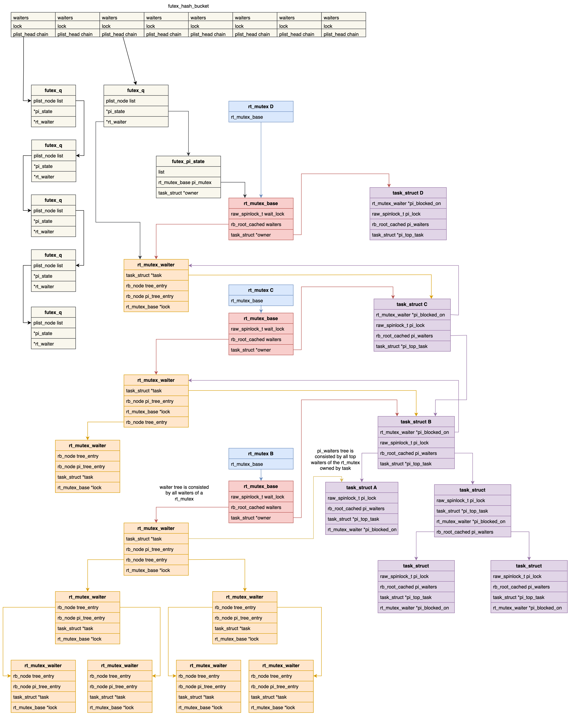
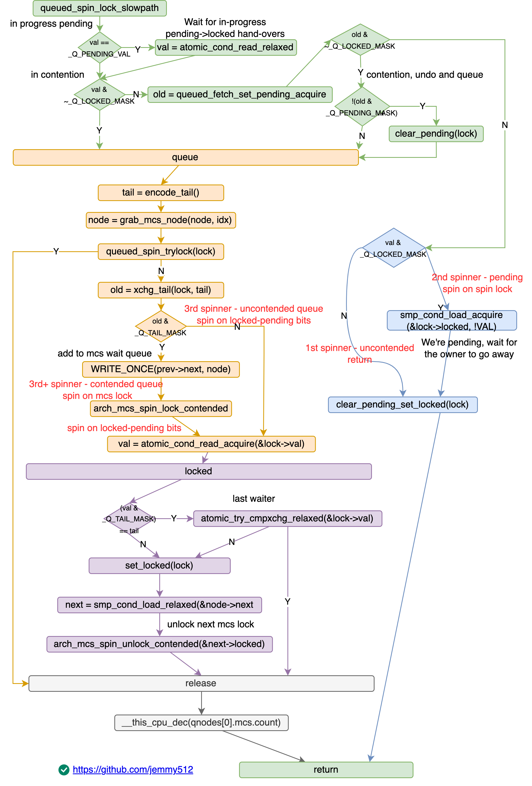

[:link: Linux - Core API Documentation :link:](https://docs.kernel.org/core-api/index.html)


* [并发机制 - LoyenWang](https://www.cnblogs.com/LoyenWang/category/1689461.html)
    * [Semophore](https://www.cnblogs.com/LoyenWang/p/12907230.html)
    * [Mutex](https://www.cnblogs.com/LoyenWang/p/12826811.html)
    * [RCU :one:](https://www.cnblogs.com/LoyenWang/p/12681494.html) [RCU :two:](https://www.cnblogs.com/LoyenWang/p/12770878.html)
    * [spinlock/rwlock/seqlock](https://www.cnblogs.com/LoyenWang/p/12632532.html)

* [Core](#core)

* [Data structures](#data-structures)
    * [xarray](#xarray)
    * [maple tree](#maple-tree)

* [Concurrency primitives](#concurrency-primitives)
    * [atomic](#atomic)
    * [rcu](#rcu)
    * [barrier](#barrier)

* [locking](#locking)
    * [barrier](#barrier)
    * [lru](#lru)
    * [futex](#futex)
        * [futex_lock_pi](#futex_lock_pi)
    * [spinlock](#spinlock)
        * [spin_lock](#spin_lock)
            * [queued_spin_lock_slowpath](#queued_spin_lock_slowpath)
        * [spin_unlock](#spin_unlock)
    * [rwlock](#rwlock)
        * [read_lock](#read_lock)
        * [write_lock](#write_lock)
    * [seqlock](#seqlock)
    * [mutex](#mutex)
        * [mutex_lock](#mutex_lock)
        * [mutex_unlock](#mutex_unlock)
    * [rtmutex](#rtmutex)
        * [rt_mutex_lock](#rt_mutex_lock)
        * [rt_mutex_unlock](#rt_mutex_unlock)
    * [semaphore](#semaphore)
    * [rwsem](#rwsem)
        * [down_read](#down_read)
        * [up_read](#up_read)
        * [down_write](#down_write)
        * [up_write](#up_write)
    * [mlock](#mlock)

* pthread
    * [pthread_mutex]
    * [pthread_cond]
    * [pthread_sem]
    * [pthread_rwlock]
    * [pthread_barrier_t]

# Core

# Data structures

## xarray

* [LWN Index - Radix tree](https://lwn.net/Kernel/Index/#Radix_tree)

## maple tree

* [LWN - Introducing maple trees](https://lwn.net/Articles/845507/)
* [The Maple Tree, A Modern Data Structure for a Complex Problem](https://blogs.oracle.com/linux/the-maple-tree)
* [Linux commit - Maple Tree: add new data structure](https://github.com/torvalds/linux/commit/54a611b605901c7d5d05b6b8f5d04a6ceb0962aa)
* [Linux doc](https://docs.kernel.org/core-api/maple_tree.html)

# Concurrency primitives

* [:orange_book: Is Parallel Programming Hard, And, If So, What Can You Do About It?](https://mirrors.edge.kernel.org/pub/linux/kernel/people/paulmck/perfbook/perfbook.html)
* [Compiler Reordering](http://www.wowotech.net/kernel_synchronization/453.html)

## atomic

* [原子操作](http://www.wowotech.net/kernel_synchronization/atomic.html)

## per-cpu

* [Per-CPU变量](http://www.wowotech.net/kernel_synchronization/per-cpu.html)

## barrier

* [memory-barrier - wowo tech :one:](http://www.wowotech.net/kernel_synchronization/memory-barrier.html)    [:link: :two:](https://mp.weixin.qq.com/s/s6AvLiVVkoMX4dIGpqmXYA)

# locking

## rcu

* [kernel: RCU concepts](https://www.kernel.org/doc/html/latest/RCU/index.html)
* [内核工匠 - RCU前传：从同步到RCU的引入](http://mp.weixin.qq.com/s?__biz=MzAxMDM0NjExNA==&mid=2247489093&idx=1&sn=24f159f20ffc4c698f8fa17a0fef0a6c)
* [wowo tech - RCU synchronize原理分析](http://www.wowotech.net/kernel_synchronization/223.html) [:link: RCU基础](http://www.wowotech.net/kernel_synchronization/rcu_fundamentals.html)

## futex

* [Kernel Index Futex - LWN](https://lwn.net/Kernel/Index/#Futex)
* [futex问答 - wowo tech](http://www.wowotech.net/kernel_synchronization/futex.html)



```c
static struct {
    struct futex_hash_bucket *queues;
    unsigned long            hashsize;
} __futex_data;

struct futex_hash_bucket {
    atomic_t            waiters; /* number of waiters */
    spinlock_t          lock;
    struct plist_head   chain;
};

struct futex_q {
    struct plist_node       list;

    struct task_struct      *task;
    spinlock_t              *lock_ptr;
    union futex_key         key;
    struct futex_pi_state   *pi_state;
    struct rt_mutex_waiter  *rt_waiter;
    union futex_key         *requeue_pi_key;
    u32                     bitset;
    atomic_t                requeue_state;
    struct rcuwait          requeue_wait;
};

struct futex_pi_state {
    struct list_head        list;
    struct rt_mutex_base    pi_mutex;
    struct task_struct      *owner;
    refcount_t              refcount;
    union futex_key         key;
};
```

### futex_lock_pi
```c
futex_lock_pi(uaddr, flags, timeout, 0) {
    struct futex_q q = futex_q_init;

retry:
    ret = get_futex_key(uaddr, flags & FLAGS_SHARED, &q.key)

retry_private:
    hb = futex_q_lock(&q);
    ret = futex_lock_pi_atomic(uaddr, hb, &q.key, &q.pi_state) {
        top_waiter = futex_top_waiter(hb, key);
        if (top_waiter)
            return attach_to_pi_state(uaddr, uval, top_waiter->pi_state, ps);

        return attach_to_pi_owner(uaddr, newval, key, ps, exiting) {
            __attach_to_pi_owner(p, key, ps) {
                pi_state = alloc_pi_state();
                rt_mutex_init_proxy_locked(&pi_state->pi_mutex, p);

                pi_state->key = *key;

                list_add(&pi_state->list, &p->pi_state_list);

                pi_state->owner = p;

                *ps = pi_state;
            }
        }
    }
    if (unlikely(ret)) {
        switch (ret) {
        case 1: /* We got the lock. */
            ret = 0;
            goto out_unlock_put_key;
        }
    }
    __futex_queue(&q, hb);

    if (trylock) {
        ret = rt_mutex_futex_trylock(&q.pi_state->pi_mutex);
        /* Fixup the trylock return value: */
        ret = ret ? 0 : -EWOULDBLOCK;
        goto no_block;
    }

    rt_mutex_init_waiter(&rt_waiter);

    /* Start lock acquisition for another task */
    ret = __rt_mutex_start_proxy_lock(&q.pi_state->pi_mutex, &rt_waiter, current);
    if (ret) {
        if (ret == 1)
            ret = 0;
        goto cleanup;
    }

    /* Wait for lock acquisition */
    rt_mutex_wait_proxy_lock(&q.pi_state->pi_mutex, to, &rt_waiter);

cleanup:
    if (ret && !rt_mutex_cleanup_proxy_lock(&q.pi_state->pi_mutex, &rt_waiter))
        ret = 0;

no_block:
    fixup_pi_owner(uaddr, &q, !ret);
    futex_unqueue_pi(&q);
    spin_unlock(q.lock_ptr);
    goto out;

out_unlock_put_key:
    futex_q_unlock(hb);

out:
    if (to) {
        hrtimer_cancel(&to->timer);
        destroy_hrtimer_on_stack(&to->timer);
    }
    return ret != -EINTR ? ret : -ERESTARTNOINTR;

uaddr_faulted:
    futex_q_unlock(hb);

    ret = fault_in_user_writeable(uaddr);
    if (ret)
        goto out;

    if (!(flags & FLAGS_SHARED))
        goto retry_private;

    goto retry;
}
```

```c
futex_unlock_pi(uaddr, flags);
```

```c
futex_wait(uaddr, flags, val, abs_time, bitset)
    to = futex_setup_timer()

retry:
    ret = futex_wait_setup(uaddr, val, flags, &q, &hb) {
        ret = get_futex_key(uaddr, flags & FLAGS_SHARED, &q->key, FUTEX_READ) {
            /* private: current->mm, address, 0
             * share: inode->i_sequence, page->index, offset_within_page */
        }
        ret = futex_get_value_locked(&uval, uaddr);
    }
    if (ret)
        goto out;

    futex_wait_queue(hb, &q, to) {
        set_current_state(TASK_INTERRUPTIBLE|TASK_FREEZABLE);
        futex_queue(q, hb) {
            plist_node_init(&q->list, prio);
            plist_add(&q->list, &hb->chain);
            q->task = current;
        }
        __set_current_state(TASK_RUNNING);
    }

    if (!futex_unqueue(&q))
        goto out;

    if (!signal_pending(current))
        goto retry;

    ret = set_restart_fn(restart, futex_wait_restart);

out:
    if (to) {
        hrtimer_cancel(&to->timer);
        destroy_hrtimer_on_stack(&to->timer);
    }
```

```c
futex_wake(uaddr, flags, nr_wake, bitest)
    DEFINE_WAKE_Q(wake_q);
    get_futex_key(uaddr, flags & FLAGS_SHARED, &key, FUTEX_READ);
    hb = futex_hash(&key);

    /* just return if no waiter */
    if (!futex_hb_waiters_pending(hb))
        return ret;

    plist_for_each_entry_safe(this, next, &hb->chain, list) {
        if (futex_match (&this->key, &key)) {
            if (this->pi_state || this->rt_waiter) {
                ret = -EINVAL;
                break;
            }

            /* Check if one of the bits is set in both bitsets */
            if (!(this->bitset & bitset))
                continue;

            futex_wake_mark(&wake_q, this);
            if (++ret >= nr_wake)
                break;
        }
    }

    spin_unlock(&hb->lock);
    wake_up_q(&wake_q);
```

## spinlock




* [LWN: spinlock](https://lwn.net/Kernel/Index/#Spinlocks)
* [自旋锁探秘 - 内核工匠](https://mp.weixin.qq.com/s?__biz=MzAxMDM0NjExNA==&mid=2247487444&idx=1&sn=b3529fb6234175b273caaacf0e816b6f)
* [spinlock - 术道经纬](https://www.zhihu.com/column/c_1108400140804726784) [:one: CSA spinlock](https://zhuanlan.zhihu.com/p/80727111) [:two: MCS spinlock](https://zhuanlan.zhihu.com/p/89058726) [:three: qspinlock](https://zhuanlan.zhihu.com/p/100546935) [:four: API](https://zhuanlan.zhihu.com/p/90634198) [:five: deadlock](https://zhuanlan.zhihu.com/p/103971328)
* [wowo tech - spinklock](http://www.wowotech.net/kernel_synchronization/spinlock.html)  [qspinlock](http://www.wowotech.net/kernel_synchronization/queued_spinlock.html)

```c
#ifdef CONFIG_PREEMPT_RT
    typedef struct spinlock {
        struct rt_mutex_base    lock;
    } spinlock_t;
#else
    typedef struct spinlock {
        struct raw_spinlock     rlock;
    } spinlock_t;
#endif

typedef struct raw_spinlock {
    arch_spinlock_t             raw_lock;
} raw_spinlock_t;

/* include/asm-generic/qspinlock_types.h */
typedef struct qspinlock {
    union {
        atomic_t val;
        struct {
            u8  locked;
            u8  pending;
        };
        struct {
            u16  locked_pending;
            u16  tail;
        };
    };
} arch_spinlock_t;

/* task ctx, hardirq ctx, softirq ctx, nmi ctx */
#define MAX_NODES    4

struct mcs_spinlock {
    struct mcs_spinlock *next;
    int locked; /* 1 if lock acquired */
    int count;  /* nesting count, see qspinlock.c */
};

struct qnode {
    struct mcs_spinlock mcs;
};

static DEFINE_PER_CPU_ALIGNED(struct qnode, qnodes[MAX_NODES]);
```


### spin_lock
```c
/* include/linux/spinlock.h */
static  void spin_lock(spinlock_t *lock)
{
    raw_spin_lock(&lock->rlock);
}

#define raw_spin_lock(lock)  _raw_spin_lock(lock)
#define raw_spin_trylock(lock)  __cond_lock(lock, _raw_spin_trylock(lock))

/* include/linux/spinlock_api_smp.h */
#define _raw_spin_lock(lock)    __raw_spin_lock(lock)
/* include/linux/spinlock_api_up.h */
#define _raw_spin_lock(lock)    __LOCK(lock)


static inline void __raw_spin_lock(raw_spinlock_t *lock)
{
    preempt_disable();
    /* for lockdep debug */
    spin_acquire(&lock->dep_map, 0, 0, _RET_IP_);

    LOCK_CONTENDED(lock, do_raw_spin_trylock, do_raw_spin_lock);
}

/*include/linux/lockdep.h */
#define spin_acquire(l, s, t, i) lock_acquire_exclusive(l, s, t, NULL, i)
#define lock_acquire_exclusive(l, s, t, n, i) lock_acquire(l, s, t, 0, 1, n, i)
#define lock_acquire(l, s, t, r, c, n, i)  do { } while (0)


/* include/linux/lockdep.h */
#define LOCK_CONTENDED(_lock, try, lock) \
do { \
    if (!try(_lock)) { \
        lock_contended(&(_lock)->dep_map, _RET_IP_); \
        lock(_lock); \
    } \
    lock_acquired(&(_lock)->dep_map, _RET_IP_); \
} while (0)


/* include/linux/spinlock.h */
static inline int do_raw_spin_trylock(raw_spinlock_t *lock)
{
    return arch_spin_trylock(&(lock)->raw_lock);
}

/* kernel/locking/spinlock_debug.c */
void do_raw_spin_lock(raw_spinlock_t *lock)
{
    debug_spin_lock_before(lock);
    arch_spin_lock(&lock->raw_lock);
    debug_spin_lock_after(lock);
}

#define arch_spin_lock(l)    queued_spin_lock(l)

void queued_spin_lock(struct qspinlock *lock)
{
    int val = 0;

    if (likely(atomic_try_cmpxchg_acquire(&lock->val, &val, _Q_LOCKED_VAL)))
        return;

    queued_spin_lock_slowpath(lock, val);
}
```

#### queued_spin_lock_slowpath

```c
void queued_spin_lock_slowpath(struct qspinlock *lock, u32 val)
{
    struct mcs_spinlock *prev, *next, *node;
    u32 old, tail;
    int idx;

    /* Wait for in-progress pending->locked hand-overs with a bounded
     * number of spins so that we guarantee forward progress.
     * 0,1,0 -> 0,0,1 */
    if (val == _Q_PENDING_VAL) {
        int cnt = _Q_PENDING_LOOPS;
        val = atomic_cond_read_relaxed(
            &lock->val, (VAL != _Q_PENDING_VAL) || !cnt--
        );
    }

    /* If we observe any contention; queue. */
    if (val & ~_Q_LOCKED_MASK)
        goto queue;

    /* trylock || pending
     * * 0,0,* -> 0,1,* -> 0,0,1 pending, trylock
     * fetch the whole lock value and set pending */
    val = queued_fetch_set_pending_acquire(lock);

    /* If we observe contention, there is a concurrent locker.
     *
     * Undo and queue; our setting of PENDING might have made the
     * n,0,0 -> 0,0,0 transition fail and it will now be waiting
     * on @next to become !NULL. */
    if (unlikely(val & ~_Q_LOCKED_MASK)) {

        /* Undo PENDING if we set it. */
        if (!(val & _Q_PENDING_MASK))
            clear_pending(lock);

        goto queue;
    }

    /* We're pending, wait for the owner to go away.
     *
     * 0,1,1 -> *,1,0
     *
     * this wait loop must be a load-acquire such that we match the
     * store-release that clears the locked bit and create lock
     * sequentiality; this is because not all
     * clear_pending_set_locked() implementations imply full
     * barriers. */
    if (val & _Q_LOCKED_MASK)
        smp_cond_load_acquire(&lock->locked, !VAL);

    /* take ownership and clear the pending bit.
     *
     * 0,1,0 -> 0,0,1 */
    clear_pending_set_locked(lock);
    lockevent_inc(lock_pending);
    return;

    /* End of pending bit optimistic spinning and beginning of MCS
     * queuing. */
queue:
    lockevent_inc(lock_slowpath);
pv_queue:
    node = this_cpu_ptr(&qnodes[0].mcs);
    idx = node->count++;
    tail = encode_tail(smp_processor_id(), idx) {
        u32 tail;

        tail  = (cpu + 1) << _Q_TAIL_CPU_OFFSET;
        tail |= idx << _Q_TAIL_IDX_OFFSET; /* assume < 4 */

        return tail;
    }

    /* 4 nodes are allocated based on the assumption that there will
     * not be nested NMIs taking spinlocks. That may not be true in
     * some architectures even though the chance of needing more than
     * 4 nodes will still be extremely unlikely. When that happens,
     * we fall back to spinning on the lock directly without using
     * any MCS node. This is not the most elegant solution, but is
     * simple enough. */
    if (unlikely(idx >= MAX_NODES)) {
        lockevent_inc(lock_no_node);
        while (!queued_spin_trylock(lock))
            cpu_relax();
        goto release;
    }

    node = grab_mcs_node(node, idx) {
        return &((struct qnode *)base + idx)->mcs;
    }

    /* Ensure that we increment the head node->count before initialising
     * the actual node. If the compiler is kind enough to reorder these
     * stores, then an IRQ could overwrite our assignments. */
    barrier();

    node->locked = 0;
    node->next = NULL;
    pv_init_node(node);

    /* We touched a (possibly) cold cacheline in the per-cpu queue node;
     * attempt the trylock once more in the hope someone let go while we
     * weren't watching.
     * try to acquire the queued spinlock */
    ret = queued_spin_trylock(lock) {
        int val = atomic_read(&lock->val);

        if (unlikely(val))
            return 0;

        return likely(atomic_try_cmpxchg_acquire(&lock->val, &val, _Q_LOCKED_VAL));
    }
    if (ret)
        goto release;

    /* Ensure that the initialisation of @node is complete before we
     * publish the updated tail via xchg_tail() and potentially link
     * @node into the waitqueue via WRITE_ONCE(prev->next, node) below.*/
    smp_wmb();

    /* Publish the updated tail.
     * We have already touched the queueing cacheline; don't bother with
     * pending stuff.
     *
     * p,*,* -> n,*,* */
    old = xchg_tail(lock, tail);
    next = NULL;

    /* if there was a previous node; link it and wait until reaching the
     * head of the waitqueue. */
    if (old & _Q_TAIL_MASK) {
        prev = decode_tail(old);

        /* Link @node into the waitqueue. */
        WRITE_ONCE(prev->next, node);

        pv_wait_node(node, prev);
        arch_mcs_spin_lock_contended(&node->locked);

        /* While waiting for the MCS lock, the next pointer may have
         * been set by another lock waiter. We optimistically load
         * the next pointer & prefetch the cacheline for writing
         * to reduce latency in the upcoming MCS unlock operation. */
        next = READ_ONCE(node->next);
        if (next)
            prefetchw(next);
    }

    /* we're at the head of the waitqueue, wait for the owner & pending to
     * go away.
     *
     * *,x,y -> *,0,0
     *
     * this wait loop must use a load-acquire such that we match the
     * store-release that clears the locked bit and create lock
     * sequentiality; this is because the set_locked() function below
     * does not imply a full barrier.
     *
     * The PV pv_wait_head_or_lock function, if active, will acquire
     * the lock and return a non-zero value. So we have to skip the
     * atomic_cond_read_acquire() call. As the next PV queue head hasn't
     * been designated yet, there is no way for the locked value to become
     * _Q_SLOW_VAL. So both the set_locked() and the
     * atomic_cmpxchg_relaxed() calls will be safe.
     *
     * If PV isn't active, 0 will be returned instead. */
    if ((val = pv_wait_head_or_lock(lock, node)))
        goto locked;

    val = atomic_cond_read_acquire(&lock->val, !(VAL & _Q_LOCKED_PENDING_MASK));

locked:
    /* claim the lock:
     *
     * n,0,0 -> 0,0,1 : lock, uncontended
     * *,*,0 -> *,*,1 : lock, contended
     *
     * If the queue head is the only one in the queue (lock value == tail)
     * and nobody is pending, clear the tail code and grab the lock.
     * Otherwise, we only need to grab the lock. */

    /* In the PV case we might already have _Q_LOCKED_VAL set, because
     * of lock stealing; therefore we must also allow:
     *
     * n,0,1 -> 0,0,1
     *
     * Note: at this point: (val & _Q_PENDING_MASK) == 0, because of the
     *       above wait condition, therefore any concurrent setting of
     *       PENDING will make the uncontended transition fail. */
    if ((val & _Q_TAIL_MASK) == tail) {
        if (atomic_try_cmpxchg_relaxed(&lock->val, &val, _Q_LOCKED_VAL))
            goto release; /* No contention */
    }

    /* Either somebody is queued behind us or _Q_PENDING_VAL got set
     * which will then detect the remaining tail and queue behind us
     * ensuring we'll see a @next. */
    set_locked(lock);

    /* contended path; wait for next if not observed yet, release. */
    if (!next)
        next = smp_cond_load_relaxed(&node->next, (VAL));

    arch_mcs_spin_unlock_contended(&next->locked);
    pv_kick_node(lock, next);

release:
    __this_cpu_dec(qnodes[0].mcs.count);
}
```

### spin_unlock

```c
spin_unlock(spinlock_t *lock) {
    raw_spin_unlock(&lock->rlock) {
        __raw_spin_unlock(raw_spinlock_t *lock) {
            spin_release(&lock->dep_map, _RET_IP_);
            do_raw_spin_unlock(lock) {
                mmiowb_spin_unlock();
                arch_spin_unlock(&lock->raw_lock) {
                    u16 *ptr = (u16 *)lock + IS_ENABLED(CONFIG_CPU_BIG_ENDIAN);
                    u32 val = atomic_read(lock);

                    smp_store_release(ptr, (u16)val + 1);
                }
                __release(lock);
            }
            preempt_enable();
        }
    }
}
```

## rwlock

Aka read write spining lock, implemented by qrwlock. While rwsem is a read write sleeping lock.

* [rwlock - wowo tech](http://www.wowotech.net/kernel_synchronization/rw-spinlock.html)

```c
typedef struct {
    arch_rwlock_t       raw_lock;
} rwlock_t;

typedef struct qrwlock {
    union {
        atomic_t        cnts;
        struct {
            u8 wlocked;    /* Locked for write? */
            u8 __lstate[3];
        };
    };
    arch_spinlock_t     wait_lock;
} arch_rwlock_t;

#define     _QW_WAITING     0x100   /* A writer is waiting */
#define     _QW_LOCKED      0x0ff   /* A writer holds the lock */
#define     _QW_WMASK       0x1ff   /* Writer mask */
#define     _QR_SHIFT       9       /* Reader count shift */
#define     _QR_BIAS        (1U << _QR_SHIFT)
```

```c
/* include/linux/rwlock.h */
#define read_lock(lock)         _raw_read_lock(lock)
#define read_lock_irq(lock)     _raw_read_lock_irq(lock)
#define read_lock_bh(lock)      _raw_read_lock_bh(lock)

#define read_unlock(lock)       _raw_read_unlock(lock)
#define read_unlock_irq(lock)   _raw_read_unlock_irq(lock)

#define write_lock(lock)        _raw_write_lock(lock)
#define write_lock_irq(lock)    _raw_write_lock_irq(lock)
#define write_lock_bh(lock)     _raw_write_lock_bh(lock)

#define write_unlock(lock)      _raw_write_unlock(lock)
#define write_unlock_irq(lock)  _raw_write_unlock_irq(lock)

/* include/asm-generic/qrwlock.h */
#define arch_read_lock(l)       queued_read_lock(l)
#define arch_write_lock(l)      queued_write_lock(l)
#define arch_read_trylock(l)    queued_read_trylock(l)
#define arch_write_trylock(l)   queued_write_trylock(l)
#define arch_read_unlock(l)     queued_read_unlock(l)
#define arch_write_unlock(l)    queued_write_unlock(l)
#define arch_rwlock_is_contended(l)     queued_rwlock_is_contended(l)
```

### read_lock
```c
static inline void __raw_read_lock(rwlock_t *lock)
{
    preempt_disable();
    rwlock_acquire_read(&lock->dep_map, 0, 0, _RET_IP_);
    LOCK_CONTENDED(lock, do_raw_read_trylock, do_raw_read_lock);
}

do_raw_read_trylock() {
    arch_read_trylock(&(rwlock)->raw_lock) {
        queued_read_trylock() {
            int cnts;

            cnts = atomic_read(&lock->cnts);
            if (likely(!(cnts & _QW_WMASK))) {
                cnts = (u32)atomic_add_return_acquire(_QR_BIAS, &lock->cnts);
                if (likely(!(cnts & _QW_WMASK))) {
                    return 1;
                }
                /* revert add since writer has already hold the lock */
                atomic_sub(_QR_BIAS, &lock->cnts);
            }
            return 0;
        }
    }
}

do_raw_read_lock() {
    arch_raw_read_lock() {
        queued_read_lock() {
            int cnts;

            cnts = atomic_add_return_acquire(_QR_BIAS, &lock->cnts);
            if (likely(!(cnts & _QW_WMASK)))
                return;

            /* The slowpath will decrement the reader count, if necessary. */
            queued_read_lock_slowpath(lock) {
                if (unlikely(in_interrupt())) {
                    atomic_cond_read_acquire(&lock->cnts, !(VAL & _QW_LOCKED));
                    return;
                }
                atomic_sub(_QR_BIAS, &lock->cnts);

                /* Put the reader into the wait queue */
                arch_spin_lock(&lock->wait_lock);
                atomic_add(_QR_BIAS, &lock->cnts);

                /* The ACQUIRE semantics of the following spinning code ensure
                 * that accesses can't leak upwards out of our subsequent critical
                 * section in the case that the lock is currently held for write. */
                atomic_cond_read_acquire(&lock->cnts, !(VAL & _QW_LOCKED));

                /* Signal the next one in queue to become queue head */
                arch_spin_unlock(&lock->wait_lock);
            }
        }
    }
}
```

### write_lock
```c
do_raw_write_trylock() {
    arch_write_trylock(&(rwlock)->raw_lock) {
        queued_write_trylock() {
            int cnts;

            cnts = atomic_read(&lock->cnts);
            if (unlikely(cnts))
                return 0;

            return likely(atomic_try_cmpxchg_acquire(&lock->cnts, &cnts, _QW_LOCKED));
        }
    }
}

do_raw_write_lock() {
    arch_raw_write_lock() {
        queued_write_lock(struct qrwlock *lock) {
            int cnts = 0;
            /* Optimize for the unfair lock case where the fair flag is 0. */
            if (likely(atomic_try_cmpxchg_acquire(&lock->cnts, &cnts, _QW_LOCKED)))
                return;

            queued_write_lock_slowpath(lock) {
                int cnts;

                /* Put the writer into the wait queue */
                arch_spin_lock(&lock->wait_lock);

                /* Try to acquire the lock directly if no reader is present */
                if (!(cnts = atomic_read(&lock->cnts)) &&
                    atomic_try_cmpxchg_acquire(&lock->cnts, &cnts, _QW_LOCKED))
                    goto unlock;

                /* Set the waiting flag to notify readers that a writer is pending */
                atomic_or(_QW_WAITING, &lock->cnts);

                /* When no more readers or writers, set the locked flag */
                do {
                    cnts = atomic_cond_read_relaxed(&lock->cnts, VAL == _QW_WAITING);
                } while (!atomic_try_cmpxchg_acquire(&lock->cnts, &cnts, _QW_LOCKED));
            unlock:
                arch_spin_unlock(&lock->wait_lock);
            }
        }
    }
}
```

## seqlock

* [seqlock - wowo tech](http://www.wowotech.net/kernel_synchronization/seqlock.html)

## mutex

* [Wait/wound mutexes - LWN](https://lwn.net/Articles/548909/)
* [mutex - wowo tech](http://www.wowotech.net/kernel_synchronization/504.html)

```c
/* @owner: contains: 'struct task_struct *' to the current lock owner,
 * NULL means not owned. Since task_struct pointers are aligned at
 * at least L1_CACHE_BYTES, we have low bits to store extra state.
 *
 * Bit0 indicates a non-empty waiter list; unlock must issue a wakeup.
 * Bit1 indicates unlock needs to hand the lock to the top-waiter
 * Bit2 indicates handoff has been done and we're waiting for pickup. */
#define MUTEX_FLAG_WAITERS    0x01
#define MUTEX_FLAG_HANDOFF    0x02
#define MUTEX_FLAG_PICKUP     0x04
#define MUTEX_FLAGS           0x07

struct mutex { /* !CONFIG_PREEMPT_RT  */
    atomic_long_t       owner;
    raw_spinlock_t      wait_lock;
    struct list_head    wait_list;
};
```

### mutex_lock

```c
/* kernel/locking/mutex.c */
mutex_lock() {
    /* 1. fastpath: cmpxchg. Tries to atomically acquire the lock by cmpxchg()ing the owner
     * with the current task. This only works in the uncontended case
     * (cmpxchg() checks against 0UL, so all 3 state bits above have to be 0).
     * If the lock is contended it goes to the next possible path.*/
    __mutex_trylock_fast() {
        unsigned long curr = (unsigned long)current;
        unsigned long zero = 0UL;

        return atomic_long_try_cmpxchg_acquire(&lock->owner, &zero, curr);
    }

    __mutex_lock_slowpath() {
        __mutex_lock(lock, TASK_UNINTERRUPTIBLE) {
            return __mutex_lock_common(lock, state, subclass, nest_lock, ip, NULL, false) {
                preempt_disable();

                /* 2. midpath: optimistic spinning. Tries to spin for acquisition
                * while the lock owner is running and there are no other tasks ready to run
                * that have higher priority (need_resched).
                * The rationale is that if the lock owner is running,
                * it is likely to release the lock soon.
                * The mutex spinners are queued up using MCS lock
                * so that only one spinner can compete for the mutex. */
                ret = __mutex_trylock() {
                    /* Returns: __mutex_owner(lock) on failure or NULL on success. */
                    return !__mutex_trylock_common(lock, false) {
                        unsigned long owner, curr = (unsigned long)current;

                        owner = atomic_long_read(&lock->owner);
                        for (;;) { /* must loop, can race against a flag */
                            unsigned long flags = __owner_flags(owner);
                            unsigned long task = owner & ~MUTEX_FLAGS;

                            if (task) {
                                if (flags & MUTEX_FLAG_PICKUP) {
                                    if (task != curr)
                                        break;
                                    flags &= ~MUTEX_FLAG_PICKUP;
                                } else if (handoff) {
                                    if (flags & MUTEX_FLAG_HANDOFF)
                                        break;
                                    flags |= MUTEX_FLAG_HANDOFF;
                                } else {
                                    break;
                                }
                            } else {
                                task = curr;
                            }

                            if (atomic_long_try_cmpxchg_acquire(&lock->owner, &owner, task | flags)) {
                                if (task == curr)
                                    return NULL;
                                break;
                            }
                        }

                        return __owner_task(owner);
                    }
                }
                ret |= mutex_optimistic_spin(lock, ww_ctx, NULL/*waiter*/) {
                    if (!waiter) {
                        ret  = mutex_can_spin_on_owner(lock) {
                            int retval = 1;
                            if (need_resched())
                                return 0;
                            owner = __mutex_owner(lock);
                            if (owner)
                                retval = owner_on_cpu(owner);
                            return retval;
                        }

                        if (!ret) {
                            goto fail;
                        }

                        ret = osq_lock(&lock->osq) {

                        }
                        if (!ret)
                            goto fail;
                    }

                    for (;;) {
                        struct task_struct *owner;

                        owner = __mutex_trylock_or_owner(lock) {
                            return __mutex_trylock_common(lock, false);
                        }
                        if (!owner)
                            break;

                        ret = mutex_spin_on_owner(lock, owner, ww_ctx, waiter) {
                            bool ret = true;

                            while (__mutex_owner(lock) == owner) {
                                barrier();
                                if (!owner_on_cpu(owner) || need_resched()) {
                                    ret = false;
                                    break;
                                }

                                if (ww_ctx && !ww_mutex_spin_on_owner(lock, ww_ctx, waiter)) {
                                    ret = false;
                                    break;
                                }

                                cpu_relax();
                            }

                            return ret;
                        }
                        if (!ret)
                            goto fail_unlock;

                        cpu_relax();
                    }

                    if (!waiter)
                        osq_unlock(&lock->osq);

                    return true;

                fail_unlock:
                    if (!waiter)
                        osq_unlock(&lock->osq);

                fail:
                    if (need_resched()) {
                        __set_current_state(TASK_RUNNING);
                        schedule_preempt_disabled();
                    }

                    return false;
                }
                if (ret) {
                    preempt_enable();
                    return 0;
                }

                if (__mutex_trylock(lock)) {
                    if (ww_ctx) {
                        __ww_mutex_check_waiters(lock, ww_ctx);
                    }

                    goto skip_wait;
                }

                /* 3. slowpath: sleep wait. If the lock is still unable to be acquired,
                * the task is added to the wait-queue and sleeps until woken up by the unlock path.
                * Under normal circumstances it blocks as TASK_UNINTERRUPTIBLE. */
                raw_spin_lock(&lock->wait_lock);

                if (!use_ww_ctx) {
                    __mutex_add_waiter(lock, &waiter, &lock->wait_list) {
                        list_add_tail(&waiter->list, list);
                        if (__mutex_waiter_is_first(lock, waiter)) {
                            __mutex_set_flag(lock, MUTEX_FLAG_WAITERS);
                        }
                    }
                } else {
                    ret = __ww_mutex_add_waiter(&waiter, lock, ww_ctx);
                    if (ret)
                        goto err_early_kill;
                }

                for (;;) {
                    if (__mutex_trylock(lock))
                        goto acquired;

                    if (signal_pending_state(state, current)) {
                        ret = -EINTR;
                        goto err;
                    }

                    schedule_preempt_disabled() {
                        sched_preempt_enable_no_resched() {
                            barrier();
                            preempt_count_dec()
                        }
                        schedule();
                        preempt_disable() {
                            preempt_count_inc();
                            barrier();
                        }
                    }

                    first = __mutex_waiter_is_first(lock, &waiter);
                    ret = __mutex_trylock_or_handoff(lock, first) {
                        return !__mutex_trylock_common(lock, handoff);
                    }
                    if (ret) {
                        break;
                    }

                    if (first && mutex_optimistic_spin(lock, ww_ctx, &waiter)) {
                        break;
                    }

                    raw_spin_lock(&lock->wait_lock);
                }

            acquired:
                __set_current_state(TASK_RUNNING);
                __mutex_remove_waiter(lock, &waiter);

            skip_wait:
                if (ww_ctx)
                    ww_mutex_lock_acquired(ww, ww_ctx);

                raw_spin_unlock(&lock->wait_lock);
                preempt_enable();
                return 0;
            }
        }
    }
}
```

### mutex_unlock
```c
void __sched mutex_unlock(struct mutex *lock) {
    ret = __mutex_unlock_fast(lock) {
        unsigned long curr = (unsigned long)current;

        return atomic_long_try_cmpxchg_release(&lock->owner, &curr, 0UL);
    }
    if (ret)
        return;

    __mutex_unlock_slowpath(lock, _RET_IP) {
        struct task_struct *next = NULL;
        DEFINE_WAKE_Q(wake_q);
        unsigned long owner;

        owner = atomic_long_read(&lock->owner);
        for (;;) {
            if (owner & MUTEX_FLAG_HANDOFF)
                break;

            if (atomic_long_try_cmpxchg_release(&lock->owner, &owner, __owner_flags(owner))) {
                if (owner & MUTEX_FLAG_WAITERS)
                    break;

                return;
            }
        }

        raw_spin_lock(&lock->wait_lock);
        if (!list_empty(&lock->wait_list)) {
            struct mutex_waiter *waiter = list_first_entry(
                &lock->wait_list, struct mutex_waiter, list
            );

            next = waiter->task;
            wake_q_add(&wake_q, next);
        }

        if (owner & MUTEX_FLAG_HANDOFF) {
            __mutex_handoff(lock, next/*task*/) {
                unsigned long owner = atomic_long_read(&lock->owner);

                for (;;) {
                    unsigned long new;

                    new = (owner & MUTEX_FLAG_WAITERS);
                    new |= (unsigned long)task;
                    if (task) {
                        new |= MUTEX_FLAG_PICKUP;
                    }

                    if (atomic_long_try_cmpxchg_release(&lock->owner, &owner, new))
                        break;
                }
            }
        }

        raw_spin_unlock(&lock->wait_lock);

        wake_up_q(&wake_q);
    }
}
```

## rtmutex


* [The Evolution of Real-Time Linux](https://personal.utdallas.edu/~cxl137330/courses/fall13/RTS/papers/2a.pdf)
* [RT Mutex Implementation Anatomy :cn:](https://www.cnblogs.com/hellokitty2/p/17010913.html)


* Why need lock stealing? [The big kernel lock strikes again](https://lwn.net/Articles/281938/)

    > The problem is that fairness can be expensive. The thread waiting for the semaphore may be on another processor, its cache could be cold, and it might be at a low enough priority that it will not even begin running for some time. Meanwhile, another thread may request the semaphore, but it will get put at the end of the queue behind the new owner, which may not be running yet. The result is a certain amount of dead time where no running thread holds the semaphore. And, in fact, Yanmin's experience with the AIM benchmark showed this: his system was running idle almost 50% of the time.

    > The solution is to bring in a technique from the older semaphore code: **lock stealing**. If a thread tries to acquire a semaphore, and that semaphore is available, that thread gets it regardless of whether a different thread is patiently waiting in the queue. Or, in other words, the thread at the head of the queue only gets the semaphore once it starts running and actually claims it; if it's too slow, somebody else might get there first. In human interactions, this sort of behavior is considered impolite (in some cultures, at least), though it is far from unknown. In a multiprocessor computer, though, it makes the difference between acceptable and unacceptable performance - even a thread which gets its lock stolen will benefit in the long run.

```c
struct rt_mutex {
    struct rt_mutex_base    rtmutex;
};

struct rt_mutex_base {
    raw_spinlock_t          wait_lock;
    struct rb_root_cached   waiters;
    struct task_struct      *owner;
};

struct rt_mutex_waiter {
    struct rb_node          tree_entry;
    struct rb_node          pi_tree_entry;
    struct task_struct      *task;
    struct rt_mutex_base    *lock;
    unsigned int            wake_state;
    int                     prio;
    u64                     deadline;
    struct ww_acquire_ctx   *ww_ctx;
};

struct task_struct {
    raw_spinlock_t          pi_lock;
    struct rb_root_cached   pi_waiters;
    struct task_struct      *pi_top_task;
    struct rt_mutex_waiter  *pi_blocked_on;
};
```

### rt_mutex_lock
```c
__rt_mutex_lock()
    if (likely(rt_mutex_cmpxchg_acquire(lock, NULL, current)))
        return 0;

    return rt_mutex_slowlock(lock, NULL, state) {
        ret = try_to_take_rt_mutex(lock, current, NULL /*waiter*/) {
            mark_rt_mutex_waiters(lock) {
                lock->owner = lock->owner | RT_MUTEX_HAS_WAITERS;
            }

            if (rt_mutex_owner(lock))
                return 0;

            if (waiter) {
                struct rt_mutex_waiter *top_waiter = rt_mutex_top_waiter(lock);
                /* If waiter is highest priority waiter of @lock, try to take it. */
                if (waiter == top_waiter || rt_mutex_steal(waiter, top_waiter)) {
                    rt_mutex_dequeue(lock, waiter);
                } else {
                    return 0;
                }
            } else {
                if (rt_mutex_has_waiters(lock)) {
                    if (!rt_mutex_steal(task_to_waiter(task), rt_mutex_top_waiter(lock)))
                        return 0;
                } else {
                    goto takeit;
                }
            }

            task->pi_blocked_on = NULL;

            /* @task is the new owner. If other waiters exist
             * we have to insert the highest priority waiter
             * into @task->pi_waiters tree. */
            if (rt_mutex_has_waiters(lock)) {
                rt_mutex_enqueue_pi(task, rt_mutex_top_waiter(lock));
            }

        takeit:
            rt_mutex_set_owner(lock, task);

            return 1;
        }

        if (ret) {
            return 0;
        }

        set_current_state(state); /* TASK_UNINTERRUPTIBLE */

        ret = task_blocks_on_rt_mutex(lock, waiter, current) {
            waiter->task = task;
            waiter->lock = lock;
            waiter_update_prio(waiter, task);
            top_waiter = rt_mutex_top_waiter(lock);

            if (owner == task && !(build_ww_mutex() && ww_ctx))
                return -EDEADLK;

            rt_mutex_enqueue(lock, waiter);
            task->pi_blocked_on = waiter;

            if (!owner)
                return 0;

            /* lock‘s top waiter is changed to the waiter */
            if (waiter == rt_mutex_top_waiter(lock)) {
                rt_mutex_dequeue_pi(owner, top_waiter);
                rt_mutex_enqueue_pi(owner, waiter);

                /* update (boost/deboost) the prio of owner to
                 * the prio of its top pi_waiters */
                rt_mutex_adjust_prio(owner/*p*/) {
                    if (task_has_pi_waiters(p))
                        pi_task = task_top_pi_waiter(p)->task;

                    rt_mutex_setprio(p, pi_task) {
                        if (p->pi_top_task == pi_task && prio == p->prio && !dl_prio(prio))
                            return;

                        p->pi_top_task = pi_task;

                        queued = task_on_rq_queued(p);
                        running = task_current(rq, p);
                        if (queued)
                            dequeue_task(rq, p, queue_flag);
                        if (running)
                            put_prev_task(rq, p);

                        __setscheduler_prio(p, prio) {
                            p->sched_class = ;
                            p->prio = prio;
                        }

                        if (queued)
                            enqueue_task(rq, p, queue_flag);
                        if (running)
                            set_next_task(rq, p);

                        check_class_changed(rq, p, prev_class, oldprio) {
                            if (prev_class != p->sched_class) {
                                if (prev_class->switched_from)
                                    prev_class->switched_from(rq, p);

                                p->sched_class->switched_to(rq, p);
                            } else if (oldprio != p->prio || dl_task(p))
                                p->sched_class->prio_changed(rq, p, oldprio);
                        }
                    }
                }

                if (owner->pi_blocked_on)
                    chain_walk = 1;
            } else if (rt_mutex_cond_detect_deadlock(waiter, chwalk)) {
                chain_walk = 1;
            }

            next_lock = task_blocked_on_lock(owner);

            if (!chain_walk || !next_lock)
                return 0;

            // rt_mutex_adjust_prio_chain(owner, chwalk, lock, next_lock, waiter, task)
            rt_mutex_adjust_prio_chain(owner, chwalk, orig_lock, next_lock, top_waiter, top_task) {
            again:
                if (++depth > max_lock_depth) {
                    return -EDEADLK;
                }

            /* We are fully preemptible here.
             * So everything can have changed under us */
            retry:
                waiter = task->pi_blocked_on;

                /* reach the end of the boosting chain */
                if (!waiter)
                    goto out_unlock_pi;

                /* check whether orig_waiter is changed */
                if (orig_waiter && !rt_mutex_owner(orig_lock))
                    goto out_unlock_pi;

                if (next_lock != waiter->lock)
                    goto out_unlock_pi;

                if (top_waiter) {
                    if (!task_has_pi_waiters(task))
                        goto out_unlock_pi;

                    if (top_waiter != task_top_pi_waiter(task)) {
                        if (!detect_deadlock)
                            goto out_unlock_pi;
                        else
                            requeue = false;
                    }
                }

                if (rt_mutex_waiter_equal(waiter, task_to_waiter(task))) {
                    if (!detect_deadlock)
                        goto out_unlock_pi;
                    else
                        requeue = false;
                }

                prerequeue_top_waiter = rt_mutex_top_waiter(lock);

                rt_mutex_dequeue(lock, waiter);

                waiter_update_prio(waiter, task);

                rt_mutex_enqueue(lock, waiter);

                if (!rt_mutex_owner(lock)) {
                    top_waiter = rt_mutex_top_waiter(lock);
                    if (prerequeue_top_waiter != top_waiter)
                        wake_up_state(top_waiter->task, top_waiter->wake_state) {
                            try_to_wake_up()
                        }
                    raw_spin_unlock_irq(&lock->wait_lock);
                    return 0;
                }

                if (waiter == rt_mutex_top_waiter(lock)) {
                    rt_mutex_dequeue_pi(task, prerequeue_top_waiter);
                    rt_mutex_enqueue_pi(task, waiter);
                    rt_mutex_adjust_prio(task);
                } else if (prerequeue_top_waiter == waiter) {
                    rt_mutex_dequeue_pi(task, waiter);
                    waiter = rt_mutex_top_waiter(lock);
                    rt_mutex_enqueue_pi(task, waiter);
                    rt_mutex_adjust_prio(task);
                } else {

                }

                next_lock = task_blocked_on_lock(task);

                top_waiter = rt_mutex_top_waiter(lock);

                if (!next_lock)
                    goto out_put_task;

                if (!detect_deadlock && waiter != top_waiter)
                    goto out_put_task;

                goto again;

            out_unlock_pi:
                raw_spin_unlock_irq(&task->pi_lock);
            out_put_task:
                put_task_struct(task);

                return ret;
            }
        }

        if (likely(!ret)) {
            /* perform the wait-wake-try-to-take loop */
            ret = rt_mutex_slowlock_block() {
                for (;;) {
                    if (try_to_take_rt_mutex(lock, current, waiter))
                        break;

                    if (timeout && !timeout->task) {
                        ret = -ETIMEDOUT;
                        break;
                    }
                    if (signal_pending_state(state, current)) {
                        ret = -EINTR;
                        break;
                    }

                    rtmutex_spin_on_owner = [](lock, waiter, owner) {
                        bool res = true;
                        for (;;) {
                            if (owner != rt_mutex_owner(lock))
                                break;

                            if (!owner_on_cpu(owner) || need_resched() ||
                                !rt_mutex_waiter_is_top_waiter(lock, waiter)) {

                                res = false;
                                break;
                            }
                        }
                        return res;
                    }
                    if (!is_top_waiter(waiter) || !rtmutex_spin_on_owner())
                        schedule();
                }

                __set_current_state(TASK_RUNNING);
                return ret;
            }
        }

        if (likely(!ret)) {
            if (build_ww_mutex() && ww_ctx) {
                if (!ww_ctx->is_wait_die)
                    __ww_mutex_check_waiters(rtm, ww_ctx);
                ww_mutex_lock_acquired(ww, ww_ctx);
            }
        } else {
            __set_current_state(TASK_RUNNING);
            remove_waiter(lock, waiter);
            rt_mutex_handle_deadlock(ret, chwalk, waiter);
        }

        /* try_to_take_rt_mutex() sets the waiter bit
         * unconditionally. We might have to fix that up. */
        fixup_rt_mutex_waiters(lock, true/*acquire_lock*/) {
            if (rt_mutex_has_waiters(lock))
                return;
            if (owner & RT_MUTEX_HAS_WAITERS) {
                if (acquire_lock)
                    xchg_acquire(p, owner & ~RT_MUTEX_HAS_WAITERS);
                else
                    WRITE_ONCE(*p, owner & ~RT_MUTEX_HAS_WAITERS);
            }
        }
    }
```

### rt_mutex_unlock
```c
rt_mutex_unlock(lock)
    if (likely(rt_mutex_cmpxchg_release(lock, current, NULL)))
        return;

    rt_mutex_slowunlock(lock) {
        DEFINE_RT_WAKE_Q(wqh);

        while (!rt_mutex_has_waiters(lock)) {
            ret = unlock_rt_mutex_safe(lock, flags) {
                clear_rt_mutex_waiters(lock);
                return rt_mutex_cmpxchg_release(lock, owner, NULL);
            }
            if (ret == true)
                return;
        }

        mark_wakeup_next_waiter(&wqh, lock) {
            waiter = rt_mutex_top_waiter(lock);
            rt_mutex_dequeue_pi(current, waiter);
            rt_mutex_adjust_prio(current);

            lock->owner = (void *) RT_MUTEX_HAS_WAITERS;

            preempt_disable();
            rt_mutex_wake_q_add(wqh, waiter);
            raw_spin_unlock(&current->pi_lock);
        }

        rt_mutex_wake_up_q(&wqh) {
            if (IS_ENABLED(CONFIG_PREEMPT_RT) && wqh->rtlock_task) {
                wake_up_state(wqh->rtlock_task, TASK_RTLOCK_WAIT) {
                    try_to_wake_up(p, state, 0);
                }
                put_task_struct(wqh->rtlock_task);
                wqh->rtlock_task = NULL;
            }

            if (!wake_q_empty(&wqh->head)) {
                wake_up_q(&wqh->head) {
                    while (node != WAKE_Q_TAIL) {
                        struct task_struct *task;

                        task = container_of(node, struct task_struct, wake_q);
                        node = node->next;
                        task->wake_q.next = NULL;
                        wake_up_process(task) {
                            try_to_wake_up(p, TASK_NORMAL, 0);
                        }
                        put_task_struct(task);
                    }
                }
            }
            preempt_enable();
        }
    }
```

## semaphore

## rwsem

rwlock is a read write spining lock, implemented by qrwlock. While rwsem is a read write sleeping lock.

* [Linux读写锁逻辑解析 - wowo tech](http://www.wowotech.net/kernel_synchronization/rwsem.html)
* [读写信号量 - 内核工匠](https://mp.weixin.qq.com/s/8cJm7nBM3ESoL1SLJXuMRw)

```c
struct rw_semaphore {
    /* Bit  0    - RWSEM_WRITER_LOCKED
     * Bit  1    - RWSEM_FLAG_WAITERS
     * Bit  2    - RWSEM_FLAG_HANDOFF
     * Bits 3-7  - reserved
     * Bits 8-62 - 55-bit reader count
     * Bit  63   - read fail bit */
    atomic_long_t count;

    /* Bit 0: RWSEM_READER_OWNED - The rwsem is owned by readers
     * Bit 1: RWSEM_NONSPINNABLE - Cannot spin on a reader-owned lock */
    atomic_long_t owner;

    struct optimistic_spin_queue osq; /* atomic_t tail: spinner MCS lock */
    raw_spinlock_t wait_lock;
    struct list_head wait_list;
};

enum rwsem_waiter_type {
    RWSEM_WAITING_FOR_WRITE,
    RWSEM_WAITING_FOR_READ
};

struct rwsem_waiter {
    struct list_head        list;
    struct task_struct      *task;
    enum rwsem_waiter_type  type;
    unsigned long           timeout;
    bool                    handoff_set;
};
```


### down_read

```c
down_read(struct rw_semaphore *sem)
    might_sleep();
    LOCK_CONTENDED(sem, __down_read_trylock, __down_read) {
        #define LOCK_CONTENDED(_lock, try, lock) \
        do { \
            if (!try(_lock)) { \
                lock(_lock); \
            } \
        } while (0)
    }


#define RWSEM_WRITER_MASK       RWSEM_WRITER_LOCKED
#define RWSEM_READ_FAILED_MASK \
(RWSEM_WRITER_MASK|RWSEM_FLAG_WAITERS|RWSEM_FLAG_HANDOFF|RWSEM_FLAG_READFAIL)

int ret = __down_read_trylock(sem) {
    tmp = atomic_long_read(&sem->count);
    while (!(tmp & RWSEM_READ_FAILED_MASK)) {
        if (atomic_long_try_cmpxchg_acquire(&sem->count, &tmp, tmp + RWSEM_READER_BIAS)) {
            rwsem_set_reader_owned(sem) {
                unsigned long val = (unsigned long)owner | RWSEM_READER_OWNED |
                    (atomic_long_read(&sem->owner) & RWSEM_NONSPINNABLE);

                atomic_long_set(&sem->owner, val);
            }
            ret = 1;
            break;
        }
    }
}

__down_read(struct rw_semaphore *sem) {
    __down_read_common(sem, TASK_UNINTERRUPTIBLE) {
        preempt_disable();

        /* add reader count unconditionally */
        ret = rwsem_read_trylock(sem, &count/*cntp*/) {
            /* reader count + 1 (RWSEM_READER_BIAS) */
            *cntp = atomic_long_add_return_acquire(RWSEM_READER_BIAS, &sem->count);

            /* RWSEM_FLAG_READFAIL bit is set
             * too many readers, disable spin */
            if (WARN_ON_ONCE(*cntp < 0)) {
                rwsem_set_nonspinnable(sem) {
                    unsigned long owner = atomic_long_read(&sem->owner);
                    do {
                        if (!(owner & RWSEM_READER_OWNED))
                            break;
                        if (owner & RWSEM_NONSPINNABLE)
                            break;
                    } while (!atomic_long_try_cmpxchg(
                        &sem->owner, &owner, owner | RWSEM_NONSPINNABLE)
                    );
                }
            }

            if (!(*cntp & RWSEM_READ_FAILED_MASK)) {
                rwsem_set_reader_owned(sem)
                    --->
                return true;
            }
            return false;
        }

        if (ret) {
            goto out;
        }

        ret = rwsem_down_read_slowpath(sem, count, state) {
            long adjustment = -RWSEM_READER_BIAS;
            long rcnt = (count >> RWSEM_READER_SHIFT);
            struct rwsem_waiter waiter;
            DEFINE_WAKE_Q(wake_q);

            /* To prevent a constant stream of readers from starving a sleeping
             * waiter, don't attempt optimistic lock stealing if the lock is
             * currently owned by readers. */
            if ((atomic_long_read(&sem->owner) & RWSEM_READER_OWNED)
                && (rcnt > 1) && !(count & RWSEM_WRITER_LOCKED)) {

                goto queue;
            }

            /* W-R-R + R
             * Reader optimistic lock stealing.
             * happens when waking up the top write waiter */
            if (!(count & (RWSEM_WRITER_LOCKED | RWSEM_FLAG_HANDOFF))) {
                rwsem_set_reader_owned(sem);
                    --->
                /* Wake up other readers in the wait queue if it is
                 * the first reader. */
                if ((rcnt == 1) && (count & RWSEM_FLAG_WAITERS)) {
                    raw_spin_lock_irq(&sem->wait_lock);
                    if (!list_empty(&sem->wait_list)) {
                        rwsem_mark_wake(sem, RWSEM_WAKE_READ_OWNED/*wake_type*/, &wake_q) {
                            waiter = rwsem_first_waiter(sem);

                            /* just wakeup one waiter if top waiter waits for write */
                            if (waiter->type == RWSEM_WAITING_FOR_WRITE) {
                                if (wake_type == RWSEM_WAKE_ANY) {
                                    wake_q_add(wake_q, waiter->task);
                                }

                                return;
                            }

                            /* Writers might steal the lock before we grant it to the next reader.
                             * We prefer to do the first reader grant before counting readers
                             * so we can bail out early if a writer stole the lock. */
                            if (wake_type != RWSEM_WAKE_READ_OWNED) {
                                struct task_struct *owner;

                                adjustment = RWSEM_READER_BIAS;
                                oldcount = atomic_long_fetch_add(adjustment, &sem->count);
                                /* writer steal the lock, return */
                                if (unlikely(oldcount & RWSEM_WRITER_MASK)) {
                                    /* reader is blocked too long, set handoff flag to require
                                     * the writer give the lock to reader */
                                    if (time_after(jiffies, waiter->timeout)) {
                                        if (!(oldcount & RWSEM_FLAG_HANDOFF)) {
                                            adjustment -= RWSEM_FLAG_HANDOFF;
                                            lockevent_inc(rwsem_rlock_handoff);
                                        }
                                        waiter->handoff_set = true;
                                    }

                                    atomic_long_add(-adjustment, &sem->count);
                                    return;
                                }
                                owner = waiter->task;
                                __rwsem_set_reader_owned(sem, owner);
                            }

                            /* wakeup a group readers
                             * 1) Collect the read-waiters in a separate list, count them and
                             * fully increment the reader count in rwsem. */
                            INIT_LIST_HEAD(&wlist);
                            list_for_each_entry_safe(waiter, tmp, &sem->wait_list, list) {
                                if (waiter->type == RWSEM_WAITING_FOR_WRITE)
                                    continue;
                                woken++;
                                list_move_tail(&waiter->list, &wlist);
                                if (unlikely(woken >= MAX_READERS_WAKEUP))
                                    break;
                            }
                            adjustment = woken * RWSEM_READER_BIAS - adjustment;

                            /* writers try to acquire lock after they are woken up
                             * while readers acquire the lock here before they are woken up */
                            oldcount = atomic_long_read(&sem->count);
                            if (list_empty(&sem->wait_list)) {
                                adjustment -= RWSEM_FLAG_WAITERS;
                                if (oldcount & RWSEM_FLAG_HANDOFF)
                                    adjustment -= RWSEM_FLAG_HANDOFF;
                            } else if (woken) {
                                if (oldcount & RWSEM_FLAG_HANDOFF)
                                    adjustment -= RWSEM_FLAG_HANDOFF;
                            }
                            if (adjustment) {
                                atomic_long_add(adjustment, &sem->count);
                            }

                            /* 2) For each waiters in the new list, clear waiter->task and
                             * put them into wake_q to be woken up later. */
                            list_for_each_entry_safe(waiter, tmp, &wlist, list) {
                                struct task_struct *tsk = waiter->task;
                                get_task_struct(tsk);
                                smp_store_release(&waiter->task, NULL);
                                wake_q_add_safe(wake_q, tsk);
                            }
                        }
                    }
                    raw_spin_unlock_irq(&sem->wait_lock);
                    wake_up_q(&wake_q);
                }
                return sem;
            }

        queue:
            waiter.task = current;
            waiter.type = RWSEM_WAITING_FOR_READ;
            waiter.timeout = jiffies + RWSEM_WAIT_TIMEOUT;
            waiter.handoff_set = false;

            /* In case the wait queue is empty and the lock isn't owned
             * by a writer, this reader can exit the slowpath and return
             * immediately as its RWSEM_READER_BIAS has already been set
             * in the count. */
            raw_spin_lock_irq(&sem->wait_lock);
            if (list_empty(&sem->wait_list)) {
                if (!(atomic_long_read(&sem->count) & RWSEM_WRITER_MASK)) {
                    raw_spin_unlock_irq(&sem->wait_lock);
                    rwsem_set_reader_owned(sem);
                        --->
                    return sem;
                }
                /* add flag only for the first waiter */
                adjustment += RWSEM_FLAG_WAITERS;
            }
            rwsem_add_waiter(sem, &waiter);

            /* we're now waiting on the lock, but no longer actively locking */
            count = atomic_long_add_return(adjustment, &sem->count);

            rwsem_cond_wake_waiter(sem, count, &wake_q) {
                if (count & RWSEM_WRITER_MASK)
                    return;

                if (count & RWSEM_READER_MASK) {
                    wake_type = RWSEM_WAKE_READERS;
                } else {
                    wake_type = RWSEM_WAKE_ANY;
                    clear_nonspinnable(sem);
                }
                rwsem_mark_wake(sem, wake_type, wake_q);
                    --->
            }
            raw_spin_unlock_irq(&sem->wait_lock);

            if (!wake_q_empty(&wake_q)) {
                wake_up_q(&wake_q);
            }

            /* wait to be given the lock */
            for (;;) {
                set_current_state(state);
                /* Matches rwsem_mark_wake()'s smp_store_release(). */
                if (!smp_load_acquire(&waiter.task)) {
                    break;
                }
                if (signal_pending_state(state, current)) {
                    raw_spin_lock_irq(&sem->wait_lock);
                    if (waiter.task)
                        goto out_nolock;
                    raw_spin_unlock_irq(&sem->wait_lock);
                    /* Ordered by sem->wait_lock against rwsem_mark_wake(). */
                    break;
                }
                schedule_preempt_disabled();
            }

            __set_current_state(TASK_RUNNING);
            return sem;

        out_nolock:
            rwsem_del_wake_waiter(sem, &waiter, &wake_q) {
                bool first = rwsem_first_waiter(sem) == waiter;
                wake_q_init(wake_q);

                if (rwsem_del_waiter(sem, waiter) && first)
                    rwsem_mark_wake(sem, RWSEM_WAKE_ANY, wake_q);
                        --->

                raw_spin_unlock_irq(&sem->wait_lock);
                if (!wake_q_empty(wake_q))
                    wake_up_q(wake_q);
            }
            __set_current_state(TASK_RUNNING);
            return ERR_PTR(-EINTR);
        }
        if (IS_ERR(ret)) {
            ret = -EINTR;
            goto out;
        }
        DEBUG_RWSEMS_WARN_ON(!is_rwsem_reader_owned(sem), sem);

    out:
        preempt_enable();
    }
}
```

### up_read
```c
__up_read(struct rw_semaphore *sem)
    preempt_disable();
    rwsem_clear_reader_owned(sem) {
        unsigned long val = atomic_long_read(&sem->owner);
        while ((val & ~RWSEM_OWNER_FLAGS_MASK) == (unsigned long)current) {
            if (atomic_long_try_cmpxchg(&sem->owner, &val, val & RWSEM_OWNER_FLAGS_MASK))
                return;
        }
    }

    tmp = atomic_long_add_return_release(-RWSEM_READER_BIAS, &sem->count);

    if (unlikely((tmp & (RWSEM_LOCK_MASK|RWSEM_FLAG_WAITERS)) == RWSEM_FLAG_WAITERS)) {
        clear_nonspinnable(sem);
        rwsem_wake(sem) {
            DEFINE_WAKE_Q(wake_q);
            if (!list_empty(&sem->wait_list)) {
                rwsem_mark_wake(sem, RWSEM_WAKE_ANY, &wake_q);
                    --->
            }
            wake_up_q(&wake_q);
        }
    }
    preempt_enable();
```

### down_write
```c
down_write(struct rw_semaphore *sem)
    might_sleep();
    rwsem_acquire(&sem->dep_map, 0, 0, _RET_IP_);
    LOCK_CONTENDED(sem, __down_write_trylock, __down_write);

static inline int __down_write_trylock(struct rw_semaphore *sem)
    preempt_disable();
    ret = rwsem_write_trylock(sem) {
        long tmp = RWSEM_UNLOCKED_VALUE; /* 0UL */
        if (atomic_long_try_cmpxchg_acquire(&sem->count, &tmp, RWSEM_WRITER_LOCKED)) {
            rwsem_set_owner(sem) {
                atomic_long_set(&sem->owner, (long)current);
            }
            return true;
        }
        return false;
    }
    preempt_enable();

    return ret;

__down_write(struct rw_semaphore *sem)
    __down_write_common(sem, TASK_UNINTERRUPTIBLE) {
        preempt_disable();

        if (rwsem_write_trylock(sem)) {
            goto out;
        }

        ret = rwsem_down_write_slowpath(sem, state) {
            struct rwsem_waiter waiter;
            DEFINE_WAKE_Q(wake_q);

            /* do optimistic spinning and steal lock if possible */
            ret = rwsem_can_spin_on_owner(sem) {
                if ((flags & RWSEM_NONSPINNABLE) ||
                    (owner && !(flags & RWSEM_READER_OWNED) && !owner_on_cpu(owner))) {
                    return false;
                }
                return true;
            }
            if (ret) {
                ret = rwsem_optimistic_spin(sem) {
                    int prev_owner_state = OWNER_NULL;
                    u64 rspin_threshold = 0;s

                    if (!osq_lock(&sem->osq))
                        goto done;

                    for (;;) {
                        enum owner_state owner_state;

                        /* writer-owned rwsem optimistic spinning */
                        owner_state = rwsem_spin_on_owner(sem);
                            --->
                        if (!(owner_state & OWNER_SPINNABLE))
                            break;

                        taken = rwsem_try_write_lock_unqueued(sem) {
                            long count = atomic_long_read(&sem->count);

                            while (!(count & (RWSEM_LOCK_MASK|RWSEM_FLAG_HANDOFF))) {
                                if (atomic_long_try_cmpxchg_acquire(&sem->count, &count,
                                            count | RWSEM_WRITER_LOCKED)) {
                                    rwsem_set_owner(sem);
                                    return true;
                                }
                            }
                            return false;
                        }

                        if (taken)
                            break;

                        /* Time-based reader-owned rwsem optimistic spinning */
                        if (owner_state == OWNER_READER) {
                            if (prev_owner_state != OWNER_READER) {
                                if (rwsem_test_oflags(sem, RWSEM_NONSPINNABLE))
                                    break;
                                rspin_threshold = rwsem_rspin_threshold(sem) {
                                    long count = atomic_long_read(&sem->count);
                                    int readers = count >> RWSEM_READER_SHIFT;
                                    u64 delta;

                                    if (readers > 30)
                                        readers = 30;
                                    delta = (20 + readers) * NSEC_PER_USEC / 2;

                                    return sched_clock() + delta;
                                }
                                loop = 0;
                            } else if (!(++loop & 0xf) && (sched_clock() > rspin_threshold)) {
                                rwsem_set_nonspinnable(sem);
                                break;
                            }
                        }

                        if (owner_state != OWNER_WRITER) {
                            if (need_resched())
                                break;
                            if (rt_task(current) && (prev_owner_state != OWNER_WRITER))
                                break;
                        }
                        prev_owner_state = owner_state;

                        cpu_relax();
                    }
                    osq_unlock(&sem->osq);

                done:
                    lockevent_cond_inc(rwsem_opt_fail, !taken);
                    return taken;
                }
                if (ret) {
                    /* rwsem_optimistic_spin() implies ACQUIRE on success */
                    return sem;
                }
            }

            waiter.task = current;
            waiter.type = RWSEM_WAITING_FOR_WRITE;
            waiter.timeout = jiffies + RWSEM_WAIT_TIMEOUT;
            waiter.handoff_set = false;

            raw_spin_lock_irq(&sem->wait_lock);
            rwsem_add_waiter(sem, &waiter);

            /* we're now waiting on the lock */
            if (rwsem_first_waiter(sem) != &waiter) {
                rwsem_cond_wake_waiter(sem, atomic_long_read(&sem->count), &wake_q)
                    --->

                if (!wake_q_empty(&wake_q)) {
                    /* We want to minimize wait_lock hold time especially
                     * when a large number of readers are to be woken up. */
                    raw_spin_unlock_irq(&sem->wait_lock);
                    wake_up_q(&wake_q);
                    raw_spin_lock_irq(&sem->wait_lock);
                }
            } else {
                atomic_long_or(RWSEM_FLAG_WAITERS, &sem->count);
            }

            for (;;) {
                /* rwsem_try_write_lock() implies ACQUIRE on success */
                ret = rwsem_try_write_lock(sem, &waiter) {
                    struct rwsem_waiter *first = rwsem_first_waiter(sem);
                    long count, new;

                    count = atomic_long_read(&sem->count);
                    do {
                        bool has_handoff = !!(count & RWSEM_FLAG_HANDOFF);

                        if (has_handoff) {
                            if (first->handoff_set && (waiter != first))
                                return false;
                        }

                        new = count;

                        if (count & RWSEM_LOCK_MASK) {
                            if (has_handoff || (!rt_task(waiter->task) && !time_after(jiffies, waiter->timeout)))
                                return false;

                            new |= RWSEM_FLAG_HANDOFF;
                        } else {
                            new |= RWSEM_WRITER_LOCKED;
                            new &= ~RWSEM_FLAG_HANDOFF;

                            if (list_is_singular(&sem->wait_list))
                                new &= ~RWSEM_FLAG_WAITERS;
                        }
                    } while (!atomic_long_try_cmpxchg_acquire(&sem->count, &count, new));

                    if (new & RWSEM_FLAG_HANDOFF) {
                        first->handoff_set = true;
                        return false;
                    }

                    list_del(&waiter->list);
                    rwsem_set_owner(sem);
                    return true;
                }
                if (ret) {
                    break;
                }

                raw_spin_unlock_irq(&sem->wait_lock);

                if (signal_pending_state(state, current))
                    goto out_nolock;

                if (waiter.handoff_set) {
                    enum owner_state owner_state;

                    owner_state = rwsem_spin_on_owner(sem) {
                        owner = rwsem_owner_flags(sem, &flags);
                        state = rwsem_owner_state(owner, flags);
                        if (state != OWNER_WRITER)
                            return state;

                        for (;;) {
                            new = rwsem_owner_flags(sem, &new_flags);
                            if ((new != owner) || (new_flags != flags)) {
                                state = rwsem_owner_state(new, new_flags);
                                break;
                            }
                            barrier();
                            if (need_resched() || !owner_on_cpu(owner)) {
                                state = OWNER_NONSPINNABLE;
                                break;
                            }
                            cpu_relax();
                        }
                        return state;
                    }
                    if (owner_state == OWNER_NULL)
                        goto trylock_again;
                }

                schedule_preempt_disabled();
                lockevent_inc(rwsem_sleep_writer);
                set_current_state(state);

                /* writers try to acquire lock after they are woken up
                    * while readers acquire the lock here before they are woken up */
        trylock_again:
                raw_spin_lock_irq(&sem->wait_lock);
            }
            __set_current_state(TASK_RUNNING);
            raw_spin_unlock_irq(&sem->wait_lock);
            lockevent_inc(rwsem_wlock);
            trace_contention_end(sem, 0);
            return sem;

        out_nolock:
            __set_current_state(TASK_RUNNING);
            raw_spin_lock_irq(&sem->wait_lock);
            rwsem_del_wake_waiter(sem, &waiter, &wake_q);
            lockevent_inc(rwsem_wlock_fail);
            trace_contention_end(sem, -EINTR);
            return ERR_PTR(-EINTR);

        }
        if (IS_ERR(ret)) {
            ret = -EINTR;
        }

    out:
        preempt_enable();
    }
```

### up_write
```c
__up_write(struct rw_semaphore *sem)
    preempt_disable();
    rwsem_clear_owner(sem);
    tmp = atomic_long_fetch_add_release(-RWSEM_WRITER_LOCKED, &sem->count);
    if (unlikely(tmp & RWSEM_FLAG_WAITERS)) {
        rwsem_wake(sem) {
            unsigned long flags;
            DEFINE_WAKE_Q(wake_q);

            raw_spin_lock_irqsave(&sem->wait_lock, flags);
            if (!list_empty(&sem->wait_list)) {
                rwsem_mark_wake(sem, RWSEM_WAKE_ANY, &wake_q);
                    --->
            }
            raw_spin_unlock_irqrestore(&sem->wait_lock, flags);
            wake_up_q(&wake_q);

            return sem;
        }
    }
    preempt_enable();
```

## mlock

* [mlock锁原理剖析 - 内核工匠](https://mp.weixin.qq.com/s?__biz=MzAxMDM0NjExNA==&mid=2247486877&idx=1&sn=b757dad0ceffe76d9f16cfbde07ce4d0)