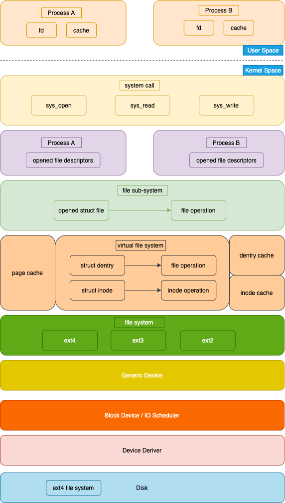
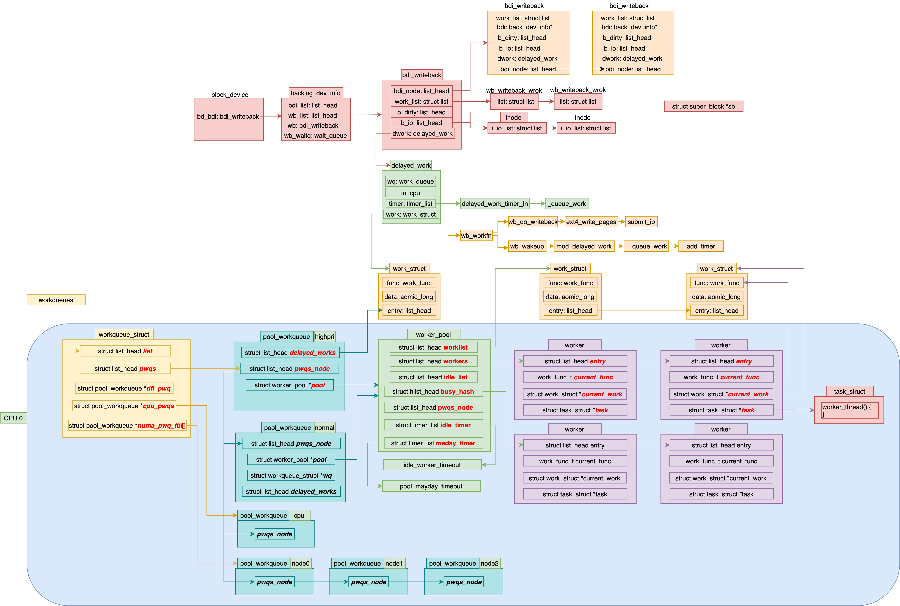

* [File Management](#File-Management)
    * [inode](#inode)
    * [extent](#extent)
    * [block group](#block-group)
    * [directory](#directory)
    * [hard/symbolic link](#hardsymbolic-link)
    * [vfs](#vfs)
    * [mount](#mount)
    * [open](#open)
    * [read/write](#readwrite)
        * [direct_IO](#direct_IO)
        * [buffered write](#buffered-write)
            * [bdi_wq](#bdi_wq)
        * [buffered read](#buffered-read)
    * [writeback](#writeback)

* [IO](#IO)
    * [kobject](#kobject)
    * [char dev](#char-dev)
        * [insmod char dev](#insmod-char-dev)
        * [dev_fs_type](#dev_fs_type)
        * [mount char dev](#mount-char-dev)
        * [mknod char dev](#mknod-char-dev)
        * [open char dev](#open-char-dev)
        * [write char dev](#write-char-dev)
        * [ioctl](#ioctl)
    * [block dev](#block-dev)
        * [mount blk dev](#mount-blk-dev)
            * [blkdev_get_by_path](#blkdev_get_by_path)
                * [lookup_bdev](#lookup_bdev)
                * [blkdev_get](#blkdev_get)
                * [bdev_map](#bdev_map)
            * [sget](#sget)
    * [interruption](#interruption)
        * [request_irq](#request_irq)
        * [init idt_table](#init-idt_table)
        * [init_IRQ](#init_IRQ)
        * [init vector_irq](#init-vector_irq)
    * [direct io](#direct-iO)
        * [dio_get_page](#dio_get_page)
        * [get_more_blocks](#get_more_blocks)
        * [submit_page_section](#submit_page_section)
    * [buffered io write](#buffered-IO-write)
    * [submit_bio](#submit_bio)
        * [make_request_fn](#make_request_fn)
        * [request_fn](#request_fn)
    * [init request_queue](#init-request_queue)
    * [blk_plug](#blk_plug)



# File Management


```c++
register_filesystem(&ext4_fs_type);

static struct file_system_type ext4_fs_type = {
  .owner    = THIS_MODULE,
  .name     = "ext4",
  .mount    = ext4_mount,
  .kill_sb  = kill_block_super,
  .fs_flags = FS_REQUIRES_DEV,
};

struct file {
  struct path                   f_path;
  struct inode                  *f_inode;  /* cached value */
  const struct file_operations  *f_op;
  struct address_space          *f_mapping;
  void*                         private_data; /* for special inode */

  spinlock_t                    f_lock;
  enum rw_hint                  f_write_hint;
  atomic_long_t                 f_count;
  unsigned int                  f_flags;
  fmode_t                       f_mode;
  loff_t                        f_pos;
  struct mutex                  f_pos_lock;
  struct fown_struct            f_owner;

  /* Used by fs/eventpoll.c to link all the hooks to this file */
  struct list_head              f_ep_links;
  struct list_head              f_tfile_llink;

  errseq_t                      f_wb_err;
  union {
      struct llist_node         fu_llist;
      struct rcu_head           fu_rcuhead;
  } f_u;
};

struct path {
  struct vfsmount               *mnt;
  struct dentry                 *dentry;
};

struct vfsmount {
  struct dentry                 *mnt_root;  /* root of the mounted tree */
  struct super_block            *mnt_sb;    /* pointer to superblock */
  int                           mnt_flags;
};

/* memroy chache of dirctories and files associated inode and file */
struct dentry {
  unsigned int                    d_flags;
  struct dentry                   *d_parent;
  struct inode                    *d_inode;
  struct super_block              *d_sb;
  const struct dentry_operations  *d_op;

  struct hlist_bl_node            d_hash;  /* lookup hash list */
  union {
    struct list_head              d_lru;   /* LRU list */
    wait_queue_head_t             *d_wait; /* in-lookup ones only */
  };
  struct qstr                     d_name;
  unsigned char                   d_iname[DNAME_INLINE_LEN];
  struct list_head                d_child;
  struct list_head                d_subdirs;
};

struct mount {
  struct hlist_node     mnt_hash;
  struct mount          *mnt_parent;
  struct dentry         *mnt_mountpoint;
  struct vfsmount       mnt;

  union {
    struct rcu_head     mnt_rcu;
    struct llist_node   mnt_llist;
  };

  struct list_head      mnt_mounts;  /* list of children, anchored here */
  struct list_head      mnt_child;   /* and going through their mnt_child */
  struct list_head      mnt_instance;/* mount instance on sb->s_mounts */
  const char            *mnt_devname;/* Name of device e.g. /dev/dsk/hda1 */
  struct list_head      mnt_list;
};
```

## inode
```c++
struct inode {
  const struct inode_operations   *i_op;
  struct super_block              *i_sb;
  struct address_space            *i_mapping;

  union {
    const struct file_operations  *i_fop;  /* former ->i_op->default_file_ops */
    void (*free_inode)(struct inode *);
  };

  dev_t                     i_rdev;
  struct list_head          i_devices;

  union {
    struct pipe_inode_info  *i_pipe;
    struct block_device     *i_bdev;
    struct cdev             *i_cdev;
    char                    *i_link;
    unsigned                i_dir_seq;
  };

  umode_t           i_mode;
  unsigned short    i_opflags;
  kuid_t            i_uid;
  kgid_t            i_gid;
  unsigned int      i_flags;

  unsigned long     dirtied_when;  /* jiffies of first dirtying */
  unsigned long     dirtied_time_when;

  struct hlist_node     i_hash;
  struct list_head      i_io_list; /* backing dev IO list */
  struct bdi_writeback  *i_wb;     /* the associated cgroup wb */

  struct file_lock_context  *i_flctx;
  struct address_space      i_data;
};

#define  EXT4_NDIR_BLOCKS    12
#define  EXT4_IND_BLOCK      EXT4_NDIR_BLOCKS
#define  EXT4_DIND_BLOCK     (EXT4_IND_BLOCK + 1)
#define  EXT4_TIND_BLOCK     (EXT4_DIND_BLOCK + 1)
#define  EXT4_N_BLOCKS       (EXT4_TIND_BLOCK + 1)

struct ext4_inode {
  __le16  i_mode;         /* File mode */
  __le16  i_uid;          /* Low 16 bits of Owner Uid */
  __le32  i_size_lo;      /* Size in bytes */
  __le32  i_atime;        /* Access time */
  __le32  i_ctime;        /* Inode Change time */
  __le32  i_mtime;        /* Modification time */
  __le32  i_dtime;        /* Deletion Time */
  __le16  i_gid;          /* Low 16 bits of Group Id */
  __le16  i_links_count;  /* Links count */
  __le32  i_blocks_lo;    /* Blocks count */
  __le32  i_flags;         /* File flags */

  __le32  i_block[EXT4_N_BLOCKS]  /* Pointers to blocks */
  __le32  i_generation;           /* File version (for NFS) */
  __le32  i_file_acl_lo;           /* File ACL */
  __le32  i_size_high;
};
```


## extent
```c++
// Each block (leaves and indexes), even inode-stored has header.
struct ext4_extent_header {
  __le16  eh_magic;  /* probably will support different formats */
  __le16  eh_entries;  /* number of valid entries */
  __le16  eh_max;    /* capacity of store in entries */
  __le16  eh_depth;  /* has tree real underlying blocks? */
  __le32  eh_generation;  /* generation of the tree */
};

struct ext4_extent_idx {
  __le32  ei_block;  /* index covers logical blocks from 'block' */
  __le32  ei_leaf_lo;  /* pointer to the physical block of the next *
         * level. leaf or next index could be there */
  __le16  ei_leaf_hi;  /* high 16 bits of physical block */
  __u16  ei_unused;
};

struct ext4_extent {
  __le32  ee_block;  /* first logical block extent covers */
  /* the most significant bit used as a flag to identify whether
   * this entent is initialized, 15 bits can present max 128MB data */
  __le16  ee_len;    /* number of blocks covered by extent */
  __le16  ee_start_hi;  /* high 16 bits of physical block */
  __le32  ee_start_lo;  /* low 32 bits of physical block */
};
```
* the `ee_len` is 16 bits, one bit indicates validation, so one ext4_extent can represent 2^15 blocks data, each block is 4k, the total data is 2^15 * 2^12 = 2^27 bits = 128MB.


```c++
const struct inode_operations ext4_dir_inode_operations = {
  .create     = ext4_create,
  .lookup     = ext4_lookup,
  .link       = ext4_link,
  .unlink     = ext4_unlink,
  .symlink    = ext4_symlink,
  .mkdir      = ext4_mkdir,
  .rmdir      = ext4_rmdir,
  .mknod      = ext4_mknod,
  .tmpfile    = ext4_tmpfile,
  .rename     = ext4_rename2,
  .setattr    = ext4_setattr,
  .getattr    = ext4_getattr,
  .listxattr  = ext4_listxattr,
  .get_acl    = ext4_get_acl,
  .set_acl    = ext4_set_acl,
  .fiemap      = ext4_fiemap,
};

/* open -> do_sys_open -> do_filp_open -> path_openat -> do_last -> lookup_open
 * ext4_create -> ext4_new_inode_start_handle -> __ext4_new_inode */
struct inode *__ext4_new_inode(
  handle_t *handle, struct inode *dir,
  umode_t mode, const struct qstr *qstr,
  __u32 goal, uid_t *owner, __u32 i_flags,
  int handle_type, unsigned int line_no,
  int nblocks)
{
inode_bitmap_bh = ext4_read_inode_bitmap(sb, group);
ino = ext4_find_next_zero_bit((unsigned long *)
                inode_bitmap_bh->b_data,
                EXT4_INODES_PER_GROUP(sb), ino);
}
```

## block group
* One block group contains:
  * one block representing block bit info + several block representing data blocks
  * one block representing inode bit info + several block representing inode blocks

```c++
struct ext4_group_desc
{
  __le32  bg_block_bitmap_lo;  /* Blocks bitmap block */
  __le32  bg_inode_bitmap_lo;  /* Inodes bitmap block */
  __le32  bg_inode_table_lo;  /* Inodes table block */
};
```


```c++
struct ext4_super_block {
  __le32  s_blocks_count_lo;  /* Blocks count */
  __le32  s_r_blocks_count_lo;  /* Reserved blocks count */
  __le32  s_free_blocks_count_lo;  /* Free blocks count */

  __le32  s_blocks_count_hi;  /* Blocks count */
  __le32  s_r_blocks_count_hi;  /* Reserved blocks count */
  __le32  s_free_blocks_count_hi;  /* Free blocks count */
}

struct super_block {
  struct list_head               s_list; /* Keep first */
  struct dentry                  *s_root;
  struct file_system_type         *s_type;
  const struct super_operations  *s_op;

  dev_t                   s_dev;
  struct block_device     *s_bdev;
  struct backing_dev_info *s_bdi;

  unsigned char      s_blocksize_bits;
  unsigned long      s_blocksize;
  loff_t              s_maxbytes;  /* Max file size */
  struct hlist_node  s_instances;

  struct list_head  s_mounts; /* list of mounts; _not_ for fs use */
  struct list_head  s_inodes; /* all inodes */
  struct list_head  s_inodes_wb; /* writeback inodes */
};
```


## directory
```c++
struct ext4_dir_entry {
  __le32  inode;      /* Inode number */
  __le16  rec_len;    /* Directory entry length */
  __le16  name_len;    /* Name length */
  char  name[EXT4_NAME_LEN];  /* File name */
};
struct ext4_dir_entry_2 {
  __le32  inode;      /* Inode number */
  __le16  rec_len;    /* Directory entry length */
  __u8  name_len;    /* Name length */
  __u8  file_type;
  char  name[EXT4_NAME_LEN];  /* File name */
};

/* EXT4_INDEX_FL */
struct dx_root
{
  struct fake_dirent dot;
  char dot_name[4];
  struct fake_dirent dotdot;
  char dotdot_name[4];
  struct dx_root_info
  {
    __le32 reserved_zero;
    u8 hash_version;
    u8 info_length; /* 8 */
    u8 indirect_levels;
    u8 unused_flags;
  }
  info;
  struct dx_entry  entries[0];
};

struct dx_entry
{
  __le32 hash;
  __le32 block;
};
```


## hard/symbolic link
```c++
 ln [args] [dst] [src]
```


## vfs


## mount
```c++
SYSCALL_DEFINE5(mount, char __user *, dev_name,
  char __user *, dir_name, char __user *, type,
  unsigned long, flags, void __user *, data)
{
  return ksys_mount(dev_name, dir_name, type, flags, data);
}

int ksys_mount(
  char __user *dev_name, char __user *dir_name,
  char __user *type, unsigned long flags, void __user *data)
{
  int ret;
  char *kernel_type;
  char *kernel_dev;
  void *options;

  kernel_type = copy_mount_string(type);
  kernel_dev = copy_mount_string(dev_name);
  options = copy_mount_options(data);
  ret = do_mount(kernel_dev, dir_name, kernel_type, flags, options);

  return ret;
}

long do_mount(const char *dev_name, const char __user *dir_name,
    const char *type_page, unsigned long flags, void *data_page)
{
  struct path path;
  unsigned int mnt_flags = 0, sb_flags;
  int retval = 0;

  /* get the mountpoint */
  retval = user_path(dir_name, &path);

  if (flags & MS_REMOUNT)
    retval = do_remount(&path, flags, sb_flags, mnt_flags, data_page);
  else if (flags & MS_BIND)
    retval = do_loopback(&path, dev_name, flags & MS_REC);
  else if (flags & (MS_SHARED | MS_PRIVATE | MS_SLAVE | MS_UNBINDABLE))
    retval = do_change_type(&path, flags);
  else if (flags & MS_MOVE)
    retval = do_move_mount(&path, dev_name);
  else
    retval = do_new_mount(&path, type_page, sb_flags, mnt_flags,
              dev_name, data_page);
dput_out:
  path_put(&path);
  return retval;
}

static int do_new_mount(
  struct path *path, const char *fstype, int sb_flags,
  int mnt_flags, const char *name, void *data)
{
  struct file_system_type *type;
  struct vfsmount *mnt;
  int err;

  type = get_fs_type(fstype);
  mnt = vfs_kern_mount(type, sb_flags, name, data);
  if (!IS_ERR(mnt) && (type->fs_flags & FS_HAS_SUBTYPE) &&
      !mnt->mnt_sb->s_subtype)
    mnt = fs_set_subtype(mnt, fstype);

  put_filesystem(type);

  /* add a mount into a namespace's mount tree */
  err = do_add_mount(real_mount(mnt), path, mnt_flags);
  if (err)
    mntput(mnt);
  return err;
}

struct vfsmount *vfs_kern_mount(
  struct file_system_type *type, int flags, const char *name, void *data)
{
  struct mount *mnt;
  struct dentry *root;

  mnt = alloc_vfsmnt(name);
  root = mount_fs(type, flags, name, data);

  mnt->mnt.mnt_root = root;
  mnt->mnt.mnt_sb = root->d_sb;
  mnt->mnt_mountpoint = mnt->mnt.mnt_root;
  mnt->mnt_parent = mnt;
  lock_mount_hash();
  list_add_tail(&mnt->mnt_instance, &root->d_sb->s_mounts);
  unlock_mount_hash();
  return &mnt->mnt;
}
```

```c++
struct dentry *mount_fs(
  struct file_system_type *type, int flags,
  const char *name, void *data)
{
  struct dentry *root;
  struct super_block *sb;
  root = type->mount(type, flags, name, data);
  sb = root->d_sb;
}

static struct dentry *ext4_mount(
  struct file_system_type *fs_type,
  int flags, const char *dev_name, void *data)
{
  return mount_bdev(fs_type, flags, dev_name, data, ext4_fill_super);
}
/* ---> see mount block device in IO part */
```


```c++
mount();
  ksys_mount(); /* copy type, dev_name, data to kernel */
    do_mount(); /* get path by name */
      do_new_mount(); /* get fs_type by type */
        vfs_kern_mount();
          alloc_vfsmnt();
          mount_fs();
            fs_type.mount(); /* dev_fs_type, {dev, ext4}_mount */
```

## open
```c++
struct task_struct {
  struct fs_struct      *fs;
  struct files_struct   *files;
  struct nsproxy        *nsproxy;
}

struct files_struct {
  struct file __rcu * fd_array[NR_OPEN_DEFAULT];
};

SYSCALL_DEFINE3(open, const char __user *, filename, int, flags, umode_t, mode)
{
  return do_sys_open(AT_FDCWD, filename, flags, mode);
}

long do_sys_open(int dfd, const char __user *filename, int flags, umode_t mode)
{
  struct filename *tmp = getname(filename);
  int fd = get_unused_fd_flags(flags);
  if (fd >= 0) {
    struct file *f = do_filp_open(dfd, tmp, &op);
    if (IS_ERR(f)) {
      put_unused_fd(fd);
      fd = PTR_ERR(f);
    } else {
      fsnotify_open(f);
      fd_install(fd, f);
    }
  }
  putname(tmp);
  return fd;
}

struct file *do_filp_open(int dfd, struct filename *pathname,
    const struct open_flags *op)
{
  struct nameidata nd;
  int flags = op->lookup_flags;
  struct file *filp;

  set_nameidata(&nd, dfd, pathname);
  filp = path_openat(&nd, op, flags | LOOKUP_RCU);
  if (unlikely(filp == ERR_PTR(-ECHILD)))
    filp = path_openat(&nd, op, flags);
  if (unlikely(filp == ERR_PTR(-ESTALE)))
    filp = path_openat(&nd, op, flags | LOOKUP_REVAL);
  restore_nameidata();
  return filp;
}

struct file *path_openat(struct nameidata *nd,
      const struct open_flags *op, unsigned flags)
{
  struct file *file;
  int error;

  file = alloc_empty_file(op->open_flag, current_cred());

  if (unlikely(file->f_flags & __O_TMPFILE)) {
    error = do_tmpfile(nd, flags, op, file);
  } else if (unlikely(file->f_flags & O_PATH)) {
    error = do_o_path(nd, flags, file);
  } else {
    const char *s = path_init(nd, flags);
    while (!(error = link_path_walk(s, nd)) && (error = do_last(nd, file, op)) > 0) {
      nd->flags &= ~(LOOKUP_OPEN|LOOKUP_CREATE|LOOKUP_EXCL);
      s = trailing_symlink(nd);
    }
    terminate_walk(nd);
  }

  if (likely(!error)) {
    if (likely(file->f_mode & FMODE_OPENED))
      return file;
    error = -EINVAL;
  }

  fput(file);

  if (error == -EOPENSTALE) {
    if (flags & LOOKUP_RCU)
      error = -ECHILD;
    else
      error = -ESTALE;
  }

  return ERR_PTR(error);
}

static int do_last(struct nameidata *nd,
       struct file *file, const struct open_flags *op,
       int *opened)
{
  /* 1. loopup in dcache */
  error = lookup_fast(nd, &path, &inode, &seq);
  /* 2. loopup in file system */
  error = lookup_open(nd, &path, file, op, got_write, opened);
  /* 3. open file */
  error = vfs_open(&nd->path, file, current_cred());
}

static int lookup_open(struct nameidata *nd, struct path *path,
  struct file *file,
  const struct open_flags *op,
  bool got_write, int *opened)
{
  // open with O_CREAT flag
  if (!dentry->d_inode && (open_flag & O_CREAT)) {
    error = dir_inode->i_op->create(dir_inode, dentry, mode, open_flag & O_EXCL);
  }

  dentry = d_alloc_parallel(dir, &nd->last, &wq);
  struct dentry *res = dir_inode->i_op->lookup(
    dir_inode, dentry, nd->flags); /* ext4_lookup */
  path->dentry = dentry;
  path->mnt = nd->path.mnt;
}

const struct inode_operations ext4_dir_inode_operations = {
  .create    = ext4_create,
  .lookup    = ext4_lookup
}

int vfs_open(const struct path *path, struct file *file,
  const struct cred *cred)
{
  struct dentry *dentry = d_real(path->dentry, NULL, file->f_flags, 0);
  file->f_path = *path;
  return do_dentry_open(file, d_backing_inode(dentry), NULL, cred);
}

static int do_dentry_open(struct file *f,
  struct inode *inode,
  int (*open)(struct inode *, struct file *),
  const struct cred *cred)
{
  f->f_mode = OPEN_FMODE(f->f_flags) | FMODE_LSEEK | FMODE_PREAD | FMODE_PWRITE;
  path_get(&f->f_path);
  f->f_inode = inode;
  f->f_mapping = inode->i_mapping;
  f->f_op = fops_get(inode->i_fop);
  open = f->f_op->open;
  error = open(inode, f);
  f->f_flags &= ~(O_CREAT | O_EXCL | O_NOCTTY | O_TRUNC);
  file_ra_state_init(&f->f_ra, f->f_mapping->host->i_mapping);
  return 0;
}

const struct file_operations ext4_file_operations = {
  .open    = ext4_file_open,
};
```

```c++
do_sys_open();
  get_unused_fd_flags();
  do_filp_open();
    path_openat();
      get_empty_filp();
      link_path_walk();
      do_last();
        lookup_fast(); /* 1. search in dcache */

        lookup_open(); /* 2. search in file system */
          dir_inode->i_op->create(); /* O_CREAT */
            ext4_create();

          d_alloc_parallel(); /* alloc a dentry */
          dir_inode->i_op->lookup(); /* ext4_lookup */

        vfs_open(); /* 3. open */
          do_dentry_open();
            f->f_op->open();
              ext4_file_open();
  fd_install();
  putname();
```


## read/write
```c++
SYSCALL_DEFINE3(read, unsigned int, fd, char __user *, buf, size_t, count)
{
  struct fd f = fdget_pos(fd);
  loff_t pos = file_pos_read(f.file);
  ret = vfs_read(f.file, buf, count, &pos);
}

SYSCALL_DEFINE3(write, unsigned int, fd, const char __user *, buf,
    size_t, count)
{
  struct fd f = fdget_pos(fd);
  loff_t pos = file_pos_read(f.file);
    ret = vfs_write(f.file, buf, count, &pos);
}

ssize_t __vfs_read(struct file *file, char __user *buf, size_t count,
       loff_t *pos)
{
  if (file->f_op->read)
    return file->f_op->read(file, buf, count, pos);
  else if (file->f_op->read_iter)
    return new_sync_read(file, buf, count, pos);
  else
    return -EINVAL;
}


ssize_t __vfs_write(struct file *file, const char __user *p, size_t count,
        loff_t *pos)
{
  if (file->f_op->write)
    return file->f_op->write(file, p, count, pos);
  else if (file->f_op->write_iter)
    return new_sync_write(file, p, count, pos);
  else
    return -EINVAL;
}

static ssize_t new_sync_read(
  struct file *filp, char __user *buf, size_t len, loff_t *ppos)
{
  struct iovec iov = { .iov_base = buf, .iov_len = len };
  struct kiocb kiocb;
  struct iov_iter iter;
  ssize_t ret;

  init_sync_kiocb(&kiocb, filp);
  kiocb.ki_pos = *ppos;
  iov_iter_init(&iter, READ, &iov, 1, len);

  ret = call_read_iter(filp, &kiocb, &iter);
  *ppos = kiocb.ki_pos;
  return ret;
}

const struct file_operations ext4_file_operations = {
  .read_iter    = ext4_file_read_iter,
  .write_iter   = ext4_file_write_iter,
  .write_begin  = ext4_write_begin,
  .write_end    = ext4_write_end
}
/* ext4_file_{read, write}_iter -> generic_file_{read, write}_iter */
ssize_t generic_file_read_iter(struct kiocb *iocb, struct iov_iter *iter)
{
    if (iocb->ki_flags & IOCB_DIRECT) {
      struct address_space *mapping = file->f_mapping;
      retval = mapping->a_ops->direct_IO(iocb, iter);
    }
    retval = generic_file_buffered_read(iocb, iter, retval);
}

ssize_t __generic_file_write_iter(struct kiocb *iocb, struct iov_iter *from)
{
    if (iocb->ki_flags & IOCB_DIRECT) {
        written = generic_file_direct_write(iocb, from);
    } else {
        written = generic_perform_write(file, from, iocb->ki_pos);
    }
}
```

### direct_io
```c++
static const struct address_space_operations ext4_aops = {
  .readpage               = ext4_readpage,
  .readpages              = ext4_readpages,
  .writepage              = ext4_writepage,
  .writepages             = ext4_writepages,
  .write_begin            = ext4_write_begin,
  .write_end              = ext4_write_end,
  .set_page_dirty         = ext4_set_page_dirty,
  .bmap                   = ext4_bmap,
  .invalidatepage         = ext4_invalidatepage,
  .releasepage            = ext4_releasepage,
  .direct_IO              = ext4_direct_IO,
  .migratepage            = buffer_migrate_page,
  .is_partially_uptodate  = block_is_partially_uptodate,
  .error_remove_page      = generic_error_remove_page,
};

static ssize_t ext4_direct_IO(struct kiocb *iocb, struct iov_iter *iter)
{
  struct file *file = iocb->ki_filp;
  struct inode *inode = file->f_mapping->host;
  size_t count = iov_iter_count(iter);
  loff_t offset = iocb->ki_pos;
  ssize_t ret;
  if (iov_iter_rw(iter) == READ)
    ret = ext4_direct_IO_read(iocb, iter);
  else
    ret = ext4_direct_IO_write(iocb, iter);
}

static ssize_t ext4_direct_IO_write(struct kiocb *iocb, struct iov_iter *iter)
{
  struct file *file = iocb->ki_filp;
  struct inode *inode = file->f_mapping->host;
  struct ext4_inode_info *ei = EXT4_I(inode);
  ssize_t ret;
  loff_t offset = iocb->ki_pos;
  size_t count = iov_iter_count(iter);

  ret = __blockdev_direct_IO(iocb, inode, inode->i_sb->s_bdev, iter,
           get_block_func, ext4_end_io_dio, NULL, dio_flags);
}

/* __blockdev_direct_IO -> do_blockdev_direct_IO */
static inline ssize_t do_blockdev_direct_IO(
  struct kiocb *iocb, struct inode *inode,
  struct block_device *bdev, struct iov_iter *iter,
  get_block_t get_block, dio_iodone_t end_io,
  dio_submit_t submit_io, int flags)
{
  /* see do_blockdev_direct_IO in IO management part */
}
```

### buffered read
```c++
static ssize_t generic_file_buffered_read(struct kiocb *iocb,
    struct iov_iter *iter, ssize_t written)
{
  struct file *filp = iocb->ki_filp;
  struct address_space *mapping = filp->f_mapping;
  struct inode *inode = mapping->host;
  struct file_ra_state *ra = &filp->f_ra;
  loff_t *ppos = &iocb->ki_pos;
  pgoff_t index;
  pgoff_t last_index;
  pgoff_t prev_index;
  unsigned long offset;      /* offset into pagecache page */
  unsigned int prev_offset;
  int error = 0;

  iov_iter_truncate(iter, inode->i_sb->s_maxbytes);

  index = *ppos >> PAGE_SHIFT;
  prev_index = ra->prev_pos >> PAGE_SHIFT;
  prev_offset = ra->prev_pos & (PAGE_SIZE-1);
  last_index = (*ppos + iter->count + PAGE_SIZE-1) >> PAGE_SHIFT;
  offset = *ppos & ~PAGE_MASK;

  for (;;) {
    struct page *page;
    pgoff_t end_index;
    loff_t isize;
    page = find_get_page(mapping, index);

    if (!page) {
      if (iocb->ki_flags & IOCB_NOWAIT)
        goto would_block;

      page_cache_sync_readahead(mapping, ra, filp,index, last_index - index);
      page = find_get_page(mapping, index);
      if (unlikely(page == NULL))
        goto no_cached_page;
    }

    if (PageReadahead(page)) {
      page_cache_async_readahead(mapping, ra, filp, page, index, last_index - index);
    }

    /* Ok, we have the page, and it's up-to-date, so
     * now we can copy it to user space... */
    ret = copy_page_to_iter(page, offset, nr, iter);
  }
}
```

### buffered write
```c++
ssize_t generic_perform_write(
  struct file *file, struct iov_iter *i, loff_t pos)
{
  struct address_space *mapping = file->f_mapping;
  const struct address_space_operations *a_ops = mapping->a_ops;
  do {
    struct page *page;
    unsigned long offset;  /* Offset into pagecache page */
    unsigned long bytes;  /* Bytes to write to page */

    status = a_ops->write_begin(file, mapping, pos, bytes, flags, &page, &fsdata) {
      grab_cache_page_write_begin();
      ext4_journal_start();
    }

    copied = iov_iter_copy_from_user_atomic(page, i, offset, bytes);

    flush_dcache_page(page);
    status = a_ops->write_end(file, mapping, pos, bytes, copied, page, fsdata) {
      ext4_journal_stop() {
        // block_write_end->__block_commit_write->mark_buffer_dirty
      }
    }

    pos += copied;
    written += copied;

    balance_dirty_pages_ratelimited(mapping);
  } while (iov_iter_count(i));
}

/* get mapping page from address_space page cache radix tree,
 * if not exits, alloc a new page */
struct page *grab_cache_page_write_begin(
  struct address_space *mapping, pgoff_t index, unsigned flags)
{
  struct page *page;
  int fgp_flags = FGP_LOCK|FGP_WRITE|FGP_CREAT;
  page = pagecache_get_page(mapping, index, fgp_flags, mapping_gfp_mask(mapping));
  if (page)
    wait_for_stable_page(page);
  return page;
}

size_t iov_iter_copy_from_user_atomic(struct page *page,
    struct iov_iter *i, unsigned long offset, size_t bytes)
{
  char *kaddr = kmap_atomic(page), *p = kaddr + offset;
  iterate_all_kinds(i, bytes, v,
    copyin((p += v.iov_len) - v.iov_len, v.iov_base, v.iov_len),
    memcpy_from_page((p += v.bv_len) - v.bv_len, v.bv_page, v.bv_offset, v.bv_len),
    memcpy((p += v.iov_len) - v.iov_len, v.iov_base, v.iov_len)
  )
  kunmap_atomic(kaddr);
  return bytes;
}

void balance_dirty_pages_ratelimited(struct address_space *mapping)
{
  struct inode *inode = mapping->host;
  struct backing_dev_info *bdi = inode_to_bdi(inode);
  struct bdi_writeback *wb = &bdi->wb;
  int ratelimit;

  if (inode_cgwb_enabled(inode))
    wb = wb_get_create_current(bdi, GFP_KERNEL);
  if (!wb)
    wb = &bdi->wb;

  ratelimit = current->nr_dirtied_pause;
  if (wb->dirty_exceeded)
    ratelimit = min(ratelimit, 32 >> (PAGE_SHIFT - 10));

  if (unlikely(current->nr_dirtied >= ratelimit))
    balance_dirty_pages(mapping, wb, current->nr_dirtied);
}

/* start background writeback, balance_dirty_pages -> */
void wb_start_background_writeback(struct bdi_writeback *wb)
{
  wb_wakeup(wb);
}

static void wb_wakeup(struct bdi_writeback *wb)
{
  spin_lock_bh(&wb->work_lock);
  if (test_bit(WB_registered, &wb->state))
    mod_delayed_work(bdi_wq, &wb->dwork, 0);
  spin_unlock_bh(&wb->work_lock);
}

/* bdi_wq serves all asynchronous writeback tasks */
struct workqueue_struct *bdi_wq;

/* mod_delayed_work - modify delay of or queue a delayed work */
static inline bool mod_delayed_work(struct workqueue_struct *wq,
            struct delayed_work *dwork,
            unsigned long delay)
{
  return mod_delayed_work_on(WORK_CPU_UNBOUND, wq, dwork, delay);
}

/* insert a delayed work in bdi_wq */
bool mod_delayed_work_on(int cpu, struct workqueue_struct *wq,
       struct delayed_work *dwork, unsigned long delay)
{
  unsigned long flags;
  int ret;

  do {
    ret = try_to_grab_pending(&dwork->work, true, &flags);
  } while (unlikely(ret == -EAGAIN));

  if (likely(ret >= 0)) {
    __queue_delayed_work(cpu, wq, dwork, delay);
    local_irq_restore(flags);
  }

  /* -ENOENT from try_to_grab_pending() becomes %true */
  return ret;
}

static void __queue_delayed_work(int cpu, struct workqueue_struct *wq,
  struct delayed_work *dwork, unsigned long delay)
{
  struct timer_list *timer = &dwork->timer;
  struct work_struct *work = &dwork->work;

  if (!delay) {
    __queue_work(cpu, wq, &dwork->work);
    return;
  }

  dwork->wq = wq;
  dwork->cpu = cpu;
  timer->expires = jiffies + delay;

  if (unlikely(cpu != WORK_CPU_UNBOUND))
    add_timer_on(timer, cpu);
  else
    add_timer(timer);
}
```
## writeback



### backing_dev_info
```c++
extern spinlock_t               bdi_lock;
extern struct list_head         bdi_list;
extern struct workqueue_struct  *bdi_wq;

struct backing_dev_info {
  struct list_head      bdi_list;
  struct bdi_writeback  wb;      /* the root writeback info for this bdi */
  struct list_head      wb_list; /* list of all wbs */

  wait_queue_head_t     wb_waitq;

  struct device         *dev;
  struct device         *owner;

  struct timer_list     laptop_mode_wb_timer;
};

struct bdi_writeback {
  struct list_head    work_list;
  struct delayed_work dwork;    /* work item used for writeback */

  struct list_head    b_dirty;     /* dirty inodes */
  struct list_head    b_io;        /* parked for writeback */
  struct list_head    b_more_io;   /* parked for more writeback */
  struct list_head    b_dirty_time;/* time stamps are dirty */

  struct list_head    bdi_node;    /* anchored at bdi->wb_list */
};

struct delayed_work {
  struct work_struct      work;
  struct timer_list       timer;

  /* target workqueue and CPU ->timer uses to queue ->work */
  struct workqueue_struct *wq;
  int                     cpu;
};

typedef void (*work_func_t)(struct work_struct *work);

struct work_struct {
  atomic_long_t     data;
  struct list_head  entry;
  work_func_t       func;
};

struct wb_writeback_work {
  long                      nr_pages;
  struct super_block        *sb;
  unsigned long             *older_than_this;
  enum writeback_sync_modes sync_mode;
  unsigned int              tagged_writepages:1;
  unsigned int              for_kupdate:1; /* periodic wb flag */
  unsigned int              range_cyclic:1; /* range wb flag */
  unsigned int              for_background:1;
  unsigned int              for_sync:1;   /* sync(2) WB_SYNC_ALL writeback */
  unsigned int              auto_free:1;  /* free on completion */
  enum wb_reason            reason;       /* why was writeback initiated? */

  struct list_head          list;         /* pending work list */
  struct wb_completion      *done;        /* set if the caller waits */
};
```

### bdi_init
```c++
static int default_bdi_init(void)
{
  int err;

  bdi_wq = alloc_workqueue("writeback", WQ_MEM_RECLAIM | WQ_FREEZABLE |
                WQ_UNBOUND | WQ_SYSFS, 0);
  if (!bdi_wq)
    return -ENOMEM;

  err = bdi_init(&noop_backing_dev_info);

  return err;
}

static int bdi_init(struct backing_dev_info *bdi)
{
    int ret;

    bdi->dev = NULL;

    kref_init(&bdi->refcnt);
    bdi->min_ratio = 0;
    bdi->max_ratio = 100;
    bdi->max_prop_frac = FPROP_FRAC_BASE;
    INIT_LIST_HEAD(&bdi->bdi_list);
    INIT_LIST_HEAD(&bdi->wb_list);
    init_waitqueue_head(&bdi->wb_waitq);

    ret = cgwb_bdi_init(bdi);

    return ret;
}

static int cgwb_bdi_init(struct backing_dev_info *bdi)
{
    int err;

    bdi->wb_congested = kzalloc(sizeof(*bdi->wb_congested), GFP_KERNEL);

    refcount_set(&bdi->wb_congested->refcnt, 1);

    err = wb_init(&bdi->wb, bdi, 1, GFP_KERNEL);
    if (err) {
        wb_congested_put(bdi->wb_congested);
        return err;
    }
    return 0;
}
```

### wb_init
```c++
static int wb_init(
  struct bdi_writeback *wb,
  struct backing_dev_info *bdi,
  int blkcg_id, gfp_t gfp)
{
  wb->bdi = bdi;
  wb->last_old_flush = jiffies;
  INIT_LIST_HEAD(&wb->b_dirty);
  INIT_LIST_HEAD(&wb->b_io);
  INIT_LIST_HEAD(&wb->b_more_io);
  INIT_LIST_HEAD(&wb->b_dirty_time);

  wb->bw_time_stamp = jiffies;
  wb->balanced_dirty_ratelimit = INIT_BW;
  wb->dirty_ratelimit = INIT_BW;
  wb->write_bandwidth = INIT_BW;
  wb->avg_write_bandwidth = INIT_BW;

  spin_lock_init(&wb->work_lock);
  INIT_LIST_HEAD(&wb->work_list);
  INIT_DELAYED_WORK(&wb->dwork, wb_workfn);
  wb->dirty_sleep = jiffies;
}

#define __INIT_DELAYED_WORK(_work, _func, _tflags)      \
  do {                \
    INIT_WORK(&(_work)->work, (_func));      \
    __setup_timer(&(_work)->timer, delayed_work_timer_fn,  \
            (unsigned long)(_work),      \
// wb_workfn -> wb_do_writeback -> wb_writeback -> writeback_sb_inodes
// -> __writeback_single_inode -> do_writepages -> ext4_writepages
// ---> see ext4_writepages in IO management

void delayed_work_timer_fn(struct timer_list *t)
{
  struct delayed_work *dwork = from_timer(dwork, t, timer);

  /* should have been called from irqsafe timer with irq already off */
  __queue_work(dwork->cpu, dwork->wq, &dwork->work);
}
```

### queue_work
```c++
 void __queue_work(int cpu, struct workqueue_struct *wq,
       struct work_struct *work)
{
  struct pool_workqueue *pwq;
  struct worker_pool *last_pool;
  struct list_head *worklist;
  unsigned int work_flags;
  unsigned int req_cpu = cpu;

  /* While a work item is PENDING && off queue, a task trying to
   * steal the PENDING will busy-loop waiting for it to either get
   * queued or lose PENDING.  Grabbing PENDING and queueing should
   * happen with IRQ disabled. */
  lockdep_assert_irqs_disabled();


  /* if draining, only works from the same workqueue are allowed */
  if (unlikely(wq->flags & __WQ_DRAINING) &&
    return;
retry:
  /* pwq which will be used unless @work is executing elsewhere */
  if (wq->flags & WQ_UNBOUND) {
    if (req_cpu == WORK_CPU_UNBOUND)
      cpu = wq_select_unbound_cpu(raw_smp_processor_id());
    pwq = unbound_pwq_by_node(wq, cpu_to_node(cpu));
  } else {
    if (req_cpu == WORK_CPU_UNBOUND)
      cpu = raw_smp_processor_id();
    pwq = per_cpu_ptr(wq->cpu_pwqs, cpu);
  }

  /* If @work was previously on a different pool, it might still be
   * running there, in which case the work needs to be queued on that
   * pool to guarantee non-reentrancy. */
  last_pool = get_work_pool(work);
  if (last_pool && last_pool != pwq->pool) {
    struct worker *worker;

    spin_lock(&last_pool->lock);

    worker = find_worker_executing_work(last_pool, work);

    if (worker && worker->current_pwq->wq == wq) {
      pwq = worker->current_pwq;
    } else {
      /* meh... not running there, queue here */
      spin_unlock(&last_pool->lock);
      spin_lock(&pwq->pool->lock);
    }
  } else {
    spin_lock(&pwq->pool->lock);
  }

  /* pwq is determined and locked.  For unbound pools, we could have
   * raced with pwq release and it could already be dead.  If its
   * refcnt is zero, repeat pwq selection.  Note that pwqs never die
   * without another pwq replacing it in the numa_pwq_tbl or while
   * work items are executing on it, so the retrying is guaranteed to
   * make forward-progress. */
  if (unlikely(!pwq->refcnt)) {
    if (wq->flags & WQ_UNBOUND) {
      spin_unlock(&pwq->pool->lock);
      cpu_relax();
      goto retry;
    }
  }

  /* pwq determined, queue */
  trace_workqueue_queue_work(req_cpu, pwq, work);

  if (WARN_ON(!list_empty(&work->entry))) {
    spin_unlock(&pwq->pool->lock);
    return;
  }

  pwq->nr_in_flight[pwq->work_color]++;
  work_flags = work_color_to_flags(pwq->work_color);

  if (likely(pwq->nr_active < pwq->max_active)) {
    trace_workqueue_activate_work(work);
    pwq->nr_active++;
    worklist = &pwq->pool->worklist;
    if (list_empty(worklist))
      pwq->pool->watchdog_ts = jiffies;
  } else {
    work_flags |= WORK_STRUCT_DELAYED;
    worklist = &pwq->delayed_works;
  }

  debug_work_activate(work);
  insert_work(pwq, work, worklist, work_flags);

  spin_unlock(&pwq->pool->lock);
}

static void insert_work(struct pool_workqueue *pwq, struct work_struct *work,
      struct list_head *head, unsigned int extra_flags)
{
  struct worker_pool *pool = pwq->pool;

  /* we own @work, set data and link */
  set_work_pwq(work, pwq, extra_flags);
  list_add_tail(&work->entry, head);
  get_pwq(pwq);

  /* Ensure either wq_worker_sleeping() sees the above
   * list_add_tail() or we see zero nr_running to avoid workers lying
   * around lazily while there are works to be processed. */
  smp_mb();

  if (__need_more_worker(pool))
    wake_up_worker(pool);
}
```

Direct IO and buffered IO will eventally call `submit_bio`.

## Question:
1. How to use inode bit map present all inodes?
2. Does system alloc a block for a dirctory or a file?
3. What does ext4_file_open do?
4. What happend when inserting data in a file?

## TODO
1. xarray

# IO


All devices have the corresponding device file in /dev(is devtmpfs file system), which has inode, but it's not associated with any data in the storage device, it's associated with the device's drive. And this device file belongs to a special file system: devtmpfs.

```c++
lsmod           // list installed modes
insmod *.ko     // install mode
mknod filename type major minor  // create dev file in /dev/

/*
/sys has following directories
/sys/devices represent all kernel devices in layer
/sys/dev has a char directory and block directory, maintain symbolic link files linked to real devices
/sys/block all block devices
/sys/module all modes information
*/
```


## kobject
```c++
module_init(logibm_init);
module_exit(logibm_exit);
```

A kernel module consists:
1. header
  ```c++
  #include <linux/module.h>
  #include <linux/init.h>
  ```
2. define functions, handling kernel module main logic
3. Implement a file_operation interface
  ```c++
  static const struct file_operations lp_fops = {
    .owner    = THIS_MODULE,
    .write    = lp_write,
    .unlocked_ioctl  = lp_ioctl,
    #ifdef CONFIG_COMPAT
    .compat_ioctl  = lp_compat_ioctl,
    #endif
    .open    = lp_open,
    .release  = lp_release,
    #ifdef CONFIG_PARPORT_1284
    .read    = lp_read,
    #endif
    .llseek    = noop_llseek,
  };
  ```
4. define init and exit functions
5. invoke `module_init` and `moudle_exit`
6. declare lisence, invoke MODULE_LICENSE


## char dev


### insmod char dev

```c++
static int __init lp_init (void)
{
  if (register_chrdev (LP_MAJOR, "lp", &lp_fops)) {
    printk (KERN_ERR "lp: unable to get major %d\n", LP_MAJOR);
    return -EIO;
  }
}

int __register_chrdev(
  unsigned int major, unsigned int baseminor,
  unsigned int count, const char *name,
  const struct file_operations *fops)
{
  struct char_device_struct *cd;
  struct cdev *cdev;
  int err = -ENOMEM;

  cd = __register_chrdev_region(major, baseminor, count, name);
  cdev = cdev_alloc();
  cdev->owner = fops->owner;
  cdev->ops = fops;
  kobject_set_name(&cdev->kobj, "%s", name);
  err = cdev_add(cdev, MKDEV(cd->major, baseminor), count);
  cd->cdev = cdev;
  return major ? 0 : cd->major;
}

int cdev_add(struct cdev *p, dev_t dev, unsigned count)
{
  int error;
  p->dev = dev;
  p->count = count;

  error = kobj_map(cdev_map, dev, count, NULL,
       exact_match, exact_lock, p);
  kobject_get(p->kobj.parent);

  return 0;
}
```

### dev_fs_type
```c++
rest_init();
  kernel_thread(kernel_init);
    kernel_init_freeable();
      do_basic_setup();
        driver_init();
          devtmpfs_init();
          devices_init();
          buses_init();
          classes_init();
          firmware_init();
          hypervisor_init();

        shmem_init();
          register_filesystem(&shmem_fs_type);
            kern_mount(&shmem_fs_type);

        init_irq_proc();
        do_initcalls();

      workqueue_init();
      load_default_modules();
    run_init_process();
  kernel_thread(kthreadd);

int __init devtmpfs_init(void)
{
  int err = register_filesystem(&dev_fs_type);

  thread = kthread_run(devtmpfsd, &err, "kdevtmpfs");
  if (!IS_ERR(thread)) {
    wait_for_completion(&setup_done);
  } else {
    err = PTR_ERR(thread);
    thread = NULL;
  }
  return 0;
}

static int devtmpfsd(void *p)
{
  char options[] = "mode=0755";
  int *err = p;
  *err = ksys_unshare(CLONE_NEWNS);
  if (*err)
    goto out;
  *err = ksys_mount("devtmpfs", "/", "devtmpfs", MS_SILENT, options);
  if (*err)
    goto out;
  ksys_chdir("/.."); /* will traverse into overmounted root */
  ksys_chroot(".");
  complete(&setup_done);
  while (1) {
    spin_lock(&req_lock);
    while (requests) {
      struct req *req = requests;
      requests = NULL;
      spin_unlock(&req_lock);
      while (req) {
        struct req *next = req->next;
        req->err = handle(req->name, req->mode,
              req->uid, req->gid, req->dev);
        complete(&req->done);
        req = next;
      }
      spin_lock(&req_lock);
    }
    __set_current_state(TASK_INTERRUPTIBLE);
    spin_unlock(&req_lock);
    schedule();
  }
  return 0;
out:
  complete(&setup_done);
  return *err;
}
```

### mount char dev
```c++
/* mount -t type device destination_dir
 *
 * mount -> ksys_mount -> do_mount -> do_new_mount ->
 * vfs_kern_mount -> mount_fs -> fs_type.mount */
static struct file_system_type dev_fs_type = {
  .name = "devtmpfs",
  .mount = dev_mount,
  .kill_sb = kill_litter_super,
};

static struct dentry *dev_mount(
  struct file_system_type *fs_type, int flags,
  const char *dev_name, void *data)
{
#ifdef CONFIG_TMPFS
  return mount_single(fs_type, flags, data, shmem_fill_super);
#else
  return mount_single(fs_type, flags, data, ramfs_fill_super);
#endif
}

struct dentry *mount_single(
  struct file_system_type *fs_type,
  int flags, void *data,
  int (*fill_super)(struct super_block *, void *, int))
{
  struct super_block *s;
  int error;

  /* find or create a superblock */
  s = sget(fs_type, compare_single, set_anon_super, flags, NULL);
  if (!s->s_root) {
    error = fill_super(s, data, flags & SB_SILENT ? 1 : 0);
    if (error) {
      deactivate_locked_super(s);
      return ERR_PTR(error);
    }
    s->s_flags |= SB_ACTIVE;
  } else {
    do_remount_sb(s, flags, data, 0);
  }

  return dget(s->s_root);
}

// int ramfs_fill_super(struct super_block *sb, void *data, int silent)
int shmem_fill_super(struct super_block *sb, void *data, int silent)
{
  struct inode *inode;
  struct shmem_sb_info *sbinfo;
  int err = -ENOMEM;

  /* Round up to L1_CACHE_BYTES to resist false sharing */
  sbinfo = kzalloc(max((int)sizeof(struct shmem_sb_info),
        L1_CACHE_BYTES), GFP_KERNEL);

  if (!(sb->s_flags & SB_KERNMOUNT)) {
    sbinfo->max_blocks = shmem_default_max_blocks();
    sbinfo->max_inodes = shmem_default_max_inodes();
    if (shmem_parse_options(data, sbinfo, false)) {
      err = -EINVAL;
      goto failed;
    }
  } else {
    sb->s_flags |= SB_NOUSER;
  }

  sb->s_magic = TMPFS_MAGIC;
  sb->s_op = &shmem_ops;

  inode = shmem_get_inode(sb, NULL, S_IFDIR | sbinfo->mode, 0, VM_NORESERVE);
  sb->s_root = d_make_root(inode);

  return err;
}

static struct inode *shmem_get_inode(
  struct super_block *sb, const struct inode *dir,
  umode_t mode, dev_t dev, unsigned long flags)
{
  struct inode *inode;
  struct shmem_inode_info *info;
  struct shmem_sb_info *sbinfo = SHMEM_SB(sb);

  inode = new_inode(sb);
  if (inode) {
    switch (mode & S_IFMT) {
    default:
      inode->i_op = &shmem_special_inode_operations;
      init_special_inode(inode, mode, dev);
      break;
    case S_IFREG:
      inode->i_mapping->a_ops = &shmem_aops;
      inode->i_op = &shmem_inode_operations;
      inode->i_fop = &shmem_file_operations;
      break;
    case S_IFDIR:
      inode->i_op = &shmem_dir_inode_operations;
      inode->i_fop = &simple_dir_operations;
      break;
    case S_IFLNK:
      mpol_shared_policy_init(&info->policy, NULL);
      break;
    }

    lockdep_annotate_inode_mutex_key(inode);
  } else
    shmem_free_inode(sb);
  return inode;
}

void init_special_inode(struct inode *inode, umode_t mode, dev_t rdev)
{
  inode->i_mode = mode;
  if (S_ISCHR(mode)) {
    inode->i_fop = &def_chr_fops;
    inode->i_rdev = rdev;
  } else if (S_ISBLK(mode)) {
    inode->i_fop = &def_blk_fops;
    inode->i_rdev = rdev;
  } else if (S_ISFIFO(mode))
    inode->i_fop = &pipefifo_fops;
  else if (S_ISSOCK(mode))
    ; /* leave it no_open_fops */
}
```

```c++
mount();
  ksys_mount(); /* copy type, dev_name, data to kernel */
    do_mount(); /* get path by name */
      do_new_mount(); /* get fs_type by type */
        vfs_kern_mount();
          alloc_vfsmnt();
          mount_fs();
            fs_type.mount(); /* dev_fs_type */
              dev_mount();
                mount_single();
                  sget();
                  fill_super(); /* shmem_fill_super */
                    shmem_get_inode();
                      new_inode();
                      init_special_inode();
                    d_make_root();
          list_add_tail(&mnt->mnt_instance, &root->d_sb->s_mounts);
```

### mknod char dev
```c++
/* mknod /dev/ttyS0 c 4 64 */
SYSCALL_DEFINE3(mknod, const char __user *, filename, umode_t, mode, unsigned, dev)
{
  return sys_mknodat(AT_FDCWD, filename, mode, dev);
}

SYSCALL_DEFINE4(
  mknodat, int, dfd, const char __user *,
  filename, umode_t, mode, unsigned, dev)
{
  struct dentry *dentry;
  struct path path;
  dentry = user_path_create(dfd, filename, &path, lookup_flags);
  switch (mode & S_IFMT) {
    case 0:
    case S_IFREG:
      error = vfs_create(path.dentry->d_inode,dentry,mode,true);
      if (!error)
        ima_post_path_mknod(dentry);
      break;

    case S_IFCHR:
    case S_IFBLK:
      error = vfs_mknod(path.dentry->d_inode,dentry,mode,
          new_decode_dev(dev));
      break;

    case S_IFIFO: case S_IFSOCK:
      error = vfs_mknod(path.dentry->d_inode,dentry,mode,0);
      break;
  }
}

int vfs_mknod(struct inode *dir, struct dentry *dentry, umode_t mode, dev_t dev)
{
  error = dir->i_op->mknod(dir, dentry, mode, dev);
}

static const struct inode_operations ramfs_dir_inode_operations = {
  .mknod    = ramfs_mknod,
};

static const struct inode_operations shmem_dir_inode_operations = {
#ifdef CONFIG_TMPFS
  .mknod    = shmem_mknod,
};

static int shmem_mknod(
  struct inode *dir, struct dentry *dentry, umode_t mode, dev_t dev)
{
  struct inode *inode;
  int error = -ENOSPC;

  inode = shmem_get_inode(dir->i_sb, dir, mode, dev, VM_NORESERVE);
  if (inode) {
    dir->i_size += BOGO_DIRENT_SIZE;
    dir->i_ctime = dir->i_mtime = current_time(dir);
    d_instantiate(dentry, inode);
    dget(dentry); /* Extra count - pin the dentry in core */
  }
  return error;
}
```

```c++
mknod();
  sys_mknodat();
    user_path_create();
    vfs_create(); /* S_IFREG*/
    vfs_mknod();  /* S_IFCHR, S_IFBLK, S_IFPIPE, S_IFSOCK */
      dir->i_op->mknod();
        shmem_mknod();
          shmem_get_inode();
          d_instantiate();
            __d_instantiate();
              __d_set_inode_and_type();
          dget();
```

### open char dev
```c++
const struct file_operations def_chr_fops = {
  .open = chrdev_open,
};

static int chrdev_open(struct inode *inode, struct file *filp)
{
  const struct file_operations *fops;
  struct cdev *p;
  struct cdev *new = NULL;
  int ret = 0;

  p = inode->i_cdev;
  if (!p) {
    struct kobject *kobj;
    int idx;
    kobj = kobj_lookup(cdev_map, inode->i_rdev, &idx);
    new = container_of(kobj, struct cdev, kobj);
    p = inode->i_cdev;
    if (!p) {
      inode->i_cdev = p = new;
      list_add(&inode->i_devices, &p->list);
      new = NULL;
    }
  }
  fops = fops_get(p->ops);

  replace_fops(filp, fops);
  if (filp->f_op->open) {
    ret = filp->f_op->open(inode, filp);
  }
}
```

### write char dev
```c++
ssize_t __vfs_write(struct file *file, const char __user *p, size_t count, loff_t *pos)
{
  if (file->f_op->write)
    return file->f_op->write(file, p, count, pos);
  else if (file->f_op->write_iter)
    return new_sync_write(file, p, count, pos);
  else
    return -EINVAL;
}

static ssize_t lp_write(
  struct file * file, const char __user * buf,
  size_t count, loff_t *ppos)
{
  unsigned int minor = iminor(file_inode(file));
  struct parport *port = lp_table[minor].dev->port;
  char *kbuf = lp_table[minor].lp_buffer;
  ssize_t retv = 0;
  ssize_t written;
  size_t copy_size = count;

  /* Need to copy the data from user-space. */
  if (copy_size > LP_BUFFER_SIZE)
    copy_size = LP_BUFFER_SIZE;

  if (copy_from_user (kbuf, buf, copy_size)) {
    retv = -EFAULT;
    goto out_unlock;
  }

  do {
    /* Write the data. */
    written = parport_write (port, kbuf, copy_size);
    if (written > 0) {
      copy_size -= written;
      count -= written;
      buf  += written;
      retv += written;
    }

    if (need_resched())
      schedule ();

    if (count) {
      copy_size = count;
      if (copy_size > LP_BUFFER_SIZE)
        copy_size = LP_BUFFER_SIZE;

      if (copy_from_user(kbuf, buf, copy_size)) {
        if (retv == 0)
          retv = -EFAULT;
        break;
      }
    }
  } while (count > 0);
}
```


### ioctl
```c++
SYSCALL_DEFINE3(ioctl, unsigned int, fd, unsigned int, cmd, unsigned long, arg)
{
  int error;
  struct fd f = fdget(fd);
  error = do_vfs_ioctl(f.file, fd, cmd, arg);
  fdput(f);
  return error;
}

int do_vfs_ioctl(
  struct file *filp, unsigned int fd,
  unsigned int cmd, unsigned long arg)
{
  int error = 0;
  int __user *argp = (int __user *)arg;
  struct inode *inode = file_inode(filp);

  switch (cmd) {
  case FIONBIO:
    error = ioctl_fionbio(filp, argp);
    break;

  case FIOASYNC:
    error = ioctl_fioasync(fd, filp, argp);
    break;

  case FICLONE:
    return ioctl_file_clone(filp, arg, 0, 0, 0);

  default:
    if (S_ISREG(inode->i_mode))
      error = file_ioctl(filp, cmd, arg);
    else
      error = vfs_ioctl(filp, cmd, arg);
    break;
  }
  return error;
}

long vfs_ioctl(struct file *filp, unsigned int cmd, unsigned long arg)
{
  int error = -ENOTTY;
  if (!filp->f_op->unlocked_ioctl)
    goto out;

  error = filp->f_op->unlocked_ioctl(filp, cmd, arg);
  if (error == -ENOIOCTLCMD)
    error = -ENOTTY;
 out:
  return error;
}

static long lp_ioctl(
  struct file *file, unsigned int cmd,
  unsigned long arg)
{
  unsigned int minor;
  struct timeval par_timeout;
  int ret;

  minor = iminor(file_inode(file));
  mutex_lock(&lp_mutex);
  switch (cmd) {
  default:
    ret = lp_do_ioctl(minor, cmd, arg, (void __user *)arg);
    break;
  }
  mutex_unlock(&lp_mutex);
  return ret;
}


static int lp_do_ioctl(unsigned int minor, unsigned int cmd,
  unsigned long arg, void __user *argp)
{
  int status;
  int retval = 0;

  switch ( cmd ) {
    case LPTIME:
      if (arg > UINT_MAX / HZ)
        return -EINVAL;
      LP_TIME(minor) = arg * HZ/100;
      break;
    case LPCHAR:
      LP_CHAR(minor) = arg;
      break;
    case LPABORT:
      if (arg)
        LP_F(minor) |= LP_ABORT;
      else
        LP_F(minor) &= ~LP_ABORT;
      break;
    case LPABORTOPEN:
      if (arg)
        LP_F(minor) |= LP_ABORTOPEN;
      else
        LP_F(minor) &= ~LP_ABORTOPEN;
      break;
    case LPCAREFUL:
      if (arg)
        LP_F(minor) |= LP_CAREFUL;
      else
        LP_F(minor) &= ~LP_CAREFUL;
      break;
    case LPWAIT:
      LP_WAIT(minor) = arg;
      break;
    case LPSETIRQ:
      return -EINVAL;
      break;
    case LPGETIRQ:
      if (copy_to_user(argp, &LP_IRQ(minor),
          sizeof(int)))
        return -EFAULT;
      break;
    case LPGETSTATUS:
      if (mutex_lock_interruptible(&lp_table[minor].port_mutex))
        return -EINTR;
      lp_claim_parport_or_block (&lp_table[minor]);
      status = r_str(minor);
      lp_release_parport (&lp_table[minor]);
      mutex_unlock(&lp_table[minor].port_mutex);

      if (copy_to_user(argp, &status, sizeof(int)))
        return -EFAULT;
      break;
    case LPRESET:
      lp_reset(minor);
      break;
     case LPGETFLAGS:
       status = LP_F(minor);
      if (copy_to_user(argp, &status, sizeof(int)))
        return -EFAULT;
      break;
    default:
      retval = -EINVAL;
  }
  return retval
}
```


## block dev


---


```c++
void init_special_inode(struct inode *inode, umode_t mode, dev_t rdev)
{
  inode->i_mode = mode;
  if (S_ISCHR(mode)) {
    inode->i_fop = &def_chr_fops;
    inode->i_rdev = rdev;
  } else if (S_ISBLK(mode)) {
    inode->i_fop = &def_blk_fops;
    inode->i_rdev = rdev;
  } else if (S_ISFIFO(mode))
    inode->i_fop = &pipefifo_fops;
  else if (S_ISSOCK(mode))
    ;  /* leave it no_open_fops */
}

const struct file_operations def_blk_fops = {
  .open           = blkdev_open, // call blkdev_get
  .release        = blkdev_close,
  .llseek         = block_llseek,
  .read_iter      = blkdev_read_iter,
  .write_iter     = blkdev_write_iter,
  .mmap           = generic_file_mmap,
  .fsync          = blkdev_fsync,
  .unlocked_ioctl = block_ioctl,
  .splice_read    = generic_file_splice_read,
  .splice_write   = iter_file_splice_write,
  .fallocate      = blkdev_fallocate,
};

static struct file_system_type ext4_fs_type = {
  .owner    = THIS_MODULE,
  .name     = "ext4",
  .mount    = ext4_mount,
  .kill_sb  = kill_block_super,
  .fs_flags = FS_REQUIRES_DEV,
};
```

### bdev_map
```c++
static struct kobj_map *bdev_map;
// map a dev_t with a gendisk
static inline void add_disk(struct gendisk *disk)
{
  device_add_disk(NULL, disk);
}

void device_add_disk(struct device *parent, struct gendisk *disk)
{
  blk_register_region(disk_devt(disk), disk->minors, NULL,
          exact_match, exact_lock, disk);
}

void blk_register_region(
  dev_t devt, unsigned long range, struct module *module,
  struct kobject *(*probe)(dev_t, int *, void *),
  int (*lock)(dev_t, void *), void *data)
{
  kobj_map(bdev_map, devt, range, module, probe, lock, data);
}
```

### mount blk dev

```c++
/* mont -> ksys_mount -> do_mount -> do_new_mount ->
 * vfs_kern_mount -> mount_fs -> fs_type.mount */
static struct dentry *ext4_mount(
  struct file_system_type *fs_type, int flags,
  const char *dev_name, void *data)
{
  return mount_bdev(fs_type, flags, dev_name, data, ext4_fill_super);
}

struct dentry *mount_bdev(
  struct file_system_type *fs_type,
  int flags, const char *dev_name, void *data,
  int (*fill_super)(struct super_block *, void *, int))
{
  struct block_device *bdev;
  struct super_block *s;
  fmode_t mode = FMODE_READ | FMODE_EXCL;
  int error = 0;

  if (!(flags & MS_RDONLY))
    mode |= FMODE_WRITE;

  bdev = blkdev_get_by_path(dev_name, mode, fs_type);

  s = sget(fs_type, test_bdev_super, set_bdev_super, flags | MS_NOSEC, bdev);
  fill_super(s, data, flags & SB_SILENT ? 1 : 0);

  return dget(s->s_root);
}
```

#### blkdev_get_by_path
```c++
struct block_device *blkdev_get_by_path(
  const char *path, fmode_t mode, void *holder)
{
  struct block_device *bdev;
  int err;

  bdev = lookup_bdev(path);             // find blk device
  err = blkdev_get(bdev, mode, holder); // open blk device
  return bdev;
}
```
##### lookup_bdev
```c++
// 1. find the block device file under /dev which is devtmpfs file system
struct block_device *lookup_bdev(const char *pathname)
{
  struct block_device *bdev;
  struct inode *inode;
  struct path path;
  int error;

  error = kern_path(pathname, LOOKUP_FOLLOW, &path);
  inode = d_backing_inode(path.dentry); /* dentry->d_inode, inode in /dev fs */
  bdev = bd_acquire(inode);

  return bdev;
}

// 2. find the block device in bdev file system by its key: dev_t
static struct block_device *bd_acquire(struct inode *inode)
{
  struct block_device *bdev;
  bdev = bdget(inode->i_rdev);
  if (bdev) {
    spin_lock(&bdev_lock);
    if (!inode->i_bdev) {
      bdgrab(bdev);
      inode->i_bdev = bdev;
      inode->i_mapping = bdev->bd_inode->i_mapping;
    }
  }
  return bdev;
}

struct block_device *bdget(dev_t dev)
{
  struct block_device *bdev;
  struct inode *inode;

  /* get the inode from the blk fs by dev_t, create new one if absence */
  inode = iget5_locked(blockdev_superblock, hash(dev), bdev_test, bdev_set, &dev);
  bdev = &BDEV_I(inode)->bdev;

  if (inode->i_state & I_NEW) {
    bdev->bd_contains = NULL;
    bdev->bd_super = NULL;
    bdev->bd_inode = inode;
    bdev->bd_block_size = i_blocksize(inode);
    bdev->bd_part_count = 0;
    bdev->bd_invalidated = 0;
    inode->i_mode = S_IFBLK;
    inode->i_rdev = dev;
    inode->i_bdev = bdev;
    inode->i_data.a_ops = &def_blk_aops;
    mapping_set_gfp_mask(&inode->i_data, GFP_USER);
    spin_lock(&bdev_lock);
    list_add(&bdev->bd_list, &all_bdevs);
    spin_unlock(&bdev_lock);
    unlock_new_inode(inode);
  }

  return bdev;
}

// 3rd file system, save all blk device
struct super_block *blockdev_superblock;

static struct file_system_type bd_type = {
  .name           = "bdev",
  .mount          = bd_mount,
  .kill_sb        = kill_anon_super,
};

void __init bdev_cache_init(void)
{
  static struct vfsmount *bd_mnt;

  bdev_cachep = kmem_cache_create("bdev_cache", sizeof(struct bdev_inode), 0,
    (SLAB_HWCACHE_ALIGN|SLAB_RECLAIM_ACCOUNT|SLAB_MEM_SPREAD|SLAB_ACCOUNT|SLAB_PANIC),
    init_once);
  err = register_filesystem(&bd_type);
  if (err)
    panic("Cannot register bdev pseudo-fs");
  bd_mnt = kern_mount(&bd_type);
  if (IS_ERR(bd_mnt))
    panic("Cannot create bdev pseudo-fs");
  blockdev_superblock = bd_mnt->mnt_sb;   /* For writeback */
}

/* All block device inodes stored in bdev file system for convenient management.
 * Linux associates block_device with inode of bdev with bdev_inode */
struct bdev_inode {
  struct block_device   bdev;
  struct inode          vfs_inode;
};

struct block_device {
  dev_t                 bd_dev;
  int                   bd_openers;
  struct super_block    *bd_super;
  struct block_device   *bd_contains;
  struct gendisk        *bd_disk;
  struct hd_struct      *bd_part;

  unsigned              bd_block_size;
  unsigned              bd_part_count;
  int                   bd_invalidated;
  struct request_queue  *bd_queue;
  struct backing_dev_info *bd_bdi;
  struct list_head        bd_list;
};

struct gendisk {
  int                                   major; /* major number of driver */
  int                                   first_minor;
  int                                   minors; /* partition numbers */
  char                                  disk_name[DISK_NAME_LEN]; /* name of major driver */

  char *(*devnode)(struct gendisk *gd, umode_t *mode);

  struct disk_part_tbl __rcu            *part_tbl;
  struct hd_struct                      part0;

  const struct block_device_operations  *fops;
  struct request_queue                  *queue;
  void                                  *private_data;

  int                                   flags;
  struct kobject                        *slave_dir;
};

struct hd_struct {
  sector_t                    start_sect;
  sector_t                    nr_sects;

  struct device               __dev;
  struct kobject              *holder_dir;
  int                         policy, partno;
  struct partition_meta_info  *info;

  struct disk_stats           dkstats;
  struct percpu_ref           ref;
  struct rcu_head             rcu_head;
};
```

##### blkdev_get
```c++
static int __blkdev_get(struct block_device *bdev, fmode_t mode, int for_part)
{
  struct gendisk *disk;
  struct module *owner;
  int ret;
  int partno;
  int perm = 0;

  if (mode & FMODE_READ)
    perm |= MAY_READ;
  if (mode & FMODE_WRITE)
    perm |= MAY_WRITE;

  disk = get_gendisk(bdev->bd_dev, &partno);

  owner = disk->fops->owner;

  if (!bdev->bd_openers) {
    bdev->bd_disk = disk;
    bdev->bd_queue = disk->queue;
    bdev->bd_contains = bdev;
    bdev->bd_partno = partno;

    if (!partno) { // 1. open whole disk
      ret = -ENXIO;
      bdev->bd_part = disk_get_part(disk, partno);

      if (disk->fops->open) {
        ret = disk->fops->open(bdev, mode);
      }

      if (!ret)
        bd_set_size(bdev,(loff_t)get_capacity(disk)<<9);

      if (bdev->bd_invalidated) {
        if (!ret)
          rescan_partitions(disk, bdev);
      }

    } else {  // 2. open a partition
      struct block_device *whole;
      whole = bdget_disk(disk, 0);
      ret = __blkdev_get(whole, mode, 1);
      bdev->bd_contains = whole;
      bdev->bd_part = disk_get_part(disk, partno);
      bd_set_size(bdev, (loff_t)bdev->bd_part->nr_sects << 9);
    }
  } else {
    if (bdev->bd_contains == bdev) {
      ret = 0;
      if (bdev->bd_disk->fops->open)
        ret = bdev->bd_disk->fops->open(bdev, mode);
      /* the same as first opener case, read comment there */
      if (bdev->bd_invalidated && (!ret || ret == -ENOMEDIUM))
        bdev_disk_changed(bdev, ret == -ENOMEDIUM);
      if (ret)
        goto out_unlock_bdev;
    }
  }

  bdev->bd_openers++;
  if (for_part)
    bdev->bd_part_count++;
}

struct gendisk *get_gendisk(dev_t devt, int *partno)
{
  struct gendisk *disk = NULL;

  if (MAJOR(devt) != BLOCK_EXT_MAJOR) { // 1. get the whole device
    struct kobject *kobj = kobj_lookup(bdev_map, devt, partno);
    if (kobj)
      disk = dev_to_disk(kobj_to_dev(kobj));
  } else {                              // 2. get a partition
    struct hd_struct *part;
    part = idr_find(&ext_devt_idr, blk_mangle_minor(MINOR(devt)));
    if (part && get_disk(part_to_disk(part))) {
      *partno = part->partno;
      disk = part_to_disk(part);
    }
  }
  return disk;
}

#define dev_to_disk(device) container_of((device), struct gendisk, part0.__dev)
#define dev_to_part(device) container_of((device), struct hd_struct, __dev)
#define disk_to_dev(disk)   (&(disk)->part0.__dev)
#define part_to_dev(part)   (&((part)->__dev))

static inline struct gendisk *part_to_disk(struct hd_struct *part)
{
  if (likely(part)) {
    if (part->partno)
      return dev_to_disk(part_to_dev(part)->parent);
    else
      return dev_to_disk(part_to_dev(part));
  }
  return NULL;
}

static const struct block_device_operations sd_fops = {
  .owner          = THIS_MODULE,
  .open           = sd_open,
  .release        = sd_release,
  .ioctl          = sd_ioctl,
  .getgeo         = sd_getgeo,
  .compat_ioctl   = sd_compat_ioctl,
};

static int sd_open(struct block_device *bdev, fmode_t mode)
{

}
```

#### sget
```c++
// drivers/scsi/sd.c
static const struct block_device_operations sd_fops = {
  .owner                    = THIS_MODULE,
  .open                     = sd_open,
  .release                  = sd_release,
  .ioctl                    = sd_ioctl,
  .getgeo                   = sd_getgeo,
  .compat_ioctl             = sd_compat_ioctl,
  .check_events             = sd_check_events,
  .revalidate_disk          = sd_revalidate_disk,
  .unlock_native_capacity   = sd_unlock_native_capacity,
  .pr_ops                   = &sd_pr_ops,
};

static int sd_open(struct block_device *bdev, fmode_t mode)
{ }

static int set_bdev_super(struct super_block *s, void *data)
{
  s->s_bdev = data;
  s->s_dev = s->s_bdev->bd_dev;
  s->s_bdi = bdi_get(s->s_bdev->bd_bdi);
  return 0;
}

struct super_block *sget(struct file_system_type *type,
  int (*test)(struct super_block *,void *),
  int (*set)(struct super_block *,void *),
  int flags,
  void *data)
{
  struct user_namespace *user_ns = current_user_ns();
  return sget_userns(type, test, set, flags, user_ns, data);
}

struct super_block *sget_userns(struct file_system_type *type,
  int (*test)(struct super_block *,void *),
  int (*set)(struct super_block *,void *),
  int flags, struct user_namespace *user_ns,
  void *data)
{
  struct super_block *s = NULL;
  struct super_block *old;
  int err;

  if (!s) {
    s = alloc_super(type, (flags & ~MS_SUBMOUNT), user_ns);
  }
  err = set(s, data);

  s->s_type = type;
  strlcpy(s->s_id, type->name, sizeof(s->s_id));
  list_add_tail(&s->s_list, &super_blocks);
  hlist_add_head(&s->s_instances, &type->fs_supers);
  spin_unlock(&sb_lock);
  get_filesystem(type);
  register_shrinker(&s->s_shrink);
  return s;
}
```

```c++
mount();
  ksys_mount(); /* copy type, dev_name, data to kernel */
    do_mount(); /* get path by name */
      do_new_mount(); /* get fs_type by type */
        vfs_kern_mount();
          alloc_vfsmnt();
          mount_fs();

            fs_type.mount();
              ext4_mount();
                mount_bdev();
                  blkdev_get_by_path();
                    lookup_bdev(); /* 1. find blk inode in /dev/xxx by name*/
                      kern_path();
                      d_backing_inode(); /* get inode of devtmpfs */
                      bd_acquire(); /* find block_dev by dev_t in blkdev fs */
                        bdget();
                          iget5_locked(blockdev_superblock, ...); /* blk dev fs */
                    blkdev_get();  /* 2. open blk device */
                      __blkdev_get();
                        get_gendisk();
                          kobj_lookup();          /* 1. open whole gisk */
                            dev_to_disk(kobj_to_dev(kobj));

                          idr_find(&ext_devt_idr); /* 2. open a partition */
                            part_to_disk(part);
                              dev_to_disk(part_to_dev(part));
                        disk->fops->open(bdev, mode);
                  sget();
                    sget_userns();
                      alloc_super();
                      set_bdev_super();
                  fill_super();
                    ext4_fill_super();
                  dget();
          list_add_tail(&mnt->mnt_instance, &root->d_sb->s_mounts);
```

## direct io
```c++
read();
  vfs_read();
    file->f_op->write_iter(); /* ext4_file_read_iter */
      generic_file_read_iter();
        file->f_mapping->a_ops->direct_IO();
        generic_file_buffered_read();

static const struct address_space_operations ext4_aops = {
  .direct_IO    = ext4_direct_IO,
};

static ssize_t ext4_direct_IO(struct kiocb *iocb, struct iov_iter *iter)
{
  struct file *file = iocb->ki_filp;
  struct inode *inode = file->f_mapping->host;
  size_t count = iov_iter_count(iter);
  loff_t offset = iocb->ki_pos;
  ssize_t ret;

  if (iov_iter_rw(iter) == READ)
    ret = ext4_direct_IO_read(iocb, iter);
  else
    ret = ext4_direct_IO_write(iocb, iter);
}

static ssize_t ext4_direct_IO_write(struct kiocb *iocb, struct iov_iter *iter)
{
  struct file *file = iocb->ki_filp;
  struct inode *inode = file->f_mapping->host;
  struct ext4_inode_info *ei = EXT4_I(inode);
  ssize_t ret;
  loff_t offset = iocb->ki_pos;
  size_t count = iov_iter_count(iter);

  ret = __blockdev_direct_IO(
    iocb, inode, inode->i_sb->s_bdev, iter,
    get_block_func, ext4_end_io_dio, NULL, dio_flags);
}

/* dio_state communicated between submission path and end_io */
struct dio {
  int             flags;
  int             op;
  int             op_flags;

  struct gendisk *bio_disk;
  struct inode   *inode;
  loff_t          i_size; /* i_size when submitted */
  dio_iodone_t   *end_io; /* IO completion function */

  void            *private;  /* copy from map_bh.b_private */

  /* BIO completion state */
  int             is_async;
  bool            defer_completion;
  bool            should_dirty;
  int             io_error;
  struct bio      *bio_list;

  struct task_struct  *waiter;

  struct kiocb        *iocb; /* kiocb */
  ssize_t             result;/* IO result */

  union {
    struct page *pages[DIO_PAGES];  /* page buffer */
    struct work_struct complete_work;/* deferred AIO completion */
  };
};

struct dio_submit {
  struct bio    *bio;           /* bio under assembly */
  unsigned      blkbits;        /* doesn't change */
  unsigned      blkfactor;      /* When we're using an alignment which is finer than the filesystem's soft
                                  blocksize, this specifies how much finer.
                                  blkfactor=2 means 1/4-block alignment.  Does not change */
  unsigned      start_zero_done; /* flag: sub-blocksize zeroing has been performed at the start of a write */
  int           pages_in_io;     /* approximate total IO pages */
  sector_t      block_in_file;   /* Current offset into the underlying file in dio_block units. */
  unsigned      blocks_available;/* At block_in_file.  changes */
  int           reap_counter;    /* rate limit reaping */
  sector_t      final_block_in_request;/* doesn't change */
  int           boundary;        /* prev block is at a boundary */
  get_block_t   *get_block;      /* block mapping function */
  dio_submit_t  *submit_io;      /* IO submition function */

  loff_t        logical_offset_in_bio;  /* current first logical block in bio */
  sector_t      final_block_in_bio;     /* current final block in bio + 1 */
  sector_t      next_block_for_io;      /* next block to be put under IO, in dio_blocks units */

  /* Deferred addition of a page to the dio.  These variables are
   * private to dio_send_cur_page(), submit_page_section() and
   * dio_bio_add_page(). */
  struct page   *cur_page;        /* The page */
  unsigned      cur_page_offset;  /* Offset into it, in bytes */
  unsigned      cur_page_len;     /* Nr of bytes at cur_page_offset */
  sector_t      cur_page_block;   /* Where it starts */
  loff_t        cur_page_fs_offset; /* Offset in file */

  struct iov_iter *iter;

  /* Page queue.  These variables belong to dio_refill_pages() and* dio_get_page(). */
  unsigned      head;      /* next page to process */
  unsigned      tail;      /* last valid page + 1 */
  size_t        from, to;
};

/* __blockdev_direct_IO -> do_blockdev_direct_IO */
ssize_t do_blockdev_direct_IO(
  struct kiocb *iocb, struct inode *inode,
  struct block_device *bdev, struct iov_iter *iter,
  get_block_t get_block, dio_iodone_t end_io,
  dio_submit_t submit_io, int flags)
{
  unsigned i_blkbits = READ_ONCE(inode->i_blkbits);
  unsigned blkbits = i_blkbits;
  unsigned blocksize_mask = (1 << blkbits) - 1;
  ssize_t retval = -EINVAL;
  const size_t count = iov_iter_count(iter);
  loff_t offset = iocb->ki_pos;
  const loff_t end = offset + count;

  struct dio *dio;
  struct dio_submit sdio = { 0, };
  struct buffer_head map_bh = { 0, };
  struct blk_plug plug;
  unsigned long align = offset | iov_iter_alignment(iter);

  if (align & blocksize_mask) {
    if (bdev)
      blkbits = blksize_bits(bdev_logical_block_size(bdev));
    blocksize_mask = (1 << blkbits) - 1;
    if (align & blocksize_mask)
      goto out;
  }

  /* watch out for a 0 len io from a tricksy fs */
  if (iov_iter_rw(iter) == READ && !count)
    return 0;

  dio = kmem_cache_alloc(dio_cache, GFP_KERNEL);
  retval = -ENOMEM;
  if (!dio)
    goto out;
  /* Believe it or not, zeroing out the page array caused a .5%
   * performance regression in a database benchmark.  So, we take
   * care to only zero out what's needed. */
  memset(dio, 0, offsetof(struct dio, pages));

  dio->flags = flags;
  if (dio->flags & DIO_LOCKING) {
    if (iov_iter_rw(iter) == READ) {
      struct address_space *mapping = iocb->ki_filp->f_mapping;

      /* will be released by direct_io_worker */
      inode_lock(inode);

      retval = filemap_write_and_wait_range(mapping, offset, end - 1);
      if (retval) {
        inode_unlock(inode);
        kmem_cache_free(dio_cache, dio);
        goto out;
      }
    }
  }

  /* Once we sampled i_size check for reads beyond EOF */
  dio->i_size = i_size_read(inode);
  if (iov_iter_rw(iter) == READ && offset >= dio->i_size) {
    if (dio->flags & DIO_LOCKING)
      inode_unlock(inode);
    kmem_cache_free(dio_cache, dio);
    retval = 0;
    goto out;
  }

  /* For file extending writes updating i_size before data writeouts
   * complete can expose uninitialized blocks in dumb filesystems.
   * In that case we need to wait for I/O completion even if asked
   * for an asynchronous write. */
  if (is_sync_kiocb(iocb))
    dio->is_async = false;
  else if (iov_iter_rw(iter) == WRITE && end > i_size_read(inode))
    dio->is_async = false;
  else
    dio->is_async = true;

  dio->inode = inode;
  if (iov_iter_rw(iter) == WRITE) {
    dio->op = REQ_OP_WRITE;
    dio->op_flags = REQ_SYNC | REQ_IDLE;
    if (iocb->ki_flags & IOCB_NOWAIT)
      dio->op_flags |= REQ_NOWAIT;
  } else {
    dio->op = REQ_OP_READ;
  }

  /* For AIO O_(D)SYNC writes we need to defer completions to a workqueue
   * so that we can call ->fsync. */
  if (dio->is_async && iov_iter_rw(iter) == WRITE) {
    retval = 0;
    if (iocb->ki_flags & IOCB_DSYNC)
      retval = dio_set_defer_completion(dio);
    else if (!dio->inode->i_sb->s_dio_done_wq) {
      /* In case of AIO write racing with buffered read we
       * need to defer completion. We can't decide this now,
       * however the workqueue needs to be initialized here. */
      retval = sb_init_dio_done_wq(dio->inode->i_sb);
    }
    if (retval) {
      /* We grab i_mutex only for reads so we don't have
       * to release it here */
      kmem_cache_free(dio_cache, dio);
      goto out;
    }
  }

  /* Will be decremented at I/O completion time.c*/
  inode_dio_begin(inode);

  retval = 0;
  sdio.blkbits = blkbits;
  sdio.blkfactor = i_blkbits - blkbits;
  sdio.block_in_file = offset >> blkbits;

  sdio.get_block = get_block;
  dio->end_io = end_io;
  sdio.submit_io = submit_io;
  sdio.final_block_in_bio = -1;
  sdio.next_block_for_io = -1;

  dio->iocb = iocb;

  spin_lock_init(&dio->bio_lock);
  dio->refcount = 1;

  dio->should_dirty = (iter->type == ITER_IOVEC);
  sdio.iter = iter;
  sdio.final_block_in_request = end >> blkbits;

  /* In case of non-aligned buffers, we may need 2 more
   * pages since we need to zero out first and last block. */
  if (unlikely(sdio.blkfactor))
    sdio.pages_in_io = 2;

  sdio.pages_in_io += iov_iter_npages(iter, INT_MAX);

  blk_start_plug(&plug);

  retval = do_direct_IO(dio, &sdio, &map_bh);
  if (retval)
    dio_cleanup(dio, &sdio);

  if (retval == -ENOTBLK) {
    /* The remaining part of the request will be
     * be handled by buffered I/O when we return */
    retval = 0;
  }
  /* There may be some unwritten disk at the end of a part-written
   * fs-block-sized block.  Go zero that now. */
  dio_zero_block(dio, &sdio, 1, &map_bh);

  if (sdio.cur_page) {
    ssize_t ret2;

    ret2 = dio_send_cur_page(dio, &sdio, &map_bh);
    if (retval == 0)
      retval = ret2;
    put_page(sdio.cur_page);
    sdio.cur_page = NULL;
  }
  if (sdio.bio)
    dio_bio_submit(dio, &sdio);

  blk_finish_plug(&plug);

  /* It is possible that, we return short IO due to end of file.
   * In that case, we need to release all the pages we got hold on. */
  dio_cleanup(dio, &sdio);

  /* All block lookups have been performed. For READ requests
   * we can let i_mutex go now that its achieved its purpose
   * of protecting us from looking up uninitialized blocks. */
  if (iov_iter_rw(iter) == READ && (dio->flags & DIO_LOCKING))
    inode_unlock(dio->inode);

  /* The only time we want to leave bios in flight is when a successful
   * partial aio read or full aio write have been setup.  In that case
   * bio completion will call aio_complete.  The only time it's safe to
   * call aio_complete is when we return -EIOCBQUEUED, so we key on that.
   * This had *better* be the only place that raises -EIOCBQUEUED. */

  if (dio->is_async && retval == 0 && dio->result &&
      (iov_iter_rw(iter) == READ || dio->result == count))
    retval = -EIOCBQUEUED;
  else
    dio_await_completion(dio);

  if (drop_refcount(dio) == 0) {
    retval = dio_complete(dio, retval, DIO_COMPLETE_INVALIDATE);
  } else

out:
  return retval;
}

int do_direct_IO(struct dio *dio, struct dio_submit *sdio,
      struct buffer_head *map_bh)
{
  const unsigned blkbits = sdio->blkbits;
  const unsigned i_blkbits = blkbits + sdio->blkfactor;
  int ret = 0;

  while (sdio->block_in_file < sdio->final_block_in_request) {
    struct page *page;
    size_t from, to;

    page = dio_get_page(dio, sdio);
    if (IS_ERR(page)) {
      ret = PTR_ERR(page);
      goto out;
    }
    from = sdio->head ? 0 : sdio->from;
    to = (sdio->head == sdio->tail - 1) ? sdio->to : PAGE_SIZE;
    sdio->head++;

    while (from < to) {
      unsigned this_chunk_bytes;  /* # of bytes mapped */
      unsigned this_chunk_blocks;  /* # of blocks */
      unsigned u;

      if (sdio->blocks_available == 0) {
        /* Need to go and map some more disk */
        unsigned long blkmask;
        unsigned long dio_remainder;

        ret = get_more_blocks(dio, sdio, map_bh);
        if (ret) {
          put_page(page);
          goto out;
        }

        if (!buffer_mapped(map_bh))
          goto do_holes;

        sdio->blocks_available = map_bh->b_size >> blkbits;
        sdio->next_block_for_io = map_bh->b_blocknr << sdio->blkfactor;

        if (buffer_new(map_bh)) {
          clean_bdev_aliases(
            map_bh->b_bdev,
            map_bh->b_blocknr,
            map_bh->b_size >> i_blkbits);
        }

        if (!sdio->blkfactor)
          goto do_holes;

        blkmask = (1 << sdio->blkfactor) - 1;
        dio_remainder = (sdio->block_in_file & blkmask);

        if (!buffer_new(map_bh))
          sdio->next_block_for_io += dio_remainder;

        sdio->blocks_available -= dio_remainder;
      }

do_holes:
      /* Handle holes */
      if (!buffer_mapped(map_bh)) {
        loff_t i_size_aligned;

        /* AKPM: eargh, -ENOTBLK is a hack */
        if (dio->op == REQ_OP_WRITE) {
          put_page(page);
          return -ENOTBLK;
        }

        /* Be sure to account for a partial block as the
         * last block in the file */
        i_size_aligned = ALIGN(i_size_read(dio->inode), 1 << blkbits);
        if (sdio->block_in_file >= i_size_aligned >> blkbits) {
          /* We hit eof */
          put_page(page);
          goto out;
        }
        zero_user(page, from, 1 << blkbits);
        sdio->block_in_file++;
        from += 1 << blkbits;
        dio->result += 1 << blkbits;
        goto next_block;
      }

      /* If we're performing IO which has an alignment which
       * is finer than the underlying fs, go check to see if
       * we must zero out the start of this block. */
      if (unlikely(sdio->blkfactor && !sdio->start_zero_done))
        dio_zero_block(dio, sdio, 0, map_bh);

      /* Work out, in this_chunk_blocks, how much disk we
       * can add to this page */
      this_chunk_blocks = sdio->blocks_available;
      u = (to - from) >> blkbits;
      if (this_chunk_blocks > u)
        this_chunk_blocks = u;
      u = sdio->final_block_in_request - sdio->block_in_file;
      if (this_chunk_blocks > u)
        this_chunk_blocks = u;
      this_chunk_bytes = this_chunk_blocks << blkbits;

      if (this_chunk_blocks == sdio->blocks_available)
        sdio->boundary = buffer_boundary(map_bh);

      ret = submit_page_section(dio, sdio, page,
              from,
              this_chunk_bytes,
              sdio->next_block_for_io,
              map_bh);
      if (ret) {
        put_page(page);
        goto out;
      }
      sdio->next_block_for_io += this_chunk_blocks;

      sdio->block_in_file += this_chunk_blocks;
      from += this_chunk_bytes;
      dio->result += this_chunk_bytes;
      sdio->blocks_available -= this_chunk_blocks;

next_block:
      if (sdio->block_in_file == sdio->final_block_in_request)
        break;
    }

    /* Drop the ref which was taken in get_user_pages() */
    put_page(page);
  }
out:
  return ret;
}
```

### dio_get_page
```c++
struct page *dio_get_page(struct dio *dio, struct dio_submit *sdio)
{
  if (dio_pages_present(sdio) == 0) {
    int ret;

    ret = dio_refill_pages(dio, sdio);
    if (ret)
      return ERR_PTR(ret);
  }

  return dio->pages[sdio->head];
}

int dio_refill_pages(struct dio *dio, struct dio_submit *sdio)
{
  ssize_t ret;

  ret = iov_iter_get_pages(sdio->iter, dio->pages, LONG_MAX, DIO_PAGES,
        &sdio->from);

  if (ret < 0 && sdio->blocks_available && (dio->op == REQ_OP_WRITE)) {
    struct page *page = ZERO_PAGE(0);

    if (dio->page_errors == 0)
      dio->page_errors = ret;
    get_page(page);
    dio->pages[0] = page;
    sdio->head = 0;
    sdio->tail = 1;
    sdio->from = 0;
    sdio->to = PAGE_SIZE;
    return 0;
  }

  if (ret >= 0) {
    iov_iter_advance(sdio->iter, ret);
    ret += sdio->from;
    sdio->head = 0;
    sdio->tail = (ret + PAGE_SIZE - 1) / PAGE_SIZE;
    sdio->to = ((ret - 1) & (PAGE_SIZE - 1)) + 1;
    return 0;
  }
  return ret;
}

ssize_t iov_iter_get_pages(struct iov_iter *i,
       struct page **pages, size_t maxsize, unsigned maxpages,
       size_t *start)
{
  if (maxsize > i->count)
    maxsize = i->count;

  if (unlikely(i->type & ITER_PIPE))
    return pipe_get_pages(i, pages, maxsize, maxpages, start);

  iterate_all_kinds(i, maxsize, v, ({
      unsigned long addr = (unsigned long)v.iov_base;
      size_t len = v.iov_len + (*start = addr & (PAGE_SIZE - 1));
      int n;
      int res;

      if (len > maxpages * PAGE_SIZE)
        len = maxpages * PAGE_SIZE;
      addr &= ~(PAGE_SIZE - 1);
      n = DIV_ROUND_UP(len, PAGE_SIZE);
      res = get_user_pages_fast(addr, n, (i->type & WRITE) != WRITE, pages);
      if (unlikely(res < 0))
        return res;
      return (res == n ? len : res * PAGE_SIZE) - *start;
      0;
    }),({
      /* can't be more than PAGE_SIZE */
      *start = v.bv_offset;
      get_page(*pages = v.bv_page);
      return v.bv_len;
    }), ({
      return -EFAULT;
    })
  )

  return 0;
}

long __get_user_pages(struct task_struct *tsk, struct mm_struct *mm,
          unsigned long start, unsigned long nr_pages,
          unsigned int foll_flags, struct page **pages,
          struct vm_area_struct **vmas, int *nonblocking)
{
  struct vm_area_struct *vma;
  unsigned long vm_flags;
  int i;

  /* calculate required read or write permissions.
   * If FOLL_FORCE is set, we only require the "MAY" flags. */
  vm_flags  = (foll_flags & FOLL_WRITE) ? (VM_WRITE | VM_MAYWRITE) : (VM_READ | VM_MAYREAD);
  vm_flags &= (foll_flags & FOLL_FORCE) ? (VM_MAYREAD | VM_MAYWRITE) : (VM_READ | VM_WRITE);

  for (i = 0; i < nr_pages; i++) {
    vma = find_vma(mm, start);
    if (!vma)
      goto finish_or_fault;

    /* protect what we can, including chardevs */
    if ((vma->vm_flags & (VM_IO | VM_PFNMAP)) || !(vm_flags & vma->vm_flags))
      goto finish_or_fault;

    if (pages) {
      pages[i] = virt_to_page(start);
      if (pages[i])
        get_page(pages[i]);
    }
    if (vmas)
      vmas[i] = vma;
    start = (start + PAGE_SIZE) & PAGE_MASK;
  }

  return i;

finish_or_fault:
  return i ? : -EFAULT;
}
```

### get_more_blocks
```c++
int get_more_blocks(struct dio *dio, struct dio_submit *sdio,
         struct buffer_head *map_bh)
{
  int ret;
  sector_t fs_startblk;  /* Into file, in filesystem-sized blocks */
  sector_t fs_endblk;  /* Into file, in filesystem-sized blocks */
  unsigned long fs_count;  /* Number of filesystem-sized blocks */
  int create;
  unsigned int i_blkbits = sdio->blkbits + sdio->blkfactor;
  loff_t i_size;

  /* If there was a memory error and we've overwritten all the
   * mapped blocks then we can now return that memory error */
  ret = dio->page_errors;
  if (ret == 0) {
    fs_startblk = sdio->block_in_file >> sdio->blkfactor;
    fs_endblk = (sdio->final_block_in_request - 1) >>
          sdio->blkfactor;
    fs_count = fs_endblk - fs_startblk + 1;

    map_bh->b_state = 0;
    map_bh->b_size = fs_count << i_blkbits;

    /* For writes that could fill holes inside i_size on a
     * DIO_SKIP_HOLES filesystem we forbid block creations: only
     * overwrites are permitted. We will return early to the caller
     * once we see an unmapped buffer head returned, and the caller
     * will fall back to buffered I/O.
     *
     * Otherwise the decision is left to the get_blocks method,
     * which may decide to handle it or also return an unmapped
     * buffer head. */
    create = dio->op == REQ_OP_WRITE;
    if (dio->flags & DIO_SKIP_HOLES) {
      i_size = i_size_read(dio->inode);
      if (i_size && fs_startblk <= (i_size - 1) >> i_blkbits)
        create = 0;
    }

    ret = (*sdio->get_block)(dio->inode, fs_startblk,
            map_bh, create);

    /* Store for completion */
    dio->private = map_bh->b_private;

    if (ret == 0 && buffer_defer_completion(map_bh))
      ret = dio_set_defer_completion(dio);
  }
  return ret;
}
```

### submit_page_section
```c++
int submit_page_section(struct dio *dio, struct dio_submit *sdio, struct page *page,
        unsigned offset, unsigned len, sector_t blocknr,
        struct buffer_head *map_bh)
{
  int ret = 0;
  int boundary = sdio->boundary;  /* dio_send_cur_page may clear it */

  if (dio->op == REQ_OP_WRITE) {
    task_io_account_write(len);
  }

  /* Can we just grow the current page's presence in the dio? */
  if (sdio->cur_page == page &&
      sdio->cur_page_offset + sdio->cur_page_len == offset &&
      sdio->cur_page_block + (sdio->cur_page_len >> sdio->blkbits) == blocknr)
  {
    sdio->cur_page_len += len;
    goto out;
  }

  /* If there's a deferred page already there then send it. */
  if (sdio->cur_page) {
    ret = dio_send_cur_page(dio, sdio, map_bh);
    put_page(sdio->cur_page);
    sdio->cur_page = NULL;
    if (ret)
      return ret;
  }

  get_page(page);    /* It is in dio */
  sdio->cur_page = page;
  sdio->cur_page_offset = offset;
  sdio->cur_page_len = len;
  sdio->cur_page_block = blocknr;
  sdio->cur_page_fs_offset = sdio->block_in_file << sdio->blkbits;

out:
  /* If boundary then we want to schedule the IO now to avoid metadata seeks. */
  if (boundary) {
    ret = dio_send_cur_page(dio, sdio, map_bh);
    if (sdio->bio)
      dio_bio_submit(dio, sdio);
    put_page(sdio->cur_page);
    sdio->cur_page = NULL;
  }
  return ret;
}

int dio_send_cur_page(struct dio *dio, struct dio_submit *sdio,
    struct buffer_head *map_bh)
{
  int ret = 0;

  if (sdio->bio) {
    loff_t cur_offset = sdio->cur_page_fs_offset;
    loff_t bio_next_offset = sdio->logical_offset_in_bio + sdio->bio->bi_iter.bi_size;

    if (sdio->final_block_in_bio != sdio->cur_page_block || cur_offset != bio_next_offset)
      dio_bio_submit(dio, sdio);
  }

  if (sdio->bio == NULL) {
    ret = dio_new_bio(dio, sdio, sdio->cur_page_block, map_bh);
    if (ret)
      goto out;
  }

  if (dio_bio_add_page(sdio) != 0) {
    dio_bio_submit(dio, sdio);
    ret = dio_new_bio(dio, sdio, sdio->cur_page_block, map_bh);
    if (ret == 0) {
      ret = dio_bio_add_page(sdio);
    }
  }
out:
  return ret;
}

int dio_new_bio(struct dio *dio, struct dio_submit *sdio,
    sector_t start_sector, struct buffer_head *map_bh)
{
  sector_t sector;
  int ret, nr_pages;

  ret = dio_bio_reap(dio, sdio);
  if (ret)
    goto out;
  sector = start_sector << (sdio->blkbits - 9);
  nr_pages = min(sdio->pages_in_io, BIO_MAX_PAGES);
  dio_bio_alloc(dio, sdio, map_bh->b_bdev, sector, nr_pages);
  sdio->boundary = 0;
out:
  return ret;
}

void dio_bio_alloc(struct dio *dio, struct dio_submit *sdio,
        struct block_device *bdev,
        sector_t first_sector, int nr_vecs)
{
  struct bio *bio;

  bio = bio_alloc(GFP_KERNEL, nr_vecs);

  bio_set_dev(bio, bdev);
  bio->bi_iter.bi_sector = first_sector;
  bio_set_op_attrs(bio, dio->op, dio->op_flags);

  if (dio->is_async)
    bio->bi_end_io = dio_bio_end_aio;
  else
    bio->bi_end_io = dio_bio_end_io;

  bio->bi_write_hint = dio->iocb->ki_hint;

  sdio->bio = bio;
  sdio->logical_offset_in_bio = sdio->cur_page_fs_offset;
}

void dio_bio_submit(struct dio *dio, struct dio_submit *sdio)
{
  struct bio *bio = sdio->bio;
  unsigned long flags;

  bio->bi_private = dio;

  spin_lock_irqsave(&dio->bio_lock, flags);
  dio->refcount++;
  spin_unlock_irqrestore(&dio->bio_lock, flags);

  if (dio->is_async && dio->op == REQ_OP_READ && dio->should_dirty)
    bio_set_pages_dirty(bio);

  dio->bio_disk = bio->bi_disk;

  if (sdio->submit_io) {
    sdio->submit_io(bio, dio->inode, sdio->logical_offset_in_bio);
    dio->bio_cookie = BLK_QC_T_NONE;
  } else
    dio->bio_cookie = submit_bio(bio);

  sdio->bio = NULL;
  sdio->boundary = 0;
  sdio->logical_offset_in_bio = 0;
}
```

## buffered io write
```c++
/* wb_workfn -> wb_do_writeback -> wb_writeback
 * -> writeback_sb_inodes -> __writeback_single_inode
 * -> do_writepages -> ext4_writepages */
void wb_workfn(struct work_struct *work)
{
  struct bdi_writeback *wb = container_of(to_delayed_work(work),
            struct bdi_writeback, dwork);
  long pages_written;

  if (likely(!current_is_workqueue_rescuer() || !test_bit(WB_registered, &wb->state)))
  {
    do {
      pages_written = wb_do_writeback(wb);
    } while (!list_empty(&wb->work_list));
  } else {
    pages_written = writeback_inodes_wb(wb, 1024, WB_REASON_FORKER_THREAD);
  }

  if (!list_empty(&wb->work_list))
    wb_wakeup(wb);
  else if (wb_has_dirty_io(wb) && dirty_writeback_interval)
    wb_wakeup_delayed(wb);

  current->flags &= ~PF_SWAPWRITE;
}

/* Retrieve work items and do the writeback they describe */
static long wb_do_writeback(struct bdi_writeback *wb)
{
  struct wb_writeback_work *work;
  long wrote = 0;

  set_bit(WB_writeback_running, &wb->state);
  /* get next work from wb->work_list */
  while ((work = get_next_work_item(wb)) != NULL) {
    wrote += wb_writeback(wb, work);
    finish_writeback_work(wb, work);
  }

  wrote += wb_check_start_all(wb);
  wrote += wb_check_start_all(wb);
  wrote += wb_check_old_data_flush(wb);
  wrote += wb_check_background_flush(wb);
  clear_bit(WB_writeback_running, &wb->state);

  return wrote;
}

/* Explicit flushing or periodic writeback of "old" data. */
static long wb_writeback(
  struct bdi_writeback *wb, struct wb_writeback_work *work)
{
  unsigned long wb_start = jiffies;
  long nr_pages = work->nr_pages;
  unsigned long oldest_jif;
  struct inode *inode;
  long progress;
  struct blk_plug plug;

  oldest_jif = jiffies;
  work->older_than_this = &oldest_jif;

  blk_start_plug(&plug);
  spin_lock(&wb->list_lock);
  for (;;) {
    if (list_empty(&wb->b_io))
      queue_io(wb, work);

    if (work->sb)
      progress = writeback_sb_inodes(work->sb, wb, work);
    else
      progress = __writeback_inodes_wb(wb, work);

    wb_update_bandwidth(wb, wb_start);

    if (progress)
      continue;

    if (list_empty(&wb->b_more_io))
      break;

    inode = wb_inode(wb->b_more_io.prev);
    spin_lock(&inode->i_lock);
    spin_unlock(&wb->list_lock);
    /* This function drops i_lock... */
    inode_sleep_on_writeback(inode);
    spin_lock(&wb->list_lock);
  }
  spin_unlock(&wb->list_lock);
  blk_finish_plug(&plug);

  return nr_pages - work->nr_pages;
}

/* Write a portion of b_io inodes which belong to @sb. */
static long writeback_sb_inodes(
  struct super_block *sb,
  struct bdi_writeback *wb,
  struct wb_writeback_work *work)
{
  struct writeback_control wbc = {
    .sync_mode          = work->sync_mode,
    .tagged_writepages  = work->tagged_writepages,
    .for_kupdate        = work->for_kupdate,
    .for_background     = work->for_background,
    .for_sync           = work->for_sync,
    .range_cyclic       = work->range_cyclic,
    .range_start        = 0,
    .range_end          = LLONG_MAX,
  };

  unsigned long start_time = jiffies;
  long write_chunk;
  long wrote = 0;  /* count both pages and inodes */

  while (!list_empty(&wb->b_io)) {
    struct inode *inode = wb_inode(wb->b_io.prev);
    struct bdi_writeback *tmp_wb;

    write_chunk = writeback_chunk_size(wb, work);
    wbc.nr_to_write = write_chunk;
    wbc.pages_skipped = 0;

    __writeback_single_inode(inode, &wbc);

    wbc_detach_inode(&wbc);
    work->nr_pages -= write_chunk - wbc.nr_to_write;
    wrote += write_chunk - wbc.nr_to_write;

    if (need_resched()) {
      blk_flush_plug(current);
      cond_resched();
    }

    tmp_wb = inode_to_wb_and_lock_list(inode);
    spin_lock(&inode->i_lock);
    if (!(inode->i_state & I_DIRTY_ALL))
      wrote++;
    requeue_inode(inode, tmp_wb, &wbc);
    inode_sync_complete(inode);
    spin_unlock(&inode->i_lock);

    if (unlikely(tmp_wb != wb)) {
      spin_unlock(&tmp_wb->list_lock);
      spin_lock(&wb->list_lock);
    }

    if (wrote) {
      if (time_is_before_jiffies(start_time + HZ / 10UL))
        break;
      if (work->nr_pages <= 0)
        break;
    }
  }
  return wrote;
}

static long writeback_chunk_size(
  struct bdi_writeback *wb,
  struct wb_writeback_work *work)
{
  long pages;

  if (work->sync_mode == WB_SYNC_ALL || work->tagged_writepages)
    pages = LONG_MAX;
  else {
    pages = min(wb->avg_write_bandwidth / 2,
          global_wb_domain.dirty_limit / DIRTY_SCOPE);
    pages = min(pages, work->nr_pages);
    pages = round_down(pages + MIN_WRITEBACK_PAGES,
           MIN_WRITEBACK_PAGES);
  }

  return pages;
}

/* Write out an inode and its dirty pages */
static int __writeback_single_inode(
  struct inode *inode, struct writeback_control *wbc)
{
  struct address_space *mapping = inode->i_mapping;
  long nr_to_write = wbc->nr_to_write;
  unsigned dirty;
  int ret;

  ret = do_writepages(mapping, wbc);

  /* Make sure to wait on the data before writing out the metadata.
   * This is important for filesystems that modify metadata on data
   * I/O completion. We don't do it for sync(2) writeback because it has a
   * separate, external IO completion path and ->sync_fs for guaranteeing
   * inode metadata is written back correctly. */
  if (wbc->sync_mode == WB_SYNC_ALL && !wbc->for_sync) {
    int err = filemap_fdatawait(mapping);
    if (ret == 0)
      ret = err;
  }

  /* Some filesystems may redirty the inode during the writeback
   * due to delalloc, clear dirty metadata flags right before
   * write_inode() */
  spin_lock(&inode->i_lock);

  dirty = inode->i_state & I_DIRTY;
  if (inode->i_state & I_DIRTY_TIME) {
    if ((dirty & I_DIRTY_INODE) ||
        wbc->sync_mode == WB_SYNC_ALL ||
        unlikely(inode->i_state & I_DIRTY_TIME_EXPIRED) ||
        unlikely(time_after(jiffies,
          (inode->dirtied_time_when +
           dirtytime_expire_interval * HZ)))) {
      dirty |= I_DIRTY_TIME | I_DIRTY_TIME_EXPIRED;
    }
  } else
    inode->i_state &= ~I_DIRTY_TIME_EXPIRED;
  inode->i_state &= ~dirty;

  /* Paired with smp_mb() in __mark_inode_dirty().  This allows
   * __mark_inode_dirty() to test i_state without grabbing i_lock -
   * either they see the I_DIRTY bits cleared or we see the dirtied
   * inode.
   *
   * I_DIRTY_PAGES is always cleared together above even if @mapping
   * still has dirty pages.  The flag is reinstated after smp_mb() if
   * necessary.  This guarantees that either __mark_inode_dirty()
   * sees clear I_DIRTY_PAGES or we see PAGECACHE_TAG_DIRTY. */
  smp_mb();

  if (mapping_tagged(mapping, PAGECACHE_TAG_DIRTY))
    inode->i_state |= I_DIRTY_PAGES;

  spin_unlock(&inode->i_lock);

  if (dirty & I_DIRTY_TIME)
    mark_inode_dirty_sync(inode);
  /* Don't write the inode if only I_DIRTY_PAGES was set */
  if (dirty & ~I_DIRTY_PAGES) {
    int err = write_inode(inode, wbc);
    if (ret == 0)
      ret = err;
  }
  trace_writeback_single_inode(inode, wbc, nr_to_write);
  return ret;
}

int do_writepages(
  struct address_space *mapping, struct writeback_control *wbc)
{
  int ret;

  if (wbc->nr_to_write <= 0)
    return 0;
  while (1) {
    if (mapping->a_ops->writepages)
      ret = mapping->a_ops->writepages(mapping, wbc);
    else
      ret = generic_writepages(mapping, wbc);

    if ((ret != -ENOMEM) || (wbc->sync_mode != WB_SYNC_ALL))
      break;
    cond_resched();
    congestion_wait(BLK_RW_ASYNC, HZ/50);
  }
  return ret;
}

static int ext4_writepages(
  struct address_space *mapping,
  struct writeback_control *wbc)
{
  struct mpage_da_data mpd;
  struct inode *inode = mapping->host;
  struct ext4_sb_info *sbi = EXT4_SB(mapping->host->i_sb);

  if (wbc->range_cyclic) {
    writeback_index = mapping->writeback_index;
    if (writeback_index)
      cycled = 0;
    mpd.first_page = writeback_index;
    mpd.last_page = -1;
  } else {
    mpd.first_page = wbc->range_start >> PAGE_SHIFT;
    mpd.last_page = wbc->range_end >> PAGE_SHIFT;
  }

  mpd.inode = inode;
  mpd.wbc = wbc;
  ext4_io_submit_init(&mpd.io_submit, wbc);
  mpd.do_map = 0;
  mpd.io_submit.io_end = ext4_init_io_end(inode, GFP_KERNEL);

  ret = mpage_prepare_extent_to_map(&mpd);
  ext4_io_submit(&mpd.io_submit);
}

struct mpage_da_data {
  struct inode              *inode;
  struct writeback_control  *wbc;

  pgoff_t first_page;  /* The first page to write */
  pgoff_t next_page;  /* Current page to examine */
  pgoff_t last_page;  /* Last page to examine */

  struct ext4_map_blocks map;
  struct ext4_io_submit io_submit; /* IO submission data */
  unsigned int do_map:1;
};

struct ext4_map_blocks {
  ext4_fsblk_t m_pblk;
  ext4_lblk_t  m_lblk;
  unsigned int m_len;
  unsigned int m_flags;
};

struct ext4_io_submit {
  struct writeback_control  *io_wbc;
  struct bio                *io_bio;
  ext4_io_end_t             *io_end;
  sector_t                  io_next_block;
};

/* find & lock contiguous range of dirty pages and underlying extent to map */
// mpage_prepare_extent_to_map -> mpage_process_page_bufs ->
// mpage_submit_page -> ext4_bio_write_page -> io_submit_add_bh
static int mpage_prepare_extent_to_map(struct mpage_da_data *mpd)
{
  struct address_space *mapping = mpd->inode->i_mapping;
  struct pagevec pvec;
  unsigned int nr_pages;
  long left = mpd->wbc->nr_to_write;
  pgoff_t index = mpd->first_page;
  pgoff_t end = mpd->last_page;
  int tag;
  int i, err = 0;
  int blkbits = mpd->inode->i_blkbits;
  ext4_lblk_t lblk;
  struct buffer_head *head;

  if (mpd->wbc->sync_mode == WB_SYNC_ALL || mpd->wbc->tagged_writepages)
    tag = PAGECACHE_TAG_TOWRITE;
  else
    tag = PAGECACHE_TAG_DIRTY;

  pagevec_init(&pvec);
  mpd->map.m_len = 0;
  mpd->next_page = index;

  while (index <= end) {
    nr_pages = pagevec_lookup_range_tag(&pvec, mapping, &index, end, tag);

    for (i = 0; i < nr_pages; i++) {
      struct page *page = pvec.pages[i];
      lock_page(page);
      wait_on_page_writeback(page);

      if (mpd->map.m_len == 0)
        mpd->first_page = page->index;
      mpd->next_page = page->index + 1;

      lblk = ((ext4_lblk_t)page->index) << (PAGE_SHIFT - blkbits);
      head = page_buffers(page);
      err = mpage_process_page_bufs(mpd, head, head, lblk);

      left--;
    }
    pagevec_release(&pvec);
    cond_resched();
  }
  return 0;
out:
  pagevec_release(&pvec);
  return err;
}

struct buffer_head {
  unsigned long       b_state;      /* buffer state bitmap (see above) */
  struct buffer_head  *b_this_page; /* circular list of page's buffers */
  struct page         *b_page;      /* the page this bh is mapped to */

  sector_t            b_blocknr; /* start block number */
  size_t              b_size;    /* size of mapping */
  char                *b_data;   /* pointer to data within the page */

  struct block_device   *b_bdev;
  bh_end_io_t           *b_end_io; /* I/O completion */
   void                 *b_private;/* reserved for b_end_io */
  struct list_head      b_assoc_buffers;/* associated with another mapping */
  struct address_space  *b_assoc_map;   /* mapping this buffer is associated with */
  atomic_t              b_count;        /* users using this buffer_head */
};

/* submit page buffers for IO or add them to extent */
static int mpage_process_page_bufs(
  struct mpage_da_data *mpd,
  struct buffer_head *head,
  struct buffer_head *bh,
  ext4_lblk_t lblk)
{
  struct inode *inode = mpd->inode;
  int err;
  ext4_lblk_t blocks = (i_size_read(inode) + i_blocksize(inode) - 1) >> inode->i_blkbits;

  do {
    if (lblk >= blocks || !mpage_add_bh_to_extent(mpd, lblk, bh)) {
      /* Found extent to map? */
      if (mpd->map.m_len)
        return 0;
      /* Buffer needs mapping and handle is not started? */
      if (!mpd->do_map)
        return 0;
      /* Everything mapped so far and we hit EOF */
      break;
    }
  } while (lblk++, (bh = bh->b_this_page) != head);
  /* So far everything mapped? Submit the page for IO. */
  if (mpd->map.m_len == 0) {
    err = mpage_submit_page(mpd, head->b_page);
    if (err < 0)
      return err;
  }
  return lblk < blocks;
}

/* try to add bh to extent of blocks to map */
static bool mpage_add_bh_to_extent(
  struct mpage_da_data *mpd,
  ext4_lblk_t lblk,
  struct buffer_head *bh)
{
  struct ext4_map_blocks *map = &mpd->map;

  /* Buffer that doesn't need mapping for writeback? */
  if (!buffer_dirty(bh) || !buffer_mapped(bh) ||
      (!buffer_delay(bh) && !buffer_unwritten(bh))) {
    /* So far no extent to map => we write the buffer right away */
    if (map->m_len == 0)
      return true;
    return false;
  }

  /* First block in the extent? */
  if (map->m_len == 0) {
    /* We cannot map unless handle is started... */
    if (!mpd->do_map)
      return false;
    map->m_lblk = lblk;
    map->m_len = 1;
    map->m_flags = bh->b_state & BH_FLAGS;
    return true;
  }

  if (map->m_len >= MAX_WRITEPAGES_EXTENT_LEN)
    return false;

  /* Can we merge the block to our big extent? */
  if (lblk == map->m_lblk + map->m_len
    && (bh->b_state & BH_FLAGS) == map->m_flags) {
    map->m_len++;
    return true;
  }
  return false;
}

static int mpage_submit_page(struct mpage_da_data *mpd, struct page *page)
{
  int len;
  loff_t size;
  int err;

  clear_page_dirty_for_io(page);
  /* We have to be very careful here!  Nothing protects writeback path
   * against i_size changes and the page can be writeably mapped into
   * page tables. So an application can be growing i_size and writing
   * data through mmap while writeback runs. clear_page_dirty_for_io()
   * write-protects our page in page tables and the page cannot get
   * written to again until we release page lock. So only after
   * clear_page_dirty_for_io() we are safe to sample i_size for
   * ext4_bio_write_page() to zero-out tail of the written page. We rely
   * on the barrier provided by TestClearPageDirty in
   * clear_page_dirty_for_io() to make sure i_size is really sampled only
   * after page tables are updated. */
  size = i_size_read(mpd->inode);
  if (page->index == size >> PAGE_SHIFT)
    len = size & ~PAGE_MASK;
  else
    len = PAGE_SIZE;
  err = ext4_bio_write_page(&mpd->io_submit, page, len, mpd->wbc, false);
  if (!err)
    mpd->wbc->nr_to_write--;
  mpd->first_page++;

  return err;
}

int ext4_bio_write_page(struct ext4_io_submit *io,
      struct page *page,
      int len,
      struct writeback_control *wbc,
      bool keep_towrite)
{
  struct page *data_page = NULL;
  struct inode *inode = page->mapping->host;
  unsigned block_start;
  struct buffer_head *bh, *head;
  int ret = 0;
  int nr_submitted = 0;
  int nr_to_submit = 0;


  if (keep_towrite)
    set_page_writeback_keepwrite(page);
  else
    set_page_writeback(page);
  ClearPageError(page);

  /* Comments copied from block_write_full_page:
   *
   * The page straddles i_size.  It must be zeroed out on each and every
   * writepage invocation because it may be mmapped.  "A file is mapped
   * in multiples of the page size.  For a file that is not a multiple of
   * the page size, the remaining memory is zeroed when mapped, and
   * writes to that region are not written out to the file." */
  if (len < PAGE_SIZE)
    zero_user_segment(page, len, PAGE_SIZE);
  /* In the first loop we prepare and mark buffers to submit. We have to
   * mark all buffers in the page before submitting so that
   * end_page_writeback() cannot be called from ext4_bio_end_io() when IO
   * on the first buffer finishes and we are still working on submitting
   * the second buffer. */
  bh = head = page_buffers(page);
  do {
    block_start = bh_offset(bh);
    if (block_start >= len) {
      clear_buffer_dirty(bh);
      set_buffer_uptodate(bh);
      continue;
    }
    if (!buffer_dirty(bh) || buffer_delay(bh) ||
        !buffer_mapped(bh) || buffer_unwritten(bh)) {
      /* A hole? We can safely clear the dirty bit */
      if (!buffer_mapped(bh))
        clear_buffer_dirty(bh);
      if (io->io_bio)
        ext4_io_submit(io);
      continue;
    }
    if (buffer_new(bh)) {
      clear_buffer_new(bh);
      clean_bdev_bh_alias(bh);
    }
    set_buffer_async_write(bh);
    nr_to_submit++;
  } while ((bh = bh->b_this_page) != head);

  bh = head = page_buffers(page);

  if (ext4_encrypted_inode(inode) && S_ISREG(inode->i_mode) &&
      nr_to_submit) {
    gfp_t gfp_flags = GFP_NOFS;

    /* Since bounce page allocation uses a mempool, we can only use
     * a waiting mask (i.e. request guaranteed allocation) on the
     * first page of the bio.  Otherwise it can deadlock. */
    if (io->io_bio)
      gfp_flags = GFP_NOWAIT | __GFP_NOWARN;
  retry_encrypt:
    data_page = fscrypt_encrypt_page(inode, page, PAGE_SIZE, 0,
            page->index, gfp_flags);
    if (IS_ERR(data_page)) {
      ret = PTR_ERR(data_page);
      if (ret == -ENOMEM &&
          (io->io_bio || wbc->sync_mode == WB_SYNC_ALL)) {
        gfp_flags = GFP_NOFS;
        if (io->io_bio)
          ext4_io_submit(io);
        else
          gfp_flags |= __GFP_NOFAIL;
        congestion_wait(BLK_RW_ASYNC, HZ/50);
        goto retry_encrypt;
      }
      data_page = NULL;
      goto out;
    }
  }

  /* Now submit buffers to write */
  do {
    if (!buffer_async_write(bh))
      continue;
    ret = io_submit_add_bh(io, inode,
               data_page ? data_page : page, bh);
    if (ret) {
      /* We only get here on ENOMEM.  Not much else
       * we can do but mark the page as dirty, and
       * better luck next time. */
      break;
    }
    nr_submitted++;
    clear_buffer_dirty(bh);
  } while ((bh = bh->b_this_page) != head);

  /* Error stopped previous loop? Clean up buffers... */
  if (ret) {
  out:
    if (data_page)
      fscrypt_restore_control_page(data_page);
    printk_ratelimited(KERN_ERR "%s: ret = %d\n", __func__, ret);
    redirty_page_for_writepage(wbc, page);
    do {
      clear_buffer_async_write(bh);
      bh = bh->b_this_page;
    } while (bh != head);
  }
  unlock_page(page);
  /* Nothing submitted - we have to end page writeback */
  if (!nr_submitted)
    end_page_writeback(page);
  return ret;
}

static int io_submit_add_bh(
  struct ext4_io_submit *io, struct inode *inode,
  struct page *page, struct buffer_head *bh)
{
  int ret;

  if (io->io_bio && bh->b_blocknr != io->io_next_block) {
submit_and_retry:
    ext4_io_submit(io);
  }
  if (io->io_bio == NULL) {
    ret = io_submit_init_bio(io, bh);
    if (ret)
      return ret;
    io->io_bio->bi_write_hint = inode->i_write_hint;
  }

  ret = bio_add_page(io->io_bio, page, bh->b_size, bh_offset(bh));
  if (ret != bh->b_size)
    goto submit_and_retry;

  wbc_account_io(io->io_wbc, page, bh->b_size);
  io->io_next_block++;
  return 0;
}

static int io_submit_init_bio(
  struct ext4_io_submit *io, struct buffer_head *bh)
{
  struct bio *bio;
  bio = bio_alloc(GFP_NOIO, BIO_MAX_PAGES);
  if (!bio)
    return -ENOMEM;
  wbc_init_bio(io->io_wbc, bio);
  bio->bi_iter.bi_sector = bh->b_blocknr * (bh->b_size >> 9);
  bio->bi_bdev = bh->b_bdev;
  bio->bi_end_io = ext4_end_bio;
  bio->bi_private = ext4_get_io_end(io->io_end);
  io->io_bio = bio;
  io->io_next_block = bh->b_blocknr;
  return 0;
}

void ext4_io_submit(struct ext4_io_submit *io)
{
  struct bio *bio = io->io_bio;
  if (bio) {
    int io_op_flags = io->io_wbc->sync_mode == WB_SYNC_ALL ?
          REQ_SYNC : 0;
    io->io_bio->bi_write_hint = io->io_end->inode->i_write_hint;
    bio_set_op_attrs(io->io_bio, REQ_OP_WRITE, io_op_flags);
    submit_bio(io->io_bio);
  }
  io->io_bio = NULL;
}
// ---> submit_bio
```

## submit_bio


---


```c++
// direct IO and buffered IO will come to here:
blk_qc_t submit_bio(struct bio *bio)
{
  return generic_make_request(bio);
}

/* main entry point of the generic block layer
 * The caller of generic_make_request must make sure that `bi_io_vec`
 * are set to describe the memory buffer, and that `bi_dev` and `bi_sector` are
 * set to describe the device address, and the
 * bi_end_io and optionally bi_private are set to describe how
 * completion notification should be signaled. */
blk_qc_t generic_make_request(struct bio *bio)
{
  /* bio_list_on_stack[0] contains bios submitted by the current make_request_fn.
   * bio_list_on_stack[1] contains bios that were submitted before
   * the current make_request_fn, but that haven't been processed yet. */
  struct bio_list bio_list_on_stack[2];
  blk_mq_req_flags_t flags = 0;
  struct request_queue *q = bio->bi_disk->queue;
  blk_qc_t ret = BLK_QC_T_NONE;

  if (bio->bi_opf & REQ_NOWAIT)
    flags = BLK_MQ_REQ_NOWAIT;

  if (bio_flagged(bio, BIO_QUEUE_ENTERED))
    blk_queue_enter_live(q);
  else if (blk_queue_enter(q, flags) < 0) {
    if (!blk_queue_dying(q) && (bio->bi_opf & REQ_NOWAIT))
      bio_wouldblock_error(bio);
    else
      bio_io_error(bio);
    return ret;
  }

  if (!generic_make_request_checks(bio))
    goto out;

  /* We only want one ->make_request_fn to be active at a time, else
   * stack usage with stacked devices could be a problem.  So use
   * current->bio_list to keep a list of requests submited by a
   * make_request_fn function.  current->bio_list is also used as a
   * flag to say if generic_make_request is currently active in this
   * task or not.  If it is NULL, then no make_request is active.  If
   * it is non-NULL, then a make_request is active, and new requests
   * should be added at the tail */
  if (current->bio_list) {
    bio_list_add(&current->bio_list[0], bio);
    goto out;
  }

  /* following loop may be a bit non-obvious, and so deserves some
   * explanation.
   * Before entering the loop, bio->bi_next is NULL (as all callers
   * ensure that) so we have a list with a single bio.
   * We pretend that we have just taken it off a longer list, so
   * we assign bio_list to a pointer to the bio_list_on_stack,
   * thus initialising the bio_list of new bios to be
   * added.  ->make_request() may indeed add some more bios
   * through a recursive call to generic_make_request.  If it
   * did, we find a non-NULL value in bio_list and re-enter the loop
   * from the top.  In this case we really did just take the bio
   * of the top of the list (no pretending) and so remove it from
   * bio_list, and call into ->make_request() again. */
  bio_list_init(&bio_list_on_stack[0]);
  current->bio_list = bio_list_on_stack;
  do {
    bool enter_succeeded = true;

    if (unlikely(q != bio->bi_disk->queue)) {
      if (q)
        blk_queue_exit(q);
      q = bio->bi_disk->queue;
      flags = 0;
      if (bio->bi_opf & REQ_NOWAIT)
        flags = BLK_MQ_REQ_NOWAIT;
      if (blk_queue_enter(q, flags) < 0)
        enter_succeeded = false;
    }

    if (enter_succeeded) {
      struct bio_list lower, same;

      /* Create a fresh bio_list for all subordinate requests */
      bio_list_on_stack[1] = bio_list_on_stack[0];
      bio_list_init(&bio_list_on_stack[0]);
      ret = q->make_request_fn(q, bio);

      /* sort new bios into those for a lower level
       * and those for the same level */
      bio_list_init(&lower);
      bio_list_init(&same);
      while ((bio = bio_list_pop(&bio_list_on_stack[0])) != NULL) {
        if (q == bio->bi_disk->queue)
          bio_list_add(&same, bio);
        else
          bio_list_add(&lower, bio);
      }
      /* now assemble so we handle the lowest level first */
      bio_list_merge(&bio_list_on_stack[0], &lower);
      bio_list_merge(&bio_list_on_stack[0], &same);
      bio_list_merge(&bio_list_on_stack[0], &bio_list_on_stack[1]);
    } else {
      if (unlikely(!blk_queue_dying(q) && (bio->bi_opf & REQ_NOWAIT)))
        bio_wouldblock_error(bio);
      else
        bio_io_error(bio);
      q = NULL;
    }
    bio = bio_list_pop(&bio_list_on_stack[0]);
  } while (bio);

  current->bio_list = NULL; /* deactivate */

out:
  if (q)
    blk_queue_exit(q);
  return ret;
}

static noinline_for_stack bool generic_make_request_checks(struct bio *bio)
{
  struct request_queue *q;
  int nr_sectors = bio_sectors(bio);
  blk_status_t status = BLK_STS_IOERR;
  char b[BDEVNAME_SIZE];

  might_sleep();

  q = bio->bi_disk->queue;
  if (unlikely(!q)) {
    goto end_io;
  }

  /* For a REQ_NOWAIT based request, return -EOPNOTSUPP
   * if queue is not a request based queue. */
  if ((bio->bi_opf & REQ_NOWAIT) && !queue_is_rq_based(q))
    goto not_supported;

  if (should_fail_bio(bio))
    goto end_io;

  if (bio->bi_partno) {
    if (unlikely(blk_partition_remap(bio)))
      goto end_io;
  } else {
    if (unlikely(bio_check_ro(bio, &bio->bi_disk->part0)))
      goto end_io;
    if (unlikely(bio_check_eod(bio, get_capacity(bio->bi_disk))))
      goto end_io;
  }

  /* Filter flush bio's early so that make_request based
   * drivers without flush support don't have to worry
   * about them. */
  if (op_is_flush(bio->bi_opf) && !test_bit(QUEUE_FLAG_WC, &q->queue_flags)) {
    bio->bi_opf &= ~(REQ_PREFLUSH | REQ_FUA);
    if (!nr_sectors) {
      status = BLK_STS_OK;
      goto end_io;
    }
  }

  switch (bio_op(bio)) {
  case REQ_OP_DISCARD:
    if (!blk_queue_discard(q))
      goto not_supported;
    break;
  case REQ_OP_SECURE_ERASE:
    if (!blk_queue_secure_erase(q))
      goto not_supported;
    break;
  case REQ_OP_WRITE_SAME:
    if (!q->limits.max_write_same_sectors)
      goto not_supported;
    break;
  case REQ_OP_ZONE_REPORT:
  case REQ_OP_ZONE_RESET:
    if (!blk_queue_is_zoned(q))
      goto not_supported;
    break;
  case REQ_OP_WRITE_ZEROES:
    if (!q->limits.max_write_zeroes_sectors)
      goto not_supported;
    break;
  default:
    break;
  }

  /* Various block parts want %current->io_context and lazy ioc
   * allocation ends up trading a lot of pain for a small amount of
   * memory.  Just allocate it upfront.  This may fail and block
   * layer knows how to live with it. */
  create_io_context(GFP_ATOMIC, q->node);

  if (!blkcg_bio_issue_check(q, bio))
    return false;

  if (!bio_flagged(bio, BIO_TRACE_COMPLETION)) {
    trace_block_bio_queue(q, bio);
    /* Now that enqueuing has been traced, we need to trace
     * completion as well. */
    bio_set_flag(bio, BIO_TRACE_COMPLETION);
  }
  return true;

not_supported:
  status = BLK_STS_NOTSUPP;
end_io:
  bio->bi_status = status;
  bio_endio(bio);
  return false;
}

/* Remap block n of partition p to block n+start(p) of the disk.
 * From now on, the generic block layer, the I/O scheduler, and the device driver
 * forget about disk partitioning, and work directly with the whole disk. */
static inline int blk_partition_remap(struct bio *bio)
{
  struct hd_struct *p;
  int ret = -EIO;

  rcu_read_lock();
  p = __disk_get_part(bio->bi_disk, bio->bi_partno);
  if (unlikely(!p))
    goto out;
  if (unlikely(should_fail_request(p, bio->bi_iter.bi_size)))
    goto out;
  if (unlikely(bio_check_ro(bio, p)))
    goto out;

  /* Zone reset does not include bi_size so bio_sectors() is always 0.
   * Include a test for the reset op code and perform the remap if needed. */
  if (bio_sectors(bio) || bio_op(bio) == REQ_OP_ZONE_RESET) {
    if (bio_check_eod(bio, part_nr_sects_read(p)))
      goto out;
    bio->bi_iter.bi_sector += p->start_sect;
  }
  bio->bi_partno = 0;
  ret = 0;
out:
  rcu_read_unlock();
  return ret;
}

struct request_queue {
  // Together with queue_head for cacheline sharing
  struct list_head        queue_head;
  struct request          *last_merge;
  struct elevator_queue   *elevator;
  request_fn_proc         *request_fn;
  make_request_fn         *make_request_fn;
}

/* The number of allocated requests: /sys/block/<device>/queue/nr_requests
 * The number of in-flight requests: /sys/block/<device>/inflight */

struct request {
  struct list_head      queuelist;
  struct request_queue  *q;
  struct bio            *bio;
  struct bio            *biotail;
}

struct elevator_queue
{
  struct elevator_type *type;
  void *elevator_data;
  struct kobject kobj;
  struct mutex sysfs_lock;
  unsigned int registered:1;
  unsigned int uses_mq:1;
  DECLARE_HASHTABLE(hash, ELV_HASH_BITS);
};

/* main unit of I/O for the block layer and lower layers (ie drivers and
 * stacking drivers) */
struct bio {
  struct bio              *bi_next;  /* request queue link */
  struct gendisk          *bi_disk;
  unsigned int            bi_opf;    /* bottom bits req flags, top bits REQ_OP. Use accessors. */
  unsigned short          bi_flags;  /* status, etc and bvec pool number */
  unsigned short          bi_ioprio;
  unsigned short          bi_write_hint;
  blk_status_t            bi_status;
  u8                      bi_partno;

  struct bio_vec          *bi_io_vec;  /* the actual vec list */
  struct bvec_iter        bi_iter;

  /* Number of segments in this BIO after
   * physical address coalescing is performed. */
  unsigned int            bi_phys_segments;

  /* To keep track of the max segment size, we account for the
   * sizes of the first and last mergeable segments in this bio. */
  unsigned int            bi_seg_front_size;
  unsigned int            bi_seg_back_size;

  atomic_t                __bi_remaining;
  bio_end_io_t            *bi_end_io;

  void                    *bi_private;
  /* Optional ioc and css associated with this bio.  Put on bio
   * release.  Read comment on top of bio_associate_current(). */
  struct io_context           *bi_ioc;
  struct cgroup_subsys_state  *bi_css;
  struct blkcg_gq             *bi_blkg;
  struct bio_issue            bi_issue;


  unsigned short              bi_vcnt;  /* how many bio_vec's */

  /* Everything starting with bi_max_vecs will be preserved by bio_reset() */
  unsigned short              bi_max_vecs;  /* max bvl_vecs we can hold */

  atomic_t                     __bi_cnt;  /* pin count */

  struct bio_set              *bi_pool;

  /* We can inline a number of vecs at the end of the bio, to avoid
   * double allocations for a small number of bio_vecs. This member
   * MUST obviously be kept at the very end of the bio. */
  struct bio_vec              bi_inline_vecs[0];
};

struct bvec_iter {
  sector_t        bi_sector;    /* device address in 512 byte sectors */
  unsigned int    bi_size;      /* residual I/O count */
  unsigned int    bi_idx;       /* current index into bvl_vec */
  unsigned int    bi_bvec_done; /* number of bytes completed in current bvec */
};

struct bio_vec {
  struct page   *bv_page;
  unsigned int  bv_len;
  unsigned int  bv_offset;
}
```

### make_request_fn
```c++
// make_request_fn -> blk_queue_bio
blk_qc_t blk_queue_bio(struct request_queue *q, struct bio *bio)
{
  struct blk_plug *plug;
  int where = ELEVATOR_INSERT_SORT;
  struct request *req, *free;
  unsigned int request_count = 0;

  /* low level driver can indicate that it wants pages above a
   * certain limit bounced to low memory (ie for highmem, or even
   * ISA dma in theory) */
  blk_queue_bounce(q, &bio);

  blk_queue_split(q, &bio);

  if (!bio_integrity_prep(bio))
    return BLK_QC_T_NONE;

  if (op_is_flush(bio->bi_opf)) {
    spin_lock_irq(q->queue_lock);
    where = ELEVATOR_INSERT_FLUSH;
    goto get_rq;
  }

  /* Check if we can merge with the plugged list before grabbing
   * any locks. */
  if (!blk_queue_nomerges(q)) {
    if (blk_attempt_plug_merge(q, bio, &request_count, NULL))
      return BLK_QC_T_NONE;
  } else
    request_count = blk_plug_queued_count(q);

  spin_lock_irq(q->queue_lock);

  switch (elv_merge(q, &req, bio)) {
  case ELEVATOR_BACK_MERGE:
    if (!bio_attempt_back_merge(q, req, bio))
      break;
    elv_bio_merged(q, req, bio);
    free = attempt_back_merge(q, req);
    if (free)
      __blk_put_request(q, free);
    else
      elv_merged_request(q, req, ELEVATOR_BACK_MERGE);
    goto out_unlock;

  case ELEVATOR_FRONT_MERGE:
    if (!bio_attempt_front_merge(q, req, bio))
      break;
    elv_bio_merged(q, req, bio);
    free = attempt_front_merge(q, req);
    if (free)
      __blk_put_request(q, free);
    else
      elv_merged_request(q, req, ELEVATOR_FRONT_MERGE);
    goto out_unlock;

  default:
    break;
  }

get_rq:
  rq_qos_throttle(q, bio, q->queue_lock);

  /* Grab a free request. This is might sleep but can not fail.
   * Returns with the queue unlocked. */
  blk_queue_enter_live(q);
  req = get_request(q, bio->bi_opf, bio, 0, GFP_NOIO);
  if (IS_ERR(req)) {
    blk_queue_exit(q);
    rq_qos_cleanup(q, bio);
    if (PTR_ERR(req) == -ENOMEM)
      bio->bi_status = BLK_STS_RESOURCE;
    else
      bio->bi_status = BLK_STS_IOERR;
    bio_endio(bio);
    goto out_unlock;
  }

  rq_qos_track(q, req, bio);

  /* After dropping the lock and possibly sleeping here, our request
   * may now be mergeable after it had proven unmergeable (above).
   * We don't worry about that case for efficiency. It won't happen
   * often, and the elevators are able to handle it. */
  blk_init_request_from_bio(req, bio);

  if (test_bit(QUEUE_FLAG_SAME_COMP, &q->queue_flags))
    req->cpu = raw_smp_processor_id();

  plug = current->plug;
  if (plug) {
    /* If this is the first request added after a plug, fire
     * of a plug trace.
     *
     * @request_count may become stale because of schedule
     * out, so check plug list again. */
    if (!request_count || list_empty(&plug->list))
      trace_block_plug(q);
    else {
      struct request *last = list_entry_rq(plug->list.prev);
      if (request_count >= BLK_MAX_REQUEST_COUNT || blk_rq_bytes(last) >= BLK_PLUG_FLUSH_SIZE) {
        blk_flush_plug_list(plug, false);
        trace_block_plug(q);
      }
    }
    list_add_tail(&req->queuelist, &plug->list);
    blk_account_io_start(req, true);
  } else {
    spin_lock_irq(q->queue_lock);
    add_acct_request(q, req, where);
    __blk_run_queue(q);
out_unlock:
    spin_unlock_irq(q->queue_lock);
  }

  return BLK_QC_T_NONE;
}
```

### elv_merge
```c++
enum elv_merge elv_merge(
  struct request_queue *q,
  struct request **req,
  struct bio *bio)
{
  struct elevator_queue *e = q->elevator;
  struct request *__rq;

  if (q->last_merge && elv_bio_merge_ok(q->last_merge, bio)) {
    enum elv_merge ret = blk_try_merge(q->last_merge, bio);
    if (ret != ELEVATOR_NO_MERGE) {
      *req = q->last_merge;
      return ret;
    }
  }

  __rq = elv_rqhash_find(q, bio->bi_iter.bi_sector);
  if (__rq && elv_bio_merge_ok(__rq, bio)) {
    *req = __rq;
    return ELEVATOR_BACK_MERGE;
  }

  if (e->uses_mq && e->type->ops.mq.request_merge)
    return e->type->ops.mq.request_merge(q, req, bio);
  else if (!e->uses_mq && e->type->ops.sq.elevator_merge_fn)
    return e->type->ops.sq.elevator_merge_fn(q, req, bio);

  return ELEVATOR_NO_MERGE;
}

enum elv_merge blk_try_merge(struct request *rq, struct bio *bio)
{
  if (blk_rq_pos(rq) + blk_rq_sectors(rq) == bio->bi_iter.bi_sector)
    return ELEVATOR_BACK_MERGE;
  else if (blk_rq_pos(rq) - bio_sectors(bio) == bio->bi_iter.bi_sector)
    return ELEVATOR_FRONT_MERGE;
  return ELEVATOR_NO_MERGE;
}

// elevator_merge_fn for iosched_cfq is:
static enum elv_merge cfq_merge(struct request_queue *q, struct request **req,
         struct bio *bio)
{
  struct cfq_data *cfqd = q->elevator->elevator_data;
  struct request *__rq;

  __rq = cfq_find_rq_fmerge(cfqd, bio);
  if (__rq && elv_bio_merge_ok(__rq, bio)) {
    *req = __rq;
    return ELEVATOR_FRONT_MERGE;
  }
  return ELEVATOR_NO_MERGE;
}

static struct request *cfq_find_rq_fmerge(
  struct cfq_data *cfqd, struct bio *bio)
{
  struct task_struct *tsk = current;
  struct cfq_io_cq *cic;
  struct cfq_queue *cfqq;

  cic = cfq_cic_lookup(cfqd, tsk->io_context);
  if (!cic)
    return NULL;

  cfqq = cic_to_cfqq(cic, op_is_sync(bio->bi_opf));
  if (cfqq)
    return elv_rb_find(&cfqq->sort_list, bio_end_sector(bio));

  return NUL
}
```

### request_fn
```c++
void __blk_run_queue(struct request_queue *q)
{
  lockdep_assert_held(q->queue_lock);

  if (unlikely(blk_queue_stopped(q)))
    return;

  __blk_run_queue_uncond(q);
}

void __blk_run_queue_uncond(struct request_queue *q)
{
  lockdep_assert_held(q->queue_lock);

  if (unlikely(blk_queue_dead(q)))
    return;

  /* Some request_fn implementations, e.g. scsi_request_fn(), unlock
   * the queue lock internally. As a result multiple threads may be
   * running such a request function concurrently. Keep track of the
   * number of active request_fn invocations such that blk_drain_queue()
   * can wait until all these request_fn calls have finished. */
  q->request_fn_active++;
  q->request_fn(q); /* scsi_request_fn */
  q->request_fn_active--;
}

static void scsi_request_fn(struct request_queue *q)
  __releases(q->queue_lock)
  __acquires(q->queue_lock)
{
  struct scsi_device *sdev = q->queuedata;
  struct Scsi_Host *shost;
  struct scsi_cmnd *cmd;
  struct request *req;

  /* To start with, we keep looping until the queue is empty, or until
   * the host is no longer able to accept any more requests. */
  shost = sdev->host;
  for (;;) {
    int rtn;
    /* get next queueable request.  We do this early to make sure
     * that the request is fully prepared even if we cannot
     * accept it. */
    req = blk_peek_request(q);

    /* Remove the request from the request list. */
    if (!(blk_queue_tagged(q) && !blk_queue_start_tag(q, req)))
      blk_start_request(req);

    cmd = req->special;

    /* Dispatch the command to the low-level driver. */
    cmd->scsi_done = scsi_done;
    rtn = scsi_dispatch_cmd(cmd);

  }
  return;

}
```

## init request_queue

```c++
// Small computer system interface
static struct scsi_device *scsi_alloc_sdev(
  struct scsi_target *starget,
  u64 lun, void *hostdata)
{
  struct scsi_device *sdev;
  sdev = kzalloc(sizeof(*sdev) + shost->transportt->device_size,
           GFP_ATOMIC);
  sdev->request_queue = scsi_alloc_queue(sdev);
}

struct request_queue *scsi_alloc_queue(struct scsi_device *sdev)
{
  struct Scsi_Host *shost = sdev->host;
  struct request_queue *q;

  q = blk_alloc_queue_node(GFP_KERNEL, NUMA_NO_NODE);
  if (!q)
    return NULL;
  q->cmd_size = sizeof(struct scsi_cmnd) + shost->hostt->cmd_size;
  q->rq_alloc_data = shost;
  q->request_fn = scsi_request_fn;
  q->init_rq_fn = scsi_init_rq;
  q->exit_rq_fn = scsi_exit_rq;
  q->initialize_rq_fn = scsi_initialize_rq;

  if (blk_init_allocated_queue(q) < 0) {
    blk_cleanup_queue(q);
    return NULL;
  }
  __scsi_init_queue(shost, q);
  return q
}

int blk_init_allocated_queue(struct request_queue *q)
{
  q->fq = blk_alloc_flush_queue(q, NUMA_NO_NODE, q->cmd_size);
  blk_queue_make_request(q, blk_queue_bio);
  /* init elevator */
  if (elevator_init(q, NULL)) {
    /* struct elevator_type elevator_noop // fifo
     * struct elevator_type iosched_deadline
     * struct elevator_type iosched_cfq */
  }
}
```

## blk_plug
* [WLN.net: Block Layer Plugging](https://lwn.net/Kernel/Index/#Block_layer-Plugging)

```c++
void blk_start_plug(struct blk_plug *plug)
{
  struct task_struct *tsk = current;

  /* If this is a nested plug, don't actually assign it. */
  if (tsk->plug)
    return;

  INIT_LIST_HEAD(&plug->list);
  INIT_LIST_HEAD(&plug->mq_list);
  INIT_LIST_HEAD(&plug->cb_list);
  /* Store ordering should not be needed here, since a potential
   * preempt will imply a full memory barrier */
  tsk->plug = plug;
}

void blk_finish_plug(struct blk_plug *plug)
{
  if (plug != current->plug)
    return;
  blk_flush_plug_list(plug, false);

  current->plug = NULL;
}

void blk_flush_plug_list(struct blk_plug *plug, bool from_schedule)
{
  struct request_queue *q;
  struct request *rq;
  LIST_HEAD(list);
  unsigned int depth;

  flush_plug_callbacks(plug, from_schedule);

  if (!list_empty(&plug->mq_list))
    blk_mq_flush_plug_list(plug, from_schedule);

  if (list_empty(&plug->list))
    return;

  list_splice_init(&plug->list, &list);

  list_sort(NULL, &list, plug_rq_cmp);

  q = NULL;
  depth = 0;

  while (!list_empty(&list)) {
    rq = list_entry_rq(list.next);
    list_del_init(&rq->queuelist);
    if (rq->q != q) {
      /* This drops the queue lock */
      if (q)
        queue_unplugged(q, depth, from_schedule);
      q = rq->q;
      depth = 0;
      spin_lock_irq(q->queue_lock);
    }

    /* Short-circuit if @q is dead */
    if (unlikely(blk_queue_dying(q))) {
      __blk_end_request_all(rq, BLK_STS_IOERR);
      continue;
    }

    /* rq is already accounted, so use raw insert */
    if (op_is_flush(rq->cmd_flags))
      __elv_add_request(q, rq, ELEVATOR_INSERT_FLUSH);
    else
      __elv_add_request(q, rq, ELEVATOR_INSERT_SORT_MERGE);

    depth++;
  }

  /* This drops the queue lock */
  if (q)
    queue_unplugged(q, depth, from_schedule);
}

void queue_unplugged(struct request_queue *q, unsigned int depth, bool from_schedule)
{
  lockdep_assert_held(q->queue_lock);

  trace_block_unplug(q, depth, !from_schedule);

  if (from_schedule)
    blk_run_queue_async(q);
  else
    __blk_run_queue(q);
  spin_unlock_irq(q->queue_lock);
}

void blk_run_queue_async(struct request_queue *q)
{
  lockdep_assert_held(q->queue_lock);

  if (likely(!blk_queue_stopped(q) && !blk_queue_dead(q)))
    mod_delayed_work(kblockd_workqueue, &q->delay_work, 0);
}
```

```c++
/* direct io */
ext4_direct_IO();
  ext4_direct_IO_write();
    do_blockdev_direct_IO(); /* dio, dio_submit */
      blk_start_plug();

      do_direct_IO();

        dio_get_page();
          dio_refill_pages();
            get_user_pages_fast();
              get_user_pages_unlocked();
                own_read(&mm->mmap_sem);
                  __get_user_pages_locked();
                    find_vma(mm, start);
                    virt_to_page(start);
                up_read(&mm->mmap_sem);

        get_more_blocks();
          ext4_dio_get_block();
            _ext4_get_block();
              ext4_map_blocks();
                ext4_es_lookup_extent();
                  ext4_ext_map_blocks();

        submit_page_section();
          dio_send_cur_page(); /* prepare bio data */
            dio_new_bio();
              dio_bio_alloc();
            dio_bio_add_page();

          dio_bio_submit();
            submit_bio();

      dio_await_completion(dio);
      dio_complete();
        ext4_end_io_dio();
          ext4_put_io_end();

      blk_finish_plug();

/* buffred io */
generic_perform_write();
  ext4_write_begin();
    grab_cache_page_write_begin();
    ext4_journal_start();

  iov_iter_copy_from_user_atomic();

  ext4_write_end();
    ext4_journal_stop();
    block_write_end();
      __block_commit_write();
        mark_buffer_dirty();

  balance_dirty_pages_ratelimited();
    balance_dirty_pages();
      wb_start_background_writeback();
        wb_wakeup();
          mod_delayed_work();
            __queue_delayed_work();
              add_timer(); /* wakeup wb_workfn */

/* write back */
wb_workfn();
  wb_do_writeback(); /* traverse Struct.1.wb_writeback_work */
    while ((work = get_next_work_item(wb)) != NULL) {
      wb_writeback();

        struct blk_plug plug;
        blk_start_plug(plug);
          current->plug = plug;

        if (list_empty(&wb->b_io))
          queue_io(wb, work, dirtied_before);
            list_splice_init(&wb->b_more_io, &wb->b_io);
            move_expired_inodes(&wb->b_dirty, &wb->b_io, dirtied_before);
            move_expired_inodes(&wb->b_dirty_time, &wb->b_io, time_expire_jif);

        if (work->sb) {
          /* traverse wb->b_io, which is inode list */
          progress = writeback_sb_inodes(); /* Struct.2.writeback_control */
            __writeback_single_inode();
              do_writepages();

                ext4_writepages(); /* Struct.3.mpage_da_data */
                  /* 1. find io data */
                  mpage_prepare_extent_to_map();
                    /* 1.1 find dirty pages */
                    pagevec_lookup_range_tag();
                      find_get_pages_range_tag();
                        radix_tree_for_each_tagged();

                    wait_on_page_writeback();
                      wait_on_page_bit(page, PG_writeback);
                        io_schedule();
                          schedule();

                    /* 1.2. process dirty pages */
                    mpage_process_page_bufs();
                      mpage_add_bh_to_extent();
                      mpage_submit_page();
                        ext4_bio_write_page();
                          io_submit_add_bh(); /* Struct.4.buffer_head */
                            io_submit_init_bio(); /* init bio */
                              bio_alloc();
                              wbc_init_bio();
                            bio_add_page();

                  /* 2. submit io data */
                  ext4_io_submit();
                    submit_bio();
        } else {
          progress = __writeback_inodes_wb();
            writeback_sb_inodes();
        }

        if (progress)
          continue;

        blk_finish_plug();
          blk_flush_plug_list();
            list_sort(NULL, &list, plug_rq_cmp);
            __elv_add_request();
            __blk_run_queue(q);
            current->plug = NULL;

        inode_sleep_on_writeback();
    }

    wb_check_start_all(wb);
      struct wb_writeback_work work = { };
      wb_writeback(wb, &work);
    wb_check_old_data_flush(wb);
      struct wb_writeback_work work = { };
      wb_writeback(wb, &work);
    wb_check_background_flush(wb);
      struct wb_writeback_work work = { };
      wb_writeback(wb, &work);

  wb_wakeup();
    mod_delayed_work();

writeback_inodes_sb();
  writeback_inodes_sb_nr();
    get_nr_dirty_pages();
    __writeback_inodes_sb_nr(); /* wb_writeback_work */
      struct wb_writeback_work work = { };
      /* split a wb_writeback_work to all wb's of a bdi */
      bdi_split_work_to_wbs();
        /* split nr_pages to write according to bandwidth */
        wb_split_bdi_pages();
        wb_queue_work();
          list_add_tail(&work->list, &wb->work_list);
          mod_delayed_work(bdi_wq, &wb->dwork, 0);
            mod_delayed_work_on();
              __queue_delayed_work();
                __queue_work(cpu, wq, &dwork->work);
                  insert_work();
                add_timer();
      wb_wait_for_completion();

/* io scheduler */
submit_bio();
  generic_make_request();
    do {
      generic_make_request_checks();
        blk_partition_remap();
          bio->bi_iter.bi_sector += p->start_sect;

      make_request_fn() {/* blk_queue_bio */
        blk_queue_bio();
          blk_queue_bounce();
          blk_queue_split();

          ret = elv_merge();
            blk_try_merge();
            elv_rqhash_find();
            elevator_merge_fn();
              cfq_merge();
          if (ret) {
            bio_attempt_back_merge();
            bio_attempt_back_merge();
            return;
          }

          get_request(); /* get a free request */
          blk_init_request_from_bio();

          if (current->plug) {
            list_add_tail(&req->queuelist, &plug->list);
            blk_account_io_start();
          } else {
            add_acct_request(); /* add req to queue */
              blk_account_io_start();
              __elv_add_request();
            __blk_run_queue();
              __blk_run_queue_uncond();
                q->request_fn(q)();
                  scsi_request_fn();
          }
      }

      bio_list_pop();
      bio_list_add(); /* same or lower layer */
      bio_list_merge();
    } while (bio);
```

## Reference
* [A block layer introduction :one: the bio layer](https://lwn.net/Articles/736534/) [:two: the request layer](https://lwn.net/Articles/738449/)
* [Linux Multi-Queue Block IO Queueing Mechanism (blk-mq) Details](https://www.thomas-krenn.com/en/wiki/Linux_Multi-Queue_Block_IO_Queueing_Mechanism_(blk-mq))
* [Linux Block MQ – simple walkthrough](https://miuv.blog/2017/10/21/linux-block-mq-simple-walkthrough/)
* [Multi-Queue on block layer in Linux Kernel](https://hyunyoung2.github.io/2016/09/14/Multi_Queue/)
* [OPW, Linux: The block I/O layer, :one: Base concepts ](http://ari-ava.blogspot.com/2014/06/opw-linux-block-io-layer-part-1-base.html) [:two: The request interface](http://ari-ava.blogspot.com/2014/06/opw-linux-block-io-layer-part-2-request.html) [:three: The make request interface](http://ari-ava.blogspot.com/2014/07/opw-linux-block-io-layer-part-3-make.html) [:four: The multi-queue interface](http://ari-ava.blogspot.com/2014/07/opw-linux-block-io-layer-part-4-multi.html)
* [Linux Block IO: Introducing Multi-queue SSD Access on Multi-core Systems.pdf](https://kernel.dk/systor13-final18.pdf)
* [The multiqueue block layer](https://lwn.net/Articles/552904/)

## Q:
1. How to implement the IO port of dev register, and mmap of IO dev cache?
2. How to assign virutal irq to a cpu?
3. The interrupt controller sends interrupt to each cpu, which one will handle it?
4. How interrupt controller converts pthysical irq to interrupt vector?
5. Will first 32 interrupt call do_IRQ?
6. RAID, VLM
7. When to create block_device in bdev file system
8. Details of `dio_get_page()` and `get_more_blocks()`?
9. Who will call `delayed_work_timer_fn` and `wb_workfn`?
10. How data flow: `wb_writeback_work` -> `writeback_control` -> `mpage_da_data` -> `buffer_head` -> `bio` works?
