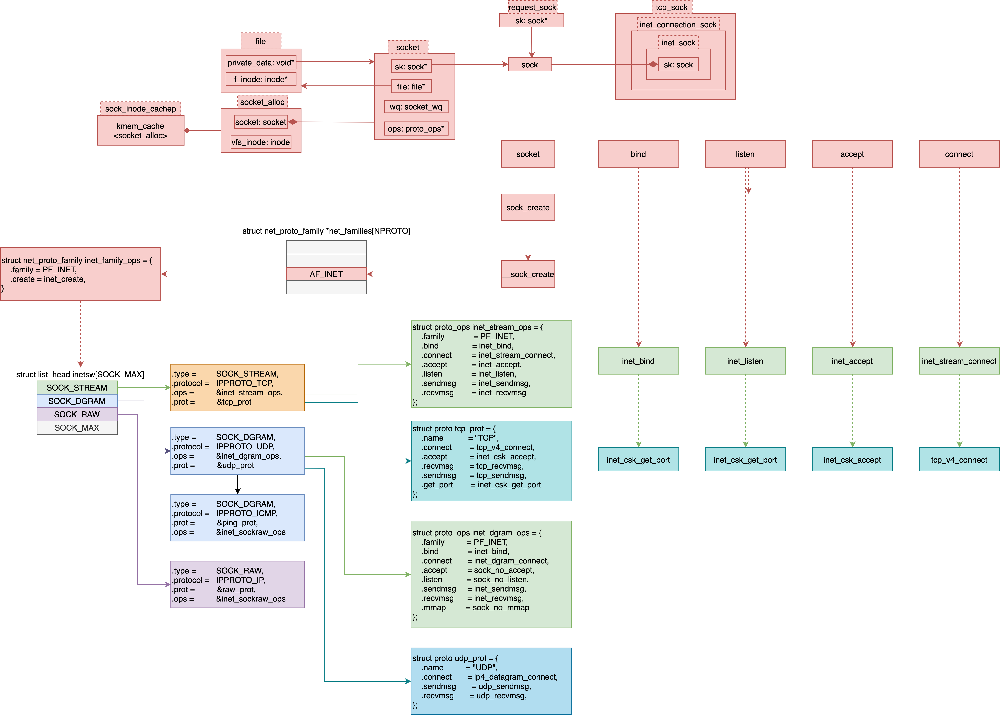
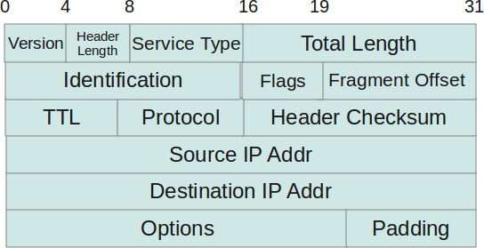
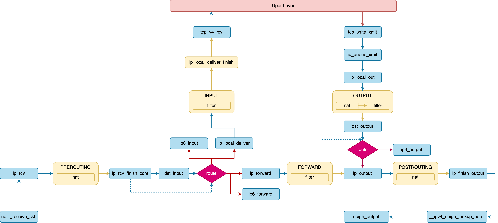
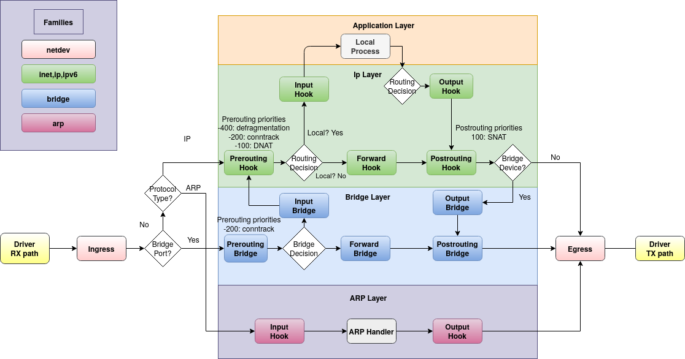
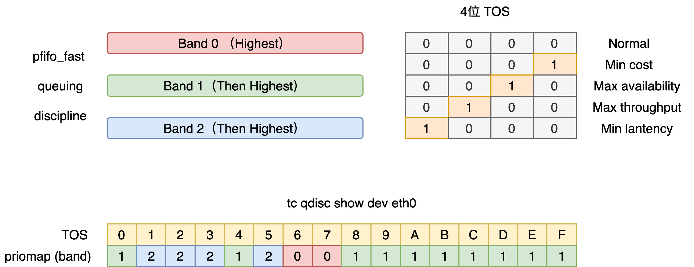
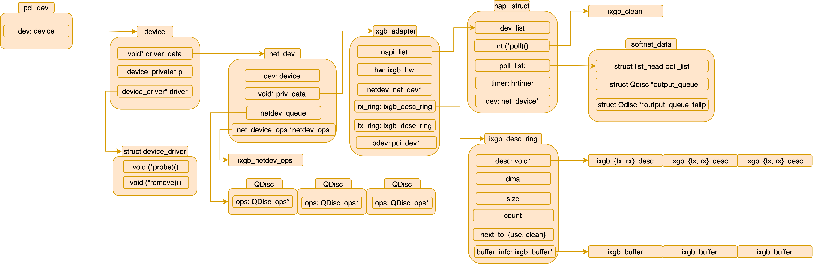
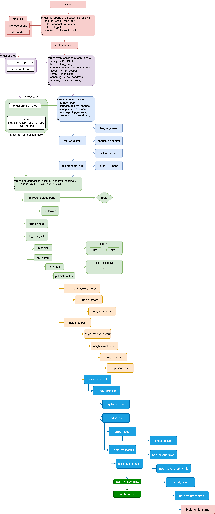
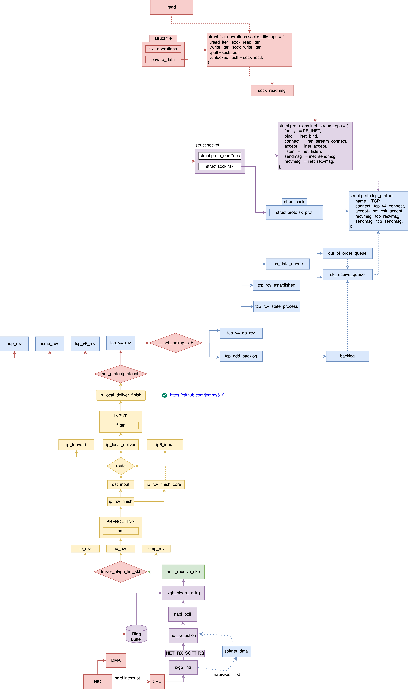
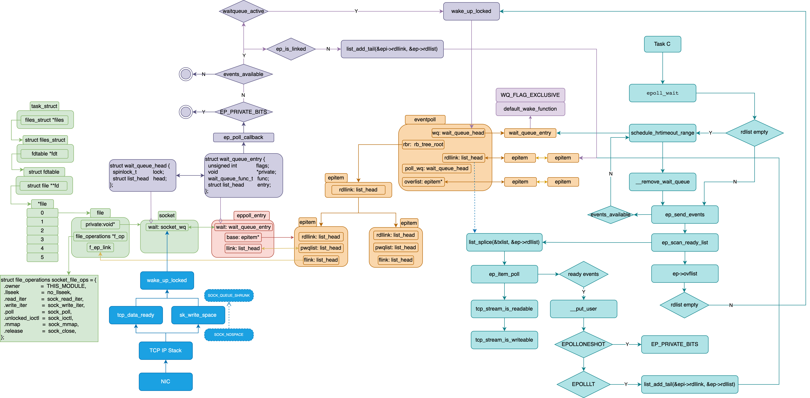

# Table of Contents
* [Net](#Net)
    * [socket](#socket)
    * [bind](#bind)
    * [listen](#listen)
    * [accept](#accept)
    * [connect](#connect)
        * [send](#send)
        * [receive](#receive)
    * [shutdown](#shutdown)
    * [sk_buf](#sk_buff)
    * [write](#write)
        * [vfs layer](#vfs-layer-WR)
        * [socket layer](#socket-layer-WR)
        * [tcp layer](#tcp-layer-WR)
        * [ip layer](#ip-layer-WR)
            * [route](#route)
            * [fill ip header](#fill-ip-header)
            * [send package](#send-package)
        * [mac layer](#mac-layer-WR)
            * [neighbour](#neighbour)
        * [dev layer](#dev-layer-WR)
        * [driver layer](#driver-layer-WR)
    * [read](#read)
        * [driver layer](#driver-layer)
        * [mac layer](#mac-layer)
        * [ip layer](#ip-layer)
        * [tcp layer](#tcp-layer)
        * [vfs layer](#vfs-layer)
        * [socket layer](#socket-layer])
    * [retransmit](#retransmit)
        * [tcp_write_timer](#tcp_write_timer)
            * [tcp_retransmit_skb](#tcp_retransmit_skb)
        * [tcp_delack_timer](#tcp_delack_timer)
        * [tcp_keepalive_timer](#tcp_keepalive_timer)
    * [tcpdump](#tcpdump)
    * [ACK, SYN, FIN](#ACK-SYN-FIN)
        * [tcp_send_ack](#tcp_send_ack)
        * [tcp_send_delayed_ack](#tcp_send_delayed_ack)
        * [tcp_send_synack](#tcp_send_synack)
        * [tcp_send_fin](#tcp_send_fin)
        * [tcp_fin](#tcp_fin)
    * [epoll](#epoll)
        * [epoll_create](#epoll_create)
        * [epoll_ctl](#epoll_ctl)
            * [ep_insert](#ep_insert)
            * [ep_modify](#ep_modify)
            * [ep_delete](#ep_delete)
        * [epoll_wait](#epoll_wait)
        * [wake epoll_wait](#wake-epoll_wait)

# Net
```C++
struct socket_alloc {
  struct socket socket;
  struct inode vfs_inode;
};

struct socket {
  socket_state    state;
  short           type;
  unsigned long   flags;

  struct file     *file;
  struct sock    *sk;
  struct socket_wq        wq;
  const struct proto_ops  *ops;
};

struct sock {
  struct sock_common  __sk_common;
  struct sk_buff       *sk_rx_skb_cache;

  struct page_frag    sk_frag; /* copy user space data to this page */
  struct sk_buff_head  sk_receive_queue;  /* incoming packets */
  struct sk_buff_head  sk_write_queue;    /* outgoing Packets */
  union {
    struct sk_buff    *sk_send_head;
    struct rb_root   tcp_rtx_queue; /* re-transmit queue */
  };

  struct {
    atomic_t          rmem_alloc;
    int               len;
    struct sk_buff    *head;
    struct sk_buff    *tail;
  } sk_backlog;
  
  struct sk_filter    *sk_filter;

  union {
    struct socket_wq  *sk_wq;     /* private: */
    struct socket_wq  *sk_wq_raw; /* public: */
  };

  struct dst_entry  *sk_rx_dst;
  struct dst_entry  *sk_dst_cache;

  unsigned int      sk_ll_usec;
  /* ===== mostly read cache line ===== */
  unsigned int      sk_napi_id; /* set by sk_mark_napi_id */
};

struct socket_wq {
  wait_queue_head_t      wait;
  struct fasync_struct   *fasync_list;
  unsigned long          flags;
  struct rcu_head        rcu;
};

typedef struct wait_queue_head {
  spinlock_t    lock;
  struct list_head  head;
} wait_queue_head_t;

struct tcp_sock {
    struct inet_connection_sock  inet_conn;

    struct list_head tsq_node; /* anchor in tsq_tasklet.head list */
    struct list_head tsorted_sent_queue; /* time-sorted sent but un-SACKed skbs */
  
    /* OOO segments go in this rbtree. Socket lock must be held. */
    struct rb_root    out_of_order_queue;
    struct sk_buff    *ooo_last_skb; /* cache rb_last(out_of_order_queue) */
    
    /* TCP fastopen related information */
    struct tcp_fastopen_request *fastopen_req;
    /* fastopen_rsk points to request_sock that resulted in this big
     * socket. Used to retransmit SYNACKs etc. */
    struct request_sock *fastopen_rsk;
};

/* INET connection oriented sock */
struct inet_connection_sock {
  struct inet_sock            icsk_inet;
  struct inet_bind_bucket     *icsk_bind_hash;   /* Bind node */
  struct request_sock_queue   icsk_accept_queue; /* FIFO of established children */
  struct tcp_congestion_ops           *icsk_ca_ops;
  struct inet_connection_sock_af_ops  *icsk_af_ops; /* Operations which are AF_INET{4,6} specific */
  
  struct timer_list           sk_timer;
  struct timer_list           icsk_retransmit_timer;
  struct timer_list           icsk_delack_timer;
};

/* representation of INET sockets */
struct inet_sock {
  struct sock         sk;
  struct ipv6_pinfo   *pinet6;
};
```



### socket
```C++
SYSCALL_DEFINE3(socket, int, family, int, type, int, protocol)
{
  int retval;
  struct socket *sock;
  int flags;

  if (SOCK_NONBLOCK != O_NONBLOCK && (flags & SOCK_NONBLOCK))
    flags = (flags & ~SOCK_NONBLOCK) | O_NONBLOCK;

  retval = sock_create(family, type, protocol, &sock);
  retval = sock_map_fd(sock, flags & (O_CLOEXEC | O_NONBLOCK));

  return retval;
}

int sock_create(int family, int type, int protocol, struct socket **res)
{
  return __sock_create(current->nsproxy->net_ns, family, type, protocol, res, 0);
}

int __sock_create(
  struct net *net, int family, int type, int protocol,
  struct socket **res, int kern)
{
  int err;
  struct socket *sock;
  const struct net_proto_family *pf;

  sock = sock_alloc();
  sock->type = type;

  pf = rcu_dereference(net_families[family]);
  err = pf->create(net, sock, protocol, kern);

  *res = sock;

  return 0;
}

struct socket *sock_alloc(void)
{
  struct inode *inode;
  struct socket *sock;

  inode = new_inode_pseudo(sock_mnt->mnt_sb);
  sock = SOCKET_I(inode);

  inode->i_ino = get_next_ino();
  inode->i_mode = S_IFSOCK | S_IRWXUGO;
  inode->i_uid = current_fsuid();
  inode->i_gid = current_fsgid();
  inode->i_op = &sockfs_inode_ops;

  return sock;
}

struct inode *new_inode_pseudo(struct super_block *sb)
{
  struct inode *inode = alloc_inode(sb);

  if (inode) {
    spin_lock(&inode->i_lock);
    inode->i_state = 0;
    spin_unlock(&inode->i_lock);
    INIT_LIST_HEAD(&inode->i_sb_list);
  }
  return inode;
}

static struct inode *alloc_inode(struct super_block *sb)
{
  struct inode *inode;

  if (sb->s_op->alloc_inode)
    inode = sb->s_op->alloc_inode(sb);
  else
    inode = kmem_cache_alloc(inode_cachep, GFP_KERNEL);

  if (!inode)
    return NULL;

  if (unlikely(inode_init_always(sb, inode))) {
    if (inode->i_sb->s_op->destroy_inode)
      inode->i_sb->s_op->destroy_inode(inode);
    else
      kmem_cache_free(inode_cachep, inode);
    return NULL;
  }

  return inode;
}

enum sock_type {
  SOCK_STREAM = 1,
  SOCK_DGRAM  = 2,
  SOCK_RAW    = 3,
};

/* Supported address families. */
#define AF_UNSPEC 0
#define AF_UNIX   1   /* Unix domain sockets */
#define AF_LOCAL  1   /* POSIX name for AF_UNIX */
#define AF_INET   2   /* Internet IP Protocol */
#define AF_INET6  10  /* IP version 6 */
#define AF_MPLS   28  /* MPLS */
#define AF_MAX    44  /* For now */
#define NPROTO    AF_MAX

struct net_proto_family *net_families[NPROTO];
// net/ipv4/af_inet.c
static const struct net_proto_family inet_family_ops = {
  .family = PF_INET,
  .create = inet_create
}

static int inet_create(
  struct net *net, struct socket *sock, int protocol, int kern)
{
  struct sock *sk;
  struct inet_protosw *answer;
  struct inet_sock *inet;
  struct proto *answer_prot;
  unsigned char answer_flags;
  int try_loading_module = 0;
  int err;

  /* Look for the requested type/protocol pair. */
lookup_protocol:
  list_for_each_entry_rcu(answer, &inetsw[sock->type], list) {
    err = 0;
    /* Check the non-wild match. */
    if (protocol == answer->protocol) {
      if (protocol != IPPROTO_IP)
        break;
    } else {
      /* Check for the two wild cases. */
      if (IPPROTO_IP == protocol) {
        protocol = answer->protocol;
        break;
      }
      if (IPPROTO_IP == answer->protocol)
        break;
    }
    err = -EPROTONOSUPPORT;
  }

  sock->ops = answer->ops;
  answer_prot = answer->prot;
  answer_flags = answer->flags;

  sk = sk_alloc(net, PF_INET, GFP_KERNEL, answer_prot, kern);

  inet = inet_sk(sk);
  inet->nodefrag = 0;
  if (SOCK_RAW == sock->type) {
    inet->inet_num = protocol;
    if (IPPROTO_RAW == protocol)
      inet->hdrincl = 1;
  }
  inet->inet_id = 0;
  sock_init_data(sock, sk);

  sk->sk_destruct     = inet_sock_destruct;
  sk->sk_protocol     = protocol;
  sk->sk_backlog_rcv = sk->sk_prot->backlog_rcv;

  inet->uc_ttl  = -1;
  inet->mc_loop  = 1;
  inet->mc_ttl  = 1;
  inet->mc_all  = 1;
  inet->mc_index  = 0;
  inet->mc_list  = NULL;
  inet->rcv_tos  = 0;

  if (inet->inet_num) {
    inet->inet_sport = htons(inet->inet_num);
    /* Add to protocol hash chains. */
    err = sk->sk_prot->hash(sk);
  }

  if (sk->sk_prot->init) {
    err = sk->sk_prot->init(sk);
  }
}

struct sock *sk_alloc(
  struct net *net, int family, gfp_t priority,
  struct proto *prot, int kern)
{
  struct sock *sk;

  sk = sk_prot_alloc(prot, priority | __GFP_ZERO, family);
  if (sk) {
    sk->sk_family = family;
    sk->sk_prot = sk->sk_prot_creator = prot;
    sk->sk_kern_sock = kern;
    sock_lock_init(sk);
    sk->sk_net_refcnt = kern ? 0 : 1;
    if (likely(sk->sk_net_refcnt)) {
      get_net(net);
      sock_inuse_add(net, 1);
    }

    sock_net_set(sk, net);
    refcount_set(&sk->sk_wmem_alloc, 1);

    mem_cgroup_sk_alloc(sk);
    cgroup_sk_alloc(&sk->sk_cgrp_data);
    sock_update_classid(&sk->sk_cgrp_data);
    sock_update_netprioidx(&sk->sk_cgrp_data);
    sk_tx_queue_clear(sk);
  }

  return sk;
}

static struct sock *sk_prot_alloc(
  struct proto *prot, gfp_t priority, int family)
{
  struct sock *sk;
  struct kmem_cache *slab;

  slab = prot->slab;
  if (slab != NULL) {
    sk = kmem_cache_alloc(slab, priority & ~__GFP_ZERO);
    if (!sk)
      return sk;
    if (priority & __GFP_ZERO)
      sk_prot_clear_nulls(sk, prot->obj_size);
  } else
    sk = kmalloc(prot->obj_size, priority);

  if (sk != NULL) {
    if (security_sk_alloc(sk, family, priority))
      goto out_free;

    if (!try_module_get(prot->owner))
      goto out_free_sec;
    sk_tx_queue_clear(sk);
  }

  return sk;

out_free_sec:
  security_sk_free(sk);
out_free:
  if (slab != NULL)
    kmem_cache_free(slab, sk);
  else
    kfree(sk);
  return NULL;
}

void sock_init_data(struct socket *sock, struct sock *sk)
{
  sk->sk_state_change  =  sock_def_wakeup;
  sk->sk_data_ready  = sock_def_readable;
  sk->sk_write_space = sock_def_write_space;
}

/* sw: switch */
static struct list_head inetsw[SOCK_MAX];
static int __init inet_init(void)
{
  /* Register the socket-side information for inet_create. */
  for (r = &inetsw[0]; r < &inetsw[SOCK_MAX]; ++r)
    INIT_LIST_HEAD(r);
  for (q = inetsw_array; q < &inetsw_array[INETSW_ARRAY_LEN]; ++q)
    inet_register_protosw(q);
}

static struct inet_protosw inetsw_array[] =
{
  {
    .type       = SOCK_STREAM,
    .protocol   = IPPROTO_TCP,
    .prot       = &tcp_prot,
    .ops        = &inet_stream_ops,
    .flags       = INET_PROTOSW_PERMANENT | INET_PROTOSW_ICSK,
  },
  {
    .type       = SOCK_DGRAM,
    .protocol   = IPPROTO_UDP,
    .prot       = &udp_prot,
    .ops        = &inet_dgram_ops,
    .flags       = INET_PROTOSW_PERMANENT,
  },
  {
    .type       = SOCK_DGRAM,
    .protocol   = IPPROTO_ICMP,
    .prot       = &ping_prot,
    .ops        = &inet_sockraw_ops,
    .flags       = INET_PROTOSW_REUSE,
  },
  {
    .type       = SOCK_RAW,
    .protocol   = IPPROTO_IP,  /* wild card */
    .prot       = &raw_prot,
    .ops        = &inet_sockraw_ops,
    .flags       = INET_PROTOSW_REUSE,
  }
};

/* sock_ops is better, sock_{steam, dgram, raw}_ops */
const struct proto_ops inet_stream_ops = {
  .family       = PF_INET,
  .owner        = THIS_MODULE,
  .bind         = inet_bind,
  .connect      = inet_stream_connect,
  .accept       = inet_accept,
  .listen       = inet_listen
  .sendmsg      = inet_sendmsg,
  .recvmsg      = inet_recvmsg
};

struct proto tcp_prot = {
  .name         = "TCP",
  .owner        = THIS_MODULE,
  .connect      = tcp_v4_connect,
  .recvmsg      = tcp_recvmsg,
  .sendmsg      = tcp_sendmsg,
  .get_port     = inet_csk_get_port,
  .backlog_rcv  = tcp_v4_do_rcv
}
```

```C++
int sock_map_fd(struct socket *sock, int flags)
{
  struct file *newfile;
  int fd = get_unused_fd_flags(flags);
  if (unlikely(fd < 0)) {
    sock_release(sock);
    return fd;
  }

  newfile = sock_alloc_file(sock, flags, NULL);
  if (likely(!IS_ERR(newfile))) {
    fd_install(fd, newfile);
    return fd;
  }

  put_unused_fd(fd);
  return PTR_ERR(newfile);
}

struct file *sock_alloc_file(struct socket *sock, int flags, const char *dname)
{
  struct file *file;

  if (!dname)
    dname = sock->sk ? sock->sk->sk_prot_creator->name : "";

  file = alloc_file_pseudo(SOCK_INODE(sock), sock_mnt, dname,
        O_RDWR | (flags & O_NONBLOCK),
        &socket_file_ops);
  if (IS_ERR(file)) {
    sock_release(sock);
    return file;
  }

  sock->file = file;
  file->private_data = sock;
  return file;
}
```

```c++
// sk_prot->init(sk);
static int tcp_v4_init_sock(struct sock *sk)
{
  struct inet_connection_sock *icsk = inet_csk(sk);

  tcp_init_sock(sk);

  icsk->icsk_af_ops = &ipv4_specific;

  tcp_sk(sk)->af_specific = &tcp_sock_ipv4_specific;

  return 0;
}

void tcp_init_sock(struct sock *sk)
{
  struct inet_connection_sock *icsk = inet_csk(sk);
  struct tcp_sock *tp = tcp_sk(sk);

  tp->out_of_order_queue = RB_ROOT;
  sk->tcp_rtx_queue = RB_ROOT;
  tcp_init_xmit_timers(sk);
  INIT_LIST_HEAD(&tp->tsq_node);
  INIT_LIST_HEAD(&tp->tsorted_sent_queue);

  icsk->icsk_rto = TCP_TIMEOUT_INIT;
  tp->mdev_us = jiffies_to_usecs(TCP_TIMEOUT_INIT);
  minmax_reset(&tp->rtt_min, tcp_jiffies32, ~0U);

  /* So many TCP implementations out there (incorrectly) count the
   * initial SYN frame in their delayed-ACK and congestion control
   * algorithms that we must have the following bandaid to talk
   * efficiently to them.  -DaveM */
  tp->snd_cwnd = TCP_INIT_CWND;

  /* There's a bubble in the pipe until at least the first ACK. */
  tp->app_limited = ~0U;

  /* See draft-stevens-tcpca-spec-01 for discussion of the
   * initialization of these values. */
  tp->snd_ssthresh = TCP_INFINITE_SSTHRESH;
  tp->snd_cwnd_clamp = ~0;
  tp->mss_cache = TCP_MSS_DEFAULT;

  tp->reordering = sock_net(sk)->ipv4.sysctl_tcp_reordering;
  tcp_assign_congestion_control(sk);

  tp->tsoffset = 0;
  tp->rack.reo_wnd_steps = 1;

  sk->sk_state = TCP_CLOSE;

  sk->sk_write_space = sk_stream_write_space;
  sock_set_flag(sk, SOCK_USE_WRITE_QUEUE);

  icsk->icsk_sync_mss = tcp_sync_mss;

  sk->sk_sndbuf = sock_net(sk)->ipv4.sysctl_tcp_wmem[1];
  sk->sk_rcvbuf = sock_net(sk)->ipv4.sysctl_tcp_rmem[1];

  sk_sockets_allocated_inc(sk);
  sk->sk_route_forced_caps = NETIF_F_GSO;
}
```

```C++
socket()
  sock_create()
    _sock_create()
      sock = sock_alloc()
        inode = new_inode_pseudo(sock_mnt->mnt_sb)
        sock = SOCKET_I(inode)
        inode->i_op = &sockfs_inode_ops
      pf = net_families[family] /* get AF */
      pf->create() // inet_family_ops.inet_create
        inet_create()
          inet_protosw *answer = inetsw[sock->type] /* get socket */
          sk = sk_alloc()
          inet = inet_sk(sk)
          sock_init_data(sock, sk)
            sk->sk_state_change  =  sock_def_wakeup
            sk->sk_data_ready  = sock_def_readable
            sk->sk_write_space = sock_def_write_space
          sk->sk_prot->init()
            tcp_v4_init_sock()
              tcp_init_sock()
                tcp_init_xmit_timers()
  sock_map_fd()
    sock_alloc_file()
      sock->file = file
      file->private_data = sock
```

### bind
```C++
SYSCALL_DEFINE3(bind, int, fd, struct sockaddr __user *, umyaddr, int, addrlen)
{
  struct socket *sock;
  struct sockaddr_storage address;
  int err, fput_needed;

  sock = sockfd_lookup_light(fd, &err, &fput_needed);
  if (sock) {
    err = move_addr_to_kernel(umyaddr, addrlen, &address);
    if (err >= 0) {
      err = sock->ops->bind(
        sock, (struct sockaddr *)&address, addrlen);
    }
    fput_light(sock->file, fput_needed);
  }
  return err;
}

// inet_stream_ops.bind
int inet_bind(struct socket *sock, struct sockaddr *uaddr, int addr_len)
{
  struct sockaddr_in *addr = (struct sockaddr_in *)uaddr;
  struct sock *sk = sock->sk;
  struct inet_sock *inet = inet_sk(sk);
  struct net *net = sock_net(sk);
  unsigned short snum;
  snum = ntohs(addr->sin_port);

  inet->inet_rcv_saddr = inet->inet_saddr = addr->sin_addr.s_addr;
  /* Make sure we are allowed to bind here. */
  if (snum || !(inet->bind_address_no_port ||
          force_bind_address_no_port)) {
    /* use inet_csk_get_port to check confilct of port */
    if (sk->sk_prot->get_port(sk, snum)) {
      inet->inet_saddr = inet->inet_rcv_saddr = 0;
      err = -EADDRINUSE;
      goto out_release_sock;
    }
    err = BPF_CGROUP_RUN_PROG_INET4_POST_BIND(sk);
    if (err) {
      inet->inet_saddr = inet->inet_rcv_saddr = 0;
      goto out_release_sock;
    }
  }
  inet->inet_sport = htons(inet->inet_num);
  inet->inet_daddr = 0;
  inet->inet_dport = 0;
  sk_dst_reset(sk);
}
```

### listen
```C++
SYSCALL_DEFINE2(listen, int, fd, int, backlog)
{
  struct socket *sock;
  int err, fput_needed;
  int somaxconn;

  sock = sockfd_lookup_light(fd, &err, &fput_needed);
  if (sock) {
    somaxconn = sock_net(sock->sk)->core.sysctl_somaxconn;
    if ((unsigned int)backlog > somaxconn)
      backlog = somaxconn;
    err = sock->ops->listen(sock, backlog);
    fput_light(sock->file, fput_needed);
  }
  return err;
}

// inet_stream_ops.listen
int inet_listen(struct socket *sock, int backlog)
{
  struct sock *sk = sock->sk;
  unsigned char old_state;
  int err;
  old_state = sk->sk_state;

  /* Really, if the socket is already in listen state
   * we can only allow the backlog to be adjusted. */
  if (old_state != TCP_LISTEN) {
    err = inet_csk_listen_start(sk, backlog);
  }
  sk->sk_max_ack_backlog = backlog;
}

int inet_csk_listen_start(struct sock *sk, int backlog)
{
  struct inet_connection_sock *icsk = inet_csk(sk);
  struct inet_sock *inet = inet_sk(sk);
  int err = -EADDRINUSE;

  reqsk_queue_alloc(&icsk->icsk_accept_queue); /* FIFO of established children */

  sk->sk_max_ack_backlog = backlog;
  sk->sk_ack_backlog = 0;                      /* current listen backlog */
  inet_csk_delack_init(sk);

  sk_state_store(sk, TCP_LISTEN);
  /* socket enters to hash table only after validation is complete */
  if (!sk->sk_prot->get_port(sk, inet->inet_num)) {
    inet->inet_sport = htons(inet->inet_num);

    sk_dst_reset(sk);
    err = sk->sk_prot->hash(sk);

    if (likely(!err))
      return 0;
  }

  inet_sk_set_state(sk, TCP_CLOSE);
  return err;
}

void reqsk_queue_alloc(struct request_sock_queue *queue)
{
  spin_lock_init(&queue->rskq_lock);

  spin_lock_init(&queue->fastopenq.lock);
  queue->fastopenq.rskq_rst_head = NULL;
  queue->fastopenq.rskq_rst_tail = NULL;
  queue->fastopenq.qlen = 0;

  queue->rskq_accept_head = NULL;
}
```

```C++
listen();
  sockfd_lookup_light();
  sock->ops->listen(); /*inet_stream_ops.listen */
    inet_listen();
      inet_csk_listen_start();
        reqsk_queue_alloc();
        sk->sk_prot->get_port();
          sk->sk_prot->hash(sk);
```

### accept
```C++
SYSCALL_DEFINE3(accept, int, fd, struct sockaddr __user *, upeer_sockaddr,
    int __user *, upeer_addrlen)
{
  return sys_accept4(fd, upeer_sockaddr, upeer_addrlen, 0);
}

SYSCALL_DEFINE4(accept4, int, fd, struct sockaddr __user *, upeer_sockaddr,
    int __user *, upeer_addrlen, int, flags)
{
  struct socket *sock, *newsock;
  struct file *newfile;
  int err, len, newfd, fput_needed;
  struct sockaddr_storage address;

  // listen socket
  sock = sockfd_lookup_light(fd, &err, &fput_needed);
  newsock = sock_alloc();
  newsock->type = sock->type;
  newsock->ops = sock->ops;
  newfd = get_unused_fd_flags(flags);
  newfile = sock_alloc_file(newsock, flags, sock->sk->sk_prot_creator->name);
  err = sock->ops->accept(sock, newsock, sock->file->f_flags, false);
  if (upeer_sockaddr) {
    newsock->ops->getname(newsock, (struct sockaddr *)&address, &len, 2);
    err = move_addr_to_user(&address, len, upeer_sockaddr, upeer_addrlen);
  }
  fd_install(newfd, newfile);
}

// inet_stream_ops.accept
int inet_accept(struct socket *sock, struct socket *newsock, int flags, bool kern)
{
  struct sock *sk1 = sock->sk;
  int err = -EINVAL;
  struct sock *sk2 = sk1->sk_prot->accept(sk1, flags, &err, kern);
  sock_rps_record_flow(sk2);
  sock_graft(sk2, newsock);
  newsock->state = SS_CONNECTED;
}

// tcp_prot.accept
struct sock *inet_csk_accept(struct sock *sk, int flags, int *err, bool kern)
{
  struct inet_connection_sock *icsk = inet_csk(sk);
  struct request_sock_queue *queue = &icsk->icsk_accept_queue;
  struct request_sock *req;
  struct sock *newsk;
  int error;

  if (sk->sk_state != TCP_LISTEN)
    goto out_err;

  /* Find already established connection */
  if (reqsk_queue_empty(queue)) {
    long timeo = sock_rcvtimeo(sk, flags & O_NONBLOCK);
    error = inet_csk_wait_for_connect(sk, timeo);
  }
  req = reqsk_queue_remove(queue, sk);
  newsk = req->sk;

  return newsk;
}

static int inet_csk_wait_for_connect(struct sock *sk, long timeo)
{
  struct inet_connection_sock *icsk = inet_csk(sk);
  DEFINE_WAIT(wait);
  int err;

  for (;;) {
    /* waked up by: sk->sk_state_change  =  sock_def_wakeup; */
    prepare_to_wait_exclusive(sk_sleep(sk), &wait, TASK_INTERRUPTIBLE);
    release_sock(sk);
    if (reqsk_queue_empty(&icsk->icsk_accept_queue))
      timeo = schedule_timeout(timeo);
    sched_annotate_sleep();
    lock_sock(sk);
    err = 0;
    if (!reqsk_queue_empty(&icsk->icsk_accept_queue))
      break;
    err = -EINVAL;
    if (sk->sk_state != TCP_LISTEN)
      break;
    err = sock_intr_errno(timeo);
    if (signal_pending(current))
      break;
    err = -EAGAIN;
    if (!timeo)
      break;
  }
  finish_wait(sk_sleep(sk), &wait);
  return err;
}

wait_queue_head_t *sk_sleep(struct sock *sk)
{
  return &rcu_dereference_raw(sk->sk_wq)->wait;
}

void prepare_to_wait_exclusive(
  struct wait_queue_head *wq_head, struct wait_queue_entry *wq_entry, int state)
{
  unsigned long flags;

  wq_entry->flags |= WQ_FLAG_EXCLUSIVE;
  spin_lock_irqsave(&wq_head->lock, flags);
  if (list_empty(&wq_entry->entry))
    __add_wait_queue_entry_tail(wq_head, wq_entry);
  set_current_state(state);
  spin_unlock_irqrestore(&wq_head->lock, flags);
}

#define DEFINE_WAIT(name) DEFINE_WAIT_FUNC(name, autoremove_wake_function)

#define DEFINE_WAIT_FUNC(name, function)       \
  struct wait_queue_entry name = {            \
    .private  = current,                      \
    .func     = function,                     \
    .entry    = LIST_HEAD_INIT((name).entry), \
  }

int autoremove_wake_function(
  struct wait_queue_entry *wq_entry, unsigned mode, int sync, void *key)
{
  /* try_to_wake_up */
  int ret = default_wake_function(wq_entry, mode, sync, key);

  if (ret)
    list_del_init(&wq_entry->entry);

  return ret;
}

void finish_wait(
  struct wait_queue_head *wq_head, struct wait_queue_entry *wq_entry)
{
  unsigned long flags;

  __set_current_state(TASK_RUNNING);

  if (!list_empty_careful(&wq_entry->entry)) {
    spin_lock_irqsave(&wq_head->lock, flags);
    list_del_init(&wq_entry->entry);
    spin_unlock_irqrestore(&wq_head->lock, flags);
  }
}
```

```C++
accpet();
  __sys_accept4();
    sockfd_lookup_light();
    newsock = sock_alloc();
    newfd = get_unused_fd_flags();
    newfile = sock_alloc_file(sock);
      alloc_file_pseudo(SOCK_INODE(sock), sock_mnt, dname);

    sock->ops->accept(); /* inet_stream_ops.accept */
      inet_accept();
        sk1->sk_prot->accept(); /* tcp_prot.accept */
          inet_csk_accept();
            reqsk_queue_empty();
              inet_csk_wait_for_connect();
                prepare_to_wait_exclusive();
                  wq_entry->flags |= WQ_FLAG_EXCLUSIVE;
                  __add_wait_queue_entry_tail(wq_head, wq_entry);
                schedule_timeout();
                finish_wait();
                  list_del_init(&wq_entry->entry);
            reqsk_queue_remove();
        sock_graft(sk2, newsock);
        newsock->state = SS_CONNECTED;
    move_addr_to_user();
    fd_install(newfd, newfile);
```


### connect
#### send
```C++
SYSCALL_DEFINE3(connect, int, fd, struct sockaddr __user *, uservaddr, int, addrlen)
{
  struct socket *sock;
  struct sockaddr_storage address;
  int err, fput_needed;
  sock = sockfd_lookup_light(fd, &err, &fput_needed);
  err = move_addr_to_kernel(uservaddr, addrlen, &address);
  err = sock->ops->connect(sock, (struct sockaddr *)&address, addrlen, sock->file->f_flags);
}

const struct proto_ops inet_stream_ops = {
  .connect = inet_stream_connect,
}

int __inet_stream_connect(
  struct socket *sock, struct sockaddr *uaddr,
  int addr_len, int flags, int is_sendmsg)
{
  struct sock *sk = sock->sk;
  int err;
  long timeo;

  switch (sock->state) {
    case SS_UNCONNECTED:
      err = -EISCONN;
      if (sk->sk_state != TCP_CLOSE)
        goto out;

      err = sk->sk_prot->connect(sk, uaddr, addr_len);
      sock->state = SS_CONNECTING;
      break;
  }

  timeo = sock_sndtimeo(sk, flags & O_NONBLOCK);
  if ((1 << sk->sk_state) & (TCPF_SYN_SENT | TCPF_SYN_RECV)) {
    /* waked up by sk->sk_state_change(sk) at tcp_rcv_synsent_state_process */
    if (!timeo || !inet_wait_for_connect(sk, timeo, writebias))
      goto out;

    err = sock_intr_errno(timeo);
    if (signal_pending(current))
      goto out;
  }
  sock->state = SS_CONNECTED;
}

struct proto tcp_prot = {
  .connect = tcp_v4_connect
}

/* initiate an outgoing connection */
int tcp_v4_connect(struct sock *sk, struct sockaddr *uaddr, int addr_len)
{
  struct sockaddr_in *usin = (struct sockaddr_in *)uaddr;
  struct inet_sock *inet = inet_sk(sk);
  struct tcp_sock *tp = tcp_sk(sk);
  __be16 orig_sport, orig_dport;
  __be32 daddr, nexthop;
  struct flowi4 *fl4;
  struct rtable *rt;

  orig_sport = inet->inet_sport;
  orig_dport = usin->sin_port;
  rt = ip_route_connect(fl4, nexthop, inet->inet_saddr,
            RT_CONN_FLAGS(sk), sk->sk_bound_dev_if,
            IPPROTO_TCP,
            orig_sport, orig_dport, sk);

  tcp_set_state(sk, TCP_SYN_SENT);

  /* add sock to hash table */
  err = inet_hash_connect(tcp_death_row, sk);
  sk_set_txhash(sk);
  rt = ip_route_newports(fl4, rt, orig_sport, orig_dport,
             inet->inet_sport, inet->inet_dport, sk);
  /* OK, now commit destination to socket.  */
  sk->sk_gso_type = SKB_GSO_TCPV4;
  sk_setup_caps(sk, &rt->dst);
  if (likely(!tp->repair)) {
    if (!tp->write_seq)
      tp->write_seq = secure_tcp_seq(
        inet->inet_saddr, inet->inet_daddr,
        inet->inet_sport, usin->sin_port);

    tp->tsoffset = secure_tcp_ts_off(
      sock_net(sk), inet->inet_saddr, inet->inet_daddr);
  }
  rt = NULL;

  err = tcp_connect(sk);
}

/* Build a SYN and send it off. */
int tcp_connect(struct sock *sk)
{
  struct tcp_sock *tp = tcp_sk(sk);
  struct sk_buff *buff;
  int err;

  tcp_connect_init(sk);

  buff = sk_stream_alloc_skb(sk, 0, sk->sk_allocation, true);

  tcp_init_nondata_skb(buff, tp->write_seq++, TCPHDR_SYN);
  tcp_mstamp_refresh(tp);
  tp->retrans_stamp = tcp_time_stamp(tp);
  tcp_connect_queue_skb(sk, buff);
  tcp_ecn_send_syn(sk, buff);
  /* Insert skb into rb tree, ordered by TCP_SKB_CB(skb)->seq */
  tcp_rbtree_insert(&sk->tcp_rtx_queue, buff);

  /* Send off SYN; include data in Fast Open. */
  err = tp->fastopen_req
    ? tcp_send_syn_data(sk, buff)
    : tcp_transmit_skb(sk, buff, 1, sk->sk_allocation);

  tp->snd_nxt = tp->write_seq;
  tp->pushed_seq = tp->write_seq;
  buff = tcp_send_head(sk);
  if (unlikely(buff)) {
    tp->snd_nxt  = TCP_SKB_CB(buff)->seq;
    tp->pushed_seq  = TCP_SKB_CB(buff)->seq;
  }

  /* Timer for repeating the SYN until an answer. */
  inet_csk_reset_xmit_timer(sk, ICSK_TIME_RETRANS, inet_csk(sk)->icsk_rto, TCP_RTO_MAX);
  return 0;
}

long inet_wait_for_connect(struct sock *sk, long timeo, int writebias)
{
  DEFINE_WAIT_FUNC(wait, woken_wake_function);

  add_wait_queue(sk_sleep(sk), &wait);
  sk->sk_write_pending += writebias;

  while ((1 << sk->sk_state) & (TCPF_SYN_SENT | TCPF_SYN_RECV)) {
    timeo = wait_woken(&wait, TASK_INTERRUPTIBLE, timeo);
    if (signal_pending(current) || !timeo)
      break;
  }
  remove_wait_queue(sk_sleep(sk), &wait);
  sk->sk_write_pending -= writebias;
  return timeo;
}
```
* [wait_woken](#wait_woken)

#### receive
```C++
static struct net_protocol tcp_protocol = {
  .early_demux          =  tcp_v4_early_demux,
  .early_demux_handler  =  tcp_v4_early_demux,
  .handler              =  tcp_v4_rcv,
  .err_handler          =  tcp_v4_err,
  .no_policy            =  1,
  .netns_ok             =  1,
  .icmp_strict_tag_validation = 1,
}

/* tcp_v4_rcv -> tcp_v4_do_rcv -> tcp_rcv_state_process */
int tcp_rcv_state_process(struct sock *sk, struct sk_buff *skb)
{
  struct tcp_sock *tp = tcp_sk(sk);
  struct inet_connection_sock *icsk = inet_csk(sk);
  const struct tcphdr *th = tcp_hdr(skb);
  struct request_sock *req;
  int queued = 0;
  bool acceptable;

  switch (sk->sk_state) {
    case TCP_LISTEN:
      if (th->syn) {
        acceptable = icsk->icsk_af_ops->conn_request(sk, skb) >= 0;
        if (!acceptable)
          return 1;
        consume_skb(skb);
        return 0;
      }

    case TCP_SYN_SENT:
      tp->rx_opt.saw_tstamp = 0;
      tcp_mstamp_refresh(tp);
      queued = tcp_rcv_synsent_state_process(sk, skb, th);
      if (queued >= 0)
        return queued;
      /* Do step6 onward by hand. */
      tcp_urg(sk, skb, th);
      __kfree_skb(skb);
      tcp_data_snd_check(sk);
      return 0;

    case TCP_SYN_RECV:
      if (req) {
        inet_csk(sk)->icsk_retransmits = 0;
        reqsk_fastopen_remove(sk, req, false);
      } else {
        /* Make sure socket is routed, for correct metrics. */
        icsk->icsk_af_ops->rebuild_header(sk);
        tcp_call_bpf(sk, BPF_SOCK_OPS_PASSIVE_ESTABLISHED_CB);
        tcp_init_congestion_control(sk);

        tcp_mtup_init(sk);
        tp->copied_seq = tp->rcv_nxt;
        tcp_init_buffer_space(sk);
      }
      smp_mb();
      tcp_set_state(sk, TCP_ESTABLISHED);

      /* wakeup `accept` slept at prepare_to_wait_exclusive */
      sk->sk_state_change(sk);
      if (sk->sk_socket)
        sk_wake_async(sk, SOCK_WAKE_IO, POLL_OUT);
      tp->snd_una = TCP_SKB_CB(skb)->ack_seq;
      tp->snd_wnd = ntohs(th->window) << tp->rx_opt.snd_wscale;
      tcp_init_wl(tp, TCP_SKB_CB(skb)->seq);
      break;
  }
}

const struct inet_connection_sock_af_ops ipv4_specific = {
  .queue_xmit        = ip_queue_xmit,
  .send_check        = tcp_v4_send_check,
  .rebuild_header    = inet_sk_rebuild_header,
  .sk_rx_dst_set     = inet_sk_rx_dst_set,
  .conn_request      = tcp_v4_conn_request,
  .syn_recv_sock     = tcp_v4_syn_recv_sock,
  .net_header_len    = sizeof(struct iphdr),
  .setsockopt        = ip_setsockopt,
  .getsockopt        = ip_getsockopt,
  .addr2sockaddr     = inet_csk_addr2sockaddr,
  .sockaddr_len      = sizeof(struct sockaddr_in),
  .mtu_reduced       = tcp_v4_mtu_reduced,
};
// tcp_v4_conn_request ->
int tcp_conn_request(
  struct request_sock_ops *rsk_ops,
  const struct tcp_request_sock_ops *af_ops,
  struct sock *sk, struct sk_buff *skb)
{
  struct tcp_fastopen_cookie foc = { .len = -1 };
  __u32 isn = TCP_SKB_CB(skb)->tcp_tw_isn;
  struct tcp_options_received tmp_opt;
  struct tcp_sock *tp = tcp_sk(sk);
  struct net *net = sock_net(sk);
  struct sock *fastopen_sk = NULL;
  struct request_sock *req;
  bool want_cookie = false;
  struct dst_entry *dst;
  struct flowi fl;

  /* return reqsk_queue_len(&inet_csk(sk)->icsk_accept_queue) >= sk->sk_max_ack_backlog;
   * icsk_accept_queue: FIFO of established children */
  if ((net->ipv4.sysctl_tcp_syncookies == 2 || inet_csk_reqsk_queue_is_full(sk)) && !isn) {
    want_cookie = tcp_syn_flood_action(sk, skb, rsk_ops->slab_name);
    if (!want_cookie)
      goto drop;
  }

  if (sk_acceptq_is_full(sk)) {
    goto drop;
  }

  req = inet_reqsk_alloc(rsk_ops, sk, !want_cookie);
  if (!req)
    goto drop;

  tcp_rsk(req)->af_specific = af_ops;
  tcp_rsk(req)->ts_off = 0;

  tcp_clear_options(&tmp_opt);
  tmp_opt.mss_clamp = af_ops->mss_clamp;
  tmp_opt.user_mss  = tp->rx_opt.user_mss;
  tcp_parse_options(sock_net(sk), skb, &tmp_opt, 0, want_cookie ? NULL : &foc);

  if (want_cookie && !tmp_opt.saw_tstamp)
    tcp_clear_options(&tmp_opt);

  if (IS_ENABLED(CONFIG_SMC) && want_cookie)
    tmp_opt.smc_ok = 0;

  tmp_opt.tstamp_ok = tmp_opt.saw_tstamp;
  tcp_openreq_init(req, &tmp_opt, skb, sk);
  inet_rsk(req)->no_srccheck = inet_sk(sk)->transparent;

  /* Note: tcp_v6_init_req() might override ir_iif for link locals */
  inet_rsk(req)->ir_iif = inet_request_bound_dev_if(sk, skb);

  af_ops->init_req(req, sk, skb);

  if (security_inet_conn_request(sk, skb, req))
    goto drop_and_free;

  if (tmp_opt.tstamp_ok)
    tcp_rsk(req)->ts_off = af_ops->init_ts_off(net, skb);

  dst = af_ops->route_req(sk, &fl, req);
  if (!dst)
    goto drop_and_free;

  if (!want_cookie && !isn) {
    /* Kill the following clause, if you dislike this way. */
    if (!net->ipv4.sysctl_tcp_syncookies 
      && (net->ipv4.sysctl_max_syn_backlog - inet_csk_reqsk_queue_len(sk) 
        < (net->ipv4.sysctl_max_syn_backlog >> 2)) 
      && !tcp_peer_is_proven(req, dst)) 
    {
      pr_drop_req(req, ntohs(tcp_hdr(skb)->source), rsk_ops->family);
      goto drop_and_release;
    }

    isn = af_ops->init_seq(skb);
  }

  tcp_ecn_create_request(req, skb, sk, dst);

  if (want_cookie) {
    isn = cookie_init_sequence(af_ops, sk, skb, &req->mss);
    req->cookie_ts = tmp_opt.tstamp_ok;
    if (!tmp_opt.tstamp_ok)
      inet_rsk(req)->ecn_ok = 0;
  }

  tcp_rsk(req)->snt_isn = isn;
  tcp_rsk(req)->txhash = net_tx_rndhash();
  tcp_openreq_init_rwin(req, sk, dst);
  sk_rx_queue_set(req_to_sk(req), skb);
  if (!want_cookie) {
    tcp_reqsk_record_syn(sk, req, skb);
    fastopen_sk = tcp_try_fastopen(sk, skb, req, &foc, dst);
  }
  if (fastopen_sk) {
    af_ops->send_synack(fastopen_sk, dst, &fl, req, &foc, TCP_SYNACK_FASTOPEN);
    /* Add the child socket directly into the accept queue */
    if (!inet_csk_reqsk_queue_add(sk, req, fastopen_sk)) {
      reqsk_fastopen_remove(fastopen_sk, req, false);
      bh_unlock_sock(fastopen_sk);
      sock_put(fastopen_sk);
      reqsk_put(req);
      goto drop;
    }
    sk->sk_data_ready(sk); /* sock_def_readable */
    bh_unlock_sock(fastopen_sk);
    sock_put(fastopen_sk);
  } else {
    tcp_rsk(req)->tfo_listener = false;
    if (!want_cookie)
      inet_csk_reqsk_queue_hash_add(sk, req, tcp_timeout_init((struct sock *)req));
    af_ops->send_synack(sk, dst, &fl, req, &foc, !want_cookie ? TCP_SYNACK_NORMAL : TCP_SYNACK_COOKIE);
    if (want_cookie) {
      reqsk_free(req);
      return 0;
    }
  }
  reqsk_put(req);
  return 0;

drop_and_release:
  dst_release(dst);
drop_and_free:
  reqsk_free(req);
drop:
  tcp_listendrop(sk);
  return 0;
}

// send_synack ->
static int tcp_v4_send_synack(
  const struct sock *sk, struct dst_entry *dst,
  struct flowi *fl,
  struct request_sock *req,
  struct tcp_fastopen_cookie *foc,
  enum tcp_synack_type synack_type)
{

}

void inet_csk_reqsk_queue_hash_add(
  struct sock *sk, struct request_sock *req, unsigned long timeout)
{
  reqsk_queue_hash_req(req, timeout);
  inet_csk_reqsk_queue_added(sk);
}

static void reqsk_queue_hash_req(struct request_sock *req,
         unsigned long timeout)
{
  timer_setup(&req->rsk_timer, reqsk_timer_handler, TIMER_PINNED);
  mod_timer(&req->rsk_timer, jiffies + timeout);

  inet_ehash_insert(req_to_sk(req), NULL);

  smp_wmb();
  refcount_set(&req->rsk_refcnt, 2 + 1);
}

bool inet_ehash_insert(struct sock *sk, struct sock *osk)
{
  struct inet_hashinfo *hashinfo = sk->sk_prot->h.hashinfo;
  struct hlist_nulls_head *list;
  struct inet_ehash_bucket *head;
  spinlock_t *lock;
  bool ret = true;

  sk->sk_hash = sk_ehashfn(sk);
  head = inet_ehash_bucket(hashinfo, sk->sk_hash);
  list = &head->chain;
  lock = inet_ehash_lockp(hashinfo, sk->sk_hash);

  return ret;
}

static inline void inet_csk_reqsk_queue_added(struct sock *sk)
{
  reqsk_queue_added(&inet_csk(sk)->icsk_accept_queue);
}

static inline void reqsk_queue_added(struct request_sock_queue *queue)
{
  atomic_inc(&queue->young);
  atomic_inc(&queue->qlen);
}

/* wakeup `accept` slept at prepare_to_wait_exclusive */
void sock_def_wakeup(struct sock *sk)
{
  struct socket_wq *wq;

  wq = rcu_dereference(sk->sk_wq);
  if (skwq_has_sleeper(wq))
    wake_up_interruptible_all(&wq->wait);
}

#define wake_up_interruptible_all(x) __wake_up(x, TASK_INTERRUPTIBLE, 0, NULL)

```
```C++
send:
connect();
  sockfd_lookup_light();
    sock->ops->connect();
      __inet_stream_connect();
        sk->sk_prot->connect(); /* SS_UNCONNECTED */
          tcp_v4_connect();
            ip_route_connect();
            secure_tcp_seq();
            secure_tcp_ts_off();
            tcp_set_state(sk, TCP_SYN_SENT);
            tcp_connect();
              sk_stream_alloc_skb();
              tcp_transmit_skb();
              tcp_send_head();
              inet_csk_reset_xmit_timer();

receive:
tcp_v4_rcv();
  tcp_v4_do_rcv();
    tcp_rcv_state_process();
      
      /* TCP_LISTEN: */
        icsk->icsk_af_ops->conn_request(); /*ipv4_specific.conn_request */
          tcp_v4_conn_request();
            tcp_conn_request();
              inet_reqsk_alloc();
              inet_csk_reqsk_queue_hash_add();
                reqsk_queue_hash_req();
                  inet_ehash_insert();
                    mod_timer(&req->rsk_timer, jiffies + timeout);
                    inet_ehash_bucket(hashinfo, sk->sk_hash);
                inet_csk_reqsk_queue_added();
              af_ops->send_synack();
                tcp_v4_send_synack();

      /* TCP_SYN_SENT: */
        tcp_rcv_synsent_state_process();
          tcp_finish_connect(sk, skb);
          sk->sk_state_change(sk);
            /* wakup `connect` slept at inet_wait_for_connect */
          tcp_send_ack(sk);
          tcp_set_state(sk, TCP_ESTABLISHED);
          
      tcp_validate_incoming()
      tcp_ack()

      /* TCP_SYN_RECV */
        tcp_set_state(sk, TCP_ESTABLISHED);
        sk->sk_state_change(sk);
          sock_def_wakeup();
            wake_up_interruptible_all()
              __wake_up();
                __wake_up_common_lock();
                  __wake_up_common();
                  
      /*  TCP_LAST_ACK */
        tcp_done();
      
      /* TCP_FIN_WAIT1 */
        tcp_set_state(sk, TCP_FIN_WAIT2)
        tcp_time_wait(sk, TCP_FIN_WAIT2, tmo);
        sk->sk_state_change(sk); /* Wake up lingering close() */

      /* TCP_FIN_WAIT2 */
        if (sk->sk_shutdown & RCV_SHUTDOWN)
          tcp_reset
          
      /* TCP_ESTABLISHED */
        tcp_data_queue()
      
```


### shutdown
```c++
SYSCALL_DEFINE2(shutdown, int, fd, int, how)
{
  return __sys_shutdown(fd, how);
}

int __sys_shutdown(int fd, int how)
{
  int err, fput_needed;
  struct socket *sock;

  sock = sockfd_lookup_light(fd, &err, &fput_needed);
  if (sock != NULL) {
    err = security_socket_shutdown(sock, how);
    if (!err)
      err = sock->ops->shutdown(sock, how);
    fput_light(sock->file, fput_needed);
  }
  return err;
}

const struct proto_ops inet_stream_ops = {
  .shutdown = inet_shutdown,
};

int inet_shutdown(struct socket *sock, int how)
{
  struct sock *sk = sock->sk;
  int err = 0;

  /* This should really check to make sure
   * the socket is a TCP socket. (WHY AC...) */
  how++; /* maps 0->1 has the advantage of making bit 1 rcvs and
           1->2 bit 2 snds.
           2->3 */
  if ((how & ~SHUTDOWN_MASK) || !how)  /* MAXINT->0 */
    return -EINVAL;

  lock_sock(sk);
  if (sock->state == SS_CONNECTING) {
    if ((1 << sk->sk_state) & (TCPF_SYN_SENT | TCPF_SYN_RECV | TCPF_CLOSE))
      sock->state = SS_DISCONNECTING;
    else
      sock->state = SS_CONNECTED;
  }

  switch (sk->sk_state) {
  case TCP_CLOSE:
      err = -ENOTCONN;
      /* Hack to wake up other listeners, who can poll for
        EPOLLHUP, even on eg. unconnected UDP sockets -- RR */
      /* fall through */
  default:
      sk->sk_shutdown |= how;
      if (sk->sk_prot->shutdown)
        sk->sk_prot->shutdown(sk, how);
      break;

  /* Remaining two branches are temporary solution for missing
   * close() in multithreaded environment. It is _not_ a good idea,
   * but we have no choice until close() is repaired at VFS level.
   */
  case TCP_LISTEN:
      if (!(how & RCV_SHUTDOWN))
        break;
      /* fall through */
  case TCP_SYN_SENT:
      err = sk->sk_prot->disconnect(sk, O_NONBLOCK);
      sock->state = err ? SS_DISCONNECTING : SS_UNCONNECTED;
      break;
  }

  /* Wake up anyone sleeping in poll. */
  sk->sk_state_change(sk);
  release_sock(sk);
  return err;
}

struct proto tcp_prot = {
  .shutdown = tcp_shutdown,
};

/* shutdown the sending side of a connection. Much like close except
 * that we don't receive shut down or sock_set_flag(sk, SOCK_DEAD). */
void tcp_shutdown(struct sock *sk, int how)
{
  if (!(how & SEND_SHUTDOWN))
    return;

  /* If we've already sent a FIN, or it's a closed state, skip this. */
  if ((1 << sk->sk_state) & (TCPF_ESTABLISHED | TCPF_SYN_SENT |TCPF_SYN_RECV | TCPF_CLOSE_WAIT)) {
    /* Clear out any half completed packets.  FIN if needed. */
    if (tcp_close_state(sk))
      tcp_send_fin(sk);
  }
}

static int tcp_close_state(struct sock *sk)
{
  int next = (int)new_state[sk->sk_state];
  int ns = next & TCP_STATE_MASK;

  tcp_set_state(sk, ns);

  return next & TCP_ACTION_FIN;
}

static const unsigned char new_state[16] = {
  /* current state:       new state:         action:  */
  [0 /* (Invalid) */]   = TCP_CLOSE,
  [TCP_ESTABLISHED]     = TCP_FIN_WAIT1 | TCP_ACTION_FIN,
  [TCP_SYN_SENT]        = TCP_CLOSE,
  [TCP_SYN_RECV]        = TCP_FIN_WAIT1 | TCP_ACTION_FIN,
  [TCP_FIN_WAIT1]       = TCP_FIN_WAIT1,
  [TCP_FIN_WAIT2]       = TCP_FIN_WAIT2,
  [TCP_TIME_WAIT]       = TCP_CLOSE,
  [TCP_CLOSE]           = TCP_CLOSE,
  [TCP_CLOSE_WAIT]      = TCP_LAST_ACK  | TCP_ACTION_FIN,
  [TCP_LAST_ACK]        = TCP_LAST_ACK,
  [TCP_LISTEN]          = TCP_CLOSE,
  [TCP_CLOSING]         = TCP_CLOSING,
  [TCP_NEW_SYN_RECV]    = TCP_CLOSE,  /* should not happen ! */
};
```

### sk_buff
```C++
struct sk_buff {
  union {
    struct {
      struct sk_buff    *next;
      struct sk_buff    *prev;
      union {
        struct net_device *dev;
        unsigned long     dev_scratch;
      };
    };
    struct rb_node  rbnode; /* used in netem & tcp stack */
  };

  union {
    struct sock    *sk;
    int            ip_defrag_offset;
  };

  char            cb[48] __aligned(8);

  unsigned int    len,
                  data_len; /* bytes of paged data len */
  __u16           mac_len, hdr_len;

  __be16          protocol;
  __u16           transport_header;
  __u16           network_header;
  __u16           mac_header;

  /* typedef unsigned char *sk_buff_data_t; */
  sk_buff_data_t     tail;
  sk_buff_data_t     end;
  unsigned char     *head, *data;
  unsigned int      truesize;
  refcount_t        users;
};

struct skb_shared_info {
  __u8    __unused, meta_len;
  __u8    nr_frags, tx_flags;

  unsigned short  gso_size; /* generic segmentation size */
  unsigned int    gso_type; /* SKB_GSO_TCPV4 or SKB_GSO_TCPV6 */
  unsigned short  gso_segs;

  struct sk_buff                 *frag_list;
  struct skb_shared_hwtstamps   hwtstamps;
  u32           tskey;

  /* must be last field, see pskb_expand_head() */
  skb_frag_t  frags[MAX_SKB_FRAGS];
};

typedef struct skb_frag_struct skb_frag_t;

struct skb_frag_struct {
  struct {
    struct page *p;
  } page;

  __u32 page_offset;
  __u32 size;
};
```


```c++
struct sk_buff *sk_stream_alloc_skb(struct sock *sk, int size, gfp_t gfp,
            bool force_schedule)
{
  struct sk_buff *skb;

  /* The TCP header must be at least 32-bit aligned.  */
  size = ALIGN(size, 4);

  if (unlikely(tcp_under_memory_pressure(sk)))
    sk_mem_reclaim_partial(sk);

  // max_header L1_CACHE_ALIGN(128 + MAX_HEADER)
  skb = alloc_skb_fclone(size + sk->sk_prot->max_header, gfp);
  if (likely(skb)) {
    bool mem_scheduled;

    if (force_schedule) {
      mem_scheduled = true;
      sk_forced_mem_schedule(sk, skb->truesize);
    } else {
      mem_scheduled = sk_wmem_schedule(sk, skb->truesize);
    }
    if (likely(mem_scheduled)) {
      /* reserve spaces for headers */
      skb_reserve(skb, sk->sk_prot->max_header) {
        skb->data += len;
        skb->tail += len;
      }
      /* Make sure that we have exactly size bytes
       * available to the caller, no more, no less. */
      skb->reserved_tailroom = skb->end - skb->tail - size;
      INIT_LIST_HEAD(&skb->tcp_tsorted_anchor);
      return skb;
    }
    __kfree_skb(skb);
  } else {
    sk->sk_prot->enter_memory_pressure(sk);
    sk_stream_moderate_sndbuf(sk);
  }
  return NULL;
}

struct sk_buff *alloc_skb_fclone(
  unsigned int size, gfp_t priority)
{
  return __alloc_skb(size, priority, SKB_ALLOC_FCLONE, NUMA_NO_NODE);
}

/* Allocate a new &sk_buff. The returned buffer has no headroom and a
 * tail room of at least size bytes. The object has a reference count
 * of one. The return is the buffer. On a failure the return is %NULL.
 *
 * Buffers may only be allocated from interrupts using a @gfp_mask of
 * %GFP_ATOMIC. */
struct sk_buff *__alloc_skb(unsigned int size, gfp_t gfp_mask,
          int flags, int node)
{
  struct kmem_cache *cache;
  struct skb_shared_info *shinfo;
  struct sk_buff *skb;
  u8 *data;
  bool pfmemalloc;

  cache = (flags & SKB_ALLOC_FCLONE)
    ? skbuff_fclone_cache : skbuff_head_cache;

  if (sk_memalloc_socks() && (flags & SKB_ALLOC_RX))
    gfp_mask |= __GFP_MEMALLOC;

  /* Get the HEAD */
  skb = kmem_cache_alloc_node(cache, gfp_mask & ~__GFP_DMA, node);
  if (!skb)
    goto out;
  prefetchw(skb);

  /* We do our best to align skb_shared_info on a separate cache
   * line. It usually works because kmalloc(X > SMP_CACHE_BYTES) gives
   * aligned memory blocks, unless SLUB/SLAB debug is enabled.
   * Both skb->head and skb_shared_info are cache line aligned. */
  size = SKB_DATA_ALIGN(size);
  size += SKB_DATA_ALIGN(sizeof(struct skb_shared_info));
  data = kmalloc_reserve(size, gfp_mask, node, &pfmemalloc);
  if (!data)
    goto nodata;

  /* kmalloc(size) might give us more room than requested.
   * Put skb_shared_info exactly at the end of allocated zone,
   * to allow max possible filling before reallocation. */
  size = SKB_WITH_OVERHEAD(ksize(data));
  prefetchw(data + size);

  /* Only clear those fields we need to clear, not those that we will
   * actually initialise below. Hence, don't put any more fields after
   * the tail pointer in struct sk_buff! */
  memset(skb, 0, offsetof(struct sk_buff, tail));
  /* Account for allocated memory : skb + skb->head */
  skb->truesize = SKB_TRUESIZE(size);
  skb->pfmemalloc = pfmemalloc;
  refcount_set(&skb->users, 1);
  skb->head = data;
  skb->data = data;
  skb_reset_tail_pointer(skb); /* skb->tail = skb->data; */
  skb->end = skb->tail + size;
  skb->mac_header = (typeof(skb->mac_header))~0U;
  skb->transport_header = (typeof(skb->transport_header))~0U;

  /* make sure we initialize shinfo sequentially */
  shinfo = skb_shinfo(skb);
  memset(shinfo, 0, offsetof(struct skb_shared_info, dataref));
  atomic_set(&shinfo->dataref, 1);

  if (flags & SKB_ALLOC_FCLONE) {
    struct sk_buff_fclones *fclones;

    fclones = container_of(skb, struct sk_buff_fclones, skb1);

    skb->fclone = SKB_FCLONE_ORIG;
    refcount_set(&fclones->fclone_ref, 1);

    fclones->skb2.fclone = SKB_FCLONE_CLONE;
  }
out:
  return skb;
nodata:
  kmem_cache_free(cache, skb);
  skb = NULL;
  goto out;
}

/* kmalloc_reserve is a wrapper around kmalloc_node_track_caller that tells
 * the caller if emergency pfmemalloc reserves are being used. If it is and
 * the socket is later found to be SOCK_MEMALLOC then PFMEMALLOC reserves
 * may be used. Otherwise, the packet data may be discarded until enough
 * memory is free */
#define kmalloc_reserve(size, gfp, node, pfmemalloc) \
  __kmalloc_reserve(size, gfp, node, _RET_IP_, pfmemalloc)

static void *__kmalloc_reserve(size_t size, gfp_t flags, int node,
            unsigned long ip, bool *pfmemalloc)
{
  void *obj;
  bool ret_pfmemalloc = false;

  /* Try a regular allocation, when that fails and we're not entitled
   * to the reserves, fail. */
  obj = kmalloc_node_track_caller(size,
          flags | __GFP_NOMEMALLOC | __GFP_NOWARN,
          node);
  if (obj || !(gfp_pfmemalloc_allowed(flags)))
    goto out;

  /* Try again but now we are using pfmemalloc reserves */
  ret_pfmemalloc = true;
  obj = kmalloc_node_track_caller(size, flags, node);

out:
  if (pfmemalloc)
    *pfmemalloc = ret_pfmemalloc;

  return obj;
}

/* slub.c */
void *__kmalloc_track_caller(size_t size, gfp_t gfpflags, unsigned long caller)
{
  struct kmem_cache *s;
  void *ret;

  if (unlikely(size > KMALLOC_MAX_CACHE_SIZE))
    return kmalloc_large(size, gfpflags);

  s = kmalloc_slab(size, gfpflags);

  if (unlikely(ZERO_OR_NULL_PTR(s)))
    return s;

  ret = slab_alloc(s, gfpflags, caller);

  /* Honor the call site pointer we received. */
  trace_kmalloc(caller, ret, size, s->size, gfpflags);

  return ret;
}
```

* [How sk_buffs alloc work](http://vger.kernel.org/~davem/skb_data.html)
* [Management of sk_buffs](https://people.cs.clemson.edu/~westall/853/notes/skbuff.pdf)


### write
#### vfs layer WR
```C++
static const struct file_operations socket_file_ops = {
  .owner          =  THIS_MODULE,
  .llseek         =  no_llseek,
  .read_iter      =  sock_read_iter,
  .write_iter     =  sock_write_iter,
  .poll           =  sock_poll,
  .unlocked_ioctl =  sock_ioctl,
  .mmap           =  sock_mmap,
  .release        =  sock_close,
};

static ssize_t sock_write_iter(struct kiocb *iocb, struct iov_iter *from)
{
  struct file *file = iocb->ki_filp;
  struct socket *sock = file->private_data;
  struct msghdrg = {.msg_iter = *from, .msg_iocb = iocb};
  ssize_t res;

  res = sock_sendmsg(sock, &msg);
  *from = msg.msg_iter;
  return res;
}
```

#### socket layer WR
```C++
/* sock_sendmsg -> */
static inline int sock_sendmsg_nosec(struct socket *sock, struct msghdr *msg)
{
  int ret = sock->ops->sendmsg(sock, msg, msg_data_left(msg));
}

/* inet_stream_ops.sendmsg */
int inet_sendmsg(struct socket *sock, struct msghdr *msg, size_t size)
{
  struct sock *sk = sock->sk;
  return sk->sk_prot->sendmsg(sk, msg, size);
}
```

#### tcp layer WR
```C++
/* tcp_prot.sendmsg, copy data to skb */
int tcp_sendmsg(struct sock *sk, struct msghdr *msg, size_t size)
{
  struct tcp_sock *tp = tcp_sk(sk);
  struct sk_buff *skb;
  int flags, err, copied = 0;
  int mss_now = 0, size_goal, copied_syn = 0;
  long timeo;

  timeo = sock_sndtimeo(sk, flags & MSG_DONTWAIT);
  if (((1 << sk->sk_state) & ~(TCPF_ESTABLISHED | TCPF_CLOSE_WAIT))
    && !tcp_passive_fastopen(sk))
  {
    err = sk_stream_wait_connect(sk, &timeo);
    if (err != 0)
      goto do_error;
  }

  /* Ok commence sending. */
  copied = 0;
restart:
  mss_now = tcp_send_mss(sk, &size_goal, flags);

  while (msg_data_left(msg)) {
    int copy = 0;
    int max = size_goal;

/*1. get an available skb */
    skb = tcp_write_queue_tail(sk);
    if (tcp_send_head(sk)) {
      if (skb->ip_summed == CHECKSUM_NONE)
        max = mss_now;
      copy = max - skb->len;
    }

    if (copy <= 0 || !tcp_skb_can_collapse_to(skb)) { // !TCP_SKB_CB(skb)->eor
      bool first_skb;

new_segment:
      if (!sk_stream_memory_free(sk))
        goto wait_for_sndbuf;

      first_skb = skb_queue_empty(&sk->sk_write_queue);
      skb = sk_stream_alloc_skb(
        sk, select_size(sk, sg, first_skb),
        sk->sk_allocation, first_skb);
      skb_entail(sk, skb);
      copy = size_goal;
      max = size_goal;
    }

    /* Try to append data to the end of skb. */
    if (copy > msg_data_left(msg))
      copy = msg_data_left(msg);

/*2. copy data */
    if (skb_availroom(skb) > 0) { // skb->end - skb->tail - skb->reserved_tailroom;
      copy = min_t(int, copy, skb_availroom(skb));
      err = skb_add_data_nocache(sk, skb, &msg->msg_iter, copy);
    } else if (!zc) {
      bool merge = true;
      int i = skb_shinfo(skb)->nr_frags;
      struct page_frag *pfrag = sk_page_frag(sk);

      /* ensure sk->sk_frag have enought space, alloc_page if necessary */
      if (!sk_page_frag_refill(sk, pfrag))
        goto wait_for_memory;

      if (!skb_can_coalesce(skb, i, pfrag->page, pfrag->offset)) {
        if (i >= sysctl_max_skb_frags) {
          tcp_mark_push(tp, skb);
          goto new_segment;
        }
        merge = false;
      }

      copy = min_t(int, copy, pfrag->size - pfrag->offset);
      if (!sk_wmem_schedule(sk, copy))
        goto wait_for_memory;

      err = skb_copy_to_page_nocache(
        sk, &msg->msg_iter, skb, pfrag->page, pfrag->offset, copy);
      if (err)
        goto do_error;

      /* Update the skb. */
      if (merge) {
        skb_frag_size_add(&skb_shinfo(skb)->frags[i - 1], copy);
      } else {
        skb_fill_page_desc(skb, i, pfrag->page, pfrag->offset, copy);
        page_ref_inc(pfrag->page);
      }
      pfrag->offset += copy;
    } else { /* zero copy */
      bool merge = true;
      int i = skb_shinfo(skb)->nr_frags;
      struct page_frag *pfrag = sk_page_frag(sk);

      copy = min_t(int, copy, pfrag->size - pfrag->offset);

      err = skb_copy_to_page_nocache(
        sk, &msg->msg_iter, skb, pfrag->page, pfrag->offset, copy);
      pfrag->offset += copy;
    }

    tp->write_seq += copy;
    TCP_SKB_CB(skb)->end_seq += copy;
    tcp_skb_pcount_set(skb, 0);

    copied += copy;
    if (!msg_data_left(msg)) {
      if (unlikely(flags & MSG_EOR))
        TCP_SKB_CB(skb)->eor = 1;
      goto out;
    }

    if (skb->len < max || (flags & MSG_OOB) || unlikely(tp->repair))
      continue;

/*3. send data */
    if (forced_push(tp)) {
      tcp_mark_push(tp, skb);
      __tcp_push_pending_frames(sk, mss_now, TCP_NAGLE_PUSH);
    } else if (skb == tcp_send_head(sk))
      tcp_push_one(sk, mss_now);
    continue;
  }
}

static inline int skb_copy_to_page_nocache(
  struct sock *sk, struct iov_iter *from,
  struct sk_buff *skb,
  struct page *page,
  int off, int copy)
{
  int err;

  err = skb_do_copy_data_nocache(
      sk, skb, from, page_address(page) + off, copy, skb->len);
  if (err)
    return err;

  skb->len            += copy;
  skb->data_len       += copy;
  skb->truesize       += copy;
  sk->sk_wmem_queued  += copy;
  sk_mem_charge(sk, copy);
  return 0;
}

/* __tcp_push_pending_frames | tcp_push_one ->
 * 1. fragment segment
 * 2. congestion control
 * 3. slide window
 *
 * TSO: TCP Segmentation Offload */
static bool tcp_write_xmit(struct sock *sk, unsigned int mss_now,
  int nonagle, int push_one, gfp_t gfp)
{
  struct tcp_sock *tp = tcp_sk(sk);
  struct sk_buff *skb;
  unsigned int sent_pkts, tso_segs /* number of segments fragmented */;
  int cwnd_quota;

  max_segs = tcp_tso_segs(sk, mss_now);
  /* continualy send data if sk is not empty */
  while ((skb = tcp_send_head(sk))) {
    unsigned int limit;
    // tso: TCP Segmentation Offload
    tso_segs = tcp_init_tso_segs(skb, mss_now); /* DIV_ROUND_UP(skb->len, mss_now) */

    cwnd_quota = tcp_cwnd_test(tp, skb);

    /* Does the end_seq exceeds the cwnd? */
    if (unlikely(!tcp_snd_wnd_test(tp, skb, mss_now))) {
      is_rwnd_limited = true;
      break;
    }

    if (tso_segs == 1) {
      if (unlikely(!tcp_nagle_test(tp, skb, mss_now,
          (tcp_skb_is_last(sk, skb) ? nonagle : TCP_NAGLE_PUSH))))
        break;
    } else {
      if (!push_one &&
          tcp_tso_should_defer(sk, skb, &is_cwnd_limited,
              &is_rwnd_limited, max_segs))
        break;
    }

    limit = mss_now;
    if (tso_segs > 1 && !tcp_urg_mode(tp))
      /* Returns the portion of skb which can be sent right away */
      limit = tcp_mss_split_point(sk, skb, mss_now,
          min_t(unsigned int, cwnd_quota, max_segs),
          nonagle);

    if (skb->len > limit &&
        unlikely(tso_fragment(sk, skb, limit, mss_now, gfp)))
      break;

    if (unlikely(tcp_transmit_skb(sk, skb, 1, gfp)))
      break;

repair:
    /* Advance the send_head.  This one is sent out.
     * This call will increment packets_out. */
    tcp_event_new_data_sent(sk, skb);

    tcp_minshall_update(tp, mss_now, skb);
    sent_pkts += tcp_skb_pcount(skb);

    if (push_one)
      break;
  }
}
```

```c++
/* Returns the portion of skb which can be sent right away */
static unsigned int tcp_mss_split_point(
  const struct sock *sk,
  const struct sk_buff *skb,
  unsigned int mss_now,
  unsigned int max_segs,
  int nonagle)
{
  const struct tcp_sock *tp = tcp_sk(sk);
  u32 partial, needed, window, max_len;

  window = tcp_wnd_end(tp) - TCP_SKB_CB(skb)->seq;
  max_len = mss_now * max_segs;

  if (likely(max_len <= window && skb != tcp_write_queue_tail(sk)))
    return max_len;

  needed = min(skb->len, window);

  if (max_len <= needed)
    return max_len;

  return needed;
}

/* Trim TSO SKB to LEN bytes, put the remaining data into a new packet
 * which is put after SKB on the list.  It is very much like
 * tcp_fragment() except that it may make several kinds of assumptions
 * in order to speed up the splitting operation.  In particular, we
 * know that all the data is in scatter-gather pages, and that the
 * packet has never been sent out before (and thus is not cloned). */
static int tso_fragment(
  struct sock *sk, enum tcp_queue tcp_queue,
  struct sk_buff *skb, unsigned int len,
  unsigned int mss_now, gfp_t gfp)
{
  struct sk_buff *buff;
  int nlen = skb->len - len;
  u8 flags;

  /* All of a TSO frame must be composed of paged data.  */
  if (skb->len != skb->data_len)
    return tcp_fragment(sk, tcp_queue, skb, len, mss_now, gfp);

  buff = sk_stream_alloc_skb(sk, 0, gfp, true);

  sk->sk_wmem_queued += buff->truesize;
  sk_mem_charge(sk, buff->truesize);
  buff->truesize += nlen;
  skb->truesize -= nlen;

  /* Correct the sequence numbers. */
  TCP_SKB_CB(buff)->seq = TCP_SKB_CB(skb)->seq + len;
  TCP_SKB_CB(buff)->end_seq = TCP_SKB_CB(skb)->end_seq;
  TCP_SKB_CB(skb)->end_seq = TCP_SKB_CB(buff)->seq;

  /* PSH and FIN should only be set in the second packet. */
  flags = TCP_SKB_CB(skb)->tcp_flags;
  TCP_SKB_CB(skb)->tcp_flags = flags & ~(TCPHDR_FIN | TCPHDR_PSH);
  TCP_SKB_CB(buff)->tcp_flags = flags;

  /* This packet was never sent out yet, so no SACK bits. */
  TCP_SKB_CB(buff)->sacked = 0;

  tcp_skb_fragment_eor(skb, buff);

  buff->ip_summed = CHECKSUM_PARTIAL;
  skb_split(skb, buff, len);
  tcp_fragment_tstamp(skb, buff);

  /* Fix up tso_factor for both original and new SKB.  */
  tcp_set_skb_tso_segs(skb, mss_now);
  tcp_set_skb_tso_segs(buff, mss_now);

  /* Link BUFF into the send queue. */
  __skb_header_release(buff);
  tcp_insert_write_queue_after(skb, buff, sk, tcp_queue);

  return 0;
}

void skb_split(struct sk_buff *skb, struct sk_buff *skb1, const u32 len)
{
  int pos = skb_headlen(skb); // skb->len - skb->data_len

  skb_shinfo(skb1)->tx_flags |= skb_shinfo(skb)->tx_flags & SKBTX_SHARED_FRAG;
  skb_zerocopy_clone(skb1, skb, 0);
  if (len < pos)   /* Split line is inside header. */
    skb_split_inside_header(skb, skb1, len, pos);
  else      /* Second chunk has no header, nothing to copy. */
    skb_split_no_header(skb, skb1, len, pos);
}

void skb_split_inside_header(struct sk_buff *skb,
  struct sk_buff* skb1, const u32 len, const int pos)
{
  int i;

  skb_copy_from_linear_data_offset(skb, len, skb_put(skb1, pos - len),
           pos - len);
  /* And move data appendix as is. */
  for (i = 0; i < skb_shinfo(skb)->nr_frags; i++)
    skb_shinfo(skb1)->frags[i] = skb_shinfo(skb)->frags[i];

  skb_shinfo(skb1)->nr_frags = skb_shinfo(skb)->nr_frags;
  skb_shinfo(skb)->nr_frags  = 0;
  skb1->data_len  = skb->data_len;
  skb1->len       += skb1->data_len;
  skb->data_len   = 0;
  skb->len        = len;
  skb_set_tail_pointer(skb, len);
}

void skb_split_no_header(
  struct sk_buff *skb, struct sk_buff* skb1,
  const u32 len, int pos)
{
  int i, k = 0;
  const int nfrags = skb_shinfo(skb)->nr_frags;

  skb_shinfo(skb)->nr_frags = 0;
  skb1->len       = skb1->data_len = skb->len - len;
  skb->len        = len;
  skb->data_len   = len - pos;

  for (i = 0; i < nfrags; i++) {
    int size = skb_frag_size(&skb_shinfo(skb)->frags[i]);
    if (pos + size > len) {
      skb_shinfo(skb1)->frags[k] = skb_shinfo(skb)->frags[i];

      if (pos < len) {
        /* Split frag.
         * We have two variants in this case:
         * 1. Move all the frag to the second
         *    part, if it is possible. F.e.
         *    this approach is mandatory for TUX,
         *    where splitting is expensive.
         * 2. Split is accurately. We make this. */
        skb_frag_ref(skb, i);
        skb_shinfo(skb1)->frags[0].page_offset += len - pos;
        skb_frag_size_sub(&skb_shinfo(skb1)->frags[0], len - pos);
        skb_frag_size_set(&skb_shinfo(skb)->frags[i], len - pos);
        skb_shinfo(skb)->nr_frags++;
      }
      k++;
    } else {
      skb_shinfo(skb)->nr_frags++;
    }

    pos += size;
  }
  skb_shinfo(skb1)->nr_frags = k;
}

void tcp_event_new_data_sent(struct sock *sk, struct sk_buff *skb)
{
  struct inet_connection_sock *icsk = inet_csk(sk);
  struct tcp_sock *tp = tcp_sk(sk);
  unsigned int prior_packets = tp->packets_out;

  tp->snd_nxt = TCP_SKB_CB(skb)->end_seq;

  __skb_unlink(skb, &sk->sk_write_queue);
  tcp_rbtree_insert(&sk->tcp_rtx_queue, skb);

  if (tp->highest_sack == NULL)
    tp->highest_sack = skb;

  tp->packets_out += tcp_skb_pcount(skb); // skb_shinfo(skb)->gso_segs
  if (!prior_packets || icsk->icsk_pending == ICSK_TIME_LOSS_PROBE)
    tcp_rearm_rto(sk);

  NET_ADD_STATS(sock_net(sk), LINUX_MIB_TCPORIGDATASENT,
          tcp_skb_pcount(skb));
}
```

```c++
/* This routine actually transmits TCP packets queued in by
 * tcp_do_sendmsg().  This is used by both the initial
 * transmission and possible later retransmissions.
 * All SKB's seen here are completely headerless.  It is our
 * job to build the TCP header, and pass the packet down to
 * IP so it can do the same plus pass the packet off to the
 * device.
 *
 * We are working here with either a clone of the original
 * SKB, or a fresh unique copy made by the retransmit engine. */
static int tcp_transmit_skb(struct sock *sk, struct sk_buff *skb,
  int clone_it, gfp_t gfp_mask, u32 rcv_nxt)
{
  const struct inet_connection_sock *icsk = inet_csk(sk);
  struct inet_sock *inet;
  struct tcp_sock *tp;
  struct tcp_skb_cb *tcb;
  struct tcp_out_options opts;
  unsigned int tcp_options_size, tcp_header_size;
  struct sk_buff *oskb = NULL;
  struct tcp_md5sig_key *md5;
  struct tcphdr *th;
  int err;

  tp = tcp_sk(sk);

  if (clone_it) {
    TCP_SKB_CB(skb)->tx.in_flight = TCP_SKB_CB(skb)->end_seq - tp->snd_una;
    oskb = skb;

    tcp_skb_tsorted_save(oskb) {
      if (unlikely(skb_cloned(oskb)))
        skb = pskb_copy(oskb, gfp_mask);
      else
        skb = skb_clone(oskb, gfp_mask);
    } tcp_skb_tsorted_restore(oskb);

    if (unlikely(!skb))
      return -ENOBUFS;
  }
  skb->skb_mstamp = tp->tcp_mstamp;

  inet = inet_sk(sk);
  tcb = TCP_SKB_CB(skb);
  memset(&opts, 0, sizeof(opts));

  if (unlikely(tcb->tcp_flags & TCPHDR_SYN))
    tcp_options_size = tcp_syn_options(sk, skb, &opts, &md5);
  else
    tcp_options_size = tcp_established_options(sk, skb, &opts, &md5);
  tcp_header_size = tcp_options_size + sizeof(struct tcphdr);

  skb->ooo_okay = sk_wmem_alloc_get(sk) < SKB_TRUESIZE(1);

  skb->pfmemalloc = 0;

  /* skb_push decrements the 'skb->data' pointer */
  skb_push(skb, tcp_header_size);
  skb_reset_transport_header(skb);

  skb_orphan(skb);
  skb->sk = sk;
  skb->destructor = skb_is_tcp_pure_ack(skb) ? __sock_wfree : tcp_wfree;
  skb_set_hash_from_sk(skb, sk);
  refcount_add(skb->truesize, &sk->sk_wmem_alloc);

  skb_set_dst_pending_confirm(skb, sk->sk_dst_pending_confirm);

  /* Build TCP header and checksum it. */
  th = (struct tcphdr *)skb->data;
  th->source      = inet->inet_sport;
  th->dest        = inet->inet_dport;
  th->seq         = htonl(tcb->seq);
  th->ack_seq     = htonl(rcv_nxt);
  *(((__be16 *)th) + 6)  = htons(((tcp_header_size >> 2) << 12) | tcb->tcp_flags);

  th->check       = 0;
  th->urg_ptr     = 0;

  /* The urg_mode check is necessary during a below snd_una win probe */
  if (unlikely(tcp_urg_mode(tp) && before(tcb->seq, tp->snd_up))) {
    if (before(tp->snd_up, tcb->seq + 0x10000)) {
      th->urg_ptr = htons(tp->snd_up - tcb->seq);
      th->urg = 1;
    } else if (after(tcb->seq + 0xFFFF, tp->snd_nxt)) {
      th->urg_ptr = htons(0xFFFF);
      th->urg = 1;
    }
  }

  tcp_options_write((__be32 *)(th + 1), tp, &opts);
  skb_shinfo(skb)->gso_type = sk->sk_gso_type;
  if (likely(!(tcb->tcp_flags & TCPHDR_SYN))) {
    th->window      = htons(tcp_select_window(sk));
    tcp_ecn_send(sk, skb, th, tcp_header_size);
  } else {
    /* RFC1323: The window in SYN & SYN/ACK segments
     * is never scaled. */
    th->window  = htons(min(tp->rcv_wnd, 65535U));
  }

  icsk->icsk_af_ops->send_check(sk, skb);

  if (likely(tcb->tcp_flags & TCPHDR_ACK))
    tcp_event_ack_sent(sk, tcp_skb_pcount(skb), rcv_nxt);

  if (skb->len != tcp_header_size) {
    tcp_event_data_sent(tp, sk);
    tp->data_segs_out += tcp_skb_pcount(skb);
    tp->bytes_sent += skb->len - tcp_header_size;
    tcp_internal_pacing(sk, skb);
  }

  if (after(tcb->end_seq, tp->snd_nxt) || tcb->seq == tcb->end_seq)
    TCP_ADD_STATS(sock_net(sk), TCP_MIB_OUTSEGS, tcp_skb_pcount(skb));

  tp->segs_out += tcp_skb_pcount(skb);
  /* OK, its time to fill skb_shinfo(skb)->gso_{segs|size} */
  skb_shinfo(skb)->gso_segs = tcp_skb_pcount(skb);
  skb_shinfo(skb)->gso_size = tcp_skb_mss(skb);

  /* Our usage of tstamp should remain private */
  skb->tstamp = 0;

  /* Cleanup our debris for IP stacks */
  memset(skb->cb, 0, max(sizeof(struct inet_skb_parm), sizeof(struct inet6_skb_parm)));

  err = icsk->icsk_af_ops->queue_xmit(sk, skb, &inet->cork.fl);

  if (unlikely(err > 0)) {
    tcp_enter_cwr(sk);
    err = net_xmit_eval(err);
  }
  if (!err && oskb) {
    tcp_update_skb_after_send(tp, oskb);
    tcp_rate_skb_sent(sk, oskb);
  }
  return err;
}

/* Duplicate an &sk_buff. The new one is not owned by a socket. Both
 * copies share the same packet data but not structure. The new
 * buffer has a reference count of 1. If the allocation fails the
 * function returns %NULL otherwise the new buffer is returned.
 *
 * If this function is called from an interrupt gfp_mask() must be
 * %GFP_ATOMIC */
struct sk_buff *skb_clone(struct sk_buff *skb, gfp_t gfp_mask)
{
  struct sk_buff_fclones *fclones =
    container_of(skb, struct sk_buff_fclones, skb1);
  struct sk_buff *n;

  if (skb_orphan_frags(skb, gfp_mask))
    return NULL;

  if (skb->fclone == SKB_FCLONE_ORIG &&
      refcount_read(&fclones->fclone_ref) == 1) {
    n = &fclones->skb2;
    refcount_set(&fclones->fclone_ref, 2);
  } else {
    if (skb_pfmemalloc(skb))
      gfp_mask |= __GFP_MEMALLOC;

    n = kmem_cache_alloc(skbuff_head_cache, gfp_mask);
    if (!n)
      return NULL;

    n->fclone = SKB_FCLONE_UNAVAILABLE;
  }

  return __skb_clone(n, skb);
}

static struct sk_buff *__skb_clone(struct sk_buff *n, struct sk_buff *skb)
{
#define C(x) n->x = skb->x

  n->next = n->prev = NULL;
  n->sk = NULL;
  __copy_skb_header(n, skb);

  C(len);
  C(data_len);
  C(mac_len);
  n->hdr_len = skb->nohdr ? skb_headroom(skb) : skb->hdr_len;
  n->cloned = 1;
  n->nohdr = 0;
  n->peeked = 0;
  C(pfmemalloc);
  n->destructor = NULL;
  C(tail);
  C(end);
  C(head);
  C(head_frag);
  C(data);
  C(truesize);
  refcount_set(&n->users, 1);

  atomic_inc(&(skb_shinfo(skb)->dataref));
  skb->cloned = 1;

  return n;
#undef C
}
```

#### ip layer WR
```C++
const struct inet_connection_sock_af_ops ipv4_specific = {
  .queue_xmit        = ip_queue_xmit,
  .send_check        = tcp_v4_send_check,
  .rebuild_header    = inet_sk_rebuild_header,
  .sk_rx_dst_set     = inet_sk_rx_dst_set,
  .conn_request      = tcp_v4_conn_request,
  .syn_recv_sock     = tcp_v4_syn_recv_sock,
  .net_header_len    = sizeof(struct iphdr),
  .setsockopt        = ip_setsockopt,
  .getsockopt        = ip_getsockopt,
  .addr2sockaddr     = inet_csk_addr2sockaddr,
  .sockaddr_len      = sizeof(struct sockaddr_in),
  .mtu_reduced       = tcp_v4_mtu_reduced,
};

/* 1. select route
 * 2. populate IP header
 * 3. send packet */
int ip_queue_xmit(struct sock *sk, struct sk_buff *skb, struct flowi *fl)
{
  struct inet_sock *inet = inet_sk(sk);
  struct net *net = sock_net(sk);
  struct ip_options_rcu *inet_opt;
  struct flowi4 *fl4;
  struct rtable *rt;
  struct iphdr *iph;
  int res;

/*1. select route */
  inet_opt = rcu_dereference(inet->inet_opt);
  fl4 = &fl->u.ip4;
  rt = skb_rtable(skb);
  /* Make sure we can route this packet. */
  rt = (struct rtable *)__sk_dst_check(sk, 0);
  if (!rt) {
      __be32 daddr;
      /* Use correct destination address if we have options. */
      daddr = inet->inet_daddr;
      rt = ip_route_output_ports(net, fl4, sk,
                      daddr, inet->inet_saddr,
                      inet->inet_dport,
                      inet->inet_sport,
                      sk->sk_protocol,
                      RT_CONN_FLAGS(sk),
                      sk->sk_bound_dev_if);
      if (IS_ERR(rt))
          goto no_route;
      sk_setup_caps(sk, &rt->dst);
  }
  skb_dst_set_noref(skb, &rt->dst);

/*2. fill IP header */
packet_routed:
  /* OK, we know where to send it, allocate and build IP header.
   * skb_push decrements the 'skb->data' pointer */
  skb_push(skb, sizeof(struct iphdr) + (inet_opt ? inet_opt->opt.optlen : 0));
  skb_reset_network_header(skb);
  iph               = ip_hdr(skb);
  *((__be16 *)iph)  = htons((4 << 12) | (5 << 8) | (inet->tos & 0xff));
  iph->frag_off      = (ip_dont_fragment(sk, &rt->dst) && !skb->ignore_df) ? htons(IP_DF) : 0;
  iph->ttl          = ip_select_ttl(inet, &rt->dst);
  iph->protocol     = sk->sk_protocol;
  ip_copy_addrs(iph, fl4);

  /* Transport layer set skb->h.foo itself. */
  if (inet_opt && inet_opt->opt.optlen) {
      iph->ihl += inet_opt->opt.optlen >> 2;
      ip_options_build(skb, &inet_opt->opt, inet->inet_daddr, rt, 0);
  }

  ip_select_ident_segs(net, skb, sk, skb_shinfo(skb)->gso_segs ?: 1);

  /* TODO : should we use skb->sk here instead of sk ? */
  skb->priority = sk->sk_priority;
  skb->mark = sk->sk_mark;

/*3. send packet */
  res = ip_local_out(net, sk, skb);
}
```

##### route
```C++
/* ip_route_output_ports -> ip_route_output_flow ->
 * __ip_route_output_key -> ip_route_output_key_hash ->
 * ip_route_output_key_hash_rcu -> */
struct rtable *ip_route_output_key_hash_rcu(struct net *net, struct flowi4 *fl4,
  struct fib_result *res, const struct sk_buff *skb)
{
  struct net_device *dev_out = NULL;
  int orig_oif = fl4->flowi4_oif;
  unsigned int flags = 0;
  struct rtable *rth;

  err = fib_lookup(net, fl4, res, 0);

make_route:
  rth = __mkroute_output(res, fl4, orig_oif, dev_out, flags);
}

/* FIB: Forwarding Information Base*/
static inline int fib_lookup(struct net *net, const struct flowi4 *flp,
  struct fib_result *res, unsigned int flags)
{
  struct fib_table *tb;
  tb = fib_get_table(net, RT_TABLE_MAIN);
  if (tb)
    err = fib_table_lookup(tb, flp, res, flags | FIB_LOOKUP_NOREF);
}
```


```C++
# Linux Server A
default via 192.168.1.1 dev eth0
192.168.1.0/24 dev eth0 proto kernel scope link src 192.168.1.100 metric 100

# Linux router
192.168.1.0/24 dev eth0 proto kernel scope link src 192.168.1.1
192.168.2.0/24 dev eth1 proto kernel scope link src 192.168.2.1

# Linux Server B
default via 192.168.2.1 dev eth0
192.168.2.0/24 dev eth0 proto kernel scope link src 192.168.2.100 metric 100
```

```C++
// __mkroute_output ->
struct rtable *rt_dst_alloc(
  struct net_device *dev, unsigned int flags, u16 type,
  bool nopolicy, bool noxfrm, bool will_cache)
{
  struct rtable *rt;

  rt = dst_alloc(&ipv4_dst_ops, dev, 1, DST_OBSOLETE_FORCE_CHK,
        (will_cache ? 0 : DST_HOST)
        | (nopolicy ? DST_NOPOLICY : 0)
        | (noxfrm ? DST_NOXFRM : 0));

  if (rt) {
    rt->rt_genid = rt_genid_ipv4(dev_net(dev));
    rt->rt_flags = flags;
    rt->rt_type = type;
    rt->rt_is_input = 0;
    rt->rt_iif = 0;
    rt->rt_pmtu = 0;
    rt->rt_gateway = 0;
    rt->rt_uses_gateway = 0;
    rt->rt_table_id = 0;
    INIT_LIST_HEAD(&rt->rt_uncached);

    rt->dst.output = ip_output;
    if (flags & RTCF_LOCAL)
      rt->dst.input = ip_local_deliver;
  }

  return rt;
}

struct rtable {
  struct dst_entry  dst;
  int             rt_genid;
  unsigned int    rt_flags;
  __u16           rt_type;
  __u8            rt_is_input;
  __u8            rt_uses_gateway;
  int             rt_iif;
  u8              rt_gw_family;
  union {
    __be32           rt_gw4;
    struct in6_addr  rt_gw6;
  };
  u32 rt_mtu_locked:1, rt_pmtu:31;
  struct list_head      rt_uncached;
  struct uncached_list  *rt_uncached_list;
};

struct dst_entry {
  struct net_device   *dev;
  struct  dst_ops     *ops;
  unsigned long       _metrics;
  unsigned long       expires;
  struct xfrm_state   *xfrm;
  int      (*input)(struct sk_buff *);
  int      (*output)(struct net *net, struct sock *sk, struct sk_buff *skb);
};

static struct dst_ops ipv4_dst_ops = {
  .family           = AF_INET,
  .check            = ipv4_dst_check,
  .default_advmss   = ipv4_default_advmss,
  .mtu              = ipv4_mtu,
  .cow_metrics      = ipv4_cow_metrics,
  .destroy          = ipv4_dst_destroy,
  .negative_advice  = ipv4_negative_advice,
  .link_failure     = ipv4_link_failure,
  .update_pmtu      = ip_rt_update_pmtu,
  .redirect         = ip_do_redirect,
  .local_out        = __ip_local_out,
  .neigh_lookup     = ipv4_neigh_lookup,
  .confirm_neigh     = ipv4_confirm_neigh,
};
```

##### fill ip header


##### send package
```C++
int ip_local_out(
  struct net *net, struct sock *sk, struct sk_buff *skb)
{
  int err;

  err = __ip_local_out(net, sk, skb);
  if (likely(err == 1))
    err = dst_output(net, sk, skb);

  return err;
}

int __ip_local_out(
  struct net *net, struct sock *sk, struct sk_buff *skb)
{
  struct iphdr *iph = ip_hdr(skb);
  iph->tot_len = htons(skb->len);
  skb->protocol = htons(ETH_P_IP);

  /* nf: net filter */
  return nf_hook(NFPROTO_IPV4, NF_INET_LOCAL_OUT,
           net, sk, skb, NULL, skb_dst(skb)->dev,
           dst_output);
}
```
* 
* 
* 

```C++
static inline int dst_output(struct net *net, struct sock *sk, struct sk_buff *skb)
{
  return skb_dst(skb)->output(net, sk, skb);
}

// ipv4_dst_ops.output
int ip_output(struct net *net, struct sock *sk, struct sk_buff *skb)
{
  struct net_device *dev = skb_dst(skb)->dev;
  skb->dev = dev;
  skb->protocol = htons(ETH_P_IP);

  return NF_HOOK_COND(NFPROTO_IPV4, NF_INET_POST_ROUTING,
          net, sk, skb, NULL, dev,
          ip_finish_output,
          !(IPCB(skb)->flags & IPSKB_REROUTED));
}
```

#### mac layer WR
```C++
/* ip_finish_output -> */
static int ip_finish_output2(struct net *net, struct sock *sk, struct sk_buff *skb)
{
  struct dst_entry *dst = skb_dst(skb);
  struct rtable *rt = (struct rtable *)dst;
  struct net_device *dev = dst->dev;
  unsigned int hh_len = LL_RESERVED_SPACE(dev);
  struct neighbour *neigh;
  u32 nexthop;

  nexthop = (__force u32) rt_nexthop(rt, ip_hdr(skb)->daddr);
  neigh = __ipv4_neigh_lookup_noref(dev, nexthop);
  if (unlikely(!neigh))
    neigh = __neigh_create(&arp_tbl, &nexthop, dev, false);
  if (!IS_ERR(neigh)) {
    int res;
    sock_confirm_neigh(skb, neigh);
    res = neigh_output(neigh, skb);
    return res;
  }
}

static inline struct neighbour *__ipv4_neigh_lookup_noref(
  struct net_device *dev, u32 key)
{
  return ___neigh_lookup_noref(&arp_tbl, neigh_key_eq32, arp_hashfn, &key, dev);
}

struct neigh_table arp_tbl = {
  .family     = AF_INET,
  .key_len    = 4,
  .protocol   = cpu_to_be16(ETH_P_IP),
  .hash       = arp_hash,
  .key_eq     = arp_key_eq,
  .constructor = arp_constructor,
  .proxy_redo = parp_redo,
  .id         = "arp_cache",

  .gc_interval = 30 * HZ,
  .gc_thresh1 = 128,
  .gc_thresh2 = 512,
  .gc_thresh3 = 1024,
};
```

##### neighbour
```C++
struct neighbour *__neigh_create(struct neigh_table *tbl,
  const void *pkey, struct net_device *dev, bool want_ref)
{
    u32 hash_val;
    int key_len = tbl->key_len;
    int error;
    struct neighbour *n1, *rc, *n = neigh_alloc(tbl, dev);
    struct neigh_hash_table *nht;

    memcpy(n->primary_key, pkey, key_len);
    n->dev = dev;
    dev_hold(dev);

    /* Protocol specific setup. */
    if (tbl->constructor && (error = tbl->constructor(n)) < 0) {

    }

    if (atomic_read(&tbl->entries) > (1 << nht->hash_shift))
        nht = neigh_hash_grow(tbl, nht->hash_shift + 1);

    hash_val = tbl->hash(pkey, dev, nht->hash_rnd) >> (32 - nht->hash_shift);

    for (n1 = rcu_dereference_protected(nht->hash_buckets[hash_val],
                        lockdep_is_held(&tbl->lock));
         n1 != NULL;
         n1 = rcu_dereference_protected(n1->next,
            lockdep_is_held(&tbl->lock))) {
        if (dev == n1->dev && !memcmp(n1->primary_key, pkey, key_len)) {
            if (want_ref)
                neigh_hold(n1);
            rc = n1;
            goto out_tbl_unlock;
        }
    }

    rcu_assign_pointer(n->next,
      rcu_dereference_protected(nht->hash_buckets[hash_val],
        lockdep_is_held(&tbl->lock)));
    rcu_assign_pointer(nht->hash_buckets[hash_val], n);
}

static struct neighbour *neigh_alloc(struct neigh_table *tbl, struct net_device *dev)
{
  struct neighbour *n = NULL;
  unsigned long now = jiffies;
  int entries;

  n = kzalloc(tbl->entry_size + dev->neigh_priv_len, GFP_ATOMIC);
  if (!n)
    goto out_entries;

  __skb_queue_head_init(&n->arp_queue);
  rwlock_init(&n->lock);
  seqlock_init(&n->ha_lock);
  n->updated    = n->used = now;
  n->nud_state    = NUD_NONE;
  n->output    = neigh_blackhole;
  seqlock_init(&n->hh.hh_lock);
  n->parms    = neigh_parms_clone(&tbl->parms);
  setup_timer(&n->timer, neigh_timer_handler, (unsigned long)n);

  NEIGH_CACHE_STAT_INC(tbl, allocs);
  n->tbl      = tbl;
  refcount_set(&n->refcnt, 1);
  n->dead      = 1;
}

// __neigh_create -> arp_tbl.constructor ->
static int arp_constructor(struct neighbour *neigh)
{
  __be32 addr = *(__be32 *)neigh->primary_key;
  struct net_device *dev = neigh->dev;
  struct in_device *in_dev;
  struct neigh_parms *parms;

  neigh->type = inet_addr_type_dev_table(dev_net(dev), dev, addr);

  parms = in_dev->arp_parms;
  __neigh_parms_put(neigh->parms);
  neigh->parms = neigh_parms_clone(parms);

  neigh->ops = &arp_hh_ops;

  neigh->output = neigh->ops->output;
}

static const struct neigh_ops arp_hh_ops = {
  .family =    AF_INET,
  .solicit =    arp_solicit,
  .error_report =    arp_error_report,
  .output =    neigh_resolve_output,
  .connected_output =  neigh_resolve_output,
};
```

```C++
static inline int neigh_output(struct neighbour *n, struct sk_buff *skb)
{
  return n->output(n, skb);
}
// arp_hh_ops.output ->
int neigh_resolve_output(struct neighbour *neigh, struct sk_buff *skb)
{
  /* send arp packet */
  if (!neigh_event_send(neigh, skb)) {
    /* send data */
    rc = dev_queue_xmit(skb);
  }
}

int __neigh_event_send(struct neighbour *neigh, struct sk_buff *skb)
{
  int rc;
  bool immediate_probe = false;

  if (!(neigh->nud_state & (NUD_STALE | NUD_INCOMPLETE))) {
    if (NEIGH_VAR(neigh->parms, MCAST_PROBES) +
        NEIGH_VAR(neigh->parms, APP_PROBES)) {
      unsigned long next, now = jiffies;

      atomic_set(&neigh->probes,
           NEIGH_VAR(neigh->parms, UCAST_PROBES));
      neigh->nud_state     = NUD_INCOMPLETE;
      neigh->updated = now;
      next = now + max(NEIGH_VAR(neigh->parms, RETRANS_TIME),
           HZ/2);
      neigh_add_timer(neigh, next);
      immediate_probe = true;
    }

  } else if (neigh->nud_state & NUD_STALE) {
    neigh_dbg(2, "neigh %p is delayed\n", neigh);
    neigh->nud_state = NUD_DELAY;
    neigh->updated = jiffies;
    neigh_add_timer(neigh, jiffies +
        NEIGH_VAR(neigh->parms, DELAY_PROBE_TIME));
  }

  if (neigh->nud_state == NUD_INCOMPLETE) {
    if (skb) {
      __skb_queue_tail(&neigh->arp_queue, skb);
      neigh->arp_queue_len_Bytes += skb->truesize;
    }
    rc = 1;
  }
out_unlock_bh:
  if (immediate_probe)
    neigh_probe(neigh);
}

static void neigh_probe(struct neighbour *neigh)
{
  struct sk_buff *skb = skb_peek_tail(&neigh->arp_queue);

  if (neigh->ops->solicit)
    neigh->ops->solicit(neigh, skb);
}
// arp_solicit ->
static void arp_send_dst(
  int type, int ptype, __be32 dest_ip,
  struct net_device *dev, __be32 src_ip,
  const unsigned char *dest_hw,
  const unsigned char *src_hw,
  const unsigned char *target_hw,
  struct dst_entry *dst)
{
  struct sk_buff *skb;

  skb = arp_create(type, ptype, dest_ip, dev, src_ip,
                    dest_hw, src_hw, target_hw);

  skb_dst_set(skb, dst_clone(dst));
  arp_xmit(skb);
}
```

#### dev layer WR
```C++
// dev_queue_xmit ->
static int __dev_queue_xmit(struct sk_buff *skb, void *accel_priv)
{
  struct net_device *dev = skb->dev;
  struct netdev_queue *txq;
  struct Qdisc *q; // queueing discipline

  txq = netdev_pick_tx(dev, skb, accel_priv);
  q = rcu_dereference_bh(txq->qdisc);

  if (q->enqueue) {
    rc = __dev_xmit_skb(skb, q, dev, txq);
    goto out;
  }
}

# ip addr
1: lo: <LOOPBACK,UP,LOWER_UP> mtu 65536 qdisc noqueue state UNKNOWN group default qlen 1000
    link/loopback 00:00:00:00:00:00 brd 00:00:00:00:00:00
    inet 127.0.0.1/8 scope host lo
       valid_lft forever preferred_lft forever
    inet6 ::1/128 scope host
       valid_lft forever preferred_lft forever
2: eth0: <BROADCAST,MULTICAST,UP,LOWER_UP> mtu 1400 qdisc pfifo_fast state UP group default qlen 1000
    link/ether fa:16:3e:75:99:08 brd ff:ff:ff:ff:ff:ff
    inet 10.173.32.47/21 brd 10.173.39.255 scope global noprefixroute dynamic eth0
       valid_lft 67104sec preferred_lft 67104sec
    inet6 fe80::f816:3eff:fe75:9908/64 scope link
       valid_lft forever preferred_lft forever
```




```C++
static inline int __dev_xmit_skb(
  struct sk_buff *skb,
  struct Qdisc *q,
  struct net_device *dev,
  struct netdev_queue *txq)
{
  rc = q->enqueue(skb, q, &to_free) & NET_XMIT_MASK;
  if (qdisc_run_begin(q)) {
      __qdisc_run(q);
  }
}

void __qdisc_run(struct Qdisc *q)
{
  int quota = dev_tx_weight;
  int packets;
  while (qdisc_restart(q, &packets)) {
    /* Ordered by possible occurrence: Postpone processing if
      * 1. we've exceeded packet quota
      * 2. another process needs the CPU */
    quota -= packets;
    /* control transmit speed */
    if (quota <= 0 || need_resched()) {
        __netif_schedule(q);
        break;
    }
  }
  qdisc_run_end(q);
}

void __netif_schedule(struct Qdisc *q)
{
  if (!test_and_set_bit(__QDISC_STATE_SCHED, &q->state))
    __netif_reschedule(q);
}

static void __netif_reschedule(struct Qdisc *q)
{
  struct softnet_data *sd;
  unsigned long flags;

  local_irq_save(flags);
  sd = this_cpu_ptr(&softnet_data);
  q->next_sched = NULL;
  *sd->output_queue_tailp = q;
  sd->output_queue_tailp = &q->next_sched;
  raise_softirq_irqoff(NET_TX_SOFTIRQ);
  local_irq_restore(flags);
}

/* register soft irq when boot */
open_softirq(NET_TX_SOFTIRQ, net_tx_action); /* snd */
open_softirq(NET_RX_SOFTIRQ, net_rx_action); /* rcv */

static void net_tx_action(struct softirq_action *h)
{
  struct softnet_data *sd = this_cpu_ptr(&softnet_data);

  if (sd->output_queue) {
    struct Qdisc *head;
    local_irq_disable();
    head = sd->output_queue;
    sd->output_queue = NULL;
    sd->output_queue_tailp = &sd->output_queue;
    local_irq_enable();

    while (head) {
      struct Qdisc *q = head;
      spinlock_t *root_lock;
      head = head->next_sched;
      qdisc_run(q);
    }
  }
}

// net_tx_action -> qdisc_run -> __qdisc_run ->
static inline int qdisc_restart(struct Qdisc *q, int *packets)
{
  struct netdev_queue *txq;
  struct net_device *dev;
  spinlock_t *root_lock;
  struct sk_buff *skb;
  bool validate;

  /* Dequeue packet */
  skb = dequeue_skb(q, &validate, packets);
  if (unlikely(!skb))
    return 0;

  root_lock = qdisc_lock(q);
  dev = qdisc_dev(q);
  txq = skb_get_tx_queue(dev, skb);

  return sch_direct_xmit(skb, q, dev, txq, root_lock, validate);
}

int sch_direct_xmit(
  struct sk_buff *skb, struct Qdisc *q,
  struct net_device *dev, struct netdev_queue *txq,
  spinlock_t *root_lock, bool validate)
{
  int ret = NETDEV_TX_BUSY;

  if (likely(skb)) {
    if (!netif_xmit_frozen_or_stopped(txq))
        skb = dev_hard_start_xmit(skb, dev, txq, &ret);
  }

  if (dev_xmit_complete(ret)) {
    /* Driver sent out skb successfully or skb was consumed */
    ret = qdisc_qlen(q);
  } else {
    /* Driver returned NETDEV_TX_BUSY - requeue skb */
    ret = dev_requeue_skb(skb, q);
  }
}

struct sk_buff *dev_hard_start_xmit(
  struct sk_buff *first,
  struct net_device *dev,
  struct netdev_queue *txq,
  int *ret)
{
  struct sk_buff *skb = first;
  int rc = NETDEV_TX_OK;

  while (skb) {
      struct sk_buff *next = skb->next;
      rc = xmit_one(skb, dev, txq, next != NULL);
      skb = next;
      if (netif_xmit_stopped(txq) && skb) {
          rc = NETDEV_TX_BUSY;
          break;
      }
  }
}
// xmit_one -> netdev_start_xmit -> __netdev_start_xmit
static inline netdev_tx_t __netdev_start_xmit(
  const struct net_device_ops *ops,
  struct sk_buff *skb,
  struct net_device *dev, bool more)
{
    skb->xmit_more = more ? 1 : 0;
    return ops->ndo_start_xmit(skb, dev);
}
```

#### driver layer WR
```C++
// internet trasaction gigabit
// drivers/net/ethernet/intel/ixgb/ixgb_main.c
static const struct net_device_ops ixgb_netdev_ops = {
  .ndo_open               = ixgb_open,
  .ndo_stop               = ixgb_close,
  .ndo_start_xmit         = ixgb_xmit_frame,
  .ndo_set_rx_mode        = ixgb_set_multi,
  .ndo_validate_addr      = eth_validate_addr,
  .ndo_set_mac_address    = ixgb_set_mac,
  .ndo_change_mtu         = ixgb_change_mtu,
  .ndo_tx_timeout         = ixgb_tx_timeout,
  .ndo_vlan_rx_add_vid    = ixgb_vlan_rx_add_vid,
  .ndo_vlan_rx_kill_vid   = ixgb_vlan_rx_kill_vid,
  .ndo_fix_features       = ixgb_fix_features,
  .ndo_set_features       = ixgb_set_features,
};

static netdev_tx_t
ixgb_xmit_frame(struct sk_buff *skb, struct net_device *netdev)
{
  struct ixgb_adapter *adapter = netdev_priv(netdev);

  if (count) {
      ixgb_tx_queue(adapter, count, vlan_id, tx_flags);
      /* Make sure there is space in the ring for the next send. */
      ixgb_maybe_stop_tx(netdev, &adapter->tx_ring, DESC_NEEDED);
  }

  return NETDEV_TX_OK;
}
```


```C++
/* socket layer */
sock_write_iter();
  sock_sendmsg();
    sock_sendmsg_nosec();
      sock->ops->sendmsg();
        inet_stream_ops.sendmsg();
          sk->sk_prot->sendmsg();/* tcp_prot.sendmsg */

/* tcp layer */
tcp_sendmsg();
  skb = tcp_write_queue_tail(sk); /* alloc new one if null */

  skb_add_data_nocache(); /* skb_availroom(skb) > 0 && !zc */
  skb_copy_to_page_nocache(); /* !zc */
  skb_zerocopy_iter_stream(); /* zero copy */

  __tcp_push_pending_frames(); tcp_push_one();
    tcp_write_xmit();
      max_segs = tcp_tso_segs();
      tso_segs = tcp_init_tso_segs();
      cwnd_quota = tcp_cwnd_test();
      tcp_snd_wnd_test(tp, skb, mss_now);
      limit = tcp_mss_split_point();
      tso_fragment();
        skb_split();
          skb_split_inside_header();
          skb_split_no_header();
      tcp_event_new_data_sent();
        __skb_unlink(skb, &sk->sk_write_queue);
        tcp_rbtree_insert(&sk->tcp_rtx_queue, skb);
        tcp_rearm_rto(sk);

      tcp_transmit_skb();
        /* fill TCP header */
        icsk->icsk_af_ops->queue_xmit(sk, skb, &inet->cork.fl);

/* ip layer */
ipv4_specific.ip_queue_xmit();
    /* 1. get route table */
    rt = ip_route_output_ports();
      ip_route_output_key_hash_rcu();
        fib_lookup();
        __mkroute_output();
          rt_dst_alloc();
    skb_dst_set_noref(skb, &rt->dst);
    /* 2. fill IP header */
    ip_local_out();
      /* 3. netfilter */
      nf_hook();            /* NF_INET_LOCAL_OUT */
      dst_out();
        skb_dst(skb)->output();
          ip_output(); /* ipv4_dst_ops.output() */
            NF_HOOK_COND(); /* NF_INET_POST_ROUTING */
            ip_finish_output();

/* mac layer */
ip_finish_output();
  exthop = rt_nexthop(rt, ip_hdr(skb)->daddr);
  neigh = ipv4_neigh_lookup_noref(dev, nexthop);
  neigh_output(neigh, skb);
    neigh->output();
      neigh_resolve_output(); /* arp_hh_ops.output */
        neigh_event_send();   /* send arp packet */
        dev_queue_xmit(skb);

/* dev layer */
__dev_queue_xmit();
  struct netdev_queue *txq = netdev_pick_tx();
  struct Qdisc *q = rcu_derefence_bh(txq->qdisc);
  __dev_xmit_skb(skb, q, dev, txq);
    q->enqueue(skb, q, &to_free);
    __qdisc_run(q);
      qdisc_restart(q, &pakcets);
        skb = dequeue_skb(q, &validate, packets);
        sch_direct_xmit(skb, q, dev, txq, root_lock, validate);
          dev_hard_start_xmit();
            xmit_one();
              netdev_start_xmit();
                __netdev_start_xmit();
                  net_device_ops->ndo_start_xmit(skb, dev);
                    ixgb_xmit_frame();
          dev_requeue_skb(skb, q); /* NIC is busy, re-enqueue */

      __netif_schdule(q);
        __netif_reschedule(q);
          *this_cpu_ptr(&softnet_data)->output_queue_tailp = q;
          raise_softirq_irqoff(NET_TX_SOFTIRQ); /* return to user space */

          net_tx_action();
            qdisc_run(q);

/* driver layer */
```


* [How TCP output engine works](http://vger.kernel.org/~davem/tcp_output.html)

### read
#### driver layer
```C++
MODULE_AUTHOR("Intel Corporation, <linux.nics@intel.com>");
MODULE_DESCRIPTION("Intel(R) PRO/10GbE Network Driver");
MODULE_LICENSE("GPL");
MODULE_VERSION(DRV_VERSION);

static int ixgb_init_module(void)
{
  return pci_register_driver(&ixgb_driver);
}

struct pci_driver {
  struct list_head  node;
  const char        *name;
  const struct pci_device_id *id_table;
  int  (*probe)(struct pci_dev *dev, const struct pci_device_id *id);
  void (*remove)(struct pci_dev *dev);
  int  (*suspend)(struct pci_dev *dev, pm_message_t state);
  int  (*suspend_late)(struct pci_dev *dev, pm_message_t state);
  int  (*resume_early)(struct pci_dev *dev);
  int  (*resume) (struct pci_dev *dev);
  void (*shutdown) (struct pci_dev *dev);
  int  (*sriov_configure) (struct pci_dev *dev, int num_vfs);
  const struct pci_error_handlers   *err_handler;
  const struct attribute_group      **groups;
  struct device_driver              driver;
  struct pci_dynids                 dynids;
};

static struct pci_driver ixgb_driver = {
  .name         = ixgb_driver_name,
  .id_table     = ixgb_pci_tbl,
  .probe        = ixgb_probe,
  .remove       = ixgb_remove,
  .err_handler  = &ixgb_err_handler
};

module_init(ixgb_init_module);

/* Device Initialization Routine */
static int ixgb_probe(
  struct pci_dev *pdev, const struct pci_device_id *ent)
{
  struct net_device *netdev = NULL;
  struct ixgb_adapter *adapter;

  netdev = alloc_etherdev(sizeof(struct ixgb_adapter));
  SET_NETDEV_DEV(netdev, &pdev->dev);

  pci_set_drvdata(pdev, netdev); /* pdev->dev->driver_data = netdev;*/
  adapter = netdev_priv(netdev);
  adapter->netdev = netdev;
  adapter->pdev = pdev;
  adapter->msg_enable = netif_msg_init(debug, DEFAULT_MSG_ENABLE);

  adapter->hw.back = adapter;
  adapter->hw.hw_addr = pci_ioremap_bar(pdev, BAR_0);

  netdev->netdev_ops = &ixgb_netdev_ops;
  ixgb_set_ethtool_ops(netdev);
  netdev->watchdog_timeo = 5 * HZ;

/* register poll func: ixgb_clean */
  netif_napi_add(netdev, &adapter->napi, ixgb_clean, 64);

  strncpy(netdev->name, pci_name(pdev), sizeof(netdev->name) - 1);

  adapter->bd_number = cards_found;
  adapter->link_speed = 0;
  adapter->link_duplex = 0;
}

struct pci_dev {
  struct device     dev;      /* Generic device interface */
  struct pci_driver *driver;  /* Driver bound to this device */
};

struct device {
  void                *driver_data;  /* dev_set_drvdata/dev_get_drvdata */

  const char                *init_name;
  struct kobject            kobj;

  struct device             *parent;
  const struct device_type  *type;
  struct device_driver      *driver;
  struct device_private     *p;

  struct bus_type           *bus;
  void                      *platform_data;
  int                       numa_node;
};

struct device_driver {
  const char          *name;
  struct bus_type     *bus;

  struct module       *owner;
  const char          *mod_name;  /* used for built-in modules */

  bool suppress_bind_attrs;  /* disables bind/unbind via sysfs */
  enum probe_type probe_type;

  const struct of_device_id     *of_match_table;
  const struct acpi_device_id   *acpi_match_table;

  int (*probe) (struct device *dev);
  int (*remove) (struct device *dev);

  void (*coredump) (struct device *dev);

  struct driver_private         *p;
  const struct dev_pm_ops       *pm;
};

struct net_device {
  struct device               dev;
  const struct net_device_ops *netdev_ops;
  const struct ethtool_ops    *ethtool_ops;

  struct netdev_rx_queue      *_rx;
  unsigned int                num_rx_queues;
  unsigned int                real_num_rx_queues;

  struct netdev_queue         *_tx;
  unsigned int                num_tx_queues;
  unsigned int                real_num_tx_queues;

  struct Qdisc                *qdisc;
}

struct ixgb_adapter {
  struct timer_list watchdog_timer;
  unsigned long active_vlans[BITS_TO_LONGS(VLAN_N_VID)];
  u32 bd_number;
  u32 rx_buffer_len;
  u32 part_num;
  u16 link_speed;
  u16 link_duplex;
  struct work_struct tx_timeout_task;

  /* TX */
  struct ixgb_desc_ring tx_ring ____cacheline_aligned_in_smp;
  unsigned int restart_queue;
  unsigned long timeo_start;
  u32 tx_cmd_type;
  u64 hw_csum_tx_good;
  u64 hw_csum_tx_error;
  u32 tx_int_delay;
  u32 tx_timeout_count;
  bool tx_int_delay_enable;
  bool detect_tx_hung;

  /* RX */
  struct ixgb_desc_ring rx_ring;
  u64 hw_csum_rx_error;
  u64 hw_csum_rx_good;
  u32 rx_int_delay;
  bool rx_csum;

  /* OS defined structs */
  struct napi_struct napi;
  struct net_device *netdev;
  struct pci_dev *pdev;

  /* structs defined in ixgb_hw.h */
  struct ixgb_hw hw;
  u16 msg_enable;
  struct ixgb_hw_stats stats;
  u32 alloc_rx_buff_failed;
  bool have_msi;
  unsigned long flags;
};

struct napi_struct {
  struct list_head  poll_list;

  unsigned long     state;
  int               weight;
  unsigned long     gro_bitmask;
  int               (*poll)(struct napi_struct *, int);
  int               poll_owner;
  struct net_device *dev;
  struct gro_list   gro_hash[GRO_HASH_BUCKETS];
  struct sk_buff     *skb;
  struct list_head  rx_list; /* Pending GRO_NORMAL skbs */
  int               rx_count; /* length of rx_list */
  struct hrtimer    timer;
  struct list_head  dev_list;
  struct hlist_node napi_hash_node;
  unsigned int      napi_id;
};
```


```C++
// internet trasaction gigabyte
// drivers/net/ethernet/intel/ixgb/ixgb_main.c
static const struct net_device_ops ixgb_netdev_ops = {
  .ndo_open               = ixgb_open,
  .ndo_stop               = ixgb_close,
  .ndo_start_xmit         = ixgb_xmit_frame,
  .ndo_set_rx_mode        = ixgb_set_multi,
  .ndo_validate_addr      = eth_validate_addr,
  .ndo_set_mac_address    = ixgb_set_mac,
  .ndo_change_mtu         = ixgb_change_mtu,
  .ndo_tx_timeout         = ixgb_tx_timeout,
  .ndo_vlan_rx_add_vid    = ixgb_vlan_rx_add_vid,
  .ndo_vlan_rx_kill_vid   = ixgb_vlan_rx_kill_vid,
  .ndo_fix_features        = ixgb_fix_features,
  .ndo_set_features       = ixgb_set_features,
};

/* activate device: ixgb_open ->
 * register interrupt */
int ixgb_up(struct ixgb_adapter *adapter)
{
  struct net_device *netdev = adapter->netdev;

  err = request_irq(adapter->pdev->irq,
    ixgb_intr, irq_flags, netdev->name, netdev);
}

static irqreturn_t ixgb_intr(int irq, void *data)
{
  struct net_device *netdev = data;
  struct ixgb_adapter *adapter = netdev_priv(netdev);
  struct ixgb_hw *hw = &adapter->hw;

  if (napi_schedule_prep(&adapter->napi)) {
    /* Disable interrupts and register for poll */
    IXGB_WRITE_REG(&adapter->hw, IMC, ~0);
    __napi_schedule(&adapter->napi);
  }
  return IRQ_HANDLED;
}

/* __napi_schedule - schedule for receive
 * @n: entry to schedule
 *
 * The entry's receive function will be scheduled to run.
 * Consider using __napi_schedule_irqoff() if hard irqs are masked. */
void __napi_schedule(struct napi_struct *n)
{
  unsigned long flags;

  local_irq_save(flags);
  ____napi_schedule(this_cpu_ptr(&softnet_data), n);
  local_irq_restore(flags);
}

static inline void ____napi_schedule(
  struct softnet_data *sd,
  struct napi_struct *napi)
{
  list_add_tail(&napi->poll_list, &sd->poll_list);
  __raise_softirq_irqoff(NET_RX_SOFTIRQ);
}

static void net_rx_action(struct softirq_action *h)
{
  struct softnet_data *sd = this_cpu_ptr(&softnet_data);
  LIST_HEAD(list);
  list_splice_init(&sd->poll_list, &list);

  for (;;) {
    struct napi_struct *n;
    n = list_first_entry(&list, struct napi_struct, poll_list);
    budget -= napi_poll(n, &repoll);
  }
}

struct softnet_data {
  struct list_head    poll_list;     /* receive queue */

  struct Qdisc        *output_queue; /* send queue */
  struct Qdisc        **output_queue_tailp;

  struct sk_buff       *completion_queue;
  struct sk_buff_head  process_queue;
  struct sk_buff_head  input_pkt_queue;
  struct napi_struct  backlog;
};

/* napi_poll -> ixgb_clean -> */
static bool ixgb_clean_rx_irq(
  struct ixgb_adapter *adapter, int *work_done, int work_to_do)
{
  struct ixgb_desc_ring *rx_ring = &adapter->rx_ring;
  struct net_device *netdev = adapter->netdev;
  struct pci_dev *pdev = adapter->pdev;
  struct ixgb_rx_desc *rx_desc, *next_rxd;
  struct ixgb_buffer *buffer_info, *next_buffer, *next2_buffer;
  u32 length;
  unsigned int i, j;
  int cleaned_count = 0;
  bool cleaned = false;

  i = rx_ring->next_to_clean;
  rx_desc = IXGB_RX_DESC(*rx_ring, i);
  buffer_info = &rx_ring->buffer_info[i];

  while (rx_desc->status & IXGB_RX_DESC_STATUS_DD) {
    struct sk_buff *skb;
    u8 status;

    status = rx_desc->status;
    skb = buffer_info->skb;
    buffer_info->skb = NULL;

    prefetch(skb->data - NET_IP_ALIGN);

    if (++i == rx_ring->count)
      i = 0;
    next_rxd = IXGB_RX_DESC(*rx_ring, i);
    prefetch(next_rxd);

    j = i + 1;
    if (j == rx_ring->count)
      j = 0;
    next2_buffer = &rx_ring->buffer_info[j];
    prefetch(next2_buffer);

    next_buffer = &rx_ring->buffer_info[i];

    length = le16_to_cpu(rx_desc->length);
    rx_desc->length = 0;

    ixgb_check_copybreak(&adapter->napi, buffer_info, length, &skb);

    /* Good Receive, increment skb->tail */
    skb_put(skb, length);

    /* Receive Checksum Offload */
    ixgb_rx_checksum(adapter, rx_desc, skb);

    skb->protocol = eth_type_trans(skb, netdev);

    netif_receive_skb(skb);

    /* use prefetched values */
    rx_desc = next_rxd;
    buffer_info = next_buffer;
  }

  rx_ring->next_to_clean = i;
}

static void ixgb_check_copybreak(
  struct napi_struct *napi,
  struct ixgb_buffer *buffer_info,
  u32 length, struct sk_buff **skb)
{
  struct sk_buff *new_skb;

  new_skb = napi_alloc_skb(napi, length);
  if (!new_skb)
    return;

  skb_copy_to_linear_data_offset(new_skb, -NET_IP_ALIGN,
               (*skb)->data - NET_IP_ALIGN,
               length + NET_IP_ALIGN);
  /* save the skb in buffer_info as good */
  buffer_info->skb = *skb;
  *skb = new_skb;
}

static inline void skb_copy_to_linear_data_offset(
  struct sk_buff *skb,
  const int offset,
  const void *from,
  const unsigned int len)
{
  memcpy(skb->data + offset, from, len);
}

struct ixgb_desc_ring {
  void *desc; /* pointer to ring array of ixgb_{rx, tx}_desc */
  dma_addr_t dma; /* physical address of the descriptor ring */
  unsigned int size; /* length of descriptor ring in bytes */
  unsigned int count; /* number of descriptors in the ring */
  unsigned int next_to_use; /* next descriptor to associate a buffer with */
  unsigned int next_to_clean; /* next descriptor to check for DD status bit */
  struct ixgb_buffer *buffer_info; /* array of buffer information structs */
};
/* ixgb_alloc_rx_buffers maps skb to dma */
struct ixgb_buffer {
  struct sk_buff   *skb;
  dma_addr_t      dma;
  unsigned long   time_stamp;
  u16             length;
  u16             next_to_watch;
  u16             mapped_as_page;
};

struct ixgb_rx_desc {
  __le64        buff_addr;
  __le16        length;
  __le16        reserved;
  u8            status;
  u8            errors;
  __le16        special;
};

struct ixgb_tx_desc {
  __le64    buff_addr;
  __le32    cmd_type_len;
  u8        status;
  u8        popts;
  __le16    vlan;
};
```


#### mac layer
```C++
/* netif_receive_skb -> netif_receive_skb_internal ->
 * __netif_receive_skb -> __netif_receive_skb_core */
static int __netif_receive_skb_core(struct sk_buff *skb, bool pfmemalloc)
{
  struct packet_type *ptype, *pt_prev;

  type = skb->protocol;
  
  list_for_each_entry_rcu(ptype, &ptype_all, list) {
  if (pt_prev)
    ret = deliver_skb(skb, pt_prev, orig_dev);
    pt_prev = ptype;
  }

  deliver_ptype_list_skb(skb, &pt_prev, orig_dev, type, &orig_dev->ptype_specific);
  if (pt_prev) {
    ret = pt_prev->func(skb, skb->dev, pt_prev, orig_dev);
  }
}

static inline void deliver_ptype_list_skb(
  struct sk_buff *skb,
  struct packet_type **pt,
  struct net_device *orig_dev,
  __be16 type,
  struct list_head *ptype_list)
{
  struct packet_type *ptype, *pt_prev = *pt;

  list_for_each_entry_rcu(ptype, ptype_list, list) {
    if (ptype->type != type)
      continue;
    if (pt_prev)
      deliver_skb(skb, pt_prev, orig_dev);
    pt_prev = ptype;
  }
  *pt = pt_prev;
}

static struct packet_type ip_packet_type = {
  .type = cpu_to_be16(ETH_P_IP),
  .func = ip_rcv,
};

static struct packet_type arp_packet_type = {
  .type =  cpu_to_be16(ETH_P_ARP),
  .func =  arp_rcv,
};

// if_ether.h inet_init -> dev_add_pack(&ip_packet_type)
void dev_add_pack(struct packet_type *pt)
{
  struct list_head *head = ptype_head(pt);
  list_add_rcu(&pt->list, head);
}

static inline struct list_head *ptype_head(const struct packet_type *pt)
{
  if (pt->type == htons(ETH_P_ALL))
      return pt->dev ? &pt->dev->ptype_all : &ptype_all;
  else
      return pt->dev ? &pt->dev->ptype_specific : &ptype_base[ntohs(pt->type) & PTYPE_HASH_MASK];
}
```

#### ip layer
```C++
int ip_rcv(struct sk_buff *skb, struct net_device *dev,
  struct packet_type *pt, struct net_device *orig_dev)
{
  const struct iphdr *iph;
  struct net *net;
  u32 len;

  net = dev_net(dev);
  iph = ip_hdr(skb);
  len = ntohs(iph->tot_len);
  skb->transport_header = skb->network_header + iph->ihl*4;

  return NF_HOOK(NFPROTO_IPV4, NF_INET_PRE_ROUTING,
    net, NULL, skb, dev, NULL, ip_rcv_finish);
}

static int ip_rcv_finish(struct net *net, struct sock *sk, struct sk_buff *skb)
{
  struct net_device *dev = skb->dev;
  int ret;

  ret = ip_rcv_finish_core(net, sk, skb, dev, NULL);
  if (ret != NET_RX_DROP)
    ret = dst_input(skb);
  return ret;
}

static int ip_rcv_finish_core(struct net *net, struct sock *sk,
  struct sk_buff *skb, struct net_device *dev,
  const struct sk_buff *hint)
{
  const struct iphdr *iph = ip_hdr(skb);
  int (*edemux)(struct sk_buff *skb);
  struct rtable *rt;
  int err;

  rt = skb_rtable(skb);
  if (rt->rt_type == RTN_MULTICAST) {
    __IP_UPD_PO_STATS(net, IPSTATS_MIB_INMCAST, skb->len);
  } else if (rt->rt_type == RTN_BROADCAST) {
    __IP_UPD_PO_STATS(net, IPSTATS_MIB_INBCAST, skb->len);
  } else if (skb->pkt_type == PACKET_BROADCAST ||
       skb->pkt_type == PACKET_MULTICAST) {
    struct in_device *in_dev = __in_dev_get_rcu(dev);
    if (in_dev &&
        IN_DEV_ORCONF(in_dev, DROP_UNICAST_IN_L2_MULTICAST))
      goto drop;
  }

  return NET_RX_SUCCESS;

drop:
  kfree_skb(skb);
  return NET_RX_DROP;
}

static inline int dst_input(struct sk_buff *skb)
{
  return skb_dst(skb)->input(skb);
}

// see at rt_dst_alloc(), rt.dst.input ->
int ip_local_deliver(struct sk_buff *skb)
{
  struct net *net = dev_net(skb->dev);

  if (ip_is_fragment(ip_hdr(skb))) {
    if (ip_defrag(net, skb, IP_DEFRAG_LOCAL_DELIVER))
      return 0;
  }

  return NF_HOOK(NFPROTO_IPV4, NF_INET_LOCAL_IN,
           net, NULL, skb, skb->dev, NULL,
           ip_local_deliver_finish);
}

static int ip_local_deliver_finish(struct net *net, struct sock *sk, struct sk_buff *skb)
{
  __skb_pull(skb, skb_network_header_len(skb));

  int protocol = ip_hdr(skb)->protocol;
  const struct net_protocol *ipprot;

  ipprot = rcu_dereference(inet_protos[protocol]);
  if (ipprot) {
    int ret;
    ret = ipprot->handler(skb);
  }
}
```

#### tcp layer
```C++
struct net_protocol *inet_protos[MAX_INET_PROTOS];

struct net_protocol {
  int   (*early_demux)(struct sk_buff *skb);
  int   (*early_demux_handler)(struct sk_buff *skb);
  int   (*handler)(struct sk_buff *skb);
  void  (*err_handler)(struct sk_buff *skb, u32 info);
};

int inet_add_protocol(const struct net_protocol *prot, unsigned char protocol)
{
  return !cmpxchg((const struct net_protocol **)&inet_protos[protocol],
      NULL, prot) ? 0 : -1;
}

static int inet_init(void)
{
  if (inet_add_protocol(&udp_protocol, IPPROTO_UDP) < 0)
    pr_crit("%s: Cannot add UDP protocol\n", __func__);
  if (inet_add_protocol(&tcp_protocol, IPPROTO_TCP) < 0)
    pr_crit("%s: Cannot add TCP protocol\n", __func__);
}

static struct net_protocol tcp_protocol = {
  .early_demux          =  tcp_v4_early_demux,
  .early_demux_handler  =  tcp_v4_early_demux,
  .handler              =  tcp_v4_rcv,
  .err_handler          =  tcp_v4_err,
  .no_policy            =  1,
  .netns_ok             =  1,
  .icmp_strict_tag_validation = 1,
};

static struct net_protocol udp_protocol = {
  .early_demux          =  udp_v4_early_demux,
  .early_demux_handler  =  udp_v4_early_demux,
  .handler              =  udp_rcv,
  .err_handler          =  udp_err,
  .no_policy            =  1,
  .netns_ok             =  1,
};

int tcp_v4_rcv(struct sk_buff *skb)
{
  struct net *net = dev_net(skb->dev);
  const struct iphdr *iph;
  const struct tcphdr *th;
  bool refcounted;
  struct sock *sk;
  int ret;

  th = (const struct tcphdr *)skb->data;
  iph = ip_hdr(skb);

  /* fill TCP control block */
  TCP_SKB_CB(skb)->seq = ntohl(th->seq);
  TCP_SKB_CB(skb)->end_seq = (TCP_SKB_CB(skb)->seq + th->syn + th->fin + skb->len - th->doff * 4);
  TCP_SKB_CB(skb)->ack_seq = ntohl(th->ack_seq);
  TCP_SKB_CB(skb)->tcp_flags = tcp_flag_byte(th);
  TCP_SKB_CB(skb)->tcp_tw_isn = 0;
  TCP_SKB_CB(skb)->ip_dsfield = ipv4_get_dsfield(iph);
  TCP_SKB_CB(skb)->sacked   = 0;

lookup:
  sk = __inet_lookup_skb(&tcp_hashinfo, skb, __tcp_hdrlen(th), th->source, th->dest, &refcounted);

process:
  if (sk->sk_state == TCP_TIME_WAIT)
    goto do_time_wait;

  if (sk->sk_state == TCP_NEW_SYN_RECV) {

  }

  th = (const struct tcphdr *)skb->data;
  iph = ip_hdr(skb);
  tcp_v4_fill_cb(skb, iph, th);

  skb->dev = NULL;

  if (sk->sk_state == TCP_LISTEN) {
    ret = tcp_v4_do_rcv(sk, skb);
    goto put_and_return;
  }

  if (!sock_owned_by_user(sk)) {
    ret = tcp_v4_do_rcv(sk, skb);
  } else if (tcp_add_backlog(sk, skb)) {
    goto discard_and_relse;
  }
}

int tcp_v4_do_rcv(struct sock *sk, struct sk_buff *skb)
{
  struct sock *rsk;

  if (sk->sk_state == TCP_ESTABLISHED) { /* Fast path */
    sk_mark_napi_id(sk, skb);
    struct dst_entry *dst = sk->sk_rx_dst;
    tcp_rcv_established(sk, skb, tcp_hdr(skb), skb->len);
    return 0;
  } else {
    sock_rps_save_rxhash(sk, skb);
  }

  tcp_rcv_state_process(sk, skb);
  return 0;
}

int tcp_rcv_state_process(struct sock *sk, struct sk_buff *skb)
{
  struct tcp_sock *tp = tcp_sk(sk);
  struct inet_connection_sock *icsk = inet_csk(sk);
  const struct tcphdr *th = tcp_hdr(skb);
  struct request_sock *req;
  int queued = 0;
  bool acceptable;

    switch (sk->sk_state) {
        case TCP_CLOSE: {
            goto discard;
        }

        case TCP_LISTEN: {
            if (th->ack)
                return 1;

            if (th->rst)
                goto discard;

            if (th->syn) {
                if (th->fin)
                    goto discard;
                /* It is possible that we process SYN packets from backlog,
                * so we need to make sure to disable BH and RCU right there. */
                rcu_read_lock();
                local_bh_disable();
                acceptable = icsk->icsk_af_ops->conn_request(sk, skb) >= 0;
                local_bh_enable();
                rcu_read_unlock();

                if (!acceptable)
                    return 1;
                consume_skb(skb);
                return 0;
            }
            goto discard;
        }

        case TCP_SYN_SENT: {
            tp->rx_opt.saw_tstamp = 0;
            tcp_mstamp_refresh(tp);
            queued = tcp_rcv_synsent_state_process(sk, skb, th);
            if (queued >= 0)
                return queued;

            /* Do step6 onward by hand. */
            tcp_urg(sk, skb, th);
            __kfree_skb(skb);
            tcp_data_snd_check(sk);
            return 0;
        }
    }

    tcp_mstamp_refresh(tp);
    tp->rx_opt.saw_tstamp = 0;
    req = tp->fastopen_rsk;
    if (req) {
        bool req_stolen;

        WARN_ON_ONCE(sk->sk_state != TCP_SYN_RECV &&
            sk->sk_state != TCP_FIN_WAIT1);

        if (!tcp_check_req(sk, skb, req, true, &req_stolen))
            goto discard;
    }

    if (!th->ack && !th->rst && !th->syn)
        goto discard;

    /* Step 1 2 3 4 */
    if (!tcp_validate_incoming(sk, skb, th, 0))
        return 0;

    /* Step 5: check the ACK field */
    acceptable = tcp_ack(sk, skb, FLAG_SLOWPATH | FLAG_UPDATE_TS_RECENT | FLAG_NO_CHALLENGE_ACK) > 0;

    if (!acceptable) {
        if (sk->sk_state == TCP_SYN_RECV)
            return 1;  /* send one RST */
        tcp_send_challenge_ack(sk, skb);
        goto discard;
    }

    switch (sk->sk_state) {
        case TCP_SYN_RECV: {
            tp->delivered++; /* SYN-ACK delivery isn't tracked in tcp_ack */
            if (!tp->srtt_us)
                tcp_synack_rtt_meas(sk, req);

            /* Once we leave TCP_SYN_RECV, we no longer need req
            * so release it. */
            if (req) {
                inet_csk(sk)->icsk_retransmits = 0;
                reqsk_fastopen_remove(sk, req, false);
                /* Re-arm the timer because data may have been sent out.
                * This is similar to the regular data transmission case
                * when new data has just been ack'ed.
                *
                * (TFO) - we could try to be more aggressive and
                * retransmitting any data sooner based on when they
                * are sent out. */
                tcp_rearm_rto(sk);
            } else {
                tcp_init_transfer(sk, BPF_SOCK_OPS_PASSIVE_ESTABLISHED_CB);
                tp->copied_seq = tp->rcv_nxt;
            }
            smp_mb();
            tcp_set_state(sk, TCP_ESTABLISHED);
            sk->sk_state_change(sk);

            /* Note, that this wakeup is only for marginal crossed SYN case.
            * Passively open sockets are not waked up, because
            * sk->sk_sleep == NULL and sk->sk_socket == NULL.
            */
            if (sk->sk_socket)
                sk_wake_async(sk, SOCK_WAKE_IO, POLL_OUT);

            tp->snd_una = TCP_SKB_CB(skb)->ack_seq;
            tp->snd_wnd = ntohs(th->window) << tp->rx_opt.snd_wscale;
            tcp_init_wl(tp, TCP_SKB_CB(skb)->seq);

            if (tp->rx_opt.tstamp_ok)
                tp->advmss -= TCPOLEN_TSTAMP_ALIGNED;

            if (!inet_csk(sk)->icsk_ca_ops->cong_control)
                tcp_update_pacing_rate(sk);

            /* Prevent spurious tcp_cwnd_restart() on first data packet */
            tp->lsndtime = tcp_jiffies32;

            tcp_initialize_rcv_mss(sk);
            tcp_fast_path_on(tp);
            break;
        }

        case TCP_FIN_WAIT1: {
            int tmo;

            /* If we enter the TCP_FIN_WAIT1 state and we are a
            * Fast Open socket and this is the first acceptable
            * ACK we have received, this would have acknowledged
            * our SYNACK so stop the SYNACK timer.
            */
            if (req) {
                /* We no longer need the request sock. */
                reqsk_fastopen_remove(sk, req, false);
                tcp_rearm_rto(sk);
            }
            if (tp->snd_una != tp->write_seq)
                break;

            tcp_set_state(sk, TCP_FIN_WAIT2);
            sk->sk_shutdown |= SEND_SHUTDOWN;

            sk_dst_confirm(sk);

            if (!sock_flag(sk, SOCK_DEAD)) {
                /* Wake up lingering close() */
                sk->sk_state_change(sk);
                break;
            }

            if (tp->linger2 < 0) {
                tcp_done(sk);
                return 1;
            }
            if (TCP_SKB_CB(skb)->end_seq != TCP_SKB_CB(skb)->seq 
                && after(TCP_SKB_CB(skb)->end_seq - th->fin, tp->rcv_nxt)) 
            {
                /* Receive out of order FIN after close() */
                if (tp->syn_fastopen && th->fin)
                    tcp_fastopen_active_disable(sk);
                tcp_done(sk);
                return 1;
            }

            tmo = tcp_fin_time(sk);
            if (tmo > TCP_TIMEWAIT_LEN) {
                inet_csk_reset_keepalive_timer(sk, tmo - TCP_TIMEWAIT_LEN);
            } else if (th->fin || sock_owned_by_user(sk)) {
                /* Bad case. We could lose such FIN otherwise.
                * It is not a big problem, but it looks confusing
                * and not so rare event. We still can lose it now,
                * if it spins in bh_lock_sock(), but it is really
                * marginal case.
                */
                inet_csk_reset_keepalive_timer(sk, tmo);
            } else {
                tcp_time_wait(sk, TCP_FIN_WAIT2, tmo);
                goto discard;
            }
            break;
        }

        case TCP_CLOSING: {
            if (tp->snd_una == tp->write_seq) {
                tcp_time_wait(sk, TCP_TIME_WAIT, 0);
                goto discard;
            }
            break;
        }

        case TCP_LAST_ACK: {
            if (tp->snd_una == tp->write_seq) {
                tcp_update_metrics(sk);
                tcp_done(sk);
                goto discard;
            }
            break;
        }
    }

    /* Step 6: check the URG bit */
    tcp_urg(sk, skb, th);

    /* Step 7: process the segment text */
    switch (sk->sk_state) {
        case TCP_CLOSE_WAIT:
        case TCP_CLOSING:
        case TCP_LAST_ACK: {
            if (!before(TCP_SKB_CB(skb)->seq, tp->rcv_nxt))
            break;
            /* fall through */
        }
        case TCP_FIN_WAIT1:
        case TCP_FIN_WAIT2: {
            /* RFC 793 says to queue data in these states,
            * RFC 1122 says we MUST send a reset.
            * BSD 4.4 also does reset */
            if (sk->sk_shutdown & RCV_SHUTDOWN) {
                if (TCP_SKB_CB(skb)->end_seq != TCP_SKB_CB(skb)->seq
                    && after(TCP_SKB_CB(skb)->end_seq - th->fin, tp->rcv_nxt)) 
                {
                    tcp_reset(sk);
                    return 1;
                }
            }
        }
        /* Fall through */
        case TCP_ESTABLISHED: {
            tcp_data_queue(sk, skb);
            queued = 1;
            break;
        }
    }

    /* tcp_data could move socket to TIME-WAIT */
    if (sk->sk_state != TCP_CLOSE) {
        tcp_data_snd_check(sk);
        tcp_ack_snd_check(sk);
    }

    if (!queued) {
discard:
        tcp_drop(sk, skb);
    }
    return 0;
}

static bool tcp_validate_incoming(
    struct sock *sk, struct sk_buff *skb,
    const struct tcphdr *th, int syn_inerr)
{
    struct tcp_sock *tp = tcp_sk(sk);
    bool rst_seq_match = false;

    /* RFC1323: H1. Apply PAWS check first. */
    if (tcp_fast_parse_options(sock_net(sk), skb, th, tp) 
        && tp->rx_opt.saw_tstamp 
        && tcp_paws_discard(sk, skb)) 
    {
        if (!th->rst) {
            if (!tcp_oow_rate_limited(sock_net(sk), skb,
                          LINUX_MIB_TCPACKSKIPPEDPAWS,
                          &tp->last_oow_ack_time))
                tcp_send_dupack(sk, skb);
            goto discard;
        }
        /* Reset is accepted even if it did not pass PAWS. */
    }

    /* Step 1: check sequence number */
    if (!tcp_sequence(tp, TCP_SKB_CB(skb)->seq, TCP_SKB_CB(skb)->end_seq)) {
        /* RFC793, page 37: "In all states except SYN-SENT, all reset
         * (RST) segments are validated by checking their SEQ-fields."
         * And page 69: "If an incoming segment is not acceptable,
         * an acknowledgment should be sent in reply (unless the RST
         * bit is set, if so drop the segment and return)". */
        if (!th->rst) {
            if (th->syn)
                goto syn_challenge;
            if (!tcp_oow_rate_limited(sock_net(sk), skb,
                          LINUX_MIB_TCPACKSKIPPEDSEQ,
                          &tp->last_oow_ack_time))
                tcp_send_dupack(sk, skb);
        } else if (tcp_reset_check(sk, skb)) {
            tcp_reset(sk);
        }
        goto discard;
    }

    /* Step 2: check RST bit */
    if (th->rst) {
        /* RFC 5961 3.2 (extend to match against (RCV.NXT - 1) after a
         * FIN and SACK too if available):
         * If seq num matches RCV.NXT or (RCV.NXT - 1) after a FIN, or
         * the right-most SACK block,
         * then
         *     RESET the connection
         * else
         *     Send a challenge ACK */
        if (TCP_SKB_CB(skb)->seq == tp->rcv_nxt || tcp_reset_check(sk, skb)) {
            rst_seq_match = true;
        } else if (tcp_is_sack(tp) && tp->rx_opt.num_sacks > 0) {
            struct tcp_sack_block *sp = &tp->selective_acks[0];
            int max_sack = sp[0].end_seq;
            int this_sack;

            for (this_sack = 1; this_sack < tp->rx_opt.num_sacks; ++this_sack) {
                max_sack = after(sp[this_sack].end_seq, max_sack) ? sp[this_sack].end_seq : max_sack;
            }

            if (TCP_SKB_CB(skb)->seq == max_sack)
                rst_seq_match = true;
        }

        if (rst_seq_match)
            tcp_reset(sk);
        else {
            /* Disable TFO if RST is out-of-order
             * and no data has been received
             * for current active TFO socket
             */
            if (tp->syn_fastopen && !tp->data_segs_in && sk->sk_state == TCP_ESTABLISHED)
                tcp_fastopen_active_disable(sk);
            tcp_send_challenge_ack(sk, skb);
        }
        goto discard;
    }

    /* Step 3: check security and precedence [ignored] */

    /* Step 4: Check for a SYN
     * RFC 5961 4.2 : Send a challenge ack */
    if (th->syn) {
syn_challenge:
        if (syn_inerr)
            TCP_INC_STATS(sock_net(sk), TCP_MIB_INERRS);
        tcp_send_challenge_ack(sk, skb);
        goto discard;
    }

    return true;

discard:
    tcp_drop(sk, skb);
    return false;
}

/* tcp_rcv_established ->
 * Queues:
 * 1. backlog, push back when user reading
 * 2. sk_receive_queue, push back when user not reading
 * 3. out_of_order_queue */
static void tcp_data_queue(struct sock *sk, struct sk_buff *skb)
{
  struct tcp_sock *tp = tcp_sk(sk);
  bool fragstolen = false;

  if (TCP_SKB_CB(skb)->seq == tp->rcv_nxt) {
    if (tcp_receive_window(tp) == 0) {
      goto out_of_window;
    }

/* 1. [seq = rcv_next < end_seq < win] */
queue_and_out:
    if (skb_queue_len(&sk->sk_receive_queue) == 0)
      sk_forced_mem_schedule(sk, skb->truesize);
    else if (tcp_try_rmem_schedule(sk, skb, skb->truesize)) {
      sk->sk_data_ready(sk); /* sock_def_readable */
      goto drop;
    }

    eaten = tcp_queue_rcv(sk, skb, 0, &fragstolen);
    if (skb->len)
      tcp_event_data_recv(sk, skb);
    if (TCP_SKB_CB(skb)->tcp_flags & TCPHDR_FIN)
      tcp_fin(sk);

    /* checks to see if we can put data from the
     * out_of_order queue into the receive_queue */
    if (!RB_EMPTY_ROOT(&tp->out_of_order_queue)) {
      tcp_ofo_queue(sk);

      /* RFC5681. 4.2. SHOULD send immediate ACK, when
       * gap in queue is filled. */
      if (RB_EMPTY_ROOT(&tp->out_of_order_queue))
        inet_csk(sk)->icsk_ack.pending |= ICSK_ACK_NOW;
    }

    if (tp->rx_opt.num_sacks)
      tcp_sack_remove(tp);

    tcp_fast_path_check(sk);

    if (eaten > 0)
      kfree_skb_partial(skb, fragstolen);
    if (!sock_flag(sk, SOCK_DEAD))
      /* wake up user blokced and waiting for data at: sk_wait_event */
      tcp_data_ready(sk);
    return;
  }

/* 2. [seq < end_seq < rcv_next < win] */
  if (!after(TCP_SKB_CB(skb)->end_seq, tp->rcv_nxt)) {
    /* A retransmit, 2nd most common case.  Force an immediate ack. */
    tcp_dsack_set(sk, TCP_SKB_CB(skb)->seq, TCP_SKB_CB(skb)->end_seq);

out_of_window:
    tcp_enter_quickack_mode(sk, TCP_MAX_QUICKACKS);
    inet_csk_schedule_ack(sk);
drop:
    tcp_drop(sk, skb);
    return;
  }

/* 3. [rcv_next < win < seq < end_seq] */
  if (!before(TCP_SKB_CB(skb)->seq, tp->rcv_nxt + tcp_receive_window(tp)))
    goto out_of_window;

/* 4. [seq < rcv_next < end_seq < win] */
  if (before(TCP_SKB_CB(skb)->seq, tp->rcv_nxt)) {
    /* Partial packet, seq < rcv_next < end_seq */
    tcp_dsack_set(sk, TCP_SKB_CB(skb)->seq, tp->rcv_nxt);

    /* If window is closed, drop tail of packet. But after
     * remembering D-SACK for its head made in previous line. */
    if (!tcp_receive_window(tp)) {
      goto out_of_window;
    }
    goto queue_and_out;
  }

/* 5. [rcv_next < seq < end_seq < win] */
  tcp_data_queue_ofo(sk, skb);
}

static int tcp_queue_rcv(
    struct sock *sk, struct sk_buff *skb, int hdrlen, bool *fragstolen)
{
  int eaten;
  struct sk_buff *tail = skb_peek_tail(&sk->sk_receive_queue);

  __skb_pull(skb, hdrlen);
  eaten = (tail &&
     tcp_try_coalesce(sk, tail, skb, fragstolen)) ? 1 : 0;
  tcp_rcv_nxt_update(tcp_sk(sk), TCP_SKB_CB(skb)->end_seq);
  if (!eaten) {
    __skb_queue_tail(&sk->sk_receive_queue, skb);
    skb_set_owner_r(skb, sk);
  }
  return eaten;
}

static void tcp_data_queue_ofo(struct sock *sk, struct sk_buff *skb)
{
    struct tcp_sock *tp = tcp_sk(sk);
    struct rb_node **p, *parent;
    struct sk_buff *skb1;
    u32 seq, end_seq;
    bool fragstolen;

    tcp_ecn_check_ce(sk, skb);

    if (unlikely(tcp_try_rmem_schedule(sk, skb, skb->truesize))) {
        sk->sk_data_ready(sk); /* sock_def_readable */
        tcp_drop(sk, skb);
        return;
    }

    /* Disable header prediction. */
    tp->pred_flags = 0;
    inet_csk_schedule_ack(sk);


    seq = TCP_SKB_CB(skb)->seq;
    end_seq = TCP_SKB_CB(skb)->end_seq;

    p = &tp->out_of_order_queue.rb_node;
    if (RB_EMPTY_ROOT(&tp->out_of_order_queue)) {
        /* Initial out of order segment, build 1 SACK. */
        if (tcp_is_sack(tp)) {
            tp->rx_opt.num_sacks = 1;
            tp->selective_acks[0].start_seq = seq;
            tp->selective_acks[0].end_seq = end_seq;
        }
        rb_link_node(&skb->rbnode, NULL, p);
        rb_insert_color(&skb->rbnode, &tp->out_of_order_queue);
        tp->ooo_last_skb = skb;
        goto end;
    }

    /* In the typical case, we are adding an skb to the end of the list.
     * Use of ooo_last_skb avoids the O(Log(N)) rbtree lookup. */
    if (tcp_ooo_try_coalesce(sk, tp->ooo_last_skb, skb, &fragstolen)) {
coalesce_done:
        /* For non sack flows, do not grow window to force DUPACK
         * and trigger fast retransmit. */
        if (tcp_is_sack(tp))
            tcp_grow_window(sk, skb);
        kfree_skb_partial(skb, fragstolen);
        skb = NULL;
        goto add_sack;
    }
    /* Can avoid an rbtree lookup if we are adding skb after ooo_last_skb */
    if (!before(seq, TCP_SKB_CB(tp->ooo_last_skb)->end_seq)) {
        parent = &tp->ooo_last_skb->rbnode;
        p = &parent->rb_right;
        goto insert;
    }

    /* Find place to insert this segment. Handle overlaps on the way. */
    parent = NULL;
    while (*p) {
        parent = *p;
        skb1 = rb_to_skb(parent);
        if (before(seq, TCP_SKB_CB(skb1)->seq)) {
            p = &parent->rb_left;
            continue;
        }
        if (before(seq, TCP_SKB_CB(skb1)->end_seq)) {
            if (!after(end_seq, TCP_SKB_CB(skb1)->end_seq)) {
                /* All the bits are present. Drop. */
                tcp_drop(sk, skb);
                skb = NULL;
                tcp_dsack_set(sk, seq, end_seq);
                goto add_sack;
            }
            if (after(seq, TCP_SKB_CB(skb1)->seq)) {
                /* Partial overlap. */
                tcp_dsack_set(sk, seq, TCP_SKB_CB(skb1)->end_seq);
            } else {
                /* skb's seq == skb1's seq and skb covers skb1.
                 * Replace skb1 with skb. */
                rb_replace_node(&skb1->rbnode, &skb->rbnode, &tp->out_of_order_queue);
                tcp_dsack_extend(sk, TCP_SKB_CB(skb1)->seq, TCP_SKB_CB(skb1)->end_seq);
                tcp_drop(sk, skb1);
                goto merge_right;
            }
        } else if (tcp_ooo_try_coalesce(sk, skb1, skb, &fragstolen)) {
            goto coalesce_done;
        }
        p = &parent->rb_right;
    }
insert:
    /* Insert segment into RB tree. */
    rb_link_node(&skb->rbnode, parent, p);
    rb_insert_color(&skb->rbnode, &tp->out_of_order_queue);

merge_right:
    /* Remove other segments covered by skb. */
    while ((skb1 = skb_rb_next(skb)) != NULL) {
        if (!after(end_seq, TCP_SKB_CB(skb1)->seq))
            break;
        if (before(end_seq, TCP_SKB_CB(skb1)->end_seq)) {
            tcp_dsack_extend(sk, TCP_SKB_CB(skb1)->seq, end_seq);
            break;
        }
        rb_erase(&skb1->rbnode, &tp->out_of_order_queue);
        tcp_dsack_extend(sk, TCP_SKB_CB(skb1)->seq, TCP_SKB_CB(skb1)->end_seq);
        tcp_drop(sk, skb1);
    }
    /* If there is no skb after us, we are the last_skb ! */
    if (!skb1)
        tp->ooo_last_skb = skb;

add_sack:
    if (tcp_is_sack(tp))
        tcp_sack_new_ofo_skb(sk, seq, end_seq);
end:
    if (skb) {
        /* For non sack flows, do not grow window to force DUPACK
         * and trigger fast retransmit. */
        if (tcp_is_sack(tp))
            tcp_grow_window(sk, skb);
        skb_condense(skb);
        skb_set_owner_r(skb, sk);
    }
}

static void tcp_ofo_queue(struct sock *sk)
{
    struct tcp_sock *tp = tcp_sk(sk);
    __u32 dsack_high = tp->rcv_nxt;
    bool fin, fragstolen, eaten;
    struct sk_buff *skb, *tail;
    struct rb_node *p;

    p = rb_first(&tp->out_of_order_queue);
    while (p) {
        skb = rb_to_skb(p);
        if (after(TCP_SKB_CB(skb)->seq, tp->rcv_nxt))
            break;

        if (before(TCP_SKB_CB(skb)->seq, dsack_high)) {
            __u32 dsack = dsack_high;
            if (before(TCP_SKB_CB(skb)->end_seq, dsack_high))
                dsack_high = TCP_SKB_CB(skb)->end_seq;
            tcp_dsack_extend(sk, TCP_SKB_CB(skb)->seq, dsack);
        }
        p = rb_next(p);
        rb_erase(&skb->rbnode, &tp->out_of_order_queue);

        if (unlikely(!after(TCP_SKB_CB(skb)->end_seq, tp->rcv_nxt))) {
            SOCK_DEBUG(sk, "ofo packet was already received\n");
            tcp_drop(sk, skb);
            continue;
        }
        
        tail = skb_peek_tail(&sk->sk_receive_queue);
        eaten = tail && tcp_try_coalesce(sk, tail, skb, &fragstolen);
        tcp_rcv_nxt_update(tp, TCP_SKB_CB(skb)->end_seq);
        fin = TCP_SKB_CB(skb)->tcp_flags & TCPHDR_FIN;
        if (!eaten)
            __skb_queue_tail(&sk->sk_receive_queue, skb);
        else
            kfree_skb_partial(skb, fragstolen);

        if (unlikely(fin)) {
            tcp_fin(sk);
            /* tcp_fin() purges tp->out_of_order_queue,
             * so we must end this loop right now. */
            break;
        }
    }
}
```

#### vfs layer
```C++
static const struct file_operations socket_file_ops = {
  .read_iter    = sock_read_iter,
  .write_iter   = sock_write_iter,
};
```

#### socket layer
```C++
static ssize_t sock_read_iter(struct kiocb *iocb, struct iov_iter *to)
{
  struct file *file = iocb->ki_filp;
  struct socket *sock = file->private_data;
  struct msghdr msg = {.msg_iter = *to, .msg_iocb = iocb};
  ssize_t res;

  if (file->f_flags & O_NONBLOCK)
    msg.msg_flags = MSG_DONTWAIT;

  res = sock_recvmsg(sock, &msg, msg.msg_flags);
  *to = msg.msg_iter;
  return res;
}

/* sock_recvmsg -> */
static inline int sock_recvmsg_nosec(struct socket *sock, struct msghdr *msg, int flags)
{
  return sock->ops->recvmsg(sock, msg, msg_data_left(msg), flags);
}

/* inet_stream_ops.inet_recvmsg */
int inet_recvmsg(struct socket *sock, struct msghdr *msg, size_t size,
     int flags)
{
  struct sock *sk = sock->sk;
  int addr_len = 0;
  int err;

  err = sk->sk_prot->recvmsg(sk, msg, size, flags & MSG_DONTWAIT,
           flags & ~MSG_DONTWAIT, &addr_len);
}

int tcp_recvmsg(struct sock *sk, struct msghdr *msg, size_t len, int nonblock,
    int flags, int *addr_len)
{
  struct tcp_sock *tp = tcp_sk(sk);
  int copied = 0;
  u32 peek_seq;
  u32 *seq;
  unsigned long used;
  int err, inq;
  int target;    /* Read at least this many bytes */
  long timeo;
  struct sk_buff *skb, *last;
  u32 urg_hole = 0;
  struct scm_timestamping tss;
  bool has_tss = false;
  bool has_cmsg;

  if (unlikely(flags & MSG_ERRQUEUE))
    return inet_recv_error(sk, msg, len, addr_len);

  if (sk_can_busy_loop(sk) && skb_queue_empty_lockless(&sk->sk_receive_queue) &&
      (sk->sk_state == TCP_ESTABLISHED))
    sk_busy_loop(sk, nonblock);

  lock_sock(sk);

  err = -ENOTCONN;
  if (sk->sk_state == TCP_LISTEN)
    goto out;

  has_cmsg = tp->recvmsg_inq;
  timeo = sock_rcvtimeo(sk, nonblock);

  /* Urgent data needs to be handled specially. */
  if (flags & MSG_OOB)
    goto recv_urg;

  if (unlikely(tp->repair)) {
    err = -EPERM;
    if (!(flags & MSG_PEEK))
      goto out;

    if (tp->repair_queue == TCP_SEND_QUEUE)
      goto recv_sndq;

    err = -EINVAL;
    if (tp->repair_queue == TCP_NO_QUEUE)
      goto out;

    /* 'common' recv queue MSG_PEEK-ing */
  }

  seq = &tp->copied_seq;
  if (flags & MSG_PEEK) {
    peek_seq = tp->copied_seq;
    seq = &peek_seq;
  }

  target = sock_rcvlowat(sk, flags & MSG_WAITALL, len);

  do {
      u32 offset;

      /* Are we at urgent data? Stop if we have read anything or have SIGURG pending. */
      if (tp->urg_data && tp->urg_seq == *seq) {
        if (copied)
          break;
        if (signal_pending(current)) {
          copied = timeo ? sock_intr_errno(timeo) : -EAGAIN;
          break;
        }
      }

      /* Next get a buffer. */

      last = skb_peek_tail(&sk->sk_receive_queue);
      skb_queue_walk(&sk->sk_receive_queue, skb) {
        last = skb;
        offset = *seq - TCP_SKB_CB(skb)->seq;

        if (offset < skb->len)
          goto found_ok_skb;
        if (TCP_SKB_CB(skb)->tcp_flags & TCPHDR_FIN)
          goto found_fin_ok;
      }

      /* Well, if we have backlog, try to process it now yet. */
      if (copied >= target && !sk->sk_backlog.tail)
        break;

      if (copied) {
        if (sk->sk_err ||
            sk->sk_state == TCP_CLOSE ||
            (sk->sk_shutdown & RCV_SHUTDOWN) ||
            !timeo ||
            signal_pending(current))
          break;
      } else {
        if (sock_flag(sk, SOCK_DONE))
          break;

        if (sk->sk_err) {
          copied = sock_error(sk);
          break;
        }

        if (sk->sk_shutdown & RCV_SHUTDOWN)
          break;

        if (sk->sk_state == TCP_CLOSE) {
          /* This occurs when user tries to read
          * from never connected socket. */
          copied = -ENOTCONN;
          break;
        }

        if (!timeo) {
          copied = -EAGAIN;
          break;
        }

        if (signal_pending(current)) {
          copied = sock_intr_errno(timeo);
          break;
        }
      }

      tcp_cleanup_rbuf(sk, copied);

      if (copied >= target) {
        /* Do not sleep, just process backlog. */
        release_sock(sk);
        lock_sock(sk);
      } else {
        sk_wait_data(sk, &timeo, last);
      }

      if ((flags & MSG_PEEK) 
        && (peek_seq - copied - urg_hole != tp->copied_seq)) 
      {
        peek_seq = tp->copied_seq;
      }
      continue;

    found_ok_skb:
      /* Ok so how much can we use? */
      used = skb->len - offset;
      if (len < used)
        used = len;

      /* Do we have urgent data here? */
      if (tp->urg_data) {
        u32 urg_offset = tp->urg_seq - *seq;
        if (urg_offset < used) {
          if (!urg_offset) {
            if (!sock_flag(sk, SOCK_URGINLINE)) {
              ++*seq;
              urg_hole++;
              offset++;
              used--;
              if (!used)
                goto skip_copy;
            }
          } else
            used = urg_offset;
        }
      }

      if (!(flags & MSG_TRUNC)) {
        err = skb_copy_datagram_msg(skb, offset, msg, used);
        if (err) {
          /* Exception. Bailout! */
          if (!copied)
            copied = -EFAULT;
          break;
        }
      }

      *seq += used;
      copied += used;
      len -= used;

      tcp_rcv_space_adjust(sk);

  skip_copy:
      if (tp->urg_data && after(tp->copied_seq, tp->urg_seq)) {
        tp->urg_data = 0;
        tcp_fast_path_check(sk);
      }

      if (TCP_SKB_CB(skb)->has_rxtstamp) {
        tcp_update_recv_tstamps(skb, &tss);
        has_tss = true;
        has_cmsg = true;
      }

      if (used + offset < skb->len)
        continue;

      if (TCP_SKB_CB(skb)->tcp_flags & TCPHDR_FIN)
        goto found_fin_ok;
      if (!(flags & MSG_PEEK))
        sk_eat_skb(sk, skb);
      continue;

    found_fin_ok:
      /* Process the FIN. */
      ++*seq;
      if (!(flags & MSG_PEEK))
        sk_eat_skb(sk, skb);
      break;
  } while (len > 0);

  /* Clean up data we have read: This will do ACK frames. */
  tcp_cleanup_rbuf(sk, copied);

  /* process backlog */
  release_sock(sk);

  if (has_cmsg) {
    if (has_tss)
      tcp_recv_timestamp(msg, sk, &tss);
    if (tp->recvmsg_inq) {
      inq = tcp_inq_hint(sk);
      put_cmsg(msg, SOL_TCP, TCP_CM_INQ, sizeof(inq), &inq);
    }
  }

  return copied;

out:
  release_sock(sk);
  return err;

recv_urg:
  err = tcp_recv_urg(sk, msg, len, flags);
  goto out;

recv_sndq:
  err = tcp_peek_sndq(sk, msg, len);
  goto out;
}

/* Clean up the receive buffer for full frames taken by the user,
 * then send an ACK if necessary.  COPIED is the number of bytes
 * tcp_recvmsg has given to the user so far, it speeds up the
 * calculation of whether or not we must ACK for the sake of
 * a window update. */
static void tcp_cleanup_rbuf(struct sock *sk, int copied)
{
  struct tcp_sock *tp = tcp_sk(sk);
  bool time_to_ack = false;

  struct sk_buff *skb = skb_peek(&sk->sk_receive_queue);

  if (inet_csk_ack_scheduled(sk)) {
    const struct inet_connection_sock *icsk = inet_csk(sk);
       /* Delayed ACKs frequently hit locked sockets during bulk
        * receive. */
    if (icsk->icsk_ack.blocked ||
        /* Once-per-two-segments ACK was not sent by tcp_input.c */
        tp->rcv_nxt - tp->rcv_wup > icsk->icsk_ack.rcv_mss ||
        /*
         * If this read emptied read buffer, we send ACK, if
         * connection is not bidirectional, user drained
         * receive buffer and there was a small segment
         * in queue.
         */
        (copied > 0 &&
         ((icsk->icsk_ack.pending & ICSK_ACK_PUSHED2) ||
          ((icsk->icsk_ack.pending & ICSK_ACK_PUSHED) &&
           !icsk->icsk_ack.pingpong)) &&
          !atomic_read(&sk->sk_rmem_alloc)))
    {
      time_to_ack = true;
    }
  }

  /* We send an ACK if we can now advertise a non-zero window
   * which has been raised "significantly".
   *
   * Even if window raised up to infinity, do not send window open ACK
   * in states, where we will not receive more. It is useless.
   */
  if (copied > 0 && !time_to_ack && !(sk->sk_shutdown & RCV_SHUTDOWN)) {
    __u32 rcv_window_now = tcp_receive_window(tp);

    /* Optimize, __tcp_select_window() is not cheap. */
    if (2*rcv_window_now <= tp->window_clamp) {
      __u32 new_window = __tcp_select_window(sk);

      /* Send ACK now, if this read freed lots of space
       * in our buffer. Certainly, new_window is new window.
       * We can advertise it now, if it is not less than current one.
       * "Lots" means "at least twice" here. */
      if (new_window && new_window >= 2 * rcv_window_now)
        time_to_ack = true;
    }
  }
  if (time_to_ack)
    tcp_send_ack(sk);
}

// process backlog
void release_sock(struct sock *sk)
{
  if (sk->sk_backlog.tail)
    __release_sock(sk);

  if (sk->sk_prot->release_cb)
    sk->sk_prot->release_cb(sk);

  sock_release_ownership(sk);
  if (waitqueue_active(&sk->sk_lock.wq))
    wake_up(&sk->sk_lock.wq);
  spin_unlock_bh(&sk->sk_lock.slock);
}

static void __release_sock(struct sock *sk)
  __releases(&sk->sk_lock.slock)
  __acquires(&sk->sk_lock.slock)
{
  struct sk_buff *skb, *next;

  while ((skb = sk->sk_backlog.head) != NULL) {
    sk->sk_backlog.head = sk->sk_backlog.tail = NULL;
    do {
      next = skb->next;
      prefetch(next);
      skb->next = NULL;
      sk_backlog_rcv(sk, skb);
      cond_resched();
      skb = next;
    } while (skb != NULL);
  }
}

int __sk_backlog_rcv(struct sock *sk, struct sk_buff *skb)
{
  int ret;
  unsigned int noreclaim_flag;

  noreclaim_flag = memalloc_noreclaim_save();
  ret = sk->sk_backlog_rcv(sk, skb); /* tcp_v4_do_rcv */
  memalloc_noreclaim_restore(noreclaim_flag);

  return ret;
}

int sk_wait_data(struct sock *sk, long *timeo, const struct sk_buff *skb)
{
  DEFINE_WAIT_FUNC(wait, woken_wake_function);
  int rc;

  add_wait_queue(sk_sleep(sk), &wait);
  sk_set_bit(SOCKWQ_ASYNC_WAITDATA, sk);
  rc = sk_wait_event(sk, timeo, skb_peek_tail(&sk->sk_receive_queue) != skb, &wait);
  sk_clear_bit(SOCKWQ_ASYNC_WAITDATA, sk);å
  remove_wait_queue(sk_sleep(sk), &wait);
  return rc;
}

#define sk_wait_event(__sk, __timeo, __condition, __wait)    \
  ({  int __rc;            \
    release_sock(__sk);          \
    __rc = __condition;          \
    if (!__rc) {            \
      *(__timeo) = wait_woken(__wait, TASK_INTERRUPTIBLE, *(__timeo));\
    }              \
    sched_annotate_sleep();          \
    lock_sock(__sk);          \
    __rc = __condition;          \
    __rc;              \
  })
```
* [wait_woken](#wait_woken)
* [wake_up](#wake_up)

```c++
/* driver layer */
ixgb_intr()
  __napi_schedule()
    __raise_softirq_irqoff(NET_RX_SOFTIRQ)
      net_rx_action()
        napi_poll()
          ixgb_clean_rx_irq()

/* mac layer */
netif_receive_skb()
  __netif_receive_skb_core()
    packet_type->func()

/* ip layer */
ip_rcv()
  NF_HOOK(NF_INET_PRE_ROUTING)
    ip_rcv_finish()
      ip_rcv_finish_core()
      dst_input()
        ip_local_deliver()
          ip_defrag()
          NF_HOOK(NF_INET_LOCAL_IN)
            ip_local_deliver_finish()
              inet_protos[protocol]->handler()
                net_protocol->handler()

/* tcp layer */
tcp_v4_rcv()
  /* fil TCP header */
  __inet_lookup_skb()
  tcp_v4_do_rcv()
    tcp_rcv_established()
      tcp_rcv_established()
        tcp_data_queue()
          /* 1. [seq = rcv_next < end_seq < win] ACK  */
          /* 2. [seq < end_seq < rcv_next < win] DACK */
          /* 3. [rcv_next < win < seq < end_seq] DROP */
          /* 4. [seq < rcv_next < end_seq < win] OFO  */
          /* 5. [rcv_next < seq < end_seq < win] DACK */
    tcp_rcv_state_process()
  tcp_add_backlog()

/* vfs layer */
sock_read_iter()
  sock_recvmsg()
    sock->ops->recvmsg()
      inet_recvmsg()
        sk->sk_prot->recvmsg()
          tcp_recvmsg()
            skb_peek_tail(&sk->sk_receive_queue)
            skb_queue_walk(&sk->sk_receive_queue, skb)
              if (sk->sk_shutdown & RCV_SHUTDOWN)
                break;
              skb_copy_datagram_msg() /* copy data to user space */
              sk_wait_data() /* waiting for data, waked up by `tcp_data_ready` */
                sk_wait_event()
                  wait_woken()
                    schedule_timeout()
                woken_wake_function()
                  default_wake_function()
                    try_to_wake_up()
```
* [try_to_wake_up](#ttwu)



### retransmit
```c++
// sk->sk_prot->init(sk)
static int tcp_v4_init_sock(struct sock *sk)
{
  struct inet_connection_sock *icsk = inet_csk(sk);

  tcp_init_sock(sk);

  icsk->icsk_af_ops = &ipv4_specific;

  tcp_sk(sk)->af_specific = &tcp_sock_ipv4_specific;

  return 0;
}

void tcp_init_sock(struct sock *sk)
{
  struct inet_connection_sock *icsk = inet_csk(sk);
  struct tcp_sock *tp = tcp_sk(sk);

  tp->out_of_order_queue = RB_ROOT;
  sk->tcp_rtx_queue = RB_ROOT;
  tcp_init_xmit_timers(sk);
  INIT_LIST_HEAD(&tp->tsq_node);
  INIT_LIST_HEAD(&tp->tsorted_sent_queue);

  icsk->icsk_rto = TCP_TIMEOUT_INIT;
  tp->mdev_us = jiffies_to_usecs(TCP_TIMEOUT_INIT);
  minmax_reset(&tp->rtt_min, tcp_jiffies32, ~0U);

  /* So many TCP implementations out there (incorrectly) count the
   * initial SYN frame in their delayed-ACK and congestion control
   * algorithms that we must have the following bandaid to talk
   * efficiently to them.  -DaveM */
  tp->snd_cwnd = TCP_INIT_CWND;

  /* There's a bubble in the pipe until at least the first ACK. */
  tp->app_limited = ~0U;

  /* See draft-stevens-tcpca-spec-01 for discussion of the
   * initialization of these values. */
  tp->snd_ssthresh = TCP_INFINITE_SSTHRESH;
  tp->snd_cwnd_clamp = ~0;
  tp->mss_cache = TCP_MSS_DEFAULT;

  tp->reordering = sock_net(sk)->ipv4.sysctl_tcp_reordering;
  tcp_assign_congestion_control(sk);

  tp->tsoffset = 0;
  tp->rack.reo_wnd_steps = 1;

  sk->sk_state = TCP_CLOSE;

  sk->sk_write_space = sk_stream_write_space;
  sock_set_flag(sk, SOCK_USE_WRITE_QUEUE);

  icsk->icsk_sync_mss = tcp_sync_mss;

  sk->sk_sndbuf = sock_net(sk)->ipv4.sysctl_tcp_wmem[1];
  sk->sk_rcvbuf = sock_net(sk)->ipv4.sysctl_tcp_rmem[1];

  sk_sockets_allocated_inc(sk);
  sk->sk_route_forced_caps = NETIF_F_GSO;
}

void tcp_init_xmit_timers(struct sock *sk)
{
  inet_csk_init_xmit_timers(sk, &tcp_write_timer, &tcp_delack_timer, &tcp_keepalive_timer);
  hrtimer_init(&tcp_sk(sk)->pacing_timer, CLOCK_MONOTONIC, HRTIMER_MODE_ABS_PINNED_SOFT);
  tcp_sk(sk)->pacing_timer.function = tcp_pace_kick;

  hrtimer_init(&tcp_sk(sk)->compressed_ack_timer, CLOCK_MONOTONIC, HRTIMER_MODE_REL_PINNED_SOFT);
  tcp_sk(sk)->compressed_ack_timer.function = tcp_compressed_ack_kick;
}

void inet_csk_init_xmit_timers(struct sock *sk,
  void (*retransmit_handler)(struct timer_list *t),
  void (*delack_handler)(struct timer_list *t),
  void (*keepalive_handler)(struct timer_list *t))
{
  struct inet_connection_sock *icsk = inet_csk(sk);

  timer_setup(&icsk->icsk_retransmit_timer, retransmit_handler, 0);
  timer_setup(&icsk->icsk_delack_timer, delack_handler, 0);
  timer_setup(&sk->sk_timer, keepalive_handler, 0);
  icsk->icsk_pending = icsk->icsk_ack.pending = 0;
}

void inet_csk_clear_xmit_timers(struct sock *sk)
{
  struct inet_connection_sock *icsk = inet_csk(sk);

  icsk->icsk_pending = icsk->icsk_ack.pending = icsk->icsk_ack.blocked = 0;

  sk_stop_timer(sk, &icsk->icsk_retransmit_timer);
  sk_stop_timer(sk, &icsk->icsk_delack_timer);
  sk_stop_timer(sk, &sk->sk_timer);
}

void sk_stop_timer(struct sock *sk, struct timer_list* timer)
{
  if (del_timer(timer))
    __sock_put(sk);
}
```

#### tcp_write_timer
```c++
static void tcp_write_timer(struct timer_list *t)
{
  struct inet_connection_sock *icsk = from_timer(icsk, t, icsk_retransmit_timer);
  struct sock *sk = &icsk->icsk_inet.sk;

  bh_lock_sock(sk);
  if (!sock_owned_by_user(sk)) {
    tcp_write_timer_handler(sk);
  } else {
    /* delegate our work to tcp_release_cb() */
    if (!test_and_set_bit(TCP_WRITE_TIMER_DEFERRED, &sk->sk_tsq_flags))
      sock_hold(sk);
  }
  bh_unlock_sock(sk);
  sock_put(sk);
}

void tcp_write_timer_handler(struct sock *sk)
{
  struct inet_connection_sock *icsk = inet_csk(sk);
  int event;

  if (((1 << sk->sk_state) & (TCPF_CLOSE | TCPF_LISTEN)) || !icsk->icsk_pending)
    goto out;

  if (time_after(icsk->icsk_timeout, jiffies)) {
    sk_reset_timer(sk, &icsk->icsk_retransmit_timer, icsk->icsk_timeout);
    goto out;
  }

  tcp_mstamp_refresh(tcp_sk(sk));
  event = icsk->icsk_pending;

  switch (event) {
  case ICSK_TIME_REO_TIMEOUT:
    tcp_rack_reo_timeout(sk);
    break;
  case ICSK_TIME_LOSS_PROBE:
    tcp_send_loss_probe(sk);
    break;
  case ICSK_TIME_RETRANS:
    icsk->icsk_pending = 0;
    tcp_retransmit_timer(sk);
    break;
  case ICSK_TIME_PROBE0:
    icsk->icsk_pending = 0;
    tcp_probe_timer(sk);
    break;
  }

out:
  sk_mem_reclaim(sk);
}

void tcp_retransmit_timer(struct sock *sk)
{
  struct tcp_sock *tp = tcp_sk(sk);
  struct net *net = sock_net(sk);
  struct inet_connection_sock *icsk = inet_csk(sk);

  if (tp->fastopen_rsk) {
    tcp_fastopen_synack_timer(sk);
    /* Before we receive ACK to our SYN-ACK don't retransmit
     * anything else (e.g., data or FIN segments). */
    return;
  }
  
  if (!tp->packets_out || WARN_ON_ONCE(tcp_rtx_queue_empty(sk)))
    return;

  tp->tlp_high_seq = 0;

  if (!tp->snd_wnd && !sock_flag(sk, SOCK_DEAD) && !((1 << sk->sk_state) & (TCPF_SYN_SENT | TCPF_SYN_RECV))) {
    /* Receiver dastardly shrinks window. Our retransmits
     * become zero probes, but we should not timeout this
     * connection. If the socket is an orphan, time it out,
     * we cannot allow such beasts to hang infinitely. */
    struct inet_sock *inet = inet_sk(sk);
    if (sk->sk_family == AF_INET) {
      net_dbg_ratelimited("Peer %pI4:%u/%u unexpectedly shrunk window %u:%u (repaired)\n",
              &inet->inet_daddr,
              ntohs(inet->inet_dport),
              inet->inet_num,
              tp->snd_una, tp->snd_nxt);
    }
    else if (sk->sk_family == AF_INET6) {
      net_dbg_ratelimited("Peer %pI6:%u/%u unexpectedly shrunk window %u:%u (repaired)\n",
              &sk->sk_v6_daddr,
              ntohs(inet->inet_dport),
              inet->inet_num,
              tp->snd_una, tp->snd_nxt);
    }

    if (tcp_jiffies32 - tp->rcv_tstamp > TCP_RTO_MAX) {
      tcp_write_err(sk);
      goto out;
    }
    tcp_enter_loss(sk);
    tcp_retransmit_skb(sk, tcp_rtx_queue_head(sk), 1);
    __sk_dst_reset(sk);
    goto out_reset_timer;
  }

  __NET_INC_STATS(sock_net(sk), LINUX_MIB_TCPTIMEOUTS);
  if (tcp_write_timeout(sk))
    goto out;

  if (icsk->icsk_retransmits == 0) {
    int mib_idx = 0;

    if (icsk->icsk_ca_state == TCP_CA_Recovery) {
      if (tcp_is_sack(tp))
        mib_idx = LINUX_MIB_TCPSACKRECOVERYFAIL;
      else
        mib_idx = LINUX_MIB_TCPRENORECOVERYFAIL;
    } else if (icsk->icsk_ca_state == TCP_CA_Loss) {
      mib_idx = LINUX_MIB_TCPLOSSFAILURES;
    } else if ((icsk->icsk_ca_state == TCP_CA_Disorder) ||
         tp->sacked_out) {
      if (tcp_is_sack(tp))
        mib_idx = LINUX_MIB_TCPSACKFAILURES;
      else
        mib_idx = LINUX_MIB_TCPRENOFAILURES;
    }
    if (mib_idx)
      __NET_INC_STATS(sock_net(sk), mib_idx);
  }

  tcp_enter_loss(sk);

  if (tcp_retransmit_skb(sk, tcp_rtx_queue_head(sk), 1) > 0) {
    /* Retransmission failed because of local congestion,
     * do not backoff.
     */
    if (!icsk->icsk_retransmits)
      icsk->icsk_retransmits = 1;
    inet_csk_reset_xmit_timer(sk, ICSK_TIME_RETRANS,
            min(icsk->icsk_rto, TCP_RESOURCE_PROBE_INTERVAL),
            TCP_RTO_MAX);
    goto out;
  }

  /* Increase the timeout each time we retransmit.  Note that
   * we do not increase the rtt estimate.  rto is initialized
   * from rtt, but increases here.  Jacobson (SIGCOMM 88) suggests
   * that doubling rto each time is the least we can get away with.
   * In KA9Q, Karn uses this for the first few times, and then
   * goes to quadratic.  netBSD doubles, but only goes up to *64,
   * and clamps at 1 to 64 sec afterwards.  Note that 120 sec is
   * defined in the protocol as the maximum possible RTT.  I guess
   * we'll have to use something other than TCP to talk to the
   * University of Mars.
   *
   * PAWS allows us longer timeouts and large windows, so once
   * implemented ftp to mars will work nicely. We will have to fix
   * the 120 second clamps though!
   */
  icsk->icsk_backoff++;
  icsk->icsk_retransmits++;

out_reset_timer:
  /* If stream is thin, use linear timeouts. Since 'icsk_backoff' is
   * used to reset timer, set to 0. Recalculate 'icsk_rto' as this
   * might be increased if the stream oscillates between thin and thick,
   * thus the old value might already be too high compared to the value
   * set by 'tcp_set_rto' in tcp_input.c which resets the rto without
   * backoff. Limit to TCP_THIN_LINEAR_RETRIES before initiating
   * exponential backoff behaviour to avoid continue hammering
   * linear-timeout retransmissions into a black hole
   */
  if (sk->sk_state == TCP_ESTABLISHED &&
      (tp->thin_lto || net->ipv4.sysctl_tcp_thin_linear_timeouts) &&
      tcp_stream_is_thin(tp) &&
      icsk->icsk_retransmits <= TCP_THIN_LINEAR_RETRIES) {
    icsk->icsk_backoff = 0;
    icsk->icsk_rto = min(__tcp_set_rto(tp), TCP_RTO_MAX);
  } else {
    /* Use normal (exponential) backoff */
    icsk->icsk_rto = min(icsk->icsk_rto << 1, TCP_RTO_MAX);
  }
  inet_csk_reset_xmit_timer(sk, ICSK_TIME_RETRANS,
          tcp_clamp_rto_to_user_timeout(sk), TCP_RTO_MAX);
  if (retransmits_timed_out(sk, net->ipv4.sysctl_tcp_retries1 + 1, 0))
    __sk_dst_reset(sk);

out:;
}
```

##### tcp_retransmit_skb
```c++
int tcp_retransmit_skb(struct sock *sk, struct sk_buff *skb, int segs)
{
  struct tcp_sock *tp = tcp_sk(sk);
  int err = __tcp_retransmit_skb(sk, skb, segs);

  if (err == 0) {
    TCP_SKB_CB(skb)->sacked |= TCPCB_RETRANS;
    tp->retrans_out += tcp_skb_pcount(skb);

    /* Save stamp of the first retransmit. */
    if (!tp->retrans_stamp)
      tp->retrans_stamp = tcp_skb_timestamp(skb);

  }

  if (tp->undo_retrans < 0)
    tp->undo_retrans = 0;
  tp->undo_retrans += tcp_skb_pcount(skb);
  return err;
}

int __tcp_retransmit_skb(struct sock *sk, struct sk_buff *skb, int segs)
{
  struct inet_connection_sock *icsk = inet_csk(sk);
  struct tcp_sock *tp = tcp_sk(sk);
  unsigned int cur_mss;
  int diff, len, err;


  /* Inconclusive MTU probe */
  if (icsk->icsk_mtup.probe_size)
    icsk->icsk_mtup.probe_size = 0;

  /* Do not sent more than we queued. 1/4 is reserved for possible
   * copying overhead: fragmentation, tunneling, mangling etc. */
  if (refcount_read(&sk->sk_wmem_alloc) > min_t(u32, sk->sk_wmem_queued + (sk->sk_wmem_queued >> 2), sk->sk_sndbuf))
    return -EAGAIN;

  if (skb_still_in_host_queue(sk, skb))
    return -EBUSY;

  if (before(TCP_SKB_CB(skb)->seq, tp->snd_una)) {
    if (unlikely(before(TCP_SKB_CB(skb)->end_seq, tp->snd_una))) {
      WARN_ON_ONCE(1);
      return -EINVAL;
    }
    if (tcp_trim_head(sk, skb, tp->snd_una - TCP_SKB_CB(skb)->seq))
      return -ENOMEM;
  }

  if (inet_csk(sk)->icsk_af_ops->rebuild_header(sk))
    return -EHOSTUNREACH; /* Routing failure or similar. */

  cur_mss = tcp_current_mss(sk);

  /* If receiver has shrunk his window, and skb is out of
   * new window, do not retransmit it. The exception is the
   * case, when window is shrunk to zero. In this case
   * our retransmit serves as a zero window probe. */
  if (!before(TCP_SKB_CB(skb)->seq, tcp_wnd_end(tp)) && TCP_SKB_CB(skb)->seq != tp->snd_una)
    return -EAGAIN;

  len = cur_mss * segs;
  if (skb->len > len) {
    if (tcp_fragment(sk, TCP_FRAG_IN_RTX_QUEUE, skb, len, cur_mss, GFP_ATOMIC))
      return -ENOMEM; /* We'll try again later. */
  } else {
    if (skb_unclone(skb, GFP_ATOMIC))
      return -ENOMEM;

    diff = tcp_skb_pcount(skb);
    tcp_set_skb_tso_segs(skb, cur_mss);
    diff -= tcp_skb_pcount(skb);
    if (diff)
      tcp_adjust_pcount(sk, skb, diff);
    if (skb->len < cur_mss)
      tcp_retrans_try_collapse(sk, skb, cur_mss);
  }

  /* RFC3168, section 6.1.1.1. ECN fallback */
  if ((TCP_SKB_CB(skb)->tcp_flags & TCPHDR_SYN_ECN) == TCPHDR_SYN_ECN)
    tcp_ecn_clear_syn(sk, skb);

  /* Update global and local TCP statistics. */
  segs = tcp_skb_pcount(skb);
  TCP_ADD_STATS(sock_net(sk), TCP_MIB_RETRANSSEGS, segs);
  if (TCP_SKB_CB(skb)->tcp_flags & TCPHDR_SYN)
    __NET_INC_STATS(sock_net(sk), LINUX_MIB_TCPSYNRETRANS);
  tp->total_retrans += segs;
  tp->bytes_retrans += skb->len;

  /* make sure skb->data is aligned on arches that require it
   * and check if ack-trimming & collapsing extended the headroom
   * beyond what csum_start can cover.
   */
  if (unlikely((NET_IP_ALIGN && ((unsigned long)skb->data & 3)) || skb_headroom(skb) >= 0xFFFF)) {
    struct sk_buff *nskb;

    tcp_skb_tsorted_save(skb) {
      nskb = __pskb_copy(skb, MAX_TCP_HEADER, GFP_ATOMIC);
      err = nskb ? tcp_transmit_skb(sk, nskb, 0, GFP_ATOMIC) : -ENOBUFS;
    } tcp_skb_tsorted_restore(skb);

    if (!err) {
      tcp_update_skb_after_send(tp, skb);
      tcp_rate_skb_sent(sk, skb);
    }
  } else {
    err = tcp_transmit_skb(sk, skb, 1, GFP_ATOMIC);
  }

  if (BPF_SOCK_OPS_TEST_FLAG(tp, BPF_SOCK_OPS_RETRANS_CB_FLAG))
    tcp_call_bpf_3arg(sk, BPF_SOCK_OPS_RETRANS_CB,
          TCP_SKB_CB(skb)->seq, segs, err);

  if (likely(!err)) {
    TCP_SKB_CB(skb)->sacked |= TCPCB_EVER_RETRANS;
    trace_tcp_retransmit_skb(sk, skb);
  } else if (err != -EBUSY) {
    NET_ADD_STATS(sock_net(sk), LINUX_MIB_TCPRETRANSFAIL, segs);
  }
  return err;
}
```

#### tcp_delack_timer
```c++
static void tcp_delack_timer(struct timer_list *t)
{
  struct inet_connection_sock *icsk = from_timer(icsk, t, icsk_delack_timer);
  struct sock *sk = &icsk->icsk_inet.sk;

  bh_lock_sock(sk);
  if (!sock_owned_by_user(sk)) {
    tcp_delack_timer_handler(sk);
  } else {
    icsk->icsk_ack.blocked = 1;
    __NET_INC_STATS(sock_net(sk), LINUX_MIB_DELAYEDACKLOCKED);
    /* deleguate our work to tcp_release_cb() */
    if (!test_and_set_bit(TCP_DELACK_TIMER_DEFERRED, &sk->sk_tsq_flags))
      sock_hold(sk);
  }
  bh_unlock_sock(sk);
  sock_put(sk);
}

void tcp_delack_timer_handler(struct sock *sk)
{
  struct inet_connection_sock *icsk = inet_csk(sk);

  sk_mem_reclaim_partial(sk);

  if (((1 << sk->sk_state) & (TCPF_CLOSE | TCPF_LISTEN)) || !(icsk->icsk_ack.pending & ICSK_ACK_TIMER))
    goto out;

  if (time_after(icsk->icsk_ack.timeout, jiffies)) {
    sk_reset_timer(sk, &icsk->icsk_delack_timer, icsk->icsk_ack.timeout);
    goto out;
  }
  icsk->icsk_ack.pending &= ~ICSK_ACK_TIMER;

  if (inet_csk_ack_scheduled(sk)) {
    if (!icsk->icsk_ack.pingpong) {
      /* Delayed ACK missed: inflate ATO. */
      icsk->icsk_ack.ato = min(icsk->icsk_ack.ato << 1, icsk->icsk_rto);
    } else {
      /* Delayed ACK missed: leave pingpong mode and
       * deflate ATO. */
      icsk->icsk_ack.pingpong = 0;
      icsk->icsk_ack.ato      = TCP_ATO_MIN;
    }
    tcp_mstamp_refresh(tcp_sk(sk));
    tcp_send_ack(sk);
    __NET_INC_STATS(sock_net(sk), LINUX_MIB_DELAYEDACKS);
  }

out:
  if (tcp_under_memory_pressure(sk))
    sk_mem_reclaim(sk);
}

static inline int inet_csk_ack_scheduled(const struct sock *sk)
{
  return inet_csk(sk)->icsk_ack.pending & ICSK_ACK_SCHED;
}
```

#### tcp_keepalive_timer
```c++
```

### tcpdump
```c++
// strace tcpdump -i eth0
socket(AF_PACKET, SOCK_RAW, 768 /* ETH_P_ALL */)

struct net_proto_family *net_families[NPROTO];
// net/ipv4/af_inet.c
static const struct net_proto_family packet_family_ops = {
  .family =  PF_PACKET,
  .create =  packet_create,
  .owner  =  THIS_MODULE,
};

static const struct proto_ops packet_ops = {
  .family =     PF_PACKET,
  .bind =       packet_bind,
  .connect =    sock_no_connect,
  .accept =     sock_no_accept,
  .poll =       packet_poll,
  .ioctl =      packet_ioctl,
  .listen =     sock_no_listen,
  .shutdown =   sock_no_shutdown,
  .setsockopt = packet_setsockopt,
  .getsockopt = packet_getsockopt,
  .sendmsg =    packet_sendmsg,
  .recvmsg =    packet_recvmsg,
  .mmap =       packet_mmap,
  .sendpage =   sock_no_sendpage,
};

struct packet_sock {
  /* struct sock has to be the first member of packet_sock */
  struct sock                sk;
  struct packet_fanout       *fanout;

  struct packet_ring_buffer   rx_ring;
  struct packet_ring_buffer   tx_ring;
  
  struct completion           skb_completion;
  struct net_device           *cached_dev;
  int      (*xmit)(struct sk_buff *skb);
  struct packet_type          prot_hook; /* packet_rcv */
};

int packet_create(
  struct net *net, struct socket *sock, int protocol, int kern)
{
  struct sock *sk;
  struct packet_sock *po;
  __be16 proto = (__force __be16)protocol; /* weird, but documented */
  int err;

  sock->state = SS_UNCONNECTED;

  err = -ENOBUFS;
  sk = sk_alloc(net, PF_PACKET, GFP_KERNEL, &packet_proto, kern);
  if (sk == NULL)
    goto out;

  sock->ops = &packet_ops;
  if (sock->type == SOCK_PACKET)
    sock->ops = &packet_ops_spkt;

  sock_init_data(sock, sk);

  po = pkt_sk(sk); /* return (struct packet_sock *)sk; */
  init_completion(&po->skb_completion);
  sk->sk_family = PF_PACKET;
  po->num = proto;
  po->xmit = dev_queue_xmit;

  err = packet_alloc_pending(po);
  if (err)
    goto out2;

  packet_cached_dev_reset(po);

  sk->sk_destruct = packet_sock_destruct;
  sk_refcnt_debug_inc(sk);

  /* Attach a protocol block */

  spin_lock_init(&po->bind_lock);
  mutex_init(&po->pg_vec_lock);
  po->rollover = NULL;
  po->prot_hook.func = packet_rcv;

  if (sock->type == SOCK_PACKET)
    po->prot_hook.func = packet_rcv_spkt;

  po->prot_hook.af_packet_priv = sk;

  if (proto) {
    po->prot_hook.type = proto;
    __register_prot_hook(sk);
  }

  sk_add_node_tail_rcu(sk, &net->packet.sklist);

  preempt_disable();
  sock_prot_inuse_add(net, &packet_proto, 1);
  preempt_enable();

  return 0;
out2:
  sk_free(sk);
out:
  return err;
}

static void __register_prot_hook(struct sock *sk)
{
  struct packet_sock *po = pkt_sk(sk);

  if (!po->running) {
    if (po->fanout)
      __fanout_link(sk, po);
    else
      dev_add_pack(&po->prot_hook);

    sock_hold(sk);
    po->running = 1;
  }
}

void dev_add_pack(struct packet_type *pt)
{
  struct list_head *head = ptype_head(pt);

  list_add_rcu(&pt->list, head);
}

static inline struct list_head *ptype_head(const struct packet_type *pt)
{
  if (pt->type == htons(ETH_P_ALL))
    return pt->dev ? &pt->dev->ptype_all : &ptype_all;
  else
    return pt->dev ? &pt->dev->ptype_specific :
         &ptype_base[ntohs(pt->type) & PTYPE_HASH_MASK];
}
```

```c++
// net/core/dev.c
static int __netif_receive_skb_core(struct sk_buff *skb, bool pfmemalloc)
{
  list_for_each_entry_rcu(ptype, &ptype_all, list) {
    if (!ptype->dev || ptype->dev == skb->dev) {
      if (pt_prev)
        ret = deliver_skb(skb, pt_prev, orig_dev);
      pt_prev = ptype;
    }
  }
}

static inline int deliver_skb(...)
{
  return pt_prev->func(skb, skb->dev, pt_prev, orig_dev);
}

static int packet_rcv(
  struct sk_buff *skb, struct net_device *dev,
  struct packet_type *pt, struct net_device *orig_dev)
{
  struct sock *sk;
  struct sockaddr_ll *sll;
  struct packet_sock *po;
  u8 *skb_head = skb->data;
  int skb_len = skb->len;
  unsigned int snaplen, res;
  bool is_drop_n_account = false;

  if (skb->pkt_type == PACKET_LOOPBACK)
    goto drop;

  sk = pt->af_packet_priv;
  po = pkt_sk(sk);

  if (!net_eq(dev_net(dev), sock_net(sk)))
    goto drop;

  skb->dev = dev;

  if (dev->header_ops) {
    /* The device has an explicit notion of ll header,
     * exported to higher levels.
     *
     * Otherwise, the device hides details of its frame
     * structure, so that corresponding packet head is
     * never delivered to user. */
    if (sk->sk_type != SOCK_DGRAM)
      skb_push(skb, skb->data - skb_mac_header(skb));
    else if (skb->pkt_type == PACKET_OUTGOING) {
      /* Special case: outgoing packets have ll header at head */
      skb_pull(skb, skb_network_offset(skb));
    }
  }

  snaplen = skb->len;

  res = run_filter(skb, sk, snaplen);
  if (!res)
    goto drop_n_restore;
  if (snaplen > res)
    snaplen = res;

  if (atomic_read(&sk->sk_rmem_alloc) >= sk->sk_rcvbuf)
    goto drop_n_acct;

  if (skb_shared(skb)) {
    struct sk_buff *nskb = skb_clone(skb, GFP_ATOMIC);
    if (nskb == NULL)
      goto drop_n_acct;

    if (skb_head != skb->data) {
      skb->data = skb_head;
      skb->len = skb_len;
    }
    consume_skb(skb);
    skb = nskb;
  }

  sock_skb_cb_check_size(sizeof(*PACKET_SKB_CB(skb)) + MAX_ADDR_LEN - 8);

  sll = &PACKET_SKB_CB(skb)->sa.ll;
  sll->sll_hatype = dev->type;
  sll->sll_pkttype = skb->pkt_type;
  if (unlikely(po->origdev))
    sll->sll_ifindex = orig_dev->ifindex;
  else
    sll->sll_ifindex = dev->ifindex;

  sll->sll_halen = dev_parse_header(skb, sll->sll_addr);

  /* sll->sll_family and sll->sll_protocol are set in packet_recvmsg().
   * Use their space for storing the original skb length. */
  PACKET_SKB_CB(skb)->sa.origlen = skb->len;

  if (pskb_trim(skb, snaplen))
    goto drop_n_acct;

  skb_set_owner_r(skb, sk);
  skb->dev = NULL;
  skb_dst_drop(skb);

  /* drop conntrack reference */
  nf_reset(skb);

  spin_lock(&sk->sk_receive_queue.lock);
  po->stats.stats1.tp_packets++;
  sock_skb_set_dropcount(sk, skb);
  
  __skb_queue_tail(&sk->sk_receive_queue, skb);
  
  spin_unlock(&sk->sk_receive_queue.lock);
  sk->sk_data_ready(sk); /* sock_def_readable */
  return 0;

drop_n_acct:
  is_drop_n_account = true;
  spin_lock(&sk->sk_receive_queue.lock);
  po->stats.stats1.tp_drops++;
  atomic_inc(&sk->sk_drops);
  spin_unlock(&sk->sk_receive_queue.lock);

drop_n_restore:
  if (skb_head != skb->data && skb_shared(skb)) {
    skb->data = skb_head;
    skb->len = skb_len;
  }
drop:
  if (!is_drop_n_account)
    consume_skb(skb);
  else
    kfree_skb(skb);
  return 0;
}

static unsigned int run_filter(
  struct sk_buff *skb, const struct sock *sk, unsigned int res)
{
  struct sk_filter *filter;

  filter = rcu_dereference(sk->sk_filter);
  if (filter != NULL)
    res = bpf_prog_run_clear_cb(filter->prog, skb);

  return res;
}

static inline u32 bpf_prog_run_clear_cb(
  const struct bpf_prog *prog, struct sk_buff *skb)
{
  u8 *cb_data = bpf_skb_cb(skb);

  if (unlikely(prog->cb_access))
    memset(cb_data, 0, BPF_SKB_CB_LEN);

  return BPF_PROG_RUN(prog, skb);
}

#define BPF_PROG_RUN(filter, ctx)  (*(filter)->bpf_func)(ctx, (filter)->insnsi)
```

```c++
socket();
  sock_create();
    _sock_create();
      sock = sock_alloc();
        inode = new_inode_pseudo(sock_mnt->mnt_sb);
        sock = SOCKET_I(inode);
        inode->i_op = &sockfs_inode_ops;
      pf = net_families[family]; /* get AF */
      pf->create(); // inet_family_ops.inet_create
        packet_create()
          struct sock *sk = sk_alloc();
          sock->ops = &packet_ops;
          struct packet_sock *po = pkt_sk(sk); /* return (struct packet_sock *)sk; */
          po->prot_hook.func = packet_rcv;
          
          __register_prot_hook();
            dev_add_pack(&po->prot_hook);
              list_add_rcu(&pt->list, &ptype_all);

  sock_map_fd();
    sock_alloc_file();
      sock->file = file;
      file->private_data = sock;
      
  __netif_receive_skb_core();
    list_for_each_entry_rcu(ptype, &ptype_all, list);
      deliver_skb();
        pt_prev->func();
          packet_rcv();
            run_filter();
            __skb_queue_tail(&sk->sk_receive_queue, skb);
            sk->sk_data_ready(sk);
              sock_def_readable();
                if (skwq_has_sleeper(wq));
                  wake_up_interruptible_sync_poll();
```

### ACK, SYN, FIN

#### tcp_send_ack
```c++
void tcp_send_ack(struct sock *sk)
{
  __tcp_send_ack(sk, tcp_sk(sk)->rcv_nxt);
}

void __tcp_send_ack(struct sock *sk, u32 rcv_nxt)
{
  struct sk_buff *buff;

  /* If we have been reset, we may not send again. */
  if (sk->sk_state == TCP_CLOSE)
    return;

  /* We are not putting this on the write queue, so
   * tcp_transmit_skb() will set the ownership to this sock. */
  buff = alloc_skb(MAX_TCP_HEADER, sk_gfp_mask(sk, GFP_ATOMIC | __GFP_NOWARN));
  if (unlikely(!buff)) {
    inet_csk_schedule_ack(sk);
    inet_csk(sk)->icsk_ack.ato = TCP_ATO_MIN;
    inet_csk_reset_xmit_timer(sk, ICSK_TIME_DACK, TCP_DELACK_MAX, TCP_RTO_MAX);
    return;
  }

  /* Reserve space for headers and prepare control bits. */
  skb_reserve(buff, MAX_TCP_HEADER);
  tcp_init_nondata_skb(buff, tcp_acceptable_seq(sk), TCPHDR_ACK);

  /* We do not want pure acks influencing TCP Small Queues or fq/pacing
   * too much.
   * SKB_TRUESIZE(max(1 .. 66, MAX_TCP_HEADER)) is unfortunately ~784 */
  skb_set_tcp_pure_ack(buff);

  /* Send it off, this clears delayed acks for us. */
  tcp_transmit_skb(sk, buff, 0, (__force gfp_t)0, rcv_nxt);
}

/* If SYN/FIN is present, auto increment end seqno. */
static void tcp_init_nondata_skb(struct sk_buff *skb, u32 seq, u8 flags)
{
  skb->ip_summed = CHECKSUM_PARTIAL;

  TCP_SKB_CB(skb)->tcp_flags = flags;
  TCP_SKB_CB(skb)->sacked = 0;

  tcp_skb_pcount_set(skb, 1);

  TCP_SKB_CB(skb)->seq = seq;
  if (flags & (TCPHDR_SYN | TCPHDR_FIN))
    seq++;
  TCP_SKB_CB(skb)->end_seq = seq;
}
```

#### tcp_send_delayed_ack
```c++
tcp_v4_do_rcv();
  tcp_rcv_established();
    __tcp_ack_snd_check();
      tcp_send_delayed_ack();
```

#### tcp_send_synack

#### tcp_send_fin
```c++
void tcp_send_fin(struct sock *sk)
{
    struct sk_buff *skb, *tskb = tcp_write_queue_tail(sk);
    struct tcp_sock *tp = tcp_sk(sk);

    /* Optimization, tack on the FIN if we have one skb in write queue and
     * this skb was not yet sent, or we are under memory pressure.
     * Note: in the latter case, FIN packet will be sent after a timeout,
     * as TCP stack thinks it has already been transmitted. */
    if (!tskb && tcp_under_memory_pressure(sk))
        tskb = skb_rb_last(&sk->tcp_rtx_queue);

    if (tskb) {
coalesce:
        TCP_SKB_CB(tskb)->tcp_flags |= TCPHDR_FIN;
        TCP_SKB_CB(tskb)->end_seq++;
        tp->write_seq++;
        if (tcp_write_queue_empty(sk)) {
            /* This means tskb was already sent.
             * Pretend we included the FIN on previous transmit.
             * We need to set tp->snd_nxt to the value it would have
             * if FIN had been sent. This is because retransmit path
             * does not change tp->snd_nxt. */
            tp->snd_nxt++;
            return;
        }
    } else {
        skb = alloc_skb_fclone(MAX_TCP_HEADER, sk->sk_allocation);
        if (unlikely(!skb)) {
            if (tskb)
                goto coalesce;
            return;
        }
        INIT_LIST_HEAD(&skb->tcp_tsorted_anchor);
        skb_reserve(skb, MAX_TCP_HEADER);
        sk_forced_mem_schedule(sk, skb->truesize);
        /* FIN eats a sequence byte, write_seq advanced by tcp_queue_skb(). */
        tcp_init_nondata_skb(skb, tp->write_seq, TCPHDR_ACK | TCPHDR_FIN);
        tcp_queue_skb(sk, skb);
    }
    __tcp_push_pending_frames(sk, tcp_current_mss(sk), TCP_NAGLE_OFF);
}

void __tcp_push_pending_frames(
    struct sock *sk, unsigned int cur_mss, int nonagle)
{
    /* If we are closed, the bytes will have to remain here.
     * In time closedown will finish, we empty the write queue and
     * all will be happy. */
    if (unlikely(sk->sk_state == TCP_CLOSE))
        return;

    if (tcp_write_xmit(sk, cur_mss, nonagle, 0, sk_gfp_mask(sk, GFP_ATOMIC)))
        tcp_check_probe_timer(sk);
}
```

#### tcp_fin
```c++
/* Process the FIN bit. This now behaves as it is supposed to work
 *  and the FIN takes effect when it is validly part of sequence
 *  space. Not before when we get holes.
 *
 *  If we are ESTABLISHED, a received fin moves us to CLOSE-WAIT
 *  (and thence onto LAST-ACK and finally, CLOSE, we never enter
 *  TIME-WAIT)
 *
 *  If we are in FINWAIT-1, a received FIN indicates simultaneous
 *  close and we go into CLOSING (and later onto TIME-WAIT)
 *
 *  If we are in FINWAIT-2, a received FIN moves us to TIME-WAIT. */
void tcp_fin(struct sock *sk)
{
    struct tcp_sock *tp = tcp_sk(sk);

    inet_csk_schedule_ack(sk);

    sk->sk_shutdown |= RCV_SHUTDOWN;
    sock_set_flag(sk, SOCK_DONE);

    switch (sk->sk_state) {
    case TCP_SYN_RECV:
    case TCP_ESTABLISHED:
        /* Move to CLOSE_WAIT */
        tcp_set_state(sk, TCP_CLOSE_WAIT);
        inet_csk(sk)->icsk_ack.pingpong = 1;
        break;

    case TCP_CLOSE_WAIT:
    case TCP_CLOSING:
        /* Received a retransmission of the FIN, do nothing.*/
        break;
    case TCP_LAST_ACK:
        /* RFC793: Remain in the LAST-ACK state. */
        break;

    case TCP_FIN_WAIT1:
        /* This case occurs when a simultaneous close
         * happens, we must ack the received FIN and
         * enter the CLOSING state. */
        tcp_send_ack(sk);
        tcp_set_state(sk, TCP_CLOSING);
        break;
    case TCP_FIN_WAIT2:
        /* Received a FIN -- send ACK and enter TIME_WAIT. */
        tcp_send_ack(sk);
        tcp_time_wait(sk, TCP_TIME_WAIT, 0);
        break;
    default:
        /* Only TCP_LISTEN and TCP_CLOSE are left, in these
         * cases we should never reach this piece of code. */
        break;
    }

    /* It _is_ possible, that we have something out-of-order _after_ FIN.
     * Probably, we should reset in this case. For now drop them. */
    skb_rbtree_purge(&tp->out_of_order_queue);
    if (tcp_is_sack(tp))
        tcp_sack_reset(&tp->rx_opt);
    sk_mem_reclaim(sk);

    if (!sock_flag(sk, SOCK_DEAD)) {
        sk->sk_state_change(sk); /* sock_def_wakeup */

        /* Do not send POLL_HUP for half duplex close. */
        if (sk->sk_shutdown == SHUTDOWN_MASK || sk->sk_state == TCP_CLOSE)
            sk_wake_async(sk, SOCK_WAKE_WAITD, POLL_HUP);
        else
            sk_wake_async(sk, SOCK_WAKE_WAITD, POLL_IN);
    }
}

void sk_wake_async(const struct sock *sk, int how, int band)
{
    if (sock_flag(sk, SOCK_FASYNC)) {
        rcu_read_lock();
        sock_wake_async(rcu_dereference(sk->sk_wq), how, band);
        rcu_read_unlock();
    }
}

int sock_wake_async(struct socket_wq *wq, int how, int band)
{
    if (!wq || !wq->fasync_list)
        return -1;

    switch (how) {
    case SOCK_WAKE_WAITD:
        if (test_bit(SOCKWQ_ASYNC_WAITDATA, &wq->flags))
            break;
        goto call_kill;
    case SOCK_WAKE_SPACE:
        if (!test_and_clear_bit(SOCKWQ_ASYNC_NOSPACE, &wq->flags))
            break;
        /* fall through */
    case SOCK_WAKE_IO:
call_kill:
        kill_fasync(&wq->fasync_list, SIGIO, band);
        break;
    case SOCK_WAKE_URG:
        kill_fasync(&wq->fasync_list, SIGURG, band);
    }

    return 0;
}

void kill_fasync(struct fasync_struct **fp, int sig, int band)
{
    /* First a quick test without locking: usually
     * the list is empty. */
    if (*fp) {
        rcu_read_lock();
        kill_fasync_rcu(rcu_dereference(*fp), sig, band);
        rcu_read_unlock();
    }
}

static void kill_fasync_rcu(struct fasync_struct *fa, int sig, int band)
{
    while (fa) {
        struct fown_struct *fown;

        if (fa->magic != FASYNC_MAGIC) {
            return;
        }
        read_lock(&fa->fa_lock);
        if (fa->fa_file) {
            fown = &fa->fa_file->f_owner;
            /* Don't send SIGURG to processes which have not set a
               queued signum: SIGURG has its own default signalling
               mechanism. */
            if (!(sig == SIGURG && fown->signum == 0))
                send_sigio(fown, fa->fa_fd, band);
        }
        read_unlock(&fa->fa_lock);
        fa = rcu_dereference(fa->fa_next);
    }
}
```

### epoll
```c++
typedef union epoll_data {
  void     *ptr;
  int      fd;
  uint32_t u32;
  uint64_t u64;
} epoll_data_t;

struct epoll_event {
  uint32_t     events;    /* Epoll events */
  epoll_data_t data;      /* User data variable */
};

int epoll_create(int size);
int epoll_ctl(int epfd, int op, int fd, struct epoll_event *event);
int epoll_wait(int epfd, struct epoll_event *events, int maxevents, int timeout);

struct file {
  struct list_head  f_ep_links;
  struct list_head  f_tfile_llink;
};

/* List of files with newly added links, where we may need to limit the number
 * of emanating paths. Protected by the epmutex.
 *
 * list_add(&tf.file->f_tfile_llink, &tfile_check_list); */
static LIST_HEAD(tfile_check_list);

struct epitem {
  union {
    struct rb_node  rbn;
    struct rcu_head rcu;
  };

  struct list_head    rdllink;
  struct epitem       *next;
  struct epoll_filefd  ffd;
  /* Number of active wait queue attached to poll operations */
  int                 nwait;
  struct list_head    pwqlist; /* List containing poll wait queues */
  struct eventpoll    *ep;
  struct list_head    fllink;
  struct wakeup_source *ws;
  struct epoll_event  event;
};

struct epoll_filefd {
  struct file  *file;
  int         fd;
};

struct eventpoll {
  struct mutex mtx;
  /* Wait queue used by sys_epoll_wait() */
  wait_queue_head_t wq;

  /* Wait queue used by file->poll() */
  wait_queue_head_t poll_wait;

  struct list_head      rdllist;
  struct rb_root_cached rbr;
  struct epitem         *ovflist;
  struct wakeup_source  *ws;
  struct user_struct    *user;
  struct file            *file;
  int visited;
  struct list_head      visited_list_link;
  unsigned int          napi_id;
};

struct ep_pqueue {
  poll_table pt;
  struct epitem *epi;
};

typedef struct poll_table_struct {
  poll_queue_proc _qproc; /* ep_ptable_queue_proc */
  __poll_t _key;
} poll_table;

/* structures and helpers for f_op->poll implementations */
typedef void (*poll_queue_proc)(struct file *, wait_queue_head_t *, struct poll_table_struct *);
```
#### epoll_create
```C++
SYSCALL_DEFINE1(epoll_create, int, size)
{
  if (size <= 0)
    return -EINVAL;

  return do_epoll_create(0);
}

static int do_epoll_create(int flags)
{
  int error, fd;
  struct eventpoll *ep = NULL;
  struct file *file;

  error = ep_alloc(&ep);

  fd = get_unused_fd_flags(O_RDWR | (flags & O_CLOEXEC));
  file = anon_inode_getfile("[eventpoll]", &eventpoll_fops, ep,
         O_RDWR | (flags & O_CLOEXEC));

  ep->file = file;
  fd_install(fd, file);
  return fd;
}

static const struct file_operations eventpoll_fops = {
  .show_fdinfo  = ep_show_fdinfo,
  .release      = ep_eventpoll_release,
  .poll         = ep_eventpoll_poll,
  .llseek       = noop_llseek,
};

static int ep_alloc(struct eventpoll **pep)
{
  int error;
  struct user_struct *user;
  struct eventpoll *ep;

  user = get_current_user();
  error = -ENOMEM;
  ep = kzalloc(sizeof(*ep), GFP_KERNEL);
  if (unlikely(!ep))
    goto free_uid;

  mutex_init(&ep->mtx);
  init_waitqueue_head(&ep->wq);
  init_waitqueue_head(&ep->poll_wait);
  INIT_LIST_HEAD(&ep->rdllist);
  ep->rbr = RB_ROOT_CACHED;
  ep->ovflist = EP_UNACTIVE_PTR;
  ep->user = user;

  *pep = ep;

  return 0;

free_uid:
  free_uid(user);
  return error;
}
```

#### epoll_ctl
```C++
SYSCALL_DEFINE4(epoll_ctl, int, epfd, int, op, int, fd,
    struct epoll_event __user *, event)
{
  int error;
  int full_check = 0;
  struct fd f, tf;
  struct eventpoll *ep;
  struct epitem *epi;
  struct epoll_event epds;
  struct eventpoll *tep = NULL;

  error = -EBADF;
  f = fdget(epfd);
  tf = fdget(fd);

  if (!file_can_poll(tf.file))
    goto error_tgt_fput;

  /* Check if EPOLLWAKEUP is allowed */
  if (ep_op_has_event(op))
    ep_take_care_of_epollwakeup(&epds);

  if (f.file == tf.file || !is_file_epoll(f.file))
    goto error_tgt_fput;

  ep = f.file->private_data;

  mutex_lock_nested(&ep->mtx, 0);
  if (op == EPOLL_CTL_ADD) {
    if (!list_empty(&f.file->f_ep_links) ||
            is_file_epoll(tf.file)) {
      full_check = 1;
      mutex_unlock(&ep->mtx);
      mutex_lock(&epmutex);
      if (is_file_epoll(tf.file)) {
        error = -ELOOP;
        if (ep_loop_check(ep, tf.file) != 0) {
          clear_tfile_check_list();
          goto error_tgt_fput;
        }
      } else
        list_add(&tf.file->f_tfile_llink,
              &tfile_check_list);
      mutex_lock_nested(&ep->mtx, 0);
      if (is_file_epoll(tf.file)) {
        tep = tf.file->private_data;
        mutex_lock_nested(&tep->mtx, 1);
      }
    }
  }

  epi = ep_find(ep, tf.file, fd);

  switch (op) {
  case EPOLL_CTL_ADD:
    if (!epi) {
      epds.events |= EPOLLERR | EPOLLHUP;
      error = ep_insert(ep, &epds, tf.file, fd, full_check);
    } else
      error = -EEXIST;
    if (full_check)
      clear_tfile_check_list();
    break;

  case EPOLL_CTL_DEL:
    if (epi)
      error = ep_remove(ep, epi);
    else
      error = -ENOENT;
    break;

  case EPOLL_CTL_MOD:
    if (epi) {
      if (!(epi->event.events & EPOLLEXCLUSIVE)) {
        epds.events |= EPOLLERR | EPOLLHUP;
        error = ep_modify(ep, epi, &epds);
      }
    } else
      error = -ENOENT;
    break;
  }

  if (tep != NULL)
    mutex_unlock(&tep->mtx);
  mutex_unlock(&ep->mtx);

error_tgt_fput:
  if (full_check)
    mutex_unlock(&epmutex);

  fdput(tf);
error_fput:
  fdput(f);
error_return:

  return error;
}
```

##### ep_insert
```C++
static int ep_insert(
  struct eventpoll *ep, const struct epoll_event *event,
  struct file *tfile, int fd, int full_check)
{
  int error, pwake = 0;
  __poll_t revents;
  long user_watches;
  struct epitem *epi;
  struct ep_pqueue epq;

  if (!(epi = kmem_cache_alloc(epi_cache, GFP_KERNEL)))
    return -ENOMEM;

  INIT_LIST_HEAD(&epi->rdllink);
  INIT_LIST_HEAD(&epi->fllink);
  INIT_LIST_HEAD(&epi->pwqlist);
  epi->ep = ep;
  ep_set_ffd(&epi->ffd, tfile, fd);
  epi->event = *event;
  epi->nwait = 0;
  epi->next = EP_UNACTIVE_PTR;
  if (epi->event.events & EPOLLWAKEUP) {
    error = ep_create_wakeup_source(epi);
    if (error)
      goto error_create_wakeup_source;
  } else {
    RCU_INIT_POINTER(epi->ws, NULL);
  }

  epq.epi = epi;
  init_poll_funcptr(&epq.pt, ep_ptable_queue_proc) {
    pt->_qproc  = qproc;
    pt->_key    = ~(__poll_t)0; /* all events enabled */
  }

  revents = ep_item_poll(epi, &epq.pt, 1);

  if (epi->nwait < 0)
    goto error_unregister;

  /* Add the current item to the list of active epoll hook for this file */
  spin_lock(&tfile->f_lock);
  list_add_tail_rcu(&epi->fllink, &tfile->f_ep_links);
  spin_unlock(&tfile->f_lock);

  ep_rbtree_insert(ep, epi);

  /* now check if we've created too many backpaths */
  if (full_check && reverse_path_check())
    goto error_remove_epi;

  /* We have to drop the new item inside our item list to keep track of it */
  spin_lock_irq(&ep->wq.lock);

  /* Set epoll busy poll NAPI ID from sk. */
  ep_set_busy_poll_napi_id(epi);

  /* If the file is already "ready" we drop it inside the ready list */
  if (revents && !ep_is_linked(epi)) {
    list_add_tail(&epi->rdllink, &ep->rdllist);
    ep_pm_stay_awake(epi);

    /* Notify waiting tasks that events are available */
    if (waitqueue_active(&ep->wq))
      wake_up_locked(&ep->wq);
    if (waitqueue_active(&ep->poll_wait))
      pwake++;
  }

  spin_unlock_irq(&ep->wq.lock);

  atomic_long_inc(&ep->user->epoll_watches);

  /* We have to call this outside the lock */
  if (pwake)
    ep_poll_safewake(&ep->poll_wait);

  return 0;
}

static __poll_t ep_item_poll(
  const struct epitem *epi, poll_table *pt, int depth)
{
  struct eventpoll *ep;
  bool locked;

  pt->_key = epi->event.events;
  if (!is_file_epoll(epi->ffd.file)) /* return f->f_op == &eventpoll_fops; */
    return vfs_poll(epi->ffd.file, pt) & epi->event.events;

  ep = epi->ffd.file->private_data;
  poll_wait(epi->ffd.file, &ep->poll_wait, pt);
  locked = pt && (pt->_qproc == ep_ptable_queue_proc);

  return ep_scan_ready_list(epi->ffd.file->private_data,
          ep_read_events_proc, &depth, depth,
          locked) & epi->event.events;
}

/* vfs_poll -> fd->poll -> */
static __poll_t sock_poll(struct file *file, poll_table *wait)
{
  struct socket *sock = file->private_data;
  __poll_t events = poll_requested_events(wait), flag = 0;

  if (!sock->ops->poll)
    return 0;

  if (sk_can_busy_loop(sock->sk)) {
    /* poll once if requested by the syscall */
    if (events & POLL_BUSY_LOOP)
      sk_busy_loop(sock->sk, 1);

    /* if this socket can poll_ll, tell the system call */
    flag = POLL_BUSY_LOOP;
  }

  return sock->ops->poll(file, sock, wait) | flag;
}

/* inet_stream_ops.poll */
__poll_t tcp_poll(struct file *file, struct socket *sock, poll_table *wait)
{
  __poll_t mask;
  struct sock *sk = sock->sk;
  const struct tcp_sock *tp = tcp_sk(sk);
  int state;

  sock_poll_wait(file, sock, wait);

  state = inet_sk_state_load(sk);
  if (state == TCP_LISTEN)
    return inet_csk_listen_poll(sk);

  mask = 0;

  if (sk->sk_shutdown == SHUTDOWN_MASK || state == TCP_CLOSE)
    mask |= EPOLLHUP;
  if (sk->sk_shutdown & RCV_SHUTDOWN)
    mask |= EPOLLIN | EPOLLRDNORM | EPOLLRDHUP;

  /* Connected or passive Fast Open socket? */
  if (state != TCP_SYN_SENT &&
      (state != TCP_SYN_RECV || tp->fastopen_rsk)) {
    int target = sock_rcvlowat(sk, 0, INT_MAX);

    if (tp->urg_seq == tp->copied_seq &&
        !sock_flag(sk, SOCK_URGINLINE) &&
        tp->urg_data)
      target++;

    if (tcp_stream_is_readable(tp, target, sk))
      mask |= EPOLLIN | EPOLLRDNORM;

    if (!(sk->sk_shutdown & SEND_SHUTDOWN)) {
      if (sk_stream_is_writeable(sk)) {
        mask |= EPOLLOUT | EPOLLWRNORM;
      } else {  /* send SIGIO later */
        sk_set_bit(SOCKWQ_ASYNC_NOSPACE, sk);
        set_bit(SOCK_NOSPACE, &sk->sk_socket->flags);
        smp_mb__after_atomic();
        if (sk_stream_is_writeable(sk))
          mask |= EPOLLOUT | EPOLLWRNORM;
      }
    } else
      mask |= EPOLLOUT | EPOLLWRNORM;

    if (tp->urg_data & TCP_URG_VALID)
      mask |= EPOLLPRI;
  } else if (state == TCP_SYN_SENT && inet_sk(sk)->defer_connect) {
    mask |= EPOLLOUT | EPOLLWRNORM;
  }
  smp_rmb();
  if (sk->sk_err || !skb_queue_empty_lockless(&sk->sk_error_queue))
    mask |= EPOLLERR;

  return mask;
}

static inline void sock_poll_wait(
  struct file *filp, struct socket *sock, poll_table *p)
{
  if (!poll_does_not_wait(p)) {
    poll_wait(filp, &sock->wq->wait, p);
    smp_mb();
  }
}

static inline void poll_wait(struct file* filp, wait_queue_head_t* wait_address, poll_table* p)
{
  if (p && p->_qproc && wait_address)
    p->_qproc(filp, wait_address, p); /* ep_ptable_queue_proc */
}

/* add our wait queue to the target file wakeup lists.
 *
 * Since different file implementation will put the wait queue head in
 * completely different locations, there is no way we could locate the
 * correct wait_queue_head_t without the use of the callback. */
static void ep_ptable_queue_proc(
  struct file *file, wait_queue_head_t *whead, poll_table *pt)
{
  struct epitem *epi = ep_item_from_epqueue(pt);
  struct eppoll_entry *pwq;

  if (epi->nwait >= 0 && (pwq = kmem_cache_alloc(pwq_cache, GFP_KERNEL))) {
    init_waitqueue_func_entry(&pwq->wait, ep_poll_callback);
    pwq->whead = whead;
    pwq->base = epi;
    if (epi->event.events & EPOLLEXCLUSIVE)
      add_wait_queue_exclusive(whead, &pwq->wait) {
        wq_entry->flags |= WQ_FLAG_EXCLUSIVE;
        __add_wait_queue_entry_tail(wq_head, wq_entry);
      }
    else
      add_wait_queue(whead, &pwq->wait);
    list_add_tail(&pwq->llink, &epi->pwqlist);
    epi->nwait++;
  } else {
    /* We have to signal that an error occurred */
    epi->nwait = -1;
  }
}

/* Wait structure used by the poll hooks */
struct eppoll_entry {
  /* List header used to link this structure to the "struct epitem" */
  struct list_head llink;

  /* The "base" pointer is set to the container "struct epitem" */
  struct epitem *base;

  /* Wait queue item that will be linked to the target file wait
   * queue head. */
  wait_queue_entry_t wait;

  /* The wait queue head that linked the "wait" wait queue item */
  wait_queue_head_t *whead;
};

struct wait_queue_entry {
  unsigned int        flags;
  void                *private;
  wait_queue_func_t   func;
  struct list_head    entry;
};
```

##### ep_modify
```C++

```

##### ep_delete
```C++

```

#### epoll_wait
```C++
SYSCALL_DEFINE4(epoll_wait, int, epfd, struct epoll_event __user *, events,
    int, maxevents, int, timeout)
{
  return do_epoll_wait(epfd, events, maxevents, timeout);
}

static int do_epoll_wait(int epfd, struct epoll_event __user *events,
       int maxevents, int timeout)
{
  int error;
  struct fd f;
  struct eventpoll *ep;

  f = fdget(epfd);
  ep = f.file->private_data;
  error = ep_poll(ep, events, maxevents, timeout);

  return error;
}

static int ep_poll(
  struct eventpoll *ep, struct epoll_event __user *events,
  int maxevents, long timeout)
{
  int res = 0, eavail, timed_out = 0;
  u64 slack = 0;
  wait_queue_entry_t wait;
  ktime_t expires, *to = NULL;

  if (timeout > 0) {
    struct timespec64 end_time = ep_set_mstimeout(timeout);
    slack = select_estimate_accuracy(&end_time);
    to = &expires;
    *to = timespec64_to_ktime(end_time);
  } else if (timeout == 0) {
    timed_out = 1;
    spin_lock_irq(&ep->wq.lock);
    goto check_events;
  }

fetch_events:
  if (!ep_events_available(ep))
    ep_busy_loop(ep, timed_out);

  spin_lock_irq(&ep->wq.lock);

  if (!ep_events_available(ep)) {
    ep_reset_busy_poll_napi_id(ep);

    init_waitqueue_entry(&wait, current) {
      wq_entry->flags     = 0;
      wq_entry->private  = p;
      wq_entry->func     = default_wake_function;
    }
    __add_wait_queue_exclusive(&ep->wq, &wait) {
      wq_entry->flags |= WQ_FLAG_EXCLUSIVE;
      __add_wait_queue(wq_head, wq_entry);
    }

    for (;;) {
      set_current_state(TASK_INTERRUPTIBLE);
      if (fatal_signal_pending(current)) {
        res = -EINTR;
        break;
      }
      if (ep_events_available(ep) || timed_out)
        break;
      if (signal_pending(current)) {
        res = -EINTR;
        break;
      }

      spin_unlock_irq(&ep->wq.lock);
      if (!schedule_hrtimeout_range(to, slack, HRTIMER_MODE_ABS))
        timed_out = 1;

      spin_lock_irq(&ep->wq.lock);
    }

    __remove_wait_queue(&ep->wq, &wait);
    __set_current_state(TASK_RUNNING);
  }
check_events:
  /* Is it worth to try to dig for events ? */
  eavail = ep_events_available(ep);

  spin_unlock_irq(&ep->wq.lock);

  /* Try to transfer events to user space. */
  if (!res && eavail && !(res = ep_send_events(ep, events, maxevents)) && !timed_out)
    goto fetch_events;

  return res;
}

static void ep_busy_loop(struct eventpoll *ep, int nonblock)
{
  unsigned int napi_id = READ_ONCE(ep->napi_id);

  if ((napi_id >= MIN_NAPI_ID) && net_busy_loop_on())
    napi_busy_loop(napi_id, nonblock ? NULL : ep_busy_loop_end, ep);
}

static int ep_send_events(struct eventpoll *ep,
        struct epoll_event __user *events, int maxevents)
{
  struct ep_send_events_data esed;

  esed.maxevents = maxevents;
  esed.events = events;

  ep_scan_ready_list(ep, ep_send_events_proc, &esed, 0, false);
  return esed.res;
}

struct ep_send_events_data {
  int                 res;
  int                 maxevents;
  struct epoll_event  *events __user;
};

static __poll_t ep_scan_ready_list(
  struct eventpoll *ep,
  __poll_t (*sproc)(struct eventpoll *, struct list_head *, void *),
  void *priv, int depth, bool ep_locked)
{
  __poll_t res;
  int pwake = 0;
  struct epitem *epi, *nepi;

  LIST_HEAD(txlist);
  spin_lock_irq(&ep->wq.lock);
  list_splice_init(&ep->rdllist, &txlist);
  ep->ovflist = NULL;
  spin_unlock_irq(&ep->wq.lock);

  res = (*sproc)(ep, &txlist, priv); /* ep_send_events_proc */

  spin_lock_irq(&ep->wq.lock);

  for (nepi = ep->ovflist; (epi = nepi) != NULL; nepi = epi->next, epi->next = EP_UNACTIVE_PTR)
  {
    /* We need to check if the item is already in the list.
     * During the "sproc" callback execution time, items are
     * queued into ->ovflist but the "txlist" might already
     * contain them, and the list_splice() below takes care of them. */
    if (!ep_is_linked(epi)) {
      list_add_tail(&epi->rdllink, &ep->rdllist);
      ep_pm_stay_awake(epi);
    }
  }

  ep->ovflist = EP_UNACTIVE_PTR;

  /* Quickly re-inject items left on "txlist". */
  list_splice(&txlist, &ep->rdllist);
  __pm_relax(ep->ws);

  if (!list_empty(&ep->rdllist)) {
    if (waitqueue_active(&ep->wq))
      wake_up_locked(&ep->wq);
    if (waitqueue_active(&ep->poll_wait))
      pwake++;
  }
  spin_unlock_irq(&ep->wq.lock);

  if (!ep_locked)
    mutex_unlock(&ep->mtx);

  /* We have to call this outside the lock */
  if (pwake)
    ep_poll_safewake(&ep->poll_wait);

  return res;
}

static __poll_t ep_send_events_proc(
  struct eventpoll *ep, struct list_head *head, void *priv)
{
  struct ep_send_events_data *esed = priv;
  __poll_t revents;
  struct epitem *epi;
  struct epoll_event __user *uevent;
  struct wakeup_source *ws;
  poll_table pt;

  init_poll_funcptr(&pt, NULL);
  for (esed->res = 0, uevent = esed->events; !list_empty(head) && esed->res < esed->maxevents;) {
    epi = list_first_entry(head, struct epitem, rdllink);
    ws = ep_wakeup_source(epi);
    if (ws) {
      if (ws->active)
        __pm_stay_awake(ep->ws);
      __pm_relax(ws);
    }

    list_del_init(&epi->rdllink);

    /* ensure the user registered event(s) are still available */
    revents = ep_item_poll(epi, &pt, 1);
    if (revents) {
      if (__put_user(revents, &uevent->events)
        || __put_user(epi->event.data, &uevent->data))
      {
        list_add(&epi->rdllink, head);
        ep_pm_stay_awake(epi);
        if (!esed->res)
          esed->res = -EFAULT;
        return 0;
      }
      esed->res++;
      uevent++;
      
      if (epi->event.events & EPOLLONESHOT)
        epi->event.events &= EP_PRIVATE_BITS;
      else if (!(epi->event.events & EPOLLET)) {
        /* re-insert in Level Trigger mode */
        list_add_tail(&epi->rdllink, &ep->rdllist);
        ep_pm_stay_awake(epi);
      }
    }
  }

  return 0;
}

static void ep_poll_safewake(wait_queue_head_t *wq)
{
  wake_up_poll(wq, EPOLLIN);
}

#define wake_up_poll(x, m)              \
  __wake_up(x, TASK_NORMAL, 1, poll_to_key(m))

void __wake_up(struct wait_queue_head *wq_head, unsigned int mode,
      int nr_exclusive, void *key)
{
  __wake_up_common_lock(wq_head, mode, nr_exclusive, 0, key);
}
```

#### wake epoll_wait
```C++
/* tcp_rcv_established -> tcp_data_ready -> */
void tcp_data_ready(struct sock *sk)
{
  const struct tcp_sock *tp = tcp_sk(sk);
  int avail = tp->rcv_nxt - tp->copied_seq;

  if (avail < sk->sk_rcvlowat && !tcp_rmem_pressure(sk) && !sock_flag(sk, SOCK_DONE))
    return;

  sk->sk_data_ready(sk);
}

static void sock_def_readable(struct sock *sk)
{
  struct socket_wq *wq;

  rcu_read_lock();
  wq = rcu_dereference(sk->sk_wq);
  if (skwq_has_sleeper(wq))
    wake_up_interruptible_sync_poll(
      &wq->wait, EPOLLIN | EPOLLPRI | EPOLLRDNORM | EPOLLRDBAND);
  sk_wake_async(sk, SOCK_WAKE_WAITD, POLL_IN);
  rcu_read_unlock();
}

#define wake_up_interruptible_sync_poll(x, m)          \
  __wake_up_sync_key((x), TASK_INTERRUPTIBLE, 1, poll_to_key(m))

void __wake_up_sync_key(struct wait_queue_head *wq_head, unsigned int mode,
      int nr_exclusive, void *key)
{
  __wake_up_common_lock(wq_head, mode, nr_exclusive, wake_flags, key);
}

/* This is the callback that is passed to the wait queue wakeup
 * mechanism. It is called by the stored file descriptors when they
 * have events to report. */
static int ep_poll_callback(
  wait_queue_entry_t *wait, unsigned mode, int sync, void *key)
{
  int pwake = 0;
  unsigned long flags;
  struct epitem *epi = ep_item_from_wait(wait);
  struct eventpoll *ep = epi->ep;
  __poll_t pollflags = key_to_poll(key);
  int ewake = 0;

  ep_set_busy_poll_napi_id(epi);
  
  /* If the event mask does not contain any poll(2) event, we consider the
   * descriptor to be disabled. This condition is likely the effect of the
   * EPOLLONESHOT bit that disables the descriptor when an event is received,
   * until the next EPOLL_CTL_MOD will be issued. */
  if (!(epi->event.events & ~EP_PRIVATE_BITS))
    goto out_unlock;

  /* doesn't have events we are intrested */
  if (pollflags && !(pollflags & epi->event.events))
    goto out_unlock;

  /* #define EP_UNACTIVE_PTR ((void *) -1L) */
  if (ep->ovflist != EP_UNACTIVE_PTR) {
    if (epi->next == EP_UNACTIVE_PTR) {
      epi->next = ep->ovflist;
      ep->ovflist = epi;
      if (epi->ws) {
        __pm_stay_awake(ep->ws);
      }
    }
    goto out_unlock;
  }

  /* If this file is already in the ready list we exit soon,
   * this could happen if the user program haven't got a chance to invoke epoll_wait() */
  if (!ep_is_linked(epi)) {
    list_add_tail(&epi->rdllink, &ep->rdllist);
    ep_pm_stay_awake_rcu(epi);
  }

  /* Wake up ( if active ) both the eventpoll wait list and the ->poll()
   * wait list. */
  if (waitqueue_active(&ep->wq)) {
    if ((epi->event.events & EPOLLEXCLUSIVE) && !(pollflags & POLLFREE)) {
      switch (pollflags & EPOLLINOUT_BITS) {
      case EPOLLIN:
        if (epi->event.events & EPOLLIN)
          ewake = 1;
        break;
      case EPOLLOUT:
        if (epi->event.events & EPOLLOUT)
          ewake = 1;
        break;
      case 0:
        ewake = 1;
        break;
      }
    }
    /* wake up epoll_wait */
    wake_up_locked(&ep->wq);
  }
  if (waitqueue_active(&ep->poll_wait))
    pwake++;

out_unlock:
  spin_unlock_irqrestore(&ep->wq.lock, flags);

  /* We have to call this outside the lock */
  if (pwake)
    ep_poll_safewake(&ep->poll_wait);

  if (!(epi->event.events & EPOLLEXCLUSIVE))
    ewake = 1;

  if (pollflags & POLLFREE) {
    list_del_init(&wait->entry);
    smp_store_release(&ep_pwq_from_wait(wait)->whead, NULL);
  }

  return ewake;
}

void __wake_up_locked(
  struct wait_queue_head *wq_head, unsigned int mode, int nr)
{
  __wake_up_common(wq_head, mode, nr, 0, NULL, NULL);
}
```
* [__wake_up_common](#wake_up)

```c++
/* epoll_create */
epoll_create();
  do_epoll_create();
    ep_alloc();
    get_unused_fd_flags();
    anon_inode_getfile();
    fd_install();

/* epoll_ctl */
epoll_ctl();
  ep_insert();
    kmem_cache_alloc(epi_cache);
    init_poll_funcptr(&epq.pt, ep_ptable_queue_proc);
    ep_item_poll();
      vfs_poll();
        sock_poll();
          sock->ops->poll();
            tcp_poll();
              sock_poll_wait();
                poll_wait();
                  ep_ptable_queue_proc();
                    init_waitqueue_func_entry(&pwq->wait, ep_poll_callback);
                    add_wait_queue(whead, &pwq->wait);
      poll_wait();
      ep_scan_ready_list();
    ep_rbtree_insert()
    if (hasReadyEvents)
      wake_up_locked(&ep->wq);
      ep_poll_safewake(&ep->poll_wait);

  ep_remove();

  ep_modify();

/* epoll_wait */
epoll_wait();
  do_epoll_wait();
    ep_poll();
      init_waitqueue_entry(&wait, default_wake_function);
      __add_wait_queue_exclusive(&ep->wq, &wait);
        wq_entry->flags |= WQ_FLAG_EXCLUSIVE;
        __add_wait_queue(wq_head, wq_entry);
      schedule_hrtimeout_range();
       __remove_wait_queue(&ep->wq, &wait);

      ep_send_events();
        ep_scan_ready_list();
          ep_send_events_proc();
            __put_user(epi->event.data, &uevent->data);
            list_del_init(&epi->rdllink);

            if (!(epi->event.events & EPOLLET)) {
              /* re-insert in Level Trigger mode */
              list_add_tail(&epi->rdllink, &ep->rdllist);
              ep_pm_stay_awake(epi);
            }

          if (!list_empty(&ep->rdllist)) {
            wake_up_locked(&ep->wq);
            ep_poll_safewake(&ep->poll_wait);
              __wake_up_common_lock();
          }

/* wake epoll_wait */
tcp_data_ready();
  sk->sk_data_ready(sk);
    sock_def_readable();
      if (skwq_has_sleeper(wq));
        wake_up_interruptible_sync_poll();
          __wake_up_common();

            ret = curr->func(curr, mode, wake_flags, key);
              ep_poll_callback();
                list_add_tail(&epi->rdllink, &ep->rdllist);
                wake_up_locked(&ep->wq);
                  __wake_up_common();
                ep_poll_safewake(&ep->poll_wait);
                  wake_up_poll();
```



## Reference:
* [Segmentation Offloads](https://www.kernel.org/doc/html/latest/networking/segmentation-offloads.html)
* Epoll is fundamentally broken [:link: 1 ](https://idea.popcount.org/2017-02-20-epoll-is-fundamentally-broken-12) [:link: 2 ](https://idea.popcount.org/2017-03-20-epoll-is-fundamentally-broken-22)
* The implementation of epoll [:link: 1 ](https://idndx.com/the-implementation-of-epoll-1/) [:link: 2 ](https://idndx.com/the-implementation-of-epoll-2/) [:link: 3 ](https://idndx.com/the-implementation-of-epoll-3/) [:link: 4 ](https://idndx.com/the-implementation-of-epoll-4/)

## Q:
1. Alloc 0 sized sk_buff in `sk_stream_alloc_skb` from `tcp_sendmsg_locked` when there is not enough space for the new data?
2. The segementation deails in tcp and ip layers?
3. What's the tcp header and data memory layout?
4. When rcv, how does mutil-core cpu work?
5. How does napi works, What does net card do when cpu polling?
6. Where does net driver put new data in when cpu polling?

## TODO:
1. Trie tree implementaion to in FIB