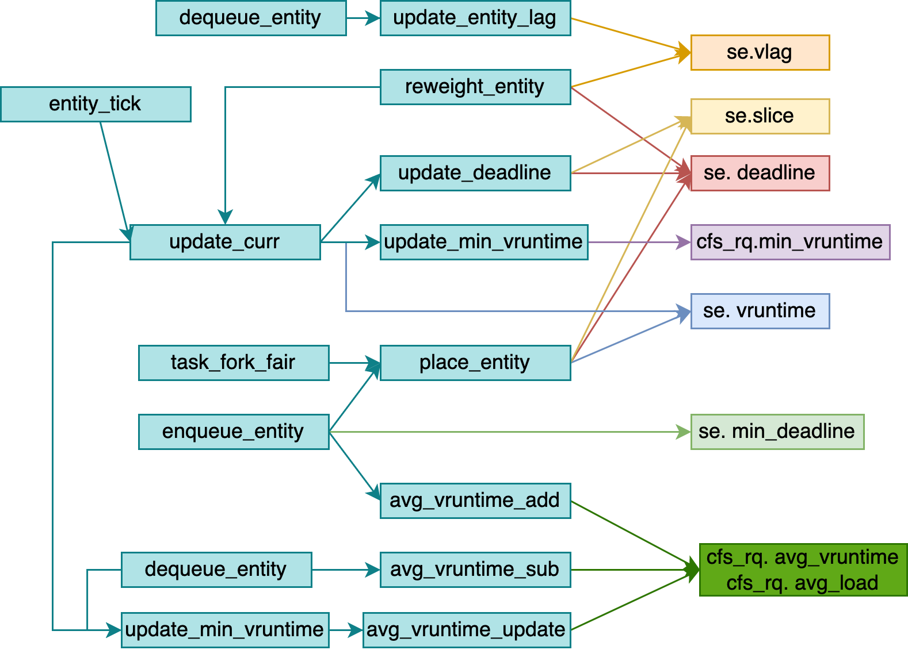

# Table of Contents
* [CPU](#cpu)
* [bios](#bios)
* [start_kernel](#start_kernel)
* [syscall](#syscall)
    * [glibs](#glibc)
    * [32](#32)
    * [64](#64)
    * [arm64](#arm64)

* [process](#process)
* [thread](#thread)
* [task_struct](#task_struct)
* [schedule](#schedule)
    * [voluntary schedule](#voluntary-schedule)
    * [preempt schedule](#preempt-schedule)
        * [user preempt](#user-preempt)
            * [set_tsk_need_resched](#set_tsk_need_resched)
                * [scheduler_tick](#scheduler_tick)
                * [try_to_wake_up](#try_to_wake_upp)
                * [sched_setscheduler](sched_setscheduler)
            * [prempt time](#preempt-time)
                * [return from system call](#return-from-system-call)
                * [return from interrupt](#return-from-interrupt)
        * [kernel preempt](#kernel-preempt)
            * [preempt_enable](#preempt_enble)
            * [preempt_schedule_irq](#preempt_schedule_irq)
    * [SCHED_RT](#SCHED_RR)
        * [enqueue_task_rt](#enqueue_task_rt)
        * [dequeue_task_rt](#dequeue_task_rt)
        * [put_prev_task_rt](#put_prev_task_rt)
        * [pick_next_task_rt](#pick_next_task_rt)
        * [set_next_task_rt](#set_next_task_rt)
        * [push_rt_task](#push_rt_task)
        * [pull_rt_task](#pull_rt_task)
        * [select_task_rq_rt](#select_task_rq_rt)
        * [task_tick_rt](#task_tick_rt)
    * [SCHED_CFS](#SCHED_CFS)
        * [enqueue_task_fair](#enqueue_task_fair)
        * [dequeue_task_fair](#dequeue_task_fair)
        * [put_prev_task_fair](#put_prev_task_fair)
        * [pick_next_task_fair](#pick_next_task_fair)
        * [set_next_task_fair](#set_next_task_fair)
        * [sched_vslice](#sched_vslice)
        * [task_tick_fair](#task_tick_fair)
        * [task_fork_fair](#task_fork_fair)
    * [task_group](#task_group)

* [wake_up](#wake_up)
* [wait_woken](#wait_woken)
* [try_to_wake_up](#try_to_wake_up)

* [fork](#fork)
    * [copy_process](#copy_process)
    * [dup_task_struct](#dup_task_struct)
    * [sched_fork](#sched_fork)
    * [ret_from_fork](#ret_from_fork)
    * [copy_thread_tls](#copy_thread_tls)

* [exec](#exec)
* [kthreadd](#kthreadd)

* [cmwq](#cmwq)
    * [struct](#wq-struct)
    * [alloc_workqueue](#alloc_workqueue)
    * [alloc_unbound_pwq](#alloc_unbound_pwq)
    * [create_worker](#create_worker)
    * [worker_thread](#worker_thread)
    * [schedule_work](#schedule_work)
    * [schedule_delayed_work](#schedule_delayed_work)
    * [flush_work](#flush_work)
    * [destroy_worker](#destroy_worker)
    * [maday_timer](#maday_timer)
    * [call graph](#call-graph-cmwq)

* [pthread_create](#pthread_create)


# cpu


# bios
* 
* When power on, set CS to 0xFFFF, IP to 0x0000, the first instruction points to 0xFFFF0 within ROM, a JMP comamand will jump to ROM do init work, BIOS starts.
* Then BIOS checks the health state of each hardware.
* Grub2 (Grand Unified Bootloader Version 2)
  * grub2-mkconfig -o /boot/grub2/grub.cfg
    ```
    menuentry 'CentOS Linux (3.10.0-862.el7.x86_64) 7 (Core)' --class centos --class gnu-linux --class gnu --class os --unrestricted $menuentry_id_option 'gnulinux-3.10.0-862.el7.x86_64-advanced-b1aceb95-6b9e-464a-a589-bed66220ebee' {
      load_video
      set gfxpayload=keep
      insmod gzio
      insmod part_msdos
      insmod ext2 set root='hd0,msdos1'
      if [ x$feature_platform_search_hint = xy ]; then
        search --no-floppy --fs-uuid --set=root --hint='hd0,msdos1' b1aceb95-6b9e-464a-a589-bed66220ebee
      else search --no-floppy --fs-uuid --set=root b1aceb95-6b9e-464a-a589-bed66220ebee
      fi

      linux16 /boot/vmlinuz-3.10.0-862.el7.x86_64 root=UUID=b1aceb95-6b9e-464a-a589-bed66220ebee ro console=tty0 console=ttyS0,115200 crashkernel=auto net.ifnames=0 biosdevname=0 rhgb quiet
      initrd16 /boot/initramfs-3.10.0-862.el7.x86_64.img
    }
    ```
  * grub2-install /dev/sda
    * install boot.img into MBR(Master Boot Record), and load boot.img into memory at 0x7c00 to run
    * core.img: diskboot.img, lzma_decompress.img, kernel.img

*   ```c
    boot.img                    /* Power On Self Test */
    core.img
        diskboot.img            /* diskboot.S load other modules of grub into memory */
            lzma_decompress.img /* startup_raw.S */
                real_to_prot    /* enable segement, page, open Gate A20 */
                kernel.img      /* startup.S, grub's kernel img not Linux kernel */
                    grub_main   /* grub's main func */
                        grub_load_config()
                        grub_command_execute ("normal", 0, 0)
                            grub_normal_execute()
                                grub_show_menu() /* show which OS want to run */
                                    grub_menu_execute_entry() /* start linux kernel */
    ```
    * boot.img
        * checks the basic operability of the hardware and then it issues a BIOS interrupt, INT 13H, which locates the boot sectors on any attached bootable devices.
        * read the first sector of the core image from a local disk and jump to it. Because of the size restriction, boot.img cannot understand any file system structure, so grub-install hardcodes the location of the first sector of the core image into boot.img when installing GRUB.
    * diskboot.img
        * the first sector of the core image when booting from a hard disk. It reads the rest of the core image into memory and starts the kernel. Since file system handling is not yet available, it encodes the location of the core image using a block list format.
    * kernel.img
        * contains GRUB’s basic run-time facilities: frameworks for device and file handling, environment variables, the rescue mode command-line parser, and so on. It is rarely used directly, but is built into all core images.
    * core.img
        * built dynamically from the kernel image and an arbitrary list of modules by the grub-mkimage program. Usually, it contains enough modules to access /boot/grub, and loads everything else (including menu handling, the ability to load target operating systems, and so on) from the file system at run-time. The modular design allows the core image to be kept small, since the areas of disk where it must be installed are often as small as 32KB.

* [GNU GRUB Manual 2.06](https://www.gnu.org/software/grub/manual/grub/html_node/index.html#SEC_Contents)
* [GNU GRUB Manual 2.06: Images](https://www.gnu.org/software/grub/manual/grub/html_node/Images.html)

```c
/* arch/arm64/kernel/head.S */
 * Kernel startup entry point.
 * ---------------------------
 *
 * The requirements are:
 *   MMU = off, D-cache = off, I-cache = on or off,
 *   x0 = physical address to the FDT blob. */

__HEAD
    efi_signature_nop
    b  primary_entry
    .quad  0
    le64sym  _kernel_size_le
    le64sym  _kernel_flags_le
    .quad  0
    .quad  0
    .quad  0
    .ascii  ARM64_IMAGE_MAGIC
    .long  .Lpe_header_offset

    __EFI_PE_HEADER

    .section ".idmap.text","a"

primary_entry
    bl record_mmu_state

    /* Preserve the arguments passed by the bootloader in x0 .. x3 */
    bl preserve_boot_args

    bl create_idmap

    bl __cpu_setup

    b __primary_switch
        adrp x1, reserved_pg_dir
        adrp x2, init_idmap_pg_dir
        bl __enable_mmu

        bl clear_page_tables
        bl create_kernel_mapping

        adrp x1, init_pg_dir
        load_ttbr1 x1, x1, x2 /* install x1 as a TTBR1 page table */

        bl __primary_switched
            adr_l x4, init_task
            init_cpu_task x4, x5, x6

            adr_l x8, vectors /* load VBAR_EL1 with virtual */
            msr vbar_el1, x8 /* vector table address */

            ldr_l x4, kimage_vaddr // Save the offset between
            sub   x4, x4, x0 // the kernel virtual and
            str_l x4, kimage_voffset, x5 // physical mappings

            bl set_cpu_boot_mode_flag

            bl __pi_memset

            mov x0, x21 /* pass FDT address in x0 */
            bl early_fdt_map /* Try mapping the FDT early */

            mov x0, x20 /* pass the full boot status */
            bl init_feature_override  /* Parse cpu feature overrides */

            bl start_kernel
```

[x] write the release
[ ] update the website

[ ] wtei


# start_kernel

```c
/* init/main.c */
void start_kernel(void)
{
    /* #0 process, the only one doesn't created by fork or kernel_thread */
    set_task_stack_end_magic(&init_task);

    local_irq_disable();

    setup_arch(&command_line);

    /* set_system_intr_gate(IA32_SYSCALL_VECTOR, entry_INT80_32) */
    trap_init();

    /* mnt_init()->init_rootfs() register_filesystem(&rootfs_fs_type) */
    vfs_caches_init()
    setup_arch(&command_line)
    mm_init();
    sched_init();
    init_IRQ();
    softirq_init();
    signals_init();
    cpuset_init();
    cgroup_init();

    rest_init()
}

static void rest_init(void)
{
    struct task_struct *tsk;
    int pid;

    pid = kernel_thread(kernel_init, NULL, CLONE_FS);

    pid = kernel_thread(kthreadd, NULL, CLONE_FS | CLONE_FILES);

    complete(&kthreadd_done);

    cpu_startup_entry(CPUHP_ONLINE);
}

/* init/init_task.c */
struct task_struct init_task
#ifdef CONFIG_ARCH_TASK_STRUCT_ON_STACK
  __init_task_data
#endif
= {
#ifdef CONFIG_THREAD_INFO_IN_TASK
  .thread_info      = INIT_THREAD_INFO(init_task),
  .stack_refcount   = ATOMIC_INIT(1),
#endif
  .state    = 0,
  .stack    = init_stack,
  .usage    = ATOMIC_INIT(2),
  .flags    = PF_KTHREAD,
};
```

```c
pid_t kernel_thread(int (*fn)(void *), void *arg, unsigned long flags)
{
  return _do_fork(flags|CLONE_VM|CLONE_UNTRACED, (unsigned long)fn,
    (unsigned long)arg, NULL, NULL, 0);
}

/* return from kernel to user space */
static int kernel_init(void *unused)
{
  if (ramdisk_execute_command) {
    ret = run_init_process(ramdisk_execute_command);
    if (!ret)
      return 0;
  }

  if (execute_command) {
    ret = run_init_process(execute_command);
    if (!ret)
      return 0;
  }

  if (!try_to_run_init_process("/sbin/init") ||
      !try_to_run_init_process("/etc/init") ||
      !try_to_run_init_process("/bin/init") ||
      !try_to_run_init_process("/bin/sh"))
    return 0;
}

static int run_init_process(const char *init_filename)
{
  argv_init[0] = init_filename;
  return do_execve(getname_kernel(init_filename),
    (const char __user *const __user *)argv_init,
    (const char __user *const __user *)envp_init);
}
```


## smp_boot

* [ARM64 的多核启动流程分析](https://zhuanlan.zhihu.com/p/512099688?utm_id=0)
* [ARM64 SMP多核启动 spin-table](https://mp.weixin.qq.com/s/4T4WcbG5rMpHFtU8-xxTbg) [PSCI](https://mp.weixin.qq.com/s/NaEvCuSDJMQ2dsN5rJ6GqA)

```c
SYM_FUNC_START(secondary_holding_pen)
    mov     x0, xzr
    bl      init_kernel_el
    mrs     x2, mpidr_el1
    mov_q   x1, MPIDR_HWID_BITMASK
    and     x2, x2, x1
    adr_l   x3, secondary_holding_pen_release
pen:    ldr    x4, [x3]
    cmp     x4, x2
    b.eq    secondary_startup
    wfe
    b       pen
SYM_FUNC_END(secondary_holding_pen)

void start_kernel(void) {
    setup_arch(&command_line) {
/* 1. cpu_init */
        smp_init_cpus() {
            smp_cpu_setup(cpu) {
                /* Read a cpu's enable method and record it in cpu_ops. */
                init_cpu_ops(cpu) {
                    const char *enable_method = cpu_read_enable_method(cpu);

                    cpu_ops[cpu] = cpu_get_ops(enable_method); /* "spin-table" or "psci" */
                }

                ops = get_cpu_ops(cpu);
                ops->cpu_init(cpu) {
                    smp_spin_table_ops->cpu_init() {
                        smp_spin_table_cpu_init() {
                            /*  Determine the address from which the CPU is polling */
                            of_property_read_u64(dn, "cpu-release-addr", &cpu_release_addr[cpu]);
                        }
                    }

                    cpu_psci_ops->cpu_psci_cpu_init() {

                    }
                }

                set_cpu_possible(cpu, true);
            }
        }
    }

/* 2. cpu_prepare */
    arch_call_rest_init() {
        rest_init() {
            user_mode_thread(kernel_init);
            kernel_init() {
                kernel_init_freeable() {
                    smp_prepare_cpus() {
                        cpu_ops[cpu]->cpu_prepare() {
                            smp_spin_table_ops->cpu_prepare() {
                                smp_spin_table_cpu_prepare() {
                                    __le64 __iomem *release_addr;
                                    phys_addr_t pa_holding_pen = __pa_symbol(secondary_holding_pen);

                                    release_addr = ioremap_cache(cpu_release_addr[cpu], sizeof(*release_addr));

                                    writeq_relaxed(pa_holding_pen, release_addr);
                                    dcache_clean_inval_poc((__force unsigned long)release_addr,
                                                (__force unsigned long)release_addr +
                                                    sizeof(*release_addr));
                                    sev();

                                    iounmap(release_addr);

                                    return 0;
                                }
                                cpu_psci_cpu_prepare() {

                                }
                            }
                        }
                    }
/* 3. cpu_boot */
                    smp_init() {
                        idle_threads_init() {
                            fork_idle(cpu)
                        }
                        cpuhp_threads_init();

                        bringup_nonboot_cpus(setup_max_cpus) {
                            cpuhp_bringup_mask(cpu_present_mask, setup_max_cpus, CPUHP_ONLINE) {
                                for_each_cpu::cpu_up(cpu, target) {
                                    try_online_node(cpu_to_node(cpu));
                                    _cpu_up(cpu, 0, target) {
                                        cpuhp_up_callbacks(cpu, st, target) {
                                            cpuhp_reset_state(cpu, st, prev_state)

                                            cpuhp_invoke_callback_range(false, cpu, st, prev_state) {
                                                while (cpuhp_next_state(bringup, &state, st, target)) {
                                                    cpuhp_invoke_callback(cpu, state, bringup, NULL, NULL);
                                                }
                                                cpuhp_invoke_callback(cpu, state, bringup, NULL, NULL) {
                                                    struct cpuhp_cpu_state *st = per_cpu_ptr(&cpuhp_state, cpu);
                                                    struct cpuhp_step *step = cpuhp_get_step(state);
                                                    cb = bringup ? step->startup.single : step->teardown.single;
                                                    ret = cb(cpu) {
                                                        bringup_cpu()
                                                            --->
                                                    }
                                                }
                                            }
                                        }
                                    }
                                }
                            }
                        }
                    }

                }
            }
        }
    }
}
```

```c
bringup_cpu() {
    __cpu_up(cpu, idle) { //arch/arm64/kernel/smp.c
        boot_secondary(cpu, idle) {
            ops = get_cpu_ops(cpu);
            ops->cpu_boot(cpu) {
                smp_spin_table_cpu_boot() {
                    u64 __cpu_logical_map[NR_CPUS] = { [0 ... NR_CPUS-1] = INVALID_HWID };
                    u64 cpu_logical_map(unsigned int cpu) {
                        return __cpu_logical_map[cpu];
                    }

                    write_pen_release(cpu_logical_map(cpu)/*val*/) {
                        void *start = (void *)&secondary_holding_pen_release;
                        unsigned long size = sizeof(secondary_holding_pen_release);

                        secondary_holding_pen_release = val;
                        dcache_clean_inval_poc((unsigned long)start, (unsigned long)start + size);
                    }
                    sev();
                }

                cpu_psci_cpu_boot() {
                    phys_addr_t pa_secondary_entry = __pa_symbol(secondary_entry);
                    err = psci_ops.cpu_on(cpu_logical_map(cpu), pa_secondary_entry) {
                        psci_0_2_cpu_on() {
                            __psci_cpu_on() {
                                invoke_psci_fn() {
                                    if (case SMCCC_CONDUIT_HVC) {
                                        invoke_psci_fn = __invoke_psci_fn_hvc() {
                                            arm_smccc_hvc()
                                        }
                                    } else if (case SMCCC_CONDUIT_SMC) {
                                        invoke_psci_fn = __invoke_psci_fn_smc() {
                                            arm_smccc_smc()
                                        }
                                    }
                                }
                            }
                        }
                    }
                }
            }
        }
    }
}
```

# syscall


```c
struct pt_regs {
    union {
        struct user_pt_regs user_regs;
        struct {
            u64 regs[31];
            u64 sp;
            u64 pc;
            u64 pstate;
        };
    };
    u64 orig_x0;
#ifdef __AARCH64EB__
    u32 unused2;
    s32 syscallno;
#else
    s32 syscallno;
    u32 unused2;
#endif
    u64 sdei_ttbr1;
    /* Only valid when ARM64_HAS_GIC_PRIO_MASKING is enabled. */
    u64 pmr_save;
    u64 stackframe[2];

    /* Only valid for some EL1 exceptions. */
    u64 lockdep_hardirqs;
    u64 exit_rcu;
};

struct user_pt_regs {
    __u64        regs[31];
    __u64        sp;
    __u64        pc;
    __u64        pstate;
};
```

```c
/* arch/x86/include/asm/ptrace.h */
struct pt_regs {
/* C ABI says these regs are callee-preserved. They aren't saved on kernel entry
 * unless syscall needs a complete, fully filled "struct pt_regs". */
  unsigned long r15;
  unsigned long r14;
  unsigned long r13;
  unsigned long r12;
  unsigned long bp;
  unsigned long bx;
/* These regs are callee-clobbered. Always saved on kernel entry. */
  unsigned long r11;
  unsigned long r10;
  unsigned long r9;
  unsigned long r8;
  unsigned long ax;
  unsigned long cx;
  unsigned long dx;
  unsigned long si;
  unsigned long di;
/* On syscall entry, this is syscall#. On CPU exception, this is error code.
 * On hw interrupt, it's IRQ number: */
  unsigned long orig_ax;
/* Return frame for iretq */
  unsigned long ip;
  unsigned long cs;
  unsigned long flags;
  unsigned long sp;
  unsigned long ss;
/* top of stack page */
};

/* This is the structure pointed to by thread.sp for an inactive task.
 * The order of the fields must match the code in __switch_to_asm(). */
struct inactive_task_frame {
  unsigned long flags;
#ifdef CONFIG_X86_64
  unsigned long r15;
  unsigned long r14;
  unsigned long r13;
  unsigned long r12;
#else
  unsigned long si;
  unsigned long di;
#endif
  unsigned long bx;

  /* These two fields must be together.
   * They form a stack frame header, needed by get_frame_pointer(). */
  unsigned long bp;
  unsigned long ret_addr;
};

struct fork_frame {
  struct inactive_task_frame frame;
  struct pt_regs regs;
};
```

## glibc
```c
int open(const char *pathname, int flags, mode_t mode)

/* syscalls.list */
/* File name Caller  Syscall name    Args    Strong name    Weak names */
      open    -        open          i:siv   __libc_open   __open open
```

```c
/* syscall-template.S */
T_PSEUDO (SYSCALL_SYMBOL, SYSCALL_NAME, SYSCALL_NARGS)
    ret
T_PSEUDO_END (SYSCALL_SYMBOL)

#define T_PSEUDO(SYMBOL, NAME, N)    PSEUDO (SYMBOL, NAME, N)

#define PSEUDO(name, syscall_name, args) \
  .text; \
  ENTRY (name) \
    DO_CALL (syscall_name, args); \
    cmpl $-4095, %eax; \
    jae SYSCALL_ERROR_LABEL
```

## 64


* glibc
    ```c
    /* glibc-2.28/sysdeps/unix/x86_64/sysdep.h
    The Linux/x86-64 kernel expects the system call parameters in
    registers according to the following table:
        syscall number  rax
        arg 1           rdi
        arg 2           rsi
        arg 3           rdx
        arg 4           r10
        arg 5           r8
        arg 6           r9 */
    #define DO_CALL(syscall_name, args) \
    lea SYS_ify (syscall_name), %rax; \
    syscall

    /* glibc-2.28/sysdeps/unix/sysv/linux/x86_64/sysdep.h */
    #define SYS_ify(syscall_name)  __NR_##syscall_name
    ```

* syscall_table
    1. declare syscall table: arch/x86/entry/syscalls/syscall_64.tbl
        ```c
        # 64-bit system call numbers and entry vectors

        # The __x64_sys_*() stubs are created on-the-fly for sys_*() system calls
        # The abi is "common", "64" or "x32" for this file.
        #
        # <number>  <abi>     <name>    <entry point>
            0       common    read      __x64_sys_read
            1       common    write     __x64_sys_write
            2       common    open      __x64_sys_open
        ```

    2. genrate syscall table: arch/x86/entry/syscalls/Makefile
        ```c
        /* 2.1 arch/x86/entry/syscalls/syscallhdr.sh generates #define __NR_open
        * arch/sh/include/uapi/asm/unistd_64.h */
        #define __NR_restart_syscall    0
        #define __NR_exit               1
        #define __NR_fork               2
        #define __NR_read               3
        #define __NR_write              4
        #define __NR_open               5

        /* 2.2 arch/x86/entry/syscalls/syscalltbl.sh
        * generates __SYSCALL_64(x, y) into asm/syscalls_64.h */
        __SYSCALL_64(__NR_open, __x64_sys_read)
        __SYSCALL_64(__NR_write, __x64_sys_write)
        __SYSCALL_64(__NR_open, __x64_sys_open)

        /* arch/x86/entry/syscall_64.c */
        #define __SYSCALL_64(nr, sym, qual) [nr] = sym

        asmlinkage const sys_call_ptr_t sys_call_table[__NR_syscall_max+1] = {
            /* Smells like a compiler bug -- it doesn't work
            * when the & below is removed. */
            [0 ... __NR_syscall_max] = &sys_ni_syscall,
            #include <asm/syscalls_64.h>
        };
        ```

    3. declare implemenation: include/linux/syscalls.h
        ```c
        asmlinkage long sys_write(unsigned int fd, const char __user *buf, size_t count);
        asmlinkage long sys_read(unsigned int fd, char __user *buf, size_t count);
        asmlinkage long sys_open(const char __user *filename, int flags, umode_t mode);
        ```

    4. define implemenation: fs/open.c
        ```c
        #include <linux/syscalls.h>

        SYSCALL_DEFINE3(open, const char __user *, filename, int, flags, umode_t, mode)
        {
            if (force_o_largefile())
                flags |= O_LARGEFILE;

            return do_sys_open(AT_FDCWD, filename, flags, mode);
        }
        ```


```c
entry_SYSCALL_64()
    /* 1. swap to kernel stack */
    movq  %rsp, PER_CPU_VAR(rsp_scratch)
    movq  PER_CPU_VAR(cpu_current_top_of_stack), %rsp

    /* 2. save user stack */
    pushq  $__USER_DS                 /* pt_regs->ss */
    pushq  PER_CPU_VAR(rsp_scratch)   /* pt_regs->sp */
    pushq  %r11                       /* pt_regs->flags */
    pushq  $__USER_CS                 /* pt_regs->cs */
    pushq  %rcx                       /* pt_regs->ip */
    pushq  %rax                       /* pt_regs->orig_ax */

    /* 3. do_syscall */
    movq  %rax, %rdi
    movq  %rsp, %rsi
    call  do_syscall_64
        regs->ax = __x64_sys_ni_syscall(regs);
        syscall_exit_to_user_mode(regs);
            __syscall_exit_to_user_mode_work();
                exit_to_user_mode_prepare();
                    if (unlikely(ti_work & EXIT_TO_USER_MODE_WORK))
                        ti_work = exit_to_user_mode_loop(regs, ti_work);
                            if (ti_work & _TIF_NEED_RESCHED)
                                schedule();
                            if (ti_work & (_TIF_SIGPENDING | _TIF_NOTIFY_SIGNAL))
                                arch_do_signal_or_restart(regs);

            __exit_to_user_mode();
                arch_exit_to_user_mode();

    /* 4. restore user stack */
    swapgs_restore_regs_and_return_to_usermode()
        POP_REGS pop_rdi=0
        /* The stack is now user RDI, orig_ax, RIP, CS, EFLAGS, RSP, SS */

        movq  %rsp, %rdi /* save kernel sp */
        movq  PER_CPU_VAR(cpu_tss_rw + TSS_sp0), %rsp /* load user sp */

        /* Copy the IRET frame from kernel stack to the user trampoline stack. */
        pushq  6*8(%rdi)  /* SS */
        pushq  5*8(%rdi)  /* RSP */
        pushq  4*8(%rdi)  /* EFLAGS */
        pushq  3*8(%rdi)  /* CS */
        pushq  2*8(%rdi)  /* RIP */

        INTERRUPT_RETURN
```

# process


```c
/* compile */
gcc -c -fPIC process.c
gcc -c -fPIC createprocess.c

/* staic lib */
ar cr libstaticprocess.a process.o
/* static link */
gcc -o staticcreateprocess createprocess.o -L. -lstaticprocess

/* dynamic lib */
gcc -shared -fPIC -o libdynamicprocess.so process.o
/* dynamic link LD_LIBRARY_PATH /lib /usr/lib */
gcc -o dynamiccreateprocess createprocess.o -L. -ldynamicprocess
export LD_LIBRARY_PATH=
```

1. elf: relocatable file


2. elf: executable file


3. elf: shared object

4. elf: core dump

* [UEFI简介 - 内核工匠](https://mp.weixin.qq.com/s/tgW9-FDo2hgxm8Uwne8ySw)


# thread


# task_struct


# schedule

* [Kernel Index Sched - LWN](https://lwn.net/Kernel/Index/#Scheduler)


* [LWN Kernel Index](https://lwn.net/Kernel/Index/)
    * [LWN Index - Realtime](https://lwn.net/Kernel/Index/#Realtime)
    * [LWN Index - Scheduler](https://lwn.net/Kernel/Index/#Scheduler)
        * [Scheduling domains](https://lwn.net/Articles/80911/)
    * [LWN Index - CFS scheduler](https://lwn.net/Kernel/Index/#Scheduler-Completely_fair_scheduler)
        * [An EEVDF CPU scheduler for Linux](https://lwn.net/Articles/925371/)
            * [[PATCH 00/15] sched: EEVDF and latency-nice and/or slice-attr](https://lore.kernel.org/all/20230531115839.089944915@infradead.org/#t)
            * [[PATCH 01/15] sched/fair: Add cfs_rq::avg_vruntime](https://github.com/torvalds/linux/commit/af4cf40470c22efa3987200fd19478199e08e103)
            * [[PATCH 03/15] sched/fair: Add lag based placement](https://github.com/torvalds/linux/commit/86bfbb7ce4f67a88df2639198169b685668e7349)
            * [[PATCH 04/15] rbtree: Add rb_add_augmented_cached() helper](https://github.com/torvalds/linux/commit/99d4d26551b56f4e523dd04e4970b94aa796a64e)
            * [[PATCH 05/15] sched/fair: Implement an EEVDF like policy](https://github.com/torvalds/linux/commit/147f3efaa24182a21706bca15eab2f3f4630b5fe)
            * [[PATCH 07/15] sched/smp: Use lag to simplify cross-runqueue placement](https://github.com/torvalds/linux/commit/e8f331bcc270354a803c2127c486190d33eac441)
            * [[PATCH 08/15] sched: Commit to EEVDF](https://github.com/torvalds/linux/commit/5e963f2bd4654a202a8a05aa3a86cb0300b10e6c)
            * 
    * [LWN Index - Core scheduling](https://lwn.net/Kernel/Index/#Scheduler-Core_scheduling)
    * [LWN Index - Deadline scheduling](https://lwn.net/Kernel/Index/#Scheduler-Deadline_scheduling)
    * [LWN Index - Group scheduling](https://lwn.net/Kernel/Index/#Scheduler-Group_scheduling)

* [进程调度 - LoyenWang](https://www.cnblogs.com/LoyenWang/tag/进程调度/)
    * [1. 基础](https://www.cnblogs.com/LoyenWang/p/12249106.html)
    * [2. CPU负载](https://www.cnblogs.com/LoyenWang/p/12316660.html)
    * [3. 进程切换](https://www.cnblogs.com/LoyenWang/p/12386281.html)
    * [4. 组调度及带宽控制](https://www.cnblogs.com/LoyenWang/p/12459000.html)
    * [5. CFS调度器](https://www.cnblogs.com/LoyenWang/p/12495319.html)
    * [6. 实时调度器](https://www.cnblogs.com/LoyenWang/p/12584345.html)

* [wowo Tech](http://www.wowotech.net/sort/process_management)
    * [进程切换分析(1) - 基本框架](http://www.wowotech.net/process_management/context-switch-arch.html)
    * [进程切换分析(2) - TLB处理](http://www.wowotech.net/process_management/context-switch-tlb.html)
    * [CFS调度器(3) - 组调度](http://www.wowotech.net/process_management/449.html)
    * [CFS调度器(4) - :one:PELT](http://www.wowotech.net/process_management/450.html)   [:two:PELT算法浅析](http://www.wowotech.net/process_management/pelt.html)
    * [CFS调度器(5) - 带宽控制](http://www.wowotech.net/process_management/451.html)
    * [CFS调度器(6) - 总结](http://www.wowotech.net/process_management/452.html)
    * [CFS负载均衡 - :one:概述](http://www.wowotech.net/process_management/load_balance.html)    [:two:任务放置](http://www.wowotech.net/process_management/task_placement.html)    [:three:load balance](http://www.wowotech.net/process_management/load_balance_detail.html)    [:four:load_balance函数代码详解](http://www.wowotech.net/process_management/load_balance_function.html)
    * [CFS选核](http://www.wowotech.net/process_management/task_placement_detail.html)
    * [ARM Linux上的系统调用代码分析](http://www.wowotech.net/process_management/syscall-arm.html)
    * [Linux调度器 - 用户空间接口](http://www.wowotech.net/process_management/scheduler-API.html)
    * [schedutil governor情景分析](http://www.wowotech.net/process_management/schedutil_governor.html)
    * [TLB flush](http://www.wowotech.net/memory_management/tlb-flush.html)

* [内核工匠]()
    * [Linux Scheduler之rt选核流程](https://mp.weixin.qq.com/s?__biz=MzAxMDM0NjExNA==&mid=2247488449&idx=1&sn=fd4fb753e0395fb538295aa4145a8494)

* [hellokitty2 进程管理](https://www.cnblogs.com/hellokitty2/category/1791168.html)
    * [调度器24 - CFS任务选核](https://www.cnblogs.com/hellokitty2/p/15750931.html)
    * [调度器32 - RT选核](https://www.cnblogs.com/hellokitty2/p/15881574.html)
    * [调度器34 - RT负载均衡](https://www.cnblogs.com/hellokitty2/p/15974333.html)

* [CHENG Jian Linux进程管理与调度](https://kernel.blog.csdn.net/article/details/51456569)
    * [WAKE_AFFINE](https://blog.csdn.net/gatieme/article/details/106315848)
    * [用户抢占和内核抢占](https://blog.csdn.net/gatieme/article/details/51872618)

* [汪辰]
    * [Linux 内核的抢占模型](https://gitee.com/aosp-riscv/working-group/blob/master/articles/20230805-linux-preemption-models.md)
    * [Linux "PREEMPT_RT" 抢占模式分析报告](https://gitee.com/aosp-riscv/working-group/blob/master/articles/20230806-linux-preempt-rt.md#/aosp-riscv/working-group/blob/master/articles/20230805-linux-preemption-models.md)
    * [实时 Linux(Real-Time Linux)](https://gitee.com/aosp-riscv/working-group/blob/master/articles/20230727-rt-linux.md)
    * [Linux 调度器(Schedular)](https://gitee.com/aosp-riscv/working-group/blob/master/articles/20230801-linux-scheduler.md)

* [PREEMPT_RT Linux](https://wiki.linuxfoundation.org/realtime/start)
    * [LWN - A realtime preemption overview](https://lwn.net/Articles/146861/)
    * [Preemption Models](https://wiki.linuxfoundation.org/realtime/documentation/technical_basics/preemption_models)
        Model | Case | Preempt Points
        --- | --- | ---
        PREEMPT_NONE | No Forced Preemption (server) | `system call returns` + `interrupts`
        PREEMPT_VOLUNTARY | Voluntary Kernel Preemption (Desktop) | `system call returns` + `interrupts` + `explicit preemption points`
        PREEMPT | Preemptible Kernel (Low-Latency Desktop) |`system call returns` + `interrupts` + `all kernel code(except critical section)`
        PREEMPT_RT | Fully Preemptible Kernel (RT) | `system call returns` + `interrupts` + `all kernel code(except a few critical section)` + `threaded interrupt handlers`

* [Linux kernel scheduler](https://helix979.github.io/jkoo/post/os-scheduler/)
* [Scheduling Domain](https://zhuanlan.zhihu.com/p/589693879)

```c
/* Schedule Class:
 * Real time schedule: SCHED_FIFO, SCHED_RR, SCHED_DEADLINE
 * Normal schedule: SCHED_NORMAL, SCHED_BATCH, SCHED_IDLE */
#define SCHED_NORMAL    0
#define SCHED_FIFO      1
#define SCHED_RR        2
#define SCHED_BATCH     3
#define SCHED_IDLE      5
#define SCHED_DEADLINE  6

#define MAX_NICE  19
#define MIN_NICE  -20
#define NICE_WIDTH        (MAX_NICE - MIN_NICE + 1)
#define MAX_USER_RT_PRIO  100
#define MAX_RT_PRIO        MAX_USER_RT_PRIO
#define MAX_PRIO          (MAX_RT_PRIO + NICE_WIDTH)
#define DEFAULT_PRIO      (MAX_RT_PRIO + NICE_WIDTH / 2)

struct task_struct {
    struct thread_info        thread_info;

    int                       on_rq; /* TASK_ON_RQ_{QUEUED, MIGRATING} */

    int                       prio;
    int                       static_prio;
    int                       normal_prio;
    unsigned int              rt_priority;

    const struct sched_class  *sched_class;
    struct sched_entity       se;
    struct sched_rt_entity    rt;
    struct sched_dl_entity    dl;
    struct task_group         *sched_task_group;
    unsigned int              policy;

    struct mm_struct          *mm;
    struct mm_struct          *active_mm;

    void                      *stack; /* kernel stack */

    /* CPU-specific state of this task: */
    struct thread_struct      thread;
};

struct thread_info {
    unsigned long       flags;  /* TIF_SIGPENDING, TIF_NEED_RESCHED */
    u64                 ttbr0;
    union {
        u64             preempt_count;  /* 0 => preemptible, <0 => bug */
        struct {
            u32         count;
            u32         need_resched;
        } preempt;
    };s
    u32                 cpu;
};


/* arch/arm64/include/asm/thread_info.h */
struct thread_struct {
    struct cpu_context    cpu_context;    /* cpu context */

    unsigned long        fault_address;    /* fault info */
    unsigned long        fault_code;    /* ESR_EL1 value */
};

struct rq {
    raw_spinlock_t  lock;
    unsigned int    nr_running;
    unsigned long   cpu_load[CPU_LOAD_IDX_MAX];

    struct load_weight  load;
    unsigned long       nr_load_updates;
    u64                 nr_switches;

    struct cfs_rq cfs;
    struct rt_rq  rt;
    struct dl_rq  dl;
    struct task_struct *curr, *idle, *stop;
};
```


```c
struct sched_class {
    const struct sched_class *next;

    void (*enqueue_task) (struct rq *rq, struct task_struct *p, int flags);
    void (*dequeue_task) (struct rq *rq, struct task_struct *p, int flags);
    void (*yield_task) (struct rq *rq);
    bool (*yield_to_task) (struct rq *rq, struct task_struct *p, bool preempt);

    void (*check_preempt_curr) (struct rq *rq, struct task_struct *p, int flags);

    struct task_struct * (*pick_next_task) (struct rq *rq,
                struct task_struct *prev,
                struct rq_flags *rf);
    void (*put_prev_task) (struct rq *rq, struct task_struct *p);

    void (*set_curr_task) (struct rq *rq);
    void (*task_tick) (struct rq *rq, struct task_struct *p, int queued);
    void (*task_fork) (struct task_struct *p);
    void (*task_dead) (struct task_struct *p);

    void (*switched_from) (struct rq *this_rq, struct task_struct *task);
    void (*switched_to) (struct rq *this_rq, struct task_struct *task);
    void (*prio_changed) (struct rq *this_rq, struct task_struct *task, int oldprio);
    unsigned int (*get_rr_interval) (struct rq *rq,
            struct task_struct *task);
    void (*update_curr) (struct rq *rq);
};

extern const struct sched_class stop_sched_class;
extern const struct sched_class dl_sched_class;
extern const struct sched_class rt_sched_class;
extern const struct sched_class fair_sched_class;
extern const struct sched_class idle_sched_class;
/* stop_sched_class: highest priority process, will interrupt others
 * dl_sched_class: for deadline
 * rt_sched_class: for RR or FIFO, depend on task_struct->policy
 * fair_sched_class: for normal processes
 * idle_sched_class: idle */
```


## voluntary schedule


```c
schedule(void) {
    sched_submit_work(tsk) {
        if (task_is_running(tsk))
            return;

        if (task_flags & (PF_WQ_WORKER | PF_IO_WORKER)) {
            if (task_flags & PF_WQ_WORKER)
                wq_worker_sleeping(tsk) {
                    if (need_more_worker(pool)) {
                        wake_up_worker(pool);
                    }
                }
            else
                io_wq_worker_sleeping(tsk);
        }

        blk_flush_plug(tsk->plug, true);
    }

    do {
        preempt_disable();
        __schedule(SM_NONE);
        sched_preempt_enable_no_resched();
    } while (need_resched());

    sched_update_worker(tsk) {
        if (tsk->flags & (PF_WQ_WORKER | PF_IO_WORKER)) {
            if (tsk->flags & PF_WQ_WORKER)
                wq_worker_running(tsk);
            else
                io_wq_worker_running(tsk);
        }
    }
}

__schedule(SM_NONE) {/* kernel/sched/core.c */
    if (sched_feat(HRTICK) || sched_feat(HRTICK_DL))
        hrtick_clear(rq);

    local_irq_disable();
    update_rq_clock(rq);

    prev_state = READ_ONCE(prev->__state);
    if (!(sched_mode & SM_MASK_PREEMPT) && prev_state) {
        if (signal_pending_state(prev_state, prev)) {
            WRITE_ONCE(prev->__state, TASK_RUNNING);
        } else {
            prev->sched_contributes_to_load =
                (prev_state & TASK_UNINTERRUPTIBLE) &&
                !(prev_state & TASK_NOLOAD) &&
                !(prev_state & TASK_FROZEN);

            if (prev->sched_contributes_to_load)
                rq->nr_uninterruptible++;

            deactivate_task(rq, prev, DEQUEUE_SLEEP | DEQUEUE_NOCLOCK) {
                p->on_rq = (flags & DEQUEUE_SLEEP) ? 0 : TASK_ON_RQ_MIGRATING;
                dequeue_task(rq, p, flags);
            }

            if (prev->in_iowait) {
                atomic_inc(&rq->nr_iowait);
                delayacct_blkio_start();
            }
        }
        switch_count = &prev->nvcsw;
    }

    next = pick_next_task(rq, prev, &rf) {
        if (!sched_core_enabled(rq)) {
            return __pick_next_task(rq, prev, rf) {
                if (likely(!sched_class_above(prev->sched_class, &fair_sched_class)
                    && rq->nr_running == rq->cfs.h_nr_running)) {

                    p = pick_next_task_fair(rq, prev, rf);
                    if (unlikely(p == RETRY_TASK))
                        goto restart;

                    /* Assume the next prioritized class is idle_sched_class */
                    if (!p) {
                        put_prev_task(rq, prev);
                        p = pick_next_task_idle(rq);
                    }

                    return p;
                }

            restart:
                put_prev_task_balance(rq, prev, rf) {
                    for_class_range(class, prev->sched_class, &idle_sched_class) {
                        if (class->balance(rq, prev, rf))
                            break;
                    }

                    put_prev_task(rq, prev);
                        --->
                }

                for_each_class(class) {
                    p = class->pick_next_task(rq);
                    if (p)
                        return p;
                }
            }
        }

        cpu = cpu_of(rq);

        /* Stopper task is switching into idle, no need core-wide selection. */
        if (cpu_is_offline(cpu)) {
            rq->core_pick = NULL;
            return __pick_next_task(rq, prev, rf);
        }

        /* do core sched */
    }

    clear_tsk_need_resched(prev);
    clear_preempt_need_resched();

    if (likely(prev != next)) {
        context_switch(rq, prev, next, &rf) {
            prepare_task_switch(rq, prev, next);
            arch_start_context_switch(prev);

            if (!next->mm) { /* to kernel task */
                enter_lazy_tlb(prev->active_mm, next) {
                    update_saved_ttbr0(tsk, &init_mm) {
                        if (mm == &init_mm)
                            ttbr = phys_to_ttbr(__pa_symbol(reserved_pg_dir));
                        else
                            ttbr = phys_to_ttbr(virt_to_phys(mm->pgd)) | ASID(mm) << 48;

                        WRITE_ONCE(task_thread_info(tsk)->ttbr0, ttbr);
                    }
                }

                next->active_mm = prev->active_mm;

                if (prev->mm) /* from user */
                    mmgrab_lazy_tlb(prev->active_mm) {
                        atomic_inc(&mm->mm_count);
                    }
                else
                    prev->active_mm = NULL;

            } else { /* to user task */
                membarrier_switch_mm(rq, prev->active_mm, next->mm);
                switch_mm_irqs_off(prev->active_mm, next->mm, next) {
                    /* arch/arm64/include/asm/mmu_context.h */
                    switch_mm(mm_prev, mm_next, tsk) {
                        if (prev != next) {
                            __switch_mm(next) {
                                if (next == &init_mm) {
                                    cpu_set_reserved_ttbr0() {
                                        ttbr = phys_to_ttbr(__pa_symbol(reserved_pg_dir));
                                        write_sysreg(ttbr, ttbr0_el1);
                                    }
                                    return;
                                }

                                check_and_switch_context(next) {
                                    local_flush_tlb_all() {
                                        __tlbi(vmalle1);
                                    }

                                    cpu_switch_mm(mm->pgd, mm) {
                                        BUG_ON(pgd == swapper_pg_dir);
                                        cpu_set_reserved_ttbr0();
                                            --->
                                        cpu_do_switch_mm(virt_to_phys(pgd),mm) {
                                            ttbr1 = read_sysreg(ttbr1_el1);
                                            write_sysreg(ttbr1, ttbr1_el1);
                                            isb();
                                            ttbr0 = phys_to_ttbr(pgd_phys);
                                            write_sysreg(ttbr0, ttbr0_el1);
                                        }
                                    }
                                }
                            }
                        }

                        update_saved_ttbr0(tsk, next);
                            --->
                    }
                }
                lru_gen_use_mm(next->mm);

                if (!prev->mm) { /* from kernel */
                    /* will mmdrop_lazy_tlb() in finish_task_switch(). */
                    rq->prev_mm = prev->active_mm;
                    prev->active_mm = NULL;
                }
            }

            switch_to(prev, next, prev) {
                __switch_to() {
                    fpsimd_thread_switch(next);
                    tls_thread_switch(next);
                    hw_breakpoint_thread_switch(next);
                    contextidr_thread_switch(next);
                    entry_task_switch(next) {
                        __this_cpu_write(__entry_task, next);
                    }
                    ssbs_thread_switch(next);
                    erratum_1418040_thread_switch(next);
                    ptrauth_thread_switch_user(next);

                    /* arch/arm64/kernel/entry.S */
                    last = cpu_switch_to(prev, next) {
                        /* x0 = previous task_struct (must be preserved across the switch)
                         * x1 = next task_struct
                         * Previous and next are guaranteed not to be the same. */
                        SYM_FUNC_START(cpu_switch_to)
                            mov    x10, #THREAD_CPU_CONTEXT /* task.thread.cpu_context */
                            add    x8, x0, x10 /* calc prev task cpu_context addr */
                            mov    x9, sp
                            stp    x19, x20, [x8], #16 /* store callee-saved registers */
                            stp    x21, x22, [x8], #16
                            stp    x23, x24, [x8], #16
                            stp    x25, x26, [x8], #16
                            stp    x27, x28, [x8], #16
                            stp    x29, x9, [x8], #16
                            str    lr, [x8]

                            add    x8, x1, x10  /* calc next task cpu_context addr */
                            ldp    x19, x20, [x8], #16 /* restore callee-saved registers */
                            ldp    x21, x22, [x8], #16
                            ldp    x23, x24, [x8], #16
                            ldp    x25, x26, [x8], #16
                            ldp    x27, x28, [x8], #16
                            ldp    x29, x9, [x8], #16
                            ldr    lr, [x8]
                            mov    sp, x9
                            msr    sp_el0, x1

                            ptrauth_keys_install_kernel x1, x8, x9, x10
                            scs_save x0
                            scs_load_current
                            ret
                    }
                }
            }

            return finish_task_switch(prev) {
                struct rq *rq = this_rq();
                struct mm_struct *mm = rq->prev_mm;

                rq->prev_mm = NULL;

                prev_state = READ_ONCE(prev->__state);
                vtime_task_switch(prev);
                perf_event_task_sched_in(prev, current);
                finish_task(prev) {
                    smp_store_release(&prev->on_cpu, 0);
                }
                tick_nohz_task_switch();
                finish_lock_switch(rq) {
                    spin_acquire(&__rq_lockp(rq)->dep_map, 0, 0, _THIS_IP_);
                    __balance_callbacks(rq);
                    raw_spin_rq_unlock_irq(rq)
                        --->
                }
                finish_arch_post_lock_switch();
                kcov_finish_switch(current);
                kmap_local_sched_in();

                fire_sched_in_preempt_notifiers(current);

                if (mm) {
                    membarrier_mm_sync_core_before_usermode(mm);
                    mmdrop_lazy_tlb_sched(mm) {
                        mmdrop_sched(mm) {
                            if (unlikely(atomic_dec_and_test(&mm->mm_count))) {
                                __mmdrop(mm) {
                                    cleanup_lazy_tlbs(mm);

                                    WARN_ON_ONCE(mm == current->active_mm);
                                    mm_free_pgd(mm) {
                                        pgd_free(mm, mm->pgd) {
                                            if (PGD_SIZE == PAGE_SIZE)
                                                free_page((unsigned long)pgd);
                                            else
                                                kmem_cache_free(pgd_cache, pgd);
                                        }
                                    }
                                    destroy_context(mm);
                                    mmu_notifier_subscriptions_destroy(mm);
                                    check_mm(mm);
                                    put_user_ns(mm->user_ns);
                                    mm_pasid_drop(mm);
                                    mm_destroy_cid(mm);

                                    for (i = 0; i < NR_MM_COUNTERS; i++)
                                        percpu_counter_destroy(&mm->rss_stat[i]);
                                    free_mm(mm);
                                }
                            }
                        }
                    }
                }

                if (unlikely(prev_state == TASK_DEAD)) {
                    if (prev->sched_class->task_dead)
                        prev->sched_class->task_dead(prev);

                    /* Task is done with its stack. */
                    put_task_stack(prev);

                    put_task_struct_rcu_user(prev);
                }

                return rq;
            }
        }
    } else {
        __balance_callbacks(rq) {
            do_balance_callbacks(rq, __splice_balance_callbacks(rq, false)/*head*/) {
                void (*func)(struct rq *rq);
                struct balance_callback *next;

                while (head) {
                    func = (void (*)(struct rq *))head->func;
                    next = head->next;
                    head->next = NULL;
                    head = next;

                    func(rq);
                }
            }
        }
        raw_spin_rq_unlock_irq(rq) {
            raw_spin_rq_unlock(rq);
            local_irq_enable();
        }
    }
}
```


## preempt schedule

### user preempt

#### set_tsk_need_resched


##### scheduler_tick
```c
void scheduler_tick(void)
{
    int cpu = smp_processor_id();
    struct rq *rq = cpu_rq(cpu);
    struct task_struct *curr = rq->curr;
    struct rq_flags rf;

    sched_clock_tick();

    rq_lock(rq, &rf);

    update_rq_clock(rq);
    curr->sched_class->task_tick(rq, curr, 0); /* task_tick_fair */
    cpu_load_update_active(rq);
    calc_global_load_tick(rq);

    rq_unlock(rq, &rf);

    perf_event_task_tick();

    #ifdef CONFIG_SMP
    rq->idle_balance = idle_cpu(cpu);
    trigger_load_balance(rq);
    #endif
}
```

##### try_to_wake_upp

##### sched_setscheduler
```c
SYSCALL_DEFINE3(sched_setscheduler) {
    do_sched_setscheduler() {
        p = find_process_by_pid(pid);
        get_task_struct(p);
        sched_setscheduler(p, policy, &lparam) {
            __sched_setscheduler() {

            }
        }
    }

        put_task_struct(p);
}
/* 1. check policy, prio args */

```

#### preempt time


##### return from system call
```c
/* do_syscall_64 -> syscall_return_slowpath
 * -> prepare_exit_to_usermode -> exit_to_usermode_loop */
static void exit_to_usermode_loop(struct pt_regs *regs, u32 cached_flags)
{
    while (true) {
        local_irq_enable();

        if (cached_flags & _TIF_NEED_RESCHED)
            schedule();

        if (cached_flags & _TIF_SIGPENDING)
            do_signal(regs);
    }
}
```

##### return from interrupt

```c
irqentry_exit() {
    if (user_mode(regs)) {
        irqentry_exit_to_user_mode(regs);
            exit_to_user_mode_prepare(ress);
                exit_to_user_mode_loop(regs);
                    if (ti_work & _TIF_NEED_RESCHED)
                        schedule();
                arch_exit_to_user_mode_prepare(regs, ti_work);
    }
}
```

### kernel preempt


#### preempt_enble
```c
#define preempt_enable() \
do { \
    if (unlikely(preempt_count_dec_and_test())) \
        __preempt_schedule(); \
} while (0)

#define preempt_count_dec_and_test() \
    ({ preempt_count_sub(1); should_resched(0); })

static  bool should_resched(int preempt_offset)
{
    return unlikely(preempt_count() == preempt_offset &&
        tif_need_resched());
}

#define tif_need_resched() test_thread_flag(TIF_NEED_RESCHED)

/* __preempt_schedule -> */
static void __sched notrace preempt_schedule_common(void)
{
    do {
        preempt_disable_notrace();
        __schedule(SM_PREEMPT);
        preempt_enable_no_resched_notrace();
    } while (need_resched());
}
```

#### preempt_schedule_irq
```c
/* do_IRQ -> retint_kernel */
el1t_64_irq_handler() {
    el1_interrupt(regs, handle_arch_irq) {
        write_sysreg(DAIF_PROCCTX_NOIRQ, daif);

        if (IS_ENABLED(CONFIG_ARM64_PSEUDO_NMI) && !interrupts_enabled(regs)) {
            __el1_pnmi(regs, handler);
        } else {
            __el1_irq(regs, handler) {
                enter_from_kernel_mode(regs);

                irq_enter_rcu();
                do_interrupt_handler(regs, handler);
                irq_exit_rcu();

                arm64_preempt_schedule_irq() {
                    if (!need_irq_preemption())
                        return;

                    if (READ_ONCE(current_thread_info()->preempt_count) != 0)
                        return;

                    if (system_uses_irq_prio_masking() && read_sysreg(daif))
                        return;

                    if (system_capabilities_finalized()) {
                        preempt_schedule_irq() {
                            do {
                                preempt_disable();
                                local_irq_enable();
                                __schedule(SM_PREEMPT);
                                local_irq_disable();
                                sched_preempt_enable_no_resched();
                            } while (need_resched());
                        }
                    }
                }
            }
        }
    }
}
```


## SCHED_RT


```c
struct rt_rq {
    struct rt_prio_array    active;
    unsigned int            rt_nr_running;
    unsigned int            rr_nr_running;
    struct {
        int     curr; /* highest queued rt task prio */
        int     next; /* next highest */
    } highest_prio;

    unsigned int            rt_nr_migratory;
    unsigned int            rt_nr_total;
    int                     overloaded;
    struct plist_head       pushable_tasks;

    int                     rt_queued;

    int                     rt_throttled;
    u64                     rt_time;
    u64                     rt_runtime;

#ifdef CONFIG_RT_GROUP_SCHED
    unsigned int            rt_nr_boosted;
    struct rq               *rq;
    struct task_group       *tg;
#endif
};

struct sched_rt_entity {
    struct list_head            run_list;
    unsigned long               timeout;
    unsigned long               watchdog_stamp;
    unsigned int                time_slice;
    unsigned short              on_rq;
    unsigned short              on_list;

    struct sched_rt_entity      *back;
#ifdef CONFIG_RT_GROUP_SCHED
    struct sched_rt_entity      *parent;
    /* rq on which this entity is (to be) queued: */
    struct rt_rq                *rt_rq;
    /* rq "owned" by this entity/group: */
    struct rt_rq                *my_q;
#endif
};

struct rt_bandwidth {
    raw_spinlock_t          rt_runtime_lock;
    ktime_t                 rt_period;
    u64                     rt_runtime;
    struct hrtimer          rt_period_timer;
    unsigned int            rt_period_active;
};
```


```c
update_curr_rt(rq)
    now = rq_clock_task(rq);
    delta_exec = now - curr->se.exec_start;
    update_current_exec_runtime(curr, now, delta_exec)
        curr->se.sum_exec_runtime += delta_exec;
        account_group_exec_runtime(curr, delta_exec);

        curr->se.exec_start = now;
        cgroup_account_cputime(curr, delta_exec);

    for_each_sched_rt_entity(rt_se) {
        struct rt_rq *rt_rq = rt_rq_of_se(rt_se);
        int exceeded;

        if (sched_rt_runtime(rt_rq) != RUNTIME_INF) {
            raw_spin_lock(&rt_rq->rt_runtime_lock);
            rt_rq->rt_time += delta_exec;
            exceeded = sched_rt_runtime_exceeded(rt_rq);
            if (exceeded)
                resched_curr(rq);
            raw_spin_unlock(&rt_rq->rt_runtime_lock);
            if (exceeded) {
                do_start_rt_bandwidth(sched_rt_bandwidth(rt_rq)) {

                }

            }
        }
    }
```

### enqueue_task_rt


```c
enqueue_task_rt(struct rq *rq, struct task_struct *p, int flags) {
    if (flags & ENQUEUE_WAKEUP)
        rt_se->timeout = 0;

    check_schedstat_required();
    update_stats_wait_start_rt(rt_rq_of_se(rt_se), rt_se);

    enqueue_rt_entity(rt_se, flags) {
        update_stats_enqueue_rt(rt_rq_of_se(rt_se), rt_se, flags);

        dequeue_rt_stack(rt_se, flags) {
            /* Because the prio of an upper entry depends on the lower
             * entries, we must remove entries top - down. */
            for_each_sched_rt_entity(rt_se) {
                rt_se->back = back;
                back = rt_se;
            }

            rt_nr_running = rt_rq_of_se(back)->rt_nr_running;

            for (rt_se = back; rt_se; rt_se = rt_se->back) {
                if (on_rt_rq(rt_se)) { /* rt_se->on_rq */
                    __dequeue_rt_entity(rt_se, flags) {
                        struct rt_rq *rt_rq = rt_rq_of_se(rt_se);
                        struct rt_prio_array *array = &rt_rq->active;

                        if (move_entity(flags)) {
                            __delist_rt_entity(rt_se, array) {
                                list_del_init(&rt_se->run_list);

                                if (list_empty(array->queue + rt_se_prio(rt_se))) {
                                    __clear_bit(rt_se_prio(rt_se), array->bitmap);
                                }

                                rt_se->on_list = 0;
                            }
                        }
                        rt_se->on_rq = 0;

                        dec_rt_tasks(rt_se, rt_rq) {
                            rt_rq->rt_nr_running -= rt_se_nr_running(rt_se);
                            rt_rq->rr_nr_running -= rt_se_rr_nr_running(rt_se);

                            dec_rt_prio(rt_rq, rt_se_prio(rt_se)) {
                                int prev_prio = rt_rq->highest_prio.curr;

                                if (rt_rq->rt_nr_running) {
                                    if (prio == prev_prio) {
                                        struct rt_prio_array *array = &rt_rq->active;
                                        rt_rq->highest_prio.curr = sched_find_first_bit(array->bitmap);
                                    }
                                } else {
                                    rt_rq->highest_prio.curr = MAX_RT_PRIO-1;
                                }

                                dec_rt_prio_smp(rt_rq, prio, prev_prio) {
                                    if (rq->online && rt_rq->highest_prio.curr != prev_prio) {
                                        cpupri_set(&rq->rd->cpupri, rq->cpu, rt_rq->highest_prio.curr);
                                    }
                                }
                            }
                            dec_rt_migration(rt_se, rt_rq);
                            dec_rt_group(rt_se, rt_rq);
                        }
                    }
                }
            }

            dequeue_top_rt_rq(rt_rq_of_se(back), rt_nr_running);
        }

        for_each_sched_rt_entity(rt_se) {
            __enqueue_rt_entity(rt_se, flags) {
                if (flags & ENQUEUE_HEAD)
                    list_add(&rt_se->run_list, queue);
                else
                    list_add_tail(&rt_se->run_list, queue);
                __set_bit(rt_se_prio(rt_se), array->bitmap);

                rt_se->on_list = 1;
                rt_se->on_rq = 1;

                inc_rt_tasks(rt_se, rt_rq) {
                    int prio = rt_se_prio(rt_se);

                    rt_rq->rt_nr_running += rt_se_nr_running(rt_se);
                    rt_rq->rr_nr_running += rt_se_rr_nr_running(rt_se);

                    inc_rt_prio(rt_rq, prio) {
                        int prev_prio = rt_rq->highest_prio.curr;

                        if (prio < prev_prio)
                            rt_rq->highest_prio.curr = prio;

                        inc_rt_prio_smp(rt_rq, prio, prev_prio) {
                            struct rq *rq = rq_of_rt_rq(rt_rq);
                        #ifdef CONFIG_RT_GROUP_SCHED
                            if (&rq->rt != rt_rq)
                                return;
                        #endif
                            if (rq->online && prio < prev_prio) {
                                cpupri_set(&rq->rd->cpupri/*cp*/, rq->cpu, prio) {
                                    int *currpri = &cp->cpu_to_pri[cpu];
                                    int oldpri = *currpri;

                                    newpri = convert_prio(newpri);

                                    if (newpri == oldpri)
                                        return;

                                    if (likely(newpri != CPUPRI_INVALID)) {
                                        struct cpupri_vec *vec = &cp->pri_to_cpu[newpri];
                                        cpumask_set_cpu(cpu, vec->mask);
                                        atomic_inc(&(vec)->count);
                                    }
                                    if (likely(oldpri != CPUPRI_INVALID)) {
                                        struct cpupri_vec *vec  = &cp->pri_to_cpu[oldpri];
                                        atomic_dec(&(vec)->count);
                                        cpumask_clear_cpu(cpu, vec->mask);
                                    }

                                    *currpri = newpri;
                                }
                            }
                        }
                    }
                    inc_rt_migration(rt_se, rt_rq) {
                        struct task_struct *p;

                        if (!rt_entity_is_task(rt_se))
                            return;

                        p = rt_task_of(rt_se);
                        rt_rq = &rq_of_rt_rq(rt_rq)->rt;

                        rt_rq->rt_nr_total++;
                        if (p->nr_cpus_allowed > 1)
                            rt_rq->rt_nr_migratory++;

                        update_rt_migration(rt_rq) {
                            if (rt_rq->rt_nr_migratory && rt_rq->rt_nr_total > 1) {
                                if (!rt_rq->overloaded) {
                                    rt_set_overload(rq_of_rt_rq(rt_rq)) {
                                        if (!rq->online)
                                            return;

                                        cpumask_set_cpu(rq->cpu, rq->rd->rto_mask);
                                        smp_wmb();
                                        atomic_inc(&rq->rd->rto_count);
                                    }
                                    rt_rq->overloaded = 1;
                                }
                            } else if (rt_rq->overloaded) {
                                rt_clear_overload(rq_of_rt_rq(rt_rq));
                                rt_rq->overloaded = 0;
                            }
                        }
                    }
                    inc_rt_group(rt_se, rt_rq);
                }
            }
        }
        enqueue_top_rt_rq(&rq->rt);
    }

    if (!task_current(rq, p) && p->nr_cpus_allowed > 1) {
        enqueue_pushable_task(rq, p) {
            plist_del(&p->pushable_tasks, &rq->rt.pushable_tasks);
            plist_node_init(&p->pushable_tasks, p->prio);
            plist_add(&p->pushable_tasks, &rq->rt.pushable_tasks);

            if (p->prio < rq->rt.highest_prio.next)
                rq->rt.highest_prio.next = p->prio;
        }
    }

}
```

### dequeue_task_rt
```c
static void dequeue_task_rt(struct rq *rq, struct task_struct *p, int flags) {
    struct sched_rt_entity *rt_se = &p->rt;

    update_curr_rt(rq);
    dequeue_rt_entity(rt_se, flags) {
        struct rq *rq = rq_of_rt_se(rt_se);

        update_stats_dequeue_rt(rt_rq_of_se(rt_se), rt_se, flags);

        dequeue_rt_stack(rt_se, flags)
            --->

        for_each_sched_rt_entity(rt_se) {
            struct rt_rq *rt_rq = group_rt_rq(rt_se);

            if (rt_rq && rt_rq->rt_nr_running)
                __enqueue_rt_entity(rt_se, flags);
        }

        enqueue_top_rt_rq(&rq->rt);
            --->
    }

    dequeue_pushable_task(rq, p) {
        plist_del(&p->pushable_tasks, &rq->rt.pushable_tasks);

        if (has_pushable_tasks(rq)) {
            p = plist_first_entry(&rq->rt.pushable_tasks, struct task_struct, pushable_tasks);
            rq->rt.highest_prio.next = p->prio;
        } else {
            rq->rt.highest_prio.next = MAX_RT_PRIO-1;
        }
    }
}
```

### put_prev_task_rt
```c
put_prev_task_rt(struct rq *rq, struct task_struct *p)
    struct sched_rt_entity *rt_se = &p->rt;
    struct rt_rq *rt_rq = &rq->rt;

    if (on_rt_rq(&p->rt))
        update_stats_wait_start_rt(rt_rq, rt_se);

    update_curr_rt(rq);

    update_rt_rq_load_avg(rq_clock_pelt(rq), rq, 1);

    if (on_rt_rq(&p->rt) && p->nr_cpus_allowed > 1) {
        enqueue_pushable_task(rq, p);
    }
```

### pick_next_task_rt


```c
pick_next_task_rt(struct rq *rq)
    struct task_struct *p = pick_task_rt(rq) {
        ret = sched_rt_runnable(rq) {
            return rq->rt.rt_queued > 0;
        }
        if (!ret) {
            return NULL;
        }

        p = _pick_next_task_rt(rq) {
            do {
                rt_se = pick_next_rt_entity(rt_rq) {
                    struct rt_prio_array *array = &rt_rq->active;
                    struct sched_rt_entity *next = NULL;
                    struct list_head *queue;
                    int idx;

                    idx = sched_find_first_bit(array->bitmap);
                    queue = array->queue + idx;

                    next = list_entry(queue->next, struct sched_rt_entity, run_list);

                    return next;
                }
                if (unlikely(!rt_se))
                    return NULL;
                rt_rq = group_rt_rq(rt_se);
            } while (rt_rq);

            return rt_task_of(rt_se);
        }
    }
    if (p) {
        set_next_task_rt(rq, p, true)
            --->
    }
```

### set_next_task_rt
```c
set_next_task_rt(struct rq *rq, struct task_struct *p, bool first) {
    p->se.exec_start = rq_clock_task(rq);
    if (on_rt_rq(&p->rt)) {
        update_stats_wait_end_rt(rt_rq, rt_se) {
            if (rt_entity_is_task(rt_se))
                p = rt_task_of(rt_se);

            stats = __schedstats_from_rt_se(rt_se);
            if (!stats)
                return;

            __update_stats_wait_end(rq_of_rt_rq(rt_rq), p, stats) {
                u64 delta = rq_clock(rq) - schedstat_val(stats->wait_start);

                if (p) {
                    if (task_on_rq_migrating(p)) {

                        __schedstat_set(stats->wait_start, delta);

                        return;
                    }

                    trace_sched_stat_wait(p, delta);
                }

                __schedstat_set(stats->wait_max, max(schedstat_val(stats->wait_max), delta));
                __schedstat_inc(stats->wait_count);
                __schedstat_add(stats->wait_sum, delta);
                __schedstat_set(stats->wait_start, 0);
            }
        }
    }

    dequeue_pushable_task(rq, p)
        --->

    if (!first)
        return;

    if (rq->curr->sched_class != &rt_sched_class) {
        update_rt_rq_load_avg(rq_clock_pelt(rq), rq, 0) {

        }
    }

    rt_queue_push_tasks(rq) {
        if (!has_pushable_tasks(rq))
            return;

        queue_balance_callback(rq, &per_cpu(rt_push_head, rq->cpu)/*head*/, push_rt_tasks/*func*/) {
            head->func = func;
            head->next = rq->balance_callback;
            rq->balance_callback = head;
        }
    }
```

### push_rt_tasks

```c
/* If the current CPU has more than one RT task, see if the non
 * running task can migrate over to a CPU that is running a task
 * of lesser priority. */
push_rt_tasks()
    push_rt_task(rq, false/*pull*/) {
        if (!rq->rt.overloaded)
            return 0;

        next_task = pick_next_pushable_task(rq) {
            return plist_first_entry(&rq->rt.pushable_tasks,
                struct task_struct, pushable_tasks);
        }
        if (!next_task)
            return 0;

    retry:
        if (unlikely(next_task->prio < rq->curr->prio)) {
            resched_curr(rq);
            return 0;
        }

        if (is_migration_disabled(next_task)) {
            struct task_struct *push_task = NULL;
            int cpu;

            if (!pull || rq->push_busy)
                return 0;

            if (rq->curr->sched_class != &rt_sched_class)
                return 0;

            cpu = find_lowest_rq(rq->curr);
                --->
            if (cpu == -1 || cpu == rq->cpu)
                return 0;

            push_task = get_push_task(rq);
            if (push_task) {
                raw_spin_rq_unlock(rq);
                stop_one_cpu_nowait(rq->cpu, push_cpu_stop, push_task, &rq->push_work) {

                }
                raw_spin_rq_lock(rq);
            }

            return 0;
        }

        if (WARN_ON(next_task == rq->curr))
            return 0;

        /* We might release rq lock */
        get_task_struct(next_task);

        /* find_lock_lowest_rq locks the rq if found */
        lowest_rq = find_lock_lowest_rq(next_task, rq) {
            struct rq *lowest_rq = NULL;
            int tries;
            int cpu;

            for (tries = 0; tries < RT_MAX_TRIES; tries++) {
                cpu = find_lowest_rq(task);
                    --->
                if ((cpu == -1) || (cpu == rq->cpu))
                    break;

                lowest_rq = cpu_rq(cpu);

                if (lowest_rq->rt.highest_prio.curr <= task->prio) {
                    lowest_rq = NULL;
                    break;
                }

                /* if the prio of this runqueue changed, try again */
                if (double_lock_balance(rq, lowest_rq)) {
                    if (unlikely(task_rq(task) != rq
                        || !cpumask_test_cpu(lowest_rq->cpu, &task->cpus_mask)
                        || task_on_cpu(rq, task)
                        || !rt_task(task)
                        || is_migration_disabled(task)
                        || !task_on_rq_queued(task))) {

                        double_unlock_balance(rq, lowest_rq);
                        lowest_rq = NULL;
                        break;
                    }
                }

                /* If this rq is still suitable use it. */
                if (lowest_rq->rt.highest_prio.curr > task->prio)
                    break;

                /* try again */
                double_unlock_balance(rq, lowest_rq);
                lowest_rq = NULL;
            }

            return lowest_rq;
        }
        if (!lowest_rq) {
            struct task_struct *task;

            task = pick_next_pushable_task(rq);
            if (task == next_task) {
                goto out;
            }

            if (!task)
                /* No more tasks, just exit */
                goto out;

            put_task_struct(next_task);
            next_task = task;
            goto retry;
        }

        deactivate_task(rq, next_task, 0) {
            p->on_rq = (flags & DEQUEUE_SLEEP) ? 0 : TASK_ON_RQ_MIGRATING;
            dequeue_task(rq, p, flags) {
                if (sched_core_enabled(rq)) {
                    sched_core_dequeue(rq, p, flags);
                }

                if (!(flags & DEQUEUE_NOCLOCK))
                    update_rq_clock(rq);

                if (!(flags & DEQUEUE_SAVE)) {
                    sched_info_dequeue(rq, p);
                    psi_dequeue(p, flags & DEQUEUE_SLEEP);
                }

                uclamp_rq_dec(rq, p);
                p->sched_class->dequeue_task(rq, p, flags);
            }
        }

        set_task_cpu(next_task, lowest_rq->cpu);
        activate_task(lowest_rq, next_task, 0) {
            if (task_on_rq_migrating(p))
                flags |= ENQUEUE_MIGRATED;
            if (flags & ENQUEUE_MIGRATED)
                sched_mm_cid_migrate_to(rq, p);

            enqueue_task(rq, p, flags) {
                if (!(flags & ENQUEUE_NOCLOCK))
                    update_rq_clock(rq);

                if (!(flags & ENQUEUE_RESTORE)) {
                    sched_info_enqueue(rq, p);
                    psi_enqueue(p, (flags & ENQUEUE_WAKEUP) && !(flags & ENQUEUE_MIGRATED));
                }

                uclamp_rq_inc(rq, p);
                p->sched_class->enqueue_task(rq, p, flags);

                if (sched_core_enabled(rq))
                    sched_core_enqueue(rq, p);
            }

            p->on_rq = TASK_ON_RQ_QUEUED;
        }
        resched_curr(lowest_rq);
        ret = 1;

        double_unlock_balance(rq, lowest_rq);
    out:
        put_task_struct(next_task);

        return ret;
    }
}
```

### pull_rt_task
```c
void pull_rt_task(struct rq *this_rq) {
    int this_cpu = this_rq->cpu, cpu;
    bool resched = false;
    struct task_struct *p, *push_task;
    struct rq *src_rq;
    int rt_overload_count = rt_overloaded(this_rq);

    if (likely(!rt_overload_count))
        return;

    smp_rmb();

    if (rt_overload_count == 1 &&  cpumask_test_cpu(this_rq->cpu, this_rq->rd->rto_mask))
        return;

    for_each_cpu(cpu, this_rq->rd->rto_mask) {
        if (this_cpu == cpu)
            continue;

        src_rq = cpu_rq(cpu);

        if (src_rq->rt.highest_prio.next >= this_rq->rt.highest_prio.curr)
            continue;

        push_task = NULL;
        double_lock_balance(this_rq, src_rq);

        p = pick_highest_pushable_task(src_rq, this_cpu) {
            struct plist_head *head = &rq->rt.pushable_tasks;
            struct task_struct *p;

            if (!has_pushable_tasks(rq))
                return NULL;

            plist_for_each_entry(p, head, pushable_tasks) {
                ret = pick_rt_task(rq, p, cpu) {
                    return (!task_on_cpu(rq, p) && cpumask_test_cpu(cpu, &p->cpus_mask));
                }
                if (ret)
                    return p;
            }

            return NULL;
        }

        if (p && (p->prio < this_rq->rt.highest_prio.curr)) {
            if (p->prio < src_rq->curr->prio)
                goto skip;

            if (is_migration_disabled(p)) {
                push_task = get_push_task(src_rq);
            } else {
                deactivate_task(src_rq, p, 0);
                set_task_cpu(p, this_cpu);
                activate_task(this_rq, p, 0);
                resched = true;
            }
        }
skip:
        double_unlock_balance(this_rq, src_rq);

        if (push_task) {
            raw_spin_rq_unlock(this_rq);
            stop_one_cpu_nowait(src_rq->cpu, push_cpu_stop,
                        push_task, &src_rq->push_work);
            raw_spin_rq_lock(this_rq);
        }
    }

    if (resched)
        resched_curr(this_rq);
}
```

### select_task_rq_rt


```c
try_to_wake_up() { /* wake up select */
    select_task_rq(p, p->wake_cpu, SD_BALANCE_WAKE, wake_flags);
}

wake_up_new_task() { /* fork select */
    select_task_rq(p, task_cpu(p), SD_BALANCE_FORK, 0);
}

sched_exec() { /* exec select */
    select_task_rq(p, task_cpu(p), SD_BALANCE_EXEC, 0);
}
```

```c
select_task_rq_rt(struct task_struct *p, int cpu, int flags)
    struct task_struct *curr;
    struct rq *rq;
    bool test;

    /* For anything but wake ups, just return the task_cpu */
    if (!(flags & (WF_TTWU | WF_FORK)))
        goto out;

    rq = cpu_rq(cpu);

    rcu_read_lock();
    curr = READ_ONCE(rq->curr); /* unlocked access */

    /* test if curr must run on this core */
    test = curr && unlikely(rt_task(curr))
        && (curr->nr_cpus_allowed < 2 || curr->prio <= p->prio);

    if (test || !rt_task_fits_capacity(p, cpu)) {
        /* 1. find lowest cpus */
        int target = find_lowest_rq(p) {
            struct sched_domain *sd;
            struct cpumask *lowest_mask = this_cpu_cpumask_var_ptr(local_cpu_mask);
            int this_cpu = smp_processor_id();
            int cpu      = task_cpu(task);
            int ret;

            if (unlikely(!lowest_mask))
                return -1;
            if (task->nr_cpus_allowed == 1)
                return -1; /* No other targets possible */

            if (sched_asym_cpucap_active()) {
                ret = cpupri_find_fitness(
                    &task_rq(task)->rd->cpupri,
                    task, lowest_mask,
                    rt_task_fits_capacity
                ) {
                    int task_pri = convert_prio(p->prio);
                    int idx, cpu;

                    /* 1.1 find lowest cpus from vec[0, idx] */
                    for (idx = 0; idx < task_pri; idx++) {
                        /* 1.1.1 mask p and vec*/
                        ret = __cpupri_find(cp, p, lowest_mask, idx) {
                            struct cpupri_vec *vec  = &cp->pri_to_cpu[idx];
                            int skip = 0;

                            if (!atomic_read(&(vec)->count))
                                skip = 1;
                            if (skip)
                                return 0;
                            if (cpumask_any_and(&p->cpus_mask, vec->mask) >= nr_cpu_ids)
                                return 0;
                            if (lowest_mask) {
                                cpumask_and(lowest_mask, &p->cpus_mask, vec->mask);
                                if (cpumask_empty(lowest_mask))
                                    return 0;
                            }
                            return 1;
                        }
                        if (!ret)
                            continue;
                        if (!lowest_mask || !fitness_fn)
                            return 1;

                        /* 1.1.2 remove cpu which is incapable for this task */
                        for_each_cpu(cpu, lowest_mask) {
                            if (!fitness_fn(p, cpu)) {
                                cpumask_clear_cpu(cpu, lowest_mask);
                            }
                        }

                        if (cpumask_empty(lowest_mask))
                            continue;
                        return 1;
                    }
                    if (fitness_fn)
                        return cpupri_find(cp, p, lowest_mask);

                    return 0;
                }
            } else {
                ret = cpupri_find(&task_rq(task)->rd->cpupri, task, lowest_mask) {
                    return cpupri_find_fitness(cp, p, lowest_mask, NULL);
                }
            }

            if (!ret)
                return -1; /* No targets found */

            /* 1.2 pick the cpu which run task previously
             * We prioritize the last CPU that the task executed on since
             * it is most likely cache-hot in that location. */
            if (cpumask_test_cpu(cpu, lowest_mask))
                return cpu;

            /* 1.3 pick from sched domain
             * Otherwise, we consult the sched_domains span maps to figure
             * out which CPU is logically closest to our hot cache data. */
            if (!cpumask_test_cpu(this_cpu, lowest_mask))
                this_cpu = -1; /* Skip this_cpu opt if not among lowest */

            rcu_read_lock();
            for_each_domain(cpu, sd) {
                if (sd->flags & SD_WAKE_AFFINE) {
                    int best_cpu;

                    /* 1.3.1 sd find this_cpu */
                    if (this_cpu != -1 && cpumask_test_cpu(this_cpu, sched_domain_span(sd))) {
                        rcu_read_unlock();
                        return this_cpu;
                    }

                    /* 1.3.2 pick any cpu from sched domain if best_cpu < nr_cpu_ids */
                    best_cpu = cpumask_any_and_distribute(lowest_mask, sched_domain_span(sd));
                    if (best_cpu < nr_cpu_ids) {
                        rcu_read_unlock();
                        return best_cpu;
                    }
                }
            }
            rcu_read_unlock();

            /* 1.4 pick this_cpu if valid */
            if (this_cpu != -1)
                return this_cpu;

            /* 1.5 pick any lowest cpu if valid */
            cpu = cpumask_any_distribute(lowest_mask);
            if (cpu < nr_cpu_ids)
                return cpu;

            return -1;
        }

        /* 2. pick tsk cpu: lowest target cpu is incapable */
        rt_task_fits_capacity(p, target) {

        }
        if (!test && target != -1 && !ret)
            goto out_unlock;

        /* 3. pick target cpu: p prio is higher than the prio of task from target cpu */
        if (target != -1 && p->prio < cpu_rq(target)->rt.highest_prio.curr)
            cpu = target;
    }

out_unlock:
    return cpu;
```

### task_tick_rt
```c
task_tick_rt(struct rq *rq, struct task_struct *p, int queued)
{
    struct sched_rt_entity *rt_se = &p->rt;

    update_curr_rt(rq);
    update_rt_rq_load_avg(rq_clock_pelt(rq), rq, 1);

    watchdog(rq, p);

    if (p->policy != SCHED_RR)
        return;

    if (--p->rt.time_slice)
        return;

    p->rt.time_slice = sched_rr_timeslice;

    for_each_sched_rt_entity(rt_se) {
        if (rt_se->run_list.prev != rt_se->run_list.next) {
            requeue_task_rt(rq, p, 0);
            resched_curr(rq);
            return;
        }
    }
}
```

### yield_task_rt
```c
requeue_task_rt(rq, rq->curr, 0) {
    struct sched_rt_entity *rt_se = &p->rt;
    struct rt_rq *rt_rq;

    for_each_sched_rt_entity(rt_se) {
        rt_rq = rt_rq_of_se(rt_se);
        requeue_rt_entity(rt_rq, rt_se, head) {
            if (on_rt_rq(rt_se)) {
                struct rt_prio_array *array = &rt_rq->active;
                struct list_head *queue = array->queue + rt_se_prio(rt_se);

                if (head)
                    list_move(&rt_se->run_list, queue);
                else
                    list_move_tail(&rt_se->run_list, queue);
            }
        }
    }
}
```

### prio_changed_rt

```c
prio_changed_rt(struct rq *rq, struct task_struct *p, int oldprio) {
    if (!task_on_rq_queued(p))
        return;

    if (task_current(rq, p)) {
#ifdef CONFIG_SMP
        if (oldprio < p->prio) {
            rt_queue_pull_task(rq) {
                pull_rt_task(rq);
                    --->
            }
        }

        /* If there's a higher priority task waiting to run
         * then reschedule. */
        if (p->prio > rq->rt.highest_prio.curr) {
            resched_curr(rq);
        }
#else
        /* For UP simply resched on drop of prio */
        if (oldprio < p->prio)
            resched_curr(rq);
#endif /* CONFIG_SMP */
    } else {
        /* This task is not running, but if it is
         * greater than the current running task
         * then reschedule. */
        if (p->prio < rq->curr->prio)
            resched_curr(rq);
    }
}
```

### balance_rt
```c
balance_rt(struct rq *rq, struct task_struct *p, struct rq_flags *rf)
    if (!on_rt_rq(&p->rt) && need_pull_rt_task(rq, p)) {
        rq_unpin_lock(rq, rf);
        pull_rt_task(rq)
            --->
        rq_repin_lock(rq, rf);
    }

    return sched_stop_runnable(rq) || sched_dl_runnable(rq) || sched_rt_runnable(rq);
```

## SCHED_CFS


```c
struct sched_entity {
    struct load_weight      load;
    struct rb_node          run_node;
    struct list_head        group_node;
    unsigned int            on_rq;

    u64                     exec_start;
    u64                     sum_exec_runtime;
    u64                     vruntime;
    u64                     prev_sum_exec_runtime;

    u64                     nr_migrations;

#ifdef CONFIG_FAIR_GROUP_SCHED
    int                     depth;
    struct sched_entity     *parent;
    /* rq on which this entity is (to be) queued: */
    struct cfs_rq           *cfs_rq;
    /* rq "owned" by this entity/group: */
    struct cfs_rq           *my_q;
    /* cached value of my_q->h_nr_running */
    unsigned long           runnable_weight;
#endif

#ifdef CONFIG_SMP
    struct sched_avg        avg;
#endif
};

struct cfs_rq {
    struct load_weight      load;
    unsigned int            nr_running;
    unsigned int            h_nr_running;      /* SCHED_{NORMAL,BATCH,IDLE} */
    unsigned int            idle_nr_running;   /* SCHED_IDLE */
    unsigned int            idle_h_nr_running; /* SCHED_IDLE */

    u64                     exec_clock;
    u64                     min_vruntime;
#ifdef CONFIG_SCHED_CORE
    unsigned int            forceidle_seq;
    u64                     min_vruntime_fi;
#endif

#ifndef CONFIG_64BIT
    u64                     min_vruntime_copy;
#endif

    struct rb_root_cached   tasks_timeline;

    /* 'curr' points to currently running entity on this cfs_rq.
     * It is set to NULL otherwise (i.e when none are currently running) */
    struct sched_entity    *curr;
    struct sched_entity    *next;
    struct sched_entity    *last;
    struct sched_entity    *skip;

#ifdef CONFIG_SMP
    /* CFS load tracking */
    struct sched_avg        avg;
#ifndef CONFIG_64BIT
    u64                     last_update_time_copy;
#endif

    struct {
        raw_spinlock_t      lock ____cacheline_aligned;
        int        nr;
        unsigned long       load_avg;
        unsigned long       util_avg;
        unsigned long       runnable_avg;
    } removed;

#ifdef CONFIG_FAIR_GROUP_SCHED
    unsigned long           tg_load_avg_contrib;
    long                    propagate;
    long                    prop_runnable_sum;

    /* h_load = weight * f(tg) */
    unsigned long           h_load;
    u64                     last_h_load_update;
    struct sched_entity     *h_load_next;
#endif /* CONFIG_FAIR_GROUP_SCHED */

#ifdef CONFIG_FAIR_GROUP_SCHED
    struct rq               *rq; /* CPU runqueue to which this cfs_rq is attached */

    int                     on_list;
    struct list_head        leaf_cfs_rq_list;
    struct task_group       *tg; /* group that "owns" this runqueue */

    /* Locally cached copy of our task_group's idle value */
    int                     idle;

#ifdef CONFIG_CFS_BANDWIDTH
    int            runtime_enabled;
    s64            runtime_remaining;
    u64            throttled_pelt_idle;
#ifndef CONFIG_64BIT
    u64            throttled_pelt_idle_copy;
#endif

    u64            throttled_clock;
    u64            throttled_clock_pelt;
    u64            throttled_clock_pelt_time;
    int            throttled;
    int            throttle_count;
    struct list_head    throttled_list;
#ifdef CONFIG_SMP
    struct list_head    throttled_csd_list;
#endif
};
```

```c
DEFINE_SCHED_CLASS(fair) = {
    .enqueue_task       = enqueue_task_fair,
    .dequeue_task       = dequeue_task_fair,
    .yield_task         = yield_task_fair,
    .yield_to_task      = yield_to_task_fair,

    .check_preempt_curr = check_preempt_wakeup,

    .pick_next_task     = __pick_next_task_fair,
    .put_prev_task      = put_prev_task_fair,
    .set_next_task      = set_next_task_fair,
}
```

#### enqueue_task_fair


```c
enqueue_task_fair(struct rq *rq, struct task_struct *p, int flags) {
    for_each_sched_entity(se) {
        if (se->on_rq)
            break;
        cfs_rq = cfs_rq_of(se);

        enqueue_entity(cfs_rq, se, flags) {
            bool curr = cfs_rq->curr == se;

            /* If we're the current task, we must renormalise before calling update_curr(). */
            if (curr) {
                place_entity(cfs_rq, se, flags) {
                    u64 vslice;
                    u64 vruntime = avg_vruntime(cfs_rq) {
                        struct sched_entity *curr = cfs_rq->curr;
                        s64 avg = cfs_rq->avg_vruntime;
                        long load = cfs_rq->avg_load;

                        if (curr && curr->on_rq) {
                            unsigned long weight = scale_load_down(curr->load.weight);

                            avg += entity_key(cfs_rq, curr) * weight;
                            load += weight;
                        }

                        if (load) {
                            if (avg < 0) { /* sign flips effective floor / ceil */
                                avg -= (load - 1);
                            }
                            avg = div_s64(avg, load);
                        }

                        return cfs_rq->min_vruntime + avg;
                    }
                    s64 lag = 0;

                    se->slice = sysctl_sched_base_slice;
                    vslice = calc_delta_fair(se->slice, se);

                    if (sched_feat(PLACE_LAG) && cfs_rq->nr_running) {
                        struct sched_entity *curr = cfs_rq->curr;
                        unsigned long load;

                        lag = se->vlag;

                        load = cfs_rq->avg_load;
                        if (curr && curr->on_rq) {
                            load += scale_load_down(curr->load.weight);
                        }
                        lag *= load + scale_load_down(se->load.weight);
                        if (WARN_ON_ONCE(!load))
                            load = 1;
                        lag = div_s64(lag, load);
                    }

                    se->vruntime = vruntime - lag;

                    if (sched_feat(PLACE_DEADLINE_INITIAL) && (flags & ENQUEUE_INITIAL))
                        vslice /= 2;

                    /* EEVDF: vd_i = ve_i + r_i/w_i */
                    se->deadline = se->vruntime + vslice;
                }
            }

            update_curr(cfs_rq);

            /* When enqueuing a sched_entity, we must:
             *   - Update loads to have both entity and cfs_rq synced with now.
             *   - For group_entity, update its runnable_weight to reflect the new
             *     h_nr_running of its group cfs_rq.
             *   - For group_entity, update its weight to reflect the new share of
             *     its group cfs_rq
             *   - Add its new weight to cfs_rq->load.weight */
            update_load_avg(cfs_rq, se, UPDATE_TG | DO_ATTACH);
            se_update_runnable(se) {
                if (!entity_is_task(se))
                    se->runnable_weight = se->my_q->h_nr_running;
            }

            update_cfs_group(se);

            if (!curr)
                place_entity(cfs_rq, se, flags);

            account_entity_enqueue(cfs_rq, se) {
                update_load_add(&cfs_rq->load, se->load.weight) {
                    lw->weight += inc;
                    lw->inv_weight = 0;
                }
                if (entity_is_task(se)) {
                    struct rq *rq = rq_of(cfs_rq);
                    account_numa_enqueue(rq, task_of(se));
                    list_add(&se->group_node, &rq->cfs_tasks);
                }
                cfs_rq->nr_running++;
                if (se_is_idle(se))
                    cfs_rq->idle_nr_running++;
            }

            /* Entity has migrated, no longer consider this task hot */
            if (flags & ENQUEUE_MIGRATED)
                se->exec_start = 0;

            check_schedstat_required();
            update_stats_enqueue_fair(cfs_rq, se, flags);
            if (!curr) {
                __enqueue_entity(cfs_rq, se) {
                    avg_vruntime_add(cfs_rq, se) {
                        unsigned long weight = scale_load_down(se->load.weight);
                        s64 key = entity_key(cfs_rq, se);

                        cfs_rq->avg_vruntime += key * weight;
                        cfs_rq->avg_load += weight;
                    }
                    se->min_deadline = se->deadline;

                    RB_DECLARE_CALLBACKS(static, min_deadline_cb, struct sched_entity,
		                run_node, min_deadline, min_deadline_update);
                    rb_add_augmented_cached(&se->run_node, &cfs_rq->tasks_timeline,
                                __entity_less, &min_deadline_cb);

                    /* se->min_deadline = min(se->deadline, left->min_deadline, right->min_deadline) */
                    bool min_deadline_update(struct sched_entity *se, bool exit) {
                        u64 old_min_deadline = se->min_deadline;
                        struct rb_node *node = &se->run_node;

                        se->min_deadline = se->deadline;
                        __update_min_deadline(se, node->rb_right);
                        __update_min_deadline(se, node->rb_left) {
                            if (node) {
                                struct sched_entity *rse = __node_2_se(node);
                                if (deadline_gt(min_deadline, se, rse))
                                    se->min_deadline = rse->min_deadline;
                            }
                        }

                        return se->min_deadline == old_min_deadline;
                    }
                }
            }
            se->on_rq = 1;

            if (cfs_rq->nr_running == 1) {
                check_enqueue_throttle(cfs_rq);
                if (!throttled_hierarchy(cfs_rq)) {
                    list_add_leaf_cfs_rq(cfs_rq);
                } else {
        #ifdef CONFIG_CFS_BANDWIDTH
                    struct rq *rq = rq_of(cfs_rq);

                    if (cfs_rq_throttled(cfs_rq) && !cfs_rq->throttled_clock)
                        cfs_rq->throttled_clock = rq_clock(rq);
                    if (!cfs_rq->throttled_clock_self)
                        cfs_rq->throttled_clock_self = rq_clock(rq);
        #endif
                }
            }
        }

        cfs_rq->h_nr_running++;
        cfs_rq->idle_h_nr_running += idle_h_nr_running;

        if (cfs_rq_is_idle(cfs_rq))
            idle_h_nr_running = 1;

        if (cfs_rq_throttled(cfs_rq))
            goto enqueue_throttle;

        flags = ENQUEUE_WAKEUP;
    }

    for_each_sched_entity(se) {
        cfs_rq = cfs_rq_of(se);

        update_load_avg(cfs_rq, se, UPDATE_TG);
        se_update_runnable(se);
        update_cfs_group(se);

        cfs_rq->h_nr_running++;
        cfs_rq->idle_h_nr_running += idle_h_nr_running;

        if (cfs_rq_is_idle(cfs_rq))
            idle_h_nr_running = 1;

        /* end evaluation on encountering a throttled cfs_rq */
        if (cfs_rq_throttled(cfs_rq))
            goto enqueue_throttle;
    }

    add_nr_running(rq, 1);

enqueue_throttle:
    assert_list_leaf_cfs_rq(rq);

    hrtick_update(rq);
}
```

#### dequeue_task_fair
```c
dequeue_task_fair(struct rq *rq, struct task_struct *p, int flags) {
    struct cfs_rq *cfs_rq;
    struct sched_entity *se = &p->se;
    int task_sleep = flags & DEQUEUE_SLEEP;
    int idle_h_nr_running = task_has_idle_policy(p);
    bool was_sched_idle = sched_idle_rq(rq);

    util_est_dequeue(&rq->cfs, p);

    for_each_sched_entity(se) {
        cfs_rq = cfs_rq_of(se);
        dequeue_entity(cfs_rq, se, flags) {
            int action = UPDATE_TG;

            if (entity_is_task(se) && task_on_rq_migrating(task_of(se)))
                action |= DO_DETACH;

            update_curr(cfs_rq);
            update_load_avg(cfs_rq, se, action);

            update_stats_dequeue_fair(cfs_rq, se, flags);
            clear_buddies(cfs_rq, se);

            update_entity_lag(cfs_rq, se) {
                s64 lag, limit;

                lag = avg_vruntime(cfs_rq) - se->vruntime;
                limit = calc_delta_fair(max_t(u64, 2*se->slice, TICK_NSEC), se);
                se->vlag = clamp(lag, -limit, limit);
            }

            if (se != cfs_rq->curr) {
                __dequeue_entity(cfs_rq, se) {
                    rb_erase_augmented_cached(&se->run_node, &cfs_rq->tasks_timeline, &min_deadline_cb);
                    avg_vruntime_sub(cfs_rq, se);
                }
            }
            se->on_rq = 0;
            account_entity_dequeue(cfs_rq, se);

            /* return excess runtime on last dequeue */
            return_cfs_rq_runtime(cfs_rq);

            update_cfs_group(se);

            if ((flags & (DEQUEUE_SAVE | DEQUEUE_MOVE)) != DEQUEUE_SAVE)
                update_min_vruntime(cfs_rq);

            if (cfs_rq->nr_running == 0)
                update_idle_cfs_rq_clock_pelt(cfs_rq);
        }

        cfs_rq->h_nr_running--;
        cfs_rq->idle_h_nr_running -= idle_h_nr_running;

        if (cfs_rq_is_idle(cfs_rq))
            idle_h_nr_running = 1;

        /* end evaluation on encountering a throttled cfs_rq */
        if (cfs_rq_throttled(cfs_rq))
            goto dequeue_throttle;

        /* Don't dequeue parent if it has other entities besides us */
        if (cfs_rq->load.weight) {
            /* Avoid re-evaluating load for this entity: */
            se = parent_entity(se);

            if (task_sleep && se && !throttled_hierarchy(cfs_rq))
                set_next_buddy(se);
            break;
        }
        flags |= DEQUEUE_SLEEP;
    }

    for_each_sched_entity(se) {
        cfs_rq = cfs_rq_of(se);

        update_load_avg(cfs_rq, se, UPDATE_TG);
        se_update_runnable(se);
        update_cfs_group(se);

        cfs_rq->h_nr_running--;
        cfs_rq->idle_h_nr_running -= idle_h_nr_running;

        if (cfs_rq_is_idle(cfs_rq))
            idle_h_nr_running = 1;

        /* end evaluation on encountering a throttled cfs_rq */
        if (cfs_rq_throttled(cfs_rq))
            goto dequeue_throttle;

    }

    /* At this point se is NULL and we are at root level*/
    sub_nr_running(rq, 1);

    /* balance early to pull high priority tasks */
    if (unlikely(!was_sched_idle && sched_idle_rq(rq)))
        rq->next_balance = jiffies;

dequeue_throttle:
    util_est_update(&rq->cfs, p, task_sleep);
    hrtick_update(rq);
}
```

#### put_prev_task_fair

```c
put_prev_task_fair(struct rq *rq, struct task_struct *prev)
    struct sched_entity *se = &prev->se;
    struct cfs_rq *cfs_rq;

    for_each_sched_entity(se) {
        cfs_rq = cfs_rq_of(se);
        put_prev_entity(cfs_rq, se) {
            if (prev->on_rq) {
                update_curr(cfs_rq);
                    --->
            }

            check_cfs_rq_runtime(cfs_rq);
            check_spread(cfs_rq, prev);

            if (prev->on_rq) {
                update_stats_wait_start_fair(cfs_rq, prev);
                __enqueue_entity(cfs_rq, prev);
                update_load_avg(cfs_rq, prev, 0);
            }
            cfs_rq->curr = NULL;
        }
    }
```

#### pick_next_task_fair


```c
pick_next_task_fair(struct rq *rq, struct task_struct *prev, struct rq_flags *rf)

again:
    if (!sched_fair_runnable(rq))
        goto idle;

#ifdef CONFIG_FAIR_GROUP_SCHED
    if (!prev || prev->sched_class != &fair_sched_class)
        goto simple;

    do {
        struct sched_entity *curr = cfs_rq->curr;

        if (curr) {
            if (curr->on_rq)
                update_curr(cfs_rq);
            else
                curr = NULL;

            if (unlikely(check_cfs_rq_runtime(cfs_rq))) {
                cfs_rq = &rq->cfs;

                if (!cfs_rq->nr_running)
                    goto idle;

                goto simple;
            }
        }

        se = pick_next_entity(cfs_rq, curr);
        cfs_rq = group_cfs_rq(se);
    } while (cfs_rq);

    p = task_of(se);

    if (prev != p) {
        struct sched_entity *pse = &prev->se;

        while (!(cfs_rq = is_same_group(se, pse))) {
            int se_depth = se->depth;
            int pse_depth = pse->depth;

            if (se_depth <= pse_depth) {
                put_prev_entity(cfs_rq_of(pse), pse);
                    --->
                pse = parent_entity(pse);
            }
            if (se_depth >= pse_depth) {
                set_next_entity(cfs_rq_of(se), se);
                se = parent_entity(se);
            }
        }

        put_prev_entity(cfs_rq, pse);
            --->
        set_next_entity(cfs_rq, se);
    }

    goto done;

simple:
#endif

    if (prev) {
        put_prev_task(rq, prev)
            --->
    }

    do {
        se = pick_next_entity(cfs_rq, NULL) {
            ret = entity_eligible(cfs_rq, cfs_rq->next/*se*/) {
                struct sched_entity *curr = cfs_rq->curr;
                s64 avg = cfs_rq->avg_vruntime;
                long load = cfs_rq->avg_load;

                if (curr && curr->on_rq) {
                    unsigned long weight = scale_load_down(curr->load.weight);

                    avg += entity_key(cfs_rq, curr) * weight;
                    load += weight;
                }
                return avg >= entity_key(cfs_rq, se) * load;
            }

            if (sched_feat(NEXT_BUDDY) && cfs_rq->next && ret)
                return cfs_rq->next;

            return pick_eevdf(cfs_rq) {
                struct rb_node *node = cfs_rq->tasks_timeline.rb_root.rb_node;
                struct sched_entity *curr = cfs_rq->curr;
                struct sched_entity *best = NULL;

                if (curr && (!curr->on_rq || !entity_eligible(cfs_rq, curr)))
                    curr = NULL;

                if (sched_feat(RUN_TO_PARITY) && curr && curr->vlag == curr->deadline)
                    return curr;

                while (node) {
                    struct sched_entity *se = __node_2_se(node);

                    if (!entity_eligible(cfs_rq, se)) {
                        node = node->rb_left;
                        continue;
                    }

                    if (!best || deadline_gt(deadline, best, se)) {
                        best = se;
                        if (best->deadline == best->min_deadline)
                            break;
                    }

                    if (node->rb_left &&
                        __node_2_se(node->rb_left)->min_deadline == se->min_deadline) {
                        node = node->rb_left;
                        continue;
                    }

                    node = node->rb_right;
                }

                if (!best || (curr && deadline_gt(deadline, best, curr)))
                    best = curr;

                if (unlikely(!best)) {
                    struct sched_entity *left = __pick_first_entity(cfs_rq);
                    if (left) {
                        return left;
                    }
                }

                return best;
            }
        }

        set_next_entity(cfs_rq, se)
            --->
        cfs_rq = group_cfs_rq(se);
    } while (cfs_rq);

    p = task_of(se);

done: __maybe_unused;

#ifdef CONFIG_SMP
    list_move(&p->se.group_node, &rq->cfs_tasks);
#endif

    if (hrtick_enabled_fair(rq))
        hrtick_start_fair(rq, p);

    update_misfit_status(p, rq);

    return p;

idle:
    if (!rf)
        return NULL;

    new_tasks = newidle_balance(rq, rf);
        --->

    if (new_tasks < 0)
        return RETRY_TASK;

    if (new_tasks > 0)
        goto again;

    update_idle_rq_clock_pelt(rq);
```

#### set_next_task_fair
```c
set_next_task_fair(struct rq *rq, struct task_struct *p, bool first)
    struct sched_entity *se = &p->se;

    if (task_on_rq_queued(p)) {
        list_move(&se->group_node, &rq->cfs_tasks);
    }

    for_each_sched_entity(se) {
        struct cfs_rq *cfs_rq = cfs_rq_of(se);

        set_next_entity(cfs_rq, se) {
            clear_buddies(cfs_rq, se);

            /* 'current' is not kept within the tree. */
            if (se->on_rq) {
                update_stats_wait_end_fair(cfs_rq, se);
                __dequeue_entity(cfs_rq, se);
                update_load_avg(cfs_rq, se, UPDATE_TG);
                /* HACK, stash a copy of deadline at the point of pick in vlag,
                 * which isn't used until dequeue. */
                se->vlag = se->deadline;
            }

            update_stats_curr_start(cfs_rq, se);
            cfs_rq->curr = se;

            if (schedstat_enabled() && rq_of(cfs_rq)->cfs.load.weight >= 2*se->load.weight) {
                struct sched_statistics *stats;

                stats = __schedstats_from_se(se);
                __schedstat_set(stats->slice_max,
                        max((u64)stats->slice_max,
                            se->sum_exec_runtime - se->prev_sum_exec_runtime));
            }

            se->prev_sum_exec_runtime = se->sum_exec_runtime;
        }
        /* ensure bandwidth has been allocated on our new cfs_rq */
        account_cfs_rq_runtime(cfs_rq, 0);
    }
```

#### sched_vslice


```c
const int sched_prio_to_weight[40] = {
 /* -20 */     88761,     71755,     56483,     46273,     36291,
 /* -15 */     29154,     23254,     18705,     14949,     11916,
 /* -10 */      9548,      7620,      6100,      4904,      3906,
 /*  -5 */      3121,      2501,      1991,      1586,      1277,
 /*   0 */      1024,       820,       655,       526,       423,
 /*   5 */       335,       272,       215,       172,       137,
 /*  10 */       110,        87,        70,        56,        45,
 /*  15 */        36,        29,        23,        18,        15,
};

sched_vslice(struct cfs_rq *cfs_rq, struct sched_entity *se)
    slice = sched_slice(cfs_rq, se) {
        slice = __sched_period(nr_running + !se->on_rq) {
            if (unlikely(nr_running > sched_nr_latency/*8*/))
                return nr_running * sysctl_sched_base_slice/*0.75 msec*/;
            else
                return sysctl_sched_latency/*6ms*/;
        }
        for_each_sched_entity(se) {
            struct load_weight *load;
            struct load_weight lw;
            struct cfs_rq *qcfs_rq;

            qcfs_rq = cfs_rq_of(se);
            load = &qcfs_rq->load;

            if (unlikely(!se->on_rq)) {
                lw = qcfs_rq->load;
                update_load_add(&lw, se->load.weight);
                load = &lw;
            }

            slice = __calc_delta(slice, se->load.weight, load) {
                /* delta_exec * weight / lw.weight
                 *   OR
                 * (delta_exec * (weight * lw->inv_weight)) >> WMULT_SHIFT */
            }
        }
        if (sched_feat(BASE_SLICE)) {
            if (se_is_idle(init_se) && !sched_idle_cfs_rq(cfs_rq))
                min_gran = sysctl_sched_idle_min_granularity;
            else
                min_gran = sysctl_sched_base_slice;

            slice = max_t(u64, slice, min_gran);
        }
        return slice;
    }
    calc_delta_fair(slice, se) {
        if (unlikely(se->load.weight != NICE_0_LOAD)) {
            delta = __calc_delta(delta, NICE_0_LOAD, &se->load) {
                /* delta_exec * weight / lw.weight
                 *   OR
                 * (delta_exec * (weight * lw->inv_weight)) >> WMULT_SHIFT */
            }
        }

        return delta;
    }
```

#### task_tick_fair


```c
task_tick_fair(struct rq *rq, struct task_struct *curr, int queued) {
    for_each_sched_entity(se) {
        cfs_rq = cfs_rq_of(se);
        entity_tick(cfs_rq, se, queued) {
            update_curr(cfs_rq) {
                delta_exec = now - curr->exec_start;
                curr->exec_start = now;
                curr->sum_exec_runtime += delta_exec;
                schedstat_add(cfs_rq->exec_clock, delta_exec);
                curr->vruntime += calc_delta_fair(delta_exec, curr);

                update_deadline(cfs_rq, curr) {
                    if ((s64)(se->vruntime - se->deadline) < 0)
                        return;

                    /* For EEVDF the virtual time slope is determined by w_i (iow.
                     * nice) while the request time r_i is determined by
                     * sysctl_sched_base_slice. */
                    se->slice = sysctl_sched_base_slice;

                    /* EEVDF: vd_i = ve_i + r_i / w_i */
                    se->deadline = se->vruntime + calc_delta_fair(se->slice, se);

                    if (cfs_rq->nr_running > 1) {
                        resched_curr(rq_of(cfs_rq));
                        clear_buddies(cfs_rq, se);
                    }
                }
                update_min_vruntime(cfs_rq) {
                    struct sched_entity *se = __pick_first_entity(cfs_rq);
                    struct sched_entity *curr = cfs_rq->curr;

                    u64 vruntime = cfs_rq->min_vruntime;

                    if (curr) {
                        if (curr->on_rq)
                            vruntime = curr->vruntime;
                        else
                            curr = NULL;
                    }

                    if (se) {
                        if (!curr)
                            vruntime = se->vruntime;
                        else
                            vruntime = min_vruntime(vruntime, se->vruntime);
                    }

                    /* ensure we never gain time by being placed backwards. */
                    u64_u32_store(cfs_rq->min_vruntime, __update_min_vruntime(cfs_rq, vruntime));
                }

                if (entity_is_task(curr)) {
                    struct task_struct *curtask = task_of(curr);
                    cgroup_account_cputime(curtask, delta_exec);
                    account_group_exec_runtime(curtask, delta_exec);
                }

                account_cfs_rq_runtime(cfs_rq, delta_exec) {
                    cfs_rq->runtime_remaining -= delta_exec;

                    if (likely(cfs_rq->runtime_remaining > 0))
                        return;

                    if (cfs_rq->throttled)
                        return;

                    if (!assign_cfs_rq_runtime(cfs_rq) && likely(cfs_rq->curr))
                        resched_curr(rq_of(cfs_rq));
                }
            }

            update_load_avg(cfs_rq, curr, UPDATE_TG) {

            }

            update_cfs_group(curr) {

            }

        #ifdef CONFIG_SCHED_HRTICK
            if (queued) {
                resched_curr(rq_of(cfs_rq));
                return;
            }

            if (!sched_feat(DOUBLE_TICK) && hrtimer_active(&rq_of(cfs_rq)->hrtick_timer))
                return;
        #endif
        }
    }

    if (static_branch_unlikely(&sched_numa_balancing)){
        task_tick_numa(rq, curr) {

        }
    }

    update_misfit_status(curr, rq);
    update_overutilized_status(task_rq(curr));

    task_tick_core(rq, curr) {

    }
}
```

#### task_fork_fair


```c
task_fork_fair(struct task_struct *p)
    update_rq_clock(rq);

    cfs_rq = task_cfs_rq(current);
    curr = cfs_rq->curr;
    if (curr) {
        update_curr(cfs_rq);
        se->vruntime = curr->vruntime;
    }
    place_entity(cfs_rq, se, 1)
        --->

    if (sysctl_sched_child_runs_first && curr && entity_before(curr, se)) {
        swap(curr->vruntime, se->vruntime);
        resched_curr(rq);
    }

    se->vruntime -= cfs_rq->min_vruntime;
```

#### select_task_rq_fair

```c
try_to_wake_up() { /* wake up select */
    select_task_rq(p, p->wake_cpu, SD_BALANCE_WAKE, wake_flags);
}

wake_up_new_task() { /* fork select */
    select_task_rq(p, task_cpu(p), SD_BALANCE_FORK, 0);
}

sched_exec() { /* exec select */
    select_task_rq(p, task_cpu(p), SD_BALANCE_EXEC, 0);
}
```

```c
select_task_rq_fair(struct task_struct *p, int prev_cpu, int wake_flags)
    int sync = (wake_flags & WF_SYNC) && !(current->flags & PF_EXITING);
    struct sched_domain *tmp, *sd = NULL;
    int cpu = smp_processor_id();
    int new_cpu = prev_cpu;
    int want_affine = 0;
    /* SD_flags and WF_flags share the first nibble */
    int sd_flag = wake_flags & 0xF;

    lockdep_assert_held(&p->pi_lock);
    if (wake_flags & WF_TTWU) {
        record_wakee(p) {
            if (time_after(jiffies, current->wakee_flip_decay_ts + HZ)) {
                current->wakee_flips >>= 1;
                current->wakee_flip_decay_ts = jiffies;
            }

            if (current->last_wakee != p) {
                current->last_wakee = p;
                current->wakee_flips++;
            }
        }

        if (sched_energy_enabled()) {
            new_cpu = find_energy_efficient_cpu(p, prev_cpu);
            if (new_cpu >= 0)
                return new_cpu;
            new_cpu = prev_cpu;
        }

        ret = wake_wide(p) {
            unsigned int master = current->wakee_flips;
            unsigned int slave = p->wakee_flips;
            int factor = __this_cpu_read(sd_llc_size);

            if (master < slave)
                swap(master, slave);
            if (slave < factor || master < slave * factor)
                return 0;
            return 1;
        }
        want_affine = !ret && cpumask_test_cpu(cpu, p->cpus_ptr);
    }

    rcu_read_lock();
    for_each_domain(cpu, tmp) {
        if (want_affine && (tmp->flags & SD_WAKE_AFFINE)
            && cpumask_test_cpu(prev_cpu, sched_domain_span(tmp))) {

            if (cpu != prev_cpu) {
                new_cpu = wake_affine(tmp, p, cpu, prev_cpu, sync) {
                    int target = nr_cpumask_bits;

                    if (sched_feat(WA_IDLE)) {
                        target = wake_affine_idle(this_cpu, prev_cpu, sync) {
                            if (available_idle_cpu(this_cpu) && cpus_share_cache(this_cpu, prev_cpu))
                                return available_idle_cpu(prev_cpu) ? prev_cpu : this_cpu;

                            if (sync && cpu_rq(this_cpu)->nr_running == 1)
                                return this_cpu;

                            if (available_idle_cpu(prev_cpu))
                                return prev_cpu;

                            return nr_cpumask_bits;
                        }
                    }

                    if (sched_feat(WA_WEIGHT) && target == nr_cpumask_bits) {
                        target = wake_affine_weight(sd, p, this_cpu, prev_cpu, sync) {
                            s64 this_eff_load, prev_eff_load;
                            unsigned long task_load;

                            this_eff_load = cpu_load(cpu_rq(this_cpu));

                            if (sync) {
                                unsigned long current_load = task_h_load(current);

                                if (current_load > this_eff_load)
                                    return this_cpu;

                                this_eff_load -= current_load;
                            }

                            task_load = task_h_load(p);

                            this_eff_load += task_load;
                            if (sched_feat(WA_BIAS))
                                this_eff_load *= 100;
                            this_eff_load *= capacity_of(prev_cpu);

                            prev_eff_load = cpu_load(cpu_rq(prev_cpu));
                            prev_eff_load -= task_load;
                            if (sched_feat(WA_BIAS))
                                prev_eff_load *= 100 + (sd->imbalance_pct - 100) / 2;
                            prev_eff_load *= capacity_of(this_cpu);

                            if (sync)
                                prev_eff_load += 1;

                            return this_eff_load < prev_eff_load ? this_cpu : nr_cpumask_bits;
                        }
                    }

                    schedstat_inc(p->stats.nr_wakeups_affine_attempts);
                    if (target != this_cpu)
                        return prev_cpu;

                    schedstat_inc(sd->ttwu_move_affine);
                    schedstat_inc(p->stats.nr_wakeups_affine);
                    return target;
                }
            }

            sd = NULL; /* Prefer wake_affine over balance flags */
            break;
        }

        if (tmp->flags & sd_flag)
            sd = tmp;
        else if (!want_affine)
            break;
    }

    if (unlikely(sd)) { /* Slow path, only true for WF_EXEC and WF_FORK */
        new_cpu = find_idlest_cpu(sd, p, cpu, prev_cpu, sd_flag)
            --->
    } else if (wake_flags & WF_TTWU) { /* Fast path */
        new_cpu = select_idle_sibling(p, prev_cpu, new_cpu)
            --->
    }
    rcu_read_unlock();

    return new_cpu;
```

##### find_idlest_cpu
```c
new_cpu = find_idlest_cpu(sd, p, cpu, prev_cpu, sd_flag) {
    int new_cpu = cpu;

    if (!cpumask_intersects(sched_domain_span(sd), p->cpus_ptr))
        return prev_cpu;

    if (!(sd_flag & SD_BALANCE_FORK)) {
        sync_entity_load_avg(&p->se);
    }

    while (sd) {
        struct sched_group *group;
        struct sched_domain *tmp;
        int weight;

        if (!(sd->flags & sd_flag)) {
            sd = sd->child;
            continue;
        }

        group = find_idlest_group(sd, p, cpu)
            --->
        if (!group) {
            sd = sd->child;
            continue;
        }

        new_cpu = find_idlest_group_cpu(group, p, cpu)
            --->
        if (new_cpu == cpu) {
            sd = sd->child;
            continue;
        }

        cpu = new_cpu;
        weight = sd->span_weight;
        sd = NULL;
        for_each_domain(cpu, tmp) {
            if (weight <= tmp->span_weight)
                break;
            if (tmp->flags & sd_flag)
                sd = tmp;
        }
    }

    return new_cpu;
}
```

```c
static struct sched_group *
find_idlest_group(struct sched_domain *sd, struct task_struct *p, int this_cpu)
{
    struct sched_group *idlest = NULL, *local = NULL, *group = sd->groups;
    struct sg_lb_stats local_sgs, tmp_sgs;
    struct sg_lb_stats *sgs;
    unsigned long imbalance;
    struct sg_lb_stats idlest_sgs = {
        .avg_load = UINT_MAX,
        .group_type = group_overloaded,
    };

    do {
        int local_group;

        if (!cpumask_intersects(sched_group_span(group), p->cpus_ptr))
            continue;

        if (!sched_group_cookie_match(cpu_rq(this_cpu), p, group))
            continue;

        local_group = cpumask_test_cpu(this_cpu, sched_group_span(group));

        if (local_group) {
            sgs = &local_sgs;
            local = group;
        } else {
            sgs = &tmp_sgs;
        }

        update_sg_wakeup_stats(sd, group, sgs, p) {
            int i, nr_running;

            memset(sgs, 0, sizeof(*sgs));

            /* Assume that task can't fit any CPU of the group */
            if (sd->flags & SD_ASYM_CPUCAPACITY)
                sgs->group_misfit_task_load = 1;

            for_each_cpu(i, sched_group_span(group)) {
                struct rq *rq = cpu_rq(i);
                unsigned int local;

                sgs->group_load += cpu_load_without(rq, p);
                sgs->group_util += cpu_util_without(i, p);
                sgs->group_runnable += cpu_runnable_without(rq, p);
                local = task_running_on_cpu(i, p);
                sgs->sum_h_nr_running += rq->cfs.h_nr_running - local;

                nr_running = rq->nr_running - local;
                sgs->sum_nr_running += nr_running;

                if (!nr_running && idle_cpu_without(i, p))
                    sgs->idle_cpus++;

                /* Check if task fits in the CPU */
                if (sd->flags & SD_ASYM_CPUCAPACITY
                    && sgs->group_misfit_task_load
                    && task_fits_cpu(p, i)) {
                    sgs->group_misfit_task_load = 0;
                }
            }

            sgs->group_capacity = group->sgc->capacity;
            sgs->group_weight = group->group_weight;
            sgs->group_type = group_classify(sd->imbalance_pct, group, sgs);

            if (sgs->group_type == group_fully_busy || sgs->group_type == group_overloaded)
                sgs->avg_load = (sgs->group_load * SCHED_CAPACITY_SCALE) / sgs->group_capacity;
        }

        if (!local_group && update_pick_idlest(idlest, &idlest_sgs, group, sgs)) {
            idlest = group;
            idlest_sgs = *sgs;
        }
    } while (group = group->next, group != sd->groups);

    if (!idlest)
        return NULL;

    /* The local group has been skipped because of CPU affinity */
    if (!local)
        return idlest;

    /* If the local group is idler than the selected idlest group
     * don't try and push the task. */
    if (local_sgs.group_type < idlest_sgs.group_type)
        return NULL;

    /* If the local group is busier than the selected idlest group
     * try and push the task. */
    if (local_sgs.group_type > idlest_sgs.group_type)
        return idlest;

    switch (local_sgs.group_type) {
    case group_overloaded:
    case group_fully_busy:

        /* Calculate allowed imbalance based on load */
        imbalance = scale_load_down(NICE_0_LOAD) * (sd->imbalance_pct-100) / 100;

        if ((sd->flags & SD_NUMA) && ((idlest_sgs.avg_load + imbalance) >= local_sgs.avg_load))
            return NULL;

        /* If the local group is less loaded than the selected
         * idlest group don't try and push any tasks. */
        if (idlest_sgs.avg_load >= (local_sgs.avg_load + imbalance))
            return NULL;

        if (100 * local_sgs.avg_load <= sd->imbalance_pct * idlest_sgs.avg_load)
            return NULL;
        break;

    case group_imbalanced:
    case group_asym_packing:
    case group_smt_balance:
        /* Those type are not used in the slow wakeup path */
        return NULL;

    case group_misfit_task:
        /* Select group with the highest max capacity */
        if (local->sgc->max_capacity >= idlest->sgc->max_capacity)
            return NULL;
        break;

    case group_has_spare:
#ifdef CONFIG_NUMA
        if (sd->flags & SD_NUMA) {
            int imb_numa_nr = sd->imb_numa_nr;
#ifdef CONFIG_NUMA_BALANCING
            int idlest_cpu;
            /*
             * If there is spare capacity at NUMA, try to select
             * the preferred node
             */
            if (cpu_to_node(this_cpu) == p->numa_preferred_nid)
                return NULL;

            idlest_cpu = cpumask_first(sched_group_span(idlest));
            if (cpu_to_node(idlest_cpu) == p->numa_preferred_nid)
                return idlest;
#endif /* CONFIG_NUMA_BALANCING */
            /*
             * Otherwise, keep the task close to the wakeup source
             * and improve locality if the number of running tasks
             * would remain below threshold where an imbalance is
             * allowed while accounting for the possibility the
             * task is pinned to a subset of CPUs. If there is a
             * real need of migration, periodic load balance will
             * take care of it.
             */
            if (p->nr_cpus_allowed != NR_CPUS) {
                struct cpumask *cpus = this_cpu_cpumask_var_ptr(select_rq_mask);

                cpumask_and(cpus, sched_group_span(local), p->cpus_ptr);
                imb_numa_nr = min(cpumask_weight(cpus), sd->imb_numa_nr);
            }

            imbalance = abs(local_sgs.idle_cpus - idlest_sgs.idle_cpus);
            if (!adjust_numa_imbalance(imbalance,
                           local_sgs.sum_nr_running + 1,
                           imb_numa_nr)) {
                return NULL;
            }
        }
#endif /* CONFIG_NUMA */

        /*
         * Select group with highest number of idle CPUs. We could also
         * compare the utilization which is more stable but it can end
         * up that the group has less spare capacity but finally more
         * idle CPUs which means more opportunity to run task.
         */
        if (local_sgs.idle_cpus >= idlest_sgs.idle_cpus)
            return NULL;
        break;
    }

    return idlest;
}
```

```c
static int
find_idlest_group_cpu(struct sched_group *group, struct task_struct *p, int this_cpu)
{
    unsigned long load, min_load = ULONG_MAX;
    unsigned int min_exit_latency = UINT_MAX;
    u64 latest_idle_timestamp = 0;
    int least_loaded_cpu = this_cpu;
    int shallowest_idle_cpu = -1;
    int i;

    /* Check if we have any choice: */
    if (group->group_weight == 1)
        return cpumask_first(sched_group_span(group));

    /* Traverse only the allowed CPUs */
    for_each_cpu_and(i, sched_group_span(group), p->cpus_ptr) {
        struct rq *rq = cpu_rq(i);

        if (!sched_core_cookie_match(rq, p))
            continue;

        if (sched_idle_cpu(i))
            return i;

        if (available_idle_cpu(i)) {
            struct cpuidle_state *idle = idle_get_state(rq);
            if (idle && idle->exit_latency < min_exit_latency) {
                /*
                 * We give priority to a CPU whose idle state
                 * has the smallest exit latency irrespective
                 * of any idle timestamp.
                 */
                min_exit_latency = idle->exit_latency;
                latest_idle_timestamp = rq->idle_stamp;
                shallowest_idle_cpu = i;
            } else if ((!idle || idle->exit_latency == min_exit_latency) &&
                   rq->idle_stamp > latest_idle_timestamp) {
                /*
                 * If equal or no active idle state, then
                 * the most recently idled CPU might have
                 * a warmer cache.
                 */
                latest_idle_timestamp = rq->idle_stamp;
                shallowest_idle_cpu = i;
            }
        } else if (shallowest_idle_cpu == -1) {
            load = cpu_load(cpu_rq(i));
            if (load < min_load) {
                min_load = load;
                least_loaded_cpu = i;
            }
        }
    }

    return shallowest_idle_cpu != -1 ? shallowest_idle_cpu : least_loaded_cpu;
}
```

##### select_idle_sibling

```c
new_cpu = select_idle_sibling(p, prev_cpu/*prev*/, new_cpu/*target*/) {
    bool has_idle_core = false;
    struct sched_domain *sd;
    unsigned long task_util, util_min, util_max;
    int i, recent_used_cpu;

    if (sched_asym_cpucap_active()) {
        sync_entity_load_avg(&p->se);
        task_util = task_util_est(p);
        util_min = uclamp_eff_value(p, UCLAMP_MIN);
        util_max = uclamp_eff_value(p, UCLAMP_MAX);
    }

    lockdep_assert_irqs_disabled();

    if ((available_idle_cpu(target) || sched_idle_cpu(target))
        && asym_fits_cpu(task_util, util_min, util_max, target)) {
        return target;
    }

    /* If the previous CPU is cache affine and idle, don't be stupid: */
    if (prev != target && cpus_share_cache(prev, target)
        && (available_idle_cpu(prev) || sched_idle_cpu(prev))
        && asym_fits_cpu(task_util, util_min, util_max, prev))
        return prev;

    if (is_per_cpu_kthread(current)
        && in_task()
        && prev == smp_processor_id()
        && this_rq()->nr_running <= 1
        && asym_fits_cpu(task_util, util_min, util_max, prev)) {
        return prev;
    }

    /* Check a recently used CPU as a potential idle candidate: */
    recent_used_cpu = p->recent_used_cpu;
    p->recent_used_cpu = prev;
    if (recent_used_cpu != prev
        && recent_used_cpu != target
        && cpus_share_cache(recent_used_cpu, target)
        && (available_idle_cpu(recent_used_cpu) || sched_idle_cpu(recent_used_cpu))
        && cpumask_test_cpu(recent_used_cpu, p->cpus_ptr)
        && asym_fits_cpu(task_util, util_min, util_max, recent_used_cpu)) {
        return recent_used_cpu;
    }

    /* For asymmetric CPU capacity systems, our domain of interest is
     * sd_asym_cpucapacity rather than sd_llc. */
    if (sched_asym_cpucap_active()) {
        sd = rcu_dereference(per_cpu(sd_asym_cpucapacity, target));
        if (sd) {
            i = select_idle_capacity(p, sd, target) {

            }
            return ((unsigned)i < nr_cpumask_bits) ? i : target;
        }
    }

    sd = rcu_dereference(per_cpu(sd_llc, target));
    if (!sd)
        return target;

    if (sched_smt_active()) {
        has_idle_core = test_idle_cores(target);
        if (!has_idle_core && cpus_share_cache(prev, target)) {
            i = select_idle_smt(p, prev) {

            }
            if ((unsigned int)i < nr_cpumask_bits)
                return i;
        }
    }

    i = select_idle_cpu(p, sd, has_idle_core, target) {
        struct cpumask *cpus = this_cpu_cpumask_var_ptr(select_rq_mask);
        int i, cpu, idle_cpu = -1, nr = INT_MAX;
        struct sched_domain_shared *sd_share;
        struct rq *this_rq = this_rq();
        int this = smp_processor_id();
        struct sched_domain *this_sd = NULL;
        u64 time = 0;

        cpumask_and(cpus, sched_domain_span(sd), p->cpus_ptr);

        if (sched_feat(SIS_PROP) && !has_idle_core) {
            u64 avg_cost, avg_idle, span_avg;
            unsigned long now = jiffies;

            this_sd = rcu_dereference(*this_cpu_ptr(&sd_llc));
            if (!this_sd)
                return -1;

            /*
            * If we're busy, the assumption that the last idle period
            * predicts the future is flawed; age away the remaining
            * predicted idle time.
            */
            if (unlikely(this_rq->wake_stamp < now)) {
                while (this_rq->wake_stamp < now && this_rq->wake_avg_idle) {
                    this_rq->wake_stamp++;
                    this_rq->wake_avg_idle >>= 1;
                }
            }

            avg_idle = this_rq->wake_avg_idle;
            avg_cost = this_sd->avg_scan_cost + 1;

            span_avg = sd->span_weight * avg_idle;
            if (span_avg > 4*avg_cost)
                nr = div_u64(span_avg, avg_cost);
            else
                nr = 4;

            time = cpu_clock(this);
        }

        if (sched_feat(SIS_UTIL)) {
            sd_share = rcu_dereference(per_cpu(sd_llc_shared, target));
            if (sd_share) {
                /* because !--nr is the condition to stop scan */
                nr = READ_ONCE(sd_share->nr_idle_scan) + 1;
                /* overloaded LLC is unlikely to have idle cpu/core */
                if (nr == 1)
                    return -1;
            }
        }

        for_each_cpu_wrap(cpu, cpus, target + 1) {
            if (has_idle_core) {
                i = select_idle_core(p, cpu/*core*/, cpus, &idle_cpu) {
                    bool idle = true;
                    int cpu;

                    for_each_cpu(cpu, cpu_smt_mask(core)) {
                        if (!available_idle_cpu(cpu)) {
                            idle = false;
                            if (*idle_cpu == -1) {
                                if (sched_idle_cpu(cpu) && cpumask_test_cpu(cpu, p->cpus_ptr)) {
                                    *idle_cpu = cpu;
                                    break;
                                }
                                continue;
                            }
                            break;
                        }
                        if (*idle_cpu == -1 && cpumask_test_cpu(cpu, p->cpus_ptr))
                            *idle_cpu = cpu;
                    }

                    if (idle)
                        return core;

                    cpumask_andnot(cpus, cpus, cpu_smt_mask(core));
                    return -1;
                }
                if ((unsigned int)i < nr_cpumask_bits)
                    return i;
            } else {
                if (!--nr)
                    return -1;
                idle_cpu = __select_idle_cpu(cpu, p) {
                    if ((available_idle_cpu(cpu) || sched_idle_cpu(cpu)) && sched_cpu_cookie_match(cpu_rq(cpu), p))
                        return cpu;

                    return -1;
                }
                if ((unsigned int)idle_cpu < nr_cpumask_bits)
                    break;
            }
        }

        if (has_idle_core)
            set_idle_cores(target, false);

        if (sched_feat(SIS_PROP) && this_sd && !has_idle_core) {
            time = cpu_clock(this) - time;

            /* Account for the scan cost of wakeups against the average
             * idle time. */
            this_rq->wake_avg_idle -= min(this_rq->wake_avg_idle, time);

            update_avg(&this_sd->avg_scan_cost, time);
        }

        return idle_cpu;
    }

    if ((unsigned)i < nr_cpumask_bits)
        return i;

    return target;
}
```

## task_group

* [内核工匠 - CFS组调度](http://mp.weixin.qq.com/s?__biz=MzAxMDM0NjExNA==&mid=2247488762&idx=1&sn=4e835ac76d2125d29f61780feef65504)


```c
static struct cftype cpu_legacy_files[] = {
    {
        .name = "shares",
        .read_u64 = cpu_shares_read_u64,
        .write_u64 = cpu_shares_write_u64,
    },
    {
        .name = "idle",
        .read_s64 = cpu_idle_read_s64,
        .write_s64 = cpu_idle_write_s64,
    }
};

cpu_shares_write_u64()
    sched_group_set_shares(css_tg(css), scale_load(shareval))
        __sched_group_set_shares(tg, shares)
            tg->shares = shares;
            for_each_possible_cpu(i) {
                struct rq *rq = cpu_rq(i);
                struct sched_entity *se = tg->se[i];
                struct rq_flags rf;

                /* Propagate contribution to hierarchy */
                rq_lock_irqsave(rq, &rf);
                update_rq_clock(rq);
                for_each_sched_entity(se) {
                    update_load_avg(cfs_rq_of(se), se, UPDATE_TG);
                    update_cfs_group(se) {
                        calc_group_shares(gcfs_rq) {

                        }
                        reweight_entity(cfs_rq_of(se), se, shares) {

                        }
                    }
                }
                rq_unlock_irqrestore(rq, &rf);
            }
```


```c
struct cfs_bandwidth {
    raw_spinlock_t      lock;
    ktime_t             period;
    u64                 quota;
    u64                 runtime;
    u64                 burst;
    u64                 runtime_snap;
    s64                 hierarchical_quota;

    u8                  idle;
    u8                  period_active;
    u8                  slack_started;
    struct hrtimer      period_timer;
    struct hrtimer      slack_timer;
    struct list_head    throttled_cfs_rq;

    int                 nr_periods;
    int                 nr_throttled;
    int                 nr_burst;
    u64                 throttled_time;
    u64                 burst_time;
};

struct cfs_rq {
#ifdef CONFIG_CFS_BANDWIDTH
    int            runtime_enabled;
    s64            runtime_remaining;

    u64            throttled_pelt_idle;
#ifndef CONFIG_64BIT
    u64                     throttled_pelt_idle_copy;
#endif
    u64            throttled_clock;
    u64            throttled_clock_pelt;
    u64            throttled_clock_pelt_time;
    int            throttled;
    int            throttle_count;
    struct list_head    throttled_list;
#ifdef CONFIG_SMP
    struct list_head    throttled_csd_list;
#endif
#endif /* CONFIG_CFS_BANDWIDTH */
};
```


```c
struct task_group {
    struct cgroup_subsys_state  css;

#ifdef CONFIG_FAIR_GROUP_SCHED
    struct sched_entity         **se;
    struct cfs_rq               **cfs_rq;
    unsigned long               shares;
    int                         idle;
    atomic_long_t               load_avg;
#endif

#ifdef CONFIG_RT_GROUP_SCHED
    struct sched_rt_entity      **rt_se;
    struct rt_rq                **rt_rq;
    struct rt_bandwidth         rt_bandwidth;
#endif

    struct rcu_head             rcu;
    struct list_head            list;

    struct task_group           *parent;
    struct list_head            siblings;
    struct list_head            children;

#ifdef CONFIG_SCHED_AUTOGROUP
    struct autogroup            *autogroup;
#endif

    struct cfs_bandwidth        cfs_bandwidth;
};
```

# sched_domain
```c
sched_init_numa() {

}
```

```c
sched_init_domains(cpu_active_mask) {
	zalloc_cpumask_var(&sched_domains_tmpmask, GFP_KERNEL);
	zalloc_cpumask_var(&sched_domains_tmpmask2, GFP_KERNEL);
	zalloc_cpumask_var(&fallback_doms, GFP_KERNEL);

	arch_update_cpu_topology();
	asym_cpu_capacity_scan();
	ndoms_cur = 1;
	doms_cur = alloc_sched_domains(ndoms_cur);
	if (!doms_cur)
		doms_cur = &fallback_doms;
	cpumask_and(doms_cur[0], cpu_map, housekeeping_cpumask(HK_TYPE_DOMAIN));
	err = build_sched_domains(doms_cur[0], NULL) {
        enum s_alloc alloc_state = sa_none;
        struct sched_domain *sd;
        struct s_data d;
        struct rq *rq = NULL;
        int i, ret = -ENOMEM;
        bool has_asym = false;

        if (WARN_ON(cpumask_empty(cpu_map)))
            goto error;

        alloc_state = __visit_domain_allocation_hell(&d, cpu_map);
        if (alloc_state != sa_rootdomain)
            goto error;

        /* Set up domains for CPUs specified by the cpu_map: */
        for_each_cpu(i, cpu_map) {
            struct sched_domain_topology_level *tl;

            sd = NULL;
            for_each_sd_topology(tl) {

                if (WARN_ON(!topology_span_sane(tl, cpu_map, i)))
                    goto error;

                sd = build_sched_domain(tl, cpu_map, attr, sd, i);

                has_asym |= sd->flags & SD_ASYM_CPUCAPACITY;

                if (tl == sched_domain_topology)
                    *per_cpu_ptr(d.sd, i) = sd;
                if (tl->flags & SDTL_OVERLAP)
                    sd->flags |= SD_OVERLAP;
                if (cpumask_equal(cpu_map, sched_domain_span(sd)))
                    break;
            }
        }

        /* Build the groups for the domains */
        for_each_cpu(i, cpu_map) {
            for (sd = *per_cpu_ptr(d.sd, i); sd; sd = sd->parent) {
                sd->span_weight = cpumask_weight(sched_domain_span(sd));
                if (sd->flags & SD_OVERLAP) {
                    if (build_overlap_sched_groups(sd, i))
                        goto error;
                } else {
                    if (build_sched_groups(sd, i))
                        goto error;
                }
            }
        }

        /*
        * Calculate an allowed NUMA imbalance such that LLCs do not get
        * imbalanced.
        */
        for_each_cpu(i, cpu_map) {
            unsigned int imb = 0;
            unsigned int imb_span = 1;

            for (sd = *per_cpu_ptr(d.sd, i); sd; sd = sd->parent) {
                struct sched_domain *child = sd->child;

                if (!(sd->flags & SD_SHARE_PKG_RESOURCES) && child &&
                    (child->flags & SD_SHARE_PKG_RESOURCES)) {
                    struct sched_domain __rcu *top_p;
                    unsigned int nr_llcs;

                    /*
                    * For a single LLC per node, allow an
                    * imbalance up to 12.5% of the node. This is
                    * arbitrary cutoff based two factors -- SMT and
                    * memory channels. For SMT-2, the intent is to
                    * avoid premature sharing of HT resources but
                    * SMT-4 or SMT-8 *may* benefit from a different
                    * cutoff. For memory channels, this is a very
                    * rough estimate of how many channels may be
                    * active and is based on recent CPUs with
                    * many cores.
                    *
                    * For multiple LLCs, allow an imbalance
                    * until multiple tasks would share an LLC
                    * on one node while LLCs on another node
                    * remain idle. This assumes that there are
                    * enough logical CPUs per LLC to avoid SMT
                    * factors and that there is a correlation
                    * between LLCs and memory channels.
                    */
                    nr_llcs = sd->span_weight / child->span_weight;
                    if (nr_llcs == 1)
                        imb = sd->span_weight >> 3;
                    else
                        imb = nr_llcs;
                    imb = max(1U, imb);
                    sd->imb_numa_nr = imb;

                    /* Set span based on the first NUMA domain. */
                    top_p = sd->parent;
                    while (top_p && !(top_p->flags & SD_NUMA)) {
                        top_p = top_p->parent;
                    }
                    imb_span = top_p ? top_p->span_weight : sd->span_weight;
                } else {
                    int factor = max(1U, (sd->span_weight / imb_span));

                    sd->imb_numa_nr = imb * factor;
                }
            }
        }

        /* Calculate CPU capacity for physical packages and nodes */
        for (i = nr_cpumask_bits-1; i >= 0; i--) {
            if (!cpumask_test_cpu(i, cpu_map))
                continue;

            for (sd = *per_cpu_ptr(d.sd, i); sd; sd = sd->parent) {
                claim_allocations(i, sd);
                init_sched_groups_capacity(i, sd);
            }
        }

        /* Attach the domains */
        rcu_read_lock();
        for_each_cpu(i, cpu_map) {
            rq = cpu_rq(i);
            sd = *per_cpu_ptr(d.sd, i);

            /* Use READ_ONCE()/WRITE_ONCE() to avoid load/store tearing: */
            if (rq->cpu_capacity_orig > READ_ONCE(d.rd->max_cpu_capacity))
                WRITE_ONCE(d.rd->max_cpu_capacity, rq->cpu_capacity_orig);

            cpu_attach_domain(sd, d.rd, i);
        }
        rcu_read_unlock();

        if (has_asym)
            static_branch_inc_cpuslocked(&sched_asym_cpucapacity);

        if (rq && sched_debug_verbose) {
            pr_info("root domain span: %*pbl (max cpu_capacity = %lu)\n",
                cpumask_pr_args(cpu_map), rq->rd->max_cpu_capacity);
        }

        ret = 0;
    error:
        __free_domain_allocs(&d, alloc_state, cpu_map);

        return ret;
    }
}
```

# load_balance

1. Load balance
    * tick_balance
        
    * newidle_balance
        
    * nohzidle_banlance
        

2. Task placement - select_task_rq
    * try_to_wake_up
    * wake_up_new_task
    * sched_exec

## tick_balance
```c
void scheduler_tick(void){
    rq->idle_balance = idle_cpu(cpu);
    trigger_load_balance(rq) {
        if (unlikely(on_null_domain(rq) || !cpu_active(cpu_of(rq))))
            return;

        if (time_after_eq(jiffies, rq->next_balance))
            raise_softirq(SCHED_SOFTIRQ);

        nohz_balancer_kick(rq);
    }
}

init_sched_fair_class(void) {
    open_softirq(SCHED_SOFTIRQ, run_rebalance_domains);
}

void run_rebalance_domains(struct softirq_action *h)
{
    struct rq *this_rq = this_rq();
    enum cpu_idle_type idle = this_rq->idle_balance
        ? CPU_IDLE : CPU_NOT_IDLE;

    if (nohz_idle_balance(this_rq, idle)) {
        return;
    }

    update_blocked_averages(this_rq->cpu);
    rebalance_domains(this_rq, idle) {
        int continue_balancing = 1;
        int cpu = rq->cpu;
        int busy = idle != CPU_IDLE && !sched_idle_cpu(cpu);
        unsigned long interval;
        struct sched_domain *sd;
        /* Earliest time when we have to do rebalance again */
        unsigned long next_balance = jiffies + 60*HZ;
        int update_next_balance = 0;
        int need_serialize, need_decay = 0;
        u64 max_cost = 0;

        rcu_read_lock();
        for_each_domain(cpu, sd) {
            need_decay = update_newidle_cost(sd, 0);
            max_cost += sd->max_newidle_lb_cost;

            if (!continue_balancing) {
                if (need_decay)
                    continue;
                break;
            }

            interval = get_sd_balance_interval(sd, busy);

            need_serialize = sd->flags & SD_SERIALIZE;
            if (need_serialize) {
                if (!spin_trylock(&balancing))
                    goto out;
            }

            if (time_after_eq(jiffies, sd->last_balance + interval)) {
                ret = load_balance(cpu, rq, sd, idle, &continue_balancing);
                    --->
                if (ret) {
                    idle = idle_cpu(cpu) ? CPU_IDLE : CPU_NOT_IDLE;
                    busy = idle != CPU_IDLE && !sched_idle_cpu(cpu);
                }
                sd->last_balance = jiffies;
                interval = get_sd_balance_interval(sd, busy);
            }
            if (need_serialize)
                spin_unlock(&balancing);
    out:
            if (time_after(next_balance, sd->last_balance + interval)) {
                next_balance = sd->last_balance + interval;
                update_next_balance = 1;
            }
        }
        if (need_decay) {
            rq->max_idle_balance_cost =
                max((u64)sysctl_sched_migration_cost, max_cost);
        }
        rcu_read_unlock();

        if (likely(update_next_balance))
            rq->next_balance = next_balance;
    }
}
```

## nohz_idle_balance
```c
nohz_balancer_kick(rq) {
    unsigned long now = jiffies;
    struct sched_domain_shared *sds;
    struct sched_domain *sd;
    int nr_busy, i, cpu = rq->cpu;
    unsigned int flags = 0;

    if (unlikely(rq->idle_balance))
        return;

    nohz_balance_exit_idle(rq) {
        if (likely(!rq->nohz_tick_stopped))
            return;

        rq->nohz_tick_stopped = 0;
        cpumask_clear_cpu(rq->cpu, nohz.idle_cpus_mask);
        atomic_dec(&nohz.nr_cpus);

        set_cpu_sd_state_busy(rq->cpu) {
            struct sched_domain *sd;

            rcu_read_lock();
            sd = rcu_dereference(per_cpu(sd_llc, cpu));

            if (!sd || !sd->nohz_idle)
                goto unlock;
            sd->nohz_idle = 0;

            atomic_inc(&sd->shared->nr_busy_cpus);
        unlock:
            rcu_read_unlock();
        }
    }

    if (likely(!atomic_read(&nohz.nr_cpus)))
        return;

    if (READ_ONCE(nohz.has_blocked) && time_after(now, READ_ONCE(nohz.next_blocked)))
        flags = NOHZ_STATS_KICK;

    if (time_before(now, nohz.next_balance))
        goto out;

    if (rq->nr_running >= 2) {
        flags = NOHZ_STATS_KICK | NOHZ_BALANCE_KICK;
        goto out;
    }

    rcu_read_lock();

    sd = rcu_dereference(rq->sd);
    if (sd) {
        ret = check_cpu_capacity(rq, sd) {
            return ((rq->cpu_capacity * sd->imbalance_pct) < (rq->cpu_capacity_orig * 100));
        }
        if (rq->cfs.h_nr_running >= 1 && ret) {
            flags = NOHZ_STATS_KICK | NOHZ_BALANCE_KICK;
            goto unlock;
        }
    }

    sd = rcu_dereference(per_cpu(sd_asym_packing, cpu));
    if (sd) {
        for_each_cpu_and(i, sched_domain_span(sd), nohz.idle_cpus_mask) {
            if (sched_use_asym_prio(sd, i) && sched_asym_prefer(i, cpu)) {
                flags = NOHZ_STATS_KICK | NOHZ_BALANCE_KICK;
                goto unlock;
            }
        }
    }

    sd = rcu_dereference(per_cpu(sd_asym_cpucapacity, cpu));
    if (sd) {
        if (check_misfit_status(rq, sd)) {
            flags = NOHZ_STATS_KICK | NOHZ_BALANCE_KICK;
            goto unlock;
        }
        goto unlock;
    }

    sds = rcu_dereference(per_cpu(sd_llc_shared, cpu));
    if (sds) {
        nr_busy = atomic_read(&sds->nr_busy_cpus);
        if (nr_busy > 1) {
            flags = NOHZ_STATS_KICK | NOHZ_BALANCE_KICK;
            goto unlock;
        }
    }
unlock:
    rcu_read_unlock();
out:
    if (READ_ONCE(nohz.needs_update))
        flags |= NOHZ_NEXT_KICK;

    if (flags) {
        kick_ilb(flags) {
            int ilb_cpu;

            if (flags & NOHZ_BALANCE_KICK)
                nohz.next_balance = jiffies+1;

            ilb_cpu = find_new_ilb() {
                int ilb;
                const struct cpumask *hk_mask;

                hk_mask = housekeeping_cpumask(HK_TYPE_MISC);

                for_each_cpu_and(ilb, nohz.idle_cpus_mask, hk_mask) {

                    if (ilb == smp_processor_id())
                        continue;

                    ret = idle_cpu(ilb) {
                        struct rq *rq = cpu_rq(cpu);
                        if (rq->curr != rq->idle)
                            return 0;
                        if (rq->nr_running)
                            return 0;
                        if (rq->ttwu_pending)
                            return 0;
                        return 1;;
                    }
                    if (ret)
                        return ilb;
                }

                return nr_cpu_ids;
            }

            if (ilb_cpu >= nr_cpu_ids)
                return;

            flags = atomic_fetch_or(flags, nohz_flags(ilb_cpu));
            if (flags & NOHZ_KICK_MASK)
                return;

            smp_call_function_single_async(ilb_cpu, &cpu_rq(ilb_cpu)->nohz_csd) {
                arch_send_call_function_single_ipi();
            }
        }
    }
}
```

```c
nohz_idle_balance(this_rq, idle) {
    unsigned int flags = this_rq->nohz_idle_balance;

    if (!flags)
        return false;

    this_rq->nohz_idle_balance = 0;

    if (idle != CPU_IDLE)
        return false;

    _nohz_idle_balance(this_rq, flags) {
        /* Earliest time when we have to do rebalance again */
        unsigned long now = jiffies;
        unsigned long next_balance = now + 60*HZ;
        bool has_blocked_load = false;
        int update_next_balance = 0;
        int this_cpu = this_rq->cpu;
        int balance_cpu;
        struct rq *rq;

        SCHED_WARN_ON((flags & NOHZ_KICK_MASK) == NOHZ_BALANCE_KICK);

        if (flags & NOHZ_STATS_KICK)
            WRITE_ONCE(nohz.has_blocked, 0);
        if (flags & NOHZ_NEXT_KICK)
            WRITE_ONCE(nohz.needs_update, 0);

        smp_mb();

        for_each_cpu_wrap(balance_cpu,  nohz.idle_cpus_mask, this_cpu+1) {
            if (!idle_cpu(balance_cpu))
                continue;

            if (need_resched()) {
                if (flags & NOHZ_STATS_KICK)
                    has_blocked_load = true;
                if (flags & NOHZ_NEXT_KICK)
                    WRITE_ONCE(nohz.needs_update, 1);
                goto abort;
            }

            rq = cpu_rq(balance_cpu);

            if (flags & NOHZ_STATS_KICK)
                has_blocked_load |= update_nohz_stats(rq);

            if (time_after_eq(jiffies, rq->next_balance)) {
                struct rq_flags rf;

                rq_lock_irqsave(rq, &rf);
                update_rq_clock(rq);
                rq_unlock_irqrestore(rq, &rf);

                if (flags & NOHZ_BALANCE_KICK)
                    rebalance_domains(rq, CPU_IDLE);
            }

            if (time_after(next_balance, rq->next_balance)) {
                next_balance = rq->next_balance;
                update_next_balance = 1;
            }
        }

        if (likely(update_next_balance))
            nohz.next_balance = next_balance;

        if (flags & NOHZ_STATS_KICK)
            WRITE_ONCE(nohz.next_blocked, now + msecs_to_jiffies(LOAD_AVG_PERIOD));

    abort:
        /* There is still blocked load, enable periodic update */
        if (has_blocked_load)
            WRITE_ONCE(nohz.has_blocked, 1);
    }
}
```

## newidle_balance

```c
int newidle_balance(rq, rf) {
    unsigned long next_balance = jiffies + HZ;
    int this_cpu = this_rq->cpu;
    u64 t0, t1, curr_cost = 0;
    struct sched_domain *sd;
    int pulled_task = 0;

    update_misfit_status(NULL/*p*/, this_rq/*rq*/) {
        if (!sched_asym_cpucap_active())
            return;

        if (!p || p->nr_cpus_allowed == 1) {
            rq->misfit_task_load = 0;
            return;
        }

        if (task_fits_cpu(p, cpu_of(rq))) {
            rq->misfit_task_load = 0;
            return;
        }

        rq->misfit_task_load = max_t(unsigned long, task_h_load(p), 1);
    }

    if (this_rq->ttwu_pending)
        return 0;

    this_rq->idle_stamp = rq_clock(this_rq);

    if (!cpu_active(this_cpu))
        return 0;

    rq_unpin_lock(this_rq, rf);

    rcu_read_lock();
    sd = rcu_dereference_check_sched_domain(this_rq->sd);

    if (!READ_ONCE(this_rq->rd->overload) || (sd && this_rq->avg_idle < sd->max_newidle_lb_cost)) {
        if (sd) {
            update_next_balance(sd, &next_balance) {
                unsigned long interval, next;

                interval = get_sd_balance_interval(sd, 0);
                next = sd->last_balance + interval;

                if (time_after(*next_balance, next))
                    *next_balance = next;
            }
        }
        rcu_read_unlock();

        goto out;
    }
    rcu_read_unlock();

    raw_spin_rq_unlock(this_rq);

    t0 = sched_clock_cpu(this_cpu);
    update_blocked_averages(this_cpu);

    rcu_read_lock();
    for_each_domain(this_cpu, sd) {
        int continue_balancing = 1;
        u64 domain_cost;

        update_next_balance(sd, &next_balance);

        if (this_rq->avg_idle < curr_cost + sd->max_newidle_lb_cost)
            break;

        if (sd->flags & SD_BALANCE_NEWIDLE) {
            pulled_task = load_balance(this_cpu, this_rq, sd, CPU_NEWLY_IDLE, &continue_balancing);
                --->
            t1 = sched_clock_cpu(this_cpu);
            domain_cost = t1 - t0;
            update_newidle_cost(sd, domain_cost) {
                if (cost > sd->max_newidle_lb_cost) {
                    sd->max_newidle_lb_cost = cost;
                    sd->last_decay_max_lb_cost = jiffies;
                } else if (time_after(jiffies, sd->last_decay_max_lb_cost + HZ)) {
                    sd->max_newidle_lb_cost = (sd->max_newidle_lb_cost * 253) / 256;
                    sd->last_decay_max_lb_cost = jiffies;
                }
            }

            curr_cost += domain_cost;
            t0 = t1;
        }

        if (pulled_task || this_rq->nr_running > 0 || this_rq->ttwu_pending)
            break;
    }
    rcu_read_unlock();

    raw_spin_rq_lock(this_rq);

    if (curr_cost > this_rq->max_idle_balance_cost)
        this_rq->max_idle_balance_cost = curr_cost;

    if (this_rq->cfs.h_nr_running && !pulled_task)
        pulled_task = 1;

    /* Is there a task of a high priority class? */
    if (this_rq->nr_running != this_rq->cfs.h_nr_running)
        pulled_task = -1;

out:
    /* Move the next balance forward */
    if (time_after(this_rq->next_balance, next_balance))
        this_rq->next_balance = next_balance;

    if (pulled_task)
        this_rq->idle_stamp = 0;
    else
        nohz_newidle_balance(this_rq);

    rq_repin_lock(this_rq, rf);

    return pulled_task;
}
```

## do_load_balance
```c
ret = load_balance(cpu, rq, sd, idle, &continue_balancing) {
    int ld_moved, cur_ld_moved, active_balance = 0;
    struct sched_domain *sd_parent = sd->parent;
    struct sched_group *group;
    struct rq *busiest;
    struct rq_flags rf;
    struct cpumask *cpus = this_cpu_cpumask_var_ptr(load_balance_mask);
    struct lb_env env = {
        .sd             = sd,
        .dst_cpu        = this_cpu,
        .dst_rq         = this_rq,
        .dst_grpmask    = group_balance_mask(sd->groups),
        .idle           = idle,
        .loop_break     = SCHED_NR_MIGRATE_BREAK,
        .cpus           = cpus,
        .fbq_type       = all,
        .tasks          = LIST_HEAD_INIT(env.tasks),
    };

    cpumask_and(cpus, sched_domain_span(sd), cpu_active_mask);

    schedstat_inc(sd->lb_count[idle]);

redo:
    if (!should_we_balance(&env)) {
        *continue_balancing = 0;
        goto out_balanced;
    }

    group = find_busiest_group(&env);
    busiest = find_busiest_queue(&env, group);

    schedstat_add(sd->lb_imbalance[idle], env.imbalance);

    env.src_cpu = busiest->cpu;
    env.src_rq = busiest;

    ld_moved = 0;
    /* Clear this flag as soon as we find a pullable task */
    env.flags |= LBF_ALL_PINNED;
    if (busiest->nr_running > 1) {
        env.loop_max  = min(sysctl_sched_nr_migrate, busiest->nr_running);

more_balance:
        rq_lock_irqsave(busiest, &rf);
        update_rq_clock(busiest);

        /* cur_ld_moved - load moved in current iteration
            * ld_moved     - cumulative load moved across iterations */
        cur_ld_moved = detach_tasks(&env);

        rq_unlock(busiest, &rf);

        if (cur_ld_moved) {
            attach_tasks(&env);
            ld_moved += cur_ld_moved;
        }

        local_irq_restore(rf.flags);

        if (env.flags & LBF_NEED_BREAK) {
            env.flags &= ~LBF_NEED_BREAK;
            if (env.loop < busiest->nr_running)
                goto more_balance;
        }

        if ((env.flags & LBF_DST_PINNED) && env.imbalance > 0) {

            /* Prevent to re-select dst_cpu via env's CPUs */
            __cpumask_clear_cpu(env.dst_cpu, env.cpus);

            env.dst_rq  = cpu_rq(env.new_dst_cpu);
            env.dst_cpu = env.new_dst_cpu;
            env.flags   &= ~LBF_DST_PINNED;
            env.loop    = 0;
            env.loop_break     = SCHED_NR_MIGRATE_BREAK;

            goto more_balance;
        }

        if (sd_parent) {
            int *group_imbalance = &sd_parent->groups->sgc->imbalance;

            if ((env.flags & LBF_SOME_PINNED) && env.imbalance > 0)
                *group_imbalance = 1;
        }

        /* All tasks on this runqueue were pinned by CPU affinity */
        if (unlikely(env.flags & LBF_ALL_PINNED)) {
            __cpumask_clear_cpu(cpu_of(busiest), cpus);

            if (!cpumask_subset(cpus, env.dst_grpmask)) {
                env.loop = 0;
                env.loop_break = SCHED_NR_MIGRATE_BREAK;
                goto redo;
            }
            goto out_all_pinned;
        }
    }

    if (!ld_moved) {
        schedstat_inc(sd->lb_failed[idle]);

        if (idle != CPU_NEWLY_IDLE)
            sd->nr_balance_failed++;

        if (need_active_balance(&env)) {
            unsigned long flags;

            raw_spin_rq_lock_irqsave(busiest, flags);

            if (!cpumask_test_cpu(this_cpu, busiest->curr->cpus_ptr)) {
                raw_spin_rq_unlock_irqrestore(busiest, flags);
                goto out_one_pinned;
            }

            env.flags &= ~LBF_ALL_PINNED;

            if (!busiest->active_balance) {
                busiest->active_balance = 1;
                busiest->push_cpu = this_cpu;
                active_balance = 1;
            }
            raw_spin_rq_unlock_irqrestore(busiest, flags);

            if (active_balance) {
                stop_one_cpu_nowait(cpu_of(busiest),
                    active_load_balance_cpu_stop, busiest,
                    &busiest->active_balance_work);
            }
        }
    } else {
        sd->nr_balance_failed = 0;
    }

    if (likely(!active_balance) || need_active_balance(&env)) {
        /* We were unbalanced, so reset the balancing interval */
        sd->balance_interval = sd->min_interval;
    }

    goto out;

out_balanced:
    if (sd_parent && !(env.flags & LBF_ALL_PINNED)) {
        int *group_imbalance = &sd_parent->groups->sgc->imbalance;

        if (*group_imbalance)
            *group_imbalance = 0;
    }

out_all_pinned:
    schedstat_inc(sd->lb_balanced[idle]);

    sd->nr_balance_failed = 0;

out_one_pinned:
    ld_moved = 0;

    if (env.idle == CPU_NEWLY_IDLE)
        goto out;

    /* tune up the balancing interval */
    if ((env.flags & LBF_ALL_PINNED &&
        sd->balance_interval < MAX_PINNED_INTERVAL) ||
        sd->balance_interval < sd->max_interval)
        sd->balance_interval *= 2;
out:
    return ld_moved;
}
```

# wake_up


```c
#define wake_up(x)                        __wake_up(x, TASK_NORMAL, 1, NULL)
#define wake_up_nr(x, nr)                 __wake_up(x, TASK_NORMAL, nr, NULL)
#define wake_up_all(x)                    __wake_up(x, TASK_NORMAL, 0, NULL)
#define wake_up_locked(x)                 __wake_up_locked((x), TASK_NORMAL, 1)
#define wake_up_all_locked(x)             __wake_up_locked((x), TASK_NORMAL, 0)

#define wake_up_interruptible(x)          __wake_up(x, TASK_INTERRUPTIBLE, 1, NULL)
#define wake_up_interruptible_nr(x, nr)   __wake_up(x, TASK_INTERRUPTIBLE, nr, NULL)
#define wake_up_interruptible_all(x)      __wake_up(x, TASK_INTERRUPTIBLE, 0, NULL)
#define wake_up_interruptible_sync(x)     __wake_up_sync((x), TASK_INTERRUPTIBLE, 1)

void __wake_up(
  struct wait_queue_head *wq_head, unsigned int mode,
  int nr_exclusive, void *key)
{
    __wake_up_common_lock(wq_head, mode, nr_exclusive, 0, key) {
        unsigned long flags;
        wait_queue_entry_t bookmark;

        bookmark.flags = 0;
        bookmark.private = NULL;
        bookmark.func = NULL;
        INIT_LIST_HEAD(&bookmark.entry);

        spin_lock_irqsave(&wq_head->lock, flags);
        nr_exclusive = __wake_up_common(wq_head, mode, nr_exclusive, wake_flags, key, &bookmark);
        spin_unlock_irqrestore(&wq_head->lock, flags);

        while (bookmark.flags & WQ_FLAG_BOOKMARK) {
            spin_lock_irqsave(&wq_head->lock, flags);
            nr_exclusive = __wake_up_common(wq_head, mode, nr_exclusive, wake_flags, key, &bookmark);
            spin_unlock_irqrestore(&wq_head->lock, flags);
        }
    }
}

static int __wake_up_common(
  struct wait_queue_head *wq_head, unsigned int mode,
  int nr_exclusive, int wake_flags, void *key,
  wait_queue_entry_t *bookmark)
{
    wait_queue_entry_t *curr, *next;
    int cnt = 0;

    lockdep_assert_held(&wq_head->lock);

    if (bookmark && (bookmark->flags & WQ_FLAG_BOOKMARK)) {
        curr = list_next_entry(bookmark, entry);

        list_del(&bookmark->entry);
        bookmark->flags = 0;
    } else
        curr = list_first_entry(&wq_head->head, wait_queue_entry_t, entry);

    if (&curr->entry == &wq_head->head)
        return nr_exclusive;

    list_for_each_entry_safe_from(curr, next, &wq_head->head, entry) {
        unsigned flags = curr->flags;
        int ret;

        if (flags & WQ_FLAG_BOOKMARK)
        continue;

        /* ep_poll_callback, default_wake_func, woken_wake_function */
        ret = curr->func(curr, mode, wake_flags, key);
        if (ret < 0)
        break;
        /* WQ_FLAG_EXCLUSIVE : fix Thundering Herd problem */
        if (ret && (flags & WQ_FLAG_EXCLUSIVE) && !--nr_exclusive)
        break;

        if (bookmark && (++cnt > WAITQUEUE_WALK_BREAK_CNT)
        && (&next->entry != &wq_head->head))
        {
        bookmark->flags = WQ_FLAG_BOOKMARK;
        list_add_tail(&bookmark->entry, &next->entry);
        break;
        }
    }

    return nr_exclusive;
}
```

# wait_woken
```c
long inet_wait_for_connect(struct sock *sk, long timeo, int writebias)
{
    DEFINE_WAIT_FUNC(wait, woken_wake_function);

    add_wait_queue(sk_sleep(sk), &wait);
    sk->sk_write_pending += writebias;

    while ((1 << sk->sk_state) & (TCPF_SYN_SENT | TCPF_SYN_RECV)) {
        timeo = wait_woken(&wait, TASK_INTERRUPTIBLE, timeo) {
            /* The below executes an smp_mb(), which matches with the full barrier
            * executed by the try_to_wake_up() in woken_wake_function() such that
            * either we see the store to wq_entry->flags in woken_wake_function()
            * or woken_wake_function() sees our store to current->state. */
            set_current_state(mode); /* A */
            if (!(wq_entry->flags & WQ_FLAG_WOKEN) && !is_kthread_should_stop()) {
                timeout = schedule_timeout(timeout) {

                }
            }
            __set_current_state(TASK_RUNNING);

            /* The below executes an smp_mb(), which matches with the smp_mb() (C)
            * in woken_wake_function() such that either we see the wait condition
            * being true or the store to wq_entry->flags in woken_wake_function()
            * follows ours in the coherence order. */
            smp_store_mb(wq_entry->flags, wq_entry->flags & ~WQ_FLAG_WOKEN); /* B */

            return timeout;
        }
        if (signal_pending(current) || !timeo)
            break;
    }
    remove_wait_queue(sk_sleep(sk), &wait);
    sk->sk_write_pending -= writebias;
    return timeo;
}


long __sched schedule_timeout(signed long timeout)
{
    struct process_timer timer;
    unsigned long expire;

    switch (timeout)
    {
    case MAX_SCHEDULE_TIMEOUT:
        schedule();
        goto out;
    default:
        if (timeout < 0) {
        printk(KERN_ERR "schedule_timeout: wrong timeout "
            "value %lx\n", timeout);
        dump_stack();
        current->state = TASK_RUNNING;
        goto out;
        }
    }

    expire = timeout + jiffies;

    timer.task = current;
    timer_setup_on_stack(&timer.timer, process_timeout, 0);
    __mod_timer(&timer.timer, expire, 0);
    schedule();
    del_singleshot_timer_sync(&timer.timer);

    /* Remove the timer from the object tracker */
    destroy_timer_on_stack(&timer.timer);

    timeout = expire - jiffies;

out:
    return timeout < 0 ? 0 : timeout;
}

void process_timeout(struct timer_list *t)
{
    struct process_timer *timeout = from_timer(timeout, t, timer);

    wake_up_process(timeout->task) {
        return try_to_wake_up(p, TASK_NORMAL, 0) {

        }
    }
}

/* wait_queue_entry::flags */
#define WQ_FLAG_EXCLUSIVE  0x01
#define WQ_FLAG_WOKEN      0x02
#define WQ_FLAG_BOOKMARK   0x04

struct wait_queue_entry {
  unsigned int      flags;
  void              *private; /* struct_task */
  wait_queue_func_t func;
  struct list_head  entry;
};
```

# try_to_wake_up
```c
/* try_to_wake_up -> ttwu_queue -> ttwu_do_activate -> ttwu_do_wakeup
 * -> check_preempt_curr -> resched_curr */

try_to_wake_up() {
    cpu = select_task_rq(p, p->wake_cpu, wake_flags | WF_TTWU) {
        if (p->nr_cpus_allowed > 1 && !is_migration_disabled(p))
            cpu = p->sched_class->select_task_rq(p, cpu, wake_flags);
        else
            cpu = cpumask_any(p->cpus_ptr);
    }
   ttwu_queue(p, cpu, wake_flags) {
        ttwu_do_activate(rq, p, wake_flags, &rf) {
            if (p->in_iowait) {
                delayacct_blkio_end(p);
                atomic_dec(&task_rq(p)->nr_iowait);
            }

            activate_task(rq, p, en_flags) {
                if (task_on_rq_migrating(p))
                    flags |= ENQUEUE_MIGRATED;
                if (flags & ENQUEUE_MIGRATED)
                    sched_mm_cid_migrate_to(rq, p);

                enqueue_task(rq, p, flags) {
                    uclamp_rq_inc(rq, p);
                    p->sched_class->enqueue_task(rq, p, flags);
                }

                p->on_rq = TASK_ON_RQ_QUEUED;
            }

            check_preempt_curr(rq, p, wake_flags) {
                sched_class->check_preempt_curr();
            }

            ttwu_do_wakeup(p) {
                WRITE_ONCE(p->__state, TASK_RUNNING);
            }

            p->sched_class->task_woken(rq, p) {

            }
        }
    }
    preempt_enable();
}
```

# fork

* [Misc on Linux fork, switch_to, and scheduling](http://lastweek.io/notes/linux/fork/)


```c
SYSCALL_DEFINE0(fork)
{
  return _do_fork(SIGCHLD, 0, 0, NULL, NULL, 0);
}

do_fork(clone_flags, stack_start, stack_size, parent_tidptr, child_tidptr, tls);
kernel_clone(struct kernel_clone_args *args) {
    copy_process() {
        task_struct* tsk = dup_task_struct(current, node) {
            tsk = alloc_task_struct_node(node);
            arch_dup_task_struct(tsk, orig);
            alloc_thread_stack_node(tsk, node) {
                alloc_pages();
            }
            setup_thread_stack(tsk, orig);
            clear_user_return_notifier(tsk);
            clear_tsk_need_resched(tsk);
            set_task_stack_end_magic(tsk);
            clear_syscall_work_syscall_user_dispatch(tsk);
            return tsk;
        }

        cgroup_fork();
        sched_fork() {
            p->sched_class = &fair_sched_class;
            p->sched_class->task_fork(p);
                task_fork_fair();
                    se->vruntime = curr->vruntime;
                    place_entity(cfs_rq, se, 1);
                    if (sysctl_sched_child_runs_first && curr && entity_before(curr, se))
                        swap(curr->vruntime, se->vruntime);
                        resched_curr(rq);
                            set_tsk_thread_flag(tsk, TIF_NEED_RESCHED);
        }
        copy_files();
        copy_fs();
        copy_sighand();
        copy_signal();
        copy_mm();
        copy_namespaces();
        copy_io();
        copy_thread(clone_flags, stack_start/*sp*/, stack_size/*arg*/, p, tls) {
            unsigned long clone_flags = args->flags;
            unsigned long stack_start = args->stack;
            unsigned long tls = args->tls;
            struct pt_regs *childregs = task_pt_regs(p);

            memset(&p->thread.cpu_context, 0, sizeof(struct cpu_context));

            if (likely(!args->fn)) {
                *childregs = *current_pt_regs();
                childregs->regs[0] = 0;

                *task_user_tls(p) = read_sysreg(tpidr_el0);
                if (system_supports_tpidr2())
                    p->thread.tpidr2_el0 = read_sysreg_s(SYS_TPIDR2_EL0);

                if (stack_start) {
                    if (is_compat_thread(task_thread_info(p)))
                        childregs->compat_sp = stack_start;
                    else
                        childregs->sp = stack_start;
                }

                if (clone_flags & CLONE_SETTLS) {
                    p->thread.uw.tp_value = tls;
                    p->thread.tpidr2_el0 = 0;
                }
            } else {
                /* A kthread has no context to ERET to, so ensure any buggy
                 * ERET is treated as an illegal exception return.
                 *
                 * When a user task is created from a kthread, childregs will
                 * be initialized by start_thread() or start_compat_thread(). */
                memset(childregs, 0, sizeof(struct pt_regs));
                childregs->pstate = PSR_MODE_EL1h | PSR_IL_BIT;

                p->thread.cpu_context.x19 = (unsigned long)args->fn;
                p->thread.cpu_context.x20 = (unsigned long)args->fn_arg;
            }
            p->thread.cpu_context.pc = (unsigned long)ret_from_fork;
            p->thread.cpu_context.sp = (unsigned long)childregs;
            /* For the benefit of the unwinder, set up childregs->stackframe
             * as the final frame for the new task. */
            p->thread.cpu_context.fp = (unsigned long)childregs->stackframe;

            ptrace_hw_copy_thread(p);

            return 0;
        }
        pid = alloc_pid(p->nsproxy->pid_ns_for_children)
        futex_init_task(p);
    }


    wake_up_new_task(p);
        activate_task();
        check_preempt_curr();
}

SYM_CODE_START(ret_from_fork)
    bl    schedule_tail
    cbz    x19, 1f                // not a kernel thread
    mov    x0, x20
    blr    x19
1:    get_current_task tsk
    mov    x0, sp
    bl    asm_exit_to_user_mode
    b    ret_to_user
SYM_CODE_END(ret_from_fork)
```

# exec
```c
typedef struct elf64_hdr {
    unsigned char  e_ident[EI_NIDENT];  /* ELF "magic number" */
    Elf64_Half  e_type;  /* elf type: ET_NONE ET_REL ET_EXEC ET_CORE ET_DYN */
    Elf64_Half  e_machine; /* instruction set architecture */
    Elf64_Word  e_version; /* version of ELF. */
    Elf64_Addr  e_entry;  /* crt1.o **_start symbol** Entry point virtual address */
    Elf64_Off   e_phoff;  /* Program header table file offset */
    Elf64_Off   e_shoff;  /* Section header table file offset */
    Elf64_Word  e_flags; /* depends on the target architecture */
    Elf64_Half  e_ehsize; /* size of this header */
    Elf64_Half  e_phentsize; /* program header table entry size */
    Elf64_Half  e_phnum; /* number of entries in the program header table */
    Elf64_Half  e_shentsize; /* size of a section header table entry */
    Elf64_Half  e_shnum; /* number of entries in the section header table */
    Elf64_Half  e_shstrndx; /* index of the section header table entry that contains the section names. */
} Elf64_Ehdr;

typedef struct elf64_phdr {
    Elf64_Word  p_type;
    Elf64_Word  p_flags;
    Elf64_Off   p_offset; /* Segment file offset */
    Elf64_Addr  p_vaddr;  /* Segment virtual address */
    Elf64_Addr  p_paddr;  /* Segment physical address */
    Elf64_Xword p_filesz; /* Segment size in file */
    Elf64_Xword p_memsz;  /* Segment size in memory */
    Elf64_Xword p_align;  /* Segment alignment, file & memory */
} Elf64_Phdr;

/* These constants are for the segment types stored in the image headers */
#define PT_NULL    0
#define PT_LOAD    1
#define PT_DYNAMIC 2
#define PT_INTERP  3
#define PT_NOTE    4
#define PT_SHLIB   5
#define PT_PHDR    6
#define PT_TLS     7               /* Thread local storage segment */
#define PT_LOOS    0x60000000      /* OS-specific */
#define PT_HIOS    0x6fffffff      /* OS-specific */
#define PT_LOPROC  0x70000000
#define PT_HIPROC  0x7fffffff
#define PT_GNU_EH_FRAME 0x6474e550

typedef struct elf64_shdr {
    Elf64_Word  sh_name;  /* Section name, index in string tbl */
    Elf64_Word  sh_type;  /* Type of section: SHT_PROGBITS, SHT_SYMTAB, SHT_RELA */
    Elf64_Xword sh_flags; /* Miscellaneous section attributes: SHF_WRITE, SHF_ALLOC, SHF_EXECINSTR */
    Elf64_Addr  sh_addr;  /* Section virtual addr at execution */
    Elf64_Off   sh_offset;/* Section file offset */
    Elf64_Xword sh_size;  /* Size of section in bytes */
    Elf64_Word  sh_link;  /* Index of another section */
    Elf64_Word  sh_info;  /* Additional section information */
    Elf64_Xword sh_addralign; /* Section alignment */
    Elf64_Xword sh_entsize; /* Entry size if section holds table */
} Elf64_Shdr;

struct linux_binfmt {
    struct list_head lh;
    struct module *module;
    int (*load_binary)(struct linux_binprm *);
    int (*load_shlib)(struct file *);
    int (*core_dump)(struct coredump_params *cprm);
    unsigned long min_coredump;     /* minimal dump size */
};

static struct linux_binfmt elf_format = {
    .module         = THIS_MODULE,
    .load_binary    = load_elf_binary,
    .load_shlib     = load_elf_library,
    .core_dump      = elf_core_dump,
    .min_coredump   = ELF_EXEC_PAGESIZE,
};

struct linux_binprm {
    char buf[BINPRM_BUF_SIZE];
#ifdef CONFIG_MMU
    struct vm_area_struct *vma;
    unsigned long vma_pages;
#else
    # define MAX_ARG_PAGES  32
    struct page *page[MAX_ARG_PAGES];
#endif
    struct mm_struct *mm;
    unsigned long p; /* current top of mem */
    unsigned int
        called_set_creds:1,
        cap_elevated:1,
        secureexec:1;

    unsigned int recursion_depth; /* only for search_binary_handler() */
    struct file * file;
    struct cred *cred;  /* new credentials */
    int unsafe;    /* how unsafe this exec is (mask of LSM_UNSAFE_*) */
    unsigned int per_clear;  /* bits to clear in current->personality */
    int argc, envc;
    const char * filename;  /* Name of binary as seen by procps */
    const char * interp;  /* Name of the binary really executed. Most
            of the time same as filename, but could be
            different for binfmt_{misc,script} */
    unsigned interp_flags;
    unsigned interp_data;
    unsigned long loader, exec;

    struct rlimit rlim_stack; /* Saved RLIMIT_STACK used during exec. */
};
```

```c
/* do_execve -> do_execveat_common -> exec_binprm -> search_binary_handler */
SYSCALL_DEFINE3(execve,
  const char __user *, filename,
  const char __user *const __user *, argv,
  const char __user *const __user *, envp)
{
    return do_execve(getname(filename), argv, envp) {
        struct user_arg_ptr argv = { .ptr.native = __argv };
        struct user_arg_ptr envp = { .ptr.native = __envp };
        return do_execveat_common(AT_FDCWD, filename, argv, envp, 0) {
            struct linux_binprm *bprm;
            int retval;

            if (IS_ERR(filename))
                return PTR_ERR(filename);

            /* We move the actual failure in case of RLIMIT_NPROC excess from
            * set*uid() to execve() because too many poorly written programs
            * don't check setuid() return code.  Here we additionally recheck
            * whether NPROC limit is still exceeded. */
            if ((current->flags & PF_NPROC_EXCEEDED) &&
                is_ucounts_overlimit(current_ucounts(), UCOUNT_RLIMIT_NPROC, rlimit(RLIMIT_NPROC))) {
                retval = -EAGAIN;
                goto out_ret;
            }

            /* We're below the limit (still or again), so we don't want to make
            * further execve() calls fail. */
            current->flags &= ~PF_NPROC_EXCEEDED;

            bprm = alloc_bprm(fd, filename);
            if (IS_ERR(bprm)) {
                retval = PTR_ERR(bprm);
                goto out_ret;
            }

            retval = count(argv, MAX_ARG_STRINGS);

            bprm->argc = retval;

            retval = count(envp, MAX_ARG_STRINGS);

            bprm->envc = retval;

            retval = bprm_stack_limits(bprm);
            if (retval < 0)
                goto out_free;

            retval = copy_string_kernel(bprm->filename, bprm);

            bprm->exec = bprm->p;

            retval = copy_strings(bprm->envc, envp, bprm);


            retval = copy_strings(bprm->argc, argv, bprm);

            /* When argv is empty, add an empty string ("") as argv[0] to
            * ensure confused userspace programs that start processing
            * from argv[1] won't end up walking envp. See also
            * bprm_stack_limits(). */
            if (bprm->argc == 0) {
                retval = copy_string_kernel("", bprm);
                if (retval < 0)
                goto out_free;
                bprm->argc = 1;
            }

            retval = bprm_execve(bprm, fd, filename, flags);
        out_free:
            free_bprm(bprm);

        out_ret:
            putname(filename);
            return retval;
        }
    }
}

int bprm_mm_init(struct linux_binprm *bprm)
{
    int err;
    struct mm_struct *mm = NULL;

    bprm->mm = mm = mm_alloc();
    err = -ENOMEM;
    if (!mm)
        goto err;

    /* Save current stack limit for all calculations made during exec. */
    task_lock(current->group_leader);
    bprm->rlim_stack = current->signal->rlim[RLIMIT_STACK];
    task_unlock(current->group_leader);

    err = __bprm_mm_init(bprm);
    if (err)
        goto err;

    return 0;

err:
    if (mm) {
        bprm->mm = NULL;
        mmdrop(mm);
    }

    return err;
}

 int __bprm_mm_init(struct linux_binprm *bprm)
{
    int err;
    struct vm_area_struct *vma = NULL;
    struct mm_struct *mm = bprm->mm;

    bprm->vma = vma = vm_area_alloc(mm);
    if (!vma)
        return -ENOMEM;
    vma_set_anonymous(vma);

    if (mmap_write_lock_killable(mm)) {
        err = -EINTR;
        goto err_free;
    }

    /* Place the stack at the largest stack address the architecture
    * supports. Later, we'll move this to an appropriate place. We don't
    * use STACK_TOP because that can depend on attributes which aren't
    * configured yet. */
    BUILD_BUG_ON(VM_STACK_FLAGS & VM_STACK_INCOMPLETE_SETUP);
    vma->vm_end = STACK_TOP_MAX;
    vma->vm_start = vma->vm_end - PAGE_SIZE;
    vma->vm_flags = VM_SOFTDIRTY | VM_STACK_FLAGS | VM_STACK_INCOMPLETE_SETUP;
    vma->vm_page_prot = vm_get_page_prot(vma->vm_flags);

    err = insert_vm_struct(mm, vma);
    if (err)
        goto err;

    mm->stack_vm = mm->total_vm = 1;
    mmap_write_unlock(mm);
    bprm->p = vma->vm_end - sizeof(void *);
    return 0;
err:
    mmap_write_unlock(mm);
err_free:
    bprm->vma = NULL;
    vm_area_free(vma);
    return err;
}

int bprm_execve(struct linux_binprm *bprm,
           int fd, struct filename *filename, int flags)
{
    struct file *file;
    int retval;

    retval = prepare_bprm_creds(bprm);
    if (retval)
        return retval;

    check_unsafe_exec(bprm);
    current->in_execve = 1;

    file = do_open_execat(fd, filename, flags);
    retval = PTR_ERR(file);
    if (IS_ERR(file))
        goto out_unmark;

    sched_exec();

    bprm->file = file;
    /* Record that a name derived from an O_CLOEXEC fd will be
    * inaccessible after exec.  This allows the code in exec to
    * choose to fail when the executable is not mmaped into the
    * interpreter and an open file descriptor is not passed to
    * the interpreter.  This makes for a better user experience
    * than having the interpreter start and then immediately fail
    * when it finds the executable is inaccessible. */
    if (bprm->fdpath && get_close_on_exec(fd))
        bprm->interp_flags |= BINPRM_FLAGS_PATH_INACCESSIBLE;

    /* Set the unchanging part of bprm->cred */
    retval = security_bprm_creds_for_exec(bprm);
    if (retval)
        goto out;

    retval = exec_binprm(bprm);
    if (retval < 0)
        goto out;

    /* execve succeeded */
    current->fs->in_exec = 0;
    current->in_execve = 0;
    rseq_execve(current);
    acct_update_integrals(current);
    task_numa_free(current, false);
    return retval;

out:
    /* If past the point of no return ensure the code never
    * returns to the userspace process.  Use an existing fatal
    * signal if present otherwise terminate the process with
    * SIGSEGV. */
    if (bprm->point_of_no_return && !fatal_signal_pending(current))
        force_fatal_sig(SIGSEGV);

out_unmark:
    current->fs->in_exec = 0;
    current->in_execve = 0;

    return retval;
}
```

```c
int exec_binprm(struct linux_binprm *bprm)
{
    pid_t old_pid, old_vpid;
    int ret, depth;

    /* Need to fetch pid before load_binary changes it */
    old_pid = current->pid;
    rcu_read_lock();
    old_vpid = task_pid_nr_ns(current, task_active_pid_ns(current->parent));
    rcu_read_unlock();

    /* This allows 4 levels of binfmt rewrites before failing hard. */
    for (depth = 0;; depth++) {
        struct file *exec;
        if (depth > 5)
        return -ELOOP;

        ret = search_binary_handler(bprm);
        if (ret < 0)
        return ret;
        if (!bprm->interpreter)
        break;

        exec = bprm->file;
        bprm->file = bprm->interpreter;
        bprm->interpreter = NULL;

        allow_write_access(exec);
        if (unlikely(bprm->have_execfd)) {
        if (bprm->executable) {
            fput(exec);
            return -ENOEXEC;
        }
        bprm->executable = exec;
        } else
        fput(exec);
    }

    audit_bprm(bprm);
    trace_sched_process_exec(current, old_pid, bprm);
    ptrace_event(PTRACE_EVENT_EXEC, old_vpid);
    proc_exec_connector(current);
    return 0;
}

int search_binary_handler(struct linux_binprm *bprm)
{
    bool need_retry = IS_ENABLED(CONFIG_MODULES);
    struct linux_binfmt *fmt;
    int retval;

    retval = prepare_binprm(bprm);
    if (retval < 0)
    return retval;

    retval = security_bprm_check(bprm);
    if (retval)
    return retval;

    retval = -ENOENT;
retry:
    read_lock(&binfmt_lock);
    list_for_each_entry(fmt, &formats, lh) {
        if (!try_module_get(fmt->module))
        continue;
        read_unlock(&binfmt_lock);

        retval = fmt->load_binary(bprm);

        read_lock(&binfmt_lock);
        put_binfmt(fmt);
        if (bprm->point_of_no_return || (retval != -ENOEXEC)) {
        read_unlock(&binfmt_lock);
        return retval;
        }
    }
    read_unlock(&binfmt_lock);

    if (need_retry) {
        if (printable(bprm->buf[0]) && printable(bprm->buf[1]) &&
            printable(bprm->buf[2]) && printable(bprm->buf[3]))
        return retval;
        if (request_module("binfmt-%04x", *(ushort *)(bprm->buf + 2)) < 0)
        return retval;
        need_retry = false;
        goto retry;
    }

    return retval;
}

/* Fill the binprm structure from the inode.
 * Check permissions, then read the first 128 (BINPRM_BUF_SIZE) bytes
 *
 * This may be called multiple times for binary chains (scripts for example). */
int prepare_binprm(struct linux_binprm *bprm)
{
    loff_t pos = 0;

    memset(bprm->buf, 0, BINPRM_BUF_SIZE);
    return kernel_read(bprm->file, bprm->buf, BINPRM_BUF_SIZE, &pos);
}

ssize_t kernel_read(struct file *file, void *buf, size_t count, loff_t *pos)
{
    mm_segment_t old_fs;
    ssize_t result;

    old_fs = get_fs();
    set_fs(get_ds());
    /* The cast to a user pointer is valid due to the set_fs() */
    result = vfs_read(file, (void __user *)buf, count, pos);
    set_fs(old_fs);
    return result;
}

static struct linux_binfmt elf_format = {
    .module       = THIS_MODULE,
    .load_binary  = load_elf_binary,
    .load_shlib   = load_elf_library,
    .core_dump    = elf_core_dump,
    .min_coredump = ELF_EXEC_PAGESIZE,
};

int load_elf_binary(struct linux_binprm *bprm)
{
  struct file *interpreter = NULL; /* to shut gcc up */
  unsigned long load_bias = 0, phdr_addr = 0;
  int first_pt_load = 1;
  unsigned long error;
  struct elf_phdr *elf_ppnt, *elf_phdata, *interp_elf_phdata = NULL;
  struct elf_phdr *elf_property_phdata = NULL;
  unsigned long elf_bss, elf_brk;
  int bss_prot = 0;
  int retval, i;
  unsigned long elf_entry;
  unsigned long e_entry;
  unsigned long interp_load_addr = 0;
  unsigned long start_code, end_code, start_data, end_data;
  unsigned long reloc_func_desc __maybe_unused = 0;
  int executable_stack = EXSTACK_DEFAULT;
  struct elfhdr *elf_ex = (struct elfhdr *)bprm->buf;
  struct elfhdr *interp_elf_ex = NULL;
  struct arch_elf_state arch_state = INIT_ARCH_ELF_STATE;
  struct mm_struct *mm;
  struct pt_regs *regs;

  retval = -ENOEXEC;
  /* First of all, some simple consistency checks */
  if (memcmp(elf_ex->e_ident, ELFMAG, SELFMAG) != 0)
    goto out;

  if (elf_ex->e_type != ET_EXEC && elf_ex->e_type != ET_DYN)
    goto out;
  if (!elf_check_arch(elf_ex))
    goto out;
  if (elf_check_fdpic(elf_ex))
    goto out;
  if (!bprm->file->f_op->mmap)
    goto out;

  elf_phdata = load_elf_phdrs(elf_ex, bprm->file);
  if (!elf_phdata)
    goto out;

  elf_ppnt = elf_phdata;
  for (i = 0; i < elf_ex->e_phnum; i++, elf_ppnt++) {
    char *elf_interpreter;

    if (elf_ppnt->p_type == PT_GNU_PROPERTY) {
      elf_property_phdata = elf_ppnt;
      continue;
    }

    if (elf_ppnt->p_type != PT_INTERP)
      continue;

    /* This is the program interpreter used for shared libraries -
     * for now assume that this is an a.out format binary. */
    retval = -ENOEXEC;
    if (elf_ppnt->p_filesz > PATH_MAX || elf_ppnt->p_filesz < 2)
      goto out_free_ph;

    retval = -ENOMEM;
    elf_interpreter = kmalloc(elf_ppnt->p_filesz, GFP_KERNEL);
    if (!elf_interpreter)
      goto out_free_ph;

    retval = elf_read(bprm->file, elf_interpreter, elf_ppnt->p_filesz,
          elf_ppnt->p_offset);
    if (retval < 0)
      goto out_free_interp;
    /* make sure path is NULL terminated */
    retval = -ENOEXEC;
    if (elf_interpreter[elf_ppnt->p_filesz - 1] != '\0')
      goto out_free_interp;

    interpreter = open_exec(elf_interpreter);
    kfree(elf_interpreter);
    retval = PTR_ERR(interpreter);
    if (IS_ERR(interpreter))
      goto out_free_ph;

    /* If the binary is not readable then enforce mm->dumpable = 0
     * regardless of the interpreter's permissions. */
    would_dump(bprm, interpreter);

    interp_elf_ex = kmalloc(sizeof(*interp_elf_ex), GFP_KERNEL);
    if (!interp_elf_ex) {
      retval = -ENOMEM;
      goto out_free_ph;
    }

    /* Get the exec headers */
    retval = elf_read(interpreter, interp_elf_ex,
          sizeof(*interp_elf_ex), 0);
    if (retval < 0)
      goto out_free_dentry;

    break;

out_free_interp:
    kfree(elf_interpreter);
    goto out_free_ph;
  }

  elf_ppnt = elf_phdata;
  for (i = 0; i < elf_ex->e_phnum; i++, elf_ppnt++)
    switch (elf_ppnt->p_type) {
    case PT_GNU_STACK:
      if (elf_ppnt->p_flags & PF_X)
        executable_stack = EXSTACK_ENABLE_X;
      else
        executable_stack = EXSTACK_DISABLE_X;
      break;

    case PT_LOPROC ... PT_HIPROC:
      retval = arch_elf_pt_proc(elf_ex, elf_ppnt,
              bprm->file, false,
              &arch_state);
      if (retval)
        goto out_free_dentry;
      break;
    }

  /* Some simple consistency checks for the interpreter */
  if (interpreter) {
    retval = -ELIBBAD;
    /* Not an ELF interpreter */
    if (memcmp(interp_elf_ex->e_ident, ELFMAG, SELFMAG) != 0)
      goto out_free_dentry;
    /* Verify the interpreter has a valid arch */
    if (!elf_check_arch(interp_elf_ex) ||
        elf_check_fdpic(interp_elf_ex))
      goto out_free_dentry;

    /* Load the interpreter program headers */
    interp_elf_phdata = load_elf_phdrs(interp_elf_ex,
               interpreter);
    if (!interp_elf_phdata)
      goto out_free_dentry;

    /* Pass PT_LOPROC..PT_HIPROC headers to arch code */
    elf_property_phdata = NULL;
    elf_ppnt = interp_elf_phdata;
    for (i = 0; i < interp_elf_ex->e_phnum; i++, elf_ppnt++)
      switch (elf_ppnt->p_type) {
      case PT_GNU_PROPERTY:
        elf_property_phdata = elf_ppnt;
        break;

      case PT_LOPROC ... PT_HIPROC:
        retval = arch_elf_pt_proc(interp_elf_ex,
                elf_ppnt, interpreter,
                true, &arch_state);
        if (retval)
          goto out_free_dentry;
        break;
      }
  }

  retval = parse_elf_properties(interpreter ?: bprm->file,
              elf_property_phdata, &arch_state);
  if (retval)
    goto out_free_dentry;

  /* Allow arch code to reject the ELF at this point, whilst it's
   * still possible to return an error to the code that invoked
   * the exec syscall. */
  retval = arch_check_elf(elf_ex,
        !!interpreter, interp_elf_ex,
        &arch_state);
  if (retval)
    goto out_free_dentry;

  /* Flush all traces of the currently running executable */
  retval = begin_new_exec(bprm);
  if (retval)
    goto out_free_dentry;

  /* Do this immediately, since STACK_TOP as used in setup_arg_pages
     may depend on the personality.  */
  SET_PERSONALITY2(*elf_ex, &arch_state);
  if (elf_read_implies_exec(*elf_ex, executable_stack))
    current->personality |= READ_IMPLIES_EXEC;

  if (!(current->personality & ADDR_NO_RANDOMIZE) && randomize_va_space)
    current->flags |= PF_RANDOMIZE;

  setup_new_exec(bprm);

  /* Do this so that we can load the interpreter, if need be.  We will
     change some of these later */
  retval = setup_arg_pages(bprm, randomize_stack_top(STACK_TOP),
         executable_stack);
  if (retval < 0)
    goto out_free_dentry;

  elf_bss = 0;
  elf_brk = 0;

  start_code = ~0UL;
  end_code = 0;
  start_data = 0;
  end_data = 0;

  /* Now we do a little grungy work by mmapping the ELF image into
     the correct location in memory. */
  for(i = 0, elf_ppnt = elf_phdata;
      i < elf_ex->e_phnum; i++, elf_ppnt++) {
    int elf_prot, elf_flags;
    unsigned long k, vaddr;
    unsigned long total_size = 0;
    unsigned long alignment;

    if (elf_ppnt->p_type != PT_LOAD)
      continue;

    if (unlikely (elf_brk > elf_bss)) {
      unsigned long nbyte;

      /* There was a PT_LOAD segment with p_memsz > p_filesz
         before this one. Map anonymous pages, if needed,
         and clear the area.  */
      retval = set_brk(elf_bss + load_bias,
           elf_brk + load_bias,
           bss_prot);
      if (retval)
        goto out_free_dentry;
      nbyte = ELF_PAGEOFFSET(elf_bss);
      if (nbyte) {
        nbyte = ELF_MIN_ALIGN - nbyte;
        if (nbyte > elf_brk - elf_bss)
          nbyte = elf_brk - elf_bss;
        if (clear_user((void __user *)elf_bss +
              load_bias, nbyte)) {
          /* This bss-zeroing can fail if the ELF
           * file specifies odd protections. So
           * we don't check the return value */
        }
      }
    }

    elf_prot = make_prot(elf_ppnt->p_flags, &arch_state,
             !!interpreter, false);

    elf_flags = MAP_PRIVATE;

    vaddr = elf_ppnt->p_vaddr;
    /* The first time through the loop, first_pt_load is true:
     * layout will be calculated. Once set, use MAP_FIXED since
     * we know we've already safely mapped the entire region with
     * MAP_FIXED_NOREPLACE in the once-per-binary logic following. */
    if (!first_pt_load) {
      elf_flags |= MAP_FIXED;
    } else if (elf_ex->e_type == ET_EXEC) {
      /* This logic is run once for the first LOAD Program
       * Header for ET_EXEC binaries. No special handling
       * is needed. */
      elf_flags |= MAP_FIXED_NOREPLACE;
    } else if (elf_ex->e_type == ET_DYN) {
      /* This logic is run once for the first LOAD Program
       * Header for ET_DYN binaries to calculate the
       * randomization (load_bias) for all the LOAD
       * Program Headers.
       *
       * There are effectively two types of ET_DYN
       * binaries: programs (i.e. PIE: ET_DYN with INTERP)
       * and loaders (ET_DYN without INTERP, since they
       * _are_ the ELF interpreter). The loaders must
       * be loaded away from programs since the program
       * may otherwise collide with the loader (especially
       * for ET_EXEC which does not have a randomized
       * position). For example to handle invocations of
       * "./ld.so someprog" to test out a new version of
       * the loader, the subsequent program that the
       * loader loads must avoid the loader itself, so
       * they cannot share the same load range. Sufficient
       * room for the brk must be allocated with the
       * loader as well, since brk must be available with
       * the loader.
       *
       * Therefore, programs are loaded offset from
       * ELF_ET_DYN_BASE and loaders are loaded into the
       * independently randomized mmap region (0 load_bias
       * without MAP_FIXED nor MAP_FIXED_NOREPLACE). */
      if (interpreter) {
        load_bias = ELF_ET_DYN_BASE;
        if (current->flags & PF_RANDOMIZE)
          load_bias += arch_mmap_rnd();
        alignment = maximum_alignment(elf_phdata, elf_ex->e_phnum);
        if (alignment)
          load_bias &= ~(alignment - 1);
        elf_flags |= MAP_FIXED_NOREPLACE;
      } else
        load_bias = 0;

      /* Since load_bias is used for all subsequent loading
       * calculations, we must lower it by the first vaddr
       * so that the remaining calculations based on the
       * ELF vaddrs will be correctly offset. The result
       * is then page aligned. */
      load_bias = ELF_PAGESTART(load_bias - vaddr);

      /* Calculate the entire size of the ELF mapping
       * (total_size), used for the initial mapping,
       * due to load_addr_set which is set to true later
       * once the initial mapping is performed.
       *
       * Note that this is only sensible when the LOAD
       * segments are contiguous (or overlapping). If
       * used for LOADs that are far apart, this would
       * cause the holes between LOADs to be mapped,
       * running the risk of having the mapping fail,
       * as it would be larger than the ELF file itself.
       *
       * As a result, only ET_DYN does this, since
       * some ET_EXEC (e.g. ia64) may have large virtual
       * memory holes between LOADs.
       * */
      total_size = total_mapping_size(elf_phdata,
              elf_ex->e_phnum);
      if (!total_size) {
        retval = -EINVAL;
        goto out_free_dentry;
      }
    }

    error = elf_map(bprm->file, load_bias + vaddr, elf_ppnt,
        elf_prot, elf_flags, total_size);
    if (BAD_ADDR(error)) {
      retval = IS_ERR((void *)error) ?
        PTR_ERR((void*)error) : -EINVAL;
      goto out_free_dentry;
    }

    if (first_pt_load) {
      first_pt_load = 0;
      if (elf_ex->e_type == ET_DYN) {
        load_bias += error -
                     ELF_PAGESTART(load_bias + vaddr);
        reloc_func_desc = load_bias;
      }
    }

    /* Figure out which segment in the file contains the Program
     * Header table, and map to the associated memory address. */
    if (elf_ppnt->p_offset <= elf_ex->e_phoff &&
        elf_ex->e_phoff < elf_ppnt->p_offset + elf_ppnt->p_filesz) {
      phdr_addr = elf_ex->e_phoff - elf_ppnt->p_offset +
            elf_ppnt->p_vaddr;
    }

    k = elf_ppnt->p_vaddr;
    if ((elf_ppnt->p_flags & PF_X) && k < start_code)
      start_code = k;
    if (start_data < k)
      start_data = k;

    /* Check to see if the section's size will overflow the
     * allowed task size. Note that p_filesz must always be
     * <= p_memsz so it is only necessary to check p_memsz. */
    if (BAD_ADDR(k) || elf_ppnt->p_filesz > elf_ppnt->p_memsz ||
        elf_ppnt->p_memsz > TASK_SIZE ||
        TASK_SIZE - elf_ppnt->p_memsz < k) {
      /* set_brk can never work. Avoid overflows. */
      retval = -EINVAL;
      goto out_free_dentry;
    }

    k = elf_ppnt->p_vaddr + elf_ppnt->p_filesz;

    if (k > elf_bss)
      elf_bss = k;
    if ((elf_ppnt->p_flags & PF_X) && end_code < k)
      end_code = k;
    if (end_data < k)
      end_data = k;
    k = elf_ppnt->p_vaddr + elf_ppnt->p_memsz;
    if (k > elf_brk) {
      bss_prot = elf_prot;
      elf_brk = k;
    }
  }

  e_entry = elf_ex->e_entry + load_bias;
  phdr_addr += load_bias;
  elf_bss += load_bias;
  elf_brk += load_bias;
  start_code += load_bias;
  end_code += load_bias;
  start_data += load_bias;
  end_data += load_bias;

  /* Calling set_brk effectively mmaps the pages that we need
   * for the bss and break sections.  We must do this before
   * mapping in the interpreter, to make sure it doesn't wind
   * up getting placed where the bss needs to go. */
  retval = set_brk(elf_bss, elf_brk, bss_prot);
  if (retval)
    goto out_free_dentry;
  if (likely(elf_bss != elf_brk) && unlikely(padzero(elf_bss))) {
    retval = -EFAULT; /* Nobody gets to see this, but.. */
    goto out_free_dentry;
  }

  if (interpreter) {
    elf_entry = load_elf_interp(interp_elf_ex,
              interpreter,
              load_bias, interp_elf_phdata,
              &arch_state);
    if (!IS_ERR((void *)elf_entry)) {
      /* load_elf_interp() returns relocation
       * adjustment */
      interp_load_addr = elf_entry;
      elf_entry += interp_elf_ex->e_entry;
    }
    if (BAD_ADDR(elf_entry)) {
      retval = IS_ERR((void *)elf_entry) ?
          (int)elf_entry : -EINVAL;
      goto out_free_dentry;
    }
    reloc_func_desc = interp_load_addr;

    allow_write_access(interpreter);
    fput(interpreter);

    kfree(interp_elf_ex);
    kfree(interp_elf_phdata);
  } else {
    elf_entry = e_entry;
    if (BAD_ADDR(elf_entry)) {
      retval = -EINVAL;
      goto out_free_dentry;
    }
  }

  kfree(elf_phdata);

  set_binfmt(&elf_format);

#ifdef ARCH_HAS_SETUP_ADDITIONAL_PAGES
  retval = ARCH_SETUP_ADDITIONAL_PAGES(bprm, elf_ex, !!interpreter);
  if (retval < 0)
    goto out;
#endif /* ARCH_HAS_SETUP_ADDITIONAL_PAGES */

  retval = create_elf_tables(bprm, elf_ex, interp_load_addr,
           e_entry, phdr_addr);
  if (retval < 0)
    goto out;

  mm = current->mm;
  mm->end_code = end_code;
  mm->start_code = start_code;
  mm->start_data = start_data;
  mm->end_data = end_data;
  mm->start_stack = bprm->p;

  if ((current->flags & PF_RANDOMIZE) && (randomize_va_space > 1)) {
    /* For architectures with ELF randomization, when executing
     * a loader directly (i.e. no interpreter listed in ELF
     * headers), move the brk area out of the mmap region
     * (since it grows up, and may collide early with the stack
     * growing down), and into the unused ELF_ET_DYN_BASE region. */
    if (IS_ENABLED(CONFIG_ARCH_HAS_ELF_RANDOMIZE) &&
        elf_ex->e_type == ET_DYN && !interpreter) {
      mm->brk = mm->start_brk = ELF_ET_DYN_BASE;
    }

    mm->brk = mm->start_brk = arch_randomize_brk(mm);
#ifdef compat_brk_randomized
    current->brk_randomized = 1;
#endif
  }

  if (current->personality & MMAP_PAGE_ZERO) {
    /* Why this, you ask???  Well SVr4 maps page 0 as read-only,
       and some applications "depend" upon this behavior.
       Since we do not have the power to recompile these, we
       emulate the SVr4 behavior. Sigh. */
    error = vm_mmap(NULL, 0, PAGE_SIZE, PROT_READ | PROT_EXEC,
        MAP_FIXED | MAP_PRIVATE, 0);
  }

  regs = current_pt_regs();
#ifdef ELF_PLAT_INIT
  /* The ABI may specify that certain registers be set up in special
   * ways (on i386 %edx is the address of a DT_FINI function, for
   * example.  In addition, it may also specify (eg, PowerPC64 ELF)
   * that the e_entry field is the address of the function descriptor
   * for the startup routine, rather than the address of the startup
   * routine itself.  This macro performs whatever initialization to
   * the regs structure is required as well as any relocations to the
   * function descriptor entries when executing dynamically links apps. */
  ELF_PLAT_INIT(regs, reloc_func_desc);
#endif

  finalize_exec(bprm);
  START_THREAD(elf_ex, regs, elf_entry, bprm->p);
  retval = 0;
out:
  return retval;

  /* error cleanup */
out_free_dentry:
  kfree(interp_elf_ex);
  kfree(interp_elf_phdata);
  allow_write_access(interpreter);
  if (interpreter)
    fput(interpreter);
out_free_ph:
  kfree(elf_phdata);
  goto out;
}

void start_thread(
  struct pt_regs *regs,
  unsigned long new_ip, unsigned long new_sp)
{
  set_user_gs(regs, 0);
  regs->fs  = 0;
  regs->ds  = __USER_DS;
  regs->es  = __USER_DS;
  regs->ss  = __USER_DS;
  regs->cs  = __USER_CS;
  regs->ip  = new_ip;
  regs->sp  = new_sp;
  regs->flags  = X86_EFLAGS_IF;
  force_iret(); /* restore the saved registers */
}

void setup_new_exec(struct linux_binprm * bprm)
{
  bprm->secureexec |= bprm->cap_elevated;

  if (bprm->secureexec) {
    /* Make sure parent cannot signal privileged process. */
    current->pdeath_signal = 0;

    if (bprm->rlim_stack.rlim_cur > _STK_LIM)
      bprm->rlim_stack.rlim_cur = _STK_LIM;
  }

  arch_pick_mmap_layout(current->mm, &bprm->rlim_stack);

  current->sas_ss_sp = current->sas_ss_size = 0;

  arch_setup_new_exec();
  perf_event_exec();
  __set_task_comm(current, kbasename(bprm->filename), true);

  current->mm->task_size = TASK_SIZE;

  WRITE_ONCE(current->self_exec_id, current->self_exec_id + 1);
  flush_signal_handlers(current, 0);
}

/* Finalizes the stack vm_area_struct. The flags and permissions are updated,
 * the stack is optionally relocated, and some extra space is added. */
int setup_arg_pages(struct linux_binprm *bprm,
        unsigned long stack_top,
        int executable_stack)
{
  unsigned long ret;
  unsigned long stack_shift;
  struct mm_struct *mm = current->mm;
  struct vm_area_struct *vma = bprm->vma;
  struct vm_area_struct *prev = NULL;
  unsigned long vm_flags;
  unsigned long stack_base;
  unsigned long stack_size;
  unsigned long stack_expand;
  unsigned long rlim_stack;

  stack_top = arch_align_stack(stack_top);
  stack_top = PAGE_ALIGN(stack_top);

  if (unlikely(stack_top < mmap_min_addr) ||
      unlikely(vma->vm_end - vma->vm_start >= stack_top - mmap_min_addr))
    return -ENOMEM;

  stack_shift = vma->vm_end - stack_top;

  bprm->p -= stack_shift;
  mm->arg_start = bprm->p;

  if (bprm->loader)
    bprm->loader -= stack_shift;
  bprm->exec -= stack_shift;

  if (down_write_killable(&mm->mmap_sem))
    return -EINTR;

  vm_flags = VM_STACK_FLAGS;

  /* Adjust stack execute permissions; explicitly enable for
   * EXSTACK_ENABLE_X, disable for EXSTACK_DISABLE_X and leave alone
   * (arch default) otherwise. */
  if (unlikely(executable_stack == EXSTACK_ENABLE_X))
    vm_flags |= VM_EXEC;
  else if (executable_stack == EXSTACK_DISABLE_X)
    vm_flags &= ~VM_EXEC;

  vm_flags |= mm->def_flags;
  vm_flags |= VM_STACK_INCOMPLETE_SETUP;

  ret = mprotect_fixup(vma, &prev, vma->vm_start, vma->vm_end, vm_flags);
  if (ret)
    goto out_unlock;
  BUG_ON(prev != vma);

  /* Move stack pages down in memory. */
  if (stack_shift) {
    ret = shift_arg_pages(vma, stack_shift);
    if (ret)
      goto out_unlock;
  }

  /* mprotect_fixup is overkill to remove the temporary stack flags */
  vma->vm_flags &= ~VM_STACK_INCOMPLETE_SETUP;

  stack_expand = 131072UL; /* randomly 32*4k (or 2*64k) pages */
  stack_size = vma->vm_end - vma->vm_start;

  /* Align this down to a page boundary as expand_stack
   * will align it up. */
  rlim_stack = bprm->rlim_stack.rlim_cur & PAGE_MASK;

  if (stack_size + stack_expand > rlim_stack)
    stack_base = vma->vm_end - rlim_stack;
  else
    stack_base = vma->vm_start - stack_expand;

  current->mm->start_stack = bprm->p;
  ret = expand_stack(vma, stack_base);
  if (ret)
    ret = -EFAULT;

out_unlock:
  up_write(&mm->mmap_sem);
  return ret;
}

/* During bprm_mm_init(), we create a temporary stack at STACK_TOP_MAX.  Once
 * the binfmt code determines where the new stack should reside, we shift it to
 * its final location.  The process proceeds as follows:
 *
 * 1) Use shift to calculate the new vma endpoints.
 * 2) Extend vma to cover both the old and new ranges.  This ensures the
 *    arguments passed to subsequent functions are consistent.
 * 3) Move vma's page tables to the new range.
 * 4) Free up any cleared pgd range.
 * 5) Shrink the vma to cover only the new range. */
static int shift_arg_pages(struct vm_area_struct *vma, unsigned long shift)
{
  struct mm_struct *mm = vma->vm_mm;
  unsigned long old_start = vma->vm_start;
  unsigned long old_end = vma->vm_end;
  unsigned long length = old_end - old_start;
  unsigned long new_start = old_start - shift;
  unsigned long new_end = old_end - shift;
  struct mmu_gather tlb;

  /* ensure there are no vmas between where we want to go
   * and where we are */
  if (vma != find_vma(mm, new_start))
    return -EFAULT;

  /* over the whole range: [new_start, old_end) */
  if (vma_adjust(vma, new_start, old_end, vma->vm_pgoff, NULL))
    return -ENOMEM;

  /* move the page tables downwards, on failure we rely on
   * process cleanup to remove whatever mess we made. */
  if (length != move_page_tables(vma, old_start,
               vma, new_start, length, false))
    return -ENOMEM;

  lru_add_drain();
  tlb_gather_mmu(&tlb, mm, old_start, old_end);
  if (new_end > old_start) {
    /* when the old and new regions overlap clear from new_end. */
    free_pgd_range(&tlb, new_end, old_end, new_end,
      vma->vm_next ? vma->vm_next->vm_start : USER_PGTABLES_CEILING);
  } else {
    /* otherwise, clean from old_start; this is done to not touch
     * the address space in [new_end, old_start) some architectures
     * have constraints on va-space that make this illegal (IA64) -
     * for the others its just a little faster. */
    free_pgd_range(&tlb, old_start, old_end, new_end,
      vma->vm_next ? vma->vm_next->vm_start : USER_PGTABLES_CEILING);
  }
  tlb_finish_mmu(&tlb, old_start, old_end);

  /* Shrink the vma to just the new range.  Always succeeds. */
  vma_adjust(vma, new_start, new_end, vma->vm_pgoff, NULL);

  return 0;
}
```

```c
SYSCALL_DEFINE3(execve);
  do_execve();
    do_execveat_common();
        struct linux_binprm* bprm = alloc_bprm(fd, filename);
            bprm = kzalloc(sizeof(*bprm), GFP_KERNEL);
            bprm->filename = bprm->fdpath;
            bprm->interp = bprm->filename;

            bprm_mm_init(bprm);
                bprm->mm = mm = mm_alloc();
                bprm->rlim_stack = current->signal->rlim[RLIMIT_STACK];

                __bprm_mm_init(bprm);
                    bprm->vma = vma = vm_area_alloc(mm);
                    vma->vm_end = STACK_TOP_MAX;
                    vma->vm_start = vma->vm_end - PAGE_SIZE;
                    vma->vm_flags = VM_SOFTDIRTY | VM_STACK_FLAGS | VM_STACK_INCOMPLETE_SETUP;
                    vma->vm_page_prot = vm_get_page_prot(vma->vm_flags);

                    insert_vm_struct(mm, vma);

                    mm->stack_vm = mm->total_vm = 1;
                    bprm->p = vma->vm_end - sizeof(void *);

        bprm_execve(bprm, fd, filename, flags);
            file = do_open_execat(fd, filename, flags);

            sched_exec();

            bprm->file = file;

            exec_binprm(bprm);
                search_binary_handler(bprm);
                    prepare_binprm(bprm);
                        /* read the first 128 (BINPRM_BUF_SIZE) bytes */
                        kernel_read(bprm->file, bprm->buf, BINPRM_BUF_SIZE, &pos);
                            vfs_read(file, (void __user *)buf, count, pos)

                    list_for_each_entry(fmt, &formats, lh) {
                        fmt->load_binary(bprm);
                            load_elf_binary();
                                /* consistency checks */
                                if (memcmp(elf_ex->e_ident, ELFMAG, SELFMAG) != 0)
                                    goto out;
                                if (elf_ex->e_type != ET_EXEC && elf_ex->e_type != ET_DYN)
                                    goto out;
                                if (!elf_check_arch(elf_ex))
                                    goto out;
                                if (elf_check_fdpic(elf_ex))
                                    goto out;
                                if (!bprm->file->f_op->mmap)
                                    goto out;

                                elf_ppnt = elf_phdata = load_elf_phdrs();

                                /* find PT_INTERP header */
                                for (i = 0; i < elf_ex->e_phnum; i++, elf_ppnt++) {
                                    if (elf_ppnt->p_type != PT_INTERP)
                                        continue;
                                    /* read interprete name */
                                    char* elf_interpreter = kmalloc(elf_ppnt->p_filesz, GFP_KERNEL);
                                    elf_read(bprm->file, elf_interpreter, elf_ppnt->p_filesz, elf_ppnt->p_offset);
                                    /* open interpreter file */
                                    interpreter = open_exec(elf_interpreter);
                                    /* read interpreter elfhdr */
                                    interp_elf_ex = kmalloc(sizeof(*interp_elf_ex), GFP_KERNEL);
                                    elf_read(interpreter, interp_elf_ex, sizeof(*interp_elf_ex), 0);
                                }

                                if (interpreter) {
                                    /* Load the interpreter program headers */
                                    interp_elf_phdata = load_elf_phdrs(interp_elf_ex, interpreter);
                                }

                                /* Flush all traces of the currently running executable */
                                retval = begin_new_exec(bprm);

                                setup_new_exec(bprm);
                                    arch_pick_mmap_layout();
                                        mm->get_unmapped_area = arch_get_unmapped_area;
                                            arch_pick_mmap_base(&mm->mmap_base);
                                                mmap_base();
                                    arch_setup_new_exec();
                                    current->mm->task_size = TASK_SIZE;

                                /* Finalizes the stack vm_area_struct. */
                                setup_arg_pages(bprm, randomize_stack_top(STACK_TOP), executable_stack);
                                    shift_arg_pages();
                                        vma_adjust(vma, new_start, old_end);
                                        move_page_tables();
                                        free_pgd_range();
                                        vma_adjust(vma, new_start, new_end);
                                    current->mm->start_stack = bprm->p;
                                    expand_stack();

                                elf_bss = 0;
                                elf_brk = 0;
                                start_code = ~0UL;
                                end_code = 0;
                                start_data = 0;
                                end_data = 0;

                                /* mmapping the ELF image into the correct location in memory. */
                                for (i < loc->elf_ex.e_phnum) {
                                    if (elf_ppnt->p_type != PT_LOAD)
                                        continue;

                                    vaddr = elf_ppnt->p_vaddr;
                                    if (interpreter) {
                                        load_bias = ELF_ET_DYN_BASE;
                                    } else
                                        load_bias = 0;

                                    elf_map(bprm->file, load_bias + vaddr, elf_ppnt, elf_prot, elf_flags, total_size);
                                }

                                e_entry = elf_ex->e_entry + load_bias;
                                phdr_addr += load_bias;
                                elf_bss += load_bias;
                                elf_brk += load_bias;
                                start_code += load_bias;
                                end_code += load_bias;
                                start_data += load_bias;
                                end_data += load_bias;

                                set_brk(elf_bss + load_bias, elf_brk + load_bias, bss_prot);

                                if (elf_interpreter)
                                    elf_entry = load_elf_interp(&loc->interp_elf_ex, interpreter, &interp_map_addr, load_bias, interp_elf_phdata);
                                else
                                    elf_entry = loc->elf_ex.e_entry;

                                mm = current->mm;
                                mm->end_code = end_code;
                                mm->start_code = start_code;
                                mm->start_data = start_data;
                                mm->end_data = end_data;
                                mm->start_stack = bprm->p;

                                regs = current_pt_regs();
                                start_thread(regs, elf_entry/* new_ip */, bprm->p/* new_sp */);
                                    regs->ip = new_ip;
                                    regs->sp = new_sp;
                                    force_iret();
                    }

```

# exit
```c
do_exit(code) {
    WARN_ON(irqs_disabled());
    synchronize_group_exit(tsk, code);

    kcov_task_exit(tsk);
    kmsan_task_exit(tsk);

    coredump_task_exit(tsk);
    ptrace_event(PTRACE_EVENT_EXIT, code);

    validate_creds_for_do_exit(tsk);

    io_uring_files_cancel();
    exit_signals(tsk);

    exit_mm();
    exit_sem(tsk);

    exit_shm(tsk);
    exit_files(tsk);
    exit_fs(tsk);
    exit_task_namespaces(tsk);
    exit_task_work(tsk);
    exit_thread(tsk);
    perf_event_exit_task(tsk);
    sched_autogroup_exit_task(tsk);
    cgroup_exit(tsk);
    exit_tasks_rcu_start();
    exit_notify(tsk, group_dead);
    proc_exit_connector(tsk);
    mpol_put_task_policy(tsk);
    exit_io_context(tsk);
    free_pipe_info(tsk->splice_pipe);
    put_page(tsk->task_frag.page);
    exit_rcu();
    exit_tasks_rcu_finish();
    lockdep_free_task(tsk);
    do_task_dead();
}
```

# kthreadd
```c
/* kernel/kthread.c */
static DEFINE_SPINLOCK(kthread_create_lock);
static LIST_HEAD(kthread_create_list);
struct task_struct *kthreadd_task;

struct kthread_create_info
{
    int (*threadfn)(void *data);
    void *data;
    int node;

    /* Result passed back to kthread_create() from kthreadd. */
    struct task_struct *result;
    struct completion *done;

    struct list_head list;
};

int kthreadd(void *unused)
{
    struct task_struct *tsk = current;

    /* Setup a clean context for our children to inherit. */
    set_task_comm(tsk, "kthreadd");
    ignore_signals(tsk);
    set_cpus_allowed_ptr(tsk, cpu_all_mask);
    set_mems_allowed(node_states[N_MEMORY]);

    current->flags |= PF_NOFREEZE;
    cgroup_init_kthreadd();

    for (;;) {
        set_current_state(TASK_INTERRUPTIBLE);
        if (list_empty(&kthread_create_list))
        schedule();
        __set_current_state(TASK_RUNNING);

        spin_lock(&kthread_create_lock);
        while (!list_empty(&kthread_create_list)) {
            struct kthread_create_info *create;

            create = list_entry(kthread_create_list.next, struct kthread_create_info, list);
            list_del_init(&create->list);
            spin_unlock(&kthread_create_lock);

            create_kthread(create) {
                kernel_thread(kthread, create, CLONE_FS | CLONE_FILES | SIGCHLD) {
                    return _do_fork(flags|CLONE_VM|CLONE_UNTRACED, (unsigned long)fn,
                        (unsigned long)arg, NULL, NULL, 0);
                }
            }

            spin_lock(&kthread_create_lock);
        }
        spin_unlock(&kthread_create_lock);
    }

  return 0;
}

static int kthread(void *_create)
{
    /* Copy data: it's on kthread's stack */
    struct kthread_create_info *create = _create;
    int (*threadfn)(void *data) = create->threadfn;
    void *data = create->data;
    struct completion *done;
    struct kthread *self;
    int ret;

    self = kzalloc(sizeof(*self), GFP_KERNEL);
    set_kthread_struct(self);

    /* If user was SIGKILLed, I release the structure. */
    done = xchg(&create->done, NULL);
    if (!done) {
        kfree(create);
        do_exit(-EINTR);
    }

    if (!self) {
        create->result = ERR_PTR(-ENOMEM);
        complete(done);
        do_exit(-ENOMEM);
    }

    self->data = data;
    init_completion(&self->exited);
    init_completion(&self->parked);
    current->vfork_done = &self->exited;

    /* OK, tell user we're spawned, wait for stop or wakeup */
    __set_current_state(TASK_UNINTERRUPTIBLE);
    create->result = current;
    /* Thread is going to call schedule(), do not preempt it,
    * or the creator may spend more time in wait_task_inactive(). */
    preempt_disable();
    complete(done);
    schedule_preempt_disabled();
    preempt_enable();

    ret = -EINTR;
    if (!test_bit(KTHREAD_SHOULD_STOP, &self->flags)) {
        cgroup_kthread_ready();
        __kthread_parkme(self) {
            __kthread_parkme(struct kthread *self) {
                for (;;) {

                    set_special_state(TASK_PARKED);
                    if (!test_bit(KTHREAD_SHOULD_PARK, &self->flags))
                        break;

                    preempt_disable();
                    complete(&self->parked);
                    schedule_preempt_disabled();
                    preempt_enable();
                }
                __set_current_state(TASK_RUNNING);
            }
        }
        ret = threadfn(data);
    }
    do_exit(ret);
}
```

# kswapd

* [kswapd介绍 - 内核工匠](https://mp.weixin.qq.com/s?__biz=MzAxMDM0NjExNA==&mid=2247487168&idx=1&sn=b8ae6d5af2f28119fe9bdbcca8474582)

# cmwq

* [Kernel Doc](https://docs.kernel.org/core-api/workqueue.html)

* Wowo Tech [:one: Basic Concept](http://www.wowotech.net/irq_subsystem/workqueue.html) [:two: Overview](http://www.wowotech.net/irq_subsystem/cmwq-intro.html)  [:three: Code Anatomy](http://www.wowotech.net/irq_subsystem/alloc_workqueue.html)  [:four: Handle Work](http://www.wowotech.net/irq_subsystem/queue_and_handle_work.html)


---


* `nr_running`    `nr_active`    `max_active`    `CPU_INTENSIVE` control the concurrency
---


---


* [Kernel 4.19: Concurrency Managed Workqueue (cmwq)](https://www.kernel.org/doc/html/v4.19/core-api/workqueue.html)
* http://www.wowotech.net/irq_subsystem/cmwq-intro.html :cn:
* https://zhuanlan.zhihu.com/p/91106844 :cn:
* https://zhuanlan.zhihu.com/p/94561631 :cn:
* http://kernel.meizu.com/linux-workqueue.html :cn:


```c
start_kernel();
    workqueue_init_early();
        pwq_cache = KMEM_CACHE(pool_workqueue, SLAB_PANIC);

        for_each_possible_cpu(cpu)
            for_each_cpu_worker_pool()
                init_worker_pool();
                    timer_setup(&pool->idle_timer, idle_worker_timeout, TIMER_DEFERRABLE);
                    timer_setup(&pool->mayday_timer, pool_mayday_timeout, 0);
                    alloc_workqueue_attrs();

        system_wq = alloc_workqueue("events");
        system_highpri_wq = alloc_workqueue("events_highpri");
        system_long_wq = alloc_workqueue("events_long");
        system_freezable_wq = alloc_workqueue("events_freezable");
        system_power_efficient_wq = alloc_workqueue("events_power_efficient");
        system_freezable_power_efficient_wq = alloc_workqueue("events_freezable_power_efficient");
        alloc_workqueue();
            --->

    rest_init();
        kernel_thread(kernel_init);
            kernel_init();
                kernel_init_freeable();
                    workqueue_init();
                        wq_numa_init();
                            wq_numa_possible_cpumask = tbl;
                        for_each_online_cpu(cpu);
                            for_each_cpu_worker_pool(pool, cpu);
                                create_worker(pool); /* each pool has at leat one worker */
                        hash_for_each(unbound_pool_hash, bkt, pool, hash_node)
                            create_worker(pool);
                        wq_watchdog_init();

alloc_workqueue();
    struct workqueue_struct* wq = kzalloc(sizeof(*wq) + tbl_size, GFP_KERNEL);
    alloc_and_link_pwqs();
        if (!(wq->flags & WQ_UNBOUND)) {
            wq->cpu_pwqs = alloc_percpu(struct pool_workqueue);
            for_each_possible_cpu(cpu) {
                init_pwq(pwq, wq);
                    pwq->pool = &cpu_pools[priority];
                    pwq->wq = wq;
                link_pwq();
                    pwq_adjust_max_active();
                    list_add_rcu(&pwq->pwqs_node, &wq->pwqs);
            }
        } else if (wq->flags & __WQ_ORDERED) {
            apply_workqueue_attrs(wq, ordered_wq_attrs[priority]);
        } else {
            apply_workqueue_attrs(wq, unbound_std_wq_attrs[priority]);
                apply_wqattrs_prepare(wq, attrs);
                    apply_wqattrs_ctx* ctx = kzalloc(struct_size(ctx, pwq_tbl, nr_node_ids), GFP_KERNEL);
                    ctx->dfl_pwq = alloc_unbound_pwq(wq, new_attrs);
                        --->
                    for_each_node(node) {
                        if (wq_calc_node_cpumask(new_attrs, node, -1, tmp_attrs->cpumask)) {
                            ctx->pwq_tbl[node] = alloc_unbound_pwq(wq, tmp_attrs);
                        } else {
                            ctx->dfl_pwq->refcnt++;
                            ctx->pwq_tbl[node] = ctx->dfl_pwq;
                        }
                    }
                apply_wqattrs_commit(ctx);
                    for_each_node(node)
                        ctx->pwq_tbl[node] = numa_pwq_tbl_install(ctx->wq, node, ctx->pwq_tbl[node] /*pwq*/);
                            link_pwq(pwq);
                            rcu_assign_pointer(wq->numa_pwq_tbl[node], pwq);
                        link_pwq(ctx->dfl_pwq);
                        swap(ctx->wq->dfl_pwq, ctx->dfl_pwq);
                apply_wqattrs_cleanup(ctx);
        }
    for_each_pwq(pwq, wq)
        pwq_adjust_max_active(pwq);
    init_rescuer();
    list_add_tail_rcu(&wq->list, &workqueues);

alloc_unbound_pwq();
    worker_pool* pool = get_unbound_pool();
        hash_for_each_possible(unbound_pool_hash, pool, hash_node, hash) {
            if (wqattrs_equal(pool->attrs, attrs)) {
                pool->refcnt++;
                return pool;
            }
        }

        for_each_node(node) {
            if (cpumask_subset(attrs->cpumask, wq_numa_possible_cpumask[node])) {
                target_node = node;
                break;
            }
        }
        pool = kzalloc_node(sizeof(*pool), GFP_KERNEL, target_node);
        init_worker_pool(pool);
            timer_setup(&pool->idle_timer, idle_worker_timeout, TIMER_DEFERRABLE);
            timer_setup(&pool->mayday_timer, pool_mayday_timeout, 0);
            alloc_workqueue_attrs();
        copy_workqueue_attrs(pool->attrs, attrs);
        create_worker(pool);
            --->
        hash_add(unbound_pool_hash, &pool->hash_node, hash);

    pwq = kmem_cache_alloc_node(pwq_cache);
    init_pwq(pwq, wq, pool);
        pwq->pool = pool;
        pwq->wq = wq;

create_worker(pool);
    woker = alloc_worker(pool->node);
        worker->flags = WORKER_PREP;
    worker->task = kthread_create_on_node(worker_thread);
        kthreadd();
            create_kthread();
                kernel_thread();
                    _do_fork();
        wake_up_process(kthreadd_task); /* kthreadd */
        wait_for_completion_killable(&done);
    worker_attach_to_pool();
    worker_enter_idle(worker);
        pool->nr_idle++;
    wake_up_process(worker->task);
        try_to_wake_up();

worker_thread();
woke_up:
    if (worker->flags & WORKER_DIE) {
        kfree(worker);
        return;
    }

    worker_leave_idle();
        pool->nr_idle--;
        worker_clr_flags(worker, WORKER_IDLE);
            worker->flags &= ~flags;
            if ((flags & WORKER_NOT_RUNNING) && (oflags & WORKER_NOT_RUNNING))
                if (!(worker->flags & WORKER_NOT_RUNNING))
                    atomic_inc(&pool->nr_running);

    /* keep only one running worker for non-cpu-intensive workqueue */
    if (!need_more_worker(pool)) /* !list_empty(&pool->worklist) && !pool->nr_running */
        goto sleep;

    if (!may_start_working()) /* pool->nr_idle */
        manage_workers();
            maybe_create_worker();
                mod_timer(&pool->mayday_timer, jiffies + MAYDAY_INITIAL_TIMEOUT);
                create_worker();
                    --->
            wake_up(&wq_manager_wait);

    /* nr_running is inced when entering and deced when leaving */
    worker_clr_flags(worker, WORKER_PREP | WORKER_REBOUND);         /* 1.1 [nr_running]++ == 1 */

    do {
        work = list_first_entry(&pool->worklist, struct work_struct, entry);
        if (likely(!(*work_data_bits(work) & WORK_STRUCT_LINKED))) {
            process_one_work(worker, work);
            if (unlikely(!list_empty(&worker->scheduled)))
                process_scheduled_works(worker);
        } else {
            move_linked_works(work, &worker->scheduled, NULL);
            process_scheduled_works(worker);
        }

        process_one_work();
            if (unlikely(cpu_intensive))
                worker_set_flags(worker, WORKER_CPU_INTENSIVE);     /* 2.1 [nr_running]-- == 0 */
                    worker->flags |= flags;
                    if ((flags & WORKER_NOT_RUNNING) && !(worker->flags & WORKER_NOT_RUNNING)) {
                        atomic_dec(&pool->nr_running);
                    }

            if (need_more_worker(pool)) /* !list_empty(&pool->worklist) && !pool->nr_running */
                wake_up_worker(pool);
                    try_to_wake_up();

            worker->current_func(work);

            if (unlikely(cpu_intensive))
                worker_clr_flags(worker, WORKER_CPU_INTENSIVE);     /* 2.1 [nr_running]++ == 1 */

            pwq_dec_nr_in_flight();
                pwq->nr_active--;
                if (!list_empty(&pwq->inactive_works))
                    if (pwq->nr_active < pwq->max_active)
                        pwq_activate_first_inactive(pwq);
                            move_linked_works(work, &pwq->pool->worklist, NULL);
                            pwq->nr_active++;
    } while (keep_working(pool)); /* !list_empty(&pool->worklist) && atomic_read(&pool->nr_running) <= 1; */

    worker_set_flags(worker, WORKER_PREP);                          /* 1.2 [nr_running]-- == 0 */
    worker_enter_idle(worker);
        pool->nr_idle++;

    schedule();
        if (prev->flags & PF_WQ_WORKER)
            to_wakeup = wq_worker_sleeping()
                if (pool->cpu != raw_smp_processor_id())
                    return NULL;
                /* only wakeup idle thread when running task is going to suspend in process_one_work */
                if (atomic_dec_and_test(&pool->nr_running) && !list_empty(&pool->worklist))
                    to_wakeup = first_idle_worker(pool);
            try_to_wake_up_local(to_wakeup, &rf);

    goto woke_up;

schedule_work();
    queue_work();
        queue_work_on(cpu, wq, work);
            if (wq->flags & WQ_UNBOUND) {
                if (req_cpu == WORK_CPU_UNBOUND)
                    cpu = wq_select_unbound_cpu(raw_smp_processor_id());
                pwq = unbound_pwq_by_node(wq, cpu_to_node(cpu));
            } else {
                if (req_cpu == WORK_CPU_UNBOUND)
                    cpu = raw_smp_processor_id();
                pwq = per_cpu_ptr(wq->cpu_pwqs, cpu);
            }

            if (likely(pwq->nr_active < pwq->max_active)) {
                pwq->nr_active++;
                worklist = &pwq->pool->worklist;
            } else {
                work_flags |= WORK_STRUCT_DELAYED;
                worklist = &pwq->inactive_works;
            }

            insert_work(pwq, work, worklist, work_flags);
                list_add_tail(&work->entry, head);
                if (__need_more_worker(pool)) /* return !pool->nr_running */
                    wake_up_worker(pool);
                        try_to_wake_up();

idle_worker_timeout();
    while (too_many_workers(pool)) {
        mod_timer(&pool->idle_timer, expires);
        destroy_worker(worker);
            pool->nr_workers--;
            pool->nr_idle--;
            list_del_init(&worker->entry);
            worker->flags |= WORKER_DIE;
            wake_up_process(worker->task);
    }

pool_mayday_timeout();
    if (need_to_create_worker(pool)) /* need_more_worker(pool) && !may_start_working(pool) */
        send_mayday(work);
            list_add_tail(&pwq->mayday_node, &wq->maydays);
            wake_up_process(wq->rescuer->task);
    mod_timer(&pool->mayday_timer, jiffies + MAYDAY_INTERVAL);
```

Reference:
* [A complete guide to Linux process scheduling.pdf](https://trepo.tuni.fi/bitstream/handle/10024/96864/GRADU-1428493916.pdf)


## wq-struct
```c
struct workqueue_struct {
  struct list_head      pwqs;  /* WR: all pwqs of this wq */
  struct list_head      list;  /* PR: list of all workqueues */

  struct list_head      maydays; /* MD: pwqs requesting rescue */
  struct worker         *rescuer; /* I: rescue worker */

  struct pool_workqueue *dfl_pwq; /* PW: only for unbound wqs */
  struct pool_workqueue *cpu_pwqs; /* I: per-cpu pwqs */
  struct pool_workqueue *numa_pwq_tbl[]; /* PWR: unbound pwqs indexed by node */
};

/* The per-pool workqueue. */
struct pool_workqueue {
  struct worker_pool      *pool;    /* I: the associated pool */
  struct list_head        inactive_works;  /* L: inactive works */
  struct list_head        mayday_node;  /* MD: node on wq->maydays */
  struct list_head        pwqs_node;  /* WR: node on wq->pwqs */
  struct workqueue_struct *wq;    /* I: the owning workqueue */
  int                     work_color;  /* L: current color */
  int                     flush_color;  /* L: flushing color */
  int                     refcnt;    /* L: reference count */
  int                     nr_in_flight[WORK_NR_COLORS];/* L: nr of in_flight works */
  int                     nr_active;  /* L: nr of active works */
  int                     max_active;  /* L: max active works, the elements of pool->worklist */

  /* Release of unbound pwq is punted to system_wq.  See put_pwq()
   * and pwq_unbound_release_workfn() for details.  pool_workqueue
   * itself is also sched-RCU protected so that the first pwq can be
   * determined without grabbing wq->mutex. */
  struct work_struct  unbound_release_work;
  struct rcu_head    rcu;
} __aligned(1 << WORK_STRUCT_FLAG_BITS);

struct worker_pool {
  spinlock_t          lock;   /* the pool lock */
  int                 cpu;    /* I: the associated cpu */
  int                 node;   /* I: the associated node ID */
  int                 id;     /* I: pool ID */
  unsigned int        flags;  /* X: flags */

  unsigned long       watchdog_ts;  /* L: watchdog timestamp */

  struct list_head    worklist;  /* L: list of pending works */

  int                 nr_workers;  /* L: total number of workers */
  int                 nr_idle;  /* L: currently idle workers */

  struct list_head    workers;  /* A: attached workers */
  struct list_head    idle_list;  /* X: list of idle workers */
  /* a workers is either on busy_hash or idle_list, or the manager */
  DECLARE_HASHTABLE(busy_hash, BUSY_WORKER_HASH_ORDER); /* L: hash of busy workers */

  struct timer_list   idle_timer;  /* L: worker idle timeout */
  struct timer_list   mayday_timer;  /* L: SOS timer for workers */

  struct worker       *manager;  /* L: purely informational */
  struct completion   *detach_completion; /* all workers detached */

  struct ida          worker_ida;  /* worker IDs for task name */

  struct workqueue_attrs  *attrs;    /* I: worker attributes */
  struct hlist_node       hash_node;  /* PL: unbound_pool_hash node */
  int                     refcnt;    /* PL: refcnt for unbound pools */

  /* The current concurrency level.  As it's likely to be accessed
   * from other CPUs during try_to_wake_up(), put it in a separate
   * cacheline. */
  atomic_t    nr_running ____cacheline_aligned_in_smp;

  /* Destruction of pool is sched-RCU protected to allow dereferences
   * from get_work_pool(). */
  struct rcu_head    rcu;
} ____cacheline_aligned_in_smp;

struct workqueue_attrs {
  int             nice;
  cpumask_var_t   cpumask;
  bool            no_numa;
};

/* worker flags */
WORKER_DIE            = 1 << 1,  /* die die die */
WORKER_IDLE           = 1 << 2,  /* is idle */
WORKER_PREP           = 1 << 3,  /* preparing to run works */
WORKER_CPU_INTENSIVE  = 1 << 6,  /* cpu intensive */
WORKER_UNBOUND        = 1 << 7,  /* worker is unbound */
WORKER_REBOUND        = 1 << 8,  /* worker was rebound */
WORKER_NOT_RUNNING    = WORKER_PREP | WORKER_CPU_INTENSIVE | WORKER_UNBOUND | WORKER_REBOUND;

struct worker {
    /* on idle list while idle, on busy hash table while busy */
    union {
        struct list_head      entry;  /* L: while idle */
        struct hlist_node     hentry;  /* L: while busy */
    };

    struct work_struct      *current_work;  /* L: work being processed */
    work_func_t             current_func;   /* L: current_work's fn */
    struct pool_workqueue   *current_pwq;   /* L: current_work's pwq */
    struct list_head        scheduled;      /* L: scheduled works */

    /* 64 bytes boundary on 64bit, 32 on 32bit */

    struct task_struct      *task;    /* I: worker task */
    struct worker_pool      *pool;    /* A: the associated pool */
                /* L: for rescuers */
    struct list_head        node;    /* A: anchored at pool->workers */
                /* A: runs through worker->node */

    unsigned long           last_active;  /* L: last active timestamp */
    unsigned int            flags;    /* X: flags */
    int                     id;    /* I: worker id */

    /* Opaque string set with work_set_desc().  Printed out with task
    * dump for debugging - WARN, BUG, panic or sysrq. */
    char      desc[WORKER_DESC_LEN];

    /* used only by rescuers to point to the target workqueue */
    struct workqueue_struct  *rescue_wq;  /* I: the workqueue to rescue */
};

struct work_struct {
    atomic_long_t     data;
    struct list_head  entry;
    work_func_t       func;
};
```

```c
[root@VM-16-17-centos ~]# ps -ef | grep worker
root           6       2  0  2021 ?        00:00:00 [kworker/0:0H-events_highpri]
root          33       2  0  2021 ?        00:01:41 [kworker/0:1H-kblockd]
root     2747154       2  0 Jan15 ?        00:00:00 [kworker/0:8-events]
root     2751953       2  0 00:09 ?        00:00:00 [kworker/0:1-ata_sff]
root     2756345       2  0 00:30 ?        00:00:00 [kworker/0:6-events]
root     2756347       2  0 00:30 ?        00:00:00 [kworker/0:7-cgroup_pidlist_destroy]
root     2757595       2  0 00:36 ?        00:00:00 [kworker/0:0-cgroup_pidlist_destroy]
root     2757754       2  0 00:37 ?        00:00:00 [kworker/u2:1-events_unbound]
root     2759049       2  0 00:43 ?        00:00:00 [kworker/u2:2-events_unbound]
root     2760459 2760373  0 00:48 pts/4    00:00:00 grep --color=auto worker

kworker/<cpu-id>:<worker-id-in-pool><High priority>
kworker/<unbound>:<worker-id-in-pool><High priority>
```

```c
/* the per-cpu worker pools */
static DEFINE_PER_CPU_SHARED_ALIGNED(struct worker_pool [NR_STD_WORKER_POOLS], cpu_worker_pools);

static DEFINE_IDR(worker_pool_idr);  /* PR: idr of all pools */

/* PL: hash of all unbound pools keyed by pool->attrs */
static DEFINE_HASHTABLE(unbound_pool_hash, UNBOUND_POOL_HASH_ORDER);

/* I: attributes used when instantiating standard unbound pools on demand */
static struct workqueue_attrs *unbound_std_wq_attrs[NR_STD_WORKER_POOLS];

/* I: attributes used when instantiating ordered pools on demand */
static struct workqueue_attrs *ordered_wq_attrs[NR_STD_WORKER_POOLS];

struct workqueue_struct *system_wq;
struct workqueue_struct *system_highpri_wq;
struct workqueue_struct *system_long_wq;
struct workqueue_struct *system_unbound_wq;
struct workqueue_struct *system_freezable_wq;
struct workqueue_struct *system_power_efficient_wq;
struct workqueue_struct *system_freezable_power_efficient_wq;
```