# Table of Contents
* [CPU](#cpu)
* [bios](#bios)
* [init-kernel](#init-kernel)
* [syscall](#syscall)
    * [glibs](#glibc)
    * [32](#32)
    * [64](#64)
    * [arm64](#arm64)

* [process](#process)
* [thread](#thread)
* [task_struct](#task_struct)
* [schedule](#schedule)
    * [voluntary schedule](#voluntary-schedule)
    * [preempt schedule](#preempt-schedule)
        * [user preempt](#user-preempt)
            * [set_tsk_need_resched](#set_tsk_need_resched)
                * [scheduler_tick](#scheduler_tick)
                * [try_to_wake_up](#try_to_wake_upp)
                * [sched_setscheduler](sched_setscheduler)
            * [prempt time](#preempt-time)
                * [return from system call](#return-from-system-call)
                * [return from interrupt](#return-from-interrupt)
        * [kernel preempt](#kernel-preempt)
            * [preempt_enable](#preempt_enble)
            * [return from interrupt](#return-from-interrupt)
    * [SCHED_RT](#SCHED_RR)
        * [task_tick_rt](#task_tick_rt)
        * [enqueue_task_rt](#enqueue_task_rt)
        * [dequeue_task_rt](#dequeue_task_rt)
        * [task_fork_rt](#task_fork_rt)
        * [pick_next_task_rt](#pick_next_task_rt)
        * [put_prev_task_rt](#put_prev_task_rt)
    * [SCHED_CFS](#SCHED_CFS)
        * [sched_vslice](#sched_vslice)
        * [task_tick_fair](#task_tick_fair)
        * [dequeue_task_fair](#dequeue_task_fair)
        * [put_prev_task_fair](#put_prev_task_fair)
        * [enqueue_task_fair](#enqueue_task_fair)
        * [pick_next_task_fair](#pick_next_task_fair)
        * [task_fork_fair](#task_fork_fair)
    * [task_group](#task_group)

* [wake_up](#wake_up)
* [wait_woken](#wait_woken)
* [try_to_wake_up](#try_to_wake_up)

* [fork](#fork)
    * [copy_process](#copy_process)
    * [dup_task_struct](#dup_task_struct)
    * [sched_fork](#sched_fork)
    * [ret_from_fork](#ret_from_fork)
    * [copy_thread_tls](#copy_thread_tls)

* [exec](#exec)
* [kthreadd](#kthreadd)

* [cmwq](#cmwq)
    * [struct](#wq-struct)
    * [alloc_workqueue](#alloc_workqueue)
    * [alloc_unbound_pwq](#alloc_unbound_pwq)
    * [create_worker](#create_worker)
    * [worker_thread](#worker_thread)
    * [schedule_work](#schedule_work)
    * [schedule_delayed_work](#schedule_delayed_work)
    * [flush_work](#flush_work)
    * [destroy_worker](#destroy_worker)
    * [maday_timer](#maday_timer)
    * [call graph](#call-graph-cmwq)

* [pthread_create](#pthread_create)


# cpu


# bios
* 
* When power on, set CS to 0xFFFF, IP to 0x0000, the first instruction points to 0xFFFF0 within ROM, a JMP comamand will jump to ROM do init work, BIOS starts.
* Then BIOS checks the health state of each hardware.
* Grub2 (Grand Unified Bootloader Version 2)
  * grub2-mkconfig -o /boot/grub2/grub.cfg
    ```
    menuentry 'CentOS Linux (3.10.0-862.el7.x86_64) 7 (Core)' --class centos --class gnu-linux --class gnu --class os --unrestricted $menuentry_id_option 'gnulinux-3.10.0-862.el7.x86_64-advanced-b1aceb95-6b9e-464a-a589-bed66220ebee' {
      load_video
      set gfxpayload=keep
      insmod gzio
      insmod part_msdos
      insmod ext2 set root='hd0,msdos1'
      if [ x$feature_platform_search_hint = xy ]; then
        search --no-floppy --fs-uuid --set=root --hint='hd0,msdos1' b1aceb95-6b9e-464a-a589-bed66220ebee
      else search --no-floppy --fs-uuid --set=root b1aceb95-6b9e-464a-a589-bed66220ebee
      fi

      linux16 /boot/vmlinuz-3.10.0-862.el7.x86_64 root=UUID=b1aceb95-6b9e-464a-a589-bed66220ebee ro console=tty0 console=ttyS0,115200 crashkernel=auto net.ifnames=0 biosdevname=0 rhgb quiet
      initrd16 /boot/initramfs-3.10.0-862.el7.x86_64.img
    }
    ```
  * grub2-install /dev/sda
    * install boot.img into MBR(Master Boot Record), and load boot.img into memory at 0x7c00 to run
    * core.img: diskboot.img, lzma_decompress.img, kernel.img

* ```c
  boot.img                  /* Power On Self Test */
    core.img
      diskboot.img          /* diskboot.S load other modules of grub into memory */
        lzma_decompress.img /* startup_raw.S */
          real_to_prot      /* enable segement, page, open Gate A20 */
          kernel.img        /* startup.S, grub's kernel img not Linux kernel */
            grub_main       /* grub's main func */
              grub_load_config()
              grub_command_execute ("normal", 0, 0)
                grub_normal_execute()
                  grub_show_menu() /* show which OS want to run */
                    grub_menu_execute_entry() /* start linux kernel */
  ```
  * boot.img
      * checks the basic operability of the hardware and then it issues a BIOS interrupt, INT 13H, which locates the boot sectors on any attached bootable devices.
      * read the first sector of the core image from a local disk and jump to it. Because of the size restriction, boot.img cannot understand any file system structure, so grub-install hardcodes the location of the first sector of the core image into boot.img when installing GRUB.
  * diskboot.img
      * the first sector of the core image when booting from a hard disk. It reads the rest of the core image into memory and starts the kernel. Since file system handling is not yet available, it encodes the location of the core image using a block list format.
  * kernel.img
      * contains GRUB’s basic run-time facilities: frameworks for device and file handling, environment variables, the rescue mode command-line parser, and so on. It is rarely used directly, but is built into all core images.
  * core.img
      * built dynamically from the kernel image and an arbitrary list of modules by the grub-mkimage program. Usually, it contains enough modules to access /boot/grub, and loads everything else (including menu handling, the ability to load target operating systems, and so on) from the file system at run-time. The modular design allows the core image to be kept small, since the areas of disk where it must be installed are often as small as 32KB.

* [GNU GRUB Manual 2.06](https://www.gnu.org/software/grub/manual/grub/html_node/index.html#SEC_Contents)
* [GNU GRUB Manual 2.06: Images](https://www.gnu.org/software/grub/manual/grub/html_node/Images.html)

```s
/* arch/arm64/kernel/head.S */
 * Kernel startup entry point.
 * ---------------------------
 *
 * The requirements are:
 *   MMU = off, D-cache = off, I-cache = on or off,
 *   x0 = physical address to the FDT blob. */

__HEAD
  efi_signature_nop
  b  primary_entry
  .quad  0
  le64sym  _kernel_size_le
  le64sym  _kernel_flags_le
  .quad  0
  .quad  0
  .quad  0
  .ascii  ARM64_IMAGE_MAGIC
  .long  .Lpe_header_offset

  __EFI_PE_HEADER

  .section ".idmap.text","a"


primary_entry
    bl record_mmu_state

    /* Preserve the arguments passed by the bootloader in x0 .. x3 */
    bl preserve_boot_args

    bl create_idmap

    bl __cpu_setup

    b __primary_switch
        adrp x1, reserved_pg_dir
        adrp x2, init_idmap_pg_dir
        bl __enable_mmu

        bl clear_page_tables
        bl create_kernel_mapping

        adrp x1, init_pg_dir
        load_ttbr1 x1, x1, x2 /* install x1 as a TTBR1 page table */

        bl __primary_switched
            adr_l x4, init_task
            init_cpu_task x4, x5, x6

            adr_l x8, vectors /* load VBAR_EL1 with virtual */
            msr vbar_el1, x8 /* vector table address */

            bl set_cpu_boot_mode_flag

            bl __pi_memset

            mov x0, x21 /* pass FDT address in x0 */
            bl early_fdt_map /* Try mapping the FDT early */

            mov x0, x20 /* pass the full boot status */
            bl init_feature_override  /* Parse cpu feature overrides */

            bl start_kernel
```

# init kernel
```c
/* init/main.c */
void start_kernel(void)
{
  /* #0 process, the only one doesn't created by fork or kernel_thread */
  set_task_stack_end_magic(&init_task);

  /* set_system_intr_gate(IA32_SYSCALL_VECTOR, entry_INT80_32) */
  trap_init();

  /* mnt_init()->init_rootfs() register_filesystem(&rootfs_fs_type) */
  vfs_caches_init()

  mm_init();
  sched_init();
  init_IRQ();
  softirq_init();
  signals_init();
  cpuset_init();
  cgroup_init();

  rest_init()
}

static void rest_init(void)
{
  struct task_struct *tsk;
  int pid;

  pid = kernel_thread(kernel_init, NULL, CLONE_FS);

  pid = kernel_thread(kthreadd, NULL, CLONE_FS | CLONE_FILES);

  complete(&kthreadd_done);

  cpu_startup_entry(CPUHP_ONLINE);
}

/* init/init_task.c */
struct task_struct init_task
#ifdef CONFIG_ARCH_TASK_STRUCT_ON_STACK
  __init_task_data
#endif
= {
#ifdef CONFIG_THREAD_INFO_IN_TASK
  .thread_info      = INIT_THREAD_INFO(init_task),
  .stack_refcount   = ATOMIC_INIT(1),
#endif
  .state    = 0,
  .stack    = init_stack,
  .usage    = ATOMIC_INIT(2),
  .flags    = PF_KTHREAD,
};
```

```c
pid_t kernel_thread(int (*fn)(void *), void *arg, unsigned long flags)
{
  return _do_fork(flags|CLONE_VM|CLONE_UNTRACED, (unsigned long)fn,
    (unsigned long)arg, NULL, NULL, 0);
}

/* return from kernel to user space */
static int kernel_init(void *unused)
{
  if (ramdisk_execute_command) {
    ret = run_init_process(ramdisk_execute_command);
    if (!ret)
      return 0;
  }

  if (execute_command) {
    ret = run_init_process(execute_command);
    if (!ret)
      return 0;
  }

  if (!try_to_run_init_process("/sbin/init") ||
      !try_to_run_init_process("/etc/init") ||
      !try_to_run_init_process("/bin/init") ||
      !try_to_run_init_process("/bin/sh"))
    return 0;
}

static int run_init_process(const char *init_filename)
{
  argv_init[0] = init_filename;
  return do_execve(getname_kernel(init_filename),
    (const char __user *const __user *)argv_init,
    (const char __user *const __user *)envp_init);
}
```


# syscall


```c
/* arch/x86/include/asm/ptrace.h */
struct pt_regs {
/* C ABI says these regs are callee-preserved. They aren't saved on kernel entry
 * unless syscall needs a complete, fully filled "struct pt_regs". */
  unsigned long r15;
  unsigned long r14;
  unsigned long r13;
  unsigned long r12;
  unsigned long bp;
  unsigned long bx;
/* These regs are callee-clobbered. Always saved on kernel entry. */
  unsigned long r11;
  unsigned long r10;
  unsigned long r9;
  unsigned long r8;
  unsigned long ax;
  unsigned long cx;
  unsigned long dx;
  unsigned long si;
  unsigned long di;
/* On syscall entry, this is syscall#. On CPU exception, this is error code.
 * On hw interrupt, it's IRQ number: */
  unsigned long orig_ax;
/* Return frame for iretq */
  unsigned long ip;
  unsigned long cs;
  unsigned long flags;
  unsigned long sp;
  unsigned long ss;
/* top of stack page */
};

/* This is the structure pointed to by thread.sp for an inactive task.
 * The order of the fields must match the code in __switch_to_asm(). */
struct inactive_task_frame {
  unsigned long flags;
#ifdef CONFIG_X86_64
  unsigned long r15;
  unsigned long r14;
  unsigned long r13;
  unsigned long r12;
#else
  unsigned long si;
  unsigned long di;
#endif
  unsigned long bx;

  /* These two fields must be together.
   * They form a stack frame header, needed by get_frame_pointer(). */
  unsigned long bp;
  unsigned long ret_addr;
};

struct fork_frame {
  struct inactive_task_frame frame;
  struct pt_regs regs;
};
```

## glibc
```c
int open(const char *pathname, int flags, mode_t mode)

/* syscalls.list */
/* File name Caller  Syscall name    Args    Strong name    Weak names */
      open    -        open          i:siv   __libc_open   __open open
```

```c
/* syscall-template.S */
T_PSEUDO (SYSCALL_SYMBOL, SYSCALL_NAME, SYSCALL_NARGS)
    ret
T_PSEUDO_END (SYSCALL_SYMBOL)

#define T_PSEUDO(SYMBOL, NAME, N)    PSEUDO (SYMBOL, NAME, N)

#define PSEUDO(name, syscall_name, args) \
  .text; \
  ENTRY (name) \
    DO_CALL (syscall_name, args); \
    cmpl $-4095, %eax; \
    jae SYSCALL_ERROR_LABEL
```

## 64

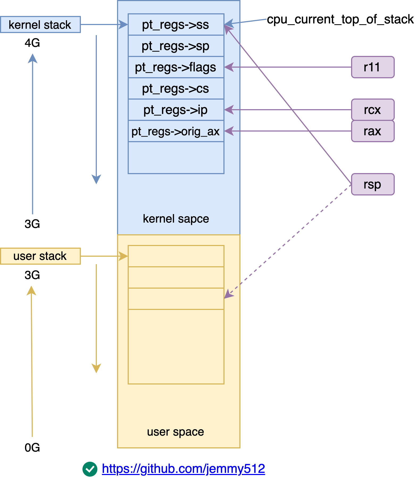

* glibc
    ```c
    /* glibc-2.28/sysdeps/unix/x86_64/sysdep.h
    The Linux/x86-64 kernel expects the system call parameters in
    registers according to the following table:
        syscall number  rax
        arg 1           rdi
        arg 2           rsi
        arg 3           rdx
        arg 4           r10
        arg 5           r8
        arg 6           r9 */
    #define DO_CALL(syscall_name, args) \
    lea SYS_ify (syscall_name), %rax; \
    syscall

    /* glibc-2.28/sysdeps/unix/sysv/linux/x86_64/sysdep.h */
    #define SYS_ify(syscall_name)  __NR_##syscall_name
    ```

* syscall_table
    1. declare syscall table: arch/x86/entry/syscalls/syscall_64.tbl
        ```c
        # 64-bit system call numbers and entry vectors

        # The __x64_sys_*() stubs are created on-the-fly for sys_*() system calls
        # The abi is "common", "64" or "x32" for this file.
        #
        # <number>  <abi>     <name>    <entry point>
            0       common    read      __x64_sys_read
            1       common    write     __x64_sys_write
            2       common    open      __x64_sys_open
        ```

    2. genrate syscall table: arch/x86/entry/syscalls/Makefile
        ```c
        /* 2.1 arch/x86/entry/syscalls/syscallhdr.sh generates #define __NR_open
        * arch/sh/include/uapi/asm/unistd_64.h */
        #define __NR_restart_syscall    0
        #define __NR_exit               1
        #define __NR_fork               2
        #define __NR_read               3
        #define __NR_write              4
        #define __NR_open               5

        /* 2.2 arch/x86/entry/syscalls/syscalltbl.sh
        * generates __SYSCALL_64(x, y) into asm/syscalls_64.h */
        __SYSCALL_64(__NR_open, __x64_sys_read)
        __SYSCALL_64(__NR_write, __x64_sys_write)
        __SYSCALL_64(__NR_open, __x64_sys_open)

        /* arch/x86/entry/syscall_64.c */
        #define __SYSCALL_64(nr, sym, qual) [nr] = sym

        asmlinkage const sys_call_ptr_t sys_call_table[__NR_syscall_max+1] = {
            /* Smells like a compiler bug -- it doesn't work
            * when the & below is removed. */
            [0 ... __NR_syscall_max] = &sys_ni_syscall,
            #include <asm/syscalls_64.h>
        };
        ```

    3. declare implemenation: include/linux/syscalls.h
        ```c
        asmlinkage long sys_write(unsigned int fd, const char __user *buf, size_t count);
        asmlinkage long sys_read(unsigned int fd, char __user *buf, size_t count);
        asmlinkage long sys_open(const char __user *filename, int flags, umode_t mode);
        ```

    4. define implemenation: fs/open.c
        ```c
        #include <linux/syscalls.h>

        SYSCALL_DEFINE3(open, const char __user *, filename, int, flags, umode_t, mode)
        {
            if (force_o_largefile())
                flags |= O_LARGEFILE;

            return do_sys_open(AT_FDCWD, filename, flags, mode);
        }
        ```

```c
/* Moduel Specific Register, trap_init -> cpu_init -> syscall_init */
wrmsrl(MSR_LSTAR, (unsigned long)entry_SYSCALL_64);

ENTRY(entry_SYSCALL_64)
  UNWIND_HINT_EMPTY
  /* Interrupts are off on entry.
   * We do not frame this tiny irq-off block with TRACE_IRQS_OFF/ON,
   * it is too small to ever cause noticeable irq latency. */

  swapgs

/* 1. swap to kernel stack
   * This path is only taken when PAGE_TABLE_ISOLATION is disabled so it
   * is not required to switch CR3. */
  movq  %rsp, PER_CPU_VAR(rsp_scratch)
  movq  PER_CPU_VAR(cpu_current_top_of_stack), %rsp /* x86_hw_tss.sp1, update in __switch_to */
  /* movq %gs:cpu_current_top_of_stack, %rsp */

/* 2. save user stack
  * Construct struct pt_regs on stack */
  pushq  $__USER_DS                 /* pt_regs->ss */
  pushq  PER_CPU_VAR(rsp_scratch)   /* pt_regs->sp */
  pushq  %r11                       /* pt_regs->flags */
  pushq  $__USER_CS                 /* pt_regs->cs */
  pushq  %rcx                       /* pt_regs->ip */
GLOBAL(entry_SYSCALL_64_after_hwframe)
  pushq  %rax                       /* pt_regs->orig_ax */

  PUSH_AND_CLEAR_REGS rax=$-ENOSYS

  TRACE_IRQS_OFF

/* 3. do_syscall */
  movq  %rax, %rdi
  movq  %rsp, %rsi
  call  do_syscall_64    /* returns with IRQs disabled */

  TRACE_IRQS_IRETQ    /* we're about to change IF */

  /* Try to use SYSRET instead of IRET if we're returning to
   * a completely clean 64-bit userspace context.  If we're not,
   * go to the slow exit path. */
  movq  RCX(%rsp), %rcx
  movq  RIP(%rsp), %r11

/* 4. restore user stack */
  cmpq  %rcx, %r11  /* SYSRET requires RCX == RIP */
  jne  swapgs_restore_regs_and_return_to_usermode

  /* On Intel CPUs, SYSRET with non-canonical RCX/RIP will #GP
   * in kernel space.  This essentially lets the user take over
   * the kernel, since userspace controls RSP.
   *
   * If width of "canonical tail" ever becomes variable, this will need
   * to be updated to remain correct on both old and new CPUs.
   *
   * Change top bits to match most significant bit (47th or 56th bit
   * depending on paging mode) in the address. */
#ifdef CONFIG_X86_5LEVEL
  ALTERNATIVE "shl $(64 - 48), %rcx; sar $(64 - 48), %rcx", \
    "shl $(64 - 57), %rcx; sar $(64 - 57), %rcx", X86_FEATURE_LA57
#else
  shl  $(64 - (__VIRTUAL_MASK_SHIFT+1)), %rcx
  sar  $(64 - (__VIRTUAL_MASK_SHIFT+1)), %rcx
#endif

  /* If this changed %rcx, it was not canonical */
  cmpq  %rcx, %r11
  jne  swapgs_restore_regs_and_return_to_usermode

  cmpq  $__USER_CS, CS(%rsp)    /* CS must match SYSRET */
  jne  swapgs_restore_regs_and_return_to_usermode

  movq  R11(%rsp), %r11
  cmpq  %r11, EFLAGS(%rsp)    /* R11 == RFLAGS */
  jne  swapgs_restore_regs_and_return_to_usermode

  /* SYSCALL clears RF when it saves RFLAGS in R11 and SYSRET cannot
   * restore RF properly. If the slowpath sets it for whatever reason, we
   * need to restore it correctly.
   *
   * SYSRET can restore TF, but unlike IRET, restoring TF results in a
   * trap from userspace immediately after SYSRET.  This would cause an
   * infinite loop whenever #DB happens with register state that satisfies
   * the opportunistic SYSRET conditions.  For example, single-stepping
   * this user code:
   *
   *           movq  $stuck_here, %rcx
   *           pushfq
   *           popq %r11
   *   stuck_here:
   *
   * would never get past 'stuck_here'. */
  testq  $(X86_EFLAGS_RF|X86_EFLAGS_TF), %r11
  jnz  swapgs_restore_regs_and_return_to_usermode

  /* nothing to check for RSP */

  cmpq  $__USER_DS, SS(%rsp)    /* SS must match SYSRET */
  jne  swapgs_restore_regs_and_return_to_usermode

  /* We win! This label is here just for ease of understanding
   * perf profiles. Nothing jumps here. */
syscall_return_via_sysret:
  /* rcx and r11 are already restored (see code above) */
  POP_REGS pop_rdi=0 skip_r11rcx=1

  /* Now all regs are restored except RSP and RDI.
   * Save old stack pointer and switch to trampoline stack. */
  movq  %rsp, %rdi
  movq  PER_CPU_VAR(cpu_tss_rw + TSS_sp0), %rsp
  UNWIND_HINT_EMPTY

  pushq  RSP-RDI(%rdi)  /* RSP */
  pushq  (%rdi)    /* RDI */

  /* We are on the trampoline stack.  All regs except RDI are live.
   * We can do future final exit work right here. */
  SWITCH_TO_USER_CR3_STACK scratch_reg=%rdi

  popq  %rdi
  popq  %rsp
  USERGS_SYSRET64
END(entry_SYSCALL_64)

#define USERGS_SYSRET64 \
  swapgs; \
  sysretq;
```

```c
SYM_CODE_START_LOCAL(common_interrupt_return)
SYM_INNER_LABEL(swapgs_restore_regs_and_return_to_usermode, SYM_L_GLOBAL)
  IBRS_EXIT

  POP_REGS pop_rdi=0
  /*
  .macro POP_REGS pop_rdi=1
    popq %r15
    popq %r14
    popq %r13
    popq %r12
    popq %rbp
    popq %rbx
    popq %r11
    popq %r10
    popq %r9
    popq %r8
    popq %rax
    popq %rcx
    popq %rdx
    popq %rsi
    .if \pop_rdi
      popq %rdi
    .endif
  .endm */

  /* The stack is now user RDI, orig_ax, RIP, CS, EFLAGS, RSP, SS.
   * Save old stack pointer and switch to trampoline stack. */
  movq  %rsp, %rdi
  movq  PER_CPU_VAR(cpu_tss_rw + TSS_sp0), %rsp
  UNWIND_HINT_EMPTY

  /* Copy the IRET frame to the trampoline stack. */
  pushq  6*8(%rdi)  /* SS */
  pushq  5*8(%rdi)  /* RSP */
  pushq  4*8(%rdi)  /* EFLAGS */
  pushq  3*8(%rdi)  /* CS */
  pushq  2*8(%rdi)  /* RIP */

  /* Push user RDI on the trampoline stack. */
  pushq  (%rdi)

  /* We are on the trampoline stack.  All regs except RDI are live.
   * We can do future final exit work right here. */
  STACKLEAK_ERASE_NOCLOBBER

  SWITCH_TO_USER_CR3_STACK scratch_reg=%rdi

  /* Restore RDI. */
  popq  %rdi
  swapgs
  jmp  .Lnative_iret

.Lnative_iret:
  UNWIND_HINT_IRET_REGS
  /* Are we returning to a stack segment from the LDT?  Note: in
   * 64-bit mode SS:RSP on the exception stack is always valid. */
#ifdef CONFIG_X86_ESPFIX64
  testb  $4, (SS-RIP)(%rsp)
  jnz  native_irq_return_ldt
#endif

SYM_INNER_LABEL(native_irq_return_iret, SYM_L_GLOBAL)
  ANNOTATE_NOENDBR // exc_double_fault
  /* This may fault.  Non-paranoid faults on return to userspace are
   * handled by fixup_bad_iret.  These include #SS, #GP, and #NP.
   * Double-faults due to espfix64 are handled in exc_double_fault.
   * Other faults here are fatal. */
  iretq

#ifdef CONFIG_X86_ESPFIX64
native_irq_return_ldt:
  /* We are running with user GSBASE.  All GPRs contain their user
   * values.  We have a percpu ESPFIX stack that is eight slots
   * long (see ESPFIX_STACK_SIZE).  espfix_waddr points to the bottom
   * of the ESPFIX stack.
   *
   * We clobber RAX and RDI in this code.  We stash RDI on the
   * normal stack and RAX on the ESPFIX stack.
   *
   * The ESPFIX stack layout we set up looks like this:
   *
   * --- top of ESPFIX stack ---
   * SS
   * RSP
   * RFLAGS
   * CS
   * RIP  <-- RSP points here when we're done
   * RAX  <-- espfix_waddr points here
   * --- bottom of ESPFIX stack --- */

  pushq  %rdi        /* Stash user RDI */
  swapgs          /* to kernel GS */
  SWITCH_TO_KERNEL_CR3 scratch_reg=%rdi  /* to kernel CR3 */

  movq  PER_CPU_VAR(espfix_waddr), %rdi
  movq  %rax, (0*8)(%rdi)    /* user RAX */

  movq  (1*8)(%rsp), %rax    /* user RIP */
  movq  %rax, (1*8)(%rdi)

  movq  (2*8)(%rsp), %rax    /* user CS */
  movq  %rax, (2*8)(%rdi)

  movq  (3*8)(%rsp), %rax    /* user RFLAGS */
  movq  %rax, (3*8)(%rdi)

  movq  (5*8)(%rsp), %rax    /* user SS */
  movq  %rax, (5*8)(%rdi)

  movq  (4*8)(%rsp), %rax    /* user RSP */
  movq  %rax, (4*8)(%rdi)
  /* Now RAX == RSP. */

  andl  $0xffff0000, %eax    /* RAX = (RSP & 0xffff0000) */

  /* espfix_stack[31:16] == 0.  The page tables are set up such that
   * (espfix_stack | (X & 0xffff0000)) points to a read-only alias of
   * espfix_waddr for any X.  That is, there are 65536 RO aliases of
   * the same page.  Set up RSP so that RSP[31:16] contains the
   * respective 16 bits of the /userspace/ RSP and RSP nonetheless
   * still points to an RO alias of the ESPFIX stack. */
  orq  PER_CPU_VAR(espfix_stack), %rax

  SWITCH_TO_USER_CR3_STACK scratch_reg=%rdi
  swapgs            /* to user GS */
  popq  %rdi        /* Restore user RDI */

  movq  %rax, %rsp
  UNWIND_HINT_IRET_REGS offset=8

  /* At this point, we cannot write to the stack any more, but we can
   * still read. */
  popq  %rax        /* Restore user RAX */

  /* RSP now points to an ordinary IRET frame, except that the page
   * is read-only and RSP[31:16] are preloaded with the userspace
   * values.  We can now IRET back to userspace. */
  jmp  native_irq_return_iret
#endif
SYM_CODE_END(common_interrupt_return)
_ASM_NOKPROBE(common_interrupt_return)
```

```c
/* entry_SYSCALL_64 -> entry_SYSCALL64_slow_pat -> do_syscall_64 */
void do_syscall_64(struct pt_regs *regs, int nr)
{
  add_random_kstack_offset();
  nr = syscall_enter_from_user_mode(regs, nr);

  instrumentation_begin();

  if (!do_syscall_x64(regs, nr) && !do_syscall_x32(regs, nr) && nr != -1) {
    /* Invalid system call, but still a system call. */
    regs->ax = __x64_sys_ni_syscall(regs);
  }

  instrumentation_end();
  syscall_exit_to_user_mode(regs);
}

void syscall_exit_to_user_mode(struct pt_regs *regs)
{
  instrumentation_begin();
  __syscall_exit_to_user_mode_work(regs);
  instrumentation_end();
  __exit_to_user_mode();
}

void __syscall_exit_to_user_mode_work(struct pt_regs *regs)
{
  syscall_exit_to_user_mode_prepare(regs);
  local_irq_disable_exit_to_user();
  exit_to_user_mode_prepare(regs);
}

void exit_to_user_mode_prepare(struct pt_regs *regs)
{
  unsigned long ti_work = read_thread_flags();

  lockdep_assert_irqs_disabled();

  /* Flush pending rcuog wakeup before the last need_resched() check */
  tick_nohz_user_enter_prepare();

  if (unlikely(ti_work & EXIT_TO_USER_MODE_WORK))
    ti_work = exit_to_user_mode_loop(regs, ti_work);

  arch_exit_to_user_mode_prepare(regs, ti_work);

  /* Ensure that the address limit is intact and no locks are held */
  addr_limit_user_check();
  kmap_assert_nomap();
  lockdep_assert_irqs_disabled();
  lockdep_sys_exit();
}

unsigned long exit_to_user_mode_loop(struct pt_regs *regs,
              unsigned long ti_work)
{
  while (ti_work & EXIT_TO_USER_MODE_WORK) {

    local_irq_enable_exit_to_user(ti_work);

    if (ti_work & _TIF_NEED_RESCHED)
      schedule();

    if (ti_work & _TIF_UPROBE)
      uprobe_notify_resume(regs);

    if (ti_work & _TIF_PATCH_PENDING)
      klp_update_patch_state(current);

    if (ti_work & (_TIF_SIGPENDING | _TIF_NOTIFY_SIGNAL))
      arch_do_signal_or_restart(regs);

    if (ti_work & _TIF_NOTIFY_RESUME)
      resume_user_mode_work(regs);

    arch_exit_to_user_mode_work(regs, ti_work);

    local_irq_disable_exit_to_user();

    /* Check if any of the above work has queued a deferred wakeup */
    tick_nohz_user_enter_prepare();

    ti_work = read_thread_flags();
  }

  /* Return the latest work state for arch_exit_to_user_mode() */
  return ti_work;
}

void __exit_to_user_mode(void)
{
  instrumentation_begin();
  trace_hardirqs_on_prepare();
  lockdep_hardirqs_on_prepare();
  instrumentation_end();

  user_enter_irqoff();
  arch_exit_to_user_mode();
  lockdep_hardirqs_on(CALLER_ADDR0);
}
```


```c
entry_SYSCALL_64()
    /* 1. swap to kernel stack */
    movq  %rsp, PER_CPU_VAR(rsp_scratch)
    movq  PER_CPU_VAR(cpu_current_top_of_stack), %rsp

    /* 2. save user stack */
    pushq  $__USER_DS                 /* pt_regs->ss */
    pushq  PER_CPU_VAR(rsp_scratch)   /* pt_regs->sp */
    pushq  %r11                       /* pt_regs->flags */
    pushq  $__USER_CS                 /* pt_regs->cs */
    pushq  %rcx                       /* pt_regs->ip */
    pushq  %rax                       /* pt_regs->orig_ax */

    /* 3. do_syscall */
    movq  %rax, %rdi
    movq  %rsp, %rsi
    call  do_syscall_64
        regs->ax = __x64_sys_ni_syscall(regs);
        syscall_exit_to_user_mode(regs);
            __syscall_exit_to_user_mode_work();
                exit_to_user_mode_prepare();
                    if (unlikely(ti_work & EXIT_TO_USER_MODE_WORK))
                        ti_work = exit_to_user_mode_loop(regs, ti_work);
                            if (ti_work & _TIF_NEED_RESCHED)
                                schedule();
                            if (ti_work & (_TIF_SIGPENDING | _TIF_NOTIFY_SIGNAL))
                                arch_do_signal_or_restart(regs);

            __exit_to_user_mode();
                arch_exit_to_user_mode();

    /* 4. restore user stack */
    swapgs_restore_regs_and_return_to_usermode()
        POP_REGS pop_rdi=0
        /* The stack is now user RDI, orig_ax, RIP, CS, EFLAGS, RSP, SS */

        movq  %rsp, %rdi /* save kernel sp */
        movq  PER_CPU_VAR(cpu_tss_rw + TSS_sp0), %rsp /* load user sp */

        /* Copy the IRET frame from kernel stack to the user trampoline stack. */
        pushq  6*8(%rdi)  /* SS */
        pushq  5*8(%rdi)  /* RSP */
        pushq  4*8(%rdi)  /* EFLAGS */
        pushq  3*8(%rdi)  /* CS */
        pushq  2*8(%rdi)  /* RIP */

        INTERRUPT_RETURN
```

## 32

1. declare syscall table: arch/x86/entry/syscalls/syscall_32.tbl
    ```c
    # 32-bit system call numbers and entry vectors

    # The __ia32_sys and __ia32_compat_sys stubs are created on-the-fly for
    # sys_*() system calls and compat_sys_*() compat system calls if
    # IA32_EMULATION is defined, and expect struct pt_regs *regs as their only
    # parameter.
    #
    # The abi is always "i386" for this file.
    # <number>  <abi>   <name>      <entry point>       <compat entry point>
        0       i386   restart_syscall    sys_restart_syscall   __ia32_sys_restart_syscall
        1       i386   exit         sys_exit            __ia32_sys_exit
        2       i386   fork         sys_fork            __ia32_sys_fork
    ```

2. generate syscall table: arch/x86/entry/syscall_32.c
    ```c
    /* arch/x86/entry/syscalls/Makefile
     * 2.1 arch/x86/entry/syscalls/syscallhdr.sh generates #define __NR_open
     * arch/sh/include/uapi/asm/unistd_32.h */
    #define __NR_restart_syscall    0
    #define __NR_exit               1
    #define __NR_fork               2
    #define __NR_read               3
    #define __NR_write              4
    #define __NR_open               5

    /* 2.2 arch/x86/entry/syscalls/syscalltbl.sh generates __SYSCALL_I386(__NR_open, sys_open) */
    #define __SYSCALL_I386(nr, sym, qual) [nr] = sym,

    __visible const sys_call_ptr_t ia32_sys_call_table[__NR_syscall_compat_max+1] = {
        /* Smells like a compiler bug -- it doesn't work
        * when the & below is removed. */
        [0 ... __NR_syscall_compat_max] = &sys_ni_syscall,
        #include <asm/syscalls_32.h>
    };
    ```

3. declare implemenation: include/linux/syscalls.h
    ```c
    /* include/linux/syscalls.h */
    asmlinkage long sys_socket(int, int, int);
    asmlinkage long sys_socketpair(int, int, int, int __user *);
    asmlinkage long sys_bind(int, struct sockaddr __user *, int);
    asmlinkage long sys_listen(int, int);
    ```

4. define implemenation: fs/open.c
    ```c
    #include <linux/syscalls.h>
    SYSCALL_DEFINE3(open, const char __user *, filename, int, flags, umode_t, mode)
    {
        if (force_o_largefile())
            flags |= O_LARGEFILE;

        return do_sys_open(AT_FDCWD, filename, flags, mode);
    }
    ```

```c
/* glibc-2.28/sysdeps/unix/sysv/linux/i386/sysdep.h
 Linux takes system call arguments in registers:
  syscall number  %eax       call-clobbered
  arg 1    %ebx       call-saved
  arg 2    %ecx       call-clobbered
  arg 3    %edx       call-clobbered
  arg 4    %esi       call-saved
  arg 5    %edi       call-saved
  arg 6    %ebp       call-saved */
#define DO_CALL(syscall_name, args) \
    PUSHARGS_##args \
    DOARGS_##args \
    movl $SYS_ify (syscall_name), %eax; \ /* get syscall id by syscall_name */
    ENTER_KERNEL \
    POPARGS_##args

#define ENTER_KERNEL int $0x80

/* glibc-2.28/sysdeps/unix/sysv/linux/x86_64/sysdep.h */
#define SYS_ify(syscall_name)  __NR_##syscall_name

#define IA32_SYSCALL_VECTOR  0x80

#define _DOARGS_0(n)  /* No arguments to frob.  */
#define _DOARGS_1(n)  movl n(%esp), %ebx; _DOARGS_0 (n-4)
#define  _DOARGS_2(n)  movl n(%esp), %ecx; _DOARGS_1 (n-4)
#define _DOARGS_3(n)  movl n(%esp), %edx; _DOARGS_2 (n-4)
#define _DOARGS_4(n)  movl n(%esp), %esi; _DOARGS_3 (n-4)
#define _DOARGS_5(n)  movl n(%esp), %edi; _DOARGS_4 (n-4)
#define _DOARGS_6(n)  movl n(%esp), %ebp; _DOARGS_5 (n-4)


#define  DOARGS_0  /* No arguments to frob.  */
#define  DOARGS_1  _DOARGS_1 (4)
#define  DOARGS_2  _DOARGS_2 (8)
#define DOARGS_3  _DOARGS_3 (16)
#define DOARGS_4  _DOARGS_4 (24)
#define DOARGS_5  _DOARGS_5 (32)
#define DOARGS_6  _DOARGS_6 (40)

#define PUSHARGS_0  /* No arguments to push.  */
#define  _PUSHARGS_0  /* No arguments to push.  */

#define PUSHARGS_1  movl %ebx, %edx; L(SAVEBX1): PUSHARGS_0
#define  _PUSHARGS_1  pushl %ebx; cfi_adjust_cfa_offset (4);cfi_rel_offset (ebx, 0); L(PUSHBX1): _PUSHARGS_0

/* CFI stands for Call Frame Information
and helps a debugger create a reliable backtrace through functions. */

#define PUSHARGS_2  PUSHARGS_1
#define _PUSHARGS_2  _PUSHARGS_1

#define PUSHARGS_3  _PUSHARGS_2
#define _PUSHARGS_3  _PUSHARGS_2

#define PUSHARGS_4  _PUSHARGS_4
#define _PUSHARGS_4  pushl %esi; cfi_adjust_cfa_offset (4); cfi_rel_offset (esi, 0); L(PUSHSI1): _PUSHARGS_3

#define PUSHARGS_5  _PUSHARGS_5
#define _PUSHARGS_5  pushl %edi; cfi_adjust_cfa_offset (4); cfi_rel_offset (edi, 0); L(PUSHDI1): _PUSHARGS_4

#define PUSHARGS_6  _PUSHARGS_6
#define _PUSHARGS_6  pushl %ebp; cfi_adjust_cfa_offset (4); cfi_rel_offset (ebp, 0); L(PUSHBP1): _PUSHARGS_5
```

```c
/* trap_init */
set_system_intr_gate(IA32_SYSCALL_VECTOR, entry_INT80_32);

/* arch/x86/entry/entry_32.S */
/* Arguments:
 * eax  system call number
 * ebx  arg1
 * ecx  arg2
 * edx  arg3
 * esi  arg4
 * edi  arg5
 * ebp  arg6 */
ENTRY(entry_INT80_32)
  ASM_CLAC
  pushl  %eax      /* pt_regs->orig_ax */

  SAVE_ALL pt_regs_ax=$-ENOSYS switch_stacks=1  /* save rest */

  /* User mode is traced as though IRQs are on, and the interrupt gate
   * turned them off. */
  TRACE_IRQS_OFF

  movl  %esp, %eax
  call  do_int80_syscall_32
.Lsyscall_32_done:

restore_all:
  TRACE_IRQS_IRET
  SWITCH_TO_ENTRY_STACK

.Lrestore_all_notrace:
  CHECK_AND_APPLY_ESPFIX
.Lrestore_nocheck:
  /* Switch back to user CR3 */
  SWITCH_TO_USER_CR3 scratch_reg=%eax

  BUG_IF_WRONG_CR3

  /* Restore user state */
  RESTORE_REGS pop=4      # skip orig_eax/error_code
.Lirq_return:
  /* ARCH_HAS_MEMBARRIER_SYNC_CORE rely on IRET core serialization
   * when returning from IPI handler and when returning from
   * scheduler to user-space. */
  INTERRUPT_RETURN # iret

restore_all_kernel:
  TRACE_IRQS_IRET
  PARANOID_EXIT_TO_KERNEL_MODE
  BUG_IF_WRONG_CR3
  RESTORE_REGS 4
  jmp  .Lirq_return

.section .fixup, "ax"
ENTRY(iret_exc  )
  pushl  $0        # no error code
  pushl  $do_iret_error

#ifdef CONFIG_DEBUG_ENTRY
  /* The stack-frame here is the one that iret faulted on, so its a
   * return-to-user frame. We are on kernel-cr3 because we come here from
   * the fixup code. This confuses the CR3 checker, so switch to user-cr3
   * as the checker expects it. */
  pushl  %eax
  SWITCH_TO_USER_CR3 scratch_reg=%eax
  popl  %eax
#endif

  jmp  common_exception
.previous
  _ASM_EXTABLE(.Lirq_return, iret_exc)
ENDPROC(entry_INT80_32)
```

```c
.macro SAVE_ALL pt_regs_ax=%eax switch_stacks=0
  cld
  PUSH_GS
  pushl  %fs
  pushl  %es
  pushl  %ds
  pushl \pt_regs_ax
  pushl  %ebp
  pushl  %edi
  pushl  %esi
  pushl  %edx
  pushl  %ecx
  pushl  %ebx
  movl   $(__USER_DS), %edx
  movl   %edx, %ds
  movl   %edx, %es
  movl   $(__KERNEL_PERCPU), %edx
  movl   %edx, %fs
  SET_KERNEL_GS %edx
  /* Switch to kernel stack if necessary */
.if \switch_stacks > 0
  SWITCH_TO_KERNEL_STACK
.endif
```

```c
#define CS_FROM_ENTRY_STACK  (1 << 31)
#define CS_FROM_USER_CR3  (1 << 30)

.macro SWITCH_TO_KERNEL_STACK

  ALTERNATIVE     "", "jmp .Lend_\@", X86_FEATURE_XENPV

  BUG_IF_WRONG_CR3

  SWITCH_TO_KERNEL_CR3 scratch_reg=%eax

  /* %eax now contains the entry cr3 and we carry it forward in
   * that register for the time this macro runs */

  /* The high bits of the CS dword (__csh) are used for
   * CS_FROM_ENTRY_STACK and CS_FROM_USER_CR3. Clear them in case
   * hardware didn't do this for us. */
  andl  $(0x0000ffff), PT_CS(%esp)

  /* Are we on the entry stack? Bail out if not! */
  movl  PER_CPU_VAR(cpu_entry_area), %ecx
  addl  $CPU_ENTRY_AREA_entry_stack + SIZEOF_entry_stack, %ecx
  subl  %esp, %ecx  /* ecx = (end of entry_stack) - esp */
  cmpl  $SIZEOF_entry_stack, %ecx
  jae  .Lend_\@

  /* Load stack pointer into %esi and %edi */
  movl  %esp, %esi
  movl  %esi, %edi

  /* Move %edi to the top of the entry stack */
  andl  $(MASK_entry_stack), %edi
  addl  $(SIZEOF_entry_stack), %edi

  /* Load top of task-stack into %edi */
  movl  TSS_entry2task_stack(%edi), %edi

  /* Special case - entry from kernel mode via entry stack */
#ifdef CONFIG_VM86
  movl  PT_EFLAGS(%esp), %ecx    # mix EFLAGS and CS
  movb  PT_CS(%esp), %cl
  andl  $(X86_EFLAGS_VM | SEGMENT_RPL_MASK), %ecx
#else
  movl  PT_CS(%esp), %ecx
  andl  $SEGMENT_RPL_MASK, %ecx
#endif
  cmpl  $USER_RPL, %ecx
  jb  .Lentry_from_kernel_\@

  /* Bytes to copy */
  movl  $PTREGS_SIZE, %ecx

#ifdef CONFIG_VM86
  testl  $X86_EFLAGS_VM, PT_EFLAGS(%esi)
  jz  .Lcopy_pt_regs_\@

  /* Stack-frame contains 4 additional segment registers when
   * coming from VM86 mode */
  addl  $(4 * 4), %ecx

#endif
.Lcopy_pt_regs_\@:

  /* Allocate frame on task-stack */
  subl  %ecx, %edi

  /* Switch to task-stack */
  movl  %edi, %esp

  /* We are now on the task-stack and can safely copy over the
   * stack-frame */
  shrl  $2, %ecx
  cld
  rep movsl

  jmp .Lend_\@
```

```c
/* Switch back from the kernel stack to the entry stack.
 *
 * The %esp register must point to pt_regs on the task stack. It will
 * first calculate the size of the stack-frame to copy, depending on
 * whether we return to VM86 mode or not. With that it uses 'rep movsl'
 * to copy the contents of the stack over to the entry stack */
.macro SWITCH_TO_ENTRY_STACK

  ALTERNATIVE     "", "jmp .Lend_\@", X86_FEATURE_XENPV

  /* Bytes to copy */
  movl  $PTREGS_SIZE, %ecx

#ifdef CONFIG_VM86
  testl  $(X86_EFLAGS_VM), PT_EFLAGS(%esp)
  jz  .Lcopy_pt_regs_\@

  /* Additional 4 registers to copy when returning to VM86 mode */
  addl    $(4 * 4), %ecx

.Lcopy_pt_regs_\@:
#endif

  /* Initialize source and destination for movsl */
  movl  PER_CPU_VAR(cpu_tss_rw + TSS_sp0), %edi
  subl  %ecx, %edi
  movl  %esp, %esi

  /* Save future stack pointer in %ebx */
  movl  %edi, %ebx

  /* Copy over the stack-frame */
  shrl  $2, %ecx
  cld
  rep movsl

  /* Switch to entry-stack - needs to happen after everything is
   * copied because the NMI handler will overwrite the task-stack
   * when on entry-stack */
  movl  %ebx, %esp

.Lend_\@:
.endm

static void do_syscall_32_irqs_on(struct pt_regs *regs)
{
  struct thread_info *ti = current_thread_info();
  unsigned int nr = (unsigned int)regs->orig_ax;

  if (likely(nr < IA32_NR_syscalls)) {
    regs->ax = ia32_sys_call_table[nr](
      (unsigned int)regs->bx, (unsigned int)regs->cx,
      (unsigned int)regs->dx, (unsigned int)regs->si,
      (unsigned int)regs->di, (unsigned int)regs->bp
    );
  }

  syscall_return_slowpath(regs);
}

inline void syscall_return_slowpath(struct pt_regs *regs)
{
  struct thread_info *ti = current_thread_info();
  u32 cached_flags = READ_ONCE(ti->flags);

  if (IS_ENABLED(CONFIG_PROVE_LOCKING) &&
      WARN(irqs_disabled(), "syscall %ld left IRQs disabled", regs->orig_ax))
    local_irq_enable();

  rseq_syscall(regs);

  if (unlikely(cached_flags & SYSCALL_EXIT_WORK_FLAGS))
    syscall_slow_exit_work(regs, cached_flags);

  local_irq_disable();
  prepare_exit_to_usermode(regs);
}

inline void prepare_exit_to_usermode(struct pt_regs *regs)
{
  struct thread_info *ti = current_thread_info();
  u32 cached_flags;

  addr_limit_user_check();

  cached_flags = READ_ONCE(ti->flags);

  if (unlikely(cached_flags & EXIT_TO_USERMODE_LOOP_FLAGS))
    exit_to_usermode_loop(regs, cached_flags);

  user_enter_irqoff();

  mds_user_clear_cpu_buffers();
}

void exit_to_usermode_loop(struct pt_regs *regs, u32 cached_flags)
{
  while (true) {
    local_irq_enable();

    if (cached_flags & _TIF_NEED_RESCHED)
      schedule();

    if (cached_flags & _TIF_UPROBE)
      uprobe_notify_resume(regs);

    if (cached_flags & _TIF_PATCH_PENDING)
      klp_update_patch_state(current);

    /* deal with pending signal delivery */
    if (cached_flags & _TIF_SIGPENDING)
      do_signal(regs);

    if (cached_flags & _TIF_NOTIFY_RESUME) {
      clear_thread_flag(TIF_NOTIFY_RESUME);
      tracehook_notify_resume(regs);
      rseq_handle_notify_resume(NULL, regs);
    }

    if (cached_flags & _TIF_USER_RETURN_NOTIFY)
      fire_user_return_notifiers();

    /* Disable IRQs and retry */
    local_irq_disable();

    cached_flags = READ_ONCE(current_thread_info()->flags);

    if (!(cached_flags & EXIT_TO_USERMODE_LOOP_FLAGS))
      break;
  }
}
```
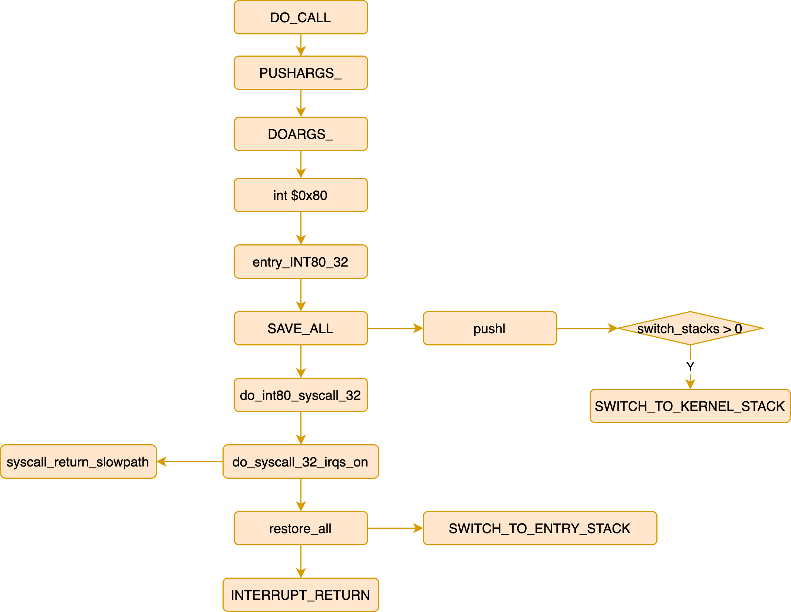


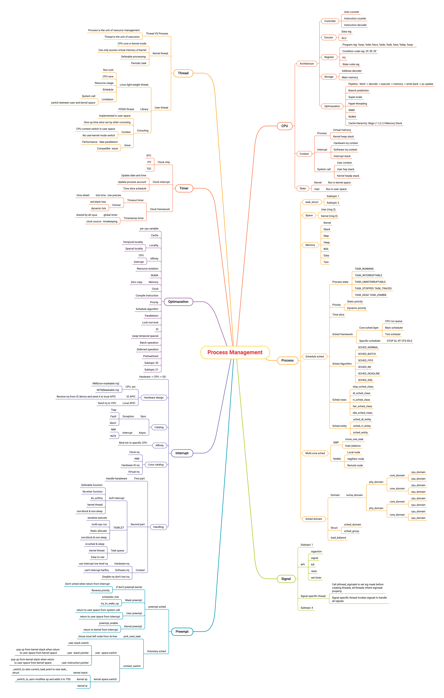

## arm64
```c
SYM_FUNC_START_LOCAL(__primary_switched)
    adr_l    x4, init_task
    init_cpu_task x4, x5, x6

    adr_l    x8, vectors            // load VBAR_EL1 with virtual
    msr    vbar_el1, x8            // vector table address
    isb

SYM_FUNC_START_LOCAL(__secondary_switched)
    mov    x0, x20
    bl    set_cpu_boot_mode_flag

    mov    x0, x20
    bl    finalise_el2

    str_l    xzr, __early_cpu_boot_status, x3
    adr_l    x5, vectors
    msr    vbar_el1, x5
    isb
```

```c
SYM_CODE_START(vectors)
    kernel_ventry    1, t, 64, sync     // Synchronous EL1t
    kernel_ventry    1, t, 64, irq      // IRQ EL1t
    kernel_ventry    1, t, 64, fiq      // FIQ EL1t
    kernel_ventry    1, t, 64, error    // Error EL1t

    kernel_ventry    1, h, 64, sync     // Synchronous EL1h
    kernel_ventry    1, h, 64, irq      // IRQ EL1h
    kernel_ventry    1, h, 64, fiq      // FIQ EL1h
    kernel_ventry    1, h, 64, error    // Error EL1h

    kernel_ventry    0, t, 64, sync     // Synchronous 64-bit EL0
    kernel_ventry    0, t, 64, irq      // IRQ 64-bit EL0
    kernel_ventry    0, t, 64, fiq      // FIQ 64-bit EL0
    kernel_ventry    0, t, 64, error    // Error 64-bit EL0

    kernel_ventry    0, t, 32, sync     // Synchronous 32-bit EL0
    kernel_ventry    0, t, 32, irq      // IRQ 32-bit EL0
    kernel_ventry    0, t, 32, fiq      // FIQ 32-bit EL0
    kernel_ventry    0, t, 32, error    // Error 32-bit EL0
SYM_CODE_END(vectors)

.macro kernel_ventry, el:req, ht:req, regsize:req, label:req
    .align 7
.Lventry_start\@:
    .if    \el == 0
    b    .Lskip_tramp_vectors_cleanup\@
    .if    \regsize == 64
    mrs    x30, tpidrro_el0
    msr    tpidrro_el0, xzr
    .else
    mov    x30, xzr
    .endif
.Lskip_tramp_vectors_cleanup\@:
    .endif

    sub    sp, sp, #PT_REGS_SIZE
#ifdef CONFIG_VMAP_STACK
    add    sp, sp, x0            // sp' = sp + x0
    sub    x0, sp, x0            // x0' = sp' - x0 = (sp + x0) - x0 = sp
    tbnz    x0, #THREAD_SHIFT, 0f
    sub    x0, sp, x0            // x0'' = sp' - x0' = (sp + x0) - sp = x0
    sub    sp, sp, x0            // sp'' = sp' - x0 = (sp + x0) - x0 = sp
    b    el\el\ht\()_\regsize\()_\label

0:
    /* Stash the original SP (minus PT_REGS_SIZE) in tpidr_el0. */
    msr    tpidr_el0, x0

    /* Recover the original x0 value and stash it in tpidrro_el0 */
    sub    x0, sp, x0
    msr    tpidrro_el0, x0

    /* Switch to the overflow stack */
    adr_this_cpu sp, overflow_stack + OVERFLOW_STACK_SIZE, x0

    mrs    x0, tpidr_el0            // sp of interrupted context
    sub    x0, sp, x0            // delta with top of overflow stack
    tst    x0, #~(OVERFLOW_STACK_SIZE - 1)    // within range?
    b.ne    __bad_stack            // no? -> bad stack pointer

    /* We were already on the overflow stack. Restore sp/x0 and carry on. */
    sub    sp, sp, x0
    mrs    x0, tpidrro_el0
#endif
    b    el\el\ht\()_\regsize\()_\label
.org .Lventry_start\@ + 128    // Did we overflow the ventry slot?
    .endm
```

```c
/* arch/arm64/include/asm/exception.h */
asmlinkage void el1t_64_sync_handler(struct pt_regs *regs);
asmlinkage void el1t_64_irq_handler(struct pt_regs *regs);
asmlinkage void el1t_64_fiq_handler(struct pt_regs *regs);
asmlinkage void el1t_64_error_handler(struct pt_regs *regs);

void noinstr el0t_64_sync_handler(struct pt_regs *regs)
    unsigned long esr = read_sysreg(esr_el1);

    switch (ESR_ELx_EC(esr)) {
    case ESR_ELx_EC_SVC64:
        el0_svc(regs) {
            enter_from_user_mode(regs) {
                lockdep_hardirqs_off(CALLER_ADDR0);
                CT_WARN_ON(ct_state() != CONTEXT_USER);
                user_exit_irqoff();
                trace_hardirqs_off_finish();
                mte_disable_tco_entry(current);
            }
            cortex_a76_erratum_1463225_svc_handler();

            do_el0_svc(regs) {
                fp_user_discard();
                el0_svc_common(regs, regs->regs[8], __NR_syscalls, sys_call_table) {
                    unsigned long flags = read_thread_flags();

                    regs->orig_x0 = regs->regs[0];
                    regs->syscallno = scno;

                    if (flags & _TIF_MTE_ASYNC_FAULT) {
                        syscall_set_return_value(current, regs, -ERESTARTNOINTR, 0);
                        return;
                    }

                    invoke_syscall(regs, scno, sc_nr, syscall_table) {
                        if (scno < sc_nr) {
                            syscall_fn_t syscall_fn;
                            syscall_fn = syscall_table[array_index_nospec(scno, sc_nr)];
                            ret = __invoke_syscall(regs, syscall_fn) {
                                return syscall_fn(regs);
                            }
                        } else {
                            ret = do_ni_syscall(regs, scno);
                        }
                    }
                }
            }

            exit_to_user_mode(regs) {
                prepare_exit_to_user_mode(regs) {
                    flags = read_thread_flags();
                    if (unlikely(flags & _TIF_WORK_MASK)) {
                        do_notify_resume(regs, flags) {
                            do {
                                if (thread_flags & _TIF_NEED_RESCHED) {
                                    local_daif_restore(DAIF_PROCCTX_NOIRQ);
                                    schedule();
                                } else {
                                    local_daif_restore(DAIF_PROCCTX);

                                    if (thread_flags & _TIF_UPROBE)
                                        uprobe_notify_resume(regs);

                                    if (thread_flags & _TIF_MTE_ASYNC_FAULT) {
                                        clear_thread_flag(TIF_MTE_ASYNC_FAULT);
                                        send_sig_fault(SIGSEGV, SEGV_MTEAERR, (void __user *)NULL, current);
                                    }

                                    if (thread_flags & (_TIF_SIGPENDING | _TIF_NOTIFY_SIGNAL))
                                        do_signal(regs);

                                    if (thread_flags & _TIF_NOTIFY_RESUME)
                                        resume_user_mode_work(regs);

                                    if (thread_flags & _TIF_FOREIGN_FPSTATE)
                                        fpsimd_restore_current_state();
                                }

                                local_daif_mask();
                                thread_flags = read_thread_flags();
                            } while (thread_flags & _TIF_WORK_MASK);
                        }
                    }
                }

                mte_check_tfsr_exit();

                __exit_to_user_mode() {
                    trace_hardirqs_on_prepare();
                    lockdep_hardirqs_on_prepare();
                    user_enter_irqoff();
                    lockdep_hardirqs_on(CALLER_ADDR0);
                }
            }
        }
        break;
    case ESR_ELx_EC_DABT_LOW:
        el0_da(regs, esr);
        break;
    case ESR_ELx_EC_IABT_LOW:
        el0_ia(regs, esr);
        break;
    case ESR_ELx_EC_FP_ASIMD:
        el0_fpsimd_acc(regs, esr);
        break;
    case ESR_ELx_EC_SVE:
        el0_sve_acc(regs, esr);
        break;
    case ESR_ELx_EC_SME:
        el0_sme_acc(regs, esr);
        break;
    case ESR_ELx_EC_FP_EXC64:
        el0_fpsimd_exc(regs, esr);
        break;
    case ESR_ELx_EC_SYS64:
    case ESR_ELx_EC_WFx:
        el0_sys(regs, esr);
        break;
    case ESR_ELx_EC_SP_ALIGN:
        el0_sp(regs, esr);
        break;
    case ESR_ELx_EC_PC_ALIGN:
        el0_pc(regs, esr);
        break;
    case ESR_ELx_EC_UNKNOWN:
        el0_undef(regs, esr);
        break;
    case ESR_ELx_EC_BTI:
        el0_bti(regs);
        break;
    case ESR_ELx_EC_BREAKPT_LOW:
    case ESR_ELx_EC_SOFTSTP_LOW:
    case ESR_ELx_EC_WATCHPT_LOW:
    case ESR_ELx_EC_BRK64:
        el0_dbg(regs, esr);
        break;
    case ESR_ELx_EC_FPAC:
        el0_fpac(regs, esr);
        break;
    default:
        el0_inv(regs, esr);
    }

```

# process


```c
/* compile */
gcc -c -fPIC process.c
gcc -c -fPIC createprocess.c

/* staic lib */
ar cr libstaticprocess.a process.o
/* static link */
gcc -o staticcreateprocess createprocess.o -L. -lstaticprocess

/* dynamic lib */
gcc -shared -fPIC -o libdynamicprocess.so process.o
/* dynamic link LD_LIBRARY_PATH /lib /usr/lib */
gcc -o dynamiccreateprocess createprocess.o -L. -ldynamicprocess
export LD_LIBRARY_PATH=
```

1. elf: relocatable file


2. elf: executable file


3. elf: shared object

4. elf: core dump

* [UEFI简介 - 内核工匠](https://mp.weixin.qq.com/s/tgW9-FDo2hgxm8Uwne8ySw)


# thread


# task_struct


# schedule


* [进程调度 - LoyenWang](https://www.cnblogs.com/LoyenWang/tag/进程调度/)
    * [1. 基础](https://www.cnblogs.com/LoyenWang/p/12249106.html)
    * [2. CPU负载](https://www.cnblogs.com/LoyenWang/p/12316660.html)
    * [3. 进程切换](https://www.cnblogs.com/LoyenWang/p/12386281.html)
    * [4. 组调度及带宽控制](https://www.cnblogs.com/LoyenWang/p/12459000.html)
    * [5. CFS调度器](https://www.cnblogs.com/LoyenWang/p/12495319.html)
    * [6. 实时调度器](https://www.cnblogs.com/LoyenWang/p/12584345.html)

* [wowo Tech](http://www.wowotech.net/sort/process_management)
    * [进程切换分析(1) - 基本框架](http://www.wowotech.net/process_management/context-switch-arch.html)
    * [进程切换分析(2) - TLB处理](http://www.wowotech.net/process_management/context-switch-tlb.html)
    * [CFS调度器(3) - 组调度](http://www.wowotech.net/process_management/449.html)
    * [CFS调度器(4) - PELT:link:](http://www.wowotech.net/process_management/450.html) [PELT算法浅析:link:](http://www.wowotech.net/process_management/pelt.html)
    * [CFS调度器(5) - 带宽控制](http://www.wowotech.net/process_management/451.html)
    * [CFS调度器(6) - 总结](http://www.wowotech.net/process_management/452.html)
    * [CFS任务的负载均衡 - 概述:link:](http://www.wowotech.net/process_management/load_balance.html) [任务放置:link:](http://www.wowotech.net/process_management/task_placement.html) [load balance:link:](http://www.wowotech.net/process_management/load_balance_detail.html) [load_balance函数代码详解:link:](http://www.wowotech.net/process_management/load_balance_function.html)
    * [CFS任务放置代码详解](http://www.wowotech.net/process_management/task_placement_detail.html)
    * [ARM Linux上的系统调用代码分析](http://www.wowotech.net/process_management/syscall-arm.html)
    * [Linux调度器 - 用户空间接口](http://www.wowotech.net/process_management/scheduler-API.html)
    * [schedutil governor情景分析](http://www.wowotech.net/process_management/schedutil_governor.html)

* [内核工匠]()
    * [Linux Scheduler之rt选核流程](https://mp.weixin.qq.com/s?__biz=MzAxMDM0NjExNA==&mid=2247488449&idx=1&sn=fd4fb753e0395fb538295aa4145a8494)

```c
/* Schedule Policy:
 * Real time schedule: SCHED_FIFO, SCHED_RR, SCHED_DEADLINE
 * Normal schedule: SCHED_NORMAL, SCHED_BATCH, SCHED_IDLE */
#define SCHED_NORMAL    0
#define SCHED_FIFO      1
#define SCHED_RR        2
#define SCHED_BATCH     3
#define SCHED_IDLE      5
#define SCHED_DEADLINE  6

#define MAX_NICE  19
#define MIN_NICE  -20
#define NICE_WIDTH        (MAX_NICE - MIN_NICE + 1)
#define MAX_USER_RT_PRIO  100
#define MAX_RT_PRIO        MAX_USER_RT_PRIO
#define MAX_PRIO          (MAX_RT_PRIO + NICE_WIDTH)
#define DEFAULT_PRIO      (MAX_RT_PRIO + NICE_WIDTH / 2)

struct task_struct {
  struct thread_info        thread_info;

  int                       on_rq; /* TASK_ON_RQ_{QUEUED, MIGRATING} */

  int                       prio;
  int                       static_prio;
  int                       normal_prio;
  unsigned int              rt_priority;

  const struct sched_class  *sched_class;
  struct sched_entity       se;
  struct sched_rt_entity    rt;
  struct sched_dl_entity    dl;
  struct task_group         *sched_task_group;
  unsigned int              policy;

  struct mm_struct          *mm;
  struct mm_struct          *active_mm;

  void                      *stack; /* kernel stack */

  /* CPU-specific state of this task: */
  struct thread_struct      thread;
};

struct thread_info {
  unsigned long   flags;  /* TIF_SIGPENDING, TIF_NEED_RESCHED */
  u32             status; /* thread synchronous flags */
};


/* arch/arm64/include/asm/thread_info.h */
struct thread_struct {
    struct cpu_context    cpu_context;    /* cpu context */

    unsigned long        fault_address;    /* fault info */
    unsigned long        fault_code;    /* ESR_EL1 value */
};

/* arch/x86/include/asm/processor.h */
struct thread_struct {
  /* Cached TLS descriptors: */
  struct desc_struct  tls_array[GDT_ENTRY_TLS_ENTRIES];
#ifdef CONFIG_X86_32
  unsigned long       sp0; /* userland SP */
#endif
  unsigned long       sp; /* kernel SP */

#ifdef CONFIG_X86_32
  unsigned long       sysenter_cs;
#else
  unsigned short      es;
  unsigned short      ds;
  unsigned short      fsindex;
  unsigned short      gsindex;
#endif

  /* Fault info: */
  unsigned long       cr2;
  unsigned long       trap_nr;
  unsigned long       error_code;

  /* Floating point and extended processor state */
  struct fpu    fpu;
};

struct rq {
  raw_spinlock_t  lock;
  unsigned int    nr_running;
  unsigned long   cpu_load[CPU_LOAD_IDX_MAX];

  struct load_weight  load;
  unsigned long       nr_load_updates;
  u64                 nr_switches;

  struct cfs_rq cfs;
  struct rt_rq  rt;
  struct dl_rq  dl;
  struct task_struct *curr, *idle, *stop;
};
```


```c
struct sched_class {
  const struct sched_class *next;

  void (*enqueue_task) (struct rq *rq, struct task_struct *p, int flags);
  void (*dequeue_task) (struct rq *rq, struct task_struct *p, int flags);
  void (*yield_task) (struct rq *rq);
  bool (*yield_to_task) (struct rq *rq, struct task_struct *p, bool preempt);

  void (*check_preempt_curr) (struct rq *rq, struct task_struct *p, int flags);

  struct task_struct * (*pick_next_task) (struct rq *rq,
            struct task_struct *prev,
            struct rq_flags *rf);
  void (*put_prev_task) (struct rq *rq, struct task_struct *p);

  void (*set_curr_task) (struct rq *rq);
  void (*task_tick) (struct rq *rq, struct task_struct *p, int queued);
  void (*task_fork) (struct task_struct *p);
  void (*task_dead) (struct task_struct *p);

  void (*switched_from) (struct rq *this_rq, struct task_struct *task);
  void (*switched_to) (struct rq *this_rq, struct task_struct *task);
  void (*prio_changed) (struct rq *this_rq, struct task_struct *task, int oldprio);
  unsigned int (*get_rr_interval) (struct rq *rq,
           struct task_struct *task);
  void (*update_curr) (struct rq *rq);
};

extern const struct sched_class stop_sched_class;
extern const struct sched_class dl_sched_class;
extern const struct sched_class rt_sched_class;
extern const struct sched_class fair_sched_class;
extern const struct sched_class idle_sched_class;
/* stop_sched_class: highest priority process, will interrupt others
 * dl_sched_class: for deadline
 * rt_sched_class: for RR or FIFO, depend on task_struct->policy
 * fair_sched_class: for normal processes
 * idle_sched_class: idle */

const struct sched_class fair_sched_class = {
  .next               = &idle_sched_class,
  .enqueue_task       = enqueue_task_fair,
  .dequeue_task       = dequeue_task_fair,
  .yield_task         = yield_task_fair,
  .yield_to_task      = yield_to_task_fair,
  .check_preempt_curr = check_preempt_wakeup,
  .pick_next_task     = pick_next_task_fair
};
```
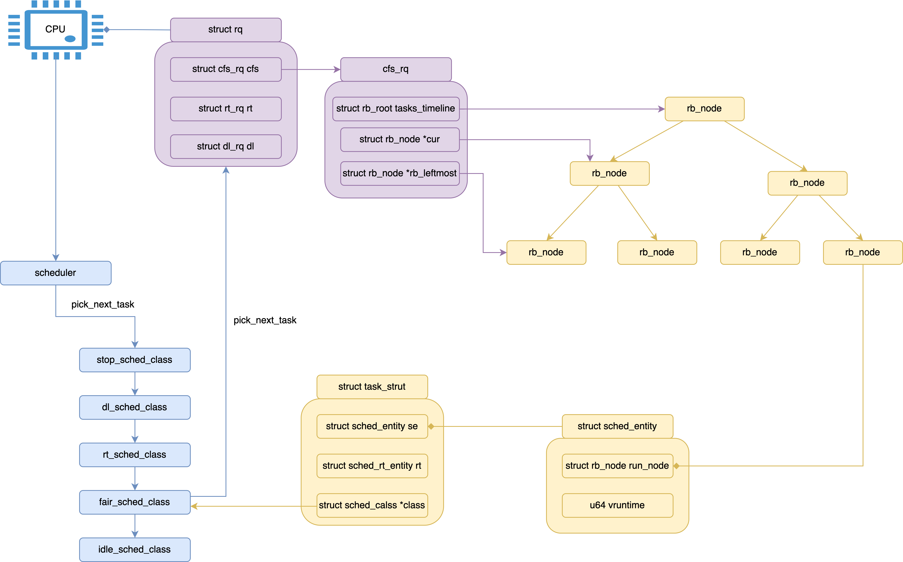

## voluntary schedule


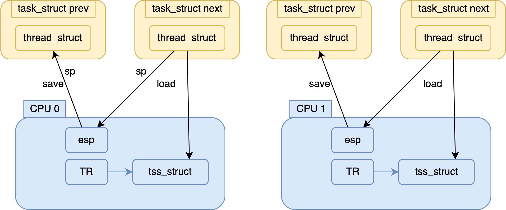


```c
schedule(void) {
    sched_submit_work(tsk) {
        if (task_flags & (PF_WQ_WORKER | PF_IO_WORKER)) {
            if (task_flags & PF_WQ_WORKER)
                wq_worker_sleeping(tsk) {
                    if (need_more_worker(pool))
                        wake_up_worker(pool);
                }
            else
                io_wq_worker_sleeping(tsk);
        }
    }

    do {
        preempt_disable();
        __schedule(SM_NONE);
        sched_preempt_enable_no_resched();
    } while (need_resched());

    sched_update_worker(tsk) {
        if (tsk->flags & (PF_WQ_WORKER | PF_IO_WORKER)) {
            if (tsk->flags & PF_WQ_WORKER)
                wq_worker_running(tsk);
            else
                io_wq_worker_running(tsk);
        }
    }
}

schedule(void) {
    __schedule(SM_NONE) /* kernel/sched/core.c */
        if (sched_feat(HRTICK) || sched_feat(HRTICK_DL))
            hrtick_clear(rq);

        local_irq_disable();
        update_rq_clock(rq);

        prev_state = READ_ONCE(prev->__state);
        if (!(sched_mode & SM_MASK_PREEMPT) && prev_state) {
            if (signal_pending_state(prev_state, prev)) {
                WRITE_ONCE(prev->__state, TASK_RUNNING);
            } else {
                prev->sched_contributes_to_load =
                    (prev_state & TASK_UNINTERRUPTIBLE) &&
                    !(prev_state & TASK_NOLOAD) &&
                    !(prev_state & TASK_FROZEN);

                if (prev->sched_contributes_to_load)
                    rq->nr_uninterruptible++;

                deactivate_task(rq, prev, DEQUEUE_SLEEP | DEQUEUE_NOCLOCK);

                if (prev->in_iowait) {
                    atomic_inc(&rq->nr_iowait);
                    delayacct_blkio_start();
                }
            }
            switch_count = &prev->nvcsw;
        }

        next = pick_next_task(rq, prev, &rf);
        clear_tsk_need_resched(prev);
        clear_preempt_need_resched();

        if (likely(prev != next)) {
            context_switch(rq, prev, next, &rf) {
                prepare_task_switch(rq, prev, next);
                arch_start_context_switch(prev);

                if (!next->mm) { /* kernel task */
                    enter_lazy_tlb(prev->active_mm, next) {
                        update_saved_ttbr0(tsk, &init_mm) {
                            if (mm == &init_mm)
                                ttbr = phys_to_ttbr(__pa_symbol(reserved_pg_dir));
                            else
                                ttbr = phys_to_ttbr(virt_to_phys(mm->pgd)) | ASID(mm) << 48;

                            WRITE_ONCE(task_thread_info(tsk)->ttbr0, ttbr);
                        }
                    }

                    next->active_mm = prev->active_mm;

                    if (prev->mm) /* from user */
                        mmgrab_lazy_tlb(prev->active_mm) {
                            atomic_inc(&mm->mm_count);
                        }
                    else
                        prev->active_mm = NULL;

                } else { /* user task */
                    membarrier_switch_mm(rq, prev->active_mm, next->mm);
                    switch_mm_irqs_off(prev->active_mm, next->mm, next) {
                        /* arch/arm64/include/asm/mmu_context.h */
                        switch_mm(mm_prev, mm_next, tsk) {
                            if (prev != next) {
                                __switch_mm(next) {
                                    if (next == &init_mm) {
                                        cpu_set_reserved_ttbr0() {
                                            ttbr = phys_to_ttbr(__pa_symbol(reserved_pg_dir));
                                            write_sysreg(ttbr, ttbr0_el1);
                                        }
                                        return;
                                    }

                                    check_and_switch_context(next) {
                                        local_flush_tlb_all() {
                                            __tlbi(vmalle1);
                                        }

                                        cpu_switch_mm(mm->pgd, mm) {
                                            BUG_ON(pgd == swapper_pg_dir);
                                            cpu_set_reserved_ttbr0();
                                                --->
                                            cpu_do_switch_mm(virt_to_phys(pgd),mm) {
                                                ttbr1 = read_sysreg(ttbr1_el1);
                                                write_sysreg(ttbr1, ttbr1_el1);
                                                isb();
                                                ttbr0 = phys_to_ttbr(pgd_phys);
                                                write_sysreg(ttbr0, ttbr0_el1);
                                            }
                                        }
                                    }
                                }
                            }

                            update_saved_ttbr0(tsk, next);
                                --->
                        }
                    }
                    lru_gen_use_mm(next->mm);

                    if (!prev->mm) { /* from kernel */
                        /* will mmdrop_lazy_tlb() in finish_task_switch(). */
                        rq->prev_mm = prev->active_mm;
                        prev->active_mm = NULL;
                    }
                }

                switch_to(prev, next, prev) {
                    __switch_to() {
                        fpsimd_thread_switch(next);
                        tls_thread_switch(next);
                        hw_breakpoint_thread_switch(next);
                        contextidr_thread_switch(next);
                        entry_task_switch(next);
                        ssbs_thread_switch(next);
                        erratum_1418040_thread_switch(next);
                        ptrauth_thread_switch_user(next);

                        /* arch/arm64/kernel/entry.S */
                        last = cpu_switch_to(prev, next) {
                            mov    x10, #THREAD_CPU_CONTEXT
                            /* store callee-saved registers */
                            /* restore callee-saved registers */
                            msr    sp_el0, x1
                        }
                    }
                }

                return finish_task_switch(prev) {
                    struct rq *rq = this_rq();
                    struct mm_struct *mm = rq->prev_mm;

                    rq->prev_mm = NULL;

                    if (mm) {
                        membarrier_mm_sync_core_before_usermode(mm);
                        mmdrop_lazy_tlb_sched(mm) {
                            mmdrop_sched(mm) {
                                if (unlikely(atomic_dec_and_test(&mm->mm_count)))
                                    __mmdrop(mm) {
                                        cleanup_lazy_tlbs(mm);

                                        WARN_ON_ONCE(mm == current->active_mm);
                                        mm_free_pgd(mm);
                                        destroy_context(mm);
                                        mmu_notifier_subscriptions_destroy(mm);
                                        check_mm(mm);
                                        put_user_ns(mm->user_ns);
                                        mm_pasid_drop(mm);
                                        mm_destroy_cid(mm);

                                        for (i = 0; i < NR_MM_COUNTERS; i++)
                                            percpu_counter_destroy(&mm->rss_stat[i]);
                                        free_mm(mm);
                                    }
                            }
                        }
                    }

                    if (unlikely(prev_state == TASK_DEAD)) {
                        if (prev->sched_class->task_dead)
                            prev->sched_class->task_dead(prev);

                        /* Task is done with its stack. */
                        put_task_stack(prev);

                        put_task_struct_rcu_user(prev);
                    }

                    return rq;
                }
            }
        } else {
            __balance_callbacks(rq);
        }
}
```


## preempt schedule

### user preempt

#### set_tsk_need_resched


##### scheduler_tick
```c
void scheduler_tick(void)
{
  int cpu = smp_processor_id();
  struct rq *rq = cpu_rq(cpu);
  struct task_struct *curr = rq->curr;
  struct rq_flags rf;

  sched_clock_tick();

  rq_lock(rq, &rf);

  update_rq_clock(rq);
  curr->sched_class->task_tick(rq, curr, 0); /* task_tick_fair */
  cpu_load_update_active(rq);
  calc_global_load_tick(rq);

  rq_unlock(rq, &rf);

  perf_event_task_tick();

#ifdef CONFIG_SMP
  rq->idle_balance = idle_cpu(cpu);
  trigger_load_balance(rq);
#endif
}
```

##### try_to_wake_upp

##### sched_setscheduler
```c
SYSCALL_DEFINE3(sched_setscheduler)
    do_sched_setscheduler()
        p = find_process_by_pid(pid);
        get_task_struct(p);
        sched_setscheduler(p, policy, &lparam);
            __sched_setscheduler()

        put_task_struct(p);
/* 1. check policy, prio args */

```

#### prempt time


##### return from system call
```c
/* do_syscall_64 -> syscall_return_slowpath
 * -> prepare_exit_to_usermode -> exit_to_usermode_loop */
static void exit_to_usermode_loop(struct pt_regs *regs, u32 cached_flags)
{
  while (true) {
    local_irq_enable();

    if (cached_flags & _TIF_NEED_RESCHED)
      schedule();

    if (cached_flags & _TIF_SIGPENDING)
      do_signal(regs);
  }
}
```

##### return from interrupt

```c
irqentry_exit();
    if (user_mode(regs)) {
        irqentry_exit_to_user_mode(regs);
            exit_to_user_mode_prepare(ress);
                exit_to_user_mode_loop(regs);
                    if (ti_work & _TIF_NEED_RESCHED)
                        schedule();
                arch_exit_to_user_mode_prepare(regs, ti_work);
    }

```

### kernel preempt

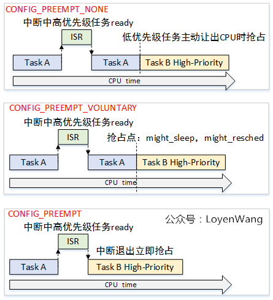


#### preempt_enble
```c
#define preempt_enable() \
do { \
  if (unlikely(preempt_count_dec_and_test())) \
    __preempt_schedule(); \
} while (0)

#define preempt_count_dec_and_test() \
  ({ preempt_count_sub(1); should_resched(0); })

static  bool should_resched(int preempt_offset)
{
  return unlikely(preempt_count() == preempt_offset &&
      tif_need_resched());
}

#define tif_need_resched() test_thread_flag(TIF_NEED_RESCHED)

/* __preempt_schedule -> */
static void __sched notrace preempt_schedule_common(void)
{
  do {
    __schedule(true);
  } while (need_resched());
}
```

#### return from interrupt
```c
/* do_IRQ -> retint_kernel */
asmlinkage __visible void __sched preempt_schedule_irq(void)
{
  do {
    preempt_disable();
    local_irq_enable();
    __schedule(true);
    local_irq_disable();
    sched_preempt_enable_no_resched();
  } while (need_resched());
}
```


## SCHED_RT


```c
struct rt_rq {
    struct rt_prio_array    active;
    unsigned int            rt_nr_running;
    unsigned int            rr_nr_running;
    struct {
        int     curr; /* highest queued rt task prio */
        int     next; /* next highest */
    } highest_prio;

    unsigned int            rt_nr_migratory;
    unsigned int            rt_nr_total;
    int                     overloaded;
    struct plist_head       pushable_tasks;

    int                     rt_queued;

    int                     rt_throttled;
    u64                     rt_time;
    u64                     rt_runtime;

#ifdef CONFIG_RT_GROUP_SCHED
    unsigned int            rt_nr_boosted;
    struct rq               *rq;
    struct task_group       *tg;
#endif
};

struct sched_rt_entity {
    struct list_head            run_list;
    unsigned long               timeout;
    unsigned long               watchdog_stamp;
    unsigned int                time_slice;
    unsigned short              on_rq;
    unsigned short              on_list;

    struct sched_rt_entity      *back;
#ifdef CONFIG_RT_GROUP_SCHED
    struct sched_rt_entity      *parent;
    /* rq on which this entity is (to be) queued: */
    struct rt_rq                *rt_rq;
    /* rq "owned" by this entity/group: */
    struct rt_rq                *my_q;
#endif
};

struct rt_bandwidth {
    raw_spinlock_t          rt_runtime_lock;
    ktime_t                 rt_period;
    u64                     rt_runtime;
    struct hrtimer          rt_period_timer;
    unsigned int            rt_period_active;
};
```


```c
update_curr_rt(rq)
    now = rq_clock_task(rq);
    delta_exec = now - curr->se.exec_start;
    update_current_exec_runtime(curr, now, delta_exec)
        curr->se.sum_exec_runtime += delta_exec;
        account_group_exec_runtime(curr, delta_exec);

        curr->se.exec_start = now;
        cgroup_account_cputime(curr, delta_exec);

    for_each_sched_rt_entity(rt_se) {
        struct rt_rq *rt_rq = rt_rq_of_se(rt_se);
        int exceeded;

        if (sched_rt_runtime(rt_rq) != RUNTIME_INF) {
            raw_spin_lock(&rt_rq->rt_runtime_lock);
            rt_rq->rt_time += delta_exec;
            exceeded = sched_rt_runtime_exceeded(rt_rq);
            if (exceeded)
                resched_curr(rq);
            raw_spin_unlock(&rt_rq->rt_runtime_lock);
            if (exceeded) {
                do_start_rt_bandwidth(sched_rt_bandwidth(rt_rq)) {

                }

            }
        }
    }
```

### pick_next_task_rt


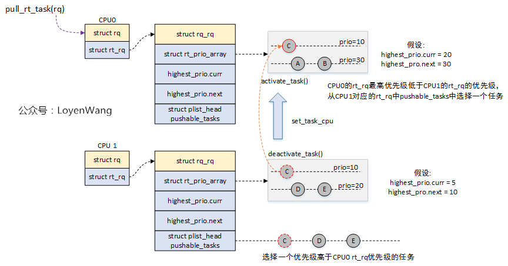


```c
pick_next_task_rt(struct rq *rq)
    struct task_struct *p = pick_task_rt(rq) {
        ret = sched_rt_runnable(rq) {
            return rq->rt.rt_queued > 0;
        }
        if (!ret) {
            return NULL;
        }

        p = _pick_next_task_rt(rq) {
            do {
                rt_se = pick_next_rt_entity(rt_rq) {
                    struct rt_prio_array *array = &rt_rq->active;
                    struct sched_rt_entity *next = NULL;
                    struct list_head *queue;
                    int idx;

                    idx = sched_find_first_bit(array->bitmap);
                    BUG_ON(idx >= MAX_RT_PRIO);

                    queue = array->queue + idx;
                    if (SCHED_WARN_ON(list_empty(queue)))
                        return NULL;
                    next = list_entry(queue->next, struct sched_rt_entity, run_list);

                    return next;
                }
                if (unlikely(!rt_se))
                    return NULL;
                rt_rq = group_rt_rq(rt_se);
            } while (rt_rq);

            return rt_task_of(rt_se);
        }
    }
    if (p) {
        set_next_task_rt(rq, p, true)
            --->
    }
```

### set_next_task_rt
```c
set_next_task_rt(struct rq *rq, struct task_struct *p, bool first) {
    p->se.exec_start = rq_clock_task(rq);
    if (on_rt_rq(&p->rt)) {
        update_stats_wait_end_rt(rt_rq, rt_se) {
            if (rt_entity_is_task(rt_se))
            p = rt_task_of(rt_se);

            stats = __schedstats_from_rt_se(rt_se);
            if (!stats)
                return;

            __update_stats_wait_end(rq_of_rt_rq(rt_rq), p, stats) {
                u64 delta = rq_clock(rq) - schedstat_val(stats->wait_start);

                if (p) {
                    if (task_on_rq_migrating(p)) {
                        /*
                        * Preserve migrating task's wait time so wait_start
                        * time stamp can be adjusted to accumulate wait time
                        * prior to migration.
                        */
                        __schedstat_set(stats->wait_start, delta);

                        return;
                    }

                    trace_sched_stat_wait(p, delta);
                }

                __schedstat_set(stats->wait_max, max(schedstat_val(stats->wait_max), delta));
                __schedstat_inc(stats->wait_count);
                __schedstat_add(stats->wait_sum, delta);
                __schedstat_set(stats->wait_start, 0);
            }
        }
    }

    dequeue_pushable_task(rq, p) {
        plist_del(&p->pushable_tasks, &rq->rt.pushable_tasks);

        if (has_pushable_tasks(rq)) {
            p = plist_first_entry(&rq->rt.pushable_tasks, struct task_struct, pushable_tasks);
            rq->rt.highest_prio.next = p->prio;
        } else {
            rq->rt.highest_prio.next = MAX_RT_PRIO-1;
        }
    }

    if (!first)
        return;

    if (rq->curr->sched_class != &rt_sched_class) {
        update_rt_rq_load_avg(rq_clock_pelt(rq), rq, 0) {

        }
    }

    rt_queue_push_tasks(rq) {
        if (!has_pushable_tasks(rq))
            return;

        queue_balance_callback(rq, &per_cpu(rt_push_head, rq->cpu)/*head*/, push_rt_tasks/*func*/) {
            head->func = func;
            head->next = rq->balance_callback;
            rq->balance_callback = head;
        }
    }
```

### push_rt_tasks
```c
push_rt_tasks()
    push_rt_task(rq, false) {
        if (!rq->rt.overloaded)
        return 0;

        next_task = pick_next_pushable_task(rq);
        if (!next_task)
            return 0;

    retry:
        if (unlikely(next_task->prio < rq->curr->prio)) {
            resched_curr(rq);
            return 0;
        }

        if (is_migration_disabled(next_task)) {
            struct task_struct *push_task = NULL;
            int cpu;

            if (!pull || rq->push_busy)
                return 0;

            if (rq->curr->sched_class != &rt_sched_class)
                return 0;

            cpu = find_lowest_rq(rq->curr);
            if (cpu == -1 || cpu == rq->cpu)
                return 0;

            push_task = get_push_task(rq);
            if (push_task) {
                raw_spin_rq_unlock(rq);
                stop_one_cpu_nowait(rq->cpu, push_cpu_stop, push_task, &rq->push_work) {

                }
                raw_spin_rq_lock(rq);
            }

            return 0;
        }

        if (WARN_ON(next_task == rq->curr))
            return 0;

        /* We might release rq lock */
        get_task_struct(next_task);

        /* find_lock_lowest_rq locks the rq if found */
        lowest_rq = find_lock_lowest_rq(next_task, rq);
        if (!lowest_rq) {
            struct task_struct *task;

            task = pick_next_pushable_task(rq);
            if (task == next_task) {
                goto out;
            }

            if (!task)
                /* No more tasks, just exit */
                goto out;

            put_task_struct(next_task);
            next_task = task;
            goto retry;
        }

        deactivate_task(rq, next_task, 0) {
            p->on_rq = (flags & DEQUEUE_SLEEP) ? 0 : TASK_ON_RQ_MIGRATING;
            dequeue_task(rq, p, flags) {
                if (sched_core_enabled(rq)) {
                    sched_core_dequeue(rq, p, flags);
                }

                if (!(flags & DEQUEUE_NOCLOCK))
                    update_rq_clock(rq);

                if (!(flags & DEQUEUE_SAVE)) {
                    sched_info_dequeue(rq, p);
                    psi_dequeue(p, flags & DEQUEUE_SLEEP);
                }

                uclamp_rq_dec(rq, p);
                p->sched_class->dequeue_task(rq, p, flags);
            }
        }

        set_task_cpu(next_task, lowest_rq->cpu);
        activate_task(lowest_rq, next_task, 0) {
            if (task_on_rq_migrating(p))
                flags |= ENQUEUE_MIGRATED;
            if (flags & ENQUEUE_MIGRATED)
                sched_mm_cid_migrate_to(rq, p);

            enqueue_task(rq, p, flags) {
                if (!(flags & ENQUEUE_NOCLOCK))
                    update_rq_clock(rq);

                if (!(flags & ENQUEUE_RESTORE)) {
                    sched_info_enqueue(rq, p);
                    psi_enqueue(p, (flags & ENQUEUE_WAKEUP) && !(flags & ENQUEUE_MIGRATED));
                }

                uclamp_rq_inc(rq, p);
                p->sched_class->enqueue_task(rq, p, flags);

                if (sched_core_enabled(rq))
                    sched_core_enqueue(rq, p);
            }

            p->on_rq = TASK_ON_RQ_QUEUED;
        }
        resched_curr(lowest_rq);
        ret = 1;

        double_unlock_balance(rq, lowest_rq);
    out:
        put_task_struct(next_task);

        return ret;
    }
}
```

### pull_rt_task
```c
```

### enqueue_task_rt

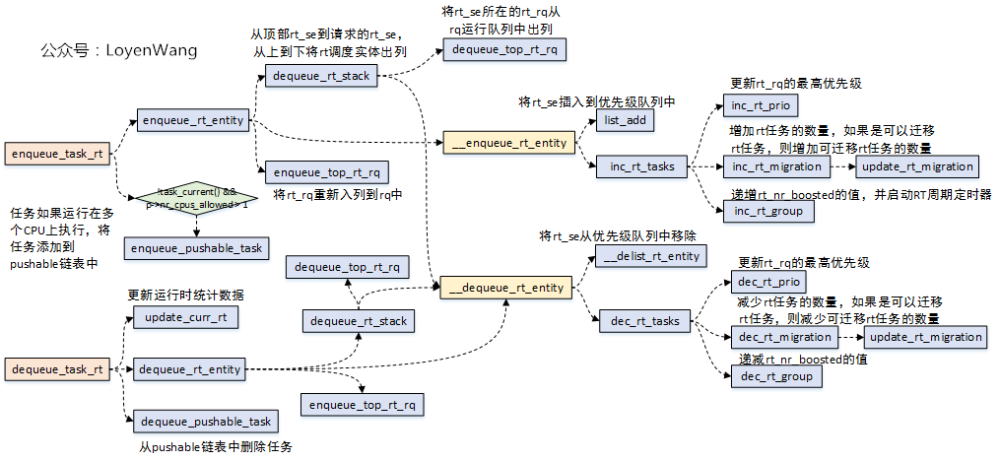

```c
enqueue_task_rt(struct rq *rq, struct task_struct *p, int flags) {
    if (flags & ENQUEUE_WAKEUP)
        rt_se->timeout = 0;

    check_schedstat_required();
    update_stats_wait_start_rt(rt_rq_of_se(rt_se), rt_se);

    enqueue_rt_entity(rt_se, flags) {
        update_stats_enqueue_rt(rt_rq_of_se(rt_se), rt_se, flags);

        dequeue_rt_stack(rt_se, flags) {
            /* Because the prio of an upper entry depends on the lower
             * entries, we must remove entries top - down. */
            for_each_sched_rt_entity(rt_se) {
                rt_se->back = back;
                back = rt_se;
            }

            rt_nr_running = rt_rq_of_se(back)->rt_nr_running;

            for (rt_se = back; rt_se; rt_se = rt_se->back) {
                if (on_rt_rq(rt_se))
                    __dequeue_rt_entity(rt_se, flags);
            }

            dequeue_top_rt_rq(rt_rq_of_se(back), rt_nr_running);
        }

        for_each_sched_rt_entity(rt_se) {
            __enqueue_rt_entity(rt_se, flags) {
                if (flags & ENQUEUE_HEAD)
                    list_add(&rt_se->run_list, queue);
                else
                    list_add_tail(&rt_se->run_list, queue);
                __set_bit(rt_se_prio(rt_se), array->bitmap) {

                }
                rt_se->on_list = 1;
                rt_se->on_rq = 1;

	            inc_rt_tasks(rt_se, rt_rq) {
                    int prio = rt_se_prio(rt_se);

                    rt_rq->rt_nr_running += rt_se_nr_running(rt_se);
                    rt_rq->rr_nr_running += rt_se_rr_nr_running(rt_se);

                    inc_rt_prio(rt_rq, prio) {
                        int prev_prio = rt_rq->highest_prio.curr;

                        if (prio < prev_prio)
                            rt_rq->highest_prio.curr = prio;

                        inc_rt_prio_smp(rt_rq, prio, prev_prio) {
                            struct rq *rq = rq_of_rt_rq(rt_rq);
                        #ifdef CONFIG_RT_GROUP_SCHED
                            if (&rq->rt != rt_rq)
                                return;
                        #endif
                            if (rq->online && prio < prev_prio)
                                cpupri_set(&rq->rd->cpupri, rq->cpu, prio) {
                                    int *currpri = &cp->cpu_to_pri[cpu];
                                    int oldpri = *currpri;

                                    newpri = convert_prio(newpri);

                                    if (newpri == oldpri)
                                        return;

                                    if (likely(newpri != CPUPRI_INVALID)) {
                                        struct cpupri_vec *vec = &cp->pri_to_cpu[newpri];
                                        cpumask_set_cpu(cpu, vec->mask);
                                        atomic_inc(&(vec)->count);
                                    }
                                    if (likely(oldpri != CPUPRI_INVALID)) {
                                        struct cpupri_vec *vec  = &cp->pri_to_cpu[oldpri];
                                        atomic_dec(&(vec)->count);
                                        cpumask_clear_cpu(cpu, vec->mask);
                                    }

                                    *currpri = newpri;
                                }
                        }
                    }
                    inc_rt_migration(rt_se, rt_rq);
                    inc_rt_group(rt_se, rt_rq);
                }
            }
        }
        enqueue_top_rt_rq(&rq->rt);
    }

    if (!task_current(rq, p) && p->nr_cpus_allowed > 1) {
        enqueue_pushable_task(rq, p) {

        }
    }

}
```

### dequeue_task_rt
```c
dequeue_rt_entity(struct sched_rt_entity *rt_se, unsigned int flags)
    struct rq *rq = rq_of_rt_se(rt_se);

    update_stats_dequeue_rt(rt_rq_of_se(rt_se), rt_se, flags);

    dequeue_rt_stack(rt_se, flags)
        --->

    for_each_sched_rt_entity(rt_se) {
        struct rt_rq *rt_rq = group_rt_rq(rt_se);

        if (rt_rq && rt_rq->rt_nr_running)
            __enqueue_rt_entity(rt_se, flags);
    }
    enqueue_top_rt_rq(&rq->rt);
```

### select_task_rq_rt


```c
select_task_rq_rt(struct task_struct *p, int cpu, int flags)
    struct task_struct *curr;
    struct rq *rq;
    bool test;

    /* For anything but wake ups, just return the task_cpu */
    if (!(flags & (WF_TTWU | WF_FORK)))
        goto out;

    rq = cpu_rq(cpu);

    rcu_read_lock();
    curr = READ_ONCE(rq->curr); /* unlocked access */

    test = curr && unlikely(rt_task(curr))
        && (curr->nr_cpus_allowed < 2 || curr->prio <= p->prio);

    if (test || !rt_task_fits_capacity(p, cpu)) {
        int target = find_lowest_rq(p) {
            struct sched_domain *sd;
            struct cpumask *lowest_mask = this_cpu_cpumask_var_ptr(local_cpu_mask);
            int this_cpu = smp_processor_id();
            int cpu      = task_cpu(task);
            int ret;

            if (unlikely(!lowest_mask))
                return -1;
            if (task->nr_cpus_allowed == 1)
                return -1; /* No other targets possible */

            if (sched_asym_cpucap_active()) {
                ret = cpupri_find_fitness(
                    &task_rq(task)->rd->cpupri,
                    task, lowest_mask,
                    rt_task_fits_capacity
                ) {
                    int task_pri = convert_prio(p->prio);
                    int idx, cpu;

                    for (idx = 0; idx < task_pri; idx++) {
                        ret = __cpupri_find(cp, p, lowest_mask, idx) {
                            struct cpupri_vec *vec  = &cp->pri_to_cpu[idx];
                            int skip = 0;

                            if (!atomic_read(&(vec)->count))
                                skip = 1;
                            if (skip)
                                return 0;
                            if (cpumask_any_and(&p->cpus_mask, vec->mask) >= nr_cpu_ids)
                                return 0;
                            if (lowest_mask) {
                                cpumask_and(lowest_mask, &p->cpus_mask, vec->mask);
                                if (cpumask_empty(lowest_mask))
                                    return 0;
                            }
                            return 1;
                        }
                        if (!ret)
                            continue;
                        if (!lowest_mask || !fitness_fn)
                            return 1;

                        /* Ensure the capacity of the CPUs fit the task */
                        for_each_cpu(cpu, lowest_mask) {
                            if (!fitness_fn(p, cpu)) {
                                cpumask_clear_cpu(cpu, lowest_mask);
                            }
                        }

                        if (cpumask_empty(lowest_mask))
                            continue;
                        return 1;
                    }
                    if (fitness_fn)
                        return cpupri_find(cp, p, lowest_mask);

                    return 0;
                }
            } else {
                ret = cpupri_find(&task_rq(task)->rd->cpupri, task, lowest_mask);
            }

            if (!ret)
                return -1; /* No targets found */

            /* We prioritize the last CPU that the task executed on since
             * it is most likely cache-hot in that location. */
            if (cpumask_test_cpu(cpu, lowest_mask))
                return cpu;

            /* Otherwise, we consult the sched_domains span maps to figure
             * out which CPU is logically closest to our hot cache data. */
            if (!cpumask_test_cpu(this_cpu, lowest_mask))
                this_cpu = -1; /* Skip this_cpu opt if not among lowest */

            rcu_read_lock();
            for_each_domain(cpu, sd) {
                if (sd->flags & SD_WAKE_AFFINE) {
                    int best_cpu;

                    if (this_cpu != -1 &&
                        cpumask_test_cpu(this_cpu, sched_domain_span(sd))) {
                        rcu_read_unlock();
                        return this_cpu;
                    }

                    best_cpu = cpumask_any_and_distribute(lowest_mask,
                                        sched_domain_span(sd));
                    if (best_cpu < nr_cpu_ids) {
                        rcu_read_unlock();
                        return best_cpu;
                    }
                }
            }
            rcu_read_unlock();

            if (this_cpu != -1)
                return this_cpu;

            cpu = cpumask_any_distribute(lowest_mask);
            if (cpu < nr_cpu_ids)
                return cpu;

            return -1;
        }

        if (!test && target != -1 && !rt_task_fits_capacity(p, target))
            goto out_unlock;

        if (target != -1 && p->prio < cpu_rq(target)->rt.highest_prio.curr)
            cpu = target;
    }

    return cpu;
```

### task_tick_rt
```c
task_tick_rt(struct rq *rq, struct task_struct *p, int queued)
{
    struct sched_rt_entity *rt_se = &p->rt;

    update_curr_rt(rq);
    update_rt_rq_load_avg(rq_clock_pelt(rq), rq, 1);

    watchdog(rq, p);

    if (p->policy != SCHED_RR)
        return;

    if (--p->rt.time_slice)
        return;

    p->rt.time_slice = sched_rr_timeslice;

    for_each_sched_rt_entity(rt_se) {
        if (rt_se->run_list.prev != rt_se->run_list.next) {
            requeue_task_rt(rq, p, 0);
            resched_curr(rq);
            return;
        }
    }
}
```

## SCHED_CFS


```c
struct sched_entity {
    struct load_weight      load;
    struct rb_node          run_node;
    struct list_head        group_node;
    unsigned int            on_rq;

    u64                     exec_start;
    u64                     sum_exec_runtime;
    u64                     vruntime;
    u64                     prev_sum_exec_runtime;

    u64                     nr_migrations;

#ifdef CONFIG_FAIR_GROUP_SCHED
    int                     depth;
    struct sched_entity     *parent;
    /* rq on which this entity is (to be) queued: */
    struct cfs_rq           *cfs_rq;
    /* rq "owned" by this entity/group: */
    struct cfs_rq           *my_q;
    /* cached value of my_q->h_nr_running */
    unsigned long           runnable_weight;
#endif

#ifdef CONFIG_SMP
    struct sched_avg        avg;
#endif
};

struct cfs_rq {
    struct load_weight      load;
    unsigned int            nr_running;
    unsigned int            h_nr_running;      /* SCHED_{NORMAL,BATCH,IDLE} */
    unsigned int            idle_nr_running;   /* SCHED_IDLE */
    unsigned int            idle_h_nr_running; /* SCHED_IDLE */

    u64                     exec_clock;
    u64                     min_vruntime;
#ifdef CONFIG_SCHED_CORE
    unsigned int            forceidle_seq;
    u64                     min_vruntime_fi;
#endif

#ifndef CONFIG_64BIT
    u64                     min_vruntime_copy;
#endif

    struct rb_root_cached   tasks_timeline;

    /* 'curr' points to currently running entity on this cfs_rq.
     * It is set to NULL otherwise (i.e when none are currently running) */
    struct sched_entity    *curr;
    struct sched_entity    *next;
    struct sched_entity    *last;
    struct sched_entity    *skip;

#ifdef CONFIG_SMP
    /* CFS load tracking */
    struct sched_avg        avg;
#ifndef CONFIG_64BIT
    u64                     last_update_time_copy;
#endif

    struct {
        raw_spinlock_t      lock ____cacheline_aligned;
        int        nr;
        unsigned long       load_avg;
        unsigned long       util_avg;
        unsigned long       runnable_avg;
    } removed;

#ifdef CONFIG_FAIR_GROUP_SCHED
    unsigned long           tg_load_avg_contrib;
    long                    propagate;
    long                    prop_runnable_sum;

    /* h_load = weight * f(tg) */
    unsigned long           h_load;
    u64                     last_h_load_update;
    struct sched_entity     *h_load_next;
#endif /* CONFIG_FAIR_GROUP_SCHED */

#ifdef CONFIG_FAIR_GROUP_SCHED
    struct rq               *rq; /* CPU runqueue to which this cfs_rq is attached */

    int                     on_list;
    struct list_head        leaf_cfs_rq_list;
    struct task_group       *tg; /* group that "owns" this runqueue */

    /* Locally cached copy of our task_group's idle value */
    int                     idle;

#ifdef CONFIG_CFS_BANDWIDTH
    int            runtime_enabled;
    s64            runtime_remaining;
    u64            throttled_pelt_idle;
#ifndef CONFIG_64BIT
    u64            throttled_pelt_idle_copy;
#endif

    u64            throttled_clock;
    u64            throttled_clock_pelt;
    u64            throttled_clock_pelt_time;
    int            throttled;
    int            throttle_count;
    struct list_head    throttled_list;
#ifdef CONFIG_SMP
    struct list_head    throttled_csd_list;
#endif
};
```

```c
DEFINE_SCHED_CLASS(fair) = {
    .enqueue_task       = enqueue_task_fair,
    .dequeue_task       = dequeue_task_fair,
    .yield_task         = yield_task_fair,
    .yield_to_task      = yield_to_task_fair,

    .check_preempt_curr = check_preempt_wakeup,

    .pick_next_task     = __pick_next_task_fair,
    .put_prev_task      = put_prev_task_fair,
    .set_next_task      = set_next_task_fair,
}
```

#### sched_vslice


```c
const int sched_prio_to_weight[40] = {
 /* -20 */     88761,     71755,     56483,     46273,     36291,
 /* -15 */     29154,     23254,     18705,     14949,     11916,
 /* -10 */      9548,      7620,      6100,      4904,      3906,
 /*  -5 */      3121,      2501,      1991,      1586,      1277,
 /*   0 */      1024,       820,       655,       526,       423,
 /*   5 */       335,       272,       215,       172,       137,
 /*  10 */       110,        87,        70,        56,        45,
 /*  15 */        36,        29,        23,        18,        15,
};

sched_vslice(struct cfs_rq *cfs_rq, struct sched_entity *se)
    slice = sched_slice(cfs_rq, se) {
        slice = __sched_period(nr_running + !se->on_rq) {
            if (unlikely(nr_running > sched_nr_latency/*8*/))
                return nr_running * sysctl_sched_min_granularity/*0.75 msec*/;
            else
                return sysctl_sched_latency/*6ms*/;
        }
        for_each_sched_entity(se) {
            struct load_weight *load;
                struct load_weight lw;
                struct cfs_rq *qcfs_rq;

                qcfs_rq = cfs_rq_of(se);
                load = &qcfs_rq->load;

                if (unlikely(!se->on_rq)) {
                    lw = qcfs_rq->load;
                    update_load_add(&lw, se->load.weight);
                    load = &lw;
                }

            slice = __calc_delta(slice, se->load.weight, load) {
                /* delta_exec * weight / lw.weight
                 *   OR
                 * (delta_exec * (weight * lw->inv_weight)) >> WMULT_SHIFT */
            }
        }
        if (sched_feat(BASE_SLICE)) {
            if (se_is_idle(init_se) && !sched_idle_cfs_rq(cfs_rq))
                min_gran = sysctl_sched_idle_min_granularity;
            else
                min_gran = sysctl_sched_min_granularity;

            slice = max_t(u64, slice, min_gran);
        }
        return slice;
    }
    calc_delta_fair(slice, se) {
        if (unlikely(se->load.weight != NICE_0_LOAD)) {
            delta = __calc_delta(delta, NICE_0_LOAD, &se->load)
                --->
        }

        return delta;
    }
```

#### task_tick_fair


```c
task_tick_fair(struct rq *rq, struct task_struct *curr, int queued) {
    for_each_sched_entity(se) {
        cfs_rq = cfs_rq_of(se);
        entity_tick(cfs_rq, se, queued) {
            update_curr(cfs_rq) {
                delta_exec = now - curr->exec_start;
                curr->exec_start = now;
                curr->sum_exec_runtime += delta_exec;
                schedstat_add(cfs_rq->exec_clock, delta_exec);

                curr->vruntime += calc_delta_fair(delta_exec, curr);
                update_min_vruntime(cfs_rq);

                if (entity_is_task(curr)) {
                    struct task_struct *curtask = task_of(curr);
                    cgroup_account_cputime(curtask, delta_exec);
                    account_group_exec_runtime(curtask, delta_exec);
                }

                account_cfs_rq_runtime(cfs_rq, delta_exec) {
                    cfs_rq->runtime_remaining -= delta_exec;

                    if (likely(cfs_rq->runtime_remaining > 0))
                        return;

                    if (cfs_rq->throttled)
                        return;

                    if (!assign_cfs_rq_runtime(cfs_rq) && likely(cfs_rq->curr))
                        resched_curr(rq_of(cfs_rq));
                }
            }

            update_load_avg(cfs_rq, curr, UPDATE_TG) {

            }

            update_cfs_group(curr) {

            }

        #ifdef CONFIG_SCHED_HRTICK
            if (queued) {
                resched_curr(rq_of(cfs_rq));
                return;
            }

            if (!sched_feat(DOUBLE_TICK) && hrtimer_active(&rq_of(cfs_rq)->hrtick_timer))
                return;
        #endif

            if (cfs_rq->nr_running > 1) {
                check_preempt_tick(cfs_rq, curr) {
                    ideal_runtime = min_t(u64, sched_slice(cfs_rq, curr), sysctl_sched_latency);
                    delta_exec = curr->sum_exec_runtime - curr->prev_sum_exec_runtime;
                    if (delta_exec > ideal_runtime) {
                        resched_curr(rq_of(cfs_rq));
                        clear_buddies(cfs_rq, curr);
                        return;
                    }

                    if (delta_exec < sysctl_sched_min_granularity)
                        return;

                    se = __pick_first_entity(cfs_rq);
                    delta = curr->vruntime - se->vruntime;

                    if (delta < 0)
                        return;

                    if (delta > ideal_runtime)
                        resched_curr(rq_of(cfs_rq));
                }
            }
        }
    }

    if (static_branch_unlikely(&sched_numa_balancing))
        task_tick_numa(rq, curr) {

        }

    update_misfit_status(curr, rq);
    update_overutilized_status(task_rq(curr));

    task_tick_core(rq, curr) {

    }
}
```

#### enqueue_task_fair

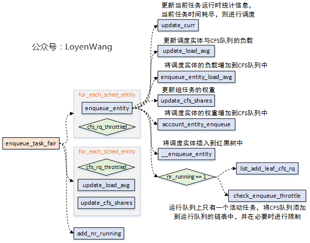

```c
enqueue_task_fair(struct rq *rq, struct task_struct *p, int flags) {
    for_each_sched_entity(se) {
        if (se->on_rq)
            break;
        cfs_rq = cfs_rq_of(se);

        enqueue_entity(cfs_rq, se, flags) {
            bool renorm = !(flags & ENQUEUE_WAKEUP) || (flags & ENQUEUE_MIGRATED);
            bool curr = cfs_rq->curr == se;
            if (renorm && curr)
                se->vruntime += cfs_rq->min_vruntime;

            update_curr(cfs_rq)
                --->

            if (renorm && !curr)
                se->vruntime += cfs_rq->min_vruntime;

            update_load_avg(cfs_rq, se, UPDATE_TG | DO_ATTACH);
            se_update_runnable(se) {
                if (!entity_is_task(se))
                    se->runnable_weight = se->my_q->h_nr_running;
            }

            update_cfs_group(se);

            account_entity_enqueue(cfs_rq, se) {
                update_load_add(&cfs_rq->load, se->load.weight) {
                    lw->weight += inc;
                    lw->inv_weight = 0;
                }
                if (entity_is_task(se)) {
                    struct rq *rq = rq_of(cfs_rq);
                    account_numa_enqueue(rq, task_of(se));
                    list_add(&se->group_node, &rq->cfs_tasks);
                }
                cfs_rq->nr_running++;
                if (se_is_idle(se))
                    cfs_rq->idle_nr_running++;
            }

            if (flags & ENQUEUE_WAKEUP) {
                place_entity(cfs_rq, se, 0);
            }

            if (flags & ENQUEUE_MIGRATED)
                se->exec_start = 0;

            check_schedstat_required();
            update_stats_enqueue_fair(cfs_rq, se, flags);
            check_spread(cfs_rq, se);
            if (!curr) {
                __enqueue_entity(cfs_rq, se) {
                    rb_add_cached(&se->run_node, &cfs_rq->tasks_timeline, __entity_less);
                }
            }
            se->on_rq = 1;

            if (cfs_rq->nr_running == 1) {
                check_enqueue_throttle(cfs_rq);
                if (!throttled_hierarchy(cfs_rq))
                    list_add_leaf_cfs_rq(cfs_rq);
            }
        }

        cfs_rq->h_nr_running++;
        cfs_rq->idle_h_nr_running += idle_h_nr_running;

        if (cfs_rq_is_idle(cfs_rq))
            idle_h_nr_running = 1;

        if (cfs_rq_throttled(cfs_rq))
            goto enqueue_throttle;

        flags = ENQUEUE_WAKEUP;
    }

    for_each_sched_entity(se) {
        cfs_rq = cfs_rq_of(se);

        update_load_avg(cfs_rq, se, UPDATE_TG);
        se_update_runnable(se);
        update_cfs_group(se);

        cfs_rq->h_nr_running++;
        cfs_rq->idle_h_nr_running += idle_h_nr_running;

        if (cfs_rq_is_idle(cfs_rq))
            idle_h_nr_running = 1;

        /* end evaluation on encountering a throttled cfs_rq */
        if (cfs_rq_throttled(cfs_rq))
            goto enqueue_throttle;
    }

    add_nr_running(rq, 1);

enqueue_throttle:
    assert_list_leaf_cfs_rq(rq);

    hrtick_update(rq);
}
```

#### dequeue_task_fair
```c
dequeue_task_fair(struct rq *rq, struct task_struct *p, int flags) {
    struct cfs_rq *cfs_rq;
    struct sched_entity *se = &p->se;
    int task_sleep = flags & DEQUEUE_SLEEP;
    int idle_h_nr_running = task_has_idle_policy(p);
    bool was_sched_idle = sched_idle_rq(rq);

    util_est_dequeue(&rq->cfs, p);

    for_each_sched_entity(se) {
        cfs_rq = cfs_rq_of(se);
        dequeue_entity(cfs_rq, se, flags) {
            int action = UPDATE_TG;

            if (entity_is_task(se) && task_on_rq_migrating(task_of(se)))
                action |= DO_DETACH;

            update_curr(cfs_rq);
            update_load_avg(cfs_rq, se, action);
            se_update_runnable(se);

            update_stats_dequeue_fair(cfs_rq, se, flags);

            clear_buddies(cfs_rq, se);

            if (se != cfs_rq->curr) {
                __dequeue_entity(cfs_rq, se) {
                    rb_erase_cached(&se->run_node, &cfs_rq->tasks_timeline);
                }
            }
            se->on_rq = 0;
            account_entity_dequeue(cfs_rq, se);

            if (!(flags & DEQUEUE_SLEEP))
                se->vruntime -= cfs_rq->min_vruntime;

            /* return excess runtime on last dequeue */
            return_cfs_rq_runtime(cfs_rq);

            update_cfs_group(se);

            if ((flags & (DEQUEUE_SAVE | DEQUEUE_MOVE)) != DEQUEUE_SAVE)
                update_min_vruntime(cfs_rq);

            if (cfs_rq->nr_running == 0)
                update_idle_cfs_rq_clock_pelt(cfs_rq);
        }

        cfs_rq->h_nr_running--;
        cfs_rq->idle_h_nr_running -= idle_h_nr_running;

        if (cfs_rq_is_idle(cfs_rq))
            idle_h_nr_running = 1;

        /* end evaluation on encountering a throttled cfs_rq */
        if (cfs_rq_throttled(cfs_rq))
            goto dequeue_throttle;

        /* Don't dequeue parent if it has other entities besides us */
        if (cfs_rq->load.weight) {
            /* Avoid re-evaluating load for this entity: */
            se = parent_entity(se);

            if (task_sleep && se && !throttled_hierarchy(cfs_rq))
                set_next_buddy(se);
            break;
        }
        flags |= DEQUEUE_SLEEP;
    }

    for_each_sched_entity(se) {
        cfs_rq = cfs_rq_of(se);

        update_load_avg(cfs_rq, se, UPDATE_TG);
        se_update_runnable(se);
        update_cfs_group(se);

        cfs_rq->h_nr_running--;
        cfs_rq->idle_h_nr_running -= idle_h_nr_running;

        if (cfs_rq_is_idle(cfs_rq))
            idle_h_nr_running = 1;

        /* end evaluation on encountering a throttled cfs_rq */
        if (cfs_rq_throttled(cfs_rq))
            goto dequeue_throttle;

    }

    /* At this point se is NULL and we are at root level*/
    sub_nr_running(rq, 1);

    /* balance early to pull high priority tasks */
    if (unlikely(!was_sched_idle && sched_idle_rq(rq)))
        rq->next_balance = jiffies;

dequeue_throttle:
    util_est_update(&rq->cfs, p, task_sleep);
    hrtick_update(rq);
}
```

#### task_fork_fair


```c
task_fork_fair(struct task_struct *p)
    update_rq_clock(rq);

    cfs_rq = task_cfs_rq(current);
    curr = cfs_rq->curr;
    if (curr) {
        update_curr(cfs_rq);
        se->vruntime = curr->vruntime;
    }
    place_entity(cfs_rq, se, 1);

    if (sysctl_sched_child_runs_first && curr && entity_before(curr, se)) {
        swap(curr->vruntime, se->vruntime);
        resched_curr(rq);
    }

    se->vruntime -= cfs_rq->min_vruntime;
```

#### pick_next_task_fair


```c
pick_next_task_fair(struct rq *rq, struct task_struct *prev, struct rq_flags *rf)

again:
    if (!sched_fair_runnable(rq))
        goto idle;

#ifdef CONFIG_FAIR_GROUP_SCHED
    if (!prev || prev->sched_class != &fair_sched_class)
        goto simple;

    do {
        struct sched_entity *curr = cfs_rq->curr;

        if (curr) {
            if (curr->on_rq)
                update_curr(cfs_rq);
            else
                curr = NULL;

            if (unlikely(check_cfs_rq_runtime(cfs_rq))) {
                cfs_rq = &rq->cfs;

                if (!cfs_rq->nr_running)
                    goto idle;

                goto simple;
            }
        }

        se = pick_next_entity(cfs_rq, curr);
        cfs_rq = group_cfs_rq(se);
    } while (cfs_rq);

    p = task_of(se);

    if (prev != p) {
        struct sched_entity *pse = &prev->se;

        while (!(cfs_rq = is_same_group(se, pse))) {
            int se_depth = se->depth;
            int pse_depth = pse->depth;

            if (se_depth <= pse_depth) {
                put_prev_entity(cfs_rq_of(pse), pse);
                    --->
                pse = parent_entity(pse);
            }
            if (se_depth >= pse_depth) {
                set_next_entity(cfs_rq_of(se), se);
                se = parent_entity(se);
            }
        }

        put_prev_entity(cfs_rq, pse);
            --->
        set_next_entity(cfs_rq, se);
    }

    goto done;

simple:
#endif

    if (prev) {
        put_prev_task(rq, prev) {
            prev->sched_class->put_prev_task(rq, prev) {
                put_prev_task_fair(struct rq *rq, struct task_struct *prev) {
                    struct sched_entity *se = &prev->se;
                    struct cfs_rq *cfs_rq;
                    for_each_sched_entity(se) {
                        cfs_rq = cfs_rq_of(se);
                        put_prev_entity(cfs_rq, se);
                            --->
                    }
                }
            }
        }
    }

    do {
        se = pick_next_entity(cfs_rq, NULL) {
            if (!left || (curr && entity_before(curr, left)))
                left = curr;

            se = left; /* ideally we run the leftmost entity */

            /* Avoid running the skip buddy */
            if (cfs_rq->skip && cfs_rq->skip == se) {
                struct sched_entity *second;

                if (se == curr) {
                    second = __pick_first_entity(cfs_rq);
                } else {
                    second = __pick_next_entity(se);
                    if (!second || (curr && entity_before(curr, second)))
                        second = curr;
                }

                if (second && wakeup_preempt_entity(second, left) < 1)
                    se = second;
            }

            wakeup = wakeup_preempt_entity(cfs_rq->next/*curr*/, left/*se*/) {
                s64 gran, vdiff = curr->vruntime - se->vruntime;

                if (vdiff <= 0)
                    return -1;

                gran = wakeup_gran(se) {
                    unsigned long gran = sysctl_sched_wakeup_granularity;
                    return calc_delta_fair(gran, se);
                        --->
                }
                if (vdiff > gran)
                    return 1;

                return 0;
            }
            if (cfs_rq->next && wakeup < 1) {
                se = cfs_rq->next;
            } else if (cfs_rq->last && wakeup_preempt_entity(cfs_rq->last, left) < 1) {
                se = cfs_rq->last;
            }

            return se;
        }

        set_next_entity(cfs_rq, se) {
            clear_buddies(cfs_rq, se);

            if (se->on_rq) {
                update_stats_wait_end_fair(cfs_rq, se);
                __dequeue_entity(cfs_rq, se);
                update_load_avg(cfs_rq, se, UPDATE_TG);
            }

            update_stats_curr_start(cfs_rq, se);
            cfs_rq->curr = se;

            se->prev_sum_exec_runtime = se->sum_exec_runtime;
        }
        cfs_rq = group_cfs_rq(se);

    } while (cfs_rq);

    p = task_of(se);

done: __maybe_unused;

#ifdef CONFIG_SMP
    list_move(&p->se.group_node, &rq->cfs_tasks);
#endif

    if (hrtick_enabled_fair(rq))
        hrtick_start_fair(rq, p);

    update_misfit_status(p, rq);

    return p;

idle:
    if (!rf)
        return NULL;

    new_tasks = newidle_balance(rq, rf);

    if (new_tasks < 0)
        return RETRY_TASK;

    if (new_tasks > 0)
        goto again;

    update_idle_rq_clock_pelt(rq);
```

#### put_prev_task_fair

```c
put_prev_task_fair(struct rq *rq, struct task_struct *prev)
    struct sched_entity *se = &prev->se;
    struct cfs_rq *cfs_rq;

    for_each_sched_entity(se) {
        cfs_rq = cfs_rq_of(se);
        put_prev_entity(cfs_rq, se) {
            if (prev->on_rq)
                update_curr(cfs_rq);
                    --->

            if (prev->on_rq) {
                update_stats_wait_start_fair(cfs_rq, prev);
                __enqueue_entity(cfs_rq, prev) {
                    rb_add_cached(&se->run_node, &cfs_rq->tasks_timeline, __entity_less);
                }
                update_load_avg(cfs_rq, prev, 0);
            }
            cfs_rq->curr = NULL;
        }
    }
```

#### set_next_task_fair
```c
set_next_task_fair(struct rq *rq, struct task_struct *p, bool first)
    struct sched_entity *se = &p->se;

    if (task_on_rq_queued(p)) {
        list_move(&se->group_node, &rq->cfs_tasks);
    }

    for_each_sched_entity(se) {
        struct cfs_rq *cfs_rq = cfs_rq_of(se);

        set_next_entity(cfs_rq, se) {
            clear_buddies(cfs_rq, se);

            /* 'current' is not kept within the tree. */
            if (se->on_rq) {
                update_stats_wait_end_fair(cfs_rq, se);
                __dequeue_entity(cfs_rq, se);
                update_load_avg(cfs_rq, se, UPDATE_TG);
            }

            update_stats_curr_start(cfs_rq, se);
            cfs_rq->curr = se;

            if (schedstat_enabled() && rq_of(cfs_rq)->cfs.load.weight >= 2*se->load.weight) {
                struct sched_statistics *stats;

                stats = __schedstats_from_se(se);
                __schedstat_set(stats->slice_max,
                        max((u64)stats->slice_max,
                            se->sum_exec_runtime - se->prev_sum_exec_runtime));
            }

            se->prev_sum_exec_runtime = se->sum_exec_runtime;
        }
        /* ensure bandwidth has been allocated on our new cfs_rq */
        account_cfs_rq_runtime(cfs_rq, 0);
    }
```

## task_group

* [内核工匠 - CFS组调度](http://mp.weixin.qq.com/s?__biz=MzAxMDM0NjExNA==&mid=2247488762&idx=1&sn=4e835ac76d2125d29f61780feef65504)


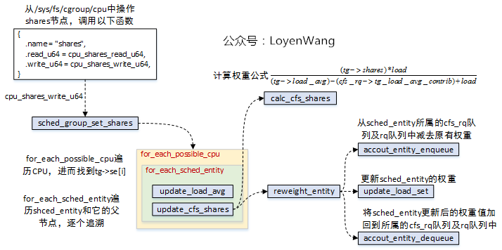
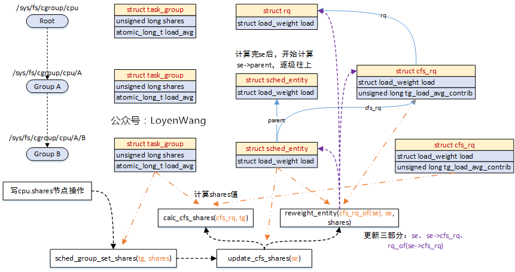

```c
static struct cftype cpu_legacy_files[] = {
    {
        .name = "shares",
        .read_u64 = cpu_shares_read_u64,
        .write_u64 = cpu_shares_write_u64,
    },
    {
        .name = "idle",
        .read_s64 = cpu_idle_read_s64,
        .write_s64 = cpu_idle_write_s64,
    }
};

cpu_shares_write_u64()
    sched_group_set_shares(css_tg(css), scale_load(shareval))
        __sched_group_set_shares(tg, shares)
            tg->shares = shares;
            for_each_possible_cpu(i) {
                struct rq *rq = cpu_rq(i);
                struct sched_entity *se = tg->se[i];
                struct rq_flags rf;

                /* Propagate contribution to hierarchy */
                rq_lock_irqsave(rq, &rf);
                update_rq_clock(rq);
                for_each_sched_entity(se) {
                    update_load_avg(cfs_rq_of(se), se, UPDATE_TG);
                    update_cfs_group(se) {
                        calc_group_shares(gcfs_rq) {

                        }
                        reweight_entity(cfs_rq_of(se), se, shares) {

                        }
                    }
                }
                rq_unlock_irqrestore(rq, &rf);
            }
```

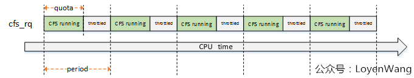


```c
struct cfs_bandwidth {
    raw_spinlock_t      lock;
    ktime_t             period;
    u64                 quota;
    u64                 runtime;
    u64                 burst;
    u64                 runtime_snap;
    s64                 hierarchical_quota;

    u8                  idle;
    u8                  period_active;
    u8                  slack_started;
    struct hrtimer      period_timer;
    struct hrtimer      slack_timer;
    struct list_head    throttled_cfs_rq;

    int                 nr_periods;
    int                 nr_throttled;
    int                 nr_burst;
    u64                 throttled_time;
    u64                 burst_time;
};

struct cfs_rq {
#ifdef CONFIG_CFS_BANDWIDTH
    int            runtime_enabled;
    s64            runtime_remaining;

    u64            throttled_pelt_idle;
#ifndef CONFIG_64BIT
    u64                     throttled_pelt_idle_copy;
#endif
    u64            throttled_clock;
    u64            throttled_clock_pelt;
    u64            throttled_clock_pelt_time;
    int            throttled;
    int            throttle_count;
    struct list_head    throttled_list;
#ifdef CONFIG_SMP
    struct list_head    throttled_csd_list;
#endif
#endif /* CONFIG_CFS_BANDWIDTH */
};
```


```c
struct task_group {
    struct cgroup_subsys_state  css;

#ifdef CONFIG_FAIR_GROUP_SCHED
    struct sched_entity         **se;
    struct cfs_rq               **cfs_rq;
    unsigned long               shares;
    int                         idle;
    atomic_long_t               load_avg;
#endif

#ifdef CONFIG_RT_GROUP_SCHED
    struct sched_rt_entity      **rt_se;
    struct rt_rq                **rt_rq;
    struct rt_bandwidth         rt_bandwidth;
#endif

    struct rcu_head             rcu;
    struct list_head            list;

    struct task_group           *parent;
    struct list_head            siblings;
    struct list_head            children;

#ifdef CONFIG_SCHED_AUTOGROUP
    struct autogroup            *autogroup;
#endif

    struct cfs_bandwidth        cfs_bandwidth;
};
```

## Q
1. A process waits on a block operation (mutex, semphore, waitqueue), it calls schedule(). Will it be removed from rq, and add to rq when block operation wakeups?
2. What's difference between contex_switch and sleep_wakeup?

# load_balance
```c
/* idle_balance is called by schedule() if this_cpu is about to become
 * idle. Attempts to pull tasks from other CPUs. */
static int idle_balance(struct rq *this_rq, struct rq_flags *rf)
{
  unsigned long next_balance = jiffies + HZ;
  int this_cpu = this_rq->cpu;
  struct sched_domain *sd;
  int pulled_task = 0;
  u64 curr_cost = 0;

  /* We must set idle_stamp _before_ calling idle_balance(), such that we
   * measure the duration of idle_balance() as idle time. */
  this_rq->idle_stamp = rq_clock(this_rq);

  /* Do not pull tasks towards !active CPUs... */
  if (!cpu_active(this_cpu))
    return 0;

  /* This is OK, because current is on_cpu, which avoids it being picked
   * for load-balance and preemption/IRQs are still disabled avoiding
   * further scheduler activity on it and we're being very careful to
   * re-start the picking loop. */
  rq_unpin_lock(this_rq, rf);

  if (this_rq->avg_idle < sysctl_sched_migration_cost ||
      !this_rq->rd->overload) {

    rcu_read_lock();
    sd = rcu_dereference_check_sched_domain(this_rq->sd);
    if (sd)
      update_next_balance(sd, &next_balance);
    rcu_read_unlock();

    nohz_newidle_balance(this_rq);

    goto out;
  }

  raw_spin_unlock(&this_rq->lock);

  update_blocked_averages(this_cpu);
  rcu_read_lock();
  for_each_domain(this_cpu, sd) {
    int continue_balancing = 1;
    u64 t0, domain_cost;

    if (!(sd->flags & SD_LOAD_BALANCE))
      continue;

    if (this_rq->avg_idle < curr_cost + sd->max_newidle_lb_cost) {
      update_next_balance(sd, &next_balance);
      break;
    }

    if (sd->flags & SD_BALANCE_NEWIDLE) {
      t0 = sched_clock_cpu(this_cpu);

      pulled_task = load_balance(this_cpu, this_rq,
               sd, CPU_NEWLY_IDLE,
               &continue_balancing);

      domain_cost = sched_clock_cpu(this_cpu) - t0;
      if (domain_cost > sd->max_newidle_lb_cost)
        sd->max_newidle_lb_cost = domain_cost;

      curr_cost += domain_cost;
    }

    update_next_balance(sd, &next_balance);

    /* Stop searching for tasks to pull if there are
     * now runnable tasks on this rq. */
    if (pulled_task || this_rq->nr_running > 0)
      break;
  }
  rcu_read_unlock();

  raw_spin_lock(&this_rq->lock);

  if (curr_cost > this_rq->max_idle_balance_cost)
    this_rq->max_idle_balance_cost = curr_cost;

out:
  /* While browsing the domains, we released the rq lock, a task could
   * have been enqueued in the meantime. Since we're not going idle,
   * pretend we pulled a task. */
  if (this_rq->cfs.h_nr_running && !pulled_task)
    pulled_task = 1;

  /* Move the next balance forward */
  if (time_after(this_rq->next_balance, next_balance))
    this_rq->next_balance = next_balance;

  /* Is there a task of a high priority class? */
  if (this_rq->nr_running != this_rq->cfs.h_nr_running)
    pulled_task = -1;

  if (pulled_task)
    this_rq->idle_stamp = 0;

  rq_repin_lock(this_rq, rf);

  return pulled_task;
}

/* Check this_cpu to ensure it is balanced within domain. Attempt to move
 * tasks if there is an imbalance. */
static int load_balance(int this_cpu, struct rq *this_rq,
      struct sched_domain *sd, enum cpu_idle_type idle,
      int *continue_balancing)
{
  int ld_moved, cur_ld_moved, active_balance = 0;
  struct sched_domain *sd_parent = sd->parent;
  struct sched_group *group;
  struct rq *busiest;
  struct rq_flags rf;
  struct cpumask *cpus = this_cpu_cpumask_var_ptr(load_balance_mask);

  struct lb_env env = {
    .sd    = sd,
    .dst_cpu  = this_cpu,
    .dst_rq    = this_rq,
    .dst_grpmask    = sched_group_span(sd->groups),
    .idle    = idle,
    .loop_break  = sched_nr_migrate_break,
    .cpus    = cpus,
    .fbq_type  = all,
    .tasks    = LIST_HEAD_INIT(env.tasks),
  };

  cpumask_and(cpus, sched_domain_span(sd), cpu_active_mask);

  schedstat_inc(sd->lb_count[idle]);

redo:
  if (!should_we_balance(&env)) {
    *continue_balancing = 0;
    goto out_balanced;
  }

  group = find_busiest_group(&env);
  if (!group) {
    schedstat_inc(sd->lb_nobusyg[idle]);
    goto out_balanced;
  }

  busiest = find_busiest_queue(&env, group);
  if (!busiest) {
    schedstat_inc(sd->lb_nobusyq[idle]);
    goto out_balanced;
  }

  BUG_ON(busiest == env.dst_rq);

  schedstat_add(sd->lb_imbalance[idle], env.imbalance);

  env.src_cpu = busiest->cpu;
  env.src_rq = busiest;

  ld_moved = 0;
  if (busiest->nr_running > 1) {
    /* Attempt to move tasks. If find_busiest_group has found
     * an imbalance but busiest->nr_running <= 1, the group is
     * still unbalanced. ld_moved simply stays zero, so it is
     * correctly treated as an imbalance. */
    env.flags |= LBF_ALL_PINNED;
    env.loop_max  = min(sysctl_sched_nr_migrate, busiest->nr_running);

more_balance:
    rq_lock_irqsave(busiest, &rf);
    update_rq_clock(busiest);

    /* cur_ld_moved - load moved in current iteration
     * ld_moved     - cumulative load moved across iterations */
    cur_ld_moved = detach_tasks(&env);

    /* We've detached some tasks from busiest_rq. Every
     * task is masked "TASK_ON_RQ_MIGRATING", so we can safely
     * unlock busiest->lock, and we are able to be sure
     * that nobody can manipulate the tasks in parallel.
     * See task_rq_lock() family for the details. */

    rq_unlock(busiest, &rf);

    if (cur_ld_moved) {
      attach_tasks(&env);
      ld_moved += cur_ld_moved;
    }

    local_irq_restore(rf.flags);

    if (env.flags & LBF_NEED_BREAK) {
      env.flags &= ~LBF_NEED_BREAK;
      goto more_balance;
    }

    /* Revisit (affine) tasks on src_cpu that couldn't be moved to
     * us and move them to an alternate dst_cpu in our sched_group
     * where they can run. The upper limit on how many times we
     * iterate on same src_cpu is dependent on number of CPUs in our
     * sched_group.
     *
     * This changes load balance semantics a bit on who can move
     * load to a given_cpu. In addition to the given_cpu itself
     * (or a ilb_cpu acting on its behalf where given_cpu is
     * nohz-idle), we now have balance_cpu in a position to move
     * load to given_cpu. In rare situations, this may cause
     * conflicts (balance_cpu and given_cpu/ilb_cpu deciding
     * _independently_ and at _same_ time to move some load to
     * given_cpu) causing exceess load to be moved to given_cpu.
     * This however should not happen so much in practice and
     * moreover subsequent load balance cycles should correct the
     * excess load moved. */
    if ((env.flags & LBF_DST_PINNED) && env.imbalance > 0) {

      /* Prevent to re-select dst_cpu via env's CPUs */
      cpumask_clear_cpu(env.dst_cpu, env.cpus);

      env.dst_rq   = cpu_rq(env.new_dst_cpu);
      env.dst_cpu   = env.new_dst_cpu;
      env.flags  &= ~LBF_DST_PINNED;
      env.loop   = 0;
      env.loop_break   = sched_nr_migrate_break;

      /* Go back to "more_balance" rather than "redo" since we
       * need to continue with same src_cpu. */
      goto more_balance;
    }

    /* We failed to reach balance because of affinity. */
    if (sd_parent) {
      int *group_imbalance = &sd_parent->groups->sgc->imbalance;

      if ((env.flags & LBF_SOME_PINNED) && env.imbalance > 0)
        *group_imbalance = 1;
    }

    /* All tasks on this runqueue were pinned by CPU affinity */
    if (unlikely(env.flags & LBF_ALL_PINNED)) {
      cpumask_clear_cpu(cpu_of(busiest), cpus);
      /* Attempting to continue load balancing at the current
       * sched_domain level only makes sense if there are
       * active CPUs remaining as possible busiest CPUs to
       * pull load from which are not contained within the
       * destination group that is receiving any migrated
       * load. */
      if (!cpumask_subset(cpus, env.dst_grpmask)) {
        env.loop = 0;
        env.loop_break = sched_nr_migrate_break;
        goto redo;
      }
      goto out_all_pinned;
    }
  }

  if (!ld_moved) {
    schedstat_inc(sd->lb_failed[idle]);
    /* Increment the failure counter only on periodic balance.
     * We do not want newidle balance, which can be very
     * frequent, pollute the failure counter causing
     * excessive cache_hot migrations and active balances. */
    if (idle != CPU_NEWLY_IDLE)
      sd->nr_balance_failed++;

    if (need_active_balance(&env)) {
      unsigned long flags;

      raw_spin_lock_irqsave(&busiest->lock, flags);

      /* Don't kick the active_load_balance_cpu_stop,
       * if the curr task on busiest CPU can't be
       * moved to this_cpu: */
      if (!cpumask_test_cpu(this_cpu, &busiest->curr->cpus_allowed)) {
        raw_spin_unlock_irqrestore(&busiest->lock,
                  flags);
        env.flags |= LBF_ALL_PINNED;
        goto out_one_pinned;
      }

      /* ->active_balance synchronizes accesses to
       * ->active_balance_work.  Once set, it's cleared
       * only after active load balance is finished. */
      if (!busiest->active_balance) {
        busiest->active_balance = 1;
        busiest->push_cpu = this_cpu;
        active_balance = 1;
      }
      raw_spin_unlock_irqrestore(&busiest->lock, flags);

      if (active_balance) {
        stop_one_cpu_nowait(cpu_of(busiest),
          active_load_balance_cpu_stop, busiest,
          &busiest->active_balance_work);
      }

      /* We've kicked active balancing, force task migration. */
      sd->nr_balance_failed = sd->cache_nice_tries+1;
    }
  } else
    sd->nr_balance_failed = 0;

  if (likely(!active_balance)) {
    /* We were unbalanced, so reset the balancing interval */
    sd->balance_interval = sd->min_interval;
  } else {
    /* If we've begun active balancing, start to back off. This
     * case may not be covered by the all_pinned logic if there
     * is only 1 task on the busy runqueue (because we don't call
     * detach_tasks). */
    if (sd->balance_interval < sd->max_interval)
      sd->balance_interval *= 2;
  }

  goto out;

out_balanced:
  /* We reach balance although we may have faced some affinity
   * constraints. Clear the imbalance flag only if other tasks got
   * a chance to move and fix the imbalance. */
  if (sd_parent && !(env.flags & LBF_ALL_PINNED)) {
    int *group_imbalance = &sd_parent->groups->sgc->imbalance;

    if (*group_imbalance)
      *group_imbalance = 0;
  }

out_all_pinned:
  /* We reach balance because all tasks are pinned at this level so
   * we can't migrate them. Let the imbalance flag set so parent level
   * can try to migrate them. */
  schedstat_inc(sd->lb_balanced[idle]);

  sd->nr_balance_failed = 0;

out_one_pinned:
  ld_moved = 0;

  /* idle_balance() disregards balance intervals, so we could repeatedly
   * reach this code, which would lead to balance_interval skyrocketting
   * in a short amount of time. Skip the balance_interval increase logic
   * to avoid that. */
  if (env.idle == CPU_NEWLY_IDLE)
    goto out;

  /* tune up the balancing interval */
  if (((env.flags & LBF_ALL_PINNED) &&
      sd->balance_interval < MAX_PINNED_INTERVAL) ||
      (sd->balance_interval < sd->max_interval))
    sd->balance_interval *= 2;
out:
  return ld_moved;
}
```

# wake_up
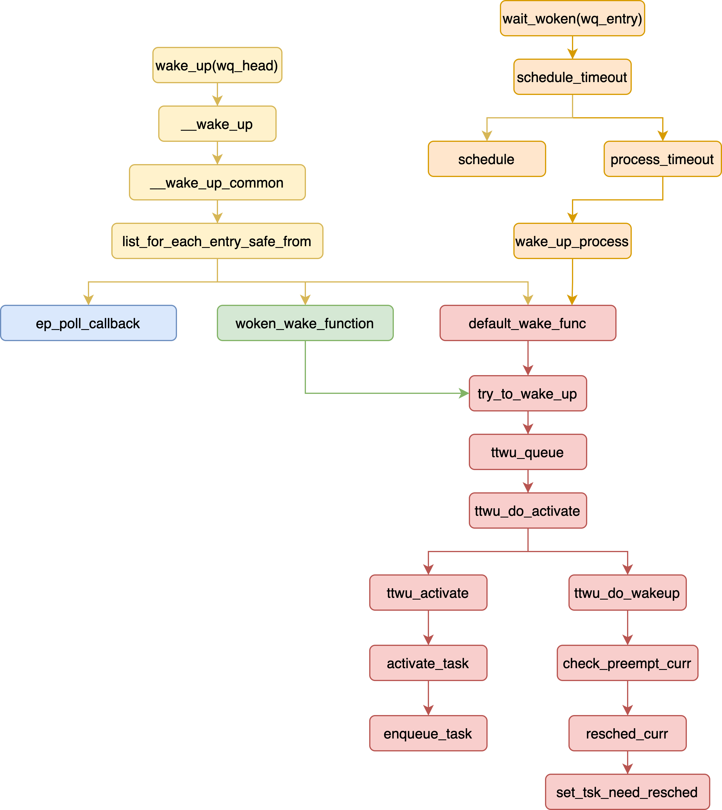

```c
#define wake_up(x)                        __wake_up(x, TASK_NORMAL, 1, NULL)
#define wake_up_nr(x, nr)                 __wake_up(x, TASK_NORMAL, nr, NULL)
#define wake_up_all(x)                    __wake_up(x, TASK_NORMAL, 0, NULL)
#define wake_up_locked(x)                 __wake_up_locked((x), TASK_NORMAL, 1)
#define wake_up_all_locked(x)             __wake_up_locked((x), TASK_NORMAL, 0)

#define wake_up_interruptible(x)          __wake_up(x, TASK_INTERRUPTIBLE, 1, NULL)
#define wake_up_interruptible_nr(x, nr)   __wake_up(x, TASK_INTERRUPTIBLE, nr, NULL)
#define wake_up_interruptible_all(x)      __wake_up(x, TASK_INTERRUPTIBLE, 0, NULL)
#define wake_up_interruptible_sync(x)     __wake_up_sync((x), TASK_INTERRUPTIBLE, 1)

void __wake_up(
  struct wait_queue_head *wq_head, unsigned int mode,
  int nr_exclusive, void *key)
{
  __wake_up_common_lock(wq_head, mode, nr_exclusive, 0, key);
}

static void __wake_up_common_lock(struct wait_queue_head *wq_head, unsigned int mode,
      int nr_exclusive, int wake_flags, void *key)
{
  unsigned long flags;
  wait_queue_entry_t bookmark;

  bookmark.flags = 0;
  bookmark.private = NULL;
  bookmark.func = NULL;
  INIT_LIST_HEAD(&bookmark.entry);

  spin_lock_irqsave(&wq_head->lock, flags);
  nr_exclusive = __wake_up_common(wq_head, mode, nr_exclusive, wake_flags, key, &bookmark);
  spin_unlock_irqrestore(&wq_head->lock, flags);

  while (bookmark.flags & WQ_FLAG_BOOKMARK) {
    spin_lock_irqsave(&wq_head->lock, flags);
    nr_exclusive = __wake_up_common(wq_head, mode, nr_exclusive, wake_flags, key, &bookmark);
    spin_unlock_irqrestore(&wq_head->lock, flags);
  }
}

static int __wake_up_common(
  struct wait_queue_head *wq_head, unsigned int mode,
  int nr_exclusive, int wake_flags, void *key,
  wait_queue_entry_t *bookmark)
{
  wait_queue_entry_t *curr, *next;
  int cnt = 0;

  lockdep_assert_held(&wq_head->lock);

  if (bookmark && (bookmark->flags & WQ_FLAG_BOOKMARK)) {
    curr = list_next_entry(bookmark, entry);

    list_del(&bookmark->entry);
    bookmark->flags = 0;
  } else
    curr = list_first_entry(&wq_head->head, wait_queue_entry_t, entry);

  if (&curr->entry == &wq_head->head)
    return nr_exclusive;

  list_for_each_entry_safe_from(curr, next, &wq_head->head, entry) {
    unsigned flags = curr->flags;
    int ret;

    if (flags & WQ_FLAG_BOOKMARK)
      continue;

    /* ep_poll_callback, default_wake_func, woken_wake_function */
    ret = curr->func(curr, mode, wake_flags, key);
    if (ret < 0)
      break;
    /* WQ_FLAG_EXCLUSIVE : fix Thundering Herd problem */
    if (ret && (flags & WQ_FLAG_EXCLUSIVE) && !--nr_exclusive)
      break;

    if (bookmark && (++cnt > WAITQUEUE_WALK_BREAK_CNT)
      && (&next->entry != &wq_head->head))
    {
      bookmark->flags = WQ_FLAG_BOOKMARK;
      list_add_tail(&bookmark->entry, &next->entry);
      break;
    }
  }

  return nr_exclusive;
}
```

# wait_woken
```c
long inet_wait_for_connect(struct sock *sk, long timeo, int writebias)
{
  DEFINE_WAIT_FUNC(wait, woken_wake_function);

  add_wait_queue(sk_sleep(sk), &wait);
  sk->sk_write_pending += writebias;

  while ((1 << sk->sk_state) & (TCPF_SYN_SENT | TCPF_SYN_RECV)) {
    timeo = wait_woken(&wait, TASK_INTERRUPTIBLE, timeo);
    if (signal_pending(current) || !timeo)
      break;
  }
  remove_wait_queue(sk_sleep(sk), &wait);
  sk->sk_write_pending -= writebias;
  return timeo;
}

long wait_woken(struct wait_queue_entry *wq_entry, unsigned mode, long timeout)
{
  /* The below executes an smp_mb(), which matches with the full barrier
   * executed by the try_to_wake_up() in woken_wake_function() such that
   * either we see the store to wq_entry->flags in woken_wake_function()
   * or woken_wake_function() sees our store to current->state. */
  set_current_state(mode); /* A */
  if (!(wq_entry->flags & WQ_FLAG_WOKEN) && !is_kthread_should_stop())
    timeout = schedule_timeout(timeout);
  __set_current_state(TASK_RUNNING);

  /* The below executes an smp_mb(), which matches with the smp_mb() (C)
   * in woken_wake_function() such that either we see the wait condition
   * being true or the store to wq_entry->flags in woken_wake_function()
   * follows ours in the coherence order. */
  smp_store_mb(wq_entry->flags, wq_entry->flags & ~WQ_FLAG_WOKEN); /* B */

  return timeout;
}

long __sched schedule_timeout(signed long timeout)
{
  struct process_timer timer;
  unsigned long expire;

  switch (timeout)
  {
  case MAX_SCHEDULE_TIMEOUT:
    schedule();
    goto out;
  default:
    if (timeout < 0) {
      printk(KERN_ERR "schedule_timeout: wrong timeout "
        "value %lx\n", timeout);
      dump_stack();
      current->state = TASK_RUNNING;
      goto out;
    }
  }

  expire = timeout + jiffies;

  timer.task = current;
  timer_setup_on_stack(&timer.timer, process_timeout, 0);
  __mod_timer(&timer.timer, expire, 0);
  schedule();
  del_singleshot_timer_sync(&timer.timer);

  /* Remove the timer from the object tracker */
  destroy_timer_on_stack(&timer.timer);

  timeout = expire - jiffies;

 out:
  return timeout < 0 ? 0 : timeout;
}

void process_timeout(struct timer_list *t)
{
  struct process_timer *timeout = from_timer(timeout, t, timer);

  wake_up_process(timeout->task);
}

int wake_up_process(struct task_struct *p)
{
  return try_to_wake_up(p, TASK_NORMAL, 0);
}

int woken_wake_function(
  struct wait_queue_entry *wq_entry, unsigned mode, int sync, void *key)
{
  /* Pairs with the smp_store_mb() in wait_woken(). */
  smp_mb(); /* C */
  wq_entry->flags |= WQ_FLAG_WOKEN;

  return default_wake_function(wq_entry, mode, sync, key);
}

int default_wake_function(
  wait_queue_entry_t *curr, unsigned mode, int wake_flags, void *key)
{
  return try_to_wake_up(curr->private, mode, wake_flags);
}

/* wait_queue_entry::flags */
#define WQ_FLAG_EXCLUSIVE  0x01
#define WQ_FLAG_WOKEN      0x02
#define WQ_FLAG_BOOKMARK   0x04

struct wait_queue_entry {
  unsigned int      flags;
  void              *private; /* struct_task */
  wait_queue_func_t func;
  struct list_head  entry;
};
```

# try_to_wake_up
```c
/* try_to_wake_up -> ttwu_queue -> ttwu_do_activate -> ttwu_do_wakeup
 * -> check_preempt_curr -> resched_curr */

try_to_wake_up() {
    ttwu_queue() {
        ttwu_do_activate(rq, p, wake_flags, &rf) {
            if (p->in_iowait) {
                delayacct_blkio_end(p);
                atomic_dec(&task_rq(p)->nr_iowait);
            }

            activate_task(rq, p, en_flags) {
                if (task_on_rq_migrating(p))
                    flags |= ENQUEUE_MIGRATED;
                if (flags & ENQUEUE_MIGRATED)
                    sched_mm_cid_migrate_to(rq, p);

                enqueue_task(rq, p, flags) {
                    uclamp_rq_inc(rq, p);
                    p->sched_class->enqueue_task(rq, p, flags);
                }

                p->on_rq = TASK_ON_RQ_QUEUED;
            }

            check_preempt_curr(rq, p, wake_flags);

            ttwu_do_wakeup(p) {
                WRITE_ONCE(p->__state, TASK_RUNNING);
            }

            p->sched_class->task_woken(rq, p) {

            }
        }
    }
}


```c
try_to_wake_up();
    ttwu_queue();
        rq_lock(rq, &rf);
        ttwu_do_activate(rq, p, wake_flags, &rf);
            /* 1. insert p into rq */
            ttwu_activate(rq, p, en_flags);
                activate_task(rq, p, en_flags);
                    enqueue_task(rq, p, flags);
                        p->sched_class->enqueue_task(rq, p, flags);
                p->on_rq = TASK_ON_RQ_QUEUED;

            /* 2. check schedule curr */
            ttwu_do_wakeup(rq, p, wake_flags, rf);
                check_preempt_curr(rq, p, wake_flags);
                    rq->curr->sched_class->check_preempt_curr(rq, p, flags);
                        check_preempt_wakeup();
                            ret = wakeup_preempt_entity(se, pse);
                                s64 gran, vdiff = curr->vruntime - se->vruntime;
                                if (vdiff <= 0)
                                    return -1;

                                gran = wakeup_gran(se);
                                    unsigned long gran = sysctl_sched_wakeup_granularity;
                                    return calc_delta_fair(gran, se);

                                if (vdiff > gran)
                                    return 1;

                            if (ret) {
                                resched_curr();
                                    set_tsk_need_resched();
                            }

                p->state = TASK_RUNNING;
        rq_unlock(rq, &rf);

```

# fork

* [Misc on Linux fork, switch_to, and scheduling](http://lastweek.io/notes/linux/fork/)

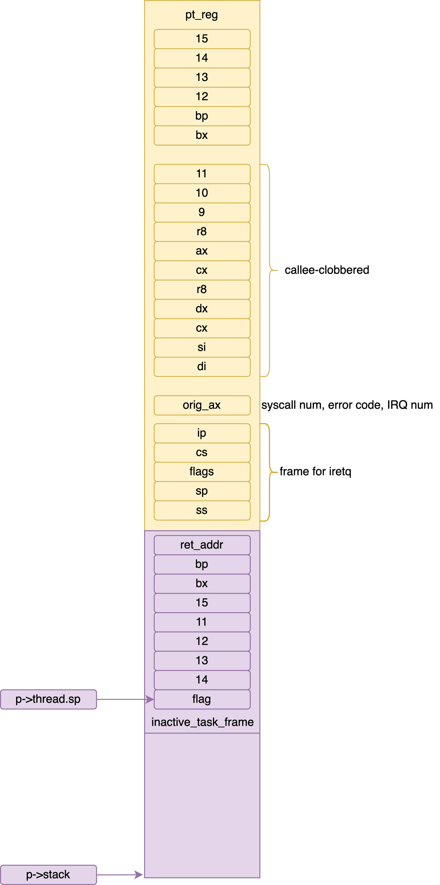


```c
SYSCALL_DEFINE0(fork)
{
  return _do_fork(SIGCHLD, 0, 0, NULL, NULL, 0);
}

long _do_fork(
  unsigned long clone_flags,
  unsigned long stack_start,
  unsigned long stack_size,
  int __user *parent_tidptr,
  int __user *child_tidptr,
  unsigned long tls)
{
  struct task_struct *p;
  int trace = 0;
  long nr;

  p = copy_process(clone_flags, stack_start, stack_size,
    child_tidptr, NULL, trace, tls, NUMA_NO_NODE);

  if (IS_ERR(p))
    return PTR_ERR(p);

  struct pid *pid;
  pid = get_task_pid(p, PIDTYPE_PID);
  nr = pid_vnr(pid);

  if (clone_flags & CLONE_PARENT_SETTID)
    put_user(nr, parent_tidptr);

  wake_up_new_task(p);

  put_pid(pid);

  return nr;
}
```

## copy_process
```c
/* kernel/fork.c */
struct task_struct *copy_process(
  unsigned long clone_flags,
  unsigned long stack_start,
  unsigned long stack_size,
  int __user *child_tidptr,
  struct pid *pid,
  int trace,
  unsigned long tls,
  int node)
{
  int retval;
  struct task_struct *p;
  struct multiprocess_signals delayed;

  /* Don't allow sharing the root directory with processes in a different
   * namespace */
  if ((clone_flags & (CLONE_NEWNS|CLONE_FS)) == (CLONE_NEWNS|CLONE_FS))
    return ERR_PTR(-EINVAL);

  if ((clone_flags & (CLONE_NEWUSER|CLONE_FS)) == (CLONE_NEWUSER|CLONE_FS))
    return ERR_PTR(-EINVAL);

  /* Thread groups must share signals as well, and detached threads
   * can only be started up within the thread group. */
  if ((clone_flags & CLONE_THREAD) && !(clone_flags & CLONE_SIGHAND))
    return ERR_PTR(-EINVAL);

  /* Shared signal handlers imply shared VM. By way of the above,
   * thread groups also imply shared VM. Blocking this case allows
   * for various simplifications in other code. */
  if ((clone_flags & CLONE_SIGHAND) && !(clone_flags & CLONE_VM))
    return ERR_PTR(-EINVAL);

  /* Siblings of global init remain as zombies on exit since they are
   * not reaped by their parent (swapper). To solve this and to avoid
   * multi-rooted process trees, prevent global and container-inits
   * from creating siblings. */
  if ((clone_flags & CLONE_PARENT) && current->signal->flags & SIGNAL_UNKILLABLE)
    return ERR_PTR(-EINVAL);

  /* If the new process will be in a different pid or user namespace
   * do not allow it to share a thread group with the forking task. */
  if (clone_flags & CLONE_THREAD) {
    if ((clone_flags & (CLONE_NEWUSER | CLONE_NEWPID))
    || (task_active_pid_ns(current) != current->nsproxy->pid_ns_for_children))
      return ERR_PTR(-EINVAL);
  }

  /* Force any signals received before this point to be delivered
   * before the fork happens.  Collect up signals sent to multiple
   * processes that happen during the fork and delay them so that
   * they appear to happen after the fork. */
  sigemptyset(&delayed.signal);
  INIT_HLIST_NODE(&delayed.node);

  spin_lock_irq(&current->sighand->siglock);
  if (!(clone_flags & CLONE_THREAD))
    hlist_add_head(&delayed.node, &current->signal->multiprocess);
  recalc_sigpending();
  spin_unlock_irq(&current->sighand->siglock);
  retval = -ERESTARTNOINTR;
  if (signal_pending(current))
    goto fork_out;

  retval = -ENOMEM;
  p = dup_task_struct(current, node);
  if (!p)
    goto fork_out;

  /* This _must_ happen before we call free_task(), i.e. before we jump
   * to any of the bad_fork_* labels. This is to avoid freeing
   * p->set_child_tid which is (ab)used as a kthread's data pointer for
   * kernel threads (PF_KTHREAD). */
  p->set_child_tid = (clone_flags & CLONE_CHILD_SETTID) ? child_tidptr : NULL;
  /* Clear TID on mm_release()? */
  p->clear_child_tid = (clone_flags & CLONE_CHILD_CLEARTID) ? child_tidptr : NULL;

  ftrace_graph_init_task(p);

  rt_mutex_init_task(p);

#ifdef CONFIG_PROVE_LOCKING
  DEBUG_LOCKS_WARN_ON(!p->hardirqs_enabled);
  DEBUG_LOCKS_WARN_ON(!p->softirqs_enabled);
#endif
  retval = -EAGAIN;
  if (atomic_read(&p->real_cred->user->processes) >= task_rlimit(p, RLIMIT_NPROC)) {
    if (p->real_cred->user != INIT_USER &&
        !capable(CAP_SYS_RESOURCE) && !capable(CAP_SYS_ADMIN))
      goto bad_fork_free;
  }
  current->flags &= ~PF_NPROC_EXCEEDED;

  retval = copy_creds(p, clone_flags);
  if (retval < 0)
    goto bad_fork_free;

  /* If multiple threads are within copy_process(), then this check
   * triggers too late. This doesn't hurt, the check is only there
   * to stop root fork bombs. */
  retval = -EAGAIN;
  if (nr_threads >= max_threads)
    goto bad_fork_cleanup_count;

  delayacct_tsk_init(p);  /* Must remain after dup_task_struct() */
  p->flags &= ~(PF_SUPERPRIV | PF_WQ_WORKER | PF_IDLE);
  p->flags |= PF_FORKNOEXEC;
  INIT_LIST_HEAD(&p->children);
  INIT_LIST_HEAD(&p->sibling);
  rcu_copy_process(p);
  p->vfork_done = NULL;
  spin_lock_init(&p->alloc_lock);

  init_sigpending(&p->pending);

  p->utime = p->stime = p->gtime = 0;
#ifdef CONFIG_ARCH_HAS_SCALED_CPUTIME
  p->utimescaled = p->stimescaled = 0;
#endif
  prev_cputime_init(&p->prev_cputime);

#ifdef CONFIG_VIRT_CPU_ACCOUNTING_GEN
  seqcount_init(&p->vtime.seqcount);
  p->vtime.starttime = 0;
  p->vtime.state = VTIME_INACTIVE;
#endif

#if defined(SPLIT_RSS_COUNTING)
  memset(&p->rss_stat, 0, sizeof(p->rss_stat));
#endif

  p->default_timer_slack_ns = current->timer_slack_ns;

  task_io_accounting_init(&p->ioac);
  acct_clear_integrals(p);

  posix_cpu_timers_init(p);

  p->io_context = NULL;
  audit_set_context(p, NULL);
  cgroup_fork(p);
#ifdef CONFIG_NUMA
  p->mempolicy = mpol_dup(p->mempolicy);
  if (IS_ERR(p->mempolicy)) {
    retval = PTR_ERR(p->mempolicy);
    p->mempolicy = NULL;
    goto bad_fork_cleanup_threadgroup_lock;
  }
#endif
#ifdef CONFIG_CPUSETS
  p->cpuset_mem_spread_rotor = NUMA_NO_NODE;
  p->cpuset_slab_spread_rotor = NUMA_NO_NODE;
  seqcount_init(&p->mems_allowed_seq);
#endif
#ifdef CONFIG_TRACE_IRQFLAGS
  p->irq_events = 0;
  p->hardirqs_enabled = 0;
  p->hardirq_enable_ip = 0;
  p->hardirq_enable_event = 0;
  p->hardirq_disable_ip = _THIS_IP_;
  p->hardirq_disable_event = 0;
  p->softirqs_enabled = 1;
  p->softirq_enable_ip = _THIS_IP_;
  p->softirq_enable_event = 0;
  p->softirq_disable_ip = 0;
  p->softirq_disable_event = 0;
  p->hardirq_context = 0;
  p->softirq_context = 0;
#endif

  p->pagefault_disabled = 0;

#ifdef CONFIG_LOCKDEP
  p->lockdep_depth = 0; /* no locks held yet */
  p->curr_chain_key = 0;
  p->lockdep_recursion = 0;
  lockdep_init_task(p);
#endif

#ifdef CONFIG_DEBUG_MUTEXES
  p->blocked_on = NULL; /* not blocked yet */
#endif
#ifdef CONFIG_BCACHE
  p->sequential_io  = 0;
  p->sequential_io_avg  = 0;
#endif

  /* Perform scheduler related setup. Assign this task to a CPU. */
  retval = sched_fork(clone_flags, p);
  if (retval)
    goto bad_fork_cleanup_policy;

  retval = perf_event_init_task(p);
  if (retval)
    goto bad_fork_cleanup_policy;
  retval = audit_alloc(p);
  if (retval)
    goto bad_fork_cleanup_perf;
  /* copy all the process information */
  shm_init_task(p);
  retval = security_task_alloc(p, clone_flags);
  if (retval)
    goto bad_fork_cleanup_audit;
  retval = copy_semundo(clone_flags, p);
  if (retval)
    goto bad_fork_cleanup_security;
  retval = copy_files(clone_flags, p);
  if (retval)
    goto bad_fork_cleanup_semundo;
  retval = copy_fs(clone_flags, p);
  if (retval)
    goto bad_fork_cleanup_files;
  retval = copy_sighand(clone_flags, p);
  if (retval)
    goto bad_fork_cleanup_fs;
  retval = copy_signal(clone_flags, p);
  if (retval)
    goto bad_fork_cleanup_sighand;
  retval = copy_mm(clone_flags, p);
  if (retval)
    goto bad_fork_cleanup_signal;
  retval = copy_namespaces(clone_flags, p);
  if (retval)
    goto bad_fork_cleanup_mm;
  retval = copy_io(clone_flags, p);
  if (retval)
    goto bad_fork_cleanup_namespaces;
  retval = copy_thread_tls(clone_flags, stack_start, stack_size, p, tls);
  if (retval)
    goto bad_fork_cleanup_io;

  if (pid != &init_struct_pid) {
    pid = alloc_pid(p->nsproxy->pid_ns_for_children);
    if (IS_ERR(pid)) {
      retval = PTR_ERR(pid);
      goto bad_fork_cleanup_thread;
    }
  }

#ifdef CONFIG_BLOCK
  p->plug = NULL;
#endif
  futex_init_task(p);

  /* sigaltstack should be cleared when sharing the same VM */
  if ((clone_flags & (CLONE_VM|CLONE_VFORK)) == CLONE_VM)
    sas_ss_reset(p);

  /* Syscall tracing and stepping should be turned off in the
   * child regardless of CLONE_PTRACE. */
  user_disable_single_step(p);
  clear_tsk_thread_flag(p, TIF_SYSCALL_TRACE);
#ifdef TIF_SYSCALL_EMU
  clear_tsk_thread_flag(p, TIF_SYSCALL_EMU);
#endif
  clear_all_latency_tracing(p);

  /* ok, now we should be set up.. */
  p->pid = pid_nr(pid);
  if (clone_flags & CLONE_THREAD) {
    p->group_leader = current->group_leader;
    p->tgid = current->tgid;
  } else {
    p->group_leader = p;
    p->tgid = p->pid;
  }

  p->nr_dirtied = 0;
  p->nr_dirtied_pause = 128 >> (PAGE_SHIFT - 10);
  p->dirty_paused_when = 0;

  p->pdeath_signal = 0;
  INIT_LIST_HEAD(&p->thread_group);
  p->task_works = NULL;

  cgroup_threadgroup_change_begin(current);
  /* Ensure that the cgroup subsystem policies allow the new process to be
   * forked. It should be noted the the new process's css_set can be changed
   * between here and cgroup_post_fork() if an organisation operation is in
   * progress. */
  retval = cgroup_can_fork(p);
  if (retval)
    goto bad_fork_free_pid;

  /* From this point on we must avoid any synchronous user-space
   * communication until we take the tasklist-lock. In particular, we do
   * not want user-space to be able to predict the process start-time by
   * stalling fork(2) after we recorded the start_time but before it is
   * visible to the system. */

  p->start_time = ktime_get_ns();
  p->real_start_time = ktime_get_boot_ns();

  /* Make it visible to the rest of the system, but dont wake it up yet.
   * Need tasklist lock for parent etc handling! */
  write_lock_irq(&tasklist_lock);

  /* CLONE_PARENT re-uses the old parent */
  if (clone_flags & (CLONE_PARENT|CLONE_THREAD)) {
    p->real_parent = current->real_parent;
    p->parent_exec_id = current->parent_exec_id;
    if (clone_flags & CLONE_THREAD)
      p->exit_signal = -1;
    else
      p->exit_signal = current->group_leader->exit_signal;
  } else {
    p->real_parent = current;
    p->parent_exec_id = current->self_exec_id;
    p->exit_signal = (clone_flags & CSIGNAL);
  }

  klp_copy_process(p);

  spin_lock(&current->sighand->siglock);

  /* Copy seccomp details explicitly here, in case they were changed
   * before holding sighand lock. */
  copy_seccomp(p);

  rseq_fork(p, clone_flags);

  /* Don't start children in a dying pid namespace */
  if (unlikely(!(ns_of_pid(pid)->pid_allocated & PIDNS_ADDING))) {
    retval = -ENOMEM;
    goto bad_fork_cancel_cgroup;
  }

  /* Let kill terminate clone/fork in the middle */
  if (fatal_signal_pending(current)) {
    retval = -EINTR;
    goto bad_fork_cancel_cgroup;
  }


  init_task_pid_links(p);
  if (likely(p->pid)) {
    ptrace_init_task(p, (clone_flags & CLONE_PTRACE) || trace);

    init_task_pid(p, PIDTYPE_PID, pid);
    if (thread_group_leader(p)) {
      init_task_pid(p, PIDTYPE_TGID, pid);
      init_task_pid(p, PIDTYPE_PGID, task_pgrp(current));
      init_task_pid(p, PIDTYPE_SID, task_session(current));

      if (is_child_reaper(pid)) {
        ns_of_pid(pid)->child_reaper = p;
        p->signal->flags |= SIGNAL_UNKILLABLE;
      }
      p->signal->shared_pending.signal = delayed.signal;
      p->signal->tty = tty_kref_get(current->signal->tty);
      /* Inherit has_child_subreaper flag under the same
       * tasklist_lock with adding child to the process tree
       * for propagate_has_child_subreaper optimization. */
      p->signal->has_child_subreaper = p->real_parent->signal->has_child_subreaper ||
               p->real_parent->signal->is_child_subreaper;
      list_add_tail(&p->sibling, &p->real_parent->children);
      list_add_tail_rcu(&p->tasks, &init_task.tasks);
      attach_pid(p, PIDTYPE_TGID);
      attach_pid(p, PIDTYPE_PGID);
      attach_pid(p, PIDTYPE_SID);
      __this_cpu_inc(process_counts);
    } else {
      current->signal->nr_threads++;
      atomic_inc(&current->signal->live);
      atomic_inc(&current->signal->sigcnt);
      task_join_group_stop(p);
      list_add_tail_rcu(&p->thread_group,
            &p->group_leader->thread_group);
      list_add_tail_rcu(&p->thread_node,
            &p->signal->thread_head);
    }
    attach_pid(p, PIDTYPE_PID);
    nr_threads++;
  }
  total_forks++;
  hlist_del_init(&delayed.node);
  spin_unlock(&current->sighand->siglock);
  syscall_tracepoint_update(p);
  write_unlock_irq(&tasklist_lock);

  proc_fork_connector(p);
  cgroup_post_fork(p);
  cgroup_threadgroup_change_end(current);
  perf_event_fork(p);

  trace_task_newtask(p, clone_flags);
  uprobe_copy_process(p, clone_flags);

  copy_oom_score_adj(clone_flags, p);

  return p;
}

void wake_up_new_task(struct task_struct *p)
{
  struct rq_flags rf;
  struct rq *rq;

  p->state = TASK_RUNNING;

  activate_task(rq, p, ENQUEUE_NOCLOCK);
  p->on_rq = TASK_ON_RQ_QUEUED;
  trace_sched_wakeup_new(p);
  check_preempt_curr(rq, p, WF_FORK);
}
```

## dup_task_struct
```c
struct task_struct *dup_task_struct(struct task_struct *orig, int node)
{
  struct task_struct *tsk;
  unsigned long *stack;
  struct vm_struct *stack_vm_area;
  int err;

  if (node == NUMA_NO_NODE)
    node = tsk_fork_get_node(orig);
  tsk = alloc_task_struct_node(node);
  if (!tsk)
    return NULL;

  stack = alloc_thread_stack_node(tsk, node);
  if (!stack)
    goto free_tsk;

  stack_vm_area = task_stack_vm_area(tsk);

  err = arch_dup_task_struct(tsk, orig);

  /* arch_dup_task_struct() clobbers the stack-related fields.  Make
   * sure they're properly initialized before using any stack-related
   * functions again. */
  tsk->stack = stack;
#ifdef CONFIG_VMAP_STACK
  tsk->stack_vm_area = stack_vm_area;
#endif
#ifdef CONFIG_THREAD_INFO_IN_TASK
  atomic_set(&tsk->stack_refcount, 1);
#endif

  if (err)
    goto free_stack;

#ifdef CONFIG_SECCOMP
  /* We must handle setting up seccomp filters once we're under
   * the sighand lock in case orig has changed between now and
   * then. Until then, filter must be NULL to avoid messing up
   * the usage counts on the error path calling free_task. */
  tsk->seccomp.filter = NULL;
#endif

  setup_thread_stack(tsk, orig);
  clear_user_return_notifier(tsk);
  clear_tsk_need_resched(tsk);
  set_task_stack_end_magic(tsk);

#ifdef CONFIG_STACKPROTECTOR
  tsk->stack_canary = get_random_canary();
#endif

  /* One for us, one for whoever does the "release_task()" (usually
   * parent) */
  atomic_set(&tsk->usage, 2);
#ifdef CONFIG_BLK_DEV_IO_TRACE
  tsk->btrace_seq = 0;
#endif
  tsk->splice_pipe = NULL;
  tsk->task_frag.page = NULL;
  tsk->wake_q.next = NULL;

  account_kernel_stack(tsk, 1);

  kcov_task_init(tsk);

#ifdef CONFIG_FAULT_INJECTION
  tsk->fail_nth = 0;
#endif

#ifdef CONFIG_BLK_CGROUP
  tsk->throttle_queue = NULL;
  tsk->use_memdelay = 0;
#endif

#ifdef CONFIG_MEMCG
  tsk->active_memcg = NULL;
#endif
  return tsk;

free_stack:
  free_thread_stack(tsk);
free_tsk:
  free_task_struct(tsk);
  return NULL;
}

static unsigned long *alloc_thread_stack_node(struct task_struct *tsk, int node)
{
#ifdef CONFIG_VMAP_STACK
  void *stack;
  int i;

  for (i = 0; i < NR_CACHED_STACKS; i++) {
    struct vm_struct *s;

    s = this_cpu_xchg(cached_stacks[i], NULL);

    if (!s)
      continue;

    /* Clear stale pointers from reused stack. */
    memset(s->addr, 0, THREAD_SIZE);

    tsk->stack_vm_area = s;
    tsk->stack = s->addr;
    return s->addr;
  }

  stack = __vmalloc_node_range(THREAD_SIZE, THREAD_ALIGN,
             VMALLOC_START, VMALLOC_END,
             THREADINFO_GFP,
             PAGE_KERNEL,
             0, node, __builtin_return_address(0));

  /* We can't call find_vm_area() in interrupt context, and
   * free_thread_stack() can be called in interrupt context,
   * so cache the vm_struct. */
  if (stack) {
    tsk->stack_vm_area = find_vm_area(stack);
    tsk->stack = stack;
  }
  return stack;
#else
  struct page *page = alloc_pages_node(node, THREADINFO_GFP,
               THREAD_SIZE_ORDER);

  if (likely(page)) {
    tsk->stack = page_address(page);
    return tsk->stack;
  }
  return NULL;
#endif
}
```

## sched_fork
```c
int sched_fork(unsigned long clone_flags, struct task_struct *p)
{
  unsigned long flags;

  __sched_fork(clone_flags, p);
  /* We mark the process as NEW here. This guarantees that
   * nobody will actually run it, and a signal or other external
   * event cannot wake it up and insert it on the runqueue either. */
  p->state = TASK_NEW;

  /* Make sure we do not leak PI boosting priority to the child. */
  p->prio = current->normal_prio;

  /* Revert to default priority/policy on fork if requested. */
  if (unlikely(p->sched_reset_on_fork)) {
    if (task_has_dl_policy(p) || task_has_rt_policy(p)) {
      p->policy = SCHED_NORMAL;
      p->static_prio = NICE_TO_PRIO(0);
      p->rt_priority = 0;
    } else if (PRIO_TO_NICE(p->static_prio) < 0)
      p->static_prio = NICE_TO_PRIO(0);

    p->prio = p->normal_prio = __normal_prio(p);
    set_load_weight(p, false);

    /* We don't need the reset flag anymore after the fork. It has
     * fulfilled its duty: */
    p->sched_reset_on_fork = 0;
  }

  if (dl_prio(p->prio))
    return -EAGAIN;
  else if (rt_prio(p->prio))
    p->sched_class = &rt_sched_class;
  else
    p->sched_class = &fair_sched_class;

  init_entity_runnable_average(&p->se);

  /* The child is not yet in the pid-hash so no cgroup attach races,
   * and the cgroup is pinned to this child due to cgroup_fork()
   * is ran before sched_fork().
   *
   * Silence PROVE_RCU. */
  raw_spin_lock_irqsave(&p->pi_lock, flags);
  rseq_migrate(p);
  /* We're setting the CPU for the first time, we don't migrate,
   * so use __set_task_cpu(). */
  __set_task_cpu(p, smp_processor_id());
  if (p->sched_class->task_fork)
    p->sched_class->task_fork(p);
  raw_spin_unlock_irqrestore(&p->pi_lock, flags);

#ifdef CONFIG_SCHED_INFO
  if (likely(sched_info_on()))
    memset(&p->sched_info, 0, sizeof(p->sched_info));
#endif
#if defined(CONFIG_SMP)
  p->on_cpu = 0;
#endif
  init_task_preempt_count(p);
#ifdef CONFIG_SMP
  plist_node_init(&p->pushable_tasks, MAX_PRIO);
  RB_CLEAR_NODE(&p->pushable_dl_tasks);
#endif
  return 0;
}

/* copy_process -> sched_fork -> sched_class->task_fork -> */
void task_fork_fair(struct task_struct *p)
{
  struct cfs_rq *cfs_rq;
  struct sched_entity *se = &p->se, *curr;
  struct rq *rq = this_rq();
  struct rq_flags rf;

  rq_lock(rq, &rf);
  update_rq_clock(rq);

  cfs_rq = task_cfs_rq(current);
  curr = cfs_rq->curr;
  if (curr) {
    update_curr(cfs_rq);
    se->vruntime = curr->vruntime; /* child has same vruntime as parent */
  }
  place_entity(cfs_rq, se, 1);

  if (sysctl_sched_child_runs_first && curr && entity_before(curr, se)) {
    /* Upon rescheduling, sched_class::put_prev_task() will place
     * 'current' within the tree based on its new key value. */
    swap(curr->vruntime, se->vruntime);
    resched_curr(rq);
  }

  se->vruntime -= cfs_rq->min_vruntime;
  rq_unlock(rq, &rf);
}
```

## copy_thread_tls

```c
struct fork_frame {
  struct inactive_task_frame frame;
  struct pt_regs regs;
};

/* This is the structure pointed to by thread.sp for an inactive task.  The
 * order of the fields must match the code in __switch_to_asm(). */
struct inactive_task_frame {
  unsigned long flags;
#ifdef CONFIG_X86_64
  unsigned long r15;
  unsigned long r14;
  unsigned long r13;
  unsigned long r12;
#else
  unsigned long si;
  unsigned long di;
#endif
  unsigned long bx;

  /* These two fields must be together.  They form a stack frame header,
   * needed by get_frame_pointer(). */
  unsigned long bp;
  unsigned long ret_addr;
};

/* arch/x86/kernel/process_64.c */
int copy_thread_tls(unsigned long clone_flags, unsigned long sp,
    unsigned long arg, struct task_struct *p, unsigned long tls)
{
  int err;
  struct pt_regs *childregs;
  struct fork_frame *fork_frame;
  struct inactive_task_frame *frame;
  struct task_struct *me = current;

  childregs = task_pt_regs(p);
  fork_frame = container_of(childregs, struct fork_frame, regs);
  frame = &fork_frame->frame;

  /* For a new task use the RESET flags value since there is no before.
   * All the status flags are zero; DF and all the system flags must also
   * be 0, specifically IF must be 0 because we context switch to the new
   * task with interrupts disabled. */
  frame->flags = X86_EFLAGS_FIXED;
  frame->bp = 0;
  frame->ret_addr = (unsigned long) ret_from_fork;
  p->thread.sp = (unsigned long) fork_frame;
  p->thread.io_bitmap_ptr = NULL;

  savesegment(gs, p->thread.gsindex);
  p->thread.gsbase = p->thread.gsindex ? 0 : me->thread.gsbase;
  savesegment(fs, p->thread.fsindex);
  p->thread.fsbase = p->thread.fsindex ? 0 : me->thread.fsbase;
  savesegment(es, p->thread.es);
  savesegment(ds, p->thread.ds);
  memset(p->thread.ptrace_bps, 0, sizeof(p->thread.ptrace_bps));

  if (unlikely(p->flags & PF_KTHREAD)) {
    /* kernel thread */
    memset(childregs, 0, sizeof(struct pt_regs));
    frame->bx = sp;    /* function */
    frame->r12 = arg;
    return 0;
  }
  frame->bx = 0;
  *childregs = *current_pt_regs();

  childregs->ax = 0;
  if (sp)
    childregs->sp = sp;

  err = -ENOMEM;
  if (unlikely(test_tsk_thread_flag(me, TIF_IO_BITMAP))) {
    p->thread.io_bitmap_ptr = kmemdup(me->thread.io_bitmap_ptr, IO_BITMAP_BYTES, GFP_KERNEL);
    if (!p->thread.io_bitmap_ptr) {
      p->thread.io_bitmap_max = 0;
      return -ENOMEM;
    }
    set_tsk_thread_flag(p, TIF_IO_BITMAP);
  }

  /* Set a new TLS for the child thread? */
  if (clone_flags & CLONE_SETTLS) {
      err = do_arch_prctl_64(p, ARCH_SET_FS, tls);
    if (err)
      goto out;
  }
  err = 0;
out:
  if (err && p->thread.io_bitmap_ptr) {
    kfree(p->thread.io_bitmap_ptr);
    p->thread.io_bitmap_max = 0;
  }

  return err;
}
```

## ret_from_fork

A program gets into this function by simply return from __switch_to().

```c
/* arch/x86/entry/entry_64.S
 * A newly forked process directly context switches into this address.
 *
 * rax: prev task we switched from
 * rbx: kernel thread func (NULL for user thread)
 * r12: kernel thread arg */
ENTRY(ret_from_fork)
  UNWIND_HINT_EMPTY
  movq  %rax, %rdi
  call  schedule_tail      /* rdi: 'prev' task parameter */

  testq  %rbx, %rbx      /* from kernel_thread? */
  jnz  1f        /* kernel threads are uncommon */

2:
  UNWIND_HINT_REGS
  movq  %rsp, %rdi
  call  syscall_return_slowpath  /* returns with IRQs disabled */
  TRACE_IRQS_ON      /* user mode is traced as IRQS on */
  jmp  swapgs_restore_regs_and_return_to_usermode

1:
  /* kernel thread */
  UNWIND_HINT_EMPTY
  movq  %r12, %rdi
  CALL_NOSPEC %rbx
  /* A kernel thread is allowed to return here after successfully
   * calling do_execve().  Exit to userspace to complete the execve()
   * syscall. */
  movq  $0, RAX(%rsp)
  jmp  2b
END(ret_from_fork)


SYM_CODE_START_LOCAL(common_interrupt_return)
SYM_INNER_LABEL(swapgs_restore_regs_and_return_to_usermode, SYM_L_GLOBAL)
  IBRS_EXIT

  POP_REGS pop_rdi=0
  /*
  .macro POP_REGS pop_rdi=1
    popq %r15
    popq %r14
    popq %r13
    popq %r12
    popq %rbp
    popq %rbx
    popq %r11
    popq %r10
    popq %r9
    popq %r8
    popq %rax
    popq %rcx
    popq %rdx
    popq %rsi
    .if \pop_rdi
      popq %rdi
    .endif
  .endm */

  /* The stack is now user RDI, orig_ax, RIP, CS, EFLAGS, RSP, SS.
   * Save old stack pointer and switch to trampoline stack. */
  movq  %rsp, %rdi
  movq  PER_CPU_VAR(cpu_tss_rw + TSS_sp0), %rsp
  UNWIND_HINT_EMPTY

  /* Copy the IRET frame to the trampoline stack. */
  pushq  6*8(%rdi)  /* SS */
  pushq  5*8(%rdi)  /* RSP */
  pushq  4*8(%rdi)  /* EFLAGS */
  pushq  3*8(%rdi)  /* CS */
  pushq  2*8(%rdi)  /* RIP */

  /* Push user RDI on the trampoline stack. */
  pushq  (%rdi)

  /* We are on the trampoline stack.  All regs except RDI are live.
   * We can do future final exit work right here. */
  STACKLEAK_ERASE_NOCLOBBER

  SWITCH_TO_USER_CR3_STACK scratch_reg=%rdi

  /* Restore RDI. */
  popq  %rdi
  swapgs
  jmp  .Lnative_iret

.Lnative_iret:
  UNWIND_HINT_IRET_REGS
  /* Are we returning to a stack segment from the LDT?  Note: in
   * 64-bit mode SS:RSP on the exception stack is always valid. */
#ifdef CONFIG_X86_ESPFIX64
  testb  $4, (SS-RIP)(%rsp)
  jnz  native_irq_return_ldt
#endif

SYM_INNER_LABEL(native_irq_return_iret, SYM_L_GLOBAL)
  ANNOTATE_NOENDBR // exc_double_fault
  /* This may fault.  Non-paranoid faults on return to userspace are
   * handled by fixup_bad_iret.  These include #SS, #GP, and #NP.
   * Double-faults due to espfix64 are handled in exc_double_fault.
   * Other faults here are fatal. */
  iretq

#ifdef CONFIG_X86_ESPFIX64
native_irq_return_ldt:
  /* We are running with user GSBASE.  All GPRs contain their user
   * values.  We have a percpu ESPFIX stack that is eight slots
   * long (see ESPFIX_STACK_SIZE).  espfix_waddr points to the bottom
   * of the ESPFIX stack.
   *
   * We clobber RAX and RDI in this code.  We stash RDI on the
   * normal stack and RAX on the ESPFIX stack.
   *
   * The ESPFIX stack layout we set up looks like this:
   *
   * --- top of ESPFIX stack ---
   * SS
   * RSP
   * RFLAGS
   * CS
   * RIP  <-- RSP points here when we're done
   * RAX  <-- espfix_waddr points here
   * --- bottom of ESPFIX stack --- */

  pushq  %rdi        /* Stash user RDI */
  swapgs          /* to kernel GS */
  SWITCH_TO_KERNEL_CR3 scratch_reg=%rdi  /* to kernel CR3 */

  movq  PER_CPU_VAR(espfix_waddr), %rdi
  movq  %rax, (0*8)(%rdi)    /* user RAX */

  movq  (1*8)(%rsp), %rax    /* user RIP */
  movq  %rax, (1*8)(%rdi)

  movq  (2*8)(%rsp), %rax    /* user CS */
  movq  %rax, (2*8)(%rdi)

  movq  (3*8)(%rsp), %rax    /* user RFLAGS */
  movq  %rax, (3*8)(%rdi)

  movq  (5*8)(%rsp), %rax    /* user SS */
  movq  %rax, (5*8)(%rdi)

  movq  (4*8)(%rsp), %rax    /* user RSP */
  movq  %rax, (4*8)(%rdi)
  /* Now RAX == RSP. */

  andl  $0xffff0000, %eax    /* RAX = (RSP & 0xffff0000) */

  /* espfix_stack[31:16] == 0.  The page tables are set up such that
   * (espfix_stack | (X & 0xffff0000)) points to a read-only alias of
   * espfix_waddr for any X.  That is, there are 65536 RO aliases of
   * the same page.  Set up RSP so that RSP[31:16] contains the
   * respective 16 bits of the /userspace/ RSP and RSP nonetheless
   * still points to an RO alias of the ESPFIX stack. */
  orq  PER_CPU_VAR(espfix_stack), %rax

  SWITCH_TO_USER_CR3_STACK scratch_reg=%rdi
  swapgs            /* to user GS */
  popq  %rdi        /* Restore user RDI */

  movq  %rax, %rsp
  UNWIND_HINT_IRET_REGS offset=8

  /* At this point, we cannot write to the stack any more, but we can
   * still read. */
  popq  %rax        /* Restore user RAX */

  /* RSP now points to an ordinary IRET frame, except that the page
   * is read-only and RSP[31:16] are preloaded with the userspace
   * values.  We can now IRET back to userspace. */
  jmp  native_irq_return_iret
#endif
SYM_CODE_END(common_interrupt_return)
_ASM_NOKPROBE(common_interrupt_return)
```

```c
do_fork(clone_flags, stack_start, stack_size, parent_tidptr, child_tidptr, tls);
kernel_clone(struct kernel_clone_args *args)
    copy_process();
        task_struct* tsk = dup_task_struct(current, node);
            /* alloc a new kernel stack */
            tsk->stack = alloc_thread_stack_node();
            tsk->stack_vm_area = task_stack_vm_area(tsk);

        sched_fork();
            p->sched_class = &fair_sched_class;
            p->sched_class->task_fork(p);
                task_fork_fair();
                    se->vruntime = curr->vruntime;
                    place_entity(cfs_rq, se, 1);
                    if (sysctl_sched_child_runs_first && curr && entity_before(curr, se))
                        swap(curr->vruntime, se->vruntime);
                        resched_curr(rq);
                            set_tsk_thread_flag(tsk, TIF_NEED_RESCHED);
        copy_files();
        copy_fs();
        copy_sighand();
        copy_signal();
        copy_mm();
        copy_namespaces();
        copy_io();
        copy_thread_tls(clone_flags, stack_start/*sp*/, stack_size/*arg*/, p, tls);
            struct pt_regs *childregs = task_pt_regs(p); /* p->stack */
            struct fork_frame *fork_frame = container_of(childregs, struct fork_frame, regs);
            struct inactive_task_frame *frame = &fork_frame->frame;
            p->thread.sp = (unsigned long) fork_frame;

            frame->ret_addr = (unsigned long) ret_from_fork;

            if (unlikely(p->flags & PF_KTHREAD)) {
                /* kernel thread */
                memset(childregs, 0, sizeof(struct pt_regs));
                frame->bx = sp;    /* function */
                frame->r12 = arg;
                return 0;
            }

            frame->bx = 0;
            *childregs = *current_pt_regs();
            childregs->ax = 0;
            if (sp)
                childregs->sp = sp;
        pid = alloc_pid(p->nsproxy->pid_ns_for_children)


    wake_up_new_task(p);
        activate_task();
        check_preempt_curr();

ret_from_fork /* process stack_start */
    --->
```

# exec
```c
typedef struct elf64_hdr {
  unsigned char  e_ident[EI_NIDENT];  /* ELF "magic number" */
  Elf64_Half  e_type;  /* elf type: ET_NONE ET_REL ET_EXEC ET_CORE ET_DYN */
  Elf64_Half  e_machine; /* instruction set architecture */
  Elf64_Word  e_version; /* version of ELF. */
  Elf64_Addr  e_entry;  /* crt1.o **_start symbol** Entry point virtual address */
  Elf64_Off   e_phoff;  /* Program header table file offset */
  Elf64_Off   e_shoff;  /* Section header table file offset */
  Elf64_Word  e_flags; /* depends on the target architecture */
  Elf64_Half  e_ehsize; /* size of this header */
  Elf64_Half  e_phentsize; /* program header table entry size */
  Elf64_Half  e_phnum; /* number of entries in the program header table */
  Elf64_Half  e_shentsize; /* size of a section header table entry */
  Elf64_Half  e_shnum; /* number of entries in the section header table */
  Elf64_Half  e_shstrndx; /* index of the section header table entry that contains the section names. */
} Elf64_Ehdr;

typedef struct elf64_phdr {
  Elf64_Word  p_type;
  Elf64_Word  p_flags;
  Elf64_Off   p_offset; /* Segment file offset */
  Elf64_Addr  p_vaddr;  /* Segment virtual address */
  Elf64_Addr  p_paddr;  /* Segment physical address */
  Elf64_Xword p_filesz; /* Segment size in file */
  Elf64_Xword p_memsz;  /* Segment size in memory */
  Elf64_Xword p_align;  /* Segment alignment, file & memory */
} Elf64_Phdr;

/* These constants are for the segment types stored in the image headers */
#define PT_NULL    0
#define PT_LOAD    1
#define PT_DYNAMIC 2
#define PT_INTERP  3
#define PT_NOTE    4
#define PT_SHLIB   5
#define PT_PHDR    6
#define PT_TLS     7               /* Thread local storage segment */
#define PT_LOOS    0x60000000      /* OS-specific */
#define PT_HIOS    0x6fffffff      /* OS-specific */
#define PT_LOPROC  0x70000000
#define PT_HIPROC  0x7fffffff
#define PT_GNU_EH_FRAME 0x6474e550

typedef struct elf64_shdr {
  Elf64_Word  sh_name;  /* Section name, index in string tbl */
  Elf64_Word  sh_type;  /* Type of section: SHT_PROGBITS, SHT_SYMTAB, SHT_RELA */
  Elf64_Xword sh_flags; /* Miscellaneous section attributes: SHF_WRITE, SHF_ALLOC, SHF_EXECINSTR */
  Elf64_Addr  sh_addr;  /* Section virtual addr at execution */
  Elf64_Off   sh_offset;/* Section file offset */
  Elf64_Xword sh_size;  /* Size of section in bytes */
  Elf64_Word  sh_link;  /* Index of another section */
  Elf64_Word  sh_info;  /* Additional section information */
  Elf64_Xword sh_addralign; /* Section alignment */
  Elf64_Xword sh_entsize; /* Entry size if section holds table */
} Elf64_Shdr;

struct linux_binfmt {
  struct list_head lh;
  struct module *module;
  int (*load_binary)(struct linux_binprm *);
  int (*load_shlib)(struct file *);
  int (*core_dump)(struct coredump_params *cprm);
  unsigned long min_coredump;     /* minimal dump size */
};

static struct linux_binfmt elf_format = {
  .module         = THIS_MODULE,
  .load_binary    = load_elf_binary,
  .load_shlib     = load_elf_library,
  .core_dump      = elf_core_dump,
  .min_coredump   = ELF_EXEC_PAGESIZE,
};

struct linux_binprm {
  char buf[BINPRM_BUF_SIZE];
#ifdef CONFIG_MMU
  struct vm_area_struct *vma;
  unsigned long vma_pages;
#else
# define MAX_ARG_PAGES  32
  struct page *page[MAX_ARG_PAGES];
#endif
  struct mm_struct *mm;
  unsigned long p; /* current top of mem */
  unsigned int
    called_set_creds:1,
    cap_elevated:1,
    secureexec:1;

  unsigned int recursion_depth; /* only for search_binary_handler() */
  struct file * file;
  struct cred *cred;  /* new credentials */
  int unsafe;    /* how unsafe this exec is (mask of LSM_UNSAFE_*) */
  unsigned int per_clear;  /* bits to clear in current->personality */
  int argc, envc;
  const char * filename;  /* Name of binary as seen by procps */
  const char * interp;  /* Name of the binary really executed. Most
           of the time same as filename, but could be
           different for binfmt_{misc,script} */
  unsigned interp_flags;
  unsigned interp_data;
  unsigned long loader, exec;

  struct rlimit rlim_stack; /* Saved RLIMIT_STACK used during exec. */
};
```

```c
/* do_execve -> do_execveat_common -> exec_binprm -> search_binary_handler */
SYSCALL_DEFINE3(execve,
  const char __user *, filename,
  const char __user *const __user *, argv,
  const char __user *const __user *, envp)
{
  return do_execve(getname(filename), argv, envp);
}

int do_execve(struct filename *filename,
  const char __user *const __user *__argv,
  const char __user *const __user *__envp)
{
  struct user_arg_ptr argv = { .ptr.native = __argv };
  struct user_arg_ptr envp = { .ptr.native = __envp };
  return do_execveat_common(AT_FDCWD, filename, argv, envp, 0);
}

int do_execveat_common(int fd, struct filename *filename,
            struct user_arg_ptr argv,
            struct user_arg_ptr envp,
            int flags)
{
  struct linux_binprm *bprm;
  int retval;

  if (IS_ERR(filename))
    return PTR_ERR(filename);

  /* We move the actual failure in case of RLIMIT_NPROC excess from
   * set*uid() to execve() because too many poorly written programs
   * don't check setuid() return code.  Here we additionally recheck
   * whether NPROC limit is still exceeded. */
  if ((current->flags & PF_NPROC_EXCEEDED) &&
      is_ucounts_overlimit(current_ucounts(), UCOUNT_RLIMIT_NPROC, rlimit(RLIMIT_NPROC))) {
    retval = -EAGAIN;
    goto out_ret;
  }

  /* We're below the limit (still or again), so we don't want to make
   * further execve() calls fail. */
  current->flags &= ~PF_NPROC_EXCEEDED;

  bprm = alloc_bprm(fd, filename);
  if (IS_ERR(bprm)) {
    retval = PTR_ERR(bprm);
    goto out_ret;
  }

  retval = count(argv, MAX_ARG_STRINGS);

  bprm->argc = retval;

  retval = count(envp, MAX_ARG_STRINGS);

  bprm->envc = retval;

  retval = bprm_stack_limits(bprm);
  if (retval < 0)
    goto out_free;

  retval = copy_string_kernel(bprm->filename, bprm);

  bprm->exec = bprm->p;

  retval = copy_strings(bprm->envc, envp, bprm);


  retval = copy_strings(bprm->argc, argv, bprm);

  /* When argv is empty, add an empty string ("") as argv[0] to
   * ensure confused userspace programs that start processing
   * from argv[1] won't end up walking envp. See also
   * bprm_stack_limits(). */
  if (bprm->argc == 0) {
    retval = copy_string_kernel("", bprm);
    if (retval < 0)
      goto out_free;
    bprm->argc = 1;
  }

  retval = bprm_execve(bprm, fd, filename, flags);
out_free:
  free_bprm(bprm);

out_ret:
  putname(filename);
  return retval;
}

struct linux_binprm *alloc_bprm(int fd, struct filename *filename)
{
  struct linux_binprm *bprm = kzalloc(sizeof(*bprm), GFP_KERNEL);
  int retval = -ENOMEM;
  if (!bprm)
    goto out;

  if (fd == AT_FDCWD || filename->name[0] == '/') {
    bprm->filename = filename->name;
  } else {
    if (filename->name[0] == '\0')
      bprm->fdpath = kasprintf(GFP_KERNEL, "/dev/fd/%d", fd);
    else
      bprm->fdpath = kasprintf(GFP_KERNEL, "/dev/fd/%d/%s",
              fd, filename->name);
    if (!bprm->fdpath)
      goto out_free;

    bprm->filename = bprm->fdpath;
  }
  bprm->interp = bprm->filename;

  retval = bprm_mm_init(bprm);
  if (retval)
    goto out_free;
  return bprm;

out_free:
  free_bprm(bprm);
out:
  return ERR_PTR(retval);
}

int bprm_mm_init(struct linux_binprm *bprm)
{
  int err;
  struct mm_struct *mm = NULL;

  bprm->mm = mm = mm_alloc();
  err = -ENOMEM;
  if (!mm)
    goto err;

  /* Save current stack limit for all calculations made during exec. */
  task_lock(current->group_leader);
  bprm->rlim_stack = current->signal->rlim[RLIMIT_STACK];
  task_unlock(current->group_leader);

  err = __bprm_mm_init(bprm);
  if (err)
    goto err;

  return 0;

err:
  if (mm) {
    bprm->mm = NULL;
    mmdrop(mm);
  }

  return err;
}

 int __bprm_mm_init(struct linux_binprm *bprm)
{
  int err;
  struct vm_area_struct *vma = NULL;
  struct mm_struct *mm = bprm->mm;

  bprm->vma = vma = vm_area_alloc(mm);
  if (!vma)
    return -ENOMEM;
  vma_set_anonymous(vma);

  if (mmap_write_lock_killable(mm)) {
    err = -EINTR;
    goto err_free;
  }

  /* Place the stack at the largest stack address the architecture
   * supports. Later, we'll move this to an appropriate place. We don't
   * use STACK_TOP because that can depend on attributes which aren't
   * configured yet. */
  BUILD_BUG_ON(VM_STACK_FLAGS & VM_STACK_INCOMPLETE_SETUP);
  vma->vm_end = STACK_TOP_MAX;
  vma->vm_start = vma->vm_end - PAGE_SIZE;
  vma->vm_flags = VM_SOFTDIRTY | VM_STACK_FLAGS | VM_STACK_INCOMPLETE_SETUP;
  vma->vm_page_prot = vm_get_page_prot(vma->vm_flags);

  err = insert_vm_struct(mm, vma);
  if (err)
    goto err;

  mm->stack_vm = mm->total_vm = 1;
  mmap_write_unlock(mm);
  bprm->p = vma->vm_end - sizeof(void *);
  return 0;
err:
  mmap_write_unlock(mm);
err_free:
  bprm->vma = NULL;
  vm_area_free(vma);
  return err;
}

int bprm_execve(struct linux_binprm *bprm,
           int fd, struct filename *filename, int flags)
{
  struct file *file;
  int retval;

  retval = prepare_bprm_creds(bprm);
  if (retval)
    return retval;

  check_unsafe_exec(bprm);
  current->in_execve = 1;

  file = do_open_execat(fd, filename, flags);
  retval = PTR_ERR(file);
  if (IS_ERR(file))
    goto out_unmark;

  sched_exec();

  bprm->file = file;
  /* Record that a name derived from an O_CLOEXEC fd will be
   * inaccessible after exec.  This allows the code in exec to
   * choose to fail when the executable is not mmaped into the
   * interpreter and an open file descriptor is not passed to
   * the interpreter.  This makes for a better user experience
   * than having the interpreter start and then immediately fail
   * when it finds the executable is inaccessible. */
  if (bprm->fdpath && get_close_on_exec(fd))
    bprm->interp_flags |= BINPRM_FLAGS_PATH_INACCESSIBLE;

  /* Set the unchanging part of bprm->cred */
  retval = security_bprm_creds_for_exec(bprm);
  if (retval)
    goto out;

  retval = exec_binprm(bprm);
  if (retval < 0)
    goto out;

  /* execve succeeded */
  current->fs->in_exec = 0;
  current->in_execve = 0;
  rseq_execve(current);
  acct_update_integrals(current);
  task_numa_free(current, false);
  return retval;

out:
  /* If past the point of no return ensure the code never
   * returns to the userspace process.  Use an existing fatal
   * signal if present otherwise terminate the process with
   * SIGSEGV. */
  if (bprm->point_of_no_return && !fatal_signal_pending(current))
    force_fatal_sig(SIGSEGV);

out_unmark:
  current->fs->in_exec = 0;
  current->in_execve = 0;

  return retval;
}
```

```c
int exec_binprm(struct linux_binprm *bprm)
{
  pid_t old_pid, old_vpid;
  int ret, depth;

  /* Need to fetch pid before load_binary changes it */
  old_pid = current->pid;
  rcu_read_lock();
  old_vpid = task_pid_nr_ns(current, task_active_pid_ns(current->parent));
  rcu_read_unlock();

  /* This allows 4 levels of binfmt rewrites before failing hard. */
  for (depth = 0;; depth++) {
    struct file *exec;
    if (depth > 5)
      return -ELOOP;

    ret = search_binary_handler(bprm);
    if (ret < 0)
      return ret;
    if (!bprm->interpreter)
      break;

    exec = bprm->file;
    bprm->file = bprm->interpreter;
    bprm->interpreter = NULL;

    allow_write_access(exec);
    if (unlikely(bprm->have_execfd)) {
      if (bprm->executable) {
        fput(exec);
        return -ENOEXEC;
      }
      bprm->executable = exec;
    } else
      fput(exec);
  }

  audit_bprm(bprm);
  trace_sched_process_exec(current, old_pid, bprm);
  ptrace_event(PTRACE_EVENT_EXEC, old_vpid);
  proc_exec_connector(current);
  return 0;
}

int search_binary_handler(struct linux_binprm *bprm)
{
  bool need_retry = IS_ENABLED(CONFIG_MODULES);
  struct linux_binfmt *fmt;
  int retval;

  retval = prepare_binprm(bprm);
  if (retval < 0)
    return retval;

  retval = security_bprm_check(bprm);
  if (retval)
    return retval;

  retval = -ENOENT;
 retry:
  read_lock(&binfmt_lock);
  list_for_each_entry(fmt, &formats, lh) {
    if (!try_module_get(fmt->module))
      continue;
    read_unlock(&binfmt_lock);

    retval = fmt->load_binary(bprm);

    read_lock(&binfmt_lock);
    put_binfmt(fmt);
    if (bprm->point_of_no_return || (retval != -ENOEXEC)) {
      read_unlock(&binfmt_lock);
      return retval;
    }
  }
  read_unlock(&binfmt_lock);

  if (need_retry) {
    if (printable(bprm->buf[0]) && printable(bprm->buf[1]) &&
        printable(bprm->buf[2]) && printable(bprm->buf[3]))
      return retval;
    if (request_module("binfmt-%04x", *(ushort *)(bprm->buf + 2)) < 0)
      return retval;
    need_retry = false;
    goto retry;
  }

  return retval;
}

/* Fill the binprm structure from the inode.
 * Check permissions, then read the first 128 (BINPRM_BUF_SIZE) bytes
 *
 * This may be called multiple times for binary chains (scripts for example). */
int prepare_binprm(struct linux_binprm *bprm)
{
  loff_t pos = 0;

  memset(bprm->buf, 0, BINPRM_BUF_SIZE);
  return kernel_read(bprm->file, bprm->buf, BINPRM_BUF_SIZE, &pos);
}

ssize_t kernel_read(struct file *file, void *buf, size_t count, loff_t *pos)
{
  mm_segment_t old_fs;
  ssize_t result;

  old_fs = get_fs();
  set_fs(get_ds());
  /* The cast to a user pointer is valid due to the set_fs() */
  result = vfs_read(file, (void __user *)buf, count, pos);
  set_fs(old_fs);
  return result;
}

static struct linux_binfmt elf_format = {
  .module       = THIS_MODULE,
  .load_binary  = load_elf_binary,
  .load_shlib   = load_elf_library,
  .core_dump    = elf_core_dump,
  .min_coredump = ELF_EXEC_PAGESIZE,
};

int load_elf_binary(struct linux_binprm *bprm)
{
  struct file *interpreter = NULL; /* to shut gcc up */
  unsigned long load_bias = 0, phdr_addr = 0;
  int first_pt_load = 1;
  unsigned long error;
  struct elf_phdr *elf_ppnt, *elf_phdata, *interp_elf_phdata = NULL;
  struct elf_phdr *elf_property_phdata = NULL;
  unsigned long elf_bss, elf_brk;
  int bss_prot = 0;
  int retval, i;
  unsigned long elf_entry;
  unsigned long e_entry;
  unsigned long interp_load_addr = 0;
  unsigned long start_code, end_code, start_data, end_data;
  unsigned long reloc_func_desc __maybe_unused = 0;
  int executable_stack = EXSTACK_DEFAULT;
  struct elfhdr *elf_ex = (struct elfhdr *)bprm->buf;
  struct elfhdr *interp_elf_ex = NULL;
  struct arch_elf_state arch_state = INIT_ARCH_ELF_STATE;
  struct mm_struct *mm;
  struct pt_regs *regs;

  retval = -ENOEXEC;
  /* First of all, some simple consistency checks */
  if (memcmp(elf_ex->e_ident, ELFMAG, SELFMAG) != 0)
    goto out;

  if (elf_ex->e_type != ET_EXEC && elf_ex->e_type != ET_DYN)
    goto out;
  if (!elf_check_arch(elf_ex))
    goto out;
  if (elf_check_fdpic(elf_ex))
    goto out;
  if (!bprm->file->f_op->mmap)
    goto out;

  elf_phdata = load_elf_phdrs(elf_ex, bprm->file);
  if (!elf_phdata)
    goto out;

  elf_ppnt = elf_phdata;
  for (i = 0; i < elf_ex->e_phnum; i++, elf_ppnt++) {
    char *elf_interpreter;

    if (elf_ppnt->p_type == PT_GNU_PROPERTY) {
      elf_property_phdata = elf_ppnt;
      continue;
    }

    if (elf_ppnt->p_type != PT_INTERP)
      continue;

    /* This is the program interpreter used for shared libraries -
     * for now assume that this is an a.out format binary. */
    retval = -ENOEXEC;
    if (elf_ppnt->p_filesz > PATH_MAX || elf_ppnt->p_filesz < 2)
      goto out_free_ph;

    retval = -ENOMEM;
    elf_interpreter = kmalloc(elf_ppnt->p_filesz, GFP_KERNEL);
    if (!elf_interpreter)
      goto out_free_ph;

    retval = elf_read(bprm->file, elf_interpreter, elf_ppnt->p_filesz,
          elf_ppnt->p_offset);
    if (retval < 0)
      goto out_free_interp;
    /* make sure path is NULL terminated */
    retval = -ENOEXEC;
    if (elf_interpreter[elf_ppnt->p_filesz - 1] != '\0')
      goto out_free_interp;

    interpreter = open_exec(elf_interpreter);
    kfree(elf_interpreter);
    retval = PTR_ERR(interpreter);
    if (IS_ERR(interpreter))
      goto out_free_ph;

    /* If the binary is not readable then enforce mm->dumpable = 0
     * regardless of the interpreter's permissions. */
    would_dump(bprm, interpreter);

    interp_elf_ex = kmalloc(sizeof(*interp_elf_ex), GFP_KERNEL);
    if (!interp_elf_ex) {
      retval = -ENOMEM;
      goto out_free_ph;
    }

    /* Get the exec headers */
    retval = elf_read(interpreter, interp_elf_ex,
          sizeof(*interp_elf_ex), 0);
    if (retval < 0)
      goto out_free_dentry;

    break;

out_free_interp:
    kfree(elf_interpreter);
    goto out_free_ph;
  }

  elf_ppnt = elf_phdata;
  for (i = 0; i < elf_ex->e_phnum; i++, elf_ppnt++)
    switch (elf_ppnt->p_type) {
    case PT_GNU_STACK:
      if (elf_ppnt->p_flags & PF_X)
        executable_stack = EXSTACK_ENABLE_X;
      else
        executable_stack = EXSTACK_DISABLE_X;
      break;

    case PT_LOPROC ... PT_HIPROC:
      retval = arch_elf_pt_proc(elf_ex, elf_ppnt,
              bprm->file, false,
              &arch_state);
      if (retval)
        goto out_free_dentry;
      break;
    }

  /* Some simple consistency checks for the interpreter */
  if (interpreter) {
    retval = -ELIBBAD;
    /* Not an ELF interpreter */
    if (memcmp(interp_elf_ex->e_ident, ELFMAG, SELFMAG) != 0)
      goto out_free_dentry;
    /* Verify the interpreter has a valid arch */
    if (!elf_check_arch(interp_elf_ex) ||
        elf_check_fdpic(interp_elf_ex))
      goto out_free_dentry;

    /* Load the interpreter program headers */
    interp_elf_phdata = load_elf_phdrs(interp_elf_ex,
               interpreter);
    if (!interp_elf_phdata)
      goto out_free_dentry;

    /* Pass PT_LOPROC..PT_HIPROC headers to arch code */
    elf_property_phdata = NULL;
    elf_ppnt = interp_elf_phdata;
    for (i = 0; i < interp_elf_ex->e_phnum; i++, elf_ppnt++)
      switch (elf_ppnt->p_type) {
      case PT_GNU_PROPERTY:
        elf_property_phdata = elf_ppnt;
        break;

      case PT_LOPROC ... PT_HIPROC:
        retval = arch_elf_pt_proc(interp_elf_ex,
                elf_ppnt, interpreter,
                true, &arch_state);
        if (retval)
          goto out_free_dentry;
        break;
      }
  }

  retval = parse_elf_properties(interpreter ?: bprm->file,
              elf_property_phdata, &arch_state);
  if (retval)
    goto out_free_dentry;

  /* Allow arch code to reject the ELF at this point, whilst it's
   * still possible to return an error to the code that invoked
   * the exec syscall. */
  retval = arch_check_elf(elf_ex,
        !!interpreter, interp_elf_ex,
        &arch_state);
  if (retval)
    goto out_free_dentry;

  /* Flush all traces of the currently running executable */
  retval = begin_new_exec(bprm);
  if (retval)
    goto out_free_dentry;

  /* Do this immediately, since STACK_TOP as used in setup_arg_pages
     may depend on the personality.  */
  SET_PERSONALITY2(*elf_ex, &arch_state);
  if (elf_read_implies_exec(*elf_ex, executable_stack))
    current->personality |= READ_IMPLIES_EXEC;

  if (!(current->personality & ADDR_NO_RANDOMIZE) && randomize_va_space)
    current->flags |= PF_RANDOMIZE;

  setup_new_exec(bprm);

  /* Do this so that we can load the interpreter, if need be.  We will
     change some of these later */
  retval = setup_arg_pages(bprm, randomize_stack_top(STACK_TOP),
         executable_stack);
  if (retval < 0)
    goto out_free_dentry;

  elf_bss = 0;
  elf_brk = 0;

  start_code = ~0UL;
  end_code = 0;
  start_data = 0;
  end_data = 0;

  /* Now we do a little grungy work by mmapping the ELF image into
     the correct location in memory. */
  for(i = 0, elf_ppnt = elf_phdata;
      i < elf_ex->e_phnum; i++, elf_ppnt++) {
    int elf_prot, elf_flags;
    unsigned long k, vaddr;
    unsigned long total_size = 0;
    unsigned long alignment;

    if (elf_ppnt->p_type != PT_LOAD)
      continue;

    if (unlikely (elf_brk > elf_bss)) {
      unsigned long nbyte;

      /* There was a PT_LOAD segment with p_memsz > p_filesz
         before this one. Map anonymous pages, if needed,
         and clear the area.  */
      retval = set_brk(elf_bss + load_bias,
           elf_brk + load_bias,
           bss_prot);
      if (retval)
        goto out_free_dentry;
      nbyte = ELF_PAGEOFFSET(elf_bss);
      if (nbyte) {
        nbyte = ELF_MIN_ALIGN - nbyte;
        if (nbyte > elf_brk - elf_bss)
          nbyte = elf_brk - elf_bss;
        if (clear_user((void __user *)elf_bss +
              load_bias, nbyte)) {
          /* This bss-zeroing can fail if the ELF
           * file specifies odd protections. So
           * we don't check the return value */
        }
      }
    }

    elf_prot = make_prot(elf_ppnt->p_flags, &arch_state,
             !!interpreter, false);

    elf_flags = MAP_PRIVATE;

    vaddr = elf_ppnt->p_vaddr;
    /* The first time through the loop, first_pt_load is true:
     * layout will be calculated. Once set, use MAP_FIXED since
     * we know we've already safely mapped the entire region with
     * MAP_FIXED_NOREPLACE in the once-per-binary logic following. */
    if (!first_pt_load) {
      elf_flags |= MAP_FIXED;
    } else if (elf_ex->e_type == ET_EXEC) {
      /* This logic is run once for the first LOAD Program
       * Header for ET_EXEC binaries. No special handling
       * is needed. */
      elf_flags |= MAP_FIXED_NOREPLACE;
    } else if (elf_ex->e_type == ET_DYN) {
      /* This logic is run once for the first LOAD Program
       * Header for ET_DYN binaries to calculate the
       * randomization (load_bias) for all the LOAD
       * Program Headers.
       *
       * There are effectively two types of ET_DYN
       * binaries: programs (i.e. PIE: ET_DYN with INTERP)
       * and loaders (ET_DYN without INTERP, since they
       * _are_ the ELF interpreter). The loaders must
       * be loaded away from programs since the program
       * may otherwise collide with the loader (especially
       * for ET_EXEC which does not have a randomized
       * position). For example to handle invocations of
       * "./ld.so someprog" to test out a new version of
       * the loader, the subsequent program that the
       * loader loads must avoid the loader itself, so
       * they cannot share the same load range. Sufficient
       * room for the brk must be allocated with the
       * loader as well, since brk must be available with
       * the loader.
       *
       * Therefore, programs are loaded offset from
       * ELF_ET_DYN_BASE and loaders are loaded into the
       * independently randomized mmap region (0 load_bias
       * without MAP_FIXED nor MAP_FIXED_NOREPLACE). */
      if (interpreter) {
        load_bias = ELF_ET_DYN_BASE;
        if (current->flags & PF_RANDOMIZE)
          load_bias += arch_mmap_rnd();
        alignment = maximum_alignment(elf_phdata, elf_ex->e_phnum);
        if (alignment)
          load_bias &= ~(alignment - 1);
        elf_flags |= MAP_FIXED_NOREPLACE;
      } else
        load_bias = 0;

      /* Since load_bias is used for all subsequent loading
       * calculations, we must lower it by the first vaddr
       * so that the remaining calculations based on the
       * ELF vaddrs will be correctly offset. The result
       * is then page aligned. */
      load_bias = ELF_PAGESTART(load_bias - vaddr);

      /* Calculate the entire size of the ELF mapping
       * (total_size), used for the initial mapping,
       * due to load_addr_set which is set to true later
       * once the initial mapping is performed.
       *
       * Note that this is only sensible when the LOAD
       * segments are contiguous (or overlapping). If
       * used for LOADs that are far apart, this would
       * cause the holes between LOADs to be mapped,
       * running the risk of having the mapping fail,
       * as it would be larger than the ELF file itself.
       *
       * As a result, only ET_DYN does this, since
       * some ET_EXEC (e.g. ia64) may have large virtual
       * memory holes between LOADs.
       * */
      total_size = total_mapping_size(elf_phdata,
              elf_ex->e_phnum);
      if (!total_size) {
        retval = -EINVAL;
        goto out_free_dentry;
      }
    }

    error = elf_map(bprm->file, load_bias + vaddr, elf_ppnt,
        elf_prot, elf_flags, total_size);
    if (BAD_ADDR(error)) {
      retval = IS_ERR((void *)error) ?
        PTR_ERR((void*)error) : -EINVAL;
      goto out_free_dentry;
    }

    if (first_pt_load) {
      first_pt_load = 0;
      if (elf_ex->e_type == ET_DYN) {
        load_bias += error -
                     ELF_PAGESTART(load_bias + vaddr);
        reloc_func_desc = load_bias;
      }
    }

    /* Figure out which segment in the file contains the Program
     * Header table, and map to the associated memory address. */
    if (elf_ppnt->p_offset <= elf_ex->e_phoff &&
        elf_ex->e_phoff < elf_ppnt->p_offset + elf_ppnt->p_filesz) {
      phdr_addr = elf_ex->e_phoff - elf_ppnt->p_offset +
            elf_ppnt->p_vaddr;
    }

    k = elf_ppnt->p_vaddr;
    if ((elf_ppnt->p_flags & PF_X) && k < start_code)
      start_code = k;
    if (start_data < k)
      start_data = k;

    /* Check to see if the section's size will overflow the
     * allowed task size. Note that p_filesz must always be
     * <= p_memsz so it is only necessary to check p_memsz. */
    if (BAD_ADDR(k) || elf_ppnt->p_filesz > elf_ppnt->p_memsz ||
        elf_ppnt->p_memsz > TASK_SIZE ||
        TASK_SIZE - elf_ppnt->p_memsz < k) {
      /* set_brk can never work. Avoid overflows. */
      retval = -EINVAL;
      goto out_free_dentry;
    }

    k = elf_ppnt->p_vaddr + elf_ppnt->p_filesz;

    if (k > elf_bss)
      elf_bss = k;
    if ((elf_ppnt->p_flags & PF_X) && end_code < k)
      end_code = k;
    if (end_data < k)
      end_data = k;
    k = elf_ppnt->p_vaddr + elf_ppnt->p_memsz;
    if (k > elf_brk) {
      bss_prot = elf_prot;
      elf_brk = k;
    }
  }

  e_entry = elf_ex->e_entry + load_bias;
  phdr_addr += load_bias;
  elf_bss += load_bias;
  elf_brk += load_bias;
  start_code += load_bias;
  end_code += load_bias;
  start_data += load_bias;
  end_data += load_bias;

  /* Calling set_brk effectively mmaps the pages that we need
   * for the bss and break sections.  We must do this before
   * mapping in the interpreter, to make sure it doesn't wind
   * up getting placed where the bss needs to go. */
  retval = set_brk(elf_bss, elf_brk, bss_prot);
  if (retval)
    goto out_free_dentry;
  if (likely(elf_bss != elf_brk) && unlikely(padzero(elf_bss))) {
    retval = -EFAULT; /* Nobody gets to see this, but.. */
    goto out_free_dentry;
  }

  if (interpreter) {
    elf_entry = load_elf_interp(interp_elf_ex,
              interpreter,
              load_bias, interp_elf_phdata,
              &arch_state);
    if (!IS_ERR((void *)elf_entry)) {
      /* load_elf_interp() returns relocation
       * adjustment */
      interp_load_addr = elf_entry;
      elf_entry += interp_elf_ex->e_entry;
    }
    if (BAD_ADDR(elf_entry)) {
      retval = IS_ERR((void *)elf_entry) ?
          (int)elf_entry : -EINVAL;
      goto out_free_dentry;
    }
    reloc_func_desc = interp_load_addr;

    allow_write_access(interpreter);
    fput(interpreter);

    kfree(interp_elf_ex);
    kfree(interp_elf_phdata);
  } else {
    elf_entry = e_entry;
    if (BAD_ADDR(elf_entry)) {
      retval = -EINVAL;
      goto out_free_dentry;
    }
  }

  kfree(elf_phdata);

  set_binfmt(&elf_format);

#ifdef ARCH_HAS_SETUP_ADDITIONAL_PAGES
  retval = ARCH_SETUP_ADDITIONAL_PAGES(bprm, elf_ex, !!interpreter);
  if (retval < 0)
    goto out;
#endif /* ARCH_HAS_SETUP_ADDITIONAL_PAGES */

  retval = create_elf_tables(bprm, elf_ex, interp_load_addr,
           e_entry, phdr_addr);
  if (retval < 0)
    goto out;

  mm = current->mm;
  mm->end_code = end_code;
  mm->start_code = start_code;
  mm->start_data = start_data;
  mm->end_data = end_data;
  mm->start_stack = bprm->p;

  if ((current->flags & PF_RANDOMIZE) && (randomize_va_space > 1)) {
    /* For architectures with ELF randomization, when executing
     * a loader directly (i.e. no interpreter listed in ELF
     * headers), move the brk area out of the mmap region
     * (since it grows up, and may collide early with the stack
     * growing down), and into the unused ELF_ET_DYN_BASE region. */
    if (IS_ENABLED(CONFIG_ARCH_HAS_ELF_RANDOMIZE) &&
        elf_ex->e_type == ET_DYN && !interpreter) {
      mm->brk = mm->start_brk = ELF_ET_DYN_BASE;
    }

    mm->brk = mm->start_brk = arch_randomize_brk(mm);
#ifdef compat_brk_randomized
    current->brk_randomized = 1;
#endif
  }

  if (current->personality & MMAP_PAGE_ZERO) {
    /* Why this, you ask???  Well SVr4 maps page 0 as read-only,
       and some applications "depend" upon this behavior.
       Since we do not have the power to recompile these, we
       emulate the SVr4 behavior. Sigh. */
    error = vm_mmap(NULL, 0, PAGE_SIZE, PROT_READ | PROT_EXEC,
        MAP_FIXED | MAP_PRIVATE, 0);
  }

  regs = current_pt_regs();
#ifdef ELF_PLAT_INIT
  /* The ABI may specify that certain registers be set up in special
   * ways (on i386 %edx is the address of a DT_FINI function, for
   * example.  In addition, it may also specify (eg, PowerPC64 ELF)
   * that the e_entry field is the address of the function descriptor
   * for the startup routine, rather than the address of the startup
   * routine itself.  This macro performs whatever initialization to
   * the regs structure is required as well as any relocations to the
   * function descriptor entries when executing dynamically links apps. */
  ELF_PLAT_INIT(regs, reloc_func_desc);
#endif

  finalize_exec(bprm);
  START_THREAD(elf_ex, regs, elf_entry, bprm->p);
  retval = 0;
out:
  return retval;

  /* error cleanup */
out_free_dentry:
  kfree(interp_elf_ex);
  kfree(interp_elf_phdata);
  allow_write_access(interpreter);
  if (interpreter)
    fput(interpreter);
out_free_ph:
  kfree(elf_phdata);
  goto out;
}

void start_thread(
  struct pt_regs *regs,
  unsigned long new_ip, unsigned long new_sp)
{
  set_user_gs(regs, 0);
  regs->fs  = 0;
  regs->ds  = __USER_DS;
  regs->es  = __USER_DS;
  regs->ss  = __USER_DS;
  regs->cs  = __USER_CS;
  regs->ip  = new_ip;
  regs->sp  = new_sp;
  regs->flags  = X86_EFLAGS_IF;
  force_iret(); /* restore the saved registers */
}

void setup_new_exec(struct linux_binprm * bprm)
{
  bprm->secureexec |= bprm->cap_elevated;

  if (bprm->secureexec) {
    /* Make sure parent cannot signal privileged process. */
    current->pdeath_signal = 0;

    if (bprm->rlim_stack.rlim_cur > _STK_LIM)
      bprm->rlim_stack.rlim_cur = _STK_LIM;
  }

  arch_pick_mmap_layout(current->mm, &bprm->rlim_stack);

  current->sas_ss_sp = current->sas_ss_size = 0;

  arch_setup_new_exec();
  perf_event_exec();
  __set_task_comm(current, kbasename(bprm->filename), true);

  current->mm->task_size = TASK_SIZE;

  WRITE_ONCE(current->self_exec_id, current->self_exec_id + 1);
  flush_signal_handlers(current, 0);
}

/* Finalizes the stack vm_area_struct. The flags and permissions are updated,
 * the stack is optionally relocated, and some extra space is added. */
int setup_arg_pages(struct linux_binprm *bprm,
        unsigned long stack_top,
        int executable_stack)
{
  unsigned long ret;
  unsigned long stack_shift;
  struct mm_struct *mm = current->mm;
  struct vm_area_struct *vma = bprm->vma;
  struct vm_area_struct *prev = NULL;
  unsigned long vm_flags;
  unsigned long stack_base;
  unsigned long stack_size;
  unsigned long stack_expand;
  unsigned long rlim_stack;

  stack_top = arch_align_stack(stack_top);
  stack_top = PAGE_ALIGN(stack_top);

  if (unlikely(stack_top < mmap_min_addr) ||
      unlikely(vma->vm_end - vma->vm_start >= stack_top - mmap_min_addr))
    return -ENOMEM;

  stack_shift = vma->vm_end - stack_top;

  bprm->p -= stack_shift;
  mm->arg_start = bprm->p;

  if (bprm->loader)
    bprm->loader -= stack_shift;
  bprm->exec -= stack_shift;

  if (down_write_killable(&mm->mmap_sem))
    return -EINTR;

  vm_flags = VM_STACK_FLAGS;

  /* Adjust stack execute permissions; explicitly enable for
   * EXSTACK_ENABLE_X, disable for EXSTACK_DISABLE_X and leave alone
   * (arch default) otherwise. */
  if (unlikely(executable_stack == EXSTACK_ENABLE_X))
    vm_flags |= VM_EXEC;
  else if (executable_stack == EXSTACK_DISABLE_X)
    vm_flags &= ~VM_EXEC;

  vm_flags |= mm->def_flags;
  vm_flags |= VM_STACK_INCOMPLETE_SETUP;

  ret = mprotect_fixup(vma, &prev, vma->vm_start, vma->vm_end, vm_flags);
  if (ret)
    goto out_unlock;
  BUG_ON(prev != vma);

  /* Move stack pages down in memory. */
  if (stack_shift) {
    ret = shift_arg_pages(vma, stack_shift);
    if (ret)
      goto out_unlock;
  }

  /* mprotect_fixup is overkill to remove the temporary stack flags */
  vma->vm_flags &= ~VM_STACK_INCOMPLETE_SETUP;

  stack_expand = 131072UL; /* randomly 32*4k (or 2*64k) pages */
  stack_size = vma->vm_end - vma->vm_start;

  /* Align this down to a page boundary as expand_stack
   * will align it up. */
  rlim_stack = bprm->rlim_stack.rlim_cur & PAGE_MASK;

  if (stack_size + stack_expand > rlim_stack)
    stack_base = vma->vm_end - rlim_stack;
  else
    stack_base = vma->vm_start - stack_expand;

  current->mm->start_stack = bprm->p;
  ret = expand_stack(vma, stack_base);
  if (ret)
    ret = -EFAULT;

out_unlock:
  up_write(&mm->mmap_sem);
  return ret;
}

/* During bprm_mm_init(), we create a temporary stack at STACK_TOP_MAX.  Once
 * the binfmt code determines where the new stack should reside, we shift it to
 * its final location.  The process proceeds as follows:
 *
 * 1) Use shift to calculate the new vma endpoints.
 * 2) Extend vma to cover both the old and new ranges.  This ensures the
 *    arguments passed to subsequent functions are consistent.
 * 3) Move vma's page tables to the new range.
 * 4) Free up any cleared pgd range.
 * 5) Shrink the vma to cover only the new range. */
static int shift_arg_pages(struct vm_area_struct *vma, unsigned long shift)
{
  struct mm_struct *mm = vma->vm_mm;
  unsigned long old_start = vma->vm_start;
  unsigned long old_end = vma->vm_end;
  unsigned long length = old_end - old_start;
  unsigned long new_start = old_start - shift;
  unsigned long new_end = old_end - shift;
  struct mmu_gather tlb;

  /* ensure there are no vmas between where we want to go
   * and where we are */
  if (vma != find_vma(mm, new_start))
    return -EFAULT;

  /* over the whole range: [new_start, old_end) */
  if (vma_adjust(vma, new_start, old_end, vma->vm_pgoff, NULL))
    return -ENOMEM;

  /* move the page tables downwards, on failure we rely on
   * process cleanup to remove whatever mess we made. */
  if (length != move_page_tables(vma, old_start,
               vma, new_start, length, false))
    return -ENOMEM;

  lru_add_drain();
  tlb_gather_mmu(&tlb, mm, old_start, old_end);
  if (new_end > old_start) {
    /* when the old and new regions overlap clear from new_end. */
    free_pgd_range(&tlb, new_end, old_end, new_end,
      vma->vm_next ? vma->vm_next->vm_start : USER_PGTABLES_CEILING);
  } else {
    /* otherwise, clean from old_start; this is done to not touch
     * the address space in [new_end, old_start) some architectures
     * have constraints on va-space that make this illegal (IA64) -
     * for the others its just a little faster. */
    free_pgd_range(&tlb, old_start, old_end, new_end,
      vma->vm_next ? vma->vm_next->vm_start : USER_PGTABLES_CEILING);
  }
  tlb_finish_mmu(&tlb, old_start, old_end);

  /* Shrink the vma to just the new range.  Always succeeds. */
  vma_adjust(vma, new_start, new_end, vma->vm_pgoff, NULL);

  return 0;
}
```

```c
SYSCALL_DEFINE3(execve);
  do_execve();
    do_execveat_common();
        struct linux_binprm* bprm = alloc_bprm(fd, filename);
            bprm = kzalloc(sizeof(*bprm), GFP_KERNEL);
            bprm->filename = bprm->fdpath;
            bprm->interp = bprm->filename;

            bprm_mm_init(bprm);
                bprm->mm = mm = mm_alloc();
                bprm->rlim_stack = current->signal->rlim[RLIMIT_STACK];

                __bprm_mm_init(bprm);
                    bprm->vma = vma = vm_area_alloc(mm);
                    vma->vm_end = STACK_TOP_MAX;
                    vma->vm_start = vma->vm_end - PAGE_SIZE;
                    vma->vm_flags = VM_SOFTDIRTY | VM_STACK_FLAGS | VM_STACK_INCOMPLETE_SETUP;
                    vma->vm_page_prot = vm_get_page_prot(vma->vm_flags);

                    insert_vm_struct(mm, vma);

                    mm->stack_vm = mm->total_vm = 1;
                    bprm->p = vma->vm_end - sizeof(void *);

        bprm_execve(bprm, fd, filename, flags);
            file = do_open_execat(fd, filename, flags);

            sched_exec();

            bprm->file = file;

            exec_binprm(bprm);
                search_binary_handler(bprm);
                    prepare_binprm(bprm);
                        /* read the first 128 (BINPRM_BUF_SIZE) bytes */
                        kernel_read(bprm->file, bprm->buf, BINPRM_BUF_SIZE, &pos);
                            vfs_read(file, (void __user *)buf, count, pos)

                    list_for_each_entry(fmt, &formats, lh) {
                        fmt->load_binary(bprm);
                            load_elf_binary();
                                /* consistency checks */
                                if (memcmp(elf_ex->e_ident, ELFMAG, SELFMAG) != 0)
                                    goto out;
                                if (elf_ex->e_type != ET_EXEC && elf_ex->e_type != ET_DYN)
                                    goto out;
                                if (!elf_check_arch(elf_ex))
                                    goto out;
                                if (elf_check_fdpic(elf_ex))
                                    goto out;
                                if (!bprm->file->f_op->mmap)
                                    goto out;

                                elf_ppnt = elf_phdata = load_elf_phdrs();

                                /* find PT_INTERP header */
                                for (i = 0; i < elf_ex->e_phnum; i++, elf_ppnt++) {
                                    if (elf_ppnt->p_type != PT_INTERP)
                                        continue;
                                    /* read interprete name */
                                    char* elf_interpreter = kmalloc(elf_ppnt->p_filesz, GFP_KERNEL);
                                    elf_read(bprm->file, elf_interpreter, elf_ppnt->p_filesz, elf_ppnt->p_offset);
                                    /* open interpreter file */
                                    interpreter = open_exec(elf_interpreter);
                                    /* read interpreter elfhdr */
                                    interp_elf_ex = kmalloc(sizeof(*interp_elf_ex), GFP_KERNEL);
                                    elf_read(interpreter, interp_elf_ex, sizeof(*interp_elf_ex), 0);
                                }

                                if (interpreter) {
                                    /* Load the interpreter program headers */
                                    interp_elf_phdata = load_elf_phdrs(interp_elf_ex, interpreter);
                                }

                                /* Flush all traces of the currently running executable */
                                retval = begin_new_exec(bprm);

                                setup_new_exec(bprm);
                                    arch_pick_mmap_layout();
                                        mm->get_unmapped_area = arch_get_unmapped_area;
                                            arch_pick_mmap_base(&mm->mmap_base);
                                                mmap_base();
                                    arch_setup_new_exec();
                                    current->mm->task_size = TASK_SIZE;

                                /* Finalizes the stack vm_area_struct. */
                                setup_arg_pages(bprm, randomize_stack_top(STACK_TOP), executable_stack);
                                    shift_arg_pages();
                                        vma_adjust(vma, new_start, old_end);
                                        move_page_tables();
                                        free_pgd_range();
                                        vma_adjust(vma, new_start, new_end);
                                    current->mm->start_stack = bprm->p;
                                    expand_stack();

                                elf_bss = 0;
                                elf_brk = 0;
                                start_code = ~0UL;
                                end_code = 0;
                                start_data = 0;
                                end_data = 0;

                                /* mmapping the ELF image into the correct location in memory. */
                                for (i < loc->elf_ex.e_phnum) {
                                    if (elf_ppnt->p_type != PT_LOAD)
                                        continue;

                                    vaddr = elf_ppnt->p_vaddr;
                                    if (interpreter) {
                                        load_bias = ELF_ET_DYN_BASE;
                                    } else
                                        load_bias = 0;

                                    elf_map(bprm->file, load_bias + vaddr, elf_ppnt, elf_prot, elf_flags, total_size);
                                }

                                e_entry = elf_ex->e_entry + load_bias;
                                phdr_addr += load_bias;
                                elf_bss += load_bias;
                                elf_brk += load_bias;
                                start_code += load_bias;
                                end_code += load_bias;
                                start_data += load_bias;
                                end_data += load_bias;

                                set_brk(elf_bss + load_bias, elf_brk + load_bias, bss_prot);

                                if (elf_interpreter)
                                    elf_entry = load_elf_interp(&loc->interp_elf_ex, interpreter, &interp_map_addr, load_bias, interp_elf_phdata);
                                else
                                    elf_entry = loc->elf_ex.e_entry;

                                mm = current->mm;
                                mm->end_code = end_code;
                                mm->start_code = start_code;
                                mm->start_data = start_data;
                                mm->end_data = end_data;
                                mm->start_stack = bprm->p;

                                regs = current_pt_regs();
                                start_thread(regs, elf_entry/* new_ip */, bprm->p/* new_sp */);
                                    regs->ip = new_ip;
                                    regs->sp = new_sp;
                                    force_iret();
                    }

```

# exit
```c
    do_exit(code)
    synchronize_group_exit(tsk, code);

    kcov_task_exit(tsk);
    kmsan_task_exit(tsk);

    coredump_task_exit(tsk);
    ptrace_event(PTRACE_EVENT_EXIT, code);

    validate_creds_for_do_exit(tsk);

    io_uring_files_cancel();
    exit_signals(tsk);

    exit_mm();
    exit_sem(tsk);

  exit_shm(tsk);
  exit_files(tsk);
  exit_fs(tsk);
  exit_task_namespaces(tsk);
  exit_task_work(tsk);
  exit_thread(tsk);
    perf_event_exit_task(tsk);
  sched_autogroup_exit_task(tsk);
  cgroup_exit(tsk);
    exit_tasks_rcu_start();
  exit_notify(tsk, group_dead);
  proc_exit_connector(tsk);
  mpol_put_task_policy(tsk);
    exit_io_context(tsk);
    free_pipe_info(tsk->splice_pipe);
    put_page(tsk->task_frag.page);
    exit_rcu();
  exit_tasks_rcu_finish();
  lockdep_free_task(tsk);
  do_task_dead();
```

# kthreadd
```c
/* kernel/kthread.c */
static DEFINE_SPINLOCK(kthread_create_lock);
static LIST_HEAD(kthread_create_list);
struct task_struct *kthreadd_task;

struct kthread_create_info
{
  int (*threadfn)(void *data);
  void *data;
  int node;

  /* Result passed back to kthread_create() from kthreadd. */
  struct task_struct *result;
  struct completion *done;

  struct list_head list;
};

int kthreadd(void *unused)
{
  struct task_struct *tsk = current;

  /* Setup a clean context for our children to inherit. */
  set_task_comm(tsk, "kthreadd");
  ignore_signals(tsk);
  set_cpus_allowed_ptr(tsk, cpu_all_mask);
  set_mems_allowed(node_states[N_MEMORY]);

  current->flags |= PF_NOFREEZE;
  cgroup_init_kthreadd();

  for (;;) {
    set_current_state(TASK_INTERRUPTIBLE);
    if (list_empty(&kthread_create_list))
      schedule();
    __set_current_state(TASK_RUNNING);

    spin_lock(&kthread_create_lock);
    while (!list_empty(&kthread_create_list)) {
      struct kthread_create_info *create;

      create = list_entry(kthread_create_list.next, struct kthread_create_info, list);
      list_del_init(&create->list);
      spin_unlock(&kthread_create_lock);

      create_kthread(create);

      spin_lock(&kthread_create_lock);
    }
    spin_unlock(&kthread_create_lock);
  }

  return 0;
}

void create_kthread(struct kthread_create_info *create)
{
  int pid;

#ifdef CONFIG_NUMA
  current->pref_node_fork = create->node;
#endif
  /* We want our own signal handler (we take no signals by default). */
  pid = kernel_thread(kthread, create, CLONE_FS | CLONE_FILES | SIGCHLD);
  if (pid < 0) {
    /* If user was SIGKILLed, I release the structure. */
    struct completion *done = xchg(&create->done, NULL);

    if (!done) {
      kfree(create);
      return;
    }
    create->result = ERR_PTR(pid);
    complete(done);
  }
}

pid_t kernel_thread(int (*fn)(void *), void *arg, unsigned long flags)
{
  return _do_fork(flags|CLONE_VM|CLONE_UNTRACED, (unsigned long)fn,
    (unsigned long)arg, NULL, NULL, 0);
}

static int kthread(void *_create)
{
  /* Copy data: it's on kthread's stack */
  struct kthread_create_info *create = _create;
  int (*threadfn)(void *data) = create->threadfn;
  void *data = create->data;
  struct completion *done;
  struct kthread *self;
  int ret;

  self = kzalloc(sizeof(*self), GFP_KERNEL);
  set_kthread_struct(self);

  /* If user was SIGKILLed, I release the structure. */
  done = xchg(&create->done, NULL);
  if (!done) {
    kfree(create);
    do_exit(-EINTR);
  }

  if (!self) {
    create->result = ERR_PTR(-ENOMEM);
    complete(done);
    do_exit(-ENOMEM);
  }

  self->data = data;
  init_completion(&self->exited);
  init_completion(&self->parked);
  current->vfork_done = &self->exited;

  /* OK, tell user we're spawned, wait for stop or wakeup */
  __set_current_state(TASK_UNINTERRUPTIBLE);
  create->result = current;
  /* Thread is going to call schedule(), do not preempt it,
   * or the creator may spend more time in wait_task_inactive(). */
  preempt_disable();
  complete(done);
  schedule_preempt_disabled();
  preempt_enable();

  ret = -EINTR;
  if (!test_bit(KTHREAD_SHOULD_STOP, &self->flags)) {
    cgroup_kthread_ready();
    __kthread_parkme(self);
    ret = threadfn(data);
  }
  do_exit(ret);
}
```

```c
create_kthread(create);
  kernel_thread(kthread, create, CLONE_FS | CLONE_FILES | SIGCHLD);
    _do_fork();

kthread();
  struct kthread_create_info *create = _create;
  int (*threadfn)(void *data) = create->threadfn;
  void *data = create->data;

  threadfn(data);
```

# kswapd

* [kswapd介绍 - 内核工匠](https://mp.weixin.qq.com/s?__biz=MzAxMDM0NjExNA==&mid=2247487168&idx=1&sn=b8ae6d5af2f28119fe9bdbcca8474582)

# cmwq

* [Kernel Doc](https://docs.kernel.org/core-api/workqueue.html)

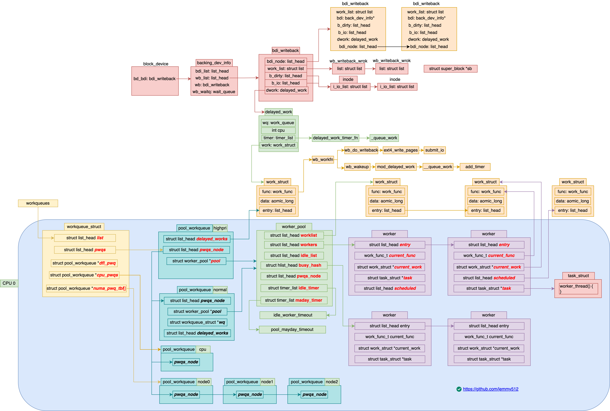

---

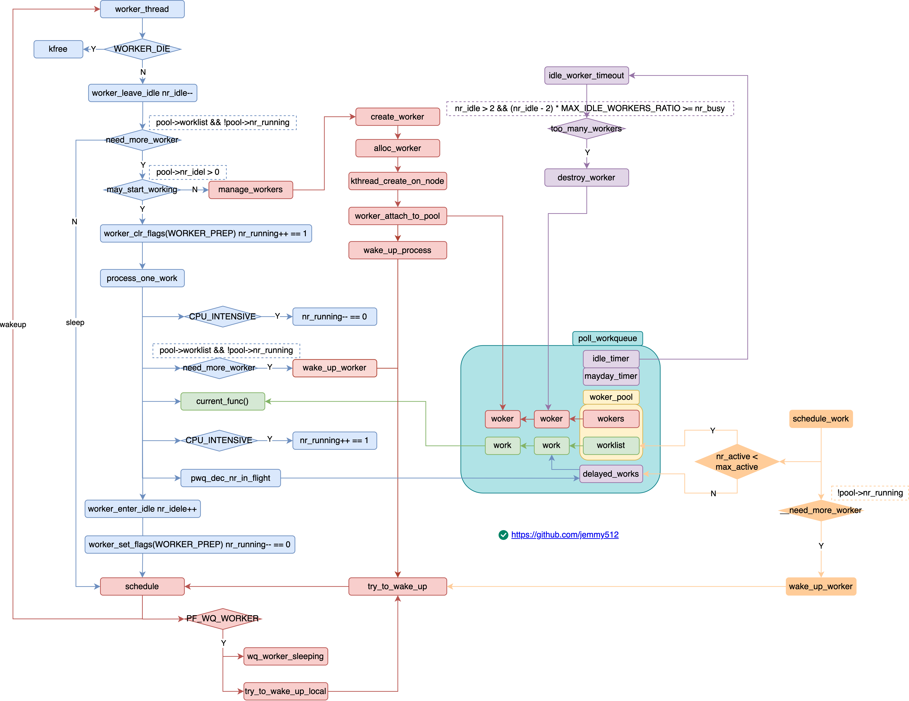

* `nr_running`    `nr_active`    `max_active`    `CPU_INTENSIVE` control the concurrency
---

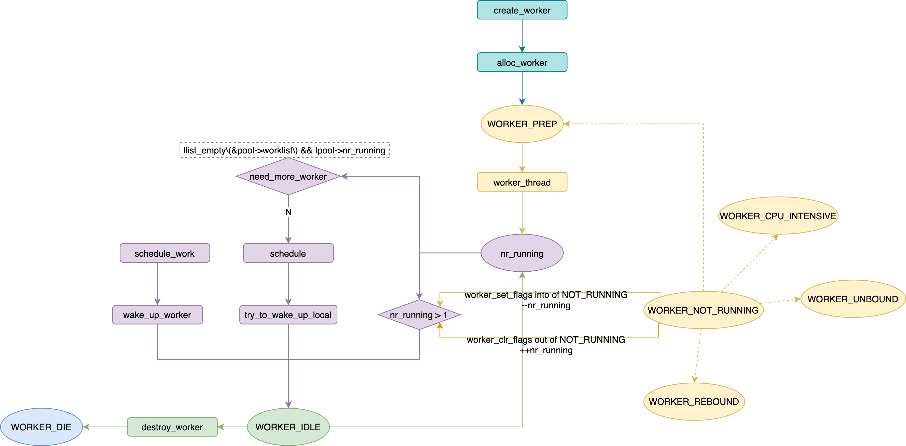

---


* [Kernel 4.19: Concurrency Managed Workqueue (cmwq)](https://www.kernel.org/doc/html/v4.19/core-api/workqueue.html)
* http://www.wowotech.net/irq_subsystem/cmwq-intro.html :cn:
* https://zhuanlan.zhihu.com/p/91106844 :cn:
* https://zhuanlan.zhihu.com/p/94561631 :cn:
* http://kernel.meizu.com/linux-workqueue.html :cn:


```c
start_kernel();
    workqueue_init_early();
        pwq_cache = KMEM_CACHE(pool_workqueue, SLAB_PANIC);

        for_each_possible_cpu(cpu)
            for_each_cpu_worker_pool()
                init_worker_pool();
                    timer_setup(&pool->idle_timer, idle_worker_timeout, TIMER_DEFERRABLE);
                    timer_setup(&pool->mayday_timer, pool_mayday_timeout, 0);
                    alloc_workqueue_attrs();

        system_wq = alloc_workqueue("events");
        system_highpri_wq = alloc_workqueue("events_highpri");
        system_long_wq = alloc_workqueue("events_long");
        system_freezable_wq = alloc_workqueue("events_freezable");
        system_power_efficient_wq = alloc_workqueue("events_power_efficient");
        system_freezable_power_efficient_wq = alloc_workqueue("events_freezable_power_efficient");
        alloc_workqueue();
            --->

    rest_init();
        kernel_thread(kernel_init);
            kernel_init();
                kernel_init_freeable();
                    workqueue_init();
                        wq_numa_init();
                            wq_numa_possible_cpumask = tbl;
                        for_each_online_cpu(cpu);
                            for_each_cpu_worker_pool(pool, cpu);
                                create_worker(pool); /* each pool has at leat one worker */
                        hash_for_each(unbound_pool_hash, bkt, pool, hash_node)
                            create_worker(pool);
                        wq_watchdog_init();

alloc_workqueue();
    struct workqueue_struct* wq = kzalloc(sizeof(*wq) + tbl_size, GFP_KERNEL);
    alloc_and_link_pwqs();
        if (!(wq->flags & WQ_UNBOUND)) {
            wq->cpu_pwqs = alloc_percpu(struct pool_workqueue);
            for_each_possible_cpu(cpu) {
                init_pwq(pwq, wq);
                    pwq->pool = &cpu_pools[priority];
                    pwq->wq = wq;
                link_pwq();
                    pwq_adjust_max_active();
                    list_add_rcu(&pwq->pwqs_node, &wq->pwqs);
            }
        } else if (wq->flags & __WQ_ORDERED) {
            apply_workqueue_attrs(wq, ordered_wq_attrs[priority]);
        } else {
            apply_workqueue_attrs(wq, unbound_std_wq_attrs[priority]);
                apply_wqattrs_prepare(wq, attrs);
                    apply_wqattrs_ctx* ctx = kzalloc(struct_size(ctx, pwq_tbl, nr_node_ids), GFP_KERNEL);
                    ctx->dfl_pwq = alloc_unbound_pwq(wq, new_attrs);
                        --->
                    for_each_node(node) {
                        if (wq_calc_node_cpumask(new_attrs, node, -1, tmp_attrs->cpumask)) {
                            ctx->pwq_tbl[node] = alloc_unbound_pwq(wq, tmp_attrs);
                        } else {
                            ctx->dfl_pwq->refcnt++;
                            ctx->pwq_tbl[node] = ctx->dfl_pwq;
                        }
                    }
                apply_wqattrs_commit(ctx);
                    for_each_node(node)
                        ctx->pwq_tbl[node] = numa_pwq_tbl_install(ctx->wq, node, ctx->pwq_tbl[node] /*pwq*/);
                            link_pwq(pwq);
                            rcu_assign_pointer(wq->numa_pwq_tbl[node], pwq);
                        link_pwq(ctx->dfl_pwq);
                        swap(ctx->wq->dfl_pwq, ctx->dfl_pwq);
                apply_wqattrs_cleanup(ctx);
        }
    for_each_pwq(pwq, wq)
        pwq_adjust_max_active(pwq);
    init_rescuer();
    list_add_tail_rcu(&wq->list, &workqueues);

alloc_unbound_pwq();
    worker_pool* pool = get_unbound_pool();
        hash_for_each_possible(unbound_pool_hash, pool, hash_node, hash) {
            if (wqattrs_equal(pool->attrs, attrs)) {
                pool->refcnt++;
                return pool;
            }
        }

        for_each_node(node) {
            if (cpumask_subset(attrs->cpumask, wq_numa_possible_cpumask[node])) {
                target_node = node;
                break;
            }
        }
        pool = kzalloc_node(sizeof(*pool), GFP_KERNEL, target_node);
        init_worker_pool(pool);
            timer_setup(&pool->idle_timer, idle_worker_timeout, TIMER_DEFERRABLE);
            timer_setup(&pool->mayday_timer, pool_mayday_timeout, 0);
            alloc_workqueue_attrs();
        copy_workqueue_attrs(pool->attrs, attrs);
        create_worker(pool);
            --->
        hash_add(unbound_pool_hash, &pool->hash_node, hash);

    pwq = kmem_cache_alloc_node(pwq_cache);
    init_pwq(pwq, wq, pool);
        pwq->pool = pool;
        pwq->wq = wq;

create_worker(pool);
    woker = alloc_worker(pool->node);
        worker->flags = WORKER_PREP;
    worker->task = kthread_create_on_node(worker_thread);
        kthreadd();
            create_kthread();
                kernel_thread();
                    _do_fork();
        wake_up_process(kthreadd_task); /* kthreadd */
        wait_for_completion_killable(&done);
    worker_attach_to_pool();
    worker_enter_idle(worker);
        pool->nr_idle++;
    wake_up_process(worker->task);
        try_to_wake_up();

worker_thread();
woke_up:
    if (worker->flags & WORKER_DIE) {
        kfree(worker);
        return;
    }

    worker_leave_idle();
        pool->nr_idle--;
        worker_clr_flags(worker, WORKER_IDLE);
            worker->flags &= ~flags;
            if ((flags & WORKER_NOT_RUNNING) && (oflags & WORKER_NOT_RUNNING))
                if (!(worker->flags & WORKER_NOT_RUNNING))
                    atomic_inc(&pool->nr_running);

    /* keep only one running worker for non-cpu-intensive workqueue */
    if (!need_more_worker(pool)) /* !list_empty(&pool->worklist) && !pool->nr_running */
        goto sleep;

    if (!may_start_working()) /* pool->nr_idle */
        manage_workers();
            maybe_create_worker();
                mod_timer(&pool->mayday_timer, jiffies + MAYDAY_INITIAL_TIMEOUT);
                create_worker();
                    --->
            wake_up(&wq_manager_wait);

    /* nr_running is inced when entering and deced when leaving */
    worker_clr_flags(worker, WORKER_PREP | WORKER_REBOUND);         /* 1.1 [nr_running]++ == 1 */

    do {
        work = list_first_entry(&pool->worklist, struct work_struct, entry);
        if (likely(!(*work_data_bits(work) & WORK_STRUCT_LINKED))) {
            process_one_work(worker, work);
            if (unlikely(!list_empty(&worker->scheduled)))
                process_scheduled_works(worker);
        } else {
            move_linked_works(work, &worker->scheduled, NULL);
            process_scheduled_works(worker);
        }

        process_one_work();
            if (unlikely(cpu_intensive))
                worker_set_flags(worker, WORKER_CPU_INTENSIVE);     /* 2.1 [nr_running]-- == 0 */
                    worker->flags |= flags;
                    if ((flags & WORKER_NOT_RUNNING) && !(worker->flags & WORKER_NOT_RUNNING)) {
                        atomic_dec(&pool->nr_running);
                    }

            if (need_more_worker(pool)) /* !list_empty(&pool->worklist) && !pool->nr_running */
                wake_up_worker(pool);
                    try_to_wake_up();

            worker->current_func(work);

            if (unlikely(cpu_intensive))
                worker_clr_flags(worker, WORKER_CPU_INTENSIVE);     /* 2.1 [nr_running]++ == 1 */

            pwq_dec_nr_in_flight();
                pwq->nr_active--;
                if (!list_empty(&pwq->inactive_works))
                    if (pwq->nr_active < pwq->max_active)
                        pwq_activate_first_inactive(pwq);
                            move_linked_works(work, &pwq->pool->worklist, NULL);
                            pwq->nr_active++;
    } while (keep_working(pool)); /* !list_empty(&pool->worklist) && atomic_read(&pool->nr_running) <= 1; */

    worker_set_flags(worker, WORKER_PREP);                          /* 1.2 [nr_running]-- == 0 */
    worker_enter_idle(worker);
        pool->nr_idle++;

    schedule();
        if (prev->flags & PF_WQ_WORKER)
            to_wakeup = wq_worker_sleeping()
                if (pool->cpu != raw_smp_processor_id())
                    return NULL;
                /* only wakeup idle thread when running task is going to suspend in process_one_work */
                if (atomic_dec_and_test(&pool->nr_running) && !list_empty(&pool->worklist))
                    to_wakeup = first_idle_worker(pool);
            try_to_wake_up_local(to_wakeup, &rf);

    goto woke_up;

schedule_work();
    queue_work();
        queue_work_on(cpu, wq, work);
            if (wq->flags & WQ_UNBOUND) {
                if (req_cpu == WORK_CPU_UNBOUND)
                    cpu = wq_select_unbound_cpu(raw_smp_processor_id());
                pwq = unbound_pwq_by_node(wq, cpu_to_node(cpu));
            } else {
                if (req_cpu == WORK_CPU_UNBOUND)
                    cpu = raw_smp_processor_id();
                pwq = per_cpu_ptr(wq->cpu_pwqs, cpu);
            }

            if (likely(pwq->nr_active < pwq->max_active)) {
                pwq->nr_active++;
                worklist = &pwq->pool->worklist;
            } else {
                work_flags |= WORK_STRUCT_DELAYED;
                worklist = &pwq->inactive_works;
            }

            insert_work(pwq, work, worklist, work_flags);
                list_add_tail(&work->entry, head);
                if (__need_more_worker(pool)) /* return !pool->nr_running */
                    wake_up_worker(pool);
                        try_to_wake_up();

idle_worker_timeout();
    while (too_many_workers(pool)) {
        mod_timer(&pool->idle_timer, expires);
        destroy_worker(worker);
            pool->nr_workers--;
            pool->nr_idle--;
            list_del_init(&worker->entry);
            worker->flags |= WORKER_DIE;
            wake_up_process(worker->task);
    }

pool_mayday_timeout();
    if (need_to_create_worker(pool)) /* need_more_worker(pool) && !may_start_working(pool) */
        send_mayday(work);
            list_add_tail(&pwq->mayday_node, &wq->maydays);
            wake_up_process(wq->rescuer->task);
    mod_timer(&pool->mayday_timer, jiffies + MAYDAY_INTERVAL);
```

Reference:
* [A complete guide to Linux process scheduling.pdf](https://trepo.tuni.fi/bitstream/handle/10024/96864/GRADU-1428493916.pdf)


## wq-struct
```c
struct workqueue_struct {
  struct list_head      pwqs;  /* WR: all pwqs of this wq */
  struct list_head      list;  /* PR: list of all workqueues */

  struct list_head      maydays; /* MD: pwqs requesting rescue */
  struct worker         *rescuer; /* I: rescue worker */

  struct pool_workqueue *dfl_pwq; /* PW: only for unbound wqs */
  struct pool_workqueue *cpu_pwqs; /* I: per-cpu pwqs */
  struct pool_workqueue *numa_pwq_tbl[]; /* PWR: unbound pwqs indexed by node */
};

/* The per-pool workqueue. */
struct pool_workqueue {
  struct worker_pool      *pool;    /* I: the associated pool */
  struct list_head        inactive_works;  /* L: inactive works */
  struct list_head        mayday_node;  /* MD: node on wq->maydays */
  struct list_head        pwqs_node;  /* WR: node on wq->pwqs */
  struct workqueue_struct *wq;    /* I: the owning workqueue */
  int                     work_color;  /* L: current color */
  int                     flush_color;  /* L: flushing color */
  int                     refcnt;    /* L: reference count */
  int                     nr_in_flight[WORK_NR_COLORS];/* L: nr of in_flight works */
  int                     nr_active;  /* L: nr of active works */
  int                     max_active;  /* L: max active works, the elements of pool->worklist */

  /* Release of unbound pwq is punted to system_wq.  See put_pwq()
   * and pwq_unbound_release_workfn() for details.  pool_workqueue
   * itself is also sched-RCU protected so that the first pwq can be
   * determined without grabbing wq->mutex. */
  struct work_struct  unbound_release_work;
  struct rcu_head    rcu;
} __aligned(1 << WORK_STRUCT_FLAG_BITS);

struct worker_pool {
  spinlock_t          lock;   /* the pool lock */
  int                 cpu;    /* I: the associated cpu */
  int                 node;   /* I: the associated node ID */
  int                 id;     /* I: pool ID */
  unsigned int        flags;  /* X: flags */

  unsigned long       watchdog_ts;  /* L: watchdog timestamp */

  struct list_head    worklist;  /* L: list of pending works */

  int                 nr_workers;  /* L: total number of workers */
  int                 nr_idle;  /* L: currently idle workers */

  struct list_head    workers;  /* A: attached workers */
  struct list_head    idle_list;  /* X: list of idle workers */
  /* a workers is either on busy_hash or idle_list, or the manager */
  DECLARE_HASHTABLE(busy_hash, BUSY_WORKER_HASH_ORDER); /* L: hash of busy workers */

  struct timer_list   idle_timer;  /* L: worker idle timeout */
  struct timer_list   mayday_timer;  /* L: SOS timer for workers */

  struct worker       *manager;  /* L: purely informational */
  struct completion   *detach_completion; /* all workers detached */

  struct ida          worker_ida;  /* worker IDs for task name */

  struct workqueue_attrs  *attrs;    /* I: worker attributes */
  struct hlist_node       hash_node;  /* PL: unbound_pool_hash node */
  int                     refcnt;    /* PL: refcnt for unbound pools */

  /* The current concurrency level.  As it's likely to be accessed
   * from other CPUs during try_to_wake_up(), put it in a separate
   * cacheline. */
  atomic_t    nr_running ____cacheline_aligned_in_smp;

  /* Destruction of pool is sched-RCU protected to allow dereferences
   * from get_work_pool(). */
  struct rcu_head    rcu;
} ____cacheline_aligned_in_smp;

struct workqueue_attrs {
  int             nice;
  cpumask_var_t   cpumask;
  bool            no_numa;
};

/* worker flags */
WORKER_DIE            = 1 << 1,  /* die die die */
WORKER_IDLE           = 1 << 2,  /* is idle */
WORKER_PREP           = 1 << 3,  /* preparing to run works */
WORKER_CPU_INTENSIVE  = 1 << 6,  /* cpu intensive */
WORKER_UNBOUND        = 1 << 7,  /* worker is unbound */
WORKER_REBOUND        = 1 << 8,  /* worker was rebound */
WORKER_NOT_RUNNING    = WORKER_PREP | WORKER_CPU_INTENSIVE | WORKER_UNBOUND | WORKER_REBOUND;

struct worker {
  /* on idle list while idle, on busy hash table while busy */
  union {
    struct list_head      entry;  /* L: while idle */
    struct hlist_node     hentry;  /* L: while busy */
  };

  struct work_struct      *current_work;  /* L: work being processed */
  work_func_t             current_func;   /* L: current_work's fn */
  struct pool_workqueue   *current_pwq;   /* L: current_work's pwq */
  struct list_head        scheduled;      /* L: scheduled works */

  /* 64 bytes boundary on 64bit, 32 on 32bit */

  struct task_struct      *task;    /* I: worker task */
  struct worker_pool      *pool;    /* A: the associated pool */
            /* L: for rescuers */
  struct list_head        node;    /* A: anchored at pool->workers */
            /* A: runs through worker->node */

  unsigned long           last_active;  /* L: last active timestamp */
  unsigned int            flags;    /* X: flags */
  int                     id;    /* I: worker id */

  /* Opaque string set with work_set_desc().  Printed out with task
   * dump for debugging - WARN, BUG, panic or sysrq. */
  char      desc[WORKER_DESC_LEN];

  /* used only by rescuers to point to the target workqueue */
  struct workqueue_struct  *rescue_wq;  /* I: the workqueue to rescue */
};

struct work_struct {
  atomic_long_t     data;
  struct list_head  entry;
  work_func_t       func;
};
```

```c
[root@VM-16-17-centos ~]# ps -ef | grep worker
root           6       2  0  2021 ?        00:00:00 [kworker/0:0H-events_highpri]
root          33       2  0  2021 ?        00:01:41 [kworker/0:1H-kblockd]
root     2747154       2  0 Jan15 ?        00:00:00 [kworker/0:8-events]
root     2751953       2  0 00:09 ?        00:00:00 [kworker/0:1-ata_sff]
root     2756345       2  0 00:30 ?        00:00:00 [kworker/0:6-events]
root     2756347       2  0 00:30 ?        00:00:00 [kworker/0:7-cgroup_pidlist_destroy]
root     2757595       2  0 00:36 ?        00:00:00 [kworker/0:0-cgroup_pidlist_destroy]
root     2757754       2  0 00:37 ?        00:00:00 [kworker/u2:1-events_unbound]
root     2759049       2  0 00:43 ?        00:00:00 [kworker/u2:2-events_unbound]
root     2760459 2760373  0 00:48 pts/4    00:00:00 grep --color=auto worker

kworker/<cpu-id>:<worker-id-in-pool><High priority>
kworker/<unbound>:<worker-id-in-pool><High priority>
```
```c
/* the per-cpu worker pools */
static DEFINE_PER_CPU_SHARED_ALIGNED(struct worker_pool [NR_STD_WORKER_POOLS], cpu_worker_pools);

static DEFINE_IDR(worker_pool_idr);  /* PR: idr of all pools */

/* PL: hash of all unbound pools keyed by pool->attrs */
static DEFINE_HASHTABLE(unbound_pool_hash, UNBOUND_POOL_HASH_ORDER);

/* I: attributes used when instantiating standard unbound pools on demand */
static struct workqueue_attrs *unbound_std_wq_attrs[NR_STD_WORKER_POOLS];

/* I: attributes used when instantiating ordered pools on demand */
static struct workqueue_attrs *ordered_wq_attrs[NR_STD_WORKER_POOLS];

struct workqueue_struct *system_wq;
struct workqueue_struct *system_highpri_wq;
struct workqueue_struct *system_long_wq;
struct workqueue_struct *system_unbound_wq;
struct workqueue_struct *system_freezable_wq;
struct workqueue_struct *system_power_efficient_wq;
struct workqueue_struct *system_freezable_power_efficient_wq;
```

## alloc_workqueue
```c
void __init start_kernel(void)
{
  kernel_init_freeable();
  workqueue_init_early();
}

int __init workqueue_init_early(void)
{
  int std_nice[NR_STD_WORKER_POOLS] = { 0, HIGHPRI_NICE_LEVEL };
  int hk_flags = HK_FLAG_DOMAIN | HK_FLAG_WQ;
  int i, cpu;

  WARN_ON(__alignof__(struct pool_workqueue) < __alignof__(long long));

  BUG_ON(!alloc_cpumask_var(&wq_unbound_cpumask, GFP_KERNEL));
  cpumask_copy(wq_unbound_cpumask, housekeeping_cpumask(hk_flags));

  pwq_cache = KMEM_CACHE(pool_workqueue, SLAB_PANIC);

  /* initialize CPU pools */
  for_each_possible_cpu(cpu) {
    struct worker_pool *pool;

    i = 0;
    for_each_cpu_worker_pool(pool, cpu) {
      BUG_ON(init_worker_pool(pool));
      pool->cpu = cpu;
      cpumask_copy(pool->attrs->cpumask, cpumask_of(cpu));
      pool->attrs->nice = std_nice[i++];
      pool->node = cpu_to_node(cpu);

      /* alloc pool ID */
      mutex_lock(&wq_pool_mutex);
      BUG_ON(worker_pool_assign_id(pool));
      mutex_unlock(&wq_pool_mutex);
    }
  }

  /* create default unbound and ordered wq attrs */
  for (i = 0; i < NR_STD_WORKER_POOLS; i++) {
    struct workqueue_attrs *attrs;

    BUG_ON(!(attrs = alloc_workqueue_attrs(GFP_KERNEL)));
    attrs->nice = std_nice[i];
    unbound_std_wq_attrs[i] = attrs;

    /* An ordered wq should have only one pwq as ordering is
     * guaranteed by max_active which is enforced by pwqs.
     * Turn off NUMA so that dfl_pwq is used for all nodes. */
    BUG_ON(!(attrs = alloc_workqueue_attrs(GFP_KERNEL)));
    attrs->nice = std_nice[i];
    attrs->no_numa = true;
    ordered_wq_attrs[i] = attrs;
  }

  system_wq = alloc_workqueue("events", 0, 0);
  system_highpri_wq = alloc_workqueue("events_highpri", WQ_HIGHPRI, 0);
  system_long_wq = alloc_workqueue("events_long", 0, 0);
  system_unbound_wq = alloc_workqueue("events_unbound", WQ_UNBOUND, WQ_UNBOUND_MAX_ACTIVE);
  system_freezable_wq = alloc_workqueue("events_freezable", WQ_FREEZABLE, 0);
  system_power_efficient_wq = alloc_workqueue("events_power_efficient", WQ_POWER_EFFICIENT, 0);
  system_freezable_power_efficient_wq = alloc_workqueue("events_freezable_power_efficient", WQ_FREEZABLE | WQ_POWER_EFFICIENT 0);

  return 0;
}

void __init start_kernel::rest_init::kernel_init_freeable(void)
{
  wait_for_completion(&kthreadd_done);
  workqueue_init();
}

int __init workqueue_init(void)
{
  struct workqueue_struct *wq;
  struct worker_pool *pool;
  int cpu, bkt;

  wq_numa_init();

  mutex_lock(&wq_pool_mutex);

  for_each_possible_cpu(cpu) {
    for_each_cpu_worker_pool(pool, cpu) {
      pool->node = cpu_to_node(cpu);
    }
  }

  list_for_each_entry(wq, &workqueues, list) {
    wq_update_unbound_numa(wq, smp_processor_id(), true);
    init_rescuer(wq);
  }

  mutex_unlock(&wq_pool_mutex);

  /* create the initial workers */
  for_each_online_cpu(cpu) {
    for_each_cpu_worker_pool(pool, cpu) {
      pool->flags &= ~POOL_DISASSOCIATED;
      create_worker(pool);
    }
  }

  hash_for_each(unbound_pool_hash, bkt, pool, hash_node)
    create_worker(pool);

  wq_online = true;
  wq_watchdog_init();

  return 0;
}

/* alloc_workqueue -> */
struct workqueue_struct *__alloc_workqueue_key(
  const char *fmt,
  unsigned int flags,
  int max_active,
  struct lock_class_key *key,
  const char *lock_name, ...)
{
  size_t tbl_size = 0;
  va_list args;
  struct workqueue_struct *wq;
  struct pool_workqueue *pwq;

  /* Unbound && max_active == 1 used to imply ordered, which is no
   * longer the case on NUMA machines due to per-node pools.  While
   * alloc_ordered_workqueue() is the right way to create an ordered
   * workqueue, keep the previous behavior to avoid subtle breakages
   * on NUMA. */
  if ((flags & WQ_UNBOUND) && max_active == 1)
    flags |= __WQ_ORDERED;

  /* see the comment above the definition of WQ_POWER_EFFICIENT */
  if ((flags & WQ_POWER_EFFICIENT) && wq_power_efficient)
    flags |= WQ_UNBOUND;

  /* allocate wq and format name */
  if (flags & WQ_UNBOUND)
    tbl_size = nr_node_ids * sizeof(wq->numa_pwq_tbl[0]);

  wq = kzalloc(sizeof(*wq) + tbl_size, GFP_KERNEL);
  if (!wq)
    return NULL;

  if (flags & WQ_UNBOUND) {
    wq->unbound_attrs = alloc_workqueue_attrs(GFP_KERNEL);
    if (!wq->unbound_attrs)
      goto err_free_wq;
  }

  va_start(args, lock_name);
  vsnprintf(wq->name, sizeof(wq->name), fmt, args);
  va_end(args);

  max_active = max_active ?: WQ_DFL_ACTIVE;
  max_active = wq_clamp_max_active(max_active, flags, wq->name);

  /* init wq */
  wq->flags = flags;
  wq->saved_max_active = max_active;
  mutex_init(&wq->mutex);
  atomic_set(&wq->nr_pwqs_to_flush, 0);
  INIT_LIST_HEAD(&wq->pwqs);
  INIT_LIST_HEAD(&wq->flusher_queue);
  INIT_LIST_HEAD(&wq->flusher_overflow);
  INIT_LIST_HEAD(&wq->maydays);

  lockdep_init_map(&wq->lockdep_map, lock_name, key, 0);
  INIT_LIST_HEAD(&wq->list);

  if (alloc_and_link_pwqs(wq) < 0)
    goto err_free_wq;

  if (wq_online && init_rescuer(wq) < 0)
    goto err_destroy;

  if ((wq->flags & WQ_SYSFS) && workqueue_sysfs_register(wq))
    goto err_destroy;

  /* wq_pool_mutex protects global freeze state and workqueues list.
   * Grab it, adjust max_active and add the new @wq to workqueues
   * list. */
  mutex_lock(&wq_pool_mutex);

  mutex_lock(&wq->mutex);
  for_each_pwq(pwq, wq)
    pwq_adjust_max_active(pwq);
  mutex_unlock(&wq->mutex);

  list_add_tail_rcu(&wq->list, &workqueues);

  mutex_unlock(&wq_pool_mutex);

  return wq;

err_free_wq:
  free_workqueue_attrs(wq->unbound_attrs);
  kfree(wq);
  return NULL;
err_destroy:
  destroy_workqueue(wq);
  return NULL;
}

int alloc_and_link_pwqs(struct workqueue_struct *wq)
{
  bool highpri = wq->flags & WQ_HIGHPRI;
  int cpu, ret;

  if (!(wq->flags & WQ_UNBOUND)) {
    wq->cpu_pwqs = alloc_percpu(struct pool_workqueue);
    if (!wq->cpu_pwqs)
      return -ENOMEM;

    for_each_possible_cpu(cpu) {
      struct pool_workqueue *pwq = per_cpu_ptr(wq->cpu_pwqs, cpu);
      struct worker_pool *cpu_pools = per_cpu(cpu_worker_pools, cpu);

      init_pwq(pwq, wq, &cpu_pools[highpri]);

      mutex_lock(&wq->mutex);
      link_pwq(pwq);
      mutex_unlock(&wq->mutex);
    }
    return 0;
  } else if (wq->flags & __WQ_ORDERED) {
    ret = apply_workqueue_attrs(wq, ordered_wq_attrs[highpri]);
    /* there should only be single pwq for ordering guarantee */
    return ret;
  } else {
    return apply_workqueue_attrs(wq, unbound_std_wq_attrs[highpri]);
  }
}

int init_worker_pool(struct worker_pool *pool)
{
  spin_lock_init(&pool->lock);
  pool->id = -1;
  pool->cpu = -1;
  pool->node = NUMA_NO_NODE;
  pool->flags |= POOL_DISASSOCIATED;
  pool->watchdog_ts = jiffies;
  INIT_LIST_HEAD(&pool->worklist);
  INIT_LIST_HEAD(&pool->idle_list);
  hash_init(pool->busy_hash);

  timer_setup(&pool->idle_timer, idle_worker_timeout, TIMER_DEFERRABLE);

  timer_setup(&pool->mayday_timer, pool_mayday_timeout, 0);

  INIT_LIST_HEAD(&pool->workers);

  ida_init(&pool->worker_ida);
  INIT_HLIST_NODE(&pool->hash_node);
  pool->refcnt = 1;

  /* shouldn't fail above this point */
  pool->attrs = alloc_workqueue_attrs(GFP_KERNEL);
  if (!pool->attrs)
    return -ENOMEM;
  return 0;
}

void init_pwq(struct pool_workqueue *pwq, struct workqueue_struct *wq,
         struct worker_pool *pool)
{
  BUG_ON((unsigned long)pwq & WORK_STRUCT_FLAG_MASK);

  memset(pwq, 0, sizeof(*pwq));

  pwq->pool = pool;
  pwq->wq = wq;
  pwq->flush_color = -1;
  pwq->refcnt = 1;
  INIT_LIST_HEAD(&pwq->inactive_works);
  INIT_LIST_HEAD(&pwq->pwqs_node);
  INIT_LIST_HEAD(&pwq->mayday_node);
  INIT_WORK(&pwq->unbound_release_work, pwq_unbound_release_workfn);
}
```

## alloc_unbound_pwq
```c
static DEFINE_HASHTABLE(unbound_pool_hash, UNBOUND_POOL_HASH_ORDER);

struct pool_workqueue *alloc_unbound_pwq(struct workqueue_struct *wq,
          const struct workqueue_attrs *attrs)
{
  struct worker_pool *pool;
  struct pool_workqueue *pwq;

  lockdep_assert_held(&wq_pool_mutex);

  pool = get_unbound_pool(attrs);
  if (!pool)
    return NULL;

  pwq = kmem_cache_alloc_node(pwq_cache, GFP_KERNEL, pool->node);
  if (!pwq) {
    put_unbound_pool(pool);
    return NULL;
  }

  init_pwq(pwq, wq, pool);

  return pwq;
}

/* kernel/workqueue.c */
static cpumask_var_t *wq_numa_possible_cpumask; /* possible CPUs of each node */

static struct worker_pool *get_unbound_pool(const struct workqueue_attrs *attrs)
{
  u32 hash = wqattrs_hash(attrs);
  struct worker_pool *pool;
  int node;
  int target_node = NUMA_NO_NODE;

  lockdep_assert_held(&wq_pool_mutex);

  /* do we already have a matching pool? */
  hash_for_each_possible(unbound_pool_hash, pool, hash_node, hash) {
    if (wqattrs_equal(pool->attrs, attrs)) {
      pool->refcnt++;
      return pool;
    }
  }

  /* if cpumask is contained inside a NUMA node, we belong to that node */
  if (wq_numa_enabled) {
    for_each_node(node) {
      if (cpumask_subset(attrs->cpumask, wq_numa_possible_cpumask[node])) {
        target_node = node;
        break;
      }
    }
  }

  /* nope, create a new one */
  pool = kzalloc_node(sizeof(*pool), GFP_KERNEL, target_node);
  if (!pool || init_worker_pool(pool) < 0)
    goto fail;

  lockdep_set_subclass(&pool->lock, 1);  /* see put_pwq() */
  copy_workqueue_attrs(pool->attrs, attrs);
  pool->node = target_node;

   /* no_numa isn't a worker_pool attribute, always clear it.  See
   * 'struct workqueue_attrs' comments for detail. */
  pool->attrs->no_numa = false;

  if (worker_pool_assign_id(pool) < 0)
    goto fail;

  /* create and start the initial worker */
  if (wq_online && !create_worker(pool))
    goto fail;

  /* install */
  hash_add(unbound_pool_hash, &pool->hash_node, hash);

  return pool;
fail:
  if (pool)
    put_unbound_pool(pool);
  return NULL;
}

struct apply_wqattrs_ctx {
  struct workqueue_struct *wq;    /* target workqueue */
  struct workqueue_attrs  *attrs;    /* attrs to apply */
  struct list_head        list;    /* queued for batching commit */
  struct pool_workqueue   *dfl_pwq;
  struct pool_workqueue   *pwq_tbl[];
};

int apply_workqueue_attrs_locked(struct workqueue_struct *wq,
          const struct workqueue_attrs *attrs)
{
  struct apply_wqattrs_ctx *ctx;

  /* only unbound workqueues can change attributes */
  if (WARN_ON(!(wq->flags & WQ_UNBOUND)))
    return -EINVAL;

  /* creating multiple pwqs breaks ordering guarantee */
  if (!list_empty(&wq->pwqs)) {
    if (WARN_ON(wq->flags & __WQ_ORDERED_EXPLICIT))
      return -EINVAL;

    wq->flags &= ~__WQ_ORDERED;
  }

  ctx = apply_wqattrs_prepare(wq, attrs);
  if (!ctx)
    return -ENOMEM;

  /* the ctx has been prepared successfully, let's commit it */
  apply_wqattrs_commit(ctx);
  apply_wqattrs_cleanup(ctx);

  return 0;
}

struct apply_wqattrs_ctx *
apply_wqattrs_prepare(struct workqueue_struct *wq,
          const struct workqueue_attrs *attrs)
{
  struct apply_wqattrs_ctx *ctx;
  struct workqueue_attrs *new_attrs, *tmp_attrs;
  int node;

  lockdep_assert_held(&wq_pool_mutex);

  ctx = kzalloc(struct_size(ctx, pwq_tbl, nr_node_ids), GFP_KERNEL);

  new_attrs = alloc_workqueue_attrs(GFP_KERNEL);
  tmp_attrs = alloc_workqueue_attrs(GFP_KERNEL);
  if (!ctx || !new_attrs || !tmp_attrs)
    goto out_free;

  /* Calculate the attrs of the default pwq.
   * If the user configured cpumask doesn't overlap with the
   * wq_unbound_cpumask, we fallback to the wq_unbound_cpumask. */
  copy_workqueue_attrs(new_attrs, attrs);
  cpumask_and(new_attrs->cpumask, new_attrs->cpumask, wq_unbound_cpumask);
  if (unlikely(cpumask_empty(new_attrs->cpumask)))
    cpumask_copy(new_attrs->cpumask, wq_unbound_cpumask);

  /* We may create multiple pwqs with differing cpumasks.  Make a
   * copy of @new_attrs which will be modified and used to obtain
   * pools. */
  copy_workqueue_attrs(tmp_attrs, new_attrs);

  /* If something goes wrong during CPU up/down, we'll fall back to
   * the default pwq covering whole @attrs->cpumask.  Always create
   * it even if we don't use it immediately. */
  ctx->dfl_pwq = alloc_unbound_pwq(wq, new_attrs);
  if (!ctx->dfl_pwq)
    goto out_free;

  for_each_node(node) {
    if (wq_calc_node_cpumask(new_attrs, node, -1, tmp_attrs->cpumask)) {
      ctx->pwq_tbl[node] = alloc_unbound_pwq(wq, tmp_attrs);
      if (!ctx->pwq_tbl[node])
        goto out_free;
    } else {
      ctx->dfl_pwq->refcnt++;
      ctx->pwq_tbl[node] = ctx->dfl_pwq;
    }
  }

  /* save the user configured attrs and sanitize it. */
  copy_workqueue_attrs(new_attrs, attrs);
  cpumask_and(new_attrs->cpumask, new_attrs->cpumask, cpu_possible_mask);
  ctx->attrs = new_attrs;

  ctx->wq = wq;
  free_workqueue_attrs(tmp_attrs);
  return ctx;

out_free:
  free_workqueue_attrs(tmp_attrs);
  free_workqueue_attrs(new_attrs);
  apply_wqattrs_cleanup(ctx);
  return NULL;
}

static void apply_wqattrs_commit(struct apply_wqattrs_ctx *ctx)
{
  int node;

  /* all pwqs have been created successfully, let's install'em */
  mutex_lock(&ctx->wq->mutex);

  copy_workqueue_attrs(ctx->wq->unbound_attrs, ctx->attrs);

  /* save the previous pwq and install the new one */
  for_each_node(node)
    ctx->pwq_tbl[node] = numa_pwq_tbl_install(ctx->wq, node,
                ctx->pwq_tbl[node]);

  /* @dfl_pwq might not have been used, ensure it's linked */
  link_pwq(ctx->dfl_pwq);
  swap(ctx->wq->dfl_pwq, ctx->dfl_pwq);

  mutex_unlock(&ctx->wq->mutex);
}

/* free the resources after success or abort */
static void apply_wqattrs_cleanup(struct apply_wqattrs_ctx *ctx)
{
  if (ctx) {
    int node;

    for_each_node(node)
      put_pwq_unlocked(ctx->pwq_tbl[node]);
    put_pwq_unlocked(ctx->dfl_pwq);

    free_workqueue_attrs(ctx->attrs);

    kfree(ctx);
  }
}
```

## create_worker
```c
static bool manage_workers(struct worker *worker)
{
  struct worker_pool *pool = worker->pool;

  if (pool->flags & POOL_MANAGER_ACTIVE)
    return false;

  pool->flags |= POOL_MANAGER_ACTIVE;
  pool->manager = worker;

  maybe_create_worker(pool);

  pool->manager = NULL;
  pool->flags &= ~POOL_MANAGER_ACTIVE;
  wake_up(&wq_manager_wait);
  return true;
}

void maybe_create_worker(struct worker_pool *pool)
__releases(&pool->lock)
__acquires(&pool->lock)
{
restart:
  spin_unlock_irq(&pool->lock);

  /* if we don't make progress in MAYDAY_INITIAL_TIMEOUT, call for help */
  mod_timer(&pool->mayday_timer, jiffies + MAYDAY_INITIAL_TIMEOUT);

  while (true) {
    if (create_worker(pool) || !need_to_create_worker(pool))
      break;

    schedule_timeout_interruptible(CREATE_COOLDOWN);

    if (!need_to_create_worker(pool))
      break;
  }

  del_timer_sync(&pool->mayday_timer);
  spin_lock_irq(&pool->lock);
  /* This is necessary even after a new worker was just successfully
   * created as @pool->lock was dropped and the new worker might have
   * already become busy. */
  if (need_to_create_worker(pool))
    goto restart;
}
```

```c
struct worker *create_worker(struct worker_pool *pool)
{
  struct worker *worker = NULL;
  int id = -1;
  char id_buf[16];

  /* ID is needed to determine kthread name */
  id = ida_simple_get(&pool->worker_ida, 0, 0, GFP_KERNEL);
  if (id < 0)
    goto fail;

  worker = alloc_worker(pool->node);
  if (!worker)
    goto fail;

  worker->id = id;

  if (pool->cpu >= 0)
    snprintf(id_buf, sizeof(id_buf), "%d:%d%s", pool->cpu, id,
       pool->attrs->nice < 0  ? "H" : "");
  else
    snprintf(id_buf, sizeof(id_buf), "u%d:%d", pool->id, id);

  worker->task = kthread_create_on_node(worker_thread, worker, pool->node, "kworker/%s", id_buf);
  if (IS_ERR(worker->task))
    goto fail;

  set_user_nice(worker->task, pool->attrs->nice);
  kthread_bind_mask(worker->task, pool->attrs->cpumask);

  /* successful, attach the worker to the pool */
  worker_attach_to_pool(worker, pool);

  /* start the newly created worker */
  spin_lock_irq(&pool->lock);
  worker->pool->nr_workers++;
  worker_enter_idle(worker);
  wake_up_process(worker->task);
  spin_unlock_irq(&pool->lock);

  return worker;

fail:
  if (id >= 0)
    ida_simple_remove(&pool->worker_ida, id);
  kfree(worker);
  return NULL;
}

struct worker *alloc_worker(int node)
{
  struct worker *worker;

  worker = kzalloc_node(sizeof(*worker), GFP_KERNEL, node);
  if (worker) {
    INIT_LIST_HEAD(&worker->entry);
    INIT_LIST_HEAD(&worker->scheduled);
    INIT_LIST_HEAD(&worker->node);
    /* on creation a worker is in !idle && prep state */
    worker->flags = WORKER_PREP;
  }
  return worker;
}

struct task_struct *kthread_create_on_node(int (*threadfn)(void *data),
             void *data, int node,
             const char namefmt[],
             ...)
{
  struct task_struct *task;
  va_list args;

  va_start(args, namefmt);
  task = __kthread_create_on_node(threadfn, data, node, namefmt, args);
  va_end(args);

  return task;
}

struct task_struct *__kthread_create_on_node(int (*threadfn)(void *data),
                void *data, int node,
                const char namefmt[],
                va_list args)
{
  DECLARE_COMPLETION_ONSTACK(done);
  struct task_struct *task;
  struct kthread_create_info *create = kmalloc(sizeof(*create), GFP_KERNEL);

  if (!create)
    return ERR_PTR(-ENOMEM);
  create->threadfn = threadfn;
  create->data = data;
  create->node = node;
  create->done = &done;

  spin_lock(&kthread_create_lock);
  list_add_tail(&create->list, &kthread_create_list);
  spin_unlock(&kthread_create_lock);

  wake_up_process(kthreadd_task); /* kthreadd */
  /* Wait for completion in killable state, for I might be chosen by
   * the OOM killer while kthreadd is trying to allocate memory for
   * new kernel thread. */
  if (unlikely(wait_for_completion_killable(&done))) {
    /* If I was SIGKILLed before kthreadd (or new kernel thread)
     * calls complete(), leave the cleanup of this structure to
     * that thread. */
    if (xchg(&create->done, NULL))
      return ERR_PTR(-EINTR);
    /* kthreadd (or new kernel thread) will call complete()
     * shortly. */
    wait_for_completion(&done);
  }
  task = create->result;
  if (!IS_ERR(task)) {
    static const struct sched_param param = { .sched_priority = 0 };
    char name[TASK_COMM_LEN];

    /* task is already visible to other tasks, so updating
     * COMM must be protected. */
    vsnprintf(name, sizeof(name), namefmt, args);
    set_task_comm(task, name);
    /* root may have changed our (kthreadd's) priority or CPU mask.
     * The kernel thread should not inherit these properties. */
    sched_setscheduler_nocheck(task, SCHED_NORMAL, &param);
    set_cpus_allowed_ptr(task, cpu_all_mask);
  }
  kfree(create);
  return task;
}

void worker_enter_idle(struct worker *worker)
{
  struct worker_pool *pool = worker->pool;

  if (WARN_ON_ONCE(worker->flags & WORKER_IDLE) ||
      WARN_ON_ONCE(!list_empty(&worker->entry) &&
       (worker->hentry.next || worker->hentry.pprev)))
    return;

  /* can't use worker_set_flags(), also called from create_worker() */
  worker->flags |= WORKER_IDLE;
  pool->nr_idle++;
  worker->last_active = jiffies;

  /* idle_list is LIFO */
  list_add(&worker->entry, &pool->idle_list);

  if (too_many_workers(pool) && !timer_pending(&pool->idle_timer))
    mod_timer(&pool->idle_timer, jiffies + IDLE_WORKER_TIMEOUT);

  /* Sanity check nr_running.  Because unbind_workers() releases
   * pool->lock between setting %WORKER_UNBOUND and zapping
   * nr_running, the warning may trigger spuriously.  Check iff
   * unbind is not in progress. */
  WARN_ON_ONCE(!(pool->flags & POOL_DISASSOCIATED) &&
         pool->nr_workers == pool->nr_idle &&
         atomic_read(&pool->nr_running));
}
```

## worker_thread
```c
int worker_thread(void *__worker)
{
  struct worker *worker = __worker;
  struct worker_pool *pool = worker->pool;

  /* tell the scheduler that this is a workqueue worker */
  set_pf_worker(true);
woke_up:
  spin_lock_irq(&pool->lock);

  /* am I supposed to die? */
  if (unlikely(worker->flags & WORKER_DIE)) {
    spin_unlock_irq(&pool->lock);
    set_pf_worker(false);

    set_task_comm(worker->task, "kworker/dying");
    ida_simple_remove(&pool->worker_ida, worker->id);
    worker_detach_from_pool(worker);
    kfree(worker);
    return 0;
  }

  worker_leave_idle(worker);
recheck:
  /* no more worker necessary? */
  if (!need_more_worker(pool)) /* !list_empty(&pool->worklist) && !pool->nr_running */
    goto sleep;

  /* do we need to manage? */
  /* return pool->nr_idle; */
  if (unlikely(!may_start_working(pool)) && manage_workers(worker))
    goto recheck;

  /* ->scheduled list can only be filled while a worker is
   * preparing to process a work or actually processing it.
   * Make sure nobody diddled with it while I was sleeping. */

  /* Finish PREP stage.  We're guaranteed to have at least one idle
   * worker or that someone else has already assumed the manager
   * role.  This is where @worker starts participating in concurrency
   * management if applicable and concurrency management is restored
   * after being rebound.  See rebind_workers() for details. */
  worker_clr_flags(worker, WORKER_PREP | WORKER_REBOUND);

  do {
    struct work_struct *work = list_first_entry(&pool->worklist, struct work_struct, entry);

    pool->watchdog_ts = jiffies;

    if (likely(!(*work_data_bits(work) & WORK_STRUCT_LINKED))) {
      /* optimization path, not strictly necessary */
      process_one_work(worker, work);
      if (unlikely(!list_empty(&worker->scheduled)))
        process_scheduled_works(worker);
    } else {
      move_linked_works(work, &worker->scheduled, NULL);
      process_scheduled_works(worker);
    }
  } while (keep_working(pool)); /* !list_empty(&pool->worklist) && atomic_read(&pool->nr_running) <= 1; */

  worker_set_flags(worker, WORKER_PREP);
sleep:
  /* pool->lock is held and there's no work to process and no need to
   * manage, sleep.  Workers are woken up only while holding
   * pool->lock or from local cpu, so setting the current state
   * before releasing pool->lock is enough to prevent losing any
   * event. */
  worker_enter_idle(worker);
  __set_current_state(TASK_IDLE);
  spin_unlock_irq(&pool->lock);
  schedule();
  goto woke_up;
}

void process_scheduled_works(struct worker *worker)
{
  while (!list_empty(&worker->scheduled)) {
    struct work_struct *work = list_first_entry(&worker->scheduled, struct work_struct, entry);
    process_one_work(worker, work);
  }
}

void process_one_work(struct worker *worker, struct work_struct *work)
__releases(&pool->lock)
__acquires(&pool->lock)
{
  struct pool_workqueue *pwq = get_work_pwq(work);
  struct worker_pool *pool = worker->pool;
  bool cpu_intensive = pwq->wq->flags & WQ_CPU_INTENSIVE;
  int work_color;
  struct worker *collision;

  /* A single work shouldn't be executed concurrently by
   * multiple workers on a single cpu.  Check whether anyone is
   * already processing the work.  If so, defer the work to the
   * currently executing one. */
  collision = find_worker_executing_work(pool, work);
  if (unlikely(collision)) {
    move_linked_works(work, &collision->scheduled, NULL);
    return;
  }

  /* claim and dequeue */
  debug_work_deactivate(work);
  hash_add(pool->busy_hash, &worker->hentry, (unsigned long)work);
  worker->current_work = work;
  worker->current_func = work->func;
  worker->current_pwq = pwq;
  work_color = get_work_color(work);

  /* Record wq name for cmdline and debug reporting, may get
   * overridden through set_worker_desc(). */
  strscpy(worker->desc, pwq->wq->name, WORKER_DESC_LEN);

  list_del_init(&work->entry);

  /* CPU intensive works don't participate in concurrency management.
   * They're the scheduler's responsibility.  This takes @worker out
   * of concurrency management and the next code block will chain
   * execution of the pending work items. */
  if (unlikely(cpu_intensive))
    worker_set_flags(worker, WORKER_CPU_INTENSIVE);

  /* Wake up another worker if necessary.  The condition is always
   * false for normal per-cpu workers since nr_running would always
   * be >= 1 at this point.  This is used to chain execution of the
   * pending work items for WORKER_NOT_RUNNING workers such as the
   * UNBOUND and CPU_INTENSIVE ones. */
  if (need_more_worker(pool))
    wake_up_worker(pool);

  /* Record the last pool and clear PENDING which should be the last
   * update to @work.  Also, do this inside @pool->lock so that
   * PENDING and queued state changes happen together while IRQ is
   * disabled. */
  set_work_pool_and_clear_pending(work, pool->id);

  spin_unlock_irq(&pool->lock);

  lock_map_acquire(&pwq->wq->lockdep_map);
  lock_map_acquire(&lockdep_map);
  /* Strictly speaking we should mark the invariant state without holding
   * any locks, that is, before these two lock_map_acquire()'s.
   *
   * However, that would result in:
   *
   *   A(W1)
   *   WFC(C)
   *    A(W1)
   *    C(C)
   *
   * Which would create W1->C->W1 dependencies, even though there is no
   * actual deadlock possible. There are two solutions, using a
   * read-recursive acquire on the work(queue) 'locks', but this will then
   * hit the lockdep limitation on recursive locks, or simply discard
   * these locks.
   *
   * AFAICT there is no possible deadlock scenario between the
   * flush_work() and complete() primitives (except for single-threaded
   * workqueues), so hiding them isn't a problem. */
  lockdep_invariant_state(true);
  trace_workqueue_execute_start(work);
  worker->current_func(work);
  /* While we must be careful to not use "work" after this, the trace
   * point will only record its address. */
  trace_workqueue_execute_end(work);
  lock_map_release(&lockdep_map);
  lock_map_release(&pwq->wq->lockdep_map);

  if (unlikely(in_atomic() || lockdep_depth(current) > 0)) {
    debug_show_held_locks(current);
    dump_stack();
  }

  /* The following prevents a kworker from hogging CPU on !PREEMPT
   * kernels, where a requeueing work item waiting for something to
   * happen could deadlock with stop_machine as such work item could
   * indefinitely requeue itself while all other CPUs are trapped in
   * stop_machine. At the same time, report a quiescent RCU state so
   * the same condition doesn't freeze RCU. */
  cond_resched();

  spin_lock_irq(&pool->lock);

  /* clear cpu intensive status */
  if (unlikely(cpu_intensive))
    worker_clr_flags(worker, WORKER_CPU_INTENSIVE);

  /* we're done with it, release */
  hash_del(&worker->hentry);
  worker->current_work = NULL;
  worker->current_func = NULL;
  worker->current_pwq = NULL;
  pwq_dec_nr_in_flight(pwq, work_color);
}

void pwq_dec_nr_in_flight(struct pool_workqueue *pwq, int color)
{
  /* uncolored work items don't participate in flushing or nr_active */
  if (color == WORK_NO_COLOR)
    goto out_put;

  pwq->nr_in_flight[color]--;

  pwq->nr_active--;
  if (!list_empty(&pwq->inactive_works)) {
    /* one down, submit a inactive one */
    if (pwq->nr_active < pwq->max_active)
      pwq_activate_first_inactive(pwq);
  }

  /* is flush in progress and are we at the flushing tip? */
  if (likely(pwq->flush_color != color))
    goto out_put;

  /* are there still in-flight works? */
  if (pwq->nr_in_flight[color])
    goto out_put;

  /* this pwq is done, clear flush_color */
  pwq->flush_color = -1;

  /* If this was the last pwq, wake up the first flusher.  It
   * will handle the rest. */
  if (atomic_dec_and_test(&pwq->wq->nr_pwqs_to_flush))
    complete(&pwq->wq->first_flusher->done);
out_put:
  put_pwq(pwq);
}

void pwq_activate_first_inactive(struct pool_workqueue *pwq)
{
  struct work_struct *work = list_first_entry(&pwq->inactive_works, struct work_struct, entry);

  pwq_activate_inactive_work(work);
}

void pwq_activate_inactive_work(struct work_struct *work)
{
  struct pool_workqueue *pwq = get_work_pwq(work);

  if (list_empty(&pwq->pool->worklist))
    pwq->pool->watchdog_ts = jiffies;
  move_linked_works(work, &pwq->pool->worklist, NULL);
  __clear_bit(WORK_STRUCT_INACTIVE_BIT, work_data_bits(work));
  pwq->nr_active++;
}

void worker_set_flags(struct worker *worker, unsigned int flags)
{
  struct worker_pool *pool = worker->pool;

  WARN_ON_ONCE(worker->task != current);

  /* If transitioning into NOT_RUNNING, adjust nr_running. */
  if ((flags & WORKER_NOT_RUNNING) && !(worker->flags & WORKER_NOT_RUNNING)) {
    atomic_dec(&pool->nr_running);
  }

  worker->flags |= flags;
}

void worker_clr_flags(struct worker *worker, unsigned int flags)
{
  struct worker_pool *pool = worker->pool;
  unsigned int oflags = worker->flags;

  WARN_ON_ONCE(worker->task != current);

  worker->flags &= ~flags;

  /* If transitioning out of NOT_RUNNING, increment nr_running.  Note
   * that the nested NOT_RUNNING is not a noop.  NOT_RUNNING is mask
   * of multiple flags, not a single flag. */
  if ((flags & WORKER_NOT_RUNNING) && (oflags & WORKER_NOT_RUNNING))
    if (!(worker->flags & WORKER_NOT_RUNNING))
      atomic_inc(&pool->nr_running);
}
```

```c
void __sched notrace __schedule(bool preempt) {
  if (prev->flags & PF_WQ_WORKER) {
    struct task_struct *to_wakeup;

    to_wakeup = wq_worker_sleeping(prev);
    if (to_wakeup)
        try_to_wake_up_local(to_wakeup, &rf);
  }
}

struct task_struct *wq_worker_sleeping(struct task_struct *task)
{
  struct worker *worker = kthread_data(task), *to_wakeup = NULL;
  struct worker_pool *pool;

  /* Rescuers, which may not have all the fields set up like normal
   * workers, also reach here, let's not access anything before
   * checking NOT_RUNNING. */
  if (worker->flags & WORKER_NOT_RUNNING)
    return NULL;

  pool = worker->pool;

  /* this can only happen on the local cpu */
  if (WARN_ON_ONCE(pool->cpu != raw_smp_processor_id()))
    return NULL;

  /* The counterpart of the following dec_and_test, implied mb,
   * worklist not empty test sequence is in insert_work().
   * Please read comment there.
   *
   * NOT_RUNNING is clear.  This means that we're bound to and
   * running on the local cpu w/ rq lock held and preemption
   * disabled, which in turn means that none else could be
   * manipulating idle_list, so dereferencing idle_list without pool
   * lock is safe. */
  if (atomic_dec_and_test(&pool->nr_running) && !list_empty(&pool->worklist))
    to_wakeup = first_idle_worker(pool);

  return to_wakeup ? to_wakeup->task : NULL;
}
```

## schedule_work
```c
bool schedule_work(struct work_struct *work)
{
  return queue_work(system_wq, work);
}

bool queue_work(struct workqueue_struct *wq,
            struct work_struct *work)
{
  return queue_work_on(WORK_CPU_UNBOUND, wq, work);
}

bool queue_work_on(int cpu, struct workqueue_struct *wq,
       struct work_struct *work)
{
  bool ret = false;
  unsigned long flags;

  local_irq_save(flags);

  if (!test_and_set_bit(WORK_STRUCT_PENDING_BIT, work_data_bits(work))) {
    __queue_work(cpu, wq, work);
    ret = true;
  }

  local_irq_restore(flags);
  return ret;
}

void __queue_work(int cpu, struct workqueue_struct *wq,
       struct work_struct *work)
{
  struct pool_workqueue *pwq;
  struct worker_pool *last_pool;
  struct list_head *worklist;
  unsigned int work_flags;
  unsigned int req_cpu = cpu;

  /* While a work item is PENDING && off queue, a task trying to
   * steal the PENDING will busy-loop waiting for it to either get
   * queued or lose PENDING.  Grabbing PENDING and queueing should
   * happen with IRQ disabled. */
  lockdep_assert_irqs_disabled();

  /* if draining, only works from the same workqueue are allowed */
  if (unlikely(wq->flags & __WQ_DRAINING) &&
      WARN_ON_ONCE(!is_chained_work(wq)))
    return;
retry:
  /* pwq which will be used unless @work is executing elsewhere */
  if (wq->flags & WQ_UNBOUND) {
    if (req_cpu == WORK_CPU_UNBOUND)
      cpu = wq_select_unbound_cpu(raw_smp_processor_id());
    pwq = unbound_pwq_by_node(wq, cpu_to_node(cpu)); /* wq->numa_pwq_tbl[node] */
  } else {
    if (req_cpu == WORK_CPU_UNBOUND)
      cpu = raw_smp_processor_id();
    pwq = per_cpu_ptr(wq->cpu_pwqs, cpu);
  }

  /* If @work was previously on a different pool, it might still be
   * running there, in which case the work needs to be queued on that
   * pool to guarantee non-reentrancy. */
  last_pool = get_work_pool(work);
  if (last_pool && last_pool != pwq->pool) {
    struct worker *worker;

    spin_lock(&last_pool->lock);

    worker = find_worker_executing_work(last_pool, work);

    if (worker && worker->current_pwq->wq == wq) {
      pwq = worker->current_pwq;
    } else {
      /* meh... not running there, queue here */
      spin_unlock(&last_pool->lock);
      spin_lock(&pwq->pool->lock);
    }
  } else {
    spin_lock(&pwq->pool->lock);
  }

  /* pwq is determined and locked.  For unbound pools, we could have
   * raced with pwq release and it could already be dead.  If its
   * refcnt is zero, repeat pwq selection.  Note that pwqs never die
   * without another pwq replacing it in the numa_pwq_tbl or while
   * work items are executing on it, so the retrying is guaranteed to
   * make forward-progress. */
  if (unlikely(!pwq->refcnt)) {
    if (wq->flags & WQ_UNBOUND) {
      spin_unlock(&pwq->pool->lock);
      cpu_relax();
      goto retry;
    }
    /* oops */
    WARN_ONCE(true, "workqueue: per-cpu pwq for %s on cpu%d has 0 refcnt",
        wq->name, cpu);
  }

  /* pwq determined, queue */
  trace_workqueue_queue_work(req_cpu, pwq, work);

  if (WARN_ON(!list_empty(&work->entry))) {
    spin_unlock(&pwq->pool->lock);
    return;
  }

  pwq->nr_in_flight[pwq->work_color]++;
  work_flags = work_color_to_flags(pwq->work_color);

  if (likely(pwq->nr_active < pwq->max_active)) {
    trace_workqueue_activate_work(work);
    pwq->nr_active++;
    worklist = &pwq->pool->worklist;
    if (list_empty(worklist))
      pwq->pool->watchdog_ts = jiffies;
  } else {
    work_flags |= WORK_STRUCT_DELAYED;
    worklist = &pwq->inactive_works;
  }

  debug_work_activate(work);
  insert_work(pwq, work, worklist, work_flags);

  spin_unlock(&pwq->pool->lock);
}

void insert_work(struct pool_workqueue *pwq, struct work_struct *work,
      struct list_head *head, unsigned int extra_flags)
{
  struct worker_pool *pool = pwq->pool;

  /* we own @work, set data and link */
  set_work_pwq(work, pwq, extra_flags);
  list_add_tail(&work->entry, head);
  get_pwq(pwq);

  /* Ensure either wq_worker_sleeping() sees the above
   * list_add_tail() or we see zero nr_running to avoid workers lying
   * around lazily while there are works to be processed. */
  smp_mb();

  if (__need_more_worker(pool))
    wake_up_worker(pool);
}

static void wake_up_worker(struct worker_pool *pool)
{
  struct worker *worker = first_idle_worker(pool);

  if (likely(worker))
    wake_up_process(worker->task);
}
```

## schedule_delayed_work
```c
bool schedule_delayed_work(struct delayed_work *dwork, unsigned long delay)
{
  return queue_delayed_work(system_wq, dwork, delay);
}

bool queue_delayed_work(struct workqueue_struct *wq,
              struct delayed_work *dwork,
              unsigned long delay)
{
  return queue_delayed_work_on(WORK_CPU_UNBOUND, wq, dwork, delay);
}

bool queue_delayed_work_on(int cpu, struct workqueue_struct *wq,
         struct delayed_work *dwork, unsigned long delay)
{
  struct work_struct *work = &dwork->work;
  bool ret = false;
  unsigned long flags;

  /* read the comment in __queue_work() */
  local_irq_save(flags);

  if (!test_and_set_bit(WORK_STRUCT_PENDING_BIT, work_data_bits(work))) {
    __queue_delayed_work(cpu, wq, dwork, delay);
    ret = true;
  }

  local_irq_restore(flags);
  return ret;
}

void __queue_delayed_work(int cpu, struct workqueue_struct *wq,
        struct delayed_work *dwork, unsigned long delay)
{
  struct timer_list *timer = &dwork->timer;
  struct work_struct *work = &dwork->work;

  WARN_ON_ONCE(!wq);
  WARN_ON_ONCE(timer->function != delayed_work_timer_fn);
  WARN_ON_ONCE(timer_pending(timer));
  WARN_ON_ONCE(!list_empty(&work->entry));

  /* If @delay is 0, queue @dwork->work immediately.  This is for
   * both optimization and correctness.  The earliest @timer can
   * expire is on the closest next tick and delayed_work users depend
   * on that there's no such delay when @delay is 0. */
  if (!delay) {
    __queue_work(cpu, wq, &dwork->work);
    return;
  }

  dwork->wq = wq;
  dwork->cpu = cpu;
  timer->expires = jiffies + delay;

  if (unlikely(cpu != WORK_CPU_UNBOUND))
    add_timer_on(timer, cpu);
  else
    add_timer(timer);
}

/* when delayed_work timer expired */
void delayed_work_timer_fn(struct timer_list *t)
{
  struct delayed_work *dwork = from_timer(dwork, t, timer);
  __queue_work(dwork->cpu, dwork->wq, &dwork->work);
}
```

## flush_work
```c

```

## idle_timer
```c
static void idle_worker_timeout(struct timer_list *t)
{
  struct worker_pool *pool = from_timer(pool, t, idle_timer);

  spin_lock_irq(&pool->lock);

  while (too_many_workers(pool)) {
    struct worker *worker;
    unsigned long expires;

    /* idle_list is kept in LIFO order, check the last one */
    worker = list_entry(pool->idle_list.prev, struct worker, entry);
    expires = worker->last_active + IDLE_WORKER_TIMEOUT;

    if (time_before(jiffies, expires)) {
      mod_timer(&pool->idle_timer, expires);
      break;
    }

    destroy_worker(worker);
  }

  spin_unlock_irq(&pool->lock);
}

bool too_many_workers(struct worker_pool *pool)
{
  bool managing = pool->flags & POOL_MANAGER_ACTIVE;
  int nr_idle = pool->nr_idle + managing; /* manager is considered idle */
  int nr_busy = pool->nr_workers - nr_idle;

  return nr_idle > 2 && (nr_idle - 2) * MAX_IDLE_WORKERS_RATIO >= nr_busy;
}

static void destroy_worker(struct worker *worker)
{
  struct worker_pool *pool = worker->pool;

  lockdep_assert_held(&pool->lock);

  /* sanity check frenzy */
  if (WARN_ON(worker->current_work) ||
      WARN_ON(!list_empty(&worker->scheduled)) ||
      WARN_ON(!(worker->flags & WORKER_IDLE)))
    return;

  pool->nr_workers--;
  pool->nr_idle--;

  list_del_init(&worker->entry);
  worker->flags |= WORKER_DIE;
  wake_up_process(worker->task);
}
```

## maday_timer
```c
static void pool_mayday_timeout(struct timer_list *t)
{
  struct worker_pool *pool = from_timer(pool, t, mayday_timer);
  struct work_struct *work;

  spin_lock_irq(&pool->lock);
  spin_lock(&wq_mayday_lock);    /* for wq->maydays */

  if (need_to_create_worker(pool)) {
    /* We've been trying to create a new worker but
     * haven't been successful.  We might be hitting an
     * allocation deadlock.  Send distress signals to
     * rescuers. */
    list_for_each_entry(work, &pool->worklist, entry)
      send_mayday(work);
  }

  spin_unlock(&wq_mayday_lock);
  spin_unlock_irq(&pool->lock);

  mod_timer(&pool->mayday_timer, jiffies + MAYDAY_INTERVAL);
}

bool need_to_create_worker(struct worker_pool *pool)
{
  return need_more_worker(pool) && !may_start_working(pool);
}

static void send_mayday(struct work_struct *work)
{
  struct pool_workqueue *pwq = get_work_pwq(work);
  struct workqueue_struct *wq = pwq->wq;

  lockdep_assert_held(&wq_mayday_lock);

  if (!wq->rescuer)
    return;

  /* mayday mayday mayday */
  if (list_empty(&pwq->mayday_node)) {
    /* If @pwq is for an unbound wq, its base ref may be put at
     * any time due to an attribute change.  Pin @pwq until the
     * rescuer is done with it. */
    get_pwq(pwq);
    list_add_tail(&pwq->mayday_node, &wq->maydays);
    wake_up_process(wq->rescuer->task);
  }
}
```

# pthread_create
```c
/* glibc-2.28/nptl/pthread_create.c */
int __pthread_create_2_1 (
  pthread_t *newthread, const pthread_attr_t *attr,
  void *(*start_routine) (void *), void *arg)
{
  const struct pthread_attr *iattr = (struct pthread_attr *) attr;
  struct pthread_attr default_attr;
  if (iattr == NULL)
  {
    iattr = &default_attr;
  }

  struct pthread *pd = NULL;
  int err = ALLOCATE_STACK (iattr, &pd);

  pd->start_routine = start_routine;
  pd->arg = arg;
  pd->schedpolicy = self->schedpolicy;
  pd->schedparam = self->schedparam;

  *newthread = (pthread_t) pd;
  atomic_increment (&__nptl_nthreads);

  return create_thread(pd, iattr, &stopped_start, STACK_VARIABLES_ARGS, &thread_ran);
}
versioned_symbol(libpthread, __pthread_create_2_1, pthread_create, GLIBC_2_1);

# define ALLOCATE_STACK_PARMS void **stack, size_t *stacksize

# define ALLOCATE_STACK(attr, pd) allocate_stack (attr, pd, &stackaddr)

static int allocate_stack (
  const struct pthread_attr *attr,
  struct pthread **pdp, ALLOCATE_STACK_PARMS)
{
  struct pthread *pd;
  size_t size;
  size_t pagesize_m1 = __getpagesize () - 1;

  size = attr->stacksize;

  /* Allocate some anonymous memory.  If possible use the cache.  */
  size_t guardsize;
  void *mem;
  const int prot = (PROT_READ | PROT_WRITE | ((GL(dl_stack_flags) & PF_X) ? PROT_EXEC : 0));
  /* Adjust the stack size for alignment.  */
  size &= ~__static_tls_align_m1;
  /* Make sure the size of the stack is enough for the guard and
  eventually the thread descriptor.  */
  guardsize = (attr->guardsize + pagesize_m1) & ~pagesize_m1;
  size += guardsize;
  pd = get_cached_stack (&size, &mem);
  if (pd == NULL)
  {
    /* If a guard page is required, avoid committing memory by first
    allocate with PROT_NONE and then reserve with required permission
    excluding the guard page.  */
    mem = __mmap (NULL, size, (guardsize == 0) ? prot : PROT_NONE,
      MAP_PRIVATE | MAP_ANONYMOUS | MAP_STACK, -1, 0);
    /* Place the thread descriptor at the end of the stack.  */
#if TLS_TCB_AT_TP
    pd = (struct pthread *) ((char *) mem + size) - 1;
#elif TLS_DTV_AT_TP
    pd = (struct pthread *) ((((uintptr_t) mem + size - __static_tls_size)
      & ~__static_tls_align_m1) - TLS_PRE_TCB_SIZE);
#endif
    /* Now mprotect the required region excluding the guard area. */
    char *guard = guard_position(mem, size, guardsize, pd, pagesize_m1);
    setup_stack_prot(mem, size, guard, guardsize, prot);

    pd->stackblock = mem;
    pd->stackblock_size = size;
    pd->guardsize = guardsize;
    pd->specific[0] = pd->specific_1stblock;

    stack_list_add (&pd->list, &stack_used);
  }

  *pdp = pd;
  void *stacktop;
# if TLS_TCB_AT_TP
  /* The stack begins before the TCB and the static TLS block.  */
  stacktop = ((char *) (pd + 1) - __static_tls_size);
# elif TLS_DTV_AT_TP
  stacktop = (char *) (pd - 1);
# endif
  *stack = stacktop;
}

# define STACK_VARIABLES_PARMS void *stackaddr, size_t stacksize
# define STACK_VARIABLES_ARGS stackaddr, stacksize

static int create_thread (
  struct pthread *pd, const struct pthread_attr *attr,
  bool *stopped_start, STACK_VARIABLES_PARMS, bool *thread_ran)
{
  const int clone_flags = (CLONE_VM | CLONE_FS | CLONE_FILES
    | CLONE_SYSVSEM | CLONE_SIGHAND | CLONE_THREAD | CLONE_SETTLS
    | CLONE_PARENT_SETTID | CLONE_CHILD_CLEARTID | 0);

  ARCH_CLONE (&start_thread, STACK_VARIABLES_ARGS, clone_flags, pd, &pd->tid, tp, &pd->tid)；
  /* It's started now, so if we fail below, we'll have to cancel it
and let it clean itself up.  */
  *thread_ran = true;
}


# define ARCH_CLONE __clone
/* The userland implementation is:
   int clone (int (*fn)(void *arg), void *child_stack, int flags, void *arg),

   the kernel entry is:
   int clone (long flags, void *child_stack).

   The parameters are passed in register and on the stack from userland:
   rdi: fn
   rsi: child_stack
   rdx: flags
   rcx: arg
   r8d: TID field in parent
   r9d: thread pointer
%esp+8: TID field in child

   The kernel expects:
   rax: system call number
   rdi: flags
   rsi: child_stack
   rdx: TID field in parent
   r10: TID field in child
   r8:  thread pointer  */

ENTRY (__clone)
  movq    $-EINVAL,%rax
  /* Insert the argument onto the new stack.  */
  subq    $16,%rsi
  movq    %rcx,8(%rsi)

  /* Save the function pointer.  It will be popped off in the
      child in the ebx frobbing below. */
  movq    %rdi,0(%rsi)

  /* Do the system call.  */
  movq    %rdx, %rdi
  movq    %r8, %rdx
  movq    %r9, %r8
  mov     8(%rsp), %R10_LP
  movl    $SYS_ify(clone),%eax

  syscall
PSEUDO_END (__clone)

SYSCALL_DEFINE5(clone, unsigned long, clone_flags,
  unsigned long, newsp,
  int __user *, parent_tidptr,
  int __user *, child_tidptr,
  unsigned long, tls)
{
  return _do_fork(clone_flags, newsp, 0, parent_tidptr, child_tidptr, tls);
}

#define THREAD_SETMEM(descr, member, value) \
  descr->member = (value)

#define START_THREAD_DEFN \
  static int __attribute__ ((noreturn)) start_thread (void *arg)
START_THREAD_DEFN
{
    struct pthread *pd = START_THREAD_SELF;
    /* Run the code the user provided.  */
    THREAD_SETMEM (pd, result, pd->start_routine (pd->arg));
    /* Call destructors for the thread_local TLS variables.  */
    /* Run the destructor for the thread-local data.  */
    __nptl_deallocate_tsd ();
    if (__glibc_unlikely (atomic_decrement_and_test (&__nptl_nthreads)))
        /* This was the last thread.  */
        exit (0);
    __free_tcb (pd);
    __exit_thread ();
}

void __free_tcb (struct pthread *pd)
{
  __deallocate_stack (pd);
}

void __deallocate_stack (struct pthread *pd)
{
  /* Remove the thread from the list of threads with user defined
     stacks.  */
  stack_list_del (&pd->list);
  /* Not much to do.  Just free the mmap()ed memory.  Note that we do
     not reset the 'used' flag in the 'tid' field.  This is done by
     the kernel.  If no thread has been created yet this field is
     still zero.  */
  if (__glibc_likely (! pd->user_stack))
    (void) queue_stack (pd);
}
```

# pthread_mutex
## lock

```c
SYSCALL_DEFINE6(futex, u32 __user *, uaddr, int, op, u32, val,
    struct timespec __user *, utime, u32 __user *, uaddr2,
    u32, val3)
{
  struct timespec ts;
  ktime_t t, *tp = NULL;
  u32 val2 = 0;
  int cmd = op & FUTEX_CMD_MASK;

  if (utime && (cmd == FUTEX_WAIT || cmd == FUTEX_LOCK_PI ||
          cmd == FUTEX_WAIT_BITSET ||
          cmd == FUTEX_WAIT_REQUEUE_PI)) {
    if (unlikely(should_fail_futex(!(op & FUTEX_PRIVATE_FLAG))))
      return -EFAULT;
    if (copy_from_user(&ts, utime, sizeof(ts)) != 0)
      return -EFAULT;
    if (!timespec_valid(&ts))
      return -EINVAL;

    t = timespec_to_ktime(ts);
    if (cmd == FUTEX_WAIT)
      t = ktime_add_safe(ktime_get(), t);
    tp = &t;
  }

  /* number of waiters to wake in 'utime' if cmd == FUTEX_WAKE_OP. */
  if (cmd == FUTEX_REQUEUE || cmd == FUTEX_CMP_REQUEUE ||
      cmd == FUTEX_CMP_REQUEUE_PI || cmd == FUTEX_WAKE_OP)
    val2 = (u32) (unsigned long) utime;

  return do_futex(uaddr, op, val, tp, uaddr2, val2, val3);
}

long do_futex(u32 __user *uaddr, int op, u32 val, ktime_t *timeout,
    u32 __user *uaddr2, u32 val2, u32 val3)
{
  int cmd = op & FUTEX_CMD_MASK;
  unsigned int flags = 0;

  if (!(op & FUTEX_PRIVATE_FLAG))
    flags |= FLAGS_SHARED;

  if (op & FUTEX_CLOCK_REALTIME) {
    flags |= FLAGS_CLOCKRT;
    if (cmd != FUTEX_WAIT && cmd != FUTEX_WAIT_BITSET && \
        cmd != FUTEX_WAIT_REQUEUE_PI)
      return -ENOSYS;
  }

  switch (cmd) {
  case FUTEX_LOCK_PI:
  case FUTEX_UNLOCK_PI:
  case FUTEX_TRYLOCK_PI:
  case FUTEX_WAIT_REQUEUE_PI:
  case FUTEX_CMP_REQUEUE_PI:
    if (!futex_cmpxchg_enabled)
      return -ENOSYS;
  }

  switch (cmd) {
  case FUTEX_WAIT:
    val3 = FUTEX_BITSET_MATCH_ANY;
    /* fall through */
  case FUTEX_WAIT_BITSET:
    return futex_wait(uaddr, flags, val, timeout, val3);
  case FUTEX_WAKE:
    val3 = FUTEX_BITSET_MATCH_ANY;
    /* fall through */
  case FUTEX_WAKE_BITSET:
    return futex_wake(uaddr, flags, val, val3);
  case FUTEX_REQUEUE:
    return futex_requeue(uaddr, flags, uaddr2, val, val2, NULL, 0);
  case FUTEX_CMP_REQUEUE:
    return futex_requeue(uaddr, flags, uaddr2, val, val2, &val3, 0);
  case FUTEX_WAKE_OP:
    return futex_wake_op(uaddr, flags, uaddr2, val, val2, val3);
  case FUTEX_LOCK_PI:
    return futex_lock_pi(uaddr, flags, timeout, 0);
  case FUTEX_UNLOCK_PI:
    return futex_unlock_pi(uaddr, flags);
  case FUTEX_TRYLOCK_PI:
    return futex_lock_pi(uaddr, flags, NULL, 1);
  case FUTEX_WAIT_REQUEUE_PI:
    val3 = FUTEX_BITSET_MATCH_ANY;
    return futex_wait_requeue_pi(uaddr, flags, val, timeout, val3,
               uaddr2);
  case FUTEX_CMP_REQUEUE_PI:
    return futex_requeue(uaddr, flags, uaddr2, val, val2, &val3, 1);
  }
  return -ENOSYS;
}
```
