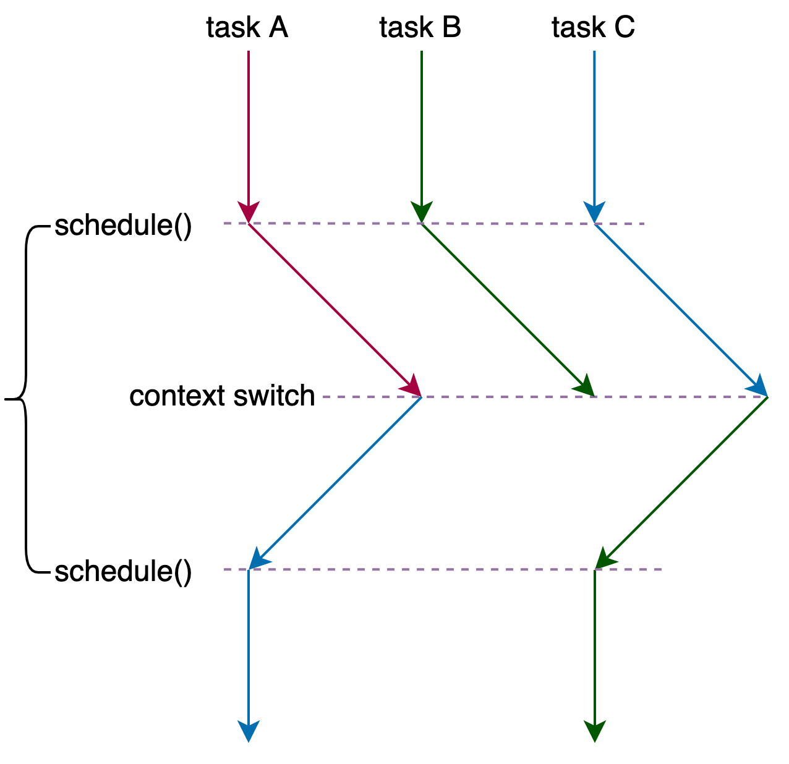

# Table of Contents
* [Init](#Init)
    * [CPU](#cpu)
    * [bios](#bios)
    * [init-kernel](#init-kernel)
    * [syscall](#syscall)
        * [glibs](#glibc)
        * [32](#32)
        * [64](#64)
* [Process](#Process)
    * [process](#process)
    * [thread](#thread)
    * [task_struct](#task_struct)
    * [schedule](#schedule)
        * [voluntary schedule](#voluntary-schedule)
            * [switch_mm_irqs_off](#switch_mm_irqs_off)
            * [switch_to](#switch_to)
        * [preempt schedule](#preempt-schedule)
            * [TIF_NEED_RESCHED](#TIF_NEED_RESCHED)
                * [scheduler_tick](#scheduler_tick)
                * [try_to_wake_up](#try_to_wake_upp)
            * [real user preempt time](#real-user-preempt-time)
                * [return from system call](#return-from-system-call)
                * [return from interrupt](#return-from-interrupt)
            * [real kernel preempt time](#real-kernel-preempt-time)
                * [preempt_enable](#preempt_enble)
                * [return from interrupt](#return-from-interrupt)
    * [wake_up](#wake_up)
    * [wait_woken](#wait_woken)
    * [try_to_wake_up](#try_to_wake_up)

    * [fork](#fork)
        * [copy_process](#copy_process)
        * [ret_from_fork](#ret_from_fork)
        * [copy_thread_tls](#copy_thread_tls)
    * [exec](#exec)
    * [kthreadd](#kthreadd)
    * [cmwq](#cmwq)
        * [struct](#wq-struct)
        * [alloc_workqueue](#alloc_workqueue)
        * [alloc_unbound_pwq](#alloc_unbound_pwq)
        * [create_worker](#create_worker)
        * [worker_thread](#worker_thread)
        * [schedule_work](#schedule_work)
        * [schedule_delayed_work](#schedule_delayed_work)
        * [flush_work](#flush_work)
        * [destroy_worker](#destroy_worker)
        * [maday_timer](#maday_timer)

* [Memory Management :link:](./linux-kernel-mem.md)
* [Network :link:](./linux-kernel-net.md)
* [File Management :link:](./linux-kernel-file-io.md#File-Management)
* [IO :link:](./linux-kernel-file-io.md#io)

* [IPC](#IPC)
* [Virtualization](#Virtualization)
* [Containerization](#Containerization)
* [Lock](#Lock)
* [Pthread](#Pthread)
    * [pthread_create](#pthread_create)


# Init
## cpu


## bios
* 
* When power on, set CS to 0xFFFF, IP to 0x0000, the first instruction points to 0xFFFF0 within ROM, a JMP comamand will jump to ROM do init work, BIOS starts.
* Then BIOS checks the health state of each hardware.
* Grub2 (Grand Unified Bootloader Version 2)
  * grub2-mkconfig -o /boot/grub2/grub.cfg
    ```
    menuentry 'CentOS Linux (3.10.0-862.el7.x86_64) 7 (Core)' --class centos --class gnu-linux --class gnu --class os --unrestricted $menuentry_id_option 'gnulinux-3.10.0-862.el7.x86_64-advanced-b1aceb95-6b9e-464a-a589-bed66220ebee' {
      load_video
      set gfxpayload=keep
      insmod gzio
      insmod part_msdos
      insmod ext2 set root='hd0,msdos1'
      if [ x$feature_platform_search_hint = xy ]; then
        search --no-floppy --fs-uuid --set=root --hint='hd0,msdos1' b1aceb95-6b9e-464a-a589-bed66220ebee
      else search --no-floppy --fs-uuid --set=root b1aceb95-6b9e-464a-a589-bed66220ebee
      fi

      linux16 /boot/vmlinuz-3.10.0-862.el7.x86_64 root=UUID=b1aceb95-6b9e-464a-a589-bed66220ebee ro console=tty0 console=ttyS0,115200 crashkernel=auto net.ifnames=0 biosdevname=0 rhgb quiet
      initrd16 /boot/initramfs-3.10.0-862.el7.x86_64.img
    }
    ```
  * grub2-install /dev/sda
    * install boot.img into MBR（Master Boot Record), and load boot.img into memory at 0x7c00 to run
    * core.img: diskboot.img, lzma_decompress.img, kernel.img

* ```c++
  boot.img                  // Power On Self Test
    core.img
      diskboot.img          // diskboot.S load other modules of grub into memory
        lzma_decompress.img // startup_raw.S
          real_to_prot      // enable segement, page, open Gate A20
          kernel.img        // startup.S, grub's kernel img not Linux kernel
            grub_main       // grub's main func
              grub_load_config()
              grub_command_execute ("normal", 0, 0)
                grub_normal_execute()
                  grub_show_menu() // show which OS want to run
                    grub_menu_execute_entry() // start linux kernel
  ```
  * boot.img
      * checks the basic operability of the hardware and then it issues a BIOS interrupt, INT 13H, which locates the boot sectors on any attached bootable devices.
      * read the first sector of the core image from a local disk and jump to it. Because of the size restriction, boot.img cannot understand any file system structure, so grub-install hardcodes the location of the first sector of the core image into boot.img when installing GRUB.
  * diskboot.img
      * the first sector of the core image when booting from a hard disk. It reads the rest of the core image into memory and starts the kernel. Since file system handling is not yet available, it encodes the location of the core image using a block list format.
  * kernel.img
      * contains GRUB’s basic run-time facilities: frameworks for device and file handling, environment variables, the rescue mode command-line parser, and so on. It is rarely used directly, but is built into all core images.
  * core.img
      * built dynamically from the kernel image and an arbitrary list of modules by the grub-mkimage program. Usually, it contains enough modules to access /boot/grub, and loads everything else (including menu handling, the ability to load target operating systems, and so on) from the file system at run-time. The modular design allows the core image to be kept small, since the areas of disk where it must be installed are often as small as 32KB.

* [GNU GRUB Manual 2.06](https://www.gnu.org/software/grub/manual/grub/html_node/index.html#SEC_Contents)
* [GNU GRUB Manual 2.06: Images](https://www.gnu.org/software/grub/manual/grub/html_node/Images.html)

## init kernel
```c++
// init/main.c
void start_kernel(void)
{
  /* #0 process, the only one doesn't created by fork or kernel_thread */
  set_task_stack_end_magic(&init_task);

  /* set_system_intr_gate(IA32_SYSCALL_VECTOR, entry_INT80_32) */
  trap_init();

  /* mnt_init()->init_rootfs() register_filesystem(&rootfs_fs_type) */
  vfs_caches_init()

  mm_init();
  sched_init();
  init_IRQ();
  softirq_init();
  signals_init();
  cpuset_init();
  cgroup_init();

  rest_init()
}

static void rest_init(void)
{
  struct task_struct *tsk;
  int pid;

  pid = kernel_thread(kernel_init, NULL, CLONE_FS);

  pid = kernel_thread(kthreadd, NULL, CLONE_FS | CLONE_FILES);

  complete(&kthreadd_done);

  cpu_startup_entry(CPUHP_ONLINE);
}

/* init/init_task.c */
struct task_struct init_task
#ifdef CONFIG_ARCH_TASK_STRUCT_ON_STACK
  __init_task_data
#endif
= {
#ifdef CONFIG_THREAD_INFO_IN_TASK
  .thread_info      = INIT_THREAD_INFO(init_task),
  .stack_refcount   = ATOMIC_INIT(1),
#endif
  .state    = 0,
  .stack    = init_stack,
  .usage    = ATOMIC_INIT(2),
  .flags    = PF_KTHREAD,
};
```

```c++
pid_t kernel_thread(int (*fn)(void *), void *arg, unsigned long flags)
{
  return _do_fork(flags|CLONE_VM|CLONE_UNTRACED, (unsigned long)fn,
    (unsigned long)arg, NULL, NULL, 0);
}

/* return from kernel to user space */
static int kernel_init(void *unused)
{
  if (ramdisk_execute_command) {
    ret = run_init_process(ramdisk_execute_command);
    if (!ret)
      return 0;
  }

  if (execute_command) {
    ret = run_init_process(execute_command);
    if (!ret)
      return 0;
  }

  if (!try_to_run_init_process("/sbin/init") ||
      !try_to_run_init_process("/etc/init") ||
      !try_to_run_init_process("/bin/init") ||
      !try_to_run_init_process("/bin/sh"))
    return 0;
}

static int run_init_process(const char *init_filename)
{
  argv_init[0] = init_filename;
  return do_execve(getname_kernel(init_filename),
    (const char __user *const __user *)argv_init,
    (const char __user *const __user *)envp_init);
}
```


## syscall


```c++
/* linux/4.19.y/arch/x86/include/asm/ptrace.h */
struct pt_regs {
/* C ABI says these regs are callee-preserved. They aren't saved on kernel entry
 * unless syscall needs a complete, fully filled "struct pt_regs". */
  unsigned long r15;
  unsigned long r14;
  unsigned long r13;
  unsigned long r12;
  unsigned long bp;
  unsigned long bx;
/* These regs are callee-clobbered. Always saved on kernel entry. */
  unsigned long r11;
  unsigned long r10;
  unsigned long r9;
  unsigned long r8;
  unsigned long ax;
  unsigned long cx;
  unsigned long dx;
  unsigned long si;
  unsigned long di;
/* On syscall entry, this is syscall#. On CPU exception, this is error code.
 * On hw interrupt, it's IRQ number: */
  unsigned long orig_ax;
/* Return frame for iretq */
  unsigned long ip;
  unsigned long cs;
  unsigned long flags;
  unsigned long sp;
  unsigned long ss;
/* top of stack page */
};

/* This is the structure pointed to by thread.sp for an inactive task.
 * The order of the fields must match the code in __switch_to_asm(). */
struct inactive_task_frame {
  unsigned long flags;
#ifdef CONFIG_X86_64
  unsigned long r15;
  unsigned long r14;
  unsigned long r13;
  unsigned long r12;
#else
  unsigned long si;
  unsigned long di;
#endif
  unsigned long bx;

  /* These two fields must be together.
   * They form a stack frame header, needed by get_frame_pointer(). */
  unsigned long bp;
  unsigned long ret_addr;
};

struct fork_frame {
  struct inactive_task_frame frame;
  struct pt_regs regs;
};
```

### glibc
```c++
int open(const char *pathname, int flags, mode_t mode)

// syscalls.list
// File name Caller  Syscall name    Args    Strong name    Weak names
      open    -        open          i:siv   __libc_open   __open open
```

```c++
// syscall-template.S
T_PSEUDO (SYSCALL_SYMBOL, SYSCALL_NAME, SYSCALL_NARGS)
    ret
T_PSEUDO_END (SYSCALL_SYMBOL)

#define T_PSEUDO(SYMBOL, NAME, N)    PSEUDO (SYMBOL, NAME, N)

#define PSEUDO(name, syscall_name, args)   \
  .text;                                  \
  ENTRY (name)                            \
    DO_CALL (syscall_name, args);         \
    cmpl $-4095, %eax;                    \
    jae SYSCALL_ERROR_LABEL
```

### 32

1. declare syscall table: arch/x86/entry/syscalls/syscall_32.tbl
    ```c++
    # 32-bit system call numbers and entry vectors

    # The __ia32_sys and __ia32_compat_sys stubs are created on-the-fly for
    # sys_*() system calls and compat_sys_*() compat system calls if
    # IA32_EMULATION is defined, and expect struct pt_regs *regs as their only
    # parameter.
    #
    # The abi is always "i386" for this file.
    # <number>  <abi>   <name>      <entry point>       <compat entry point>
        0       i386   restart_syscall    sys_restart_syscall   __ia32_sys_restart_syscall
        1       i386   exit         sys_exit            __ia32_sys_exit
        2       i386   fork         sys_fork            __ia32_sys_fork
    ```

2. generate syscall table: arch/x86/entry/syscall_32.c
    ```c++
    /* arch/x86/entry/syscalls/Makefile
     * 2.1 arch/x86/entry/syscalls/syscallhdr.sh generates #define __NR_open
     * arch/sh/include/uapi/asm/unistd_32.h */
    #define __NR_restart_syscall    0
    #define __NR_exit               1
    #define __NR_fork               2
    #define __NR_read               3
    #define __NR_write              4
    #define __NR_open               5

    /* 2.2 arch/x86/entry/syscalls/syscalltbl.sh generates __SYSCALL_I386(__NR_open, sys_open) */
    #define __SYSCALL_I386(nr, sym, qual) [nr] = sym,

    __visible const sys_call_ptr_t ia32_sys_call_table[__NR_syscall_compat_max+1] = {
        /* Smells like a compiler bug -- it doesn't work
        * when the & below is removed. */
        [0 ... __NR_syscall_compat_max] = &sys_ni_syscall,
        #include <asm/syscalls_32.h>
    };
    ```

3. declare implemenation: include/linux/syscalls.h
    ```c++
    /* include/linux/syscalls.h */
    asmlinkage long sys_socket(int, int, int);
    asmlinkage long sys_socketpair(int, int, int, int __user *);
    asmlinkage long sys_bind(int, struct sockaddr __user *, int);
    asmlinkage long sys_listen(int, int);
    ```

4. define implemenation: fs/open.c
    ```c++
    #include <linux/syscalls.h>
    SYSCALL_DEFINE3(open, const char __user *, filename, int, flags, umode_t, mode)
    {
        if (force_o_largefile())
            flags |= O_LARGEFILE;

        return do_sys_open(AT_FDCWD, filename, flags, mode);
    }
    ```

```c++
/* glibc-2.28/sysdeps/unix/sysv/linux/i386/sysdep.h
 Linux takes system call arguments in registers:
  syscall number  %eax       call-clobbered
  arg 1    %ebx       call-saved
  arg 2    %ecx       call-clobbered
  arg 3    %edx       call-clobbered
  arg 4    %esi       call-saved
  arg 5    %edi       call-saved
  arg 6    %ebp       call-saved */
#define DO_CALL(syscall_name, args) \
    PUSHARGS_##args                \
    DOARGS_##args                  \
    movl $SYS_ify (syscall_name), %eax; \ // get syscall id by syscall_name
    ENTER_KERNEL                        \
    POPARGS_##args

#define ENTER_KERNEL int $0x80

/* glibc-2.28/sysdeps/unix/sysv/linux/x86_64/sysdep.h */
#define SYS_ify(syscall_name)  __NR_##syscall_name

#define IA32_SYSCALL_VECTOR  0x80

#define _DOARGS_0(n)  /* No arguments to frob.  */
#define _DOARGS_1(n)  movl n(%esp), %ebx; _DOARGS_0 (n-4)
#define  _DOARGS_2(n)  movl n(%esp), %ecx; _DOARGS_1 (n-4)
#define _DOARGS_3(n)  movl n(%esp), %edx; _DOARGS_2 (n-4)
#define _DOARGS_4(n)  movl n(%esp), %esi; _DOARGS_3 (n-4)
#define _DOARGS_5(n)  movl n(%esp), %edi; _DOARGS_4 (n-4)
#define _DOARGS_6(n)  movl n(%esp), %ebp; _DOARGS_5 (n-4)


#define  DOARGS_0  /* No arguments to frob.  */
#define  DOARGS_1  _DOARGS_1 (4)
#define  DOARGS_2  _DOARGS_2 (8)
#define DOARGS_3  _DOARGS_3 (16)
#define DOARGS_4  _DOARGS_4 (24)
#define DOARGS_5  _DOARGS_5 (32)
#define DOARGS_6  _DOARGS_6 (40)

#define PUSHARGS_0  /* No arguments to push.  */
#define  _PUSHARGS_0  /* No arguments to push.  */

#define PUSHARGS_1  movl %ebx, %edx; L(SAVEBX1): PUSHARGS_0
#define  _PUSHARGS_1  pushl %ebx; cfi_adjust_cfa_offset (4);cfi_rel_offset (ebx, 0); L(PUSHBX1): _PUSHARGS_0

/* CFI stands for Call Frame Information
and helps a debugger create a reliable backtrace through functions. */

#define PUSHARGS_2  PUSHARGS_1
#define _PUSHARGS_2  _PUSHARGS_1

#define PUSHARGS_3  _PUSHARGS_2
#define _PUSHARGS_3  _PUSHARGS_2

#define PUSHARGS_4  _PUSHARGS_4
#define _PUSHARGS_4  pushl %esi; cfi_adjust_cfa_offset (4); cfi_rel_offset (esi, 0); L(PUSHSI1): _PUSHARGS_3

#define PUSHARGS_5  _PUSHARGS_5
#define _PUSHARGS_5  pushl %edi; cfi_adjust_cfa_offset (4); cfi_rel_offset (edi, 0); L(PUSHDI1): _PUSHARGS_4

#define PUSHARGS_6  _PUSHARGS_6
#define _PUSHARGS_6  pushl %ebp; cfi_adjust_cfa_offset (4); cfi_rel_offset (ebp, 0); L(PUSHBP1): _PUSHARGS_5
```

```c++
/* trap_init */
set_system_intr_gate(IA32_SYSCALL_VECTOR, entry_INT80_32);

/* linux-4.19.y/arch/x86/entry/entry_32.S */
/* Arguments:
 * eax  system call number
 * ebx  arg1
 * ecx  arg2
 * edx  arg3
 * esi  arg4
 * edi  arg5
 * ebp  arg6 */
ENTRY(entry_INT80_32)
  ASM_CLAC
  pushl  %eax      /* pt_regs->orig_ax */

  SAVE_ALL pt_regs_ax=$-ENOSYS switch_stacks=1  /* save rest */

  /* User mode is traced as though IRQs are on, and the interrupt gate
   * turned them off. */
  TRACE_IRQS_OFF

  movl  %esp, %eax
  call  do_int80_syscall_32
.Lsyscall_32_done:

restore_all:
  TRACE_IRQS_IRET
  SWITCH_TO_ENTRY_STACK

.Lrestore_all_notrace:
  CHECK_AND_APPLY_ESPFIX
.Lrestore_nocheck:
  /* Switch back to user CR3 */
  SWITCH_TO_USER_CR3 scratch_reg=%eax

  BUG_IF_WRONG_CR3

  /* Restore user state */
  RESTORE_REGS pop=4      # skip orig_eax/error_code
.Lirq_return:
  /* ARCH_HAS_MEMBARRIER_SYNC_CORE rely on IRET core serialization
   * when returning from IPI handler and when returning from
   * scheduler to user-space. */
  INTERRUPT_RETURN # iret

restore_all_kernel:
  TRACE_IRQS_IRET
  PARANOID_EXIT_TO_KERNEL_MODE
  BUG_IF_WRONG_CR3
  RESTORE_REGS 4
  jmp  .Lirq_return

.section .fixup, "ax"
ENTRY(iret_exc  )
  pushl  $0        # no error code
  pushl  $do_iret_error

#ifdef CONFIG_DEBUG_ENTRY
  /* The stack-frame here is the one that iret faulted on, so its a
   * return-to-user frame. We are on kernel-cr3 because we come here from
   * the fixup code. This confuses the CR3 checker, so switch to user-cr3
   * as the checker expects it. */
  pushl  %eax
  SWITCH_TO_USER_CR3 scratch_reg=%eax
  popl  %eax
#endif

  jmp  common_exception
.previous
  _ASM_EXTABLE(.Lirq_return, iret_exc)
ENDPROC(entry_INT80_32)
```

```c++
.macro SAVE_ALL pt_regs_ax=%eax switch_stacks=0
  cld
  PUSH_GS
  pushl  %fs
  pushl  %es
  pushl  %ds
  pushl  \pt_regs_ax
  pushl  %ebp
  pushl  %edi
  pushl  %esi
  pushl  %edx
  pushl  %ecx
  pushl  %ebx
  movl   $(__USER_DS), %edx
  movl   %edx, %ds
  movl   %edx, %es
  movl   $(__KERNEL_PERCPU), %edx
  movl   %edx, %fs
  SET_KERNEL_GS %edx
  /* Switch to kernel stack if necessary */
.if \switch_stacks > 0
  SWITCH_TO_KERNEL_STACK
.endif
```

```c++
#define CS_FROM_ENTRY_STACK  (1 << 31)
#define CS_FROM_USER_CR3  (1 << 30)

.macro SWITCH_TO_KERNEL_STACK

  ALTERNATIVE     "", "jmp .Lend_\@", X86_FEATURE_XENPV

  BUG_IF_WRONG_CR3

  SWITCH_TO_KERNEL_CR3 scratch_reg=%eax

  /* %eax now contains the entry cr3 and we carry it forward in
   * that register for the time this macro runs */

  /* The high bits of the CS dword (__csh) are used for
   * CS_FROM_ENTRY_STACK and CS_FROM_USER_CR3. Clear them in case
   * hardware didn't do this for us. */
  andl  $(0x0000ffff), PT_CS(%esp)

  /* Are we on the entry stack? Bail out if not! */
  movl  PER_CPU_VAR(cpu_entry_area), %ecx
  addl  $CPU_ENTRY_AREA_entry_stack + SIZEOF_entry_stack, %ecx
  subl  %esp, %ecx  /* ecx = (end of entry_stack) - esp */
  cmpl  $SIZEOF_entry_stack, %ecx
  jae  .Lend_\@

  /* Load stack pointer into %esi and %edi */
  movl  %esp, %esi
  movl  %esi, %edi

  /* Move %edi to the top of the entry stack */
  andl  $(MASK_entry_stack), %edi
  addl  $(SIZEOF_entry_stack), %edi

  /* Load top of task-stack into %edi */
  movl  TSS_entry2task_stack(%edi), %edi

  /* Special case - entry from kernel mode via entry stack */
#ifdef CONFIG_VM86
  movl  PT_EFLAGS(%esp), %ecx    # mix EFLAGS and CS
  movb  PT_CS(%esp), %cl
  andl  $(X86_EFLAGS_VM | SEGMENT_RPL_MASK), %ecx
#else
  movl  PT_CS(%esp), %ecx
  andl  $SEGMENT_RPL_MASK, %ecx
#endif
  cmpl  $USER_RPL, %ecx
  jb  .Lentry_from_kernel_\@

  /* Bytes to copy */
  movl  $PTREGS_SIZE, %ecx

#ifdef CONFIG_VM86
  testl  $X86_EFLAGS_VM, PT_EFLAGS(%esi)
  jz  .Lcopy_pt_regs_\@

  /* Stack-frame contains 4 additional segment registers when
   * coming from VM86 mode */
  addl  $(4 * 4), %ecx

#endif
.Lcopy_pt_regs_\@:

  /* Allocate frame on task-stack */
  subl  %ecx, %edi

  /* Switch to task-stack */
  movl  %edi, %esp

  /* We are now on the task-stack and can safely copy over the
   * stack-frame */
  shrl  $2, %ecx
  cld
  rep movsl

  jmp .Lend_\@
```

```c++
/* Switch back from the kernel stack to the entry stack.
 *
 * The %esp register must point to pt_regs on the task stack. It will
 * first calculate the size of the stack-frame to copy, depending on
 * whether we return to VM86 mode or not. With that it uses 'rep movsl'
 * to copy the contents of the stack over to the entry stack */
.macro SWITCH_TO_ENTRY_STACK

  ALTERNATIVE     "", "jmp .Lend_\@", X86_FEATURE_XENPV

  /* Bytes to copy */
  movl  $PTREGS_SIZE, %ecx

#ifdef CONFIG_VM86
  testl  $(X86_EFLAGS_VM), PT_EFLAGS(%esp)
  jz  .Lcopy_pt_regs_\@

  /* Additional 4 registers to copy when returning to VM86 mode */
  addl    $(4 * 4), %ecx

.Lcopy_pt_regs_\@:
#endif

  /* Initialize source and destination for movsl */
  movl  PER_CPU_VAR(cpu_tss_rw + TSS_sp0), %edi
  subl  %ecx, %edi
  movl  %esp, %esi

  /* Save future stack pointer in %ebx */
  movl  %edi, %ebx

  /* Copy over the stack-frame */
  shrl  $2, %ecx
  cld
  rep movsl

  /* Switch to entry-stack - needs to happen after everything is
   * copied because the NMI handler will overwrite the task-stack
   * when on entry-stack */
  movl  %ebx, %esp

.Lend_\@:
.endm

static void do_syscall_32_irqs_on(struct pt_regs *regs)
{
  struct thread_info *ti = current_thread_info();
  unsigned int nr = (unsigned int)regs->orig_ax;

  if (likely(nr < IA32_NR_syscalls)) {
    regs->ax = ia32_sys_call_table[nr](
      (unsigned int)regs->bx, (unsigned int)regs->cx,
      (unsigned int)regs->dx, (unsigned int)regs->si,
      (unsigned int)regs->di, (unsigned int)regs->bp
    );
  }

  syscall_return_slowpath(regs);
}

inline void syscall_return_slowpath(struct pt_regs *regs)
{
  struct thread_info *ti = current_thread_info();
  u32 cached_flags = READ_ONCE(ti->flags);

  if (IS_ENABLED(CONFIG_PROVE_LOCKING) &&
      WARN(irqs_disabled(), "syscall %ld left IRQs disabled", regs->orig_ax))
    local_irq_enable();

  rseq_syscall(regs);

  if (unlikely(cached_flags & SYSCALL_EXIT_WORK_FLAGS))
    syscall_slow_exit_work(regs, cached_flags);

  local_irq_disable();
  prepare_exit_to_usermode(regs);
}

inline void prepare_exit_to_usermode(struct pt_regs *regs)
{
  struct thread_info *ti = current_thread_info();
  u32 cached_flags;

  addr_limit_user_check();

  cached_flags = READ_ONCE(ti->flags);

  if (unlikely(cached_flags & EXIT_TO_USERMODE_LOOP_FLAGS))
    exit_to_usermode_loop(regs, cached_flags);

  user_enter_irqoff();

  mds_user_clear_cpu_buffers();
}

void exit_to_usermode_loop(struct pt_regs *regs, u32 cached_flags)
{
  while (true) {
    local_irq_enable();

    if (cached_flags & _TIF_NEED_RESCHED)
      schedule();

    if (cached_flags & _TIF_UPROBE)
      uprobe_notify_resume(regs);

    if (cached_flags & _TIF_PATCH_PENDING)
      klp_update_patch_state(current);

    /* deal with pending signal delivery */
    if (cached_flags & _TIF_SIGPENDING)
      do_signal(regs);

    if (cached_flags & _TIF_NOTIFY_RESUME) {
      clear_thread_flag(TIF_NOTIFY_RESUME);
      tracehook_notify_resume(regs);
      rseq_handle_notify_resume(NULL, regs);
    }

    if (cached_flags & _TIF_USER_RETURN_NOTIFY)
      fire_user_return_notifiers();

    /* Disable IRQs and retry */
    local_irq_disable();

    cached_flags = READ_ONCE(current_thread_info()->flags);

    if (!(cached_flags & EXIT_TO_USERMODE_LOOP_FLAGS))
      break;
  }
}
```


### 64

* glibc
    ```c++
    /* glibc-2.28/sysdeps/unix/x86_64/sysdep.h
    The Linux/x86-64 kernel expects the system call parameters in
    registers according to the following table:
        syscall number  rax
        arg 1           rdi
        arg 2           rsi
        arg 3           rdx
        arg 4           r10
        arg 5           r8
        arg 6           r9 */
    #define DO_CALL(syscall_name, args)  \
    lea SYS_ify (syscall_name), %rax; \
    syscall

    /* glibc-2.28/sysdeps/unix/sysv/linux/x86_64/sysdep.h */
    #define SYS_ify(syscall_name)  __NR_##syscall_name
    ```

* syscall_table
    1. declare syscall table: arch/x86/entry/syscalls/syscall_64.tbl
        ```c++
        # 64-bit system call numbers and entry vectors

        # The __x64_sys_*() stubs are created on-the-fly for sys_*() system calls
        # The abi is "common", "64" or "x32" for this file.
        #
        # <number>  <abi>     <name>    <entry point>
            0       common    read      __x64_sys_read
            1       common    write     __x64_sys_write
            2       common    open      __x64_sys_open
        ```

    2. genrate syscall table: arch/x86/entry/syscalls/Makefile
        ```c++
        /* 2.1 arch/x86/entry/syscalls/syscallhdr.sh generates #define __NR_open
        * arch/sh/include/uapi/asm/unistd_64.h */
        #define __NR_restart_syscall    0
        #define __NR_exit               1
        #define __NR_fork               2
        #define __NR_read               3
        #define __NR_write              4
        #define __NR_open               5

        /* 2.2 arch/x86/entry/syscalls/syscalltbl.sh
        * generates __SYSCALL_64(x, y) into asm/syscalls_64.h */
        __SYSCALL_64(__NR_open, __x64_sys_read)
        __SYSCALL_64(__NR_write, __x64_sys_write)
        __SYSCALL_64(__NR_open, __x64_sys_open)

        /* arch/x86/entry/syscall_64.c */
        #define __SYSCALL_64(nr, sym, qual) [nr] = sym

        asmlinkage const sys_call_ptr_t sys_call_table[__NR_syscall_max+1] = {
            /* Smells like a compiler bug -- it doesn't work
            * when the & below is removed. */
            [0 ... __NR_syscall_max] = &sys_ni_syscall,
            #include <asm/syscalls_64.h>
        };
        ```

    3. declare implemenation: include/linux/syscalls.h
        ```c++
        asmlinkage long sys_write(unsigned int fd, const char __user *buf, size_t count);
        asmlinkage long sys_read(unsigned int fd, char __user *buf, size_t count);
        asmlinkage long sys_open(const char __user *filename, int flags, umode_t mode);
        ```

    4. define implemenation: fs/open.c
        ```c++
        #include <linux/syscalls.h>

        SYSCALL_DEFINE3(open, const char __user *, filename, int, flags, umode_t, mode)
        {
            if (force_o_largefile())
                flags |= O_LARGEFILE;

            return do_sys_open(AT_FDCWD, filename, flags, mode);
        }
        ```

```c++
/* Moduel Specific Register, trap_init -> cpu_init -> syscall_init */
wrmsrl(MSR_LSTAR, (unsigned long)entry_SYSCALL_64);

ENTRY(entry_SYSCALL_64)
  UNWIND_HINT_EMPTY
  /* Interrupts are off on entry.
   * We do not frame this tiny irq-off block with TRACE_IRQS_OFF/ON,
   * it is too small to ever cause noticeable irq latency. */

  swapgs

/* 1. swap to kernel stack
   * This path is only taken when PAGE_TABLE_ISOLATION is disabled so it
   * is not required to switch CR3. */
  movq  %rsp, PER_CPU_VAR(rsp_scratch)
  movq  PER_CPU_VAR(cpu_current_top_of_stack), %rsp

/* 2. save user stack
  * Construct struct pt_regs on stack */
  pushq  $__USER_DS                 /* pt_regs->ss */
  pushq  PER_CPU_VAR(rsp_scratch)   /* pt_regs->sp */
  pushq  %r11                       /* pt_regs->flags */
  pushq  $__USER_CS                 /* pt_regs->cs */
  pushq  %rcx                       /* pt_regs->ip */
GLOBAL(entry_SYSCALL_64_after_hwframe)
  pushq  %rax                       /* pt_regs->orig_ax */

  PUSH_AND_CLEAR_REGS rax=$-ENOSYS

  TRACE_IRQS_OFF

/* 3. do_syscall */
  movq  %rax, %rdi
  movq  %rsp, %rsi
  call  do_syscall_64    /* returns with IRQs disabled */

  TRACE_IRQS_IRETQ    /* we're about to change IF */

  /* Try to use SYSRET instead of IRET if we're returning to
   * a completely clean 64-bit userspace context.  If we're not,
   * go to the slow exit path. */
  movq  RCX(%rsp), %rcx
  movq  RIP(%rsp), %r11

/* 4. restore user stack */
  cmpq  %rcx, %r11  /* SYSRET requires RCX == RIP */
  jne  swapgs_restore_regs_and_return_to_usermode

  /* On Intel CPUs, SYSRET with non-canonical RCX/RIP will #GP
   * in kernel space.  This essentially lets the user take over
   * the kernel, since userspace controls RSP.
   *
   * If width of "canonical tail" ever becomes variable, this will need
   * to be updated to remain correct on both old and new CPUs.
   *
   * Change top bits to match most significant bit (47th or 56th bit
   * depending on paging mode) in the address. */
#ifdef CONFIG_X86_5LEVEL
  ALTERNATIVE "shl $(64 - 48), %rcx; sar $(64 - 48), %rcx", \
    "shl $(64 - 57), %rcx; sar $(64 - 57), %rcx", X86_FEATURE_LA57
#else
  shl  $(64 - (__VIRTUAL_MASK_SHIFT+1)), %rcx
  sar  $(64 - (__VIRTUAL_MASK_SHIFT+1)), %rcx
#endif

  /* If this changed %rcx, it was not canonical */
  cmpq  %rcx, %r11
  jne  swapgs_restore_regs_and_return_to_usermode

  cmpq  $__USER_CS, CS(%rsp)    /* CS must match SYSRET */
  jne  swapgs_restore_regs_and_return_to_usermode

  movq  R11(%rsp), %r11
  cmpq  %r11, EFLAGS(%rsp)    /* R11 == RFLAGS */
  jne  swapgs_restore_regs_and_return_to_usermode

  /* SYSCALL clears RF when it saves RFLAGS in R11 and SYSRET cannot
   * restore RF properly. If the slowpath sets it for whatever reason, we
   * need to restore it correctly.
   *
   * SYSRET can restore TF, but unlike IRET, restoring TF results in a
   * trap from userspace immediately after SYSRET.  This would cause an
   * infinite loop whenever #DB happens with register state that satisfies
   * the opportunistic SYSRET conditions.  For example, single-stepping
   * this user code:
   *
   *           movq  $stuck_here, %rcx
   *           pushfq
   *           popq %r11
   *   stuck_here:
   *
   * would never get past 'stuck_here'. */
  testq  $(X86_EFLAGS_RF|X86_EFLAGS_TF), %r11
  jnz  swapgs_restore_regs_and_return_to_usermode

  /* nothing to check for RSP */

  cmpq  $__USER_DS, SS(%rsp)    /* SS must match SYSRET */
  jne  swapgs_restore_regs_and_return_to_usermode

  /* We win! This label is here just for ease of understanding
   * perf profiles. Nothing jumps here. */
syscall_return_via_sysret:
  /* rcx and r11 are already restored (see code above) */
  POP_REGS pop_rdi=0 skip_r11rcx=1

  /* Now all regs are restored except RSP and RDI.
   * Save old stack pointer and switch to trampoline stack. */
  movq  %rsp, %rdi
  movq  PER_CPU_VAR(cpu_tss_rw + TSS_sp0), %rsp
  UNWIND_HINT_EMPTY

  pushq  RSP-RDI(%rdi)  /* RSP */
  pushq  (%rdi)    /* RDI */

  /* We are on the trampoline stack.  All regs except RDI are live.
   * We can do future final exit work right here. */
  SWITCH_TO_USER_CR3_STACK scratch_reg=%rdi

  popq  %rdi
  popq  %rsp
  USERGS_SYSRET64
END(entry_SYSCALL_64)

#define USERGS_SYSRET64 \
  swapgs;              \
  sysretq;
```

```c++
GLOBAL(swapgs_restore_regs_and_return_to_usermode)
  POP_REGS pop_rdi=0

  /* The stack is now user RDI, orig_ax, RIP, CS, EFLAGS, RSP, SS.
   * Save old stack pointer and switch to trampoline stack. */
  movq  %rsp, %rdi
  movq  PER_CPU_VAR(cpu_tss_rw + TSS_sp0), %rsp
  UNWIND_HINT_EMPTY

  /* Copy the IRET frame to the trampoline stack. */
  pushq  6*8(%rdi)  /* SS */
  pushq  5*8(%rdi)  /* RSP */
  pushq  4*8(%rdi)  /* EFLAGS */
  pushq  3*8(%rdi)  /* CS */
  pushq  2*8(%rdi)  /* RIP */

  /* Push user RDI on the trampoline stack. */
  pushq  (%rdi)

  /* We are on the trampoline stack.  All regs except RDI are live.
   * We can do future final exit work right here. */

  SWITCH_TO_USER_CR3_STACK scratch_reg=%rdi

  /* Restore RDI. */
  popq  %rdi
  SWAPGS
  INTERRUPT_RETURN
```

```c++
/* entry_SYSCALL_64 -> entry_SYSCALL64_slow_pat -> do_syscall_64 */
void do_syscall_64(struct pt_regs *regs)
{
  struct thread_info *ti = current_thread_info();
  unsigned long nr = regs->orig_ax;

  if (likely((nr & __SYSCALL_MASK) < NR_syscalls)) {
    regs->ax = sys_call_table[nr & __SYSCALL_MASK] (
      regs->di, regs->si, regs->dx,
      regs->r10, regs->r8, regs->r9
    );
  }

  syscall_return_slowpath(regs);
}
```


# Process


## process

```c++
/* compile */
gcc -c -fPIC process.c
gcc -c -fPIC createprocess.c

/* staic lib */
ar cr libstaticprocess.a process.o
/* static link */
gcc -o staticcreateprocess createprocess.o -L. -lstaticprocess

/* dynamic lib */
gcc -shared -fPIC -o libdynamicprocess.so process.o
/* dynamic link LD_LIBRARY_PATH /lib /usr/lib */
gcc -o dynamiccreateprocess createprocess.o -L. -ldynamicprocess
export LD_LIBRARY_PATH=
```

1. elf: relocatable file


2. elf: executable file


3. elf: shared object

4. elf: core dump


## thread


## task_struct


## schedule
```c++
/* Schedule Policy:
 * Real time schedule: SCHED_FIFO, SCHED_RR, SCHED_DEADLINE
 * Normal schedule: SCHED_NORMAL, SCHED_BATCH, SCHED_IDLE */
#define SCHED_NORMAL    0
#define SCHED_FIFO      1
#define SCHED_RR        2
#define SCHED_BATCH     3
#define SCHED_IDLE      5
#define SCHED_DEADLINE  6

#define MAX_NICE  19
#define MIN_NICE  -20
#define NICE_WIDTH        (MAX_NICE - MIN_NICE + 1)
#define MAX_USER_RT_PRIO  100
#define MAX_RT_PRIO        MAX_USER_RT_PRIO
#define MAX_PRIO          (MAX_RT_PRIO + NICE_WIDTH)
#define DEFAULT_PRIO      (MAX_RT_PRIO + NICE_WIDTH / 2)

struct task_struct {
  #ifdef CONFIG_THREAD_INFO_IN_TASK
  /*  reasons of header soup (see current_thread_info()), this
   * must be the first element of task_struct. */
  struct thread_info        thread_info;
#endif

  int                       on_rq; /* TASK_ON_RQ_{QUEUED, MIGRATING} */

  int                       prio;
  int                       static_prio;
  int                       normal_prio;
  unsigned int              rt_priority;

  const struct sched_class  *sched_class;
  struct sched_entity       se;
  struct sched_rt_entity    rt;
  struct sched_dl_entity    dl;
  struct task_group         *sched_task_group;
  unsigned int              policy;

  struct mm_struct          *mm;
  struct mm_struct          *active_mm;

  void                      *stack; /* kernel stack */

  /* CPU-specific state of this task: */
  struct thread_struct      thread;
};

struct thread_info {
  unsigned long   flags;  /* TIF_SIGPENDING, TIF_NEED_RESCHED */
  u32             status; /* thread synchronous flags */
};

struct thread_struct {
  /* Cached TLS descriptors: */
  struct desc_struct  tls_array[GDT_ENTRY_TLS_ENTRIES];
#ifdef CONFIG_X86_32
  unsigned long       sp0; /* userland SP */
#endif
  unsigned long       sp; /* kernel SP */

#ifdef CONFIG_X86_32
  unsigned long       sysenter_cs;
#else
  unsigned short      es;
  unsigned short      ds;
  unsigned short      fsindex;
  unsigned short      gsindex;
#endif

  /* Floating point and extended processor state */
  struct fpu    fpu;
};

struct sched_entity {
  struct load_weight  load;
  struct rb_node      run_node; /* in {cfs, rt, dl}_rq */
  struct list_head    group_node;
  unsigned int        on_rq;
  u64                 exec_start;
  u64                 sum_exec_runtime;
  u64                 vruntime;
  u64                 prev_sum_exec_runtime;
  u64                 nr_migrations;
  struct sched_statistics    statistics;
};

struct rq {
  raw_spinlock_t  lock;
  unsigned int    nr_running;
  unsigned long   cpu_load[CPU_LOAD_IDX_MAX];

  struct load_weight  load;
  unsigned long       nr_load_updates;
  u64                 nr_switches;

  struct cfs_rq cfs;
  struct rt_rq  rt;
  struct dl_rq  dl;
  struct task_struct *curr, *idle, *stop;
};

struct cfs_rq {
  struct load_weight load;
  unsigned int nr_running, h_nr_running;

  u64 exec_clock;
  u64 min_vruntime;
#ifndef CONFIG_64BIT
  u64 min_vruntime_copy;
#endif
  struct rb_root tasks_timeline;
  struct rb_node *rb_leftmost;

  struct sched_entity *curr, *next, *last, *skip;
};
```


```c++
struct sched_class {
  const struct sched_class *next;

  void (*enqueue_task) (struct rq *rq, struct task_struct *p, int flags);
  void (*dequeue_task) (struct rq *rq, struct task_struct *p, int flags);
  void (*yield_task) (struct rq *rq);
  bool (*yield_to_task) (struct rq *rq, struct task_struct *p, bool preempt);

  void (*check_preempt_curr) (struct rq *rq, struct task_struct *p, int flags);

  struct task_struct * (*pick_next_task) (struct rq *rq,
            struct task_struct *prev,
            struct rq_flags *rf);
  void (*put_prev_task) (struct rq *rq, struct task_struct *p);

  void (*set_curr_task) (struct rq *rq);
  void (*task_tick) (struct rq *rq, struct task_struct *p, int queued);
  void (*task_fork) (struct task_struct *p);
  void (*task_dead) (struct task_struct *p);

  void (*switched_from) (struct rq *this_rq, struct task_struct *task);
  void (*switched_to) (struct rq *this_rq, struct task_struct *task);
  void (*prio_changed) (struct rq *this_rq, struct task_struct *task, int oldprio);
  unsigned int (*get_rr_interval) (struct rq *rq,
           struct task_struct *task);
  void (*update_curr) (struct rq *rq);
};

extern const struct sched_class stop_sched_class;
extern const struct sched_class dl_sched_class;
extern const struct sched_class rt_sched_class;
extern const struct sched_class fair_sched_class;
extern const struct sched_class idle_sched_class;
/* stop_sched_class: highest priority process, will interrupt others
 * dl_sched_class: for deadline
 * rt_sched_class: for RR or FIFO, depend on task_struct->policy
 * fair_sched_class: for normal processes
 * idle_sched_class: idle */

const struct sched_class fair_sched_class = {
  .next               = &idle_sched_class,
  .enqueue_task       = enqueue_task_fair,
  .dequeue_task       = dequeue_task_fair,
  .yield_task         = yield_task_fair,
  .yield_to_task      = yield_to_task_fair,
  .check_preempt_curr = check_preempt_wakeup,
  .pick_next_task     = pick_next_task_fair
};
```


### voluntary schedule
```c++
void schedule(void)
{
  struct task_struct *tsk = current;

  sched_submit_work(tsk);
  do {
    preempt_disable();
    __schedule(false);
    sched_preempt_enable_no_resched();
  } while (need_resched());
}

/* __schedule() is the main scheduler function.
 *
 * The main means of driving the scheduler and thus entering this function are:
 *   1. Explicit blocking: mutex, semaphore, waitqueue, sleep(sk_wait_data), etc.
 *   2. TIF_NEED_RESCHED flag is checked on interrupt and userspace return paths.
 *   3. Wakeups don't really cause entry into schedule(). They add a
 *      task to the run-queue and that's it.
 * WARNING: must be called with preemption disabled! */
void __sched notrace __schedule(bool preempt)
{
  struct task_struct *prev, *next;
  unsigned long *switch_count;
  struct rq_flags rf;
  struct rq *rq;
  int cpu;

  cpu = smp_processor_id();
  rq = cpu_rq(cpu);
  prev = rq->curr;

  schedule_debug(prev);

  if (sched_feat(HRTICK))
    hrtick_clear(rq);

  local_irq_disable();
  rcu_note_context_switch(preempt);

  /* Make sure that signal_pending_state()->signal_pending() below
   * can't be reordered with __set_current_state(TASK_INTERRUPTIBLE)
   * done by the caller to avoid the race with signal_wake_up().
   *
   * The membarrier system call requires a full memory barrier
   * after coming from user-space, before storing to rq->curr. */
  rq_lock(rq, &rf);
  smp_mb__after_spinlock();

  /* Promote REQ to ACT */
  rq->clock_update_flags <<= 1;
  update_rq_clock(rq);

  switch_count = &prev->nivcsw;
  if (!preempt && prev->state) { /* 0 runnable, set_current_state() */
    if (unlikely(signal_pending_state(prev->state, prev))) {
      prev->state = TASK_RUNNING;
    } else {
      deactivate_task(rq, prev, DEQUEUE_SLEEP | DEQUEUE_NOCLOCK);
      prev->on_rq = 0;

      if (prev->in_iowait) {
        atomic_inc(&rq->nr_iowait);
        delayacct_blkio_start();
      }

      /* If a worker went to sleep, notify and ask workqueue
       * whether it wants to wake up a task to maintain
       * concurrency. */
      if (prev->flags & PF_WQ_WORKER) {
        struct task_struct *to_wakeup;

        to_wakeup = wq_worker_sleeping(prev);
        if (to_wakeup)
          try_to_wake_up_local(to_wakeup, &rf);
      }
    }
    switch_count = &prev->nvcsw;
  }

  next = pick_next_task(rq, prev, &rf);
  clear_tsk_need_resched(prev);
  clear_preempt_need_resched();

  if (likely(prev != next)) {
    rq->nr_switches++;
    rq->curr = next;
    ++*switch_count;

    /* Also unlocks the rq: */
    rq = context_switch(rq, prev, next, &rf);
  } else {
    rq->clock_update_flags &= ~(RQCF_ACT_SKIP|RQCF_REQ_SKIP);
    rq_unlock_irq(rq, &rf);
  }

  balance_callback(rq);
}
```

```c++
static inline struct task_struct* pick_next_task(
  struct rq *rq, struct task_struct *prev, struct rq_flags *rf)
{
  const struct sched_class *class;
  struct task_struct *p;

  if (likely((prev->sched_class == &idle_sched_class || prev->sched_class == &fair_sched_class)
    && rq->nr_running == rq->cfs.h_nr_running))
  {
    p = fair_sched_class.pick_next_task(rq, prev, rf);
    if (unlikely(p == RETRY_TASK))
      goto again;
    /* Assumes fair_sched_class->next == idle_sched_class */
    if (unlikely(!p))
      p = idle_sched_class.pick_next_task(rq, prev, rf);
    return p;
  }

again:
  for_each_class(class) {
    p = class->pick_next_task(rq, prev, rf);
    if (p) {
      if (unlikely(p == RETRY_TASK))
        goto again;
      return p;
    }
  }
}

/* fair_sched_class */
static struct task_struct *pick_next_task_fair
(struct rq *rq, struct task_struct *prev, struct rq_flags *rf)
{
  struct cfs_rq *cfs_rq = &rq->cfs;
  struct sched_entity *se;
  struct task_struct *p;
  int new_tasks;

again:
  if (!cfs_rq->nr_running)
    goto idle;

  put_prev_task(rq, prev);

  do {
    se = pick_next_entity(cfs_rq, NULL);
    set_next_entity(cfs_rq, se);
    cfs_rq = group_cfs_rq(se);
  } while (cfs_rq);

  p = task_of(se);

done: __maybe_unused;
#ifdef CONFIG_SMP
  /*
   * Move the next running task to the front of
   * the list, so our cfs_tasks list becomes MRU
   * one.
   */
  list_move(&p->se.group_node, &rq->cfs_tasks);
#endif

  if (hrtick_enabled(rq))
    hrtick_start_fair(rq, p);

  return p;

idle:
  new_tasks = idle_balance(rq, rf);

  /*
   * Because idle_balance() releases (and re-acquires) rq->lock, it is
   * possible for any higher priority task to appear. In that case we
   * must re-start the pick_next_entity() loop.
   */
  if (new_tasks < 0)
    return RETRY_TASK;

  if (new_tasks > 0)
    goto again;

  return NULL;
}

void put_prev_task_fair(struct rq *rq, struct task_struct *prev)
{
  struct sched_entity *se = &prev->se;
  struct cfs_rq *cfs_rq;

  for_each_sched_entity(se) {
    cfs_rq = cfs_rq_of(se);
    put_prev_entity(cfs_rq, se);
  }
}

void put_prev_entity(struct cfs_rq *cfs_rq, struct sched_entity *prev)
{
  /*
   * If still on the runqueue then deactivate_task()
   * was not called and update_curr() has to be done:
   */
  if (prev->on_rq)
    update_curr(cfs_rq);

  /* throttle cfs_rqs exceeding runtime */
  check_cfs_rq_runtime(cfs_rq);

  check_spread(cfs_rq, prev);

  if (prev->on_rq) {
    update_stats_wait_start(cfs_rq, prev);
    /* Put 'current' back into the tree. */
    __enqueue_entity(cfs_rq, prev);
    /* in !on_rq case, update occurred at dequeue */
    update_load_avg(cfs_rq, prev, 0);
  }
  cfs_rq->curr = NULL;
}
```

```c++
/* context_switch - switch to the new MM and the new thread's register state. */
static __always_inline struct rq * context_switch(
  struct rq *rq, struct task_struct *prev,
  struct task_struct *next, struct rq_flags *rf)
{
  struct mm_struct *mm, *oldmm;

  prepare_task_switch(rq, prev, next);

  mm = next->mm;
  oldmm = prev->active_mm;
  /* For paravirt, this is coupled with an exit in switch_to to
   * combine the page table reload and the switch backend into
   * one hypercall. */
  arch_start_context_switch(prev);

  /* If mm is non-NULL, we pass through switch_mm(). If mm is
   * NULL, we will pass through mmdrop() in finish_task_switch().
   * Both of these contain the full memory barrier required by
   * membarrier after storing to rq->curr, before returning to
   * user-space. */
  if (!mm) { /* kernel threads have no mm */
    next->active_mm = oldmm;
    mmgrab(oldmm);
    enter_lazy_tlb(oldmm, next);
  } else
    switch_mm_irqs_off(oldmm, mm, next);

  if (!prev->mm) {
    prev->active_mm = NULL;
    rq->prev_mm = oldmm;
  }

  rq->clock_update_flags &= ~(RQCF_ACT_SKIP|RQCF_REQ_SKIP);

  prepare_lock_switch(rq, next, rf);

  /* Here we just switch the register state and the stack. */
  switch_to(prev, next, prev);
  barrier();

  return finish_task_switch(prev);
}
```

#### switch_mm_irqs_off
```c++
void switch_mm_irqs_off(struct mm_struct *prev, struct mm_struct *next,
      struct task_struct *tsk)
{
  struct mm_struct *real_prev = this_cpu_read(cpu_tlbstate.loaded_mm);
  u16 prev_asid = this_cpu_read(cpu_tlbstate.loaded_mm_asid);
  unsigned cpu = smp_processor_id();
  u64 next_tlb_gen;

  if (real_prev == next) {
    return;
  } else {
    u16 new_asid;
    bool need_flush;
    choose_new_asid(next, next_tlb_gen, &new_asid, &need_flush);

    /* Let nmi_uaccess_okay() know that we're changing CR3. */
    this_cpu_write(cpu_tlbstate.loaded_mm, LOADED_MM_SWITCHING);
    barrier();

    if (need_flush) {
      this_cpu_write(cpu_tlbstate.ctxs[new_asid].ctx_id, next->context.ctx_id);
      this_cpu_write(cpu_tlbstate.ctxs[new_asid].tlb_gen, next_tlb_gen);
      load_new_mm_cr3(next->pgd, new_asid, true);
    } else {
      load_new_mm_cr3(next->pgd, new_asid, false);
    }

    /* Make sure we write CR3 before loaded_mm. */
    barrier();

    this_cpu_write(cpu_tlbstate.loaded_mm, next);
    this_cpu_write(cpu_tlbstate.loaded_mm_asid, new_asid);
  }

  load_mm_cr4(next);
  switch_ldt(real_prev, next);
}
```

#### switch_to
```c++
#define switch_to(prev, next, last) \
do {                  \
  prepare_switch_to(prev, next);  \
  /* 2. switch kernel esp, stack */
  ((last) = __switch_to_asm((prev), (next))); \
} while (0)

/* linux-4.19.y/arch/x86/entry/entry_64.S */
ENTRY(__switch_to_asm)
  UNWIND_HINT_FUNC
  /* Save callee-saved registers to prev task
   * This must match the order in inactive_task_frame */
  pushq  %rbp
  pushq  %rbx
  pushq  %r12
  pushq  %r13
  pushq  %r14
  pushq  %r15
  pushfq

  /* 2.1 switch kernel sp
   * save old value from esp to prev task
   * load new value from thread_struct of next task to esp */
  movl  %esp, TASK_threadsp(%rdi) /* %rdi: prev task */
  movl  TASK_threadsp(%rsi), %esp /* %rsi: next task */

  /* restore callee-saved registers from next task*/
  popfq
  popq  %r15
  popq  %r14
  popq  %r13
  popq  %r12
  popq  %rbx
  popq  %rbp

  /* 2.2. switch kernel stack */
  jmp  __switch_to
END(__switch_to_asm)

struct task_struct * __switch_to(
  struct task_struct *prev_p/* %eax */, struct task_struct *next_p/* %edx */)
{
  struct thread_struct *prev = &prev_p->thread;
  struct thread_struct *next = &next_p->thread;
  int cpu = smp_processor_id();

  load_TLS(next, cpu);

  /* 3. swtich kernel stack */
  this_cpu_write(current_task, next_p);

  /* 4. load new tss_struct from next task
   * TSS(Task State Segment) TR(Task Register) */
  struct tss_struct *tss = &per_cpu(cpu_tss, cpu);
  /* Reload esp0 and ss1.  This changes current_thread_info(). */
  load_sp0(tss, next);

  return prev_p;
}

/* switch tasks from x to y */
struct task_struct * __switch_to(
  struct task_struct *prev_p, struct task_struct *next_p)
{
  struct thread_struct *prev = &prev_p->thread;
  struct thread_struct *next = &next_p->thread;
  struct fpu *prev_fpu = &prev->fpu;
  struct fpu *next_fpu = &next->fpu;
  int cpu = smp_processor_id();

  switch_fpu_prepare(prev_fpu, cpu);

  /* We must save %fs and %gs before load_TLS() because
   * %fs and %gs may be cleared by load_TLS().
   *
   * (e.g. xen_load_tls()) */
  save_fsgs(prev_p);

  /* Load TLS before restoring any segments so that segment loads
   * reference the correct GDT entries. */
  load_TLS(next, cpu);

  /* Leave lazy mode, flushing any hypercalls made here.  This
   * must be done after loading TLS entries in the GDT but before
   * loading segments that might reference them, and and it must
   * be done before fpu__restore(), so the TS bit is up to
   * date. */
  arch_end_context_switch(next_p);

  /* Switch DS and ES.
   *
   * Reading them only returns the selectors, but writing them (if
   * nonzero) loads the full descriptor from the GDT or LDT.  The
   * LDT for next is loaded in switch_mm, and the GDT is loaded
   * above.
   *
   * We therefore need to write new values to the segment
   * registers on every context switch unless both the new and old
   * values are zero.
   *
   * Note that we don't need to do anything for CS and SS, as
   * those are saved and restored as part of pt_regs. */
  savesegment(es, prev->es);
  if (unlikely(next->es | prev->es))
    loadsegment(es, next->es);

  savesegment(ds, prev->ds);
  if (unlikely(next->ds | prev->ds))
    loadsegment(ds, next->ds);

  load_seg_legacy(prev->fsindex, prev->fsbase, next->fsindex, next->fsbase, FS);
  load_seg_legacy(prev->gsindex, prev->gsbase, next->gsindex, next->gsbase, GS);

  switch_fpu_finish(next_fpu, cpu);

  /* Switch the PDA and FPU contexts. */
  this_cpu_write(current_task, next_p);
  this_cpu_write(cpu_current_top_of_stack, task_top_of_stack(next_p));

  /* Reload sp0. */
  update_task_stack(next_p);

  switch_to_extra(prev_p, next_p);

  /* Load the Intel cache allocation PQR MSR. */
  intel_rdt_sched_in();

  return prev_p;
}

/* This is used when switching tasks or entering/exiting vm86 mode. */
static inline void update_task_stack(struct task_struct *task)
{
  /* sp0 always points to the entry trampoline stack, which is constant: */
#ifdef CONFIG_X86_32
  if (static_cpu_has(X86_FEATURE_XENPV))
    load_sp0(task->thread.sp0);
  else
    this_cpu_write(cpu_tss_rw.x86_tss.sp1, task->thread.sp0);
#else
  if (static_cpu_has(X86_FEATURE_XENPV))
    load_sp0(task_top_of_stack(task));
#endif
}

void cpu_init(void)
{
  int cpu = smp_processor_id();
  struct task_struct *curr = current;
  struct tss_struct *tss = &per_cpu(cpu_tss, cpu);
  load_sp0(tss, thread);
  set_tss_desc(cpu, tss);
  load_TR_desc();
}

struct tss_struct {
  struct x86_hw_tss   x86_tss;
  unsigned long       io_bitmap[IO_BITMAP_LONGS + 1];
}

struct x86_hw_tss {
  u32      reserved1;
  u64      sp0;

  /* We store cpu_current_top_of_stack in sp1 so it's always accessible.
   * Linux does not use ring 1, so sp1 is not otherwise needed. */
  u64      sp1;

  u64      sp2;
  u64      reserved2;
  u64      ist[7];
  u32      reserved3;
  u32      reserved4;
  u16      reserved5;
  u16      io_bitmap_base;
}
```




```c++
schedule(void)
    __schedule(false), // kernel/sched/core.c
        if (!preempt && prev->state) /* 0 runnable */
            deactivate_task(rq, prev, DEQUEUE_SLEEP | DEQUEUE_NOCLOCK);
                dequeue_task(rq, p, flags);
            prev->on_rq = 0;
            if (prev->flags & PF_WQ_WORKER) {
                to_wakeup = wq_worker_sleeping(prev);
                    if (WARN_ON_ONCE(pool->cpu != raw_smp_processor_id()))
                    return NULL;
                    /* only wakeup idle thread when running task is going to suspend in process_one_work */
                    if (atomic_dec_and_test(&pool->nr_running) && !list_empty(&pool->worklist))
                        to_wakeup = first_idle_worker(pool);
                if (to_wakeup)
                    try_to_wake_up_local(to_wakeup, &rf);

        next = pick_next_task(rq, prev, &rf);
        if (prev != next)
            context_switch(rq, prev, next, &rf);
                switch_mm_irqs_off(prev->active_mm, next->mm, next) {
                    load_new_mm_cr3()
                }
                switch_to(prev, next, prev);
                    __switch_to_asm(); // switch registers, but not EIP [arch/x86/entry/entry_64.S]
                        movl  %esp, TASK_threadsp(%eax) /* %eax: prev task */
                        movl  TASK_threadsp(%edx), %esp /* %edx: next task */

                        __switch_to(); // switch kernal stack [arch/x86/kernel/process_64.c]
                            this_cpu_write(current_task, next_p);
                            load_sp0(tss, next);
                barrier();
                return finish_task_switch(prev);
```


### preempt schedule

#### TIF_NEED_RESCHED

##### scheduler_tick
```c++
void scheduler_tick(void)
{
  int cpu = smp_processor_id();
  struct rq *rq = cpu_rq(cpu);
  struct task_struct *curr = rq->curr;
  struct rq_flags rf;

  sched_clock_tick();

  rq_lock(rq, &rf);

  update_rq_clock(rq);
  curr->sched_class->task_tick(rq, curr, 0); /* task_tick_fair */
  cpu_load_update_active(rq);
  calc_global_load_tick(rq);

  rq_unlock(rq, &rf);

  perf_event_task_tick();

#ifdef CONFIG_SMP
  rq->idle_balance = idle_cpu(cpu);
  trigger_load_balance(rq);
#endif
}

static void task_tick_fair(struct rq *rq, struct task_struct *curr, int queued)
{
  struct cfs_rq *cfs_rq;
  struct sched_entity *se = &curr->se;

  for_each_sched_entity(se) {
    cfs_rq = cfs_rq_of(se);
    entity_tick(cfs_rq, se, queued);
  }
}

static void entity_tick(struct cfs_rq *cfs_rq, struct sched_entity *curr, int queued)
{
  update_curr(cfs_rq);
  update_load_avg(curr, UPDATE_TG);
  update_cfs_shares(curr);

  if (cfs_rq->nr_running > 1)
    check_preempt_tick(cfs_rq, curr);
}

void update_curr(struct cfs_rq *cfs_rq)
{
  struct sched_entity *curr = cfs_rq->curr;
  u64 now = rq_clock_task(rq_of(cfs_rq));
  u64 delta_exec;

  if (unlikely(!curr))
    return;

  delta_exec = now - curr->exec_start;
  if (unlikely((s64)delta_exec <= 0))
    return;

  curr->exec_start = now;

  schedstat_set(curr->statistics.exec_max, max(delta_exec, curr->statistics.exec_max));

  curr->sum_exec_runtime += delta_exec;
  schedstat_add(cfs_rq->exec_clock, delta_exec);

  curr->vruntime += calc_delta_fair(delta_exec, curr);
  update_min_vruntime(cfs_rq);

  if (entity_is_task(curr)) {
    struct task_struct *curtask = task_of(curr);

    trace_sched_stat_runtime(curtask, delta_exec, curr->vruntime);
    cgroup_account_cputime(curtask, delta_exec);
    account_group_exec_runtime(curtask, delta_exec);
  }

  account_cfs_rq_runtime(cfs_rq, delta_exec);
}

static void check_preempt_tick(struct cfs_rq *cfs_rq, struct sched_entity *curr)
{
  unsigned long ideal_runtime, delta_exec;
  struct sched_entity *se;
  s64 delta;

  ideal_runtime = sched_slice(cfs_rq, curr);
  delta_exec = curr->sum_exec_runtime - curr->prev_sum_exec_runtime;
  if (delta_exec > ideal_runtime) {
    resched_curr(rq_of(cfs_rq));
    return;
  }

  se = __pick_first_entity(cfs_rq);
  delta = curr->vruntime - se->vruntime;
  if (delta < 0)
    return;
  if (delta > ideal_runtime)
    resched_curr(rq_of(cfs_rq));
}

/* resched_curr -> */
static inline void set_tsk_need_resched(struct task_struct *tsk)
{
  /* just mark thread with TIF_NEED_RESCHED */
  set_tsk_thread_flag(tsk,TIF_NEED_RESCHED);
}
```

##### try_to_wake_upp

##### sched_setscheduler

#### real user preempt time
##### return from system call
```c++
/* do_syscall_64 -> syscall_return_slowpath
 * -> prepare_exit_to_usermode -> exit_to_usermode_loop */
static void exit_to_usermode_loop(struct pt_regs *regs, u32 cached_flags)
{
  while (true) {
    local_irq_enable();

    if (cached_flags & _TIF_NEED_RESCHED)
      schedule();

    if (cached_flags & _TIF_SIGPENDING)
      do_signal(regs);
  }
}
```

##### return from interrupt
```c++
/* do_IRQ -> retint_user -> prepare_exit_to_usermode -> exit_to_usermode_loop */
common_interrupt:
        ASM_CLAC
        addq    $-0x80, (%rsp)
        interrupt do_IRQ
ret_from_intr:
        popq    %rsp
        testb   $3, CS(%rsp)
        jz      retint_kernel

/* Interrupt came from user space */
GLOBAL(retint_user)
        mov     %rsp,%rdi
        call    prepare_exit_to_usermode
        TRACE_IRQS_IRETQ
        SWAPGS
        jmp     restore_regs_and_iret

/* Returning to kernel space */
retint_kernel:
#ifdef CONFIG_PREEMPT
        bt      $9, EFLAGS(%rsp)
        jnc     1f
0:      cmpl    $0, PER_CPU_VAR(__preempt_count)
        jnz     1f
        call    preempt_schedule_irq
        jmp     0b
```

#### real kernel preempt time
##### preempt_enble
```c++
#define preempt_enable() \
do { \
  if (unlikely(preempt_count_dec_and_test())) \
    __preempt_schedule(); \
} while (0)

#define preempt_count_dec_and_test() \
  ({ preempt_count_sub(1); should_resched(0); })

static  bool should_resched(int preempt_offset)
{
  return unlikely(preempt_count() == preempt_offset &&
      tif_need_resched());
}

#define tif_need_resched() test_thread_flag(TIF_NEED_RESCHED)

/* __preempt_schedule -> */
static void __sched notrace preempt_schedule_common(void)
{
  do {
    __schedule(true);
  } while (need_resched());
}
```

##### return from interrupt
```c++
/* do_IRQ -> retint_kernel */
asmlinkage __visible void __sched preempt_schedule_irq(void)
{
  do {
    preempt_disable();
    local_irq_enable();
    __schedule(true);
    local_irq_disable();
    sched_preempt_enable_no_resched();
  } while (need_resched());
}
```


### Q
1. A process waits on a block operation (mutex, semphore, waitqueue), it calls schedule(). Will it be removed from rq, and add to rq when block operation wakeups?
2. What's difference between contex_switch and sleep_wakeup?

## load_balance
```c++
/* idle_balance is called by schedule() if this_cpu is about to become
 * idle. Attempts to pull tasks from other CPUs. */
static int idle_balance(struct rq *this_rq, struct rq_flags *rf)
{
  unsigned long next_balance = jiffies + HZ;
  int this_cpu = this_rq->cpu;
  struct sched_domain *sd;
  int pulled_task = 0;
  u64 curr_cost = 0;

  /* We must set idle_stamp _before_ calling idle_balance(), such that we
   * measure the duration of idle_balance() as idle time. */
  this_rq->idle_stamp = rq_clock(this_rq);

  /* Do not pull tasks towards !active CPUs... */
  if (!cpu_active(this_cpu))
    return 0;

  /* This is OK, because current is on_cpu, which avoids it being picked
   * for load-balance and preemption/IRQs are still disabled avoiding
   * further scheduler activity on it and we're being very careful to
   * re-start the picking loop. */
  rq_unpin_lock(this_rq, rf);

  if (this_rq->avg_idle < sysctl_sched_migration_cost ||
      !this_rq->rd->overload) {

    rcu_read_lock();
    sd = rcu_dereference_check_sched_domain(this_rq->sd);
    if (sd)
      update_next_balance(sd, &next_balance);
    rcu_read_unlock();

    nohz_newidle_balance(this_rq);

    goto out;
  }

  raw_spin_unlock(&this_rq->lock);

  update_blocked_averages(this_cpu);
  rcu_read_lock();
  for_each_domain(this_cpu, sd) {
    int continue_balancing = 1;
    u64 t0, domain_cost;

    if (!(sd->flags & SD_LOAD_BALANCE))
      continue;

    if (this_rq->avg_idle < curr_cost + sd->max_newidle_lb_cost) {
      update_next_balance(sd, &next_balance);
      break;
    }

    if (sd->flags & SD_BALANCE_NEWIDLE) {
      t0 = sched_clock_cpu(this_cpu);

      pulled_task = load_balance(this_cpu, this_rq,
               sd, CPU_NEWLY_IDLE,
               &continue_balancing);

      domain_cost = sched_clock_cpu(this_cpu) - t0;
      if (domain_cost > sd->max_newidle_lb_cost)
        sd->max_newidle_lb_cost = domain_cost;

      curr_cost += domain_cost;
    }

    update_next_balance(sd, &next_balance);

    /* Stop searching for tasks to pull if there are
     * now runnable tasks on this rq. */
    if (pulled_task || this_rq->nr_running > 0)
      break;
  }
  rcu_read_unlock();

  raw_spin_lock(&this_rq->lock);

  if (curr_cost > this_rq->max_idle_balance_cost)
    this_rq->max_idle_balance_cost = curr_cost;

out:
  /* While browsing the domains, we released the rq lock, a task could
   * have been enqueued in the meantime. Since we're not going idle,
   * pretend we pulled a task. */
  if (this_rq->cfs.h_nr_running && !pulled_task)
    pulled_task = 1;

  /* Move the next balance forward */
  if (time_after(this_rq->next_balance, next_balance))
    this_rq->next_balance = next_balance;

  /* Is there a task of a high priority class? */
  if (this_rq->nr_running != this_rq->cfs.h_nr_running)
    pulled_task = -1;

  if (pulled_task)
    this_rq->idle_stamp = 0;

  rq_repin_lock(this_rq, rf);

  return pulled_task;
}

/* Check this_cpu to ensure it is balanced within domain. Attempt to move
 * tasks if there is an imbalance. */
static int load_balance(int this_cpu, struct rq *this_rq,
      struct sched_domain *sd, enum cpu_idle_type idle,
      int *continue_balancing)
{
  int ld_moved, cur_ld_moved, active_balance = 0;
  struct sched_domain *sd_parent = sd->parent;
  struct sched_group *group;
  struct rq *busiest;
  struct rq_flags rf;
  struct cpumask *cpus = this_cpu_cpumask_var_ptr(load_balance_mask);

  struct lb_env env = {
    .sd    = sd,
    .dst_cpu  = this_cpu,
    .dst_rq    = this_rq,
    .dst_grpmask    = sched_group_span(sd->groups),
    .idle    = idle,
    .loop_break  = sched_nr_migrate_break,
    .cpus    = cpus,
    .fbq_type  = all,
    .tasks    = LIST_HEAD_INIT(env.tasks),
  };

  cpumask_and(cpus, sched_domain_span(sd), cpu_active_mask);

  schedstat_inc(sd->lb_count[idle]);

redo:
  if (!should_we_balance(&env)) {
    *continue_balancing = 0;
    goto out_balanced;
  }

  group = find_busiest_group(&env);
  if (!group) {
    schedstat_inc(sd->lb_nobusyg[idle]);
    goto out_balanced;
  }

  busiest = find_busiest_queue(&env, group);
  if (!busiest) {
    schedstat_inc(sd->lb_nobusyq[idle]);
    goto out_balanced;
  }

  BUG_ON(busiest == env.dst_rq);

  schedstat_add(sd->lb_imbalance[idle], env.imbalance);

  env.src_cpu = busiest->cpu;
  env.src_rq = busiest;

  ld_moved = 0;
  if (busiest->nr_running > 1) {
    /* Attempt to move tasks. If find_busiest_group has found
     * an imbalance but busiest->nr_running <= 1, the group is
     * still unbalanced. ld_moved simply stays zero, so it is
     * correctly treated as an imbalance. */
    env.flags |= LBF_ALL_PINNED;
    env.loop_max  = min(sysctl_sched_nr_migrate, busiest->nr_running);

more_balance:
    rq_lock_irqsave(busiest, &rf);
    update_rq_clock(busiest);

    /* cur_ld_moved - load moved in current iteration
     * ld_moved     - cumulative load moved across iterations */
    cur_ld_moved = detach_tasks(&env);

    /* We've detached some tasks from busiest_rq. Every
     * task is masked "TASK_ON_RQ_MIGRATING", so we can safely
     * unlock busiest->lock, and we are able to be sure
     * that nobody can manipulate the tasks in parallel.
     * See task_rq_lock() family for the details. */

    rq_unlock(busiest, &rf);

    if (cur_ld_moved) {
      attach_tasks(&env);
      ld_moved += cur_ld_moved;
    }

    local_irq_restore(rf.flags);

    if (env.flags & LBF_NEED_BREAK) {
      env.flags &= ~LBF_NEED_BREAK;
      goto more_balance;
    }

    /* Revisit (affine) tasks on src_cpu that couldn't be moved to
     * us and move them to an alternate dst_cpu in our sched_group
     * where they can run. The upper limit on how many times we
     * iterate on same src_cpu is dependent on number of CPUs in our
     * sched_group.
     *
     * This changes load balance semantics a bit on who can move
     * load to a given_cpu. In addition to the given_cpu itself
     * (or a ilb_cpu acting on its behalf where given_cpu is
     * nohz-idle), we now have balance_cpu in a position to move
     * load to given_cpu. In rare situations, this may cause
     * conflicts (balance_cpu and given_cpu/ilb_cpu deciding
     * _independently_ and at _same_ time to move some load to
     * given_cpu) causing exceess load to be moved to given_cpu.
     * This however should not happen so much in practice and
     * moreover subsequent load balance cycles should correct the
     * excess load moved. */
    if ((env.flags & LBF_DST_PINNED) && env.imbalance > 0) {

      /* Prevent to re-select dst_cpu via env's CPUs */
      cpumask_clear_cpu(env.dst_cpu, env.cpus);

      env.dst_rq   = cpu_rq(env.new_dst_cpu);
      env.dst_cpu   = env.new_dst_cpu;
      env.flags  &= ~LBF_DST_PINNED;
      env.loop   = 0;
      env.loop_break   = sched_nr_migrate_break;

      /* Go back to "more_balance" rather than "redo" since we
       * need to continue with same src_cpu. */
      goto more_balance;
    }

    /* We failed to reach balance because of affinity. */
    if (sd_parent) {
      int *group_imbalance = &sd_parent->groups->sgc->imbalance;

      if ((env.flags & LBF_SOME_PINNED) && env.imbalance > 0)
        *group_imbalance = 1;
    }

    /* All tasks on this runqueue were pinned by CPU affinity */
    if (unlikely(env.flags & LBF_ALL_PINNED)) {
      cpumask_clear_cpu(cpu_of(busiest), cpus);
      /* Attempting to continue load balancing at the current
       * sched_domain level only makes sense if there are
       * active CPUs remaining as possible busiest CPUs to
       * pull load from which are not contained within the
       * destination group that is receiving any migrated
       * load. */
      if (!cpumask_subset(cpus, env.dst_grpmask)) {
        env.loop = 0;
        env.loop_break = sched_nr_migrate_break;
        goto redo;
      }
      goto out_all_pinned;
    }
  }

  if (!ld_moved) {
    schedstat_inc(sd->lb_failed[idle]);
    /* Increment the failure counter only on periodic balance.
     * We do not want newidle balance, which can be very
     * frequent, pollute the failure counter causing
     * excessive cache_hot migrations and active balances. */
    if (idle != CPU_NEWLY_IDLE)
      sd->nr_balance_failed++;

    if (need_active_balance(&env)) {
      unsigned long flags;

      raw_spin_lock_irqsave(&busiest->lock, flags);

      /* Don't kick the active_load_balance_cpu_stop,
       * if the curr task on busiest CPU can't be
       * moved to this_cpu: */
      if (!cpumask_test_cpu(this_cpu, &busiest->curr->cpus_allowed)) {
        raw_spin_unlock_irqrestore(&busiest->lock,
                  flags);
        env.flags |= LBF_ALL_PINNED;
        goto out_one_pinned;
      }

      /* ->active_balance synchronizes accesses to
       * ->active_balance_work.  Once set, it's cleared
       * only after active load balance is finished. */
      if (!busiest->active_balance) {
        busiest->active_balance = 1;
        busiest->push_cpu = this_cpu;
        active_balance = 1;
      }
      raw_spin_unlock_irqrestore(&busiest->lock, flags);

      if (active_balance) {
        stop_one_cpu_nowait(cpu_of(busiest),
          active_load_balance_cpu_stop, busiest,
          &busiest->active_balance_work);
      }

      /* We've kicked active balancing, force task migration. */
      sd->nr_balance_failed = sd->cache_nice_tries+1;
    }
  } else
    sd->nr_balance_failed = 0;

  if (likely(!active_balance)) {
    /* We were unbalanced, so reset the balancing interval */
    sd->balance_interval = sd->min_interval;
  } else {
    /* If we've begun active balancing, start to back off. This
     * case may not be covered by the all_pinned logic if there
     * is only 1 task on the busy runqueue (because we don't call
     * detach_tasks). */
    if (sd->balance_interval < sd->max_interval)
      sd->balance_interval *= 2;
  }

  goto out;

out_balanced:
  /* We reach balance although we may have faced some affinity
   * constraints. Clear the imbalance flag only if other tasks got
   * a chance to move and fix the imbalance. */
  if (sd_parent && !(env.flags & LBF_ALL_PINNED)) {
    int *group_imbalance = &sd_parent->groups->sgc->imbalance;

    if (*group_imbalance)
      *group_imbalance = 0;
  }

out_all_pinned:
  /* We reach balance because all tasks are pinned at this level so
   * we can't migrate them. Let the imbalance flag set so parent level
   * can try to migrate them. */
  schedstat_inc(sd->lb_balanced[idle]);

  sd->nr_balance_failed = 0;

out_one_pinned:
  ld_moved = 0;

  /* idle_balance() disregards balance intervals, so we could repeatedly
   * reach this code, which would lead to balance_interval skyrocketting
   * in a short amount of time. Skip the balance_interval increase logic
   * to avoid that. */
  if (env.idle == CPU_NEWLY_IDLE)
    goto out;

  /* tune up the balancing interval */
  if (((env.flags & LBF_ALL_PINNED) &&
      sd->balance_interval < MAX_PINNED_INTERVAL) ||
      (sd->balance_interval < sd->max_interval))
    sd->balance_interval *= 2;
out:
  return ld_moved;
}
```

## wake_up


```c++
#define wake_up(x)                        __wake_up(x, TASK_NORMAL, 1, NULL)
#define wake_up_nr(x, nr)                 __wake_up(x, TASK_NORMAL, nr, NULL)
#define wake_up_all(x)                    __wake_up(x, TASK_NORMAL, 0, NULL)
#define wake_up_locked(x)                 __wake_up_locked((x), TASK_NORMAL, 1)
#define wake_up_all_locked(x)             __wake_up_locked((x), TASK_NORMAL, 0)

#define wake_up_interruptible(x)          __wake_up(x, TASK_INTERRUPTIBLE, 1, NULL)
#define wake_up_interruptible_nr(x, nr)   __wake_up(x, TASK_INTERRUPTIBLE, nr, NULL)
#define wake_up_interruptible_all(x)      __wake_up(x, TASK_INTERRUPTIBLE, 0, NULL)
#define wake_up_interruptible_sync(x)     __wake_up_sync((x), TASK_INTERRUPTIBLE, 1)

void __wake_up(
  struct wait_queue_head *wq_head, unsigned int mode,
  int nr_exclusive, void *key)
{
  __wake_up_common_lock(wq_head, mode, nr_exclusive, 0, key);
}

static void __wake_up_common_lock(struct wait_queue_head *wq_head, unsigned int mode,
      int nr_exclusive, int wake_flags, void *key)
{
  unsigned long flags;
  wait_queue_entry_t bookmark;

  bookmark.flags = 0;
  bookmark.private = NULL;
  bookmark.func = NULL;
  INIT_LIST_HEAD(&bookmark.entry);

  spin_lock_irqsave(&wq_head->lock, flags);
  nr_exclusive = __wake_up_common(wq_head, mode, nr_exclusive, wake_flags, key, &bookmark);
  spin_unlock_irqrestore(&wq_head->lock, flags);

  while (bookmark.flags & WQ_FLAG_BOOKMARK) {
    spin_lock_irqsave(&wq_head->lock, flags);
    nr_exclusive = __wake_up_common(wq_head, mode, nr_exclusive, wake_flags, key, &bookmark);
    spin_unlock_irqrestore(&wq_head->lock, flags);
  }
}

static int __wake_up_common(
  struct wait_queue_head *wq_head, unsigned int mode,
  int nr_exclusive, int wake_flags, void *key,
  wait_queue_entry_t *bookmark)
{
  wait_queue_entry_t *curr, *next;
  int cnt = 0;

  lockdep_assert_held(&wq_head->lock);

  if (bookmark && (bookmark->flags & WQ_FLAG_BOOKMARK)) {
    curr = list_next_entry(bookmark, entry);

    list_del(&bookmark->entry);
    bookmark->flags = 0;
  } else
    curr = list_first_entry(&wq_head->head, wait_queue_entry_t, entry);

  if (&curr->entry == &wq_head->head)
    return nr_exclusive;

  list_for_each_entry_safe_from(curr, next, &wq_head->head, entry) {
    unsigned flags = curr->flags;
    int ret;

    if (flags & WQ_FLAG_BOOKMARK)
      continue;

    /* ep_poll_callback, default_wake_func, woken_wake_function */
    ret = curr->func(curr, mode, wake_flags, key);
    if (ret < 0)
      break;
    /* WQ_FLAG_EXCLUSIVE : fix thunderbird problem */
    if (ret && (flags & WQ_FLAG_EXCLUSIVE) && !--nr_exclusive)
      break;

    if (bookmark && (++cnt > WAITQUEUE_WALK_BREAK_CNT)
      && (&next->entry != &wq_head->head))
    {
      bookmark->flags = WQ_FLAG_BOOKMARK;
      list_add_tail(&bookmark->entry, &next->entry);
      break;
    }
  }

  return nr_exclusive;
}
```

## wait_woken
```c++
long inet_wait_for_connect(struct sock *sk, long timeo, int writebias)
{
  DEFINE_WAIT_FUNC(wait, woken_wake_function);

  add_wait_queue(sk_sleep(sk), &wait);
  sk->sk_write_pending += writebias;

  while ((1 << sk->sk_state) & (TCPF_SYN_SENT | TCPF_SYN_RECV)) {
    timeo = wait_woken(&wait, TASK_INTERRUPTIBLE, timeo);
    if (signal_pending(current) || !timeo)
      break;
  }
  remove_wait_queue(sk_sleep(sk), &wait);
  sk->sk_write_pending -= writebias;
  return timeo;
}

long wait_woken(struct wait_queue_entry *wq_entry, unsigned mode, long timeout)
{
  /* The below executes an smp_mb(), which matches with the full barrier
   * executed by the try_to_wake_up() in woken_wake_function() such that
   * either we see the store to wq_entry->flags in woken_wake_function()
   * or woken_wake_function() sees our store to current->state. */
  set_current_state(mode); /* A */
  if (!(wq_entry->flags & WQ_FLAG_WOKEN) && !is_kthread_should_stop())
    timeout = schedule_timeout(timeout);
  __set_current_state(TASK_RUNNING);

  /* The below executes an smp_mb(), which matches with the smp_mb() (C)
   * in woken_wake_function() such that either we see the wait condition
   * being true or the store to wq_entry->flags in woken_wake_function()
   * follows ours in the coherence order. */
  smp_store_mb(wq_entry->flags, wq_entry->flags & ~WQ_FLAG_WOKEN); /* B */

  return timeout;
}

long __sched schedule_timeout(signed long timeout)
{
  struct process_timer timer;
  unsigned long expire;

  switch (timeout)
  {
  case MAX_SCHEDULE_TIMEOUT:
    schedule();
    goto out;
  default:
    if (timeout < 0) {
      printk(KERN_ERR "schedule_timeout: wrong timeout "
        "value %lx\n", timeout);
      dump_stack();
      current->state = TASK_RUNNING;
      goto out;
    }
  }

  expire = timeout + jiffies;

  timer.task = current;
  timer_setup_on_stack(&timer.timer, process_timeout, 0);
  __mod_timer(&timer.timer, expire, 0);
  schedule();
  del_singleshot_timer_sync(&timer.timer);

  /* Remove the timer from the object tracker */
  destroy_timer_on_stack(&timer.timer);

  timeout = expire - jiffies;

 out:
  return timeout < 0 ? 0 : timeout;
}

void process_timeout(struct timer_list *t)
{
  struct process_timer *timeout = from_timer(timeout, t, timer);

  wake_up_process(timeout->task);
}

int wake_up_process(struct task_struct *p)
{
  return try_to_wake_up(p, TASK_NORMAL, 0);
}

int woken_wake_function(
  struct wait_queue_entry *wq_entry, unsigned mode, int sync, void *key)
{
  /* Pairs with the smp_store_mb() in wait_woken(). */
  smp_mb(); /* C */
  wq_entry->flags |= WQ_FLAG_WOKEN;

  return default_wake_function(wq_entry, mode, sync, key);
}

int default_wake_function(
  wait_queue_entry_t *curr, unsigned mode, int wake_flags, void *key)
{
  return try_to_wake_up(curr->private, mode, wake_flags);
}

/* wait_queue_entry::flags */
#define WQ_FLAG_EXCLUSIVE  0x01
#define WQ_FLAG_WOKEN      0x02
#define WQ_FLAG_BOOKMARK   0x04

struct wait_queue_entry {
  unsigned int      flags;
  void              *private; /* struct_task */
  wait_queue_func_t func;
  struct list_head  entry;
};
```

## try_to_wake_up
```c++
/* try_to_wake_up -> ttwu_queue -> ttwu_do_activate -> ttwu_do_wakeup
 * -> check_preempt_curr -> resched_curr */
static int try_to_wake_up(
  struct task_struct *p, unsigned int state, int wake_flags)
{
  unsigned long flags;
  int cpu, success = 0;

  success = 1;
  cpu = task_cpu(p);

  p->sched_contributes_to_load = !!task_contributes_to_load(p);
  p->state = TASK_WAKING;

  if (p->in_iowait) {
    delayacct_blkio_end(p);
    atomic_dec(&task_rq(p)->nr_iowait);
  }

  cpu = select_task_rq(p, p->wake_cpu, SD_BALANCE_WAKE, wake_flags);
  if (task_cpu(p) != cpu) {
    wake_flags |= WF_MIGRATED;
    set_task_cpu(p, cpu);
  }

  ttwu_queue(p, cpu, wake_flags);
stat:
  ttwu_stat(p, cpu, wake_flags);
out:
  raw_spin_unlock_irqrestore(&p->pi_lock, flags);

  return success;
}

static void ttwu_queue(struct task_struct *p, int cpu, int wake_flags)
{
  struct rq *rq = cpu_rq(cpu);
  struct rq_flags rf;

  rq_lock(rq, &rf);
  update_rq_clock(rq);
  ttwu_do_activate(rq, p, wake_flags, &rf);
  rq_unlock(rq, &rf);
}

static void ttwu_do_activate(
  struct rq *rq, struct task_struct *p,
  int wake_flags, struct rq_flags *rf)
{
  int en_flags = ENQUEUE_WAKEUP | ENQUEUE_NOCLOCK;

  lockdep_assert_held(&rq->lock);

  /* 1. insert p into rq */
  ttwu_activate(rq, p, en_flags);
  /* 2. check schedule curr */
  ttwu_do_wakeup(rq, p, wake_flags, rf);
}

static inline void ttwu_activate(
  struct rq *rq, struct task_struct *p, int en_flags)
{
  activate_task(rq, p, en_flags);
  p->on_rq = TASK_ON_RQ_QUEUED;

  /* If a worker is waking up, notify the workqueue: */
  if (p->flags & PF_WQ_WORKER)
    wq_worker_waking_up(p, cpu_of(rq));
}

void activate_task(struct rq *rq, struct task_struct *p, int flags)
{
  if (task_contributes_to_load(p))
    rq->nr_uninterruptible--;

  enqueue_task(rq, p, flags);
}

static inline void enqueue_task(
  struct rq *rq, struct task_struct *p, int flags)
{
  if (!(flags & ENQUEUE_NOCLOCK))
    update_rq_clock(rq);

  if (!(flags & ENQUEUE_RESTORE))
    sched_info_queued(rq, p);

  p->sched_class->enqueue_task(rq, p, flags);
}

/* 2. check schedule curr */
static void ttwu_do_wakeup(
  struct rq *rq, struct task_struct *p,
  int wake_flags, struct rq_flags *rf)
{
  check_preempt_curr(rq, p, wake_flags);
  p->state = TASK_RUNNING;
  trace_sched_wakeup(p);
}

void check_preempt_curr(struct rq *rq, struct task_struct *p, int flags)
{
  const struct sched_class *class;

  if (p->sched_class == rq->curr->sched_class) {
    /* fair_sched_class.check_preempt_wakeup */
    rq->curr->sched_class->check_preempt_curr(rq, p, flags);
  } else {
    for_each_class(class) {
      if (class == rq->curr->sched_class)
        break;
      if (class == p->sched_class) {
        resched_curr(rq);
        break;
      }
    }
  }

  if (task_on_rq_queued(rq->curr) && test_tsk_need_resched(rq->curr))
    rq_clock_skip_update(rq);
}

/* fair_sched_class.check_preempt_wakeup */
static void check_preempt_wakeup(struct rq *rq, struct task_struct *p, int wake_flags)
{
  struct task_struct *curr = rq->curr;
  struct sched_entity *se = &curr->se, *pse = &p->se;
  struct cfs_rq *cfs_rq = task_cfs_rq(curr);

  if (test_tsk_need_resched(curr))
    return;

  find_matching_se(&se, &pse);
  update_curr(cfs_rq_of(se));
  if (wakeup_preempt_entity(se, pse) == 1) {
    goto preempt;
  }
  return;
preempt:
  resched_curr(rq);
}

/* Should 'se' preempt 'curr'.
 *
 *             |s1
 *        |s2
 *   |s3
 *         g
 *      |<--->|c
 *
 *  w(c, s1) = -1
 *  w(c, s2) =  0
 *  w(c, s3) =  1 */
static int
wakeup_preempt_entity(struct sched_entity *curr, struct sched_entity *se)
{
  s64 gran, vdiff = curr->vruntime - se->vruntime;

  if (vdiff <= 0)
    return -1;

  gran = wakeup_gran(se);
  if (vdiff > gran)
    return 1;

  return 0;
}

unsigned long wakeup_gran(struct sched_entity *se)
{
  unsigned long gran = sysctl_sched_wakeup_granularity;

  /* Since its curr running now, convert the gran from real-time
   * to virtual-time in his units.
   *
   * By using 'se' instead of 'curr' we penalize light tasks, so
   * they get preempted easier. That is, if 'se' < 'curr' then
   * the resulting gran will be larger, therefore penalizing the
   * lighter, if otoh 'se' > 'curr' then the resulting gran will
   * be smaller, again penalizing the lighter task.
   *
   * This is especially important for buddies when the leftmost
   * task is higher priority than the buddy. */
  return calc_delta_fair(gran, se);
}

void resched_curr(struct rq *rq)
{
  struct task_struct *curr = rq->curr;
  int cpu;

  if (test_tsk_need_resched(curr))
    return;

  cpu = cpu_of(rq);

  if (cpu == smp_processor_id()) {
    set_tsk_need_resched(curr);
    set_preempt_need_resched();
    return;
  }

  if (set_nr_and_not_polling(curr))
    smp_send_reschedule(cpu);
  else
    trace_sched_wake_idle_without_ipi(cpu);
}

void set_tsk_need_resched(struct task_struct *tsk)
{
  set_tsk_thread_flag(tsk,TIF_NEED_RESCHED);
}
```

```c++
void try_to_wake_up_local(struct task_struct *p, struct rq_flags *rf)
{
  struct rq *rq = task_rq(p);

  if (WARN_ON_ONCE(rq != this_rq()) ||
      WARN_ON_ONCE(p == current))
    return;

  lockdep_assert_held(&rq->lock);

  if (!raw_spin_trylock(&p->pi_lock)) {
    /* This is OK, because current is on_cpu, which avoids it being
     * picked for load-balance and preemption/IRQs are still
     * disabled avoiding further scheduler activity on it and we've
     * not yet picked a replacement task. */
    rq_unlock(rq, rf);
    raw_spin_lock(&p->pi_lock);
    rq_relock(rq, rf);
  }

  if (!(p->state & TASK_NORMAL))
    goto out;

  trace_sched_waking(p);

  if (!task_on_rq_queued(p)) {
    if (p->in_iowait) {
      delayacct_blkio_end(p);
      atomic_dec(&rq->nr_iowait);
    }
    ttwu_activate(rq, p, ENQUEUE_WAKEUP | ENQUEUE_NOCLOCK);
  }

  ttwu_do_wakeup(rq, p, 0, rf);
  ttwu_stat(p, smp_processor_id(), 0);
out:
  raw_spin_unlock(&p->pi_lock);
}
```

## fork
```c++
SYSCALL_DEFINE0(fork)
{
  return _do_fork(SIGCHLD, 0, 0, NULL, NULL, 0);
}

long _do_fork(
  unsigned long clone_flags,
  unsigned long stack_start,
  unsigned long stack_size,
  int __user *parent_tidptr,
  int __user *child_tidptr,
  unsigned long tls)
{
  struct task_struct *p;
  int trace = 0;
  long nr;

  p = copy_process(clone_flags, stack_start, stack_size,
    child_tidptr, NULL, trace, tls, NUMA_NO_NODE);

  if (IS_ERR(p))
    return PTR_ERR(p);

  struct pid *pid;
  pid = get_task_pid(p, PIDTYPE_PID);
  nr = pid_vnr(pid);

  if (clone_flags & CLONE_PARENT_SETTID)
    put_user(nr, parent_tidptr);

  wake_up_new_task(p);

  put_pid(pid);

  return nr;
}
```

### copy_process
```c++
/* kernel/fork.c */
struct task_struct *copy_process(
  unsigned long clone_flags,
  unsigned long stack_start,
  unsigned long stack_size,
  int __user *child_tidptr,
  struct pid *pid,
  int trace,
  unsigned long tls,
  int node)
{
  int retval;
  struct task_struct *p;
  struct multiprocess_signals delayed;

  /* Don't allow sharing the root directory with processes in a different
   * namespace */
  if ((clone_flags & (CLONE_NEWNS|CLONE_FS)) == (CLONE_NEWNS|CLONE_FS))
    return ERR_PTR(-EINVAL);

  if ((clone_flags & (CLONE_NEWUSER|CLONE_FS)) == (CLONE_NEWUSER|CLONE_FS))
    return ERR_PTR(-EINVAL);

  /* Thread groups must share signals as well, and detached threads
   * can only be started up within the thread group. */
  if ((clone_flags & CLONE_THREAD) && !(clone_flags & CLONE_SIGHAND))
    return ERR_PTR(-EINVAL);

  /* Shared signal handlers imply shared VM. By way of the above,
   * thread groups also imply shared VM. Blocking this case allows
   * for various simplifications in other code. */
  if ((clone_flags & CLONE_SIGHAND) && !(clone_flags & CLONE_VM))
    return ERR_PTR(-EINVAL);

  /* Siblings of global init remain as zombies on exit since they are
   * not reaped by their parent (swapper). To solve this and to avoid
   * multi-rooted process trees, prevent global and container-inits
   * from creating siblings. */
  if ((clone_flags & CLONE_PARENT) && current->signal->flags & SIGNAL_UNKILLABLE)
    return ERR_PTR(-EINVAL);

  /* If the new process will be in a different pid or user namespace
   * do not allow it to share a thread group with the forking task. */
  if (clone_flags & CLONE_THREAD) {
    if ((clone_flags & (CLONE_NEWUSER | CLONE_NEWPID))
    || (task_active_pid_ns(current) != current->nsproxy->pid_ns_for_children))
      return ERR_PTR(-EINVAL);
  }

  /* Force any signals received before this point to be delivered
   * before the fork happens.  Collect up signals sent to multiple
   * processes that happen during the fork and delay them so that
   * they appear to happen after the fork. */
  sigemptyset(&delayed.signal);
  INIT_HLIST_NODE(&delayed.node);

  spin_lock_irq(&current->sighand->siglock);
  if (!(clone_flags & CLONE_THREAD))
    hlist_add_head(&delayed.node, &current->signal->multiprocess);
  recalc_sigpending();
  spin_unlock_irq(&current->sighand->siglock);
  retval = -ERESTARTNOINTR;
  if (signal_pending(current))
    goto fork_out;

  retval = -ENOMEM;
  p = dup_task_struct(current, node);
  if (!p)
    goto fork_out;

  /* This _must_ happen before we call free_task(), i.e. before we jump
   * to any of the bad_fork_* labels. This is to avoid freeing
   * p->set_child_tid which is (ab)used as a kthread's data pointer for
   * kernel threads (PF_KTHREAD). */
  p->set_child_tid = (clone_flags & CLONE_CHILD_SETTID) ? child_tidptr : NULL;
  /* Clear TID on mm_release()? */
  p->clear_child_tid = (clone_flags & CLONE_CHILD_CLEARTID) ? child_tidptr : NULL;

  ftrace_graph_init_task(p);

  rt_mutex_init_task(p);

#ifdef CONFIG_PROVE_LOCKING
  DEBUG_LOCKS_WARN_ON(!p->hardirqs_enabled);
  DEBUG_LOCKS_WARN_ON(!p->softirqs_enabled);
#endif
  retval = -EAGAIN;
  if (atomic_read(&p->real_cred->user->processes) >= task_rlimit(p, RLIMIT_NPROC)) {
    if (p->real_cred->user != INIT_USER &&
        !capable(CAP_SYS_RESOURCE) && !capable(CAP_SYS_ADMIN))
      goto bad_fork_free;
  }
  current->flags &= ~PF_NPROC_EXCEEDED;

  retval = copy_creds(p, clone_flags);
  if (retval < 0)
    goto bad_fork_free;

  /* If multiple threads are within copy_process(), then this check
   * triggers too late. This doesn't hurt, the check is only there
   * to stop root fork bombs. */
  retval = -EAGAIN;
  if (nr_threads >= max_threads)
    goto bad_fork_cleanup_count;

  delayacct_tsk_init(p);  /* Must remain after dup_task_struct() */
  p->flags &= ~(PF_SUPERPRIV | PF_WQ_WORKER | PF_IDLE);
  p->flags |= PF_FORKNOEXEC;
  INIT_LIST_HEAD(&p->children);
  INIT_LIST_HEAD(&p->sibling);
  rcu_copy_process(p);
  p->vfork_done = NULL;
  spin_lock_init(&p->alloc_lock);

  init_sigpending(&p->pending);

  p->utime = p->stime = p->gtime = 0;
#ifdef CONFIG_ARCH_HAS_SCALED_CPUTIME
  p->utimescaled = p->stimescaled = 0;
#endif
  prev_cputime_init(&p->prev_cputime);

#ifdef CONFIG_VIRT_CPU_ACCOUNTING_GEN
  seqcount_init(&p->vtime.seqcount);
  p->vtime.starttime = 0;
  p->vtime.state = VTIME_INACTIVE;
#endif

#if defined(SPLIT_RSS_COUNTING)
  memset(&p->rss_stat, 0, sizeof(p->rss_stat));
#endif

  p->default_timer_slack_ns = current->timer_slack_ns;

  task_io_accounting_init(&p->ioac);
  acct_clear_integrals(p);

  posix_cpu_timers_init(p);

  p->io_context = NULL;
  audit_set_context(p, NULL);
  cgroup_fork(p);
#ifdef CONFIG_NUMA
  p->mempolicy = mpol_dup(p->mempolicy);
  if (IS_ERR(p->mempolicy)) {
    retval = PTR_ERR(p->mempolicy);
    p->mempolicy = NULL;
    goto bad_fork_cleanup_threadgroup_lock;
  }
#endif
#ifdef CONFIG_CPUSETS
  p->cpuset_mem_spread_rotor = NUMA_NO_NODE;
  p->cpuset_slab_spread_rotor = NUMA_NO_NODE;
  seqcount_init(&p->mems_allowed_seq);
#endif
#ifdef CONFIG_TRACE_IRQFLAGS
  p->irq_events = 0;
  p->hardirqs_enabled = 0;
  p->hardirq_enable_ip = 0;
  p->hardirq_enable_event = 0;
  p->hardirq_disable_ip = _THIS_IP_;
  p->hardirq_disable_event = 0;
  p->softirqs_enabled = 1;
  p->softirq_enable_ip = _THIS_IP_;
  p->softirq_enable_event = 0;
  p->softirq_disable_ip = 0;
  p->softirq_disable_event = 0;
  p->hardirq_context = 0;
  p->softirq_context = 0;
#endif

  p->pagefault_disabled = 0;

#ifdef CONFIG_LOCKDEP
  p->lockdep_depth = 0; /* no locks held yet */
  p->curr_chain_key = 0;
  p->lockdep_recursion = 0;
  lockdep_init_task(p);
#endif

#ifdef CONFIG_DEBUG_MUTEXES
  p->blocked_on = NULL; /* not blocked yet */
#endif
#ifdef CONFIG_BCACHE
  p->sequential_io  = 0;
  p->sequential_io_avg  = 0;
#endif

  /* Perform scheduler related setup. Assign this task to a CPU. */
  retval = sched_fork(clone_flags, p);
  if (retval)
    goto bad_fork_cleanup_policy;

  retval = perf_event_init_task(p);
  if (retval)
    goto bad_fork_cleanup_policy;
  retval = audit_alloc(p);
  if (retval)
    goto bad_fork_cleanup_perf;
  /* copy all the process information */
  shm_init_task(p);
  retval = security_task_alloc(p, clone_flags);
  if (retval)
    goto bad_fork_cleanup_audit;
  retval = copy_semundo(clone_flags, p);
  if (retval)
    goto bad_fork_cleanup_security;
  retval = copy_files(clone_flags, p);
  if (retval)
    goto bad_fork_cleanup_semundo;
  retval = copy_fs(clone_flags, p);
  if (retval)
    goto bad_fork_cleanup_files;
  retval = copy_sighand(clone_flags, p);
  if (retval)
    goto bad_fork_cleanup_fs;
  retval = copy_signal(clone_flags, p);
  if (retval)
    goto bad_fork_cleanup_sighand;
  retval = copy_mm(clone_flags, p);
  if (retval)
    goto bad_fork_cleanup_signal;
  retval = copy_namespaces(clone_flags, p);
  if (retval)
    goto bad_fork_cleanup_mm;
  retval = copy_io(clone_flags, p);
  if (retval)
    goto bad_fork_cleanup_namespaces;
  retval = copy_thread_tls(clone_flags, stack_start, stack_size, p, tls);
  if (retval)
    goto bad_fork_cleanup_io;

  if (pid != &init_struct_pid) {
    pid = alloc_pid(p->nsproxy->pid_ns_for_children);
    if (IS_ERR(pid)) {
      retval = PTR_ERR(pid);
      goto bad_fork_cleanup_thread;
    }
  }

#ifdef CONFIG_BLOCK
  p->plug = NULL;
#endif
  futex_init_task(p);

  /* sigaltstack should be cleared when sharing the same VM */
  if ((clone_flags & (CLONE_VM|CLONE_VFORK)) == CLONE_VM)
    sas_ss_reset(p);

  /* Syscall tracing and stepping should be turned off in the
   * child regardless of CLONE_PTRACE. */
  user_disable_single_step(p);
  clear_tsk_thread_flag(p, TIF_SYSCALL_TRACE);
#ifdef TIF_SYSCALL_EMU
  clear_tsk_thread_flag(p, TIF_SYSCALL_EMU);
#endif
  clear_all_latency_tracing(p);

  /* ok, now we should be set up.. */
  p->pid = pid_nr(pid);
  if (clone_flags & CLONE_THREAD) {
    p->group_leader = current->group_leader;
    p->tgid = current->tgid;
  } else {
    p->group_leader = p;
    p->tgid = p->pid;
  }

  p->nr_dirtied = 0;
  p->nr_dirtied_pause = 128 >> (PAGE_SHIFT - 10);
  p->dirty_paused_when = 0;

  p->pdeath_signal = 0;
  INIT_LIST_HEAD(&p->thread_group);
  p->task_works = NULL;

  cgroup_threadgroup_change_begin(current);
  /* Ensure that the cgroup subsystem policies allow the new process to be
   * forked. It should be noted the the new process's css_set can be changed
   * between here and cgroup_post_fork() if an organisation operation is in
   * progress. */
  retval = cgroup_can_fork(p);
  if (retval)
    goto bad_fork_free_pid;

  /* From this point on we must avoid any synchronous user-space
   * communication until we take the tasklist-lock. In particular, we do
   * not want user-space to be able to predict the process start-time by
   * stalling fork(2) after we recorded the start_time but before it is
   * visible to the system. */

  p->start_time = ktime_get_ns();
  p->real_start_time = ktime_get_boot_ns();

  /* Make it visible to the rest of the system, but dont wake it up yet.
   * Need tasklist lock for parent etc handling! */
  write_lock_irq(&tasklist_lock);

  /* CLONE_PARENT re-uses the old parent */
  if (clone_flags & (CLONE_PARENT|CLONE_THREAD)) {
    p->real_parent = current->real_parent;
    p->parent_exec_id = current->parent_exec_id;
    if (clone_flags & CLONE_THREAD)
      p->exit_signal = -1;
    else
      p->exit_signal = current->group_leader->exit_signal;
  } else {
    p->real_parent = current;
    p->parent_exec_id = current->self_exec_id;
    p->exit_signal = (clone_flags & CSIGNAL);
  }

  klp_copy_process(p);

  spin_lock(&current->sighand->siglock);

  /* Copy seccomp details explicitly here, in case they were changed
   * before holding sighand lock. */
  copy_seccomp(p);

  rseq_fork(p, clone_flags);

  /* Don't start children in a dying pid namespace */
  if (unlikely(!(ns_of_pid(pid)->pid_allocated & PIDNS_ADDING))) {
    retval = -ENOMEM;
    goto bad_fork_cancel_cgroup;
  }

  /* Let kill terminate clone/fork in the middle */
  if (fatal_signal_pending(current)) {
    retval = -EINTR;
    goto bad_fork_cancel_cgroup;
  }


  init_task_pid_links(p);
  if (likely(p->pid)) {
    ptrace_init_task(p, (clone_flags & CLONE_PTRACE) || trace);

    init_task_pid(p, PIDTYPE_PID, pid);
    if (thread_group_leader(p)) {
      init_task_pid(p, PIDTYPE_TGID, pid);
      init_task_pid(p, PIDTYPE_PGID, task_pgrp(current));
      init_task_pid(p, PIDTYPE_SID, task_session(current));

      if (is_child_reaper(pid)) {
        ns_of_pid(pid)->child_reaper = p;
        p->signal->flags |= SIGNAL_UNKILLABLE;
      }
      p->signal->shared_pending.signal = delayed.signal;
      p->signal->tty = tty_kref_get(current->signal->tty);
      /* Inherit has_child_subreaper flag under the same
       * tasklist_lock with adding child to the process tree
       * for propagate_has_child_subreaper optimization. */
      p->signal->has_child_subreaper = p->real_parent->signal->has_child_subreaper ||
               p->real_parent->signal->is_child_subreaper;
      list_add_tail(&p->sibling, &p->real_parent->children);
      list_add_tail_rcu(&p->tasks, &init_task.tasks);
      attach_pid(p, PIDTYPE_TGID);
      attach_pid(p, PIDTYPE_PGID);
      attach_pid(p, PIDTYPE_SID);
      __this_cpu_inc(process_counts);
    } else {
      current->signal->nr_threads++;
      atomic_inc(&current->signal->live);
      atomic_inc(&current->signal->sigcnt);
      task_join_group_stop(p);
      list_add_tail_rcu(&p->thread_group,
            &p->group_leader->thread_group);
      list_add_tail_rcu(&p->thread_node,
            &p->signal->thread_head);
    }
    attach_pid(p, PIDTYPE_PID);
    nr_threads++;
  }
  total_forks++;
  hlist_del_init(&delayed.node);
  spin_unlock(&current->sighand->siglock);
  syscall_tracepoint_update(p);
  write_unlock_irq(&tasklist_lock);

  proc_fork_connector(p);
  cgroup_post_fork(p);
  cgroup_threadgroup_change_end(current);
  perf_event_fork(p);

  trace_task_newtask(p, clone_flags);
  uprobe_copy_process(p, clone_flags);

  copy_oom_score_adj(clone_flags, p);

  return p;
}

int sched_fork(unsigned long clone_flags, struct task_struct *p)
{
  unsigned long flags;

  __sched_fork(clone_flags, p);
  /* We mark the process as NEW here. This guarantees that
   * nobody will actually run it, and a signal or other external
   * event cannot wake it up and insert it on the runqueue either. */
  p->state = TASK_NEW;

  /* Make sure we do not leak PI boosting priority to the child. */
  p->prio = current->normal_prio;

  /* Revert to default priority/policy on fork if requested. */
  if (unlikely(p->sched_reset_on_fork)) {
    if (task_has_dl_policy(p) || task_has_rt_policy(p)) {
      p->policy = SCHED_NORMAL;
      p->static_prio = NICE_TO_PRIO(0);
      p->rt_priority = 0;
    } else if (PRIO_TO_NICE(p->static_prio) < 0)
      p->static_prio = NICE_TO_PRIO(0);

    p->prio = p->normal_prio = __normal_prio(p);
    set_load_weight(p, false);

    /* We don't need the reset flag anymore after the fork. It has
     * fulfilled its duty: */
    p->sched_reset_on_fork = 0;
  }

  if (dl_prio(p->prio))
    return -EAGAIN;
  else if (rt_prio(p->prio))
    p->sched_class = &rt_sched_class;
  else
    p->sched_class = &fair_sched_class;

  init_entity_runnable_average(&p->se);

  /* The child is not yet in the pid-hash so no cgroup attach races,
   * and the cgroup is pinned to this child due to cgroup_fork()
   * is ran before sched_fork().
   *
   * Silence PROVE_RCU. */
  raw_spin_lock_irqsave(&p->pi_lock, flags);
  rseq_migrate(p);
  /* We're setting the CPU for the first time, we don't migrate,
   * so use __set_task_cpu(). */
  __set_task_cpu(p, smp_processor_id());
  if (p->sched_class->task_fork)
    p->sched_class->task_fork(p);
  raw_spin_unlock_irqrestore(&p->pi_lock, flags);

#ifdef CONFIG_SCHED_INFO
  if (likely(sched_info_on()))
    memset(&p->sched_info, 0, sizeof(p->sched_info));
#endif
#if defined(CONFIG_SMP)
  p->on_cpu = 0;
#endif
  init_task_preempt_count(p);
#ifdef CONFIG_SMP
  plist_node_init(&p->pushable_tasks, MAX_PRIO);
  RB_CLEAR_NODE(&p->pushable_dl_tasks);
#endif
  return 0;
}

/* copy_process -> sched_fork -> sched_class->task_fork -> */
void task_fork_fair(struct task_struct *p)
{
  struct cfs_rq *cfs_rq;
  struct sched_entity *se = &p->se, *curr;
  struct rq *rq = this_rq();
  struct rq_flags rf;

  rq_lock(rq, &rf);
  update_rq_clock(rq);

  cfs_rq = task_cfs_rq(current);
  curr = cfs_rq->curr;
  if (curr) {
    update_curr(cfs_rq);
    se->vruntime = curr->vruntime; /* child has same vruntime as parent */
  }
  place_entity(cfs_rq, se, 1);

  if (sysctl_sched_child_runs_first && curr && entity_before(curr, se)) {
    /* Upon rescheduling, sched_class::put_prev_task() will place
     * 'current' within the tree based on its new key value. */
    swap(curr->vruntime, se->vruntime);
    resched_curr(rq);
  }

  se->vruntime -= cfs_rq->min_vruntime;
  rq_unlock(rq, &rf);
}

void wake_up_new_task(struct task_struct *p)
{
  struct rq_flags rf;
  struct rq *rq;

  p->state = TASK_RUNNING;

  activate_task(rq, p, ENQUEUE_NOCLOCK);
  p->on_rq = TASK_ON_RQ_QUEUED;
  trace_sched_wakeup_new(p);
  check_preempt_curr(rq, p, WF_FORK);
}

struct task_struct *dup_task_struct(struct task_struct *orig, int node)
{
  struct task_struct *tsk;
  unsigned long *stack;
  struct vm_struct *stack_vm_area;
  int err;

  if (node == NUMA_NO_NODE)
    node = tsk_fork_get_node(orig);
  tsk = alloc_task_struct_node(node);
  if (!tsk)
    return NULL;

  stack = alloc_thread_stack_node(tsk, node);
  if (!stack)
    goto free_tsk;

  stack_vm_area = task_stack_vm_area(tsk);

  err = arch_dup_task_struct(tsk, orig);

  /* arch_dup_task_struct() clobbers the stack-related fields.  Make
   * sure they're properly initialized before using any stack-related
   * functions again. */
  tsk->stack = stack;
#ifdef CONFIG_VMAP_STACK
  tsk->stack_vm_area = stack_vm_area;
#endif
#ifdef CONFIG_THREAD_INFO_IN_TASK
  atomic_set(&tsk->stack_refcount, 1);
#endif

  if (err)
    goto free_stack;

#ifdef CONFIG_SECCOMP
  /* We must handle setting up seccomp filters once we're under
   * the sighand lock in case orig has changed between now and
   * then. Until then, filter must be NULL to avoid messing up
   * the usage counts on the error path calling free_task. */
  tsk->seccomp.filter = NULL;
#endif

  setup_thread_stack(tsk, orig);
  clear_user_return_notifier(tsk);
  clear_tsk_need_resched(tsk);
  set_task_stack_end_magic(tsk);

#ifdef CONFIG_STACKPROTECTOR
  tsk->stack_canary = get_random_canary();
#endif

  /* One for us, one for whoever does the "release_task()" (usually
   * parent) */
  atomic_set(&tsk->usage, 2);
#ifdef CONFIG_BLK_DEV_IO_TRACE
  tsk->btrace_seq = 0;
#endif
  tsk->splice_pipe = NULL;
  tsk->task_frag.page = NULL;
  tsk->wake_q.next = NULL;

  account_kernel_stack(tsk, 1);

  kcov_task_init(tsk);

#ifdef CONFIG_FAULT_INJECTION
  tsk->fail_nth = 0;
#endif

#ifdef CONFIG_BLK_CGROUP
  tsk->throttle_queue = NULL;
  tsk->use_memdelay = 0;
#endif

#ifdef CONFIG_MEMCG
  tsk->active_memcg = NULL;
#endif
  return tsk;

free_stack:
  free_thread_stack(tsk);
free_tsk:
  free_task_struct(tsk);
  return NULL;
}

static unsigned long *alloc_thread_stack_node(struct task_struct *tsk, int node)
{
#ifdef CONFIG_VMAP_STACK
  void *stack;
  int i;

  for (i = 0; i < NR_CACHED_STACKS; i++) {
    struct vm_struct *s;

    s = this_cpu_xchg(cached_stacks[i], NULL);

    if (!s)
      continue;

    /* Clear stale pointers from reused stack. */
    memset(s->addr, 0, THREAD_SIZE);

    tsk->stack_vm_area = s;
    tsk->stack = s->addr;
    return s->addr;
  }

  stack = __vmalloc_node_range(THREAD_SIZE, THREAD_ALIGN,
             VMALLOC_START, VMALLOC_END,
             THREADINFO_GFP,
             PAGE_KERNEL,
             0, node, __builtin_return_address(0));

  /* We can't call find_vm_area() in interrupt context, and
   * free_thread_stack() can be called in interrupt context,
   * so cache the vm_struct. */
  if (stack) {
    tsk->stack_vm_area = find_vm_area(stack);
    tsk->stack = stack;
  }
  return stack;
#else
  struct page *page = alloc_pages_node(node, THREADINFO_GFP,
               THREAD_SIZE_ORDER);

  if (likely(page)) {
    tsk->stack = page_address(page);
    return tsk->stack;
  }
  return NULL;
#endif
}
```

### copy_thread_tls
```c++
/* arch/x86/kernel/process_64.c */
int copy_thread_tls(unsigned long clone_flags, unsigned long sp,
    unsigned long arg, struct task_struct *p, unsigned long tls)
{
  int err;
  struct pt_regs *childregs;
  struct fork_frame *fork_frame;
  struct inactive_task_frame *frame;
  struct task_struct *me = current;

  childregs = task_pt_regs(p);
  fork_frame = container_of(childregs, struct fork_frame, regs);
  frame = &fork_frame->frame;

  /* For a new task use the RESET flags value since there is no before.
   * All the status flags are zero; DF and all the system flags must also
   * be 0, specifically IF must be 0 because we context switch to the new
   * task with interrupts disabled. */
  frame->flags = X86_EFLAGS_FIXED;
  frame->bp = 0;
  frame->ret_addr = (unsigned long) ret_from_fork;
  p->thread.sp = (unsigned long) fork_frame;
  p->thread.io_bitmap_ptr = NULL;

  savesegment(gs, p->thread.gsindex);
  p->thread.gsbase = p->thread.gsindex ? 0 : me->thread.gsbase;
  savesegment(fs, p->thread.fsindex);
  p->thread.fsbase = p->thread.fsindex ? 0 : me->thread.fsbase;
  savesegment(es, p->thread.es);
  savesegment(ds, p->thread.ds);
  memset(p->thread.ptrace_bps, 0, sizeof(p->thread.ptrace_bps));

  if (unlikely(p->flags & PF_KTHREAD)) {
    /* kernel thread */
    memset(childregs, 0, sizeof(struct pt_regs));
    frame->bx = sp;    /* function */
    frame->r12 = arg;
    return 0;
  }
  frame->bx = 0;
  *childregs = *current_pt_regs();

  childregs->ax = 0;
  if (sp)
    childregs->sp = sp;

  err = -ENOMEM;
  if (unlikely(test_tsk_thread_flag(me, TIF_IO_BITMAP))) {
    p->thread.io_bitmap_ptr = kmemdup(me->thread.io_bitmap_ptr, IO_BITMAP_BYTES, GFP_KERNEL);
    if (!p->thread.io_bitmap_ptr) {
      p->thread.io_bitmap_max = 0;
      return -ENOMEM;
    }
    set_tsk_thread_flag(p, TIF_IO_BITMAP);
  }

  /* Set a new TLS for the child thread? */
  if (clone_flags & CLONE_SETTLS) {
      err = do_arch_prctl_64(p, ARCH_SET_FS, tls);
    if (err)
      goto out;
  }
  err = 0;
out:
  if (err && p->thread.io_bitmap_ptr) {
    kfree(p->thread.io_bitmap_ptr);
    p->thread.io_bitmap_max = 0;
  }

  return err;
}
```

### ret_from_fork
```c++
/* linux-4.19.y/arch/x86/entry/entry_64.S
 * A newly forked process directly context switches into this address.
 *
 * rax: prev task we switched from
 * rbx: kernel thread func (NULL for user thread)
 * r12: kernel thread arg */
ENTRY(ret_from_fork)
  UNWIND_HINT_EMPTY
  movq  %rax, %rdi
  call  schedule_tail      /* rdi: 'prev' task parameter */

  testq  %rbx, %rbx      /* from kernel_thread? */
  jnz  1f        /* kernel threads are uncommon */

2:
  UNWIND_HINT_REGS
  movq  %rsp, %rdi
  call  syscall_return_slowpath  /* returns with IRQs disabled */
  TRACE_IRQS_ON      /* user mode is traced as IRQS on */
  jmp  swapgs_restore_regs_and_return_to_usermode

1:
  /* kernel thread */
  UNWIND_HINT_EMPTY
  movq  %r12, %rdi
  CALL_NOSPEC %rbx
  /* A kernel thread is allowed to return here after successfully
   * calling do_execve().  Exit to userspace to complete the execve()
   * syscall. */
  movq  $0, RAX(%rsp)
  jmp  2b
END(ret_from_fork)


GLOBAL(swapgs_restore_regs_and_return_to_usermode)
#ifdef CONFIG_DEBUG_ENTRY
  /* Assert that pt_regs indicates user mode. */
  testb  $3, CS(%rsp)
  jnz  1f
  ud2
1:
#endif
  POP_REGS pop_rdi=0

  /* The stack is now user RDI, orig_ax, RIP, CS, EFLAGS, RSP, SS.
   * Save old stack pointer and switch to trampoline stack. */
  movq  %rsp, %rdi
  movq  PER_CPU_VAR(cpu_tss_rw + TSS_sp0), %rsp
  UNWIND_HINT_EMPTY

  /* Copy the IRET frame to the trampoline stack. */
  pushq  6*8(%rdi)  /* SS */
  pushq  5*8(%rdi)  /* RSP */
  pushq  4*8(%rdi)  /* EFLAGS */
  pushq  3*8(%rdi)  /* CS */
  pushq  2*8(%rdi)  /* RIP */

  /* Push user RDI on the trampoline stack. */
  pushq  (%rdi)

  /* We are on the trampoline stack.  All regs except RDI are live.
   * We can do future final exit work right here. */

  SWITCH_TO_USER_CR3_STACK scratch_reg=%rdi

  /* Restore RDI. */
  popq  %rdi
  SWAPGS
  INTERRUPT_RETURN
```

```c++
do_fork(clone_flags, stack_start, stack_size, parent_tidptr, child_tidptr, tls);
    copy_process();
        task_struct* p = dup_task_struct(current, node);
            stack = alloc_thread_stack_node();
            p->stack = stack;

        sched_fork();
            p->sched_class->task_fork(p);
                task_fork_fair();
                    se->vruntime = curr->vruntime;
                    if (sysctl_sched_child_runs_first && curr && entity_before(curr, se))
                        swap(curr->vruntime, se->vruntime);
                        resched_curr(rq);
                            set_tsk_thread_flag(tsk, TIF_NEED_RESCHED);
        copy_files();
        copy_fs();
        copy_sighand();
        copy_signal();
        copy_mm();
        copy_namespaces();
        copy_io();
        copy_thread_tls(clone_flags, stack_start/*sp*/, stack_size/*arg*/, p, tls);
            struct pt_regs *childregs = task_pt_regs(p); /* p->stack */
            struct fork_frame *fork_frame = container_of(childregs, struct fork_frame, regs);
            struct inactive_task_frame *frame = &fork_frame->frame;
            p->thread.sp = (unsigned long) fork_frame;

            frame->ret_addr = (unsigned long) ret_from_fork;

            if (unlikely(p->flags & PF_KTHREAD)) {
                /* kernel thread */
                memset(childregs, 0, sizeof(struct pt_regs));
                frame->bx = sp;    /* function */
                frame->r12 = arg;
                return 0;
            }

            frame->bx = 0;
            *childregs = *current_pt_regs();
            childregs->ax = 0;
            if (sp)
                childregs->sp = sp;
        alloc_pid();

    wake_up_new_task(p);
        activate_task();
        check_preempt_curr();

ret_from_fork /* process stack_start */
    --->
```


## exec
```c++
typedef struct elf64_hdr {
  unsigned char  e_ident[EI_NIDENT];  /* ELF "magic number" */
  Elf64_Half  e_type;  /* elf type: ET_NONE ET_REL ET_EXEC ET_CORE ET_DYN */
  Elf64_Half  e_machine; /* instruction set architecture */
  Elf64_Word  e_version; /* version of ELF. */
  Elf64_Addr  e_entry;  /* crt1.o **_start symbol** Entry point virtual address */
  Elf64_Off   e_phoff;  /* Program header table file offset */
  Elf64_Off   e_shoff;  /* Section header table file offset */
  Elf64_Word  e_flags; /* depends on the target architecture */
  Elf64_Half  e_ehsize; /* size of this header */
  Elf64_Half  e_phentsize; /* program header table entry size */
  Elf64_Half  e_phnum; /* number of entries in the program header table */
  Elf64_Half  e_shentsize; /* size of a section header table entry */
  Elf64_Half  e_shnum; /* number of entries in the section header table */
  Elf64_Half  e_shstrndx; /* index of the section header table entry that contains the section names. */
} Elf64_Ehdr;

typedef struct elf64_phdr {
  Elf64_Word  p_type;
  Elf64_Word  p_flags;
  Elf64_Off   p_offset; /* Segment file offset */
  Elf64_Addr  p_vaddr;  /* Segment virtual address */
  Elf64_Addr  p_paddr;  /* Segment physical address */
  Elf64_Xword p_filesz; /* Segment size in file */
  Elf64_Xword p_memsz;  /* Segment size in memory */
  Elf64_Xword p_align;  /* Segment alignment, file & memory */
} Elf64_Phdr;

/* These constants are for the segment types stored in the image headers */
#define PT_NULL    0
#define PT_LOAD    1
#define PT_DYNAMIC 2
#define PT_INTERP  3
#define PT_NOTE    4
#define PT_SHLIB   5
#define PT_PHDR    6
#define PT_TLS     7               /* Thread local storage segment */
#define PT_LOOS    0x60000000      /* OS-specific */
#define PT_HIOS    0x6fffffff      /* OS-specific */
#define PT_LOPROC  0x70000000
#define PT_HIPROC  0x7fffffff
#define PT_GNU_EH_FRAME 0x6474e550

typedef struct elf64_shdr {
  Elf64_Word  sh_name;  /* Section name, index in string tbl */
  Elf64_Word  sh_type;  /* Type of section: SHT_PROGBITS, SHT_SYMTAB, SHT_RELA */
  Elf64_Xword sh_flags; /* Miscellaneous section attributes: SHF_WRITE, SHF_ALLOC, SHF_EXECINSTR */
  Elf64_Addr  sh_addr;  /* Section virtual addr at execution */
  Elf64_Off   sh_offset;/* Section file offset */
  Elf64_Xword sh_size;  /* Size of section in bytes */
  Elf64_Word  sh_link;  /* Index of another section */
  Elf64_Word  sh_info;  /* Additional section information */
  Elf64_Xword sh_addralign; /* Section alignment */
  Elf64_Xword sh_entsize; /* Entry size if section holds table */
} Elf64_Shdr;

struct linux_binfmt {
  struct list_head lh;
  struct module *module;
  int (*load_binary)(struct linux_binprm *);
  int (*load_shlib)(struct file *);
  int (*core_dump)(struct coredump_params *cprm);
  unsigned long min_coredump;     /* minimal dump size */
};

static struct linux_binfmt elf_format = {
  .module         = THIS_MODULE,
  .load_binary    = load_elf_binary,
  .load_shlib     = load_elf_library,
  .core_dump      = elf_core_dump,
  .min_coredump   = ELF_EXEC_PAGESIZE,
};

struct linux_binprm {
  char buf[BINPRM_BUF_SIZE];
#ifdef CONFIG_MMU
  struct vm_area_struct *vma;
  unsigned long vma_pages;
#else
# define MAX_ARG_PAGES  32
  struct page *page[MAX_ARG_PAGES];
#endif
  struct mm_struct *mm;
  unsigned long p; /* current top of mem */
  unsigned int
    called_set_creds:1,
    cap_elevated:1,
    secureexec:1;

  unsigned int recursion_depth; /* only for search_binary_handler() */
  struct file * file;
  struct cred *cred;  /* new credentials */
  int unsafe;    /* how unsafe this exec is (mask of LSM_UNSAFE_*) */
  unsigned int per_clear;  /* bits to clear in current->personality */
  int argc, envc;
  const char * filename;  /* Name of binary as seen by procps */
  const char * interp;  /* Name of the binary really executed. Most
           of the time same as filename, but could be
           different for binfmt_{misc,script} */
  unsigned interp_flags;
  unsigned interp_data;
  unsigned long loader, exec;

  struct rlimit rlim_stack; /* Saved RLIMIT_STACK used during exec. */
};
```

```c++
/* do_execve -> do_execveat_common -> exec_binprm -> search_binary_handler */
SYSCALL_DEFINE3(execve,
  const char __user *, filename,
  const char __user *const __user *, argv,
  const char __user *const __user *, envp)
{
  return do_execve(getname(filename), argv, envp);
}

int do_execve(struct filename *filename,
  const char __user *const __user *__argv,
  const char __user *const __user *__envp)
{
  struct user_arg_ptr argv = { .ptr.native = __argv };
  struct user_arg_ptr envp = { .ptr.native = __envp };
  return do_execveat_common(AT_FDCWD, filename, argv, envp, 0);
}

static int do_execveat_common(
  int fd, struct filename *filename,
  struct user_arg_ptr argv,
  struct user_arg_ptr envp, int flags)
{
  return __do_execve_file(fd, filename, argv, envp, flags, NULL);
}

static int __do_execve_file(
  int fd, struct filename *filename,
  struct user_arg_ptr argv,
  struct user_arg_ptr envp,
  int flags, struct file *file)
{
  char *pathbuf = NULL;
  struct linux_binprm *bprm;
  struct files_struct *displaced;
  int retval;

  retval = -ENOMEM;
  bprm = kzalloc(sizeof(*bprm), GFP_KERNEL);
  retval = prepare_bprm_creds(bprm);

  if (!file)
    file = do_open_execat(fd, filename, flags);

  /* execve() is a valuable balancing opportunity, because at
   * this point the task has the smallest effective memory and cache footprint. */
  sched_exec();

  bprm->file = file;
  if (!filename) {
    bprm->filename = "none";
  } else if (fd == AT_FDCWD || filename->name[0] == '/') {
    bprm->filename = filename->name;
  } else {
    if (filename->name[0] == '\0')
      pathbuf = kasprintf(GFP_KERNEL, "/dev/fd/%d", fd);
    else
      pathbuf = kasprintf(GFP_KERNEL, "/dev/fd/%d/%s", fd, filename->name);
    if (close_on_exec(fd, rcu_dereference_raw(current->files->fdt)))
      bprm->interp_flags |= BINPRM_FLAGS_PATH_INACCESSIBLE;

    bprm->filename = pathbuf;
  }

  bprm->interp = bprm->filename;

  /* Create a new mm_struct and populate it with a temporary stack
   * vm_area_struct, update it later in setup_arg_pages() */
  bprm_mm_init(bprm);

  bprm->argc = count(argv, MAX_ARG_STRINGS);
  bprm->envc = count(envp, MAX_ARG_STRINGS);

  /* Fill the binprm structure from the inode.
   * Check permissions, then read the first 128 (BINPRM_BUF_SIZE) bytes */
  prepare_binprm(bprm);

  retval = copy_strings_kernel(1, &bprm->filename, bprm);
  bprm->exec = bprm->p;
  retval = copy_strings(bprm->envc, envp, bprm);
  retval = copy_strings(bprm->argc, argv, bprm);

  retval = exec_binprm(bprm);

  /* execve succeeded */
  current->fs->in_exec = 0;
  current->in_execve = 0;
  membarrier_execve(current);
  rseq_execve(current);
  acct_update_integrals(current);
  task_numa_free(current, false);
  free_bprm(bprm);
  kfree(pathbuf);
  if (filename)
    putname(filename);
  if (displaced)
    put_files_struct(displaced);

  return retval;
}
```

```c++
int bprm_mm_init(struct linux_binprm *bprm)
{
  int err;
  struct mm_struct *mm = NULL;

  bprm->mm = mm = mm_alloc();
  err = -ENOMEM;
  if (!mm)
    goto err;

  /* Save current stack limit for all calculations made during exec. */
  task_lock(current->group_leader);
  bprm->rlim_stack = current->signal->rlim[RLIMIT_STACK];
  task_unlock(current->group_leader);

  err = __bprm_mm_init(bprm);
  if (err)
    goto err;

  return 0;

err:
  if (mm) {
    bprm->mm = NULL;
    mmdrop(mm);
  }

  return err;
}

int __bprm_mm_init(struct linux_binprm *bprm)
{
  int err;
  struct vm_area_struct *vma = NULL;
  struct mm_struct *mm = bprm->mm;

  bprm->vma = vma = vm_area_alloc(mm);

  vma_set_anonymous(vma);

  vma->vm_end = STACK_TOP_MAX;
  vma->vm_start = vma->vm_end - PAGE_SIZE;
  vma->vm_flags = VM_SOFTDIRTY | VM_STACK_FLAGS | VM_STACK_INCOMPLETE_SETUP;
  vma->vm_page_prot = vm_get_page_prot(vma->vm_flags);

  err = insert_vm_struct(mm, vma);

  mm->stack_vm = mm->total_vm = 1;
  arch_bprm_mm_init(mm, vma);
  up_write(&mm->mmap_sem);
  bprm->p = vma->vm_end - sizeof(void *);
  return 0;
}

/* Fill the binprm structure from the inode.
 * Check permissions, then read the first 128 (BINPRM_BUF_SIZE) bytes
 *
 * This may be called multiple times for binary chains (scripts for example). */
int prepare_binprm(struct linux_binprm *bprm)
{
  int retval;
  loff_t pos = 0;

  bprm_fill_uid(bprm);

  /* fill in binprm security blob */
  retval = security_bprm_set_creds(bprm);
  if (retval)
    return retval;
  bprm->called_set_creds = 1;

  memset(bprm->buf, 0, BINPRM_BUF_SIZE);
  return kernel_read(bprm->file, bprm->buf, BINPRM_BUF_SIZE, &pos);
}

ssize_t kernel_read(struct file *file, void *buf, size_t count, loff_t *pos)
{
  mm_segment_t old_fs;
  ssize_t result;

  old_fs = get_fs();
  set_fs(get_ds());
  /* The cast to a user pointer is valid due to the set_fs() */
  result = vfs_read(file, (void __user *)buf, count, pos);
  set_fs(old_fs);
  return result;
}
```

```c++
static int exec_binprm(struct linux_binprm *bprm)
{
  pid_t old_pid, old_vpid;
  int ret;

  /* Need to fetch pid before load_binary changes it */
  old_pid = current->pid;
  rcu_read_lock();
  old_vpid = task_pid_nr_ns(current, task_active_pid_ns(current->parent));
  rcu_read_unlock();

  ret = search_binary_handler(bprm);
  if (ret >= 0) {
    audit_bprm(bprm);
    trace_sched_process_exec(current, old_pid, bprm);
    ptrace_event(PTRACE_EVENT_EXEC, old_vpid);
    proc_exec_connector(current);
  }

  return ret;
}

int search_binary_handler(struct linux_binprm *bprm)
{
  bool need_retry = IS_ENABLED(CONFIG_MODULES);
  struct linux_binfmt *fmt;
  int retval;
  retval = -ENOENT;

 retry:
  read_lock(&binfmt_lock);
  list_for_each_entry(fmt, &formats, lh) {
    if (!try_module_get(fmt->module))
      continue;
    read_unlock(&binfmt_lock);
    retval = fmt->load_binary(bprm);
    if (retval < 0 && !bprm->mm)
      return retval;
  }
  read_unlock(&binfmt_lock);

  return retval;
}

static struct linux_binfmt elf_format = {
  .module       = THIS_MODULE,
  .load_binary  = load_elf_binary,
  .load_shlib   = load_elf_library,
  .core_dump    = elf_core_dump,
  .min_coredump = ELF_EXEC_PAGESIZE,
};

int load_elf_binary(struct linux_binprm *bprm)
{
  struct file *interpreter = NULL; /* to shut gcc up */
  unsigned long load_addr = 0, load_bias = 0;
  int load_addr_set = 0;
  char * elf_interpreter = NULL;
  unsigned long error;
  struct elf_phdr *elf_ppnt, *elf_phdata, *interp_elf_phdata = NULL;
  unsigned long elf_bss, elf_brk;
  int bss_prot = 0;
  int retval, i;
  unsigned long elf_entry;
  unsigned long interp_load_addr = 0;
  unsigned long start_code, end_code, start_data, end_data;
  unsigned long reloc_func_desc __maybe_unused = 0;
  int executable_stack = EXSTACK_DEFAULT;
  struct pt_regs *regs = current_pt_regs();

  struct {
    struct elfhdr elf_ex;
    struct elfhdr interp_elf_ex;
  } *loc;
  struct arch_elf_state arch_state = INIT_ARCH_ELF_STATE;
  loff_t pos;

  loc = kmalloc(sizeof(*loc), GFP_KERNEL);

  /* Get the exec-header */
  loc->elf_ex = *((struct elfhdr *)bprm->buf);

  /* First of all, some simple consistency checks */
  if (memcmp(loc->elf_ex.e_ident, ELFMAG, SELFMAG) != 0)
    goto out;
  if (loc->elf_ex.e_type != ET_EXEC && loc->elf_ex.e_type != ET_DYN)
    goto out;
  if (!elf_check_arch(&loc->elf_ex))
    goto out;
  if (elf_check_fdpic(&loc->elf_ex))
    goto out;
  if (!bprm->file->f_op->mmap)
    goto out;

  elf_phdata = load_elf_phdrs(&loc->elf_ex, bprm->file);

  elf_ppnt = elf_phdata;
  elf_bss = 0;
  elf_brk = 0;

  start_code = ~0UL;
  end_code = 0;
  start_data = 0;
  end_data = 0;

  // 1. find and open interpreter elf
  for (i = 0; i < loc->elf_ex.e_phnum; i++) {
    if (elf_ppnt->p_type == PT_INTERP) {
      if (elf_ppnt->p_filesz > PATH_MAX || elf_ppnt->p_filesz < 2)
        goto out_free_ph;

      elf_interpreter = kmalloc(elf_ppnt->p_filesz, GFP_KERNEL);

      pos = elf_ppnt->p_offset;
      retval = kernel_read(bprm->file, elf_interpreter, elf_ppnt->p_filesz, &pos);

      /* make sure path is NULL terminated */
      if (elf_interpreter[elf_ppnt->p_filesz - 1] != '\0')
        goto out_free_interp;

      interpreter = open_exec(elf_interpreter);
      retval = PTR_ERR(interpreter);
      if (IS_ERR(interpreter))
        goto out_free_interp;

      would_dump(bprm, interpreter);

      /* Get the exec headers */
      pos = 0;
      retval = kernel_read(interpreter, &loc->interp_elf_ex, sizeof(loc->interp_elf_ex), &pos);

      break;
    }
    elf_ppnt++;
  }

  elf_ppnt = elf_phdata;
  for (i = 0; i < loc->elf_ex.e_phnum; i++, elf_ppnt++)
    switch (elf_ppnt->p_type) {
    case PT_GNU_STACK:
      if (elf_ppnt->p_flags & PF_X)
        executable_stack = EXSTACK_ENABLE_X;
      else
        executable_stack = EXSTACK_DISABLE_X;
      break;

    case PT_LOPROC ... PT_HIPROC:
      retval = arch_elf_pt_proc(&loc->elf_ex, elf_ppnt,
              bprm->file, false,
              &arch_state);
      if (retval)
        goto out_free_dentry;
      break;
    }

  /* Some simple consistency checks for the interpreter */
  if (elf_interpreter) {
    retval = -ELIBBAD;
    /* Not an ELF interpreter */
    if (memcmp(loc->interp_elf_ex.e_ident, ELFMAG, SELFMAG) != 0)
      goto out_free_dentry;
    /* Verify the interpreter has a valid arch */
    if (!elf_check_arch(&loc->interp_elf_ex) || elf_check_fdpic(&loc->interp_elf_ex))
      goto out_free_dentry;

    /* Load the interpreter program headers */
    interp_elf_phdata = load_elf_phdrs(&loc->interp_elf_ex, interpreter);

    /* Pass PT_LOPROC..PT_HIPROC headers to arch code */
    elf_ppnt = interp_elf_phdata;
    for (i = 0; i < loc->interp_elf_ex.e_phnum; i++, elf_ppnt++)
      switch (elf_ppnt->p_type) {
      case PT_LOPROC ... PT_HIPROC:
        retval = arch_elf_pt_proc(&loc->interp_elf_ex,
                elf_ppnt, interpreter,
                true, &arch_state);
        if (retval)
          goto out_free_dentry;
        break;
      }
  }

  retval = arch_check_elf(&loc->elf_ex,
        !!interpreter, &loc->interp_elf_ex,
        &arch_state);

  /* Flush all traces of the currently running executable */
  retval = flush_old_exec(bprm);
  if (retval)
    goto out_free_dentry;

  /* Do this immediately, since STACK_TOP as used in setup_arg_pages
     may depend on the personality.  */
  SET_PERSONALITY2(loc->elf_ex, &arch_state);
  if (elf_read_implies_exec(loc->elf_ex, executable_stack))
    current->personality |= READ_IMPLIES_EXEC;

  if (!(current->personality & ADDR_NO_RANDOMIZE) && randomize_va_space)
    current->flags |= PF_RANDOMIZE;

  setup_new_exec(bprm);
  install_exec_creds(bprm);

  /* set stack vm_area_struct */
  retval = setup_arg_pages(bprm, randomize_stack_top(STACK_TOP), executable_stack);

  current->mm->start_stack = bprm->p;

  /* Now we do a little grungy work by mmapping the ELF image into
     the correct location in memory. */
  for (i = 0, elf_ppnt = elf_phdata; i < loc->elf_ex.e_phnum; i++, elf_ppnt++) {
    int elf_prot = 0, elf_flags, elf_fixed = MAP_FIXED_NOREPLACE;
    unsigned long k, vaddr;
    unsigned long total_size = 0;

    if (elf_ppnt->p_type != PT_LOAD)
      continue;

    if (unlikely (elf_brk > elf_bss)) {
      unsigned long nbyte;

      /* There was a PT_LOAD segment with p_memsz > p_filesz
         before this one. Map anonymous pages, if needed,
         and clear the area.  */
      retval = set_brk(elf_bss + load_bias,
           elf_brk + load_bias,
           bss_prot);

      nbyte = ELF_PAGEOFFSET(elf_bss);
      if (nbyte) {
        nbyte = ELF_MIN_ALIGN - nbyte;
        if (nbyte > elf_brk - elf_bss)
          nbyte = elf_brk - elf_bss;
        if (clear_user((void __user *)elf_bss + load_bias, nbyte)) {
          /* This bss-zeroing can fail if the ELF
           * file specifies odd protections. So
           * we don't check the return value */
        }
      }

      elf_fixed = MAP_FIXED;
    }

    if (elf_ppnt->p_flags & PF_R)
      elf_prot |= PROT_READ;
    if (elf_ppnt->p_flags & PF_W)
      elf_prot |= PROT_WRITE;
    if (elf_ppnt->p_flags & PF_X)
      elf_prot |= PROT_EXEC;

    elf_flags = MAP_PRIVATE | MAP_DENYWRITE | MAP_EXECUTABLE;

    vaddr = elf_ppnt->p_vaddr;

    if (loc->elf_ex.e_type == ET_EXEC || load_addr_set) {
      elf_flags |= elf_fixed;
    } else if (loc->elf_ex.e_type == ET_DYN) {
      if (elf_interpreter) {
        load_bias = ELF_ET_DYN_BASE;
        if (current->flags & PF_RANDOMIZE)
          load_bias += arch_mmap_rnd();
        elf_flags |= elf_fixed;
      } else
        load_bias = 0;

      load_bias = ELF_PAGESTART(load_bias - vaddr);

      total_size = total_mapping_size(elf_phdata, loc->elf_ex.e_phnum);
    }

    error = elf_map(bprm->file, load_bias + vaddr, elf_ppnt,
        elf_prot, elf_flags, total_size);

    if (!load_addr_set) {
      load_addr_set = 1;
      load_addr = (elf_ppnt->p_vaddr - elf_ppnt->p_offset);
      if (loc->elf_ex.e_type == ET_DYN) {
        load_bias += error - ELF_PAGESTART(load_bias + vaddr);
        load_addr += load_bias;
        reloc_func_desc = load_bias;
      }
    }
    k = elf_ppnt->p_vaddr;
    if (k < start_code)
      start_code = k;
    if (start_data < k)
      start_data = k;

    /* Check to see if the section's size will overflow the
     * allowed task size. Note that p_filesz must always be
     * <= p_memsz so it is only necessary to check p_memsz. */
    if (BAD_ADDR(k) || elf_ppnt->p_filesz > elf_ppnt->p_memsz ||
        elf_ppnt->p_memsz > TASK_SIZE ||
        TASK_SIZE - elf_ppnt->p_memsz < k)
    {
      /* set_brk can never work. Avoid overflows. */
      retval = -EINVAL;
      goto out_free_dentry;
    }

    k = elf_ppnt->p_vaddr + elf_ppnt->p_filesz;

    if (k > elf_bss)
      elf_bss = k;
    if ((elf_ppnt->p_flags & PF_X) && end_code < k)
      end_code = k;
    if (end_data < k)
      end_data = k;
    k = elf_ppnt->p_vaddr + elf_ppnt->p_memsz;
    if (k > elf_brk) {
      bss_prot = elf_prot;
      elf_brk = k;
    }
  } /* for (i = 0, elf_ppnt = elf_phdata; i < loc->elf_ex.e_phnum; */

  loc->elf_ex.e_entry += load_bias;
  elf_bss += load_bias;
  elf_brk += load_bias;
  start_code += load_bias;
  end_code += load_bias;
  start_data += load_bias;
  end_data += load_bias;

  retval = set_brk(elf_bss, elf_brk, bss_prot);

  if (elf_interpreter) {
    unsigned long interp_map_addr = 0;

    elf_entry = load_elf_interp(&loc->interp_elf_ex,
              interpreter,
              &interp_map_addr,
              load_bias, interp_elf_phdata);
    if (!IS_ERR((void *)elf_entry)) {
      /* load_elf_interp() returns relocation adjustment */
      interp_load_addr = elf_entry;
      elf_entry += loc->interp_elf_ex.e_entry;
    }

    reloc_func_desc = interp_load_addr;

    allow_write_access(interpreter);
    fput(interpreter);
    kfree(elf_interpreter);
  } else {
    elf_entry = loc->elf_ex.e_entry;
  }

  kfree(interp_elf_phdata);
  kfree(elf_phdata);

  set_binfmt(&elf_format);

  retval = create_elf_tables(bprm, &loc->elf_ex, load_addr, interp_load_addr);

  /* N.B. passed_fileno might not be initialized? */
  current->mm->end_code = end_code;
  current->mm->start_code = start_code;
  current->mm->start_data = start_data;
  current->mm->end_data = end_data;
  current->mm->start_stack = bprm->p;

  if (current->personality & MMAP_PAGE_ZERO) {
    /* Why this, you ask???  Well SVr4 maps page 0 as read-only,
       and some applications "depend" upon this behavior.
       Since we do not have the power to recompile these, we
       emulate the SVr4 behavior. Sigh. */
    error = vm_mmap(NULL, 0, PAGE_SIZE, PROT_READ | PROT_EXEC,
        MAP_FIXED | MAP_PRIVATE, 0);
  }

  finalize_exec(bprm);
  start_thread(regs, elf_entry, bprm->p);
}

void start_thread(
  struct pt_regs *regs,
  unsigned long new_ip, unsigned long new_sp)
{
  set_user_gs(regs, 0);
  regs->fs  = 0;
  regs->ds  = __USER_DS;
  regs->es  = __USER_DS;
  regs->ss  = __USER_DS;
  regs->cs  = __USER_CS;
  regs->ip  = new_ip;
  regs->sp  = new_sp;
  regs->flags  = X86_EFLAGS_IF;
  force_iret(); /* restore the saved registers */
}

void setup_new_exec(struct linux_binprm * bprm)
{
  bprm->secureexec |= bprm->cap_elevated;

  if (bprm->secureexec) {
    /* Make sure parent cannot signal privileged process. */
    current->pdeath_signal = 0;

    if (bprm->rlim_stack.rlim_cur > _STK_LIM)
      bprm->rlim_stack.rlim_cur = _STK_LIM;
  }

  arch_pick_mmap_layout(current->mm, &bprm->rlim_stack);

  current->sas_ss_sp = current->sas_ss_size = 0;

  arch_setup_new_exec();
  perf_event_exec();
  __set_task_comm(current, kbasename(bprm->filename), true);

  current->mm->task_size = TASK_SIZE;

  WRITE_ONCE(current->self_exec_id, current->self_exec_id + 1);
  flush_signal_handlers(current, 0);
}

/* Finalizes the stack vm_area_struct. The flags and permissions are updated,
 * the stack is optionally relocated, and some extra space is added. */
int setup_arg_pages(struct linux_binprm *bprm,
        unsigned long stack_top,
        int executable_stack)
{
  unsigned long ret;
  unsigned long stack_shift;
  struct mm_struct *mm = current->mm;
  struct vm_area_struct *vma = bprm->vma;
  struct vm_area_struct *prev = NULL;
  unsigned long vm_flags;
  unsigned long stack_base;
  unsigned long stack_size;
  unsigned long stack_expand;
  unsigned long rlim_stack;

  stack_top = arch_align_stack(stack_top);
  stack_top = PAGE_ALIGN(stack_top);

  if (unlikely(stack_top < mmap_min_addr) ||
      unlikely(vma->vm_end - vma->vm_start >= stack_top - mmap_min_addr))
    return -ENOMEM;

  stack_shift = vma->vm_end - stack_top;

  bprm->p -= stack_shift;
  mm->arg_start = bprm->p;

  if (bprm->loader)
    bprm->loader -= stack_shift;
  bprm->exec -= stack_shift;

  if (down_write_killable(&mm->mmap_sem))
    return -EINTR;

  vm_flags = VM_STACK_FLAGS;

  /* Adjust stack execute permissions; explicitly enable for
   * EXSTACK_ENABLE_X, disable for EXSTACK_DISABLE_X and leave alone
   * (arch default) otherwise. */
  if (unlikely(executable_stack == EXSTACK_ENABLE_X))
    vm_flags |= VM_EXEC;
  else if (executable_stack == EXSTACK_DISABLE_X)
    vm_flags &= ~VM_EXEC;

  vm_flags |= mm->def_flags;
  vm_flags |= VM_STACK_INCOMPLETE_SETUP;

  ret = mprotect_fixup(vma, &prev, vma->vm_start, vma->vm_end, vm_flags);
  if (ret)
    goto out_unlock;
  BUG_ON(prev != vma);

  /* Move stack pages down in memory. */
  if (stack_shift) {
    ret = shift_arg_pages(vma, stack_shift);
    if (ret)
      goto out_unlock;
  }

  /* mprotect_fixup is overkill to remove the temporary stack flags */
  vma->vm_flags &= ~VM_STACK_INCOMPLETE_SETUP;

  stack_expand = 131072UL; /* randomly 32*4k (or 2*64k) pages */
  stack_size = vma->vm_end - vma->vm_start;

  /* Align this down to a page boundary as expand_stack
   * will align it up. */
  rlim_stack = bprm->rlim_stack.rlim_cur & PAGE_MASK;

  if (stack_size + stack_expand > rlim_stack)
    stack_base = vma->vm_end - rlim_stack;
  else
    stack_base = vma->vm_start - stack_expand;

  current->mm->start_stack = bprm->p;
  ret = expand_stack(vma, stack_base);
  if (ret)
    ret = -EFAULT;

out_unlock:
  up_write(&mm->mmap_sem);
  return ret;
}

/* During bprm_mm_init(), we create a temporary stack at STACK_TOP_MAX.  Once
 * the binfmt code determines where the new stack should reside, we shift it to
 * its final location.  The process proceeds as follows:
 *
 * 1) Use shift to calculate the new vma endpoints.
 * 2) Extend vma to cover both the old and new ranges.  This ensures the
 *    arguments passed to subsequent functions are consistent.
 * 3) Move vma's page tables to the new range.
 * 4) Free up any cleared pgd range.
 * 5) Shrink the vma to cover only the new range. */
static int shift_arg_pages(struct vm_area_struct *vma, unsigned long shift)
{
  struct mm_struct *mm = vma->vm_mm;
  unsigned long old_start = vma->vm_start;
  unsigned long old_end = vma->vm_end;
  unsigned long length = old_end - old_start;
  unsigned long new_start = old_start - shift;
  unsigned long new_end = old_end - shift;
  struct mmu_gather tlb;

  /* ensure there are no vmas between where we want to go
   * and where we are */
  if (vma != find_vma(mm, new_start))
    return -EFAULT;

  /* over the whole range: [new_start, old_end) */
  if (vma_adjust(vma, new_start, old_end, vma->vm_pgoff, NULL))
    return -ENOMEM;

  /* move the page tables downwards, on failure we rely on
   * process cleanup to remove whatever mess we made. */
  if (length != move_page_tables(vma, old_start,
               vma, new_start, length, false))
    return -ENOMEM;

  lru_add_drain();
  tlb_gather_mmu(&tlb, mm, old_start, old_end);
  if (new_end > old_start) {
    /* when the old and new regions overlap clear from new_end. */
    free_pgd_range(&tlb, new_end, old_end, new_end,
      vma->vm_next ? vma->vm_next->vm_start : USER_PGTABLES_CEILING);
  } else {
    /* otherwise, clean from old_start; this is done to not touch
     * the address space in [new_end, old_start) some architectures
     * have constraints on va-space that make this illegal (IA64) -
     * for the others its just a little faster. */
    free_pgd_range(&tlb, old_start, old_end, new_end,
      vma->vm_next ? vma->vm_next->vm_start : USER_PGTABLES_CEILING);
  }
  tlb_finish_mmu(&tlb, old_start, old_end);

  /* Shrink the vma to just the new range.  Always succeeds. */
  vma_adjust(vma, new_start, new_end, vma->vm_pgoff, NULL);

  return 0;
}
```

```c++
SYSCALL_DEFINE3(execve);
  do_execve();
    do_execveat_common();
        __do_execve_file();
            file = do_open_execat();

            bprm_mm_init(bprm);
                bprm->mm = mm = mm_alloc();

                bprm->rlim_stack = current->signal->rlim[RLIMIT_STACK];
                bprm->vma = vma = vm_area_alloc(mm);
                vma->vm_end = STACK_TOP_MAX;
                vma->vm_start = vma->vm_end - PAGE_SIZE;
                vma->vm_flags = VM_SOFTDIRTY | VM_STACK_FLAGS | VM_STACK_INCOMPLETE_SETUP;
                vma->vm_page_prot = vm_get_page_prot(vma->vm_flags);
                bprm->p = vma->vm_end - sizeof(void *);

            prepare_binprm(bprm);
                bprm_fill_uid();
                kernel_read(bprm->file, bprm->buf, BINPRM_BUF_SIZE, &pos);

            copy_strings(bprm->envc, envp, bprm);
            copy_strings(bprm->argc, argv, bprm);

            exec_binprm(bprm);
              search_binary_handler();
                load_elf_binary();
                    elf_phdata = load_elf_phdrs();

                    elf_interpreter = kmalloc();
                    interpreter = open_exec(elf_interpreter);
                    interp_elf_phdata = load_elf_phdrs();

                    flush_old_exec();

                    setup_new_exec();
                        arch_pick_mmap_layout();
                            mm->get_unmapped_area = arch_get_unmapped_area;
                                arch_pick_mmap_base(&mm->mmap_base);
                                    mmap_base();
                        current->mm->task_size = TASK_SIZE;

                    setup_arg_pages();
                        shift_arg_pages();
                            vma_adjust(vma, new_start, old_end);
                            move_page_tables();
                            free_pgd_range();
                            vma_adjust(vma, new_start, new_end);
                        expand_stack();
                    current->mm->start_stack = bprm->p;

                    for (; i < loc->elf_ex.e_phnum; ) {
                        elf_map(bprm->file, load_bias + vaddr, elf_ppnt, elf_prot, elf_flags, total_size);
                    }

                    set_brk(elf_bss + load_bias, elf_brk + load_bias, bss_prot);

                    if (elf_interpreter)
                        elf_entry = load_elf_interp(&loc->interp_elf_ex, interpreter, &interp_map_addr, load_bias, interp_elf_phdata);
                    else
                        elf_entry = loc->elf_ex.e_entry;

                    current->mm->start_code = start_code;
                    current->mm->end_code = end_code;
                    current->mm->start_data = start_data;
                    current->mm->end_data = end_data;
                    current->mm->start_stack = bprm->p;

                    start_thread(regs, elf_entry /* new_ip */, bprm->p /* new_sp */);
                        regs->ip = new_ip;
                        regs->sp = new_sp;
                        force_iret();
```

## kthreadd
```c++
int kthreadd(void *unused)
{
  struct task_struct *tsk = current;

  /* Setup a clean context for our children to inherit. */
  set_task_comm(tsk, "kthreadd");
  ignore_signals(tsk);
  set_cpus_allowed_ptr(tsk, cpu_all_mask);
  set_mems_allowed(node_states[N_MEMORY]);

  current->flags |= PF_NOFREEZE;
  cgroup_init_kthreadd();

  for (;;) {
    set_current_state(TASK_INTERRUPTIBLE);
    if (list_empty(&kthread_create_list))
      schedule();
    __set_current_state(TASK_RUNNING);

    spin_lock(&kthread_create_lock);
    while (!list_empty(&kthread_create_list)) {
      struct kthread_create_info *create;

      create = list_entry(kthread_create_list.next, struct kthread_create_info, list);
      list_del_init(&create->list);
      spin_unlock(&kthread_create_lock);

      create_kthread(create);

      spin_lock(&kthread_create_lock);
    }
    spin_unlock(&kthread_create_lock);
  }

  return 0;
}

void create_kthread(struct kthread_create_info *create)
{
  int pid;

#ifdef CONFIG_NUMA
  current->pref_node_fork = create->node;
#endif
  /* We want our own signal handler (we take no signals by default). */
  pid = kernel_thread(kthread, create, CLONE_FS | CLONE_FILES | SIGCHLD);
  if (pid < 0) {
    /* If user was SIGKILLed, I release the structure. */
    struct completion *done = xchg(&create->done, NULL);

    if (!done) {
      kfree(create);
      return;
    }
    create->result = ERR_PTR(pid);
    complete(done);
  }
}

pid_t kernel_thread(int (*fn)(void *), void *arg, unsigned long flags)
{
  return _do_fork(flags|CLONE_VM|CLONE_UNTRACED, (unsigned long)fn,
    (unsigned long)arg, NULL, NULL, 0);
}

static int kthread(void *_create)
{
  /* Copy data: it's on kthread's stack */
  struct kthread_create_info *create = _create;
  int (*threadfn)(void *data) = create->threadfn;
  void *data = create->data;
  struct completion *done;
  struct kthread *self;
  int ret;

  self = kzalloc(sizeof(*self), GFP_KERNEL);
  set_kthread_struct(self);

  /* If user was SIGKILLed, I release the structure. */
  done = xchg(&create->done, NULL);
  if (!done) {
    kfree(create);
    do_exit(-EINTR);
  }

  if (!self) {
    create->result = ERR_PTR(-ENOMEM);
    complete(done);
    do_exit(-ENOMEM);
  }

  self->data = data;
  init_completion(&self->exited);
  init_completion(&self->parked);
  current->vfork_done = &self->exited;

  /* OK, tell user we're spawned, wait for stop or wakeup */
  __set_current_state(TASK_UNINTERRUPTIBLE);
  create->result = current;
  /* Thread is going to call schedule(), do not preempt it,
   * or the creator may spend more time in wait_task_inactive(). */
  preempt_disable();
  complete(done);
  schedule_preempt_disabled();
  preempt_enable();

  ret = -EINTR;
  if (!test_bit(KTHREAD_SHOULD_STOP, &self->flags)) {
    cgroup_kthread_ready();
    __kthread_parkme(self);
    ret = threadfn(data);
  }
  do_exit(ret);
}
```

```c++
create_kthread(create);
  kernel_thread(kthread, create, CLONE_FS | CLONE_FILES | SIGCHLD);
    _do_fork();

kthread();
  struct kthread_create_info *create = _create;
  int (*threadfn)(void *data) = create->threadfn;
  void *data = create->data;

  threadfn(data);
```

## cmwq


---


* `nr_running`    `nr_active`    `max_active`    `CPU_INTENSIVE` control the concurrency
---


---


* [Kernel 4.19: Concurrency Managed Workqueue (cmwq)](https://www.kernel.org/doc/html/v4.19/core-api/workqueue.html)
* http://www.wowotech.net/irq_subsystem/cmwq-intro.html
* https://zhuanlan.zhihu.com/p/91106844
* https://zhuanlan.zhihu.com/p/94561631
* http://kernel.meizu.com/linux-workqueue.html

### wq-struct
```c++
struct workqueue_struct {
  struct list_head      pwqs;  /* WR: all pwqs of this wq */
  struct list_head      list;  /* PR: list of all workqueues */

  struct list_head      maydays; /* MD: pwqs requesting rescue */
  struct worker         *rescuer; /* I: rescue worker */

  struct pool_workqueue *dfl_pwq; /* PW: only for unbound wqs */
  struct pool_workqueue *cpu_pwqs; /* I: per-cpu pwqs */
  struct pool_workqueue *numa_pwq_tbl[]; /* PWR: unbound pwqs indexed by node */
};

/* The per-pool workqueue. */
struct pool_workqueue {
  struct worker_pool      *pool;    /* I: the associated pool */
  struct list_head        delayed_works;  /* L: delayed works */
  struct list_head        mayday_node;  /* MD: node on wq->maydays */
  struct list_head        pwqs_node;  /* WR: node on wq->pwqs */
  struct workqueue_struct *wq;    /* I: the owning workqueue */
  int                     work_color;  /* L: current color */
  int                     flush_color;  /* L: flushing color */
  int                     refcnt;    /* L: reference count */
  int                     nr_in_flight[WORK_NR_COLORS];/* L: nr of in_flight works */
  int                     nr_active;  /* L: nr of active works */
  int                     max_active;  /* L: max active works, the elements of pool->worklist */

  /* Release of unbound pwq is punted to system_wq.  See put_pwq()
   * and pwq_unbound_release_workfn() for details.  pool_workqueue
   * itself is also sched-RCU protected so that the first pwq can be
   * determined without grabbing wq->mutex. */
  struct work_struct  unbound_release_work;
  struct rcu_head    rcu;
} __aligned(1 << WORK_STRUCT_FLAG_BITS);

struct worker_pool {
  spinlock_t          lock;   /* the pool lock */
  int                 cpu;    /* I: the associated cpu */
  int                 node;   /* I: the associated node ID */
  int                 id;     /* I: pool ID */
  unsigned int        flags;  /* X: flags */

  unsigned long       watchdog_ts;  /* L: watchdog timestamp */

  struct list_head    worklist;  /* L: list of pending works */

  int                 nr_workers;  /* L: total number of workers */
  int                 nr_idle;  /* L: currently idle workers */

  struct list_head    workers;  /* A: attached workers */
  struct list_head    idle_list;  /* X: list of idle workers */
  /* a workers is either on busy_hash or idle_list, or the manager */
  DECLARE_HASHTABLE(busy_hash, BUSY_WORKER_HASH_ORDER); /* L: hash of busy workers */

  struct timer_list   idle_timer;  /* L: worker idle timeout */
  struct timer_list   mayday_timer;  /* L: SOS timer for workers */

  struct worker       *manager;  /* L: purely informational */
  struct completion   *detach_completion; /* all workers detached */

  struct ida          worker_ida;  /* worker IDs for task name */

  struct workqueue_attrs  *attrs;    /* I: worker attributes */
  struct hlist_node       hash_node;  /* PL: unbound_pool_hash node */
  int                     refcnt;    /* PL: refcnt for unbound pools */

  /* The current concurrency level.  As it's likely to be accessed
   * from other CPUs during try_to_wake_up(), put it in a separate
   * cacheline. */
  atomic_t    nr_running ____cacheline_aligned_in_smp;

  /* Destruction of pool is sched-RCU protected to allow dereferences
   * from get_work_pool(). */
  struct rcu_head    rcu;
} ____cacheline_aligned_in_smp;

struct workqueue_attrs {
  int             nice;
  cpumask_var_t   cpumask;
  bool            no_numa;
};

/* worker flags */
WORKER_DIE            = 1 << 1,  /* die die die */
WORKER_IDLE           = 1 << 2,  /* is idle */
WORKER_PREP           = 1 << 3,  /* preparing to run works */
WORKER_CPU_INTENSIVE  = 1 << 6,  /* cpu intensive */
WORKER_UNBOUND        = 1 << 7,  /* worker is unbound */
WORKER_REBOUND        = 1 << 8,  /* worker was rebound */
WORKER_NOT_RUNNING    = WORKER_PREP | WORKER_CPU_INTENSIVE | WORKER_UNBOUND | WORKER_REBOUND;

struct worker {
  /* on idle list while idle, on busy hash table while busy */
  union {
    struct list_head      entry;  /* L: while idle */
    struct hlist_node     hentry;  /* L: while busy */
  };

  struct work_struct      *current_work;  /* L: work being processed */
  work_func_t             current_func;   /* L: current_work's fn */
  struct pool_workqueue   *current_pwq;   /* L: current_work's pwq */
  struct list_head        scheduled;      /* L: scheduled works */

  /* 64 bytes boundary on 64bit, 32 on 32bit */

  struct task_struct      *task;    /* I: worker task */
  struct worker_pool      *pool;    /* A: the associated pool */
            /* L: for rescuers */
  struct list_head        node;    /* A: anchored at pool->workers */
            /* A: runs through worker->node */

  unsigned long           last_active;  /* L: last active timestamp */
  unsigned int            flags;    /* X: flags */
  int                     id;    /* I: worker id */

  /* Opaque string set with work_set_desc().  Printed out with task
   * dump for debugging - WARN, BUG, panic or sysrq. */
  char      desc[WORKER_DESC_LEN];

  /* used only by rescuers to point to the target workqueue */
  struct workqueue_struct  *rescue_wq;  /* I: the workqueue to rescue */
};

struct work_struct {
  atomic_long_t     data;
  struct list_head  entry;
  work_func_t       func;
};
```

```c++
[root@VM-16-17-centos ~]# ps -ef | grep worker
root           6       2  0  2021 ?        00:00:00 [kworker/0:0H-events_highpri]
root          33       2  0  2021 ?        00:01:41 [kworker/0:1H-kblockd]
root     2747154       2  0 Jan15 ?        00:00:00 [kworker/0:8-events]
root     2751953       2  0 00:09 ?        00:00:00 [kworker/0:1-ata_sff]
root     2756345       2  0 00:30 ?        00:00:00 [kworker/0:6-events]
root     2756347       2  0 00:30 ?        00:00:00 [kworker/0:7-cgroup_pidlist_destroy]
root     2757595       2  0 00:36 ?        00:00:00 [kworker/0:0-cgroup_pidlist_destroy]
root     2757754       2  0 00:37 ?        00:00:00 [kworker/u2:1-events_unbound]
root     2759049       2  0 00:43 ?        00:00:00 [kworker/u2:2-events_unbound]
root     2760459 2760373  0 00:48 pts/4    00:00:00 grep --color=auto worker

kworker/<cpu-id>:<worker-id-in-pool><High priority>
kworker/<unbound>:<worker-id-in-pool><High priority>
```
```c++
/* the per-cpu worker pools */
static DEFINE_PER_CPU_SHARED_ALIGNED(struct worker_pool [NR_STD_WORKER_POOLS], cpu_worker_pools);

static DEFINE_IDR(worker_pool_idr);  /* PR: idr of all pools */

/* PL: hash of all unbound pools keyed by pool->attrs */
static DEFINE_HASHTABLE(unbound_pool_hash, UNBOUND_POOL_HASH_ORDER);

/* I: attributes used when instantiating standard unbound pools on demand */
static struct workqueue_attrs *unbound_std_wq_attrs[NR_STD_WORKER_POOLS];

/* I: attributes used when instantiating ordered pools on demand */
static struct workqueue_attrs *ordered_wq_attrs[NR_STD_WORKER_POOLS];

struct workqueue_struct *system_wq;
struct workqueue_struct *system_highpri_wq;
struct workqueue_struct *system_long_wq;
struct workqueue_struct *system_unbound_wq;
struct workqueue_struct *system_freezable_wq;
struct workqueue_struct *system_power_efficient_wq;
struct workqueue_struct *system_freezable_power_efficient_wq;
```

### alloc_workqueue
```c++
void __init start_kernel(void)
{
  kernel_init_freeable();
  workqueue_init_early();
}

int __init workqueue_init_early(void)
{
  int std_nice[NR_STD_WORKER_POOLS] = { 0, HIGHPRI_NICE_LEVEL };
  int hk_flags = HK_FLAG_DOMAIN | HK_FLAG_WQ;
  int i, cpu;

  WARN_ON(__alignof__(struct pool_workqueue) < __alignof__(long long));

  BUG_ON(!alloc_cpumask_var(&wq_unbound_cpumask, GFP_KERNEL));
  cpumask_copy(wq_unbound_cpumask, housekeeping_cpumask(hk_flags));

  pwq_cache = KMEM_CACHE(pool_workqueue, SLAB_PANIC);

  /* initialize CPU pools */
  for_each_possible_cpu(cpu) {
    struct worker_pool *pool;

    i = 0;
    for_each_cpu_worker_pool(pool, cpu) {
      BUG_ON(init_worker_pool(pool));
      pool->cpu = cpu;
      cpumask_copy(pool->attrs->cpumask, cpumask_of(cpu));
      pool->attrs->nice = std_nice[i++];
      pool->node = cpu_to_node(cpu);

      /* alloc pool ID */
      mutex_lock(&wq_pool_mutex);
      BUG_ON(worker_pool_assign_id(pool));
      mutex_unlock(&wq_pool_mutex);
    }
  }

  /* create default unbound and ordered wq attrs */
  for (i = 0; i < NR_STD_WORKER_POOLS; i++) {
    struct workqueue_attrs *attrs;

    BUG_ON(!(attrs = alloc_workqueue_attrs(GFP_KERNEL)));
    attrs->nice = std_nice[i];
    unbound_std_wq_attrs[i] = attrs;

    /* An ordered wq should have only one pwq as ordering is
     * guaranteed by max_active which is enforced by pwqs.
     * Turn off NUMA so that dfl_pwq is used for all nodes. */
    BUG_ON(!(attrs = alloc_workqueue_attrs(GFP_KERNEL)));
    attrs->nice = std_nice[i];
    attrs->no_numa = true;
    ordered_wq_attrs[i] = attrs;
  }

  system_wq = alloc_workqueue("events", 0, 0);
  system_highpri_wq = alloc_workqueue("events_highpri", WQ_HIGHPRI, 0);
  system_long_wq = alloc_workqueue("events_long", 0, 0);
  system_unbound_wq = alloc_workqueue("events_unbound", WQ_UNBOUND, WQ_UNBOUND_MAX_ACTIVE);
  system_freezable_wq = alloc_workqueue("events_freezable", WQ_FREEZABLE, 0);
  system_power_efficient_wq = alloc_workqueue("events_power_efficient", WQ_POWER_EFFICIENT, 0);
  system_freezable_power_efficient_wq = alloc_workqueue("events_freezable_power_efficient", WQ_FREEZABLE | WQ_POWER_EFFICIENT 0);

  return 0;
}

void __init start_kernel::rest_init::kernel_init_freeable(void)
{
  wait_for_completion(&kthreadd_done);
  workqueue_init();
}

int __init workqueue_init(void)
{
  struct workqueue_struct *wq;
  struct worker_pool *pool;
  int cpu, bkt;

  wq_numa_init();

  mutex_lock(&wq_pool_mutex);

  for_each_possible_cpu(cpu) {
    for_each_cpu_worker_pool(pool, cpu) {
      pool->node = cpu_to_node(cpu);
    }
  }

  list_for_each_entry(wq, &workqueues, list) {
    wq_update_unbound_numa(wq, smp_processor_id(), true);
    init_rescuer(wq);
  }

  mutex_unlock(&wq_pool_mutex);

  /* create the initial workers */
  for_each_online_cpu(cpu) {
    for_each_cpu_worker_pool(pool, cpu) {
      pool->flags &= ~POOL_DISASSOCIATED;
      create_worker(pool);
    }
  }

  hash_for_each(unbound_pool_hash, bkt, pool, hash_node)
    create_worker(pool);

  wq_online = true;
  wq_watchdog_init();

  return 0;
}

/* alloc_workqueue -> */
struct workqueue_struct *__alloc_workqueue_key(
  const char *fmt,
  unsigned int flags,
  int max_active,
  struct lock_class_key *key,
  const char *lock_name, ...)
{
  size_t tbl_size = 0;
  va_list args;
  struct workqueue_struct *wq;
  struct pool_workqueue *pwq;

  /* Unbound && max_active == 1 used to imply ordered, which is no
   * longer the case on NUMA machines due to per-node pools.  While
   * alloc_ordered_workqueue() is the right way to create an ordered
   * workqueue, keep the previous behavior to avoid subtle breakages
   * on NUMA. */
  if ((flags & WQ_UNBOUND) && max_active == 1)
    flags |= __WQ_ORDERED;

  /* see the comment above the definition of WQ_POWER_EFFICIENT */
  if ((flags & WQ_POWER_EFFICIENT) && wq_power_efficient)
    flags |= WQ_UNBOUND;

  /* allocate wq and format name */
  if (flags & WQ_UNBOUND)
    tbl_size = nr_node_ids * sizeof(wq->numa_pwq_tbl[0]);

  wq = kzalloc(sizeof(*wq) + tbl_size, GFP_KERNEL);
  if (!wq)
    return NULL;

  if (flags & WQ_UNBOUND) {
    wq->unbound_attrs = alloc_workqueue_attrs(GFP_KERNEL);
    if (!wq->unbound_attrs)
      goto err_free_wq;
  }

  va_start(args, lock_name);
  vsnprintf(wq->name, sizeof(wq->name), fmt, args);
  va_end(args);

  max_active = max_active ?: WQ_DFL_ACTIVE;
  max_active = wq_clamp_max_active(max_active, flags, wq->name);

  /* init wq */
  wq->flags = flags;
  wq->saved_max_active = max_active;
  mutex_init(&wq->mutex);
  atomic_set(&wq->nr_pwqs_to_flush, 0);
  INIT_LIST_HEAD(&wq->pwqs);
  INIT_LIST_HEAD(&wq->flusher_queue);
  INIT_LIST_HEAD(&wq->flusher_overflow);
  INIT_LIST_HEAD(&wq->maydays);

  lockdep_init_map(&wq->lockdep_map, lock_name, key, 0);
  INIT_LIST_HEAD(&wq->list);

  if (alloc_and_link_pwqs(wq) < 0)
    goto err_free_wq;

  if (wq_online && init_rescuer(wq) < 0)
    goto err_destroy;

  if ((wq->flags & WQ_SYSFS) && workqueue_sysfs_register(wq))
    goto err_destroy;

  /* wq_pool_mutex protects global freeze state and workqueues list.
   * Grab it, adjust max_active and add the new @wq to workqueues
   * list. */
  mutex_lock(&wq_pool_mutex);

  mutex_lock(&wq->mutex);
  for_each_pwq(pwq, wq)
    pwq_adjust_max_active(pwq);
  mutex_unlock(&wq->mutex);

  list_add_tail_rcu(&wq->list, &workqueues);

  mutex_unlock(&wq_pool_mutex);

  return wq;

err_free_wq:
  free_workqueue_attrs(wq->unbound_attrs);
  kfree(wq);
  return NULL;
err_destroy:
  destroy_workqueue(wq);
  return NULL;
}

int alloc_and_link_pwqs(struct workqueue_struct *wq)
{
  bool highpri = wq->flags & WQ_HIGHPRI;
  int cpu, ret;

  if (!(wq->flags & WQ_UNBOUND)) {
    wq->cpu_pwqs = alloc_percpu(struct pool_workqueue);
    if (!wq->cpu_pwqs)
      return -ENOMEM;

    for_each_possible_cpu(cpu) {
      struct pool_workqueue *pwq = per_cpu_ptr(wq->cpu_pwqs, cpu);
      struct worker_pool *cpu_pools = per_cpu(cpu_worker_pools, cpu);

      init_pwq(pwq, wq, &cpu_pools[highpri]);

      mutex_lock(&wq->mutex);
      link_pwq(pwq);
      mutex_unlock(&wq->mutex);
    }
    return 0;
  } else if (wq->flags & __WQ_ORDERED) {
    ret = apply_workqueue_attrs(wq, ordered_wq_attrs[highpri]);
    /* there should only be single pwq for ordering guarantee */
    return ret;
  } else {
    return apply_workqueue_attrs(wq, unbound_std_wq_attrs[highpri]);
  }
}

int init_worker_pool(struct worker_pool *pool)
{
  spin_lock_init(&pool->lock);
  pool->id = -1;
  pool->cpu = -1;
  pool->node = NUMA_NO_NODE;
  pool->flags |= POOL_DISASSOCIATED;
  pool->watchdog_ts = jiffies;
  INIT_LIST_HEAD(&pool->worklist);
  INIT_LIST_HEAD(&pool->idle_list);
  hash_init(pool->busy_hash);

  timer_setup(&pool->idle_timer, idle_worker_timeout, TIMER_DEFERRABLE);

  timer_setup(&pool->mayday_timer, pool_mayday_timeout, 0);

  INIT_LIST_HEAD(&pool->workers);

  ida_init(&pool->worker_ida);
  INIT_HLIST_NODE(&pool->hash_node);
  pool->refcnt = 1;

  /* shouldn't fail above this point */
  pool->attrs = alloc_workqueue_attrs(GFP_KERNEL);
  if (!pool->attrs)
    return -ENOMEM;
  return 0;
}

void init_pwq(struct pool_workqueue *pwq, struct workqueue_struct *wq,
         struct worker_pool *pool)
{
  BUG_ON((unsigned long)pwq & WORK_STRUCT_FLAG_MASK);

  memset(pwq, 0, sizeof(*pwq));

  pwq->pool = pool;
  pwq->wq = wq;
  pwq->flush_color = -1;
  pwq->refcnt = 1;
  INIT_LIST_HEAD(&pwq->delayed_works);
  INIT_LIST_HEAD(&pwq->pwqs_node);
  INIT_LIST_HEAD(&pwq->mayday_node);
  INIT_WORK(&pwq->unbound_release_work, pwq_unbound_release_workfn);
}
```

### alloc_unbound_pwq
```c++
static DEFINE_HASHTABLE(unbound_pool_hash, UNBOUND_POOL_HASH_ORDER);

struct pool_workqueue *alloc_unbound_pwq(struct workqueue_struct *wq,
          const struct workqueue_attrs *attrs)
{
  struct worker_pool *pool;
  struct pool_workqueue *pwq;

  lockdep_assert_held(&wq_pool_mutex);

  pool = get_unbound_pool(attrs);
  if (!pool)
    return NULL;

  pwq = kmem_cache_alloc_node(pwq_cache, GFP_KERNEL, pool->node);
  if (!pwq) {
    put_unbound_pool(pool);
    return NULL;
  }

  init_pwq(pwq, wq, pool);

  return pwq;
}

/* kernel/workqueue.c */
static cpumask_var_t *wq_numa_possible_cpumask; /* possible CPUs of each node */

static struct worker_pool *get_unbound_pool(const struct workqueue_attrs *attrs)
{
  u32 hash = wqattrs_hash(attrs);
  struct worker_pool *pool;
  int node;
  int target_node = NUMA_NO_NODE;

  lockdep_assert_held(&wq_pool_mutex);

  /* do we already have a matching pool? */
  hash_for_each_possible(unbound_pool_hash, pool, hash_node, hash) {
    if (wqattrs_equal(pool->attrs, attrs)) {
      pool->refcnt++;
      return pool;
    }
  }

  /* if cpumask is contained inside a NUMA node, we belong to that node */
  if (wq_numa_enabled) {
    for_each_node(node) {
      if (cpumask_subset(attrs->cpumask, wq_numa_possible_cpumask[node])) {
        target_node = node;
        break;
      }
    }
  }

  /* nope, create a new one */
  pool = kzalloc_node(sizeof(*pool), GFP_KERNEL, target_node);
  if (!pool || init_worker_pool(pool) < 0)
    goto fail;

  lockdep_set_subclass(&pool->lock, 1);  /* see put_pwq() */
  copy_workqueue_attrs(pool->attrs, attrs);
  pool->node = target_node;

   /* no_numa isn't a worker_pool attribute, always clear it.  See
   * 'struct workqueue_attrs' comments for detail. */
  pool->attrs->no_numa = false;

  if (worker_pool_assign_id(pool) < 0)
    goto fail;

  /* create and start the initial worker */
  if (wq_online && !create_worker(pool))
    goto fail;

  /* install */
  hash_add(unbound_pool_hash, &pool->hash_node, hash);

  return pool;
fail:
  if (pool)
    put_unbound_pool(pool);
  return NULL;
}

struct apply_wqattrs_ctx {
  struct workqueue_struct *wq;    /* target workqueue */
  struct workqueue_attrs  *attrs;    /* attrs to apply */
  struct list_head        list;    /* queued for batching commit */
  struct pool_workqueue   *dfl_pwq;
  struct pool_workqueue   *pwq_tbl[];
};

int apply_workqueue_attrs_locked(struct workqueue_struct *wq,
          const struct workqueue_attrs *attrs)
{
  struct apply_wqattrs_ctx *ctx;

  /* only unbound workqueues can change attributes */
  if (WARN_ON(!(wq->flags & WQ_UNBOUND)))
    return -EINVAL;

  /* creating multiple pwqs breaks ordering guarantee */
  if (!list_empty(&wq->pwqs)) {
    if (WARN_ON(wq->flags & __WQ_ORDERED_EXPLICIT))
      return -EINVAL;

    wq->flags &= ~__WQ_ORDERED;
  }

  ctx = apply_wqattrs_prepare(wq, attrs);
  if (!ctx)
    return -ENOMEM;

  /* the ctx has been prepared successfully, let's commit it */
  apply_wqattrs_commit(ctx);
  apply_wqattrs_cleanup(ctx);

  return 0;
}

struct apply_wqattrs_ctx *
apply_wqattrs_prepare(struct workqueue_struct *wq,
          const struct workqueue_attrs *attrs)
{
  struct apply_wqattrs_ctx *ctx;
  struct workqueue_attrs *new_attrs, *tmp_attrs;
  int node;

  lockdep_assert_held(&wq_pool_mutex);

  ctx = kzalloc(struct_size(ctx, pwq_tbl, nr_node_ids), GFP_KERNEL);

  new_attrs = alloc_workqueue_attrs(GFP_KERNEL);
  tmp_attrs = alloc_workqueue_attrs(GFP_KERNEL);
  if (!ctx || !new_attrs || !tmp_attrs)
    goto out_free;

  /* Calculate the attrs of the default pwq.
   * If the user configured cpumask doesn't overlap with the
   * wq_unbound_cpumask, we fallback to the wq_unbound_cpumask. */
  copy_workqueue_attrs(new_attrs, attrs);
  cpumask_and(new_attrs->cpumask, new_attrs->cpumask, wq_unbound_cpumask);
  if (unlikely(cpumask_empty(new_attrs->cpumask)))
    cpumask_copy(new_attrs->cpumask, wq_unbound_cpumask);

  /* We may create multiple pwqs with differing cpumasks.  Make a
   * copy of @new_attrs which will be modified and used to obtain
   * pools. */
  copy_workqueue_attrs(tmp_attrs, new_attrs);

  /* If something goes wrong during CPU up/down, we'll fall back to
   * the default pwq covering whole @attrs->cpumask.  Always create
   * it even if we don't use it immediately. */
  ctx->dfl_pwq = alloc_unbound_pwq(wq, new_attrs);
  if (!ctx->dfl_pwq)
    goto out_free;

  for_each_node(node) {
    if (wq_calc_node_cpumask(new_attrs, node, -1, tmp_attrs->cpumask)) {
      ctx->pwq_tbl[node] = alloc_unbound_pwq(wq, tmp_attrs);
      if (!ctx->pwq_tbl[node])
        goto out_free;
    } else {
      ctx->dfl_pwq->refcnt++;
      ctx->pwq_tbl[node] = ctx->dfl_pwq;
    }
  }

  /* save the user configured attrs and sanitize it. */
  copy_workqueue_attrs(new_attrs, attrs);
  cpumask_and(new_attrs->cpumask, new_attrs->cpumask, cpu_possible_mask);
  ctx->attrs = new_attrs;

  ctx->wq = wq;
  free_workqueue_attrs(tmp_attrs);
  return ctx;

out_free:
  free_workqueue_attrs(tmp_attrs);
  free_workqueue_attrs(new_attrs);
  apply_wqattrs_cleanup(ctx);
  return NULL;
}

static void apply_wqattrs_commit(struct apply_wqattrs_ctx *ctx)
{
  int node;

  /* all pwqs have been created successfully, let's install'em */
  mutex_lock(&ctx->wq->mutex);

  copy_workqueue_attrs(ctx->wq->unbound_attrs, ctx->attrs);

  /* save the previous pwq and install the new one */
  for_each_node(node)
    ctx->pwq_tbl[node] = numa_pwq_tbl_install(ctx->wq, node,
                ctx->pwq_tbl[node]);

  /* @dfl_pwq might not have been used, ensure it's linked */
  link_pwq(ctx->dfl_pwq);
  swap(ctx->wq->dfl_pwq, ctx->dfl_pwq);

  mutex_unlock(&ctx->wq->mutex);
}

/* free the resources after success or abort */
static void apply_wqattrs_cleanup(struct apply_wqattrs_ctx *ctx)
{
  if (ctx) {
    int node;

    for_each_node(node)
      put_pwq_unlocked(ctx->pwq_tbl[node]);
    put_pwq_unlocked(ctx->dfl_pwq);

    free_workqueue_attrs(ctx->attrs);

    kfree(ctx);
  }
}
```

### create_worker
```c++
static bool manage_workers(struct worker *worker)
{
  struct worker_pool *pool = worker->pool;

  if (pool->flags & POOL_MANAGER_ACTIVE)
    return false;

  pool->flags |= POOL_MANAGER_ACTIVE;
  pool->manager = worker;

  maybe_create_worker(pool);

  pool->manager = NULL;
  pool->flags &= ~POOL_MANAGER_ACTIVE;
  wake_up(&wq_manager_wait);
  return true;
}

void maybe_create_worker(struct worker_pool *pool)
__releases(&pool->lock)
__acquires(&pool->lock)
{
restart:
  spin_unlock_irq(&pool->lock);

  /* if we don't make progress in MAYDAY_INITIAL_TIMEOUT, call for help */
  mod_timer(&pool->mayday_timer, jiffies + MAYDAY_INITIAL_TIMEOUT);

  while (true) {
    if (create_worker(pool) || !need_to_create_worker(pool))
      break;

    schedule_timeout_interruptible(CREATE_COOLDOWN);

    if (!need_to_create_worker(pool))
      break;
  }

  del_timer_sync(&pool->mayday_timer);
  spin_lock_irq(&pool->lock);
  /* This is necessary even after a new worker was just successfully
   * created as @pool->lock was dropped and the new worker might have
   * already become busy. */
  if (need_to_create_worker(pool))
    goto restart;
}
```

```c++
struct worker *create_worker(struct worker_pool *pool)
{
  struct worker *worker = NULL;
  int id = -1;
  char id_buf[16];

  /* ID is needed to determine kthread name */
  id = ida_simple_get(&pool->worker_ida, 0, 0, GFP_KERNEL);
  if (id < 0)
    goto fail;

  worker = alloc_worker(pool->node);
  if (!worker)
    goto fail;

  worker->id = id;

  if (pool->cpu >= 0)
    snprintf(id_buf, sizeof(id_buf), "%d:%d%s", pool->cpu, id,
       pool->attrs->nice < 0  ? "H" : "");
  else
    snprintf(id_buf, sizeof(id_buf), "u%d:%d", pool->id, id);

  worker->task = kthread_create_on_node(worker_thread, worker, pool->node, "kworker/%s", id_buf);
  if (IS_ERR(worker->task))
    goto fail;

  set_user_nice(worker->task, pool->attrs->nice);
  kthread_bind_mask(worker->task, pool->attrs->cpumask);

  /* successful, attach the worker to the pool */
  worker_attach_to_pool(worker, pool);

  /* start the newly created worker */
  spin_lock_irq(&pool->lock);
  worker->pool->nr_workers++;
  worker_enter_idle(worker);
  wake_up_process(worker->task);
  spin_unlock_irq(&pool->lock);

  return worker;

fail:
  if (id >= 0)
    ida_simple_remove(&pool->worker_ida, id);
  kfree(worker);
  return NULL;
}

struct worker *alloc_worker(int node)
{
  struct worker *worker;

  worker = kzalloc_node(sizeof(*worker), GFP_KERNEL, node);
  if (worker) {
    INIT_LIST_HEAD(&worker->entry);
    INIT_LIST_HEAD(&worker->scheduled);
    INIT_LIST_HEAD(&worker->node);
    /* on creation a worker is in !idle && prep state */
    worker->flags = WORKER_PREP;
  }
  return worker;
}

struct task_struct *kthread_create_on_node(int (*threadfn)(void *data),
             void *data, int node,
             const char namefmt[],
             ...)
{
  struct task_struct *task;
  va_list args;

  va_start(args, namefmt);
  task = __kthread_create_on_node(threadfn, data, node, namefmt, args);
  va_end(args);

  return task;
}

struct task_struct *__kthread_create_on_node(int (*threadfn)(void *data),
                void *data, int node,
                const char namefmt[],
                va_list args)
{
  DECLARE_COMPLETION_ONSTACK(done);
  struct task_struct *task;
  struct kthread_create_info *create = kmalloc(sizeof(*create),
                 GFP_KERNEL);

  if (!create)
    return ERR_PTR(-ENOMEM);
  create->threadfn = threadfn;
  create->data = data;
  create->node = node;
  create->done = &done;

  spin_lock(&kthread_create_lock);
  list_add_tail(&create->list, &kthread_create_list);
  spin_unlock(&kthread_create_lock);

  wake_up_process(kthreadd_task); /* kthreadd */
  /* Wait for completion in killable state, for I might be chosen by
   * the OOM killer while kthreadd is trying to allocate memory for
   * new kernel thread. */
  if (unlikely(wait_for_completion_killable(&done))) {
    /* If I was SIGKILLed before kthreadd (or new kernel thread)
     * calls complete(), leave the cleanup of this structure to
     * that thread. */
    if (xchg(&create->done, NULL))
      return ERR_PTR(-EINTR);
    /* kthreadd (or new kernel thread) will call complete()
     * shortly. */
    wait_for_completion(&done);
  }
  task = create->result;
  if (!IS_ERR(task)) {
    static const struct sched_param param = { .sched_priority = 0 };
    char name[TASK_COMM_LEN];

    /* task is already visible to other tasks, so updating
     * COMM must be protected. */
    vsnprintf(name, sizeof(name), namefmt, args);
    set_task_comm(task, name);
    /* root may have changed our (kthreadd's) priority or CPU mask.
     * The kernel thread should not inherit these properties. */
    sched_setscheduler_nocheck(task, SCHED_NORMAL, &param);
    set_cpus_allowed_ptr(task, cpu_all_mask);
  }
  kfree(create);
  return task;
}

void worker_enter_idle(struct worker *worker)
{
  struct worker_pool *pool = worker->pool;

  if (WARN_ON_ONCE(worker->flags & WORKER_IDLE) ||
      WARN_ON_ONCE(!list_empty(&worker->entry) &&
       (worker->hentry.next || worker->hentry.pprev)))
    return;

  /* can't use worker_set_flags(), also called from create_worker() */
  worker->flags |= WORKER_IDLE;
  pool->nr_idle++;
  worker->last_active = jiffies;

  /* idle_list is LIFO */
  list_add(&worker->entry, &pool->idle_list);

  if (too_many_workers(pool) && !timer_pending(&pool->idle_timer))
    mod_timer(&pool->idle_timer, jiffies + IDLE_WORKER_TIMEOUT);

  /* Sanity check nr_running.  Because unbind_workers() releases
   * pool->lock between setting %WORKER_UNBOUND and zapping
   * nr_running, the warning may trigger spuriously.  Check iff
   * unbind is not in progress. */
  WARN_ON_ONCE(!(pool->flags & POOL_DISASSOCIATED) &&
         pool->nr_workers == pool->nr_idle &&
         atomic_read(&pool->nr_running));
}
```

### worker_thread
```c++
int worker_thread(void *__worker)
{
  struct worker *worker = __worker;
  struct worker_pool *pool = worker->pool;

  /* tell the scheduler that this is a workqueue worker */
  set_pf_worker(true);
woke_up:
  spin_lock_irq(&pool->lock);

  /* am I supposed to die? */
  if (unlikely(worker->flags & WORKER_DIE)) {
    spin_unlock_irq(&pool->lock);
    set_pf_worker(false);

    set_task_comm(worker->task, "kworker/dying");
    ida_simple_remove(&pool->worker_ida, worker->id);
    worker_detach_from_pool(worker);
    kfree(worker);
    return 0;
  }

  worker_leave_idle(worker);
recheck:
  /* no more worker necessary? */
  if (!need_more_worker(pool)) /* !list_empty(&pool->worklist) && !pool->nr_running */
    goto sleep;

  /* do we need to manage? */
  /* return pool->nr_idle; */
  if (unlikely(!may_start_working(pool)) && manage_workers(worker))
    goto recheck;

  /* ->scheduled list can only be filled while a worker is
   * preparing to process a work or actually processing it.
   * Make sure nobody diddled with it while I was sleeping. */

  /* Finish PREP stage.  We're guaranteed to have at least one idle
   * worker or that someone else has already assumed the manager
   * role.  This is where @worker starts participating in concurrency
   * management if applicable and concurrency management is restored
   * after being rebound.  See rebind_workers() for details. */
  worker_clr_flags(worker, WORKER_PREP | WORKER_REBOUND);

  do {
    struct work_struct *work = list_first_entry(&pool->worklist, struct work_struct, entry);

    pool->watchdog_ts = jiffies;

    if (likely(!(*work_data_bits(work) & WORK_STRUCT_LINKED))) {
      /* optimization path, not strictly necessary */
      process_one_work(worker, work);
      if (unlikely(!list_empty(&worker->scheduled)))
        process_scheduled_works(worker);
    } else {
      move_linked_works(work, &worker->scheduled, NULL);
      process_scheduled_works(worker);
    }
  } while (keep_working(pool)); /* !list_empty(&pool->worklist) && atomic_read(&pool->nr_running) <= 1; */

  worker_set_flags(worker, WORKER_PREP);
sleep:
  /* pool->lock is held and there's no work to process and no need to
   * manage, sleep.  Workers are woken up only while holding
   * pool->lock or from local cpu, so setting the current state
   * before releasing pool->lock is enough to prevent losing any
   * event. */
  worker_enter_idle(worker);
  __set_current_state(TASK_IDLE);
  spin_unlock_irq(&pool->lock);
  schedule();
  goto woke_up;
}

void process_scheduled_works(struct worker *worker)
{
  while (!list_empty(&worker->scheduled)) {
    struct work_struct *work = list_first_entry(&worker->scheduled, struct work_struct, entry);
    process_one_work(worker, work);
  }
}

void process_one_work(struct worker *worker, struct work_struct *work)
__releases(&pool->lock)
__acquires(&pool->lock)
{
  struct pool_workqueue *pwq = get_work_pwq(work);
  struct worker_pool *pool = worker->pool;
  bool cpu_intensive = pwq->wq->flags & WQ_CPU_INTENSIVE;
  int work_color;
  struct worker *collision;

  /* A single work shouldn't be executed concurrently by
   * multiple workers on a single cpu.  Check whether anyone is
   * already processing the work.  If so, defer the work to the
   * currently executing one. */
  collision = find_worker_executing_work(pool, work);
  if (unlikely(collision)) {
    move_linked_works(work, &collision->scheduled, NULL);
    return;
  }

  /* claim and dequeue */
  debug_work_deactivate(work);
  hash_add(pool->busy_hash, &worker->hentry, (unsigned long)work);
  worker->current_work = work;
  worker->current_func = work->func;
  worker->current_pwq = pwq;
  work_color = get_work_color(work);

  /* Record wq name for cmdline and debug reporting, may get
   * overridden through set_worker_desc(). */
  strscpy(worker->desc, pwq->wq->name, WORKER_DESC_LEN);

  list_del_init(&work->entry);

  /* CPU intensive works don't participate in concurrency management.
   * They're the scheduler's responsibility.  This takes @worker out
   * of concurrency management and the next code block will chain
   * execution of the pending work items. */
  if (unlikely(cpu_intensive))
    worker_set_flags(worker, WORKER_CPU_INTENSIVE);

  /* Wake up another worker if necessary.  The condition is always
   * false for normal per-cpu workers since nr_running would always
   * be >= 1 at this point.  This is used to chain execution of the
   * pending work items for WORKER_NOT_RUNNING workers such as the
   * UNBOUND and CPU_INTENSIVE ones. */
  if (need_more_worker(pool))
    wake_up_worker(pool);

  /* Record the last pool and clear PENDING which should be the last
   * update to @work.  Also, do this inside @pool->lock so that
   * PENDING and queued state changes happen together while IRQ is
   * disabled. */
  set_work_pool_and_clear_pending(work, pool->id);

  spin_unlock_irq(&pool->lock);

  lock_map_acquire(&pwq->wq->lockdep_map);
  lock_map_acquire(&lockdep_map);
  /* Strictly speaking we should mark the invariant state without holding
   * any locks, that is, before these two lock_map_acquire()'s.
   *
   * However, that would result in:
   *
   *   A(W1)
   *   WFC(C)
   *    A(W1)
   *    C(C)
   *
   * Which would create W1->C->W1 dependencies, even though there is no
   * actual deadlock possible. There are two solutions, using a
   * read-recursive acquire on the work(queue) 'locks', but this will then
   * hit the lockdep limitation on recursive locks, or simply discard
   * these locks.
   *
   * AFAICT there is no possible deadlock scenario between the
   * flush_work() and complete() primitives (except for single-threaded
   * workqueues), so hiding them isn't a problem. */
  lockdep_invariant_state(true);
  trace_workqueue_execute_start(work);
  worker->current_func(work);
  /* While we must be careful to not use "work" after this, the trace
   * point will only record its address. */
  trace_workqueue_execute_end(work);
  lock_map_release(&lockdep_map);
  lock_map_release(&pwq->wq->lockdep_map);

  if (unlikely(in_atomic() || lockdep_depth(current) > 0)) {
    debug_show_held_locks(current);
    dump_stack();
  }

  /* The following prevents a kworker from hogging CPU on !PREEMPT
   * kernels, where a requeueing work item waiting for something to
   * happen could deadlock with stop_machine as such work item could
   * indefinitely requeue itself while all other CPUs are trapped in
   * stop_machine. At the same time, report a quiescent RCU state so
   * the same condition doesn't freeze RCU. */
  cond_resched();

  spin_lock_irq(&pool->lock);

  /* clear cpu intensive status */
  if (unlikely(cpu_intensive))
    worker_clr_flags(worker, WORKER_CPU_INTENSIVE);

  /* we're done with it, release */
  hash_del(&worker->hentry);
  worker->current_work = NULL;
  worker->current_func = NULL;
  worker->current_pwq = NULL;
  pwq_dec_nr_in_flight(pwq, work_color);
}

void pwq_dec_nr_in_flight(struct pool_workqueue *pwq, int color)
{
  /* uncolored work items don't participate in flushing or nr_active */
  if (color == WORK_NO_COLOR)
    goto out_put;

  pwq->nr_in_flight[color]--;

  pwq->nr_active--;
  if (!list_empty(&pwq->delayed_works)) {
    /* one down, submit a delayed one */
    if (pwq->nr_active < pwq->max_active)
      pwq_activate_first_delayed(pwq);
  }

  /* is flush in progress and are we at the flushing tip? */
  if (likely(pwq->flush_color != color))
    goto out_put;

  /* are there still in-flight works? */
  if (pwq->nr_in_flight[color])
    goto out_put;

  /* this pwq is done, clear flush_color */
  pwq->flush_color = -1;

  /* If this was the last pwq, wake up the first flusher.  It
   * will handle the rest. */
  if (atomic_dec_and_test(&pwq->wq->nr_pwqs_to_flush))
    complete(&pwq->wq->first_flusher->done);
out_put:
  put_pwq(pwq);
}

void pwq_activate_first_delayed(struct pool_workqueue *pwq)
{
  struct work_struct *work = list_first_entry(&pwq->delayed_works, struct work_struct, entry);

  pwq_activate_delayed_work(work);
}

void pwq_activate_delayed_work(struct work_struct *work)
{
  struct pool_workqueue *pwq = get_work_pwq(work);

  trace_workqueue_activate_work(work);
  if (list_empty(&pwq->pool->worklist))
    pwq->pool->watchdog_ts = jiffies;
  move_linked_works(work, &pwq->pool->worklist, NULL);
  __clear_bit(WORK_STRUCT_DELAYED_BIT, work_data_bits(work));
  pwq->nr_active++;
}

void worker_set_flags(struct worker *worker, unsigned int flags)
{
  struct worker_pool *pool = worker->pool;

  WARN_ON_ONCE(worker->task != current);

  /* If transitioning into NOT_RUNNING, adjust nr_running. */
  if ((flags & WORKER_NOT_RUNNING) && !(worker->flags & WORKER_NOT_RUNNING)) {
    atomic_dec(&pool->nr_running);
  }

  worker->flags |= flags;
}

void worker_clr_flags(struct worker *worker, unsigned int flags)
{
  struct worker_pool *pool = worker->pool;
  unsigned int oflags = worker->flags;

  WARN_ON_ONCE(worker->task != current);

  worker->flags &= ~flags;

  /* If transitioning out of NOT_RUNNING, increment nr_running.  Note
   * that the nested NOT_RUNNING is not a noop.  NOT_RUNNING is mask
   * of multiple flags, not a single flag. */
  if ((flags & WORKER_NOT_RUNNING) && (oflags & WORKER_NOT_RUNNING))
    if (!(worker->flags & WORKER_NOT_RUNNING))
      atomic_inc(&pool->nr_running);
}
```

```c++
void __sched notrace __schedule(bool preempt) {
  if (prev->flags & PF_WQ_WORKER) {
    struct task_struct *to_wakeup;

    to_wakeup = wq_worker_sleeping(prev);
    if (to_wakeup)
        try_to_wake_up_local(to_wakeup, &rf);
  }
}

struct task_struct *wq_worker_sleeping(struct task_struct *task)
{
  struct worker *worker = kthread_data(task), *to_wakeup = NULL;
  struct worker_pool *pool;

  /* Rescuers, which may not have all the fields set up like normal
   * workers, also reach here, let's not access anything before
   * checking NOT_RUNNING. */
  if (worker->flags & WORKER_NOT_RUNNING)
    return NULL;

  pool = worker->pool;

  /* this can only happen on the local cpu */
  if (WARN_ON_ONCE(pool->cpu != raw_smp_processor_id()))
    return NULL;

  /* The counterpart of the following dec_and_test, implied mb,
   * worklist not empty test sequence is in insert_work().
   * Please read comment there.
   *
   * NOT_RUNNING is clear.  This means that we're bound to and
   * running on the local cpu w/ rq lock held and preemption
   * disabled, which in turn means that none else could be
   * manipulating idle_list, so dereferencing idle_list without pool
   * lock is safe. */
  if (atomic_dec_and_test(&pool->nr_running) && !list_empty(&pool->worklist))
    to_wakeup = first_idle_worker(pool);

  return to_wakeup ? to_wakeup->task : NULL;
}
```

### schedule_work
```c++
bool schedule_work(struct work_struct *work)
{
  return queue_work(system_wq, work);
}

bool queue_work(struct workqueue_struct *wq,
            struct work_struct *work)
{
  return queue_work_on(WORK_CPU_UNBOUND, wq, work);
}

bool queue_work_on(int cpu, struct workqueue_struct *wq,
       struct work_struct *work)
{
  bool ret = false;
  unsigned long flags;

  local_irq_save(flags);

  if (!test_and_set_bit(WORK_STRUCT_PENDING_BIT, work_data_bits(work))) {
    __queue_work(cpu, wq, work);
    ret = true;
  }

  local_irq_restore(flags);
  return ret;
}

void __queue_work(int cpu, struct workqueue_struct *wq,
       struct work_struct *work)
{
  struct pool_workqueue *pwq;
  struct worker_pool *last_pool;
  struct list_head *worklist;
  unsigned int work_flags;
  unsigned int req_cpu = cpu;

  /* While a work item is PENDING && off queue, a task trying to
   * steal the PENDING will busy-loop waiting for it to either get
   * queued or lose PENDING.  Grabbing PENDING and queueing should
   * happen with IRQ disabled. */
  lockdep_assert_irqs_disabled();

  /* if draining, only works from the same workqueue are allowed */
  if (unlikely(wq->flags & __WQ_DRAINING) &&
      WARN_ON_ONCE(!is_chained_work(wq)))
    return;
retry:
  /* pwq which will be used unless @work is executing elsewhere */
  if (wq->flags & WQ_UNBOUND) {
    if (req_cpu == WORK_CPU_UNBOUND)
      cpu = wq_select_unbound_cpu(raw_smp_processor_id());
    pwq = unbound_pwq_by_node(wq, cpu_to_node(cpu)); /* wq->numa_pwq_tbl[node] */
  } else {
    if (req_cpu == WORK_CPU_UNBOUND)
      cpu = raw_smp_processor_id();
    pwq = per_cpu_ptr(wq->cpu_pwqs, cpu);
  }

  /* If @work was previously on a different pool, it might still be
   * running there, in which case the work needs to be queued on that
   * pool to guarantee non-reentrancy. */
  last_pool = get_work_pool(work);
  if (last_pool && last_pool != pwq->pool) {
    struct worker *worker;

    spin_lock(&last_pool->lock);

    worker = find_worker_executing_work(last_pool, work);

    if (worker && worker->current_pwq->wq == wq) {
      pwq = worker->current_pwq;
    } else {
      /* meh... not running there, queue here */
      spin_unlock(&last_pool->lock);
      spin_lock(&pwq->pool->lock);
    }
  } else {
    spin_lock(&pwq->pool->lock);
  }

  /* pwq is determined and locked.  For unbound pools, we could have
   * raced with pwq release and it could already be dead.  If its
   * refcnt is zero, repeat pwq selection.  Note that pwqs never die
   * without another pwq replacing it in the numa_pwq_tbl or while
   * work items are executing on it, so the retrying is guaranteed to
   * make forward-progress. */
  if (unlikely(!pwq->refcnt)) {
    if (wq->flags & WQ_UNBOUND) {
      spin_unlock(&pwq->pool->lock);
      cpu_relax();
      goto retry;
    }
    /* oops */
    WARN_ONCE(true, "workqueue: per-cpu pwq for %s on cpu%d has 0 refcnt",
        wq->name, cpu);
  }

  /* pwq determined, queue */
  trace_workqueue_queue_work(req_cpu, pwq, work);

  if (WARN_ON(!list_empty(&work->entry))) {
    spin_unlock(&pwq->pool->lock);
    return;
  }

  pwq->nr_in_flight[pwq->work_color]++;
  work_flags = work_color_to_flags(pwq->work_color);

  if (likely(pwq->nr_active < pwq->max_active)) {
    trace_workqueue_activate_work(work);
    pwq->nr_active++;
    worklist = &pwq->pool->worklist;
    if (list_empty(worklist))
      pwq->pool->watchdog_ts = jiffies;
  } else {
    work_flags |= WORK_STRUCT_DELAYED;
    worklist = &pwq->delayed_works;
  }

  debug_work_activate(work);
  insert_work(pwq, work, worklist, work_flags);

  spin_unlock(&pwq->pool->lock);
}

void insert_work(struct pool_workqueue *pwq, struct work_struct *work,
      struct list_head *head, unsigned int extra_flags)
{
  struct worker_pool *pool = pwq->pool;

  /* we own @work, set data and link */
  set_work_pwq(work, pwq, extra_flags);
  list_add_tail(&work->entry, head);
  get_pwq(pwq);

  /* Ensure either wq_worker_sleeping() sees the above
   * list_add_tail() or we see zero nr_running to avoid workers lying
   * around lazily while there are works to be processed. */
  smp_mb();

  if (__need_more_worker(pool))
    wake_up_worker(pool);
}

static void wake_up_worker(struct worker_pool *pool)
{
  struct worker *worker = first_idle_worker(pool);

  if (likely(worker))
    wake_up_process(worker->task);
}
```

### schedule_delayed_work
```c++
bool schedule_delayed_work(struct delayed_work *dwork, unsigned long delay)
{
  return queue_delayed_work(system_wq, dwork, delay);
}

bool queue_delayed_work(struct workqueue_struct *wq,
              struct delayed_work *dwork,
              unsigned long delay)
{
  return queue_delayed_work_on(WORK_CPU_UNBOUND, wq, dwork, delay);
}

bool queue_delayed_work_on(int cpu, struct workqueue_struct *wq,
         struct delayed_work *dwork, unsigned long delay)
{
  struct work_struct *work = &dwork->work;
  bool ret = false;
  unsigned long flags;

  /* read the comment in __queue_work() */
  local_irq_save(flags);

  if (!test_and_set_bit(WORK_STRUCT_PENDING_BIT, work_data_bits(work))) {
    __queue_delayed_work(cpu, wq, dwork, delay);
    ret = true;
  }

  local_irq_restore(flags);
  return ret;
}

void __queue_delayed_work(int cpu, struct workqueue_struct *wq,
        struct delayed_work *dwork, unsigned long delay)
{
  struct timer_list *timer = &dwork->timer;
  struct work_struct *work = &dwork->work;

  WARN_ON_ONCE(!wq);
  WARN_ON_ONCE(timer->function != delayed_work_timer_fn);
  WARN_ON_ONCE(timer_pending(timer));
  WARN_ON_ONCE(!list_empty(&work->entry));

  /* If @delay is 0, queue @dwork->work immediately.  This is for
   * both optimization and correctness.  The earliest @timer can
   * expire is on the closest next tick and delayed_work users depend
   * on that there's no such delay when @delay is 0. */
  if (!delay) {
    __queue_work(cpu, wq, &dwork->work);
    return;
  }

  dwork->wq = wq;
  dwork->cpu = cpu;
  timer->expires = jiffies + delay;

  if (unlikely(cpu != WORK_CPU_UNBOUND))
    add_timer_on(timer, cpu);
  else
    add_timer(timer);
}
```

### flush_work
```c++

```

### idle_timer
```c++
static void idle_worker_timeout(struct timer_list *t)
{
  struct worker_pool *pool = from_timer(pool, t, idle_timer);

  spin_lock_irq(&pool->lock);

  while (too_many_workers(pool)) {
    struct worker *worker;
    unsigned long expires;

    /* idle_list is kept in LIFO order, check the last one */
    worker = list_entry(pool->idle_list.prev, struct worker, entry);
    expires = worker->last_active + IDLE_WORKER_TIMEOUT;

    if (time_before(jiffies, expires)) {
      mod_timer(&pool->idle_timer, expires);
      break;
    }

    destroy_worker(worker);
  }

  spin_unlock_irq(&pool->lock);
}

bool too_many_workers(struct worker_pool *pool)
{
  bool managing = pool->flags & POOL_MANAGER_ACTIVE;
  int nr_idle = pool->nr_idle + managing; /* manager is considered idle */
  int nr_busy = pool->nr_workers - nr_idle;

  return nr_idle > 2 && (nr_idle - 2) * MAX_IDLE_WORKERS_RATIO >= nr_busy;
}

static void destroy_worker(struct worker *worker)
{
  struct worker_pool *pool = worker->pool;

  lockdep_assert_held(&pool->lock);

  /* sanity check frenzy */
  if (WARN_ON(worker->current_work) ||
      WARN_ON(!list_empty(&worker->scheduled)) ||
      WARN_ON(!(worker->flags & WORKER_IDLE)))
    return;

  pool->nr_workers--;
  pool->nr_idle--;

  list_del_init(&worker->entry);
  worker->flags |= WORKER_DIE;
  wake_up_process(worker->task);
}
```

### maday_timer
```c++
static void pool_mayday_timeout(struct timer_list *t)
{
  struct worker_pool *pool = from_timer(pool, t, mayday_timer);
  struct work_struct *work;

  spin_lock_irq(&pool->lock);
  spin_lock(&wq_mayday_lock);    /* for wq->maydays */

  if (need_to_create_worker(pool)) {
    /* We've been trying to create a new worker but
     * haven't been successful.  We might be hitting an
     * allocation deadlock.  Send distress signals to
     * rescuers. */
    list_for_each_entry(work, &pool->worklist, entry)
      send_mayday(work);
  }

  spin_unlock(&wq_mayday_lock);
  spin_unlock_irq(&pool->lock);

  mod_timer(&pool->mayday_timer, jiffies + MAYDAY_INTERVAL);
}

bool need_to_create_worker(struct worker_pool *pool)
{
  return need_more_worker(pool) && !may_start_working(pool);
}

static void send_mayday(struct work_struct *work)
{
  struct pool_workqueue *pwq = get_work_pwq(work);
  struct workqueue_struct *wq = pwq->wq;

  lockdep_assert_held(&wq_mayday_lock);

  if (!wq->rescuer)
    return;

  /* mayday mayday mayday */
  if (list_empty(&pwq->mayday_node)) {
    /* If @pwq is for an unbound wq, its base ref may be put at
     * any time due to an attribute change.  Pin @pwq until the
     * rescuer is done with it. */
    get_pwq(pwq);
    list_add_tail(&pwq->mayday_node, &wq->maydays);
    wake_up_process(wq->rescuer->task);
  }
}
```

```c++
start_kernel();
    workqueue_init_early();
        pwq_cache = KMEM_CACHE(pool_workqueue, SLAB_PANIC);

        for_each_possible_cpu(cpu)
            for_each_cpu_worker_pool()
                init_worker_pool();
                    timer_setup(&pool->idle_timer, idle_worker_timeout, TIMER_DEFERRABLE);
                    timer_setup(&pool->mayday_timer, pool_mayday_timeout, 0);
                    alloc_workqueue_attrs();

        system_wq = alloc_workqueue("events");
        system_highpri_wq = alloc_workqueue("events_highpri");
        system_long_wq = alloc_workqueue("events_long");
        system_freezable_wq = alloc_workqueue("events_freezable");
        system_power_efficient_wq = alloc_workqueue("events_power_efficient");
        system_freezable_power_efficient_wq = alloc_workqueue("events_freezable_power_efficient");
        alloc_workqueue();
            --->

    rest_init();
        kernel_thread(kernel_init);
            kernel_init();
                kernel_init_freeable();
                    workqueue_init();
                        wq_numa_init();
                            wq_numa_possible_cpumask = tbl;
                        for_each_online_cpu(cpu);
                            for_each_cpu_worker_pool(pool, cpu);
                                create_worker(pool); /* each pool has at leat one worker */
                        hash_for_each(unbound_pool_hash, bkt, pool, hash_node)
                            create_worker(pool);
                        wq_watchdog_init();

alloc_workqueue();
    struct workqueue_struct* wq = kzalloc(sizeof(*wq) + tbl_size, GFP_KERNEL);
    alloc_and_link_pwqs();
        if (!(wq->flags & WQ_UNBOUND)) {
            wq->cpu_pwqs = alloc_percpu(struct pool_workqueue);
            for_each_possible_cpu(cpu) {
                init_pwq(pwq, wq);
                    pwq->pool = &cpu_pools[priority];
                    pwq->wq = wq;
                link_pwq();
                    pwq_adjust_max_active();
                    list_add_rcu(&pwq->pwqs_node, &wq->pwqs);
            }
        } else if (wq->flags & __WQ_ORDERED) {
            apply_workqueue_attrs(wq, ordered_wq_attrs[priority]);
        } else {
            apply_workqueue_attrs(wq, unbound_std_wq_attrs[priority]);
                apply_wqattrs_prepare(wq, attrs);
                    apply_wqattrs_ctx* ctx = kzalloc(struct_size(ctx, pwq_tbl, nr_node_ids), GFP_KERNEL);
                    ctx->dfl_pwq = alloc_unbound_pwq(wq, new_attrs);
                        --->
                    for_each_node(node) {
                        if (wq_calc_node_cpumask(new_attrs, node, -1, tmp_attrs->cpumask)) {
                            ctx->pwq_tbl[node] = alloc_unbound_pwq(wq, tmp_attrs);
                        } else {
                            ctx->dfl_pwq->refcnt++;
                            ctx->pwq_tbl[node] = ctx->dfl_pwq;
                        }
                    }
                apply_wqattrs_commit(ctx);
                    for_each_node(node)
                        ctx->pwq_tbl[node] = numa_pwq_tbl_install(ctx->wq, node, ctx->pwq_tbl[node] /*pwq*/);
                            link_pwq(pwq);
                            rcu_assign_pointer(wq->numa_pwq_tbl[node], pwq);
                        link_pwq(ctx->dfl_pwq);
                        swap(ctx->wq->dfl_pwq, ctx->dfl_pwq);
                apply_wqattrs_cleanup(ctx);
        }
    for_each_pwq(pwq, wq)
        pwq_adjust_max_active(pwq);
    init_rescuer();
    list_add_tail_rcu(&wq->list, &workqueues);

alloc_unbound_pwq();
    worker_pool* pool = get_unbound_pool();
        hash_for_each_possible(unbound_pool_hash, pool, hash_node, hash) {
            if (wqattrs_equal(pool->attrs, attrs)) {
                pool->refcnt++;
                return pool;
            }
        }

        for_each_node(node) {
            if (cpumask_subset(attrs->cpumask, wq_numa_possible_cpumask[node])) {
                target_node = node;
                break;
            }
        }
        pool = kzalloc_node(sizeof(*pool), GFP_KERNEL, target_node);
        init_worker_pool(pool);
            timer_setup(&pool->idle_timer, idle_worker_timeout, TIMER_DEFERRABLE);
            timer_setup(&pool->mayday_timer, pool_mayday_timeout, 0);
            alloc_workqueue_attrs();
        copy_workqueue_attrs(pool->attrs, attrs);
        create_worker(pool);
            --->
        hash_add(unbound_pool_hash, &pool->hash_node, hash);

    pwq = kmem_cache_alloc_node(pwq_cache);
    init_pwq(pwq, wq, pool);
        pwq->pool = pool;
        pwq->wq = wq;

create_worker(pool);
    woker = alloc_worker(pool->node);
        worker->flags = WORKER_PREP;
    worker->task = kthread_create_on_node(worker_thread);
        kthreadd();
            create_kthread();
                kernel_thread();
                    _do_fork();
        wake_up_process(kthreadd_task); /* kthreadd */
        wait_for_completion_killable(&done);
    worker_attach_to_pool();
    worker_enter_idle(worker);
        pool->nr_idle++;
    wake_up_process(worker->task);
        try_to_wake_up();

worker_thread();
    if (worker->flags & WORKER_DIE) {
        kfree(worker);
        return;
    }

    worker_leave_idle();
        pool->nr_idle--;
        worker_clr_flags(worker, WORKER_IDLE);
            worker->flags &= ~flags;
            if ((flags & WORKER_NOT_RUNNING) && (oflags & WORKER_NOT_RUNNING))
                if (!(worker->flags & WORKER_NOT_RUNNING))
                    atomic_inc(&pool->nr_running);

    /* keep only one running worker for non-cpu-intensive workqueue */
    if (!need_more_worker(pool)) /* !list_empty(&pool->worklist) && !pool->nr_running */
        goto sleep;

    if (!may_start_working()) /* pool->nr_idle */
        manage_workers();
            maybe_create_worker();
                mod_timer(&pool->mayday_timer, jiffies + MAYDAY_INITIAL_TIMEOUT);
                create_worker();
                    --->
            wake_up(&wq_manager_wait);

    /* nr_running is inced when entering and deced when leaving */
    worker_clr_flags(worker, WORKER_PREP | WORKER_REBOUND);         /* 1.1 [nr_running]++ == 1 */

    do {
        work = list_first_entry(&pool->worklist, struct work_struct, entry);
        if (likely(!(*work_data_bits(work) & WORK_STRUCT_LINKED))) {
            process_one_work(worker, work);
            if (unlikely(!list_empty(&worker->scheduled)))
                process_scheduled_works(worker);
        } else {
            move_linked_works(work, &worker->scheduled, NULL);
            process_scheduled_works(worker);
        }

        process_one_work();
            if (unlikely(cpu_intensive))
                worker_set_flags(worker, WORKER_CPU_INTENSIVE);     /* 2.1 [nr_running]-- == 0 */
                    worker->flags |= flags;
                    if ((flags & WORKER_NOT_RUNNING) && !(worker->flags & WORKER_NOT_RUNNING)) {
                        atomic_dec(&pool->nr_running);
                    }

            if (need_more_worker(pool)) /* !list_empty(&pool->worklist) && !pool->nr_running */
                wake_up_worker(pool);
                    try_to_wake_up();

            worker->current_func(work);

            if (unlikely(cpu_intensive))
                worker_clr_flags(worker, WORKER_CPU_INTENSIVE);     /* 2.1 [nr_running]++ == 1 */

            pwq_dec_nr_in_flight();
                pwq->nr_active--;
                if (!list_empty(&pwq->delayed_works))
                    if (pwq->nr_active < pwq->max_active)
                        pwq_activate_first_delayed(pwq);
                            move_linked_works(work, &pwq->pool->worklist, NULL);
                            pwq->nr_active++;
    } while (keep_working(pool)); /* !list_empty(&pool->worklist) && atomic_read(&pool->nr_running) <= 1; */

    worker_set_flags(worker, WORKER_PREP);                          /* 1.2 [nr_running]-- == 0 */
    worker_enter_idle(worker);
        pool->nr_idle++;

    schedule();
        if (prev->flags & PF_WQ_WORKER)
            to_wakeup = wq_worker_sleeping()
                if (pool->cpu != raw_smp_processor_id())
                    return NULL;
                /* only wakeup idle thread when running task is going to suspend in process_one_work */
                if (atomic_dec_and_test(&pool->nr_running) && !list_empty(&pool->worklist))
                    to_wakeup = first_idle_worker(pool);
            try_to_wake_up_local(to_wakeup, &rf);

schedule_work();
    queue_work();
        queue_work_on(cpu, wq, work);
            if (wq->flags & WQ_UNBOUND) {
                if (req_cpu == WORK_CPU_UNBOUND)
                    cpu = wq_select_unbound_cpu(raw_smp_processor_id());
                pwq = unbound_pwq_by_node(wq, cpu_to_node(cpu));
            } else {
                if (req_cpu == WORK_CPU_UNBOUND)
                    cpu = raw_smp_processor_id();
                pwq = per_cpu_ptr(wq->cpu_pwqs, cpu);
            }

            if (likely(pwq->nr_active < pwq->max_active)) {
                pwq->nr_active++;
                worklist = &pwq->pool->worklist;
            } else {
                work_flags |= WORK_STRUCT_DELAYED;
                worklist = &pwq->delayed_works;
            }

            insert_work(pwq, work, worklist, work_flags);
                list_add_tail(&work->entry, head);
                if (__need_more_worker(pool)) /* return !pool->nr_running */
                    wake_up_worker(pool);
                        try_to_wake_up();

idle_worker_timeout();
    while (too_many_workers(pool)) {
        mod_timer(&pool->idle_timer, expires);
        destroy_worker(worker);
            pool->nr_workers--;
            pool->nr_idle--;
            list_del_init(&worker->entry);
            worker->flags |= WORKER_DIE;
            wake_up_process(worker->task);
    }

pool_mayday_timeout();
    if (need_to_create_worker(pool)) /* need_more_worker(pool) && !may_start_working(pool) */
        send_mayday(work);
            list_add_tail(&pwq->mayday_node, &wq->maydays);
            wake_up_process(wq->rescuer->task);
    mod_timer(&pool->mayday_timer, jiffies + MAYDAY_INTERVAL);
```

Reference:
* [A complete guide to Linux process scheduling.pdf](https://trepo.tuni.fi/bitstream/handle/10024/96864/GRADU-1428493916.pdf)

# IPC
## pipe
```c++
SYSCALL_DEFINE1(pipe, int __user *, fildes)
{
  return sys_pipe2(fildes, 0);
}

SYSCALL_DEFINE2(pipe2, int __user *, fildes, int, flags)
{
  struct file *files[2];
  int fd[2];
  int error;

  error = __do_pipe_flags(fd, files, flags);
  if (!error) {
    if (unlikely(copy_to_user(fildes, fd, sizeof(fd)))) {
      error = -EFAULT;
    } else {
      fd_install(fd[0], files[0]);
      fd_install(fd[1], files[1]);
    }
  }
  return error;
}

static int __do_pipe_flags(int *fd, struct file **files, int flags)
{
  int error;
  int fdw, fdr;
  error = create_pipe_files(files, flags);
  error = get_unused_fd_flags(flags);
  fdr = error;

  error = get_unused_fd_flags(flags);
  fdw = error;

  fd[0] = fdr;
  fd[1] = fdw;
  return 0;
}

int create_pipe_files(struct file **res, int flags)
{
  int err;
  struct inode *inode = get_pipe_inode();
  struct file *f;
  struct path path;
  path.dentry = d_alloc_pseudo(pipe_mnt->mnt_sb, &empty_name);
  path.mnt = mntget(pipe_mnt);

  d_instantiate(path.dentry, inode);

  f = alloc_file(&path, FMODE_WRITE, &pipefifo_fops);
  f->f_flags = O_WRONLY | (flags & (O_NONBLOCK | O_DIRECT));
  f->private_data = inode->i_pipe;
  res[1] = f;

  res[0] = alloc_file(&path, FMODE_READ, &pipefifo_fops);
  path_get(&path);
  res[0]->private_data = inode->i_pipe;
  res[0]->f_flags = O_RDONLY | (flags & O_NONBLOCK);
  return 0;
}

static struct file_system_type pipe_fs_type = {
  .name     = "pipefs",
  .mount    = pipefs_mount,
  .kill_sb  = kill_anon_super,
};

static int __init init_pipe_fs(void)
{
  int err = register_filesystem(&pipe_fs_type);

  if (!err) {
    pipe_mnt = kern_mount(&pipe_fs_type);
  }
}

static struct inode* get_pipe_inode(void)
{
  struct pipe_inode_info *pipe = alloc_pipe_info();
  pipe->files = 2;
  pipe->readers = pipe->writers = 1;

  struct inode *inode = new_inode_pseudo(pipe_mnt->mnt_sb);
  inode->i_ino = get_next_ino();
  inode->i_pipe = pipe;
  inode->i_fop = &pipefifo_fops;
  inode->i_state = I_DIRTY;
  inode->i_mode = S_IFIFO | S_IRUSR | S_IWUSR;
  inode->i_uid = current_fsuid();
  inode->i_gid = current_fsgid();
  inode->i_atime = inode->i_mtime = inode->i_ctime = current_time(inode);

  return inode;
}

struct pipe_inode_info {
  struct mutex mutex;
  wait_queue_head_t rd_wait, wr_wait;
  unsigned int head;
  unsigned int tail;
  unsigned int max_usage;
  unsigned int ring_size;
  unsigned int readers;
  unsigned int writers;
  unsigned int files;
  unsigned int r_counter;
  unsigned int w_counter;
  struct page *tmp_page;
  struct fasync_struct *fasync_readers;
  struct fasync_struct *fasync_writers;
  unsigned int nrbufs, curbuf, buffers;
  struct pipe_buffer *bufs; /* the circular array of pipe buffers */
  struct user_struct *user;
};

struct pipe_buffer {
  struct page *page;
  unsigned int offset, len;
  const struct pipe_buf_operations *ops;
  unsigned int flags;
  unsigned long private;
};
```


## fifo
```c++
/* mkfifo is Glibc function */
int
mkfifo (const char *path, mode_t mode)
{
  dev_t dev = 0;
  return __xmknod (_MKNOD_VER, path, mode | S_IFIFO, &dev);
}

int
__xmknod (int vers, const char *path, mode_t mode, dev_t *dev)
{
  unsigned long long int k_dev;

  /* We must convert the value to dev_t type used by the kernel. */
  k_dev = (*dev) & ((1ULL << 32) - 1);
  return INLINE_SYSCALL (mknodat, 4, AT_FDCWD, path, mode,
                         (unsigned int) k_dev);
}

SYSCALL_DEFINE4(mknodat, int, dfd, const char __user *, filename, umode_t, mode,
    unsigned, dev)
{
  struct dentry *dentry;
  struct path path;
  dentry = user_path_create(dfd, filename, &path, lookup_flags);
  switch (mode & S_IFMT) {
    case 0:
    case S_IFREG:
      error = vfs_create(path.dentry->d_inode,dentry,mode,true);
      if (!error)
        ima_post_path_mknod(dentry);
      break;

    case S_IFCHR:
    case S_IFBLK:
      error = vfs_mknod(path.dentry->d_inode,dentry,mode,
          new_decode_dev(dev));
      break;

    case S_IFIFO:
    case S_IFSOCK:
      error = vfs_mknod(path.dentry->d_inode,dentry,mode,0);
      break;
  }
}

int vfs_mknod(struct inode *dir, struct dentry *dentry, umode_t mode, dev_t dev)
{
  error = dir->i_op->mknod(dir, dentry, mode, dev);
}

const struct inode_operations ext4_dir_inode_operations = {
  .mknod    = ext4_mknod,
};

static int ext4_mknod(struct inode *dir, struct dentry *dentry,
          umode_t mode, dev_t rdev)
{
  handle_t *handle;
  struct inode *inode;

  inode = ext4_new_inode_start_handle(dir, mode, &dentry->d_name, 0,
              NULL, EXT4_HT_DIR, credits);
  handle = ext4_journal_current_handle();
  if (!IS_ERR(inode)) {
    init_special_inode(inode, inode->i_mode, rdev);
    inode->i_op = &ext4_special_inode_operations;
    err = ext4_add_nondir(handle, dentry, inode);
    if (!err && IS_DIRSYNC(dir))
      ext4_handle_sync(handle);
  }
  if (handle)
    ext4_journal_stop(handle);
}

#define ext4_new_inode_start_handle(dir, mode, qstr, goal, owner, \
            type, nblocks)        \
  __ext4_new_inode(NULL, (dir), (mode), (qstr), (goal), (owner), \
       0, (type), __LINE__, (nblocks))

void init_special_inode(struct inode *inode, umode_t mode, dev_t rdev)
{
  inode->i_mode = mode;
  if (S_ISCHR(mode)) {
    inode->i_fop = &def_chr_fops;
    inode->i_rdev = rdev;
  } else if (S_ISBLK(mode)) {
    inode->i_fop = &def_blk_fops;
    inode->i_rdev = rdev;
  } else if (S_ISFIFO(mode))
    inode->i_fop = &pipefifo_fops;
  else if (S_ISSOCK(mode))
    ;  /* leave it no_open_fops */
  else
}

static int fifo_open(struct inode *inode, struct file *filp)
{
  struct pipe_inode_info *pipe;
  bool is_pipe = inode->i_sb->s_magic == PIPEFS_MAGIC;
  int ret;
  filp->f_version = 0;

  if (inode->i_pipe) {
    pipe = inode->i_pipe;
    pipe->files++;
  } else {
    pipe = alloc_pipe_info();
    pipe->files = 1;
    inode->i_pipe = pipe;
    spin_unlock(&inode->i_lock);
  }
  filp->private_data = pipe;
  filp->f_mode &= (FMODE_READ | FMODE_WRITE);

  switch (filp->f_mode) {
  case FMODE_READ:
    pipe->r_counter++;
    if (pipe->readers++ == 0)
      wake_up_partner(pipe);
    if (!is_pipe && !pipe->writers) {
      if ((filp->f_flags & O_NONBLOCK)) {
        filp->f_version = pipe->w_counter;
      } else {
        if (wait_for_partner(pipe, &pipe->w_counter))
          goto err_rd;
      }
    }
    break;
  case FMODE_WRITE:
    pipe->w_counter++;
    if (!pipe->writers++)
      wake_up_partner(pipe);
    if (!is_pipe && !pipe->readers) {
      if (wait_for_partner(pipe, &pipe->r_counter))
        goto err_wr;
    }
    break;
  case FMODE_READ | FMODE_WRITE:
    pipe->readers++;
    pipe->writers++;
    pipe->r_counter++;
    pipe->w_counter++;
    if (pipe->readers == 1 || pipe->writers == 1)
      wake_up_partner(pipe);
    break;
  }
}
```


## signal
### resigter a sighand
```c++
struct task_struct {
    struct signal_struct    *signal;
    struct sighand_struct   *sighand;
    sigset_t                blocked;
    sigset_t                real_blocked;
    /* Restored if set_restore_sigmask() was used: */
    sigset_t                saved_sigmask;
    struct sigpending       pending;
    unsigned long           sas_ss_sp;
    size_t                  sas_ss_size;
    unsigned int            sas_ss_flags;
};

struct sigpending {
  struct list_head list;
  sigset_t signal;
};

struct signal_struct {
  struct list_head  thread_head;

  wait_queue_head_t    wait_chldexit;  /* for wait4() */
  struct task_struct  *curr_target;
  struct sigpending    shared_pending;
  struct hlist_head    multiprocess;

  int                  posix_timer_id;
  struct list_head    posix_timers;
  struct hrtimer      real_timer;
  ktime_t             it_real_incr;
  struct cpu_itimer   it[2];
  struct thread_group_cputimer  cputimer;
  struct task_cputime           cputime_expires;

  struct list_head  cpu_timers[3];
  struct pid        *pids[PIDTYPE_MAX];

  struct tty_struct *tty; /* NULL if no tty */

  struct prev_cputime prev_cputime;
  struct task_io_accounting ioac;
  unsigned long long sum_sched_runtime;
  struct rlimit rlim[RLIM_NLIMITS];
  struct mm_struct *oom_mm;
};

struct sighand_struct {
  atomic_t              count;
  struct k_sigaction    action[_NSIG];
  spinlock_t            siglock;
  wait_queue_head_t     signalfd_wqh;
};

struct k_sigaction {
  struct sigaction sa;
};

struct sigaction {
  unsigned int    sa_flags;
  __sighandler_t  sa_handler;
  __sigrestore_t  sa_restorer;
  sigset_t        sa_mask;  /* mask last for extensibility */
};

typedef void (*sighandler_t)(int);
sighandler_t signal(int signum, sighandler_t handler);
int sigaction(int signum, const struct sigaction *act, struct sigaction *oldact);

#define signal __sysv_signal
__sighandler_t __sysv_signal (int sig, __sighandler_t handler)
{
  struct sigaction act, oact;
  act.sa_handler = handler;
  __sigemptyset (&act.sa_mask);
  act.sa_flags = SA_ONESHOT | SA_NOMASK | SA_INTERRUPT;
  act.sa_flags &= ~SA_RESTART;
  if (__sigaction (sig, &act, &oact) < 0)
    return SIG_ERR;
  return oact.sa_handler;
}
weak_alias (__sysv_signal, sysv_signal)

int __sigaction (int sig, const struct sigaction *act, struct sigaction *oact)
{
  return __libc_sigaction (sig, act, oact);
}

int __libc_sigaction (int sig, const struct sigaction *act, struct sigaction *oact)
{
  int result;
  struct kernel_sigaction kact, koact;

  if (act)
  {
    kact.k_sa_handler = act->sa_handler;
    memcpy (&kact.sa_mask, &act->sa_mask, sizeof (sigset_t));
    kact.sa_flags = act->sa_flags | SA_RESTORER;

    kact.sa_restorer = &restore_rt;
  }

  result = INLINE_SYSCALL(rt_sigaction, 4,
                           sig, act ? &kact : NULL,
                           oact ? &koact : NULL, _NSIG / 8);
  if (oact && result >= 0)
  {
    oact->sa_handler = koact.k_sa_handler;
    memcpy (&oact->sa_mask, &koact.sa_mask, sizeof (sigset_t));
    oact->sa_flags = koact.sa_flags;
    oact->sa_restorer = koact.sa_restorer;
  }
  return result;
}

SYSCALL_DEFINE4(rt_sigaction, int, sig,
    const struct sigaction __user *, act,
    struct sigaction __user *, oact,
    size_t, sigsetsize)
{
  struct k_sigaction new_sa, old_sa;
  int ret = -EINVAL;
  if (act) {
    if (copy_from_user(&new_sa.sa, act, sizeof(new_sa.sa)))
      return -EFAULT;
  }

  ret = do_sigaction(sig, act ? &new_sa : NULL, oact ? &old_sa : NULL);
  if (!ret && oact) {
    if (copy_to_user(oact, &old_sa.sa, sizeof(old_sa.sa)))
      return -EFAULT;
  }
out:
  return ret;
}

int do_sigaction(int sig, struct k_sigaction *act, struct k_sigaction *oact)
{
  struct task_struct *p = current, *t;
  struct k_sigaction *k;
  sigset_t mask;
  k = &p->sighand->action[sig-1];

  spin_lock_irq(&p->sighand->siglock);
  if (oact)
    *oact = *k;

  if (act) {
    sigdelsetmask(&act->sa.sa_mask,
            sigmask(SIGKILL) | sigmask(SIGSTOP));
    *k = *act;
  }

  spin_unlock_irq(&p->sighand->siglock);
  return 0;
}
```


### send a signal
```c++
/* kill->kill_something_info->kill_pid_info->group_send_sig_info->do_send_sig_info
 * tkill->do_tkill->do_send_specific->do_send_sig_info
 *
 * tgkill->do_tkill->do_send_specific->do_send_sig_info
 *
 * rt_sigqueueinfo->do_rt_sigqueueinfo->kill_proc_info->kill_pid_info
 * ->group_send_sig_info->do_send_sig_info */

SYSCALL_DEFINE2(kill, pid_t, pid, int, sig)
{
  struct siginfo info;

  info.si_signo = sig;
  info.si_errno = 0;
  info.si_code = SI_USER;
  info.si_pid = task_tgid_vnr(current);
  info.si_uid = from_kuid_munged(current_user_ns(), current_uid());

  return kill_something_info(sig, &info, pid);
}

static int __send_signal(int sig, struct siginfo *info, struct task_struct *t,
      int group, int from_ancestor_ns)
{
  struct sigpending *pending;
  struct sigqueue *q;
  int override_rlimit;
  int ret = 0, result;
  pending = group ? &t->signal->shared_pending : &t->pending;
  if (legacy_queue(pending, sig))
    goto ret;

  if (sig < SIGRTMIN)
    override_rlimit = (is_si_special(info) || info->si_code >= 0);
  else
    override_rlimit = 0;

  q = __sigqueue_alloc(sig, t, GFP_ATOMIC | __GFP_NOTRACK_FALSE_POSITIVE,
    override_rlimit);
  if (q) {
    list_add_tail(&q->list, &pending->list);
    switch ((unsigned long) info) {
    case (unsigned long) SEND_SIG_NOINFO:
      q->info.si_signo = sig;
      q->info.si_errno = 0;
      q->info.si_code = SI_USER;
      q->info.si_pid = task_tgid_nr_ns(current,
              task_active_pid_ns(t));
      q->info.si_uid = from_kuid_munged(current_user_ns(), current_uid());
      break;
    case (unsigned long) SEND_SIG_PRIV:
      q->info.si_signo = sig;
      q->info.si_errno = 0;
      q->info.si_code = SI_KERNEL;
      q->info.si_pid = 0;
      q->info.si_uid = 0;
      break;
    default:
      copy_siginfo(&q->info, info);
      if (from_ancestor_ns)
        q->info.si_pid = 0;
      break;
    }

    userns_fixup_signal_uid(&q->info, t);
  }

out_set:
  signalfd_notify(t, sig);
  sigaddset(&pending->signal, sig);
  complete_signal(sig, t, group);
ret:
  return ret;
}

static void complete_signal(int sig, struct task_struct *p, int group)
{
  struct signal_struct *signal = p->signal;
  struct task_struct *t;

  /* Now find a thread we can wake up to take the signal off the queue.
   *
   * If the main thread wants the signal, it gets first crack.
   * Probably the least surprising to the average bear. */
  if (wants_signal(sig, p))
    t = p;
  else if (!group || thread_group_empty(p))
    /* There is just one thread and it does not need to be woken.
     * It will dequeue unblocked signals before it runs again. */
    return;
  else {
    /* Otherwise try to find a suitable thread. */
    t = signal->curr_target;
    while (!wants_signal(sig, t)) {
      t = next_thread(t);
      if (t == signal->curr_target)
        return;
    }
    signal->curr_target = t;
  }

  /* The signal is already in the shared-pending queue.
   * Tell the chosen thread to wake up and dequeue it */
  signal_wake_up(t, sig == SIGKILL);
  return;
}

void signal_wake_up_state(struct task_struct *t, unsigned int state)
{
  set_tsk_thread_flag(t, TIF_SIGPENDING);

  if (!wake_up_state(t, state | TASK_INTERRUPTIBLE))
    kick_process(t);
}

int wake_up_state(struct task_struct *p, unsigned int state)
{
  return try_to_wake_up(p, state, 0);
}
```
* [try_to_wake_up](#ttwu)

### handle signal
```c++
static void exit_to_usermode_loop(struct pt_regs *regs, u32 cached_flags)
{
  while (true) {
    if (cached_flags & _TIF_NEED_RESCHED)
      schedule();

    /* deal with pending signal delivery */
    if (cached_flags & _TIF_SIGPENDING)
      do_signal(regs);

    if (!(cached_flags & EXIT_TO_USERMODE_LOOP_FLAGS))
      break;
  }
}

void do_signal(struct pt_regs *regs)
{
  struct ksignal ksig;

  if (get_signal(&ksig)) {
    /* Whee! Actually deliver the signal.  */
    handle_signal(&ksig, regs);
    return;
  }

  /* Did we come from a system call? */
  if (syscall_get_nr(current, regs) >= 0) {
    /* Restart the system call - no handlers present */
    switch (syscall_get_error(current, regs)) {
    case -ERESTARTNOHAND:
    case -ERESTARTSYS:
    case -ERESTARTNOINTR:
      regs->ax = regs->orig_ax;
      regs->ip -= 2;
      break;

    case -ERESTART_RESTARTBLOCK:
      regs->ax = get_nr_restart_syscall(regs);
      regs->ip -= 2;
      break;
    }
  }
  restore_saved_sigmask();
}

static void
handle_signal(struct ksignal *ksig, struct pt_regs *regs)
{
  bool stepping, failed;

  /* Are we from a system call? */
  if (syscall_get_nr(current, regs) >= 0) {
    /* If so, check system call restarting.. */
    switch (syscall_get_error(current, regs)) {
    case -ERESTART_RESTARTBLOCK:
    case -ERESTARTNOHAND:
      regs->ax = -EINTR;
      break;
    case -ERESTARTSYS:
      if (!(ksig->ka.sa.sa_flags & SA_RESTART)) {
        regs->ax = -EINTR;
        break;
      }
    /* fallthrough */
    case -ERESTARTNOINTR:
      regs->ax = regs->orig_ax;
      regs->ip -= 2;
      break;
    }
  }
  failed = (setup_rt_frame(ksig, regs) < 0);

  signal_setup_done(failed, ksig, stepping);
}

static int __setup_rt_frame(int sig, struct ksignal *ksig,
          sigset_t *set, struct pt_regs *regs)
{
  struct rt_sigframe __user *frame;
  void __user *fp = NULL;
  int err = 0;

  frame = get_sigframe(&ksig->ka, regs, sizeof(struct rt_sigframe), &fp);

  put_user_try {

    /* Set up to return from userspace.  If provided, use a stub
       already in userspace.  */
    /* x86-64 should always use SA_RESTORER. */
    if (ksig->ka.sa.sa_flags & SA_RESTORER) {
      put_user_ex(ksig->ka.sa.sa_restorer, &frame->pretcode);
    }
  } put_user_catch(err);

  /* set return addr to sa_restor in frame->pretcode after finish sig handle */
  err |= setup_sigcontext(&frame->uc.uc_mcontext, fp, regs, set->sig[0]);
  err |= __copy_to_user(&frame->uc.uc_sigmask, set, sizeof(*set));

  /* Set up registers for signal handler */
  regs->di = sig;
  /* In case the signal handler was declared without prototypes */
  regs->ax = 0;

  regs->si = (unsigned long)&frame->info;
  regs->dx = (unsigned long)&frame->uc;
  regs->ip = (unsigned long) ksig->ka.sa.sa_handler;

  regs->sp = (unsigned long)frame;
  regs->cs = __USER_CS;

  return 0;
}

RESTORE (restore_rt, __NR_rt_sigreturn)
#define RESTORE(name, syscall) RESTORE2 (name, syscall)
# define RESTORE2(name, syscall) \
asm                                     \
  (                                     \
   ".LSTART_" #name ":\n"               \
   "    .type __" #name ",@function\n"  \
   "__" #name ":\n"                     \
   "    movq $" #syscall ", %rax\n"     \
   "    syscall\n"                      \


asmlinkage long sys_rt_sigreturn(void)
{
  struct pt_regs *regs = current_pt_regs();
  struct rt_sigframe __user *frame;
  sigset_t set;
  unsigned long uc_flags;

  frame = (struct rt_sigframe __user *)(regs->sp - sizeof(long));
  if (__copy_from_user(&set, &frame->uc.uc_sigmask, sizeof(set)))
    goto badframe;
  if (__get_user(uc_flags, &frame->uc.uc_flags))
    goto badframe;

  set_current_blocked(&set);

  if (restore_sigcontext(regs, &frame->uc.uc_mcontext, uc_flags))
    goto badframe;

  return regs->ax;
}
```


## sem, shm, msg
```c++
struct ipc_namespace {
  struct ipc_ids  ids[3];
}

#define IPC_SEM_IDS  0
#define IPC_MSG_IDS  1
#define IPC_SHM_IDS  2

#define sem_ids(ns)  ((ns)->ids[IPC_SEM_IDS])
#define msg_ids(ns)  ((ns)->ids[IPC_MSG_IDS])
#define shm_ids(ns)  ((ns)->ids[IPC_SHM_IDS])


struct ipc_ids {
  int in_use;
  unsigned short seq;
  struct rw_semaphore rwsem;
  struct idr ipcs_idr;
  int next_id;
};

struct idr {
  struct radix_tree_root  idr_rt;
  unsigned int    idr_next;
};
```

```c++
struct kern_ipc_perm *ipc_obtain_object_idr(struct ipc_ids *ids, int id)
{
  struct kern_ipc_perm *out;
  int lid = ipcid_to_idx(id);
  out = idr_find(&ids->ipcs_idr, lid);
  return out;
}

static inline struct sem_array *sem_obtain_object(struct ipc_namespace *ns, int id)
{
  struct kern_ipc_perm *ipcp = ipc_obtain_object_idr(&sem_ids(ns), id);
  return container_of(ipcp, struct sem_array, sem_perm);
}

static inline struct msg_queue *msq_obtain_object(struct ipc_namespace *ns, int id)
{
  struct kern_ipc_perm *ipcp = ipc_obtain_object_idr(&msg_ids(ns), id);
  return container_of(ipcp, struct msg_queue, q_perm);
}

static inline struct shmid_kernel *shm_obtain_object(struct ipc_namespace *ns, int id)
{
  struct kern_ipc_perm *ipcp = ipc_obtain_object_idr(&shm_ids(ns), id);
  return container_of(ipcp, struct shmid_kernel, shm_perm);
}

struct kern_ipc_perm {
  spinlock_t  lock;
  bool      deleted;
  int       id;
  key_t     key;
  kuid_t    uid, gid, cuid, cgid;
  umode_t    mode;
  unsigned long  seq;
  void    *security;

  struct rhash_head khtnode;
  struct rcu_head rcu;
  refcount_t refcount;
};

struct sem_array {
  struct kern_ipc_perm  sem_perm;  /* permissions .. see ipc.h */
  time_t      sem_ctime;  /* create/last semctl() time */
  struct list_head  pending_alter;  /* pending operations */
                            /* that alter the array */
  struct list_head  pending_const;  /* pending complex operations */
            /* that do not alter semvals */
  struct list_head  list_id;  /* undo requests on this array */
  int      sem_nsems;  /* no. of semaphores in array */
  int      complex_count;  /* pending complex operations */
  unsigned int    use_global_lock;/* >0: global lock required */

  struct sem    sems[];
} __randomize_layout;

struct shmid_kernel /* private to the kernel */
{
  struct kern_ipc_perm  shm_perm;
  struct file            *shm_file;
  unsigned long         shm_nattch;
  unsigned long         shm_segsz;
  time_t                shm_atim, shm_dtim, shm_ctim;
  pid_t                 shm_cprid, shm_lprid;
  struct user_struct    *mlock_user;

  /* The task created the shm object.  NULL if the task is dead. */
  struct task_struct    *shm_creator;
  struct list_head      shm_clist;  /* list by creator */
} __randomize_layout;

struct msg_queue {
  struct kern_ipc_perm q_perm;
  time_t q_stime;      /* last msgsnd time */
  time_t q_rtime;      /* last msgrcv time */
  time_t q_ctime;      /* last change time */
  unsigned long q_cbytes;    /* current number of bytes on queue */
  unsigned long q_qnum;    /* number of messages in queue */
  unsigned long q_qbytes;    /* max number of bytes on queue */
  pid_t q_lspid;      /* pid of last msgsnd */
  pid_t q_lrpid;      /* last receive pid */

  struct list_head q_messages;
  struct list_head q_receivers;
  struct list_head q_senders;
} __randomize_layout;
```

### shmget
```c++
SYSCALL_DEFINE3(shmget, key_t, key, size_t, size, int, shmflg)
{
  struct ipc_namespace *ns;
  static const struct ipc_ops shm_ops = {
    .getnew = newseg,
    .associate = shm_security,
    .more_checks = shm_more_checks,
  };

  struct ipc_params shm_params;
  ns = current->nsproxy->ipc_ns;
  shm_params.key = key;
  shm_params.flg = shmflg;
  shm_params.u.size = size;

  return ipcget(ns, &shm_ids(ns), &shm_ops, &shm_params);
}


int ipcget(struct ipc_namespace *ns, struct ipc_ids *ids,
    const struct ipc_ops *ops, struct ipc_params *params)
{
  if (params->key == IPC_PRIVATE)
    return ipcget_new(ns, ids, ops, params);
  else
    return ipcget_public(ns, ids, ops, params);
}

static int ipcget_public(struct ipc_namespace *ns, struct ipc_ids *ids,
    const struct ipc_ops *ops, struct ipc_params *params)
{
  struct kern_ipc_perm *ipcp;
  int flg = params->flg;
  int err;
  ipcp = ipc_findkey(ids, params->key);
  if (ipcp == NULL) {
    if (!(flg & IPC_CREAT))
      err = -ENOENT;
    else
      err = ops->getnew(ns, params);
  } else {
    if (flg & IPC_CREAT && flg & IPC_EXCL)
      err = -EEXIST;
    else {
      err = 0;
      if (ops->more_checks)
        err = ops->more_checks(ipcp, params);
    }
  }
  return err;
}

static int newseg(struct ipc_namespace *ns, struct ipc_params *params)
{
  key_t key = params->key;
  int shmflg = params->flg;
  size_t size = params->u.size;
  int error;
  struct shmid_kernel *shp;
  size_t numpages = (size + PAGE_SIZE - 1) >> PAGE_SHIFT;
  struct file *file;
  char name[13];
  vm_flags_t acctflag = 0;

  shp = kvmalloc(sizeof(*shp), GFP_KERNEL);
  shp->shm_perm.key = key;
  shp->shm_perm.mode = (shmflg & S_IRWXUGO);
  shp->mlock_user = NULL;
  shp->shm_perm.security = NULL;
  shp->shm_cprid = task_tgid_vnr(current);
  shp->shm_lprid = 0;
  shp->shm_atim = shp->shm_dtim = 0;
  shp->shm_ctim = get_seconds();
  shp->shm_segsz = size;
  shp->shm_nattch = 0;
  shp->shm_creator = current;

  file = shmem_kernel_file_setup(name, size, acctflag);
  file_inode(file)->i_ino = shp->shm_perm.id;
  shp->shm_file = file;

  error = ipc_addid(&shm_ids(ns), &shp->shm_perm, ns->shm_ctlmni);
  list_add(&shp->shm_clist, &current->sysvshm.shm_clist);

  ns->shm_tot += numpages;
  error = shp->shm_perm.id;

  return error;
}

int __init shmem_init(void)
{
  int error;
  error = shmem_init_inodecache(); // shmem means shmem fs
  error = register_filesystem(&shmem_fs_type);
  shm_mnt = kern_mount(&shmem_fs_type);
  return 0;
}

static struct file_system_type shmem_fs_type = {
  .owner    = THIS_MODULE,
  .name    = "tmpfs",
  .mount    = shmem_mount,
  .kill_sb  = kill_litter_super,
  .fs_flags  = FS_USERNS_MOUNT,
};

struct file *shmem_kernel_file_setup(const char *name, loff_t size, unsigned long flags)
{
  return __shmem_file_setup(shm_mnt, name, size, flags, S_PRIVATE);
}

static struct file *__shmem_file_setup(
  struct vfsmount *mnt, const char *name, loff_t size,
  unsigned long flags, unsigned int i_flags)
{
  struct inode *inode;
  struct file *res;

  inode = shmem_get_inode(mnt->mnt_sb, NULL, S_IFREG | S_IRWXUGO, 0,
        flags);
  if (unlikely(!inode)) {
    shmem_unacct_size(flags, size);
    return ERR_PTR(-ENOSPC);
  }

  inode->i_flags |= i_flags;
  inode->i_size = size;
  clear_nlink(inode);  /* It is unlinked */

  res = ERR_PTR(ramfs_nommu_expand_for_mapping(inode, size));
  if (!IS_ERR(res))
    res = alloc_file_pseudo(inode, mnt, name, O_RDWR,
        &shmem_file_operations);
  if (IS_ERR(res))
    iput(inode);

  return res;
}

struct file *alloc_file_pseudo(
  struct inode *inode, struct vfsmount *mnt,
  const char *name, int flags,
  const struct file_operations *fops)
{
  static const struct dentry_operations anon_ops = {
    .d_dname = simple_dname
  };
  struct qstr this = QSTR_INIT(name, strlen(name));
  struct path path;
  struct file *file;

  path.dentry = d_alloc_pseudo(mnt->mnt_sb, &this);

  if (!mnt->mnt_sb->s_d_op)
    d_set_d_op(path.dentry, &anon_ops);

  path.mnt = mntget(mnt);
  d_instantiate(path.dentry, inode);

  file = alloc_file(&path, flags, fops);
  if (IS_ERR(file)) {
    ihold(inode);
    path_put(&path);
  }
  return file;
}

static struct file *alloc_file(
  const struct path *path, int flags,
  const struct file_operations *fop)
{
  struct file *file = alloc_empty_file(flags, current_cred());
  file->f_path = *path;
  file->f_inode = path->dentry->d_inode;
  file->f_mapping = path->dentry->d_inode->i_mapping;
  file->f_wb_err = filemap_sample_wb_err(file->f_mapping);

  if ((file->f_mode & FMODE_READ)
    && likely(fop->read || fop->read_iter))
    file->f_mode |= FMODE_CAN_READ;
  if ((file->f_mode & FMODE_WRITE)
    && likely(fop->write || fop->write_iter))
    file->f_mode |= FMODE_CAN_WRITE;

  file->f_mode |= FMODE_OPENED;
  file->f_op = fop;
  if ((file->f_mode & (FMODE_READ | FMODE_WRITE)) == FMODE_READ)
    i_readcount_inc(path->dentry->d_inode);

  return file;
}


int ramfs_nommu_expand_for_mapping(struct inode *inode, size_t newsize)
{
  unsigned long npages, xpages, loop;
  struct page *pages;
  unsigned order;
  void *data;
  int ret;
  gfp_t gfp = mapping_gfp_mask(inode->i_mapping);

  /* make various checks */
  order = get_order(newsize);
  if (unlikely(order >= MAX_ORDER))
    return -EFBIG;

  ret = inode_newsize_ok(inode, newsize);
  if (ret)
    return ret;

  i_size_write(inode, newsize);

  pages = alloc_pages(gfp, order);
  if (!pages)
    return -ENOMEM;

  xpages = 1UL << order;
  npages = (newsize + PAGE_SIZE - 1) >> PAGE_SHIFT;

  split_page(pages, order);

  for (loop = npages; loop < xpages; loop++)
    __free_page(pages + loop);

  /* clear the memory we allocated */
  newsize = PAGE_SIZE * npages;
  // get virtual address of a page from `page_address_htable`
  data = page_address(pages);
  memset(data, 0, newsize);

  /* attach all the pages to the inode's address space */
  for (loop = 0; loop < npages; loop++) {
    struct page *page = pages + loop;

    ret = add_to_page_cache_lru(page, inode->i_mapping, loop,
          gfp);
    if (ret < 0)
      goto add_error;

    /* prevent the page from being discarded on memory pressure */
    SetPageDirty(page);
    SetPageUptodate(page);

    unlock_page(page);
    put_page(page);
  }

  return 0;

add_error:
  while (loop < npages)
    __free_page(pages + loop++);
  return ret;
}

static const struct file_operations shmem_file_operations = {
  .mmap               = shmem_mmap,
  .get_unmapped_area  = shmem_get_unmapped_area,
  .llseek             = shmem_file_llseek,
  .read_iter          = shmem_file_read_iter,
  .write_iter         = generic_file_write_iter,
  .fsync              = noop_fsync,
  .splice_read        = generic_file_splice_read,
  .splice_write       = iter_file_splice_write,
  .fallocate          = shmem_fallocate,
};
```

### shmat
```c++
SYSCALL_DEFINE3(shmat, int, shmid, char __user *, shmaddr, int, shmflg)
{
  unsigned long ret;
  long err;
  err = do_shmat(shmid, shmaddr, shmflg, &ret, SHMLBA);
  force_successful_syscall_return();
  return (long)ret;
}

long do_shmat(int shmid, char __user *shmaddr, int shmflg,
        ulong *raddr, unsigned long shmlba)
{
  struct shmid_kernel *shp;
  unsigned long addr = (unsigned long)shmaddr;
  unsigned long size;
  struct file *file;
  int    err;
  unsigned long flags = MAP_SHARED;
  unsigned long prot;
  int acc_mode;
  struct ipc_namespace *ns;
  struct shm_file_data *sfd;
  struct path path;
  fmode_t f_mode;
  unsigned long populate = 0;

  prot = PROT_READ | PROT_WRITE;
  acc_mode = S_IRUGO | S_IWUGO;
  f_mode = FMODE_READ | FMODE_WRITE;

  ns = current->nsproxy->ipc_ns;
  shp = shm_obtain_object_check(ns, shmid);

  path = shp->shm_file->f_path;
  path_get(&path);
  shp->shm_nattch++;
  size = i_size_read(d_inode(path.dentry));

  sfd = kzalloc(sizeof(*sfd), GFP_KERNEL);
  sfd->id = shp->shm_perm.id;
  sfd->ns = get_ipc_ns(ns);
  sfd->file = shp->shm_file;
  sfd->vm_ops = NULL;

  file = alloc_file(&path, f_mode,
        is_file_hugepages(shp->shm_file)
          ? &shm_file_operations_huge
          : &shm_file_operations);
  file->private_data = sfd;
  file->f_mapping = shp->shm_file->f_mapping;

  addr = do_mmap_pgoff(file, addr, size, prot, flags, 0, &populate, NULL);
  *raddr = addr;
  err = 0;

  return err;
}

static const struct file_operations shm_file_operations = {
  .mmap       = shm_mmap,
  .fsync      = shm_fsync,
  .release    = shm_release,
  .get_unmapped_area  = shm_get_unmapped_area,
  .llseek     = noop_llseek,
  .fallocate  = shm_fallocate,
};

/* do_mmap_pgoff -> do_mmap -> mmap_region -> call_map -> file.f_op.mmap */
static int shm_mmap(struct file *file, struct vm_area_struct *vma)
{
  struct shm_file_data *sfd = shm_file_data(file);
  int ret;
  ret = __shm_open(vma);
  ret = call_mmap(sfd->file, vma); /* shmem_mmap */

  sfd->vm_ops = vma->vm_ops; /* shmem_vm_ops */
  vma->vm_ops = &shm_vm_ops;

  return 0;
}

int call_mmap(struct file *file, struct vm_area_struct *vma)
{
  return file->f_op->mmap(file, vma);
}

struct shm_file_data {
  int                     id;
  struct ipc_namespace    *ns;
  struct file              *file;
  const struct vm_operations_struct *vm_ops;
};

static const struct vm_operations_struct shm_vm_ops = {
  .open   = shm_open,  /* callback for a new vm-area open */
  .close  = shm_close,  /* callback for when the vm-area is released */
  .fault  = shm_fault,
};

static const struct file_operations shmem_file_operations = {
  .mmap               = shmem_mmap,
  .get_unmapped_area  = shmem_get_unmapped_area,
  .llseek             = shmem_file_llseek,
};

static int shmem_mmap(struct file *file, struct vm_area_struct *vma)
{
  file_accessed(file);
  vma->vm_ops = &shmem_vm_ops;
  return 0;
}

static const struct vm_operations_struct shmem_vm_ops = {
  .fault      = shmem_fault,
  .map_pages  = filemap_map_pages,
};
```

### shm_fault
```c++
static int shm_fault(struct vm_fault *vmf)
{
  struct file *file = vmf->vma->vm_file;
  struct shm_file_data *sfd = shm_file_data(file);
  return sfd->vm_ops->fault(vmf);
}

static int shmem_fault(struct vm_fault *vmf)
{
  struct vm_area_struct *vma = vmf->vma;
  struct inode *inode = file_inode(vma->vm_file);
  gfp_t gfp = mapping_gfp_mask(inode->i_mapping);

  error = shmem_getpage_gfp(inode, vmf->pgoff, &vmf->page, sgp,
          gfp, vma, vmf, &ret);
}

static int shmem_getpage_gfp(struct inode *inode, pgoff_t index,
  struct page **pagep, enum sgp_type sgp, gfp_t gfp,
  struct vm_area_struct *vma, struct vm_fault *vmf, int *fault_type)
{
  page = shmem_alloc_and_acct_page(gfp, info, sbinfo,
        index, false);
}
```

```c++
shmget();
  ipcget();
    ipcget_private();
    ipcget_public();
      newseg();
        shp = kvmalloc(sizeof(*shp), GFP_KERNEL);
        file = shmem_kernel_file_setup(name, size, acctflag);
          __shmem_file_setup();
            shmem_get_inode();
            alloc_file_pseudo();
        shp->shm_file = file;
        ipc_addid(&shm_ids(ns), &shp->shm_perm, ns->shm_ctlmni);

shmat();
  do_shmat();
    shm_obtain_object_check();
    sfd = kzalloc(sizeof(*sfd), GFP_KERNEL);
    file = alloc_file();
    do_mmap_pgoff();
      shm_mmap();
        shmem_mmap();

shm_fault();
  shmem_fault();
    shmem_getpage_gfp();
      shmem_alloc_and_acct_page();
```


### semget
```c++
SYSCALL_DEFINE3(semget, key_t, key, int, nsems, int, semflg)
{
  struct ipc_namespace *ns;
  static const struct ipc_ops sem_ops = {
    .getnew = newary,
    .associate = sem_security,
    .more_checks = sem_more_checks,
  };

  struct ipc_params sem_params;
  ns = current->nsproxy->ipc_ns;
  sem_params.key = key;
  sem_params.flg = semflg;
  sem_params.u.nsems = nsems;

  return ipcget(ns, &sem_ids(ns), &sem_ops, &sem_params);
}

static int newary(struct ipc_namespace *ns, struct ipc_params *params)
{
  int retval;
  struct sem_array *sma;
  key_t key = params->key;
  int nsems = params->u.nsems;
  int semflg = params->flg;
  int i;

  sma = sem_alloc(nsems);
  sma->sem_perm.mode = (semflg & S_IRWXUGO);
  sma->sem_perm.key = key;
  sma->sem_perm.security = NULL;

  for (i = 0; i < nsems; i++) {
    INIT_LIST_HEAD(&sma->sems[i].pending_alter);
    INIT_LIST_HEAD(&sma->sems[i].pending_const);
    spin_lock_init(&sma->sems[i].lock);
  }

  sma->complex_count = 0;
  sma->use_global_lock = USE_GLOBAL_LOCK_HYSTERESIS;
  INIT_LIST_HEAD(&sma->pending_alter);
  INIT_LIST_HEAD(&sma->pending_const);
  INIT_LIST_HEAD(&sma->list_id);
  sma->sem_nsems = nsems;
  sma->sem_ctime = get_seconds();

  retval = ipc_addid(&sem_ids(ns), &sma->sem_perm, ns->sc_semmni);
  ns->used_sems += nsems;

  return sma->sem_perm.id;
}

struct sem {
  int               semval;
  int               sempid;
  spinlock_t        lock;
  struct list_head  pending_alter;
  struct list_head  pending_const;
  time_t            sem_otime;  /* candidate for sem_otime */
};
```

### semctl
```c++
SYSCALL_DEFINE4(semctl, int, semid, int, semnum, int, cmd, unsigned long, arg)
{
  int version;
  struct ipc_namespace *ns;
  void __user *p = (void __user *)arg;
  ns = current->nsproxy->ipc_ns;
  switch (cmd) {
    case IPC_INFO:
    case SEM_INFO:
    case IPC_STAT:
    case SEM_STAT:
      return semctl_nolock(ns, semid, cmd, version, p);

    case GETALL:
    case GETVAL:
    case GETPID:
    case GETNCNT:
    case GETZCNT:
    case SETALL:
      return semctl_main(ns, semid, semnum, cmd, p);

    case SETVAL:
      return semctl_setval(ns, semid, semnum, arg);

    case IPC_RMID:
    case IPC_SET:
      return semctl_down(ns, semid, cmd, version, p);

    default:
      return -EINVAL;
  }
}

static int semctl_main(struct ipc_namespace *ns, int semid, int semnum,
    int cmd, void __user *p)
{
  struct sem_array *sma;
  struct sem *curr;
  int err, nsems;
  ushort fast_sem_io[SEMMSL_FAST];
  ushort *sem_io = fast_sem_io;

  DEFINE_WAKE_Q(wake_q);

  sma = sem_obtain_object_check(ns, semid);
  nsems = sma->sem_nsems;

  switch (cmd) {
    case SETALL:
    {
      int i;
      struct sem_undo *un;

      copy_from_user(sem_io, p, nsems*sizeof(ushort));

      for (i = 0; i < nsems; i++) {
        sma->sems[i].semval = sem_io[i];
        sma->sems[i].sempid = task_tgid_vnr(current);
      }

      sma->sem_ctime = get_seconds();
      /* maybe some queued-up processes were waiting for this */
      do_smart_update(sma, NULL, 0, 0, &wake_q);
      err = 0;
      goto out_unlock;
    }
  }
  wake_up_q(&wake_q);
}

static int semctl_setval(struct ipc_namespace *ns, int semid, int semnum,
    unsigned long arg)
{
  struct sem_undo *un;
  struct sem_array *sma;
  struct sem *curr;
  int err, val;

  DEFINE_WAKE_Q(wake_q);

  sma = sem_obtain_object_check(ns, semid);

  curr = &sma->sems[semnum];
  curr->semval = val;
  curr->sempid = task_tgid_vnr(current);
  sma->sem_ctime = get_seconds();
  /* maybe some queued-up processes were waiting for this */
  do_smart_update(sma, NULL, 0, 0, &wake_q);

  wake_up_q(&wake_q);
  return 0;
}
```

### semop
```c++
SYSCALL_DEFINE3(semop, int, semid, struct sembuf __user *, tsops,
    unsigned, nsops)
{
  return sys_semtimedop(semid, tsops, nsops, NULL);
}

SYSCALL_DEFINE4(semtimedop, int, semid, struct sembuf __user *, tsops,
    unsigned, nsops, const struct timespec __user *, timeout)
{
  int error = -EINVAL;
  struct sem_array *sma;
  struct sembuf fast_sops[SEMOPM_FAST];
  struct sembuf *sops = fast_sops, *sop;
  struct sem_undo *un;
  int max, locknum;
  bool undos = false, alter = false, dupsop = false;
  struct sem_queue queue;
  unsigned long dup = 0, jiffies_left = 0;
  struct ipc_namespace *ns;

  ns = current->nsproxy->ipc_ns;

  copy_from_user(sops, tsops, nsops * sizeof(*tsops));

  if (timeout) {
    struct timespec _timeout;
    copy_from_user(&_timeout, timeout, sizeof(*timeout));
    jiffies_left = timespec_to_jiffies(&_timeout);
  }

  /* On success, find_alloc_undo takes the rcu_read_lock */
  un = find_alloc_undo(ns, semid);
  sma = sem_obtain_object_check(ns, semid);

  locknum = sem_lock(sma, sops, nsops);

  queue.sops = sops;
  queue.nsops = nsops;
  queue.undo = un;
  queue.pid = task_tgid_vnr(current);
  queue.alter = alter;
  queue.dupsop = dupsop;

  error = perform_atomic_semop(sma, &queue);
  if (error == 0) { /* non-blocking succesfull path */
    DEFINE_WAKE_Q(wake_q);

    do_smart_update(sma, sops, nsops, 1, &wake_q);

    sem_unlock(sma, locknum);
    wake_up_q(&wake_q);
    goto out_free;
  }

  /* ops not finished, add the remaining to list */
  if (nsops == 1) {
    struct sem *curr;
    curr = &sma->sems[sops->sem_num];
    list_add_tail(&queue.list, &curr->pending_alter);
  } else {
    list_add_tail(&queue.list, &sma->pending_alter);
  }

  do {
    queue.status = -EINTR;
    queue.sleeper = current;

    __set_current_state(TASK_INTERRUPTIBLE);
    sem_unlock(sma, locknum);

    if (timeout)
      jiffies_left = schedule_timeout(jiffies_left);
    else
      schedule();

    locknum = sem_lock(sma, sops, nsops);

    error = READ_ONCE(queue.status);
    if (error != -EINTR)
      goto out_unlock_free;

    if (timeout && jiffies_left == 0)
      error = -EAGAIN;
  } while (error == -EINTR && !signal_pending(current)); /* spurious */

out_unlock_free:
  sem_unlock(sma, locknum);
  rcu_read_unlock();
out_free:
  if (sops != fast_sops)
    kvfree(sops);
  return error;
}

static int perform_atomic_semop(struct sem_array *sma, struct sem_queue *q)
{
  int result, sem_op, nsops;
  struct sembuf *sop;
  struct sem *curr;
  struct sembuf *sops;
  struct sem_undo *un;

  sops = q->sops;
  nsops = q->nsops;
  un = q->undo;

  for (sop = sops; sop < sops + nsops; sop++) {
    curr = &sma->sems[sop->sem_num];
    sem_op = sop->sem_op;
    result = curr->semval;

    result += sem_op;
    if (result < 0)
      goto would_block;

    if (sop->sem_flg & SEM_UNDO) {
      int undo = un->semadj[sop->sem_num] - sem_op;
    }
  }

  for (sop = sops; sop < sops + nsops; sop++) {
    curr = &sma->sems[sop->sem_num];
    sem_op = sop->sem_op;
    result = curr->semval;

    if (sop->sem_flg & SEM_UNDO) {
      int undo = un->semadj[sop->sem_num] - sem_op;
      un->semadj[sop->sem_num] = undo;
    }
    curr->semval += sem_op;
    curr->sempid = q->pid;
  }
  return 0;

would_block:
  q->blocking = sop;
  return sop->sem_flg & IPC_NOWAIT ? -EAGAIN : 1;
}

static void do_smart_update(
  struct sem_array *sma, struct sembuf *sops, int nsops,
  int otime, struct wake_q_head *wake_q)
{
  int i;
  otime |= do_smart_wakeup_zero(sma, sops, nsops, wake_q);
  if (!list_empty(&sma->pending_alter)) {
    otime |= update_queue(sma, -1, wake_q);
  } else {
    if (!sops) {
      for (i = 0; i < sma->sem_nsems; i++)
        otime |= update_queue(sma, i, wake_q);
    } else {
      for (i = 0; i < nsops; i++) {
        if (sops[i].sem_op > 0) {
          otime |= update_queue(sma, sops[i].sem_num, wake_q);
        }
      }
    }
  }
  if (otime)
    set_semotime(sma, sops);
}

static int update_queue(struct sem_array *sma, int semnum, struct wake_q_head *wake_q)
{
  struct sem_queue *q, *tmp;
  struct list_head *pending_list;
  int semop_completed = 0;

  if (semnum == -1)
    pending_list = &sma->pending_alter;
  else
    pending_list = &sma->sems[semnum].pending_alter;

again:
  list_for_each_entry_safe(q, tmp, pending_list, list) {
    int error, restart;

    error = perform_atomic_semop(sma, q);

    /* Does q->sleeper still need to sleep? */
    if (error > 0)
      continue;

    unlink_queue(sma, q);

    wake_up_sem_queue_prepare(q, error, wake_q);
  }
  return semop_completed;
}

static inline void wake_up_sem_queue_prepare(
  struct sem_queue *q, int error,
  struct wake_q_head *wake_q)
{
  wake_q_add(wake_q, q->sleeper);
}

void wake_up_q(struct wake_q_head *head)
{
  struct wake_q_node *node = head->first;

  while (node != WAKE_Q_TAIL) {
    struct task_struct *task;

    task = container_of(node, struct task_struct, wake_q);

    node = node->next;
    task->wake_q.next = NULL;

    wake_up_process(task);
    put_task_struct(task);
  }
}

struct sem_queue {
  struct list_head    list;   /* queue of pending operations */
  struct task_struct  *sleeper; /* this process */
  struct sem_undo     *undo;   /* undo structure */
  int                 pid;
  int                 status;
  struct sembuf       *sops;
  struct sembuf       *blocking;
  int                 nsops;
  bool                alter;
  bool                dupsop;
};

struct task_struct {
  struct sysv_sem sysvsem;
}

struct sysv_sem {
  struct sem_undo_list *undo_list;
};

struct sem_undo {
  struct list_head  list_proc;  /* per-process list: *
             * all undos from one process
             * rcu protected */
  struct rcu_head    rcu;    /* rcu struct for sem_undo */
  struct sem_undo_list  *ulp;    /* back ptr to sem_undo_list */
  struct list_head  list_id;  /* per semaphore array list:
             * all undos for one array */
  int      semid;    /* semaphore set identifier */
  short      *semadj;  /* array of adjustments */
            /* one per semaphore */
};

struct sem_undo_list {
  atomic_t    refcnt;
  spinlock_t    lock;
  struct list_head  list_proc;
};
```


```c++
semget();
  ipcget();
    newary();
      ipc_addid(&sem_ids(ns), &sma->sem_perm, ns->sc_semmni);

semctl();
  semctl_main();
    sem_obtain_object_check();
    copy_from_user();
    sma->sems[i].semval = sem_io[i];
    do_smart_update();
      do_smart_wakeup_zero();
      update_queue();
        perform_atomic_semop();
        wake_up_sem_queue_prepare();
          wake_q_add(wake_q, q->sleeper);
    wake_up_q();
      wake_up_process(task);
        try_to_wake_up(p, TASK_NORMAL, 0);

  semctl_setval();
    sem_obtain_object_check();
    curr->semval = val;
    do_smart_update();
    wake_up_q();

semop();
  sys_semtimedop();
    copy_from_user();
    sem_obtain_object_check();
    perform_atomic_semop();
    do_smart_update();
    wake_up_q();

    list_add_tail(&queue.list, &sma->pending_alter);
    schedule();
```


## Q:
1. How access shm by a vm address?

# Virtualization

# Containerization


## ns
```c++
# nsenter --target 58212 --mount --uts --ipc --net --pid -- env --ignore-environment -- /bin/bash

root@f604f0e34bc2:/# ip addr
1: lo: <LOOPBACK,UP,LOWER_UP> mtu 65536 qdisc noqueue state UNKNOWN group default qlen 1000
    link/loopback 00:00:00:00:00:00 brd 00:00:00:00:00:00
    inet 127.0.0.1/8 scope host lo
       valid_lft forever preferred_lft forever
23: eth0@if24: <BROADCAST,MULTICAST,UP,LOWER_UP> mtu 1500 qdisc noqueue state UP group default
    link/ether 02:42:ac:11:00:03 brd ff:ff:ff:ff:ff:ff
    inet 172.17.0.3/16 brd 172.17.255.255 scope global eth0
       valid_lft forever preferred_lft forever
```
```c++
unshare --mount --ipc --pid --net --mount-proc=/proc --fork /bin/bash
```

```c++
int clone(int (*fn)(void *), void *child_stack, int flags, void *arg);
/* CLONE_NEWUTS, CLONE_NEWUSER, CLONE_NEWNS, CLONE_NEWPID, CLONE_NEWIPC, CLONE_NEWNET */

/* nsenter, ip netns exec, docker exec */
int setns(int fd, int nstype);

int unshare(int flags);
```

```c++
struct task_struct {
  struct nsproxy  *nsproxy;
  struct css_set  *cgroups;
}

struct nsproxy {
  atomic_t count;
  struct uts_namespace    *uts_ns;
  struct ipc_namespace    *ipc_ns;
  struct mnt_namespace    *mnt_ns;
  struct pid_namespace    *pid_ns_for_children;
  struct net              *net_ns;
  struct cgroup_namespace *cgroup_ns;
};

struct nsproxy init_nsproxy = {
  .count      = ATOMIC_INIT(1),
  .uts_ns      = &init_uts_ns,
#if defined(CONFIG_POSIX_MQUEUE) || defined(CONFIG_SYSVIPC)
  .ipc_ns      = &init_ipc_ns,
#endif
  .mnt_ns      = NULL,
  .pid_ns_for_children  = &init_pid_ns,
#ifdef CONFIG_NET
  .net_ns      = &init_net,
#endif
#ifdef CONFIG_CGROUPS
  .cgroup_ns    = &init_cgroup_ns,
#endif
};

/* clone -> _do_fork -> copy_process -> copy_namespaces */
int copy_namespaces(unsigned long flags, struct task_struct *tsk)
{
  struct nsproxy *old_ns = tsk->nsproxy;
  struct user_namespace *user_ns = task_cred_xxx(tsk, user_ns);
  struct nsproxy *new_ns;

  if (likely(!(flags & (CLONE_NEWNS | CLONE_NEWUTS | CLONE_NEWIPC |
            CLONE_NEWPID | CLONE_NEWNET |
            CLONE_NEWCGROUP)))) {
    get_nsproxy(old_ns);
    return 0;
  }

  if (!ns_capable(user_ns, CAP_SYS_ADMIN))
    return -EPERM;

  new_ns = create_new_namespaces(flags, tsk, user_ns, tsk->fs);

  tsk->nsproxy = new_ns;
  return 0;
}

static struct nsproxy *create_new_namespaces(unsigned long flags,
  struct task_struct *tsk, struct user_namespace *user_ns,
  struct fs_struct *new_fs)
{
  struct nsproxy *new_nsp;

  new_nsp = create_nsproxy();
  new_nsp->mnt_ns = copy_mnt_ns(flags, tsk->nsproxy->mnt_ns, user_ns, new_fs);
  new_nsp->uts_ns = copy_utsname(flags, user_ns, tsk->nsproxy->uts_ns);
  new_nsp->ipc_ns = copy_ipcs(flags, user_ns, tsk->nsproxy->ipc_ns);
  new_nsp->pid_ns_for_children =
    copy_pid_ns(flags, user_ns, tsk->nsproxy->pid_ns_for_children);
  new_nsp->cgroup_ns = copy_cgroup_ns(flags, user_ns,
              tsk->nsproxy->cgroup_ns);
  new_nsp->net_ns = copy_net_ns(flags, user_ns, tsk->nsproxy->net_ns);

  return new_nsp;
}

struct pid_namespace *copy_pid_ns(unsigned long flags,
  struct user_namespace *user_ns, struct pid_namespace *old_ns)
{
  if (!(flags & CLONE_NEWPID))
    return get_pid_ns(old_ns);
  if (task_active_pid_ns(current) != old_ns)
    return ERR_PTR(-EINVAL);
  return create_pid_namespace(user_ns, old_ns);
}

struct net *copy_net_ns(unsigned long flags,
      struct user_namespace *user_ns, struct net *old_net)
{
  struct ucounts *ucounts;
  struct net *net;
  int rv;

  if (!(flags & CLONE_NEWNET))
    return get_net(old_net);

  ucounts = inc_net_namespaces(user_ns);
  net = net_alloc();
  get_user_ns(user_ns);
  net->ucounts = ucounts;
  rv = setup_net(net, user_ns);

  return net;
}

static __net_init int setup_net(struct net *net, struct user_namespace *user_ns)
{
  /* Must be called with net_mutex held */
  const struct pernet_operations *ops, *saved_ops;
  LIST_HEAD(net_exit_list);

  atomic_set(&net->count, 1);
  refcount_set(&net->passive, 1);
  net->dev_base_seq = 1;
  net->user_ns = user_ns;
  idr_init(&net->netns_ids);
  spin_lock_init(&net->nsid_lock);

  list_for_each_entry(ops, &pernet_list, list) {
    error = ops_init(ops, net);
  }
}

register_pernet_device(&loopback_net_ops)

int register_pernet_device(struct pernet_operations *ops)
{
  int error;
  mutex_lock(&net_mutex);
  error = register_pernet_operations(&pernet_list, ops);
  if (!error && (first_device == &pernet_list))
    first_device = &ops->list;
  mutex_unlock(&net_mutex);
  return error;
}

struct pernet_operations __net_initdata loopback_net_ops = {
        .init = loopback_net_init,
};

static __net_init int loopback_net_init(struct net *net)
{
  struct net_device *dev;
  dev = alloc_netdev(0, "lo", NET_NAME_UNKNOWN, loopback_setup);

  dev_net_set(dev, net);
  err = register_netdev(dev);

  net->loopback_dev = dev;

  return 0;
}
```


## cgroup
cgrup subsystem:
  cpu, cpuacct, cpuset, memory, blkio, devices, net_cls(tc), freezer

```c++
docker run -d --cpu-shares 513 --cpus 2 --cpuset-cpus 1,3 --memory 1024M --memory-swap 1234M --memory-swappiness 7 -p 8081:80 testnginx:1

# docker ps
CONTAINER ID        IMAGE               COMMAND                  CREATED              STATUS              PORTS                  NAMES
3dc0601189dd        testnginx:1         "/bin/sh -c 'nginx -…"   About a minute ago   Up About a minute   0.0.0.0:8081->80/tcp   boring_cohen


# mount -t cgroup
cgroup on /sys/fs/cgroup/systemd type cgroup (rw,nosuid,nodev,noexec,relatime,xattr,release_agent=/usr/lib/systemd/systemd-cgroups-agent,name=systemd)
cgroup on /sys/fs/cgroup/net_cls,net_prio type cgroup (rw,nosuid,nodev,noexec,relatime,net_prio,net_cls)
cgroup on /sys/fs/cgroup/perf_event type cgroup (rw,nosuid,nodev,noexec,relatime,perf_event)
cgroup on /sys/fs/cgroup/devices type cgroup (rw,nosuid,nodev,noexec,relatime,devices)
cgroup on /sys/fs/cgroup/blkio type cgroup (rw,nosuid,nodev,noexec,relatime,blkio)
cgroup on /sys/fs/cgroup/cpu,cpuacct type cgroup (rw,nosuid,nodev,noexec,relatime,cpuacct,cpu)
cgroup on /sys/fs/cgroup/memory type cgroup (rw,nosuid,nodev,noexec,relatime,memory)
cgroup on /sys/fs/cgroup/cpuset type cgroup (rw,nosuid,nodev,noexec,relatime,cpuset)
cgroup on /sys/fs/cgroup/hugetlb type cgroup (rw,nosuid,nodev,noexec,relatime,hugetlb)
cgroup on /sys/fs/cgroup/freezer type cgroup (rw,nosuid,nodev,noexec,relatime,freezer)
cgroup on /sys/fs/cgroup/pids type cgroup (rw,nosuid,nodev,noexec,relatime,pids)
```
```c++
// sys/fs/cgroup
drwxr-xr-x 5 root root  0 May 30 17:00 blkio
lrwxrwxrwx 1 root root 11 May 30 17:00 cpu -> cpu,cpuacct
lrwxrwxrwx 1 root root 11 May 30 17:00 cpuacct -> cpu,cpuacct
drwxr-xr-x 5 root root  0 May 30 17:00 cpu,cpuacct
drwxr-xr-x 3 root root  0 May 30 17:00 cpuset
drwxr-xr-x 5 root root  0 May 30 17:00 devices
drwxr-xr-x 3 root root  0 May 30 17:00 freezer
drwxr-xr-x 3 root root  0 May 30 17:00 hugetlb
drwxr-xr-x 5 root root  0 May 30 17:00 memory
lrwxrwxrwx 1 root root 16 May 30 17:00 net_cls -> net_cls,net_prio
drwxr-xr-x 3 root root  0 May 30 17:00 net_cls,net_prio
lrwxrwxrwx 1 root root 16 May 30 17:00 net_prio -> net_cls,net_prio
drwxr-xr-x 3 root root  0 May 30 17:00 perf_event
drwxr-xr-x 5 root root  0 May 30 17:00 pids
drwxr-xr-x 5 root root  0 May 30 17:00 systemd

[cpu, cpuacct]# ls
cgroup.clone_children  cpu.cfs_period_us  notify_on_release
cgroup.event_control   cpu.cfs_quota_us   release_agent
cgroup.procs           cpu.rt_period_us   system.slice
cgroup.sane_behavior   cpu.rt_runtime_us  tasks
cpuacct.stat           cpu.shares         user.slice
cpuacct.usage          cpu.stat
cpuacct.usage_percpu   docker

[docker]# ls
cgroup.clone_children
cgroup.event_control
cgroup.procs
cpuacct.stat
cpuacct.usage
cpuacct.usage_percpu
cpu.cfs_period_us
cpu.cfs_quota_us
cpu.rt_period_us
cpu.rt_runtime_us
cpu.shares
cpu.stat
3dc0601189dd218898f31f9526a6cfae83913763a4da59f95ec789c6e030ecfd
notify_on_release
tasks

[3dc0601189dd218898f31f9526a6cfae83913763a4da59f95ec789c6e030ecfd]# ls
cgroup.clone_children  cpuacct.usage_percpu  cpu.shares
cgroup.event_control   cpu.cfs_period_us     cpu.stat
cgroup.procs           cpu.cfs_quota_us      notify_on_release
cpuacct.stat           cpu.rt_period_us      tasks
cpuacct.usage          cpu.rt_runtime_us

[3dc0601189dd218898f31f9526a6cfae83913763a4da59f95ec789c6e030ecfd]# cat tasks
39487
39520
39526
39527
39528
39529

[3dc0601189dd218898f31f9526a6cfae83913763a4da59f95ec789c6e030ecfd]# cat cpu.shares
513

[3dc0601189dd218898f31f9526a6cfae83913763a4da59f95ec789c6e030ecfd]# cat cpu.cfs_period_us
100000

[3dc0601189dd218898f31f9526a6cfae83913763a4da59f95ec789c6e030ecfd]# cat cpu.cfs_quota_us
200000

[3dc0601189dd218898f31f9526a6cfae83913763a4da59f95ec789c6e030ecfd]# cat cpuset.cpus
1,3

[root@deployer memory]# ls
cgroup.clone_children               memory.memsw.failcnt
cgroup.event_control                memory.memsw.limit_in_bytes
cgroup.procs                        memory.memsw.max_usage_in_bytes
cgroup.sane_behavior                memory.memsw.usage_in_bytes
docker                              memory.move_charge_at_immigrate
memory.failcnt                      memory.numa_stat
memory.force_empty                  memory.oom_control
memory.kmem.failcnt                 memory.pressure_level
memory.kmem.limit_in_bytes          memory.soft_limit_in_bytes
memory.kmem.max_usage_in_bytes      memory.stat
memory.kmem.slabinfo                memory.swappiness
memory.kmem.tcp.failcnt             memory.usage_in_bytes
memory.kmem.tcp.limit_in_bytes      memory.use_hierarchy
memory.kmem.tcp.max_usage_in_bytes  notify_on_release
memory.kmem.tcp.usage_in_bytes      release_agent
memory.kmem.usage_in_bytes          system.slice
memory.limit_in_bytes               tasks
memory.max_usage_in_bytes           user.slice
```


```c++
void __init start_kernel(void)
{
  cgroup_init();
}

int cgroup_init(void)
{
  struct cgroup_subsys *ss;
  int ssid;

  cgroup_init_cftypes(NULL, cgroup1_base_files);

  for_each_subsys(ss, ssid) {
    cgroup_init_subsys(ss, false);

    list_add_tail(&init_css_set.e_cset_node[ssid],
            &cgrp_dfl_root.cgrp.e_csets[ssid]);
  }

  sysfs_create_mount_point(fs_kobj, "cgroup"));
  register_filesystem(&cgroup_fs_type);
  register_filesystem(&cgroup2_fs_type);
}
```

### cgroup_init_cftypes
```c++
/* set the cftype's kf_ops to cgroup_kf_ops */
static int cgroup_init_cftypes(struct cgroup_subsys *ss, struct cftype *cfts)
{
  struct cftype *cft;

  for (cft = cfts; cft->name[0] != '\0'; cft++) {
    struct kernfs_ops *kf_ops;
    if (cft->seq_start)
      kf_ops = &cgroup_kf_ops;
    else
      kf_ops = &cgroup_kf_single_ops;

    cft->kf_ops = kf_ops;
    cft->ss = ss;
  }
}

struct cftype cgroup1_base_files[] = {
  {
    .name = "cgroup.procs",
    .seq_start = cgroup_pidlist_start,
    .seq_next = cgroup_pidlist_next,
    .seq_stop = cgroup_pidlist_stop,
    .seq_show = cgroup_pidlist_show,
    .private = CGROUP_FILE_PROCS,
    .write = cgroup1_procs_write,
  },
  {
    .name = "cgroup.clone_children",
    .read_u64 = cgroup_clone_children_read,
    .write_u64 = cgroup_clone_children_write,
  },
  {
    .name = "cgroup.sane_behavior",
    .flags = CFTYPE_ONLY_ON_ROOT,
    .seq_show = cgroup_sane_behavior_show,
  },
  {
    .name = "tasks",
    .seq_start = cgroup_pidlist_start,
    .seq_next = cgroup_pidlist_next,
    .seq_stop = cgroup_pidlist_stop,
    .seq_show = cgroup_pidlist_show,
    .private = CGROUP_FILE_TASKS,
    .write = cgroup1_tasks_write,
  },
  {
    .name = "notify_on_release",
    .read_u64 = cgroup_read_notify_on_release,
    .write_u64 = cgroup_write_notify_on_release,
  },
  {
    .name = "release_agent",
    .flags = CFTYPE_ONLY_ON_ROOT,
    .seq_show = cgroup_release_agent_show,
    .write = cgroup_release_agent_write,
    .max_write_len = PATH_MAX - 1,
  },
  { }  /* terminate */
}

struct cftype {
  struct kernfs_ops *kf_ops;

  char name[MAX_CFTYPE_NAME];
  unsigned long private;

  size_t max_write_len;
  unsigned int flags;

  unsigned int file_offset;

  struct cgroup_subsys *ss;  /* NULL for cgroup core files */
  struct list_head node;     /* anchored at ss->cfts */

  int (*open)(struct kernfs_open_file *of);
  void (*release)(struct kernfs_open_file *of);
  u64 (*read_u64)(struct cgroup_subsys_state *css, struct cftype *cft);
  int (*seq_show)(struct seq_file *sf, void *v);
  ssize_t (*write)(struct kernfs_open_file *of,
      char *buf, size_t nbytes, loff_t off);
  __poll_t (*poll)(struct kernfs_open_file *of,
      struct poll_table_struct *pt);
};
```

### cgroup_init_subsys
```c++
#define for_each_subsys(ss, ssid)          \
  for ((ssid) = 0; (ssid) < CGROUP_SUBSYS_COUNT &&    \
       (((ss) = cgroup_subsys[ssid]) || true); (ssid)++)

#define SUBSYS(_x) [_x ## _cgrp_id] = &_x ## _cgrp_subsys,
struct cgroup_subsys *cgroup_subsys[] = {
#include <linux/cgroup_subsys.h>
};
#undef SUBSYS

#if IS_ENABLED(CONFIG_CPUSETS)
SUBSYS(cpuset)
#endif

#if IS_ENABLED(CONFIG_CGROUP_SCHED)
SUBSYS(cpu)
#endif

#if IS_ENABLED(CONFIG_CGROUP_CPUACCT)
SUBSYS(cpuacct)
#endif

#if IS_ENABLED(CONFIG_MEMCG)
SUBSYS(memory)
#endif

struct cgroup_subsys {
  struct cgroup_subsys_state *(*css_alloc)(struct cgroup_subsys_state *parent_css);
  int (*css_online)(struct cgroup_subsys_state *css);
  void (*attach)(struct cgroup_taskset *tset);
  void (*fork)(struct task_struct *task);
  void (*exit)(struct task_struct *task);
  void (*release)(struct task_struct *task);
  void (*bind)(struct cgroup_subsys_state *root_css);

  bool early_init:1;
  bool implicit_on_dfl:1;
  bool threaded:1;
  bool broken_hierarchy:1;
  bool warned_broken_hierarchy:1;

  int id;
  const char *name;
  const char *legacy_name;

  struct cgroup_root *root;

  struct idr css_idr;

  struct list_head cfts;

  struct cftype *dfl_cftypes;  /* for the default hierarchy */
  struct cftype *legacy_cftypes;  /* for the legacy hierarchies */
  unsigned int depends_on;
};

struct cgroup_subsys cpuset_cgrp_subsys = {
  .css_alloc  = cpuset_css_alloc,
  .css_online  = cpuset_css_online,
  .css_offline  = cpuset_css_offline,
  .css_free  = cpuset_css_free,
  .can_attach  = cpuset_can_attach,
  .cancel_attach  = cpuset_cancel_attach,
  .attach    = cpuset_attach,
  .post_attach  = cpuset_post_attach,
  .bind    = cpuset_bind,
  .fork    = cpuset_fork,
  .legacy_cftypes  = files,
  .early_init  = true,
};

struct cgroup_subsys cpu_cgrp_subsys = {
  .css_alloc  = cpu_cgroup_css_alloc,
  .css_online  = cpu_cgroup_css_online,
  .css_released  = cpu_cgroup_css_released,
  .css_free  = cpu_cgroup_css_free,
  .fork    = cpu_cgroup_fork,
  .can_attach  = cpu_cgroup_can_attach,
  .attach    = cpu_cgroup_attach,
  .legacy_cftypes  = cpu_files,
  .early_init  = true,
};

struct cgroup_subsys memory_cgrp_subsys = {
  .css_alloc = mem_cgroup_css_alloc,
  .css_online = mem_cgroup_css_online,
  .css_offline = mem_cgroup_css_offline,
  .css_released = mem_cgroup_css_released,
  .css_free = mem_cgroup_css_free,
  .css_reset = mem_cgroup_css_reset,
  .can_attach = mem_cgroup_can_attach,
  .cancel_attach = mem_cgroup_cancel_attach,
  .post_attach = mem_cgroup_move_task,
  .bind = mem_cgroup_bind,
  .dfl_cftypes = memory_files,
  .legacy_cftypes = mem_cgroup_legacy_files,
  .early_init = 0,
};

static void __init cgroup_init_subsys(struct cgroup_subsys *ss, bool early)
{
  struct cgroup_subsys_state *css;

  idr_init(&ss->css_idr);
  INIT_LIST_HEAD(&ss->cfts);

  /* Create the root cgroup state for this subsystem */
  ss->root = &cgrp_dfl_root;
  css = ss->css_alloc(cgroup_css(&cgrp_dfl_root.cgrp, ss));

  init_and_link_css(css, ss, &cgrp_dfl_root.cgrp);

  css->id = cgroup_idr_alloc(&ss->css_idr, css, 1, 2, GFP_KERNEL);
  init_css_set.subsys[ss->id] = css;

  BUG_ON(online_css(css));
}

struct cgroup_subsys_state {
  struct cgroup *cgroup;
  struct cgroup_subsys *ss;
  struct list_head rstat_css_node;

  int id;
  unsigned int flags;

  struct work_struct destroy_work;
  struct rcu_work destroy_rwork;

  struct cgroup_subsys_state *parent;
};

/* cpu_cgroup_css_alloc -> sched_create_group create a struct task_group */
struct task_group {
  struct cgroup_subsys_state css;

  /* schedulable entities of this group on each cpu */
  struct sched_entity **se;
  /* runqueue "owned" by this group on each cpu */
  struct cfs_rq **cfs_rq;
  unsigned long shares;

  struct rcu_head rcu;
  struct list_head list;

  struct task_group *parent;
  struct list_head siblings;
  struct list_head children;

  struct cfs_bandwidth cfs_bandwidth;
};

/* online_css -> cpu_cgroup_css_online -> sched_online_group -> online_fair_sched_group */
void online_fair_sched_group(struct task_group *tg)
{
  struct sched_entity *se;
  struct rq *rq;
  int i;

  for_each_possible_cpu(i) {
    rq = cpu_rq(i);
    se = tg->se[i];
    update_rq_clock(rq);
    attach_entity_cfs_rq(se);
    sync_throttle(tg, i);
  }
}

/* css_alloc -> mem_cgroup_css_alloc -> mem_cgroup_alloc */
struct mem_cgroup {
  struct cgroup_subsys_state css;

  struct mem_cgroup_id id;

  struct page_counter memory;
  struct page_counter swap;

  struct page_counter memsw;
  struct page_counter kmem;
  struct page_counter tcpmem;

  unsigned long low;
  unsigned long high;

  struct work_struct high_work;

  unsigned long soft_limit;
  int  swappiness;

  struct mem_cgroup_stat_cpu __percpu *stat;

  int last_scanned_node;

  struct list_head event_list;
  spinlock_t event_list_lock;

  struct mem_cgroup_per_node *nodeinfo[0];
};

struct cgroup {
  struct cgroup_subsys_state self;
  struct cgroup_subsys_state *subsys[CGROUP_SUBSYS_COUNT];
  struct kernfs_node *kn;
  struct cgroup_root *root;
  struct cgroup_file  procs_file;  /* handle for "cgroup.procs" */
  struct cgroup_file  events_file; /* handle for "cgroup.events" */
};

struct cgroup_root {
  struct cgroup       cgrp;
  struct kernfs_root  *kf_root;
  struct list_head    root_list;
  unsigned int        subsys_mask;
  int                 hierarchy_id;
};

/* The list of hierarchy roots */
LIST_HEAD(cgroup_roots);
static int cgroup_root_count;

struct kernfs_root {
  struct kernfs_node  *kn;
  unsigned int        flags;  /* KERNFS_ROOT_* flags */
  struct idr          ino_idr;
  u32                 last_id_lowbits;
  u32                 id_highbits;
  struct kernfs_syscall_ops *syscall_ops;
  /* list of kernfs_super_info of this root, protected by kernfs_mutex */
  struct list_head    supers;
  wait_queue_head_t   deactivate_waitq;
};

struct kernfs_node {
  struct rb_node  rb;

  atomic_t            count;
  atomic_t            active;
  struct lockdep_map  dep_map;
  struct kernfs_node  *parent;
  const char          *name;

  const void      *ns;  /* namespace tag */
  unsigned int    hash; /* ns + name hash */
  union {
    struct kernfs_elem_dir      dir;
    struct kernfs_elem_symlink  symlink;
    struct kernfs_elem_attr     attr;
  };

  void                  *priv; /* struct cftype */
  struct kernfs_iattrs  *iattr;
};

struct kernfs_elem_attr {
  const struct kernfs_ops  *ops;
  struct kernfs_open_node  *open;
  loff_t                    size;
  struct kernfs_node       *notify_next; /* for kernfs_notify() */
};
```

### mnt cgroup_fs_type
```c++
/* mount -> ksys_mount -> do_mount -> do_new_mount ->
 * vfs_kern_mount -> mount_fs -> cgroup_mount -> cgroup1_mount */
struct dentry *cgroup1_mount(
  struct file_system_type *fs_type, int flags,
  void *data, unsigned long magic,
  struct cgroup_namespace *ns)
{
  struct super_block *pinned_sb = NULL;
  struct cgroup_sb_opts opts;
  struct cgroup_root *root;
  struct cgroup_subsys *ss;
  struct dentry *dentry;
  int i, ret;
  bool new_root = false;

  root = kzalloc(sizeof(*root), GFP_KERNEL);
  new_root = true;

  init_cgroup_root(root, &opts);

  ret = cgroup_setup_root(root, opts.subsys_mask, PERCPU_REF_INIT_DEAD);

  dentry = cgroup_do_mount(&cgroup_fs_type, flags, root,
         CGROUP_SUPER_MAGIC, ns);

  return dentry;
}
```

```c++
int cgroup_setup_root(struct cgroup_root *root, u16 ss_mask, int ref_flags)
{
  LIST_HEAD(tmp_links);
  struct cgroup *root_cgrp = &root->cgrp;
  struct kernfs_syscall_ops *kf_sops;
  struct css_set *cset;
  int i, ret;

  root->kf_root = kernfs_create_root(kf_sops,
             KERNFS_ROOT_CREATE_DEACTIVATED,
             root_cgrp);
  root_cgrp->kn = root->kf_root->kn;

  ret = css_populate_dir(&root_cgrp->self);
  ret = rebind_subsystems(root, ss_mask);

  list_add(&root->root_list, &cgroup_roots);
  cgroup_root_count++;

  kernfs_activate(root_cgrp->kn);
}

/* create file tree and kernfs_node for each file, set file ops to kf_ops(cgroup_kf_ops)
 * css_populate_dir -> cgroup_addrm_files -> cgroup_add_file */
static int cgroup_add_file(
  struct cgroup_subsys_state *css,
  struct cgroup *cgrp,
  struct cftype *cft)
{
  char name[CGROUP_FILE_NAME_MAX];
  struct kernfs_node *kn;

  kn = __kernfs_create_file(cgrp->kn, cgroup_file_name(cgrp, cft, name),
          cgroup_file_mode(cft), 0, cft->kf_ops, cft,
          NULL, key);
}

struct kernfs_node *__kernfs_create_file(
  struct kernfs_node *parent,
  const char *name,
  umode_t mode, loff_t size,
  const struct kernfs_ops *ops, // cgroup_kf_ops
  void *priv, const void *ns,
  struct lock_class_key *key)
{
  struct kernfs_node *kn;
  unsigned flags;
  int rc;

  flags = KERNFS_FILE;

  kn = kernfs_new_node(parent, name, (mode & S_IALLUGO) | S_IFREG, flags);

  kn->attr.ops = ops;
  kn->attr.size = size;
  kn->ns = ns;
  kn->priv = priv;

  rc = kernfs_add_one(kn);

  return kn;
}

struct file_system_type cgroup_fs_type = {
  .name = "cgroup",
  .mount = cgroup_mount,
  .kill_sb = cgroup_kill_sb,
  .fs_flags = FS_USERNS_MOUNT,
};

/* file.read -> kernfs_file_fops.read -> cftype.kernfs_ops.read */
const struct file_operations kernfs_file_fops = {
  .read    = kernfs_fop_read,
  .write    = kernfs_fop_write,
  .llseek    = generic_file_llseek,
  .mmap    = kernfs_fop_mmap,
  .open    = kernfs_fop_open,
  .release  = kernfs_fop_release,
  .poll    = kernfs_fop_poll,
  .fsync    = noop_fsync,
};

static struct kernfs_ops cgroup_kf_ops = {
  .atomic_write_len  = PAGE_SIZE,
  .open      = cgroup_file_open,
  .release    = cgroup_file_release,
  .write      = cgroup_file_write,
  .seq_start    = cgroup_seqfile_start,
  .seq_next    = cgroup_seqfile_next,
  .seq_stop    = cgroup_seqfile_stop,
  .seq_show    = cgroup_seqfile_show,
};

static struct cftype cpu_files[] = {
  {
    .name = "shares",
    .read_u64 = cpu_shares_read_u64,
    .write_u64 = cpu_shares_write_u64,
  },
  {
    .name = "cfs_quota_us",
    .read_s64 = cpu_cfs_quota_read_s64,
    .write_s64 = cpu_cfs_quota_write_s64,
  },
  {
    .name = "cfs_period_us",
    .read_u64 = cpu_cfs_period_read_u64,
    .write_u64 = cpu_cfs_period_write_u64,
  }
}

static struct cftype mem_cgroup_legacy_files[] = {
  {
    .name = "usage_in_bytes",
    .private = MEMFILE_PRIVATE(_MEM, RES_USAGE),
    .read_u64 = mem_cgroup_read_u64,
  },
  {
    .name = "max_usage_in_bytes",
    .private = MEMFILE_PRIVATE(_MEM, RES_MAX_USAGE),
    .write = mem_cgroup_reset,
    .read_u64 = mem_cgroup_read_u64,
  },
  {
    .name = "limit_in_bytes",
    .private = MEMFILE_PRIVATE(_MEM, RES_LIMIT),
    .write = mem_cgroup_write,
    .read_u64 = mem_cgroup_read_u64,
  },
  {
    .name = "soft_limit_in_bytes",
    .private = MEMFILE_PRIVATE(_MEM, RES_SOFT_LIMIT),
    .write = mem_cgroup_write,
    .read_u64 = mem_cgroup_read_u64,
  }
}
```

```c++
/* mount -> ksys_mount -> do_mount -> do_new_mount ->
 * vfs_kern_mount -> mount_fs -> cgroup_mount -> cgroup1_mount */
struct dentry *cgroup_do_mount(
  struct file_system_type *fs_type, int flags,
  struct cgroup_root *root, unsigned long magic,
  struct cgroup_namespace *ns)
{
  struct dentry *dentry;
  bool new_sb = false;

  dentry = kernfs_mount(fs_type, flags, root->kf_root, magic, &new_sb);

  if (!IS_ERR(dentry) && ns != &init_cgroup_ns) {
    struct dentry *nsdentry;
    struct super_block *sb = dentry->d_sb;
    struct cgroup *cgrp;

    cgrp = cset_cgroup_from_root(ns->root_cset, root);

    nsdentry = kernfs_node_dentry(cgrp->kn, sb);
    dput(dentry);
    if (IS_ERR(nsdentry))
      deactivate_locked_super(sb);
    dentry = nsdentry;
  }

  if (!new_sb)
    cgroup_put(&root->cgrp);

  return dentry;
}

static inline struct dentry* kernfs_mount(
  struct file_system_type *fs_type, int flags,
  struct kernfs_root *root, unsigned long magic,
  bool *new_sb_created)
{
  return kernfs_mount_ns(fs_type, flags, root,
        magic, new_sb_created, NULL);
}

struct dentry *kernfs_mount_ns(
  struct file_system_type *fs_type, int flags,
  struct kernfs_root *root, unsigned long magic,
  bool *new_sb_created, const void *ns)
{
  struct super_block *sb;
  struct kernfs_super_info *info;
  int error;

  info = kzalloc(sizeof(*info), GFP_KERNEL);
  if (!info)
    return ERR_PTR(-ENOMEM);

  info->root = root;
  info->ns = ns;
  INIT_LIST_HEAD(&info->node);

  sb = sget_userns(fs_type, kernfs_test_super, kernfs_set_super, flags,
       &init_user_ns, info);

  if (new_sb_created)
    *new_sb_created = !sb->s_root;

  if (!sb->s_root) {
    struct kernfs_super_info *info = kernfs_info(sb);

    error = kernfs_fill_super(sb, magic);

    sb->s_flags |= SB_ACTIVE;

    list_add(&info->node, &root->supers);
  }

  return dget(sb->s_root);
}

```
### e.g. cpu.shares
```c++
// cpu.shares -> cpu_shares_write_u64
int sched_group_set_shares(struct task_group *tg, unsigned long shares)
{
  int i;

  shares = clamp(shares, scale_load(MIN_SHARES), scale_load(MAX_SHARES));

  tg->shares = shares;
  for_each_possible_cpu(i) {
    struct rq *rq = cpu_rq(i);
    struct sched_entity *se = tg->se[i];
    struct rq_flags rf;

    update_rq_clock(rq);
    for_each_sched_entity(se) {
      update_load_avg(se, UPDATE_TG);
      update_cfs_shares(se);
    }
  }
}
```

### attach
```c++
/* write id to /sys/fs/cgroup/cpu,cpuacct/tasks file
 *
 * cgroup1_base_files.cgroup_tasks_write -> __cgroup_procs_write ->
 * cgroup_attach_task -> cgroup_migrate -> cgroup_migrate_execute */
static int cgroup_migrate_execute(struct cgroup_mgctx *mgctx)
{
  struct cgroup_taskset *tset = &mgctx->tset;
  struct cgroup_subsys *ss;
  struct task_struct *task, *tmp_task;
  struct css_set *cset, *tmp_cset;

  if (tset->nr_tasks) {
    do_each_subsys_mask(ss, ssid, mgctx->ss_mask) {
      if (ss->attach) {
        tset->ssid = ssid;
        ss->attach(tset);
      }
    } while_each_subsys_mask();
  }
}

// cpu_cgroup_attach -> sched_move_task -> sched_change_group
static void sched_change_group(struct task_struct *tsk, int type)
{
  struct task_group *tg;

  tg = container_of(task_css_check(tsk, cpu_cgrp_id, true),
        struct task_group, css);
  tg = autogroup_task_group(tsk, tg);
  tsk->sched_task_group = tg;

#ifdef CONFIG_FAIR_GROUP_SCHED
  if (tsk->sched_class->task_change_group)
    tsk->sched_class->task_change_group(tsk, type);
  else
#endif
    set_task_rq(tsk, task_cpu(tsk));
}

// handle_pte_fault -> do_anonymous_page() -> mem_cgroup_try_charge
int mem_cgroup_try_charge(struct page *page, struct mm_struct *mm,
        gfp_t gfp_mask, struct mem_cgroup **memcgp,
        bool compound)
{
  struct mem_cgroup *memcg = NULL;

  if (!memcg)
    memcg = get_mem_cgroup_from_mm(mm);

  ret = try_charge(memcg, gfp_mask, nr_pages);
}
```


## Q:
1. What do `cgroup_roots` and `cgroup_dlt_root` for?
2. The hierarchy of cgroup file system?

# Time & Timer

* PPI (Private Peripheral Interrupt)
* SPI (Shared Peripheral Interrupt)

## init
```c++
void start_kernel(void)
{
  tick_init();
  init_timers();
  hrtimers_init();
  timekeeping_init();
  time_init();

  if (late_time_init)
    late_time_init();
}

void __init tick_init(void)
{
  tick_broadcast_init();
  tick_nohz_init();
}

void __init init_timers(void)
{
  /* init each cpu timer_bases */
  init_timer_cpus();
  open_softirq(TIMER_SOFTIRQ, run_timer_softirq);
}

void __init hrtimers_init(void)
{
  hrtimers_prepare_cpu(smp_processor_id());
  open_softirq(HRTIMER_SOFTIRQ, hrtimer_run_softirq);
}

void __init timekeeping_init(void)
{
  struct timespec64 wall_time, boot_offset, wall_to_mono;
  struct timekeeper *tk = &tk_core.timekeeper;
  struct clocksource *clock;
  unsigned long flags;

  read_persistent_wall_and_boot_offset(&wall_time, &boot_offset);
  if (timespec64_valid_settod(&wall_time) &&
      timespec64_to_ns(&wall_time) > 0) {
    persistent_clock_exists = true;
  } else if (timespec64_to_ns(&wall_time) != 0) {
    pr_warn("Persistent clock returned invalid value");
    wall_time = (struct timespec64){0};
  }

  if (timespec64_compare(&wall_time, &boot_offset) < 0)
    boot_offset = (struct timespec64){0};

  /* We want set wall_to_mono, so the following is true:
   * wall time + wall_to_mono = boot time */
  wall_to_mono = timespec64_sub(boot_offset, wall_time);

  raw_spin_lock_irqsave(&timekeeper_lock, flags);
  write_seqcount_begin(&tk_core.seq);
  ntp_init();

  clock = clocksource_default_clock();
  if (clock->enable)
    clock->enable(clock);
  tk_setup_internals(tk, clock);

  tk_set_xtime(tk, &wall_time);
  tk->raw_sec = 0;

  tk_set_wall_to_mono(tk, wall_to_mono);

  timekeeping_update(tk, TK_MIRROR | TK_CLOCK_WAS_SET);

  write_seqcount_end(&tk_core.seq);
  raw_spin_unlock_irqrestore(&timekeeper_lock, flags);
}


/* Initialize TSC and delay the periodic timer init to
 * late x86_late_time_init() so ioremap works. */
void __init time_init(void)
{
  late_time_init = x86_late_time_init;
}


struct x86_init_ops x86_init = {
  .irqs = {
    .pre_vector_init        = init_ISA_irqs,
    .intr_init              = native_init_IRQ,
    .trap_init              = x86_init_noop,
    .intr_mode_init         = apic_intr_mode_init
  },
  .timers = {
    .setup_percpu_clockev  = setup_boot_APIC_clock,
    .timer_init            = hpet_time_init,
    .wallclock_init        = x86_init_noop,
  }
};

static __init void x86_late_time_init(void)
{
  x86_init.timers.timer_init();
  /* After PIT/HPET timers init, select and setup
   * the final interrupt mode for delivering IRQs. */

  /* x86_init.irqs.intr_mode_init  = x86_init_noop; */
  x86_init.irqs.intr_mode_init();
  tsc_init();
}
```

## hpet_time_init
```c++
void __init hpet_time_init(void)
{
  if (!hpet_enable())
    setup_pit_timer(); /* global_clock_event = &i8253_clockevent; */
  setup_default_timer_irq();
}

int __init hpet_enable(void)
{
  u32 hpet_period, cfg, id;
  u64 freq;
  unsigned int i, last;

  if (!is_hpet_capable())
    return 0;

  hpet_set_mapping();
  if (!hpet_virt_address)
    return 0;

  /* Read the period and check for a sane value: */
  hpet_period = hpet_readl(HPET_PERIOD);

  for (i = 0; hpet_readl(HPET_CFG) == 0xFFFFFFFF; i++) {
    if (i == 1000) {
      goto out_nohpet;
    }
  }

  if (hpet_period < HPET_MIN_PERIOD || hpet_period > HPET_MAX_PERIOD)
    goto out_nohpet;

  freq = FSEC_PER_SEC;
  do_div(freq, hpet_period);
  hpet_freq = freq;

  id = hpet_readl(HPET_ID);
  hpet_print_config();

  last = (id & HPET_ID_NUMBER) >> HPET_ID_NUMBER_SHIFT;

  cfg = hpet_readl(HPET_CFG);
  hpet_boot_cfg = kmalloc_array(last + 2, sizeof(*hpet_boot_cfg),
              GFP_KERNEL);
  if (hpet_boot_cfg)
    *hpet_boot_cfg = cfg;
  else
    pr_warn("HPET initial state will not be saved\n");
  cfg &= ~(HPET_CFG_ENABLE | HPET_CFG_LEGACY);
  hpet_writel(cfg, HPET_CFG);
  if (cfg)
    pr_warn("Unrecognized bits %#x set in global cfg\n", cfg);

  for (i = 0; i <= last; ++i) {
    cfg = hpet_readl(HPET_Tn_CFG(i));
    if (hpet_boot_cfg)
      hpet_boot_cfg[i + 1] = cfg;
    cfg &= ~(HPET_TN_ENABLE | HPET_TN_LEVEL | HPET_TN_FSB);
    hpet_writel(cfg, HPET_Tn_CFG(i));
    cfg &= ~(HPET_TN_PERIODIC | HPET_TN_PERIODIC_CAP
       | HPET_TN_64BIT_CAP | HPET_TN_32BIT | HPET_TN_ROUTE
       | HPET_TN_FSB | HPET_TN_FSB_CAP);
    if (cfg)
      pr_warn("Unrecognized bits %#x set in cfg#%u\n",
        cfg, i);
  }
  hpet_print_config();

  if (hpet_clocksource_register())
    goto out_nohpet;

  if (id & HPET_ID_LEGSUP) {
    hpet_legacy_clockevent_register();
    return 1;
  }
  return 0;

out_nohpet:
  hpet_clear_mapping();
  hpet_address = 0;
  return 0;
}

struct clocksource {
  u64 (*read)(struct clocksource *cs);
  u64 mask;
  u32 mult;
  u32 shift;
  u64 max_idle_ns;
  u32 maxadj;
  struct arch_clocksource_data  archdata;
  u64                           max_cycles;
  int                           rating;
  const char                    *name;
  unsigned long                 flags;
  struct list_head              list;

  int  (*enable)(struct clocksource *cs);
  void (*disable)(struct clocksource *cs);
  void (*suspend)(struct clocksource *cs);
  void (*resume)(struct clocksource *cs);
  void (*mark_unstable)(struct clocksource *cs);
  void (*tick_stable)(struct clocksource *cs);

  struct module *owner;
};

static int hpet_clocksource_register(void)
{
  u64 start, now;
  u64 t1;

  /* Start the counter */
  hpet_restart_counter();

  /* Verify whether hpet counter works */
  t1 = hpet_readl(HPET_COUNTER);
  start = rdtsc();

  /* We don't know the TSC frequency yet, but waiting for
   * 200000 TSC cycles is safe:
   * 4 GHz == 50us
   * 1 GHz == 200us */
  do {
    rep_nop();
    now = rdtsc();
  } while ((now - start) < 200000UL);

  if (t1 == hpet_readl(HPET_COUNTER)) {
    return -ENODEV;
  }

  clocksource_register_hz(&clocksource_hpet, (u32)hpet_freq);
  return 0;
}

/* hardware abstraction for a free running counter */
static struct clocksource clocksource_hpet = {
  .name    = "hpet",
  .rating  = 250,
  .read    = read_hpet,
  .mask    = HPET_MASK,
  .flags    = CLOCK_SOURCE_IS_CONTINUOUS,
  .resume  = hpet_resume_counter,
};

static void __iomem      *hpet_virt_address;

static u64 read_hpet(struct clocksource *cs)
{
  return (u64)hpet_readl(HPET_COUNTER);
}

inline unsigned int hpet_readl(unsigned int a)
{
  return readl(hpet_virt_address + a);
}
```

## clocksource_register_hz
```c++
static inline int clocksource_register_hz(struct clocksource *cs, u32 hz)
{
  return __clocksource_register_scale(cs, 1, hz);
}

int __clocksource_register_scale(struct clocksource *cs, u32 scale, u32 freq)
{
  unsigned long flags;

  /* Initialize mult/shift and max_idle_ns */
  __clocksource_update_freq_scale(cs, scale, freq);

  /* Add clocksource to the clocksource list */
  mutex_lock(&clocksource_mutex);

  clocksource_watchdog_lock(&flags);
  /* enqueue the clocksource sorted by rating */
  clocksource_enqueue(cs);
  clocksource_enqueue_watchdog(cs);
  clocksource_watchdog_unlock(&flags);

  /* select highest rating clocksource */
  clocksource_select();
  clocksource_select_watchdog(false);
  __clocksource_suspend_select(cs);
  mutex_unlock(&clocksource_mutex);
  return 0;
}
```

## clockevents_config_and_register
```c++
static void hpet_legacy_clockevent_register(void)
{
  hpet_enable_legacy_int();

  hpet_clockevent.cpumask = cpumask_of(boot_cpu_data.cpu_index);
  clockevents_config_and_register(&hpet_clockevent, hpet_freq,
          HPET_MIN_PROG_DELTA, 0x7FFFFFFF);
  global_clock_event = &hpet_clockevent;
  printk(KERN_DEBUG "hpet clockevent registered\n");
}

void clockevents_config_and_register(struct clock_event_device *dev,
             u32 freq, unsigned long min_delta,
             unsigned long max_delta)
{
  dev->min_delta_ticks = min_delta;
  dev->max_delta_ticks = max_delta;
  clockevents_config(dev, freq);
  clockevents_register_device(dev);
}

void clockevents_register_device(struct clock_event_device *dev)
{
  unsigned long flags;

  clockevent_set_state(dev, CLOCK_EVT_STATE_DETACHED);

  if (!dev->cpumask) {
    WARN_ON(num_possible_cpus() > 1);
    dev->cpumask = cpumask_of(smp_processor_id());
  }

  if (dev->cpumask == cpu_all_mask) {
    dev->cpumask = cpu_possible_mask;
  }

  raw_spin_lock_irqsave(&clockevents_lock, flags);

  list_add(&dev->list, &clockevent_devices);
  tick_check_new_device(dev);
  clockevents_notify_released();

  raw_spin_unlock_irqrestore(&clockevents_lock, flags);
}

void tick_check_new_device(struct clock_event_device *newdev)
{
  struct clock_event_device *curdev;
  struct tick_device *td;
  int cpu;

  cpu = smp_processor_id();
  td = &per_cpu(tick_cpu_device, cpu);
  curdev = td->evtdev;

  /* cpu local device ? */
  if (!tick_check_percpu(curdev, newdev, cpu))
    goto out_bc;

  /* Preference decision */
  if (!tick_check_preferred(curdev, newdev))
    goto out_bc;

  if (!try_module_get(newdev->owner))
    return;

  if (tick_is_broadcast_device(curdev)) {
    clockevents_shutdown(curdev);
    curdev = NULL;
  }

  clockevents_exchange_device(curdev, newdev);
  tick_setup_device(td, newdev, cpu, cpumask_of(cpu));
  if (newdev->features & CLOCK_EVT_FEAT_ONESHOT)
    tick_oneshot_notify();
  return;

out_bc:
  tick_install_broadcast_device(newdev);
}

struct tick_device {
  struct clock_event_device   *evtdev;
  enum tick_device_mode       mode;
};

enum tick_device_mode {
  TICKDEV_MODE_PERIODIC,
  TICKDEV_MODE_ONESHOT,
};

struct clock_event_device {
  void     (*event_handler)(struct clock_event_device *);
  int      (*set_next_event)(unsigned long evt, struct clock_event_device *);
  int      (*set_next_ktime)(ktime_t expires, struct clock_event_device *);

  int      rating;
  int      irq;
  int      bound_on;
  const struct cpumask  *cpumask;
  struct list_head      list;
  struct module         *owner;
};

static void tick_setup_device(
  struct tick_device *td, struct clock_event_device *newdev,
  int cpu, const struct cpumask *cpumask)
{
  void (*handler)(struct clock_event_device *) = NULL;
  ktime_t next_event = 0;

  if (!td->evtdev) {
    if (tick_do_timer_cpu == TICK_DO_TIMER_BOOT) {
      if (!tick_nohz_full_cpu(cpu))
        tick_do_timer_cpu = cpu;
      else
        tick_do_timer_cpu = TICK_DO_TIMER_NONE;
      tick_next_period = ktime_get();
      tick_period = NSEC_PER_SEC / HZ;
    }

    /*Startup in periodic mode first. */
    td->mode = TICKDEV_MODE_PERIODIC;
  } else {
    handler = td->evtdev->event_handler;
    next_event = td->evtdev->next_event;
    td->evtdev->event_handler = clockevents_handle_noop;
  }

  td->evtdev = newdev;

  /* When the device is not per cpu, pin the interrupt to the
   * current cpu: */
  if (!cpumask_equal(newdev->cpumask, cpumask))
    irq_set_affinity(newdev->irq, cpumask);

  /* When global broadcasting is active, check if the current
   * device is registered as a placeholder for broadcast mode.
   * This allows us to handle this x86 misfeature in a generic
   * way. This function also returns !=0 when we keep the
   * current active broadcast state for this CPU. */
  if (tick_device_uses_broadcast(newdev, cpu))
    return;

  if (td->mode == TICKDEV_MODE_PERIODIC)
    tick_setup_periodic(newdev, 0);
  else
    tick_setup_oneshot(newdev, handler, next_event);
}

void tick_setup_periodic(struct clock_event_device *dev, int broadcast)
{
  tick_set_periodic_handler(dev, broadcast);

  /* Broadcast setup ? */
  if (!tick_device_is_functional(dev))
    return;

  if ((dev->features & CLOCK_EVT_FEAT_PERIODIC)
    && !tick_broadcast_oneshot_active()) {
    clockevents_switch_state(dev, CLOCK_EVT_STATE_PERIODIC);
  } else {
    unsigned long seq;
    ktime_t next;

    do {
      seq = read_seqbegin(&jiffies_lock);
      next = tick_next_period;
    } while (read_seqretry(&jiffies_lock, seq));

    clockevents_switch_state(dev, CLOCK_EVT_STATE_ONESHOT);

    for (;;) {
      /* Reprogram the clock event device */
      if (!clockevents_program_event(dev, next, false))
        return;
      next = ktime_add(next, tick_period);
    }
  }
}

void tick_set_periodic_handler(struct clock_event_device *dev, int broadcast)
{
  if (!broadcast)
    dev->event_handler = tick_handle_periodic;
  else
    dev->event_handler = tick_handle_periodic_broadcast;
}

void tick_setup_oneshot(struct clock_event_device *newdev,
      void (*handler)(struct clock_event_device *),
      ktime_t next_event)
{
  newdev->event_handler = handler;
  clockevents_switch_state(newdev, CLOCK_EVT_STATE_ONESHOT);
  clockevents_program_event(newdev, next_event, true);
}
```

## setup irq0 timer irq
```c++
static struct irqaction irq0  = {
  .handler = timer_interrupt,
  .flags = IRQF_NOBALANCING | IRQF_IRQPOLL | IRQF_TIMER,
  .name = "timer"
};

static void setup_default_timer_irq(void)
{
  if (setup_irq(0, &irq0))
    pr_info("Failed to register legacy timer interrupt\n");
}

static irqreturn_t timer_interrupt(int irq, void *dev_id)
{
  /* global_clock_event = &i8253_clockevent
   * global_clock_event = &hpet_clockevent;
   * dev->event_handler = tick_handle_periodic; */
  global_clock_event->event_handler(global_clock_event);
  return IRQ_HANDLED;
}

/* On UP the PIT can serve all of the possible timer functions. On SMP systems
 * it can be solely used for the global tick. */
struct clock_event_device i8253_clockevent = {
  .name                 = "pit",
  .features             = CLOCK_EVT_FEAT_PERIODIC,
  .set_state_shutdown   = pit_shutdown,
  .set_state_periodic   = pit_set_periodic,
  .set_next_event       = pit_next_event,
};

static struct clock_event_device hpet_clockevent = {
  .name       = "hpet",
  .features    = CLOCK_EVT_FEAT_PERIODIC |  CLOCK_EVT_FEAT_ONESHOT,
  .set_state_periodic   = hpet_legacy_set_periodic,
  .set_state_oneshot    = hpet_legacy_set_oneshot,
  .set_state_shutdown   = hpet_legacy_shutdown,
  .tick_resume          = hpet_legacy_resume,
  .set_next_event       = hpet_legacy_next_event,
  .irq                  = 0,
  .rating               = 50,
};

void __init tsc_init(void)
{
  /* native_calibrate_cpu_early can only calibrate using methods that are
   * available early in boot. */
  if (x86_platform.calibrate_cpu == native_calibrate_cpu_early)
    x86_platform.calibrate_cpu = native_calibrate_cpu;

  if (!boot_cpu_has(X86_FEATURE_TSC)) {
    setup_clear_cpu_cap(X86_FEATURE_TSC_DEADLINE_TIMER);
    return;
  }

  if (!tsc_khz) {
    /* We failed to determine frequencies earlier, try again */
    if (!determine_cpu_tsc_frequencies(false)) {
      mark_tsc_unstable("could not calculate TSC khz");
      setup_clear_cpu_cap(X86_FEATURE_TSC_DEADLINE_TIMER);
      return;
    }
    tsc_enable_sched_clock();
  }

  cyc2ns_init_secondary_cpus();

  if (!no_sched_irq_time)
    enable_sched_clock_irqtime();

  lpj_fine = get_loops_per_jiffy();
  use_tsc_delay();

  check_system_tsc_reliable();

  if (unsynchronized_tsc()) {
    mark_tsc_unstable("TSCs unsynchronized");
    return;
  }

  clocksource_register_khz(&clocksource_tsc_early, tsc_khz);
  detect_art();
}
```

## handle irq0 timer irq
```c++
void tick_handle_periodic(struct clock_event_device *dev)
{
  int cpu = smp_processor_id();
  ktime_t next = dev->next_event;

  tick_periodic(cpu);

  if (!clockevent_state_oneshot(dev))
    return;
  for (;;) {
    /* Setup the next period for devices, which do not have
     * periodic mode: */
    next = ktime_add(next, tick_period);

    if (!clockevents_program_event(dev, next, false))
      return;

    if (timekeeping_valid_for_hres())
      tick_periodic(cpu);
  }
}

static void tick_periodic(int cpu)
{
  if (tick_do_timer_cpu == cpu) {
    write_seqlock(&jiffies_lock);

    /* Keep track of the next tick event */
    tick_next_period = ktime_add(tick_next_period, tick_period);

    do_timer(1);
    write_sequnlock(&jiffies_lock);
    update_wall_time();
  }

  update_process_times(user_mode(get_irq_regs()));
  profile_tick(CPU_PROFILING);
}

void do_timer(unsigned long ticks)
{
  jiffies_64 += ticks;
  calc_global_load(ticks);
}

void update_wall_time(void)
{
  timekeeping_advance(TK_ADV_TICK);
}

void update_process_times(int user_tick)
{
  struct task_struct *p = current;

  /* Note: this timer irq context must be accounted for as well. */
  account_process_tick(p, user_tick);

  run_local_timers();
  rcu_check_callbacks(user_tick);
  if (in_irq())
    irq_work_tick();

  scheduler_tick();
  if (IS_ENABLED(CONFIG_POSIX_TIMERS))
    run_posix_cpu_timers(p);
}

void run_local_timers(void)
{
  struct timer_base *base = this_cpu_ptr(&timer_bases[BASE_STD]);

  hrtimer_run_queues();
  /* Raise the softirq only if required. */
  if (time_before(jiffies, base->clk)) {
    if (!IS_ENABLED(CONFIG_NO_HZ_COMMON))
      return;
    /* CPU is awake, so check the deferrable base. */
    base++;
    if (time_before(jiffies, base->clk))
      return;
  }
  raise_softirq(TIMER_SOFTIRQ); /* run_timer_softirq */
}

struct timer_base {
  raw_spinlock_t     lock;
  struct timer_list  *running_timer;
  unsigned long      clk;
  unsigned long      next_expiry;
  unsigned int       cpu;
  bool               is_idle;
  bool               must_forward_clk;
  DECLARE_BITMAP(pending_map, WHEEL_SIZE);
  struct hlist_head  vectors[WHEEL_SIZE];
}
```

## setup_APIC_timer
* Advance Programmable Interrupt Controller

```c++
static void setup_APIC_timer(void)
{
  struct clock_event_device *levt = this_cpu_ptr(&lapic_events);

  if (this_cpu_has(X86_FEATURE_ARAT)) {
    lapic_clockevent.features &= ~CLOCK_EVT_FEAT_C3STOP;
    /* Make LAPIC timer preferrable over percpu HPET */
    lapic_clockevent.rating = 150;
  }

  memcpy(levt, &lapic_clockevent, sizeof(*levt));
  levt->cpumask = cpumask_of(smp_processor_id());

  if (this_cpu_has(X86_FEATURE_TSC_DEADLINE_TIMER)) {
    levt->name = "lapic-deadline";
    levt->features &= ~(CLOCK_EVT_FEAT_PERIODIC |
            CLOCK_EVT_FEAT_DUMMY);
    levt->set_next_event = lapic_next_deadline;
    clockevents_config_and_register(levt,
            tsc_khz * (1000 / TSC_DIVISOR),
            0xF, ~0UL);
  } else
    clockevents_register_device(levt);
}
```

## hrtimer_run_queues
```c++
struct hrtimer_cpu_base {
  raw_spinlock_t      lock;
  unsigned int        cpu;
  unsigned int        active_bases;
  unsigned int        clock_was_set_seq;
  unsigned int        hres_active: 1,
                      in_hrtirq: 1,
                      hang_detected: 1,
                      softirq_activated: 1;
  ktime_t             expires_next;
  struct hrtimer      *next_timer;
  ktime_t             softirq_expires_next;
  struct hrtimer      *softirq_next_timer;
  struct hrtimer_clock_base  clock_base[HRTIMER_MAX_CLOCK_BASES];
};

enum  hrtimer_base_type {
  HRTIMER_BASE_MONOTONIC,
  HRTIMER_BASE_REALTIME,
  HRTIMER_BASE_BOOTTIME,
  HRTIMER_BASE_TAI,
  HRTIMER_BASE_MONOTONIC_SOFT,
  HRTIMER_BASE_REALTIME_SOFT,
  HRTIMER_BASE_BOOTTIME_SOFT,
  HRTIMER_BASE_TAI_SOFT,
  HRTIMER_MAX_CLOCK_BASES,
};

struct hrtimer_clock_base {
  struct hrtimer_cpu_base  *cpu_base;
  unsigned int    index;
  clockid_t    clockid;
  seqcount_t    seq;
  struct hrtimer    *running;
  struct timerqueue_head  active;
  ktime_t      (*get_time)(void);
  ktime_t      offset;
};

struct timerqueue_head {
  struct rb_root          head;
  struct timerqueue_node  *next;
};

struct timerqueue_node {
  struct rb_node  node;
  ktime_t         expires;
};

struct hrtimer {
  struct timerqueue_node    node;
  ktime_t                   _softexpires;
  enum hrtimer_restart      (*function)(struct hrtimer *);
  struct hrtimer_clock_base  *base;
  u8  state;
  u8  is_rel;  /* timer was armed relative */
  u8  is_soft; /* expired in soft interrupt context */
};

void hrtimer_run_queues(void)
{
  struct hrtimer_cpu_base *cpu_base = this_cpu_ptr(&hrtimer_bases);
  unsigned long flags;
  ktime_t now;

  if (__hrtimer_hres_active(cpu_base))
    return;

  if (tick_check_oneshot_change(!hrtimer_is_hres_enabled())) {
    /* change event_handler to hrtimer_interrupt */
    hrtimer_switch_to_hres();
    return;
  }

  raw_spin_lock_irqsave(&cpu_base->lock, flags);
  now = hrtimer_update_base(cpu_base);

  if (!ktime_before(now, cpu_base->softirq_expires_next)) {
    cpu_base->softirq_expires_next = KTIME_MAX;
    cpu_base->softirq_activated = 1;
    raise_softirq_irqoff(HRTIMER_SOFTIRQ);
  }

  __hrtimer_run_queues(cpu_base, now, flags, HRTIMER_ACTIVE_HARD);
  raw_spin_unlock_irqrestore(&cpu_base->lock, flags);
}


static void __hrtimer_run_queues(struct hrtimer_cpu_base *cpu_base, ktime_t now,
         unsigned long flags, unsigned int active_mask)
{
  struct hrtimer_clock_base *base;
  unsigned int active = cpu_base->active_bases & active_mask;

  for_each_active_base(base, cpu_base, active) {
    struct timerqueue_node *node;
    ktime_t basenow;

    basenow = ktime_add(now, base->offset);

    while ((node = timerqueue_getnext(&base->active))) {
      struct hrtimer *timer;
      timer = container_of(node, struct hrtimer, node);
      if (basenow < hrtimer_get_softexpires_tv64(timer))
        break;
      __run_hrtimer(cpu_base, base, timer, &basenow, flags);
    }
  }
}

static void __run_hrtimer(struct hrtimer_cpu_base *cpu_base,
        struct hrtimer_clock_base *base,
        struct hrtimer *timer, ktime_t *now,
        unsigned long flags)
{
  enum hrtimer_restart (*fn)(struct hrtimer *);
  int restart;

  lockdep_assert_held(&cpu_base->lock);

  debug_deactivate(timer);
  base->running = timer;

  /* Separate the ->running assignment from the ->state assignment.
   *
   * As with a regular write barrier, this ensures the read side in
   * hrtimer_active() cannot observe base->running == NULL &&
   * timer->state == INACTIVE. */
  raw_write_seqcount_barrier(&base->seq);

  __remove_hrtimer(timer, base, HRTIMER_STATE_INACTIVE, 0);
  fn = timer->function;

  /* Clear the 'is relative' flag for the TIME_LOW_RES case. If the
   * timer is restarted with a period then it becomes an absolute
   * timer. If its not restarted it does not matter. */
  if (IS_ENABLED(CONFIG_TIME_LOW_RES))
    timer->is_rel = false;

  /* The timer is marked as running in the CPU base, so it is
   * protected against migration to a different CPU even if the lock
   * is dropped. */
  raw_spin_unlock_irqrestore(&cpu_base->lock, flags);
  trace_hrtimer_expire_entry(timer, now);
  restart = fn(timer);
  trace_hrtimer_expire_exit(timer);
  raw_spin_lock_irq(&cpu_base->lock);

  /* Note: We clear the running state after enqueue_hrtimer and
   * we do not reprogram the event hardware. Happens either in
   * hrtimer_start_range_ns() or in hrtimer_interrupt()
   *
   * Note: Because we dropped the cpu_base->lock above,
   * hrtimer_start_range_ns() can have popped in and enqueued the timer
   * for us already. */
  if (restart != HRTIMER_NORESTART &&
      !(timer->state & HRTIMER_STATE_ENQUEUED))
    enqueue_hrtimer(timer, base, HRTIMER_MODE_ABS);

  /* Separate the ->running assignment from the ->state assignment.
   *
   * As with a regular write barrier, this ensures the read side in
   * hrtimer_active() cannot observe base->running.timer == NULL &&
   * timer->state == INACTIVE. */
  raw_write_seqcount_barrier(&base->seq);

  WARN_ON_ONCE(base->running != timer);
  base->running = NULL;
}
```

## tick_check_oneshot_change
```c++
int tick_check_oneshot_change(int allow_nohz)
{
  struct tick_sched *ts = this_cpu_ptr(&tick_cpu_sched);

  if (!test_and_clear_bit(0, &ts->check_clocks))
    return 0;

  if (ts->nohz_mode != NOHZ_MODE_INACTIVE)
    return 0;

  if (!timekeeping_valid_for_hres() || !tick_is_oneshot_available())
    return 0;

  if (!allow_nohz)
    return 1;

  tick_nohz_switch_to_nohz();
  return 0;
}

static void tick_nohz_switch_to_nohz(void)
{
  struct tick_sched *ts = this_cpu_ptr(&tick_cpu_sched);
  ktime_t next;

  if (!tick_nohz_enabled)
    return;

  if (tick_switch_to_oneshot(tick_nohz_handler))
    return;

  /* Recycle the hrtimer in ts, so we can share the
   * hrtimer_forward with the highres code. */
  hrtimer_init(&ts->sched_timer, CLOCK_MONOTONIC, HRTIMER_MODE_ABS);
  /* Get the next period */
  next = tick_init_jiffy_update();

  hrtimer_set_expires(&ts->sched_timer, next);
  hrtimer_forward_now(&ts->sched_timer, tick_period);
  tick_program_event(hrtimer_get_expires(&ts->sched_timer), 1);
  tick_nohz_activate(ts, NOHZ_MODE_LOWRES);
}

int tick_switch_to_oneshot(void (*handler)(struct clock_event_device *))
{
  struct tick_device *td = this_cpu_ptr(&tick_cpu_device);
  struct clock_event_device *dev = td->evtdev;

  td->mode = TICKDEV_MODE_ONESHOT;
  dev->event_handler = handler;
  clockevents_switch_state(dev, CLOCK_EVT_STATE_ONESHOT);
  tick_broadcast_switch_to_oneshot();
  return 0;
}

int tick_program_event(ktime_t expires, int force)
{
  struct clock_event_device *dev = __this_cpu_read(tick_cpu_device.evtdev);

  if (unlikely(clockevent_state_oneshot_stopped(dev))) {
    clockevents_switch_state(dev, CLOCK_EVT_STATE_ONESHOT);
  }

  return clockevents_program_event(dev, expires, force);
}
```

## hrtimer_switch_to_hres
```c++
static void hrtimer_switch_to_hres(void)
{
  struct hrtimer_cpu_base *base = this_cpu_ptr(&hrtimer_bases);

  if (tick_init_highres()) {
    return;
  }

  base->hres_active = 1;
  hrtimer_resolution = HIGH_RES_NSEC;

  tick_setup_sched_timer();
  /* "Retrigger" the interrupt to get things going */
  retrigger_next_event(NULL);
}

int tick_init_highres(void)
{
  return tick_switch_to_oneshot(hrtimer_interrupt);
}
```

## hrtimer tick emulation
```c++
/* setup the tick emulation timer */
void tick_setup_sched_timer(void)
{
  struct tick_sched *ts = this_cpu_ptr(&tick_cpu_sched);
  ktime_t now = ktime_get();

  hrtimer_init(&ts->sched_timer, CLOCK_MONOTONIC, HRTIMER_MODE_ABS);
  ts->sched_timer.function = tick_sched_timer;

  /* Get the next period (per-CPU) */
  hrtimer_set_expires(&ts->sched_timer, tick_init_jiffy_update());

  /* Offset the tick to avert jiffies_lock contention. */
  if (sched_skew_tick) {
    u64 offset = ktime_to_ns(tick_period) >> 1;
    do_div(offset, num_possible_cpus());
    offset *= smp_processor_id();
    hrtimer_add_expires_ns(&ts->sched_timer, offset);
  }

  hrtimer_forward(&ts->sched_timer, now, tick_period);
  hrtimer_start_expires(&ts->sched_timer, HRTIMER_MODE_ABS_PINNED);
  tick_nohz_activate(ts, NOHZ_MODE_HIGHRES);
}

static enum hrtimer_restart tick_sched_timer(struct hrtimer *timer)
{
  struct tick_sched *ts = container_of(timer, struct tick_sched, sched_timer);
  struct pt_regs *regs = get_irq_regs();
  ktime_t now = ktime_get();

  tick_sched_do_timer(ts, now);

  /* Do not call, when we are not in irq context and have
   * no valid regs pointer */
  if (regs)
    tick_sched_handle(ts, regs);
  else
    ts->next_tick = 0;

  /* No need to reprogram if we are in idle or full dynticks mode */
  if (unlikely(ts->tick_stopped))
    return HRTIMER_NORESTART;

  hrtimer_forward(timer, now, tick_period);

  return HRTIMER_RESTART;
}

static void tick_sched_do_timer(struct tick_sched *ts, ktime_t now)
{
  int cpu = smp_processor_id();

  if (tick_do_timer_cpu == cpu)
    tick_do_update_jiffies64(now);

  if (ts->inidle)
    ts->got_idle_tick = 1;
}

static void tick_sched_handle(struct tick_sched *ts, struct pt_regs *regs)
{
  update_process_times(user_mode(regs));
  profile_tick(CPU_PROFILING);
}
```

## HRTIMER_SOFTIRQ
```c++
DEFINE_PER_CPU(struct hrtimer_cpu_base, hrtimer_bases) =
{
  .lock = __RAW_SPIN_LOCK_UNLOCKED(hrtimer_bases.lock),
  .clock_base =
  {
    {
      .index = HRTIMER_BASE_MONOTONIC,
      .clockid = CLOCK_MONOTONIC,
      .get_time = &ktime_get,
    },
    {
      .index = HRTIMER_BASE_REALTIME,
      .clockid = CLOCK_REALTIME,
      .get_time = &ktime_get_real,
    },
    {
      .index = HRTIMER_BASE_BOOTTIME,
      .clockid = CLOCK_BOOTTIME,
      .get_time = &ktime_get_boottime,
    }
  }
};

/* open_softirq(HRTIMER_SOFTIRQ, hrtimer_run_softirq); */
static __latent_entropy void hrtimer_run_softirq(struct softirq_action *h)
{
  struct hrtimer_cpu_base *cpu_base = this_cpu_ptr(&hrtimer_bases);
  unsigned long flags;
  ktime_t now;

  raw_spin_lock_irqsave(&cpu_base->lock, flags);

  now = hrtimer_update_base(cpu_base);
  __hrtimer_run_queues(cpu_base, now, flags, HRTIMER_ACTIVE_SOFT);

  cpu_base->softirq_activated = 0;
  hrtimer_update_softirq_timer(cpu_base, true);

  raw_spin_unlock_irqrestore(&cpu_base->lock, flags);
}
```

## TIMER_SOFTIRQ
```c++
void run_timer_softirq(struct softirq_action *h)
{
  struct timer_base *base = this_cpu_ptr(&timer_bases[BASE_STD]);

  __run_timers(base);
  if (IS_ENABLED(CONFIG_NO_HZ_COMMON))
    __run_timers(this_cpu_ptr(&timer_bases[BASE_DEF]));
}

static inline void __run_timers(struct timer_base *base)
{
  struct hlist_head heads[LVL_DEPTH];
  int levels;

  if (!time_after_eq(jiffies, base->clk))
    return;

  raw_spin_lock_irq(&base->lock);

  base->must_forward_clk = false;

  while (time_after_eq(jiffies, base->clk)) {
    levels = collect_expired_timers(base, heads);
    base->clk++;
    while (levels--)
      expire_timers(base, heads + levels);
  }
  base->running_timer = NULL;
  raw_spin_unlock_irq(&base->lock);
}

static void expire_timers(struct timer_base *base, struct hlist_head *head)
{
  while (!hlist_empty(head)) {
    struct timer_list *timer;
    void (*fn)(struct timer_list *);

    timer = hlist_entry(head->first, struct timer_list, entry);

    base->running_timer = timer;
    detach_timer(timer, true);

    fn = timer->function;

    if (timer->flags & TIMER_IRQSAFE) {
      raw_spin_unlock(&base->lock);
      call_timer_fn(timer, fn);
      raw_spin_lock(&base->lock);
    } else {
      raw_spin_unlock_irq(&base->lock);
      call_timer_fn(timer, fn);
      raw_spin_lock_irq(&base->lock);
    }
  }
}

static void call_timer_fn(struct timer_list *timer, void (*fn)(struct timer_list *))
{
  int count = preempt_count();

#ifdef CONFIG_LOCKDEP
  struct lockdep_map lockdep_map;
  lockdep_copy_map(&lockdep_map, &timer->lockdep_map);
#endif

  lock_map_acquire(&lockdep_map);

  trace_timer_expire_entry(timer);
  fn(timer);
  trace_timer_expire_exit(timer);

  lock_map_release(&lockdep_map);

  if (count != preempt_count()) {
    WARN_ONCE(1, "timer: %pF preempt leak: %08x -> %08x\n",
        fn, count, preempt_count());
    preempt_count_set(count);
  }
}

void profile_tick(int type)
{
  struct pt_regs *regs = get_irq_regs();

  if (!user_mode(regs) && prof_cpu_mask != NULL &&
      cpumask_test_cpu(smp_processor_id(), prof_cpu_mask))
    profile_hit(type, (void *)profile_pc(regs));
}
```

## hrtimer_interrupt
```c++
void hrtimer_interrupt(struct clock_event_device *dev)
{
  struct hrtimer_cpu_base *cpu_base = this_cpu_ptr(&hrtimer_bases);
  ktime_t expires_next, now, entry_time, delta;
  unsigned long flags;
  int retries = 0;

  cpu_base->nr_events++;
  dev->next_event = KTIME_MAX;

  raw_spin_lock_irqsave(&cpu_base->lock, flags);
  entry_time = now = hrtimer_update_base(cpu_base);
retry:
  cpu_base->in_hrtirq = 1;
  cpu_base->expires_next = KTIME_MAX;

  if (!ktime_before(now, cpu_base->softirq_expires_next)) {
    cpu_base->softirq_expires_next = KTIME_MAX;
    cpu_base->softirq_activated = 1;
    raise_softirq_irqoff(HRTIMER_SOFTIRQ);
  }

  __hrtimer_run_queues(cpu_base, now, flags, HRTIMER_ACTIVE_HARD);

  /* Reevaluate the clock bases for the next expiry */
  expires_next = __hrtimer_get_next_event(cpu_base, HRTIMER_ACTIVE_ALL);

  cpu_base->expires_next = expires_next;
  cpu_base->in_hrtirq = 0;
  raw_spin_unlock_irqrestore(&cpu_base->lock, flags);

  /* Reprogramming necessary ? */
  if (!tick_program_event(expires_next, 0)) {
    cpu_base->hang_detected = 0;
    return;
  }

  /* The next timer was already expired due to:
   * - tracing
   * - long lasting callbacks
   * - being scheduled away when running in a VM
   *
   * We need to prevent that we loop forever in the hrtimer
   * interrupt routine. We give it 3 attempts to avoid
   * overreacting on some spurious event.
   *
   * Acquire base lock for updating the offsets and retrieving
   * the current time. */
  raw_spin_lock_irqsave(&cpu_base->lock, flags);
  now = hrtimer_update_base(cpu_base);
  cpu_base->nr_retries++;
  if (++retries < 3)
    goto retry;
  /* Give the system a chance to do something else than looping
   * here. We stored the entry time, so we know exactly how long
   * we spent here. We schedule the next event this amount of
   * time away. */
  cpu_base->nr_hangs++;
  cpu_base->hang_detected = 1;
  raw_spin_unlock_irqrestore(&cpu_base->lock, flags);

  delta = ktime_sub(now, entry_time);
  if ((unsigned int)delta > cpu_base->max_hang_time)
    cpu_base->max_hang_time = (unsigned int) delta;
  /* Limit it to a sensible value as we enforce a longer
   * delay. Give the CPU at least 100ms to catch up. */
  if (delta > 100 * NSEC_PER_MSEC)
    expires_next = ktime_add_ns(now, 100 * NSEC_PER_MSEC);
  else
    expires_next = ktime_add(now, delta);
  tick_program_event(expires_next, 1);
}
```
## API
## gettimeofday
```c++
SYSCALL_DEFINE2(gettimeofday, struct timeval __user *, tv,
    struct timezone __user *, tz)
{
  if (likely(tv != NULL)) {
    struct timespec64 ts;

    ktime_get_real_ts64(&ts);
    if (put_user(ts.tv_sec, &tv->tv_sec) ||
        put_user(ts.tv_nsec / 1000, &tv->tv_usec))
      return -EFAULT;
  }
  if (unlikely(tz != NULL)) {
    if (copy_to_user(tz, &sys_tz, sizeof(sys_tz)))
      return -EFAULT;
  }
  return 0;
}

void ktime_get_real_ts64(struct timespec64 *ts)
{
  struct timekeeper *tk = &tk_core.timekeeper;
  unsigned long seq;
  u64 nsecs;

  WARN_ON(timekeeping_suspended);

  do {
    seq = read_seqcount_begin(&tk_core.seq);

    ts->tv_sec = tk->xtime_sec;
    nsecs = timekeeping_get_ns(&tk->tkr_mono);

  } while (read_seqcount_retry(&tk_core.seq, seq));

  ts->tv_nsec = 0;
  timespec64_add_ns(ts, nsecs);
}

static struct {
  seqcount_t          seq;
  struct timekeeper   timekeeper;
} tk_core ____cacheline_aligned = {
  .seq = SEQCNT_ZERO(tk_core.seq),
};

typedef struct seqcount {
  unsigned sequence;
} seqcount_t;

struct timekeeper {
  struct tk_read_base  tkr_mono; /* Current CLOCK_REALTIME time in seconds */
  struct tk_read_base  tkr_raw; /* Current CLOCK_MONOTONIC time in seconds */
  u64                  xtime_sec;
  unsigned long        ktime_sec;
  struct timespec64    wall_to_monotonic;
  ktime_t      offs_real;
  ktime_t      offs_boot;
  ktime_t      offs_tai;
  s32          tai_offset;
  unsigned int    clock_was_set_seq;
  u8              cs_was_changed_seq;
  ktime_t         next_leap_ktime;
  u64             raw_sec;

  u64      cycle_interval;
  u64      xtime_interval;
  s64      xtime_remainder;
  u64      raw_interval;

  u64      ntp_tick;
  s64      ntp_error;
  u32      ntp_error_shift;
  u32      ntp_err_mult;
  u32      skip_second_overflow;
};
```

## timer_create
```c++
SYSCALL_DEFINE3(timer_create, const clockid_t, which_clock,
    struct sigevent __user *, timer_event_spec,
    timer_t __user *, created_timer_id)
{
  if (timer_event_spec) {
    sigevent_t event;

    if (copy_from_user(&event, timer_event_spec, sizeof (event)))
      return -EFAULT;
    return do_timer_create(which_clock, &event, created_timer_id);
  }
  return do_timer_create(which_clock, NULL, created_timer_id);
}

static int do_timer_create(clockid_t which_clock, struct sigevent *event,
         timer_t __user *created_timer_id)
{
  const struct k_clock *kc = clockid_to_kclock(which_clock);
  struct k_itimer *new_timer;
  int error, new_timer_id;
  int it_id_set = IT_ID_NOT_SET;

  if (!kc)
    return -EINVAL;
  if (!kc->timer_create)
    return -EOPNOTSUPP;

  new_timer = alloc_posix_timer();
  if (unlikely(!new_timer))
    return -EAGAIN;

  spin_lock_init(&new_timer->it_lock);
  new_timer_id = posix_timer_add(new_timer);

  it_id_set = IT_ID_SET;
  new_timer->it_id = (timer_t) new_timer_id;
  new_timer->it_clock = which_clock;
  new_timer->kclock = kc;
  new_timer->it_overrun = -1LL;

  if (event) {
    rcu_read_lock();
    new_timer->it_pid = get_pid(good_sigevent(event));
    rcu_read_unlock();
    if (!new_timer->it_pid) {
      error = -EINVAL;
      goto out;
    }
    new_timer->it_sigev_notify     = event->sigev_notify;
    new_timer->sigq->info.si_signo = event->sigev_signo;
    new_timer->sigq->info.si_value = event->sigev_value;
  } else {
    new_timer->it_sigev_notify     = SIGEV_SIGNAL;
    new_timer->sigq->info.si_signo = SIGALRM;
    memset(&new_timer->sigq->info.si_value, 0, sizeof(sigval_t));
    new_timer->sigq->info.si_value.sival_int = new_timer->it_id;
    new_timer->it_pid = get_pid(task_tgid(current));
  }

  new_timer->sigq->info.si_tid   = new_timer->it_id;
  new_timer->sigq->info.si_code  = SI_TIMER;

  if (copy_to_user(created_timer_id, &new_timer_id, sizeof (new_timer_id))) {
    error = -EFAULT;
    goto out;
  }

  error = kc->timer_create(new_timer);
  if (error)
    goto out;

  spin_lock_irq(&current->sighand->siglock);
  new_timer->it_signal = current->signal;
  list_add(&new_timer->list, &current->signal->posix_timers);
  spin_unlock_irq(&current->sighand->siglock);

  return 0;
  /* In the case of the timer belonging to another task, after
   * the task is unlocked, the timer is owned by the other task
   * and may cease to exist at any time.  Don't use or modify
   * new_timer after the unlock call. */
out:
  release_posix_timer(new_timer, it_id_set);
  return error;
}

static int common_timer_create(struct k_itimer *new_timer)
{
  hrtimer_init(&new_timer->it.real.timer, new_timer->it_clock, 0);
  return 0;
}
```

## timer_settime
```c++
SYSCALL_DEFINE4(timer_settime, timer_t, timer_id, int, flags,
    const struct __kernel_itimerspec __user *, new_setting,
    struct __kernel_itimerspec __user *, old_setting)
{
  struct itimerspec64 new_spec, old_spec;
  struct itimerspec64 *rtn = old_setting ? &old_spec : NULL;
  int error = 0;

  get_itimerspec64(&new_spec, new_setting);

  error = do_timer_settime(timer_id, flags, &new_spec, rtn);
  if (!error && old_setting) {
    if (put_itimerspec64(&old_spec, old_setting))
      error = -EFAULT;
  }
  return error;
}

static int do_timer_settime(timer_t timer_id, int flags,
          struct itimerspec64 *new_spec64,
          struct itimerspec64 *old_spec64)
{
  const struct k_clock *kc;
  struct k_itimer *timr;
  unsigned long flag;
  int error = 0;

retry:
  timr = lock_timer(timer_id, &flag);
  kc = timr->kclock;
  error = kc->timer_set(timr, flags, new_spec64, old_spec64);

  return error;
}

static const struct k_clock * const posix_clocks[] = {
  [CLOCK_REALTIME]            = &clock_realtime,
  [CLOCK_MONOTONIC]           = &clock_monotonic,
  [CLOCK_PROCESS_CPUTIME_ID]  = &clock_process,
  [CLOCK_THREAD_CPUTIME_ID]   = &clock_thread,
  [CLOCK_MONOTONIC_RAW]       = &clock_monotonic_raw,
  [CLOCK_REALTIME_COARSE]     = &clock_realtime_coarse,
  [CLOCK_MONOTONIC_COARSE]    = &clock_monotonic_coarse,
  [CLOCK_BOOTTIME]            = &clock_boottime,
  [CLOCK_REALTIME_ALARM]      = &alarm_clock,
  [CLOCK_BOOTTIME_ALARM]      = &alarm_clock,
  [CLOCK_TAI]                 = &clock_tai,
};

static const struct k_clock clock_realtime = {
  .timer_set    = common_timer_set,
  .timer_arm    = common_hrtimer_arm,
};

int common_timer_set(struct k_itimer *timr, int flags,
         struct itimerspec64 *new_setting,
         struct itimerspec64 *old_setting)
{
  const struct k_clock *kc = timr->kclock;
  bool sigev_none;
  ktime_t expires;

  if (old_setting)
    common_timer_get(timr, old_setting);

  /* Prevent rearming by clearing the interval */
  timr->it_interval = 0;
  /* Careful here. On SMP systems the timer expiry function could be
   * active and spinning on timr->it_lock. */
  if (kc->timer_try_to_cancel(timr) < 0)
    return TIMER_RETRY;

  timr->it_active = 0;
  timr->it_requeue_pending = (timr->it_requeue_pending + 2) &
    ~REQUEUE_PENDING;
  timr->it_overrun_last = 0;

  /* Switch off the timer when it_value is zero */
  if (!new_setting->it_value.tv_sec && !new_setting->it_value.tv_nsec)
    return 0;

  timr->it_interval = timespec64_to_ktime(new_setting->it_interval);
  expires = timespec64_to_ktime(new_setting->it_value);
  sigev_none = timr->it_sigev_notify == SIGEV_NONE;

  kc->timer_arm(timr, expires, flags & TIMER_ABSTIME, sigev_none);
  timr->it_active = !sigev_none;
  return 0;
}

static void common_hrtimer_arm(struct k_itimer *timr, ktime_t expires,
             bool absolute, bool sigev_none)
{
  struct hrtimer *timer = &timr->it.real.timer;
  enum hrtimer_mode mode;

  mode = absolute ? HRTIMER_MODE_ABS : HRTIMER_MODE_REL;

  if (timr->it_clock == CLOCK_REALTIME)
    timr->kclock = absolute ? &clock_realtime : &clock_monotonic;

  hrtimer_init(&timr->it.real.timer, timr->it_clock, mode);
  timr->it.real.timer.function = posix_timer_fn;

  if (!absolute)
    expires = ktime_add_safe(expires, timer->base->get_time());
  hrtimer_set_expires(timer, expires);

  if (!sigev_none)
    hrtimer_start_expires(timer, HRTIMER_MODE_ABS);
}
```

## timer cancel
```c++
static int common_hrtimer_try_to_cancel(struct k_itimer *timr)
{
  return hrtimer_try_to_cancel(&timr->it.real.timer);
}

/* Returns:
 *  0 when the timer was not active
 *  1 when the timer was active
 * -1 when the timer is currently executing the callback function and
 *    cannot be stopped */
int hrtimer_try_to_cancel(struct hrtimer *timer)
{
  struct hrtimer_clock_base *base;
  unsigned long flags;
  int ret = -1;

  if (!hrtimer_active(timer))
    return 0;

  base = lock_hrtimer_base(timer, &flags);

  if (!hrtimer_callback_running(timer)) /* timer->base->running == timer; */
    ret = remove_hrtimer(timer, base, false);

  unlock_hrtimer_base(timer, &flags);

  return ret;
}

/* A timer is active, when it is enqueued into the rbtree or the
 * callback function is running or it's in the state of being migrated
 * to another cpu.
 *
 * It is important for this function to not return a false negative. */
bool hrtimer_active(const struct hrtimer *timer)
{
  struct hrtimer_clock_base *base;
  unsigned int seq;

  do {
    base = READ_ONCE(timer->base);
    seq = raw_read_seqcount_begin(&base->seq);

    if (timer->state != HRTIMER_STATE_INACTIVE || base->running == timer)
      return true;

  } while (read_seqcount_retry(&base->seq, seq) || base != READ_ONCE(timer->base));

  return false;
}

int remove_hrtimer(struct hrtimer *timer, struct hrtimer_clock_base *base, bool restart)
{
  u8 state = timer->state;
  if (state & HRTIMER_STATE_ENQUEUED) {
    int reprogram = base->cpu_base == this_cpu_ptr(&hrtimer_bases);
    if (!restart)
      state = HRTIMER_STATE_INACTIVE;

    __remove_hrtimer(timer, base, state, reprogram);
    return 1;
  }
  return 0;
}

static void __remove_hrtimer(struct hrtimer *timer,
           struct hrtimer_clock_base *base,
           u8 newstate, int reprogram)
{
  struct hrtimer_cpu_base *cpu_base = base->cpu_base;
  u8 state = timer->state;

  /* Pairs with the lockless read in hrtimer_is_queued() */
  WRITE_ONCE(timer->state, newstate);
  if (!(state & HRTIMER_STATE_ENQUEUED))
    return;

  if (!timerqueue_del(&base->active, &timer->node))
    cpu_base->active_bases &= ~(1 << base->index);

  if (reprogram && timer == cpu_base->next_timer)
    hrtimer_force_reprogram(cpu_base, 1);
}
```

## posix_timer_fn
```c++
static enum hrtimer_restart posix_timer_fn(struct hrtimer *timer)
{
  struct k_itimer *timr;
  unsigned long flags;
  int si_private = 0;
  enum hrtimer_restart ret = HRTIMER_NORESTART;

  timr = container_of(timer, struct k_itimer, it.real.timer);
  spin_lock_irqsave(&timr->it_lock, flags);

  timr->it_active = 0;
  if (timr->it_interval != 0)
    si_private = ++timr->it_requeue_pending;

  if (posix_timer_event(timr, si_private)) {
    /* signal was not sent because of sig_ignor
     * we will not get a call back to restart it AND
     * it should be restarted. */
    if (timr->it_interval != 0) {
      ktime_t now = hrtimer_cb_get_time(timer);
#ifdef CONFIG_HIGH_RES_TIMERS
      {
        ktime_t kj = NSEC_PER_SEC / HZ;

        if (timr->it_interval < kj)
          now = ktime_add(now, kj);
      }
#endif
      timr->it_overrun += hrtimer_forward(timer, now,
                  timr->it_interval);
      ret = HRTIMER_RESTART;
      ++timr->it_requeue_pending;
      timr->it_active = 1;
    }
  }

  unlock_timer(timr, flags);
  return ret;
}

int posix_timer_event(struct k_itimer *timr, int si_private)
{
  enum pid_type type;
  int ret = -1;

  timr->sigq->info.si_sys_private = si_private;

  type = !(timr->it_sigev_notify & SIGEV_THREAD_ID) ? PIDTYPE_TGID : PIDTYPE_PID;
  ret = send_sigqueue(timr->sigq, timr->it_pid, type);
  return ret > 0;
}

int send_sigqueue(struct sigqueue *q, struct pid *pid, enum pid_type type)
{
  int sig = q->info.si_signo;
  struct sigpending *pending;
  struct task_struct *t;
  unsigned long flags;
  int ret, result;

  ret = -1;
  rcu_read_lock();
  t = pid_task(pid, type);

  ret = 1; /* the signal is ignored */
  result = TRACE_SIGNAL_IGNORED;
  if (!prepare_signal(sig, t, false))
    goto out;

  ret = 0;
  if (unlikely(!list_empty(&q->list))) {
    BUG_ON(q->info.si_code != SI_TIMER);
    q->info.si_overrun++;
    result = TRACE_SIGNAL_ALREADY_PENDING;
    goto out;
  }
  q->info.si_overrun = 0;

  signalfd_notify(t, sig);
  pending = (type != PIDTYPE_PID) ? &t->signal->shared_pending : &t->pending;
  list_add_tail(&q->list, &pending->list);
  sigaddset(&pending->signal, sig);
  complete_signal(sig, t, type);
  result = TRACE_SIGNAL_DELIVERED;
out:
  trace_signal_generate(sig, &q->info, t, type != PIDTYPE_PID, result);
  unlock_task_sighand(t, &flags);
ret:
  rcu_read_unlock();
  return ret;
}
```

## kernel timer api
```c++
#define timer_setup(timer, callback, flags) __init_timer((timer), (callback), (flags))
#define __init_timer(_timer, _fn, _flags)   init_timer_key((_timer), (_fn), (_flags), NULL, NULL)

void init_timer_key(struct timer_list *timer,
  void (*func)(struct timer_list *), unsigned int flags,
  const char *name, struct lock_class_key *key)
{
  debug_init(timer);
  do_init_timer(timer, func, flags, name, key);
}

static void do_init_timer(struct timer_list *timer,
  void (*func)(struct timer_list *),
  unsigned int flags,
  const char *name, struct lock_class_key *key)
{
  timer->entry.pprev = NULL;
  timer->function = func;
  timer->flags = flags | raw_smp_processor_id();
  lockdep_init_map(&timer->lockdep_map, name, key, 0);
}

void hrtimer_init(struct hrtimer *timer, clockid_t clock_id,
  enum hrtimer_mode mode)
{
  __hrtimer_init(timer, clock_id, mode);
}

static void __hrtimer_init(struct hrtimer *timer, clockid_t clock_id,
  enum hrtimer_mode mode)
{
  bool softtimer = !!(mode & HRTIMER_MODE_SOFT);
  int base = softtimer ? HRTIMER_MAX_CLOCK_BASES / 2 : 0;
  struct hrtimer_cpu_base *cpu_base;

  memset(timer, 0, sizeof(struct hrtimer));

  cpu_base = raw_cpu_ptr(&hrtimer_bases);

  /* POSIX magic: Relative CLOCK_REALTIME timers are not affected by
   * clock modifications, so they needs to become CLOCK_MONOTONIC to
   * ensure POSIX compliance. */
  if (clock_id == CLOCK_REALTIME && mode & HRTIMER_MODE_REL)
    clock_id = CLOCK_MONOTONIC;

  base += hrtimer_clockid_to_base(clock_id);
  timer->is_soft = softtimer;
  timer->base = &cpu_base->clock_base[base];
  timerqueue_init(&timer->node);
}

static inline void timerqueue_init(struct timerqueue_node *node)
{
  RB_CLEAR_NODE(&node->node);
}

int del_timer(struct timer_list *timer)
{
  struct timer_base *base;
  unsigned long flags;
  int ret = 0;

  if (timer_pending(timer)) {
    base = lock_timer_base(timer, &flags);
    ret = detach_if_pending(timer, base, true);
    raw_spin_unlock_irqrestore(&base->lock, flags);
  }

  return ret;
}
```

## Call Stack
```c++
start_kernel();
  tick_init();
    tick_broadcast_init();
    tick_nohz_init();

  init_timers();
    init_timer_cpus();
    open_softirq(TIMER_SOFTIRQ, run_timer_softirq);

  hrtimers_init();
    hrtimers_prepare_cpu(smp_processor_id());
    open_softirq(HRTIMER_SOFTIRQ, hrtimer_run_softirq);

  timekeeping_init();

  time_init();
    x86_late_time_init();
      x86_init.timers.timer_init(); /* hpet_time_init */
      x86_init.irqs.intr_mode_init();
      tsc_init();

hpet_time_init();
  hpet_enable();
    hpet_set_mapping();

    hpet_clocksource_register();
      clocksource_register_hz();
        __clocksource_register_scale();
          clocksource_enqueue();
          clocksource_select();

    hpet_legacy_clockevent_register();
      clockevents_config_and_register();
        clockevents_config();
        clockevents_register_device();
          list_add(&dev->list, &clockevent_devices);
          tick_check_new_device();
            tick_setup_device();
              tick_setup_periodic();
                tick_set_periodic_handler();
                  dev->event_handler = tick_handle_periodic;
                tick_setup_oneshot();
                  clockevents_program_event(newdev, next_event, true);

  setup_default_timer_irq();
    setup_irq(0, &irq0);

setup_APIC_timer();
  clockevents_config_and_register();

tick_handle_periodic();
  tick_periodic();
    do_timer();
      jiffies_64 += ticks;

    update_wall_time();
      timekeeping_advance();

    update_process_times();
      run_local_timers();

        hrtimer_run_queues();
          tick_check_oneshot_change();
            hrtimer_switch_to_hres();
              tick_setup_sched_timer(); /* hrtimer tick emulation */
                hrtimer_init(&ts->sched_timer, CLOCK_MONOTONIC, HRTIMER_MODE_ABS);
                ts->sched_timer.function = tick_sched_timer;
                  tick_sched_timer();
                    tick_sched_do_timer();
                      tick_do_update_jiffies64(now)
                        do_timer();
                        update_wall_time();
                    tick_sched_handle();
                      update_process_times();
          !ktime_before(now, cpu_base->softirq_expires_next)
            raise_softirq_irqoff(HRTIMER_SOFTIRQ);
              hrtimer_run_softirq();
                __hrtimer_run_queues();
          __hrtimer_run_queues();
            __run_hrtimer();

        raise_softirq(TIMER_SOFTIRQ);
          run_timer_softirq();
            __run_timers();
              collect_expired_timers();
              expire_timers();
                call_timer_fn();

      scheduler_tick();
        curr->sched_class->task_tick(rq, curr, 0);

hrtimer_interrupt();
  __hrtimer_run_queues();
  __hrtimer_get_next_event();
  tick_program_event();


timer_create();
  do_timer_create();
    clockid_to_kclock();
    alloc_posix_timer();
    posix_timer_add();
    kc->timer_create();
      common_timer_create();
        hrtimer_init()
    list_add(&new_timer->list, &current->signal->posix_timers);


timer_settime();
  do_timer_settime();
    kc->timer_set();
      common_timer_set();
        timer_try_to_cancel();
        kc->timer_arm();
          common_hrtimer_arm();
            hrtimer_init(&timr->it.real.timer, timr->it_clock, mode);
            timr->it.real.timer.function = posix_timer_fn;
            hrtimer_set_expires();

posix_timer_fn();
  posix_timer_event();
    send_sigqueue();
      signalfd_notify();
      list_add_tail(&q->list, &pending->list);
      complete_signal(sig, t, type);
        signal_wake_up();
          signal_wake_up_state();
            wake_up_state();
              try_to_wake_up();
```


## Refence:
[hrtimers and beyond](http://www.cs.columbia.edu/~nahum/w6998/papers/ols2006-hrtimers-slides.pdf)

http://www.wowotech.net/timer_subsystem/time-subsyste-architecture.html

# Lock
## spin lock
```c++
typedef struct spinlock {
  union {
    struct raw_spinlock rlock;

#ifdef CONFIG_DEBUG_LOCK_ALLOC
# define LOCK_PADSIZE (offsetof(struct raw_spinlock, dep_map))
    struct {
      u8 __padding[LOCK_PADSIZE];
      struct lockdep_map dep_map;
    };
#endif
  };
} spinlock_t;


typedef struct raw_spinlock {
  arch_spinlock_t raw_lock;

#ifdef CONFIG_DEBUG_SPINLOCK
  unsigned int magic, owner_cpu;
  void *owner;
#endif
#ifdef CONFIG_DEBUG_LOCK_ALLOC
  struct lockdep_map dep_map;
#endif
} raw_spinlock_t;


typedef struct {
  volatile unsigned int slock;
} arch_spinlock_t;

typedef struct {
  union {
    u32 slock;
    struct __raw_tickets {
#ifdef __ARMEB__
      u16 next;
      u16 owner;
#else
      u16 owner;
      u16 next;
#endif
    } tickets;
  };
} arch_spinlock_t;

/* include/asm-generic/qspinlock_types.h */
typedef struct qspinlock {
  union {
    atomic_t val;

    /* By using the whole 2nd least significant byte for the
     * pending bit, we can allow better optimization of the lock
     * acquisition for the pending bit holder. */
#ifdef __LITTLE_ENDIAN
    struct {
      u8  locked;
      u8  pending;
    };
    struct {
      u16  locked_pending;
      u16  tail;
    };
#else
    struct {
      u16  tail;
      u16  locked_pending;
    };
    struct {
      u8  reserved[2];
      u8  pending;
      u8  locked;
    };
#endif
  };
} arch_spinlock_t;

/* include/linux/spinlock.h */
static  void spin_lock(spinlock_t *lock)
{
  raw_spin_lock(&lock->rlock);
}

#define raw_spin_lock(lock)  _raw_spin_lock(lock)
#define raw_spin_trylock(lock)  __cond_lock(lock, _raw_spin_trylock(lock))

/* include/linux/spinlock_api_smp.h */
#define _raw_spin_lock(lock) __raw_spin_lock(lock)

static inline void __raw_spin_lock(raw_spinlock_t *lock)
{
  preempt_disable();
  /* for lockdep debug */
  spin_acquire(&lock->dep_map, 0, 0, _RET_IP_);

  LOCK_CONTENDED(lock, do_raw_spin_trylock, do_raw_spin_lock);
}

/*include/linux/lockdep.h */
#define spin_acquire(l, s, t, i) lock_acquire_exclusive(l, s, t, NULL, i)
#define lock_acquire_exclusive(l, s, t, n, i) lock_acquire(l, s, t, 0, 1, n, i)
#define lock_acquire(l, s, t, r, c, n, i)  do { } while (0)


/* include/linux/lockdep.h */
#define LOCK_CONTENDED(_lock, try, lock)      \
do {                \
  if (!try(_lock)) {          \
    lock_contended(&(_lock)->dep_map, _RET_IP_);  \
    lock(_lock);          \
  }              \
  lock_acquired(&(_lock)->dep_map, _RET_IP_);      \
} while (0)


/* include/linux/spinlock.h */
static inline int do_raw_spin_trylock(raw_spinlock_t *lock)
{
  return arch_spin_trylock(&(lock)->raw_lock);
}

/* kernel/locking/spinlock_debug.c */
void do_raw_spin_lock(raw_spinlock_t *lock)
{
  debug_spin_lock_before(lock);
  arch_spin_lock(&lock->raw_lock);
  debug_spin_lock_after(lock);
}

#define arch_spin_lock(l)    queued_spin_lock(l)

static  void queued_spin_lock(struct qspinlock *lock)
{
  u32 val;

  val = atomic_cmpxchg_acquire(&lock->val, 0, _Q_LOCKED_VAL);
  if (likely(val == 0))
    return;
  queued_spin_lock_slowpath(lock, val);
}

#define  atomic_cmpxchg_acquire    atomic_cmpxchg

static  int atomic_cmpxchg(atomic_t *v, int old, int new)
{
  kasan_check_write(v, sizeof(*v));
  return arch_atomic_cmpxchg(v, old, new);
}

static  int arch_atomic_cmpxchg(atomic_t *v, int old, int new)
{
  return arch_cmpxchg(&v->counter, old, new);
}

/* arch/x86/include/asm/cmpxchg.h */
#define arch_cmpxchg(ptr, old, new)          \
  __cmpxchg(ptr, old, new, sizeof(*(ptr)))

#define __cmpxchg(ptr, old, new, size)          \
  __raw_cmpxchg((ptr), (old), (new), (size), LOCK_PREFIX)

#define __raw_cmpxchg(ptr, old, new, size, lock)      \
({                  \
  __typeof__(*(ptr)) __ret;          \
  __typeof__(*(ptr)) __old = (old);        \
  __typeof__(*(ptr)) __new = (new);        \
  switch (size) {              \
  case __X86_CASE_W:            \
  {                \
    volatile u16 *__ptr = (volatile u16 *)(ptr);    \
    asm volatile(lock "cmpxchgw %2,%1"      \
           : "=a" (__ret), "+m" (*__ptr)    \
           : "r" (__new), "0" (__old)      \
           : "memory");        \
    break;              \
  }                \
  default:              \
    __cmpxchg_wrong_size();          \
  }                \
  __ret;                \
})
```

# Pthread

## pthread_create
```c++
/* glibc-2.28/nptl/pthread_create.c */
int __pthread_create_2_1 (
  pthread_t *newthread, const pthread_attr_t *attr,
  void *(*start_routine) (void *), void *arg)
{
  const struct pthread_attr *iattr = (struct pthread_attr *) attr;
  struct pthread_attr default_attr;
  if (iattr == NULL)
  {
    iattr = &default_attr;
  }

  struct pthread *pd = NULL;
  int err = ALLOCATE_STACK (iattr, &pd);

  pd->start_routine = start_routine;
  pd->arg = arg;
  pd->schedpolicy = self->schedpolicy;
  pd->schedparam = self->schedparam;

  *newthread = (pthread_t) pd;
  atomic_increment (&__nptl_nthreads);

  return create_thread(pd, iattr, &stopped_start, STACK_VARIABLES_ARGS, &thread_ran);
}
versioned_symbol(libpthread, __pthread_create_2_1, pthread_create, GLIBC_2_1);

# define ALLOCATE_STACK_PARMS void **stack, size_t *stacksize

# define ALLOCATE_STACK(attr, pd) allocate_stack (attr, pd, &stackaddr)

static int allocate_stack (
  const struct pthread_attr *attr,
  struct pthread **pdp, ALLOCATE_STACK_PARMS)
{
  struct pthread *pd;
  size_t size;
  size_t pagesize_m1 = __getpagesize () - 1;

  size = attr->stacksize;

  /* Allocate some anonymous memory.  If possible use the cache.  */
  size_t guardsize;
  void *mem;
  const int prot = (PROT_READ | PROT_WRITE | ((GL(dl_stack_flags) & PF_X) ? PROT_EXEC : 0));
  /* Adjust the stack size for alignment.  */
  size &= ~__static_tls_align_m1;
  /* Make sure the size of the stack is enough for the guard and
  eventually the thread descriptor.  */
  guardsize = (attr->guardsize + pagesize_m1) & ~pagesize_m1;
  size += guardsize;
  pd = get_cached_stack (&size, &mem);
  if (pd == NULL)
  {
    /* If a guard page is required, avoid committing memory by first
    allocate with PROT_NONE and then reserve with required permission
    excluding the guard page.  */
    mem = __mmap (NULL, size, (guardsize == 0) ? prot : PROT_NONE,
      MAP_PRIVATE | MAP_ANONYMOUS | MAP_STACK, -1, 0);
    /* Place the thread descriptor at the end of the stack.  */
#if TLS_TCB_AT_TP
    pd = (struct pthread *) ((char *) mem + size) - 1;
#elif TLS_DTV_AT_TP
    pd = (struct pthread *) ((((uintptr_t) mem + size - __static_tls_size)
      & ~__static_tls_align_m1) - TLS_PRE_TCB_SIZE);
#endif
    /* Now mprotect the required region excluding the guard area. */
    char *guard = guard_position(mem, size, guardsize, pd, pagesize_m1);
    setup_stack_prot(mem, size, guard, guardsize, prot);

    pd->stackblock = mem;
    pd->stackblock_size = size;
    pd->guardsize = guardsize;
    pd->specific[0] = pd->specific_1stblock;

    stack_list_add (&pd->list, &stack_used);
  }

  *pdp = pd;
  void *stacktop;
# if TLS_TCB_AT_TP
  /* The stack begins before the TCB and the static TLS block.  */
  stacktop = ((char *) (pd + 1) - __static_tls_size);
# elif TLS_DTV_AT_TP
  stacktop = (char *) (pd - 1);
# endif
  *stack = stacktop;
}

# define STACK_VARIABLES_PARMS void *stackaddr, size_t stacksize
# define STACK_VARIABLES_ARGS stackaddr, stacksize

static int create_thread (
  struct pthread *pd, const struct pthread_attr *attr,
  bool *stopped_start, STACK_VARIABLES_PARMS, bool *thread_ran)
{
  const int clone_flags = (CLONE_VM | CLONE_FS | CLONE_FILES
    | CLONE_SYSVSEM | CLONE_SIGHAND | CLONE_THREAD | CLONE_SETTLS
    | CLONE_PARENT_SETTID | CLONE_CHILD_CLEARTID | 0);

  ARCH_CLONE (&start_thread, STACK_VARIABLES_ARGS, clone_flags, pd, &pd->tid, tp, &pd->tid)；
  /* It's started now, so if we fail below, we'll have to cancel it
and let it clean itself up.  */
  *thread_ran = true;
}


# define ARCH_CLONE __clone
/* The userland implementation is:
   int clone (int (*fn)(void *arg), void *child_stack, int flags, void *arg),

   the kernel entry is:
   int clone (long flags, void *child_stack).

   The parameters are passed in register and on the stack from userland:
   rdi: fn
   rsi: child_stack
   rdx: flags
   rcx: arg
   r8d: TID field in parent
   r9d: thread pointer
%esp+8: TID field in child

   The kernel expects:
   rax: system call number
   rdi: flags
   rsi: child_stack
   rdx: TID field in parent
   r10: TID field in child
   r8:  thread pointer  */

ENTRY (__clone)
  movq    $-EINVAL,%rax
  /* Insert the argument onto the new stack.  */
  subq    $16,%rsi
  movq    %rcx,8(%rsi)

  /* Save the function pointer.  It will be popped off in the
      child in the ebx frobbing below. */
  movq    %rdi,0(%rsi)

  /* Do the system call.  */
  movq    %rdx, %rdi
  movq    %r8, %rdx
  movq    %r9, %r8
  mov     8(%rsp), %R10_LP
  movl    $SYS_ify(clone),%eax

  syscall
PSEUDO_END (__clone)

SYSCALL_DEFINE5(clone, unsigned long, clone_flags,
  unsigned long, newsp,
  int __user *, parent_tidptr,
  int __user *, child_tidptr,
  unsigned long, tls)
{
  return _do_fork(clone_flags, newsp, 0, parent_tidptr, child_tidptr, tls);
}

#define THREAD_SETMEM(descr, member, value) \
  descr->member = (value)

#define START_THREAD_DEFN \
  static int __attribute__ ((noreturn)) start_thread (void *arg)
START_THREAD_DEFN
{
    struct pthread *pd = START_THREAD_SELF;
    /* Run the code the user provided.  */
    THREAD_SETMEM (pd, result, pd->start_routine (pd->arg));
    /* Call destructors for the thread_local TLS variables.  */
    /* Run the destructor for the thread-local data.  */
    __nptl_deallocate_tsd ();
    if (__glibc_unlikely (atomic_decrement_and_test (&__nptl_nthreads)))
        /* This was the last thread.  */
        exit (0);
    __free_tcb (pd);
    __exit_thread ();
}

void __free_tcb (struct pthread *pd)
{
  __deallocate_stack (pd);
}

void __deallocate_stack (struct pthread *pd)
{
  /* Remove the thread from the list of threads with user defined
     stacks.  */
  stack_list_del (&pd->list);
  /* Not much to do.  Just free the mmap()ed memory.  Note that we do
     not reset the 'used' flag in the 'tid' field.  This is done by
     the kernel.  If no thread has been created yet this field is
     still zero.  */
  if (__glibc_likely (! pd->user_stack))
    (void) queue_stack (pd);
}
```

## pthread_mutex
### lock

```c++
SYSCALL_DEFINE6(futex, u32 __user *, uaddr, int, op, u32, val,
    struct timespec __user *, utime, u32 __user *, uaddr2,
    u32, val3)
{
  struct timespec ts;
  ktime_t t, *tp = NULL;
  u32 val2 = 0;
  int cmd = op & FUTEX_CMD_MASK;

  if (utime && (cmd == FUTEX_WAIT || cmd == FUTEX_LOCK_PI ||
          cmd == FUTEX_WAIT_BITSET ||
          cmd == FUTEX_WAIT_REQUEUE_PI)) {
    if (unlikely(should_fail_futex(!(op & FUTEX_PRIVATE_FLAG))))
      return -EFAULT;
    if (copy_from_user(&ts, utime, sizeof(ts)) != 0)
      return -EFAULT;
    if (!timespec_valid(&ts))
      return -EINVAL;

    t = timespec_to_ktime(ts);
    if (cmd == FUTEX_WAIT)
      t = ktime_add_safe(ktime_get(), t);
    tp = &t;
  }

  /* number of waiters to wake in 'utime' if cmd == FUTEX_WAKE_OP. */
  if (cmd == FUTEX_REQUEUE || cmd == FUTEX_CMP_REQUEUE ||
      cmd == FUTEX_CMP_REQUEUE_PI || cmd == FUTEX_WAKE_OP)
    val2 = (u32) (unsigned long) utime;

  return do_futex(uaddr, op, val, tp, uaddr2, val2, val3);
}

long do_futex(u32 __user *uaddr, int op, u32 val, ktime_t *timeout,
    u32 __user *uaddr2, u32 val2, u32 val3)
{
  int cmd = op & FUTEX_CMD_MASK;
  unsigned int flags = 0;

  if (!(op & FUTEX_PRIVATE_FLAG))
    flags |= FLAGS_SHARED;

  if (op & FUTEX_CLOCK_REALTIME) {
    flags |= FLAGS_CLOCKRT;
    if (cmd != FUTEX_WAIT && cmd != FUTEX_WAIT_BITSET && \
        cmd != FUTEX_WAIT_REQUEUE_PI)
      return -ENOSYS;
  }

  switch (cmd) {
  case FUTEX_LOCK_PI:
  case FUTEX_UNLOCK_PI:
  case FUTEX_TRYLOCK_PI:
  case FUTEX_WAIT_REQUEUE_PI:
  case FUTEX_CMP_REQUEUE_PI:
    if (!futex_cmpxchg_enabled)
      return -ENOSYS;
  }

  switch (cmd) {
  case FUTEX_WAIT:
    val3 = FUTEX_BITSET_MATCH_ANY;
    /* fall through */
  case FUTEX_WAIT_BITSET:
    return futex_wait(uaddr, flags, val, timeout, val3);
  case FUTEX_WAKE:
    val3 = FUTEX_BITSET_MATCH_ANY;
    /* fall through */
  case FUTEX_WAKE_BITSET:
    return futex_wake(uaddr, flags, val, val3);
  case FUTEX_REQUEUE:
    return futex_requeue(uaddr, flags, uaddr2, val, val2, NULL, 0);
  case FUTEX_CMP_REQUEUE:
    return futex_requeue(uaddr, flags, uaddr2, val, val2, &val3, 0);
  case FUTEX_WAKE_OP:
    return futex_wake_op(uaddr, flags, uaddr2, val, val2, val3);
  case FUTEX_LOCK_PI:
    return futex_lock_pi(uaddr, flags, timeout, 0);
  case FUTEX_UNLOCK_PI:
    return futex_unlock_pi(uaddr, flags);
  case FUTEX_TRYLOCK_PI:
    return futex_lock_pi(uaddr, flags, NULL, 1);
  case FUTEX_WAIT_REQUEUE_PI:
    val3 = FUTEX_BITSET_MATCH_ANY;
    return futex_wait_requeue_pi(uaddr, flags, val, timeout, val3,
               uaddr2);
  case FUTEX_CMP_REQUEUE_PI:
    return futex_requeue(uaddr, flags, uaddr2, val, val2, &val3, 1);
  }
  return -ENOSYS;
}
```

# interruption


---


---


## ksoftirqd
```c++
static struct smp_hotplug_thread softirq_threads = {
  .store              = &ksoftirqd,
  .thread_should_run  = ksoftirqd_should_run,
  .thread_fn          = run_ksoftirqd,
  .thread_comm        = "ksoftirqd/%u",
};

static __init int spawn_ksoftirqd(void)
{
  cpuhp_setup_state_nocalls(CPUHP_SOFTIRQ_DEAD, "softirq:dead", NULL,
          takeover_tasklets);
  BUG_ON(smpboot_register_percpu_thread(&softirq_threads));

  return 0;
}
early_initcall(spawn_ksoftirqd);

int smpboot_register_percpu_thread(struct smp_hotplug_thread *plug_thread)
{
  unsigned int cpu;
  int ret = 0;

  get_online_cpus();
  mutex_lock(&smpboot_threads_lock);
  for_each_online_cpu(cpu) {
    ret = __smpboot_create_thread(plug_thread, cpu);
    if (ret) {
      smpboot_destroy_threads(plug_thread);
      goto out;
    }
    smpboot_unpark_thread(plug_thread, cpu);
  }
  list_add(&plug_thread->list, &hotplug_threads);
out:
  mutex_unlock(&smpboot_threads_lock);
  put_online_cpus();
  return ret;
}

static int
__smpboot_create_thread(struct smp_hotplug_thread *ht, unsigned int cpu)
{
  struct task_struct *tsk = *per_cpu_ptr(ht->store, cpu);
  struct smpboot_thread_data *td;

  if (tsk)
    return 0;

  td = kzalloc_node(sizeof(*td), GFP_KERNEL, cpu_to_node(cpu));
  if (!td)
    return -ENOMEM;
  td->cpu = cpu;
  td->ht = ht;

  tsk = kthread_create_on_cpu(smpboot_thread_fn, td, cpu, ht->thread_comm);
  if (IS_ERR(tsk)) {
    kfree(td);
    return PTR_ERR(tsk);
  }
   /* Park the thread so that it could start right on the CPU
   * when it is available. */
  kthread_park(tsk);
  get_task_struct(tsk);
  *per_cpu_ptr(ht->store, cpu) = tsk;
  if (ht->create) {
     /* Make sure that the task has actually scheduled out
     * into park position, before calling the create
     * callback. At least the migration thread callback
     * requires that the task is off the runqueue. */
    if (!wait_task_inactive(tsk, TASK_PARKED))
      WARN_ON(1);
    else
      ht->create(cpu);
  }
  return 0;
}

struct task_struct *kthread_create_on_cpu(int (*threadfn)(void *data),
            void *data, unsigned int cpu,
            const char *namefmt)
{
  struct task_struct *p;

  p = kthread_create_on_node(threadfn, data, cpu_to_node(cpu), namefmt,
           cpu);
  if (IS_ERR(p))
    return p;
  kthread_bind(p, cpu);
  /* CPU hotplug need to bind once again when unparking the thread. */
  set_bit(KTHREAD_IS_PER_CPU, &to_kthread(p)->flags);
  to_kthread(p)->cpu = cpu;
  return p;
}

void kthread_bind(struct task_struct *p, unsigned int cpu)
{
  __kthread_bind(p, cpu, TASK_UNINTERRUPTIBLE);
}

void __kthread_bind_mask(struct task_struct *p, const struct cpumask *mask, long state)
{
  unsigned long flags;

  if (!wait_task_inactive(p, state)) {
    WARN_ON(1);
    return;
  }

  /* It's safe because the task is inactive. */
  raw_spin_lock_irqsave(&p->pi_lock, flags);
  do_set_cpus_allowed(p, mask);
  p->flags |= PF_NO_SETAFFINITY;
  raw_spin_unlock_irqrestore(&p->pi_lock, flags);
}

void do_set_cpus_allowed(struct task_struct *p, const struct cpumask *new_mask)
{
  struct rq *rq = task_rq(p);
  bool queued, running;

  lockdep_assert_held(&p->pi_lock);

  queued = task_on_rq_queued(p);
  running = task_current(rq, p);

  if (queued) {
     /* Because __kthread_bind() calls this on blocked tasks without
     * holding rq->lock. */
    lockdep_assert_held(&rq->lock);
    dequeue_task(rq, p, DEQUEUE_SAVE | DEQUEUE_NOCLOCK);
  }
  if (running)
    put_prev_task(rq, p);

  p->sched_class->set_cpus_allowed(p, new_mask);

  if (queued)
    enqueue_task(rq, p, ENQUEUE_RESTORE | ENQUEUE_NOCLOCK);
  if (running)
    set_curr_task(rq, p);
}
const struct sched_class fair_sched_class = {
  #ifdef CONFIG_SMP
  .set_cpus_allowed  = set_cpus_allowed_common,
#endif
};

void set_cpus_allowed_common(struct task_struct *p, const struct cpumask *new_mask)
{
  cpumask_copy(&p->cpus_allowed, new_mask);
  p->nr_cpus_allowed = cpumask_weight(new_mask);
}
```

## run_ksoftirqd
```c++
static void run_ksoftirqd(unsigned int cpu)
{
  local_irq_disable();
  if (local_softirq_pending()) {
     /* We can safely run softirq on inline stack, as we are not deep
     * in the task stack here. */
    __do_softirq();
    local_irq_enable();
    cond_resched();
    return;
  }
  local_irq_enable();
}

struct softirq_action
{
  void  (*action)(struct softirq_action *);
};

asmlinkage __visible void __softirq_entry __do_softirq(void)
{
  unsigned long end = jiffies + MAX_SOFTIRQ_TIME;
  unsigned long old_flags = current->flags;
  int max_restart = MAX_SOFTIRQ_RESTART;
  struct softirq_action *h;
  bool in_hardirq;
  __u32 pending;
  int softirq_bit;

   /* Mask out PF_MEMALLOC s current task context is borrowed for the
   * softirq. A softirq handled such as network RX might set PF_MEMALLOC
   * again if the socket is related to swap */
  current->flags &= ~PF_MEMALLOC;

  pending = local_softirq_pending();
  account_irq_enter_time(current);

  __local_bh_disable_ip(_RET_IP_, SOFTIRQ_OFFSET);
  in_hardirq = lockdep_softirq_start();

restart:
  /* Reset the pending bitmask before enabling irqs */
  set_softirq_pending(0);

  local_irq_enable();

  h = softirq_vec;

  while ((softirq_bit = ffs(pending))) {
    unsigned int vec_nr;
    int prev_count;

    h += softirq_bit - 1;

    vec_nr = h - softirq_vec;
    prev_count = preempt_count();

    kstat_incr_softirqs_this_cpu(vec_nr);

    trace_softirq_entry(vec_nr);
    h->action(h);
    trace_softirq_exit(vec_nr);
    if (unlikely(prev_count != preempt_count())) {
      pr_err("huh, entered softirq %u %s %p with preempt_count %08x, exited with %08x?\n",
             vec_nr, softirq_to_name[vec_nr], h->action,
             prev_count, preempt_count());
      preempt_count_set(prev_count);
    }
    h++;
    pending >>= softirq_bit;
  }

  rcu_bh_qs();
  local_irq_disable();

  pending = local_softirq_pending();
  if (pending) {
    if (time_before(jiffies, end) && !need_resched() &&
        --max_restart)
      goto restart;

    wakeup_softirqd();
  }

  lockdep_softirq_end(in_hardirq);
  account_irq_exit_time(current);
  __local_bh_enable(SOFTIRQ_OFFSET);
  WARN_ON_ONCE(in_interrupt());
  current_restore_flags(old_flags, PF_MEMALLOC);
}
```

```c++
static int logibm_open(struct input_dev *dev)
{
  if (request_irq(logibm_irq, logibm_interrupt, 0, "logibm", NULL)) {
    return -EBUSY;
  }
  outb(LOGIBM_ENABLE_IRQ, LOGIBM_CONTROL_PORT);
  return 0;
}

static irqreturn_t logibm_interrupt(int irq, void *dev_id)
{
  char dx, dy;
  unsigned char buttons;

  outb(LOGIBM_READ_X_LOW, LOGIBM_CONTROL_PORT);
  dx = (inb(LOGIBM_DATA_PORT) & 0xf);
  outb(LOGIBM_READ_X_HIGH, LOGIBM_CONTROL_PORT);
  dx |= (inb(LOGIBM_DATA_PORT) & 0xf) << 4;
  outb(LOGIBM_READ_Y_LOW, LOGIBM_CONTROL_PORT);
  dy = (inb(LOGIBM_DATA_PORT) & 0xf);
  outb(LOGIBM_READ_Y_HIGH, LOGIBM_CONTROL_PORT);
  buttons = inb(LOGIBM_DATA_PORT);
  dy |= (buttons & 0xf) << 4;
  buttons = ~buttons >> 5;

  input_report_rel(logibm_dev, REL_X, dx);
  input_report_rel(logibm_dev, REL_Y, dy);
  input_report_key(logibm_dev, BTN_RIGHT,  buttons & 1);
  input_report_key(logibm_dev, BTN_MIDDLE, buttons & 2);
  input_report_key(logibm_dev, BTN_LEFT,   buttons & 4);
  input_sync(logibm_dev);


  outb(LOGIBM_ENABLE_IRQ, LOGIBM_CONTROL_PORT);
  return IRQ_HANDLED
}

irqreturn_t (*irq_handler_t)(int irq, void * dev_id);
enum irqreturn {
  IRQ_NONE    = (0 << 0),
  IRQ_HANDLED    = (1 << 0),
  IRQ_WAKE_THREAD    = (1 << 1),
};
```

## request_irq
```c++
static inline int request_irq(
  unsigned int irq, irq_handler_t handler,
  unsigned long flags, const char *name, void *dev)
{
  return request_threaded_irq(irq, handler, NULL, flags, name, dev);
}

int request_threaded_irq(
  unsigned int irq, irq_handler_t handler,
  irq_handler_t thread_fn, unsigned long irqflags,
  const char *devname, void *dev_id)
{
  struct irqaction *action;
  struct irq_desc *desc;
  int retval;

  desc = irq_to_desc(irq);

  action = kzalloc(sizeof(struct irqaction), GFP_KERNEL);
  action->handler = handler;
  action->thread_fn = thread_fn;
  action->flags = irqflags;
  action->name = devname;
  action->dev_id = dev_id;
  retval = __setup_irq(irq, desc, action);
}

struct irq_data {
  u32      mask;
  unsigned int    irq;
  unsigned long    hwirq;
  struct irq_common_data  *common;
  struct irq_chip    *chip;
  struct irq_domain  *domain;
#ifdef  CONFIG_IRQ_DOMAIN_HIERARCHY
  struct irq_data    *parent_data;
#endif
  void      *chip_data;
};

struct irq_desc {
  struct irqaction  *action;  /* IRQ action list */
  struct module     *owner;
  struct irq_data   irq_data;
  const char        *name;
};

struct irqaction {
  irq_handler_t       handler;
  void                *dev_id;
  void __percpu       *percpu_dev_id;
  struct irqaction    *next;
  irq_handler_t       thread_fn;
  struct task_struct  *thread;
  struct irqaction    *secondary;
  unsigned int        irq;
  unsigned int        flags;
  unsigned long       thread_flags;
  unsigned long       thread_mask;
  const char          *name;
  struct proc_dir_entry  *dir;
};

#ifdef CONFIG_SPARSE_IRQ
static RADIX_TREE(irq_desc_tree, GFP_KERNEL);

struct irq_desc *irq_to_desc(unsigned int irq)
{
  return radix_tree_lookup(&irq_desc_tree, irq);
}
#else /* !CONFIG_SPARSE_IRQ */
struct irq_desc irq_desc[NR_IRQS] __cacheline_aligned_in_smp = {
  [0 ... NR_IRQS-1] = { }
};
struct irq_desc *irq_to_desc(unsigned int irq)
{
  return (irq < NR_IRQS) ? irq_desc + irq : NULL;
}
#endif /* !CONFIG_SPARSE_IRQ */

static int
__setup_irq(unsigned int irq, struct irq_desc *desc, struct irqaction *new)
{
  struct irqaction *old, **old_ptr;
  unsigned long flags, thread_mask = 0;
  int ret, nested, shared = 0;

  new->irq = irq;

  if (new->thread_fn && !nested) {
    ret = setup_irq_thread(new, irq, false);
  }

  old_ptr = &desc->action;
  old = *old_ptr;
  if (old) {
    /* add new interrupt at end of irq queue */
    do {
      thread_mask |= old->thread_mask;
      old_ptr = &old->next;
      old = *old_ptr;
    } while (old);
  }
  *old_ptr = new;
  if (new->thread)
    wake_up_process(new->thread);
}

int wake_up_process(struct task_struct *p)
{
  return try_to_wake_up(p, TASK_NORMAL, 0);
}

static int setup_irq_thread(
  struct irqaction *new, unsigned int irq, bool secondary)
{
  struct task_struct *t;
  struct sched_param param = {
    .sched_priority = MAX_USER_RT_PRIO/2,
  };

  t = kthread_create(irq_thread, new, "irq/%d-%s", irq, new->name);
  sched_setscheduler_nocheck(t, SCHED_FIFO, &param);
  get_task_struct(t);
  new->thread = t;

  return 0;
}

/* How interrupt happens:
 * 1. extern dev sends physic interrupt to interrupt controller
 * 2. interrupt controller converts interrupt signal to interrupt vector, sends it to each cpu
 * 3. cpu call IRQ hanlder according to interrupt vector
 * 4. IRQ handler converts interrupt vector to abstract interrupt signal, handle it with irq_handler_t */


/* arch/x86/include/asm/irq_vectors.h
 * Linux IRQ vector layout.
 *
 * There are 256 IDT entries (per CPU - each entry is 8 bytes) which can
 * be defined by Linux. They are used as a jump table by the CPU when a
 * given vector is triggered - by a CPU-external, CPU-internal or
 * software-triggered event.
 *
 * Linux sets the kernel code address each entry jumps to early during
 * bootup, and never changes them. This is the general layout of the
 * IDT entries:
 *
 *  Vectors   0 ...  31 : system traps and exceptions - hardcoded events
 *  Vectors  32 ... 127 : device interrupts
 *  Vector  128         : legacy int80 syscall interface
 *  Vectors 129 ... INVALIDATE_TLB_VECTOR_START-1 except 204 : device interrupts
 *  Vectors INVALIDATE_TLB_VECTOR_START ... 255 : special interrupts
 *
 * 64-bit x86 has per CPU IDT tables, 32-bit has one shared IDT table.
 *
 * This file enumerates the exact layout of them: */
#define FIRST_EXTERNAL_VECTOR    0x20 // 32
#define IA32_SYSCALL_VECTOR    0x80   // 128
#define NR_VECTORS       256
#define FIRST_SYSTEM_VECTOR    NR_VECTORS

// arch/x86/kernel/traps.c, per cpu
struct gate_struct {
  u16    offset_low; // system irq hanlder addr
  u16    segment;   // KERNEL_CS
  struct idt_bits  bits;
  u16    offset_middle;  // addr >> 16
#ifdef CONFIG_X86_64
  u32    offset_high;    // adr >> 32
  u32    reserved;      // 0
#endif
};
struct idt_bits {
  u16 ist   : 3,   // DEFAULT_STACK
      zero  : 5,
      type  : 5,   // GATE_{INTERRUPT, TRAP, CALL, TASK}
      dpl   : 2,   // DPL (Descriptor privilege level), DLP0, DLP3
                   // RPL (Requested privilege level)
      p     : 1;
};
```

## init idt_table
```c++
struct gate_desc idt_table[NR_VECTORS] __page_aligned_bss;

#define IA32_SYSCALL_VECTOR 0x80

void __init trap_init(void)
{
  int i;
  set_intr_gate(X86_TRAP_DE, divide_error);
  // ...
  set_intr_gate(X86_TRAP_XF, simd_coprocessor_error);

  /* Reserve all the builtin and the syscall vector: */
  for (i = 0; i < FIRST_EXTERNAL_VECTOR; i++)
    set_bit(i, used_vectors);

#ifdef CONFIG_X86_32
  set_system_intr_gate(IA32_SYSCALL_VECTOR, entry_INT80_32);
  set_bit(IA32_SYSCALL_VECTOR, used_vectors);
#endif

  /* place at a fixed address */
  __set_fixmap(FIX_RO_IDT, __pa_symbol(idt_table), PAGE_KERNEL_RO);
  idt_descr.address = fix_to_virt(FIX_RO_IDT);
}

// set_intr_gate -> _set_gate
static inline void _set_gate(
  int gate, unsigned type, void *addr,
  unsigned dpl, unsigned ist, unsigned seg)
{
  gate_desc s;
  pack_gate(&s, type, (unsigned long)addr, dpl, ist, seg);
  write_idt_entry(idt_table, gate, &s);
}

// arch/x86/include/asm/traps.h
enum {
  X86_TRAP_DE = 0,      /*  0, Divide-by-zero */
  X86_TRAP_DB,          /*  1, Debug */
  X86_TRAP_NMI,         /*  2, Non-maskable Interrupt */
  X86_TRAP_BP,          /*  3, Breakpoint */
  X86_TRAP_OF,          /*  4, Overflow */
  X86_TRAP_BR,          /*  5, Bound Range Exceeded */
  X86_TRAP_UD,          /*  6, Invalid Opcode */
  X86_TRAP_NM,          /*  7, Device Not Available */
  X86_TRAP_DF,          /*  8, Double Fault */
  X86_TRAP_OLD_MF,      /*  9, Coprocessor Segment Overrun */
  X86_TRAP_TS,          /* 10, Invalid TSS */
  X86_TRAP_NP,          /* 11, Segment Not Present */
  X86_TRAP_SS,          /* 12, Stack Segment Fault */
  X86_TRAP_GP,          /* 13, General Protection Fault */
  X86_TRAP_PF,          /* 14, Page Fault */
  X86_TRAP_SPURIOUS,    /* 15, Spurious Interrupt */
  X86_TRAP_MF,          /* 16, x87 Floating-Point Exception */
  X86_TRAP_AC,          /* 17, Alignment Check */
  X86_TRAP_MC,          /* 18, Machine Check */
  X86_TRAP_XF,          /* 19, SIMD Floating-Point Exception */
  X86_TRAP_IRET = 32,   /* 32, IRET Exception */
};
```

## init_IRQ
```c++
// after kernel called trap_init(), it invokes init_IRQ() to init other dev interrupt
void __init native_init_IRQ(void)
{
  int i;
  i = FIRST_EXTERNAL_VECTOR;
#ifndef CONFIG_X86_LOCAL_APIC
#define first_system_vector NR_VECTORS
#endif

  for_each_clear_bit_from(i, used_vectors, first_system_vector) {
    /* IA32_SYSCALL_VECTOR could be used in trap_init already. */
    set_intr_gate(i, irq_entries_start + 8 * (i - FIRST_EXTERNAL_VECTOR));
  }
}

/* set `FIRST_SYSTEM_VECTOR - FIRST_EXTERNAL_VECTOR` handler to do_IRQ
 * irq_entries_start defined in arch\x86\entry\entry_{32, 64} */
ENTRY(irq_entries_start)
    vector=FIRST_EXTERNAL_VECTOR
    .rept (FIRST_SYSTEM_VECTOR - FIRST_EXTERNAL_VECTOR)
  pushl  $(~vector+0x80)      /* Note: always in signed byte range */
    vector=vector+1
  jmp  common_interrupt /* invoke do_IRQ */
  .align  8
    .endr
END(irq_entries_start)


common_interrupt:
  ASM_CLAC
  addq  $-0x80, (%rsp)      /* Adjust vector to [-256, -1] range */
  interrupt do_IRQ
  /* 0(%rsp): old RSP */
ret_from_intr:

  /* Interrupt came from user space */
GLOBAL(retint_user)

/* Returning to kernel space */
retint_kernel:

unsigned int __irq_entry do_IRQ(struct pt_regs *regs)
{
  struct pt_regs *old_regs = set_irq_regs(regs);
  struct irq_desc * desc;
  /* high bit used in ret_from_ code  */
  unsigned vector = ~regs->orig_ax;

  desc = __this_cpu_read(vector_irq[vector]);
  if (!handle_irq(desc, regs)) {

  }

  set_irq_regs(old_regs);
  return 1;
}

/* do_IRQ -> handle_irq -> */
static inline void generic_handle_irq_desc(struct irq_desc *desc)
{
  desc->handle_irq(desc);
}

irqreturn_t __handle_irq_event_percpu(struct irq_desc *desc, unsigned int *flags)
{
  irqreturn_t retval = IRQ_NONE;
  unsigned int irq = desc->irq_data.irq;
  struct irqaction *action;

  record_irq_time(desc);

  for_each_action_of_desc(desc, action) {
    irqreturn_t res;
    res = action->handler(irq, action->dev_id);
    switch (res) {
    case IRQ_WAKE_THREAD:
      __irq_wake_thread(desc, action);
    case IRQ_HANDLED:
      *flags |= action->flags;
      break;
    default:
      break;
    }
    retval |= res;
  }
  return retval;
}
```

## init vector_irq
```c++
/* The interrupt vector interrupt controller sent to
 * each cpu is per cpu local variable, but the abstract
 * layer's virtual signal irq and it's irq_desc is global.
 * So per cpu needs its own mapping from vector to irq_desc */
typedef struct irq_desc* vector_irq_t[NR_VECTORS];
DECLARE_PER_CPU(vector_irq_t, vector_irq);

// assign virtual irq to a cpu
static int __assign_irq_vector(
  int irq, struct apic_chip_data *d,
  const struct cpumask *mask,
  struct irq_data *irqdata)
{
  static int current_vector = FIRST_EXTERNAL_VECTOR + VECTOR_OFFSET_START;
  static int current_offset = VECTOR_OFFSET_START % 16;
  int cpu, vector;

  while (cpu < nr_cpu_ids) {
    int new_cpu, offset;

    vector = current_vector;
    offset = current_offset;
next:
    vector += 16;
    if (vector >= first_system_vector) {
      offset = (offset + 1) % 16;
      vector = FIRST_EXTERNAL_VECTOR + offset;
    }
    /* If the search wrapped around, try the next cpu */
    if (unlikely(current_vector == vector))
      goto next_cpu;

    if (test_bit(vector, used_vectors))
      goto next;

    /* Found one! */
    current_vector = vector;
    current_offset = offset;
    /* Schedule the old vector for cleanup on all cpus */
    if (d->cfg.vector)
      cpumask_copy(d->old_domain, d->domain);
    for_each_cpu(new_cpu, vector_searchmask)
      per_cpu(vector_irq, new_cpu)[vector] = irq_to_desc(irq);
    goto update;

next_cpu:
    cpumask_or(searched_cpumask, searched_cpumask, vector_cpumask);
    cpumask_andnot(vector_cpumask, mask, searched_cpumask);
    cpu = cpumask_first_and(vector_cpumask, cpu_online_mask);
    continue;
}
```