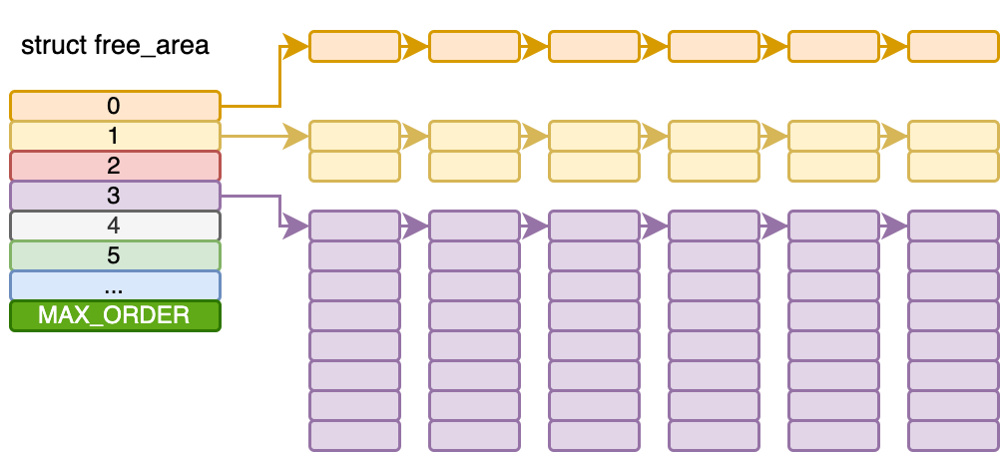
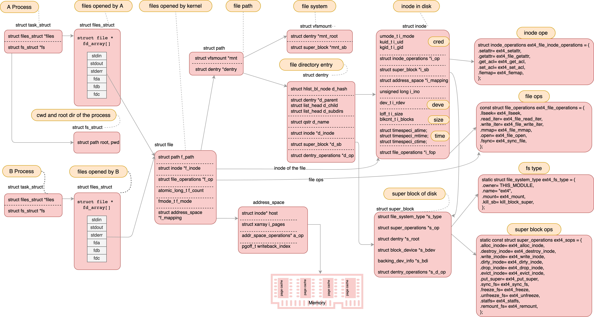
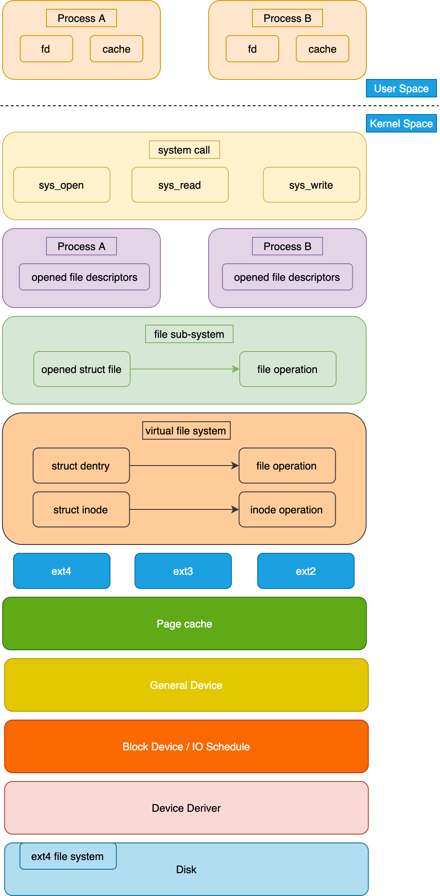
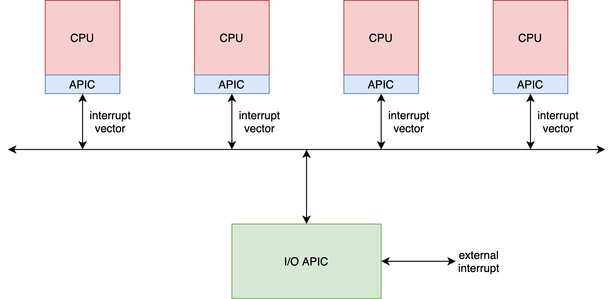
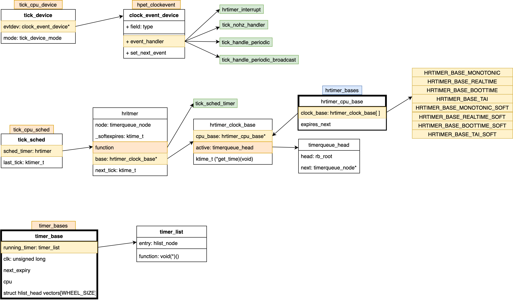

# Table of Contents
* [Init](#Init)
    * [CPU](#cpu)
* [Process Management](#Process-Management)
    * [process](#process)
    * [thread](#thread)
    * [task_struct](#task_struct)
    * [schedule](#schedule)
    * [voluntary schedule](#voluntary-schedule)
    * [preempt schedule](#preempt-schedule)
        * [preempt time](#preempt-time)
            * [clock interrupt](#clock-interrupt)
            * [ttwu](#ttwu)
        * [real user preempt time](#real-user-preempt-time)
            * [return from system call](#return-from-system-call)
            * [return from interrupt](#return-from-interrupt)
        * [real kernel preempt time](#real-kernel-preempt-time)
            * [preempt_enable](#preempt_enble)
            * [return from interrupt](#return-from-interrupt)
    * [wake_up](#wake_up)
    * [wait_woken](#wait_woken)
    * [fork](#fork)
    * [exec](#exec)
* [Memory Management](#Memory-Management)
    * [segment](#segment)
    * [paging](#paging)
    * [user virtual space](#user-virtual-space)
    * [numa](#numa)
        * [node](#node)
        * [zone](#zone)
        * [page](#page)
    * [buddy system](#buddy-system)
    * [alloc_pages](#alloc_pages)
    * [kmem_cache](#kmem_cache)
        * [kmem_cache_create](#kmem_cache_create)
        * [kmem_cache_alloc](#kmem_cache_alloc)
        * [kmem_cache_alloc_node](#kmem_cache_alloc_node)
    * [slab_alloc](#slab_alloc)
    * [kswapd](#kswapd)
    * [brk](#brk)
    * [mmap](#mmap)
    * [page fault](#page-fault)
        * [do_anonymous_page](#do_anonymous_page)
        * [do_fault](#do_fault)
        * [do_swap_page](#do_swap_page)
    * [pgd](#pgd)
    * [kernel mapping](#kernel-mapping)
    * [kmalloc](#kmalloc)
    * [kmap_atomic](#kmap_atomic)
    * [page_address](#page_address)
    * [vmalloc](#vmalloc)
    * [vmalloc_fault](#vmalloc_fault)
* [File Management](#File-Management)
* [Net](#Net)
    * [socket](#socket)
    * [bind](#bind)
    * [listen](#listen)
    * [accept](#accept)
    * [connect](#connect)
        * [send](#send)
        * [receive](#receive)
    * [shutdown](#shutdown)
    * [sk_buf](#sk_buff)
    * [write](#write)
        * [vfs layer](#vfs-layer-WR)
        * [socket layer](#socket-layer-WR)
        * [tcp layer](#tcp-layer-WR)
        * [ip layer](#ip-layer-WR)
            * [route](#route)
            * [fill ip header](#fill-ip-header)
            * [send package](#send-package)
        * [mac layer](#mac-layer-WR)
            * [neighbour](#neighbour)
        * [dev layer](#dev-layer-WR)
        * [driver layer](#driver-layer-WR)
    * [read](#read)
        * [driver layer](#driver-layer)
        * [mac layer](#mac-layer)
        * [ip layer](#ip-layer)
        * [tcp layer](#tcp-layer)
        * [vfs layer](#vfs-layer)
        * [socket layer](#socket-layer])
    * [tcpdump](#tcpdump)
    * [ACK, SYN, FIN](#ACK-SYN-FIN)
        * [tcp_send_ack](#tcp_send_ack)
        * [tcp_send_delayed_ack](#tcp_send_delayed_ack)
        * [tcp_send_synack](#tcp_send_synack)
        * [tcp_send_fin](#tcp_send_fin)
        * [tcp_fin](#tcp_fin)
    * [epoll](#epoll)
        * [epoll_create](#epoll_create)
        * [epoll_ctl](#epoll_ctl)
            * [ep_insert](#ep_insert)
            * [ep_modify](#ep_modify)
            * [ep_delete](#ep_delete)
        * [epoll_wait](#epoll_wait)
        * [wake epoll_wait](#wake-epoll_wait)
* [IO](#IO)
* [IPC](#IPC)
* [Virtualization](#Virtualization)
* [Containerization](#Containerization)
* [Lock](#Lock)
* [Pthread](#Pthread)
    * [pthread_create](#pthread_create)

# Init
### cpu


### bios
* 
* When power on, set CS to 0xFFFF, IP to 0x0000, the first instruction points to 0xFFFF0 within ROM, a JMP comamand will jump to ROM do init work, BIOS starts.
* Then BIOS checks the health state of each hardware.
* Grub2 (Grand Unified Bootloader Version 2)
  * grub2-mkconfig -o /boot/grub2/grub.cfg
    ```
    menuentry 'CentOS Linux (3.10.0-862.el7.x86_64) 7 (Core)' --class centos --class gnu-linux --class gnu --class os --unrestricted $menuentry_id_option 'gnulinux-3.10.0-862.el7.x86_64-advanced-b1aceb95-6b9e-464a-a589-bed66220ebee' {
      load_video
      set gfxpayload=keep
      insmod gzio
      insmod part_msdos
      insmod ext2 set root='hd0,msdos1'
      if [ x$feature_platform_search_hint = xy ]; then
        search --no-floppy --fs-uuid --set=root --hint='hd0,msdos1' b1aceb95-6b9e-464a-a589-bed66220ebee
      else search --no-floppy --fs-uuid --set=root b1aceb95-6b9e-464a-a589-bed66220ebee
      fi

      linux16 /boot/vmlinuz-3.10.0-862.el7.x86_64 root=UUID=b1aceb95-6b9e-464a-a589-bed66220ebee ro console=tty0 console=ttyS0,115200 crashkernel=auto net.ifnames=0 biosdevname=0 rhgb quiet
      initrd16 /boot/initramfs-3.10.0-862.el7.x86_64.img
    }
    ```
  * grub2-install /dev/sda
    * install boot.img into MBR（Master Boot Record), and load boot.img into memory at 0x7c00 to run
    * core.img: diskboot.img, lzma_decompress.img, kernel.img

* ```
  boot.img
    core.img
      diskboot.img // load other modules of grub into memory
        real_to_prot// enable segement, page, open Gate A20
        lzma_decompress.img
        kernel.img // grub's kernel img not Linux kernel
          grub_main // grub's main func
            grub_load_config()
            grub_command_execute ("normal", 0, 0)
              grub_normal_execute()
                grub_show_menu() // show which OS want to run
                  grub_menu_execute_entry()
  ```

### init kernel
```C++
// init/main.c
void start_kernel(void)
{
  /* struct task_struct init_task = INIT_TASK(init_task)
   * #0 process, the only one doesn't created by fork or kernel_thread */
  set_task_stack_end_magic(&init_task);

  /* set_system_intr_gate(IA32_SYSCALL_VECTOR, entry_INT80_32) */
  trap_init();

  /* mnt_init()->init_rootfs() register_filesystem(&rootfs_fs_type) */
  vfs_caches_init()

  mm_init();
  sched_init();
  init_IRQ();
  softirq_init();
  signals_init();
  cpuset_init();
  cgroup_init();

  rest_init()
}

static void rest_init(void)
{
  struct task_struct *tsk;
  int pid;

  pid = kernel_thread(kernel_init, NULL, CLONE_FS);

  pid = kernel_thread(kthreadd, NULL, CLONE_FS | CLONE_FILES);

  complete(&kthreadd_done);

  cpu_startup_entry(CPUHP_ONLINE);
}
```
## Q: sp points to `kernel_init` fn, should't it be ip?
```c++
pid_t kernel_thread(int (*fn)(void *), void *arg, unsigned long flags)
{
  return _do_fork(flags|CLONE_VM|CLONE_UNTRACED, (unsigned long)fn,
    (unsigned long)arg, NULL, NULL, 0);
}

/* return from kernel to user space */
static int kernel_init(void *unused)
{
  if (ramdisk_execute_command) {
    ret = run_init_process(ramdisk_execute_command);
    if (!ret)
      return 0;
  }

  if (execute_command) {
    ret = run_init_process(execute_command);
    if (!ret)
      return 0;
  }

  if (!try_to_run_init_process("/sbin/init") ||
      !try_to_run_init_process("/etc/init") ||
      !try_to_run_init_process("/bin/init") ||
      !try_to_run_init_process("/bin/sh"))
    return 0;
}

static int run_init_process(const char *init_filename)
{
  argv_init[0] = init_filename;
  return do_execve(getname_kernel(init_filename),
    (const char __user *const __user *)argv_init,
    (const char __user *const __user *)envp_init);
}
```


### syscall

#### glibc
```c++
int open(const char *pathname, int flags, mode_t mode)

// syscalls.list
// File name Caller  Syscall name    Args    Strong name    Weak names
      open    -        open          i:siv   __libc_open   __open open
```
```C++
// syscall-template.S
T_PSEUDO (SYSCALL_SYMBOL, SYSCALL_NAME, SYSCALL_NARGS)
    ret
T_PSEUDO_END (SYSCALL_SYMBOL)

#define T_PSEUDO(SYMBOL, NAME, N)    PSEUDO (SYMBOL, NAME, N)

#define PSEUDO(name, syscall_name, args)   \
  .text;                                  \
  ENTRY (name)                            \
    DO_CALL (syscall_name, args);         \
    cmpl $-4095, %eax;                    \
    jae SYSCALL_ERROR_LABEL
```

#### 32
```C++
/* Linux takes system call arguments in registers:
  syscall number  %eax       call-clobbered
  arg 1    %ebx       call-saved
  arg 2    %ecx       call-clobbered
  arg 3    %edx       call-clobbered
  arg 4    %esi       call-saved
  arg 5    %edi       call-saved
  arg 6    %ebp       call-saved */
#define DO_CALL(syscall_name, args) \
    PUSHARGS_##args                \
    DOARGS_##args                  \
    movl $SYS_ify (syscall_name), %eax; \ // get syscall id by syscall_name
    ENTER_KERNEL                        \
    POPARGS_##args

# define ENTER_KERNEL int $0x80

/* trap_init */
set_system_intr_gate(IA32_SYSCALL_VECTOR, entry_INT80_32);

ENTRY(entry_INT80_32)
        ASM_CLAC
        pushl   %eax  /* pt_regs->orig_ax */
        SAVE_ALL pt_regs_ax=$-ENOSYS /* save rest */
        movl    %esp, %eax
        call    do_syscall_32_irqs_on
.Lsyscall_32_done:

.Lirq_return:
  INTERRUPT_RETURN /* iret */

ENDPROC(entry_INT80_32)

static  void do_syscall_32_irqs_on(struct pt_regs *regs)
{
  struct thread_info *ti = current_thread_info();
  unsigned int nr = (unsigned int)regs->orig_ax;

  if (likely(nr < IA32_NR_syscalls)) {
    regs->ax = ia32_sys_call_table[nr](
      (unsigned int)regs->bx, (unsigned int)regs->cx,
      (unsigned int)regs->dx, (unsigned int)regs->si,
      (unsigned int)regs->di, (unsigned int)regs->bp);
  }

  syscall_return_slowpath(regs);
}

inline void syscall_return_slowpath(struct pt_regs *regs)
{
  struct thread_info *ti = current_thread_info();
  u32 cached_flags = READ_ONCE(ti->flags);

  if (IS_ENABLED(CONFIG_PROVE_LOCKING) &&
      WARN(irqs_disabled(), "syscall %ld left IRQs disabled", regs->orig_ax))
    local_irq_enable();

  rseq_syscall(regs);

  if (unlikely(cached_flags & SYSCALL_EXIT_WORK_FLAGS))
    syscall_slow_exit_work(regs, cached_flags);

  local_irq_disable();
  prepare_exit_to_usermode(regs);
}

inline void prepare_exit_to_usermode(struct pt_regs *regs)
{
  struct thread_info *ti = current_thread_info();
  u32 cached_flags;

  addr_limit_user_check();

  cached_flags = READ_ONCE(ti->flags);

  if (unlikely(cached_flags & EXIT_TO_USERMODE_LOOP_FLAGS))
    exit_to_usermode_loop(regs, cached_flags);

  user_enter_irqoff();

  mds_user_clear_cpu_buffers();
}

void exit_to_usermode_loop(struct pt_regs *regs, u32 cached_flags)
{
  while (true) {
    local_irq_enable();

    if (cached_flags & _TIF_NEED_RESCHED)
      schedule();

    if (cached_flags & _TIF_UPROBE)
      uprobe_notify_resume(regs);

    if (cached_flags & _TIF_PATCH_PENDING)
      klp_update_patch_state(current);

    /* deal with pending signal delivery */
    if (cached_flags & _TIF_SIGPENDING)
      do_signal(regs);

    if (cached_flags & _TIF_NOTIFY_RESUME) {
      clear_thread_flag(TIF_NOTIFY_RESUME);
      tracehook_notify_resume(regs);
      rseq_handle_notify_resume(NULL, regs);
    }

    if (cached_flags & _TIF_USER_RETURN_NOTIFY)
      fire_user_return_notifiers();

    /* Disable IRQs and retry */
    local_irq_disable();

    cached_flags = READ_ONCE(current_thread_info()->flags);

    if (!(cached_flags & EXIT_TO_USERMODE_LOOP_FLAGS))
      break;
  }
}
```


#### 64
```C++

/* The Linux/x86-64 kernel expects the system call parameters in
  registers according to the following table:
    syscall number  rax
    arg 1           rdi
    arg 2           rsi
    arg 3           rdx
    arg 4           r10
    arg 5           r8
    arg 6           r9 */
#define DO_CALL(syscall_name, args)  \
  lea SYS_ify (syscall_name), %rax; \
  syscall

/* Moduel Specific Register, trap_init -> cpu_init -> syscall_init */
wrmsrl(MSR_LSTAR, (unsigned long)entry_SYSCALL_64);

ENTRY(entry_SYSCALL_64)
  /* Construct struct pt_regs on stack */
  pushq   $__USER_DS                /* pt_regs->ss */
  pushq   PER_CPU_VAR(rsp_scratch)  /* pt_regs->sp */
  pushq   %r11                      /* pt_regs->flags */
  pushq   $__USER_CS                /* pt_regs->cs */
  pushq   %rcx                      /* pt_regs->ip */
  pushq   %rax                      /* pt_regs->orig_ax */
  pushq   %rdi                      /* pt_regs->di */
  pushq   %rsi                      /* pt_regs->si */
  pushq   %rdx                      /* pt_regs->dx */
  pushq   %rcx                      /* pt_regs->cx */
  pushq   $-ENOSYS                  /* pt_regs->ax */
  pushq   %r8                       /* pt_regs->r8 */
  pushq   %r9                       /* pt_regs->r9 */
  pushq   %r10                      /* pt_regs->r10 */
  pushq   %r11                      /* pt_regs->r11 */
  sub     $(6*8), %rsp              /* pt_regs->bp, bx, r12-15 not saved */
  movq    PER_CPU_VAR(current_task), %r11
  testl   $_TIF_WORK_SYSCALL_ENTRY|_TIF_ALLWORK_MASK, TASK_TI_flags(%r11)
  jnz     entry_SYSCALL64_slow_path

entry_SYSCALL64_slow_path:
  /* IRQs are off. */
  SAVE_EXTRA_REGS
  movq    %rsp, %rdi
  call    do_syscall_64           /* returns with IRQs disabled */

return_from_SYSCALL_64:
  RESTORE_EXTRA_REGS
  TRACE_IRQS_IRETQ
  movq  RCX(%rsp), %rcx
  movq  RIP(%rsp), %r11
  movq  R11(%rsp), %r11

syscall_return_via_sysret:
  /* rcx and r11 are already restored (see code above) */
  RESTORE_C_REGS_EXCEPT_RCX_R11
  movq  RSP(%rsp), %rsp
  USERGS_SYSRET64
END(entry_SYSCALL_64)

#define USERGS_SYSRET64 \
  swapgs;              \
  sysretq;

/* entry_SYSCALL_64 -> entry_SYSCALL64_slow_pat -> do_syscall_64 */
void do_syscall_64(struct pt_regs *regs)
{
  struct thread_info *ti = current_thread_info();
  unsigned long nr = regs->orig_ax;

  if (likely((nr & __SYSCALL_MASK) < NR_syscalls)) {
    regs->ax = sys_call_table[nr & __SYSCALL_MASK] (
      regs->di, regs->si, regs->dx,
      regs->r10, regs->r8, regs->r9
    );
  }

  syscall_return_slowpath(regs);
}
```


# Process Management
### process

```C++
/* compile */
gcc -c -fPIC process.c
gcc -c -fPIC createprocess.c

/* staic lib */
ar cr libstaticprocess.a process.o
/* static link */
gcc -o staticcreateprocess createprocess.o -L. -lstaticprocess

/* dynamic lib */
gcc -shared -fPIC -o libdynamicprocess.so process.o
/* dynamic link LD_LIBRARY_PATH /lib /usr/lib */
gcc -o dynamiccreateprocess createprocess.o -L. -ldynamicprocess
export LD_LIBRARY_PATH=.
```

1. elf: relocatable file


2. elf: executable file


3. elf: shared object


```C++
struct linux_binfmt {
  struct list_head lh;
  struct module *module;
  int (*load_binary)(struct linux_binprm *);
  int (*load_shlib)(struct file *);
  int (*core_dump)(struct coredump_params *cprm);
  unsigned long min_coredump;     /* minimal dump size */
};

static struct linux_binfmt elf_format = {
  .module         = THIS_MODULE,
  .load_binary    = load_elf_binary,
  .load_shlib     = load_elf_library,
  .core_dump      = elf_core_dump,
  .min_coredump   = ELF_EXEC_PAGESIZE,
};

struct linux_binprm {
  char buf[BINPRM_BUF_SIZE];
#ifdef CONFIG_MMU
  struct vm_area_struct *vma;
  unsigned long vma_pages;
#else
# define MAX_ARG_PAGES  32
  struct page *page[MAX_ARG_PAGES];
#endif
  struct mm_struct *mm;
  unsigned long p; /* current top of mem */
  unsigned int
    called_set_creds:1,
    cap_elevated:1,
    secureexec:1;

  unsigned int recursion_depth; /* only for search_binary_handler() */
  struct file * file;
  struct cred *cred;  /* new credentials */
  int unsafe;    /* how unsafe this exec is (mask of LSM_UNSAFE_*) */
  unsigned int per_clear;  /* bits to clear in current->personality */
  int argc, envc;
  const char * filename;  /* Name of binary as seen by procps */
  const char * interp;  /* Name of the binary really executed. Most
           of the time same as filename, but could be
           different for binfmt_{misc,script} */
  unsigned interp_flags;
  unsigned interp_data;
  unsigned long loader, exec;

  struct rlimit rlim_stack; /* Saved RLIMIT_STACK used during exec. */
};

/* do_execve -> do_execveat_common -> exec_binprm -> search_binary_handler */
SYSCALL_DEFINE3(execve,
  const char __user *, filename,
  const char __user *const __user *, argv,
  const char __user *const __user *, envp)
{
  return do_execve(getname(filename), argv, envp);
}
```


### thread


### task_struct


### schedule
```C++
/* Real time schedule: SCHED_FIFO, SCHED_RR, SCHED_DEADLINE
 * Normal schedule: SCHED_NORMAL, SCHED_BATCH, SCHED_IDLE */
#define SCHED_NORMAL    0
#define SCHED_FIFO      1
#define SCHED_RR        2
#define SCHED_BATCH     3
#define SCHED_IDLE      5
#define SCHED_DEADLINE  6

#define MAX_NICE  19
#define MIN_NICE  -20
#define NICE_WIDTH        (MAX_NICE - MIN_NICE + 1)
#define MAX_USER_RT_PRIO  100
#define MAX_RT_PRIO        MAX_USER_RT_PRIO
#define MAX_PRIO          (MAX_RT_PRIO + NICE_WIDTH)
#define DEFAULT_PRIO      (MAX_RT_PRIO + NICE_WIDTH / 2)

struct task_struct {
  struct thread_info thread_info;

  int           on_rq; /* TASK_ON_RQ_{QUEUED, MIGRATING} */

  int           prio;
  int           static_prio;
  int           normal_prio;
  unsigned int  rt_priority;

  const struct sched_class  *sched_class;
  struct sched_entity       se;
  struct sched_rt_entity    rt;
  struct sched_dl_entity    dl;
  struct task_group         *sched_task_group;
  unsigned int              policy;

  /* CPU-specific state of this task: */
  struct thread_struct      thread;
};

struct thread_struct {
  /* Cached TLS descriptors: */
  struct desc_struct  tls_array[GDT_ENTRY_TLS_ENTRIES];
#ifdef CONFIG_X86_32
  unsigned long    sp0;
#endif
  unsigned long    sp;
#ifdef CONFIG_X86_32
  unsigned long    sysenter_cs;
#else
  unsigned short    es;
  unsigned short    ds;
  unsigned short    fsindex;
  unsigned short    gsindex;
#endif

  /* Floating point and extended processor state */
  struct fpu    fpu;
};

struct sched_entity {
  struct load_weight  load;
  struct rb_node      run_node; /* in {cfs, rt, dl}_rq */
  struct list_head    group_node;
  unsigned int        on_rq;
  u64                 exec_start;
  u64                 sum_exec_runtime;
  u64                 vruntime;
  u64                 prev_sum_exec_runtime;
  u64                 nr_migrations;
  struct sched_statistics    statistics;
};

struct rq {
  raw_spinlock_t  lock;
  unsigned int    nr_running;
  unsigned long   cpu_load[CPU_LOAD_IDX_MAX];

  struct load_weight  load;
  unsigned long       nr_load_updates;
  u64                 nr_switches;

  struct cfs_rq cfs;
  struct rt_rq  rt;
  struct dl_rq  dl;
  struct task_struct *curr, *idle, *stop;
};

struct cfs_rq {
  struct load_weight load;
  unsigned int nr_running, h_nr_running;

  u64 exec_clock;
  u64 min_vruntime;
#ifndef CONFIG_64BIT
  u64 min_vruntime_copy;
#endif
  struct rb_root tasks_timeline;
  struct rb_node *rb_leftmost;

  struct sched_entity *curr, *next, *last, *skip;
};
```


```C++
struct sched_class {
  const struct sched_class *next;

  void (*enqueue_task) (struct rq *rq, struct task_struct *p, int flags);
  void (*dequeue_task) (struct rq *rq, struct task_struct *p, int flags);
  void (*yield_task) (struct rq *rq);
  bool (*yield_to_task) (struct rq *rq, struct task_struct *p, bool preempt);

  void (*check_preempt_curr) (struct rq *rq, struct task_struct *p, int flags);

  struct task_struct * (*pick_next_task) (struct rq *rq,
            struct task_struct *prev,
            struct rq_flags *rf);
  void (*put_prev_task) (struct rq *rq, struct task_struct *p);

  void (*set_curr_task) (struct rq *rq);
  void (*task_tick) (struct rq *rq, struct task_struct *p, int queued);
  void (*task_fork) (struct task_struct *p);
  void (*task_dead) (struct task_struct *p);

  void (*switched_from) (struct rq *this_rq, struct task_struct *task);
  void (*switched_to) (struct rq *this_rq, struct task_struct *task);
  void (*prio_changed) (struct rq *this_rq, struct task_struct *task, int oldprio);
  unsigned int (*get_rr_interval) (struct rq *rq,
           struct task_struct *task);
  void (*update_curr) (struct rq *rq);
};

extern const struct sched_class stop_sched_class;
extern const struct sched_class dl_sched_class;
extern const struct sched_class rt_sched_class;
extern const struct sched_class fair_sched_class;
extern const struct sched_class idle_sched_class;
/* stop_sched_class: highest priority process, will interrupt others
 * dl_sched_class: for deadline
 * rt_sched_class: for RR or FIFO, depend on task_struct->policy
 * fair_sched_class: for normal processes
 * idle_sched_class: idle */

const struct sched_class fair_sched_class = {
  .next               = &idle_sched_class,
  .enqueue_task       = enqueue_task_fair,
  .dequeue_task       = dequeue_task_fair,
  .yield_task         = yield_task_fair,
  .yield_to_task      = yield_to_task_fair,
  .check_preempt_curr = check_preempt_wakeup,
  .pick_next_task     = pick_next_task_fair
};
```


#### voluntary schedule
```c++
void schedule(void)
{
  struct task_struct *tsk = current;

  sched_submit_work(tsk);
  do {
    preempt_disable();
    __schedule(false);
    sched_preempt_enable_no_resched();
  } while (need_resched());
}

/* __schedule() is the main scheduler function.
 *
 * The main means of driving the scheduler and thus entering this function are:
 *   1. Explicit blocking: mutex, semaphore, waitqueue, sleep(sk_wait_data), etc.
 *   2. TIF_NEED_RESCHED flag is checked on interrupt and userspace return paths.
 *   3. Wakeups don't really cause entry into schedule(). They add a
 *      task to the run-queue and that's it.
 * WARNING: must be called with preemption disabled! */
static void __sched notrace __schedule(bool preempt)
{
  struct task_struct *prev, *next;
  unsigned long *switch_count;
  struct rq_flags rf;
  struct rq *rq;
  int cpu;

  cpu = smp_processor_id();
  rq = cpu_rq(cpu);
  prev = rq->curr;

  next = pick_next_task(rq, prev, &rf);
  clear_tsk_need_resched(prev);
  clear_preempt_need_resched();

  if (likely(prev != next)) {
    rq->nr_switches++;
    rq->curr = next;
    ++*switch_count;

    rq = context_switch(rq, prev, next, &rf);
  }
}

static inline struct task_struct* pick_next_task(
  struct rq *rq, struct task_struct *prev, struct rq_flags *rf)
{
  const struct sched_class *class;
  struct task_struct *p;

  if (likely((prev->sched_class == &idle_sched_class ||
        prev->sched_class == &fair_sched_class) &&
       rq->nr_running == rq->cfs.h_nr_running)) {

    p = fair_sched_class.pick_next_task(rq, prev, rf);
    if (unlikely(p == RETRY_TASK))
      goto again;
    /* Assumes fair_sched_class->next == idle_sched_class */
    if (unlikely(!p))
      p = idle_sched_class.pick_next_task(rq, prev, rf);
    return p;
  }

again:
  for_each_class(class) {
    p = class->pick_next_task(rq, prev, rf);
    if (p) {
      if (unlikely(p == RETRY_TASK))
        goto again;
      return p;
    }
  }
}

/* fair_sched_class */
static struct task_struct* pick_next_task_fair(
  struct rq *rq, struct task_struct *prev, struct rq_flags *rf)
{
  struct cfs_rq *cfs_rq = &rq->cfs;
  struct sched_entity *se;
  struct task_struct *p;
  int new_tasks;

  struct sched_entity *curr = cfs_rq->curr;
  if (curr) {
    if (curr->on_rq)
      update_curr(cfs_rq);
    else
      curr = NULL;
  }

  se = pick_next_entity(cfs_rq, curr);
  p = task_of(se);
  if (prev != p) {
    struct sched_entity *pse = &prev->se;
    put_prev_entity(cfs_rq, pse);
    set_next_entity(cfs_rq, se);
  }

  return p;
}

static struct rq* context_switch(
  struct rq *rq, struct task_struct *prev,
  struct task_struct *next, struct rq_flags *rf)
{
  struct mm_struct *mm, *oldmm;
  mm = next->mm;
  oldmm = prev->active_mm;
  /* 1. swtich user stack
   * user esp, eip switched when returning to user space */
  switch_mm_irqs_off(oldmm, mm, next);

  /* Here we just switch the register state and the stack. */
  switch_to(prev, next, prev);
  barrier();
  return finish_task_switch(prev);
}

void switch_mm_irqs_off(struct mm_struct *prev, struct mm_struct *next,
      struct task_struct *tsk)
{
  struct mm_struct *real_prev = this_cpu_read(cpu_tlbstate.loaded_mm);
  u16 prev_asid = this_cpu_read(cpu_tlbstate.loaded_mm_asid);
  unsigned cpu = smp_processor_id();
  u64 next_tlb_gen;

  if (real_prev == next) {
    return;
  } else {
    u16 new_asid;
    bool need_flush;
    choose_new_asid(next, next_tlb_gen, &new_asid, &need_flush);

    /* Let nmi_uaccess_okay() know that we're changing CR3. */
    this_cpu_write(cpu_tlbstate.loaded_mm, LOADED_MM_SWITCHING);
    barrier();

    if (need_flush) {
      this_cpu_write(cpu_tlbstate.ctxs[new_asid].ctx_id, next->context.ctx_id);
      this_cpu_write(cpu_tlbstate.ctxs[new_asid].tlb_gen, next_tlb_gen);
      load_new_mm_cr3(next->pgd, new_asid, true);
    } else {
      load_new_mm_cr3(next->pgd, new_asid, false);
    }

    /* Make sure we write CR3 before loaded_mm. */
    barrier();

    this_cpu_write(cpu_tlbstate.loaded_mm, next);
    this_cpu_write(cpu_tlbstate.loaded_mm_asid, new_asid);
  }

  load_mm_cr4(next);
  switch_ldt(real_prev, next);
}

#define switch_to(prev, next, last) \
do {                  \
  prepare_switch_to(prev, next);  \
  /* 2. switch kernel esp, stack */
  ((last) = __switch_to_asm((prev), (next))); \
} while (0)

/* %eax: prev task
 * %edx: next task */
ENTRY(__switch_to_asm)
  /* Save callee-saved registers
   * This must match the order in struct inactive_task_frame */
  pushl  %ebp
  pushl  %ebx
  pushl  %edi
  pushl  %esi
  pushfl

  /* 2.1 switch kernel sp
   * save old value from esp to prev task
   * load new value from thread_struct of next task to esp */
  movl  %esp, TASK_threadsp(%eax)
  movl  TASK_threadsp(%edx), %esp

  /* restore callee-saved registers */
  popfl
  popl  %esi
  popl  %edi
  popl  %ebx
  popl  %ebp

  /* 2.2. switch kernel stack */
  jmp  __switch_to

END(__switch_to_asm)

struct task_struct * __switch_to(
  struct task_struct *prev_p, struct task_struct *next_p)
{
  struct thread_struct *prev = &prev_p->thread;
  struct thread_struct *next = &next_p->thread;
  int cpu = smp_processor_id();

  load_TLS(next, cpu);

  /* 3. swtich kernel stack */
  this_cpu_write(current_task, next_p);

  /* 4. load new thread_stuct from next task
   * TSS(Task State Segment) TR(Task Register) */
  struct tss_struct *tss = &per_cpu(cpu_tss, cpu);
  /* Reload esp0 and ss1.  This changes current_thread_info(). */
  load_sp0(tss, next);

  return prev_p;
}

/* switch tasks from x to y */
struct task_struct * __switch_to(
  struct task_struct *prev_p, struct task_struct *next_p)
{
  struct thread_struct *prev = &prev_p->thread;
  struct thread_struct *next = &next_p->thread;
  struct fpu *prev_fpu = &prev->fpu;
  struct fpu *next_fpu = &next->fpu;
  int cpu = smp_processor_id();

  switch_fpu_prepare(prev_fpu, cpu);

  /* We must save %fs and %gs before load_TLS() because
   * %fs and %gs may be cleared by load_TLS().
   *
   * (e.g. xen_load_tls()) */
  save_fsgs(prev_p);

  /* Load TLS before restoring any segments so that segment loads
   * reference the correct GDT entries. */
  load_TLS(next, cpu);

  /* Leave lazy mode, flushing any hypercalls made here.  This
   * must be done after loading TLS entries in the GDT but before
   * loading segments that might reference them, and and it must
   * be done before fpu__restore(), so the TS bit is up to
   * date. */
  arch_end_context_switch(next_p);

  /* Switch DS and ES.
   *
   * Reading them only returns the selectors, but writing them (if
   * nonzero) loads the full descriptor from the GDT or LDT.  The
   * LDT for next is loaded in switch_mm, and the GDT is loaded
   * above.
   *
   * We therefore need to write new values to the segment
   * registers on every context switch unless both the new and old
   * values are zero.
   *
   * Note that we don't need to do anything for CS and SS, as
   * those are saved and restored as part of pt_regs. */
  savesegment(es, prev->es);
  if (unlikely(next->es | prev->es))
    loadsegment(es, next->es);

  savesegment(ds, prev->ds);
  if (unlikely(next->ds | prev->ds))
    loadsegment(ds, next->ds);

  load_seg_legacy(prev->fsindex, prev->fsbase,
      next->fsindex, next->fsbase, FS);
  load_seg_legacy(prev->gsindex, prev->gsbase,
      next->gsindex, next->gsbase, GS);

  switch_fpu_finish(next_fpu, cpu);

  /* Switch the PDA and FPU contexts. */
  this_cpu_write(current_task, next_p);
  this_cpu_write(cpu_current_top_of_stack, task_top_of_stack(next_p));

  /* Reload sp0. */
  update_task_stack(next_p);

  switch_to_extra(prev_p, next_p);

  /* Load the Intel cache allocation PQR MSR. */
  intel_rdt_sched_in();

  return prev_p;
}

/* This is used when switching tasks or entering/exiting vm86 mode. */
static inline void update_task_stack(struct task_struct *task)
{
  /* sp0 always points to the entry trampoline stack, which is constant: */
#ifdef CONFIG_X86_32
  if (static_cpu_has(X86_FEATURE_XENPV))
    load_sp0(task->thread.sp0);
  else
    this_cpu_write(cpu_tss_rw.x86_tss.sp1, task->thread.sp0);
#else
  if (static_cpu_has(X86_FEATURE_XENPV))
    load_sp0(task_top_of_stack(task));
#endif
}

void cpu_init(void)
{
  int cpu = smp_processor_id();
  struct task_struct *curr = current;
  struct tss_struct *tss = &per_cpu(cpu_tss, cpu);
  load_sp0(tss, thread);
  set_tss_desc(cpu, tss);
  load_TR_desc();
}

struct tss_struct {
  struct x86_hw_tss  x86_tss;
  unsigned long    io_bitmap[IO_BITMAP_LONGS + 1];
}
```


```C++
schedule(void)
    __schedule(false), // kernel/sched/core.c
        pick_next_task(rq, prev, &rf);
        context_switch(rq, prev, next, &rf);
            switch_mm_irqs_off(prev->active_mm, next->mm, next) {
              load_new_mm_cr3()
            }
            switch_to(prev, next, prev);
                __switch_to_asm(); // switch registers, but not EIP [arch/x86/entry/entry_64.S]
                    __switch_to(); // switch stack [arch/x86/kernel/process_32.c]
                        this_cpu_write(current_task, next_p); //
            barrier();
            return finish_task_switch(prev);
```


#### preempt schedule
##### preempt time
###### Clock interrupt
```C++
void scheduler_tick(void)
{
  int cpu = smp_processor_id();
  struct rq *rq = cpu_rq(cpu);
  struct task_struct *curr = rq->curr;

  curr->sched_class->task_tick(rq, curr, 0);
  cpu_load_update_active(rq);
  calc_global_load_tick(rq);
}

static void task_tick_fair(struct rq *rq, struct task_struct *curr, int queued)
{
  struct cfs_rq *cfs_rq;
  struct sched_entity *se = &curr->se;

  for_each_sched_entity(se) {
    cfs_rq = cfs_rq_of(se);
    entity_tick(cfs_rq, se, queued);
  }
}

static void entity_tick(struct cfs_rq *cfs_rq, struct sched_entity *curr, int queued)
{
  update_curr(cfs_rq);
  update_load_avg(curr, UPDATE_TG);
  update_cfs_shares(curr);

  if (cfs_rq->nr_running > 1)
    check_preempt_tick(cfs_rq, curr);
}

static void check_preempt_tick(struct cfs_rq *cfs_rq, struct sched_entity *curr)
{
  unsigned long ideal_runtime, delta_exec;
  struct sched_entity *se;
  s64 delta;

  ideal_runtime = sched_slice(cfs_rq, curr);
  delta_exec = curr->sum_exec_runtime - curr->prev_sum_exec_runtime;
  if (delta_exec > ideal_runtime) {
    resched_curr(rq_of(cfs_rq));
    return;
  }

  se = __pick_first_entity(cfs_rq);
  delta = curr->vruntime - se->vruntime;
  if (delta < 0)
    return;
  if (delta > ideal_runtime)
    resched_curr(rq_of(cfs_rq));
}

/* resched_curr -> */
static inline void set_tsk_need_resched(struct task_struct *tsk)
{
  /* just mark thread with TIF_NEED_RESCHED */
  set_tsk_thread_flag(tsk,TIF_NEED_RESCHED);
}
```

###### ttwu
```C++
/* try_to_wake_up -> ttwu_queue -> ttwu_do_activate -> ttwu_do_wakeup
* -> check_preempt_curr -> resched_curr */
static int try_to_wake_up(
  struct task_struct *p, unsigned int state, int wake_flags)
{
  unsigned long flags;
  int cpu, success = 0;

  success = 1;
  cpu = task_cpu(p);

  p->sched_contributes_to_load = !!task_contributes_to_load(p);
  p->state = TASK_WAKING;

  if (p->in_iowait) {
    delayacct_blkio_end(p);
    atomic_dec(&task_rq(p)->nr_iowait);
  }

  cpu = select_task_rq(p, p->wake_cpu, SD_BALANCE_WAKE, wake_flags);
  if (task_cpu(p) != cpu) {
    wake_flags |= WF_MIGRATED;
    set_task_cpu(p, cpu);
  }

  ttwu_queue(p, cpu, wake_flags);
stat:
  ttwu_stat(p, cpu, wake_flags);
out:
  raw_spin_unlock_irqrestore(&p->pi_lock, flags);

  return success;
}

static void ttwu_queue(struct task_struct *p, int cpu, int wake_flags)
{
  struct rq *rq = cpu_rq(cpu);
  struct rq_flags rf;

  rq_lock(rq, &rf);
  update_rq_clock(rq);
  ttwu_do_activate(rq, p, wake_flags, &rf);
  rq_unlock(rq, &rf);
}

static void ttwu_do_activate(
  struct rq *rq, struct task_struct *p,
  int wake_flags, struct rq_flags *rf)
{
  int en_flags = ENQUEUE_WAKEUP | ENQUEUE_NOCLOCK;

  lockdep_assert_held(&rq->lock);

  /* 1. insert p into rq */
  ttwu_activate(rq, p, en_flags);
  /* 2. check schedule curr */
  ttwu_do_wakeup(rq, p, wake_flags, rf);
}

static inline void ttwu_activate(
  struct rq *rq, struct task_struct *p, int en_flags)
{
  activate_task(rq, p, en_flags);
  p->on_rq = TASK_ON_RQ_QUEUED;

  /* If a worker is waking up, notify the workqueue: */
  if (p->flags & PF_WQ_WORKER)
    wq_worker_waking_up(p, cpu_of(rq));
}

void activate_task(struct rq *rq, struct task_struct *p, int flags)
{
  if (task_contributes_to_load(p))
    rq->nr_uninterruptible--;

  enqueue_task(rq, p, flags);
}

static inline void enqueue_task(
  struct rq *rq, struct task_struct *p, int flags)
{
  if (!(flags & ENQUEUE_NOCLOCK))
    update_rq_clock(rq);

  if (!(flags & ENQUEUE_RESTORE))
    sched_info_queued(rq, p);

  p->sched_class->enqueue_task(rq, p, flags);
}

static void ttwu_do_wakeup(
  struct rq *rq, struct task_struct *p,
  int wake_flags, struct rq_flags *rf)
{
  check_preempt_curr(rq, p, wake_flags);
  p->state = TASK_RUNNING;
  trace_sched_wakeup(p);
}

void check_preempt_curr(struct rq *rq, struct task_struct *p, int flags)
{
  const struct sched_class *class;

  if (p->sched_class == rq->curr->sched_class) {
    rq->curr->sched_class->check_preempt_curr(rq, p, flags);
  } else {
    for_each_class(class) {
      if (class == rq->curr->sched_class)
        break;
      if (class == p->sched_class) {
        resched_curr(rq);
        break;
      }
    }
  }

  if (task_on_rq_queued(rq->curr) && test_tsk_need_resched(rq->curr))
    rq_clock_skip_update(rq);
}

void resched_curr(struct rq *rq)
{
  struct task_struct *curr = rq->curr;
  int cpu;

  if (test_tsk_need_resched(curr))
    return;

  cpu = cpu_of(rq);

  if (cpu == smp_processor_id()) {
    set_tsk_need_resched(curr);
    set_preempt_need_resched();
    return;
  }

  if (set_nr_and_not_polling(curr))
    smp_send_reschedule(cpu);
  else
    trace_sched_wake_idle_without_ipi(cpu);
}
```

##### real user preempt time
###### return from system call
```C++
/* do_syscall_64 -> syscall_return_slowpath
 * -> prepare_exit_to_usermode -> exit_to_usermode_loop */
static void exit_to_usermode_loop(struct pt_regs *regs, u32 cached_flags)
{
  while (true) {
    local_irq_enable();

    if (cached_flags & _TIF_NEED_RESCHED)
      schedule();

    if (cached_flags & _TIF_SIGPENDING)
      do_signal(regs);
  }
}
```

###### return from interrupt
```C++
/* do_IRQ -> retint_user -> prepare_exit_to_usermode -> exit_to_usermode_loop */
common_interrupt:
        ASM_CLAC
        addq    $-0x80, (%rsp)
        interrupt do_IRQ
ret_from_intr:
        popq    %rsp
        testb   $3, CS(%rsp)
        jz      retint_kernel

/* Interrupt came from user space */
GLOBAL(retint_user)
        mov     %rsp,%rdi
        call    prepare_exit_to_usermode
        TRACE_IRQS_IRETQ
        SWAPGS
        jmp     restore_regs_and_iret

/* Returning to kernel space */
retint_kernel:
#ifdef CONFIG_PREEMPT
        bt      $9, EFLAGS(%rsp)
        jnc     1f
0:      cmpl    $0, PER_CPU_VAR(__preempt_count)
        jnz     1f
        call    preempt_schedule_irq
        jmp     0b
```

##### real kernel preempt time
###### preempt_enble
```C++
#define preempt_enable() \
do { \
  if (unlikely(preempt_count_dec_and_test())) \
    __preempt_schedule(); \
} while (0)

#define preempt_count_dec_and_test() \
  ({ preempt_count_sub(1); should_resched(0); })

static  bool should_resched(int preempt_offset)
{
  return unlikely(preempt_count() == preempt_offset &&
      tif_need_resched());
}

#define tif_need_resched() test_thread_flag(TIF_NEED_RESCHED)

/* __preempt_schedule -> */
static void __sched notrace preempt_schedule_common(void)
{
  do {
    __schedule(true);
  } while (need_resched());
}
```

###### return from interrupt
```C++
/* do_IRQ -> retint_kernel */
asmlinkage __visible void __sched preempt_schedule_irq(void)
{
  do {
    preempt_disable();
    local_irq_enable();
    __schedule(true);
    local_irq_disable();
    sched_preempt_enable_no_resched();
  } while (need_resched());
}
```


#### Q
1. A process waits on a block operation (mutex, semphore, waitqueue), it calls schedule(). Will it be removed from rq, and add to rq when block operation wakeups?
2. What's difference between contex_switch and sleep_wakeup?

### wake_up
```c++
#define wake_up(x)                        __wake_up(x, TASK_NORMAL, 1, NULL)
#define wake_up_nr(x, nr)                 __wake_up(x, TASK_NORMAL, nr, NULL)
#define wake_up_all(x)                    __wake_up(x, TASK_NORMAL, 0, NULL)
#define wake_up_locked(x)                 __wake_up_locked((x), TASK_NORMAL, 1)
#define wake_up_all_locked(x)             __wake_up_locked((x), TASK_NORMAL, 0)

#define wake_up_interruptible(x)          __wake_up(x, TASK_INTERRUPTIBLE, 1, NULL)
#define wake_up_interruptible_nr(x, nr)   __wake_up(x, TASK_INTERRUPTIBLE, nr, NULL)
#define wake_up_interruptible_all(x)      __wake_up(x, TASK_INTERRUPTIBLE, 0, NULL)
#define wake_up_interruptible_sync(x)     __wake_up_sync((x), TASK_INTERRUPTIBLE, 1)

void __wake_up(
  struct wait_queue_head *wq_head, unsigned int mode,
  int nr_exclusive, void *key)
{
  __wake_up_common_lock(wq_head, mode, nr_exclusive, 0, key);
}

static void __wake_up_common_lock(struct wait_queue_head *wq_head, unsigned int mode,
      int nr_exclusive, int wake_flags, void *key)
{
  unsigned long flags;
  wait_queue_entry_t bookmark;

  bookmark.flags = 0;
  bookmark.private = NULL;
  bookmark.func = NULL;
  INIT_LIST_HEAD(&bookmark.entry);

  spin_lock_irqsave(&wq_head->lock, flags);
  nr_exclusive = __wake_up_common(wq_head, mode, nr_exclusive, wake_flags, key, &bookmark);
  spin_unlock_irqrestore(&wq_head->lock, flags);

  while (bookmark.flags & WQ_FLAG_BOOKMARK) {
    spin_lock_irqsave(&wq_head->lock, flags);
    nr_exclusive = __wake_up_common(wq_head, mode, nr_exclusive, wake_flags, key, &bookmark);
    spin_unlock_irqrestore(&wq_head->lock, flags);
  }
}

static int __wake_up_common(
  struct wait_queue_head *wq_head, unsigned int mode,
  int nr_exclusive, int wake_flags, void *key,
  wait_queue_entry_t *bookmark)
{
  wait_queue_entry_t *curr, *next;
  int cnt = 0;

  lockdep_assert_held(&wq_head->lock);

  if (bookmark && (bookmark->flags & WQ_FLAG_BOOKMARK)) {
    curr = list_next_entry(bookmark, entry);

    list_del(&bookmark->entry);
    bookmark->flags = 0;
  } else
    curr = list_first_entry(&wq_head->head, wait_queue_entry_t, entry);

  if (&curr->entry == &wq_head->head)
    return nr_exclusive;

  list_for_each_entry_safe_from(curr, next, &wq_head->head, entry) {
    unsigned flags = curr->flags;
    int ret;

    if (flags & WQ_FLAG_BOOKMARK)
      continue;

    /* ep_poll_callback, default_wake_func, woken_wake_function */
    ret = curr->func(curr, mode, wake_flags, key);
    if (ret < 0)
      break;
    /* WQ_FLAG_EXCLUSIVE : fix thunderbird problem */
    if (ret && (flags & WQ_FLAG_EXCLUSIVE) && !--nr_exclusive)
      break;

    if (bookmark && (++cnt > WAITQUEUE_WALK_BREAK_CNT) 
      && (&next->entry != &wq_head->head))
    {
      bookmark->flags = WQ_FLAG_BOOKMARK;
      list_add_tail(&bookmark->entry, &next->entry);
      break;
    }
  }

  return nr_exclusive;
}
```

### wait_woken
```c++
long wait_woken(struct wait_queue_entry *wq_entry, unsigned mode, long timeout)
{
  /* The below executes an smp_mb(), which matches with the full barrier
   * executed by the try_to_wake_up() in woken_wake_function() such that
   * either we see the store to wq_entry->flags in woken_wake_function()
   * or woken_wake_function() sees our store to current->state. */
  set_current_state(mode); /* A */
  if (!(wq_entry->flags & WQ_FLAG_WOKEN) && !is_kthread_should_stop())
    timeout = schedule_timeout(timeout);
  __set_current_state(TASK_RUNNING);

  /* The below executes an smp_mb(), which matches with the smp_mb() (C)
   * in woken_wake_function() such that either we see the wait condition
   * being true or the store to wq_entry->flags in woken_wake_function()
   * follows ours in the coherence order. */
  smp_store_mb(wq_entry->flags, wq_entry->flags & ~WQ_FLAG_WOKEN); /* B */

  return timeout;
}

int woken_wake_function(
  struct wait_queue_entry *wq_entry, unsigned mode, int sync, void *key)
{
  /* Pairs with the smp_store_mb() in wait_woken(). */
  smp_mb(); /* C */
  wq_entry->flags |= WQ_FLAG_WOKEN;

  return default_wake_function(wq_entry, mode, sync, key);
}

int default_wake_function(
  wait_queue_entry_t *curr, unsigned mode, int wake_flags, void *key)
{
  return try_to_wake_up(curr->private, mode, wake_flags);
}

/* wait_queue_entry::flags */
#define WQ_FLAG_EXCLUSIVE  0x01
#define WQ_FLAG_WOKEN      0x02
#define WQ_FLAG_BOOKMARK   0x04

struct wait_queue_entry {
  unsigned int      flags;
  void              *private; /* struct_task */
  wait_queue_func_t func;
  struct list_head  entry;
};
```

### fork
```C++
SYSCALL_DEFINE0(fork)
{
  return _do_fork(SIGCHLD, 0, 0, NULL, NULL, 0);
}

long _do_fork(
  unsigned long clone_flags,
  unsigned long stack_start,
  unsigned long stack_size,
  int __user *parent_tidptr,
  int __user *child_tidptr,
  unsigned long tls)
{
  struct task_struct *p;
  int trace = 0;
  long nr;

  p = copy_process(clone_flags, stack_start, stack_size,
    child_tidptr, NULL, trace, tls, NUMA_NO_NODE);

  if (IS_ERR(p))
    return PTR_ERR(p);

  struct pid *pid;
  pid = get_task_pid(p, PIDTYPE_PID);
  nr = pid_vnr(pid);

  if (clone_flags & CLONE_PARENT_SETTID)
    put_user(nr, parent_tidptr);

  wake_up_new_task(p);

  put_pid(pid);

  return nr;
}

/* copy_process -> sched_fork -> task_fork -> */
static void task_fork_fair(struct task_struct *p)
{
  /* default off, for bash bug and better use TLB and cache */
  if (sysctl_sched_child_runs_first && curr && entity_before(curr, se)) {
    swap(curr->vruntime, se->vruntime);
    resched_curr(rq);
  }

  se->vruntime -= cfs_rq->min_vruntime;
}

void wake_up_new_task(struct task_struct *p)
{
  struct rq_flags rf;
  struct rq *rq;

  p->state = TASK_RUNNING;

  activate_task(rq, p, ENQUEUE_NOCLOCK);
  p->on_rq = TASK_ON_RQ_QUEUED;
  trace_sched_wakeup_new(p);
  check_preempt_curr(rq, p, WF_FORK);
}

void check_preempt_curr(struct rq *rq, struct task_struct *p, int flags)
{
  const struct sched_class *class;

  if (p->sched_class == rq->curr->sched_class) {
    rq->curr->sched_class->check_preempt_curr(rq, p, flags);
  } else {
    for_each_class(class) {
      if (class == rq->curr->sched_class)
        break;
      if (class == p->sched_class) {
        resched_curr(rq);
        break;
      }
    }
  }

  if (task_on_rq_queued(rq->curr) && test_tsk_need_resched(rq->curr))
    rq_clock_skip_update(rq);
}

/* fair_sched_class.check_preempt_wakeup */
static void check_preempt_wakeup(struct rq *rq, struct task_struct *p, int wake_flags)
{
  struct task_struct *curr = rq->curr;
  struct sched_entity *se = &curr->se, *pse = &p->se;
  struct cfs_rq *cfs_rq = task_cfs_rq(curr);

  if (test_tsk_need_resched(curr))
    return;

  find_matching_se(&se, &pse);
  update_curr(cfs_rq_of(se));
  if (wakeup_preempt_entity(se, pse) == 1) {
    goto preempt;
  }
  return;
preempt:
  resched_curr(rq);
}

```


### exec
```C++
int do_execve(struct filename *filename,
  const char __user *const __user *__argv,
  const char __user *const __user *__envp)
{
  struct user_arg_ptr argv = { .ptr.native = __argv };
  struct user_arg_ptr envp = { .ptr.native = __envp };
  return do_execveat_common(AT_FDCWD, filename, argv, envp, 0);
}

static int do_execveat_common(
  int fd, struct filename *filename,
  struct user_arg_ptr argv,
  struct user_arg_ptr envp, int flags)
{
  return __do_execve_file(fd, filename, argv, envp, flags, NULL);
}

static int __do_execve_file(
  int fd, struct filename *filename,
  struct user_arg_ptr argv,
  struct user_arg_ptr envp,
  int flags, struct file *file)
{
  char *pathbuf = NULL;
  struct linux_binprm *bprm;
  struct files_struct *displaced;
  int retval;

  retval = -ENOMEM;
  bprm = kzalloc(sizeof(*bprm), GFP_KERNEL);
  retval = prepare_bprm_creds(bprm);

  if (!file)
    file = do_open_execat(fd, filename, flags);

  sched_exec();

  bprm->file = file;
  if (!filename) {
    bprm->filename = "none";
  } else if (fd == AT_FDCWD || filename->name[0] == '/') {
    bprm->filename = filename->name;
  } else {
    if (filename->name[0] == '\0')
      pathbuf = kasprintf(GFP_KERNEL, "/dev/fd/%d", fd);
    else
      pathbuf = kasprintf(GFP_KERNEL, "/dev/fd/%d/%s",
              fd, filename->name);
    if (close_on_exec(fd, rcu_dereference_raw(current->files->fdt)))
      bprm->interp_flags |= BINPRM_FLAGS_PATH_INACCESSIBLE;

    bprm->filename = pathbuf;
  }

  bprm->interp = bprm->filename;

  bprm_mm_init(bprm);

  bprm->argc = count(argv, MAX_ARG_STRINGS);
  bprm->envc = count(envp, MAX_ARG_STRINGS);

  /* Fill the binprm structure from the inode */
  prepare_binprm(bprm);

  bprm->exec = bprm->p;

  retval = exec_binprm(bprm);

  /* execve succeeded */
  current->fs->in_exec = 0;
  current->in_execve = 0;
  membarrier_execve(current);
  rseq_execve(current);
  acct_update_integrals(current);
  task_numa_free(current, false);
  free_bprm(bprm);
  kfree(pathbuf);
  if (filename)
    putname(filename);
  if (displaced)
    put_files_struct(displaced);

  return retval;
}

static int exec_binprm(struct linux_binprm *bprm)
{
  pid_t old_pid, old_vpid;
  int ret;

  /* Need to fetch pid before load_binary changes it */
  old_pid = current->pid;
  rcu_read_lock();
  old_vpid = task_pid_nr_ns(current, task_active_pid_ns(current->parent));
  rcu_read_unlock();

  ret = search_binary_handler(bprm);
  if (ret >= 0) {
    audit_bprm(bprm);
    trace_sched_process_exec(current, old_pid, bprm);
    ptrace_event(PTRACE_EVENT_EXEC, old_vpid);
    proc_exec_connector(current);
  }

  return ret;
}

int search_binary_handler(struct linux_binprm *bprm)
{
  bool need_retry = IS_ENABLED(CONFIG_MODULES);
  struct linux_binfmt *fmt;
  int retval;
  retval = -ENOENT;

 retry:
  read_lock(&binfmt_lock);
  list_for_each_entry(fmt, &formats, lh) {
    if (!try_module_get(fmt->module))
      continue;
    read_unlock(&binfmt_lock);
    retval = fmt->load_binary(bprm);
    if (retval < 0 && !bprm->mm)
      return retval;
  }
  read_unlock(&binfmt_lock);

  return retval;
}

static struct linux_binfmt elf_format = {
  .module       = THIS_MODULE,
  .load_binary  = load_elf_binary,
  .load_shlib   = load_elf_library,
  .core_dump    = elf_core_dump,
  .min_coredump = ELF_EXEC_PAGESIZE,
};

static int load_elf_binary(struct linux_binprm *bprm)
{
  struct {
    struct elfhdr elf_ex;
    struct elfhdr interp_elf_ex;
  } *loc;

  struct pt_regs *regs = current_pt_regs();
  loc = kmalloc(sizeof(*loc), GFP_KERNEL);
  loc->elf_ex = *((struct elfhdr *)bprm->buf);

  if (memcmp(loc->elf_ex.e_ident, ELFMAG, SELFMAG) != 0)
    goto out;
  if (loc->elf_ex.e_type != ET_EXEC && loc->elf_ex.e_type != ET_DYN)
    goto out;

  elf_phdata = load_elf_phdrs(&loc->elf_ex, bprm->file);

  /* set mmap_base */
  setup_new_exec(bprm);

  /*set stack vm_area_struct */
  retval = setup_arg_pages(bprm, randomize_stack_top(STACK_TOP),
         executable_stack);

  /* mmap part code into memory */
  error = elf_map(bprm->file, load_bias + vaddr, elf_ppnt,
        elf_prot, elf_flags, total_size);

  /* set heap vm_area_struct */
  retval = set_brk(elf_bss, elf_brk, bss_prot);

  /* load shared objects into memory */
  elf_entry = load_elf_interp(&loc->interp_elf_ex,
              interpreter,
              &interp_map_addr,
              load_bias, interp_elf_phdata);

  current->mm->end_code = end_code;
  current->mm->start_code = start_code;
  current->mm->start_data = start_data;
  current->mm->end_data = end_data;
  current->mm->start_stack = bprm->p;

  start_thread(regs, elf_entry, bprm->p);
}

void start_thread(
  struct pt_regs *regs,
  unsigned long new_ip, unsigned long new_sp)
{
  set_user_gs(regs, 0);
  regs->fs  = 0;
  regs->ds  = __USER_DS;
  regs->es  = __USER_DS;
  regs->ss  = __USER_DS;
  regs->cs  = __USER_CS;
  regs->ip  = new_ip;
  regs->sp  = new_sp;
  regs->flags  = X86_EFLAGS_IF;
  force_iret(); /* restore the saved registers */
}
```


Reference:
* [A complete guide to Linux process scheduling.pdf](https://trepo.tuni.fi/bitstream/handle/10024/96864/GRADU-1428493916.pdf)

# Memory Management
### segment
```C++
#define GDT_ENTRY_INIT(flags, base, limit) { { { \
    .a = ((limit) & 0xffff) | (((base) & 0xffff) << 16), \
    .b = (((base) & 0xff0000) >> 16) | (((flags) & 0xf0ff) << 8) | \
      ((limit) & 0xf0000) | ((base) & 0xff000000), \
  } } }

DEFINE_PER_CPU_PAGE_ALIGNED(struct gdt_page, gdt_page) = { .gdt = {
#ifdef CONFIG_X86_64
  [GDT_ENTRY_KERNEL32_CS]       = GDT_ENTRY_INIT(0xc09b, 0, 0xfffff),
  [GDT_ENTRY_KERNEL_CS]         = GDT_ENTRY_INIT(0xa09b, 0, 0xfffff),
  [GDT_ENTRY_KERNEL_DS]         = GDT_ENTRY_INIT(0xc093, 0, 0xfffff),
  [GDT_ENTRY_DEFAULT_USER32_CS] = GDT_ENTRY_INIT(0xc0fb, 0, 0xfffff),
  [GDT_ENTRY_DEFAULT_USER_DS]   = GDT_ENTRY_INIT(0xc0f3, 0, 0xfffff),
  [GDT_ENTRY_DEFAULT_USER_CS]   = GDT_ENTRY_INIT(0xa0fb, 0, 0xfffff),
#else
  [GDT_ENTRY_KERNEL_CS]         = GDT_ENTRY_INIT(0xc09a, 0, 0xfffff),
  [GDT_ENTRY_KERNEL_DS]         = GDT_ENTRY_INIT(0xc092, 0, 0xfffff),
  [GDT_ENTRY_DEFAULT_USER_CS]   = GDT_ENTRY_INIT(0xc0fa, 0, 0xfffff),
  [GDT_ENTRY_DEFAULT_USER_DS]   = GDT_ENTRY_INIT(0xc0f2, 0, 0xfffff),

#endif
} };
EXPORT_PER_CPU_SYMBOL_GPL(gdt_page);

#define __KERNEL_CS      (GDT_ENTRY_KERNEL_CS*8)
#define __KERNEL_DS      (GDT_ENTRY_KERNEL_DS*8)
#define __USER_DS      (GDT_ENTRY_DEFAULT_USER_DS*8 + 3)
#define __USER_CS      (GDT_ENTRY_DEFAULT_USER_CS*8 + 3)
```


### paging


### user virtual space
```C++

#ifdef CONFIG_X86_32
/* User space process size: 3GB (default). */
#define TASK_SIZE    PAGE_OFFSET
#define TASK_SIZE_MAX    TASK_SIZE
/* config PAGE_OFFSET
        hex
        default 0xC0000000
        depends on X86_32 */
#else
/* User space process size. 47bits minus one guard page. */
#define TASK_SIZE_MAX  ((1UL << 47) - PAGE_SIZE)
#define TASK_SIZE    (test_thread_flag(TIF_ADDR32) ? \
          IA32_PAGE_OFFSET : TASK_SIZE_MAX)
struct mm_struct {
  unsigned long mmap_base;  /* base of mmap area */
  unsigned long total_vm;   /* Total pages mapped */
  unsigned long locked_vm;  /* Pages that have PG_mlocked set */
  unsigned long pinned_vm;  /* Refcount permanently increased */
  unsigned long data_vm;    /* VM_WRITE & ~VM_SHARED & ~VM_STACK */
  unsigned long exec_vm;    /* VM_EXEC & ~VM_WRITE & ~VM_STACK */
  unsigned long stack_vm;   /* VM_STACK */
  unsigned long start_code, end_code, start_data, end_data;
  unsigned long start_brk, brk, start_stack;
  unsigned long arg_start, arg_end, env_start, env_end;

  unsigned long task_size; /* size of task vm space */

  struct vm_area_struct *mmap;    /* list of VMAs */
  struct rb_root mm_rb;
};

struct vm_area_struct {
  /* The first cache line has the info for VMA tree walking. */
  unsigned long vm_start;    /* Our start address within vm_mm. */
  unsigned long vm_end;    /* The first byte after our end address within vm_mm. */
  /* linked list of VM areas per task, sorted by address */
  struct vm_area_struct *vm_next, *vm_prev;
  struct rb_node vm_rb;

  struct mm_struct *vm_mm;  /* The address space we belong to. */
  struct list_head anon_vma_chain; /* Serialized by mmap_sem &
            * page_table_lock */
  const struct vm_operations_struct *vm_ops;

  struct anon_vma *anon_vma;  /* Serialized by page_table_lock */
  /* Function pointers to deal with this struct. */
  struct file * vm_file;    /* File we map to (can be NULL). */
  void * vm_private_data;    /* was vm_pte (shared mem) */
} __randomize_layout;
```


### kernel virtual space
```C++
/* PKMAP_BASE:
 * use alloc_pages() get struct page, user kmap() map the page to this area */

/* FIXADDR_START:
 * use kmap_atomic() to map a file to write it back to physic disk */
```


### numa
#### node
```C++
struct pglist_data *node_data[MAX_NUMNODES];

typedef struct pglist_data {
  struct zone node_zones[MAX_NR_ZONES];
  /* backup area if current node run out */
  struct zonelist node_zonelists[MAX_ZONELISTS];
  int nr_zones;
  struct page *node_mem_map;
  unsigned long node_start_pfn;     /* start page number of this node */
  unsigned long node_present_pages; /* total number of physical pages */
  unsigned long node_spanned_pages; /* total size of physical page range, including holes */
  int node_id;
} pg_data_t;

enum zone_type {
  ZONE_DMA,
  ZONE_DMA32,
  ZONE_NORMAL, /* direct mmapping area */
  ZONE_HIGHMEM,
  ZONE_MOVABLE,
  __MAX_NR_ZONES
};
```
#### zone
```C++
struct zone {
  struct pglist_data  *zone_pgdat;
  struct per_cpu_pageset *pageset; // hot/cold page

  unsigned long    zone_start_pfn;
  unsigned long    managed_pages; // managed_pages = present_pages - reserved_pages
  unsigned long    spanned_pages; // spanned_pages = zone_end_pfn - zone_start_pfn
  unsigned long    present_pages; // present_pages = spanned_pages - absent_pages(pages in holes)

  const char    *name;
  /* free areas of different sizes */
  struct free_area  free_area[MAX_ORDER];
  /* zone flags, see below */
  unsigned long    flags;

  /* Primarily protects free_area */
  spinlock_t    lock;
};

struct per_cpu_pageset {
  struct per_cpu_pages pcp;
  s8 expire;
  u16 vm_numa_stat_diff[NR_VM_NUMA_STAT_ITEMS];
}
struct per_cpu_pages {
  int count; /* number of pages in the list */
  int high;  /* high watermark, emptying needed */
  int batch; /* chunk size for buddy add/remove */

  /* Lists of pages, one per migrate type stored on the pcp-lists */
  struct list_head lists[MIGRATE_PCPTYPES];
};

enum migratetype {
  MIGRATE_UNMOVABLE,
  MIGRATE_MOVABLE,
  MIGRATE_RECLAIMABLE,
  MIGRATE_PCPTYPES,  /* the number of types on the pcp lists */
  MIGRATE_HIGHATOMIC = MIGRATE_PCPTYPES,
  MIGRATE_CMA,
  MIGRATE_ISOLATE,
  MIGRATE_TYPES
};
```

#### page
```C++
struct page {
  /* Atomic flags, some possibly updated asynchronously */
  unsigned long flags;

  union {
    /* 1. Page cache and anonymous pages */
    struct {
      struct list_head lru; /* See page-flags.h for PAGE_MAPPING_FLAGS */
      /* lowest bit is 1 for anonymous mapping, 0 for file mapping */
      struct address_space *mapping;
      pgoff_t index;          /* Our offset within mapping. */
      unsigned long private; /* struct buffer_head */
    };

    struct {  /* page_pool used by netstack */
      dma_addr_t dma_addr;
    };


   /* 2. slab, slob and slub*/
    struct {
      union {
        struct list_head slab_list;
        struct {  /* Partial pages */
          struct page *next;
          int pages;    /* Nr of pages left */
          int pobjects; /* Approximate count */
        };
      };

      struct kmem_cache *slab_cache; /* not slob */
      void *freelist;           /* first free object */

      union {
        void *s_mem;            /* slab: first object */
        unsigned long counters; /* SLUB */

        struct {                /* SLUB */
          unsigned inuse:16;
          unsigned objects:15;
          unsigned frozen:1;
        };
      };
    };


    /* 3. Tail pages of compound page */
    struct {
      unsigned long compound_head; /* Bit zero is set */
      unsigned char compound_dtor; /* First tail page only */
      unsigned char compound_order;
      atomic_t compound_mapcount;
    };


    /* 4. Second tail page of compound page */
    struct {
      unsigned long _compound_pad_1;  /* compound_head */
      unsigned long _compound_pad_2;
      struct list_head deferred_list; /* For both global and memcg */
    };


    /* 5. Page table pages */
    struct {
      unsigned long _pt_pad_1; /* compound_head */
      pgtable_t pmd_huge_pte;  /* protected by page->ptl */
      unsigned long _pt_pad_2; /* mapping */

      union {
        struct mm_struct *pt_mm;  /* x86 pgds only */
        atomic_t pt_frag_refcount;/* powerpc */
      };
      spinlock_t *ptl;
    };

    struct {  /* ZONE_DEVICE pages */
      struct dev_pagemap *pgmap;
      void *zone_device_data;
    };

    struct rcu_head rcu_head;
  };

  union {    /* This union is 4 bytes in size. */
    atomic_t _mapcount;
    unsigned int page_type;
    unsigned int active;  /* SLAB */
    int units;            /* SLOB */
  };

  atomic_t _refcount;

  struct mem_cgroup *mem_cgroup;

  /* Kernel virtual address (NULL if not kmapped, ie. highmem) */
  void *virtual;
  int _last_cpupid;
};
```


### buddy system
```C++
struct free_area  free_area[MAX_ORDER];
#define MAX_ORDER 11
```


### alloc_pages
```C++
#define alloc_page(gfp_mask) alloc_pages(gfp_mask, 0)

static inline struct page* alloc_pages(gfp_t gfp_mask, unsigned int order)
{
  return alloc_pages_current(gfp_mask, order);
}

/*  %GFP_USER     user allocation,
 *  %GFP_KERNEL   kernel allocation, direct mapping area
 *  %GFP_HIGHMEM  highmem allocation,
 *  %GFP_FS       don't call back into a file system.
 *  %GFP_ATOMIC   don't sleep.
 *  @order: Power of two of allocation size in pages. 0 is a single page. */
struct page *alloc_pages_current(gfp_t gfp, unsigned order)
{
  struct mempolicy *pol = &default_policy;
  struct page *page;

  page = __alloc_pages_nodemask(gfp, order,
          policy_node(gfp, pol, numa_node_id()),
          policy_nodemask(gfp, pol));
  return page;
}

// __alloc_pages_nodemask ->
static struct page* get_page_from_freelist(
  gfp_t gfp_mask, unsigned int order,
  int alloc_flags, const struct alloc_context *ac)
{
  for_next_zone_zonelist_nodemask(zone, z, ac->zonelist, ac->high_zoneidx, ac->nodemask) {
    struct page *page;
    page = rmqueue(ac->preferred_zoneref->zone, zone, order,
        gfp_mask, alloc_flags, ac->migratetype);
  }
}

/* rmqueue -> __rmqueue -> __rmqueue_smallest */
static inline
struct page *__rmqueue_smallest(
  struct zone *zone, unsigned int order, int migratetype)
{
  unsigned int current_order;
  struct free_area *area;
  struct page *page;

  /* Find a page of the appropriate size in the preferred list */
  for (current_order = order; current_order < MAX_ORDER; ++current_order) {
    area = &(zone->free_area[current_order]);
    page = list_first_entry_or_null(&area->free_list[migratetype],
              struct page, lru);
    if (!page)
      continue;
    list_del(&page->lru);
    rmv_page_order(page);
    area->nr_free--;
    expand(zone, page, order, current_order, area, migratetype);
    set_pcppage_migratetype(page, migratetype);
    return page;
  }
  return NULL;
}

static inline void expand(struct zone *zone, struct page *page,
  int low, int high, struct free_area *area,
  int migratetype)
{
  unsigned long size = 1 << high;

  while (high > low) {
    area--;
    high--;
    size >>= 1;

    list_add(&page[size].lru, &area->free_list[migratetype]);
    area->nr_free++;
    set_page_order(&page[size], high);
  }
}
```

### kmem_cache
```c++
// all caches will listed into LIST_HEAD(slab_caches)
struct kmem_cache {
  /* each NUMA node has one kmem_cache_cpu kmem_cache_node */
  struct kmem_cache_cpu  *cpu_slab;
  struct kmem_cache_node *node[MAX_NUMNODES];

  /* Used for retriving partial slabs etc */
  unsigned long flags;
  unsigned long min_partial;
  int size;         /* The size of an object including meta data */
  int object_size;  /* The size of an object without meta data */
  int offset;        /* Free pointer offset. */
  int cpu_partial;  /* Number of per cpu partial objects to keep around */

  struct kmem_cache_order_objects oo;
  /* Allocation and freeing of slabs */
  struct kmem_cache_order_objects max;
  struct kmem_cache_order_objects min;
  gfp_t allocflags;  /* gfp flags to use on each alloc */
  int refcount;      /* Refcount for slab cache destroy */
  void (*ctor)(void *);
  const char *name;       /* Name (only for display!) */
  struct list_head list;  /* List of slab caches */
};

struct kmem_cache_cpu {
  void **freelist;    /* Pointer to next available object */
  struct page *page;  /* The slab from which we are allocating */
  struct page *partial;  /* Partially allocated frozen slabs */
  unsigned long tid;     /* Globally unique transaction id */
};

struct kmem_cache_node {
  unsigned long     nr_partial;
  struct list_head  partial;
};
```


#### kmem_cache_create
```C++
static struct kmem_cache *task_struct_cachep;

task_struct_cachep = kmem_cache_create("task_struct",
      arch_task_struct_size, align,
      SLAB_PANIC|SLAB_NOTRACK|SLAB_ACCOUNT, NULL);

struct kmem_cache *kmem_cache_create(
  const char *name, unsigned int size, unsigned int align,
  slab_flags_t flags, void (*ctor)(void *))
{
  return kmem_cache_create_usercopy(name, size, align, flags, 0, 0, ctor);
}

struct kmem_cache *kmem_cache_create_usercopy(
  const char *name, /* name in /proc/slabinfo to identify this cache */
  unsigned int size,
  unsigned int align,
  slab_flags_t flags,
  unsigned int useroffset, /* Usercopy region offset */
  unsigned int usersize,  /* Usercopy region size */
  void (*ctor)(void *))
{
  struct kmem_cache *s = NULL;
  const char *cache_name;
  int err;

  get_online_cpus();
  get_online_mems();
  memcg_get_cache_ids();

  mutex_lock(&slab_mutex);

  if (!usersize)
    s = __kmem_cache_alias(name, size, align, flags, ctor);
  if (s)
    goto out_unlock;

  cache_name = kstrdup_const(name, GFP_KERNEL);

  s = create_cache(cache_name, size,
       calculate_alignment(flags, align, size),
       flags, useroffset, usersize, ctor, NULL, NULL);

out_unlock:
  mutex_unlock(&slab_mutex);

  memcg_put_cache_ids();
  put_online_mems();
  put_online_cpus();

  return s;
}

struct kmem_cache kmem_cache_boot = {
  .name  = "kmem_cache",
  .size  = sizeof(struct kmem_cache),
  .flags  = SLAB_PANIC,
  .aligs = ARCH_KMALLOC_MINALIGN,
};

static struct kmem_cache *create_cache(
  const char *name,
  unsigned int object_size, unsigned int align,
  slab_flags_t flags, unsigned int useroffset,
  unsigned int usersize, void (*ctor)(void *),
  struct mem_cgroup *memcg, struct kmem_cache *root_cache)
{
  struct kmem_cache *s;
  int err;

  /* 1. alloc */
  /* kmem_cache = &kmem_cache_boot; */
  s = kmem_cache_zalloc(kmem_cache, GFP_KERNEL);

  s->name = name;
  s->size = s->object_size = object_size;
  s->align = align;
  s->ctor = ctor;
  s->useroffset = useroffset;
  s->usersize = usersize;

  /* 2. init */
  err = init_memcg_params(s, memcg, root_cache);
  err = __kmem_cache_create(s, flags);

  /* 3. link */
  s->refcount = 1;
  list_add(&s->list, &slab_caches);
  memcg_link_cache(s);

  return s;
}

/* 1. alloc */
static inline void *kmem_cache_zalloc(struct kmem_cache *k, gfp_t flags)
{
  return kmem_cache_alloc(k, flags | __GFP_ZERO);
}

/* 2. init */
int __kmem_cache_create(struct kmem_cache *s, slab_flags_t flags)
{
  int err;

  err = kmem_cache_open(s, flags);

  memcg_propagate_slab_attrs(s);
  err = sysfs_slab_add(s);
  if (err)
    __kmem_cache_release(s);

  return err;
}

static int kmem_cache_open(struct kmem_cache *s, slab_flags_t flags)
{
  if (!calculate_sizes(s, -1))
    goto error;
  if (disable_higher_order_debug) {
    if (get_order(s->size) > get_order(s->object_size)) {
      s->flags &= ~DEBUG_METADATA_FLAGS;
      s->offset = 0;
      if (!calculate_sizes(s, -1))
        goto error;
    }
  }

  set_min_partial(s, ilog2(s->size) / 2);
  set_cpu_partial(s);

  if (slab_state >= UP) {
    if (init_cache_random_seq(s))
      goto error;
  }

  if (!init_kmem_cache_nodes(s))
    goto error;

  if (alloc_kmem_cache_cpus(s))
    return 0;
}

/* kmem_cache_node */
static int init_kmem_cache_nodes(struct kmem_cache *s)
{
  for_each_node_state(node, N_NORMAL_MEMORY) {
      struct kmem_cache_node *n;

      if (slab_state == DOWN) {
          early_kmem_cache_node_alloc(node);
          continue;
      }
      n = kmem_cache_alloc_node(
        kmem_cache_node, GFP_KERNEL, node);

      if (!n) {
          free_kmem_cache_nodes(s);
          return 0;
      }

      init_kmem_cache_node(n);
      s->node[node] = n;
  }
}

void *kmem_cache_alloc_node(struct kmem_cache *cachep, gfp_t gfp, int node)
{
  return slab_alloc_node(cachep, gfp, node);
}

/* kmem_cache_cpu */
static inline int alloc_kmem_cache_cpus(struct kmem_cache *s)
{
  s->cpu_slab = __alloc_percpu(sizeof(struct kmem_cache_cpu),
             2 * sizeof(void *));

  init_kmem_cache_cpus(s);

  return 1;
}

static void init_kmem_cache_cpus(struct kmem_cache *s)
{
  int cpu;

  for_each_possible_cpu(cpu)
    per_cpu_ptr(s->cpu_slab, cpu)->tid = init_tid(cpu);
}
```

```c++
kmem_cache_create();
    __kmem_cache_alias();
        find_mergable();
    create_cache();
        kmem_cache_zalloc();
           kmem_cache_alloc();
        __kmem_cache_create();
            kmem_cache_open();
                caculate_size();
                    caculate_order();
                    oo_make();
                set_min_partial();
                set_cpu_partial();
                init_kmem_cache_nodes();
                    kmem_alloc_cache_node();
                    init_keme_cache_node();
                alloc_kmem_cache_cpus();
                    init_keme_cache_cpu();
        list_add();
```

#### kmem_cache_alloc
```c++
void *kmem_cache_alloc(struct kmem_cache *cachep, gfp_t flags)
{
  void *ret = slab_alloc(cachep, flags, _RET_IP_);

  return ret;
}
```

#### kmem_cache_alloc_node
```c++
static inline struct task_struct *alloc_task_struct_node(int node)
{
  return kmem_cache_alloc_node(task_struct_cachep, GFP_KERNEL, node);
}

static inline void free_task_struct(struct task_struct *tsk)
{
  kmem_cache_free(task_struct_cachep, tsk);
}
```

### slab_alloc
```C++
static __always_inline void *slab_alloc(
  struct kmem_cache *s, gfp_t gfpflags, unsigned long addr)
{
  return slab_alloc_node(s, gfpflags, NUMA_NO_NODE, addr);
}

static void *slab_alloc_node(struct kmem_cache *s,
    gfp_t gfpflags, int node, unsigned long addr)
{
  void *object;
  struct kmem_cache_cpu *c;
  struct page *page;
  unsigned long tid;

  tid = this_cpu_read(s->cpu_slab->tid);
  c = raw_cpu_ptr(s->cpu_slab);

  object = c->freelist;
  page = c->page;
  if (unlikely(!object || !node_match(page, node))) {
    object = __slab_alloc(s, gfpflags, node, addr, c);
    stat(s, ALLOC_SLOWPATH);
  } else {
    /* update the freelist and tid to new values */
    void *next_object = get_freepointer_safe(s, object);

    if (unlikely(!this_cpu_cmpxchg_double(
        s->cpu_slab->freelist, s->cpu_slab->tid,
        object, tid,
        next_object, next_tid(tid)))) {
      note_cmpxchg_failure("slab_alloc", s, tid);
      goto redo;
    }

    prefetch_freepointer(s, next_object);
    stat(s, ALLOC_FASTPATH);
  }
  return object;
}

static void *__slab_alloc(
  struct kmem_cache *s, gfp_t gfpflags, int node,
  unsigned long addr, struct kmem_cache_cpu *c)
{
  void *freelist;
  struct page *page;
redo:
  // 1. try freelist again in case of cpu migration or IRQ
  freelist = c->freelist;
  if (freelist)
    goto load_freelist;

  freelist = get_freelist(s, page);
  if (!freelist) {
    c->page = NULL;
    stat(s, DEACTIVATE_BYPASS);
    goto new_slab;
  }

load_freelist:
  c->freelist = get_freepointer(s, freelist);
  c->tid = next_tid(c->tid);
  return freelist;

new_slab:
  // 2. replace cpu page with partial
  if (slub_percpu_partial(c)) {
    page = c->page = slub_percpu_partial(c);
    slub_set_percpu_partial(c, page);
    stat(s, CPU_PARTIAL_ALLOC);
    goto redo;
  }

  // 3. need alloc new slak objects
  freelist = new_slab_objects(s, gfpflags, node, &c);
  return freelist;
}

static inline void *new_slab_objects(
  struct kmem_cache *s, gfp_t flags,
  int node, struct kmem_cache_cpu **pc)
{
  void *freelist;
  struct kmem_cache_cpu *c = *pc;
  struct page *page;

  // 3.1. get partial from kmem_cache_node indexed by node
  freelist = get_partial(s, flags, node, c); // -> get_partial_node()
  if (freelist)
    return freelist;

  // 3.2. no memory in kmem_cache_node, alloc new
  page = new_slab(s, flags, node);
  if (page) {
    c = raw_cpu_ptr(s->cpu_slab);
    if (c->page)
      flush_slab(s, c);

    freelist = page->freelist;
    page->freelist = NULL;

    stat(s, ALLOC_SLAB);
    c->page = page;
    *pc = c;
  } else
    freelist = NULL;

  return freelis
}

/* 3.1. get_partial -> */
static void *get_partial_node(
  struct kmem_cache *s, struct kmem_cache_node *n,
  struct kmem_cache_cpu *c, gfp_t flags)
{
  struct page *page, *page2;
  void *object = NULL;
  int available = 0;
  int objects;

  list_for_each_entry_safe(page, page2, &n->partial, lru) {
    void *t;
    t = acquire_slab(s, n, page, object == NULL, &objects);
    if (!t)
      break;

    available += objects;
    if (!object) {
      c->page = page;
      stat(s, ALLOC_FROM_PARTIAL);
      object = t;
    } else {
      put_cpu_partial(s, page, 0);
      stat(s, CPU_PARTIAL_NODE);
    }
    if (!kmem_cache_has_cpu_partial(s)
      || available > slub_cpu_partial(s) / 2)
      break;
  }

  return object;
}

static inline void *acquire_slab(struct kmem_cache *s,
    struct kmem_cache_node *n, struct page *page,
    int mode, int *objects)
{
  void *freelist;
  unsigned long counters;
  struct page new;

  freelist = page->freelist;
  counters = page->counters;
  new.counters = counters;
  *objects = new.objects - new.inuse;
  if (mode) {
    new.inuse = page->objects;
    new.freelist = NULL;
  } else {
    new.freelist = freelist;
  }

  new.frozen = 1;

  if (!__cmpxchg_double_slab(s, page,
      freelist, counters,
      new.freelist, new.counters,
      "acquire_slab"))
    return NULL;

  remove_partial(n, page);
  return freelist;
}

// 3.2. new_slab_objects -> new_slab, no memory in kmem_cache_node
static struct page *allocate_slab(struct kmem_cache *s, gfp_t flags, int node)
{
  struct page *page;
  struct kmem_cache_order_objects oo = s->oo;
  gfp_t alloc_gfp;
  void *start, *p;
  int idx, order;
  bool shuffle;

  flags &= gfp_allowed_mask;

  page = alloc_slab_page(s, alloc_gfp, node, oo);
  if (unlikely(!page)) {
    oo = s->min;
    alloc_gfp = flags;

    page = alloc_slab_page(s, alloc_gfp, node, oo);
    if (unlikely(!page))
      goto out;
    stat(s, ORDER_FALLBACK);
  }
  return page;
}

static inline struct page *alloc_slab_page(struct kmem_cache *s,
    gfp_t flags, int node, struct kmem_cache_order_objects oo)
{
  struct page *page;
  unsigned int order = oo_order(oo);

  if (node == NUMA_NO_NODE)
    page = alloc_pages(flags, order);
  else
    page = __alloc_pages_node(node, flags, order);

  if (page && memcg_charge_slab(page, flags, order, s)) {
    __free_pages(page, order);
    page = NULL;
  }

  return page;
}
```


* Reference:
  * [slaballocators.pdf](https://events.static.linuxfound.org/sites/events/files/slides/slaballocators.pdf)
  * [Slub allocator](https://www.cnblogs.com/LoyenWang/p/11922887.html)

### kswapd
```C++
//1. active page out when alloc
get_page_from_freelist();
    node_reclaim();
        __node_reclaim();
            shrink_node();

// 2. positive page out by kswapd
static int kswapd(void *p)
{
  unsigned int alloc_order, reclaim_order;
  unsigned int classzone_idx = MAX_NR_ZONES - 1;
  pg_data_t *pgdat = (pg_data_t*)p;
  struct task_struct *tsk = current;

  for ( ; ; ) {
    kswapd_try_to_sleep(pgdat, alloc_order, reclaim_order,
        classzone_idx);
    reclaim_order = balance_pgdat(pgdat, alloc_order, classzone_idx);
  }
}
// balance_pgdat->kswapd_shrink_node->shrink_node

/* This is a basic per-node page freer.  Used by both kswapd and direct reclaim. */
static void shrink_node_memcg(struct pglist_data *pgdat, struct mem_cgroup *memcg,
            struct scan_control *sc, unsigned long *lru_pages)
{
  unsigned long nr[NR_LRU_LISTS];
  enum lru_list lru;

  while (nr[LRU_INACTIVE_ANON] || nr[LRU_ACTIVE_FILE] ||
          nr[LRU_INACTIVE_FILE]) {
    unsigned long nr_anon, nr_file, percentage;
    unsigned long nr_scanned;

    for_each_evictable_lru(lru) {
      if (nr[lru]) {
        nr_to_scan = min(nr[lru], SWAP_CLUSTER_MAX);
        nr[lru] -= nr_to_scan;

        nr_reclaimed += shrink_list(lru, nr_to_scan,
                  lruvec, memcg, sc);
      }
    }
  }
}

/* There are two kinds pages:
 * Anonynmous page: mapped to virtual address space
 * File mapped page: mapped to both virtual address space and a file.
 *
 * Each kind page has active and inactive queues. */
enum lru_list {
  LRU_INACTIVE_ANON = LRU_BASE,
  LRU_ACTIVE_ANON   = LRU_BASE + LRU_ACTIVE,

  LRU_INACTIVE_FILE = LRU_BASE + LRU_FILE,
  LRU_ACTIVE_FILE   = LRU_BASE + LRU_FILE + LRU_ACTIVE,

  LRU_UNEVICTABLE,
  NR_LRU_LISTS
};

#define for_each_evictable_lru(lru) for (lru = 0; lru <= LRU_ACTIVE_FILE; lru++)

static unsigned long shrink_list(enum lru_list lru, unsigned long nr_to_scan,
         struct lruvec *lruvec, struct mem_cgroup *memcg,
         struct scan_control *sc)
{
  if (is_active_lru(lru)) {
    if (inactive_list_is_low(lruvec, is_file_lru(lru),
           memcg, sc, true))
      shrink_active_list(nr_to_scan, lruvec, sc, lru);
    return 0;
  }

  return shrink_inactive_list(nr_to_scan, lruvec, sc, lru);
}
```

### brk
```C++
/* mm/mmap.c */
SYSCALL_DEFINE1(brk, unsigned long, brk)
{
    unsigned long retval;
    unsigned long newbrk, oldbrk;
    struct mm_struct *mm = current->mm;
    struct vm_area_struct *next;

    newbrk = PAGE_ALIGN(brk);
    oldbrk = PAGE_ALIGN(mm->brk);
    if (oldbrk == newbrk)
        goto set_brk;

    /* Always allow shrinking brk. */
    if (brk <= mm->brk) {
        if (!do_munmap(mm, newbrk, oldbrk-newbrk, &uf))
            goto set_brk;
        goto out;
    }

    /* Check against existing mmap mappings. */
    next = find_vma(mm, oldbrk);
    if (next && newbrk + PAGE_SIZE > vm_start_gap(next))
        goto out;

    /* Ok, looks good - let it rip. */
    if (do_brk(oldbrk, newbrk-oldbrk, &uf) < 0)
        goto out;

set_brk:
  mm->brk = brk;
//
  return brk;
out:
  retval = mm->brk;
  return retval
}

static int do_brk(unsigned long addr, unsigned long len, struct list_head *uf)
{
  return do_brk_flags(addr, len, 0, uf);
}

int do_brk_flags(unsigned long addr, unsigned long len, unsigned long flags, struct list_head *uf)
{
  struct mm_struct *mm = current->mm;
  struct vm_area_struct *vma, *prev;
  struct rb_node **rb_link, *rb_parent;
  pgoff_t pgoff = addr >> PAGE_SHIFT;
  int error;

  error = get_unmapped_area(NULL, addr, len, 0, MAP_FIXED);
  if (offset_in_page(error))
    return error;
    
  /* Clear old maps.  this also does some error checking for us */
  while (find_vma_links(mm, addr, addr + len, &prev, &rb_link, &rb_parent)) {
    if (do_munmap(mm, addr, len, uf))
      return -ENOMEM;
  }

  /* Can we just expand an old private anonymous mapping? */
  vma = vma_merge(mm, prev, addr, addr + len, flags, NULL, NULL, pgoff, NULL, NULL_VM_UFFD_CTX);
  if (vma)
    goto out;

  /*
   * create a vma struct for an anonymous mapping
   */
  vma = vm_area_alloc(mm);
  if (!vma) {
    vm_unacct_memory(len >> PAGE_SHIFT);
    return -ENOMEM;
  }

  vma_set_anonymous(vma);
  vma->vm_start = addr;
  vma->vm_end = addr + len;
  vma->vm_pgoff = pgoff;
  vma->vm_flags = flags;
  vma->vm_page_prot = vm_get_page_prot(flags);
  vma_link(mm, vma, prev, rb_link, rb_parent);
out:
  perf_event_mmap(vma);
  mm->total_vm += len >> PAGE_SHIFT;
  mm->data_vm += len >> PAGE_SHIFT;
  if (flags & VM_LOCKED)
    mm->locked_vm += (len >> PAGE_SHIFT);
  vma->vm_flags |= VM_SOFTDIRTY;
  return 0;
}
```

### mmap
```C++
struct mm_struct {
  pgd_t                 *pgd;
  struct vm_area_struct *mmap;  /* list of VMAs */
}

struct vm_area_struct {
  /* For areas with an address space and backing store,
   * linkage into the address_space->i_mmap interval tree. */
  struct {
    struct rb_node rb;
    unsigned long rb_subtree_last;
  } shared;

  /* A file's MAP_PRIVATE vma can be in both i_mmap tree and anon_vma list
   * An anonymous MAP_PRIVATE, stack or brk vma can only be in an anon_vma list.
   * A MAP_SHARED vma can only be in the i_mmap tree. */
  struct list_head anon_vma_chain;
  struct anon_vma *anon_vma;

  const struct vm_operations_struct *vm_ops;

  unsigned long vm_pgoff;  /* Offset (within vm_file) in PAGE_SIZE units */
  struct file * vm_file;    /* File we map to (can be NULL). */
  void * vm_private_data; /* was vm_pte (shared mem) */
};

struct anon_vma_chain {
  struct vm_area_struct *vma;
  struct anon_vma *anon_vma;
  struct list_head same_vma;  /* locked by mmap_sem & page_table_lock */
  struct rb_node rb;          /* locked by anon_vma->rwsem */
  unsigned long rb_subtree_last;
};

struct anon_vma {
  struct anon_vma       *root;  /* Root of this anon_vma tree */
  struct rw_semaphore   rwsem;  /* W: modification, R: walking the list */
  atomic_t              refcount;
  unsigned              degree;
  struct anon_vma       *parent;  /* Parent of this anon_vma */
  struct rb_root_cached rb_root;
};

SYSCALL_DEFINE6(
  mmap, unsigned long, addr, unsigned long, len,
  unsigned long, prot, unsigned long, flags,
  unsigned long, fd, unsigned long, off)
{
  error = sys_mmap_pgoff(addr, len, prot, flags, fd, off >> PAGE_SHIFT);
}

SYSCALL_DEFINE6(mmap_pgoff, unsigned long, addr, unsigned long, len,
    unsigned long, prot, unsigned long, flags,
    unsigned long, fd, unsigned long, pgoff)
{
  struct file *file = NULL;

  file = fget(fd);

  retval = vm_mmap_pgoff(file, addr, len, prot, flags, pgoff);
  return retval;
}

/*  vm_mmap_pgoff -> do_mmap_pgoff -> do_mmap */
unsigned long do_mmap(struct file *file, unsigned long addr,
      unsigned long len, unsigned long prot,
      unsigned long flags, vm_flags_t vm_flags,
      unsigned long pgoff, unsigned long *populate,
      struct list_head *uf)
{
  addr = get_unmapped_area(file, addr, len, pgoff, flags);
  if (IS_ERR_VALUE(addr))
    return addr;

  addr = mmap_region(file, addr, len, vm_flags, pgoff, uf);
  return addr;
}

/* 1. get_unmapped_area */
unsigned long get_unmapped_area(
  struct file *file, unsigned long addr, unsigned long len,
  unsigned long pgoff, unsigned long flags)
{
  unsigned long (*get_area)(struct file *, unsigned long,
          unsigned long, unsigned long, unsigned long);
  get_area = current->mm->get_unmapped_area;
  if (file) {
    if (file->f_op->get_unmapped_area)
      get_area = file->f_op->get_unmapped_area;
  } else if (flags & MAP_SHARED) {
    get_area = shmem_get_unmapped_area;
  }
  addr = get_area(file, addr, len, pgoff, flags);
}

const struct file_operations ext4_file_operations = {
  .mmap               = ext4_file_mmap
  .get_unmapped_area  = thp_get_unmapped_area,
};

unsigned long __thp_get_unmapped_area(
  struct file *filp, unsigned long len,
  loff_t off, unsigned long flags, unsigned long size)
{
  unsigned long addr;
  loff_t off_end = off + len;
  loff_t off_align = round_up(off, size);
  unsigned long len_pad;
  len_pad = len + size;

  addr = current->mm->get_unmapped_area(
    filp, 0, len_pad, off >> PAGE_SHIFT, flags);
  addr += (off - addr) & (size - 1);
  return addr;
}

/* 2. mmap_region */
unsigned long mmap_region(struct file *file, unsigned long addr,
    unsigned long len, vm_flags_t vm_flags, unsigned long pgoff,
    struct list_head *uf)
{
  struct mm_struct *mm = current->mm;
  struct vm_area_struct *vma, *prev;
  struct rb_node **rb_link, *rb_parent;

  vma = vma_merge(mm, prev, addr, addr + len, vm_flags,
      NULL, file, pgoff, NULL, NULL_VM_UFFD_CTX);
  if (vma)
    goto out;

  vma = kmem_cache_zalloc(vm_area_cachep, GFP_KERNEL);

  vma->vm_mm = mm;
  vma->vm_start = addr;
  vma->vm_end = addr + len;
  vma->vm_flags = vm_flags;
  vma->vm_page_prot = vm_get_page_prot(vm_flags);
  vma->vm_pgoff = pgoff;
  INIT_LIST_HEAD(&vma->anon_vma_chain);

  if (file) {
    vma->vm_file = get_file(file);
    /* 1. link the file to vma */
    call_mmap(file, vma);
    addr = vma->vm_start;
    vm_flags = vma->vm_flags;
  } else if (vm_flags & VM_SHARED) {
    shmem_zero_setup(vma);
  } else {
    vma_set_anonymous(vma);
  }

  /* 2. link the vma to the file */
  vma_link(mm, vma, prev, rb_link, rb_parent);

  return addr;
}

static inline int call_mmap(struct file *file, struct vm_area_struct *vma)
{
  return file->f_op->mmap(file, vma);
}

static int ext4_file_mmap(struct file *file, struct vm_area_struct *vma)
{
  vma->vm_ops = &ext4_file_vm_ops;
}

struct address_space {
  struct inode      *host;
  /* tree of private and shared mappings. e.g., vm_area_struct */
  struct rb_root    i_mmap; // link the vma to the file
  const struct address_space_operations *a_ops;
}

static void vma_link(struct mm_struct *mm, struct vm_area_struct *vma,
      struct vm_area_struct *prev, struct rb_node **rb_link,
      struct rb_node *rb_parent)
{
  struct address_space *mapping = NULL;

  if (vma->vm_file) {
    mapping = vma->vm_file->f_mapping;
    i_mmap_lock_write(mapping);
  }

  __vma_link(mm, vma, prev, rb_link, rb_parent);
  __vma_link_file(vma);

  if (mapping)
    i_mmap_unlock_write(mapping);

  mm->map_count++;
  validate_mm(mm);
}

static void __vma_link_file(struct vm_area_struct *vma)
{
  struct file *file;

  file = vma->vm_file;
  if (file) {
    struct address_space *mapping = file->f_mapping;
    vma_interval_tree_insert(vma, &mapping->i_mmap);
  }
}

static void __vma_link(
  struct mm_struct *mm, struct vm_area_struct *vma,
  struct vm_area_struct *prev, struct rb_node **rb_link,
  struct rb_node *rb_parent)
{
  __vma_link_list(mm, vma, prev, rb_parent);
  __vma_link_rb(mm, vma, rb_link, rb_parent);
}
```
```C++
mmap();
  sys_mmap_pgoff();
    vm_mmap_pgoff();
      do_mmap_pgoff()p
        do_mmap();

          get_unmapped_area();
            get_area = current->mm->get_unmapped_area;
            if (file) {
              if (file->f_op->get_unmapped_area)
                get_area = file->f_op->get_unmapped_area;
                  __thp_get_unmapped_area();
                    current->mm->get_unmapped_area();
            } else if (flags & MAP_SHARED) {
              get_area = shmem_get_unmapped_area;
            }
            addr = get_area(file, addr, len, pgoff, flags);

          map_region();
            vma_merge();
            kmem_cache_zalloc();

            if (file) {
              vma->vm_file = get_file(file);
              call_mmap(file, vma);
                file->f_op->mmap(file, vma);
                  ext4_file_mmap();
                    vma->vm_ops = &ext4_file_vm_ops;
            } else if (vm_flags & VM_SHARED) {
              shmem_zero_setup(vma);
            } else {
              vma_set_anonymous(vma);
            }

            vma_link(mm, vma, prev, rb_link, rb_parent);
              vma_interval_tree_insert(vma, &mapping->i_mmap);
```

### page fault
```C++
struct file {
  struct address_space* f_mapping;
};

// page cache in memory
struct address_space {
  struct inode            *host;
  struct radix_tree_root  i_pages; /* cached physical pages */
  struct rb_root_cached   i_mmap;  /* tree of private and shared vma mappings */
  struct rw_semaphore     i_mmap_rwsem;
  atomic_t                i_mmap_writable;/* count VM_SHARED mappings */
  const struct address_space_operations *a_ops;  /* methods */
  void                    *private_data;

  unsigned long           nrpages;
  unsigned long           nrexceptional;
  pgoff_t                  writeback_index;/* writeback starts here */
  struct list_head        private_list;  /* for use by the address_space */
};

static void __init kvm_apf_trap_init(void)
{
  update_intr_gate(X86_TRAP_PF, async_page_fault);
}

ENTRY(async_page_fault)
  ASM_CLAC
  pushl $do_async_page_fault
  jmp   common_exception
END(async_page_fault)

do_async_page_fault(struct pt_regs *regs, unsigned long error_code)
{
  enum ctx_state prev_state;

  switch (kvm_read_and_reset_pf_reason()) {
  default:
    do_page_fault(regs, error_code);
    break;
  }
}

void do_page_fault(
  struct pt_regs *regs,
  unsigned long hw_error_code,
  unsigned long address)
{
  /* Get the faulting address */
  unsigned long address = read_cr2();
  __do_page_fault(regs, error_code, address);
}

static void __do_page_fault(
  struct pt_regs *regs, unsigned long error_code,
  unsigned long address)
{
  struct vm_area_struct *vma;
  struct task_struct *tsk;
  struct mm_struct *mm;
  tsk = current;
  mm = tsk->mm;

  if (unlikely(fault_in_kernel_space(address))) {
    if (vmalloc_fault(address) >= 0)
      return;
  }

  vma = find_vma(mm, address);
  fault = VM_FAULT_BADMAP;
  if (unlikely(!vma))
    goto out;
  if (unlikely(vma->vm_start > addr))
    goto check_stack;
  
  /* Ok, we have a good vm_area for this
   * memory access, so we can handle it. */
good_area:
  if (access_error(fsr, vma)) {
    fault = VM_FAULT_BADACCESS;
    goto out;
  }

  return handle_mm_fault(vma, addr & PAGE_MASK, flags);

check_stack:
  /* Don't allow expansion below FIRST_USER_ADDRESS */
  if (vma->vm_flags & VM_GROWSDOWN &&
      addr >= FIRST_USER_ADDRESS && !expand_stack(vma, addr))
    goto good_area;
out:
  return fault;
}

static int __handle_mm_fault(
  struct vm_area_struct *vma,
  unsigned long address,
  unsigned int flags)
{
  struct vm_fault vmf = {
    .vma = vma,
    .address = address & PAGE_MASK,
    .flags = flags,
    .pgoff = linear_page_index(vma, address),
    .gfp_mask = __get_fault_gfp_mask(vma),
  };

  struct mm_struct *mm = vma->vm_mm;
  pgd_t *pgd;
  p4d_t *p4d;
  int ret;

  pgd = pgd_offset(mm, address);
  p4d = p4d_alloc(mm, pgd, address);

  vmf.pud = pud_alloc(mm, p4d, address);
  vmf.pmd = pmd_alloc(mm, vmf.pud, address);

  return handle_pte_fault(&vmf);
}

static int handle_pte_fault(struct vm_fault *vmf)
{
  pte_t entry;
  vmf->pte = pte_offset_map(vmf->pmd, vmf->address);
  vmf->orig_pte = *vmf->pte;

  if (!vmf->pte) {
    if (vma_is_anonymous(vmf->vma)) /* return !vma->vm_ops; */
      return do_anonymous_page(vmf);
    else
      return do_fault(vmf);
  }

  if (!pte_present(vmf->orig_pte))
    return do_swap_page(vmf);
}
```

#### do_anonymous_page
```c++
/* 1. map to anonymouse page */
static vm_fault_t do_anonymous_page(struct vm_fault *vmf)
{
  struct vm_area_struct *vma = vmf->vma;
  struct mem_cgroup *memcg;
  struct page *page;
  vm_fault_t ret = 0;
  pte_t entry;

  /* File mapping without ->vm_ops ? */
  if (vma->vm_flags & VM_SHARED)
    return VM_FAULT_SIGBUS;

  if (pte_alloc(vma->vm_mm, vmf->pmd, vmf->address))
    return VM_FAULT_OOM;

  /* See the comment in pte_alloc_one_map() */
  if (unlikely(pmd_trans_unstable(vmf->pmd)))
    return 0;

  /* Allocate our own private page. */
  if (unlikely(anon_vma_prepare(vma)))
    goto oom;

  page = alloc_zeroed_user_highpage_movable(vma, vmf->address);
  if (!page)
    goto oom;

  if (mem_cgroup_try_charge_delay(page, vma->vm_mm, GFP_KERNEL, &memcg,
          false))
    goto oom_free_page;

  __SetPageUptodate(page);

  entry = mk_pte(page, vma->vm_page_prot);

  /* if can write page, set the wr flag in pte */
  if (vma->vm_flags & VM_WRITE)
    entry = pte_mkwrite(pte_mkdirty(entry));

  vmf->pte = pte_offset_map_lock(vma->vm_mm, vmf->pmd, vmf->address,
      &vmf->ptl);
  if (!pte_none(*vmf->pte))
    goto release;

  /* add map from physic memory page to virtual address
   * add pte mapping to a new anonymous page */
  page_add_new_anon_rmap(page, vma, vmf->address, false);

  mem_cgroup_commit_charge(page, memcg, false, false);
  lru_cache_add_active_or_unevictable(page, vma);

setpte:
  set_pte_at(vma->vm_mm, vmf->address, vmf->pte, entry);

  /* No need to invalidate - it was non-present before */
  update_mmu_cache(vma, vmf->address, vmf->pte);

  return VM_FAULT_OOM;
}

static inline pte_t mk_pte(struct page *page, pgprot_t prot)
{
  return pfn_pte(page_to_pfn(page), prot);
}

void page_add_new_anon_rmap(struct page *page,
  struct vm_area_struct *vma, unsigned long address, bool compound)
{
  int nr = compound ? hpage_nr_pages(page) : 1;

  __mod_node_page_state(page_pgdat(page), NR_ANON_MAPPED, nr);
  __page_set_anon_rmap(page, vma, address, 1);
}

static void __page_set_anon_rmap(struct page *page,
  struct vm_area_struct *vma, unsigned long address, int exclusive)
{
  struct anon_vma *anon_vma = vma->anon_vma;

  if (PageAnon(page))
    return;

  if (!exclusive)
    anon_vma = anon_vma->root;

  anon_vma = (void *) anon_vma + PAGE_MAPPING_ANON;
  page->mapping = (struct address_space *) anon_vma;
  page->index = linear_page_index(vma, address);
}

void *alloc_zeroed_user_highpage(
  gfp_t movableflags,
  struct vm_area_struct *vma,
  unsigned long vaddr)
{
  struct page *page = alloc_page_vma(GFP_HIGHUSER | movableflags,
      vma, vaddr);

  if (page)
    clear_user_highpage(page, vaddr);

  return page;
}

#define alloc_page_vma(gfp_mask, vma, addr)      \
  alloc_pages_vma(gfp_mask, 0, vma, addr, numa_node_id(), false)

struct page *alloc_pages_vma(gfp_t gfp, int order, struct vm_area_struct *vma,
    unsigned long addr, int node, bool hugepage)
{
  struct mempolicy *pol;
  struct page *page;
  int preferred_nid;
  nodemask_t *nmask;

  pol = get_vma_policy(vma, addr);

  nmask = policy_nodemask(gfp, pol);
  preferred_nid = policy_node(gfp, pol, node);
  page = __alloc_pages_nodemask(gfp, order, preferred_nid, nmask);
  mpol_cond_put(pol);
out:
  return page;
}
```

#### do_fault
```C++
/* 2. map to a file */
static vm_fault_t do_fault(struct vm_fault *vmf)
{
  struct vm_area_struct *vma = vmf->vma;
  struct mm_struct *vm_mm = vma->vm_mm;
  vm_fault_t ret;

  if (!vma->vm_ops->fault) {
    if (unlikely(!pmd_present(*vmf->pmd)))
      ret = VM_FAULT_SIGBUS;
    else {
      vmf->pte = pte_offset_map_lock(vmf->vma->vm_mm,
                   vmf->pmd,
                   vmf->address,
                   &vmf->ptl);
      if (unlikely(pte_none(*vmf->pte)))
        ret = VM_FAULT_SIGBUS;
      else
        ret = VM_FAULT_NOPAGE;

      pte_unmap_unlock(vmf->pte, vmf->ptl);
    }
  } else if (!(vmf->flags & FAULT_FLAG_WRITE))
    ret = do_read_fault(vmf);
  else if (!(vma->vm_flags & VM_SHARED))
    ret = do_cow_fault(vmf);
  else
    ret = do_shared_fault(vmf);

  /* preallocated pagetable is unused: free it */
  if (vmf->prealloc_pte) {
    pte_free(vm_mm, vmf->prealloc_pte);
    vmf->prealloc_pte = NULL;
  }
  return ret;
}

static vm_fault_t do_read_fault(struct vm_fault *vmf)
{
  struct vm_area_struct *vma = vmf->vma;
  vm_fault_t ret = 0;

  if (vma->vm_ops->map_pages && fault_around_bytes >> PAGE_SHIFT > 1) {
    ret = do_fault_around(vmf);
    if (ret)
      return ret;
  }

  ret = __do_fault(vmf);

  ret |= finish_fault(vmf);

  return ret;
}


static int __do_fault(struct vm_fault *vmf)
{
  struct vm_area_struct *vma = vmf->vma;
  if (pmd_none(*vmf->pmd) && !vmf->prealloc_pte) {
    vmf->prealloc_pte = pte_alloc_one(vmf->vma->vm_mm);
    if (!vmf->prealloc_pte)
      return VM_FAULT_OOM;
  }

  int ret;
  ret = vma->vm_ops->fault(vmf);
  return ret;
}

static const struct vm_operations_struct ext4_file_vm_ops = {
  .fault        = ext4_filemap_fault,
  .map_pages    = filemap_map_pages,
  .page_mkwrite = ext4_page_mkwrite,
};

int ext4_filemap_fault(struct vm_fault *vmf)
{
  int err;
  struct inode *inode = file_inode(vmf->vma->vm_file);

  down_read(&EXT4_I(inode)->i_mmap_sem);
  err = filemap_fault(vmf);
  up_read(&EXT4_I(inode)->i_mmap_sem);

  return err;
}

/* read in file data for page fault handling */
int filemap_fault(struct vm_fault *vmf)
{
  int error;
  struct file *file = vmf->vma->vm_file;
  struct address_space *mapping = file->f_mapping;
  struct inode *inode = mapping->host;
  pgoff_t offset = vmf->pgoff;
  struct page *page;
  int ret = 0;

  page = find_get_page(mapping, offset); // find the physical cache page
  if (likely(page) && !(vmf->flags & FAULT_FLAG_TRIED)) {
    do_async_mmap_readahead(vmf->vma, ra, file, page, offset);
  } else if (!page) {
    do_sync_mmap_readahead(vmf->vma, ra, file, offset);
retry_find:
    page = find_get_page(mapping, offset);
    if (!page)
      goto no_cached_page;
  }

  vmf->page = page;
  return ret | VM_FAULT_LOCKED;
no_cached_page:
  error = page_cache_read(file, offset, vmf->gfp_mask);
}

static int page_cache_read(struct file *file, pgoff_t offset, gfp_t gfp_mask)
{
  struct address_space *mapping = file->f_mapping;
  struct page *page;

  page = __page_cache_alloc(gfp_mask|__GFP_COLD); // invoke buddy system to alloc physical page
  ret = add_to_page_cache_lru(page, mapping, offset, gfp_mask & GFP_KERNEL);
  ret = mapping->a_ops->readpage(file, page);
}

static const struct address_space_operations ext4_aops = {
  .readpage   = ext4_readpage,
  .readpages  = ext4_readpages,
};

static int ext4_read_inline_page(struct inode *inode, struct page *page)
{
  void *kaddr;

  kaddr = kmap_atomic(page);
  ret = ext4_read_inline_data(inode, kaddr, len, &iloc);
  flush_dcache_page(page);
  kunmap_atomic(kaddr);
}

/* finish page fault once we have prepared the page to fault */
vm_fault_t finish_fault(struct vm_fault *vmf)
{
  struct page *page;
  vm_fault_t ret = 0;

  /* Did we COW the page? */
  if ((vmf->flags & FAULT_FLAG_WRITE) &&
      !(vmf->vma->vm_flags & VM_SHARED))
    page = vmf->cow_page;
  else
    page = vmf->page;

  if (!(vmf->vma->vm_flags & VM_SHARED))
    ret = check_stable_address_space(vmf->vma->vm_mm);
  if (!ret)
    ret = alloc_set_pte(vmf, vmf->memcg, page);
  if (vmf->pte)
    pte_unmap_unlock(vmf->pte, vmf->ptl);
  return ret;
}

#define pte_unmap_unlock(pte, ptl)  do {    \
  spin_unlock(ptl);        \
  pte_unmap(pte);          \
} while (0)

/* setup new PTE entry for given page and add reverse page mapping */
vm_fault_t alloc_set_pte(struct vm_fault *vmf, struct mem_cgroup *memcg,
    struct page *page)
{
  struct vm_area_struct *vma = vmf->vma;
  bool write = vmf->flags & FAULT_FLAG_WRITE;
  pte_t entry;
  vm_fault_t ret;

  if (pmd_none(*vmf->pmd) && PageTransCompound(page) &&
      IS_ENABLED(CONFIG_TRANSPARENT_HUGE_PAGECACHE)) {

    ret = do_set_pmd(vmf, page);
    if (ret != VM_FAULT_FALLBACK)
      return ret;
  }

  if (!vmf->pte) {
    ret = pte_alloc_one_map(vmf);
    if (ret)
      return ret;
  }

  /* Re-check under ptl */
  if (unlikely(!pte_none(*vmf->pte)))
    return VM_FAULT_NOPAGE;

  flush_icache_page(vma, page);
  entry = mk_pte(page, vma->vm_page_prot);
  if (write)
    entry = maybe_mkwrite(pte_mkdirty(entry), vma);

  /* copy-on-write page */
  if (write && !(vma->vm_flags & VM_SHARED)) {
    inc_mm_counter_fast(vma->vm_mm, MM_ANONPAGES);
    page_add_new_anon_rmap(page, vma, vmf->address, false);
    mem_cgroup_commit_charge(page, memcg, false, false);
    lru_cache_add_active_or_unevictable(page, vma);
  } else {
    inc_mm_counter_fast(vma->vm_mm, mm_counter_file(page));
    page_add_file_rmap(page, false);
  }

  set_pte_at(vma->vm_mm, vmf->address, vmf->pte, entry);

  /* no need to invalidate: a not-present page won't be cached */
  update_mmu_cache(vma, vmf->address, vmf->pte);

  return 0;
}
```

#### do_swap_page
```c++
// 3. map to a swap
int do_swap_page(struct vm_fault *vmf)
{
  struct vm_area_struct *vma = vmf->vma;
  struct page *page, *swapcahe;
  struct mem_cgroup *memcg;c
  swp_entry_t entry;
  pte_t pte;

  entry = pte_to_swp_entry(vmf->orig_pte);
  page = lookup_swap_cache(entry);
  if (!page) {
    page = swapin_readahead(entry, GFP_HIGHUSER_MOVABLE, vma,
          vmf->address);
  }

  swapcache = page;
  pte = mk_pte(page, vma->vm_page_prot);
  set_pte_at(vma->vm_mm, vmf->address, vmf->pte, pte);
  vmf->orig_pte = pte;
  swap_free(entry);
}

// swapin_readahead ->
int swap_readpage(struct page *page, bool do_poll)
{
  struct bio *bio;
  int ret = 0;
  struct swap_info_struct *sis = page_swap_info(page);
  blk_qc_t qc;
  struct block_device *bdev;

  if (sis->flags & SWP_FILE) {
    struct file *swap_file = sis->swap_file;
    struct address_space *mapping = swap_file->f_mapping;
    ret = mapping->a_ops->readpage(swap_file, page);
    return ret;
  }
}
```

```c++
do_async_page_fault();
do_page_fault();
  __do_page_fault();
    vmalloc_fault(); /* kernel fault */
    handel_mm_fault();
      handle_pte_fault();

        do_anonymous_page();  /* 1. anonymous fault */
          pte_alloc();
          alloc_zeroed_user_highpage_movable();
            alloc_pages_vma();
                __alloc_pages_nodemask();
                  get_page_from_freelist();
          page_add_new_anon_rmap()
          set_pte_at()
          update_mmu_cache()

        do_fault()

          do_read_fault()
            __do_fault();         /* 2. file fault */
              vma->vm_ops->fault(); // ext4_filemap_fault
                filemap_fault();
                  find_get_page();
                  do_async_mmap_readahead();
                  page_cache_read();
                    address_space.a_ops.readpage();
                      ext4_read_inline_page();
                        kmap_atomic();
                        ext4_read_inline_data();
                        kumap_atomic();
            finish_fault()
              alloc_set_pte()
              pte_unmap_unlock()

          do_cow_fault()

          do_shared_fault()

        do_swap_page();     /* 3. swap fault */
```


### pgd
`cr3` register points to current process's `pgd`, which is set by `load_new_mm_cr3`.
```C++
/* alloc pgd in mm_struct when forking */
static struct mm_struct *dup_mm(struct task_struct *tsk)
{
  struct mm_struct *mm, *oldmm = current->mm;
  mm = allocate_mm();
  memcpy(mm, oldmm, sizeof(*mm));
  if (!mm_init(mm, tsk, mm->user_ns))
    goto fail_nomem;
  err = dup_mmap(mm, oldmm);
  return mm;
}
// mm_init->
static inline int mm_alloc_pgd(struct mm_struct *mm)
{
  mm->pgd = pgd_alloc(mm);
  return 0;
}

static void pgd_ctor(struct mm_struct *mm, pgd_t *pgd)
{
  /* If the pgd points to a shared pagetable level (either the
     ptes in non-PAE, or shared PMD in PAE), then just copy the
     references from swapper_pg_dir.
     swapper_pg_dir: kernel's pgd */
  if (CONFIG_PGTABLE_LEVELS == 2
    || (CONFIG_PGTABLE_LEVELS == 3 && SHARED_KERNEL_PMD)
    || CONFIG_PGTABLE_LEVELS >= 4) {
    clone_pgd_range(pgd + KERNEL_PGD_BOUNDARY,
        swapper_pg_dir + KERNEL_PGD_BOUNDARY,
        KERNEL_PGD_PTRS);
  }
}
```

### kernel mapping
```C++
// arch/x86/include/asm/pgtable_64.h
extern pud_t level3_kernel_pgt[512];
extern pud_t level3_ident_pgt[512];

extern pmd_t level2_kernel_pgt[512];
extern pmd_t level2_fixmap_pgt[512];
extern pmd_t level2_ident_pgt[512];

extern pte_t level1_fixmap_pgt[512];
extern pgd_t init_top_pgt[];

#define swapper_pg_dir init_top_pgt

// arch\x86\kernel\head_64.S
__INITDATA
NEXT_PAGE(init_top_pgt)
  .quad   level3_ident_pgt - __START_KERNEL_map + _KERNPG_TABLE
  .org    init_top_pgt + PGD_PAGE_OFFSET*8, 0
  .quad   level3_ident_pgt - __START_KERNEL_map + _KERNPG_TABLE
  .org    init_top_pgt + PGD_START_KERNEL*8, 0
  /* (2^48-(2*1024*1024*1024))/(2^39) = 511 */
  .quad   level3_kernel_pgt - __START_KERNEL_map + _PAGE_TABLE

NEXT_PAGE(level3_ident_pgt)
  .quad  level2_ident_pgt - __START_KERNEL_map + _KERNPG_TABLE
  .fill  511, 8, 0
NEXT_PAGE(level2_ident_pgt)
  /* Since I easily can, map the first 1G.
   * Don't set NX because code runs from these pages.
   */
  PMDS(0, __PAGE_KERNEL_IDENT_LARGE_EXEC, PTRS_PER_PMD)


NEXT_PAGE(level3_kernel_pgt)
  .fill  L3_START_KERNEL,8,0
  /* (2^48-(2*1024*1024*1024)-((2^39)*511))/(2^30) = 510 */
  .quad  level2_kernel_pgt - __START_KERNEL_map + _KERNPG_TABLE
  .quad  level2_fixmap_pgt - __START_KERNEL_map + _PAGE_TABLE


NEXT_PAGE(level2_kernel_pgt)
  /* 512 MB kernel mapping. We spend a full page on this pagetable
   * anyway.
   *
   * The kernel code+data+bss must not be bigger than that.
   *
   * (NOTE: at +512MB starts the module area, see MODULES_VADDR.
   *  If you want to increase this then increase MODULES_VADDR
   *  too.) */
  PMDS(0, __PAGE_KERNEL_LARGE_EXEC,
    KERNEL_IMAGE_SIZE/PMD_SIZE)


NEXT_PAGE(level2_fixmap_pgt)
  .fill  506,8,0
  .quad  level1_fixmap_pgt - __START_KERNEL_map + _PAGE_TABLE
  /* 8MB reserved for vsyscalls + a 2MB hole = 4 + 1 entries */
  .fill  5,8,0


NEXT_PAGE(level1_fixmap_pgt)
  .fill  51


PGD_PAGE_OFFSET = pgd_index(__PAGE_OFFSET_BASE)
PGD_START_KERNEL = pgd_index(__START_KERNEL_map)
L3_START_KERNEL = pud_index(__START_KERNEL_map)
```


```C++
// kernel mm_struct
struct mm_struct init_mm = {
  .mm_rb      = RB_ROOT,
  .pgd        = swapper_pg_dir,
  .mm_users   = ATOMIC_INIT(2),
  .mm_count   = ATOMIC_INIT(1),
  .mmap_sem   = __RWSEM_INITIALIZER(init_mm.mmap_sem),
  .page_table_lock =  __SPIN_LOCK_UNLOCKED(init_mm.page_table_lock),
  .mmlist     = LIST_HEAD_INIT(init_mm.mmlist),
  .user_ns    = &init_user_ns,
  INIT_MM_CONTEXT(init_mm)
};

// init kernel mm_struct
void __init setup_arch(char **cmdline_p)
{
  clone_pgd_range(swapper_pg_dir + KERNEL_PGD_BOUNDARY,
      initial_page_table + KERNEL_PGD_BOUNDARY,
      KERNEL_PGD_PTRS);

  load_cr3(swapper_pg_dir);
  __flush_tlb_all();

  init_mm.start_code = (unsigned long) _text;
  init_mm.end_code = (unsigned long) _etext;
  init_mm.end_data = (unsigned long) _edata;
  init_mm.brk = _brk_end;
  init_mem_mapping();
}

// init_mem_mapping ->
unsigned long kernel_physical_mapping_init(
  unsigned long paddr_start,
  unsigned long paddr_end,
  unsigned long page_size_mask)
{
  unsigned long vaddr, vaddr_start, vaddr_end, vaddr_next, paddr_last;

  paddr_last = paddr_end;
  vaddr = (unsigned long)__va(paddr_start);
  vaddr_end = (unsigned long)__va(paddr_end);
  vaddr_start = vaddr;

  for (; vaddr < vaddr_end; vaddr = vaddr_next) {
    pgd_t *pgd = pgd_offset_k(vaddr);
    p4d_t *p4d;

    vaddr_next = (vaddr & PGDIR_MASK) + PGDIR_SIZE;

    if (pgd_val(*pgd)) {
      p4d = (p4d_t *)pgd_page_vaddr(*pgd);
      paddr_last = phys_p4d_init(p4d, __pa(vaddr),
               __pa(vaddr_end),
               page_size_mask);
      continue;
    }

    p4d = alloc_low_page();
    paddr_last = phys_p4d_init(p4d, __pa(vaddr), __pa(vaddr_end),
             page_size_mask);

    p4d_populate(&init_mm, p4d_offset(pgd, vaddr), (pud_t *) p4d);
  }
  __flush_tlb_all();

  return paddr_last;
}
```

### kmalloc
```c++
/* kmalloc is the normal method of allocating memory
 * for objects smaller than page size in the kernel. */
static void *kmalloc(size_t size, gfp_t flags)
{
  if (__builtin_constant_p(size)) {
    if (size > KMALLOC_MAX_CACHE_SIZE)
      return kmalloc_large(size, flags);

#ifndef CONFIG_SLOB
    if (!(flags & GFP_DMA)) {
      unsigned int index = kmalloc_index(size);

      if (!index)
        return ZERO_SIZE_PTR;

      return kmem_cache_alloc_trace(kmalloc_caches[index],
          flags, size);
    }
#endif
  }

  return __kmalloc(size, flags);
}

/* slub.c */
void *__kmalloc(size_t size, gfp_t flags)
{
  struct kmem_cache *s;
  void *ret;

  if (unlikely(size > KMALLOC_MAX_CACHE_SIZE))
    return kmalloc_large(size, flags);

  s = kmalloc_slab(size, flags);
  if (unlikely(ZERO_OR_NULL_PTR(s)))
    return s;

  ret = slab_alloc(s, flags, _RET_IP_);

  return ret;
}

struct kmem_cache *kmalloc_caches[KMALLOC_SHIFT_HIGH + 1];

struct kmem_cache *kmalloc_slab(size_t size, gfp_t flags)
{
  unsigned int index;

  if (size <= 192) {
    if (!size)
      return ZERO_SIZE_PTR;

    index = size_index[size_index_elem(size)];
  } else {
    if (unlikely(size > KMALLOC_MAX_CACHE_SIZE)) {
      WARN_ON(1);
      return NULL;
    }
    index = fls(size - 1);
  }

#ifdef CONFIG_ZONE_DMA
  if (unlikely((flags & GFP_DMA)))
    return kmalloc_dma_caches[index];
#endif

  return kmalloc_caches[index];
}
```

### kmap_atomic
```C++
void *kmap_atomic(struct page *page)
{
  return kmap_atomic_prot(page, kmap_prot);
}

#define __fix_to_virt(x)  (FIXADDR_TOP - ((x) << PAGE_SHIFT))

void *kmap_atomic_prot(struct page *page, pgprot_t prot)
{
  // 64 bit machine doesn't have high memory
  if (!PageHighMem(page))
    return page_address(page);

  // 32 bit machine
  type = kmap_atomic_idx_push();
  idx = type + KM_TYPE_NR*smp_processor_id();
  vaddr = __fix_to_virt(FIX_KMAP_BEGIN + idx);
  set_pte(kmap_pte-idx, mk_pte(page, prot));

  return (void *)vaddr;
}
```

### page_address
```c++
/* get the mapped virtual address of a page */
void *page_address(const struct page *page)
{
  unsigned long flags;
  void *ret;
  struct page_address_slot *pas;

  if (!PageHighMem(page))
    return lowmem_page_address(page);

  pas = page_slot(page);
  ret = NULL;
  spin_lock_irqsave(&pas->lock, flags);
  if (!list_empty(&pas->lh)) {
    struct page_address_map *pam;

    list_for_each_entry(pam, &pas->lh, list) {
      if (pam->page == page) {
        ret = pam->virtual; // set_page_address()
        goto done;
      }
    }
  }
done:
  spin_unlock_irqrestore(&pas->lock, flags);
  return ret;
}

// page_address ->
static  void *lowmem_page_address(const struct page *page)
{
  return page_to_virt(page);
}

#define page_to_virt(x)  __va(PFN_PHYS(page_to_pfn(x)
```

### vmalloc
```C++
/* The kmalloc() function guarantees that the pages are
 * physically contiguous (and virtually contiguous).
 * The vmalloc() function ensures only that the pages are
 * contiguous within the virtual address space. */
void *vmalloc(unsigned long size)
{
  return __vmalloc_node_flags(
    size, NUMA_NO_NODE, GFP_KERNEL);
}

static void *__vmalloc_node(
  unsigned long size, unsigned long align,
  gfp_t gfp_mask, pgprot_t prot,
  int node, const void *caller)
{
  return __vmalloc_node_range(size, align, VMALLOC_START, VMALLOC_END,
        gfp_mask, prot, 0, node, caller);
}

void *__vmalloc_node_range(
  unsigned long size, unsigned long align,
  unsigned long start, unsigned long end, gfp_t gfp_mask,
  pgprot_t prot, unsigned long vm_flags, int node,
  const void *caller)
{
  struct vm_struct *area;
  void *addr;
  unsigned long real_size = size;

  size = PAGE_ALIGN(size);
  if (!size || (size >> PAGE_SHIFT) > totalram_pages)
    goto fail;

  area = __get_vm_area_node(size, align, VM_ALLOC | VM_UNINITIALIZED |
        vm_flags, start, end, node, gfp_mask, caller);
  if (!area)
    goto fail;

  addr = __vmalloc_area_node(area, gfp_mask, prot, node);
  if (!addr)
    return NULL;

  return addr;
}

static void *__vmalloc_area_node(
  struct vm_struct *area, gfp_t gfp_mask,
  pgprot_t prot, int node)
{
  struct page **pages;

  nr_pages = get_vm_area_size(area) >> PAGE_SHIFT;
  array_size = (nr_pages * sizeof(struct page *));

  /* Please note that the recursion is strictly bounded. */
  if (array_size > PAGE_SIZE) {
    pages = __vmalloc_node(array_size, 1, nested_gfp|highmem_mask,
        PAGE_KERNEL, node, area->caller);
  } else {
    pages = kmalloc_node(array_size, nested_gfp, node);
  }

  if (!pages) {
    remove_vm_area(area->addr);
    kfree(area);
    return NULL;
  }

  area->pages = pages;
  area->nr_pages = nr_pages;

  for (i = 0; i < area->nr_pages; i++) {
    struct page *page;

    if (node == NUMA_NO_NODE)
      page = alloc_page(alloc_mask|highmem_mask);
    else
      page = alloc_pages_node(node, alloc_mask|highmem_mask, 0);

    if (unlikely(!page)) {
      area->nr_pages = i;
      goto fail;
    }
    area->pages[i] = page;
    if (gfpflags_allow_blocking(gfp_mask|highmem_mask))
      cond_resched();
  }

  if (map_vm_area(area, prot, pages))
    goto fail;
  return area->addr;

fail:
  vfree(area->addr);
  return NULL;
}
```

### vmalloc_fault
```C++
static int vmalloc_fault(unsigned long address)
{
  unsigned long pgd_paddr;
  pmd_t *pmd_k;
  pte_t *pte_k;

  if (!(address >= VMALLOC_START && address < VMALLOC_END))
    return -1;

  pgd_paddr = read_cr3_pa();
  pmd_k = vmalloc_sync_one(__va(pgd_paddr), address);
  if (!pmd_k)
    return -1;

  pte_k = pte_offset_kernel(pmd_k, address);
  if (!pte_present(*pte_k))
    return -1;

  return 0
}
```

# File Management


### inode
```C++
struct inode {
  const struct inode_operations   *i_op;
  struct super_block              *i_sb;
  struct address_space            *i_mapping;

  union {
    const struct file_operations  *i_fop;  /* former ->i_op->default_file_ops */
    void (*free_inode)(struct inode *);
  };

  dev_t             i_rdev;
  struct list_head  i_devices;
  union {
    struct pipe_inode_info  *i_pipe;
    struct block_device     *i_bdev;
    struct cdev             *i_cdev;
    char                    *i_link;
    unsigned                i_dir_seq;
  };

  umode_t           i_mode;
  unsigned short    i_opflags;
  kuid_t            i_uid;
  kgid_t            i_gid;
  unsigned int      i_flags;

  unsigned long     dirtied_when;  /* jiffies of first dirtying */
  unsigned long     dirtied_time_when;

  struct hlist_node     i_hash;
  struct list_head      i_io_list; /* backing dev IO list */
  struct bdi_writeback  *i_wb;     /* the associated cgroup wb */

  struct file_lock_context  *i_flctx;
  struct address_space     i_data;
};

#define  EXT4_NDIR_BLOCKS    12
#define  EXT4_IND_BLOCK      EXT4_NDIR_BLOCKS
#define  EXT4_DIND_BLOCK     (EXT4_IND_BLOCK + 1)
#define  EXT4_TIND_BLOCK     (EXT4_DIND_BLOCK + 1)
#define  EXT4_N_BLOCKS       (EXT4_TIND_BLOCK + 1)

struct ext4_inode {
  __le16  i_mode;         /* File mode */
  __le16  i_uid;          /* Low 16 bits of Owner Uid */
  __le32  i_size_lo;      /* Size in bytes */
  __le32  i_atime;        /* Access time */
  __le32  i_ctime;        /* Inode Change time */
  __le32  i_mtime;        /* Modification time */
  __le32  i_dtime;        /* Deletion Time */
  __le16  i_gid;          /* Low 16 bits of Group Id */
  __le16  i_links_count;  /* Links count */
  __le32  i_blocks_lo;    /* Blocks count */
  __le32  i_flags;         /* File flags */

  __le32  i_block[EXT4_N_BLOCKS]  /* Pointers to blocks */
  __le32  i_generation;           /* File version (for NFS) */
  __le32  i_file_acl_lo;           /* File ACL */
  __le32  i_size_high;
};
```


### extent
```c++
// Each block (leaves and indexes), even inode-stored has header.
struct ext4_extent_header {
  __le16  eh_magic;  /* probably will support different formats */
  __le16  eh_entries;  /* number of valid entries */
  __le16  eh_max;    /* capacity of store in entries */
  __le16  eh_depth;  /* has tree real underlying blocks? */
  __le32  eh_generation;  /* generation of the tree */
};

struct ext4_extent_idx {
  __le32  ei_block;  /* index covers logical blocks from 'block' */
  __le32  ei_leaf_lo;  /* pointer to the physical block of the next *
         * level. leaf or next index could be there */
  __le16  ei_leaf_hi;  /* high 16 bits of physical block */
  __u16  ei_unused;
};

struct ext4_extent {
  __le32  ee_block;  /* first logical block extent covers */
  /* the most significant bit used as a flag to identify whether
   * this entent is initialized, 15 bits can present max 128MB data */
  __le16  ee_len;    /* number of blocks covered by extent */
  __le16  ee_start_hi;  /* high 16 bits of physical block */
  __le32  ee_start_lo;  /* low 32 bits of physical block */
};
```
* the `ee_len` is 16 bits, one bit indicates validation, so one ext4_extent can represent 2^15 blocks data, each block is 4k, the total data is 2^15 * 2^12 = 2^27 bits = 128MB.


```C++
const struct inode_operations ext4_dir_inode_operations = {
  .create     = ext4_create,
  .lookup     = ext4_lookup,
  .link       = ext4_link,
  .unlink     = ext4_unlink,
  .symlink    = ext4_symlink,
  .mkdir      = ext4_mkdir,
  .rmdir      = ext4_rmdir,
  .mknod      = ext4_mknod,
  .tmpfile     = ext4_tmpfile,
  .rename     = ext4_rename2,
  .setattr    = ext4_setattr,
  .getattr    = ext4_getattr,
  .listxattr  = ext4_listxattr,
  .get_acl    = ext4_get_acl,
  .set_acl    = ext4_set_acl,
  .fiemap      = ext4_fiemap,
};

/* open -> do_sys_open -> do_filp_open -> path_openat -> do_last -> lookup_open
 * ext4_create -> ext4_new_inode_start_handle -> __ext4_new_inode */
struct inode *__ext4_new_inode(
  handle_t *handle, struct inode *dir,
  umode_t mode, const struct qstr *qstr,
  __u32 goal, uid_t *owner, __u32 i_flags,
  int handle_type, unsigned int line_no,
  int nblocks)
{
inode_bitmap_bh = ext4_read_inode_bitmap(sb, group);
ino = ext4_find_next_zero_bit((unsigned long *)
                inode_bitmap_bh->b_data,
                EXT4_INODES_PER_GROUP(sb), ino);
}
```

### Block Group
* One block group contains:
  * one block representing block bit info + several block representing data blocks
  * one block representing inode bit info + several block representing inode blocks

```C++
struct ext4_group_desc
{
  __le32  bg_block_bitmap_lo;  /* Blocks bitmap block */
  __le32  bg_inode_bitmap_lo;  /* Inodes bitmap block */
  __le32  bg_inode_table_lo;  /* Inodes table block */
};
```


```C++
struct ext4_super_block {
  __le32  s_blocks_count_lo;  /* Blocks count */
  __le32  s_r_blocks_count_lo;  /* Reserved blocks count */
  __le32  s_free_blocks_count_lo;  /* Free blocks count */

  __le32  s_blocks_count_hi;  /* Blocks count */
  __le32  s_r_blocks_count_hi;  /* Reserved blocks count */
  __le32  s_free_blocks_count_hi;  /* Free blocks count */
}

struct super_block {
  struct list_head               s_list; /* Keep first */
  struct dentry                  *s_root;
  struct file_system_type         *s_type;
  const struct super_operations  *s_op;

  dev_t                   s_dev;
  struct block_device     *s_bdev;
  struct backing_dev_info *s_bdi;

  unsigned char      s_blocksize_bits;
  unsigned long      s_blocksize;
  loff_t              s_maxbytes;  /* Max file size */
  struct hlist_node  s_instances;

  struct list_head  s_mounts; /* list of mounts; _not_ for fs use */
  struct list_head  s_inodes; /* all inodes */
  struct list_head  s_inodes_wb; /* writeback inodes */
};
```


### directory
```C++
struct ext4_dir_entry {
  __le32  inode;      /* Inode number */
  __le16  rec_len;    /* Directory entry length */
  __le16  name_len;    /* Name length */
  char  name[EXT4_NAME_LEN];  /* File name */
};
struct ext4_dir_entry_2 {
  __le32  inode;      /* Inode number */
  __le16  rec_len;    /* Directory entry length */
  __u8  name_len;    /* Name length */
  __u8  file_type;
  char  name[EXT4_NAME_LEN];  /* File name */
};

/* EXT4_INDEX_FL */
struct dx_root
{
  struct fake_dirent dot;
  char dot_name[4];
  struct fake_dirent dotdot;
  char dotdot_name[4];
  struct dx_root_info
  {
    __le32 reserved_zero;
    u8 hash_version;
    u8 info_length; /* 8 */
    u8 indirect_levels;
    u8 unused_flags;
  }
  info;
  struct dx_entry  entries[0];
};

struct dx_entry
{
  __le32 hash;
  __le32 block;
};
```


### hard/symbolic link
```C++
 ln [args] [dst] [src]
```


### vfs

```C++
register_filesystem(&ext4_fs_type);

static struct file_system_type ext4_fs_type = {
  .owner    = THIS_MODULE,
  .name     = "ext4",
  .mount    = ext4_mount,
  .kill_sb  = kill_block_super,
  .fs_flags  = FS_REQUIRES_DEV,
};
```

### mount
```C++
SYSCALL_DEFINE5(mount, char __user *, dev_name,
  char __user *, dir_name, char __user *, type,
  unsigned long, flags, void __user *, data)
{
  return ksys_mount(dev_name, dir_name, type, flags, data);
}

int ksys_mount(
  char __user *dev_name, char __user *dir_name,
  char __user *type, unsigned long flags, void __user *data)
{
  int ret;
  char *kernel_type;
  char *kernel_dev;
  void *options;

  kernel_type = copy_mount_string(type);
  kernel_dev = copy_mount_string(dev_name);
  options = copy_mount_options(data);
  ret = do_mount(kernel_dev, dir_name, kernel_type, flags, options);

  return ret;
}

long do_mount(const char *dev_name, const char __user *dir_name,
    const char *type_page, unsigned long flags, void *data_page)
{
  struct path path;
  unsigned int mnt_flags = 0, sb_flags;
  int retval = 0;

  /* get the mountpoint */
  retval = user_path(dir_name, &path);

  if (flags & MS_REMOUNT)
    retval = do_remount(&path, flags, sb_flags, mnt_flags, data_page);
  else if (flags & MS_BIND)
    retval = do_loopback(&path, dev_name, flags & MS_REC);
  else if (flags & (MS_SHARED | MS_PRIVATE | MS_SLAVE | MS_UNBINDABLE))
    retval = do_change_type(&path, flags);
  else if (flags & MS_MOVE)
    retval = do_move_mount(&path, dev_name);
  else
    retval = do_new_mount(&path, type_page, sb_flags, mnt_flags,
              dev_name, data_page);
dput_out:
  path_put(&path);
  return retval;
}

static int do_new_mount(
  struct path *path, const char *fstype, int sb_flags,
  int mnt_flags, const char *name, void *data)
{
  struct file_system_type *type;
  struct vfsmount *mnt;
  int err;

  type = get_fs_type(fstype);
  mnt = vfs_kern_mount(type, sb_flags, name, data);
  if (!IS_ERR(mnt) && (type->fs_flags & FS_HAS_SUBTYPE) &&
      !mnt->mnt_sb->s_subtype)
    mnt = fs_set_subtype(mnt, fstype);

  put_filesystem(type);

  /* add a mount into a namespace's mount tree */
  err = do_add_mount(real_mount(mnt), path, mnt_flags);
  if (err)
    mntput(mnt);
  return err;
}

struct vfsmount *vfs_kern_mount(
  struct file_system_type *type, int flags, const char *name, void *data)
{
  struct mount *mnt;
  struct dentry *root;

  mnt = alloc_vfsmnt(name);
  root = mount_fs(type, flags, name, data);

  mnt->mnt.mnt_root = root;
  mnt->mnt.mnt_sb = root->d_sb;
  mnt->mnt_mountpoint = mnt->mnt.mnt_root;
  mnt->mnt_parent = mnt;
  lock_mount_hash();
  list_add_tail(&mnt->mnt_instance, &root->d_sb->s_mounts);
  unlock_mount_hash();
  return &mnt->mnt;
}
```

```C++
struct mount {
  struct hlist_node mnt_hash;
  struct mount      *mnt_parent;
  struct dentry     *mnt_mountpoint;
  struct vfsmount   mnt;

  union {
    struct rcu_head mnt_rcu;
    struct llist_node mnt_llist;
  };
  struct list_head mnt_mounts;  /* list of children, anchored here */
  struct list_head mnt_child;   /* and going through their mnt_child */
  struct list_head mnt_instance;/* mount instance on sb->s_mounts */
  const char *mnt_devname;      /* Name of device e.g. /dev/dsk/hda1 */
  struct list_head mnt_list;
} __randomize_layout;

struct vfsmount {
  struct dentry *mnt_root;    /* root of the mounted tree */
  struct super_block *mnt_sb; /* pointer to superblock */
  int mnt_flags;
} __randomize_layout;
```

```C++
struct dentry *mount_fs(
  struct file_system_type *type, int flags,
  const char *name, void *data)
{
  struct dentry *root;
  struct super_block *sb;
  root = type->mount(type, flags, name, data);
  sb = root->d_sb;
}

static struct dentry *ext4_mount(
  struct file_system_type *fs_type,
  int flags, const char *dev_name, void *data)
{
  return mount_bdev(fs_type, flags, dev_name, data, ext4_fill_super);
}
/* ---> see mount block device in IO part */
```


```C++
struct file {
  struct path     f_path;
  struct inode    *f_inode;  /* cached value */
  const struct file_operations  *f_op;
  struct address_space         *f_mapping;
  void* private_data; /* for special inode */

  spinlock_t                    f_lock;
  enum rw_hint                  f_write_hint;
  atomic_long_t                 f_count;
  unsigned int                  f_flags;
  fmode_t                       f_mode;
  loff_t                         f_pos;
  struct mutex                  f_pos_lock;
  struct fown_struct            f_owner;

  /* Used by fs/eventpoll.c to link all the hooks to this file */
  struct list_head              f_ep_links;
  struct list_head              f_tfile_llink;

  errseq_t                      f_wb_err;
  union {
      struct llist_node     fu_llist;
      struct rcu_head       fu_rcuhead;
  } f_u;
};

struct path {
  struct vfsmount *mnt;
  struct dentry *dentry;
};

// memroy chache of dirctories and files
// associate inode and file
struct dentry {
  unsigned int        d_flags;
  struct dentry       *d_parent;
  struct inode        *d_inode;
  struct super_block  *d_sb;
  const struct dentry_operations *d_op;

  struct hlist_bl_node d_hash;  /* lookup hash list */
  union {
    struct list_head  d_lru;    /* LRU list */
    wait_queue_head_t *d_wait;  /* in-lookup ones only */
  };
  struct qstr       d_name;
  unsigned char     d_iname[DNAME_INLINE_LEN];
  struct list_head  d_child;
  struct list_head  d_subdirs;
} __randomize_layout;
```

```C++
mount();
  ksys_mount(); /* copy type, dev_name, data to kernel */
    do_mount(); /* get path by name */
      do_new_mount(); /* get fs_type by type */
        vfs_kern_mount();
          alloc_vfsmnt();
          mount_fs();
            fs_type.mount(); /* dev_fs_type, {dev, ext4}_mount */
```

### open
```C++
struct task_struct {
  struct fs_struct    *fs;
  struct files_struct  *files;
  struct nsproxy      *nsproxy;
}

struct files_struct {
  struct file __rcu * fd_array[NR_OPEN_DEFAULT];
};

SYSCALL_DEFINE3(open, const char __user *, filename, int, flags, umode_t, mode)
{
  return do_sys_open(AT_FDCWD, filename, flags, mode);
}

long do_sys_open(int dfd, const char __user *filename, int flags, umode_t mode)
{
  struct filename *tmp = getname(filename);
  int fd = get_unused_fd_flags(flags);
  if (fd >= 0) {
    struct file *f = do_filp_open(dfd, tmp, &op);
    if (IS_ERR(f)) {
      put_unused_fd(fd);
      fd = PTR_ERR(f);
    } else {
      fsnotify_open(f);
      fd_install(fd, f);
    }
  }
  putname(tmp);
  return fd;
}

struct file *do_filp_open(int dfd, struct filename *pathname,
    const struct open_flags *op)
{
  set_nameidata(&nd, dfd, pathname);
  filp = path_openat(&nd, op, flags | LOOKUP_RCU);
  restore_nameidata();
  return filp;
}


static struct file *path_openat(struct nameidata *nd,
      const struct open_flags *op, unsigned flags)
{
  file = get_empty_filp();
  s = path_init(nd, flags);
  while (!(error = link_path_walk(s, nd)) &&
    (error = do_last(nd, file, op, &opened)) > 0) {
  }
  terminate_walk(nd);
  return file;
}

static int do_last(struct nameidata *nd,
       struct file *file, const struct open_flags *op,
       int *opened)
{
  error = lookup_fast(nd, &path, &inode, &seq); // loopup in dcache
  error = lookup_open(nd, &path, file, op, got_write, opened);
  error = vfs_open(&nd->path, file, current_cred());
}

static int lookup_open(struct nameidata *nd, struct path *path,
  struct file *file,
  const struct open_flags *op,
  bool got_write, int *opened)
{
  // open with O_CREAT flag
  if (!dentry->d_inode && (open_flag & O_CREAT)) {
    error = dir_inode->i_op->create(dir_inode, dentry, mode,
            open_flag & O_EXCL);
  }

  dentry = d_alloc_parallel(dir, &nd->last, &wq);
  struct dentry *res = dir_inode->i_op->lookup(
    dir_inode, dentry, nd->flags); /* ext4_lookup */
  path->dentry = dentry;
  path->mnt = nd->path.mnt;
}

const struct inode_operations ext4_dir_inode_operations = {
  .create    = ext4_create,
  .lookup    = ext4_lookup
}

int vfs_open(const struct path *path, struct file *file,
  const struct cred *cred)
{
  struct dentry *dentry = d_real(path->dentry, NULL, file->f_flags, 0);
  file->f_path = *path;
  return do_dentry_open(file, d_backing_inode(dentry), NULL, cred);
}

static int do_dentry_open(struct file *f,
  struct inode *inode,
  int (*open)(struct inode *, struct file *),
  const struct cred *cred)
{
  f->f_mode = OPEN_FMODE(f->f_flags) | FMODE_LSEEK |
        FMODE_PREAD | FMODE_PWRITE;
  path_get(&f->f_path);
  f->f_inode = inode;
  f->f_mapping = inode->i_mapping;
  f->f_op = fops_get(inode->i_fop);
  open = f->f_op->open;
  error = open(inode, f);
  f->f_flags &= ~(O_CREAT | O_EXCL | O_NOCTTY | O_TRUNC);
  file_ra_state_init(&f->f_ra, f->f_mapping->host->i_mapping);
  return 0;
}

const struct file_operations ext4_file_operations = {
  .open    = ext4_file_open,
};
```

```c++
do_sys_open();
  get_unused_fd_flags();
  do_filp_open();
    path_openat();
      get_empty_filp();
      link_path_walk();
      do_last();
        lookup_fast(); /* search in dcache */

        lookup_open(); /* not found in dcache */
          dir_inode->i_op->create(); /* O_CREAT */
            ext4_create();

          d_alloc_parallel(); /* alloc a dentry */
          dir_inode->i_op->lookup(); /* ext4_lookup */

        vfs_open();
          do_dentry_open();
            f->f_op->open();
              ext4_file_open();
  fd_install();
  putname();
```


### read/write
```C++
SYSCALL_DEFINE3(read, unsigned int, fd, char __user *, buf, size_t, count)
{
  struct fd f = fdget_pos(fd);
  loff_t pos = file_pos_read(f.file);
  ret = vfs_read(f.file, buf, count, &pos);
}

SYSCALL_DEFINE3(write, unsigned int, fd, const char __user *, buf,
    size_t, count)
{
  struct fd f = fdget_pos(fd);
  loff_t pos = file_pos_read(f.file);
    ret = vfs_write(f.file, buf, count, &pos);
}

ssize_t __vfs_read(struct file *file, char __user *buf, size_t count,
       loff_t *pos)
{
  if (file->f_op->read)
    return file->f_op->read(file, buf, count, pos);
  else if (file->f_op->read_iter)
    return new_sync_read(file, buf, count, pos);
  else
    return -EINVAL;
}


ssize_t __vfs_write(struct file *file, const char __user *p, size_t count,
        loff_t *pos)
{
  if (file->f_op->write)
    return file->f_op->write(file, p, count, pos);
  else if (file->f_op->write_iter)
    return new_sync_write(file, p, count, pos);
  else
    return -EINVAL;
}

static ssize_t new_sync_read(
  struct file *filp, char __user *buf, size_t len, loff_t *ppos)
{
  struct iovec iov = { .iov_base = buf, .iov_len = len };
  struct kiocb kiocb;
  struct iov_iter iter;
  ssize_t ret;

  init_sync_kiocb(&kiocb, filp);
  kiocb.ki_pos = *ppos;
  iov_iter_init(&iter, READ, &iov, 1, len);

  ret = call_read_iter(filp, &kiocb, &iter);
  *ppos = kiocb.ki_pos;
  return ret;
}

const struct file_operations ext4_file_operations = {
  .read_iter    = ext4_file_read_iter,
  .write_iter   = ext4_file_write_iter,
  .write_begin  = ext4_write_begin,
  .write_end    = ext4_write_end
}
/* ext4_file_{read, write}_iter -> generic_file_{read, write}_iter */
ssize_t generic_file_read_iter(struct kiocb *iocb, struct iov_iter *iter)
{
    if (iocb->ki_flags & IOCB_DIRECT) {
        struct address_space *mapping = file->f_mapping;
        retval = mapping->a_ops->direct_IO(iocb, iter);
    }
    retval = generic_file_buffered_read(iocb, iter, retval);
}

ssize_t __generic_file_write_iter(struct kiocb *iocb, struct iov_iter *from)
{
    if (iocb->ki_flags & IOCB_DIRECT) {
        written = generic_file_direct_write(iocb, from);
    } else {
        written = generic_perform_write(file, from, iocb->ki_pos);
    }
}
```

#### direct_IO
```C++
static const struct address_space_operations ext4_aops = {
  .direct_IO    = ext4_direct_IO,
};

static ssize_t ext4_direct_IO(struct kiocb *iocb, struct iov_iter *iter)
{
  struct file *file = iocb->ki_filp;
  struct inode *inode = file->f_mapping->host;
  size_t count = iov_iter_count(iter);
  loff_t offset = iocb->ki_pos;
  ssize_t ret;
  if (iov_iter_rw(iter) == READ)
    ret = ext4_direct_IO_read(iocb, iter);
  else
    ret = ext4_direct_IO_write(iocb, iter);
}

static ssize_t ext4_direct_IO_write(struct kiocb *iocb, struct iov_iter *iter)
{
  struct file *file = iocb->ki_filp;
  struct inode *inode = file->f_mapping->host;
  struct ext4_inode_info *ei = EXT4_I(inode);
  ssize_t ret;
  loff_t offset = iocb->ki_pos;
  size_t count = iov_iter_count(iter);

  ret = __blockdev_direct_IO(iocb, inode, inode->i_sb->s_bdev, iter,
           get_block_func, ext4_end_io_dio, NULL, dio_flags);
}

/* __blockdev_direct_IO -> do_blockdev_direct_IO */
static inline ssize_t do_blockdev_direct_IO(
  struct kiocb *iocb, struct inode *inode,
  struct block_device *bdev, struct iov_iter *iter,
  get_block_t get_block, dio_iodone_t end_io,
  dio_submit_t submit_io, int flags)
{
  /* see do_blockdev_direct_IO in IO management part */
}
```

#### buffered write
```C++
ssize_t generic_perform_write(
  struct file *file, struct iov_iter *i, loff_t pos)
{
  struct address_space *mapping = file->f_mapping;
  const struct address_space_operations *a_ops = mapping->a_ops;
  do {
    struct page *page;
    unsigned long offset;  /* Offset into pagecache page */
    unsigned long bytes;  /* Bytes to write to page */

    status = a_ops->write_begin(
      file, mapping, pos, bytes, flags, &page, &fsdata) {
        grab_cache_page_write_begin();
        ext4_journal_start();
      }

    copied = iov_iter_copy_from_user_atomic(page, i, offset, bytes);

    flush_dcache_page(page);
    status = a_ops->write_end(
      file, mapping, pos, bytes, copied, page, fsdata) {
        ext4_journal_stop() {
          // block_write_end->__block_commit_write->mark_buffer_dirty
        }
      }

    pos += copied;
    written += copied;

    balance_dirty_pages_ratelimited(mapping);
  } while (iov_iter_count(i));
}

/* get mapping page from address_space page cache radix tree,
 * if not exits, alloc a new page */
struct page *grab_cache_page_write_begin(
  struct address_space *mapping, pgoff_t index, unsigned flags)
{
  struct page *page;
  int fgp_flags = FGP_LOCK|FGP_WRITE|FGP_CREAT;
  page = pagecache_get_page(mapping, index, fgp_flags,
      mapping_gfp_mask(mapping));
  if (page)
    wait_for_stable_page(page);
  return page;
}

size_t iov_iter_copy_from_user_atomic(struct page *page,
    struct iov_iter *i, unsigned long offset, size_t bytes)
{
  char *kaddr = kmap_atomic(page), *p = kaddr + offset;
  iterate_all_kinds(i, bytes, v,
    copyin((p += v.iov_len) - v.iov_len, v.iov_base, v.iov_len),
    memcpy_from_page((p += v.bv_len) - v.bv_len, v.bv_page,
         v.bv_offset, v.bv_len),
    memcpy((p += v.iov_len) - v.iov_len, v.iov_base, v.iov_len)
  )
  kunmap_atomic(kaddr);
  return bytes;
}

void balance_dirty_pages_ratelimited(struct address_space *mapping)
{
  struct inode *inode = mapping->host;
  struct backing_dev_info *bdi = inode_to_bdi(inode);
  struct bdi_writeback *wb = &bdi->wb;
  int ratelimit;

  if (inode_cgwb_enabled(inode))
    wb = wb_get_create_current(bdi, GFP_KERNEL);
  if (!wb)
    wb = &bdi->wb;

  ratelimit = current->nr_dirtied_pause;
  if (wb->dirty_exceeded)
    ratelimit = min(ratelimit, 32 >> (PAGE_SHIFT - 10));

  if (unlikely(current->nr_dirtied >= ratelimit))
    balance_dirty_pages(mapping, wb, current->nr_dirtied);
}

// balance_dirty_pages -> wb_start_background_writeback -> wb_wakeup
struct backing_dev_info {
  struct list_head      bdi_list;
  struct bdi_writeback  wb; /* the root writeback info for this bdi */
  struct list_head      wb_list; /* list of all wbs */

  wait_queue_head_t wb_waitq;

  struct device *dev;
  struct device *owner;

  struct timer_list laptop_mode_wb_timer;
};

struct bdi_writeback {
  struct list_head    work_list;
  struct delayed_work dwork;    /* work item used for writeback */

  struct list_head b_dirty;     /* dirty inodes */
  struct list_head b_io;        /* parked for writeback */
  struct list_head b_more_io;   /* parked for more writeback */
  struct list_head b_dirty_time;/* time stamps are dirty */

  struct list_head bdi_node;    /* anchored at bdi->wb_list */
};

struct delayed_work {
  struct work_struct work;
  struct timer_list timer;

  /* target workqueue and CPU ->timer uses to queue ->work */
  struct workqueue_struct *wq;
  int cpu;
};

typedef void (*work_func_t)(struct work_struct *work);

struct work_struct {
  atomic_long_t data;
  struct list_head entry;
  work_func_t func;
};

struct wb_writeback_work {
  long nr_pages;
  struct super_block *sb;
  unsigned long *older_than_this;
  enum writeback_sync_modes sync_mode;
  unsigned int tagged_writepages:1;
  unsigned int for_kupdate:1;
  unsigned int range_cyclic:1;
  unsigned int for_background:1;
  unsigned int for_sync:1;  /* sync(2) WB_SYNC_ALL writeback */
  unsigned int auto_free:1; /* free on completion */
  enum wb_reason reason;    /* why was writeback initiated? */

  struct list_head list;    /* pending work list */
  struct wb_completion *done;/* set if the caller waits */
};

static void wb_wakeup(struct bdi_writeback *wb)
{
  spin_lock_bh(&wb->work_lock);
  if (test_bit(WB_registered, &wb->state))
    mod_delayed_work(bdi_wq, &wb->dwork, 0);
  spin_unlock_bh(&wb->work_lock);
}

/* insert a delayed work in bdi_wq */
static inline bool mod_delayed_work(
  struct workqueue_struct *wq,
  struct delayed_work *dwork,
  unsigned long delay)
{
  __queue_delayed_work(cpu, wq, dwork, delay);
}


static void __queue_delayed_work(int cpu, struct workqueue_struct *wq,
  struct delayed_work *dwork, unsigned long delay)
{
  struct timer_list *timer = &dwork->timer;
  struct work_struct *work = &dwork->work;

  WARN_ON_ONCE(!wq);
  WARN_ON_ONCE(timer->function != delayed_work_timer_fn);
  WARN_ON_ONCE(timer_pending(timer));
  WARN_ON_ONCE(!list_empty(&work->entry));

  if (!delay) {
    __queue_work(cpu, wq, &dwork->work);
    return;
  }

  dwork->wq = wq;
  dwork->cpu = cpu;
  timer->expires = jiffies + delay;

  if (unlikely(cpu != WORK_CPU_UNBOUND))
    add_timer_on(timer, cpu);
  else
    add_timer(timer);
}

```


##### bdi_wq
```C++
/* global variable, all backing task stored here */
/* bdi_wq serves all asynchronous writeback tasks */
struct workqueue_struct *bdi_wq;

struct workqueue_struct {
  struct list_head pwqs;  /* WR: all pwqs of this wq */
  struct list_head list;  /* PR: list of all workqueues */

  struct list_head      maydays; /* MD: pwqs requesting rescue */
  struct worker         *rescuer; /* I: rescue worker */

  struct pool_workqueue *dfl_pwq; /* PW: only for unbound wqs */

  struct pool_workqueue __percpu  *cpu_pwqs; /* I: per-cpu pwqs */
  struct pool_workqueue __rcu     *numa_pwq_tbl[]; /* PWR: unbound pwqs indexed by node */
};

struct backing_dev_info noop_backing_dev_info = {
  .name           = "noop",
  .capabilities   = BDI_CAP_NO_ACCT_AND_WRITEBACK,
};

static int default_bdi_init(void)
{
  int err;

  bdi_wq = alloc_workqueue("writeback", WQ_MEM_RECLAIM | WQ_FREEZABLE |
                WQ_UNBOUND | WQ_SYSFS, 0);
  if (!bdi_wq)
    return -ENOMEM;

  err = bdi_init(&noop_backing_dev_info);

  return err;
}

static int bdi_init(struct backing_dev_info *bdi)
{
    int ret;

    bdi->dev = NULL;

    kref_init(&bdi->refcnt);
    bdi->min_ratio = 0;
    bdi->max_ratio = 100;
    bdi->max_prop_frac = FPROP_FRAC_BASE;
    INIT_LIST_HEAD(&bdi->bdi_list);
    INIT_LIST_HEAD(&bdi->wb_list);
    init_waitqueue_head(&bdi->wb_waitq);

    ret = cgwb_bdi_init(bdi);

    return ret;
}

static int cgwb_bdi_init(struct backing_dev_info *bdi)
{
    int err;

    bdi->wb_congested = kzalloc(sizeof(*bdi->wb_congested), GFP_KERNEL);

    refcount_set(&bdi->wb_congested->refcnt, 1);

    err = wb_init(&bdi->wb, bdi, 1, GFP_KERNEL);
    if (err) {
        wb_congested_put(bdi->wb_congested);
        return err;
    }
    return 0;
}

static int wb_init(
  struct bdi_writeback *wb,
  struct backing_dev_info *bdi,
  int blkcg_id, gfp_t gfp)
{
  wb->bdi = bdi;
  wb->last_old_flush = jiffies;
  INIT_LIST_HEAD(&wb->b_dirty);
  INIT_LIST_HEAD(&wb->b_io);
  INIT_LIST_HEAD(&wb->b_more_io);
  INIT_LIST_HEAD(&wb->b_dirty_time);

  wb->bw_time_stamp = jiffies;
  wb->balanced_dirty_ratelimit = INIT_BW;
  wb->dirty_ratelimit = INIT_BW;
  wb->write_bandwidth = INIT_BW;
  wb->avg_write_bandwidth = INIT_BW;

  spin_lock_init(&wb->work_lock);
  INIT_LIST_HEAD(&wb->work_list);
  INIT_DELAYED_WORK(&wb->dwork, wb_workfn);
  wb->dirty_sleep = jiffies;
}

#define __INIT_DELAYED_WORK(_work, _func, _tflags)      \
  do {                \
    INIT_WORK(&(_work)->work, (_func));      \
    __setup_timer(&(_work)->timer, delayed_work_timer_fn,  \
            (unsigned long)(_work),      \
// wb_workfn -> wb_do_writeback -> wb_writeback -> writeback_sb_inodes
// -> __writeback_single_inode -> do_writepages -> ext4_writepages
// ---> see ext4_writepages in IO management
```

#### buffered read
```C++
static ssize_t generic_file_buffered_read(struct kiocb *iocb,
    struct iov_iter *iter, ssize_t written)
{
  struct file *filp = iocb->ki_filp;
  struct address_space *mapping = filp->f_mapping;
  struct inode *inode = mapping->host;
  for (;;) {
    struct page *page;
    pgoff_t end_index;
    loff_t isize;
    page = find_get_page(mapping, index);
    if (!page) {
      if (iocb->ki_flags & IOCB_NOWAIT)
        goto would_block;
      page_cache_sync_readahead(mapping,
          ra, filp,
          index, last_index - index);
      page = find_get_page(mapping, index);
      if (unlikely(page == NULL))
        goto no_cached_page;
    }
    if (PageReadahead(page)) {
      page_cache_async_readahead(mapping,
          ra, filp, page,
          index, last_index - index);
    }
    /*
     * Ok, we have the page, and it's up-to-date, so
     * now we can copy it to user space...
     */
    ret = copy_page_to_iter(page, offset, nr, iter);
    }
}
```

Direct IO and buffered IO will eventally call `submit_bio`.


### Question:
1. How to use inode bit map present all inodes?
2. Does system alloc a block for a dirctory or a file?
3. What does ext4_file_open do?
4. What happend when inserting data in a file?

### TODO
1. xarray

# IO
All devices have the corresponding device file in /dev(is devtmpfs file system), which has inode, but it's not associated with any data in the storage device, it's associated with the device's drive. And this device file belongs to a special file system: devtmpfs.

```c++
lsmod           // list installed modes
insmod *.ko     // install mode
mknod filename type major minor  // create dev file in /dev/

/*
/sys has following directories
/sys/devices represent all kernel devices in layer
/sys/dev has a char directory and block directory, maintain symbolic link files linked to real devices
/sys/block all block devices
/sys/module all modes information
*/
```


### char dev
#### kernal module
```C++
module_init(logibm_init);
module_exit(logibm_exit);
```

A kernel module consists:
1. header
  ```C++
  #include <linux/module.h>
  #include <linux/init.h>
  ```
2. define functions, handling kernel module main logic
3. Implement a file_operation interface
  ```C++
  static const struct file_operations lp_fops = {
    .owner    = THIS_MODULE,
    .write    = lp_write,
    .unlocked_ioctl  = lp_ioctl,
    #ifdef CONFIG_COMPAT
    .compat_ioctl  = lp_compat_ioctl,
    #endif
    .open    = lp_open,
    .release  = lp_release,
    #ifdef CONFIG_PARPORT_1284
    .read    = lp_read,
    #endif
    .llseek    = noop_llseek,
  };
  ```
4. define init and exit functions
5. invoke `module_init` and `moudle_exit`
6. declare lisence, invoke MODULE_LICENSE

#### insmod

```C++
static int __init lp_init (void)
{
  if (register_chrdev (LP_MAJOR, "lp", &lp_fops)) {
    printk (KERN_ERR "lp: unable to get major %d\n", LP_MAJOR);
    return -EIO;
  }
}

int __register_chrdev(
  unsigned int major, unsigned int baseminor,
  unsigned int count, const char *name,
  const struct file_operations *fops)
{
  struct char_device_struct *cd;
  struct cdev *cdev;
  int err = -ENOMEM;

  cd = __register_chrdev_region(major, baseminor, count, name);
  cdev = cdev_alloc();
  cdev->owner = fops->owner;
  cdev->ops = fops;
  kobject_set_name(&cdev->kobj, "%s", name);
  err = cdev_add(cdev, MKDEV(cd->major, baseminor), count);
  cd->cdev = cdev;
  return major ? 0 : cd->major;
}

int cdev_add(struct cdev *p, dev_t dev, unsigned count)
{
  int error;
  p->dev = dev;
  p->count = count;

  error = kobj_map(cdev_map, dev, count, NULL,
       exact_match, exact_lock, p);
  kobject_get(p->kobj.parent);

  return 0;
}
```

#### dev_fs_type
```C++
rest_init();
  kernel_thread(kernel_init);
    kernel_init_freeable();
      do_basic_setup();
        driver_init();
          devtmpfs_init();
          devices_init();
          buses_init();
          classes_init();
          firmware_init();
          hypervisor_init();

        shmem_init();
          register_filesystem(&shmem_fs_type);
            kern_mount(&shmem_fs_type);

        init_irq_proc();
        do_initcalls();

      workqueue_init();
      load_default_modules();
    run_init_process();
  kernel_thread(kthreadd);

int __init devtmpfs_init(void)
{
  int err = register_filesystem(&dev_fs_type);

  thread = kthread_run(devtmpfsd, &err, "kdevtmpfs");
  if (!IS_ERR(thread)) {
    wait_for_completion(&setup_done);
  } else {
    err = PTR_ERR(thread);
    thread = NULL;
  }
  return 0;
}

static int devtmpfsd(void *p)
{
  char options[] = "mode=0755";
  int *err = p;
  *err = ksys_unshare(CLONE_NEWNS);
  if (*err)
    goto out;
  *err = ksys_mount("devtmpfs", "/", "devtmpfs", MS_SILENT, options);
  if (*err)
    goto out;
  ksys_chdir("/.."); /* will traverse into overmounted root */
  ksys_chroot(".");
  complete(&setup_done);
  while (1) {
    spin_lock(&req_lock);
    while (requests) {
      struct req *req = requests;
      requests = NULL;
      spin_unlock(&req_lock);
      while (req) {
        struct req *next = req->next;
        req->err = handle(req->name, req->mode,
              req->uid, req->gid, req->dev);
        complete(&req->done);
        req = next;
      }
      spin_lock(&req_lock);
    }
    __set_current_state(TASK_INTERRUPTIBLE);
    spin_unlock(&req_lock);
    schedule();
  }
  return 0;
out:
  complete(&setup_done);
  return *err;
}
```

#### mount
```C++
/* mount -t type device destination_dir
 *
 * mount -> ksys_mount -> do_mount -> do_new_mount ->
 * vfs_kern_mount -> mount_fs -> fs_type.mount */
static struct file_system_type dev_fs_type = {
  .name = "devtmpfs",
  .mount = dev_mount,
  .kill_sb = kill_litter_super,
};

static struct dentry *dev_mount(
  struct file_system_type *fs_type, int flags,
  const char *dev_name, void *data)
{
#ifdef CONFIG_TMPFS
  return mount_single(fs_type, flags, data, shmem_fill_super);
#else
  return mount_single(fs_type, flags, data, ramfs_fill_super);
#endif
}

struct dentry *mount_single(
  struct file_system_type *fs_type,
  int flags, void *data,
  int (*fill_super)(struct super_block *, void *, int))
{
  struct super_block *s;
  int error;

  /* find or create a superblock */
  s = sget(fs_type, compare_single, set_anon_super, flags, NULL);
  if (!s->s_root) {
    error = fill_super(s, data, flags & SB_SILENT ? 1 : 0);
    if (error) {
      deactivate_locked_super(s);
      return ERR_PTR(error);
    }
    s->s_flags |= SB_ACTIVE;
  } else {
    do_remount_sb(s, flags, data, 0);
  }

  return dget(s->s_root);
}

// int ramfs_fill_super(struct super_block *sb, void *data, int silent)
int shmem_fill_super(struct super_block *sb, void *data, int silent)
{
  struct inode *inode;
  struct shmem_sb_info *sbinfo;
  int err = -ENOMEM;

  /* Round up to L1_CACHE_BYTES to resist false sharing */
  sbinfo = kzalloc(max((int)sizeof(struct shmem_sb_info),
        L1_CACHE_BYTES), GFP_KERNEL);

  if (!(sb->s_flags & SB_KERNMOUNT)) {
    sbinfo->max_blocks = shmem_default_max_blocks();
    sbinfo->max_inodes = shmem_default_max_inodes();
    if (shmem_parse_options(data, sbinfo, false)) {
      err = -EINVAL;
      goto failed;
    }
  } else {
    sb->s_flags |= SB_NOUSER;
  }

  sb->s_magic = TMPFS_MAGIC;
  sb->s_op = &shmem_ops;

  inode = shmem_get_inode(sb, NULL, S_IFDIR | sbinfo->mode, 0, VM_NORESERVE);
  sb->s_root = d_make_root(inode);

  return err;
}

static struct inode *shmem_get_inode(
  struct super_block *sb, const struct inode *dir,
  umode_t mode, dev_t dev, unsigned long flags)
{
  struct inode *inode;
  struct shmem_inode_info *info;
  struct shmem_sb_info *sbinfo = SHMEM_SB(sb);

  inode = new_inode(sb);
  if (inode) {
    switch (mode & S_IFMT) {
    default:
      inode->i_op = &shmem_special_inode_operations;
      init_special_inode(inode, mode, dev);
      break;
    case S_IFREG:
      inode->i_mapping->a_ops = &shmem_aops;
      inode->i_op = &shmem_inode_operations;
      inode->i_fop = &shmem_file_operations;
      break;
    case S_IFDIR:
      inode->i_op = &shmem_dir_inode_operations;
      inode->i_fop = &simple_dir_operations;
      break;
    case S_IFLNK:
      mpol_shared_policy_init(&info->policy, NULL);
      break;
    }

    lockdep_annotate_inode_mutex_key(inode);
  } else
    shmem_free_inode(sb);
  return inode;
}

void init_special_inode(struct inode *inode, umode_t mode, dev_t rdev)
{
  inode->i_mode = mode;
  if (S_ISCHR(mode)) {
    inode->i_fop = &def_chr_fops;
    inode->i_rdev = rdev;
  } else if (S_ISBLK(mode)) {
    inode->i_fop = &def_blk_fops;
    inode->i_rdev = rdev;
  } else if (S_ISFIFO(mode))
    inode->i_fop = &pipefifo_fops;
  else if (S_ISSOCK(mode))
    ; /* leave it no_open_fops */
}
```

```C++
mount();
  ksys_mount(); /* copy type, dev_name, data to kernel */
    do_mount(); /* get path by name */
      do_new_mount(); /* get fs_type by type */
        vfs_kern_mount();
          alloc_vfsmnt();
          mount_fs();
            fs_type.mount(); /* dev_fs_type */
              dev_mount();
                mount_single();
                  sget();
                  fill_super(); /* shmem_fill_super */
                    shmem_get_inode();
                      new_inode();
                      init_special_inode();
                    d_make_root();
          list_add_tail(&mnt->mnt_instance, &root->d_sb->s_mounts);
```

#### mknod
```C++
/* mknod /dev/ttyS0 c 4 64 */
SYSCALL_DEFINE3(mknod, const char __user *, filename, umode_t, mode, unsigned, dev)
{
  return sys_mknodat(AT_FDCWD, filename, mode, dev);
}

SYSCALL_DEFINE4(
  mknodat, int, dfd, const char __user *,
  filename, umode_t, mode, unsigned, dev)
{
  struct dentry *dentry;
  struct path path;
  dentry = user_path_create(dfd, filename, &path, lookup_flags);
  switch (mode & S_IFMT) {
    case 0:
    case S_IFREG:
      error = vfs_create(path.dentry->d_inode,dentry,mode,true);
      if (!error)
        ima_post_path_mknod(dentry);
      break;

    case S_IFCHR:
    case S_IFBLK:
      error = vfs_mknod(path.dentry->d_inode,dentry,mode,
          new_decode_dev(dev));
      break;

    case S_IFIFO: case S_IFSOCK:
      error = vfs_mknod(path.dentry->d_inode,dentry,mode,0);
      break;
  }
}

int vfs_mknod(struct inode *dir, struct dentry *dentry, umode_t mode, dev_t dev)
{
  error = dir->i_op->mknod(dir, dentry, mode, dev);
}

static const struct inode_operations ramfs_dir_inode_operations = {
  .mknod    = ramfs_mknod,
};

static const struct inode_operations shmem_dir_inode_operations = {
#ifdef CONFIG_TMPFS
  .mknod    = shmem_mknod,
};

static int shmem_mknod(
  struct inode *dir, struct dentry *dentry, umode_t mode, dev_t dev)
{
  struct inode *inode;
  int error = -ENOSPC;

  inode = shmem_get_inode(dir->i_sb, dir, mode, dev, VM_NORESERVE);
  if (inode) {
    dir->i_size += BOGO_DIRENT_SIZE;
    dir->i_ctime = dir->i_mtime = current_time(dir);
    d_instantiate(dentry, inode);
    dget(dentry); /* Extra count - pin the dentry in core */
  }
  return error;
}
```

```C++
mknod();
  sys_mknodat();
    user_path_create();
    vfs_create(); /* S_IFREG*/
    vfs_mknod();  /* S_IFCHR, S_IFBLK, S_IFPIPE, S_IFSOCK */
      dir->i_op->mknod();
        shmem_mknod();
          shmem_get_inode();
          d_instantiate();
            __d_instantiate();
              __d_set_inode_and_type();
          dget();
```

#### open dev
```C++
const struct file_operations def_chr_fops = {
  .open = chrdev_open,
};

static int chrdev_open(struct inode *inode, struct file *filp)
{
  const struct file_operations *fops;
  struct cdev *p;
  struct cdev *new = NULL;
  int ret = 0;

  p = inode->i_cdev;
  if (!p) {
    struct kobject *kobj;
    int idx;
    kobj = kobj_lookup(cdev_map, inode->i_rdev, &idx);
    new = container_of(kobj, struct cdev, kobj);
    p = inode->i_cdev;
    if (!p) {
      inode->i_cdev = p = new;
      list_add(&inode->i_devices, &p->list);
      new = NULL;
    }
  }
  fops = fops_get(p->ops);

  replace_fops(filp, fops);
  if (filp->f_op->open) {
    ret = filp->f_op->open(inode, filp);
  }
}
```

#### write char dev
```C++
ssize_t __vfs_write(struct file *file, const char __user *p, size_t count, loff_t *pos)
{
  if (file->f_op->write)
    return file->f_op->write(file, p, count, pos);
  else if (file->f_op->write_iter)
    return new_sync_write(file, p, count, pos);
  else
    return -EINVAL;
}

static ssize_t lp_write(
  struct file * file, const char __user * buf,
  size_t count, loff_t *ppos)
{
  unsigned int minor = iminor(file_inode(file));
  struct parport *port = lp_table[minor].dev->port;
  char *kbuf = lp_table[minor].lp_buffer;
  ssize_t retv = 0;
  ssize_t written;
  size_t copy_size = count;

  /* Need to copy the data from user-space. */
  if (copy_size > LP_BUFFER_SIZE)
    copy_size = LP_BUFFER_SIZE;

  if (copy_from_user (kbuf, buf, copy_size)) {
    retv = -EFAULT;
    goto out_unlock;
  }

  do {
    /* Write the data. */
    written = parport_write (port, kbuf, copy_size);
    if (written > 0) {
      copy_size -= written;
      count -= written;
      buf  += written;
      retv += written;
    }

    if (need_resched())
      schedule ();

    if (count) {
      copy_size = count;
      if (copy_size > LP_BUFFER_SIZE)
        copy_size = LP_BUFFER_SIZE;

      if (copy_from_user(kbuf, buf, copy_size)) {
        if (retv == 0)
          retv = -EFAULT;
        break;
      }
    }
  } while (count > 0);
}
```


#### ioctl
```C++
SYSCALL_DEFINE3(ioctl, unsigned int, fd, unsigned int, cmd, unsigned long, arg)
{
  int error;
  struct fd f = fdget(fd);
  error = do_vfs_ioctl(f.file, fd, cmd, arg);
  fdput(f);
  return error;
}

int do_vfs_ioctl(
  struct file *filp, unsigned int fd,
  unsigned int cmd, unsigned long arg)
{
  int error = 0;
  int __user *argp = (int __user *)arg;
  struct inode *inode = file_inode(filp);

  switch (cmd) {
  case FIONBIO:
    error = ioctl_fionbio(filp, argp);
    break;

  case FIOASYNC:
    error = ioctl_fioasync(fd, filp, argp);
    break;

  case FICLONE:
    return ioctl_file_clone(filp, arg, 0, 0, 0);

  default:
    if (S_ISREG(inode->i_mode))
      error = file_ioctl(filp, cmd, arg);
    else
      error = vfs_ioctl(filp, cmd, arg);
    break;
  }
  return error;
}

long vfs_ioctl(struct file *filp, unsigned int cmd, unsigned long arg)
{
  int error = -ENOTTY;
  if (!filp->f_op->unlocked_ioctl)
    goto out;

  error = filp->f_op->unlocked_ioctl(filp, cmd, arg);
  if (error == -ENOIOCTLCMD)
    error = -ENOTTY;
 out:
  return error;
}

static long lp_ioctl(
  struct file *file, unsigned int cmd,
  unsigned long arg)
{
  unsigned int minor;
  struct timeval par_timeout;
  int ret;

  minor = iminor(file_inode(file));
  mutex_lock(&lp_mutex);
  switch (cmd) {
  default:
    ret = lp_do_ioctl(minor, cmd, arg, (void __user *)arg);
    break;
  }
  mutex_unlock(&lp_mutex);
  return ret;
}


static int lp_do_ioctl(unsigned int minor, unsigned int cmd,
  unsigned long arg, void __user *argp)
{
  int status;
  int retval = 0;

  switch ( cmd ) {
    case LPTIME:
      if (arg > UINT_MAX / HZ)
        return -EINVAL;
      LP_TIME(minor) = arg * HZ/100;
      break;
    case LPCHAR:
      LP_CHAR(minor) = arg;
      break;
    case LPABORT:
      if (arg)
        LP_F(minor) |= LP_ABORT;
      else
        LP_F(minor) &= ~LP_ABORT;
      break;
    case LPABORTOPEN:
      if (arg)
        LP_F(minor) |= LP_ABORTOPEN;
      else
        LP_F(minor) &= ~LP_ABORTOPEN;
      break;
    case LPCAREFUL:
      if (arg)
        LP_F(minor) |= LP_CAREFUL;
      else
        LP_F(minor) &= ~LP_CAREFUL;
      break;
    case LPWAIT:
      LP_WAIT(minor) = arg;
      break;
    case LPSETIRQ:
      return -EINVAL;
      break;
    case LPGETIRQ:
      if (copy_to_user(argp, &LP_IRQ(minor),
          sizeof(int)))
        return -EFAULT;
      break;
    case LPGETSTATUS:
      if (mutex_lock_interruptible(&lp_table[minor].port_mutex))
        return -EINTR;
      lp_claim_parport_or_block (&lp_table[minor]);
      status = r_str(minor);
      lp_release_parport (&lp_table[minor]);
      mutex_unlock(&lp_table[minor].port_mutex);

      if (copy_to_user(argp, &status, sizeof(int)))
        return -EFAULT;
      break;
    case LPRESET:
      lp_reset(minor);
      break;
     case LPGETFLAGS:
       status = LP_F(minor);
      if (copy_to_user(argp, &status, sizeof(int)))
        return -EFAULT;
      break;
    default:
      retval = -EINVAL;
  }
  return retval
}
```


### interruption


```C++
static int logibm_open(struct input_dev *dev)
{
  if (request_irq(logibm_irq, logibm_interrupt, 0, "logibm", NULL)) {
    return -EBUSY;
  }
  outb(LOGIBM_ENABLE_IRQ, LOGIBM_CONTROL_PORT);
  return 0;
}

static irqreturn_t logibm_interrupt(int irq, void *dev_id)
{
  char dx, dy;
  unsigned char buttons;

  outb(LOGIBM_READ_X_LOW, LOGIBM_CONTROL_PORT);
  dx = (inb(LOGIBM_DATA_PORT) & 0xf);
  outb(LOGIBM_READ_X_HIGH, LOGIBM_CONTROL_PORT);
  dx |= (inb(LOGIBM_DATA_PORT) & 0xf) << 4;
  outb(LOGIBM_READ_Y_LOW, LOGIBM_CONTROL_PORT);
  dy = (inb(LOGIBM_DATA_PORT) & 0xf);
  outb(LOGIBM_READ_Y_HIGH, LOGIBM_CONTROL_PORT);
  buttons = inb(LOGIBM_DATA_PORT);
  dy |= (buttons & 0xf) << 4;
  buttons = ~buttons >> 5;

  input_report_rel(logibm_dev, REL_X, dx);
  input_report_rel(logibm_dev, REL_Y, dy);
  input_report_key(logibm_dev, BTN_RIGHT,  buttons & 1);
  input_report_key(logibm_dev, BTN_MIDDLE, buttons & 2);
  input_report_key(logibm_dev, BTN_LEFT,   buttons & 4);
  input_sync(logibm_dev);


  outb(LOGIBM_ENABLE_IRQ, LOGIBM_CONTROL_PORT);
  return IRQ_HANDLED
}

irqreturn_t (*irq_handler_t)(int irq, void * dev_id);
enum irqreturn {
  IRQ_NONE    = (0 << 0),
  IRQ_HANDLED    = (1 << 0),
  IRQ_WAKE_THREAD    = (1 << 1),
};
```

#### request_irq
```C++
static inline int request_irq(
  unsigned int irq, irq_handler_t handler,
  unsigned long flags, const char *name, void *dev)
{
  return request_threaded_irq(irq, handler, NULL, flags, name, dev);
}

int request_threaded_irq(
  unsigned int irq, irq_handler_t handler,
  irq_handler_t thread_fn, unsigned long irqflags,
  const char *devname, void *dev_id)
{
  struct irqaction *action;
  struct irq_desc *desc;
  int retval;

  desc = irq_to_desc(irq);

  action = kzalloc(sizeof(struct irqaction), GFP_KERNEL);
  action->handler = handler;
  action->thread_fn = thread_fn;
  action->flags = irqflags;
  action->name = devname;
  action->dev_id = dev_id;
  retval = __setup_irq(irq, desc, action);
}

struct irq_data {
  u32      mask;
  unsigned int    irq;
  unsigned long    hwirq;
  struct irq_common_data  *common;
  struct irq_chip    *chip;
  struct irq_domain  *domain;
#ifdef  CONFIG_IRQ_DOMAIN_HIERARCHY
  struct irq_data    *parent_data;
#endif
  void      *chip_data;
};

struct irq_desc {
  struct irqaction  *action;  /* IRQ action list */
  struct module    *owner;
  struct irq_data    irq_data;
  const char    *name;
};

struct irqaction {
  irq_handler_t       handler;
  void                *dev_id;
  void __percpu       *percpu_dev_id;
  struct irqaction    *next;
  irq_handler_t       thread_fn;
  struct task_struct  *thread;
  struct irqaction    *secondary;
  unsigned int        irq;
  unsigned int        flags;
  unsigned long       thread_flags;
  unsigned long       thread_mask;
  const char          *name;
  struct proc_dir_entry  *dir;
};

#ifdef CONFIG_SPARSE_IRQ
static RADIX_TREE(irq_desc_tree, GFP_KERNEL);

struct irq_desc *irq_to_desc(unsigned int irq)
{
  return radix_tree_lookup(&irq_desc_tree, irq);
}
#else /* !CONFIG_SPARSE_IRQ */
struct irq_desc irq_desc[NR_IRQS] __cacheline_aligned_in_smp = {
  [0 ... NR_IRQS-1] = { }
};
struct irq_desc *irq_to_desc(unsigned int irq)
{
  return (irq < NR_IRQS) ? irq_desc + irq : NULL;
}
#endif /* !CONFIG_SPARSE_IRQ */

static int
__setup_irq(unsigned int irq, struct irq_desc *desc, struct irqaction *new)
{
  struct irqaction *old, **old_ptr;
  unsigned long flags, thread_mask = 0;
  int ret, nested, shared = 0;

  new->irq = irq;

  if (new->thread_fn && !nested) {
    ret = setup_irq_thread(new, irq, false);
  }

  old_ptr = &desc->action;
  old = *old_ptr;
  if (old) {
    /* add new interrupt at end of irq queue */
    do {
      thread_mask |= old->thread_mask;
      old_ptr = &old->next;
      old = *old_ptr;
    } while (old);
  }
  *old_ptr = new;
  if (new->thread)
    wake_up_process(new->thread);
}

int wake_up_process(struct task_struct *p)
{
  return try_to_wake_up(p, TASK_NORMAL, 0);
}

static int setup_irq_thread(
  struct irqaction *new, unsigned int irq, bool secondary)
{
  struct task_struct *t;
  struct sched_param param = {
    .sched_priority = MAX_USER_RT_PRIO/2,
  };

  t = kthread_create(irq_thread, new, "irq/%d-%s", irq, new->name);
  sched_setscheduler_nocheck(t, SCHED_FIFO, &param);
  get_task_struct(t);
  new->thread = t;

  return 0;
}

/* How interrupt happens:
 * 1. extern dev sends physic interrupt to interrupt controller
 * 2. interrupt controller converts interrupt signal to interrupt vector, sends it to each cpu
 * 3. cpu call IRQ hanlder according to interrupt vector
 * 4. IRQ handler converts interrupt vector to abstract interrupt signal, handle it with irq_handler_t */


/* arch/x86/include/asm/irq_vectors.h
 * Linux IRQ vector layout.
 *
 * There are 256 IDT entries (per CPU - each entry is 8 bytes) which can
 * be defined by Linux. They are used as a jump table by the CPU when a
 * given vector is triggered - by a CPU-external, CPU-internal or
 * software-triggered event.
 *
 * Linux sets the kernel code address each entry jumps to early during
 * bootup, and never changes them. This is the general layout of the
 * IDT entries:
 *
 *  Vectors   0 ...  31 : system traps and exceptions - hardcoded events
 *  Vectors  32 ... 127 : device interrupts
 *  Vector  128         : legacy int80 syscall interface
 *  Vectors 129 ... INVALIDATE_TLB_VECTOR_START-1 except 204 : device interrupts
 *  Vectors INVALIDATE_TLB_VECTOR_START ... 255 : special interrupts
 *
 * 64-bit x86 has per CPU IDT tables, 32-bit has one shared IDT table.
 *
 * This file enumerates the exact layout of them: */
#define FIRST_EXTERNAL_VECTOR    0x20 // 32
#define IA32_SYSCALL_VECTOR    0x80   // 128
#define NR_VECTORS       256
#define FIRST_SYSTEM_VECTOR    NR_VECTORS

// arch/x86/kernel/traps.c, per cpu
struct gate_struct {
  u16    offset_low; // system irq hanlder addr
  u16    segment;   // KERNEL_CS
  struct idt_bits  bits;
  u16    offset_middle;  // addr >> 16
#ifdef CONFIG_X86_64
  u32    offset_high;    // adr >> 32
  u32    reserved;      // 0
#endif
};
struct idt_bits {
  u16 ist   : 3,   // DEFAULT_STACK
      zero  : 5,
      type  : 5,   // GATE_{INTERRUPT, TRAP, CALL, TASK}
      dpl   : 2,   // DPL (Descriptor privilege level), DLP0, DLP3
                   // RPL (Requested privilege level)
      p     : 1;
};
```

#### init idt_table
```C++
struct gate_desc idt_table[NR_VECTORS] __page_aligned_bss;

void __init trap_init(void)
{
  int i;
  set_intr_gate(X86_TRAP_DE, divide_error);
  // ...
  set_intr_gate(X86_TRAP_XF, simd_coprocessor_error);

  /* Reserve all the builtin and the syscall vector: */
  for (i = 0; i < FIRST_EXTERNAL_VECTOR; i++)
    set_bit(i, used_vectors);

#ifdef CONFIG_X86_32
  set_system_intr_gate(IA32_SYSCALL_VECTOR, entry_INT80_32);
  set_bit(IA32_SYSCALL_VECTOR, used_vectors);
#endif

  /* place at a fixed address */
  __set_fixmap(FIX_RO_IDT, __pa_symbol(idt_table), PAGE_KERNEL_RO);
  idt_descr.address = fix_to_virt(FIX_RO_IDT);
}

// set_intr_gate -> _set_gate
static inline void _set_gate(
  int gate, unsigned type, void *addr,
  unsigned dpl, unsigned ist, unsigned seg)
{
  gate_desc s;
  pack_gate(&s, type, (unsigned long)addr, dpl, ist, seg);
  write_idt_entry(idt_table, gate, &s);
}

// arch/x86/include/asm/traps.h
enum {
  X86_TRAP_DE = 0,  /*  0, Divide-by-zero */
  X86_TRAP_DB,    /*  1, Debug */
  X86_TRAP_NMI,    /*  2, Non-maskable Interrupt */
  X86_TRAP_BP,    /*  3, Breakpoint */
  X86_TRAP_OF,    /*  4, Overflow */
  X86_TRAP_BR,    /*  5, Bound Range Exceeded */
  X86_TRAP_UD,    /*  6, Invalid Opcode */
  X86_TRAP_NM,    /*  7, Device Not Available */
  X86_TRAP_DF,    /*  8, Double Fault */
  X86_TRAP_OLD_MF,  /*  9, Coprocessor Segment Overrun */
  X86_TRAP_TS,    /* 10, Invalid TSS */
  X86_TRAP_NP,    /* 11, Segment Not Present */
  X86_TRAP_SS,    /* 12, Stack Segment Fault */
  X86_TRAP_GP,    /* 13, General Protection Fault */
  X86_TRAP_PF,    /* 14, Page Fault */
  X86_TRAP_SPURIOUS,  /* 15, Spurious Interrupt */
  X86_TRAP_MF,    /* 16, x87 Floating-Point Exception */
  X86_TRAP_AC,    /* 17, Alignment Check */
  X86_TRAP_MC,    /* 18, Machine Check */
  X86_TRAP_XF,    /* 19, SIMD Floating-Point Exception */
  X86_TRAP_IRET = 32,  /* 32, IRET Exception */
};
```

#### init_IRQ
```C++
// after kernel called trap_init(), it invokes init_IRQ() to init other dev interrupt
void __init native_init_IRQ(void)
{
  int i;
  i = FIRST_EXTERNAL_VECTOR;
#ifndef CONFIG_X86_LOCAL_APIC
#define first_system_vector NR_VECTORS
#endif

  for_each_clear_bit_from(i, used_vectors, first_system_vector) {
    /* IA32_SYSCALL_VECTOR could be used in trap_init already. */
    set_intr_gate(i, irq_entries_start +
        8 * (i - FIRST_EXTERNAL_VECTOR));
  }
}

/* set `FIRST_SYSTEM_VECTOR - FIRST_EXTERNAL_VECTOR` handler to do_IRQ
 * irq_entries_start defined in arch\x86\entry\entry_{32, 64} */
ENTRY(irq_entries_start)
    vector=FIRST_EXTERNAL_VECTOR
    .rept (FIRST_SYSTEM_VECTOR - FIRST_EXTERNAL_VECTOR)
  pushl  $(~vector+0x80)      /* Note: always in signed byte range */
    vector=vector+1
  jmp  common_interrupt /* invoke do_IRQ */
  .align  8
    .endr
END(irq_entries_start)


common_interrupt:
  ASM_CLAC
  addq  $-0x80, (%rsp)      /* Adjust vector to [-256, -1] range */
  interrupt do_IRQ
  /* 0(%rsp): old RSP */
ret_from_intr:

  /* Interrupt came from user space */
GLOBAL(retint_user)

/* Returning to kernel space */
retint_kernel:

unsigned int __irq_entry do_IRQ(struct pt_regs *regs)
{
  struct pt_regs *old_regs = set_irq_regs(regs);
  struct irq_desc * desc;
  /* high bit used in ret_from_ code  */
  unsigned vector = ~regs->orig_ax;

  desc = __this_cpu_read(vector_irq[vector]);
  if (!handle_irq(desc, regs)) {

  }

  set_irq_regs(old_regs);
  return 1;
}

/* do_IRQ -> handle_irq -> */
static inline void generic_handle_irq_desc(struct irq_desc *desc)
{
  desc->handle_irq(desc);
}

irqreturn_t __handle_irq_event_percpu(struct irq_desc *desc, unsigned int *flags)
{
  irqreturn_t retval = IRQ_NONE;
  unsigned int irq = desc->irq_data.irq;
  struct irqaction *action;

  record_irq_time(desc);

  for_each_action_of_desc(desc, action) {
    irqreturn_t res;
    res = action->handler(irq, action->dev_id);
    switch (res) {
    case IRQ_WAKE_THREAD:
      __irq_wake_thread(desc, action);
    case IRQ_HANDLED:
      *flags |= action->flags;
      break;
    default:
      break;
    }
    retval |= res;
  }
  return retval;
}
```

#### init vector_irq
```C++
/* The interrupt vector interrupt controller sent to
 * each cpu is per cpu local variable, but the abstract
 * layer's virtual signal irq and it's irq_desc is global.
 * So per cpu needs its own mapping from vector to irq_desc */
typedef struct irq_desc* vector_irq_t[NR_VECTORS];
DECLARE_PER_CPU(vector_irq_t, vector_irq);

// assign virtual irq to a cpu
static int __assign_irq_vector(
  int irq, struct apic_chip_data *d,
  const struct cpumask *mask,
  struct irq_data *irqdata)
{
  static int current_vector = FIRST_EXTERNAL_VECTOR + VECTOR_OFFSET_START;
  static int current_offset = VECTOR_OFFSET_START % 16;
  int cpu, vector;

  while (cpu < nr_cpu_ids) {
    int new_cpu, offset;

    vector = current_vector;
    offset = current_offset;
next:
    vector += 16;
    if (vector >= first_system_vector) {
      offset = (offset + 1) % 16;
      vector = FIRST_EXTERNAL_VECTOR + offset;
    }
    /* If the search wrapped around, try the next cpu */
    if (unlikely(current_vector == vector))
      goto next_cpu;

    if (test_bit(vector, used_vectors))
      goto next;

    /* Found one! */
    current_vector = vector;
    current_offset = offset;
    /* Schedule the old vector for cleanup on all cpus */
    if (d->cfg.vector)
      cpumask_copy(d->old_domain, d->domain);
    for_each_cpu(new_cpu, vector_searchmask)
      per_cpu(vector_irq, new_cpu)[vector] = irq_to_desc(irq);
    goto update;

next_cpu:
    cpumask_or(searched_cpumask, searched_cpumask, vector_cpumask);
    cpumask_andnot(vector_cpumask, mask, searched_cpumask);
    cpu = cpumask_first_and(vector_cpumask, cpu_online_mask);
    continue;
}
```



### block dev
```C++
void init_special_inode(struct inode *inode, umode_t mode, dev_t rdev)
{
  inode->i_mode = mode;
  if (S_ISCHR(mode)) {
    inode->i_fop = &def_chr_fops;
    inode->i_rdev = rdev;
  } else if (S_ISBLK(mode)) {
    inode->i_fop = &def_blk_fops;
    inode->i_rdev = rdev;
  } else if (S_ISFIFO(mode))
    inode->i_fop = &pipefifo_fops;
  else if (S_ISSOCK(mode))
    ;  /* leave it no_open_fops */
}

const struct file_operations def_blk_fops = {
  .open           = blkdev_open, // call blkdev_get
  .release        = blkdev_close,
  .llseek         = block_llseek,
  .read_iter      = blkdev_read_iter,
  .write_iter     = blkdev_write_iter,
  .mmap           = generic_file_mmap,
  .fsync          = blkdev_fsync,
  .unlocked_ioctl = block_ioctl,
  .splice_read    = generic_file_splice_read,
  .splice_write   = iter_file_splice_write,
  .fallocate      = blkdev_fallocate,
};

static struct file_system_type ext4_fs_type = {
  .owner    = THIS_MODULE,
  .name    = "ext4",
  .mount    = ext4_mount,
  .kill_sb  = kill_block_super,
  .fs_flags  = FS_REQUIRES_DEV,
};
```

#### mount
```C++
/* mont -> ksys_mount -> do_mount -> do_new_mount ->
 * vfs_kern_mount -> mount_fs -> fs_type.mount */
static struct dentry *ext4_mount(
  struct file_system_type *fs_type, int flags,
  const char *dev_name, void *data)
{
  return mount_bdev(fs_type, flags, dev_name, data, ext4_fill_super);
}

struct dentry *mount_bdev(
  struct file_system_type *fs_type,
  int flags, const char *dev_name, void *data,
  int (*fill_super)(struct super_block *, void *, int))
{
  struct block_device *bdev;
  struct super_block *s;
  fmode_t mode = FMODE_READ | FMODE_EXCL;
  int error = 0;

  if (!(flags & MS_RDONLY))
    mode |= FMODE_WRITE;

  bdev = blkdev_get_by_path(dev_name, mode, fs_type);

  s = sget(fs_type, test_bdev_super, set_bdev_super, flags | MS_NOSEC, bdev);
  fill_super(s, data, flags & SB_SILENT ? 1 : 0);

  return dget(s->s_root);
}
```

##### blkdev_get_by_path
```C++
struct block_device *blkdev_get_by_path(
  const char *path, fmode_t mode, void *holder)
{
  struct block_device *bdev;
  int err;

  bdev = lookup_bdev(path);             // find blk device
  err = blkdev_get(bdev, mode, holder); // open blk device
  return bdev;
}
```
###### lookup_bdev
```C++
// 1. find the block device file under /dev which is devtmpfs file system
struct block_device *lookup_bdev(const char *pathname)
{
  struct block_device *bdev;
  struct inode *inode;
  struct path path;
  int error;

  if (!pathname || !*pathname)
    return ERR_PTR(-EINVAL);

  error = kern_path(pathname, LOOKUP_FOLLOW, &path);
  if (error)
    return ERR_PTR(error);

  inode = d_backing_inode(path.dentry);
  bdev = bd_acquire(inode);
  goto out;
}

// 2. find the block device in bdev file system by its key: dev_t
static struct block_device *bd_acquire(struct inode *inode)
{
  struct block_device *bdev;
  bdev = bdget(inode->i_rdev);
  if (bdev) {
    spin_lock(&bdev_lock);
    if (!inode->i_bdev) {
      bdgrab(bdev);
      inode->i_bdev = bdev;
      inode->i_mapping = bdev->bd_inode->i_mapping;
    }
  }
  return bdev;
}

struct block_device *bdget(dev_t dev)
{
  struct block_device *bdev;
  struct inode *inode;

  inode = iget5_locked(
    blockdev_superblock, hash(dev), bdev_test, bdev_set, &dev);
  bdev = &BDEV_I(inode)->bdev;

  if (inode->i_state & I_NEW) {
    bdev->bd_contains = NULL;
    bdev->bd_super = NULL;
    bdev->bd_inode = inode;
    bdev->bd_block_size = i_blocksize(inode);
    bdev->bd_part_count = 0;
    bdev->bd_invalidated = 0;
    inode->i_mode = S_IFBLK;
    inode->i_rdev = dev;
    inode->i_bdev = bdev;
    inode->i_data.a_ops = &def_blk_aops;
    mapping_set_gfp_mask(&inode->i_data, GFP_USER);
    spin_lock(&bdev_lock);
    list_add(&bdev->bd_list, &all_bdevs);
    spin_unlock(&bdev_lock);
    unlock_new_inode(inode);
  }
  return bdev;
}

// 3rd file system, save all blk device
struct super_block *blockdev_superblock;
static struct file_system_type bd_type = {
  .name           = "bdev",
  .mount          = bd_mount,
  .kill_sb        = kill_anon_super,
};
/* All block device inodes stored in bdev file system for convenient management.
 * Linux associates block_device with inode of bdev with bdev_inode */
struct bdev_inode {
  struct block_device bdev;
  struct inode vfs_inode;
};

// init blockdev_superblock
void __init bdev_cache_init(void)
{
  static struct vfsmount *bd_mnt;

  bdev_cachep = kmem_cache_create("bdev_cache", sizeof(struct bdev_inode), 0,
    (SLAB_HWCACHE_ALIGN|SLAB_RECLAIM_ACCOUNT|SLAB_MEM_SPREAD|SLAB_ACCOUNT|SLAB_PANIC),
    init_once);
  err = register_filesystem(&bd_type);
  if (err)
    panic("Cannot register bdev pseudo-fs");
  bd_mnt = kern_mount(&bd_type);
  if (IS_ERR(bd_mnt))
    panic("Cannot create bdev pseudo-fs");
  blockdev_superblock = bd_mnt->mnt_sb;   /* For writeback */
}

struct block_device {
  dev_t                 bd_dev;
  int                   bd_openers;
  struct super_block    *bd_super;
  struct block_device   *bd_contains;
  struct gendisk        *bd_disk;
  struct hd_struct      *bd_part;

  unsigned              bd_block_size;
  unsigned              bd_part_count;
  int                   bd_invalidated;
  struct request_queue  *bd_queue;
  struct backing_dev_info *bd_bdi;
  struct list_head        bd_list;
};

struct gendisk {
  int major;      /* major number of driver */
  int first_minor;
  int minors;     /* partition numbers */
  char disk_name[DISK_NAME_LEN]; /* name of major driver */
  char *(*devnode)(struct gendisk *gd, umode_t *mode);

  struct disk_part_tbl __rcu *part_tbl;
  struct hd_struct part0;

  const struct block_device_operations *fops;
  struct request_queue *queue;
  void *private_data;

  int flags;
  struct kobject *slave_dir;
};

struct hd_struct {
  sector_t start_sect;
  sector_t nr_sects;

  struct device   __dev;
  struct kobject *holder_dir;
  int policy, partno;
  struct partition_meta_info *info;

  struct disk_stats dkstats;
  struct percpu_ref ref;
  struct rcu_head   rcu_head;
};
```

###### blkdev_get
```C++
static int __blkdev_get(struct block_device *bdev, fmode_t mode, int for_part)
{
  struct gendisk *disk;
  struct module *owner;
  int ret;
  int partno;
  int perm = 0;

  if (mode & FMODE_READ)
    perm |= MAY_READ;
  if (mode & FMODE_WRITE)
    perm |= MAY_WRITE;

  disk = get_gendisk(bdev->bd_dev, &partno);

  owner = disk->fops->owner;

  if (!bdev->bd_openers) {
    bdev->bd_disk = disk;
    bdev->bd_queue = disk->queue;
    bdev->bd_contains = bdev;
    bdev->bd_partno = partno;

    if (!partno) { // 1. open whole disk
      ret = -ENXIO;
      bdev->bd_part = disk_get_part(disk, partno);

      if (disk->fops->open) {
        ret = disk->fops->open(bdev, mode);
      }

      if (!ret)
        bd_set_size(bdev,(loff_t)get_capacity(disk)<<9);

      if (bdev->bd_invalidated) {
        if (!ret)
          rescan_partitions(disk, bdev);
      }

    } else {  // 2. open a partition
      struct block_device *whole;
      whole = bdget_disk(disk, 0);
      ret = __blkdev_get(whole, mode, 1);
      bdev->bd_contains = whole;
      bdev->bd_part = disk_get_part(disk, partno);
      bd_set_size(bdev, (loff_t)bdev->bd_part->nr_sects << 9);
    }
  } else {
    if (bdev->bd_contains == bdev) {
      ret = 0;
      if (bdev->bd_disk->fops->open)
        ret = bdev->bd_disk->fops->open(bdev, mode);
      /* the same as first opener case, read comment there */
      if (bdev->bd_invalidated &&
          (!ret || ret == -ENOMEDIUM))
        bdev_disk_changed(bdev, ret == -ENOMEDIUM);
      if (ret)
        goto out_unlock_bdev;
    }
  }

  bdev->bd_openers++;
  if (for_part)
    bdev->bd_part_count++;
}

struct gendisk *get_gendisk(dev_t devt, int *partno)
{
  struct gendisk *disk = NULL;

  if (MAJOR(devt) != BLOCK_EXT_MAJOR) { // 1. get the whole device
    struct kobject *kobj;
    kobj = kobj_lookup(bdev_map, devt, partno);
    if (kobj)
      disk = dev_to_disk(kobj_to_dev(kobj));
  } else {                              // 2. get a partition
    struct hd_struct *part;
    part = idr_find(&ext_devt_idr, blk_mangle_minor(MINOR(devt)));
    if (part && get_disk(part_to_disk(part))) {
      *partno = part->partno;
      disk = part_to_disk(part);
    }
  }
  return disk;
}

#define dev_to_disk(device) container_of((device), struct gendisk, part0.__dev)
#define dev_to_part(device) container_of((device), struct hd_struct, __dev)
#define disk_to_dev(disk)   (&(disk)->part0.__dev)
#define part_to_dev(part)   (&((part)->__dev))

static inline struct gendisk *part_to_disk(struct hd_struct *part)
{
  if (likely(part)) {
    if (part->partno)
      return dev_to_disk(part_to_dev(part)->parent);
    else
      return dev_to_disk(part_to_dev(part));
  }
  return NULL;
}

static const struct block_device_operations sd_fops = {
  .owner          = THIS_MODULE,
  .open           = sd_open,
  .release        = sd_release,
  .ioctl          = sd_ioctl,
  .getgeo         = sd_getgeo,
  .compat_ioctl   = sd_compat_ioctl,
};

static int sd_open(struct block_device *bdev, fmode_t mode)
{

}
```

##### bdev_map
```C++
static struct kobj_map *bdev_map;
// map a dev_t with a gendisk
static inline void add_disk(struct gendisk *disk)
{
  device_add_disk(NULL, disk);
}

void device_add_disk(struct device *parent, struct gendisk *disk)
{
  blk_register_region(disk_devt(disk), disk->minors, NULL,
          exact_match, exact_lock, disk);
}

void blk_register_region(
  dev_t devt, unsigned long range, struct module *module,
  struct kobject *(*probe)(dev_t, int *, void *),
  int (*lock)(dev_t, void *), void *data)
{
  kobj_map(bdev_map, devt, range, module, probe, lock, data);
}
```

##### sget
```C++
// drivers/scsi/sd.c
static const struct block_device_operations sd_fops = {
  .owner      = THIS_MODULE,
  .open      = sd_open,
  .release    = sd_release,
  .ioctl      = sd_ioctl,
  .getgeo      = sd_getgeo,
#ifdef CONFIG_COMPAT
  .compat_ioctl    = sd_compat_ioctl,
#endif
  .check_events    = sd_check_events,
  .revalidate_disk  = sd_revalidate_disk,
  .unlock_native_capacity  = sd_unlock_native_capacity,
  .pr_ops      = &sd_pr_ops,
};

static int sd_open(struct block_device *bdev, fmode_t mode)
{ }

static int set_bdev_super(struct super_block *s, void *data)
{
  s->s_bdev = data;
  s->s_dev = s->s_bdev->bd_dev;
  s->s_bdi = bdi_get(s->s_bdev->bd_bdi);
  return 0;
}

struct super_block *sget(struct file_system_type *type,
  int (*test)(struct super_block *,void *),
  int (*set)(struct super_block *,void *),
  int flags,
  void *data)
{
  struct user_namespace *user_ns = current_user_ns();
  return sget_userns(type, test, set, flags, user_ns, data);
}

struct super_block *sget_userns(struct file_system_type *type,
  int (*test)(struct super_block *,void *),
  int (*set)(struct super_block *,void *),
  int flags, struct user_namespace *user_ns,
  void *data)
{
  struct super_block *s = NULL;
  struct super_block *old;
  int err;

  if (!s) {
    s = alloc_super(type, (flags & ~MS_SUBMOUNT), user_ns);
  }
  err = set(s, data);

  s->s_type = type;
  strlcpy(s->s_id, type->name, sizeof(s->s_id));
  list_add_tail(&s->s_list, &super_blocks);
  hlist_add_head(&s->s_instances, &type->fs_supers);
  spin_unlock(&sb_lock);
  get_filesystem(type);
  register_shrinker(&s->s_shrink);
  return s;
}
```

```C++
mount();
  ksys_mount(); /* copy type, dev_name, data to kernel */
    do_mount(); /* get path by name */
      do_new_mount(); /* get fs_type by type */
        vfs_kern_mount();
          alloc_vfsmnt();
          mount_fs();

            fs_type.mount();
              ext4_mount();
                mount_bdev();
                  blkdev_get_by_path();
                    lookup_bdev(); /* 1. find blk inode in /dev/xxx by name*/
                      kern_path();
                      d_backing_inode(); /* get inode of devtmpfs */
                      bd_acquire(); /* find blkdev by dev_t in blkdev fs */
                        bdget();
                          iget5_locked(blockdev_superblock, ...); /* blk dev fs */
                    blkdev_get();  /* 2. open blk device */
                      __blkdev_get();
                        get_gendisk();
                          kobj_lookup();          /* 1. open whole gisk */
                            dev_to_disk(kobj_to_dev(kobj));

                          idr_find(&ext_devt_idr); /* 2. open a partition */
                            part_to_disk(part);
                              dev_to_disk(part_to_dev(part));
                        disk->fops->open(bdev, mode);
                  sget();
                    sget_userns();
                      alloc_super();
                      set_bdev_super();
                  fill_super();
                    ext4_fill_super();
                  dget();
          list_add_tail(&mnt->mnt_instance, &root->d_sb->s_mounts);
```


### direct IO
```C++
read();
  vfs_read();
    file->f_op->write_iter(); /* ext4_file_read_iter */
      generic_file_read_iter();
        file->f_mapping->a_ops->direct_IO();
        generic_file_buffered_read();

static const struct address_space_operations ext4_aops = {
  .direct_IO    = ext4_direct_IO,
};

static ssize_t ext4_direct_IO(struct kiocb *iocb, struct iov_iter *iter)
{
  struct file *file = iocb->ki_filp;
  struct inode *inode = file->f_mapping->host;
  size_t count = iov_iter_count(iter);
  loff_t offset = iocb->ki_pos;
  ssize_t ret;
  ret = ext4_direct_IO_write(iocb, iter);
}

static ssize_t ext4_direct_IO_write(struct kiocb *iocb, struct iov_iter *iter)
{
  struct file *file = iocb->ki_filp;
  struct inode *inode = file->f_mapping->host;
  struct ext4_inode_info *ei = EXT4_I(inode);
  ssize_t ret;
  loff_t offset = iocb->ki_pos;
  size_t count = iov_iter_count(iter);

  ret = __blockdev_direct_IO(
    iocb, inode, inode->i_sb->s_bdev, iter,
    get_block_func, ext4_end_io_dio, NULL, dio_flags);
}

struct dio_submit {
  struct bio    *bio;
  unsigned      blkbits;
  unsigned      blkfactor;

  unsigned      start_zero_done;
  int           pages_in_io;
  sector_t      block_in_file;
  unsigned      blocks_available;

  sector_t final_block_in_request;

  get_block_t   *get_block;  /* block mapping function */
  dio_submit_t  *submit_io;  /* IO submition function */

  loff_t    logical_offset_in_bio;
  sector_t final_block_in_bio;
  sector_t next_block_for_io;

  struct page *cur_page;        /* The page */
  unsigned    cur_page_offset;
  unsigned    cur_page_len;
  sector_t    cur_page_block;   /* Where it starts */
  loff_t       cur_page_fs_offset;/* Offset in file */

  struct iov_iter *iter;

  unsigned head;      /* next page to process */
  unsigned tail;      /* last valid page + 1 */
  size_t from, to;
};

/* dio_state communicated between submission path and end_io */
struct dio {
  int             flags;
  int             op;
  int             op_flags;

  struct gendisk *bio_disk;
  struct inode   *inode;
  loff_t          i_size;  /* i_size when submitted */
  dio_iodone_t   *end_io; /* IO completion function */

  void *private;  /* copy from map_bh.b_private */

  /* BIO completion state */
  int   is_async;
  bool  defer_completion;
  bool  should_dirty;
  int   io_error;
  struct bio          *bio_list;
  struct task_struct  *waiter;

  struct kiocb *iocb;    /* kiocb */
  ssize_t result;        /* IO result */

  union {
    struct page *pages[DIO_PAGES];  /* page buffer */
    struct work_struct complete_work;/* deferred AIO completion */
  };
};

/* __blockdev_direct_IO -> do_blockdev_direct_IO */
static inline ssize_t do_blockdev_direct_IO(
  struct kiocb *iocb, struct inode *inode,
  struct block_device *bdev, struct iov_iter *iter,
  get_block_t get_block, dio_iodone_t end_io,
  dio_submit_t submit_io, int flags)
{
  unsigned i_blkbits = ACCESS_ONCE(inode->i_blkbits);
  unsigned blkbits = i_blkbits;
  unsigned blocksize_mask = (1 << blkbits) - 1;
  ssize_t retval = -EINVAL;
  size_t count = iov_iter_count(iter);
  loff_t offset = iocb->ki_pos;
  loff_t end = offset + count;
  struct dio *dio;
  struct dio_submit sdio = { 0, };
  struct buffer_head map_bh = { 0, };

  dio = kmem_cache_alloc(dio_cache, GFP_KERNEL);
  dio->flags = flags;
  dio->i_size = i_size_read(inode);
  dio->inode = inode;
  if (iov_iter_rw(iter) == WRITE) {
    dio->op = REQ_OP_WRITE;
    dio->op_flags = REQ_SYNC | REQ_IDLE;
    if (iocb->ki_flags & IOCB_NOWAIT)
      dio->op_flags |= REQ_NOWAIT;
  } else {
    dio->op = REQ_OP_READ;
  }
  sdio.blkbits = blkbits;
  sdio.blkfactor = i_blkbits - blkbits;
  sdio.block_in_file = offset >> blkbits;

  sdio.get_block = get_block;
  dio->end_io = end_io;
  sdio.submit_io = submit_io;
  sdio.final_block_in_bio = -1;
  sdio.next_block_for_io = -1;

  dio->iocb = iocb;
  dio->refcount = 1;

  sdio.iter = iter;
  sdio.final_block_in_request =
    (offset + iov_iter_count(iter)) >> blkbits;

  sdio.pages_in_io += iov_iter_npages(iter, INT_MAX);

  retval = do_direct_IO(dio, &sdio, &map_bh);
}

static int do_direct_IO(
  struct dio *dio, struct dio_submit *sdio,
  struct buffer_head *map_bh)
{
  const unsigned blkbits = sdio->blkbits;
  const unsigned i_blkbits = blkbits + sdio->blkfactor;
  int ret = 0;

  while (sdio->block_in_file < sdio->final_block_in_request) {
    struct page *page;
    size_t from, to;

    page = dio_get_page(dio, sdio);
    from = sdio->head ? 0 : sdio->from;
    to = (sdio->head == sdio->tail - 1) ? sdio->to : PAGE_SIZE;
    sdio->head++;

    while (from < to) {
      unsigned this_chunk_bytes;  /* # of bytes mapped */
      unsigned this_chunk_blocks;  /* # of blocks */
            ret = submit_page_section(dio, sdio, page,
              from,
              this_chunk_bytes,
              sdio->next_block_for_io,
              map_bh);

      sdio->next_block_for_io += this_chunk_blocks;
      sdio->block_in_file += this_chunk_blocks;
      from += this_chunk_bytes;
      dio->result += this_chunk_bytes;
      sdio->blocks_available -= this_chunk_blocks;
      if (sdio->block_in_file == sdio->final_block_in_request)
        break;
    }
  }
}
// submit_page_section -> dio_bio_submit -> submit_bio
```

### buffered IO write
```C++
/* wb_workfn -> wb_do_writeback -> wb_writeback
 * -> writeback_sb_inodes -> __writeback_single_inode
 * -> do_writepages -> ext4_writepages */
void wb_workfn(struct work_struct *work)
{
  struct bdi_writeback *wb = container_of(to_delayed_work(work),
            struct bdi_writeback, dwork);
  long pages_written;

  if (likely(!current_is_workqueue_rescuer()
    || !test_bit(WB_registered, &wb->state))) {
    do {
      pages_written = wb_do_writeback(wb);
    } while (!list_empty(&wb->work_list));
  } else {
    pages_written =
      writeback_inodes_wb(wb, 1024, WB_REASON_FORKER_THREAD);
  }

  if (!list_empty(&wb->work_list))
    wb_wakeup(wb);
  else if (wb_has_dirty_io(wb) && dirty_writeback_interval)
    wb_wakeup_delayed(wb);

  current->flags &= ~PF_SWAPWRITE;
}

/* Retrieve work items and do the writeback they describe */
static long wb_do_writeback(struct bdi_writeback *wb)
{
  struct wb_writeback_work *work;
  long wrote = 0;

  set_bit(WB_writeback_running, &wb->state);
  /* get next work from wb->work_list */
  while ((work = get_next_work_item(wb)) != NULL) {
    wrote += wb_writeback(wb, work);
    finish_writeback_work(wb, work);
  }

  wrote += wb_check_start_all(wb);
  wrote += wb_check_start_all(wb);
  wrote += wb_check_old_data_flush(wb);
  wrote += wb_check_background_flush(wb);
  clear_bit(WB_writeback_running, &wb->state);

  return wrote;
}

/* Explicit flushing or periodic writeback of "old" data. */
static long wb_writeback(
  struct bdi_writeback *wb, struct wb_writeback_work *work)
{
  unsigned long wb_start = jiffies;
  long nr_pages = work->nr_pages;
  unsigned long oldest_jif;
  struct inode *inode;
  long progress;
  struct blk_plug plug;

  oldest_jif = jiffies;
  work->older_than_this = &oldest_jif;

  blk_start_plug(&plug);
  spin_lock(&wb->list_lock);
  for (;;) {
    if (list_empty(&wb->b_io))
      queue_io(wb, work);

    if (work->sb)
      progress = writeback_sb_inodes(work->sb, wb, work);
    else
      progress = __writeback_inodes_wb(wb, work);

    wb_update_bandwidth(wb, wb_start);

    if (progress)
      continue;

    if (list_empty(&wb->b_more_io))
      break;

    inode = wb_inode(wb->b_more_io.prev);
    spin_lock(&inode->i_lock);
    spin_unlock(&wb->list_lock);
    /* This function drops i_lock... */
    inode_sleep_on_writeback(inode);
    spin_lock(&wb->list_lock);
  }
  spin_unlock(&wb->list_lock);
  blk_finish_plug(&plug);

  return nr_pages - work->nr_pages;
}

/* Write a portion of b_io inodes which belong to @sb. */
static long writeback_sb_inodes(
  struct super_block *sb,
  struct bdi_writeback *wb,
  struct wb_writeback_work *work)
{
  struct writeback_control wbc = {
    .sync_mode    = work->sync_mode,
    .tagged_writepages  = work->tagged_writepages,
    .for_kupdate    = work->for_kupdate,
    .for_background    = work->for_background,
    .for_sync    = work->for_sync,
    .range_cyclic    = work->range_cyclic,
    .range_start    = 0,
    .range_end    = LLONG_MAX,
  };

  unsigned long start_time = jiffies;
  long write_chunk;
  long wrote = 0;  /* count both pages and inodes */

  while (!list_empty(&wb->b_io)) {
    struct inode *inode = wb_inode(wb->b_io.prev);
    struct bdi_writeback *tmp_wb;

    write_chunk = writeback_chunk_size(wb, work);
    wbc.nr_to_write = write_chunk;
    wbc.pages_skipped = 0;

    __writeback_single_inode(inode, &wbc);

    wbc_detach_inode(&wbc);
    work->nr_pages -= write_chunk - wbc.nr_to_write;
    wrote += write_chunk - wbc.nr_to_write;

    if (need_resched()) {
      blk_flush_plug(current);
      cond_resched();
    }

    tmp_wb = inode_to_wb_and_lock_list(inode);
    spin_lock(&inode->i_lock);
    if (!(inode->i_state & I_DIRTY_ALL))
      wrote++;
    requeue_inode(inode, tmp_wb, &wbc);
    inode_sync_complete(inode);
    spin_unlock(&inode->i_lock);

    if (unlikely(tmp_wb != wb)) {
      spin_unlock(&tmp_wb->list_lock);
      spin_lock(&wb->list_lock);
    }

    if (wrote) {
      if (time_is_before_jiffies(start_time + HZ / 10UL))
        break;
      if (work->nr_pages <= 0)
        break;
    }
  }
  return wrote;
}

static long writeback_chunk_size(
  struct bdi_writeback *wb,
  struct wb_writeback_work *work)
{
  long pages;

  if (work->sync_mode == WB_SYNC_ALL || work->tagged_writepages)
    pages = LONG_MAX;
  else {
    pages = min(wb->avg_write_bandwidth / 2,
          global_wb_domain.dirty_limit / DIRTY_SCOPE);
    pages = min(pages, work->nr_pages);
    pages = round_down(pages + MIN_WRITEBACK_PAGES,
           MIN_WRITEBACK_PAGES);
  }

  return pages;
}

/* Write out an inode and its dirty pages */
static int __writeback_single_inode(
  struct inode *inode, struct writeback_control *wbc)
{
  struct address_space *mapping = inode->i_mapping;
  long nr_to_write = wbc->nr_to_write;
  unsigned dirty;
  int ret;

  ret = do_writepages(mapping, wbc);

  /*
   * Make sure to wait on the data before writing out the metadata.
   * This is important for filesystems that modify metadata on data
   * I/O completion. We don't do it for sync(2) writeback because it has a
   * separate, external IO completion path and ->sync_fs for guaranteeing
   * inode metadata is written back correctly.
   */
  if (wbc->sync_mode == WB_SYNC_ALL && !wbc->for_sync) {
    int err = filemap_fdatawait(mapping);
    if (ret == 0)
      ret = err;
  }

  /*
   * Some filesystems may redirty the inode during the writeback
   * due to delalloc, clear dirty metadata flags right before
   * write_inode()
   */
  spin_lock(&inode->i_lock);

  dirty = inode->i_state & I_DIRTY;
  if (inode->i_state & I_DIRTY_TIME) {
    if ((dirty & I_DIRTY_INODE) ||
        wbc->sync_mode == WB_SYNC_ALL ||
        unlikely(inode->i_state & I_DIRTY_TIME_EXPIRED) ||
        unlikely(time_after(jiffies,
          (inode->dirtied_time_when +
           dirtytime_expire_interval * HZ)))) {
      dirty |= I_DIRTY_TIME | I_DIRTY_TIME_EXPIRED;
    }
  } else
    inode->i_state &= ~I_DIRTY_TIME_EXPIRED;
  inode->i_state &= ~dirty;

  /*
   * Paired with smp_mb() in __mark_inode_dirty().  This allows
   * __mark_inode_dirty() to test i_state without grabbing i_lock -
   * either they see the I_DIRTY bits cleared or we see the dirtied
   * inode.
   *
   * I_DIRTY_PAGES is always cleared together above even if @mapping
   * still has dirty pages.  The flag is reinstated after smp_mb() if
   * necessary.  This guarantees that either __mark_inode_dirty()
   * sees clear I_DIRTY_PAGES or we see PAGECACHE_TAG_DIRTY.
   */
  smp_mb();

  if (mapping_tagged(mapping, PAGECACHE_TAG_DIRTY))
    inode->i_state |= I_DIRTY_PAGES;

  spin_unlock(&inode->i_lock);

  if (dirty & I_DIRTY_TIME)
    mark_inode_dirty_sync(inode);
  /* Don't write the inode if only I_DIRTY_PAGES was set */
  if (dirty & ~I_DIRTY_PAGES) {
    int err = write_inode(inode, wbc);
    if (ret == 0)
      ret = err;
  }
  trace_writeback_single_inode(inode, wbc, nr_to_write);
  return ret;
}

int do_writepages(
  struct address_space *mapping, struct writeback_control *wbc)
{
  int ret;

  if (wbc->nr_to_write <= 0)
    return 0;
  while (1) {
    if (mapping->a_ops->writepages)
      ret = mapping->a_ops->writepages(mapping, wbc);
    else
      ret = generic_writepages(mapping, wbc);

    if ((ret != -ENOMEM) || (wbc->sync_mode != WB_SYNC_ALL))
      break;
    cond_resched();
    congestion_wait(BLK_RW_ASYNC, HZ/50);
  }
  return ret;
}

static int ext4_writepages(
  struct address_space *mapping,
  struct writeback_control *wbc)
{
  struct mpage_da_data mpd;
  struct inode *inode = mapping->host;
  struct ext4_sb_info *sbi = EXT4_SB(mapping->host->i_sb);

  if (wbc->range_cyclic) {
    writeback_index = mapping->writeback_index;
    if (writeback_index)
      cycled = 0;
    mpd.first_page = writeback_index;
    mpd.last_page = -1;
  } else {
    mpd.first_page = wbc->range_start >> PAGE_SHIFT;
    mpd.last_page = wbc->range_end >> PAGE_SHIFT;
  }

  mpd.inode = inode;
  mpd.wbc = wbc;
  ext4_io_submit_init(&mpd.io_submit, wbc);
  mpd.do_map = 0;
  mpd.io_submit.io_end = ext4_init_io_end(inode, GFP_KERNEL);

  ret = mpage_prepare_extent_to_map(&mpd);
  ext4_io_submit(&mpd.io_submit);
}

struct mpage_da_data {
  struct inode              *inode;
  struct writeback_control  *wbc;

  pgoff_t first_page;  /* The first page to write */
  pgoff_t next_page;  /* Current page to examine */
  pgoff_t last_page;  /* Last page to examine */

  struct ext4_map_blocks map;
  struct ext4_io_submit io_submit; /* IO submission data */
  unsigned int do_map:1;
};

struct ext4_map_blocks {
  ext4_fsblk_t m_pblk;
  ext4_lblk_t  m_lblk;
  unsigned int m_len;
  unsigned int m_flags;
};

struct ext4_io_submit {
  struct writeback_control  *io_wbc;
  struct bio                *io_bio;
  ext4_io_end_t             *io_end;
  sector_t                  io_next_block;
};

/* find & lock contiguous range of dirty pages
* and underlying extent to map */
// mpage_prepare_extent_to_map -> mpage_process_page_bufs ->
// mpage_submit_page -> ext4_bio_write_page -> io_submit_add_bh
static int mpage_prepare_extent_to_map(struct mpage_da_data *mpd)
{
  struct address_space *mapping = mpd->inode->i_mapping;
  struct pagevec pvec;
  unsigned int nr_pages;
  long left = mpd->wbc->nr_to_write;
  pgoff_t index = mpd->first_page;
  pgoff_t end = mpd->last_page;
  int tag;
  int i, err = 0;
  int blkbits = mpd->inode->i_blkbits;
  ext4_lblk_t lblk;
  struct buffer_head *head;

  if (mpd->wbc->sync_mode == WB_SYNC_ALL || mpd->wbc->tagged_writepages)
    tag = PAGECACHE_TAG_TOWRITE;
  else
    tag = PAGECACHE_TAG_DIRTY;

  pagevec_init(&pvec);
  mpd->map.m_len = 0;
  mpd->next_page = index;
  while (index <= end) {
    nr_pages = pagevec_lookup_range_tag(&pvec, mapping, &index, end,
        tag);

    for (i = 0; i < nr_pages; i++) {
      struct page *page = pvec.pages[i];
      lock_page(page);
      wait_on_page_writeback(page);

      if (mpd->map.m_len == 0)
        mpd->first_page = page->index;
      mpd->next_page = page->index + 1;

      lblk = ((ext4_lblk_t)page->index) << (PAGE_SHIFT - blkbits);
      head = page_buffers(page);
      err = mpage_process_page_bufs(mpd, head, head, lblk);

      left--;
    }
    pagevec_release(&pvec);
    cond_resched();
  }
  return 0;
out:
  pagevec_release(&pvec);
  return err;
}

struct buffer_head {
  unsigned long b_state;         /* buffer state bitmap (see above) */
  struct buffer_head *b_this_page;/* circular list of page's buffers */
  struct page       *b_page;     /* the page this bh is mapped to */

  sector_t  b_blocknr; /* start block number */
  size_t    b_size;    /* size of mapping */
  char      *b_data;   /* pointer to data within the page */

  struct block_device *b_bdev;
  bh_end_io_t         *b_end_io;     /* I/O completion */
   void               *b_private;    /* reserved for b_end_io */
  struct list_head    b_assoc_buffers;/* associated with another mapping */
  struct address_space *b_assoc_map; /* mapping this buffer is
               associated with */
  atomic_t b_count;    /* users using this buffer_head */
};

/* submit page buffers for IO or add them to extent */
static int mpage_process_page_bufs(
  struct mpage_da_data *mpd,
  struct buffer_head *head,
  struct buffer_head *bh,
  ext4_lblk_t lblk)
{
  struct inode *inode = mpd->inode;
  int err;
  ext4_lblk_t blocks =
    (i_size_read(inode) + i_blocksize(inode) - 1) >> inode->i_blkbits;

  do {
    if (lblk >= blocks || !mpage_add_bh_to_extent(mpd, lblk, bh)) {
      /* Found extent to map? */
      if (mpd->map.m_len)
        return 0;
      /* Buffer needs mapping and handle is not started? */
      if (!mpd->do_map)
        return 0;
      /* Everything mapped so far and we hit EOF */
      break;
    }
  } while (lblk++, (bh = bh->b_this_page) != head);
  /* So far everything mapped? Submit the page for IO. */
  if (mpd->map.m_len == 0) {
    err = mpage_submit_page(mpd, head->b_page);
    if (err < 0)
      return err;
  }
  return lblk < blocks;
}

/* try to add bh to extent of blocks to map */
static bool mpage_add_bh_to_extent(
  struct mpage_da_data *mpd,
  ext4_lblk_t lblk,
  struct buffer_head *bh)
{
  struct ext4_map_blocks *map = &mpd->map;

  /* Buffer that doesn't need mapping for writeback? */
  if (!buffer_dirty(bh) || !buffer_mapped(bh) ||
      (!buffer_delay(bh) && !buffer_unwritten(bh))) {
    /* So far no extent to map => we write the buffer right away */
    if (map->m_len == 0)
      return true;
    return false;
  }

  /* First block in the extent? */
  if (map->m_len == 0) {
    /* We cannot map unless handle is started... */
    if (!mpd->do_map)
      return false;
    map->m_lblk = lblk;
    map->m_len = 1;
    map->m_flags = bh->b_state & BH_FLAGS;
    return true;
  }

  if (map->m_len >= MAX_WRITEPAGES_EXTENT_LEN)
    return false;

  /* Can we merge the block to our big extent? */
  if (lblk == map->m_lblk + map->m_len
    && (bh->b_state & BH_FLAGS) == map->m_flags) {
    map->m_len++;
    return true;
  }
  return false;
}

static int mpage_submit_page(struct mpage_da_data *mpd, struct page *page)
{
  int len;
  loff_t size;
  int err;

  clear_page_dirty_for_io(page);
  /*
   * We have to be very careful here!  Nothing protects writeback path
   * against i_size changes and the page can be writeably mapped into
   * page tables. So an application can be growing i_size and writing
   * data through mmap while writeback runs. clear_page_dirty_for_io()
   * write-protects our page in page tables and the page cannot get
   * written to again until we release page lock. So only after
   * clear_page_dirty_for_io() we are safe to sample i_size for
   * ext4_bio_write_page() to zero-out tail of the written page. We rely
   * on the barrier provided by TestClearPageDirty in
   * clear_page_dirty_for_io() to make sure i_size is really sampled only
   * after page tables are updated.
   */
  size = i_size_read(mpd->inode);
  if (page->index == size >> PAGE_SHIFT)
    len = size & ~PAGE_MASK;
  else
    len = PAGE_SIZE;
  err = ext4_bio_write_page(&mpd->io_submit, page, len, mpd->wbc, false);
  if (!err)
    mpd->wbc->nr_to_write--;
  mpd->first_page++;

  return err;
}

int ext4_bio_write_page(struct ext4_io_submit *io,
      struct page *page,
      int len,
      struct writeback_control *wbc,
      bool keep_towrite)
{
  struct page *data_page = NULL;
  struct inode *inode = page->mapping->host;
  unsigned block_start;
  struct buffer_head *bh, *head;
  int ret = 0;
  int nr_submitted = 0;
  int nr_to_submit = 0;

  BUG_ON(!PageLocked(page));
  BUG_ON(PageWriteback(page));

  if (keep_towrite)
    set_page_writeback_keepwrite(page);
  else
    set_page_writeback(page);
  ClearPageError(page);

  /*
   * Comments copied from block_write_full_page:
   *
   * The page straddles i_size.  It must be zeroed out on each and every
   * writepage invocation because it may be mmapped.  "A file is mapped
   * in multiples of the page size.  For a file that is not a multiple of
   * the page size, the remaining memory is zeroed when mapped, and
   * writes to that region are not written out to the file."
   */
  if (len < PAGE_SIZE)
    zero_user_segment(page, len, PAGE_SIZE);
  /*
   * In the first loop we prepare and mark buffers to submit. We have to
   * mark all buffers in the page before submitting so that
   * end_page_writeback() cannot be called from ext4_bio_end_io() when IO
   * on the first buffer finishes and we are still working on submitting
   * the second buffer.
   */
  bh = head = page_buffers(page);
  do {
    block_start = bh_offset(bh);
    if (block_start >= len) {
      clear_buffer_dirty(bh);
      set_buffer_uptodate(bh);
      continue;
    }
    if (!buffer_dirty(bh) || buffer_delay(bh) ||
        !buffer_mapped(bh) || buffer_unwritten(bh)) {
      /* A hole? We can safely clear the dirty bit */
      if (!buffer_mapped(bh))
        clear_buffer_dirty(bh);
      if (io->io_bio)
        ext4_io_submit(io);
      continue;
    }
    if (buffer_new(bh)) {
      clear_buffer_new(bh);
      clean_bdev_bh_alias(bh);
    }
    set_buffer_async_write(bh);
    nr_to_submit++;
  } while ((bh = bh->b_this_page) != head);

  bh = head = page_buffers(page);

  if (ext4_encrypted_inode(inode) && S_ISREG(inode->i_mode) &&
      nr_to_submit) {
    gfp_t gfp_flags = GFP_NOFS;

    /*
     * Since bounce page allocation uses a mempool, we can only use
     * a waiting mask (i.e. request guaranteed allocation) on the
     * first page of the bio.  Otherwise it can deadlock.
     */
    if (io->io_bio)
      gfp_flags = GFP_NOWAIT | __GFP_NOWARN;
  retry_encrypt:
    data_page = fscrypt_encrypt_page(inode, page, PAGE_SIZE, 0,
            page->index, gfp_flags);
    if (IS_ERR(data_page)) {
      ret = PTR_ERR(data_page);
      if (ret == -ENOMEM &&
          (io->io_bio || wbc->sync_mode == WB_SYNC_ALL)) {
        gfp_flags = GFP_NOFS;
        if (io->io_bio)
          ext4_io_submit(io);
        else
          gfp_flags |= __GFP_NOFAIL;
        congestion_wait(BLK_RW_ASYNC, HZ/50);
        goto retry_encrypt;
      }
      data_page = NULL;
      goto out;
    }
  }

  /* Now submit buffers to write */
  do {
    if (!buffer_async_write(bh))
      continue;
    ret = io_submit_add_bh(io, inode,
               data_page ? data_page : page, bh);
    if (ret) {
      /*
       * We only get here on ENOMEM.  Not much else
       * we can do but mark the page as dirty, and
       * better luck next time.
       */
      break;
    }
    nr_submitted++;
    clear_buffer_dirty(bh);
  } while ((bh = bh->b_this_page) != head);

  /* Error stopped previous loop? Clean up buffers... */
  if (ret) {
  out:
    if (data_page)
      fscrypt_restore_control_page(data_page);
    printk_ratelimited(KERN_ERR "%s: ret = %d\n", __func__, ret);
    redirty_page_for_writepage(wbc, page);
    do {
      clear_buffer_async_write(bh);
      bh = bh->b_this_page;
    } while (bh != head);
  }
  unlock_page(page);
  /* Nothing submitted - we have to end page writeback */
  if (!nr_submitted)
    end_page_writeback(page);
  return ret;
}

static int io_submit_add_bh(
  struct ext4_io_submit *io, struct inode *inode,
  struct page *page, struct buffer_head *bh)
{
  int ret;

  if (io->io_bio && bh->b_blocknr != io->io_next_block) {
submit_and_retry:
    ext4_io_submit(io);
  }
  if (io->io_bio == NULL) {
    ret = io_submit_init_bio(io, bh);
    if (ret)
      return ret;
    io->io_bio->bi_write_hint = inode->i_write_hint;
  }

  ret = bio_add_page(io->io_bio, page, bh->b_size, bh_offset(bh));
  if (ret != bh->b_size)
    goto submit_and_retry;

  wbc_account_io(io->io_wbc, page, bh->b_size);
  io->io_next_block++;
  return 0;
}

static int io_submit_init_bio(
  struct ext4_io_submit *io, struct buffer_head *bh)
{
  struct bio *bio;
  bio = bio_alloc(GFP_NOIO, BIO_MAX_PAGES);
  if (!bio)
    return -ENOMEM;
  wbc_init_bio(io->io_wbc, bio);
  bio->bi_iter.bi_sector = bh->b_blocknr * (bh->b_size >> 9);
  bio->bi_bdev = bh->b_bdev;
  bio->bi_end_io = ext4_end_bio;
  bio->bi_private = ext4_get_io_end(io->io_end);
  io->io_bio = bio;
  io->io_next_block = bh->b_blocknr;
  return 0;
}

void ext4_io_submit(struct ext4_io_submit *io)
{
  struct bio *bio = io->io_bio;
  if (bio) {
    int io_op_flags = io->io_wbc->sync_mode == WB_SYNC_ALL ?
          REQ_SYNC : 0;
    io->io_bio->bi_write_hint = io->io_end->inode->i_write_hint;
    bio_set_op_attrs(io->io_bio, REQ_OP_WRITE, io_op_flags);
    submit_bio(io->io_bio);
  }
  io->io_bio = NULL;
}
// ---> submit_bio
```

### submit_bio
```C++
// direct IO and buffered IO will come to here:
blk_qc_t submit_bio(struct bio *bio)
{
  return generic_make_request(bio);
}

blk_qc_t generic_make_request(struct bio *bio)
{
  /* bio_list_on_stack[0] contains bios submitted by the current
   * make_request_fn.
   * bio_list_on_stack[1] contains bios that were submitted before
   * the current make_request_fn, but that haven't been processed
   * yet. */
  struct bio_list bio_list_on_stack[2];
  blk_qc_t ret = BLK_QC_T_NONE;

  if (current->bio_list) {
    bio_list_add(&current->bio_list[0], bio);
    goto out;
  }

  bio_list_init(&bio_list_on_stack[0]);
  current->bio_list = bio_list_on_stack;
  do {
    struct request_queue *q = bdev_get_queue(bio->bi_bdev);

    if (likely(blk_queue_enter(q, bio->bi_opf & REQ_NOWAIT) == 0)) {
      struct bio_list lower, same;

      /* Create a fresh bio_list for all subordinate requests */
      bio_list_on_stack[1] = bio_list_on_stack[0];
      bio_list_init(&bio_list_on_stack[0]);
      ret = q->make_request_fn(q, bio); // blk_queue_bio

      blk_queue_exit(q);

      /* sort new bios into those for a lower level
       * and those for the same level */
      bio_list_init(&lower);
      bio_list_init(&same);
      while ((bio = bio_list_pop(&bio_list_on_stack[0])) != NULL)
        if (q == bdev_get_queue(bio->bi_bdev))
          bio_list_add(&same, bio);
        else
          bio_list_add(&lower, bio);
      /* now assemble so we handle the lowest level first */
      bio_list_merge(&bio_list_on_stack[0], &lower);
      bio_list_merge(&bio_list_on_stack[0], &same);
      bio_list_merge(&bio_list_on_stack[0], &bio_list_on_stack[1]);
    }

    bio = bio_list_pop(&bio_list_on_stack[0]);
  } while (bio);
  current->bio_list = NULL; /* deactivate */
out:
  return ret;
}

struct request_queue {
  // Together with queue_head for cacheline sharing
  struct list_head  queue_head;
  struct request    *last_merge;
  struct elevator_queue  *elevator;
  request_fn_proc    *request_fn;
  make_request_fn    *make_request_fn;
}

struct request {
  struct list_head queuelist;
  struct request_queue *q;
  struct bio *bio;
  struct bio *biotail;
}

struct bio {
  struct bio        *bi_next;  /* request queue link */
  struct block_device  *bi_bdev;
  blk_status_t      bi_status;
  struct bvec_iter  bi_iter;
  unsigned short    bi_vcnt;  /* how many bio_vec's */
  unsigned short    bi_max_vecs;  /* max bvl_vecs we can hold */
  atomic_t          __bi_cnt;  /* pin count */
  struct bio_vec    *bi_io_vec;  /* the actual vec list */

};

struct bvec_iter {
  sector_t    bi_sector;  /* device address in 512 byte sectors */
  unsigned int    bi_size;  /* residual I/O count */
  unsigned int    bi_idx;    /* current index into bvl_vec */
  unsigned int    bi_bvec_done;  /* number of bytes completed in
               current bvec */
};

struct bio_vec {
  struct page  *bv_page;
  unsigned int  bv_len;
  unsigned int  bv_offset;
}
```


#### make_request_fn
```C++
// make_request_fn -> blk_queue_bio
static blk_qc_t blk_queue_bio(struct request_queue *q, struct bio *bio)
{
  struct request *req, *free;
  unsigned int request_count = 0;

  switch (elv_merge(q, &req, bio)) {
  case ELEVATOR_BACK_MERGE:
    if (!bio_attempt_back_merge(q, req, bio))
      break;
    elv_bio_merged(q, req, bio);
    free = attempt_back_merge(q, req);
    if (free)
      __blk_put_request(q, free);
    else
      elv_merged_request(q, req, ELEVATOR_BACK_MERGE);
    goto out_unlock;
  case ELEVATOR_FRONT_MERGE:
    if (!bio_attempt_front_merge(q, req, bio))
      break;
    elv_bio_merged(q, req, bio);
    free = attempt_front_merge(q, req);
    if (free)
      __blk_put_request(q, free);
    else
      elv_merged_request(q, req, ELEVATOR_FRONT_MERGE);
    goto out_unlock;
  default:
    break;
  }

get_rq:
  req = get_request(q, bio->bi_opf, bio, GFP_NOIO);
  blk_init_request_from_bio(req, bio);
  add_acct_request(q, req, where);
  __blk_run_queue(q);
out_unlock:

  return BLK_QC_T_NONE;
}

enum elv_merge elv_merge(
  struct request_queue *q,
  struct request **req,
  struct bio *bio)
{
  struct elevator_queue *e = q->elevator;
  struct request *__rq;

  if (q->last_merge && elv_bio_merge_ok(q->last_merge, bio)) {
    enum elv_merge ret = blk_try_merge(q->last_merge, bio);
    if (ret != ELEVATOR_NO_MERGE) {
      *req = q->last_merge;
      return ret;
    }
  }

  __rq = elv_rqhash_find(q, bio->bi_iter.bi_sector);
  if (__rq && elv_bio_merge_ok(__rq, bio)) {
    *req = __rq;
    return ELEVATOR_BACK_MERGE;
  }

  if (e->uses_mq && e->type->ops.mq.request_merge)
    return e->type->ops.mq.request_merge(q, req, bio);
  else if (!e->uses_mq && e->type->ops.sq.elevator_merge_fn)
    return e->type->ops.sq.elevator_merge_fn(q, req, bio);

  return ELEVATOR_NO_MERGE;
}

enum elv_merge blk_try_merge(struct request *rq, struct bio *bio)
{
  if (blk_rq_pos(rq) + blk_rq_sectors(rq) == bio->bi_iter.bi_sector)
    return ELEVATOR_BACK_MERGE;
  else if (blk_rq_pos(rq) - bio_sectors(bio) == bio->bi_iter.bi_sector)
    return ELEVATOR_FRONT_MERGE;
  return ELEVATOR_NO_MERGE;
}

// elevator_merge_fn for iosched_cfq is:
static enum elv_merge cfq_merge(struct request_queue *q, struct request **req,
         struct bio *bio)
{
  struct cfq_data *cfqd = q->elevator->elevator_data;
  struct request *__rq;

  __rq = cfq_find_rq_fmerge(cfqd, bio);
  if (__rq && elv_bio_merge_ok(__rq, bio)) {
    *req = __rq;
    return ELEVATOR_FRONT_MERGE;
  }
  return ELEVATOR_NO_MERGE;
}

static struct request *cfq_find_rq_fmerge(
  struct cfq_data *cfqd, struct bio *bio)
{
  struct task_struct *tsk = current;
  struct cfq_io_cq *cic;
  struct cfq_queue *cfqq;

  cic = cfq_cic_lookup(cfqd, tsk->io_context);
  if (!cic)
    return NULL;

  cfqq = cic_to_cfqq(cic, op_is_sync(bio->bi_opf));
  if (cfqq)
    return elv_rb_find(&cfqq->sort_list, bio_end_sector(bio));

  return NUL
}
```

#### request_fn
```C++
static void scsi_request_fn(struct request_queue *q)
  __releases(q->queue_lock)
  __acquires(q->queue_lock)
{
  struct scsi_device *sdev = q->queuedata;
  struct Scsi_Host *shost;
  struct scsi_cmnd *cmd;
  struct request *req;

  /* To start with, we keep looping until the queue is empty, or until
   * the host is no longer able to accept any more requests. */
  shost = sdev->host;
  for (;;) {
    int rtn;
    /* get next queueable request.  We do this early to make sure
     * that the request is fully prepared even if we cannot
     * accept it. */
    req = blk_peek_request(q);

    /* Remove the request from the request list. */
    if (!(blk_queue_tagged(q) && !blk_queue_start_tag(q, req)))
      blk_start_request(req);

    cmd = req->special;

    /* Dispatch the command to the low-level driver. */
    cmd->scsi_done = scsi_done;
    rtn = scsi_dispatch_cmd(cmd);

  }
  return;

}
```

### init block device
```C++
// Small computer system interface
static struct scsi_device *scsi_alloc_sdev(
  struct scsi_target *starget,
  u64 lun, void *hostdata)
{
  struct scsi_device *sdev;
  sdev = kzalloc(sizeof(*sdev) + shost->transportt->device_size,
           GFP_ATOMIC);
  sdev->request_queue = scsi_alloc_queue(sdev);
}

struct request_queue *scsi_alloc_queue(struct scsi_device *sdev)
{
  struct Scsi_Host *shost = sdev->host;
  struct request_queue *q;

  q = blk_alloc_queue_node(GFP_KERNEL, NUMA_NO_NODE);
  if (!q)
    return NULL;
  q->cmd_size = sizeof(struct scsi_cmnd) + shost->hostt->cmd_size;
  q->rq_alloc_data = shost;
  q->request_fn = scsi_request_fn;
  q->init_rq_fn = scsi_init_rq;
  q->exit_rq_fn = scsi_exit_rq;
  q->initialize_rq_fn = scsi_initialize_rq;

  if (blk_init_allocated_queue(q) < 0) {
    blk_cleanup_queue(q);
    return NULL;
  }
  __scsi_init_queue(shost, q);
  return q
}

int blk_init_allocated_queue(struct request_queue *q)
{
  q->fq = blk_alloc_flush_queue(q, NUMA_NO_NODE, q->cmd_size);
  blk_queue_make_request(q, blk_queue_bio);
  /* init elevator */
  if (elevator_init(q, NULL)) {
    /* struct elevator_type elevator_noop // fifo
     * struct elevator_type iosched_deadline
     * struct elevator_type iosched_cfq */
  }
}
```

```C++
ext4_direct_IO();
  ext4_direct_IO_write();
    do_blockdev_direct_IO(); /* dio, dio_submit */
      do_direct_IO();

        dio_get_page();
          dio_refill_pages();
            get_user_pages_fast();
              get_user_pages_unlocked();
                own_read(&mm->mmap_sem);
                  __get_user_pages_locked();
                up_read(&mm->mmap_sem);

        get_more_blocks();
          ext4_dio_get_block();
            _ext4_get_block();
              ext4_map_blocks();
                ext4_es_lookup_extent();
                  ext4_ext_map_blocks();

        submit_page_section();
          dio_send_cur_page(); /* prepare bio data */
            dio_new_bio();
              dio_bio_alloc();
            dio_bio_add_page();

          dio_bio_submit();
            submit_bio();

wb_workfn();
  wb_do_writeback(); /* traverse Struct.1.wb_writeback_work */
    wb_writeback();
      /* traverse wb->b_io, which is inode list */
      writeback_sb_inodes(); /* Struct.2.writeback_control */
        __writeback_single_inode();
          do_writepages();

            ext4_writepages(); /* Struct.3.mpage_da_data */
              /* 1. find io data */
              mpage_prepare_extent_to_map();
                /* 1.1 find dirty pages */
                pagevec_lookup_range_tag();
                  find_get_pages_range_tag();
                    radix_tree_for_each_tagged();
                /* 1.2. process dirty pages */
                mpage_process_page_bufs();
                  mpage_add_bh_to_extent();
                  mpage_submit_page();
                    ext4_bio_write_page();
                      io_submit_add_bh(); /* Struct.4.buffer_head */
                        io_submit_init_bio(); /* init bio */
                          bio_alloc();
                          wbc_init_bio();
                        bio_add_page();
              /* 2. submit io data */
              ext4_io_submit();
                submit_bio();

      __writeback_inodes_wb();
  wb_wakeup();
    mod_delayed_work();


writeback_inodes_sb();
  writeback_inodes_sb_nr();
    get_nr_dirty_pages();
    __writeback_inodes_sb_nr(); /* wb_writeback_work */
      /* split a wb_writeback_work to all wb's of a bdi */
      bdi_split_work_to_wbs();
        /* split nr_pages to write according to bandwidth */
        wb_split_bdi_pages();
        wb_queue_work();
          list_add_tail(&work->list, &wb->work_list);
          mod_delayed_work(bdi_wq, &wb->dwork, 0);
            mod_delayed_work_on();
              __queue_delayed_work();
                __queue_work(cpu, wq, &dwork->work);
                add_timer();
      wb_wait_for_completion();


submit_bio();
  generic_make_request();
    make_request_fn(); /* blk_queue_bio */
      blk_queue_bio();
        elv_merge();
          blk_try_merge();
          elv_rqhash_find();
          elevator_merge_fn();
            cfq_merge();
        bio_attempt_back_merge();

        get_request(); /* can't merge */
        blk_init_request_from_bio();
        add_acct_request(); /* add req to queue */
          __elv_add_request();
            __elv_add_request();

        __blk_run_queue();
          __blk_run_queue_uncond();
            q->request_fn(q)();

      bio_list_pop();
      bio_list_add(); /* same or lower layer */
      bio_list_merge();

scsi_request_fn();
```


### Questions:
1. How to implement the IO port of dev register, and mmap of IO dev cache?
2. How to assign virutal irq to a cpu?
3. The interrupt controller sends interrupt to each cpu, which one will handle it?
4. How interrupt controller converts pthysical irq to interrupt vector?
5. Will first 32 interrupt call do_IRQ?
6. RAID, VLM
7. When to create block_device in bdev file system
8. Details of `dio_get_page()` and `get_more_blocks()`?
9. Who will call `delayed_work_timer_fn` and `wb_workfn`?
10. How data flow: `wb_writeback_work` -> `writeback_control` -> `mpage_da_data` -> `buffer_head` -> `bio` works?

# IPC
### pipe
```C++
SYSCALL_DEFINE1(pipe, int __user *, fildes)
{
  return sys_pipe2(fildes, 0);
}

SYSCALL_DEFINE2(pipe2, int __user *, fildes, int, flags)
{
  struct file *files[2];
  int fd[2];
  int error;

  error = __do_pipe_flags(fd, files, flags);
  if (!error) {
    if (unlikely(copy_to_user(fildes, fd, sizeof(fd)))) {
      error = -EFAULT;
    } else {
      fd_install(fd[0], files[0]);
      fd_install(fd[1], files[1]);
    }
  }
  return error;
}

static int __do_pipe_flags(int *fd, struct file **files, int flags)
{
  int error;
  int fdw, fdr;
  error = create_pipe_files(files, flags);
  error = get_unused_fd_flags(flags);
  fdr = error;

  error = get_unused_fd_flags(flags);
  fdw = error;

  fd[0] = fdr;
  fd[1] = fdw;
  return 0;
}

int create_pipe_files(struct file **res, int flags)
{
  int err;
  struct inode *inode = get_pipe_inode();
  struct file *f;
  struct path path;
  path.dentry = d_alloc_pseudo(pipe_mnt->mnt_sb, &empty_name);
  path.mnt = mntget(pipe_mnt);

  d_instantiate(path.dentry, inode);

  f = alloc_file(&path, FMODE_WRITE, &pipefifo_fops);
  f->f_flags = O_WRONLY | (flags & (O_NONBLOCK | O_DIRECT));
  f->private_data = inode->i_pipe;
  res[1] = f;

  res[0] = alloc_file(&path, FMODE_READ, &pipefifo_fops);
  path_get(&path);
  res[0]->private_data = inode->i_pipe;
  res[0]->f_flags = O_RDONLY | (flags & O_NONBLOCK);
  return 0;
}

static struct file_system_type pipe_fs_type = {
  .name    = "pipefs",
  .mount    = pipefs_mount,
  .kill_sb  = kill_anon_super,
};

static int __init init_pipe_fs(void)
{
  int err = register_filesystem(&pipe_fs_type);

  if (!err) {
    pipe_mnt = kern_mount(&pipe_fs_type);
  }
}

static struct inode* get_pipe_inode(void)
{
  struct pipe_inode_info *pipe = alloc_pipe_info();
  pipe->files = 2;
  pipe->readers = pipe->writers = 1;

  struct inode *inode = new_inode_pseudo(pipe_mnt->mnt_sb);
  inode->i_ino = get_next_ino();
  inode->i_pipe = pipe;
  inode->i_fop = &pipefifo_fops;
  inode->i_state = I_DIRTY;
  inode->i_mode = S_IFIFO | S_IRUSR | S_IWUSR;
  inode->i_uid = current_fsuid();
  inode->i_gid = current_fsgid();
  inode->i_atime = inode->i_mtime = inode->i_ctime = current_time(inode);

  return inode;
}

struct pipe_inode_info {
  struct mutex mutex;
  wait_queue_head_t rd_wait, wr_wait;
  unsigned int head;
  unsigned int tail;
  unsigned int max_usage;
  unsigned int ring_size;
  unsigned int readers;
  unsigned int writers;
  unsigned int files;
  unsigned int r_counter;
  unsigned int w_counter;
  struct page *tmp_page;
  struct fasync_struct *fasync_readers;
  struct fasync_struct *fasync_writers;
  unsigned int nrbufs, curbuf, buffers;
  struct pipe_buffer *bufs; /* the circular array of pipe buffers */
  struct user_struct *user;
};

struct pipe_buffer {
  struct page *page;
  unsigned int offset, len;
  const struct pipe_buf_operations *ops;
  unsigned int flags;
  unsigned long private;
};
```


### fifo
```C++
/* mkfifo is Glibc function */
int
mkfifo (const char *path, mode_t mode)
{
  dev_t dev = 0;
  return __xmknod (_MKNOD_VER, path, mode | S_IFIFO, &dev);
}

int
__xmknod (int vers, const char *path, mode_t mode, dev_t *dev)
{
  unsigned long long int k_dev;

  /* We must convert the value to dev_t type used by the kernel. */
  k_dev = (*dev) & ((1ULL << 32) - 1);
  return INLINE_SYSCALL (mknodat, 4, AT_FDCWD, path, mode,
                         (unsigned int) k_dev);
}

SYSCALL_DEFINE4(mknodat, int, dfd, const char __user *, filename, umode_t, mode,
    unsigned, dev)
{
  struct dentry *dentry;
  struct path path;
  dentry = user_path_create(dfd, filename, &path, lookup_flags);
  switch (mode & S_IFMT) {
    case 0:
    case S_IFREG:
      error = vfs_create(path.dentry->d_inode,dentry,mode,true);
      if (!error)
        ima_post_path_mknod(dentry);
      break;

    case S_IFCHR:
    case S_IFBLK:
      error = vfs_mknod(path.dentry->d_inode,dentry,mode,
          new_decode_dev(dev));
      break;

    case S_IFIFO:
    case S_IFSOCK:
      error = vfs_mknod(path.dentry->d_inode,dentry,mode,0);
      break;
  }
}

int vfs_mknod(struct inode *dir, struct dentry *dentry, umode_t mode, dev_t dev)
{
  error = dir->i_op->mknod(dir, dentry, mode, dev);
}

const struct inode_operations ext4_dir_inode_operations = {
  .mknod    = ext4_mknod,
};

static int ext4_mknod(struct inode *dir, struct dentry *dentry,
          umode_t mode, dev_t rdev)
{
  handle_t *handle;
  struct inode *inode;

  inode = ext4_new_inode_start_handle(dir, mode, &dentry->d_name, 0,
              NULL, EXT4_HT_DIR, credits);
  handle = ext4_journal_current_handle();
  if (!IS_ERR(inode)) {
    init_special_inode(inode, inode->i_mode, rdev);
    inode->i_op = &ext4_special_inode_operations;
    err = ext4_add_nondir(handle, dentry, inode);
    if (!err && IS_DIRSYNC(dir))
      ext4_handle_sync(handle);
  }
  if (handle)
    ext4_journal_stop(handle);
}

#define ext4_new_inode_start_handle(dir, mode, qstr, goal, owner, \
            type, nblocks)        \
  __ext4_new_inode(NULL, (dir), (mode), (qstr), (goal), (owner), \
       0, (type), __LINE__, (nblocks))

void init_special_inode(struct inode *inode, umode_t mode, dev_t rdev)
{
  inode->i_mode = mode;
  if (S_ISCHR(mode)) {
    inode->i_fop = &def_chr_fops;
    inode->i_rdev = rdev;
  } else if (S_ISBLK(mode)) {
    inode->i_fop = &def_blk_fops;
    inode->i_rdev = rdev;
  } else if (S_ISFIFO(mode))
    inode->i_fop = &pipefifo_fops;
  else if (S_ISSOCK(mode))
    ;  /* leave it no_open_fops */
  else
}

static int fifo_open(struct inode *inode, struct file *filp)
{
  struct pipe_inode_info *pipe;
  bool is_pipe = inode->i_sb->s_magic == PIPEFS_MAGIC;
  int ret;
  filp->f_version = 0;

  if (inode->i_pipe) {
    pipe = inode->i_pipe;
    pipe->files++;
  } else {
    pipe = alloc_pipe_info();
    pipe->files = 1;
    inode->i_pipe = pipe;
    spin_unlock(&inode->i_lock);
  }
  filp->private_data = pipe;
  filp->f_mode &= (FMODE_READ | FMODE_WRITE);

  switch (filp->f_mode) {
  case FMODE_READ:
    pipe->r_counter++;
    if (pipe->readers++ == 0)
      wake_up_partner(pipe);
    if (!is_pipe && !pipe->writers) {
      if ((filp->f_flags & O_NONBLOCK)) {
        filp->f_version = pipe->w_counter;
      } else {
        if (wait_for_partner(pipe, &pipe->w_counter))
          goto err_rd;
      }
    }
    break;
  case FMODE_WRITE:
    pipe->w_counter++;
    if (!pipe->writers++)
      wake_up_partner(pipe);
    if (!is_pipe && !pipe->readers) {
      if (wait_for_partner(pipe, &pipe->r_counter))
        goto err_wr;
    }
    break;
  case FMODE_READ | FMODE_WRITE:
    pipe->readers++;
    pipe->writers++;
    pipe->r_counter++;
    pipe->w_counter++;
    if (pipe->readers == 1 || pipe->writers == 1)
      wake_up_partner(pipe);
    break;
  }
}
```


### signal
#### resigter a sighand
```C++
struct task_struct {
    struct signal_struct    *signal;
    struct sighand_struct   *sighand;
    sigset_t                blocked;
    sigset_t                real_blocked;
    /* Restored if set_restore_sigmask() was used: */
    sigset_t                saved_sigmask;
    struct sigpending       pending;
    unsigned long           sas_ss_sp;
    size_t                  sas_ss_size;
    unsigned int            sas_ss_flags;
};

struct sigpending {
  struct list_head list;
  sigset_t signal;
};

struct signal_struct {
  struct list_head  thread_head;

  wait_queue_head_t    wait_chldexit;  /* for wait4() */
  struct task_struct  *curr_target;
  struct sigpending    shared_pending;
  struct hlist_head    multiprocess;

  int                  posix_timer_id;
  struct list_head    posix_timers;
  struct hrtimer      real_timer;
  ktime_t             it_real_incr;
  struct cpu_itimer   it[2];
  struct thread_group_cputimer  cputimer;
  struct task_cputime           cputime_expires;

  struct list_head  cpu_timers[3];
  struct pid        *pids[PIDTYPE_MAX];

  struct tty_struct *tty; /* NULL if no tty */

  struct prev_cputime prev_cputime;
  struct task_io_accounting ioac;
  unsigned long long sum_sched_runtime;
  struct rlimit rlim[RLIM_NLIMITS];
  struct mm_struct *oom_mm;
};

struct sighand_struct {
  atomic_t              count;
  struct k_sigaction    action[_NSIG];
  spinlock_t            siglock;
  wait_queue_head_t     signalfd_wqh;
};

struct k_sigaction {
  struct sigaction sa;
};

struct sigaction {
  unsigned int    sa_flags;
  __sighandler_t  sa_handler;
  __sigrestore_t  sa_restorer;
  sigset_t        sa_mask;  /* mask last for extensibility */
};

typedef void (*sighandler_t)(int);
sighandler_t signal(int signum, sighandler_t handler);
int sigaction(int signum, const struct sigaction *act, struct sigaction *oldact);

#define signal __sysv_signal
__sighandler_t __sysv_signal (int sig, __sighandler_t handler)
{
  struct sigaction act, oact;
  act.sa_handler = handler;
  __sigemptyset (&act.sa_mask);
  act.sa_flags = SA_ONESHOT | SA_NOMASK | SA_INTERRUPT;
  act.sa_flags &= ~SA_RESTART;
  if (__sigaction (sig, &act, &oact) < 0)
    return SIG_ERR;
  return oact.sa_handler;
}
weak_alias (__sysv_signal, sysv_signal)

int __sigaction (int sig, const struct sigaction *act, struct sigaction *oact)
{
  return __libc_sigaction (sig, act, oact);
}

int __libc_sigaction (int sig, const struct sigaction *act, struct sigaction *oact)
{
  int result;
  struct kernel_sigaction kact, koact;

  if (act)
  {
    kact.k_sa_handler = act->sa_handler;
    memcpy (&kact.sa_mask, &act->sa_mask, sizeof (sigset_t));
    kact.sa_flags = act->sa_flags | SA_RESTORER;

    kact.sa_restorer = &restore_rt;
  }

  result = INLINE_SYSCALL(rt_sigaction, 4,
                           sig, act ? &kact : NULL,
                           oact ? &koact : NULL, _NSIG / 8);
  if (oact && result >= 0)
  {
    oact->sa_handler = koact.k_sa_handler;
    memcpy (&oact->sa_mask, &koact.sa_mask, sizeof (sigset_t));
    oact->sa_flags = koact.sa_flags;
    oact->sa_restorer = koact.sa_restorer;
  }
  return result;
}

SYSCALL_DEFINE4(rt_sigaction, int, sig,
    const struct sigaction __user *, act,
    struct sigaction __user *, oact,
    size_t, sigsetsize)
{
  struct k_sigaction new_sa, old_sa;
  int ret = -EINVAL;
  if (act) {
    if (copy_from_user(&new_sa.sa, act, sizeof(new_sa.sa)))
      return -EFAULT;
  }

  ret = do_sigaction(sig, act ? &new_sa : NULL, oact ? &old_sa : NULL);
  if (!ret && oact) {
    if (copy_to_user(oact, &old_sa.sa, sizeof(old_sa.sa)))
      return -EFAULT;
  }
out:
  return ret;
}

int do_sigaction(int sig, struct k_sigaction *act, struct k_sigaction *oact)
{
  struct task_struct *p = current, *t;
  struct k_sigaction *k;
  sigset_t mask;
  k = &p->sighand->action[sig-1];

  spin_lock_irq(&p->sighand->siglock);
  if (oact)
    *oact = *k;

  if (act) {
    sigdelsetmask(&act->sa.sa_mask,
            sigmask(SIGKILL) | sigmask(SIGSTOP));
    *k = *act;
  }

  spin_unlock_irq(&p->sighand->siglock);
  return 0;
}
```


#### send a signal
```C++
/* kill->kill_something_info->kill_pid_info->group_send_sig_info->do_send_sig_info
 * tkill->do_tkill->do_send_specific->do_send_sig_info
 *
 * tgkill->do_tkill->do_send_specific->do_send_sig_info
 *
 * rt_sigqueueinfo->do_rt_sigqueueinfo->kill_proc_info->kill_pid_info
 * ->group_send_sig_info->do_send_sig_info */

SYSCALL_DEFINE2(kill, pid_t, pid, int, sig)
{
  struct siginfo info;

  info.si_signo = sig;
  info.si_errno = 0;
  info.si_code = SI_USER;
  info.si_pid = task_tgid_vnr(current);
  info.si_uid = from_kuid_munged(current_user_ns(), current_uid());

  return kill_something_info(sig, &info, pid);
}

static int __send_signal(int sig, struct siginfo *info, struct task_struct *t,
      int group, int from_ancestor_ns)
{
  struct sigpending *pending;
  struct sigqueue *q;
  int override_rlimit;
  int ret = 0, result;
  pending = group ? &t->signal->shared_pending : &t->pending;
  if (legacy_queue(pending, sig))
    goto ret;

  if (sig < SIGRTMIN)
    override_rlimit = (is_si_special(info) || info->si_code >= 0);
  else
    override_rlimit = 0;

  q = __sigqueue_alloc(sig, t, GFP_ATOMIC | __GFP_NOTRACK_FALSE_POSITIVE,
    override_rlimit);
  if (q) {
    list_add_tail(&q->list, &pending->list);
    switch ((unsigned long) info) {
    case (unsigned long) SEND_SIG_NOINFO:
      q->info.si_signo = sig;
      q->info.si_errno = 0;
      q->info.si_code = SI_USER;
      q->info.si_pid = task_tgid_nr_ns(current,
              task_active_pid_ns(t));
      q->info.si_uid = from_kuid_munged(current_user_ns(), current_uid());
      break;
    case (unsigned long) SEND_SIG_PRIV:
      q->info.si_signo = sig;
      q->info.si_errno = 0;
      q->info.si_code = SI_KERNEL;
      q->info.si_pid = 0;
      q->info.si_uid = 0;
      break;
    default:
      copy_siginfo(&q->info, info);
      if (from_ancestor_ns)
        q->info.si_pid = 0;
      break;
    }

    userns_fixup_signal_uid(&q->info, t);
  }

out_set:
  signalfd_notify(t, sig);
  sigaddset(&pending->signal, sig);
  complete_signal(sig, t, group);
ret:
  return ret;
}

static void complete_signal(int sig, struct task_struct *p, int group)
{
  struct signal_struct *signal = p->signal;
  struct task_struct *t;

  /* Now find a thread we can wake up to take the signal off the queue.
   *
   * If the main thread wants the signal, it gets first crack.
   * Probably the least surprising to the average bear. */
  if (wants_signal(sig, p))
    t = p;
  else if (!group || thread_group_empty(p))
    /* There is just one thread and it does not need to be woken.
     * It will dequeue unblocked signals before it runs again. */
    return;
  else {
    /* Otherwise try to find a suitable thread. */
    t = signal->curr_target;
    while (!wants_signal(sig, t)) {
      t = next_thread(t);
      if (t == signal->curr_target)
        return;
    }
    signal->curr_target = t;
  }

  /* The signal is already in the shared-pending queue.
   * Tell the chosen thread to wake up and dequeue it */
  signal_wake_up(t, sig == SIGKILL);
  return;
}

void signal_wake_up_state(struct task_struct *t, unsigned int state)
{
  set_tsk_thread_flag(t, TIF_SIGPENDING);

  if (!wake_up_state(t, state | TASK_INTERRUPTIBLE))
    kick_process(t);
}

int wake_up_state(struct task_struct *p, unsigned int state)
{
  return try_to_wake_up(p, state, 0);
}
```

#### handle signal
```C++
static void exit_to_usermode_loop(struct pt_regs *regs, u32 cached_flags)
{
  while (true) {
    if (cached_flags & _TIF_NEED_RESCHED)
      schedule();

    /* deal with pending signal delivery */
    if (cached_flags & _TIF_SIGPENDING)
      do_signal(regs);

    if (!(cached_flags & EXIT_TO_USERMODE_LOOP_FLAGS))
      break;
  }
}

void do_signal(struct pt_regs *regs)
{
  struct ksignal ksig;

  if (get_signal(&ksig)) {
    /* Whee! Actually deliver the signal.  */
    handle_signal(&ksig, regs);
    return;
  }

  /* Did we come from a system call? */
  if (syscall_get_nr(current, regs) >= 0) {
    /* Restart the system call - no handlers present */
    switch (syscall_get_error(current, regs)) {
    case -ERESTARTNOHAND:
    case -ERESTARTSYS:
    case -ERESTARTNOINTR:
      regs->ax = regs->orig_ax;
      regs->ip -= 2;
      break;

    case -ERESTART_RESTARTBLOCK:
      regs->ax = get_nr_restart_syscall(regs);
      regs->ip -= 2;
      break;
    }
  }
  restore_saved_sigmask();
}

static void
handle_signal(struct ksignal *ksig, struct pt_regs *regs)
{
  bool stepping, failed;

  /* Are we from a system call? */
  if (syscall_get_nr(current, regs) >= 0) {
    /* If so, check system call restarting.. */
    switch (syscall_get_error(current, regs)) {
    case -ERESTART_RESTARTBLOCK:
    case -ERESTARTNOHAND:
      regs->ax = -EINTR;
      break;
    case -ERESTARTSYS:
      if (!(ksig->ka.sa.sa_flags & SA_RESTART)) {
        regs->ax = -EINTR;
        break;
      }
    /* fallthrough */
    case -ERESTARTNOINTR:
      regs->ax = regs->orig_ax;
      regs->ip -= 2;
      break;
    }
  }
  failed = (setup_rt_frame(ksig, regs) < 0);

  signal_setup_done(failed, ksig, stepping);
}

static int __setup_rt_frame(int sig, struct ksignal *ksig,
          sigset_t *set, struct pt_regs *regs)
{
  struct rt_sigframe __user *frame;
  void __user *fp = NULL;
  int err = 0;

  frame = get_sigframe(&ksig->ka, regs, sizeof(struct rt_sigframe), &fp);

  put_user_try {

    /* Set up to return from userspace.  If provided, use a stub
       already in userspace.  */
    /* x86-64 should always use SA_RESTORER. */
    if (ksig->ka.sa.sa_flags & SA_RESTORER) {
      put_user_ex(ksig->ka.sa.sa_restorer, &frame->pretcode);
    }
  } put_user_catch(err);

  /* set return addr to sa_restor in frame->pretcode after finish sig handle */
  err |= setup_sigcontext(&frame->uc.uc_mcontext, fp, regs, set->sig[0]);
  err |= __copy_to_user(&frame->uc.uc_sigmask, set, sizeof(*set));

  /* Set up registers for signal handler */
  regs->di = sig;
  /* In case the signal handler was declared without prototypes */
  regs->ax = 0;

  regs->si = (unsigned long)&frame->info;
  regs->dx = (unsigned long)&frame->uc;
  regs->ip = (unsigned long) ksig->ka.sa.sa_handler;

  regs->sp = (unsigned long)frame;
  regs->cs = __USER_CS;

  return 0;
}

RESTORE (restore_rt, __NR_rt_sigreturn)
#define RESTORE(name, syscall) RESTORE2 (name, syscall)
# define RESTORE2(name, syscall) \
asm                                     \
  (                                     \
   ".LSTART_" #name ":\n"               \
   "    .type __" #name ",@function\n"  \
   "__" #name ":\n"                     \
   "    movq $" #syscall ", %rax\n"     \
   "    syscall\n"                      \


asmlinkage long sys_rt_sigreturn(void)
{
  struct pt_regs *regs = current_pt_regs();
  struct rt_sigframe __user *frame;
  sigset_t set;
  unsigned long uc_flags;

  frame = (struct rt_sigframe __user *)(regs->sp - sizeof(long));
  if (__copy_from_user(&set, &frame->uc.uc_sigmask, sizeof(set)))
    goto badframe;
  if (__get_user(uc_flags, &frame->uc.uc_flags))
    goto badframe;

  set_current_blocked(&set);

  if (restore_sigcontext(regs, &frame->uc.uc_mcontext, uc_flags))
    goto badframe;

  return regs->ax;
}
```


### sem, shm, msg
```C++
struct ipc_namespace {
  struct ipc_ids  ids[3];
}

#define IPC_SEM_IDS  0
#define IPC_MSG_IDS  1
#define IPC_SHM_IDS  2

#define sem_ids(ns)  ((ns)->ids[IPC_SEM_IDS])
#define msg_ids(ns)  ((ns)->ids[IPC_MSG_IDS])
#define shm_ids(ns)  ((ns)->ids[IPC_SHM_IDS])


struct ipc_ids {
  int in_use;
  unsigned short seq;
  struct rw_semaphore rwsem;
  struct idr ipcs_idr;
  int next_id;
};

struct idr {
  struct radix_tree_root  idr_rt;
  unsigned int    idr_next;
};
```

```C++
struct kern_ipc_perm *ipc_obtain_object_idr(struct ipc_ids *ids, int id)
{
  struct kern_ipc_perm *out;
  int lid = ipcid_to_idx(id);
  out = idr_find(&ids->ipcs_idr, lid);
  return out;
}

static inline struct sem_array *sem_obtain_object(struct ipc_namespace *ns, int id)
{
  struct kern_ipc_perm *ipcp = ipc_obtain_object_idr(&sem_ids(ns), id);
  return container_of(ipcp, struct sem_array, sem_perm);
}

static inline struct msg_queue *msq_obtain_object(struct ipc_namespace *ns, int id)
{
  struct kern_ipc_perm *ipcp = ipc_obtain_object_idr(&msg_ids(ns), id);
  return container_of(ipcp, struct msg_queue, q_perm);
}

static inline struct shmid_kernel *shm_obtain_object(struct ipc_namespace *ns, int id)
{
  struct kern_ipc_perm *ipcp = ipc_obtain_object_idr(&shm_ids(ns), id);
  return container_of(ipcp, struct shmid_kernel, shm_perm);
}

struct kern_ipc_perm {
  spinlock_t  lock;
  bool      deleted;
  int       id;
  key_t     key;
  kuid_t    uid, gid, cuid, cgid;
  umode_t    mode;
  unsigned long  seq;
  void    *security;

  struct rhash_head khtnode;
  struct rcu_head rcu;
  refcount_t refcount;
};

struct sem_array {
  struct kern_ipc_perm  sem_perm;  /* permissions .. see ipc.h */
  time_t      sem_ctime;  /* create/last semctl() time */
  struct list_head  pending_alter;  /* pending operations */
                            /* that alter the array */
  struct list_head  pending_const;  /* pending complex operations */
            /* that do not alter semvals */
  struct list_head  list_id;  /* undo requests on this array */
  int      sem_nsems;  /* no. of semaphores in array */
  int      complex_count;  /* pending complex operations */
  unsigned int    use_global_lock;/* >0: global lock required */

  struct sem    sems[];
} __randomize_layout;

struct shmid_kernel /* private to the kernel */
{
  struct kern_ipc_perm  shm_perm;
  struct file            *shm_file;
  unsigned long         shm_nattch;
  unsigned long         shm_segsz;
  time_t                shm_atim, shm_dtim, shm_ctim;
  pid_t                 shm_cprid, shm_lprid;
  struct user_struct    *mlock_user;

  /* The task created the shm object.  NULL if the task is dead. */
  struct task_struct    *shm_creator;
  struct list_head      shm_clist;  /* list by creator */
} __randomize_layout;

struct msg_queue {
  struct kern_ipc_perm q_perm;
  time_t q_stime;      /* last msgsnd time */
  time_t q_rtime;      /* last msgrcv time */
  time_t q_ctime;      /* last change time */
  unsigned long q_cbytes;    /* current number of bytes on queue */
  unsigned long q_qnum;    /* number of messages in queue */
  unsigned long q_qbytes;    /* max number of bytes on queue */
  pid_t q_lspid;      /* pid of last msgsnd */
  pid_t q_lrpid;      /* last receive pid */

  struct list_head q_messages;
  struct list_head q_receivers;
  struct list_head q_senders;
} __randomize_layout;
```

#### shmget
```C++
SYSCALL_DEFINE3(shmget, key_t, key, size_t, size, int, shmflg)
{
  struct ipc_namespace *ns;
  static const struct ipc_ops shm_ops = {
    .getnew = newseg,
    .associate = shm_security,
    .more_checks = shm_more_checks,
  };

  struct ipc_params shm_params;
  ns = current->nsproxy->ipc_ns;
  shm_params.key = key;
  shm_params.flg = shmflg;
  shm_params.u.size = size;

  return ipcget(ns, &shm_ids(ns), &shm_ops, &shm_params);
}


int ipcget(struct ipc_namespace *ns, struct ipc_ids *ids,
    const struct ipc_ops *ops, struct ipc_params *params)
{
  if (params->key == IPC_PRIVATE)
    return ipcget_new(ns, ids, ops, params);
  else
    return ipcget_public(ns, ids, ops, params);
}

static int ipcget_public(struct ipc_namespace *ns, struct ipc_ids *ids,
    const struct ipc_ops *ops, struct ipc_params *params)
{
  struct kern_ipc_perm *ipcp;
  int flg = params->flg;
  int err;
  ipcp = ipc_findkey(ids, params->key);
  if (ipcp == NULL) {
    if (!(flg & IPC_CREAT))
      err = -ENOENT;
    else
      err = ops->getnew(ns, params);
  } else {
    if (flg & IPC_CREAT && flg & IPC_EXCL)
      err = -EEXIST;
    else {
      err = 0;
      if (ops->more_checks)
        err = ops->more_checks(ipcp, params);
    }
  }
  return err;
}

static int newseg(struct ipc_namespace *ns, struct ipc_params *params)
{
  key_t key = params->key;
  int shmflg = params->flg;
  size_t size = params->u.size;
  int error;
  struct shmid_kernel *shp;
  size_t numpages = (size + PAGE_SIZE - 1) >> PAGE_SHIFT;
  struct file *file;
  char name[13];
  vm_flags_t acctflag = 0;

  shp = kvmalloc(sizeof(*shp), GFP_KERNEL);
  shp->shm_perm.key = key;
  shp->shm_perm.mode = (shmflg & S_IRWXUGO);
  shp->mlock_user = NULL;
  shp->shm_perm.security = NULL;
  shp->shm_cprid = task_tgid_vnr(current);
  shp->shm_lprid = 0;
  shp->shm_atim = shp->shm_dtim = 0;
  shp->shm_ctim = get_seconds();
  shp->shm_segsz = size;
  shp->shm_nattch = 0;
  shp->shm_creator = current;

  file = shmem_kernel_file_setup(name, size, acctflag);
  file_inode(file)->i_ino = shp->shm_perm.id;
  shp->shm_file = file;

  error = ipc_addid(&shm_ids(ns), &shp->shm_perm, ns->shm_ctlmni);
  list_add(&shp->shm_clist, &current->sysvshm.shm_clist);

  ns->shm_tot += numpages;
  error = shp->shm_perm.id;

  return error;
}

int __init shmem_init(void)
{
  int error;
  error = shmem_init_inodecache(); // shmem means shmem fs
  error = register_filesystem(&shmem_fs_type);
  shm_mnt = kern_mount(&shmem_fs_type);
  return 0;
}

static struct file_system_type shmem_fs_type = {
  .owner    = THIS_MODULE,
  .name    = "tmpfs",
  .mount    = shmem_mount,
  .kill_sb  = kill_litter_super,
  .fs_flags  = FS_USERNS_MOUNT,
};

struct file *shmem_kernel_file_setup(const char *name, loff_t size, unsigned long flags)
{
  return __shmem_file_setup(shm_mnt, name, size, flags, S_PRIVATE);
}

static struct file *__shmem_file_setup(
  struct vfsmount *mnt, const char *name, loff_t size,
  unsigned long flags, unsigned int i_flags)
{
  struct inode *inode;
  struct file *res;

  inode = shmem_get_inode(mnt->mnt_sb, NULL, S_IFREG | S_IRWXUGO, 0,
        flags);
  if (unlikely(!inode)) {
    shmem_unacct_size(flags, size);
    return ERR_PTR(-ENOSPC);
  }

  inode->i_flags |= i_flags;
  inode->i_size = size;
  clear_nlink(inode);  /* It is unlinked */

  res = ERR_PTR(ramfs_nommu_expand_for_mapping(inode, size));
  if (!IS_ERR(res))
    res = alloc_file_pseudo(inode, mnt, name, O_RDWR,
        &shmem_file_operations);
  if (IS_ERR(res))
    iput(inode);

  return res;
}

struct file *alloc_file_pseudo(
  struct inode *inode, struct vfsmount *mnt,
  const char *name, int flags,
  const struct file_operations *fops)
{
  static const struct dentry_operations anon_ops = {
    .d_dname = simple_dname
  };
  struct qstr this = QSTR_INIT(name, strlen(name));
  struct path path;
  struct file *file;

  path.dentry = d_alloc_pseudo(mnt->mnt_sb, &this);

  if (!mnt->mnt_sb->s_d_op)
    d_set_d_op(path.dentry, &anon_ops);

  path.mnt = mntget(mnt);
  d_instantiate(path.dentry, inode);

  file = alloc_file(&path, flags, fops);
  if (IS_ERR(file)) {
    ihold(inode);
    path_put(&path);
  }
  return file;
}

static struct file *alloc_file(
  const struct path *path, int flags,
  const struct file_operations *fop)
{
  struct file *file = alloc_empty_file(flags, current_cred());
  file->f_path = *path;
  file->f_inode = path->dentry->d_inode;
  file->f_mapping = path->dentry->d_inode->i_mapping;
  file->f_wb_err = filemap_sample_wb_err(file->f_mapping);

  if ((file->f_mode & FMODE_READ)
    && likely(fop->read || fop->read_iter))
    file->f_mode |= FMODE_CAN_READ;
  if ((file->f_mode & FMODE_WRITE)
    && likely(fop->write || fop->write_iter))
    file->f_mode |= FMODE_CAN_WRITE;

  file->f_mode |= FMODE_OPENED;
  file->f_op = fop;
  if ((file->f_mode & (FMODE_READ | FMODE_WRITE)) == FMODE_READ)
    i_readcount_inc(path->dentry->d_inode);

  return file;
}


int ramfs_nommu_expand_for_mapping(struct inode *inode, size_t newsize)
{
  unsigned long npages, xpages, loop;
  struct page *pages;
  unsigned order;
  void *data;
  int ret;
  gfp_t gfp = mapping_gfp_mask(inode->i_mapping);

  /* make various checks */
  order = get_order(newsize);
  if (unlikely(order >= MAX_ORDER))
    return -EFBIG;

  ret = inode_newsize_ok(inode, newsize);
  if (ret)
    return ret;

  i_size_write(inode, newsize);

  pages = alloc_pages(gfp, order);
  if (!pages)
    return -ENOMEM;

  xpages = 1UL << order;
  npages = (newsize + PAGE_SIZE - 1) >> PAGE_SHIFT;

  split_page(pages, order);

  for (loop = npages; loop < xpages; loop++)
    __free_page(pages + loop);

  /* clear the memory we allocated */
  newsize = PAGE_SIZE * npages;
  // get virtual address of a page from `page_address_htable`
  data = page_address(pages);
  memset(data, 0, newsize);

  /* attach all the pages to the inode's address space */
  for (loop = 0; loop < npages; loop++) {
    struct page *page = pages + loop;

    ret = add_to_page_cache_lru(page, inode->i_mapping, loop,
          gfp);
    if (ret < 0)
      goto add_error;

    /* prevent the page from being discarded on memory pressure */
    SetPageDirty(page);
    SetPageUptodate(page);

    unlock_page(page);
    put_page(page);
  }

  return 0;

add_error:
  while (loop < npages)
    __free_page(pages + loop++);
  return ret;
}

static const struct file_operations shmem_file_operations = {
  .mmap               = shmem_mmap,
  .get_unmapped_area  = shmem_get_unmapped_area,
  .llseek             = shmem_file_llseek,
  .read_iter          = shmem_file_read_iter,
  .write_iter         = generic_file_write_iter,
  .fsync              = noop_fsync,
  .splice_read        = generic_file_splice_read,
  .splice_write       = iter_file_splice_write,
  .fallocate          = shmem_fallocate,
};
```

#### shmat
```C++
SYSCALL_DEFINE3(shmat, int, shmid, char __user *, shmaddr, int, shmflg)
{
  unsigned long ret;
  long err;
  err = do_shmat(shmid, shmaddr, shmflg, &ret, SHMLBA);
  force_successful_syscall_return();
  return (long)ret;
}

long do_shmat(int shmid, char __user *shmaddr, int shmflg,
        ulong *raddr, unsigned long shmlba)
{
  struct shmid_kernel *shp;
  unsigned long addr = (unsigned long)shmaddr;
  unsigned long size;
  struct file *file;
  int    err;
  unsigned long flags = MAP_SHARED;
  unsigned long prot;
  int acc_mode;
  struct ipc_namespace *ns;
  struct shm_file_data *sfd;
  struct path path;
  fmode_t f_mode;
  unsigned long populate = 0;

  prot = PROT_READ | PROT_WRITE;
  acc_mode = S_IRUGO | S_IWUGO;
  f_mode = FMODE_READ | FMODE_WRITE;

  ns = current->nsproxy->ipc_ns;
  shp = shm_obtain_object_check(ns, shmid);

  path = shp->shm_file->f_path;
  path_get(&path);
  shp->shm_nattch++;
  size = i_size_read(d_inode(path.dentry));

  sfd = kzalloc(sizeof(*sfd), GFP_KERNEL);
  sfd->id = shp->shm_perm.id;
  sfd->ns = get_ipc_ns(ns);
  sfd->file = shp->shm_file;
  sfd->vm_ops = NULL;

  file = alloc_file(&path, f_mode,
        is_file_hugepages(shp->shm_file)
          ? &shm_file_operations_huge
          : &shm_file_operations);
  file->private_data = sfd;
  file->f_mapping = shp->shm_file->f_mapping;

  addr = do_mmap_pgoff(file, addr, size, prot, flags, 0, &populate, NULL);
  *raddr = addr;
  err = 0;

  return err;
}

static const struct file_operations shm_file_operations = {
  .mmap       = shm_mmap,
  .fsync      = shm_fsync,
  .release    = shm_release,
  .get_unmapped_area  = shm_get_unmapped_area,
  .llseek     = noop_llseek,
  .fallocate  = shm_fallocate,
};

/* do_mmap_pgoff -> do_mmap -> mmap_region -> call_map -> file.f_op.mmap */
static int shm_mmap(struct file *file, struct vm_area_struct *vma)
{
  struct shm_file_data *sfd = shm_file_data(file);
  int ret;
  ret = __shm_open(vma);
  ret = call_mmap(sfd->file, vma); /* shmem_mmap */

  sfd->vm_ops = vma->vm_ops; /* shmem_vm_ops */
  vma->vm_ops = &shm_vm_ops;

  return 0;
}

int call_mmap(struct file *file, struct vm_area_struct *vma)
{
  return file->f_op->mmap(file, vma);
}

struct shm_file_data {
  int                     id;
  struct ipc_namespace    *ns;
  struct file              *file;
  const struct vm_operations_struct *vm_ops;
};

static const struct vm_operations_struct shm_vm_ops = {
  .open   = shm_open,  /* callback for a new vm-area open */
  .close  = shm_close,  /* callback for when the vm-area is released */
  .fault  = shm_fault,
};

static const struct file_operations shmem_file_operations = {
  .mmap               = shmem_mmap,
  .get_unmapped_area  = shmem_get_unmapped_area,
  .llseek             = shmem_file_llseek,
};

static int shmem_mmap(struct file *file, struct vm_area_struct *vma)
{
  file_accessed(file);
  vma->vm_ops = &shmem_vm_ops;
  return 0;
}

static const struct vm_operations_struct shmem_vm_ops = {
  .fault      = shmem_fault,
  .map_pages  = filemap_map_pages,
};
```

#### shm_fault
```C++
static int shm_fault(struct vm_fault *vmf)
{
  struct file *file = vmf->vma->vm_file;
  struct shm_file_data *sfd = shm_file_data(file);
  return sfd->vm_ops->fault(vmf);
}

static int shmem_fault(struct vm_fault *vmf)
{
  struct vm_area_struct *vma = vmf->vma;
  struct inode *inode = file_inode(vma->vm_file);
  gfp_t gfp = mapping_gfp_mask(inode->i_mapping);

  error = shmem_getpage_gfp(inode, vmf->pgoff, &vmf->page, sgp,
          gfp, vma, vmf, &ret);
}

static int shmem_getpage_gfp(struct inode *inode, pgoff_t index,
  struct page **pagep, enum sgp_type sgp, gfp_t gfp,
  struct vm_area_struct *vma, struct vm_fault *vmf, int *fault_type)
{
  page = shmem_alloc_and_acct_page(gfp, info, sbinfo,
        index, false);
}
```

```C++
shmget();
  ipcget();
    ipcget_private();
    ipcget_public();
      newseg();
        shp = kvmalloc(sizeof(*shp), GFP_KERNEL);
        file = shmem_kernel_file_setup(name, size, acctflag);
          __shmem_file_setup();
            shmem_get_inode();
            alloc_file_pseudo();
        shp->shm_file = file;
        ipc_addid(&shm_ids(ns), &shp->shm_perm, ns->shm_ctlmni);

shmat();
  do_shmat();
    shm_obtain_object_check();
    sfd = kzalloc(sizeof(*sfd), GFP_KERNEL);
    file = alloc_file();
    do_mmap_pgoff();
      shm_mmap();
        shmem_mmap();

shm_fault();
  shmem_fault();
    shmem_getpage_gfp();
      shmem_alloc_and_acct_page();
```


#### semget
```C++
SYSCALL_DEFINE3(semget, key_t, key, int, nsems, int, semflg)
{
  struct ipc_namespace *ns;
  static const struct ipc_ops sem_ops = {
    .getnew = newary,
    .associate = sem_security,
    .more_checks = sem_more_checks,
  };

  struct ipc_params sem_params;
  ns = current->nsproxy->ipc_ns;
  sem_params.key = key;
  sem_params.flg = semflg;
  sem_params.u.nsems = nsems;

  return ipcget(ns, &sem_ids(ns), &sem_ops, &sem_params);
}

static int newary(struct ipc_namespace *ns, struct ipc_params *params)
{
  int retval;
  struct sem_array *sma;
  key_t key = params->key;
  int nsems = params->u.nsems;
  int semflg = params->flg;
  int i;

  sma = sem_alloc(nsems);
  sma->sem_perm.mode = (semflg & S_IRWXUGO);
  sma->sem_perm.key = key;
  sma->sem_perm.security = NULL;

  for (i = 0; i < nsems; i++) {
    INIT_LIST_HEAD(&sma->sems[i].pending_alter);
    INIT_LIST_HEAD(&sma->sems[i].pending_const);
    spin_lock_init(&sma->sems[i].lock);
  }

  sma->complex_count = 0;
  sma->use_global_lock = USE_GLOBAL_LOCK_HYSTERESIS;
  INIT_LIST_HEAD(&sma->pending_alter);
  INIT_LIST_HEAD(&sma->pending_const);
  INIT_LIST_HEAD(&sma->list_id);
  sma->sem_nsems = nsems;
  sma->sem_ctime = get_seconds();

  retval = ipc_addid(&sem_ids(ns), &sma->sem_perm, ns->sc_semmni);
  ns->used_sems += nsems;

  return sma->sem_perm.id;
}

struct sem {
  int               semval;
  int               sempid;
  spinlock_t        lock;
  struct list_head  pending_alter;
  struct list_head  pending_const;
  time_t            sem_otime;  /* candidate for sem_otime */
};
```

#### semctl
```C++
SYSCALL_DEFINE4(semctl, int, semid, int, semnum, int, cmd, unsigned long, arg)
{
  int version;
  struct ipc_namespace *ns;
  void __user *p = (void __user *)arg;
  ns = current->nsproxy->ipc_ns;
  switch (cmd) {
    case IPC_INFO:
    case SEM_INFO:
    case IPC_STAT:
    case SEM_STAT:
      return semctl_nolock(ns, semid, cmd, version, p);

    case GETALL:
    case GETVAL:
    case GETPID:
    case GETNCNT:
    case GETZCNT:
    case SETALL:
      return semctl_main(ns, semid, semnum, cmd, p);

    case SETVAL:
      return semctl_setval(ns, semid, semnum, arg);

    case IPC_RMID:
    case IPC_SET:
      return semctl_down(ns, semid, cmd, version, p);

    default:
      return -EINVAL;
  }
}

static int semctl_main(struct ipc_namespace *ns, int semid, int semnum,
    int cmd, void __user *p)
{
  struct sem_array *sma;
  struct sem *curr;
  int err, nsems;
  ushort fast_sem_io[SEMMSL_FAST];
  ushort *sem_io = fast_sem_io;

  DEFINE_WAKE_Q(wake_q);

  sma = sem_obtain_object_check(ns, semid);
  nsems = sma->sem_nsems;

  switch (cmd) {
    case SETALL:
    {
      int i;
      struct sem_undo *un;

      copy_from_user(sem_io, p, nsems*sizeof(ushort));

      for (i = 0; i < nsems; i++) {
        sma->sems[i].semval = sem_io[i];
        sma->sems[i].sempid = task_tgid_vnr(current);
      }

      sma->sem_ctime = get_seconds();
      /* maybe some queued-up processes were waiting for this */
      do_smart_update(sma, NULL, 0, 0, &wake_q);
      err = 0;
      goto out_unlock;
    }
  }
  wake_up_q(&wake_q);
}

static int semctl_setval(struct ipc_namespace *ns, int semid, int semnum,
    unsigned long arg)
{
  struct sem_undo *un;
  struct sem_array *sma;
  struct sem *curr;
  int err, val;

  DEFINE_WAKE_Q(wake_q);

  sma = sem_obtain_object_check(ns, semid);

  curr = &sma->sems[semnum];
  curr->semval = val;
  curr->sempid = task_tgid_vnr(current);
  sma->sem_ctime = get_seconds();
  /* maybe some queued-up processes were waiting for this */
  do_smart_update(sma, NULL, 0, 0, &wake_q);

  wake_up_q(&wake_q);
  return 0;
}
```

#### semop
```C++
SYSCALL_DEFINE3(semop, int, semid, struct sembuf __user *, tsops,
    unsigned, nsops)
{
  return sys_semtimedop(semid, tsops, nsops, NULL);
}

SYSCALL_DEFINE4(semtimedop, int, semid, struct sembuf __user *, tsops,
    unsigned, nsops, const struct timespec __user *, timeout)
{
  int error = -EINVAL;
  struct sem_array *sma;
  struct sembuf fast_sops[SEMOPM_FAST];
  struct sembuf *sops = fast_sops, *sop;
  struct sem_undo *un;
  int max, locknum;
  bool undos = false, alter = false, dupsop = false;
  struct sem_queue queue;
  unsigned long dup = 0, jiffies_left = 0;
  struct ipc_namespace *ns;

  ns = current->nsproxy->ipc_ns;

  copy_from_user(sops, tsops, nsops * sizeof(*tsops));

  if (timeout) {
    struct timespec _timeout;
    copy_from_user(&_timeout, timeout, sizeof(*timeout));
    jiffies_left = timespec_to_jiffies(&_timeout);
  }

  /* On success, find_alloc_undo takes the rcu_read_lock */
  un = find_alloc_undo(ns, semid);
  sma = sem_obtain_object_check(ns, semid);

  locknum = sem_lock(sma, sops, nsops);

  queue.sops = sops;
  queue.nsops = nsops;
  queue.undo = un;
  queue.pid = task_tgid_vnr(current);
  queue.alter = alter;
  queue.dupsop = dupsop;

  error = perform_atomic_semop(sma, &queue);
  if (error == 0) { /* non-blocking succesfull path */
    DEFINE_WAKE_Q(wake_q);

    do_smart_update(sma, sops, nsops, 1, &wake_q);

    sem_unlock(sma, locknum);
    wake_up_q(&wake_q);
    goto out_free;
  }

  /* ops not finished, add the remaining to list */
  if (nsops == 1) {
    struct sem *curr;
    curr = &sma->sems[sops->sem_num];
    list_add_tail(&queue.list, &curr->pending_alter);
  } else {
    list_add_tail(&queue.list, &sma->pending_alter);
  }

  do {
    queue.status = -EINTR;
    queue.sleeper = current;

    __set_current_state(TASK_INTERRUPTIBLE);
    sem_unlock(sma, locknum);

    if (timeout)
      jiffies_left = schedule_timeout(jiffies_left);
    else
      schedule();

    locknum = sem_lock(sma, sops, nsops);

    error = READ_ONCE(queue.status);
    if (error != -EINTR)
      goto out_unlock_free;

    if (timeout && jiffies_left == 0)
      error = -EAGAIN;
  } while (error == -EINTR && !signal_pending(current)); /* spurious */

out_unlock_free:
  sem_unlock(sma, locknum);
  rcu_read_unlock();
out_free:
  if (sops != fast_sops)
    kvfree(sops);
  return error;
}

static int perform_atomic_semop(struct sem_array *sma, struct sem_queue *q)
{
  int result, sem_op, nsops;
  struct sembuf *sop;
  struct sem *curr;
  struct sembuf *sops;
  struct sem_undo *un;

  sops = q->sops;
  nsops = q->nsops;
  un = q->undo;

  for (sop = sops; sop < sops + nsops; sop++) {
    curr = &sma->sems[sop->sem_num];
    sem_op = sop->sem_op;
    result = curr->semval;

    result += sem_op;
    if (result < 0)
      goto would_block;

    if (sop->sem_flg & SEM_UNDO) {
      int undo = un->semadj[sop->sem_num] - sem_op;
    }
  }

  for (sop = sops; sop < sops + nsops; sop++) {
    curr = &sma->sems[sop->sem_num];
    sem_op = sop->sem_op;
    result = curr->semval;

    if (sop->sem_flg & SEM_UNDO) {
      int undo = un->semadj[sop->sem_num] - sem_op;
      un->semadj[sop->sem_num] = undo;
    }
    curr->semval += sem_op;
    curr->sempid = q->pid;
  }
  return 0;

would_block:
  q->blocking = sop;
  return sop->sem_flg & IPC_NOWAIT ? -EAGAIN : 1;
}

static void do_smart_update(
  struct sem_array *sma, struct sembuf *sops, int nsops,
  int otime, struct wake_q_head *wake_q)
{
  int i;
  otime |= do_smart_wakeup_zero(sma, sops, nsops, wake_q);
  if (!list_empty(&sma->pending_alter)) {
    otime |= update_queue(sma, -1, wake_q);
  } else {
    if (!sops) {
      for (i = 0; i < sma->sem_nsems; i++)
        otime |= update_queue(sma, i, wake_q);
    } else {
      for (i = 0; i < nsops; i++) {
        if (sops[i].sem_op > 0) {
          otime |= update_queue(sma, sops[i].sem_num, wake_q);
        }
      }
    }
  }
  if (otime)
    set_semotime(sma, sops);
}

static int update_queue(struct sem_array *sma, int semnum, struct wake_q_head *wake_q)
{
  struct sem_queue *q, *tmp;
  struct list_head *pending_list;
  int semop_completed = 0;

  if (semnum == -1)
    pending_list = &sma->pending_alter;
  else
    pending_list = &sma->sems[semnum].pending_alter;

again:
  list_for_each_entry_safe(q, tmp, pending_list, list) {
    int error, restart;

    error = perform_atomic_semop(sma, q);

    /* Does q->sleeper still need to sleep? */
    if (error > 0)
      continue;

    unlink_queue(sma, q);

    wake_up_sem_queue_prepare(q, error, wake_q);
  }
  return semop_completed;
}

static inline void wake_up_sem_queue_prepare(
  struct sem_queue *q, int error,
  struct wake_q_head *wake_q)
{
  wake_q_add(wake_q, q->sleeper);
}

void wake_up_q(struct wake_q_head *head)
{
  struct wake_q_node *node = head->first;

  while (node != WAKE_Q_TAIL) {
    struct task_struct *task;

    task = container_of(node, struct task_struct, wake_q);

    node = node->next;
    task->wake_q.next = NULL;

    wake_up_process(task);
    put_task_struct(task);
  }
}

struct sem_queue {
  struct list_head    list;   /* queue of pending operations */
  struct task_struct  *sleeper; /* this process */
  struct sem_undo     *undo;   /* undo structure */
  int                 pid;
  int                 status;
  struct sembuf       *sops;
  struct sembuf       *blocking;
  int                 nsops;
  bool                alter;
  bool                dupsop;
};

struct task_struct {
  struct sysv_sem sysvsem;
}

struct sysv_sem {
  struct sem_undo_list *undo_list;
};

struct sem_undo {
  struct list_head  list_proc;  /* per-process list: *
             * all undos from one process
             * rcu protected */
  struct rcu_head    rcu;    /* rcu struct for sem_undo */
  struct sem_undo_list  *ulp;    /* back ptr to sem_undo_list */
  struct list_head  list_id;  /* per semaphore array list:
             * all undos for one array */
  int      semid;    /* semaphore set identifier */
  short      *semadj;  /* array of adjustments */
            /* one per semaphore */
};

struct sem_undo_list {
  atomic_t    refcnt;
  spinlock_t    lock;
  struct list_head  list_proc;
};
```


```C++
semget();
  ipcget();
    newary();
      ipc_addid(&sem_ids(ns), &sma->sem_perm, ns->sc_semmni);

semctl();
  semctl_main();
    sem_obtain_object_check();
    copy_from_user();
    sma->sems[i].semval = sem_io[i];
    do_smart_update();
      do_smart_wakeup_zero();
      update_queue();
        perform_atomic_semop();
        wake_up_sem_queue_prepare();
          wake_q_add(wake_q, q->sleeper);
    wake_up_q();
      wake_up_process(task);
        try_to_wake_up(p, TASK_NORMAL, 0);

  semctl_setval();
    sem_obtain_object_check();
    curr->semval = val;
    do_smart_update();
    wake_up_q();

semop();
  sys_semtimedop();
    copy_from_user();
    sem_obtain_object_check();
    perform_atomic_semop();
    do_smart_update();
    wake_up_q();

    list_add_tail(&queue.list, &sma->pending_alter);
    schedule();
```


## Q:
1. How access shm by a vm address?

# Net
```C++
struct socket_alloc {
  struct socket socket;
  struct inode vfs_inode;
};

struct socket {
  socket_state    state;
  short           type;
  unsigned long   flags;

  struct file     *file;
  struct sock    *sk;
  struct socket_wq        wq;
  const struct proto_ops  *ops;
};

struct sock {
  struct sock_common  __sk_common;
  struct sk_buff       *sk_rx_skb_cache;

  struct page_frag    sk_frag; /* copy user space data to this page */
  struct sk_buff_head  sk_receive_queue;  /* incoming packets */
  struct sk_buff_head  sk_write_queue;    /* outgoing Packets */
  union {
    struct sk_buff    *sk_send_head;
    struct rb_root   tcp_rtx_queue; /* re-transmit queue */
  };

  struct {
    atomic_t          rmem_alloc;
    int               len;
    struct sk_buff    *head;
    struct sk_buff    *tail;
  } sk_backlog;
  
  struct sk_filter    *sk_filter;

  union {
    struct socket_wq  *sk_wq;     /* private: */
    struct socket_wq  *sk_wq_raw; /* public: */
  };

  struct dst_entry  *sk_rx_dst;
  struct dst_entry  *sk_dst_cache;

  unsigned int      sk_ll_usec;
  /* ===== mostly read cache line ===== */
  unsigned int      sk_napi_id; /* set by sk_mark_napi_id */
};

struct socket_wq {
  wait_queue_head_t      wait;
  struct fasync_struct   *fasync_list;
  unsigned long          flags;
  struct rcu_head        rcu;
};

typedef struct wait_queue_head {
  spinlock_t    lock;
  struct list_head  head;
} wait_queue_head_t;

struct tcp_sock {
    struct inet_connection_sock  inet_conn;

    struct list_head tsq_node; /* anchor in tsq_tasklet.head list */
    struct list_head tsorted_sent_queue; /* time-sorted sent but un-SACKed skbs */
  
    /* OOO segments go in this rbtree. Socket lock must be held. */
    struct rb_root    out_of_order_queue;
    struct sk_buff    *ooo_last_skb; /* cache rb_last(out_of_order_queue) */
    
    /* TCP fastopen related information */
    struct tcp_fastopen_request *fastopen_req;
    /* fastopen_rsk points to request_sock that resulted in this big
     * socket. Used to retransmit SYNACKs etc. */
    struct request_sock *fastopen_rsk;
};

/* INET connection oriented sock */
struct inet_connection_sock {
  struct inet_sock            icsk_inet;
  struct inet_bind_bucket     *icsk_bind_hash;   /* Bind node */
  struct request_sock_queue   icsk_accept_queue; /* FIFO of established children */
  struct tcp_congestion_ops           *icsk_ca_ops;
  struct inet_connection_sock_af_ops  *icsk_af_ops; /* Operations which are AF_INET{4,6} specific */
  struct timer_list           icsk_retransmit_timer;
  struct timer_list           icsk_delack_timer;
};

/* representation of INET sockets */
struct inet_sock {
  struct sock         sk;
  struct ipv6_pinfo   *pinet6;
};
```


### socket
```C++
SYSCALL_DEFINE3(socket, int, family, int, type, int, protocol)
{
  int retval;
  struct socket *sock;
  int flags;

  if (SOCK_NONBLOCK != O_NONBLOCK && (flags & SOCK_NONBLOCK))
    flags = (flags & ~SOCK_NONBLOCK) | O_NONBLOCK;

  retval = sock_create(family, type, protocol, &sock);
  retval = sock_map_fd(sock, flags & (O_CLOEXEC | O_NONBLOCK));

  return retval;
}

int sock_create(int family, int type, int protocol, struct socket **res)
{
  return __sock_create(current->nsproxy->net_ns, family, type, protocol, res, 0);
}

int __sock_create(
  struct net *net, int family, int type, int protocol,
  struct socket **res, int kern)
{
  int err;
  struct socket *sock;
  const struct net_proto_family *pf;

  sock = sock_alloc();
  sock->type = type;

  pf = rcu_dereference(net_families[family]);
  err = pf->create(net, sock, protocol, kern);

  *res = sock;

  return 0;
}

struct socket *sock_alloc(void)
{
  struct inode *inode;
  struct socket *sock;

  inode = new_inode_pseudo(sock_mnt->mnt_sb);
  sock = SOCKET_I(inode);

  inode->i_ino = get_next_ino();
  inode->i_mode = S_IFSOCK | S_IRWXUGO;
  inode->i_uid = current_fsuid();
  inode->i_gid = current_fsgid();
  inode->i_op = &sockfs_inode_ops;

  return sock;
}

struct inode *new_inode_pseudo(struct super_block *sb)
{
  struct inode *inode = alloc_inode(sb);

  if (inode) {
    spin_lock(&inode->i_lock);
    inode->i_state = 0;
    spin_unlock(&inode->i_lock);
    INIT_LIST_HEAD(&inode->i_sb_list);
  }
  return inode;
}

static struct inode *alloc_inode(struct super_block *sb)
{
  struct inode *inode;

  if (sb->s_op->alloc_inode)
    inode = sb->s_op->alloc_inode(sb);
  else
    inode = kmem_cache_alloc(inode_cachep, GFP_KERNEL);

  if (!inode)
    return NULL;

  if (unlikely(inode_init_always(sb, inode))) {
    if (inode->i_sb->s_op->destroy_inode)
      inode->i_sb->s_op->destroy_inode(inode);
    else
      kmem_cache_free(inode_cachep, inode);
    return NULL;
  }

  return inode;
}

enum sock_type {
  SOCK_STREAM = 1,
  SOCK_DGRAM  = 2,
  SOCK_RAW    = 3,
};

/* Supported address families. */
#define AF_UNSPEC 0
#define AF_UNIX   1   /* Unix domain sockets */
#define AF_LOCAL  1   /* POSIX name for AF_UNIX */
#define AF_INET   2   /* Internet IP Protocol */
#define AF_INET6  10  /* IP version 6 */
#define AF_MPLS   28  /* MPLS */
#define AF_MAX    44  /* For now */
#define NPROTO    AF_MAX

struct net_proto_family *net_families[NPROTO];
// net/ipv4/af_inet.c
static const struct net_proto_family inet_family_ops = {
  .family = PF_INET,
  .create = inet_create
}

static int inet_create(
  struct net *net, struct socket *sock, int protocol, int kern)
{
  struct sock *sk;
  struct inet_protosw *answer;
  struct inet_sock *inet;
  struct proto *answer_prot;
  unsigned char answer_flags;
  int try_loading_module = 0;
  int err;

  /* Look for the requested type/protocol pair. */
lookup_protocol:
  list_for_each_entry_rcu(answer, &inetsw[sock->type], list) {
    err = 0;
    /* Check the non-wild match. */
    if (protocol == answer->protocol) {
      if (protocol != IPPROTO_IP)
        break;
    } else {
      /* Check for the two wild cases. */
      if (IPPROTO_IP == protocol) {
        protocol = answer->protocol;
        break;
      }
      if (IPPROTO_IP == answer->protocol)
        break;
    }
    err = -EPROTONOSUPPORT;
  }

  sock->ops = answer->ops;
  answer_prot = answer->prot;
  answer_flags = answer->flags;

  sk = sk_alloc(net, PF_INET, GFP_KERNEL, answer_prot, kern);

  inet = inet_sk(sk);
  inet->nodefrag = 0;
  if (SOCK_RAW == sock->type) {
    inet->inet_num = protocol;
    if (IPPROTO_RAW == protocol)
      inet->hdrincl = 1;
  }
  inet->inet_id = 0;
  sock_init_data(sock, sk);

  sk->sk_destruct     = inet_sock_destruct;
  sk->sk_protocol     = protocol;
  sk->sk_backlog_rcv = sk->sk_prot->backlog_rcv;

  inet->uc_ttl  = -1;
  inet->mc_loop  = 1;
  inet->mc_ttl  = 1;
  inet->mc_all  = 1;
  inet->mc_index  = 0;
  inet->mc_list  = NULL;
  inet->rcv_tos  = 0;

  if (inet->inet_num) {
    inet->inet_sport = htons(inet->inet_num);
    /* Add to protocol hash chains. */
    err = sk->sk_prot->hash(sk);
  }

  if (sk->sk_prot->init) {
    err = sk->sk_prot->init(sk);
  }
}

struct sock *sk_alloc(
  struct net *net, int family, gfp_t priority,
  struct proto *prot, int kern)
{
  struct sock *sk;

  sk = sk_prot_alloc(prot, priority | __GFP_ZERO, family);
  if (sk) {
    sk->sk_family = family;
    sk->sk_prot = sk->sk_prot_creator = prot;
    sk->sk_kern_sock = kern;
    sock_lock_init(sk);
    sk->sk_net_refcnt = kern ? 0 : 1;
    if (likely(sk->sk_net_refcnt)) {
      get_net(net);
      sock_inuse_add(net, 1);
    }

    sock_net_set(sk, net);
    refcount_set(&sk->sk_wmem_alloc, 1);

    mem_cgroup_sk_alloc(sk);
    cgroup_sk_alloc(&sk->sk_cgrp_data);
    sock_update_classid(&sk->sk_cgrp_data);
    sock_update_netprioidx(&sk->sk_cgrp_data);
    sk_tx_queue_clear(sk);
  }

  return sk;
}

static struct sock *sk_prot_alloc(
  struct proto *prot, gfp_t priority, int family)
{
  struct sock *sk;
  struct kmem_cache *slab;

  slab = prot->slab;
  if (slab != NULL) {
    sk = kmem_cache_alloc(slab, priority & ~__GFP_ZERO);
    if (!sk)
      return sk;
    if (priority & __GFP_ZERO)
      sk_prot_clear_nulls(sk, prot->obj_size);
  } else
    sk = kmalloc(prot->obj_size, priority);

  if (sk != NULL) {
    if (security_sk_alloc(sk, family, priority))
      goto out_free;

    if (!try_module_get(prot->owner))
      goto out_free_sec;
    sk_tx_queue_clear(sk);
  }

  return sk;

out_free_sec:
  security_sk_free(sk);
out_free:
  if (slab != NULL)
    kmem_cache_free(slab, sk);
  else
    kfree(sk);
  return NULL;
}

void sock_init_data(struct socket *sock, struct sock *sk)
{
  sk->sk_state_change  =  sock_def_wakeup;
  sk->sk_data_ready  = sock_def_readable;
  sk->sk_write_space = sock_def_write_space;
}

/* sw: switch */
static struct list_head inetsw[SOCK_MAX];
static int __init inet_init(void)
{
  /* Register the socket-side information for inet_create. */
  for (r = &inetsw[0]; r < &inetsw[SOCK_MAX]; ++r)
    INIT_LIST_HEAD(r);
  for (q = inetsw_array; q < &inetsw_array[INETSW_ARRAY_LEN]; ++q)
    inet_register_protosw(q);
}

static struct inet_protosw inetsw_array[] =
{
  {
    .type       = SOCK_STREAM,
    .protocol   = IPPROTO_TCP,
    .prot       = &tcp_prot,
    .ops        = &inet_stream_ops,
    .flags       = INET_PROTOSW_PERMANENT | INET_PROTOSW_ICSK,
  },
  {
    .type       = SOCK_DGRAM,
    .protocol   = IPPROTO_UDP,
    .prot       = &udp_prot,
    .ops        = &inet_dgram_ops,
    .flags       = INET_PROTOSW_PERMANENT,
  },
  {
    .type       = SOCK_DGRAM,
    .protocol   = IPPROTO_ICMP,
    .prot       = &ping_prot,
    .ops        = &inet_sockraw_ops,
    .flags       = INET_PROTOSW_REUSE,
  },
  {
    .type       = SOCK_RAW,
    .protocol   = IPPROTO_IP,  /* wild card */
    .prot       = &raw_prot,
    .ops        = &inet_sockraw_ops,
    .flags       = INET_PROTOSW_REUSE,
  }
};

/* sock_ops is better, sock_{steam, dgram, raw}_ops */
const struct proto_ops inet_stream_ops = {
  .family       = PF_INET,
  .owner        = THIS_MODULE,
  .bind         = inet_bind,
  .connect      = inet_stream_connect,
  .accept       = inet_accept,
  .listen       = inet_listen
  .sendmsg      = inet_sendmsg,
  .recvmsg      = inet_recvmsg
};

struct proto tcp_prot = {
  .name         = "TCP",
  .owner        = THIS_MODULE,
  .connect      = tcp_v4_connect,
  .recvmsg      = tcp_recvmsg,
  .sendmsg      = tcp_sendmsg,
  .get_port     = inet_csk_get_port,
  .backlog_rcv  = tcp_v4_do_rcv
}
```

```C++
int sock_map_fd(struct socket *sock, int flags)
{
  struct file *newfile;
  int fd = get_unused_fd_flags(flags);
  if (unlikely(fd < 0)) {
    sock_release(sock);
    return fd;
  }

  newfile = sock_alloc_file(sock, flags, NULL);
  if (likely(!IS_ERR(newfile))) {
    fd_install(fd, newfile);
    return fd;
  }

  put_unused_fd(fd);
  return PTR_ERR(newfile);
}

struct file *sock_alloc_file(struct socket *sock, int flags, const char *dname)
{
  struct file *file;

  if (!dname)
    dname = sock->sk ? sock->sk->sk_prot_creator->name : "";

  file = alloc_file_pseudo(SOCK_INODE(sock), sock_mnt, dname,
        O_RDWR | (flags & O_NONBLOCK),
        &socket_file_ops);
  if (IS_ERR(file)) {
    sock_release(sock);
    return file;
  }

  sock->file = file;
  file->private_data = sock;
  return file;
}
```

```C++
socket();
  sock_create();
    _sock_create();
      sock = sock_alloc();
        inode = new_inode_pseudo(sock_mnt->mnt_sb);
        sock = SOCKET_I(inode);
        inode->i_op = &sockfs_inode_ops;
      pf = net_families[family]; /* get AF */
      pf->create(); // inet_family_ops.inet_create
        inet_create();
          inet_protosw *answer = inetsw[sock->type]; /* get socket */
          sk = sk_alloc();
          inet = inet_sk(sk);
          sock_init_data(sock, sk);
  sock_map_fd();
    sock_alloc_file();
      sock->file = file;
      file->private_data = sock;
```

### bind
```C++
SYSCALL_DEFINE3(bind, int, fd, struct sockaddr __user *, umyaddr, int, addrlen)
{
  struct socket *sock;
  struct sockaddr_storage address;
  int err, fput_needed;

  sock = sockfd_lookup_light(fd, &err, &fput_needed);
  if (sock) {
    err = move_addr_to_kernel(umyaddr, addrlen, &address);
    if (err >= 0) {
      err = sock->ops->bind(
        sock, (struct sockaddr *)&address, addrlen);
    }
    fput_light(sock->file, fput_needed);
  }
  return err;
}

// inet_stream_ops.bind
int inet_bind(struct socket *sock, struct sockaddr *uaddr, int addr_len)
{
  struct sockaddr_in *addr = (struct sockaddr_in *)uaddr;
  struct sock *sk = sock->sk;
  struct inet_sock *inet = inet_sk(sk);
  struct net *net = sock_net(sk);
  unsigned short snum;
  snum = ntohs(addr->sin_port);

  inet->inet_rcv_saddr = inet->inet_saddr = addr->sin_addr.s_addr;
  /* Make sure we are allowed to bind here. */
  if (snum || !(inet->bind_address_no_port ||
          force_bind_address_no_port)) {
    /* use inet_csk_get_port to check confilct of port */
    if (sk->sk_prot->get_port(sk, snum)) {
      inet->inet_saddr = inet->inet_rcv_saddr = 0;
      err = -EADDRINUSE;
      goto out_release_sock;
    }
    err = BPF_CGROUP_RUN_PROG_INET4_POST_BIND(sk);
    if (err) {
      inet->inet_saddr = inet->inet_rcv_saddr = 0;
      goto out_release_sock;
    }
  }
  inet->inet_sport = htons(inet->inet_num);
  inet->inet_daddr = 0;
  inet->inet_dport = 0;
  sk_dst_reset(sk);
}
```

### listen
```C++
SYSCALL_DEFINE2(listen, int, fd, int, backlog)
{
  struct socket *sock;
  int err, fput_needed;
  int somaxconn;

  sock = sockfd_lookup_light(fd, &err, &fput_needed);
  if (sock) {
    somaxconn = sock_net(sock->sk)->core.sysctl_somaxconn;
    if ((unsigned int)backlog > somaxconn)
      backlog = somaxconn;
    err = sock->ops->listen(sock, backlog);
    fput_light(sock->file, fput_needed);
  }
  return err;
}

// inet_stream_ops.listen
int inet_listen(struct socket *sock, int backlog)
{
  struct sock *sk = sock->sk;
  unsigned char old_state;
  int err;
  old_state = sk->sk_state;

  /* Really, if the socket is already in listen state
   * we can only allow the backlog to be adjusted. */
  if (old_state != TCP_LISTEN) {
    err = inet_csk_listen_start(sk, backlog);
  }
  sk->sk_max_ack_backlog = backlog;
}

int inet_csk_listen_start(struct sock *sk, int backlog)
{
  struct inet_connection_sock *icsk = inet_csk(sk);
  struct inet_sock *inet = inet_sk(sk);
  int err = -EADDRINUSE;

  reqsk_queue_alloc(&icsk->icsk_accept_queue); /* FIFO of established children */

  sk->sk_max_ack_backlog = backlog;
  sk->sk_ack_backlog = 0;                      /* current listen backlog */
  inet_csk_delack_init(sk);

  sk_state_store(sk, TCP_LISTEN);
  /* socket enters to hash table only after validation is complete */
  if (!sk->sk_prot->get_port(sk, inet->inet_num)) {
    inet->inet_sport = htons(inet->inet_num);

    sk_dst_reset(sk);
    err = sk->sk_prot->hash(sk);

    if (likely(!err))
      return 0;
  }

  inet_sk_set_state(sk, TCP_CLOSE);
  return err;
}

void reqsk_queue_alloc(struct request_sock_queue *queue)
{
  spin_lock_init(&queue->rskq_lock);

  spin_lock_init(&queue->fastopenq.lock);
  queue->fastopenq.rskq_rst_head = NULL;
  queue->fastopenq.rskq_rst_tail = NULL;
  queue->fastopenq.qlen = 0;

  queue->rskq_accept_head = NULL;
}
```

```C++
listen();
  sockfd_lookup_light();
  sock->ops->listen(); /*inet_stream_ops.listen */
    inet_listen();
      inet_csk_listen_start();
        reqsk_queue_alloc();
        sk->sk_prot->get_port();
          sk->sk_prot->hash(sk);
```

### accept
```C++
SYSCALL_DEFINE3(accept, int, fd, struct sockaddr __user *, upeer_sockaddr,
    int __user *, upeer_addrlen)
{
  return sys_accept4(fd, upeer_sockaddr, upeer_addrlen, 0);
}

SYSCALL_DEFINE4(accept4, int, fd, struct sockaddr __user *, upeer_sockaddr,
    int __user *, upeer_addrlen, int, flags)
{
  struct socket *sock, *newsock;
  struct file *newfile;
  int err, len, newfd, fput_needed;
  struct sockaddr_storage address;

  // listen socket
  sock = sockfd_lookup_light(fd, &err, &fput_needed);
  newsock = sock_alloc();
  newsock->type = sock->type;
  newsock->ops = sock->ops;
  newfd = get_unused_fd_flags(flags);
  newfile = sock_alloc_file(newsock, flags, sock->sk->sk_prot_creator->name);
  err = sock->ops->accept(sock, newsock, sock->file->f_flags, false);
  if (upeer_sockaddr) {
    newsock->ops->getname(newsock, (struct sockaddr *)&address, &len, 2);
    err = move_addr_to_user(&address, len, upeer_sockaddr, upeer_addrlen);
  }
  fd_install(newfd, newfile);
}

// inet_stream_ops.accept
int inet_accept(struct socket *sock, struct socket *newsock, int flags, bool kern)
{
  struct sock *sk1 = sock->sk;
  int err = -EINVAL;
  struct sock *sk2 = sk1->sk_prot->accept(sk1, flags, &err, kern);
  sock_rps_record_flow(sk2);
  sock_graft(sk2, newsock);
  newsock->state = SS_CONNECTED;
}

// tcp_prot.accept
struct sock *inet_csk_accept(struct sock *sk, int flags, int *err, bool kern)
{
  struct inet_connection_sock *icsk = inet_csk(sk);
  struct request_sock_queue *queue = &icsk->icsk_accept_queue;
  struct request_sock *req;
  struct sock *newsk;
  int error;

  if (sk->sk_state != TCP_LISTEN)
    goto out_err;

  /* Find already established connection */
  if (reqsk_queue_empty(queue)) {
    long timeo = sock_rcvtimeo(sk, flags & O_NONBLOCK);
    error = inet_csk_wait_for_connect(sk, timeo);
  }
  req = reqsk_queue_remove(queue, sk);
  newsk = req->sk;

  return newsk;
}

static int inet_csk_wait_for_connect(struct sock *sk, long timeo)
{
  struct inet_connection_sock *icsk = inet_csk(sk);
  DEFINE_WAIT(wait);
  int err;

  for (;;) {
    /* waked up by: sk->sk_state_change  =  sock_def_wakeup; */
    prepare_to_wait_exclusive(sk_sleep(sk), &wait, TASK_INTERRUPTIBLE);
    release_sock(sk);
    if (reqsk_queue_empty(&icsk->icsk_accept_queue))
      timeo = schedule_timeout(timeo);
    sched_annotate_sleep();
    lock_sock(sk);
    err = 0;
    if (!reqsk_queue_empty(&icsk->icsk_accept_queue))
      break;
    err = -EINVAL;
    if (sk->sk_state != TCP_LISTEN)
      break;
    err = sock_intr_errno(timeo);
    if (signal_pending(current))
      break;
    err = -EAGAIN;
    if (!timeo)
      break;
  }
  finish_wait(sk_sleep(sk), &wait);
  return err;
}

wait_queue_head_t *sk_sleep(struct sock *sk)
{
  return &rcu_dereference_raw(sk->sk_wq)->wait;
}

void prepare_to_wait_exclusive(
  struct wait_queue_head *wq_head, struct wait_queue_entry *wq_entry, int state)
{
  unsigned long flags;

  wq_entry->flags |= WQ_FLAG_EXCLUSIVE;
  spin_lock_irqsave(&wq_head->lock, flags);
  if (list_empty(&wq_entry->entry))
    __add_wait_queue_entry_tail(wq_head, wq_entry);
  set_current_state(state);
  spin_unlock_irqrestore(&wq_head->lock, flags);
}

#define DEFINE_WAIT(name) DEFINE_WAIT_FUNC(name, autoremove_wake_function)

#define DEFINE_WAIT_FUNC(name, function)       \
  struct wait_queue_entry name = {            \
    .private  = current,                      \
    .func     = function,                     \
    .entry    = LIST_HEAD_INIT((name).entry), \
  }

int autoremove_wake_function(
  struct wait_queue_entry *wq_entry, unsigned mode, int sync, void *key)
{
  /* try_to_wake_up */
  int ret = default_wake_function(wq_entry, mode, sync, key);

  if (ret)
    list_del_init(&wq_entry->entry);

  return ret;
}

void finish_wait(
  struct wait_queue_head *wq_head, struct wait_queue_entry *wq_entry)
{
  unsigned long flags;

  __set_current_state(TASK_RUNNING);

  if (!list_empty_careful(&wq_entry->entry)) {
    spin_lock_irqsave(&wq_head->lock, flags);
    list_del_init(&wq_entry->entry);
    spin_unlock_irqrestore(&wq_head->lock, flags);
  }
}
```

```C++
accpet();
  __sys_accept4();
    sockfd_lookup_light();
    newsock = sock_alloc();
    newfd = get_unused_fd_flags();
    newfile = sock_alloc_file(sock);
      alloc_file_pseudo(SOCK_INODE(sock), sock_mnt, dname);

    sock->ops->accept(); /* inet_stream_ops.accept */
      inet_accept();
        sk1->sk_prot->accept(); /* tcp_prot.accept */
          inet_csk_accept();
            reqsk_queue_empty();
              inet_csk_wait_for_connect();
                prepare_to_wait_exclusive();
                  wq_entry->flags |= WQ_FLAG_EXCLUSIVE;
                  __add_wait_queue_entry_tail(wq_head, wq_entry);
                schedule_timeout();
                finish_wait();
                  list_del_init(&wq_entry->entry);
            reqsk_queue_remove();
        sock_graft(sk2, newsock);
        newsock->state = SS_CONNECTED;
    move_addr_to_user();
    fd_install(newfd, newfile);
```


### connect
#### send
```C++
SYSCALL_DEFINE3(connect, int, fd, struct sockaddr __user *, uservaddr, int, addrlen)
{
  struct socket *sock;
  struct sockaddr_storage address;
  int err, fput_needed;
  sock = sockfd_lookup_light(fd, &err, &fput_needed);
  err = move_addr_to_kernel(uservaddr, addrlen, &address);
  err = sock->ops->connect(sock, (struct sockaddr *)&address, addrlen, sock->file->f_flags);
}

const struct proto_ops inet_stream_ops = {
  .connect = inet_stream_connect,
}

int __inet_stream_connect(
  struct socket *sock, struct sockaddr *uaddr,
  int addr_len, int flags, int is_sendmsg)
{
  struct sock *sk = sock->sk;
  int err;
  long timeo;

  switch (sock->state) {
    case SS_UNCONNECTED:
      err = -EISCONN;
      if (sk->sk_state != TCP_CLOSE)
        goto out;

      err = sk->sk_prot->connect(sk, uaddr, addr_len);
      sock->state = SS_CONNECTING;
      break;
  }

  timeo = sock_sndtimeo(sk, flags & O_NONBLOCK);
  if ((1 << sk->sk_state) & (TCPF_SYN_SENT | TCPF_SYN_RECV)) {
    /* waked up by sk->sk_state_change(sk) at tcp_rcv_synsent_state_process */
    if (!timeo || !inet_wait_for_connect(sk, timeo, writebias))
      goto out;

    err = sock_intr_errno(timeo);
    if (signal_pending(current))
      goto out;
  }
  sock->state = SS_CONNECTED;
}

struct proto tcp_prot = {
  .connect = tcp_v4_connect
}

/* initiate an outgoing connection */
int tcp_v4_connect(struct sock *sk, struct sockaddr *uaddr, int addr_len)
{
  struct sockaddr_in *usin = (struct sockaddr_in *)uaddr;
  struct inet_sock *inet = inet_sk(sk);
  struct tcp_sock *tp = tcp_sk(sk);
  __be16 orig_sport, orig_dport;
  __be32 daddr, nexthop;
  struct flowi4 *fl4;
  struct rtable *rt;

  orig_sport = inet->inet_sport;
  orig_dport = usin->sin_port;
  rt = ip_route_connect(fl4, nexthop, inet->inet_saddr,
            RT_CONN_FLAGS(sk), sk->sk_bound_dev_if,
            IPPROTO_TCP,
            orig_sport, orig_dport, sk);

  tcp_set_state(sk, TCP_SYN_SENT);

  /* add sock to hash table */
  err = inet_hash_connect(tcp_death_row, sk);
  sk_set_txhash(sk);
  rt = ip_route_newports(fl4, rt, orig_sport, orig_dport,
             inet->inet_sport, inet->inet_dport, sk);
  /* OK, now commit destination to socket.  */
  sk->sk_gso_type = SKB_GSO_TCPV4;
  sk_setup_caps(sk, &rt->dst);
  if (likely(!tp->repair)) {
    if (!tp->write_seq)
      tp->write_seq = secure_tcp_seq(
        inet->inet_saddr, inet->inet_daddr,
        inet->inet_sport, usin->sin_port);

    tp->tsoffset = secure_tcp_ts_off(
      sock_net(sk), inet->inet_saddr, inet->inet_daddr);
  }
  rt = NULL;

  err = tcp_connect(sk);
}

/* Build a SYN and send it off. */
int tcp_connect(struct sock *sk)
{
  struct tcp_sock *tp = tcp_sk(sk);
  struct sk_buff *buff;
  int err;

  tcp_connect_init(sk);

  buff = sk_stream_alloc_skb(sk, 0, sk->sk_allocation, true);

  tcp_init_nondata_skb(buff, tp->write_seq++, TCPHDR_SYN);
  tcp_mstamp_refresh(tp);
  tp->retrans_stamp = tcp_time_stamp(tp);
  tcp_connect_queue_skb(sk, buff);
  tcp_ecn_send_syn(sk, buff);
  /* Insert skb into rb tree, ordered by TCP_SKB_CB(skb)->seq */
  tcp_rbtree_insert(&sk->tcp_rtx_queue, buff);

  /* Send off SYN; include data in Fast Open. */
  err = tp->fastopen_req
    ? tcp_send_syn_data(sk, buff)
    : tcp_transmit_skb(sk, buff, 1, sk->sk_allocation);

  tp->snd_nxt = tp->write_seq;
  tp->pushed_seq = tp->write_seq;
  buff = tcp_send_head(sk);
  if (unlikely(buff)) {
    tp->snd_nxt  = TCP_SKB_CB(buff)->seq;
    tp->pushed_seq  = TCP_SKB_CB(buff)->seq;
  }

  /* Timer for repeating the SYN until an answer. */
  inet_csk_reset_xmit_timer(sk, ICSK_TIME_RETRANS,
          inet_csk(sk)->icsk_rto, TCP_RTO_MAX);
  return 0;
}

long inet_wait_for_connect(struct sock *sk, long timeo, int writebias)
{
  DEFINE_WAIT_FUNC(wait, woken_wake_function);

  add_wait_queue(sk_sleep(sk), &wait);
  sk->sk_write_pending += writebias;

  while ((1 << sk->sk_state) & (TCPF_SYN_SENT | TCPF_SYN_RECV)) {
    timeo = wait_woken(&wait, TASK_INTERRUPTIBLE, timeo);
    if (signal_pending(current) || !timeo)
      break;
  }
  remove_wait_queue(sk_sleep(sk), &wait);
  sk->sk_write_pending -= writebias;
  return timeo;
}
```
* [wait_woken](#wait_woken)

#### receive
```C++
static struct net_protocol tcp_protocol = {
  .early_demux          =  tcp_v4_early_demux,
  .early_demux_handler  =  tcp_v4_early_demux,
  .handler              =  tcp_v4_rcv,
  .err_handler          =  tcp_v4_err,
  .no_policy            =  1,
  .netns_ok             =  1,
  .icmp_strict_tag_validation = 1,
}

/* tcp_v4_rcv -> tcp_v4_do_rcv -> tcp_rcv_state_process */
int tcp_rcv_state_process(struct sock *sk, struct sk_buff *skb)
{
  struct tcp_sock *tp = tcp_sk(sk);
  struct inet_connection_sock *icsk = inet_csk(sk);
  const struct tcphdr *th = tcp_hdr(skb);
  struct request_sock *req;
  int queued = 0;
  bool acceptable;

  switch (sk->sk_state) {
    case TCP_LISTEN:
      if (th->syn) {
        acceptable = icsk->icsk_af_ops->conn_request(sk, skb) >= 0;
        if (!acceptable)
          return 1;
        consume_skb(skb);
        return 0;
      }

    case TCP_SYN_SENT:
      tp->rx_opt.saw_tstamp = 0;
      tcp_mstamp_refresh(tp);
      queued = tcp_rcv_synsent_state_process(sk, skb, th);
      if (queued >= 0)
        return queued;
      /* Do step6 onward by hand. */
      tcp_urg(sk, skb, th);
      __kfree_skb(skb);
      tcp_data_snd_check(sk);
      return 0;

    case TCP_SYN_RECV:
      if (req) {
        inet_csk(sk)->icsk_retransmits = 0;
        reqsk_fastopen_remove(sk, req, false);
      } else {
        /* Make sure socket is routed, for correct metrics. */
        icsk->icsk_af_ops->rebuild_header(sk);
        tcp_call_bpf(sk, BPF_SOCK_OPS_PASSIVE_ESTABLISHED_CB);
        tcp_init_congestion_control(sk);

        tcp_mtup_init(sk);
        tp->copied_seq = tp->rcv_nxt;
        tcp_init_buffer_space(sk);
      }
      smp_mb();
      tcp_set_state(sk, TCP_ESTABLISHED);

      /* wakeup `accept` slept at prepare_to_wait_exclusive */
      sk->sk_state_change(sk);
      if (sk->sk_socket)
        sk_wake_async(sk, SOCK_WAKE_IO, POLL_OUT);
      tp->snd_una = TCP_SKB_CB(skb)->ack_seq;
      tp->snd_wnd = ntohs(th->window) << tp->rx_opt.snd_wscale;
      tcp_init_wl(tp, TCP_SKB_CB(skb)->seq);
      break;
  }
}

const struct inet_connection_sock_af_ops ipv4_specific = {
  .queue_xmit        = ip_queue_xmit,
  .send_check        = tcp_v4_send_check,
  .rebuild_header    = inet_sk_rebuild_header,
  .sk_rx_dst_set     = inet_sk_rx_dst_set,
  .conn_request      = tcp_v4_conn_request,
  .syn_recv_sock     = tcp_v4_syn_recv_sock,
  .net_header_len    = sizeof(struct iphdr),
  .setsockopt        = ip_setsockopt,
  .getsockopt        = ip_getsockopt,
  .addr2sockaddr     = inet_csk_addr2sockaddr,
  .sockaddr_len      = sizeof(struct sockaddr_in),
  .mtu_reduced       = tcp_v4_mtu_reduced,
};
// tcp_v4_conn_request ->
int tcp_conn_request(
  struct request_sock_ops *rsk_ops,
  const struct tcp_request_sock_ops *af_ops,
  struct sock *sk, struct sk_buff *skb)
{
  struct tcp_fastopen_cookie foc = { .len = -1 };
  __u32 isn = TCP_SKB_CB(skb)->tcp_tw_isn;
  struct tcp_options_received tmp_opt;
  struct tcp_sock *tp = tcp_sk(sk);
  struct net *net = sock_net(sk);
  struct sock *fastopen_sk = NULL;
  struct request_sock *req;
  bool want_cookie = false;
  struct dst_entry *dst;
  struct flowi fl;

  /* return reqsk_queue_len(&inet_csk(sk)->icsk_accept_queue) >= sk->sk_max_ack_backlog;
   * icsk_accept_queue: FIFO of established children */
  if ((net->ipv4.sysctl_tcp_syncookies == 2 || inet_csk_reqsk_queue_is_full(sk)) && !isn) {
    want_cookie = tcp_syn_flood_action(sk, skb, rsk_ops->slab_name);
    if (!want_cookie)
      goto drop;
  }

  if (sk_acceptq_is_full(sk)) {
    goto drop;
  }

  req = inet_reqsk_alloc(rsk_ops, sk, !want_cookie);
  if (!req)
    goto drop;

  tcp_rsk(req)->af_specific = af_ops;
  tcp_rsk(req)->ts_off = 0;

  tcp_clear_options(&tmp_opt);
  tmp_opt.mss_clamp = af_ops->mss_clamp;
  tmp_opt.user_mss  = tp->rx_opt.user_mss;
  tcp_parse_options(sock_net(sk), skb, &tmp_opt, 0, want_cookie ? NULL : &foc);

  if (want_cookie && !tmp_opt.saw_tstamp)
    tcp_clear_options(&tmp_opt);

  if (IS_ENABLED(CONFIG_SMC) && want_cookie)
    tmp_opt.smc_ok = 0;

  tmp_opt.tstamp_ok = tmp_opt.saw_tstamp;
  tcp_openreq_init(req, &tmp_opt, skb, sk);
  inet_rsk(req)->no_srccheck = inet_sk(sk)->transparent;

  /* Note: tcp_v6_init_req() might override ir_iif for link locals */
  inet_rsk(req)->ir_iif = inet_request_bound_dev_if(sk, skb);

  af_ops->init_req(req, sk, skb);

  if (security_inet_conn_request(sk, skb, req))
    goto drop_and_free;

  if (tmp_opt.tstamp_ok)
    tcp_rsk(req)->ts_off = af_ops->init_ts_off(net, skb);

  dst = af_ops->route_req(sk, &fl, req);
  if (!dst)
    goto drop_and_free;

  if (!want_cookie && !isn) {
    /* Kill the following clause, if you dislike this way. */
    if (!net->ipv4.sysctl_tcp_syncookies 
      && (net->ipv4.sysctl_max_syn_backlog - inet_csk_reqsk_queue_len(sk) 
        < (net->ipv4.sysctl_max_syn_backlog >> 2)) 
      && !tcp_peer_is_proven(req, dst)) 
    {
      pr_drop_req(req, ntohs(tcp_hdr(skb)->source), rsk_ops->family);
      goto drop_and_release;
    }

    isn = af_ops->init_seq(skb);
  }

  tcp_ecn_create_request(req, skb, sk, dst);

  if (want_cookie) {
    isn = cookie_init_sequence(af_ops, sk, skb, &req->mss);
    req->cookie_ts = tmp_opt.tstamp_ok;
    if (!tmp_opt.tstamp_ok)
      inet_rsk(req)->ecn_ok = 0;
  }

  tcp_rsk(req)->snt_isn = isn;
  tcp_rsk(req)->txhash = net_tx_rndhash();
  tcp_openreq_init_rwin(req, sk, dst);
  sk_rx_queue_set(req_to_sk(req), skb);
  if (!want_cookie) {
    tcp_reqsk_record_syn(sk, req, skb);
    fastopen_sk = tcp_try_fastopen(sk, skb, req, &foc, dst);
  }
  if (fastopen_sk) {
    af_ops->send_synack(fastopen_sk, dst, &fl, req, &foc, TCP_SYNACK_FASTOPEN);
    /* Add the child socket directly into the accept queue */
    if (!inet_csk_reqsk_queue_add(sk, req, fastopen_sk)) {
      reqsk_fastopen_remove(fastopen_sk, req, false);
      bh_unlock_sock(fastopen_sk);
      sock_put(fastopen_sk);
      reqsk_put(req);
      goto drop;
    }
    sk->sk_data_ready(sk); /* sock_def_readable */
    bh_unlock_sock(fastopen_sk);
    sock_put(fastopen_sk);
  } else {
    tcp_rsk(req)->tfo_listener = false;
    if (!want_cookie)
      inet_csk_reqsk_queue_hash_add(sk, req, tcp_timeout_init((struct sock *)req));
    af_ops->send_synack(sk, dst, &fl, req, &foc, !want_cookie ? TCP_SYNACK_NORMAL : TCP_SYNACK_COOKIE);
    if (want_cookie) {
      reqsk_free(req);
      return 0;
    }
  }
  reqsk_put(req);
  return 0;

drop_and_release:
  dst_release(dst);
drop_and_free:
  reqsk_free(req);
drop:
  tcp_listendrop(sk);
  return 0;
}

// send_synack ->
static int tcp_v4_send_synack(
  const struct sock *sk, struct dst_entry *dst,
  struct flowi *fl,
  struct request_sock *req,
  struct tcp_fastopen_cookie *foc,
  enum tcp_synack_type synack_type)
{

}

void inet_csk_reqsk_queue_hash_add(
  struct sock *sk, struct request_sock *req, unsigned long timeout)
{
  reqsk_queue_hash_req(req, timeout);
  inet_csk_reqsk_queue_added(sk);
}

static void reqsk_queue_hash_req(struct request_sock *req,
         unsigned long timeout)
{
  timer_setup(&req->rsk_timer, reqsk_timer_handler, TIMER_PINNED);
  mod_timer(&req->rsk_timer, jiffies + timeout);

  inet_ehash_insert(req_to_sk(req), NULL);

  smp_wmb();
  refcount_set(&req->rsk_refcnt, 2 + 1);
}

bool inet_ehash_insert(struct sock *sk, struct sock *osk)
{
  struct inet_hashinfo *hashinfo = sk->sk_prot->h.hashinfo;
  struct hlist_nulls_head *list;
  struct inet_ehash_bucket *head;
  spinlock_t *lock;
  bool ret = true;

  sk->sk_hash = sk_ehashfn(sk);
  head = inet_ehash_bucket(hashinfo, sk->sk_hash);
  list = &head->chain;
  lock = inet_ehash_lockp(hashinfo, sk->sk_hash);

  return ret;
}

static inline void inet_csk_reqsk_queue_added(struct sock *sk)
{
  reqsk_queue_added(&inet_csk(sk)->icsk_accept_queue);
}

static inline void reqsk_queue_added(struct request_sock_queue *queue)
{
  atomic_inc(&queue->young);
  atomic_inc(&queue->qlen);
}

/* wakeup `accept` slept at prepare_to_wait_exclusive */
void sock_def_wakeup(struct sock *sk)
{
  struct socket_wq *wq;

  wq = rcu_dereference(sk->sk_wq);
  if (skwq_has_sleeper(wq))
    wake_up_interruptible_all(&wq->wait);
}

#define wake_up_interruptible_all(x) __wake_up(x, TASK_INTERRUPTIBLE, 0, NULL)

```
```C++
send:
connect();
  sockfd_lookup_light();
    sock->ops->connect();
      __inet_stream_connect();
        sk->sk_prot->connect(); /* SS_UNCONNECTED */
          tcp_v4_connect();
            ip_route_connect();
            secure_tcp_seq();
            secure_tcp_ts_off();
            tcp_set_state(sk, TCP_SYN_SENT);
            tcp_connect();
              sk_stream_alloc_skb();
              tcp_transmit_skb();
              tcp_send_head();
              inet_csk_reset_xmit_timer();

receive:
tcp_v4_rcv();
  tcp_v4_do_rcv();
    tcp_rcv_state_process();
      
      /* TCP_LISTEN: */
        icsk->icsk_af_ops->conn_request(); /*ipv4_specific.conn_request */
          tcp_v4_conn_request();
            tcp_conn_request();
              inet_reqsk_alloc();
              inet_csk_reqsk_queue_hash_add();
                reqsk_queue_hash_req();
                  inet_ehash_insert();
                    mod_timer(&req->rsk_timer, jiffies + timeout);
                    inet_ehash_bucket(hashinfo, sk->sk_hash);
                inet_csk_reqsk_queue_added();
              af_ops->send_synack();
                tcp_v4_send_synack();

      /* TCP_SYN_SENT: */
        tcp_rcv_synsent_state_process();
          tcp_finish_connect(sk, skb);
          sk->sk_state_change(sk);
            /* wakup `connect` slept at inet_wait_for_connect */
          tcp_send_ack(sk);
          tcp_set_state(sk, TCP_ESTABLISHED);
          
      tcp_validate_incoming()
      tcp_ack()

      /* TCP_SYN_RECV */
        tcp_set_state(sk, TCP_ESTABLISHED);
        sk->sk_state_change(sk);
          sock_def_wakeup();
            wake_up_interruptible_all()
              __wake_up();
                __wake_up_common_lock();
                  __wake_up_common();
                  
      /*  TCP_LAST_ACK */
        tcp_done();
      
      /* TCP_FIN_WAIT1 */
        tcp_set_state(sk, TCP_FIN_WAIT2)
        tcp_time_wait(sk, TCP_FIN_WAIT2, tmo);
        sk->sk_state_change(sk); /* Wake up lingering close() */

      /* TCP_FIN_WAIT2 */
        if (sk->sk_shutdown & RCV_SHUTDOWN)
          tcp_reset
          
      /* TCP_ESTABLISHED */
        tcp_data_queue()
      
```


### shutdown
```c++
SYSCALL_DEFINE2(shutdown, int, fd, int, how)
{
  return __sys_shutdown(fd, how);
}

int __sys_shutdown(int fd, int how)
{
  int err, fput_needed;
  struct socket *sock;

  sock = sockfd_lookup_light(fd, &err, &fput_needed);
  if (sock != NULL) {
    err = security_socket_shutdown(sock, how);
    if (!err)
      err = sock->ops->shutdown(sock, how);
    fput_light(sock->file, fput_needed);
  }
  return err;
}

const struct proto_ops inet_stream_ops = {
  .shutdown = inet_shutdown,
};

int inet_shutdown(struct socket *sock, int how)
{
  struct sock *sk = sock->sk;
  int err = 0;

  /* This should really check to make sure
   * the socket is a TCP socket. (WHY AC...) */
  how++; /* maps 0->1 has the advantage of making bit 1 rcvs and
           1->2 bit 2 snds.
           2->3 */
  if ((how & ~SHUTDOWN_MASK) || !how)  /* MAXINT->0 */
    return -EINVAL;

  lock_sock(sk);
  if (sock->state == SS_CONNECTING) {
    if ((1 << sk->sk_state) & (TCPF_SYN_SENT | TCPF_SYN_RECV | TCPF_CLOSE))
      sock->state = SS_DISCONNECTING;
    else
      sock->state = SS_CONNECTED;
  }

  switch (sk->sk_state) {
  case TCP_CLOSE:
      err = -ENOTCONN;
      /* Hack to wake up other listeners, who can poll for
        EPOLLHUP, even on eg. unconnected UDP sockets -- RR */
      /* fall through */
  default:
      sk->sk_shutdown |= how;
      if (sk->sk_prot->shutdown)
        sk->sk_prot->shutdown(sk, how);
      break;

  /* Remaining two branches are temporary solution for missing
   * close() in multithreaded environment. It is _not_ a good idea,
   * but we have no choice until close() is repaired at VFS level.
   */
  case TCP_LISTEN:
      if (!(how & RCV_SHUTDOWN))
        break;
      /* fall through */
  case TCP_SYN_SENT:
      err = sk->sk_prot->disconnect(sk, O_NONBLOCK);
      sock->state = err ? SS_DISCONNECTING : SS_UNCONNECTED;
      break;
  }

  /* Wake up anyone sleeping in poll. */
  sk->sk_state_change(sk);
  release_sock(sk);
  return err;
}

struct proto tcp_prot = {
  .shutdown = tcp_shutdown,
};

/* shutdown the sending side of a connection. Much like close except
 * that we don't receive shut down or sock_set_flag(sk, SOCK_DEAD). */
void tcp_shutdown(struct sock *sk, int how)
{
  if (!(how & SEND_SHUTDOWN))
    return;

  /* If we've already sent a FIN, or it's a closed state, skip this. */
  if ((1 << sk->sk_state) & (TCPF_ESTABLISHED | TCPF_SYN_SENT |TCPF_SYN_RECV | TCPF_CLOSE_WAIT)) {
    /* Clear out any half completed packets.  FIN if needed. */
    if (tcp_close_state(sk))
      tcp_send_fin(sk);
  }
}

static int tcp_close_state(struct sock *sk)
{
  int next = (int)new_state[sk->sk_state];
  int ns = next & TCP_STATE_MASK;

  tcp_set_state(sk, ns);

  return next & TCP_ACTION_FIN;
}

static const unsigned char new_state[16] = {
  /* current state:       new state:         action:  */
  [0 /* (Invalid) */]   = TCP_CLOSE,
  [TCP_ESTABLISHED]     = TCP_FIN_WAIT1 | TCP_ACTION_FIN,
  [TCP_SYN_SENT]        = TCP_CLOSE,
  [TCP_SYN_RECV]        = TCP_FIN_WAIT1 | TCP_ACTION_FIN,
  [TCP_FIN_WAIT1]       = TCP_FIN_WAIT1,
  [TCP_FIN_WAIT2]       = TCP_FIN_WAIT2,
  [TCP_TIME_WAIT]       = TCP_CLOSE,
  [TCP_CLOSE]           = TCP_CLOSE,
  [TCP_CLOSE_WAIT]      = TCP_LAST_ACK  | TCP_ACTION_FIN,
  [TCP_LAST_ACK]        = TCP_LAST_ACK,
  [TCP_LISTEN]          = TCP_CLOSE,
  [TCP_CLOSING]         = TCP_CLOSING,
  [TCP_NEW_SYN_RECV]    = TCP_CLOSE,  /* should not happen ! */
};
```

### sk_buff
```C++
struct sk_buff {
  union {
    struct {
      struct sk_buff    *next;
      struct sk_buff    *prev;
      union {
        struct net_device *dev;
        unsigned long     dev_scratch;
      };
    };
    struct rb_node  rbnode; /* used in netem & tcp stack */
  };

  union {
    struct sock    *sk;
    int            ip_defrag_offset;
  };

  char            cb[48] __aligned(8);

  unsigned int    len,
                  data_len; /* bytes of paged data len */
  __u16           mac_len, hdr_len;

  __be16          protocol;
  __u16           transport_header;
  __u16           network_header;
  __u16           mac_header;

  /* typedef unsigned char *sk_buff_data_t; */
  sk_buff_data_t     tail;
  sk_buff_data_t     end;
  unsigned char     *head, *data;
  unsigned int      truesize;
  refcount_t        users;
};

struct skb_shared_info {
  __u8    __unused, meta_len;
  __u8    nr_frags, tx_flags;

  unsigned short  gso_size; /* generic segmentation size */
  unsigned int    gso_type; /* SKB_GSO_TCPV4 or SKB_GSO_TCPV6 */
  unsigned short  gso_segs;

  struct sk_buff                 *frag_list;
  struct skb_shared_hwtstamps   hwtstamps;
  u32           tskey;

  /* must be last field, see pskb_expand_head() */
  skb_frag_t  frags[MAX_SKB_FRAGS];
};

typedef struct skb_frag_struct skb_frag_t;

struct skb_frag_struct {
  struct {
    struct page *p;
  } page;

  __u32 page_offset;
  __u32 size;
};
```


```c++
struct sk_buff *sk_stream_alloc_skb(struct sock *sk, int size, gfp_t gfp,
            bool force_schedule)
{
  struct sk_buff *skb;

  /* The TCP header must be at least 32-bit aligned.  */
  size = ALIGN(size, 4);

  if (unlikely(tcp_under_memory_pressure(sk)))
    sk_mem_reclaim_partial(sk);

  // max_header L1_CACHE_ALIGN(128 + MAX_HEADER)
  skb = alloc_skb_fclone(size + sk->sk_prot->max_header, gfp);
  if (likely(skb)) {
    bool mem_scheduled;

    if (force_schedule) {
      mem_scheduled = true;
      sk_forced_mem_schedule(sk, skb->truesize);
    } else {
      mem_scheduled = sk_wmem_schedule(sk, skb->truesize);
    }
    if (likely(mem_scheduled)) {
      /* reserve spaces for headers */
      skb_reserve(skb, sk->sk_prot->max_header) {
        skb->data += len;
        skb->tail += len;
      }
      /* Make sure that we have exactly size bytes
       * available to the caller, no more, no less. */
      skb->reserved_tailroom = skb->end - skb->tail - size;
      INIT_LIST_HEAD(&skb->tcp_tsorted_anchor);
      return skb;
    }
    __kfree_skb(skb);
  } else {
    sk->sk_prot->enter_memory_pressure(sk);
    sk_stream_moderate_sndbuf(sk);
  }
  return NULL;
}

struct sk_buff *alloc_skb_fclone(
  unsigned int size, gfp_t priority)
{
  return __alloc_skb(size, priority, SKB_ALLOC_FCLONE, NUMA_NO_NODE);
}

/* Allocate a new &sk_buff. The returned buffer has no headroom and a
 * tail room of at least size bytes. The object has a reference count
 * of one. The return is the buffer. On a failure the return is %NULL.
 *
 * Buffers may only be allocated from interrupts using a @gfp_mask of
 * %GFP_ATOMIC. */
struct sk_buff *__alloc_skb(unsigned int size, gfp_t gfp_mask,
          int flags, int node)
{
  struct kmem_cache *cache;
  struct skb_shared_info *shinfo;
  struct sk_buff *skb;
  u8 *data;
  bool pfmemalloc;

  cache = (flags & SKB_ALLOC_FCLONE)
    ? skbuff_fclone_cache : skbuff_head_cache;

  if (sk_memalloc_socks() && (flags & SKB_ALLOC_RX))
    gfp_mask |= __GFP_MEMALLOC;

  /* Get the HEAD */
  skb = kmem_cache_alloc_node(cache, gfp_mask & ~__GFP_DMA, node);
  if (!skb)
    goto out;
  prefetchw(skb);

  /* We do our best to align skb_shared_info on a separate cache
   * line. It usually works because kmalloc(X > SMP_CACHE_BYTES) gives
   * aligned memory blocks, unless SLUB/SLAB debug is enabled.
   * Both skb->head and skb_shared_info are cache line aligned. */
  size = SKB_DATA_ALIGN(size);
  size += SKB_DATA_ALIGN(sizeof(struct skb_shared_info));
  data = kmalloc_reserve(size, gfp_mask, node, &pfmemalloc);
  if (!data)
    goto nodata;

  /* kmalloc(size) might give us more room than requested.
   * Put skb_shared_info exactly at the end of allocated zone,
   * to allow max possible filling before reallocation. */
  size = SKB_WITH_OVERHEAD(ksize(data));
  prefetchw(data + size);

  /* Only clear those fields we need to clear, not those that we will
   * actually initialise below. Hence, don't put any more fields after
   * the tail pointer in struct sk_buff! */
  memset(skb, 0, offsetof(struct sk_buff, tail));
  /* Account for allocated memory : skb + skb->head */
  skb->truesize = SKB_TRUESIZE(size);
  skb->pfmemalloc = pfmemalloc;
  refcount_set(&skb->users, 1);
  skb->head = data;
  skb->data = data;
  skb_reset_tail_pointer(skb); /* skb->tail = skb->data; */
  skb->end = skb->tail + size;
  skb->mac_header = (typeof(skb->mac_header))~0U;
  skb->transport_header = (typeof(skb->transport_header))~0U;

  /* make sure we initialize shinfo sequentially */
  shinfo = skb_shinfo(skb);
  memset(shinfo, 0, offsetof(struct skb_shared_info, dataref));
  atomic_set(&shinfo->dataref, 1);

  if (flags & SKB_ALLOC_FCLONE) {
    struct sk_buff_fclones *fclones;

    fclones = container_of(skb, struct sk_buff_fclones, skb1);

    skb->fclone = SKB_FCLONE_ORIG;
    refcount_set(&fclones->fclone_ref, 1);

    fclones->skb2.fclone = SKB_FCLONE_CLONE;
  }
out:
  return skb;
nodata:
  kmem_cache_free(cache, skb);
  skb = NULL;
  goto out;
}

/* kmalloc_reserve is a wrapper around kmalloc_node_track_caller that tells
 * the caller if emergency pfmemalloc reserves are being used. If it is and
 * the socket is later found to be SOCK_MEMALLOC then PFMEMALLOC reserves
 * may be used. Otherwise, the packet data may be discarded until enough
 * memory is free */
#define kmalloc_reserve(size, gfp, node, pfmemalloc) \
  __kmalloc_reserve(size, gfp, node, _RET_IP_, pfmemalloc)

static void *__kmalloc_reserve(size_t size, gfp_t flags, int node,
            unsigned long ip, bool *pfmemalloc)
{
  void *obj;
  bool ret_pfmemalloc = false;

  /* Try a regular allocation, when that fails and we're not entitled
   * to the reserves, fail. */
  obj = kmalloc_node_track_caller(size,
          flags | __GFP_NOMEMALLOC | __GFP_NOWARN,
          node);
  if (obj || !(gfp_pfmemalloc_allowed(flags)))
    goto out;

  /* Try again but now we are using pfmemalloc reserves */
  ret_pfmemalloc = true;
  obj = kmalloc_node_track_caller(size, flags, node);

out:
  if (pfmemalloc)
    *pfmemalloc = ret_pfmemalloc;

  return obj;
}

/* slub.c */
void *__kmalloc_track_caller(size_t size, gfp_t gfpflags, unsigned long caller)
{
  struct kmem_cache *s;
  void *ret;

  if (unlikely(size > KMALLOC_MAX_CACHE_SIZE))
    return kmalloc_large(size, gfpflags);

  s = kmalloc_slab(size, gfpflags);

  if (unlikely(ZERO_OR_NULL_PTR(s)))
    return s;

  ret = slab_alloc(s, gfpflags, caller);

  /* Honor the call site pointer we received. */
  trace_kmalloc(caller, ret, size, s->size, gfpflags);

  return ret;
}
```

* [How sk_buffs alloc work](http://vger.kernel.org/~davem/skb_data.html)
* [Management of sk_buffs](https://people.cs.clemson.edu/~westall/853/notes/skbuff.pdf)


### write
#### vfs layer WR
```C++
static const struct file_operations socket_file_ops = {
  .owner          =  THIS_MODULE,
  .llseek         =  no_llseek,
  .read_iter      =  sock_read_iter,
  .write_iter     =  sock_write_iter,
  .poll           =  sock_poll,
  .unlocked_ioctl =  sock_ioctl,
  .mmap           =  sock_mmap,
  .release        =  sock_close,
};

static ssize_t sock_write_iter(struct kiocb *iocb, struct iov_iter *from)
{
  struct file *file = iocb->ki_filp;
  struct socket *sock = file->private_data;
  struct msghdrg = {.msg_iter = *from, .msg_iocb = iocb};
  ssize_t res;

  res = sock_sendmsg(sock, &msg);
  *from = msg.msg_iter;
  return res;
}
```

#### socket layer WR
```C++
/* sock_sendmsg -> */
static inline int sock_sendmsg_nosec(struct socket *sock, struct msghdr *msg)
{
  int ret = sock->ops->sendmsg(sock, msg, msg_data_left(msg));
}

/* inet_stream_ops.sendmsg */
int inet_sendmsg(struct socket *sock, struct msghdr *msg, size_t size)
{
  struct sock *sk = sock->sk;
  return sk->sk_prot->sendmsg(sk, msg, size);
}
```

#### tcp layer WR
```C++
/* tcp_prot.sendmsg, copy data to skb */
int tcp_sendmsg(struct sock *sk, struct msghdr *msg, size_t size)
{
  struct tcp_sock *tp = tcp_sk(sk);
  struct sk_buff *skb;
  int flags, err, copied = 0;
  int mss_now = 0, size_goal, copied_syn = 0;
  long timeo;

  timeo = sock_sndtimeo(sk, flags & MSG_DONTWAIT);
  if (((1 << sk->sk_state) & ~(TCPF_ESTABLISHED | TCPF_CLOSE_WAIT))
    && !tcp_passive_fastopen(sk))
  {
    err = sk_stream_wait_connect(sk, &timeo);
    if (err != 0)
      goto do_error;
  }

  /* Ok commence sending. */
  copied = 0;
restart:
  mss_now = tcp_send_mss(sk, &size_goal, flags);

  while (msg_data_left(msg)) {
    int copy = 0;
    int max = size_goal;

/*1. get an available skb */
    skb = tcp_write_queue_tail(sk);
    if (tcp_send_head(sk)) {
      if (skb->ip_summed == CHECKSUM_NONE)
        max = mss_now;
      copy = max - skb->len;
    }

    if (copy <= 0 || !tcp_skb_can_collapse_to(skb)) { // !TCP_SKB_CB(skb)->eor
      bool first_skb;

new_segment:
      if (!sk_stream_memory_free(sk))
        goto wait_for_sndbuf;

      first_skb = skb_queue_empty(&sk->sk_write_queue);
      skb = sk_stream_alloc_skb(
        sk, select_size(sk, sg, first_skb),
        sk->sk_allocation, first_skb);
      skb_entail(sk, skb);
      copy = size_goal;
      max = size_goal;
    }

    /* Try to append data to the end of skb. */
    if (copy > msg_data_left(msg))
      copy = msg_data_left(msg);

/*2. copy data */
    if (skb_availroom(skb) > 0) { // skb->end - skb->tail - skb->reserved_tailroom;
      copy = min_t(int, copy, skb_availroom(skb));
      err = skb_add_data_nocache(sk, skb, &msg->msg_iter, copy);
    } else if (!zc) {
      bool merge = true;
      int i = skb_shinfo(skb)->nr_frags;
      struct page_frag *pfrag = sk_page_frag(sk);

      /* ensure sk->sk_frag have enought space, alloc_page if necessary */
      if (!sk_page_frag_refill(sk, pfrag))
        goto wait_for_memory;

      if (!skb_can_coalesce(skb, i, pfrag->page, pfrag->offset)) {
        if (i >= sysctl_max_skb_frags) {
          tcp_mark_push(tp, skb);
          goto new_segment;
        }
        merge = false;
      }

      copy = min_t(int, copy, pfrag->size - pfrag->offset);
      if (!sk_wmem_schedule(sk, copy))
        goto wait_for_memory;

      err = skb_copy_to_page_nocache(
        sk, &msg->msg_iter, skb, pfrag->page, pfrag->offset, copy);
      if (err)
        goto do_error;

      /* Update the skb. */
      if (merge) {
        skb_frag_size_add(&skb_shinfo(skb)->frags[i - 1], copy);
      } else {
        skb_fill_page_desc(skb, i, pfrag->page, pfrag->offset, copy);
        page_ref_inc(pfrag->page);
      }
      pfrag->offset += copy;
    } else { /* zero copy */
      bool merge = true;
      int i = skb_shinfo(skb)->nr_frags;
      struct page_frag *pfrag = sk_page_frag(sk);

      copy = min_t(int, copy, pfrag->size - pfrag->offset);

      err = skb_copy_to_page_nocache(
        sk, &msg->msg_iter, skb, pfrag->page, pfrag->offset, copy);
      pfrag->offset += copy;
    }

    tp->write_seq += copy;
    TCP_SKB_CB(skb)->end_seq += copy;
    tcp_skb_pcount_set(skb, 0);

    copied += copy;
    if (!msg_data_left(msg)) {
      if (unlikely(flags & MSG_EOR))
        TCP_SKB_CB(skb)->eor = 1;
      goto out;
    }

    if (skb->len < max || (flags & MSG_OOB) || unlikely(tp->repair))
      continue;

/*3. send data */
    if (forced_push(tp)) {
      tcp_mark_push(tp, skb);
      __tcp_push_pending_frames(sk, mss_now, TCP_NAGLE_PUSH);
    } else if (skb == tcp_send_head(sk))
      tcp_push_one(sk, mss_now);
    continue;
  }
}

static inline int skb_copy_to_page_nocache(
  struct sock *sk, struct iov_iter *from,
  struct sk_buff *skb,
  struct page *page,
  int off, int copy)
{
  int err;

  err = skb_do_copy_data_nocache(
      sk, skb, from, page_address(page) + off, copy, skb->len);
  if (err)
    return err;

  skb->len            += copy;
  skb->data_len       += copy;
  skb->truesize       += copy;
  sk->sk_wmem_queued  += copy;
  sk_mem_charge(sk, copy);
  return 0;
}

/* __tcp_push_pending_frames | tcp_push_one ->
 * 1. fragment segment
 * 2. congestion control
 * 3. slide window
 *
 * TSO: TCP Segmentation Offload */
static bool tcp_write_xmit(struct sock *sk, unsigned int mss_now,
  int nonagle, int push_one, gfp_t gfp)
{
  struct tcp_sock *tp = tcp_sk(sk);
  struct sk_buff *skb;
  unsigned int sent_pkts, tso_segs /* number of segments fragmented */;
  int cwnd_quota;

  max_segs = tcp_tso_segs(sk, mss_now);
  /* continualy send data if sk is not empty */
  while ((skb = tcp_send_head(sk))) {
    unsigned int limit;
    // tso: TCP Segmentation Offload
    tso_segs = tcp_init_tso_segs(skb, mss_now); /* DIV_ROUND_UP(skb->len, mss_now) */

    cwnd_quota = tcp_cwnd_test(tp, skb);

    /* Does the end_seq exceeds the cwnd? */
    if (unlikely(!tcp_snd_wnd_test(tp, skb, mss_now))) {
      is_rwnd_limited = true;
      break;
    }

    if (tso_segs == 1) {
      if (unlikely(!tcp_nagle_test(tp, skb, mss_now,
          (tcp_skb_is_last(sk, skb) ? nonagle : TCP_NAGLE_PUSH))))
        break;
    } else {
      if (!push_one &&
          tcp_tso_should_defer(sk, skb, &is_cwnd_limited,
              &is_rwnd_limited, max_segs))
        break;
    }

    limit = mss_now;
    if (tso_segs > 1 && !tcp_urg_mode(tp))
      /* Returns the portion of skb which can be sent right away */
      limit = tcp_mss_split_point(sk, skb, mss_now,
          min_t(unsigned int, cwnd_quota, max_segs),
          nonagle);

    if (skb->len > limit &&
        unlikely(tso_fragment(sk, skb, limit, mss_now, gfp)))
      break;

    if (unlikely(tcp_transmit_skb(sk, skb, 1, gfp)))
      break;

repair:
    /* Advance the send_head.  This one is sent out.
     * This call will increment packets_out. */
    tcp_event_new_data_sent(sk, skb);

    tcp_minshall_update(tp, mss_now, skb);
    sent_pkts += tcp_skb_pcount(skb);

    if (push_one)
      break;
  }
}
```

```c++
/* Returns the portion of skb which can be sent right away */
static unsigned int tcp_mss_split_point(
  const struct sock *sk,
  const struct sk_buff *skb,
  unsigned int mss_now,
  unsigned int max_segs,
  int nonagle)
{
  const struct tcp_sock *tp = tcp_sk(sk);
  u32 partial, needed, window, max_len;

  window = tcp_wnd_end(tp) - TCP_SKB_CB(skb)->seq;
  max_len = mss_now * max_segs;

  if (likely(max_len <= window && skb != tcp_write_queue_tail(sk)))
    return max_len;

  needed = min(skb->len, window);

  if (max_len <= needed)
    return max_len;

  return needed;
}

/* Trim TSO SKB to LEN bytes, put the remaining data into a new packet
 * which is put after SKB on the list.  It is very much like
 * tcp_fragment() except that it may make several kinds of assumptions
 * in order to speed up the splitting operation.  In particular, we
 * know that all the data is in scatter-gather pages, and that the
 * packet has never been sent out before (and thus is not cloned). */
static int tso_fragment(
  struct sock *sk, enum tcp_queue tcp_queue,
  struct sk_buff *skb, unsigned int len,
  unsigned int mss_now, gfp_t gfp)
{
  struct sk_buff *buff;
  int nlen = skb->len - len;
  u8 flags;

  /* All of a TSO frame must be composed of paged data.  */
  if (skb->len != skb->data_len)
    return tcp_fragment(sk, tcp_queue, skb, len, mss_now, gfp);

  buff = sk_stream_alloc_skb(sk, 0, gfp, true);

  sk->sk_wmem_queued += buff->truesize;
  sk_mem_charge(sk, buff->truesize);
  buff->truesize += nlen;
  skb->truesize -= nlen;

  /* Correct the sequence numbers. */
  TCP_SKB_CB(buff)->seq = TCP_SKB_CB(skb)->seq + len;
  TCP_SKB_CB(buff)->end_seq = TCP_SKB_CB(skb)->end_seq;
  TCP_SKB_CB(skb)->end_seq = TCP_SKB_CB(buff)->seq;

  /* PSH and FIN should only be set in the second packet. */
  flags = TCP_SKB_CB(skb)->tcp_flags;
  TCP_SKB_CB(skb)->tcp_flags = flags & ~(TCPHDR_FIN | TCPHDR_PSH);
  TCP_SKB_CB(buff)->tcp_flags = flags;

  /* This packet was never sent out yet, so no SACK bits. */
  TCP_SKB_CB(buff)->sacked = 0;

  tcp_skb_fragment_eor(skb, buff);

  buff->ip_summed = CHECKSUM_PARTIAL;
  skb_split(skb, buff, len);
  tcp_fragment_tstamp(skb, buff);

  /* Fix up tso_factor for both original and new SKB.  */
  tcp_set_skb_tso_segs(skb, mss_now);
  tcp_set_skb_tso_segs(buff, mss_now);

  /* Link BUFF into the send queue. */
  __skb_header_release(buff);
  tcp_insert_write_queue_after(skb, buff, sk, tcp_queue);

  return 0;
}

void skb_split(struct sk_buff *skb, struct sk_buff *skb1, const u32 len)
{
  int pos = skb_headlen(skb); // skb->len - skb->data_len

  skb_shinfo(skb1)->tx_flags |= skb_shinfo(skb)->tx_flags & SKBTX_SHARED_FRAG;
  skb_zerocopy_clone(skb1, skb, 0);
  if (len < pos)   /* Split line is inside header. */
    skb_split_inside_header(skb, skb1, len, pos);
  else      /* Second chunk has no header, nothing to copy. */
    skb_split_no_header(skb, skb1, len, pos);
}

void skb_split_inside_header(struct sk_buff *skb,
  struct sk_buff* skb1, const u32 len, const int pos)
{
  int i;

  skb_copy_from_linear_data_offset(skb, len, skb_put(skb1, pos - len),
           pos - len);
  /* And move data appendix as is. */
  for (i = 0; i < skb_shinfo(skb)->nr_frags; i++)
    skb_shinfo(skb1)->frags[i] = skb_shinfo(skb)->frags[i];

  skb_shinfo(skb1)->nr_frags = skb_shinfo(skb)->nr_frags;
  skb_shinfo(skb)->nr_frags  = 0;
  skb1->data_len  = skb->data_len;
  skb1->len       += skb1->data_len;
  skb->data_len   = 0;
  skb->len        = len;
  skb_set_tail_pointer(skb, len);
}

void skb_split_no_header(
  struct sk_buff *skb, struct sk_buff* skb1,
  const u32 len, int pos)
{
  int i, k = 0;
  const int nfrags = skb_shinfo(skb)->nr_frags;

  skb_shinfo(skb)->nr_frags = 0;
  skb1->len       = skb1->data_len = skb->len - len;
  skb->len        = len;
  skb->data_len   = len - pos;

  for (i = 0; i < nfrags; i++) {
    int size = skb_frag_size(&skb_shinfo(skb)->frags[i]);
    if (pos + size > len) {
      skb_shinfo(skb1)->frags[k] = skb_shinfo(skb)->frags[i];

      if (pos < len) {
        /* Split frag.
         * We have two variants in this case:
         * 1. Move all the frag to the second
         *    part, if it is possible. F.e.
         *    this approach is mandatory for TUX,
         *    where splitting is expensive.
         * 2. Split is accurately. We make this. */
        skb_frag_ref(skb, i);
        skb_shinfo(skb1)->frags[0].page_offset += len - pos;
        skb_frag_size_sub(&skb_shinfo(skb1)->frags[0], len - pos);
        skb_frag_size_set(&skb_shinfo(skb)->frags[i], len - pos);
        skb_shinfo(skb)->nr_frags++;
      }
      k++;
    } else {
      skb_shinfo(skb)->nr_frags++;
    }

    pos += size;
  }
  skb_shinfo(skb1)->nr_frags = k;
}

void tcp_event_new_data_sent(struct sock *sk, struct sk_buff *skb)
{
  struct inet_connection_sock *icsk = inet_csk(sk);
  struct tcp_sock *tp = tcp_sk(sk);
  unsigned int prior_packets = tp->packets_out;

  tp->snd_nxt = TCP_SKB_CB(skb)->end_seq;

  __skb_unlink(skb, &sk->sk_write_queue);
  tcp_rbtree_insert(&sk->tcp_rtx_queue, skb);

  if (tp->highest_sack == NULL)
    tp->highest_sack = skb;

  tp->packets_out += tcp_skb_pcount(skb); // skb_shinfo(skb)->gso_segs
  if (!prior_packets || icsk->icsk_pending == ICSK_TIME_LOSS_PROBE)
    tcp_rearm_rto(sk);

  NET_ADD_STATS(sock_net(sk), LINUX_MIB_TCPORIGDATASENT,
          tcp_skb_pcount(skb));
}
```

```c++
/* This routine actually transmits TCP packets queued in by
 * tcp_do_sendmsg().  This is used by both the initial
 * transmission and possible later retransmissions.
 * All SKB's seen here are completely headerless.  It is our
 * job to build the TCP header, and pass the packet down to
 * IP so it can do the same plus pass the packet off to the
 * device.
 *
 * We are working here with either a clone of the original
 * SKB, or a fresh unique copy made by the retransmit engine. */
static int tcp_transmit_skb(struct sock *sk, struct sk_buff *skb,
  int clone_it, gfp_t gfp_mask, u32 rcv_nxt)
{
  const struct inet_connection_sock *icsk = inet_csk(sk);
  struct inet_sock *inet;
  struct tcp_sock *tp;
  struct tcp_skb_cb *tcb;
  struct tcp_out_options opts;
  unsigned int tcp_options_size, tcp_header_size;
  struct sk_buff *oskb = NULL;
  struct tcp_md5sig_key *md5;
  struct tcphdr *th;
  int err;

  tp = tcp_sk(sk);

  if (clone_it) {
    TCP_SKB_CB(skb)->tx.in_flight = TCP_SKB_CB(skb)->end_seq - tp->snd_una;
    oskb = skb;

    tcp_skb_tsorted_save(oskb) {
      if (unlikely(skb_cloned(oskb)))
        skb = pskb_copy(oskb, gfp_mask);
      else
        skb = skb_clone(oskb, gfp_mask);
    } tcp_skb_tsorted_restore(oskb);

    if (unlikely(!skb))
      return -ENOBUFS;
  }
  skb->skb_mstamp = tp->tcp_mstamp;

  inet = inet_sk(sk);
  tcb = TCP_SKB_CB(skb);
  memset(&opts, 0, sizeof(opts));

  if (unlikely(tcb->tcp_flags & TCPHDR_SYN))
    tcp_options_size = tcp_syn_options(sk, skb, &opts, &md5);
  else
    tcp_options_size = tcp_established_options(sk, skb, &opts, &md5);
  tcp_header_size = tcp_options_size + sizeof(struct tcphdr);

  skb->ooo_okay = sk_wmem_alloc_get(sk) < SKB_TRUESIZE(1);

  skb->pfmemalloc = 0;

  /* skb_push decrements the 'skb->data' pointer */
  skb_push(skb, tcp_header_size);
  skb_reset_transport_header(skb);

  skb_orphan(skb);
  skb->sk = sk;
  skb->destructor = skb_is_tcp_pure_ack(skb) ? __sock_wfree : tcp_wfree;
  skb_set_hash_from_sk(skb, sk);
  refcount_add(skb->truesize, &sk->sk_wmem_alloc);

  skb_set_dst_pending_confirm(skb, sk->sk_dst_pending_confirm);

  /* Build TCP header and checksum it. */
  th = (struct tcphdr *)skb->data;
  th->source      = inet->inet_sport;
  th->dest        = inet->inet_dport;
  th->seq         = htonl(tcb->seq);
  th->ack_seq     = htonl(rcv_nxt);
  *(((__be16 *)th) + 6)  = htons(((tcp_header_size >> 2) << 12) | tcb->tcp_flags);

  th->check       = 0;
  th->urg_ptr     = 0;

  /* The urg_mode check is necessary during a below snd_una win probe */
  if (unlikely(tcp_urg_mode(tp) && before(tcb->seq, tp->snd_up))) {
    if (before(tp->snd_up, tcb->seq + 0x10000)) {
      th->urg_ptr = htons(tp->snd_up - tcb->seq);
      th->urg = 1;
    } else if (after(tcb->seq + 0xFFFF, tp->snd_nxt)) {
      th->urg_ptr = htons(0xFFFF);
      th->urg = 1;
    }
  }

  tcp_options_write((__be32 *)(th + 1), tp, &opts);
  skb_shinfo(skb)->gso_type = sk->sk_gso_type;
  if (likely(!(tcb->tcp_flags & TCPHDR_SYN))) {
    th->window      = htons(tcp_select_window(sk));
    tcp_ecn_send(sk, skb, th, tcp_header_size);
  } else {
    /* RFC1323: The window in SYN & SYN/ACK segments
     * is never scaled. */
    th->window  = htons(min(tp->rcv_wnd, 65535U));
  }

  icsk->icsk_af_ops->send_check(sk, skb);

  if (likely(tcb->tcp_flags & TCPHDR_ACK))
    tcp_event_ack_sent(sk, tcp_skb_pcount(skb), rcv_nxt);

  if (skb->len != tcp_header_size) {
    tcp_event_data_sent(tp, sk);
    tp->data_segs_out += tcp_skb_pcount(skb);
    tp->bytes_sent += skb->len - tcp_header_size;
    tcp_internal_pacing(sk, skb);
  }

  if (after(tcb->end_seq, tp->snd_nxt) || tcb->seq == tcb->end_seq)
    TCP_ADD_STATS(sock_net(sk), TCP_MIB_OUTSEGS, tcp_skb_pcount(skb));

  tp->segs_out += tcp_skb_pcount(skb);
  /* OK, its time to fill skb_shinfo(skb)->gso_{segs|size} */
  skb_shinfo(skb)->gso_segs = tcp_skb_pcount(skb);
  skb_shinfo(skb)->gso_size = tcp_skb_mss(skb);

  /* Our usage of tstamp should remain private */
  skb->tstamp = 0;

  /* Cleanup our debris for IP stacks */
  memset(skb->cb, 0, max(sizeof(struct inet_skb_parm), sizeof(struct inet6_skb_parm)));

  err = icsk->icsk_af_ops->queue_xmit(sk, skb, &inet->cork.fl);

  if (unlikely(err > 0)) {
    tcp_enter_cwr(sk);
    err = net_xmit_eval(err);
  }
  if (!err && oskb) {
    tcp_update_skb_after_send(tp, oskb);
    tcp_rate_skb_sent(sk, oskb);
  }
  return err;
}

/* Duplicate an &sk_buff. The new one is not owned by a socket. Both
 * copies share the same packet data but not structure. The new
 * buffer has a reference count of 1. If the allocation fails the
 * function returns %NULL otherwise the new buffer is returned.
 *
 * If this function is called from an interrupt gfp_mask() must be
 * %GFP_ATOMIC */
struct sk_buff *skb_clone(struct sk_buff *skb, gfp_t gfp_mask)
{
  struct sk_buff_fclones *fclones =
    container_of(skb, struct sk_buff_fclones, skb1);
  struct sk_buff *n;

  if (skb_orphan_frags(skb, gfp_mask))
    return NULL;

  if (skb->fclone == SKB_FCLONE_ORIG &&
      refcount_read(&fclones->fclone_ref) == 1) {
    n = &fclones->skb2;
    refcount_set(&fclones->fclone_ref, 2);
  } else {
    if (skb_pfmemalloc(skb))
      gfp_mask |= __GFP_MEMALLOC;

    n = kmem_cache_alloc(skbuff_head_cache, gfp_mask);
    if (!n)
      return NULL;

    n->fclone = SKB_FCLONE_UNAVAILABLE;
  }

  return __skb_clone(n, skb);
}

static struct sk_buff *__skb_clone(struct sk_buff *n, struct sk_buff *skb)
{
#define C(x) n->x = skb->x

  n->next = n->prev = NULL;
  n->sk = NULL;
  __copy_skb_header(n, skb);

  C(len);
  C(data_len);
  C(mac_len);
  n->hdr_len = skb->nohdr ? skb_headroom(skb) : skb->hdr_len;
  n->cloned = 1;
  n->nohdr = 0;
  n->peeked = 0;
  C(pfmemalloc);
  n->destructor = NULL;
  C(tail);
  C(end);
  C(head);
  C(head_frag);
  C(data);
  C(truesize);
  refcount_set(&n->users, 1);

  atomic_inc(&(skb_shinfo(skb)->dataref));
  skb->cloned = 1;

  return n;
#undef C
}
```

#### ip layer WR
```C++
const struct inet_connection_sock_af_ops ipv4_specific = {
  .queue_xmit        = ip_queue_xmit,
  .send_check        = tcp_v4_send_check,
  .rebuild_header    = inet_sk_rebuild_header,
  .sk_rx_dst_set     = inet_sk_rx_dst_set,
  .conn_request      = tcp_v4_conn_request,
  .syn_recv_sock     = tcp_v4_syn_recv_sock,
  .net_header_len    = sizeof(struct iphdr),
  .setsockopt        = ip_setsockopt,
  .getsockopt        = ip_getsockopt,
  .addr2sockaddr     = inet_csk_addr2sockaddr,
  .sockaddr_len      = sizeof(struct sockaddr_in),
  .mtu_reduced       = tcp_v4_mtu_reduced,
};

/* 1. select route
 * 2. populate IP header
 * 3. send packet */
int ip_queue_xmit(struct sock *sk, struct sk_buff *skb, struct flowi *fl)
{
  struct inet_sock *inet = inet_sk(sk);
  struct net *net = sock_net(sk);
  struct ip_options_rcu *inet_opt;
  struct flowi4 *fl4;
  struct rtable *rt;
  struct iphdr *iph;
  int res;

/*1. select route */
  inet_opt = rcu_dereference(inet->inet_opt);
  fl4 = &fl->u.ip4;
  rt = skb_rtable(skb);
  /* Make sure we can route this packet. */
  rt = (struct rtable *)__sk_dst_check(sk, 0);
  if (!rt) {
      __be32 daddr;
      /* Use correct destination address if we have options. */
      daddr = inet->inet_daddr;
      rt = ip_route_output_ports(net, fl4, sk,
                      daddr, inet->inet_saddr,
                      inet->inet_dport,
                      inet->inet_sport,
                      sk->sk_protocol,
                      RT_CONN_FLAGS(sk),
                      sk->sk_bound_dev_if);
      if (IS_ERR(rt))
          goto no_route;
      sk_setup_caps(sk, &rt->dst);
  }
  skb_dst_set_noref(skb, &rt->dst);

/*2. fill IP header */
packet_routed:
  /* OK, we know where to send it, allocate and build IP header.
   * skb_push decrements the 'skb->data' pointer */
  skb_push(skb, sizeof(struct iphdr) + (inet_opt ? inet_opt->opt.optlen : 0));
  skb_reset_network_header(skb);
  iph               = ip_hdr(skb);
  *((__be16 *)iph)  = htons((4 << 12) | (5 << 8) | (inet->tos & 0xff));
  iph->frag_off      = (ip_dont_fragment(sk, &rt->dst) && !skb->ignore_df) ? htons(IP_DF) : 0;
  iph->ttl          = ip_select_ttl(inet, &rt->dst);
  iph->protocol     = sk->sk_protocol;
  ip_copy_addrs(iph, fl4);

  /* Transport layer set skb->h.foo itself. */
  if (inet_opt && inet_opt->opt.optlen) {
      iph->ihl += inet_opt->opt.optlen >> 2;
      ip_options_build(skb, &inet_opt->opt, inet->inet_daddr, rt, 0);
  }

  ip_select_ident_segs(net, skb, sk, skb_shinfo(skb)->gso_segs ?: 1);

  /* TODO : should we use skb->sk here instead of sk ? */
  skb->priority = sk->sk_priority;
  skb->mark = sk->sk_mark;

/*3. send packet */
  res = ip_local_out(net, sk, skb);
}
```

##### route
```C++
/* ip_route_output_ports -> ip_route_output_flow ->
 * __ip_route_output_key -> ip_route_output_key_hash ->
 * ip_route_output_key_hash_rcu -> */
struct rtable *ip_route_output_key_hash_rcu(struct net *net, struct flowi4 *fl4,
  struct fib_result *res, const struct sk_buff *skb)
{
  struct net_device *dev_out = NULL;
  int orig_oif = fl4->flowi4_oif;
  unsigned int flags = 0;
  struct rtable *rth;

  err = fib_lookup(net, fl4, res, 0);

make_route:
  rth = __mkroute_output(res, fl4, orig_oif, dev_out, flags);
}

/* FIB: Forwarding Information Base*/
static inline int fib_lookup(struct net *net, const struct flowi4 *flp,
  struct fib_result *res, unsigned int flags)
{
  struct fib_table *tb;
  tb = fib_get_table(net, RT_TABLE_MAIN);
  if (tb)
    err = fib_table_lookup(tb, flp, res, flags | FIB_LOOKUP_NOREF);
}
```


```C++
# Linux Server A
default via 192.168.1.1 dev eth0
192.168.1.0/24 dev eth0 proto kernel scope link src 192.168.1.100 metric 100

# Linux router
192.168.1.0/24 dev eth0 proto kernel scope link src 192.168.1.1
192.168.2.0/24 dev eth1 proto kernel scope link src 192.168.2.1

# Linux Server B
default via 192.168.2.1 dev eth0
192.168.2.0/24 dev eth0 proto kernel scope link src 192.168.2.100 metric 100
```

```C++
// __mkroute_output ->
struct rtable *rt_dst_alloc(
  struct net_device *dev, unsigned int flags, u16 type,
  bool nopolicy, bool noxfrm, bool will_cache)
{
  struct rtable *rt;

  rt = dst_alloc(&ipv4_dst_ops, dev, 1, DST_OBSOLETE_FORCE_CHK,
        (will_cache ? 0 : DST_HOST)
        | (nopolicy ? DST_NOPOLICY : 0)
        | (noxfrm ? DST_NOXFRM : 0));

  if (rt) {
    rt->rt_genid = rt_genid_ipv4(dev_net(dev));
    rt->rt_flags = flags;
    rt->rt_type = type;
    rt->rt_is_input = 0;
    rt->rt_iif = 0;
    rt->rt_pmtu = 0;
    rt->rt_gateway = 0;
    rt->rt_uses_gateway = 0;
    rt->rt_table_id = 0;
    INIT_LIST_HEAD(&rt->rt_uncached);

    rt->dst.output = ip_output;
    if (flags & RTCF_LOCAL)
      rt->dst.input = ip_local_deliver;
  }

  return rt;
}

struct rtable {
  struct dst_entry  dst;
  int             rt_genid;
  unsigned int    rt_flags;
  __u16           rt_type;
  __u8            rt_is_input;
  __u8            rt_uses_gateway;
  int             rt_iif;
  u8              rt_gw_family;
  union {
    __be32           rt_gw4;
    struct in6_addr  rt_gw6;
  };
  u32 rt_mtu_locked:1, rt_pmtu:31;
  struct list_head      rt_uncached;
  struct uncached_list  *rt_uncached_list;
};

struct dst_entry {
  struct net_device   *dev;
  struct  dst_ops     *ops;
  unsigned long       _metrics;
  unsigned long       expires;
  struct xfrm_state   *xfrm;
  int      (*input)(struct sk_buff *);
  int      (*output)(struct net *net, struct sock *sk, struct sk_buff *skb);
};

static struct dst_ops ipv4_dst_ops = {
  .family           = AF_INET,
  .check            = ipv4_dst_check,
  .default_advmss   = ipv4_default_advmss,
  .mtu              = ipv4_mtu,
  .cow_metrics      = ipv4_cow_metrics,
  .destroy          = ipv4_dst_destroy,
  .negative_advice  = ipv4_negative_advice,
  .link_failure     = ipv4_link_failure,
  .update_pmtu      = ip_rt_update_pmtu,
  .redirect         = ip_do_redirect,
  .local_out        = __ip_local_out,
  .neigh_lookup     = ipv4_neigh_lookup,
  .confirm_neigh     = ipv4_confirm_neigh,
};
```

##### fill ip header


##### send package
```C++
int ip_local_out(
  struct net *net, struct sock *sk, struct sk_buff *skb)
{
  int err;

  err = __ip_local_out(net, sk, skb);
  if (likely(err == 1))
    err = dst_output(net, sk, skb);

  return err;
}

int __ip_local_out(
  struct net *net, struct sock *sk, struct sk_buff *skb)
{
  struct iphdr *iph = ip_hdr(skb);
  iph->tot_len = htons(skb->len);
  skb->protocol = htons(ETH_P_IP);

  /* nf: net filter */
  return nf_hook(NFPROTO_IPV4, NF_INET_LOCAL_OUT,
           net, sk, skb, NULL, skb_dst(skb)->dev,
           dst_output);
}
```
* 
* 
* 

```C++
static inline int dst_output(struct net *net, struct sock *sk, struct sk_buff *skb)
{
  return skb_dst(skb)->output(net, sk, skb);
}

// ipv4_dst_ops.output
int ip_output(struct net *net, struct sock *sk, struct sk_buff *skb)
{
  struct net_device *dev = skb_dst(skb)->dev;
  skb->dev = dev;
  skb->protocol = htons(ETH_P_IP);

  return NF_HOOK_COND(NFPROTO_IPV4, NF_INET_POST_ROUTING,
          net, sk, skb, NULL, dev,
          ip_finish_output,
          !(IPCB(skb)->flags & IPSKB_REROUTED));
}
```

#### mac layer WR
```C++
/* ip_finish_output -> */
static int ip_finish_output2(struct net *net, struct sock *sk, struct sk_buff *skb)
{
  struct dst_entry *dst = skb_dst(skb);
  struct rtable *rt = (struct rtable *)dst;
  struct net_device *dev = dst->dev;
  unsigned int hh_len = LL_RESERVED_SPACE(dev);
  struct neighbour *neigh;
  u32 nexthop;

  nexthop = (__force u32) rt_nexthop(rt, ip_hdr(skb)->daddr);
  neigh = __ipv4_neigh_lookup_noref(dev, nexthop);
  if (unlikely(!neigh))
    neigh = __neigh_create(&arp_tbl, &nexthop, dev, false);
  if (!IS_ERR(neigh)) {
    int res;
    sock_confirm_neigh(skb, neigh);
    res = neigh_output(neigh, skb);
    return res;
  }
}

static inline struct neighbour *__ipv4_neigh_lookup_noref(
  struct net_device *dev, u32 key)
{
  return ___neigh_lookup_noref(&arp_tbl, neigh_key_eq32, arp_hashfn, &key, dev);
}

struct neigh_table arp_tbl = {
  .family     = AF_INET,
  .key_len    = 4,
  .protocol   = cpu_to_be16(ETH_P_IP),
  .hash       = arp_hash,
  .key_eq     = arp_key_eq,
  .constructor = arp_constructor,
  .proxy_redo = parp_redo,
  .id         = "arp_cache",

  .gc_interval = 30 * HZ,
  .gc_thresh1 = 128,
  .gc_thresh2 = 512,
  .gc_thresh3 = 1024,
};
```

##### neighbour
```C++
struct neighbour *__neigh_create(struct neigh_table *tbl,
  const void *pkey, struct net_device *dev, bool want_ref)
{
    u32 hash_val;
    int key_len = tbl->key_len;
    int error;
    struct neighbour *n1, *rc, *n = neigh_alloc(tbl, dev);
    struct neigh_hash_table *nht;

    memcpy(n->primary_key, pkey, key_len);
    n->dev = dev;
    dev_hold(dev);

    /* Protocol specific setup. */
    if (tbl->constructor && (error = tbl->constructor(n)) < 0) {

    }

    if (atomic_read(&tbl->entries) > (1 << nht->hash_shift))
        nht = neigh_hash_grow(tbl, nht->hash_shift + 1);

    hash_val = tbl->hash(pkey, dev, nht->hash_rnd) >> (32 - nht->hash_shift);

    for (n1 = rcu_dereference_protected(nht->hash_buckets[hash_val],
                        lockdep_is_held(&tbl->lock));
         n1 != NULL;
         n1 = rcu_dereference_protected(n1->next,
            lockdep_is_held(&tbl->lock))) {
        if (dev == n1->dev && !memcmp(n1->primary_key, pkey, key_len)) {
            if (want_ref)
                neigh_hold(n1);
            rc = n1;
            goto out_tbl_unlock;
        }
    }

    rcu_assign_pointer(n->next,
      rcu_dereference_protected(nht->hash_buckets[hash_val],
        lockdep_is_held(&tbl->lock)));
    rcu_assign_pointer(nht->hash_buckets[hash_val], n);
}

static struct neighbour *neigh_alloc(struct neigh_table *tbl, struct net_device *dev)
{
  struct neighbour *n = NULL;
  unsigned long now = jiffies;
  int entries;

  n = kzalloc(tbl->entry_size + dev->neigh_priv_len, GFP_ATOMIC);
  if (!n)
    goto out_entries;

  __skb_queue_head_init(&n->arp_queue);
  rwlock_init(&n->lock);
  seqlock_init(&n->ha_lock);
  n->updated    = n->used = now;
  n->nud_state    = NUD_NONE;
  n->output    = neigh_blackhole;
  seqlock_init(&n->hh.hh_lock);
  n->parms    = neigh_parms_clone(&tbl->parms);
  setup_timer(&n->timer, neigh_timer_handler, (unsigned long)n);

  NEIGH_CACHE_STAT_INC(tbl, allocs);
  n->tbl      = tbl;
  refcount_set(&n->refcnt, 1);
  n->dead      = 1;
}

// __neigh_create -> arp_tbl.constructor ->
static int arp_constructor(struct neighbour *neigh)
{
  __be32 addr = *(__be32 *)neigh->primary_key;
  struct net_device *dev = neigh->dev;
  struct in_device *in_dev;
  struct neigh_parms *parms;

  neigh->type = inet_addr_type_dev_table(dev_net(dev), dev, addr);

  parms = in_dev->arp_parms;
  __neigh_parms_put(neigh->parms);
  neigh->parms = neigh_parms_clone(parms);

  neigh->ops = &arp_hh_ops;

  neigh->output = neigh->ops->output;
}

static const struct neigh_ops arp_hh_ops = {
  .family =    AF_INET,
  .solicit =    arp_solicit,
  .error_report =    arp_error_report,
  .output =    neigh_resolve_output,
  .connected_output =  neigh_resolve_output,
};
```

```C++
static inline int neigh_output(struct neighbour *n, struct sk_buff *skb)
{
  return n->output(n, skb);
}
// arp_hh_ops.output ->
int neigh_resolve_output(struct neighbour *neigh, struct sk_buff *skb)
{
  /* send arp packet */
  if (!neigh_event_send(neigh, skb)) {
    /* send data */
    rc = dev_queue_xmit(skb);
  }
}

int __neigh_event_send(struct neighbour *neigh, struct sk_buff *skb)
{
  int rc;
  bool immediate_probe = false;

  if (!(neigh->nud_state & (NUD_STALE | NUD_INCOMPLETE))) {
    if (NEIGH_VAR(neigh->parms, MCAST_PROBES) +
        NEIGH_VAR(neigh->parms, APP_PROBES)) {
      unsigned long next, now = jiffies;

      atomic_set(&neigh->probes,
           NEIGH_VAR(neigh->parms, UCAST_PROBES));
      neigh->nud_state     = NUD_INCOMPLETE;
      neigh->updated = now;
      next = now + max(NEIGH_VAR(neigh->parms, RETRANS_TIME),
           HZ/2);
      neigh_add_timer(neigh, next);
      immediate_probe = true;
    }

  } else if (neigh->nud_state & NUD_STALE) {
    neigh_dbg(2, "neigh %p is delayed\n", neigh);
    neigh->nud_state = NUD_DELAY;
    neigh->updated = jiffies;
    neigh_add_timer(neigh, jiffies +
        NEIGH_VAR(neigh->parms, DELAY_PROBE_TIME));
  }

  if (neigh->nud_state == NUD_INCOMPLETE) {
    if (skb) {
      __skb_queue_tail(&neigh->arp_queue, skb);
      neigh->arp_queue_len_Bytes += skb->truesize;
    }
    rc = 1;
  }
out_unlock_bh:
  if (immediate_probe)
    neigh_probe(neigh);
}

static void neigh_probe(struct neighbour *neigh)
{
  struct sk_buff *skb = skb_peek_tail(&neigh->arp_queue);

  if (neigh->ops->solicit)
    neigh->ops->solicit(neigh, skb);
}
// arp_solicit ->
static void arp_send_dst(
  int type, int ptype, __be32 dest_ip,
  struct net_device *dev, __be32 src_ip,
  const unsigned char *dest_hw,
  const unsigned char *src_hw,
  const unsigned char *target_hw,
  struct dst_entry *dst)
{
  struct sk_buff *skb;

  skb = arp_create(type, ptype, dest_ip, dev, src_ip,
                    dest_hw, src_hw, target_hw);

  skb_dst_set(skb, dst_clone(dst));
  arp_xmit(skb);
}
```

#### dev layer WR
```C++
// dev_queue_xmit ->
static int __dev_queue_xmit(struct sk_buff *skb, void *accel_priv)
{
  struct net_device *dev = skb->dev;
  struct netdev_queue *txq;
  struct Qdisc *q; // queueing discipline

  txq = netdev_pick_tx(dev, skb, accel_priv);
  q = rcu_dereference_bh(txq->qdisc);

  if (q->enqueue) {
    rc = __dev_xmit_skb(skb, q, dev, txq);
    goto out;
  }
}

# ip addr
1: lo: <LOOPBACK,UP,LOWER_UP> mtu 65536 qdisc noqueue state UNKNOWN group default qlen 1000
    link/loopback 00:00:00:00:00:00 brd 00:00:00:00:00:00
    inet 127.0.0.1/8 scope host lo
       valid_lft forever preferred_lft forever
    inet6 ::1/128 scope host
       valid_lft forever preferred_lft forever
2: eth0: <BROADCAST,MULTICAST,UP,LOWER_UP> mtu 1400 qdisc pfifo_fast state UP group default qlen 1000
    link/ether fa:16:3e:75:99:08 brd ff:ff:ff:ff:ff:ff
    inet 10.173.32.47/21 brd 10.173.39.255 scope global noprefixroute dynamic eth0
       valid_lft 67104sec preferred_lft 67104sec
    inet6 fe80::f816:3eff:fe75:9908/64 scope link
       valid_lft forever preferred_lft forever
```


```C++
static inline int __dev_xmit_skb(
  struct sk_buff *skb,
  struct Qdisc *q,
  struct net_device *dev,
  struct netdev_queue *txq)
{
  rc = q->enqueue(skb, q, &to_free) & NET_XMIT_MASK;
  if (qdisc_run_begin(q)) {
      __qdisc_run(q);
  }
}

void __qdisc_run(struct Qdisc *q)
{
  int quota = dev_tx_weight;
  int packets;
  while (qdisc_restart(q, &packets)) {
    /* Ordered by possible occurrence: Postpone processing if
      * 1. we've exceeded packet quota
      * 2. another process needs the CPU */
    quota -= packets;
    /* control transmit speed */
    if (quota <= 0 || need_resched()) {
        __netif_schedule(q);
        break;
    }
  }
  qdisc_run_end(q);
}

void __netif_schedule(struct Qdisc *q)
{
  if (!test_and_set_bit(__QDISC_STATE_SCHED, &q->state))
    __netif_reschedule(q);
}

static void __netif_reschedule(struct Qdisc *q)
{
  struct softnet_data *sd;
  unsigned long flags;

  local_irq_save(flags);
  sd = this_cpu_ptr(&softnet_data);
  q->next_sched = NULL;
  *sd->output_queue_tailp = q;
  sd->output_queue_tailp = &q->next_sched;
  raise_softirq_irqoff(NET_TX_SOFTIRQ);
  local_irq_restore(flags);
}

/* register soft irq when boot */
open_softirq(NET_TX_SOFTIRQ, net_tx_action); /* snd */
open_softirq(NET_RX_SOFTIRQ, net_rx_action); /* rcv */

static void net_tx_action(struct softirq_action *h)
{
  struct softnet_data *sd = this_cpu_ptr(&softnet_data);

  if (sd->output_queue) {
    struct Qdisc *head;
    local_irq_disable();
    head = sd->output_queue;
    sd->output_queue = NULL;
    sd->output_queue_tailp = &sd->output_queue;
    local_irq_enable();

    while (head) {
      struct Qdisc *q = head;
      spinlock_t *root_lock;
      head = head->next_sched;
      qdisc_run(q);
    }
  }
}

// net_tx_action -> qdisc_run -> __qdisc_run ->
static inline int qdisc_restart(struct Qdisc *q, int *packets)
{
  struct netdev_queue *txq;
  struct net_device *dev;
  spinlock_t *root_lock;
  struct sk_buff *skb;
  bool validate;

  /* Dequeue packet */
  skb = dequeue_skb(q, &validate, packets);
  if (unlikely(!skb))
    return 0;

  root_lock = qdisc_lock(q);
  dev = qdisc_dev(q);
  txq = skb_get_tx_queue(dev, skb);

  return sch_direct_xmit(skb, q, dev, txq, root_lock, validate);
}

int sch_direct_xmit(
  struct sk_buff *skb, struct Qdisc *q,
  struct net_device *dev, struct netdev_queue *txq,
  spinlock_t *root_lock, bool validate)
{
  int ret = NETDEV_TX_BUSY;

  if (likely(skb)) {
    if (!netif_xmit_frozen_or_stopped(txq))
        skb = dev_hard_start_xmit(skb, dev, txq, &ret);
  }

  if (dev_xmit_complete(ret)) {
    /* Driver sent out skb successfully or skb was consumed */
    ret = qdisc_qlen(q);
  } else {
    /* Driver returned NETDEV_TX_BUSY - requeue skb */
    ret = dev_requeue_skb(skb, q);
  }
}

struct sk_buff *dev_hard_start_xmit(
  struct sk_buff *first,
  struct net_device *dev,
  struct netdev_queue *txq,
  int *ret)
{
  struct sk_buff *skb = first;
  int rc = NETDEV_TX_OK;

  while (skb) {
      struct sk_buff *next = skb->next;
      rc = xmit_one(skb, dev, txq, next != NULL);
      skb = next;
      if (netif_xmit_stopped(txq) && skb) {
          rc = NETDEV_TX_BUSY;
          break;
      }
  }
}
// xmit_one -> netdev_start_xmit -> __netdev_start_xmit
static inline netdev_tx_t __netdev_start_xmit(
  const struct net_device_ops *ops,
  struct sk_buff *skb,
  struct net_device *dev, bool more)
{
    skb->xmit_more = more ? 1 : 0;
    return ops->ndo_start_xmit(skb, dev);
}
```

#### driver layer WR
```C++
// internet trasaction gigabit
// drivers/net/ethernet/intel/ixgb/ixgb_main.c
static const struct net_device_ops ixgb_netdev_ops = {
  .ndo_open               = ixgb_open,
  .ndo_stop               = ixgb_close,
  .ndo_start_xmit         = ixgb_xmit_frame,
  .ndo_set_rx_mode        = ixgb_set_multi,
  .ndo_validate_addr      = eth_validate_addr,
  .ndo_set_mac_address    = ixgb_set_mac,
  .ndo_change_mtu         = ixgb_change_mtu,
  .ndo_tx_timeout         = ixgb_tx_timeout,
  .ndo_vlan_rx_add_vid    = ixgb_vlan_rx_add_vid,
  .ndo_vlan_rx_kill_vid   = ixgb_vlan_rx_kill_vid,
  .ndo_fix_features       = ixgb_fix_features,
  .ndo_set_features       = ixgb_set_features,
};

static netdev_tx_t
ixgb_xmit_frame(struct sk_buff *skb, struct net_device *netdev)
{
  struct ixgb_adapter *adapter = netdev_priv(netdev);

  if (count) {
      ixgb_tx_queue(adapter, count, vlan_id, tx_flags);
      /* Make sure there is space in the ring for the next send. */
      ixgb_maybe_stop_tx(netdev, &adapter->tx_ring, DESC_NEEDED);
  }

  return NETDEV_TX_OK;
}
```


```C++
/* socket layer */
sock_write_iter();
  sock_sendmsg();
    sock_sendmsg_nosec();
      sock->ops->sendmsg();
        inet_stream_ops.sendmsg();
          sk->sk_prot->sendmsg();/* tcp_prot.sendmsg */

/* tcp layer */
tcp_sendmsg();
  skb = tcp_write_queue_tail(sk); /* alloc new one if null */

  skb_add_data_nocache(); /* skb_availroom(skb) > 0 && !zc */
  skb_copy_to_page_nocache(); /* !zc */
  skb_zerocopy_iter_stream(); /* zero copy */

  __tcp_push_pending_frames(); tcp_push_one();
    tcp_write_xmit();
      max_segs = tcp_tso_segs();
      tso_segs = tcp_init_tso_segs();
      cwnd_quota = tcp_cwnd_test();
      tcp_snd_wnd_test(tp, skb, mss_now);
      limit = tcp_mss_split_point();
      tso_fragment();
        skb_split();
          skb_split_inside_header();
          skb_split_no_header();
      tcp_event_new_data_sent();
        __skb_unlink(skb, &sk->sk_write_queue);
        tcp_rbtree_insert(&sk->tcp_rtx_queue, skb);
        tcp_rearm_rto(sk);

      tcp_transmit_skb();
        /* fill TCP header */
        icsk->icsk_af_ops->queue_xmit(sk, skb, &inet->cork.fl);

/* ip layer */
ipv4_specific.ip_queue_xmit();
    /* 1. get route table */
    rt = ip_route_output_ports();
      ip_route_output_key_hash_rcu();
        fib_lookup();
        __mkroute_output();
          rt_dst_alloc();
    skb_dst_set_noref(skb, &rt->dst);
    /* 2. fill IP header */
    ip_local_out();
      /* 3. netfilter */
      nf_hook();            /* NF_INET_LOCAL_OUT */
      dst_out();
        skb_dst(skb)->output();
          ip_output(); /* ipv4_dst_ops.output() */
            NF_HOOK_COND(); /* NF_INET_POST_ROUTING */
            ip_finish_output();

/* mac layer */
ip_finish_output();
  exthop = rt_nexthop(rt, ip_hdr(skb)->daddr);
  neigh = ipv4_neigh_lookup_noref(dev, nexthop);
  neigh_output(neigh, skb);
    neigh->output();
      neigh_resolve_output(); /* arp_hh_ops.output */
        neigh_event_send();   /* send arp packet */
        dev_queue_xmit(skb);

/* dev layer */
__dev_queue_xmit();
  struct netdev_queue *txq = netdev_pick_tx();
  struct Qdisc *q = rcu_derefence_bh(txq->qdisc);
  __dev_xmit_skb(skb, q, dev, txq);
    q->enqueue(skb, q, &to_free);
    __qdisc_run(q);
      qdisc_restart(q, &pakcets);
        skb = dequeue_skb(q, &validate, packets);
        sch_direct_xmit(skb, q, dev, txq, root_lock, validate);
          dev_hard_start_xmit();
            xmit_one();
              netdev_start_xmit();
                __netdev_start_xmit();
                  net_device_ops->ndo_start_xmit(skb, dev);
                    ixgb_xmit_frame();
          dev_requeue_skb(skb, q); /* NIC is busy, re-enqueue */

      __netif_schdule(q);
        __netif_reschedule(q);
          *this_cpu_ptr(&softnet_data)->output_queue_tailp = q;
          raise_softirq_irqoff(NET_TX_SOFTIRQ); /* return to user space */

          net_tx_action();
            qdisc_run(q);

/* driver layer */
```


* [How TCP output engine works](http://vger.kernel.org/~davem/tcp_output.html)

### read
#### driver layer
```C++
MODULE_AUTHOR("Intel Corporation, <linux.nics@intel.com>");
MODULE_DESCRIPTION("Intel(R) PRO/10GbE Network Driver");
MODULE_LICENSE("GPL");
MODULE_VERSION(DRV_VERSION);

static int ixgb_init_module(void)
{
  return pci_register_driver(&ixgb_driver);
}

struct pci_driver {
  struct list_head  node;
  const char        *name;
  const struct pci_device_id *id_table;
  int  (*probe)(struct pci_dev *dev, const struct pci_device_id *id);
  void (*remove)(struct pci_dev *dev);
  int  (*suspend)(struct pci_dev *dev, pm_message_t state);
  int  (*suspend_late)(struct pci_dev *dev, pm_message_t state);
  int  (*resume_early)(struct pci_dev *dev);
  int  (*resume) (struct pci_dev *dev);
  void (*shutdown) (struct pci_dev *dev);
  int  (*sriov_configure) (struct pci_dev *dev, int num_vfs);
  const struct pci_error_handlers   *err_handler;
  const struct attribute_group      **groups;
  struct device_driver              driver;
  struct pci_dynids                 dynids;
};

static struct pci_driver ixgb_driver = {
  .name         = ixgb_driver_name,
  .id_table     = ixgb_pci_tbl,
  .probe        = ixgb_probe,
  .remove       = ixgb_remove,
  .err_handler  = &ixgb_err_handler
};

module_init(ixgb_init_module);

/* Device Initialization Routine */
static int ixgb_probe(
  struct pci_dev *pdev, const struct pci_device_id *ent)
{
  struct net_device *netdev = NULL;
  struct ixgb_adapter *adapter;

  netdev = alloc_etherdev(sizeof(struct ixgb_adapter));
  SET_NETDEV_DEV(netdev, &pdev->dev);

  pci_set_drvdata(pdev, netdev); /* pdev->dev->driver_data = netdev;*/
  adapter = netdev_priv(netdev);
  adapter->netdev = netdev;
  adapter->pdev = pdev;
  adapter->msg_enable = netif_msg_init(debug, DEFAULT_MSG_ENABLE);

  adapter->hw.back = adapter;
  adapter->hw.hw_addr = pci_ioremap_bar(pdev, BAR_0);

  netdev->netdev_ops = &ixgb_netdev_ops;
  ixgb_set_ethtool_ops(netdev);
  netdev->watchdog_timeo = 5 * HZ;

/* register poll func: ixgb_clean */
  netif_napi_add(netdev, &adapter->napi, ixgb_clean, 64);

  strncpy(netdev->name, pci_name(pdev), sizeof(netdev->name) - 1);

  adapter->bd_number = cards_found;
  adapter->link_speed = 0;
  adapter->link_duplex = 0;
}

struct pci_dev {
  struct device     dev;      /* Generic device interface */
  struct pci_driver *driver;  /* Driver bound to this device */
};

struct device {
  void                *driver_data;  /* dev_set_drvdata/dev_get_drvdata */

  const char                *init_name;
  struct kobject            kobj;

  struct device             *parent;
  const struct device_type  *type;
  struct device_driver      *driver;
  struct device_private     *p;

  struct bus_type           *bus;
  void                      *platform_data;
  int                       numa_node;
};

struct device_driver {
  const char          *name;
  struct bus_type     *bus;

  struct module       *owner;
  const char          *mod_name;  /* used for built-in modules */

  bool suppress_bind_attrs;  /* disables bind/unbind via sysfs */
  enum probe_type probe_type;

  const struct of_device_id     *of_match_table;
  const struct acpi_device_id   *acpi_match_table;

  int (*probe) (struct device *dev);
  int (*remove) (struct device *dev);

  void (*coredump) (struct device *dev);

  struct driver_private         *p;
  const struct dev_pm_ops       *pm;
};

struct net_device {
  struct device               dev;
  const struct net_device_ops *netdev_ops;
  const struct ethtool_ops    *ethtool_ops;

  struct netdev_rx_queue      *_rx;
  unsigned int                num_rx_queues;
  unsigned int                real_num_rx_queues;

  struct netdev_queue         *_tx;
  unsigned int                num_tx_queues;
  unsigned int                real_num_tx_queues;

  struct Qdisc                *qdisc;
}

struct ixgb_adapter {
  struct timer_list watchdog_timer;
  unsigned long active_vlans[BITS_TO_LONGS(VLAN_N_VID)];
  u32 bd_number;
  u32 rx_buffer_len;
  u32 part_num;
  u16 link_speed;
  u16 link_duplex;
  struct work_struct tx_timeout_task;

  /* TX */
  struct ixgb_desc_ring tx_ring ____cacheline_aligned_in_smp;
  unsigned int restart_queue;
  unsigned long timeo_start;
  u32 tx_cmd_type;
  u64 hw_csum_tx_good;
  u64 hw_csum_tx_error;
  u32 tx_int_delay;
  u32 tx_timeout_count;
  bool tx_int_delay_enable;
  bool detect_tx_hung;

  /* RX */
  struct ixgb_desc_ring rx_ring;
  u64 hw_csum_rx_error;
  u64 hw_csum_rx_good;
  u32 rx_int_delay;
  bool rx_csum;

  /* OS defined structs */
  struct napi_struct napi;
  struct net_device *netdev;
  struct pci_dev *pdev;

  /* structs defined in ixgb_hw.h */
  struct ixgb_hw hw;
  u16 msg_enable;
  struct ixgb_hw_stats stats;
  u32 alloc_rx_buff_failed;
  bool have_msi;
  unsigned long flags;
};

struct napi_struct {
  struct list_head  poll_list;

  unsigned long     state;
  int               weight;
  unsigned long     gro_bitmask;
  int               (*poll)(struct napi_struct *, int);
  int               poll_owner;
  struct net_device *dev;
  struct gro_list   gro_hash[GRO_HASH_BUCKETS];
  struct sk_buff     *skb;
  struct list_head  rx_list; /* Pending GRO_NORMAL skbs */
  int               rx_count; /* length of rx_list */
  struct hrtimer    timer;
  struct list_head  dev_list;
  struct hlist_node napi_hash_node;
  unsigned int      napi_id;
};
```


```C++
// internet trasaction gigabyte
// drivers/net/ethernet/intel/ixgb/ixgb_main.c
static const struct net_device_ops ixgb_netdev_ops = {
  .ndo_open               = ixgb_open,
  .ndo_stop               = ixgb_close,
  .ndo_start_xmit         = ixgb_xmit_frame,
  .ndo_set_rx_mode        = ixgb_set_multi,
  .ndo_validate_addr      = eth_validate_addr,
  .ndo_set_mac_address    = ixgb_set_mac,
  .ndo_change_mtu         = ixgb_change_mtu,
  .ndo_tx_timeout         = ixgb_tx_timeout,
  .ndo_vlan_rx_add_vid    = ixgb_vlan_rx_add_vid,
  .ndo_vlan_rx_kill_vid   = ixgb_vlan_rx_kill_vid,
  .ndo_fix_features        = ixgb_fix_features,
  .ndo_set_features       = ixgb_set_features,
};

/* activate device: ixgb_open ->
 * register interrupt */
int ixgb_up(struct ixgb_adapter *adapter)
{
  struct net_device *netdev = adapter->netdev;

  err = request_irq(adapter->pdev->irq,
    ixgb_intr, irq_flags, netdev->name, netdev);
}

static irqreturn_t ixgb_intr(int irq, void *data)
{
  struct net_device *netdev = data;
  struct ixgb_adapter *adapter = netdev_priv(netdev);
  struct ixgb_hw *hw = &adapter->hw;

  if (napi_schedule_prep(&adapter->napi)) {
    /* Disable interrupts and register for poll */
    IXGB_WRITE_REG(&adapter->hw, IMC, ~0);
    __napi_schedule(&adapter->napi);
  }
  return IRQ_HANDLED;
}

/* __napi_schedule - schedule for receive
 * @n: entry to schedule
 *
 * The entry's receive function will be scheduled to run.
 * Consider using __napi_schedule_irqoff() if hard irqs are masked. */
void __napi_schedule(struct napi_struct *n)
{
  unsigned long flags;

  local_irq_save(flags);
  ____napi_schedule(this_cpu_ptr(&softnet_data), n);
  local_irq_restore(flags);
}

static inline void ____napi_schedule(
  struct softnet_data *sd,
  struct napi_struct *napi)
{
  list_add_tail(&napi->poll_list, &sd->poll_list);
  __raise_softirq_irqoff(NET_RX_SOFTIRQ);
}

static void net_rx_action(struct softirq_action *h)
{
  struct softnet_data *sd = this_cpu_ptr(&softnet_data);
  LIST_HEAD(list);
  list_splice_init(&sd->poll_list, &list);

  for (;;) {
    struct napi_struct *n;
    n = list_first_entry(&list, struct napi_struct, poll_list);
    budget -= napi_poll(n, &repoll);
  }
}

struct softnet_data {
  struct list_head    poll_list;     /* receive queue */

  struct Qdisc        *output_queue; /* send queue */
  struct Qdisc        **output_queue_tailp;

  struct sk_buff       *completion_queue;
  struct sk_buff_head  process_queue;
  struct sk_buff_head  input_pkt_queue;
  struct napi_struct  backlog;
};

/* napi_poll -> ixgb_clean -> */
static bool ixgb_clean_rx_irq(
  struct ixgb_adapter *adapter, int *work_done, int work_to_do)
{
  struct ixgb_desc_ring *rx_ring = &adapter->rx_ring;
  struct net_device *netdev = adapter->netdev;
  struct pci_dev *pdev = adapter->pdev;
  struct ixgb_rx_desc *rx_desc, *next_rxd;
  struct ixgb_buffer *buffer_info, *next_buffer, *next2_buffer;
  u32 length;
  unsigned int i, j;
  int cleaned_count = 0;
  bool cleaned = false;

  i = rx_ring->next_to_clean;
  rx_desc = IXGB_RX_DESC(*rx_ring, i);
  buffer_info = &rx_ring->buffer_info[i];

  while (rx_desc->status & IXGB_RX_DESC_STATUS_DD) {
    struct sk_buff *skb;
    u8 status;

    status = rx_desc->status;
    skb = buffer_info->skb;
    buffer_info->skb = NULL;

    prefetch(skb->data - NET_IP_ALIGN);

    if (++i == rx_ring->count)
      i = 0;
    next_rxd = IXGB_RX_DESC(*rx_ring, i);
    prefetch(next_rxd);

    j = i + 1;
    if (j == rx_ring->count)
      j = 0;
    next2_buffer = &rx_ring->buffer_info[j];
    prefetch(next2_buffer);

    next_buffer = &rx_ring->buffer_info[i];

    length = le16_to_cpu(rx_desc->length);
    rx_desc->length = 0;

    ixgb_check_copybreak(&adapter->napi, buffer_info, length, &skb);

    /* Good Receive, increment skb->tail */
    skb_put(skb, length);

    /* Receive Checksum Offload */
    ixgb_rx_checksum(adapter, rx_desc, skb);

    skb->protocol = eth_type_trans(skb, netdev);

    netif_receive_skb(skb);

    /* use prefetched values */
    rx_desc = next_rxd;
    buffer_info = next_buffer;
  }

  rx_ring->next_to_clean = i;
}

static void ixgb_check_copybreak(
  struct napi_struct *napi,
  struct ixgb_buffer *buffer_info,
  u32 length, struct sk_buff **skb)
{
  struct sk_buff *new_skb;

  new_skb = napi_alloc_skb(napi, length);
  if (!new_skb)
    return;

  skb_copy_to_linear_data_offset(new_skb, -NET_IP_ALIGN,
               (*skb)->data - NET_IP_ALIGN,
               length + NET_IP_ALIGN);
  /* save the skb in buffer_info as good */
  buffer_info->skb = *skb;
  *skb = new_skb;
}

static inline void skb_copy_to_linear_data_offset(
  struct sk_buff *skb,
  const int offset,
  const void *from,
  const unsigned int len)
{
  memcpy(skb->data + offset, from, len);
}

struct ixgb_desc_ring {
  void *desc; /* pointer to ring array of ixgb_{rx, tx}_desc */
  dma_addr_t dma; /* physical address of the descriptor ring */
  unsigned int size; /* length of descriptor ring in bytes */
  unsigned int count; /* number of descriptors in the ring */
  unsigned int next_to_use; /* next descriptor to associate a buffer with */
  unsigned int next_to_clean; /* next descriptor to check for DD status bit */
  struct ixgb_buffer *buffer_info; /* array of buffer information structs */
};
/* ixgb_alloc_rx_buffers maps skb to dma */
struct ixgb_buffer {
  struct sk_buff   *skb;
  dma_addr_t      dma;
  unsigned long   time_stamp;
  u16             length;
  u16             next_to_watch;
  u16             mapped_as_page;
};

struct ixgb_rx_desc {
  __le64        buff_addr;
  __le16        length;
  __le16        reserved;
  u8            status;
  u8            errors;
  __le16        special;
};

struct ixgb_tx_desc {
  __le64    buff_addr;
  __le32    cmd_type_len;
  u8        status;
  u8        popts;
  __le16    vlan;
};
```


#### mac layer
```C++
/* netif_receive_skb -> netif_receive_skb_internal ->
 * __netif_receive_skb -> __netif_receive_skb_core */
static int __netif_receive_skb_core(struct sk_buff *skb, bool pfmemalloc)
{
  struct packet_type *ptype, *pt_prev;

  type = skb->protocol;
  
  list_for_each_entry_rcu(ptype, &ptype_all, list) {
  if (pt_prev)
    ret = deliver_skb(skb, pt_prev, orig_dev);
    pt_prev = ptype;
  }

  deliver_ptype_list_skb(skb, &pt_prev, orig_dev, type, &orig_dev->ptype_specific);
  if (pt_prev) {
    ret = pt_prev->func(skb, skb->dev, pt_prev, orig_dev);
  }
}

static inline void deliver_ptype_list_skb(
  struct sk_buff *skb,
  struct packet_type **pt,
  struct net_device *orig_dev,
  __be16 type,
  struct list_head *ptype_list)
{
  struct packet_type *ptype, *pt_prev = *pt;

  list_for_each_entry_rcu(ptype, ptype_list, list) {
    if (ptype->type != type)
      continue;
    if (pt_prev)
      deliver_skb(skb, pt_prev, orig_dev);
    pt_prev = ptype;
  }
  *pt = pt_prev;
}

static struct packet_type ip_packet_type = {
  .type = cpu_to_be16(ETH_P_IP),
  .func = ip_rcv,
};

static struct packet_type arp_packet_type = {
  .type =  cpu_to_be16(ETH_P_ARP),
  .func =  arp_rcv,
};

// if_ether.h inet_init -> dev_add_pack(&ip_packet_type)
void dev_add_pack(struct packet_type *pt)
{
  struct list_head *head = ptype_head(pt);
  list_add_rcu(&pt->list, head);
}

static inline struct list_head *ptype_head(const struct packet_type *pt)
{
  if (pt->type == htons(ETH_P_ALL))
      return pt->dev ? &pt->dev->ptype_all : &ptype_all;
  else
      return pt->dev ? &pt->dev->ptype_specific : &ptype_base[ntohs(pt->type) & PTYPE_HASH_MASK];
}
```

#### ip layer
```C++
int ip_rcv(struct sk_buff *skb, struct net_device *dev,
  struct packet_type *pt, struct net_device *orig_dev)
{
  const struct iphdr *iph;
  struct net *net;
  u32 len;

  net = dev_net(dev);
  iph = ip_hdr(skb);
  len = ntohs(iph->tot_len);
  skb->transport_header = skb->network_header + iph->ihl*4;

  return NF_HOOK(NFPROTO_IPV4, NF_INET_PRE_ROUTING,
    net, NULL, skb, dev, NULL, ip_rcv_finish);
}

static int ip_rcv_finish(struct net *net, struct sock *sk, struct sk_buff *skb)
{
  struct net_device *dev = skb->dev;
  int ret;

  ret = ip_rcv_finish_core(net, sk, skb, dev, NULL);
  if (ret != NET_RX_DROP)
    ret = dst_input(skb);
  return ret;
}

static int ip_rcv_finish_core(struct net *net, struct sock *sk,
  struct sk_buff *skb, struct net_device *dev,
  const struct sk_buff *hint)
{
  const struct iphdr *iph = ip_hdr(skb);
  int (*edemux)(struct sk_buff *skb);
  struct rtable *rt;
  int err;

  rt = skb_rtable(skb);
  if (rt->rt_type == RTN_MULTICAST) {
    __IP_UPD_PO_STATS(net, IPSTATS_MIB_INMCAST, skb->len);
  } else if (rt->rt_type == RTN_BROADCAST) {
    __IP_UPD_PO_STATS(net, IPSTATS_MIB_INBCAST, skb->len);
  } else if (skb->pkt_type == PACKET_BROADCAST ||
       skb->pkt_type == PACKET_MULTICAST) {
    struct in_device *in_dev = __in_dev_get_rcu(dev);
    if (in_dev &&
        IN_DEV_ORCONF(in_dev, DROP_UNICAST_IN_L2_MULTICAST))
      goto drop;
  }

  return NET_RX_SUCCESS;

drop:
  kfree_skb(skb);
  return NET_RX_DROP;
}

static inline int dst_input(struct sk_buff *skb)
{
  return skb_dst(skb)->input(skb);
}

// see at rt_dst_alloc(), rt.dst.input ->
int ip_local_deliver(struct sk_buff *skb)
{
  struct net *net = dev_net(skb->dev);

  if (ip_is_fragment(ip_hdr(skb))) {
    if (ip_defrag(net, skb, IP_DEFRAG_LOCAL_DELIVER))
      return 0;
  }

  return NF_HOOK(NFPROTO_IPV4, NF_INET_LOCAL_IN,
           net, NULL, skb, skb->dev, NULL,
           ip_local_deliver_finish);
}

static int ip_local_deliver_finish(struct net *net, struct sock *sk, struct sk_buff *skb)
{
  __skb_pull(skb, skb_network_header_len(skb));

  int protocol = ip_hdr(skb)->protocol;
  const struct net_protocol *ipprot;

  ipprot = rcu_dereference(inet_protos[protocol]);
  if (ipprot) {
    int ret;
    ret = ipprot->handler(skb);
  }
}
```

#### tcp layer
```C++
struct net_protocol *inet_protos[MAX_INET_PROTOS];

struct net_protocol {
  int   (*early_demux)(struct sk_buff *skb);
  int   (*early_demux_handler)(struct sk_buff *skb);
  int   (*handler)(struct sk_buff *skb);
  void  (*err_handler)(struct sk_buff *skb, u32 info);
};

int inet_add_protocol(const struct net_protocol *prot, unsigned char protocol)
{
  return !cmpxchg((const struct net_protocol **)&inet_protos[protocol],
      NULL, prot) ? 0 : -1;
}

static int inet_init(void)
{
  if (inet_add_protocol(&udp_protocol, IPPROTO_UDP) < 0)
    pr_crit("%s: Cannot add UDP protocol\n", __func__);
  if (inet_add_protocol(&tcp_protocol, IPPROTO_TCP) < 0)
    pr_crit("%s: Cannot add TCP protocol\n", __func__);
}

static struct net_protocol tcp_protocol = {
  .early_demux          =  tcp_v4_early_demux,
  .early_demux_handler  =  tcp_v4_early_demux,
  .handler              =  tcp_v4_rcv,
  .err_handler          =  tcp_v4_err,
  .no_policy            =  1,
  .netns_ok             =  1,
  .icmp_strict_tag_validation = 1,
};

static struct net_protocol udp_protocol = {
  .early_demux          =  udp_v4_early_demux,
  .early_demux_handler  =  udp_v4_early_demux,
  .handler              =  udp_rcv,
  .err_handler          =  udp_err,
  .no_policy            =  1,
  .netns_ok             =  1,
};

int tcp_v4_rcv(struct sk_buff *skb)
{
  struct net *net = dev_net(skb->dev);
  const struct iphdr *iph;
  const struct tcphdr *th;
  bool refcounted;
  struct sock *sk;
  int ret;

  th = (const struct tcphdr *)skb->data;
  iph = ip_hdr(skb);

  /* fill TCP control block */
  TCP_SKB_CB(skb)->seq = ntohl(th->seq);
  TCP_SKB_CB(skb)->end_seq = (TCP_SKB_CB(skb)->seq + th->syn + th->fin + skb->len - th->doff * 4);
  TCP_SKB_CB(skb)->ack_seq = ntohl(th->ack_seq);
  TCP_SKB_CB(skb)->tcp_flags = tcp_flag_byte(th);
  TCP_SKB_CB(skb)->tcp_tw_isn = 0;
  TCP_SKB_CB(skb)->ip_dsfield = ipv4_get_dsfield(iph);
  TCP_SKB_CB(skb)->sacked   = 0;

lookup:
  sk = __inet_lookup_skb(&tcp_hashinfo, skb, __tcp_hdrlen(th), th->source, th->dest, &refcounted);

process:
  if (sk->sk_state == TCP_TIME_WAIT)
    goto do_time_wait;

  if (sk->sk_state == TCP_NEW_SYN_RECV) {

  }

  th = (const struct tcphdr *)skb->data;
  iph = ip_hdr(skb);
  tcp_v4_fill_cb(skb, iph, th);

  skb->dev = NULL;

  if (sk->sk_state == TCP_LISTEN) {
    ret = tcp_v4_do_rcv(sk, skb);
    goto put_and_return;
  }

  if (!sock_owned_by_user(sk)) {
    ret = tcp_v4_do_rcv(sk, skb);
  } else if (tcp_add_backlog(sk, skb)) {
    goto discard_and_relse;
  }
}

int tcp_v4_do_rcv(struct sock *sk, struct sk_buff *skb)
{
  struct sock *rsk;

  if (sk->sk_state == TCP_ESTABLISHED) { /* Fast path */
    sk_mark_napi_id(sk, skb);
    struct dst_entry *dst = sk->sk_rx_dst;
    tcp_rcv_established(sk, skb, tcp_hdr(skb), skb->len);
    return 0;
  } else {
    sock_rps_save_rxhash(sk, skb);
  }

  tcp_rcv_state_process(sk, skb);
  return 0;
}

int tcp_rcv_state_process(struct sock *sk, struct sk_buff *skb)
{
  struct tcp_sock *tp = tcp_sk(sk);
  struct inet_connection_sock *icsk = inet_csk(sk);
  const struct tcphdr *th = tcp_hdr(skb);
  struct request_sock *req;
  int queued = 0;
  bool acceptable;

    switch (sk->sk_state) {
        case TCP_CLOSE: {
            goto discard;
        }

        case TCP_LISTEN: {
            if (th->ack)
                return 1;

            if (th->rst)
                goto discard;

            if (th->syn) {
                if (th->fin)
                    goto discard;
                /* It is possible that we process SYN packets from backlog,
                * so we need to make sure to disable BH and RCU right there. */
                rcu_read_lock();
                local_bh_disable();
                acceptable = icsk->icsk_af_ops->conn_request(sk, skb) >= 0;
                local_bh_enable();
                rcu_read_unlock();

                if (!acceptable)
                    return 1;
                consume_skb(skb);
                return 0;
            }
            goto discard;
        }

        case TCP_SYN_SENT: {
            tp->rx_opt.saw_tstamp = 0;
            tcp_mstamp_refresh(tp);
            queued = tcp_rcv_synsent_state_process(sk, skb, th);
            if (queued >= 0)
                return queued;

            /* Do step6 onward by hand. */
            tcp_urg(sk, skb, th);
            __kfree_skb(skb);
            tcp_data_snd_check(sk);
            return 0;
        }
    }

    tcp_mstamp_refresh(tp);
    tp->rx_opt.saw_tstamp = 0;
    req = tp->fastopen_rsk;
    if (req) {
        bool req_stolen;

        WARN_ON_ONCE(sk->sk_state != TCP_SYN_RECV &&
            sk->sk_state != TCP_FIN_WAIT1);

        if (!tcp_check_req(sk, skb, req, true, &req_stolen))
            goto discard;
    }

    if (!th->ack && !th->rst && !th->syn)
        goto discard;

    /* Step 1 2 3 4 */
    if (!tcp_validate_incoming(sk, skb, th, 0))
        return 0;

    /* Step 5: check the ACK field */
    acceptable = tcp_ack(sk, skb, FLAG_SLOWPATH | FLAG_UPDATE_TS_RECENT | FLAG_NO_CHALLENGE_ACK) > 0;

    if (!acceptable) {
        if (sk->sk_state == TCP_SYN_RECV)
            return 1;  /* send one RST */
        tcp_send_challenge_ack(sk, skb);
        goto discard;
    }

    switch (sk->sk_state) {
        case TCP_SYN_RECV: {
            tp->delivered++; /* SYN-ACK delivery isn't tracked in tcp_ack */
            if (!tp->srtt_us)
                tcp_synack_rtt_meas(sk, req);

            /* Once we leave TCP_SYN_RECV, we no longer need req
            * so release it. */
            if (req) {
                inet_csk(sk)->icsk_retransmits = 0;
                reqsk_fastopen_remove(sk, req, false);
                /* Re-arm the timer because data may have been sent out.
                * This is similar to the regular data transmission case
                * when new data has just been ack'ed.
                *
                * (TFO) - we could try to be more aggressive and
                * retransmitting any data sooner based on when they
                * are sent out. */
                tcp_rearm_rto(sk);
            } else {
                tcp_init_transfer(sk, BPF_SOCK_OPS_PASSIVE_ESTABLISHED_CB);
                tp->copied_seq = tp->rcv_nxt;
            }
            smp_mb();
            tcp_set_state(sk, TCP_ESTABLISHED);
            sk->sk_state_change(sk);

            /* Note, that this wakeup is only for marginal crossed SYN case.
            * Passively open sockets are not waked up, because
            * sk->sk_sleep == NULL and sk->sk_socket == NULL.
            */
            if (sk->sk_socket)
                sk_wake_async(sk, SOCK_WAKE_IO, POLL_OUT);

            tp->snd_una = TCP_SKB_CB(skb)->ack_seq;
            tp->snd_wnd = ntohs(th->window) << tp->rx_opt.snd_wscale;
            tcp_init_wl(tp, TCP_SKB_CB(skb)->seq);

            if (tp->rx_opt.tstamp_ok)
                tp->advmss -= TCPOLEN_TSTAMP_ALIGNED;

            if (!inet_csk(sk)->icsk_ca_ops->cong_control)
                tcp_update_pacing_rate(sk);

            /* Prevent spurious tcp_cwnd_restart() on first data packet */
            tp->lsndtime = tcp_jiffies32;

            tcp_initialize_rcv_mss(sk);
            tcp_fast_path_on(tp);
            break;
        }

        case TCP_FIN_WAIT1: {
            int tmo;

            /* If we enter the TCP_FIN_WAIT1 state and we are a
            * Fast Open socket and this is the first acceptable
            * ACK we have received, this would have acknowledged
            * our SYNACK so stop the SYNACK timer.
            */
            if (req) {
                /* We no longer need the request sock. */
                reqsk_fastopen_remove(sk, req, false);
                tcp_rearm_rto(sk);
            }
            if (tp->snd_una != tp->write_seq)
                break;

            tcp_set_state(sk, TCP_FIN_WAIT2);
            sk->sk_shutdown |= SEND_SHUTDOWN;

            sk_dst_confirm(sk);

            if (!sock_flag(sk, SOCK_DEAD)) {
                /* Wake up lingering close() */
                sk->sk_state_change(sk);
                break;
            }

            if (tp->linger2 < 0) {
                tcp_done(sk);
                return 1;
            }
            if (TCP_SKB_CB(skb)->end_seq != TCP_SKB_CB(skb)->seq 
                && after(TCP_SKB_CB(skb)->end_seq - th->fin, tp->rcv_nxt)) 
            {
                /* Receive out of order FIN after close() */
                if (tp->syn_fastopen && th->fin)
                    tcp_fastopen_active_disable(sk);
                tcp_done(sk);
                return 1;
            }

            tmo = tcp_fin_time(sk);
            if (tmo > TCP_TIMEWAIT_LEN) {
                inet_csk_reset_keepalive_timer(sk, tmo - TCP_TIMEWAIT_LEN);
            } else if (th->fin || sock_owned_by_user(sk)) {
                /* Bad case. We could lose such FIN otherwise.
                * It is not a big problem, but it looks confusing
                * and not so rare event. We still can lose it now,
                * if it spins in bh_lock_sock(), but it is really
                * marginal case.
                */
                inet_csk_reset_keepalive_timer(sk, tmo);
            } else {
                tcp_time_wait(sk, TCP_FIN_WAIT2, tmo);
                goto discard;
            }
            break;
        }

        case TCP_CLOSING: {
            if (tp->snd_una == tp->write_seq) {
                tcp_time_wait(sk, TCP_TIME_WAIT, 0);
                goto discard;
            }
            break;
        }

        case TCP_LAST_ACK: {
            if (tp->snd_una == tp->write_seq) {
                tcp_update_metrics(sk);
                tcp_done(sk);
                goto discard;
            }
            break;
        }
    }

    /* Step 6: check the URG bit */
    tcp_urg(sk, skb, th);

    /* Step 7: process the segment text */
    switch (sk->sk_state) {
        case TCP_CLOSE_WAIT:
        case TCP_CLOSING:
        case TCP_LAST_ACK: {
            if (!before(TCP_SKB_CB(skb)->seq, tp->rcv_nxt))
            break;
            /* fall through */
        }
        case TCP_FIN_WAIT1:
        case TCP_FIN_WAIT2: {
            /* RFC 793 says to queue data in these states,
            * RFC 1122 says we MUST send a reset.
            * BSD 4.4 also does reset */
            if (sk->sk_shutdown & RCV_SHUTDOWN) {
                if (TCP_SKB_CB(skb)->end_seq != TCP_SKB_CB(skb)->seq
                    && after(TCP_SKB_CB(skb)->end_seq - th->fin, tp->rcv_nxt)) 
                {
                    tcp_reset(sk);
                    return 1;
                }
            }
        }
        /* Fall through */
        case TCP_ESTABLISHED: {
            tcp_data_queue(sk, skb);
            queued = 1;
            break;
        }
    }

    /* tcp_data could move socket to TIME-WAIT */
    if (sk->sk_state != TCP_CLOSE) {
        tcp_data_snd_check(sk);
        tcp_ack_snd_check(sk);
    }

    if (!queued) {
discard:
        tcp_drop(sk, skb);
    }
    return 0;
}

static bool tcp_validate_incoming(
    struct sock *sk, struct sk_buff *skb,
    const struct tcphdr *th, int syn_inerr)
{
    struct tcp_sock *tp = tcp_sk(sk);
    bool rst_seq_match = false;

    /* RFC1323: H1. Apply PAWS check first. */
    if (tcp_fast_parse_options(sock_net(sk), skb, th, tp) 
        && tp->rx_opt.saw_tstamp 
        && tcp_paws_discard(sk, skb)) 
    {
        if (!th->rst) {
            if (!tcp_oow_rate_limited(sock_net(sk), skb,
                          LINUX_MIB_TCPACKSKIPPEDPAWS,
                          &tp->last_oow_ack_time))
                tcp_send_dupack(sk, skb);
            goto discard;
        }
        /* Reset is accepted even if it did not pass PAWS. */
    }

    /* Step 1: check sequence number */
    if (!tcp_sequence(tp, TCP_SKB_CB(skb)->seq, TCP_SKB_CB(skb)->end_seq)) {
        /* RFC793, page 37: "In all states except SYN-SENT, all reset
         * (RST) segments are validated by checking their SEQ-fields."
         * And page 69: "If an incoming segment is not acceptable,
         * an acknowledgment should be sent in reply (unless the RST
         * bit is set, if so drop the segment and return)". */
        if (!th->rst) {
            if (th->syn)
                goto syn_challenge;
            if (!tcp_oow_rate_limited(sock_net(sk), skb,
                          LINUX_MIB_TCPACKSKIPPEDSEQ,
                          &tp->last_oow_ack_time))
                tcp_send_dupack(sk, skb);
        } else if (tcp_reset_check(sk, skb)) {
            tcp_reset(sk);
        }
        goto discard;
    }

    /* Step 2: check RST bit */
    if (th->rst) {
        /* RFC 5961 3.2 (extend to match against (RCV.NXT - 1) after a
         * FIN and SACK too if available):
         * If seq num matches RCV.NXT or (RCV.NXT - 1) after a FIN, or
         * the right-most SACK block,
         * then
         *     RESET the connection
         * else
         *     Send a challenge ACK */
        if (TCP_SKB_CB(skb)->seq == tp->rcv_nxt || tcp_reset_check(sk, skb)) {
            rst_seq_match = true;
        } else if (tcp_is_sack(tp) && tp->rx_opt.num_sacks > 0) {
            struct tcp_sack_block *sp = &tp->selective_acks[0];
            int max_sack = sp[0].end_seq;
            int this_sack;

            for (this_sack = 1; this_sack < tp->rx_opt.num_sacks; ++this_sack) {
                max_sack = after(sp[this_sack].end_seq, max_sack) ? sp[this_sack].end_seq : max_sack;
            }

            if (TCP_SKB_CB(skb)->seq == max_sack)
                rst_seq_match = true;
        }

        if (rst_seq_match)
            tcp_reset(sk);
        else {
            /* Disable TFO if RST is out-of-order
             * and no data has been received
             * for current active TFO socket
             */
            if (tp->syn_fastopen && !tp->data_segs_in && sk->sk_state == TCP_ESTABLISHED)
                tcp_fastopen_active_disable(sk);
            tcp_send_challenge_ack(sk, skb);
        }
        goto discard;
    }

    /* Step 3: check security and precedence [ignored] */

    /* Step 4: Check for a SYN
     * RFC 5961 4.2 : Send a challenge ack */
    if (th->syn) {
syn_challenge:
        if (syn_inerr)
            TCP_INC_STATS(sock_net(sk), TCP_MIB_INERRS);
        tcp_send_challenge_ack(sk, skb);
        goto discard;
    }

    return true;

discard:
    tcp_drop(sk, skb);
    return false;
}

/* tcp_rcv_established ->
 * Queues:
 * 1. backlog, push back when user reading
 * 2. sk_receive_queue, push back when user not reading
 * 3. out_of_order_queue */
static void tcp_data_queue(struct sock *sk, struct sk_buff *skb)
{
  struct tcp_sock *tp = tcp_sk(sk);
  bool fragstolen = false;

  if (TCP_SKB_CB(skb)->seq == tp->rcv_nxt) {
    if (tcp_receive_window(tp) == 0) {
      goto out_of_window;
    }

/* 1. [seq = rcv_next < end_seq < win] */
queue_and_out:
    if (skb_queue_len(&sk->sk_receive_queue) == 0)
      sk_forced_mem_schedule(sk, skb->truesize);
    else if (tcp_try_rmem_schedule(sk, skb, skb->truesize)) {
      sk->sk_data_ready(sk); /* sock_def_readable */
      goto drop;
    }

    eaten = tcp_queue_rcv(sk, skb, 0, &fragstolen);
    if (skb->len)
      tcp_event_data_recv(sk, skb);
    if (TCP_SKB_CB(skb)->tcp_flags & TCPHDR_FIN)
      tcp_fin(sk);

    /* checks to see if we can put data from the
     * out_of_order queue into the receive_queue */
    if (!RB_EMPTY_ROOT(&tp->out_of_order_queue)) {
      tcp_ofo_queue(sk);

      /* RFC5681. 4.2. SHOULD send immediate ACK, when
       * gap in queue is filled. */
      if (RB_EMPTY_ROOT(&tp->out_of_order_queue))
        inet_csk(sk)->icsk_ack.pending |= ICSK_ACK_NOW;
    }

    if (tp->rx_opt.num_sacks)
      tcp_sack_remove(tp);

    tcp_fast_path_check(sk);

    if (eaten > 0)
      kfree_skb_partial(skb, fragstolen);
    if (!sock_flag(sk, SOCK_DEAD))
      /* wake up user blokced and waiting for data at: sk_wait_event */
      tcp_data_ready(sk);
    return;
  }

/* 2. [seq < end_seq < rcv_next < win] */
  if (!after(TCP_SKB_CB(skb)->end_seq, tp->rcv_nxt)) {
    /* A retransmit, 2nd most common case.  Force an immediate ack. */
    tcp_dsack_set(sk, TCP_SKB_CB(skb)->seq, TCP_SKB_CB(skb)->end_seq);

out_of_window:
    tcp_enter_quickack_mode(sk, TCP_MAX_QUICKACKS);
    inet_csk_schedule_ack(sk);
drop:
    tcp_drop(sk, skb);
    return;
  }

/* 3. [rcv_next < win < seq < end_seq] */
  if (!before(TCP_SKB_CB(skb)->seq, tp->rcv_nxt + tcp_receive_window(tp)))
    goto out_of_window;

/* 4. [seq < rcv_next < end_seq < win] */
  if (before(TCP_SKB_CB(skb)->seq, tp->rcv_nxt)) {
    /* Partial packet, seq < rcv_next < end_seq */
    tcp_dsack_set(sk, TCP_SKB_CB(skb)->seq, tp->rcv_nxt);

    /* If window is closed, drop tail of packet. But after
     * remembering D-SACK for its head made in previous line. */
    if (!tcp_receive_window(tp)) {
      goto out_of_window;
    }
    goto queue_and_out;
  }

/* 5. [rcv_next < seq < end_seq < win] */
  tcp_data_queue_ofo(sk, skb);
}

static int tcp_queue_rcv(
    struct sock *sk, struct sk_buff *skb, int hdrlen, bool *fragstolen)
{
  int eaten;
  struct sk_buff *tail = skb_peek_tail(&sk->sk_receive_queue);

  __skb_pull(skb, hdrlen);
  eaten = (tail &&
     tcp_try_coalesce(sk, tail, skb, fragstolen)) ? 1 : 0;
  tcp_rcv_nxt_update(tcp_sk(sk), TCP_SKB_CB(skb)->end_seq);
  if (!eaten) {
    __skb_queue_tail(&sk->sk_receive_queue, skb);
    skb_set_owner_r(skb, sk);
  }
  return eaten;
}

static void tcp_data_queue_ofo(struct sock *sk, struct sk_buff *skb)
{
    struct tcp_sock *tp = tcp_sk(sk);
    struct rb_node **p, *parent;
    struct sk_buff *skb1;
    u32 seq, end_seq;
    bool fragstolen;

    tcp_ecn_check_ce(sk, skb);

    if (unlikely(tcp_try_rmem_schedule(sk, skb, skb->truesize))) {
        sk->sk_data_ready(sk); /* sock_def_readable */
        tcp_drop(sk, skb);
        return;
    }

    /* Disable header prediction. */
    tp->pred_flags = 0;
    inet_csk_schedule_ack(sk);


    seq = TCP_SKB_CB(skb)->seq;
    end_seq = TCP_SKB_CB(skb)->end_seq;

    p = &tp->out_of_order_queue.rb_node;
    if (RB_EMPTY_ROOT(&tp->out_of_order_queue)) {
        /* Initial out of order segment, build 1 SACK. */
        if (tcp_is_sack(tp)) {
            tp->rx_opt.num_sacks = 1;
            tp->selective_acks[0].start_seq = seq;
            tp->selective_acks[0].end_seq = end_seq;
        }
        rb_link_node(&skb->rbnode, NULL, p);
        rb_insert_color(&skb->rbnode, &tp->out_of_order_queue);
        tp->ooo_last_skb = skb;
        goto end;
    }

    /* In the typical case, we are adding an skb to the end of the list.
     * Use of ooo_last_skb avoids the O(Log(N)) rbtree lookup. */
    if (tcp_ooo_try_coalesce(sk, tp->ooo_last_skb, skb, &fragstolen)) {
coalesce_done:
        /* For non sack flows, do not grow window to force DUPACK
         * and trigger fast retransmit. */
        if (tcp_is_sack(tp))
            tcp_grow_window(sk, skb);
        kfree_skb_partial(skb, fragstolen);
        skb = NULL;
        goto add_sack;
    }
    /* Can avoid an rbtree lookup if we are adding skb after ooo_last_skb */
    if (!before(seq, TCP_SKB_CB(tp->ooo_last_skb)->end_seq)) {
        parent = &tp->ooo_last_skb->rbnode;
        p = &parent->rb_right;
        goto insert;
    }

    /* Find place to insert this segment. Handle overlaps on the way. */
    parent = NULL;
    while (*p) {
        parent = *p;
        skb1 = rb_to_skb(parent);
        if (before(seq, TCP_SKB_CB(skb1)->seq)) {
            p = &parent->rb_left;
            continue;
        }
        if (before(seq, TCP_SKB_CB(skb1)->end_seq)) {
            if (!after(end_seq, TCP_SKB_CB(skb1)->end_seq)) {
                /* All the bits are present. Drop. */
                tcp_drop(sk, skb);
                skb = NULL;
                tcp_dsack_set(sk, seq, end_seq);
                goto add_sack;
            }
            if (after(seq, TCP_SKB_CB(skb1)->seq)) {
                /* Partial overlap. */
                tcp_dsack_set(sk, seq, TCP_SKB_CB(skb1)->end_seq);
            } else {
                /* skb's seq == skb1's seq and skb covers skb1.
                 * Replace skb1 with skb. */
                rb_replace_node(&skb1->rbnode, &skb->rbnode, &tp->out_of_order_queue);
                tcp_dsack_extend(sk, TCP_SKB_CB(skb1)->seq, TCP_SKB_CB(skb1)->end_seq);
                tcp_drop(sk, skb1);
                goto merge_right;
            }
        } else if (tcp_ooo_try_coalesce(sk, skb1, skb, &fragstolen)) {
            goto coalesce_done;
        }
        p = &parent->rb_right;
    }
insert:
    /* Insert segment into RB tree. */
    rb_link_node(&skb->rbnode, parent, p);
    rb_insert_color(&skb->rbnode, &tp->out_of_order_queue);

merge_right:
    /* Remove other segments covered by skb. */
    while ((skb1 = skb_rb_next(skb)) != NULL) {
        if (!after(end_seq, TCP_SKB_CB(skb1)->seq))
            break;
        if (before(end_seq, TCP_SKB_CB(skb1)->end_seq)) {
            tcp_dsack_extend(sk, TCP_SKB_CB(skb1)->seq, end_seq);
            break;
        }
        rb_erase(&skb1->rbnode, &tp->out_of_order_queue);
        tcp_dsack_extend(sk, TCP_SKB_CB(skb1)->seq, TCP_SKB_CB(skb1)->end_seq);
        tcp_drop(sk, skb1);
    }
    /* If there is no skb after us, we are the last_skb ! */
    if (!skb1)
        tp->ooo_last_skb = skb;

add_sack:
    if (tcp_is_sack(tp))
        tcp_sack_new_ofo_skb(sk, seq, end_seq);
end:
    if (skb) {
        /* For non sack flows, do not grow window to force DUPACK
         * and trigger fast retransmit. */
        if (tcp_is_sack(tp))
            tcp_grow_window(sk, skb);
        skb_condense(skb);
        skb_set_owner_r(skb, sk);
    }
}

static void tcp_ofo_queue(struct sock *sk)
{
    struct tcp_sock *tp = tcp_sk(sk);
    __u32 dsack_high = tp->rcv_nxt;
    bool fin, fragstolen, eaten;
    struct sk_buff *skb, *tail;
    struct rb_node *p;

    p = rb_first(&tp->out_of_order_queue);
    while (p) {
        skb = rb_to_skb(p);
        if (after(TCP_SKB_CB(skb)->seq, tp->rcv_nxt))
            break;

        if (before(TCP_SKB_CB(skb)->seq, dsack_high)) {
            __u32 dsack = dsack_high;
            if (before(TCP_SKB_CB(skb)->end_seq, dsack_high))
                dsack_high = TCP_SKB_CB(skb)->end_seq;
            tcp_dsack_extend(sk, TCP_SKB_CB(skb)->seq, dsack);
        }
        p = rb_next(p);
        rb_erase(&skb->rbnode, &tp->out_of_order_queue);

        if (unlikely(!after(TCP_SKB_CB(skb)->end_seq, tp->rcv_nxt))) {
            SOCK_DEBUG(sk, "ofo packet was already received\n");
            tcp_drop(sk, skb);
            continue;
        }
        
        tail = skb_peek_tail(&sk->sk_receive_queue);
        eaten = tail && tcp_try_coalesce(sk, tail, skb, &fragstolen);
        tcp_rcv_nxt_update(tp, TCP_SKB_CB(skb)->end_seq);
        fin = TCP_SKB_CB(skb)->tcp_flags & TCPHDR_FIN;
        if (!eaten)
            __skb_queue_tail(&sk->sk_receive_queue, skb);
        else
            kfree_skb_partial(skb, fragstolen);

        if (unlikely(fin)) {
            tcp_fin(sk);
            /* tcp_fin() purges tp->out_of_order_queue,
             * so we must end this loop right now. */
            break;
        }
    }
}
```

#### vfs layer
```C++
static const struct file_operations socket_file_ops = {
  .read_iter    = sock_read_iter,
  .write_iter   = sock_write_iter,
};
```

#### socket layer
```C++
static ssize_t sock_read_iter(struct kiocb *iocb, struct iov_iter *to)
{
  struct file *file = iocb->ki_filp;
  struct socket *sock = file->private_data;
  struct msghdr msg = {.msg_iter = *to, .msg_iocb = iocb};
  ssize_t res;

  if (file->f_flags & O_NONBLOCK)
    msg.msg_flags = MSG_DONTWAIT;

  res = sock_recvmsg(sock, &msg, msg.msg_flags);
  *to = msg.msg_iter;
  return res;
}

/* sock_recvmsg -> */
static inline int sock_recvmsg_nosec(struct socket *sock, struct msghdr *msg, int flags)
{
  return sock->ops->recvmsg(sock, msg, msg_data_left(msg), flags);
}

/* inet_stream_ops.inet_recvmsg */
int inet_recvmsg(struct socket *sock, struct msghdr *msg, size_t size,
     int flags)
{
  struct sock *sk = sock->sk;
  int addr_len = 0;
  int err;

  err = sk->sk_prot->recvmsg(sk, msg, size, flags & MSG_DONTWAIT,
           flags & ~MSG_DONTWAIT, &addr_len);
}

int tcp_recvmsg(struct sock *sk, struct msghdr *msg, size_t len, int nonblock,
    int flags, int *addr_len)
{
  struct tcp_sock *tp = tcp_sk(sk);
  int copied = 0;
  u32 peek_seq;
  u32 *seq;
  unsigned long used;
  int err, inq;
  int target;    /* Read at least this many bytes */
  long timeo;
  struct sk_buff *skb, *last;
  u32 urg_hole = 0;
  struct scm_timestamping tss;
  bool has_tss = false;
  bool has_cmsg;

  if (unlikely(flags & MSG_ERRQUEUE))
    return inet_recv_error(sk, msg, len, addr_len);

  if (sk_can_busy_loop(sk) && skb_queue_empty_lockless(&sk->sk_receive_queue) &&
      (sk->sk_state == TCP_ESTABLISHED))
    sk_busy_loop(sk, nonblock);

  lock_sock(sk);

  err = -ENOTCONN;
  if (sk->sk_state == TCP_LISTEN)
    goto out;

  has_cmsg = tp->recvmsg_inq;
  timeo = sock_rcvtimeo(sk, nonblock);

  /* Urgent data needs to be handled specially. */
  if (flags & MSG_OOB)
    goto recv_urg;

  if (unlikely(tp->repair)) {
    err = -EPERM;
    if (!(flags & MSG_PEEK))
      goto out;

    if (tp->repair_queue == TCP_SEND_QUEUE)
      goto recv_sndq;

    err = -EINVAL;
    if (tp->repair_queue == TCP_NO_QUEUE)
      goto out;

    /* 'common' recv queue MSG_PEEK-ing */
  }

  seq = &tp->copied_seq;
  if (flags & MSG_PEEK) {
    peek_seq = tp->copied_seq;
    seq = &peek_seq;
  }

  target = sock_rcvlowat(sk, flags & MSG_WAITALL, len);

  do {
      u32 offset;

      /* Are we at urgent data? Stop if we have read anything or have SIGURG pending. */
      if (tp->urg_data && tp->urg_seq == *seq) {
        if (copied)
          break;
        if (signal_pending(current)) {
          copied = timeo ? sock_intr_errno(timeo) : -EAGAIN;
          break;
        }
      }

      /* Next get a buffer. */

      last = skb_peek_tail(&sk->sk_receive_queue);
      skb_queue_walk(&sk->sk_receive_queue, skb) {
        last = skb;
        offset = *seq - TCP_SKB_CB(skb)->seq;

        if (offset < skb->len)
          goto found_ok_skb;
        if (TCP_SKB_CB(skb)->tcp_flags & TCPHDR_FIN)
          goto found_fin_ok;
      }

      /* Well, if we have backlog, try to process it now yet. */
      if (copied >= target && !sk->sk_backlog.tail)
        break;

      if (copied) {
        if (sk->sk_err ||
            sk->sk_state == TCP_CLOSE ||
            (sk->sk_shutdown & RCV_SHUTDOWN) ||
            !timeo ||
            signal_pending(current))
          break;
      } else {
        if (sock_flag(sk, SOCK_DONE))
          break;

        if (sk->sk_err) {
          copied = sock_error(sk);
          break;
        }

        if (sk->sk_shutdown & RCV_SHUTDOWN)
          break;

        if (sk->sk_state == TCP_CLOSE) {
          /* This occurs when user tries to read
          * from never connected socket. */
          copied = -ENOTCONN;
          break;
        }

        if (!timeo) {
          copied = -EAGAIN;
          break;
        }

        if (signal_pending(current)) {
          copied = sock_intr_errno(timeo);
          break;
        }
      }

      tcp_cleanup_rbuf(sk, copied);

      if (copied >= target) {
        /* Do not sleep, just process backlog. */
        release_sock(sk);
        lock_sock(sk);
      } else {
        sk_wait_data(sk, &timeo, last);
      }

      if ((flags & MSG_PEEK) 
        && (peek_seq - copied - urg_hole != tp->copied_seq)) 
      {
        peek_seq = tp->copied_seq;
      }
      continue;

    found_ok_skb:
      /* Ok so how much can we use? */
      used = skb->len - offset;
      if (len < used)
        used = len;

      /* Do we have urgent data here? */
      if (tp->urg_data) {
        u32 urg_offset = tp->urg_seq - *seq;
        if (urg_offset < used) {
          if (!urg_offset) {
            if (!sock_flag(sk, SOCK_URGINLINE)) {
              ++*seq;
              urg_hole++;
              offset++;
              used--;
              if (!used)
                goto skip_copy;
            }
          } else
            used = urg_offset;
        }
      }

      if (!(flags & MSG_TRUNC)) {
        err = skb_copy_datagram_msg(skb, offset, msg, used);
        if (err) {
          /* Exception. Bailout! */
          if (!copied)
            copied = -EFAULT;
          break;
        }
      }

      *seq += used;
      copied += used;
      len -= used;

      tcp_rcv_space_adjust(sk);

  skip_copy:
      if (tp->urg_data && after(tp->copied_seq, tp->urg_seq)) {
        tp->urg_data = 0;
        tcp_fast_path_check(sk);
      }

      if (TCP_SKB_CB(skb)->has_rxtstamp) {
        tcp_update_recv_tstamps(skb, &tss);
        has_tss = true;
        has_cmsg = true;
      }

      if (used + offset < skb->len)
        continue;

      if (TCP_SKB_CB(skb)->tcp_flags & TCPHDR_FIN)
        goto found_fin_ok;
      if (!(flags & MSG_PEEK))
        sk_eat_skb(sk, skb);
      continue;

    found_fin_ok:
      /* Process the FIN. */
      ++*seq;
      if (!(flags & MSG_PEEK))
        sk_eat_skb(sk, skb);
      break;
  } while (len > 0);

  /* Clean up data we have read: This will do ACK frames. */
  tcp_cleanup_rbuf(sk, copied);

  /* process backlog */
  release_sock(sk);

  if (has_cmsg) {
    if (has_tss)
      tcp_recv_timestamp(msg, sk, &tss);
    if (tp->recvmsg_inq) {
      inq = tcp_inq_hint(sk);
      put_cmsg(msg, SOL_TCP, TCP_CM_INQ, sizeof(inq), &inq);
    }
  }

  return copied;

out:
  release_sock(sk);
  return err;

recv_urg:
  err = tcp_recv_urg(sk, msg, len, flags);
  goto out;

recv_sndq:
  err = tcp_peek_sndq(sk, msg, len);
  goto out;
}

/* Clean up the receive buffer for full frames taken by the user,
 * then send an ACK if necessary.  COPIED is the number of bytes
 * tcp_recvmsg has given to the user so far, it speeds up the
 * calculation of whether or not we must ACK for the sake of
 * a window update. */
static void tcp_cleanup_rbuf(struct sock *sk, int copied)
{
  struct tcp_sock *tp = tcp_sk(sk);
  bool time_to_ack = false;

  struct sk_buff *skb = skb_peek(&sk->sk_receive_queue);

  if (inet_csk_ack_scheduled(sk)) {
    const struct inet_connection_sock *icsk = inet_csk(sk);
       /* Delayed ACKs frequently hit locked sockets during bulk
        * receive. */
    if (icsk->icsk_ack.blocked ||
        /* Once-per-two-segments ACK was not sent by tcp_input.c */
        tp->rcv_nxt - tp->rcv_wup > icsk->icsk_ack.rcv_mss ||
        /*
         * If this read emptied read buffer, we send ACK, if
         * connection is not bidirectional, user drained
         * receive buffer and there was a small segment
         * in queue.
         */
        (copied > 0 &&
         ((icsk->icsk_ack.pending & ICSK_ACK_PUSHED2) ||
          ((icsk->icsk_ack.pending & ICSK_ACK_PUSHED) &&
           !icsk->icsk_ack.pingpong)) &&
          !atomic_read(&sk->sk_rmem_alloc)))
    {
      time_to_ack = true;
    }
  }

  /* We send an ACK if we can now advertise a non-zero window
   * which has been raised "significantly".
   *
   * Even if window raised up to infinity, do not send window open ACK
   * in states, where we will not receive more. It is useless.
   */
  if (copied > 0 && !time_to_ack && !(sk->sk_shutdown & RCV_SHUTDOWN)) {
    __u32 rcv_window_now = tcp_receive_window(tp);

    /* Optimize, __tcp_select_window() is not cheap. */
    if (2*rcv_window_now <= tp->window_clamp) {
      __u32 new_window = __tcp_select_window(sk);

      /* Send ACK now, if this read freed lots of space
       * in our buffer. Certainly, new_window is new window.
       * We can advertise it now, if it is not less than current one.
       * "Lots" means "at least twice" here. */
      if (new_window && new_window >= 2 * rcv_window_now)
        time_to_ack = true;
    }
  }
  if (time_to_ack)
    tcp_send_ack(sk);
}

// process backlog
void release_sock(struct sock *sk)
{
  if (sk->sk_backlog.tail)
    __release_sock(sk);

  if (sk->sk_prot->release_cb)
    sk->sk_prot->release_cb(sk);

  sock_release_ownership(sk);
  if (waitqueue_active(&sk->sk_lock.wq))
    wake_up(&sk->sk_lock.wq);
  spin_unlock_bh(&sk->sk_lock.slock);
}

static void __release_sock(struct sock *sk)
  __releases(&sk->sk_lock.slock)
  __acquires(&sk->sk_lock.slock)
{
  struct sk_buff *skb, *next;

  while ((skb = sk->sk_backlog.head) != NULL) {
    sk->sk_backlog.head = sk->sk_backlog.tail = NULL;
    do {
      next = skb->next;
      prefetch(next);
      skb->next = NULL;
      sk_backlog_rcv(sk, skb);
      cond_resched();
      skb = next;
    } while (skb != NULL);
  }
}

int __sk_backlog_rcv(struct sock *sk, struct sk_buff *skb)
{
  int ret;
  unsigned int noreclaim_flag;

  noreclaim_flag = memalloc_noreclaim_save();
  ret = sk->sk_backlog_rcv(sk, skb); /* tcp_v4_do_rcv */
  memalloc_noreclaim_restore(noreclaim_flag);

  return ret;
}

int sk_wait_data(struct sock *sk, long *timeo, const struct sk_buff *skb)
{
  DEFINE_WAIT_FUNC(wait, woken_wake_function);
  int rc;

  add_wait_queue(sk_sleep(sk), &wait);
  sk_set_bit(SOCKWQ_ASYNC_WAITDATA, sk);
  rc = sk_wait_event(sk, timeo, skb_peek_tail(&sk->sk_receive_queue) != skb, &wait);
  sk_clear_bit(SOCKWQ_ASYNC_WAITDATA, sk);å
  remove_wait_queue(sk_sleep(sk), &wait);
  return rc;
}

#define sk_wait_event(__sk, __timeo, __condition, __wait)    \
  ({  int __rc;            \
    release_sock(__sk);          \
    __rc = __condition;          \
    if (!__rc) {            \
      *(__timeo) = wait_woken(__wait, TASK_INTERRUPTIBLE, *(__timeo));\
    }              \
    sched_annotate_sleep();          \
    lock_sock(__sk);          \
    __rc = __condition;          \
    __rc;              \
  })
```
* [wait_woken](#wait_woken)
* [wake_up](#wake_up)

```c++
/* driver layer */
ixgb_intr()
  __napi_schedule()
    __raise_softirq_irqoff(NET_RX_SOFTIRQ)
      net_rx_action()
        napi_poll()
          ixgb_clean_rx_irq()

/* mac layer */
netif_receive_skb()
  __netif_receive_skb_core()
    packet_type->func()

/* ip layer */
ip_rcv()
  NF_HOOK(NF_INET_PRE_ROUTING)
    ip_rcv_finish()
      ip_rcv_finish_core()
      dst_input()
        ip_local_deliver()
          ip_defrag()
          NF_HOOK(NF_INET_LOCAL_IN)
            ip_local_deliver_finish()
              inet_protos[protocol]->handler()
                net_protocol->handler()

/* tcp layer */
tcp_v4_rcv()
  /* fil TCP header */
  __inet_lookup_skb()
  tcp_v4_do_rcv()
    tcp_rcv_established()
      tcp_rcv_established()
        tcp_data_queue()
          /* 1. [seq = rcv_next < end_seq < win] ACK  */
          /* 2. [seq < end_seq < rcv_next < win] DACK */
          /* 3. [rcv_next < win < seq < end_seq] DROP */
          /* 4. [seq < rcv_next < end_seq < win] OFO  */
          /* 5. [rcv_next < seq < end_seq < win] DACK */
    tcp_rcv_state_process()
  tcp_add_backlog()

/* vfs layer */
sock_read_iter()
  sock_recvmsg()
    sock->ops->recvmsg()
      inet_recvmsg()
        sk->sk_prot->recvmsg()
          tcp_recvmsg()
            skb_peek_tail(&sk->sk_receive_queue)
            skb_queue_walk(&sk->sk_receive_queue, skb)
              if (sk->sk_shutdown & RCV_SHUTDOWN)
                break;
              skb_copy_datagram_msg() /* copy data to user space */
              sk_wait_data() /* waiting for data, waked up by `tcp_data_ready` */
                sk_wait_event()
                  wait_woken()
                    schedule_timeout()
                woken_wake_function()
                  default_wake_function()
                    try_to_wake_up()
```
* [try_to_wake_up](#ttwu)


### tcpdump
```c++
// strace tcpdump -i eth0
socket(AF_PACKET, SOCK_RAW, 768 /* ETH_P_ALL */)

struct net_proto_family *net_families[NPROTO];
// net/ipv4/af_inet.c
static const struct net_proto_family packet_family_ops = {
  .family =  PF_PACKET,
  .create =  packet_create,
  .owner  =  THIS_MODULE,
};

static const struct proto_ops packet_ops = {
  .family =     PF_PACKET,
  .bind =       packet_bind,
  .connect =    sock_no_connect,
  .accept =     sock_no_accept,
  .poll =       packet_poll,
  .ioctl =      packet_ioctl,
  .listen =     sock_no_listen,
  .shutdown =   sock_no_shutdown,
  .setsockopt = packet_setsockopt,
  .getsockopt = packet_getsockopt,
  .sendmsg =    packet_sendmsg,
  .recvmsg =    packet_recvmsg,
  .mmap =       packet_mmap,
  .sendpage =   sock_no_sendpage,
};

struct packet_sock {
  /* struct sock has to be the first member of packet_sock */
  struct sock                sk;
  struct packet_fanout       *fanout;

  struct packet_ring_buffer   rx_ring;
  struct packet_ring_buffer   tx_ring;
  
  struct completion           skb_completion;
  struct net_device           *cached_dev;
  int      (*xmit)(struct sk_buff *skb);
  struct packet_type          prot_hook; /* packet_rcv */
};

int packet_create(
  struct net *net, struct socket *sock, int protocol, int kern)
{
  struct sock *sk;
  struct packet_sock *po;
  __be16 proto = (__force __be16)protocol; /* weird, but documented */
  int err;

  sock->state = SS_UNCONNECTED;

  err = -ENOBUFS;
  sk = sk_alloc(net, PF_PACKET, GFP_KERNEL, &packet_proto, kern);
  if (sk == NULL)
    goto out;

  sock->ops = &packet_ops;
  if (sock->type == SOCK_PACKET)
    sock->ops = &packet_ops_spkt;

  sock_init_data(sock, sk);

  po = pkt_sk(sk); /* return (struct packet_sock *)sk; */
  init_completion(&po->skb_completion);
  sk->sk_family = PF_PACKET;
  po->num = proto;
  po->xmit = dev_queue_xmit;

  err = packet_alloc_pending(po);
  if (err)
    goto out2;

  packet_cached_dev_reset(po);

  sk->sk_destruct = packet_sock_destruct;
  sk_refcnt_debug_inc(sk);

  /* Attach a protocol block */

  spin_lock_init(&po->bind_lock);
  mutex_init(&po->pg_vec_lock);
  po->rollover = NULL;
  po->prot_hook.func = packet_rcv;

  if (sock->type == SOCK_PACKET)
    po->prot_hook.func = packet_rcv_spkt;

  po->prot_hook.af_packet_priv = sk;

  if (proto) {
    po->prot_hook.type = proto;
    __register_prot_hook(sk);
  }

  sk_add_node_tail_rcu(sk, &net->packet.sklist);

  preempt_disable();
  sock_prot_inuse_add(net, &packet_proto, 1);
  preempt_enable();

  return 0;
out2:
  sk_free(sk);
out:
  return err;
}

static void __register_prot_hook(struct sock *sk)
{
  struct packet_sock *po = pkt_sk(sk);

  if (!po->running) {
    if (po->fanout)
      __fanout_link(sk, po);
    else
      dev_add_pack(&po->prot_hook);

    sock_hold(sk);
    po->running = 1;
  }
}

void dev_add_pack(struct packet_type *pt)
{
  struct list_head *head = ptype_head(pt);

  list_add_rcu(&pt->list, head);
}

static inline struct list_head *ptype_head(const struct packet_type *pt)
{
  if (pt->type == htons(ETH_P_ALL))
    return pt->dev ? &pt->dev->ptype_all : &ptype_all;
  else
    return pt->dev ? &pt->dev->ptype_specific :
         &ptype_base[ntohs(pt->type) & PTYPE_HASH_MASK];
}
```

```c++
// net/core/dev.c
static int __netif_receive_skb_core(struct sk_buff *skb, bool pfmemalloc)
{
  list_for_each_entry_rcu(ptype, &ptype_all, list) {
    if (!ptype->dev || ptype->dev == skb->dev) {
      if (pt_prev)
        ret = deliver_skb(skb, pt_prev, orig_dev);
      pt_prev = ptype;
    }
  }
}

static inline int deliver_skb(...)
{
  return pt_prev->func(skb, skb->dev, pt_prev, orig_dev);
}

static int packet_rcv(
  struct sk_buff *skb, struct net_device *dev,
  struct packet_type *pt, struct net_device *orig_dev)
{
  struct sock *sk;
  struct sockaddr_ll *sll;
  struct packet_sock *po;
  u8 *skb_head = skb->data;
  int skb_len = skb->len;
  unsigned int snaplen, res;
  bool is_drop_n_account = false;

  if (skb->pkt_type == PACKET_LOOPBACK)
    goto drop;

  sk = pt->af_packet_priv;
  po = pkt_sk(sk);

  if (!net_eq(dev_net(dev), sock_net(sk)))
    goto drop;

  skb->dev = dev;

  if (dev->header_ops) {
    /* The device has an explicit notion of ll header,
     * exported to higher levels.
     *
     * Otherwise, the device hides details of its frame
     * structure, so that corresponding packet head is
     * never delivered to user. */
    if (sk->sk_type != SOCK_DGRAM)
      skb_push(skb, skb->data - skb_mac_header(skb));
    else if (skb->pkt_type == PACKET_OUTGOING) {
      /* Special case: outgoing packets have ll header at head */
      skb_pull(skb, skb_network_offset(skb));
    }
  }

  snaplen = skb->len;

  res = run_filter(skb, sk, snaplen);
  if (!res)
    goto drop_n_restore;
  if (snaplen > res)
    snaplen = res;

  if (atomic_read(&sk->sk_rmem_alloc) >= sk->sk_rcvbuf)
    goto drop_n_acct;

  if (skb_shared(skb)) {
    struct sk_buff *nskb = skb_clone(skb, GFP_ATOMIC);
    if (nskb == NULL)
      goto drop_n_acct;

    if (skb_head != skb->data) {
      skb->data = skb_head;
      skb->len = skb_len;
    }
    consume_skb(skb);
    skb = nskb;
  }

  sock_skb_cb_check_size(sizeof(*PACKET_SKB_CB(skb)) + MAX_ADDR_LEN - 8);

  sll = &PACKET_SKB_CB(skb)->sa.ll;
  sll->sll_hatype = dev->type;
  sll->sll_pkttype = skb->pkt_type;
  if (unlikely(po->origdev))
    sll->sll_ifindex = orig_dev->ifindex;
  else
    sll->sll_ifindex = dev->ifindex;

  sll->sll_halen = dev_parse_header(skb, sll->sll_addr);

  /* sll->sll_family and sll->sll_protocol are set in packet_recvmsg().
   * Use their space for storing the original skb length. */
  PACKET_SKB_CB(skb)->sa.origlen = skb->len;

  if (pskb_trim(skb, snaplen))
    goto drop_n_acct;

  skb_set_owner_r(skb, sk);
  skb->dev = NULL;
  skb_dst_drop(skb);

  /* drop conntrack reference */
  nf_reset(skb);

  spin_lock(&sk->sk_receive_queue.lock);
  po->stats.stats1.tp_packets++;
  sock_skb_set_dropcount(sk, skb);
  
  __skb_queue_tail(&sk->sk_receive_queue, skb);
  
  spin_unlock(&sk->sk_receive_queue.lock);
  sk->sk_data_ready(sk); /* sock_def_readable */
  return 0;

drop_n_acct:
  is_drop_n_account = true;
  spin_lock(&sk->sk_receive_queue.lock);
  po->stats.stats1.tp_drops++;
  atomic_inc(&sk->sk_drops);
  spin_unlock(&sk->sk_receive_queue.lock);

drop_n_restore:
  if (skb_head != skb->data && skb_shared(skb)) {
    skb->data = skb_head;
    skb->len = skb_len;
  }
drop:
  if (!is_drop_n_account)
    consume_skb(skb);
  else
    kfree_skb(skb);
  return 0;
}

static unsigned int run_filter(
  struct sk_buff *skb, const struct sock *sk, unsigned int res)
{
  struct sk_filter *filter;

  filter = rcu_dereference(sk->sk_filter);
  if (filter != NULL)
    res = bpf_prog_run_clear_cb(filter->prog, skb);

  return res;
}

static inline u32 bpf_prog_run_clear_cb(
  const struct bpf_prog *prog, struct sk_buff *skb)
{
  u8 *cb_data = bpf_skb_cb(skb);

  if (unlikely(prog->cb_access))
    memset(cb_data, 0, BPF_SKB_CB_LEN);

  return BPF_PROG_RUN(prog, skb);
}

#define BPF_PROG_RUN(filter, ctx)  (*(filter)->bpf_func)(ctx, (filter)->insnsi)
```

```c++
socket();
  sock_create();
    _sock_create();
      sock = sock_alloc();
        inode = new_inode_pseudo(sock_mnt->mnt_sb);
        sock = SOCKET_I(inode);
        inode->i_op = &sockfs_inode_ops;
      pf = net_families[family]; /* get AF */
      pf->create(); // inet_family_ops.inet_create
        packet_create()
          struct sock *sk = sk_alloc();
          sock->ops = &packet_ops;
          struct packet_sock *po = pkt_sk(sk); /* return (struct packet_sock *)sk; */
          po->prot_hook.func = packet_rcv;
          
          __register_prot_hook();
            dev_add_pack(&po->prot_hook);
              list_add_rcu(&pt->list, &ptype_all);

  sock_map_fd();
    sock_alloc_file();
      sock->file = file;
      file->private_data = sock;
      
  __netif_receive_skb_core();
    list_for_each_entry_rcu(ptype, &ptype_all, list);
      deliver_skb();
        pt_prev->func();
          packet_rcv();
            run_filter();
            __skb_queue_tail(&sk->sk_receive_queue, skb);
            sk->sk_data_ready(sk);
              sock_def_readable();
                if (skwq_has_sleeper(wq));
                  wake_up_interruptible_sync_poll();
```

### ACK, SYN, FIN

#### tcp_send_ack
```c++
void tcp_send_ack(struct sock *sk)
{
  __tcp_send_ack(sk, tcp_sk(sk)->rcv_nxt);
}

void __tcp_send_ack(struct sock *sk, u32 rcv_nxt)
{
  struct sk_buff *buff;

  /* If we have been reset, we may not send again. */
  if (sk->sk_state == TCP_CLOSE)
    return;

  /* We are not putting this on the write queue, so
   * tcp_transmit_skb() will set the ownership to this sock. */
  buff = alloc_skb(MAX_TCP_HEADER, sk_gfp_mask(sk, GFP_ATOMIC | __GFP_NOWARN));
  if (unlikely(!buff)) {
    inet_csk_schedule_ack(sk);
    inet_csk(sk)->icsk_ack.ato = TCP_ATO_MIN;
    inet_csk_reset_xmit_timer(sk, ICSK_TIME_DACK, TCP_DELACK_MAX, TCP_RTO_MAX);
    return;
  }

  /* Reserve space for headers and prepare control bits. */
  skb_reserve(buff, MAX_TCP_HEADER);
  tcp_init_nondata_skb(buff, tcp_acceptable_seq(sk), TCPHDR_ACK);

  /* We do not want pure acks influencing TCP Small Queues or fq/pacing
   * too much.
   * SKB_TRUESIZE(max(1 .. 66, MAX_TCP_HEADER)) is unfortunately ~784 */
  skb_set_tcp_pure_ack(buff);

  /* Send it off, this clears delayed acks for us. */
  tcp_transmit_skb(sk, buff, 0, (__force gfp_t)0, rcv_nxt);
}

/* If SYN/FIN is present, auto increment end seqno. */
static void tcp_init_nondata_skb(struct sk_buff *skb, u32 seq, u8 flags)
{
  skb->ip_summed = CHECKSUM_PARTIAL;

  TCP_SKB_CB(skb)->tcp_flags = flags;
  TCP_SKB_CB(skb)->sacked = 0;

  tcp_skb_pcount_set(skb, 1);

  TCP_SKB_CB(skb)->seq = seq;
  if (flags & (TCPHDR_SYN | TCPHDR_FIN))
    seq++;
  TCP_SKB_CB(skb)->end_seq = seq;
}
```

#### tcp_send_delayed_ack
```c++
tcp_v4_do_rcv();
  tcp_rcv_established();
    __tcp_ack_snd_check();
      tcp_send_delayed_ack();
```

#### tcp_send_synack

#### tcp_send_fin
```c++
void tcp_send_fin(struct sock *sk)
{
    struct sk_buff *skb, *tskb = tcp_write_queue_tail(sk);
    struct tcp_sock *tp = tcp_sk(sk);

    /* Optimization, tack on the FIN if we have one skb in write queue and
     * this skb was not yet sent, or we are under memory pressure.
     * Note: in the latter case, FIN packet will be sent after a timeout,
     * as TCP stack thinks it has already been transmitted. */
    if (!tskb && tcp_under_memory_pressure(sk))
        tskb = skb_rb_last(&sk->tcp_rtx_queue);

    if (tskb) {
coalesce:
        TCP_SKB_CB(tskb)->tcp_flags |= TCPHDR_FIN;
        TCP_SKB_CB(tskb)->end_seq++;
        tp->write_seq++;
        if (tcp_write_queue_empty(sk)) {
            /* This means tskb was already sent.
             * Pretend we included the FIN on previous transmit.
             * We need to set tp->snd_nxt to the value it would have
             * if FIN had been sent. This is because retransmit path
             * does not change tp->snd_nxt. */
            tp->snd_nxt++;
            return;
        }
    } else {
        skb = alloc_skb_fclone(MAX_TCP_HEADER, sk->sk_allocation);
        if (unlikely(!skb)) {
            if (tskb)
                goto coalesce;
            return;
        }
        INIT_LIST_HEAD(&skb->tcp_tsorted_anchor);
        skb_reserve(skb, MAX_TCP_HEADER);
        sk_forced_mem_schedule(sk, skb->truesize);
        /* FIN eats a sequence byte, write_seq advanced by tcp_queue_skb(). */
        tcp_init_nondata_skb(skb, tp->write_seq, TCPHDR_ACK | TCPHDR_FIN);
        tcp_queue_skb(sk, skb);
    }
    __tcp_push_pending_frames(sk, tcp_current_mss(sk), TCP_NAGLE_OFF);
}

void __tcp_push_pending_frames(
    struct sock *sk, unsigned int cur_mss, int nonagle)
{
    /* If we are closed, the bytes will have to remain here.
     * In time closedown will finish, we empty the write queue and
     * all will be happy. */
    if (unlikely(sk->sk_state == TCP_CLOSE))
        return;

    if (tcp_write_xmit(sk, cur_mss, nonagle, 0, sk_gfp_mask(sk, GFP_ATOMIC)))
        tcp_check_probe_timer(sk);
}
```

#### tcp_fin
```c++
/* Process the FIN bit. This now behaves as it is supposed to work
 *  and the FIN takes effect when it is validly part of sequence
 *  space. Not before when we get holes.
 *
 *  If we are ESTABLISHED, a received fin moves us to CLOSE-WAIT
 *  (and thence onto LAST-ACK and finally, CLOSE, we never enter
 *  TIME-WAIT)
 *
 *  If we are in FINWAIT-1, a received FIN indicates simultaneous
 *  close and we go into CLOSING (and later onto TIME-WAIT)
 *
 *  If we are in FINWAIT-2, a received FIN moves us to TIME-WAIT. */
void tcp_fin(struct sock *sk)
{
    struct tcp_sock *tp = tcp_sk(sk);

    inet_csk_schedule_ack(sk);

    sk->sk_shutdown |= RCV_SHUTDOWN;
    sock_set_flag(sk, SOCK_DONE);

    switch (sk->sk_state) {
    case TCP_SYN_RECV:
    case TCP_ESTABLISHED:
        /* Move to CLOSE_WAIT */
        tcp_set_state(sk, TCP_CLOSE_WAIT);
        inet_csk(sk)->icsk_ack.pingpong = 1;
        break;

    case TCP_CLOSE_WAIT:
    case TCP_CLOSING:
        /* Received a retransmission of the FIN, do nothing.*/
        break;
    case TCP_LAST_ACK:
        /* RFC793: Remain in the LAST-ACK state. */
        break;

    case TCP_FIN_WAIT1:
        /* This case occurs when a simultaneous close
         * happens, we must ack the received FIN and
         * enter the CLOSING state. */
        tcp_send_ack(sk);
        tcp_set_state(sk, TCP_CLOSING);
        break;
    case TCP_FIN_WAIT2:
        /* Received a FIN -- send ACK and enter TIME_WAIT. */
        tcp_send_ack(sk);
        tcp_time_wait(sk, TCP_TIME_WAIT, 0);
        break;
    default:
        /* Only TCP_LISTEN and TCP_CLOSE are left, in these
         * cases we should never reach this piece of code. */
        break;
    }

    /* It _is_ possible, that we have something out-of-order _after_ FIN.
     * Probably, we should reset in this case. For now drop them. */
    skb_rbtree_purge(&tp->out_of_order_queue);
    if (tcp_is_sack(tp))
        tcp_sack_reset(&tp->rx_opt);
    sk_mem_reclaim(sk);

    if (!sock_flag(sk, SOCK_DEAD)) {
        sk->sk_state_change(sk); /* sock_def_wakeup */

        /* Do not send POLL_HUP for half duplex close. */
        if (sk->sk_shutdown == SHUTDOWN_MASK || sk->sk_state == TCP_CLOSE)
            sk_wake_async(sk, SOCK_WAKE_WAITD, POLL_HUP);
        else
            sk_wake_async(sk, SOCK_WAKE_WAITD, POLL_IN);
    }
}

void sk_wake_async(const struct sock *sk, int how, int band)
{
    if (sock_flag(sk, SOCK_FASYNC)) {
        rcu_read_lock();
        sock_wake_async(rcu_dereference(sk->sk_wq), how, band);
        rcu_read_unlock();
    }
}

int sock_wake_async(struct socket_wq *wq, int how, int band)
{
    if (!wq || !wq->fasync_list)
        return -1;

    switch (how) {
    case SOCK_WAKE_WAITD:
        if (test_bit(SOCKWQ_ASYNC_WAITDATA, &wq->flags))
            break;
        goto call_kill;
    case SOCK_WAKE_SPACE:
        if (!test_and_clear_bit(SOCKWQ_ASYNC_NOSPACE, &wq->flags))
            break;
        /* fall through */
    case SOCK_WAKE_IO:
call_kill:
        kill_fasync(&wq->fasync_list, SIGIO, band);
        break;
    case SOCK_WAKE_URG:
        kill_fasync(&wq->fasync_list, SIGURG, band);
    }

    return 0;
}

void kill_fasync(struct fasync_struct **fp, int sig, int band)
{
    /* First a quick test without locking: usually
     * the list is empty. */
    if (*fp) {
        rcu_read_lock();
        kill_fasync_rcu(rcu_dereference(*fp), sig, band);
        rcu_read_unlock();
    }
}

static void kill_fasync_rcu(struct fasync_struct *fa, int sig, int band)
{
    while (fa) {
        struct fown_struct *fown;

        if (fa->magic != FASYNC_MAGIC) {
            return;
        }
        read_lock(&fa->fa_lock);
        if (fa->fa_file) {
            fown = &fa->fa_file->f_owner;
            /* Don't send SIGURG to processes which have not set a
               queued signum: SIGURG has its own default signalling
               mechanism. */
            if (!(sig == SIGURG && fown->signum == 0))
                send_sigio(fown, fa->fa_fd, band);
        }
        read_unlock(&fa->fa_lock);
        fa = rcu_dereference(fa->fa_next);
    }
}
```

### epoll
```c++
typedef union epoll_data {
  void     *ptr;
  int      fd;
  uint32_t u32;
  uint64_t u64;
} epoll_data_t;

struct epoll_event {
  uint32_t     events;    /* Epoll events */
  epoll_data_t data;      /* User data variable */
};

int epoll_create(int size);
int epoll_ctl(int epfd, int op, int fd, struct epoll_event *event);
int epoll_wait(int epfd, struct epoll_event *events, int maxevents, int timeout);

struct file {
  struct list_head  f_ep_links;
  struct list_head  f_tfile_llink;
};

/* List of files with newly added links, where we may need to limit the number
 * of emanating paths. Protected by the epmutex.
 *
 * list_add(&tf.file->f_tfile_llink, &tfile_check_list); */
static LIST_HEAD(tfile_check_list);

struct epitem {
  union {
    struct rb_node  rbn;
    struct rcu_head rcu;
  };

  struct list_head    rdllink;
  struct epitem       *next;
  struct epoll_filefd  ffd;
  /* Number of active wait queue attached to poll operations */
  int                 nwait;
  struct list_head    pwqlist; /* List containing poll wait queues */
  struct eventpoll    *ep;
  struct list_head    fllink;
  struct wakeup_source *ws;
  struct epoll_event  event;
};

struct epoll_filefd {
  struct file  *file;
  int         fd;
};

struct eventpoll {
  struct mutex mtx;
  /* Wait queue used by sys_epoll_wait() */
  wait_queue_head_t wq;

  /* Wait queue used by file->poll() */
  wait_queue_head_t poll_wait;

  struct list_head      rdllist;
  struct rb_root_cached rbr;
  struct epitem         *ovflist;
  struct wakeup_source  *ws;
  struct user_struct    *user;
  struct file            *file;
  int visited;
  struct list_head      visited_list_link;
  unsigned int          napi_id;
};

struct ep_pqueue {
  poll_table pt;
  struct epitem *epi;
};

typedef struct poll_table_struct {
  poll_queue_proc _qproc; /* ep_ptable_queue_proc */
  __poll_t _key;
} poll_table;

/* structures and helpers for f_op->poll implementations */
typedef void (*poll_queue_proc)(struct file *, wait_queue_head_t *, struct poll_table_struct *);
```
#### epoll_create
```C++
SYSCALL_DEFINE1(epoll_create, int, size)
{
  if (size <= 0)
    return -EINVAL;

  return do_epoll_create(0);
}

static int do_epoll_create(int flags)
{
  int error, fd;
  struct eventpoll *ep = NULL;
  struct file *file;

  error = ep_alloc(&ep);

  fd = get_unused_fd_flags(O_RDWR | (flags & O_CLOEXEC));
  file = anon_inode_getfile("[eventpoll]", &eventpoll_fops, ep,
         O_RDWR | (flags & O_CLOEXEC));

  ep->file = file;
  fd_install(fd, file);
  return fd;
}

static const struct file_operations eventpoll_fops = {
  .show_fdinfo  = ep_show_fdinfo,
  .release      = ep_eventpoll_release,
  .poll         = ep_eventpoll_poll,
  .llseek       = noop_llseek,
};

static int ep_alloc(struct eventpoll **pep)
{
  int error;
  struct user_struct *user;
  struct eventpoll *ep;

  user = get_current_user();
  error = -ENOMEM;
  ep = kzalloc(sizeof(*ep), GFP_KERNEL);
  if (unlikely(!ep))
    goto free_uid;

  mutex_init(&ep->mtx);
  init_waitqueue_head(&ep->wq);
  init_waitqueue_head(&ep->poll_wait);
  INIT_LIST_HEAD(&ep->rdllist);
  ep->rbr = RB_ROOT_CACHED;
  ep->ovflist = EP_UNACTIVE_PTR;
  ep->user = user;

  *pep = ep;

  return 0;

free_uid:
  free_uid(user);
  return error;
}
```

#### epoll_ctl
```C++
SYSCALL_DEFINE4(epoll_ctl, int, epfd, int, op, int, fd,
    struct epoll_event __user *, event)
{
  int error;
  int full_check = 0;
  struct fd f, tf;
  struct eventpoll *ep;
  struct epitem *epi;
  struct epoll_event epds;
  struct eventpoll *tep = NULL;

  error = -EBADF;
  f = fdget(epfd);
  tf = fdget(fd);

  if (!file_can_poll(tf.file))
    goto error_tgt_fput;

  /* Check if EPOLLWAKEUP is allowed */
  if (ep_op_has_event(op))
    ep_take_care_of_epollwakeup(&epds);

  if (f.file == tf.file || !is_file_epoll(f.file))
    goto error_tgt_fput;

  ep = f.file->private_data;

  mutex_lock_nested(&ep->mtx, 0);
  if (op == EPOLL_CTL_ADD) {
    if (!list_empty(&f.file->f_ep_links) ||
            is_file_epoll(tf.file)) {
      full_check = 1;
      mutex_unlock(&ep->mtx);
      mutex_lock(&epmutex);
      if (is_file_epoll(tf.file)) {
        error = -ELOOP;
        if (ep_loop_check(ep, tf.file) != 0) {
          clear_tfile_check_list();
          goto error_tgt_fput;
        }
      } else
        list_add(&tf.file->f_tfile_llink,
              &tfile_check_list);
      mutex_lock_nested(&ep->mtx, 0);
      if (is_file_epoll(tf.file)) {
        tep = tf.file->private_data;
        mutex_lock_nested(&tep->mtx, 1);
      }
    }
  }

  epi = ep_find(ep, tf.file, fd);

  switch (op) {
  case EPOLL_CTL_ADD:
    if (!epi) {
      epds.events |= EPOLLERR | EPOLLHUP;
      error = ep_insert(ep, &epds, tf.file, fd, full_check);
    } else
      error = -EEXIST;
    if (full_check)
      clear_tfile_check_list();
    break;

  case EPOLL_CTL_DEL:
    if (epi)
      error = ep_remove(ep, epi);
    else
      error = -ENOENT;
    break;

  case EPOLL_CTL_MOD:
    if (epi) {
      if (!(epi->event.events & EPOLLEXCLUSIVE)) {
        epds.events |= EPOLLERR | EPOLLHUP;
        error = ep_modify(ep, epi, &epds);
      }
    } else
      error = -ENOENT;
    break;
  }

  if (tep != NULL)
    mutex_unlock(&tep->mtx);
  mutex_unlock(&ep->mtx);

error_tgt_fput:
  if (full_check)
    mutex_unlock(&epmutex);

  fdput(tf);
error_fput:
  fdput(f);
error_return:

  return error;
}
```

##### ep_insert
```C++
static int ep_insert(
  struct eventpoll *ep, const struct epoll_event *event,
  struct file *tfile, int fd, int full_check)
{
  int error, pwake = 0;
  __poll_t revents;
  long user_watches;
  struct epitem *epi;
  struct ep_pqueue epq;

  if (!(epi = kmem_cache_alloc(epi_cache, GFP_KERNEL)))
    return -ENOMEM;

  INIT_LIST_HEAD(&epi->rdllink);
  INIT_LIST_HEAD(&epi->fllink);
  INIT_LIST_HEAD(&epi->pwqlist);
  epi->ep = ep;
  ep_set_ffd(&epi->ffd, tfile, fd);
  epi->event = *event;
  epi->nwait = 0;
  epi->next = EP_UNACTIVE_PTR;
  if (epi->event.events & EPOLLWAKEUP) {
    error = ep_create_wakeup_source(epi);
    if (error)
      goto error_create_wakeup_source;
  } else {
    RCU_INIT_POINTER(epi->ws, NULL);
  }

  epq.epi = epi;
  init_poll_funcptr(&epq.pt, ep_ptable_queue_proc) {
    pt->_qproc  = qproc;
    pt->_key    = ~(__poll_t)0; /* all events enabled */
  }

  revents = ep_item_poll(epi, &epq.pt, 1);

  if (epi->nwait < 0)
    goto error_unregister;

  /* Add the current item to the list of active epoll hook for this file */
  spin_lock(&tfile->f_lock);
  list_add_tail_rcu(&epi->fllink, &tfile->f_ep_links);
  spin_unlock(&tfile->f_lock);

  ep_rbtree_insert(ep, epi);

  /* now check if we've created too many backpaths */
  if (full_check && reverse_path_check())
    goto error_remove_epi;

  /* We have to drop the new item inside our item list to keep track of it */
  spin_lock_irq(&ep->wq.lock);

  /* Set epoll busy poll NAPI ID from sk. */
  ep_set_busy_poll_napi_id(epi);

  /* If the file is already "ready" we drop it inside the ready list */
  if (revents && !ep_is_linked(epi)) {
    list_add_tail(&epi->rdllink, &ep->rdllist);
    ep_pm_stay_awake(epi);

    /* Notify waiting tasks that events are available */
    if (waitqueue_active(&ep->wq))
      wake_up_locked(&ep->wq);
    if (waitqueue_active(&ep->poll_wait))
      pwake++;
  }

  spin_unlock_irq(&ep->wq.lock);

  atomic_long_inc(&ep->user->epoll_watches);

  /* We have to call this outside the lock */
  if (pwake)
    ep_poll_safewake(&ep->poll_wait);

  return 0;
}

static __poll_t ep_item_poll(
  const struct epitem *epi, poll_table *pt, int depth)
{
  struct eventpoll *ep;
  bool locked;

  pt->_key = epi->event.events;
  if (!is_file_epoll(epi->ffd.file)) /* return f->f_op == &eventpoll_fops; */
    return vfs_poll(epi->ffd.file, pt) & epi->event.events;

  ep = epi->ffd.file->private_data;
  poll_wait(epi->ffd.file, &ep->poll_wait, pt);
  locked = pt && (pt->_qproc == ep_ptable_queue_proc);

  return ep_scan_ready_list(epi->ffd.file->private_data,
          ep_read_events_proc, &depth, depth,
          locked) & epi->event.events;
}

/* vfs_poll -> fd->poll -> */
static __poll_t sock_poll(struct file *file, poll_table *wait)
{
  struct socket *sock = file->private_data;
  __poll_t events = poll_requested_events(wait), flag = 0;

  if (!sock->ops->poll)
    return 0;

  if (sk_can_busy_loop(sock->sk)) {
    /* poll once if requested by the syscall */
    if (events & POLL_BUSY_LOOP)
      sk_busy_loop(sock->sk, 1);

    /* if this socket can poll_ll, tell the system call */
    flag = POLL_BUSY_LOOP;
  }

  return sock->ops->poll(file, sock, wait) | flag;
}

/* inet_stream_ops.poll */
__poll_t tcp_poll(struct file *file, struct socket *sock, poll_table *wait)
{
  __poll_t mask;
  struct sock *sk = sock->sk;
  const struct tcp_sock *tp = tcp_sk(sk);
  int state;

  sock_poll_wait(file, sock, wait);

  state = inet_sk_state_load(sk);
  if (state == TCP_LISTEN)
    return inet_csk_listen_poll(sk);

  mask = 0;

  if (sk->sk_shutdown == SHUTDOWN_MASK || state == TCP_CLOSE)
    mask |= EPOLLHUP;
  if (sk->sk_shutdown & RCV_SHUTDOWN)
    mask |= EPOLLIN | EPOLLRDNORM | EPOLLRDHUP;

  /* Connected or passive Fast Open socket? */
  if (state != TCP_SYN_SENT &&
      (state != TCP_SYN_RECV || tp->fastopen_rsk)) {
    int target = sock_rcvlowat(sk, 0, INT_MAX);

    if (tp->urg_seq == tp->copied_seq &&
        !sock_flag(sk, SOCK_URGINLINE) &&
        tp->urg_data)
      target++;

    if (tcp_stream_is_readable(tp, target, sk))
      mask |= EPOLLIN | EPOLLRDNORM;

    if (!(sk->sk_shutdown & SEND_SHUTDOWN)) {
      if (sk_stream_is_writeable(sk)) {
        mask |= EPOLLOUT | EPOLLWRNORM;
      } else {  /* send SIGIO later */
        sk_set_bit(SOCKWQ_ASYNC_NOSPACE, sk);
        set_bit(SOCK_NOSPACE, &sk->sk_socket->flags);
        smp_mb__after_atomic();
        if (sk_stream_is_writeable(sk))
          mask |= EPOLLOUT | EPOLLWRNORM;
      }
    } else
      mask |= EPOLLOUT | EPOLLWRNORM;

    if (tp->urg_data & TCP_URG_VALID)
      mask |= EPOLLPRI;
  } else if (state == TCP_SYN_SENT && inet_sk(sk)->defer_connect) {
    mask |= EPOLLOUT | EPOLLWRNORM;
  }
  smp_rmb();
  if (sk->sk_err || !skb_queue_empty_lockless(&sk->sk_error_queue))
    mask |= EPOLLERR;

  return mask;
}

static inline void sock_poll_wait(
  struct file *filp, struct socket *sock, poll_table *p)
{
  if (!poll_does_not_wait(p)) {
    poll_wait(filp, &sock->wq->wait, p);
    smp_mb();
  }
}

static inline void poll_wait(struct file* filp, wait_queue_head_t* wait_address, poll_table* p)
{
  if (p && p->_qproc && wait_address)
    p->_qproc(filp, wait_address, p); /* ep_ptable_queue_proc */
}

/* add our wait queue to the target file wakeup lists.
 *
 * Since different file implementation will put the wait queue head in
 * completely different locations, there is no way we could locate the
 * correct wait_queue_head_t without the use of the callback. */
static void ep_ptable_queue_proc(
  struct file *file, wait_queue_head_t *whead, poll_table *pt)
{
  struct epitem *epi = ep_item_from_epqueue(pt);
  struct eppoll_entry *pwq;

  if (epi->nwait >= 0 && (pwq = kmem_cache_alloc(pwq_cache, GFP_KERNEL))) {
    init_waitqueue_func_entry(&pwq->wait, ep_poll_callback);
    pwq->whead = whead;
    pwq->base = epi;
    if (epi->event.events & EPOLLEXCLUSIVE)
      add_wait_queue_exclusive(whead, &pwq->wait) {
        wq_entry->flags |= WQ_FLAG_EXCLUSIVE;
        __add_wait_queue_entry_tail(wq_head, wq_entry);
      }
    else
      add_wait_queue(whead, &pwq->wait);
    list_add_tail(&pwq->llink, &epi->pwqlist);
    epi->nwait++;
  } else {
    /* We have to signal that an error occurred */
    epi->nwait = -1;
  }
}

/* Wait structure used by the poll hooks */
struct eppoll_entry {
  /* List header used to link this structure to the "struct epitem" */
  struct list_head llink;

  /* The "base" pointer is set to the container "struct epitem" */
  struct epitem *base;

  /* Wait queue item that will be linked to the target file wait
   * queue head. */
  wait_queue_entry_t wait;

  /* The wait queue head that linked the "wait" wait queue item */
  wait_queue_head_t *whead;
};

struct wait_queue_entry {
  unsigned int        flags;
  void                *private;
  wait_queue_func_t   func;
  struct list_head    entry;
};
```

##### ep_modify
```C++

```

##### ep_delete
```C++

```

#### epoll_wait
```C++
SYSCALL_DEFINE4(epoll_wait, int, epfd, struct epoll_event __user *, events,
    int, maxevents, int, timeout)
{
  return do_epoll_wait(epfd, events, maxevents, timeout);
}

static int do_epoll_wait(int epfd, struct epoll_event __user *events,
       int maxevents, int timeout)
{
  int error;
  struct fd f;
  struct eventpoll *ep;

  f = fdget(epfd);
  ep = f.file->private_data;
  error = ep_poll(ep, events, maxevents, timeout);

  return error;
}

static int ep_poll(
  struct eventpoll *ep, struct epoll_event __user *events,
  int maxevents, long timeout)
{
  int res = 0, eavail, timed_out = 0;
  u64 slack = 0;
  wait_queue_entry_t wait;
  ktime_t expires, *to = NULL;

  if (timeout > 0) {
    struct timespec64 end_time = ep_set_mstimeout(timeout);
    slack = select_estimate_accuracy(&end_time);
    to = &expires;
    *to = timespec64_to_ktime(end_time);
  } else if (timeout == 0) {
    timed_out = 1;
    spin_lock_irq(&ep->wq.lock);
    goto check_events;
  }

fetch_events:
  if (!ep_events_available(ep))
    ep_busy_loop(ep, timed_out);

  spin_lock_irq(&ep->wq.lock);

  if (!ep_events_available(ep)) {
    ep_reset_busy_poll_napi_id(ep);

    init_waitqueue_entry(&wait, current) {
      wq_entry->flags     = 0;
      wq_entry->private  = p;
      wq_entry->func     = default_wake_function;
    }
    __add_wait_queue_exclusive(&ep->wq, &wait) {
      wq_entry->flags |= WQ_FLAG_EXCLUSIVE;
      __add_wait_queue(wq_head, wq_entry);
    }

    for (;;) {
      set_current_state(TASK_INTERRUPTIBLE);
      if (fatal_signal_pending(current)) {
        res = -EINTR;
        break;
      }
      if (ep_events_available(ep) || timed_out)
        break;
      if (signal_pending(current)) {
        res = -EINTR;
        break;
      }

      spin_unlock_irq(&ep->wq.lock);
      if (!schedule_hrtimeout_range(to, slack, HRTIMER_MODE_ABS))
        timed_out = 1;

      spin_lock_irq(&ep->wq.lock);
    }

    __remove_wait_queue(&ep->wq, &wait);
    __set_current_state(TASK_RUNNING);
  }
check_events:
  /* Is it worth to try to dig for events ? */
  eavail = ep_events_available(ep);

  spin_unlock_irq(&ep->wq.lock);

  /* Try to transfer events to user space. */
  if (!res && eavail && !(res = ep_send_events(ep, events, maxevents)) && !timed_out)
    goto fetch_events;

  return res;
}

static void ep_busy_loop(struct eventpoll *ep, int nonblock)
{
  unsigned int napi_id = READ_ONCE(ep->napi_id);

  if ((napi_id >= MIN_NAPI_ID) && net_busy_loop_on())
    napi_busy_loop(napi_id, nonblock ? NULL : ep_busy_loop_end, ep);
}

static int ep_send_events(struct eventpoll *ep,
        struct epoll_event __user *events, int maxevents)
{
  struct ep_send_events_data esed;

  esed.maxevents = maxevents;
  esed.events = events;

  ep_scan_ready_list(ep, ep_send_events_proc, &esed, 0, false);
  return esed.res;
}

struct ep_send_events_data {
  int                 res;
  int                 maxevents;
  struct epoll_event  *events __user;
};

static __poll_t ep_scan_ready_list(
  struct eventpoll *ep,
  __poll_t (*sproc)(struct eventpoll *, struct list_head *, void *),
  void *priv, int depth, bool ep_locked)
{
  __poll_t res;
  int pwake = 0;
  struct epitem *epi, *nepi;

  LIST_HEAD(txlist);
  spin_lock_irq(&ep->wq.lock);
  list_splice_init(&ep->rdllist, &txlist);
  ep->ovflist = NULL;
  spin_unlock_irq(&ep->wq.lock);

  res = (*sproc)(ep, &txlist, priv); /* ep_send_events_proc */

  spin_lock_irq(&ep->wq.lock);

  for (nepi = ep->ovflist; (epi = nepi) != NULL; nepi = epi->next, epi->next = EP_UNACTIVE_PTR)
  {
    /* We need to check if the item is already in the list.
     * During the "sproc" callback execution time, items are
     * queued into ->ovflist but the "txlist" might already
     * contain them, and the list_splice() below takes care of them. */
    if (!ep_is_linked(epi)) {
      list_add_tail(&epi->rdllink, &ep->rdllist);
      ep_pm_stay_awake(epi);
    }
  }

  ep->ovflist = EP_UNACTIVE_PTR;

  /* Quickly re-inject items left on "txlist". */
  list_splice(&txlist, &ep->rdllist);
  __pm_relax(ep->ws);

  if (!list_empty(&ep->rdllist)) {
    if (waitqueue_active(&ep->wq))
      wake_up_locked(&ep->wq);
    if (waitqueue_active(&ep->poll_wait))
      pwake++;
  }
  spin_unlock_irq(&ep->wq.lock);

  if (!ep_locked)
    mutex_unlock(&ep->mtx);

  /* We have to call this outside the lock */
  if (pwake)
    ep_poll_safewake(&ep->poll_wait);

  return res;
}

static __poll_t ep_send_events_proc(
  struct eventpoll *ep, struct list_head *head, void *priv)
{
  struct ep_send_events_data *esed = priv;
  __poll_t revents;
  struct epitem *epi;
  struct epoll_event __user *uevent;
  struct wakeup_source *ws;
  poll_table pt;

  init_poll_funcptr(&pt, NULL);
  for (esed->res = 0, uevent = esed->events; !list_empty(head) && esed->res < esed->maxevents;) {
    epi = list_first_entry(head, struct epitem, rdllink);
    ws = ep_wakeup_source(epi);
    if (ws) {
      if (ws->active)
        __pm_stay_awake(ep->ws);
      __pm_relax(ws);
    }

    list_del_init(&epi->rdllink);

    /* ensure the user registered event(s) are still available */
    revents = ep_item_poll(epi, &pt, 1);
    if (revents) {
      if (__put_user(revents, &uevent->events)
        || __put_user(epi->event.data, &uevent->data))
      {
        list_add(&epi->rdllink, head);
        ep_pm_stay_awake(epi);
        if (!esed->res)
          esed->res = -EFAULT;
        return 0;
      }
      esed->res++;
      uevent++;
      
      if (epi->event.events & EPOLLONESHOT)
        epi->event.events &= EP_PRIVATE_BITS;
      else if (!(epi->event.events & EPOLLET)) {
        /* re-insert in Level Trigger mode */
        list_add_tail(&epi->rdllink, &ep->rdllist);
        ep_pm_stay_awake(epi);
      }
    }
  }

  return 0;
}

static void ep_poll_safewake(wait_queue_head_t *wq)
{
  wake_up_poll(wq, EPOLLIN);
}

#define wake_up_poll(x, m)              \
  __wake_up(x, TASK_NORMAL, 1, poll_to_key(m))

void __wake_up(struct wait_queue_head *wq_head, unsigned int mode,
      int nr_exclusive, void *key)
{
  __wake_up_common_lock(wq_head, mode, nr_exclusive, 0, key);
}
```

#### wake epoll_wait
```C++
/* tcp_rcv_established -> tcp_data_ready -> */
void tcp_data_ready(struct sock *sk)
{
  const struct tcp_sock *tp = tcp_sk(sk);
  int avail = tp->rcv_nxt - tp->copied_seq;

  if (avail < sk->sk_rcvlowat && !tcp_rmem_pressure(sk) && !sock_flag(sk, SOCK_DONE))
    return;

  sk->sk_data_ready(sk);
}

static void sock_def_readable(struct sock *sk)
{
  struct socket_wq *wq;

  rcu_read_lock();
  wq = rcu_dereference(sk->sk_wq);
  if (skwq_has_sleeper(wq))
    wake_up_interruptible_sync_poll(
      &wq->wait, EPOLLIN | EPOLLPRI | EPOLLRDNORM | EPOLLRDBAND);
  sk_wake_async(sk, SOCK_WAKE_WAITD, POLL_IN);
  rcu_read_unlock();
}

#define wake_up_interruptible_sync_poll(x, m)          \
  __wake_up_sync_key((x), TASK_INTERRUPTIBLE, 1, poll_to_key(m))

void __wake_up_sync_key(struct wait_queue_head *wq_head, unsigned int mode,
      int nr_exclusive, void *key)
{
  __wake_up_common_lock(wq_head, mode, nr_exclusive, wake_flags, key);
}

/* This is the callback that is passed to the wait queue wakeup
 * mechanism. It is called by the stored file descriptors when they
 * have events to report. */
static int ep_poll_callback(
  wait_queue_entry_t *wait, unsigned mode, int sync, void *key)
{
  int pwake = 0;
  unsigned long flags;
  struct epitem *epi = ep_item_from_wait(wait);
  struct eventpoll *ep = epi->ep;
  __poll_t pollflags = key_to_poll(key);
  int ewake = 0;

  ep_set_busy_poll_napi_id(epi);
  
  /* If the event mask does not contain any poll(2) event, we consider the
   * descriptor to be disabled. This condition is likely the effect of the
   * EPOLLONESHOT bit that disables the descriptor when an event is received,
   * until the next EPOLL_CTL_MOD will be issued. */
  if (!(epi->event.events & ~EP_PRIVATE_BITS))
    goto out_unlock;

  /* doesn't have events we are intrested */
  if (pollflags && !(pollflags & epi->event.events))
    goto out_unlock;

  /* #define EP_UNACTIVE_PTR ((void *) -1L) */
  if (ep->ovflist != EP_UNACTIVE_PTR) {
    if (epi->next == EP_UNACTIVE_PTR) {
      epi->next = ep->ovflist;
      ep->ovflist = epi;
      if (epi->ws) {
        __pm_stay_awake(ep->ws);
      }
    }
    goto out_unlock;
  }

  /* If this file is already in the ready list we exit soon,
   * this could happen if the user program haven't got a chance to invoke epoll_wait() */
  if (!ep_is_linked(epi)) {
    list_add_tail(&epi->rdllink, &ep->rdllist);
    ep_pm_stay_awake_rcu(epi);
  }

  /* Wake up ( if active ) both the eventpoll wait list and the ->poll()
   * wait list. */
  if (waitqueue_active(&ep->wq)) {
    if ((epi->event.events & EPOLLEXCLUSIVE) && !(pollflags & POLLFREE)) {
      switch (pollflags & EPOLLINOUT_BITS) {
      case EPOLLIN:
        if (epi->event.events & EPOLLIN)
          ewake = 1;
        break;
      case EPOLLOUT:
        if (epi->event.events & EPOLLOUT)
          ewake = 1;
        break;
      case 0:
        ewake = 1;
        break;
      }
    }
    /* wake up epoll_wait */
    wake_up_locked(&ep->wq);
  }
  if (waitqueue_active(&ep->poll_wait))
    pwake++;

out_unlock:
  spin_unlock_irqrestore(&ep->wq.lock, flags);

  /* We have to call this outside the lock */
  if (pwake)
    ep_poll_safewake(&ep->poll_wait);

  if (!(epi->event.events & EPOLLEXCLUSIVE))
    ewake = 1;

  if (pollflags & POLLFREE) {
    list_del_init(&wait->entry);
    smp_store_release(&ep_pwq_from_wait(wait)->whead, NULL);
  }

  return ewake;
}

void __wake_up_locked(
  struct wait_queue_head *wq_head, unsigned int mode, int nr)
{
  __wake_up_common(wq_head, mode, nr, 0, NULL, NULL);
}
```
* [__wake_up_common](#wake_up)

```c++
/* epoll_create */
epoll_create();
  do_epoll_create();
    ep_alloc();
    get_unused_fd_flags();
    anon_inode_getfile();
    fd_install();

/* epoll_ctl */
epoll_ctl();
  ep_insert();
    kmem_cache_alloc(epi_cache);
    init_poll_funcptr(&epq.pt, ep_ptable_queue_proc);
    ep_item_poll();
      vfs_poll();
        sock_poll();
          sock->ops->poll();
            tcp_poll();
              sock_poll_wait();
                poll_wait();
                  ep_ptable_queue_proc();
                    init_waitqueue_func_entry(&pwq->wait, ep_poll_callback);
                    add_wait_queue(whead, &pwq->wait);
      poll_wait();
      ep_scan_ready_list();
    ep_rbtree_insert()
    if (hasReadyEvents)
      wake_up_locked(&ep->wq);
      ep_poll_safewake(&ep->poll_wait);

  ep_remove();

  ep_modify();

/* epoll_wait */
epoll_wait();
  do_epoll_wait();
    ep_poll();
      init_waitqueue_entry(&wait, default_wake_function);
      __add_wait_queue_exclusive(&ep->wq, &wait);
        wq_entry->flags |= WQ_FLAG_EXCLUSIVE;
        __add_wait_queue(wq_head, wq_entry);
      schedule_hrtimeout_range();
       __remove_wait_queue(&ep->wq, &wait);

      ep_send_events();
        ep_scan_ready_list();
          ep_send_events_proc();
            __put_user(epi->event.data, &uevent->data);
            list_del_init(&epi->rdllink);

            if (!(epi->event.events & EPOLLET)) {
              /* re-insert in Level Trigger mode */
              list_add_tail(&epi->rdllink, &ep->rdllist);
              ep_pm_stay_awake(epi);
            }

          if (!list_empty(&ep->rdllist)) {
            wake_up_locked(&ep->wq);
            ep_poll_safewake(&ep->poll_wait);
              __wake_up_common_lock();
          }

/* wake epoll_wait */
tcp_data_ready();
  sk->sk_data_ready(sk);
    sock_def_readable();
      if (skwq_has_sleeper(wq));
        wake_up_interruptible_sync_poll();
          __wake_up_common();

            ret = curr->func(curr, mode, wake_flags, key);
              ep_poll_callback();
                list_add_tail(&epi->rdllink, &ep->rdllist);
                wake_up_locked(&ep->wq);
                  __wake_up_common();
                ep_poll_safewake(&ep->poll_wait);
                  wake_up_poll();
```


## Reference:
* [Segmentation Offloads](https://www.kernel.org/doc/html/latest/networking/segmentation-offloads.html)
* Epoll is fundamentally broken [:link: 1 ](https://idea.popcount.org/2017-02-20-epoll-is-fundamentally-broken-12) [:link: 2 ](https://idea.popcount.org/2017-03-20-epoll-is-fundamentally-broken-22)
* The implementation of epoll [:link: 1 ](https://idndx.com/the-implementation-of-epoll-1/) [:link: 2 ](https://idndx.com/the-implementation-of-epoll-2/) [:link: 3 ](https://idndx.com/the-implementation-of-epoll-3/) [:link: 4 ](https://idndx.com/the-implementation-of-epoll-4/)

## Q:
1. Alloc 0 sized sk_buff in `sk_stream_alloc_skb` from `tcp_sendmsg_locked` when there is not enough space for the new data?
2. The segementation deails in tcp and ip layers?
3. What's the tcp header and data memory layout?
4. When rcv, how does mutil-core cpu work?
5. How does napi works, What does net card do when cpu polling?
6. Where does net driver put new data in when cpu polling?

## TODO:
1. Trie tree implementaion to in FIB

# Virtualization

# Containerization


### ns
```C++
# nsenter --target 58212 --mount --uts --ipc --net --pid -- env --ignore-environment -- /bin/bash

root@f604f0e34bc2:/# ip addr
1: lo: <LOOPBACK,UP,LOWER_UP> mtu 65536 qdisc noqueue state UNKNOWN group default qlen 1000
    link/loopback 00:00:00:00:00:00 brd 00:00:00:00:00:00
    inet 127.0.0.1/8 scope host lo
       valid_lft forever preferred_lft forever
23: eth0@if24: <BROADCAST,MULTICAST,UP,LOWER_UP> mtu 1500 qdisc noqueue state UP group default
    link/ether 02:42:ac:11:00:03 brd ff:ff:ff:ff:ff:ff
    inet 172.17.0.3/16 brd 172.17.255.255 scope global eth0
       valid_lft forever preferred_lft forever
```
```C++
unshare --mount --ipc --pid --net --mount-proc=/proc --fork /bin/bash
```

```C++
int clone(int (*fn)(void *), void *child_stack, int flags, void *arg);
/* CLONE_NEWUTS, CLONE_NEWUSER, CLONE_NEWNS, CLONE_NEWPID, CLONE_NEWIPC, CLONE_NEWNET */

/* nsenter, ip netns exec, docker exec */
int setns(int fd, int nstype);

int unshare(int flags);
```

```C++
struct task_struct {
  struct nsproxy  *nsproxy;
  struct css_set  *cgroups;
}

struct nsproxy {
  atomic_t count;
  struct uts_namespace    *uts_ns;
  struct ipc_namespace    *ipc_ns;
  struct mnt_namespace    *mnt_ns;
  struct pid_namespace    *pid_ns_for_children;
  struct net              *net_ns;
  struct cgroup_namespace *cgroup_ns;
};

struct nsproxy init_nsproxy = {
  .count      = ATOMIC_INIT(1),
  .uts_ns      = &init_uts_ns,
#if defined(CONFIG_POSIX_MQUEUE) || defined(CONFIG_SYSVIPC)
  .ipc_ns      = &init_ipc_ns,
#endif
  .mnt_ns      = NULL,
  .pid_ns_for_children  = &init_pid_ns,
#ifdef CONFIG_NET
  .net_ns      = &init_net,
#endif
#ifdef CONFIG_CGROUPS
  .cgroup_ns    = &init_cgroup_ns,
#endif
};

/* clone -> _do_fork -> copy_process -> copy_namespaces */
int copy_namespaces(unsigned long flags, struct task_struct *tsk)
{
  struct nsproxy *old_ns = tsk->nsproxy;
  struct user_namespace *user_ns = task_cred_xxx(tsk, user_ns);
  struct nsproxy *new_ns;

  if (likely(!(flags & (CLONE_NEWNS | CLONE_NEWUTS | CLONE_NEWIPC |
            CLONE_NEWPID | CLONE_NEWNET |
            CLONE_NEWCGROUP)))) {
    get_nsproxy(old_ns);
    return 0;
  }

  if (!ns_capable(user_ns, CAP_SYS_ADMIN))
    return -EPERM;

  new_ns = create_new_namespaces(flags, tsk, user_ns, tsk->fs);

  tsk->nsproxy = new_ns;
  return 0;
}

static struct nsproxy *create_new_namespaces(unsigned long flags,
  struct task_struct *tsk, struct user_namespace *user_ns,
  struct fs_struct *new_fs)
{
  struct nsproxy *new_nsp;

  new_nsp = create_nsproxy();
  new_nsp->mnt_ns = copy_mnt_ns(flags, tsk->nsproxy->mnt_ns, user_ns, new_fs);
  new_nsp->uts_ns = copy_utsname(flags, user_ns, tsk->nsproxy->uts_ns);
  new_nsp->ipc_ns = copy_ipcs(flags, user_ns, tsk->nsproxy->ipc_ns);
  new_nsp->pid_ns_for_children =
    copy_pid_ns(flags, user_ns, tsk->nsproxy->pid_ns_for_children);
  new_nsp->cgroup_ns = copy_cgroup_ns(flags, user_ns,
              tsk->nsproxy->cgroup_ns);
  new_nsp->net_ns = copy_net_ns(flags, user_ns, tsk->nsproxy->net_ns);

  return new_nsp;
}

struct pid_namespace *copy_pid_ns(unsigned long flags,
  struct user_namespace *user_ns, struct pid_namespace *old_ns)
{
  if (!(flags & CLONE_NEWPID))
    return get_pid_ns(old_ns);
  if (task_active_pid_ns(current) != old_ns)
    return ERR_PTR(-EINVAL);
  return create_pid_namespace(user_ns, old_ns);
}

struct net *copy_net_ns(unsigned long flags,
      struct user_namespace *user_ns, struct net *old_net)
{
  struct ucounts *ucounts;
  struct net *net;
  int rv;

  if (!(flags & CLONE_NEWNET))
    return get_net(old_net);

  ucounts = inc_net_namespaces(user_ns);
  net = net_alloc();
  get_user_ns(user_ns);
  net->ucounts = ucounts;
  rv = setup_net(net, user_ns);

  return net;
}

static __net_init int setup_net(struct net *net, struct user_namespace *user_ns)
{
  /* Must be called with net_mutex held */
  const struct pernet_operations *ops, *saved_ops;
  LIST_HEAD(net_exit_list);

  atomic_set(&net->count, 1);
  refcount_set(&net->passive, 1);
  net->dev_base_seq = 1;
  net->user_ns = user_ns;
  idr_init(&net->netns_ids);
  spin_lock_init(&net->nsid_lock);

  list_for_each_entry(ops, &pernet_list, list) {
    error = ops_init(ops, net);
  }
}

register_pernet_device(&loopback_net_ops)

int register_pernet_device(struct pernet_operations *ops)
{
  int error;
  mutex_lock(&net_mutex);
  error = register_pernet_operations(&pernet_list, ops);
  if (!error && (first_device == &pernet_list))
    first_device = &ops->list;
  mutex_unlock(&net_mutex);
  return error;
}

struct pernet_operations __net_initdata loopback_net_ops = {
        .init = loopback_net_init,
};

static __net_init int loopback_net_init(struct net *net)
{
  struct net_device *dev;
  dev = alloc_netdev(0, "lo", NET_NAME_UNKNOWN, loopback_setup);

  dev_net_set(dev, net);
  err = register_netdev(dev);

  net->loopback_dev = dev;

  return 0;
}
```


### cgroup
cgrup subsystem:
  cpu, cpuacct, cpuset, memory, blkio, devices, net_cls(tc), freezer

```C++
docker run -d --cpu-shares 513 --cpus 2 --cpuset-cpus 1,3 --memory 1024M --memory-swap 1234M --memory-swappiness 7 -p 8081:80 testnginx:1

# docker ps
CONTAINER ID        IMAGE               COMMAND                  CREATED              STATUS              PORTS                  NAMES
3dc0601189dd        testnginx:1         "/bin/sh -c 'nginx -…"   About a minute ago   Up About a minute   0.0.0.0:8081->80/tcp   boring_cohen


# mount -t cgroup
cgroup on /sys/fs/cgroup/systemd type cgroup (rw,nosuid,nodev,noexec,relatime,xattr,release_agent=/usr/lib/systemd/systemd-cgroups-agent,name=systemd)
cgroup on /sys/fs/cgroup/net_cls,net_prio type cgroup (rw,nosuid,nodev,noexec,relatime,net_prio,net_cls)
cgroup on /sys/fs/cgroup/perf_event type cgroup (rw,nosuid,nodev,noexec,relatime,perf_event)
cgroup on /sys/fs/cgroup/devices type cgroup (rw,nosuid,nodev,noexec,relatime,devices)
cgroup on /sys/fs/cgroup/blkio type cgroup (rw,nosuid,nodev,noexec,relatime,blkio)
cgroup on /sys/fs/cgroup/cpu,cpuacct type cgroup (rw,nosuid,nodev,noexec,relatime,cpuacct,cpu)
cgroup on /sys/fs/cgroup/memory type cgroup (rw,nosuid,nodev,noexec,relatime,memory)
cgroup on /sys/fs/cgroup/cpuset type cgroup (rw,nosuid,nodev,noexec,relatime,cpuset)
cgroup on /sys/fs/cgroup/hugetlb type cgroup (rw,nosuid,nodev,noexec,relatime,hugetlb)
cgroup on /sys/fs/cgroup/freezer type cgroup (rw,nosuid,nodev,noexec,relatime,freezer)
cgroup on /sys/fs/cgroup/pids type cgroup (rw,nosuid,nodev,noexec,relatime,pids)
```
```C++
// sys/fs/cgroup
drwxr-xr-x 5 root root  0 May 30 17:00 blkio
lrwxrwxrwx 1 root root 11 May 30 17:00 cpu -> cpu,cpuacct
lrwxrwxrwx 1 root root 11 May 30 17:00 cpuacct -> cpu,cpuacct
drwxr-xr-x 5 root root  0 May 30 17:00 cpu,cpuacct
drwxr-xr-x 3 root root  0 May 30 17:00 cpuset
drwxr-xr-x 5 root root  0 May 30 17:00 devices
drwxr-xr-x 3 root root  0 May 30 17:00 freezer
drwxr-xr-x 3 root root  0 May 30 17:00 hugetlb
drwxr-xr-x 5 root root  0 May 30 17:00 memory
lrwxrwxrwx 1 root root 16 May 30 17:00 net_cls -> net_cls,net_prio
drwxr-xr-x 3 root root  0 May 30 17:00 net_cls,net_prio
lrwxrwxrwx 1 root root 16 May 30 17:00 net_prio -> net_cls,net_prio
drwxr-xr-x 3 root root  0 May 30 17:00 perf_event
drwxr-xr-x 5 root root  0 May 30 17:00 pids
drwxr-xr-x 5 root root  0 May 30 17:00 systemd

[cpu, cpuacct]# ls
cgroup.clone_children  cpu.cfs_period_us  notify_on_release
cgroup.event_control   cpu.cfs_quota_us   release_agent
cgroup.procs           cpu.rt_period_us   system.slice
cgroup.sane_behavior   cpu.rt_runtime_us  tasks
cpuacct.stat           cpu.shares         user.slice
cpuacct.usage          cpu.stat
cpuacct.usage_percpu   docker

[docker]# ls
cgroup.clone_children
cgroup.event_control
cgroup.procs
cpuacct.stat
cpuacct.usage
cpuacct.usage_percpu
cpu.cfs_period_us
cpu.cfs_quota_us
cpu.rt_period_us
cpu.rt_runtime_us
cpu.shares
cpu.stat
3dc0601189dd218898f31f9526a6cfae83913763a4da59f95ec789c6e030ecfd
notify_on_release
tasks

[3dc0601189dd218898f31f9526a6cfae83913763a4da59f95ec789c6e030ecfd]# ls
cgroup.clone_children  cpuacct.usage_percpu  cpu.shares
cgroup.event_control   cpu.cfs_period_us     cpu.stat
cgroup.procs           cpu.cfs_quota_us      notify_on_release
cpuacct.stat           cpu.rt_period_us      tasks
cpuacct.usage          cpu.rt_runtime_us

[3dc0601189dd218898f31f9526a6cfae83913763a4da59f95ec789c6e030ecfd]# cat tasks
39487
39520
39526
39527
39528
39529

[3dc0601189dd218898f31f9526a6cfae83913763a4da59f95ec789c6e030ecfd]# cat cpu.shares
513

[3dc0601189dd218898f31f9526a6cfae83913763a4da59f95ec789c6e030ecfd]# cat cpu.cfs_period_us
100000

[3dc0601189dd218898f31f9526a6cfae83913763a4da59f95ec789c6e030ecfd]# cat cpu.cfs_quota_us
200000

[3dc0601189dd218898f31f9526a6cfae83913763a4da59f95ec789c6e030ecfd]# cat cpuset.cpus
1,3

[root@deployer memory]# ls
cgroup.clone_children               memory.memsw.failcnt
cgroup.event_control                memory.memsw.limit_in_bytes
cgroup.procs                        memory.memsw.max_usage_in_bytes
cgroup.sane_behavior                memory.memsw.usage_in_bytes
docker                              memory.move_charge_at_immigrate
memory.failcnt                      memory.numa_stat
memory.force_empty                  memory.oom_control
memory.kmem.failcnt                 memory.pressure_level
memory.kmem.limit_in_bytes          memory.soft_limit_in_bytes
memory.kmem.max_usage_in_bytes      memory.stat
memory.kmem.slabinfo                memory.swappiness
memory.kmem.tcp.failcnt             memory.usage_in_bytes
memory.kmem.tcp.limit_in_bytes      memory.use_hierarchy
memory.kmem.tcp.max_usage_in_bytes  notify_on_release
memory.kmem.tcp.usage_in_bytes      release_agent
memory.kmem.usage_in_bytes          system.slice
memory.limit_in_bytes               tasks
memory.max_usage_in_bytes           user.slice
```


```C++
void __init start_kernel(void)
{
  cgroup_init();
}

int cgroup_init(void)
{
  struct cgroup_subsys *ss;
  int ssid;

  cgroup_init_cftypes(NULL, cgroup1_base_files);

  for_each_subsys(ss, ssid) {
    cgroup_init_subsys(ss, false);

    list_add_tail(&init_css_set.e_cset_node[ssid],
            &cgrp_dfl_root.cgrp.e_csets[ssid]);
  }

  sysfs_create_mount_point(fs_kobj, "cgroup"));
  register_filesystem(&cgroup_fs_type);
  register_filesystem(&cgroup2_fs_type);
}
```

#### cgroup_init_cftypes
```C++
/* set the cftype's kf_ops to cgroup_kf_ops */
static int cgroup_init_cftypes(struct cgroup_subsys *ss, struct cftype *cfts)
{
  struct cftype *cft;

  for (cft = cfts; cft->name[0] != '\0'; cft++) {
    struct kernfs_ops *kf_ops;
    if (cft->seq_start)
      kf_ops = &cgroup_kf_ops;
    else
      kf_ops = &cgroup_kf_single_ops;

    cft->kf_ops = kf_ops;
    cft->ss = ss;
  }
}

struct cftype cgroup1_base_files[] = {
  {
    .name = "cgroup.procs",
    .seq_start = cgroup_pidlist_start,
    .seq_next = cgroup_pidlist_next,
    .seq_stop = cgroup_pidlist_stop,
    .seq_show = cgroup_pidlist_show,
    .private = CGROUP_FILE_PROCS,
    .write = cgroup1_procs_write,
  },
  {
    .name = "cgroup.clone_children",
    .read_u64 = cgroup_clone_children_read,
    .write_u64 = cgroup_clone_children_write,
  },
  {
    .name = "cgroup.sane_behavior",
    .flags = CFTYPE_ONLY_ON_ROOT,
    .seq_show = cgroup_sane_behavior_show,
  },
  {
    .name = "tasks",
    .seq_start = cgroup_pidlist_start,
    .seq_next = cgroup_pidlist_next,
    .seq_stop = cgroup_pidlist_stop,
    .seq_show = cgroup_pidlist_show,
    .private = CGROUP_FILE_TASKS,
    .write = cgroup1_tasks_write,
  },
  {
    .name = "notify_on_release",
    .read_u64 = cgroup_read_notify_on_release,
    .write_u64 = cgroup_write_notify_on_release,
  },
  {
    .name = "release_agent",
    .flags = CFTYPE_ONLY_ON_ROOT,
    .seq_show = cgroup_release_agent_show,
    .write = cgroup_release_agent_write,
    .max_write_len = PATH_MAX - 1,
  },
  { }  /* terminate */
}

struct cftype {
  struct kernfs_ops *kf_ops;

  char name[MAX_CFTYPE_NAME];
  unsigned long private;

  size_t max_write_len;
  unsigned int flags;

  unsigned int file_offset;

  struct cgroup_subsys *ss;  /* NULL for cgroup core files */
  struct list_head node;     /* anchored at ss->cfts */

  int (*open)(struct kernfs_open_file *of);
  void (*release)(struct kernfs_open_file *of);
  u64 (*read_u64)(struct cgroup_subsys_state *css, struct cftype *cft);
  int (*seq_show)(struct seq_file *sf, void *v);
  ssize_t (*write)(struct kernfs_open_file *of,
      char *buf, size_t nbytes, loff_t off);
  __poll_t (*poll)(struct kernfs_open_file *of,
      struct poll_table_struct *pt);
};
```

#### cgroup_init_subsys
```C++
#define for_each_subsys(ss, ssid)          \
  for ((ssid) = 0; (ssid) < CGROUP_SUBSYS_COUNT &&    \
       (((ss) = cgroup_subsys[ssid]) || true); (ssid)++)

#define SUBSYS(_x) [_x ## _cgrp_id] = &_x ## _cgrp_subsys,
struct cgroup_subsys *cgroup_subsys[] = {
#include <linux/cgroup_subsys.h>
};
#undef SUBSYS

#if IS_ENABLED(CONFIG_CPUSETS)
SUBSYS(cpuset)
#endif

#if IS_ENABLED(CONFIG_CGROUP_SCHED)
SUBSYS(cpu)
#endif

#if IS_ENABLED(CONFIG_CGROUP_CPUACCT)
SUBSYS(cpuacct)
#endif

#if IS_ENABLED(CONFIG_MEMCG)
SUBSYS(memory)
#endif

struct cgroup_subsys {
  struct cgroup_subsys_state *(*css_alloc)(struct cgroup_subsys_state *parent_css);
  int (*css_online)(struct cgroup_subsys_state *css);
  void (*attach)(struct cgroup_taskset *tset);
  void (*fork)(struct task_struct *task);
  void (*exit)(struct task_struct *task);
  void (*release)(struct task_struct *task);
  void (*bind)(struct cgroup_subsys_state *root_css);

  bool early_init:1;
  bool implicit_on_dfl:1;
  bool threaded:1;
  bool broken_hierarchy:1;
  bool warned_broken_hierarchy:1;

  int id;
  const char *name;
  const char *legacy_name;

  struct cgroup_root *root;

  struct idr css_idr;

  struct list_head cfts;

  struct cftype *dfl_cftypes;  /* for the default hierarchy */
  struct cftype *legacy_cftypes;  /* for the legacy hierarchies */
  unsigned int depends_on;
};

struct cgroup_subsys cpuset_cgrp_subsys = {
  .css_alloc  = cpuset_css_alloc,
  .css_online  = cpuset_css_online,
  .css_offline  = cpuset_css_offline,
  .css_free  = cpuset_css_free,
  .can_attach  = cpuset_can_attach,
  .cancel_attach  = cpuset_cancel_attach,
  .attach    = cpuset_attach,
  .post_attach  = cpuset_post_attach,
  .bind    = cpuset_bind,
  .fork    = cpuset_fork,
  .legacy_cftypes  = files,
  .early_init  = true,
};

struct cgroup_subsys cpu_cgrp_subsys = {
  .css_alloc  = cpu_cgroup_css_alloc,
  .css_online  = cpu_cgroup_css_online,
  .css_released  = cpu_cgroup_css_released,
  .css_free  = cpu_cgroup_css_free,
  .fork    = cpu_cgroup_fork,
  .can_attach  = cpu_cgroup_can_attach,
  .attach    = cpu_cgroup_attach,
  .legacy_cftypes  = cpu_files,
  .early_init  = true,
};

struct cgroup_subsys memory_cgrp_subsys = {
  .css_alloc = mem_cgroup_css_alloc,
  .css_online = mem_cgroup_css_online,
  .css_offline = mem_cgroup_css_offline,
  .css_released = mem_cgroup_css_released,
  .css_free = mem_cgroup_css_free,
  .css_reset = mem_cgroup_css_reset,
  .can_attach = mem_cgroup_can_attach,
  .cancel_attach = mem_cgroup_cancel_attach,
  .post_attach = mem_cgroup_move_task,
  .bind = mem_cgroup_bind,
  .dfl_cftypes = memory_files,
  .legacy_cftypes = mem_cgroup_legacy_files,
  .early_init = 0,
};

static void __init cgroup_init_subsys(struct cgroup_subsys *ss, bool early)
{
  struct cgroup_subsys_state *css;

  idr_init(&ss->css_idr);
  INIT_LIST_HEAD(&ss->cfts);

  /* Create the root cgroup state for this subsystem */
  ss->root = &cgrp_dfl_root;
  css = ss->css_alloc(cgroup_css(&cgrp_dfl_root.cgrp, ss));

  init_and_link_css(css, ss, &cgrp_dfl_root.cgrp);

  css->id = cgroup_idr_alloc(&ss->css_idr, css, 1, 2, GFP_KERNEL);
  init_css_set.subsys[ss->id] = css;

  BUG_ON(online_css(css));
}

struct cgroup_subsys_state {
  struct cgroup *cgroup;
  struct cgroup_subsys *ss;
  struct list_head rstat_css_node;

  int id;
  unsigned int flags;

  struct work_struct destroy_work;
  struct rcu_work destroy_rwork;

  struct cgroup_subsys_state *parent;
};

/* cpu_cgroup_css_alloc -> sched_create_group create a struct task_group */
struct task_group {
  struct cgroup_subsys_state css;

  /* schedulable entities of this group on each cpu */
  struct sched_entity **se;
  /* runqueue "owned" by this group on each cpu */
  struct cfs_rq **cfs_rq;
  unsigned long shares;

  struct rcu_head rcu;
  struct list_head list;

  struct task_group *parent;
  struct list_head siblings;
  struct list_head children;

  struct cfs_bandwidth cfs_bandwidth;
};

/* online_css -> cpu_cgroup_css_online -> sched_online_group -> online_fair_sched_group */
void online_fair_sched_group(struct task_group *tg)
{
  struct sched_entity *se;
  struct rq *rq;
  int i;

  for_each_possible_cpu(i) {
    rq = cpu_rq(i);
    se = tg->se[i];
    update_rq_clock(rq);
    attach_entity_cfs_rq(se);
    sync_throttle(tg, i);
  }
}

/* css_alloc -> mem_cgroup_css_alloc -> mem_cgroup_alloc */
struct mem_cgroup {
  struct cgroup_subsys_state css;

  struct mem_cgroup_id id;

  struct page_counter memory;
  struct page_counter swap;

  struct page_counter memsw;
  struct page_counter kmem;
  struct page_counter tcpmem;

  unsigned long low;
  unsigned long high;

  struct work_struct high_work;

  unsigned long soft_limit;
  int  swappiness;

  struct mem_cgroup_stat_cpu __percpu *stat;

  int last_scanned_node;

  struct list_head event_list;
  spinlock_t event_list_lock;

  struct mem_cgroup_per_node *nodeinfo[0];
};

struct cgroup {
  struct cgroup_subsys_state self;
  struct cgroup_subsys_state *subsys[CGROUP_SUBSYS_COUNT];
  struct kernfs_node *kn;
  struct cgroup_root *root;
  struct cgroup_file  procs_file;  /* handle for "cgroup.procs" */
  struct cgroup_file  events_file; /* handle for "cgroup.events" */
};

struct cgroup_root {
  struct cgroup       cgrp;
  struct kernfs_root  *kf_root;
  struct list_head    root_list;
  unsigned int        subsys_mask;
  int                 hierarchy_id;
};

/* The list of hierarchy roots */
LIST_HEAD(cgroup_roots);
static int cgroup_root_count;

struct kernfs_root {
  struct kernfs_node  *kn;
  unsigned int        flags;  /* KERNFS_ROOT_* flags */
  struct idr          ino_idr;
  u32                 last_id_lowbits;
  u32                 id_highbits;
  struct kernfs_syscall_ops *syscall_ops;
  /* list of kernfs_super_info of this root, protected by kernfs_mutex */
  struct list_head    supers;
  wait_queue_head_t   deactivate_waitq;
};

struct kernfs_node {
  struct rb_node  rb;

  atomic_t            count;
  atomic_t            active;
  struct lockdep_map  dep_map;
  struct kernfs_node  *parent;
  const char          *name;

  const void      *ns;  /* namespace tag */
  unsigned int    hash; /* ns + name hash */
  union {
    struct kernfs_elem_dir      dir;
    struct kernfs_elem_symlink  symlink;
    struct kernfs_elem_attr     attr;
  };

  void                  *priv; /* struct cftype */
  struct kernfs_iattrs  *iattr;
};

struct kernfs_elem_attr {
  const struct kernfs_ops  *ops;
  struct kernfs_open_node  *open;
  loff_t                    size;
  struct kernfs_node       *notify_next; /* for kernfs_notify() */
};
```

#### mnt cgroup_fs_type
```C++
/* mount -> ksys_mount -> do_mount -> do_new_mount ->
 * vfs_kern_mount -> mount_fs -> cgroup_mount -> cgroup1_mount */
struct dentry *cgroup1_mount(
  struct file_system_type *fs_type, int flags,
  void *data, unsigned long magic,
  struct cgroup_namespace *ns)
{
  struct super_block *pinned_sb = NULL;
  struct cgroup_sb_opts opts;
  struct cgroup_root *root;
  struct cgroup_subsys *ss;
  struct dentry *dentry;
  int i, ret;
  bool new_root = false;

  root = kzalloc(sizeof(*root), GFP_KERNEL);
  new_root = true;

  init_cgroup_root(root, &opts);

  ret = cgroup_setup_root(root, opts.subsys_mask, PERCPU_REF_INIT_DEAD);

  dentry = cgroup_do_mount(&cgroup_fs_type, flags, root,
         CGROUP_SUPER_MAGIC, ns);

  return dentry;
}
```

```C++
int cgroup_setup_root(struct cgroup_root *root, u16 ss_mask, int ref_flags)
{
  LIST_HEAD(tmp_links);
  struct cgroup *root_cgrp = &root->cgrp;
  struct kernfs_syscall_ops *kf_sops;
  struct css_set *cset;
  int i, ret;

  root->kf_root = kernfs_create_root(kf_sops,
             KERNFS_ROOT_CREATE_DEACTIVATED,
             root_cgrp);
  root_cgrp->kn = root->kf_root->kn;

  ret = css_populate_dir(&root_cgrp->self);
  ret = rebind_subsystems(root, ss_mask);

  list_add(&root->root_list, &cgroup_roots);
  cgroup_root_count++;

  kernfs_activate(root_cgrp->kn);
}

/* create file tree and kernfs_node for each file, set file ops to kf_ops(cgroup_kf_ops)
 * css_populate_dir -> cgroup_addrm_files -> cgroup_add_file */
static int cgroup_add_file(
  struct cgroup_subsys_state *css,
  struct cgroup *cgrp,
  struct cftype *cft)
{
  char name[CGROUP_FILE_NAME_MAX];
  struct kernfs_node *kn;

  kn = __kernfs_create_file(cgrp->kn, cgroup_file_name(cgrp, cft, name),
          cgroup_file_mode(cft), 0, cft->kf_ops, cft,
          NULL, key);
}

struct kernfs_node *__kernfs_create_file(
  struct kernfs_node *parent,
  const char *name,
  umode_t mode, loff_t size,
  const struct kernfs_ops *ops, // cgroup_kf_ops
  void *priv, const void *ns,
  struct lock_class_key *key)
{
  struct kernfs_node *kn;
  unsigned flags;
  int rc;

  flags = KERNFS_FILE;

  kn = kernfs_new_node(parent, name, (mode & S_IALLUGO) | S_IFREG, flags);

  kn->attr.ops = ops;
  kn->attr.size = size;
  kn->ns = ns;
  kn->priv = priv;

  rc = kernfs_add_one(kn);

  return kn;
}

struct file_system_type cgroup_fs_type = {
  .name = "cgroup",
  .mount = cgroup_mount,
  .kill_sb = cgroup_kill_sb,
  .fs_flags = FS_USERNS_MOUNT,
};

/* file.read -> kernfs_file_fops.read -> cftype.kernfs_ops.read */
const struct file_operations kernfs_file_fops = {
  .read    = kernfs_fop_read,
  .write    = kernfs_fop_write,
  .llseek    = generic_file_llseek,
  .mmap    = kernfs_fop_mmap,
  .open    = kernfs_fop_open,
  .release  = kernfs_fop_release,
  .poll    = kernfs_fop_poll,
  .fsync    = noop_fsync,
};

static struct kernfs_ops cgroup_kf_ops = {
  .atomic_write_len  = PAGE_SIZE,
  .open      = cgroup_file_open,
  .release    = cgroup_file_release,
  .write      = cgroup_file_write,
  .seq_start    = cgroup_seqfile_start,
  .seq_next    = cgroup_seqfile_next,
  .seq_stop    = cgroup_seqfile_stop,
  .seq_show    = cgroup_seqfile_show,
};

static struct cftype cpu_files[] = {
  {
    .name = "shares",
    .read_u64 = cpu_shares_read_u64,
    .write_u64 = cpu_shares_write_u64,
  },
  {
    .name = "cfs_quota_us",
    .read_s64 = cpu_cfs_quota_read_s64,
    .write_s64 = cpu_cfs_quota_write_s64,
  },
  {
    .name = "cfs_period_us",
    .read_u64 = cpu_cfs_period_read_u64,
    .write_u64 = cpu_cfs_period_write_u64,
  }
}

static struct cftype mem_cgroup_legacy_files[] = {
  {
    .name = "usage_in_bytes",
    .private = MEMFILE_PRIVATE(_MEM, RES_USAGE),
    .read_u64 = mem_cgroup_read_u64,
  },
  {
    .name = "max_usage_in_bytes",
    .private = MEMFILE_PRIVATE(_MEM, RES_MAX_USAGE),
    .write = mem_cgroup_reset,
    .read_u64 = mem_cgroup_read_u64,
  },
  {
    .name = "limit_in_bytes",
    .private = MEMFILE_PRIVATE(_MEM, RES_LIMIT),
    .write = mem_cgroup_write,
    .read_u64 = mem_cgroup_read_u64,
  },
  {
    .name = "soft_limit_in_bytes",
    .private = MEMFILE_PRIVATE(_MEM, RES_SOFT_LIMIT),
    .write = mem_cgroup_write,
    .read_u64 = mem_cgroup_read_u64,
  }
}
```

```C++
/* mount -> ksys_mount -> do_mount -> do_new_mount ->
 * vfs_kern_mount -> mount_fs -> cgroup_mount -> cgroup1_mount */
struct dentry *cgroup_do_mount(
  struct file_system_type *fs_type, int flags,
  struct cgroup_root *root, unsigned long magic,
  struct cgroup_namespace *ns)
{
  struct dentry *dentry;
  bool new_sb = false;

  dentry = kernfs_mount(fs_type, flags, root->kf_root, magic, &new_sb);

  if (!IS_ERR(dentry) && ns != &init_cgroup_ns) {
    struct dentry *nsdentry;
    struct super_block *sb = dentry->d_sb;
    struct cgroup *cgrp;

    cgrp = cset_cgroup_from_root(ns->root_cset, root);

    nsdentry = kernfs_node_dentry(cgrp->kn, sb);
    dput(dentry);
    if (IS_ERR(nsdentry))
      deactivate_locked_super(sb);
    dentry = nsdentry;
  }

  if (!new_sb)
    cgroup_put(&root->cgrp);

  return dentry;
}

static inline struct dentry* kernfs_mount(
  struct file_system_type *fs_type, int flags,
  struct kernfs_root *root, unsigned long magic,
  bool *new_sb_created)
{
  return kernfs_mount_ns(fs_type, flags, root,
        magic, new_sb_created, NULL);
}

struct dentry *kernfs_mount_ns(
  struct file_system_type *fs_type, int flags,
  struct kernfs_root *root, unsigned long magic,
  bool *new_sb_created, const void *ns)
{
  struct super_block *sb;
  struct kernfs_super_info *info;
  int error;

  info = kzalloc(sizeof(*info), GFP_KERNEL);
  if (!info)
    return ERR_PTR(-ENOMEM);

  info->root = root;
  info->ns = ns;
  INIT_LIST_HEAD(&info->node);

  sb = sget_userns(fs_type, kernfs_test_super, kernfs_set_super, flags,
       &init_user_ns, info);

  if (new_sb_created)
    *new_sb_created = !sb->s_root;

  if (!sb->s_root) {
    struct kernfs_super_info *info = kernfs_info(sb);

    error = kernfs_fill_super(sb, magic);

    sb->s_flags |= SB_ACTIVE;

    list_add(&info->node, &root->supers);
  }

  return dget(sb->s_root);
}

```
#### e.g. cpu.shares
```C++
// cpu.shares -> cpu_shares_write_u64
int sched_group_set_shares(struct task_group *tg, unsigned long shares)
{
  int i;

  shares = clamp(shares, scale_load(MIN_SHARES), scale_load(MAX_SHARES));

  tg->shares = shares;
  for_each_possible_cpu(i) {
    struct rq *rq = cpu_rq(i);
    struct sched_entity *se = tg->se[i];
    struct rq_flags rf;

    update_rq_clock(rq);
    for_each_sched_entity(se) {
      update_load_avg(se, UPDATE_TG);
      update_cfs_shares(se);
    }
  }
}
```

#### attach
```C++
/* write id to /sys/fs/cgroup/cpu,cpuacct/tasks file
 *
 * cgroup1_base_files.cgroup_tasks_write -> __cgroup_procs_write ->
 * cgroup_attach_task -> cgroup_migrate -> cgroup_migrate_execute */
static int cgroup_migrate_execute(struct cgroup_mgctx *mgctx)
{
  struct cgroup_taskset *tset = &mgctx->tset;
  struct cgroup_subsys *ss;
  struct task_struct *task, *tmp_task;
  struct css_set *cset, *tmp_cset;

  if (tset->nr_tasks) {
    do_each_subsys_mask(ss, ssid, mgctx->ss_mask) {
      if (ss->attach) {
        tset->ssid = ssid;
        ss->attach(tset);
      }
    } while_each_subsys_mask();
  }
}

// cpu_cgroup_attach -> sched_move_task -> sched_change_group
static void sched_change_group(struct task_struct *tsk, int type)
{
  struct task_group *tg;

  tg = container_of(task_css_check(tsk, cpu_cgrp_id, true),
        struct task_group, css);
  tg = autogroup_task_group(tsk, tg);
  tsk->sched_task_group = tg;

#ifdef CONFIG_FAIR_GROUP_SCHED
  if (tsk->sched_class->task_change_group)
    tsk->sched_class->task_change_group(tsk, type);
  else
#endif
    set_task_rq(tsk, task_cpu(tsk));
}

// handle_pte_fault -> do_anonymous_page() -> mem_cgroup_try_charge
int mem_cgroup_try_charge(struct page *page, struct mm_struct *mm,
        gfp_t gfp_mask, struct mem_cgroup **memcgp,
        bool compound)
{
  struct mem_cgroup *memcg = NULL;

  if (!memcg)
    memcg = get_mem_cgroup_from_mm(mm);

  ret = try_charge(memcg, gfp_mask, nr_pages);
}
```


## Q:
1. What do `cgroup_roots` and `cgroup_dlt_root` for?
2. The hierarchy of cgroup file system?

# Time & Timer
## init
```C++
void start_kernel(void)
{
  tick_init();
  init_timers();
  hrtimers_init();
  timekeeping_init();
  time_init();

  if (late_time_init)
    late_time_init();
}

void __init tick_init(void)
{
  tick_broadcast_init();
  tick_nohz_init();
}

void __init init_timers(void)
{
  /* init each cpu timer_bases */
  init_timer_cpus();
  open_softirq(TIMER_SOFTIRQ, run_timer_softirq);
}

void __init hrtimers_init(void)
{
  hrtimers_prepare_cpu(smp_processor_id());
  open_softirq(HRTIMER_SOFTIRQ, hrtimer_run_softirq);
}

void __init timekeeping_init(void)
{
  struct timespec64 wall_time, boot_offset, wall_to_mono;
  struct timekeeper *tk = &tk_core.timekeeper;
  struct clocksource *clock;
  unsigned long flags;

  read_persistent_wall_and_boot_offset(&wall_time, &boot_offset);
  if (timespec64_valid_settod(&wall_time) &&
      timespec64_to_ns(&wall_time) > 0) {
    persistent_clock_exists = true;
  } else if (timespec64_to_ns(&wall_time) != 0) {
    pr_warn("Persistent clock returned invalid value");
    wall_time = (struct timespec64){0};
  }

  if (timespec64_compare(&wall_time, &boot_offset) < 0)
    boot_offset = (struct timespec64){0};

  /* We want set wall_to_mono, so the following is true:
   * wall time + wall_to_mono = boot time */
  wall_to_mono = timespec64_sub(boot_offset, wall_time);

  raw_spin_lock_irqsave(&timekeeper_lock, flags);
  write_seqcount_begin(&tk_core.seq);
  ntp_init();

  clock = clocksource_default_clock();
  if (clock->enable)
    clock->enable(clock);
  tk_setup_internals(tk, clock);

  tk_set_xtime(tk, &wall_time);
  tk->raw_sec = 0;

  tk_set_wall_to_mono(tk, wall_to_mono);

  timekeeping_update(tk, TK_MIRROR | TK_CLOCK_WAS_SET);

  write_seqcount_end(&tk_core.seq);
  raw_spin_unlock_irqrestore(&timekeeper_lock, flags);
}


/* Initialize TSC and delay the periodic timer init to
 * late x86_late_time_init() so ioremap works. */
void __init time_init(void)
{
  late_time_init = x86_late_time_init;
}


struct x86_init_ops x86_init = {
  .irqs = {
    .pre_vector_init        = init_ISA_irqs,
    .intr_init              = native_init_IRQ,
    .trap_init              = x86_init_noop,
    .intr_mode_init         = apic_intr_mode_init
  },
  .timers = {
    .setup_percpu_clockev  = setup_boot_APIC_clock,
    .timer_init            = hpet_time_init,
    .wallclock_init        = x86_init_noop,
  }
};

static __init void x86_late_time_init(void)
{
  x86_init.timers.timer_init();
  /* After PIT/HPET timers init, select and setup
   * the final interrupt mode for delivering IRQs. */

  /* x86_init.irqs.intr_mode_init  = x86_init_noop; */
  x86_init.irqs.intr_mode_init();
  tsc_init();
}
```

## hpet_time_init
```C++
void __init hpet_time_init(void)
{
  if (!hpet_enable())
    setup_pit_timer(); /* global_clock_event = &i8253_clockevent; */
  setup_default_timer_irq();
}

int __init hpet_enable(void)
{
  u32 hpet_period, cfg, id;
  u64 freq;
  unsigned int i, last;

  if (!is_hpet_capable())
    return 0;

  hpet_set_mapping();
  if (!hpet_virt_address)
    return 0;

  /* Read the period and check for a sane value: */
  hpet_period = hpet_readl(HPET_PERIOD);

  for (i = 0; hpet_readl(HPET_CFG) == 0xFFFFFFFF; i++) {
    if (i == 1000) {
      goto out_nohpet;
    }
  }

  if (hpet_period < HPET_MIN_PERIOD || hpet_period > HPET_MAX_PERIOD)
    goto out_nohpet;

  freq = FSEC_PER_SEC;
  do_div(freq, hpet_period);
  hpet_freq = freq;

  id = hpet_readl(HPET_ID);
  hpet_print_config();

  last = (id & HPET_ID_NUMBER) >> HPET_ID_NUMBER_SHIFT;

  cfg = hpet_readl(HPET_CFG);
  hpet_boot_cfg = kmalloc_array(last + 2, sizeof(*hpet_boot_cfg),
              GFP_KERNEL);
  if (hpet_boot_cfg)
    *hpet_boot_cfg = cfg;
  else
    pr_warn("HPET initial state will not be saved\n");
  cfg &= ~(HPET_CFG_ENABLE | HPET_CFG_LEGACY);
  hpet_writel(cfg, HPET_CFG);
  if (cfg)
    pr_warn("Unrecognized bits %#x set in global cfg\n", cfg);

  for (i = 0; i <= last; ++i) {
    cfg = hpet_readl(HPET_Tn_CFG(i));
    if (hpet_boot_cfg)
      hpet_boot_cfg[i + 1] = cfg;
    cfg &= ~(HPET_TN_ENABLE | HPET_TN_LEVEL | HPET_TN_FSB);
    hpet_writel(cfg, HPET_Tn_CFG(i));
    cfg &= ~(HPET_TN_PERIODIC | HPET_TN_PERIODIC_CAP
       | HPET_TN_64BIT_CAP | HPET_TN_32BIT | HPET_TN_ROUTE
       | HPET_TN_FSB | HPET_TN_FSB_CAP);
    if (cfg)
      pr_warn("Unrecognized bits %#x set in cfg#%u\n",
        cfg, i);
  }
  hpet_print_config();

  if (hpet_clocksource_register())
    goto out_nohpet;

  if (id & HPET_ID_LEGSUP) {
    hpet_legacy_clockevent_register();
    return 1;
  }
  return 0;

out_nohpet:
  hpet_clear_mapping();
  hpet_address = 0;
  return 0;
}

struct clocksource {
  u64 (*read)(struct clocksource *cs);
  u64 mask;
  u32 mult;
  u32 shift;
  u64 max_idle_ns;
  u32 maxadj;
  struct arch_clocksource_data  archdata;
  u64                           max_cycles;
  int                           rating;
  const char                    *name;
  unsigned long                 flags;
  struct list_head              list;

  int  (*enable)(struct clocksource *cs);
  void (*disable)(struct clocksource *cs);
  void (*suspend)(struct clocksource *cs);
  void (*resume)(struct clocksource *cs);
  void (*mark_unstable)(struct clocksource *cs);
  void (*tick_stable)(struct clocksource *cs);

  struct module *owner;
};

static int hpet_clocksource_register(void)
{
  u64 start, now;
  u64 t1;

  /* Start the counter */
  hpet_restart_counter();

  /* Verify whether hpet counter works */
  t1 = hpet_readl(HPET_COUNTER);
  start = rdtsc();

  /* We don't know the TSC frequency yet, but waiting for
   * 200000 TSC cycles is safe:
   * 4 GHz == 50us
   * 1 GHz == 200us */
  do {
    rep_nop();
    now = rdtsc();
  } while ((now - start) < 200000UL);

  if (t1 == hpet_readl(HPET_COUNTER)) {
    return -ENODEV;
  }

  clocksource_register_hz(&clocksource_hpet, (u32)hpet_freq);
  return 0;
}

/* hardware abstraction for a free running counter */
static struct clocksource clocksource_hpet = {
  .name    = "hpet",
  .rating  = 250,
  .read    = read_hpet,
  .mask    = HPET_MASK,
  .flags    = CLOCK_SOURCE_IS_CONTINUOUS,
  .resume  = hpet_resume_counter,
};

static void __iomem      *hpet_virt_address;

static u64 read_hpet(struct clocksource *cs)
{
  return (u64)hpet_readl(HPET_COUNTER);
}

inline unsigned int hpet_readl(unsigned int a)
{
  return readl(hpet_virt_address + a);
}
```

### clocksource_register_hz
```C++
static inline int clocksource_register_hz(struct clocksource *cs, u32 hz)
{
  return __clocksource_register_scale(cs, 1, hz);
}

int __clocksource_register_scale(struct clocksource *cs, u32 scale, u32 freq)
{
  unsigned long flags;

  /* Initialize mult/shift and max_idle_ns */
  __clocksource_update_freq_scale(cs, scale, freq);

  /* Add clocksource to the clocksource list */
  mutex_lock(&clocksource_mutex);

  clocksource_watchdog_lock(&flags);
  /* enqueue the clocksource sorted by rating */
  clocksource_enqueue(cs);
  clocksource_enqueue_watchdog(cs);
  clocksource_watchdog_unlock(&flags);

  /* select highest rating clocksource */
  clocksource_select();
  clocksource_select_watchdog(false);
  __clocksource_suspend_select(cs);
  mutex_unlock(&clocksource_mutex);
  return 0;
}
```

### clockevents_config_and_register
```C++
static void hpet_legacy_clockevent_register(void)
{
  hpet_enable_legacy_int();

  hpet_clockevent.cpumask = cpumask_of(boot_cpu_data.cpu_index);
  clockevents_config_and_register(&hpet_clockevent, hpet_freq,
          HPET_MIN_PROG_DELTA, 0x7FFFFFFF);
  global_clock_event = &hpet_clockevent;
  printk(KERN_DEBUG "hpet clockevent registered\n");
}

void clockevents_config_and_register(struct clock_event_device *dev,
             u32 freq, unsigned long min_delta,
             unsigned long max_delta)
{
  dev->min_delta_ticks = min_delta;
  dev->max_delta_ticks = max_delta;
  clockevents_config(dev, freq);
  clockevents_register_device(dev);
}

void clockevents_register_device(struct clock_event_device *dev)
{
  unsigned long flags;

  clockevent_set_state(dev, CLOCK_EVT_STATE_DETACHED);

  if (!dev->cpumask) {
    WARN_ON(num_possible_cpus() > 1);
    dev->cpumask = cpumask_of(smp_processor_id());
  }

  if (dev->cpumask == cpu_all_mask) {
    dev->cpumask = cpu_possible_mask;
  }

  raw_spin_lock_irqsave(&clockevents_lock, flags);

  list_add(&dev->list, &clockevent_devices);
  tick_check_new_device(dev);
  clockevents_notify_released();

  raw_spin_unlock_irqrestore(&clockevents_lock, flags);
}

void tick_check_new_device(struct clock_event_device *newdev)
{
  struct clock_event_device *curdev;
  struct tick_device *td;
  int cpu;

  cpu = smp_processor_id();
  td = &per_cpu(tick_cpu_device, cpu);
  curdev = td->evtdev;

  /* cpu local device ? */
  if (!tick_check_percpu(curdev, newdev, cpu))
    goto out_bc;

  /* Preference decision */
  if (!tick_check_preferred(curdev, newdev))
    goto out_bc;

  if (!try_module_get(newdev->owner))
    return;

  if (tick_is_broadcast_device(curdev)) {
    clockevents_shutdown(curdev);
    curdev = NULL;
  }

  clockevents_exchange_device(curdev, newdev);
  tick_setup_device(td, newdev, cpu, cpumask_of(cpu));
  if (newdev->features & CLOCK_EVT_FEAT_ONESHOT)
    tick_oneshot_notify();
  return;

out_bc:
  tick_install_broadcast_device(newdev);
}

struct tick_device {
  struct clock_event_device   *evtdev;
  enum tick_device_mode       mode;
};

enum tick_device_mode {
  TICKDEV_MODE_PERIODIC,
  TICKDEV_MODE_ONESHOT,
};

struct clock_event_device {
  void     (*event_handler)(struct clock_event_device *);
  int      (*set_next_event)(unsigned long evt, struct clock_event_device *);
  int      (*set_next_ktime)(ktime_t expires, struct clock_event_device *);

  int      rating;
  int      irq;
  int      bound_on;
  const struct cpumask  *cpumask;
  struct list_head      list;
  struct module         *owner;
};

static void tick_setup_device(
  struct tick_device *td, struct clock_event_device *newdev,
  int cpu, const struct cpumask *cpumask)
{
  void (*handler)(struct clock_event_device *) = NULL;
  ktime_t next_event = 0;

  if (!td->evtdev) {
    if (tick_do_timer_cpu == TICK_DO_TIMER_BOOT) {
      if (!tick_nohz_full_cpu(cpu))
        tick_do_timer_cpu = cpu;
      else
        tick_do_timer_cpu = TICK_DO_TIMER_NONE;
      tick_next_period = ktime_get();
      tick_period = NSEC_PER_SEC / HZ;
    }

    /*Startup in periodic mode first. */
    td->mode = TICKDEV_MODE_PERIODIC;
  } else {
    handler = td->evtdev->event_handler;
    next_event = td->evtdev->next_event;
    td->evtdev->event_handler = clockevents_handle_noop;
  }

  td->evtdev = newdev;

  /* When the device is not per cpu, pin the interrupt to the
   * current cpu: */
  if (!cpumask_equal(newdev->cpumask, cpumask))
    irq_set_affinity(newdev->irq, cpumask);

  /*
   * When global broadcasting is active, check if the current
   * device is registered as a placeholder for broadcast mode.
   * This allows us to handle this x86 misfeature in a generic
   * way. This function also returns !=0 when we keep the
   * current active broadcast state for this CPU.
   */
  if (tick_device_uses_broadcast(newdev, cpu))
    return;

  if (td->mode == TICKDEV_MODE_PERIODIC)
    tick_setup_periodic(newdev, 0);
  else
    tick_setup_oneshot(newdev, handler, next_event);
}

void tick_setup_periodic(struct clock_event_device *dev, int broadcast)
{
  tick_set_periodic_handler(dev, broadcast);

  /* Broadcast setup ? */
  if (!tick_device_is_functional(dev))
    return;

  if ((dev->features & CLOCK_EVT_FEAT_PERIODIC)
    && !tick_broadcast_oneshot_active()) {
    clockevents_switch_state(dev, CLOCK_EVT_STATE_PERIODIC);
  } else {
    unsigned long seq;
    ktime_t next;

    do {
      seq = read_seqbegin(&jiffies_lock);
      next = tick_next_period;
    } while (read_seqretry(&jiffies_lock, seq));

    clockevents_switch_state(dev, CLOCK_EVT_STATE_ONESHOT);

    for (;;) {
      /* Reprogram the clock event device */
      if (!clockevents_program_event(dev, next, false))
        return;
      next = ktime_add(next, tick_period);
    }
  }
}

void tick_set_periodic_handler(struct clock_event_device *dev, int broadcast)
{
  if (!broadcast)
    dev->event_handler = tick_handle_periodic;
  else
    dev->event_handler = tick_handle_periodic_broadcast;
}

void tick_setup_oneshot(struct clock_event_device *newdev,
      void (*handler)(struct clock_event_device *),
      ktime_t next_event)
{
  newdev->event_handler = handler;
  clockevents_switch_state(newdev, CLOCK_EVT_STATE_ONESHOT);
  clockevents_program_event(newdev, next_event, true);
}
```

## setup irq0 timer irq
```C++
static struct irqaction irq0  = {
  .handler = timer_interrupt,
  .flags = IRQF_NOBALANCING | IRQF_IRQPOLL | IRQF_TIMER,
  .name = "timer"
};

static void setup_default_timer_irq(void)
{
  if (setup_irq(0, &irq0))
    pr_info("Failed to register legacy timer interrupt\n");
}

static irqreturn_t timer_interrupt(int irq, void *dev_id)
{
  /* global_clock_event = &i8253_clockevent
   * global_clock_event = &hpet_clockevent;
   * dev->event_handler = tick_handle_periodic; */
  global_clock_event->event_handler(global_clock_event);
  return IRQ_HANDLED;
}

/* On UP the PIT can serve all of the possible timer functions. On SMP systems
 * it can be solely used for the global tick. */
struct clock_event_device i8253_clockevent = {
  .name                 = "pit",
  .features             = CLOCK_EVT_FEAT_PERIODIC,
  .set_state_shutdown   = pit_shutdown,
  .set_state_periodic   = pit_set_periodic,
  .set_next_event       = pit_next_event,
};

static struct clock_event_device hpet_clockevent = {
  .name       = "hpet",
  .features    = CLOCK_EVT_FEAT_PERIODIC |  CLOCK_EVT_FEAT_ONESHOT,
  .set_state_periodic   = hpet_legacy_set_periodic,
  .set_state_oneshot    = hpet_legacy_set_oneshot,
  .set_state_shutdown   = hpet_legacy_shutdown,
  .tick_resume          = hpet_legacy_resume,
  .set_next_event       = hpet_legacy_next_event,
  .irq                  = 0,
  .rating               = 50,
};

void __init tsc_init(void)
{
  /* native_calibrate_cpu_early can only calibrate using methods that are
   * available early in boot. */
  if (x86_platform.calibrate_cpu == native_calibrate_cpu_early)
    x86_platform.calibrate_cpu = native_calibrate_cpu;

  if (!boot_cpu_has(X86_FEATURE_TSC)) {
    setup_clear_cpu_cap(X86_FEATURE_TSC_DEADLINE_TIMER);
    return;
  }

  if (!tsc_khz) {
    /* We failed to determine frequencies earlier, try again */
    if (!determine_cpu_tsc_frequencies(false)) {
      mark_tsc_unstable("could not calculate TSC khz");
      setup_clear_cpu_cap(X86_FEATURE_TSC_DEADLINE_TIMER);
      return;
    }
    tsc_enable_sched_clock();
  }

  cyc2ns_init_secondary_cpus();

  if (!no_sched_irq_time)
    enable_sched_clock_irqtime();

  lpj_fine = get_loops_per_jiffy();
  use_tsc_delay();

  check_system_tsc_reliable();

  if (unsynchronized_tsc()) {
    mark_tsc_unstable("TSCs unsynchronized");
    return;
  }

  clocksource_register_khz(&clocksource_tsc_early, tsc_khz);
  detect_art();
}
```

## handle irq0 timer irq
```C++
void tick_handle_periodic(struct clock_event_device *dev)
{
  int cpu = smp_processor_id();
  ktime_t next = dev->next_event;

  tick_periodic(cpu);

  if (!clockevent_state_oneshot(dev))
    return;
  for (;;) {
    /* Setup the next period for devices, which do not have
     * periodic mode: */
    next = ktime_add(next, tick_period);

    if (!clockevents_program_event(dev, next, false))
      return;

    if (timekeeping_valid_for_hres())
      tick_periodic(cpu);
  }
}

static void tick_periodic(int cpu)
{
  if (tick_do_timer_cpu == cpu) {
    write_seqlock(&jiffies_lock);

    /* Keep track of the next tick event */
    tick_next_period = ktime_add(tick_next_period, tick_period);

    do_timer(1);
    write_sequnlock(&jiffies_lock);
    update_wall_time();
  }

  update_process_times(user_mode(get_irq_regs()));
  profile_tick(CPU_PROFILING);
}

void do_timer(unsigned long ticks)
{
  jiffies_64 += ticks;
  calc_global_load(ticks);
}

void update_wall_time(void)
{
  timekeeping_advance(TK_ADV_TICK);
}

void update_process_times(int user_tick)
{
  struct task_struct *p = current;

  /* Note: this timer irq context must be accounted for as well. */
  account_process_tick(p, user_tick);

  run_local_timers();
  rcu_check_callbacks(user_tick);
  if (in_irq())
    irq_work_tick();

  scheduler_tick();
  if (IS_ENABLED(CONFIG_POSIX_TIMERS))
    run_posix_cpu_timers(p);
}

void run_local_timers(void)
{
  struct timer_base *base = this_cpu_ptr(&timer_bases[BASE_STD]);

  hrtimer_run_queues();
  /* Raise the softirq only if required. */
  if (time_before(jiffies, base->clk)) {
    if (!IS_ENABLED(CONFIG_NO_HZ_COMMON))
      return;
    /* CPU is awake, so check the deferrable base. */
    base++;
    if (time_before(jiffies, base->clk))
      return;
  }
  raise_softirq(TIMER_SOFTIRQ); /* run_timer_softirq */
}

struct timer_base {
  raw_spinlock_t     lock;
  struct timer_list  *running_timer;
  unsigned long      clk;
  unsigned long      next_expiry;
  unsigned int       cpu;
  bool               is_idle;
  bool               must_forward_clk;
  DECLARE_BITMAP(pending_map, WHEEL_SIZE);
  struct hlist_head  vectors[WHEEL_SIZE];
}
```

## setup_APIC_timer
```C++
static void setup_APIC_timer(void)
{
  struct clock_event_device *levt = this_cpu_ptr(&lapic_events);

  if (this_cpu_has(X86_FEATURE_ARAT)) {
    lapic_clockevent.features &= ~CLOCK_EVT_FEAT_C3STOP;
    /* Make LAPIC timer preferrable over percpu HPET */
    lapic_clockevent.rating = 150;
  }

  memcpy(levt, &lapic_clockevent, sizeof(*levt));
  levt->cpumask = cpumask_of(smp_processor_id());

  if (this_cpu_has(X86_FEATURE_TSC_DEADLINE_TIMER)) {
    levt->name = "lapic-deadline";
    levt->features &= ~(CLOCK_EVT_FEAT_PERIODIC |
            CLOCK_EVT_FEAT_DUMMY);
    levt->set_next_event = lapic_next_deadline;
    clockevents_config_and_register(levt,
            tsc_khz * (1000 / TSC_DIVISOR),
            0xF, ~0UL);
  } else
    clockevents_register_device(levt);
}
```

## hrtimer_run_queues
```C++
struct hrtimer_cpu_base {
  raw_spinlock_t      lock;
  unsigned int        cpu;
  unsigned int        active_bases;
  unsigned int        clock_was_set_seq;
  unsigned int        hres_active: 1,
                      in_hrtirq: 1,
                      hang_detected: 1,
                      softirq_activated: 1;
  ktime_t             expires_next;
  struct hrtimer      *next_timer;
  ktime_t             softirq_expires_next;
  struct hrtimer      *softirq_next_timer;
  struct hrtimer_clock_base  clock_base[HRTIMER_MAX_CLOCK_BASES];
};

enum  hrtimer_base_type {
  HRTIMER_BASE_MONOTONIC,
  HRTIMER_BASE_REALTIME,
  HRTIMER_BASE_BOOTTIME,
  HRTIMER_BASE_TAI,
  HRTIMER_BASE_MONOTONIC_SOFT,
  HRTIMER_BASE_REALTIME_SOFT,
  HRTIMER_BASE_BOOTTIME_SOFT,
  HRTIMER_BASE_TAI_SOFT,
  HRTIMER_MAX_CLOCK_BASES,
};

struct hrtimer_clock_base {
  struct hrtimer_cpu_base  *cpu_base;
  unsigned int    index;
  clockid_t    clockid;
  seqcount_t    seq;
  struct hrtimer    *running;
  struct timerqueue_head  active;
  ktime_t      (*get_time)(void);
  ktime_t      offset;
};

struct timerqueue_head {
  struct rb_root          head;
  struct timerqueue_node  *next;
};

struct timerqueue_node {
  struct rb_node  node;
  ktime_t         expires;
};

struct hrtimer {
  struct timerqueue_node    node;
  ktime_t                   _softexpires;
  enum hrtimer_restart      (*function)(struct hrtimer *);
  struct hrtimer_clock_base  *base;
  u8  state;
  u8  is_rel;  /* timer was armed relative */
  u8  is_soft; /* expired in soft interrupt context */
};

void hrtimer_run_queues(void)
{
  struct hrtimer_cpu_base *cpu_base = this_cpu_ptr(&hrtimer_bases);
  unsigned long flags;
  ktime_t now;

  if (__hrtimer_hres_active(cpu_base))
    return;

  if (tick_check_oneshot_change(!hrtimer_is_hres_enabled())) {
    /* change event_handler to hrtimer_interrupt */
    hrtimer_switch_to_hres();
    return;
  }

  raw_spin_lock_irqsave(&cpu_base->lock, flags);
  now = hrtimer_update_base(cpu_base);

  if (!ktime_before(now, cpu_base->softirq_expires_next)) {
    cpu_base->softirq_expires_next = KTIME_MAX;
    cpu_base->softirq_activated = 1;
    raise_softirq_irqoff(HRTIMER_SOFTIRQ);
  }

  __hrtimer_run_queues(cpu_base, now, flags, HRTIMER_ACTIVE_HARD);
  raw_spin_unlock_irqrestore(&cpu_base->lock, flags);
}


static void __hrtimer_run_queues(struct hrtimer_cpu_base *cpu_base, ktime_t now,
         unsigned long flags, unsigned int active_mask)
{
  struct hrtimer_clock_base *base;
  unsigned int active = cpu_base->active_bases & active_mask;

  for_each_active_base(base, cpu_base, active) {
    struct timerqueue_node *node;
    ktime_t basenow;

    basenow = ktime_add(now, base->offset);

    while ((node = timerqueue_getnext(&base->active))) {
      struct hrtimer *timer;
      timer = container_of(node, struct hrtimer, node);
      if (basenow < hrtimer_get_softexpires_tv64(timer))
        break;
      __run_hrtimer(cpu_base, base, timer, &basenow, flags);
    }
  }
}

static void __run_hrtimer(struct hrtimer_cpu_base *cpu_base,
        struct hrtimer_clock_base *base,
        struct hrtimer *timer, ktime_t *now,
        unsigned long flags)
{
  enum hrtimer_restart (*fn)(struct hrtimer *);
  int restart;

  lockdep_assert_held(&cpu_base->lock);

  debug_deactivate(timer);
  base->running = timer;

  /*
   * Separate the ->running assignment from the ->state assignment.
   *
   * As with a regular write barrier, this ensures the read side in
   * hrtimer_active() cannot observe base->running == NULL &&
   * timer->state == INACTIVE.
   */
  raw_write_seqcount_barrier(&base->seq);

  __remove_hrtimer(timer, base, HRTIMER_STATE_INACTIVE, 0);
  fn = timer->function;

  /*
   * Clear the 'is relative' flag for the TIME_LOW_RES case. If the
   * timer is restarted with a period then it becomes an absolute
   * timer. If its not restarted it does not matter.
   */
  if (IS_ENABLED(CONFIG_TIME_LOW_RES))
    timer->is_rel = false;

  /*
   * The timer is marked as running in the CPU base, so it is
   * protected against migration to a different CPU even if the lock
   * is dropped.
   */
  raw_spin_unlock_irqrestore(&cpu_base->lock, flags);
  trace_hrtimer_expire_entry(timer, now);
  restart = fn(timer);
  trace_hrtimer_expire_exit(timer);
  raw_spin_lock_irq(&cpu_base->lock);

  /*
   * Note: We clear the running state after enqueue_hrtimer and
   * we do not reprogram the event hardware. Happens either in
   * hrtimer_start_range_ns() or in hrtimer_interrupt()
   *
   * Note: Because we dropped the cpu_base->lock above,
   * hrtimer_start_range_ns() can have popped in and enqueued the timer
   * for us already.
   */
  if (restart != HRTIMER_NORESTART &&
      !(timer->state & HRTIMER_STATE_ENQUEUED))
    enqueue_hrtimer(timer, base, HRTIMER_MODE_ABS);

  /*
   * Separate the ->running assignment from the ->state assignment.
   *
   * As with a regular write barrier, this ensures the read side in
   * hrtimer_active() cannot observe base->running.timer == NULL &&
   * timer->state == INACTIVE.
   */
  raw_write_seqcount_barrier(&base->seq);

  WARN_ON_ONCE(base->running != timer);
  base->running = NULL;
}
```

### tick_check_oneshot_change
```C++
int tick_check_oneshot_change(int allow_nohz)
{
  struct tick_sched *ts = this_cpu_ptr(&tick_cpu_sched);

  if (!test_and_clear_bit(0, &ts->check_clocks))
    return 0;

  if (ts->nohz_mode != NOHZ_MODE_INACTIVE)
    return 0;

  if (!timekeeping_valid_for_hres() || !tick_is_oneshot_available())
    return 0;

  if (!allow_nohz)
    return 1;

  tick_nohz_switch_to_nohz();
  return 0;
}

static void tick_nohz_switch_to_nohz(void)
{
  struct tick_sched *ts = this_cpu_ptr(&tick_cpu_sched);
  ktime_t next;

  if (!tick_nohz_enabled)
    return;

  if (tick_switch_to_oneshot(tick_nohz_handler))
    return;

  /* Recycle the hrtimer in ts, so we can share the
   * hrtimer_forward with the highres code. */
  hrtimer_init(&ts->sched_timer, CLOCK_MONOTONIC, HRTIMER_MODE_ABS);
  /* Get the next period */
  next = tick_init_jiffy_update();

  hrtimer_set_expires(&ts->sched_timer, next);
  hrtimer_forward_now(&ts->sched_timer, tick_period);
  tick_program_event(hrtimer_get_expires(&ts->sched_timer), 1);
  tick_nohz_activate(ts, NOHZ_MODE_LOWRES);
}

int tick_switch_to_oneshot(void (*handler)(struct clock_event_device *))
{
  struct tick_device *td = this_cpu_ptr(&tick_cpu_device);
  struct clock_event_device *dev = td->evtdev;

  td->mode = TICKDEV_MODE_ONESHOT;
  dev->event_handler = handler;
  clockevents_switch_state(dev, CLOCK_EVT_STATE_ONESHOT);
  tick_broadcast_switch_to_oneshot();
  return 0;
}

int tick_program_event(ktime_t expires, int force)
{
  struct clock_event_device *dev = __this_cpu_read(tick_cpu_device.evtdev);

  if (unlikely(clockevent_state_oneshot_stopped(dev))) {
    clockevents_switch_state(dev, CLOCK_EVT_STATE_ONESHOT);
  }

  return clockevents_program_event(dev, expires, force);
}
```

### hrtimer_switch_to_hres
```C++
static void hrtimer_switch_to_hres(void)
{
  struct hrtimer_cpu_base *base = this_cpu_ptr(&hrtimer_bases);

  if (tick_init_highres()) {
    return;
  }

  base->hres_active = 1;
  hrtimer_resolution = HIGH_RES_NSEC;

  tick_setup_sched_timer();
  /* "Retrigger" the interrupt to get things going */
  retrigger_next_event(NULL);
}

int tick_init_highres(void)
{
  return tick_switch_to_oneshot(hrtimer_interrupt);
}
```

### hrtimer tick emulation
```C++
/* setup the tick emulation timer */
void tick_setup_sched_timer(void)
{
  struct tick_sched *ts = this_cpu_ptr(&tick_cpu_sched);
  ktime_t now = ktime_get();

  hrtimer_init(&ts->sched_timer, CLOCK_MONOTONIC, HRTIMER_MODE_ABS);
  ts->sched_timer.function = tick_sched_timer;

  /* Get the next period (per-CPU) */
  hrtimer_set_expires(&ts->sched_timer, tick_init_jiffy_update());

  /* Offset the tick to avert jiffies_lock contention. */
  if (sched_skew_tick) {
    u64 offset = ktime_to_ns(tick_period) >> 1;
    do_div(offset, num_possible_cpus());
    offset *= smp_processor_id();
    hrtimer_add_expires_ns(&ts->sched_timer, offset);
  }

  hrtimer_forward(&ts->sched_timer, now, tick_period);
  hrtimer_start_expires(&ts->sched_timer, HRTIMER_MODE_ABS_PINNED);
  tick_nohz_activate(ts, NOHZ_MODE_HIGHRES);
}

static enum hrtimer_restart tick_sched_timer(struct hrtimer *timer)
{
  struct tick_sched *ts = container_of(timer, struct tick_sched, sched_timer);
  struct pt_regs *regs = get_irq_regs();
  ktime_t now = ktime_get();

  tick_sched_do_timer(ts, now);

  /* Do not call, when we are not in irq context and have
   * no valid regs pointer */
  if (regs)
    tick_sched_handle(ts, regs);
  else
    ts->next_tick = 0;

  /* No need to reprogram if we are in idle or full dynticks mode */
  if (unlikely(ts->tick_stopped))
    return HRTIMER_NORESTART;

  hrtimer_forward(timer, now, tick_period);

  return HRTIMER_RESTART;
}

static void tick_sched_do_timer(struct tick_sched *ts, ktime_t now)
{
  int cpu = smp_processor_id();

  if (tick_do_timer_cpu == cpu)
    tick_do_update_jiffies64(now);

  if (ts->inidle)
    ts->got_idle_tick = 1;
}

static void tick_sched_handle(struct tick_sched *ts, struct pt_regs *regs)
{
  update_process_times(user_mode(regs));
  profile_tick(CPU_PROFILING);
}
```

## HRTIMER_SOFTIRQ
```C++
DEFINE_PER_CPU(struct hrtimer_cpu_base, hrtimer_bases) =
{
  .lock = __RAW_SPIN_LOCK_UNLOCKED(hrtimer_bases.lock),
  .clock_base =
  {
    {
      .index = HRTIMER_BASE_MONOTONIC,
      .clockid = CLOCK_MONOTONIC,
      .get_time = &ktime_get,
    },
    {
      .index = HRTIMER_BASE_REALTIME,
      .clockid = CLOCK_REALTIME,
      .get_time = &ktime_get_real,
    },
    {
      .index = HRTIMER_BASE_BOOTTIME,
      .clockid = CLOCK_BOOTTIME,
      .get_time = &ktime_get_boottime,
    }
  }
};

/* open_softirq(HRTIMER_SOFTIRQ, hrtimer_run_softirq); */
static __latent_entropy void hrtimer_run_softirq(struct softirq_action *h)
{
  struct hrtimer_cpu_base *cpu_base = this_cpu_ptr(&hrtimer_bases);
  unsigned long flags;
  ktime_t now;

  raw_spin_lock_irqsave(&cpu_base->lock, flags);

  now = hrtimer_update_base(cpu_base);
  __hrtimer_run_queues(cpu_base, now, flags, HRTIMER_ACTIVE_SOFT);

  cpu_base->softirq_activated = 0;
  hrtimer_update_softirq_timer(cpu_base, true);

  raw_spin_unlock_irqrestore(&cpu_base->lock, flags);
}
```

## TIMER_SOFTIRQ
```C++
void run_timer_softirq(struct softirq_action *h)
{
  struct timer_base *base = this_cpu_ptr(&timer_bases[BASE_STD]);

  __run_timers(base);
  if (IS_ENABLED(CONFIG_NO_HZ_COMMON))
    __run_timers(this_cpu_ptr(&timer_bases[BASE_DEF]));
}

static inline void __run_timers(struct timer_base *base)
{
  struct hlist_head heads[LVL_DEPTH];
  int levels;

  if (!time_after_eq(jiffies, base->clk))
    return;

  raw_spin_lock_irq(&base->lock);

  base->must_forward_clk = false;

  while (time_after_eq(jiffies, base->clk)) {
    levels = collect_expired_timers(base, heads);
    base->clk++;
    while (levels--)
      expire_timers(base, heads + levels);
  }
  base->running_timer = NULL;
  raw_spin_unlock_irq(&base->lock);
}

static void expire_timers(struct timer_base *base, struct hlist_head *head)
{
  while (!hlist_empty(head)) {
    struct timer_list *timer;
    void (*fn)(struct timer_list *);

    timer = hlist_entry(head->first, struct timer_list, entry);

    base->running_timer = timer;
    detach_timer(timer, true);

    fn = timer->function;

    if (timer->flags & TIMER_IRQSAFE) {
      raw_spin_unlock(&base->lock);
      call_timer_fn(timer, fn);
      raw_spin_lock(&base->lock);
    } else {
      raw_spin_unlock_irq(&base->lock);
      call_timer_fn(timer, fn);
      raw_spin_lock_irq(&base->lock);
    }
  }
}

static void call_timer_fn(struct timer_list *timer, void (*fn)(struct timer_list *))
{
  int count = preempt_count();

#ifdef CONFIG_LOCKDEP
  struct lockdep_map lockdep_map;
  lockdep_copy_map(&lockdep_map, &timer->lockdep_map);
#endif

  lock_map_acquire(&lockdep_map);

  trace_timer_expire_entry(timer);
  fn(timer);
  trace_timer_expire_exit(timer);

  lock_map_release(&lockdep_map);

  if (count != preempt_count()) {
    WARN_ONCE(1, "timer: %pF preempt leak: %08x -> %08x\n",
        fn, count, preempt_count());
    preempt_count_set(count);
  }
}

void profile_tick(int type)
{
  struct pt_regs *regs = get_irq_regs();

  if (!user_mode(regs) && prof_cpu_mask != NULL &&
      cpumask_test_cpu(smp_processor_id(), prof_cpu_mask))
    profile_hit(type, (void *)profile_pc(regs));
}
```

## hrtimer_interrupt
```C++
void hrtimer_interrupt(struct clock_event_device *dev)
{
  struct hrtimer_cpu_base *cpu_base = this_cpu_ptr(&hrtimer_bases);
  ktime_t expires_next, now, entry_time, delta;
  unsigned long flags;
  int retries = 0;

  cpu_base->nr_events++;
  dev->next_event = KTIME_MAX;

  raw_spin_lock_irqsave(&cpu_base->lock, flags);
  entry_time = now = hrtimer_update_base(cpu_base);
retry:
  cpu_base->in_hrtirq = 1;
  cpu_base->expires_next = KTIME_MAX;

  if (!ktime_before(now, cpu_base->softirq_expires_next)) {
    cpu_base->softirq_expires_next = KTIME_MAX;
    cpu_base->softirq_activated = 1;
    raise_softirq_irqoff(HRTIMER_SOFTIRQ);
  }

  __hrtimer_run_queues(cpu_base, now, flags, HRTIMER_ACTIVE_HARD);

  /* Reevaluate the clock bases for the next expiry */
  expires_next = __hrtimer_get_next_event(cpu_base, HRTIMER_ACTIVE_ALL);

  cpu_base->expires_next = expires_next;
  cpu_base->in_hrtirq = 0;
  raw_spin_unlock_irqrestore(&cpu_base->lock, flags);

  /* Reprogramming necessary ? */
  if (!tick_program_event(expires_next, 0)) {
    cpu_base->hang_detected = 0;
    return;
  }

  /* The next timer was already expired due to:
   * - tracing
   * - long lasting callbacks
   * - being scheduled away when running in a VM
   *
   * We need to prevent that we loop forever in the hrtimer
   * interrupt routine. We give it 3 attempts to avoid
   * overreacting on some spurious event.
   *
   * Acquire base lock for updating the offsets and retrieving
   * the current time. */
  raw_spin_lock_irqsave(&cpu_base->lock, flags);
  now = hrtimer_update_base(cpu_base);
  cpu_base->nr_retries++;
  if (++retries < 3)
    goto retry;
  /* Give the system a chance to do something else than looping
   * here. We stored the entry time, so we know exactly how long
   * we spent here. We schedule the next event this amount of
   * time away. */
  cpu_base->nr_hangs++;
  cpu_base->hang_detected = 1;
  raw_spin_unlock_irqrestore(&cpu_base->lock, flags);

  delta = ktime_sub(now, entry_time);
  if ((unsigned int)delta > cpu_base->max_hang_time)
    cpu_base->max_hang_time = (unsigned int) delta;
  /* Limit it to a sensible value as we enforce a longer
   * delay. Give the CPU at least 100ms to catch up. */
  if (delta > 100 * NSEC_PER_MSEC)
    expires_next = ktime_add_ns(now, 100 * NSEC_PER_MSEC);
  else
    expires_next = ktime_add(now, delta);
  tick_program_event(expires_next, 1);
}
```
## API
### gettimeofday
```C++
SYSCALL_DEFINE2(gettimeofday, struct timeval __user *, tv,
    struct timezone __user *, tz)
{
  if (likely(tv != NULL)) {
    struct timespec64 ts;

    ktime_get_real_ts64(&ts);
    if (put_user(ts.tv_sec, &tv->tv_sec) ||
        put_user(ts.tv_nsec / 1000, &tv->tv_usec))
      return -EFAULT;
  }
  if (unlikely(tz != NULL)) {
    if (copy_to_user(tz, &sys_tz, sizeof(sys_tz)))
      return -EFAULT;
  }
  return 0;
}

void ktime_get_real_ts64(struct timespec64 *ts)
{
  struct timekeeper *tk = &tk_core.timekeeper;
  unsigned long seq;
  u64 nsecs;

  WARN_ON(timekeeping_suspended);

  do {
    seq = read_seqcount_begin(&tk_core.seq);

    ts->tv_sec = tk->xtime_sec;
    nsecs = timekeeping_get_ns(&tk->tkr_mono);

  } while (read_seqcount_retry(&tk_core.seq, seq));

  ts->tv_nsec = 0;
  timespec64_add_ns(ts, nsecs);
}

static struct {
  seqcount_t          seq;
  struct timekeeper   timekeeper;
} tk_core ____cacheline_aligned = {
  .seq = SEQCNT_ZERO(tk_core.seq),
};

typedef struct seqcount {
  unsigned sequence;
} seqcount_t;

struct timekeeper {
  struct tk_read_base  tkr_mono; /* Current CLOCK_REALTIME time in seconds */
  struct tk_read_base  tkr_raw; /* Current CLOCK_MONOTONIC time in seconds */
  u64                  xtime_sec;
  unsigned long        ktime_sec;
  struct timespec64    wall_to_monotonic;
  ktime_t      offs_real;
  ktime_t      offs_boot;
  ktime_t      offs_tai;
  s32          tai_offset;
  unsigned int    clock_was_set_seq;
  u8              cs_was_changed_seq;
  ktime_t         next_leap_ktime;
  u64             raw_sec;

  u64      cycle_interval;
  u64      xtime_interval;
  s64      xtime_remainder;
  u64      raw_interval;

  u64      ntp_tick;
  s64      ntp_error;
  u32      ntp_error_shift;
  u32      ntp_err_mult;
  u32      skip_second_overflow;
};
```

### timer_create
```C++
SYSCALL_DEFINE3(timer_create, const clockid_t, which_clock,
    struct sigevent __user *, timer_event_spec,
    timer_t __user *, created_timer_id)
{
  if (timer_event_spec) {
    sigevent_t event;

    if (copy_from_user(&event, timer_event_spec, sizeof (event)))
      return -EFAULT;
    return do_timer_create(which_clock, &event, created_timer_id);
  }
  return do_timer_create(which_clock, NULL, created_timer_id);
}

static int do_timer_create(clockid_t which_clock, struct sigevent *event,
         timer_t __user *created_timer_id)
{
  const struct k_clock *kc = clockid_to_kclock(which_clock);
  struct k_itimer *new_timer;
  int error, new_timer_id;
  int it_id_set = IT_ID_NOT_SET;

  if (!kc)
    return -EINVAL;
  if (!kc->timer_create)
    return -EOPNOTSUPP;

  new_timer = alloc_posix_timer();
  if (unlikely(!new_timer))
    return -EAGAIN;

  spin_lock_init(&new_timer->it_lock);
  new_timer_id = posix_timer_add(new_timer);

  it_id_set = IT_ID_SET;
  new_timer->it_id = (timer_t) new_timer_id;
  new_timer->it_clock = which_clock;
  new_timer->kclock = kc;
  new_timer->it_overrun = -1LL;

  if (event) {
    rcu_read_lock();
    new_timer->it_pid = get_pid(good_sigevent(event));
    rcu_read_unlock();
    if (!new_timer->it_pid) {
      error = -EINVAL;
      goto out;
    }
    new_timer->it_sigev_notify     = event->sigev_notify;
    new_timer->sigq->info.si_signo = event->sigev_signo;
    new_timer->sigq->info.si_value = event->sigev_value;
  } else {
    new_timer->it_sigev_notify     = SIGEV_SIGNAL;
    new_timer->sigq->info.si_signo = SIGALRM;
    memset(&new_timer->sigq->info.si_value, 0, sizeof(sigval_t));
    new_timer->sigq->info.si_value.sival_int = new_timer->it_id;
    new_timer->it_pid = get_pid(task_tgid(current));
  }

  new_timer->sigq->info.si_tid   = new_timer->it_id;
  new_timer->sigq->info.si_code  = SI_TIMER;

  if (copy_to_user(created_timer_id, &new_timer_id, sizeof (new_timer_id))) {
    error = -EFAULT;
    goto out;
  }

  error = kc->timer_create(new_timer);
  if (error)
    goto out;

  spin_lock_irq(&current->sighand->siglock);
  new_timer->it_signal = current->signal;
  list_add(&new_timer->list, &current->signal->posix_timers);
  spin_unlock_irq(&current->sighand->siglock);

  return 0;
  /*
   * In the case of the timer belonging to another task, after
   * the task is unlocked, the timer is owned by the other task
   * and may cease to exist at any time.  Don't use or modify
   * new_timer after the unlock call.
   */
out:
  release_posix_timer(new_timer, it_id_set);
  return error;
}

static int common_timer_create(struct k_itimer *new_timer)
{
  hrtimer_init(&new_timer->it.real.timer, new_timer->it_clock, 0);
  return 0;
}
```

### timer_settime
```C++
SYSCALL_DEFINE4(timer_settime, timer_t, timer_id, int, flags,
    const struct __kernel_itimerspec __user *, new_setting,
    struct __kernel_itimerspec __user *, old_setting)
{
  struct itimerspec64 new_spec, old_spec;
  struct itimerspec64 *rtn = old_setting ? &old_spec : NULL;
  int error = 0;

  get_itimerspec64(&new_spec, new_setting);

  error = do_timer_settime(timer_id, flags, &new_spec, rtn);
  if (!error && old_setting) {
    if (put_itimerspec64(&old_spec, old_setting))
      error = -EFAULT;
  }
  return error;
}

static int do_timer_settime(timer_t timer_id, int flags,
          struct itimerspec64 *new_spec64,
          struct itimerspec64 *old_spec64)
{
  const struct k_clock *kc;
  struct k_itimer *timr;
  unsigned long flag;
  int error = 0;

retry:
  timr = lock_timer(timer_id, &flag);
  kc = timr->kclock;
  error = kc->timer_set(timr, flags, new_spec64, old_spec64);

  return error;
}

static const struct k_clock * const posix_clocks[] = {
  [CLOCK_REALTIME]            = &clock_realtime,
  [CLOCK_MONOTONIC]           = &clock_monotonic,
  [CLOCK_PROCESS_CPUTIME_ID]  = &clock_process,
  [CLOCK_THREAD_CPUTIME_ID]   = &clock_thread,
  [CLOCK_MONOTONIC_RAW]       = &clock_monotonic_raw,
  [CLOCK_REALTIME_COARSE]     = &clock_realtime_coarse,
  [CLOCK_MONOTONIC_COARSE]    = &clock_monotonic_coarse,
  [CLOCK_BOOTTIME]            = &clock_boottime,
  [CLOCK_REALTIME_ALARM]      = &alarm_clock,
  [CLOCK_BOOTTIME_ALARM]      = &alarm_clock,
  [CLOCK_TAI]                 = &clock_tai,
};

static const struct k_clock clock_realtime = {
  .timer_set    = common_timer_set,
  .timer_arm    = common_hrtimer_arm,
};

int common_timer_set(struct k_itimer *timr, int flags,
         struct itimerspec64 *new_setting,
         struct itimerspec64 *old_setting)
{
  const struct k_clock *kc = timr->kclock;
  bool sigev_none;
  ktime_t expires;

  if (old_setting)
    common_timer_get(timr, old_setting);

  /* Prevent rearming by clearing the interval */
  timr->it_interval = 0;
  /* Careful here. On SMP systems the timer expiry function could be
   * active and spinning on timr->it_lock. */
  if (kc->timer_try_to_cancel(timr) < 0)
    return TIMER_RETRY;

  timr->it_active = 0;
  timr->it_requeue_pending = (timr->it_requeue_pending + 2) &
    ~REQUEUE_PENDING;
  timr->it_overrun_last = 0;

  /* Switch off the timer when it_value is zero */
  if (!new_setting->it_value.tv_sec && !new_setting->it_value.tv_nsec)
    return 0;

  timr->it_interval = timespec64_to_ktime(new_setting->it_interval);
  expires = timespec64_to_ktime(new_setting->it_value);
  sigev_none = timr->it_sigev_notify == SIGEV_NONE;

  kc->timer_arm(timr, expires, flags & TIMER_ABSTIME, sigev_none);
  timr->it_active = !sigev_none;
  return 0;
}

static void common_hrtimer_arm(struct k_itimer *timr, ktime_t expires,
             bool absolute, bool sigev_none)
{
  struct hrtimer *timer = &timr->it.real.timer;
  enum hrtimer_mode mode;

  mode = absolute ? HRTIMER_MODE_ABS : HRTIMER_MODE_REL;

  if (timr->it_clock == CLOCK_REALTIME)
    timr->kclock = absolute ? &clock_realtime : &clock_monotonic;

  hrtimer_init(&timr->it.real.timer, timr->it_clock, mode);
  timr->it.real.timer.function = posix_timer_fn;

  if (!absolute)
    expires = ktime_add_safe(expires, timer->base->get_time());
  hrtimer_set_expires(timer, expires);

  if (!sigev_none)
    hrtimer_start_expires(timer, HRTIMER_MODE_ABS);
}
```

### timer cancel
```C++
static int common_hrtimer_try_to_cancel(struct k_itimer *timr)
{
  return hrtimer_try_to_cancel(&timr->it.real.timer);
}

/* Returns:
 *  0 when the timer was not active
 *  1 when the timer was active
 * -1 when the timer is currently executing the callback function and
 *    cannot be stopped */
int hrtimer_try_to_cancel(struct hrtimer *timer)
{
  struct hrtimer_clock_base *base;
  unsigned long flags;
  int ret = -1;

  if (!hrtimer_active(timer))
    return 0;

  base = lock_hrtimer_base(timer, &flags);

  if (!hrtimer_callback_running(timer)) /* timer->base->running == timer; */
    ret = remove_hrtimer(timer, base, false);

  unlock_hrtimer_base(timer, &flags);

  return ret;
}

/*
 * A timer is active, when it is enqueued into the rbtree or the
 * callback function is running or it's in the state of being migrated
 * to another cpu.
 *
 * It is important for this function to not return a false negative. */
bool hrtimer_active(const struct hrtimer *timer)
{
  struct hrtimer_clock_base *base;
  unsigned int seq;

  do {
    base = READ_ONCE(timer->base);
    seq = raw_read_seqcount_begin(&base->seq);

    if (timer->state != HRTIMER_STATE_INACTIVE || base->running == timer)
      return true;

  } while (read_seqcount_retry(&base->seq, seq) || base != READ_ONCE(timer->base));

  return false;
}

int remove_hrtimer(struct hrtimer *timer, struct hrtimer_clock_base *base, bool restart)
{
  u8 state = timer->state;
  if (state & HRTIMER_STATE_ENQUEUED) {
    int reprogram = base->cpu_base == this_cpu_ptr(&hrtimer_bases);
    if (!restart)
      state = HRTIMER_STATE_INACTIVE;

    __remove_hrtimer(timer, base, state, reprogram);
    return 1;
  }
  return 0;
}

static void __remove_hrtimer(struct hrtimer *timer,
           struct hrtimer_clock_base *base,
           u8 newstate, int reprogram)
{
  struct hrtimer_cpu_base *cpu_base = base->cpu_base;
  u8 state = timer->state;

  /* Pairs with the lockless read in hrtimer_is_queued() */
  WRITE_ONCE(timer->state, newstate);
  if (!(state & HRTIMER_STATE_ENQUEUED))
    return;

  if (!timerqueue_del(&base->active, &timer->node))
    cpu_base->active_bases &= ~(1 << base->index);

  if (reprogram && timer == cpu_base->next_timer)
    hrtimer_force_reprogram(cpu_base, 1);
}
```

### posix_timer_fn

```C++
static enum hrtimer_restart posix_timer_fn(struct hrtimer *timer)
{
  struct k_itimer *timr;
  unsigned long flags;
  int si_private = 0;
  enum hrtimer_restart ret = HRTIMER_NORESTART;

  timr = container_of(timer, struct k_itimer, it.real.timer);
  spin_lock_irqsave(&timr->it_lock, flags);

  timr->it_active = 0;
  if (timr->it_interval != 0)
    si_private = ++timr->it_requeue_pending;

  if (posix_timer_event(timr, si_private)) {
    /* signal was not sent because of sig_ignor
     * we will not get a call back to restart it AND
     * it should be restarted. */
    if (timr->it_interval != 0) {
      ktime_t now = hrtimer_cb_get_time(timer);
#ifdef CONFIG_HIGH_RES_TIMERS
      {
        ktime_t kj = NSEC_PER_SEC / HZ;

        if (timr->it_interval < kj)
          now = ktime_add(now, kj);
      }
#endif
      timr->it_overrun += hrtimer_forward(timer, now,
                  timr->it_interval);
      ret = HRTIMER_RESTART;
      ++timr->it_requeue_pending;
      timr->it_active = 1;
    }
  }

  unlock_timer(timr, flags);
  return ret;
}

int posix_timer_event(struct k_itimer *timr, int si_private)
{
  enum pid_type type;
  int ret = -1;

  timr->sigq->info.si_sys_private = si_private;

  type = !(timr->it_sigev_notify & SIGEV_THREAD_ID) ? PIDTYPE_TGID : PIDTYPE_PID;
  ret = send_sigqueue(timr->sigq, timr->it_pid, type);
  return ret > 0;
}

int send_sigqueue(struct sigqueue *q, struct pid *pid, enum pid_type type)
{
  int sig = q->info.si_signo;
  struct sigpending *pending;
  struct task_struct *t;
  unsigned long flags;
  int ret, result;

  ret = -1;
  rcu_read_lock();
  t = pid_task(pid, type);

  ret = 1; /* the signal is ignored */
  result = TRACE_SIGNAL_IGNORED;
  if (!prepare_signal(sig, t, false))
    goto out;

  ret = 0;
  if (unlikely(!list_empty(&q->list))) {
    BUG_ON(q->info.si_code != SI_TIMER);
    q->info.si_overrun++;
    result = TRACE_SIGNAL_ALREADY_PENDING;
    goto out;
  }
  q->info.si_overrun = 0;

  signalfd_notify(t, sig);
  pending = (type != PIDTYPE_PID) ? &t->signal->shared_pending : &t->pending;
  list_add_tail(&q->list, &pending->list);
  sigaddset(&pending->signal, sig);
  complete_signal(sig, t, type);
  result = TRACE_SIGNAL_DELIVERED;
out:
  trace_signal_generate(sig, &q->info, t, type != PIDTYPE_PID, result);
  unlock_task_sighand(t, &flags);
ret:
  rcu_read_unlock();
  return ret;
}
```

## Call Stack
```C++
start_kernel();
  tick_init();
    tick_broadcast_init();
    tick_nohz_init();

  init_timers();
    init_timer_cpus();
    open_softirq(TIMER_SOFTIRQ, run_timer_softirq);

  hrtimers_init();
    hrtimers_prepare_cpu(smp_processor_id());
    open_softirq(HRTIMER_SOFTIRQ, hrtimer_run_softirq);

  timekeeping_init();

  time_init();
    x86_late_time_init();
      x86_init.timers.timer_init(); /* hpet_time_init */
      x86_init.irqs.intr_mode_init();
      tsc_init();

hpet_time_init();
  hpet_enable();
    hpet_set_mapping();

    hpet_clocksource_register();
      clocksource_register_hz();
        __clocksource_register_scale();
          clocksource_enqueue();
          clocksource_select();

    hpet_legacy_clockevent_register();
      clockevents_config_and_register();
        clockevents_config();
        clockevents_register_device();
          list_add(&dev->list, &clockevent_devices);
          tick_check_new_device();
            tick_setup_device();
              tick_setup_periodic();
                tick_set_periodic_handler();
                  dev->event_handler = tick_handle_periodic;
                tick_setup_oneshot();
                  clockevents_program_event(newdev, next_event, true);

  setup_default_timer_irq();
    setup_irq(0, &irq0);

setup_APIC_timer();
  clockevents_config_and_register();

tick_handle_periodic();
  tick_periodic();
    do_timer();
      jiffies_64 += ticks;

    update_wall_time();
      timekeeping_advance();

    update_process_times();
      run_local_timers();

        hrtimer_run_queues();
          tick_check_oneshot_change();
            hrtimer_switch_to_hres();
              tick_setup_sched_timer(); /* hrtimer tick emulation */
                hrtimer_init(&ts->sched_timer, CLOCK_MONOTONIC, HRTIMER_MODE_ABS);
                ts->sched_timer.function = tick_sched_timer;
                  tick_sched_timer();
                    tick_sched_do_timer();
                      tick_do_update_jiffies64(now)
                        do_timer();
                        update_wall_time();
                    tick_sched_handle();
                      update_process_times();
          !ktime_before(now, cpu_base->softirq_expires_next)
            raise_softirq_irqoff(HRTIMER_SOFTIRQ);
              hrtimer_run_softirq();
                __hrtimer_run_queues();
          __hrtimer_run_queues();
            __run_hrtimer();

        raise_softirq(TIMER_SOFTIRQ);
          run_timer_softirq();
            __run_timers();
              collect_expired_timers();
              expire_timers();
                call_timer_fn();

      scheduler_tick();
        curr->sched_class->task_tick(rq, curr, 0);

hrtimer_interrupt();
  __hrtimer_run_queues();
  __hrtimer_get_next_event();
  tick_program_event();


timer_create();
  do_timer_create();
    clockid_to_kclock();
    alloc_posix_timer();
    posix_timer_add();
    kc->timer_create();
      common_timer_create();
        hrtimer_init()
    list_add(&new_timer->list, &current->signal->posix_timers);


timer_settime();
  do_timer_settime();
    kc->timer_set();
      common_timer_set();
        timer_try_to_cancel();
        kc->timer_arm();
          common_hrtimer_arm();
            hrtimer_init(&timr->it.real.timer, timr->it_clock, mode);
            timr->it.real.timer.function = posix_timer_fn;
            hrtimer_set_expires();

posix_timer_fn();
  posix_timer_event();
    send_sigqueue();
      signalfd_notify();
      list_add_tail(&q->list, &pending->list);
      complete_signal(sig, t, type);
        signal_wake_up();
          signal_wake_up_state();
            wake_up_state();
              try_to_wake_up();
```




## Refence:
[hrtimers and beyond](http://www.cs.columbia.edu/~nahum/w6998/papers/ols2006-hrtimers-slides.pdf)

http://www.wowotech.net/timer_subsystem/time-subsyste-architecture.html

# Lock
### spin lock
```C++
typedef struct spinlock {
  union {
    struct raw_spinlock rlock;

#ifdef CONFIG_DEBUG_LOCK_ALLOC
# define LOCK_PADSIZE (offsetof(struct raw_spinlock, dep_map))
    struct {
      u8 __padding[LOCK_PADSIZE];
      struct lockdep_map dep_map;
    };
#endif
  };
} spinlock_t;


typedef struct raw_spinlock {
  arch_spinlock_t raw_lock;

#ifdef CONFIG_DEBUG_SPINLOCK
  unsigned int magic, owner_cpu;
  void *owner;
#endif
#ifdef CONFIG_DEBUG_LOCK_ALLOC
  struct lockdep_map dep_map;
#endif
} raw_spinlock_t;


typedef struct {
  volatile unsigned int slock;
} arch_spinlock_t;

typedef struct {
  union {
    u32 slock;
    struct __raw_tickets {
#ifdef __ARMEB__
      u16 next;
      u16 owner;
#else
      u16 owner;
      u16 next;
#endif
    } tickets;
  };
} arch_spinlock_t;

/* include/asm-generic/qspinlock_types.h */
typedef struct qspinlock {
  union {
    atomic_t val;

    /*
     * By using the whole 2nd least significant byte for the
     * pending bit, we can allow better optimization of the lock
     * acquisition for the pending bit holder.
     */
#ifdef __LITTLE_ENDIAN
    struct {
      u8  locked;
      u8  pending;
    };
    struct {
      u16  locked_pending;
      u16  tail;
    };
#else
    struct {
      u16  tail;
      u16  locked_pending;
    };
    struct {
      u8  reserved[2];
      u8  pending;
      u8  locked;
    };
#endif
  };
} arch_spinlock_t;

/* include/linux/spinlock.h */
static  void spin_lock(spinlock_t *lock)
{
  raw_spin_lock(&lock->rlock);
}

#define raw_spin_lock(lock)  _raw_spin_lock(lock)
#define raw_spin_trylock(lock)  __cond_lock(lock, _raw_spin_trylock(lock))

/* include/linux/spinlock_api_smp.h */
#define _raw_spin_lock(lock) __raw_spin_lock(lock)

static inline void __raw_spin_lock(raw_spinlock_t *lock)
{
  preempt_disable();
  /* for lockdep debug */
  spin_acquire(&lock->dep_map, 0, 0, _RET_IP_);

  LOCK_CONTENDED(lock, do_raw_spin_trylock, do_raw_spin_lock);
}

/*include/linux/lockdep.h */
#define spin_acquire(l, s, t, i) lock_acquire_exclusive(l, s, t, NULL, i)
#define lock_acquire_exclusive(l, s, t, n, i) lock_acquire(l, s, t, 0, 1, n, i)
#define lock_acquire(l, s, t, r, c, n, i)  do { } while (0)


/* include/linux/lockdep.h */
#define LOCK_CONTENDED(_lock, try, lock)      \
do {                \
  if (!try(_lock)) {          \
    lock_contended(&(_lock)->dep_map, _RET_IP_);  \
    lock(_lock);          \
  }              \
  lock_acquired(&(_lock)->dep_map, _RET_IP_);      \
} while (0)


/* include/linux/spinlock.h */
static inline int do_raw_spin_trylock(raw_spinlock_t *lock)
{
  return arch_spin_trylock(&(lock)->raw_lock);
}

/* kernel/locking/spinlock_debug.c */
void do_raw_spin_lock(raw_spinlock_t *lock)
{
  debug_spin_lock_before(lock);
  arch_spin_lock(&lock->raw_lock);
  debug_spin_lock_after(lock);
}

#define arch_spin_lock(l)    queued_spin_lock(l)

static  void queued_spin_lock(struct qspinlock *lock)
{
  u32 val;

  val = atomic_cmpxchg_acquire(&lock->val, 0, _Q_LOCKED_VAL);
  if (likely(val == 0))
    return;
  queued_spin_lock_slowpath(lock, val);
}

#define  atomic_cmpxchg_acquire    atomic_cmpxchg

static  int atomic_cmpxchg(atomic_t *v, int old, int new)
{
  kasan_check_write(v, sizeof(*v));
  return arch_atomic_cmpxchg(v, old, new);
}

static  int arch_atomic_cmpxchg(atomic_t *v, int old, int new)
{
  return arch_cmpxchg(&v->counter, old, new);
}

/* arch/x86/include/asm/cmpxchg.h */
#define arch_cmpxchg(ptr, old, new)          \
  __cmpxchg(ptr, old, new, sizeof(*(ptr)))

#define __cmpxchg(ptr, old, new, size)          \
  __raw_cmpxchg((ptr), (old), (new), (size), LOCK_PREFIX)

#define __raw_cmpxchg(ptr, old, new, size, lock)      \
({                  \
  __typeof__(*(ptr)) __ret;          \
  __typeof__(*(ptr)) __old = (old);        \
  __typeof__(*(ptr)) __new = (new);        \
  switch (size) {              \
  case __X86_CASE_W:            \
  {                \
    volatile u16 *__ptr = (volatile u16 *)(ptr);    \
    asm volatile(lock "cmpxchgw %2,%1"      \
           : "=a" (__ret), "+m" (*__ptr)    \
           : "r" (__new), "0" (__old)      \
           : "memory");        \
    break;              \
  }                \
  default:              \
    __cmpxchg_wrong_size();          \
  }                \
  __ret;                \
})
```

# Pthread

### pthread_create
```C++
int __pthread_create_2_1 (
  pthread_t *newthread, const pthread_attr_t *attr,
  void *(*start_routine) (void *), void *arg)
{
  const struct pthread_attr *iattr = (struct pthread_attr *) attr;
  struct pthread_attr default_attr;
  if (iattr == NULL)
  {
    iattr = &default_attr;
  }

  struct pthread *pd = NULL;
  int err = ALLOCATE_STACK (iattr, &pd);

  pd->start_routine = start_routine;
  pd->arg = arg;
  pd->schedpolicy = self->schedpolicy;
  pd->schedparam = self->schedparam;

  *newthread = (pthread_t) pd;
  atomic_increment (&__nptl_nthreads);

  return create_thread(pd, iattr, &stopped_start,
    STACK_VARIABLES_ARGS, &thread_ran);
}
versioned_symbol(libpthread, __pthread_create_2_1, pthread_create, GLIBC_2_1);

# define ALLOCATE_STACK_PARMS void **stack, size_t *stacksize

# define ALLOCATE_STACK(attr, pd) allocate_stack (attr, pd, &stackaddr)

static int allocate_stack (
  const struct pthread_attr *attr,
  struct pthread **pdp, ALLOCATE_STACK_PARMS)
{
  struct pthread *pd;
  size_t size;
  size_t pagesize_m1 = __getpagesize () - 1;

  size = attr->stacksize;

  /* Allocate some anonymous memory.  If possible use the cache.  */
  size_t guardsize;
  void *mem;
  const int prot = (PROT_READ | PROT_WRITE
                   | ((GL(dl_stack_flags) & PF_X) ? PROT_EXEC : 0));
  /* Adjust the stack size for alignment.  */
  size &= ~__static_tls_align_m1;
  /* Make sure the size of the stack is enough for the guard and
  eventually the thread descriptor.  */
  guardsize = (attr->guardsize + pagesize_m1) & ~pagesize_m1;
  size += guardsize;
  pd = get_cached_stack (&size, &mem);
  if (pd == NULL)
  {
    /* If a guard page is required, avoid committing memory by first
    allocate with PROT_NONE and then reserve with required permission
    excluding the guard page.  */
    mem = __mmap (NULL, size, (guardsize == 0) ? prot : PROT_NONE,
      MAP_PRIVATE | MAP_ANONYMOUS | MAP_STACK, -1, 0);
    /* Place the thread descriptor at the end of the stack.  */
#if TLS_TCB_AT_TP
    pd = (struct pthread *) ((char *) mem + size) - 1;
#elif TLS_DTV_AT_TP
    pd = (struct pthread *) ((((uintptr_t) mem + size - __static_tls_size)
      & ~__static_tls_align_m1) - TLS_PRE_TCB_SIZE);
#endif
    /* Now mprotect the required region excluding the guard area. */
    char *guard = guard_position(mem, size, guardsize, pd, pagesize_m1);
    setup_stack_prot(mem, size, guard, guardsize, prot);

    pd->stackblock = mem;
    pd->stackblock_size = size;
    pd->guardsize = guardsize;
    pd->specific[0] = pd->specific_1stblock;

    stack_list_add (&pd->list, &stack_used);
  }

  *pdp = pd;
  void *stacktop;
# if TLS_TCB_AT_TP
  /* The stack begins before the TCB and the static TLS block.  */
  stacktop = ((char *) (pd + 1) - __static_tls_size);
# elif TLS_DTV_AT_TP
  stacktop = (char *) (pd - 1);
# endif
  *stack = stacktop;
}

# define STACK_VARIABLES_PARMS void *stackaddr, size_t stacksize
# define STACK_VARIABLES_ARGS stackaddr, stacksize

static int create_thread (
  struct pthread *pd, const struct pthread_attr *attr,
  bool *stopped_start, STACK_VARIABLES_PARMS, bool *thread_ran)
{
  const int clone_flags = (CLONE_VM | CLONE_FS | CLONE_FILES
    | CLONE_SYSVSEM | CLONE_SIGHAND | CLONE_THREAD | CLONE_SETTLS
    | CLONE_PARENT_SETTID | CLONE_CHILD_CLEARTID | 0);

  ARCH_CLONE (&start_thread, STACK_VARIABLES_ARGS, clone_flags, pd, &pd->tid, tp, &pd->tid)；
  /* It's started now, so if we fail below, we'll have to cancel it
and let it clean itself up.  */
  *thread_ran = true;
}


# define ARCH_CLONE __clone
/* The userland implementation is:
   int clone (int (*fn)(void *arg), void *child_stack, int flags, void *arg),
   the kernel entry is:
   int clone (long flags, void *child_stack).

   The parameters are passed in register and on the stack from userland:
   rdi: fn
   rsi: child_stack
   rdx: flags
   rcx: arg
   r8d: TID field in parent
   r9d: thread pointer
%esp+8: TID field in child

   The kernel expects:
   rax: system call number
   rdi: flags
   rsi: child_stack
   rdx: TID field in parent
   r10: TID field in child
   r8:  thread pointer  */

ENTRY (__clone)
  movq    $-EINVAL,%rax
  /* Insert the argument onto the new stack.  */
  subq    $16,%rsi
  movq    %rcx,8(%rsi)

  /* Save the function pointer.  It will be popped off in the
      child in the ebx frobbing below. */
  movq    %rdi,0(%rsi)

  /* Do the system call.  */
  movq    %rdx, %rdi
  movq    %r8, %rdx
  movq    %r9, %r8
  mov     8(%rsp), %R10_LP
  movl    $SYS_ify(clone),%eax

  syscall
PSEUDO_END (__clone)

SYSCALL_DEFINE5(clone, unsigned long, clone_flags,
  unsigned long, newsp,
  int __user *, parent_tidptr,
  int __user *, child_tidptr,
  unsigned long, tls)
{
  return _do_fork(clone_flags, newsp, 0, parent_tidptr, child_tidptr, tls);
}

#define THREAD_SETMEM(descr, member, value) \
  descr->member = (value)

#define START_THREAD_DEFN \
  static int __attribute__ ((noreturn)) start_thread (void *arg)
START_THREAD_DEFN
{
    struct pthread *pd = START_THREAD_SELF;
    /* Run the code the user provided.  */
    THREAD_SETMEM (pd, result, pd->start_routine (pd->arg));
    /* Call destructors for the thread_local TLS variables.  */
    /* Run the destructor for the thread-local data.  */
    __nptl_deallocate_tsd ();
    if (__glibc_unlikely (atomic_decrement_and_test (&__nptl_nthreads)))
        /* This was the last thread.  */
        exit (0);
    __free_tcb (pd);
    __exit_thread ();
}

void __free_tcb (struct pthread *pd)
{
  __deallocate_stack (pd);
}

void __deallocate_stack (struct pthread *pd)
{
  /* Remove the thread from the list of threads with user defined
     stacks.  */
  stack_list_del (&pd->list);
  /* Not much to do.  Just free the mmap()ed memory.  Note that we do
     not reset the 'used' flag in the 'tid' field.  This is done by
     the kernel.  If no thread has been created yet this field is
     still zero.  */
  if (__glibc_likely (! pd->user_stack))
    (void) queue_stack (pd);
}
```

### pthread_mutex
#### lock

```C++
SYSCALL_DEFINE6(futex, u32 __user *, uaddr, int, op, u32, val,
    struct timespec __user *, utime, u32 __user *, uaddr2,
    u32, val3)
{
  struct timespec ts;
  ktime_t t, *tp = NULL;
  u32 val2 = 0;
  int cmd = op & FUTEX_CMD_MASK;

  if (utime && (cmd == FUTEX_WAIT || cmd == FUTEX_LOCK_PI ||
          cmd == FUTEX_WAIT_BITSET ||
          cmd == FUTEX_WAIT_REQUEUE_PI)) {
    if (unlikely(should_fail_futex(!(op & FUTEX_PRIVATE_FLAG))))
      return -EFAULT;
    if (copy_from_user(&ts, utime, sizeof(ts)) != 0)
      return -EFAULT;
    if (!timespec_valid(&ts))
      return -EINVAL;

    t = timespec_to_ktime(ts);
    if (cmd == FUTEX_WAIT)
      t = ktime_add_safe(ktime_get(), t);
    tp = &t;
  }
  /*
   * requeue parameter in 'utime' if cmd == FUTEX_*_REQUEUE_*.
   * number of waiters to wake in 'utime' if cmd == FUTEX_WAKE_OP.
   */
  if (cmd == FUTEX_REQUEUE || cmd == FUTEX_CMP_REQUEUE ||
      cmd == FUTEX_CMP_REQUEUE_PI || cmd == FUTEX_WAKE_OP)
    val2 = (u32) (unsigned long) utime;

  return do_futex(uaddr, op, val, tp, uaddr2, val2, val3);
}

long do_futex(u32 __user *uaddr, int op, u32 val, ktime_t *timeout,
    u32 __user *uaddr2, u32 val2, u32 val3)
{
  int cmd = op & FUTEX_CMD_MASK;
  unsigned int flags = 0;

  if (!(op & FUTEX_PRIVATE_FLAG))
    flags |= FLAGS_SHARED;

  if (op & FUTEX_CLOCK_REALTIME) {
    flags |= FLAGS_CLOCKRT;
    if (cmd != FUTEX_WAIT && cmd != FUTEX_WAIT_BITSET && \
        cmd != FUTEX_WAIT_REQUEUE_PI)
      return -ENOSYS;
  }

  switch (cmd) {
  case FUTEX_LOCK_PI:
  case FUTEX_UNLOCK_PI:
  case FUTEX_TRYLOCK_PI:
  case FUTEX_WAIT_REQUEUE_PI:
  case FUTEX_CMP_REQUEUE_PI:
    if (!futex_cmpxchg_enabled)
      return -ENOSYS;
  }

  switch (cmd) {
  case FUTEX_WAIT:
    val3 = FUTEX_BITSET_MATCH_ANY;
    /* fall through */
  case FUTEX_WAIT_BITSET:
    return futex_wait(uaddr, flags, val, timeout, val3);
  case FUTEX_WAKE:
    val3 = FUTEX_BITSET_MATCH_ANY;
    /* fall through */
  case FUTEX_WAKE_BITSET:
    return futex_wake(uaddr, flags, val, val3);
  case FUTEX_REQUEUE:
    return futex_requeue(uaddr, flags, uaddr2, val, val2, NULL, 0);
  case FUTEX_CMP_REQUEUE:
    return futex_requeue(uaddr, flags, uaddr2, val, val2, &val3, 0);
  case FUTEX_WAKE_OP:
    return futex_wake_op(uaddr, flags, uaddr2, val, val2, val3);
  case FUTEX_LOCK_PI:
    return futex_lock_pi(uaddr, flags, timeout, 0);
  case FUTEX_UNLOCK_PI:
    return futex_unlock_pi(uaddr, flags);
  case FUTEX_TRYLOCK_PI:
    return futex_lock_pi(uaddr, flags, NULL, 1);
  case FUTEX_WAIT_REQUEUE_PI:
    val3 = FUTEX_BITSET_MATCH_ANY;
    return futex_wait_requeue_pi(uaddr, flags, val, timeout, val3,
               uaddr2);
  case FUTEX_CMP_REQUEUE_PI:
    return futex_requeue(uaddr, flags, uaddr2, val, val2, &val3, 1);
  }
  return -ENOSYS;
}
```