# Table of Contents
* [_start:](#_start)
* [setu_arch](#setup_arch)
    * [setup_machine_fdt](#setup_machine_fdt)
    * [arm64_memblock_init](#arm64_memblock_init)
    * [paging_init](#paging_init)
    * [bootmem_init](#bootmem_init)

* [sparsemem](#sparsemem)
    * [sparse_init](#sparse_init)
    * [vmemmap_populate](#vmemmap_populate)
    * [sparse_add_section](#sparse_add_section)
    * [sparse_remove_section](#sparse_remove_section)
* [mm_core_init](#mm_core_init)

* [memblock](#memblock)
    * [memblock_add](#memblock_add)
    * [memmap_remove](#memmap_remove)
    * [memmap_free](#memmap_free)
    * [memblock_free_all](#memblock_free_all)
* [memory_hotplug](#memory_hotplug)
    * [add_memory](#add_memory)
    * [remove_memory](#remove_memory)
        * [arch_remove_memroy](#arch_remove_memory)

* [segment](#segment)
* [paging](#paging)
* [user virtual space](#user-virtual-space)
* [kernel virtual space](#kernel-virtual-space)

* [numa](#numa)
    * [node](#node)
    * [zone](#zone)
    * [page](#page)

* [alloc_pages](#alloc_pages)
    * [prepare_alloc_pages](#prepare_alloc_pages)
    * [get_page_from_freelist](#get_page_from_freelist)
        * [rmqueue](#rmqueue)
        * [rmqueue_pcplist](#rmqueue_pcplist)
        * [rmqueue_fallback](#rmqueue_fallback)
        * [node_reclaim](#node_reclaim)
    * [alloc_pages_slowpath](#alloc_pages_slowpath)
        * [alloc_pages_direct_compact](#alloc_pages_direct_compact)
        * [alloc_pages_direct_reclaim](#alloc_pages_direct_reclaim)
        * [alloc_pages_may_oom](#alloc_pages_may_oom)

* [free_pages](#free_pages)
    * [free_unref_page](#free_unref_page)
    * [free_one_page](#free_one_page)

* [kmem_cache](#kmem_cache)
    * [kmem_cache_create](#kmem_cache_create)
        * [calculate_sizes](#calculate_sizes)
    * [kmem_cache_destroy](#kmem_cache_destroy)

* [slab](#slab)
    * [slab_alloc](#slab_alloc)
* [slub](#slub)
    * [slub_alloc](#slub_alloc)
    * [slub_free](#slub_free)

* [kswapd](#kswapd)
* [brk](#brk)

* [pgd_mapping](#pgd_mapping)
    * [create_pgd_mapping](#create_pgd_mapping)
    * [remove_pgd_mapping](#remove_pgd_mapping)

* [mmap](#mmap)
     * [get_unmapped_area](#get_unmapped_area)
     * [mmap_region](#mmap_region)
     * [mm_populate](#mm_populate)

* [page_fault](#page_fault)
    * [do_anonymous_page](#do_anonymous_page)
    * [do_fault](#do_fault)
    * [do_swap_page](#do_swap_page)
    * [hugetlb_fault](#hugetlb_fault)

* [munmap](#munmap)

* [mmu_gather](#mmu_gather)
    * [tlb_gather_mmu](#tlb_gather_mmu)
    * [unmap_vmas](#unmap_vmas)
    * [free_pgtables](#free_pgtables)
    * [tlb_finish_mmu](#tlb_finish_mmu)

* [mremap](#mremap)
    * [anon_vma_prepare](#anon_vma_prepare)
    * [anon_vma_fork](#anon_vma_fork)
    * [try_to_unmap](#try_to_unmap)

* [rmap](#rmap)
* [kernel mapping](#kernel-mapping)
* [kmalloc](#kmalloc)
    * [kmalloc_caches](#kmalloc_caches)
* [kmap_atomic](#kmap_atomic)
* [vmalloc](#vmalloc)
* [page_reclaim](#page_reclaim)
* [page_migrate](#page_migrate)
    * [migreate_pages_batch](#migreate_pages_batch)
        * [migrate_folio_unmap](#migrate_folio_unmap)
        * [migrate_folio_move](#migrate_folio_move)
        * [remove_migration_ptes](#remove_migration_ptes)

* [page_compact](#page_compact)
    * [compact_finished](#compact_finished)
    * [isolate_migratepages](#isolate_migratepages)
        * [fast_find_migrateblock](#fast_find_migrateblock)
        * [isolate_migratepages_block](#isolate_migratepages_block)
    * [isolate_freepages](#isolate_freepages)
        * [fast_isolate_freepages](#fast_isolate_freepages)

* [fork](#fork)
    * [copy_page_range](#copy_page_range)

* [cma](#cma)
    * [cma_init_reserved_areas](#cma_init_reserved_areas)
    * [cma_alloc](cma_alloc)

* [out_of_memory](#out_of_memory)
    * [oom_reaper](#oom_reaper)
    * [select_bad_process](#select_bad_process)
    * [oom_kill_process](#oom_kill_process)


* [:link: Linux - Memory Management Documentation](https://docs.kernel.org/mm/index.html)
    * [Memory Layout on AArch64 Linux](https://www.kernel.org/doc/html/latest/arm64/memory.html)

* Folio
    * [LWN Series - Folio](https://lwn.net/Kernel/Index/#Memory_management-Folios)
    * [YouTube - Large Pages in the Linux Kernel - 2020.12.03 Matthew Wilcox, Oracle](https://www.youtube.com/watch?v=hoSpvGxXgNg)
    * [YouTuBe - Folios - 2022.6.20 Matthew Wilcox](https://www.youtube.com/watch?v=URTuP6wXYPA)
    * [YouTube - Memory Folios - 2022.6.23 Matthew Wilcox, Oracle](https://www.youtube.com/watch?v=nknQML80w3E)
    * [论好名字的重要性： Linux内核page到folio的变迁](https://mp.weixin.qq.com/s/l7lIPwf66Py06X3ACf9BTg)
* [LWN - Compund Page](https://lwn.net/Kernel/Index/#Memory_management-Compound_pages)
* [wowo tech - memory management :cn:](http://www.wowotech.net/sort/memory_management)
    * [ARM64 Kernel Image Mapping](http://www.wowotech.net/memory_management/436.html)
    * [Memory Model: FLATE, SPARSE](http://www.wowotech.net/memory_management/memory_model.html)
    * [Fix Map](http://www.wowotech.net/memory_management/fixmap.html)
    * [TLB Flush](http://www.wowotech.net/memory_management/tlb-flush.html)
    * [Memory Init :one:](http://www.wowotech.net/memory_management/mm-init-1.html)     [:two: - identity mapping & kernel image mapping ](http://www.wowotech.net/memory_management/__create_page_tables_code_analysis.html)   [:three: - Memory Layout](http://www.wowotech.net/memory_management/memory-layout.html)     [:four: - mapping](http://www.wowotech.net/memory_management/mem_init_3.html)
    * [CMA](http://www.wowotech.net/memory_management/cma.html)
    * [Dynamic DMA mapping Guide](http://www.wowotech.net/memory_management/DMA-Mapping-api.html)
    * [Page Reclaim](http://www.wowotech.net/memory_management/page_reclaim_basic.html)
    * [Rmap](http://www.wowotech.net/memory_management/reverse_mapping.html)
    * [copy_from_user](http://www.wowotech.net/memory_management/454.html)
    * [Consistent memory model](http://www.wowotech.net/memory_management/456.html)
    * [Cache Memory](http://www.wowotech.net/memory_management/458.html)
* [LoyenWang :cn:]()
    * [ARM V8 MMU and mem mapping](https://www.cnblogs.com/LoyenWang/p/11406693.html)
    * [Physical memory init](https://www.cnblogs.com/LoyenWang/p/11440957.html)
    * [paging_init](https://www.cnblogs.com/LoyenWang/p/11483948.html)
    * [sparse memory model](https://www.cnblogs.com/LoyenWang/p/11523678.html)
    * [zone_sizes_init](https://www.cnblogs.com/LoyenWang/p/11568481.html)
    * [zoned page frame allocator](https://www.cnblogs.com/LoyenWang/p/11626237.html)
    * [buddy system](https://www.cnblogs.com/LoyenWang/p/11666939.html)
    * [watermark](https://www.cnblogs.com/LoyenWang/p/11708255.html)
    * [memory compaction](https://www.cnblogs.com/LoyenWang/p/11746357.html)
    * [memory reclaim](https://www.cnblogs.com/LoyenWang/p/11827153.html)
    * [slub allocator](https://www.cnblogs.com/LoyenWang/p/11922887.html)
    * [vmap vmalloc](https://www.cnblogs.com/LoyenWang/p/11965787.html)
    * [vma malloc mmap ](https://www.cnblogs.com/LoyenWang/p/12037658.html)
    * [page fault](https://www.cnblogs.com/LoyenWang/p/12116570.html)
    * [rmap](https://www.cnblogs.com/LoyenWang/p/12164683.html)
    * [cma](https://www.cnblogs.com/LoyenWang/p/12182594.html)

* [内存管理2：ARM64 linux虚拟内存布局是怎样的](https://zhuanlan.zhihu.com/p/407063888)

* Cache
    * [深入学习Cache系列 :one: :link:](https://mp.weixin.qq.com/s/0_TRtwVxWW2B-izGFwykOw) [:two: :link:](https://mp.weixin.qq.com/s/zN1BlEL378YSSKlcL96MGQ) [:three: :link:](https://mp.weixin.qq.com/s/84BAFSCjasJBFDiN-XXUMg)

* [深入理解Linux内核之mmu-gather操作](https://blog.csdn.net/youzhangjing_/article/details/127703682)

*  bin的技术小屋
    * [深入理解 Linux 虚拟内存管理](https://mp.weixin.qq.com/s/uWadcBxEgctnrgyu32T8sQ)
    * [深入理解 Linux 物理内存管理](https://mp.weixin.qq.com/s/Cn-oX0W5DrI2PivaWLDpPw)
    * [深入理解 Linux 物理内存分配全链路实现](https://mp.weixin.qq.com/s/llZXDRG99NUXoMyIAf00ig)
    * [深入理解 Linux 伙伴系统的设计与实现](https://mp.weixin.qq.com/s/e28oT6vE7cOD5M8pukn_jw)
    * [深度解读 Linux 内核级通用内存池 - kmalloc](https://mp.weixin.qq.com/s/atHXeXxx0L63w99RW7bMHg)
    * [深度解读 Linux 虚拟物理内存映射](https://mp.weixin.qq.com/s/FzTBx32ABR0Vtpq50pwNSA)
    * [深度解读 Linux mmap](https://mp.weixin.qq.com/s/AUsgFOaePwVsPozC3F6Wjw)

---

# _start:

* 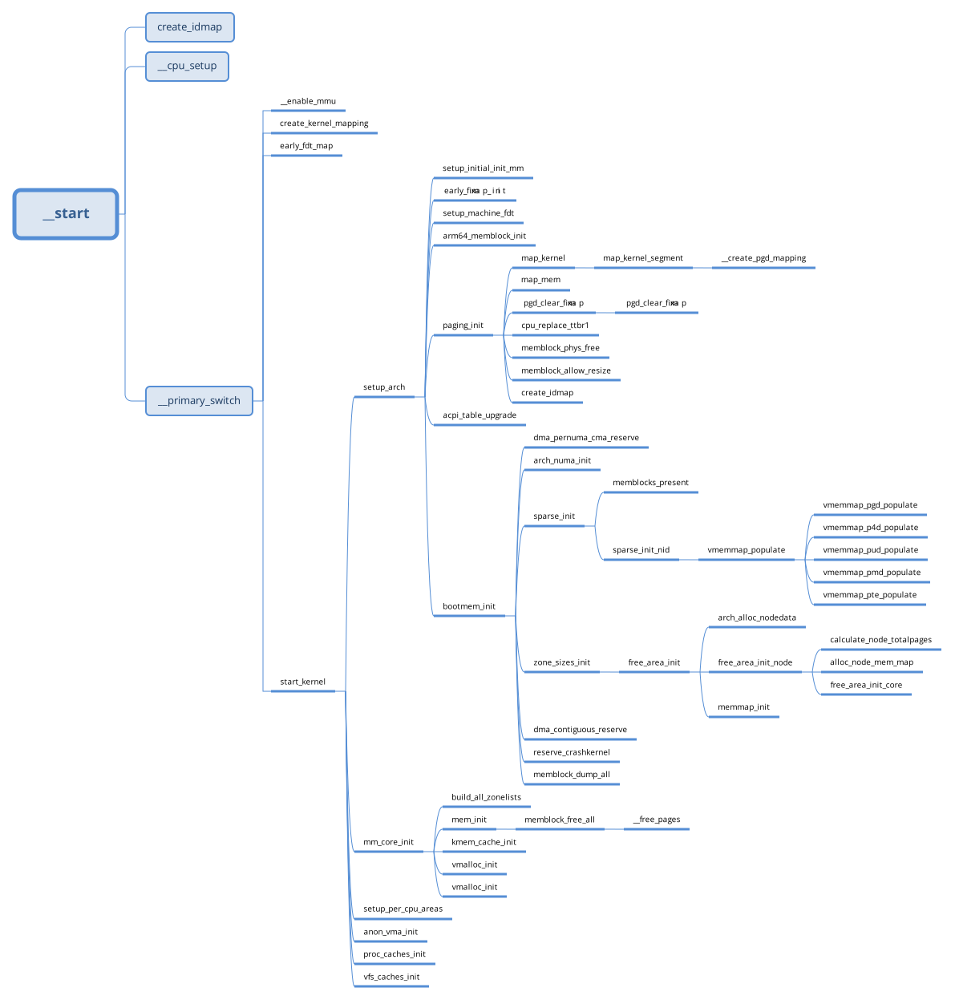

```s
/* arch/arm64/kernel/head.S */
_start:
_primary_entry
    bl record_mmu_state

    /* Preserve the arguments passed by the bootloader in x0 .. x3 */
    bl preserve_boot_args

    bl create_idmap

    bl __cpu_setup

    b __primary_switch {
        adrp x1, reserved_pg_dir
        adrp x2, init_idmap_pg_dir
        bl __enable_mmu

        bl clear_page_tables
        bl create_kernel_mapping

        adrp x1, init_pg_dir
        load_ttbr1 x1, x1, x2 /* install x1 as a TTBR1 page table */

        x0 = __pa(KERNEL_START)

        bl __primary_switched {
            adr_l x4, init_task
            init_cpu_task x4, x5, x6

            adr_l x8, vectors /* load VBAR_EL1 with virtual */
            msr vbar_el1, x8 /* vector table address */

            /* Save the offset between
             * the kernel virtual and physical mappings*/
            ldr_l       x4, _text
            sub         x4, x4, x0
            str_l       x4, kimage_voffset, x5

            bl set_cpu_boot_mode_flag

            bl __pi_memset

            mov x0, x21    // pass FDT address in x0
            bl early_fdt_map
                /* populate pud, pmd, pte, p4d */
                early_fixmap_init()
                    __p4d_populate(p4dp, __pa_symbol(bm_pud))
                    __pud_populate(pudp, __pa_symbol(bm_pmd))
                    __pmd_populate(pmdp, __pa_symbol(bm_pte))

                /* map phys & virt */
                early_fdt_ptr = fixmap_remap_fdt(dt_phys, size)
                    create_mapping_noalloc()

            mov x0, x20 /* pass the full boot status */
            bl init_feature_override  /* Parse cpu feature overrides */

            bl start_kernel
        }
    }
```

```c
/* init/main.c */
start_kernel()
    setup_arch(&command_line) {
        setup_initial_init_mm()
        early_fixmap_init()
        early_ioremap_init();
        setup_machine_fdt(__fdt_pointer);
        arm64_memblock_init() {

        }
        paging_init() {
            /* map kernel: text, rodata init, data, bss*/
            map_kernel(pgdp);
            /* map all the memory banks */
            map_mem(pgdp);
            pgd_clear_fixmap();
            cpu_replace_ttbr1(lm_alias(swapper_pg_dir), init_idmap_pg_dir);
            init_mm.pgd = swapper_pg_dir;
            memblock_phys_free(__pa_symbol(init_pg_dir));
            memblock_allow_resize();
            create_idmap();
        }

        acpi_table_upgrade();

        bootmem_init() {
            dma_pernuma_cma_reserve();
            sparse_init();
            zone_sizes_init();
            dma_contiguous_reserve(arm64_dma_phys_limit);
            reserve_crashkernel();
        }
    }

    setup_per_cpu_areas() {

    }

    mm_core_init() {
        build_all_zonelists(NULL) {
            __build_all_zonelists(NULL) {
                for_each_node(nid) {
                    pg_data_t *pgdat = NODE_DATA(nid);

                    build_zonelists(pgdat);
                }
            }
            for_each_possible_cpu(cpu)
                per_cpu_pages_init(&per_cpu(boot_pageset, cpu), &per_cpu(boot_zonestats, cpu));

            mminit_verify_zonelist();
            cpuset_init_current_mems_allowed();
        }
        page_alloc_init_cpuhp();
        page_ext_init_flatmem();
        mem_debugging_and_hardening_init();
        kfence_alloc_pool();
        report_meminit();
        kmsan_init_shadow();
        stack_depot_early_init();
        mem_init();
        mem_init_print_info();
        kmem_cache_init();

        page_ext_init_flatmem_late();
        kmemleak_init();
        ptlock_cache_init();
        pgtable_cache_init();
        debug_objects_mem_init();
        vmalloc_init();
        /* If no deferred init page_ext now, as vmap is fully initialized */
        if (!deferred_struct_pages)
            page_ext_init();
        /* Should be run before the first non-init thread is created */
        init_espfix_bsp();
        /* Should be run after espfix64 is set up. */
        pti_init();
        kmsan_init_runtime();
        mm_cache_init();
    }

    kmem_cache_init_late() {
        flushwq = alloc_workqueue("slub_flushwq", WQ_MEM_RECLAIM, 0);
    }

    setup_per_cpu_pageset() {

    }

    anon_vma_init() {

    }

    thread_stack_cache_init() {
        thread_stack_cache = kmem_cache_create_usercopy(
            "thread_stack",
            THREAD_SIZE, THREAD_SIZE, 0, 0,
            THREAD_SIZE, NUL
        );
    }

    proc_caches_init() {

    }

    vfs_caches_init() {

    }

    pagecache_init() {
        for (i = 0; i < PAGE_WAIT_TABLE_SIZE; i++)
            init_waitqueue_head(&folio_wait_table[i]);
        page_writeback_init();
    }
```

# setup_arch

```c
setup_arch(&command_line);
    setup_initial_init_mm(_stext, _etext, _edata, _end) {
        init_mm.start_code = (unsigned long)start_code;
        init_mm.end_code = (unsigned long)end_code;
        init_mm.end_data = (unsigned long)end_data;
        init_mm.brk = (unsigned long)brk;
    }

    early_fixmap_init() {
        unsigned long addr = FIXADDR_TOT_START;

        early_fixmap_init_pud(p4dp, addr, end);
            early_fixmap_init_pmd(pudp, addr, end);
                early_fixmap_init_pte(pmdp, addr);
                    if (pmd_none(pmd)) {
                        ptep = bm_pte[BM_PTE_TABLE_IDX(addr)];
                        __pmd_populate(pmdp, __pa_symbol(ptep), PMD_TYPE_TABLE);
                    }


    }

    early_ioremap_init();

    setup_machine_fdt(__fdt_pointer);
        --->
    arm64_memblock_init();
        --->
    paging_init();
        --->
    acpi_table_upgrade();

    bootmem_init();
        --->
```

## setup_machine_fdt
```c
setup_machine_fdt(__fdt_pointer)
    void *dt_virt = fixmap_remap_fdt(dt_phys, &size, PAGE_KERNEL) {
        const u64 dt_virt_base = __fix_to_virt(FIX_FDT);
        dt_phys_base = round_down(dt_phys, PAGE_SIZE);
        offset = dt_phys % PAGE_SIZE;
        dt_virt = (void *)dt_virt_base + offset;

        create_mapping_noalloc(dt_phys_base, dt_virt_base, PAGE_SIZE, prot);
            __create_pgd_mapping();

        *size = fdt_totalsize(dt_virt);
        if (*size > MAX_FDT_SIZE)
            return NULL;

        if (offset + *size > PAGE_SIZE) {
            create_mapping_noalloc(dt_phys_base, dt_virt_base,
                        offset + *size, prot);
        }

        return dt_virt;
    }
    if (dt_virt)
        memblock_reserve(dt_phys, size);

    early_init_dt_scan(dt_virt) {
        status = early_init_dt_verify(params);
        early_init_dt_scan_nodes() {

        }
    }

    const char * name = of_flat_dt_get_machine_name();

    /* Early fixups are done, map the FDT as read-only now */
    fixmap_remap_fdt(dt_phys, &size, PAGE_KERNEL_RO) {

    }

    name = of_flat_dt_get_machine_name();

```

## arm64_memblock_init

```c
arm64_memblock_init() {
    s64 linear_region_size = PAGE_END - _PAGE_OFFSET(vabits_actual);

    /* Remove memory above our supported physical address size */
    memblock_remove(1ULL << PHYS_MASK_SHIFT, ULLONG_MAX);

    /* Select a suitable value for the base of physical memory. */
    memstart_addr = round_down(memblock_start_of_DRAM(), ARM64_MEMSTART_ALIGN);

    /* Remove the memory that we will not be able to cover with the
     * linear mapping. Take care not to clip the kernel which may be
     * high in memory. */
    memblock_remove(max_t(u64, memstart_addr + linear_region_size,
            __pa_symbol(_end)), ULLONG_MAX);
    if (memstart_addr + linear_region_size < memblock_end_of_DRAM()) {
        /* ensure that memstart_addr remains sufficiently aligned */
        memstart_addr = round_up(memblock_end_of_DRAM() - linear_region_size,
                    ARM64_MEMSTART_ALIGN);
        memblock_remove(0, memstart_addr);
    }

    /* Register the kernel text, kernel data, initrd, and initial
     * pagetables with memblock. */
    memblock_reserve(__pa_symbol(_stext), _end - _stext);

    /* Remove the memory that we will not be able to cover
     * with the linear mapping. */
    memblock_remove(max_t(u64, memstart_addr + linear_region_size, __pa_symbol(_end)), ULLONG_MAX);

    if (IS_ENABLED(CONFIG_BLK_DEV_INITRD) && phys_initrd_size) {
        /* the generic initrd code expects virtual addresses */
        initrd_start = __phys_to_virt(phys_initrd_start);
        initrd_end = initrd_start + phys_initrd_size;
    }

    early_init_fdt_scan_reserved_mem() {

    }

    high_memory = __va(memblock_end_of_DRAM() - 1) + 1;
}
```


## paging_init
```c
/* arch/arm64/mm/mmu.c */
paging_init()
    pgd_t *pgdp = pgd_set_fixmap(__pa_symbol(swapper_pg_dir));

    map_kernel(pgdp);
        map_kernel_segment(pgdp, _stext, _etext, text_prot) {
            __create_pgd_mapping(pgdp, phys, virt, size)
                --->
            vm_area_add_early(vma) {
            vm->next = *p;
                *p = vm;
            }
        }

        map_kernel_segment(pgdp, __start_rodata, __inittext_begin);
        map_kernel_segment(pgdp, __inittext_begin, __inittext_end);
        map_kernel_segment(pgdp, __initdata_begin, __initdata_end);
        map_kernel_segment(pgdp, _data, _end);

        fixmap_copy(pgdp);

    /* map all the memory banks */
    map_mem(pgdp) {
        memblock_mark_nomap(kernel_start, kernel_end - kernel_start);
        for_each_mem_range(i, &start, &end) {
            if (start >= end)
                break;
            __map_memblock(pgdp, start, end, pgprot_tagged(PAGE_KERNEL), flags);
                __create_pgd_mapping(pgdp, phys, virt, size);
                    --->
        }
    }

    pgd_clear_fixmap();

    cpu_replace_ttbr1(lm_alias(swapper_pg_dir), init_idmap_pg_dir);
    init_mm.pgd = swapper_pg_dir;

    /* free boot memory block */
    memblock_phys_free(init_pg_dir, size);
        memblock_remove_range(&memblock.reserved, base, size)

    memblock_allow_resize();

    create_idmap();
```

## bootmem_init
```c
bootmem_init() {
    min = PFN_UP(memblock_start_of_DRAM());
    max = PFN_DOWN(memblock_end_of_DRAM());

    early_memtest(min << PAGE_SHIFT, max << PAGE_SHIFT);

    max_pfn = max_low_pfn = max;
    min_low_pfn = min;

    arch_numa_init();

    sparse_init();

    zone_sizes_init() {
        /* Initialise all pg_data_t and zone data */
        free_area_init(max_zone_pfns) {

            find_zone_movable_pfns_for_nodes();

            for_each_mem_pfn_range(i, MAX_NUMNODES, &start_pfn, &end_pfn, &nid) {
                subsection_map_init(start_pfn, end_pfn - start_pfn);
            }

            setup_nr_node_ids();
            for_each_node(nid) {
                pg_data_t *pgdat;

                if (!node_online(nid)) {

                    pgdat = arch_alloc_nodedata(nid) {

                    }

                    arch_refresh_nodedata(nid, pgdat);
                    free_area_init_memoryless_node(nid);

                    continue;
                }

                pgdat = NODE_DATA(nid);
                free_area_init_node(nid) {
                    get_pfn_range_for_nid(nid, &start_pfn, &end_pfn);

                    pgdat->node_id = nid;
                    pgdat->node_start_pfn = start_pfn;
                    pgdat->per_cpu_nodestats = NULL;

                    calculate_node_totalpages(pgdat, start_pfn, end_pfn) {
                        spanned = zone_spanned_pages_in_node();
                        absent = zone_absent_pages_in_node()
                        if (size)
                            zone->zone_start_pfn = zone_start_pfn;
                        else
                            zone->zone_start_pfn = 0;
                        zone->spanned_pages = size;
                        zone->present_pages = real_size;

                    }

                    alloc_node_mem_map() { #ifdef CONFIG_FLATMEM
                        start = pgdat->node_start_pfn & ~(MAX_ORDER_NR_PAGES - 1);
                        offset = pgdat->node_start_pfn - start;

                        end = pgdat_end_pfn(pgdat);
                        end = ALIGN(end, MAX_ORDER_NR_PAGES);
                        size =  (end - start) * sizeof(struct page);
                        map = memmap_alloc(size);

                        pgdat->node_mem_map = map + offset;

                        if (pgdat == NODE_DATA(0)) {
                            mem_map = NODE_DATA(0)->node_mem_map;
                            if (page_to_pfn(mem_map) != pgdat->node_start_pfn)
                                mem_map -= offset;
                        }
                    }

                    /* Set up the zone data structures */
                    free_area_init_core(pgdat) {
                        /* calculate the freesize of pgdat */
                        zone_init_internals(zone, j, nid, freesize);
                        set_pageblock_order();
                        setup_usemap(zone);
                        init_currently_empty_zone();
                    }
                    lru_gen_init_pgdat(pgdat);
                }

                /* Any memory on that node */
                if (pgdat->node_present_pages)
                    node_set_state(nid, N_MEMORY);
                check_for_memory(pgdat, nid);
            }

            memmap_init() {
                for_each_mem_pfn_range(i, MAX_NUMNODES, &start_pfn, &end_pfn, &nid) {
                    struct pglist_data *node = NODE_DATA(nid);

                    for (j = 0; j < MAX_NR_ZONES; j++) {
                        struct zone *zone = node->node_zones + j;

                        /* return zone->present_pages */
                        if (!populated_zone(zone))
                            continue;

                        memmap_init_zone_range(zone, start_pfn, end_pfn, &hole_pfn) {
                            memmap_init_range() {
                                for (pfn = start_pfn; pfn < end_pfn; ) {
                                    if (context == MEMINIT_EARLY) {
                                        if (overlap_memmap_init(zone, &pfn))
                                            continue;
                                        if (defer_init(nid, pfn, zone_end_pfn)) {
                                            deferred_struct_pages = true;
                                            break;
                                        }
                                    }

                                    page = pfn_to_page(pfn); /* vmemmap + pfn */
                                    __init_single_page(page, pfn, zone, nid) {
                                        mm_zero_struct_page(page); /* memset(0) */
                                        set_page_links(page, zone, nid, pfn);
                                        init_page_count(page); /* 1 */
                                        page_mapcount_reset(page);
                                        page_cpupid_reset_last(page);
                                        page_kasan_tag_reset(page);

                                        INIT_LIST_HEAD(&page->lru);
                                    }
                                    if (context == MEMINIT_HOTPLUG)
                                        __SetPageReserved(page);

                                    if (pageblock_aligned(pfn)) {
                                        set_pageblock_migratetype(page, migratetype);
                                        cond_resched();
                                    }

                                    pfn++;
                                }
                            }
                        }
                        zone_id = j;
                    }
                }
            }
        }
    }

    dma_contiguous_reserve(arm64_dma_phys_limit);

    reserve_crashkernel();

    memblock_dump_all();
}
```

# sparsemem

* [Physical Memory Model: FLATE - SPARSE](https://docs.kernel.org/mm/memory-model.html)

```c
#ifdef CONFIG_SPARSEMEM_EXTREME
    #define SECTIONS_PER_ROOT   (PAGE_SIZE / sizeof (struct mem_section))
#else
    #define SECTIONS_PER_ROOT    1
#endif

#ifdef CONFIG_SPARSEMEM_EXTREME
    struct mem_section **mem_section;
#else
    struct mem_section mem_section[NR_SECTION_ROOTS][SECTIONS_PER_ROOT];
#endif


#if MAX_NUMNODES <= 256
    static u8 section_to_node_table[NR_MEM_SECTIONS];
#else
    static u16 section_to_node_table[NR_MEM_SECTIONS];
#endif
```

```c
#if defined(CONFIG_FLATMEM)

    #ifndef ARCH_PFN_OFFSET
    #define ARCH_PFN_OFFSET     (0UL)
    #endif

    #define __pfn_to_page(pfn) (mem_map + ((pfn) - ARCH_PFN_OFFSET))
    #define __page_to_pfn(page) ((unsigned long)((page) - mem_map) \
        + ARCH_PFN_OFFSET)

#elif defined(CONFIG_SPARSEMEM_VMEMMAP)

    #define vmemmap ((struct page *)VMEMMAP_START - (memstart_addr >> PAGE_SHIFT))

    /* memmap is virtually contiguous.  */
    #define __pfn_to_page(pfn)      (vmemmap + (pfn))
    #define __page_to_pfn(page)    (unsigned long)((page) - vmemmap)

#elif defined(CONFIG_SPARSEMEM)

    /* Note: section's mem_map is encoded to reflect its start_pfn.
     * section[i].section_mem_map == mem_map's address - start_pfn; */
    #define __page_to_pfn(pg) \
    ({ const struct page *__pg = (pg); \
        int __sec = page_to_section(__pg); \
        (unsigned long)(__pg - __section_mem_map_addr(__nr_to_section(__sec))); \
    })

    #define __pfn_to_page(pfn) \
    ({ unsigned long __pfn = (pfn); \
        struct mem_section *__sec = __pfn_to_section(__pfn); \
        __section_mem_map_addr(__sec) + __pfn; \
    })
#endif /* CONFIG_FLATMEM/SPARSEMEM */
```

## sparse_init

```c
int sparse_init(void) {
    /* Mark all memblocks as present */
    memblocks_present() {
        for_each_mem_pfn_range() {
            memory_present(nid, start, end) {
                if (unlikely(!mem_section)) {
                    mem_section = memblock_alloc(size, align);
                }

                mminit_validate_memmodel_limits(&start, &end);
                for (pfn = start; pfn < end; pfn += PAGES_PER_SECTION) {
                    unsigned long section = pfn_to_section_nr(pfn);
                    struct mem_section *ms;

                    sparse_index_init(section, nid) {
                        unsigned long root = SECTION_NR_TO_ROOT(section_nr) {
                            return ((sec) / SECTIONS_PER_ROOT);
                        }
                        struct mem_section *section;

                        if (mem_section[root])
                            return 0;

                        section = sparse_index_alloc(nid) {
                            if (slab_is_available()) {
                                section = kzalloc_node(array_size, GFP_KERNEL, nid);
                            } else {
                                section = memblock_alloc_node(array_size, SMP_CACHE_BYTES, nid);
                            }
                            return section;
                        }
                        mem_section[root] = section;
                    }
                    set_section_nid(section, nid) {
                        section_to_node_table[section_nr] = nid;
                    }

                    ms = __nr_to_section(section) {
                        unsigned long root = SECTION_NR_TO_ROOT(nr);

                        if (unlikely(root >= NR_SECTION_ROOTS))
                            return NULL;

                    #ifdef CONFIG_SPARSEMEM_EXTREME
                        if (!mem_section || !mem_section[root])
                            return NULL;
                    #endif
                        return &mem_section[root][nr & SECTION_ROOT_MASK];
                    }
                    if (!ms->section_mem_map) {
                        ms->section_mem_map = sparse_encode_early_nid(nid) | SECTION_IS_ONLINE {
                                (nid << SECTION_NID_SHIFT) | SECTION_IS_ONLINE;
                            }
                        __section_mark_present(ms, section) {
                            ms->section_mem_map |= SECTION_MARKED_PRESENT
                        }
                    }
                }
            }
        }
    }

    pnum_begin = first_present_section_nr();
    nid_begin = sparse_early_nid(__nr_to_section(pnum_begin));

    for_each_present_section_nr(pnum_begin + 1, pnum_end) {
        int nid = sparse_early_nid(__nr_to_section(pnum_end)) {
            return (section->section_mem_map >> SECTION_NID_SHIFT);
        }

        if (nid == nid_begin) {
            map_count++;
            continue;
        }
        /* Init node with sections in range [pnum_begin, pnum_end) */
        sparse_init_nid(nid_begin, pnum_begin, pnum_end, map_count);
        nid_begin = nid;
        pnum_begin = pnum_end;
        map_count = 1;
    }

    /* cover the last node */
    sparse_init_nid(nid_begin, pnum_begin, pnum_end, map_count) {
        struct mem_section_usage *usage;
        unsigned long pnum;
        struct page *map;

        usage = sparse_early_usemaps_alloc_pgdat_section(
            NODE_DATA(nid), mem_section_usage_size() * map_count
        );

        sparse_buffer_init(map_count * section_map_size(), nid) {
            sparsemap_buf = memmap_alloc(size, section_map_size(), addr, nid, true);
            sparsemap_buf_end = sparsemap_buf + size;
        }

        for_each_present_section_nr(pnum_begin, pnum) {
            unsigned long pfn = section_nr_to_pfn(pnum);

            if (pnum >= pnum_end)
                break;

            /* 1. sparse-vmemmap.c */
            map = __populate_section_memmap(pfn, PAGES_PER_SECTION, nid, NULL, NULL) {
                unsigned long start = (unsigned long) pfn_to_page(pfn);
                unsigned long end = start + nr_pages * sizeof(struct page);

                if (vmemmap_can_optimize(altmap, pgmap))
                    r = vmemmap_populate_compound_pages(pfn, start, end, nid, pgmap);
                else {
                    r = vmemmap_populate(start, end, nid, altmap);
                        --->
                }
            }

            /* sparse.c */
            map = __populate_section_memmap(pfn, PAGES_PER_SECTION, nid, NULL, NULL) {
                unsigned long size = section_map_size();
                struct page *map = sparse_buffer_alloc(size);
                phys_addr_t addr = __pa(MAX_DMA_ADDRESS);

                map = memmap_alloc(size, size, addr, nid, false);
            }

            check_usemap_section_nr(nid, usage);
            sparse_init_one_section(__nr_to_section(pnum), pnum, map, usage, SECTION_IS_EARLY) {
                ms->section_mem_map &= ~SECTION_MAP_MASK;
                ms->section_mem_map |= sparse_encode_mem_map(mem_map, pnum) | SECTION_HAS_MEM_MAP | flags;
                ms->usage = usage;
            }
            usage = (void *) usage + mem_section_usage_size();
        }
        sparse_buffer_fini() {
            unsigned long size = sparsemap_buf_end - sparsemap_buf;

            if (sparsemap_buf && size > 0)
                sparse_buffer_free(size);
            sparsemap_buf = NULL;
        }
    }
}
```

## vmemmap_populate

```c
vmemmap_populate(unsigned long start, unsigned long end, int node, struct vmem_altmap *altmap) {
    if (!IS_ENABLED(CONFIG_ARM64_4K_PAGES)) {
        return vmemmap_populate_basepages(start, end, node, altmap, NULL/*reuse*/) {
            for (; addr < end; addr += PAGE_SIZE) {
                pte = vmemmap_populate_address(addr, node, altmap, reuse) {
                    pgd = vmemmap_pgd_populate(addr, node) {
                        pgd_t *pgd = pgd_offset_k(addr);
                        if (pgd_none(*pgd)) {
                            void *p = vmemmap_alloc_block_zero(PAGE_SIZE, node) {
                                p = vmemmap_alloc_block(size, node) {
                                    if (slab_is_available()) {
                                        gfp_t gfp_mask = GFP_KERNEL|__GFP_RETRY_MAYFAIL|__GFP_NOWARN;

                                        page = alloc_pages_node(node, gfp_mask, order) {
                                            __alloc_pages();
                                        }
                                        if (page)
                                            return page_address(page);

                                        return NULL;
                                    } else {
                                        return __earlyonly_bootmem_alloc(node, size, size, __pa(MAX_DMA_ADDRESS)) {
                                            memblock_alloc_try_nid_raw()
                                                memblock_alloc_internal()
                                                    --->
                                        }
                                    }
                                }
                                memset(p, 0, size);
                            }
                            if (!p)
                                return NULL;
                            pgd_populate(&init_mm, pgd, p);
                        }
                        return pgd;
                    }

                    p4d = vmemmap_p4d_populate(pgd, addr, node) {
                        p4d_t *p4d = p4d_offset(pgd, addr);
                        if (p4d_none(*p4d)) {
                            void *p = vmemmap_alloc_block_zero(PAGE_SIZE, node);
                            if (!p)
                                return NULL;
                            pud_init(p);
                            p4d_populate(&init_mm, p4d, p);
                        }
                        return p4d;
                    }

                    pud = vmemmap_pud_populate(p4d, addr, node) {
                        pud_t *pud = pud_offset(p4d, addr);
                        if (pud_none(*pud)) {
                            void *p = vmemmap_alloc_block_zero(PAGE_SIZE, node);
                            if (!p)
                                return NULL;
                            pmd_init(p);
                            pud_populate(&init_mm/*mm*/, pud/*pudp*/, p/*pmdp*/);
                            return pud;
                        }
                    }

                    pmd = vmemmap_pmd_populate(pud, addr, node);

                    pte = vmemmap_pte_populate(pmd, addr, node, altmap, reuse) {
                        pte_t *pte = pte_offset_kernel(pmd, addr);
                        if (pte_none(ptep_get(pte))) {
                            pte_t entry;
                            void *p;

                            if (!reuse) {
                                p = vmemmap_alloc_block_buf(PAGE_SIZE, node, altmap);
                                if (!p)
                                    return NULL;
                            } else {
                                get_page(reuse);
                                p = page_to_virt(reuse);
                            }
                            entry = pfn_pte(__pa(p) >> PAGE_SHIFT, PAGE_KERNEL);
                            set_pte_at(&init_mm, addr, pte, entry, 1/*nr*/) {
                                for (;;) {
                                    set_pte(ptep, pte) {
                                        WRITE_ONCE(*ptep, pte);
                                    }
                                    if (--nr == 0)
                                        break;
                                    ptep++;
                                    pte_val(pte) += PAGE_SIZE;
                                }
                            }
                        }
                        return pte;
                    }

                    vmemmap_verify(pte, node, addr, addr + PAGE_SIZE);
                }
                if (!pte)
                    return -ENOMEM;
            }
        }
    } else {
        return vmemmap_populate_hugepages(start, end, node, altmap);
    }
}
```

## sparse_add_section

```c
sparse_add_section(int nid, unsigned long start_pfn,
        unsigned long nr_pages, struct vmem_altmap *altmap,
        struct dev_pagemap *pgmap)
{
    unsigned long section_nr = pfn_to_section_nr(start_pfn);
    struct mem_section *ms;
    struct page *memmap;
    int ret;

    ret = sparse_index_init(section_nr, nid);
    if (ret < 0)
        return ret;

    memmap = section_activate(nid, start_pfn, nr_pages, altmap, pgmap) {
        __populate_section_memmap();
            --->
    }
    if (IS_ERR(memmap))
        return PTR_ERR(memmap);

    /* Poison uninitialized struct pages in order to catch invalid flags
     * combinations. */
    page_init_poison(memmap, sizeof(struct page) * nr_pages);

    ms = __nr_to_section(section_nr);
    set_section_nid(section_nr, nid);
    __section_mark_present(ms, section_nr);

    /* Align memmap to section boundary in the subsection case */
    if (section_nr_to_pfn(section_nr) != start_pfn)
        memmap = pfn_to_page(section_nr_to_pfn(section_nr));
    sparse_init_one_section(ms, section_nr, memmap, ms->usage, 0) {
        ms->section_mem_map &= ~SECTION_MAP_MASK;
        ms->section_mem_map |= sparse_encode_mem_map(mem_map, pnum)
            | SECTION_HAS_MEM_MAP | flags;
        ms->usage = usage;
    }

    return 0;
}
```

## sparse_remove_section

```c
void sparse_remove_section(unsigned long pfn, unsigned long nr_pages,
        struct vmem_altmap *altmap)
{
    struct mem_section *ms = __pfn_to_section(pfn);

    if (WARN_ON_ONCE(!valid_section(ms)))
        return;

    section_deactivate(pfn, nr_pages, altmap) {
        struct mem_section *ms = __pfn_to_section(pfn);
        bool section_is_early = early_section(ms) {
            return (section && (section->section_mem_map & SECTION_IS_EARLY));
        }
        struct page *memmap = NULL;
        bool empty;

        if (clear_subsection_map(pfn, nr_pages))
            return;

        empty = is_subsection_map_empty(ms);
        if (empty) {
            unsigned long section_nr = pfn_to_section_nr(pfn);

            ms->section_mem_map &= ~SECTION_HAS_MEM_MAP;

            if (!PageReserved(virt_to_page(ms->usage))) {
                kfree_rcu(ms->usage, rcu);
                WRITE_ONCE(ms->usage, NULL);
            }
            memmap = sparse_decode_mem_map(ms->section_mem_map, section_nr);
        }

        if (!section_is_early) {
            depopulate_section_memmap(pfn, nr_pages, altmap);
        } else if (memmap) {
            free_map_bootmem(memmap) {
                unsigned long start = (unsigned long)memmap;
                unsigned long end = (unsigned long)(memmap + PAGES_PER_SECTION);

                vmemmap_free(start, end, NULL) {
                    unmap_hotplug_range(start, end, true, altmap);
                    free_empty_tables(start, end, VMEMMAP_START, VMEMMAP_END);
                }
            }
        }

        if (empty)
            ms->section_mem_map = (unsigned long)NULL;
    }
}
```

# mm_core_init
```c
void start_kernel(void) {
    mm_core_init() {
        build_all_zonelists(NULL);
        page_alloc_init_cpuhp();

        page_ext_init_flatmem();
        mem_debugging_and_hardening_init();
        kfence_alloc_pool();
        report_meminit();
        kmsan_init_shadow();
        stack_depot_early_init();

        mem_init() {
            /* release free pages to the buddy allocator */
            memblock_free_all();
        }

        mem_init_print_info();
        kmem_cache_init();

        page_ext_init_flatmem_late();
        kmemleak_init();
        ptlock_cache_init();
        pgtable_cache_init();
        debug_objects_mem_init();
        vmalloc_init() {

        }
        /* If no deferred init page_ext now, as vmap is fully initialized */
        if (!deferred_struct_pages)
            page_ext_init();
        /* Should be run before the first non-init thread is created */
        init_espfix_bsp();
        /* Should be run after espfix64 is set up. */
        pti_init();
        kmsan_init_runtime();
        mm_cache_init();
    }
}
```

# memblock

## memblock_add

```c
memblock_add(phys_addr_t base, phys_addr_t size)
{
    phys_addr_t end = base + size - 1;

    return memblock_add_range(&memblock.memory, base, size, MAX_NUMNODES, 0) {
        bool insert = false;
        phys_addr_t obase = base;
        phys_addr_t end = base + memblock_cap_size(base, &size);
        int idx, nr_new, start_rgn = -1, end_rgn;
        struct memblock_region *rgn;

        if (!size)
            return 0;

        /* special case for empty array */
        if (type->regions[0].size == 0) {
            WARN_ON(type->cnt != 1 || type->total_size);
            type->regions[0].base = base;
            type->regions[0].size = size;
            type->regions[0].flags = flags;
            memblock_set_region_node(&type->regions[0], nid);
            type->total_size = size;
            return 0;
        }

        if (type->cnt * 2 + 1 <= type->max)
            insert = true;

    repeat:
        /* The following is executed twice.
         * 1. with %false @insert: counts the number of regions needed
         * 2. with %true: inserts them. */
        base = obase;
        nr_new = 0;

        for_each_memblock_type(idx, type, rgn) {
            phys_addr_t rbase = rgn->base;
            phys_addr_t rend = rbase + rgn->size;

            if (rbase >= end)
                break;
            if (rend <= base)
                continue;

            /* @rgn overlaps.  If it separates the lower part of new
             * area, insert that portion. */
            if (rbase > base) {
                nr_new++;
                if (insert) {
                    if (start_rgn == -1)
                        start_rgn = idx;
                    end_rgn = idx + 1;

                    memblock_insert_region(type, idx++, base, rbase - base, nid, flags) {
                        struct memblock_region *rgn = &type->regions[idx];

                        memmove(rgn + 1, rgn, (type->cnt - idx) * sizeof(*rgn));
                        rgn->base = base;
                        rgn->size = size;
                        rgn->flags = flags;
                        memblock_set_region_node(rgn, nid);
                        type->cnt++;
                        type->total_size += size;
                    }
                }
            }
            /* area below @rend is dealt with, forget about it */
            base = min(rend, end);
        }

        /* insert the remaining portion */
        if (base < end) {
            nr_new++;
            if (insert) {
                if (start_rgn == -1)
                    start_rgn = idx;
                end_rgn = idx + 1;
                memblock_insert_region(type, idx, base, end - base, nid, flags);
            }
        }

        if (!nr_new)
            return 0;

        /* If this was the first round, resize array and repeat for actual
         * insertions; otherwise, merge and return. */
        if (!insert) {
            while (type->cnt + nr_new > type->max) {
                ret = memblock_double_array(type, obase, size) {
                    struct memblock_region *new_array, *old_array;
                    phys_addr_t old_alloc_size, new_alloc_size;
                    phys_addr_t old_size, new_size, addr, new_end;
                    int use_slab = slab_is_available();
                    int *in_slab;

                    if (!memblock_can_resize)
                        panic("memblock: cannot resize %s array\n", type->name);

                    /* Calculate new doubled size */
                    old_size = type->max * sizeof(struct memblock_region);
                    new_size = old_size << 1;

                    old_alloc_size = PAGE_ALIGN(old_size);
                    new_alloc_size = PAGE_ALIGN(new_size);

                    if (type == &memblock.memory)
                        in_slab = &memblock_memory_in_slab;
                    else
                        in_slab = &memblock_reserved_in_slab;

                    /* Try to find some space for it */
                    if (use_slab) {
                        new_array = kmalloc(new_size, GFP_KERNEL);
                        addr = new_array ? __pa(new_array) : 0;
                    } else {
                        /* only exclude range when trying to double reserved.regions */
                        if (type != &memblock.reserved)
                            new_area_start = new_area_size = 0;

                        addr = memblock_find_in_range(
                            new_area_start + new_area_size,
                            memblock.current_limit,
                            new_alloc_size, PAGE_SIZE ) {

                        }
                        if (!addr && new_area_size)
                            addr = memblock_find_in_range(0,
                                min(new_area_start, memblock.current_limit),
                                new_alloc_size, PAGE_SIZE);

                        new_array = addr ? __va(addr) : NULL;
                    }
                    if (!addr) {
                        return -1;
                    }

                    new_end = addr + new_size - 1;

                    memcpy(new_array, type->regions, old_size);
                    memset(new_array + type->max, 0, old_size);
                    old_array = type->regions;
                    type->regions = new_array;
                    type->max <<= 1;

                    /* Free old array. We needn't free it if the array is the static one */
                    if (*in_slab)
                        kfree(old_array);
                    else if (old_array != memblock_memory_init_regions &&
                        old_array != memblock_reserved_init_regions)
                        memblock_free(old_array, old_alloc_size);

                    if (!use_slab) {
                        memblock_reserve(addr, new_alloc_size);
                    }

                    *in_slab = use_slab;

                    return 0;
                }
                if (ret < 0)
                    return -ENOMEM;
            }
            insert = true;
            goto repeat;
        } else {
            memblock_merge_regions(type, start_rgn, end_rgn) {
                int i = 0;
                if (start_rgn)
                    i = start_rgn - 1;
                end_rgn = min(end_rgn, type->cnt - 1);
                while (i < end_rgn) {
                    struct memblock_region *this = &type->regions[i];
                    struct memblock_region *next = &type->regions[i + 1];

                    if ((this->base + this->size != next->base)
                        || (memblock_get_region_node(this) != memblock_get_region_node(next))
                        || this->flags != next->flags) {

                        i++;
                        continue;
                    }

                    this->size += next->size;
                    /* move forward from next + 1, index of which is i + 2 */
                    memmove(next, next + 1, (type->cnt - (i + 2)) * sizeof(*next));
                    type->cnt--;
                    end_rgn--;
                }
            }
            return 0;
        }
    }
}
```

## memblock_remove

```c
int memblock_remove(phys_addr_t base, phys_addr_t size)
{
    phys_addr_t end = base + size - 1;

    return memblock_remove_range(&memblock.memory, base, size) {
        int start_rgn, end_rgn;
        int i, ret;

        /* isolate given range into disjoint memblocks */
        ret = memblock_isolate_range(type, base, size, &start_rgn, &end_rgn) {
            phys_addr_t end = base + memblock_cap_size(base, &size);
            int idx;
            struct memblock_region *rgn;

            *start_rgn = *end_rgn = 0;

            if (!size)
                return 0;

            /* we'll create at most two more regions */
            while (type->cnt + 2 > type->max) {
                if (memblock_double_array(type, base, size) < 0)
                    return -ENOMEM;
            }

            for_each_memblock_type(idx, type, rgn) {
                phys_addr_t rbase = rgn->base;
                phys_addr_t rend = rbase + rgn->size;

                if (rbase >= end)
                    break;
                if (rend <= base)
                    continue;

                if (rbase < base) {
                    rgn->base = base;
                    rgn->size -= base - rbase;
                    type->total_size -= base - rbase;
                    memblock_insert_region(
                        type, idx, rbase, base - rbase,
                        memblock_get_region_node(rgn),
                        rgn->flags) {

                        struct memblock_region *rgn = &type->regions[idx];

                        memmove(rgn + 1, rgn, (type->cnt - idx) * sizeof(*rgn));
                        rgn->base = base;
                        rgn->size = size;
                        rgn->flags = flags;
                        memblock_set_region_node(rgn, nid);
                        type->cnt++;
                        type->total_size += size;
                    }
                } else if (rend > end) {
                    rgn->base = end;
                    rgn->size -= end - rbase;
                    type->total_size -= end - rbase;
                    memblock_insert_region(type, idx--, rbase, end - rbase,
                                memblock_get_region_node(rgn),
                                rgn->flags);
                } else {
                    if (!*end_rgn)
                        *start_rgn = idx;
                    *end_rgn = idx + 1;
                }
            }

            return 0;
        }
        if (ret)
            return ret;

        for (i = end_rgn - 1; i >= start_rgn; i--) {
            memblock_remove_region(type, i/*r*/) {
                type->total_size -= type->regions[r].size;
                memmove(&type->regions[r], &type->regions[r + 1],
                    (type->cnt - (r + 1)) * sizeof(type->regions[r]));
                type->cnt--;

                /* Special case for empty arrays */
                if (type->cnt == 0) {
                    type->cnt = 1;
                    type->regions[0].base = 0;
                    type->regions[0].size = 0;
                    type->regions[0].flags = 0;
                    memblock_set_region_node(&type->regions[0], MAX_NUMNODES);
                }
            }
        }
        return 0;
    }
}
```

## memblock_free

```c

```

## memblock_free_all
```c
memblock_free_all() {
    /* The mem_map array can get very big.
        * Free the unused area of the memory map. */
    free_unused_memmap() {
        for_each_mem_pfn_range(i, MAX_NUMNODES, &start, &end, NULL) {
            free_memmap(prev_end, start) {
                /* Free boot memory block previously allocated by memblock_phys_alloc_xx() API.
                * The freeing memory will not be released to the buddy allocator. */
                memblock_phys_free(pg, pgend - pg);
                    memblock_remove_range(&memblock.reserved, base, size) {
                        memblock_isolate_range()
                        memblock_remove_region()
                    }
            }
        }
    }
    reset_all_zones_managed_pages();
        atomic_long_set(&z->managed_pages, 0);

    pages = free_low_memory_core_early() {
        memmap_init_reserved_pages() {
            /* initialize struct pages for the reserved regions */
            for_each_reserved_mem_range(i, &start, &end)
                reserve_bootmem_region(start, end) {
                    for (; start_pfn < end_pfn; start_pfn++) {
                        struct page *page = pfn_to_page(start_pfn);
                        init_reserved_page(start_pfn) {

                        }
                        /* Avoid false-positive PageTail() */
                        INIT_LIST_HEAD(&page->lru);

                        __SetPageReserved(page);

                    }
                }

            /* and also treat struct pages for the NOMAP regions as PageReserved */
            for_each_mem_region(region) {
                if (memblock_is_nomap(region)) {
                    start = region->base;
                    end = start + region->size;
                    reserve_bootmem_region(start, end);
                }
            }
        }

        for_each_free_mem_range() {
            __free_pages()
        }
    }

    totalram_pages_add(pages) {
        atomic_long_add(count, &_totalram_pages);
    }
}
```

# memory_hotplug

## add_memory

```c
int add_memory(int nid, u64 start, u64 size, mhp_t mhp_flags) {
    int rc;

    lock_device_hotplug();
    rc = __add_memory(nid, start, size, mhp_flags) {
        struct resource *res;
        int ret;

        res = register_memory_resource(start, size, "System RAM");
        if (IS_ERR(res))
            return PTR_ERR(res);

        ret = add_memory_resource(nid, res, mhp_flags) {
            ret = memblock_add_node(start, size, nid, memblock_flags) {
                return memblock_add_range(&memblock.memory, base, size, nid, flags);
                    --->
            }

            __try_online_node(nid, false) {

            }

            arch_add_memory(nid, start, size, &params) {
                int ret, flags = NO_EXEC_MAPPINGS;

                if (can_set_direct_map())
                    flags |= NO_BLOCK_MAPPINGS | NO_CONT_MAPPINGS;

                __create_pgd_mapping(swapper_pg_dir, start, __phys_to_virt(start),
                            size, params->pgprot, __pgd_pgtable_alloc,
                            flags);

                memblock_clear_nomap(start, size);

                ret = __add_pages(nid, start >> PAGE_SHIFT, size >> PAGE_SHIFT, params) {
                    for (; pfn < end_pfn; pfn += cur_nr_pages) {
                        /* Select all remaining pages up to the next section boundary */
                        cur_nr_pages = min(end_pfn - pfn, SECTION_ALIGN_UP(pfn + 1) - pfn);
                        err = sparse_add_section(nid, pfn, cur_nr_pages, altmap, params->pgmap);
                            --->
                        if (err)
                            break;
                        cond_resched();
                    }
                }

                if (ret)
                    __remove_pgd_mapping(swapper_pg_dir, __phys_to_virt(start), size);
                else {
                    max_pfn = PFN_UP(start + size);
                    max_low_pfn = max_pfn;
                }

                return ret;
            }

            ret = create_memory_block_devices(start, size, NULL, group) {
                for (block_id = start_block_id; block_id != end_block_id; block_id++) {
                    ret = add_hotplug_memory_block(block_id, altmap, group) {

                    }
                }
            }

            if (new_node) {
                node_set_online(nid);
                ret = __register_one_node(nid);
                BUG_ON(ret);
            }
            register_memory_blocks_under_node(nid, PFN_DOWN(start),
                    PFN_UP(start + size - 1),
                    MEMINIT_HOTPLUG);
        }
        if (ret < 0)
            release_memory_resource(res);
        return ret;
    }
    unlock_device_hotplug();

    return rc;
}
```

## remove_memory

```c
int remove_memory(u64 start, u64 size) {
    int rc;

    lock_device_hotplug();
    rc = try_remove_memory(start, size) {
        int rc, nid = NUMA_NO_NODE;

        rc = walk_memory_blocks(start, size, &nid, check_memblock_offlined_cb);
        if (rc)
            return rc;

        /* remove memmap entry */
        firmware_map_remove(start, start + size, "System RAM");

        mem_hotplug_begin();

        rc = memory_blocks_have_altmaps(start, size);
        if (rc < 0) {
            mem_hotplug_done();
            return rc;
        } else if (!rc) {
            remove_memory_block_devices(start, size);
            arch_remove_memory(start, size, NULL) {
                unsigned long start_pfn = start >> PAGE_SHIFT;
                unsigned long nr_pages = size >> PAGE_SHIFT;

                __remove_pages(start_pfn, nr_pages, altmap);
                __remove_pgd_mapping(swapper_pg_dir, __phys_to_virt(start), size);
            }
        } else {
            /* all memblocks in the range have altmaps */
            remove_memory_blocks_and_altmaps(start, size);
        }

        if (IS_ENABLED(CONFIG_ARCH_KEEP_MEMBLOCK)) {
            memblock_phys_free(start, size);
            memblock_remove(start, size);
        }

        release_mem_region_adjustable(start, size);

        if (nid != NUMA_NO_NODE)
            try_offline_node(nid);

        mem_hotplug_done();
        return 0;
    }
    unlock_device_hotplug();

    return rc;
}
```

### arch_remove_memory

```c
/* arch/arm64/mm/mmu.c */
arch_remove_memory(start, size, altmap) {
    __remove_pages(start_pfn, nr_pages, altmap) {
        for () {
            __remove_section(pfn, cur_nr_pages, map_offset, altmap)
                sparse_remove_section(ms, pfn, nr_pages, map_offset, altmap)
                    --->
        }
    }

    __remove_pgd_mapping(swapper_pg_dir, __phys_to_virt(start), size) {
        /* 1. free phys mem which virt addr is [start, end] */
        unmap_hotplug_range(start, end, false, NULL) {
            do {
            /* 1. pgd */
                unmap_hotplug_p4d_range(pgdp, addr, next, free_mapped, altmap) {
                    do {
            /* 2. pud */
                        unmap_hotplug_pud_range(p4dp, addr, next, free_mapped, altmap) {
                            do {
                                if (pud_sect(pud)) {
                                    pud_clear(pudp);
                                    /* arch/arm64/include/asm/tlbflush.h */
                                    flush_tlb_kernel_range(addr, addr + PAGE_SIZE) {
                                        if ((end - start) > (MAX_TLBI_OPS * PAGE_SIZE)) {
                                            flush_tlb_all();
                                            return;
                                        }

                                        start = __TLBI_VADDR(start, 0);
                                        end = __TLBI_VADDR(end, 0);

                                        dsb(ishst);
                                        for (addr = start; addr < end; addr += 1 << (PAGE_SHIFT - 12))
                                            __tlbi(vaale1is, addr);
                                        dsb(ish);
                                        isb();
                                    }

                                    if (free_mapped) {
                                        free_hotplug_page_range(pud_page(pud), PUD_SIZE, altmap)
                                            free_pages()
                                    }
                                    continue;
                                }
            /* 3. pmd */
                                unmap_hotplug_pmd_range(pudp, addr, next, free_mapped, altmap) {
                                    do {
                                        if (pmd_sect(pmd)) {
                                            pmd_clear(pmdp);
                                            flush_tlb_kernel_range(addr, addr + PAGE_SIZE);
                                                --->
                                            if (free_mapped)
                                                free_hotplug_page_range() {
                                                    free_pages()
                                                }
                                            continue;
                                        }
            /* 4. pte */
                                        unmap_hotplug_pte_range(pmdp, addr, next, free_mapped, altmap) {
                                            do {
                                                pte_clear(&init_mm, addr, ptep);
                                                flush_tlb_kernel_range(addr, addr + PAGE_SIZE);
                                                    --->
                                                if (free_mapped)
                                                    free_hotplug_page_range() {
                                                        free_pages()
                                                    }
                                            } while (addr += PAGE_SIZE, addr < end);
                                        }
                                    } while (addr = next, addr < end);
                                }
                            } while (addr = next, addr < end);
                        }
                    } while (addr = next, addr < end);
                }
            } while (addr = next, addr < end)
        }

        /* 2. free phsy mem of pgtable which is used to map virt addr [start, end] */
        free_empty_tables(start, end, PAGE_OFFSET, PAGE_END) {
            do {
                next = pgd_addr_end(addr, end);
                pgdp = pgd_offset_k(addr);
                pgd = READ_ONCE(*pgdp);
                if (pgd_none(pgd))
                    continue;

                free_empty_p4d_table(pgdp, addr, next, floor, ceiling) {
                    do {
                        next = p4d_addr_end(addr, end);
                        p4dp = p4d_offset(pgdp, addr);
                        p4d = READ_ONCE(*p4dp);
                        if (p4d_none(p4d))
                            continue;

                        free_empty_pud_table(p4dp, addr, next, floor, ceiling) {
                            do {
                                next = pud_addr_end(addr, end);
                                pudp = pud_offset(p4dp, addr);
                                pud = READ_ONCE(*pudp);
                                if (pud_none(pud))
                                    continue;

                                free_empty_pmd_table(pudp, addr, next, floor, ceiling) {
                                    do {
                                        next = pmd_addr_end(addr, end);
                                        pmdp = pmd_offset(pudp, addr);
                                        pmd = READ_ONCE(*pmdp);
                                        if (pmd_none(pmd))
                                            continue;

                                        free_empty_pte_table(pmdp, addr, next, floor, ceiling) {
                                            do {
                                                ptep = pte_offset_kernel(pmdp, addr);
                                                pte = READ_ONCE(*ptep);
                                            } while (addr += PAGE_SIZE, addr < end);

                                            pmd_clear(pmdp);
                                            __flush_tlb_kernel_pgtable(start);
                                                --->
                                            free_hotplug_pgtable_page(virt_to_page(ptep)) {
                                                free_pages()
                                            }
                                        }
                                    } while (addr = next, addr < end);

                                    pud_clear(pudp);
                                    __flush_tlb_kernel_pgtable(start);
                                        --->
                                    free_hotplug_pgtable_page(virt_to_page(pmdp)) {
                                        free_pages()
                                    }
                                }
                            } while (addr = next, addr < end);

                            p4d_clear(p4dp);
                            __flush_tlb_kernel_pgtable(start) {
                                dsb(ishst);
                                __tlbi(vaae1is, addr); /* invalidate the TLB */
                                dsb(ish);
                                isb();
                            }

                            free_hotplug_pgtable_page(virt_to_page(pudp)) {
                                free_pages()
                            }
                        }
                    } while (addr = next, addr < end);
                }
            } while (addr = next, addr < end);
        }
    }
}
```

## memory_subsys_online

```c
int add_memory_block(unsigned long block_id, unsigned long state,
        struct vmem_altmap *altmap,
        struct memory_group *group)
{
    struct memory_block *mem;
    int ret = 0;

    mem = find_memory_block_by_id(block_id);
    if (mem) {
        put_device(&mem->dev);
        return -EEXIST;
    }
    mem = kzalloc(sizeof(*mem), GFP_KERNEL);
    if (!mem)
        return -ENOMEM;

    mem->start_section_nr = block_id * sections_per_block;
    mem->state = state;
    mem->nid = NUMA_NO_NODE;
    mem->altmap = altmap;
    INIT_LIST_HEAD(&mem->group_next);

#ifndef CONFIG_NUMA
    if (state == MEM_ONLINE)
        /* MEM_ONLINE at this point implies early memory. With NUMA,
        * we'll determine the zone when setting the node id via
        * memory_block_add_nid(). Memory hotplug updated the zone
        * manually when memory onlining/offlining succeeds. */
        mem->zone = early_node_zone_for_memory_block(mem, NUMA_NO_NODE);
#endif /* CONFIG_NUMA */

    ret = __add_memory_block(mem) {
        int ret;

        memory->dev.bus = &memory_subsys;
        memory->dev.id = memory->start_section_nr / sections_per_block;
        memory->dev.release = memory_block_release;
        memory->dev.groups = memory_memblk_attr_groups;
        memory->dev.offline = memory->state == MEM_OFFLINE;

        ret = device_register(&memory->dev) {
            device_initialize(dev);
            return device_add(dev);
        }
        if (ret) {
            put_device(&memory->dev);
            return ret;
        }
        ret = xa_err(xa_store(&memory_blocks, memory->dev.id, memory,
                    GFP_KERNEL));
        if (ret)
            device_unregister(&memory->dev);

        return ret;
    }
    if (ret)
        return ret;

    if (group) {
        mem->group = group;
        list_add(&mem->group_next, &group->memory_blocks);
    }

    return 0;
}
```

# segment
```c
#define GDT_ENTRY_INIT(flags, base, limit) { { { \
    .a = ((limit) & 0xffff) | (((base) & 0xffff) << 16), \
    .b = (((base) & 0xff0000) >> 16) | (((flags) & 0xf0ff) << 8) | \
      ((limit) & 0xf0000) | ((base) & 0xff000000), \
  } } }

DEFINE_PER_CPU_PAGE_ALIGNED(struct gdt_page, gdt_page) = { .gdt = {
#ifdef CONFIG_X86_64
  [GDT_ENTRY_KERNEL32_CS]       = GDT_ENTRY_INIT(0xc09b, 0, 0xfffff),
  [GDT_ENTRY_KERNEL_CS]         = GDT_ENTRY_INIT(0xa09b, 0, 0xfffff),
  [GDT_ENTRY_KERNEL_DS]         = GDT_ENTRY_INIT(0xc093, 0, 0xfffff),
  [GDT_ENTRY_DEFAULT_USER32_CS] = GDT_ENTRY_INIT(0xc0fb, 0, 0xfffff),
  [GDT_ENTRY_DEFAULT_USER_DS]   = GDT_ENTRY_INIT(0xc0f3, 0, 0xfffff),
  [GDT_ENTRY_DEFAULT_USER_CS]   = GDT_ENTRY_INIT(0xa0fb, 0, 0xfffff),
#else
  [GDT_ENTRY_KERNEL_CS]         = GDT_ENTRY_INIT(0xc09a, 0, 0xfffff),
  [GDT_ENTRY_KERNEL_DS]         = GDT_ENTRY_INIT(0xc092, 0, 0xfffff),
  [GDT_ENTRY_DEFAULT_USER_CS]   = GDT_ENTRY_INIT(0xc0fa, 0, 0xfffff),
  [GDT_ENTRY_DEFAULT_USER_DS]   = GDT_ENTRY_INIT(0xc0f2, 0, 0xfffff),

#endif
} };
EXPORT_PER_CPU_SYMBOL_GPL(gdt_page);

#define __KERNEL_CS      (GDT_ENTRY_KERNEL_CS*8)
#define __KERNEL_DS      (GDT_ENTRY_KERNEL_DS*8)
#define __USER_DS      (GDT_ENTRY_DEFAULT_USER_DS*8 + 3)
#define __USER_CS      (GDT_ENTRY_DEFAULT_USER_CS*8 + 3)
```


# paging


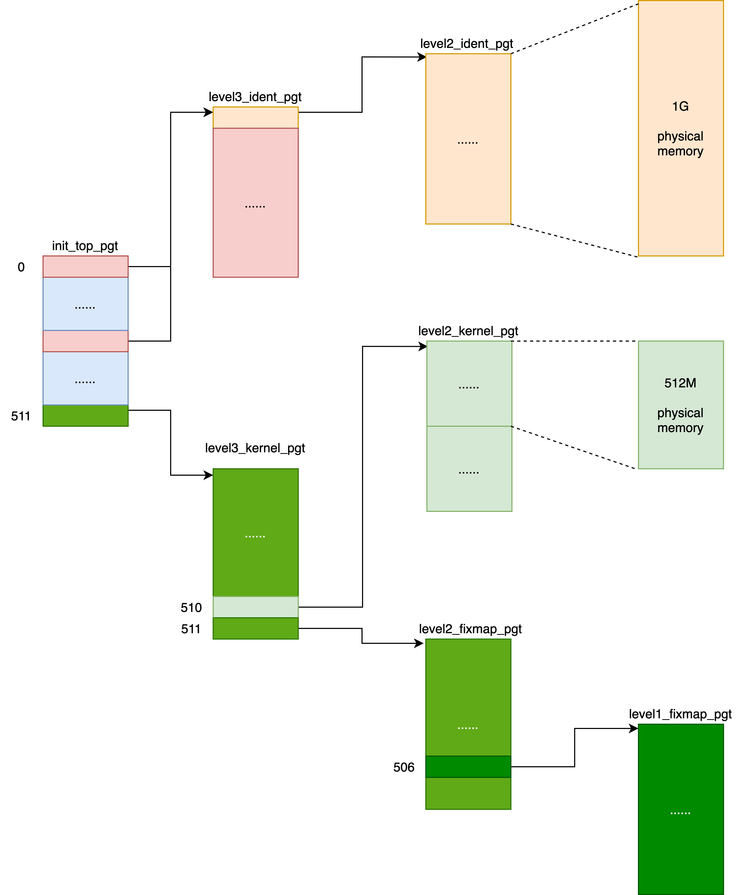

# user virtual space
```c

#ifdef CONFIG_X86_32
/* User space process size: 3GB (default). */
#define TASK_SIZE    PAGE_OFFSET
#define TASK_SIZE_MAX    TASK_SIZE
/* config PAGE_OFFSET
        hex
        default 0xC0000000
        depends on X86_32 */
#else
/* User space process size. 47bits minus one guard page. */
#define TASK_SIZE_MAX  ((1UL << 47) - PAGE_SIZE)
#define TASK_SIZE    (test_thread_flag(TIF_ADDR32) ? \
          IA32_PAGE_OFFSET : TASK_SIZE_MAX)
struct mm_struct {
  unsigned long mmap_base;  /* base of mmap area */
  unsigned long total_vm;   /* Total pages mapped */
  unsigned long locked_vm;  /* Pages that have PG_mlocked set */
  unsigned long pinned_vm;  /* Refcount permanently increased */
  unsigned long data_vm;    /* VM_WRITE & ~VM_SHARED & ~VM_STACK */
  unsigned long exec_vm;    /* VM_EXEC & ~VM_WRITE & ~VM_STACK */
  unsigned long stack_vm;   /* VM_STACK */
  unsigned long start_code, end_code, start_data, end_data;
  unsigned long start_brk, brk, start_stack;
  unsigned long arg_start, arg_end, env_start, env_end;

  unsigned long task_size; /* size of task vm space */

  struct vm_area_struct *mmap;    /* list of VMAs */
  struct rb_root mm_rb;
};

struct vm_area_struct {
  /* The first cache line has the info for VMA tree walking. */
  unsigned long vm_start; /* Our start address within vm_mm. */
  unsigned long vm_end; /* The first byte after our end address within vm_mm. */
  /* linked list of VM areas per task, sorted by address */
  struct vm_area_struct *vm_next, *vm_prev;
  struct rb_node vm_rb;

  struct mm_struct *vm_mm; /* The address space we belong to. */
  struct list_head anon_vma_chain; /* Serialized by mmap_sem &
            * page_table_lock */
  const struct vm_operations_struct *vm_ops;

  struct anon_vma *anon_vma; /* Serialized by page_table_lock */
  /* Function pointers to deal with this struct. */
  struct file * vm_file; /* File we map to (can be NULL). */
  void * vm_private_data; /* was vm_pte (shared mem) */
} __randomize_layout;
```


# kernel virtual space

```c
/* PAGE_OFFSET - the virtual address of the start of the linear map, at the
 *               start of the TTBR1 address space.
 * PAGE_END - the end of the linear map, where all other kernel mappings begin.
 * KIMAGE_VADDR - the virtual address of the start of the kernel image.
 * VA_BITS - the maximum number of bits for virtual addresses. */
```


# numa


---

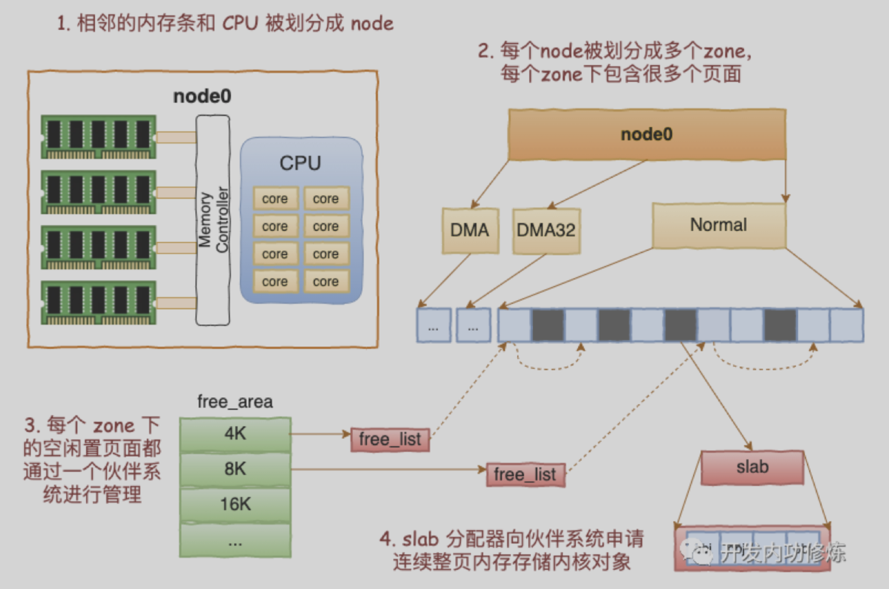

---


## node
```c
struct pglist_data *node_data[MAX_NUMNODES];

typedef struct pglist_data {
    struct zone node_zones[MAX_NR_ZONES];
    /* backup area if current node run out */
    struct zonelist node_zonelists[MAX_ZONELISTS];
    int nr_zones;
    struct page *node_mem_map;
    unsigned long node_start_pfn;     /* start page number of this node */
    unsigned long node_present_pages; /* total number of physical pages */
    unsigned long node_spanned_pages; /* total size of physical page range, including holes */
    int node_id;
} pg_data_t;

enum zone_type {
    ZONE_DMA,
    ZONE_DMA32,
    ZONE_NORMAL, /* direct mmapping area */
    ZONE_HIGHMEM,
    ZONE_MOVABLE,
    __MAX_NR_ZONES
};
```

Zone | Memory Region
--- | ---
ZONE_DMA | First 16MiB of memory
ZONE_NORMAL | 16MiB - 896MiB
ZONE_HIGHMEM | 896 MiB - End

* [Chapter 2 Describing Physical Memory](https://www.kernel.org/doc/gorman/html/understand/understand005.html)

## zone
```c
struct zone {
    struct pglist_data  *zone_pgdat;
    struct per_cpu_pageset *pageset; /* hot/cold page */

    unsigned long    zone_start_pfn;
    unsigned long    managed_pages; /* managed_pages = present_pages - reserved_pages */
    unsigned long    spanned_pages; /* spanned_pages = zone_end_pfn - zone_start_pfn */
    unsigned long    present_pages; /* present_pages = spanned_pages - absent_pages(pages in holes) */

    const char    *name;
    /* free areas of different sizes */
    struct free_area  free_area[MAX_PAGE_ORDER];
    /* zone flags, see below */
    unsigned long    flags;

    /* Primarily protects free_area */
    spinlock_t    lock;
};

struct per_cpu_pageset {
    struct per_cpu_pages pcp;
    s8 expire;
    u16 vm_numa_stat_diff[NR_VM_NUMA_STAT_ITEMS];
}
struct per_cpu_pages {
    int count; /* number of pages in the list */
    int high;  /* high watermark, emptying needed */
    int batch; /* chunk size for buddy add/remove */

    /* Lists of pages, one per migrate type stored on the pcp-lists */
    struct list_head lists[MIGRATE_PCPTYPES];
};

enum migratetype {
    MIGRATE_UNMOVABLE,
    MIGRATE_MOVABLE,
    MIGRATE_RECLAIMABLE,
    MIGRATE_PCPTYPES,  /* the number of types on the pcp lists */
    MIGRATE_HIGHATOMIC = MIGRATE_PCPTYPES,
    MIGRATE_CMA,
    MIGRATE_ISOLATE,
    MIGRATE_TYPES
};
```

## page

* [LWN Index  - struct_page](https://lwn.net/Kernel/Index/#Memory_management-struct_page)
    * [Pulling slabs out of struct page](https://lwn.net/Articles/871982/)
    * [Struct slab comes to 5.17 ](https://lwn.net/Articles/881039/)
    * [The proper time to split struct page](https://lwn.net/Articles/937839/)

```c
struct page {
    /* Atomic flags + zone number, some possibly updated asynchronously */
    unsigned long flags; /* include/linux/page-flags.h */

    union {
        /* 1. Page cache and anonymous pages */
        struct {
            struct list_head lru; /* See page-flags.h for PAGE_MAPPING_FLAGS */
            /* lowest bit is 1 for anonymous mapping, 0 for file mapping */
            struct address_space *mapping;
            /* file page: index of page in page cache
             * anon page: offset of vma in process virtual space */
            pgoff_t index;
            pgoff_t index;          /* Our offset within mapping. */
            unsigned long private; /* struct buffer_head */
        };

        struct {  /* page_pool used by netstack */
            dma_addr_t dma_addr;
        };

        /* 2. slab, slob and slub*/
        struct {
            union {
                struct list_head slab_list;
                struct {  /* Partial pages */
                    struct page *next;
                    int pages;    /* Nr of pages left */
                    int pobjects; /* Approximate count */
                };
            };

            struct kmem_cache *slab_cache; /* not slob */
            void *freelist;           /* first free object */

            union {
                void *s_mem;            /* slab: first object */
                unsigned long counters; /* SLUB */

                struct {                /* SLUB */
                    unsigned inuse:16;  /* used obj */
                    unsigned objects:15; /* nr obj */
                    unsigned frozen:1; /* on cpu cache */
                };
            };
        };


        /* 3. Tail pages of compound page */
        struct {
            unsigned long compound_head; /* Bit zero is set */
            unsigned char compound_dtor; /* First tail page only */
            unsigned char compound_order;
            atomic_t compound_mapcount;
        };


        /* 4. Second tail page of compound page */
        struct {
            unsigned long _compound_pad_1;  /* compound_head */
            unsigned long _compound_pad_2;
            struct list_head deferred_list; /* For both global and memcg */
        };


        /* 5. Page table pages */
        struct {
            unsigned long _pt_pad_1; /* compound_head */
            pgtable_t pmd_huge_pte;  /* protected by page->ptl */
            unsigned long _pt_pad_2; /* mapping */

            union {
                struct mm_struct *pt_mm;  /* x86 pgds only */
                atomic_t pt_frag_refcount;/* powerpc */
            };
            spinlock_t *ptl;
        };

        struct {  /* ZONE_DEVICE pages */
            struct dev_pagemap *pgmap;
            void *zone_device_data;
        };

        struct rcu_head rcu_head;
    };

    union {    /* This union is 4 bytes in size. */
        atomic_t _mapcount;
        unsigned int page_type;
        unsigned int active;  /* SLAB */
        int units;            /* SLOB */
    };

    atomic_t _refcount;

    struct mem_cgroup *mem_cgroup;

    /* Kernel virtual address (NULL if not kmapped, ie. highmem) */
    void *virtual;
    int _last_cpupid;
};
```

# alloc_pages


---


---


* [LWN Index - Out-of-memory handling](https://lwn.net/Kernel/Index/#Memory_management-Out-of-memory_handling)
    * [User-space out-of-memory handling :one:](https://lwn.net/Articles/590960/) [:two:](https://lwn.net/Articles/591990/)

```c
struct page *alloc_pages(gfp_t gfp_mask, unsigned int order) {
    return alloc_pages_node(numa_node_id(), gfp_mask, order) {
        __alloc_pages(gfp_mask, order, nid, NULL/*nodemask*/) {
            struct page *page;
            unsigned int alloc_flags = ALLOC_WMARK_LOW;
            gfp_t alloc_gfp; /* The gfp_t that was actually used for allocation */
            struct alloc_context ac = { };

            gfp &= gfp_allowed_mask;
            gfp = current_gfp_context(gfp) {
                unsigned int pflags = READ_ONCE(current->flags);

                if (pflags & PF_MEMALLOC_NOIO)
                    flags &= ~(__GFP_IO | __GFP_FS);
                else if (pflags & PF_MEMALLOC_NOFS)
                    flags &= ~__GFP_FS;

                if (pflags & PF_MEMALLOC_PIN)
                    flags &= ~__GFP_MOVABLE;

                return flags;
            }
            alloc_gfp = gfp;
            ret = prepare_alloc_pages(gfp, order, preferred_nid, nodemask, &ac, &alloc_gfp, &alloc_flags);
            if (!ret)
                return NULL;

            /* Forbid the first pass from falling back to types that fragment
             * memory until all local zones are considered. */
            alloc_flags |= alloc_flags_nofragment(ac.preferred_zoneref->zone, gfp);

            /* First allocation attempt */
            page = get_page_from_freelist(alloc_gfp, order, alloc_flags, &ac);
            if (likely(page))
                goto out;

            alloc_gfp = gfp;
            ac.spread_dirty_pages = false;

            /* Restore the original nodemask if it was potentially replaced with
             * &cpuset_current_mems_allowed to optimize the fast-path attempt. */
            ac.nodemask = nodemask;

            page = __alloc_pages_slowpath(alloc_gfp, order, &ac);

        out:
            if (memcg_kmem_online() && (gfp & __GFP_ACCOUNT) && page &&
                unlikely(__memcg_kmem_charge_page(page, gfp, order) != 0)) {
                __free_pages(page, order);
                page = NULL;
            }

            kmsan_alloc_page(page, order, alloc_gfp);

            return page;
        }
    }
}
```

## prepare_alloc_pages

```c
bool prepare_alloc_pages(gfp_t gfp_mask, unsigned int order,
    int preferred_nid, nodemask_t *nodemask,
    struct alloc_context *ac, gfp_t *alloc_gfp,
    unsigned int *alloc_flags)
{
    ac->highest_zoneidx = gfp_zone(gfp_mask) {
         int base = 0;

        if (flags & __GFP_THISNODE)
            base = MAX_NR_ZONES;

        if (flags & __GFP_DMA)
            return base + ZONE_DMA;

        if (flags & __GFP_DMA32)
            return base + ZONE_DMA32;

        if ((flags & (__GFP_HIGHMEM | __GFP_MOVABLE)) == (__GFP_HIGHMEM | __GFP_MOVABLE))
            return base + ZONE_MOVABLE;

        if (flags & __GFP_HIGHMEM)
            return base + ZONE_HIGHMEM;

        return base + ZONE_NORMAL;
    }

    ac->zonelist = node_zonelist(preferred_nid, gfp_mask) {
        return NODE_DATA(nid)->node_zonelists + gfp_zonelist(flags) {
            #ifdef CONFIG_NUMA
                if (unlikely(flags & __GFP_THISNODE))
                    return ZONELIST_NOFALLBACK;
            #endif
                return ZONELIST_FALLBACK;
        }
    }

    ac->nodemask = nodemask;
    ac->migratetype = gfp_migratetype(gfp_mask) {
        return (gfp_flags & GFP_MOVABLE_MASK) >> GFP_MOVABLE_SHIFT;
    }

    if (cpusets_enabled()) {
        *alloc_gfp |= __GFP_HARDWALL;
        if (in_task() && !ac->nodemask)
            ac->nodemask = &cpuset_current_mems_allowed;
        else
            *alloc_flags |= ALLOC_CPUSET;
    }

    might_alloc(gfp_mask);

    ret = should_fail_alloc_page(gfp_mask, order) {
        int flags = 0;

        if (order < fail_page_alloc.min_order)
            return false;
        if (gfp_mask & __GFP_NOFAIL)
            return false;
        if (fail_page_alloc.ignore_gfp_highmem && (gfp_mask & __GFP_HIGHMEM))
            return false;
        if (fail_page_alloc.ignore_gfp_reclaim && (gfp_mask & __GFP_DIRECT_RECLAIM))
            return false;

        /* See comment in __should_failslab() */
        if (gfp_mask & __GFP_NOWARN)
            flags |= FAULT_NOWARN;

        return should_fail_ex(&fail_page_alloc.attr, 1 << order, flags) {
            bool stack_checked = false;

            if (in_task()) {
                unsigned int fail_nth = READ_ONCE(current->fail_nth);

                if (fail_nth) {
                    if (!fail_stacktrace(attr))
                        return false;

                    stack_checked = true;
                    fail_nth--;
                    WRITE_ONCE(current->fail_nth, fail_nth);
                    if (!fail_nth)
                        goto fail;

                    return false;
                }
            }

            /* No need to check any other properties if the probability is 0 */
            if (attr->probability == 0)
                return false;

            if (attr->task_filter && !fail_task(attr, current))
                return false;

            if (atomic_read(&attr->times) == 0)
                return false;

            if (!stack_checked && !fail_stacktrace(attr))
                return false;

            if (atomic_read(&attr->space) > size) {
                atomic_sub(size, &attr->space);
                return false;
            }

            if (attr->interval > 1) {
                attr->count++;
                if (attr->count % attr->interval)
                    return false;
            }

            if (attr->probability <= get_random_u32_below(100))
                return false;

        fail:
            if (!(flags & FAULT_NOWARN))
                fail_dump(attr);

            if (atomic_read(&attr->times) != -1)
                atomic_dec_not_zero(&attr->times);

            return true;
        }
    }
    if (ret)
        return false;

    *alloc_flags = gfp_to_alloc_flags_cma(gfp_mask, *alloc_flags) {
        #ifdef CONFIG_CMA
            if (gfp_migratetype(gfp_mask) == MIGRATE_MOVABLE)
                alloc_flags |= ALLOC_CMA;
        #endif
            return alloc_flags;
    }

    /* Dirty zone balancing only done in the fast path */
    ac->spread_dirty_pages = (gfp_mask & __GFP_WRITE);

    /* The preferred zone is used for statistics but crucially it is
     * also used as the starting point for the zonelist iterator. It
     * may get reset for allocations that ignore memory policies. */
    ac->preferred_zoneref = first_zones_zonelist(
        ac->zonelist, ac->highest_zoneidx, ac->nodemask
    );

    return true;
}
```

## get_page_from_freelist


```c
struct page * get_page_from_freelist(
    gfp_t gfp_mask, unsigned int order, int alloc_flags,
    const struct alloc_context *ac)
{
    struct zoneref *z;
    struct zone *zone;
    struct pglist_data *last_pgdat = NULL;
    bool last_pgdat_dirty_ok = false;
    bool no_fallback;

retry:
    /* Scan zonelist, looking for a zone with enough free.
     * See also cpuset_node_allowed() comment in kernel/cgroup/cpuset.c. */
    no_fallback = alloc_flags & ALLOC_NOFRAGMENT;
    z = ac->preferred_zoneref;
    for_next_zone_zonelist_nodemask(zone, z, ac->highest_zoneidx, ac->nodemask) {
        struct page *page;
        unsigned long mark;

        if (cpusets_enabled() &&
            (alloc_flags & ALLOC_CPUSET) &&
            !__cpuset_zone_allowed(zone, gfp_mask))
                continue;

        if (ac->spread_dirty_pages) {
            if (last_pgdat != zone->zone_pgdat) {
                last_pgdat = zone->zone_pgdat;
                last_pgdat_dirty_ok = node_dirty_ok(zone->zone_pgdat) {
                    unsigned long limit = node_dirty_limit(pgdat);
                    unsigned long nr_pages = 0;

                    nr_pages += node_page_state(pgdat, NR_FILE_DIRTY);
                    nr_pages += node_page_state(pgdat, NR_WRITEBACK);

                    return nr_pages <= limit;
                }
            }

            if (!last_pgdat_dirty_ok)
                continue;
        }

        if (no_fallback && nr_online_nodes > 1 && zone != ac->preferred_zoneref->zone) {
            int local_nid;

            /* If moving to a remote node, retry but allow
             * fragmenting fallbacks. Locality is more important
             * than fragmentation avoidance. */
            local_nid = zone_to_nid(ac->preferred_zoneref->zone);
            if (zone_to_nid(zone) != local_nid) {
                alloc_flags &= ~ALLOC_NOFRAGMENT;
                goto retry;
            }
        }

        /* Detect whether the number of free pages is below high
         * watermark.  If so, we will decrease pcp->high and free
         * PCP pages in free path to reduce the possibility of
         * premature page reclaiming.  Detection is done here to
         * avoid to do that in hotter free path. */
        if (test_bit(ZONE_BELOW_HIGH, &zone->flags))
            goto check_alloc_wmark;

        mark = high_wmark_pages(zone);
        ret = zone_watermark_fast(zone, order, mark, ac->highest_zoneidx, alloc_flags, gfp_mask) {
            long free_pages;

            free_pages = zone_page_state(z, NR_FREE_PAGES);

            /* Fast check for order-0 only. If this fails then the reserves
             * need to be calculated. */
            if (!order) {
                long usable_free;
                long reserved;

                usable_free = free_pages;
                reserved = __zone_watermark_unusable_free(z, 0, alloc_flags);

                /* reserved may over estimate high-atomic reserves. */
                usable_free -= min(usable_free, reserved);
                if (usable_free > mark + z->lowmem_reserve[highest_zoneidx])
                    return true;
            }

            /* Return true if free base pages are above 'mark' */
            if (__zone_watermark_ok(z, order, mark, highest_zoneidx, alloc_flags,
                            free_pages))
                return true;

            /* Ignore watermark boosting for __GFP_HIGH order-0 allocations
             * when checking the min watermark. The min watermark is the
             * point where boosting is ignored so that kswapd is woken up
             * when below the low watermark. */
            if (unlikely(!order && (alloc_flags & ALLOC_MIN_RESERVE) && z->watermark_boost
                && ((alloc_flags & ALLOC_WMARK_MASK) == WMARK_MIN))) {

                mark = z->_watermark[WMARK_MIN];
                return __zone_watermark_ok(z, order, mark, highest_zoneidx,
                            alloc_flags, free_pages);
            }

            return false;
        }
        if (ret) {
            goto try_this_zone;
        } else
            set_bit(ZONE_BELOW_HIGH, &zone->flags);

check_alloc_wmark:
        mark = wmark_pages(zone, alloc_flags & ALLOC_WMARK_MASK) {
            return (z->_watermark[i] + z->watermark_boost)
        }
        if (!zone_watermark_fast(zone, order, mark, ac->highest_zoneidx, alloc_flags, gfp_mask)) {
            int ret;

            if (has_unaccepted_memory()) {
                if (try_to_accept_memory(zone, order))
                    goto try_this_zone;
            }

            /* Checked here to keep the fast path fast */
            BUILD_BUG_ON(ALLOC_NO_WATERMARKS < NR_WMARK);
            if (alloc_flags & ALLOC_NO_WATERMARKS)
                goto try_this_zone;

            if (!node_reclaim_enabled() ||
                !zone_allows_reclaim(ac->preferred_zoneref->zone, zone))
                continue;

            ret = node_reclaim(zone->zone_pgdat, gfp_mask, order);
            switch (ret) {
            case NODE_RECLAIM_NOSCAN: /* did not scan */
                continue;
            case NODE_RECLAIM_FULL: /* scanned but unreclaimable */
                continue;
            default: /* did we reclaim enough */
                if (zone_watermark_ok(zone, order, mark,
                    ac->highest_zoneidx, alloc_flags))
                    goto try_this_zone;

                continue;
            }
        }

try_this_zone:
        page = rmqueue(ac->preferred_zoneref->zone, zone, order, gfp_mask, alloc_flags, ac->migratetype);
        if (page) {
            prep_new_page(page, order, gfp_mask, alloc_flags);

            /* If this is a high-order atomic allocation then check
             * if the pageblock should be reserved for the future */
            if (unlikely(alloc_flags & ALLOC_HIGHATOMIC))
                reserve_highatomic_pageblock(page, zone);

            return page;
        } else {
            if (has_unaccepted_memory()) {
                if (try_to_accept_memory(zone, order))
                    goto try_this_zone;
            }
        }
    }

    /* It's possible on a UMA machine to get through all zones that are
     * fragmented. If avoiding fragmentation, reset and try again. */
    if (no_fallback) {
        alloc_flags &= ~ALLOC_NOFRAGMENT;
        goto retry;
    }

    return NULL;
}
```

### rmqueue

```c
struct page *rmqueue(struct zone *preferred_zone,
            struct zone *zone, unsigned int order,
            gfp_t gfp_flags, unsigned int alloc_flags,
            int migratetype)
{
    struct page *page;

    if (likely(pcp_allowed_order(order))) {
        page = rmqueue_pcplist(preferred_zone, zone, order, migratetype, alloc_flags);
        if (likely(page))
            goto out;
    }

    page = rmqueue_buddy(preferred_zone, zone, order, alloc_flags, migratetype) {
        struct page *page;
        unsigned long flags;

        do {
            page = NULL;
            spin_lock_irqsave(&zone->lock, flags);
            if (alloc_flags & ALLOC_HIGHATOMIC) {
                page = __rmqueue_smallest(zone, order, MIGRATE_HIGHATOMIC) {
                    struct page *__rmqueue_smallest(struct zone *zone, unsigned int order,
                        int migratetype) {
                        unsigned int current_order;
                        struct free_area *area;
                        struct page *page;

                        /* Find a page of the appropriate size in the preferred list */
                        for (current_order = order; current_order < NR_PAGE_ORDERS; ++current_order) {
                            area = &(zone->free_area[current_order]);
                            page = get_page_from_free_area(area, migratetype) {
                                return list_first_entry_or_null(&area->free_list[migratetype], struct page, buddy_list);
                            }
                            if (!page)
                                continue;
                            del_page_from_free_list(page, zone, current_order) {
                                /* clear reported state and update reported page count */
                                if (page_reported(page))
                                    __ClearPageReported(page);

                                list_del(&page->buddy_list);
                                __ClearPageBuddy(page);
                                set_page_private(page, 0);
                                zone->free_area[order].nr_free--;
                            }

                            expand(zone, page, order/*low*/, current_order/*high*/, migratetype) {
                                unsigned long size = 1 << high;

                                while (high > low) {
                                    high--;
                                    size >>= 1;

                                    if (set_page_guard(zone, &page[size], high, migratetype))
                                        continue;

                                    add_to_free_list(&page[size], zone, high/*order*/, migratetype) {
                                        struct free_area *area = &zone->free_area[order];

                                        list_add(&page->buddy_list, &area->free_list[migratetype]);
                                        area->nr_free++;
                                    }
                                    set_buddy_order(&page[size], high) {
                                        set_page_private(page, order) {
                                            page->private = private;
                                        }
                                        __SetPageBuddy(page);
                                    }
                                }
                            }

                            set_pcppage_migratetype(page, migratetype) {
                                page->index = migratetype;
                            }
                            return page;
                        }

                        return NULL;
                    }
                }
            }
            if (!page) {
                page = __rmqueue(zone, order, migratetype, alloc_flags) {
                    struct page *page;

                    if (IS_ENABLED(CONFIG_CMA)) {
                        if (alloc_flags & ALLOC_CMA &&
                            zone_page_state(zone, NR_FREE_CMA_PAGES) >
                            zone_page_state(zone, NR_FREE_PAGES) / 2) {

                            page = __rmqueue_cma_fallback(zone, order) {
                                return __rmqueue_smallest(zone, order, MIGRATE_CMA);
                            }
                            if (page)
                                return page;
                        }
                    }
                retry:
                    page = __rmqueue_smallest(zone, order, migratetype);
                    if (unlikely(!page)) {
                        if (alloc_flags & ALLOC_CMA) {
                            page = __rmqueue_cma_fallback(zone, order);
                        }
                        if (!page && __rmqueue_fallback(zone, order, migratetype, alloc_flags)) {
                            goto retry;
                        }
                    }
                    return page;
                }

                if (!page && (alloc_flags & ALLOC_OOM))
                    page = __rmqueue_smallest(zone, order, MIGRATE_HIGHATOMIC);

                if (!page) {
                    spin_unlock_irqrestore(&zone->lock, flags);
                    return NULL;
                }
            }
            __mod_zone_freepage_state(zone, -(1 << order), get_pcppage_migratetype(page));
            spin_unlock_irqrestore(&zone->lock, flags);
        } while (check_new_pages(page, order));

        __count_zid_vm_events(PGALLOC, page_zonenum(page), 1 << order);
        zone_statistics(preferred_zone, zone, 1);

        return page;
    }

out:
    /* Separate test+clear to avoid unnecessary atomics */
    if ((alloc_flags & ALLOC_KSWAPD) &&
        unlikely(test_bit(ZONE_BOOSTED_WATERMARK, &zone->flags))) {
        clear_bit(ZONE_BOOSTED_WATERMARK, &zone->flags);
        wakeup_kswapd(zone, 0, 0, zone_idx(zone));
    }

    return page;
}
```

### rmqueue_pcplist

```c
struct per_cpu_pages {
    spinlock_t lock;    /* Protects lists field */
    int count;          /* number of pages in the list */
    int high;           /* high watermark, emptying needed */
    int high_min;       /* min high watermark */
    int high_max;       /* max high watermark */
    int batch;          /* chunk size for buddy add/remove */
    u8 flags;           /* protected by pcp->lock */
    u8 alloc_factor;    /* batch scaling factor during allocate */
    u8 expire;          /* When 0, remote pagesets are drained */
    short free_count;   /* consecutive free count */

    /* Lists of pages, one per migrate type stored on the pcp-lists */
    struct list_head lists[NR_PCP_LISTS];
};
```

```c
struct page *rmqueue_pcplist(struct zone *preferred_zone,
            struct zone *zone, unsigned int order,
            int migratetype, unsigned int alloc_flags)
{
    struct per_cpu_pages *pcp;
    struct list_head *list;
    struct page *page;
    unsigned long __maybe_unused UP_flags;

    /* spin_trylock may fail due to a parallel drain or IRQ reentrancy. */
    pcp_trylock_prepare(UP_flags);
    pcp = pcp_spin_trylock(zone->per_cpu_pageset);
    if (!pcp) {
        pcp_trylock_finish(UP_flags);
        return NULL;
    }

    pcp->free_count >>= 1;
    ret = order_to_pindex(migratetype, order) {
        #ifdef CONFIG_TRANSPARENT_HUGEPAGE
            if (order > PAGE_ALLOC_COSTLY_ORDER) {
                VM_BUG_ON(order != pageblock_order);
                return NR_LOWORDER_PCP_LISTS;
            }
        #else
            VM_BUG_ON(order > PAGE_ALLOC_COSTLY_ORDER);
        #endif

        return (MIGRATE_PCPTYPES * order) + migratetype;
    }
    list = &pcp->lists[ret];

    page = __rmqueue_pcplist(zone, order, migratetype, alloc_flags, pcp, list) {
        struct page *page;

        do {
            if (list_empty(list)) {
                int batch = nr_pcp_alloc(pcp, zone, order);
                int alloced;

                alloced = rmqueue_bulk(zone, order, batch, list, migratetype, alloc_flags) {
                    unsigned long flags;
                    for (i = 0; i < count; ++i) {
                        struct page *page = __rmqueue(zone, order, migratetype, alloc_flags);
                        list_add_tail(&page->pcp_list, list);
                    }
                    return i;
                }

                pcp->count += alloced << order;
                if (unlikely(list_empty(list)))
                    return NULL;
            }

            page = list_first_entry(list, struct page, pcp_list);
            list_del(&page->pcp_list);
            pcp->count -= 1 << order;
        } while (check_new_pages(page, order));

        return page;
    }
    pcp_spin_unlock(pcp);
    pcp_trylock_finish(UP_flags);
    if (page) {
        __count_zid_vm_events(PGALLOC, page_zonenum(page), 1 << order);
        zone_statistics(preferred_zone, zone, 1);
    }
    return page;
}
```

### rmqueue_fallback

```c
static int fallbacks[MIGRATE_TYPES][MIGRATE_PCPTYPES - 1] = {
    [MIGRATE_UNMOVABLE]   = { MIGRATE_RECLAIMABLE, MIGRATE_MOVABLE   },
    [MIGRATE_MOVABLE]     = { MIGRATE_RECLAIMABLE, MIGRATE_UNMOVABLE },
    [MIGRATE_RECLAIMABLE] = { MIGRATE_UNMOVABLE,   MIGRATE_MOVABLE   },
};

bool __rmqueue_fallback(struct zone *zone, int order, int start_migratetype,
                        unsigned int alloc_flags)
{
    struct free_area *area;
    int current_order;
    int min_order = order;
    struct page *page;
    int fallback_mt;
    bool can_steal;

    if (order < pageblock_order && alloc_flags & ALLOC_NOFRAGMENT)
        min_order = pageblock_order;

    /* Find the largest available free page in the other list. This roughly
     * approximates finding the pageblock with the most free pages, which
     * would be too costly to do exactly. */
    for (current_order = MAX_PAGE_ORDER; current_order >= min_order; --current_order) {
        area = &(zone->free_area[current_order]);
        fallback_mt = find_suitable_fallback(area, current_order,
            start_migratetype, false, &can_steal) {

            int i;
            int fallback_mt;

            if (area->nr_free == 0)
                return -1;

            *can_steal = false;
            for (i = 0; i < MIGRATE_PCPTYPES - 1 ; i++) {
                fallback_mt = fallbacks[migratetype][i];
                if (free_area_empty(area, fallback_mt))
                    continue;

                ret = can_steal_fallback(order, migratetype) {
                    if (order >= pageblock_order)
                        return true;

                    if (order >= pageblock_order / 2 ||
                        start_mt == MIGRATE_RECLAIMABLE ||
                        start_mt == MIGRATE_UNMOVABLE ||
                        page_group_by_mobility_disabled)
                        return true;

                    return false;
                }
                if (ret) {
                    *can_steal = true;
                }

                if (!only_stealable)
                    return fallback_mt;

                if (*can_steal)
                    return fallback_mt;
            }

            return -1;
        }
        if (fallback_mt == -1)
            continue;

        /* We cannot steal all free pages from the pageblock and the
         * requested migratetype is movable. In that case it's better to
         * steal and split the smallest available page instead of the
         * largest available page, because even if the next movable
         * allocation falls back into a different pageblock than this
         * one, it won't cause permanent fragmentation. */
        if (!can_steal && start_migratetype == MIGRATE_MOVABLE && current_order > order)
            goto find_smallest;

        goto do_steal;
    }

    return false;

find_smallest:
    for (current_order = order; current_order < NR_PAGE_ORDERS; current_order++) {
        area = &(zone->free_area[current_order]);
        fallback_mt = find_suitable_fallback(area, current_order,
                start_migratetype, false, &can_steal);
        if (fallback_mt != -1)
            break;
    }

    /* This should not happen - we already found a suitable fallback
    * when looking for the largest page. */
    VM_BUG_ON(current_order > MAX_PAGE_ORDER);

do_steal:
    page = get_page_from_free_area(area, fallback_mt);

    steal_suitable_fallback(zone, page, alloc_flags, start_migratetype, can_steal) {
        unsigned int current_order = buddy_order(page);
        int free_pages, movable_pages, alike_pages;
        int old_block_type;

        old_block_type = get_pageblock_migratetype(page);

        /* This can happen due to races and we want to prevent broken
         * highatomic accounting. */
        if (is_migrate_highatomic(old_block_type))
            goto single_page;

        /* Take ownership for orders >= pageblock_order */
        if (current_order >= pageblock_order) {
            change_pageblock_range(page, current_order, start_type);
            goto single_page;
        }

        /* Boost watermarks to increase reclaim pressure to reduce the
         * likelihood of future fallbacks. Wake kswapd now as the node
         * may be balanced overall and kswapd will not wake naturally. */
        if (boost_watermark(zone) && (alloc_flags & ALLOC_KSWAPD))
            set_bit(ZONE_BOOSTED_WATERMARK, &zone->flags);

        /* We are not allowed to try stealing from the whole block */
        if (!whole_block)
            goto single_page;

        free_pages = move_freepages_block(zone, page, start_type, &movable_pages) {
            unsigned long start_pfn, end_pfn, pfn;

            if (num_movable)
                *num_movable = 0;

            pfn = page_to_pfn(page);
            start_pfn = pageblock_start_pfn(pfn);
            end_pfn = pageblock_end_pfn(pfn) - 1;

            /* Do not cross zone boundaries */
            if (!zone_spans_pfn(zone, start_pfn))
                start_pfn = pfn;
            if (!zone_spans_pfn(zone, end_pfn))
                return 0;

            return move_freepages(zone, start_pfn, end_pfn, migratetype, num_movable) {
                for (pfn = start_pfn; pfn <= end_pfn;) {
                    page = pfn_to_page(pfn);
                    if (!PageBuddy(page)) {
                        /* We assume that pages that could be isolated for
                         * migration are movable. But we don't actually try
                         * isolating, as that would be expensive. */
                        if (num_movable && (PageLRU(page) || __PageMovable(page)))
                            (*num_movable)++;
                        pfn++;
                        continue;
                    }

                    order = buddy_order(page);
                    move_to_free_list(page, zone, order, migratetype) {
                        struct free_area *area = &zone->free_area[order];
                        list_move_tail(&page->buddy_list, &area->free_list[migratetype]);
                    }
                    pfn += 1 << order;
                    pages_moved += 1 << order;
                }

                return pages_moved;
            }
        }
        /* moving whole block can fail due to zone boundary conditions */
        if (!free_pages)
            goto single_page;

        /* Determine how many pages are compatible with our allocation.
         * For movable allocation, it's the number of movable pages which
         * we just obtained. For other types it's a bit more tricky. */
        if (start_type == MIGRATE_MOVABLE) {
            alike_pages = movable_pages;
        } else {
            /* If we are falling back a RECLAIMABLE or UNMOVABLE allocation
             * to MOVABLE pageblock, consider all non-movable pages as
             * compatible. If it's UNMOVABLE falling back to RECLAIMABLE or
             * vice versa, be conservative since we can't distinguish the
             * exact migratetype of non-movable pages. */
            if (old_block_type == MIGRATE_MOVABLE)
                alike_pages = pageblock_nr_pages - (free_pages + movable_pages);
            else
                alike_pages = 0;
        }
        /* If a sufficient number of pages in the block are either free or of
         * compatible migratability as our allocation, claim the whole block. */
        if (free_pages + alike_pages >= (1 << (pageblock_order-1)) ||
                page_group_by_mobility_disabled)
            set_pageblock_migratetype(page, start_type);

        return;

    single_page:
        move_to_free_list(page, zone, current_order, start_type) {
            struct free_area *area = &zone->free_area[order];
            list_move_tail(&page->buddy_list, &area->free_list[migratetype]);
        }
    }

    return true;
}
```

### node_reclaim

```c

```

## alloc_pages_slowpath

```c
struct page *
__alloc_pages_slowpath(gfp_t gfp_mask, unsigned int order,
                        struct alloc_context *ac)
{
    bool can_direct_reclaim = gfp_mask & __GFP_DIRECT_RECLAIM;
    const bool costly_order = order > PAGE_ALLOC_COSTLY_ORDER;
    struct page *page = NULL;
    unsigned int alloc_flags;
    unsigned long did_some_progress;
    enum compact_priority compact_priority;
    enum compact_result compact_result;
    int compaction_retries;
    int no_progress_loops;
    unsigned int cpuset_mems_cookie;
    unsigned int zonelist_iter_cookie;
    int reserve_flags;

restart:
    compaction_retries = 0;
    no_progress_loops = 0;
    compact_priority = DEF_COMPACT_PRIORITY;
    cpuset_mems_cookie = read_mems_allowed_begin();
    zonelist_iter_cookie = zonelist_iter_begin();

    /* The fast path uses conservative alloc_flags to succeed only until
    * kswapd needs to be woken up, and to avoid the cost of setting up
    * alloc_flags precisely. So we do that now. */
    alloc_flags = gfp_to_alloc_flags(gfp_mask, order);

    /* We need to recalculate the starting point for the zonelist iterator
    * because we might have used different nodemask in the fast path, or
    * there was a cpuset modification and we are retrying - otherwise we
    * could end up iterating over non-eligible zones endlessly. */
    ac->preferred_zoneref = first_zones_zonelist(
        ac->zonelist, ac->highest_zoneidx, ac->nodemask);
    if (!ac->preferred_zoneref->zone)
        goto nopage;

    /* Check for insane configurations where the cpuset doesn't contain
    * any suitable zone to satisfy the request - e.g. non-movable
    * GFP_HIGHUSER allocations from MOVABLE nodes only. */
    if (cpusets_insane_config() && (gfp_mask & __GFP_HARDWALL)) {
        struct zoneref *z = first_zones_zonelist(ac->zonelist,
                    ac->highest_zoneidx,
                    &cpuset_current_mems_allowed);
        if (!z->zone)
            goto nopage;
    }

    if (alloc_flags & ALLOC_KSWAPD)
        wake_all_kswapds(order, gfp_mask, ac);

    /* The adjusted alloc_flags might result in immediate success, so try
     * that first */
    page = get_page_from_freelist(gfp_mask, order, alloc_flags, ac);
    if (page)
        goto got_pg;

    /* For costly allocations, try direct compaction first, as it's likely
     * that we have enough base pages and don't need to reclaim. For non-
     * movable high-order allocations, do that as well, as compaction will
     * try prevent permanent fragmentation by migrating from blocks of the
     * same migratetype.
     * Don't try this for allocations that are allowed to ignore
     * watermarks, as the ALLOC_NO_WATERMARKS attempt didn't yet happen. */
    if (can_direct_reclaim
        && (costly_order || (order > 0 && ac->migratetype != MIGRATE_MOVABLE))
        && !gfp_pfmemalloc_allowed(gfp_mask)) {

        page = __alloc_pages_direct_compact(gfp_mask, order,
                        alloc_flags, ac,
                        INIT_COMPACT_PRIORITY,
                        &compact_result);
        if (page)
            goto got_pg;

        /* Checks for costly allocations with __GFP_NORETRY, which
         * includes some THP page fault allocations */
        if (costly_order && (gfp_mask & __GFP_NORETRY)) {
            if (compact_result == COMPACT_SKIPPED ||
                compact_result == COMPACT_DEFERRED)
                goto nopage;

            /* Looks like reclaim/compaction is worth trying, but
             * sync compaction could be very expensive, so keep
             * using async compaction. */
            compact_priority = INIT_COMPACT_PRIORITY;
        }
    }

retry:
    /* Ensure kswapd doesn't accidentally go to sleep as long as we loop */
    if (alloc_flags & ALLOC_KSWAPD)
        wake_all_kswapds(order, gfp_mask, ac);

    reserve_flags = __gfp_pfmemalloc_flags(gfp_mask);
    if (reserve_flags)
        alloc_flags = gfp_to_alloc_flags_cma(gfp_mask, reserve_flags) |
                    (alloc_flags & ALLOC_KSWAPD);

    /* Reset the nodemask and zonelist iterators if memory policies can be
     * ignored. These allocations are high priority and system rather than
     * user oriented. */
    if (!(alloc_flags & ALLOC_CPUSET) || reserve_flags) {
        ac->nodemask = NULL;
        ac->preferred_zoneref = first_zones_zonelist(ac->zonelist,
                    ac->highest_zoneidx, ac->nodemask);
    }

    /* Attempt with potentially adjusted zonelist and alloc_flags */
    page = get_page_from_freelist(gfp_mask, order, alloc_flags, ac);
    if (page)
        goto got_pg;

    /* Caller is not willing to reclaim, we can't balance anything */
    if (!can_direct_reclaim)
        goto nopage;

    /* Avoid recursion of direct reclaim */
    if (current->flags & PF_MEMALLOC)
        goto nopage;

    /* Try direct reclaim and then allocating */
    page = __alloc_pages_direct_reclaim(gfp_mask, order, alloc_flags, ac,
                            &did_some_progress);
    if (page)
        goto got_pg;

    /* Try direct compaction and then allocating */
    page = __alloc_pages_direct_compact(gfp_mask, order, alloc_flags, ac,
                    compact_priority, &compact_result);
    if (page)
        goto got_pg;

    /* Do not loop if specifically requested */
    if (gfp_mask & __GFP_NORETRY)
        goto nopage;

    /* Do not retry costly high order allocations unless they are
     * __GFP_RETRY_MAYFAIL */
    if (costly_order && !(gfp_mask & __GFP_RETRY_MAYFAIL))
        goto nopage;

    if (should_reclaim_retry(gfp_mask, order, ac, alloc_flags,
                did_some_progress > 0, &no_progress_loops))
        goto retry;

    /* It doesn't make any sense to retry for the compaction if the order-0
     * reclaim is not able to make any progress because the current
     * implementation of the compaction depends on the sufficient amount
     * of free memory (see __compaction_suitable) */
    if (did_some_progress > 0 &&
            should_compact_retry(ac, order, alloc_flags,
                compact_result, &compact_priority,
                &compaction_retries))
        goto retry;


    /* Deal with possible cpuset update races or zonelist updates to avoid
     * a unnecessary OOM kill. */
    if (check_retry_cpuset(cpuset_mems_cookie, ac) ||
        check_retry_zonelist(zonelist_iter_cookie))
        goto restart;

    /* Reclaim has failed us, start killing things */
    page = __alloc_pages_may_oom(gfp_mask, order, ac, &did_some_progress);
    if (page)
        goto got_pg;

    /* Avoid allocations with no watermarks from looping endlessly */
    if (tsk_is_oom_victim(current) &&
        (alloc_flags & ALLOC_OOM ||
        (gfp_mask & __GFP_NOMEMALLOC)))
        goto nopage;

    /* Retry as long as the OOM killer is making progress */
    if (did_some_progress) {
        no_progress_loops = 0;
        goto retry;
    }

nopage:
    /* Deal with possible cpuset update races or zonelist updates to avoid
    * a unnecessary OOM kill. */
    if (check_retry_cpuset(cpuset_mems_cookie, ac) ||
        check_retry_zonelist(zonelist_iter_cookie))
        goto restart;

    /* Make sure that __GFP_NOFAIL request doesn't leak out and make sure
    * we always retry */
    if (gfp_mask & __GFP_NOFAIL) {
        /* All existing users of the __GFP_NOFAIL are blockable, so warn
        * of any new users that actually require GFP_NOWAIT */
        if (WARN_ON_ONCE_GFP(!can_direct_reclaim, gfp_mask))
            goto fail;

        /* PF_MEMALLOC request from this context is rather bizarre
         * because we cannot reclaim anything and only can loop waiting
         * for somebody to do a work for us */
        WARN_ON_ONCE_GFP(current->flags & PF_MEMALLOC, gfp_mask);

        /* non failing costly orders are a hard requirement which we
         * are not prepared for much so let's warn about these users
         * so that we can identify them and convert them to something
         * else. */
        WARN_ON_ONCE_GFP(costly_order, gfp_mask);

        /* Help non-failing allocations by giving some access to memory
         * reserves normally used for high priority non-blocking
         * allocations but do not use ALLOC_NO_WATERMARKS because this
         * could deplete whole memory reserves which would just make
         * the situation worse. */
        page = __alloc_pages_cpuset_fallback(gfp_mask, order, ALLOC_MIN_RESERVE, ac);
        if (page)
            goto got_pg;

        cond_resched();
        goto retry;
    }
fail:

got_pg:
    return page;
}
```

### alloc_pages_direct_compact

```c
struct page *
__alloc_pages_direct_compact(gfp_t gfp_mask, unsigned int order,
        unsigned int alloc_flags, const struct alloc_context *ac,
        enum compact_priority prio, enum compact_result *compact_result)
{
    struct page *page = NULL;
    unsigned long pflags;
    unsigned int noreclaim_flag;

    if (!order)
        return NULL;

    *compact_result = try_to_compact_pages(gfp_mask, order, alloc_flags, ac, prio, &page) {
        int may_perform_io = (__force int)(gfp_mask & __GFP_IO);
        struct zoneref *z;
        struct zone *zone;
        enum compact_result rc = COMPACT_SKIPPED;

        if (!may_perform_io)
            return COMPACT_SKIPPED;

        /* Compact each zone in the list */
        for_each_zone_zonelist_nodemask(zone, z, ac->zonelist, ac->highest_zoneidx, ac->nodemask) {
            enum compact_result status;

            if (prio > MIN_COMPACT_PRIORITY && compaction_deferred(zone, order)) {
                rc = max_t(enum compact_result, COMPACT_DEFERRED, rc);
                continue;
            }

            status = compact_zone_order(zone, order, gfp_mask, prio, alloc_flags, ac->highest_zoneidx, capture);
            rc = max(status, rc);

            /* The allocation should succeed, stop compacting */
            if (status == COMPACT_SUCCESS) {
                /* We think the allocation will succeed in this zone,
                * but it is not certain, hence the false. The caller
                * will repeat this with true if allocation indeed
                * succeeds in this zone. */
                compaction_defer_reset(zone, order, false);

                break;
            }

            if (prio != COMPACT_PRIO_ASYNC && (status == COMPACT_COMPLETE ||
                        status == COMPACT_PARTIAL_SKIPPED))
                /* We think that allocation won't succeed in this zone
                * so we defer compaction there. If it ends up
                * succeeding after all, it will be reset. */
                defer_compaction(zone, order);

            /* We might have stopped compacting due to need_resched() in
            * async compaction, or due to a fatal signal detected. In that
            * case do not try further zones */
            if ((prio == COMPACT_PRIO_ASYNC && need_resched())
                        || fatal_signal_pending(current))
                break;
        }

        return rc;
    }
    }

    if (*compact_result == COMPACT_SKIPPED)
        return NULL;

    if (page)
        prep_new_page(page, order, gfp_mask, alloc_flags);

    if (!page)
        page = get_page_from_freelist(gfp_mask, order, alloc_flags, ac);

    if (page) {
        struct zone *zone = page_zone(page);
        zone->compact_blockskip_flush = false;
        compaction_defer_reset(zone, order, true);
        count_vm_event(COMPACTSUCCESS);
        return page;
    }

    return NULL;
}
```

### alloc_pages_direct_reclaim

```c

```

### alloc_pages_may_oom

```c
struct page * __alloc_pages_may_oom(gfp_t gfp_mask, unsigned int order,
    const struct alloc_context *ac, unsigned long *did_some_progress)
{
    struct oom_control oc = {
        .zonelist = ac->zonelist,
        .nodemask = ac->nodemask,
        .memcg = NULL,
        .gfp_mask = gfp_mask,
        .order = order,
    };
    struct page *page;

    *did_some_progress = 0;

    if (!mutex_trylock(&oom_lock)) {
        *did_some_progress = 1;
        schedule_timeout_uninterruptible(1);
        return NULL;
    }

    /* Go through the zonelist yet one more time, keep very high watermark
     * here, this is only to catch a parallel oom killing, we must fail if
     * we're still under heavy pressure. But make sure that this reclaim
     * attempt shall not depend on __GFP_DIRECT_RECLAIM && !__GFP_NORETRY
     * allocation which will never fail due to oom_lock already held. */
    page = get_page_from_freelist((gfp_mask | __GFP_HARDWALL) &
                    ~__GFP_DIRECT_RECLAIM, order,
                    ALLOC_WMARK_HIGH|ALLOC_CPUSET, ac);
    if (page)
        goto out;

    /* Coredumps can quickly deplete all memory reserves */
    if (current->flags & PF_DUMPCORE)
        goto out;
    /* The OOM killer will not help higher order allocs */
    if (order > PAGE_ALLOC_COSTLY_ORDER)
        goto out;
    /* We have already exhausted all our reclaim opportunities without any
    * success so it is time to admit defeat. We will skip the OOM killer
    * because it is very likely that the caller has a more reasonable
    * fallback than shooting a random task.
    *
    * The OOM killer may not free memory on a specific node. */
    if (gfp_mask & (__GFP_RETRY_MAYFAIL | __GFP_THISNODE))
        goto out;
    /* The OOM killer does not needlessly kill tasks for lowmem */
    if (ac->highest_zoneidx < ZONE_NORMAL)
        goto out;
    if (pm_suspended_storage())
        goto out;
    /* XXX: GFP_NOFS allocations should rather fail than rely on
     * other request to make a forward progress.
     * We are in an unfortunate situation where out_of_memory cannot
     * do much for this context but let's try it to at least get
     * access to memory reserved if the current task is killed (see
     * out_of_memory). Once filesystems are ready to handle allocation
     * failures more gracefully we should just bail out here. */

    /* Exhausted what can be done so it's blame time */
    if (out_of_memory(&oc) ||
        WARN_ON_ONCE_GFP(gfp_mask & __GFP_NOFAIL, gfp_mask)) {
        *did_some_progress = 1;

        /* Help non-failing allocations by giving them access to memory
        * reserves */
        if (gfp_mask & __GFP_NOFAIL)
            page = __alloc_pages_cpuset_fallback(gfp_mask, order,
                    ALLOC_NO_WATERMARKS, ac);
    }
out:
    mutex_unlock(&oom_lock);
    return page;
}
```

# free_pages


```c
void free_the_page(struct page *page, unsigned int order)
{
    if (pcp_allowed_order(order)) /* Via pcp? */
        free_unref_page(page, order);
    else
        __free_pages_ok(page, order, FPI_NONE);
}
```

## free_unref_page

```c
void free_unref_page(struct page *page, unsigned int order)
{
    unsigned long __maybe_unused UP_flags;
    struct per_cpu_pages *pcp;
    struct zone *zone;
    unsigned long pfn = page_to_pfn(page);
    int migratetype, pcpmigratetype;

    if (!free_unref_page_prepare(page, pfn, order))
        return;

    migratetype = pcpmigratetype = get_pcppage_migratetype(page);
    if (unlikely(migratetype >= MIGRATE_PCPTYPES)) {
        if (unlikely(is_migrate_isolate(migratetype))) {
            free_one_page(page_zone(page), page, pfn, order, migratetype, FPI_NONE);
            return;
        }
        pcpmigratetype = MIGRATE_MOVABLE;
    }

    zone = page_zone(page);
    pcp_trylock_prepare(UP_flags);
    pcp = pcp_spin_trylock(zone->per_cpu_pageset);
    if (pcp) {
        free_unref_page_commit(zone, pcp, page, pcpmigratetype, order) {
            int high, batch;
            int pindex;
            bool free_high = false;

            pcp->alloc_factor >>= 1;
            __count_vm_events(PGFREE, 1 << order);
            pindex = order_to_pindex(migratetype, order);
            list_add(&page->pcp_list, &pcp->lists[pindex]);
            pcp->count += 1 << order;

            batch = READ_ONCE(pcp->batch);
            if (order && order <= PAGE_ALLOC_COSTLY_ORDER) {
                free_high = (pcp->free_count >= batch
                    && (pcp->flags & PCPF_PREV_FREE_HIGH_ORDER)
                    && (!(pcp->flags & PCPF_FREE_HIGH_BATCH) || pcp->count >= READ_ONCE(batch)));
                pcp->flags |= PCPF_PREV_FREE_HIGH_ORDER;
            } else if (pcp->flags & PCPF_PREV_FREE_HIGH_ORDER) {
                pcp->flags &= ~PCPF_PREV_FREE_HIGH_ORDER;
            }

            if (pcp->free_count < (batch << CONFIG_PCP_BATCH_SCALE_MAX))
                pcp->free_count += (1 << order);

            high = nr_pcp_high(pcp, zone, batch, free_high);
            if (pcp->count >= high) {
                /* free pcp pages to buddy */
                free_pcppages_bulk(zone, nr_pcp_free(pcp, batch, high, free_high), pcp, pindex) {
                    count = min(pcp->count, count);

                    /* Ensure requested pindex is drained first. */
                    pindex = pindex - 1;

                    spin_lock_irqsave(&zone->lock, flags);
                    isolated_pageblocks = has_isolate_pageblock(zone);

                    while (count > 0) {
                        struct list_head *list;
                        int nr_pages;

                        /* Remove pages from lists in a round-robin fashion. */
                        do {
                            if (++pindex > NR_PCP_LISTS - 1)
                                pindex = 0;
                            list = &pcp->lists[pindex];
                        } while (list_empty(list));

                        order = pindex_to_order(pindex);
                        nr_pages = 1 << order;
                        do {
                            int mt;

                            page = list_last_entry(list, struct page, pcp_list);
                            mt = get_pcppage_migratetype(page);

                            /* must delete to avoid corrupting pcp list */
                            list_del(&page->pcp_list);
                            count -= nr_pages;
                            pcp->count -= nr_pages;

                            /* MIGRATE_ISOLATE page should not go to pcplists */
                            VM_BUG_ON_PAGE(is_migrate_isolate(mt), page);
                            /* Pageblock could have been isolated meanwhile */
                            if (unlikely(isolated_pageblocks))
                                mt = get_pageblock_migratetype(page);

                            __free_one_page(page, page_to_pfn(page), zone, order, mt, FPI_NONE);
                        } while (count > 0 && !list_empty(list));
                    }
                }
                if (test_bit(ZONE_BELOW_HIGH, &zone->flags) &&
                    zone_watermark_ok(zone, 0, high_wmark_pages(zone), ZONE_MOVABLE, 0))
                    clear_bit(ZONE_BELOW_HIGH, &zone->flags);
            }
        }
        pcp_spin_unlock(pcp);
    } else {
        free_one_page(zone, page, pfn, order, migratetype, FPI_NONE);
    }
    pcp_trylock_finish(UP_flags);
}
```

## free_one_page

```c
void __free_pages_ok(struct page *page, unsigned int order, fpi_t fpi_flags)
{
    int migratetype;
    unsigned long pfn = page_to_pfn(page);
    struct zone *zone = page_zone(page);

    if (!free_pages_prepare(page, order, fpi_flags))
        return;

    migratetype = get_pfnblock_migratetype(page, pfn);

    free_one_page(zone, page, pfn, order, migratetype, fpi_flags);

    __count_vm_events(PGFREE, 1 << order);
}
```

```c
free_one_page(zone, page, pfn, order, migratetype, FPI_NONE) {
    unsigned long flags;

    spin_lock_irqsave(&zone->lock, flags);
    if (unlikely(has_isolate_pageblock(zone) ||
        is_migrate_isolate(migratetype))) {
        migratetype = get_pfnblock_migratetype(page, pfn);
    }
    __free_one_page(page, pfn, zone, order, migratetype, fpi_flags) {
        while (order < MAX_PAGE_ORDER) {
            if (compaction_capture(capc, page, order, migratetype)) {
                __mod_zone_freepage_state(zone, -(1 << order), migratetype);
                return;
            }

            buddy = find_buddy_page_pfn(page, pfn, order, &buddy_pfn) {
                unsigned long __buddy_pfn = __find_buddy_pfn(pfn, order) {
                    return page_pfn ^ (1 << order);
                }
                struct page *buddy;

                buddy = page + (__buddy_pfn - pfn);
                if (buddy_pfn) {
                    *buddy_pfn = __buddy_pfn;
                }

                ret = page_is_buddy(page, buddy, order){
                    if (!page_is_guard(buddy) && !PageBuddy(buddy))
                        return false;
                    if (buddy_order(buddy) != order)
                        return false;
                    if (page_zone_id(page) != page_zone_id(buddy))
                        return false;

                    VM_BUG_ON_PAGE(page_count(buddy) != 0, buddy);

                    return true;
                }
                if (ret) {
                    return buddy;
                }
                return NULL;
            }
            if (!buddy)
                goto done_merging;

            if (unlikely(order >= pageblock_order)) {
                int buddy_mt = get_pfnblock_migratetype(buddy, buddy_pfn);

                if (migratetype != buddy_mt
                        && (!migratetype_is_mergeable(migratetype) ||
                            !migratetype_is_mergeable(buddy_mt)))
                    goto done_merging;
            }

            if (page_is_guard(buddy))
                clear_page_guard(zone, buddy, order, migratetype);
            else
                del_page_from_free_list(buddy, zone, order);
            combined_pfn = buddy_pfn & pfn;
            page = page + (combined_pfn - pfn);
            pfn = combined_pfn;
            order++;
        }

    done_merging:
        set_buddy_order(page, order);

        if (fpi_flags & FPI_TO_TAIL)
            to_tail = true;
        else if (is_shuffle_order(order))
            to_tail = shuffle_pick_tail();
        else
            to_tail = buddy_merge_likely(pfn, buddy_pfn, page, order);

        if (to_tail)
            add_to_free_list_tail(page, zone, order, migratetype);
        else
            add_to_free_list(page, zone, order, migratetype);

        /* Notify page reporting subsystem of freed page */
        if (!(fpi_flags & FPI_SKIP_REPORT_NOTIFY)) {
            page_reporting_notify_free(order);
        }
    }

    spin_unlock_irqrestore(&zone->lock, flags);
}
```

# kmem_cache

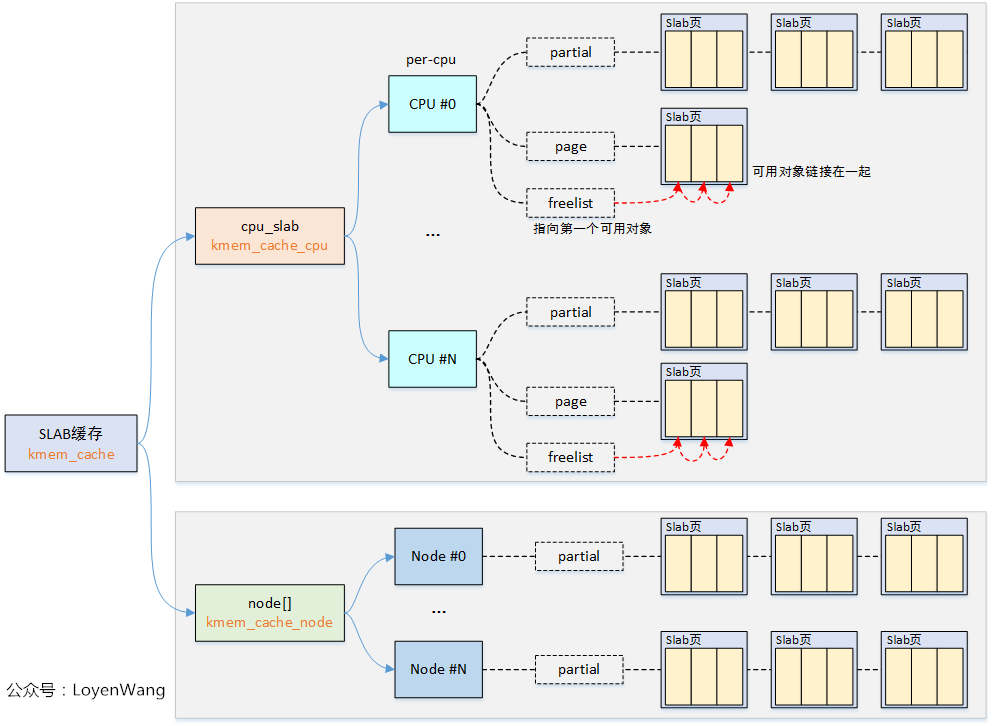

```c
/* mm/slab_common.c */
enum slab_state slab_state;
LIST_HEAD(slab_caches);
DEFINE_MUTEX(slab_mutex);
struct kmem_cache *kmem_cache;

/* mm/slab.c */
struct kmem_cache kmem_cache_boot = {
    .name   = "kmem_cache",
    .size   = sizeof(struct kmem_cache),
    .flags  = SLAB_PANIC,
    .aligs  = ARCH_KMALLOC_MINALIGN,
};

struct kmem_cache {
#ifndef CONFIG_SLUB_TINY
    struct kmem_cache_cpu __percpu *cpu_slab;
#endif

    /* Used for retrieving partial slabs, etc. */
    slab_flags_t flags;
    unsigned long min_partial;
    unsigned int size;        /* Object size including metadata */
    unsigned int object_size;    /* Object size without metadata */
    struct reciprocal_value reciprocal_size;
    unsigned int offset;        /* Free pointer offset */

#ifdef CONFIG_SLUB_CPU_PARTIAL
    /* Number of per cpu partial objects to keep around */
    unsigned int cpu_partial;
    /* Number of per cpu partial slabs to keep around */
    unsigned int cpu_partial_slabs;
#endif

    /* high 16 bits store nr of page used by cache
     * low 16 bits store nr of obj in cache */
    struct kmem_cache_order_objects oo;
    struct kmem_cache_order_objects min;

    gfp_t allocflags;        /* gfp flags to use on each alloc */
    int refcount;            /* Refcount for slab cache destroy */
    void (*ctor)(void *object);    /* Object constructor */
    unsigned int inuse;        /* Offset to metadata */
    unsigned int align;        /* Alignment */
    unsigned int red_left_pad;    /* Left redzone padding size */
    const char *name;        /* Name (only for display!) */
    struct list_head list;        /* List of slab caches */

    struct kmem_cache_node *node[MAX_NUMNODES];
};

struct kmem_cache_node {
    spinlock_t          list_lock;
    unsigned long       nr_partial;
    struct list_head    partial;
};

struct kmem_cache_cpu {
    union {
        struct {
            void **freelist;    /* Pointer to next available object */
            unsigned long tid;    /* Globally unique transaction id */
        };
        freelist_aba_t freelist_tid;
    };
    struct slab *slab;    /* The slab from which we are allocating */

#ifdef CONFIG_SLUB_CPU_PARTIAL
    struct slab *partial;    /* Partially allocated frozen slabs */
#endif
    local_lock_t lock;    /* Protects the fields above */
};
```

## kmem_cache_create

```c
struct kmem_cache *
kmem_cache_create(const char *name, unsigned int size, unsigned int align,
        slab_flags_t flags, void (*ctor)(void *))
{
    return kmem_cache_create_usercopy(name, size, align, flags, 0, 0, ctor);
}

struct kmem_cache *
kmem_cache_create_usercopy(const char *name,
    unsigned int size, unsigned int align,
    slab_flags_t flags,
    unsigned int useroffset, unsigned int usersize,
    void (*ctor)(void *))
{
    struct kmem_cache *s = NULL;
    const char *cache_name;
    int err;

    mutex_lock(&slab_mutex);

    flags &= CACHE_CREATE_MASK;

    if (!usersize)
        s = __kmem_cache_alias(name, size, align, flags, ctor);

    cache_name = kstrdup_const(name, GFP_KERNEL);

    s = create_cache(cache_name, size,
        calculate_alignment(flags, align, size),
        flags, useroffset, usersize, ctor, NULL) {

        s = kmem_cache_zalloc(kmem_cache, GFP_KERNEL);

        s->name = name;
        s->size = s->object_size = object_size;
        s->align = align;
        s->ctor = ctor;
        s->useroffset = useroffset;
        s->usersize = usersize;

        __kmem_cache_create(s, flags) {
            err = kmem_cache_open(s, flags) {
                s->flags = kmem_cache_flags(s->size, flags, s->name);
                s->random = get_random_long();

                if (!calculate_sizes(s)) {
                    goto error;
                }

                s->min_partial = min_t(unsigned long, MAX_PARTIAL, ilog2(s->size) / 2);
                s->min_partial = max_t(unsigned long, MIN_PARTIAL, s->min_partial);

                set_cpu_partial(s) {
                #ifdef CONFIG_SLUB_CPU_PARTIAL
                    unsigned int nr_objects;
                    if (!kmem_cache_has_cpu_partial(s))
                        nr_objects = 0;
                    else if (s->size >= PAGE_SIZE)
                        nr_objects = 6;
                    else if (s->size >= 1024)
                        nr_objects = 24;
                    else if (s->size >= 256)
                        nr_objects = 52;
                    else
                        nr_objects = 120;

                    slub_set_cpu_partial(s, nr_objects) {
                        s->cpu_partial = nr_objects;
                        nr_slabs = DIV_ROUND_UP(nr_objects * 2, oo_objects(s->oo));
                        s->cpu_partial_slabs = nr_slabs;
                    }
                #endif
                }

                init_cache_random_seq(s);

                init_kmem_cache_nodes(s) {
                    for_each_node_mask(node, slab_nodes) {
                        struct kmem_cache_node *n;

                        if (slab_state == DOWN) {
                            early_kmem_cache_node_alloc(node);
                            continue;
                        }

                        n = kmem_cache_alloc_node(kmem_cache_node, GFP_KERNEL, node);
                        init_kmem_cache_node(n) {
                            n->nr_partial = 0;
                            spin_lock_init(&n->list_lock);
                            INIT_LIST_HEAD(&n->partial);
                        }
                        s->node[node] = n;
                    }
                }

                alloc_kmem_cache_cpus(s) {
                    s->cpu_slab = __alloc_percpu(sizeof(struct kmem_cache_cpu), 2 * sizeof(void *));
                    init_kmem_cache_cpus(s) {
                        for_each_possible_cpu(cpu) {
                            c = per_cpu_ptr(s->cpu_slab, cpu);
                            local_lock_init(&c->lock);
                            c->tid = init_tid(cpu);
                        }
                    }
                }
            }

            err = sysfs_slab_add(s);

            if (s->flags & SLAB_STORE_USER)
                debugfs_slab_add(s);
        }

        s->refcount = 1;
        list_add(&s->list, &slab_caches);
        return s;
    }
    if (IS_ERR(s)) {
        err = PTR_ERR(s);
        kfree_const(cache_name);
    }

out_unlock:
    mutex_unlock(&slab_mutex);

    if (err) {
        return NULL;
    }
    return s;
}
```

### calculate_sizes

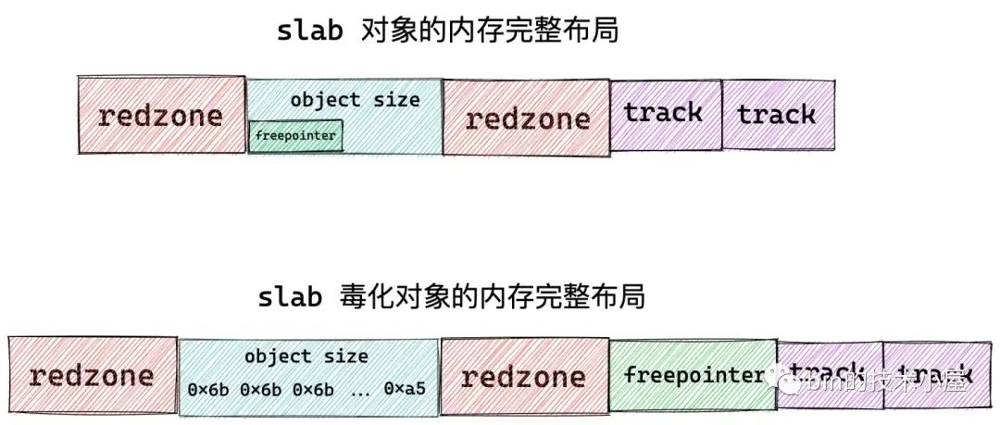

```c
int calculate_sizes(struct kmem_cache *s) {
    slab_flags_t flags = s->flags;
    unsigned int size = s->object_size;
    unsigned int order;

/* 1. | object_size + ALIGN | */
    size = ALIGN(size, sizeof(void *));

#ifdef CONFIG_SLUB_DEBUG
    if ((flags & SLAB_POISON) && !(flags & SLAB_TYPESAFE_BY_RCU) && !s->ctor)
        s->flags |= __OBJECT_POISON;
    else
        s->flags &= ~__OBJECT_POISON;

/* 2. | object_size + ALIGN | RHT_RED_ZONE | */
    if ((flags & SLAB_RED_ZONE) && size == s->object_size)
        size += sizeof(void *);
#endif

    s->inuse = size;

    if (slub_debug_orig_size(s) ||
        (flags & (SLAB_TYPESAFE_BY_RCU | SLAB_POISON)) ||
        ((flags & SLAB_RED_ZONE) && s->object_size < sizeof(void *)) || s->ctor) {

/* 3.1 | object_size + ALIGN | RHT_RED_ZONE | free_ptr | */
        s->offset = size;
        size += sizeof(void *);
    } else {
/* 3.2 | object_size + ALIGN | RED_ZONE | */
        s->offset = ALIGN_DOWN(s->object_size / 2, sizeof(void *));
    }

#ifdef CONFIG_SLUB_DEBUG
    if (flags & SLAB_STORE_USER) {
/* 4. | object_size + ALIGN | RHT_RED_ZONE | free_ptr | track | track | */
        size += 2 * sizeof(struct track);

        /* Save the original kmalloc request size */
        if (flags & SLAB_KMALLOC) {
            size += sizeof(unsigned int);
        }
    }
#endif

    kasan_cache_create(s, &size, &s->flags);
#ifdef CONFIG_SLUB_DEBUG
    if (flags & SLAB_RED_ZONE) {
/* 5. | LFT_RED_ZONE + ALIGN | object_size + ALIGN | RHT_RED_ZONE | free_ptr | */
        size += sizeof(void *);

        s->red_left_pad = sizeof(void *);
        s->red_left_pad = ALIGN(s->red_left_pad, s->align);
        size += s->red_left_pad;
    }
#endif

/* 6. | LFT_RED_ZONE + ALIGN | object_size + ALIGN | RHT_RED_ZONE | free_ptr | ALIGN | */
    size = ALIGN(size, s->align);
    s->size = size;
    s->reciprocal_size = reciprocal_value(size);

    order = calculate_order(size) {
        unsigned int order;
        unsigned int min_objects;
        unsigned int max_objects;
        unsigned int min_order;

        min_objects = slub_min_objects;
        if (!min_objects) {
            unsigned int nr_cpus = num_present_cpus();
            if (nr_cpus <= 1)
                nr_cpus = nr_cpu_ids;
            min_objects = 4 * (fls(nr_cpus) + 1);
        }
        /* min_objects can't be 0 because get_order(0) is undefined */
        max_objects = max(order_objects(slub_max_order, size), 1U);
        min_objects = min(min_objects, max_objects);

        min_order = max_t(unsigned int, slub_min_order, get_order(min_objects * size));
        ret = order_objects(min_order, size) {
            return ((unsigned int)PAGE_SIZE << order) / size;
        }
        if (ret > MAX_OBJS_PER_PAGE) {
            return get_order(size * MAX_OBJS_PER_PAGE) - 1;
        }

        for (unsigned int fraction = 16; fraction > 1; fraction /= 2) {
            order = calc_slab_order(size, min_order, slub_max_order, fraction) {
                unsigned int order;

                for (order = min_order; order <= max_order; order++) {
                    unsigned int slab_size = (unsigned int)PAGE_SIZE << order;
                    unsigned int rem;

                    rem = slab_size % size;
                    if (rem <= slab_size / fract_leftover)
                        break;
                }

                return order;
            }

            if (order <= slub_max_order)
                return order;
        }

        order = get_order(size);
        if (order <= MAX_PAGE_ORDER)
            return order;
        return -ENOSYS;
    }

    if ((int)order < 0)
        return 0;

    s->allocflags = 0;
    if (order)
        s->allocflags |= __GFP_COMP;

    if (s->flags & SLAB_CACHE_DMA)
        s->allocflags |= GFP_DMA;

    if (s->flags & SLAB_CACHE_DMA32)
        s->allocflags |= GFP_DMA32;

    if (s->flags & SLAB_RECLAIM_ACCOUNT)
        s->allocflags |= __GFP_RECLAIMABLE;

    s->oo = oo_make(order, size);
    s->min = oo_make(get_order(size), size) {
        struct kmem_cache_order_objects x = {
            (order << OO_SHIFT) + order_objects(order, size)
        };
        return x;
    }

    return !!oo_objects(s->oo) {
        return x.x & OO_MASK;
    }
}
```

## kmem_cache_destroy


```c
void kmem_cache_destroy(struct kmem_cache *s)
{
    int err = -EBUSY;
    bool rcu_set;

    if (unlikely(!s) || !kasan_check_byte(s))
        return;

    cpus_read_lock();
    mutex_lock(&slab_mutex);

    rcu_set = s->flags & SLAB_TYPESAFE_BY_RCU;

    s->refcount--;
    if (s->refcount)
        goto out_unlock;

    err = shutdown_cache(s) {
        /* free asan quarantined objects */
        kasan_cache_shutdown(s);

        ret = __kmem_cache_shutdown(s) {
            int node;
            struct kmem_cache_node *n;

            flush_all_cpus_locked(s);
            /* Attempt to free all objects */
            for_each_kmem_cache_node(s, node, n) {
                free_partial(s, n) {
                    LIST_HEAD(discard);
                    struct slab *slab, *h;

                    list_for_each_entry_safe(slab, h, &n->partial, slab_list) {
                        if (!slab->inuse) {
                            remove_partial(n, slab);
                            list_add(&slab->slab_list, &discard);
                        } else {
                            list_slab_objects(s, slab);
                        }
                    }
                    spin_unlock_irq(&n->list_lock);

                    list_for_each_entry_safe(slab, h, &discard, slab_list) {
                        discard_slab(s, slab);
                    }
                }
                if (n->nr_partial || node_nr_slabs(n))
                    return 1;
            }
            return 0;
        }
        if (ret != 0) {
            return -EBUSY;
        }

        list_del(&s->list);

        if (s->flags & SLAB_TYPESAFE_BY_RCU) {
            list_add_tail(&s->list, &slab_caches_to_rcu_destroy);
            schedule_work(&slab_caches_to_rcu_destroy_work) {
                list_for_each_entry_safe(s, s2, &to_destroy, list) {
                    debugfs_slab_release(s);
                    kfence_shutdown_cache(s);
                    kmem_cache_release(s) {
                        slab_kmem_cache_release(s) {
                            __kmem_cache_release(s) {
                                cache_random_seq_destroy(s) {
                                    free_percpu(s->cpu_slab);

                                    free_kmem_cache_nodes(s) {
                                        for_each_kmem_cache_node(s, node, n) {
                                            s->node[node] = NULL;
                                            kmem_cache_free(kmem_cache_node, n);
                                        }
                                    }
                                }
                            }

                            kfree_const(s->name);

                            kmem_cache_free(kmem_cache, s) {
                                s = cache_from_obj(s, x);
                                if (!s)
                                    return;
                                slab_free(s, virt_to_slab(x), x, _RET_IP_);
                            }
                        }
                    }
                }
            }
        } else {
            kfence_shutdown_cache(s);
            debugfs_slab_release(s);
        }
    }

out_unlock:
    mutex_unlock(&slab_mutex);
    cpus_read_unlock();
    if (!err && !rcu_set) {
        kmem_cache_release(s);
    }
}
```


```c
void kmem_cache_init(void)
{
    static struct kmem_cache boot_kmem_cache, boot_kmem_cache_node;

    kmem_cache_node = &boot_kmem_cache_node;
    kmem_cache = &boot_kmem_cache;

    create_boot_cache(kmem_cache_node, "kmem_cache_node",
        sizeof(struct kmem_cache_node), SLAB_HWCACHE_ALIGN, 0, 0);

    register_hotmemory_notifier(&slab_memory_callback_nb);

    /* Able to allocate the per node structures */
    slab_state = PARTIAL;

    create_boot_cache(kmem_cache, "kmem_cache",
        offsetof(struct kmem_cache, node) +
            nr_node_ids * sizeof(struct kmem_cache_node *),
        SLAB_HWCACHE_ALIGN, 0, 0
    );

    kmem_cache = bootstrap(&boot_kmem_cache);
    kmem_cache_node = bootstrap(&boot_kmem_cache_node);

    /* Now we can use the kmem_cache to allocate kmalloc slabs */
    setup_kmalloc_cache_index_table();
    create_kmalloc_caches(0);

    /* Setup random freelists for each cache */
    init_freelist_randomization();

    cpuhp_setup_state_nocalls(CPUHP_SLUB_DEAD, "slub:dead", NULL,
          slub_cpu_dead);
}
```

# slub

* [Kenel Index Slab - LWN](https://lwn.net/Kernel/Index/#Memory_management-Slab_allocators)
    * [The SLUB allocator ](https://lwn.net/Articles/229984/)
* [Oracle Linux SLUB Allocator Internals and Debugging :one: :link:](https://blogs.oracle.com/linux/post/linux-slub-allocator-internals-and-debugging-1)    [:two: :link:](https://blogs.oracle.com/linux/post/linux-slub-allocator-internals-and-debugging-2)  [:three: - KASan :link:](https://blogs.oracle.com/linux/post/linux-slub-allocator-internals-and-debugging-3)    [:four: - KFENCE :link:](https://blogs.oracle.com/linux/post/linux-slub-allocator-internals-and-debugging-4)

* bin 的技术小屋
    * [80 张图带你一步一步推演 slab 内存池的设计与实现](https://mp.weixin.qq.com/s/yHF5xBm5yMXDAHmE_noeCg)
    * [从内核源码看 slab 内存池的创建初始化流程](https://mp.weixin.qq.com/s/CcPUAeHY0i2XAVerAWCmLA)
    * [深入理解 slab cache 内存分配全链路实现](https://mp.weixin.qq.com/s/bNAQmzeBLx2HObSNySmB-Q)
    * [深度解析 slab 内存池回收内存以及销毁全流程](https://mp.weixin.qq.com/s/dHLqT6KtAPZWzq_SmQZVFA)


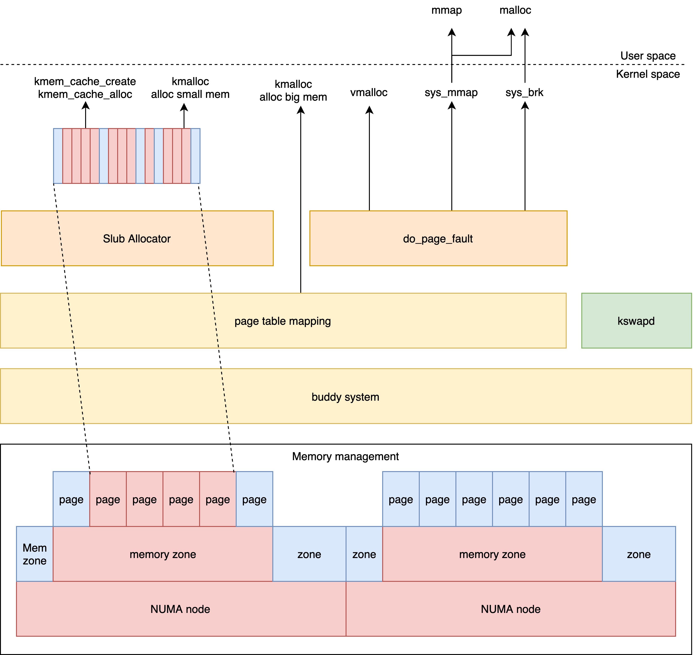


```c
/* Reuses the bits in struct page */
struct slab {
    unsigned long __page_flags;

    struct kmem_cache *slab_cache;
    union {
        struct {
            union {
                struct list_head slab_list;
#ifdef CONFIG_SLUB_CPU_PARTIAL
                struct {
                    struct slab *next;
                     /* Nr of total free slabs, the first partial page
                      * represents the total nr of cache. */
                    int slabs;
                };
#endif
            };
            /* Double-word boundary */
            union {
                struct {
                    void *freelist; /* first free object */
                    union {
                        unsigned long counters;
                        struct {
                           unsigned inuse:16;       /* used obj */
                            unsigned objects:15;    /* nr obj */
                            unsigned frozen:1;      /* on cpu cache */
                        };
                    };
                };
#ifdef system_has_freelist_aba
                freelist_aba_t freelist_counter {
                    struct {
                        void *freelist;
                        unsigned long counter;
                    };
                    freelist_full_t full;
                }
#endif
            };
        };
        struct rcu_head rcu_head;
    };
    unsigned int __unused;

    atomic_t __page_refcount;
#ifdef CONFIG_MEMCG
    unsigned long memcg_data;
#endif
};

/* guard the struct slab has same member offset with struct page */
#define SLAB_MATCH(pg, sl) \
    static_assert(offsetof(struct page, pg) == offsetof(struct slab, sl))

SLAB_MATCH(flags, __page_flags);
SLAB_MATCH(compound_head, slab_cache); /* Ensure bit 0 is clear */
SLAB_MATCH(_refcount, __page_refcount);
SLAB_MATCH(memcg_data, memcg_data);
#undef SLAB_MATCH
```

## slub_alloc


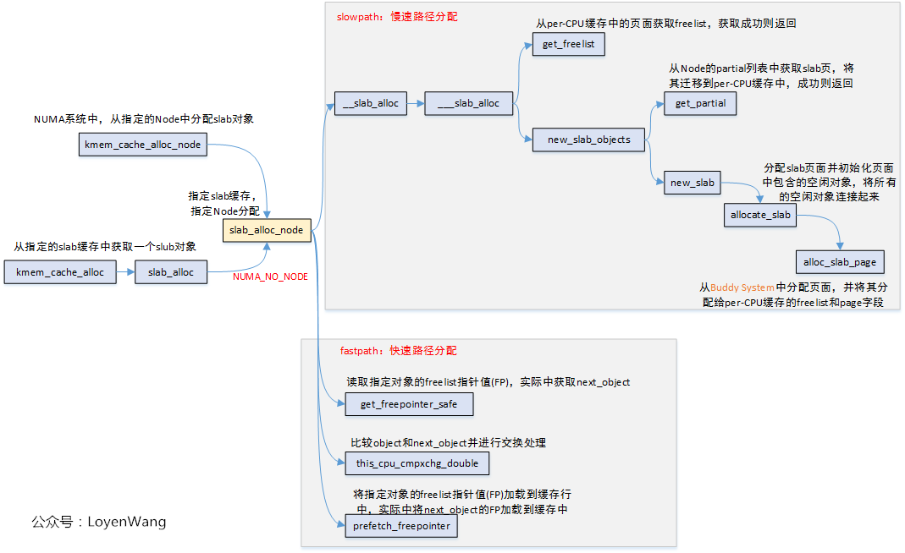


```c
kmem_cache_alloc(s, flags) {
    __kmem_cache_alloc_lru(s, lru, flags)
        slab_alloc()
            slab_alloc_node()
                slab_pre_alloc_hook()
                kfence_alloc()
                __slab_alloc_node()
}

void *__slab_alloc_node(struct kmem_cache *s,
    gfp_t gfpflags, int node, unsigned long addr, size_t orig_size) {
    struct kmem_cache_cpu *c;
    struct slab *slab;
    unsigned long tid;
    void *object;

redo:
    /* 1. get free obj from cpu cache */
    c = raw_cpu_ptr(s->cpu_slab);
    tid = READ_ONCE(c->tid);
    object = c->freelist;
    slab = c->slab;

/* slow path */
    if (unlikely(!object || !slab || !node_match(slab, node))) {
        object = __slab_alloc(s, gfpflags, node, addr, c, orig_size) {
            c = slub_get_cpu_ptr(s->cpu_slab);
            return ___slab_alloc(s, gfpflags, node, addr, c, orig_size) {
            reread_slab:
                slab = READ_ONCE(c->slab);
                if (!slab) {
                    goto new_slab;
                }

                if (unlikely(slab != c->slab)) {
                    local_unlock_irqrestore(&s->cpu_slab->lock, flags);
                    goto reread_slab;
                }

                freelist = c->freelist;
                if (freelist)
                    goto load_freelist;

                /* Check the slab->freelist and either transfer the freelist to the
                 * per cpu freelist or deactivate the slab. */
                freelist = get_freelist(s, slab) {
                    struct slab new;
                    unsigned long counters;
                    void *freelist;

                    do {
                        freelist = slab->freelist;
                        counters = slab->counters;

                        new.counters = counters;
                        new.inuse = slab->objects;
                        new.frozen = freelist != NULL;
                    } while (!__slab_update_freelist(s, slab,
                        freelist, counters,
                        NULL, new.counters,
                        "get_freelist")
                    );

                    return freelist;
                }
                if (!freelist) {
                    c->slab = NULL;
                    c->tid = next_tid(c->tid);
                    goto new_slab;
                }

            load_freelist: /* load a freelist to cpu freelist */
                c->freelist = get_freepointer(s, freelist/*object*/) {
                    object = kasan_reset_tag(object);
                    ptr_addr = (unsigned long)object + s->offset;
                    p = *(freeptr_t *)(ptr_addr);
                    return freelist_ptr_decode(s, p, ptr_addr);
                }
                c->tid = next_tid(c->tid);
                return freelist;

            deactivate_slab: /* Finishes removing the cpu slab, merges cpu's freelist with slab's freelist */
                if (slab != c->slab) {
                    local_unlock_irqrestore(&s->cpu_slab->lock, flags);
                    goto reread_slab;
                }
                freelist = c->freelist;
                c->slab = NULL;
                c->freelist = NULL;
                c->tid = next_tid(c->tid);
                deactivate_slab(s, slab, freelist) {
                    if (slab->freelist) {
                        stat(s, DEACTIVATE_REMOTE_FREES);
                        tail = DEACTIVATE_TO_TAIL;
                    }

                    /* Stage one: Count the objects on cpu's freelist as free_delta and
                     * remember the last object in freelist_tail for later splicing. */
                    freelist_tail = NULL;
                    freelist_iter = freelist;
                    while (freelist_iter) {
                        nextfree = get_freepointer(s, freelist_iter);

                        if (freelist_corrupted(s, slab, &freelist_iter, nextfree))
                            break;

                        freelist_tail = freelist_iter;
                        free_delta++;

                        freelist_iter = nextfree;
                    }

                    /* Stage two: Unfreeze the slab while splicing the per-cpu
                     * freelist to the head of slab's freelist. */
                    do {
                        old.freelist = READ_ONCE(slab->freelist);
                        old.counters = READ_ONCE(slab->counters);
                        VM_BUG_ON(!old.frozen);

                        /* Determine target state of the slab */
                        new.counters = old.counters;
                        new.frozen = 0;
                        if (freelist_tail) {
                            new.inuse -= free_delta;
                            set_freepointer(s, freelist_tail, old.freelist);
                            new.freelist = freelist;
                        } else {
                            new.freelist = old.freelist;
                        }
                    } while (!slab_update_freelist(s, slab,
                        old.freelist, old.counters,
                        new.freelist, new.counters,
                        "unfreezing slab")
                    );

                    /* Stage three: Manipulate the slab list based on the updated state. */
                    if (!new.inuse && n->nr_partial >= s->min_partial) {
                        discard_slab(s, slab) {
                            free_slab(s, slab);
                        }
                    } else if (new.freelist) {
                        add_partial(n, slab, tail) {
                            __add_partial(n, slab, tail) {
                                n->nr_partial++;
                                if (tail == DEACTIVATE_TO_TAIL) {
                                    list_add_tail(&slab->slab_list, &n->partial);
                                } else {
                                    list_add(&slab->slab_list, &n->partial);
                                }
                                slab_set_node_partial(slab) {
                                    set_bit(PG_workingset, folio_flags(slab_folio(slab), 0));
                                }
                            }
                        }
                    }
                }

            new_slab:
            #ifdef CONFIG_SLUB_CPU_PARTIAL
                while (slub_percpu_partial(c)) {
                    if (unlikely(c->slab)) {
                        goto reread_slab;
                    }
                    if (unlikely(!slub_percpu_partial(c))) {
                        /* we were preempted and partial list got empty */
                        goto new_objects;
                    }

                    slab = slub_percpu_partial(c);
                    slub_set_percpu_partial(c, slab) {
                        c->partial = slab->next;
                    }

                    if (unlikely(!node_match(slab, node) || !pfmemalloc_match(slab, gfpflags))) {
                        slab->next = NULL;
                        __put_partials(s, slab);
                        continue;
                    }

                    freelist = freeze_slab(s, slab);
                    goto retry_load_slab;
                }
            #endif

            new_objects:
                /* get partial from node */
                pc.flags = gfpflags;
                pc.slab = &slab;
                pc.orig_size = orig_size;
                slab = get_partial(s, node, &pc) {
                    obj = get_partial_node(s, n) {
                        list_for_each_entry_safe(slab, slab2, &n->partial, slab_list) {
                            if (IS_ENABLED(CONFIG_SLUB_TINY) || kmem_cache_debug(s)) {
                                obj = alloc_single_from_partial(s, n, slab, pc->orig_size) {
                                    object = slab->freelist;
                                    slab->freelist = get_freepointer(s, object) {
                                        /* `object + s->offset` stores next free obj addr */
                                        return freelist_dereference(s, object + s->offset);
                                    }
                                    slab->inuse++;

                                    /* slab is runing out, move it from parital list to full list */
                                    if (slab->inuse == slab->objects) {
                                        remove_partial(n, slab) {
                                            list_del(&slab->slab_list);
                                            n->nr_partial--;
                                        }
                                        add_full(s, n, slab) {
                                            list_add(&slab->slab_list, &n->full);
                                        }
                                    }
                                }

                                if (obj) {
                                    partial = slab;
                                    pc->object = object;
                                    break;
                                }
                                continue;
                            }

                            remove_partial(n, slab) {
                                list_del(&slab->slab_list);
                                slab_clear_node_partial(slab);
                                n->nr_partial--;
                            }

                            if (!partial) {
                                partial = slab;
                            } else {
                                put_cpu_partial(s, slab, 0);
                                partial_slabs++;
                            }

                            if (!kmem_cache_has_cpu_partial(s) || partial_slabs > s->cpu_partial_slabs / 2) {
                                break;
                            }
                        }

                        return obj;
                    }

                    if (obj)
                        return obj;
                    obj = get_any_partial(s)
                        return NULL;
                }
                if (slab) {
                    freelist = freeze_slab(s, slab) {
                        struct slab new;
                        unsigned long counters;
                        void *freelist;

                        do {
                            freelist = slab->freelist;
                            counters = slab->counters;

                            new.counters = counters;
                            VM_BUG_ON(new.frozen);

                            new.inuse = slab->objects;
                            new.frozen = 1;

                            slab_update_freelist(s, slab,
                                freelist, counters,
                                NULL, new.counters, "freeze_slab") {

                                bool ret;

                                if (s->flags & __CMPXCHG_DOUBLE) {
                                    ret = __update_freelist_fast(slab, freelist_old, counters_old,
                                                        freelist_new, counters_new);
                                } else {
                                    unsigned long flags;

                                    local_irq_save(flags);
                                    ret = __update_freelist_slow(slab, freelist_old, counters_old,
                                                        freelist_new, counters_new) {
                                        slab_lock(slab);
                                        if (slab->freelist == freelist_old &&
                                            slab->counters == counters_old) {

                                            slab->freelist = freelist_new /* NULL */;
                                            slab->counters = counters_new;
                                            ret = true;
                                        }
                                        slab_unlock(slab);
                                    }
                                    local_irq_restore(flags);
                                }
                                if (likely(ret))
                                    return true;

                                return false;
                            }
                        } while (!slab_update_freelist());

                        return freelist;
                    }
                    goto retry_load_slab;
                }

                slub_put_cpu_ptr(s->cpu_slab);
                /* node has no partial, alloc_page */
                slab = new_slab(s, gfpflags, node) {
                    return allocate_slab(s, flags & (GFP_RECLAIM_MASK | GFP_CONSTRAINT_MASK), node) {
                        flags &= gfp_allowed_mask;
                        flags |= s->allocflags;

                        alloc_gfp = (flags | __GFP_NOWARN | __GFP_NORETRY) & ~__GFP_NOFAIL;
                        if ((alloc_gfp & __GFP_DIRECT_RECLAIM) && oo_order(oo) > oo_order(s->min))
                            alloc_gfp = (alloc_gfp | __GFP_NOMEMALLOC) & ~__GFP_RECLAIM;

                        slab = alloc_slab_page(alloc_gfp, node, oo);
                        if (unlikely(!slab)) {
                            oo = s->min;
                            alloc_gfp = flags;
                            slab = alloc_slab_page(alloc_gfp, node, oo);
                            if (unlikely(!slab))
                                return NULL;
                            stat(s, ORDER_FALLBACK);
                        }

                        slab->objects = oo_objects(oo);
                        slab->inuse = 0;
                        slab->frozen = 0;

                        account_slab(slab, oo_order(oo), s, flags);

                        slab->slab_cache = s;

                        kasan_poison_slab(slab);

                        start = slab_address(slab);

                        setup_slab_debug(s, slab, start);

                        shuffle = shuffle_freelist(s, slab);

                        if (!shuffle) {
                            start = fixup_red_left(s, start) {
                                if (kmem_cache_debug_flags(s, SLAB_RED_ZONE))
                                    p += s->red_left_pad;
                                return p;
                            }
                            start = setup_object(s, start);
                            slab->freelist = start;
                            for (idx = 0, p = start; idx < slab->objects - 1; idx++) {
                                next = p + s->size;
                                next = setup_object(s, next);
                                set_freepointer(s, p/*object*/, next/*fp*/) {
                                    unsigned long freeptr_addr = (unsigned long)object + s->offset;
                                    freeptr_addr = (unsigned long)kasan_reset_tag((void *)freeptr_addr);
                                    *(freeptr_t *)freeptr_addr = freelist_ptr_encode(s, fp, freeptr_addr);
                                }
                                p = next;
                            }
                            set_freepointer(s, p, NULL);
                        }

                        return slab;
                    }
                }
                c = slub_get_cpu_ptr(s->cpu_slab);

                if (unlikely(!slab)) {
                    slab_out_of_memory(s, gfpflags, node);
                    return NULL;
                }

                freelist = slab->freelist;
                slab->freelist = NULL;
                slab->inuse = slab->objects;
                slab->frozen = 1;

            retry_load_slab:
                if (unlikely(c->slab)) {
                    void *flush_freelist = c->freelist;
                    struct slab *flush_slab = c->slab;

                    c->slab = NULL;
                    c->freelist = NULL;
                    c->tid = next_tid(c->tid);

                    deactivate_slab(s, flush_slab, flush_freelist);

                    goto retry_load_slab;
                }

                c->slab = slab;
                goto load_freelist;
            }
        }
    } else {
/* fast path */
        void *next_object = get_freepointer_safe(s, object) {
            unsigned long freepointer_addr;
            freeptr_t p;

            if (!debug_pagealloc_enabled_static())
                return get_freepointer(s, object);

            object = kasan_reset_tag(object);
            freepointer_addr = (unsigned long)object + s->offset;
            copy_from_kernel_nofault(&p, (freeptr_t *)freepointer_addr, sizeof(p));
            return freelist_ptr_decode(s, p, freepointer_addr);
        }

        if (unlikely(!this_cpu_cmpxchg_double(
            s->cpu_slab->freelist, s->cpu_slab->tid,
            object, tid,
            next_object, next_tid(tid))))
        {
            note_cmpxchg_failure("slab_alloc", s, tid);
            goto redo;
        }

        prefetch_freepointer(s, next_object);
    }

    return object;
}
```

## slab_free


```c
void kmem_cache_free(struct kmem_cache *s, void *x)
{
    s = cache_from_obj(s, x);
    if (!s)
        return;
    slab_free(s, virt_to_slab(x), x, _RET_IP_);
}

void slab_free(struct kmem_cache *s, struct slab *slab, void *object,
	       unsigned long addr)
{
    memcg_slab_free_hook(s, slab, &object, 1);
    /* With KASAN enabled slab_free_freelist_hook modifies the freelist
     * to remove objects, whose reuse must be delayed. */
    if (slab_free_freelist_hook(s, object/*head*/, object/*tail*/, &cnt)) {
        do_slab_free(s, slab, head, tail, 1/*cnt*/, addr) {
            struct kmem_cache_cpu *c;
            unsigned long tid;
            void **freelist;

        redo:
            c = raw_cpu_ptr(s->cpu_slab);
            tid = READ_ONCE(c->tid);

            /* Same with comment on barrier() in slab_alloc_node() */
            barrier();

/* slow path: slab doesnt belong to cur cpu cache */
            if (unlikely(slab != c->slab)) {
                __slab_free(s, slab, head, tail, cnt, addr) {
                    do {
                        if (unlikely(n)) {
                            spin_unlock_irqrestore(&n->list_lock, flags);
                            n = NULL;
                        }
                        prior = slab->freelist;
                        counters = slab->counters;
                        set_freepointer(s, tail, prior);
                        new.counters = counters;
                        was_frozen = new.frozen;
                        new.inuse -= cnt;
                        /* !was_frozen: not on cpu cache
                         * !new.inuse: slab is empty (0 objs used)
                         * !prior: slab was full (all objs used ) */
                        if ((!new.inuse || !prior) && !was_frozen) {
                            /* Needs to be taken off a list */
                            if (!kmem_cache_has_cpu_partial(s) || prior) {
                                n = get_node(s, slab_nid(slab));
                                spin_lock_irqsave(&n->list_lock, flags);
                                on_node_partial = slab_test_node_partial(slab);
                            }
                        }
                    } while (!slab_update_freelist(s, slab,
                        prior, counters,
                        head, new.counters,
                        "__slab_free")
                    );

                    if (likely(!n)) {
                        if (likely(was_frozen)) {
                            stat(s, FREE_FROZEN);
                        } else if (kmem_cache_has_cpu_partial(s) && !prior) {
                            /* put an empty slab */
                            put_cpu_partial(s, slab, 1/*drain*/) {
                                struct slab *oldslab;
                                struct slab *slab_to_put = NULL;
                                unsigned long flags;
                                int slabs = 0;

                                /* head partial slab records the totoal nr of slabs */
                                oldslab = this_cpu_read(s->cpu_slab->partial);

                                if (oldslab) {
                                    /* put excessive cpu partial to node partial */
                                    if (drain && oldslab->slabs >= s->cpu_partial_slabs) {
                                        slab_to_put = oldslab;
                                        oldslab = NULL;
                                    } else {
                                        slabs = oldslab->slabs;
                                    }
                                }

                                slabs++;

                                slab->slabs = slabs;
                                slab->next = oldslab;

                                this_cpu_write(s->cpu_slab->partial, slab);

                                if (slab_to_put) {
                                    __put_partials(s, slab_to_put) {
                                        while (partial_slab) {
                                            slab = partial_slab;
                                            partial_slab = slab->next;

                                            n2 = get_node(s, slab_nid(slab));
                                            if (n != n2) {
                                                if (n) {
                                                    spin_unlock_irqrestore(&n->list_lock, flags);
                                                }
                                                n = n2;
                                                spin_lock_irqsave(&n->list_lock, flags);
                                            }

                                            /* put excessive node parital to buddy system */
                                            if (unlikely(!slab->inuse && n->nr_partial >= s->min_partial)) {
                                                slab->next = slab_to_discard;
                                                slab_to_discard = slab;
                                            } else {
                                                add_partial(n, slab, DEACTIVATE_TO_TAIL);
                                            }
                                        }

                                        if (n)
                                            spin_unlock_irqrestore(&n->list_lock, flags);

                                        while (slab_to_discard) {
                                            slab = slab_to_discard;
                                            slab_to_discard = slab_to_discard->next;
                                            discard_slab(s, slab);
                                        }
                                    }
                                }
                            }
                            stat(s, CPU_PARTIAL_FREE);
                        }

                        return;
                    }

                    /* This slab was partially empty but not on the per-node partial list,
                     * in which case we shouldn't manipulate its list, just return. */
                    if (prior && !on_node_partial) {
                        spin_unlock_irqrestore(&n->list_lock, flags);
                        return;
                    }

                    if (unlikely(!new.inuse && n->nr_partial >= s->min_partial))
                        goto slab_empty;

                    /* Objects left in the slab. If it was not on the partial list before
                     * then add it.
                     * !prior: on full list */
                    if (!kmem_cache_has_cpu_partial(s) && unlikely(!prior)) {
                        remove_full(s, n, slab);
                        add_partial(n, slab, DEACTIVATE_TO_TAIL);
                    }
                    spin_unlock_irqrestore(&n->list_lock, flags);
                    return;

                /* free excessive empty slab to buddy system */
                slab_empty:
                    if (prior) { /* Slab on the partial list. */
                        remove_partial(n, slab) {
                            list_del(&slab->slab_list);
                            slab_clear_node_partial(slab) {
                                clear_bit(PG_workingset, folio_flags(slab_folio(slab), 0));
                            }
                            n->nr_partial--;
                        }
                    } else { /* Slab must be on the full list */
                        remove_full(s, n, slab)  {
                            /* full list is only enabled as SLAB_STORE_USER enabled */
                            if (!(s->flags & SLAB_STORE_USER))
                                return;
                            list_del(&slab->slab_list);
                        }
                    }

                    spin_unlock_irqrestore(&n->list_lock, flags);
                    stat(s, FREE_SLAB);
                    discard_slab(s, slab) {
                        __free_pages();
                    }
                }
                return;
            }

/* fast path: slab belongs to cur cpu slab */

            if (USE_LOCKLESS_FAST_PATH()) {
                freelist = READ_ONCE(c->freelist);

                set_freepointer(s, tail, freelist);

                if (unlikely(!__update_cpu_freelist_fast(s, freelist, head, tid))) {
                    note_cmpxchg_failure("slab_free", s, tid);
                    goto redo;
                }
            } else {
                /* Update the free list under the local lock */
                local_lock(&s->cpu_slab->lock);
                c = this_cpu_ptr(s->cpu_slab);
                if (unlikely(slab != c->slab)) {
                    local_unlock(&s->cpu_slab->lock);
                    goto redo;
                }
                tid = c->tid;
                freelist = c->freelist;

                set_freepointer(s, tail, freelist);
                c->freelist = head;
                c->tid = next_tid(tid);

                local_unlock(&s->cpu_slab->lock);
            }
        }
    }
}
```

# kswapd

```c
//1. active page out when alloc
get_page_from_freelist();
    node_reclaim();
        __node_reclaim();
            shrink_node();

/* 2. positive page out by kswapd */
static int kswapd(void *p)
{
    unsigned int alloc_order, reclaim_order;
    unsigned int classzone_idx = MAX_NR_ZONES - 1;
    pg_data_t *pgdat = (pg_data_t*)p;
    struct task_struct *tsk = current;

    for ( ; ; ) {
        kswapd_try_to_sleep(pgdat, alloc_order, reclaim_order,
            classzone_idx);
        reclaim_order = balance_pgdat(pgdat, alloc_order, classzone_idx);
    }
}
/* balance_pgdat->kswapd_shrink_node->shrink_node */

/* This is a basic per-node page freer.  Used by both kswapd and direct reclaim. */
static void shrink_node_memcg(struct pglist_data *pgdat, struct mem_cgroup *memcg,
            struct scan_control *sc, unsigned long *lru_pages)
{
    unsigned long nr[NR_LRU_LISTS];
    enum lru_list lru;

    while (nr[LRU_INACTIVE_ANON] || nr[LRU_ACTIVE_FILE] ||
        nr[LRU_INACTIVE_FILE]) {
        unsigned long nr_anon, nr_file, percentage;
        unsigned long nr_scanned;

        for_each_evictable_lru(lru) {
            if (nr[lru]) {
                nr_to_scan = min(nr[lru], SWAP_CLUSTER_MAX);
                nr[lru] -= nr_to_scan;

                nr_reclaimed += shrink_list(lru, nr_to_scan, lruvec, memcg, sc);
            }
        }
    }
}

#define for_each_evictable_lru(lru) for (lru = 0; lru <= LRU_ACTIVE_FILE; lru++)

static unsigned long shrink_list(enum lru_list lru, unsigned long nr_to_scan,
         struct lruvec *lruvec, struct mem_cgroup *memcg,
         struct scan_control *sc)
{
  if (is_active_lru(lru)) {
        if (inactive_list_is_low(lruvec, is_file_lru(lru),
            memcg, sc, true))
            shrink_active_list(nr_to_scan, lruvec, sc, lru);
        return 0;
  }

  return shrink_inactive_list(nr_to_scan, lruvec, sc, lru);
}
```

# brk

```c
SYSCALL_DEFINE1(brk, unsigned long, brk)
{
    unsigned long retval;
    unsigned long newbrk, oldbrk;
    struct mm_struct *mm = current->mm;
    struct vm_area_struct *next;

    newbrk = PAGE_ALIGN(brk);
    oldbrk = PAGE_ALIGN(mm->brk);
    if (oldbrk == newbrk)
        goto set_brk;

    /* Always allow shrinking brk. */
    if (brk <= mm->brk) {
        if (!do_munmap(mm, newbrk, oldbrk-newbrk, &uf))
            goto set_brk;
        goto out;
    }

    /* Check against existing mmap mappings. */
    next = find_vma(mm, oldbrk);
    if (next && newbrk + PAGE_SIZE > vm_start_gap(next))
        goto out;

    /* Ok, looks good - let it rip. */
    if (do_brk(oldbrk, newbrk-oldbrk, &uf) < 0)
        goto out;

set_brk:
    mm->brk = brk;

    return brk;
out:
    retval = mm->brk;
    return retval
}

static int do_brk(unsigned long addr, unsigned long len, struct list_head *uf)
{
    return do_brk_flags(addr, len, 0, uf);
}

int do_brk_flags(unsigned long addr, unsigned long len, unsigned long flags, struct list_head *uf)
{
    struct mm_struct *mm = current->mm;
    struct vm_area_struct *vma, *prev;
    struct rb_node **rb_link, *rb_parent;
    pgoff_t pgoff = addr >> PAGE_SHIFT;
    int error;

    error = get_unmapped_area(NULL, addr, len, 0, MAP_FIXED);
    if (offset_in_page(error))
        return error;

    /* Clear old maps.  this also does some error checking for us */
    while (find_vma_links(mm, addr, addr + len, &prev, &rb_link, &rb_parent)) {
        if (do_munmap(mm, addr, len, uf))
            return -ENOMEM;
    }

    /* Can we just expand an old private anonymous mapping? */
    vma = vma_merge(mm, prev, addr, addr + len, flags, NULL, NULL, pgoff, NULL, NULL_VM_UFFD_CTX);
    if (vma)
        goto out;

    /* create a vma struct for an anonymous mapping */
    vma = vm_area_alloc(mm);
    if (!vma) {
        vm_unacct_memory(len >> PAGE_SHIFT);
        return -ENOMEM;
    }

    vma_set_anonymous(vma);
    vma->vm_start = addr;
    vma->vm_end = addr + len;
    vma->vm_pgoff = pgoff;
    vma->vm_flags = flags;
    vma->vm_page_prot = vm_get_page_prot(flags);
    vma_link(mm, vma, prev, rb_link, rb_parent);

out:
    perf_event_mmap(vma);
    mm->total_vm += len >> PAGE_SHIFT;
    mm->data_vm += len >> PAGE_SHIFT;
    if (flags & VM_LOCKED)
        mm->locked_vm += (len >> PAGE_SHIFT);
    vma->vm_flags |= VM_SOFTDIRTY;
    return 0;
}

unsigned long get_unmapped_area(
  struct file *file, unsigned long addr, unsigned long len,
  unsigned long pgoff, unsigned long flags)
{
    unsigned long (*get_area)(struct file *, unsigned long,
          unsigned long, unsigned long, unsigned long);

    unsigned long error = arch_mmap_check(addr, len, flags);
    if (error)
        return error;

    /* Careful about overflows, 3G */
    if (len > TASK_SIZE)
        return -ENOMEM;

    get_area = current->mm->get_unmapped_area;
    if (file) {
        if (file->f_op->get_unmapped_area)
        get_area = file->f_op->get_unmapped_area;
    } else if (flags & MAP_SHARED) {
        /* mmap_region() will call shmem_zero_setup() to create a file,
        * so use shmem's get_unmapped_area in case it can be huge.
        * do_mmap_pgoff() will clear pgoff, so match alignment. */
        pgoff = 0;
        get_area = shmem_get_unmapped_area;
    }

    addr = get_area(file, addr, len, pgoff, flags);
    if (IS_ERR_VALUE(addr))
        return addr;

    if (addr > TASK_SIZE - len)
        return -ENOMEM;
    if (offset_in_page(addr))
        return -EINVAL;

    error = security_mmap_addr(addr);
    return error ? error : addr;
}
```

# pgd_mapping

## create_pgd_mapping

```c
__create_pgd_mapping(pgdir, phys, virt, size, prot, pgd_pgtable_alloc, flags) {
    do {
        next = pgd_addr_end(addr, end);
        alloc_init_pud(pgdp, addr, next, phys, prot, pgtable_alloc, flags) {
            if (pgd_none(pgd)) {
                pud_phys = pgtable_alloc(PUD_SHIFT);
                __p4d_populate(p4dp, pud_phys, p4dval) {
                    set_p4d(p4dp, __p4d(__phys_to_p4d_val(pudp) | prot));
                }
                p4d = READ_ONCE(*p4dp);
            }
            BUG_ON(p4d_bad(p4d));

            pudp = pud_set_fixmap_offset(p4dp, addr);
            do {
                next = pud_addr_end(addr, end);
                if (pud_sect_supported() && (flags & NO_BLOCK_MAPPINGS) == 0) {
                    pud_set_huge(pudp, phys, prot);
                } else {
                    alloc_init_cont_pmd(pudp, addr, next, phys, prot, pgtable_alloc, flags) {
                        if (pud_none(pud)) {
                            pmd_phys = pgtable_alloc(PMD_SHIFT);
                            __pud_populate(pudp, pmd_phys, pudval);
                            pud = READ_ONCE(*pudp);
                        }
                        BUG_ON(pud_bad(pud));

                        pmdp = pmd_set_fixmap_offset(pudp, addr);
                        do {
                            next = pmd_cont_addr_end(addr, end);
                            init_pmd(pudp, addr, next, phys, __prot, pgtable_alloc, flags) {
                                do {
                                    next = pmd_addr_end(addr, end);
                                    if ((flags & NO_BLOCK_MAPPINGS) == 0) {
                                        pmd_set_huge(pmdp, phys, prot) {
                                            prot = mk_pmd_sect_prot(prot) {
                                                return __pgprot((pgprot_val(prot) & ~PMD_TABLE_BIT) | PMD_TYPE_SECT);
                                            }
                                            pmd_t new_pmd = pfn_pmd(__phys_to_pfn(phys), prot);

                                            set_pmd(pmdp, new_pmd);
                                            return 1;
                                        }
                                    } else {
                                        alloc_init_cont_pte(pmdp, addr, next, phys, prot, pgtable_alloc, flags) {
                                            if (pmd_none(pmd)) {
                                                pte_phys = pgtable_alloc(PAGE_SHIFT);
                                                __pmd_populate(pmdp, pte_phys, pmdval);
                                                pmd = READ_ONCE(*pmdp);
                                            }
                                            BUG_ON(pmd_bad(pmd));

                                            do {
                                                next = pte_cont_addr_end(addr, end);
                                                init_pte(pmdp, addr, next, phys, __prot) {
                                                    ptep = pte_set_fixmap_offset(pmdp, addr);
                                                    do {
                                                        set_pte(ptep, pfn_pte(__phys_to_pfn(phys), prot)) {
                                                            WRITE_ONCE(*ptep, pte);
                                                            if (pte_valid_not_user(pte)) {
                                                                dsb(ishst);
                                                                isb();
                                                            }
                                                        }
                                                        phys += PAGE_SIZE;
                                                    } while (ptep++, addr += PAGE_SIZE, addr != end);
                                                    pte_clear_fixmap();
                                                }
                                                phys += next - addr;
                                            } while (addr = next, addr != end);
                                        }
                                    }
                                    phys += next - addr;
                                } while (pmdp++, addr = next, addr != end);
                            }
                            phys += next - addr;
                        } while (addr = next, addr != end);
                    }
                }
                phys += next - addr;
            } while (pudp++, addr = next, addr != end);
            pud_clear_fixmap();
        }
        phys += next - addr;
    } while (pgdp++, addr = next, addr != end);
}
```

## remove_pgd_mapping

```c
__remove_pgd_mapping()
    /* free phys mem which virt addr is [start, end] */
    unmap_hotplug_range(asid, pgdir, start, end, 0, tlb) {
        do {
            if (pgd_none(pgd))
                continue;
        /* 1. pgd */
            unmap_hotplug_p4d_range(asid, pgdp, addr, next, free_mapped, tlb) {
                do {
                    if (p4d_none(p4d))
                        continue;
        /* 2. pud */
                    unmap_hotplug_pud_range(asid, p4dp, addr, next, free_mapped, tlb) {
                        do {
                            if (pud_none(pud))
                                continue;
                            if (pud_sect(pud)) {
                                pud_clear(pudp);
                                // tlb_batach_tlb_gather(tlb, addr | ARM64_TLB_FLUSH_PUD);

                                flush_tlb_kernel_range(addr, addr + PAGE_SIZE);
                                    --->
                                if (free_mapped) {
                                    free_hotplug_page_range(pud_page(pud), PUD_SIZE, tlb)
                                        free_pages()
                                }
                                continue;
                            }
        /* 2. pmd */
                            unmap_hotplug_pmd_range(asid, pudp, addr, next, free_mapped, tlb) {
                                do {
                                    if (pmd_none(pmd))
                                        continue;

                                    flush_tlb_kernel_range(addr, addr + PAGE_SIZE);
                                        --->
                                    if (pmd_sect(pmd)) {
                                        pmd_clear(pmdp);
                                        if (free_mapped)
                                            free_hotplug_page_range(pmd_page(pmd), PMD_SIZE, tlb)
                                               free_pages()
                                        continue;
                                    }
        /* 3. pte */
                                    unmap_hotplug_pte_range(asid, pmdp, addr, next, free_mapped, tlb);
                                        do {
                                            if (pte_none(pte))
                                                continue;
                                            pte_clear(NULL, addr, ptep);

                                            flush_tlb_kernel_range(addr, addr + PAGE_SIZE);
                                                --->
                                            if (free_mapped) {
                                                free_hotplug_page_range(pte_page(pte), PAGE_SIZE, tlb)
                                                   free_pages()
                                            }
                                        } while (addr += PAGE_SIZE, addr < end);
                                    }
                                } while (addr = next, addr < end);
                            }
                        } while (addr = next, addr < end);
                    }
                } while (addr = next, addr < end);
            }
        } while (addr = next, addr < end)

    /* free phsy mem of pgtable which is used to map virt addr [start, end] */
    free_empty_tables()
        do {
            pgd = READ_ONCE(*pgdp);
            if (pgd_none(pgd))
                continue;
            free_empty_p4d_table(asid, pgdp, addr, next, floor, ceiling, tlb) {
                do {
                    if (p4d_none(p4d))
                        continue;
                    free_empty_pud_table(asid, p4dp, addr, next, floor, ceiling, tlb) {
                        do {
                            pud = READ_ONCE(*pudp);
                            free_empty_pmd_table(asid, pudp, addr, next, floor, ceiling, tlb) {
                                do {
                                    pmd = READ_ONCE(*pmdp);
                                    if (pmd_none(pmd))
                                        continue;
                                    free_empty_pte_table(asid, pmdp, addr, next, floor, ceiling, tlb) {
                                        do {
                                            WARN_ON(!pte_none(pte));
                                        } while ();

                                        pmd_clear(pmdp);
                                        __flush_tlb_kernel_pgtable(start);
                                        free_hotplug_pgtable_page(virt_to_page(ptep), tlb);
                                            free_pages()
                                    }
                                } while (addr = next, addr < end);

                                pud_clear(pudp);
                                __flush_tlb_kernel_pgtable(start);
                                free_hotplug_pgtable_page(virt_to_page(pmdp), tlb);
                                    free_pages()
                            }
                        } while (addr = next, addr < end);

                        p4d_clear(p4dp);
                        __flush_tlb_kernel_pgtable(start);
                        free_hotplug_pgtable_page(virt_to_page(pudp), tlb);
                            free_pages()
                    }
                } while (addr = next, addr < end);
            }
        } while (addr = next, addr < end);
```

# mmap

* bin 的技术小屋 [原理](https://mp.weixin.qq.com/s/AUsgFOaePwVsPozC3F6Wjw)   [源码](https://mp.weixin.qq.com/s/BY3OZ6rkYYyQil_webt7Xg)


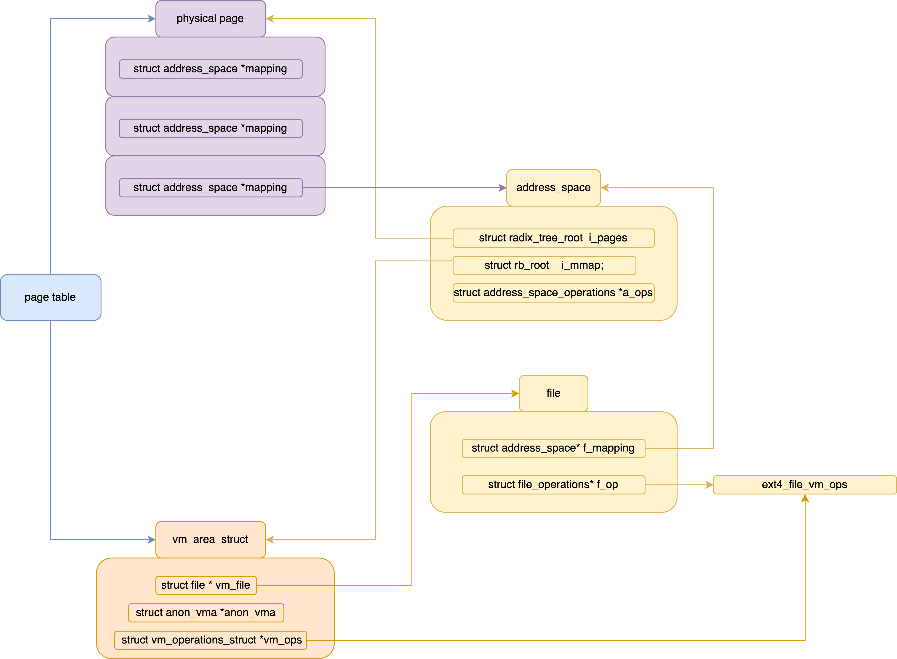

```c
struct mm_struct {
    pgd_t                   *pgd;
    struct maple_tree       mm_mt;
    struct rw_semaphore     mmap_lock;
}

struct vm_area_struct {
    /* For areas with an address space and backing store,
    * linkage into the address_space->i_mmap interval tree. */
    struct {
        struct rb_node rb;
        unsigned long rb_subtree_last;
    } shared;

    /* A file's MAP_PRIVATE vma can be in both i_mmap tree and anon_vma list
    * An anonymous MAP_PRIVATE, stack or brk vma can only be in an anon_vma list.
    * A MAP_SHARED vma can only be in the i_mmap tree. */
    struct list_head anon_vma_chain;
    struct anon_vma *anon_vma;

    const struct vm_operations_struct *vm_ops;

    unsigned long vm_pgoff; /* Offset (within vm_file) in PAGE_SIZE units */
    struct file * vm_file;  /* File we map to (can be NULL). */
    void * vm_private_data; /* was vm_pte (shared mem) */
};

struct anon_vma_chain {
    struct vm_area_struct   *vma;
    struct anon_vma         *anon_vma;
    struct list_head        same_vma; /* locked by mmap_sem & page_table_lock */
    struct rb_node          rb; /* locked by anon_vma->rwsem */
    unsigned long           rb_subtree_last;
};

struct anon_vma {
    struct anon_vma       *root;  /* Root of this anon_vma tree */
    struct rw_semaphore   rwsem;  /* W: modification, R: walking the list */
    atomic_t              refcount;
    unsigned              degree;
    struct anon_vma       *parent;  /* Parent of this anon_vma */
    struct rb_root_cached rb_root;
};

/* page cache in memory */
struct address_space {
    struct inode          *host;
    struct xarray         i_pages; /* cached physical pages */
    struct rw_semaphore   invalidate_lock;
    gfp_t                 gfp_mask;
    atomic_t              i_mmap_writable; /* Number of VM_SHARED mappings. */
    struct rb_root_cached i_mmap; /* Tree of private and shared mappings. vm_area_struct */
    struct rw_semaphore   i_mmap_rwsem;
    unsigned long         nrpages;
    pgoff_t               writeback_index; /* Writeback starts here */
    const struct address_space_operations *a_ops;
    unsigned long         flags;
    errseq_t              wb_err;
    spinlock_t            private_lock;
    struct list_head      private_list;
    void*                 private_data;
};
```

```c
mmap() {
    sys_mmap_pgoff() {
        vm_mmap_pgoff() {
            do_mmap(file, addr, len, prot, flag, 0, pgoff, &populate, &uf) {
                get_unmapped_area() {
                    get_area = current->mm->get_unmapped_area;
                    if (file->f_op->get_unmapped_area) {
                        get_area = file->f_op->get_unmapped_area {
                            __thp_get_unmapped_area() {
                                current->mm->get_unmapped_area();
                            }
                        }
                    } else if (flags & MAP_SHARED) {
                        get_area = shmem_get_unmapped_area;
                    }
                    addr = get_area(file, addr, len, pgoff, flags) { /* arch_get_unmapped_area */
                        vm_unmapped_area() {
                            if (info->flags & VM_UNMAPPED_AREA_TOPDOWN)
                                addr = unmapped_area_topdown(info);
                            else {
                                addr = unmapped_area(info) {

                                }
                            }
                        }
                    }
                }

                mmap_region() {
                    if (!may_expand_vm()) {
                        return -ENOMEM;
                    }

                    /* Unmap any existing mapping in the area */
                    do_vmi_munmap(&vmi, mm);

                    vma_expand();

                    struct vm_area_struct *vma = kmem_cache_zalloc();

                    if (file) {
                        vma->vm_file = get_file(file);
                        /* 2.1. link the file to vma */
                        rc = call_mmap(file, vma) {
                            file->f_op->mmap(file, vma);
                            ext4_file_mmap() {
                                vma->vm_ops = &ext4_file_vm_ops;
                            }
                        }

                        /* 2.2. link the vma to the file */
                        vma_interval_tree_insert(vma, &mapping->i_mmap);

                        if (rc) {
                            unmap_region()
                                --->
                        }
                    } else if (vm_flags & VM_SHARED) {
                        shmem_zero_setup(vma); /* tmpfs under /dev/zero */
                    } else {
                        vma_set_anonymous(vma); /* vma->vm_ops = NULL; */
                    }
                }
            }

            if (populate) {
                mm_populate(ret, populate);
            }
        }
    }
}


setup_new_exec();
    arch_pick_mmap_layout();
        mm->mmap_base = TASK_UNMAPPED_BASE + random_factor;
        mm->get_unmapped_area = arch_get_unmapped_area;

mm->get_unmapped_area();
    arch_get_unmapped_area();
        find_start_end() {
            *begin = get_mmap_base(1);
                return mm->mmap_base;
            *end = task_size_64bit(addr > DEFAULT_MAP_WINDOW);
        }
        vm_unmapped_area();
            unmapped_area();
```

```c
SYSCALL_DEFINE6(mmap, unsigned long, addr, unsigned long, len,
        unsigned long, prot, unsigned long, flags,
        unsigned long, fd, unsigned long, off)
{
    if (offset_in_page(off) != 0)
        return -EINVAL;

    return ksys_mmap_pgoff(addr, len, prot, flags, fd, off >> PAGE_SHIFT) {
        struct file *file = NULL;
        unsigned long retval;

        if (!(flags & MAP_ANONYMOUS)) {
            audit_mmap_fd(fd, flags);
            file = fget(fd);
            if (!file)
                return -EBADF;
            if (is_file_hugepages(file)) {
                len = ALIGN(len, huge_page_size(hstate_file(file)));
            } else if (unlikely(flags & MAP_HUGETLB)) {
                retval = -EINVAL;
                goto out_fput;
            }
        } else if (flags & MAP_HUGETLB) {
            struct hstate *hs;

            hs = hstate_sizelog((flags >> MAP_HUGE_SHIFT) & MAP_HUGE_MASK);
            if (!hs)
                return -EINVAL;

            len = ALIGN(len, huge_page_size(hs));
            file = hugetlb_file_setup(HUGETLB_ANON_FILE, len,
                    VM_NORESERVE,
                    HUGETLB_ANONHUGE_INODE,
                    (flags >> MAP_HUGE_SHIFT) & MAP_HUGE_MASK);
            if (IS_ERR(file))
                return PTR_ERR(file);
        }

        retval = vm_mmap_pgoff(file, addr, len, prot, flags, pgoff) {
            unsigned long ret;
            struct mm_struct *mm = current->mm;
            unsigned long populate;
            LIST_HEAD(uf);

            ret = security_mmap_file(file, prot, flag);
            if (!ret) {
                if (mmap_write_lock_killable(mm))
                    return -EINTR;

                ret = do_mmap(file, addr, len, prot, flag, 0, pgoff, &populate, &uf);

                mmap_write_unlock(mm);
                userfaultfd_unmap_complete(mm, &uf);
                if (populate)
                    mm_populate(ret, populate);
            }
            return ret;
        }

    out_fput:
        if (file)
            fput(file);
        return retval;
    }
}
```

## do_mmap

```c
 unsigned long do_mmap(struct file *file, unsigned long addr,
    unsigned long len, unsigned long prot,
    unsigned long flags, vm_flags_t vm_flags,
    unsigned long pgoff, unsigned long *populate,
    struct list_head *uf) {

    struct mm_struct *mm = current->mm;
    int pkey = 0;

    *populate = 0;

    if (!len)
        return -EINVAL;

    if ((prot & PROT_READ) && (current->personality & READ_IMPLIES_EXEC))
        if (!(file && path_noexec(&file->f_path)))
            prot |= PROT_EXEC;

    /* force arch specific MAP_FIXED handling in get_unmapped_area */
    if (flags & MAP_FIXED_NOREPLACE)
        flags |= MAP_FIXED;

    if (!(flags & MAP_FIXED))
        addr = round_hint_to_min(addr);

    /* Careful about overflows.. */
    len = PAGE_ALIGN(len);
    if (!len)
        return -ENOMEM;

    /* offset overflow? */
    if ((pgoff + (len >> PAGE_SHIFT)) < pgoff)
        return -EOVERFLOW;

    /* Too many mappings? */
    if (mm->map_count > sysctl_max_map_count)
        return -ENOMEM;

    addr = get_unmapped_area(file, addr, len, pgoff, flags);
    if (IS_ERR_VALUE(addr))
        return addr;

    if (flags & MAP_FIXED_NOREPLACE) {
        if (find_vma_intersection(mm, addr, addr + len))
            return -EEXIST;
    }

    if (prot == PROT_EXEC) {
        pkey = execute_only_pkey(mm);
        if (pkey < 0)
            pkey = 0;
    }

    /* Do simple checking here so the lower-level routines won't have
    * to. we assume access permissions have been handled by the open
    * of the memory object, so we don't do any here. */
    vm_flags |= calc_vm_prot_bits(prot, pkey) | calc_vm_flag_bits(flags) |
            mm->def_flags | VM_MAYREAD | VM_MAYWRITE | VM_MAYEXEC;

    if (flags & MAP_LOCKED)
        if (!can_do_mlock())
            return -EPERM;

    if (!mlock_future_ok(mm, vm_flags, len))
        return -EAGAIN;

    if (file) {
        struct inode *inode = file_inode(file);
        unsigned long flags_mask;

        if (!file_mmap_ok(file, inode, pgoff, len))
            return -EOVERFLOW;

        flags_mask = LEGACY_MAP_MASK | file->f_op->mmap_supported_flags;

        switch (flags & MAP_TYPE) {
        case MAP_SHARED:
            flags &= LEGACY_MAP_MASK;
            fallthrough;
        case MAP_SHARED_VALIDATE:
            if (flags & ~flags_mask)
                return -EOPNOTSUPP;
            if (prot & PROT_WRITE) {
                if (!(file->f_mode & FMODE_WRITE))
                    return -EACCES;
                if (IS_SWAPFILE(file->f_mapping->host))
                    return -ETXTBSY;
            }

            if (IS_APPEND(inode) && (file->f_mode & FMODE_WRITE))
                return -EACCES;

            vm_flags |= VM_SHARED | VM_MAYSHARE;
            if (!(file->f_mode & FMODE_WRITE))
                vm_flags &= ~(VM_MAYWRITE | VM_SHARED);
            fallthrough;
        case MAP_PRIVATE:
            if (!(file->f_mode & FMODE_READ))
                return -EACCES;
            if (path_noexec(&file->f_path)) {
                if (vm_flags & VM_EXEC)
                    return -EPERM;
                vm_flags &= ~VM_MAYEXEC;
            }

            if (!file->f_op->mmap)
                return -ENODEV;
            if (vm_flags & (VM_GROWSDOWN|VM_GROWSUP))
                return -EINVAL;
            break;

        default:
            return -EINVAL;
        }
    } else {
        switch (flags & MAP_TYPE) {
        case MAP_SHARED:
            if (vm_flags & (VM_GROWSDOWN|VM_GROWSUP))
                return -EINVAL;
            pgoff = 0;
            vm_flags |= VM_SHARED | VM_MAYSHARE;
            break;
        case MAP_PRIVATE:
            pgoff = addr >> PAGE_SHIFT;
            break;
        default:
            return -EINVAL;
        }
    }

    if (flags & MAP_NORESERVE) {
        /* We honor MAP_NORESERVE if allowed to overcommit */
        if (sysctl_overcommit_memory != OVERCOMMIT_NEVER)
            vm_flags |= VM_NORESERVE;

        /* hugetlb applies strict overcommit unless MAP_NORESERVE */
        if (file && is_file_hugepages(file))
            vm_flags |= VM_NORESERVE;
    }

    addr = mmap_region(file, addr, len, vm_flags, pgoff, uf);
    if (!IS_ERR_VALUE(addr) &&
        ((vm_flags & VM_LOCKED) ||
        (flags & (MAP_POPULATE | MAP_NONBLOCK)) == MAP_POPULATE))
        *populate = len;
    return addr;
}
```

## get_unmapped_area

```c
unsigned long
get_unmapped_area(struct file *file, unsigned long addr, unsigned long len,
        unsigned long pgoff, unsigned long flags)
{
    unsigned long (*get_area)(struct file *, unsigned long,
                unsigned long, unsigned long, unsigned long);

    unsigned long error = arch_mmap_check(addr, len, flags);
    if (error)
        return error;

    /* Careful about overflows.. */
    if (len > TASK_SIZE)
        return -ENOMEM;

    get_area = current->mm->get_unmapped_area;
    if (file) {
        if (file->f_op->get_unmapped_area) {
            get_area = file->f_op->get_unmapped_area;
        }
    } else if (flags & MAP_SHARED) {
        pgoff = 0;
        get_area = shmem_get_unmapped_area;
    } else if (IS_ENABLED(CONFIG_TRANSPARENT_HUGEPAGE)) {
        get_area = thp_get_unmapped_area;
    }

    addr = get_area(file, addr, len, pgoff, flags) {
        arch_get_unmapped_area() {
            return generic_get_unmapped_area(filp, addr, len, pgoff, flags); {
                struct mm_struct *mm = current->mm;
                struct vm_area_struct *vma, *prev;
                struct vm_unmapped_area_info info;
                const unsigned long mmap_end = arch_get_mmap_end(addr, len, flags) {

                }

                if (len > mmap_end - mmap_min_addr)
                    return -ENOMEM;

                if (flags & MAP_FIXED)
                    return addr;

                if (addr) {
                    addr = PAGE_ALIGN(addr);
                    vma = find_vma_prev(mm, addr, &prev);
                    if (mmap_end - len >= addr && addr >= mmap_min_addr &&
                        (!vma || addr + len <= vm_start_gap(vma)) &&
                        (!prev || addr >= vm_end_gap(prev)))
                        return addr;
                }

                info.flags = 0;
                info.length = len;
                info.low_limit = mm->mmap_base;
                info.high_limit = mmap_end;
                info.align_mask = 0;
                info.align_offset = 0;
                return vm_unmapped_area(&info) {
                    unsigned long addr;

                    if (info->flags & VM_UNMAPPED_AREA_TOPDOWN) {
                        addr = unmapped_area_topdown(info);
                    } else {
                        addr = unmapped_area(info) {
                            unsigned long length, gap;
                            unsigned long low_limit, high_limit;
                            struct vm_area_struct *tmp;

                            MA_STATE(mas, &current->mm->mm_mt, 0, 0);

                            /* Adjust search length to account for worst case alignment overhead */
                            length = info->length + info->align_mask;
                            if (length < info->length)
                                return -ENOMEM;

                            low_limit = info->low_limit;
                            if (low_limit < mmap_min_addr)
                                low_limit = mmap_min_addr;
                            high_limit = info->high_limit;
                        retry:
                            if (mas_empty_area(&mas, low_limit, high_limit - 1, length))
                                return -ENOMEM;

                            gap = mas.index;
                            gap += (info->align_offset - gap) & info->align_mask;
                            tmp = mas_next(&mas, ULONG_MAX);
                            if (tmp && (tmp->vm_flags & VM_STARTGAP_FLAGS)) { /* Avoid prev check if possible */
                                if (vm_start_gap(tmp) < gap + length - 1) {
                                    low_limit = tmp->vm_end;
                                    mas_reset(&mas);
                                    goto retry;
                                }
                            } else {
                                tmp = mas_prev(&mas, 0);
                                if (tmp && vm_end_gap(tmp) > gap) {
                                    low_limit = vm_end_gap(tmp);
                                    mas_reset(&mas);
                                    goto retry;
                                }
                            }

                            return gap;
                        }
                    }

                    return addr;
                }
            }
        }
    }
    if (IS_ERR_VALUE(addr))
        return addr;

    if (addr > TASK_SIZE - len)
        return -ENOMEM;
    if (offset_in_page(addr))
        return -EINVAL;

    error = security_mmap_addr(addr);
    return error ? error : addr;
}
```

## mmap_region


```c
unsigned long mmap_region(struct file *file, unsigned long addr,
        unsigned long len, vm_flags_t vm_flags, unsigned long pgoff,
        struct list_head *uf)
{
    struct mm_struct *mm = current->mm;
    struct vm_area_struct *vma = NULL;
    struct vm_area_struct *next, *prev, *merge;
    pgoff_t pglen = len >> PAGE_SHIFT;
    unsigned long charged = 0;
    unsigned long end = addr + len;
    unsigned long merge_start = addr, merge_end = end;
    bool writable_file_mapping = false;
    pgoff_t vm_pgoff;
    int error;
    VMA_ITERATOR(vmi, mm, addr);

    /* Check against address space limit. */
    if (!may_expand_vm(mm, vm_flags, len >> PAGE_SHIFT)) {
        unsigned long nr_pages;

        /* MAP_FIXED may remove pages of mappings that intersects with
         * requested mapping. Account for the pages it would unmap. */
        nr_pages = count_vma_pages_range(mm, addr, end);

        if (!may_expand_vm(mm, vm_flags, (len >> PAGE_SHIFT) - nr_pages))
            return -ENOMEM;
    }

    /* Unmap any existing mapping in the area */
    if (do_vmi_munmap(&vmi, mm, addr, len, uf, false))
        return -ENOMEM;

    /* Private writable mapping: check memory availability */
    if (accountable_mapping(file, vm_flags)) {
        charged = len >> PAGE_SHIFT;
        if (security_vm_enough_memory_mm(mm, charged))
            return -ENOMEM;
        vm_flags |= VM_ACCOUNT;
    }

    next = vma_next(&vmi);
    prev = vma_prev(&vmi);
    if (vm_flags & VM_SPECIAL) {
        if (prev)
            vma_iter_next_range(&vmi);
        goto cannot_expand;
    }

    /* Attempt to expand an old mapping */
    /* Check next */
    ret = can_vma_merge_before(next, vm_flags, NULL, file, pgoff+pglen, NULL_VM_UFFD_CTX, NULL);
    if (next && next->vm_start == end && !vma_policy(next) && ret) {
        merge_end = next->vm_end;
        vma = next;
        vm_pgoff = next->vm_pgoff - pglen;
    }

    /* Check prev */
    ret = vma
        ? can_vma_merge_after(prev, vm_flags, vma->anon_vma, file, pgoff, vma->vm_userfaultfd_ctx, NULL)
        : can_vma_merge_after(prev, vm_flags, NULL, file, pgoff,
                    NULL_VM_UFFD_CTX, NULL);
    if (prev && prev->vm_end == addr && !vma_policy(prev) && (ret)) {
        merge_start = prev->vm_start;
        vma = prev;
        vm_pgoff = prev->vm_pgoff;
    } else if (prev) {
        vma_iter_next_range(&vmi);
    }

    /* Actually expand, if possible */
    if (vma && !vma_expand(&vmi, vma, merge_start, merge_end, vm_pgoff, next)) {
        khugepaged_enter_vma(vma, vm_flags);
        goto expanded;
    }

    if (vma == prev)
        vma_iter_set(&vmi, addr);

cannot_expand:
    vma = vm_area_alloc(mm);
    if (!vma) {
        error = -ENOMEM;
        goto unacct_error;
    }

    vma_iter_config(&vmi, addr, end);
    vma->vm_start = addr;
    vma->vm_end = end;
    vm_flags_init(vma, vm_flags);
    vma->vm_page_prot = vm_get_page_prot(vm_flags);
    vma->vm_pgoff = pgoff;

    if (file) {
        vma->vm_file = get_file(file);
        error = call_mmap(file, vma) {
            return file->f_op->mmap(file, vma) { /* ext4_file_mmap */
                vma->vm_ops = &ext4_file_vm_ops;
            }
        }
        if (error)
            goto unmap_and_free_vma;

        if (vma_is_shared_maywrite(vma)) {
            error = mapping_map_writable(file->f_mapping);
            if (error)
                goto close_and_free_vma;

            writable_file_mapping = true;
        }

        error = -EINVAL;
        if (WARN_ON((addr != vma->vm_start)))
            goto close_and_free_vma;

        vma_iter_config(&vmi, addr, end);

        if (unlikely(vm_flags != vma->vm_flags && prev)) {
            merge = vma_merge_new_vma(&vmi, prev, vma, vma->vm_start, vma->vm_end, vma->vm_pgoff) {

                return vma_merge(vmi, vma->vm_mm, prev, start, end, vma->vm_flags,
                    vma->anon_vma, vma->vm_file, pgoff, vma_policy(vma),
                    vma->vm_userfaultfd_ctx, anon_vma_name(vma));
            }
            if (merge) {
                fput(vma->vm_file);
                vm_area_free(vma);
                vma = merge;
                /* Update vm_flags to pick up the change. */
                vm_flags = vma->vm_flags;
                goto unmap_writable;
            }
        }

        vm_flags = vma->vm_flags;
    } else if (vm_flags & VM_SHARED) {
        error = shmem_zero_setup(vma) { /* tmpfs under /dev/zero */
            struct file *file;
            loff_t size = vma->vm_end - vma->vm_start;

            file = shmem_kernel_file_setup("dev/zero", size, vma->vm_flags);
            if (IS_ERR(file))
                return PTR_ERR(file);

            if (vma->vm_file)
                fput(vma->vm_file);
            vma->vm_file = file;
            vma->vm_ops = &shmem_anon_vm_ops;

            return 0;
        }
        if (error)
            goto free_vma;
    } else {
        vma_set_anonymous(vma) {
            vma->vm_ops = NULL;
        }
    }

    if (map_deny_write_exec(vma, vma->vm_flags)) {
        error = -EACCES;
        goto close_and_free_vma;
    }

    /* Allow architectures to sanity-check the vm_flags */
    error = -EINVAL;
    if (!arch_validate_flags(vma->vm_flags))
        goto close_and_free_vma;

    error = -ENOMEM;
    if (vma_iter_prealloc(&vmi, vma))
        goto close_and_free_vma;

    /* Lock the VMA since it is modified after insertion into VMA tree */
    vma_start_write(vma);
    vma_iter_store(&vmi, vma);
    mm->map_count++;
    if (vma->vm_file) {
        i_mmap_lock_write(vma->vm_file->f_mapping);
        if (vma_is_shared_maywrite(vma))
            mapping_allow_writable(vma->vm_file->f_mapping);

        flush_dcache_mmap_lock(vma->vm_file->f_mapping);

        /* insert vma into address_space i_mmap tree */
        vma_interval_tree_insert(vma, &vma->vm_file->f_mapping->i_mmap);
        flush_dcache_mmap_unlock(vma->vm_file->f_mapping);
        i_mmap_unlock_write(vma->vm_file->f_mapping);
    }

    khugepaged_enter_vma(vma, vma->vm_flags);

    /* Once vma denies write, undo our temporary denial count */
unmap_writable:
    if (writable_file_mapping)
        mapping_unmap_writable(file->f_mapping);
    file = vma->vm_file;
    ksm_add_vma(vma);
expanded:
    perf_event_mmap(vma);

    vm_stat_account(mm, vm_flags, len >> PAGE_SHIFT);
    if (vm_flags & VM_LOCKED) {
        if ((vm_flags & VM_SPECIAL) || vma_is_dax(vma) ||
                    is_vm_hugetlb_page(vma) ||
                    vma == get_gate_vma(current->mm))
            vm_flags_clear(vma, VM_LOCKED_MASK);
        else
            mm->locked_vm += (len >> PAGE_SHIFT);
    }

    if (file)
        uprobe_mmap(vma);

    /* New (or expanded) vma always get soft dirty status.
    * Otherwise user-space soft-dirty page tracker won't
    * be able to distinguish situation when vma area unmapped,
    * then new mapped in-place (which must be aimed as
    * a completely new data area). */
    vm_flags_set(vma, VM_SOFTDIRTY);

    vma_set_page_prot(vma);

    validate_mm(mm);
    return addr;

close_and_free_vma:
    if (file && vma->vm_ops && vma->vm_ops->close)
        vma->vm_ops->close(vma);

    if (file || vma->vm_file) {
unmap_and_free_vma:
        fput(vma->vm_file);
        vma->vm_file = NULL;

        vma_iter_set(&vmi, vma->vm_end);
        /* Undo any partial mapping done by a device driver. */
        unmap_region(mm, &vmi.mas, vma, prev, next, vma->vm_start,
                vma->vm_end, vma->vm_end, true);
    }
    if (writable_file_mapping)
        mapping_unmap_writable(file->f_mapping);
free_vma:
    vm_area_free(vma);
unacct_error:
    if (charged)
        vm_unacct_memory(charged);
    validate_mm(mm);
    return error;
}
```

## mm_populate

```c
int __mm_populate(unsigned long start, unsigned long len, int ignore_errors)
{
    struct mm_struct *mm = current->mm;
    unsigned long end, nstart, nend;
    struct vm_area_struct *vma = NULL;
    int locked = 0;
    long ret = 0;

    end = start + len;

    for (nstart = start; nstart < end; nstart = nend) {
        if (!locked) {
            locked = 1;
            mmap_read_lock(mm);
            vma = find_vma_intersection(mm, nstart, end);
        } else if (nstart >= vma->vm_end)
            vma = find_vma_intersection(mm, vma->vm_end, end);

        if (!vma)
            break;

        nend = min(end, vma->vm_end);
        if (vma->vm_flags & (VM_IO | VM_PFNMAP))
            continue;
        if (nstart < vma->vm_start)
            nstart = vma->vm_start;

        ret = populate_vma_page_range(vma, nstart, nend, &locked) {
            if (vma->vm_flags & VM_LOCKONFAULT)
                return nr_pages;

            gup_flags = FOLL_TOUCH;

            if ((vma->vm_flags & (VM_WRITE | VM_SHARED)) == VM_WRITE)
                gup_flags |= FOLL_WRITE;

            if (vma_is_accessible(vma))
                gup_flags |= FOLL_FORCE;

            if (locked)
                gup_flags |= FOLL_UNLOCKABLE;

            ret = __get_user_pages(mm, start, nr_pages, gup_flags, NULL, locked ? locked : &local_locked) {
                do {
                    struct page *page;
                    unsigned int foll_flags = gup_flags;
                    unsigned int page_increm;

                    /* first iteration or cross vma bound */
                    if (!vma || start >= vma->vm_end) {
                        vma = gup_vma_lookup(mm, start);
                        if (!vma && in_gate_area(mm, start)) {
                            ret = get_gate_page(mm, start & PAGE_MASK,
                                    gup_flags, &vma, pages ? &page : NULL);
                            if (ret)
                                goto out;
                            ctx.page_mask = 0;
                            goto next_page;
                        }

                        if (!vma) {
                            ret = -EFAULT;
                            goto out;
                        }
                        ret = check_vma_flags(vma, gup_flags);
                        if (ret)
                            goto out;
                    }
            retry:
                    if (fatal_signal_pending(current)) {
                        ret = -EINTR;
                        goto out;
                    }
                    cond_resched();

                    page = follow_page_mask(vma, start, foll_flags, &ctx);
                    if (!page || PTR_ERR(page) == -EMLINK) {
                        ret = faultin_page(vma, start, &foll_flags, PTR_ERR(page) == -EMLINK, locked) {
                            handle_mm_fault(vma, address, fault_flags, NULL);
                                --->
                        }
                    } else if (PTR_ERR(page) == -EEXIST) {
                        if (pages) {
                            ret = PTR_ERR(page);
                            goto out;
                        }
                    } else if (IS_ERR(page)) {
                        ret = PTR_ERR(page);
                        goto out;
                    }

            next_page:
                    page_increm = 1 + (~(start >> PAGE_SHIFT) & ctx.page_mask);
                    if (page_increm > nr_pages)
                        page_increm = nr_pages;

                    if (pages) {
                        struct page *subpage;
                        unsigned int j;

                        if (page_increm > 1) {
                            struct folio *folio;

                            folio = try_grab_folio(page, page_increm - 1, foll_flags);
                            if (WARN_ON_ONCE(!folio)) {
                                gup_put_folio(page_folio(page), 1, foll_flags);
                                ret = -EFAULT;
                                goto out;
                            }
                        }

                        for (j = 0; j < page_increm; j++) {
                            subpage = nth_page(page, j);
                            pages[i + j] = subpage;
                            flush_anon_page(vma, subpage, start + j * PAGE_SIZE);
                            flush_dcache_page(subpage);
                        }
                    }

                    i += page_increm;
                    start += page_increm * PAGE_SIZE;
                    nr_pages -= page_increm;
                } while (nr_pages);
            }

            lru_add_drain();
            return ret;
        }
        if (ret < 0) {
            if (ignore_errors) {
                ret = 0;
                continue;	/* continue at next VMA */
            }
            break;
        }
        nend = nstart + ret * PAGE_SIZE;
        ret = 0;
    }
    if (locked)
        mmap_read_unlock(mm);
    return ret;	/* 0 or negative error code */
}
```

# page_fault


---

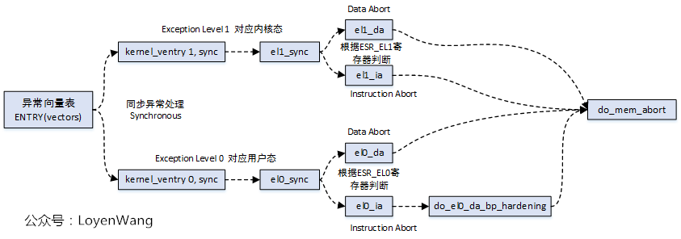

---


---

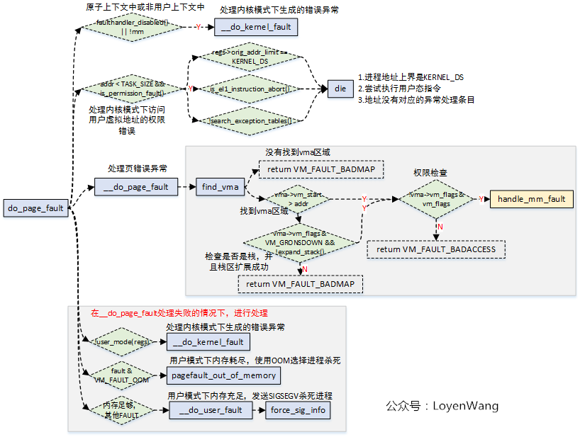

---


---


---


---


---


---

* [bin 的技术小屋](https://mp.weixin.qq.com/s/zyLSQehjr0zQ5WemjMqluw)


```c
struct file {
    struct file_operations* f_op;
    struct address_space*   f_mapping;
};

/* page cache in memory */
struct address_space {
    struct inode          *host;
    struct xarray         i_pages; /* cached physical pages */
    struct rw_semaphore   invalidate_lock;
    gfp_t                 gfp_mask;
    atomic_t              i_mmap_writable; /* Number of VM_SHARED mappings. */
    struct rb_root_cached i_mmap; /* Tree of private and shared mappings. vm_area_struct */
    struct rw_semaphore   i_mmap_rwsem;
    unsigned long         nrpages;
    pgoff_t               writeback_index; /* Writeback starts here */
    const struct address_space_operations *a_ops;
    unsigned long         flags;
    errseq_t              wb_err;
    spinlock_t            private_lock;
    struct list_head      private_list;
    void*                 private_data;
};
```

```c
/* arm64
 * arch/arm64/mm/fault.c */
static const struct fault_info fault_info[] = {
    { do_translation_fault, SIGSEGV, SEGV_MAPERR,	"level 0 translation fault" },
    { do_translation_fault, SIGSEGV, SEGV_MAPERR,   "level 1 translation fault" },
    { do_translation_fault, SIGSEGV, SEGV_MAPERR,   "level 2 translation fault" },
    { do_translation_fault, SIGSEGV, SEGV_MAPERR,   "level 3 translation fault" },
};

el1h_64_sync_handler() {
    switch (esr) {
        el1_abort(regs, esr) {
            do_mem_abort() {
                const struct fault_info *inf = esr_to_fault_info(esr) {
                    return fault_info + (esr & ESR_ELx_FSC);
                }
                inf->fn(far, esr, regs)->do_translation_fault() {
                    do_page_fault() {
                        vma = lock_vma_under_rcu(mm, addr);

                        __do_page_fault() {
                            fault = handle_mm_fault()
                                --->
                            if (fault & VM_FAULT_OOM) {
                                pagefault_out_of_memory() {

                                }
                                return 0;
                            }

                            if (fault & VM_FAULT_SIGBUS) {
                                arm64_force_sig_fault(SIGBUS, BUS_ADRERR, far, inf->name);
                            } else if (fault & (VM_FAULT_HWPOISON_LARGE | VM_FAULT_HWPOISON)) {
                                unsigned int lsb;

                                lsb = PAGE_SHIFT;
                                if (fault & VM_FAULT_HWPOISON_LARGE)
                                    lsb = hstate_index_to_shift(VM_FAULT_GET_HINDEX(fault));

                                arm64_force_sig_mceerr(BUS_MCEERR_AR, far, lsb, inf->name);
                            } else {
                                arm64_force_sig_fault(SIGSEGV,
                                    fault == VM_FAULT_BADACCESS ? SEGV_ACCERR : SEGV_MAPERR,
                                    far, inf->name
                                );
                            }
                        }
                    }
                }
            }
        }
    }
}


/* mm/memory.c */
handle_mm_fault(vma, address, flags, regs);
    hugetlb_fault();

    __handle_mm_fault() {
        pgd = pgd_offset(mm, address)
        p4d = p4d_alloc(pgd)
        if (!p4d)
            return VM_FAULT_OOM;
        pud = pud_alloc(p4d)
        if (!pud)
            return VM_FAULT_OOM;
    retry_pud:
        pmd = pmd_alloc(pud)
        if (!pmd)
            return VM_FAULT_OOM;

        handle_pte_fault() {
            if (!vmf->pte) {
                return do_pte_missing(vmf) {
                    if (vma_is_anonymous(vmf->vma)) {
                        /* 1. anonymous fault */
                        return do_anonymous_page(vmf) {
                            pte = pte_alloc(pmd)
                            if (pte)
                                return VM_FAULT_OOM;
                            anon_vma_prepare(vma)
                                --->

                            folio = vma_alloc_zeroed_movable_folio(vma, vmf->address);

                            mk_pte();

                            folio_add_new_anon_rmap(folio, vma, vmf->address);
                                __folio_set_anon(folio, &folio->page, vma, address, 1);
                                    --->
                            folio_add_lru_vma(folio, vma);

                            set_pte_at(vma->vm_mm, vmf->address, vmf->pte, entry);
                                --->
                            update_mmu_cache()
                        }
                    } else {
                        /* 2. file fault */
                        return do_fault(vmf) {
                            /* 2.1 read fault */
                            do_read_fault() { /* if (!(vmf->flags & FAULT_FLAG_WRITE)) */
                                __do_fault() {
                                    vma->vm_ops->fault() {
                                        ext4_file_vm_ops.fault() {
                                            filemap_fault() {
                                                folio = filemap_get_folio(mapping, index);
                                                if (folio) {
                                                    do_async_mmap_readahead();
                                                } else if (!page) {
                                                    do_sync_mmap_readahead();
                                                    folio = __filemap_get_folio();
                                                }

                                                vmf->page = folio_file_page(folio, index);
                                            }
                                        }
                                    }
                                }

                                finish_fault() {
                                    set_pte_range(vmf, folio, page, 1, vmf->address) {
                                        entry = mk_pte(page, vma->vm_page_prot);
                                        if (write && !(vma->vm_flags & VM_SHARED)) {
                                            add_mm_counter(vma->vm_mm, MM_ANONPAGES, nr);
                                            folio_add_new_anon_rmap(folio, vma, addr);
                                            folio_add_lru_vma(folio, vma);
                                        } else {
                                            add_mm_counter(vma->vm_mm, mm_counter_file(page), nr);
                                            folio_add_file_rmap_ptes(folio, page, nr, vma);
                                        }
                                        set_ptes(vma->vm_mm, addr, vmf->pte, entry, nr);

                                        update_mmu_cache_range(vmf, vma, addr, vmf->pte, nr);
                                    }
                                }
                            }

                            /* 2.2 cow fault */
                            do_cow_fault() { /* if (!(vma->vm_flags & VM_SHARED)) */
                                anon_vma_prepare(vma)
                                vmf->cow_page = alloc_page_vma()
                                __do_fault(vmf);

                                copy_user_highpage(vmf->cow_page, vmf->page, vmf->address, vma);
                                finish_fault(vmf);
                            }

                            /* 2.3 shared fault */
                            do_shared_fault() {
                                __do_fault(vmf);
                                ext4_page_mkwrite();
                                finish_fault(vmf);
                                fault_dirty_shared_page();
                            }
                        }
                    }
                }
            }

            /* 3. swap fault */
            if (!pte_present(vmf->orig_pte)) {
                return do_swap_page(vmf) {

                }
            }

            /* migrate page from remote node to cur node */
            if (pte_protnone(vmf->orig_pte) && vma_is_accessible(vmf->vma)) {
                return do_numa_page(vmf) {

                }
            }

            if (vmf->flags & (FAULT_FLAG_WRITE | FAULT_FLAG_UNSHARE)) {
                if (!pte_write(entry)) {
                    return do_wp_page(vmf) {
                        vmf->page = vm_normal_page()
                        folio = page_folio(vmf->page)

                        /* Shared mapping */
                        if (vma->vm_flags & (VM_SHARED | VM_MAYSHARE)) {
                            if (!vmf->page) {
                                return wp_pfn_shared(vmf) {

                                }
                            }
                            return wp_page_shared(vmf, folio) {
                                do_page_mkwrite();
                            }
                        }

                        /* Private mapping */
                        if (folio && folio_test_anon(folio) &&
                            (PageAnonExclusive(vmf->page) || wp_can_reuse_anon_folio(folio, vma))) {
                            if (!PageAnonExclusive(vmf->page))
                                SetPageAnonExclusive(vmf->page);
                            if (unlikely(unshare)) {
                                pte_unmap_unlock(vmf->pte, vmf->ptl);
                                return 0;
                            }
                            wp_page_reuse(vmf, folio) {
                                pte_mkyoung(vmf->orig_pte);
                                maybe_mkwrite(pte_mkdirty(entry), vma);
                            }
                            return 0;
                        }

                        return wp_page_copy(vmf) {
                            old_folio = page_folio(vmf->page)
                            anon_vma_prepare(vma)
                                --->
                            new_folio = vma_alloc_folio(vma, vmf->address)
                            __wp_page_copy_user(&new_folio->page, vmf->page, vmf)

                            flush_cache_page(vma, vmf->address, pte_pfn(vmf->orig_pte));
                            entry = mk_pte(&new_folio->page, vma->vm_page_prot);
                            entry = pte_sw_mkyoung(entry);
                            entry = maybe_mkwrite(pte_mkdirty(entry), vma);
                        }
                    }
                } else if (likely(vmf->flags & FAULT_FLAG_WRITE)) {
                    entry = pte_mkdirty(entry);
                }
            }

            update_mmu_tlb(vmf->vma, vmf->address, vmf->pte);

            update_mmu_cache(vmf->vma, vmf->address, vmf->pte);
        }
    }
```

# munmap

```c
munmap()
SYSCALL_DEFINE2(munmap) {
    __vm_munmap(addr, len, true) {
        do_vmi_munmap() {
            vma = vma_find(vmi, end);
            do_vmi_align_munmap() {
                if (start > vma->vm_start) {
                    error = __split_vma(vmi, vma, start, 1);
                }

                unmap_region() {
                    lru_add_drain();
                    tlb_gather_mmu(&tlb, mm);
                    update_hiwater_rss(mm);

                    /* 1. just unmap the phys which is mmaped with vma, vma is free by vm_area_free */
                    unmap_vmas(&tlb, mt, vma, start, end, mm_wr_locked)
                        --->
                    /* 2 free pg table */
                    free_pgtables(&tlb)
                        --->
                    /* 3. finish gather */
                    tlb_finish_mmu(&tlb)
                        --->
                }

                remove_mt(mm, &mas_detach) {
                    mas_for_each(mas, vma, ULONG_MAX) {
                        remove_vma(vma) {
                            vm_area_free(vma) {
                                free_anon_vma_name(vma);
                                kmem_cache_free(vm_area_cachep, vma);
                            }
                        }
                    }
                }
            }
        }
    }
}
```

# mmu_gather

* [ARM64内核源码解读: mmu-gather操作](https://blog.csdn.net/m0_50662680/article/details/128445158)


```c
struct mmu_gather {
    struct mm_struct        *mm;

    /* gather page table memory */
    struct mmu_table_batch  *batch;

    unsigned long        start;
    unsigned long        end;

    unsigned int        fullmm : 1;
    unsigned int        need_flush_all : 1;
    unsigned int        freed_tables : 1;
    unsigned int        delayed_rmap : 1;
    unsigned int        cleared_ptes : 1;
    unsigned int        cleared_pmds : 1;
    unsigned int        cleared_puds : 1;
    unsigned int        cleared_p4ds : 1;

    unsigned int        vma_exec : 1;
    unsigned int        vma_huge : 1;
    unsigned int        vma_pfn  : 1;

    unsigned int        batch_count;

    /* gather normla memory */
    struct mmu_gather_batch     *active;
    struct mmu_gather_batch     local;
    struct page                 *__pages[MMU_GATHER_BUNDLE];

#ifdef CONFIG_MMU_GATHER_PAGE_SIZE
    unsigned int page_size;
#endif
};

struct mmu_table_batch {
    struct rcu_head     rcu;
    unsigned int        nr;
    void                *tables[];
};

struct mmu_gather_batch {
    struct mmu_gather_batch     *next;
    unsigned int                nr;
    unsigned int                max;
    struct encoded_page         *encoded_pages[];
};
```

## tlb_gather_mmu
```c
tlb_gather_mmu(struct mmu_gather *tlb, struct mm_struct *mm, bool fullmm) {
    tlb->mm = mm;
    tlb->fullmm = fullmm;

#ifndef CONFIG_MMU_GATHER_NO_GATHER
    tlb->need_flush_all = 0;
    tlb->local.next = NULL;
    tlb->local.nr   = 0;
    tlb->local.max  = ARRAY_SIZE(tlb->__pages);
    tlb->active     = &tlb->local;
    tlb->batch_count = 0;
#endif
    tlb->delayed_rmap = 0;

    tlb_table_init(tlb) {
        tlb->batch = NULL;
    }

#ifdef CONFIG_MMU_GATHER_PAGE_SIZE
    tlb->page_size = 0;
#endif

    __tlb_reset_range(tlb) {
        if (tlb->fullmm) {
            tlb->start = tlb->end = ~0;
        } else {
            tlb->start = TASK_SIZE;
            tlb->end = 0;
        }
        tlb->freed_tables = 0;
        tlb->cleared_ptes = 0;
        tlb->cleared_pmds = 0;
        tlb->cleared_puds = 0;
        tlb->cleared_p4ds = 0;
    }

    inc_tlb_flush_pending(tlb->mm);
}
```

## unmap_vmas
```c
unmap_vmas(&tlb, mt, vma, start, end, mm_wr_locked) {
    do {
        unmap_single_vma();
            unmap_page_range() {
                tlb_start_vma(tlb, vma);

                pgd = pgd_offset(vma->vm_mm, addr);
                do {
                    next = pgd_addr_end(addr, end);
                    if (pgd_none_or_clear_bad(pgd)) {
                        continue;
                    }
                    next = zap_p4d_range(tlb, vma, pgd, addr, next, details); {
                        p4d = p4d_offset(pgd, addr);
                        do {
                            next = p4d_addr_end(addr, end);
                            if (p4d_none_or_clear_bad(p4d)) {
                                continue;
                            }
                            next = zap_pud_range(tlb, vma, p4d, addr, next, details) {
                                do {
                                    if (pud_none_or_clear_bad(pud)) {
                                        continue;
                                    }
                                    next = zap_pmd_range(tlb, vma, pud, addr, next, details); {
                                        zap_pte_range() {
                                            start_pte = pte = pte_offset_map_lock(mm, pmd, addr, &ptl);
                                            flush_tlb_batched_pending(mm);
                                            arch_enter_lazy_mmu_mode();

                                            do {
                                                pte_t ptent = *pte;
                                                struct page *page;

                                                if (pte_present(ptent)) {
                                                    unsigned int delay_rmap;

                                                    page = vm_normal_page(vma, addr, ptent);

                                                    ptent = ptep_get_and_clear_full(mm, addr, pte, tlb->fullmm);
                                                    tlb_remove_tlb_entry(tlb, pte, addr) {
                                                        tlb_flush_pte_range() {
                                                            __tlb_adjust_range(tlb, address, size) {
                                                                tlb->start = min(tlb->start, address);
                                                                tlb->end = max(tlb->end, address + range_size);
                                                            }
                                                            tlb->cleared_ptes = 1;
                                                        }
                                                        __tlb_remove_tlb_entry();
                                                    }
                                                    zap_install_uffd_wp_if_needed(vma, addr, pte, details, ptent);
                                                    if (unlikely(!page))
                                                        continue;

                                                    delay_rmap = 0;
                                                    if (!PageAnon(page)) {
                                                        if (pte_dirty(ptent)) {
                                                            set_page_dirty(page);
                                                            if (tlb_delay_rmap(tlb)) {
                                                                delay_rmap = 1;
                                                                force_flush = 1;
                                                            }
                                                        }
                                                    }

                                                    ret = __tlb_remove_page(tlb, page, delay_rmap) {
                                                        batch = tlb->active;
                                                        batch->encoded_pages[batch->nr++] = page;
                                                        if (batch->nr == batch->max) {
                                                            ret = tlb_next_batch(tlb) {
                                                                batch = tlb->active;
                                                                if (batch->next) {
                                                                    tlb->active = batch->next;
                                                                    return true;
                                                                }

                                                                if (tlb->batch_count == MAX_GATHER_BATCH_COUNT)
                                                                    return false;

                                                                batch = (void *)__get_free_page(GFP_NOWAIT | __GFP_NOWARN);

                                                                tlb->batch_count++;
                                                                batch->next = NULL;
                                                                batch->nr   = 0;
                                                                batch->max  = MAX_GATHER_BATCH;

                                                                tlb->active->next = batch;
                                                                tlb->active = batch;

                                                                return true;
                                                            }
                                                            if (!ret)
                                                                return true;
                                                            batch = tlb->active;
                                                        }
                                                    }
                                                    if (ret) {
                                                        force_flush = 1;
                                                        addr += PAGE_SIZE;
                                                        break;
                                                    }
                                                    continue;
                                                }

                                                pte_clear_not_present_full(mm, addr, pte, tlb->fullmm);
                                                zap_install_uffd_wp_if_needed(vma, addr, pte, details, ptent);
                                            } while (pte++, addr += PAGE_SIZE, addr != end);

                                            if (force_flush) {
                                                tlb_flush_mmu_tlbonly(tlb);
                                                tlb_flush_rmaps(tlb, vma);
                                            }
                                            pte_unmap_unlock(start_pte, ptl);

                                            if (force_flush)
                                                tlb_flush_mmu(tlb);
                                                    --->

                                            return addr;
                                        }
                                    }
                                next:
                                    cond_resched();
                                } while (pud++, addr = next, addr != end);
                            }
                        } while (p4d++, addr = next, addr != end);
                    }
                } while (pgd++, addr = next, addr != end);

                tlb_end_vma(tlb, vma) {
                    tlb_flush_mmu_tlbonly(tlb);
                }
            }
    } while ((vma = mas_find(&mas, end_addr - 1)) != NULL);
}
```

## free_pgtables

```c
/* 2 free pg table */
free_pgtables(&tlb) {
    do {
        unlink_anon_vmas(vma) {
            list_for_each_entry_safe(avc, next, &vma->anon_vma_chain, same_vma) {
                struct anon_vma *anon_vma = avc->anon_vma;

                root = lock_anon_vma_root(root, anon_vma);
                anon_vma_interval_tree_remove(avc, &anon_vma->rb_root);
                list_del(&avc->same_vma);
                anon_vma_chain_free(avc) {
                    kmem_cache_free(anon_vma_chain_cachep);
                }
            }
        }

        unlink_file_vma(vma) {
            struct file *file = vma->vm_file;
            if (file) {
                struct address_space *mapping = file->f_mapping;
                i_mmap_lock_write(mapping);
                __remove_shared_vm_struct(vma, file, mapping) {
                    vma_interval_tree_remove(vma, &mapping->i_mmap);
                }
                i_mmap_unlock_write(mapping);
            }
        }

        free_pgd_range() {
            addr &= PMD_MASK;
            if (addr < floor) {
                addr += PMD_SIZE;
                if (!addr)
                    return;
            }
            if (ceiling) {
                ceiling &= PMD_MASK;
                if (!ceiling)
                    return;
            }
            if (end - 1 > ceiling - 1)
                end -= PMD_SIZE;
            if (addr > end - 1)
                return;

            do {
                next = pgd_addr_end(addr, end);
                if (pgd_none_or_clear_bad(pgd))
                    continue;
                free_p4d_range(tlb, pgd, addr, next, floor, ceiling) {
                    do {
                        next = p4d_addr_end(addr, end);
                        if (p4d_none_or_clear_bad(p4d))
                            continue;
                        free_pud_range(tlb, p4d, addr, next, floor, ceiling) {
                            do {
                                next = pud_addr_end(addr, end);
                                if (pud_none_or_clear_bad(pud))
                                    continue;
                                free_pmd_range(tlb, pud, addr, next, floor, ceiling); {
                                    do {
                                        next = pmd_addr_end(addr, end);
                                        if (pmd_none_or_clear_bad(pmd))
                                            continue;
                                        free_pte_range(tlb, pmd, addr); {
                                            pgtable_t token = pmd_pgtable(*pmd);
                                            pmd_clear(pmd);
                                            pte_free_tlb(tlb, token, addr) {
                                                tlb_flush_pmd_range(tlb, address, PAGE_SIZE) {
                                                    __tlb_adjust_range(tlb, address, size);
                                                    tlb->cleared_pmds = 1;
                                                }
                                                tlb->freed_tables = 1;
                                                __pte_free_tlb(tlb, ptep, address) {
                                                    pgtable_pte_page_dtor(pte);
                                                    tlb_remove_table(tlb, pte) {
                                                        struct mmu_table_batch **batch = &tlb->batch;

                                                        if (*batch == NULL) {
                                                            *batch = (struct mmu_table_batch *)__get_free_page(GFP_NOWAIT | __GFP_NOWARN);
                                                            if (*batch == NULL) {
                                                                tlb_table_invalidate(tlb);
                                                                tlb_remove_table_one(table);
                                                                return;
                                                            }
                                                            (*batch)->nr = 0;
                                                        }

                                                        (*batch)->tables[(*batch)->nr++] = table;
                                                        if ((*batch)->nr == MAX_TABLE_BATCH) {
                                                            tlb_table_flush(tlb);
                                                                --->
                                                        }
                                                    }
                                                }
                                            }
                                            mm_dec_nr_ptes(tlb->mm);
                                        }
                                    } while (pmd++, addr = next, addr != end);

                                    start &= PUD_MASK;
                                    if (start < floor)
                                        return;
                                    if (ceiling) {
                                        ceiling &= PUD_MASK;
                                        if (!ceiling)
                                            return;
                                    }
                                    if (end - 1 > ceiling - 1)
                                        return;

                                    pud_clear(pud);
                                    pmd_free_tlb(tlb, pmd, start) {
                                        tlb_flush_pud_range(tlb, address, PAGE_SIZE) {
                                            __tlb_adjust_range(tlb, address, size);
                                            tlb->cleared_puds = 1;
                                        }
                                        tlb->freed_tables = 1;
                                        __pmd_free_tlb(tlb, pmdp, address) {
                                            pgtable_pmd_page_dtor(page);
                                            tlb_remove_table(tlb, page);
                                                --->
                                        }
                                    }
                                    mm_dec_nr_pmds(tlb->mm);
                                }
                            } while (pud++, addr = next, addr != end);

                            start &= P4D_MASK;
                            if (start < floor)
                                return;
                            if (ceiling) {
                                ceiling &= P4D_MASK;
                                if (!ceiling)
                                    return;
                            }
                            if (end - 1 > ceiling - 1)
                                return;

                            pud = pud_offset(p4d, start);
                            p4d_clear(p4d);
                            pud_free_tlb(tlb, pud, start) {
                                tlb_remove_table(tlb, pud);
                                    --->
                            }
                            mm_dec_nr_puds(tlb->mm);
                        }

                        p4d = p4d_offset(pgd, start);
                        pgd_clear(pgd);
                        p4d_free_tlb(tlb, p4d, start) {

                        }
                    } while (p4d++, addr = next, addr != end);
                }
            } while (pgd++, addr = next, addr != end)
        }
    } while (vma);
}
```

## tlb_finish_mmu
```c
/* 3. finish gather */
tlb_finish_mmu(&tlb) {
    tlb_flush_mmu(tlb) {
        tlb_flush_mmu_tlbonly(tlb)  {
            if (!(tlb->freed_tables
                || tlb->cleared_ptes || tlb->cleared_pmds
                || tlb->cleared_puds || tlb->cleared_p4ds)) {

                return;
            }
            tlb_flush(tlb) {
                if (tlb->fullmm) {
                    if (!last_level)
                        flush_tlb_mm(tlb->mm);
                    return;
                }

                __flush_tlb_range(&vma, tlb->start, tlb->end, stride,
                        last_level, tlb_level);
            }
            __tlb_reset_range(tlb) {
                if (tlb->fullmm) {
                    tlb->start = tlb->end = ~0;
                } else {
                    tlb->start = TASK_SIZE;
                    tlb->end = 0;
                }
                tlb->freed_tables = 0;
                tlb->cleared_ptes = 0;
                tlb->cleared_pmds = 0;
                tlb->cleared_puds = 0;
                tlb->cleared_p4ds = 0;
            }
        }

        tlb_flush_mmu_free(tlb) {
            tlb_table_flush(tlb)  {
                **batch = &tlb->batch;
                if (*batch) {
                    tlb_table_invalidate(tlb) {
                        if (tlb_needs_table_invalidate()) {
                            tlb_flush_mmu_tlbonly(tlb)
                                --->
                        }
                    }
                    tlb_remove_table_free(*batch) {
                        for (i = 0; i < batch->nr; i++) {
                            __tlb_remove_table(batch->tables[i]) {
                                free_page_and_swap_cache() {
                                    free_page();
                                }
                            }
                        }
                        free_page((unsigned long)batch);
                    }
                    *batch = NULL;
                }
            }

            tlb_batch_pages_flush(tlb) {
                for (batch = &tlb->local; batch && batch->nr; batch = batch->next) {
                    struct encoded_page **pages = batch->encoded_pages;

                    do {
                        unsigned int nr = min(512U, batch->nr);

                        free_pages_and_swap_cache(pages, nr) {
                            lru_add_drain();
                            for (int i = 0; i < nr; i++) {
                                free_swap_cache(encoded_page_ptr(pages[i]));
                            }
                            release_pages(pages, nr) {
                                mem_cgroup_uncharge_list(&pages_to_free);
                                free_unref_page_list(&pages_to_free);
                            }
                        }
                        pages += nr;
                        batch->nr -= nr;

                        cond_resched();
                    } while (batch->nr);
                }
                tlb->active = &tlb->local;
            }
        }
    }

    tlb_batch_list_free() {
        for (batch = tlb->local.next; batch; batch = next) {
            next = batch->next;
            free_pages((unsigned long)batch, 0);
        }
    }
}
```

# mremap

```c
SYSCALL_DEFINE5(mremap) {
    vma = vma_lookup(mm, addr);
    if (flags & (MREMAP_FIXED | MREMAP_DONTUNMAP)) {
        ret = mremap_to(addr, old_len, new_addr, new_len,
                &locked, flags, &uf, &uf_unmap_early,
                &uf_unmap);
        goto out;
    }
    if (old_len >= new_len) {
        VMA_ITERATOR(vmi, mm, addr + new_len);

        if (old_len == new_len) {
            ret = addr;
            goto out;
        }

        ret = do_vmi_munmap(&vmi, mm, addr + new_len, old_len - new_len,
                    &uf_unmap, true);
        if (ret)
            goto out;

        ret = addr;
        goto out_unlocked;
    }

    /* Ok, we need to grow */
    vma = vma_to_resize(addr, old_len, new_len, flags);

    /* old_len exactly to the end of the area.. */
    if (old_len == vma->vm_end - addr) {
        /* can we just expand the current mapping? */
        if (vma_expandable(vma, new_len - old_len)) {
            long pages = (new_len - old_len) >> PAGE_SHIFT;
            unsigned long extension_start = addr + old_len;
            unsigned long extension_end = addr + new_len;
            pgoff_t extension_pgoff = vma->vm_pgoff +
                ((extension_start - vma->vm_start) >> PAGE_SHIFT);
            VMA_ITERATOR(vmi, mm, extension_start);

            vma = vma_merge(&vmi, mm, vma, extension_start,
                extension_end, vma->vm_flags, vma->anon_vma,
                vma->vm_file, extension_pgoff, vma_policy(vma),
                vma->vm_userfaultfd_ctx, anon_vma_name(vma));
            if (!vma) {
                vm_unacct_memory(pages);
                ret = -ENOMEM;
                goto out;
            }

            if (vma->vm_flags & VM_LOCKED) {
                mm->locked_vm += pages;
                locked = true;
                new_addr = addr;
            }
            ret = addr;
            goto out;
        }
    }

    ret = -ENOMEM;
    if (flags & MREMAP_MAYMOVE) {
        unsigned long map_flags = 0;
        if (vma->vm_flags & VM_MAYSHARE)
            map_flags |= MAP_SHARED;

        new_addr = get_unmapped_area(vma->vm_file, 0, new_len,
            vma->vm_pgoff + ((addr - vma->vm_start) >> PAGE_SHIFT),
            map_flags);
        if (IS_ERR_VALUE(new_addr)) {
            ret = new_addr;
            goto out;
        }

        ret = move_vma(vma, addr, old_len, new_len, new_addr,
            &locked, flags, &uf, &uf_unmap);
    }
out:
    return ret;
}
```

# rmap

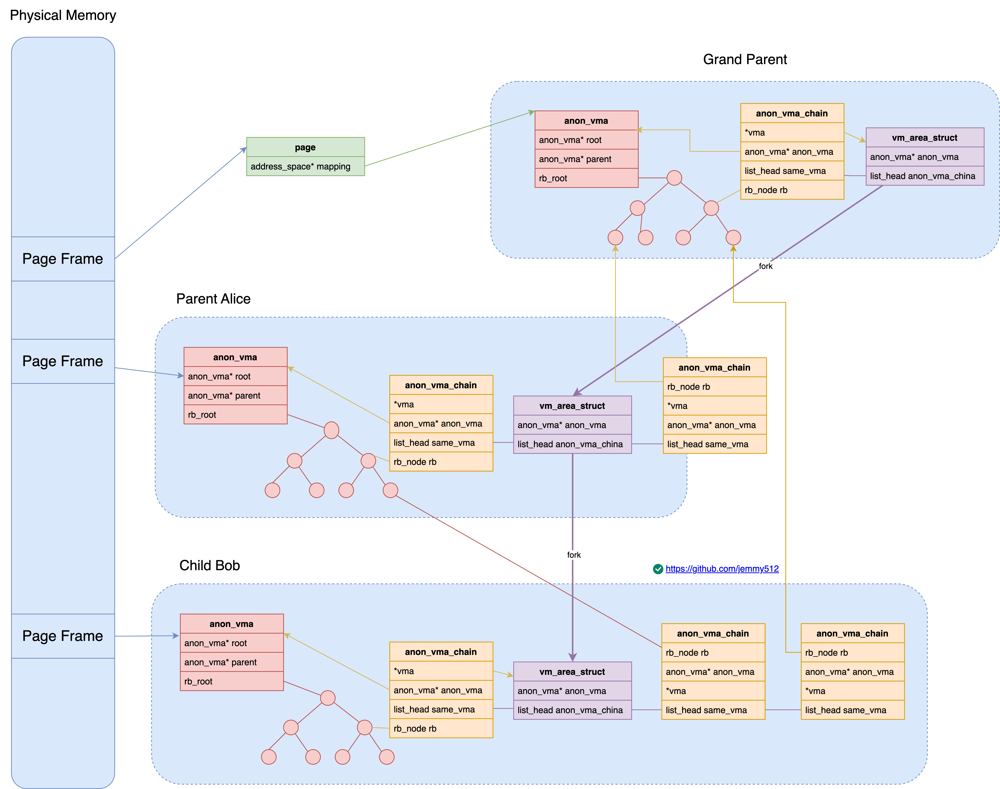


* [wowotech - 逆向映射的演进](http://www.wowotech.net/memory_management/reverse_mapping.html)
* [五花肉 - linux内核反向映射(RMAP)技术分析 - 知乎](https://zhuanlan.zhihu.com/p/564867734)
* [linux 匿名页反向映射 - 知乎](https://zhuanlan.zhihu.com/p/361173109)
* https://blog.csdn.net/u010923083/article/details/116456497
* https://zhuanlan.zhihu.com/p/448713030

```c
struct vm_area_struct {
    struct list_head    anon_vma_chain;
    struct anon_vma*    anon_vma;
}

struct anon_vma {
    struct anon_vma         *root;
    struct rw_semaphore     rwsem;

    unsigned                degree;
    atomic_t                refcount;
    struct anon_vma         *parent;
    struct rb_root_cached   rb_root;
};

struct anon_vma_chain {
    struct vm_area_struct*  vma;
    struct anon_vma*        anon_vma;
    struct list_head        same_vma;
    struct rb_node          rb;
    unsigned long           rb_subtree_last;
};

struct page {
    /* If low bit clear, points to inode address_space, or NULL.
     * If page mapped as anonymous memory, low bit is set,
     * and it points to anon_vma object */
    struct address_space *mapping;

    union {
        /* 1. page offset in user virtual address space for anon mapping
         * 2. page offset in file for file mapping
         * 3. migration type */
        pgoff_t index;
        union {
            atomic_t _mapcount;
        }
    }
};
```

## anon_vma_prepare

```c
anon_vma_prepare() {
    if (likely(vma->anon_vma))
        return 0;

    avc = anon_vma_chain_alloc(GFP_KERNEL);
    anon_vma = find_mergeable_anon_vma(vma);
    anon_vma = anon_vma_alloc()
    vma->anon_vma = anon_vma;
    anon_vma_chain_link(vma, avc, anon_vma) {
        avc->vma = vma;
        avc->anon_vma = anon_vma;
        list_add(&avc->same_vma, &vma->anon_vma_chain);
        anon_vma_interval_tree_insert(avc, &anon_vma->rb_root);
    }
}

folio_add_new_anon_rmap() {
    __folio_set_anon() {
        struct anon_vma *anon_vma = vma->anon_vma;
        anon_vma = (void *) anon_vma + PAGE_MAPPING_ANON;
        WRITE_ONCE(folio->mapping, (struct address_space *) anon_vma);
        folio->index = linear_page_index(vma, address) {
            pgoff_t pgoff;
            if (unlikely(is_vm_hugetlb_page(vma))) {
                return linear_hugepage_index(vma, address);
            }
            pgoff = (address - vma->vm_start) >> PAGE_SHIFT;
            pgoff += vma->vm_pgoff;
            return pgoff;
        }
    }
}

__folio_add_anon_rmap() {
    __folio_add_rmap(folio, page, nr_pages, level, &nr_pmdmapped) {
        switch (level) {
        case RMAP_LEVEL_PTE:
            do {
                first = atomic_inc_and_test(&page->_mapcount);
            } while (page++, --nr_pages > 0);
            break;

        case RMAP_LEVEL_PMD:
            first = atomic_inc_and_test(&folio->_entire_mapcount);
            break;
        }
    }
}

void __folio_add_file_rmap()
{
    nr = __folio_add_rmap(folio, page, nr_pages, level, &nr_pmdmapped);
}
```

## anon_vma_fork


```c
int anon_vma_fork(struct vm_area_struct *vma, struct vm_area_struct *pvma)
{
    struct anon_vma_chain *avc;
    struct anon_vma *anon_vma;
    int error;

    /* Don't bother if the parent process has no anon_vma here. */
    if (!pvma->anon_vma)
        return 0;

    /* Drop inherited anon_vma, we'll reuse existing or allocate new. */
    vma->anon_vma = NULL;

    /* 1. attach the new VMA to the parent VMA's anon_vmas,
     * so rmap can find non-COWed pages in child processes. */
    error = anon_vma_clone(vma, pvma) {
        list_for_each_entry_reverse(pavc, &src->anon_vma_chain, same_vma) {
            struct anon_vma *anon_vma;

            avc = anon_vma_chain_alloc(GFP_NOWAIT | __GFP_NOWARN);
            anon_vma = pavc->anon_vma;
            root = lock_anon_vma_root(root, anon_vma);
            anon_vma_chain_link(dst, avc, anon_vma);
        }
        if (dst->anon_vma)
            dst->anon_vma->num_active_vmas++;
        return 0;
    }

    /* An existing anon_vma has been reused, all done then. */
    if (vma->anon_vma)
        return 0;

    /* 2. Then add our own anon_vma. */
    anon_vma = anon_vma_alloc();
    anon_vma->num_active_vmas++;
    avc = anon_vma_chain_alloc(GFP_KERNEL);

    anon_vma->root = pvma->anon_vma->root;
    anon_vma->parent = pvma->anon_vma;

    get_anon_vma(anon_vma->root);
    /* Mark this anon_vma as the one where our new (COWed) pages go. */
    vma->anon_vma = anon_vma;
    anon_vma_lock_write(anon_vma);
    anon_vma_chain_link(vma, avc, anon_vma);
    anon_vma->parent->num_children++;
    anon_vma_unlock_write(anon_vma);

    return 0;
}
```

## try_to_unmap

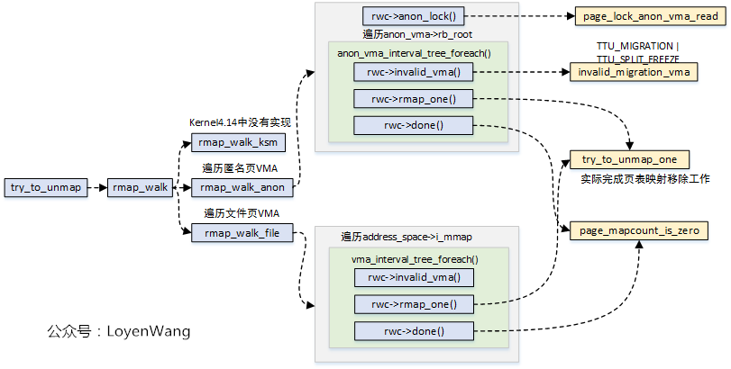

```c
try_to_unmap(struct folio *folio, enum ttu_flags flags) {
    struct rmap_walk_control rwc = {
        .rmap_one = try_to_unmap_one,
        .arg = (void *)flags,
        .done = folio_not_mapped,
        .anon_lock = folio_lock_anon_vma_read,
    };

    rmap_walk_locked(folio, &rwc) {
        if (folio_test_anon(folio)) {
            rmap_walk_anon(folio, rwc, true) {
                pgoff_start = folio_pgoff(folio);
                pgoff_end = pgoff_start + folio_nr_pages(folio) - 1;
                anon_vma_interval_tree_foreach(avc, &anon_vma->rb_root, pgoff_start, pgoff_end) {
                    struct vm_area_struct *vma = avc->vma;
                    unsigned long address = vma_address(&folio->page, vma);

                    rwc->invalid_vma(vma, rwc->arg);

                    ret = rwc->rmap_one(folio, vma, address, rwc->arg) {
                        try_to_unmap_one();
                    }

                    rwc->done(folio) {
                        folio_not_mapped();
                    }
                }
            }
        } else {
            rmap_walk_file(folio, rwc, true) {
                struct address_space *mapping = folio_mapping(folio);
                vma_interval_tree_foreach(vma, &mapping->i_mmap, pgoff_start, pgoff_end) {
                    unsigned long address = vma_address(&folio->page, vma);

                    if (rwc->invalid_vma && rwc->invalid_vma(vma, rwc->arg))
                        continue;

                    if (!rwc->rmap_one(folio, vma, address, rwc->arg))
                        goto done;
                    if (rwc->done && rwc->done(folio))
                        goto done;
                }
            }
        }
    }
}
```

```c
bool try_to_unmap_one(struct folio *folio, struct vm_area_struct *vma,
            unsigned long address, void *arg)
{
    struct mm_struct *mm = vma->vm_mm;
    DEFINE_FOLIO_VMA_WALK(pvmw, folio, vma, address, 0);
    pte_t pteval;
    struct page *subpage;
    bool anon_exclusive, ret = true;
    struct mmu_notifier_range range;
    enum ttu_flags flags = (enum ttu_flags)(long)arg;
    unsigned long pfn;
    unsigned long hsz = 0;

    /* check if @pvmw->pfn is mapped in @pvmw->vma at @pvmw->address */
    while (page_vma_mapped_walk(&pvmw)) {
        pfn = pte_pfn(ptep_get(pvmw.pte));
        subpage = folio_page(folio, pfn - folio_pfn(folio));
        address = pvmw.address;
        anon_exclusive = folio_test_anon(folio) &&
                PageAnonExclusive(subpage);

        if (should_defer_flush(mm, flags)) {
            pteval = ptep_get_and_clear(mm, address, pvmw.pte);
            set_tlb_ubc_flush_pending(mm, pteval, address);
        } else {
            pteval = ptep_clear_flush(vma, address, pvmw.pte);
        }

        /* Set the dirty flag on the folio now the pte is gone. */
        if (pte_dirty(pteval))
            folio_mark_dirty(folio);

        /* Update high watermark before we lower rss */
        update_hiwater_rss(mm);

        if (folio_test_anon(folio)) {
            swp_entry_t entry = page_swap_entry(subpage);
            pte_t swp_pte;


            /* MADV_FREE page check */
            if (!folio_test_swapbacked(folio)) {
                int ref_count, map_count;
                smp_mb();

                ref_count = folio_ref_count(folio);
                map_count = folio_mapcount(folio);

                smp_rmb();

                if (ref_count == 1 + map_count && !folio_test_dirty(folio)) {
                    dec_mm_counter(mm, MM_ANONPAGES);
                    goto discard;
                }

                set_pte_at(mm, address, pvmw.pte, pteval);
                folio_set_swapbacked(folio);
                ret = false;
                page_vma_mapped_walk_done(&pvmw);
                break;
            }

            if (swap_duplicate(entry) < 0) {
                set_pte_at(mm, address, pvmw.pte, pteval);
                ret = false;
                page_vma_mapped_walk_done(&pvmw);
                break;
            }
            if (arch_unmap_one(mm, vma, address, pteval) < 0) {
                swap_free(entry);
                set_pte_at(mm, address, pvmw.pte, pteval);
                ret = false;
                page_vma_mapped_walk_done(&pvmw);
                break;
            }

            /* See folio_try_share_anon_rmap(): clear PTE first. */
            if (anon_exclusive && folio_try_share_anon_rmap_pte(folio, subpage)) {
                swap_free(entry);
                set_pte_at(mm, address, pvmw.pte, pteval);
                ret = false;
                page_vma_mapped_walk_done(&pvmw);
                break;
            }
            if (list_empty(&mm->mmlist)) {
                spin_lock(&mmlist_lock);
                if (list_empty(&mm->mmlist))
                    list_add(&mm->mmlist, &init_mm.mmlist);
                spin_unlock(&mmlist_lock);
            }
            dec_mm_counter(mm, MM_ANONPAGES);
            inc_mm_counter(mm, MM_SWAPENTS);
            swp_pte = swp_entry_to_pte(entry);
            if (anon_exclusive)
                swp_pte = pte_swp_mkexclusive(swp_pte);
            if (pte_soft_dirty(pteval))
                swp_pte = pte_swp_mksoft_dirty(swp_pte);
            if (pte_uffd_wp(pteval))
                swp_pte = pte_swp_mkuffd_wp(swp_pte);
            set_pte_at(mm, address, pvmw.pte, swp_pte);
        } else {
            dec_mm_counter(mm, mm_counter_file(&folio->page));
        }
discard:
        if (unlikely(folio_test_hugetlb(folio)))
            hugetlb_remove_rmap(folio);
        else {
            folio_remove_rmap_pte(folio, subpage, vma) {
                atomic_add_negative(-1, &page->_mapcount);
            }
        }
        if (vma->vm_flags & VM_LOCKED)
            mlock_drain_local();
        folio_put(folio);
    }

    mmu_notifier_invalidate_range_end(&range);

    return ret;
}
```

# kernel mapping
```c
/* arch/x86/include/asm/pgtable_64.h */
extern pud_t level3_kernel_pgt[512];
extern pud_t level3_ident_pgt[512];

extern pmd_t level2_kernel_pgt[512];
extern pmd_t level2_fixmap_pgt[512];
extern pmd_t level2_ident_pgt[512];

extern pte_t level1_fixmap_pgt[512];
extern pgd_t init_top_pgt[];

#define swapper_pg_dir init_top_pgt

/* arch\x86\kernel\head_64.S */
__INITDATA
NEXT_PAGE(init_top_pgt)
  .quad   level3_ident_pgt - __START_KERNEL_map + _KERNPG_TABLE
  .org    init_top_pgt + PGD_PAGE_OFFSET*8, 0
  .quad   level3_ident_pgt - __START_KERNEL_map + _KERNPG_TABLE
  .org    init_top_pgt + PGD_START_KERNEL*8, 0
  /* (2^48-(2*1024*1024*1024))/(2^39) = 511 */
  .quad   level3_kernel_pgt - __START_KERNEL_map + _PAGE_TABLE

NEXT_PAGE(level3_ident_pgt)
  .quad  level2_ident_pgt - __START_KERNEL_map + _KERNPG_TABLE
  .fill  511, 8, 0
NEXT_PAGE(level2_ident_pgt)
  /* Since I easily can, map the first 1G.
   * Don't set NX because code runs from these pages. */
  PMDS(0, __PAGE_KERNEL_IDENT_LARGE_EXEC, PTRS_PER_PMD)


NEXT_PAGE(level3_kernel_pgt)
  .fill  L3_START_KERNEL,8,0
  /* (2^48-(2*1024*1024*1024)-((2^39)*511))/(2^30) = 510 */
  .quad  level2_kernel_pgt - __START_KERNEL_map + _KERNPG_TABLE
  .quad  level2_fixmap_pgt - __START_KERNEL_map + _PAGE_TABLE


NEXT_PAGE(level2_kernel_pgt)
  /* 512 MB kernel mapping. We spend a full page on this pagetable
   * anyway.
   *
   * The kernel code+data+bss must not be bigger than that.
   *
   * (NOTE: at +512MB starts the module area, see MODULES_VADDR.
   *  If you want to increase this then increase MODULES_VADDR
   *  too.) */
  PMDS(0, __PAGE_KERNEL_LARGE_EXEC,
    KERNEL_IMAGE_SIZE/PMD_SIZE)


NEXT_PAGE(level2_fixmap_pgt)
  .fill  506,8,0
  .quad  level1_fixmap_pgt - __START_KERNEL_map + _PAGE_TABLE
  /* 8MB reserved for vsyscalls + a 2MB hole = 4 + 1 entries */
  .fill  5,8,0


NEXT_PAGE(level1_fixmap_pgt)
  .fill  51


PGD_PAGE_OFFSET = pgd_index(__PAGE_OFFSET_BASE)
PGD_START_KERNEL = pgd_index(__START_KERNEL_map)
L3_START_KERNEL = pud_index(__START_KERNEL_map)
```


```c
/* kernel mm_struct */
struct mm_struct init_mm = {
  .mm_rb      = RB_ROOT,
  .pgd        = swapper_pg_dir,
  .mm_users   = ATOMIC_INIT(2),
  .mm_count   = ATOMIC_INIT(1),
  .mmap_sem   = __RWSEM_INITIALIZER(init_mm.mmap_sem),
  .page_table_lock =  __SPIN_LOCK_UNLOCKED(init_mm.page_table_lock),
  .mmlist     = LIST_HEAD_INIT(init_mm.mmlist),
  .user_ns    = &init_user_ns,
  INIT_MM_CONTEXT(init_mm)
};

/* init kernel mm_struct */
void __init setup_arch(char **cmdline_p)
{
  clone_pgd_range(swapper_pg_dir + KERNEL_PGD_BOUNDARY,
      initial_page_table + KERNEL_PGD_BOUNDARY,
      KERNEL_PGD_PTRS);

  load_cr3(swapper_pg_dir);
  __flush_tlb_all();

  init_mm.start_code = (unsigned long) _text;
  init_mm.end_code = (unsigned long) _etext;
  init_mm.end_data = (unsigned long) _edata;
  init_mm.brk = _brk_end;
  init_mem_mapping();
}

/* init_mem_mapping -> */
unsigned long kernel_physical_mapping_init(
  unsigned long paddr_start,
  unsigned long paddr_end,
  unsigned long page_size_mask)
{
  unsigned long vaddr, vaddr_start, vaddr_end, vaddr_next, paddr_last;

  paddr_last = paddr_end;
  vaddr = (unsigned long)__va(paddr_start);
  vaddr_end = (unsigned long)__va(paddr_end);
  vaddr_start = vaddr;

  for (; vaddr < vaddr_end; vaddr = vaddr_next) {
    pgd_t *pgd = pgd_offset_k(vaddr);
    p4d_t *p4d;

    vaddr_next = (vaddr & PGDIR_MASK) + PGDIR_SIZE;

    if (pgd_val(*pgd)) {
      p4d = (p4d_t *)pgd_page_vaddr(*pgd);
      paddr_last = phys_p4d_init(p4d, __pa(vaddr),
               __pa(vaddr_end),
               page_size_mask);
      continue;
    }

    p4d = alloc_low_page();
    paddr_last = phys_p4d_init(p4d, __pa(vaddr), __pa(vaddr_end),
             page_size_mask);

    p4d_populate(&init_mm, p4d_offset(pgd, vaddr), (pud_t *) p4d);
  }
  __flush_tlb_all();

  return paddr_last;
}
```

# kmalloc

* [bin的技术小屋](https://mp.weixin.qq.com/s/atHXeXxx0L63w99RW7bMHg)

```c
/* kmalloc is the normal method of allocating memory
 * for objects smaller than page size in the kernel. */
static void *kmalloc(size_t size, gfp_t flags) {
  if (__builtin_constant_p(size)) {
    if (size > KMALLOC_MAX_CACHE_SIZE)
      return kmalloc_large(size, flags);

#ifndef CONFIG_SLOB
    if (!(flags & GFP_DMA)) {
      unsigned int index = kmalloc_index(size);

      if (!index)
        return ZERO_SIZE_PTR;

      return kmem_cache_alloc_trace(kmalloc_caches[index],
          flags, size);
    }
#endif
  }

    return __kmalloc(size, flags) {
        struct kmem_cache *s;
        void *ret;

        if (unlikely(size > KMALLOC_MAX_CACHE_SIZE))
            return kmalloc_large(size, flags) {
                unsigned int order = get_order(size);
                return kmalloc_order_trace(size, flags, order) {
                    kmalloc_order(size, flags, order) {
                        void *ret;
                        struct page *page;

                        flags |= __GFP_COMP;
                        page = alloc_pages(flags, order);
                        ret = page ? page_address(page) : NULL;
                        kmemleak_alloc(ret, size, 1, flags);
                        kasan_kmalloc_large(ret, size, flags);
                        return ret;
                    }
                }
            }

        s = kmalloc_slab(size, flags) {
            unsigned int index;

        if (size <= 192) {
            if (!size)
            return ZERO_SIZE_PTR;

            index = size_index[size_index_elem(size)] {
                return (bytes - 1) / 8;
            }
        } else {
            if (unlikely(size > KMALLOC_MAX_CACHE_SIZE)) {
            WARN_ON(1);
            return NULL;
            }
            index = fls(size - 1);
        }

        #ifdef CONFIG_ZONE_DMA
        if (unlikely((flags & GFP_DMA)))
            return kmalloc_dma_caches[index];

        #endif
        return kmalloc_caches[index];
    }
    if (unlikely(ZERO_OR_NULL_PTR(s)))
        return s;

    ret = slab_alloc(s, flags, _RET_IP_);

    return ret;
}
```

## kmalloc_caches
```c
/* mm/slab_common.c */
struct kmem_cache *kmalloc_caches[KMALLOC_SHIFT_HIGH + 1];

void kmem_cache_init(void)
{
    setup_kmalloc_cache_index_table();
    create_kmalloc_caches(0) {
        for (i = KMALLOC_SHIFT_LOW; i <= KMALLOC_SHIFT_HIGH; i++) {
            if (!kmalloc_caches[i])
            new_kmalloc_cache(i, flags);

            if (KMALLOC_MIN_SIZE <= 32 && !kmalloc_caches[1] && i == 6) {
                new_kmalloc_cache(1, flags);
            }
            if (KMALLOC_MIN_SIZE <= 64 && !kmalloc_caches[2] && i == 7) {
                new_kmalloc_cache(2, flags) {
                    kmalloc_caches[idx] = create_kmalloc_cache(kmalloc_info[idx].name,
                        kmalloc_info[idx].size, flags, 0,
                        kmalloc_info[idx].size
                    ) {

                    }
                }
            }
        }

        /* Kmalloc array is now usable */
        slab_state = UP;

        for (i = 0; i <= KMALLOC_SHIFT_HIGH; i++) {
            struct kmem_cache *s = kmalloc_caches[i];

            if (s) {
                unsigned int size = kmalloc_size(i);
                kmalloc_dma_caches[i] = create_kmalloc_cache(n,
                    size, SLAB_CACHE_DMA | flags, 0, 0) {

                    struct kmem_cache *s = kmem_cache_zalloc(kmem_cache, GFP_NOWAIT);

                    create_boot_cache(s, name, size, flags, useroffset, usersize);
                    list_add(&s->list, &slab_caches);
                    memcg_link_cache(s);
                    s->refcount = 1;
                    return s;
                }
            }
        }
    }
}

const struct kmalloc_info_struct kmalloc_info[] __initconst = {
    {NULL,                      0},    {"kmalloc-96",             96},
    {"kmalloc-192",           192},    {"kmalloc-8",               8},
    {"kmalloc-16",             16},    {"kmalloc-32",             32},
    {"kmalloc-64",             64},    {"kmalloc-128",           128},
    {"kmalloc-256",           256},    {"kmalloc-512",           512},
    {"kmalloc-1024",         1024},    {"kmalloc-2048",         2048},
    {"kmalloc-4096",         4096},    {"kmalloc-8192",         8192},
    {"kmalloc-16384",       16384},    {"kmalloc-32768",       32768},
    {"kmalloc-65536",       65536},    {"kmalloc-131072",     131072},
    {"kmalloc-262144",     262144},    {"kmalloc-524288",     524288},
    {"kmalloc-1048576",   1048576},    {"kmalloc-2097152",   2097152},
    {"kmalloc-4194304",   4194304},    {"kmalloc-8388608",   8388608},
    {"kmalloc-16777216", 16777216},    {"kmalloc-33554432", 33554432},
    {"kmalloc-67108864", 67108864}
};

/* Conversion table for small slabs sizes / 8 to the index in the
 * kmalloc array. This is necessary for slabs < 192 since we have non power
 * of two cache sizes there. The size of larger slabs can be determined using
 * fls. */
u8 size_index[24] = {
  3,  /* 8 */
  4,  /* 16 */
  5,  /* 24 */
  5,  /* 32 */
  6,  /* 40 */
  6,  /* 48 */
  6,  /* 56 */
  6,  /* 64 */
  1,  /* 72 */
  1,  /* 80 */
  1,  /* 88 */
  1,  /* 96 */
  7,  /* 104 */
  7,  /* 112 */
  7,  /* 120 */
  7,  /* 128 */
  2,  /* 136 */
  2,  /* 144 */
  2,  /* 152 */
  2,  /* 160 */
  2,  /* 168 */
  2,  /* 176 */
  2,  /* 184 */
  2   /* 192 */
};
```

# kmap_atomic
```c
void *kmap_atomic(struct page *page) {
    return kmap_atomic_prot(page, kmap_prot) {
        /* 64 bit machine doesn't have high memory */
        if (!PageHighMem(page))
            return page_address(page);
                --->

        /* 32 bit machine */
        type = kmap_atomic_idx_push();
        idx = type + KM_TYPE_NR*smp_processor_id();
        vaddr = __fix_to_virt(FIX_KMAP_BEGIN + idx) {
            return (FIXADDR_TOP - ((x) << PAGE_SHIFT))
        }
        set_pte(kmap_pte-idx, mk_pte(page, prot));

        return (void *)vaddr;
    }
}

/* get the mapped virtual address of a page */
void *page_address(const struct page *page)
{
    unsigned long flags;
    void *ret;
    struct page_address_slot *pas;

    if (!PageHighMem(page)) {
        return lowmem_page_address(page) {
            return page_to_virt(page) {
                __va(PFN_PHYS(page_to_pfn(x)));
            }
        }
    }

    pas = page_slot(page);
    ret = NULL;
    spin_lock_irqsave(&pas->lock, flags);
    if (!list_empty(&pas->lh)) {
        struct page_address_map *pam;

        list_for_each_entry(pam, &pas->lh, list) {
        if (pam->page == page) {
            ret = pam->virtual; /* set_page_address() */
            goto done;
        }
    }
done:
    spin_unlock_irqrestore(&pas->lock, flags);
    return ret;
}
```

# vmalloc
```c
struct vm_struct {
    struct vm_struct  *next;
    void              *addr;
    unsigned long     size;
    unsigned long     flags;
    struct page       **pages;
    unsigned int      nr_pages;
    phys_addr_t       phys_addr;
    const void        *caller;
};

struct vmap_area {
    unsigned long va_start;
    unsigned long va_end;

    struct rb_node rb_node; /* address sorted rbtree */
    struct list_head list; /* address sorted list */

    union {
        unsigned long subtree_max_size; /* in "free" tree free_vmap_area_root */
        struct vm_struct *vm;           /* in "busy" tree vmap_area_root */
    };
};
```

```c
vmalloc(size);
    __vmalloc_node_range(size, align, VMALLOC_START, VMALLOC_END, gfp_mask, PAGE_KERNEL, 0, node, caller) {
        struct vm_struct *area = __get_vm_area_node() {
            area = kzalloc_node(sizeof(*area));
            /* Allocate a region of KVA */
            va = alloc_vmap_area(size) {
                va = kmem_cache_alloc_node(vmap_area_cachep);
                addr = __alloc_vmap_area(&free_vmap_area_root, &free_vmap_area_list, size, align, vstart, vend) {
                    va = find_vmap_lowest_match();
                    adjust_va_to_fit_type();
                        kmem_cache_alloc(vmap_area_cachep, GFP_NOWAIT);
                }
                va->va_start = addr;
                va->va_end = addr + size;
                va->vm = NULL;
                insert_vmap_area(va, &vmap_area_root, &vmap_area_list);
            }
            setup_vmalloc_vm(area, va, flags, caller);
        }
    }

    /* Allocate physical pages and map them into vmalloc space. */
    __vmalloc_area_node(area, gfp_mask, prot, shift, node) {
        vm_area_alloc_pages() {
            alloc_pages();
        }

        vmap_pages_range(addr, addr + size, prot, area->pages, page_shift) {
            vmap_range_noflush() {
                pgd = pgd_offset_k(addr);
                vmap_p4d_range() {
                    p4d = p4d_alloc_track(&init_mm, pgd, addr, mask);
                    vmap_pud_range() {
                        pud = pud_alloc_track(&init_mm, p4d, addr, mask);
                        vmap_pmd_range() {
                            pmd = pmd_alloc_track(&init_mm, pud, addr, mask);
                            vmap_pte_range() {
                                pte = pte_alloc_kernel_track(pmd, addr, mask);
                                set_pte_at(&init_mm, addr, pte, pfn_pte(pfn, prot)) {
                                    set_ptes(mm, addr, ptep, pte, 1) {
                                        for (;;) {
                                            __set_pte_at(mm, addr, ptep, pte) {
                                                if (pte_present(pte) && pte_user_exec(pte) && !pte_special(pte)) {
                                                    __sync_icache_dcache(pte) {
                                                        struct folio *folio = page_folio(pte_page(pte));
                                                        if (!test_bit(PG_dcache_clean, &folio->flags)) {
                                                            sync_icache_aliases(
                                                                (unsigned long)folio_address(folio),
                                                                (unsigned long)folio_address(folio) + folio_size(folio)) {

                                                                if (icache_is_aliasing()) {
                                                                    dcache_clean_pou(start, end);
                                                                    icache_inval_all_pou();
                                                                } else {
                                                                    caches_clean_inval_pou(start, end);
                                                                }
                                                            }
                                                            set_bit(PG_dcache_clean, &folio->flags);
                                                        }
                                                    }
                                                }

                                                set_pte(ptep, pte) {
                                                    WRITE_ONCE(*ptep, pte);
                                                    if (pte_valid_not_user(pte)) {
                                                        dsb(ishst);
                                                        isb();
                                                    }
                                                }
                                            }
                                            if (--nr == 0)
                                                break;
                                            ptep++;
                                            addr += PAGE_SIZE;
                                            pte_val(pte) += PAGE_SIZE;
                                        }
                                    }
                                }
                            }
                        }
                    }
                }
            }
        }
    }
```

# page_reclaim

```c
typedef struct pglist_data {
    struct lruvec           lruvec;
    struct task_struct*     kswapd;
};

struct lruvec {
    struct list_head        lists[NR_LRU_LISTS];
    spinlock_t              lru_lock;

    unsigned long            anon_cost;
    unsigned long            file_cost;

    atomic_long_t            nonresident_age;

    unsigned long            refaults[ANON_AND_FILE];

    unsigned long            flags;

    struct pglist_data *pgdat;
};

#define LRU_BASE 0
#define LRU_ACTIVE 1
#define LRU_FILE 2

enum lru_list {
    LRU_INACTIVE_ANON = LRU_BASE,
    LRU_ACTIVE_ANON =   LRU_BASE + LRU_ACTIVE,
    LRU_INACTIVE_FILE = LRU_BASE + LRU_FILE,
    LRU_ACTIVE_FILE =   LRU_BASE + LRU_FILE + LRU_ACTIVE,
    LRU_UNEVICTABLE,
    NR_LRU_LISTS
};

struct pagevec {
    unsigned char nr;
    bool percpu_pvec_drained;
    struct page *pages[PAGEVEC_SIZE];
};

struct cpu_fbatches {
    local_lock_t lock;
    struct folio_batch lru_add;
    struct folio_batch lru_deactivate_file;
    struct folio_batch lru_deactivate;
    struct folio_batch lru_lazyfree;
    struct folio_batch activate;
};

static DEFINE_PER_CPU(struct cpu_fbatches, cpu_fbatches) = {
    .lock = INIT_LOCAL_LOCK(lock),
};

struct folio_batch {
    unsigned char nr;
    bool percpu_pvec_drained;
    struct folio *folios[PAGEVEC_SIZE];
};

struct lru_rotate {
    local_lock_t lock;
    struct folio_batch fbatch;
};
static DEFINE_PER_CPU(struct lru_rotate, lru_rotate) = {
    .lock = INIT_LOCAL_LOCK(lock),
};
```

# page_migrate


Type | Note
--- | ---
MIGRATE_ASYNC | means never block
MIGRATE_SYNC_LIGHT | allow blocking on most operations but not `->writepage` as the potential stall time is too significant
MIGRATE_SYNC | will block when migrating pages
MIGRATE_SYNC_NO_COPY | will block when migrating pages but will not copy pages with the CPU

```c
enum migrate_reason {
    MR_COMPACTION,
    MR_MEMORY_FAILURE,
    MR_MEMORY_HOTPLUG,
    MR_SYSCALL,
    MR_MEMPOLICY_MBIND,
    MR_NUMA_MISPLACED,
    MR_CONTIG_RANGE,
    MR_LONGTERM_PIN,
    MR_DEMOTION,
    MR_TYPES
};
```

```c
int migrate_pages(struct list_head *from, new_folio_t get_new_folio,
        free_folio_t put_new_folio, unsigned long private,
        enum migrate_mode mode, int reason, unsigned int *ret_succeeded)
{
    int rc, rc_gather;
    int nr_pages;
    struct folio *folio, *folio2;
    LIST_HEAD(folios);
    LIST_HEAD(ret_folios);
    LIST_HEAD(split_folios);
    struct migrate_pages_stats stats;

    rc_gather = migrate_hugetlbs(from, get_new_folio, put_new_folio, private,
                    mode, reason, &stats, &ret_folios);
    if (rc_gather < 0)
        goto out;

again:
    nr_pages = 0;
    list_for_each_entry_safe(folio, folio2, from, lru) {
        /* Retried hugetlb folios will be kept in list  */
        if (folio_test_hugetlb(folio)) {
            list_move_tail(&folio->lru, &ret_folios);
            continue;
        }

        nr_pages += folio_nr_pages(folio);
        if (nr_pages >= NR_MAX_BATCHED_MIGRATION)
            break;
    }
    if (nr_pages >= NR_MAX_BATCHED_MIGRATION)
        list_cut_before(&folios, from, &folio2->lru);
    else
        list_splice_init(from, &folios);

    if (mode == MIGRATE_ASYNC)
        rc = migrate_pages_batch(&folios, get_new_folio, put_new_folio,
                private, mode, reason, &ret_folios,
                &split_folios, &stats,
                NR_MAX_MIGRATE_PAGES_RETRY);
    else
        rc = migrate_pages_sync(&folios, get_new_folio, put_new_folio,
                private, mode, reason, &ret_folios,
                &split_folios, &stats);

    list_splice_tail_init(&folios, &ret_folios);
    if (rc < 0) {
        rc_gather = rc;
        list_splice_tail(&split_folios, &ret_folios);
        goto out;
    }
    if (!list_empty(&split_folios)) {
        migrate_pages_batch(&split_folios, get_new_folio,
                put_new_folio, private, MIGRATE_ASYNC, reason,
                &ret_folios, NULL, &stats, 1);
        list_splice_tail_init(&split_folios, &ret_folios);
    }
    rc_gather += rc;
    if (!list_empty(from))
        goto again;
out:
    list_splice(&ret_folios, from);

    if (list_empty(from))
        rc_gather = 0;

    if (ret_succeeded)
        *ret_succeeded = stats.nr_succeeded;

    return rc_gather;
}
```

## migreate_pages_batch

```c
int migrate_pages_batch(struct list_head *from,
        new_folio_t get_new_folio, free_folio_t put_new_folio,
        unsigned long private, enum migrate_mode mode, int reason,
        struct list_head *ret_folios, struct list_head *split_folios,
        struct migrate_pages_stats *stats, int nr_pass)
{
    LIST_HEAD(unmap_folios);
    LIST_HEAD(dst_folios);
    bool nosplit = (reason == MR_NUMA_MISPLACED);

    for (pass = 0; pass < nr_pass && retry; pass++) {
        retry = 0;
        thp_retry = 0;
        nr_retry_pages = 0;

        list_for_each_entry_safe(folio, folio2, from, lru) {
            is_large = folio_test_large(folio);
            is_thp = is_large && folio_test_pmd_mappable(folio);
            nr_pages = folio_nr_pages(folio);

            cond_resched();

            if (!thp_migration_supported() && is_thp) {
                nr_failed++;
                stats->nr_thp_failed++;
                if (!try_split_folio(folio, split_folios)) {
                    continue;
                }
                list_move_tail(&folio->lru, ret_folios);
                continue;
            }

            rc = migrate_folio_unmap(get_new_folio, put_new_folio,
                private, folio, &dst, mode, reason,
                ret_folios);
            switch(rc) {
            case -ENOMEM:
                nr_failed++;
                stats->nr_thp_failed += is_thp;
                /* Large folio NUMA faulting doesn't split to retry. */
                if (is_large && !nosplit) {
                    int ret = try_split_folio(folio, split_folios);

                    if (!ret) {
                        stats->nr_thp_split += is_thp;
                        stats->nr_split++;
                        break;
                    } else if (reason == MR_LONGTERM_PIN && ret == -EAGAIN) {
                        retry++;
                        thp_retry += is_thp;
                        nr_retry_pages += nr_pages;
                        /* Undo duplicated failure counting. */
                        nr_failed--;
                        stats->nr_thp_failed -= is_thp;
                        break;
                    }
                }

                stats->nr_failed_pages += nr_pages + nr_retry_pages;
                /* nr_failed isn't updated for not used */
                stats->nr_thp_failed += thp_retry;
                rc_saved = rc;
                if (list_empty(&unmap_folios))
                    goto out;
                else
                    goto move;
            case -EAGAIN:
                retry++;
                thp_retry += is_thp;
                nr_retry_pages += nr_pages;
                break;
            case MIGRATEPAGE_SUCCESS:
                stats->nr_succeeded += nr_pages;
                stats->nr_thp_succeeded += is_thp;
                break;
            case MIGRATEPAGE_UNMAP:
                list_move_tail(&folio->lru, &unmap_folios);
                list_add_tail(&dst->lru, &dst_folios);
                break;
            default:
                nr_failed++;
                stats->nr_thp_failed += is_thp;
                stats->nr_failed_pages += nr_pages;
                break;
            }
        }
    }
    nr_failed += retry;
    stats->nr_thp_failed += thp_retry;
    stats->nr_failed_pages += nr_retry_pages;

move:
    /* Flush TLBs for all unmapped folios */
    try_to_unmap_flush();

    retry = 1;
    for (pass = 0; pass < nr_pass && retry; pass++) {
        retry = 0;
        thp_retry = 0;
        nr_retry_pages = 0;

        dst = list_first_entry(&dst_folios, struct folio, lru);
        dst2 = list_next_entry(dst, lru);
        list_for_each_entry_safe(folio, folio2, &unmap_folios, lru) {
            is_thp = folio_test_large(folio) && folio_test_pmd_mappable(folio);
            nr_pages = folio_nr_pages(folio);

            cond_resched();

            rc = migrate_folio_move(put_new_folio, private, folio, dst, mode, reason, ret_folios);
            switch(rc) {
            case -EAGAIN:
                retry++;
                thp_retry += is_thp;
                nr_retry_pages += nr_pages;
                break;
            case MIGRATEPAGE_SUCCESS:
                stats->nr_succeeded += nr_pages;
                stats->nr_thp_succeeded += is_thp;
                break;
            default:
                nr_failed++;
                stats->nr_thp_failed += is_thp;
                stats->nr_failed_pages += nr_pages;
                break;
            }
            dst = dst2;
            dst2 = list_next_entry(dst, lru);
        }
    }
    nr_failed += retry;
    stats->nr_thp_failed += thp_retry;
    stats->nr_failed_pages += nr_retry_pages;

    rc = rc_saved ? : nr_failed;
out:
    /* Cleanup remaining folios */
    dst = list_first_entry(&dst_folios, struct folio, lru);
    dst2 = list_next_entry(dst, lru);
    list_for_each_entry_safe(folio, folio2, &unmap_folios, lru) {
        int old_page_state = 0;
        struct anon_vma *anon_vma = NULL;

        __migrate_folio_extract(dst, &old_page_state, &anon_vma);
        migrate_folio_undo_src(folio, old_page_state & PAGE_WAS_MAPPED,
                    anon_vma, true, ret_folios);
        list_del(&dst->lru);
        migrate_folio_undo_dst(dst, true, put_new_folio, private);
        dst = dst2;
        dst2 = list_next_entry(dst, lru);
    }

    return rc;
}
```

### migrate_folio_unmap

```c
rc = migrate_folio_unmap(get_new_folio, put_new_folio,
    private, folio, &dst, mode, reason,
    ret_folios) {

    if (folio_ref_count(src) == 1) {
        /* Folio was freed from under us. So we are done. */
        folio_clear_active(src);
        folio_clear_unevictable(src);
        /* free_pages_prepare() will clear PG_isolated. */
        list_del(&src->lru);
        migrate_folio_done(src, reason);
        return MIGRATEPAGE_SUCCESS;
    }

    dst = get_new_folio(src, private);
    if (!dst)
        return -ENOMEM;
    *dstp = dst;

    dst->private = NULL;

    if (!folio_trylock(src)) {
        if (mode == MIGRATE_ASYNC)
            goto out;

        if (current->flags & PF_MEMALLOC)
            goto out;

        if (mode == MIGRATE_SYNC_LIGHT && !folio_test_uptodate(src))
            goto out;

        folio_lock(src);
    }
    locked = true;
    if (folio_test_mlocked(src))
        old_page_state |= PAGE_WAS_MLOCKED;

    if (folio_test_writeback(src)) {
        switch (mode) {
        case MIGRATE_SYNC:
        case MIGRATE_SYNC_NO_COPY:
            break;
        default:
            rc = -EBUSY;
            goto out;
        }
        folio_wait_writeback(src);
    }

    if (folio_test_anon(src) && !folio_test_ksm(src))
        anon_vma = folio_get_anon_vma(src);

    if (unlikely(!folio_trylock(dst)))
        goto out;
    dst_locked = true;

    if (unlikely(!is_lru)) {
        __migrate_folio_record(dst, old_page_state, anon_vma);
        return MIGRATEPAGE_UNMAP;
    }

    if (!src->mapping) {
        if (folio_test_private(src)) {
            try_to_free_buffers(src);
            goto out;
        }
    } else if (folio_mapped(src)) {
        /* Establish migration ptes */
        try_to_migrate(src, mode == MIGRATE_ASYNC ? TTU_BATCH_FLUSH : 0);
        old_page_state |= PAGE_WAS_MAPPED;
    }

    if (!folio_mapped(src)) {
        __migrate_folio_record(dst, old_page_state, anon_vma);
        return MIGRATEPAGE_UNMAP;
    }

out:
    if (rc == -EAGAIN)
        ret = NULL;

    migrate_folio_undo_src(src, old_page_state & PAGE_WAS_MAPPED,
                anon_vma, locked, ret);
    migrate_folio_undo_dst(dst, dst_locked, put_new_folio, private);

    return rc;
}
```

### migrate_folio_move

```c
/* Migrate the folio to the newly allocated folio in dst. */
static int migrate_folio_move(free_folio_t put_new_folio, unsigned long private,
			      struct folio *src, struct folio *dst,
			      enum migrate_mode mode, enum migrate_reason reason,
			      struct list_head *ret)
{
	int rc;
	int old_page_state = 0;
	struct anon_vma *anon_vma = NULL;
	bool is_lru = !__folio_test_movable(src);
	struct list_head *prev;

	__migrate_folio_extract(dst, &old_page_state, &anon_vma);
	prev = dst->lru.prev;
	list_del(&dst->lru);

	rc = move_to_new_folio(dst, src, mode) {
        if (likely(is_lru)) {
            struct address_space *mapping = folio_mapping(src);

            if (!mapping)
                rc = migrate_folio(mapping, dst, src, mode);
            else if (mapping_unmovable(mapping))
                rc = -EOPNOTSUPP;
            else if (mapping->a_ops->migrate_folio)
                rc = mapping->a_ops->migrate_folio(mapping, dst, src,
                                    mode);
            else
                rc = fallback_migrate_folio(mapping, dst, src, mode);
        } else {
            const struct movable_operations *mops;
            VM_BUG_ON_FOLIO(!folio_test_isolated(src), src);
            if (!folio_test_movable(src)) {
                rc = MIGRATEPAGE_SUCCESS;
                folio_clear_isolated(src);
                goto out;
            }

            mops = folio_movable_ops(src);
            rc = mops->migrate_page(&dst->page, &src->page, mode);
            WARN_ON_ONCE(rc == MIGRATEPAGE_SUCCESS &&
                    !folio_test_isolated(src));
        }

        if (rc == MIGRATEPAGE_SUCCESS) {
            if (__folio_test_movable(src)) {
                VM_BUG_ON_FOLIO(!folio_test_isolated(src), src);

                folio_clear_isolated(src);
            }

            if (!folio_mapping_flags(src))
                src->mapping = NULL;

            if (likely(!folio_is_zone_device(dst)))
                flush_dcache_folio(dst);
        }
    out:
        return rc;
    }
	if (rc)
		goto out;

	if (unlikely(!is_lru))
		goto out_unlock_both;

	folio_add_lru(dst);
	if (old_page_state & PAGE_WAS_MLOCKED)
		lru_add_drain();

	if (old_page_state & PAGE_WAS_MAPPED)
		remove_migration_ptes(src, dst, false);

out_unlock_both:
	folio_unlock(dst);
	set_page_owner_migrate_reason(&dst->page, reason);

	folio_put(dst);


	list_del(&src->lru);
	/* Drop an anon_vma reference if we took one */
	if (anon_vma)
		put_anon_vma(anon_vma);
	folio_unlock(src);
	migrate_folio_done(src, reason);

	return rc;
out:
	if (rc == -EAGAIN) {
		list_add(&dst->lru, prev);
		__migrate_folio_record(dst, old_page_state, anon_vma);
		return rc;
	}

	migrate_folio_undo_src(src, old_page_state & PAGE_WAS_MAPPED,
			       anon_vma, true, ret);
	migrate_folio_undo_dst(dst, true, put_new_folio, private);

	return rc;
}
```

### remove_migration_ptes

```c
void remove_migration_ptes(struct folio *src, struct folio *dst, bool locked)
{
    struct rmap_walk_control rwc = {
        .rmap_one = remove_migration_pte,
        .arg = src,
    };

    if (locked)
        rmap_walk_locked(dst, &rwc);
    else
        rmap_walk(dst, &rwc);
}
```

```c
bool remove_migration_pte(struct folio *folio,
    struct vm_area_struct *vma, unsigned long addr, void *old)
{
    DEFINE_FOLIO_VMA_WALK(pvmw, old, vma, addr, PVMW_SYNC | PVMW_MIGRATION);

    while (page_vma_mapped_walk(&pvmw)) {
        rmap_t rmap_flags = RMAP_NONE;
        pte_t old_pte;
        pte_t pte;
        swp_entry_t entry;
        struct page *new;
        unsigned long idx = 0;

        /* pgoff is invalid for ksm pages, but they are never large */
        if (folio_test_large(folio) && !folio_test_hugetlb(folio))
            idx = linear_page_index(vma, pvmw.address) - pvmw.pgoff;
        new = folio_page(folio, idx);

        folio_get(folio);
        pte = mk_pte(new, READ_ONCE(vma->vm_page_prot));
        old_pte = ptep_get(pvmw.pte);
        if (pte_swp_soft_dirty(old_pte))
            pte = pte_mksoft_dirty(pte);

        entry = pte_to_swp_entry(old_pte);
        if (!is_migration_entry_young(entry))
            pte = pte_mkold(pte);
        if (folio_test_dirty(folio) && is_migration_entry_dirty(entry))
            pte = pte_mkdirty(pte);
        if (is_writable_migration_entry(entry))
            pte = pte_mkwrite(pte, vma);
        else if (pte_swp_uffd_wp(old_pte))
            pte = pte_mkuffd_wp(pte);

        if (folio_test_anon(folio) && !is_readable_migration_entry(entry))
            rmap_flags |= RMAP_EXCLUSIVE;

        if (unlikely(is_device_private_page(new))) {
            if (pte_write(pte))
                entry = make_writable_device_private_entry(page_to_pfn(new));
            else
                entry = make_readable_device_private_entry(page_to_pfn(new));

            pte = swp_entry_to_pte(entry);
            if (pte_swp_soft_dirty(old_pte))
                pte = pte_swp_mksoft_dirty(pte);
            if (pte_swp_uffd_wp(old_pte))
                pte = pte_swp_mkuffd_wp(pte);
        }

        if (folio_test_anon(folio))
            folio_add_anon_rmap_pte(folio, new, vma, pvmw.address, rmap_flags);
        else
            folio_add_file_rmap_pte(folio, new, vma);
        set_pte_at(vma->vm_mm, pvmw.address, pvmw.pte, pte);

        if (vma->vm_flags & VM_LOCKED)
            mlock_drain_local();

        /* No need to invalidate - it was non-present before */
        update_mmu_cache(vma, pvmw.address, pvmw.pte);
    }

    return true;
}
```

# page_compact


* [OPPO内核工匠 - Linux内核内存规整详解](https://mp.weixin.qq.com/s/Ts7yGSuTrh3JLMnP4E3ajA)


* MIGRATE_ASYNC
    * exit and not wait if lock page failed
    * exit and not wait if too many zone ioslated pages

```c
status = compact_zone_order(zone, order, gfp_mask, prio, alloc_flags, ac->highest_zoneidx, capture) {
    enum compact_result ret;
    struct compact_control cc = {
        .order = order, /* order required for compaction */
        .search_order = order, /* free pages search order from high to low */
        .gfp_mask = gfp_mask, /* compact file pages for __GFP_FS */
        .zone = zone,
        /* not compact dirty and writing page for MIGRATE_ASYNC & MIGRATE_SYNC_LIGHT */
        .mode = (prio == COMPACT_PRIO_ASYNC) ? MIGRATE_ASYNC :	MIGRATE_SYNC_LIGHT,
        .alloc_flags = alloc_flags,
        .highest_zoneidx = highest_zoneidx,
        .direct_compaction = true,
        .whole_zone = (prio == MIN_COMPACT_PRIORITY),
        .ignore_skip_hint = (prio == MIN_COMPACT_PRIORITY),
        .ignore_block_suitable = (prio == MIN_COMPACT_PRIORITY)
    };
    struct capture_control capc = {
        .cc = &cc,
        .page = NULL,
    };

    WRITE_ONCE(current->capture_control, &capc);

    ret = compact_zone(&cc, &capc) {
        enum compact_result ret;
        unsigned long start_pfn = cc->zone->zone_start_pfn;
        unsigned long end_pfn = zone_end_pfn(cc->zone);
        unsigned long last_migrated_pfn;
        const bool sync = cc->mode != MIGRATE_ASYNC;
        bool update_cached;
        unsigned int nr_succeeded = 0;

        cc->total_migrate_scanned = 0;
        cc->total_free_scanned = 0;
        cc->nr_migratepages = 0;
        cc->nr_freepages = 0;
        INIT_LIST_HEAD(&cc->freepages);
        INIT_LIST_HEAD(&cc->migratepages);

        cc->migratetype = gfp_migratetype(cc->gfp_mask);

        if (!is_via_compact_memory(cc->order)) {
            ret = compaction_suit_allocation_order(
                cc->zone, cc->order,
                cc->highest_zoneidx,
                cc->alloc_flags
            );
            if (ret != COMPACT_CONTINUE)
                return ret;
        }

        if (compaction_restarting(cc->zone, cc->order))
            __reset_isolation_suitable(cc->zone);

        cc->fast_start_pfn = 0;
        if (cc->whole_zone) {
            cc->migrate_pfn = start_pfn;
            cc->free_pfn = pageblock_start_pfn(end_pfn - 1);
        } else {
            cc->migrate_pfn = cc->zone->compact_cached_migrate_pfn[sync];
            cc->free_pfn = cc->zone->compact_cached_free_pfn;
            if (cc->free_pfn < start_pfn || cc->free_pfn >= end_pfn) {
                cc->free_pfn = pageblock_start_pfn(end_pfn - 1);
                cc->zone->compact_cached_free_pfn = cc->free_pfn;
            }
            if (cc->migrate_pfn < start_pfn || cc->migrate_pfn >= end_pfn) {
                cc->migrate_pfn = start_pfn;
                cc->zone->compact_cached_migrate_pfn[0] = cc->migrate_pfn;
                cc->zone->compact_cached_migrate_pfn[1] = cc->migrate_pfn;
            }

            if (cc->migrate_pfn <= cc->zone->compact_init_migrate_pfn)
                cc->whole_zone = true;
        }

        last_migrated_pfn = 0;

        /* Migrate has separate cached PFNs for ASYNC and SYNC* migration on
        * the basis that some migrations will fail in ASYNC mode. However,
        * if the cached PFNs match and pageblocks are skipped due to having
        * no isolation candidates, then the sync state does not matter.
        * Until a pageblock with isolation candidates is found, keep the
        * cached PFNs in sync to avoid revisiting the same blocks. */
        update_cached = !sync &&
            cc->zone->compact_cached_migrate_pfn[0] == cc->zone->compact_cached_migrate_pfn[1];

        /* lru_add_drain_all could be expensive with involving other CPUs */
        lru_add_drain();

        while ((ret = compact_finished(cc)) == COMPACT_CONTINUE) {
            int err;
            unsigned long iteration_start_pfn = cc->migrate_pfn;

            /* Avoid multiple rescans of the same pageblock which can
            * happen if a page cannot be isolated (dirty/writeback in
            * async mode) or if the migrated pages are being allocated
            * before the pageblock is cleared.  The first rescan will
            * capture the entire pageblock for migration. If it fails,
            * it'll be marked skip and scanning will proceed as normal. */
            cc->finish_pageblock = false;
            if (pageblock_start_pfn(last_migrated_pfn) == pageblock_start_pfn(iteration_start_pfn)) {
                cc->finish_pageblock = true;
            }

    rescan:
            switch (isolate_migratepages(cc)) {
            case ISOLATE_ABORT:
                ret = COMPACT_CONTENDED;
                putback_movable_pages(&cc->migratepages);
                cc->nr_migratepages = 0;
                goto out;
            case ISOLATE_NONE:
                if (update_cached) {
                    cc->zone->compact_cached_migrate_pfn[1] =
                        cc->zone->compact_cached_migrate_pfn[0];
                }

                /* We haven't isolated and migrated anything, but
                * there might still be unflushed migrations from
                * previous cc->order aligned block. */
                goto check_drain;
            case ISOLATE_SUCCESS:
                update_cached = false;
                last_migrated_pfn = max(cc->zone->zone_start_pfn,
                    pageblock_start_pfn(cc->migrate_pfn - 1));
            }

            err = migrate_pages(&cc->migratepages, compaction_alloc,
                    compaction_free, (unsigned long)cc, cc->mode,
                    MR_COMPACTION, &nr_succeeded);

            /* All pages were either migrated or will be released */
            cc->nr_migratepages = 0;
            if (err) {
                putback_movable_pages(&cc->migratepages);
                /* migrate_pages() may return -ENOMEM when scanners meet
                * and we want compact_finished() to detect it */
                if (err == -ENOMEM && !compact_scanners_met(cc)) {
                    ret = COMPACT_CONTENDED;
                    goto out;
                }
                /* If an ASYNC or SYNC_LIGHT fails to migrate a page
                * within the pageblock_order-aligned block and
                * fast_find_migrateblock may be used then scan the
                * remainder of the pageblock. This will mark the
                * pageblock "skip" to avoid rescanning in the near
                * future. This will isolate more pages than necessary
                * for the request but avoid loops due to
                * fast_find_migrateblock revisiting blocks that were
                * recently partially scanned. */
                if (!pageblock_aligned(cc->migrate_pfn) &&
                    !cc->ignore_skip_hint && !cc->finish_pageblock &&
                    (cc->mode < MIGRATE_SYNC)) {
                    cc->finish_pageblock = true;

                    /* Draining pcplists does not help THP if
                    * any page failed to migrate. Even after
                    * drain, the pageblock will not be free. */
                    if (cc->order == COMPACTION_HPAGE_ORDER)
                        last_migrated_pfn = 0;

                    goto rescan;
                }
            }

            /* Stop if a page has been captured */
            if (capc && capc->page) {
                ret = COMPACT_SUCCESS;
                break;
            }

    check_drain:
            /* Has the migration scanner moved away from the previous
            * cc->order aligned block where we migrated from? If yes,
            * flush the pages that were freed, so that they can merge and
            * compact_finished() can detect immediately if allocation
            * would succeed. */
            if (cc->order > 0 && last_migrated_pfn) {
                unsigned long current_block_start =
                    block_start_pfn(cc->migrate_pfn, cc->order);

                if (last_migrated_pfn < current_block_start) {
                    lru_add_drain_cpu_zone(cc->zone);
                    /* No more flushing until we migrate again */
                    last_migrated_pfn = 0;
                }
            }
        }

    out:
        /* Release free pages and update where the free scanner should restart,
        * so we don't leave any returned pages behind in the next attempt. */
        if (cc->nr_freepages > 0) {
            unsigned long free_pfn = release_freepages(&cc->freepages);

            cc->nr_freepages = 0;
            VM_BUG_ON(free_pfn == 0);
            /* The cached pfn is always the first in a pageblock */
            free_pfn = pageblock_start_pfn(free_pfn);
            /* Only go back, not forward. The cached pfn might have been
            * already reset to zone end in compact_finished() */
            if (free_pfn > cc->zone->compact_cached_free_pfn)
                cc->zone->compact_cached_free_pfn = free_pfn;
        }

        return ret;
    }

    WRITE_ONCE(current->capture_control, NULL);
    *capture = READ_ONCE(capc.page);
    if (*capture)
        ret = COMPACT_SUCCESS;

    return ret;
}
```

## compact_finished

```c
enum compact_result compact_finished(struct compact_control *cc)
{
    int ret;

    ret = __compact_finished(cc) {
        unsigned int order;
        const int migratetype = cc->migratetype;
        int ret;

        /* Compaction run completes if the migrate and free scanner meet */
        if (compact_scanners_met(cc)) {
            reset_cached_positions(cc->zone) {
                zone->compact_cached_migrate_pfn[0] = zone->zone_start_pfn;
                zone->compact_cached_migrate_pfn[1] = zone->zone_start_pfn;
                zone->compact_cached_free_pfn = pageblock_start_pfn(zone_end_pfn(zone) - 1);
            }

            /* Mark that the PG_migrate_skip information should be cleared
            * by kswapd when it goes to sleep. kcompactd does not set the
            * flag itself as the decision to be clear should be directly
            * based on an allocation request. */
            if (cc->direct_compaction)
                cc->zone->compact_blockskip_flush = true;

            if (cc->whole_zone)
                return COMPACT_COMPLETE;
            else
                return COMPACT_PARTIAL_SKIPPED;
        }

        if (cc->proactive_compaction) {
            int score, wmark_low;
            pg_data_t *pgdat;

            pgdat = cc->zone->zone_pgdat;
            if (kswapd_is_running(pgdat))
                return COMPACT_PARTIAL_SKIPPED;

            score = fragmentation_score_zone(cc->zone);
            wmark_low = fragmentation_score_wmark(true);

            if (score > wmark_low)
                ret = COMPACT_CONTINUE;
            else
                ret = COMPACT_SUCCESS;

            goto out;
        }

        if (is_via_compact_memory(cc->order))
            return COMPACT_CONTINUE;

        /* Always finish scanning a pageblock to reduce the possibility of
         * fallbacks in the future. This is particularly important when
         * migration source is unmovable/reclaimable but it's not worth
         * special casing. */
        if (!pageblock_aligned(cc->migrate_pfn))
            return COMPACT_CONTINUE;

        /* Direct compactor: Is a suitable page free? */
        ret = COMPACT_NO_SUITABLE_PAGE;
        for (order = cc->order; order < NR_PAGE_ORDERS; order++) {
            struct free_area *area = &cc->zone->free_area[order];
            bool can_steal;

            /* Job done if page is free of the right migratetype */
            if (!free_area_empty(area, migratetype))
                return COMPACT_SUCCESS;

    #ifdef CONFIG_CMA
            /* MIGRATE_MOVABLE can fallback on MIGRATE_CMA */
            if (migratetype == MIGRATE_MOVABLE &&
                !free_area_empty(area, MIGRATE_CMA))
                return COMPACT_SUCCESS;
    #endif
            /* Job done if allocation would steal freepages from
            * other migratetype buddy lists. */
            if (find_suitable_fallback(area, order, migratetype, true, &can_steal) != -1)
                /* Movable pages are OK in any pageblock. If we are
                * stealing for a non-movable allocation, make sure
                * we finish compacting the current pageblock first
                * (which is assured by the above migrate_pfn align
                * check) so it is as free as possible and we won't
                * have to steal another one soon. */
                return COMPACT_SUCCESS;
        }

    out:
        if (cc->contended || fatal_signal_pending(current))
            ret = COMPACT_CONTENDED;

        return ret;
    }

    if (ret == COMPACT_NO_SUITABLE_PAGE)
        ret = COMPACT_CONTINUE;

    return ret;
}
```

## isolate_migratepages

```c
isolate_migrate_t isolate_migratepages(struct compact_control *cc)
{
    unsigned long block_start_pfn;
    unsigned long block_end_pfn;
    unsigned long low_pfn;
    struct page *page;
    const isolate_mode_t isolate_mode =
        (sysctl_compact_unevictable_allowed ? ISOLATE_UNEVICTABLE : 0) |
        (cc->mode != MIGRATE_SYNC ? ISOLATE_ASYNC_MIGRATE : 0);
    bool fast_find_block;

    /* Start at where we last stopped, or beginning of the zone as
    * initialized by compact_zone(). The first failure will use
    * the lowest PFN as the starting point for linear scanning. */
    low_pfn = fast_find_migrateblock(cc);
    block_start_pfn = pageblock_start_pfn(low_pfn);
    if (block_start_pfn < cc->zone->zone_start_pfn)
        block_start_pfn = cc->zone->zone_start_pfn;

    /* fast_find_migrateblock() has already ensured the pageblock is not
    * set with a skipped flag, so to avoid the isolation_suitable check
    * below again, check whether the fast search was successful. */
    fast_find_block = low_pfn != cc->migrate_pfn && !cc->fast_search_fail;

    /* Only scan within a pageblock boundary */
    block_end_pfn = pageblock_end_pfn(low_pfn);

    /* Iterate over whole pageblocks until we find the first suitable.
    * Do not cross the free scanner. */
    for (; block_end_pfn <= cc->free_pfn;
        fast_find_block = false,
        cc->migrate_pfn = low_pfn = block_end_pfn,
        block_start_pfn = block_end_pfn,
        block_end_pfn += pageblock_nr_pages) {

        /* This can potentially iterate a massively long zone with
        * many pageblocks unsuitable, so periodically check if we
        * need to schedule. */
        if (!(low_pfn % (COMPACT_CLUSTER_MAX * pageblock_nr_pages)))
            cond_resched();

        page = pageblock_pfn_to_page(block_start_pfn, block_end_pfn, cc->zone);
        if (!page) {
            unsigned long next_pfn;

            next_pfn = skip_offline_sections(block_start_pfn);
            if (next_pfn)
                block_end_pfn = min(next_pfn, cc->free_pfn);
            continue;
        }

        /* If isolation recently failed, do not retry. Only check the
        * pageblock once. COMPACT_CLUSTER_MAX causes a pageblock
        * to be visited multiple times. Assume skip was checked
        * before making it "skip" so other compaction instances do
        * not scan the same block. */
        if ((pageblock_aligned(low_pfn) || low_pfn == cc->zone->zone_start_pfn)
            && !fast_find_block && !isolation_suitable(cc, page))
            continue;

        /* For async direct compaction, only scan the pageblocks of the
         * same migratetype without huge pages. Async direct compaction
         * is optimistic to see if the minimum amount of work satisfies
         * the allocation. The cached PFN is updated as it's possible
         * that all remaining blocks between source and target are
         * unsuitable and the compaction scanners fail to meet. */
        ret = suitable_migration_source(cc, page) {
            int block_mt;

            if (pageblock_skip_persistent(page))
                return false;

            if ((cc->mode != MIGRATE_ASYNC) || !cc->direct_compaction)
                return true;

            block_mt = get_pageblock_migratetype(page);

            if (cc->migratetype == MIGRATE_MOVABLE) {
                return is_migrate_movable(block_mt) {
                    return is_migrate_cma(mt) || mt == MIGRATE_MOVABLE;
                }
            } else {
                return block_mt == cc->migratetype;
            }
        }
        if (!ret) {
            update_cached_migrate(cc, block_end_pfn) {
                pfn = pageblock_end_pfn(pfn);
                /* Update where async and sync compaction should restart */
                if (pfn > zone->compact_cached_migrate_pfn[0])
                    zone->compact_cached_migrate_pfn[0] = pfn;
                if (cc->mode != MIGRATE_ASYNC && pfn > zone->compact_cached_migrate_pfn[1])
                    zone->compact_cached_migrate_pfn[1] = pfn;
            }
            continue;
        }

        /* Perform the isolation */
        ret = isolate_migratepages_block(cc, low_pfn, block_end_pfn, isolate_mode);
        if (ret) {
            return ISOLATE_ABORT;
        }

        /* Either we isolated something and proceed with migration. Or
         * we failed and compact_zone should decide if we should
         * continue or not. */
        break;
    }

    return cc->nr_migratepages ? ISOLATE_SUCCESS : ISOLATE_NONE;
}
```

### fast_find_migrateblock

```c
unsigned long fast_find_migrateblock(struct compact_control *cc)
{
    unsigned int limit = freelist_scan_limit(cc);
    unsigned int nr_scanned = 0;
    unsigned long distance;
    unsigned long pfn = cc->migrate_pfn;
    unsigned long high_pfn;
    int order;
    bool found_block = false;

    /* Skip hints are relied on to avoid repeats on the fast search */
    if (cc->ignore_skip_hint)
        return pfn;

    /* If the pageblock should be finished then do not select a different
    * pageblock. */
    if (cc->finish_pageblock)
        return pfn;

    /* If the migrate_pfn is not at the start of a zone or the start
     * of a pageblock then assume this is a continuation of a previous
     * scan restarted due to COMPACT_CLUSTER_MAX. */
    if (pfn != cc->zone->zone_start_pfn && pfn != pageblock_start_pfn(pfn))
        return pfn;

    /* For smaller orders, just linearly scan as the number of pages
     * to migrate should be relatively small and does not necessarily
     * justify freeing up a large block for a small allocation. */
    if (cc->order <= PAGE_ALLOC_COSTLY_ORDER)
        return pfn;

    /* Only allow kcompactd and direct requests for movable pages to
     * quickly clear out a MOVABLE pageblock for allocation. This
     * reduces the risk that a large movable pageblock is freed for
     * an unmovable/reclaimable small allocation. */
    if (cc->direct_compaction && cc->migratetype != MIGRATE_MOVABLE)
        return pfn;

    /* When starting the migration scanner, pick any pageblock within the
     * first half of the search space. Otherwise try and pick a pageblock
     * within the first eighth to reduce the chances that a migration
     * target later becomes a source. */
    distance = (cc->free_pfn - cc->migrate_pfn) >> 1;
    if (cc->migrate_pfn != cc->zone->zone_start_pfn)
        distance >>= 2;
    high_pfn = pageblock_start_pfn(cc->migrate_pfn + distance);

    for (order = cc->order - 1;
        order >= PAGE_ALLOC_COSTLY_ORDER && !found_block && nr_scanned < limit;
        order--) {

        struct free_area *area = &cc->zone->free_area[order];
        struct list_head *freelist;
        unsigned long flags;
        struct page *freepage;

        if (!area->nr_free)
            continue;

        spin_lock_irqsave(&cc->zone->lock, flags);
        freelist = &area->free_list[MIGRATE_MOVABLE];
        list_for_each_entry(freepage, freelist, buddy_list) {
            unsigned long free_pfn;

            if (nr_scanned++ >= limit) {
                move_freelist_tail(freelist, freepage);
                break;
            }

            free_pfn = page_to_pfn(freepage);
            if (free_pfn < high_pfn) {
                /* Avoid if skipped recently. Ideally it would
                * move to the tail but even safe iteration of
                * the list assumes an entry is deleted, not
                * reordered. */
                if (get_pageblock_skip(freepage))
                    continue;

                /* Reorder to so a future search skips recent pages */
                move_freelist_tail(freelist, freepage);

                update_fast_start_pfn(cc, free_pfn);
                pfn = pageblock_start_pfn(free_pfn);
                if (pfn < cc->zone->zone_start_pfn)
                    pfn = cc->zone->zone_start_pfn;
                cc->fast_search_fail = 0;
                found_block = true;
                break;
            }
        }
        spin_unlock_irqrestore(&cc->zone->lock, flags);
    }

    cc->total_migrate_scanned += nr_scanned;

    /* If fast scanning failed then use a cached entry for a page block
    * that had free pages as the basis for starting a linear scan. */
    if (!found_block) {
        cc->fast_search_fail++;
        pfn = reinit_migrate_pfn(cc);
    }
    return pfn;
}
```

### isolate_migratepages_block

```c
int isolate_migratepages_block(struct compact_control *cc, unsigned long low_pfn,
            unsigned long end_pfn, isolate_mode_t mode)
{
    pg_data_t *pgdat = cc->zone->zone_pgdat;
    unsigned long nr_scanned = 0, nr_isolated = 0;
    struct lruvec *lruvec;
    unsigned long flags = 0;
    struct lruvec *locked = NULL;
    struct folio *folio = NULL;
    struct page *page = NULL, *valid_page = NULL;
    struct address_space *mapping;
    unsigned long start_pfn = low_pfn;
    bool skip_on_failure = false;
    unsigned long next_skip_pfn = 0;
    bool skip_updated = false;
    int ret = 0;

    cc->migrate_pfn = low_pfn;

    /* Ensure that there are not too many pages isolated from the LRU
    * list by either parallel reclaimers or compaction. If there are,
    * delay for some time until fewer pages are isolated */
    while (unlikely(too_many_isolated(cc))) {
        /* stop isolation if there are still pages not migrated */
        if (cc->nr_migratepages)
            return -EAGAIN;

        /* async migration should just abort */
        if (cc->mode == MIGRATE_ASYNC)
            return -EAGAIN;

        reclaim_throttle(pgdat, VMSCAN_THROTTLE_ISOLATED);

        if (fatal_signal_pending(current))
            return -EINTR;
    }

    cond_resched();

    if (cc->direct_compaction && (cc->mode == MIGRATE_ASYNC)) {
        skip_on_failure = true;
        next_skip_pfn = block_end_pfn(low_pfn, cc->order);
    }

    /* Time to isolate some pages for migration */
    for (; low_pfn < end_pfn; low_pfn++) {
        bool is_dirty, is_unevictable;

        if (skip_on_failure && low_pfn >= next_skip_pfn) {
            /* We have isolated all migration candidates in the
            * previous order-aligned block, and did not skip it due
            * to failure. We should migrate the pages now and
            * hopefully succeed compaction. */
            if (nr_isolated)
                break;

            /* We failed to isolate in the previous order-aligned
            * block. Set the new boundary to the end of the
            * current block. Note we can't simply increase
            * next_skip_pfn by 1 << order, as low_pfn might have
            * been incremented by a higher number due to skipping
            * a compound or a high-order buddy page in the
            * previous loop iteration. */
            next_skip_pfn = block_end_pfn(low_pfn, cc->order);
        }

        /* Periodically drop the lock (if held) regardless of its
        * contention, to give chance to IRQs. Abort completely if
        * a fatal signal is pending. */
        if (!(low_pfn % COMPACT_CLUSTER_MAX)) {
            if (locked) {
                unlock_page_lruvec_irqrestore(locked, flags);
                locked = NULL;
            }

            if (fatal_signal_pending(current)) {
                cc->contended = true;
                ret = -EINTR;

                goto fatal_pending;
            }

            cond_resched();
        }

        nr_scanned++;

        page = pfn_to_page(low_pfn);

        /* Check if the pageblock has already been marked skipped.
        * Only the first PFN is checked as the caller isolates
        * COMPACT_CLUSTER_MAX at a time so the second call must
        * not falsely conclude that the block should be skipped. */
        if (!valid_page && (pageblock_aligned(low_pfn) || low_pfn == cc->zone->zone_start_pfn)) {
            if (!isolation_suitable(cc, page)) {
                low_pfn = end_pfn;
                folio = NULL;
                goto isolate_abort;
            }
            valid_page = page;
        }

        if (PageHuge(page) && cc->alloc_contig) {
            if (locked) {
                unlock_page_lruvec_irqrestore(locked, flags);
                locked = NULL;
            }

            ret = isolate_or_dissolve_huge_page(page, &cc->migratepages);

            /* Fail isolation in case isolate_or_dissolve_huge_page()
            * reports an error. In case of -ENOMEM, abort right away. */
            if (ret < 0) {
                /* Do not report -EBUSY down the chain */
                if (ret == -EBUSY)
                    ret = 0;
                low_pfn += compound_nr(page) - 1;
                nr_scanned += compound_nr(page) - 1;
                goto isolate_fail;
            }

            if (PageHuge(page)) {
                /* Hugepage was successfully isolated and placed
                * on the cc->migratepages list. */
                folio = page_folio(page);
                low_pfn += folio_nr_pages(folio) - 1;
                goto isolate_success_no_list;
            }

            /* Ok, the hugepage was dissolved. Now these pages are
            * Buddy and cannot be re-allocated because they are
            * isolated. Fall-through as the check below handles
            * Buddy pages. */
        }

        /* Skip if free. We read page order here without zone lock
        * which is generally unsafe, but the race window is small and
        * the worst thing that can happen is that we skip some
        * potential isolation targets. */
        if (PageBuddy(page)) {
            unsigned long freepage_order = buddy_order_unsafe(page);

            /* Without lock, we cannot be sure that what we got is
            * a valid page order. Consider only values in the
            * valid order range to prevent low_pfn overflow. */
            if (freepage_order > 0 && freepage_order <= MAX_PAGE_ORDER) {
                low_pfn += (1UL << freepage_order) - 1;
                nr_scanned += (1UL << freepage_order) - 1;
            }
            continue;
        }

        /* Regardless of being on LRU, compound pages such as THP and
        * hugetlbfs are not to be compacted unless we are attempting
        * an allocation much larger than the huge page size (eg CMA).
        * We can potentially save a lot of iterations if we skip them
        * at once. The check is racy, but we can consider only valid
        * values and the only danger is skipping too much. */
        if (PageCompound(page) && !cc->alloc_contig) {
            const unsigned int order = compound_order(page);

            if (likely(order <= MAX_PAGE_ORDER)) {
                low_pfn += (1UL << order) - 1;
                nr_scanned += (1UL << order) - 1;
            }
            goto isolate_fail;
        }

        /* Check may be lockless but that's ok as we recheck later.
        * It's possible to migrate LRU and non-lru movable pages.
        * Skip any other type of page */
        if (!PageLRU(page)) {
            /* __PageMovable can return false positive so we need
            * to verify it under page_lock. */
            if (unlikely(__PageMovable(page)) &&
                    !PageIsolated(page)) {
                if (locked) {
                    unlock_page_lruvec_irqrestore(locked, flags);
                    locked = NULL;
                }

                if (isolate_movable_page(page, mode)) {
                    folio = page_folio(page);
                    goto isolate_success;
                }
            }

            goto isolate_fail;
        }

        /* Be careful not to clear PageLRU until after we're
        * sure the page is not being freed elsewhere -- the
        * page release code relies on it. */
        folio = folio_get_nontail_page(page);
        if (unlikely(!folio))
            goto isolate_fail;

        /* Migration will fail if an anonymous page is pinned in memory,
        * so avoid taking lru_lock and isolating it unnecessarily in an
        * admittedly racy check. */
        mapping = folio_mapping(folio);
        if (!mapping && (folio_ref_count(folio) - 1) > folio_mapcount(folio))
            goto isolate_fail_put;

        /* Only allow to migrate anonymous pages in GFP_NOFS context
        * because those do not depend on fs locks. */
        if (!(cc->gfp_mask & __GFP_FS) && mapping)
            goto isolate_fail_put;

        /* Only take pages on LRU: a check now makes later tests safe */
        if (!folio_test_lru(folio))
            goto isolate_fail_put;

        is_unevictable = folio_test_unevictable(folio);

        /* Compaction might skip unevictable pages but CMA takes them */
        if (!(mode & ISOLATE_UNEVICTABLE) && is_unevictable)
            goto isolate_fail_put;

        /* To minimise LRU disruption, the caller can indicate with
        * ISOLATE_ASYNC_MIGRATE that it only wants to isolate pages
        * it will be able to migrate without blocking - clean pages
        * for the most part.  PageWriteback would require blocking. */
        if ((mode & ISOLATE_ASYNC_MIGRATE) && folio_test_writeback(folio))
            goto isolate_fail_put;

        is_dirty = folio_test_dirty(folio);

        if (((mode & ISOLATE_ASYNC_MIGRATE) && is_dirty) ||
            (mapping && is_unevictable)) {
            bool migrate_dirty = true;
            bool is_unmovable;

            /* Only folios without mappings or that have
            * a ->migrate_folio callback are possible to migrate
            * without blocking.
            *
            * Folios from unmovable mappings are not migratable.
            *
            * However, we can be racing with truncation, which can
            * free the mapping that we need to check. Truncation
            * holds the folio lock until after the folio is removed
            * from the page so holding it ourselves is sufficient.
            *
            * To avoid locking the folio just to check unmovable,
            * assume every unmovable folio is also unevictable,
            * which is a cheaper test.  If our assumption goes
            * wrong, it's not a correctness bug, just potentially
            * wasted cycles. */
            if (!folio_trylock(folio))
                goto isolate_fail_put;

            mapping = folio_mapping(folio);
            if ((mode & ISOLATE_ASYNC_MIGRATE) && is_dirty) {
                migrate_dirty = !mapping ||
                        mapping->a_ops->migrate_folio;
            }
            is_unmovable = mapping && mapping_unmovable(mapping);
            folio_unlock(folio);
            if (!migrate_dirty || is_unmovable)
                goto isolate_fail_put;
        }

        /* Try isolate the folio */
        if (!folio_test_clear_lru(folio))
            goto isolate_fail_put;

        lruvec = folio_lruvec(folio);

        /* If we already hold the lock, we can skip some rechecking */
        if (lruvec != locked) {
            if (locked)
                unlock_page_lruvec_irqrestore(locked, flags);

            compact_lock_irqsave(&lruvec->lru_lock, &flags, cc);
            locked = lruvec;

            lruvec_memcg_debug(lruvec, folio);

            /* Try get exclusive access under lock. If marked for
            * skip, the scan is aborted unless the current context
            * is a rescan to reach the end of the pageblock. */
            if (!skip_updated && valid_page) {
                skip_updated = true;
                if (test_and_set_skip(cc, valid_page) &&
                    !cc->finish_pageblock) {
                    low_pfn = end_pfn;
                    goto isolate_abort;
                }
            }

            /* folio become large since the non-locked check,
            * and it's on LRU. */
            if (unlikely(folio_test_large(folio) && !cc->alloc_contig)) {
                low_pfn += folio_nr_pages(folio) - 1;
                nr_scanned += folio_nr_pages(folio) - 1;
                folio_set_lru(folio);
                goto isolate_fail_put;
            }
        }

        /* The folio is taken off the LRU */
        if (folio_test_large(folio))
            low_pfn += folio_nr_pages(folio) - 1;

        /* Successfully isolated */
        lruvec_del_folio(lruvec, folio);
        node_stat_mod_folio(folio,
                NR_ISOLATED_ANON + folio_is_file_lru(folio),
                folio_nr_pages(folio));

isolate_success:
        list_add(&folio->lru, &cc->migratepages);
isolate_success_no_list:
        cc->nr_migratepages += folio_nr_pages(folio);
        nr_isolated += folio_nr_pages(folio);
        nr_scanned += folio_nr_pages(folio) - 1;

        /* Avoid isolating too much unless this block is being
        * fully scanned (e.g. dirty/writeback pages, parallel allocation)
        * or a lock is contended. For contention, isolate quickly to
        * potentially remove one source of contention. */
        if (cc->nr_migratepages >= COMPACT_CLUSTER_MAX &&
            !cc->finish_pageblock && !cc->contended) {
            ++low_pfn;
            break;
        }

        continue;

isolate_fail_put:
        /* Avoid potential deadlock in freeing page under lru_lock */
        if (locked) {
            unlock_page_lruvec_irqrestore(locked, flags);
            locked = NULL;
        }
        folio_put(folio);

isolate_fail:
        if (!skip_on_failure && ret != -ENOMEM)
            continue;

        /* We have isolated some pages, but then failed. Release them
        * instead of migrating, as we cannot form the cc->order buddy
        * page anyway. */
        if (nr_isolated) {
            if (locked) {
                unlock_page_lruvec_irqrestore(locked, flags);
                locked = NULL;
            }
            putback_movable_pages(&cc->migratepages);
            cc->nr_migratepages = 0;
            nr_isolated = 0;
        }

        if (low_pfn < next_skip_pfn) {
            low_pfn = next_skip_pfn - 1;
            /* The check near the loop beginning would have updated
            * next_skip_pfn too, but this is a bit simpler. */
            next_skip_pfn += 1UL << cc->order;
        }

        if (ret == -ENOMEM)
            break;
    }

    /* The PageBuddy() check could have potentially brought us outside
    * the range to be scanned. */
    if (unlikely(low_pfn > end_pfn))
        low_pfn = end_pfn;

    folio = NULL;

isolate_abort:
    if (locked)
        unlock_page_lruvec_irqrestore(locked, flags);
    if (folio) {
        folio_set_lru(folio);
        folio_put(folio);
    }

    /* Update the cached scanner pfn once the pageblock has been scanned.
    * Pages will either be migrated in which case there is no point
    * scanning in the near future or migration failed in which case the
    * failure reason may persist. The block is marked for skipping if
    * there were no pages isolated in the block or if the block is
    * rescanned twice in a row. */
    if (low_pfn == end_pfn && (!nr_isolated || cc->finish_pageblock)) {
        if (!cc->no_set_skip_hint && valid_page && !skip_updated)
            set_pageblock_skip(valid_page);
        update_cached_migrate(cc, low_pfn);
    }

fatal_pending:
    cc->total_migrate_scanned += nr_scanned;
    if (nr_isolated)
        count_compact_events(COMPACTISOLATED, nr_isolated);

    cc->migrate_pfn = low_pfn;

    return ret;
}
```

## isolate_freepages

```c
void isolate_freepages(struct compact_control *cc)
{
    struct zone *zone = cc->zone;
    struct page *page;
    unsigned long block_start_pfn;	/* start of current pageblock */
    unsigned long isolate_start_pfn; /* exact pfn we start at */
    unsigned long block_end_pfn;	/* end of current pageblock */
    unsigned long low_pfn;	     /* lowest pfn scanner is able to scan */
    struct list_head *freelist = &cc->freepages;
    unsigned int stride;

    /* Try a small search of the free lists for a candidate */
    fast_isolate_freepages(cc);
    if (cc->nr_freepages)
        goto splitmap;

    /* Initialise the free scanner. The starting point is where we last
    * successfully isolated from, zone-cached value, or the end of the
    * zone when isolating for the first time. For looping we also need
    * this pfn aligned down to the pageblock boundary, because we do
    * block_start_pfn -= pageblock_nr_pages in the for loop.
    * For ending point, take care when isolating in last pageblock of a
    * zone which ends in the middle of a pageblock.
    * The low boundary is the end of the pageblock the migration scanner
    * is using. */
    isolate_start_pfn = cc->free_pfn;
    block_start_pfn = pageblock_start_pfn(isolate_start_pfn);
    block_end_pfn = min(block_start_pfn + pageblock_nr_pages, zone_end_pfn(zone));
    low_pfn = pageblock_end_pfn(cc->migrate_pfn);
    stride = cc->mode == MIGRATE_ASYNC ? COMPACT_CLUSTER_MAX : 1;

    /* Isolate free pages until enough are available to migrate the
    * pages on cc->migratepages. We stop searching if the migrate
    * and free page scanners meet or enough free pages are isolated. */
    for (; block_start_pfn >= low_pfn;
        block_end_pfn = block_start_pfn,
        block_start_pfn -= pageblock_nr_pages,
        isolate_start_pfn = block_start_pfn) {

        unsigned long nr_isolated;

        /* This can iterate a massively long zone without finding any
        * suitable migration targets, so periodically check resched. */
        if (!(block_start_pfn % (COMPACT_CLUSTER_MAX * pageblock_nr_pages)))
            cond_resched();

        page = pageblock_pfn_to_page(block_start_pfn, block_end_pfn, zone);
        if (!page) {
            unsigned long next_pfn;

            next_pfn = skip_offline_sections_reverse(block_start_pfn);
            if (next_pfn)
                block_start_pfn = max(next_pfn, low_pfn);

            continue;
        }

        /* Check the block is suitable for migration */
        if (!suitable_migration_target(cc, page))
            continue;

        /* If isolation recently failed, do not retry */
        if (!isolation_suitable(cc, page))
            continue;

        /* Found a block suitable for isolating free pages from. */
        nr_isolated = isolate_freepages_block(cc, &isolate_start_pfn,
            block_end_pfn, freelist, stride, false) {
                if (strict)
                    stride = 1;

                page = pfn_to_page(blockpfn);

                /* Isolate free pages. */
                for (; blockpfn < end_pfn; blockpfn += stride, page += stride) {
                    int isolated;

                    /* Periodically drop the lock (if held) regardless of its
                    * contention, to give chance to IRQs. Abort if fatal signal
                    * pending. */
                    if (!(blockpfn % COMPACT_CLUSTER_MAX)
                        && compact_unlock_should_abort(&cc->zone->lock, flags, &locked, cc))
                        break;

                    nr_scanned++;

                    /* For compound pages such as THP and hugetlbfs, we can save
                    * potentially a lot of iterations if we skip them at once.
                    * The check is racy, but we can consider only valid values
                    * and the only danger is skipping too much. */
                    if (PageCompound(page)) {
                        const unsigned int order = compound_order(page);

                        if (blockpfn + (1UL << order) <= end_pfn) {
                            blockpfn += (1UL << order) - 1;
                            page += (1UL << order) - 1;
                            nr_scanned += (1UL << order) - 1;
                        }

                        goto isolate_fail;
                    }

                    if (!PageBuddy(page))
                        goto isolate_fail;

                    /* If we already hold the lock, we can skip some rechecking. */
                    if (!locked) {
                        locked = compact_lock_irqsave(&cc->zone->lock, &flags, cc);

                        /* Recheck this is a buddy page under lock */
                        if (!PageBuddy(page))
                            goto isolate_fail;
                    }

                    /* Found a free page, will break it into order-0 pages */
                    order = buddy_order(page);
                    isolated = __isolate_free_page(page, order);
                    if (!isolated)
                        break;
                    set_page_private(page, order);

                    nr_scanned += isolated - 1;
                    total_isolated += isolated;
                    cc->nr_freepages += isolated;
                    list_add_tail(&page->lru, freelist);

                    if (!strict && cc->nr_migratepages <= cc->nr_freepages) {
                        blockpfn += isolated;
                        break;
                    }
                    /* Advance to the end of split page */
                    blockpfn += isolated - 1;
                    page += isolated - 1;
                    continue;

            isolate_fail:
                    if (strict)
                        break;

                }

                if (locked)
                    spin_unlock_irqrestore(&cc->zone->lock, flags);

                /* Be careful to not go outside of the pageblock. */
                if (unlikely(blockpfn > end_pfn))
                    blockpfn = end_pfn;

                trace_mm_compaction_isolate_freepages(*start_pfn, blockpfn,
                                nr_scanned, total_isolated);

                /* Record how far we have got within the block */
                *start_pfn = blockpfn;

                /* If strict isolation is requested by CMA then check that all the
                * pages requested were isolated. If there were any failures, 0 is
                * returned and CMA will fail. */
                if (strict && blockpfn < end_pfn)
                    total_isolated = 0;

                cc->total_free_scanned += nr_scanned;
                if (total_isolated)
                    count_compact_events(COMPACTISOLATED, total_isolated);
                return total_isolated;
            }

        /* Update the skip hint if the full pageblock was scanned */
        if (isolate_start_pfn == block_end_pfn)
            update_pageblock_skip(cc, page, block_start_pfn - pageblock_nr_pages);

        /* Are enough freepages isolated? */
        if (cc->nr_freepages >= cc->nr_migratepages) {
            if (isolate_start_pfn >= block_end_pfn) {
                /* Restart at previous pageblock if more
                * freepages can be isolated next time. */
                isolate_start_pfn = block_start_pfn - pageblock_nr_pages;
            }
            break;
        } else if (isolate_start_pfn < block_end_pfn) {
            /* If isolation failed early, do not continue
            * needlessly. */
            break;
        }

        /* Adjust stride depending on isolation */
        if (nr_isolated) {
            stride = 1;
            continue;
        }
        stride = min_t(unsigned int, COMPACT_CLUSTER_MAX, stride << 1);
    }

    /* Record where the free scanner will restart next time. Either we
    * broke from the loop and set isolate_start_pfn based on the last
    * call to isolate_freepages_block(), or we met the migration scanner
    * and the loop terminated due to isolate_start_pfn < low_pfn */
    cc->free_pfn = isolate_start_pfn;

splitmap:
    /* __isolate_free_page() does not map the pages */
    split_map_pages(freelist);
}
```

### fast_isolate_freepages

```c
void fast_isolate_freepages(struct compact_control *cc)
{
    unsigned int limit = max(1U, freelist_scan_limit(cc) >> 1);
    unsigned int nr_scanned = 0, total_isolated = 0;
    unsigned long low_pfn, min_pfn, highest = 0;
    unsigned long nr_isolated = 0;
    unsigned long distance;
    struct page *page = NULL;
    bool scan_start = false;
    int order;

    /* Full compaction passes in a negative order */
    if (cc->order <= 0)
        return;

    /* If starting the scan, use a deeper search and use the highest
    * PFN found if a suitable one is not found. */
    if (cc->free_pfn >= cc->zone->compact_init_free_pfn) {
        limit = pageblock_nr_pages >> 1;
        scan_start = true;
    }

    /* Preferred point is in the top quarter of the scan space but take
    * a pfn from the top half if the search is problematic. */
    distance = (cc->free_pfn - cc->migrate_pfn);
    low_pfn = pageblock_start_pfn(cc->free_pfn - (distance >> 2));
    min_pfn = pageblock_start_pfn(cc->free_pfn - (distance >> 1));

    if (WARN_ON_ONCE(min_pfn > low_pfn))
        low_pfn = min_pfn;

    /* Search starts from the last successful isolation order or the next
    * order to search after a previous failure */
    cc->search_order = min_t(unsigned int, cc->order - 1, cc->search_order);

    for (order = cc->search_order;
        !page && order >= 0;
        order = next_search_order(cc, order)) {

        struct free_area *area = &cc->zone->free_area[order];
        struct list_head *freelist;
        struct page *freepage;
        unsigned long flags;
        unsigned int order_scanned = 0;
        unsigned long high_pfn = 0;

        if (!area->nr_free)
            continue;

        spin_lock_irqsave(&cc->zone->lock, flags);
        freelist = &area->free_list[MIGRATE_MOVABLE];
        list_for_each_entry_reverse(freepage, freelist, buddy_list) {
            unsigned long pfn;

            order_scanned++;
            nr_scanned++;
            pfn = page_to_pfn(freepage);

            if (pfn >= highest)
                highest = max(pageblock_start_pfn(pfn), cc->zone->zone_start_pfn);

            if (pfn >= low_pfn) {
                cc->fast_search_fail = 0;
                cc->search_order = order;
                page = freepage;
                break;
            }

            if (pfn >= min_pfn && pfn > high_pfn) {
                high_pfn = pfn;

                /* Shorten the scan if a candidate is found */
                limit >>= 1;
            }

            if (order_scanned >= limit)
                break;
        }

        /* Use a maximum candidate pfn if a preferred one was not found */
        if (!page && high_pfn) {
            page = pfn_to_page(high_pfn);

            /* Update freepage for the list reorder below */
            freepage = page;
        }

        /* Reorder to so a future search skips recent pages */
        move_freelist_head(freelist, freepage);

        /* Isolate the page if available */
        if (page) {
            if (__isolate_free_page(page, order)) {
                set_page_private(page, order);
                nr_isolated = 1 << order;
                nr_scanned += nr_isolated - 1;
                total_isolated += nr_isolated;
                cc->nr_freepages += nr_isolated;
                list_add_tail(&page->lru, &cc->freepages);
                count_compact_events(COMPACTISOLATED, nr_isolated);
            } else {
                /* If isolation fails, abort the search */
                order = cc->search_order + 1;
                page = NULL;
            }
        }

        spin_unlock_irqrestore(&cc->zone->lock, flags);

        /* Skip fast search if enough freepages isolated */
        if (cc->nr_freepages >= cc->nr_migratepages)
            break;

        /* Smaller scan on next order so the total scan is related
        * to freelist_scan_limit. */
        if (order_scanned >= limit)
            limit = max(1U, limit >> 1);
    }

    if (!page) {
        cc->fast_search_fail++;
        if (scan_start) {
            /* Use the highest PFN found above min. If one was
            * not found, be pessimistic for direct compaction
            * and use the min mark. */
            if (highest >= min_pfn) {
                page = pfn_to_page(highest);
                cc->free_pfn = highest;
            } else {
                if (cc->direct_compaction && pfn_valid(min_pfn)) {
                    page = pageblock_pfn_to_page(min_pfn,
                        min(pageblock_end_pfn(min_pfn), zone_end_pfn(cc->zone)),
                        cc->zone
                    );
                    if (page && !suitable_migration_target(cc, page))
                        page = NULL;

                    cc->free_pfn = min_pfn;
                }
            }
        }
    }

    if (highest && highest >= cc->zone->compact_cached_free_pfn) {
        highest -= pageblock_nr_pages;
        cc->zone->compact_cached_free_pfn = highest;
    }

    cc->total_free_scanned += nr_scanned;
    if (!page)
        return;

    low_pfn = page_to_pfn(page);
    fast_isolate_around(cc, low_pfn);
}
```

# fork
```c
kernel_clone()
    copy_mm() {
        if (clone_flags & CLONE_VM) {
            mmget(oldmm);
            mm = oldmm;
        } else {
            mm = dup_mm(tsk, current->mm) {
                mm = allocate_mm() {
                    kmem_cache_alloc(mm_cachep, GFP_KERNEL);
                }
                memcpy(mm, oldmm, sizeof(*mm));

                mm_init(mm, tsk, mm->user_ns)
                dup_mmap(mm, oldmm) {
                    dup_mm_exe_file(mm, oldmm) {
                        struct file *exe_file = get_mm_exe_file(oldmm);
                        RCU_INIT_POINTER(mm->exe_file, exe_file);
                        if (exe_file) {
                            deny_write_access(exe_file) {
                                struct inode *inode = file_inode(file);
                                return atomic_dec_unless_positive(&inode->i_writecount) ? 0 : -ETXTBSY;
                            }
                        }
                    }

                    mm->total_vm = oldmm->total_vm;
                    mm->data_vm = oldmm->data_vm;
                    mm->exec_vm = oldmm->exec_vm;
                    mm->stack_vm = oldmm->stack_vm;

                    __mt_dup(&oldmm->mm_mt, &mm->mm_mt, GFP_KERNEL);

                    for_each_vma(vmi, mpnt) {
                        struct file *file;

                        if (mpnt->vm_flags & VM_DONTCOPY) {
                            vm_stat_account(mm, mpnt->vm_flags, -vma_pages(mpnt));
                            continue;
                        }
                        charge = 0;
                        /* Don't duplicate many vmas if we've been oom-killed (for example) */
                        if (fatal_signal_pending(current)) {
                            retval = -EINTR;
                            goto loop_out;
                        }
                        if (mpnt->vm_flags & VM_ACCOUNT) {
                            unsigned long len = vma_pages(mpnt);
                            charge = len;
                        }

                        tmp = vm_area_dup(mpnt) {
                            new = kmem_cache_alloc(vm_area_cachep, GFP_KERNEL);
                            memcpy(new, orig, sizeof(*new));
                        }

                        retval = vma_dup_policy(mpnt, tmp);

                        tmp->vm_mm = mm;
                        retval = dup_userfaultfd(tmp, &uf);

                        if (tmp->vm_flags & VM_WIPEONFORK) {
                            /* VM_WIPEONFORK gets a clean slate in the child.
                             * Don't prepare anon_vma until fault since we don't
                             * copy page for current vma. */
                            tmp->anon_vma = NULL;
                        } else {
                            anon_vma_fork(tmp, mpnt) {
                                --->
                            }
                        }

                        vm_flags_clear(tmp, VM_LOCKED_MASK);
                        file = tmp->vm_file;
                        if (file) {
                            struct address_space *mapping = file->f_mapping;

                            if (tmp->vm_flags & VM_SHARED) {
                                mapping_allow_writable(mapping) {
                                    atomic_inc(&mapping->i_mmap_writable);
                                }
                            }

                            flush_dcache_mmap_lock(mapping);
                            /* insert tmp into the share list, just after mpnt */
                            vma_interval_tree_insert_after(tmp, mpnt, &mapping->i_mmap);
                            flush_dcache_mmap_unlock(mapping);
                        }

                        /* Link the vma into the MT */
                        if (vma_iter_bulk_store(&vmi, tmp))
                            goto fail_nomem_vmi_store;

                        mm->map_count++;
                        if (!(tmp->vm_flags & VM_WIPEONFORK))
                            retval = copy_page_range(tmp, mpnt);

                        if (tmp->vm_ops && tmp->vm_ops->open)
                            tmp->vm_ops->open(tmp);

                        if (retval)
                            goto loop_out;
                    }
                    /* a new mm has just been created */
                    retval = arch_dup_mmap(oldmm, mm);

                    flush_tlb_mm(oldmm);
                }
            }
        }

        tsk->mm = mm;
        tsk->active_mm = mm;
    }
```

## copy_page_range

```c
int copy_page_range(struct vm_area_struct *dst_vma, struct vm_area_struct *src_vma)
{
    pgd_t *src_pgd, *dst_pgd;
    unsigned long next;
    unsigned long addr = src_vma->vm_start;
    unsigned long end = src_vma->vm_end;
    struct mm_struct *dst_mm = dst_vma->vm_mm;
    struct mm_struct *src_mm = src_vma->vm_mm;
    struct mmu_notifier_range range;
    bool is_cow;
    int ret;

    ret = vma_needs_copy(dst_vma, src_vma) {
        if (userfaultfd_wp(dst_vma))
            return true;
        if (src_vma->vm_flags & (VM_PFNMAP | VM_MIXEDMAP))
            return true;
        if (src_vma->anon_vma)
            return true;
        return false;
    }
    if (!ret)
        return 0;

    if (is_vm_hugetlb_page(src_vma))
        return copy_hugetlb_page_range(dst_mm, src_mm, dst_vma, src_vma);

    if (unlikely(src_vma->vm_flags & VM_PFNMAP)) {
        ret = track_pfn_copy(src_vma);
        if (ret)
            return ret;
    }

    is_cow = is_cow_mapping(src_vma->vm_flags) {
        return (flags & (VM_SHARED | VM_MAYWRITE)) == VM_MAYWRITE;
    }

    if (is_cow) {
        mmu_notifier_range_init(&range, MMU_NOTIFY_PROTECTION_PAGE,
                    0, src_mm, addr, end);
        mmu_notifier_invalidate_range_start(&range);
        /* Disabling preemption is not needed for the write side, as
        * the read side doesn't spin, but goes to the mmap_lock.
        *
        * Use the raw variant of the seqcount_t write API to avoid
        * lockdep complaining about preemptibility. */
        vma_assert_write_locked(src_vma);
        raw_write_seqcount_begin(&src_mm->write_protect_seq);
    }

    ret = 0;
    dst_pgd = pgd_offset(dst_mm, addr);
    src_pgd = pgd_offset(src_mm, addr);
    do {
        next = pgd_addr_end(addr, end);
        if (pgd_none_or_clear_bad(src_pgd))
            continue;
        ret = copy_p4d_range(dst_vma, src_vma, dst_pgd, src_pgd, addr, next) {
            struct mm_struct *dst_mm = dst_vma->vm_mm;
            p4d_t *src_p4d, *dst_p4d;
            unsigned long next;

            dst_p4d = p4d_alloc(dst_mm, dst_pgd, addr);
            if (!dst_p4d)
                return -ENOMEM;

            src_p4d = p4d_offset(src_pgd, addr);
            do {
                next = p4d_addr_end(addr, end);
                if (p4d_none_or_clear_bad(src_p4d))
                    continue;
                ret = copy_pud_range(dst_vma, src_vma, dst_p4d, src_p4d, addr, next) {
                    dst_pud = pud_alloc(dst_mm, dst_p4d, addr);
                    if (!dst_pud)
                        return -ENOMEM;
                    src_pud = pud_offset(src_p4d, addr);
                    do {
                        next = pud_addr_end(addr, end);
                        if (pud_none_or_clear_bad(src_pud))
                            continue;

                        ret = copy_pmd_range(dst_vma, src_vma, dst_pud, src_pud, addr, next) {
                            dst_pmd = pmd_alloc(dst_mm, dst_pud, addr);
                            if (!dst_pmd)
                                return -ENOMEM;
                            src_pmd = pmd_offset(src_pud, addr);
                            do {
                                next = pmd_addr_end(addr, end);
                                if (pmd_none_or_clear_bad(src_pmd))
                                    continue;
                                if (copy_pte_range(dst_vma, src_vma, dst_pmd, src_pmd, addr, next))
                                    return -ENOMEM;
                            } while (dst_pmd++, src_pmd++, addr = next, addr != end);
                            return 0;
                        }
                        if (ret)
                            return -ENOMEM;
                    } while (dst_pud++, src_pud++, addr = next, addr != end);
                    return 0;
                }
                if (ret)
                    return -ENOMEM;
            } while (dst_p4d++, src_p4d++, addr = next, addr != end);
            return 0;
        }
        if (unlikely(ret)) {
            untrack_pfn_clear(dst_vma);
            ret = -ENOMEM;
            break;
        }
    } while (dst_pgd++, src_pgd++, addr = next, addr != end);

    if (is_cow) {
        raw_write_seqcount_end(&src_mm->write_protect_seq);
        mmu_notifier_invalidate_range_end(&range);
    }
    return ret;
}
```

```c
int copy_pte_range(struct vm_area_struct *dst_vma, struct vm_area_struct *src_vma,
        pmd_t *dst_pmd, pmd_t *src_pmd, unsigned long addr,
        unsigned long end)
{
    struct mm_struct *dst_mm = dst_vma->vm_mm;
    struct mm_struct *src_mm = src_vma->vm_mm;
    pte_t *orig_src_pte, *orig_dst_pte;
    pte_t *src_pte, *dst_pte;
    pte_t ptent;
    spinlock_t *src_ptl, *dst_ptl;
    int progress, ret = 0;
    int rss[NR_MM_COUNTERS];
    swp_entry_t entry = (swp_entry_t){0};
    struct folio *prealloc = NULL;

again:
    progress = 0;
    init_rss_vec(rss);

    dst_pte = pte_alloc_map_lock(dst_mm, dst_pmd, addr, &dst_ptl);
    if (!dst_pte) {
        ret = -ENOMEM;
        goto out;
    }

    src_pte = pte_offset_map_nolock(src_mm, src_pmd, addr, &src_ptl);
    if (!src_pte) {
        pte_unmap_unlock(dst_pte, dst_ptl);
        /* ret == 0 */
        goto out;
    }
    spin_lock_nested(src_ptl, SINGLE_DEPTH_NESTING);
    orig_src_pte = src_pte;
    orig_dst_pte = dst_pte;
    arch_enter_lazy_mmu_mode();

    do {
        if (progress >= 32) {
            progress = 0;
            if (need_resched() || spin_needbreak(src_ptl) || spin_needbreak(dst_ptl))
                break;
        }
        ptent = ptep_get(src_pte);
        if (pte_none(ptent)) {
            progress++;
            continue;
        }
        if (unlikely(!pte_present(ptent))) {
            ret = copy_nonpresent_pte(dst_mm, src_mm,
                dst_pte, src_pte, dst_vma, src_vma, addr, rss);
            if (ret == -EIO) {
                entry = pte_to_swp_entry(ptep_get(src_pte));
                break;
            } else if (ret == -EBUSY) {
                break;
            } else if (!ret) {
                progress += 8;
                continue;
            }

            WARN_ON_ONCE(ret != -ENOENT);
        }

        /* copy_present_pte() will clear `*prealloc' if consumed */
        ret = copy_present_pte(dst_vma, src_vma, dst_pte, src_pte,
            addr, rss, &prealloc) {

            page = vm_normal_page(src_vma, addr, pte);
            if (page)
                folio = page_folio(page);
            if (page && folio_test_anon(folio)) {
                folio_get(folio);
                if (unlikely(folio_try_dup_anon_rmap_pte(folio, page, src_vma))) {
                    /* Page may be pinned, we have to copy. */
                    folio_put(folio);
                    return copy_present_page(dst_vma, src_vma, dst_pte, src_pte,
                        addr, rss, prealloc, page) {

                        copy_user_highpage(&new_folio->page, page, addr, src_vma);
                        __folio_mark_uptodate(new_folio);
                        folio_add_new_anon_rmap(new_folio, dst_vma, addr);
                        folio_add_lru_vma(new_folio, dst_vma);
                        rss[MM_ANONPAGES]++;

                        /* All done, just insert the new page copy in the child */
                        pte = mk_pte(&new_folio->page, dst_vma->vm_page_prot);
                        pte = maybe_mkwrite(pte_mkdirty(pte), dst_vma);
                        if (userfaultfd_pte_wp(dst_vma, ptep_get(src_pte)))
                            pte = pte_mkuffd_wp(pte);
                        set_pte_at(dst_vma->vm_mm, addr, dst_pte, pte);
                        return 0;
                    }
                }
                rss[MM_ANONPAGES]++;
            } else if (page) {
                folio_get(folio);
                folio_dup_file_rmap_pte(folio, page);
                rss[mm_counter_file(page)]++;
            }

            /* If it's a COW mapping, write protect it both
             * in the parent and the child */
            if (is_cow_mapping(vm_flags) && pte_write(pte)) {
                ptep_set_wrprotect(src_mm, addr, src_pte);
                pte = pte_wrprotect(pte);
            }
            VM_BUG_ON(page && folio_test_anon(folio) && PageAnonExclusive(page));

            /* If it's a shared mapping, mark it clean in the child */
            if (vm_flags & VM_SHARED)
                pte = pte_mkclean(pte);
            pte = pte_mkold(pte);

            if (!userfaultfd_wp(dst_vma))
                pte = pte_clear_uffd_wp(pte);

            set_pte_at(dst_vma->vm_mm, addr, dst_pte, pte);
            return 0;
        }

        /* If we need a pre-allocated page for this pte, drop the
         * locks, allocate, and try again. */
        if (unlikely(ret == -EAGAIN))
            break;
        if (unlikely(prealloc)) {
            folio_put(prealloc);
            prealloc = NULL;
        }
        progress += 8;
    } while (dst_pte++, src_pte++, addr += PAGE_SIZE, addr != end);

    arch_leave_lazy_mmu_mode();
    pte_unmap_unlock(orig_src_pte, src_ptl);
    add_mm_rss_vec(dst_mm, rss);
    pte_unmap_unlock(orig_dst_pte, dst_ptl);
    cond_resched();

    if (ret == -EIO) {
        VM_WARN_ON_ONCE(!entry.val);
        if (add_swap_count_continuation(entry, GFP_KERNEL) < 0) {
            ret = -ENOMEM;
            goto out;
        }
        entry.val = 0;
    } else if (ret == -EBUSY) {
        goto out;
    } else if (ret ==  -EAGAIN) {
        prealloc = folio_prealloc(src_mm, src_vma, addr, false);
        if (!prealloc)
            return -ENOMEM;
    } else if (ret) {
        VM_WARN_ON_ONCE(1);
    }

    /* We've captured and resolved the error. Reset, try again. */
    ret = 0;

    if (addr != end)
        goto again;
out:
    if (unlikely(prealloc))
        folio_put(prealloc);
    return ret;
}
```

# cma


* [wowo tech](http://www.wowotech.net/memory_management/cma.html)
* [CMA技术原理分析 - 内核工匠](https://mp.weixin.qq.com/s/kNHys4p2sXFV6wwV7VDFqQ)

```c
struct cma {
    unsigned long   base_pfn;
    unsigned long   count;
    unsigned long   *bitmap;
    unsigned int    order_per_bit; /* Order of pages represented by one bit */
    struct mutex    lock;
    const char      *name;
};

extern struct cma cma_areas[MAX_CMA_AREAS];
extern unsigned cma_area_count;

/* setup_arch---> arm64_memblock_init---> early_init_fdt_scan_reserved_mem
 *---> fdt_init_reserved_mem---> __reserved_mem_init_node */
RESERVEDMEM_OF_DECLARE(cma, "shared-dma-pool", rmem_cma_setup);

static int __init __reserved_mem_init_node(struct reserved_mem *rmem)
{
    extern const struct of_device_id __reservedmem_of_table[];
    const struct of_device_id *i;
    int ret = -ENOENT;

    for (i = __reservedmem_of_table; i < &__rmem_of_table_sentinel; i++) {
        reservedmem_of_init_fn initfn = i->data;
        const char *compat = i->compatible;

        if (!of_flat_dt_is_compatible(rmem->fdt_node, compat))
            continue;

        ret = initfn(rmem);
        if (ret == 0) {
            break;
        }
    }
    return ret;
}

rmem_cma_setup(struct reserved_mem *rmem)
    unsigned long node = rmem->fdt_node;
    bool default_cma = of_get_flat_dt_prop(node, "linux,cma-default", NULL);
    struct cma *cma;

    err = cma_init_reserved_mem(rmem->base, rmem->size, 0, rmem->name, &cma) {
        cma = &cma_areas[cma_area_count];

        snprintf(cma->name, CMA_MAX_NAME,  "cma%d\n", cma_area_count);

        cma->base_pfn = PFN_DOWN(base);
        cma->count = size >> PAGE_SHIFT;
        cma->order_per_bit = order_per_bit;
        *res_cma = cma;
        cma_area_count++;
        totalcma_pages += (size / PAGE_SIZE);
    }

    dma_contiguous_early_fixup(rmem->base, rmem->size);

    rmem->ops = &rmem_cma_ops;
    rmem->priv = cma;
```

## cma_init_reserved_areas


```c
cma_init_reserved_areas(void)
    for (i = 0; i < cma_area_count; i++) {
        cma_activate_area(&cma_areas[i]) {
            unsigned long base_pfn = cma->base_pfn, pfn;
            struct zone *zone;

            cma->bitmap = bitmap_zalloc(cma_bitmap_maxno(cma), GFP_KERNEL);

            zone = page_zone(pfn_to_page(base_pfn));
            for (pfn = base_pfn + 1; pfn < base_pfn + cma->count; pfn++) {
                if (page_zone(pfn_to_page(pfn)) != zone)
                    goto not_in_zone;
            }

            for (pfn = base_pfn; pfn < base_pfn + cma->count; pfn += pageblock_nr_pages) {
                init_cma_reserved_pageblock(pfn_to_page(pfn)) {
                    do {
                        __ClearPageReserved(p);
                        set_page_count(p, 0);
                    } while (++p, --i);

                    set_pageblock_migratetype(page, MIGRATE_CMA);
                    set_page_refcounted(page);
                    /* free pages to the buddy */
                    __free_pages(page, pageblock_order);

                    adjust_managed_page_count(page, pageblock_nr_pages);
                    page_zone(page)->cma_pages += pageblock_nr_pages;
                }
            }

            return;

        not_in_zone:
            bitmap_free(cma->bitmap);
        out_error:
            /* Expose all pages to the buddy, they are useless for CMA. */
            if (!cma->reserve_pages_on_error) {
                for (pfn = base_pfn; pfn < base_pfn + cma->count; pfn++) {
                    free_reserved_page(pfn_to_page(pfn)) {

                    }
                }
            }
            totalcma_pages -= cma->count;
            cma->count = 0;
            pr_err("CMA area %s could not be activated\n", cma->name);
            return;
        }
    }
```

## cma_alloc


```c
struct page *cma_alloc(struct cma *cma, unsigned long count,
               unsigned int align, bool no_warn)
    unsigned long mask, offset;
    unsigned long pfn = -1;
    unsigned long start = 0;
    unsigned long bitmap_maxno, bitmap_no, bitmap_count;
    unsigned long i;
    struct page *page = NULL;
    int ret = -ENOMEM;

    mask = cma_bitmap_aligned_mask(cma, align);
    offset = cma_bitmap_aligned_offset(cma, align);
    bitmap_maxno = cma_bitmap_maxno(cma);
    bitmap_count = cma_bitmap_pages_to_bits(cma, count);

    for (;;) {
        spin_lock_irq(&cma->lock);
        bitmap_no = bitmap_find_next_zero_area_off(cma->bitmap,
            bitmap_maxno, start, bitmap_count, mask, offset
        );

        bitmap_set(cma->bitmap, bitmap_no, bitmap_count);
        spin_unlock_irq(&cma->lock);

        pfn = cma->base_pfn + (bitmap_no << cma->order_per_bit);

        mutex_lock(&cma_mutex);
        ret = alloc_contig_range(pfn, pfn + count, MIGRATE_CMA) {
            unsigned long outer_start, outer_end;
            int order;
            int ret = 0;

            struct compact_control cc = {
                .nr_migratepages = 0,
                .order = -1,
                .zone = page_zone(pfn_to_page(start)),
                .mode = MIGRATE_SYNC,
                .ignore_skip_hint = true,
                .no_set_skip_hint = true,
                .gfp_mask = current_gfp_context(gfp_mask),
                .alloc_contig = true,
            };
            INIT_LIST_HEAD(&cc.migratepages);

            ret = start_isolate_page_range(start, end, migratetype, 0, gfp_mask) {
                /* isolate [isolate_start, isolate_start + pageblock_nr_pages) pageblock */
                ret = isolate_single_pageblock() {
                    set_migratetype_isolate() {
                        set_pageblock_migratetype(page, MIGRATE_ISOLATE);
                        zone->nr_isolate_pageblock++;
                        nr_pages = move_freepages_block(zone, page, MIGRATE_ISOLATE, NULL) {
                            move_freepages() {
                                for (pfn = start_pfn; pfn <= end_pfn;) {
                                    page = pfn_to_page(pfn);
                                    order = buddy_order(page);
                                    move_to_free_list(page, zone, order, migratetype) {
                                        struct free_area *area = &zone->free_area[order];
                                        list_move_tail(&page->buddy_list, &area->free_list[migratetype]);
                                    }
                                    pfn += 1 << order;
                                    pages_moved += 1 << order;
                                }
                            }
                        }

                        __mod_zone_freepage_state(zone, -nr_pages, mt);
                    }
                }

                if (isolate_start == isolate_end - pageblock_nr_pages)
                    skip_isolation = true;

                /* isolate [isolate_end - pageblock_nr_pages, isolate_end) pageblock */
                ret = isolate_single_pageblock();

                /* skip isolated pageblocks at the beginning and end */
                for (pfn = isolate_start + pageblock_nr_pages;
                    pfn < isolate_end - pageblock_nr_pages;
                    pfn += pageblock_nr_pages) {
                    page = __first_valid_page(pfn, pageblock_nr_pages);
                    if (page && set_migratetype_isolate()) {
                        undo_isolate_page_range();
                        unset_migratetype_isolate(
                            pfn_to_page(isolate_end - pageblock_nr_pages),
                            migratetype);
                        return -EBUSY;
                    }
                }
            }
            if (ret)
                goto done;

            drain_all_pages(cc.zone);

            ret = __alloc_contig_migrate_range(&cc, start, end);
            if (ret && ret != -EBUSY)
                goto done;
            ret = 0;

            order = 0;
            outer_start = start;
            while (!PageBuddy(pfn_to_page(outer_start))) {
                if (++order > MAX_PAGE_ORDER) {
                    outer_start = start;
                    break;
                }
                outer_start &= ~0UL << order;
            }

            if (outer_start != start) {
                order = buddy_order(pfn_to_page(outer_start));

                if (outer_start + (1UL << order) <= start)
                    outer_start = start;
            }

            /* Make sure the range is really isolated. */
            if (test_pages_isolated(outer_start, end, 0)) {
                ret = -EBUSY;
                goto done;
            }

            /* Grab isolated pages from freelists. */
            outer_end = isolate_freepages_range(&cc, outer_start, end);
            if (!outer_end) {
                ret = -EBUSY;
                goto done;
            }

            /* Free head and tail (if any) */
            if (start != outer_start)
                free_contig_range(outer_start, start - outer_start);
            if (end != outer_end)
                free_contig_range(end, outer_end - end);

        done:
            undo_isolate_page_range(start, end, migratetype);
            return ret;
        }
        mutex_unlock(&cma_mutex);

        if (ret == 0) {
            page = pfn_to_page(pfn);
            break;
        }

        cma_clear_bitmap(cma, pfn, count);
        if (ret != -EBUSY)
            break;

        /* try again with a bit different memory target */
        start = bitmap_no + mask + 1;
    }

out:
    if (page) {
        count_vm_event(CMA_ALLOC_SUCCESS);
        cma_sysfs_account_success_pages(cma, count);
    } else {
        count_vm_event(CMA_ALLOC_FAIL);
        if (cma)
            cma_sysfs_account_fail_pages(cma, count);
    }

    return page;
}
```

# out_of_memory

```c
bool out_of_memory(struct oom_control *oc)
{
    unsigned long freed = 0;

    if (oom_killer_disabled)
        return false;

    if (!is_memcg_oom(oc)) {
        blocking_notifier_call_chain(&oom_notify_list, 0, &freed);
        if (freed > 0 && !is_sysrq_oom(oc)) {
            /* Got some memory back in the last second. */
            return true;
        }
    }

    if (task_will_free_mem(current)) {
        mark_oom_victim(current) {
            struct mm_struct *mm = tsk->mm;

            if (test_and_set_tsk_thread_flag(tsk, TIF_MEMDIE))
                return;

            /* oom_mm is bound to the signal struct life time. */
            if (!cmpxchg(&tsk->signal->oom_mm, NULL, mm))
                mmgrab(tsk->signal->oom_mm);

            __thaw_task(tsk);
            atomic_inc(&oom_victims);
        }

        /* Give the OOM victim time to exit naturally before invoking the oom_reaping. */
        queue_oom_reaper(current) {
            if (test_and_set_bit(MMF_OOM_REAP_QUEUED, &tsk->signal->oom_mm->flags))
                return;

            get_task_struct(tsk);
            timer_setup(&tsk->oom_reaper_timer, wake_oom_reaper, 0);
            tsk->oom_reaper_timer.expires = jiffies + OOM_REAPER_DELAY;
            add_timer(&tsk->oom_reaper_timer);
        }
        return true;
    }

    if (!(oc->gfp_mask & __GFP_FS) && !is_memcg_oom(oc))
        return true;

    oc->constraint = constrained_alloc(oc);
    if (oc->constraint != CONSTRAINT_MEMORY_POLICY)
        oc->nodemask = NULL;
    check_panic_on_oom(oc);

    if (!is_memcg_oom(oc)
        && sysctl_oom_kill_allocating_task
        && current->mm && !oom_unkillable_task(current)
        && oom_cpuset_eligible(current, oc)
        && current->signal->oom_score_adj != OOM_SCORE_ADJ_MIN) {

        get_task_struct(current);
        oc->chosen = current;
        oom_kill_process(oc, "Out of memory (oom_kill_allocating_task)");
        return true;
    }

    select_bad_process(oc);
    if (!oc->chosen) {
        dump_header(oc);
        if (!is_sysrq_oom(oc) && !is_memcg_oom(oc))
            panic("System is deadlocked on memory\n");
    }
    if (oc->chosen && oc->chosen != (void *)-1UL) {
        oom_kill_process(oc, !is_memcg_oom(oc) ? "Out of memory" : "Memory cgroup out of memory");
    }
    return !!oc->chosen;
}
```

## oom_reaper

```c
void wake_oom_reaper(struct timer_list *timer)
{
    struct task_struct *tsk = container_of(timer, struct task_struct, oom_reaper_timer);
    struct mm_struct *mm = tsk->signal->oom_mm;
    unsigned long flags;

    /* The victim managed to terminate on its own - see exit_mmap */
    if (test_bit(MMF_OOM_SKIP, &mm->flags)) {
        put_task_struct(tsk);
        return;
    }

    spin_lock_irqsave(&oom_reaper_lock, flags);
    tsk->oom_reaper_list = oom_reaper_list;
    oom_reaper_list = tsk;
    spin_unlock_irqrestore(&oom_reaper_lock, flags);
    wake_up(&oom_reaper_wait);
}

int oom_reaper(void *unused)
{
    set_freezable();

    while (true) {
        struct task_struct *tsk = NULL;

        wait_event_freezable(oom_reaper_wait, oom_reaper_list != NULL);

        spin_lock_irq(&oom_reaper_lock);
        if (oom_reaper_list != NULL) {
            tsk = oom_reaper_list;
            oom_reaper_list = tsk->oom_reaper_list;
        }
        spin_unlock_irq(&oom_reaper_lock);

        if (tsk) {
            oom_reap_task(tsk) {
                int attempts = 0;
                struct mm_struct *mm = tsk->signal->oom_mm;

                oom_reap_task_mm = [](tsk, mm) {
                    bool ret = true;

                    if (test_bit(MMF_OOM_SKIP, &mm->flags)) {
                        trace_skip_task_reaping(tsk->pid);
                        goto out_unlock;
                    }

                    ret = __oom_reap_task_mm(mm) {
                        struct vm_area_struct *vma;
                        bool ret = true;
                        VMA_ITERATOR(vmi, mm, 0);

                        set_bit(MMF_UNSTABLE, &mm->flags);

                        for_each_vma(vmi, vma) {
                            if (vma->vm_flags & (VM_HUGETLB|VM_PFNMAP))
                                continue;

                            if (vma_is_anonymous(vma) || !(vma->vm_flags & VM_SHARED)) {
                                struct mmu_notifier_range range;
                                struct mmu_gather tlb;

                                mmu_notifier_range_init(&range, MMU_NOTIFY_UNMAP, 0, mm, vma->vm_start, vma->vm_end);
                                tlb_gather_mmu(&tlb, mm);
                                if (mmu_notifier_invalidate_range_start_nonblock(&range)) {
                                    tlb_finish_mmu(&tlb);
                                    ret = false;
                                    continue;
                                }
                                unmap_page_range(&tlb, vma, range.start, range.end, NULL);
                                mmu_notifier_invalidate_range_end(&range);
                                tlb_finish_mmu(&tlb);
                            }
                        }

                        return ret;
                    }
                }

                while (attempts++ < MAX_OOM_REAP_RETRIES && !oom_reap_task_mm()) {
                    schedule_timeout_idle(HZ/10);
                }

                if (attempts <= MAX_OOM_REAP_RETRIES || test_bit(MMF_OOM_SKIP, &mm->flags))
                    goto done;

                sched_show_task(tsk);
                debug_show_all_locks();

            done:
                tsk->oom_reaper_list = NULL;

                set_bit(MMF_OOM_SKIP, &mm->flags);

                put_task_struct(tsk);
            }
        }
    }

    return 0;
}
```

## select_bad_process

```c
void select_bad_process(struct oom_control *oc)
{
    oc->chosen_points = LONG_MIN;

    if (is_memcg_oom(oc))
        mem_cgroup_scan_tasks(oc->memcg, oom_evaluate_task, oc);
    else {
        struct task_struct *p;

        rcu_read_lock();
        for_each_process(p) {
            oom_evaluate_task = [](p, oc) {
                struct oom_control *oc = arg;
                long points;

                if (oom_unkillable_task(task))
                    goto next;

                /* p may not have freeable memory in nodemask */
                if (!is_memcg_oom(oc) && !oom_cpuset_eligible(task, oc))
                    goto next;

                /* This task already has access to memory reserves and is being killed.
                * Don't allow any other task to have access to the reserves unless
                * the task has MMF_OOM_SKIP because chances that it would release
                * any memory is quite low. */
                if (!is_sysrq_oom(oc) && tsk_is_oom_victim(task)) {
                    if (test_bit(MMF_OOM_SKIP, &task->signal->oom_mm->flags))
                        goto next;
                    goto abort;
                }

                /* If task is allocating a lot of memory and has been marked to be
                * killed first if it triggers an oom, then select it. */
                if (oom_task_origin(task)) {
                    points = LONG_MAX;
                    goto select;
                }

                points = oom_badness(task, oc->totalpages) {
                    long points;
                    long adj;

                    if (oom_unkillable_task(p))
                        return LONG_MIN;

                    p = find_lock_task_mm(p);
                    if (!p)
                        return LONG_MIN;

                    adj = (long)p->signal->oom_score_adj;
                    if (adj == OOM_SCORE_ADJ_MIN || test_bit(MMF_OOM_SKIP, &p->mm->flags) || in_vfork(p)) {
                        task_unlock(p);
                        return LONG_MIN;
                    }

                    /* The baseline for the badness score is the proportion of RAM that each
                     * task's rss, pagetable and swap space use */
                    points = get_mm_rss(p->mm) + get_mm_counter(p->mm, MM_SWAPENTS) +
                        mm_pgtables_bytes(p->mm) / PAGE_SIZE;
                    task_unlock(p);

                    /* Normalize to oom_score_adj units */
                    adj *= totalpages / 1000;
                    points += adj;

                    return points;
                }
                if (points == LONG_MIN || points < oc->chosen_points)
                    goto next;

            select:
                if (oc->chosen)
                    put_task_struct(oc->chosen);
                get_task_struct(task);
                oc->chosen = task;
                oc->chosen_points = points;
            next:
                return 0;
            abort:
                if (oc->chosen)
                    put_task_struct(oc->chosen);
                oc->chosen = (void *)-1UL;
                return 1;
            }

            if (oom_evaluate_task())
                break;
        }
        rcu_read_unlock();
    }
}
```

## oom_kill_process

```c
void oom_kill_process(struct oom_control *oc, const char *message)
{
    struct task_struct *victim = oc->chosen;
    struct mem_cgroup *oom_group;
    static DEFINE_RATELIMIT_STATE(oom_rs, DEFAULT_RATELIMIT_INTERVAL,
                        DEFAULT_RATELIMIT_BURST);

    /* If the task is already exiting, don't alarm the sysadmin or kill
     * its children or threads, just give it access to memory reserves
     * so it can die quickly */
    task_lock(victim);
    if (task_will_free_mem(victim)) {
        mark_oom_victim(victim);
        queue_oom_reaper(victim);
        task_unlock(victim);
        put_task_struct(victim);
        return;
    }
    task_unlock(victim);

    if (__ratelimit(&oom_rs)) {
        dump_header(oc);
        dump_oom_victim(oc, victim);
    }

    oom_group = mem_cgroup_get_oom_group(victim, oc->memcg);

    __oom_kill_process(victim, message) {
        struct task_struct *p;
        struct mm_struct *mm;
        bool can_oom_reap = true;

        p = find_lock_task_mm(victim);
        if (!p) {
            put_task_struct(victim);
            return;
        } else if (victim != p) {
            get_task_struct(p);
            put_task_struct(victim);
            victim = p;
        }

        /* Get a reference to safely compare mm after task_unlock(victim) */
        mm = victim->mm;
        mmgrab(mm);

        /* Raise event before sending signal: task reaper must see this */
        count_vm_event(OOM_KILL);
        memcg_memory_event_mm(mm, MEMCG_OOM_KILL);

        do_send_sig_info(SIGKILL, SEND_SIG_PRIV, victim, PIDTYPE_TGID);
        mark_oom_victim(victim);
        task_unlock(victim);

        rcu_read_lock();
        for_each_process(p) {
            if (!process_shares_mm(p, mm))
                continue;
            if (same_thread_group(p, victim))
                continue;
            if (is_global_init(p)) {
                can_oom_reap = false;
                set_bit(MMF_OOM_SKIP, &mm->flags);
                continue;
            }

            if (unlikely(p->flags & PF_KTHREAD))
                continue;
            do_send_sig_info(SIGKILL, SEND_SIG_PRIV, p, PIDTYPE_TGID);
        }
        rcu_read_unlock();

        if (can_oom_reap)
            queue_oom_reaper(victim);

        mmdrop(mm);
        put_task_struct(victim);
    }

    /* If necessary, kill all tasks in the selected memory cgroup. */
    if (oom_group) {
        memcg_memory_event(oom_group, MEMCG_OOM_GROUP_KILL);
        mem_cgroup_print_oom_group(oom_group);
        mem_cgroup_scan_tasks(oom_group, oom_kill_memcg_member, (void *)message);
        mem_cgroup_put(oom_group);
    }
}
```

# exit_mm

```c
void exit_mm(void)
{
    struct mm_struct *mm = current->mm;

    exit_mm_release(current, mm) {

    }

    if (!mm)
        return;
    mmap_read_lock(mm);
    mmgrab_lazy_tlb(mm);
    BUG_ON(mm != current->active_mm);
    /* more a memory barrier than a real lock */
    task_lock(current);
    smp_mb__after_spinlock();
    local_irq_disable();
    current->mm = NULL;
    membarrier_update_current_mm(NULL);
    enter_lazy_tlb(mm, current);
    local_irq_enable();
    task_unlock(current);
    mmap_read_unlock(mm);
    mm_update_next_owner(mm);

    mmput(mm) {
        if (atomic_dec_and_test(&mm->mm_users)) {
            __mmput(mm) {
                uprobe_clear_state(mm);
                exit_aio(mm);
                ksm_exit(mm);
                khugepaged_exit(mm); /* must run before exit_mmap */

                exit_mmap(mm) {
                    struct mmu_gather tlb;
                    struct vm_area_struct *vma;
                    unsigned long nr_accounted = 0;
                    MA_STATE(mas, &mm->mm_mt, 0, 0);
                    int count = 0;

                    /* mm's last user has gone, and its about to be pulled down */
                    mmu_notifier_release(mm);

                    mmap_read_lock(mm);
                    arch_exit_mmap(mm);

                    vma = mas_find(&mas, ULONG_MAX);
                    if (!vma || unlikely(xa_is_zero(vma))) {
                        /* Can happen if dup_mmap() received an OOM */
                        mmap_read_unlock(mm);
                        mmap_write_lock(mm);
                        goto destroy;
                    }

                    lru_add_drain();
                    flush_cache_mm(mm);
                    tlb_gather_mmu_fullmm(&tlb, mm);

                    /* update_hiwater_rss(mm) here? but nobody should be looking */
                    /* Use ULONG_MAX here to ensure all VMAs in the mm are unmapped */
                    unmap_vmas(&tlb, &mas, vma, 0, ULONG_MAX, ULONG_MAX, false) {
                        struct mmu_notifier_range range;
                        struct zap_details details = {
                            .zap_flags = ZAP_FLAG_DROP_MARKER | ZAP_FLAG_UNMAP,
                            /* Careful - we need to zap private pages too! */
                            .even_cows = true,
                        };

                        mmu_notifier_range_init(&range, MMU_NOTIFY_UNMAP, 0, vma->vm_mm,
                                    start_addr, end_addr);
                        mmu_notifier_invalidate_range_start(&range);
                        do {
                            unsigned long start = start_addr;
                            unsigned long end = end_addr;
                            hugetlb_zap_begin(vma, &start, &end);
                            unmap_single_vma(tlb, vma, start, end, &details, mm_wr_locked);
                            hugetlb_zap_end(vma, &details);
                            vma = mas_find(mas, tree_end - 1);
                        } while (vma && likely(!xa_is_zero(vma)));
                        mmu_notifier_invalidate_range_end(&range);
                    }

                    mmap_read_unlock(mm);

                    /* Set MMF_OOM_SKIP to hide this task from the oom killer/reaper
                     * because the memory has been already freed. */
                    set_bit(MMF_OOM_SKIP, &mm->flags);
                    mmap_write_lock(mm);
                    mt_clear_in_rcu(&mm->mm_mt);
                    mas_set(&mas, vma->vm_end);
                    free_pgtables(&tlb, &mas, vma, FIRST_USER_ADDRESS, USER_PGTABLES_CEILING, true);
                        --->
                    tlb_finish_mmu(&tlb);

                    /* Walk the list again, actually closing and freeing it, with preemption
                     * enabled, without holding any MM locks besides the unreachable
                     * mmap_write_lock. */
                    mas_set(&mas, vma->vm_end);
                    do {
                        if (vma->vm_flags & VM_ACCOUNT) {
                            nr_accounted += vma_pages(vma);
                        }

                        remove_vma(vma, true) {
                            might_sleep();
                            if (vma->vm_ops && vma->vm_ops->close)
                                vma->vm_ops->close(vma);
                            if (vma->vm_file)
                                fput(vma->vm_file);
                            mpol_put(vma_policy(vma));
                            if (unreachable)
                                __vm_area_free(vma);
                            else {
                                vm_area_free(vma) {
                                    kmem_cache_free(vm_area_cachep, vma);
                                }
                            }
                        }

                        count++;
                        cond_resched();
                        vma = mas_find(&mas, ULONG_MAX);
                    } while (vma && likely(!xa_is_zero(vma)));

                    BUG_ON(count != mm->map_count);

                    trace_exit_mmap(mm);
                destroy:
                    __mt_destroy(&mm->mm_mt);
                    mmap_write_unlock(mm);
                    vm_unacct_memory(nr_accounted);
                }
                mm_put_huge_zero_page(mm);
                set_mm_exe_file(mm, NULL);
                if (!list_empty(&mm->mmlist)) {
                    spin_lock(&mmlist_lock);
                    list_del(&mm->mmlist);
                    spin_unlock(&mmlist_lock);
                }
                if (mm->binfmt)
                    module_put(mm->binfmt->module);
                lru_gen_del_mm(mm);

                mmdrop(mm) {

                }
            }
        }
    }

    if (test_thread_flag(TIF_MEMDIE)) {
        exit_oom_victim();
    }
}
```