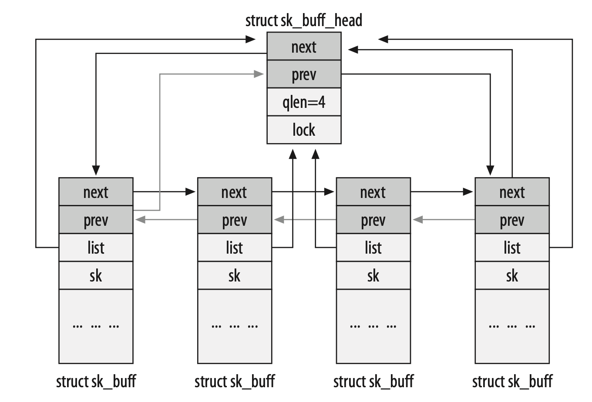
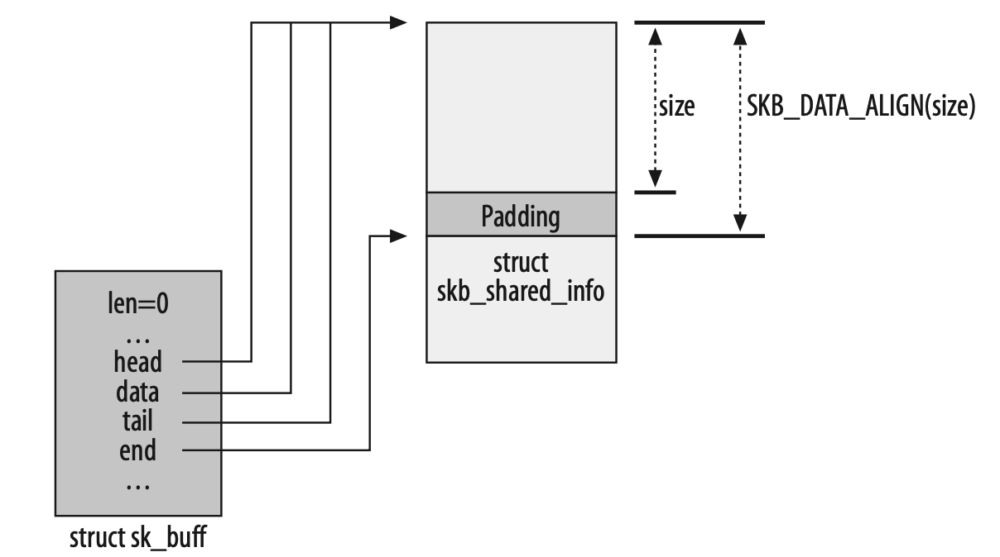
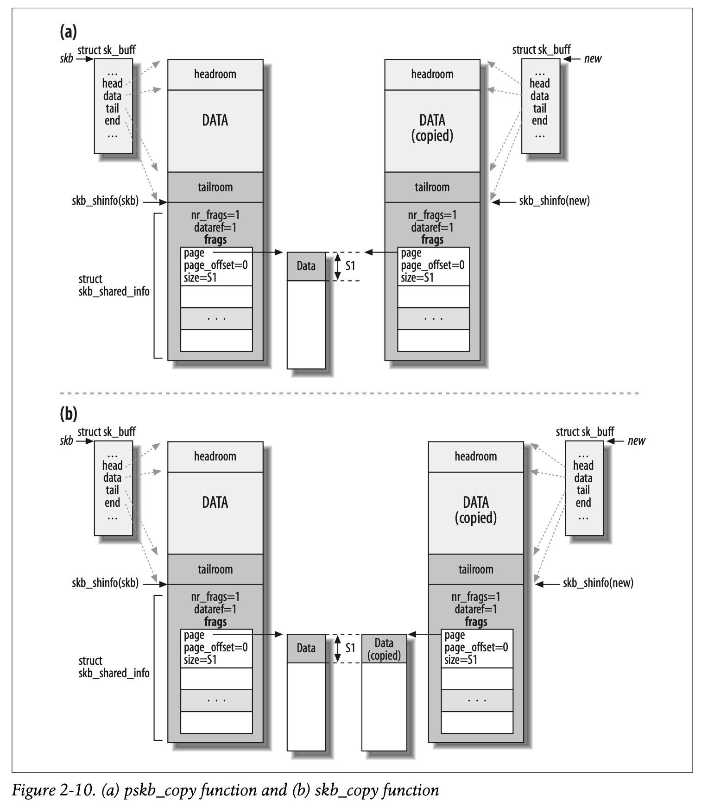

# 2. Critical Data Structures
## 2.1 The Socket Buffer: sk_buff Structure
One of the first things done by each protocol, as the buffer passes down through layers, is to call skb_ reserve to reserve space for the protocol’s header.

### 2.1.1 Networking Options and Kernel Structures
sk_buff is peppered with C preprocessor #ifdef directives.

In general, any option that causes a change in a kernel data structure (such as adding the tc_index field to the sk_buff structure) renders the option unfit to be compiled as a module.

To find out which compile option from make config or its variants is associated with a given #ifdef symbol, to understand when a block of code is included in the kernel. The fastest way to make the association, in the 2.6 kernels, is to look for the symbol in the `kconfig` files.

### 2.1.2 Layout Fields



### 2.1.3 General Fields

### 2.1.4 Feature-Specific Fields

### 2.1.5 Management Functions


#### 2.1.5.1 Allocating memory: alloc_skb and dev_alloc_skb

Creating a single buffer involves two allocations of memory (one for the buffer and one for the sk_buff structure).
```c++
skb = kmem_cache_alloc(skbuff_head_cache, gfp_mask & ~__GFP_DMA);
size = SKB_DATA_ALIGN(size);
data = kmalloc(size + sizeof(struct skb_shared_info), gfp_mask);
```


**dev_alloc_skb** is the buffer allocation function meant for use by device drivers and expected to be executed in interrupt mode.
```c++
static inline struct sk_buff *dev_alloc_skb(unsigned int length) {
    return __dev_alloc_skb(length, GFP_ATOMIC); 
}

static inline
struct sk_buff *__dev_alloc_skb(unsigned int length, int gfp_mask) {
    struct sk_buff *skb = alloc_skb(length + 16, gfp_mask);
    if (likely(skb))
        skb_reserve(skb, 16);
    return skb;
}
```

#### 2.1.5.2 Freeing memory: kfree_skb and dev_kfree_skb

These two functions release a buffer, which results in its return to the buffer pool (cache). 

This basic function releases a buffer only when the skb->users counter is 1 (when no users of the buffer are left). Otherwise, the function simply decrements that counter.


#### 2.1.5.3 Data reservation and alignment: skb_reserve, skb_put, skb_push, and skb_pull

	

1. When TCP is asked to transmit some data, it allocates a buffer following certain criteria (TCP Maximum Segment Size (mss), support for scatter gather I/O, etc.).
2. TCP reserves (withskb_reserve) enough space at the head of the buffer to hold all the headers of all layers (TCP, IP, link layer). The parameter MAX_TCP_HEADER is the sum of all headers of all levels and is calculated taking into account the worst-case scenarios: because the TCP layer does notknow what type of interface will be used for the transmission, it reserves the biggest possible header for eachlayer. It even accounts for the possibility of multiple IPheaders (because you can have multiple IPheaders when the kernel is compiled with support for IP over IP).
3. The TCP payload is copied into the buffer. Note that Figure2-8 is just an example. The TCP payload could be organized differently; forexample, it could be stored as fragments. In Chapter 21, we will see what a fragmented buffer (also commonly called a paged buffer) looks like.
4. The TCP layer adds its header.
5. The TCP layer hands the buffer to the IP layer, which adds its header as well.
6. The IPlayer hands the IP packet to the neighboring layer, which adds the link layer header.

#### 2.1.5.4 The skb_shared_info structure and the skb_shinfo function

#### 2.1.5.5 Cloning and copying buffers


When a buffer is cloned, the contents of the data block cannot be modified. This means that code can access the data without any need for locking. When, however, a function needs to modify not only the contents of the sk_buff structure but the data too, it needs to clone the data block as well.



#### 2.1.5.6 List management functions

## 2.2 net_device Structure

The `net_device` structures for all devices are put into a global list to which the global variable `dev_base` points.


