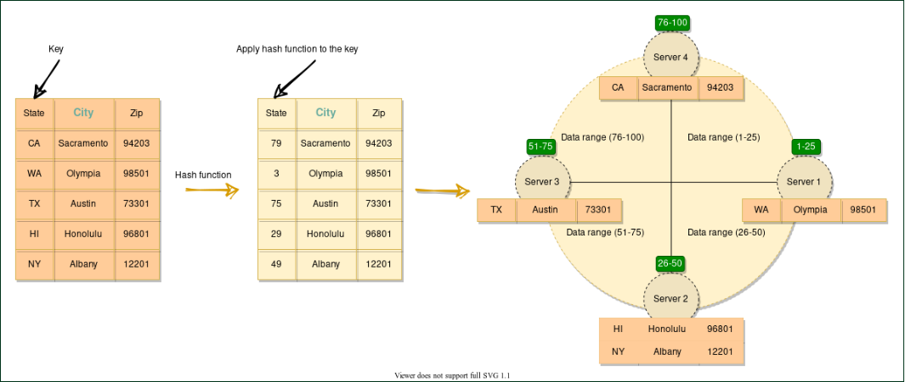
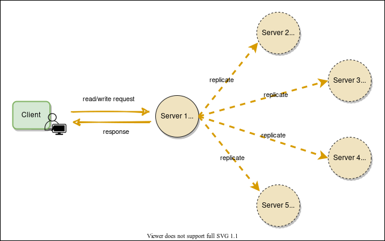
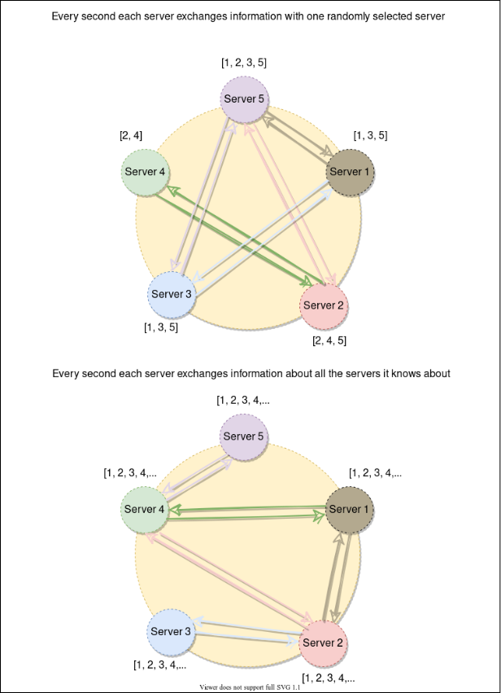
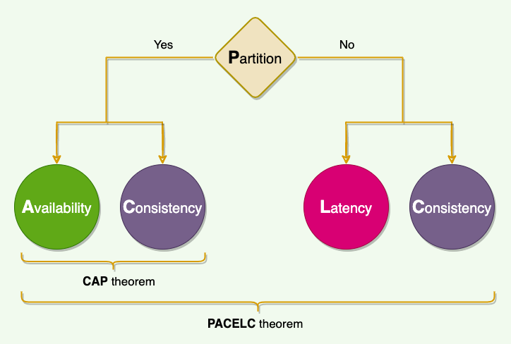
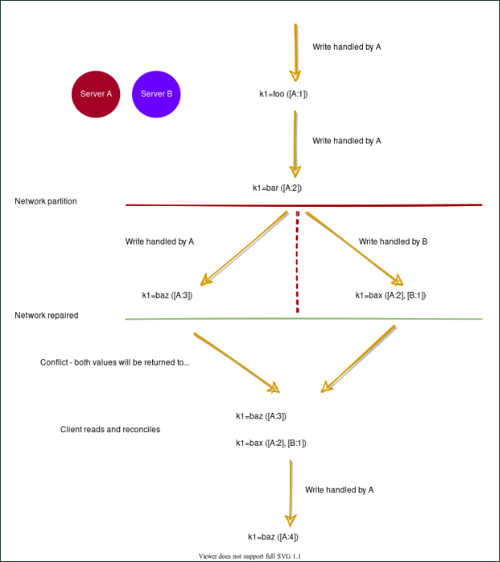

[Course](https://www.educative.io/courses/grokking-adv-system-design-intvw)

# 9. System Design Patterns

## 9.1 Bloom Filters
### Background
If we have a large set of structured data (identified by record IDs) stored in a set of data files, what is the most efficient way to know which file might contain our required data? We don’t want to read each file, as that would be slow, and we have to read a lot of data from the disk. One solution can be to build an index on each data file and store it in a separate index file. This index can map each record ID to its offset in the data file. Each index file will be sorted on the record ID. Now, if we want to search an ID in this index, the best we can do is a Binary Search. Can we do better than that?

### Definition
Use Bloom filters to quickly find if an element might be present in a set.

### Solution
The Bloom filter data structure tells whether an element **may be in a set, or definitely is not**. The only possible errors are false positives, i.e., a search for a nonexistent element might give an incorrect answer. With more elements in the filter, the error rate increases. An empty Bloom filter is a bit-array of m bits, all set to 0. There are also k different hash functions, each of which maps a set element to one of the m bit positions.

* To add an element, feed it to the hash functions to get k bit positions, and set the bits at these positions to 1.
* To test if an element is in the set, feed it to the hash functions to get k bit positions.
    * If any of the bits at these positions is 0, the element is definitely not in the set.
    * If all are 1, then the element may be in the set.

Here is a Bloom filter with three elements P, Q, and R. It consists of 20 bits and uses three hash functions. The colored arrows point to the bits that the elements of the set are mapped to.
* The element X definitely is not in the set, since it hashes to a bit position containing 0.
* For a fixed error rate, adding a new element and testing for membership are both constant time operations, and a filter with room for ‘n’ elements requires O(n) space.

## 9.2 Consistent Hashing
### Background
The act of distributing data across a set of nodes is called **data partitioning**. There are two challenges when we try to distribute data:

1. How do we know on which node a particular piece of data will be stored?
2. When we add or remove nodes, how do we know what data will be moved from existing nodes to the new nodes? Additionally, how can we minimize data movement when nodes join or leave?

A naive approach will use a suitable hash function that maps the data key to a number. Then, find the server by applying modulo on this number and the total number of servers. For example:

The scheme described in the above diagram solves the problem of finding a server for storing/retrieving the data. But when we add or remove a server, we have to remap all the keys and move our data based on the new server count, which will be a complete mess!

### Definition
Use the Consistent Hashing algorithm to distribute data across nodes. Consistent Hashing maps data to physical nodes and ensures that **only a small set of keys move when servers are added or removed**.

### Solution
Consistent Hashing technique stores the data managed by a distributed system in a ring. Each node in the ring is assigned a range of data. Here is an example of the consistent hash ring:

Consistent Hashing ring
With consistent hashing, the ring is divided into smaller, predefined ranges. Each node is assigned one of these ranges. The start of the range is called a token. This means that each node will be assigned one token. The range assigned to each node is computed as follows:

Range start:  Token value
Range end:    Next token value - 1

Here are the tokens and data ranges of the four nodes described in the above diagram:

Server	Token	Range Start	Range End
Server 1	1	1	25
Server 2	26	26	50
Server 3	51	51	75
Server 4	76	76	100
Whenever the system needs to read or write data, the first step it performs is to apply the MD5 hashing algorithm to the key. The output of this hashing algorithm determines within which range the data lies and hence, on which node the data will be stored. As we saw above, each node is supposed to store data for a fixed range. Thus, the hash generated from the key tells us the node where the data will be stored.

The Consistent Hashing scheme described above works great when a node is added or removed from the ring, as in these cases, since only the next node is affected. For example, when a node is removed, the next node becomes responsible for all of the keys stored on the outgoing node. However, this scheme can **result in non-uniform data and load distribution**. This problem can be solved with the help of Virtual nodes.

### Virtual nodes
Adding and removing nodes in any distributed system is quite common. Existing nodes can die and may need to be decommissioned. Similarly, new nodes may be added to an existing cluster to meet growing demands. To efficiently handle these scenarios, Consistent Hashing makes use of virtual nodes (or Vnodes).

As we saw above, the basic Consistent Hashing algorithm assigns a single token (or a consecutive hash range) to each physical node. This was a static division of ranges that requires calculating tokens based on a given number of nodes. This scheme made adding or replacing a node an expensive operation, as, in this case, we would like to rebalance and distribute the data to all other nodes, resulting in moving a lot of data. Here are a few potential issues associated with a manual and fixed division of the ranges:

* **Adding or removing nodes**: Adding or removing nodes will result in recomputing the tokens causing a significant administrative overhead for a large cluster.
* **Hotspots**: Since each node is assigned one large range, if the data is not evenly distributed, some nodes can become hotspots.
* **Node rebuilding**: Since each node’s data might be replicated (for fault-tolerance) on a fixed number of other nodes, when we need to rebuild a node, only its replica nodes can provide the data. This puts a lot of pressure on the replica nodes and can lead to service degradation.

To handle these issues, Consistent Hashing introduces a new scheme of distributing the tokens to physical nodes. Instead of assigning a single token to a node, the hash range is divided into multiple smaller ranges, and each physical node is assigned several of these smaller ranges. Each of these subranges is considered a Vnode. With Vnodes, instead of a node being responsible for just one token, it is responsible for many tokens (or subranges).

Practically, Vnodes are **randomly distributed** across the cluster and are generally **non-contiguous** so that no two neighboring Vnodes are assigned to the same physical node or rack. Additionally, nodes do carry replicas of other nodes for fault tolerance. Also, since there can be heterogeneous machines in the clusters, some servers might hold more Vnodes than others. The figure below shows how physical nodes A, B, C, D, & E use Vnodes of the Consistent Hash ring. Each physical node is assigned a set of Vnodes and each Vnode is replicated once.

### Advantages of Vnodes
Vnodes gives the following advantages:

As Vnodes help spread the load more evenly across the physical nodes on the cluster by dividing the hash ranges into smaller subranges, this speeds up the rebalancing process after adding or removing nodes. When a new node is added, it receives many Vnodes from the existing nodes to maintain a balanced cluster. Similarly, when a node needs to be rebuilt, instead of getting data from a fixed number of replicas, many nodes participate in the rebuild process.
Vnodes make it easier to maintain a cluster containing heterogeneous machines. This means, with Vnodes, we can assign a high number of sub-ranges to a powerful server and a lower number of sub-ranges to a less powerful server.
In contrast to one big range, since Vnodes help assign smaller ranges to each physical node, this decreases the probability of hotspots.

### Examples
Dynamo and Cassandra use Consistent Hashing to distribute their data across nodes.

## 9.3 Quorum
### Backgroundz
In Distributed Systems, data is replicated across multiple servers for fault tolerance and high availability. Once a system decides to maintain multiple copies of data, another problem arises: how to make sure that all replicas are consistent, i.e., if they all have the latest copy of the data and that all clients see the same view of the data?

### Definition
In a distributed environment, a quorum is the minimum number of servers on which a distributed operation needs to be performed successfully before declaring the operation’s overall success.

### Solution
Suppose a database is replicated on five machines. In that case, quorum refers to the minimum number of machines that perform the same action (commit or abort) for a given transaction in order to decide the final operation for that transaction. So, in a set of 5 machines, three machines form the majority quorum, and if they agree, we will commit that operation. Quorum enforces the consistency requirement needed for distributed operations.

In systems with multiple replicas, there is a possibility that the user reads inconsistent data. For example, when there are three replicas, R1, R2, and R3 in a cluster, and a user writes value v1 to replica R1. Then another user reads from replica R2 or R3 which are still behind R1 and thus will not have the value v1, so the second user will not get the consistent state of data.

**What value should we choose for a quorum?** More than half of the number of nodes in the cluster:
(N/2+1) where N is the total number of nodes in the cluster, for example:

* In a 5-node cluster, three nodes must be online to have a majority.
* In a 4-node cluster, three nodes must be online to have a majority.
* With 5-node, the system can afford two node failures, whereas, with 4-node, it can afford only one node failure. Because of this logic, it is recommended to always have an odd number of total nodes in the cluster.

Quorum is achieved when nodes follow the below protocol: R+W>N, where:
* N = nodes in the quorum group
* W = minimum write nodes
* R = minimum read nodes

If a distributed system follows R+W>N rule, then every read will see at least one copy of the latest value written. For example, a common configuration could be (N=3, W=2, R=2) to ensure strong consistency. Here are a couple of other examples:
* (N=3, W=1, R=3): fast write, slow read, not very durable
* (N=3, W=3, R=1): slow write, fast read, durable

The following two things should be kept in mind before deciding read/write quorum:
* R=1 and W=N ⇒ full replication (write-all, read-one): undesirable when servers can be unavailable because writes are not guaranteed to complete.
* Best performance (throughput/availability) when, because reads are more frequent than writes in most applications

### Examples
* For leader election, Chubby uses Paxos, which use quorum to ensure strong consistency.
* As stated above, quorum is also used to ensure that at least one node receives the update in case of failures. For instance, in Cassandra, to ensure data consistency, each write request can be configured to be successful only if the data has been written to at least a quorum (or majority) of replica nodes.
* Dynamo replicates writes to a sloppy quorum of other nodes in the system, instead of a strict majority quorum like Paxos. All read/write operations are performed on the first N healthy nodes from the preference list, which may not always be the first N nodes encountered while walking the consistent hashing ring.

## 9.4 Leader and Follower
### Background
Distributed systems keep multiple copies of data for fault tolerance and higher availability. A system can use quorum to ensure data consistency between replicas, i.e., all reads and writes are not considered successful until a majority of nodes participate in the operation. However, using quorum can lead to another problem, that is, lower availability; at any time, the system needs to ensure that at least a majority of replicas are up and available, otherwise the operation will fail. Quorum is also not sufficient, as in certain failure scenarios, the client can still see inconsistent data.

### Definition
Allow only a single server (called leader) to be responsible for data replication and to coordinate work.

### Solution
At any time, one server is elected as the leader. This leader becomes responsible for data replication and can act as the central point for all coordination. The followers only accept writes from the leader and serve as a backup. In case the leader fails, one of the followers can become the leader. In some cases, the follower can serve read requests for load balancing.

### Examples
* In Kafka, each partition has a designated leader which is responsible for all reads and writes for that partition. Each follower’s responsibility is to replicate the leader’s data to serve as a “backup” partition. This provides redundancy of messages in a partition, so that a follower can take over the leadership if the leader goes down.
* Within the Kafka cluster, one broker is elected as the Controller. This Controller is responsible for admin operations, such as creating/deleting a topic, adding partitions, assigning leaders to partitions, monitoring broker failures, etc. Furthermore, the Controller periodically checks the health of other brokers in the system.
* To ensure strong consistency, Paxos (hence Chubby) performs leader election at startup. This leader is responsible for data replication and coordination.

## 9.5 Write-ahead Log
### Background
Machines can fail or restart anytime. If a program is in the middle of performing a data modification, what will happen when the machine it is running on loses power? When the machine restarts, the program might need to know the last thing it was doing. Based on its atomicity and durability needs, the program might need to decide to redo or undo or finish what it had started. How can the program know what it was doing before the system crash?

### Definition
To guarantee durability and data integrity, each modification to the system is first written to an append-only log on the disk. This log is known as **Write-Ahead Log (WAL)** or transaction log or commit log. Writing to the WAL guarantees that if the machine crashes, the system will be able to recover and reapply the operation if necessary.

### Solution
The key idea behind the WAL is that all modifications before they are applied to the system are first written to a log file on the disk. Each log entry should contain enough information to redo or undo the modification. The log can be read on every restart to recover the previous state by replaying all the log entries. Using WAL results in a significantly reduced number of disk writes, because only the log file needs to be flushed to disk to guarantee that a transaction is committed, rather than every data file changed by the transaction.

Each node, in a distributed environment, maintains its own log. WAL is always sequentially appended, which simplifies the handling of the log. Each log entry is given a unique identifier; this identifier helps in implementing certain other operations like log segmentation(discussed later) or log purging.

### Examples
* Cassandra: To ensure durability, whenever a node receives a write request, it immediately writes the data to a commit log which is a WAL. Cassandra, before writing data to a MemTable, first writes it to the commit log. This provides durability in the case of an unexpected shutdown. On startup, any mutations in the commit log will be applied to MemTables.
* Kafka implements a distributed Commit Log to persistently store all messages it receives.
* Chubby: For fault tolerance and in the event of a leader crash, all database transactions are stored in a transaction log which is a WAL.

## 9.6 Segmented Log
### Background
A single log can become difficult to manage. As the file grows, it can also become a performance bottleneck, especially when it is read at the startup. Older logs need to be cleaned up periodically or, in some cases, merged. Doing these operations on a single large file is difficult to implement.

### Definition
Break down the log into smaller segments for easier management.

### Solution
A single log file is split into multiple parts, such that the log data is divided into equal-sized log segments. The system can roll the log based on a rolling policy - either a configurable period of time (e.g., every 4 hours) or a configurable maximum size (e.g., every 1GB).

### Examples
* Cassandra uses the segmented log strategy to split its commit log into multiple smaller files instead of a single large file for easier operations. As we know, when a node receives a write operation, it immediately writes the data to a commit log. As the Commit Log grows in size and reaches its threshold in size, a new commit log is created. Hence, over time, several commit logs will exist, each of which is called a segment. Commit log segments reduce the number of seeks needed to write to disk. Commit log segments are truncated when Cassandra has flushed corresponding data to SSTables. A commit log segment can be archived, deleted, or recycled once all its data has been flushed to SSTables.
* Kafka uses log segmentation to implement storage for its partitions. As Kafka regularly needs to find messages on disk for purging, a single long file could be a performance bottleneck and error-prone. For easier management and better performance, the partition is split into segments.

## 9.7 High-Water Mark
### Background
Distributed systems keep multiple copies of data for fault tolerance and higher availability. To achieve strong consistency, one of the options is to use a leader-follower setup, where the leader is responsible for entertaining all the writes, and the followers replicate data from the leader.

Each transaction on the leader is committed to a **write-ahead log (WAL)**, so that the leader can recover from crashes or failures.

A write request is considered successful as soon as it is committed to the WAL on the leader. The replication can happen asynchronously; either the leader can push the mutation to the followers, or the follower can pull it from the leader.

In case the leader crashes and cannot recover, one of the followers will be elected as the new leader. Now, this new leader can be a bit behind the old leader, as there might be some transactions that have not been completely propagated before the old leader crashed.

We do have these transactions in the WAL on the old leader, but those log entries cannot be recovered until the old leader becomes alive again. So those transactions are considered lost. Under this scenario, the client can see some data inconsistencies, e.g., the last data that the client fetched from the old leader may not be available anymore. In such error scenarios, some followers can be missing entries in their logs, and some can have more entries than others. So, it becomes important for the leader and followers to know what part of the log is safe to be exposed to the clients.

### Definition
Keep track of the last log entry on the leader, which has been successfully replicated to a quorum of followers. The index of this entry in the log is known as the **High-Water Mark index**. The leader exposes data only up to the high-water mark index.

### Solution
For each data mutation, the leader first appends it to WAL and then sends it to all the followers. Upon receiving the request, the followers append it to their respective WAL and then send an acknowledgment to the leader. The leader keeps track of the indexes of the entries that have been successfully replicated on each follower.

The high-water mark index is the highest index, which has been replicated on the quorum of the followers. The leader can propagate the high-water mark index to all followers as part of the regular Heartbeat message. The leader and followers ensure that the client can read data only up to the high-water mark index. This guarantees that even if the current leader fails and another leader is elected, the client will not see any data inconsistencies.

### Examples
Kafka: To deal with non-repeatable reads and ensure data consistency, Kafka brokers keep track of the high-water mark, which is the largest offset that all In-Sync-Replicas (ISRs) of a particular partition share. Consumers can see messages only until the high-water mark.

## 9.8 Lease
### Background
In distributed systems, a lot of times clients need specified rights to certain resources. For example, a client might need exclusive rights to update the contents of a file. One way to fulfill this requirement is through **distributed locking**. A client first gets an exclusive (or write) lock associated with the file and then proceeds with updating the file. One problem with locking is that the lock is granted until the locking client explicitly releases it. If the client fails to release the lock due to any reason, e.g., process crash, deadlock, or a software bug, the resource will be locked indefinitely. This leads to resource unavailability until the system is reset. Is there an alternate solution?

### Definition
Use time-bound leases to grant clients rights on resources.

### Solution
A lease is like a lock, but it works even when the client goes away. The client asks for a lease for a limited period of time, after which the lease expires. If the client wants to extend the lease, it can renew the lease before it expires.

### Examples
Chubby clients maintain a time-bound session lease with the leader. During this time interval, the leader guarantees to not terminate the session unilaterally.

## 9.9 Heartbeat
### Background
In a distributed environment, work/data is distributed among servers. To efficiently route requests in such a setup, servers need to know what other servers are part of the system. Furthermore, servers should know if other servers are alive and working. In a decentralized system, whenever a request arrives at a server, the server should have enough information to decide which server is responsible for entertaining that request. This makes the timely detection of server failure an important task, which also enables the system to take corrective actions and move the data/work to another healthy server and stop the environment from further deterioration.

### Definition
Each server periodically sends a heartbeat message to a central monitoring server or other servers in the system to show that it is still alive and functioning.

### Solution
Heartbeating is one of the mechanisms for detecting failures in a distributed system. If there is a central server, all servers periodically send a heartbeat message to it. If there is no central server, all servers randomly choose a set of servers and send them a heartbeat message every few seconds. This way, if no heartbeat message is received from a server for a while, the system can suspect that the server might have crashed. If there is no heartbeat within a configured timeout period, the system can conclude that the server is not alive anymore and stop sending requests to it and start working on its replacement.

### Examples
* GFS: The leader periodically communicates with each ChunkServer in HeartBeat messages to give instructions and collect state.
* HDFS: The NameNode keeps track of DataNodes through a heartbeat mechanism. Each DataNode sends periodic heartbeat messages (every few seconds) to the NameNode. If a DataNode dies, then the heartbeats to the NameNode are stopped. The NameNode detects that a DataNode has died if the number of missed heartbeat messages reaches a certain threshold. The NameNode then marks the DataNode as dead and will no longer forward any I/O requests to that DataNode.

## 9.10 Gossip Protocol
### Background
In a large distributed environment where we do not have any central node that keeps track of all nodes to know if a node is down or not, how does a node know every other node’s current state? The simplest way to do this is to have every node maintain a heartbeat with every other node. Then, when a node goes down, it will stop sending out heartbeats, and everyone else will find out immediately. But, this means O(N^2) messages get sent every tick (N being the total number of nodes), which is a ridiculously high amount and will consume a lot of network bandwidth, and thus, not feasible in any sizable cluster. So, is there any other option for monitoring the state of the cluster?

### Definition
Each node keeps track of state information about other nodes in the cluster and gossip (i.e., share) this information to one other random node every second. This way, eventually, each node gets to know about the state of every other node in the cluster.

### Solution
Gossip protocol is a peer-to-peer communication mechanism in which nodes periodically exchange state information about themselves and about other nodes they know about. Each node initiates a gossip round every second to exchange state information about themselves and other nodes with one other random node. This means that any state change will eventually propagate through the system, and all nodes quickly learn about all other nodes in a cluster.

### Examples
Dynamo & Cassandra use gossip protocol which allows each node to keep track of state information about the other nodes in the cluster, like which nodes are reachable, what key ranges they are responsible for, etc.

## 9.11 Phi Accrual Failure Detection
### Background
In distributed systems, accurately detecting failures is a hard problem to solve, as we cannot say with 100% surety if a system is genuinely down or is just very slow in responding due to heavy load, network congestion, etc. Conventional failure detection mechanisms like Heartbeating outputs a boolean value telling us if the system is alive or not; there is no middle ground. Heartbeating uses a fixed timeout, and if there is no heartbeat from a server, the system, after the timeout assumes that the server has crashed. Here, the value of the timeout is critical. If we keep the timeout short, the system will detect failures quickly but with many false positives due to slow machines or faulty network. On the other hand, if we keep the timeout long, the false positives will be reduced, but the system will not perform efficiently for being slow in detecting failures.

### Definition
Use adaptive failure detection algorithm as described by Phi Accrual Failure Detector. Accrual means accumulation or the act of accumulating over time. This algorithm uses historical heartbeat information to make the threshold adaptive. Instead of telling if the server is alive or not, a generic Accrual Failure Detector outputs the suspicion level about a server. A higher suspicion level means there are higher chances that the server is down.

### Solution
With Phi Accrual Failure Detector, if a node does not respond, its suspicion level is increased and could be declared dead later. As a node’s suspicion level increases, the system can gradually stop sending new requests to it. Phi Accrual Failure Detector makes a distributed system efficient as it takes into account fluctuations in the network environment and other intermittent server issues before declaring a system completely dead.

### Examples
Cassandra uses the Phi Accrual Failure Detector algorithm to determine the state of the nodes in the cluster.

## 9.12 Split Brain
### Background
In a distributed environment with a central (or leader) server, if the central server dies, the system must quickly find a substitute, otherwise, the system can quickly deteriorate.

One of the problems is that we cannot truly know if the leader has stopped for good or has experienced an intermittent failure like a stop-the-world GC pause or a temporary network disruption. Nevertheless, the cluster has to move on and pick a new leader. If the original leader had an intermittent failure, we now find ourselves with a so-called zombie leader. A **zombie leader** can be defined as a leader node that had been deemed dead by the system and has since come back online. Another node has taken its place, but the zombie leader might not know that yet. The system now has two active leaders that could be issuing conflicting commands. How can a system detect such a scenario, so that all nodes in the system can ignore requests from the old leader and the old leader itself can detect that it is no longer the leader?

### Definition
The common scenario in which a distributed system has two or more active leaders is called split-brain.

Split-brain is solved through the use of **Generation Clock**, which is simply a monotonically increasing number to indicate a server’s generation.

### Solution
Every time a new leader is elected, the generation number gets incremented. This means if the old leader had a generation number of ‘1’, the new one will have ‘2’. This generation number is included in every request that is sent from the leader to other nodes. This way, nodes can now easily differentiate the real leader by simply trusting the leader with the highest number. The generation number should be persisted on disk, so that it remains available after a server reboot. One way is to store it with every entry in the Write-ahead Log.

### Examples
Kafka: To handle Split-brain (where we could have multiple active controller brokers), Kafka uses ‘Epoch number,’ which is simply a monotonically increasing number to indicate a server’s generation.

HDFS: ZooKeeper is used to ensure that only one NameNode is active at any time. An epoch number is maintained as part of every transaction ID to reflect the NameNode generation.

Cassandra uses generation number to distinguish a node’s state before and after a restart. Each node stores a generation number which is incremented every time a node restarts. This generation number is included in gossip messages exchanged between nodes and is used to distinguish the current state of a node from the state before a restart. The generation number remains the same while the node is alive and is incremented each time the node restarts. The node receiving the gossip message can compare the generation number it knows and the generation number in the gossip message. If the generation number in the gossip message is higher, it knows that the node was restarted.

## 9.13 Fencing
### Background
In a leader-follower setup, when a leader fails, it is impossible to be sure that the leader has stopped working. For example, a slow network or a network partition can trigger a new leader election, even though the previous leader is still running and thinks it is still the active leader. Now, in this situation, if the system elects a new leader, how do we make sure that the old leader is not running and possibly issuing conflicting commands?

### Definition
Put a **Fence** around the previous leader to prevent it from doing any damage or causing corruption.

### Solution
Fencing is the idea of putting a fence around a previously active leader so that it cannot access cluster resources and hence stop serving any read/write request. The following two techniques are used:

* **Resource fencing**: Under this scheme, the system blocks the previously active leader from accessing resources needed to perform essential tasks. For example, revoking its access to the shared storage directory (typically by using a vendor-specific Network File System (NFS) command), or disabling its network port via a remote management command.
* **Node fencing**: Under this scheme, the system stops the previously active leader from accessing all resources. A common way of doing this is to power off or reset the node. This is a very effective method of keeping it from accessing anything at all. This technique is also called **STONIT** or **Shoot The Other Node In The Head**.

### Examples
HDFS uses fencing to stop the previously active NameNode from accessing cluster resources, thereby stopping it from servicing requests.

## 9.14 Checksum
### Background
In a distributed system, while moving data between components, it is possible that the data fetched from a node may arrive corrupted. This corruption can occur because of faults in a storage device, network, software, etc. How can a distributed system ensure data integrity, so that the client receives an error instead of corrupt data?

### Definition
Calculate a checksum and store it with data.

To calculate a checksum, a cryptographic hash function like MD5, SHA-1, SHA-256, or SHA-512 is used. The hash function takes the input data and produces a string (containing letters and numbers) of fixed length; this string is called the checksum.

### Solution
When a system is storing some data, it computes a checksum of the data, and stores the checksum with the data. When a client retrieves data, it verifies that the data it received from the server matches the checksum stored. If not, then the client can opt to retrieve that data from another replica.

### Examples
HDFS and Chubby store the checksum of each file with the data.

## 9.15 Vector Clocks
### Background
When a distributed system allows concurrent writes, it can result in multiple versions of an object. Different replicas of an object can end up with different versions of the data. Let’s understand this with an example.

On a single machine, all we need to know about is the absolute or wall clock time: suppose we perform a write to key k with timestamp t1, and then perform another write to k with timestamp t2. Since t2 > t1, the second write must have been newer than the first write, and therefore, the database can safely overwrite the original value.

In a distributed system, this assumption does not hold true. The problem is clock skew – different clocks tend to run at different rates, so we cannot assume that time t on node a happened before time t + 1 on node b. The most practical techniques that help with synchronizing clocks, like **NTP**, still do not guarantee that every clock in a distributed system is synchronized at all times. So, without special hardware like GPS units and atomic clocks, just using wall clock timestamps is not enough.

So how can we reconcile and capture causality between different versions of the same object?

### Definition
Use Vector clocks to keep track of value history and reconcile divergent histories at read time.

### Solution
A vector clock is effectively a (node, counter) pair. One vector clock is associated with every version of every object. If the counters on the first object’s clock are less-than-or-equal to all of the nodes in the second clock, then the first is an ancestor of the second and can be forgotten. Otherwise, the two changes are considered to be in conflict and require reconciliation. Such conflicts are resolved at read-time, and if the system is not able to reconcile an object’s state from its vector clocks, it sends it to the client application for reconciliation (since clients have more semantic information on the object and may be able to reconcile it). Resolving conflicts is similar to how Git works. If Git can merge different versions into one, merging is done automatically. If not, the client (i.e., the developer) has to reconcile conflicts manually.

To see how Dynamo handles conflicting data, take a look at [Vector Clocks and Conflicting Data](#Vector-Clocks-and-Conflicting-Data)

### Examples
To reconcile concurrent updates on an object Amazon’s Dynamo uses Vector Clocks.

## 9.16 CAP Theorem
### Background
In distributed systems, different types of failures can occur, e.g., servers can crash or fail permanently, disks can go bad resulting in data losses, or network connection can be lost, making a part of the system inaccessible. How can a distributed system model itself to get the maximum benefits out of different resources available?

### Definition
CAP theorem states that it is impossible for a distributed system to simultaneously provide all three of the following desirable properties:

* **Consistency(C)**: All nodes see the same data at the same time. This means users can read or write from/to any node in the system and will receive the same data. It is equivalent to having a single up-to-date copy of the data.
* **Availability(A)**: Availability means every request received by a non-failing node in the system must result in a response. Even when severe network failures occur, every request must terminate. In simple terms, availability refers to a system’s ability to remain accessible even if one or more nodes in the system go down.
* **Partition tolerance(P)**: A partition is a communication break (or a network failure) between any two nodes in the system, i.e., both nodes are up but cannot communicate with each other. A partition-tolerant system continues to operate even if there are partitions in the system. Such a system can sustain any network failure that does not result in the failure of the entire network. Data is sufficiently replicated across combinations of nodes and networks to keep the system up through intermittent outages.

### Solution
According to the CAP theorem, any distributed system needs to pick two out of the three properties. The three options are CA, CP, and AP. However, CA is not really a coherent option, as a system that is not partition-tolerant will be forced to give up either Consistency or Availability in the case of a network partition. Therefore, the theorem can really be stated as: In the presence of a network partition, a distributed system must choose either Consistency or Availability.

### Examples
Dynamo: In CAP theorem terms, Dynamo falls within the category of AP systems and is designed for high availability at the expense of strong consistency. The primary motivation for designing Dynamo as a highly available system was the observation that the availability of a system directly correlates to the number of customers served.

BigTable: In terms of the CAP theorem, BigTable is a CP system, i.e., it has strictly consistent reads and writes.

## 9.17 PACELC Theorem
### Background
We cannot avoid partition in a distributed system, therefore, according to the CAP theorem, a distributed system should choose between consistency or availability. ACID (Atomicity, Consistency, Isolation, Durability) databases, such as RDBMSs like MySQL, Oracle, and Microsoft SQL Server, chose consistency (refuse response if it cannot check with peers), while BASE (Basically Available, Soft-state, Eventually consistent) databases, such as NoSQL databases like MongoDB, Cassandra, and Redis, chose availability (respond with local data without ensuring it is the latest with its peers).

One place where the CAP theorem is silent is what happens when there is no network partition? What choices does a distributed system have when there is no partition?

### Definition
The PACELC theorem states that in a system that replicates data:

* if there is a partition (**P**), a distributed system can tradeoff between availability and consistency (i.e., **A** and **C**);
* else (**E**), when the system is running normally in the absence of partitions, the system can tradeoff between latency (**L**) and consistency (**C**).

### Solution
The first part of the theorem (PAC) is the same as the CAP theorem, and the ELC is the extension. The whole thesis is assuming we maintain high availability by replication. So, when there is a failure, CAP theorem prevails. But if not, we still have to consider the tradeoff between consistency and latency of a replicated system.

### Examples
Dynamo and Cassandra are PA/EL systems: They choose availability over consistency when a partition occurs; otherwise, they choose lower latency.

BigTable and HBase are PC/EC systems: They will always choose consistency, giving up availability and lower latency.

MongoDB can be considered PA/EC (default configuration): MongoDB works in a primary/secondaries configuration. In the default configuration, all writes and reads are performed on the primary. As all replication is done asynchronously (from primary to secondaries), when there is a network partition in which primary is lost or becomes isolated on the minority side, there is a chance of losing data that is unreplicated to secondaries, hence there is a loss of consistency during partitions. Therefore it can be concluded that in the case of a network partition, MongoDB chooses availability, but otherwise guarantees consistency. Alternately, when MongoDB is configured to write on majority replicas and read from the primary, it could be categorized as PC/EC.

## 9.18 Hinted Handoff
### Background
Depending upon the consistency level, a distributed system can still serve write requests even when nodes are down. For example, if we have the replication factor of three and the client is writing with a quorum consistency level. This means that if one of the nodes is down, the system can still write on the remaining two nodes to fulfill the consistency level, making the write successful. Now, when the node which was down comes online again, how should we write data to it?

### Definition
For nodes that are down, the system keeps notes (or hints) of all the write requests they have missed. Once the failing nodes recover, the write requests are forwarded to them based on the hints stored.

### Solution
When a node is down or is not responding to a write request, the node which is coordinating the operation, writes a hint in a text file on the local disk. This hint contains the data itself along with information about which node the data belongs to. When the coordinating node discovers that a node for which it holds hints has recovered, it forwards the write requests for each hint to the target.

### Examples
Cassandra nodes use Hinted Handoff to remember the write operation for failing nodes.

Dynamo ensures that the system is “always-writeable” by using Hinted Handoff (and Sloppy Quorum).

## 9.19 Read Repair
### Background
In Distributed Systems, where data is replicated across multiple nodes, some nodes can end up having stale data. Imagine a scenario where a node failed to receive a write or update request because it was down or there was a network partition. How do we ensure that the node gets the latest version of the data when it is healthy again?

### Definition
Repair stale data during the read operation, since at that point, we can read data from multiple nodes to perform a comparison and find nodes that have stale data. This mechanism is called Read Repair. Once the node with old data is known, the read repair operation pushes the newer version of data to nodes with the older version.

### Solution
Based on the quorum, the system reads data from multiple nodes. For example, for Quorum=2, the system reads data from one node and digest of the data from the second node. The digest is a checksum of the data and is used to save network bandwidth. If the digest does not match, it means some replicas do not have the latest version of the data. In this case, the system reads the data from all the replicas to find the latest data. The system returns the latest data to the client and initiates a Read Repair request. The read repair operation pushes the latest version of data to nodes with the older version.

When the read consistency level is less than ‘All,’ some systems perform a read repair probabilistically, for example, 10% of the requests. In this case, the system immediately sends a response to the client when the consistency level is met and performs the read repair asynchronously in the background.

### Examples
Cassandra and Dynamo use ‘Read Repair’ to push the latest version of the data to nodes with the older versions.

## 9.20 Merkle Trees
### Background
As we saw in the previous lesson, Read Repair removes conflicts while serving read requests. But, if a replica falls significantly behind others, it might take a very long time to resolve conflicts. It would be nice to be able to automatically resolve some conflicts in the background. To do this, we need to quickly compare two copies of a range and figure out exactly which parts are different. In a distributed environment, how can we quickly compare two copies of a range of data residing on two different replicas and figure out exactly which parts are different?

### Definition
A replica can contain a lot of data. Naively splitting up the entire range to calculate checksums for comparison, is not very feasible; there is simply too much data to be transferred. Instead, we can use Merkle trees to compare replicas of a range.

### Solution
A Merkle tree is a binary tree of hashes, where each internal node is the hash of its two children, and each leaf node is a hash of a portion of the original data.

Comparing Merkle trees is conceptually simple:
* Compare the root hashes of both trees.
* If they are equal, stop.
* Recurse on the left and right children.

Ultimately, this means that replicas know exactly which parts of the range are different, but the amount of data exchanged is minimized. The principal advantage of a Merkle tree is that each branch of the tree can be checked independently without requiring nodes to download the entire tree or the entire data set. Hence, Merkle trees minimize the amount of data that needs to be transferred for synchronization and reduce the number of disk reads.

The disadvantage of using Merkle trees is that many key ranges can change when a node joins or leaves, at which point the trees need to be recalculated.

### Examples
For anti-entropy and to resolve conflicts in the background, Dynamo uses Merkle trees.

# 2. Dynamo: How to Design a Key-value Store?

## Dynamo: Introduction
### Goal

Design a distributed key-value store that is highly available (i.e., reliable), highly scalable, and completely decentralized.

### What is Dynamo?

Dynamo is a highly available key-value store developed by Amazon for their internal use. Many Amazon services, such as shopping cart, bestseller lists, sales rank, product catalog, etc., need only primary-key access to data. A multi-table relational database system would be an overkill for such services and would also limit scalability and availability. Dynamo provides a flexible design to let applications choose their desired level of availability and consistency.

### Background

Dynamo – not to be confused with DynamoDB, which was inspired by Dynamo’s design – is a distributed key-value storage system that provides an “always-on” (or highly available) experience at a massive scale. In [CAP theorem](#cap-theorem) terms, Dynamo falls within the category of AP systems (i.e., available and partition tolerant) and is designed for high availability and partition tolerance at the expense of strong consistency. The primary motivation for designing Dynamo as a highly available system was the observation that the availability of a system directly correlates to the number of customers served. Therefore, the main goal is that the system, even when it is imperfect, should be available to the customer as it brings more customer satisfaction. On the other hand, inconsistencies can be resolved in the background, and most of the time they will not be noticeable by the customer. Derived from this core principle, Dynamo is aggressively optimized for availability.

The Dynamo design was highly influential as it inspired many NoSQL databases, like Cassandra, Riak, and Voldemort – not to mention Amazon’s own DynamoDB.

### Design goals

As stated above, the main goal of Dynamo is to be highly available. Here is the summary of its other design goals:

Scalable: The system should be highly scalable. We should be able to throw a machine into the system to see proportional improvement.
Decentralized: To avoid single points of failure and performance bottlenecks, there should not be any central/leader process.
Eventually Consistent: Data can be optimistically replicated to become eventually consistent. This means that instead of incurring write-time costs to ensure data correctness throughout the system (i.e., strong consistency), inconsistencies can be resolved at some other time (e.g., during reads). Eventual consistency is used to achieve high availability.

### Dynamo’s use cases

By default, Dynamo is an eventually consistent database. Therefore, any application where strong consistency is not a concern can utilize Dynamo. Though Dynamo can support strong consistency, it comes with a performance impact. Hence, if strong consistency is a requirement for an application, then Dynamo might not be a good option.

Dynamo is used at Amazon to manage services that have very high-reliability requirements and need tight control over the trade-offs between availability, consistency, cost-effectiveness, and performance. Amazon’s platform has a very diverse set of applications with different storage requirements. Many applications chose Dynamo because of its flexibility for selecting the appropriate trade-offs to achieve high availability and guaranteed performance in the most cost-effective manner.

Many services on Amazon’s platform require only primary-key access to a data store. For such services, the common pattern of using a relational database would lead to inefficiencies and limit scalability and availability. Dynamo provides a simple primary-key only interface to meet the requirements of these applications.

### System APIs

The Dynamo clients use put() and get() operations to write and read data corresponding to a specified key. This key uniquely identifies an object.

get(key): The get operation finds the nodes where the object associated with the given key is located and returns either a single object or a list of objects with conflicting versions along with a context. The context contains encoded metadata about the object that is meaningless to the caller and includes information such as the version of the object (more on this below).

put(key, context, object): The put operation finds the nodes where the object associated with the given key should be stored and writes the given object to the disk. The context is a value that is returned with a get operation and then sent back with the put operation. The context is always stored along with the object and is used like a cookie to verify the validity of the object supplied in the put request.

Dynamo treats both the object and the key as an arbitrary array of bytes (typically less than 1 MB). It applies the MD5 hashing algorithm on the key to generate a 128-bit identifier which is used to determine the storage nodes that are responsible for serving the key.

## High-level Architecture
## Data Partitioning
## Replication

## Vector Clocks and Conflicting Data
As described in the previous lesson, sloppy quorum means multiple conflicting values against the same key can exist in the system and must be resolved somehow. Let’s understand how this can happen.

### What is clock skew?
On a single machine, all we need to know about is the absolute or wall clock time: suppose we perform a write to key k with timestamp t1 and then perform another write to k with timestamp t2. Since t2 > t1, the second write must have been newer than the first write, and therefore the database can safely overwrite the original value.

In a distributed system, this assumption does not hold. The problem is clock skew, i.e., different clocks tend to run at different rates, so we cannot assume that time t on node a happened before time t + 1 on node b. The most practical techniques that help with synchronizing clocks, like NTP, still do not guarantee that every clock in a distributed system is synchronized at all times. So, without special hardware like GPS units and atomic clocks, just using wall clock timestamps is not enough.

### What is a vector clock?
Instead of employing tight synchronization mechanics, Dynamo uses something called vector clock in order to **capture causality between different versions of the same object**. A vector clock is effectively a (node, counter) pair. One vector clock is associated with every version of every object stored in Dynamo. One can determine whether two versions of an object are on parallel branches or have a causal ordering by examining their vector clocks. If the counters on the first object’s clock are less-than-or-equal to all of the nodes in the second clock, then the first is an ancestor of the second and can be forgotten. Otherwise, the two changes are considered to be in conflict and require reconciliation. Dynamo resolves these conflicts at read-time. Let’s understands this with an example:

* Server A serves a write to key k1, with value foo. It assigns it a version of [A:1]. This write gets replicated to server B.
* Server A serves a write to key k1, with value bar. It assigns it a version of [A:2]. This write also gets replicated to server B.
* A network partition occurs. A and B cannot talk to each other.
* Server A serves a write to key k1, with value baz. It assigns it a version of [A:3]. It cannot replicate it to server B, but it gets stored in a hinted handoff buffer on another server.
* Server B sees a write to key k1, with value bax. It assigns it a version of [B:1]. It cannot replicate it to server A, but it gets stored in a hinted handoff buffer on another server.
* The network heals. Server A and B can talk to each other again.
* Either server gets a read request for key k1. It sees the same key with different versions [A:3] and [A:2][B:1], but it does not know which one is newer. It returns both and tells the client to figure out the version and write the newer version back into the system.

As we saw in the above example, most of the time, new versions subsume the previous version(s), and the system itself can determine the correct version (e.g., [A:2] is newer than [A:1]). However, version branching may happen in the presence of failures combined with concurrent updates, resulting in conflicting versions of an object. In these cases, the system cannot reconcile the multiple versions of the same object, and the client must perform the reconciliation to collapse multiple branches of data evolution back into one (this process is called semantic reconciliation). A typical example of a collapse operation is “merging” different versions of a customer’s shopping cart. Using this reconciliation mechanism, an add operation (i.e., adding an item to the cart) is never lost. However, deleted items can resurface.

> Resolving conflicts is similar to how Git works. If Git can merge different versions into one, merging is done automatically. If not, the client (i.e., the developer) has to reconcile conflicts manually.

Dynamo truncates vector clocks (oldest first) when they grow too large. If Dynamo ends up deleting older vector clocks that are required to reconcile an object’s state, Dynamo would not be able to achieve eventual consistency. Dynamo’s authors note that this is a potential problem but do not specify how this may be addressed. They do mention that this problem has not yet surfaced in any of their production systems.

### Conflict-free replicated data types (CRDTs)
A more straightforward way to handle conflicts is through the use of **CRDTs**. To make use of CRDTs, we need to model our data in such a way that concurrent changes can be applied to the data in any order and will produce the same end result. This way, the system does not need to worry about any ordering guarantees. Amazon’s shopping cart is an excellent example of CRDT. When a user adds two items (A & B) to the cart, these two operations of adding A & B can be done on any node and with any order, as the end result is the two items are added to the cart. (Removing from the shopping cart is modeled as a negative add.) The idea that any two nodes that have received the same set of updates will see the same end result is called **strong eventual consistency**. Riak has a few built-in CRDTs.

### Last-write-wins (LWW)
Unfortunately, it is not easy to model the data as CRDTs. In many cases, it involves too much effort. Therefore, vector clocks with client-side resolution are considered good enough.

Instead of vector clocks, Dynamo also offers ways to resolve the conflicts automatically on the server-side. Dynamo (and Apache Cassandra) often uses a simple conflict resolution policy: last-write-wins (LWW), based on the wall-clock timestamp. LWW can easily end up losing data. For example, if two conflicting writes happen simultaneously, it is equivalent to flipping a coin on which write to throw away.

## The Life of Dynamo’s put() & get() Operations
## Anti-entropy Through Merkle Trees
## Gossip Protocol
## Dynamo Characteristics and Criticism
## Summary: Dynamo
## Quiz: Dynamo
## Mock Interview: Dynamo

# 3. Cassandra: How to Design a Wide-column NoSQL Database?

## Cassandra: Introduction
## High-level Architecture
## Replication
## Cassandra Consistency Levels
## Gossiper
## The Anatomy of a Cassandra Write Operation
## The Anatomy of a Cassandra Read Operation
## Compaction
## Tombstones
## Summary: Cassandra
## Quiz: Cassandra
## Mock Interview: Cassandra

# 4. Kafka: How to Design a Distributed Messaging System?

## Messaging Systems: Introduction
## Kafka: Introduction
## High-level Architecture
## Kafka: Deep Dive
## Consumer Groups
## Kafka Workflow
## Role of ZooKeeper
## Controller Broker
## Kafka Delivery Semantics
## Kafka Characteristics
## Summary: Kafka
## Quiz: Kafka
## Mock Interview: Kafka

# 5. Chubby: How to Design a Distributed Locking Service?

## Chubby: Introduction
## High-level Architecture
## Design Rationale
## How Chubby Works
## File, Directories, and Handles
## Locks, Sequencers, and Lock-delays
## Sessions and Events
## Master Election and Chubby Events
## Caching
## Database
## Scaling Chubby
## Summary: Chubby
## Quiz: Chubby
## Mock Interview: Chubby

# 6. GFS: How to Design a Distributed File Storage System?

## Google File System: Introduction
## High-level Architecture
## Single Master and Large Chunk Size
## Metadata
## Master Operations
## The Anatomy of a Read Operation
## The Anatomy of a Write Operation
## The Anatomy of an Append Operation
## GFS Consistency Model and Snapshotting
## Fault Tolerance, High Availability, and Data Integrity
## Garbage Collection
## Criticism on GFS
## Summary: GFS
## Quiz: GFS
## Mock Interview: GFS

# 7. HDFS: How to Design a Distributed File Storage System?

## Hadoop Distributed File System: Introduction
## High-level Architecture
## Deep Dive
## The Anatomy of a Read Operation
## The Anatomy of a Write Operation
## Data Integrity & Caching
## Fault Tolerance
## HDFS High Availability (HA)
## HDFS Characteristics
## Summary: HDFS
## Quiz: HDFS
## Mock Interview: HDFS

# 8. BigTable: How to Design a Wide-column Storage System?

## BigTable: Introduction
## BigTable Data Model
## System APIs
## Partitioning and High-level Architecture
## SSTable
## GFS and Chubby
## Bigtable Components
## Working with Tablets
## The Life of BigTable's Read & Write Operations
## Fault Tolerance and Compaction
## BigTable Refinements
## BigTable Characteristics
## Summary: BigTable
## Quiz: BigTable
## Mock Interview: BigTable