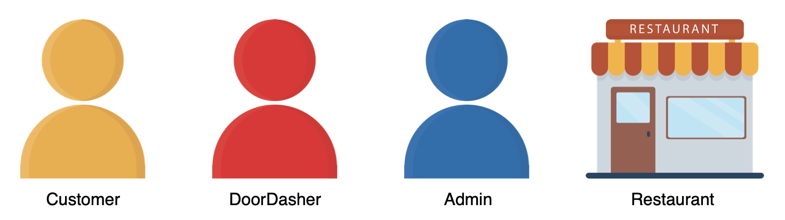
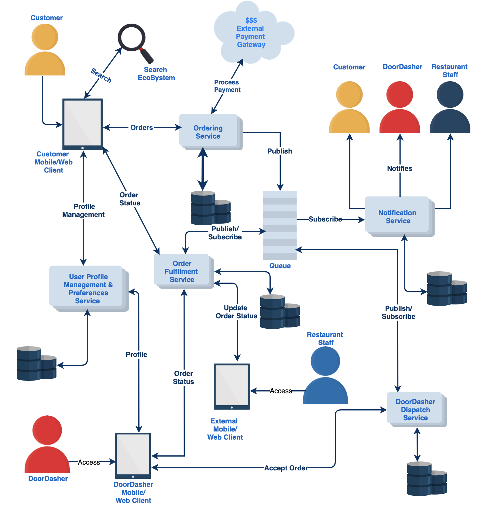

# Getting Started
## Introduce yourself to the system design interview
System design interviews have gained a lot of steam over the last couple of years and are considered as an important part of onsite interviews with the majority of product development companies. These interviews tend to be very open-ended and conversational. The interviewers are judge the candidate on their technical skills involving thinking about the big picture, logical understanding of the presented problem domain, articulation, as well as on their friendliness (will I be able to work with this person?) and curiosity

In a system design interview which is also referred to as SDI, the candidate is given an example of a popular system and asked to brainstorm a design. During the process, candidates are expected to ask clarifying questions and think through every component, including the data model, keeping scalability, redundancy, fault tolerance, etc. in mind.

The intended audience for this course is software engineers who are interested in designing systems.

## How to start?
As the interviewer will be presenting a very vague idea of a system or functionality that you have to design, here’s how you could start:

* **Take a deep breath and relax!** It’s super important to maintain composure to get the best out of your mind. Tension and panicking won’t help you! Although you are going to be judged, no one is going to be mean to you.
* Don’t jump into the design **right away**.
* Start thinking through the problem and **ask a significant number of clarifying questions**. Again, don’t spend 20 minutes asking questions that won’t work. Don’t avoid the problem and waste time with useless chatter!
* Discuss the **scope of the problem** with your interviewer. Don’t try to design each and everything. Remember you have 45 minutes only! You’ve got to identify and focus only on the most important use cases.
* Identify the **users (actors) of your application**. This is important because companies like Amazon obsess over the customer. You will earn brownie points if you are able to specify the actor
* Talk about **scale and growth** of the system.
* Think out **loud**! Unless the interviewer is capable of penetrating mental discernment, there’s no way for them to peek into your mind.

# Introduction to DoorDash
Understand the purpose and discover the history of DoorDash.

## What is DoorDash?
DoorDash is an American-based prepared food delivery service. It is one of several technology companies that use logistics services to offer food delivery from restaurants on-demand.

DoorDash has helped millions of hungry people, who either find cooking cumbersome or are just not in the mood to cook but were starving and couldn’t wait.

This course offers a detailed analysis, and not all of it can ever be discussed in a traditional 45 minute/1 hour interview. It does not dive deep into the individual components as the idea is just to have a high-level overview of various important pieces of the puzzle. Hopefully, after taking the course you will have an idea of the intricate relations between several components within an ecosystem.

## History of DoorDash
DoorDash was founded in 2013 by Stanford students Tony Xu, Stanley Tang, Andy Fang, and Evan Moore. A Y Combinator-backed company, DoorDash launched in Palo Alto and as of May 2019, had expanded to more than 4,000 cities and offered a selection of 340,000 stores across the U.S. and Canada. The company is currently worth more than $13 billion and is the largest third-party delivery service in the USA, surpassing Grubhub in 2019.

Let’s create a system design for DoorDash in upcoming lessons.

# Identify Requirements, Goals & Capacity Estimation of the System

## Requirements and goals of the system
### Main actors in the system
* Customers/consumers
* DoorDashers (Drivers)
* DoorDash Admin (from the company)
* Restaurant (Merchant)

## Assumptions
* Unlimited food is available between the times a restaurant opens and closes. So there is no need to check the quantity of available food. No inventory management is required.
* Restaurants don’t have their own online ordering system/infrastructure, they will solely rely on us for all orders.
* Customers will be shown restaurants within a particular radius, say 10 miles.
* Customers are allowed to order food from only one restaurant at a time in an online order. Menu items from multiple restaurants can’t be combined in an order.

## Functional requirements
### Customers should be able to:
* **search** for restaurants based on the cuisines type, menu items, etc;
* create a **cart**, add menu items to the cart and order;
* receive notifications about the **status** of an order once placed;
* **track** the status of the order on the app;
* **cancel** the order;
* **pay** for the order;
* create/update their **account** and **contact information**

### Restaurants should be able to:
* create their **profile** (onboarding) and create, refresh and add new **menu items** and **pictures**;
* receive **notifications** about orders placed, assigned DoorDasher, and update the status of an order, etc;
* do **offboarding**, if the restaurant goes out of business or decides to discontinue taking online orders.

### DoorDashers should be able to:
* receive **notifications** about the available orders in the area, from which they can choose;
* know when the order is available for **pickup**;
* **inform** the customer/restaurant of any problems they encounter while executing the order pickup/delivery;
* **de-register** in case they don’t want to continue with the job anymore.

## Non functional requirements
* **Latency**: Hungry users will not like to wait to see the menu/restaurant details, so the search functionality should be high-speed. The ordering experience should also not have high latency and must be seamless and quick. Moreover, since the restaurant/menu-related data will be entered through a different service altogether, the lag between the data being entered and the result showing up in the search should be acceptable but shouldn’t be too much.
* **Consistency**: When a new restaurant is onboarded or a new menu is added, the information needn’t be available immediately. Eventual consistency is desirable. However, when an order is placed, the customer, the restaurant, and the DoorDasher should see the same order without any issues. Hence, in this scenario, consistency is crucial.
* **Availability**: High availability is desirable for the best experience of a customer and the restaurants that are processing the order, as well as the DoorDasher. No restaurant would like their business to go down just because the system has crashed; that will be a serious loss of revenue for the restaurant.
* **High Throughput**: The system should be able to handle high peak load without problems or failures.

## Out of scope
The following are a few functionalities that lie out of the system’s scope:

* Customers being able to rate a restaurant or a specific DoorDasher.
* Sales reporting, dash-boarding capabilities.
* DoorDasher onboarding and payout.
* Restaurant payouts.
* Customer service/management.
* OAuth 2.0 authentication (the protocol that allows a user to grant a third-party website or application access to the user’s protected resources, without necessarily revealing their long-term credentials or even their identity) via Facebook/Google/Apple, etc.
* Recommendations based on the customer’s order history/profile and other preferences.
* Mapping capabilities (in the form of Google Maps) to show the location of the DoorDasher, or the location of the restaurant.
* ETA calculation using Isochrones.
* DoorDash admin functionalities.
* Supply/demand logistics and decision making.

# Creating Data Model, Managing Data Storage & Data Partitioning
## Create data model
It is unnecessary to do an extensive analysis of the data model during the interview. Merely listing out the main entities and attributes should be sufficient in this context. Also, it is not required to create a diagram like the one shown below: this is only for demonstration purposes.

A sample Entity Relationship Diagram for the application:

> Your Entity Relationship Diagram (ERD) could vary. It is just one of many possible ways of drawing the diagram.

Let’s discuss what we need to keep in mind while deciding how data storage could be managed for the system.

## Manage data storage
You have multiple options of frameworks, databases, and technologies to store data.

The choice of usually depends on the amount of data that is being stored, the ease of **scaling**, **partitioning**, **replication**, and several other factors. Application owners may choose to use a mixture of various databases to accomplish certain use cases. For ACID (Atomicity, Consistency, Isolation, Durability) requirements, a relational database is always preferred over a NoSQL counterpart. NoSQL and relational databases have their own `prospects` and `constraints`, and the decision to use either should be thought thoroughly based on their functionalities.

As is evident from the capacity estimation, the amount of data of restaurants, menu descriptions, user data, Dasher data, etc., is going to be huge. Hence, a NoSQL/ columnar database like Cassandra could be used. The structure of data, especially attributes, might also vary between restaurants, and it could be challenging to fit the data into a relational schema.

Pictures (restaurants, menu items) can be stored in an object storage service like Amazon S3.

Ordering is a transactional process and can be stored in Oracle/MySQL/Postgres.

## Data partitioning
As the data grows, it becomes impossible to store all the data in just one instance of the database. Restaurant data can be partitioned based on:

* Area code
* RestaurantId
* Menu items/cuisines/dishes
* Combination of area code and RestaurantId

Each of the above partitioning schemes has its own benefits and disadvantages. The strategy needs to be well thought out, considering all possible side effects and performance improvements before implementing it.

# Creating the Component Design & Architecture of the System
## Component design & architecture
The overall architecture could be **microservices**-based with heavy usage of the **publisher-subscriber** pattern, involving a queuing technology like Kafka, RabbitMQ, ActiveMQ, Amazon SNS, or Amazon MQ. Each microservice can talk with another using this model of publishing a message and subscribing to channels or topics. This mechanism de-couples services from each other in the best possible way.

Consequently, microservice A doesn’t need to know the endpoint of microservice B when it publishes a message to the queue. The publisher doesn’t need to know the consumers (subscribers) of its published messages. Similarly, the subscriber doesn’t know about the source of the message, i.e., the publisher. The Pub/Sub system becomes a broker and serves as a contract between all the involved parties.

Also, it is imperative that each microservice interacts with its own database and doesn’t share with anyone else. This approach is motivated by the **database-per-service** paradigm. Microservice A doesn’t have direct access to microservice B's database as they are separated and individually owned.

As described earlier, the data model proposes the idea of just one big fat schema containing every possible table.

Microservices architecture is opposed to this concept. Functional partitioning is required to grant the ownership of each significant table or group of tables to one microservice. That discussion is out of scope here. However, we could choose a mix of relational and non-relational databases for our data storage requirements, which is where functional partitioning becomes more pertinent. The astute reader could take up, as an exercise, the ways the given schema could be partitioned to fit into the microservices architecture.

## UI client
The application will be accessible via `mobile`, `web`, `tablets`, etc. Based on the actor, the interfaces presented will be different or a combination of many. So, individual interfaces/pages will talk to the respective service for parts of the functionality. For example, the search can be performed by the Restaurant Search Service, and orders can be handled by the Ordering Service, and so on.

Primarily, there will be four versions of the interface for the four actors: `customer`, `restaurant`, `DoorDasher` and `admin`.

## Search ecosystem
The most important and coveted functionality that has to be provided by the system is the capability of searching on menu items, cuisines, restaurants, among other things. In the food ordering journey, this functionality will be the entry point for all the customers, unless they already have a favorite restaurant in their preferences. Thus, a personalized discovery and search experience based on a customer’s past search and order history must be provided. As is apparent, this particular part of the entire system will be **read-heavy**.

We can think of leveraging popular off-the-shelf search offerings from the market, such as Elasticsearch or Apache Solr, for quick lookup as per user search parameters. These technologies are open-source, distributed, and based on Apache Lucene and have their own strengths and weaknesses.

We will need to have a queue in place to process asynchronous updates to the search cluster. When the Restaurant Profile Service (see below) creates/updates a restaurant/menu data by performing CRUD operations on the database, it can also post an event to the queue. This event could be any of the CRUD. We need a data indexer that listens to the queue for such events. The data indexer then picks up the event, runs a query against the database to formulate a document as per the correct format, and posts the data into the search cluster. We also need to have a Restaurant Search Service that executes queries on the search cluster based on user inputs and returns the result to be displayed on the user interface.

Elasticsearch has a Geo-distance query, which can be leveraged to return all the restaurants/menus that the user is searching for based on a defined radius from the user’s location. This essentially means that users will be shown only those restaurants that are reachable from their addresses. Similarly, Apache Solr also has Spatial Search, which caters to the use case of geographic search. As such, Elasticsearch is very fast in retrieving results and can be directly queried. To further reduce latency and improve user experience, we should use a cache working alongside the Restaurant Search Service. More on caching in upcoming lessons.

The search ecosystem will look like the diagram below:

## Ordering service
This service will manage the menu selection, shopping cart management, and placement of food orders. It will process the payment using an External Payment Gateway and will save the result into an orders database. Because order placement is transactional in nature, the best idea is to use a relational database.

Customers will be able to get the full receipt of their order and other details using this service. They can also cancel the order and view their past order histories.

## Order fulfilment service
A Few high-level functionalities that this service will handle are listed below.

* The restaurant accepts the order (using the client app).
* Notifies the customer of any delay or change in the order if necessary (using the Notification Service).
* Customers can check the status of their orders.
* DoorDashers can check if the order is ready to be picked up. They can also view the details of the order they are picking up/delivering.
* Notifies the DoorDasher when an order is ready to be picked up.

## External payment gateway
This component can interface with popular payment gateways like Amazon Payments, We Pay, PayPal, ApplePay, or individual Credit Card providers like Amex, Visa, Mastercard, etc. The order service will interact with this component to ensure the payment is made at the time of confirmation of order. The interaction should be synchronous in nature.

## Notification service
This service is responsible for delivering notifications to every actor within the system. The notifications should be sent out to individual actors according to the preferences they have set for receiving them. Some actors might prefer push notifications while others might receive text or emails. This service is supposed to abstract out the medium in which notifications are being sent. This means the underlying interactions with the mobile carrier, email service providers, etc. will be abstracted. Actors could also receive in-app notifications. The service is responsible to notify:

* the customer about various stages of the order. Examples include notifications about successful order placement, acceptance of order by the restaurant, or the dispatch of the order;
* the restaurant that an order is placed, or a DoorDasher is assigned to the order, or that the DoorDasher is on their way to pick up the order;
* the DoorDasher that orders are waiting in their queue for acceptance, or that the order is ready to be picked up, or that the order they have accepted is being delayed, etc.

## DoorDasher dispatch service
This service will be used to accomplish use-cases relating to a DoorDasher. DoorDashers will be able to:

* view **pick-up orders** from a list that they can accept;
* view **past orders** that they have accepted;
* view customer information from the order in case they need to **communicate** with them about the delivery, or inform the restaurant about any problem that prevents them from picking up or delivering the food.

## User profile management & preferences service
The actors in the system, namely, customers, restaurant staff, DoorDashers and system admin, will need a way to create their profile with personal information, contact, address, and will be assigned a role based on their profile. Individual actors will also have preferences based on their role. For example, customers may have set preferences for selecting from a fixed set of restaurants or zip codes or cuisines. Doordashers might have a preference for delivering only within their specific area codes, or choice of restaurants, etc. Similarly, actors will also have their preferred method of ordering or getting paid. Notification preferences of actors will also vary. This service will manage the profiles and preferences of all such actors across the board.

## Restaurant profile service
This service will be managing the data related to restaurants, menus, offerings, etc. A restaurant or business can:

* Onboard
* Update/Delete their profile
* Create/Update/See/Delete menus, dishes etc.
* Upload images of their restaurants or dishes/menus into an object storage service
* View their financial details based on past orders etc.
* Setup a payment method for money transfers

The complete component design with all the services will look like this.

# Learn Order Fulfilment Workflow, System APIs & Security
## Order fulfilment workflow
Let’s first define some acronyms which we will be using later on:

* Ordering Service: OS
* Order Fulfilment Service: OFS
* Notification Service: NS
* DoorDasher Dispatch Service: DDS
* Message: MSG

Once the customer places an order using the mobile/web client using the OS, the order processing workflow could be as follows:

* OS publishes a MSG(#1) to the queue about the order so that the downstream services can start processing.
* NS reads MSG(#1) and notifies the corresponding restaurant and the customer that an order is placed and pending their acceptance.
* Once the order is accepted by the restaurant, using the OFS, the OFS will publish a MSG(#2) to the queue regarding the acceptance of the order.
* DDS will read the MSG(#2) and post an area-specific MSG(#3) to the queue. DDS could also auto-assign an order to an available DoorDasher, and in which case, it will post a related MSG.
* NS will read MSG(#2) and notify the customer that the restaurant accepted the order.
* NS will read MSG(#3) and notify the DoorDashers in the area about the availability of the order to process their acceptance.
* The DoorDasher will accept the order using DDS. DDS will then post a MSG(#4) to the queue about DoorDasher assignment/acceptance.
* NS will read MSG(#4) and notify the customer and the restaurant about the DoorDasher assignment.
* Once the food is ready to be picked up, the restaurant will update the status of the order using OFS. OFS will post a MSG(#5) to the queue that the food is ready to be picked up.
* NS will read MSG(#5) and notify the assigned DoorDasher as well as the customer that the food is ready to be picked up.
* After the DoorDasher picks up the food, the restaurant staff will update the status of the order using OFS. OFS will then post a MSG(#6) to the queue that the order has been picked up.
* NS reads MSG(#6) and notifies the customer that the order is picked up.
* DoorDasher reaches the customer, delivers the food, and marks the order as complete! The food is here!! DDS posts a MSG(#7) to the queue about delivery completion.
* OFS reads MSG(#7) and updates the status of the order to be completed.
* NS reads MSG(#7) and notifies the restaurant and the customer about the delivery of food.

## System APIs
Here are some of the customer-facing APIs exposed by the various services:

## Ordering food:
* search (array of search terms)
* addToCart(menu-item)
* order(cart)
* status(orderId)
* retrieveOrder(orderId)
* cancelOrder(orderId)

## Profile management:
* createProfile
* updateProfile
* updateAddress
* updatePaymentMethod

Sometimes the technical discussion could veer towards defining Rest APIs, URIs, identifying HTTP methods, sample entities, sample payloads, request-response, etc.

## Security
* HTTPS/SSL -TLS for securing the wire. All communications between the web or mobile clients need to be on TLS.
* OAuth 2.0 for token authorisation/refresh/generation.
* In case the queuing system is Kafka, SASL per topic/SSL will be used.

# Explore How to Handle Failure Points, Load Balancing, & Caching
## Replication & fault tolerance
It is imperative that we identify the various points of failure in the system and try to have a replica/backup for each if any component dies. Each service should be horizontally scalable. Moreover, the NoSQL infrastructure will also have multiple nodes, and the search system can also have multiple nodes set up. Queues can have partitions and replication as well.

Each service/component can be individually scaled if needed. Autoscaling could be enabled to handle loads on individual components, for example, spinning up more instances in the face of a high peak load. Furthermore, if any of the nodes or any partition in the queueing infrastructure goes down, another instance can take up the job. The crashed node can then do a cleanup and restart using a process called self-healing.

## Load balancing
Every service will have multiple instances running. In scenarios where the communication is over, https POST/GET etc., load balancers should be placed in front of the individual services. Load balancing helps make sure that no single instance is inundated with a deluge of requests and the response time is faster overall. Several load balancing techniques could be used like the Least Connection Method, Round Robin method, etc.

In case the service solely subscribes to a particular channel/topic in the queue, the responsibility of load balancing is on the queue itself. For example, in Kafka ,consumer consumption divides partitions over consumer instances within a consumer group. Each consumer in the consumer group is an exclusive consumer of a fair share of partitions. This is how Kafka does load balancing of consumers in a consumer group.

## Caching
Based on recent orders in an area, most-ordered items, or on search items, data could be cached so that the Restaurant Search Service could look up such information from a distributed cache, instead of hitting the search infrastructure, and immediately return a few recommendations., Instead of hitting the object storage all the time, images of restaurants and dishes could be cached as well. The cache will hold the popular or most-ordered menu items/restaurants in a particular area and the search screen should show those options by default. The usage of cache definitely speeds up the viewing of search results.

Some of the popular cache technologies available in the market are Redis, Hazelcast, and Memcached. The Least Recently Used (LRU) or Least Frequently Used (LFU) algorithm, or a combination of both can be the cache eviction strategy for our use case.

A content delivery network (CDN) could also be used as a cache in order to make local content available to users based on their geography. In our current application scenario, using a CDN will be an overkill.