* [1 A Tour of Computer System](#1-A-Tour-of-Computer-System)
    * [1.1 Information Is Bits + Context](#11-Information-Is-Bits-Context)
    * [1.2 Programs Are Translated by Other Programs into Different Forms](#12-Programs-Are-Translated-by-Other-Programs-into-Different-Forms)
    * [1.3 It Pays to Understand How Compilation Systems Work](#13-It-Pays-to-Understand-How-Compilation-Systems-Work)
    * [1.4 Processors Read and Interpret Instructions Stored in Memory](#14-Processors-Read-and-Interpret-Instructions-Stored-in-Memory)
        * [1.4.1 Hardware Organization of a System](#141-Hardware-Organization-of-a-System)
        * [1.4.2 Running the hello Program](#142-Running-the-hello-Program)
    * [1.5 Caches Matter](#15-Caches-Matter)
    * [1.6 Storage Devices Form a Hierarchy](#16-Storage-Devices-Form-a-Hierarchy)
    * [1.7 The Operating System Manages the Hardware](#17-The-Operating-System-Manages-the-Hardware)
        * [1.7.1 Processes](#171-Processes)
        * [1.7.2 Threads](#172-Threads)
        * [1.7.3 Virutal Memory](#173-Virutal-Memory)
        * [1.7.4 Files](#174-Files)
    * [1.8 Systems Communicate with Other Systems Using Networks](#18-Systems-Communicate-with-Other-Systems-Using-Networks)
    * [1.9 Important Themes](#19-Important-Themes)
        * [1.9.1 Concurrency and Parallelism](#191-Concurrency-and-Parallelism)
        * [1.9.2 The Importance of Abstractions in Computer Systems](#192-The-Importance-of-Abstractions-in-Computer-Systems)
* [2 Representing and Manipulating Information](#2-Representing-and-Manipulating-Information)
    * [2.1 Information Storage](#21-Information-Storage)
        * [2.1.1 Hexadecimal Notation](#211-Hexadecimal-Notation)
        * [2.1.2 Words](#212-Words)
        * [2.1.3 Data Sizes](#213-Data-Sizes)
        * [2.1.4 Addressing and Byte Ordering](#214-Addressing-and-Byte-Ordering)
        * [2.1.5 Representing Strings](#215-Representing-Strings)
        * [2.1.7 Introduction to Boolean Algebra](#217-Introduction-to-Boolean-Algebra)
        * [2.1.8 Bit-Level Operations in C](#218-Bit-Level-Operations-in-C)
        * [2.1.9 Logical Operations in C](#219-Logical-Operations-in-C)
        * [2.1.10 Shift Operations in C](#2110-Shift-Operations-in-C)
    * [2.2 Integer Representations](#22-Integer-Representations)
        * [2.2.3 Two’s-Complement Encodings](#223-Twos-Complement-Encodings)
        * [2.2.4 Conversions between Signed and Unsigned](#224-Conversions-between-Signed-and-Unsigned)
        * [2.2.5 Signed vs. Unsigned in C](#225-Signed-vsUnsigned-in-C)
        * [2.2.6 Expanding the Bit Representation of a Number](#226-Expanding-the-Bit-Representation-of-a-Number)
        * [2.2.7 Truncating Numbers](#227-Truncating-Numbers)
    * [2.3 Integer Arithmetic](#23-Integer-Arithmetic)
    * [2.4 Floating Point](#24-Floating-Point)
        * [2.4.1 Fractional Binary Number](#241-Fractional-Binary-Number)
* [3 Machine-Level Representation of Programs](#3-Machine-Level-Representation-of-Programs)
    * [3.1 A Historical Perspective](#31-A-Historical-Perspective)
    * [3.2 Program Encodings](#32-Program-Encodings)
        * [3.2.1 Machine-Level Code](#321-Machine-Level-Code)
        * [3.2.3 Code Example](#323-Code-Example)
    * [3.3 Data Formts](#33-Data-Formts)
    * [3.4 Accessing Information](#34-Accessing-Information)
        * [3.4.1 Operand Specifiers](#341-Operand-Specifiers)
        * [3.4.2 Data Movement Instructions](#342-Data-Movement-Instructions)
    * [3.5 Arithmatic and Logic Operations](#35-Arithmatic-and-Logic-Operations)
        * [3.5.1 Load Affect Address](#351-Load-Affect-Address)
        * [3.5.2 Unary and Binary Operations](#352-Unary-and-Binary-Operations)
        * [3.5.3 Shift Operations](#353-Shift-Operations)
        * [3.5.4 Discussion](#354-Discussion)
        * [3.5.5 Special Arithmetic Operations](#355-Special-Arithmetic-Operations)
    * [3.6 Control](#36-Control)
        * [3.6.1 Condition Codes](#361-Condition-Codes)
        * [3.6.2 Accessing the Condition Codes](#362-Accessing-the-Condition-Codes)
        * [3.6.3 Jump Instructions and Their Encoding](#363-Jump-Instructions-and-Their-Encoding)
        * [3.6.4 Translating Conditional Branches](#364-Translating-Conditional-Branches)
        * [3.6.5 Loops](#365-Loops)
        * [3.6.6 Conditional Move Instructions](#366-Conditional-Move-Instructions)
        * [3.6.7 Switch Statements](#367-Switch-Statements)
    * [3.7 Procedures](#37-Procedures)
        * [3.7.1 Stack Frame Structure](#371-Stack-Frame-Structure)
        * [3.7.2 Transferring Control](#372-Transferring-Control)
        * [3.7.3 Register Usage Conventions](#373-Register-Usage-Conventions)
        * [3.7.4 Procedure Example](#374-Procedure-Example)
        * [3.7.5 Recursive Procedures](#375-Recursive-Procedures)
    * [3.8 Array Allocation and Access](#38-Array-Allocation-and-Access)
        * [3.8.1 Basic Principles](#381-Basic-Principles)
        * [3.8.2 Pointer Arithmetic](#382-Pointer-Arithmetic)
        * [3.8.3 Nested Arrays](#383-Nested-Arrays)
        * [3.8.4 Fixed-Size Arrays](#384-Fixed-Size-Arrays)
        * [3.8.5 Variable-Size Arrays](#385-Variable-Size-Arrays)
    * [3.9 Heterogeneous Data Structures](#39-Heterogeneous-Data-Structures)
        * [3.9.1 Structures](#391-Structures)
        * [3.9.2 Unions](#392-Unions)
        * [3.9.3 Data Alignment](#393-Data-Alignment)
    * [3.10 Putting It Together: Understanding Pointers](#310-Putting-It-Together-Understanding-Pointers)
    * [3.11 Life in the Real World: Using the gdb Debugger](#311-Life-in-the-Real-World-Using-the-gdb-Debugger)
    * [3.12 Out-of-Bounds Memory References and Buffer Overflow](#312-Out-of-Bounds-Memory-References-and-Buffer-Overflow)
        * [3.12.1 Thwarting Buffer Overflow Attack](#3121-Thwarting-Buffer-Overflow-Attack)
    * [3.13 x86-64: Extending IA32 to 64 Bits (TODO](#313-x86-64-Extending-IA32-to-64-Bits-(TODO))
        * [3.13.2 An Overview of x86-64](#3132-An-Overview-of-x86-64)
        * [3.13.3 Accessing Information](#3133-Accessing-Information)
        * [3.13.4 Control](#3134-Control)
        * [3.13.5 Data Structures](#3135-Data-Structures)
        * [3.13.6 Concluding Observations about x86-64](#3136-Concluding-Observations-about-x86-64)
    * [3.14 Machine-Level Representations of Floating-Point Programs](#314-Machine-Level-Representations-of-Floating-Point-Programs)
    * [3.15 Summary](#315-Summary)
* [4 Processor Arthitecture](#4-Processor-Arthitecture)
    * [4.1 The Y86 Instruction Set Architecture](#41-The-Y86-Instruction-Set-Architecture)
        * [4.1.1 Programmer-Visible State](#411-Programmer-Visible-State)
        * [4.1.2 Y86 Instructions](#412-Y86-Instructions)
        * [4.1.3 Instruction Encoding](#413-Instruction-Encoding)
        * [4.1.4 Y86 Exceptions](#414-Y86-Exceptions)
        * [4.1.5 Y86 Programs](#415-Y86-Programs)
    * [4.2 Logic Design and the Hardware Control Language HCL](#42-Logic-Design-and-the-Hardware-Control-Language-HCL)
        * [4.2.1 Logic Gates](#421-Logic-Gates)
        * [4.2.2 Combinational Circuits and HCL Boolean Expressions](#422-Combinational-Circuits-and-HCL-Boolean-Expressions)
        * [4.2.3 Word-Level Combinational Circuits and HCL Integer Expressions](#423-Word-Level-Combinational-Circuits-and-HCL-Integer-Expressions)
        * [4.2.4 Set Membership](#424-Set-Membership)
        * [4.2.5 Memory and Clocking](#425-Memory-and-Clocking)
    * [4.3 Sequential Y86 Implementations](#43-Sequential-Y86-Implementations)
        * [4.3.1 Organizing Processing into Stages](#431-Organizing-Processing-into-Stages)
        * [4.3.2 SEQ Hardware Structure](#432-SEQ-Hardware-Structure)
        * [4.3.3 SEQ Timing](#433-SEQ-Timing)
        * [4.3.4 SEQ Stage Implementations](#434-SEQ-Stage-Implementations)
    * [4.4 General Principles of Pipelining](#44-General-Principles-of-Pipelining)
        * [4.4.1 Computational Pipelines](#441-Computational-Pipelines)
        * [4.4.2 A Detailed Look at Pipeline Operation](#442-A-Detailed-Look-at-Pipeline-Operation)
        * [4.4.3 Limitations of Pipelining](#443-Limitations-of-Pipelining)
        * [4.4.4 Pipelining a System with Feedback](#444-Pipelining-a-System-with-Feedback)
    * [4.5 Pipelined Y86 Implementations](#45-Pipelined-Y86-Implementations)
        * [4.5.1 SEQ+: Rearranging the Computation Stages](#451-SEQ-Rearranging-the-Computation-Stages)
        * [4.5.2 Inserting Pipeline Registers](#452-Inserting-Pipeline-Registers)
        * [4.5.3 Rearranging and Relabeling Signals](#453-Rearranging-and-Relabeling-Signals)
        * [4.5.4 Next PC Prediction](#454-Next-PC-Prediction)
        * [4.5.5 Pipeline Hazards](#455-Pipeline-Hazards)
        * [4.5.6 Avoiding Data Hazards by Stalling](#456-Avoiding-Data-Hazards-by-Stalling)
        * [4.5.7 Avoiding Data Hazards by Forwarding](#457-Avoiding-Data-Hazards-by-Forwarding)
        * [4.5.8 Load/Use Data Hazards](#458-LoadUse-Data-Hazards)
        * [4.5.9 Exception Handling](#459-Exception-Handling)
        * [4.5.10 PIPE Stage Implementations](#4510-PIPE-Stage-Implementations)
        * [4.5.11 Pipeline Control Logic](#4511-Pipeline-Control-Logic)
        * [4.5.12 Performance Analysis](#4512-Performance-Analysis)
        * [4.5.13 Unfinished Business](#4513-Unfinished-Business)
    * [4.6 Summary](#46-Summary)
* [5 Optimizing Program Performance](#5-Optimizing-Program-Performance)
    * [5.1 Capabilities and Limitations of Optimizing Compilers](#51-Capabilities-and-Limitations-of-Optimizing-Compilers)
    * [5.2 Expressing Program Performance](#52-Expressing-Program-Performance)
    * [5.3 Program Example](#53-Program-Example)
    * [5.4 Eliminating Loop Inefficiencies](#54-Eliminating-Loop-Inefficiencies)
    * [5.5 Reducing Procedure Calls](#55-Reducing-Procedure-Calls)
    * [5.6 Eliminating Unneeded Memory References](#56-Eliminating-Unneeded-Memory-References)
    * [5.7 Understanding Modern Processors](#57-Understanding-Modern-Processors)
        * [5.7.1 Overall Operation](#571-Overall-Operation)
        * [5.7.2 Functional Unit Performance](#572-Functional-Unit-Performance)
        * [5.7.3 An Abstract Model of Processor Operation](#573-An-Abstract-Model-of-Processor-Operation)
    * [5.8 Loop Unrolling](#58-Loop-Unrolling)
    * [5.9 Enhancing Parallelism](#59-Enhancing-Parallelism)
        * [5.9.1 Multiple Accumulators](#591-Multiple-Accumulators)
        * [5.9.2 Reassociation Transformation](#592-Reassociation-Transformation)
    * [5.10 Summary of Results for Optimizing Combining Code](#510-Summary-of-Results-for-Optimizing-Combining-Code)
    * [5.11 Some Limiting Factors](#511-Some-Limiting-Factors)
        * [5.11.1 Register Spilling](#5111-Register-Spilling)
        * [5.11.2 Branch Prediction and Misprediction Penalties](#5112-Branch-Prediction-and-Misprediction-Penalties)
    * [5.12 Understanding Memory Performance](#512-Understanding-Memory-Performance)
        * [5.12.1 Load Performance](#5121-Load-Performance)
        * [5.12.2 Store Performance](#5122-Store-Performance)
    * [5.13 Life in the Real World: Performance Improvement Techniques](#513-Life-in-the-Real-World-Performance-Improvement-Techniques)
    * [5.14 Identifying and Eliminating Performance Bottlenecks](#514-Identifying-and-Eliminating-Performance-Bottlenecks)
        * [5.14.1 Program Profiling](#5141-Program-Profiling)
    * [5.15 Summary](#515-Summary)
* [6 The Memory Hierarchy](#6-The-Memory-Hierarchy)
    * [6.1 Storage Technologies](#61-Storage-Technologies)
    * [6.2 Locality](#62-Locality)
        * [6.2.1 Locality of References to Program Data](#621-Locality-of-References-to-Program-Data)
        * [6.2.2 Locality of Instruction Fetches](#622-Locality-of-Instruction-Fetches)
        * [6.2.3 Summary of Locality](#623-Summary-of-Locality)
    * [6.3 The Memory Hierarchy](#63-The-Memory-Hierarchy)
        * [6.3.1 Caching in the Memory Hierarchy](#631-Caching-in-the-Memory-Hierarchy)
        * [6.3.2 Summary of Memory Hierarchy Concepts](#632-Summary-of-Memory-Hierarchy-Concepts)
    * [6.4 Cache Memories](#64-Cache-Memories)
        * [6.4.1 Generic Cache Memory Organization](#641-Generic-Cache-Memory-Organization)
        * [6.4.2 Direct-Mapped Caches](#642-Direct-Mapped-Caches)
        * [6.4.3 Set Associative Caches](#643-Set-Associative-Caches)
        * [6.4.4 Fully Associative Caches](#644-Fully-Associative-Caches)
        * [6.4.5 Issues with Writes](#645-Issues-with-Writes)
        * [6.4.6 Anatomy of a Real Cache Hierarchy](#646-Anatomy-of-a-Real-Cache-Hierarchy)
        * [6.4.7 Performance Impact of Cache Parameters](#647-Performance-Impact-of-Cache-Parameters)
    * [6.5 Writing Cache-friendly Code](#65-Writing-Cache-friendly-Code)
    * [6.6 Putting It Together: The Impact of Caches on Program Performance](#66-Putting-It-Together-The-Impact-of-Caches-on-Program-Performance)
        * [6.6.1 The Memory Mountain](#661-The-Memory-Mountain)
        * [6.6.2 Rearranging Loops to Increase Spatial Locality](#662-Rearranging-Loops-to-Increase-Spatial-Locality)
        * [6.6.3 Exploiting Locality in Your Programs](#663-Exploiting-Locality-in-Your-Programs)
    * [6.7 Summary](#67-Summary)
    * [Appendix: Cache Consistent](#Appendix-Cache-Consistent)
        * [MESI](#MESI)
* [7 Linking](#7-Linking)
    * [7.1 Compiler Drivers](#71-Compiler-Drivers)
    * [7.2 Static Linking](#72-Static-Linking)
    * [7.3 Object Files](#73-Object-Files)
    * [7.4 Relocatable Object Files](#74-Relocatable-Object-Files)
    * [7.5 Symbols and Symbol Tables](#75-Symbols-and-Symbol-Tables)
    * [7.6 Symbol Resolution](#76-Symbol-Resolution)
        * [7.6.1 How Linkers Resolve Multiply Defined Global Symbols](#761-How-Linkers-Resolve-Multiply-Defined-Global-Symbols)
        * [7.6.2 Linking with Static Libraries](#762-Linking-with-Static-Libraries)
        * [7.6.3 How Linkers Use Static Libraries to Resolve References](#763-How-Linkers-Use-Static-Libraries-to-Resolve-References)
    * [7.7 Relocation](#77-Relocation)
        * [7.7.1 Relocation Entries](#771-Relocation-Entries)
        * [7.7.2 Relocating Symbol References](#772-Relocating-Symbol-References)
    * [7.8 Executable Object Files](#78-Executable-Object-Files)
    * [7.9 Loading Executable Object Files](#79-Loading-Executable-Object-Files)
    * [7.10 Dynamic Linking with Shared Libraries](#710-Dynamic-Linking-with-Shared-Libraries)
    * [7.11 Loading and Linking Shared Libraries from Applications](#711-Loading-and-Linking-Shared-Libraries-from-Applications)
    * [7.12 Position-Independent Code (PIC](#712-Position-Independent-Code-(PIC))
    * [7.13 Tools for Manipulating Object Files](#713-Tools-for-Manipulating-Object-Files)
    * [7.14 Summary](#714-Summary)
* [8 Exceptional Control Flow](#8-Exceptional-Control-Flow)
    * [8.1 Exception](#81-Exception)
        * [8.1.1 Exception Handling](#811-Exception-Handling)
        * [8.1.2 Classes of Exceptions](#812-Classes-of-Exceptions)
    * [8.1.3 Exceptions in Linux/IA32 Systems](#813-Exceptions-in-LinuxIA32-Systems)
    * [8.2 Processes](#82-Processes)
        * [8.2.2 Concurrent Flows](#822-Concurrent-Flows)
        * [8.2.4 User and Kernel Mode](#824-User-and-Kernel-Mode)
        * [8.2.5 Context Switch](#825-Context-Switch)
    * [8.3 System Call Error Handling](#83-System-Call-Error-Handling)
    * [8.4 Process Control](#84-Process-Control)
        * [8.4.3 Reaping Child Process](#843-Reaping-Child-Process)
        * [8.4.5 Loading and Running Programs](#845-Loading-and-Running-Programs)
        * [8.4.6 Using fork and execve to Run Programs](#846-Using-fork-and-execve-to-Run-Programs)
    * [8.5 Signals](#85-Signals)
        * [8.5.1 Signal Terminology](#851-Signal-Terminology)
        * [8.5.4 Signal Handling Issues](#854-Signal-Handling-Issues)
            * [Linux Signal Handling](#Linux-Signal-Handling)
    * [8.6 Nonlocal Jumps](#86-Nonlocal-Jumps)
    * [8.7 Tools for Manipulating Processes](#87-Tools-for-Manipulating-Processes)
* [9 Virtual Memory](#9-Virtual-Memory)
    * [9.1 Physical and Virtual Addressing](#91-Physical-and-Virtual-Addressing)
    * [9.2 Address Spaces](#92-Address-Spaces)
    * [9.3 VM as a Tool for Caching](#93-VM-as-a-Tool-for-Caching)
        * [9.3.1 DRAM Cache Organization](#931-DRAM-Cache-Organization)
        * [9.3.2 Page Tables](#932-Page-Tables)
        * [9.3.3 Page Hits](#933-Page-Hits)
        * [9.3.4 Page Faults](#934-Page-Faults)
        * [9.3.5 Allocating Pages](#935-Allocating-Pages)
        * [9.3.6 Locality to the Rescue Again](#936-Locality-to-the-Rescue-Again)
    * [9.4 VM as a Tool for Memory Management](#94-VM-as-a-Tool-for-Memory-Management)
    * [9.5 VM as a Tool for Memory Protection](#95-VM-as-a-Tool-for-Memory-Protection)
    * [9.6 Address Translation](#96-Address-Translation)
        * [9.6.1 Integrating Caches and VM](#961-Integrating-Caches-and-VM)
        * [9.6.2 Speeding up Address Translation with a TLB](#962-Speeding-up-Address-Translation-with-a-TLB)
        * [9.6.3 Multi-Level Page Tables](#963-Multi-Level-Page-Tables)
        * [9.6.4 Putting It Together: End-to-end Address Translation](#964-Putting-It-Together-End-to-end-Address-Translation)
    * [9.7 Case Study: The Intel Core i7/Linux Memory System](#97-Case-Study-The-Intel-Core-i7Linux-Memory-System)
        * [9.7.1 Core i7 Address Translation](#971-Core-i7-Address-Translation)
        * [9.7.2 Linux Virtual Memory System](#972-Linux-Virtual-Memory-System)
    * [9.8 Memory Mapping](#98-Memory-Mapping)
        * [9.8.1 Shared Objects Revisited](#981-Shared-Objects-Revisited)
        * [9.8.2 The fork Function Revisited](#982-The-fork-Function-Revisited)
        * [9.8.3 The execve Function Revisited](#983-The-execve-Function-Revisited)
        * [9.8.4 User-level Memory Mapping with the mmap Function](#984-User-level-Memory-Mapping-with-the-mmap-Function)
    * [9.9 Dynamic Memory Allocation](#99-Dynamic-Memory-Allocation)
        * [9.9.2 Why Dynamic Memory Allocation](#992-Why-Dynamic-Memory-Allocation)?
        * [9.9.3 Allocator Requirements and Goals](#993-Allocator-Requirements-and-Goals)
        * [9.9.4 Fragmentation](#994-Fragmentation)
        * [9.9.5 Implementation Issues](#995-Implementation-Issues)
        * [9.9.6 Implicit Free Lists](#996-Implicit-Free-Lists)
        * [9.9.7 Placing Allocated Blocks](#997-Placing-Allocated-Blocks)
        * [9.9.8 Splitting Free Blocks](#998-Splitting-Free-Blocks)
        * [9.9.9 Getting Additional Heap Memory](#999-Getting-Additional-Heap-Memory)
        * [9.9.10 Coalescing Free Blocks](#9910-Coalescing-Free-Blocks)
        * [9.9.11 Coalescing with Boundary Tags](#9911-Coalescing-with-Boundary-Tags)
        * [9.9.13 Explicit Free Lists](#9913-Explicit-Free-Lists)
        * [9.9.14 Segregated Free Lists](#9914-Segregated-Free-Lists)
    * [9.10 Garbage Collection](#910-Garbage-Collection)
    * [9.11 Common Memory-Related Bugs in C Programs](#911-Common-Memory-Related-Bugs-in-C-Programs)
* [10 System-Level I/O](#10-System-Level-I/O)
    * [10.1 Unix I/O](#101-Unix-I/O)
    * [10.2 Opening and Closing Files](#102-Opening-and-Closing-Files)
    * [10.3 Reading and Writing Files](#103-Reading-and-Writing-Files)
    * [10.4 Robust Reading and Writing with the Rio Package](#104-Robust-Reading-and-Writing-with-the-Rio-Package)
        * [10.4.1 Rio Unbuffered Input and Output Functions](#1041-Rio-Unbuffered-Input-and-Output-Functions)
        * [10.4.2 Rio Buffered Input Functions](#1042-Rio-Buffered-Input-Functions)
    * [10.5 Reading File Metadata](#105-Reading-File-Metadata)
    * [10.6 Sharing Files](#106-Sharing-Files)
    * [10.7 I/O Redirection](#107-IO-Redirection)
    * [10.8 Standard I/O](#108-Standard-I/O)
    * [10.9 Putting It Together: Which I/O Functions Should I Use](#109-Putting-It-Together-Which-IO-Functions-Should-I-Use)
* [10+ Input/Output](#10InputOutput)

* [11 Network Programming](#11-Network-Programming)
    * [11.1 The Client-Server Programming Model](#111-The-Client-Server-Programming-Model)
    * [11.2 Networks](#112-Networks)
    * [11.3 The Global IP Internet](#113-The-Global-IP-Internet)
    * [11.4 The Sockets Interface](#114-The-Sockets-Interface)
    * [11.5 Web Servers](#115-Web-Servers)
    * [11.6 Putting It Together: The Tiny Web Server](#116-Putting-It-Together-The-Tiny-Web-Server)
* [12 Concurrent Programming](#12-Concurrent-Programming)
    * [12.1 Concurrent Programming with Processes](#121-Concurrent-Programming-with-Processes)
        * [12.1.1 A Concurrent Server Based on Processes](#1211-A-Concurrent-Server-Based-on-Processes)
    * [12.2 Concurrent Programming with I/O Multiplexing](#122-Concurrent-Programming-with-IO-Multiplexing)
    * [12.3 Concurrent Programming with Threads](#123-Concurrent-Programming-with-Threads)
        * [12.3.4 Terminating Threads](#1234-Terminating-Threads)
        * [12.3.5 Reaping Terminated Threads](#1235-Reaping-Terminated-Threads)
        * [12.3.6 Detaching Threads](#1236-Detaching-Threads)
        * [12.3.7 Initializing Threads](#1237-Initializing-Threads)
    * [12.4 Shared Variables in Threaded Programs](#124-Shared-Variables-in-Threaded-Programs)
        * [12.4.1 Threads Memory Model](#1241-Threads-Memory-Model)
        * [12.4.2 Mapping Variables to Memory](#1242-Mapping-Variables-to-Memory)
    * [12.5 Synchronizing Threads with Semaphores](#125-Synchronizing-Threads-with-Semaphores)
    * [12.6 Using Threads for Parallelism](#126-Using-Threads-for-Parallelism)
    * [12.7 Other Concurrency Issues](#127-Other-Concurrency-Issues)


# 1 A Tour of Computer System

## 1.1 Information Is Bits + Context
The source program is a sequence of bits, each with a value of 0 or 1, organized in 8-bit chunks called bytes. Each byte represents some text character in the program.

All information in a system—including disk files, programs stored in memory, user data stored in memory, and data transferred across a network—is represented as a bunch of bits.

The only thing that distinguishes different data objects is the context in which we view them.

## 1.2 Programs Are Translated by Other Programs into Different Forms


* Compilation System:
    1. Preprocessor Phase:
        * modifies the original C program according to directives that begin with the # character.
    2. Compiler Phase:
        * Each statement in an assembly-language program exactly describes one low-level machine-language instruction in a standard text form.
        * Assembly language is useful because it provides a common output language for different compilers for different high-level languages.
    3. Assembler Phase:
        * Assembler (as) translates hello.s into machine-language instructions, packages them in a form known as a **relocatable object program**, and stores the result in the object file.
    4. Linker

## 1.3 It Pays to Understand How Compilation Systems Work
* Optimizing program performance
    * Is a switch statement always more efficient than a sequence of if-else statements?
    * How much overhead is incurred by a function call?
    * Is a while loop more efficient than a for loop?
    * Are pointer references more efficient than array indexes?
    * Why does our loop run so much faster if we sum into a local variable instead of an argument that is passed by reference?
    * How can a function run faster when we simply rearrange the parentheses in an arithmetic expression?

* Understanding link-time errors.
* Avoiding security holes.

## 1.4 Processors Read and Interpret Instructions Stored in Memory

### 1.4.1 Hardware Organization of a System
* 
    * CPU: Central Processing Unit
    * ALU: Arithmetic/Logic Unit
    * PC: Program counter
    * USB: Universal Serial Bus.

* Buses
    * carry bytes of information back and forth between the components.
    * Buses are typically designed to transfer fixed-sized chunks of bytes known as **words**.
    * The number of bytes in a word (the word size) is a fundamental system parameter that varies across systems.

* I/O Devices
    * Each I/O device is connected to the I/O bus by either a **controller** or an **adapter**.
    * Controllers are chip sets in the device itself or on the system’s main printed circuit board (often called the motherboard).
    * An adapter is a card that plugs into a slot on the motherboard.

* Main Memory
    * memory is organized as a linear array of bytes, each with its own unique address (array index) starting at zero.

* Processor
    * At its core is a word-sized storage device (or register) called the program counter (PC).
    * A processor appears to operate according to a very simple instruction execution model, defined by its **instruction set architecture**.
    * The processor **reads** the instruction from memory pointed at by the program counter (PC), **interprets** the bits in the instruction, **performs** some simple operation dictated by the instruction, and then updates the PC to point to the next instruction, which may or may not be contiguous in memory to the instruction that was just executed.
    * The **register file** is a small storage device that consists of a collection of word-sized registers, each with its own unique name.
    * The **arithmetic/logic unit (ALU)** computes new data and address values.
    * Examples of the simple operations that the CPU might carry out at the request of an instruction:
        * **Load**: Copy a byte or a word from main memory into a register, overwriting the previous contents of the register.
        * **Store**: Copy a byte or a word from a register to a location in main memory, overwriting the previous contents of that location.
        * **Operate**: Copy the contents of two registers to the ALU, perform an arithmetic operation on the two words, and store the result in a register, overwriting the previous contents of that register.
        * **Jump**: Extract a word from the instruction itself and copy that word into the program counter (PC), overwriting the previous value of the PC.

### 1.4.2 Running the hello Program
1.  Read Command
    * Initially, the shell program is executing its instructions, waiting for us to type a command. As we type the characters “./hello” at the keyboard, the shell program reads each one into a register, and then stores it in memory
    * 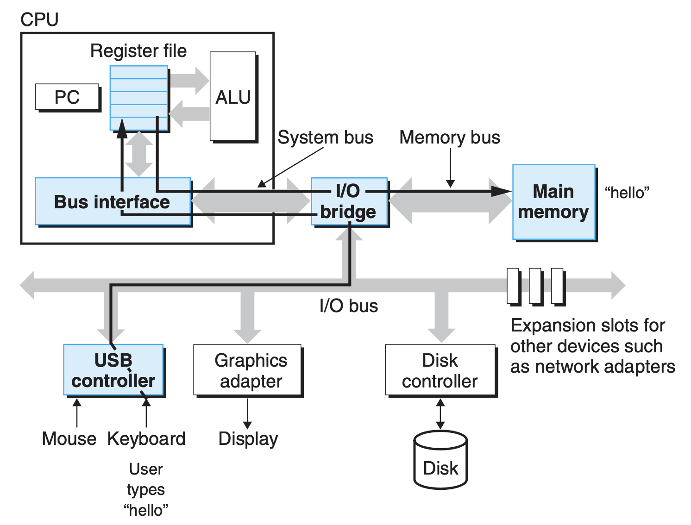
2. Execute command
    * When we hit the enter key on the keyboard, the shell knows that we have finished typing the command.
    * The shell then loads the executable hello file by executing a sequence of instructions that copies the code and data in the hello object file from disk to main memory.
    * 
3. Execute Programe
    * Using a technique known as direct memory access (DMA, discussed in Chapter 6), the data travels directly from disk to main memory, without passing through the processor
    * Once the code and data in the hello object file are loaded into memory, the processor begins executing the machine-language instructions in the hello program’s main routine.
    * These instructions copy the bytes in the “hello, world\n” string from memory to the register file, and from there to the display device, where they are displayed on the screen.
    * 

## 1.5 Caches Matter
* An important lesson from this simple example is that a system spends a lot of time moving information from one place to another.

* The disk drive on a typical system might be 1000 times larger than the main memory, but it might take the processor 10,000,000 times longer to read a word from disk than from memory.

* The processor can read data from the register file almost 100 times faster than from memory.

* It might take 5 times longer for the process to access the L2 cache than the L1 cache, but this is still 5 to 10 times faster than accessing the main memory.


## 1.6 Storage Devices Form a Hierarchy
The main idea of a memory hierarchy is that storage at one level serves as a cache for storage at the next lower level.


## 1.7 The Operating System Manages the Hardware
* The operating system has two primary purposes:
    1. to protect the hardware from misuse by runaway applications
    2. to provide applications with simple and uniform mechanisms for manipulating complicated and often wildly different low-level hardware devices.


* **Files** are abstractions for I/O devices
* **virtual memory** is an abstraction for both the main memory and disk I/O devices
* **processes** are abstractions for the processor, main memory, and I/O devices.
* **virtual machine** provids an abstraction of the entire computer, including the operating system, the processor, and the programs.

Posix standards, that cover such issues as the C language interface for Unix system calls, shell programs and utilities, threads, and network programming.

### 1.7.1 Processes
A **process** is the operating system’s abstraction for a running program. Multiple processes can run concurrently on the same system, and each process appears to have exclusive use of the hardware.

**Context**, includes information such as the current values of the PC, the register file, and the contents of main memory.


### 1.7.2 Threads
A process can actually consist of multiple execution units, called threads, each running in the context of the process and sharing the same code and global data.

It is easier to share data between multiple threads than between multiple processes, and because threads are typically more efficient than processes.

### 1.7.3 Virutal Memory
Virtual memory is an abstraction that provides each process with the illusion that it has exclusive use of the main memory.


### 1.7.4 Files
A **file** is a sequence of bytes, nothing more and nothing less. Every I/O device, including disks, keyboards, displays, and even networks, is modeled as a file.

```email
From: torvalds@klaava.Helsinki.FI (Linus Benedict Torvalds)
Newsgroups: comp.os.minix
Subject: What would you like to see most in minix?
Summary: small poll for my new operating system
Date: 25 Aug 91 20:57:08 GMT

Hello everybody out there using minix -
I’m doing a (free) operating system (just a hobby, won’t be big and
professional like gnu) for 386(486) AT clones. This has been brewing
since April, and is starting to get ready. I’d like any feedback on
things people like/dislike in minix, as my OS resembles it somewhat
(same physical layout of the file-system (due to practical reasons)
among other things).
I’ve currently ported bash(1.08) and gcc(1.40), and things seem to work.
This implies that I’ll get something practical within a few months, and
I’d like to know what features most people would want. Any suggestions
are welcome, but I won’t promise I’ll implement them :-)

Linus (torvalds@kruuna.helsinki.fi)
```

## 1.8 Systems Communicate with Other Systems Using Networks

## 1.9 Important Themes
### 1.9.1 Concurrency and Parallelism
* **concurrency** refers to the general concept of a system with multiple, simultaneous activities,
* **parallelism** refers to the use of concurrency to make a system run faster.

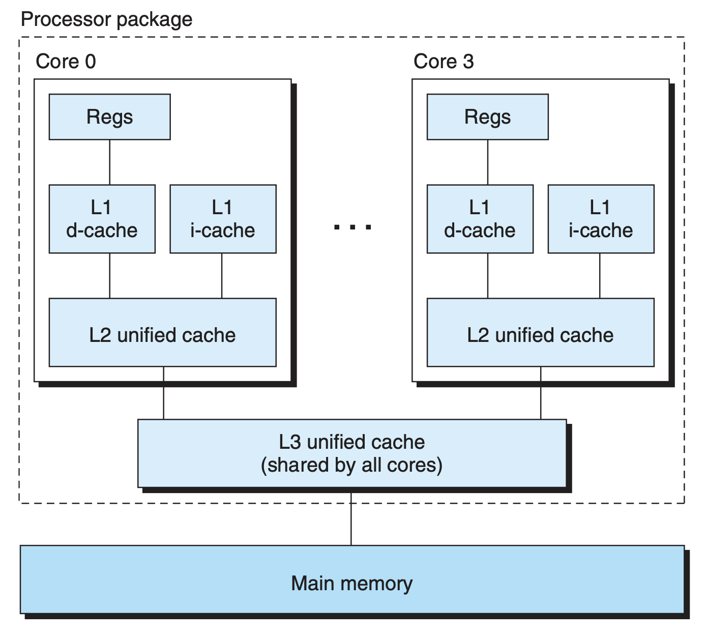

* **Thread-Level Concurrency**
    * **Hyperthreading**, sometimes called simultaneous multi-threading, is a technique that allows a single CPU to execute multiple flows of control.
        * It involves having multiple copies of some of the CPU hardware, such as program counters and register files, while having only single copies of other parts of the hardware, such as the units that perform floating-point arithmetic.
        * Whereas a conventional processor requires around 20,000 clock cycles to shift between different threads, a hyperthreaded processor decides which of its threads to execute on a cycle-by-cycle basis.
    * The use of multiprocessing can improve system performance in two ways:
        1. It reduces the need to simulate concurrency when performing multiple tasks.
        2. It can run a single application program faster, but only if that program is expressed in terms of multiple threads that can effectively execute in parallel.

* **Instruction-Level Parallelism**
    * Early microprocessors, such as the 1978-vintage Intel 8086 required multiple (typically, **3–10) clock cycles** to execute a single instruction. More recent processors can sustain execution rates of **2–4 instructions per clock cycle**.
    * In Chapter 4, we will explore the use of **pipelining**, where the actions required to execute an instruction are partitioned into different steps and the processor hardware is organized as a series of stages, each performing one of these steps.
    * The stages can operate in parallel, working on different parts of different instructions.
    * Processors that can sustain execution rates faster than one instruction per cycle (IPC) are known as **superscalar processors**.

* **Single-Instruction, Multiple-Data (SIMD) Parallelism**
    * At the lowest level, many modern processors have special hardware that allows a single instruction to cause multiple operations to be performed in parallel, a mode known as single-instruction, multiple-data, or **“SIMD”** parallelism.

### 1.9.2 The Importance of Abstractions in Computer Systems
* One aspect of good programming practice is to formulate a simple application-program interface (API) for a set of functions that allow programmers to use the code without having to delve into its inner workings.

# 2 Representing and Manipulating Information
* **Unsigned encodings** are based on traditional binary notation, representing numbers greater than or equal to 0.
* **Two’s-complement encodings** are the most common way to represent signed integers, that is, numbers that may be either positive or negative.
* **Floating-point encodings** are a base-two version of scientific notation for representing real numbers.
    * Floating-point arithmetic has altogether different mathematical properties. The product of a set of positive numbers will always be positive, although overflow will yield the special value +∞.
    * Floating-point arithmetic is not associative, due to the finite precision of the representation.
    * The different mathematical properties of integer vs. floating-point arithmetic stem from the difference in how they handle the finiteness of their representations — integer representations can encode a comparatively small range of values, but do so precisely, while floating-point representations can encode a wide range of values, but only approximately.

## 2.1 Information Storage
Rather than accessing individual bits in memory, most computers use blocks of eight bits, or bytes, as the smallest addressable unit of memory.

The actual **virtual address space** implementation (presented in Chapter 9) uses a combination of random-access memory (RAM), disk storage, special hardware, and operating system software to provide the program with what appears to be a monolithic byte array.

The value of a **pointer** in C—whether it points to an integer, a structure, or some other program object—is the virtual address of the first byte of some block of storage.

### 2.1.1 Hexadecimal Notation

### 2.1.2 Words
Since a virtual address is encoded by such a word, the most important system parameter determined by the word size is the maximum size of the virtual address space.

### 2.1.3 Data Sizes


### 2.1.4 Addressing and Byte Ordering
* For program objects that span multiple bytes, we must establish two conventions:
    * what the address of the object will be
    * how we will order the bytes in memory

* little endian: the least significant byte comes first

* Byte ordering becomes an issue:
    1. The first is when binary data are communicated over a network between different machines.
    2. A second case where byte ordering becomes important is when looking at the byte sequences representing integer data.
    3. A third case where byte ordering becomes visible is when programs are written that circumvent the normal type system.

### 2.1.5 Representing Strings
A **string** in C is encoded by an array of characters terminated by the null (having value 0) character.

### 2.1.7 Introduction to Boolean Algebra
Boole observed that by encoding logic values True and False as binary values 1 and 0, he could formulate an algebra that captures the basic principles of logical reasoning.

### 2.1.8 Bit-Level Operations in C

### 2.1.9 Logical Operations in C

### 2.1.10 Shift Operations in C

## 2.2 Integer Representations

### 2.2.3 Two’s-Complement Encodings
* This is defined by interpreting the most significant bit (sign bit) of the word to have negative weight.

* The two’s-complement range is asymmetric: |TMin| = |TMax| + 1
    * This asymmetry arises, because half the bit patterns (those with the sign bit set to 1) represent negative numbers, while half (those with the sign bit set to 0) represent nonnegative numbers. Since 0 is nonnegative, this means that it can represent one less positive number than negative.
* The maximum unsigned value is just over twice the maximum two’s-complement value: UMax = 2TMax + 1

### 2.2.4 Conversions between Signed and Unsigned
The effect of casting is to keep the bit values identical but change how these bits are interpreted.

In casting from unsigned int to int, the underlying bit representation stays the same.

This is a general rule for how most C implementations handle conversions between signed and unsigned numbers with the same word size—the numeric values might change, but the bit patterns do not.

### 2.2.5 Signed vs. Unsigned in C

Some of the peculiar behavior arises due to C’s handling of expressions containing combinations of signed and unsigned quantities. When an operation is performed where one operand is signed and the other is unsigned, C implicitly casts the signed argument to unsigned and performs the operations assuming the numbers are nonnegative. As we will see, this convention makes little difference for standard arithmetic operations, but it leads to nonintuitive results for relational operators such as < and >.

    Consider the comparison -1 < 0U. Since the second operand is unsigned, the first one is implicitly cast to unsigned, and hence the expression is equivalent to the comparison 4294967295U < 0U (recall that T2Uw (−1) = UMaxw), which of course is false.
### 2.2.6 Expanding the Bit Representation of a Number
To convert an unsigned number to a larger data type, we can simply add *leading zeros* to the representation; this operation is known as **zero extension**.

For converting a two’s-complement number to a larger data type, the rule is to perform a **sign extension**, adding copies of the *most significant bit* to the representation.

    short sx = -1234;
    unsigned uy = sx;
    printf("uy = %u\n", uy); // 4294954951: ff ff cf c7

    when converting from short to unsigned, we first change the size and then from signed to unsigned. That is, (unsigned) sx is equivalent to (unsigned) (int) sx, evaluating to 4,294,954,951, not (unsigned) (unsigned short) sx, which evaluates to 53,191. Indeed this convention is required by the C standards.

### 2.2.7 Truncating Numbers
For an unsigned number x, the result of truncating it to k bits is equivalent to computing x mod 2k.


## 2.3 Integer Arithmetic
> TODO

## 2.4 Floating Point
### 2.4.1 Fractional Binary Number


# 3 Machine-Level Representation of Programs

## 3.1 A Historical Perspective

## 3.2 Program Encodings

### 3.2.1 Machine-Level Code
* Registers:
    * The **program counter** (commonly referred to as the “PC,” and called %eip in IA32) indicates the address in memory of the next instruction to be executed.
    * The **integer register file** contains eight named locations storing 32-bit values. These registers can hold addresses (corresponding to C pointers) or integer data. Some registers are used to keep track of critical parts of the program state, while others are used to hold temporary data, such as the local variables of a procedure, and the value to be returned by a function.
    * The **condition code registers** hold status information about the most recently executed arithmetic or logical instruction. These are used to implement conditional changes in the control or data flow, such as is required to implement if and while statements.
    * A set of **floating-point registers** store floating-point data.

### 3.2.3 Code Example
* Several features about machine code:
    * IA32 instructions can range in length from 1 to 15 bytes. The instruction encoding is designed so that commonly used instructions and those with fewer operands require a smaller number of bytes than do less common ones or ones with more operands.
    * The instruction format is designed in such a way that from a given starting position, there is a unique decoding of the bytes into machine instructions. For example, only the instruction pushl %ebp can start with byte value 55.
    * The disassembler determines the assembly code based purely on the byte sequences in the machine-code file. It does not require access to the source or assembly-code versions of the program.
    * The disassembler uses a slightly different naming convention for the instructions than does the assembly code generated by GCC. In our example, it has omitted the suffix ‘1’ from many of the instructions. These suffixes are size designators and can be omitted in most cases.

## 3.3 Data Formts
Due to its origins as a 16-bit architecture that expanded into a 32-bit one, Intel uses the term **word** to refer to a 16-bit data type. Based on this, they refer to 32bit quantities as **double words**. They refer to 64-bit quantities as **quad words**.

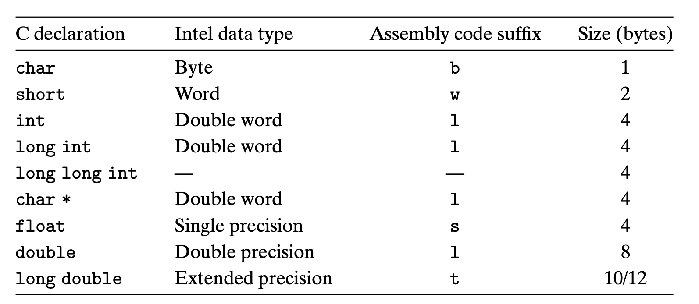

## 3.4 Accessing Information


* Some instructions use fixed registers as sources and/or destinations.

* Within procedures there are different conventions for saving and restoring the first three registers (%eax, %ecx, and %edx) than for the next three (%ebx, %edi, and %esi). See Section 3.7.3 for this kind of conventions.
* The low-order 2 bytes of the first four registers can be independently read or written by the byte operation instructions.

* When a byte instruction updates one of these single-byte “register elements,” the remaining 3 bytes of the register do not change.

### 3.4.1 Operand Specifiers


### 3.4.2 Data Movement Instructions
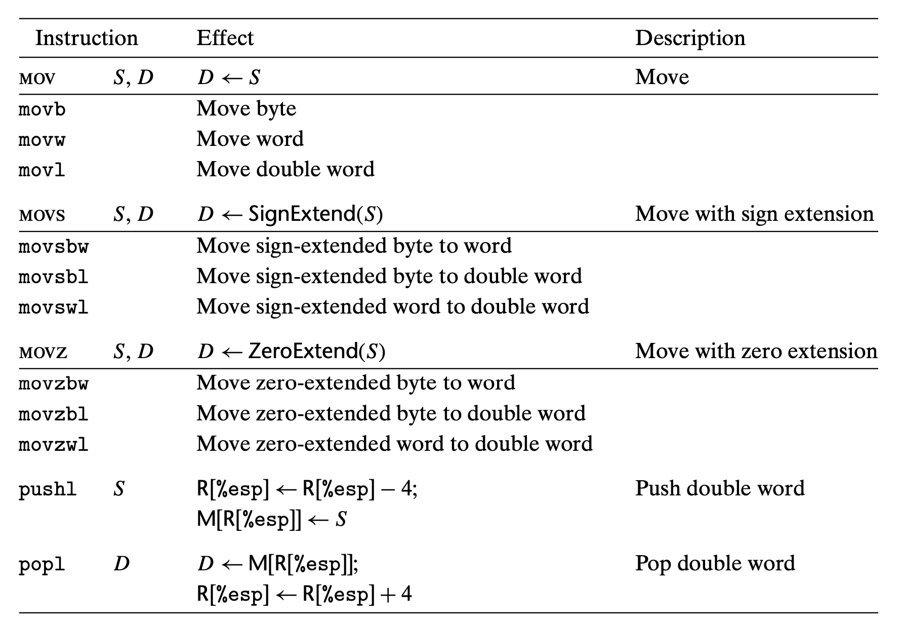

* IA32 imposes the restriction that a move instruction cannot have both operands refer to memory locations.
    * Copying a value from one memory location to another requires two instructions:
        * the first to load the source value into a register
        * the second to write this register value to the destination.

* Both the movs and the movz instruction classes serve to copy a smaller amount of source data to a larger data location, filling in the upper bits by either sign expansion (movs) or by zero expansion (movz).
    * With sign expansion, the upper bits of the destination are filled in with copies of the most significant bit of the source value.
    * With zero expansion, the upper bits are filled with zeros.

    ```assembly
    // %dh = CD, %eax = 98765432
    movb    %dh %eax;   // %eax = 987654CD
    movsbl  %dh %eax;   // %eax = FFFFFFCD
    movzbl  %dh %eax;   // %eax = 000000CD
    ```
* `pushl %ebp` equals to
    ```
    subl $4, %esp       // decrement stack pointer
    movl %ebp, (%esp)   // store %ebp on stack
    ```
* `popl %eax` equals to
    ```
    movl (%esp), %eax   // read %eax from stack
    inc $4, %esp       // increment stack pointer
    ```

Question:
```
movb $0xF, (%bl)    // Cannot use %bl as address register
```

* Example:
    ```C++
    int exchange(int *xp, int y) {
        int x = *xp;                movl 8(%ebp),   %edx
                                    movl (%edx),    %eax
        *xp = y;                    movl 12(%ebp),  %ecx
        return x;                   movl %ecx,      (%edx)
    }
    ```
    * Two features about this assembly code are worth noting.
        * We see that what we call “pointers” in C are simply addresses. Dereferencing a pointer involves copying that pointer into a register, and then using this register in a memory reference.
        * Local variables such as x are often kept in registers rather than stored in memory locations. Register access is much faster than memory access.

## 3.5 Arithmatic and Logic Operations

### 3.5.1 Load Affect Address


* The load effective address instruction leal is actually a variant of the movl instruction. It has the form of an instruction that reads from memory to a register, but it does not reference memory at all.

### 3.5.2 Unary and Binary Operations
* Unary operations, with the single operand serving as both source and destination. This operand can be either a register or a memory location.

* Binary operations, where the second operand is used as both a source and a destination.
    * The first operand can be either an immediate value, a register, or a memory location.
    * The second can be either a register or a memory location.
    * As with the movl instruction, two operands cannot both be memory locations.

### 3.5.3 Shift Operations
* The shift amount is encoded as a **single byte**, since only shift amounts between 0 and 31 are possible (only the low-order 5 bits of the shift amount are considered).
* The shift amount is given either as an immediate or in the singlebyte register element %cl. (These instructions are unusual in only allowing this specific register as operand.)
* The destination operand of a shift operation can be either a register or a memory location.
* The left shift instruction: sal and shl. Both have the same effect, filling from the right with zeros.
* The right shift instructions differ in that sar performs an arithmetic shift (fill with copies of the **sign bit**), whereas shr performs a logical shift (fill with **zeros**).


### 3.5.4 Discussion
* Only right shifting requires instructions that differentiate between signed versus unsigned data. This is one of the features that makes two’s-complement arithmetic the preferred way to implement signed integer arithmetic.

### 3.5.5 Special Arithmetic Operations
The table describes instructions that support generating the full 64-bit product of two 32-bit numbers, as well as integer division.


* For both of these, one argument must be in register %eax, and the other is given as the instruction source operand.
* mul
    * The product is then stored in registers %edx (high-order 32 bits) and %eax (low-order 32 bits).
    * Example:
        * we have signed numbers x and y stored at positions 8 and 12 relative to %ebp, and we want to store their full 64-bit product as 8 bytes on top of the stack.
        ```
        movl    12(%ebp),   %eax    // put y int eax
        imull   8(%ebp)             // multiply by x
        movl    %eax,       (%esp)  // store low-order 32 bits
        movl    %ebx,       4(%esp) // store high-order 32 bits
        ```
* div
    * The signed division instruction idivl takes as dividend the 64-bit quantity in registers %edx (high-order 32 bits) and %eax (low-order 32 bits).
    * The divisor is given as the instruction operand. The instruction stores the quotient in register %eax and the remainder in register %edx.
    * Example
        * we have signed numbers x and y stored at positions 8 and 12 relative to %ebp, and we want to store values x/y and x mod y on the stack.
        ```
        movl    8(%ebp),    %edx    // put x in edx
        movl    %edx,       %eax    // copy x to eax
        sarl    $31,        %edx    // sign extend x in edx // Q?: why need this extend?
        idivl   12(%ebp)            // divid by y
        movl    %eax,       4(%esp) // store x / y
        movl    %edx,       (%esp)  // store x % y
        ```
        * The move instruction on line 1 and the arithmetic shift on line 3 have the combined effect of setting register %edx to either all zeros or all ones depending on the sign of x, while the move instruction on line 2 copies x into %eax. Thus, we have the combined registers %edx and %eax storing a 64-bit, sign-extended version of x.
* cltd
    * A more conventional method of setting up the divisor makes use of the cltd1 instruction. This instruction sign extends %eax into %edx.
    ```
    movl    8(%ebp),    %eax    // put x in eax
    cltd                        // sign extend into edx
    idivl   12(%ebp)            // divid by y
    movl    %eax,       4(%esp) // store x / y
    movl    %edx,       (%esp)  // store x % y
    ```
    * The first two instructions have the same overall effect as the first three instructions in our earlier code sequence.

## 3.6 Control

### 3.6.1 Condition Codes
* The CPU maintains a set of **single-bit** condition code registers describing attributes of the most recent arithmetic or logical operation.

* **CF**: Carry Flag. The most recent operation generated a carry out of the most significant bit. Used to detect overflow for unsigned operations.
* **ZF**: Zero Flag. The most recent operation yielded zero.
* **SF**: Sign Flag. The most recent operation yielded a negative value.
* **OF**: Overflow Flag. The most recent operation caused a two’s-complement overflow—either negative or positive.

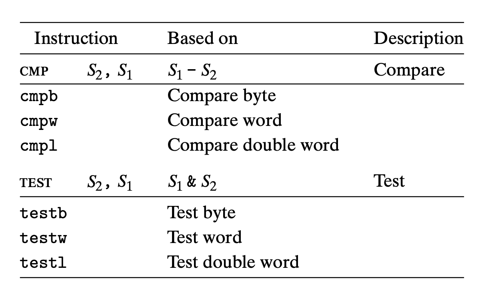

### 3.6.2 Accessing the Condition Codes
* There are three common ways of using the condition codes:
    * we can set a single byte to 0 or 1 depending on some combination of the condition codes
        * 
        * It is important to recognize that the suffixes for these instructions denote different conditions and not different operand sizes. For example, instructions setl and setb denote “set less” and “set below,” not “set long word” or “set byte.”
    * we can conditionally jump to some other part of the program
    * we can conditionally transfer data.
* A SET instruction has either one of the eight single-byte register elements or a single-byte memory location as its destination, setting this byte to either 0 or 1.
* Although all arithmetic and logical operations set the condition codes, the descriptions of the different set instructions apply to the case where a comparison instruction has been executed, setting the condition codes according to the computation t = a-b.

### 3.6.3 Jump Instructions and Their Encoding


* In generating the object-code file, the assembler determines the addresses of all labeled instructions and encodes the jump targets (the addresses of the destination instructions) as part of the jump instructions.
* In assembly code, jump targets are written using symbolic labels. The assembler, and later the linker, generate the proper encodings of the jump targets.
* There are several different encodings for jumps:
    * The most commonly used ones are PC relative. That is, they encode the difference between the address of the target instruction and the address of the instruction immediately following the jump. These offsets can be encoded using 1, 2, or 4 bytes.
    * A second encoding method is to give an “absolute” address, using 4 bytes to directly specify the target.

### 3.6.4 Translating Conditional Branches
```c++
void cond(int a, int *p) {
    if (p && a > 0)
        *p += a;
}

movl    8(%ebp),    %edx
movl    12(%ebp),   %eax
testl   %eax,       %eax
je      .L3
testl   %edx,       %edx
jle     .L3
.L3:
```

```c++
int test(int x, int y) {
    int val = x^y;
    if (x < -3) {
        if (y < x) {
            val = x*y;
        } else {
            val = x+y;
        }
    } else if (x > 2) {
        val = x-y;
    }

    return val;
}

    movl    8(%ebp),    %eax // x
    movl    12(%ebp),   %edx // y
    cmpl    $-3,        %eax
    jge     .L2
    cmpl    %edx,       %eax
    jle     .L3
    imull   %edx,       %eax
    jmp     .L4
.L3:
    leal    (%edx, %eax), %eax
    jmp     .L4
.L2:
    cmpl    $2,     %eax
    jg      .L5
    xorl    %edx,   %eax
    jmp     .L4
.L5:
    subl    %edx,   %eax
.L4:
```

### 3.6.5 Loops
* Most compilers generate loop code based on the do-while form of a loop, even though this form is relatively uncommon in actual programs. Other loops are transformed into dowhile form and then compiled into machine code.

* do-while
    ```c++
    do
        statement;
    while (test-expr);
    /**********************/
    loop:
        statment;
        t = test-expr;
        if (t)
            goto loop;
    ```
* while
    ```c++
    while (!test-expr) {
        statment;
    }
    /**********************/
    if (!test-expr)
        goto done;
    do {
        statment;
    } while (test-expr);
    done:
    ```
* for
    ```c++
    for (init-expr; test-expr; update-expr)
        statment;
    /**********************/
    init-expr;
    if (!test-expr)
        goto done;
    do {
        statment;
        update-expr;
    } while (test-expr);
    done:
    ```

### 3.6.6 Conditional Move Instructions
* The conventional way to implement conditional operations is through a **conditional transfer of control**, where the program follows one execution path when a condition holds and another when it does not. This mechanism is simple and general, but it can be very inefficient on modern processors.
* An alternate strategy is through a **conditional transfer of data**. This approach computes both outcomes of a conditional operation, and then selects one based on whether or not the condition holds.
* To understand why code based on `conditional data transfers` can outperform code based on `conditional control transfers`, we must understand something about how modern processors operate.
    * processors achieve high performance through pipelining, where an instruction is processed via a sequence of stages, each performing one small portion of the required operations
        1. fetching the instruction from memory
        2. determining the instruction type
        3. reading from memory
        4. performing an arithmetic operation
        5. writing to memory
        6. updating the program counter.
    * This approach achieves high performance by overlapping the steps of the successive instructions, such as fetching one instruction while performing the arithmetic operations for a previous instruction.
    * To do this requires being able to determine the sequence of instructions to be executed well ahead of time in order to keep the pipeline full of instructions to be executed.
    * When the machine encounters a conditional jump (branch), it often cannot determine yet whether or not the jump will be followed.
    * Processors employ sophisticated branch prediction logic to try to guess whether or not each jump instruction will be followed.
    * As long as it can guess reliably (modern microprocessor designs try to achieve success rates on the order of 90%), the instruction pipeline will be kept full of instructions.
    * Mispredicting a jump, on the other hand, requires that the processor discard much of the work it has already done on future instructions and then begin filling the pipeline with instructions starting at the correct location.
    * As we will see, such a misprediction can incur a serious penalty, say, 20–40 clock cycles of wasted effort, causing a serious degradation of program performance.
* Conlustion:
    * That means time required by the function ranges between around 13 and 57 cycles, depending on whether or not the branch is predicted correctly.
    * On the other hand, the code compiled using conditional moves requires around 14 clock cycles regardless of the data being tested. The flow of control does not depend on data, and this makes it easier for the processor to keep its pipeline full.


* As with the different `set` and `jump` instructions, the outcome of these instructions depends on the values of the condition codes. The source value is read from either memory or the source register, but it is copied to the destination only if the specified condition holds.
* Implementation Deails:
    ```c++
    v = text-expr ? then-expr : else-expr;
    ```

    ```c++
    /* conditinal control tranform */
        if (!test-expr)
            goto False;
        v = then-expr;
    .Flase:
        v = else-expr;
    .Done:
    ```

    ```c++
    /* conditinal data tranform */
    vt = then-expr;
    v = else-expr;
    t = test-expr;
    if (t)
        v = vt;
    ```
* Not all conditional expressions can be compiled using conditional moves.
    * If one of those *then-expr, else-expr* could possibly generate an error condition or a side effect, this could lead to invalid behavior.
        ```c++
        int cread(int* xp) {
            return xp ? *xp : 0;
        }
        ```

        ```c++
        // xp in %edx
        movl    $0,     %eax    // set 0 as return value
        testl   %edx,   %edx    // test xp
        cmovne  (%edx), %eax    // if !0, dereference xp to get return value
        ```
        * This implementation is invalid, however, since the dereferencing of xp by the cmovne instruction occurs even when the test fails, causing a null pointer dereferencing error.
    * A similar case holds when either of the two branches causes a side effect:
        ```c++
        int count = 0;
        int foo(int x, int y) {
            return x < y ? (count++, y-x) : x-y;
        }
        ```
        * This function increments global variable lcount as part of then-expr. Thus, branching code must be used to ensure this side effect only occurs when the test condition holds.
* Using conditional moves also does not always improve code efficiency.

    * If either the then-expr or the else-expr evaluation requires a significant computation, then this effort is wasted when the corresponding condition does not hold.
* Compilers must take into account the relative performance of wasted computation versus the potential for performance penalty due to branch misprediction.
    * In truth, they do not really have enough information to make this decision reliably; for example, they do not know how well the branches will follow predictable patterns.
    * Our experiments with gcc indicate that it only uses conditional moves when the two expressions can be computed very easily, for example, with single add instructions.

### 3.6.7 Switch Statements
* A switch statement provides a multi-way branching capability based on the value of an integer index.
* Switch efficient implementation using a data structure called a **jump table**. A jump table is an array where entry i is the address of a code segment implementing the action the program should take when the switch index equals i.
* The advantage of using a jump table over a long sequence of if-else statements is that the time taken to perform the switch is independent of the number of switch cases.

## 3.7 Procedures
A procedure call involves passing both data (in the form of procedure parameters and return values) and control from one part of a program to another.

In addition, it must allocate space for the local variables of the procedure on entry and deallocate them on exit.

### 3.7.1 Stack Frame Structure
* The portion of the stack allocated for a single procedure call is called a stack frame.
* Procedure Q also uses the stack for any local variables that cannot be stored in registers. This can occur for the following reasons:
    * There are not enough registers to hold all of the local data.
    * Some of the local variables are arrays or structures and hence must be accessed
    by array or structure references.
    * The address operator ‘&’ is applied to a local variable, and hence we must be able to generate an address for it.

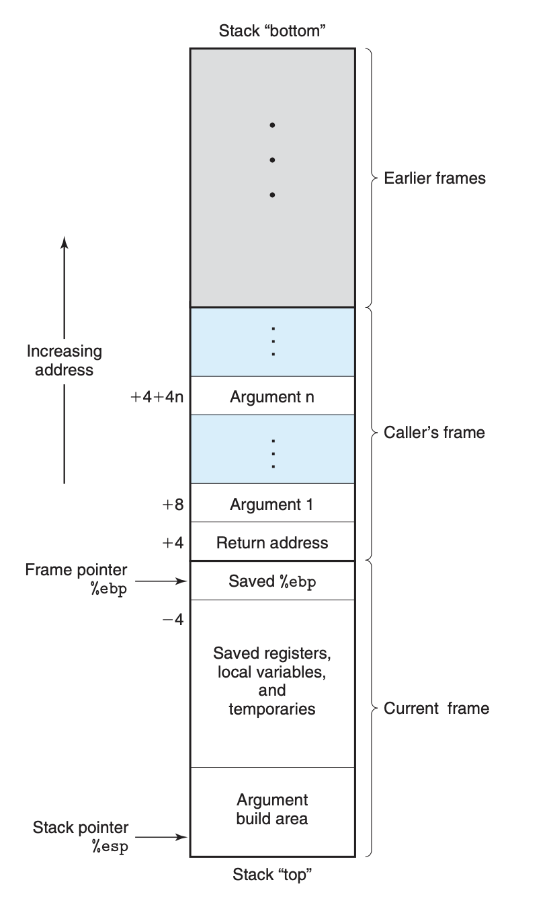

### 3.7.2 Transferring Control
Instruction | Description
--| ---
call Label | Procedure call
call *Operand | Procedure call
leave | Prepare stack for return
ret | Get return function address from stack and jump to

* leave
    ```
    movl %ebp,  %esp    // Set stack pointer to beginning of frame
    popl %ebp           // Restore saved %ebp and set stack ptr to end of caller’s frame
    ```

* The effect of a **call instruction** is to push a return address on the stack and jump to the start of the called procedure.

* The **return address** is the address of the instruction immediately following the call in the program, so that execution will resume at this location when the called procedure returns.

* 

    * The effect of the call is to push the return address 0x080483e1 onto the stack and to jump to the first instruction in function sum, at address 0x08048394 (Figure 3.22(b)). The execution of function sum continues until it hits the ret instruction at address 0x080483a4. This instruction pops the value 0x080483e1 from the stack and jumps to this address, resuming the execution of main just after the call instruction in sum (Figure 3.22(c)).

### 3.7.3 Register Usage Conventions
* Although only one procedure can be active at a given time, we must make sure that when one procedure (the caller) calls another (the callee), the callee does not overwrite some register value that the caller planned to use later.
* Registers `%eax, %edx, and %ecx` are classified as **caller-save (volatile) registers**. When procedure Q is called by P, it can overwrite these registers without destroying any data required by P.
* On the other hand, registers `%ebx, %esi, and %edi` are classified as **callee-save (non-volatile) registers**. This means that Q must save the values of any of these registers on the stack before overwriting them, and restore them before returning.

Register | Usage
--- | ---
EAX | return value of function
EBX | local variable
ECX | counter for bit shifting and string operation
EDX | dividend for division operation
ESI | store local variable
EDI | store local variable
EIP | instruction pointer
ESP | stack pointer
EBP | base pointer

### 3.7.4 Procedure Example
```c++
int swap_add(int* xp, int* yp) {
    int x = *xp;
    int y = *yp;

    *xp = y;
    *yp = x;

    return x + y;
}

int caller() {
    int arg1 = 534;
    int arg2 = 1057;
    int sum = swap_add(&arg1, &arg2);
    int diff = arg1 arg2;

    return sum * diff;
}
```


```c++
caller:
    pushl   %ebp                    // save old %ebp
    movl    %esp,       %ebp        // set %ebp as frame pointer
    subl    $24,        %esp        // allocate 24 bytes on stack
    movl    $534,       -4(%ebp)    // set arg1 to 534
    movl    $1057,      -8(%ebp)    // set arg3 to 1057
    leal    -8(%ebp),   %eax        // compute &arg2
    movl    %eax,       4(%esp)     // store on stack
    leal    -4(%ebp),   %eax        // comput &arg2
    movl    %eax,       (%esp)      // store on stack
    call    swap_add                // call the swap_add function
    movl    -4(%ebp),   %edx
    subl    -8(%ebp),   %edx
    imull   %edx,       %eax
    leave
    ret


/* before reaching this part of the code, the call instruction will have
 * pushed the return address onto the stack.*/
swap_add:
    pushl   %ebp
    movl    %esp,       %ebp
    pushl   %ebx                    // save ebx, it calee-saved register

    movl    8(%ebp),    %edx        // get xy
    movl    12(%ebp),   %ecx        // get yp
    movl    (%edx),     %edx        // get x
    movl    (%ecx),     %eax        // get y
    movl    %eax,       (%edx)      // store y at xp
    movl    %edx,       (%ecx)      // store x at yp
    addl    %edx,       %eax        // reutrn x+y

    popl    %ebp                    // restore %ebx
    popl    %ebp                    // restore %ebp
    ret                             // return
```
* We can see from this example that the compiler generates code to manage the stack structure according to a simple set of conventions:
    * Arguments are passed to a function on the stack, where they can be retrieved using positive offsets (+8, +12, . . .) relative to %ebp
    * Space can be allocated on the stack either by using push instructions or by subtracting offsets from the stack pointer
    * Before returning, a function must restore the stack to its original condition by restoring any callee-saved registers and %ebp, and by resetting %esp so that it points to the return address

* Why does gcc allocate space that never gets used?
    * gcc adheres to an x86 programming guideline that the total stack space used by the function should be a multiple of 16 bytes.
    * Including the 4 bytes for the saved value of %ebp and the 4 bytes for the return address, caller uses a total of 32 bytes. The motivation for this convention is to ensure a proper alignment for accessing data.
    * We will explain the reason for having alignment conventions and how they are implemented in Section 3.9.3.

### 3.7.5 Recursive Procedures

## 3.8 Array Allocation and Access

### 3.8.1 Basic Principles
* The memory referencing instructions of IA32 are designed to simplify array access.
    ```
    movl (%edx,%ecx,4),%eax
    ```

### 3.8.2 Pointer Arithmetic
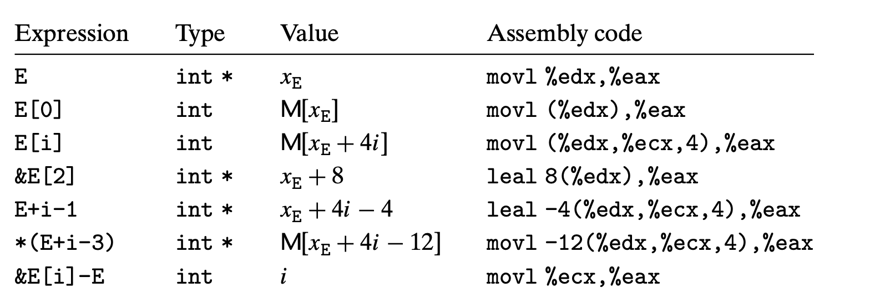

* The array subscripting operation can be applied to both arrays and pointers. The array reference A[i] is identical to the expression *(A+i). It computes the address of the ith array element and then accesses this memory location.

### 3.8.3 Nested Arrays
```
T D[R][C];
&D[i][j] = AddrD + L(C*i +j) // L is the size of data type T in bytes
```

```
// int[5][3]
movl    12(%ebp),           %eax    // get i
leal    (%eax, %eax, 2),    %eax    // comput 3*i
movl    16(%ebp),           %edx    // get j
sall    $2,                 %edx    // comput j*4
addl    8(%ebp),            %edx    // comput Xa + 4*j
movl    (%edx, %eax, 4),    %eax    // read from M[Xa + 4*j + 12*i]
```

### 3.8.4 Fixed-Size Arrays

### 3.8.5 Variable-Size Arrays

## 3.9 Heterogeneous Data Structures
* The implementation of structures is similar to that of arrays in that
    * all of the components of a structure are stored in a contiguous region of memory,
    * and a pointer to a structure is the address of its first byte.
    * The compiler maintains information about each structure type indicating the byte offset of each field.
    * It generates references to structure elements using these offsets as displacements in memory referencing instructions.

### 3.9.1 Structures

### 3.9.2 Unions

### 3.9.3 Data Alignment
* Such alignment restrictions simplify the design of the hardware forming the interface between the processor and the memory system.

## 3.10 Putting It Together: Understanding Pointers
* Pointers are a central feature of the C programming language. They serve as a uniform way to generate references to elements within different data structures.
* Every pointer has an associated type.
* Every pointer has a value.
* Pointers are created with the & operator.
* Pointers are dereferenced with the * operator.
* Arrays and pointers are closely related.
* Casting from one type of pointer to another changes its type but not its value.
* Pointers can also point to functions.

## 3.11 Life in the Real World: Using the gdb Debugger

## 3.12 Out-of-Bounds Memory References and Buffer Overflow


* Depending on which portions of the state are affected, the program can misbehave in several different ways:
    * If the stored value of **%ebx** is corrupted, then this register will not be restored properly, and so the caller will not be able to rely on the integrity of this register, even though it should be callee-saved.
    * If the stored value of **%ebp** is corrupted, then this register will not be restored properly, and so the caller will not be able to reference its local variables or parameters properly.
    * If the stored value of the **return address** is corrupted, then the ret instruction will cause the program to jump to a totally unexpected location.

* A number of commonly used library functions, including `strcpy`, `strcat`, and `sprintf`, have the property that they can generate a byte sequence without being given any indication of the size of the destination buffer. Such conditions can lead to vulnerabilities to buffer overflow.
* This is one of the most common methods to attack the security of a system over a computer network. Typically, the program is fed with a string that contains the byte encoding of some executable code, called the **exploit code**, plus some extra bytes that overwrite the return address with a pointer to the exploit code. The effect of executing the ret instruction is then to jump to the exploit code.

### 3.12.1 Thwarting Buffer Overflow Attack
1. **Statck Randomization**
    * In order to insert exploit code into a system, the attacker needs to inject both the code as well as a pointer to this code as part of the attack string.
    * The idea of stack randomization is to make the position of the stack vary from one run of a program to another.
    * This is implemented by allocating a random amount of space between 0 and n bytes on the stack at the start of a program.
    * Stack randomization has become standard practice in Linux systems. It is one of a larger class of techniques known as address-space layout randomization, or **ASLR**.

2. **Stack Corruption Detection**
    * Recent versions of gcc incorporate a mechanism known as stack protector into the generated code to detect buffer overruns. The idea is to store a special canary value4 in the stack frame between any local buffer and the rest of the stack state.
    * This canary value, also referred to as a guard value, is generated randomly each time the program is run, and so there is no easy way for an attacker to determine what it is.
    * Before restoring the register state and returning from the function, the program checks if the canary has been altered by some operation of this function or one that it has called. If so, the program aborts with an error.
    * It incurs only a small performance penalty, especially because gcc only inserts it when there is a local buffer of type char in the function.

3. **Limiting Executable Code Regions**
    * The stack can be marked as being readable and writable, but not executable, and the checking of whether a page is executable is performed in hardware, with no penalty in efficiency.

## 3.13 x86-64: Extending IA32 to 64 Bits (TODO)

### 3.13.2 An Overview of x86-64

### 3.13.3 Accessing Information

### 3.13.4 Control

### 3.13.5 Data Structures

### 3.13.6 Concluding Observations about x86-64

## 3.14 Machine-Level Representations of Floating-Point Programs

## 3.15 Summary

# 4 Processor Arthitecture
* The instructions supported by a particular processor and their byte-level encodings are known as its **instruction-set architecture (ISA)**.
* The ISA provides a conceptual layer of abstraction between compiler writers, who need only know what instructions are permitted and how they are encoded, and processor designers, who must build machines that execute those instructions.
* Why should you learn about processor design?
    * It is intellectually interesting and important. There is an intrinsic value in learning how things work. It is especially interesting to learn the inner workings of a system that is such a part of the daily lives of computer scientists and engineers and yet remains a mystery to many.
    * Understanding how the processor works aids in understanding how the overall computer system works.
    * Although few people design processors, many design hardware systems that contain processors.
    * You just might work on a processor design.

## 4.1 The Y86 Instruction Set Architecture
* Defining an instruction set architecture, such as Y86, includes:
    1. defining the different state elements
    2. the set of instructions and their encodings
    3. a set of programming conventions
    4. the handling of exceptional events

### 4.1.1 Programmer-Visible State
1. Program registers: %eax, %ebx %ecx, %edx, %edi, %esi, %ebp, %esp
2. Condition codes: ZF, SF, OF
3. status code Stat: some sort of exception has occurred, such as when an instruction attempts to read from an invalid memory address.

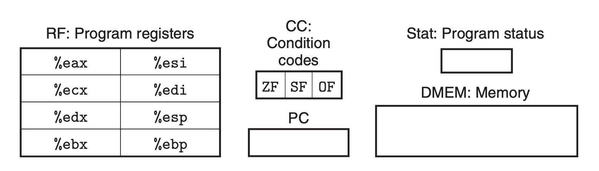

### 4.1.2 Y86 Instructions
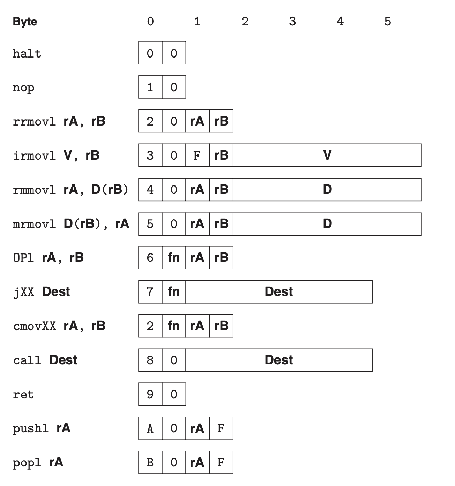
* The IA32 movl instruction is split into four different instructions: irmovl, rrmovl, mrmovl, and rmmovl, explicitly indicating the form of the source and destination. The source is either immediate (i), register (r), or memory (m).
* There are four integer operation instructions as OPl: addl, subl, andl, and xorl. They operate only on register data.
* The seven jump instructions: mp, jle, jl, je, jne, jge, and jg.
* There are six conditional move instructions: cmovle, cmovl, cmove, cmovne, cmovge, and cmovg.
* The call instruction pushes the return address on the stack and jumps to the destination address. The ret instruction returns from such a call.
* The pushl and popl instructions implement push and pop, just as they do in IA32.
* The halt instruction stops instruction execution. IA32 has a comparable instruction, called hlt.

### 4.1.3 Instruction Encoding
* Each instruction requires between 1 and 6 bytes, depending on which fields are required. Every instruction has an initial byte identifying the instruction type.
* This byte is split into two 4-bit parts: the high-order, or code, part, and the low-order, or function, part.

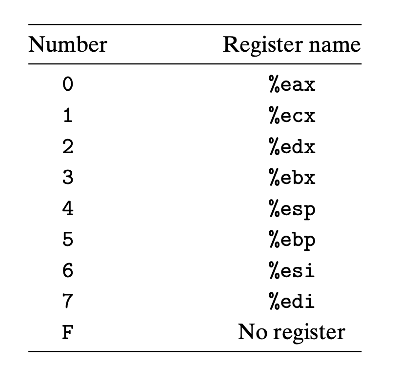


* Each of the eight program registers has an associated register identifier (ID) ranging from 0 to 7. The numbering of registers in Y86 matches what is used in IA32.
* The program registers are stored within the CPU in a register file, a small random-access memory where the register IDs serve as addresses.

* One important property of any instruction set is that the byte encodings must have a unique interpretation.
* Some instructions are just 1 byte long, but those that require operands have longer encodings.
    *  There can be an additional **register specifier byte**, specifying either one or two registers. These register fields are called rA and rB.
    * Instructions that have no register operands, such as branches and call, do not have a register specifier byte.
    * Those that require just one register operand (irmovl, pushl, and popl) have the other register specifier set to value 0xF.
    * Some instructions require an additional 4-byte constant word. This word can serve as the immediate data for irmovl, the displacement for rmmovl and mrmovl address specifiers, and the destination of branches and calls.

### 4.1.4 Y86 Exceptions
Value | Name | Meaning
--- | --- | ---
1 | AOK | Normal operation
2 | HLT | halt instruction encountered
3 | ADR | invalied address encontered
4 | INS | invalied instruction encountered

* status code **Stat** describing the overall state of the executing program.

### 4.1.5 Y86 Programs

## 4.2 Logic Design and the Hardware Control Language HCL
* Three major components are required to implement a digital system:
    * combinational logic to **compute** functions on the bits
    * memory elements to **store** bits
    * clock signals to **regulate** the updating of the memory elements

### 4.2.1 Logic Gates
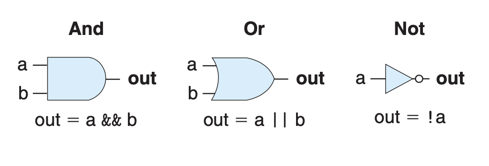
* Logic gates operate on single-bit quantities, not entire words.
* Logic gates are always active. If some input to a gate changes, then within some small amount of time, the output will change accordingly.

### 4.2.2 Combinational Circuits and HCL Boolean Expressions
* Since a combinational circuit consists of a series of logic gates, it has the property that the outputs continually respond to changes in the inputs. If some input to the circuit changes, then after some delay, the outputs will change accordingly. In contrast, a C expression is only evaluated when it is encountered during the execution of a program.
* Logical expressions in C allow arguments to be arbitrary integers, interpreting 0 as false and anything else as true. In contrast, our logic gates only operate over the bit values 0 and 1.
* Logical expressions in C have the property that they might only be partially evaluated. If the outcome of an And or Or operation can be determined by just evaluating the first argument, then the second argument will not be evaluated. In contrast, combinational logic does not have any **partial evaluation rules**.

### 4.2.3 Word-Level Combinational Circuits and HCL Integer Expressions


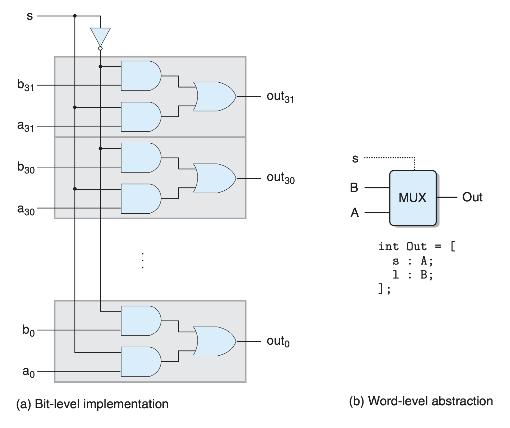

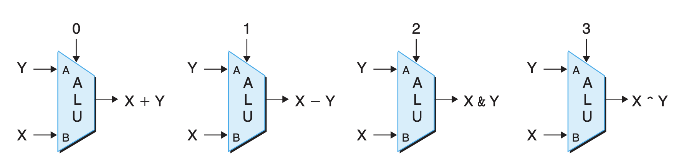
* **Arithmetic/logic unit (ALU)** circuit has three inputs: two data inputs labeled A and B, and a control input. Depending on the setting of the control input, the circuit will perform different arithmetic or logical operations on the data inputs.

### 4.2.4 Set Membership

### 4.2.5 Memory and Clocking
* Combinational circuits, by their very nature, do not store any information. Instead, they simply react to the signals at their inputs, generating outputs equal to some function of the inputs. To create sequential circuits, that is, systems that have state and perform computations on that state, we must introduce devices that store information represented as bits. Our storage devices are all controlled by a single clock, a periodic signal that determines when new values are to be loaded into the devices.
* We consider two classes of memory devices:
    * **Clocked registers (or simply registers)** store individual bits or words. The clock signal controls the loading of the register with the value at its input.
    * **Random-access memories (or simply memories)** store multiple words, using an address to select which word should be read or written. Examples of random-access memories include
        * the virtual memory system of a processor, where a combination of hardware and operating system software make it appear to a processor that it can access any word within a large address space
        * the register file, where register identifiers serve as the addresses. In an IA32 or Y86 processor, the register file holds the eight program registers (%eax, %ecx, etc.).
* As we can see, the word “register” means two slightly different things when speaking of hardware versus machine-language programming.
    * **Hardware registers**: In hardware, a register is directly connected to the rest of the circuit by its input and output wires.
    * **Promgram register**: In machine-level programming, the registers represent a small collection of addressable words in the CPU, where the addresses consist of register IDs.

* Hardware Register Operation
    * 
    * For most of the time, the register remains in a fixed state (shown as x), generating an output equal to its current state.
    * Signals propagate through the combinational logic preceding the register, creating a new value for the register input (shown as y), but the register output remains fixed as long as the clock is low.
    * As the clock rises, the input signals are loaded into the register as its next state (y), and this becomes the new register output until the next rising clock edge.
    * A key point is that the registers serve as barriers between the combinational logic in different parts of the circuit. Values only propagate from a register input to its output once every clock cycle at the rising clock edge.

* Register File
    * 
    * This register file has two read ports, named A and B, and one write port, named W.
    * Such a multiported random-access memory allows multiple read and write operations to take place simultaneou
    * In the register file diagrammed, the circuit can read the values of two program registers and update the state of a third.
    * Each port has an address input, indicating which program register should be selected, and a data output or input giving a value for that program register. The addresses are register identifiers.
    * The two read ports have address inputs srcA and srcB (short for “source A” and “source B”) and data outputs valA and valB (short for “value A” and “value B”).
    * The register file is not a combinational circuit, since it has internal storage.
    * The writing of words to the register file is controlled by the clock signal in a manner similar to the loading of values into a clocked register.
    * What happens if we attempt to read and write the same register simultaneously?”
        * If we update a register while using the same register ID on the read port, we would observe a transition from the old value to the new.

* Data Memory
    * 
    * This memory has a single address input, a data input for writing, and a data output for reading.
    * Like the register file, **reading** from our memory operates in a manner similar to combinational logic: If we provide an address on the address input and set the write control signal to 0, then after some delay, the value stored at that address will appear on data out. The error signal will be set to 1 if the address is out of range and to 0 otherwise.
    * **Writing** to the memory is controlled by the clock: we set address to the desired address, data in to the desired value, and write to 1. When we then operate the clock, the specified location in the memory will be updated, as long as the address is valid.
    * As with the read operation, the error signal will be set to 1 if the address is invalid. This signal is generated by combinational logic, since the required bounds checking is purely a function of the address input and does not involve saving any state.

## 4.3 Sequential Y86 Implementations
### 4.3.1 Organizing Processing into Stages
* **Fetch**: The fetch stage reads the bytes of an instruction from memory, using the program counter (PC) as the memory address.
    * From the instruction it extracts the two 4-bit portions of the instruction specifier byte, referred to as `icode` (the instruction code) and `ifun` (the instruction function).
    * It possibly fetches a register specifier byte, giving one or both of the register operand specifiers `rA` and `rB`.
    * It also possibly fetches a 4-byte constant word `valC`. It computes `valP` to be the address of the instruction following the current one in sequential order. That is, valP equals the value of the PC plus the length of the fetched instruction.
* **Decode**: The instruction is decoded to determine the operation to perform and the source/destination registers.
    * The decode stage reads up to two operands from the register file(wrote in previous WB stage), giving values ``valA`` and/or ``valB``. Typically, it reads the registers designated by instruction fields rA and rB, but for some instructions it reads register %esp.
* **Execute**: In the execute stage, the arithmetic/logic unit (ALU) either performs the operation specified by the instruction (according to the value of ifun), `computes the effective address` of a memory reference, or `increments or decrements the stack pointer`. We refer to the resulting value as `valE`. The `condition codes` are possibly set. For a jump instruction, the stage tests the condition codes and branch condition (given by ifun) to see whether or not the branch should be taken.
* **Memory**: The memory stage may write data to memory, or it may read data from memory. We refer to the value read as `valM`.
* **Write back**: The write-back stage writes up to two results to the register file.
* **PC update**: The PC is set to the address of the next instruction.

* opl, rrmovl, irmolv implementation
    * 
* rmmovl, mrmovl implementation
    * 
* push, pop implementation
    * 
* jmp, call, ret implementation
    * 
    * 

### 4.3.2 SEQ Hardware Structure


### 4.3.3 SEQ Timing
* Our implementation of SEQ consists of combinational logic and two forms of memory devices:
    * clocked registers (the program counter and condition code register)
    * random-access memories (the register file, the instruction memory, and the data memory)
    * combinational logic does not require any sequencing or control—values propagate through a network of logic gates whenever the inputs change.

* We are left with just four hardware units that require an explicit control over their sequencing—the program counter, the condition code register, the data memory, and the register file. These are controlled via a single clock signal that triggers the loading of new values into the registers and the writing of values to the random-access memories.
    * The `program counter` is loaded with a new instruction address every clock cycle.
    * The `condition code register` is loaded only when an integer operation instruction is executed
    * The `data memory` is written only when an rmmovl, pushl, or call instruction is executed
    * The two write ports of the `register file` allow two program registers to be updated on every cycle, but we can use the special register ID 0xF as a port address to indicate that no write should be performed for this port.
* This clocking of the registers and memories is all that is required to control the sequencing of activities in our processor. Our hardware achieves the same effect as would a sequential execution of the assignments shown in the tables of Figures 4.18 through 4.21, even though all of the state updates actually occur simultaneously and only as the clock rises to start the next cycle. This equivalence holds because of the nature of the Y86 instruction set, and because we have organized the computations in such a way that our design obeys the following principle:

> The processor never needs to read back the state updated by an instruction in order to complete the processing of this instruction.

* E.g., we can see that some instructions (the integer operations) set the condition codes, and some instructions (the jump instructions) read these condition codes, but no instruction must both set and then read the condition codes. Even though the condition codes are not set until the clock rises to begin the next clock cycle, they will be updated before any instruction attempts to read them.

* 
    * We assume the processing starts with the condition codes, listed in the order ZF, SF, and OF, set to 100.
    * At the beginning of clock cycle 3 (point 1), the state elements hold the state as updated by the second irmovl instruction (line 2 of the listing), shown in light gray. The combinational logic is shown in white, indicating that it has not yet had time to react to the changed state.
    * The clock cycle begins with address 0x00c loaded into the program counter. This causes the addl instruction (line 3 of the listing), shown in blue, to be fetched and processed. Values flow through the combinational logic, including the reading of the random-access memories.
    * By the end of the cycle (point 2), the combinational logic has generated new values (000) for the condition codes, an update for program register %ebx, and a new value (0x00e) for the program counter.
    * At this point, the combinational logic has been updated according to the addl instruction (shown in blue), but the state still holds the values set by the second irmovl instruction (shown in light gray).
    * As the clock rises to begin cycle 4 (point 3), the updates to the program counter, the register file, and the condition code register occur, and so we show these in blue, but the combinational logic has not yet reacted to these changes, and so we show this in white.
    * In this cycle, the je instruction (line 4 in the listing), shown in dark gray, is fetched and executed. Since condition code ZF is 0, the branch is not taken.
    * By the end of the cycle (point 4), a new value of 0x013 has been generated for the program counter. The combinational logic has been updated according to the je instruction (shown in dark gray), but the state still holds the values set by the addl instruction (shown in blue) until the next cycle begins.
* Every time the clock transitions from low to high, the processor begins executing a new instruction.

### 4.3.4 SEQ Stage Implementations
* 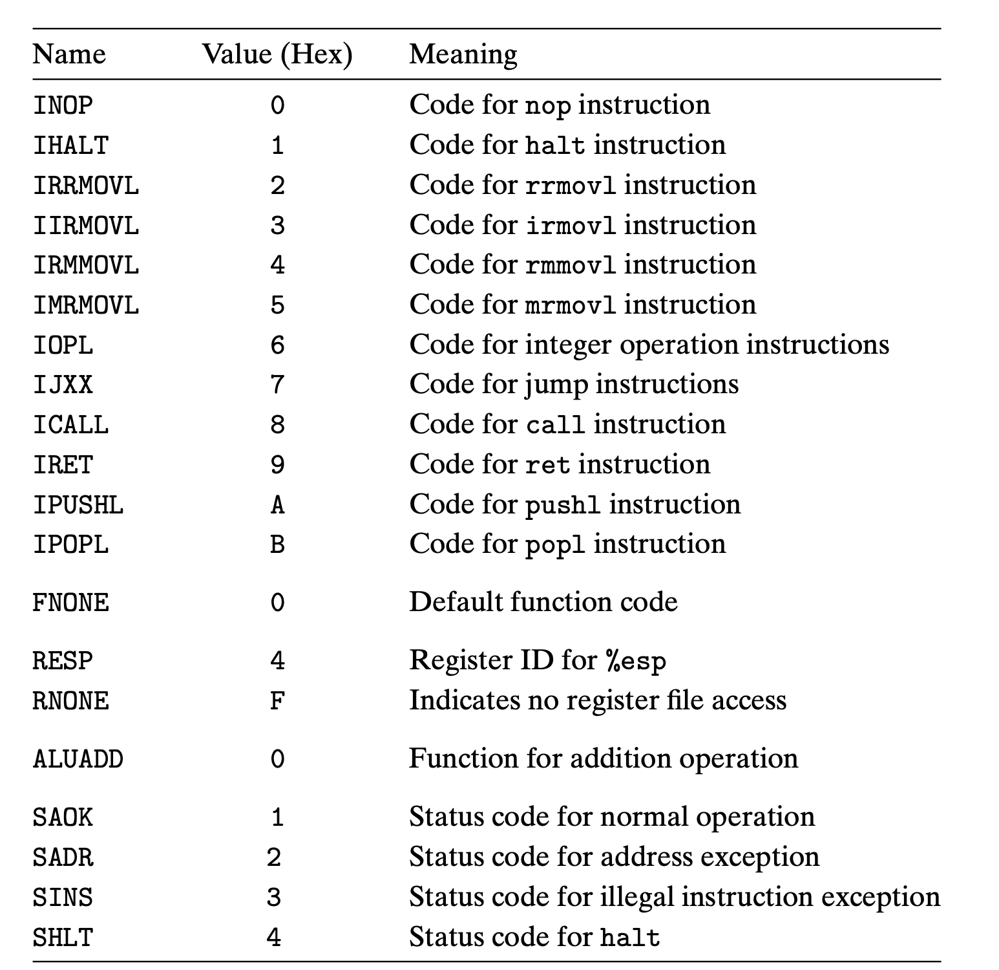

* Fetch Stage
    * 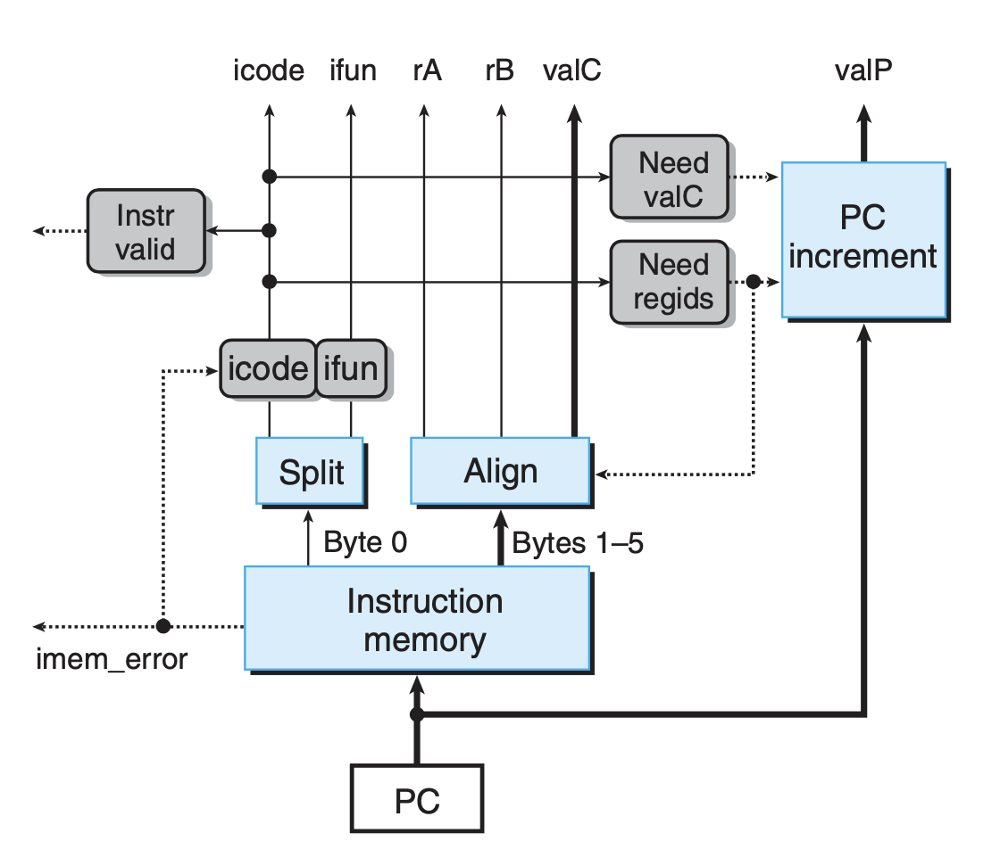
    * Code
        ```
        bool need_regids = icode in {
            IRRMOVL, IOPL, IPUSHL, IPOPL,
            IIRMOVL, IRMMOVL, IMRMOVL };
        ```
    * This unit reads 6 bytes from memory at a time, using the PC as the address of the first byte (byte 0).
* Decode and Write-Back Stages
    * 
    * Code
        ```c++
        # Code from SEQ
        int srcA = [
            icode in { IRRMOVL, IRMMOVL, IOPL, IPUSHL  } : rA;
            icode in { IPOPL, IRET } : RESP;
            1 : RNONE; # Don’t need register
        ];

        int srcB = [
            icode in { IOPL, IRMMOVL, IMRMOVL  } : rB;
            icode in { IPUSHL, IPOPL, ICALL, IRET } : RESP;
            1 : RNONE;  # Don’t need register
        ];

        int dstE = [
            icode in { IRRMOVL } : rB;
            icode in { IIRMOVL, IOPL} : rB;
            icode in { IPUSHL, IPOPL, ICALL, IRET } : RESP;
            1 : RNONE;  # Don’t write any register
        ];

        int dstM = [
            icode in { IMRMOVL, IPOPL } : rA;
            1 : RNONE;  # Don’t write any register
        ];
        ```
    * The register file has four ports. It supports up to two simultaneous reads (on ports A and B) and two simultaneous writes (on ports E and M). Each port has both an address connection and a data connection, where the address connection is a register ID, and the data connection is a set of 32 wires serving as either an output word (for a read port) or an input word (for a write port) of the register file.
* Execute Stage
    * 
    * Code
        ```
        int aluA = [
            icode in { IRRMOVL, IOPL } : valA;
            icode in { IIRMOVL, IRMMOVL, IMRMOVL } : valC;
            icode in { ICALL, IPUSHL } : -4;
            icode in { IRET, IPOPL } : 4;
            # Other instructions don’t need ALU
        ];

        int aluB = [
            icode in { IRMMOVL, IMRMOVL, IOPL, ICALL,
        ];

        int alufun = [
            icode == IOPL : ifun;
            1 : ALUADD;
        ];

        bool set_cc = icode in { IOPL };
        ```
* Memory Stage
    * 
    *   Code
        ```
        int mem_addr = [
            icode in { IRMMOVL, IPUSHL, ICALL, IMRMOVL } : valE;
            icode in { IPOPL, IRET } : valA;
            # Other instructions don’t need address
        ];

        int mem_data = [
            # Value from register
            icode in { IRMMOVL, IPUSHL } : valA;
            # Return PC
            icode == ICALL : valP;
            # Default: Don’t write anything
        ];

        bool mem_read = icode in { IMRMOVL, IPOPL, IRET };

        bool mem_write = icode in { IRMMOVL, IPUSHL, ICALL };

        ## Determine instruction status
        int Stat = [
            imem_error || dmem_error : SADR;
            !instr_valid: SINS;
            icode == IHALT : SHLT;
            1 : SAOK;
        ];
        ```
* PC Update
    * 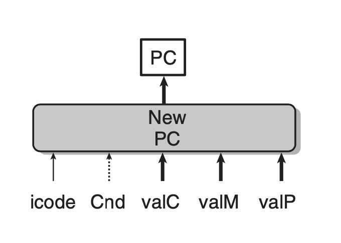
    * Code
        ```
        int new_pc = [
            # Call.  Use instruction constant
            icode == ICALL : valC;
            # Taken branch.  Use instruction constant
            icode == IJXX && Cnd : valC;
            # Completion of RET instruction.  Use value from stack
            icode == IRET : valM;
            # Default: Use incremented PC
            1 : valP;
        ];
        ```


## 4.4 General Principles of Pipelining
* A key feature of pipelining is that it increases the throughput of the system, but it may also slightly increase the latency.
### 4.4.1 Computational Pipelines

### 4.4.2 A Detailed Look at Pipeline Operation


* Just before the rising clock at time 240 (point 1), the values computed in stage A for instruction I2 have reached the input of the first pipeline register, but its state and output remain set to those computed during stage A for instruction I1.
* The values computed in stage B for instruction I1 have reached the input of the second pipeline register.
* As the clock rises, these inputs are loaded into the pipeline registers, becoming the register outputs (point 2). In addition, the input to stage A is set to initiate the computation of instruction I3. The signals then propagate through the combinational logic for the different stages (point 3).
* As the curved wavefronts in the diagram at point 3 suggest, signals can propagate through different sections at different rates. Before time 360, the result values reach the inputs of the pipeline registers (point 4).
* When the clock rises at time 360, each of the instructions will have progressed through one pipeline stage.

### 4.4.3 Limitations of Pipelining
* 1. Nonuniform Partitioning
    * 
    * The system throughput is limited by the speed of the slowest stage.
* 2. Diminishing Returns of Deep Pipelining
    * 
    * In this example, we have divided the computation into six stages, in doubling the number of pipeline stages, we improve the performance by a factor of 14.29/8.33 = 1.71. Even though we have cut the time required for each computation block by a factor of 2, we do not get a doubling of the throughput, due to the delay through the pipeline registers.
    * This delay becomes a limiting factor in the throughput of the pipeline. In our new design, this delay consumes 28.6% of the total clock period.
    * Modern processors employ very deep (15 or more stages) pipelines in an attempt to maximize the processor clock rate. The processor architects divide the instruction execution into a large number of very simple steps so that each stage can have a very small delay.

### 4.4.4 Pipelining a System with Feedback
* 3. Pipeline Limistations Logic Dependencies
    * 
    * It would be unacceptable to alter the system behavior as occurred in the example of Figure 4.38. Somehow we must deal with the data and control dependencies between instructions so that the resulting behavior matches the model defined by the ISA.

## 4.5 Pipelined Y86 Implementations

The pipeline final implementation:


### 4.5.1 SEQ+: Rearranging the Computation Stages
* As a transitional step toward a pipelined design, we must slightly rearrange the order of the five stages in SEQ so that the PC update stage comes at the beginning of the clock cycle, rather than at the end.
* 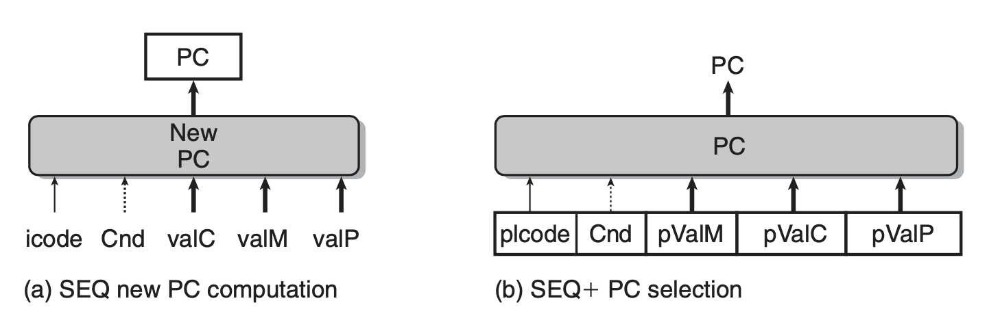
    * With SEQ (Figure 4.39(a)), the PC computation takes place at the end of the clock cycle, computing the new value for the PC register based on the values of signals computed during the current clock cycle.
    * With SEQ+ (Figure 4.39(b)), we create state registers to hold the signals computed during an instruction. Then, as a new clock cycle begins, the values propagate through the exact same logic to compute the PC for the now-current instruction. We label the registers “pIcode,” “pCnd,” and so on, to indicate that on any given cycle, they hold the control signals generated during the previous cycle.
* 
* One curious feature of SEQ+ is that there is no hardware register storing the program counter. Instead, the PC is computed dynamically based on some state information stored from the previous instruction. This is a small illustration of the fact that we can implement a processor in a way that differs from the conceptual model implied by the ISA, as long as the processor correctly executes arbitrary machinelanguage programs.

### 4.5.2 Inserting Pipeline Registers
* PIPE(final pipeline see 4.5.7)
    
* The pipeline registers are labeled as follows:
    * **F** holds a predicted value of the program counter, as will be discussed shortly.
    * **D** sits between the fetch and decode stages. It holds information about the most recently fetched instruction for processing by the decode stage.
    * **E** sits between the decode and execute stages. It holds information about the most recently decoded instruction and the values read from the register file for processing by the execute stage.
    * **M** sits between the execute and memory stages. It holds the results of the most recently executed instruction for processing by the memory stage. It also holds information about branch conditions and branch targets for processing conditional jumps.
    * **W** sits between the memory stage and the feedback paths that supply the computed results to the register file for writing and the return address to the PC selection logic when completing a ret instruction.
* Example of instruction flow through pipeline.
    * 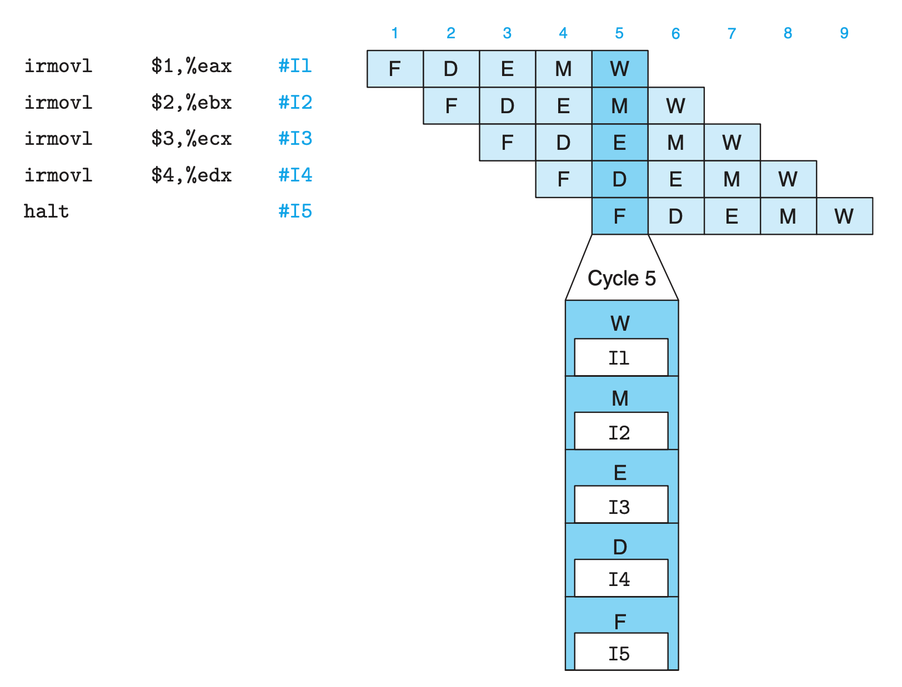

### 4.5.3 Rearranging and Relabeling Signals
* In the detailed structure of PIPE–, there are four white boxes labeled “stat” that hold the status codes for four different instructions.
* We adopt a naming scheme where a signal stored in a pipeline register can be uniquely identified by prefixing its name with that of the pipe register written in uppercase. E.g., D_stat, E_stat, M_stat, and W_stat.
* **M** refers pipeline registers, **M_stat** refers to the status code field of pipeline register M, **m_stat** refers to the status signal generated in the memory stage by a control logic block.
* **Select A** block generates the value valA for the pipeline register E by choosing either valP from pipeline register D or the value read from the A port of the register file. This block is included to reduce the amount of state that must be carried forward to pipeline registers E and M.
    * Only the call requires valP in the memory stage.
    * Only the jump instructions require the value of valP in the execute stage (in the event the jump is not taken).
    * None of these instructions requires a value read from the register file.
    * Therefore, we can reduce the amount of pipeline register state by merging these two signals and carrying them through the pipeline as a single signal valA.
    * In hardware design, it is common to carefully identify how signals get used and then reduce the amount of register state and wiring by merging signals such as these.

### 4.5.4 Next PC Prediction
* If the fetched instruction is a conditional branch, we will not know whether or not the branch should be taken until several cycles later, after the instruction has passed through the execute stage.
* If the fetched instruction is a ret, we cannot determine the return location until the instruction has passed through the memory stage.
* With the exception of conditional jump instructions and ret, we can determine the address of the next instruction based on information computed during the fetch stage.
    * For call and jmp (unconditional jump), it will be valC, the constant word in the instruction, while for all others it will be valP, the address of the next instruction.
* Predicting
    * For most instruction types, our prediction will be completely reliable.
    * For conditional jumps, we can predict either that a jump will be taken, so that the new PC value would be valC, or we can predict that it will not be taken, so that the new PC value would be valP. In either case, we must somehow deal with the case where our prediction was incorrect and therefore we have fetched and partially executed the wrong instructions.
* Return address prediction with a stack
    * Procedure calls and returns occur in matched pairs. Most of the time that a procedure is called, it returns to the instruction following the call.
    * This property is exploited in high-performance processors by including a hardware stack within the instruction fetch unit that holds the return address generated by procedure call instructions.
    * Every time a procedure call instruction is executed, its return address is pushed onto the stack. When a return instruction is fetched, the top value is popped from this stack and used as the predicted return address.
    * A mechanism must be provided to recover when the prediction was incorrect.
* We will return to the handling of jump and return instructions when we complete the pipeline control logic in Section 4.5.11.

### 4.5.5 Pipeline Hazards

| **Hazard Type** | **Cause** | **Solution** |
--- | --- | ---
| **Structural** | Resource conflicts (e.g., shared memory or ALU). | Add more resources, stall pipeline.
| **Data (RAW/WAR/WAW)** | Instruction dependencies (e.g., one instruction depends on another). | Use forwarding, stalls, or instruction reordering.
| **Control** | Branches or jumps disrupt the fetch stage. | Use branch prediction, delayed branching, or flushing.

* Dependencies can take two forms:
    * data dependencies, where the results computed by one instruction are used as the data for a following instruction
    * control dependencies, where one instruction determines the location of the following instruction, such as when executing a jump, call, or return.
* When such dependencies have the potential to cause an erroneous computation by the pipeline, they are called hazards, **data hazards** or **control hazards**.

* Example:
    * 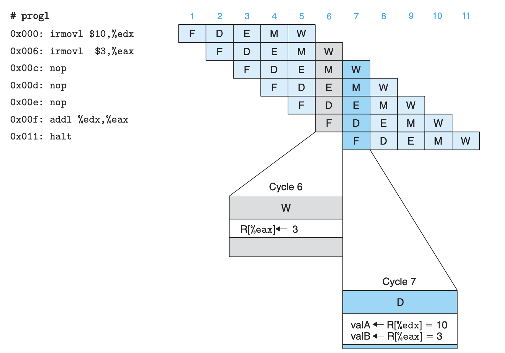
        * After the start of cycle 7, both of the irmovl instructions have passed through the write-back stage, and so the register file holds the updated values of %edx and %eax.
        * As the addl instruction passes through the decode stage during cycle 7, it will therefore read the correct values for its source operands. The data dependencies between the two irmovl instructions and the addl instruction have not created data hazards in this example.
        * Prog1 will flow through our pipeline and get the correct results, because the three nop instructions create a delay between instructions with data dependencies
    * 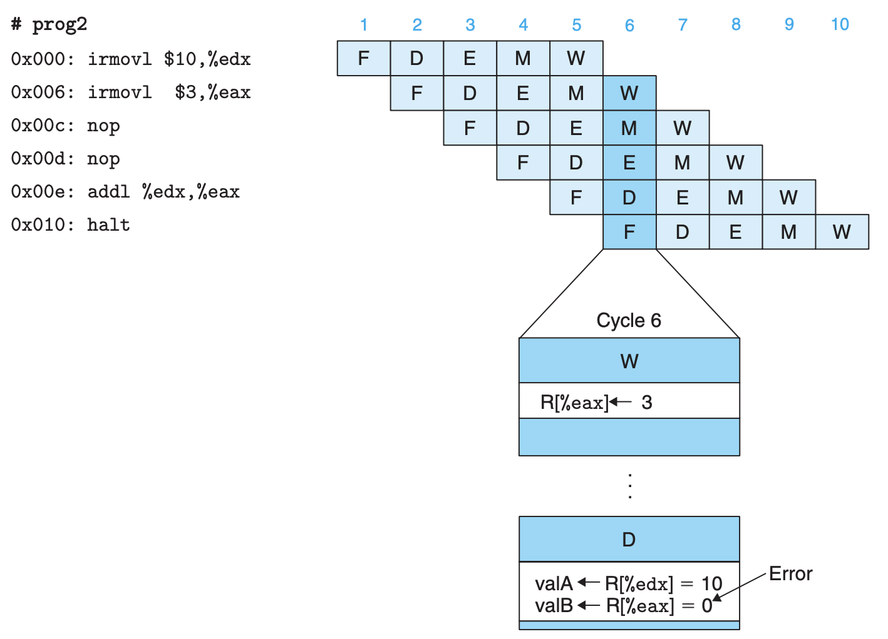
        * In this case, the crucial step occurs in cycle 6, when the addl instruction reads its operands from the register file.
        * The first irmovl instruction has passed through the write-back stage, and so program register %edx has been updated in the register file.
        * The second irmovl instruction is in the writeback stage during this cycle, and so the write to program register %eax only occurs at the start of cycle 7 as the clock rises.
        * As a result, the incorrect value zero would be read for register %eax (recall that we assume all registers are initially 0), since the pending write for this register has not yet occurred.
        * Clearly we will have to adapt our pipeline to handle this hazard properly.
    * 
        * We must examine the behavior of the pipeline during cycle 5 as the addl instruction passes through the decode stage.
        * Unfortunately, the pending write to register %edx is still in the write-back stage, and the pending write to %eax is still in the memory stage.
        * Therefore, the addl instruction would get the incorrect values for both operands.
    * 
        * We must examine the behavior of the pipeline during cycle 4 as the addl instruction passes through the decode stage.
        * Unfortunately, the pending write to register %edx is still in the memory stage, and the new value for %eax is just being computed in the execute stage.
        * Therefore, the addl instruction would get the incorrect values for both operands.
* Enumerating classes of data hazards
    * Hazards can potentially occur when one instruction updates part of the program state that will be read by a later instruction.
    * **Program registers**: These are the hazards we have already identified. They arise because the register file is read in one stage and written in another, leading to possible unintended interactions between different instructions.
    * **Program counter**: Conflicts between updating and reading the program counter give rise to control hazards. No hazard arises when our fetch-stage logic correctly predicts the new value of the program counter before fetching the next instruction. Mispredicted branches and ret instructions require special handling, as will be discussed in Section 4.5.11.
    * **Memory**: Writes and reads of the data memory both occur in the memory stage. By the time an instruction reading memory reaches this stage, any preceding instructions writing memory will have already done so. On the other hand, there can be interference between instructions writing data in the memory stage and the reading of instructions in the fetch stage, since the instruction and data memories reference a single address space. This can only happen with programs containing self-modifying code, where instructions write to a portion of memory from which instructions are later fetched. Some systems have complex mechanisms to detect and avoid such hazards, while others simply mandate that programs should not use selfmodifying code. We will assume for simplicity that programs do not modify themselves, and therefore we do not need to take special measures to update the instruction memory based on updates to the data memory during program execution.
    * **Condition code register**: These are written by integeroperations in the execute stage.They are read by conditional moves in the execute stage and by conditional jumps in the memory stage. By the time a conditional move or jump reaches the execute stage, any preceding integer operation will have already completed this stage. No hazards can arise.
    * **Status register**: The program status can be affected by instructions as they flow through the pipeline. Our mechanism of associating a status code with each instruction in the pipeline enables the processor to come to an orderly halt when an exception occurs, as will be discussed in Section 4.5.9.

### 4.5.6 Avoiding Data Hazards by Stalling
* **Stalling**, where the processor holds back one or more instructions in the pipeline until the hazard condition no longer holds.
* Our processor can avoid data hazards by holding back an instruction in the decode stage until the instructions generating its source operands have passed through the write-back stage. The details of this mechanism will be discussed in Section 4.5.11.
* 
    * After decoding the addl instruction in cycle 6, the stall control logic detects a data hazard due to the pending write to register %eax in the write-back stage. It injects a bubble into execute stage and repeats the decoding of the addl instruction in cycle 7. In effect, the machine has dynamically inserted a nop instruction, giving a flow similar to that shown for prog1.
* 
* This mechanism can be implemented fairly easily (see Problem 4.51), but the resulting performance is not very good. There are numerous cases in which one instruction updates a register and a closely following instruction uses the same register. This will cause the pipeline to stall for up to three cycles, reducing the overall throughput significantly.

### 4.5.7 Avoiding Data Hazards by Forwarding
* Our design for PIPE– reads source operands from the register file in the decode stage, but there can also be a pending write to one of these source registers in the write-back stage. Rather than stalling until the write has completed, it can simply pass the value that is about to be written to pipeline register E as the source operand.
* 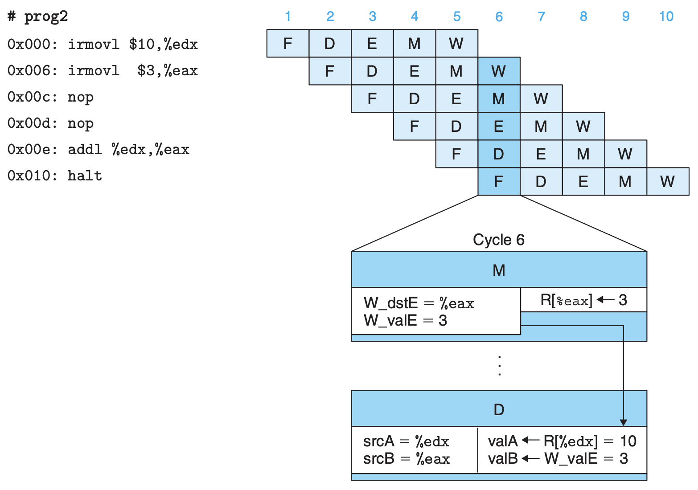
    * In cycle 6, the decode-stage logic detects that register %eax is the source register for operand valB, and that there is also a pending write to %eax on write port E. It can therefore avoid stalling by simply using the data word supplied to port E (signal W_valE) as the value for operand valB. This technique of passing a result value directly from one pipeline stage to an earlier one is commonly known as data **forwarding**.
* 
    *  In cycle 5, the decodestage logic detects a pending write to register %edx in the write-back stage and to register %eax in the memory stage. It uses these as the values for valA and valB rather than the values read from the register file.
* 
    * In cycle 4, the decodestage logic detects a pending write to register %edx in the memory stage. It also detects that a new value is being computed for register %eax in the execute stage. It uses these as the values for valA and valB rather than the values read from the register file.
* Data forwarding requires adding additional data connections and control logic to the basic hardware structure.
* Forwarding can also be used:
    * with values generated by the ALU and destined for write port E.
    * with values read from the memory and destined for write port M.
    * From the memory stage, we can forward the value that has just been read from the data memory (signal m_valM).
    * From the write-back stage, we can forward the pending write to port M (signal W_valM).
    * This gives a total of five different forwarding sources (e_valE, m_valM, M_valE, W_valM, and W_valE) and two different forwarding destinations (valA and valB).
* Decode-stage logic can determine whether to use a value from the register file or to use a forwarded value.
* Pipeline Final Implementation
    

### 4.5.8 Load/Use Data Hazards
* One class of data hazards cannot be handled purely by forwarding, because memory reads occur late in the pipeline.
* 
    * The addl instruction requires the value of the register in cycle 7, but it is not generated by the mrmovl instruction until cycle 8. In order to “forward” from the mrmovl to the addl, the forwarding logic would have to make the value go backward in time! But this is clearly impossible,
    * We can avoid a load/use data hazard with a combination of stalling and forwarding. This requires modifications of the control logic, but it can use existing bypass paths.
* 
    * By stalling the addl instruction for one cycle in the decode stage, the value for valB can be forwarded from the mrmovl instruction in the memory stage to the addl instruction in the decode stage.
* This use of a stall to handle a load/use hazard is called a **load interlock**. Load interlocks combined with forwarding suffice to handle all possible forms of data hazards. Since only load interlocks reduce the pipeline throughput, we can nearly achieve our throughput goal of issuing one new instruction on every clock cycle.

### 4.5.9 Exception Handling
* Exceptions can be generated either internally, by the executing program, or externally, by some outside signal.
* Three different internally generated exceptions:
    * a halt instruction
    * an instruction with an invalid combination of instruction and function code
    * an attempt to access an invalid address, either for instruction fetch or data read or write
*  In a pipelined system, exception handling involves several subtleties:
    * 1. it is possible to have exceptions triggered by multiple instructions **simultaneously**.
        * E.g., during one cycle of pipeline operation, we could have a halt instruction in the fetch stage, and the data memory could report an out-of-bounds data address for the instruction in the memory stage.
        * We must determine which of these exceptions the processor should report to the operating system.
        * The basic rule is to put priority on the exception triggered by the instruction that is furthest along the pipeline.
    * 2. subtlety occurs when an instruction is first fetched and begins execution, causes an exception, and later is canceled due to a **mispredicted** branch.
    * 3. arises because a pipelined processor updates different parts of the system state in different stages. It is possible for an instruction following one causing an exception to **alter** some part of the state before the excepting instruction completes.
        * E.g.,
            * Code
                ```
                irmovl  $1,     %eax
                xorl    %esp,   %esp    # set stack pointer to 0 and CC to 100
                pushl   %eax            # attemp to write to 0xffffffc
                addl    %eax,   %eax    # (shold not be executed) would set CC to 000
                ```
            * we assume that user programs are not allowed to access addresses greater than 0xc0000000 (as is the case for 32-bit versions of Linux)
            * The pushl instruction causes an address exception, because decrementing the stack pointer causes it to wrap around to 0xfffffffc. This exception is detected in the memory stage. On the same cycle, the addl instruction is in the execute stage, and it will cause the condition codes to be set to new values.
            * This would violate our requirement that none of the instructions following the excepting instruction should have had any effect on the system state.
* In general, we can both correctly choose among the different exceptions and avoid raising exceptions for instructions that are fetched due to mispredicted branches by **merging the exception-handling logic into the pipeline structure**. That is the motivation for us to include a status code Stat in each of our pipeline registers
* If an instruction generates an exception at some stage in its processing, the status field is set to indicate the nature of the exception. The exception status propagates through the pipeline with the rest of the information for that instruction, until it reaches the write-back stage. At this point, the pipeline control logic detects the occurrence of the exception and stops execution.
* To avoid having any updating of the programmer-visible state by instructions beyond the excepting instruction, the pipeline control logic must disable any updating of the condition code register or the data memory when an instruction in the memory or write-back stages has caused an exception.
* How method (merging the exception-handling logic into the pipeline structure) deals with the above subtleties:
    * When an exception occurs in one or more stages of a pipeline, the information is simply stored in the status fields of the pipeline registers.
    * (Third subtlety) The event has no effect on the flow of instructions in the pipeline until an excepting instruction reaches the final pipeline stage, except to disable any updating of the programmer-visible state (the condition code register and the memory) by later instructions in the pipeline.
    * (First subtlety) Since instructions reach the write-back stage in the same order as they would be executed in a nonpipelined processor, we are guaranteed that the first instruction encountering an exception will arrive first in the write-back stage, at which point program execution can stop and the status code in pipeline register W can be recorded as the program status.
    * (Second subtlety) If some instruction is fetched but later canceled, any exception status information about the instruction gets canceled as well. No instruction following one that causes an exception can alter the programmer-visible state.
    * The simple rule of carrying the exception status together with all other information about an instruction through the pipeline provides a simple and reliable mechanism for handling exceptions.

### 4.5.10 PIPE Stage Implementations
* PC Selection and Fetch Stage
    * 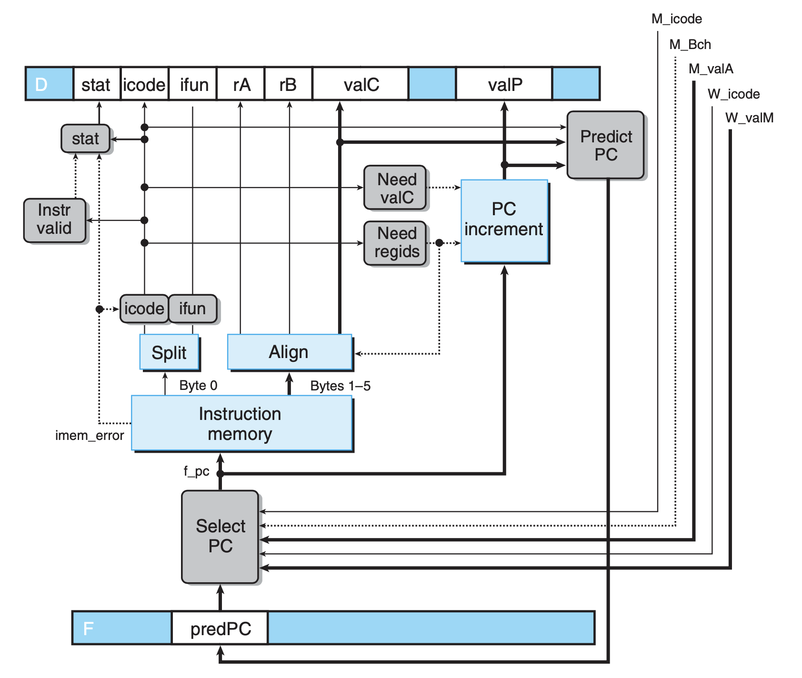
    * Code
        ```
        int f_pc = [
            M_icode == IJXX && !M_Cnd : M_valA; # Mispredicted branch.  Fetch at incremented PC
            W_icode == IRET : W_valM;           # Completion of RET instruction.
            1 : F_predPC;                       # Default: Use predicted value of PC
        ];

        int f_predPC = [
            f_icode in { IJXX, ICALL } : f_valC;
            1 : f_valP;
        ];

        # Determine status code for fetched instruction
        int f_stat = [
            imem_error: SADR;
            !instr_valid : SINS;
            f_icode == IHALT : SHLT;
            1 : SAOK;
        ];
        ```
* Decode and Write-Back Stages
    * 
    * No instruction requires both valP and the value read from register port A, and so these two can be merged to form the signal valA for later stages. The block labeled “Sel+Fwd A” performs this task and also implements the forwarding logic for source operand valA.
    * The block labeled “Fwd B” implements the forwarding logic for source operand valB.
    * The register write locations are specified by the dstE and dstM signals from the write-back stage rather than from the decode stage, since it is writing the results of the instruction currently in the write-back stage.
    * There are five different forwarding sources, each with a data word and a destination register ID:
        Data word | Register ID | Source description
        --- | --- | ---
        e_valE | e_dstE | ALU output
        m_valM | M_dstM | Memory output
        M_valE | M_dstE | Pending write to port E in memory stage
        W_valM | W_dstM | Pending write to port M in write-back stage
        W_valE | W_dstE | Pending write to port E in write-back stage

    * Code
        ```
        int d_dstE = [
            D_icode in { IRRMOVL, IIRMOVL, IOPL} : D_rB;
            D_icode in { IPUSHL, IPOPL, ICALL, IRET } : RESP;
            1 : RNONE;  # Don’t write any register
        ];

        int d_valA = [
            D_icode in { ICALL, IJXX } : D_valP;    # use incremented PC
            d_srcA == e_dstE : e_valE;              # forward valE from execute
            d_srcA == M_dstM : m_valM;              # forward valM from memory
            d_srcA == M_dstE : M_valE;              # forward valE from memory
            d_srcA == W_dstM : W_valM;              # forward valM from write back
            d_srcA == W_dstE : W_valE;              # forward valE from write back
            1 : d_rvalA;                            # use value read from register file
        ];

        int d_valB = [
            d_srcB == e_dstE : e_valE;  # Forward valE from execute
            d_srcB == M_dstM : m_valM;  # Forward valM from memory
            d_srcB == M_dstE : M_valE;  # Forward valE from memory
            d_srcB == W_dstM : W_valM;  # Forward valM from write back
            d_srcB == W_dstE : W_valE;  # Forward valE from write back
            1 : d_rvalB;  # Use value read from register file
        ];

        int Stat = [
            W_stat == SBUB : SAOK;
            1 : W_stat;
        ];
        ```
    * The priority given to the five forwarding sources in the above HCL code is very important. The forwarding logic should choose the one in the most recent pipeline stage, since it represents the most recently generated value for this register.

* Execute Stage

* 

* Memory Stage

    * 

### 4.5.11 Pipeline Control Logic
* Pipeline control logic must handle the following four control cases for which other mechanisms, such as data forwarding and branch prediction, do not suffice:
    * **Processing ret**: The pipeline must stall until the ret instruction reaches the write-back stage.
    * **Load/use hazards**: The pipeline must stall for one cycle between an instruction that reads a value from memory and an instruction that uses this value.
    * **Mispredicted branches**: By the time the branch logic detects that a jump should not have been taken, several instructions at the branch target will have started down the pipeline. These instructions must be removed from the pipeline.
    * **Exceptions**: When an instruction causes an exception, we want to disable the updating of the programmer-visible state by later instructions and halt execution once the excepting instruction reaches the write-back stage.

* Desired Handling of Special Control Cases
    * Processing ret
        * Code
            ```
            0x000:    irmovl Stack,%esp     # Initialize stack pointer
            0x006:    call Proc             # procedure call
            0x00b:    irmovl $10,%edx       # return point
            0x011:    halt
            0x020: .pos 0x20
            0x020: Proc:                    # Proc:
            0x020:    ret                   # return immediately
            0x021:    rrmovl %edx,%ebx      # not executed
            0x030: .pos 0x30
            0x030: Stack:                   # Stack: Stack pointer
            ```
        * 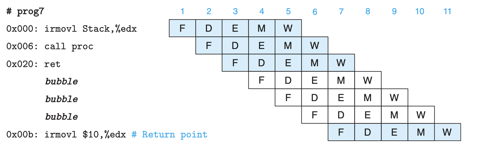

            * The pipeline should stall while the ret passes through the decode, execute, and memory stages, injecting three bubbles in the process. The PC selection logic will choose the return address as the instruction fetch address once the ret reaches the write-back stage (cycle 7).
        * 
            * The fetch stage repeatedly fetches the rrmovl instruction following the ret instruction, but then the pipeline control logic injects a bubble into the decode stage rather than allowing the rrmovl instruction to proceed. The resulting behavior is equivalent to that shown in Figure 4.60.
            * The key observation here is that there is no way to inject a bubble into the fetch stage of our pipeline. On every cycle, the fetch stage reads some instruction from the instruction memory.
* Looking at the HCL code for implementing the PC prediction logic in Section 4.5.10, we can see that for the ret instruction the new value of the PC is predicted to be valP, the address of the following instruction. In our example program, this would be 0x021, the address of the rrmovl instruction following the ret. This prediction is not correct for this example, nor would it be for most cases.

    * Load/use hazard
        * For a load/use hazard, we have already described the desired pipeline operation in Section 4.5.8.
    * The pipeline can `hold back` an instruction in the decode stage by keeping pipeline register D in a fixed state. In doing so, it should also keep pipeline register F in a fixed state, so that the next instruction will be fetched a second time.

    * Mispredicted branches
        * Code
            ```
            0x000:    xorl %eax,%eax
            0x002:    jne  target       # Not taken
            0x007:    irmovl $1, %eax   # Fall through
            0x00d:    halt
            0x00e: target:
            0x00e:    irmovl $2, %edx   # Target
            0x014:    irmovl $3, %ebx   # Target+1
            0x01a:    halt
            ```
        *  As before, the instructions are listed in the order they enter the pipeline, rather than the order they occur in the program.
    * 

        * The pipeline predicts branches will be taken and so starts fetching instructions at the jump target. Two instructions are fetched before the misprediction is detected in cycle 4 when the jump instruction flows through the execute stage. In cycle 5, the pipeline cancels the two target instructions by injecting bubbles into the decode and execute stages, and it also fetches the instruction following the jump.
    * We can simply cancel (sometimes called instruction squashing) the two misfetched instructions by `injecting bubbles` into the decode and execute instructions on the following cycle while also fetching the instruction following the jump instruction. The two misfetched instructions will then simply disappear from the pipeline.

    * Exception
        * 
            * On cycle 6, the invalid memory reference by the pushl instruction causes the updating of the condition codes to be disabled. The pipeline starts injecting bubbles into the memory stage and stalling the excepting instruction in the write-back stage.
        * Achieving excpetion handling effects is complicated by the facts that
            * exceptions are **detected** during two different stages (**fetch and memory**) of program execution
            * the **program state** is updated in three different stages (**execute, memory, and write-back**)
        * When an exception occurs, we record that information as part of the instruction’s status and continue fetching, decoding, and executing instructions as if nothing were amiss. As the excepting instruction reaches the memory stage, we take steps to prevent later instructions from modifying programmer-visible state by
            * disabling the setting of condition codes by instructions in the execute stage
            * injecting bubbles into the memory stage to disable any writing to the data memory
            * stalling the write-back stage when it has an excepting instruction, thus bringing the pipeline to a halt.

* Detecting Special Control Conditions
    * ''
        Condition | Trigger
        --- | ---
        Processing ret | IRET ∈ {D icode, E icode, M icode}
        Load/use hazard | E icode ∈ {IMRMOVL, IPOPL} && E dstM ∈ {d srcA, d srcB}
        Mispredicted branch | E icode = IJXX && !e Cnd
        Exception | m stat ∈ {SADR, SINS, SHLT} || W stat ∈ {SADR, SINS, SHLT}

        * Four different conditions require altering the pipeline flow by either stalling the pipeline or canceling partially executed instructions.
    * Detecting a `ret` instruction as it passes through the pipeline simply involves checking the instruction codes of the instructions in the **decode**, **execute**, and **memory** stages
    * Detecting a `load/use hazard` involves checking the instruction type (mrmovl or popl) of the instruction in the **execute** stage and comparing its destination register with the source registers of the instruction in the **decode** stage.
    * The pipeline control logic should detect a `mispredicted branch` while the jump instruction is in the **execute** stage, so that it can set up the conditions required to recover from the misprediction as the instruction enters the **memory** stage. When a jump instruction is in the execute stage, the signal e_Cnd indicates whether or not the jump should be taken.
    * We detect an `excepting` instruction by examining the instruction status values in the **memory** and **write-back** stages. For the memory stage, we use the signal m_stat, computed within the stage, rather than M_stat from the pipeline register. This internal signal incorporates the possibility of a data memory address error.

* Pipeline Control Mechanisms
    * Low-level mechanisms that allow the pipeline control logic to hold back an instruction in a pipeline register or to inject a bubble into the pipeline.
    * 
        * (a) Under normal conditions, the state and output of the register are set to the value at the input when the clock rises.
        * (b) When operated in stall mode, the state is held fixed at its previous value.
        * (c) When operated in bubble mode, the state is overwritten with that of a nop operation.

    * The particular pattern of ones and zeros for a pipeline register’s reset configuration depends on the set of fields in the pipeline register:
        * To inject a bubble into pipeline register D, we want the icode field to be set to the constant value INOP
        * To inject a bubble into pipeline register E, we want the icode field to be set to INOP and the dstE, dstM, srcA, and srcB fields to be set to the constant RNONE
    * Determining the reset configuration is one of the tasks for the hardware designer in designing a pipeline register.
    * The actions the different pipeline stages should take for each of the three special conditions.
        * ''
            Condition | F | D| E | M | W
            --- | --- | --- | --- | --- | ---
            Processing ret | stall | bubble | normal | normal | normal
            Load/use hazard | stall | stall | bubble | normal | normal
            Mispredicted branch | normal | bubble | bubble | normal | normal

* Combinations of Control Conditions
    * Condition | F | D| E | M | W
        --- | --- | --- | --- | --- | ---
        Processing ret | stall | bubble | normal | normal | normal
        Mispredicted branch | normal | bubble | bubble | normal | normal
        Combination | stall | bubble | bubble | normal | normal

    * Condition | F | D| E | M | W
        --- | --- | --- | --- | --- | ---
        Processing ret | stall | bubble | normal | normal | normal
        Load/use hazard | stall | stall | bubble | normal | normal
        Combination | stall | bubble + stall | bubble | normal | normal
        Desired | stall | stall | bubble | normal | normal

* Control Logic Implementation
    * 
    * Based on signals from the pipeline registers and pipeline stages, the control logic generates stall and bubble control signals for the pipeline registers, and also determines whether the condition code registers should be updated.
    ```
    bool F_stall =
        E_icode in { IMRMOVL, IPOPL } &&     # Conditions for a load/use hazard
        E_dstM in { d_srcA, d_srcB } ||
        IRET in { D_icode, E_icode, M_icode }; # Stalling at fetch while ret passes through pipeline

    bool D_stall =
        E_icode in { IMRMOVL, IPOPL } &&    # Conditions for a load/use hazard
        E_dstM in { d_srcA, d_srcB };

    bool D_bubble =
        (E_icode == IJXX && !e_Cnd) ||      # Mispredicted branch
            # Stalling at fetch while ret passes through pipeline but not condition for a load/use hazard
        !(E_icode in { IMRMOVL, IPOPL } && E_dstM in { d_srcA, d_srcB })
        && IRET in { D_icode, E_icode, M_icode };

    bool E_bubble =
        (E_icode == IJXX && !e_Cnd) ||      # Mispredicted branch
        E_icode in { IMRMOVL, IPOPL } &&    # Conditions for a load/use hazard
        E_dstM in { d_srcA, d_srcB};

    ## Should the condition codes be updated?
    bool set_cc =
        E_icode == IOPL &&
        !m_stat in { SADR, SINS, SHLT } && !W_stat in { SADR, SINS, SHLT }; # State changes only during normal operation

    # Start injecting bubbles as soon as exception passes through memory stage
    bool M_bubble = m_stat in { SADR, SINS, SHLT } || W_stat in { SADR, SINS, SHLT };

    bool W_stall = W_stat in { SADR, SINS, SHLT };
    ```

### 4.5.12 Performance Analysis

### 4.5.13 Unfinished Business

## 4.6 Summary
* Pipelining improves the throughput performance of a system by letting the different stages operate concurrently.
* In introducing this concurrency, we must be careful to provide the same program-level behavior as would a sequential execution of the program.
* We have learned several important lessons about processor design:
    * Managing complexity is a top priority.
    * We do not need to implement the ISA directly.
    * Hardware designers must be meticulous.

# 5 Optimizing Program Performance
* Writing an efficient program requires several types of activities:
    * select an appropriate set of algorithms and data structures.
    * write source code that the compiler can effectively optimize to turn into efficient executable code.
    * divide a task into portions that can be computed in parallel, on some combination of multiple cores and multiple processors.

* In approaching program development and optimization, we must consider how the code will be used and what critical factors affect it.
    * In general, programmers must make a trade-off between how easy a program is to implement and maintain, and how fast it runs.
        * At an algorithmic level, a simple insertion sort can be programmed in a matter of minutes, whereas a highly efficient sort routine may take a day or more to implement and optimize.
        * At the coding level, many low-level optimizations tend to reduce code readability and modularity, making the programs more susceptible to bugs and more difficult to modify or extend.
    * For code that will be executed repeatedly in a performance-critical environment, extensive optimization may be appropriate.
    * One challenge is to maintain some degree of elegance and readability in the code despite extensive transformations.

* Optimizing a program
    * Eliminate unnecessary work: unnecessary function calls, conditional tests, and memory references
        * To maximize the performance of a program, both the programmer and the compiler require a model of the target machine, specifying how instructions are processed and the timing characteristics of the different operations
        * Programmers must understand how these processors work to be able to tune their programs for maximum speed.
    * Exploiting the capability of processors to provide instruction-level parallelism, executing multiple instructions simultaneously.
* Studying the assembly-code representation of a program is one of the most effective means for gaining an understanding of the compiler and how the gen- erated code will run.

## 5.1 Capabilities and Limitations of Optimizing Compilers
* Different pointers aliased or not leads to one of the major optimization blockers, aspects of programs that can severely limit the opportunities for a compiler to generate optimized code.
    * Code
        ```c++
        // requires six (two reads of *xp, two reads of *yp, and two writes of *xp)
        void twiddle1(int *xp, int *yp) {
            *xp += *yp;
            *xp += *yp;
        }

        // if yp is an alies of xp, code can be optimized to twiddle2

        // requires only three memory references (read *xp, read *yp, write *xp)
        void twiddle2(int *xp, int *yp) {
            *xp += 2 * *yp;
        }
        ```
* A second optimization blocker is due to function calls.
    * Code
        ```c++
        int f();

        int fun1() {
            return f() + f() + f() + f();
        }

        int func2() {
            return 4 * f();
        }
        ```
    * Code
        ```c++
        int counter = 0;

        int f() {
            return counter++;
        }
        ```
    * Most compilers do not try to determine whether a function is free of **side effects** and hence is a candidate for optimizations such as those attempted in func2. Instead, the compiler assumes the worst case and leaves function calls intact.

## 5.2 Expressing Program Performance
* The sequencing of activities by a processor is controlled by a clock providing a regular signal of some frequency, usually expressed in gigahertz (**GHz**), billions of cycles per second.
    * E.g., “4 GHz” processor, it means that the processor clock runs at 4.0 × 109 cycles per second.

## 5.3 Program Example

## 5.4 Eliminating Loop Inefficiencies
* **code motion** involves identifying a computation that is performed multiple times (e.g., within a loop), but such that the result of the computation will not change. We can therefore move the computation to an earlier section of the code that does not get evaluated as often.
    * Optimizing compilers cannot reliably detect whether or not a function will have side effects, and so they assume that it might. To improve the code, the programmer must often help the compiler by explicitly performing code motion.

## 5.5 Reducing Procedure Calls

## 5.6 Eliminating Unneeded Memory References

## 5.7 Understanding Modern Processors
* One of the remarkable feats of modern microprocessors: they employ complex and exotic microarchitectures, in which multiple instructions can be executed in parallel, while presenting an operational view of simple sequential instruction execution.
* Two different lower bounds characterize the maximum performance of a program.
    * The **latency bound** is encountered when a series of operations must be performed in strict sequence, because the result of one operation is required before the next one can begin. This bound can limit program performance when the data dependencies in the code limit the ability of the processor to exploit instruction-level parallelism.
    * The **throughput bound** characterizes the raw computing capacity of the processor’s functional units. This bound becomes the ultimate limit on program performance.
### 5.7.1 Overall Operation
* 
* It is described in the industry as being `superscalar`, which means it can perform multiple operations on every clock cycle, and `out-of-order`, meaning that the order in which instructions execute need not correspond to their ordering in the machine-level program.
* The overall design has two main parts:
    * the **instruction control unit (ICU)**, which is responsible for reading a sequence of instructions from memory and generating from these a set of primitive operations to perform on program data
    * the **execution unit (EU)**, which then executes these operations.
* The ICU reads the instructions from an instruction cache—a special highspeed memory containing the most recently accessed instructions. In general, the ICU fetches well ahead of the currently executing instructions, so that it has enough time to decode these and send operations down to the EU.
* Modern processors employ a technique known as **branch prediction**, in which they guess whether or not a branch will be taken and also predict the target address for the branch. Using a technique known as **speculative execution**, the processor begins fetching and decoding instructions at where it predicts the branch will go, and even begins executing these operations before it has been determined whether or not the branch prediction was correct.
    * Branch operations are sent to the EU, not to determine where the branch should go, but rather to determine whether or not they were predicted correctly.
    * With speculative execution, the operations are evaluated, but the final results are not stored in the program registers or data memory until the processor can be certain that these instructions should actually have been executed.
* The `instruction decoding logic` takes the actual program instructions and converts them into a set of primitive operations (sometimes referred to as microoperations). Each of these operations performs some simple computational task such as adding two numbers, reading data from memory, or writing data to memory.
* The `EU` receives operations from the instruction fetch unit. Typically, it can receive a number of them on each clock cycle. These operations are dispatched to a set of functional units that perform the actual operations. These functional units are specialized to handle specific types of operations.
* The `retirement unit` keeps track of the ongoing processing and makes sure that it obeys the sequential semantics of the machine-level program.
* Any updates to the `program registers` occur only as instructions are being retired, and this takes place only after the processor can be certain that any branches leading to this instruction have been correctly predicted.
* To expedite the communication of results from one instruction to another, much of this information is exchanged among the execution units, shown as `Operation results`. As the arrows in the figure show, the execution units can send results directly to each other. This is a more elaborate form of the **data forwarding techniques**.
* The most common mechanism for controlling the communication of operands among the execution units is called **register renaming**.

### 5.7.2 Functional Unit Performance

### 5.7.3 An Abstract Model of Processor Operation

* From Machine-Level Code to Data-Flow Graphs
    * Code
        ```c++
        void combine4(vec_ptr v, data_t *dest) {
            long int i;
            long int length = vec_length(v);
            data_t* data = get_vec_start(v);
            data_t acc = IDENT;

            for (i = 0; i < length; ++i) {
                acc = acc OP data[i];
            }
            *dest = acc;
        }
        ```

        ```c++
        // combine4: data_t float, OP = *
        // i in %rdx, data in %rax, limit in %rbp, acc in %xmm0
        .L488:                                  loop:
            mulss   (%rax, %rdx, 4),    %xmm0   // multiply acc by data[i]
            addq    %1,                 %rdx    // increment i
            cmpq    %rdx,               %rbp    // compare limit: i
            jg      .L488                       // if >, goto loop
        ```
    * 
        * we can classify the registers that are accessed into four categories:
            * Read-only: These are used as source values, either as data or to compute memory addresses, but they are not modified within the loop. The readonly registers for the loop combine4 are %rax and %rcx.
            * Write-only: These are used as the destinations of data-movement operations. There are no such registers in this loop.
            * Local: These are updated and used within the loop, but there is no dependency from one iteration to another. The condition code registers are examples for this loop: they are updated by the cmp operation and used by the jg operation, but this dependency is contained within individual iterations.
            * Loop: These are both used as source values and as destinations for the loop, with the value generated in one iteration being used in another. We can see that %rdx and %xmm0 are loop registers for combine4, corresponding to program values i and acc.
        * As we will see, the chains of operations between loop registers determine the performance-limiting data dependencies.
    * 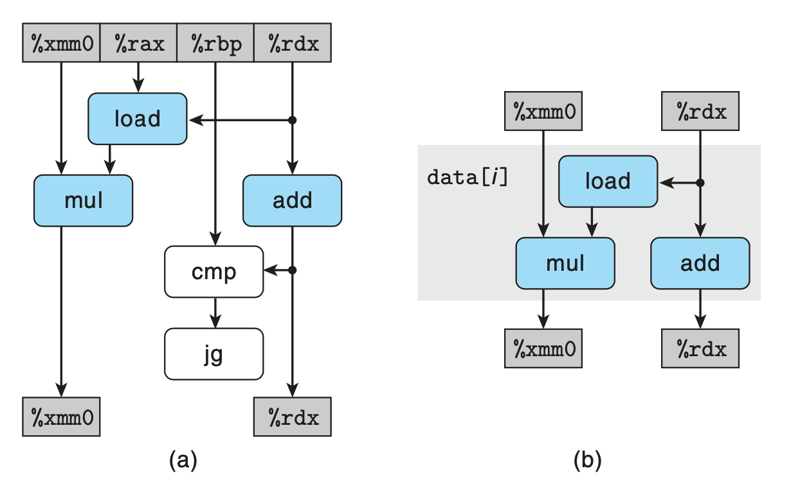
        * (a) We rearrange the operators to more clearly show the data dependencies
        * (b) show only those operations that use values from one iteration to produce new values for the next.

    * 

    * Given that single-precision multiplication has a latency of 4 cycles, while integer addition has latency 1, we can see that the chain on the left will form a critical path, requiring 4n cycles to execute. The chain on the left would require only n cycles to execute, and so it does not limit the program performance.

* Other Performance Factors

    * Including the total number of functional units available and the number of data values that can be passed among the functional units on any given step.

## 5.8 Loop Unrolling
* Loop unrolling is a program transformation that reduces the number of iterations for a loop by increasing the number of elements computed on each iteration.
* Loop unroelling can improve performance in two ways.
    1. it reduces the number of operations that do not contribute directly to the program result, such as loop indexing and conditional branching.
    2. it exposes ways in which we can further transform the code to reduce the number of operations in the critical paths of the overall computation.
*   Code
    ```c++
    void combine5(vec_ptr v, data_t *dest) {
        long int i;
        long int length = vec_length(v);
        int limit = length - 1;
        data_t* data = get_vec_start(v);
        data_t acc = IDENT;

        // combine 2 elements at a time
        for (i = 0; i < limit; i += 2) {
            acc = (acc OP data[i]) OP data[i+1];
        }

        // finish any remaining elements
        for (; i < length; ++i) {
            acc = acc OP data[i];
        }
        *dest = acc;
    }
    ```
* 

    * mulss instructions each get translated into two operations: one to load an array element from memory, and one to multiply this value by the accumulated value. We see here that register %xmm0 gets read and written twice in each execution of the loop.
* 
* 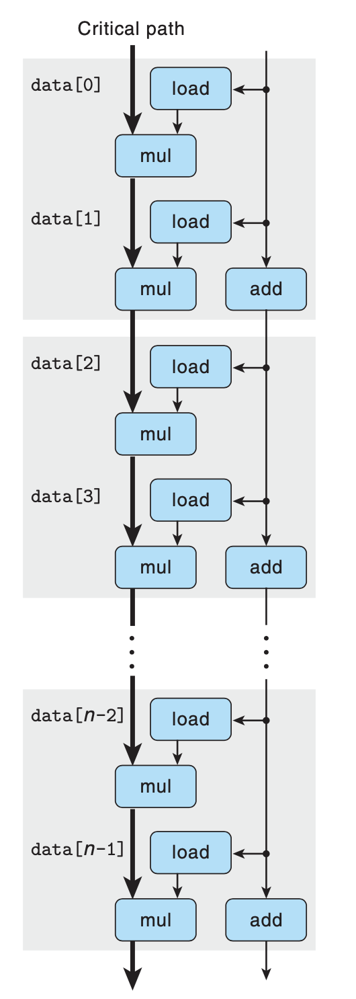

* Even though the loop has been unrolled by a factor of 2, there are still n mul operations along the critical path.

* why the three floating-point cases do not improve by loop unrolling?
    * gcc recognizes that it can safely perform this transformation for integer operations, but it also recognizes that it cannot transform the floating-point cases due to the lack of associativity
    * Most compilers will not attempt any reassociations of floating-point operations, since these operations are not guaranteed to be associative.
    * See [5.9.2 Reassociation Transformation]( 5.9.2 Reassociation Transformation)

## 5.9 Enhancing Parallelism
* At this point, our functions have hit the bounds imposed by the latencies of the arithmetic units. As we have noted, however, the functional units performing addition and multiplication are all fully pipelined, meaning that they can start new operations every clock cycle.

### 5.9.1 Multiple Accumulators
* For a combining operation that is **associative** and **commutative**, such as integer addition or multiplication, we can improve performance by splitting the set of combining operations into two or more parts and combining the results at the end.
    * Code
        ```c++
        void combine6(vec_ptr v, data_t *dest) {
            long int i;
            long int length = vec_length(v);
            int limit = length - 1;
            data_t* data = get_vec_start(v);
            data_t acc0 = IDENT;
            data_t acc1 = IDENT;

            // combine 2 elements at a time
            for (i = 0; i < limit; i += 2) {
                acc0 = acc0 OP data[i];
                acc1 = acc1 OP data[i+1];
            }

            // finish any remaining elements
            for (; i < length; ++i) {
                acc0 = acc0 OP data[i];
            }
            *dest = acc0 OP acc1;
        }
        ```
* 
* 
* 

* Understand the performance of combine6
    * As with combine5, the inner loop contains two mulss operations, but these instructions translate into mul operations that read and write separate registers, with no data dependency between them(Figure b). We then replicate this template n/2 times (Figure a), modeling the execution of the function on a vector of length n.
    * We see that we now have two critical paths, one corresponding to computing the product of even-numbered elements (program value acc0) and one for the odd-numbered elements (program value acc1). Each of these critical paths contain only n/2 operations, thus leading to a CPE of 4.00/2.

* An optimizing compiler could potentially convert the code shown in combine4 first to a two-way unrolled variant of combine5 by loop unrolling, and then to that of combine6 by introducing parallelism.

### 5.9.2 Reassociation Transformation
* The reassociation transformation to achieve k-way loop unrolling with reassociation
    * Code
        ```c++
        void combine7(vec_ptr v, data_t *dest) {
            long int i;
            long int length = vec_length(v);
            int limit = length - 1;
            data_t* data = get_vec_start(v);
            data_t acc = IDENT;

            // combine 2 elements at a time
            for (i = 0; i < limit; i += 2) {
                acc = acc OP (data[i] OP data[i+1]);
            }

            // finish any remaining elements
            for (; i < length; ++i) {
                acc = acc OP data[i];
            }
            *dest = acc;
        }
        ```

* Function | Page | Method | Integer \+ | Integer \* | Floating point \+ | F\* | D\*
    --- | --- | --- | --- | --- | --- | --- | ---
    combine4 | 493 | Accumulate in temporary | 2.00 | 3.00 | 3.00 | 4.50 | 5.00
    combine5 | 510 | Unroll by ×2 | 2.00 | 1.50 | 3.00 | 4.00 | 5.00
    combine6 | 515 | Unroll by ×2, parallelism ×2 | 1.50 | 1.50 | 1.50 | 2.00 | 2.50
    combine7 | 519 | Unroll ×2 and reassociate | 2.00 | 1.51 | 1.50 | 2.00 | 2.97
    Latency bound |  |  | 2.00 | 1.51 | 1.50 | 2.00 | 2.97
    Throughput bound |  |  | 2.00 | 1.51 | 1.50 | 2.00 | 2.97

* 

    * CPE performance for k-way loop unrolling with reassociation. All of the 4.00 CPEs improve with this transformation, up to the limiting value of 1.00.
* 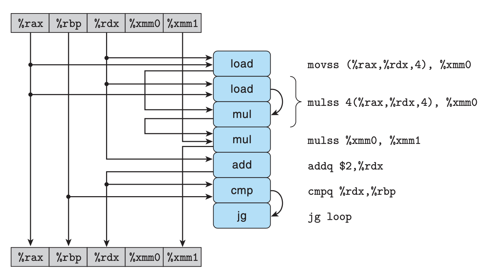
    * The load operations resulting from the movss and the first mulss instructions load vector elements i and i + 1 from memory, and the first mul operation multiplies them together.
    * The second mul operation then multiples this result by the accumulated value acc.
* 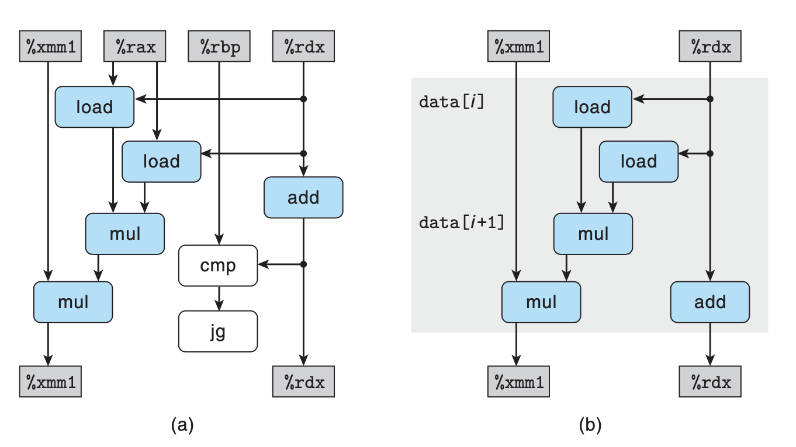

* 

* Explain the surprising improvement we saw with simple loop unrolling (combine5) for the case of integer multiplication:
    *  In compiling this code, gcc performed the reassociation that we have shown in combine7, and hence it achieved the same performance.
    * It also performed the transformation for code with higher degrees of unrolling.
    * gcc recognizes that it can safely perform this transformation for integer operations, but it also recognizes that it cannot transform the floating-point cases due to the lack of associativity.
    * It would be gratifying to find that gcc performed this transformation recognizing that the resulting code would run faster, but unfortunately this seems not to be the case.
* Optimizing compilers must choose which factors they try to optimize, and it appears that gcc does not use maximizing instructionlevel parallelism as one of its optimization criteria when selecting how to associate integer operations.
* A reassociation transformation can reduce the number of operations along the critical path in a computation, resulting in better performance by better utilizing the pipelining capabilities of the functional units.
* Most compilers will not attempt any reassociations of floating-point operations, since these operations are not guaranteed to be associative.

* Achieving greater parallelism with **SIMD** instructions
    * Intel introduced the **SSE** instructions in 1999, where SSE is the acronym for “Streaming SIMD Extensions,”.
    * The idea behind the SIMD execution model is that each 16-byte XMM register can hold multiple values.
    * In our examples, we consider the cases where they can hold either four integer or single-precision values, or two double-precision values.
    * SSE instructions can then perform vector operations on these registers, such as adding or multiplying four or two sets of values in parallel.

## 5.10 Summary of Results for Optimizing Combining Code
* Several factors limit our performance for this computation to a CPE of 1.00 when using scalar instructions, and a CPE of either 0.25 (32-bit data) or 0.50 (64-bit data) when using SIMD instructions:
    * First, the processor can only read 16 bytes from the data cache on each cycle, and then only by reading into an XMM register.
    * Second, the multiplier and adder units can only start a new operation every clock cycle

## 5.11 Some Limiting Factors
### 5.11.1 Register Spilling
* If we have a degree of parallelism p that exceeds the number of available registers, then the compiler will resort to spilling, storing some of the temporary values on the stack. Once this happens, the performance can drop significantly.

### 5.11.2 Branch Prediction and Misprediction Penalties
* In a processor that employs speculative execution, the processor begins executing the instructions at the predicted branch target. It does this in a way that avoids modifying any actual register or memory locations until the actual outcome has been determined.
    * If the prediction is correct, the processor can then “commit” the results of the speculatively executed instructions by storing them in registers or memory.
    * If the prediction is incorrect, the processor must discard all of the speculatively executed results and restart the instruction fetch process at the correct location.

* The misprediction penalty is incurred in doing this, because the instruction pipeline must be refilled before useful results are generated.

* **Conditional move** instructions can be implemented as part of the pipelined processing of ordinary instructions. There is no need to guess whether or not the condition will hold, and hence no penalty for guessing incorrectly.

* Do Not Be Overly Concerned about Predictable Branches

* Write Code Suitable for Implementation with Conditional Moves
    * For inherently unpredictable cases, program performance can be greatly enhanced if the compiler is able to generate code using **conditional data transfers** rather than **conditional control transfers**.
    * We have found that gcc is able to generate conditional moves for code written in a more **functional** style, where we use conditional operations to compute values and then update the program state with these values, as opposed to a more **imperative** style, where we use conditionals to selectively update program state.
    * functional style
        ```c++
        void minMax(int a[], int b[], int n) {
            for (int i = 0; i < n; ++i) {
                int min = a[i] < b[i] ? a[i] : b[i];
                int max = a[i] < b[i] ? b[i] : a[i];
                a[i] = min;
                b[i] = max;
            }
        }
        ```
    * imperative style
        ```c++
        void minMax(int a[], int b[], int n) {
            for (int i = 0; i < n; ++i) {
                if (a[i] > b[i]) {
                    int i = a[i];
                    a[i] = b[i];
                    b[i] = t;
                }
            }
        }
        ```

## 5.12 Understanding Memory Performance
* Modern processors have dedicated functional units to perform load and store operations, and these units have internal buffers to hold sets of outstanding requests for memory operations.

### 5.12.1 Load Performance
* The performance of a program containing load operations depends on both the pipelining capability and the latency of the load unit.
* One factor limiting the CPE for our examples is that they all require reading one value from memory for each element computed. Since the load unit can only initiate one load operation every clock cycle, the CPE cannot be less than 1.00. For applications where we must load k values for every element computed, we can never achieve a CPE lower than k.

### 5.12.2 Store Performance
* The performance of Store operation, particularly in relation to its interactions with load operations, involves several subtle issues.
* As with the load operation, in most cases, the store operation can operate in a fully pipelined mode, beginning a new store on every cycle.
* Code
    ```c++
    void clear_array(int* dest, int n) {
        for (int i = 0; i < n; ++i) {
            dest[i] = 0;
        }
    }

    void clear_array4(int* dest, int n) {
        int i = 0;
        for (; i < n-3; i += 4) {
            dest[i] = 0;
            dest[i+1] = 0;
            dest[i+2] = 0;
            dest[i+3] = 0;
        }

        while (i < n-3) {
            dest[i] = 0;
            ++i;
        }
    }
    ```
    * Our measurements for the first version show a CPE of 2.00. By unrolling the loop four times, as shown in the code for clear_array_4, we achieve a CPE of 1.00. Thus, we have achieved the optimum of one new store operation per cycle.
* The store operation does not affect any register values. Thus, by their very nature a series of store operations cannot create a data dependency. Only a load operation is affected by the result of a store operation, since only a load can read back the memory value that has been written by the store.

* Code
    ```c++
    void read_write(int* src, int* dest, int n) {
        int val = 0;
        while (n--) {
            *dest = val;
            val = (*src) + 1;
        }
    }
    ```

* 

* The **write/read dependency** causes a slowdown in the processing.

* 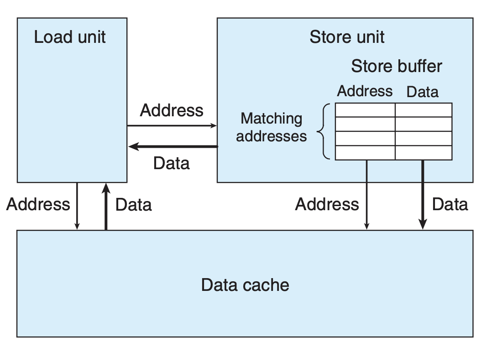
    * The store unit maintains a buffer of pending writes. The load unit must check its address with those in the store unit to detect a write/read dependency.
    * The store unit contains a store buffer containing the addresses and data of the store operations that have been issued to the store unit, but have not yet been completed, where completion involves updating the data cache. This buffer is provided so that a series of store operations can be executed without having to wait for each one to update the cache.
    * When a load operation occurs, it must check the entries in the store buffer for matching addresses. If it finds a match (meaning that any of the bytes being written have the same address as any of the bytes being read), it retrieves the corresponding data entry as the result of the load operation.

* 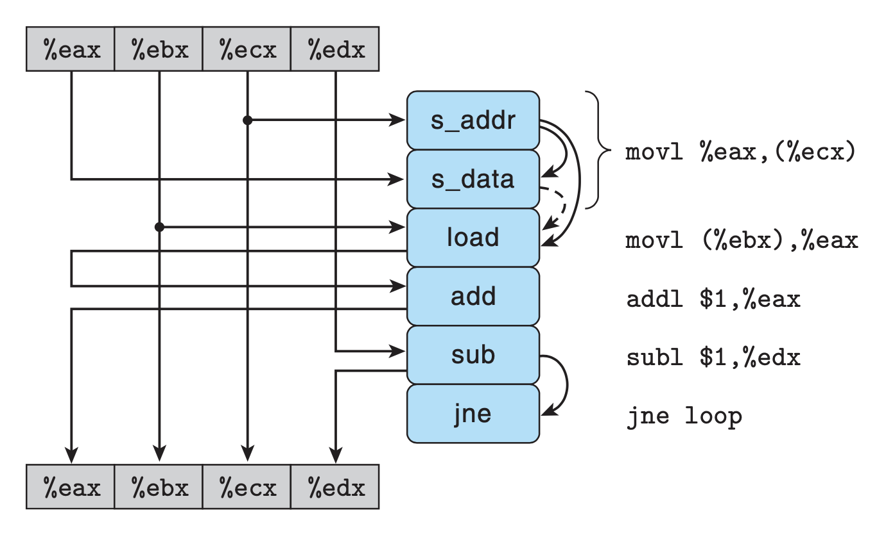
    * The instruction `movl %eax,(%ecx)` is translated into two operations:
        * The **s_addr** instruction computes the address for the store operation, creates an entry in the store buffer, and sets the address field for that entry.
        * The **s_data** operation sets the data field for the entry.
    * As we will see, the fact that these two computations are performed independently can be important to program performance.
    * In addition to the data dependencies between the operations caused by the writing and reading of registers, the arcs on the right of the operators denote a set of implicit dependencies for these operations:
        * the address computation of the s_addr operation must clearly precede the s_data operation
        * the load operation generated by decoding the instruction `movl (%ebx), %eax` must check the addresses of any pending store operations, creating a data dependency between it and the s_addr operation
        * The figure shows a dashed arc between the s_data and load operations. This dependency is conditional:
            * if the two addresses match, the load operation must wait until the s_data has deposited its result into the store buffer
            * if the two addresses differ, the two operations can proceed independently.
* 
    *  The arc labeled :one: represents the requirement that the store address must be computed before the data can be stored.
    * The arc labeled :two: represents the need for the load operation to compare its address with that for any pending store operations.
    * The dashed arc labeled :three: represents the conditional data dependency that arises when the load and store addresses match.
    * (b) The data-flow graph shows just two chains of dependencies: the one on the left, with data values being stored, loaded, and incremented (only for the case of matching addresses), and the one on the right, decrementing variable cnt.

* 
    * When the two addresses do not match, the only critical path is formed by the decrementing of cnt (Example A). When they do match, the chain of data being stored, loaded, and incremented forms the critical path (Example B).
    * Example A, with differing source and destination addresses, the load and store operations can proceed independently, and hence the only critical path is formed by the decrementing of variable cnt. This would lead us to predict a CPE of just 1.00, rather than the measured CPE of 2.00.
    * Example B, with matching source and destination addresses, the data dependency between the s_data and load instructions causes a critical path to form involving data being stored, loaded, and incremented. We found that these three operations in sequence require a total of 6 clock cycles.

* With operations on registers, the processor can determine which instructions will affect which others as they are being decoded into operations.
* With memory operations, on the other hand, the processor cannot predict which will affect which others until the load and store addresses have been computed.
* Efficient handling of memory operations is critical to the performance of many programs. The memory subsystem makes use of many optimizations, such as the potential parallelism when operations can proceed independently.

###  Practice Problem 5.10 [TODO]

## 5.13 Life in the Real World: Performance Improvement Techniques
1. **High-level design**. Choose appropriate `algorithms` and `data structures` for the problem at hand. Be especially vigilant to avoid algorithms or coding techniques that yield asymptomatically poor performance.
2. **Basic coding principles**. Avoid optimization blockers so that a compiler can generate efficient code.
    * `Eliminate excessive function calls`. Move computations out of loops when possible. Consider selective compromises of program modularity to gain greater efficiency.
    * `Eliminate unnecessary memory references`. Introduce temporary variables to hold intermediate results. Store a result in an array or global variable only when the final value has been computed.
3. **Low-level optimizations**.
    * `Unroll loops` to reduce overhead and to enable further optimizations. Find ways to increase instruction-level parallelism by techniques such as `multiple accumulators` and `reassociation`.
    * Rewrite conditional operations in a functional style to enable compilation via `conditional data transfers`.

## 5.14 Identifying and Eliminating Performance Bottlenecks
### 5.14.1 Program Profiling
* Program profiling involves running a version of a program in which instrumentation code has been incorporated to determine how much time the different parts of the program require.

## 5.15 Summary
* We have studied a series of techniques, including `loop unrolling`, creating `multiple accumulators`, and `reassociation`, that can exploit the instruction-level parallelism provided by modern processors.
* Try to make branches more predictable or make them amenable to implementation using `conditional data transfers`
* We must also watch out for the interactions between `store and load operations`. Keeping values in local variables, allowing them to be stored in registers, can often be helpful.
* Code profilers and related tools can help us systematically evaluate and improve program performance.
* Amdahl’s law provides a simple but powerful insight into the performance gains obtained by improving just one part of the system.

# 6 The Memory Hierarchy
## 6.1 Storage Technologies

## 6.2 Locality
* A tendency, they tend to reference data items that are near other recently referenced data items, or that were recently referenced themselves.
* Locality is typically described as having two distinct forms:
    * In a program with good **temporal locality**, a memory location that is referenced once is likely to be referenced again multiple times in the near future.
    * In a program with good **spatial locality**, if a memory location is referenced once, then the program is likely to reference a nearby memory location in the near future.

### 6.2.1 Locality of References to Program Data

### 6.2.2 Locality of Instruction Fetches

### 6.2.3 Summary of Locality
* Programs that repeatedly reference the same variables enjoy good temporal locality.
* For programs with **stride-k reference patterns**, the smaller the stride the better the spatial locality. Programs with stride-1 reference patterns have good spatial locality. Programs that hop around memory with large strides have poor spatial locality.
* Loops have good temporal and spatial locality with respect to instruction fetches. The smaller the loop body and the greater the number of loop iterations, the better the locality.


## 6.3 The Memory Hierarchy
* **Storage technology**: Different storage technologies have widely different access times. Faster technologies cost more per byte than slower ones and have less capacity. The gap between CPU and main memory speed is widening.
* **Computer software**: Well-written programs tend to exhibit good locality.

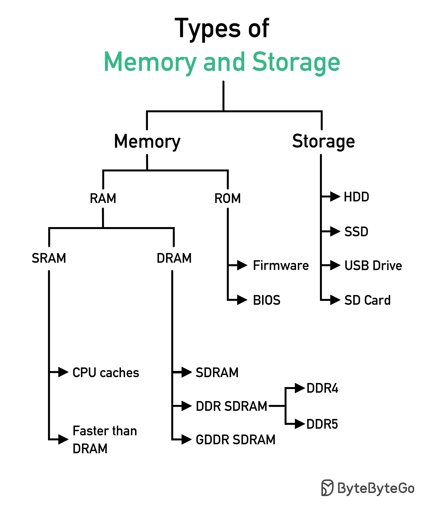

---

* 
    * At the highest level (L0) are a small number of fast CPU registers that the CPU can access in a `single clock cycle`.
    * Next are one or more small to moderate-sized SRAM-based cache memories that can be accessed in a `few CPU clock cycles`.
    * These are followed by a large DRAM-based main memory that can be accessed in tens to `hundreds of clock cycles`.
    * Next are slow but enormous local disks.
    * Finally, some systems even include an additional level of disks on remote servers that can be accessed over a network.
* 
* 

### 6.3.1 Caching in the Memory Hierarchy
* The central idea of a `memory hierarchy` is that for each k, the faster and smaller storage device at level k serves as a cache for the larger and slower storage device at level k + 1
* It is important to realize that while the block size is fixed between any particular pair of adjacent levels in the hierarchy, other pairs of levels can have different block sizes.

* **Cache Hits**
* **Cache Misses**
    * This process of overwriting an existing block is known as **replacing** or **evicting** the block.
* Kinds of Cache Misses
    * An empty cache is sometimes referred to as a `cold cache`, and misses of this kind are called compulsory misses or **cold misses**. Cold misses are important because they are often transient events that might not occur in steady state, after the cache has been warmed up by repeated memory accesses.
    * Because randomly placed blocks are expensive to locate, thus, hardware caches typically implement a more restricted `placement policy` that restricts a particular block at level k + 1 to a small subset (sometimes a singleton) of the blocks at level k.
    * Restrictive placement policies of this kind lead to a type of miss known as a **conflict miss**, in which the cache is large enough to hold the referenced data objects, but because they map to the same cache block, the cache keeps missing.
    * Programs often run as a sequence of phases (e.g., loops) where each phase accesses some reasonably constant set of cache blocks. For example, a nested loop might access the elements of the same array over and over again. This set of blocks is called the `working set` of the phase. When the size of the working set exceeds the size of the cache, the cache will experience what are known as **capacity misses**. In other words, the cache is just too small to handle this particular working set.

* Cache Management
    * partition the cache storage into blocks
    * transfer blocks between different levels
    * decide when there are hits and misses, and then deal with them

### 6.3.2 Summary of Memory Hierarchy Concepts
* **Exploiting temporal locality**. Because of temporal locality, the same data objects are likely to be reused multiple times. Once a data object has been copied into the cache on the first miss, we can expect a number of subsequent hits on that object. Since the cache is faster than the storage at the next lower level, these subsequent hits can be served much faster than the original miss.
* **Exploiting spatial locality**. Blocks usually contain multiple data objects. Because of spatial locality, we can expect that the cost of copying a block after a miss will be amortized by subsequent references to other objects within that block.
* 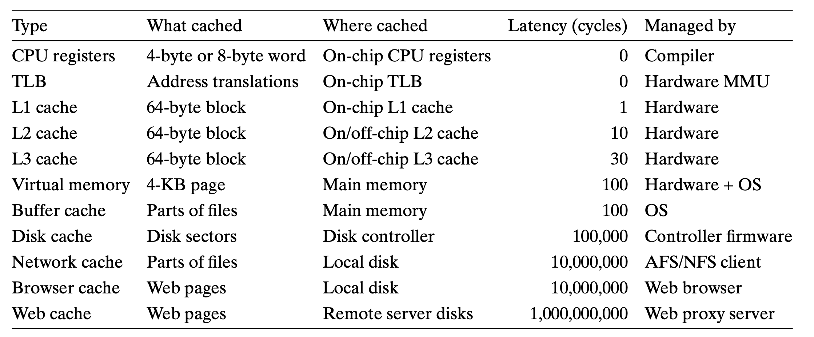


## 6.4 Cache Memories
* 

### 6.4.1 Generic Cache Memory Organization
* 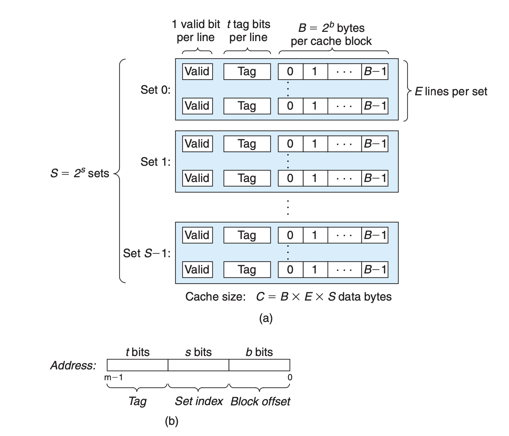
* How does the cache know whether it contains a copy of the word at address A?
    * The cache is organized so that it can find the requested word by simply inspecting the bits of the address, similar to a hash table with an extremely simple hash function.
    * The parameters S and B induce a partitioning of the m address bits into the three fields (b). The `s set index` bits in A form an index into the array of S sets. The first set is set 0, the second set is set 1, and so on. When interpreted as an unsigned integer, the set index bits tell us which set the word must be stored in.
    * Once we know which set the word must be contained in, the `t tag bits` in A tell us which line (if any) in the set contains the word. A line in the set contains the word if and only if the valid bit is set and the tag bits in the line match the tag bits in the address A.
    * Once we have located the line identified by the tag in the set identified by the set index, then the `b block offset bits` give us the offset of the word in the B-byte data block.
* 

### 6.4.2 Direct-Mapped Caches
* Caches are grouped into different classes based on E, the number of cache lines per set. A cache with exactly one line per set (E = 1) is known as a **direct-mapped cache**.

* The process that a cache goes through of determining whether a request is a hit or a miss and then extracting the requested word consists of three steps:
    1. Set Selection in Direct-Mapped Caches
        * 
    2. Line Matching in Direct-Mapped Caches
        * 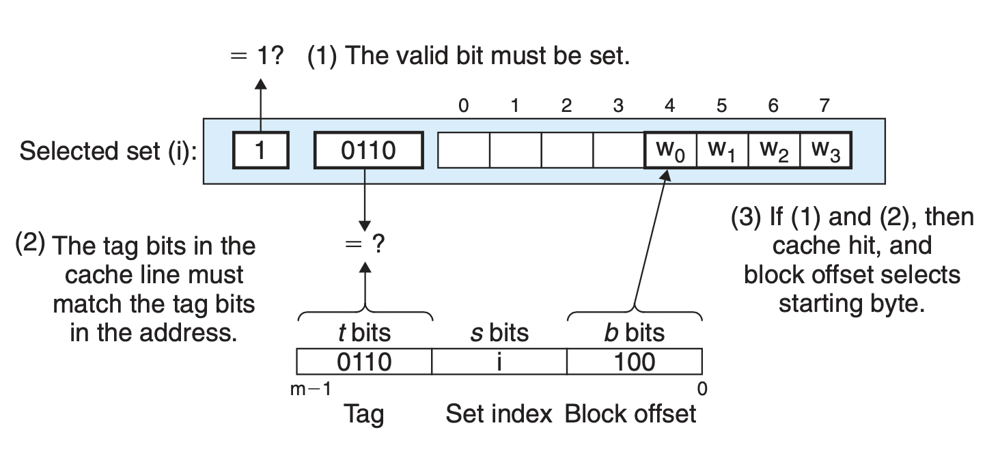
    3. Word Selection in Direct-Mapped Caches
    4. Line Replacement on Misses in Direct-Mapped
        * If the cache misses, then it needs to retrieve the requested block from the next level in the memory hierarchy and store the new block in one of the cache lines of the set indicated by the set index bits.
        * In general, if the set is full of valid cache lines, then one of the existing lines must be evicted.
        * For a direct-mapped cache, where each set contains exactly one line, the replacement policy is trivial: the current line is replaced by the newly fetched line.
* Putting It Together: A Direct-Mapped Cache in Action
    * Suppose we have a direct-mapped cache described by (S,E,B,m)=(4,1,2,4)
    * The concatenation of the tag and index bits uniquely identifies each block in memory.
    * Since there are eight memory blocks but only four cache sets, multiple blocks map to the same cache set (i.e., they have the same set index).
    * Blocks that map to the same cache set are uniquely identified by the tag.

* Conflict Misses in Direct-Mapped Caches
    * Code
        ```c++
        float dotprod(float x[8], float y[8]) {
            float sum = 0.0;

            for (int i = 0; i < 8; ++i) {
                sum += x[i] * y[i];
            }

            return sum;
        }
        ```
    *  a block is 16 bytes, the cache consists of two sets, a total cache size of 32 bytes
    * 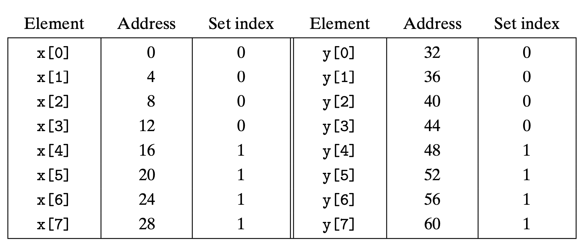
    * In fact each subsequent reference to x and y will result in a conflict miss as we thrash back and forth between blocks of x and y. The term **thrashing** describes any situation where a cache is repeatedly loading and evicting the same sets of cache blocks.
    * Thrashing is easy for programmers to fix once they recognize what is going on. One easy solution is to put B bytes of padding at the end of each array. For example, instead of defining x to be float x[8], we define it to be float x[12].
    * 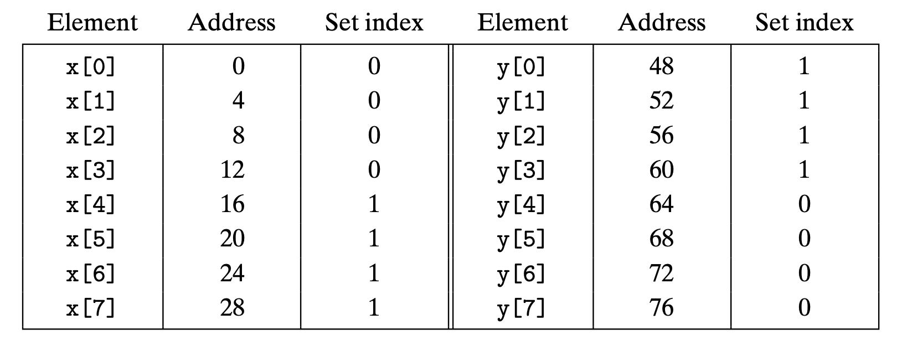

* Why index with the middle bits?
    * If the high-order bits are used as an index, then some contiguous memory blocks will map to the same cache set.
    * 

### 6.4.3 Set Associative Caches
* The problem with conflict misses in direct-mapped caches stems from the constraint that each set has exactly one line (or in our terminology, E = 1). A set associative cache relaxes this constraint so each set holds more than one cache line. A cache with 1 < E < C/B is often called an **E-way set associative cache**.

* Set Selection in Set Associative Caches
    * 

* Line Matching and Word Selection in Set Associative Caches
    
    * An associative memory is an array of (key, value) pairs that takes as input the key and returns a value from one of the (key, value) pairs that matches the input key. Thus, we can think of each set in a set associative cache as a small associative memory where the keys are the concatenation of the tag and valid bits, and the values are the contents of a block.
    * Any line in the set can contain any of the memory blocks that map to that set. So the cache must search each line in the set, searching for a valid line whose tag matches the tag in the address.

* Line Replacement on Misses in Set Associative Caches
    * The simplest replacement policy is to choose the line to replace at random. Other more sophisticated policies draw on the principle of locality to try to minimize the probability that the replaced line will be referenced in the near future.

### 6.4.4 Fully Associative Caches
* A fully associative cache consists of a single set (i.e., E = C/B) that contains all of the cache lines.

* Set Selection in Fully Associative Caches
    * 

* Line Matching and Word Selection in Fully Associative Caches
    * 
    * The cache circuitry must search for many matching tags in parallel, it is difficult and expensive to build an associative cache that is both large and fast. As a result, fully associative caches are only appropriate for small caches, such as the translation lookaside buffers (TLBs).

### 6.4.5 Issues with Writes
* If write hit
    * **Write-through**, is to immediately write w’s cache block to the next lower level. While simple, write-through has the disadvantage of causing bus traffic with every write.
        * 

    * **Write-back**, defers the update as long as possible by writing the updated block to the next lower level only when it is evicted from the cache by the replacement algorithm. Because of locality, write-back can significantly reduce the amount of bus traffic, but it has the disadvantage of additional complexity. The cache must maintain an additional dirty bit for each cache line that indicates whether or not the cache block has been modified.
        * 

* If wite miss
    * **Write-allocate**, loads the corresponding block from the next lower level into the cache and then updates the cache block. Write-allocate tries to exploit spatial locality of writes, but it has the disadvantage that every miss results in a block transfer from the next lower level to cache.
    * **No-write-allocate**, bypasses the cache and writes the word directly to the next lower level. Writethrough caches are typically no-write-allocate. Write-back caches are typically write-allocate.

* As a rule, caches at lower levels of the memory hierarchy are more likely to use write-back instead of write-through because of the larger transfer times.

### 6.4.6 Anatomy of a Real Cache Hierarchy
* Inter Core i7
    * 
    * 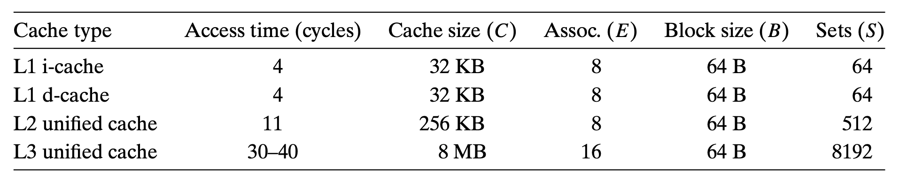
* The two caches are often optimized to different access patterns and can have different block sizes, associativities, and capacities. Also, having separate caches ensures that data accesses do not create conflict misses with instruction accesses, and vice versa, at the cost of a potential increase in capacity misses.

### 6.4.7 Performance Impact of Cache Parameters
* Cache performance is evaluated with a number of metrics:
    * **Miss rate**. The fraction of memory references during the execution of a program, or a part of a program, that miss. It is computed as #misses/#references.
    * **Hit rate**. The fraction of memory references that hit. It is computed as 1 − miss rate.
    * **Hit time**. The time to deliver a word in the cache to the CPU, including the time for set selection, line identification, and word selection. Hit time is on the order of several clock cycles for L1 caches.
    * **Miss penalty**. Any additional time required because of a miss. The penalty for L1 misses served from L2 is on the order of 10 cycles; from L3, 40 cycles; and from main memory, 100 cycles.
* Impact of Cache Size
    * A larger cache will tend to increase the `hit rate`, but it tend to increase the `hit time`

* Impact of Block Size
    * Larger blocks can help increase the `hit rate` by exploiting any spatial locality that might exist in a program. However, for a given cache size, larger blocks imply a smaller number of `cache lines`, which can hurt the `hit rate` in programs with more temporal locality than spatial locality.
    * Larger blocks also have a negative impact on the `miss penalty`, since larger blocks cause larger transfer times. Modern systems usually compromise with cache blocks that contain 32 to 64 bytes.

* Impact of Associativity
    * The advantage of higher associativity (i.e., larger values of E) is that it decreases the vulnerability of the cache to `thrashing` due to conflict misses.
    * But it comes at a significant cost, it's `expensive` to implement and hard to make fast. It requires more tag bits per line, additional LRU state bits per line, and additional control logic. Higher associativity can increase `hit time`, because of the increased complexity, and it can also increase the `miss penalty` because of the increased complexity of choosing a victim line.
    * The choice of associativity ultimately boils down to a trade-off between the hit time and the miss penalty.

* Impact of Write Strategy

## 6.5 Writing Cache-friendly Code
* Programs with better locality will tend to have lower miss rates, and programs with lower miss rates will tend to run faster than programs with higher miss rates.
* Basic approach:
    1. Make the common case go fast.
    2. Minimize the number of cache misses in each inner loop

## 6.6 Putting It Together: The Impact of Caches on Program Performance
* The rate that a program reads data from the memory system is called the **read throughput/bandwidth**.

### 6.6.1 The Memory Mountain
* Every computer has a unique memory mountain that characterizes the capabilities of its memory system.
* 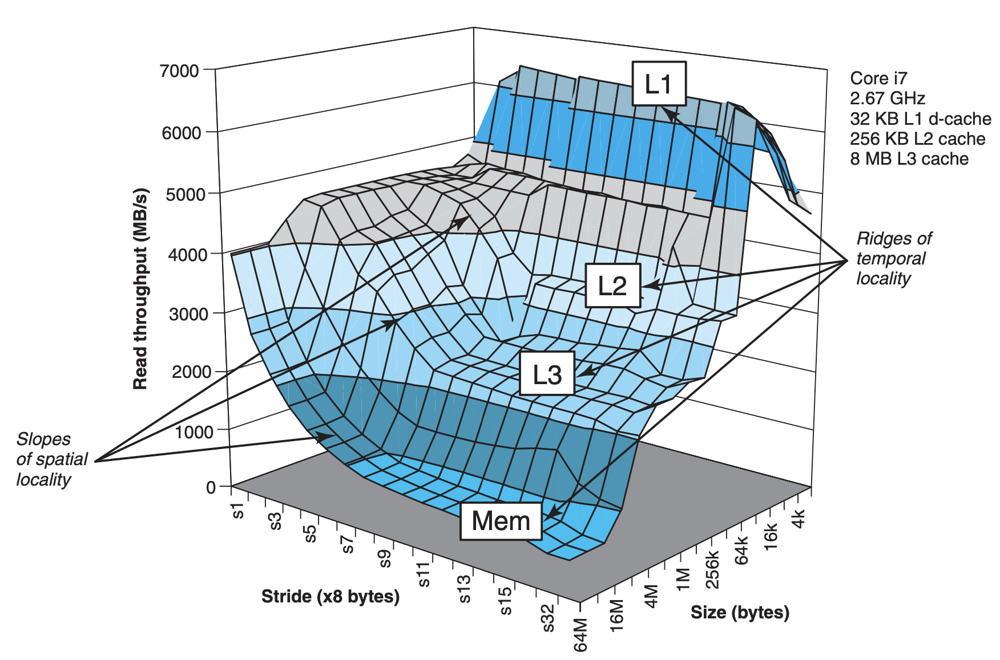

### 6.6.2 Rearranging Loops to Increase Spatial Locality
* 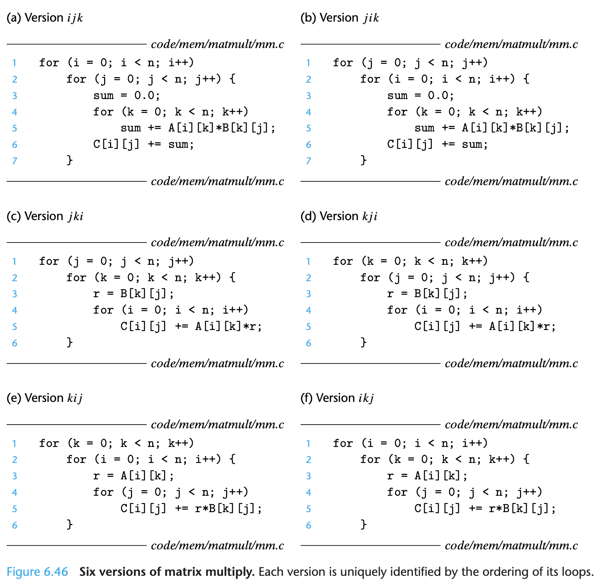
* Assumptions:
    * Each array is an n × n array of double, with sizeof(double) == 8.
    * There is a single cache with a 32-byte block size (B = 32).
    * The array size n is so large that a single matrix row does not fit in the L1 cache.
    * The compiler stores local variables in registers, and thus references to local variables inside loops do not require any load or store instructions.
* 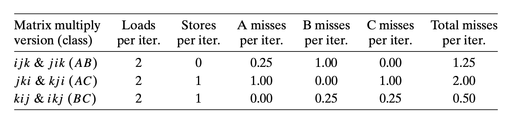
* 

* Using blocking to increase temporal locality
    * The general idea of blocking is to organize the data structures in a program into large chunks called **blocks**. (In this context, “block” refers to an application-level chunk of data, not to a cache block.) The program is structured so that it loads a chunk into the L1 cache, does all the reads and writes that it needs to on that chunk, then discards the chunk, loads in the next chunk, and so on.
    * Unlike the simple loop transformations for improving spatial locality, blocking makes the code harder to read and understand. For this reason, it is best suited for optimizing compilers or frequently executed library routines.

### 6.6.3 Exploiting Locality in Your Programs
* Focus your attention on the `inner loops`, where the bulk of the computations and memory accesses occur.
* Try to maximize the spatial locality in your programs by `reading data objects sequentially`, with stride 1, in the order they are stored in memory.
* Try to maximize the temporal locality in your programs by `using a data object` as often as possible once it has been read from memory.

## 6.7 Summary
* **Static RAM (SRAM)** is faster and more expensive, and is used for cache memories both on and off the CPU chip. **Dynamic RAM (DRAM)** is slower and less expensive, and is used for the main memory and graphics frame buffers. **Read-only memories (ROMs)** retain their information even if the supply voltage is turned off, and they are used to store firmware.

## Appendix: Cache Consistent
* Two requirements for cache consistent:
    1. Write Propage: if one cpu updates it's cache, it muest propagets this update to other cores
    2. Transaction Serialization: if two cpu update the same cache, other cpus see the same update sequence
* Two protocols:
    * **Write Invalidate**: one cpu core updates it's cache, and sync a "invalidate" info to other cores to invalidate their cache
    * **Write Broadcast**: the writing cpu update it's cache and sync the new data to other cpu cores to let them updat their cache.

### False Sharing

* **Definiiton**: In computer science, false sharing is a performance-degrading usage pattern that can arise in systems with distributed, coherent caches at the size of the smallest resource block managed by the caching mechanism. When a system participant attempts to periodically access data that is not being altered by another party, but that data shares a cache block with data that is being altered, the caching protocol may force the first participant to reload the whole cache block despite a lack of logical necessity.[1] The caching system is unaware of activity within this block and forces the first participant to bear the caching system overhead required by true shared access of a resource.

* **Mitigation**
    * For instance, false sharing in CPU caches can be prevented by reordering variables or adding padding (unused bytes) between variables. However, some of these program changes may increase the size of the objects, leading to higher memory use.
    * Compile-time data transformations can also mitigate false-sharing.[3] However, some of these transformations may not always be allowed

### MESI
* **M** (Modified): The cache line is present only in the current cache, and is dirty - it has been modified (M state) from the value in main memory. The cache is required to write the data back to main memory at some time in the future, before permitting any other read of the (no longer valid) main memory state. The write-back changes the line to the Shared state(S).
* **E** (Exclusive): The cache line is present only in the current cache, but is clean - it matches main memory. It may be changed to the Shared state at any time, in response to a read request. Alternatively, it may be changed to the Modified state when writing to it.
* **S** (Shared): Indicates that this cache line may be stored in other caches of the machine and is clean - it matches the main memory. The line may be discarded (changed to the Invalid state) at any time.
* **I** (Invalidated): Indicates that this cache line is invalid (unused).
* **Read/request For Ownership**:  The operation is issued by a processor trying to write into a cache line that is in the shared (S) or invalid (I) states of the MESI protocol. The operation causes all other caches to set the state of such a line to I. A read for ownership transaction is a read operation with intent to write to that memory address. Therefore, this operation is exclusive. It brings data to the cache and invalidates all other processor caches which hold this memory line. This is termed "BusRdX" in tables above.
* 
    * Processor Requests to Cache includes the following operations:
        * PrRd: The processor requests to read a Cache block.
        * PrWr: The processor requests to write a Cache block
    * Bus side requests are the following:
        * BusRd: Snooped request that indicates there is a read request to a Cache block requested by another processor
        * BusRdX: Snooped request that indicates there is a write request to a Cache block requested by another processor which doesn't already have the block.
        * BusUpgr: Snooped request that indicates that there is a write request to a Cache block requested by another processor but that processor already has that Cache block residing in its own Cache.
        * Flush: Snooped request that indicates that an entire cache block is written back to the main memory by another processor.
        * FlushOpt: Snooped request that indicates that an entire cache block is posted on the bus in order to supply it to another processor(Cache to Cache transfers).

# 7 Linking
* **Linking** is the process of collecting and combining various pieces of code and data into a single file that can be loaded (copied) into memory and executed.
* Linking can be performed
    * at **compile time**, when the source code is translated into machine code;
    * at **load time**, when the program is loaded into memory and executed by the loader; and even
    * at **run time**, by application programs.

## 7.1 Compiler Drivers
```
/* 1. Preprocess
 * runs the C preprocessor (cpp),
 * which translates the C source file main.c into an ASCII intermediate file main.i: */

cpp [other arguments] main.c /tmp/main.i


/* 2. Compile
 * runs the C compiler (cc1), which translates main.i into an ASCII assembly language file main.s. */

cc1 /tmp/main.i main.c -O2 [other arguments] -o /tmp/main.s


/* 3. Assembly
 * runs the assembler (as), which translates main.s into a relocatable object file main.o: */

as [other arguments] -o /tmp/main.o /tmp/main.s

/* 4. Link
 * it runs the linker program ld, which combines main.o and swap.o,
 * along with the necessary system object files, to create the executable object file p: */

ld -o p [system object files and args] /tmp/main.o /tmp/swap.o
```

```
// static link
gcc -c addvec.c multvec.c
ar rcs libvector.a addvec.o multvec.o
gcc -O2 -c main2.c
gcc -static -o p2 main2.o ./libvector.a
```

```c++
// dynamic link
gcc -shared -fPIC -o libvector.so addvec.c multvec.c
gcc -o p2 main2.c ./libvector.so
```

* Where to search a program to be run?
    * $PATH
* Include path
    * current path
    * path specified by `-I`
    * `CPLUS_INCLUDE_PATH`, `C_INCLUDE_PATH`
    * Default path: `/usr/include` `/usr/local/include`
* Library path:
    * path specified by `-L`
    * `LIBRARY_PATH`, `LD_LIBRARY_PATH`
    * /etc/ld.so.conf
    * Default path: `/usr/lib` `/usr/local/lib`

## 7.2 Static Linking
* To build the executable, the linker must perform two main tasks:
    * **Symbol resolution**. Object files define and reference symbols. The purpose of symbol resolution is to associate each symbol reference with exactly one symbol definition.
    * **Relocation**. Compilers and assemblers generate code and data sections that start at address 0. The linker relocates these sections by associating a memory location with each symbol definition, and then modifying all of the references to those symbols so that they point to this memory location.
* Object files are merely collections of blocks of bytes. Some of these blocks contain program code, others contain program data, and others contain data structures that guide the linker and loader.
* A linker concatenates blocks together, decides on run-time locations for the concatenated blocks, and modifies various locations within the code and data blocks. Linkers have minimal understanding of the target machine. The compilers and assemblers that generate the object files have already done most of the work.
* Disadvantages:
    * Static libraries, like all software, need to be maintained and updated periodically.
    * At run time, the code of static libraries is duplicated in the text segment of each running process.

## 7.3 Object Files
* Object files come in three forms:
    * **Relocatable object file**. Contains binary code and data in a form that can be combined with other relocatable object files at compile time to create an executable object file.
    * **Executable object file**. Contains binary code and data in a form that can be copied directly into memory and executed.
    * **Shared object file**. A special type of relocatable object file that can be loaded into memory and linked dynamically, at either load time or run time.
    * **Core dump file**.

## 7.4 Relocatable Object Files
* [Executable and Linkable Format (ELF)](http://www.skyfree.org/linux/references/ELF_Format.pdf)
* 
* The **ELF header** begins with a 16-byte sequence that describes the `word size` and `byte ordering` of the system that generated the file.
    * The rest of the ELF header contains `size of the ELF header`, the `object file type` (e.g., relocatable, executable, or shared), the `machine type` (e.g., IA32), the `file offset` of the section header table, and the `size and number of entries` in the section header table.
    * The locations and sizes of the various sections are described by the **section header table**, which contains a fixed sized entry for each section in the object file.
* **.rodata**: the format strings in printf statements, jump tables for switch statements
* **.data**: Initialized global C variables
* **.bss** (Block Started by Symbol): Uninitialized global C variables. It is merely a place holder. Object file formats distinguish between initialized and uninitialized variables for space efficiency: uninitialized variables do not have to occupy any actual disk space in the object file.
* **.symtab**: A symbol table with information about functions and global variables that are defined and referenced in the program. It does not contain entries for local variables.
* **.rel.text**: A list of locations in the text section that will need to be modified when the linker combines this object file with others.
    * In general, any instruction that calls an external function or references a global variable will need to be modified. On the other hand, instructions that call local functions do not need to be modified.
* **.rel.data**: Relocation information for any global variables that are referenced or defined by the module
    * In general, any initialized global variable whose initial value is the address of a global variable or externally defined function will need to be modified
* **.debug**: A debugging symbol table with entries for local variables and typedefs defined in the program, global variables defined and referenced in the program, and the original C source file. It is only present if the compiler driver is invoked with the -g option.
* **.line**: A mapping between line numbers in the original C source program and machine code instructions in the .text section.
* **.strtab**: A string table for the symbol tables in the .symtab and .debug sections, and for the section names in the section headers. A string table is a sequence of null-terminated character strings.

## 7.5 Symbols and Symbol Tables
*  In the context of a linker, there are three different kinds of symbols:
    * **Global symbols** that are **defined** by module m and that can be referenced by other modules. Global linker symbols correspond to nonstatic C functions and global variables that are defined without the C static attribute.
    * **Global symbols** that are **referenced** by module m but defined by some other module. Such symbols are called externals and correspond to C functions and variables that are defined in other modules.
    * **Local symbols** that are **defined and referenced** exclusively by module m. Some local linker symbols correspond to C functions and global variables that are defined with the static attribute. These symbols are visible anywhere within module m, but cannot be referenced by other modules. The sections in an object file and the name of the source file that corresponds to module m also get local symbols.
* It is important to realize that `local linker symbols` are not the same as `local program variables`.
* The compiler allocates space in .data or .bss for each definition and creates a local linker symbol in the symbol table with a unique name.
* Symbol tables are built by assemblers, using symbols exported by the compiler into the assembly-language .s file.
* Symbol Table Entry
    ```c++
    typedef struct elf64_sym {
        Elf64_Word    st_name;  /* Symbol name, index in string tbl */
        Elf64_Addr    st_value; /* Value of the symbol */
        Elf64_Xword   st_size;  /* Associated symbol size */
        unsigned char st_info;  /* Type and binding attributes: STB_LOCAL, STB_GLOBAL, STB_WEAK | STT_NOTYPE, STT_OBJECT, STT_FUNC */
        Elf64_Half    st_shndx; /* Associated section index: SHN_ABS, SHN_COMMON, SHN_UNDEF */
        unsigned char st_other; /* No defined meaning, 0 */
    } Elf64_Sym;
    ```

## 7.6 Symbol Resolution
* The linker resolves symbol references by associating each reference with exactly one symbol definition from the symbol tables of its input relocatable object files.
* Symbol resolution is straightforward for references to `local symbols` that are defined in the same module as the reference. The compiler allows only one definition of each local symbol per module. The compiler also ensures that static local variables, which get local linker symbols, have unique names.
* When the compiler encounters a `global symbol` (either a variable or function name) that is not defined in the current module, it assumes that it is defined in some other module, generates a linker symbol table entry, and leaves it for the linker to handle. If the linker is unable to find a definition for the referenced symbol in any of its input modules, it prints an (often cryptic) error message and terminates.
* Symbol resolution for `global symbols` is also tricky because the same symbol might be defined by multiple object files. In this case, the linker must either flag an error or somehow choose one of the definitions and discard the rest.

### 7.6.1 How Linkers Resolve Multiply Defined Global Symbols
* Functions and initialized global variables get **strong symbols**. Uninitialized global variables get **weak symbols**.
* Rules:
    1. Multiple strong symbols are not allowed.
    2. Given a strong symbol and multiple weak symbols, choose the strong symbol.
    3. Given multiple weak symbols, choose any of the weak symbols.

* The application of rules 2 and 3 can introduce some insidious run-time bugs:
    * Code
        ```c++
        double x;
        void f() {
            x = -0.0;
        }
        ```

        ```c++
        int x = 10;
        int y = 20;

        int main() {
            f();
        }
        ```
    * doubles are 8 bytes and ints are 4 bytes, the assignment x = -0.0 in will overwrite the memory locations for x and y with the double-precision floating-point representation of negative zero
    * gcc `-fno-common` flag triggers an error if it encounters multiply defined global symbols.

### 7.6.2 Linking with Static Libraries
* static libraries are stored on disk in a particular file format known as an archive. An archive is a collection of concatenated relocatable object files, with a header that describes the size and location of each member object file.
* Code
    ```
    gcc -c addvec.c multvec.c
    ar rcs libvector.a addvec.o multvec.o
    gcc -O2 -c main2.c
    gcc -static -o p2 main2.o ./libvector.a
    ```
* 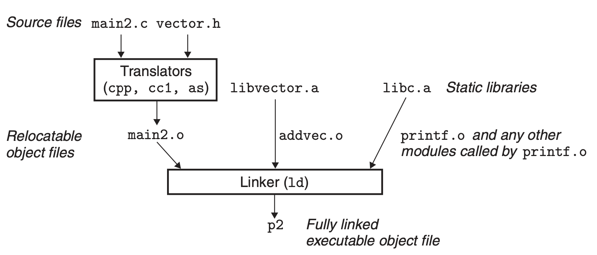

### 7.6.3 How Linkers Use Static Libraries to Resolve References
* During the symbol resolution phase, the linker scans the relocatable object files and archives left to right in the same sequential order that they appear on the compiler driver’s command line. (The driver automatically translates any .c files on the command line into .o files.) During this scan, the linker maintains a **set E** of relocatable object files that will be merged to form the executable, a **set U** of unresolved symbols (i.e., symbols referred to, but not yet defined), and a **set D** of symbols that have been defined in previous input files. Initially, E, U, and D are empty.
    * For each input file f on the command line, the linker determines if f is an object file or an archive. If f is an object file, the linker adds f to E, updates U and D to reflect the symbol definitions and references in f, and proceeds to the next input file.
    * If f is an archive, the linker attempts to match the unresolved symbols in U against the symbols defined by the members of the archive. If some archive member, m, defines a symbol that resolves a reference in U , then m is added to E, and the linker updates U and D to reflect the symbol definitions and references in m. This process iterates over the member object files in the archive until a fixed point is reached where U and D no longer change. At this point, any member object files not contained in E are simply discarded and the linker proceeds to the next input file.
    * If U is nonempty when the linker finishes scanning the input files on the command line, it prints an error and terminates. Otherwise, it merges and relocates the object files in E to build the output executable file.
* Unfortunately, this algorithm can result in some baffling link-time errors because the ordering of libraries and object files on the command line is significant. If the library that defines a symbol appears on the command line before the object file that references that symbol, then the reference will not be resolved and linking will fail.
    * The general rule for libraries is to place them at the end of the command line.

## 7.7 Relocation
* Once the linker has completed the symbol resolution step, it has associated each symbol reference in the code with exactly one symbol definition (i.e., a symbol table entry in one of its input object modules). At this point, the linker knows the exact sizes of the code and data sections in its input object modules.

* Relocation consists of two steps:
    * **Relocating sections and symbol definitions**. In this step, the linker merges all sections of the same type into a new aggregate section of the same type. For example, the .data sections from the input modules are all merged into one section that will become the .data section for the output executable object file. The linker then assigns run-time memory addresses to the new aggregate sections, to each section defined by the input modules, and to each symbol defined by the input modules. When this step is complete, every instruction and global variable in the program has a unique run-time memory address.
    * **Relocating symbol references within sections**. In this step, the linker modifies every symbol reference in the bodies of the code and data sections so that they point to the correct run-time addresses. To perform this step, the linker relies on data structures in the relocatable object modules known as **relocation entries**, which we describe next.

### 7.7.1 Relocation Entries
* When an assembler generates an object module, it does not know where the code and data will ultimately be stored in memory. Nor does it know the locations of any externally defined functions or global variables that are referenced by the module.
* So whenever the assembler encounters a reference to an object whose ultimate location is unknown, it generates a **relocation entry** that tells the linker how to modify the reference when it merges the object file into an executable. Relocation entries for code are placed in .rel.text. Relocation entries for initialized data are placed in .rel.data.
* Code
    ```c++
    typedef struct {
        int offset;      /* Offset of the reference to relocate */
        int symbol:24,  /* Symbol the reference should point to */
            type:8;     /* Relocation type */
    } Elf32_Rel;
    ```

### 7.7.2 Relocating Symbol References
* Code
    ```c++
    void foreach_section_s() {
        void foreach_relocation_entry_r() {
            refptr = s + r.offset;   /* ptr to reference to be relocated */

            if (r.type == R_386_PC32) { /* Relocate a PC-relative reference */
                refaddr = ADDR(s) + r.offset; /* ref’s run-time address */
                *refptr = (unsigned) (ADDR(r.symbol) + *refptr - refaddr);
            }

            if (r.type == R_386_32) /* Relocate an absolute reference */
                *refptr = (unsigned) (ADDR(r.symbol) + *refptr);
        }
    }
    ```
* Relocating PC-Relative References
* Relocating Absolute References

## 7.8 Executable Object Files
* 
* The **ELF header** describes the overall format of the file. It also includes the program’s `entry point`, which is the address of the first instruction to execute when the program runs.
* The **.init** section defines a small function, called `_init`, that will be called by the program’s initialization code. Since the executable is fully linked (relocated), it needs no .rel sections.
* ELF executables are designed to be easy to load into memory, with contiguous chunks of the executable file mapped to contiguous memory segments. This mapping is described by the **segment header table**.
* Stack orgnization when a program starts
    * 

## 7.9 Loading Executable Object Files
* After input ./p, the shell assumes that p is an executable object file, which it runs for us by invoking some memory-resident operating system code known as the **loader**. Any Unix program can invoke the loader by calling the execve function which we will describe in detail in Section 8.4.5.

    * The interesting point is that the loader never actually copies any data from disk into memory. The data is paged in automatically and on demand by the virtual memory system the first time each page is referenced, either by the CPU when it fetches an instruction, or by an executing instruction when it references a memory location. [Chapter 9.4]
* The **loader** copies the code and data in the executable object file from disk into memory, and then runs the program by jumping to its first instruction, or `entry point`. This process of copying the program into memory and then running it is known as **loading**.
* 
* When the loader runs, it creates the memory image. Guided by the `segment header table` in the executable, it copies chunks of the executable into the code and data segments. Next, the loader jumps to the program’s entry point, which is always the address of the **_start symbol**. The startup code at the _start address is defined in the object file [**crt1.o**](https://docs.oracle.com/cd/E88353_01/html/E37853/crti.o-7.html) (C run time) and is the same for all C programs.
* Start up code
    ```c++
    0x080480c0 <_start>         // entry point in .text
        call __libc_init_first   // startup code in .text
        call _init              // startup code in .init
        call atexit             // startup code in .text
        call main               // application main routine
        call _exit              // returns control to OS
    ```
    * The startup code sets up the stack and passes control to the main routine of the new program.

* **atexit** routine appends a list of routines that should be called when the application terminates normally.

* _start
    ```c++
    // Glibc-2.3.1/sysdeps/x86_64/elf/start.S
    _start:
        xorq %rbp, %rbp

        /* Extract the arguments as encoded on the stack and set up
        the arguments for
        __libc_start_main (int (*main) (int, char **, char **),
            int argc, char *argv,
            void (*init) (void), void (*fini) (void),
            void (*rtld_fini) (void), void *stack_end).
        The arguments are passed via registers and on the stack:
        main:        %rdi
        argc:        %rsi
        argv:        %rdx
        init:        %rcx
        fini:        %r8
        rtld_fini:    %r9
        stack_end:    stack. */

        movq %rdx, %r9  /* Address of the shared library termination function. */
        popq %rsi       /* Pop the argument count. */
        movq %rsp, %rdx /* argv starts just at the current stack top. */
        andq  $~15, %rsp/* Align the stack to a 16 byte boundary to follow the ABI. */
        pushq %rax      /* Push garbage because we push 8 more bytes. */
        pushq %rsp      /* Provide the highest stack address to the user code (for stacks which grow downwards). */

        movq $_fini, %r8/* Pass address of our own entry points to .fini and .init. */
        movq $_init, %rcx

        movq $BP_SYM (main), %rdi

        /* Call the user's main function, and exit with its value. But let the libc call main.      */
        call BP_SYM (__libc_start_main)

        hlt            /* Crash if somehow `exit' does return. */

    /* Define a symbol for the first piece of initialized data. */
        .data
        .globl __data_start
    __data_start:
        .long 0
        .weak data_start
        data_start = __data_start
    ```

* __libc_start_main
    ```c++
    // glibc-2.3.1/sysdeps/generic/libc-start.c
    int BP_SYM (__libc_start_main) (
        int (*main) (int, char **, char **),
        int argc,
        char ** ubp_av,
        void (*init) (void),
        void (*fini) (void),
        void (*rtld_fini) (void),
        void * stack_end)
    {
        char ** ubp_ev = &ubp_av[argc + 1];

        /* Result of the 'main' function.  */
        int result;
        __libc_multiple_libcs = &_dl_starting_up && !_dl_starting_up;

        INIT_ARGV_and_ENVIRON;

        /* Store the lowest stack address.  */
        __libc_stack_end = stack_end;

        __pthread_initialize_minimal ();

        /* Register the destructor of the dynamic linker if there is any.  */
        if (__builtin_expect (rtld_fini != NULL, 1))
            __cxa_atexit ((void (*) (void *)) rtld_fini, NULL, NULL);

        /* Call the initializer of the libc.  This is only needed here if we
            are compiling for the static library in which case we haven't
            run the constructors in `_dl_start_user'.  */
        __libc_init_first (argc, argv, __environ);

        __cxa_atexit ((void (*) (void *)) fini, NULL, NULL);

        (*init) ();

        result = main (argc, argv, __environ);

        exit(result);
    }

    void exit (int status)
    {
        while (__exit_funcs != NULL) {
            __exit_funcs();
            __exit_funcs = __exit_funcs->next;
        }
        _exit (status);
    }

    _exit:
        movl    4(%esp), %ebx
        movl    $__NR_exit, %eax
        int     $0x80
        hlt
    ```

* 

## 7.10 Dynamic Linking with Shared Libraries
* **Shared libraries** are modern innovations that address the disadvantages of static libraries. A shared library is an object module that, at run time, can be loaded at an arbitrary memory address and linked with a program in memory. This process is known as **dynamic linking** and is performed by a program called a **dynamic linker**.
* Shared libraries are “shared” in two different ways:
    1. In any given file system, there is exactly one .so file for a particular library. The code and data in this .so file are shared by all of the executable object files that reference the library, as opposed to the contents of static libraries, which are copied and embedded in the executables that reference them.
    2. A single copy of the .text section of a shared library in memory can be shared by different running processes. We will explore this in more detail when we study virtual memory in Chapter 9.
* Code
    ```c++
    gcc -shared -fPIC -o libvector.so addvec.c multvec.c
    gcc -o p2 main2.c ./libvector.so
    ```
    * It is important to realize that none of the code or data sections from libvector.so are actually copied into the executable p2 at this point. Instead, the linker copies some relocation and symbol table information that will allow references to code and data in libvector.so to be resolved at run time.

* 
* It notices that p2 contains a `.interp` section, which contains the path name of the **dynamic linker**, which is itself a shared object (e.g., ld-linux.so on Linux systems)
* The loader loads and runs the dynamic linker. The dynamic linker then finishes the linking task by performing the following relocations:
    * Relocating the text and data of libc.so into some memory segment.
    * Relocating the text and data of libvector.so into another memory segment.
    * Relocating any references in p2 to symbols defined by libc.so and libvector.so.

## 7.11 Loading and Linking Shared Libraries from Applications
* Code
    ```c++
    #include <dlfcn.h>
    void *dlopen(const char *filename, int flag); // RTLD_GLOBAL, RTLD_NOW, RTLD_LAZY
    void *dlsym(void *handle, char *symbol);
    int dlclose (void *handle);
    const char *dlerror(void);
    ```

## 7.12 Position-Independent Code (PIC)
* PIC Data References
    * Compilers generate PIC references to global variables by exploiting the following interesting fact:

        * No matter where we load an object module (including shared object modules) in memory, the data segment is always allocated immediately after the code segment. Thus, the `distance` between any instruction in the code segment and any variable in the data segment is a run-time constant, independent of the absolute memory locations of the code and data segments.
    * To exploit this fact, the compiler creates a table called the **global offset table (GOT)** at the beginning of the `.data segment`. The global offset table (GOT) contains an entry for each global data object that is referenced by the object module. The compiler also generates a relocation record for each entry in the GOT. At load time, the dynamic linker relocates each entry in the GOT so that it contains the appropriate absolute address. Each object module that references global data has its own GOT.
    * At run time, each global variable is referenced indirectly through the GOT using code of the form
        * Code
            ```c++
                call L1
            L1: popl %ebx           // ebx contains the current PC
                addl $VAROFF, %ebx  // ebx points to the GOT entry for var
                movl (%ebx), %eax   // reference indirect through the GOT
                movl (%eax), %eax
            ```
    * Disadvantages:

        * PIC code has performance disadvantages. Each global variable reference now requires five instructions instead of one, with an additional memory reference to the GOT.
* PIC code uses an additional register to hold the address of the GOT entry.

* PIC Function Calls
    *   It would certainly be possible for PIC code to use the same approach for resolving external procedure calls:
        ```c++
            call L1
        L1: popl %ebx           // ebx contains the current PC
            addl $PROCOFF, %ebx // ebx points to GOT entry for proc
            call *(%ebx)        // call indirect through the GOT
        ```
    *  **lazy binding** defers the binding of procedure addresses until the first time the procedure is called
    * If an object module calls any functions that are defined in shared libraries, then it has its own **GOT** and **procedure linkage table (PLT)**. The GOT is part of the `.data section`. The PLT is part of the `.text section`.
    * 
        * GOT[0] contains the address of the .dynamic segment, which contains information that the dynamic linker uses to bind procedure addresses, such as the location of the `symbol table` and `relocation information`.
        * GOT[1] contains some information that defines this module.
        * GOT[2] contains an entry point into the lazy binding code of the `dynamic linker`.
        * PLT[0], is a special entry that jumps into the dynamic linker.
        * When addvec is called the first time, control passes to the first instruction in PLT[2], which does an indirect jump through GOT[4]. Initially, each GOT entry contains the address of the pushl entry in the corresponding PLT entry. So the indirect jump in the PLT simply transfers control back to the next instruction in PLT[2]. This instruction pushes an ID for the addvec symbol onto the stack. The last instruction jumps to PLT[0], which pushes another word of identifying information on the stack from GOT[1], and then jumps into the dynamic linker indirectly through GOT[2]. The dynamic linker uses the two stack entries to determine the location of addvec, overwrites GOT[4] with this address, and passes control to addvec.
        * The next time addvec is called in the program, control passes to PLT[2] as before. However, this time the indirect jump through GOT[4] transfers control to addvec. The only additional overhead from this point on is the memory reference for the indirect jump.


## 7.13 Tools for Manipulating Object Files
* **ar**: Creates static libraries, and inserts, deletes, lists, and extracts members. strings: Lists all of the printable strings contained in an object file.
* **strip**: Deletes symbol table information from an object file.
* **nm**: Lists the symbols defined in the symbol table of an object file.
* **size**: Lists the names and sizes of the sections in an object file.
* **readelf**: Displays the complete structure of an object file, including all of the information encoded in the ELF header; subsumes the functionality of size and nm.
* **objdump**: Themotherofallbinarytools.Candisplayalloftheinformationinan object file. Its most useful function is disassembling the binary instructions in the .text section.
## 7.14 Summary

# 8 Exceptional Control Flow
## 8.1 Exception
* When the exception handler finishes processing, one of three things happens, depending on the type of event that caused the exception:
    1. The handler returns control to the current instruction `Icurr`, the instruction that was executing when the event occurred.
    2. The handler returns control to `Inext`, the instruction that would have executed next had the exception not occurred.
    3. The handler `aborts` the interrupted program.

### 8.1.1 Exception Handling
* The exception number is an index into the exception table, whose starting address is contained in a special CPU register called the **exception table base register**.
    * 

* An exception is akin to a procedure call, but with some important differences:
    * As with a procedure call, the processor `pushes a return address` on the stack before branching to the handler. However, depending on the class of exception, the return address is either the current instruction or the next instruction.
    * The processor also pushes some additional processor state onto the stack that will be necessary to `restart` the interrupted program when the handler returns.
    * If control is being transferred from a user program to the kernel, all of these items are pushed onto the `kernel’s stack` rather than onto the user’s stack.
    * Exception handlers run in `kernel mode` (Section 8.2.4), which means they have complete access to all system resources.

### 8.1.2 Classes of Exceptions
1. Interrupt
    * Interrupts are essentially a form of hardware polling. The interrupt mechanism removes the burden of polling devices from software, but adding hardware to the CPU to check I/O device flags during every instruction cycle. Generally, the only role played by the interrupt hardware is detecting when I/O devices are ready. Once an event is detected, it is up to software to actually perform the I/O transaction. [Reference](http://www.cs.uwm.edu/classes/cs315/Bacon/Lecture/HTML/ch15s04.html)
2. Trapping System Call
3. Fatal
    * If the handler is able to correct the error condition, it returns control to the faulting instruction, thereby reexecuting it. Otherwise, the handler returns to an abort routine in the kernel that terminates the application program that caused the fault.
4. Abort

Class | Cause | Async/Sync | Return behavior
--- | --- | ---| ---
Interrupt | Signal from I/O device | Async | Always returns to next instruction
Trap | Intentional exception | Sync | Always returns to next instruction
Fault | Potentially recoverable error | Sync | Might return to current instruction
Abort | Nonrecoverable error | Sync | Never returns


## 8.1.3 Exceptions in Linux/IA32 Systems
All parameters to Linux system calls are passed through general purpose registers rather than the stack. **rdi, rsi, rbx, rcx, rdx, ebp**

## 8.2 Processes
* A **process** is an instance of a program in execution.
* The key abstractions that process provides to the application:
    1. An independent `logical control flow` that provides the illusion that our program has exclusive use of the `processor`.
    2. A private `address space` that provides the illusion that our program has exclusive use of the `memory` system.

### 8.2.2 Concurrent Flows
A logical flow whose execution overlaps in time with another flow is called a **concurrent flow**, and the two flows are said to run concurrently.

If two flows are running concurrently on different processor cores or computers, then we say that they are **parallel flows**.

### 8.2.4 User and Kernel Mode
When the exception occurs, and control passes to the exception handler, the processor changes the mode from user mode to kernel mode. The handler runs in kernel mode.

### 8.2.5 Context Switch
The context switch mechanism is built on top of the lower-level exception mechanism.

The kernel maintains a context for each process. The context is the state that the kernel needs to restart a preempted process. It consists of the values of objects such as the **general purpose registers**, the **floating-point registers**, the **program counter**, **user’s stack**, **status registers**, **kernel’s stack**, and various kernel data structures such as a **page table** that characterizes the address space, a **process table** that contains information about the current process, and a **file table** that contains information about the files that the process has opened.

context switch that:
1. saves the context of the current process
2. restores the saved context of some previously preempted process
3. passes control to this newly restored process.

If the system call blocks because it is waiting for some event to occur, then the kernel can put the current process to sleep and switch to another process.

## 8.3 System Call Error Handling

## 8.4 Process Control
### 8.4.3 Reaping Child Process
If the parent process terminates without reaping its zombie children, the kernel arranges for the init process to reap them.

### 8.4.5 Loading and Running Programs
* Code
    ```c++
    #include <unistd.h>
    int execve(const char *filename, const char *argv[], const char *envp[]);
    ```
* Unlike fork, which is called once but returns twice, execve is called once and never returns.
* Stack orgnization when a program starts

    * 


### 8.4.6 Using fork and execve to Run Programs

## 8.5 Signals
### 8.5.1 Signal Terminology
A signal that has been sent but not yet received is called a **pending signal**.

At any point in time, there can be at most one pending signal of a particular type.

When a signal is blocked, it can be delivered, but the resulting pending signal will not be received until the process unblocks the signal.

Kernel maintains the set of pending signals in the pending bit vector, and the set of blocked signals in the blocked bit vector.

### 8.5.4 Signal Handling Issues
1. Pending signals are blocked.
2. Pending signals are not queued. There can be at most one pending signal of any particular type.
3. System calls (e.g., read, write, accept) can be interrupted, when a handler catches a signal do not resume when the signal handler returns, but instead return immediately to the user with an error condition and errno set to EINTR.

On particular system, slow system calls such as read are not restarted automatically after they are interrupted by the delivery of a signal.
Instead, they return prematurely to the calling application with an error condition, unlike Linux systems, which restart interrupted system calls automatically.

### Linux Signal Handling

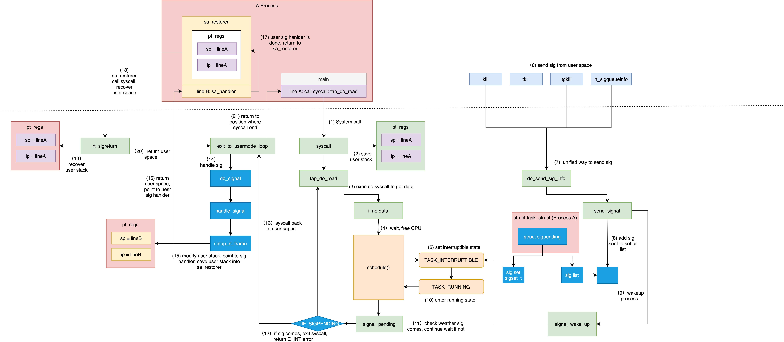

## 8.6 Nonlocal Jumps

## 8.7 Tools for Manipulating Processes

# 9 Virtual Memory
Virtual memory is an elegant interaction of hardware exceptions, hardware address translation, main memory, disk files, and kernel software that provides each process with a large, uniform, and private address space.

virtual memory provides three important capabilities:
* It uses main memory efficiently by treating it as a cache for an address space stored on disk, keeping only the active areas in main memory, and transferring data back and forth between disk and memory as needed.
* It simplifies memory management by providing each process with a uniform address space.
* It protects the address space of each process from corruption by other processes.

## 9.1 Physical and Virtual Addressing
* 

## 9.2 Address Spaces
* If the integers in the address space are consecutive, then we say that it is a **linear address space**.

## 9.3 VM as a Tool for Caching
* virtual pages
    * **Unallocated**: Pages that have not yet been allocated (or created) by the VM system. Unallocated blocks do not have any data associated with them, and thus do not occupy any space on disk.
    * **Cached**: Allocated pages that are currently cached in physical memory.
    * **Uncached**: Allocated pages that are not cached in physical memory.

### 9.3.1 DRAM Cache Organization
* we will use the term **SRAM** cache to denote the L1, L2, and L3 cache memories between the CPU and main memory, and the term **DRAM** cache to denote the VM system’s cache that caches virtual pages in main memory.
* A DRAM is at least `10` times slower than an SRAM and that disk is about `100,000` times slower than a DRAM.
* Because of the large miss penalty and the expense of accessing the first byte, virtual pages tend to be large, typically `4 KB` to `2 MB`.
* Due to the large miss penalty, DRAM caches are `fully associative`, that is, any virtual page can be placed in any physical page.

### 9.3.2 Page Tables
* 

### 9.3.3 Page Hits

### 9.3.4 Page Faults

### 9.3.5 Allocating Pages

### 9.3.6 Locality to the Rescue Again
* Although the total number of distinct pages that programs reference during an entire run might exceed the total size of physical memory, the principle of locality promises that at any point in time they will tend to work on a smaller set of active pages known as the **working set** or **resident set**. After an initial overhead where the working set is paged into memory, subsequent references to the working set result in hits, with no additional disk traffic.

* If the working set size exceeds the size of physical memory, then the program can produce an unfortunate situation known as `thrashing`, where pages are swapped in and out continuously.

## 9.4 VM as a Tool for Memory Management
* 
* **Simplifying linking**. A separate address space allows each process to use the same basic format for its memory image, regardless of where the code and data actually reside in physical memory. Such uniformity greatly simplifies the design and implementation of linkers, allowing them to produce fully linked executables that are independent of the ultimate location of the code and data in physical memory.
* **Simplifying loading**. Virtual memory also makes it easy to load executable and shared object files into memory.
* **Simplifying sharing**. Separate address spaces provide the operating system with a consistent mechanism for managing sharing between user processes and the operating system itself.
* **Simplifying memory allocation**. When a program running in a user process requests additional heap space (e.g., as a result of calling malloc), the operating system allocates an appropriate number, say, k, of contiguous virtual memory pages, and maps them to k arbitrary physical pages located anywhere in physical memory. Because of the way page tables work, there is no need for the operating system to locate k contiguous pages of physical memory. The pages can be scattered randomly in physical memory.

## 9.5 VM as a Tool for Memory Protection
* 

## 9.6 Address Translation
* 
* 

* Page Hit 
    1. The processor generates a virtual address and sends it to the MMU.
    2. The MMU generates the PTE address and requests it from the cache/main memory.
    3. The cache/main memory returns the PTE to the MMU.
    4. The MMU constructs the physical address and sends it to cache/main memory.
    5. The cache/main memory returns the requested data word to the processor.

* Page Fault 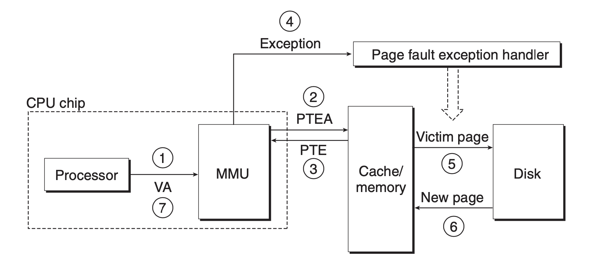
    1. The same as Steps 1 to 3 in Page Hit.
    2. The same as Steps 1 to 3 in Page Hit.
    3. The same as Steps 1 to 3 in Page Hit.
    4. The valid bit in the PTE is zero, so the MMU triggers an exception, which transfers control in the CPU to a page fault exception handler in the operating system kernel.
    5. The fault handler identifies a victim page in physical memory, and if that page has been modified, pages it out to disk.
    6. The fault handler pages in the new page and updates the PTE in memory.
    7. The fault handler returns to the original process, causing the faulting instruction to be restarted. The CPU resends the offending virtual address to the MMU. Because the virtual page is now cached in physical memory, there is a hit, and after the MMU performs the steps, the main memory returns the requested word to the processor.

### 9.6.1 Integrating Caches and VM
* 
* Most systems use `physical addresses` to access the SRAM cache. With physical addressing, it is straightforward for multiple processes to have blocks in the cache at the same time and to share blocks from the same virtual pages. Further, the cache does not have to deal with protection issues because access rights are checked as part of the address translation process.
* The main idea is that the address translation occurs before the cache lookup. Notice that page table entries can be cached, just like any other data words.

### 9.6.2 Speeding up Address Translation with a TLB
* A TLB is a small, virtually addressed cache where each line holds a block consisting of a single PTE. A TLB usually has a high degree of associativity.
* TLB has T = 2^t sets, then the TLB index (TLBI) consists of the t least significant bits of the VPN, and the TLB tag (TLBT) consists of the remaining bits in the VPN.
    * 
* TLB Hit 
    1. The CPU generates a virtual address.
    2. The MMU fetches the appropriate PTE from the TLB.
    3. The MMU fetches the appropriate PTE from the TLB.
    4. The MMU translates the virtual address to a physical address and sends it to the cache/main memory.
    5. The cache/main memory returns the requested data word to the CPU.

* TLB Miss 
    * When there is a TLB miss, then the MMU must fetch the PTE from the L1 cache. The newly fetched PTE is stored in the TLB, possibly overwriting an existing entry.

### 9.6.3 Multi-Level Page Tables
* If we had a 32-bit address space, 4 KB pages, and a 4-byte PTE, then we would need a 4 MB page table resident in memory at all times, even if the application referenced only a small chunk of the virtual address space.
* The common approach for compacting the page table is to use a hierarchy of page tables instead.
* 
    * This scheme reduces memory requirements in two ways:
        * If a PTE in the level 1 table is null, then the corresponding level 2 page table does not even have to exist. This represents a significant potential savings, since most of the 4 GB virtual address space for a typical program is unallocated.
        * Only the level 1 table needs to be in main memory at all times. The level 2 page tables can be created and paged in and out by the VM system as they are needed, which reduces pressure on main memory.
* 
    * Accessing k PTEs may seem expensive and impractical at first glance. However, the TLB comes to the rescue here by caching PTEs from the page tables at the different levels. In practice, address translation with multi-level page tables is not significantly slower than with single-level page tables.

### 9.6.4 Putting It Together: End-to-end Address Translation
* 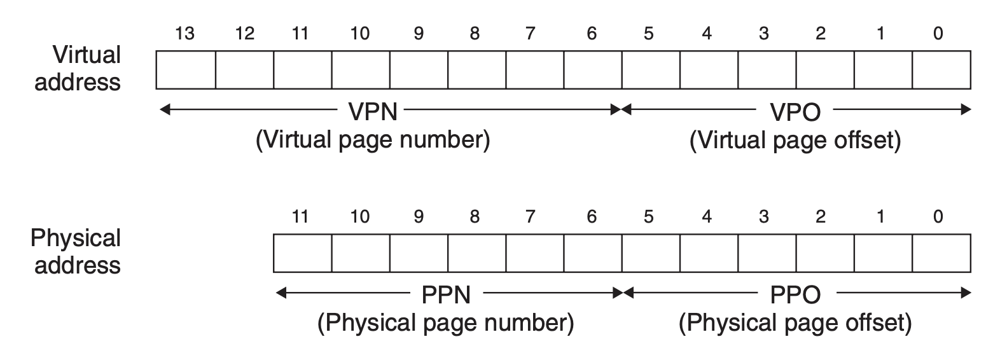
    * Assume 14-bit virtual addresses (n = 14), 12-bit physical addresses (m = 12), and 64-byte pages (P = 64), 1-byte word.
* 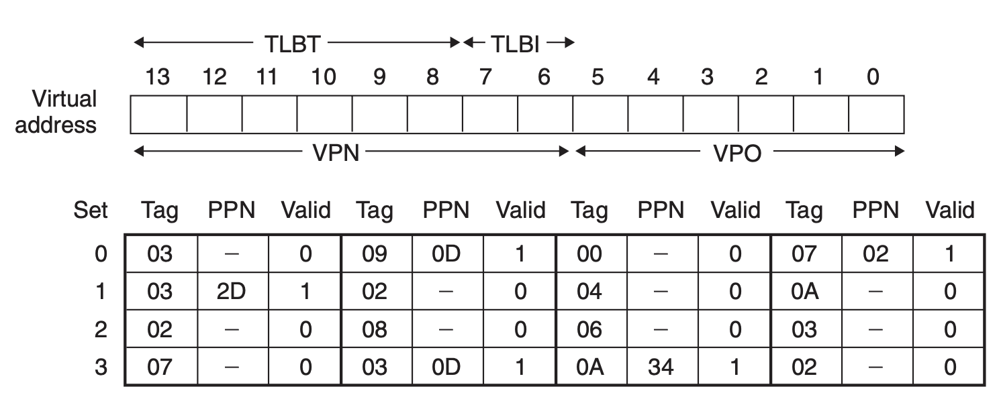
    * TLB: Four sets, 16 entries, four-way set associative
* 
    * Page table: Only the first 16 PTEs are shown
* 
    * Cache: Sixteen sets, 4-byte blocks, direct mapped


## 9.7 Case Study: The Intel Core i7/Linux Memory System
* 
    * The TLBs are `virtually addressed`, and four-way set associative.
    * The L1, L2, and L3 caches are `physically addressed`, and eight-way set associative, with a block size of 64 bytes.
    * Reference: [Intel QuickPath Interconnect](https://en.wikipedia.org/wiki/Intel_QuickPath_Interconnect)

### 9.7.1 Core i7 Address Translation
* Summary of Core i7 address translation 
    * The **CR3** control register points to the beginning of the level 1 (L1) page table. The value of CR3 is part of each process context, and is restored during each context switch.
* Format of level 1, level 2, and level 3 page table entries 
    * Each entry references a 4 KB child page table.
* Format of level 4 page table entries 
    * The XD (execute disable) bit, which was introduced in 64-bit systems, can be used to disable instruction fetches from individual memory pages. This is an important new feature that allows the operating system kernel to reduce the risk of buffer overflow attacks by restricting execution to the read-only text segment.
* Core i7 page table translation 

### 9.7.2 Linux Virtual Memory System
* 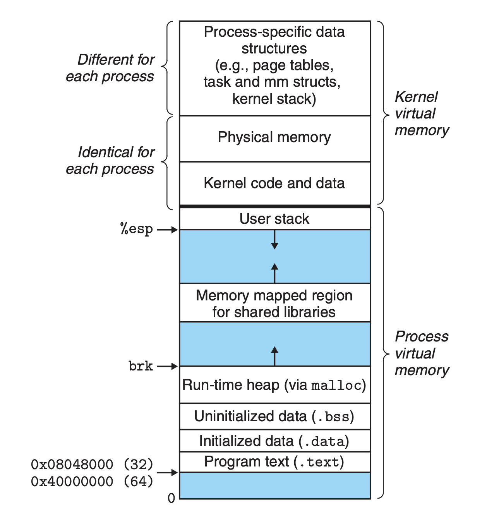
* Linux Virtual Memory Areas
    * 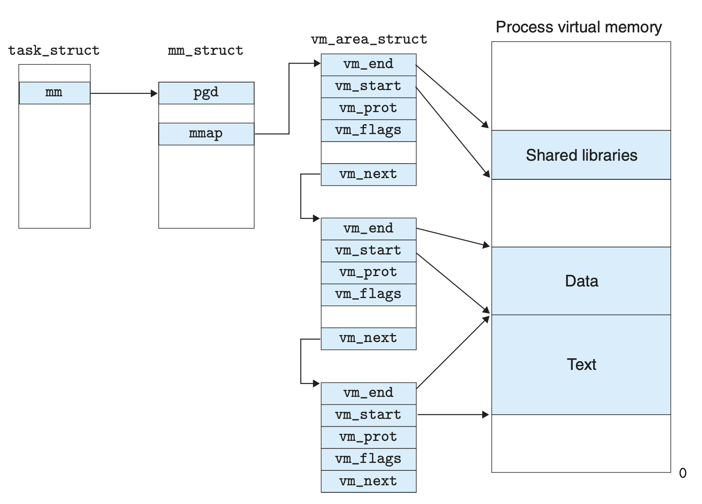
    * **pgd** points to the base of the level 1 table (the page global directory)
    * **mmap** points to a list of vm_area_structs (area structs), each of which characterizes an area of the current virtual address space.
    * When the kernel runs this process, it stores pgd in the **CR3** control register.
* Linux Page Fault Exception Handling
    * 
    1. Is virtual address A legal, does A lie within an area defined by some area struct?
        * The fault handler searches the list of area structs, comparing A with the vm_start and vm_end in each area struct. If the instruction is not legal, then the fault handler triggers a segmentation fault, which terminates the process.
    2. Is the attempted memory access legal, does the process have permission to read, write, or execute the pages in this area?
        * E.g., was the page fault the result of a store instruction trying to write to a read-only page in the text segment? Is the page fault the result of a process running in user mode that is attempting to read a word from kernel virtual memory? If the attempted access is not legal, then the fault handler triggers a protection exception, which terminates the process.
    3. At this point, the kernel knows that the page fault resulted from a legal operation on a legal virtual address.
        * It handles the fault by selecting a victim page, swapping out the victim page if it is dirty, swapping in the new page, and updating the page table.
        * When the page fault handler returns, the CPU restarts the faulting instruction, which sends A to the MMU again. This time, the MMU translates A normally, without generating a page fault.


## 9.8 Memory Mapping
* Areas can be mapped to one of two types of objects:
    1. **Regular file** in the Unix file system.
        * An area can be mapped to a contiguous section of a regular disk file, such as an executable object file. The file section is divided into page-sized pieces, with each piece containing the initial contents of a virtual page. Because of demand paging, none of these virtual pages is actually swapped into physical memory until the CPU first touches the page (i.e., issues a virtual address that falls within that page’s region of the address space). If the area is larger than the file section, then the area is padded with zeros.
    2. **Anonymous file**. Pages in areas that are mapped to anonymous files are sometimes called demand-zero pages.

### 9.8.1 Shared Objects Revisited
* An object can be mapped into an area of virtual memory as either a **shared object** or a **private object**.
* Private objects are mapped into virtual memory using a clever technique known as **copy-on-write**.
    * 

### 9.8.2 The fork Function Revisited
1. When the fork function is called by the current process, the kernel creates various data structures for the new process and assigns it a unique `PID`.
2. To create the virtual memory for the new process, it creates exact copies of the current process’s `mm_struct`, `area structs`, and `page tables`. It flags each page in both processes as `read-only`, and flags each area struct in both processes as `private copy-on-write`.
3. When the fork returns in the new process, the new process now has an exact copy of the virtual memory as it existed when the fork was called.
4. When either of the processes performs any subsequent writes, the copy-on-write mechanism creates new pages, thus preserving the abstraction of a private address space for each process.

### 9.8.3 The execve Function Revisited
* Loading and running a.out requires the following steps:
    1. Delete existing user areas.
    2. Map private areas. text, data, bss, and stack areas of the new program. All of these new areas are private copy-on-write.
    3. Map shared areas.
    4. Set the program counter (PC).

### 9.8.4 User-level Memory Mapping with the mmap Function

## 9.9 Dynamic Memory Allocation
### 9.9.2 Why Dynamic Memory Allocation?
* The most important reason that programs use dynamic memory allocation is that often they do not know the sizes of certain data structures until the program actually runs.

### 9.9.3 Allocator Requirements and Goals
* Requirements
    * Handling arbitrary request sequences.
    * Making immediate responses to requests.
    * Using only the heap. In order for the allocator to be scalable, any non-scalar data structures used by the allocator must be stored in the heap itself.
    * Aligning blocks (alignment requirement).
    * Not modifying allocated blocks

* Goals
    * Maximizing throughput.
    * Maximizing memory utilization.
        * The total amount of virtual memory allocated by all of the processes in a system is limited by the amount of swap space on disk.

### 9.9.4 Fragmentation
* **fragmentation**, which occurs when otherwise unused memory is not available to satisfy allocate requests.
* Two forms of fragmentation:
    * **Internal fragmentation** occurs when an allocated block is larger than the payload. Reasons:
        * the implementation of an allocator might impose a minimum size on allocated blocks that is greater than some requested payload.
        * the allocator might increase the block size in order to satisfy alignment constraints
    * **External fragmentation** occurs when there is enough aggregate free memory to satisfy an allocate request, but no single free block is large enough to handle the request.


### 9.9.5 Implementation Issues
* A practical allocator that strikes a better balance between throughput and utilization must consider the following issues:
    1. **Free block organization**: How do we keep track of free blocks?
    2. **Placement**: How do we choose an appropriate free block in which to place a newly allocated block?
    3. **Splitting**: After we place a newly allocated block in some free block, what do we do with the remainder of the free block?
    4. **Coalescing**: What do we do with a block that has just been freed?

### 9.9.6 Implicit Free Lists
* 

* 

* A significant disadvantage
    * is that the cost of any operation, such as placing allocated blocks, that requires a search of the free list will be linear in the total number of allocated and free blocks in the heap.

### 9.9.7 Placing Allocated Blocks
* Placement policy:
    * **First fit** searches the free list from the beginning and chooses the first free block that fits.
        * Advantage: it tends to retain large free blocks at the end of the list
        * Disadvantage: it tends to leave “splinters” of small free blocks toward the beginning of the list, which will increase the search time for larger blocks.
    * **Next fit** is similar to first fit, but instead of starting each search at the beginning of the list, it starts each search where the previous search left off.
        * Pros: runs significantly faster than first fit, especially if the front of the list becomes littered with many small splinters.
        * Cos: suffers from worse memory utilization than first fit
    * **Best fit** examines every free block and chooses the free block with the smallest size that fits.
        * Pros: enjoys better memory utilization than either first fit or next fit
        * Cos: requires an exhaustive search of the heap

### 9.9.8 Splitting Free Blocks

### 9.9.9 Getting Additional Heap Memory
* What happens if the allocator is unable to find a fit for the requested block?
    * try to create some larger free blocks by merging (coalescing) free blocks that are physically adjacent in memory (next section).
    * if this does not yield a sufficiently large block, or if the free blocks are already maximally coalesced, then the allocator asks the kernel for additional heap memory by calling the `sbrk` function. The allocator transforms the additional memory into one large free block, inserts the block into the free list, and then places the requested block in this new free block.

### 9.9.10 Coalescing Free Blocks
* When to perform coalescing:
    * The allocator can opt for immediate coalescing by merging any adjacent blocks each time a block is freed.
        * It is straightforward and can be performed in constant time, but with some request patterns it can introduce a form of `thrashing` where a block is repeatedly coalesced and then split soon thereafter.
    * Or it can opt for deferred coalescing by waiting to coalesce free blocks at some later time.

### 9.9.11 Coalescing with Boundary Tags
* It's easy to coalesce next blocks with implicit format, but hard for previous blocks. To address this issues, blocks with boundary tags come.

* The idea of boundary tags is a simple and elegant one that generalizes to many different types of allocators and free list organizations. However, there is a potential disadvantage. Requiring each block to contain both a header and a footer can introduce significant memory overhead if an application manipulates many small blocks.


### 9.9.13 Explicit Free Lists
Because block allocation time is linear in the total number of heap blocks, the implicit free list is not appropriate for a general-purpose allocator.

* Using a doubly linked list instead of an implicit free list reduces the `first fit` allocation time from linear in the total number of blocks to linear in the number of free blocks. However, the time to `free a block` can be either linear or constant, depending on the policy we choose for ordering the blocks in the free list.

* There is one somewhat subtle aspect. The free list format we have chosen—with its prologue and epilogue blocks that are always marked as allocated—allows us to ignore the potentially troublesome edge conditions where the requested block bp is at the beginning or end of the heap.
* 

### 9.9.14 Segregated Free Lists
* Simple Segregated Storage
    * Steps:
        * If the list is not empty, we simply allocate the first block in its entirety. Free blocks are never split to satisfy allocation requests.
        * If the list is empty, the allocator requests a fixed-sized chunk of additional memory from the operating system (typically a multiple of the page size), divides the chunk into equal-sized blocks, and links the blocks together to form the new free list.
        * To free a block, the allocator simply inserts the block at the front of the appropriate free list.
    * Advantages:
        * Allocating and freeing blocks are both fast `constant-time operations`
        * The combination of the same-sized blocks in each chunk, no splitting, and no coalescing means that there is very little per-block memory `overhead`
        * Since each chunk has only same-sized blocks, the size of an allocated block can be `inferred` from its address
        * Since there is no coalescing, allocated blocks do not need an `allocated/free flag` in the header
        * Allocated blocks require no `headers`, and since there is no coalescing, they do not require any `footers` either.
        * Since allocate and free operations insert and delete blocks at the beginning of the free list, the list need only be `singly linked` instead of doubly linked
    * Disadvantages:
        * It is susceptible to internal and external fragmentation. Internal fragmentation is possible because free blocks are never split. Worse, certain reference patterns can cause extreme external fragmentation because free blocks are never coalesced

* Segregated Fits
    * Steps:
        * To allocate a block, we determine the size class of the request and do a first- fit search of the appropriate free list for a block that fits.
        * If we find one, then we (optionally) split it and insert the fragment in the appropriate free list.
        * If we cannot find a block that fits, then we search the free list for the next larger size class.
            * We repeat until we find a block that fits.
            * If none of the free lists yields a block that fits, then we request additional heap memory from the operating system, allocate the block out of this new heap memory, and place the remainder in the appropriate size class.
        * To free a block, we coalesce and place the result on the appropriate free list.
    * Each free list is associated with a size class and is organized as some kind of explicit or implicit list.
    * Advantages:
        * Search times are reduced because searches are limited to `particular parts` of the heap instead of the entire heap.
        * Memory utilization can improve because of the interesting fact that a simple first-fit search of a segregated free list approximates a `best-fit` search of the entire heap.

* Buddy Systems
    * A buddy system is a special case of segregated fits where each size class is a power of two.
    * A key fact about buddy systems is that given the address and size of a block, it is easy to compute the address of its buddy.
    * The major advantage of a buddy system allocator is its fast searching and coalescing. The major disadvantage is that the power-of-two requirement on the block size can cause significant internal fragmentation.

## Reference
https://mp.weixin.qq.com/s?__biz=MzkwOTE2OTY1Nw==&mid=2247486881&idx=2&sn=77785597cd937db3013ad6c395b557a3&source=41#wechat_redirect

## 9.10 Garbage Collection

## 9.11 Common Memory-Related Bugs in C Programs
1. Dereferencing Bad Pointers
2. Reading Uninitialized Memory
    * While bss memory locations (such as uninitialized global C variables) are always initialized to zeros by the loader, this is not true for heap memory.
3. Allowing Stack Buffer Overflows
4. Assuming that Pointers and the Objects They Point to Are the Same Size
5. Making Off-by-One Errors
6. Referencing a Pointer Instead of the Object It Points to
7. Misunderstanding Pointer Arithmetic
8. Referencing Nonexistent Variables
9. Referencing Data in Free Heap Blocks
10. Introducing Memory Leaks

# 10 System-Level I/O
## 10.1 Unix I/O
* A Unix file is a sequence of m bytes.

## 10.2 Opening and Closing Files

## 10.3 Reading and Writing Files
* In some situations, read and write transfer fewer bytes (short counts) than the application requests:
    * Encountering EOF on reads
    * Reading text lines from a terminal
    * Reading and writing network sockets
* In practice, you will never encounter short counts when you read from `disk files` except on EOF, and you will never encounter short counts when you write to disk files.

## 10.4 Robust Reading and Writing with the Rio Package
### 10.4.1 Rio Unbuffered Input and Output Functions
```c++
ssize_t rio_readn(int fd, vodi* userbuf, size_t n) {
    size_t nleft = n;
    ssizet_t nread;
    char* bufp = userbuf;

    while (nleft > 0) {
        if ((nread = read(fd, bufp, nleft)) < 0) {
            if (errno == EINTR)
                nread = 0;
            else
                return -1;
        } else if (nread == 0) {
            break;
        }

        nleft -= nread;
        bufp += nread;
    }

    return (n - nleft);
}
```

```c++
ssize_t rio_writen(int fd, void* userbuf, size_t n) {
    size_t nleft = n;
    ssize_t nwrite;
    char* bufp = userbuf;

    while (nleft > 0) {
        if ((nwrite = write(fd, bufp, nleft)) <= 0) {
            if (errno == EINTR) {
                nwrite = 0;
            } else {
                return -1;
            }
        }

        nleft -= nwrite;
        bufp += nwrite;
    }

    return n;
}
```

### 10.4.2 Rio Buffered Input Functions

## 10.5 Reading File Metadata
## 10.6 Sharing Files
* The kernel represents open files using three related data structures:
    * **Descriptor table**. Each process has its own separate descriptor table whose entries are indexed by the process’s open file descriptors. Each open descriptor entry points to an entry in the file table.
    * **File table**. The set of open files is represented by a file table that is shared by all processes. Each file table entry consists of (for our purposes) the current file position, a reference count of the number of descriptor entries that currently point to it, and a pointer to an entry in the v-node table. Closing a descriptor decrements the reference count in the associated file table entry. The kernel will not delete the file table entry until its reference count is zero.
    * **v-node table**. Like the file table, the v-node table is shared by all processes. Each entry contains most of the information in the stat structure, including the st_mode and st_size members.
* 

## 10.7 I/O Redirection
* 

## 10.8 Standard I/O
## 10.9 Putting It Together: Which I/O Functions Should I Use?

# 10+ Input/Output
* :link:[University of Wisconsin-Milwaukee: Computer Science 315 Lecture Notes](http://www.cs.uwm.edu/classes/cs315/Bacon/Lecture/HTML/index.html)

## I/O Devices
I/O devices include human interface devices (HIDs), network interfaces, and storage devices such as disks.

## Memory-Mapped I/O
### Introduction
* From the CPU's perspective, an I/O device appears as a set of special-purpose registers, of three general types:
    * **Status registers** provide status information to the CPU about the I/O device. These registers are often read-only, i.e. the CPU can only read their bits, and cannot change them.
    * **Control registers** are used by the CPU to configure and control the device. Bits in these configuration registers may be write-only, so the CPU can alter them, but not read them back. Most bits in control registers can be both read and written.
    * **Data registers** are used to read data from or send data to the I/O device.
* The logic circuit that contains these registers is called the **device controller**, and the software that communicates with the controller is called a **device driver**.
    ```
				            +-------------------+           +-----------+
				            | Device controller |           |           |
	    +-------+           |                   |           |           |
	    |       |---------->| Control register  |<--------->|  Device   |
	    |  CPU  |<----------| Status register   |           |           |
	    |       |<--------->| Data register     |           |           |
	    +-------+           |                   |           |           |
				            +-------------------+           +-----------+
    ```

* Each of the I/O registers, like memory, must have an address so that the CPU can read or write specific registers.
* Other architectures, like the MIPS, use **memory-mapped I/O**. When using memory-mapped I/O, the same address space is shared by memory and I/O devices. Some addresses represent memory cells, while others represent registers in I/O devices. No separate I/O instructions are needed in a CPU that uses memory-mapped I/O. Instead, we can perform I/O operations using any instruction that can reference memory.
    ```
			            +---------------+
                        | Address space |
                        |   +-------+   |
                        |   |  ROM  |   |
			            |   +-------+   |
	    +-------+address|   |       |   |
	    |       |------>|   |  RAM  |   |
	    |  CPU  |       |   |       |   |
	    |       |<----->|   +-------+   |
	    +-------+ data  |   |       |   |
                        |   |  I/O  |   |
                        |   +-------+   |
                        +---------------+
    ```


# 11 Network Programming
## 11.1 The Client-Server Programming Model
## 11.2 Networks
## 11.3 The Global IP Internet
## 11.4 The Sockets Interface
## 11.5 Web Servers
## 11.6 Putting It Together: The Tiny Web Server


# 12 Concurrent Programming
## 12.1 Concurrent Programming with Processes
### 12.1.1 A Concurrent Server Based on Processes
1. servers typically run for long periods of time, so we must include a SIGCHLD handler that reaps zombie children (lines 4–9). Since SIGCHLD signals are blocked while the SIGCHLD handler is executing, and since Unix signals are not queued, the `SIGCHLD handler` must be prepared to reap `multiple zombie children`.
2. the parent and the child must close their respective copies of connfd (lines 33 and 30, respectively). As we have mentioned, this is especially important for the parent, which must close its copy of the connected descriptor to avoid a memory leak.
3. because of the reference count in the socket’s file table entry, the connection to the client will not be terminated until both the parent’s and child’s copies of connfd are closed.

## 12.2 Concurrent Programming with I/O Multiplexing
## 12.3 Concurrent Programming with Threads
### 12.3.4 Terminating Threads
* A thread terminates in one of the following ways:
    * The thread terminates `implicitly` when its top-level thread routine returns.
    * The thread terminates `explicitly` by calling the `pthread_exit` function.
        * [Wrong] If the main thread calls pthread_exit, it **waits for all other peer threads to terminate**, and then terminates the main thread and the entire process with a return value of thread_return.
        * When main thread exit, all other threads are killed.
    * Some peer thread calls the Unix `exit` function, which terminates the process and all threads associated with the process.
        * [exit vs return](https://stackoverflow.com/questions/3463551/what-is-the-difference-between-exit-and-return)
        * `return` returns from the current function; it's a language keyword like for or break.
        * `exit` terminates the whole program, wherever you call it from. (After flushing stdio buffers and so on).
            * `exit` (and return from main) calls functions registered using `atexit` or `on_exit` before really terminating the process
            * `_exit` (from #include <unistd.h>, or its synonymous _Exit from #include <stdlib.h>) terminates the process immediately.
    * Another peer thread terminates the current thread by calling the `pthread_cancel` function with the ID of the current thread.
* If main thread exits before child thread:
    * Kill all child threads nomater child threads are joinable, detachable or not.
* If child threads exit before main thread:
    * If child threads are unjoinable (main thead called join), no memory leak.
    * If child threads are joinalble (main thread didn't call join), they become [zombie thread](https://man7.org/linux/man-pages/man3/pthread_join.3.html), cause memory leak.

### 12.3.5 Reaping Terminated Threads
* Threads wait for other threads to terminate by calling the `pthread_join` function

### 12.3.6 Detaching Threads
* At any point in time, a thread is joinable or detached.
    * A **joinable** thread can be reaped and killed by other threads. Its memory resources (such as the stack) are not freed until it is reaped by another thread.
    * A **detached** thread cannot be reaped or killed by other threads. Its memory resources are freed automatically by the system when it terminates.
* By default, threads are created joinable. In order to avoid memory leaks, each joinable thread should either be explicitly reaped by another thread, or detached by a call to the pthread_detach function.

### 12.3.7 Initializing Threads
* Code
    ```c++
    #include <pthread.h>
    pthread_once_t once_control = PTHREAD_ONCE_INIT;
    int pthread_once(pthread_once_t *once_control, void (*init_routine)(void));
    ```

## 12.4 Shared Variables in Threaded Programs
### 12.4.1 Threads Memory Model
* A pool of concurrent threads runs in the context of a process.
* Each thread has its own separate thread context, which includes a **thread ID**, **stack**, **stack pointer**, **program counter**, **condition codes**, and **general-purpose register values**.
* Each thread shares the rest of the process context with the other threads. This includes the e**ntire user virtual address space**, which consists of `read-only text (code)`, `read/write data`, the `heap`, and `any shared library code` and `data areas`. The threads also share the same set of `open files`.
* The memory model for the separate thread stacks is not as clean. These stacks are contained in the `stack area` of the virtual address space, and are usually accessed independently by their respective threads.
* We say usually rather than always, because different thread stacks are not protected from other threads. So if a thread somehow manages to acquire a pointer to another thread’s stack, then it can read and write any part of that stack.

### 12.4.2 Mapping Variables to Memory
* **Global variables**: At run time, the read/write area of virtual memory contains exactly `one instance` of each global variable that can be referenced by any thread.
* **Local automatic varibles**: At run time, each thread’s stack contains `its own instances` of any local automatic variables. This is true even if multiple threads execute the same thread routine.
* **Local static variables**: As with global variables, the read/write area of virtual memory contains exactly `one instance` of each local static variable declared in a program.

## 12.5 Synchronizing Threads with Semaphores

## 12.6 Using Threads for Parallelism

## 12.7 Other Concurrency Issues
1. Thread Safety
    * A function is said to be thread-safe if and only if it will always produce correct results when called repeatedly from multiple concurrent threads.
    * Four (nondisjoint) classes of thread-unsafe functions:
        1. Functions that do `not protect` shared variables
        2. Functions that keep `state across` multiple invocations: `rand`, `strtok`
        3. Functions that return a pointer to a `static variable`: `ctime`, `gethostby{name, addr}`, `asctime`, `inet_ntoa`, `localtime`
            * Solutions:
                * Caller passes the address of the variable in which to store the results. This eliminates all shared data, but it requires the programmer to have access to the function source code.
                * **lock-and-copy**. The basic idea is to associate a mutex with the thread-unsafe function. At each call site, lock the mutex, call the thread-unsafe function, copy the result returned by the function to a private memory location, and then unlock the mutex.
        4. Functions that `call thread-unsafe functions`.

2. Reentrancy
    * Reentrant functions are typically more efficient than nonreentrant thread- safe functions because they require no synchronization operations.
3. Using Existing Library Functions in Threaded Programs
    * Most Unix functions, including the functions defined in the standard C library (such as malloc, free, realloc, printf, and scanf), are thread-safe, with only a few exceptions.
4. Races
5. Deadlocks


```
Questions:
1. Hoe does Optimizing address translation work? Page-1119
```

# Appendix: Bus
* [Bus](https://en.wikipedia.org/wiki/Bus_(computing))
* [System Bus](https://en.wikipedia.org/wiki/System_bus)
* [Local Bus](https://en.wikipedia.org/wiki/Local_bus)
* [Expansin Bus/card](https://en.wikipedia.org/wiki/Expansion_card)
*  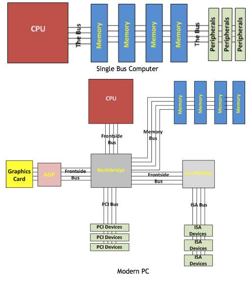

# Appendix
* [CMU Lab](http://csapp.cs.cmu.edu/3e/labs.html)