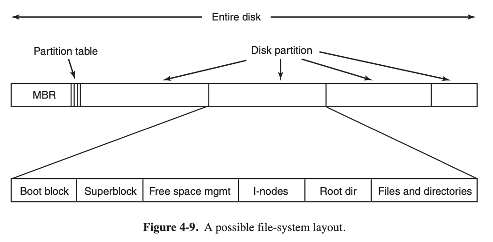
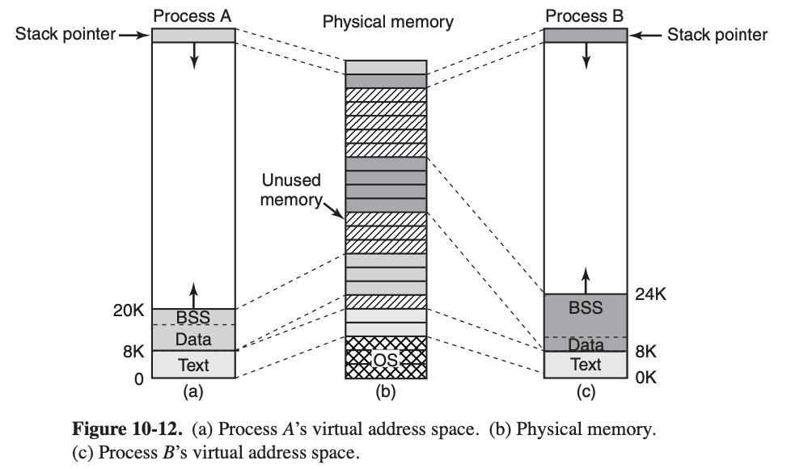
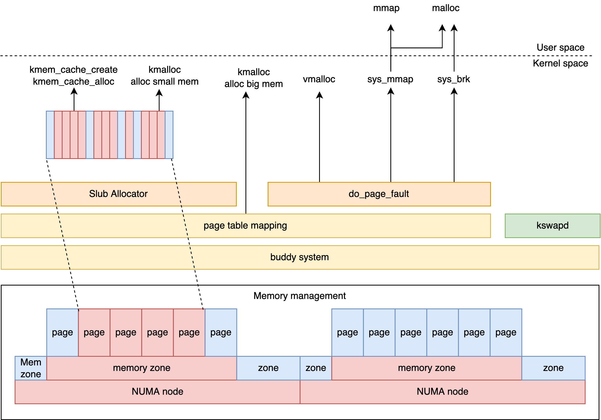
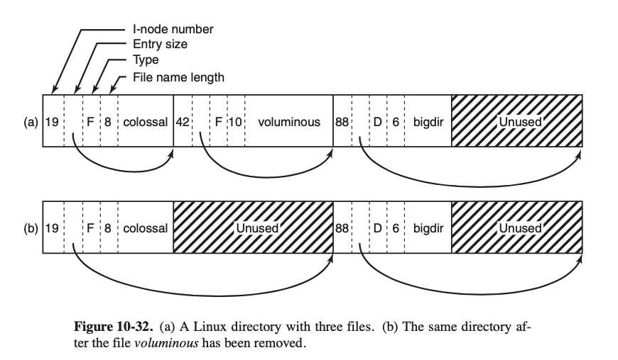

#  Chapter 2 Processes and Theads
### 2.1 Processes
#### 2.1.2 Process Creation
Four principal events cause processes to be created:
1. System initialization.
2. Execution of a process-creation system call by a running process.
3. A user request to create a new process.
4. Initiation of a batch job.

#### 2.1.3 Process Termination
1. Normal exit (voluntary).
2. Error exit (voluntary).
3. Fatal error (involuntary).
4. Killed by another process (involuntary).

#### 2.1.4 Process Hierarchies
When a user sends a signal from the keyboard, the signal is delivered to all members of the process group currently associated with the keyboard (usually all active processes that were created in the current window). Individually, each process can catch the signal, ignore the signal, or take the default action, which is to be killed by the signal.

#### 2.1.5 Process States
1. Running (actually using the CPU at that instant).
2. Ready (runnable; temporarily stopped to let another process run).
3. Blocked (unable to run until some external event happens).

#### 2.1.6 Implementation of Processes
Process management | Memory management | File management
--- | --- | ---
Registers | Pointer to text segment info | Root directory
Program counter | Pointer to data segment info | Working director
Program status word | Pointer to stack segment info | File descriptors
Stack pointer | | User ID
Process state | | Group ID
Priority | |
Scheduling parameters | |
Parent process | |
Process ID | |
Process group | |
Signals | |
Time when process started CPU time used | |
Children’s CPU time | |
Time of next alarm | |


Associated with each I/O class is a location (typically at a fixed location near the bottom of memory) called the **interrupt vector**. It contains the address of the interrupt service procedure.

All interrupts start by saving the registers, often in the process table entry for the current process.

Interrupt handling and scheduling:
1. Hardware stacks program counter, etc.
2. Hardware loads new program counter from interrupt vector.
3. Assembly-language procedure saves registers.
4. Assembly-language procedure sets up new stack.
5. C interrupt service runs (typically reads and buffers input).
6. Scheduler decides which process is to run next.
7. C procedure returns to the assembly code.
8. Assembly-language procedure starts up new current process.

### 2.2 THREADS
#### 2.2.1 Thread Usage
The reason for threads:
1. The main reason for having threads is that in many applications, multiple activities are going on at once.  The ability for the parallel entities to share an address space and all of its data among themselves.
2. Threas are lighter weight than processes, they are goes 10–100 times faster than creating a process.
3. Performance argument. Threads yield no performance gain when all of them are CPU bound, but when there is substantial computing and also substantial I/O, having threads allows these activities to overlap, thus speeding up the application.
4. Threads are useful on systems with multiple CPUs, where real parallelism is possible.

#### 2.2.2 The Classical Thread Model
The process model is based on two independent concepts:
1. resource grouping: program text and data, open files, child processes, pending alarms, signal handlers, accounting information, and more.
2. thread of execution: the thread has a program counter, registers and stack.

Processes are used to group resources together; threads are the entities scheduled for execution on the CPU.

Per-process items | Per-thread items
--- | ---
Address space | Program counter
Global variables | Registers
Open files | Stack
Child processes  | State
Pending alarms |
Signals and signal handlers |
Accounting information |

Process is the unit of resouces management, thread is the unit of execution.

#### 2.2.3 POSIX Threads
#### 2.2.4 Implementing Threads in User Space
Advantages:
1. no trap is needed, no context switch is needed, the memory cache need not be flushed, and so on. This makes thread scheduling very fast.
2. allow each process to have its own customized scheduling algorithm.

Disadvantages:
1. how blocking system calls are implemented.
2. The system calls could all be changed to be nonblocking (e.g., a read on the keyboard would just return 0 bytes if no characters were already buffered), but requiring changes to the operating system is unattractive.

#### 2.2.5 Implementing Threads in the Kernel
All calls that might block a thread are implemented as system calls, at considerably greater cost than a call to a run-time system procedure.

Due to the relatively greater cost of creating and destroying threads in the kernel, some systems take an environmentally correct approach and recycle their threads.

Kernel threads do not require any new, nonblocking system calls.

#### 2.2.6 Hybrid Implementations
Use kernel-level threads and then multiplex user-level threads onto some or all of them.

#### 2.2.7 Scheduler Activations
The goals of the scheduler activation work are to mimic the functionality of kernel threads, but with the better performance and greater flexibility usually associated with threads packages implemented in user space.

Efficiency is achieved by avoiding unnecessary transitions between user and kernel space.

When scheduler activations are used, the kernel assigns a certain number of virtual processors to each process and lets the (user-space) run-time system allocate threads to processors.

The basic idea that makes this scheme work is that when the kernel knows that a thread has blocked, the kernel notifies the process’ run-time system, passing as parameters on the stack the number of the thread in question and a description of the event that occurred. The notification happens by having the kernel activate the run-time system at a known starting address, roughly analogous to a signal in UNIX. This mechanism is called an **upcall**.

Once activated, the run-time system can reschedule its threads, typically by marking the current thread as blocked and taking another thread from the ready list, setting up its registers, and restarting it.

When a hardware interrupt occurs while a user thread is running, the interrupted CPU switches into kernel mode:
1. If the interrupt is caused by an event not of interest to the interrupted process, it puts the interrupted thread back in the state it was in before the interrupt.
2. If, however, the process is interested in the interrupt, the interrupted thread is not restarted. Instead, it is suspended, and the run-time system is started on that virtual CPU, with the state of the interrupted thread on the stack. It is then up to the run-time system to decide which thread to schedule on that CPU: the interrupted one, the newly ready one, or some third choice.

#### 2.2.8 Pop-Up Threads
#### 2.2.9 Making Single-Threaded Code Multithreaded
Problems when makding single-threaded code multithreaded:
1. Global variables, solution is to assign each thread its own private global variables.
2. Many library procedures are not reentrant.
    * Solution 1: provide each procedure with a jacket that sets a bit to mark the library as in use.
    * Solution 2: signals.
        Some signals are logically thread specific, whereas others are not. However, when threads are implemented entirely in user space, the kernel does not even know about threads and can hardly direct the signal to the right one.

        Other signals, such as keyboard interrupt, are not thread specific. Who should catch them? One designated thread? All the threads? A newly created pop-up thread? Furthermore, what happens if one thread changes the signal handlers without telling other threads?
3. Stack management.

Introducing threads into an existing system needs fairly substantial system redesign:
> The semantics of system calls may have to be redefined and libraries rewritten, at the very least. And all of these things must be done in such a way as to remain backward compatible with existing programs for the limiting case of a process with only one thread.

### 2.3 INTERPROCESS COMMUNICATION
Problems:
1. how one process can pass information to another.
2. making sure two or more processes do not get in each other’s way
3. proper sequencing when dependencies

#### 2.3.1 Race Conditions
**race conditions**: two or more processes are reading or writing some shared data and the final result depends on who runs precisely when.

#### 2.3.2 Critical Regions
We need four conditions to hold to have a good solution:
1. No two processes may be simultaneously inside their critical regions.
2. No assumptions may be made about speeds or the number of CPUs.
3. No process running outside its critical region may block any process.
4. No process should have to wait forever to enter its critical region.

#### 2.3.3 Mutual Exclusion with Busy Waiting
##### Disabling Interrupts
Once a process has disabled interrupts, it can examine and update the shared memory without fear that any other process will intervene.

What if one of them did it, and never turned them on again? That could be the end of the system.

Furthermore, if the system is a multiprocessor (with two or more CPUs) disabling interrupts affects only the CPU that executed the disable instruction. The other ones will continue running and can access the shared memory.

The conclusion is: disabling interrupts is often a useful technique within the operating system itself but is not appropriate as a general mutual exclusion mechanism for user processes.

##### Lock Variables
##### Strict Alternation
Continuously testing a variable until some value appears is called **busy waiting**. It should usually be avoided, since it wastes CPU time.
##### Peterson’s Solution
```C++
#define FALSE 0 /* number of processes */

#define TRUE 1  /* whose turn is it? */

#define N   2   /* all values initially 0 (FALSE) */

int interested[N];
int turn;
void enter_region(int process); /* process is 0 or 1 */
{
    int other;
    other = 1 − process;
    interested[process] = TRUE;
    turn = process;
    while (turn == process && interested[other] == TRUE);
}
void leave_region(int process)      /* process: who is leaving */
{
    interested[process] = FALSE;    /* indicate departure from critical region */
}
```
##### The TSL(Test and Set Lock)/XCHG Instruction
It reads the contents of the memory word lock into register RX and then stores a nonzero value at the memory address lock. The operations of reading the word and storing into it are guaranteed to be indivisible.

```assembly
enter region:
    TSL REGISTER, LOCK  ;copy lock to register and set lock to 1
    CMP REGISTER, #0    ;was lock zero?
    JNE enter_region    ;if it was not zero, lock was set, so loop critical region entered
    RET                 ;return to caller

leave region:
    MOVE LOCK, #0       ;store a 0 in lock
    RET                 ;return to caller
```

Not only does busy wait approach waste CPU time, but it can also have unexpected effects(e.g., priority inversion problem).

#### 2.3.4 Sleep and Wakeup
#### 2.3.5 Semaphores
Once a semaphore operation has started, no other process can access the semaphore until the operation has completed or blocked. This atomicity is absolutely essential to solving synchronization problems and avoiding race conditions.

The normal way is to implement up and down as system calls, with the operating system briefly disabling all interrupts while it is testing the semaphore, updating it, and putting the process to sleep, if necessary.

If multiple CPUs are being used, each semaphore should be protected by a lock variable, with the TSL or XCHG instructions used to make sure that only one CPU at a time examines the semaphore.

#### 2.3.6 Mutexes
```assembly
mutex lock:
    TSL REGISTER, MUTEX ; copy mutex to register and set mutex to 1;
    CMP REGISTER, #0    ; was mutex zero?
    JZE ok              ; if it was zero, mutex was unlocked, so return
    CALL thread_yield   ; mutex is busy; schedule another thread
    JMP mutex_lock      ; try again

ok: RET                 ; return to caller; critical region entered

mutex unlock:
    MOVE MUTEX, #0      ; store a 0 in mutex
    RET                 ; return to caller
```

The difference between enter_region and mutex_lock:
1. A thread that tries to acquire a lock by busy waiting will loop forever and never acquire the lock because it never allows any other thread to run and release the lock.
2. When the mutex_lock fails to acquire a lock, it calls thread yield to give up the CPU to another thread.

Since *thread yield* is just a call to the thread scheduler in user space, it is very fast. As a consequence, neither *mutex lock* nor *mutex unlock* requires any kernel calls.

If processes have disjoint address spaces, how can they share the turn variable in Peterson’s algorithm, or semaphores or a common buffer?
1. Some of the shared data structures, such as the semaphores, can be stored in the kernel and accessed only by means of system calls.
2. Most modern operating systems offer a way for processes to share some portion of their address space with other processes.
3. if nothing else is possible, a shared file can be used.

##### Futex(Fast User Space Mutex)
With increasing parallelism, efficient synchronization and locking is very important for performance.

If there is much contention, spin locks are therefore more efficient to block the process and let the kernel unblock it only when the lock is free.

Spin lock works well under heavy contention, but continuously switching to the kernel is expensive if there is very little contention to begin with.

A **futex** is a feature of Linux that implements basic locking (much like a mutex) but avoids dropping into the kernel unless it really has to.

A futex consists of two parts: a kernel service and a user library. The kernel service provides a ‘‘wait queue’’ that allows multiple processes to wait on a lock.

[Linux Generic Mutex Subsystem](https://www.kernel.org/doc/html/latest/locking/mutex-design.html)

#### 2.3.7 Monitors
A **monitor** is a collection of procedures, variables, and data structures that are all grouped together in a special kind of module or package.

Processes may call the procedures in a monitor whenever they want to, but they cannot directly access the monitor’s internal data structures from procedures declared outside the monitor.

#### 2.3.9 Barriers

### 2.4 SCHEDULING
#### 2.4.1 Introduction to Scheduling

[Wiki Scheduling](https://en.wikipedia.org/wiki/Scheduling_(computing))

##### Process Behavior
##### When to Schedule
1. when a new process is **created**, a decision needs to be made whether to run the parent process or the child process.
2. a scheduling decision must be made when a process **exits**.
3. when a process **blocks** on I/O, on a semaphore, or for some other reason, another process has to be selected to run.
4. when an I/O **interrupt** occurs, a scheduling decision may be made.

Scheduling algorithms can be divided into two categories with respect to how they deal with clock interrupts:
1. A **nonpreemptive** scheduling algorithm picks a process to run and then just lets it run until it blocks or voluntarily releases the CPU. Even if it runs for many hours, it will not be forcibly suspended.
2. A **preemptive** scheduling algorithm picks a process and lets it run for a maximum of some fixed time.

##### Categories of Scheduling Algorithms
1. Batch: nonpreemptive or preemptive with long time periods is acceptable.
2. Interactive:
3. Real time.

##### Scheduling Algorithm Goals:
All systems
    Fairness: giving each process a fair share of the CPU
    Policy enforcement: seeing that stated policy is carried out
    Balance: keeping all parts of the system busy

Batch systems
    Throughput: maximize jobs per hour
    Turnaround time: minimize time between submission and termination
    CPU utilization: keep the CPU busy all the time

Interactive systems
    Response time: respond to requests quickly
    Proportionality: meet users’ expectations

Real-time systems
    Meeting deadlines: avoid losing data
    Predictability: avoid quality degradation in multimedia systems

#### 2.4.2 Scheduling in Batch Systems
##### First-Come, First-Served
##### Shortest Job First
##### Shortest Remaining Time Next

#### 2.4.3 Scheduling in Interactive Systems
##### Round-Robin Scheduling
##### Priority Scheduling
Setting the quantum too short causes too many process switches and lowers the CPU efficiency, but setting it too long may cause poor response to short interactive requests. A quantum around 20–50 msec is often a reasonable compromise.

To prevent high-priority processes from running indefinitely, the scheduler may decrease the priority of the currently running process at each clock tick.

If this action causes its priority to drop below that of the next highest process, a process switch occurs.

Priorities can also be assigned dynamically by the system to achieve certain system goals.

It is often convenient to group processes into priority classes and use priority scheduling among the classes but round-robin scheduling within each class.

##### Multiple Queues
Processes in the highest class were run for one quantum. Processes in the next-highest class were run for two quanta. Processes in the next one were run for four quanta, etc.

##### Shortest Process Next
##### Guaranteed Scheduling
Make real promises to the users about performance and then live up to those promises. One promise that is realistic to make and easy to live up to is this: If n users are logged in while you are working, you will receive about 1/n of the CPU power. Similarly, on a single-user system with n processes running, all things being equal, each one should get 1/n of the CPU cycles. That seems fair enough.

##### Lottery Scheduling
The basic idea is to give processes lottery tickets for various system resources, such as CPU time. Whenever a scheduling decision has to be made, a lottery ticket is chosen at random, and the process holding that ticket gets the resource.

##### Fair-Share Scheduling

#### 2.4.4 Scheduling in Real-Time
#### 2.4.5 Policy Versus Mechanism
#### 2.4.6 Thread Scheduling
A major difference between user-level threads and kernel-level threads is the performance:
1. Doing a thread switch with user-level threads takes a handful of machine instructions.
2. With kernel-level threads it requires a full context switch, changing the memory map and invalidating the cache, which is several orders of magnitude slower.

Since the kernel knows that switching from a thread in process A to a thread in process B is more expensive than running a second thread in process A, it can take this information into account when making a decision.

Another important factor is that user-level threads can employ an application-specific thread scheduler.

### 2.5 CLASSICAL IPC PROBLEMS
#### 2.5.1 The Dining Philosophers Problem
#### 2.5.2 The Readers and Writers Problem
Solution: read write lock

As a consequence of this strategy, as long as there is a steady supply of readers, they will all get in as soon as they arrive. The writer will be kept suspended until no reader is present.

To avoid this situation, the program could be written slightly differently: when a reader arrives and a writer is waiting, the reader is suspended behind the writer instead of being admitted immediately.

The disadvantage of this solution is that it achieves less concurrency and thus lower performance.

# Chapter 4 File Systems

The three essential requirements for long-term information storage:
1. It must be possible to store a very large amount of information.
2. The information must survive the termination of the process using it.
3. Multiple processes must be able to access the information at once.

**Files** are logical units of information created by processes.

#### 4.1 FILES
#### 4.1.1 File Naming
#### 4.1.2 File Structure
1. Byte sequence
2. Record sequence
3. Tree

#### 4.1.3 File Types

1. **Regular files** are the ones that contain user information.
2. **Directories** are system files for maintaining the structure of the file system.
3. **Character special files** are related to input/output and used to model serial I/O devices, such as terminals, printers, and networks.
4. **Block special files** are used to model disks.
Executable File: has five sections: header, text, data, relocation bits, and symbol table. The header starts with a so-called magic number, identifying the file as an executable file (to prevent the accidental execution of a file not in this format).


#### 4.1.4 File Access
1. Sequentail access
2. Random access

#### 4.1.5 File Attributes
 Attribute | Meaning
 ---- | ----
 Protection          | Who can access the file and in what way
 Password            | Password needed to access the file
 Creator             | ID of the person who created the file
 Owner               | Current owner
 Read-only flag      | 0 for read/write; 1 for read only
 Hidden flag         | 0 for normal; 1 for do not display in listings
 System flag         | 0 for normal files; 1 for system file
 Archive flag        | 0 for has been backed up; 1 for needs to be backed up
 ASCII/binary flag   | 0 for ASCII file; 1 for binary file
 Random access flag  | 0 for sequential access only; 1 for random access
 Temporar y flag     | 0 for normal; 1 for delete file on process exit
 Lock flags          | 0 for unlocked; nonzero for locked
 Record length       | Number of bytes in a record
 Key position        | Offset of the key within each record
 Key length          | Number of bytes in the key field
 Creation time       | Date and time the file was created
 Time of last access | Date and time the file was last accessed
 Time of last change | Date and time the file was last changed
 Current size        | Number of bytes in the file
 Maximum size        | Number of bytes the file may grow to

#### 4.1.6 File Operations

### 4.2 DIRECTORIES
### 4.3 FILE-SYSTEM IMPLEMENTATION
#### 4.3.1 File-System Layout


Partition table: gives the starting and ending addresses of each partition.

Super block: includes a magic number to identify the file-system type, the number of blocks in the file system, and other key administrative information.

System boost:
> BIOS -> MBR -> active partion -> boot block -> operating system

#### 4.3.2 Implementing Files
##### Contiguous Allocation
Contiguous disk-space allocation has two significant advantages:
1. it is simple to implement because keeping track of where a file’s blocks are is reduced
2. the read performance is excellent because the entire file can be read from the disk in a single operation

Drawback:
1. over the course of time, the disk becomes fragmented.
2. when a new file is to be created, it is necessary to know its final size in order to choose a hole of the correct size to place it in.

##### Linked-List Allocation
Drawback:
1. random access is extremely slow
2. the amount of data storage in a block is no longer a power of two, reads of the full block size require acquiring and concatenating information from two disk blocks, which generates extra overhead due to the copying.


##### Linked-List Allocation Using a Table in Memory
Both disadvantages of the linked-list allocation can be eliminated by taking the pointer word from each disk block and putting it in a table(FAT-File Allocation Table) in memory.

The primary disadvantage of this method is that the entire table must be in memory all the time to make it work.

##### I-nodes
Our last method for keeping track of which blocks belong to which file is to associate with each file a data structure called an i-node (index-node), which lists the attributes and disk addresses of the file’s blocks.

Infomation: file type, access rights, owners, timestamps, size, pointers to data blocks.


#### 4.3.3 Implementing Directories


#### 4.3.4 Shared Files
If directories really do contain disk addresses, then a copy of the disk addresses will have to be made in B’s directory when the file is linked.

Solution:
1. disk blocks are not listed in directories, but in a little data structure associated with the file itself. The directories would then point just to the little data structure.
2. symbolic linking: B links to one of C’s files by having the system create a new file, of type LINK, and entering that file in B’s directory. The new file contains just the path name of the file to which it is linked. When B reads from the linked file, the operating system sees that the file being read from is of type LINK, looks up the name of the file, and reads that file.

#### 4.3.5 Log-Structured File Systems

#### 4.3.6 Journaling File Systems
The basic idea here is to keep a log of what the file system is going to do before it does it, so that if the system crashes before it can do its planned work, upon rebooting the system can look in the log to see what was going on at the time of the crash and finish the job. Such file systems, called **journaling file systems**, are actually in use.

#### 4.3.7 Virtual File Systems


Example: open("/usr/include/unistd.h", O RDONLY):
1. While parsing the path, the VFS sees that a new file system has been mounted on /usr and locates its superblock by searching the list of superblocks of mounted file systems
2. VFS finds the root directory of the mounted file system and look up the path include/unistd.h there.
3. VFS creates a v-node and makes a call to the concrete file system to return all the information in the file’s i-node.
4. VFS makes an entry in the file-descriptor table for the calling process and sets it to point to the new v-node.
5. VFS returns the file descriptor to the caller so it can use it to read, write, and close the file.

### 4.4 FILE-SYSTEM MANAGEMENT AND OPTIMIZATION
#### 4.4.1 Disk-Space Management
##### Block Size
Historically, file systems have chosen sizes in the 1-KB to 4-KB range, but with disks now exceeding 1 TB, it might be better to increase the block size to 64 KB and accept the wasted disk space. Disk space is hardly in short supply any more.

##### Keeping Track of Free Blocks
##### Disk Quotas


#### 4.4.2 File-System Backups
Issuses:
1. Should the entire file system be backed up or only part of it?
2. It is wasteful to back up files that have not changed since the previous backup, which leads to the idea of incremental dumps.
3. Since immense amounts of data are typically dumped, it may be desirable to compress the data before writing them to tape.
4. it is difficult to perform a backup on an active file system.
5. making backups introduces many nontechnical problems into an organization.

1. A **physical dump** starts at block 0 of the disk, writes all the disk blocks onto the output disk in order, and stops when it has copied the last one.
2. A **logical dump** starts at one or more specified directories and recursively dumps all files and directories found there that have changed since some given base date

#### 4.4.3 File-System Consistency
Two kinds of consistency checks can be made:
1. blocks: buid two tables, each one containing a counter for each block.
    The counters in the first table keep track of how many times each block is present in a file.

    The counters in the second table record how often each block is present in the free list.

    If the file system is consistent, each block will have a 1 either in the first table or in the second table.

    The solution to **missing blocks** is straightforward: the file system checker just adds them to the free list.

    The worst thing that can happen is that the same data block is present in two or more files:
        Solution: allocate a free block, copy the contents of block 5 into it, and insert the copy into one of the files.

2. files:
    Build a table containing counter for each file.

    The link count in the i-node can be too high or it can be too low.

    Furthermore, each i-node has a mode, some of which are legal but strange, such as 0007

#### 4.4.4 File-System Performance
##### Caching
1. Is the block likely to be needed again soon?
    Blocks that will probably not be needed again soon go on the front, rather than the rear of the LRU list, so their buffers will be reused quickly.

    Blocks that might be needed again soon, such as a partly full block that is being written, go on the end of the list, so they will stay around for a long time.

2. Is the block essential to the consistency of the file system?
    If the block is essential to the file-system consistency, and it has been modified, it should be written to disk immediately, regardless of which end of the LRU list it is put on.

For both questions, blocks can be divided into categories such as i-node blocks, indirect blocks, directory blocks, full data blocks, and partially full data blocks.

When the system is started up, a program, usually called update, is started up in the background to sit in an endless loop issuing sync calls, sleeping for 30 sec between calls. As a result, no more than 30 seconds of work is lost due to a crash.

##### Block Read Ahead
A second technique for improving perceived file-system performance is to try to get blocks into the cache before they are needed to increase the hit rate.

To see whether read ahead is worth doing, the file system can keep track of the access patterns to each open file.

##### Reducing Disk-Arm Motion
Putting blocks that are likely to be accessed in sequence close to each other, preferably in the same cylinder.

#### 4.4.5 Defragmenting Disks
As a consequence, when a new file is created, the blocks used for it may be spread all over the disk, giving poor performance.

The performance can be restored by moving files around to make them contiguous and to put all (or at least most) of the free space in one or more large contiguous regions on the disk.

Some files cannot be moved, including the paging file, the hibernation file, and the journaling log, because the administration that would be required to do this is more trouble than it is worth.

### 4.5 EXAMPLE FILE SYSTEM
#### 4.5.2 The UNIX V7 File System
i-node attributes: file size, three times, owner, group, protection information, and a count of the number of directory entries that point to the i-node.


Example: /usr/ast/mbox
1. file system locates the root directory. In UNIX its i-node is located at a fixed place on the disk. From this i-node, it locates the root directory, which can be anywhere on the disk, but say block 1.
2. it reads the root directory and looks up the first component of the path, usr, in the root directory to find the i-node number of the file /usr.
3. find the entry for ast and its i-node
4. find mbox's i-node from ast's i-node


# Chapter 5 INPUT/OUTPUT
### 5.1 PRINCIPLES OF I/O HARDWARE
#### 5.1.1 I/O Devices
A `block device` is one that stores information in fixed-size blocks, each one with its own address, it is possible to read or write each block independently of all the other ones. All transfers are in units of one or more entire (consecutive) blocks.

A `character device` delivers or accepts a stream of characters, it is not addressable and does not have any seek operation.

### 5.1.2 Device Controllers
### 5.1.3 Memory-Mapped I/O
Each controller has a few registers that are used for communicating with the CPU.

In addition to the control registers, many devices have a data buffer that the op- erating system can read and write.

How the CPU communicates with the control registers and also with the device data buffers:
1. Each control register is assigned an I/O port number, the set of all the I/O ports form the I/O port space.
2. Map all the control registers into the memory space, each control register is assigned a unique memory address to which no memory is assigned.
3. A hybrid scheme, with memory-mapped I/O data buffers and separate I/O ports for the control registers.

The x86 uses hybrid scheme architecture, with addresses 640K to 1M − 1 being reserved for device data buffers in IBM PC compatibles, in addition to I/O ports 0 to 64K − 1.

Work flow:
1. In all cases, when the CPU wants to read a word, either from memory or from an I/O port, it puts the address it needs on the bus’ address lines and then asserts a READ signal on a bus’ control line.
2. A second signal line is used to tell whether I/O space or memory space is needed.

##### Strengths and weaknesses:
Advantages for memory-mapped IO:
1. With memory-mapped IO, controller registers are just variables in memory, it's easy to add special IO instructions. Device drive can be written entirely in C, otherwise assembly code is needed.
2. No special protection mechanism is needed to keep user processes from performing I/O. All the operating system has to do is refrain from putting that portion of the address space containing the control regis- ters in any user’s virtual address space.
3. Every instruction that can reference memory can also reference control registers.

Disadvantages for memory-mapped IO:
1. Caching a device control register would be disastrous.
2. if there is only one address space, then all memory modules and all I/O devices must examine all memory references to see which ones to respond to.

The trouble with having a separate memory bus on memory-mapped machines is that the I/O devices have no way of seeing memory addresses as they go by on the memory bus, so they have no way of responding to them.
Solution:
1. Send all memory references to the memory. If the memory fails to respond, then the CPU tries the other buses. This design can be made to work but requires additional hardware complexity.
2. Put a snooping device on the memory bus to pass all addresses presented to potentially interested I/O devices. The problem here is that I/O devices may not be able to process requests at the speed the memory can.
3. Filter addresses in the memory controller. In that case, the memory controller chip contains range registers that are preloaded at boot time. The disadvantage of this scheme is the need for figuring out at boot time which memory addresses are not really memory addresses.

#### 5.1.4 Direct Memory Access
No matter whether there is memory-mapped I/O, CPU needs to address the device controllers to exchange data with them. The CPU can request data from an I/O controller one byte at a time, but doing so wastes the CPU’s time, so DMA (Direct Memory Access) is often used.

The operating system can use only DMA if the hardware has a DMA controller.

A single DMA controller is available (e.g., on the parentboard) for regulating transfers to multiple devices, often concurrently.

DMA registers:
1. A memory address register
2. A byte count register
3. One or more control registers, specify the I/O port to use, the direction of the transfer (reading from the I/O device or writing to the I/O device), the transfer unit (byte at a time or word at a time), and the number of bytes to transfer in one burst.


1. The CPU programs the DMA controller by setting its registers so it knows what to transfer where (step 1). It also issues a command to the disk controller telling it to read data from the disk into its internal buffer and verify the checksum. When valid data are in the disk controller’s buffer, DMA can begin.
2. The DMA controller initiates the transfer by issuing a read request over the bus to the disk controller (step 2).
3. Typically, the memory address to write to is on the bus’ address lines, so when the disk controller fetches the next word from its internal buffer, it knows where to write it. The write to memory is another standard bus cycle (step 3).
4. When the write is complete, the disk controller sends an acknowl- edgement signal to the DMA controller, also over the bus (step 4).
5. The DMA con- troller then increments the memory address to use and decrements the byte count. If the byte count is still greater than 0, steps 2 through 4 are repeated until the count reaches 0.
6. At that time, the DMA controller interrupts the CPU to let it know that the transfer is now complete.

# Chapter 10 Case Study 1: Unix, Linux, and Android

### 10.3 PROCESSES IN LINUX
#### 10.3.1 Fundamental Concepts
A process can send signals only to members of its process group.

#### 10.3.3 Implementation of Processes and Threads in Linux

When one of process' threads makes a system call, it traps to kernel mode and begins running in kernel context, with a different memory map and full access to all machine resources.

A single-threaded process will be represented with one task_struct and a multithreaded process will have one task_struct for each of the user-level threads.

The kernel itself is multithreaded, and has kernel-level threads which are not associated with any user process and are executing kernel code.

The information in the process descriptor:
1. Scheduling parameters. Process priority, amount of CPU time consumed recently, amount of time spent sleeping recently.
2. Memory image. Pointers to the text, data, and stack segments, or page tables. If the text segment is shared, the text pointer points to the shared text table. When the process is not in memory, information about how to find its parts on disk is here too.
3. Signals. Masks showing which signals are being ignored, which are being caught, which are being temporarily blocked, and which are in the process of being delivered.
4. Machine registers. When a trap to the kernel occurs, the machine registers (including the floating-point ones, if used) are saved here.
5. System call state. Information about the current system call, including the parameters, and results.
6. File descriptor table. When a system call involving a file descriptor is invoked, the file descriptor is used as an index into this table to locate the in-core data structure (i-node) corresponding to this file.
7. Accounting. Pointer to a table that keeps track of the user and system CPU time used by the process.
8. Kernel stack. A fixed stack for use by the kernel part of the process.
9. Miscellaneous. Current process state, event being waited for, if any, time until alarm clock goes off, PID, PID of the parent process, and user and group identification.


##### Threads in Linux
Some of the challenging decisions present in multithreaded systems:
1. maintaining the correct traditional UNIX semantics.
    If fork the parent's threads, a parent thread blocked in the keyboard, a child process's thread blocked either.

    If not fork the parent's threads, a parent thread holds the mutex, the child process's thread will be blocked on the mutex forever.

2. File I/O is another problem area. E.g., a parent process' thread blocked in reading a file, what happen if a child process' thread close the file or lseek?
3. Signal handling is another thorny issue. Should signals be directed at a specific thread or just at the process?

Processes were resource containers and threads were the units of execution.

In particular, file descriptors for open files, signal handlers, alarms, and other global properties were per process, not per thread.

```
pid = clone(function, stack ptr, sharing flags, arg);
```

| Flag | Meaning when set | Meaning when cleared |
| --- | ---- | --- |
| CLONE VM      | Create a new thread                      | Create a new process          |
| CLONE FS      | Share umask, root, and working dirs      | Do not share them             |
| CLONE FILES   | Share the file descriptors                | Copy the file descriptors      |
| CLONE SIGHAND | Share the signal handler table           | Copy the table                |
| CLONE PARENT  | New thread has same parent as the caller | New thread’s parent is caller |

In UNIX, a call to chdir by a thread always changes the working directory for other threads in its process, but never for threads in another process.

When clone is used to create a new process that shares nothing with its creator, PID is set to a new value; otherwise, the task receives a new TID, but inherits the PID.P

### 10.3.4 Scheduling in Linux
Linux distinguishes three classes of threads for scheduling purposes:
1. Real-time FIFO.
2. Real-time round robin.
3. Timesharing.

Real-time FIFO threads are the highest priority and are not preemptable except by a newly readied real-time FIFO thread with even higher priority. Real-time round-robin threads are the same as real-time FIFO threads except that they have time quanta associated with them, and are preemptable by the clock.

Real-time threads have priority levels from 0 to 99, non-real-time threads have levels from 100 to 139.

In Linux, time is measured as the number of clock ticks.

In order to avoid wasting CPU cycles for servicing the timer interrupt, the kernel can even be configured in ‘‘tickless’’ mode.

Historically, a popular Linux scheduler was the Linux **O(1) scheduler**.


1. Selects a task from the highest-priority list in the active array
2. If that task’s timeslice (quantum) expires, it is moved to the expired list (potentially at a different priority level).
3. If the task blocks, for instance to wait on an I/O event, before its timeslice expires, once the event occurs and its execution can resume, it is placed back on the original active array, and its timeslice is decremented to reflect the CPU time it already used.
4. Once its timeslice is fully exhausted, it, too, will be placed on the expired array.
5. When there are no more tasks in the active array, the scheduler simply swaps the pointers, so the expired arrays now become active, and vice versa.

This method ensures that low-priority tasks will not starve.

The idea behind this scheme is to get processes out of the kernel fast.

In this light, CPU-bound processes basically get any service that is left over when all the I/O bound and interactive processes are blocked.

Linux relies on continuously maintaining interactivity heuristics to know a priori whether a task is I/Oor CPU-bound, it distinguishes between static and dynamic priority.

The threads’ dynamic priority is continuously recalculated, so as to (1) reward interactive threads, and (2) punish CPU-hogging threads.

The scheduler maintains a `sleep_avg` variable associated with each task. Whenever a task is awakened, this variable is incremented. Whenever a task is preempted or when its quantum expires, this variable is decremented by the corresponding value. This value is used to dynamically map the task’s bonus to values from −5 to +5.

The scheduler recalculates the new priority level as a thread is moved from the active to the expired list.

Prior algorithms exhibited poor performance in multiprocessor settings and did not scale well with an increased number of tasks.

O(1) schedulare has shortcomings the heuristics used to determine the interactivity of a task, and therefore its priority level, were complex and imperfect and resulted in poor performance for interactive tasks.

To address O(1) issue, **CFS(Completely Fair Scheduler)** which used red-balck tree as runqueue data structure is created and it's the default non-real-time scheduler.
1. CFS always schedules the task which has had least amount of time on the CPU, typically the leftmost node in the tree.
2. CFS increments the task’s `vruntime` value based on the time it has already run, and compares this to the current leftmost node in the tree.
3. If the running task still has smaller vruntime, it will continue to run.
4. Otherwise, it will be inserted at the appropriate place in the red-black tree, and the CPU will be given to task corresponding to the new leftmost node.

To account for differences in task priorities and ‘‘niceness,’’ CFS changes the effective rate at which a task’s virtual time passes when it is running on the CPU. In this manner, CFS avoids using separate runqueue structures for different priority levels.

Linux scheduler includes special features particularly useful for multiprocessor or multicore platforms:
1. the runqueue structure is associated with each CPU in the multiprocessing platform.
2. a set of system calls is available to further specify or modify the affinity requirements of a select thread.
3. the scheduler performs periodic load balancing across runqueues of different CPUs to ensure that the system load is well balanced, while still meeting certain performance or affinity requirements.

Tasks which are not runnable and are waiting on various I/O operations or other kernel events are placed on another data structure, **waitqueue**. A waitqueue is associated with each event that tasks may wait on.

##### Synchronization in Linux
1. hardware-supported atomic instructions, aotmic_set, aotmic_read
2. memory barriers, rmb, wmb
3. ‘‘ticket-based’’ spinlock
4. mutexes and semaphores
5. futexes, completions, ‘‘read- copy-update’’ (RCU) locks

### 10.3.5 Booting Linux
1. When the computer starts, the BIOS performs Power-On-Self-Test (POST) and initial device discovery and initialization
2. The first sector of the boot disk, the MBR (Master Boot Record), is read into a fixed memory location and executed.
3. This sector contains a small (512-byte) program that loads a standalone program called boot from the boot device, such as a SATA or SCSI disk.
4. The boot program first copies itself to a fixed high-memory address to free up low memory for the operating system.
5. Boot reads the root directory of the boot device
6. Then boot reads in the operating system kernel and jumps to it, kernel is running now.
7. Kernel starts its works, includes setting up the kernel stack, identifying the CPU type, calculating the amount of RAM present, disabling interrupts, enabling the MMU, and finally calling the C-language main procedure to start the main part of the operating system.
8. The C code starts out by allocating a message buffer to help debug boot problems.
9. The kernel data structures are allocated. Most are of fixed size, but a few, such as the page cache and certain page table structures, depend on the amount of RAM available.
10. At this point the system begins autoconfiguration. Using configuration files telling what kinds of I/O devices might be present, it begins probing the devices.
11. Once all the hardware has been configured, then to handcraft process 0, set up its stack, and run it which doing things like programming the real-time clock, mounting the root file system, and creating `init` (process 1) and the page daemon (process 2).
12. `Init` checks its flags to see if it is supposed to come up single user or multiuser.
    In the former case, it forks off a process that executes the shell and waits for this process to exit.

    In the latter case, it forks off a process that executes the system initialization shell script, /etc/rc, which can do file system consistency checks, mount additional file systems, start daemon processes, and so on.

    Then it reads /etc/ttys, which lists the terminals and some of their properties. For each enabled terminal, it forks off a copy of itself, which does some housekeeping and then executes a program called `getty`.
13. When user provides a login name, getty terminates by executing /bin/login, the login program.
14. Login then asks for a password, encrypts it, and verifies it against the encrypted password stored in the password file, /etc/passwd.
15. If it is correct, login replaces itself with the user’s shell, which then waits for the first command.

### Extend Implementation
Reference: https://time.geekbang.org/column/article/93396

### 10.4 MEMORY MANAGEMENT IN LINUX
#### 10.4.1 Fundamental Concepts

All the variables in the BSS(Block Stared By Symbol) part are initialized to zero after loading.

When a program starts up, its stack is not empty. Instead, it contains all the environment (shell) variables as well as the command line typed to the shell to invoke it.

#### 10.4.3 Implementation of Memory Management in Linux
The kernel memory typically resides in low physical memory but it is mapped in the top 1 GB of each process virtual address space, between addresses 0xC0000000 and 0xFFFFFFFF (3–4 GB).

##### Physical Memory Management


1. ZONE_DMA and ZONE_DMA32: pages that can be used for DMA.
2. ZONE_NORMAL: normal, regularly mapped pages.
3. ZONE_HIGHMEM: pages with high-memory addresses, which are not permanently mapped.

Linux maintains an array of `page descriptors`, of type page one for each physical page frame in the system, called `mem_map`.

The size of the page descriptor is 32 bytes, therefore the entire mem map can consume less than 1% of the physical memory (for a page frame of 4 KB).

Each zone Linux maintains a `zone descriptor`, which contains information about the memory utilization within each zone, such as number of active or inactive pages, low and high watermarks to be used by the page-replacement algorithm, and it also contains an array of free areas.


##### Memory-Allocation Mechanisms

1. buddy algorithm
2. slab algorithm, is to alleviate the internal fragmentation problem of buddy algorithm, which takes chunks using the buddy algorithm but then carves slabs (smaller units) from them and manages the smaller units separately.

##### Virtual Address-Space Representation
`vm_area_struct`: protection mode, pinned, group up direction, private or shared between processes, backing storage on disk assigned

copy on write: The areas are marked as read/write, but the pages themselves are marked as read only. If either process tries to write on a page, a protection fault occurs and the kernel sees that the area is logically writable but the page is not writeable, so it gives the process a copy of the page and marks it read/write.


#### 10.4.4 Paging in Linux
Paging is implemented partly by the kernel and partly by a new process called the page daemon.

Paging to a separate partition, accessed as a raw device, is more efficient than paging to a file for several reasons:
1. the mapping between file blocks and disk blocks is not needed
2. the physical writes can be of any size, not just the file block size.
3. page is always written contiguously to disk; with a paging file, it may or may not be.


##### The Page Replacement Algorithm
1. Linux distinguishes between four different types of pages: unreclaimable, swappable, syncable, and discardable.
2. At boot time, init starts up a `page daemon, kswapd`, for each memory node, and configures them to run periodically.
3. Each time kswapd awakens, it checks to see if there are enough free pages available, by comparing the low and high watermarks with the current memory usage for each memory zone.

Linux maintains efficient tree-like data structures to easily find all users of a shared page.

PFRA uses a clock-like algorithm to select old pages for eviction within a certain category. At the core of this algorithm is a loop which scans through each zone’s active and inactive lists, trying to reclaim different kinds of pages, with different urgencies

During PFRA, pages are moved between the active and inactive list in the manner.

The `pdflush` threads either (1) wake up periodically, typically every 500 msec, to write back to disk very old dirty pages, or (2) are explicitly awakened by the kernel when available memory levels fall below a certain threshold, to write back dirty pages from the page cache to disk.

#### Reference:
https://mp.weixin.qq.com/s/dOgpcRiu3F18EpFWcnv5XQ


### 10.5 INPUT/OUTPUT IN LINUX
#### 10.5.1 Fundamental Concepts
Each I/O device is assigned a path name, usually in /dev.

A `block special file` is one consisting of a sequence of numbered blocks, each block can be individually addressed and accessed.

### 10.6 THE LINUX FILE SYSTEM

#### 10.6.1 Fundamental Concepts
keyboard: /dev/tty              printer: /dev/lp

Block special files, often with names like /dev/hd1, can be used to read and write raw disk partitions without regard to the file system.

#### 10.6.3 Implementation of the Linux File System
##### The Linux Virtual File System

Object | Description| Operation
--- |  --- | ---
Superblock | specific file-system                        | read inode, sync fs
Dentry     | directory entry, single component of a path | create, link
I-node     | specific file                               | d compare, d delete
File       | open file associated with a process         | read, write

##### The Linux Ext2 File System


 When new file blocks are allocated, ext2 also preallocates a number (eight) of additional blocks for that file, so as to minimize the file fragmentation due to future write operations.



Just putting a pointer to the i-node in the file-descriptor table doesn't work:


##### The Linux Ext4 File System
Ext4 changes the block addressing scheme used by its predecessors, thereby supporting both larger files and larger overall file-system sizes.

JBD(Journaling Block Device) supports three main data structures:
1. log record: describes a low-level file-system operation, typically resulting in changes within a block.
2. atomic operation handle: related log records are grouped in atomic operations, e.g., write system call includes changes at multiple places—i-nodes, existing file blocks, new file blocks, list of free blocks, etc.
3. transaction.

##### The /proc File System
The basic concept is that for every process in the system, a directory is created in /proc, which is named by PID.

In this directory are files that appear to contain information about the process, such as its command line, environment strings, and signal masks. In fact, these files do not exist on the disk.

Many of the Linux extensions relate to other files and directories located in /proc, including a wide variety of information about the CPU, disk partitions, devices, interrupt vectors, kernel counters, file systems, loaded modules, and much more.