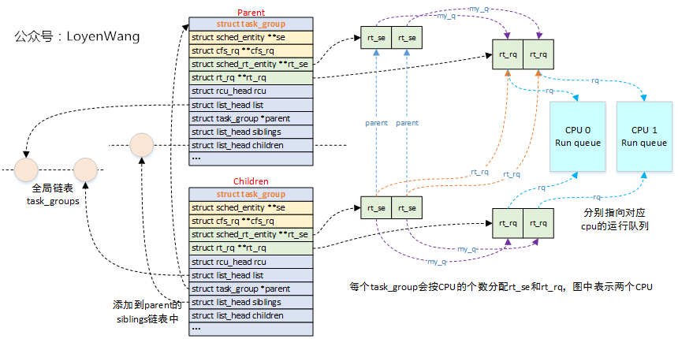
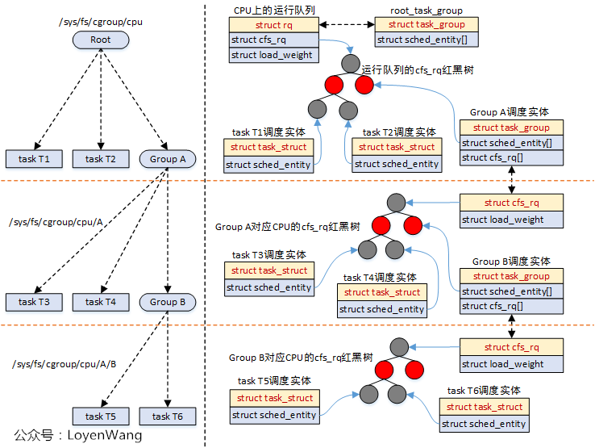

* [cgroup](#cgroup)
    * [cgrp_demo](#cgrp_demo)
    * [cgroup_api](#cgroup_api)
        * [cgrou_init](#cgroup_init)
            * [cgroup_init_cftypes](#cgroup_init_cftypes)
            * [cgroup_init_subsys](#cgroup_init_subsys)
            * [cgroup_setup_root](#cgroup_setup_root)
        * [cgroup_create](#cgroup_create)
        * [cgroup_attach_task](#cgroup_attach_task)
        * [cgroup_fork](#cgroup_fork)
        * [cgroup_fork](#cgroup_fork)
        * [cgroup_subtree_control_write](#cgroup_subtree_control_write)

    * [mem_cgroup](#mem_cgroup)
        * [mem_cgroup_write](#mem_cgroup_write)
        * [mem_cgroup_attach](#mem_cgroup_attach)
        * [mem_cgroup_charge](#mem_cgroup_charge)
        * [mem_cgroup_try_charge_swap](#mem_cgroup_try_charge_swap)
        * [memory_reclaim](#memory_reclaim)
        * [mem_cgroup_oom](#mem_cgroup_oom)
        * [mem_cgroup_swapout](#mem_cgroup_swapout)
        * [mem_cgroup_pressure](#mem_cgroup_pressure)

    * [cpu_cgroup](#cpu_cgroup)
        * [cpu_cgroup_css_alloc](#cpu_cgroup_css_alloc)
        * [cpu_cgroup_attach](#cpu_cgroup_attach)
        * [cpu_weight_write_u64](#cpu_weight_write_u64)
        * [cpu_max_write](#cpu_max_write)
        * [cfs_bandwidth](#cfs_bandwidth)
            * [init_cfs_bandwidth](#init_cfs_bandwidth)
            * [sched_cfs_period_timer](#sched_cfs_period_timer)
            * [sched_cfs_slack_timer](#sched_cfs_slack_timer)
            * [tg_set_cfs_bandwidth](#tg_set_cfs_bandwidth)
            * [throttle_cfs_rq](#throttle_cfs_rq)
            * [unthrottle_cfs_rq](#unthrottle_cfs_rq)
            * [sched_group_set_shares](#sched_group_set_shares)
            * [update_cfs_group](#update_cfs_group)

        * [rt_bandwidth](#rt_bandwidth)
            * [tg_set_rt_bandwidth](#tg_set_rt_bandwidth)
            * [sched_rt_period_timer](#sched_rt_period_timer)
            * [sched_rt_runtime_exceeded](#sched_rt_runtime_exceeded)

        * [task_group](#task_group)
            * [sched_create_group](#sched_create_group)

* [[RFC 0/5] parker: PARtitioned KERnel](https://lore.kernel.org/linux-pm/20250923153146.365015-1-fam.zheng@bytedance.com/)

# cgroup

* [lore.cgroup](https://lore.kernel.org/cgroups)
* [git.cgroup](https://git.kernel.org/pub/scm/linux/kernel/git/tj/cgroup.git/)
* [iximiuz Labs - Controlling Process Resources with Linux Control Groups](https://labs.iximiuz.com/tutorials/controlling-process-resources-with-cgroups)
* [Control Group v2](https://www.kernel.org/doc/html/latest/admin-guide/cgroup-v2.html)
* [LWN - Understanding the new control groups API](https://lwn.net/Articles/679786/)
* [开发内功修炼 - cgroup](https://mp.weixin.qq.com/s/rUQLM8WfjMqa__Nvhjhmxw)
* [奇小葩 - linux cgroup](https://blog.csdn.net/u012489236/category_11288796.html)
* [极客时间](https://time.geekbang.org/column/article/115582)
* [Docker 背后的内核知识 - cgroups 资源限制](https://www.infoq.cn/news/docker-kernel-knowledge-cgroups-resource-isolation)
* [Coolshell - DOCKER基础技术：LINUX CGROUP](https://coolshell.cn/articles/17049.html)
* [Docker底层原理：Cgroup V2的使用](https://blog.csdn.net/qq_67733273/article/details/134109156)
* [k8s 基于 cgroup 的资源限额（capacity enforcement）：模型设计与代码实现（2023）](https://arthurchiao.art/blog/k8s-cgroup-zh/)
* [[PATCH v7 00/19] The new cgroup slab memory controller](https://lore.kernel.org/all/20200623015846.1141975-1-guro@fb.com/)
    * [[PATCH v7 06/19] mm: memcg/slab: obj_cgroup API](https://lore.kernel.org/all/20200623015846.1141975-7-guro@fb.com/)

    > Object cgroup is basically a pointer to a memory cgroup with a per-cpu reference counter.  It substitutes a memory cgroup in places where it's necessary to charge a custom amount of bytes instead of pages.

    > It prevents long-living objects from pinning the original memory cgroup in the memory.


---


## Core Rules of Cgroup v2

* Kernel cgroup v2 https://docs.kernel.org/admin-guide/cgroup-v2.html
* In cgroup v2, a task cannot be managed by subsystems from different cgroups.
* cgroup v2’s CPU controller cannot manage RT processes in non-root cgroups when CONFIG_RT_GROUP_SCHED is enabled, requiring all RT processes to be in the root cgroup to enable it.

* Domain cgroup:

    1. migrate: Controllers which are not in active use in the v2 hierarchy can be bound to other hierarchies.
    2. migrate: If a process is composed of multiple threads, writing the PID of any thread migrates all threads of the process.
    3. fork: When a process forks a child process, the new process is born into the cgroup that the forking process belongs to at the time of the operation
    4. destroy: A cgroup which doesn't have any children or live processes can be destroyed by removing the directory.
    5. No Internal Process Constraint
    6. Cgroup Type: By default, all cgroups are "**domain**" cgroups, meaning they can contain tasks (processes) and/or child cgroups.

* Threaded cgroup:

    1. Inside a threaded subtree, threads of a process can be put in different cgroups and are not subject to the `no internal process constraint` - threaded controllers can be enabled on non-leaf cgroups whether they have threads in them or not.
    2. As the **threaded domain** cgroup hosts all the domain resource consumptions of the subtree, it is considered to have internal resource consumptions whether there are processes in it or not and `can't have populated child cgroups which aren't threaded`.  Because the root cgroup is not subject to no internal process constraint, it can serve both as a threaded domain and a parent to domain cgroups.
    3. As the cgroup will join the parent's resource domain.  The parent  must either be a valid (threaded) domain or a threaded cgroup.
    4. A domain cgroup is turned into a threaded domain when one of its child cgroup becomes threaded or threaded controllers are enabled
    5. The threaded domain cgroup serves as the resource domain for the whole subtree, and, while the threads can be scattered across the subtree
    6. Cgroup Type: A subtree can be configured as "threaded" by writing threaded to cgroup.type in a cgroup, allowing thread-level granularity.
    7. The root of a threaded subtree, that is, the nearest ancestor which is not threaded, is called **threaded domain** and serves as the resource domain for the entire subtree.
    8. Once threaded, the cgroup can't be made a domain again. To enable the thread mode, the following conditions must be met.

        - As the cgroup will join the parent's resource domain.  The parent must either be a valid (threaded) domain or a threaded cgroup.

        - When the parent is an unthreaded domain, it must not have any domain controllers enabled or populated domain children.  The root is exempt from this requirement.

* Memory cgroup
    1. Migrating a process to a different cgroup doesn't move the memory usages that it instantiated while in the previous cgroup to the new cgroup.
* [Oracle - Libcgroup Abstraction Layer](https://blogs.oracle.com/linux/post/libcgroup-abstraction-layer)
    * **Unified hierarchy** - All the cgroup controllers are now mounted under a single cgroup hierarchy. (In cgroup v1, each controller was typically mounted as a separate path under /sys/fs/cgroup).
    * **Leaf-node rule** - In cgroup v1, processes could be located anywhere within the cgroup hierarchy, and processes could be siblings to cgroups. In cgroup v2, processes can only exist in leaf nodes of the hierarchy, and the kernel rigorously enforces this.
    * **Single-writer rule** - To further simplify the operating system’s management of the cgroup hierarchy, the single-writer rule was adopted. Each cgroup is to be managed by a single task, and by default on Oracle Linux (and other distros) this task is systemd. Users/Applications can request to manage a subset of the cgroup hierarchy via delegated cgroups. Failure to obey the single-writer rule (by modifying a cgroup managed by systemd) could result in systemd reverting the changes.
    * **Renaming of settings** - Cgroup v1 settings and names were inconsistent across controllers. Cgroup v2 standardized the naming across the controllers.
    * **Removal of arcane features** - Early cgroup v1 development resulted in many obscure and confusing settings. Many of these settings were intentionally not forward-ported to cgroup v2 and thus do not have an equivalent v2 setting.

---

The rules are Enforce at [cgroup_attach_permissions](#cgroup_attach_permissions)

1. **Unified Hierarchy**
    * There is a single cgroup hierarchy mounted at one location (e.g., /sys/fs/cgroup/), and all subsystems (e.g., cpu, memory, io, pids) are managed within this tree.

2. **Task css_set crossing cgroup**
    * Domain mode: Each task (process or thread) is associated with exactly one cgroup at a time across all subsystems.
    * Threaded mode:

        Placement Type | Allowed? | Explanation
        :-: | :-: | :-:
        Horizontal (Siblings) | Yes | Threads of a process can be placed in different sibling cgroups within the same threaded domain.
        Vertical (Parent/Child) | No | Threads of a process cannot belong to both a parent cgroup and its child cgroup if the parent and child are in different domains.
        Outside Threaded Domain | No | Threads cannot belong to cgroups outside the threaded domain.

9. **Domain: No Internal Process Constraint**
    * Non-root cgroups can distribute domain resources to their childre only when they don't have any processes of their own
    * A parent cgroup with tasks and all controllers disabled in cgroup.subtree_control can create child cgroups.
    * If controllers are enabled in cgroup.subtree_control, the kernel enforces the restriction that a parent cannot have both tasks and child cgroups.
    * Thread doamin is immuned of this rules

3. **Hierarchical Resource Limits**
    * Rule: Resource limits are enforced hierarchically, with a parent cgroup’s limits acting as an upper bound for its entire subtree (itself and all descendants).

4. **Controller Enablement via cgroup.subtree_control**
    * Rule: A cgroup can only apply resource controls for subsystems explicitly enabled in its parent’s cgroup.subtree_control file.
    * The root cgroup (/sys/fs/cgroup/) has all available controllers enabled by default.

5. **Task Placement in Domain Mode**

    * Rule: In domain mode, tasks can only reside in:
        * Leaf cgroups (that have no children), OR
        * Internal cgroups that have NO controllers enabled in their subtree_control
    * Once you write to a cgroup's subtree_control to enable controllers, that cgroup can no longer contain tasks directly

7. **No Tasks in Parents with Enabled Controllers**
    * Rule: While not a strict kernel requirement, some systems (e.g., systemd) enforce that tasks reside only in leaf nodes when controllers are enabled in a parent.

8. **Cgroup Type Consistency**
    * Rule: A cgroup’s type (domain, threaded, domain threaded, domain invalid) must align with its role in the hierarchy.

10. **Thread vs. Process Granularity**
    * Rule: Processes are assigned via cgroup.procs, and threads within a process can be assigned to different cgroups via cgroup.threads, but only within a threaded subtree.
    * Domain mode: Writing a PID to cgroup.procs moves the entire process (all threads).
    * In threaded mode, writing a TID to cgroup.threads moves individual threads to leaf nodes.

11. **Resource Usage Aggregation**
    * Rule: Resource usage (e.g., CPU time, memory, I/O) is aggregated up the hierarchy, with parent cgroups reflecting the total usage of their subtree.

12. **No Controller Conflicts**
    * Rule: Controllers must operate consistently within the unified hierarchy, avoiding overlaps or conflicts seen in v1 (e.g., blkio vs. memory).

13. **Population and Events**
    * Rule: A cgroup’s cgroup.events file reflects its state (e.g., populated=1 if it or its subtree has tasks), and tasks can only be added to a populated or empty cgroup consistent with its type.

14. **No Zombie Cgroups**
    * Rule: Cgroups are automatically cleaned up when they become empty (no tasks or children), unless explicitly preserved (e.g., by user-space tools).

## v1 vs vs2

| Feature | cgroup v1 | cgroup v2 |
| :-: | :-: | :-: |
|Hierarchy Structure|Multiple hierarchies, separate controllers|Single unified hierarchy|
|Controller Organization|Independent controllers, separate mount points|Unified under single mount point, enabled via cgroup.controllers|
|Delegation|No strict delegation, complex|Strict delegation via cgroup.subtree_control, namespace support|
|Process Attachment|Tasks file, multiple cgroups per process|cgroup.procs, one cgroup per process, thread support|
|Controller Features|Basic CPU, memory, blkio; no PSI|Enhanced memory (kernel, slab), CPU (weight), IO; PSI support|
|Resource Limits|Per-controller files, inconsistent|Unified files (memory.max, cpu.max), memory.low/high|
|Compatibility|Widely supported, legacy systems|Modern systems (Ubuntu 21.10+, RHEL 8+), not fully backward-compatible|
|File System Interface|Controller-specific files (tasks, cpu.shares)|Standardized files (cgroup.procs, memory.events)|
|Security/Isolation|Limited delegation, no strict rules|Strong isolation, safe delegation via namespaces|
|Limitations|Fragmented, no thread support, no PSI|Missing some v1 controllers (net_cls), needs modern kernel|

```sh
# cgroup v1
/sys/fs/cgroup/
├── cpu/
│   ├── tasks
│   ├── cpu.shares
│   ├── cpu.cfs_quota_us
│   └── mygroup/
│       ├── tasks
│       ├── cpu.shares
│       └── subgroup/
│           ├── tasks
│           └── cpu.shares
├── memory/
│   ├── tasks
│   ├── memory.limit_in_bytes
│   └── mygroup/
│       ├── tasks
│       └── memory.limit_in_bytes
└── blkio/
    ├── tasks
    ├── blkio.weight
    └── mygroup/
        ├── tasks
        └── blkio.weight
```

```sh
# cgroup v2
/sys/fs/cgroup/ # Contains global control files and enabled controllers.
└── mygroup/ # Each sub-cgroup can enable a subset of controllers available in its parent.
│   ├── cgroup.procs
│   ├── cgroup.controllers  (e.g., "cpu memory")
│   ├── cgroup.subtree_control  (e.g., "cpu")
│   ├── cpu.max
│   ├── cpu.stat
│   ├── cpu.weight
│   ├── memory.max: Maximum memory limit.
│   ├── memory.current: Current memory usage.
│   ├── memory.events: Memory-related events (e.g., OOM).
│   ├── io.max: I/O limits (replaces blkio subsystem).
│   ├── pids.max: Maximum number of PIDs.
│   ├── pids.current: Current number of PIDs.
│   └── subgroup/
│       ├── cgroup.procs
│       ├── cgroup.controllers  (e.g., "cpu")
│       ├── cgroup.subtree_control
│       └── cpu.max
├── cgroup.controllers
├── cgroup.procs # Lists PGIDs of processes in this cgroup; write a PGID to move a process here.
├── cgroup.threads # Lists TIDs of threads in this cgroup; write a TID to move a thread here.
├── cgroup.subtree_control # Lists controllers enabled for child cgroups (e.g., cpu memory); write +cpu or -memory to enable/disable.
├── cgroup.type # Indicates the cgroup type (domain, threaded, domain threaded, or domain invalid), controlling thread vs. process granularity.
├── cgroup.max.depth # Limits the maximum depth of the cgroup hierarchy
├── cgroup.max.descendants # Limits the total number of descendant cgroups
├── cgroup.freeze # Writing 1 freezes all tasks in the cgroup
├── cgroup.pressure
├── cgroup.stat
├── cgroup.kill # Writing 1 terminates all processes in the cgroup
├── cgroup.events
├──
├── cpu.max # CPU bandwidth limit (quota and period, e.g., "100000 1000000").
├── cpu.max.burst # Allows temporary bursts beyond cpu.max quota (in µs)
├── cpu.weight # proportionally distributes CPU cycles (range: 1–10000, default 100)
├── cpu.weight.nice # Maps the cgroup’s CPU priority to a "nice" value (-20 to 19)
├── cpu.idle # Controls whether tasks in the cgroup are forced into an idle state
├── cpu.pressure # Reports Pressure Stall Information (PSI) for CPU, showing delays due to CPU contention
├── cpu.stat # Provides CPU usage statistics (e.g., user time, system time, throttled time)
├── cpu.stat.local # Similar to cpu.stat, but reports stats only for tasks directly in this cgroup, excluding descendants.
├── cpu.uclamp.max # Sets an upper bound on CPU utilization clamping
├── cpu.uclamp.min
├──
├── memory.max # hard memory limit (in bytes). Exceeding this triggers the OOM killer.
├── memory.high # memory threshold for proactive reclaim
├── memory.low # memory protection threshold against reclaim
├── memory.min # guaranteed minimum memory amount (in bytes) that won’t be reclaimed, even under pressure.
├── memory.current # Reports current memory usage. (anon + file backed)
├── memory.swap.high
├── memory.swap.max # Limits swap usage for the cgroup.
├── memory.swap.peak
├── memory.swap.current # Reports current swap usage (in bytes) by tasks in this cgroup.
├── memory.swap.events # Logs swap-specific events (e.g., swap_high, swap_max) for this cgroup.
├── memory.zswap.current
├── memory.zswap.writeback
├── memory.zswap.max
├── memory.events # Logs memory-related events (e.g., low, high, max, oom) for this cgroup and its descendants.
├── memory.events.local
├── memory.peak # Reports the historical maximum memory usage (in bytes) since the cgroup was created.
├── memory.reclaim # Writing a value (in bytes) triggers manual memory reclamation from this cgroup without killing processes.
├── memory.numa_stat
├── memory.oom.group # If set to 1, an OOM event kills all processes in the cgroup together; 0 kills individually (default).
├── memory.stat
├── memory.pressure
├──     # some: The percentage of time that at least one task in the cgroup is stalled waiting for memory.
├──     # full: The percentage of time that all non-idle tasks in the cgroup are stalled waiting for memory (i.e., the cgroup is completely blocked).
├──     # avg: A moving average of the pressure over different time windows (e.g., 10s, 60s, 300s).
├──
├── pids.current # Reports the current number of PIDs (processes and threads) in this cgroup.
├── pids.events
├── pids.max # Sets the maximum number of PIDs allowed
├── pids.peak # Reports the historical maximum PID count since the cgroup was created.
├──
└── io.pressure
```

## cgrp_demo

```c
#define _GNU_SOURCE /* See feature_test_macros */
#include <pthread.h>
#include <stdio.h>
#include <stdlib.h>
#include <sys/stat.h>
#include <sys/types.h>
#include <unistd.h>
#include <sys/syscall.h>
#include <string.h>
#include <fcntl.h>

const int NUM_THREADS = 5;
static char* cgrp_name = "alice";

void cgrp_config(const char* name, const char* data) {
    char file[128] = {0};
    sprintf(file, "/sys/fs/cgroup/%s/%s", cgrp_name, name);
    int fd = open((char*)&file, O_WRONLY | O_APPEND);
    if (fd == -1) {
        perror("Error opening file: ");
        return;
    }

    if (write(fd, data, strlen(data)) == -1) {
        perror("Error appending text to file: ");
        close(fd);
        return;
    }

    close(fd);
}

void create_cgroup(void) {
    char cmd[128] = {0};

    sprintf(cmd, "/sys/fs/cgroup/%s", cgrp_name);
    if (mkdir(cmd, 0777) == -1) {
        perror("Directory creation failed. Trying with sudo...");

        sprintf(cmd, "sudo mkdir -p /sys/fs/cgroup/%s", cgrp_name);
        if (system(cmd) == -1) {
            perror("Error creating directory with sudo");
            exit(EXIT_FAILURE);
        }
    }

    cgrp_config("cpu.max", "50000 100000");
    // sprintf(cmd, "echo \"5M\" > /sys/fs/cgroup/%s/memory.max", cgrp_name);

    cgrp_config("memory.max", "5M");
}

void cgrp_attach(void)
{
    char tid[20] = "\n";
    char cmd[128] = {0};
    sprintf(tid + 1, "%d", (int)getpid());
    cgrp_config("cgroup.procs", tid);
}

void *main_cpucgrp(void* arg)
{
    long tid = (long)arg;
    printf("Hello World! It's me, thread #%ld, pid #%ld!\n", tid, syscall(SYS_gettid));

    int cnt = 0;
    while (1) {
        cnt++;
    }
    pthread_exit(NULL);

    return NULL;
}

void* main_memcgrp(void* arg) {
    int size = 0;
    int chunk_size = 1024 * 1024;
    void *p = NULL;

    while (1) {
        if ((p = malloc(chunk_size)) == NULL) {
            printf("out of memory!!\n");
            break;
        }
        memset(p, 1, chunk_size);
        size += chunk_size;
        printf("[%d] - memory is allocated [%8d] bytes \n", getpid(), size);
        sleep(1);
    }

    return NULL;
}

int main(int argc, char *argv[])
{
    int nr_thrd = 0;

    if (argc > 1){
        nr_thrd = atoi(argv[1]);
    }
    if (nr_thrd <= 0 || nr_thrd >= 100){
        nr_thrd = NUM_THREADS;
    }

    create_cgroup();
    cgrp_attach();

    pthread_t* thrd_vec = (pthread_t*)malloc(sizeof(pthread_t)*nr_thrd);
    for (long tid = 0; tid < nr_thrd; tid++) {
        printf("In main: creating thread %ld\n", tid);
        int rc = pthread_create(&thrd_vec[tid], NULL, main_cpucgrp, (void *)tid);
        if (rc) {
            perror("pthread_create failed: ");
            exit(-1);
        }
    }

    int pid = fork();
    if (pid == 0) {
        pthread_t mem_thrd;
        pthread_create(&mem_thrd, NULL, main_memcgrp, NULL);
    }

    /* allow other threads to continue execution */
    pthread_exit(NULL);
}
```

## cgroup_api

### cgroup_init

```c
struct task_struct {
    struct css_set      *cgroups;
    struct list_head    cg_list; /* anchored to css_set mg_tasks, dying_tasks */
};

struct css_set {
    struct cgroup_subsys_state *subsys[CGROUP_SUBSYS_COUNT];
    struct css_set *dom_cset;
    struct cgroup *dfl_cgrp;
    int nr_tasks;

    struct list_head e_cset_node[CGROUP_SUBSYS_COUNT];

    /* all threaded csets whose ->dom_cset points to this cset */
    struct list_head threaded_csets;
    struct list_head threaded_csets_node;

    struct hlist_node hlist;

    struct list_head cgrp_links;
};

struct cgroup_subsys_state {
    struct cgroup               *cgroup;
    struct cgroup_subsys        *ss;
    struct list_head            sibling;
    struct list_head            children;
    int                         id;

    unsigned int                flags;
    struct cgroup_subsys_state  *parent;
}

struct cgroup {
    /* self css with NULL ->ss, points back to this cgroup */
    struct cgroup_subsys_state self;

    unsigned long flags; /* "unsigned long" so bitops work */
    int level;

    /* Maximum allowed descent tree depth */
    int max_depth;

    struct kernfs_node *kn; /* cgroup kernfs entry */
    struct cgroup_file procs_file; /* handle for "cgroup.procs" */
    struct cgroup_file events_file; /* handle for "cgroup.events" */

    u16 subtree_control;
    u16 subtree_ss_mask;

    /* Private pointers for each registered subsystem */
    struct cgroup_subsys_state *subsys[CGROUP_SUBSYS_COUNT];

    struct cgroup_root *root;

    struct list_head cset_links;

    struct list_head e_csets[CGROUP_SUBSYS_COUNT];

    /* The domain this cgroup belongs to in threaded mode */
    struct cgroup *dom_cgrp;
    struct cgroup *old_dom_cgrp; /* used while enabling threaded */

    /* refer to all the cgroups above it in the hierarchy,
     * from its immediate parent up to the root. level as index */
    struct cgroup *ancestors[];
};

/* cgroup and css_set have M:N relationship */
struct cgrp_cset_link {
    /* the cgroup and css_set this link associates */
    struct cgroup       *cgrp;
    struct css_set      *cset;

    /* list of cgrp_cset_links anchored at cgrp->cset_links */
    struct list_head    cset_link;
    /* list of cgrp_cset_links anchored at css_set->cgrp_links */
    struct list_head    cgrp_link;
};
```

```c
static struct file_system_type cgroup2_fs_type = {
    .name               = "cgroup2",
    .init_fs_context    = cgroup_init_fs_context,
    .parameters         = cgroup2_fs_parameters,
    .kill_sb            = cgroup_kill_sb,
    .fs_flags           = FS_USERNS_MOUNT,
};

const struct file_operations kernfs_file_fops = {
    .read_iter  = kernfs_fop_read_iter,
    .write_iter = kernfs_fop_write_iter,
    .llseek     = kernfs_fop_llseek,
    .mmap       = kernfs_fop_mmap,
    .open       = kernfs_fop_open,
    .release    = kernfs_fop_release,
    .poll       = kernfs_fop_poll,
    .fsync      = noop_fsync,
    .splice_read    = copy_splice_read,
    .splice_write   = iter_file_splice_write,
};

static struct kernfs_syscall_ops cgroup_kf_syscall_ops = {
    .show_options   = cgroup_show_options,
    .mkdir          = cgroup_mkdir,
    .rmdir          = cgroup_rmdir,
    .show_path      = cgroup_show_path,
};

/* cgroup v2 base files */
static struct cftype cgroup_base_files[] = {
    {
        .name = "cgroup.type",
        .flags = CFTYPE_NOT_ON_ROOT,
        .seq_show = cgroup_type_show,
        .write = cgroup_type_write,
    },
    {
        .name = "cgroup.procs",
        .flags = CFTYPE_NS_DELEGATABLE,
        .file_offset = offsetof(struct cgroup, procs_file),
        .release = cgroup_procs_release,
        .seq_start = cgroup_procs_start,
        .seq_next = cgroup_procs_next,
        .seq_show = cgroup_procs_show,
        .write = cgroup_procs_write,
    },
}

/* cgroup v1 base files */
struct cftype cgroup1_base_files[] = {
    {
        .name = "cgroup.procs",
        .seq_start = cgroup_pidlist_start,
        .seq_next = cgroup_pidlist_next,
        .seq_stop = cgroup_pidlist_stop,
        .seq_show = cgroup_pidlist_show,
        .private = CGROUP_FILE_PROCS,
        .write = cgroup1_procs_write,
    },
};

static struct kernfs_ops cgroup_kf_ops = {
    .atomic_write_len   = PAGE_SIZE,
    .open               = cgroup_file_open,
    .release            = cgroup_file_release,
    .write              = cgroup_file_write,
    .poll               = cgroup_file_poll,
    .seq_start          = cgroup_seqfile_start,
    .seq_next           = cgroup_seqfile_next,
    .seq_stop           = cgroup_seqfile_stop,
    .seq_show           = cgroup_seqfile_show,
};
```

```c
int __init cgroup_init_early(void)
{
    static struct cgroup_fs_context __initdata ctx;
    struct cgroup_subsys *ss;
    int i;

    ctx.root = &cgrp_dfl_root;
    init_cgroup_root(&ctx);
    cgrp_dfl_root.cgrp.self.flags |= CSS_NO_REF;

    RCU_INIT_POINTER(init_task.cgroups, &init_css_set);

    for_each_subsys(ss, i) {
        ss->id = i;
        ss->name = cgroup_subsys_name[i];
        if (!ss->legacy_name)
            ss->legacy_name = cgroup_subsys_name[i];

        if (ss->early_init)
            cgroup_init_subsys(ss, true);
    }
    return 0;
}
```

```c
int __init cgroup_init(void)
{
    struct cgroup_subsys *ss;
    int ssid;

    BUILD_BUG_ON(CGROUP_SUBSYS_COUNT > 16);
    BUG_ON(cgroup_init_cftypes(NULL, cgroup_base_files));
    BUG_ON(cgroup_init_cftypes(NULL, cgroup_psi_files));
    BUG_ON(cgroup_init_cftypes(NULL, cgroup1_base_files));

    cgroup_rstat_boot();

    get_user_ns(init_cgroup_ns.user_ns);

    cgroup_lock();

    hash_add(css_set_table,
        &init_css_set.hlist,
        css_set_hash(init_css_set.subsys)
    );

    cgroup_setup_root(&cgrp_dfl_root, 0);
        --->

    cgroup_unlock();

    for_each_subsys(ss, ssid) {
        if (ss->early_init) {
            struct cgroup_subsys_state *css = init_css_set.subsys[ss->id];
            css->id = cgroup_idr_alloc(&ss->css_idr, css, 1, 2, GFP_KERNEL);
        } else {
            cgroup_init_subsys(ss, false);
        }

        list_add_tail(&init_css_set.e_cset_node[ssid],
            &cgrp_dfl_root.cgrp.e_csets[ssid]);

        if (!cgroup_ssid_enabled(ssid))
            continue;

        cgrp_dfl_root.subsys_mask |= 1 << ss->id;

        if (ss->implicit_on_dfl) {
            cgrp_dfl_implicit_ss_mask |= 1 << ss->id;
        } else if (!ss->dfl_cftypes) {
            cgrp_dfl_inhibit_ss_mask |= 1 << ss->id;
        }

        if (ss->threaded) {
            cgrp_dfl_threaded_ss_mask |= 1 << ss->id;
        }

        if (ss->dfl_cftypes == ss->legacy_cftypes) {
            WARN_ON(cgroup_add_cftypes(ss, ss->dfl_cftypes));
        } else {
            WARN_ON(cgroup_add_dfl_cftypes(ss, ss->dfl_cftypes));
            WARN_ON(cgroup_add_legacy_cftypes(ss, ss->legacy_cftypes));
        }

        if (ss->bind) {
            ss->bind(init_css_set.subsys[ssid]);
        }

        cgroup_lock();
        css_populate_dir(init_css_set.subsys[ssid]) {
            --->
        }
        cgroup_unlock();
    }

    /* init_css_set.subsys[] has been updated, re-hash */
    hash_del(&init_css_set.hlist);
    hash_add(css_set_table, &init_css_set.hlist,
        css_set_hash(init_css_set.subsys));

    sysfs_create_mount_point(fs_kobj, "cgroup");
    register_filesystem(&cgroup_fs_type);
    register_filesystem(&cgroup2_fs_type);
    proc_create_single("cgroups", 0, NULL, proc_cgroupstats_show);
    register_filesystem(&cpuset_fs_type);

    return 0;
}
```

#### cgroup_init_cftypes

```c
int cgroup_init_cftypes(struct cgroup_subsys *ss, struct cftype *cfts)
{
    struct cftype *cft;
    int ret = 0;

    for (cft = cfts; cft->name[0] != '\0'; cft++) {
        struct kernfs_ops *kf_ops;

        if (cft->flags & __CFTYPE_ADDED) {
            ret = -EBUSY;
            break;
        }

        if (cft->seq_start)
            kf_ops = &cgroup_kf_ops;
        else
            kf_ops = &cgroup_kf_single_ops;

        if (cft->max_write_len && cft->max_write_len != PAGE_SIZE) {
            kf_ops = kmemdup(kf_ops, sizeof(*kf_ops), GFP_KERNEL);
            if (!kf_ops) {
                ret = -ENOMEM;
                break;
            }
            kf_ops->atomic_write_len = cft->max_write_len;
        }

        cft->kf_ops = kf_ops;
        cft->ss = ss;
        cft->flags |= __CFTYPE_ADDED;
    }

    if (ret)
        cgroup_exit_cftypes(cfts);
    return ret;
}
```

#### cgroup_init_subsys

```c
void __init cgroup_init_subsys(struct cgroup_subsys *ss, bool early)
{
    struct cgroup_subsys_state *css;

    idr_init(&ss->css_idr);
    INIT_LIST_HEAD(&ss->cfts);

    /* Create the root cgroup state for this subsystem */
    ss->root = &cgrp_dfl_root;
    css = ss->css_alloc(NULL);
    /* We don't handle early failures gracefully */
    BUG_ON(IS_ERR(css));
    init_and_link_css(css, ss, &cgrp_dfl_root.cgrp);

    css->flags |= CSS_NO_REF;

    if (early) {
        css->id = 1;
    } else {
        css->id = cgroup_idr_alloc(&ss->css_idr, css, 1, 2, GFP_KERNEL);
    }

    init_css_set.subsys[ss->id] = css;

    have_fork_callback |= (bool)ss->fork << ss->id;
    have_exit_callback |= (bool)ss->exit << ss->id;
    have_release_callback |= (bool)ss->release << ss->id;
    have_canfork_callback |= (bool)ss->can_fork << ss->id;

    online_css(css);
}
```

#### cgroup_setup_root

```c
int cgroup_setup_root(struct cgroup_root *root, u16 ss_mask) {
    LIST_HEAD(tmp_links);
    struct cgroup *root_cgrp = &root->cgrp;
    struct kernfs_syscall_ops *kf_sops;
    struct css_set *cset;
    int i, ret;

    lockdep_assert_held(&cgroup_mutex);

    ret = percpu_ref_init(&root_cgrp->self.refcnt, css_release,
                0, GFP_KERNEL);
    ret = allocate_cgrp_cset_links(2 * css_set_count, &tmp_links);
    ret = cgroup_init_root_id(root);

    kf_sops = (root == &cgrp_dfl_root)
        ? &cgroup_kf_syscall_ops
        : &cgroup1_kf_syscall_ops;

    root->kf_root = kernfs_create_root(
        kf_sops,
        KERNFS_ROOT_CREATE_DEACTIVATED
            | KERNFS_ROOT_SUPPORT_EXPORTOP
            | KERNFS_ROOT_SUPPORT_USER_XATTR,
        root_cgrp);
    root_cgrp->kn = kernfs_root_to_node(root->kf_root);
    root_cgrp->ancestors[0] = root_cgrp;

    ret = css_populate_dir(&root_cgrp->self);

    ret = cgroup_rstat_init(root_cgrp);
    ret = rebind_subsystems(root, ss_mask);
    ret = cgroup_bpf_inherit(root_cgrp);
    list_add(&root->root_list, &cgroup_roots);
    cgroup_root_count++;

    spin_lock_irq(&css_set_lock);
    hash_for_each(css_set_table, i, cset, hlist) {
        link_css_set(&tmp_links, cset, root_cgrp);
        if (css_set_populated(cset))
            cgroup_update_populated(root_cgrp, true);
    }
    spin_unlock_irq(&css_set_lock);

    ret = 0;
}
```

### cgroup_create

```c
cgroup_mkdir() {
    cgrp = cgroup_create(parent, name, mode) {
        struct cgroup_root *root = parent->root;
        struct cgroup *cgrp, *tcgrp;
        struct kernfs_node *kn;
        int level = parent->level + 1;
        int ret;

        /* allocate the cgroup and its ID, 0 is reserved for the root */
        cgrp = kzalloc(struct_size(cgrp, ancestors, (level + 1)), GFP_KERNEL);

        ret = percpu_ref_init(&cgrp->self.refcnt, css_release, 0, GFP_KERNEL);

        ret = cgroup_rstat_init(cgrp);

        /* create the directory */
        kn = kernfs_create_dir_ns(parent->kn, name, mode,
            current_fsuid(), current_fsgid(), cgrp, NULL
        );
        cgrp->kn = kn;

        init_cgroup_housekeeping(cgrp);

        cgrp->self.parent = &parent->self;
        cgrp->root = root;
        cgrp->level = level;

        ret = psi_cgroup_alloc(cgrp);
        ret = cgroup_bpf_inherit(cgrp);
        cgrp->freezer.e_freeze = parent->freezer.e_freeze;
        if (cgrp->freezer.e_freeze) {
            set_bit(CGRP_FREEZE, &cgrp->flags);
            set_bit(CGRP_FROZEN, &cgrp->flags);
        }

        spin_lock_irq(&css_set_lock);
        for (tcgrp = cgrp; tcgrp; tcgrp = cgroup_parent(tcgrp)) {
            cgrp->ancestors[tcgrp->level] = tcgrp;
            if (tcgrp != cgrp) {
                tcgrp->nr_descendants++;
                if (cgrp->freezer.e_freeze)
                    tcgrp->freezer.nr_frozen_descendants++;
            }
        }
        spin_unlock_irq(&css_set_lock);

        if (notify_on_release(parent))
            set_bit(CGRP_NOTIFY_ON_RELEASE, &cgrp->flags);

        if (test_bit(CGRP_CPUSET_CLONE_CHILDREN, &parent->flags))
            set_bit(CGRP_CPUSET_CLONE_CHILDREN, &cgrp->flags);

        cgrp->self.serial_nr = css_serial_nr_next++;

        /* allocation complete, commit to creation */
        list_add_tail_rcu(&cgrp->self.sibling, &cgroup_parent(cgrp)->self.children);
        atomic_inc(&root->nr_cgrps);
        cgroup_get_live(parent);

        /* On the default hierarchy, a child doesn't automatically inherit
        * subtree_control from the parent.  Each is configured manually. */
        if (!cgroup_on_dfl(cgrp))
            cgrp->subtree_control = cgroup_control(cgrp);

        cgroup_propagate_control(cgrp);
            --->

        return cgrp;
    }

    css_populate_dir(&cgrp->self/*css*/) {
        if (css->flags & CSS_VISIBLE)
            return 0;
        /* self css with NULL ->ss, points back to this cgroup */
        if (!css->ss) {
            if (cgroup_on_dfl(cgrp)) { /* cgrp->root == &cgrp_dfl_root */
                ret = cgroup_addrm_files(css, cgrp, cgroup_base_files, true);
                if (cgroup_psi_enabled()) {
                    ret = cgroup_addrm_files(css, cgrp, cgroup_psi_files, true);
                }
            } else {
                ret = cgroup_addrm_files(css, cgrp, cgroup1_base_files, true);
            }
        } else {
            list_for_each_entry(cfts, &css->ss->cfts, node) {
                ret = cgroup_addrm_files(css, cgrp, cfts, true) {
                    struct cftype *cft, *cft_end = NULL;
                    int ret = 0;
                restart:
                    for (cft = cfts; cft != cft_end && cft->name[0] != '\0'; cft++) {
                        if (is_add) {
                            ret = cgroup_add_file(css, cgrp, cft) {
                                __kernfs_create_file();
                            }
                        } else {
                            cgroup_rm_file(cgrp, cft) {
                                kernfs_remove_by_name();
                            }
                        }
                    }
                    return ret;
                }
            }
        }

        css->flags |= CSS_VISIBLE;
    }

    cgroup_apply_control_enable(cgrp) {
        for_each_subsys(ss, ssid) {
            css = css_create(dsct, ss) {
                css = ss->css_alloc(parent_css);
                init_and_link_css(css, ss, cgrp);
                err = percpu_ref_init(&css->refcnt, css_release, 0, GFP_KERNEL);
                err = cgroup_idr_alloc(&ss->css_idr, NULL, 2, 0, GFP_KERNEL);
                css->id = err;
                list_add_tail_rcu(&css->sibling, &parent_css->children);
                cgroup_idr_replace(&ss->css_idr, css, css->id);

                err = online_css(css) {
                    if (ss->css_online) {
                        ret = ss->css_online(css);
                    }
                    if (!ret) {
                        css->flags |= CSS_ONLINE;
                        rcu_assign_pointer(css->cgroup->subsys[ss->id], css);
                        atomic_inc(&css->online_cnt);
                        if (css->parent) {
                            atomic_inc(&css->parent->online_cnt);
                        }
                    }
                }
                return css;
            }
            if (css_visible(css)) {
                ret = css_populate_dir(css);
                if (ret) {
                    return ret;
                }
            }
        }
        return 0;
    }
}
```

### cgroup_procs_write

```c
static ssize_t __cgroup_procs_write(struct kernfs_open_file *of, char *buf,
                    bool threadgroup)
{
    struct cgroup_file_ctx *ctx = of->priv;
    struct cgroup *src_cgrp, *dst_cgrp;
    struct task_struct *task;
    const struct cred *saved_cred;
    ssize_t ret;
    bool threadgroup_locked;

    dst_cgrp = cgroup_kn_lock_live(of->kn, false);
    if (!dst_cgrp)
        return -ENODEV;

    task = cgroup_procs_write_start(buf, threadgroup, &threadgroup_locked);
    ret = PTR_ERR_OR_ZERO(task);
    if (ret)
        goto out_unlock;

    /* find the source cgroup */
    spin_lock_irq(&css_set_lock);
    src_cgrp = task_cgroup_from_root(task, &cgrp_dfl_root);
    spin_unlock_irq(&css_set_lock);

    /* Process and thread migrations follow same delegation rule. Check
    * permissions using the credentials from file open to protect against
    * inherited fd attacks. */
    saved_cred = override_creds(of->file->f_cred);
    ret = cgroup_attach_permissions(src_cgrp, dst_cgrp,
                    of->file->f_path.dentry->d_sb,
                    threadgroup, ctx->ns);
    revert_creds(saved_cred);
    if (ret)
        goto out_finish;

    ret = cgroup_attach_task(dst_cgrp, task, threadgroup);

out_finish:
    cgroup_procs_write_finish(task, threadgroup_locked);
out_unlock:
    cgroup_kn_unlock(of->kn);

    return ret;
}
```

#### cgroup_attach_permissions

```c
static int cgroup_attach_permissions(struct cgroup *src_cgrp,
                    struct cgroup *dst_cgrp,
                    struct super_block *sb, bool threadgroup,
                    struct cgroup_namespace *ns)
{
    int ret = 0;

    ret = cgroup_procs_write_permission(src_cgrp, dst_cgrp, sb, ns) {
        struct cgroup *com_cgrp = src_cgrp;
        int ret;

        lockdep_assert_held(&cgroup_mutex);

        /* find the common ancestor */
        bool cgroup_is_descendant(cgrp, ancestor) {
            if (cgrp->root != ancestor->root || cgrp->level < ancestor->level)
                return false;
            return cgrp->ancestors[ancestor->level] == ancestor;
        }
        while (!cgroup_is_descendant(dst_cgrp, com_cgrp))
            com_cgrp = cgroup_parent(com_cgrp);

        /* %current should be authorized to migrate to the common ancestor */
        ret = cgroup_may_write(com_cgrp, sb) {
            int ret;
            struct inode *inode;

            lockdep_assert_held(&cgroup_mutex);

            inode = kernfs_get_inode(sb, cgrp->procs_file.kn);
            if (!inode)
                return -ENOMEM;

            ret = inode_permission(&nop_mnt_idmap, inode, MAY_WRITE);
            iput(inode);
            return ret;
        }
        if (ret)
            return ret;

        /* If namespaces are delegation boundaries, %current must be able
         * to see both source and destination cgroups from its namespace. */
        if ((cgrp_dfl_root.flags & CGRP_ROOT_NS_DELEGATE) &&
            (!cgroup_is_descendant(src_cgrp, ns->root_cset->dfl_cgrp) ||
            !cgroup_is_descendant(dst_cgrp, ns->root_cset->dfl_cgrp)))
            return -ENOENT;

        return 0;
    }
    if (ret)
        return ret;

    /* verify whether a cgroup can be migration destination */
    ret = cgroup_migrate_vet_dst(dst_cgrp) {
        /* v1 doesn't have any restriction */
        if (!cgroup_on_dfl(dst_cgrp) { return cgrp->root == &cgrp_dfl_root })
            return 0;

        /* verify @dst_cgrp can host resources */
        ret = cgroup_is_valid_domain(dst_cgrp->dom_cgrp) {
            /* Q: how to write tid to cgroup.threads if return false here */
            /* the cgroup itself can be a thread root */
            if (cgroup_is_threaded(cgrp) { return cgrp->dom_cgrp != cgrp; })
                return false;

            /* but the ancestors can't be unless mixable:
             * cant be domain cgrp and threaded cgrp at same time */
            while ((cgrp = cgroup_parent(cgrp))) {
                is_mixable = cgroup_is_mixable(cgrp) { /* only root can be mixable */
                    return !cgroup_parent(cgrp)
                }
                is_trd_root = cgroup_is_thread_root(cgrp) {
                    /* thread root should be a domain */
                    if (cgroup_is_threaded(cgrp))
                        return false;

                    /* a domain w/ threaded children is a thread root */
                    if (cgrp->nr_threaded_children)
                        return true;

                    /* A domain which has tasks and explicit threaded controllers
                     * enabled is a thread root. */
                    if (cgroup_has_tasks(cgrp) &&
                        (cgrp->subtree_control & cgrp_dfl_threaded_ss_mask))
                        return true;

                    return false;
                }
                if (!is_mixable && is_trd_root)
                    return false;
                if (cgroup_is_threaded(cgrp))
                    return false;
            }

            return true;
        }
        if (!ret)
            return -EOPNOTSUPP;

        /* If @dst_cgrp is already or can become a thread root or is
         * threaded, it doesn't matter. */
        ret = cgroup_can_be_thread_root(dst_cgrp) {
            /* mixables don't care */
            if (cgroup_is_mixable(cgrp))
                return true;

            /* domain roots can't be nested under threaded */
            if (cgroup_is_threaded(cgrp))
                return false;

            /* can only have either domain or threaded children */
            if (cgrp->nr_populated_domain_children)
                return false;

            /* and no domain controllers can be enabled */
            if (cgrp->subtree_control & ~cgrp_dfl_threaded_ss_mask)
                return false;

            return true;
        }
        if (ret || cgroup_is_threaded(dst_cgrp))
            return 0;

        /* apply no-internal-process constraint */
        if (dst_cgrp->subtree_control)
            return -EBUSY;

        return 0;
    }
    if (ret)
        return ret;

    /* check: Outside Domain. src and dst must be in same domain */
    if (!threadgroup && (src_cgrp->dom_cgrp != dst_cgrp->dom_cgrp))
        ret = -EOPNOTSUPP;

    return ret;
}
```

### cgroup_attach_task


Cgroups don't typically perform a retroactive transfer of already accumulated resource usage from the "old" cgroup to the "new" cgroup.

Resource | Old Cgroup Behavior After Move | New Cgroup Behavior After Move
:-: | :-: | :-:
CPU | Task stops contributing to CPU usage and is no longer constrained. | Task is constrained by the CPU limits of the new cgroup.
Memory | Memory already allocated remains charged until freed. | Future memory allocations are charged to the new cgroup.
I/O | Ongoing I/O operations complete under old limits. | New I/O operations are subject to the new cgroup's limits.
PIDs | Process count decreases by 1. | Process count increases by 1, and PID limits apply.


```c
write() {
    kernfs_fop_write() {
        cgroup_file_write() {
            cgroup_procs_write() {
                cgroup_attach_task() {
                    /* 1. prepare src csets */
                    do {
                        cgroup_migrate_add_src() {
                            src_cset->mg_src_cgrp = src_cgrp;
                            src_cset->mg_dst_cgrp = dst_cgrp;
                            list_add_tail(&src_cset->mg_src_preload_node, &mgctx->preloaded_src_csets);
                        }
                    } while_each_thread(leader, task);

                    /* 2. prepare dst csets and commit */
                    cgroup_migrate_prepare_dst() {
                        list_for_each_entry_safe(src_cset, tmp_cset, &mgctx->preloaded_src_csets, mg_src_preload_node) {
                            src_cset->mg_dst_cset = dst_cset;
                            list_add_tail(&dst_cset->mg_dst_preload_node, &mgctx->preloaded_dst_csets);
                        }
                    }

                    /* 3. do migrate */
                    cgroup_migrate() {
                        /* 3.1 add task to src_cset->mg_tasks, src/dst_cset to mgctx */
                        cgroup_migrate_add_task() {
                            list_move_tail(&task->cg_list, &cset->mg_tasks);
                            list_add_tail(&cset->mg_node, &mgctx->tset.src_csets);
                            list_add_tail(&cset->mg_dst_cset->mg_node, &mgctx->tset.dst_csets);
                        }

                        cgroup_migrate_execute() {
                            /* 3.2 test can attach */
                            do_each_subsys_mask(ss, ssid) {
                                if (ss->can_attach) {
                                    cpu_cgroup_can_attach();
                                }
                            } while_each_subsys_mask();

                            /* 3.3 css_set_move_task */
                            list_for_each_entry(cset, &tset->src_csets, mg_node) {
                                list_for_each_entry_safe(task, tmp_task, &cset->mg_tasks, cg_list) {
                                    css_set_move_task() {
                                        if (from_cset) {
                                            list_del_init(&task->cg_list);
                                        }
                                        if (to_cset) {
                                            cgroup_move_task(task, to_cset) {
                                                rcu_assign_pointer(task->cgroups, to);
                                            }
                                            list_add_tail(&task->cg_list, use_mg_tasks
                                                ? &to_cset->mg_tasks : &to_cset->tasks);
                                        }
                                    }
                                }
                            }

                            /* 3.4 do attach */
                            do_each_subsys_mask(ss, ssid) {
                                ss->attach();
                            } while_each_subsys_mask();
                        }
                    }

                    /* 4. cleanup after attach */
                    cgroup_procs_write_finish() {
                        for_each_subsys(ss, ssid) {
                            if (ss->post_attach) {
                                ss->post_attach();
                            }
                        }
                    }
                }
            }
        }
    }
}
```

```c
struct cgroup_mgctx {
    /* Preloaded source and destination csets.  Used to guarantee
     * atomic success or failure on actual migration. */
    struct list_head    preloaded_src_csets;
    struct list_head    preloaded_dst_csets;

    /* tasks and csets to migrate */
    struct cgroup_taskset    tset;

    /* subsystems affected by migration */
    u16            ss_mask;
};

/* used to track tasks and csets during migration */
struct cgroup_taskset {
    /* the src and dst cset list running through cset->mg_node */
    struct list_head    src_csets;
    struct list_head    dst_csets;

    /* the number of tasks in the set */
    int            nr_tasks;

    /* the subsys currently being processed */
    int            ssid;

    /* Fields for cgroup_taskset_*() iteration.
    *
    * Before migration is committed, the target migration tasks are on
    * ->mg_tasks of the csets on ->src_csets.  After, on ->mg_tasks of
    * the csets on ->dst_csets.  ->csets point to either ->src_csets
    * or ->dst_csets depending on whether migration is committed.
    *
    * ->cur_csets and ->cur_task point to the current task position
    * during iteration. */
    struct list_head    *csets;
    struct css_set      *cur_cset;
    struct task_struct  *cur_task;
};
```

```c
int cgroup_attach_task(struct cgroup *dst_cgrp, struct task_struct *leader, bool threadgroup)
{
    DEFINE_CGROUP_MGCTX(mgctx);

/* 1. prepare src csets */
    task = leader;
    do {
        cgroup_migrate_add_src(task_css_set(task), dst_cgrp, &mgctx) {
            /* src and dst must under same root */
            src_cgrp = cset_cgroup_from_root(src_cset, dst_cgrp->root) {
                struct cgroup *res_cgroup = NULL;

                if (cset == &init_css_set) {
                    res_cgroup = &root->cgrp;
                } else if (root == &cgrp_dfl_root) {
                    res_cgroup = cset->dfl_cgrp;
                } else {
                    struct cgrp_cset_link *link;
                    list_for_each_entry(link, &cset->cgrp_links, cgrp_link) {
                        struct cgroup *c = link->cgrp;
                        if (c->root == root) {
                            res_cgroup = c;
                            break;
                        }
                    }
                }
                return res_cgroup;
            }
            src_cset->mg_src_cgrp = src_cgrp;
            src_cset->mg_dst_cgrp = dst_cgrp;
            list_add_tail(&src_cset->mg_src_preload_node, &mgctx->preloaded_src_csets);
        }
        if (!threadgroup) {
            break;
        }
    } while_each_thread(leader, task);

/* 2. prepare dst csets and commit */
    ret = cgroup_migrate_prepare_dst(&mgctx) {
        struct css_set *src_cset, *tmp_cset;

        /* look up the dst cset for each src cset and link it to src */
        list_for_each_entry_safe(src_cset, tmp_cset, &mgctx->preloaded_src_csets, mg_src_preload_node) {
            struct css_set *dst_cset;
            struct cgroup_subsys *ss;
            int ssid;

            dst_cset = find_css_set(src_cset/*old_cset*/, src_cset->mg_dst_cgrp/*cgrp*/);
            if (!dst_cset) {
                return -ENOMEM;
            }

            if (src_cset == dst_cset) {
                src_cset->mg_src_cgrp = NULL;
                src_cset->mg_dst_cgrp = NULL;
                list_del_init(&src_cset->mg_src_preload_node);
                put_css_set(src_cset);
                put_css_set(dst_cset);
                continue;
            }

            src_cset->mg_dst_cset = dst_cset;

            if (list_empty(&dst_cset->mg_dst_preload_node)) {
                list_add_tail(&dst_cset->mg_dst_preload_node, &mgctx->preloaded_dst_csets);
            } else {
                put_css_set(dst_cset);
            }

            for_each_subsys(ss, ssid) {
                if (src_cset->subsys[ssid] != dst_cset->subsys[ssid]) {
                    mgctx->ss_mask |= 1 << ssid;
                }
            }
        }
    }

    if (ret) {
        goto error;
    }

/* 3. do migrate */
    ret = cgroup_migrate(leader, threadgroup, &mgctx) {
    /* 3.1 add task to src_cset->mg_tasks, src/dst_cset to mgctx */
        task = leader;
        do {
            cgroup_migrate_add_task(task, mgctx) {
                cset = task_css_set(task);
                if (!cset->mg_src_cgrp) {
                    return;
                }

                mgctx->tset.nr_tasks++;

                list_move_tail(&task->cg_list, &cset->mg_tasks);
                if (list_empty(&cset->mg_node)) {
                    list_add_tail(&cset->mg_node, &mgctx->tset.src_csets);
                }
                if (list_empty(&cset->mg_dst_cset->mg_node)) {
                    list_add_tail(&cset->mg_dst_cset->mg_node, &mgctx->tset.dst_csets);
                }
            }
            if (!threadgroup) {
                break;
            }
        } while_each_thread(leader, task);

        return cgroup_migrate_execute(mgctx) {
    /* 3.2 test can attach */
            if (tset->nr_tasks) {
                do_each_subsys_mask(ss, ssid, mgctx->ss_mask) {
                    if (ss->can_attach) {
                        tset->ssid = ssid;
                        ret = ss->can_attach(tset) {
                            cpu_cgroup_can_attach() {
                            #ifdef CONFIG_RT_GROUP_SCHED
                                struct task_struct *task;
                                struct cgroup_subsys_state *css;

                                if (!rt_group_sched_enabled())
                                    goto scx_check;

                                cgroup_taskset_for_each(task, css, tset) {
                                    ret = sched_rt_can_attach(css_tg(css), task) {
                                        /* Don't accept real-time tasks
                                         * when there is no way for them to run */
                                        if (rt_group_sched_enabled() && rt_task(tsk) && tg->rt_bandwidth.rt_runtime == 0)
                                            return 0;

                                        return 1;
                                    }
                                    if (!ret)
                                        return -EINVAL;
                                }
                            scx_check:
                            #endif
                                return scx_cgroup_can_attach(tset);
                            }
                        }
                        if (ret) {
                            failed_ssid = ssid;
                            goto out_cancel_attach;
                        }
                    }
                } while_each_subsys_mask();
            }

    /* 3.3 css_set_move_task */
            list_for_each_entry(cset, &tset->src_csets, mg_node) {
                list_for_each_entry_safe(task, tmp_task, &cset->mg_tasks, cg_list) {
                    struct css_set *from_cset = task_css_set(task);
                    struct css_set *to_cset = cset->mg_dst_cset;

                    get_css_set(to_cset);
                    to_cset->nr_tasks++;
                    css_set_move_task(task, from_cset, to_cset, true) {
                        if (from_cset) {
                            WARN_ON_ONCE(list_empty(&task->cg_list));

                            css_set_skip_task_iters(from_cset, task);
                            list_del_init(&task->cg_list);
                            if (!css_set_populated(from_cset)) {
                                css_set_update_populated(from_cset, false) {
                                    list_for_each_entry(link, &cset->cgrp_links, cgrp_link) {
                                        cgroup_update_populated(link->cgrp, populated);
                                    }
                                }
                            }
                        }

                        if (to_cset) {
                            cgroup_move_task(task, to_cset) {
                                rcu_assign_pointer(task->cgroups, to);
                            }
                            list_add_tail(&task->cg_list, use_mg_tasks
                                ? &to_cset->mg_tasks : &to_cset->tasks);
                        }
                    }
                    from_cset->nr_tasks--;
                }
            }

            tset->csets = &tset->dst_csets;

    /* 3.4 do attach */
            if (tset->nr_tasks) {
                do_each_subsys_mask(ss, ssid, mgctx->ss_mask) {
                    if (ss->attach) {
                        tset->ssid = ssid;
                        ss->attach(tset) {
                            cpu_cgroup_attach();
                            mem_cgroup_attach();
                        }
                    }
                } while_each_subsys_mask();
            }
        }
    }

/* 4. cleanup after attach */
    cgroup_migrate_finish(&mgctx) {
        list_for_each_entry_safe(cset, tmp_cset,
            &mgctx->preloaded_src_csets, mg_src_preload_node) {

            cset->mg_src_cgrp = NULL;
            cset->mg_dst_cgrp = NULL;
            cset->mg_dst_cset = NULL;
            list_del_init(&cset->mg_src_preload_node);
            put_css_set_locked(cset);
        }

        list_for_each_entry_safe(cset, tmp_cset,
            &mgctx->preloaded_dst_csets, mg_dst_preload_node) {

            cset->mg_src_cgrp = NULL;
            cset->mg_dst_cgrp = NULL;
            cset->mg_dst_cset = NULL;
            list_del_init(&cset->mg_dst_preload_node);
            put_css_set_locked(cset);
        }
    }
}
```

#### find_css_set

```c
dst_cset = find_css_set(src_cset/*old_cset*/, src_cset->mg_dst_cgrp/*cgrp*/) {
    struct cgroup_subsys_state *template[CGROUP_SUBSYS_COUNT] = { };

    cset = find_existing_css_set(old_cset, cgrp, template) {
        struct cgroup_root *root = cgrp->root;
        struct cgroup_subsys *ss;
        struct css_set *cset;
        unsigned long key;
        int i;

        for_each_subsys(ss, i) {
            if (root->subsys_mask & (1UL << i)) {
                /* @ss is in this hierarchy, so we want the
                 * effective css from @cgrp. */
                template[i] = cgroup_e_css_by_mask(cgrp, ss) {
                    if (!ss)
                        return &cgrp->self;
                    while (!(cgroup_ss_mask(cgrp) & (1 << ss->id))) {
                        cgrp = cgroup_parent(cgrp);
                        if (!cgrp)
                            return NULL;
                    }
                    return cgroup_css(cgrp, ss) {
                        if (CGROUP_HAS_SUBSYS_CONFIG && ss)
                            return cgrp->subsys[ss->id];
                        else
                            return &cgrp->self;
                    }
                }
            } else {
                /* @ss is not in this hierarchy, so we don't want
                 * to change the css.
                 * E.g., cpu subsys may comes from v1 to enble RT control
                 * while others from v2 */
                template[i] = old_cset->subsys[i];
            }
        }

        key = css_set_hash(template) {
            unsigned long key = 0UL;
            struct cgroup_subsys *ss;
            int i;

            for_each_subsys(ss, i)
                key += (unsigned long)css[i];
            key = (key >> 16) ^ key;

            return key;
        }

        hash_for_each_possible(css_set_table, cset, hlist, key) {
            if (!compare_css_sets(cset, old_cset, cgrp, template)) {
                continue;
            }
            return cset;
        }
        return NULL;
    }
    if (cset) {
        get_css_set(cset);
    }
    spin_unlock_irq(&css_set_lock);

    if (cset)
        return cset;

    /* not find an existing cset, alloc a new one */
    cset = kzalloc(sizeof(*cset), GFP_KERNEL);
    allocate_cgrp_cset_links(cgroup_root_count, &tmp_links);
    memcpy(cset->subsys, template, sizeof(cset->subsys));

    /* Add reference counts and links from the new css_set. */
    list_for_each_entry(link, &old_cset->cgrp_links, cgrp_link) {
        struct cgroup *c = link->cgrp;
        if (c->root == cgrp->root) {
            c = cgrp;
        }
        link_css_set(&tmp_links, cset, c) {
            if (cgroup_on_dfl(cgrp))
                cset->dfl_cgrp = cgrp;

            link = list_first_entry(tmp_links, struct cgrp_cset_link, cset_link);
            link->cset = cset;
            link->cgrp = cgrp;

            list_move_tail(&link->cset_link, &cgrp->cset_links);
            list_add_tail(&link->cgrp_link, &cset->cgrp_links);

            if (cgroup_parent(cgrp))
                cgroup_get_live(cgrp);
        }
    }

    css_set_count++;

    key = css_set_hash(cset->subsys);
    hash_add(css_set_table, &cset->hlist, key);

    for_each_subsys(ss, ssid) {
        struct cgroup_subsys_state *css = cset->subsys[ssid];
        list_add_tail(&cset->e_cset_node[ssid], &css->cgroup->e_csets[ssid]);
        css_get(css);
    }

    if (cgroup_is_threaded(cset->dfl_cgrp)) {
        struct css_set *dcset;

        dcset = find_css_set(cset, cset->dfl_cgrp->dom_cgrp);
        if (!dcset) {
            put_css_set(cset);
            return NULL;
        }

        spin_lock_irq(&css_set_lock);
        cset->dom_cset = dcset;
        list_add_tail(&cset->threaded_csets_node, &dcset->threaded_csets);
        spin_unlock_irq(&css_set_lock);
    }

    return cset;
}
```

### cgroup_fork

```c
cgroup_fork(p) {
    RCU_INIT_POINTER(child->cgroups, &init_css_set);
    INIT_LIST_HEAD(&child->cg_list);
}

int cgroup_can_fork(struct task_struct *child, struct kernel_clone_args *kargs)
{
    struct cgroup_subsys *ss;
    int i, j, ret;

    ret = cgroup_css_set_fork(kargs) {
        int ret;
        struct cgroup *dst_cgrp = NULL;
        struct css_set *cset;
        struct super_block *sb;
        struct file *f;

        cgroup_threadgroup_change_begin(current);

        spin_lock_irq(&css_set_lock);
        cset = task_css_set(current);
        get_css_set(cset);
        spin_unlock_irq(&css_set_lock);

        if (!(kargs->flags & CLONE_INTO_CGROUP)) {
            kargs->cset = cset;
            return 0;
        }

        f = fget_raw(kargs->cgroup);
        sb = f->f_path.dentry->d_sb;

        dst_cgrp = cgroup_get_from_file(f);

        ret = cgroup_may_write(dst_cgrp, sb);
        if (ret)
            goto err;

        ret = cgroup_attach_permissions(cset->dfl_cgrp, dst_cgrp, sb,
                        !(kargs->flags & CLONE_THREAD),
                        current->nsproxy->cgroup_ns);
        if (ret)
            goto err;

        kargs->cset = find_css_set(cset, dst_cgrp);
        if (!kargs->cset) {
            ret = -ENOMEM;
            goto err;
        }

        put_css_set(cset);
        fput(f);
        kargs->cgrp = dst_cgrp;
        return ret;
    }
    if (ret)
        return ret;

    do_each_subsys_mask(ss, i, have_canfork_callback) {
        ret = ss->can_fork(child, kargs->cset);
        if (ret)
            goto out_revert;
    } while_each_subsys_mask();

    return 0;

out_revert:
    for_each_subsys(ss, j) {
        if (j >= i)
            break;
        if (ss->cancel_fork)
            ss->cancel_fork(child, kargs->cset);
    }

    cgroup_css_set_put_fork(kargs) {
        struct cgroup *cgrp = kargs->cgrp;
        struct css_set *cset = kargs->cset;

        cgroup_threadgroup_change_end(current);

        if (cset) {
            put_css_set(cset);
            kargs->cset = NULL;
        }

        if (kargs->flags & CLONE_INTO_CGROUP) {
            cgroup_unlock();
            if (cgrp) {
                cgroup_put(cgrp);
                kargs->cgrp = NULL;
            }
        }
    }

    return ret;
}
```

#### sched_cgroup_fork

```c
int sched_cgroup_fork(struct task_struct *p, struct kernel_clone_args *kargs)
{
    unsigned long flags;

    /* Because we're not yet on the pid-hash, p->pi_lock isn't strictly
     * required yet, but lockdep gets upset if rules are violated. */
    raw_spin_lock_irqsave(&p->pi_lock, flags);
#ifdef CONFIG_CGROUP_SCHED
    if (1) {
        struct task_group *tg;
        tg = container_of(kargs->cset->subsys[cpu_cgrp_id],
                struct task_group, css);
        tg = autogroup_task_group(p, tg);
        p->sched_task_group = tg;
    }
#endif
    rseq_migrate(p);
    /* We're setting the CPU for the first time, we don't migrate,
    * so use __set_task_cpu(). */
    __set_task_cpu(p, smp_processor_id());
    if (p->sched_class->task_fork)
        p->sched_class->task_fork(p);
    raw_spin_unlock_irqrestore(&p->pi_lock, flags);

    return scx_fork(p);
}
```

#### cgroup_post_fork

```c
void cgroup_post_fork(struct task_struct *child,
            struct kernel_clone_args *kargs)
    __releases(&cgroup_threadgroup_rwsem) __releases(&cgroup_mutex)
{
    unsigned int cgrp_kill_seq = 0;
    unsigned long cgrp_flags = 0;
    bool kill = false;
    struct cgroup_subsys *ss;
    struct css_set *cset;
    int i;

    cset = kargs->cset;
    kargs->cset = NULL;

    spin_lock_irq(&css_set_lock);

    /* init tasks are special, only link regular threads */
    if (likely(child->pid)) {
        if (kargs->cgrp) {
            cgrp_flags = kargs->cgrp->flags;
            cgrp_kill_seq = kargs->cgrp->kill_seq;
        } else {
            cgrp_flags = cset->dfl_cgrp->flags;
            cgrp_kill_seq = cset->dfl_cgrp->kill_seq;
        }

        WARN_ON_ONCE(!list_empty(&child->cg_list));
        cset->nr_tasks++;
        css_set_move_task(child, NULL, cset, false);
    } else {
        put_css_set(cset);
        cset = NULL;
    }

    if (!(child->flags & PF_KTHREAD)) {
        if (unlikely(test_bit(CGRP_FREEZE, &cgrp_flags))) {
            /* If the cgroup has to be frozen, the new task has
            * too. Let's set the JOBCTL_TRAP_FREEZE jobctl bit to
            * get the task into the frozen state. */
            spin_lock(&child->sighand->siglock);
            WARN_ON_ONCE(child->frozen);
            child->jobctl |= JOBCTL_TRAP_FREEZE;
            spin_unlock(&child->sighand->siglock);

            /* Calling cgroup_update_frozen() isn't required here,
            * because it will be called anyway a bit later from
            * do_freezer_trap(). So we avoid cgroup's transient
            * switch from the frozen state and back. */
        }

        /* If the cgroup is to be killed notice it now and take the
        * child down right after we finished preparing it for
        * userspace. */
        kill = kargs->kill_seq != cgrp_kill_seq;
    }

    spin_unlock_irq(&css_set_lock);

    /* Call ss->fork().  This must happen after @child is linked on
    * css_set; otherwise, @child might change state between ->fork()
    * and addition to css_set. */
    do_each_subsys_mask(ss, i, have_fork_callback) {
        ss->fork(child);
    } while_each_subsys_mask();

    /* Make the new cset the root_cset of the new cgroup namespace. */
    if (kargs->flags & CLONE_NEWCGROUP) {
        struct css_set *rcset = child->nsproxy->cgroup_ns->root_cset;

        get_css_set(cset);
        child->nsproxy->cgroup_ns->root_cset = cset;
        put_css_set(rcset);
    }

    /* Cgroup has to be killed so take down child immediately. */
    if (unlikely(kill))
        do_send_sig_info(SIGKILL, SEND_SIG_NOINFO, child, PIDTYPE_TGID);

    cgroup_css_set_put_fork(kargs);
}

cgroup_cancel_fork

cgroup_free
```


### cgroup_subtree_control_write

```c
ssize_t cgroup_subtree_control_write(
    struct kernfs_open_file *of,
    char *buf, size_t nbytes, loff_t off)
{
    u16 enable = 0, disable = 0;
    struct cgroup *cgrp, *child;
    struct cgroup_subsys *ss;
    char *tok;
    int ssid, ret;

    buf = strstrip(buf);
    while ((tok = strsep(&buf, " "))) {
        if (tok[0] == '\0')
            continue;
        do_each_subsys_mask(ss, ssid, ~cgrp_dfl_inhibit_ss_mask) {
            if (!cgroup_ssid_enabled(ssid) || strcmp(tok + 1, ss->name))
                continue;

            if (*tok == '+') {
                enable |= 1 << ssid;
                disable &= ~(1 << ssid);
            } else if (*tok == '-') {
                disable |= 1 << ssid;
                enable &= ~(1 << ssid);
            } else {
                return -EINVAL;
            }
            break;
        } while_each_subsys_mask();
        if (ssid == CGROUP_SUBSYS_COUNT)
            return -EINVAL;
    }

    cgrp = cgroup_kn_lock_live(of->kn, true);
    if (!cgrp)
        return -ENODEV;

    for_each_subsys(ss, ssid) {
        if (enable & (1 << ssid)) {
            if (cgrp->subtree_control & (1 << ssid)) {
                enable &= ~(1 << ssid);
                continue;
            }

            if (!(cgroup_control(cgrp) & (1 << ssid))) {
                ret = -ENOENT;
                goto out_unlock;
            }
        } else if (disable & (1 << ssid)) {
            if (!(cgrp->subtree_control & (1 << ssid))) {
                disable &= ~(1 << ssid);
                continue;
            }

            /* a child has it enabled? */
            cgroup_for_each_live_child(child, cgrp) {
                if (child->subtree_control & (1 << ssid)) {
                    ret = -EBUSY;
                    goto out_unlock;
                }
            }
        }
    }

    if (!enable && !disable) {
        ret = 0;
        goto out_unlock;
    }

    ret = cgroup_vet_subtree_control_enable(cgrp, enable);
    if (ret)
        goto out_unlock;

    /* save and update control masks and prepare csses */
    cgroup_save_control(cgrp);

    cgrp->subtree_control |= enable;
    cgrp->subtree_control &= ~disable;

    ret = cgroup_apply_control(cgrp) {
        int ret;
        cgroup_propagate_control(cgrp) {
            struct cgroup *dsct;
            struct cgroup_subsys_state *d_css;

            cgroup_for_each_live_descendant_pre(dsct, d_css, cgrp) {
                dsct->subtree_control &= cgroup_control(dsct) {
                    struct cgroup *parent = cgroup_parent(cgrp);
                    u16 root_ss_mask = cgrp->root->subsys_mask;

                    if (parent) {
                        u16 ss_mask = parent->subtree_control;

                        /* threaded cgroups can only have threaded controllers */
                        if (cgroup_is_threaded(cgrp))
                            ss_mask &= cgrp_dfl_threaded_ss_mask;
                        return ss_mask;
                    }

                    if (cgroup_on_dfl(cgrp))
                        root_ss_mask &= ~(cgrp_dfl_inhibit_ss_mask | cgrp_dfl_implicit_ss_mask);
                    return root_ss_mask;
                }
                dsct->subtree_ss_mask =
                    cgroup_calc_subtree_ss_mask(dsct->subtree_control, cgroup_ss_mask(dsct)/*this_ss_mask*/) {
                        u16 cur_ss_mask = subtree_control;
                        struct cgroup_subsys *ss;
                        int ssid;

                        cur_ss_mask |= cgrp_dfl_implicit_ss_mask;

                        while (true) {
                            u16 new_ss_mask = cur_ss_mask;

                            do_each_subsys_mask(ss, ssid, cur_ss_mask) {
                                new_ss_mask |= ss->depends_on;
                            } while_each_subsys_mask();

                            new_ss_mask &= this_ss_mask;

                            if (new_ss_mask == cur_ss_mask)
                                break;
                            cur_ss_mask = new_ss_mask;
                        }

                        return cur_ss_mask;
                    }
            }
        }

        ret = cgroup_apply_control_enable(cgrp);
        if (ret)
            return ret;

        /* At this point, cgroup_e_css_by_mask() results reflect the new csses
        * making the following cgroup_update_dfl_csses() properly update
        * css associations of all tasks in the subtree. */
        return cgroup_update_dfl_csses(cgrp) {

        }
    }
    cgroup_finalize_control(cgrp, ret);
    if (ret)
        goto out_unlock;

    kernfs_activate(cgrp->kn);
out_unlock:
    cgroup_kn_unlock(of->kn);
    return ret ?: nbytes;
}
```

### cgroup_get_tree

```c
mount(dev_name, dir_name, type, flags, data) {
    copy_mount_string(); /* type, dev_name, data */
    do_mount() {
        struct path path;
        user_path_at(&path);
        path_mount(&path) {
            do_new_mount() {
                struct file_system_type *type = get_fs_type(fstype);
                struct fs_context *fc = fs_context_for_mount(type, sb_flags);
                vfs_parse_fs_string();

                /* Get the mountable root */
                vfs_get_tree(fc) {
                    fc->ops->get_tree(fc); /* cgroup_get_tree */
                    struct super_block *sb = fc->root->d_sb;
                }

                do_new_mount_fc(fc, path, mnt_flags);
            }
        }
    }
}
```

```c
int cgroup_get_tree(struct fs_context *fc)
{
    struct cgroup_fs_context *ctx = cgroup_fc2context(fc);
    int ret;

    WRITE_ONCE(cgrp_dfl_visible, true);
    cgroup_get_live(&cgrp_dfl_root.cgrp);
    ctx->root = &cgrp_dfl_root;

    ret = cgroup_do_get_tree(fc) {
        struct cgroup_fs_context *ctx = cgroup_fc2context(fc);
        int ret;

        ctx->kfc.root = ctx->root->kf_root;
        if (fc->fs_type == &cgroup2_fs_type)
            ctx->kfc.magic = CGROUP2_SUPER_MAGIC;
        else
            ctx->kfc.magic = CGROUP_SUPER_MAGIC;

        ret = kernfs_get_tree(fc) {
            struct kernfs_fs_context *kfc = fc->fs_private;
            struct super_block *sb;
            struct kernfs_super_info *info;
            int error;

            info = kzalloc(sizeof(*info), GFP_KERNEL);

            info->root = kfc->root;
            info->ns = kfc->ns_tag;
            INIT_LIST_HEAD(&info->node);

            fc->s_fs_info = info;
            sb = sget_fc(fc, kernfs_test_super, kernfs_set_super);

            if (!sb->s_root) {
                struct kernfs_super_info *info = kernfs_info(sb) {
                    return sb->s_fs_info;
                }
                struct kernfs_root *root = kfc->root;

                kfc->new_sb_created = true;

                error = kernfs_fill_super(sb, kfc) {
                    struct kernfs_super_info *info = kernfs_info(sb);
                    struct kernfs_root *kf_root = kfc->root;
                    struct inode *inode;
                    struct dentry *root;

                    info->sb = sb;
                    /* Userspace would break if executables or devices appear on sysfs */
                    sb->s_iflags |= SB_I_NOEXEC | SB_I_NODEV;
                    sb->s_blocksize = PAGE_SIZE;
                    sb->s_blocksize_bits = PAGE_SHIFT;
                    sb->s_magic = kfc->magic;
                    sb->s_op = &kernfs_sops;
                    sb->s_xattr = kernfs_xattr_handlers;
                    if (info->root->flags & KERNFS_ROOT_SUPPORT_EXPORTOP)
                        sb->s_export_op = &kernfs_export_ops;
                    sb->s_time_gran = 1;

                    /* sysfs dentries and inodes don't require IO to create */
                    sb->s_shrink->seeks = 0;

                    /* get root inode, initialize and unlock it */
                    inode = kernfs_get_inode(sb, info->root->kn) {
                        inode = iget_locked(sb, kernfs_ino(kn)) {
                            struct hlist_head *head = inode_hashtable + hash(sb, ino);
                            struct inode *inode;
                        again:
                            inode = find_inode_fast(sb, head, ino) ?: alloc_inode(sb);
                            return inode;
                        }
                        if (inode && (inode->i_state & I_NEW)) {
                            kernfs_init_inode(kn, inode) {
                                kernfs_get(kn);
                                inode->i_private = kn;
                                inode->i_mapping->a_ops = &ram_aops;
                                inode->i_op = &kernfs_iops;
                                inode->i_generation = kernfs_gen(kn);

                                /* initialize inode according to type */
                                switch (kernfs_type(kn)) {
                                case KERNFS_DIR:
                                    inode->i_op = &kernfs_dir_iops;
                                    inode->i_fop = &kernfs_dir_fops;
                                    if (kn->flags & KERNFS_EMPTY_DIR)
                                        make_empty_dir_inode(inode);
                                    break;
                                case KERNFS_FILE:
                                    inode->i_size = kn->attr.size;
                                    inode->i_fop = &kernfs_file_fops;
                                    break;
                                case KERNFS_LINK:
                                    inode->i_op = &kernfs_symlink_iops;
                                    break;
                                }
                            }
                        }

                        return inode;
                    }

                    /* instantiate and link root dentry */
                    root = d_make_root(inode) {
                        struct dentry *res = NULL;
                        if (root_inode) {
                            res = d_alloc_anon(root_inode->i_sb);
                            if (res)
                                d_instantiate(res, root_inode);
                            else
                                iput(root_inode);
                        }
                        return res;
                    }
                    sb->s_root = root;
                    sb->s_d_op = &kernfs_dops;
                    return 0;
                }
                sb->s_flags |= SB_ACTIVE;

                uuid_t uuid;
                uuid_gen(&uuid);
                super_set_uuid(sb, uuid.b, sizeof(uuid));

                list_add(&info->node, &info->root->supers);
            }

            fc->root = dget(sb->s_root);
            return 0;
        }

        if (!ret && ctx->ns != &init_cgroup_ns) {
            struct dentry *nsdentry;
            struct super_block *sb = fc->root->d_sb;
            struct cgroup *cgrp;

            cgroup_lock();
            spin_lock_irq(&css_set_lock);

            cgrp = cset_cgroup_from_root(ctx->ns->root_cset/*cset*/, ctx->root/*root*/);
                --->

            nsdentry = kernfs_node_dentry(cgrp->kn, sb);
            fc->root = nsdentry;
        }

        if (!ctx->kfc.new_sb_created)
            cgroup_put(&ctx->root->cgrp);

        return ret;
    }
    if (!ret) {
        apply_cgroup_root_flags(ctx->flags);
    }
    return ret;
}
```

### cgroup_kf_syscall_ops

```c
static struct kernfs_syscall_ops cgroup_kf_syscall_ops = {
	.show_options		= cgroup_show_options,
	.mkdir			= cgroup_mkdir,
	.rmdir			= cgroup_rmdir,
	.show_path		= cgroup_show_path,
};
```

#### cgroup_rmdir

```c
int cgroup_rmdir(struct kernfs_node *kn)
{
	struct cgroup *cgrp;
	int ret = 0;

	cgrp = cgroup_kn_lock_live(kn, false);
	if (!cgrp)
		return 0;

	ret = cgroup_destroy_locked(cgrp);
	if (!ret)
		TRACE_CGROUP_PATH(rmdir, cgrp);

	cgroup_kn_unlock(kn);
	return ret;
}

int cgroup_destroy_locked(struct cgroup *cgrp)
	__releases(&cgroup_mutex) __acquires(&cgroup_mutex)
{
	struct cgroup *tcgrp, *parent = cgroup_parent(cgrp);
	struct cgroup_subsys_state *css;
	struct cgrp_cset_link *link;
	int ssid, ret;

	lockdep_assert_held(&cgroup_mutex);

	/*
	 * Only migration can raise populated from zero and we're already
	 * holding cgroup_mutex.
	 */
	if (cgroup_is_populated(cgrp))
		return -EBUSY;

	/*
	 * Make sure there's no live children.  We can't test emptiness of
	 * ->self.children as dead children linger on it while being
	 * drained; otherwise, "rmdir parent/child parent" may fail.
	 */
	if (css_has_online_children(&cgrp->self))
		return -EBUSY;

	/*
	 * Mark @cgrp and the associated csets dead.  The former prevents
	 * further task migration and child creation by disabling
	 * cgroup_kn_lock_live().  The latter makes the csets ignored by
	 * the migration path.
	 */
	cgrp->self.flags &= ~CSS_ONLINE;

	spin_lock_irq(&css_set_lock);
	list_for_each_entry(link, &cgrp->cset_links, cset_link)
		link->cset->dead = true;
	spin_unlock_irq(&css_set_lock);

	/* initiate massacre of all css's */
	for_each_css(css, ssid, cgrp) {
		kill_css(css) {
            if (css->flags & CSS_DYING)
                return;

            /*
            * Call css_killed(), if defined, before setting the CSS_DYING flag
            */
            if (css->ss->css_killed)
                css->ss->css_killed(css);

            css->flags |= CSS_DYING;

            /*
            * This must happen before css is disassociated with its cgroup.
            * See seq_css() for details.
            */
            css_clear_dir(css);

            /*
            * Killing would put the base ref, but we need to keep it alive
            * until after ->css_offline().
            */
            css_get(css);

            /*
            * cgroup core guarantees that, by the time ->css_offline() is
            * invoked, no new css reference will be given out via
            * css_tryget_online().  We can't simply call percpu_ref_kill() and
            * proceed to offlining css's because percpu_ref_kill() doesn't
            * guarantee that the ref is seen as killed on all CPUs on return.
            *
            * Use percpu_ref_kill_and_confirm() to get notifications as each
            * css is confirmed to be seen as killed on all CPUs.
            */
            percpu_ref_kill_and_confirm(&css->refcnt, css_killed_ref_fn);
        }
    }

	/* clear and remove @cgrp dir, @cgrp has an extra ref on its kn */
	css_clear_dir(&cgrp->self);
	kernfs_remove(cgrp->kn);

	if (cgroup_is_threaded(cgrp))
		parent->nr_threaded_children--;

	spin_lock_irq(&css_set_lock);
	for (tcgrp = parent; tcgrp; tcgrp = cgroup_parent(tcgrp)) {
		tcgrp->nr_descendants--;
		tcgrp->nr_dying_descendants++;
		/*
		 * If the dying cgroup is frozen, decrease frozen descendants
		 * counters of ancestor cgroups.
		 */
		if (test_bit(CGRP_FROZEN, &cgrp->flags))
			tcgrp->freezer.nr_frozen_descendants--;
	}
	spin_unlock_irq(&css_set_lock);

	cgroup1_check_for_release(parent);

	ret = blocking_notifier_call_chain(&cgroup_lifetime_notifier,
					   CGROUP_LIFETIME_OFFLINE, cgrp);
	WARN_ON_ONCE(notifier_to_errno(ret));

	/* put the base reference */
	percpu_ref_kill(&cgrp->self.refcnt);

	return 0;
};

static void css_killed_ref_fn(struct percpu_ref *ref)
{
	struct cgroup_subsys_state *css =
		container_of(ref, struct cgroup_subsys_state, refcnt);

	if (atomic_dec_and_test(&css->online_cnt)) {
		INIT_WORK(&css->destroy_work, css_killed_work_fn);
		queue_work(cgroup_offline_wq, &css->destroy_work);
	}
}

static void css_killed_work_fn(struct work_struct *work)
{
	struct cgroup_subsys_state *css =
		container_of(work, struct cgroup_subsys_state, destroy_work);

	cgroup_lock();

	do {
		offline_css(css) {
            struct cgroup_subsys *ss = css->ss;

            lockdep_assert_held(&cgroup_mutex);

            if (!(css->flags & CSS_ONLINE))
                return;

            if (ss->css_offline)
                ss->css_offline(css);

            css->flags &= ~CSS_ONLINE;
            RCU_INIT_POINTER(css->cgroup->subsys[ss->id], NULL);

            wake_up_all(&css->cgroup->offline_waitq);

            css->cgroup->nr_dying_subsys[ss->id]++;
            /*
            * Parent css and cgroup cannot be freed until after the freeing
            * of child css, see css_free_rwork_fn().
            */
            while ((css = css->parent)) {
                css->nr_descendants--;
                css->cgroup->nr_dying_subsys[ss->id]++;
            }
        }
		css_put(css);
		/* @css can't go away while we're holding cgroup_mutex */
		css = css->parent;
	} while (css && atomic_dec_and_test(&css->online_cnt));

	cgroup_unlock();
}
```

## mem_cgroup


```c
struct mem_cgroup {
    struct cgroup_subsys_state css;

    /* Accounted resources */
    struct page_counter memory;     /* Both v1 & v2 */

    union {
        struct page_counter swap;   /* v2 only */
        struct page_counter memsw;  /* v1 only */
    };

    struct list_head cgwb_list;
    struct wb_domain cgwb_domain;
    struct memcg_cgwb_frn cgwb_frn[MEMCG_CGWB_FRN_CNT];

    struct mem_cgroup_per_node *nodeinfo[];
};

struct page_counter {
    /* Make sure 'usage' does not share cacheline with any other field. The
     * memcg->memory.usage is a hot member of struct mem_cgroup. */
    atomic_long_t usage;
    CACHELINE_PADDING(_pad1_);

    /* effective memory.min and memory.min usage tracking */
    unsigned long emin;
    atomic_long_t min_usage;
    atomic_long_t children_min_usage;

    /* effective memory.low and memory.low usage tracking */
    unsigned long elow;
    atomic_long_t low_usage;
    atomic_long_t children_low_usage;

    unsigned long watermark;
    /* Latest cg2 reset watermark */
    unsigned long local_watermark;
    unsigned long failcnt;

    /* Keep all the read most fields in a separete cacheline. */
    CACHELINE_PADDING(_pad2_);

    bool protection_support;
    unsigned long min;
    unsigned long low;
    unsigned long high;
    unsigned long max;
    struct page_counter *parent;
}

struct cgroup_subsys memory_cgrp_subsys = {
    .css_alloc          = mem_cgroup_css_alloc,
    .css_online         = mem_cgroup_css_online,
    .css_offline        = mem_cgroup_css_offline,
    .css_released       = mem_cgroup_css_released,
    .css_free           = mem_cgroup_css_free,
    .css_reset          = mem_cgroup_css_reset,
    .css_rstat_flush    = mem_cgroup_css_rstat_flush,
    .attach             = mem_cgroup_attach,
    .fork               = mem_cgroup_fork,
    .exit               = mem_cgroup_exit,
    .dfl_cftypes        = memory_files,
    .legacy_cftypes     = mem_cgroup_legacy_files,
    .early_init = 0,
};

static struct cftype mem_cgroup_legacy_files[] = {
    {
        .name = "usage_in_bytes",
        .private = MEMFILE_PRIVATE(_MEM, RES_USAGE),
        .read_u64 = mem_cgroup_read_u64,
    },
    {
        .name = "kmem.limit_in_bytes",
        .private = MEMFILE_PRIVATE(_KMEM, RES_LIMIT),
        .write = mem_cgroup_write,
        .read_u64 = mem_cgroup_read_u64,
    },
    {
        .name = "kmem.usage_in_bytes",
        .private = MEMFILE_PRIVATE(_KMEM, RES_USAGE),
        .read_u64 = mem_cgroup_read_u64,
    }
    { },
};

static struct cftype memory_files[] = {
        {
            .name = "min",
            .flags = CFTYPE_NOT_ON_ROOT,
            .seq_show = memory_min_show,
            .write = memory_min_write,
        },
        {
            .name = "low",
            .flags = CFTYPE_NOT_ON_ROOT,
            .seq_show = memory_low_show,
            .write = memory_low_write,
        },
        {
            .name = "high",
            .flags = CFTYPE_NOT_ON_ROOT,
            .seq_show = memory_high_show,
            .write = memory_high_write,
        },
        {
            .name = "max",
            .flags = CFTYPE_NOT_ON_ROOT,
            .seq_show = memory_max_show,
            .write = memory_max_write,
        },
};

static struct cftype swap_files[] = {
    {
        .name = "swap.current",
        .flags = CFTYPE_NOT_ON_ROOT,
        .read_u64 = swap_current_read,
    },
    {
        .name = "swap.high",
        .flags = CFTYPE_NOT_ON_ROOT,
        .seq_show = swap_high_show,
        .write = swap_high_write,
    },
    {
        .name = "swap.max",
        .flags = CFTYPE_NOT_ON_ROOT,
        .seq_show = swap_max_show,
        .write = swap_max_write,
    },
};

static struct cftype zswap_files[] = {
    {
        .name = "zswap.current",
        .flags = CFTYPE_NOT_ON_ROOT,
        .read_u64 = zswap_current_read,
    },
    {
        .name = "zswap.max",
        .flags = CFTYPE_NOT_ON_ROOT,
        .seq_show = zswap_max_show,
        .write = zswap_max_write,
    },
    {
        .name = "zswap.writeback",
        .seq_show = zswap_writeback_show,
        .write = zswap_writeback_write,
    },
    { } /* terminate */
};
```

### mem_cgroup_css_online

```c
void mem_cgroup_css_online(struct cgroup_subsys_state *css)
{
    struct mem_cgroup *memcg = mem_cgroup_from_css(css);

    memcg_online_kmem(memcg) {
        struct obj_cgroup *objcg;

        if (mem_cgroup_kmem_disabled())
            return;

        if (unlikely(mem_cgroup_is_root(memcg)))
            return;

        static_branch_enable(&memcg_kmem_online_key);

        memcg->kmemcg_id = memcg->id.id;
    }

    /* A memcg must be visible for expand_shrinker_info()
     * by the time the maps are allocated. So, we allocate maps
     * here, when for_each_mem_cgroup() can't skip it. */
    if (alloc_shrinker_info(memcg))
        goto offline_kmem;

    objcg = obj_cgroup_alloc() {
        struct obj_cgroup *objcg;
        int ret;

        objcg = kzalloc(sizeof(struct obj_cgroup), GFP_KERNEL);
        if (!objcg)
            return NULL;

        ret = percpu_ref_init(&objcg->refcnt, obj_cgroup_release, 0, GFP_KERNEL);
        if (ret) {
            kfree(objcg);
            return NULL;
        }
        INIT_LIST_HEAD(&objcg->list);
        return objcg;
    }
    if (!objcg)
        goto free_shrinker;

    objcg->memcg = memcg;
    rcu_assign_pointer(memcg->objcg, objcg);
    obj_cgroup_get(objcg);
    memcg->orig_objcg = objcg;

    if (unlikely(mem_cgroup_is_root(memcg)) && !mem_cgroup_disabled())
        queue_delayed_work(system_unbound_wq, &stats_flush_dwork, FLUSH_TIME);
    lru_gen_online_memcg(memcg);

    /* Online state pins memcg ID, memcg ID pins CSS */
    refcount_set(&memcg->id.ref, 1);
    css_get(css);

    /* Ensure mem_cgroup_from_id() works once we're fully online.
     *
     * We could do this earlier and require callers to filter with
     * css_tryget_online(). But right now there are no users that
     * need earlier access, and the workingset code relies on the
     * cgroup tree linkage (mem_cgroup_get_nr_swap_pages()). So
     * publish it here at the end of onlining. This matches the
     * regular ID destruction during offlining. */
    xa_store(&mem_cgroup_ids, memcg->id.id, memcg, GFP_KERNEL);

    return 0;

free_shrinker:
    free_shrinker_info(memcg);
offline_kmem:
    memcg_offline_kmem(memcg);
remove_id:
    mem_cgroup_id_remove(memcg);
    return -ENOMEM;
}
```

### mem_cgroup_css_offline

```c
struct mem_cgroup *root_mem_cgroup __read_mostly;
EXPORT_SYMBOL(root_mem_cgroup);

void mem_cgroup_css_offline(struct cgroup_subsys_state *css)
{
    struct mem_cgroup *memcg = mem_cgroup_from_css(css);

    memcg1_css_offline(memcg);

    page_counter_set_min(&memcg->memory, 0);
    page_counter_set_low(&memcg->memory, 0);

    zswap_memcg_offline_cleanup(memcg);

    memcg_offline_kmem(memcg) {
        struct mem_cgroup *parent;

        if (mem_cgroup_kmem_disabled())
            return;

        if (unlikely(mem_cgroup_is_root(memcg)))
            return;

        parent = parent_mem_cgroup(memcg);
        if (!parent)
            parent = root_mem_cgroup;

        memcg_reparent_list_lrus(memcg, parent);
    }
    reparent_deferred_split_queue(memcg);

    memcg_reparent_objcgs(memcg) {
        struct obj_cgroup *objcg;
        struct mem_cgroup *parent = parent_mem_cgroup(memcg);

    retry:
        if (lru_gen_enabled())
            max_lru_gen_memcg(parent);

        reparent_locks(memcg, parent);
        if (lru_gen_enabled()) {
            if (!recheck_lru_gen_max_memcg(parent)) {
                reparent_unlocks(memcg, parent);
                cond_resched();
                goto retry;
            }
            lru_gen_reparent_memcg(memcg, parent);
        } else {
            lru_reparent_memcg(memcg, parent);
        }

        objcg = __memcg_reparent_objcgs(memcg, parent) {
            struct obj_cgroup *objcg, *iter;

            objcg = rcu_replace_pointer(memcg->objcg, NULL, true);
            /* 1) Ready to reparent active objcg. */
            list_add(&objcg->list, &memcg->objcg_list);
            /* 2) Reparent active objcg and already reparented objcgs to parent. */
            list_for_each_entry(iter, &memcg->objcg_list, list)
                WRITE_ONCE(iter->memcg, parent);
            /* 3) Move already reparented objcgs to the parent's list */
            list_splice(&memcg->objcg_list, &parent->objcg_list);

            return objcg;
        }

        reparent_unlocks(memcg, parent);

        reparent_state_local(memcg, parent);

        percpu_ref_kill(&objcg->refcnt) {
            percpu_ref_kill_and_confirm(ref, NULL) {
                unsigned long flags;

                spin_lock_irqsave(&percpu_ref_switch_lock, flags);

                WARN_ONCE(percpu_ref_is_dying(ref),
                    "%s called more than once on %ps!", __func__,
                    ref->data->release);

                ref->percpu_count_ptr |= __PERCPU_REF_DEAD;
                __percpu_ref_switch_mode(ref, confirm_kill);
                percpu_ref_put(ref) {
                    percpu_ref_put_many(ref, 1) {
                        unsigned long __percpu *percpu_count;

                        rcu_read_lock();

                        ret = __ref_is_percpu(ref, &percpu_count) {
                            unsigned long percpu_ptr;

                            percpu_ptr = READ_ONCE(ref->percpu_count_ptr);

                            if (unlikely(percpu_ptr & __PERCPU_REF_ATOMIC_DEAD))
                                return false;

                            *percpu_countp = (unsigned long __percpu *)percpu_ptr;
                            return true;
                        }
                        if (ret)
                            this_cpu_sub(*percpu_count, nr);
                        else if (unlikely(atomic_long_sub_and_test(nr, &ref->data->count))) {
                            ref->data->release(ref) {
                                obj_cgroup_release()
                                    --->
                            }
                        }

                        rcu_read_unlock();
                    }
                }

                spin_unlock_irqrestore(&percpu_ref_switch_lock, flags);
            }
        }
    }

    reparent_shrinker_deferred(memcg);
    wb_memcg_offline(memcg);
    lru_gen_offline_memcg(memcg);

    drain_all_stock(memcg);

    mem_cgroup_id_put(memcg);
}

void obj_cgroup_release(struct percpu_ref *ref)
{
    struct obj_cgroup *objcg = container_of(ref, struct obj_cgroup, refcnt);
    unsigned int nr_bytes;
    unsigned int nr_pages;
    unsigned long flags;

    /* At this point all allocated objects are freed, and
     * objcg->nr_charged_bytes can't have an arbitrary byte value.
     * However, it can be PAGE_SIZE or (x * PAGE_SIZE).
     *
     * The following sequence can lead to it:
     * 1) CPU0: objcg == stock->cached_objcg
     * 2) CPU1: we do a small allocation (e.g. 92 bytes),
     *          PAGE_SIZE bytes are charged
     * 3) CPU1: a process from another memcg is allocating something,
     *          the stock if flushed,
     *          objcg->nr_charged_bytes = PAGE_SIZE - 92
     * 5) CPU0: we do release this object,
     *          92 bytes are added to stock->nr_bytes
     * 6) CPU0: stock is flushed,
     *          92 bytes are added to objcg->nr_charged_bytes
     *
     * In the result, nr_charged_bytes == PAGE_SIZE.
     * This page will be uncharged in obj_cgroup_release(). */
    nr_bytes = atomic_read(&objcg->nr_charged_bytes);
    WARN_ON_ONCE(nr_bytes & (PAGE_SIZE - 1));
    nr_pages = nr_bytes >> PAGE_SHIFT;

    if (nr_pages) {
        struct mem_cgroup *memcg;

        memcg = get_mem_cgroup_from_objcg(objcg);
        mod_memcg_state(memcg, MEMCG_KMEM, -nr_pages);
        memcg1_account_kmem(memcg, -nr_pages);
        if (!mem_cgroup_is_root(memcg))
            memcg_uncharge(memcg, nr_pages);
        mem_cgroup_put(memcg);
    }

    spin_lock_irqsave(&objcg_lock, flags);
    list_del(&objcg->list);
    spin_unlock_irqrestore(&objcg_lock, flags);

    percpu_ref_exit(ref);
    kfree_rcu(objcg, rcu);
}
```

#### drain_all_stock

```c
void drain_all_stock(struct mem_cgroup *root_memcg)
{
    int cpu, curcpu;

    /* If someone's already draining, avoid adding running more workers. */
    if (!mutex_trylock(&percpu_charge_mutex))
        return;
    /* Notify other cpus that system-wide "drain" is running
     * We do not care about races with the cpu hotplug because cpu down
     * as well as workers from this path always operate on the local
     * per-cpu data. CPU up doesn't touch memcg_stock at all. */
    migrate_disable();
    curcpu = smp_processor_id();
    for_each_online_cpu(cpu) {
        struct memcg_stock_pcp *memcg_st = &per_cpu(memcg_stock, cpu);
        struct obj_stock_pcp *obj_st = &per_cpu(obj_stock, cpu);

        if (!test_bit(FLUSHING_CACHED_CHARGE, &memcg_st->flags) &&
            is_memcg_drain_needed(memcg_st, root_memcg) &&
            !test_and_set_bit(FLUSHING_CACHED_CHARGE,
                      &memcg_st->flags)) {
            if (cpu == curcpu)
                drain_local_memcg_stock(&memcg_st->work);
            else if (!cpu_is_isolated(cpu))
                schedule_work_on(cpu, &memcg_st->work);
        }

        if (!test_bit(FLUSHING_CACHED_CHARGE, &obj_st->flags) &&
            obj_stock_flush_required(obj_st, root_memcg) &&
            !test_and_set_bit(FLUSHING_CACHED_CHARGE, &obj_st->flags)) {
            if (cpu == curcpu)
                drain_local_obj_stock(&obj_st->work);
            else if (!cpu_is_isolated(cpu))
                schedule_work_on(cpu, &obj_st->work);
        }
    }
    migrate_enable();
    mutex_unlock(&percpu_charge_mutex);
}

static void drain_local_memcg_stock(struct work_struct *dummy)
{
    struct memcg_stock_pcp *stock;

    if (WARN_ONCE(!in_task(), "drain in non-task context"))
        return;

    local_lock(&memcg_stock.lock);

    stock = this_cpu_ptr(&memcg_stock);
    drain_stock_fully(stock)  {
        int i;

        for (i = 0; i < NR_MEMCG_STOCK; ++i) {
            drain_stock(stock, i) {
                struct mem_cgroup *old = READ_ONCE(stock->cached[i]);
                uint8_t stock_pages;

                if (!old)
                    return;

                stock_pages = READ_ONCE(stock->nr_pages[i]);
                if (stock_pages) {
                    memcg_uncharge(old, stock_pages);
                    WRITE_ONCE(stock->nr_pages[i], 0);
                }

                css_put(&old->css);
                WRITE_ONCE(stock->cached[i], NULL);
            }
        }
    }
    clear_bit(FLUSHING_CACHED_CHARGE, &stock->flags);

    local_unlock(&memcg_stock.lock);
}

static void drain_local_obj_stock(struct work_struct *dummy)
{
    struct obj_stock_pcp *stock;

    if (WARN_ONCE(!in_task(), "drain in non-task context"))
        return;

    local_lock(&obj_stock.lock);

    stock = this_cpu_ptr(&obj_stock);
    drain_obj_stock(stock) {
        struct obj_cgroup *old = READ_ONCE(stock->cached_objcg);

        if (!old)
            return;

        if (stock->nr_bytes) {
            unsigned int nr_pages = stock->nr_bytes >> PAGE_SHIFT;
            unsigned int nr_bytes = stock->nr_bytes & (PAGE_SIZE - 1);

            if (nr_pages) {
                struct mem_cgroup *memcg;

                memcg = get_mem_cgroup_from_objcg(old);

                mod_memcg_state(memcg, MEMCG_KMEM, -nr_pages);
                memcg1_account_kmem(memcg, -nr_pages);
                if (!mem_cgroup_is_root(memcg))
                    memcg_uncharge(memcg, nr_pages);

                css_put(&memcg->css);
            }

            /* The leftover is flushed to the centralized per-memcg value.
            * On the next attempt to refill obj stock it will be moved
            * to a per-cpu stock (probably, on an other CPU), see
            * refill_obj_stock().
            *
            * How often it's flushed is a trade-off between the memory
            * limit enforcement accuracy and potential CPU contention,
            * so it might be changed in the future. */
            atomic_add(nr_bytes, &old->nr_charged_bytes);
            stock->nr_bytes = 0;
        }

        /* Flush the vmstat data in current stock */
        if (stock->nr_slab_reclaimable_b || stock->nr_slab_unreclaimable_b) {
            if (stock->nr_slab_reclaimable_b) {
                mod_objcg_mlstate(old, stock->cached_pgdat,
                        NR_SLAB_RECLAIMABLE_B,
                        stock->nr_slab_reclaimable_b);
                stock->nr_slab_reclaimable_b = 0;
            }
            if (stock->nr_slab_unreclaimable_b) {
                mod_objcg_mlstate(old, stock->cached_pgdat,
                        NR_SLAB_UNRECLAIMABLE_B,
                        stock->nr_slab_unreclaimable_b);
                stock->nr_slab_unreclaimable_b = 0;
            }
            stock->cached_pgdat = NULL;
        }

        WRITE_ONCE(stock->cached_objcg, NULL);
        obj_cgroup_put(old);
    }
    clear_bit(FLUSHING_CACHED_CHARGE, &stock->flags);

    local_unlock(&obj_stock.lock);
}
```

### mem_cgroup_write

```c
ssize_t mem_cgroup_write(struct kernfs_open_file *of,
                char *buf, size_t nbytes, loff_t off)
{
    struct mem_cgroup *memcg = mem_cgroup_from_css(of_css(of));
    unsigned long nr_pages;
    int ret;

    buf = strstrip(buf);
    ret = page_counter_memparse(buf, "-1", &nr_pages);
    if (ret)
        return ret;

    switch (MEMFILE_ATTR(of_cft(of)->private)) {
    case RES_LIMIT:
        if (mem_cgroup_is_root(memcg)) { /* Can't set limit on root */
            ret = -EINVAL;
            break;
        }
        switch (MEMFILE_TYPE(of_cft(of)->private)) {
        case _MEM:
            ret = mem_cgroup_resize_max(memcg, nr_pages, false);
            break;
        case _MEMSWAP:
            ret = mem_cgroup_resize_max(memcg, nr_pages, true);
            break;
        case _KMEM:
            ret = 0;
            break;
        case _TCP:
            ret = memcg_update_tcp_max(memcg, nr_pages);
            break;
        }
        break;
    case RES_SOFT_LIMIT:
        if (IS_ENABLED(CONFIG_PREEMPT_RT)) {
            ret = -EOPNOTSUPP;
        } else {
            WRITE_ONCE(memcg->soft_limit, nr_pages);
            ret = 0;
        }
        break;
    }
    return ret ?: nbytes;
}
```

```c
int mem_cgroup_resize_max(struct mem_cgroup *memcg,
                unsigned long max, bool memsw)
{
    bool enlarge = false;
    bool drained = false;
    int ret;
    bool limits_invariant;
    struct page_counter *counter = memsw ? &memcg->memsw : &memcg->memory;

    do {
        if (signal_pending(current)) {
            ret = -EINTR;
            break;
        }

        mutex_lock(&memcg_max_mutex);

        limits_invariant = memsw ? max >= READ_ONCE(memcg->memory.max) :
                    max <= memcg->memsw.max;
        if (!limits_invariant) {
            mutex_unlock(&memcg_max_mutex);
            ret = -EINVAL;
            break;
        }
        if (max > counter->max)
            enlarge = true;
        ret = page_counter_set_max(counter, max) {

        }
        mutex_unlock(&memcg_max_mutex);

        if (!ret)
            break;

        if (!drained) {
            drain_all_stock(memcg);
            drained = true;
            continue;
        }

        if (!try_to_free_mem_cgroup_pages(memcg, 1, GFP_KERNEL,
                    memsw ? 0 : MEMCG_RECLAIM_MAY_SWAP)) {
            ret = -EBUSY;
            break;
        }
    } while (true);

    if (!ret && enlarge)
        memcg_oom_recover(memcg);

    return ret;
}
```

### mem_cgroup_attach

```c
static void mem_cgroup_attach(struct cgroup_taskset *tset)
{
    mem_cgroup_lru_gen_attach(tset) {
        struct task_struct *task;
        struct cgroup_subsys_state *css;

        /* find the first leader if there is any */
        cgroup_taskset_for_each_leader(task, css, tset)
            break;

        if (!task)
            return;

        task_lock(task);
        if (task->mm && READ_ONCE(task->mm->owner) == task) {
            lru_gen_migrate_mm(task->mm) {
                struct mem_cgroup *memcg;
                struct task_struct *task = rcu_dereference_protected(mm->owner, true);

                VM_WARN_ON_ONCE(task->mm != mm);
                lockdep_assert_held(&task->alloc_lock);

                /* for mm_update_next_owner() */
                if (mem_cgroup_disabled())
                    return;

                /* migration can happen before addition */
                if (!mm->lru_gen.memcg)
                    return;

                rcu_read_lock();
                memcg = mem_cgroup_from_task(task);
                rcu_read_unlock();
                if (memcg == mm->lru_gen.memcg)
                    return;

                VM_WARN_ON_ONCE(list_empty(&mm->lru_gen.list));

                lru_gen_del_mm(mm);
                lru_gen_add_mm(mm);
            }
        }
        task_unlock(task);
    }

    mem_cgroup_kmem_attach(tset) {
        struct task_struct *task;
        struct cgroup_subsys_state *css;

        cgroup_taskset_for_each(task, css, tset) {
            /* atomically set the update bit */
            set_bit(CURRENT_OBJCG_UPDATE_BIT, (unsigned long *)&task->objcg);
        }
    }
}
```

### mem_cgroup_charge


```c
mem_cgroup_charge(struct folio *folio, struct mm_struct *mm, gfp_t gfp)
{
    struct mem_cgroup *memcg;
    int ret;

    memcg = get_mem_cgroup_from_mm(mm);
    ret = charge_memcg(folio, memcg, gfp) {
        ret = try_charge(memcg, gfp, folio_nr_pages(folio)) {
            if (mem_cgroup_is_root(memcg))
                return 0;

            return try_charge_memcg(memcg, gfp_mask, nr_pages);
        }
        if (ret)
            goto out;
    }

    commit_charge(folio, memcg) {
        folio->memcg_data = (unsigned long)memcg;
    }
    css_put(&memcg->css);

    return ret;
}

static int try_charge_memcg(struct mem_cgroup *memcg, gfp_t gfp_mask, unsigned int nr_pages)
{
    unsigned int batch = max(MEMCG_CHARGE_BATCH, nr_pages);
    int nr_retries = MAX_RECLAIM_RETRIES;
    struct mem_cgroup *mem_over_limit;
    struct page_counter *counter;
    unsigned long nr_reclaimed;
    bool passed_oom = false;
    unsigned int reclaim_options = MEMCG_RECLAIM_MAY_SWAP;
    bool drained = false;
    bool raised_max_event = false;
    unsigned long pflags;

retry:
/* 1. Initial Attempt with Stock, per-cpu optimization */
    if (consume_stock(memcg, nr_pages))
        return 0;

/* 2. Try Charging the Counters: */
    if (!do_memsw_account() || page_counter_try_charge(&memcg->memsw, batch, &counter)) {
        if (page_counter_try_charge(&memcg->memory, batch, &counter))
            goto done_restock;
        if (do_memsw_account())
            page_counter_uncharge(&memcg->memsw, batch);
        mem_over_limit = mem_cgroup_from_counter(counter, memory);
    } else {
        mem_over_limit = mem_cgroup_from_counter(counter, memsw);
        reclaim_options &= ~MEMCG_RECLAIM_MAY_SWAP;
    }

    if (batch > nr_pages) {
        batch = nr_pages;
        goto retry;
    }

/* 3. Special Cases: */
    if (unlikely(current->flags & PF_MEMALLOC))
        goto force;

    if (unlikely(task_in_memcg_oom(current)))
        goto nomem;

    if (!gfpflags_allow_blocking(gfp_mask))
        goto nomem;

/* 4. Reclaim Process: */
    memcg_memory_event(mem_over_limit, MEMCG_MAX);
    raised_max_event = true;

    psi_memstall_enter(&pflags);
    nr_reclaimed = try_to_free_mem_cgroup_pages(mem_over_limit, nr_pages, gfp_mask, reclaim_options, NULL) {
        unsigned long nr_reclaimed;
        unsigned int noreclaim_flag;
        struct scan_control sc = {
            .nr_to_reclaim = max(nr_pages, SWAP_CLUSTER_MAX),
            .proactive_swappiness = swappiness,
            .gfp_mask = (current_gfp_context(gfp_mask) & GFP_RECLAIM_MASK) |
                    (GFP_HIGHUSER_MOVABLE & ~GFP_RECLAIM_MASK),
            .reclaim_idx = MAX_NR_ZONES - 1,
            .target_mem_cgroup = memcg,
            .priority = DEF_PRIORITY,
            .may_writepage = 1,
            .may_unmap = 1,
            .may_swap = !!(reclaim_options & MEMCG_RECLAIM_MAY_SWAP),
            .proactive = !!(reclaim_options & MEMCG_RECLAIM_PROACTIVE),
        };
        /*
        * Traverse the ZONELIST_FALLBACK zonelist of the current node to put
        * equal pressure on all the nodes. This is based on the assumption that
        * the reclaim does not bail out early.
        */
        struct zonelist *zonelist = node_zonelist(numa_node_id(), sc.gfp_mask);

        set_task_reclaim_state(current, &sc.reclaim_state);
        trace_mm_vmscan_memcg_reclaim_begin(0, sc.gfp_mask);
        noreclaim_flag = memalloc_noreclaim_save();

        nr_reclaimed = do_try_to_free_pages(zonelist, &sc);
            --->

        memalloc_noreclaim_restore(noreclaim_flag);
        trace_mm_vmscan_memcg_reclaim_end(nr_reclaimed);
        set_task_reclaim_state(current, NULL);

        return nr_reclaimed;
    }
    psi_memstall_leave(&pflags);

    if (mem_cgroup_margin(mem_over_limit) >= nr_pages)
        goto retry;

    if (!drained) {
        drain_all_stock(mem_over_limit);
        drained = true;
        goto retry;
    }

    if (gfp_mask & __GFP_NORETRY)
        goto nomem;
    /* Even though the limit is exceeded at this point, reclaim
    * may have been able to free some pages.  Retry the charge
    * before killing the task.
    *
    * Only for regular pages, though: huge pages are rather
    * unlikely to succeed so close to the limit, and we fall back
    * to regular pages anyway in case of failure. */
    if (nr_reclaimed && nr_pages <= (1 << PAGE_ALLOC_COSTLY_ORDER))
        goto retry;

    if (nr_retries--)
        goto retry;

    if (gfp_mask & __GFP_RETRY_MAYFAIL)
        goto nomem;

    /* Avoid endless loop for tasks bypassed by the oom killer */
    if (passed_oom && task_is_dying())
        goto nomem;

/* 5. OOM Handling: */
    if (mem_cgroup_oom(mem_over_limit, gfp_mask, get_order(nr_pages * PAGE_SIZE))) {
        passed_oom = true;
        nr_retries = MAX_RECLAIM_RETRIES;
        goto retry;
    }

nomem:
    /* Memcg doesn't have a dedicated reserve for atomic
    * allocations. But like the global atomic pool, we need to
    * put the burden of reclaim on regular allocation requests
    * and let these go through as privileged allocations. */
    if (!(gfp_mask & (__GFP_NOFAIL | __GFP_HIGH)))
        return -ENOMEM;
force:
    /* If the allocation has to be enforced, don't forget to raise
    * a MEMCG_MAX event. */
    if (!raised_max_event)
        memcg_memory_event(mem_over_limit, MEMCG_MAX);

    /* The allocation either can't fail or will lead to more memory
    * being freed very soon.  Allow memory usage go over the limit
    * temporarily by force charging it. */
    page_counter_charge(&memcg->memory, nr_pages);
    if (do_memsw_account())
        page_counter_charge(&memcg->memsw, nr_pages);

    return 0;

done_restock:
    if (batch > nr_pages) {
        refill_stock(memcg, batch - nr_pages) {
            struct memcg_stock_pcp *stock;
            unsigned int stock_pages;

            stock = this_cpu_ptr(&memcg_stock);
            if (READ_ONCE(stock->cached) != memcg) { /* reset if necessary */
                drain_stock(stock);
                css_get(&memcg->css);
                WRITE_ONCE(stock->cached, memcg);
            }
            stock_pages = READ_ONCE(stock->nr_pages) + nr_pages;
            WRITE_ONCE(stock->nr_pages, stock_pages);

            if (stock_pages > MEMCG_CHARGE_BATCH)
                drain_stock(stock);
        }
    }

    /* If the hierarchy is above the normal consumption range, schedule
    * reclaim on returning to userland.  We can perform reclaim here
    * if __GFP_RECLAIM but let's always punt for simplicity and so that
    * GFP_KERNEL can consistently be used during reclaim.  @memcg is
    * not recorded as it most likely matches current's and won't
    * change in the meantime.  As high limit is checked again before
    * reclaim, the cost of mismatch is negligible. */
    do {
        bool mem_high, swap_high;

        mem_high = page_counter_read(&memcg->memory) >
            READ_ONCE(memcg->memory.high);
        swap_high = page_counter_read(&memcg->swap) >
            READ_ONCE(memcg->swap.high);

        /* Don't bother a random interrupted task */
        if (!in_task()) {
            if (mem_high) {
                schedule_work(&memcg->high_work);
                break;
            }
            continue;
        }

        if (mem_high || swap_high) {
            /* The allocating tasks in this cgroup will need to do
            * reclaim or be throttled to prevent further growth
            * of the memory or swap footprints.
            *
            * Target some best-effort fairness between the tasks,
            * and distribute reclaim work and delay penalties
            * based on how much each task is actually allocating. */
            current->memcg_nr_pages_over_high += batch;
            set_notify_resume(current);
            break;
        }
    } while ((memcg = parent_mem_cgroup(memcg)));

    /* Reclaim is set up above to be called from the userland
    * return path. But also attempt synchronous reclaim to avoid
    * excessive overrun while the task is still inside the
    * kernel. If this is successful, the return path will see it
    * when it rechecks the overage and simply bail out. */
    if (current->memcg_nr_pages_over_high > MEMCG_CHARGE_BATCH &&
        !(current->flags & PF_MEMALLOC) && gfpflags_allow_blocking(gfp_mask))
        mem_cgroup_handle_over_high(gfp_mask);
    return 0;
}
```

### mem_cgroup_try_charge_swap


```c
static inline int mem_cgroup_try_charge_swap(struct folio *folio,
        swp_entry_t entry)
{
    if (mem_cgroup_disabled())
        return 0;

    return __mem_cgroup_try_charge_swap(folio, entry) {
        unsigned int nr_pages = folio_nr_pages(folio);
        struct page_counter *counter;
        struct mem_cgroup *memcg;

        if (do_memsw_account())
            return 0;

        memcg = folio_memcg(folio);

        VM_WARN_ON_ONCE_FOLIO(!memcg, folio);
        if (!memcg)
            return 0;

        if (!entry.val) {
            memcg_memory_event(memcg, MEMCG_SWAP_FAIL);
            return 0;
        }

        memcg = mem_cgroup_id_get_online(memcg);

        if (!mem_cgroup_is_root(memcg) && !page_counter_try_charge(&memcg->swap, nr_pages, &counter)) {
            memcg_memory_event(memcg, MEMCG_SWAP_MAX);
            memcg_memory_event(memcg, MEMCG_SWAP_FAIL);
            mem_cgroup_id_put(memcg);
            return -ENOMEM;
        }

        /* Get references for the tail pages, too */
        if (nr_pages > 1)
            mem_cgroup_id_get_many(memcg, nr_pages - 1);
        mod_memcg_state(memcg, MEMCG_SWAP, nr_pages);

        swap_cgroup_record(folio, entry);

        return 0;
    }
}
```

### memory_reclaim

```c
static struct cftype memory_files[] = {
    {
        .name = "reclaim",
        .flags = CFTYPE_NS_DELEGATABLE,
        .write = memory_reclaim,
    }
};
```

### mem_cgroup_oom

Ref: [linux-mem.md - out_of_memory](./linux-mem.md#out_of_memory)

```c
static bool mem_cgroup_oom(struct mem_cgroup *memcg, gfp_t mask, int order)
{
    bool locked, ret;

    if (order > PAGE_ALLOC_COSTLY_ORDER)
        return false;

    memcg_memory_event(memcg, MEMCG_OOM);

    if (!memcg1_oom_prepare(memcg, &locked))
        return false;

    ret = mem_cgroup_out_of_memory(memcg, mask, order) {
        struct oom_control oc = {
            .zonelist = NULL,
            .nodemask = NULL,
            .memcg = memcg,
            .gfp_mask = gfp_mask,
            .order = order,
        };
        bool ret = true;

        if (mutex_lock_killable(&oom_lock))
            return true;

        if (mem_cgroup_margin(memcg) >= (1 << order))
            goto unlock;

        /* A few threads which were not waiting at mutex_lock_killable() can
        * fail to bail out. Therefore, check again after holding oom_lock. */
        ret = task_is_dying() || out_of_memory(&oc);

    unlock:
        mutex_unlock(&oom_lock);
        return ret;
    }

    memcg1_oom_finish(memcg, locked);

    return ret;
}
```

### mem_cgroup_swapout

```c
void mem_cgroup_swapout(struct folio *folio, swp_entry_t entry)
{
    struct mem_cgroup *memcg, *swap_memcg;
    unsigned int nr_entries;

    VM_BUG_ON_FOLIO(folio_test_lru(folio), folio);
    VM_BUG_ON_FOLIO(folio_ref_count(folio), folio);

    if (mem_cgroup_disabled())
        return;

    if (!do_memsw_account())
        return;

    memcg = folio_memcg(folio);

    VM_WARN_ON_ONCE_FOLIO(!memcg, folio);
    if (!memcg)
        return;

    /* In case the memcg owning these pages has been offlined and doesn't
    * have an ID allocated to it anymore, charge the closest online
    * ancestor for the swap instead and transfer the memory+swap charge. */
    swap_memcg = mem_cgroup_id_get_online(memcg);
    nr_entries = folio_nr_pages(folio);
    /* Get references for the tail pages, too */
    if (nr_entries > 1)
        mem_cgroup_id_get_many(swap_memcg, nr_entries - 1);
    mod_memcg_state(swap_memcg, MEMCG_SWAP, nr_entries);

    swap_cgroup_record(folio, entry);

    folio_unqueue_deferred_split(folio);
    folio->memcg_data = 0;

    if (!mem_cgroup_is_root(memcg))
        page_counter_uncharge(&memcg->memory, nr_entries);

    if (memcg != swap_memcg) {
        if (!mem_cgroup_is_root(swap_memcg))
            page_counter_charge(&swap_memcg->memsw, nr_entries);
        page_counter_uncharge(&memcg->memsw, nr_entries);
    }

    memcg1_swapout(folio, memcg);
    css_put(&memcg->css);
}
```

### mem_cgroup_pressure

## cpu_cgroup

```c
struct task_group {
    struct cgroup_subsys_state css;
};

struct cgroup_subsys cpu_cgrp_subsys = {
    .css_alloc          = cpu_cgroup_css_alloc,
    .css_online         = cpu_cgroup_css_online,
    .css_released       = cpu_cgroup_css_released,
    .css_free           = cpu_cgroup_css_free,
    .css_extra_stat_show = cpu_extra_stat_show,
    .css_local_stat_show = cpu_local_stat_show,
    .can_attach         = cpu_cgroup_can_attach,
    .attach             = cpu_cgroup_attach,
    .cancel_attach      = cpu_cgroup_cancel_attach,
    .legacy_cftypes     = cpu_legacy_files,
    .dfl_cftypes        = cpu_files,
    .early_init         = true,
    .threaded           = true,
};

static struct cftype cpu_files[] = {
    {
        .name = "weight",
        .flags = CFTYPE_NOT_ON_ROOT,
        .read_u64 = cpu_weight_read_u64,
        .write_u64 = cpu_weight_write_u64,
    },
    {
        .name = "weight.nice",
        .flags = CFTYPE_NOT_ON_ROOT,
        .read_s64 = cpu_weight_nice_read_s64,
        .write_s64 = cpu_weight_nice_write_s64,
    },
    {
        .name = "idle",
        .flags = CFTYPE_NOT_ON_ROOT,
        .read_s64 = cpu_idle_read_s64,
        .write_s64 = cpu_idle_write_s64,
    },
    { }    /* terminate */
};

struct cftype cpu_legacy_files[] = {
#ifdef CONFIG_RT_GROUP_SCHED
    {
        .name = "rt_runtime_us",
        .read_s64 = cpu_rt_runtime_read,
        .write_s64 = cpu_rt_runtime_write,
    },
    {
        .name = "rt_period_us",
        .read_u64 = cpu_rt_period_read_uint,
        .write_u64 = cpu_rt_period_write_uint,
    },
#endif
};
```

### cpu_cgroup_css_alloc

```c
struct cgroup_subsys_state *
cpu_cgroup_css_alloc(struct cgroup_subsys_state *parent_css)
{
    struct task_group *parent = css_tg(parent_css) {
        return css ? container_of(css, struct task_group, css) : NULL;
    }
    struct task_group *tg;

    if (!parent) {
        return &root_task_group.css;
    }

    tg = sched_create_group(parent);
        --->

    return &tg->css;
}
```

### cpu_cgroup_attach

```c
void cpu_cgroup_attach(struct cgroup_taskset *tset)
{
    struct task_struct *task;
    struct cgroup_subsys_state *css;

    cgroup_taskset_for_each(task, css, tset) {
        sched_move_task(struct task_struct *tsk, bool for_autogroup) {
            unsigned int queue_flags = DEQUEUE_SAVE | DEQUEUE_MOVE;
            bool resched = false;
            struct rq *rq;

            CLASS(task_rq_lock, rq_guard)(tsk);
            rq = rq_guard.rq;

            scoped_guard (sched_change, tsk, queue_flags) {
                sched_change_group(tsk)  {
                    tsk->sched_task_group = group;

                    if (tsk->sched_class->task_change_group) {
                        tsk->sched_class->task_change_group(tsk) {
                            task_change_group_fair(struct task_struct *p) {
                                if (READ_ONCE(p->__state) == TASK_NEW)
                                    return;

                                detach_task_cfs_rq(p);
                                p->se.avg.last_update_time = 0;
                                set_task_rq(p, task_cpu(p));
                                attach_task_cfs_rq(p);
                            }
                        }
                    } else {
                        set_task_rq(tsk, task_cpu(tsk)) {
                            struct task_group *tg = task_group(p);

                            if (CONFIG_FAIR_GROUP_SCHED) {
                                set_task_rq_fair(&p->se, p->se.cfs_rq, tg->cfs_rq[cpu]) {
                                    p_last_update_time = cfs_rq_last_update_time(prev);
                                    n_last_update_time = cfs_rq_last_update_time(next);

                                    __update_load_avg_blocked_se(p_last_update_time, se);
                                    se->avg.last_update_time = n_last_update_time;
                                }
                                p->se.cfs_rq = tg->cfs_rq[cpu];
                                p->se.parent = tg->se[cpu];
                                p->se.depth = tg->se[cpu] ? tg->se[cpu]->depth + 1 : 0;
                            }

                            if (CONFIG_RT_GROUP_SCHED) {
                                p->rt.rt_rq  = tg->rt_rq[cpu];
                                p->rt.parent = tg->rt_se[cpu];
                            }
                        }
                    }
                }
                if (!for_autogroup)
                    scx_cgroup_move_task(tsk);
                if (scope->running)
                    resched = true;
            }

            if (resched)
                resched_curr(rq);
        }
    }
}
```

### cpu_weight_write_u64

```c
int cpu_weight_write_u64(struct cgroup_subsys_state *css,
                struct cftype *cft, u64 weight)
{
    if (weight < CGROUP_WEIGHT_MIN || weight > CGROUP_WEIGHT_MAX)
        return -ERANGE;

    weight = DIV_ROUND_CLOSEST_ULL(weight * 1024, CGROUP_WEIGHT_DFL);

    return sched_group_set_shares(css_tg(css), scale_load(weight)) {
        if (!tg->se[0])
            return -EINVAL;

        shares = clamp(shares, scale_load(MIN_SHARES), scale_load(MAX_SHARES));

        if (tg->shares == shares)
            return 0;

        tg->shares = shares;
        for_each_possible_cpu(i) {
            struct rq *rq = cpu_rq(i);
            struct sched_entity *se = tg->se[i];
            struct rq_flags rf;

            /* Propagate contribution to hierarchy */
            rq_lock_irqsave(rq, &rf);
            update_rq_clock(rq);
            for_each_sched_entity(se) {
                update_load_avg(cfs_rq_of(se), se, UPDATE_TG);
                update_cfs_group(se);
            }
            rq_unlock_irqrestore(rq, &rf);
        }

        return 0;
    }
}
```

### cpu_max_write

```c
ssize_t cpu_max_write(struct kernfs_open_file *of,
                char *buf, size_t nbytes, loff_t off)
{
    struct task_group *tg = css_tg(of_css(of));
    u64 period = tg_get_cfs_period(tg);
    u64 burst = tg_get_cfs_burst(tg);
    u64 quota;
    int ret;

    ret = cpu_period_quota_parse(buf, &period, &quota);
    if (!ret) {
        ret = tg_set_cfs_bandwidth(tg, period, quota, burst);
    }
    return ret ?: nbytes;
}
```

### cfs_bandwidth


* [LoyenWang](https://www.cnblogs.com/LoyenWang/tag/进程调度/)
    * [4. 组调度及带宽控制](https://www.cnblogs.com/LoyenWang/p/12459000.html)

* [Aaron Lu - [PATCH v4 0/5] Defer throttle when task exits to user](https://lore.kernel.org/lkml/20250829081120.806-1-ziqianlu@bytedance.com/)
    * [Valentin Schneider - [RFC PATCH v3 00/10] sched/fair: Defer CFS throttle to user entry](https://lore.kernel.org/lkml/20240711130004.2157737-1-vschneid@redhat.com/)
    * [[RFC PATCH 0/7] Defer throttle when task exits to user](https://lore.kernel.org/lkml/20250313072030.1032893-1-ziqianlu@bytedance.com/)
        * [Chengming's suggestion: move task work attaching time from throttle chekcing time point to pick_task](https://lore.kernel.org/lkml/58e0515a-ed67-4d1a-825f-bfc2b31d1d18@linux.dev/)

kernel build .config:
```sh
CONFIG_CFS_BANDWIDTH=y
CONFIG_FAIR_GROUP_SCHED=y  # Prerequisite
```

```c
struct cfs_bandwidth {
    raw_spinlock_t      lock;
    /* in each period time, the grp has quota time to run */
    ktime_t             period;
    u64                 quota; /* run-time replenished within a period in ms */
    u64                 runtime; /* the run time of the quota */
    u64                 burst;
    u64                 runtime_snap;
    s64                 hierarchical_quota;

    u8                  idle;
    u8                  period_active;
    u8                  slack_started;
    struct hrtimer      period_timer; /* refill the runtime */
    struct hrtimer      slack_timer; /* return the remaining time to tg time pool */
    struct list_head    throttled_cfs_rq;

    int                 nr_periods;
    int                 nr_throttled;
    int                 nr_burst;   /* number of overrun */
    u64                 throttled_time;
    u64                 burst_time; /* accumulative overrun time */
};

strucr cfs_rq {
    int            runtime_enabled;
    s64            runtime_remaining;
    u64            throttled_pelt_idle;

    u64            throttled_pelt_idle_copy;

    u64            throttled_clock;
    u64            throttled_clock_pelt;
    /* the total time while throttling */
    u64            throttled_clock_pelt_time;
    int            throttled;
    int            throttle_count;
    struct list_head    throttled_list;
    struct list_head    throttled_csd_list;
};
```

#### init_cfs_bandwidth

```c
void init_cfs_bandwidth(struct cfs_bandwidth *cfs_b, struct cfs_bandwidth *parent)
{
    raw_spin_lock_init(&cfs_b->lock);
    cfs_b->runtime = 0;
    cfs_b->quota = RUNTIME_INF;
    cfs_b->period = ns_to_ktime(default_cfs_period());
    cfs_b->burst = 0;
    cfs_b->hierarchical_quota = parent ? parent->hierarchical_quota : RUNTIME_INF;

    INIT_LIST_HEAD(&cfs_b->throttled_cfs_rq);
    hrtimer_init(&cfs_b->period_timer, CLOCK_MONOTONIC, HRTIMER_MODE_ABS_PINNED);
    cfs_b->period_timer.function = sched_cfs_period_timer;

    /* Add a random offset so that timers interleave */
    hrtimer_set_expires(&cfs_b->period_timer,
                get_random_u32_below(cfs_b->period));
    hrtimer_init(&cfs_b->slack_timer, CLOCK_MONOTONIC, HRTIMER_MODE_REL);
    cfs_b->slack_timer.function = sched_cfs_slack_timer;
    cfs_b->slack_started = false;
}
```

#### sched_cfs_period_timer

```c
enum hrtimer_restart sched_cfs_period_timer(struct hrtimer *timer)
{
    struct cfs_bandwidth *cfs_b = container_of(timer, struct cfs_bandwidth, period_timer);
    unsigned long flags;
    int overrun;
    int idle = 0;
    int count = 0;

    raw_spin_lock_irqsave(&cfs_b->lock, flags);
    for (;;) {
        overrun = hrtimer_forward_now(timer, cfs_b->period);
        if (!overrun)
            break;

        idle = do_sched_cfs_period_timer(cfs_b, overrun, flags) {
            int throttled;

            /* no need to continue the timer with no bandwidth constraint */
            if (cfs_b->quota == RUNTIME_INF)
                goto out_deactivate;

            throttled = !list_empty(&cfs_b->throttled_cfs_rq);
            cfs_b->nr_periods += overrun;

            /* Refill extra burst quota even if cfs_b->idle */
            __refill_cfs_bandwidth_runtime(cfs_b) {
                cfs_b->runtime += cfs_b->quota;
                /* delta bewteen prev remaining runtime and current remaining runtime */
                runtime = cfs_b->runtime_snap - cfs_b->runtime;
                if (runtime > 0) {
                    cfs_b->burst_time += runtime;
                    cfs_b->nr_burst++;
                }

                cfs_b->runtime = min(cfs_b->runtime, cfs_b->quota + cfs_b->burst);
                cfs_b->runtime_snap = cfs_b->runtime;
            }

            if (cfs_b->idle && !throttled)
                goto out_deactivate;

            if (!throttled) {
                cfs_b->idle = 1;
                return 0;
            }

            cfs_b->nr_throttled += overrun;

            while (throttled && cfs_b->runtime > 0) {
                raw_spin_unlock_irqrestore(&cfs_b->lock, flags);
                throttled = distribute_cfs_runtime(cfs_b);
                    --->
                raw_spin_lock_irqsave(&cfs_b->lock, flags);
            }

            cfs_b->idle = 0;

            return 0;

        out_deactivate:
            return 1;
        }

        if (++count > 3) {
            u64 new, old = ktime_to_ns(cfs_b->period);

            /* Grow period by a factor of 2 to avoid losing precision.
            * Precision loss in the quota/period ratio can cause __cfs_schedulable
            * to fail. */
            new = old * 2;
            if (new < max_cfs_quota_period) {
                cfs_b->period = ns_to_ktime(new);
                cfs_b->quota *= 2;
                cfs_b->burst *= 2;
            }

            /* reset count so we don't come right back in here */
            count = 0;
        }
    }
    if (idle)
        cfs_b->period_active = 0;
    raw_spin_unlock_irqrestore(&cfs_b->lock, flags);

    return idle ? HRTIMER_NORESTART : HRTIMER_RESTART;
}
```

#### sched_cfs_slack_timer

```c
/* Slack time refers to periods when the CPU is not fully utilized,
 * i.e., when there are no runnable tasks to execute */
enum hrtimer_restart sched_cfs_slack_timer(struct hrtimer *timer)
{
    struct cfs_bandwidth *cfs_b =
        container_of(timer, struct cfs_bandwidth, slack_timer);

    do_sched_cfs_slack_timer(cfs_b) {
        u64 runtime = 0, slice = sched_cfs_bandwidth_slice() {
            return (u64)sysctl_sched_cfs_bandwidth_slice * NSEC_PER_USEC; /* 5msec*/
        }
        unsigned long flags;

        /* confirm we're still not at a refresh boundary */
        raw_spin_lock_irqsave(&cfs_b->lock, flags);
        cfs_b->slack_started = false;

        /* Are we near the end of the current quota period?
         * Yes: throttled tasks will be unthrottled in sched_cfs_period_timer
         * NO: throttled tasks need to be unthrottled here */
        if (runtime_refresh_within(cfs_b, min_bandwidth_expiration)) {
            raw_spin_unlock_irqrestore(&cfs_b->lock, flags);
            return;
        }

        if (cfs_b->quota != RUNTIME_INF && cfs_b->runtime > slice)
            runtime = cfs_b->runtime;

        raw_spin_unlock_irqrestore(&cfs_b->lock, flags);

        if (!runtime)
            return;

        /* cfs_b distributes remaining runtime to throttled cfs_rq */
        distribute_cfs_runtime(cfs_b) {
            int this_cpu = smp_processor_id();
            u64 runtime, remaining = 1;
            bool throttled = false;
            struct cfs_rq *cfs_rq, *tmp;
            struct rq_flags rf;
            struct rq *rq;
            LIST_HEAD(local_unthrottle);

            rcu_read_lock();
            list_for_each_entry_rcu(cfs_rq, &cfs_b->throttled_cfs_rq, throttled_list) {
                rq = rq_of(cfs_rq);

                if (!remaining) {
                    throttled = true;
                    break;
                }

                rq_lock_irqsave(rq, &rf);
                if (!cfs_rq_throttled(cfs_rq))
                    goto next;

                /* Already queued for async unthrottle */
                if (!list_empty(&cfs_rq->throttled_csd_list))
                    goto next;

                raw_spin_lock(&cfs_b->lock);
                /* By the above checks, this should never be true */
                SCHED_WARN_ON(cfs_rq->runtime_remaining > 0);
                runtime = -cfs_rq->runtime_remaining + 1;
                if (runtime > cfs_b->runtime) {
                    runtime = cfs_b->runtime;
                }
                cfs_b->runtime -= runtime;
                remaining = cfs_b->runtime;
                raw_spin_unlock(&cfs_b->lock);

                cfs_rq->runtime_remaining += runtime;

                /* we check whether we're throttled above */
                if (cfs_rq->runtime_remaining > 0) {
                    if (cpu_of(rq) != this_cpu) {
                        unthrottle_cfs_rq_async(cfs_rq);
                    } else {
                        list_add_tail(&cfs_rq->throttled_csd_list, &local_unthrottle);
                    }
                } else {
                    throttled = true;
                }

        next:
                rq_unlock_irqrestore(rq, &rf);
            }

            list_for_each_entry_safe(cfs_rq, tmp, &local_unthrottle, throttled_csd_list) {
                struct rq *rq = rq_of(cfs_rq);

                rq_lock_irqsave(rq, &rf);

                list_del_init(&cfs_rq->throttled_csd_list);

                if (cfs_rq_throttled(cfs_rq)) {
                    unthrottle_cfs_rq(cfs_rq);
                }

                rq_unlock_irqrestore(rq, &rf);
            }

            rcu_read_unlock();

            return throttled;
        }
    }

    return HRTIMER_NORESTART;
}
```

#### tg_set_cfs_bandwidth


```c
int cpu_cfs_period_write_u64(struct cgroup_subsys_state *css,
    struct cftype *cftype, u64 cfs_period_us)
{
 return tg_set_cfs_period(css_tg(css), cfs_period_us) {
        u64 quota, period, burst;

        if ((u64)cfs_period_us > U64_MAX / NSEC_PER_USEC)
            return -EINVAL;

        period = (u64)cfs_period_us * NSEC_PER_USEC;
        quota = tg->cfs_bandwidth.quota;
        burst = tg->cfs_bandwidth.burst;

        return tg_set_cfs_bandwidth(tg, period, quota, burst);
    }
}
```

```c
int tg_set_cfs_bandwidth(struct task_group *tg, u64 period, u64 quota,
                u64 burst) {
    int i, ret = 0, runtime_enabled, runtime_was_enabled;
    struct cfs_bandwidth *cfs_b = &tg->cfs_bandwidth;

    if (tg == &root_task_group)
        return -EINVAL;

    guard(cpus_read_lock)();
    guard(mutex)(&cfs_constraints_mutex);

    ret = __cfs_schedulable(tg, period, quota) {
        struct cfs_schedulable_data data = {
            .tg = tg,
            .period = period,
            .quota = quota,
        };

        if (quota != RUNTIME_INF) {
            do_div(data.period, NSEC_PER_USEC);
            do_div(data.quota, NSEC_PER_USEC);
        }

        return walk_tg_tree(tg_cfs_schedulable_down() {
            struct cfs_schedulable_data *d = data;
            struct cfs_bandwidth *cfs_b = &tg->cfs_bandwidth;
            s64 quota = 0, parent_quota = -1;

            if (!tg->parent) {
                quota = RUNTIME_INF;
            } else {
                struct cfs_bandwidth *parent_b = &tg->parent->cfs_bandwidth;

                quota = normalize_cfs_quota(tg, d);
                parent_quota = parent_b->hierarchical_quota;

                if (cgroup_subsys_on_dfl(cpu_cgrp_subsys)) {
                    if (quota == RUNTIME_INF)
                        quota = parent_quota;
                    else if (parent_quota != RUNTIME_INF)
                        quota = min(quota, parent_quota);
                } else {
                    if (quota == RUNTIME_INF)
                        quota = parent_quota;
                    else if (parent_quota != RUNTIME_INF && quota > parent_quota)
                        return -EINVAL;
                }
            }
            cfs_b->hierarchical_quota = quota;

            return 0;
        }, tg_nop, &data);
    }
    if (ret)
        return ret;

    runtime_enabled = quota != RUNTIME_INF;
    runtime_was_enabled = cfs_b->quota != RUNTIME_INF;

    if (runtime_enabled && !runtime_was_enabled)
        cfs_bandwidth_usage_inc();

    scoped_guard (raw_spinlock_irq, &cfs_b->lock) {
        cfs_b->period = ns_to_ktime(period);
        cfs_b->quota = quota;
        cfs_b->burst = burst;

        __refill_cfs_bandwidth_runtime(cfs_b);

        if (runtime_enabled) {
            start_cfs_bandwidth(cfs_b) {
                if (cfs_b->period_active)
                    return;

                cfs_b->period_active = 1;
                hrtimer_forward_now(&cfs_b->period_timer, cfs_b->period);
                hrtimer_start_expires(&cfs_b->period_timer, HRTIMER_MODE_ABS_PINNED);
            }
        }
    }

    for_each_online_cpu(i) {
        struct cfs_rq *cfs_rq = tg->cfs_rq[i];
        struct rq *rq = cfs_rq->rq;

        guard(rq_lock_irq)(rq);
        cfs_rq->runtime_enabled = runtime_enabled;
        cfs_rq->runtime_remaining = 0;

        if (cfs_rq->throttled)
            unthrottle_cfs_rq(cfs_rq);
    }

    if (runtime_was_enabled && !runtime_enabled)
        cfs_bandwidth_usage_dec();

    return 0;
}
```

#### account_cfs_rq_runtime

```c
/* 1. <enque, deque, task_fair> -> update_curr
 * 2. enqueue_entity -> check_enqueue_throttle
 * 3. set_next_task_fair */
void account_cfs_rq_runtime(struct cfs_rq *cfs_rq, u64 delta_exec)
{
    if (!cfs_bandwidth_used() || !cfs_rq->runtime_enabled)
        return;

    __account_cfs_rq_runtime(cfs_rq, delta_exec) {
        /* dock delta_exec before expiring quota (as it could span periods) */
        cfs_rq->runtime_remaining -= delta_exec;

        if (likely(cfs_rq->runtime_remaining > 0))
            return;

        if (cfs_rq->throttled)
            return;
        /* if we're unable to extend our runtime we resched so that the active
         * hierarchy can be throttled */
        ret = assign_cfs_rq_runtime(cfs_rq) {
            struct cfs_bandwidth *cfs_b = tg_cfs_bandwidth(cfs_rq->tg);
            int ret;

            raw_spin_lock(&cfs_b->lock);
            slice =  sched_cfs_bandwidth_slice() {
                return (u64)sysctl_sched_cfs_bandwidth_slice * NSEC_PER_USEC; /* 5msec*/
            }
            ret = __assign_cfs_rq_runtime(cfs_b, cfs_rq, slice/*target_runtime*/) {
                u64 min_amount, amount = 0;

                lockdep_assert_held(&cfs_b->lock);

                /* note: this is a positive sum as runtime_remaining <= 0 */
                min_amount = target_runtime - cfs_rq->runtime_remaining;

                if (cfs_b->quota == RUNTIME_INF) {
                   /* cpu.share controls proportional share while quota/period control hard limit.
                    *
                    * CPU time sharing between cgroups A and B, siblings under the same parent cgroup,
                    * is set to a 6:4 ratio (via cpu.shares in v1 or cpu.weight in v2):
                    *
                    * 1. When a quota/period is set (cpu.cfs_quota_us in v1 or cpu.max in v2):
                    *    Each group is limited by its own quota and the parent’s quota (if set).
                    *    Group B can run within its quota or the parent’s available quota
                    *    even if Group A has no tasks running.
                    *
                    * 2. When no quota/period is set:
                    *    2.1: Group B can utilize all CPU time allocated to the parent cgroup if Group A has no tasks running.
                    *    2.2: Groups A and B share the parent’s CPU time in a 6:4 ratio when both have tasks running. */
                    amount = min_amount;
                } else {
                    start_cfs_bandwidth(cfs_b) {
                        lockdep_assert_held(&cfs_b->lock);

                        if (cfs_b->period_active)
                            return;

                        cfs_b->period_active = 1;
                        hrtimer_forward_now(&cfs_b->period_timer, cfs_b->period);
                        hrtimer_start_expires(&cfs_b->period_timer, HRTIMER_MODE_ABS_PINNED);
                    }

                    if (cfs_b->runtime > 0) {
                        amount = min(cfs_b->runtime, min_amount);
                        cfs_b->runtime -= amount;
                        cfs_b->idle = 0;
                    }
                }

                cfs_rq->runtime_remaining += amount;

                return cfs_rq->runtime_remaining > 0;
            }
            raw_spin_unlock(&cfs_b->lock);

            return ret;
        }
        if (!ret && likely(cfs_rq->curr))
            resched_curr(rq_of(cfs_rq));
    }
}

if (cfs_rq->runtime_remaining <= 0) {
    throttle_cfs_rq(cfs_rq);
}
```

#### throttle_cfs_rq


```c
static void check_enqueue_throttle(struct cfs_rq *cfs_rq)
{
    if (!cfs_bandwidth_used())
        return;

    /* an active group must be handled by the update_curr()->put() path */
    if (!cfs_rq->runtime_enabled || cfs_rq->curr)
        return;

    /* ensure the group is not already throttled */
    if (cfs_rq_throttled(cfs_rq))
        return;

    /* update runtime allocation */
    account_cfs_rq_runtime(cfs_rq, 0);
    if (cfs_rq->runtime_remaining <= 0)
        throttle_cfs_rq(cfs_rq);
}

/* only called when cfs_rq->runtime_remaining < 0 */
bool throttle_cfs_rq(struct cfs_rq *cfs_rq)
{
    struct rq *rq = rq_of(cfs_rq);
    struct cfs_bandwidth *cfs_b = tg_cfs_bandwidth(cfs_rq->tg);
    struct sched_entity *se;
    long task_delta, idle_task_delta, dequeue = 1;

    raw_spin_lock(&cfs_b->lock);
    ret = __assign_cfs_rq_runtime(cfs_b, cfs_rq, 1/*target_runtime ns*/) {
        u64 min_amount, amount = 0;

        /* note: throttle_cfs_rq is only call when runtime_remaining < 0
         * this is a positive sum as runtime_remaining <= 0 */
        min_amount = target_runtime - cfs_rq->runtime_remaining;

        if (cfs_b->quota == RUNTIME_INF)
            amount = min_amount;
        else {
            start_cfs_bandwidth(cfs_b);

            if (cfs_b->runtime > 0) {
                amount = min(cfs_b->runtime, min_amount);
                cfs_b->runtime -= amount;
                cfs_b->idle = 0;
            }
        }

        cfs_rq->runtime_remaining += amount;

        return cfs_rq->runtime_remaining > 0;
    }
    if (ret) {
        dequeue = 0;
    } else {
        list_add_tail_rcu(&cfs_rq->throttled_list, &cfs_b->throttled_cfs_rq);
    }
    raw_spin_unlock(&cfs_b->lock);

    if (!dequeue)
        return false;  /* Throttle no longer required. */

    se = cfs_rq->tg->se[cpu_of(rq_of(cfs_rq))];

    /* freeze hierarchy runnable averages while throttled */
    walk_tg_tree_from(cfs_rq->tg, tg_throttle_down() {
        struct rq *rq = data;
        struct cfs_rq *cfs_rq = tg->cfs_rq[cpu_of(rq)];

        if (cfs_rq->throttle_count++)
            return 0;

        if (!cfs_rq->nr_queued) {
            list_del_leaf_cfs_rq(cfs_rq);
            cfs_rq->throttled_clock_pelt = rq_clock_pelt(rq);
            cfs_rq->pelt_clock_throttled = 1;
        }

        WARN_ON_ONCE(cfs_rq->throttled_clock_self);
        WARN_ON_ONCE(!list_empty(&cfs_rq->throttled_limbo_list));
        return 0;
    }, tg_nop, (void *)rq);

    cfs_rq->throttled = 1;
    return true;
}
```

#### unthrottle_cfs_rq

```c
void unthrottle_cfs_rq(struct cfs_rq *cfs_rq)
{
    struct rq *rq = rq_of(cfs_rq);
    struct cfs_bandwidth *cfs_b = tg_cfs_bandwidth(cfs_rq->tg);
    struct sched_entity *se;
    long task_delta, idle_task_delta;

    if (cfs_rq->runtime_enabled && cfs_rq->runtime_remaining <= 0)
        return;

    se = cfs_rq->tg->se[cpu_of(rq)];

    cfs_rq->throttled = 0;

    update_rq_clock(rq);

    raw_spin_lock(&cfs_b->lock);
    if (cfs_rq->throttled_clock) {
        cfs_b->throttled_time += rq_clock(rq) - cfs_rq->throttled_clock;
        cfs_rq->throttled_clock = 0;
    }
    list_del_rcu(&cfs_rq->throttled_list);
    raw_spin_unlock(&cfs_b->lock);

    /* update hierarchical throttle state */
    walk_tg_tree_from(cfs_rq->tg, tg_nop, tg_unthrottle_up() {
        struct rq *rq = data;
        struct cfs_rq *cfs_rq = tg->cfs_rq[cpu_of(rq)];
        struct task_struct *p, *tmp;

        if (--cfs_rq->throttle_count)
            return 0;

        if (cfs_rq->pelt_clock_throttled) {
            cfs_rq->throttled_clock_pelt_time += rq_clock_pelt(rq) - cfs_rq->throttled_clock_pelt;
            cfs_rq->pelt_clock_throttled = 0;
        }

        if (cfs_rq->throttled_clock_self) {
            u64 delta = rq_clock(rq) - cfs_rq->throttled_clock_self;

            cfs_rq->throttled_clock_self = 0;

            if (WARN_ON_ONCE((s64)delta < 0))
                delta = 0;

            cfs_rq->throttled_clock_self_time += delta;
        }

        /* Re-enqueue the tasks that have been throttled at this level. */
        list_for_each_entry_safe(p, tmp, &cfs_rq->throttled_limbo_list, throttle_node) {
            list_del_init(&p->throttle_node);
            p->throttled = false;
            enqueue_task_fair(rq_of(cfs_rq), p, ENQUEUE_WAKEUP);
        }

        /* Add cfs_rq with load or one or more already running entities to the list */
        if (!cfs_rq_is_decayed(cfs_rq))
            list_add_leaf_cfs_rq(cfs_rq);

        return 0;
    }, (void *)rq);

    if (!cfs_rq->load.weight) {
        if (!cfs_rq->on_list)
            return;
        for_each_sched_entity(se) {
            if (list_add_leaf_cfs_rq(cfs_rq_of(se)))
                break;
        }
    }

    assert_list_leaf_cfs_rq(rq);

    /* Determine whether we need to wake up potentially idle CPU: */
    if (rq->curr == rq->idle && rq->cfs_rq.nr_queued)
        resched_curr(rq);
}
```

#### sched_group_set_shares


```c
/* cgroup v1 */
static struct cftype cpu_legacy_files[] = {
    {
        .name = "shares",
        .read_u64 = cpu_shares_read_u64,
        .write_u64 = cpu_shares_write_u64,
    },
    {
        .name = "idle",
        .read_s64 = cpu_idle_read_s64,
        .write_s64 = cpu_idle_write_s64,
    }
};

/* cgroup v2 */
static struct cftype cpu_files[] = {
    {
        .name = "weight",
        .flags = CFTYPE_NOT_ON_ROOT,
        .read_u64 = cpu_weight_read_u64,
        .write_u64 = cpu_weight_write_u64,
    }, {
        .name = "weight.nice",
    }, {
        .name = "idle",
    }, {
        .name = "max",
    }, {
        .name = "max.burst",
    }, {
        .name = "uclamp.min",
    }, {
        .name = "uclamp.max",
    },
    { }    /* terminate */
};


static int cpu_weight_write_u64(struct cgroup_subsys_state *css,
                struct cftype *cft, u64 cgrp_weight)
{
    unsigned long weight;
    int ret;

    weight = sched_weight_from_cgroup(cgrp_weight) {
        return DIV_ROUND_CLOSEST_ULL(cgrp_weight * 1024, CGROUP_WEIGHT_DFL);
    }

    ret = sched_group_set_shares(css_tg(css), scale_load(weight));
        --->s
    if (!ret)
        scx_group_set_weight(css_tg(css), cgrp_weight);
    return ret;
}

cpu_shares_write_u64() {
    sched_group_set_shares(css_tg(css), scale_load(shareval)) {
        __sched_group_set_shares(tg, shares) {
            tg->shares = shares;
            for_each_possible_cpu(i) {
                struct rq *rq = cpu_rq(i);
                struct sched_entity *se = tg->se[i];
                struct rq_flags rf;

                /* Propagate contribution to hierarchy */
                rq_lock_irqsave(rq, &rf);
                update_rq_clock(rq);
                for_each_sched_entity(se) {
                    update_load_avg(cfs_rq_of(se), se, UPDATE_TG);
                    update_cfs_group(se);
                        --->
                }
                rq_unlock_irqrestore(rq, &rf);
            }
        }
    }
}

```

#### update_cfs_group


```c
/* recalc group shares based on the current state of its group runqueue */
void update_cfs_group(struct sched_entity *se) {
    struct cfs_rq *gcfs_rq = group_cfs_rq(se) {
        return grp->my_q;
    }
    long shares;

    if (!gcfs_rq) {
        return;
    }

    shares = calc_group_shares(gcfs_rq/*cfs_rq*/) {
        long tg_weight, tg_shares, load, shares;
        struct task_group *tg = cfs_rq->tg;

        tg_shares = READ_ONCE(tg->shares);
        load = max(scale_load_down(cfs_rq->load.weight), cfs_rq->avg.load_avg);
        tg_weight = atomic_long_read(&tg->load_avg);

        /* Ensure tg_weight >= load */
        tg_weight -= cfs_rq->tg_load_avg_contrib;
        tg_weight += load;

        shares = (tg_shares * load);
        if (tg_weight) {
            shares /= tg_weight;
        }

        return clamp_t(long, shares, MIN_SHARES, tg_shares);
    }

    if (unlikely(se->load.weight != shares)) {
        reweight_entity(cfs_rq_of(se)/*cfs_rq*/, se, shares/*weight*/) {
            bool curr = cfs_rq->curr == se;
            if (se->on_rq) {
                /* commit outstanding execution time */
                update_curr(cfs_rq);
                update_entity_lag(cfs_rq, se) {
                    s64 vlag, limit;

                    WARN_ON_ONCE(!se->on_rq);

                    vlag = avg_vruntime(cfs_rq) - se->vruntime;
                    limit = calc_delta_fair(max_t(u64, 2*se->slice, TICK_NSEC), se);

                    se->vlag = clamp(vlag, -limit, limit);
                }
                se->deadline -= se->vruntime;
                se->rel_deadline = 1;
                cfs_rq->nr_queued--;
                if (!curr)
                    __dequeue_entity(cfs_rq, se);
                update_load_sub(&cfs_rq->load, se->load.weight);
            }
            dequeue_load_avg(cfs_rq, se);

            /* Because we keep se->vlag = V - v_i, while: lag_i = w_i*(V - v_i),
             * we need to scale se->vlag when w_i changes. */
            se->vlag = div_s64(se->vlag * se->load.weight, weight);
            if (se->rel_deadline)
                se->deadline = div_s64(se->deadline * se->load.weight, weight);

            update_load_set(&se->load, weight);

            u32 divider = get_pelt_divider(&se->avg);
            se->avg.load_avg = div_u64(se_weight(se) * se->avg.load_sum, divider);

            enqueue_load_avg(cfs_rq, se);
            if (se->on_rq) {
                place_entity(cfs_rq, se, 0);
                update_load_add(&cfs_rq->load, se->load.weight);
                if (!curr)
                    __enqueue_entity(cfs_rq, se);
                cfs_rq->nr_queued++;
                update_min_vruntime(cfs_rq);
            }
        }
    }
}
```

### rt_bandwidth

* [LWN - The hierarchical constant bandwidth server scheduler](https://lwn.net/Articles/1024757/)
    [[RFC PATCH v4 00/28] Hierarchical Constant Bandwidth Server](https://lore.kernel.org/all/20251201124205.11169-1-yurand2000@gmail.com/)

Only applied to cgrou v1 but not v2.

cgroup v2’s unified hierarchy delegates RT scheduling configuration to the system-wide level (via `/proc/sys/kernel/sched_rt_runtime_us` and `/proc/sys/kernel/sched_rt_period_us`) rather than per-cgroup control.

kernel build .config:
```sh
CONFIG_FAIR_GROUP_SCHED=y
CONFIG_RT_GROUP_SCHED=y
```

```c
struct rt_bandwidth {
    raw_spinlock_t  rt_runtime_lock;
    ktime_t         rt_period;  /* timer interval of checking */
    u64             rt_runtime; /* quota of running time */
    struct hrtimer  rt_period_timer;
    unsigned int    rt_period_active;
};

struct rt_rq {
    u64             rt_time;    /* a accumulative running time */
    u64             rt_runtime; /* quota of running time */
};

static struct cftype cpu_legacy_files[] = {
#ifdef CONFIG_GROUP_SCHED_WEIGHT
    {
        .name = "shares",
        .read_u64 = cpu_shares_read_u64,
        .write_u64 = cpu_shares_write_u64,
    },
    {
        .name = "idle",
        .read_s64 = cpu_idle_read_s64,
        .write_s64 = cpu_idle_write_s64,
    },
#endif
#ifdef CONFIG_CFS_BANDWIDTH
    {
        .name = "cfs_quota_us",
        .read_s64 = cpu_cfs_quota_read_s64,
        .write_s64 = cpu_cfs_quota_write_s64,
    },
    {
        .name = "cfs_period_us",
        .read_u64 = cpu_cfs_period_read_u64,
        .write_u64 = cpu_cfs_period_write_u64,
    },
    {
        .name = "cfs_burst_us",
        .read_u64 = cpu_cfs_burst_read_u64,
        .write_u64 = cpu_cfs_burst_write_u64,
    },
    {
        .name = "stat",
        .seq_show = cpu_cfs_stat_show,
    },
    {
        .name = "stat.local",
        .seq_show = cpu_cfs_local_stat_show,
    },
#endif
#ifdef CONFIG_RT_GROUP_SCHED
    {
        .name = "rt_runtime_us",
        .read_s64 = cpu_rt_runtime_read,
        .write_s64 = cpu_rt_runtime_write,
    },
    {
        .name = "rt_period_us",
        .read_u64 = cpu_rt_period_read_uint,
        .write_u64 = cpu_rt_period_write_uint,
    },
#endif
};
```

#### tg_set_rt_bandwidth

```c
static int cpu_rt_runtime_write(struct cgroup_subsys_state *css,
                struct cftype *cft, s64 val)
{
    return sched_group_set_rt_runtime(css_tg(css), val) {
        u64 rt_runtime, rt_period;

        rt_period = ktime_to_ns(tg->rt_bandwidth.rt_period);
        rt_runtime = (u64)rt_runtime_us * NSEC_PER_USEC;
        if (rt_runtime_us < 0)
            rt_runtime = RUNTIME_INF;
        else if ((u64)rt_runtime_us > U64_MAX / NSEC_PER_USEC)
            return -EINVAL;

        return tg_set_rt_bandwidth(tg, rt_period, rt_runtime);
    }
}
```

```c
int tg_set_rt_bandwidth(struct task_group *tg,
        u64 rt_period, u64 rt_runtime)
{
    int i, err = 0;

    if (tg == &root_task_group && rt_runtime == 0)
        return -EINVAL;

    /* No period doesn't make any sense. */
    if (rt_period == 0)
        return -EINVAL;

    if (rt_runtime != RUNTIME_INF && rt_runtime > max_rt_runtime)
        return -EINVAL;

    mutex_lock(&rt_constraints_mutex);
    err = __rt_schedulable(tg, rt_period, rt_runtime) {
        struct rt_schedulable_data data = {
            .tg = tg,
            .rt_period = period,
            .rt_runtime = runtime,
        };

        return walk_tg_tree(
            tg_rt_schedulable() {
                struct rt_schedulable_data *d = data;
                struct task_group *child;
                unsigned long total, sum = 0;
                u64 period, runtime;

                period = ktime_to_ns(tg->rt_bandwidth.rt_period);
                runtime = tg->rt_bandwidth.rt_runtime;

                if (tg == d->tg) {
                    period = d->rt_period;
                    runtime = d->rt_runtime;
                }

                if (runtime > period && runtime != RUNTIME_INF)
                    return -EINVAL;

                /* Ensure we don't starve existing RT tasks if runtime turns zero. */
                if (rt_bandwidth_enabled() && !runtime &&
                    tg->rt_bandwidth.rt_runtime && tg_has_rt_tasks(tg))
                    return -EBUSY;

                total = to_ratio(period, runtime);

                /* Nobody can have more than the global setting allows: 95% cpu by default */
                if (total > to_ratio(global_rt_period(), global_rt_runtime()))
                    return -EINVAL;

                /* The sum of our children's runtime should not exceed our own. */
                list_for_each_entry_rcu(child, &tg->children, siblings) {
                    period = ktime_to_ns(child->rt_bandwidth.rt_period);
                    runtime = child->rt_bandwidth.rt_runtime;

                    if (child == d->tg) {
                        period = d->rt_period;
                        runtime = d->rt_runtime;
                    }

                    sum += to_ratio(period, runtime);
                }

                if (sum > total)
                    return -EINVAL;

                return 0;
            },
            tg_nop,
            &data
        );
    }
    if (err)
        goto unlock;

    raw_spin_lock_irq(&tg->rt_bandwidth.rt_runtime_lock);
    tg->rt_bandwidth.rt_period = ns_to_ktime(rt_period);
    tg->rt_bandwidth.rt_runtime = rt_runtime;

    for_each_possible_cpu(i) {
        struct rt_rq *rt_rq = tg->rt_rq[i];

        raw_spin_lock(&rt_rq->rt_runtime_lock);
        rt_rq->rt_runtime = rt_runtime;
        raw_spin_unlock(&rt_rq->rt_runtime_lock);
    }
    raw_spin_unlock_irq(&tg->rt_bandwidth.rt_runtime_lock);
unlock:
    mutex_unlock(&rt_constraints_mutex);

    return err;
}
```

#### sched_rt_period_timer

```c
void init_rt_bandwidth(struct rt_bandwidth *rt_b, u64 period, u64 runtime)
{
    rt_b->rt_period = ns_to_ktime(period);
    rt_b->rt_runtime = runtime;

    raw_spin_lock_init(&rt_b->rt_runtime_lock);

    hrtimer_init(&rt_b->rt_period_timer, CLOCK_MONOTONIC,
            HRTIMER_MODE_REL_HARD);
    rt_b->rt_period_timer.function = sched_rt_period_timer;
}
```

```c
enum hrtimer_restart sched_rt_period_timer(struct hrtimer *timer)
{
    struct rt_bandwidth *rt_b =
        container_of(timer, struct rt_bandwidth, rt_period_timer);
    int idle = 0;
    int overrun;

    raw_spin_lock(&rt_b->rt_runtime_lock);
    for (;;) {
        overrun = hrtimer_forward_now(timer, rt_b->rt_period);
        if (!overrun)
            break;

        raw_spin_unlock(&rt_b->rt_runtime_lock);
        idle = do_sched_rt_period_timer(rt_b, overrun) {
            int i, idle = 1, throttled = 0;
            const struct cpumask *span;

            span = sched_rt_period_mask();
        #ifdef CONFIG_RT_GROUP_SCHED
            if (rt_b == &root_task_group.rt_bandwidth)
                span = cpu_online_mask;
        #endif

            for_each_cpu(i, span) {
                int enqueue = 0;
                struct rt_rq *rt_rq = sched_rt_period_rt_rq(rt_b, i);
                struct rq *rq = rq_of_rt_rq(rt_rq);
                struct rq_flags rf;
                int skip;

                raw_spin_lock(&rt_rq->rt_runtime_lock);
                if (!sched_feat(RT_RUNTIME_SHARE) && rt_rq->rt_runtime != RUNTIME_INF)
                    rt_rq->rt_runtime = rt_b->rt_runtime;
                skip = !rt_rq->rt_time && !rt_rq->rt_nr_running;
                raw_spin_unlock(&rt_rq->rt_runtime_lock);
                if (skip)
                    continue;

                rq_lock(rq, &rf);
                update_rq_clock(rq);

                if (rt_rq->rt_time) {
                    u64 runtime;

                    raw_spin_lock(&rt_rq->rt_runtime_lock);
                    if (rt_rq->rt_throttled) {
                        balance_runtime(rt_rq);
                            --->
                    }
                    runtime = rt_rq->rt_runtime;
                    rt_rq->rt_time -= min(rt_rq->rt_time, overrun * runtime);
                    if (rt_rq->rt_throttled && rt_rq->rt_time < runtime) {
                        rt_rq->rt_throttled = 0;
                        enqueue = 1;

                        if (rt_rq->rt_nr_running && rq->curr == rq->idle)
                            rq_clock_cancel_skipupdate(rq);
                    }
                    if (rt_rq->rt_time || rt_rq->rt_nr_running)
                        idle = 0;
                    raw_spin_unlock(&rt_rq->rt_runtime_lock);
                } else if (rt_rq->rt_nr_running) {
                    idle = 0;
                    if (!rt_rq_throttled(rt_rq))
                        enqueue = 1;
                }
                if (rt_rq->rt_throttled)
                    throttled = 1;

                if (enqueue) {
                    /* sched_rt_rq_dequeue at task_tick_rt */
                    sched_rt_rq_enqueue(rt_rq) {
                        struct task_struct *curr = rq_of_rt_rq(rt_rq)->curr;
                        struct rq *rq = rq_of_rt_rq(rt_rq);
                        struct sched_rt_entity *rt_se;

                        int cpu = cpu_of(rq);

                        rt_se = rt_rq->tg->rt_se[cpu];

                        if (rt_rq->rt_nr_running) {
                            if (!rt_se)
                                enqueue_top_rt_rq(rt_rq);
                            else if (!on_rt_rq(rt_se))
                                enqueue_rt_entity(rt_se, 0);

                            if (rt_rq->highest_prio.curr < curr->prio)
                                resched_curr(rq);
                        }
                    }
                }
                rq_unlock(rq, &rf);
            }

            if (!throttled && (!rt_bandwidth_enabled() || rt_b->rt_runtime == RUNTIME_INF))
                return 1;

            return idle;
        }
        raw_spin_lock(&rt_b->rt_runtime_lock);
    }
    if (idle)
        rt_b->rt_period_active = 0;
    raw_spin_unlock(&rt_b->rt_runtime_lock);

    return idle ? HRTIMER_NORESTART : HRTIMER_RESTART;
}
```

#### sched_rt_runtime_exceeded

```c
task_tick_rt() {
    update_curr_rt() {
        sched_rt_runtime_exceeded();
    }
}

sched_rt_runtime_exceeded(rt_rq) {
    u64 runtime = sched_rt_runtime(rt_rq);

    if (rt_rq->rt_throttled)
        return rt_rq_throttled(rt_rq);

    if (runtime >= sched_rt_period(rt_rq))
        return 0;

    balance_runtime(rt_rq) {
        if (!sched_feat(RT_RUNTIME_SHARE))
            return;
        /* curr run time > max run time */
        if (rt_rq->rt_time > rt_rq->rt_runtime) {
            raw_spin_unlock(&rt_rq->rt_runtime_lock);
            /* borrow some from our neighbours. */
            do_balance_runtime(rt_rq) {
                struct rt_bandwidth *rt_b = sched_rt_bandwidth(rt_rq);
                struct root_domain *rd = rq_of_rt_rq(rt_rq)->rd;
                int i, weight;
                u64 rt_period;

                /* count of bits set in *srcp */
                weight = cpumask_weight(rd->span);

                raw_spin_lock(&rt_b->rt_runtime_lock);
                rt_period = ktime_to_ns(rt_b->rt_period);
                for_each_cpu(i, rd->span) {
                    struct rt_rq *iter = sched_rt_period_rt_rq(rt_b, i);
                    s64 diff;

                    if (iter == rt_rq)
                        continue;

                    raw_spin_lock(&iter->rt_runtime_lock);
                    if (iter->rt_runtime == RUNTIME_INF)
                        goto next;

                    /* From runqueues with spare time, take 1/n part of their
                     * spare time, but no more than our period. */
                    diff = iter->rt_runtime - iter->rt_time;
                    if (diff > 0) {
                        diff = div_u64((u64)diff, weight);
                        if (rt_rq->rt_runtime + diff > rt_period)
                            diff = rt_period - rt_rq->rt_runtime;
                        iter->rt_runtime -= diff;
                        rt_rq->rt_runtime += diff;
                        if (rt_rq->rt_runtime == rt_period) {
                            raw_spin_unlock(&iter->rt_runtime_lock);
                            break;
                        }
                    }
            next:
                    raw_spin_unlock(&iter->rt_runtime_lock);
                }
                raw_spin_unlock(&rt_b->rt_runtime_lock);
            }
            raw_spin_lock(&rt_rq->rt_runtime_lock);
        }
    }

    runtime = sched_rt_runtime(rt_rq);
    if (runtime == RUNTIME_INF)
        return 0;

    if (rt_rq->rt_time > runtime) {
        struct rt_bandwidth *rt_b = sched_rt_bandwidth(rt_rq);

        if (likely(rt_b->rt_runtime)) {
            rt_rq->rt_throttled = 1;
            printk_deferred_once("sched: RT throttling activated\n");
        } else {
            /* In case we did anyway, make it go away,
             * replenishment is a joke, since it will replenish us
             * with exactly 0 ns. */
            rt_rq->rt_time = 0;
        }

        if (rt_rq_throttled(rt_rq)) {
            /* sched_rt_rq_enqueue at sched_rt_period_timer */
            sched_rt_rq_dequeue(rt_rq) {
                struct sched_rt_entity *rt_se;
                int cpu = cpu_of(rq_of_rt_rq(rt_rq));

                rt_se = rt_rq->tg->rt_se[cpu];

                if (!rt_se) {
                    dequeue_top_rt_rq(rt_rq, rt_rq->rt_nr_running);
                    /* Kick cpufreq (see the comment in kernel/sched/sched.h). */
                    cpufreq_update_util(rq_of_rt_rq(rt_rq), 0);
                }
                else if (on_rt_rq(rt_se))
                    dequeue_rt_entity(rt_se, 0);
            }
            return 1;
        }
    }

    return 0;
}
```

## task_group

* [Oracle - CFS Group Scheduling](https://blogs.oracle.com/linux/post/cfs-group-scheduling)
* [内核工匠 - CFS组调度](https://mp.weixin.qq.com/s/BbXFZSq6xFclRahX7oPD9A)
* [Dumpstack](http://www.dumpstack.cn/index.php/2022/04/05/726.html)
* [调度器41-CFS组调度](https://www.cnblogs.com/hellokitty2/p/17031629.html)

* Group scheduling is extensively used in a myriad of use cases on different types of systems. Large enterprise systems use it for containers, user sessions etc. Embedded systems like android use it to segregate tasks of varying importance (e.g. foreground vs background) from each other.


---



---



---


---


---


```c
struct task_group {
    struct cgroup_subsys_state  css;

#ifdef CONFIG_FAIR_GROUP_SCHED
    struct sched_entity         **se;
    struct cfs_rq               **cfs_rq;
    unsigned long               shares;
    int                         idle;
    atomic_long_t               load_avg;
#endif

#ifdef CONFIG_RT_GROUP_SCHED
    struct sched_rt_entity      **rt_se;
    struct rt_rq                **rt_rq;
    struct rt_bandwidth         rt_bandwidth;
#endif

    struct rcu_head             rcu;
    struct list_head            list;

    struct task_group           *parent;
    struct list_head            siblings;
    struct list_head            children;

#ifdef CONFIG_SCHED_AUTOGROUP
    struct autogroup            *autogroup;
#endif

    struct cfs_bandwidth        cfs_bandwidth;
};
```

### sched_create_group

```c
/* cpu_cgroup_css_alloc -> */
struct task_group *sched_create_group(struct task_group *parent) {
    struct task_group *tg;

    tg = kmem_cache_alloc(task_group_cache, GFP_KERNEL | __GFP_ZERO);

    alloc_fair_sched_group(tg, parent) {
        tg->cfs_rq = kcalloc(nr_cpu_ids, sizeof(cfs_rq), GFP_KERNEL);

        tg->se = kcalloc(nr_cpu_ids, sizeof(se), GFP_KERNEL);

        tg->shares = NICE_0_LOAD;

        init_cfs_bandwidth(tg_cfs_bandwidth(tg), tg_cfs_bandwidth(parent)) {
            --->
        }

        for_each_possible_cpu(i) {
            cfs_rq = kzalloc_node(sizeof(struct cfs_rq), GFP_KERNEL, cpu_to_node(i));
            se = kzalloc_node(sizeof(struct sched_entity_stats), GFP_KERNEL, cpu_to_node(i));

            init_cfs_rq(cfs_rq) {
                cfs_rq->tasks_timeline = RB_ROOT_CACHED;
                cfs_rq->min_vruntime = (u64)(-(1LL << 20));
                raw_spin_lock_init(&cfs_rq->removed.lock);
            }

            init_tg_cfs_entry(tg, cfs_rq, se, i/*cpu*/, parent->se[i]/*parent*/) {
                struct rq *rq = cpu_rq(cpu);

                cfs_rq->tg = tg;
                cfs_rq->rq = rq;
                init_cfs_rq_runtime(cfs_rq) {
                    cfs_rq->runtime_enabled = 0;
                    INIT_LIST_HEAD(&cfs_rq->throttled_list);
                    INIT_LIST_HEAD(&cfs_rq->throttled_csd_list);
                }

                tg->cfs_rq[cpu] = cfs_rq;
                tg->se[cpu] = se;

                /* se could be NULL for root_task_group */
                if (!se)
                    return;

                if (!parent) {
                    se->cfs_rq = &rq->cfs;
                    se->depth = 0;
                } else {
                    se->cfs_rq = parent->my_q;
                    se->depth = parent->depth + 1;
                }

                se->my_q = cfs_rq;
                /* guarantee group entities always have weight */
                update_load_set(&se->load/*lw*/, NICE_0_LOAD/*w*/) {
                    lw->weight = w;
                    lw->inv_weight = 0;
                }
                se->parent = parent;
            }
            init_entity_runnable_average(se);
        }
    }

    alloc_rt_sched_group(tg, parent) {
        struct rt_rq *rt_rq;
        struct sched_rt_entity *rt_se;
        int i;

        if (!rt_group_sched_enabled())
            return 1;

        tg->rt_rq = kcalloc(nr_cpu_ids, sizeof(rt_rq), GFP_KERNEL);
        tg->rt_se = kcalloc(nr_cpu_ids, sizeof(rt_se), GFP_KERNEL);

        init_rt_bandwidth(&tg->rt_bandwidth,
                ktime_to_ns(def_rt_bandwidth.rt_period), 0);

        for_each_possible_cpu(i) {
            rt_rq = kzalloc_node(sizeof(struct rt_rq), GFP_KERNEL, cpu_to_node(i));
            rt_se = kzalloc_node(sizeof(struct sched_rt_entity), GFP_KERNEL, cpu_to_node(i));

            init_rt_rq(rt_rq);
            rt_rq->rt_runtime = tg->rt_bandwidth.rt_runtime;
            init_tg_rt_entry(tg, rt_rq, rt_se, i/*cpu*/, parent->rt_se[i]/*parent*/) {
                struct rq *rq = cpu_rq(cpu);

                rt_rq->highest_prio.curr = MAX_RT_PRIO-1;
                rt_rq->rt_nr_boosted = 0;
                rt_rq->rq = rq;
                rt_rq->tg = tg;

                tg->rt_rq[cpu] = rt_rq;
                tg->rt_se[cpu] = rt_se;

                if (!parent)
                    rt_se->rt_rq = &rq->rt;
                else
                    rt_se->rt_rq = parent->my_q;

                rt_se->my_q = rt_rq;
                rt_se->parent = parent;
                INIT_LIST_HEAD(&rt_se->run_list);
            }
        }
    }

    alloc_uclamp_sched_group(tg, parent);

    return tg;
}
```

# namespace

* [LWN - :one: namespaces overview](https://lwn.net/Articles/531114/)
    * [:two: the namespaces API](https://lwn.net/Articles/531381/)
    * [:three: PID namespaces](https://lwn.net/Articles/531419/)
    * [:four: more on PID namespaces](https://lwn.net/Articles/532748/)
    * [:five: user namespaces](https://lwn.net/Articles/532593/)
    * [:six: more on user namespaces](https://lwn.net/Articles/540087/)
    * [:seven: network namespaces](https://lwn.net/Articles/580893/)
    * [Mount namespaces and shared subtrees](https://lwn.net/Articles/689856/)
    * [Mount namespaces, mount propagation, and unbindable mounts](https://lwn.net/Articles/690679/)
* [Coolshell - DOCKER基础技术：LINUX NAMESPACE - :one:](https://coolshell.cn/articles/17010.html) ⊙ [:two:](https://coolshell.cn/articles/17029.html)
* [Linux - Namespace](https://blog.csdn.net/summer_fish/article/details/134437688)
* [Pid Namespace 原理与源码分析](https://zhuanlan.zhihu.com/p/335171876)
* [Docker 背后的内核知识 - Namespace 资源隔离](https://www.infoq.cn/article/docker-kernel-knowledge-namespace-resource-isolation/)
* [Linux NameSpace 目录](https://blog.csdn.net/pwl999/article/details/117554060?spm=1001.2014.3001.5501)

* [iximiuz Labs - How Container Networking Works: a Docker Bridge Network From Scratch](https://labs.iximiuz.com/tutorials/container-networking-from-scratch)
---


Namespace | Flag |Page |Isolates
:-: | :-: | :-: | :-:
Cgroup | CLONE_NEWCGROUP | cgroup_namespaces | Cgroup root directory
IPC | CLONE_NEWIPC | ipc_namespaces | System V IPC, POSIX message queues
Network | CLONE_NEWNET | network_namespaces | Network devices, stacks, ports, etc.
Mount | CLONE_NEWNS | mount_namespaces | Mount points
PID | CLONE_NEWPID | pid_namespaces | Process IDs
Time | CLONE_NEWTIME | time_namespaces | Boot and monotonic clocks
User | CLONE_NEWUSER | user_namespaces | User and group IDs
UTS | CLONE_NEWUTS | uts_namespaces | Hostname and NIS domain name

* Namespace lifetime
    * Absent any other factors, a namespace is automatically torn down when the last process in the namespace terminates or leaves the namespace.
    * there are a number of other factors that may pin a namespace into existence even though it has no member processes.

```c
struct task_struct {
    struct nsproxy *nsproxy;
}

struct nsproxy {
    refcount_t count;
    struct uts_namespace    *uts_ns;
    struct ipc_namespace    *ipc_ns;
    struct mnt_namespace    *mnt_ns;
    struct pid_namespace    *pid_ns_for_children;
    struct net              *net_ns;
    struct time_namespace   *time_ns;
    struct time_namespace   *time_ns_for_children;
    struct cgroup_namespace *cgroup_ns;
};
```

## setns

* The setns system call allows the calling process to join an existing namespace.  The namespace to join is specified via a file descriptor that refers to one of the `/proc/pid/ns` files described below.
* A process can't join a `new mount namespace`, `User namespaces` if it is sharing filesystem-related attributes (the attributes whose sharing is controlled by the clone(2) `CLONE_FS` flag) with another process.
* PID Namespace
    * When setns/unshare, the caller creats a new namespace for its chilren, but the caller itself doesn't move into the new namespace.
    * The 1st process with pid 1 created by caller is init process in new namespace
    * This is beacause a process pid cant change during its lifetime

```c
SYSCALL_DEFINE2(setns, int, fd, int, flags)
{
    /* fd of namespace file */
    struct fd f = fdget(fd);
    struct ns_common *ns = NULL;
    struct nsset nsset = {};
    int err = 0;

    if (!f.file)
        return -EBADF;

    if (proc_ns_file(f.file) { return file->f_op == &ns_file_operations }) {
        ns = get_proc_ns(file_inode(f.file)) {
            return ((struct ns_common *)(inode)->i_private);
        }
        if (flags && (ns->ops->type != flags)) {
            err = -EINVAL;
        }
        flags = ns->ops->type;
    } else if (!IS_ERR(pidfd_pid(f.file))) {
        err = check_setns_flags(flags);
    } else {
        err = -EINVAL;
    }
    if (err)
        goto out;

    err = prepare_nsset(flags, &nsset) {
        struct task_struct *me = current;

        /* flags arg is 0, copy current ns, dont create a new one */
        nsset->nsproxy = create_new_namespaces(0, me, current_user_ns(), me->fs) {
            struct nsproxy *new_nsp;
            int err;

            new_nsp = create_nsproxy() {
                return kmem_cache_alloc(nsproxy_cachep, GFP_KERNEL);
            }

            new_nsp->mnt_ns = copy_mnt_ns(flags, tsk->nsproxy->mnt_ns, user_ns, new_fs);
            new_nsp->uts_ns = copy_utsname(flags, user_ns, tsk->nsproxy->uts_ns);
            new_nsp->ipc_ns = copy_ipcs(flags, user_ns, tsk->nsproxy->ipc_ns);

            new_nsp->pid_ns_for_children =
                copy_pid_ns(flags, user_ns, tsk->nsproxy->pid_ns_for_children);

            new_nsp->cgroup_ns = copy_cgroup_ns(flags, user_ns,
                                tsk->nsproxy->cgroup_ns);

            new_nsp->net_ns = copy_net_ns(flags, user_ns, tsk->nsproxy->net_ns);

            new_nsp->time_ns_for_children = copy_time_ns(flags, user_ns,
                tsk->nsproxy->time_ns_for_children);

            new_nsp->time_ns = get_time_ns(tsk->nsproxy->time_ns);

            return new_nsp;
        }
        if (IS_ERR(nsset->nsproxy))
            return PTR_ERR(nsset->nsproxy);

        if (flags & CLONE_NEWUSER)
            nsset->cred = prepare_creds();
        else
            nsset->cred = current_cred();
        if (!nsset->cred)
            goto out;

        /* Only create a temporary copy of fs_struct if we really need to. */
        if (flags == CLONE_NEWNS) {
            nsset->fs = me->fs;
        } else if (flags & CLONE_NEWNS) {
            nsset->fs = copy_fs_struct(me->fs);
            if (!nsset->fs)
                goto out;
        }

        nsset->flags = flags;
        return 0;
    }
    if (err)
        goto out;

    if (proc_ns_file(f.file)) {
        err = validate_ns(&nsset, ns) {
            return ns->ops->install(nsset, ns) {
                pidns_install() {
                    struct nsproxy *nsproxy = nsset->nsproxy;
                    struct pid_namespace *active = task_active_pid_ns(current);
                    struct pid_namespace *ancestor, *new = to_pid_ns(ns);

                    ancestor = new;
                    while (ancestor->level > active->level) {
                        ancestor = ancestor->parent;
                    }
                    if (ancestor != active) {
                        return -EINVAL;
                    }

                    put_pid_ns(nsproxy->pid_ns_for_children);
                    nsproxy->pid_ns_for_children = get_pid_ns(new) {
                        if (ns != &init_pid_ns)
                            refcount_inc(&ns->ns.count);
                        return ns;
                    }
                }

                timens_install();

                ipcns_install() {
                    struct nsproxy *nsproxy = nsset->nsproxy;
                    struct ipc_namespace *ns = to_ipc_ns(new);
                    put_ipc_ns(nsproxy->ipc_ns);
                    nsproxy->ipc_ns = get_ipc_ns(ns);
                }

                mntns_install() {
                    struct nsproxy *nsproxy = nsset->nsproxy;
                    struct fs_struct *fs = nsset->fs;
                    struct mnt_namespace *mnt_ns = to_mnt_ns(ns), *old_mnt_ns;
                    struct user_namespace *user_ns = nsset->cred->user_ns;
                    struct path root;
                    int err;

                    if (fs->users != 1)
                        return -EINVAL;

                    get_mnt_ns(mnt_ns);
                    old_mnt_ns = nsproxy->mnt_ns;
                    nsproxy->mnt_ns = mnt_ns;

                    /* Find the root */
                    err = vfs_path_lookup(mnt_ns->root->mnt.mnt_root,
                        &mnt_ns->root->mnt,
                        "/", LOOKUP_DOWN, &root
                    );

                    /* Update the pwd and root */
                    set_fs_pwd(fs, &root) {
                        fs->pwd = *path;
                    }
                    set_fs_root(fs, &root) {
                        fs->root = *path;
                    }
                }

                cgroupns_install() {
                    struct nsproxy *nsproxy = nsset->nsproxy;
                    struct cgroup_namespace *cgroup_ns = to_cg_ns(ns);

                    /* Don't need to do anything if we are attaching to our own cgroupns. */
                    if (cgroup_ns == nsproxy->cgroup_ns)
                        return 0;

                    get_cgroup_ns(cgroup_ns);
                    put_cgroup_ns(nsproxy->cgroup_ns);
                    nsproxy->cgroup_ns = cgroup_ns;
                }

                netns_install() {
                    struct nsproxy *nsproxy = nsset->nsproxy;
                    struct net *net = to_net_ns(ns);
                    put_net(nsproxy->net_ns);
                    nsproxy->net_ns = get_net(net);
                }
            }
        }
    } else {
        err = validate_nsset(&nsset, pidfd_pid(f.file));
    }
    if (!err) {
        commit_nsset(&nsset) {
            unsigned flags = nsset->flags;
            struct task_struct *me = current;

        #ifdef CONFIG_USER_NS
            if (flags & CLONE_NEWUSER) {
                /* transfer ownership */
                commit_creds(nsset_cred(nsset));
                nsset->cred = NULL;
            }
        #endif

            /* We only need to commit if we have used a temporary fs_struct. */
            if ((flags & CLONE_NEWNS) && (flags & ~CLONE_NEWNS)) {
                set_fs_root(me->fs, &nsset->fs->root);
                set_fs_pwd(me->fs, &nsset->fs->pwd);
            }

        #ifdef CONFIG_IPC_NS
            if (flags & CLONE_NEWIPC)
                exit_sem(me);
        #endif

        #ifdef CONFIG_TIME_NS
            if (flags & CLONE_NEWTIME)
                timens_commit(me, nsset->nsproxy->time_ns);
        #endif

            /* transfer ownership */
            switch_task_namespaces(me, nsset->nsproxy) {
                p->nsproxy = new;
            }
            nsset->nsproxy = NULL;
        }
        perf_event_namespaces(current);
    }
    put_nsset(&nsset);
out:
    fdput(f);
    return err;
}
```

## unshare

* The unshare system call moves the calling process to a new namespace.  If the flags argument of the call specifies one or more of the CLONE_NEW* flags listed above, then new namespaces are created for each flag, and the calling process is made a member of those namespaces.

```c
SYSCALL_DEFINE1(unshare, unsigned long, unshare_flags)
{
    return ksys_unshare(unshare_flags) {
        struct fs_struct *fs, *new_fs = NULL;
        struct files_struct *new_fd = NULL;
        struct cred *new_cred = NULL;
        struct nsproxy *new_nsproxy = NULL;
        int do_sysvsem = 0;
        int err;

        if (unshare_flags & (CLONE_NEWIPC|CLONE_SYSVSEM))
            do_sysvsem = 1;
        err = unshare_fs(unshare_flags, &new_fs);

        err = unshare_fd(unshare_flags, NR_OPEN_MAX, &new_fd);

        err = unshare_userns(unshare_flags, &new_cred);

        err = unshare_nsproxy_namespaces(
            unshare_flags, &new_nsproxy, new_cred, new_fs) {

            *new_nsp = create_new_namespaces(unshare_flags, current, user_ns,
                new_fs ? new_fs : current->fs);
        }

        if (new_fs || new_fd || do_sysvsem || new_cred || new_nsproxy) {
            if (do_sysvsem) {
                /* CLONE_SYSVSEM is equivalent to sys_exit(). */
                exit_sem(current);
            }
            if (unshare_flags & CLONE_NEWIPC) {
                /* Orphan segments in old ns (see sem above). */
                exit_shm(current);
                shm_init_task(current);
            }

            if (new_nsproxy)
                switch_task_namespaces(current, new_nsproxy);

            task_lock(current);

            if (new_fs) {
                fs = current->fs;
                spin_lock(&fs->lock);
                current->fs = new_fs;
                if (--fs->users)
                    new_fs = NULL;
                else
                    new_fs = fs;
                spin_unlock(&fs->lock);
            }

            if (new_fd)
                swap(current->files, new_fd);

            task_unlock(current);

            if (new_cred) {
                /* Install the new user namespace */
                commit_creds(new_cred);
                new_cred = NULL;
            }
        }

        return err;
    }
}
```

## clone

```c
clone() {
    kernel_clone() {
        copy_process() {
            copy_namespaces() {
                new_ns = create_new_namespaces(flags, tsk, user_ns, tsk->fs)
                    --->

                if ((flags & CLONE_VM) == 0) {
                    timens_on_fork(new_ns, tsk) {
                        struct ns_common *nsc = &nsproxy->time_ns_for_children->ns;
                        struct time_namespace *ns = to_time_ns(nsc);

                        /* create_new_namespaces() already incremented the ref counter */
                        if (nsproxy->time_ns == nsproxy->time_ns_for_children)
                            return;

                        get_time_ns(ns);
                        put_time_ns(nsproxy->time_ns);
                        nsproxy->time_ns = ns;

                        timens_commit(tsk, ns) {
                            timens_set_vvar_page(tsk, ns) {
                                struct vdso_time_data *vdata;
                                struct vdso_clock *vc;
                                unsigned int i;

                                if (ns == &init_time_ns)
                                    return;

                                /* Fast-path, taken by every task in namespace except the first. */
                                if (likely(ns->frozen_offsets))
                                    return;

                                mutex_lock(&offset_lock);
                                /* Nothing to-do: vvar_page has been already initialized. */
                                if (ns->frozen_offsets)
                                    goto out;

                                ns->frozen_offsets = true;
                                vdata = page_address(ns->vvar_page);
                                vc = vdata->clock_data;

                                for (i = 0; i < CS_BASES; i++)
                                    timens_setup_vdso_clock_data(&vc[i], ns);
                            }

                            vdso_join_timens(tsk, ns) {
                                struct mm_struct *mm = task->mm;
                                struct vm_area_struct *vma;
                                VMA_ITERATOR(vmi, mm, 0);

                                mmap_read_lock(mm);
                                for_each_vma(vmi, vma) {
                                    if (vma_is_special_mapping(vma, &vdso_vvar_mapping)) {
                                        /* cleared and then will be re-faulted */
                                        zap_vma_pages(vma);
                                    }
                                }
                                mmap_read_unlock(mm);
                            }
                        }
                    }
                }

                tsk->nsproxy = new_ns;
            }
        }
    }
}
```

## pid_namespace


* [wowotech - Linux系统如何标识进程？](http://www.wowotech.net/process_management/pid.html)
* [Linux 内核进程管理之进程ID](https://www.cnblogs.com/hazir/p/linux_kernel_pid.html)

* the 1st process with pid 1 is init process in each namespace and has sepcial privilege
* a process in one namespace cant affect processes in parent or sibling namespaces
* If mounted, the /proc filesystem for a new PID namespace only shows processes belonging to the same namespace
* root namespace can show all processes
* Since the init process is essential to the functioning of the PID namespace, if the init process is terminated by SIGKILL (or it terminates for any other reason), the kernel terminates all other processes in the namespace by sending them a SIGKILL signal. [From: Namespaces in operation, part 4: more on PID namespaces](https://lwn.net/Articles/532748/)
    * Normally, a PID namespace will also be destroyed when its init process terminates. However, there is an unusual corner case: the namespace won't be destroyed as long as a /proc/PID/ns/pid file for one of the processes in that namespaces is bind mounted or held open. However, it is not possible to create new processes in the namespace (via setns() plus fork()): the lack of an init process is detected during the fork() call, which fails with an ENOMEM error
    * Specifying the CLONE_NEWPID flag in a call to setns/unshare() creates a new PID namespace, but does not place the caller in the new namespace. Rather, any children created by the caller will be placed in the new namespace; the first such child will become the init process for the namespace.

```c
struct task_struct {
    pid_t               pid;
    pid_t               tgid;

    /* PID/PID hash table linkage. */
    struct pid          *thread_pid; /* pid owned by the tsk */
    struct hlist_node   pid_links[PIDTYPE_MAX]; /* pids the tsk belongs to */
    struct list_head    thread_node;

    /* task group leader */
    struct task_struct  *group_leader;
};

enum pid_type {
    PIDTYPE_PID,
    PIDTYPE_TGID,
    PIDTYPE_PGID,
    PIDTYPE_SID,
    PIDTYPE_MAX,
};

struct pid
{
    refcount_t      count;
    unsigned int    level;
    spinlock_t      lock;
    struct dentry   *stashed;
    u64             ino;

    /* lists of tasks that use this pid */
    struct hlist_head tasks[PIDTYPE_MAX];
    struct hlist_head inodes;

    /* wait queue for pidfd notifications */
    wait_queue_head_t wait_pidfd;
    struct rcu_head rcu;

    /* pid nr in each ns hierarchy level */
    struct upid numbers[];
};

struct upid {
    int nr; /* pid nr in current level */
    struct pid_namespace *ns; /* current level's ns */
};

struct pid_namespace {
    struct idr              idr;
    struct rcu_head         rcu;
    unsigned int            pid_allocated;
    struct task_struct      *child_reaper;
    struct kmem_cache       *pid_cachep;
    unsigned int            level;
    struct pid_namespace    *parent;

    struct user_namespace   *user_ns;
    struct ucounts          *ucounts;
    int reboot;
    struct ns_common        ns;
}

struct ns_common {
    struct dentry *stashed;
    const struct proc_ns_operations *ops;
    unsigned int inum;
    refcount_t count;
};
```

### getpid_xxx

```c
/* the helpers to get the pid's id seen from different namespaces
 *
 * pid_nr()    : global id, i.e. the id seen from the init namespace;
 * pid_vnr()   : virtual id, i.e. the id seen from the pid namespace of
 *               current.
 * pid_nr_ns() : id seen from the ns specified.
 *
 * see also task_xid_nr() etc in include/linux/sched.h */

static inline pid_t pid_nr(struct pid *pid)
{
    pid_t nr = 0;
    if (pid)
        nr = pid->numbers[0].nr;
    return nr;
}

pid_t pid_vnr(struct pid *pid)
{
    ns = task_active_pid_ns(current) {
        pid = task_pid(tsk) {
            return task->thread_pid;
        }
        return ns_of_pid(pid) {
            struct pid_namespace *ns = NULL;
            if (pid)
                ns = pid->numbers[pid->level].ns;
            return ns;
        };
    }
    return pid_nr_ns(pid, ns) {
        struct upid *upid;
        pid_t nr = 0;

        if (pid && ns->level <= pid->level) {
            upid = &pid->numbers[ns->level];
            if (upid->ns == ns)
                nr = upid->nr;
        }
        return nr;
    }
}

struct pid *get_task_pid(struct task_struct *task, enum pid_type type)
{
    struct pid *pid;
    pid_ptr = (type == PIDTYPE_PID)
        ? &task->thread_pid : &task->signal->pids[type];
    pid = get_pid(rcu_dereference(*pid_ptr)) {
        if (pid)
            refcount_inc(&pid->count);
        return pid;
    }
    return pid;
}

struct pid *find_pid_ns(int nr, struct pid_namespace *ns)
{
    return idr_find(&ns->idr, nr);
}

pid_t task_pid_nr_ns(struct task_struct *tsk, struct pid_namespace *ns);
pid_t task_tgid_nr_ns(struct task_struct *tsk, struct pid_namespace *ns);
pid_t task_pigd_nr_ns(struct task_struct *tsk, struct pid_namespace *ns);
pid_t task_session_nr_ns(struct task_struct *tsk, struct pid_namespace *ns);

struct task_struct *find_task_by_pid_ns(pid_t nr, struct pid_namespace *ns);
struct task_struct *find_task_by_vpid(pid_t vnr);
struct task_struct *find_task_by_pid(pid_t vnr);
```

```c
SYSCALL_DEFINE0(getpid)
{
    return task_tgid_vnr(current) {
        return __task_pid_nr_ns(tsk, PIDTYPE_TGID, NULL/*ns*/) {
            pid_t nr = 0;

            rcu_read_lock();
            if (!ns) {
                ns = task_active_pid_ns(current);
            }
            nr = pid_nr_ns(*task_pid_ptr(task, type), ns);
            rcu_read_unlock();

            return nr;
        }
    }
}

SYSCALL_DEFINE1(getpgid, pid_t, pid)
{
    return do_getpgid(pid) {
        struct task_struct *p;
        struct pid *grp;
        int retval;

        rcu_read_lock();
        if (!pid) {
            grp = task_pgrp(current) {
                return task->signal->pids[PIDTYPE_PGID];
            }
        } else {
            retval = -ESRCH;
            p = find_task_by_vpid(pid) {
                return find_task_by_pid_ns(pid/*nr*/, task_active_pid_ns(current)) {
                    pid = find_pid_ns(nr, ns) {
                        return idr_find(&ns->idr, nr);
                    }
                    return pid_task(pid, PIDTYPE_PID/*type*/) {
                        struct task_struct *result = NULL;
                        if (pid) {
                            struct hlist_node *first;
                            first = rcu_dereference_check(
                                hlist_first_rcu(&pid->tasks[type]),
                                lockdep_tasklist_lock_is_held()
                            );
                            if (first)
                                result = hlist_entry(first, struct task_struct,
                                    pid_links[(type)]
                                );
                        }
                        return result;
                    }
                }
            }
            if (!p)
                goto out;
            grp = task_pgrp(p);
            if (!grp)
                goto out;

            retval = security_task_getpgid(p);
            if (retval)
                goto out;
        }
        retval = pid_vnr(grp) {
            return pid_nr_ns(pid, task_active_pid_ns(current));
        }
    out:
        rcu_read_unlock();
        return retval;
    }
}
```

### copy_pid_ns

```c
struct pid_namespace *copy_pid_ns(unsigned long flags,
    struct user_namespace *user_ns, struct pid_namespace *old_ns)
{
    if (!(flags & CLONE_NEWPID))
        return get_pid_ns(old_ns);
    if (task_active_pid_ns(current) != old_ns)
        return ERR_PTR(-EINVAL);

    return create_pid_namespace(user_ns, old_ns) {
        struct pid_namespace *ns;
        unsigned int level = parent_pid_ns->level + 1;
        struct ucounts *ucounts;
        int err;

        err = -EINVAL;
        if (!in_userns(parent_pid_ns->user_ns, user_ns))
            goto out;

        err = -ENOSPC;
        if (level > MAX_PID_NS_LEVEL)
            goto out;
        ucounts = inc_pid_namespaces(user_ns);
        if (!ucounts)
            goto out;

        err = -ENOMEM;
        ns = kmem_cache_zalloc(pid_ns_cachep, GFP_KERNEL);
        if (ns == NULL)
            goto out_dec;

        idr_init(&ns->idr);

        ns->pid_cachep = create_pid_cachep(level) {
            /* Level 0 is init_pid_ns.pid_cachep */
            struct kmem_cache **pkc = &pid_cache[level - 1];
            struct kmem_cache *kc;
            char name[4 + 10 + 1];
            unsigned int len;

            kc = READ_ONCE(*pkc);
            if (kc)
                return kc;

            snprintf(name, sizeof(name), "pid_%u", level + 1);
            len = struct_size_t(struct pid, numbers, level + 1);
            mutex_lock(&pid_caches_mutex);
            /* Name collision forces to do allocation under mutex. */
            if (!*pkc)
                *pkc = kmem_cache_create(name, len, 0,
                            SLAB_HWCACHE_ALIGN | SLAB_ACCOUNT, NULL);
            mutex_unlock(&pid_caches_mutex);
            /* current can fail, but someone else can succeed. */
            return READ_ONCE(*pkc);
        }
        if (ns->pid_cachep == NULL)
            goto out_free_idr;

        err = ns_alloc_inum(&ns->ns);
        if (err)
            goto out_free_idr;
        ns->ns.ops = &pidns_operations {
            .name       = "pid",
            .type       = CLONE_NEWPID,
            .get        = pidns_get,
            .put        = pidns_put,
            .install    = pidns_install,
            .owner      = pidns_owner,
            .get_parent = pidns_get_parent,
        };

        refcount_set(&ns->ns.count, 1);
        ns->level = level;
        ns->parent = get_pid_ns(parent_pid_ns);
        ns->user_ns = get_user_ns(user_ns);
        ns->ucounts = ucounts;
        ns->pid_allocated = PIDNS_ADDING;
    #if defined(CONFIG_SYSCTL) && defined(CONFIG_MEMFD_CREATE)
        ns->memfd_noexec_scope = pidns_memfd_noexec_scope(parent_pid_ns);
    #endif

        return ns;

    out_free_idr:
        idr_destroy(&ns->idr);
        kmem_cache_free(pid_ns_cachep, ns);
    out_dec:
        dec_pid_namespaces(ucounts);
    out:
        return ERR_PTR(err);
    }
}
```

### alloc_pid

```c
/* fork -> copy_process -> */
struct pid *alloc_pid(struct pid_namespace *ns, pid_t *set_tid, size_t set_tid_size)
{
    struct pid *pid;
    enum pid_type type;
    int i, nr;
    struct pid_namespace *tmp;
    struct upid *upid;
    int retval = -ENOMEM;

    if (set_tid_size > ns->level + 1)
        return ERR_PTR(-EINVAL);

    pid = kmem_cache_alloc(ns->pid_cachep, GFP_KERNEL);

    tmp = ns;
    pid->level = ns->level;

    for (i = ns->level; i >= 0; i--) {
        int tid = 0;

        if (set_tid_size) {
            tid = set_tid[ns->level - i];

            retval = -EINVAL;
            if (tid < 1 || tid >= pid_max)
                goto out_free;
            if (tid != 1 && !tmp->child_reaper)
                goto out_free;
            retval = -EPERM;
            if (!checkpoint_restore_ns_capable(tmp->user_ns))
                goto out_free;
            set_tid_size--;
        }

        idr_preload(GFP_KERNEL);
        spin_lock_irq(&pidmap_lock);

        if (tid) {
            nr = idr_alloc(&tmp->idr, NULL, tid, tid + 1, GFP_ATOMIC);
            if (nr == -ENOSPC) {
                nr = -EEXIST;
            }
        } else {
            int pid_min = 1;
            if (idr_get_cursor(&tmp->idr) > RESERVED_PIDS) {
                pid_min = RESERVED_PIDS;
            }
            nr = idr_alloc_cyclic(&tmp->idr, NULL, pid_min, pid_max, GFP_ATOMIC);
        }
        spin_unlock_irq(&pidmap_lock);
        idr_preload_end();

        if (nr < 0) {
            retval = (nr == -ENOSPC) ? -EAGAIN : nr;
            goto out_free;
        }

        pid->numbers[i].nr = nr;
        pid->numbers[i].ns = tmp;
        tmp = tmp->parent;
    }

    retval = -ENOMEM;

    get_pid_ns(ns);
    refcount_set(&pid->count, 1);
    spin_lock_init(&pid->lock);
    for (type = 0; type < PIDTYPE_MAX; ++type) {
        INIT_HLIST_HEAD(&pid->tasks[type]);
    }

    init_waitqueue_head(&pid->wait_pidfd);
    INIT_HLIST_HEAD(&pid->inodes);

    upid = pid->numbers + ns->level;
    spin_lock_irq(&pidmap_lock);
    if (!(ns->pid_allocated & PIDNS_ADDING)) {
        goto out_unlock;
    }
    pid->stashed = NULL;
    pid->ino = ++pidfs_ino;

    /* Make the PID visible to find_pid_ns. */
    for ( ; upid >= pid->numbers; --upid) {
        idr_replace(&upid->ns->idr, pid, upid->nr);
        upid->ns->pid_allocated++;
    }
    spin_unlock_irq(&pidmap_lock);

    return pid;
}
```

## ipc_namespace

* https://time.geekbang.org/column/article/104277


Linux has multiple IPC:
* PIPE
* named PIPE
* Signal
* Message Qeueue
* Semaphore
* Shared Memory
* Memory Map
* Socket

While Message Queeue, Semaphore and Shared Memory are called XSI IPC, since they come from UNIX System V IPC.

Linux IPC Namespace just focus on XSI IPC and has nothing to do with other IPC mechanisms.

```c
struct ipc_namespace {
    struct ipc_ids  ids[3];
}

#define IPC_SEM_IDS  0
#define IPC_MSG_IDS  1
#define IPC_SHM_IDS  2

#define sem_ids(ns)  ((ns)->ids[IPC_SEM_IDS])
#define msg_ids(ns)  ((ns)->ids[IPC_MSG_IDS])
#define shm_ids(ns)  ((ns)->ids[IPC_SHM_IDS])

struct ipc_ids {
    int                   in_use;
    unsigned short        seq;
    struct rw_semaphore   rwsem;
    struct idr            ipcs_idr;
    int                   next_id;
};

struct idr {
    struct radix_tree_root    idr_rt;
    unsigned int              idr_next;
};

struct kern_ipc_perm *ipc_obtain_object_idr(struct ipc_ids *ids, int id)
{
    struct kern_ipc_perm *out;
    int idx = ipcid_to_idx(id);

    out = idr_find(&ids->ipcs_idr, idx);
    if (!out)
        return ERR_PTR(-EINVAL);

    return out;
}

struct sem_array *sem_obtain_object(struct ipc_namespace *ns, int id)
{
    struct kern_ipc_perm *ipcp = ipc_obtain_object_idr(&sem_ids(ns), id);

    if (IS_ERR(ipcp))
        return ERR_CAST(ipcp);

    return container_of(ipcp, struct sem_array, sem_perm);
}

struct msg_queue *msq_obtain_object(struct ipc_namespace *ns, int id)
{
    struct kern_ipc_perm *ipcp = ipc_obtain_object_idr(&msg_ids(ns), id);

    if (IS_ERR(ipcp))
        return ERR_CAST(ipcp);

    return container_of(ipcp, struct msg_queue, q_perm);
}

struct shmid_kernel *shm_obtain_object(struct ipc_namespace *ns, int id)
{
    struct kern_ipc_perm *ipcp = ipc_obtain_object_idr(&shm_ids(ns), id);

    if (IS_ERR(ipcp))
        return ERR_CAST(ipcp);

    return container_of(ipcp, struct shmid_kernel, shm_perm);
}
```

### copy_ipcs

```c
struct ipc_namespace *copy_ipcs(unsigned long flags,
    struct user_namespace *user_ns, struct ipc_namespace *ns)
{
    if (!(flags & CLONE_NEWIPC))
        return get_ipc_ns(ns);

    return create_ipc_ns(user_ns, ns) {
        struct ipc_namespace *ns;
        struct ucounts *ucounts;
        int err;

        err = -ENOSPC;
    again:
        ucounts = inc_ipc_namespaces(user_ns);
        if (!ucounts) {
            /* IPC namespaces are freed asynchronously, by free_ipc_work. */
            if (flush_work(&free_ipc_work))
                goto again;
            goto fail;
        }

        err = -ENOMEM;
        ns = kzalloc(sizeof(struct ipc_namespace), GFP_KERNEL_ACCOUNT);
        err = ns_alloc_inum(&ns->ns);
        ns->ns.ops = &ipcns_operations;

        refcount_set(&ns->ns.count, 1);
        ns->user_ns = get_user_ns(user_ns);
        ns->ucounts = ucounts;

        err = mq_init_ns(ns);
        if (err)
            goto fail_put;

        err = -ENOMEM;
        if (!setup_mq_sysctls(ns))
            goto fail_put;

        setup_ipc_sysctls(ns) {
            struct ctl_table *tbl;

            setup_sysctl_set(&ns->ipc_set, &set_root, set_is_seen);
            tbl = kmemdup(ipc_sysctls, sizeof(ipc_sysctls), GFP_KERNEL);
            if (tbl) {
                int i;

                for (i = 0; i < ARRAY_SIZE(ipc_sysctls); i++) {
                    if (tbl[i].data == &init_ipc_ns.shm_ctlmax)
                        tbl[i].data = &ns->shm_ctlmax;

                    else if (tbl[i].data == &init_ipc_ns.shm_ctlall)
                        tbl[i].data = &ns->shm_ctlall;

                    else if (tbl[i].data == &init_ipc_ns.shm_ctlmni)
                        tbl[i].data = &ns->shm_ctlmni;

                    else if (tbl[i].data == &init_ipc_ns.shm_rmid_forced)
                        tbl[i].data = &ns->shm_rmid_forced;

                    else if (tbl[i].data == &init_ipc_ns.msg_ctlmax)
                        tbl[i].data = &ns->msg_ctlmax;

                    else if (tbl[i].data == &init_ipc_ns.msg_ctlmni)
                        tbl[i].data = &ns->msg_ctlmni;

                    else if (tbl[i].data == &init_ipc_ns.msg_ctlmnb)
                        tbl[i].data = &ns->msg_ctlmnb;

                    else if (tbl[i].data == &init_ipc_ns.sem_ctls)
                        tbl[i].data = &ns->sem_ctls;
                    else if (tbl[i].data == &init_ipc_ns.ids[IPC_SEM_IDS].next_id)
                        tbl[i].data = &ns->ids[IPC_SEM_IDS].next_id;

                    else if (tbl[i].data == &init_ipc_ns.ids[IPC_MSG_IDS].next_id)
                        tbl[i].data = &ns->ids[IPC_MSG_IDS].next_id;

                    else if (tbl[i].data == &init_ipc_ns.ids[IPC_SHM_IDS].next_id)
                        tbl[i].data = &ns->ids[IPC_SHM_IDS].next_id;

                    else
                        tbl[i].data = NULL;
                }

                ns->ipc_sysctls = __register_sysctl_table(&ns->ipc_set, "kernel", tbl,
                                    ARRAY_SIZE(ipc_sysctls));
            }
            if (!ns->ipc_sysctls) {
                kfree(tbl);
                retire_sysctl_set(&ns->ipc_set);
                return false;
            }

            return true;
        }

        err = msg_init_ns(ns);

        sem_init_ns(ns) {
            ns->sc_semmsl = SEMMSL;
            ns->sc_semmns = SEMMNS;
            ns->sc_semopm = SEMOPM;
            ns->sc_semmni = SEMMNI;
            ns->used_sems = 0;
            ipc_init_ids(&ns->ids[IPC_SEM_IDS]);
        }

        shm_init_ns(ns) {
            ns->shm_ctlmax = SHMMAX;
            ns->shm_ctlall = SHMALL;
            ns->shm_ctlmni = SHMMNI;
            ns->shm_rmid_forced = 0;
            ns->shm_tot = 0;
            ipc_init_ids(&shm_ids(ns)) {
                ids->in_use = 0;
                ids->seq = 0;
                init_rwsem(&ids->rwsem);
                rhashtable_init(&ids->key_ht, &ipc_kht_params);
                idr_init(&ids->ipcs_idr);
                ids->max_idx = -1;
                ids->last_idx = -1;
            }
        }

        return ns;
    }
}
```

### shmget

```c
SYSCALL_DEFINE3(shmget, key_t, key, size_t, size, int, shmflg)
{
    struct ipc_namespace *ns;
    static const struct ipc_ops shm_ops = {
        .getnew = newseg,
        .associate = shm_security,
        .more_checks = shm_more_checks,
    };

    struct ipc_params shm_params;

/* 1. specify searching ns */
    ns = current->nsproxy->ipc_ns;
    shm_params.key = key;
    shm_params.flg = shmflg;
    shm_params.u.size = size;

    return ipcget(ns, &shm_ids(ns), &shm_ops, &shm_params) {
        if (params->key == IPC_PRIVATE) {
            return ipcget_new(ns, ids, ops, params) {
                down_write(&ids->rwsem);
                err = ops->getnew(ns, params);
                up_write(&ids->rwsem);
            }
        } else {
            return ipcget_public(ns, ids, ops, params) {
                ipcp = ipc_findkey(ids, params->key) {
                    struct kern_ipc_perm *ipcp;
/* 2. search in the ns */
                    ipcp = rhashtable_lookup_fast(&ids->key_ht, &key, ipc_kht_params);
                    if (!ipcp)
                        return NULL;

                    rcu_read_lock();
                    ipc_lock_object(ipcp);
                    return ipcp;
                }
                if (ipcp == NULL) {
                    if (!(flg & IPC_CREAT))
                        err = -ENOENT;
                    else
                        err = ops->getnew(ns, params); /* newseg */
                } else {
                    if (flg & IPC_CREAT && flg & IPC_EXCL)
                        err = -EEXIST;
                    else {
                        err = 0;
                    if (ops->more_checks)
                        err = ops->more_checks(ipcp, params);
                    }
                    if (!err) {
                        err = ipc_check_perms(ns, ipcp, ops, params);
                    }
                }
                return err;
            }
        }
    }
}
```

## uts_namespace

```c
struct uts_namespace {
    struct new_utsname name;
    struct user_namespace *user_ns;
    struct ucounts *ucounts;
    struct ns_common ns;
};

struct new_utsname {
    char sysname[__NEW_UTS_LEN + 1];
    char nodename[__NEW_UTS_LEN + 1];
    char release[__NEW_UTS_LEN + 1];
    char version[__NEW_UTS_LEN + 1];
    char machine[__NEW_UTS_LEN + 1];
    char domainname[__NEW_UTS_LEN + 1];
};
```

```c
struct ctl_table uts_kern_table[] = {
    {
        .procname   = "arch",
        /* offset = data - (char*)&init_uts_ns
         * data = offset + (char*)uts_ns */
        .data       = init_uts_ns.name.machine,
        .maxlen     = sizeof(init_uts_ns.name.machine),
        .mode       = 0444,
        .proc_handler   = proc_do_uts_string,
    },
    {
        .procname   = "ostype",
        .data       = init_uts_ns.name.sysname,
        .maxlen     = sizeof(init_uts_ns.name.sysname),
        .mode       = 0444,
        .proc_handler   = proc_do_uts_string,
    },
    {
        .procname   = "osrelease",
        .data       = init_uts_ns.name.release,
        .maxlen     = sizeof(init_uts_ns.name.release),
        .mode       = 0444,
        .proc_handler   = proc_do_uts_string,
    },
    {
        .procname    = "version",
        .data       = init_uts_ns.name.version,
        .maxlen     = sizeof(init_uts_ns.name.version),
        .mode       = 0444,
        .proc_handler   = proc_do_uts_string,
    },
    {
        .procname    = "hostname",
        .data       = init_uts_ns.name.nodename,
        .maxlen     = sizeof(init_uts_ns.name.nodename),
        .mode       = 0644,
        .proc_handler   = proc_do_uts_string,
        .poll       = &hostname_poll,
    },
    {
        .procname   = "domainname",
        .data       = init_uts_ns.name.domainname,
        .maxlen     = sizeof(init_uts_ns.name.domainname),
        .mode       = 0644,
        .proc_handler   = proc_do_uts_string,
        .poll       = &domainname_poll,
    },
    {}
};

enum uts_proc {
    UTS_PROC_ARCH,
    UTS_PROC_OSTYPE,
    UTS_PROC_OSRELEASE,
    UTS_PROC_VERSION,
    UTS_PROC_HOSTNAME,
    UTS_PROC_DOMAINNAME,
};

SYSCALL_DEFINE2(sethostname, char __user *, name, int, len)
{
    int errno;
    char tmp[__NEW_UTS_LEN];

    errno = -EFAULT;
    if (!copy_from_user(tmp, name, len)) {
        struct new_utsname *u;

        add_device_randomness(tmp, len);
        down_write(&uts_sem);

        struct new_utsname *u = utsname() {
            return &current->nsproxy->uts_ns->name;
        }
        memcpy(u->nodename, tmp, len);
        memset(u->nodename + len, 0, sizeof(u->nodename) - len);
        errno = 0;

        uts_proc_notify(UTS_PROC_HOSTNAME) {
            struct ctl_table *table = &uts_kern_table[proc];
            proc_sys_poll_notify(table->poll);
        }
        up_write(&uts_sem);
    }
    return errno;
}

int proc_do_uts_string(struct ctl_table *table, int write,
        void *buffer, size_t *lenp, loff_t *ppos)
{
    struct ctl_table uts_table;
    int r;
    char tmp_data[__NEW_UTS_LEN + 1];

    memcpy(&uts_table, table, sizeof(uts_table));
    uts_table.data = tmp_data;

    down_read(&uts_sem);
    memcpy(tmp_data, get_uts(table), sizeof(tmp_data));
    up_read(&uts_sem);
    /* Reads/writes a string from/to the user buffer */
    r = proc_dostring(&uts_table, write, buffer, lenp, ppos);

    if (write) {
        /* Write back the new value */
        add_device_randomness(tmp_data, sizeof(tmp_data));
        down_write(&uts_sem);
        memcpy(get_uts(table), tmp_data, sizeof(tmp_data));
        up_write(&uts_sem);
        proc_sys_poll_notify(table->poll);
    }

    return r;
}
```

## user_namespace

* the new process has a full set of capabilities in the new user namespace, it has no capabilities in the parent namespace. In particular, even if root employs clone(CLONE_NEWUSER), the resulting child process will have no capabilities in the parent namespace.

```c

```

## mnt_namespace


```c
struct mnt_namespace {
    struct ns_common        ns;
    struct mount*           root;
    struct rb_root          mounts; /* Protected by namespace_sem */
    struct user_namespace   *user_ns;
    struct ucounts          *ucounts;
    u64                     seq; /* Sequence number to prevent loops */
    wait_queue_head_t       poll;
    u64 event;
    unsigned int            nr_mounts; /* # of mounts in the namespace */
    unsigned int            pending_mounts;
}

struct mount {
    struct hlist_node mnt_hash;
    struct mount *mnt_parent;
    struct dentry *mnt_mountpoint;
    struct vfsmount mnt;

    struct list_head mnt_mounts;    /* list of children, anchored here */
    struct list_head mnt_child;    /* anchored at parent */
    struct list_head mnt_instance;    /* mount instance on sb->s_mounts */
    const char *mnt_devname;    /* Name of device e.g. /dev/dsk/hda1 */
    union {
        struct rb_node mnt_node;    /* Under ns->mounts */
        struct list_head mnt_list;
    };
    struct list_head mnt_expire;    /* link in fs-specific expiry list */
    struct list_head mnt_share;    /* circular list of shared mounts */
    struct list_head mnt_slave_list;/* list of slave mounts */
    struct list_head mnt_slave;    /* slave list entry */
    struct mount *mnt_master;    /* slave is on master->mnt_slave_list */
    struct mnt_namespace *mnt_ns;    /* containing namespace */
    struct mountpoint *mnt_mp;    /* where is it mounted */
    union {
        struct hlist_node mnt_mp_list;    /* list mounts with the same mountpoint */
        struct hlist_node mnt_umount;
    };
    struct list_head mnt_umounting; /* list entry for umount propagation */

    int mnt_id;            /* mount identifier, reused */
    u64 mnt_id_unique;        /* mount ID unique until reboot */
    int mnt_group_id;        /* peer group identifier */
    int mnt_expiry_mark;        /* true if marked for expiry */
    struct hlist_head mnt_pins;
    struct hlist_head mnt_stuck_children;
}

struct vfsmount {
    struct dentry *mnt_root;    /* root of the mounted tree */
    struct super_block *mnt_sb; /* pointer to superblock */
    int mnt_flags;
    struct mnt_idmap *mnt_idmap;
}

struct mountpoint {
    struct hlist_node   m_hash;
    struct dentry       *m_dentry;
    struct hlist_head   m_list;
    int                 m_count;
};
```

### copy_mnt_ns


```c
struct mnt_namespace *copy_mnt_ns(unsigned long flags, struct mnt_namespace *ns,
        struct user_namespace *user_ns, struct fs_struct *new_fs)
{
    struct mnt_namespace *new_ns;
    struct vfsmount *rootmnt = NULL, *pwdmnt = NULL;
    struct mount *old;
    struct mount *new;
    int copy_flags;
/* 1. alloc a new mnt_namespace */
    old = ns->root;
    new_ns = alloc_mnt_ns(user_ns, false/*anon*/) {
        struct mnt_namespace *new_ns;
        struct ucounts *ucounts;
        int ret;

        new_ns = kzalloc(sizeof(struct mnt_namespace), GFP_KERNEL_ACCOUNT);
        if (!anon) {
            ret = ns_alloc_inum(&new_ns->ns);
        }
        new_ns->ns.ops = &mntns_operations {
            .name       = "mnt",
            .type       = CLONE_NEWNS,
            .get        = mntns_get,
            .put        = mntns_put,
            .install    = mntns_install,
            .owner      = mntns_owner,
        };
        if (!anon)
            new_ns->seq = atomic64_add_return(1, &mnt_ns_seq);
        refcount_set(&new_ns->ns.count, 1);
        new_ns->mounts = RB_ROOT;
        init_waitqueue_head(&new_ns->poll);
        new_ns->user_ns = get_user_ns(user_ns);
        new_ns->ucounts = ucounts;
        return new_ns;
    }

    /* First pass: copy the tree topology */
    copy_flags = CL_COPY_UNBINDABLE | CL_EXPIRE;
    if (user_ns != ns->user_ns)
        copy_flags |= CL_SHARED_TO_SLAVE;

/* 2. copy parent mnt hierarchy */
    new = copy_tree(old/*src_root*/, old->mnt.mnt_root/*dentry*/, copy_flags) {
        struct mount *res, *src_parent, *src_root_child, *src_mnt,
            *dst_parent, *dst_mnt;

        if (!(flag & CL_COPY_UNBINDABLE) && IS_MNT_UNBINDABLE(src_root))
            return ERR_PTR(-EINVAL);

        if (!(flag & CL_COPY_MNT_NS_FILE) && is_mnt_ns_file(dentry))
            return ERR_PTR(-EINVAL);

        res = dst_mnt = clone_mnt(src_root/*old*/, dentry, flag) {
            struct super_block *sb = old->mnt.mnt_sb;
            struct mount *mnt;
            int err;

            mnt = alloc_vfsmnt(old->mnt_devname);

            mnt->mnt.mnt_flags = old->mnt.mnt_flags;
            mnt->mnt.mnt_flags &= ~(MNT_WRITE_HOLD|MNT_MARKED|MNT_INTERNAL|MNT_ONRB);

            atomic_inc(&sb->s_active);
            mnt->mnt.mnt_idmap = mnt_idmap_get(mnt_idmap(&old->mnt));

            mnt->mnt.mnt_sb = sb;
            mnt->mnt.mnt_root = dget(root);
            mnt->mnt_mountpoint = mnt->mnt.mnt_root;
            mnt->mnt_parent = mnt;
            list_add_tail(&mnt->mnt_instance, &sb->s_mounts);

            if ((flag & CL_SLAVE) ||
                ((flag & CL_SHARED_TO_SLAVE) && IS_MNT_SHARED(old))) {
                list_add(&mnt->mnt_slave, &old->mnt_slave_list);
                mnt->mnt_master = old;
                CLEAR_MNT_SHARED(mnt);
            } else if (!(flag & CL_PRIVATE)) {
                if ((flag & CL_MAKE_SHARED) || IS_MNT_SHARED(old))
                    list_add(&mnt->mnt_share, &old->mnt_share);
                if (IS_MNT_SLAVE(old))
                    list_add(&mnt->mnt_slave, &old->mnt_slave);
                mnt->mnt_master = old->mnt_master;
            } else {
                CLEAR_MNT_SHARED(mnt);
            }
            if (flag & CL_MAKE_SHARED)
                set_mnt_shared(mnt);

            /* stick the duplicate mount on the same expiry list
                * as the original if that was on one */
            if (flag & CL_EXPIRE) {
                if (!list_empty(&old->mnt_expire))
                    list_add(&mnt->mnt_expire, &old->mnt_expire);
            }

            return mnt;
        }
        if (IS_ERR(dst_mnt))
            return dst_mnt;

        src_parent = src_root;
        dst_mnt->mnt_mountpoint = src_root->mnt_mountpoint;

        list_for_each_entry(src_root_child, &src_root->mnt_mounts, mnt_child) {
            if (!is_subdir(src_root_child->mnt_mountpoint, dentry))
                continue;

            struct mount *next_mnt(struct mount *p, struct mount *root) {
                struct list_head *next = p->mnt_mounts.next;
                if (next == &p->mnt_mounts) {
                    while (1) {
                        if (p == root)
                            return NULL;
                        next = p->mnt_child.next;
                        if (next != &p->mnt_parent->mnt_mounts)
                            break;
                        p = p->mnt_parent;
                    }
                }
                return list_entry(next, struct mount, mnt_child);
            }

            for (src_mnt = src_root_child; src_mnt;
                src_mnt = next_mnt(src_mnt, src_root_child)) {
                if (!(flag & CL_COPY_UNBINDABLE) &&
                    IS_MNT_UNBINDABLE(src_mnt)) {
                    if (src_mnt->mnt.mnt_flags & MNT_LOCKED) {
                        /* Both unbindable and locked. */
                        dst_mnt = ERR_PTR(-EPERM);
                        goto out;
                    } else {
                        src_mnt = skip_mnt_tree(src_mnt);
                        continue;
                    }
                }
                if (!(flag & CL_COPY_MNT_NS_FILE) &&
                    is_mnt_ns_file(src_mnt->mnt.mnt_root)) {
                    src_mnt = skip_mnt_tree(src_mnt);
                    continue;
                }
                while (src_parent != src_mnt->mnt_parent) {
                    src_parent = src_parent->mnt_parent;
                    dst_mnt = dst_mnt->mnt_parent;
                }

                src_parent = src_mnt;
                dst_parent = dst_mnt;
                dst_mnt = clone_mnt(src_mnt, src_mnt->mnt.mnt_root, flag);
                if (IS_ERR(dst_mnt))
                    goto out;
                lock_mount_hash();
                list_add_tail(&dst_mnt->mnt_list, &res->mnt_list);
                attach_mnt(dst_mnt, dst_parent, src_parent->mnt_mp, false) {
                    if (beneath) {
                        mnt_set_mountpoint_beneath(mnt/*new_parent*/, n_prnt/*top_mnt*/, mp) {
                            struct mount *old_top_parent = top_mnt->mnt_parent;
                            struct mountpoint *old_top_mp = top_mnt->mnt_mp;

                            mnt_set_mountpoint(old_top_parent/*mnt*/, old_top_mp/*mp*/, new_parent/*child_mnt*/) {
                                mp->m_count++;
                                mnt_add_count(mnt, 1);    /* essentially, that'o_mnt mntget */
                                child_mnt->mnt_mountpoint = mp->m_dentry;
                                child_mnt->mnt_parent = mnt;
                                child_mnt->mnt_mp = mp;
                                hlist_add_head(&child_mnt->mnt_mp_list, &mp->m_list);
                            }

                            mnt_change_mountpoint(new_parent/*n_prnt*/, new_mp/*mp*/, top_mnt/*mnt*/) {
                                struct mountpoint *old_mp = mnt->mnt_mp;
                                struct mount *old_parent = mnt->mnt_parent;

                                list_del_init(&mnt->mnt_child);
                                hlist_del_init(&mnt->mnt_mp_list);
                                hlist_del_init_rcu(&mnt->mnt_hash);

                                attach_mnt(mnt, n_prnt, mp, false);

                                put_mountpoint(old_mp);
                                mnt_add_count(old_parent, -1);
                            }
                        }
                    } else {
                        mnt_set_mountpoint(n_prnt, mp, mnt);
                    }

                    __attach_mnt(mnt, mnt->mnt_parent) {
                        hlist_add_head_rcu(&mnt->mnt_hash, m_hash(&n_prnt->mnt, mnt->mnt_mountpoint));
                        list_add_tail(&mnt->mnt_child, &n_prnt->mnt_mounts);
                    }
                }
            }
        }
        return res;
    }
    if (user_ns != ns->user_ns) {
        lock_mount_hash();
        lock_mnt_tree(new);
        unlock_mount_hash();
    }
    new_ns->root = new;
/* 3. add the new mnt into ns */
    /* Second pass: switch the tsk->fs->* elements and mark new vfsmounts
     * as belonging to new namespace. */
    o_mnt = old;
    n_mnt = new;
    while (o_mnt) {
        mnt_add_to_ns(new_ns/*ns*/, n_mnt/*mnt*/) {
            struct rb_node **link = &ns->mounts.rb_node;
            struct rb_node *parent = NULL;

            mnt->mnt_ns = ns;
            while (*link) {
                parent = *link;
                if (mnt->mnt_id_unique < node_to_mount(parent)->mnt_id_unique)
                    link = &parent->rb_left;
                else
                    link = &parent->rb_right;
            }
            rb_link_node(&mnt->mnt_node, parent, link);
            rb_insert_color(&mnt->mnt_node, &ns->mounts);
            mnt->mnt.mnt_flags |= MNT_ONRB;
        }

        new_ns->nr_mounts++;
        if (new_fs) {
            if (&o_mnt->mnt == new_fs->root.mnt) {
                new_fs->root.mnt = mntget(&n_mnt->mnt);
                rootmnt = &o_mnt->mnt;
            }
            if (&o_mnt->mnt == new_fs->pwd.mnt) {
                new_fs->pwd.mnt = mntget(&n_mnt->mnt);
                pwdmnt = &o_mnt->mnt;
            }
        }
        o_mnt = next_mnt(o_mnt, old);
        n_mnt = next_mnt(n_mnt, new);
        if (!n_mnt)
            break;
        // an mntns binding we'd skipped?
        while (o_mnt->mnt.mnt_root != n_mnt->mnt.mnt_root)
            o_mnt = next_mnt(skip_mnt_tree(o_mnt), old);
    }

    return new_ns;
}
```

### propagate_mnt

```c
int propagate_mnt(struct mount *dest_mnt, struct mountpoint *dest_mp,
            struct mount *source_mnt, struct hlist_head *tree_list)
{
    struct mount *m, *n;
    int ret = 0;

    last_dest = dest_mnt;
    first_source = source_mnt;
    last_source = source_mnt;
    list = tree_list;
    dest_master = dest_mnt->mnt_master;

    /* all peers of dest_mnt, except dest_mnt itself */
    for (n = next_peer(dest_mnt); n != dest_mnt; n = next_peer(n)) {
        ret = propagate_one(n, dest_mp);
        if (ret)
            goto out;
    }

    /* all slave groups */
    for (m = next_group(dest_mnt, dest_mnt); m; m = next_group(m, dest_mnt)) {
        /* everything in that slave group */
        n = m;
        do {
            ret = propagate_one(n, dest_mp) {
                struct mount *child;
                int type;
                /* skip ones added by this propagate_mnt() */
                if (IS_MNT_NEW(m))
                    return 0;
                /* skip if mountpoint isn't covered by it */
                if (!is_subdir(dest_mp->m_dentry, m->mnt.mnt_root))
                    return 0;
                if (peers(m, last_dest)) {
                    /* return m1->mnt_group_id == m2->mnt_group_id && m1->mnt_group_id; */
                    type = CL_MAKE_SHARED;
                } else {
                    struct mount *n, *p;
                    bool done;
                    for (n = m; ; n = p) {
                        p = n->mnt_master;
                        if (p == dest_master || IS_MNT_MARKED(p))
                            break;
                    }
                    do {
                        struct mount *parent = last_source->mnt_parent;
                        if (peers(last_source, first_source))
                            break;
                        done = parent->mnt_master == p;
                        if (done && peers(n, parent))
                            break;
                        last_source = last_source->mnt_master;
                    } while (!done);

                    type = CL_SLAVE;
                    /* beginning of peer group among the slaves? */
                    if (IS_MNT_SHARED(m))
                        type |= CL_MAKE_SHARED;
                }

                child = copy_tree(last_source, last_source->mnt.mnt_root, type);
                    --->
                if (IS_ERR(child))
                    return PTR_ERR(child);
                read_seqlock_excl(&mount_lock);
                mnt_set_mountpoint(m, dest_mp, child);
                if (m->mnt_master != dest_master)
                    SET_MNT_MARK(m->mnt_master);
                read_sequnlock_excl(&mount_lock);
                last_dest = m;
                last_source = child;
                hlist_add_head(&child->mnt_hash, list);
                return count_mounts(m->mnt_ns, child);
            }
            if (ret)
                goto out;
            n = next_peer(n);
        } while (n != m);
    }
out:
    read_seqlock_excl(&mount_lock);
    hlist_for_each_entry(n, tree_list, mnt_hash) {
        m = n->mnt_parent;
        if (m->mnt_master != dest_mnt->mnt_master)
            CLEAR_MNT_MARK(m->mnt_master);
    }
    read_sequnlock_excl(&mount_lock);
    return ret;
}
```

### propagate_umount

```c
int propagate_umount(struct list_head *list)
{
    struct mount *mnt;
    LIST_HEAD(to_restore);
    LIST_HEAD(to_umount);
    LIST_HEAD(visited);

    /* Find candidates for unmounting */
    list_for_each_entry_reverse(mnt, list, mnt_list) {
        struct mount *parent = mnt->mnt_parent;
        struct mount *m;

        /* If this mount has already been visited it is known that it's
        * entire peer group and all of their slaves in the propagation
        * tree for the mountpoint has already been visited and there is
        * no need to visit them again. */
        if (!list_empty(&mnt->mnt_umounting))
            continue;

        list_add_tail(&mnt->mnt_umounting, &visited);
        propagation_next(m, origin) {
            /* are there any slaves of this mount? */
            if (!IS_MNT_NEW(m) && !list_empty(&m->mnt_slave_list))
                return first_slave(m);

            while (1) {
                struct mount *master = m->mnt_master;

                if (master == origin->mnt_master) {
                    struct mount *next = next_peer(m);
                    return (next == origin) ? NULL : next;
                } else if (m->mnt_slave.next != &master->mnt_slave_list)
                    return next_slave(m);

                /* back at master */
                m = master;
            }
        }
        for (m = propagation_next(parent, parent); m; m = propagation_next(m, parent)) {
            struct mount *child = __lookup_mnt(&m->mnt, mnt->mnt_mountpoint) {
                struct hlist_head *head = m_hash(mnt, dentry);
                struct mount *p;

                hlist_for_each_entry_rcu(p, head, mnt_hash)
                    if (&p->mnt_parent->mnt == mnt && p->mnt_mountpoint == dentry)
                        return p;
                return NULL;
            }
            if (!child)
                continue;

            if (!list_empty(&child->mnt_umounting)) {
                /* If the child has already been visited it is
                * know that it's entire peer group and all of
                * their slaves in the propgation tree for the
                * mountpoint has already been visited and there
                * is no need to visit this subtree again. */
                m = skip_propagation_subtree(m, parent);
                continue;
            } else if (child->mnt.mnt_flags & MNT_UMOUNT) {
                /* We have come accross an partially unmounted
                * mount in list that has not been visited yet.
                * Remember it has been visited and continue
                * about our merry way. */
                list_add_tail(&child->mnt_umounting, &visited);
                continue;
            }

            /* Check the child and parents while progress is made */
            __propagate_umount(child, &to_umount, &to_restore) {
                bool progress = false;
                struct mount *child;

                /* The state of the parent won't change if this mount is
                * already unmounted or marked as without children. */
                if (mnt->mnt.mnt_flags & (MNT_UMOUNT | MNT_MARKED))
                    goto out;

                /* Verify topper is the only grandchild that has not been
                * speculatively unmounted. */
                list_for_each_entry(child, &mnt->mnt_mounts, mnt_child) {
                    if (child->mnt_mountpoint == mnt->mnt.mnt_root)
                        continue;
                    if (!list_empty(&child->mnt_umounting) && IS_MNT_MARKED(child))
                        continue;
                    /* Found a mounted child */
                    goto children;
                }

                /* Mark mounts that can be unmounted if not locked */
                SET_MNT_MARK(mnt);
                progress = true;

                /* If a mount is without children and not locked umount it. */
                if (!IS_MNT_LOCKED(mnt)) {
                    umount_one(mnt, to_umount) {
                        CLEAR_MNT_MARK(mnt);
                        mnt->mnt.mnt_flags |= MNT_UMOUNT;
                        list_del_init(&mnt->mnt_child);
                        list_del_init(&mnt->mnt_umounting);
                        move_from_ns(mnt, to_umount);
                    }
                } else {
            children:
                    list_move_tail(&mnt->mnt_umounting, to_restore);
                }
            out:
                return progress;
            }
            while (__propagate_umount()) {
                /* Is the parent a umount candidate? */
                child = child->mnt_parent;
                if (list_empty(&child->mnt_umounting))
                    break;
            }
        }
    }

    umount_list(&to_umount, &to_restore);
    restore_mounts(&to_restore);
    cleanup_umount_visitations(&visited);
    list_splice_tail(&to_umount, list);

    return 0;
}
```

### cgroup_namespace

* Cgroup namespaces virtualize the view of a process's cgroups (see cgroups(7)) as seen via /proc/pid/cgroup and /proc/pid/mountinfo.
* When a process creates a new cgroup namespace using clone(2) or unshare(2) with the CLONE_NEWCGROUP flag, its current cgroups directories become the cgroup root directories of the new namespace.

```c
struct cgroup_namespace {
    struct ns_common        ns;
    struct user_namespace   *user_ns;
    struct ucounts          *ucounts;
    struct css_set          *root_cset;
};
```

### copy_cgroup_ns

```c
struct cgroup_namespace *copy_cgroup_ns(
    unsigned long flags,
    struct user_namespace *user_ns,
    struct cgroup_namespace *old_ns)
{
    struct cgroup_namespace *new_ns;
    struct ucounts *ucounts;
    struct css_set *cset;

    BUG_ON(!old_ns);

    if (!(flags & CLONE_NEWCGROUP)) {
        get_cgroup_ns(old_ns);
        return old_ns;
    }

    /* Allow only sysadmin to create cgroup namespace. */
    if (!ns_capable(user_ns, CAP_SYS_ADMIN))
        return ERR_PTR(-EPERM);

    ucounts = inc_cgroup_namespaces(user_ns);
    if (!ucounts)
        return ERR_PTR(-ENOSPC);

    cset = task_css_set(current) {
        return (task)->cgroups;
    }

    new_ns = alloc_cgroup_ns() {
        struct cgroup_namespace *new_ns;
        int ret;

        new_ns = kzalloc(sizeof(struct cgroup_namespace), GFP_KERNEL_ACCOUNT);
        ret = ns_alloc_inum(&new_ns->ns);
        refcount_set(&new_ns->ns.count, 1);
        new_ns->ns.ops = &cgroupns_operations {
            .name       = "cgroup",
            .type       = CLONE_NEWCGROUP,
            .get        = cgroupns_get,
            .put        = cgroupns_put,
            .install    = cgroupns_install,
            .owner      = cgroupns_owner,
        };
        return new_ns;
    }

    new_ns->user_ns = get_user_ns(user_ns);
    new_ns->ucounts = ucounts;
    new_ns->root_cset = cset;

    return new_ns;
}
```

### cgroup_fork

```c
fork() {
    copy_process() {
        cgroup_fork(p) {
            RCU_INIT_POINTER(child->cgroups, &init_css_set);
            INIT_LIST_HEAD(&child->cg_list);
        }

        cgroup_can_fork(p, args);
            --->

        sched_cgroup_fork(p, args) {
            unsigned long flags;

            raw_spin_lock_irqsave(&p->pi_lock, flags);
        #ifdef CONFIG_CGROUP_SCHED
            if (1) {
                struct task_group *tg;
                tg = container_of(kargs->cset->subsys[cpu_cgrp_id],
                        struct task_group, css);
                tg = autogroup_task_group(p, tg);
                p->sched_task_group = tg;
            }
        #endif
            rseq_migrate(p);
            __set_task_cpu(p, smp_processor_id());
            if (p->sched_class->task_fork)
                p->sched_class->task_fork(p);
            raw_spin_unlock_irqrestore(&p->pi_lock, flags);
        }

        cgroup_post_fork(p, args) {
            unsigned long cgrp_flags = 0;
            bool kill = false;
            struct cgroup_subsys *ss;
            struct css_set *cset;
            int i;

            cset = kargs->cset;
            kargs->cset = NULL;

            spin_lock_irq(&css_set_lock);

            /* init tasks are special, only link regular threads */
            if (likely(child->pid)) {
                if (kargs->cgrp)
                    cgrp_flags = kargs->cgrp->flags;
                else
                    cgrp_flags = cset->dfl_cgrp->flags;

                cset->nr_tasks++;
                css_set_move_task(child, NULL, cset, false);
                    --->
            } else {
                put_css_set(cset);
                cset = NULL;
            }

            if (!(child->flags & PF_KTHREAD)) {
                if (unlikely(test_bit(CGRP_FREEZE, &cgrp_flags))) {
                    child->jobctl |= JOBCTL_TRAP_FREEZE;
                }
                kill = test_bit(CGRP_KILL, &cgrp_flags);
            }

            spin_unlock_irq(&css_set_lock);

            do_each_subsys_mask(ss, i, have_fork_callback) {
                ss->fork(child);
            } while_each_subsys_mask();

            /* Make the new cset the root_cset of the new cgroup namespace. */
            if (kargs->flags & CLONE_NEWCGROUP) {
                struct css_set *rcset = child->nsproxy->cgroup_ns->root_cset;

                get_css_set(cset);
                child->nsproxy->cgroup_ns->root_cset = cset;
                put_css_set(rcset);
            }

            /* Cgroup has to be killed so take down child immediately. */
            if (unlikely(kill))
                do_send_sig_info(SIGKILL, SEND_SIG_NOINFO, child, PIDTYPE_TGID);

            cgroup_css_set_put_fork(kargs);
        }
    }
}
```

## net_ns

```c
struct net {
    /* First cache line can be often dirtied.
     * Do not place here read-mostly fields. */
    /* To decide when the network namespace should be freed. */
    refcount_t              passive;
    spinlock_t              rules_mod_lock;

    unsigned int            dev_base_seq;   /* protected by rtnl_mutex */
    u32                     ifindex;

    spinlock_t              nsid_lock;
    atomic_t                fnhe_genid;

    struct list_head        list; /* list of network namespaces */
    /* To linked to call pernet exit
     * methods on dead net (pernet_ops_rwsem read locked),
     * or to unregister pernet ops (pernet_ops_rwsem write locked). */
    struct list_head        exit_list;
    struct llist_node       cleanup_list; /* namespaces on death row */

#ifdef CONFIG_KEYS
    struct key_tag          *key_domain;
#endif
    struct user_namespace   *user_ns;
    struct ucounts          *ucounts;
    struct idr              netns_ids;

    struct ns_common    ns;
    struct ref_tracker_dir      refcnt_tracker;
     /* tracker for objects not refcounted against netns */
    struct ref_tracker_dir      notrefcnt_tracker;
    struct list_head            dev_base_head;
    struct proc_dir_entry       *proc_net;
    struct proc_dir_entry       *proc_net_stat;

    struct ctl_table_set        sysctls;

    struct sock                 *rtnl; /* rtnetlink socket */
    struct sock                 *genl_sock;

    struct uevent_sock          *uevent_sock; /* uevent socket */

    struct hlist_head           *dev_name_head;
    struct hlist_head           *dev_index_head;
    struct xarray               dev_by_index;
    struct raw_notifier_head    netdev_chain;

    /* Note that @hash_mix can be read millions times per second,
     * it is critical that it is on a read_mostly cache line. */
    u32                         hash_mix;

    struct net_device           *loopback_dev;  /* The loopback */

    /* core fib_rules */
    struct list_head            rules_ops;

    struct netns_core           core;
    struct netns_mib            mib;
    struct netns_packet         packet;
    struct netns_unix           unx;
    struct netns_nexthop        nexthop;
    struct netns_ipv4           ipv4;
    struct netns_ipv6           ipv6;
    struct netns_ieee802154_lowpan  ieee802154_lowpan;
    struct netns_sctp           sctp;
    struct netns_nf             nf;
    struct netns_ct             ct;
    struct netns_nftables       nft;
    struct netns_ft             ft;
    struct sk_buff_head         wext_nlevents;

    struct net_generic          *gen;

    /* Used to store attached BPF programs */
    struct netns_bpf                    bpf;

    u64                                 net_cookie; /* written once */

    struct netns_xfrm                   xfrm;
    struct netns_ipvs                   *ipvs;
    struct netns_mpls                   mpls;
    struct netns_can                    can;
    struct netns_xdp                    xdp;
    struct netns_mctp                   mctp;
    struct sock                         *crypto_nlsk;
    struct netns_smc                    smc;
    struct sock                         *diag_nlsk;
}
```

```c
struct net *copy_net_ns(unsigned long flags,
            struct user_namespace *user_ns, struct net *old_net)
{
    struct ucounts *ucounts;
    struct net *net;
    int rv;

    if (!(flags & CLONE_NEWNET))
        return get_net(old_net);

    ucounts = inc_net_namespaces(user_ns);
    if (!ucounts)
        return ERR_PTR(-ENOSPC);

    net = net_alloc();
    if (!net) {
        rv = -ENOMEM;
        goto dec_ucounts;
    }

    preinit_net(net);
    refcount_set(&net->passive, 1);
    net->ucounts = ucounts;
    get_user_ns(user_ns);

    rv = down_read_killable(&pernet_ops_rwsem);
    if (rv < 0)
        goto put_userns;

    rv = setup_net(net, user_ns);

    up_read(&pernet_ops_rwsem);

    return net;
}
```

### pernet_list

```c
struct pernet_operations loopback_net_ops = {
    .init = loopback_net_init(struct net_device *dev) {
        struct net_device *dev;
        int err;

        err = -ENOMEM;
        dev = alloc_netdev(0, "lo", NET_NAME_PREDICTABLE, loopback_setup);

        dev_net_set(dev, net) {
            write_pnet(&dev->nd_net, net);
        }
        err = register_netdev(dev);
        net->loopback_dev = dev;
        return 0;
    },
};

static struct pernet_operations netdev_net_ops = {
    .init = netdev_init(struct net *net) {
       INIT_LIST_HEAD(&net->dev_base_head);

        net->dev_name_head = netdev_create_hash();
        net->dev_index_head = netdev_create_hash();
        xa_init_flags(&net->dev_by_index, XA_FLAGS_ALLOC1);
        RAW_INIT_NOTIFIER_HEAD(&net->netdev_chain);

        return 0;
    },
    .exit = netdev_exit,
};

static struct pernet_operations fou_net_ops = {
    .init = fou_init_net(struct net *net) {
        struct fou_net *fn = net_generic(net, fou_net_id);
        INIT_LIST_HEAD(&fn->fou_list);
        mutex_init(&fn->fou_lock);
        return 0;
    },
    .exit = fou_exit_net,
    .id   = &fou_net_id,
    .size = sizeof(struct fou_net),
};
```

## time_namespace

Time namespaces virtualize the values of two system clocks:
* CLOCK_MONOTONIC, a nonsettable clock that represents monotonic time  since-as described  by  POSIX-"some unspecified  point in the past"

* CLOCK_BOOTTIME, a nonsettable clock that is identical to CLOCK_MONOTONIC, except that it also includes any time that the system is suspended.

```c
struct time_namespace {
    struct user_namespace   *user_ns;
    struct ucounts          *ucounts;
    struct ns_common        ns;
    struct timens_offsets   offsets;
    struct page             *vvar_page;
    /* If set prevents changing offsets after any task joined namespace. */
    bool                    frozen_offsets;
}
```

```c
struct time_namespace *clone_time_ns(
    struct user_namespace *user_ns,
    struct time_namespace *old_ns)
{
    struct time_namespace *ns;
    struct ucounts *ucounts;
    int err;

    err = -ENOSPC;
    ucounts = inc_time_namespaces(user_ns);
    err = -ENOMEM;
    ns = kmalloc(sizeof(*ns), GFP_KERNEL_ACCOUNT);
    refcount_set(&ns->ns.count, 1);

    ns->vvar_page = alloc_page(GFP_KERNEL_ACCOUNT | __GFP_ZERO);

    err = ns_alloc_inum(&ns->ns);

    ns->ucounts = ucounts;
    ns->ns.ops = &timens_operations;
    ns->user_ns = get_user_ns(user_ns);
    ns->offsets = old_ns->offsets;
    ns->frozen_offsets = false;
    return ns;
}
```

```c
void timens_on_fork(struct nsproxy *nsproxy, struct task_struct *tsk)
{
    struct ns_common *nsc = &nsproxy->time_ns_for_children->ns;
    struct time_namespace *ns = to_time_ns(nsc);

    /* create_new_namespaces() already incremented the ref counter */
    if (nsproxy->time_ns == nsproxy->time_ns_for_children)
        return;

    get_time_ns(ns);
    put_time_ns(nsproxy->time_ns);
    nsproxy->time_ns = ns;

    timens_commit(tsk, ns) {
        timens_set_vvar_page(tsk, ns) {
            struct vdso_data *vdata;
            unsigned int i;

            if (ns == &init_time_ns)
                return;

            /* Fast-path, taken by every task in namespace except the first. */
            if (likely(ns->frozen_offsets))
                return;

            mutex_lock(&offset_lock);
            /* Nothing to-do: vvar_page has been already initialized. */
            if (ns->frozen_offsets)
                goto out;

            ns->frozen_offsets = true;
            vdata = arch_get_vdso_data(page_address(ns->vvar_page));

            for (i = 0; i < CS_BASES; i++) {
                timens_setup_vdso_data(&vdata[i], ns) {
                    struct timens_offset *offset = vdata->offset;
                    struct timens_offset monotonic = offset_from_ts(ns->offsets.monotonic);
                    struct timens_offset boottime = offset_from_ts(ns->offsets.boottime) {
                        struct timens_offset ret = {
                            .sec = off.tv_sec;
                            .nsec = off.tv_nsec;
                        };
                        return ret;
                    }

                    vdata->seq                      = 1;
                    vdata->clock_mode               = VDSO_CLOCKMODE_TIMENS;
                    offset[CLOCK_MONOTONIC]         = monotonic;
                    offset[CLOCK_MONOTONIC_RAW]     = monotonic;
                    offset[CLOCK_MONOTONIC_COARSE]  = monotonic;
                    offset[CLOCK_BOOTTIME]          = boottime;
                    offset[CLOCK_BOOTTIME_ALARM]    = boottime;
                }
            }
        }

        vdso_join_timens(tsk, ns) {
            struct mm_struct *mm = task->mm;
            struct vm_area_struct *vma;
            VMA_ITERATOR(vmi, mm, 0);

            /* unmap its vvar data for the old namespace */
            for_each_vma(vmi, vma) {
                ret = vma_is_special_mapping(vma, vdso_info[VDSO_ABI_AA64].dm) {
                    return vma->vm_private_data == sm &&
                    (vma->vm_ops == &special_mapping_vmops ||
                    vma->vm_ops == &legacy_special_mapping_vmops);
                }
                if (ret) {
                    /* remove user pages in a given range */
                    zap_vma_pages(vma);
                }
            }
        }
    }
}
```

# docker

* [sparkdev](https://www.cnblogs.com/sparkdev/category/927855.html)
    * [Docker 镜像](https://www.cnblogs.com/sparkdev/p/8901728.html) - [镜像之进阶篇 ](https://www.cnblogs.com/sparkdev/p/9092082.html) - [镜像之存储管理](https://www.cnblogs.com/sparkdev/p/9121188.html)
    * [Containerd 简介](https://www.cnblogs.com/sparkdev/p/9063042.html)
    * [Docker 网络之理解 bridge 驱动](https://www.cnblogs.com/sparkdev/p/9217310.html) - [网络之进阶篇](https://www.cnblogs.com/sparkdev/p/9198109.html)
    * [Docker Compose 简介](https://www.cnblogs.com/sparkdev/p/9753793.html)
    * [原理](https://www.cnblogs.com/sparkdev/p/9787915.html) - [进阶篇](https://www.cnblogs.com/sparkdev/p/9803554.html) - [引用环境变量](https://www.cnblogs.com/sparkdev/p/9826520.html)
    * [隔离 docker 容器中的用户](https://www.cnblogs.com/sparkdev/p/9614326.html)
* [iximiuz Labs - Master Container Networking](https://labs.iximiuz.com/skill-paths/master-container-networking)

## overly


```sh
mount -t overlay overlay -o lowerdir=A:B:C,upperdir=C,workdir=worker /tmp/test
```

# fs_proc

```sh
# proc/cgroups
# proc_cgroupstats_show()
#subsys_name    hierarchy    num_cgroups    enabled
cpu                 0           237             1
cpuacct             0           237             1
blkio               0           237             1
devices             0           237             1
freezer             0           237             1
net_cls             0           237             1
perf_event          0           237             1
net_prio            0           237             1
hugetlb             0           237             1
pids                0           237             1
rdma                0           237             1
misc                0           237             1
```

```sh
# /proc/[PID]/cgroup
0::/user.slice/user-0.slice/session-44.scope
```