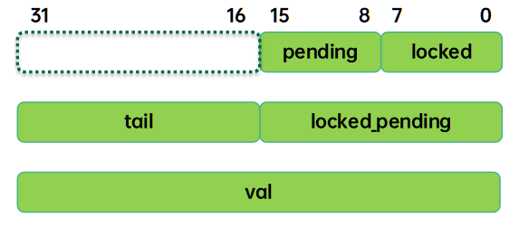
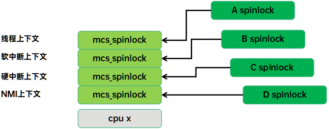
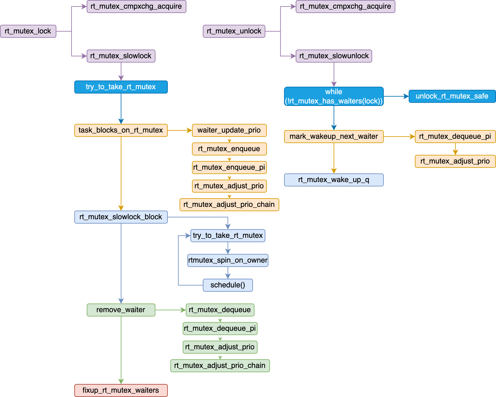
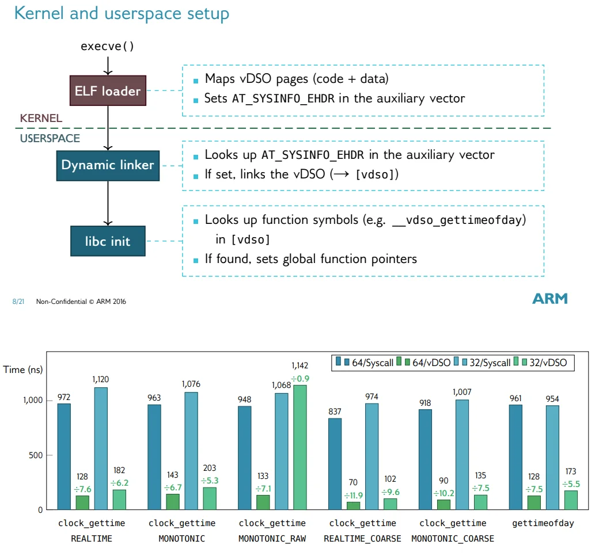

[:link: Linux - Core API Documentation :link:](https://docs.kernel.org/core-api/index.html)


* [并发机制 - LoyenWang](https://www.cnblogs.com/LoyenWang/category/1689461.html)
    * [Semophore](https://www.cnblogs.com/LoyenWang/p/12907230.html)
    * [Mutex](https://www.cnblogs.com/LoyenWang/p/12826811.html)
    * [RCU :one:](https://www.cnblogs.com/LoyenWang/p/12681494.html) [RCU :two:](https://www.cnblogs.com/LoyenWang/p/12770878.html)
    * [spinlock/rwlock/seqlock](https://www.cnblogs.com/LoyenWang/p/12632532.html)

* [Core](#core)

* [Data structures](#data-structures)
    * [xarray](#xarray)
    * [maple tree](#maple-tree)

* [Concurrency primitives](#concurrency-primitives)
    * [atomic](#atomic)
    * [rcu](#rcu)
    * [barrier](#barrier)

* [locking](#locking)
    * [barrier](#barrier)
    * [lru](#lru)
    * [futex](#futex)
        * [futex_wait](#futex_wait)
        * [futex_wake](#futex_wake)
        * [futex_lock_pi](#futex_lock_pi)
        * [futex_unlock_pi](#futex_unlock_pi)
    * [spinlock](#spinlock)
        * [spin_lock](#spin_lock)
            * [queued_spin_lock_slowpath](#queued_spin_lock_slowpath)
        * [spin_unlock](#spin_unlock)
    * [rwspinlock](#rwspinlock)
        * [read_lock](#read_lock)
        * [write_lock](#write_lock)
    * [osq](#osq)
        * [osq_lock](#osq_lock)
        * [osq_lock](#osq_un)
    * [seqlock](#seqlock)
    * [mutex](#mutex)
        * [mutex_lock](#mutex_lock)
        * [mutex_unlock](#mutex_unlock)
    * [rtmutex](#rtmutex)
        * [rt_mutex_lock](#rt_mutex_lock)
            * [rt_mutex_adjust_prio_chain](#rt_mutex_adjust_prio_chain)
        * [rt_mutex_unlock](#rt_mutex_unlock)
    * [semaphore](#semaphore)
    * [rwsem](#rwsem)
        * [down_read](#down_read)
        * [up_read](#up_read)
        * [down_write](#down_write)
        * [up_write](#up_write)
    * [mlock](#mlock)

* pthread
    * [pthread_mutex]
    * [pthread_cond]
    * [pthread_sem]
    * [pthread_rwlock]
    * [pthread_barrier_t]

* [vdso](#vdso)
    * [vdso_kern](#vdso_kern)
        * [vdso_init](#vdso_init)
        * [udpate_vsyscall](#udpate_vsyscall)
    * [glibc](#vdso_glibc)
        * [load_elf_binary](#load_elf_binary)
        * [vdso_fault](#vdso_fault)
        * [setup_vdso](#setup_vdso)
        * [clock_gettime64](#clock_gettime64)

# Core

# Data structures

## xarray

* [LWN Index - Radix tree](https://lwn.net/Kernel/Index/#Radix_tree)

## maple tree

* [LWN - Introducing maple trees](https://lwn.net/Articles/845507/)
* [The Maple Tree, A Modern Data Structure for a Complex Problem](https://blogs.oracle.com/linux/the-maple-tree)
* [Linux commit - Maple Tree: add new data structure](https://github.com/torvalds/linux/commit/54a611b605901c7d5d05b6b8f5d04a6ceb0962aa)
* [Linux doc](https://docs.kernel.org/core-api/maple_tree.html)

# Concurrency primitives

* [:orange_book: Is Parallel Programming Hard, And, If So, What Can You Do About It?](https://mirrors.edge.kernel.org/pub/linux/kernel/people/paulmck/perfbook/perfbook.html)
* [Compiler Reordering](http://www.wowotech.net/kernel_synchronization/453.html)

## atomic

* [原子操作](http://www.wowotech.net/kernel_synchronization/atomic.html)

## per-cpu

* [Per-CPU变量](http://www.wowotech.net/kernel_synchronization/per-cpu.html)

## barrier

* [memory-barrier - wowo tech :one:](http://www.wowotech.net/kernel_synchronization/memory-barrier.html)    [:link: :two:](https://mp.weixin.qq.com/s/s6AvLiVVkoMX4dIGpqmXYA)

* [Memory Model and Synchronization Primitive - Part 1: Memory Barrier](https://www.alibabacloud.com/blog/597460)    [Part 2: Memory Model](https://www.alibabacloud.com/blog/memory-model-and-synchronization-primitive---part-2-memory-model_597461)

| **Type** | **Compiler Barrier** (`barrier()`) | **Memory Barrier** (`smp_mb()`, `smp_rmb()`, etc.) |
| --- | --- | --- |
| **Scope** | Only affects compiler optimizations. | Affects both compiler and CPU (hardware-level) reordering. |
| **Effect on Caches** | Does not flush or reload caches. | Ensures memory operations are visible across CPUs. |
| **Forces Reload** | Ensures variables are reloaded *if accessed*.  | Guarantees memory ordering across multiple CPUs or threads.|
| **Use Case** | Single-CPU scenarios or preventing compiler optimizations. | Multi-CPU synchronization and hardware-level memory consistency. |
- A **compiler barrier** does **not automatically reread all cached variables**.
- It prevents the compiler from reordering instructions and forces the compiler to assume that memory might have changed.
- Variables will only be reread from memory if they are explicitly accessed after the barrier.
- To explicitly reload a variable from memory, you can use READ_ONCE() alongside a barrier().
- For hardware-level memory consistency, use **memory barriers** like `smp_mb()` instead of a compiler barrier.

Feature | DMB | DSB
--- | --- | ---
**Ordering** | Guarantees Ordering | Guarantees Ordering
**Completion** | Conditionly guarantees complemtion only when other cores access the memory(MESI sync data). Otherwise, a store operation might still be pending in a local write buffer | Proactivley guarantees completion of memory accesses.
**Global Visibility** | Relies on MESI protocol for visibility; does not guarantee global visibility. | Ensures global visibility by stalling the core until the MESI protocol completes all necessary actions.
**MESI Interaction** | Cache lines may remain in the **M** state until invalidated or accessed by another core. | Cache lines are transitioned to **S** or written back to memory, ensuring visibility.
**Write-Back to Memory** | Does not force dirty cache lines in the **M (Modified)** state to be written back. | Forces dirty cache lines in the **M (Modified)** state to be written back if necessary.
**Scope** | Configurable (ISH, OSH, NSH, ST). | Configurable (ISH, OSH, NSH, ST).
**Performance** | Lower overhead. | Higher overhead.
**Use Cases** | When ordering of memory accesses is required, but completion is not strictly necessary. | When ordering and completion of memory accesses are required, such as before changing memory mappings, dealing with device memory, or when strict synchronization is essential. Used to implement memory_order_seq_cst.
**Core Stalling** | Does not stall the core; subsequent instructions may execute immediately. | Stalls the core until all memory operations are globally visible. |

---

**A. DMB Behavior Under MESI**
- **Purpose**:
  - DMB ensures the **ordering of memory operations** within the issuing core.
  - It does not enforce **completion** of memory operations or ensure **global visibility** of writes.

- **How DMB Works with MESI**:
  - DMB ensures that memory operations before the barrier are **completed locally** (e.g., written to the write buffer) **before** operations after the barrier are issued.
  - Under MESI, this means:
    - Stores may remain in the **M (Modified)** state in the local cache or in the write buffer.
    - The actual propagation of cache lines to other cores (e.g., transitioning from **M** to **S** or invalidating other cores' caches) is deferred until the cache line is explicitly flushed or accessed by another core.
    - DMB does not force a write-back to memory or shared caches.

- **Implication**:
  - DMB relies on the MESI protocol to propagate changes to other cores if needed. For example, if another core attempts to read a cache line that is in the **M** state, the MESI protocol ensures that the line is invalidated or updated.
  - However, if no other core accesses the cache line, the changes may remain local, and DMB does not guarantee that they are globally visible.

---

**B. DSB Behavior Under MESI**
- **Purpose**:
  - DSB ensures both **ordering** and **completion** of memory operations, and guarantees **global visibility** of writes before any further instructions are executed.

- **How DSB Works with MESI**:
  - DSB forces all pending memory operations to **complete** before the barrier:
    - Stores are written back to main memory or shared caches (if needed) to ensure global visibility.
    - Cache lines in the **M (Modified)** state are either written back to main memory or transitioned to the **S (Shared)** state, ensuring that other cores can observe the updates.
  - DSB also ensures that all invalidations, updates, or write-backs required by the MESI protocol are completed before subsequent instructions are executed.

- **Implication**:
  - DSB ensures that all memory operations before the barrier are globally visible to other cores or devices.
  - This is achieved by stalling the issuing core until the MESI protocol has completed all necessary actions (e.g., transitioning cache lines, propagating invalidations).

---

**Domain** | **Scope** | **Use Case**
--- | --- | ---
**Non-Shareable**  | Memory visible only to the issuing processor | Temporary or private data buffers accessed by a single core.
**Inner-Shareable**| Shared within a processor cluster | Shared memory for threads or cores in the same cluster.
**Outer-Shareable**| Shared across multiple clusters | Shared memory in multi-cluster systems (e.g., CPU-GPU or multi-CPU clusters).


**Memory barriers only ensure:**
* Within-core ordering: Operations before the barrier complete before operations after the barrier.
* Cross-core visibility: Data becomes visible to other cores once the barrier completes.

**CPUs delay write-backs and synchronization for performance reasons, including:**
* Write-back caching: Writes are delayed until eviction or explicit synchronization.
* Lazy synchronization: Cache coherence protocols like MESI delay synchronization until necessary.
* Write buffers: Store operations are buffered and completed later to avoid stalling the CPU.
* Out-of-order execution: Memory operations can be reordered unless explicitly constrained.

# locking

* [Locking in the kernel](https://docs.kernel.org/locking/index.html#)

 TODO

## rcu

* [kernel: RCU concepts](https://www.kernel.org/doc/html/latest/RCU/index.html)
* [内核工匠 - RCU前传：从同步到RCU的引入](https://mp.weixin.qq.com/s/0wTQbrAFrRI8rrEtzHzCXw)
* [wowo tech - RCU synchronize原理分析](http://www.wowotech.net/kernel_synchronization/223.html) [:link: RCU基础](http://www.wowotech.net/kernel_synchronization/rcu_fundamentals.html)

## futex


---


* [Kernel Index Futex - LWN](https://lwn.net/Kernel/Index/#Futex)
* [futex问答 - wowo tech](http://www.wowotech.net/kernel_synchronization/futex.html)

```c
static struct {
    struct futex_hash_bucket *queues;
    unsigned long            hashsize;
} __futex_data;

struct futex_hash_bucket {
    atomic_t            waiters; /* number of waiters */
    spinlock_t          lock;
    struct plist_head   chain;
};

struct futex_q {
    struct plist_node       list;

    struct task_struct      *task;
    spinlock_t              *lock_ptr;
    union futex_key         key;
    struct futex_pi_state   *pi_state;
    struct rt_mutex_waiter  *rt_waiter;
    union futex_key         *requeue_pi_key;
    u32                     bitset;
    atomic_t                requeue_state;
    struct rcuwait          requeue_wait;
};

struct futex_pi_state {
    struct list_head        list; /* rt_mutex list hold by a task */
    struct rt_mutex_base    pi_mutex;
    struct task_struct      *owner;
    refcount_t              refcount;
    union futex_key         key;
};

struct task_struct {
    struct list_head        pi_state_list;
    struct futex_pi_state   *pi_state_cache;
    struct mutex            futex_exit_mutex;
    unsigned int            futex_state;
};
```

```c

long do_futex(u32 __user *uaddr, int op, u32 val, ktime_t *timeout,
        u32 __user *uaddr2, u32 val2, u32 val3)
{
    unsigned int flags = futex_to_flags(op);
    int cmd = op & FUTEX_CMD_MASK;

    if (flags & FLAGS_CLOCKRT) {
        if (cmd != FUTEX_WAIT_BITSET &&
            cmd != FUTEX_WAIT_REQUEUE_PI &&
            cmd != FUTEX_LOCK_PI2)
            return -ENOSYS;
    }

    switch (cmd) {
    case FUTEX_WAIT:
        val3 = FUTEX_BITSET_MATCH_ANY;
        fallthrough;
    case FUTEX_WAIT_BITSET:
        return futex_wait(uaddr, flags, val, timeout, val3);
    case FUTEX_WAKE:
        val3 = FUTEX_BITSET_MATCH_ANY;
        fallthrough;
    case FUTEX_WAKE_BITSET:
        return futex_wake(uaddr, flags, val, val3);
    case FUTEX_REQUEUE:
        return futex_requeue(uaddr, flags, uaddr2, flags, val, val2, NULL, 0);
    case FUTEX_CMP_REQUEUE:
        return futex_requeue(uaddr, flags, uaddr2, flags, val, val2, &val3, 0);
    case FUTEX_WAKE_OP:
        return futex_wake_op(uaddr, flags, uaddr2, val, val2, val3);
    case FUTEX_LOCK_PI:
        flags |= FLAGS_CLOCKRT;
        fallthrough;
    case FUTEX_LOCK_PI2:
        return futex_lock_pi(uaddr, flags, timeout, 0);
    case FUTEX_UNLOCK_PI:
        return futex_unlock_pi(uaddr, flags);
    case FUTEX_TRYLOCK_PI:
        return futex_lock_pi(uaddr, flags, NULL, 1);
    case FUTEX_WAIT_REQUEUE_PI:
        val3 = FUTEX_BITSET_MATCH_ANY;
        return futex_wait_requeue_pi(uaddr, flags, val, timeout, val3, uaddr2);
    case FUTEX_CMP_REQUEUE_PI:
        return futex_requeue(uaddr, flags, uaddr2, flags, val, val2, &val3, 1);
    }
    return -ENOSYS;
}
```

### futex_wait
```c
int futex_wait(u32 __user *uaddr, unsigned int flags, u32 val, ktime_t *abs_time, u32 bitset)
{
    struct hrtimer_sleeper timeout, *to;
    struct restart_block *restart;
    int ret;

    to = futex_setup_timer(abs_time, &timeout, flags, current->timer_slack_ns);

    ret = __futex_wait(uaddr, flags, val, to, bitset) {
        struct futex_q q = futex_q_init;
        struct futex_hash_bucket *hb;
        int ret;

        if (!bitset)
            return -EINVAL;

        q.bitset = bitset;

    retry:
        ret = futex_wait_setup(uaddr, val, flags, &q, &hb) {
        retry:
            ret = get_futex_key(uaddr, flags, &q->key, FUTEX_READ);
            if (unlikely(ret != 0))
                return ret;

        retry_private:
            *hb = futex_q_lock(q);

            ret = futex_get_value_locked(&uval, uaddr);

            if (ret) {
                futex_q_unlock(*hb);

                ret = get_user(uval, uaddr);
                if (ret)
                    return ret;

                if (!(flags & FLAGS_SHARED))
                    goto retry_private;

                goto retry;
            }

            if (uval != val) {
                futex_q_unlock(*hb);
                ret = -EWOULDBLOCK;
            }

            return ret;
        }
        if (ret)
            return ret;

        /* futex_queue and wait for wakeup, timeout, or a signal. */
        futex_wait_queue(hb, &q, to) {
            set_current_state(TASK_INTERRUPTIBLE|TASK_FREEZABLE);
            futex_queue(q, hb) {
                prio = min(current->normal_prio, MAX_RT_PRIO);
                plist_node_init(&q->list, prio);
                plist_add(&q->list, &hb->chain);
                q->task = current;
            }

            if (timeout)
                hrtimer_sleeper_start_expires(timeout, HRTIMER_MODE_ABS);

            /* If we have been removed from the hash list, then another task
                * has tried to wake us, and we can skip the call to schedule(). */
            if (likely(!plist_node_empty(&q->list))) {
                if (!timeout || timeout->task)
                    schedule();
            }
            __set_current_state(TASK_RUNNING);
        }

        /* If we were woken (and unqueued), we succeeded, whatever. */
        if (!futex_unqueue(&q))
            return 0;

        if (to && !to->task)
            return -ETIMEDOUT;

        if (!signal_pending(current))
            goto retry;

        return -ERESTARTSYS;
    }

    /* No timeout, nothing to clean up. */
    if (!to)
        return ret;

    hrtimer_cancel(&to->timer);
    destroy_hrtimer_on_stack(&to->timer);

    if (ret == -ERESTARTSYS) {
        restart = &current->restart_block;
        restart->futex.uaddr = uaddr;
        restart->futex.val = val;
        restart->futex.time = *abs_time;
        restart->futex.bitset = bitset;
        restart->futex.flags = flags | FLAGS_HAS_TIMEOUT;

        return set_restart_fn(restart, futex_wait_restart);
    }

    return ret;
}
```

### futex_wake

```c
int futex_wake(u32 __user *uaddr, unsigned int flags, int nr_wake, u32 bitset)
{
    struct futex_hash_bucket *hb;
    struct futex_q *this, *next;
    union futex_key key = FUTEX_KEY_INIT;
    DEFINE_WAKE_Q(wake_q);
    int ret;

    if (!bitset)
        return -EINVAL;

    ret = get_futex_key(uaddr, flags, &key, FUTEX_READ);
    if (unlikely(ret != 0))
        return ret;

    if ((flags & FLAGS_STRICT) && !nr_wake)
        return 0;

    hb = futex_hash(&key);

    /* Make sure we really have tasks to wakeup */
    if (!futex_hb_waiters_pending(hb))
        return ret;

    spin_lock(&hb->lock);

    plist_for_each_entry_safe(this, next, &hb->chain, list) {
        if (futex_match (&this->key, &key)) {
            if (this->pi_state || this->rt_waiter) {
                ret = -EINVAL;
                break;
            }

            /* Check if one of the bits is set in both bitsets */
            if (!(this->bitset & bitset))
                continue;

            this->wake(&wake_q, this) = futex_wake_mark() {
                ret = __futex_wake_mark(q) {
                    if (WARN(q->pi_state || q->rt_waiter, "refusing to wake PI futex\n"))
                        return false;

                    __futex_unqueue(q) {
                        struct futex_hash_bucket *hb;
                        if (WARN_ON_SMP(!q->lock_ptr) || WARN_ON(plist_node_empty(&q->list)))
                            return;

                        hb = container_of(q->lock_ptr, struct futex_hash_bucket, lock);
                        plist_del(&q->list, &hb->chain);
                        futex_hb_waiters_dec(hb) {
                            atomic_dec(&hb->waiters);
                        }
                    }

                    return true;
                }
                if (!ret) {
                    put_task_struct(p);
                    return;
                }
                wake_q_add_safe(wake_q, p);
            };
            if (++ret >= nr_wake)
                break;
        }
    }

    spin_unlock(&hb->lock);
    wake_up_q(&wake_q);
    return ret;
}
```

### futex_lock_pi
```c
futex_lock_pi(uaddr, flags, timeout, 0) {
    struct futex_q q = futex_q_init;

retry:
    ret = get_futex_key(uaddr, flags & FLAGS_SHARED, &q.key)

retry_private:
    hb = futex_q_lock(&q);
    ret = futex_lock_pi_atomic(uaddr, hb, &q.key, &q.pi_state/*ps*/, current/*task*/, &exiting, 0/*set_waiters*/) {
        top_waiter = futex_top_waiter(hb, key);
        if (top_waiter) {
            return attach_to_pi_state(uaddr, uval, top_waiter->pi_state/*pi_state*/, ps) {
                pid_t pid = uval & FUTEX_TID_MASK;
                u32 uval2;
                int ret;

                if (unlikely(!pi_state))
                    return -EINVAL;

                raw_spin_lock_irq(&pi_state->pi_mutex.wait_lock);

                if (futex_get_value_locked(&uval2, uaddr))
                    goto out_efault;

                if (uval != uval2)
                    goto out_eagain;

                if (uval & FUTEX_OWNER_DIED) {
                    /* exit_pi_state_list sets owner to NULL and wakes the
                     * topmost waiter. The task which acquires the
                     * pi_state->rt_mutex will fixup owner. */
                    if (!pi_state->owner) {
                        /* No pi state owner, but the user space TID
                         * is not 0. Inconsistent state. [5] */
                        if (pid)
                            goto out_einval;
                        /* Take a ref on the state and return success. [4] */
                        goto out_attach;
                    }

                    /* If TID is 0, then either the dying owner has not
                     * yet executed exit_pi_state_list() or some waiter
                     * acquired the rtmutex in the pi state, but did not
                     * yet fixup the TID in user space.
                     *
                     * Take a ref on the state and return success. [6] */
                    if (!pid)
                        goto out_attach;
                } else {
                    /* If the owner died bit is not set, then the pi_state
                     * must have an owner. [7] */
                    if (!pi_state->owner)
                        goto out_einval;
                }

                /* Bail out if user space manipulated the futex value. If pi
                 * state exists then the owner TID must be the same as the
                 * user space TID. [9/10] */
                if (pid != task_pid_vnr(pi_state->owner))
                    goto out_einval;

            out_attach:
                get_pi_state(pi_state);
                raw_spin_unlock_irq(&pi_state->pi_mutex.wait_lock);
                *ps = pi_state;
                return 0;

            out_einval:
                ret = -EINVAL;
                goto out_error;

            out_eagain:
                ret = -EAGAIN;
                goto out_error;

            out_efault:
                ret = -EFAULT;
                goto out_error;

            out_error:
                raw_spin_unlock_irq(&pi_state->pi_mutex.wait_lock);
                return ret;
            }
        }

        /* No waiter and user TID is 0.
         * We are here because the
         * waiters or the owner died bit is set or called from
         * requeue_cmp_pi or for whatever reason something took the
         * syscall. */
        if (!(uval & FUTEX_TID_MASK)) {
            /* We take over the futex. No other waiters and the user space
            * TID is 0. We preserve the owner died bit. */
            newval = uval & FUTEX_OWNER_DIED;
            newval |= vpid;

            /* The futex requeue_pi code can enforce the waiters bit */
            if (set_waiters)
                newval |= FUTEX_WAITERS;

            ret = lock_pi_update_atomic(uaddr, uval, newval);
            if (ret)
                return ret;

            /* If the waiter bit was requested the caller also needs PI
            * state attached to the new owner of the user space futex.
            *
            * @task is guaranteed to be alive and it cannot be exiting
            * because it is either sleeping or waiting in
            * futex_requeue_pi_wakeup_sync().
            *
            * No need to do the full attach_to_pi_owner() exercise
            * because @task is known and valid. */
            if (set_waiters) {
                raw_spin_lock_irq(&task->pi_lock);
                __attach_to_pi_owner(task, key, ps);
                raw_spin_unlock_irq(&task->pi_lock);
            }
            return 1;
        }

        /* First waiter.
         * Set the waiters bit before attaching ourself to
         * the owner. If owner tries to unlock, it will be forced into
         * the kernel and blocked on hb->lock. */
        newval = uval | FUTEX_WAITERS;
        ret = lock_pi_update_atomic(uaddr, uval, newval) {
            err = futex_cmpxchg_value_locked(&curval, uaddr, uval, newval);
            if (unlikely(err))
                return err;

            /* If user space value changed, let the caller retry */
            return curval != uval ? -EAGAIN : 0;
        }
        if (ret)
            return ret;

        return attach_to_pi_owner(uaddr, newval/*uval*/, key, ps, exiting) {
            pid_t pid = uval & FUTEX_TID_MASK;
            p = find_get_task_by_vpid(pid);

            __attach_to_pi_owner(p, key, ps) {
                pi_state = alloc_pi_state();
                rt_mutex_init_proxy_locked(&pi_state->pi_mutex, p);

                pi_state->key = *key;

                list_add(&pi_state->list, &p->pi_state_list);

                pi_state->owner = p;

                *ps = pi_state;
            }

            return 0;
        }
    }
    if (unlikely(ret)) {
        switch (ret) {
        case 1:
            /* We got the lock. */
            ret = 0;
            goto out_unlock_put_key;
        case -EFAULT:
            goto uaddr_faulted;
        case -EBUSY:
        case -EAGAIN:
            /* Two reasons for this:
             * - EBUSY: Task is exiting and we just wait for the
             *   exit to complete.
             * - EAGAIN: The user space value changed. */
            futex_q_unlock(hb);
            /* Handle the case where the owner is in the middle of
             * exiting. Wait for the exit to complete otherwise
             * this task might loop forever, aka. live lock. */
            wait_for_owner_exiting(ret, exiting);
            cond_resched();
            goto retry;
        default:
            goto out_unlock_put_key;
        }
    }

    __futex_queue(&q, hb) {
        prio = min(current->normal_prio, MAX_RT_PRIO);

        plist_node_init(&q->list, prio);
        plist_add(&q->list, &hb->chain);
        q->task = current;
    }

    if (trylock) {
        ret = rt_mutex_futex_trylock(&q.pi_state->pi_mutex) {
            rt_mutex_slowtrylock(lock) {
                try_to_take_rt_mutex(lock, true);
            }
        }
        /* Fixup the trylock return value: */
        ret = ret ? 0 : -EWOULDBLOCK;
        goto no_block;
    }

    rt_mutex_init_waiter(&rt_waiter);

    /* Start lock acquisition for another task */
    ret = __rt_mutex_start_proxy_lock(&q.pi_state->pi_mutex, &rt_waiter, current) {
        if (try_to_take_rt_mutex(lock, task, NULL))
            return 1;

        /* Prepare waiter and propagate pi chain */
        ret = task_blocks_on_rt_mutex(lock, waiter, task, NULL, RT_MUTEX_FULL_CHAINWALK);
            --->
        if (ret && !rt_mutex_owner(lock)) {
            ret = 0;
        }

        return ret;
    }
    if (ret) {
        if (ret == 1)
            ret = 0;
        goto cleanup;
    }

    /* Wait for lock acquisition */
    rt_mutex_wait_proxy_lock(&q.pi_state->pi_mutex, to, &rt_waiter) {
        /* sleep on the mutex */
        set_current_state(TASK_INTERRUPTIBLE);
        ret = rt_mutex_slowlock_block(lock, NULL, TASK_INTERRUPTIBLE, to, waiter);
            --->
        /* try_to_take_rt_mutex() sets the waiter bit unconditionally. We might
         * have to fix that up. */
        fixup_rt_mutex_waiters(lock, true) {
            owner = READ_ONCE(*p);
            if (owner & RT_MUTEX_HAS_WAITERS) {
                if (acquire_lock)
                    xchg_acquire(p, owner & ~RT_MUTEX_HAS_WAITERS);
                else
                    WRITE_ONCE(*p, owner & ~RT_MUTEX_HAS_WAITERS);
            }
        }
    }

cleanup:
    rt_mutex_cleanup_proxy_lock = [](&q.pi_state->pi_mutex, &rt_waiter) {
        try_to_take_rt_mutex(lock, current, waiter);
        if (rt_mutex_owner(lock) != current) {
            remove_waiter(lock, waiter);
            cleanup = true;
        }
        fixup_rt_mutex_waiters(lock, false);

        raw_spin_unlock_irq(&lock->wait_lock);
    }
    if (ret && !rt_mutex_cleanup_proxy_lock())
        ret = 0;
    rt_mutex_post_schedule() {
        sched_update_worker(current);
    }

no_block:
    fixup_pi_owner(uaddr, &q, !ret);
    futex_unqueue_pi(&q);
    spin_unlock(q.lock_ptr);
    goto out;

out_unlock_put_key:
    futex_q_unlock(hb);

out:
    if (to) {
        hrtimer_cancel(&to->timer);
        destroy_hrtimer_on_stack(&to->timer);
    }
    return ret != -EINTR ? ret : -ERESTARTNOINTR;

uaddr_faulted:
    futex_q_unlock(hb);

    ret = fault_in_user_writeable(uaddr) {
        mmap_read_lock(mm);
        ret = fixup_user_fault(mm, (unsigned long)uaddr,
                    FAULT_FLAG_WRITE, NULL);
        mmap_read_unlock(mm);
    }
    if (ret)
        goto out;

    if (!(flags & FLAGS_SHARED))
        goto retry_private;

    goto retry;
}
```

### futex_unlock_pi

```c
int futex_unlock_pi(u32 __user *uaddr, unsigned int flags)
{
    u32 curval, uval, vpid = task_pid_vnr(current);
    union futex_key key = FUTEX_KEY_INIT;
    struct futex_hash_bucket *hb;
    struct futex_q *top_waiter;
    int ret;

    if (!IS_ENABLED(CONFIG_FUTEX_PI))
        return -ENOSYS;

retry:
    if (get_user(uval, uaddr))
        return -EFAULT;
    /* We release only a lock we actually own: */
    if ((uval & FUTEX_TID_MASK) != vpid)
        return -EPERM;

    ret = get_futex_key(uaddr, flags, &key, FUTEX_WRITE);
    if (ret)
        return ret;

    hb = futex_hash(&key);
    spin_lock(&hb->lock);

    /* Check waiters first. We do not trust user space values at
     * all and we at least want to know if user space fiddled
     * with the futex value instead of blindly unlocking. */
    top_waiter = futex_top_waiter(hb, &key);
    if (top_waiter) {
        struct futex_pi_state *pi_state = top_waiter->pi_state;
        struct rt_mutex_waiter *rt_waiter;

        ret = -EINVAL;
        if (!pi_state)
            goto out_unlock;

        /* If current does not own the pi_state then the futex is
         * inconsistent and user space fiddled with the futex value. */
        if (pi_state->owner != current)
            goto out_unlock;

        raw_spin_lock_irq(&pi_state->pi_mutex.wait_lock);

        rt_waiter = rt_mutex_top_waiter(&pi_state->pi_mutex);
        if (!rt_waiter) {
            raw_spin_unlock_irq(&pi_state->pi_mutex.wait_lock);
            goto do_uncontended;
        }

        get_pi_state(pi_state);
        spin_unlock(&hb->lock);

        ret = wake_futex_pi(uaddr, uval, pi_state, rt_waiter) {
            new_owner = top_waiter->task;
            newval = FUTEX_WAITERS | task_pid_vnr(new_owner);

            if (unlikely(should_fail_futex(true))) {
                ret = -EFAULT;
                goto out_unlock;
            }

            ret = futex_cmpxchg_value_locked(&curval, uaddr, uval, newval);
            if (!ret && (curval != uval)) {
                if ((FUTEX_TID_MASK & curval) == uval)
                    ret = -EAGAIN;
                else
                    ret = -EINVAL;
            }

            if (!ret) {
                pi_state_update_owner(pi_state, new_owner) {
                    if (old_owner) {
                        list_del_init(&pi_state->list);
                    }

                    if (new_owner) {
                        list_add(&pi_state->list, &new_owner->pi_state_list);
                        pi_state->owner = new_owner;
                    }
                }
                postunlock = __rt_mutex_futex_unlock(&pi_state->pi_mutex, &wqh) {
                    mark_wakeup_next_waiter(wqh, lock);
                }
            }

        out_unlock:
            raw_spin_unlock_irq(&pi_state->pi_mutex.wait_lock);

            if (postunlock) {
                rt_mutex_postunlock(&wqh) {
                    rt_mutex_wake_up_q(wqh) {
                        wake_up_q(&wqh->head);
                    }
                }
            }

            return ret;
        }

        put_pi_state(pi_state);

        /* Success, we're done! No tricky corner cases. */
        if (!ret)
            return ret;
        /* The atomic access to the futex value generated a
         * pagefault, so retry the user-access and the wakeup: */
        if (ret == -EFAULT)
            goto pi_faulted;
        /* A unconditional UNLOCK_PI op raced against a waiter
         * setting the FUTEX_WAITERS bit. Try again. */
        if (ret == -EAGAIN)
            goto pi_retry;
        /* wake_futex_pi has detected invalid state. Tell user
         * space. */
        return ret;
    }

do_uncontended:
    if ((ret = futex_cmpxchg_value_locked(&curval, uaddr, uval, 0))) {
        spin_unlock(&hb->lock);
        switch (ret) {
        case -EFAULT:
            goto pi_faulted;

        case -EAGAIN:
            goto pi_retry;

        default:
            WARN_ON_ONCE(1);
            return ret;
        }
    }

    /* If uval has changed, let user space handle it. */
    ret = (curval == uval) ? 0 : -EAGAIN;

out_unlock:
    spin_unlock(&hb->lock);
    return ret;

pi_retry:
    cond_resched();
    goto retry;

pi_faulted:
    ret = fault_in_user_writeable(uaddr);
    if (!ret)
        goto retry;

    return ret;
}
```

## spinlock


---



---



---


---


---


---


* [LWN: spinlock](https://lwn.net/Kernel/Index/#Spinlocks)
* [自旋锁探秘 - 内核工匠](https://mp.weixin.qq.com/s/viUgMAnVgC_bHyVifkHqsQ)
* [spinlock - 术道经纬](https://www.zhihu.com/column/c_1108400140804726784) [:one: CSA spinlock](https://zhuanlan.zhihu.com/p/80727111) [:two: MCS spinlock](https://zhuanlan.zhihu.com/p/89058726) [:three: qspinlock](https://zhuanlan.zhihu.com/p/100546935) [:four: API](https://zhuanlan.zhihu.com/p/90634198) [:five: deadlock](https://zhuanlan.zhihu.com/p/103971328)
* [wowo tech - spinklock](http://www.wowotech.net/kernel_synchronization/spinlock.html)  [qspinlock](http://www.wowotech.net/kernel_synchronization/queued_spinlock.html)

```c
#ifdef CONFIG_PREEMPT_RT
    typedef struct spinlock {
        struct rt_mutex_base    lock;
    } spinlock_t;
#else
    typedef struct spinlock {
        struct raw_spinlock     rlock;
    } spinlock_t;
#endif

typedef struct raw_spinlock {
    arch_spinlock_t             raw_lock;
} raw_spinlock_t;

/* include/asm-generic/qspinlock_types.h */
typedef struct qspinlock {
    union {
        atomic_t val;
        struct {
            u8  locked;
            u8  pending;
        };
        struct {
            u16  locked_pending;
            u16  tail;
        };
    };
} arch_spinlock_t;

struct mcs_spinlock {
    struct mcs_spinlock *next;
    int locked; /* 1 if lock acquired */
    int count;  /* nesting count, see qspinlock.c */
};

struct qnode {
    struct mcs_spinlock mcs;
};

/* task ctx, hardirq ctx, softirq ctx, nmi ctx */
#define MAX_NODES    4
static DEFINE_PER_CPU_ALIGNED(struct qnode, qnodes[MAX_NODES]);
```

### spin_lock
```c
/* include/linux/spinlock.h */
static  void spin_lock(spinlock_t *lock)
{
    raw_spin_lock(&lock->rlock);
}

#define raw_spin_lock(lock)  _raw_spin_lock(lock)
#define raw_spin_trylock(lock)  __cond_lock(lock, _raw_spin_trylock(lock))

/* include/linux/spinlock_api_smp.h */
#define _raw_spin_lock(lock)    __raw_spin_lock(lock)
/* include/linux/spinlock_api_up.h */
#define _raw_spin_lock(lock)    __LOCK(lock)


static inline void __raw_spin_lock(raw_spinlock_t *lock)
{
    preempt_disable();
    /* for lockdep debug */
    spin_acquire(&lock->dep_map, 0, 0, _RET_IP_);

    LOCK_CONTENDED(lock, do_raw_spin_trylock, do_raw_spin_lock);
}

/*include/linux/lockdep.h */
#define spin_acquire(l, s, t, i) lock_acquire_exclusive(l, s, t, NULL, i)
#define lock_acquire_exclusive(l, s, t, n, i) lock_acquire(l, s, t, 0, 1, n, i)
#define lock_acquire(l, s, t, r, c, n, i)  do { } while (0)


/* include/linux/lockdep.h */
#define LOCK_CONTENDED(_lock, try, lock) \
do { \
    if (!try(_lock)) { \
        lock_contended(&(_lock)->dep_map, _RET_IP_); \
        lock(_lock); \
    } \
    lock_acquired(&(_lock)->dep_map, _RET_IP_); \
} while (0)


/* include/linux/spinlock.h */
static inline int do_raw_spin_trylock(raw_spinlock_t *lock)
{
    return arch_spin_trylock(&(lock)->raw_lock);
}

/* kernel/locking/spinlock_debug.c */
void do_raw_spin_lock(raw_spinlock_t *lock)
{
    debug_spin_lock_before(lock);
    arch_spin_lock(&lock->raw_lock);
    debug_spin_lock_after(lock);
}

#define arch_spin_lock(l)    queued_spin_lock(l)

void queued_spin_lock(struct qspinlock *lock)
{
    int val = 0;

    if (likely(atomic_try_cmpxchg_acquire(&lock->val, &val, _Q_LOCKED_VAL)))
        return;

    queued_spin_lock_slowpath(lock, val);
}
```

#### queued_spin_lock_slowpath

```c
void queued_spin_lock_slowpath(struct qspinlock *lock, u32 val)
{
    struct mcs_spinlock *prev, *next, *node;
    u32 old, tail;
    int idx;

    /* Wait for in-progress pending->locked hand-overs with a bounded
     * number of spins so that we guarantee forward progress.
     * 0,1,0 -> 0,0,1 */
    if (val == _Q_PENDING_VAL) {
        int cnt = _Q_PENDING_LOOPS;
        val = atomic_cond_read_relaxed(
            &lock->val, (VAL != _Q_PENDING_VAL) || !cnt--
        );
    }

    /* If we observe any contention; queue. */
    if (val & ~_Q_LOCKED_MASK)
        goto queue;

    /* trylock || pending
     * * 0,0,* -> 0,1,* -> 0,0,1 pending, trylock
     * fetch the whole lock value and set pending */
    val = queued_fetch_set_pending_acquire(lock);

    /* If we observe contention, there is a concurrent locker.
     *
     * Undo and queue; our setting of PENDING might have made the
     * n,0,0 -> 0,0,0 transition fail and it will now be waiting
     * on @next to become !NULL. */
    if (unlikely(val & ~_Q_LOCKED_MASK)) {

        /* Undo PENDING if we set it. */
        if (!(val & _Q_PENDING_MASK))
            clear_pending(lock);

        goto queue;
    }

    /* We're pending, wait for the owner to go away.
     *
     * 0,1,1 -> *,1,0
     *
     * this wait loop must be a load-acquire such that we match the
     * store-release that clears the locked bit and create lock
     * sequentiality; this is because not all
     * clear_pending_set_locked() implementations imply full
     * barriers. */
    if (val & _Q_LOCKED_MASK)
        smp_cond_load_acquire(&lock->locked, !VAL);

    /* take ownership and clear the pending bit.
     *
     * 0,1,0 -> 0,0,1 */
    clear_pending_set_locked(lock);
    lockevent_inc(lock_pending);
    return;

    /* End of pending bit optimistic spinning and beginning of MCS
     * queuing. */
queue:
    lockevent_inc(lock_slowpath);
pv_queue:
    node = this_cpu_ptr(&qnodes[0].mcs);
    idx = node->count++;
    tail = encode_tail(smp_processor_id(), idx) {
        u32 tail;

        tail  = (cpu + 1) << _Q_TAIL_CPU_OFFSET;
        tail |= idx << _Q_TAIL_IDX_OFFSET; /* assume < 4 */

        return tail;
    }

    /* 4 nodes are allocated based on the assumption that there will
     * not be nested NMIs taking spinlocks. That may not be true in
     * some architectures even though the chance of needing more than
     * 4 nodes will still be extremely unlikely. When that happens,
     * we fall back to spinning on the lock directly without using
     * any MCS node. This is not the most elegant solution, but is
     * simple enough. */
    if (unlikely(idx >= MAX_NODES)) {
        lockevent_inc(lock_no_node);
        while (!queued_spin_trylock(lock))
            cpu_relax();
        goto release;
    }

    node = grab_mcs_node(node, idx) {
        return &((struct qnode *)base + idx)->mcs;
    }

    /* Ensure that we increment the head node->count before initialising
     * the actual node. If the compiler is kind enough to reorder these
     * stores, then an IRQ could overwrite our assignments. */
    barrier();

    node->locked = 0;
    node->next = NULL;
    pv_init_node(node);

    /* We touched a (possibly) cold cacheline in the per-cpu queue node;
     * attempt the trylock once more in the hope someone let go while we
     * weren't watching.
     * try to acquire the queued spinlock */
    ret = queued_spin_trylock(lock) {
        int val = atomic_read(&lock->val);

        if (unlikely(val))
            return 0;

        return likely(atomic_try_cmpxchg_acquire(&lock->val, &val, _Q_LOCKED_VAL));
    }
    if (ret)
        goto release;

    /* Ensure that the initialisation of @node is complete before we
     * publish the updated tail via xchg_tail() and potentially link
     * @node into the waitqueue via WRITE_ONCE(prev->next, node) below.*/
    smp_wmb();

    /* Publish the updated tail.
     * We have already touched the queueing cacheline; don't bother with
     * pending stuff.
     *
     * p,*,* -> n,*,* */
    old = xchg_tail(lock, tail);
    next = NULL;

    /* if there was a previous node; link it and wait until reaching the
     * head of the waitqueue. */
    if (old & _Q_TAIL_MASK) {
        prev = decode_tail(old);

        /* Link @node into the waitqueue. */
        WRITE_ONCE(prev->next, node);

        pv_wait_node(node, prev);
        arch_mcs_spin_lock_contended(&node->locked) {
            smp_cond_load_acquire(l, VAL);
        }

        /* While waiting for the MCS lock, the next pointer may have
         * been set by another lock waiter. We optimistically load
         * the next pointer & prefetch the cacheline for writing
         * to reduce latency in the upcoming MCS unlock operation. */
        next = READ_ONCE(node->next);
        if (next)
            prefetchw(next);
    }

    /* we're at the head of the waitqueue, wait for the owner & pending to
     * go away.
     *
     * *,x,y -> *,0,0
     *
     * this wait loop must use a load-acquire such that we match the
     * store-release that clears the locked bit and create lock
     * sequentiality; this is because the set_locked() function below
     * does not imply a full barrier.
     *
     * The PV pv_wait_head_or_lock function, if active, will acquire
     * the lock and return a non-zero value. So we have to skip the
     * atomic_cond_read_acquire() call. As the next PV queue head hasn't
     * been designated yet, there is no way for the locked value to become
     * _Q_SLOW_VAL. So both the set_locked() and the
     * atomic_cmpxchg_relaxed() calls will be safe.
     *
     * If PV isn't active, 0 will be returned instead. */
    if ((val = pv_wait_head_or_lock(lock, node)))
        goto locked;

    val = atomic_cond_read_acquire(&lock->val, !(VAL & _Q_LOCKED_PENDING_MASK));

locked:
    /* claim the lock:
     *
     * n,0,0 -> 0,0,1 : lock, uncontended
     * *,*,0 -> *,*,1 : lock, contended
     *
     * If the queue head is the only one in the queue (lock value == tail)
     * and nobody is pending, clear the tail code and grab the lock.
     * Otherwise, we only need to grab the lock. */

    /* In the PV case we might already have _Q_LOCKED_VAL set, because
     * of lock stealing; therefore we must also allow:
     *
     * n,0,1 -> 0,0,1
     *
     * Note: at this point: (val & _Q_PENDING_MASK) == 0, because of the
     *       above wait condition, therefore any concurrent setting of
     *       PENDING will make the uncontended transition fail. */
    if ((val & _Q_TAIL_MASK) == tail) {
        if (atomic_try_cmpxchg_relaxed(&lock->val, &val, _Q_LOCKED_VAL))
            goto release; /* No contention */
    }

    /* Either somebody is queued behind us or _Q_PENDING_VAL got set
     * which will then detect the remaining tail and queue behind us
     * ensuring we'll see a @next. */
    set_locked(lock);

    /* contended path; wait for next if not observed yet, release. */
    if (!next)
        next = smp_cond_load_relaxed(&node->next, (VAL));

    arch_mcs_spin_unlock_contended(&next->locked);
    pv_kick_node(lock, next);

release:
    __this_cpu_dec(qnodes[0].mcs.count);
}
```

### spin_unlock

```c
spin_unlock(spinlock_t *lock) {
    raw_spin_unlock(&lock->rlock) {
        __raw_spin_unlock(raw_spinlock_t *lock) {
            spin_release(&lock->dep_map, _RET_IP_);
            do_raw_spin_unlock(lock) {
                mmiowb_spin_unlock();
                arch_spin_unlock(&lock->raw_lock) {
                    u16 *ptr = (u16 *)lock + IS_ENABLED(CONFIG_CPU_BIG_ENDIAN);
                    u32 val = atomic_read(lock);

                    smp_store_release(ptr, (u16)val + 1);
                }
                __release(lock);
            }
            preempt_enable();
        }
    }
}
```

## rwspinlock

Aka read write spining lock, implemented by qrwlock. While rwsem is a read write sleeping lock.

* [rwlock - wowo tech](http://www.wowotech.net/kernel_synchronization/rw-spinlock.html)

```c
typedef struct {
    arch_rwlock_t       raw_lock;
} rwlock_t;

typedef struct qrwlock {
    union {
        atomic_t        cnts;
        struct {
            u8 wlocked;    /* Locked for write? */
            u8 __lstate[3];
        };
    };
    arch_spinlock_t     wait_lock;
} arch_rwlock_t;

#define     _QW_WAITING     0x100   /* A writer is waiting */
#define     _QW_LOCKED      0x0ff   /* A writer holds the lock */
#define     _QW_WMASK       0x1ff   /* Writer mask */
#define     _QR_SHIFT       9       /* Reader count shift */
#define     _QR_BIAS        (1U << _QR_SHIFT)
```

```c
/* include/linux/rwlock.h */
#define read_lock(lock)         _raw_read_lock(lock)
#define read_lock_irq(lock)     _raw_read_lock_irq(lock)
#define read_lock_bh(lock)      _raw_read_lock_bh(lock)

#define read_unlock(lock)       _raw_read_unlock(lock)
#define read_unlock_irq(lock)   _raw_read_unlock_irq(lock)

#define write_lock(lock)        _raw_write_lock(lock)
#define write_lock_irq(lock)    _raw_write_lock_irq(lock)
#define write_lock_bh(lock)     _raw_write_lock_bh(lock)

#define write_unlock(lock)      _raw_write_unlock(lock)
#define write_unlock_irq(lock)  _raw_write_unlock_irq(lock)

/* include/asm-generic/qrwlock.h */
#define arch_read_lock(l)       queued_read_lock(l)
#define arch_write_lock(l)      queued_write_lock(l)
#define arch_read_trylock(l)    queued_read_trylock(l)
#define arch_write_trylock(l)   queued_write_trylock(l)
#define arch_read_unlock(l)     queued_read_unlock(l)
#define arch_write_unlock(l)    queued_write_unlock(l)
#define arch_rwlock_is_contended(l)     queued_rwlock_is_contended(l)
```

### read_lock
```c
static inline void __raw_read_lock(rwlock_t *lock)
{
    preempt_disable();
    rwlock_acquire_read(&lock->dep_map, 0, 0, _RET_IP_);
    LOCK_CONTENDED(lock, do_raw_read_trylock, do_raw_read_lock);
}

do_raw_read_trylock() {
    arch_read_trylock(&(rwlock)->raw_lock) {
        queued_read_trylock() {
            int cnts;

            cnts = atomic_read(&lock->cnts);
            if (likely(!(cnts & _QW_WMASK))) {
                cnts = (u32)atomic_add_return_acquire(_QR_BIAS, &lock->cnts);
                if (likely(!(cnts & _QW_WMASK))) {
                    return 1;
                }
                /* revert add since writer has already hold the lock */
                atomic_sub(_QR_BIAS, &lock->cnts);
            }
            return 0;
        }
    }
}

do_raw_read_lock() {
    arch_raw_read_lock() {
        queued_read_lock() {
            int cnts;

            cnts = atomic_add_return_acquire(_QR_BIAS, &lock->cnts);
            if (likely(!(cnts & _QW_WMASK)))
                return;

            /* The slowpath will decrement the reader count, if necessary. */
            queued_read_lock_slowpath(lock) {
                if (unlikely(in_interrupt())) {
                    atomic_cond_read_acquire(&lock->cnts, !(VAL & _QW_LOCKED));
                    return;
                }
                atomic_sub(_QR_BIAS, &lock->cnts);

                /* Put the reader into the wait queue */
                arch_spin_lock(&lock->wait_lock);
                atomic_add(_QR_BIAS, &lock->cnts);

                /* The ACQUIRE semantics of the following spinning code ensure
                 * that accesses can't leak upwards out of our subsequent critical
                 * section in the case that the lock is currently held for write. */
                atomic_cond_read_acquire(&lock->cnts, !(VAL & _QW_LOCKED));

                /* Signal the next one in queue to become queue head */
                arch_spin_unlock(&lock->wait_lock);
            }
        }
    }
}
```

### write_lock
```c
do_raw_write_trylock() {
    arch_write_trylock(&(rwlock)->raw_lock) {
        queued_write_trylock() {
            int cnts;

            cnts = atomic_read(&lock->cnts);
            if (unlikely(cnts))
                return 0;

            return likely(atomic_try_cmpxchg_acquire(&lock->cnts, &cnts, _QW_LOCKED));
        }
    }
}

do_raw_write_lock() {
    arch_raw_write_lock() {
        queued_write_lock(struct qrwlock *lock) {
            int cnts = 0;
            /* Optimize for the unfair lock case where the fair flag is 0. */
            if (likely(atomic_try_cmpxchg_acquire(&lock->cnts, &cnts, _QW_LOCKED)))
                return;

            queued_write_lock_slowpath(lock) {
                int cnts;

                /* Put the writer into the wait queue */
                arch_spin_lock(&lock->wait_lock);

                /* Try to acquire the lock directly if no reader is present */
                if (!(cnts = atomic_read(&lock->cnts)) &&
                    atomic_try_cmpxchg_acquire(&lock->cnts, &cnts, _QW_LOCKED))
                    goto unlock;

                /* Set the waiting flag to notify readers that a writer is pending */
                atomic_or(_QW_WAITING, &lock->cnts);

                /* When no more readers or writers, set the locked flag */
                do {
                    cnts = atomic_cond_read_relaxed(&lock->cnts, VAL == _QW_WAITING);
                } while (!atomic_try_cmpxchg_acquire(&lock->cnts, &cnts, _QW_LOCKED));
            unlock:
                arch_spin_unlock(&lock->wait_lock);
            }
        }
    }
}
```

## osq

```c
struct optimistic_spin_node {
    struct optimistic_spin_node *next, *prev;
    int locked; /* 1 if lock acquired */
    int cpu; /* encoded CPU # + 1 value */
};

struct optimistic_spin_queue {
    atomic_t tail;
};

DEFINE_PER_CPU_SHARED_ALIGNED(struct optimistic_spin_node, osq_node);
```

### osq_lock

```c
bool osq_lock(struct optimistic_spin_queue *lock)
{
    struct optimistic_spin_node *node = this_cpu_ptr(&osq_node);
    struct optimistic_spin_node *prev, *next;
    int curr = encode_cpu(smp_processor_id());
    int old;

    node->locked = 0;
    node->next = NULL;
    node->cpu = curr;

    old = atomic_xchg(&lock->tail, curr);
    if (old == OSQ_UNLOCKED_VAL)
        return true;

    prev = decode_cpu(old);
    node->prev = prev;

    /* osq_lock               unqueue
     *
     * node->prev = prev        osq_wait_next()
     * WMB                MB
     * prev->next = node        next->prev = prev // unqueue-C
     *
     * Here 'node->prev' and 'next->prev' are the same variable and we need
     * to ensure these stores happen in-order to avoid corrupting the list. */
    smp_wmb();

    WRITE_ONCE(prev->next, node);

    /* Wait to acquire the lock or cancellation. Note that need_resched()
     * will come with an IPI, which will wake smp_cond_load_relaxed() if it
     * is implemented with a monitor-wait. vcpu_is_preempted() relies on
     * polling, be careful. */
    if (smp_cond_load_relaxed(&node->locked,
        VAL || need_resched() || vcpu_is_preempted(node_cpu(node->prev)))) {

        return true;
    }

    /* unqueue since cur need_resched() or vcpu_is_preempted() */

    /* Step - A  -- stabilize @prev
     *
     * Undo our @prev->next assignment; this will make @prev's
     * unlock()/unqueue() wait for a next pointer since @lock points to us
     * (or later). */

    for (;;) {
        /* cpu_relax() below implies a compiler barrier which would
         * prevent this comparison being optimized away. */
        if (data_race(prev->next) == node
            && cmpxchg(&prev->next, node, NULL) == node) {

            break;
        }

        /* We can only fail the cmpxchg() racing against an unlock(),
         * in which case we should observe @node->locked becoming
         * true. */
        if (smp_load_acquire(&node->locked))
            return true;

        cpu_relax();

        /* Or we race against a concurrent unqueue()'s step-B, in which
         * case its step-C will write us a new @node->prev pointer.  */
        prev = READ_ONCE(node->prev);
    }

    /* Step - B -- stabilize @next
     *
     * Similar to unlock(), wait for @node->next or move @lock from @node
     * back to @prev. */
    next = osq_wait_next(lock, node, prev);
    if (!next)
        return false;

    /* Step - C -- unlink
     *
     * @prev is stable because its still waiting for a new @prev->next
     * pointer, @next is stable because our @node->next pointer is NULL and
     * it will wait in Step-A. */
    WRITE_ONCE(next->prev, prev);
    WRITE_ONCE(prev->next, next);

    return false;
}
```

### osq_unlock

```c

void osq_unlock(struct optimistic_spin_queue *lock)
{
    struct optimistic_spin_node *node, *next;
    int curr = encode_cpu(smp_processor_id());

    if (likely(atomic_cmpxchg_release(&lock->tail, curr,
                      OSQ_UNLOCKED_VAL) == curr))
        return;

    node = this_cpu_ptr(&osq_node);
    next = xchg(&node->next, NULL);
    if (next) {
        WRITE_ONCE(next->locked, 1);
        return;
    }

    next = osq_wait_next(lock, node, NULL/*prev*/) {
        struct optimistic_spin_node *next = NULL;
        int curr = encode_cpu(smp_processor_id());
        int old;

        /* If there is a prev node in queue, then the 'old' value will be
         * the prev node's CPU #, else it's set to OSQ_UNLOCKED_VAL since if
         * we're currently last in queue, then the queue will then become empty. */
        old = prev ? prev->cpu : OSQ_UNLOCKED_VAL;

        for (;;) {
            if (atomic_read(&lock->tail) == curr &&
                atomic_cmpxchg_acquire(&lock->tail, curr, old) == curr) {
                /* We were the last queued, we moved @lock back. @prev
                 * will now observe @lock and will complete its
                 * unlock()/unqueue(). */
                break;
            }

            /* We must xchg() the @node->next value, because if we were to
            * leave it in, a concurrent unlock()/unqueue() from
            * @node->next might complete Step-A and think its @prev is
            * still valid.
            *
            * If the concurrent unlock()/unqueue() wins the race, we'll
            * wait for either @lock to point to us, through its Step-B, or
            * wait for a new @node->next from its Step-C. */
            if (node->next) {
                next = xchg(&node->next, NULL);
                if (next)
                    break;
            }

            cpu_relax();
        }

        return next;
    }
    if (next)
        WRITE_ONCE(next->locked, 1);
}
```

## seqlock

* [seqlock - wowo tech](http://www.wowotech.net/kernel_synchronization/seqlock.html)

## mutex

* [Wait/wound mutexes - LWN](https://lwn.net/Articles/548909/)
* [mutex - wowo tech](http://www.wowotech.net/kernel_synchronization/504.html)

```c
/* @owner: contains: 'struct task_struct *' to the current lock owner,
 * NULL means not owned. Since task_struct pointers are aligned at
 * at least L1_CACHE_BYTES, we have low bits to store extra state.
 *
 * Bit0 indicates a non-empty waiter list; unlock must issue a wakeup.
 * Bit1 indicates unlock needs to hand the lock to the top-waiter
 * Bit2 indicates handoff has been done and we're waiting for pickup. */
#define MUTEX_FLAG_WAITERS    0x01
#define MUTEX_FLAG_HANDOFF    0x02
#define MUTEX_FLAG_PICKUP     0x04
#define MUTEX_FLAGS           0x07

struct mutex { /* !CONFIG_PREEMPT_RT  */
    atomic_long_t                   owner;
    struct optimistic_spin_queue    osq;
    raw_spinlock_t                  wait_lock;
    struct list_head                wait_list;
};
```

### mutex_lock

```c
/* kernel/locking/mutex.c */
mutex_lock() {
    /* 1. fastpath: cmpxchg. Tries to atomically acquire the lock by cmpxchg()ing the owner
     * with the current task. This only works in the uncontended case
     * (cmpxchg() checks against 0UL, so all 3 state bits above have to be 0).
     * If the lock is contended it goes to the next possible path.*/
    __mutex_trylock_fast() {
        unsigned long curr = (unsigned long)current;
        unsigned long zero = 0UL;

        return atomic_long_try_cmpxchg_acquire(&lock->owner, &zero, curr);
    }

    __mutex_lock_slowpath() {
        __mutex_lock(lock, TASK_UNINTERRUPTIBLE) {
            return __mutex_lock_common(lock, state, subclass, nest_lock, ip, NULL, false) {
                preempt_disable();

                /* 2. midpath: optimistic spinning. Tries to spin for acquisition
                * while the lock owner is running and there are no other tasks ready to run
                * that have higher priority (need_resched).
                * The rationale is that if the lock owner is running,
                * it is likely to release the lock soon.
                * The mutex spinners are queued up using MCS lock
                * so that only one spinner can compete for the mutex. */
                ret = __mutex_trylock() {
                    /* Returns: __mutex_owner(lock) on failure or NULL on success. */
                    return !__mutex_trylock_common(lock, false) {
                        unsigned long owner, curr = (unsigned long)current;

                        owner = atomic_long_read(&lock->owner);
                        for (;;) { /* must loop, can race against a flag */
                            unsigned long flags = __owner_flags(owner);
                            unsigned long task = owner & ~MUTEX_FLAGS;

                            if (task) {
                                if (flags & MUTEX_FLAG_PICKUP) {
                                    if (task != curr)
                                        break;
                                    flags &= ~MUTEX_FLAG_PICKUP;
                                } else if (handoff) {
                                    if (flags & MUTEX_FLAG_HANDOFF)
                                        break;
                                    flags |= MUTEX_FLAG_HANDOFF;
                                } else {
                                    break;
                                }
                            } else {
                                task = curr;
                            }

                            if (atomic_long_try_cmpxchg_acquire(&lock->owner, &owner, task | flags)) {
                                if (task == curr)
                                    return NULL;
                                break;
                            }
                        }

                        return __owner_task(owner);
                    }
                }
                ret |= mutex_optimistic_spin(lock, ww_ctx, NULL/*waiter*/) {
                    if (!waiter) {
                        ret  = mutex_can_spin_on_owner(lock) {
                            int retval = 1;
                            if (need_resched())
                                return 0;
                            owner = __mutex_owner(lock);
                            if (owner)
                                retval = owner_on_cpu(owner);
                            return retval;
                        }

                        if (!ret) {
                            goto fail;
                        }

                        ret = osq_lock(&lock->osq);
                        if (!ret)
                            goto fail;
                    }

                    for (;;) {
                        struct task_struct *owner;

                        owner = __mutex_trylock_or_owner(lock) {
                            return __mutex_trylock_common(lock, false);
                        }
                        if (!owner)
                            break;

                        ret = mutex_spin_on_owner(lock, owner, ww_ctx, waiter) {
                            bool ret = true;

                            while (__mutex_owner(lock) == owner) {
                                barrier();
                                /* owner may be blocked or goto sleep */
                                if (!owner_on_cpu(owner) || need_resched()) {
                                    ret = false;
                                    break;
                                }

                                if (ww_ctx && !ww_mutex_spin_on_owner(lock, ww_ctx, waiter)) {
                                    ret = false;
                                    break;
                                }

                                cpu_relax();
                            }

                            return ret;
                        }
                        if (!ret)
                            goto fail_unlock;

                        cpu_relax();
                    }

                    if (!waiter)
                        osq_unlock(&lock->osq);

                    return true;

                fail_unlock:
                    if (!waiter) {
                        osq_unlock(&lock->osq);
                    }

                fail:
                    if (need_resched()) {
                        __set_current_state(TASK_RUNNING);
                        schedule_preempt_disabled();
                    }

                    return false;
                }
                if (ret) {
                    preempt_enable();
                    return 0;
                }

                if (__mutex_trylock(lock)) {
                    if (ww_ctx) {
                        __ww_mutex_check_waiters(lock, ww_ctx);
                    }

                    goto skip_wait;
                }

                /* 3. slowpath: sleep wait. If the lock is still unable to be acquired,
                * the task is added to the wait-queue and sleeps until woken up by the unlock path.
                * Under normal circumstances it blocks as TASK_UNINTERRUPTIBLE. */
                raw_spin_lock(&lock->wait_lock);

                if (!use_ww_ctx) {
                    __mutex_add_waiter(lock, &waiter, &lock->wait_list) {
                        list_add_tail(&waiter->list, list);
                        if (__mutex_waiter_is_first(lock, waiter)) {
                            __mutex_set_flag(lock, MUTEX_FLAG_WAITERS);
                        }
                    }
                } else {
                    ret = __ww_mutex_add_waiter(&waiter, lock, ww_ctx);
                    if (ret)
                        goto err_early_kill;
                }

                for (;;) {
                    if (__mutex_trylock(lock))
                        goto acquired;

                    if (signal_pending_state(state, current)) {
                        ret = -EINTR;
                        goto err;
                    }

                    schedule_preempt_disabled() {
                        sched_preempt_enable_no_resched() {
                            barrier();
                            preempt_count_dec()
                        }
                        schedule();
                        preempt_disable() {
                            preempt_count_inc();
                            barrier();
                        }
                    }

                    first = __mutex_waiter_is_first(lock, &waiter);
                    ret = __mutex_trylock_or_handoff(lock, first) {
                        return !__mutex_trylock_common(lock, handoff);
                    }
                    if (ret) {
                        break;
                    }

                    if (first && mutex_optimistic_spin(lock, ww_ctx, &waiter)) {
                        break;
                    }

                    raw_spin_lock(&lock->wait_lock);
                }

            acquired:
                __set_current_state(TASK_RUNNING);
                __mutex_remove_waiter(lock, &waiter);

            skip_wait:
                if (ww_ctx)
                    ww_mutex_lock_acquired(ww, ww_ctx);

                raw_spin_unlock(&lock->wait_lock);
                preempt_enable();
                return 0;
            }
        }
    }
}
```

### mutex_unlock
```c
void __sched mutex_unlock(struct mutex *lock) {
    /* 1. fast path: flags are clear */
    ret = __mutex_unlock_fast(lock) {
        unsigned long curr = (unsigned long)current;

        return atomic_long_try_cmpxchg_release(&lock->owner, &curr, 0UL);
    }
    if (ret)
        return;

    /* 2. slow path */
    __mutex_unlock_slowpath(lock, _RET_IP) {
        struct task_struct *next = NULL;
        DEFINE_WAKE_Q(wake_q);
        unsigned long owner;

        /* 2.1 release the owner */
        owner = atomic_long_read(&lock->owner);
        for (;;) {
            if (owner & MUTEX_FLAG_HANDOFF) {
                break;
            }

            /* release the owner but keep the flags */
            if (atomic_long_try_cmpxchg_release(&lock->owner, &owner, __owner_flags(owner))) {
                if (owner & MUTEX_FLAG_WAITERS) {
                    /* break to wake up the waiter */
                    break;
                }
                return;
            }
        }

        /* 2.2 wake up waiters */
        raw_spin_lock(&lock->wait_lock);
        if (!list_empty(&lock->wait_list)) {
            struct mutex_waiter *waiter = list_first_entry(
                &lock->wait_list, struct mutex_waiter, list
            );

            next = waiter->task;
            wake_q_add(&wake_q, next);
        }

        if (owner & MUTEX_FLAG_HANDOFF) {
            __mutex_handoff(lock, next/*task*/) {
                unsigned long owner = atomic_long_read(&lock->owner);
                for (;;) {
                    unsigned long new;

                    /* MUTEX_FLAG_HANDOFF is cleared implicitly */
                    new = (owner & MUTEX_FLAG_WAITERS);
                    new |= (unsigned long)task;
                    if (task) {
                        new |= MUTEX_FLAG_PICKUP;
                    }

                    if (atomic_long_try_cmpxchg_release(&lock->owner, &owner, new))
                        break;
                }
            }
        }

        raw_spin_unlock(&lock->wait_lock);

        wake_up_q(&wake_q);
    }
}
```

## rtmutex

RT-mutexes (Real-Time Mutexes) have several important features that make them suitable for use in real-time operating systems. Here are the key features of RT-mutexes:

1. Priority Inheritance:
   - Prevents priority inversion by allowing a lower-priority task holding the mutex to temporarily inherit the priority of a higher-priority task waiting for the mutex.

2. Bounded Priority Inversion:
   - Limits the duration of priority inversion, ensuring that high-priority tasks are not blocked indefinitely by lower-priority tasks.

3. Preemptibility:
   - Unlike some traditional mutexes, RT-mutexes can be preempted, allowing higher-priority tasks to run even if a lower-priority task holds the mutex.

4. Deadlock Prevention:
   - Implements mechanisms to help prevent deadlocks, especially in scenarios involving nested locks.

5. Fast Path for Uncontended Lock:
   - Optimized for quick acquisition when there's no contention, which is common in many real-time scenarios.

6. Support for Recursive Locking:
   - Allows the same task to lock the mutex multiple times without causing a deadlock.

7. Robust Futex Implementation:
   - Often implemented using futexes (Fast Userspace muTexes) for efficient operation in both user and kernel space.

8. Priority Ceiling Protocol Support:
   - Some RT-mutex implementations support the priority ceiling protocol, which can further reduce priority inversion.

9. FIFO Ordering:
   - Ensures fairness by typically using FIFO (First-In-First-Out) ordering for tasks waiting on the mutex.

10. Kernel Preemption Points:
    - Designed to work well with kernel preemption points, maintaining system responsiveness.

11. Debugging Features:
    - Often come with additional debugging and tracing capabilities to help diagnose issues in real-time systems.

12. Adaptive Spinning:
    - Some implementations use adaptive spinning techniques to reduce context switches in short-term lock contentions.


---



* [The Evolution of Real-Time Linux](https://personal.utdallas.edu/~cxl137330/courses/fall13/RTS/papers/2a.pdf)
* [RT Mutex Implementation Anatomy :cn:](https://www.cnblogs.com/hellokitty2/p/17010913.html)

* Why need lock stealing? [The big kernel lock strikes again](https://lwn.net/Articles/281938/)

    > The problem is that fairness can be expensive. The thread waiting for the semaphore may be on another processor, its cache could be cold, and it might be at a low enough priority that it will not even begin running for some time. Meanwhile, another thread may request the semaphore, but it will get put at the end of the queue behind the new owner, which may not be running yet. The result is a certain amount of dead time where no running thread holds the semaphore. And, in fact, Yanmin's experience with the AIM benchmark showed this: his system was running idle almost 50% of the time.

    > The solution is to bring in a technique from the older semaphore code: **lock stealing**. If a thread tries to acquire a semaphore, and that semaphore is available, that thread gets it regardless of whether a different thread is patiently waiting in the queue. Or, in other words, the thread at the head of the queue only gets the semaphore once it starts running and actually claims it; if it's too slow, somebody else might get there first. In human interactions, this sort of behavior is considered impolite (in some cultures, at least), though it is far from unknown. In a multiprocessor computer, though, it makes the difference between acceptable and unacceptable performance - even a thread which gets its lock stolen will benefit in the long run.

```c
struct rt_mutex {
    struct rt_mutex_base    rtmutex;
};

struct rt_mutex_base {
    raw_spinlock_t          wait_lock;
    struct rb_root_cached   waiters;
    struct task_struct      *owner;
};

struct rt_mutex_waiter {
    struct rb_node          tree_entry;
    struct rb_node          pi_tree_entry;
    struct task_struct      *task;
    struct rt_mutex_base    *lock;
    unsigned int            wake_state;
    int                     prio;
    u64                     deadline;
    struct ww_acquire_ctx   *ww_ctx;
};

struct task_struct {
    raw_spinlock_t          pi_lock;
    /* top waiter of each rtmutex hold by this task */
    struct rb_root_cached   pi_waiters;
    struct task_struct      *pi_top_task;
    struct rt_mutex_waiter  *pi_blocked_on;
};
```

### rt_mutex_lock
```c
__rt_mutex_lock() {
    if (likely(rt_mutex_cmpxchg_acquire(lock, NULL, current)))
        return 0;

    return rt_mutex_slowlock(lock, NULL, state) {
        ret = try_to_take_rt_mutex(lock, current, NULL /*waiter*/) {
            mark_rt_mutex_waiters(lock) {
                lock->owner = lock->owner | RT_MUTEX_HAS_WAITERS;
            }

            if (rt_mutex_owner(lock))
                return 0;

            /* If @waiter != NULL, @task has already enqueued the waiter
             * into @lock waiter tree. If @waiter == NULL then this is a
             * trylock attempt. */
            if (waiter) {
                struct rt_mutex_waiter *top_waiter = rt_mutex_top_waiter(lock);
                /* If waiter is highest priority waiter of @lock, try to take it. */
                if (waiter == top_waiter || rt_mutex_steal(waiter, top_waiter)) {
                    rt_mutex_dequeue(lock, waiter);
                } else {
                    return 0;
                }
            } else {
                if (rt_mutex_has_waiters(lock)) {
                    if (!rt_mutex_steal(task_to_waiter(task), rt_mutex_top_waiter(lock)))
                        return 0;
                } else {
                    goto takeit;
                }
            }

            task->pi_blocked_on = NULL;

            /* @task is the new owner. If other waiters exist
             * we have to insert the highest priority waiter
             * into @task->pi_waiters tree. */
            if (rt_mutex_has_waiters(lock)) {
                rt_mutex_enqueue_pi(task, rt_mutex_top_waiter(lock)) {
                    rb_add_cached(&waiter->pi_tree.entry, &task->pi_waiters, __pi_waiter_less);
                }
            }

        takeit:
            rt_mutex_set_owner(lock, task);

            return 1;
        }

        if (ret) {
            return 0;
        }

        set_current_state(state); /* TASK_UNINTERRUPTIBLE */

        /* Prepare waiter and propagate pi chain */
        ret = task_blocks_on_rt_mutex(lock, waiter, current) {
            waiter->task = task;
            waiter->lock = lock;
            waiter_update_prio(waiter, task) {
                waiter->tree.prio = __waiter_prio(task);
                waiter->tree.deadline = task->dl.deadline;
            }
            waiter_clone_prio(waiter, task) {
                waiter->pi_tree.prio = waiter->tree.prio;
                waiter->pi_tree.deadline = waiter->tree.deadline;
            }

            if (rt_mutex_has_waiters(lock)) {
                top_waiter = rt_mutex_top_waiter(lock);
            }

            rt_mutex_enqueue(lock, waiter) {
                rb_add_cached(&waiter->tree.entry, &lock->waiters, __waiter_less);
            }
            task->pi_blocked_on = waiter;

            if (!owner)
                return 0;

            /* lock‘s top waiter is changed to the waiter */
            if (waiter == rt_mutex_top_waiter(lock)) {
                rt_mutex_dequeue_pi(owner, top_waiter) {
                    rb_erase_cached(&waiter->pi_tree.entry, &task->pi_waiters);
                    RB_CLEAR_NODE(&waiter->pi_tree.entry);
                }
                rt_mutex_enqueue_pi(owner, waiter) {
                    rb_add_cached(&waiter->pi_tree.entry, &task->pi_waiters, __pi_waiter_less);
                }

                /* update (boost/deboost) the prio of owner to
                 * the prio of its top pi_waiters */
                rt_mutex_adjust_prio(owner/*p*/) {
                    if (task_has_pi_waiters(p)) {
                        pi_task = task_top_pi_waiter(p)->task;
                    }

                    rt_mutex_setprio(p, pi_task) {
                        prio = __rt_effective_prio(pi_task, p->normal_prio);
                        if (p->pi_top_task == pi_task && prio == p->prio && !dl_prio(prio))
                            return;

                        rq = __task_rq_lock(p, &rf);
                        update_rq_clock(rq);
                        p->pi_top_task = pi_task;

                        if (prio == p->prio && !dl_prio(prio))
                            goto out_unlock;

                        oldprio = p->prio;
                        if (oldprio == prio)
                            queue_flag &= ~DEQUEUE_MOVE;

                        prev_class = p->sched_class;
                        queued = task_on_rq_queued(p);
                        running = task_current(rq, p);
                        if (queued)
                            dequeue_task(rq, p, queue_flag);
                        if (running)
                            put_prev_task(rq, p);

                        __setscheduler_prio(p, prio) {
                            p->sched_class = ;
                            p->prio = prio;
                        }

                        if (queued)
                            enqueue_task(rq, p, queue_flag);
                        if (running)
                            set_next_task(rq, p);

                        check_class_changed(rq, p, prev_class, oldprio) {
                            if (prev_class != p->sched_class) {
                                if (prev_class->switched_from)
                                    prev_class->switched_from(rq, p);

                                p->sched_class->switched_to(rq, p);
                            } else if (oldprio != p->prio || dl_task(p))
                                p->sched_class->prio_changed(rq, p, oldprio);
                        }

                    out_unlock:
                        __balance_callbacks(rq);
                    }
                }
                if (owner->pi_blocked_on) {
                    chain_walk = 1;
                }
            } else if (rt_mutex_cond_detect_deadlock(waiter, chwalk)) {
                chain_walk = 1;
            }

            next_lock = task_blocked_on_lock(owner);
            if (!chain_walk || !next_lock) {
                return 0;
            }

            rt_mutex_adjust_prio_chain(owner, chwalk, orig_lock, next_lock, orig_waiter, top_task);
        }

        if (likely(!ret)) {
            /* perform the wait-wake-try-to-take loop */
            ret = rt_mutex_slowlock_block() {
                for (;;) {
                    if (try_to_take_rt_mutex(lock, current, waiter))
                        break;

                    if (timeout && !timeout->task) {
                        ret = -ETIMEDOUT;
                        break;
                    }
                    if (signal_pending_state(state, current)) {
                        ret = -EINTR;
                        break;
                    }

                    rtmutex_spin_on_owner = [](lock, waiter, owner) {
                        bool res = true;
                        for (;;) {
                            if (owner != rt_mutex_owner(lock))
                                break;

                            if (!owner_on_cpu(owner) || need_resched() ||
                                !rt_mutex_waiter_is_top_waiter(lock, waiter)) {

                                res = false;
                                break;
                            }
                        }
                        return res;
                    }
                    if (!is_top_waiter(waiter) || !rtmutex_spin_on_owner())
                        schedule();
                }

                __set_current_state(TASK_RUNNING);
                return ret;
            }
        }

        if (likely(!ret)) {
            if (build_ww_mutex() && ww_ctx) {
                if (!ww_ctx->is_wait_die)
                    __ww_mutex_check_waiters(rtm, ww_ctx);
                ww_mutex_lock_acquired(ww, ww_ctx);
            }
        } else {
            __set_current_state(TASK_RUNNING);
            remove_waiter(lock, waiter) {
                rt_mutex_dequeue(lock, waiter);
                current->pi_blocked_on = NULL;

                if (!owner || !is_top_waiter)
                    return;

                rt_mutex_dequeue_pi(owner, waiter);

                if (rt_mutex_has_waiters(lock))
                    rt_mutex_enqueue_pi(owner, rt_mutex_top_waiter(lock));

                rt_mutex_adjust_prio(lock, owner);

                next_lock = task_blocked_on_lock(owner);
                if (!next_lock)
                    return;
                rt_mutex_adjust_prio_chain(owner, RT_MUTEX_MIN_CHAINWALK, lock,
                            next_lock, NULL, current);
            }
            rt_mutex_handle_deadlock(ret, chwalk, waiter);
        }

        /* try_to_take_rt_mutex() sets the waiter bit
         * unconditionally. We might have to fix that up. */
        fixup_rt_mutex_waiters(lock, true/*acquire_lock*/) {
            if (rt_mutex_has_waiters(lock))
                return;
            if (owner & RT_MUTEX_HAS_WAITERS) {
                if (acquire_lock)
                    xchg_acquire(p, owner & ~RT_MUTEX_HAS_WAITERS);
                else
                    WRITE_ONCE(*p, owner & ~RT_MUTEX_HAS_WAITERS);
            }
        }
    }
}
```

#### rt_mutex_adjust_prio_chain

```c
int rt_mutex_adjust_prio_chain(
    struct task_struct *task,
    enum rtmutex_chainwalk chwalk,
    struct rt_mutex_base *orig_lock,
    struct rt_mutex_base *next_lock,
    struct rt_mutex_waiter *orig_waiter,
    struct task_struct *top_task)
{
    struct rt_mutex_waiter *waiter, *top_waiter = orig_waiter;
    struct rt_mutex_waiter *prerequeue_top_waiter;
    int ret = 0, depth = 0;
    struct rt_mutex_base *lock;
    bool detect_deadlock;
    bool requeue = true;

    detect_deadlock = rt_mutex_cond_detect_deadlock(orig_waiter, chwalk);

    /* The (de)boosting is a step by step approach with a lot of
     * pitfalls. We want this to be preemptible and we want hold a
     * maximum of two locks per step. So we have to check
     * carefully whether things change under us. */
 again:
    /* We limit the lock chain length for each invocation. */
    if (++depth > max_lock_depth) {
        static int prev_max;

        /* Print this only once. If the admin changes the limit,
         * print a new message when reaching the limit again. */
        if (prev_max != max_lock_depth) {
            prev_max = max_lock_depth;
        }
        put_task_struct(task);

        return -EDEADLK;
    }

    /* We are fully preemptible here and only hold the refcount on
     * @task. So everything can have changed under us since the
     * caller or our own code below (goto retry/again) dropped all
     * locks. */
 retry:
    /* [1] Task cannot go away as we did a get_task() before ! */
    raw_spin_lock_irq(&task->pi_lock);

    /* [2] Get the waiter on which @task is blocked on. */
    waiter = task->pi_blocked_on;

    /* [3] check_exit_conditions_1() protected by task->pi_lock. */

    /* Check whether the end of the boosting chain has been
     * reached or the state of the chain has changed while we
     * dropped the locks. */
    if (!waiter)
        goto out_unlock_pi;

    /* Check the orig_waiter state. After we dropped the locks,
     * the previous owner of the lock might have released the lock. */
    if (orig_waiter && !rt_mutex_owner(orig_lock))
        goto out_unlock_pi;

    /* We dropped all locks after taking a refcount on @task, so
     * the task might have moved on in the lock chain or even left
     * the chain completely and blocks now on an unrelated lock or
     * on @orig_lock.
     *
     * We stored the lock on which @task was blocked in @next_lock,
     * so we can detect the chain change. */
    if (next_lock != waiter->lock)
        goto out_unlock_pi;

    /* There could be 'spurious' loops in the lock graph due to ww_mutex,
     * consider:
     *
     *   P1: A, ww_A, ww_B
     *   P2: ww_B, ww_A
     *   P3: A
     *
     * P3 should not return -EDEADLK because it gets trapped in the cycle
     * created by P1 and P2 (which will resolve -- and runs into
     * max_lock_depth above). Therefore disable detect_deadlock such that
     * the below termination condition can trigger once all relevant tasks
     * are boosted.
     *
     * Even when we start with ww_mutex we can disable deadlock detection,
     * since we would supress a ww_mutex induced deadlock at [6] anyway.
     * Supressing it here however is not sufficient since we might still
     * hit [6] due to adjustment driven iteration.
     *
     * NOTE: if someone were to create a deadlock between 2 ww_classes we'd
     * utterly fail to report it; lockdep should. */
    if (IS_ENABLED(CONFIG_PREEMPT_RT) && waiter->ww_ctx && detect_deadlock)
        detect_deadlock = false;

    /* Drop out, when the task has no waiters. Note,
     * top_waiter can be NULL, when we are in the deboosting
     * mode! */
    if (top_waiter) {
        if (!task_has_pi_waiters(task))
            goto out_unlock_pi;
        /* If deadlock detection is off, we stop here if we
         * are not the top pi waiter of the task. If deadlock
         * detection is enabled we continue, but stop the
         * requeueing in the chain walk. */
        if (top_waiter != task_top_pi_waiter(task)) {
            if (!detect_deadlock)
                goto out_unlock_pi;
            else
                requeue = false;
        }
    }

    /* If the waiter priority is the same as the task priority
     * then there is no further priority adjustment necessary.  If
     * deadlock detection is off, we stop the chain walk. If its
     * enabled we continue, but stop the requeueing in the chain
     * walk. */
    if (rt_waiter_node_equal(&waiter->tree, task_to_waiter_node(task))) {
        if (!detect_deadlock)
            goto out_unlock_pi;
        else
            requeue = false;
    }

    /* [4] Get the next lock; per holding task->pi_lock we can't unblock
     * and guarantee @lock's existence. */
    lock = waiter->lock;
    /* [5] We need to trylock here as we are holding task->pi_lock,
     * which is the reverse lock order versus the other rtmutex
     * operations.
     *
     * Per the above, holding task->pi_lock guarantees lock exists, so
     * inverting this lock order is infeasible from a life-time
     * perspective. */
    if (!raw_spin_trylock(&lock->wait_lock)) {
        raw_spin_unlock_irq(&task->pi_lock);
        cpu_relax();
        goto retry;
    }

    /* [6] check_exit_conditions_2() protected by task->pi_lock and
     * lock->wait_lock.
     *
     * Deadlock detection. If the lock is the same as the original
     * lock which caused us to walk the lock chain or if the
     * current lock is owned by the task which initiated the chain
     * walk, we detected a deadlock. */
    if (lock == orig_lock || rt_mutex_owner(lock) == top_task) {
        ret = -EDEADLK;

        /* When the deadlock is due to ww_mutex; also see above. Don't
         * report the deadlock and instead let the ww_mutex wound/die
         * logic pick which of the contending threads gets -EDEADLK.
         *
         * NOTE: assumes the cycle only contains a single ww_class; any
         * other configuration and we fail to report; also, see
         * lockdep. */
        if (IS_ENABLED(CONFIG_PREEMPT_RT) && orig_waiter && orig_waiter->ww_ctx)
            ret = 0;

        raw_spin_unlock(&lock->wait_lock);
        goto out_unlock_pi;
    }

    /* If we just follow the lock chain for deadlock detection, no
     * need to do all the requeue operations. To avoid a truckload
     * of conditionals around the various places below, just do the
     * minimum chain walk checks. */
    if (!requeue) {
        /* No requeue[7] here. Just release @task [8] */
        raw_spin_unlock(&task->pi_lock);
        put_task_struct(task);

        /* [9] check_exit_conditions_3 protected by lock->wait_lock.
         * If there is no owner of the lock, end of chain. */
        if (!rt_mutex_owner(lock)) {
            raw_spin_unlock_irq(&lock->wait_lock);
            return 0;
        }

        /* [10] Grab the next task, i.e. owner of @lock */
        task = get_task_struct(rt_mutex_owner(lock));
        raw_spin_lock(&task->pi_lock);

        /* No requeue [11] here. We just do deadlock detection.
         *
         * [12] Store whether owner is blocked
         * itself. Decision is made after dropping the locks */
        next_lock = task_blocked_on_lock(task);
        /* Get the top waiter for the next iteration */
        top_waiter = rt_mutex_top_waiter(lock);

        /* [13] Drop locks */
        raw_spin_unlock(&task->pi_lock);
        raw_spin_unlock_irq(&lock->wait_lock);

        /* If owner is not blocked, end of chain. */
        if (!next_lock)
            goto out_put_task;
        goto again;
    }

    /* Store the current top waiter before doing the requeue
     * operation on @lock. We need it for the boost/deboost
     * decision below. */
    prerequeue_top_waiter = rt_mutex_top_waiter(lock);

    /* [7] Requeue the waiter in the lock waiter tree. */
    rt_mutex_dequeue(lock, waiter);

    /* Update the waiter prio fields now that we're dequeued.
     *
     * These values can have changed through either:
     *
     *   sys_sched_set_scheduler() / sys_sched_setattr()
     *
     * or
     *
     *   DL CBS enforcement advancing the effective deadline. */
    waiter_update_prio(waiter, task);

    rt_mutex_enqueue(lock, waiter);

    /* [8] Release the (blocking) task in preparation for
     * taking the owner task in [10].
     *
     * Since we hold lock->waiter_lock, task cannot unblock, even if we
     * release task->pi_lock. */
    raw_spin_unlock(&task->pi_lock);
    put_task_struct(task);

    /* [9] check_exit_conditions_3 protected by lock->wait_lock.
     *
     * We must abort the chain walk if there is no lock owner even
     * in the dead lock detection case, as we have nothing to
     * follow here. This is the end of the chain we are walking. */
    if (!rt_mutex_owner(lock)) {
        /* If the requeue [7] above changed the top waiter,
         * then we need to wake the new top waiter up to try
         * to get the lock. */
        top_waiter = rt_mutex_top_waiter(lock);
        if (prerequeue_top_waiter != top_waiter) {
            wake_up_state(top_waiter->task, top_waiter->wake_state) {
                return try_to_wake_up(p, state, 0);
            }
        }
        raw_spin_unlock_irq(&lock->wait_lock);
        return 0;
    }

    /* [10] Grab the next task, i.e. the owner of @lock
     *
     * Per holding lock->wait_lock and checking for !owner above, there
     * must be an owner and it cannot go away. */
    task = get_task_struct(rt_mutex_owner(lock));
    raw_spin_lock(&task->pi_lock);

    /* [11] requeue the pi waiters if necessary */
    if (waiter == rt_mutex_top_waiter(lock)) {
        /* The waiter became the new top (highest priority)
         * waiter on the lock. Replace the previous top waiter
         * in the owner tasks pi waiters tree with this waiter
         * and adjust the priority of the owner. */
        rt_mutex_dequeue_pi(task, prerequeue_top_waiter);
        waiter_clone_prio(waiter, task);
        rt_mutex_enqueue_pi(task, waiter);
        rt_mutex_adjust_prio(lock, task);

    } else if (prerequeue_top_waiter == waiter) {
        /* The waiter was the top waiter on the lock, but is
         * no longer the top priority waiter. Replace waiter in
         * the owner tasks pi waiters tree with the new top
         * (highest priority) waiter and adjust the priority
         * of the owner.
         * The new top waiter is stored in @waiter so that
         * @waiter == @top_waiter evaluates to true below and
         * we continue to deboost the rest of the chain. */
        rt_mutex_dequeue_pi(task, waiter);
        waiter = rt_mutex_top_waiter(lock);
        waiter_clone_prio(waiter, task);
        rt_mutex_enqueue_pi(task, waiter);
        rt_mutex_adjust_prio(lock, task);
    } else {
        /* Nothing changed. No need to do any priority
         * adjustment. */
    }

    /* [12] check_exit_conditions_4() protected by task->pi_lock
     * and lock->wait_lock. The actual decisions are made after we
     * dropped the locks.
     *
     * Check whether the task which owns the current lock is pi
     * blocked itself. If yes we store a pointer to the lock for
     * the lock chain change detection above. After we dropped
     * task->pi_lock next_lock cannot be dereferenced anymore. */
    next_lock = task_blocked_on_lock(task);
    /* Store the top waiter of @lock for the end of chain walk
     * decision below. */
    top_waiter = rt_mutex_top_waiter(lock);

    /* [13] Drop the locks */
    raw_spin_unlock(&task->pi_lock);
    raw_spin_unlock_irq(&lock->wait_lock);

    /* Make the actual exit decisions [12], based on the stored
     * values.
     *
     * We reached the end of the lock chain. Stop right here. No
     * point to go back just to figure that out. */
    if (!next_lock)
        goto out_put_task;

    /* If the current waiter is not the top waiter on the lock,
     * then we can stop the chain walk here if we are not in full
     * deadlock detection mode. */
    if (!detect_deadlock && waiter != top_waiter)
        goto out_put_task;

    goto again;

 out_unlock_pi:
    raw_spin_unlock_irq(&task->pi_lock);
 out_put_task:
    put_task_struct(task);

    return ret;
}
```

### rt_mutex_unlock
```c
rt_mutex_unlock(lock)
    if (likely(rt_mutex_cmpxchg_release(lock, current, NULL)))
        return;

    rt_mutex_slowunlock(lock) {
        DEFINE_RT_WAKE_Q(wqh);

        while (!rt_mutex_has_waiters(lock)) {
            ret = unlock_rt_mutex_safe(lock, flags) {
                clear_rt_mutex_waiters(lock) {
                    lock->owner = lock->owner & ~RT_MUTEX_HAS_WAITERS;
                }
                return rt_mutex_cmpxchg_release(lock, owner, NULL);
            }
            if (ret == true)
                return;
        }

        /* Remove the top waiter from the current tasks pi waiter tree and
         * queue it up. */
        mark_wakeup_next_waiter(&wqh, lock) {
            waiter = rt_mutex_top_waiter(lock);
            /* Remove it from current->pi_waiters and deboost. */
            rt_mutex_dequeue_pi(current, waiter);
            rt_mutex_adjust_prio(current);

            lock->owner = (void *) RT_MUTEX_HAS_WAITERS;

            preempt_disable();
            rt_mutex_wake_q_add(wqh, waiter);
            raw_spin_unlock(&current->pi_lock);
        }

        rt_mutex_wake_up_q(&wqh) {
            if (IS_ENABLED(CONFIG_PREEMPT_RT) && wqh->rtlock_task) {
                wake_up_state(wqh->rtlock_task, TASK_RTLOCK_WAIT) {
                    try_to_wake_up(p, state, 0);
                }
                put_task_struct(wqh->rtlock_task);
                wqh->rtlock_task = NULL;
            }

            if (!wake_q_empty(&wqh->head)) {
                wake_up_q(&wqh->head) {
                    while (node != WAKE_Q_TAIL) {
                        struct task_struct *task;

                        task = container_of(node, struct task_struct, wake_q);
                        node = node->next;
                        task->wake_q.next = NULL;
                        wake_up_process(task) {
                            try_to_wake_up(p, TASK_NORMAL, 0);
                        }
                        put_task_struct(task);
                    }
                }
            }
            preempt_enable();
        }
    }
```

## semaphore

```c
struct semaphore {
    raw_spinlock_t      lock;
    unsigned int        count;
    struct list_head    wait_list;
};

struct semaphore_waiter {
    struct list_head        list;
    struct task_struct      *task;
    bool                    up;
};
```

### sem_down

```c
void __sched down(struct semaphore *sem)
{
    unsigned long flags;

    might_sleep();
    raw_spin_lock_irqsave(&sem->lock, flags);
    if (likely(sem->count > 0))
        sem->count--;
    else {
        __down(sem) {
            __down_common(sem, TASK_UNINTERRUPTIBLE, MAX_SCHEDULE_TIMEOUT) {
                ___down_common(sem, state, timeout) {
                    struct semaphore_waiter waiter;

                    list_add_tail(&waiter.list, &sem->wait_list);
                    waiter.task = current;
                    waiter.up = false;

                    for (;;) {
                        if (signal_pending_state(state, current))
                            goto interrupted;
                        if (unlikely(timeout <= 0))
                            goto timed_out;
                        __set_current_state(state);
                        raw_spin_unlock_irq(&sem->lock);
                        timeout = schedule_timeout(timeout);
                        raw_spin_lock_irq(&sem->lock);
                        if (waiter.up)
                            return 0;
                    }

                timed_out:
                    list_del(&waiter.list);
                    return -ETIME;

                interrupted:
                    list_del(&waiter.list);
                    return -EINTR;
                }
            }
        }
    }
    raw_spin_unlock_irqrestore(&sem->lock, flags);
}
```

### sem_up

```c
void __sched up(struct semaphore *sem)
{
    unsigned long flags;

    raw_spin_lock_irqsave(&sem->lock, flags);
    if (likely(list_empty(&sem->wait_list)))
        sem->count++;
    else {
        __up(sem) {
            struct semaphore_waiter *waiter = list_first_entry(
                &sem->wait_list, struct semaphore_waiter, list);
            list_del(&waiter->list);
            waiter->up = true;
            wake_up_process(waiter->task);
        }
    }
    raw_spin_unlock_irqrestore(&sem->lock, flags);
}
```

## rwsem

rwlock is a read write spining lock, implemented by qrwlock. While rwsem is a read write sleeping lock.

* [Linux读写锁逻辑解析 - wowo tech](http://www.wowotech.net/kernel_synchronization/rwsem.html)
* [读写信号量 - 内核工匠](https://mp.weixin.qq.com/s/8cJm7nBM3ESoL1SLJXuMRw)

```c
struct rw_semaphore {
    /* Bit  0    - RWSEM_WRITER_LOCKED
     * Bit  1    - RWSEM_FLAG_WAITERS
     * Bit  2    - RWSEM_FLAG_HANDOFF
     * Bits 3-7  - reserved
     * Bits 8-62 - 55-bit reader count
     * Bit  63   - read fail bit */
    atomic_long_t count;

    /* Bit 0: RWSEM_READER_OWNED - The rwsem is owned by readers
     * Bit 1: RWSEM_NONSPINNABLE - Cannot spin on a reader-owned lock */
    atomic_long_t owner;

    struct optimistic_spin_queue osq; /* atomic_t tail: spinner MCS lock */
    raw_spinlock_t wait_lock;
    struct list_head wait_list;
};

enum rwsem_waiter_type {
    RWSEM_WAITING_FOR_WRITE,
    RWSEM_WAITING_FOR_READ
};

struct rwsem_waiter {
    struct list_head        list;
    struct task_struct      *task;
    enum rwsem_waiter_type  type;
    unsigned long           timeout;
    bool                    handoff_set;
};
```


### down_read

```c
down_read(struct rw_semaphore *sem)
    might_sleep();
    LOCK_CONTENDED(sem, __down_read_trylock, __down_read) {
        #define LOCK_CONTENDED(_lock, try, lock) \
        do { \
            if (!try(_lock)) { \
                lock(_lock); \
            } \
        } while (0)
    }


#define RWSEM_WRITER_MASK       RWSEM_WRITER_LOCKED
#define RWSEM_READ_FAILED_MASK \
(RWSEM_WRITER_MASK|RWSEM_FLAG_WAITERS|RWSEM_FLAG_HANDOFF|RWSEM_FLAG_READFAIL)

int ret = __down_read_trylock(sem) {
    tmp = atomic_long_read(&sem->count);
    while (!(tmp & RWSEM_READ_FAILED_MASK)) {
        if (atomic_long_try_cmpxchg_acquire(&sem->count, &tmp, tmp + RWSEM_READER_BIAS)) {
            rwsem_set_reader_owned(sem) {
                unsigned long val = (unsigned long)owner | RWSEM_READER_OWNED |
                    (atomic_long_read(&sem->owner) & RWSEM_NONSPINNABLE);

                atomic_long_set(&sem->owner, val);
            }
            ret = 1;
            break;
        }
    }
}

__down_read(struct rw_semaphore *sem) {
    __down_read_common(sem, TASK_UNINTERRUPTIBLE) {
        preempt_disable();

        /* add reader count unconditionally */
        ret = rwsem_read_trylock(sem, &count/*cntp*/) {
            /* reader count + 1 (RWSEM_READER_BIAS) */
            *cntp = atomic_long_add_return_acquire(RWSEM_READER_BIAS, &sem->count);

            /* RWSEM_FLAG_READFAIL bit is set
             * too many readers, disable spin */
            if (WARN_ON_ONCE(*cntp < 0)) {
                rwsem_set_nonspinnable(sem) {
                    unsigned long owner = atomic_long_read(&sem->owner);
                    do {
                        if (!(owner & RWSEM_READER_OWNED))
                            break;
                        if (owner & RWSEM_NONSPINNABLE)
                            break;
                    } while (!atomic_long_try_cmpxchg(
                        &sem->owner, &owner, owner | RWSEM_NONSPINNABLE)
                    );
                }
            }

            if (!(*cntp & RWSEM_READ_FAILED_MASK)) {
                rwsem_set_reader_owned(sem)
                    --->
                return true;
            }
            return false;
        }

        if (ret) {
            goto out;
        }

        ret = rwsem_down_read_slowpath(sem, count, state) {
            long adjustment = -RWSEM_READER_BIAS;
            long rcnt = (count >> RWSEM_READER_SHIFT);
            struct rwsem_waiter waiter;
            DEFINE_WAKE_Q(wake_q);

            /* To prevent a constant stream of readers from starving a sleeping
             * waiter, don't attempt optimistic lock stealing if the lock is
             * currently owned by readers. */
            if ((atomic_long_read(&sem->owner) & RWSEM_READER_OWNED)
                && (rcnt > 1) && !(count & RWSEM_WRITER_LOCKED)) {

                goto queue;
            }

            /* W-R-R + R
             * Reader optimistic lock stealing.
             * happens when waking up the top write waiter */
            if (!(count & (RWSEM_WRITER_LOCKED | RWSEM_FLAG_HANDOFF))) {
                rwsem_set_reader_owned(sem);
                    --->
                /* Wake up other readers in the wait queue if it is
                 * the first reader. */
                if ((rcnt == 1) && (count & RWSEM_FLAG_WAITERS)) {
                    raw_spin_lock_irq(&sem->wait_lock);
                    if (!list_empty(&sem->wait_list)) {
                        rwsem_mark_wake(sem, RWSEM_WAKE_READ_OWNED/*wake_type*/, &wake_q) {
                            waiter = rwsem_first_waiter(sem);

                            /* just wakeup one waiter if top waiter waits for write */
                            if (waiter->type == RWSEM_WAITING_FOR_WRITE) {
                                if (wake_type == RWSEM_WAKE_ANY) {
                                    wake_q_add(wake_q, waiter->task);
                                }

                                return;
                            }

                            /* Writers might steal the lock before we grant it to the next reader.
                             * We prefer to do the first reader grant before counting readers
                             * so we can bail out early if a writer stole the lock. */
                            if (wake_type != RWSEM_WAKE_READ_OWNED) {
                                struct task_struct *owner;

                                adjustment = RWSEM_READER_BIAS;
                                oldcount = atomic_long_fetch_add(adjustment, &sem->count);
                                /* writer steal the lock, return */
                                if (unlikely(oldcount & RWSEM_WRITER_MASK)) {
                                    /* reader is blocked too long, set handoff flag to require
                                     * the writer give the lock to reader */
                                    if (time_after(jiffies, waiter->timeout)) {
                                        if (!(oldcount & RWSEM_FLAG_HANDOFF)) {
                                            adjustment -= RWSEM_FLAG_HANDOFF;
                                            lockevent_inc(rwsem_rlock_handoff);
                                        }
                                        waiter->handoff_set = true;
                                    }

                                    atomic_long_add(-adjustment, &sem->count);
                                    return;
                                }
                                owner = waiter->task;
                                __rwsem_set_reader_owned(sem, owner);
                            }

                            /* wakeup a group readers
                             * 1) Collect the read-waiters in a separate list, count them and
                             * fully increment the reader count in rwsem. */
                            INIT_LIST_HEAD(&wlist);
                            list_for_each_entry_safe(waiter, tmp, &sem->wait_list, list) {
                                if (waiter->type == RWSEM_WAITING_FOR_WRITE)
                                    continue;
                                woken++;
                                list_move_tail(&waiter->list, &wlist);
                                if (unlikely(woken >= MAX_READERS_WAKEUP))
                                    break;
                            }
                            adjustment = woken * RWSEM_READER_BIAS - adjustment;

                            /* writers try to acquire lock after they are woken up
                             * while readers acquire the lock here before they are woken up */
                            oldcount = atomic_long_read(&sem->count);
                            if (list_empty(&sem->wait_list)) {
                                adjustment -= RWSEM_FLAG_WAITERS;
                                if (oldcount & RWSEM_FLAG_HANDOFF)
                                    adjustment -= RWSEM_FLAG_HANDOFF;
                            } else if (woken) {
                                if (oldcount & RWSEM_FLAG_HANDOFF)
                                    adjustment -= RWSEM_FLAG_HANDOFF;
                            }
                            if (adjustment) {
                                atomic_long_add(adjustment, &sem->count);
                            }

                            /* 2) For each waiters in the new list, clear waiter->task and
                             * put them into wake_q to be woken up later. */
                            list_for_each_entry_safe(waiter, tmp, &wlist, list) {
                                struct task_struct *tsk = waiter->task;
                                get_task_struct(tsk);
                                smp_store_release(&waiter->task, NULL);
                                wake_q_add_safe(wake_q, tsk);
                            }
                        }
                    }
                    raw_spin_unlock_irq(&sem->wait_lock);
                    wake_up_q(&wake_q);
                }
                return sem;
            }

        queue:
            waiter.task = current;
            waiter.type = RWSEM_WAITING_FOR_READ;
            waiter.timeout = jiffies + RWSEM_WAIT_TIMEOUT;
            waiter.handoff_set = false;

            /* In case the wait queue is empty and the lock isn't owned
             * by a writer, this reader can exit the slowpath and return
             * immediately as its RWSEM_READER_BIAS has already been set
             * in the count. */
            raw_spin_lock_irq(&sem->wait_lock);
            if (list_empty(&sem->wait_list)) {
                if (!(atomic_long_read(&sem->count) & RWSEM_WRITER_MASK)) {
                    raw_spin_unlock_irq(&sem->wait_lock);
                    rwsem_set_reader_owned(sem);
                        --->
                    return sem;
                }
                /* add flag only for the first waiter */
                adjustment += RWSEM_FLAG_WAITERS;
            }
            rwsem_add_waiter(sem, &waiter);

            /* we're now waiting on the lock, but no longer actively locking */
            count = atomic_long_add_return(adjustment, &sem->count);

            rwsem_cond_wake_waiter(sem, count, &wake_q) {
                if (count & RWSEM_WRITER_MASK)
                    return;

                if (count & RWSEM_READER_MASK) {
                    wake_type = RWSEM_WAKE_READERS;
                } else {
                    wake_type = RWSEM_WAKE_ANY;
                    clear_nonspinnable(sem);
                }
                rwsem_mark_wake(sem, wake_type, wake_q);
                    --->
            }
            raw_spin_unlock_irq(&sem->wait_lock);

            if (!wake_q_empty(&wake_q)) {
                wake_up_q(&wake_q);
            }

            /* wait to be given the lock */
            for (;;) {
                set_current_state(state);
                /* Matches rwsem_mark_wake()'s smp_store_release(). */
                if (!smp_load_acquire(&waiter.task)) {
                    break;
                }
                if (signal_pending_state(state, current)) {
                    raw_spin_lock_irq(&sem->wait_lock);
                    if (waiter.task)
                        goto out_nolock;
                    raw_spin_unlock_irq(&sem->wait_lock);
                    /* Ordered by sem->wait_lock against rwsem_mark_wake(). */
                    break;
                }
                schedule_preempt_disabled();
            }

            __set_current_state(TASK_RUNNING);
            return sem;

        out_nolock:
            rwsem_del_wake_waiter(sem, &waiter, &wake_q) {
                bool first = rwsem_first_waiter(sem) == waiter;
                wake_q_init(wake_q);

                if (rwsem_del_waiter(sem, waiter) && first)
                    rwsem_mark_wake(sem, RWSEM_WAKE_ANY, wake_q);
                        --->

                raw_spin_unlock_irq(&sem->wait_lock);
                if (!wake_q_empty(wake_q))
                    wake_up_q(wake_q);
            }
            __set_current_state(TASK_RUNNING);
            return ERR_PTR(-EINTR);
        }
        if (IS_ERR(ret)) {
            ret = -EINTR;
            goto out;
        }
        DEBUG_RWSEMS_WARN_ON(!is_rwsem_reader_owned(sem), sem);

    out:
        preempt_enable();
    }
}
```

### up_read
```c
__up_read(struct rw_semaphore *sem)
    preempt_disable();
    rwsem_clear_reader_owned(sem) {
        unsigned long val = atomic_long_read(&sem->owner);
        while ((val & ~RWSEM_OWNER_FLAGS_MASK) == (unsigned long)current) {
            if (atomic_long_try_cmpxchg(&sem->owner, &val, val & RWSEM_OWNER_FLAGS_MASK))
                return;
        }
    }

    tmp = atomic_long_add_return_release(-RWSEM_READER_BIAS, &sem->count);

    if (unlikely((tmp & (RWSEM_LOCK_MASK|RWSEM_FLAG_WAITERS)) == RWSEM_FLAG_WAITERS)) {
        clear_nonspinnable(sem);
        rwsem_wake(sem) {
            DEFINE_WAKE_Q(wake_q);
            if (!list_empty(&sem->wait_list)) {
                rwsem_mark_wake(sem, RWSEM_WAKE_ANY, &wake_q);
                    --->
            }
            wake_up_q(&wake_q);
        }
    }
    preempt_enable();
```

### down_write
```c
down_write(struct rw_semaphore *sem)
    might_sleep();
    rwsem_acquire(&sem->dep_map, 0, 0, _RET_IP_);
    LOCK_CONTENDED(sem, __down_write_trylock, __down_write);

static inline int __down_write_trylock(struct rw_semaphore *sem)
    preempt_disable();
    ret = rwsem_write_trylock(sem) {
        long tmp = RWSEM_UNLOCKED_VALUE; /* 0UL */
        if (atomic_long_try_cmpxchg_acquire(&sem->count, &tmp, RWSEM_WRITER_LOCKED)) {
            rwsem_set_owner(sem) {
                atomic_long_set(&sem->owner, (long)current);
            }
            return true;
        }
        return false;
    }
    preempt_enable();

    return ret;

__down_write(struct rw_semaphore *sem)
    __down_write_common(sem, TASK_UNINTERRUPTIBLE) {
        preempt_disable();

        if (rwsem_write_trylock(sem)) {
            goto out;
        }

        ret = rwsem_down_write_slowpath(sem, state) {
            struct rwsem_waiter waiter;
            DEFINE_WAKE_Q(wake_q);

            /* do optimistic spinning and steal lock if possible */
            ret = rwsem_can_spin_on_owner(sem) {
                if ((flags & RWSEM_NONSPINNABLE) ||
                    (owner && !(flags & RWSEM_READER_OWNED) && !owner_on_cpu(owner))) {
                    return false;
                }
                return true;
            }
            if (ret) {
                ret = rwsem_optimistic_spin(sem) {
                    int prev_owner_state = OWNER_NULL;
                    u64 rspin_threshold = 0;s

                    if (!osq_lock(&sem->osq))
                        goto done;

                    for (;;) {
                        enum owner_state owner_state;

                        /* writer-owned rwsem optimistic spinning */
                        owner_state = rwsem_spin_on_owner(sem);
                            --->
                        if (!(owner_state & OWNER_SPINNABLE))
                            break;

                        taken = rwsem_try_write_lock_unqueued(sem) {
                            long count = atomic_long_read(&sem->count);

                            while (!(count & (RWSEM_LOCK_MASK|RWSEM_FLAG_HANDOFF))) {
                                if (atomic_long_try_cmpxchg_acquire(&sem->count, &count,
                                            count | RWSEM_WRITER_LOCKED)) {
                                    rwsem_set_owner(sem);
                                    return true;
                                }
                            }
                            return false;
                        }

                        if (taken)
                            break;

                        /* Time-based reader-owned rwsem optimistic spinning */
                        if (owner_state == OWNER_READER) {
                            if (prev_owner_state != OWNER_READER) {
                                if (rwsem_test_oflags(sem, RWSEM_NONSPINNABLE))
                                    break;
                                rspin_threshold = rwsem_rspin_threshold(sem) {
                                    long count = atomic_long_read(&sem->count);
                                    int readers = count >> RWSEM_READER_SHIFT;
                                    u64 delta;

                                    if (readers > 30)
                                        readers = 30;
                                    delta = (20 + readers) * NSEC_PER_USEC / 2;

                                    return sched_clock() + delta;
                                }
                                loop = 0;
                            } else if (!(++loop & 0xf) && (sched_clock() > rspin_threshold)) {
                                rwsem_set_nonspinnable(sem);
                                break;
                            }
                        }

                        if (owner_state != OWNER_WRITER) {
                            if (need_resched())
                                break;
                            if (rt_task(current) && (prev_owner_state != OWNER_WRITER))
                                break;
                        }
                        prev_owner_state = owner_state;

                        cpu_relax();
                    }
                    osq_unlock(&sem->osq);

                done:
                    lockevent_cond_inc(rwsem_opt_fail, !taken);
                    return taken;
                }
                if (ret) {
                    /* rwsem_optimistic_spin() implies ACQUIRE on success */
                    return sem;
                }
            }

            waiter.task = current;
            waiter.type = RWSEM_WAITING_FOR_WRITE;
            waiter.timeout = jiffies + RWSEM_WAIT_TIMEOUT;
            waiter.handoff_set = false;

            raw_spin_lock_irq(&sem->wait_lock);
            rwsem_add_waiter(sem, &waiter);

            /* we're now waiting on the lock */
            if (rwsem_first_waiter(sem) != &waiter) {
                rwsem_cond_wake_waiter(sem, atomic_long_read(&sem->count), &wake_q)
                    --->

                if (!wake_q_empty(&wake_q)) {
                    /* We want to minimize wait_lock hold time especially
                     * when a large number of readers are to be woken up. */
                    raw_spin_unlock_irq(&sem->wait_lock);
                    wake_up_q(&wake_q);
                    raw_spin_lock_irq(&sem->wait_lock);
                }
            } else {
                atomic_long_or(RWSEM_FLAG_WAITERS, &sem->count);
            }

            for (;;) {
                /* rwsem_try_write_lock() implies ACQUIRE on success */
                ret = rwsem_try_write_lock(sem, &waiter) {
                    struct rwsem_waiter *first = rwsem_first_waiter(sem);
                    long count, new;

                    count = atomic_long_read(&sem->count);
                    do {
                        bool has_handoff = !!(count & RWSEM_FLAG_HANDOFF);

                        if (has_handoff) {
                            if (first->handoff_set && (waiter != first))
                                return false;
                        }

                        new = count;

                        if (count & RWSEM_LOCK_MASK) {
                            if (has_handoff || (!rt_task(waiter->task) && !time_after(jiffies, waiter->timeout)))
                                return false;

                            new |= RWSEM_FLAG_HANDOFF;
                        } else {
                            new |= RWSEM_WRITER_LOCKED;
                            new &= ~RWSEM_FLAG_HANDOFF;

                            if (list_is_singular(&sem->wait_list))
                                new &= ~RWSEM_FLAG_WAITERS;
                        }
                    } while (!atomic_long_try_cmpxchg_acquire(&sem->count, &count, new));

                    if (new & RWSEM_FLAG_HANDOFF) {
                        first->handoff_set = true;
                        return false;
                    }

                    list_del(&waiter->list);
                    rwsem_set_owner(sem);
                    return true;
                }
                if (ret) {
                    break;
                }

                raw_spin_unlock_irq(&sem->wait_lock);

                if (signal_pending_state(state, current))
                    goto out_nolock;

                if (waiter.handoff_set) {
                    enum owner_state owner_state;

                    owner_state = rwsem_spin_on_owner(sem) {
                        owner = rwsem_owner_flags(sem, &flags);
                        state = rwsem_owner_state(owner, flags);
                        if (state != OWNER_WRITER)
                            return state;

                        for (;;) {
                            new = rwsem_owner_flags(sem, &new_flags);
                            if ((new != owner) || (new_flags != flags)) {
                                state = rwsem_owner_state(new, new_flags);
                                break;
                            }
                            barrier();
                            if (need_resched() || !owner_on_cpu(owner)) {
                                state = OWNER_NONSPINNABLE;
                                break;
                            }
                            cpu_relax();
                        }
                        return state;
                    }
                    if (owner_state == OWNER_NULL)
                        goto trylock_again;
                }

                schedule_preempt_disabled();
                lockevent_inc(rwsem_sleep_writer);
                set_current_state(state);

                /* writers try to acquire lock after they are woken up
                    * while readers acquire the lock here before they are woken up */
        trylock_again:
                raw_spin_lock_irq(&sem->wait_lock);
            }
            __set_current_state(TASK_RUNNING);
            raw_spin_unlock_irq(&sem->wait_lock);
            lockevent_inc(rwsem_wlock);
            trace_contention_end(sem, 0);
            return sem;

        out_nolock:
            __set_current_state(TASK_RUNNING);
            raw_spin_lock_irq(&sem->wait_lock);
            rwsem_del_wake_waiter(sem, &waiter, &wake_q);
            lockevent_inc(rwsem_wlock_fail);
            trace_contention_end(sem, -EINTR);
            return ERR_PTR(-EINTR);

        }
        if (IS_ERR(ret)) {
            ret = -EINTR;
        }

    out:
        preempt_enable();
    }
```

### up_write
```c
__up_write(struct rw_semaphore *sem)
    preempt_disable();
    rwsem_clear_owner(sem);
    tmp = atomic_long_fetch_add_release(-RWSEM_WRITER_LOCKED, &sem->count);
    if (unlikely(tmp & RWSEM_FLAG_WAITERS)) {
        rwsem_wake(sem) {
            unsigned long flags;
            DEFINE_WAKE_Q(wake_q);

            raw_spin_lock_irqsave(&sem->wait_lock, flags);
            if (!list_empty(&sem->wait_list)) {
                rwsem_mark_wake(sem, RWSEM_WAKE_ANY, &wake_q);
                    --->
            }
            raw_spin_unlock_irqrestore(&sem->wait_lock, flags);
            wake_up_q(&wake_q);

            return sem;
        }
    }
    preempt_enable();
```

## mlock

* [mlock锁原理剖析 - 内核工匠](https://mp.weixin.qq.com/s/2b7zHDXoQycoMwlPO_UUrg)

# vdso

* [Unified Virtual Dynamic Shared Object (vDSO).ppt](https://lpc.events/event/7/contributions/664/attachments/509/918/Unified_vDSO_LPC_2020.pdf)
* https://tinylab.org/riscv-syscall-part4-vdso-implementation/
* https://zhuanlan.zhihu.com/p/611286101



```c
               user virt space               phsy mem             kernel virt space
                +----------+               +----------+             +----------+
                |----------|               |          |             |          |
 DT_SYSINFO_EHDR|   AUXV   |               |          |             |          |
                |----------|               |          |       ------|----------|vdso_end
                |          |            /--|----------|------/      |          |
                |          |       /----   |          |             |          |
                |          |   /---        |   vdso   |       ------|----------|vdso_start
                |----------|---         /--|----------|------/      |          |
                |          |       /----   |          |             |          |
                |          |   /---        |          |             |          |
  dl_sysinfo_dso|----------|-----          |          |             |          |
                |          |     \-----    |          |             |          |
      _vdso_data|----------|----       \---|----------|-------------|----------|VVAR_NR_PAGES
                |          |    \------    |   vvar   |             |          |
                |          |           \---|----------|------------------------|vdso_data
                |          |               |          |             |          |
                |          |               |          |             |          |
                |          |               |          |             |          |
                +----------+               +----------+             +----------+
```

```c
static union vdso_data_store {
    struct vdso_data    data[CS_BASES];
    u8                  page[1U << CONFIG_PAGE_SHIFT];
} vdso_data_store;

struct vdso_data {
    u32        seq;

    s32        clock_mode;
    u64        cycle_last;
    u64        max_cycles;
    u64        mask;
    u32        mult;
    u32        shift;

    union {
        struct vdso_timestamp       basetime[VDSO_BASES];
        struct timens_offset        offset[VDSO_BASES];
    };

    s32        tz_minuteswest;
    s32        tz_dsttime;
    u32        hrtimer_res;
    u32        __unused;

    struct arch_vdso_data      arch_data;
};

struct vdso_abi_info {
    const char                  *name;
    const char                  *vdso_code_start;
    const char                  *vdso_code_end;
    unsigned long               vdso_pages;
    struct vm_special_mapping   *dm; /* Data Mapping */
    struct vm_special_mapping   *cm; /* Code Mapping */
};

struct vm_special_mapping {
    const char *name;      /* The name, e.g. "[vdso]". */
    struct page **pages;
    vm_fault_t (*fault)(
        const struct vm_special_mapping *sm,
        struct vm_area_struct *vma,
        struct vm_fault *vmf
    );
    int (*mremap)(const struct vm_special_mapping *sm,
        struct vm_area_struct *new_vma);
};

/* arch/arm64/kernel/vdso-wrap.S
 * build vdso.so into kernel code
 *
 * the start and end virt addr of vdso.so in kernel */
vdso_start:
    .incbin "arch/arm64/kernel/vdso/vdso.so"
    .balign PAGE_SIZE
vdso_end:

static struct vdso_abi_info vdso_info[] = {
    [VDSO_ABI_AA64] = {
        .name = "vdso",
        .vdso_code_start = vdso_start,
        .vdso_code_end = vdso_end,
    },
};
```

## vdso_kern

The kernel part work:
1. vdso_init: grab the pfn of vDSO code pages
2. update_vsyscall: udpate vdso data: time, jiffies
3. load_elf_binary: Maps the vDSO code and data pages. Sets **`AT_SYSINFO_EHDR`** in AUXV.

### vdso_init

```c
static struct vm_special_mapping aarch64_vdso_maps[] = {
    [AA64_MAP_VVAR] = {
        .name       = "[vvar]", /* virtual variable */
        .fault      = vvar_fault,
    },
    [AA64_MAP_VDSO] = {
        .name       = "[vdso]", /* virutal dynamic shared object */
        /* NB: no .fault func */
        .mremap     = vdso_mremap,
    },
};

vdso_init(void)
{
    vdso_info[VDSO_ABI_AA64].dm = &aarch64_vdso_maps[AA64_MAP_VVAR];
    vdso_info[VDSO_ABI_AA64].cm = &aarch64_vdso_maps[AA64_MAP_VDSO];

    return __vdso_init(VDSO_ABI_AA64) {
        int i;
        struct page **vdso_pagelist;
        unsigned long pfn;

        if (memcmp(vdso_info[abi].vdso_code_start, "\177ELF", 4)) {
            return -EINVAL;
        }

        vdso_info[abi].vdso_pages = (
            vdso_info[abi].vdso_code_end - vdso_info[abi].vdso_code_start
        ) >> PAGE_SHIFT;

        vdso_pagelist = kcalloc(
            vdso_info[abi].vdso_pages, sizeof(struct page *),
            GFP_KERNEL
        );

        /* Grab the vDSO code pages. */
        pfn = sym_to_pfn(vdso_info[abi].vdso_code_start);

        for (i = 0; i < vdso_info[abi].vdso_pages; i++) {
            vdso_pagelist[i] = pfn_to_page(pfn + i);
        }

        vdso_info[abi].cm->pages = vdso_pagelist;

        return 0;
    }
}
```

### load_elf_binary

```c
load_elf_binary() {
/* 1. install mapping of data and text segements */
    arch_setup_additional_pages(struct linux_binprm *bprm, int uses_interp) {
        unsigned long vdso_base, vdso_text_len, vdso_mapping_len;
        unsigned long gp_flags = 0;
        void *ret;

        vdso_text_len = vdso_info[abi].vdso_pages << PAGE_SHIFT;
        /* Be sure to map the data page */
        vdso_mapping_len = vdso_text_len + VVAR_NR_PAGES * PAGE_SIZE;

        vdso_base = get_unmapped_area(NULL, 0, vdso_mapping_len, 0, 0);

        /* map vvar */
        ret = _install_special_mapping(mm, vdso_base, VVAR_NR_PAGES * PAGE_SIZE,
            VM_READ|VM_MAYREAD|VM_PFNMAP,
            vdso_info[abi].dm);

        /* map vdso */
        vdso_base += VVAR_NR_PAGES * PAGE_SIZE;
        mm->context.vdso = (void *)vdso_base;

        ret = _install_special_mapping(mm, vdso_base, vdso_text_len,
            VM_READ|VM_EXEC|gp_flags|VM_MAYREAD|VM_MAYWRITE|VM_MAYEXEC,
            vdso_info[abi].cm) {

            return __install_special_mapping(mm, addr, len, vm_flags, (void *)spec,
                &special_mapping_vmops) {

                vma = vm_area_alloc(mm);
                vma_set_range(vma, addr, addr + len, 0);
                vm_flags_init(vma, (vm_flags | mm->def_flags |
                    VM_DONTEXPAND | VM_SOFTDIRTY) & ~VM_LOCKED_MASK);
                vma->vm_page_prot = vm_get_page_prot(vma->vm_flags);

                vma->vm_ops = ops;
                vma->vm_private_data = priv;

                ret = insert_vm_struct(mm, vma);
            }
        }

        return 0;
    }

/* 2. set the vdso data addr in aux vec to info dynamic linker */
    create_elf_tables() {
        #ifdef ARCH_DLINFO
            ARCH_DLINFO = {
                #define ARCH_DLINFO \
                do { \
                    NEW_AUX_ENT(AT_SYSINFO_EHDR, (elf_addr_t)current->mm->context.vdso); \
                    if (likely(signal_minsigstksz)) \
                        NEW_AUX_ENT(AT_MINSIGSTKSZ, signal_minsigstksz); \
                    else \
                        NEW_AUX_ENT(AT_IGNORE, 0); \
                } while (0)
            }
        #endif
    }
}
```

### vdso_fault

vvar handles PTE fault in its own fault hadnler vvar_fault, while vdso has no fault handler, it just returns the phys pages to the fault framework which installs the PTE mapping.

```c
static const struct vm_operations_struct special_mapping_vmops = {
    .close      = special_mapping_close,
    .fault      = special_mapping_fault,
    .mremap     = special_mapping_mremap,
    .name       = special_mapping_name,
    .access     = NULL,
    .may_split  = special_mapping_split,
};

static vm_fault_t special_mapping_fault(struct vm_fault *vmf)
{
    struct vm_area_struct *vma = vmf->vma;
    pgoff_t pgoff;
    struct page **pages;

    if (vma->vm_ops == &legacy_special_mapping_vmops) {
        pages = vma->vm_private_data;
    } else {
        struct vm_special_mapping *sm = vma->vm_private_data;

        /* unlike vvar, vdso has no fault fn, since its
         * physical pages are already allocated within kernel,
         * just return sm->pages, let the caller map the phys pages
         * into user virt space
         *
         * While vvar maps the phys pages into the user virt space
         * in its fault handler */
        if (sm->fault) {
            return sm->fault(sm, vmf->vma, vmf); /* vvar_fault */
        }

        pages = sm->pages;
    }

    for (pgoff = vmf->pgoff; pgoff && *pages; ++pages)
        pgoff--;

    if (*pages) {
        struct page *page = *pages;
        get_page(page);
        vmf->page = page;
        return 0;
    }

    return VM_FAULT_SIGBUS;
}
```

```c
vm_fault_t vvar_fault(const struct vm_special_mapping *sm,
    struct vm_area_struct *vma, struct vm_fault *vmf)
{
    struct page *timens_page = find_timens_vvar_page(vma);
    unsigned long pfn;

    /* map timens_page or vdso_data with vma */
    switch (vmf->pgoff) {
    case VVAR_DATA_PAGE_OFFSET:
        if (timens_page)
            pfn = page_to_pfn(timens_page);
        else
            pfn = sym_to_pfn(vdso_data);
        break;
    case VVAR_TIMENS_PAGE_OFFSET:
        if (!timens_page)
            return VM_FAULT_SIGBUS;
        pfn = sym_to_pfn(vdso_data);
        break;
    default:
        return VM_FAULT_SIGBUS;
    }

    /* insert single pfn into user vma and establish PTE mapping */
    return vmf_insert_pfn(vma, vmf->address, pfn);
}

static int vdso_mremap(const struct vm_special_mapping *sm,
    struct vm_area_struct *new_vma)
{
    current->mm->context.vdso = (void *)new_vma->vm_start;

    return 0;
}
```

### udpate_vsyscall

```c
/* virt addr of vdso_data in kernel space */
struct vdso_data *vdso_data = vdso_data_store.data;

void update_vsyscall(struct timekeeper *tk)
{
    struct vdso_data *vdata = __arch_get_k_vdso_data() {
        return vdso_data;
    }
    struct vdso_timestamp *vdso_ts;
    s32 clock_mode;
    u64 nsec;

    clock_mode = tk->tkr_mono.clock->vdso_clock_mode;
    vdata[CS_HRES_COARSE].clock_mode    = clock_mode;
    vdata[CS_RAW].clock_mode            = clock_mode;

    /* CLOCK_REALTIME also required for time() */
    vdso_ts             = &vdata[CS_HRES_COARSE].basetime[CLOCK_REALTIME];
    vdso_ts->sec        = tk->xtime_sec;
    vdso_ts->nsec       = tk->tkr_mono.xtime_nsec;

    /* CLOCK_REALTIME_COARSE */
    vdso_ts             = &vdata[CS_HRES_COARSE].basetime[CLOCK_REALTIME_COARSE];
    vdso_ts->sec        = tk->xtime_sec;
    vdso_ts->nsec       = tk->tkr_mono.xtime_nsec >> tk->tkr_mono.shift;

    /* CLOCK_MONOTONIC_COARSE */
    vdso_ts             = &vdata[CS_HRES_COARSE].basetime[CLOCK_MONOTONIC_COARSE];
    vdso_ts->sec        = tk->xtime_sec + tk->wall_to_monotonic.tv_sec;
    nsec                = tk->tkr_mono.xtime_nsec >> tk->tkr_mono.shift;
    nsec                = nsec + tk->wall_to_monotonic.tv_nsec;
    vdso_ts->sec        += __iter_div_u64_rem(nsec, NSEC_PER_SEC, &vdso_ts->nsec);

    WRITE_ONCE(vdata[CS_HRES_COARSE].hrtimer_res, hrtimer_resolution);

    if (clock_mode != VDSO_CLOCKMODE_NONE) {
        update_vdso_data(vdata, tk);
    }

    __arch_update_vsyscall(vdata, tk) {
        __arm64_update_vsyscall(struct vdso_data *vdata, struct timekeeper *tk) {
            vdata[CS_HRES_COARSE].mask  = VDSO_PRECISION_MASK;
            vdata[CS_RAW].mask          = VDSO_PRECISION_MASK;
        }
    }
}
```

## vdso_glibc

### setup_vdso

dynamic linker looks for `AT_SYSINFO_EHDR` in AUXV. If it is set, links the vDSO shared object

Libc looks up for the function symbols in [vdso]. If the symbols are present sets the function pointer (O/W libc provides fallbacks on syscalls)

```c
/* glibc/sysdeps/aarch64/dl-start.S */
ENTRY (_start) {
    bl _dl_start { /* glibc/elf/rtld.c */
        _dl_start_final() {
            start_addr = _dl_sysdep_start (arg, &dl_main) {
                _dl_sysdep_parse_arguments() {
                    /*  |--------------|
                        |   Aux Vec    |
                        |--------------|
                        |  Enviroment  |
                        |--------------|
                        |     Argv     |
                        |--------------|
                        |     Argc     |
                        |--------------| start_argptr
                        |    Stack     |
                        |              | */
                    _dl_argc = (intptr_t) *start_argptr;
                    _dl_argv = (char **) (start_argptr + 1);
                    _environ = _dl_argv + _dl_argc + 1;
                    for (char **tmp = _environ; ; ++tmp) {
                        if (*tmp == NULL) {
                            GLRO(dl_auxv) = (ElfW(auxv_t) *) (tmp + 1);
                            break;
                        }
                    }

                    _dl_parse_auxv (GLRO(dl_auxv), auxv_values) {
                        GLRO(dl_pagesize) = auxv_values[AT_PAGESZ];
                        GLRO(dl_platform) = (void *) auxv_values[AT_PLATFORM];
                        GLRO(dl_hwcap) = auxv_values[AT_HWCAP];
                        GLRO(dl_hwcap2) = auxv_values[AT_HWCAP2];
                        GLRO(dl_hwcap3) = auxv_values[AT_HWCAP3];
                        GLRO(dl_hwcap4) = auxv_values[AT_HWCAP4];
                        GLRO(dl_clktck) = auxv_values[AT_CLKTCK];
                        GLRO(dl_fpu_control) = auxv_values[AT_FPUCW];
                        _dl_random = (void *) auxv_values[AT_RANDOM];
                        GLRO(dl_minsigstacksize) = auxv_values[AT_MINSIGSTKSZ];
                        GLRO(dl_sysinfo_dso) = (void *) auxv_values[AT_SYSINFO_EHDR];
                        if (GLRO(dl_sysinfo_dso) != NULL) {
                            GLRO(dl_sysinfo) = auxv_values[AT_SYSINFO];
                        }
                    }
                }

                dl_main() {
                    setup_vdso() {
                        l->l_phdr = ((const void *) GLRO(dl_sysinfo_dso)
                            + GLRO(dl_sysinfo_dso)->e_phoff);
                        l->l_phnum = GLRO(dl_sysinfo_dso)->e_phnum;

                        l->l_map_start = (ElfW(Addr)) GLRO(dl_sysinfo_dso);
                        l->l_addr = l->l_map_start - l->l_addr;
                        l->l_map_end += l->l_addr;
                        l->l_ld = (void *) ((ElfW(Addr)) l->l_ld + l->l_addr);
                        elf_get_dynamic_info (l, false, false);
                        _dl_setup_hash (l);
                        l->l_relocated = 1;

                        GLRO(dl_sysinfo_map) = l;
                    }

                    setup_vdso_pointers (void) {
                        GLRO(dl_vdso_clock_gettime) = dl_vdso_vsym (HAVE_CLOCK_GETTIME_VSYSCALL);
                        GLRO(dl_vdso_gettimeofday) = dl_vdso_vsym (HAVE_GETTIMEOFDAY_VSYSCALL);
                        GLRO(dl_vdso_time) = dl_vdso_vsym (HAVE_TIME_VSYSCALL) {
                            struct link_map *map = GLRO (dl_sysinfo_map);

                            /* Use a WEAK REF so we don't error out if the symbol is not found.  */
                            ElfW (Sym) wsym = { 0 };
                            wsym.st_info = (unsigned char) ELFW (ST_INFO (STB_WEAK, STT_NOTYPE));

                            const struct r_found_version rfv = { VDSO_NAME, VDSO_HASH, 1, NULL };

                            /* Search the scope of the vdso map.  */
                            const ElfW (Sym) *ref = &wsym;
                            lookup_t result = GLRO(dl_lookup_symbol_x)(
                                name, map, &ref, map->l_local_scope, &rfv, 0, 0, NULL
                            );
                            return ref != NULL ? DL_SYMBOL_ADDRESS (result, ref) : NULL;
                        }
                    }
                }
            }
        }
    }
}
```

### clock_gettime64


```c
# define HAVE_CLOCK_GETTIME64_VSYSCALL "__kernel_clock_gettime"

/* find the addr of vdso symbol */
GLRO(dl_vdso_clock_gettime64) = dl_vdso_vsym (HAVE_CLOCK_GETTIME64_VSYSCALL);

__clock_gettime64 (clockid_t clock_id, struct __timespec64 *tp) {
  int r;
#ifdef HAVE_CLOCK_GETTIME64_VSYSCALL
    int (*vdso_time64) (clockid_t clock_id, struct __timespec64 *tp)
        = GLRO(dl_vdso_clock_gettime64);
    if (vdso_time64 != NULL) {
        r = INTERNAL_VSYSCALL_CALL (vdso_time64, 2, clock_id, tp) {
            return vdso_time64(clock_id, tp);
        }
        if (r == 0)
            return 0;
        return INLINE_SYSCALL_ERROR_RETURN_VALUE (-r);
    }
#endif
}

/* arch/arm64/kernel/vdso/vdso.lds.S */
SECTIONS
{
    /* virt addr of vdso_data in user space */
    PROVIDE(_vdso_data = . - __VVAR_PAGES * PAGE_SIZE);
    PROVIDE(_timens_data = _vdso_data + PAGE_SIZE);
    . = VDSO_LBASE + SIZEOF_HEADERS;
}

int __kernel_clock_gettime(clockid_t clock, struct __kernel_timespec *ts)
{
    return __cvdso_clock_gettime(clock, ts) {
        vdata = __arch_get_vdso_data() {
            return _vdso_data;
        }
        return __cvdso_clock_gettime_data(vdata, clock, ts) {
            int ret = __cvdso_clock_gettime_common(vd, clock, ts);

            if (unlikely(ret))
                return clock_gettime_fallback(clock, ts);
            return 0;
        }
    }
}

```