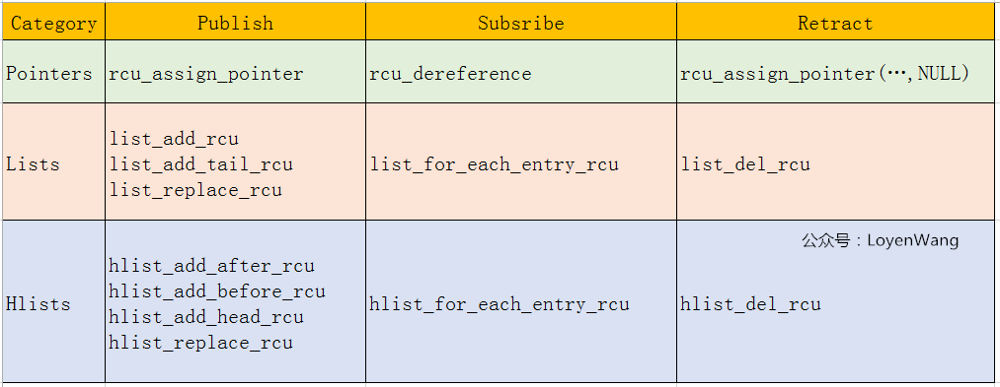
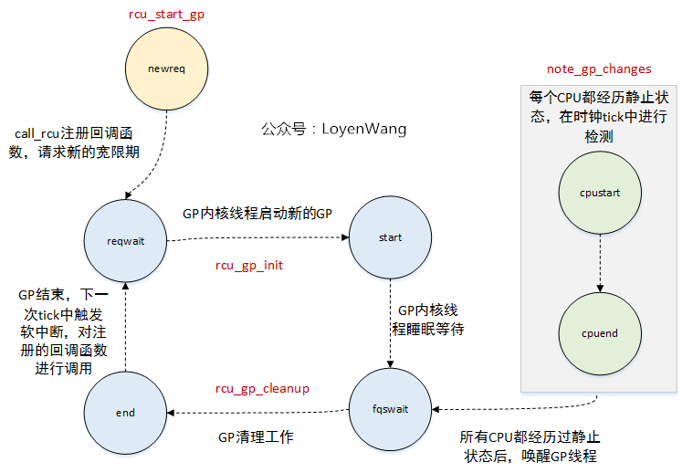

[:link: Linux - Core API Documentation :link:](https://docs.kernel.org/core-api/index.html)
* [git.locking/core](https://git.kernel.org/pub/scm/linux/kernel/git/tip/tip.git/log/?h=locking/core)

* [并发机制 - LoyenWang](https://www.cnblogs.com/LoyenWang/category/1689461.html)
    * [Semophore](https://www.cnblogs.com/LoyenWang/p/12907230.html)
    * [Mutex](https://www.cnblogs.com/LoyenWang/p/12826811.html)
    * [spinlock/rwlock/seqlock](https://www.cnblogs.com/LoyenWang/p/12632532.html)

* [Core](#core)

* [Data structures](#data-structures)
    * [xarray](#xarray)
    * [maple tree](#maple-tree)

* [Concurrency primitives](#concurrency-primitives)
    * [atomic](#atomic)
    * [rcu](#rcu)
    * [barrier](#barrier)

* [locking](#locking)
    * [barrier](#barrier)
    * [lru](#lru)
    * [futex](#futex)
        * [futex_wait](#futex_wait)
        * [futex_wake](#futex_wake)
        * [futex_lock_pi](#futex_lock_pi)
        * [futex_unlock_pi](#futex_unlock_pi)
    * [spinlock](#spinlock)
        * [spin_lock](#spin_lock)
            * [queued_spin_lock_slowpath](#queued_spin_lock_slowpath)
        * [spin_unlock](#spin_unlock)
    * [rwspinlock](#rwspinlock)
        * [read_lock](#read_lock)
        * [write_lock](#write_lock)
    * [osq](#osq)
        * [osq_lock](#osq_lock)
        * [osq_lock](#osq_un)
    * [seqlock](#seqlock)
    * [mutex](#mutex)
        * [mutex_lock](#mutex_lock)
        * [mutex_unlock](#mutex_unlock)
    * [rtmutex](#rtmutex)
        * [rt_mutex_lock](#rt_mutex_lock)
            * [rt_mutex_adjust_prio_chain](#rt_mutex_adjust_prio_chain)
        * [rt_mutex_unlock](#rt_mutex_unlock)
    * [semaphore](#semaphore)
    * [rwsem](#rwsem)
        * [down_read](#down_read)
        * [up_read](#up_read)
        * [down_write](#down_write)
        * [up_write](#up_write)
    * [mlock](#mlock)

* [pthread](#pthread)
    * [pthread_mutex]()
    * [pthread_cond]()
    * [pthread_sem]()
    * [pthread_rwlock]()
    * [pthread_barrier_t]()

* [vdso](#vdso)
    * [vdso_kern](#vdso_kern)
        * [vdso_init](#vdso_init)
        * [udpate_vsyscall](#udpate_vsyscall)
    * [glibc](#vdso_glibc)
        * [load_elf_binary](#load_elf_binary)
        * [vdso_fault](#vdso_fault)
        * [setup_vdso](#setup_vdso)
        * [clock_gettime64](#clock_gettime64)

---

* [DumpStack 内核同步机制](http://www.dumpstack.cn/index.php/category/locking) ⊙ [ARM同步机制](http://www.dumpstack.cn/index.php/2022/09/18/1054.html) ⊙ [atomic](http://www.dumpstack.cn/index.php/2022/09/18/1055.html) ⊙ [spin](http://www.dumpstack.cn/index.php/2022/09/18/1056.html) ⊙ [mutex](http://www.dumpstack.cn/index.php/2022/09/18/1057.html) ⊙ [rwsem](http://www.dumpstack.cn/index.php/2022/09/18/1064.html) ⊙ [RCU](http://www.dumpstack.cn/index.php/2022/09/18/1065.html)

# Core

# Data structures

## xarray

* [kern - xarray](https://docs.kernel.org/core-api/xarray.html)
* [LWN Index - Radix tree](https://lwn.net/Kernel/Index/#Radix_tree)

## maple tree

* [kern - maple tree](https://docs.kernel.org/core-api/maple_tree.html)
* [LWN - Introducing maple trees](https://lwn.net/Articles/845507/)
* [The Maple Tree, A Modern Data Structure for a Complex Problem](https://blogs.oracle.com/linux/the-maple-tree)
* [Linux commit - Maple Tree: add new data structure](https://github.com/torvalds/linux/commit/54a611b605901c7d5d05b6b8f5d04a6ceb0962aa)
* [Linux doc](https://docs.kernel.org/core-api/maple_tree.html)

# Concurrency primitives

* [:orange_book: Is Parallel Programming Hard, And, If So, What Can You Do About It?](https://mirrors.edge.kernel.org/pub/linux/kernel/people/paulmck/perfbook/perfbook.html)
* [Compiler Reordering](http://www.wowotech.net/kernel_synchronization/453.html)

## atomic

* [原子操作](http://www.wowotech.net/kernel_synchronization/atomic.html)

## per-cpu

* [Per-CPU变量](http://www.wowotech.net/kernel_synchronization/per-cpu.html)

## barrier

* [kern - LINUX KERNEL MEMORY BARRIERS](https://docs.kernel.org/core-api/wrappers/memory-barriers.html)
* [Arm - Learn the architecture - Memory Systems, Ordering, and Barriers](https://developer.arm.com/documentation/102336/0100)
* [memory-barrier - wowo tech :one:](http://www.wowotech.net/kernel_synchronization/memory-barrier.html) ⊙ [:link: :two:](https://mp.weixin.qq.com/s/s6AvLiVVkoMX4dIGpqmXYA)
* [Memory access ordering :one: an introduction](https://community.arm.com/arm-community-blogs/b/architectures-and-processors-blog/posts/memory-access-ordering---an-introduction)  ⊙ [:two: Barriers and the Linux kernel](https://community.arm.com/arm-community-blogs/b/architectures-and-processors-blog/posts/memory-access-ordering-part-2---barriers-and-the-linux-kernel)  ⊙ [:three: Memory access ordering in the Arm Architecture](https://community.arm.com/arm-community-blogs/b/architectures-and-processors-blog/posts/memory-access-ordering-part-3---memory-access-ordering-in-the-arm-architecture)
* [Memory Model and Synchronization Primitive - Part 1: Memory Barrier](https://www.alibabacloud.com/blog/597460) ⊙ [Part 2: Memory Model](https://www.alibabacloud.com/blog/memory-model-and-synchronization-primitive---part-2-memory-model_597461)
* [wowotech - Linux内核同步机制之三: memory barrier - store buffer, invalidate queue](http://www.wowotech.net/kernel_synchronization/memory-barrier.html)
* [原理和实战解析Linux中如何正确地使用内存屏障](https://mp.weixin.qq.com/s/s6AvLiVVkoMX4dIGpqmXYA)

| **Type** | **Compiler Barrier** (`barrier()`) | **Memory Barrier** (`smp_mb()`, `smp_rmb()`, etc.) |
| :-: | :-: | :-: |
| **Scope** | Only affects compiler optimizations. | Affects both compiler and CPU (hardware-level) reordering. |
| **Effect on Caches** | Does not flush or reload caches. | Ensures memory operations are visible across CPUs. |
| **Forces Reload** | Ensures variables are reloaded *if accessed*.  | Guarantees memory ordering across multiple CPUs or threads.|
| **Use Case** | Single-CPU scenarios or preventing compiler optimizations. | Multi-CPU synchronization and hardware-level memory consistency. |
- A **compiler barrier** does **not automatically reread all cached variables**.
- It prevents the compiler from reordering instructions and forces the compiler to assume that memory might have changed.
- Variables will only be reread from memory if they are explicitly accessed after the barrier.
- To explicitly reload a variable from memory, you can use READ_ONCE() alongside a barrier().
- For hardware-level memory consistency, use **memory barriers** like `smp_mb()` instead of a compiler barrier.

Feature | (Data Memory Barrier)DMB | (Data Synchronization Barrier)DSB
:-: | :-: | :-:
**Ordering** | Guarantees Ordering | Guarantees Ordering
**Completion** | Conditionly guarantees complemtion only when other cores access the memory(MESI sync data). Otherwise, a store operation might still be pending in a local write buffer | Proactivley guarantees completion of memory accesses.
**Global Visibility** | Relies on MESI protocol for visibility; does not guarantee global visibility. | Ensures global visibility by stalling the core until the MESI protocol completes all necessary actions.
**MESI Interaction** | Cache lines may remain in the **M** state until invalidated or accessed by another core. | Cache lines are transitioned to **S** or written back to memory, ensuring visibility.
**Write-Back to Memory** | Does not force dirty cache lines in the **M (Modified)** state to be written back. | Forces dirty cache lines in the **M (Modified)** state to be written back if necessary.
**Scope** | Configurable (ISH, OSH, NSH, ST). | Configurable (ISH, OSH, NSH, ST).
**Performance** | Lower overhead. | Higher overhead.
**Use Cases** | When **ordering **of memory accesses is required, but **completion **is not strictly necessary. | When **ordering **and **completion **of memory accesses are required, such as before changing memory mappings, dealing with device memory, or when strict synchronization is essential. Used to implement memory_order_seq_cst.
**Core Stalling** | Does not stall the core; subsequent instructions may execute immediately. | Stalls the core until all memory operations are globally visible.

---

**A. DMB Behavior Under MESI**
- **Purpose**:
  - DMB ensures the **ordering of memory operations** within the issuing core.
  - It does not enforce **completion** of memory operations or ensure **global visibility** of writes.

- **How DMB Works with MESI**:
  - DMB ensures that memory operations before the barrier are **completed locally** (e.g., written to the write buffer) **before** operations after the barrier are issued.
  - Under MESI, this means:
    - Stores may remain in the **M (Modified)** state in the local cache or in the write buffer.
    - The actual propagation of cache lines to other cores (e.g., transitioning from **M** to **S** or invalidating other cores' caches) is deferred until the cache line is explicitly flushed or accessed by another core.
    - DMB does not force a write-back to memory or shared caches.

- **Implication**:
  - DMB relies on the MESI protocol to propagate changes to other cores if needed. For example, if another core attempts to read a cache line that is in the **M** state, the MESI protocol ensures that the line is invalidated or updated.
  - However, if no other core accesses the cache line, the changes may remain local, and DMB does not guarantee that they are globally visible.

---

**B. DSB Behavior Under MESI**
- **Purpose**:
  - DSB ensures both **ordering** and **completion** of memory operations, and guarantees **global visibility** of writes before any further instructions are executed.

- **How DSB Works with MESI**:
  - DSB forces all pending memory operations to **complete** before the barrier:
    - Stores are written back to main memory or shared caches (if needed) to ensure global visibility.
    - Cache lines in the **M (Modified)** state are either written back to main memory or transitioned to the **S (Shared)** state, ensuring that other cores can observe the updates.
  - DSB also ensures that all invalidations, updates, or write-backs required by the MESI protocol are completed before subsequent instructions are executed.

- **Implication**:
  - DSB ensures that all memory operations before the barrier are globally visible to other cores or devices.
  - This is achieved by stalling the issuing core until the MESI protocol has completed all necessary actions (e.g., transitioning cache lines, propagating invalidations).

---

**Domain** | **Scope** | **Use Case**
:-: | :-: | :-:
**Non-Shareable**  | Memory visible only to the issuing processor | Temporary or private data buffers accessed by a single core.
**Inner-Shareable**| Shared within a processor cluster | Shared memory for threads or cores in the same cluster.
**Outer-Shareable**| Shared across multiple clusters | Shared memory in multi-cluster systems (e.g., CPU-GPU or multi-CPU clusters).


**Memory barriers only ensure:**
* Within-core ordering: Operations before the barrier complete before operations after the barrier.
* Cross-core visibility: Data becomes visible to other cores once the barrier completes.

**CPUs delay write-backs and synchronization for performance reasons, including:**
* Write-back caching: Writes are delayed until eviction or explicit synchronization.
* Lazy synchronization: Cache coherence protocols like MESI delay synchronization until necessary.
* Write buffers: Store operations are buffered and completed later to avoid stalling the CPU.
* Out-of-order execution: Memory operations can be reordered unless explicitly constrained.

# locking

* [Locking in the kernel](https://docs.kernel.org/locking/index.html#)

 TODO

Lock Type | Disables Interrupts? | Disables Preemption? | Context | Sleepable?
:-: | :-: | :-: | :-: | :-:
Spinlock | :white_check_mark: (with _irqsave) | :white_check_mark: | Process/Interrupt | :heavy_multiplication_x:
RW Spinlock | :white_check_mark: (with _irqsave) | :white_check_mark: | Process/Interrupt | :heavy_multiplication_x:
Mutex | :heavy_multiplication_x: | :heavy_multiplication_x: | Process | :white_check_mark:
RT-Mutex | :heavy_multiplication_x: | :heavy_multiplication_x: | Process (Threaded IRQs) | :white_check_mark:
Semaphore | :heavy_multiplication_x: | :heavy_multiplication_x: | Process | :white_check_mark:
RW Semaphore | :heavy_multiplication_x: | :heavy_multiplication_x: | Process | :white_check_mark:
RCU Lock | Sometimes (variant-based) | :white_check_mark: (most variants) | Process/Interrupt | :heavy_multiplication_x:

## rcu


---

* [lore.rcu](https://lore.kernel.org/rcu/)
* [kernel: RCU Handbook](https://docs.kernel.org/RCU/index.html)
    * [A Tour Through TREE_RCU’s Data Structures](https://docs.kernel.org/RCU/Design/Data-Structures/Data-Structures.html)
    * [Tree RCU Grace Period Memory Ordering Components](https://docs.kernel.org/RCU/Design/Memory-Ordering/Tree-RCU-Memory-Ordering.html#tree-rcu-grace-period-memory-ordering-components)
        * Callback Registry
        * Grace-Period Initialization
        * Self-Reported Quiescent States
        * Dynamic Tick Interface:  RCU is forbidden from disturbing idle CPUs
        * CPU-Hotplug Interface
        * Forcing Quiescent States
        * Grace-Period Cleanup
        * Callback Invocation
    * [A Tour Through TREE_RCU’s Expedited Grace Periods](https://docs.kernel.org/RCU/Design/Expedited-Grace-Periods/Expedited-Grace-Periods.html)

* [LWN - RCU](https://lwn.net/Kernel/Index/#Read-copy-update)
    * [LWN - What is RCU? Fundamentally?](https://lwn.net/Articles/262464/) ⊙ [API 2024](https://lwn.net/Articles/988638/) ⊙ [Big API Table](https://lwn.net/Articles/988666/)
        * [Usage](https://lwn.net/Articles/263130/)
            * Deadlock Immunity
            * RCU Readers and Updaters Run Concurrently
            * Low-Priority RCU Readers Can Block High-Priority Reclaimers
    * [Requirements for RCU part 1: the fundamentals](https://lwn.net/Articles/652156/) ⊙ [part 2: parallelism and software engineering](https://lwn.net/Articles/652677/) ⊙ [part 3](https://lwn.net/Articles/653326/)
        * Fundamental non-requirements
            * Grace-Period Guarantee
            * Publish-Subscribe Guarantee
            * RCU Primitives Guaranteed to Execute Unconditionally. They are invoked, they do their job, and they return, with no possibility of error and no need to retry.
            * Guaranteed Read-to-Write Upgrade
        * Fundamental non-requirements
            * Readers Impose Minimal Ordering
            * Readers Do Not Exclude Updaters
            * Updaters Only Wait For Old Readers
            * Grace Periods Don't Partition Read-Side Critical Sections
            * Read-Side Critical Sections Don't Partition Grace Periods
            * Disabling Preemption Does Not Block Grace Periods

    * [The design of preemptible read-copy-update](https://lwn.net/Articles/253651/)
    * [Priority-Boosting RCU Read-Side Critical Sections](https://lwn.net/Articles/220677/)
    * [Sleepable RCU](https://lwn.net/Articles/202847/)

* [内核工匠 - RCU前传：从同步到RCU的引入](https://mp.weixin.qq.com/s/0wTQbrAFrRI8rrEtzHzCXw)
* [wowo tech - RCU基础](http://www.wowotech.net/kernel_synchronization/rcu_fundamentals.html) ⊙ [RCU synchronize原理分析](http://www.wowotech.net/kernel_synchronization/223.html)
* [Verification of the Tree-Based Hierarchical Read-Copy Update in the Linux Kernel.pdf](https://www.researchgate.net/publication/308980969_Verification_of_the_Tree-Based_Hierarchical_Read-Copy_Update_in_the_Linux_Kernel)
* [LoyenWang - 原理](https://www.cnblogs.com/LoyenWang/p/12681494.html) ⊙ [实现](https://www.cnblogs.com/LoyenWang/p/12770878.html)
* [谢宝友：RCU 从硬件说起](https://mp.weixin.qq.com/s/CPsTHZOCkAliNRRpAEy5Ng) ⊙ [内存屏障](https://mp.weixin.qq.com/s/k5B13PpjapOPpvOmTlzVdw) ⊙ [RCU 概念](https://mp.weixin.qq.com/s/EM61ZZRK68CfpwnTP232PQ) ⊙ [RCU 用法](https://mp.weixin.qq.com/s/iNPiGrvhVmtKXcM0idSxJw)

---

| Type              | Sleepable? | Preemptable? | kconfig | Main use |
| :-: | :-: | :-: | :-: | :-: |
| **Tree RCU**      | ❌ No     | ❌ No     | CONFIG_TREE_RCU | High-performance, non-blocking code |
| **Preemptible**   | ❌ No     | ✅ Yes    | CONFIG_PREEMPT_RCU | Real-time kernels |
| **SRCU**          | ✅ Yes    | ✅ Yes    | | Sleepable read-side sections |
| **Tasks RCU**     | N/A       | N/A       | | Task-based grace period (e.g., tracing) |





**Quiescent States**:
| CPU state             | Why it’s safe                                                         |
| --------------------- | --------------------------------------------------------------------- |
| **User space**        | RCU read-side sections only exist in kernel code.                     |
| **Idle / nohz idle**  | The CPU isn’t executing kernel code.                                  |
| **Context switch**    | RCU read-side sections don’t span context switches (for RCU-preempt). |
| **Offline**           | CPU is out of the game entirely.                                      |
| **rcu_read_unlock()** | Explicit QS if the CPU just left an RCU read-critical section.        |

---

```sh
/sys/kernel
├── rcu_expedited
├── rcu_normal
├── rcu_stall_count
```

```c
struct rcu_data {
    /* 1) quiescent-state and grace-period handling : */
    unsigned long    gp_seq;        /* Track rsp->gp_seq counter. */
    unsigned long    gp_seq_needed;    /* Track furthest future GP request. */
    union rcu_noqs    cpu_no_qs;    /* No QSes yet for this CPU. */
    bool        core_needs_qs;    /* Core waits for quiescent state. */
    bool        beenonline;    /* CPU online at least once. */
    bool        gpwrap;        /* Possible ->gp_seq wrap. */
    unsigned int    gpwrap_count;    /* Count of GP sequence wrap. */
    bool        cpu_started;    /* RCU watching this onlining CPU. */
    struct rcu_node *mynode;    /* This CPU's leaf of hierarchy */
    unsigned long grpmask;        /* Mask to apply to leaf qsmask. */
    unsigned long    ticks_this_gp;    /* The number of scheduling-clock */
                    /*  ticks this CPU has handled */
                    /*  during and after the last grace */
                    /* period it is aware of. */
    struct irq_work defer_qs_iw;    /* Obtain later scheduler attention. */
    int defer_qs_iw_pending;    /* Scheduler attention pending? */
    struct work_struct strict_work;    /* Schedule readers for strict GPs. */


    /* 2) batch handling */
    struct rcu_segcblist cblist;    /* Segmented callback list, with */
                    /* different callbacks waiting for */
                    /* different grace periods. */
    long        qlen_last_fqs_check;
                    /* qlen at last check for QS forcing */
    unsigned long    n_cbs_invoked;    /* # callbacks invoked since boot. */
    unsigned long    n_force_qs_snap;
                    /* did other CPU force QS recently? */
    long        blimit;        /* Upper limit on a processed batch */


    /* 3) dynticks interface. */
    int  watching_snap;         /* Per-GP tracking for dynticks. */
    bool rcu_need_heavy_qs;     /* GP old, so heavy quiescent state! */
    bool rcu_urgent_qs;         /* GP old need light quiescent state. */
    bool rcu_forced_tick;       /* Forced tick to provide QS. */
    bool rcu_forced_tick_exp;   /*   ... provide QS to expedited GP. */


    /* 4) rcu_barrier(), OOM callbacks, and expediting. */
    unsigned long barrier_seq_snap;    /* Snap of rcu_state.barrier_sequence. */
    struct rcu_head barrier_head;
    int exp_watching_snap;        /* Double-check need for IPI. */


    /* 5) Callback offloading. */
#ifdef CONFIG_RCU_NOCB_CPU
    struct swait_queue_head nocb_cb_wq; /* For nocb kthreads to sleep on. */
    struct swait_queue_head nocb_state_wq; /* For offloading state changes */
    struct task_struct *nocb_gp_kthread;
    raw_spinlock_t nocb_lock;    /* Guard following pair of fields. */
    int nocb_defer_wakeup;        /* Defer wakeup of nocb_kthread. */
    struct timer_list nocb_timer;    /* Enforce finite deferral. */
    unsigned long nocb_gp_adv_time;    /* Last call_rcu() CB adv (jiffies). */
    struct mutex nocb_gp_kthread_mutex; /* Exclusion for nocb gp kthread */
                        /* spawning */

    /* The following fields are used by call_rcu, hence own cacheline. */
    raw_spinlock_t nocb_bypass_lock ____cacheline_internodealigned_in_smp;
    struct rcu_cblist nocb_bypass;    /* Lock-contention-bypass CB list. */
    unsigned long nocb_bypass_first; /* Time (jiffies) of first enqueue. */
    unsigned long nocb_nobypass_last; /* Last ->cblist enqueue (jiffies). */
    int nocb_nobypass_count;    /* # ->cblist enqueues at ^^^ time. */

    /* The following fields are used by GP kthread, hence own cacheline. */
    raw_spinlock_t nocb_gp_lock ____cacheline_internodealigned_in_smp;
    u8 nocb_gp_sleep;        /* Is the nocb GP thread asleep? */
    u8 nocb_gp_bypass;        /* Found a bypass on last scan? */
    u8 nocb_gp_gp;            /* GP to wait for on last scan? */
    unsigned long nocb_gp_seq;    /*  If so, ->gp_seq to wait for. */
    unsigned long nocb_gp_loops;    /* # passes through wait code. */
    struct swait_queue_head nocb_gp_wq; /* For nocb kthreads to sleep on. */
    bool nocb_cb_sleep;        /* Is the nocb CB thread asleep? */
    struct task_struct *nocb_cb_kthread;
    struct list_head nocb_head_rdp; /* Head of rcu_data list in wakeup chain,
                     * if rdp_gp. */
    struct list_head nocb_entry_rdp; /* rcu_data node in wakeup chain. */
    struct rcu_data *nocb_toggling_rdp; /* rdp queued for (de-)offloading */

    /* The following fields are used by CB kthread, hence new cacheline. */
    struct rcu_data *nocb_gp_rdp ____cacheline_internodealigned_in_smp;
                    /* GP rdp takes GP-end wakeups. */
#endif /* #ifdef CONFIG_RCU_NOCB_CPU */


    /* 6) RCU priority boosting. */
    struct task_struct *rcu_cpu_kthread_task;
                    /* rcuc per-CPU kthread or NULL. */
    unsigned int rcu_cpu_kthread_status;
    char rcu_cpu_has_work;
    unsigned long rcuc_activity;


    /* 7) Diagnostic data, including RCU CPU stall warnings. */
    unsigned int softirq_snap;    /* Snapshot of softirq activity. */
    /* ->rcu_iw* fields protected by leaf rcu_node ->lock. */
    struct irq_work rcu_iw;        /* Check for non-irq activity. */
    bool rcu_iw_pending;        /* Is ->rcu_iw pending? */
    unsigned long rcu_iw_gp_seq;    /* ->gp_seq associated with ->rcu_iw. */
    unsigned long rcu_ofl_gp_seq;    /* ->gp_seq at last offline. */
    short rcu_ofl_gp_state;        /* ->gp_state at last offline. */
    unsigned long rcu_onl_gp_seq;    /* ->gp_seq at last online. */
    short rcu_onl_gp_state;        /* ->gp_state at last online. */
    unsigned long last_fqs_resched;    /* Time of last rcu_resched(). */
    unsigned long last_sched_clock;    /* Jiffies of last rcu_sched_clock_irq(). */
    struct rcu_snap_record snap_record; /* Snapshot of core stats at half of */
                        /* the first RCU stall timeout */

    long lazy_len;            /* Length of buffered lazy callbacks. */
    int cpu;
};
```

### rcu_init

```c
void __init rcu_init(void)
{
    int cpu = smp_processor_id();

    rcu_early_boot_tests();

    rcu_bootup_announce();

    sanitize_kthread_prio() {
        if (IS_ENABLED(CONFIG_RCU_BOOST) && kthread_prio < 2 && IS_BUILTIN(CONFIG_RCU_TORTURE_TEST))
            kthread_prio = 2;
        else if (IS_ENABLED(CONFIG_RCU_BOOST) && kthread_prio < 1)
            kthread_prio = 1;
        else if (kthread_prio < 0)
            kthread_prio = 0;
        else if (kthread_prio > 99)
            kthread_prio = 99;
    }
    rcu_init_geometry();

    rcu_init_one();
        --->

    if (dump_tree)
        rcu_dump_rcu_node_tree();
    if (use_softirq)
        open_softirq(RCU_SOFTIRQ, rcu_core_si);

    /* We don't need protection against CPU-hotplug here because
     * this is called early in boot, before either interrupts
     * or the scheduler are operational. */
    pm_notifier(rcu_pm_notify, 0);
    WARN_ON(num_online_cpus() > 1); // Only one CPU this early in boot.
    rcutree_prepare_cpu(cpu);
    rcutree_report_cpu_starting(cpu);
    rcutree_online_cpu(cpu);

    /* Create workqueue for Tree SRCU and for expedited GPs. */
    rcu_gp_wq = alloc_workqueue("rcu_gp", WQ_MEM_RECLAIM | WQ_PERCPU, 0);
    WARN_ON(!rcu_gp_wq);

    sync_wq = alloc_workqueue("sync_wq", WQ_MEM_RECLAIM | WQ_UNBOUND, 0);
    WARN_ON(!sync_wq);

    /* Respect if explicitly disabled via a boot parameter. */
    if (rcu_normal_wake_from_gp < 0) {
        if (num_possible_cpus() <= WAKE_FROM_GP_CPU_THRESHOLD)
            rcu_normal_wake_from_gp = 1;
    }

    /* Fill in default value for rcutree.qovld boot parameter. */
    /* -After- the rcu_node ->lock fields are initialized! */
    if (qovld < 0)
        qovld_calc = DEFAULT_RCU_QOVLD_MULT * qhimark;
    else
        qovld_calc = qovld;

    // Kick-start in case any polled grace periods started early.
    (void)start_poll_synchronize_rcu_expedited();

    rcu_test_sync_prims();

    tasks_cblist_init_generic();
}

void __init rcu_init_one(void)
{
    static const char * const buf[] = RCU_NODE_NAME_INIT;
    static const char * const fqs[] = RCU_FQS_NAME_INIT;
    static struct lock_class_key rcu_node_class[RCU_NUM_LVLS];
    static struct lock_class_key rcu_fqs_class[RCU_NUM_LVLS];

    int levelspread[RCU_NUM_LVLS];        /* kids/node in each level. */
    int cpustride = 1;
    int i;
    int j;
    struct rcu_node *rnp;

    BUILD_BUG_ON(RCU_NUM_LVLS > ARRAY_SIZE(buf));  /* Fix buf[] init! */

    /* Silence gcc 4.8 false positive about array index out of range. */
    if (rcu_num_lvls <= 0 || rcu_num_lvls > RCU_NUM_LVLS)
        panic("rcu_init_one: rcu_num_lvls out of range");

    /* Initialize the level-tracking arrays. */

    for (i = 1; i < rcu_num_lvls; i++)
        rcu_state.level[i] = rcu_state.level[i - 1] + num_rcu_lvl[i - 1];
    rcu_init_levelspread(levelspread, num_rcu_lvl);

    /* Initialize the elements themselves, starting from the leaves. */

    for (i = rcu_num_lvls - 1; i >= 0; i--) {
        cpustride *= levelspread[i];
        rnp = rcu_state.level[i];
        for (j = 0; j < num_rcu_lvl[i]; j++, rnp++) {
            raw_spin_lock_init(&ACCESS_PRIVATE(rnp, lock));
            lockdep_set_class_and_name(&ACCESS_PRIVATE(rnp, lock), &rcu_node_class[i], buf[i]);
            raw_spin_lock_init(&rnp->fqslock);
            lockdep_set_class_and_name(&rnp->fqslock, &rcu_fqs_class[i], fqs[i]);

            rnp->gp_seq = rcu_state.gp_seq;
            rnp->gp_seq_needed = rcu_state.gp_seq;
            rnp->completedqs = rcu_state.gp_seq;
            rnp->qsmask = 0;
            rnp->qsmaskinit = 0;
            rnp->grplo = j * cpustride;
            rnp->grphi = (j + 1) * cpustride - 1;
            if (rnp->grphi >= nr_cpu_ids)
                rnp->grphi = nr_cpu_ids - 1;
            if (i == 0) {
                rnp->grpnum = 0;
                rnp->grpmask = 0;
                rnp->parent = NULL;
            } else {
                rnp->grpnum = j % levelspread[i - 1];
                rnp->grpmask = BIT(rnp->grpnum);
                rnp->parent = rcu_state.level[i - 1] + j / levelspread[i - 1];
            }
            rnp->level = i;
            INIT_LIST_HEAD(&rnp->blkd_tasks);

            rcu_init_one_nocb(rnp) {
                init_swait_queue_head(&rnp->nocb_gp_wq[0]);
                init_swait_queue_head(&rnp->nocb_gp_wq[1]);
            }

            init_waitqueue_head(&rnp->exp_wq[0]);
            init_waitqueue_head(&rnp->exp_wq[1]);
            init_waitqueue_head(&rnp->exp_wq[2]);
            init_waitqueue_head(&rnp->exp_wq[3]);
            spin_lock_init(&rnp->exp_lock);
            mutex_init(&rnp->kthread_mutex);
            raw_spin_lock_init(&rnp->exp_poll_lock);
            rnp->exp_seq_poll_rq = RCU_GET_STATE_COMPLETED;
            INIT_WORK(&rnp->exp_poll_wq, sync_rcu_do_polled_gp);
        }
    }

    init_swait_queue_head(&rcu_state.gp_wq);
    init_swait_queue_head(&rcu_state.expedited_wq);
    rnp = rcu_first_leaf_node();
    for_each_possible_cpu(i) {
        while (i > rnp->grphi)
            rnp++;
        per_cpu_ptr(&rcu_data, i)->mynode = rnp;
        per_cpu_ptr(&rcu_data, i)->barrier_head.next = &per_cpu_ptr(&rcu_data, i)->barrier_head;

        rcu_boot_init_percpu_data(i) {
            struct context_tracking *ct = this_cpu_ptr(&context_tracking);
            struct rcu_data *rdp = per_cpu_ptr(&rcu_data, cpu);

            /* Set up local state, ensuring consistent view of global state. */
            rdp->grpmask = leaf_node_cpu_bit(rdp->mynode, cpu);
            INIT_WORK(&rdp->strict_work, strict_work_handler);
            WARN_ON_ONCE(ct->nesting != 1);
            WARN_ON_ONCE(rcu_watching_snap_in_eqs(ct_rcu_watching_cpu(cpu)));
            rdp->barrier_seq_snap = rcu_state.barrier_sequence;
            rdp->rcu_ofl_gp_seq = rcu_state.gp_seq;
            rdp->rcu_ofl_gp_state = RCU_GP_CLEANED;
            rdp->rcu_onl_gp_seq = rcu_state.gp_seq;
            rdp->rcu_onl_gp_state = RCU_GP_CLEANED;
            rdp->last_sched_clock = jiffies;
            rdp->cpu = cpu;
            rcu_boot_init_nocb_percpu_data(rdp);
        }
    }
}
```

#### rcu_init_nohz

```c
void __init rcu_init_nohz(void)
{
    int cpu;
    struct rcu_data *rdp;
    const struct cpumask *cpumask = NULL;
    struct shrinker * __maybe_unused lazy_rcu_shrinker;

#if defined(CONFIG_NO_HZ_FULL)
    if (tick_nohz_full_running && !cpumask_empty(tick_nohz_full_mask))
        cpumask = tick_nohz_full_mask;
#endif

    if (IS_ENABLED(CONFIG_RCU_NOCB_CPU_DEFAULT_ALL) && !rcu_state.nocb_is_setup && !cpumask)
        cpumask = cpu_possible_mask;

    if (cpumask) {
        if (!cpumask_available(rcu_nocb_mask)) {
            if (!zalloc_cpumask_var(&rcu_nocb_mask, GFP_KERNEL)) {
                pr_info("rcu_nocb_mask allocation failed, callback offloading disabled.\n");
                return;
            }
        }

        cpumask_or(rcu_nocb_mask, rcu_nocb_mask, cpumask);
        rcu_state.nocb_is_setup = true;
    }

    if (!rcu_state.nocb_is_setup)
        return;

#ifdef CONFIG_RCU_LAZY
    lazy_rcu_shrinker = shrinker_alloc(0, "rcu-lazy");
    if (!lazy_rcu_shrinker) {
        pr_err("Failed to allocate lazy_rcu shrinker!\n");
    } else {
        lazy_rcu_shrinker->count_objects = lazy_rcu_shrink_count;
        lazy_rcu_shrinker->scan_objects = lazy_rcu_shrink_scan;

        shrinker_register(lazy_rcu_shrinker);
    }
#endif // #ifdef CONFIG_RCU_LAZY

    if (!cpumask_subset(rcu_nocb_mask, cpu_possible_mask)) {
        pr_info("\tNote: kernel parameter 'rcu_nocbs=', 'nohz_full', or 'isolcpus=' contains nonexistent CPUs.\n");
        cpumask_and(rcu_nocb_mask, cpu_possible_mask,
                rcu_nocb_mask);
    }
    if (cpumask_empty(rcu_nocb_mask))
        pr_info("\tOffload RCU callbacks from CPUs: (none).\n");
    else
        pr_info("\tOffload RCU callbacks from CPUs: %*pbl.\n",
            cpumask_pr_args(rcu_nocb_mask));
    if (rcu_nocb_poll)
        pr_info("\tPoll for callbacks from no-CBs CPUs.\n");

    for_each_cpu(cpu, rcu_nocb_mask) {
        rdp = per_cpu_ptr(&rcu_data, cpu);
        if (rcu_segcblist_empty(&rdp->cblist))
            rcu_segcblist_init(&rdp->cblist);
        rcu_segcblist_set_flags(&rdp->cblist, SEGCBLIST_OFFLOADED);
    }

    rcu_organize_nocb_kthreads() {
        int cpu;
        bool firsttime = true;
        bool gotnocbs = false;
        bool gotnocbscbs = true;
        int ls = rcu_nocb_gp_stride;
        int nl = 0;  /* Next GP kthread. */
        struct rcu_data *rdp;
        struct rcu_data *rdp_gp = NULL;  /* Suppress misguided gcc warn. */

        if (!cpumask_available(rcu_nocb_mask))
            return;
        if (ls == -1) {
            ls = nr_cpu_ids / int_sqrt(nr_cpu_ids);
            rcu_nocb_gp_stride = ls;
        }

        /* Each pass through this loop sets up one rcu_data structure.
        * Should the corresponding CPU come online in the future, then
        * we will spawn the needed set of rcu_nocb_kthread() kthreads. */
        for_each_possible_cpu(cpu) {
            rdp = per_cpu_ptr(&rcu_data, cpu);
            if (rdp->cpu >= nl) {
                /* New GP kthread, set up for CBs & next GP. */
                gotnocbs = true;
                nl = DIV_ROUND_UP(rdp->cpu + 1, ls) * ls;
                rdp_gp = rdp;
                INIT_LIST_HEAD(&rdp->nocb_head_rdp);
                if (dump_tree) {
                    if (!firsttime)
                        pr_cont("%s\n", gotnocbscbs ? "" : " (self only)");
                    gotnocbscbs = false;
                    firsttime = false;
                    pr_alert("%s: No-CB GP kthread CPU %d:", __func__, cpu);
                }
            } else {
                /* Another CB kthread, link to previous GP kthread. */
                gotnocbscbs = true;
                if (dump_tree)
                    pr_cont(" %d", cpu);
            }
            rdp->nocb_gp_rdp = rdp_gp;
            if (cpumask_test_cpu(cpu, rcu_nocb_mask))
                list_add_tail(&rdp->nocb_entry_rdp, &rdp_gp->nocb_head_rdp);
        }
    }
}
```

#### rcu_spawn_gp_kthread

```c
static int __init rcu_spawn_gp_kthread(void)
{
    unsigned long flags;
    struct rcu_node *rnp;
    struct sched_param sp;
    struct task_struct *t;
    struct rcu_data *rdp = this_cpu_ptr(&rcu_data);

    rcu_scheduler_fully_active = 1;
    t = kthread_create(rcu_gp_kthread, NULL, "%s", rcu_state.name);
    if (WARN_ONCE(IS_ERR(t)))
        return 0;
    if (kthread_prio) {
        sp.sched_priority = kthread_prio; /*set at sanitize_kthread_prio */
        sched_setscheduler_nocheck(t, SCHED_FIFO, &sp) {
            return _sched_setscheduler(p, policy, param, false);
        }
    }

    rnp = rcu_get_root();
    raw_spin_lock_irqsave_rcu_node(rnp, flags);
    WRITE_ONCE(rcu_state.gp_activity, jiffies);
    WRITE_ONCE(rcu_state.gp_req_activity, jiffies);

    smp_store_release(&rcu_state.gp_kthread, t);
    raw_spin_unlock_irqrestore_rcu_node(rnp, flags);
    wake_up_process(t);
    /* This is a pre-SMP initcall, we expect a single CPU */
    WARN_ON(num_online_cpus() > 1);

    rcu_spawn_cpu_nocb_kthread(smp_processor_id());

    rcu_spawn_rnp_kthreads(rdp->mynode) {
        if (rcu_scheduler_fully_active) {
            mutex_lock(&rnp->kthread_mutex);

            rcu_spawn_one_boost_kthread(rnp);
            rcu_spawn_exp_par_gp_kworker(rnp);

            mutex_unlock(&rnp->kthread_mutex);
        }
    }

    rcu_spawn_core_kthreads();
    rcu_start_exp_gp_kworker();

    return 0;
}
```

##### rcu_cpu_kthread-rcuc/%u

```c
static struct smp_hotplug_thread rcu_cpu_thread_spec = {
    .store              = &rcu_data.rcu_cpu_kthread_task,
    .thread_should_run  = rcu_cpu_kthread_should_run,
    .thread_fn          = rcu_cpu_kthread,
    .thread_comm        = "rcuc/%u",
    .setup              = rcu_cpu_kthread_setup,
    .park               = rcu_cpu_kthread_park,
};

/* Spawn per-CPU RCU core processing kthreads. */
static int __init rcu_spawn_core_kthreads(void)
{
    int cpu;

    for_each_possible_cpu(cpu)
        per_cpu(rcu_data.rcu_cpu_has_work, cpu) = 0;

    if (use_softirq)
        return 0;

    WARN_ONCE(smpboot_register_percpu_thread(&rcu_cpu_thread_spec),
          "%s: Could not start rcuc kthread, OOM is now expected behavior\n", __func__);
    return 0;
}
```

### rcu_read_lock

```c
static __always_inline void rcu_read_lock(void)
{
    __rcu_read_lock();
    __acquire(RCU);
    rcu_lock_acquire(&rcu_lock_map);
    RCU_LOCKDEP_WARN(!rcu_is_watching(),
             "rcu_read_lock() used illegally while idle");
}

static inline void __rcu_read_lock(void)
{
    preempt_disable();
}

void __rcu_read_lock(void)
{
    rcu_preempt_read_enter() {
        WRITE_ONCE(current->rcu_read_lock_nesting, READ_ONCE(current->rcu_read_lock_nesting) + 1);
    }
    if (IS_ENABLED(CONFIG_PROVE_LOCKING))
        WARN_ON_ONCE(rcu_preempt_depth() > RCU_NEST_PMAX);
    if (IS_ENABLED(CONFIG_RCU_STRICT_GRACE_PERIOD) && rcu_state.gp_kthread)
        WRITE_ONCE(current->rcu_read_unlock_special.b.need_qs, true);
    barrier();  /* critical section after entry code. */
}
```

```c
static inline void rcu_read_unlock(void)
{
    RCU_LOCKDEP_WARN(!rcu_is_watching(),
             "rcu_read_unlock() used illegally while idle");
    rcu_lock_release(&rcu_lock_map); /* Keep acq info for rls diags. */
    __release(RCU);
    __rcu_read_unlock();
}

static inline void __rcu_read_unlock(void)
{
    if (IS_ENABLED(CONFIG_RCU_STRICT_GRACE_PERIOD))
        rcu_read_unlock_strict();
    preempt_enable();
}

void __rcu_read_unlock(void)
{
    struct task_struct *t = current;

    barrier();  // critical section before exit code.
    if (rcu_preempt_read_exit() == 0) {
        barrier();  // critical-section exit before .s check.
        if (unlikely(READ_ONCE(t->rcu_read_unlock_special.s)))
            rcu_read_unlock_special(t);
    }
    if (IS_ENABLED(CONFIG_PROVE_LOCKING)) {
        int rrln = rcu_preempt_depth();

        WARN_ON_ONCE(rrln < 0 || rrln > RCU_NEST_PMAX);
    }
}

static int rcu_preempt_read_exit(void)
{
    int ret = READ_ONCE(current->rcu_read_lock_nesting) - 1;

    WRITE_ONCE(current->rcu_read_lock_nesting, ret);
    return ret;
}

void rcu_read_unlock_special(struct task_struct *t)
{
    unsigned long flags;
    bool irqs_were_disabled;
    bool preempt_bh_were_disabled =
            !!(preempt_count() & (PREEMPT_MASK | SOFTIRQ_MASK));

    /* NMI handlers cannot block and cannot safely manipulate state. */
    if (in_nmi())
        return;

    local_irq_save(flags);
    irqs_were_disabled = irqs_disabled_flags(flags);
    if (preempt_bh_were_disabled || irqs_were_disabled) {
        bool needs_exp; // Expedited handling needed.
        struct rcu_data *rdp = this_cpu_ptr(&rcu_data);
        struct rcu_node *rnp = rdp->mynode;

        needs_exp = rcu_unlock_needs_exp_handling(t, rdp, rnp, irqs_were_disabled);

        // Need to defer quiescent state until everything is enabled.
        if (use_softirq && (in_hardirq() || (needs_exp && !irqs_were_disabled))) {
            // Using softirq, safe to awaken, and either the
            // wakeup is free or there is either an expedited
            // GP in flight or a potential need to deboost.
            raise_softirq_irqoff(RCU_SOFTIRQ); /* rcu_core_si */
        } else {
            // Enabling BH or preempt does reschedule, so...
            // Also if no expediting and no possible deboosting,
            // slow is OK.  Plus nohz_full CPUs eventually get
            // tick enabled.
            set_tsk_need_resched(current);
            set_preempt_need_resched();
            if (IS_ENABLED(CONFIG_IRQ_WORK) && irqs_were_disabled &&
                needs_exp && rdp->defer_qs_iw_pending != DEFER_QS_PENDING &&
                cpu_online(rdp->cpu)) {
                // Get scheduler to re-evaluate and call hooks.
                // If !IRQ_WORK, FQS scan will eventually IPI.
                rdp->defer_qs_iw_pending = DEFER_QS_PENDING;
                irq_work_queue_on(&rdp->defer_qs_iw, rdp->cpu);
            }
        }
        local_irq_restore(flags);
        return;
    }
    rcu_preempt_deferred_qs_irqrestore(t, flags) {
        bool empty_exp;
        bool empty_norm;
        bool empty_exp_now;
        struct list_head *np;
        bool drop_boost_mutex = false;
        struct rcu_data *rdp;
        struct rcu_node *rnp;
        union rcu_special special;

        rdp = this_cpu_ptr(&rcu_data);
        if (rdp->defer_qs_iw_pending == DEFER_QS_PENDING)
            rdp->defer_qs_iw_pending = DEFER_QS_IDLE;

        /* If RCU core is waiting for this CPU to exit its critical section,
        * report the fact that it has exited.  Because irqs are disabled,
        * t->rcu_read_unlock_special cannot change. */
        special = t->rcu_read_unlock_special;
        if (!special.s && !rdp->cpu_no_qs.b.exp) {
            local_irq_restore(flags);
            return;
        }
        t->rcu_read_unlock_special.s = 0;
        if (special.b.need_qs) {
            if (IS_ENABLED(CONFIG_RCU_STRICT_GRACE_PERIOD)) {
                rdp->cpu_no_qs.b.norm = false;
                rcu_report_qs_rdp(rdp);
                udelay(rcu_unlock_delay);
            } else {
                rcu_qs();
            }
        }

        /* Respond to a request by an expedited grace period for a
        * quiescent state from this CPU.  Note that requests from
        * tasks are handled when removing the task from the
        * blocked-tasks list below. */
        if (rdp->cpu_no_qs.b.exp)
            rcu_report_exp_rdp(rdp);

        /* Clean up if blocked during RCU read-side critical section. */
        if (special.b.blocked) {

            /* Remove this task from the list it blocked on.  The task
            * now remains queued on the rcu_node corresponding to the
            * CPU it first blocked on, so there is no longer any need
            * to loop.  Retain a WARN_ON_ONCE() out of sheer paranoia. */
            rnp = t->rcu_blocked_node;
            raw_spin_lock_rcu_node(rnp); /* irqs already disabled. */
            WARN_ON_ONCE(rnp != t->rcu_blocked_node);
            WARN_ON_ONCE(!rcu_is_leaf_node(rnp));
            empty_norm = !rcu_preempt_blocked_readers_cgp(rnp);
            WARN_ON_ONCE(rnp->completedqs == rnp->gp_seq &&
                    (!empty_norm || rnp->qsmask));
            empty_exp = sync_rcu_exp_done(rnp);
            np = rcu_next_node_entry(t, rnp);
            list_del_init(&t->rcu_node_entry);
            t->rcu_blocked_node = NULL;
            if (&t->rcu_node_entry == rnp->gp_tasks)
                WRITE_ONCE(rnp->gp_tasks, np);
            if (&t->rcu_node_entry == rnp->exp_tasks)
                WRITE_ONCE(rnp->exp_tasks, np);
            if (IS_ENABLED(CONFIG_RCU_BOOST)) {
                /* Snapshot ->boost_mtx ownership w/rnp->lock held. */
                drop_boost_mutex = rt_mutex_owner(&rnp->boost_mtx.rtmutex) == t;
                if (&t->rcu_node_entry == rnp->boost_tasks)
                    WRITE_ONCE(rnp->boost_tasks, np);
            }

            /* If this was the last task on the current list, and if
            * we aren't waiting on any CPUs, report the quiescent state.
            * Note that rcu_report_unblock_qs_rnp() releases rnp->lock,
            * so we must take a snapshot of the expedited state. */
            empty_exp_now = sync_rcu_exp_done(rnp);
            if (!empty_norm && !rcu_preempt_blocked_readers_cgp(rnp)) {
                rcu_report_unblock_qs_rnp(rnp, flags);
            } else {
                raw_spin_unlock_irqrestore_rcu_node(rnp, flags);
            }

            /* If this was the last task on the expedited lists,
            * then we need to report up the rcu_node hierarchy. */
            if (!empty_exp && empty_exp_now)
                rcu_report_exp_rnp(rnp, true);

            /* Unboost if we were boosted. */
            if (IS_ENABLED(CONFIG_RCU_BOOST) && drop_boost_mutex)
                rt_mutex_futex_unlock(&rnp->boost_mtx.rtmutex);
        } else {
            local_irq_restore(flags);
        }
    }
}
```

### rcu_sched_clock_irq

```c
update_process_times(user_mode(get_irq_regs())) {
    rcu_sched_clock_irq(user_tick);
}

void rcu_sched_clock_irq(int user)
{
    unsigned long j;

    if (IS_ENABLED(CONFIG_PROVE_RCU)) {
        j = jiffies;
        WARN_ON_ONCE(time_before(j, __this_cpu_read(rcu_data.last_sched_clock)));
        __this_cpu_write(rcu_data.last_sched_clock, j);
    }
    lockdep_assert_irqs_disabled();

    raw_cpu_inc(rcu_data.ticks_this_gp);
    /* The load-acquire pairs with the store-release setting to true. */
    if (smp_load_acquire(this_cpu_ptr(&rcu_data.rcu_urgent_qs))) {
        /* Idle and userspace execution already are quiescent states. */
        if (!rcu_is_cpu_rrupt_from_idle() && !user) {
            set_tsk_need_resched(current);
            set_preempt_need_resched();
        }
        __this_cpu_write(rcu_data.rcu_urgent_qs, false);
    }

    rcu_flavor_sched_clock_irq(user) {
        struct task_struct *t = current;

        lockdep_assert_irqs_disabled();
        if (rcu_preempt_depth() > 0 || (preempt_count() & (PREEMPT_MASK | SOFTIRQ_MASK))) {
            /* No QS, force context switch if deferred. */
            if (rcu_preempt_need_deferred_qs(t)) {
                set_tsk_need_resched(t);
                set_preempt_need_resched();
            }
        } else if (rcu_preempt_need_deferred_qs(t)) {
            rcu_preempt_deferred_qs(t); /* Report deferred QS. */
            return;
        } else if (!WARN_ON_ONCE(rcu_preempt_depth())) {
            rcu_qs(); /* Report immediate QS. */
            return;
        }

        /* If GP is oldish, ask for help from rcu_read_unlock_special(). */
        if (rcu_preempt_depth() > 0 &&
            __this_cpu_read(rcu_data.core_needs_qs) &&
            __this_cpu_read(rcu_data.cpu_no_qs.b.norm) &&
            !t->rcu_read_unlock_special.b.need_qs &&
            time_after(jiffies, rcu_state.gp_start + HZ))
            t->rcu_read_unlock_special.b.need_qs = true;
    }

    if (rcu_pending(user)) { --->
        invoke_rcu_core() {
            if (!cpu_online(smp_processor_id()))
                return;
            if (use_softirq)
                raise_softirq(RCU_SOFTIRQ); /* rcu_core_si */
            else
                invoke_rcu_core_kthread(); /* rcu_cpu_kthread */
        }
    }
    if (user || rcu_is_cpu_rrupt_from_idle())
        rcu_note_voluntary_context_switch(current);
    lockdep_assert_irqs_disabled();

}

int rcu_pending(int user)
{
    bool gp_in_progress;
    struct rcu_data *rdp = this_cpu_ptr(&rcu_data);
    struct rcu_node *rnp = rdp->mynode;

    lockdep_assert_irqs_disabled();

    /* Check for CPU stalls, if enabled. */
    check_cpu_stall(rdp);
        --->

    /* Does this CPU need a deferred NOCB wakeup? */
    if (rcu_nocb_need_deferred_wakeup(rdp, RCU_NOCB_WAKE))
        return 1;

    /* Is this a nohz_full CPU in userspace or idle?  (Ignore RCU if so.) */
    gp_in_progress = rcu_gp_in_progress();
    before_start = time_before(jiffies, READ_ONCE(rcu_state.gp_start) + nohz_full_patience_delay_jiffies);
    if ((user || rcu_is_cpu_rrupt_from_idle() || (gp_in_progress && before_start)) && rcu_nohz_full_cpu())
        return 0;

    /* Is the RCU core waiting for a quiescent state from this CPU? */
    if (rdp->core_needs_qs && !rdp->cpu_no_qs.b.norm && gp_in_progress)
        return 1;

    /* Does this CPU have callbacks ready to invoke? */
    if (!rcu_rdp_is_offloaded(rdp) && rcu_segcblist_ready_cbs(&rdp->cblist))
        return 1;

    /* Has RCU gone idle with this CPU needing another grace period? */
    if (!gp_in_progress && rcu_segcblist_is_enabled(&rdp->cblist) &&
        !rcu_rdp_is_offloaded(rdp) &&
        !rcu_segcblist_restempty(&rdp->cblist, RCU_NEXT_READY_TAIL))
        return 1;

    /* Have RCU grace period completed or started?  */
    if (rcu_seq_current(&rnp->gp_seq) != rdp->gp_seq || unlikely(READ_ONCE(rdp->gpwrap))) /* outside lock */
        return 1;

    /* nothing to do */
    return 0;
}
```

#### check_cpu_stall

```c
void check_cpu_stall(struct rcu_data *rdp)
{
    bool self_detected;
    unsigned long gs1;
    unsigned long gs2;
    unsigned long gps;
    unsigned long j;
    unsigned long jn;
    unsigned long js;
    struct rcu_node *rnp;

    lockdep_assert_irqs_disabled();
    if ((rcu_stall_is_suppressed() && !READ_ONCE(rcu_kick_kthreads)) || !rcu_gp_in_progress())
        return;

    rcu_stall_kick_kthreads();

    /* Check if it was requested (via rcu_cpu_stall_reset()) that the FQS
     * loop has to set jiffies to ensure a non-stale jiffies value. This
     * is required to have good jiffies value after coming out of long
     * breaks of jiffies updates. Not doing so can cause false positives. */
    if (READ_ONCE(rcu_state.nr_fqs_jiffies_stall) > 0)
        return;

    j = jiffies;

    /* Lots of memory barriers to reject false positives.
     *
     * The idea is to pick up rcu_state.gp_seq, then
     * rcu_state.jiffies_stall, then rcu_state.gp_start, and finally
     * another copy of rcu_state.gp_seq.  These values are updated in
     * the opposite order with memory barriers (or equivalent) during
     * grace-period initialization and cleanup.  Now, a false positive
     * can occur if we get an new value of rcu_state.gp_start and a old
     * value of rcu_state.jiffies_stall.  But given the memory barriers,
     * the only way that this can happen is if one grace period ends
     * and another starts between these two fetches.  This is detected
     * by comparing the second fetch of rcu_state.gp_seq with the
     * previous fetch from rcu_state.gp_seq.
     *
     * Given this check, comparisons of jiffies, rcu_state.jiffies_stall,
     * and rcu_state.gp_start suffice to forestall false positives. */
    gs1 = READ_ONCE(rcu_state.gp_seq);
    smp_rmb(); /* Pick up ->gp_seq first... */
    js = READ_ONCE(rcu_state.jiffies_stall);
    smp_rmb(); /* ...then ->jiffies_stall before the rest... */
    gps = READ_ONCE(rcu_state.gp_start);
    smp_rmb(); /* ...and finally ->gp_start before ->gp_seq again. */
    gs2 = READ_ONCE(rcu_state.gp_seq);
    if (gs1 != gs2 ||
        ULONG_CMP_LT(j, js) ||
        ULONG_CMP_GE(gps, js) ||
        !rcu_seq_state(gs2))
        return; /* No stall or GP completed since entering function. */

    rnp = rdp->mynode;
    jn = jiffies + ULONG_MAX / 2;
    self_detected = READ_ONCE(rnp->qsmask) & rdp->grpmask;
    if (rcu_gp_in_progress() &&
        (self_detected || ULONG_CMP_GE(j, js + RCU_STALL_RAT_DELAY)) &&
        cmpxchg(&rcu_state.jiffies_stall, js, jn) == js) {
        /* If a virtual machine is stopped by the host it can look to
         * the watchdog like an RCU stall. Check to see if the host
         * stopped the vm. */
        if (kvm_check_and_clear_guest_paused())
            return;

#ifdef CONFIG_SYSFS
        ++rcu_stall_count;
#endif

        rcu_stall_notifier_call_chain(RCU_STALL_NOTIFY_NORM, (void *)j - gps);
        if (READ_ONCE(csd_lock_suppress_rcu_stall) && csd_lock_is_stuck()) {
            pr_err("INFO: %s detected stall, but suppressed full report due to a stuck CSD-lock.\n", rcu_state.name);
        } else if (self_detected) {
            /* We haven't checked in, so go dump stack. */
            print_cpu_stall(gs2, gps);
        } else {
            /* They had a few time units to dump stack, so complain. */
            print_other_cpu_stall(gs2, gps);
                --->
        }

        if (READ_ONCE(rcu_cpu_stall_ftrace_dump))
            rcu_ftrace_dump(DUMP_ALL);

        if (READ_ONCE(rcu_state.jiffies_stall) == jn) {
            jn = jiffies + 3 * rcu_jiffies_till_stall_check() + 3;
            WRITE_ONCE(rcu_state.jiffies_stall, jn);
        }
    }
}

 void print_other_cpu_stall(unsigned long gp_seq, unsigned long gps)
{
    int cpu;
    unsigned long flags;
    unsigned long gpa;
    unsigned long j;
    int ndetected = 0;
    struct rcu_node *rnp;
    long totqlen = 0;

    lockdep_assert_irqs_disabled();

    /* Kick and suppress, if so configured. */
    rcu_stall_kick_kthreads();
    if (rcu_stall_is_suppressed())
        return;

    nbcon_cpu_emergency_enter();

    /* OK, time to rat on our buddy...
     * See Documentation/RCU/stallwarn.rst for info on how to debug
     * RCU CPU stall warnings. */
    pr_err("INFO: %s detected stalls on CPUs/tasks:\n", rcu_state.name);
    rcu_for_each_leaf_node(rnp) {
        raw_spin_lock_irqsave_rcu_node(rnp, flags);
        if (rnp->qsmask != 0) {
            for_each_leaf_node_possible_cpu(rnp, cpu)
                if (rnp->qsmask & leaf_node_cpu_bit(rnp, cpu)) {
                    print_cpu_stall_info(cpu);
                    ndetected++;
                }
        }
        ndetected += rcu_print_task_stall(rnp, flags); // Releases rnp->lock.
        lockdep_assert_irqs_disabled();
    }

    for_each_possible_cpu(cpu)
        totqlen += rcu_get_n_cbs_cpu(cpu);
    pr_err("\t(detected by %d, t=%ld jiffies, g=%ld, q=%lu ncpus=%d)\n",
           smp_processor_id(), (long)(jiffies - gps),
           (long)rcu_seq_current(&rcu_state.gp_seq), totqlen,
           data_race(rcu_state.n_online_cpus)); // Diagnostic read
    if (ndetected) {
        rcu_dump_cpu_stacks(gp_seq);

        /* Complain about tasks blocking the grace period. */
        rcu_for_each_leaf_node(rnp)
            rcu_print_detail_task_stall_rnp(rnp);
    } else {
        if (rcu_seq_current(&rcu_state.gp_seq) != gp_seq) {
            pr_err("INFO: Stall ended before state dump start\n");
        } else {
            j = jiffies;
            gpa = data_race(READ_ONCE(rcu_state.gp_activity));
            pr_err("All QSes seen, last %s kthread activity %ld (%ld-%ld), jiffies_till_next_fqs=%ld, root ->qsmask %#lx\n",
                   rcu_state.name, j - gpa, j, gpa,
                   data_race(READ_ONCE(jiffies_till_next_fqs)),
                   data_race(READ_ONCE(rcu_get_root()->qsmask)));
        }
    }
    /* Rewrite if needed in case of slow consoles. */
    if (ULONG_CMP_GE(jiffies, READ_ONCE(rcu_state.jiffies_stall)))
        WRITE_ONCE(rcu_state.jiffies_stall,
               jiffies + 3 * rcu_jiffies_till_stall_check() + 3);

    rcu_check_gp_kthread_expired_fqs_timer();
    rcu_check_gp_kthread_starvation();
        --->

    nbcon_cpu_emergency_exit();

    panic_on_rcu_stall() {
        static int cpu_stall;

        if (scx_rcu_cpu_stall())
            return;

        if (++cpu_stall < sysctl_max_rcu_stall_to_panic)
            return;

        if (sysctl_panic_on_rcu_stall)
            panic("RCU Stall\n");
    }

    rcu_force_quiescent_state();  /* Kick them all. */
}

void rcu_check_gp_kthread_starvation(void)
{
    int cpu;
    struct task_struct *gpk = rcu_state.gp_kthread;
    unsigned long j;

    if (rcu_is_gp_kthread_starving(&j)) {
        cpu = gpk ? task_cpu(gpk) : -1;
        pr_err("%s kthread starved for %ld jiffies! g%ld f%#x %s(%d) ->state=%#x ->cpu=%d\n",
               rcu_state.name, j,
               (long)rcu_seq_current(&rcu_state.gp_seq),
               data_race(READ_ONCE(rcu_state.gp_flags)),
               gp_state_getname(rcu_state.gp_state),
               data_race(READ_ONCE(rcu_state.gp_state)),
               gpk ? data_race(READ_ONCE(gpk->__state)) : ~0, cpu);
        if (gpk) {
            struct rcu_data *rdp = per_cpu_ptr(&rcu_data, cpu);

            pr_err("\tUnless %s kthread gets sufficient CPU time, OOM is now expected behavior.\n", rcu_state.name);
            pr_err("RCU grace-period kthread stack dump:\n");
            sched_show_task(gpk);
            if (cpu_is_offline(cpu)) {
                pr_err("RCU GP kthread last ran on offline CPU %d.\n", cpu);
            } else if (!(data_race(READ_ONCE(rdp->mynode->qsmask)) & rdp->grpmask)) {
                pr_err("Stack dump where RCU GP kthread last ran:\n");
                dump_cpu_task(cpu);
            }
            wake_up_process(gpk);
        }
    }
}
```

### rcu_note_context_switch

```c
void __sched notrace __schedule(int sched_mode)
{
    rcu_note_context_switch(preempt);
}

void rcu_note_context_switch(bool preempt)
{
    struct task_struct *t = current;
    struct rcu_data *rdp = this_cpu_ptr(&rcu_data);
    struct rcu_node *rnp;

    lockdep_assert_irqs_disabled();
    WARN_ONCE(!preempt && rcu_preempt_depth() > 0, "Voluntary context switch within RCU read-side critical section!");

    if (rcu_preempt_depth() > 0 && !t->rcu_read_unlock_special.b.blocked) {
        /* Possibly blocking in an RCU read-side critical section. */
        rnp = rdp->mynode;
        raw_spin_lock_rcu_node(rnp);
        t->rcu_read_unlock_special.b.blocked = true;
        t->rcu_blocked_node = rnp;
        rcu_preempt_ctxt_queue(rnp, rdp);
    } else {
        rcu_preempt_deferred_qs(t);
    }

    /* Either we were not in an RCU read-side critical section to
     * begin with, or we have now recorded that critical section
     * globally.  Either way, we can now note a quiescent state
     * for this CPU.  Again, if we were in an RCU read-side critical
     * section, and if that critical section was blocking the current
     * grace period, then the fact that the task has been enqueued
     * means that we continue to block the current grace period. */
    rcu_qs();
    if (rdp->cpu_no_qs.b.exp)
        rcu_report_exp_rdp(rdp);

    rcu_tasks_qs(current, preempt)  {
        rcu_tasks_classic_qs((t), (preempt)) {
            if (!(preempt) && READ_ONCE((t)->rcu_tasks_holdout))
                WRITE_ONCE((t)->rcu_tasks_holdout, false);
        }

        rcu_tasks_trace_qs(t) {
            int ___rttq_nesting = READ_ONCE((t)->trc_reader_nesting);

            if (unlikely(READ_ONCE((t)->trc_reader_special.b.need_qs) == TRC_NEED_QS) && likely(!___rttq_nesting)) {
                rcu_trc_cmpxchg_need_qs((t), TRC_NEED_QS, TRC_NEED_QS_CHECKED) {
                    return cmpxchg(&t->trc_reader_special.b.need_qs, old, new);
                }
            } else if (___rttq_nesting && ___rttq_nesting != INT_MIN && !READ_ONCE((t)->trc_reader_special.b.blocked)) {
                rcu_tasks_trace_qs_blkd(t) {
                    unsigned long flags;
                    struct rcu_tasks_percpu *rtpcp;

                    local_irq_save(flags);
                    rtpcp = this_cpu_ptr(rcu_tasks_trace.rtpcpu);
                    raw_spin_lock_rcu_node(rtpcp); // irqs already disabled
                    t->trc_blkd_cpu = smp_processor_id();
                    if (!rtpcp->rtp_blkd_tasks.next)
                        INIT_LIST_HEAD(&rtpcp->rtp_blkd_tasks);
                    list_add(&t->trc_blkd_node, &rtpcp->rtp_blkd_tasks);
                    WRITE_ONCE(t->trc_reader_special.b.blocked, true);
                    raw_spin_unlock_irqrestore_rcu_node(rtpcp, flags);
                }
            }
        }
    }
}

void rcu_preempt_ctxt_queue(struct rcu_node *rnp, struct rcu_data *rdp)
    __releases(rnp->lock) /* But leaves rrupts disabled. */
{
    int blkd_state = (rnp->gp_tasks ? RCU_GP_TASKS : 0) +
             (rnp->exp_tasks ? RCU_EXP_TASKS : 0) +
             (rnp->qsmask & rdp->grpmask ? RCU_GP_BLKD : 0) +
             (rnp->expmask & rdp->grpmask ? RCU_EXP_BLKD : 0);
    struct task_struct *t = current;

    raw_lockdep_assert_held_rcu_node(rnp);
    WARN_ON_ONCE(rdp->mynode != rnp);
    WARN_ON_ONCE(!rcu_is_leaf_node(rnp));
    /* RCU better not be waiting on newly onlined CPUs! */
    WARN_ON_ONCE(rnp->qsmaskinitnext & ~rnp->qsmaskinit & rnp->qsmask &
             rdp->grpmask);

    /* Decide where to queue the newly blocked task.  In theory,
     * this could be an if-statement.  In practice, when I tried
     * that, it was quite messy. */
    switch (blkd_state) {
    case 0:
    case                RCU_EXP_TASKS:
    case                RCU_EXP_TASKS | RCU_GP_BLKD:
    case RCU_GP_TASKS:
    case RCU_GP_TASKS | RCU_EXP_TASKS:

        /* Blocking neither GP, or first task blocking the normal
         * GP but not blocking the already-waiting expedited GP.
         * Queue at the head of the list to avoid unnecessarily
         * blocking the already-waiting GPs. */
        list_add(&t->rcu_node_entry, &rnp->blkd_tasks);
        break;

    case                                              RCU_EXP_BLKD:
    case                                RCU_GP_BLKD:
    case                                RCU_GP_BLKD | RCU_EXP_BLKD:
    case RCU_GP_TASKS |                               RCU_EXP_BLKD:
    case RCU_GP_TASKS |                 RCU_GP_BLKD | RCU_EXP_BLKD:
    case RCU_GP_TASKS | RCU_EXP_TASKS | RCU_GP_BLKD | RCU_EXP_BLKD:

        /* First task arriving that blocks either GP, or first task
         * arriving that blocks the expedited GP (with the normal
         * GP already waiting), or a task arriving that blocks
         * both GPs with both GPs already waiting.  Queue at the
         * tail of the list to avoid any GP waiting on any of the
         * already queued tasks that are not blocking it. */
        list_add_tail(&t->rcu_node_entry, &rnp->blkd_tasks);
        break;

    case                RCU_EXP_TASKS |               RCU_EXP_BLKD:
    case                RCU_EXP_TASKS | RCU_GP_BLKD | RCU_EXP_BLKD:
    case RCU_GP_TASKS | RCU_EXP_TASKS |               RCU_EXP_BLKD:

        /* Second or subsequent task blocking the expedited GP.
         * The task either does not block the normal GP, or is the
         * first task blocking the normal GP.  Queue just after
         * the first task blocking the expedited GP. */
        list_add(&t->rcu_node_entry, rnp->exp_tasks);
        break;

    case RCU_GP_TASKS |                 RCU_GP_BLKD:
    case RCU_GP_TASKS | RCU_EXP_TASKS | RCU_GP_BLKD:

        /* Second or subsequent task blocking the normal GP.
         * The task does not block the expedited GP. Queue just
         * after the first task blocking the normal GP. */
        list_add(&t->rcu_node_entry, rnp->gp_tasks);
        break;

    default:

        /* Yet another exercise in excessive paranoia. */
        WARN_ON_ONCE(1);
        break;
    }

    /* We have now queued the task.  If it was the first one to
     * block either grace period, update the ->gp_tasks and/or
     * ->exp_tasks pointers, respectively, to reference the newly
     * blocked tasks. */
    if (!rnp->gp_tasks && (blkd_state & RCU_GP_BLKD)) {
        WRITE_ONCE(rnp->gp_tasks, &t->rcu_node_entry);
        WARN_ON_ONCE(rnp->completedqs == rnp->gp_seq);
    }
    if (!rnp->exp_tasks && (blkd_state & RCU_EXP_BLKD))
        WRITE_ONCE(rnp->exp_tasks, &t->rcu_node_entry);
    WARN_ON_ONCE(!(blkd_state & RCU_GP_BLKD) != !(rnp->qsmask & rdp->grpmask));
    WARN_ON_ONCE(!(blkd_state & RCU_EXP_BLKD) != !(rnp->expmask & rdp->grpmask));
    raw_spin_unlock_rcu_node(rnp); /* interrupts remain disabled. */

    /* Report the quiescent state for the expedited GP.  This expedited
     * GP should not be able to end until we report, so there should be
     * no need to check for a subsequent expedited GP.  (Though we are
     * still in a quiescent state in any case.)
     *
     * Interrupts are disabled, so ->cpu_no_qs.b.exp cannot change. */
    if (blkd_state & RCU_EXP_BLKD && rdp->cpu_no_qs.b.exp)
        rcu_report_exp_rdp(rdp);
    else
        WARN_ON_ONCE(rdp->cpu_no_qs.b.exp);
    ASSERT_EXCLUSIVE_WRITER_SCOPED(rdp->cpu_no_qs.b.exp);
}
```

### synchronize_rcu

```c
void synchronize_rcu(void)
{
    unsigned long flags;
    struct rcu_node *rnp;

    RCU_LOCKDEP_WARN(lock_is_held(&rcu_bh_lock_map) ||
             lock_is_held(&rcu_lock_map) ||
             lock_is_held(&rcu_sched_lock_map),
             "Illegal synchronize_rcu() in RCU read-side critical section");
    if (!rcu_blocking_is_gp()) {
        if (rcu_gp_is_expedited())
            synchronize_rcu_expedited();
        else
            synchronize_rcu_normal();
        return;
    }

    // Context allows vacuous grace periods.
    // Note well that this code runs with !PREEMPT && !SMP.
    // In addition, all code that advances grace periods runs at
    // process level.  Therefore, this normal GP overlaps with other
    // normal GPs only by being fully nested within them, which allows
    // reuse of ->gp_seq_polled_snap.
    rcu_poll_gp_seq_start_unlocked(&rcu_state.gp_seq_polled_snap);
    rcu_poll_gp_seq_end_unlocked(&rcu_state.gp_seq_polled_snap);

    // Update the normal grace-period counters to record
    // this grace period, but only those used by the boot CPU.
    // The rcu_scheduler_starting() will take care of the rest of
    // these counters.
    local_irq_save(flags);
    WARN_ON_ONCE(num_online_cpus() > 1);
    rcu_state.gp_seq += (1 << RCU_SEQ_CTR_SHIFT);
    for (rnp = this_cpu_ptr(&rcu_data)->mynode; rnp; rnp = rnp->parent)
        rnp->gp_seq_needed = rnp->gp_seq = rcu_state.gp_seq;
    local_irq_restore(flags);
}

void synchronize_rcu_normal(void)
{
    struct rcu_synchronize rs;


    if (READ_ONCE(rcu_normal_wake_from_gp) < 1) {
        wait_rcu_gp(call_rcu_hurry);
        goto    }

    init_rcu_head_on_stack(&rs.head);
    init_completion(&rs.completion);

    /* This code might be preempted, therefore take a GP
     * snapshot before adding a request. */
    if (IS_ENABLED(CONFIG_PROVE_RCU))
        get_state_synchronize_rcu_full(&rs.oldstate);

    rcu_sr_normal_add_req(&rs);

    /* Kick a GP and start waiting. */
    (void) start_poll_synchronize_rcu();

    /* Now we can wait. */
    wait_for_completion(&rs.completion);
    destroy_rcu_head_on_stack(&rs.head);

trace_complete_out:
}

struct rcu_synchronize {
    struct rcu_head         head;
    struct completion       completion;
};

#define wait_rcu_gp(...) _wait_rcu_gp(false, TASK_UNINTERRUPTIBLE, __VA_ARGS__)

#define _wait_rcu_gp(checktiny, state, ...) \
do {                                                \
    call_rcu_func_t __crcu_array[] = { __VA_ARGS__ };                    \
    struct rcu_synchronize __rs_array[ARRAY_SIZE(__crcu_array)];                \
    __wait_rcu_gp(checktiny, state, ARRAY_SIZE(__crcu_array), __crcu_array, __rs_array);    \
} while (0)

void __wait_rcu_gp(bool checktiny, unsigned int state, int n, call_rcu_func_t *crcu_array,
           struct rcu_synchronize *rs_array)
{
    int i;
    int j;

    /* Initialize and register callbacks for each crcu_array element. */
    for (i = 0; i < n; i++) {
        if (checktiny && (crcu_array[i] == call_rcu)) {
            might_sleep();
            continue;
        }

        for (j = 0; j < i; j++)
            if (crcu_array[j] == crcu_array[i])
                break;

        if (j == i) {
            init_rcu_head_on_stack(&rs_array[i].head);
            init_completion(&rs_array[i].completion);
            /* call_rcu_hurry */
            (crcu_array[i])(&rs_array[i].head, wakeme_after_rcu);
        }
    }

    /* Wait for all callbacks to be invoked. */
    for (i = 0; i < n; i++) {
        if (checktiny && (crcu_array[i] == call_rcu))
            continue;

        for (j = 0; j < i; j++)
            if (crcu_array[j] == crcu_array[i])
                break;

        if (j == i) {
            wait_for_completion_state(&rs_array[i].completion, state);
            destroy_rcu_head_on_stack(&rs_array[i].head);
        }
    }
}

void call_rcu_hurry(struct rcu_head *head, rcu_callback_t func)
{
    /* func: wakeme_after_rcu */
    __call_rcu_common(head, func, false);
}
```

### call_rcu

```c
void call_rcu(struct rcu_head *head, rcu_callback_t func)
{
    __call_rcu_common(head, func, enable_rcu_lazy) {
        static atomic_t doublefrees;
        unsigned long flags;
        bool lazy;
        struct rcu_data *rdp;

        /* Misaligned rcu_head! */
        WARN_ON_ONCE((unsigned long)head & (sizeof(void *) - 1));

        /* Avoid NULL dereference if callback is NULL. */
        if (WARN_ON_ONCE(!func))
            return;

        if (debug_rcu_head_queue(head)) {
            /* Probable double call_rcu(), so leak the callback.
            * Use rcu:rcu_callback trace event to find the previous
            * time callback was passed to call_rcu(). */
            if (atomic_inc_return(&doublefrees) < 4) {
                pr_err("%s(): Double-freed CB %p->%pS()!!!  ", __func__, head, head->func);
                mem_dump_obj(head);
            }
            WRITE_ONCE(head->func, rcu_leak_callback);
            return;
        }

        head->func = func; /* wakeme_after_rcu */
        head->next = NULL;
        kasan_record_aux_stack(head);

        local_irq_save(flags);
        rdp = this_cpu_ptr(&rcu_data);
        RCU_LOCKDEP_WARN(!rcu_rdp_cpu_online(rdp), "Callback enqueued on offline CPU!");

        lazy = lazy_in && !rcu_async_should_hurry();

        /* Add the callback to our list. */
        if (unlikely(!rcu_segcblist_is_enabled(&rdp->cblist))) {
            // This can trigger due to call_rcu() from offline CPU:
            WARN_ON_ONCE(rcu_scheduler_active != RCU_SCHEDULER_INACTIVE);
            WARN_ON_ONCE(!rcu_is_watching());
            // Very early boot, before rcu_init().  Initialize if needed
            // and then drop through to queue the callback.
            if (rcu_segcblist_empty(&rdp->cblist))
                rcu_segcblist_init(&rdp->cblist);
        }

        check_cb_ovld(rdp);

        if (unlikely(rcu_rdp_is_offloaded(rdp))) {
            call_rcu_nocb(rdp, head, func, flags, lazy);
        } else {
            call_rcu_core(rdp, head, func, flags) {
                rcutree_enqueue(rdp, head, func) {
                    rcu_segcblist_enqueue(&rdp->cblist, head) {
                        rcu_segcblist_inc_len(rsclp);
                        rcu_segcblist_inc_seglen(rsclp, RCU_NEXT_TAIL);
                        rhp->next = NULL;
                        WRITE_ONCE(*rsclp->tails[RCU_NEXT_TAIL], rhp);
                        WRITE_ONCE(rsclp->tails[RCU_NEXT_TAIL], &rhp->next);
                    }
                }
                /* If called from an extended quiescent state, invoke the RCU
                * core in order to force a re-evaluation of RCU's idleness. */
                if (!rcu_is_watching()) {
                    invoke_rcu_core() {
                        if (!cpu_online(smp_processor_id()))
                            return;
                        if (use_softirq)
                            raise_softirq(RCU_SOFTIRQ); /* rcu_core_si */
                        else
                            invoke_rcu_core_kthread(); /* rcu_cpu_kthread */
                    }
                }

                /* If interrupts were disabled or CPU offline, don't invoke RCU core. */
                if (irqs_disabled_flags(flags) || cpu_is_offline(smp_processor_id()))
                    return;

                /* Force the grace period if too many callbacks or too long waiting.
                * Enforce hysteresis, and don't invoke rcu_force_quiescent_state()
                * if some other CPU has recently done so.  Also, don't bother
                * invoking rcu_force_quiescent_state() if the newly enqueued callback
                * is the only one waiting for a grace period to complete. */
                if (unlikely(rcu_segcblist_n_cbs(&rdp->cblist) > rdp->qlen_last_fqs_check + qhimark)) {
                    /* Are we ignoring a completed grace period? */
                    note_gp_changes(rdp);

                    /* Start a new grace period if one not already started. */
                    if (!rcu_gp_in_progress()) {
                        rcu_accelerate_cbs_unlocked(rdp->mynode, rdp);
                    } else {
                        /* Give the grace period a kick. */
                        rdp->blimit = DEFAULT_MAX_RCU_BLIMIT;
                        if (READ_ONCE(rcu_state.n_force_qs) == rdp->n_force_qs_snap &&
                            rcu_segcblist_first_pend_cb(&rdp->cblist) != head)
                            rcu_force_quiescent_state();
                        rdp->n_force_qs_snap = READ_ONCE(rcu_state.n_force_qs);
                        rdp->qlen_last_fqs_check = rcu_segcblist_n_cbs(&rdp->cblist);
                    }
                }
            }
        }
        local_irq_restore(flags);
    }
}

void rcu_force_quiescent_state(void)
{
    unsigned long flags;
    bool ret;
    struct rcu_node *rnp;
    struct rcu_node *rnp_old = NULL;

    if (!rcu_gp_in_progress())
        return;

    /* Funnel through hierarchy to reduce memory contention. */
    rnp = raw_cpu_read(rcu_data.mynode);
    for (; rnp != NULL; rnp = rnp->parent) {
        ret = (READ_ONCE(rcu_state.gp_flags) & RCU_GP_FLAG_FQS) || !raw_spin_trylock(&rnp->fqslock);
        if (rnp_old != NULL)
            raw_spin_unlock(&rnp_old->fqslock);
        if (ret)
            return;
        rnp_old = rnp;
    }
    /* rnp_old == rcu_get_root(), rnp == NULL. */

    /* Reached the root of the rcu_node tree, acquire lock. */
    raw_spin_lock_irqsave_rcu_node(rnp_old, flags);
    raw_spin_unlock(&rnp_old->fqslock);
    if (READ_ONCE(rcu_state.gp_flags) & RCU_GP_FLAG_FQS) {
        raw_spin_unlock_irqrestore_rcu_node(rnp_old, flags);
        return;  /* Someone beat us to it. */
    }

    WRITE_ONCE(rcu_state.gp_flags, rcu_state.gp_flags | RCU_GP_FLAG_FQS);
    raw_spin_unlock_irqrestore_rcu_node(rnp_old, flags);

    rcu_gp_kthread_wake();
}
```

#### rcu_cpu_kthread

```c
void rcu_cpu_kthread(unsigned int cpu)
{
    unsigned int *statusp = this_cpu_ptr(&rcu_data.rcu_cpu_kthread_status);
    char work, *workp = this_cpu_ptr(&rcu_data.rcu_cpu_has_work);
    unsigned long *j = this_cpu_ptr(&rcu_data.rcuc_activity);
    int spincnt;

    for (spincnt = 0; spincnt < 10; spincnt++) {
        WRITE_ONCE(*j, jiffies);
        local_bh_disable();
        *statusp = RCU_KTHREAD_RUNNING;
        local_irq_disable();
        work = *workp;
        WRITE_ONCE(*workp, 0);
        local_irq_enable();
        if (work)
            rcu_core();
        local_bh_enable();
        if (!READ_ONCE(*workp)) {
            *statusp = RCU_KTHREAD_WAITING;
            return;
        }
    }
    *statusp = RCU_KTHREAD_YIELDING;
    schedule_timeout_idle(2);
    *statusp = RCU_KTHREAD_WAITING;
    WRITE_ONCE(*j, jiffies);
}

static __latent_entropy void rcu_core(void)
{
    unsigned long flags;
    struct rcu_data *rdp = raw_cpu_ptr(&rcu_data);
    struct rcu_node *rnp = rdp->mynode;

    if (cpu_is_offline(smp_processor_id()))
        return;
    WARN_ON_ONCE(!rdp->beenonline);

    /* Report any deferred quiescent states if preemption enabled. */
    if (IS_ENABLED(CONFIG_PREEMPT_COUNT) && (!(preempt_count() & PREEMPT_MASK))) {
        rcu_preempt_deferred_qs(current);
    } else if (rcu_preempt_need_deferred_qs(current)) {
        set_tsk_need_resched(current);
        set_preempt_need_resched();
    }

    /* Update RCU state based on any recent quiescent states. */
    rcu_check_quiescent_state(rdp) {
        /* Check for grace-period ends and beginnings. */
        note_gp_changes(rdp);

        /* Does this CPU still need to do its part for current grace period?
        * If no, return and let the other CPUs do their part as well. */
        if (!rdp->core_needs_qs)
            return;

        /* Was there a quiescent state since the beginning of the grace
        * period? If no, then exit and wait for the next call. */
        if (rdp->cpu_no_qs.b.norm)
            return;

        /* Tell RCU we are done (but rcu_report_qs_rdp() will be the
        * judge of that). */
        rcu_report_qs_rdp(rdp);
    }

    /* No grace period and unregistered callbacks? */
    if (!rcu_gp_in_progress() &&
        rcu_segcblist_is_enabled(&rdp->cblist) && !rcu_rdp_is_offloaded(rdp)) {
        local_irq_save(flags);
        if (!rcu_segcblist_restempty(&rdp->cblist, RCU_NEXT_READY_TAIL))
            rcu_accelerate_cbs_unlocked(rnp, rdp);
        local_irq_restore(flags);
    }

    rcu_check_gp_start_stall(rnp, rdp, rcu_jiffies_till_stall_check());

    /* If there are callbacks ready, invoke them. */
    if (!rcu_rdp_is_offloaded(rdp) && rcu_segcblist_ready_cbs(&rdp->cblist) && likely(READ_ONCE(rcu_scheduler_fully_active))) {
        rcu_do_batch(rdp);
        /* Re-invoke RCU core processing if there are callbacks remaining. */
        if (rcu_segcblist_ready_cbs(&rdp->cblist))
            invoke_rcu_core();
    }

    /* Do any needed deferred wakeups of rcuo kthreads. */
    do_nocb_deferred_wakeup(rdp) {
        unsigned long flags;
        struct rcu_data *rdp_gp = rdp->nocb_gp_rdp;

        if (!rdp_gp || !rcu_nocb_need_deferred_wakeup(rdp_gp, RCU_NOCB_WAKE))
            return false;

        raw_spin_lock_irqsave(&rdp_gp->nocb_gp_lock, flags);
        return do_nocb_deferred_wakeup_common(rdp_gp, rdp, RCU_NOCB_WAKE, flags) {
            int ndw;
            int ret;

            if (!rcu_nocb_need_deferred_wakeup(rdp_gp, level)) {
                raw_spin_unlock_irqrestore(&rdp_gp->nocb_gp_lock, flags);
                return false;
            }

            ndw = rdp_gp->nocb_defer_wakeup;
            ret = __wake_nocb_gp(rdp_gp, rdp, ndw == RCU_NOCB_WAKE_FORCE, flags) {
                bool needwake = false;

                if (!READ_ONCE(rdp_gp->nocb_gp_kthread)) {
                    raw_spin_unlock_irqrestore(&rdp_gp->nocb_gp_lock, flags);
                    return false;
                }

                if (rdp_gp->nocb_defer_wakeup > RCU_NOCB_WAKE_NOT) {
                    WRITE_ONCE(rdp_gp->nocb_defer_wakeup, RCU_NOCB_WAKE_NOT);
                    timer_delete(&rdp_gp->nocb_timer);
                }

                if (force || READ_ONCE(rdp_gp->nocb_gp_sleep)) {
                    WRITE_ONCE(rdp_gp->nocb_gp_sleep, false);
                    needwake = true;
                }
                raw_spin_unlock_irqrestore(&rdp_gp->nocb_gp_lock, flags);
                if (needwake) {
                    swake_up_one(&rdp_gp->nocb_gp_wq);
                }

                return needwake;
            }

            return ret;
        }

    }

    // If strict GPs, schedule an RCU reader in a clean environment.
    if (IS_ENABLED(CONFIG_RCU_STRICT_GRACE_PERIOD))
        queue_work_on(rdp->cpu, rcu_gp_wq, &rdp->strict_work);
}

rcu_report_qs_rdp(struct rcu_data *rdp)
{
    unsigned long flags;
    unsigned long mask;
    struct rcu_node *rnp;

    WARN_ON_ONCE(rdp->cpu != smp_processor_id());
    rnp = rdp->mynode;
    raw_spin_lock_irqsave_rcu_node(rnp, flags);
    if (rdp->cpu_no_qs.b.norm || rdp->gp_seq != rnp->gp_seq ||
        rdp->gpwrap) {

        /* The grace period in which this quiescent state was
         * recorded has ended, so don't report it upwards.
         * We will instead need a new quiescent state that lies
         * within the current grace period. */
        rdp->cpu_no_qs.b.norm = true;    /* need qs for new gp. */
        raw_spin_unlock_irqrestore_rcu_node(rnp, flags);
        return;
    }
    mask = rdp->grpmask;
    rdp->core_needs_qs = false;
    if ((rnp->qsmask & mask) == 0) {
        raw_spin_unlock_irqrestore_rcu_node(rnp, flags);
    } else {
        /* This GP can't end until cpu checks in, so all of our
         * callbacks can be processed during the next GP.
         *
         * NOCB kthreads have their own way to deal with that... */
        if (!rcu_rdp_is_offloaded(rdp)) {
            /* The current GP has not yet ended, so it
             * should not be possible for rcu_accelerate_cbs()
             * to return true.  So complain, but don't awaken. */
            WARN_ON_ONCE(rcu_accelerate_cbs(rnp, rdp));
        }

        rcu_disable_urgency_upon_qs(rdp);
        rcu_report_qs_rnp(mask, rnp, rnp->gp_seq, flags);
        /* ^^^ Released rnp->lock */
    }
}
```

#### note_gp_changes

```c
static void note_gp_changes(struct rcu_data *rdp)
{
    unsigned long flags;
    bool needwake;
    struct rcu_node *rnp;

    local_irq_save(flags);
    rnp = rdp->mynode;
    if ((rdp->gp_seq == rcu_seq_current(&rnp->gp_seq) && !unlikely(READ_ONCE(rdp->gpwrap))) || /* w/out lock. */
        !raw_spin_trylock_rcu_node(rnp)) { /* irqs already off, so later. */
        local_irq_restore(flags);
        return;
    }
    needwake = __note_gp_changes(rnp, rdp);
    raw_spin_unlock_irqrestore_rcu_node(rnp, flags);
    rcu_strict_gp_check_qs();
    if (needwake)
        rcu_gp_kthread_wake();
}

bool __note_gp_changes(struct rcu_node *rnp, struct rcu_data *rdp)
{
    bool ret = false;
    bool need_qs;
    const bool offloaded = rcu_rdp_is_offloaded(rdp);

    raw_lockdep_assert_held_rcu_node(rnp);

    if (rdp->gp_seq == rnp->gp_seq)
        return false; /* Nothing to do. */

    /* Handle the ends of any preceding grace periods first. */
    if (rcu_seq_completed_gp(rdp->gp_seq, rnp->gp_seq) || unlikely(rdp->gpwrap)) {
        if (!offloaded)
            ret = rcu_advance_cbs(rnp, rdp); /* Advance CBs. */
        rdp->core_needs_qs = false;
        trace_rcu_grace_period(rcu_state.name, rdp->gp_seq, TPS("cpuend"));
    } else {
        if (!offloaded)
            ret = rcu_accelerate_cbs(rnp, rdp); /* Recent CBs. */
        if (rdp->core_needs_qs)
            rdp->core_needs_qs = !!(rnp->qsmask & rdp->grpmask);
    }

    /* Now handle the beginnings of any new-to-this-CPU grace periods. */
    if (rcu_seq_new_gp(rdp->gp_seq, rnp->gp_seq) ||
        unlikely(rdp->gpwrap)) {
        /* If the current grace period is waiting for this CPU,
         * set up to detect a quiescent state, otherwise don't
         * go looking for one. */
        trace_rcu_grace_period(rcu_state.name, rnp->gp_seq, TPS("cpustart"));
        need_qs = !!(rnp->qsmask & rdp->grpmask);
        rdp->cpu_no_qs.b.norm = need_qs;
        rdp->core_needs_qs = need_qs;
        zero_cpu_stall_ticks(rdp);
    }
    rdp->gp_seq = rnp->gp_seq;  /* Remember new grace-period state. */
    if (ULONG_CMP_LT(rdp->gp_seq_needed, rnp->gp_seq_needed) || rdp->gpwrap)
        WRITE_ONCE(rdp->gp_seq_needed, rnp->gp_seq_needed);

    if (IS_ENABLED(CONFIG_PROVE_RCU) && rdp->gpwrap)
        WRITE_ONCE(rdp->last_sched_clock, jiffies);
    WRITE_ONCE(rdp->gpwrap, false);
    rcu_gpnum_ovf(rnp, rdp);
    return ret;
}

bool rcu_accelerate_cbs(struct rcu_node *rnp, struct rcu_data *rdp)
{
    unsigned long gp_seq_req;
    bool ret = false;

    rcu_lockdep_assert_cblist_protected(rdp);
    raw_lockdep_assert_held_rcu_node(rnp);

    /* If no pending (not yet ready to invoke) callbacks, nothing to do. */
    if (!rcu_segcblist_pend_cbs(&rdp->cblist))
        return false;


    gp_seq_req = rcu_seq_snap(&rcu_state.gp_seq) {
        unsigned long s;

        s = (READ_ONCE(*sp) + 2 * RCU_SEQ_STATE_MASK + 1) & ~RCU_SEQ_STATE_MASK;
        smp_mb(); /* Above access must not bleed into critical section. */
        return s;
    }
    if (rcu_segcblist_accelerate(&rdp->cblist, gp_seq_req)) {
        ret = rcu_start_this_gp(rnp, rdp, gp_seq_req) {
            bool ret = false;
            struct rcu_node *rnp;

            /* Use funnel locking to either acquire the root rcu_node
            * structure's lock or bail out if the need for this grace period
            * has already been recorded -- or if that grace period has in
            * fact already started.  If there is already a grace period in
            * progress in a non-leaf node, no recording is needed because the
            * end of the grace period will scan the leaf rcu_node structures.
            * Note that rnp_start->lock must not be released. */
            raw_lockdep_assert_held_rcu_node(rnp_start);
            for (rnp = rnp_start; 1; rnp = rnp->parent) {
                if (rnp != rnp_start)
                    raw_spin_lock_rcu_node(rnp);

                if (ULONG_CMP_GE(rnp->gp_seq_needed, gp_seq_req)
                    || rcu_seq_started(&rnp->gp_seq, gp_seq_req)
                    || (rnp != rnp_start && rcu_seq_state(rcu_seq_current(&rnp->gp_seq)))) {
                    goto unlock_out;
                }

                WRITE_ONCE(rnp->gp_seq_needed, gp_seq_req);
                if (rcu_seq_state(rcu_seq_current(&rnp->gp_seq))) {
                    /* We just marked the leaf or internal node, and a
                    * grace period is in progress, which means that
                    * rcu_gp_cleanup() will see the marking.  Bail to
                    * reduce contention. */
                    goto unlock_out;
                }
                if (rnp != rnp_start && rnp->parent != NULL)
                    raw_spin_unlock_rcu_node(rnp);
                if (!rnp->parent)
                    break;  /* At root, and perhaps also leaf. */
            }

            /* If GP already in progress, just leave, otherwise start one. */
            if (rcu_gp_in_progress()) {
                goto unlock_out;
            }
            WRITE_ONCE(rcu_state.gp_flags, rcu_state.gp_flags | RCU_GP_FLAG_INIT);
            WRITE_ONCE(rcu_state.gp_req_activity, jiffies);
            if (!READ_ONCE(rcu_state.gp_kthread)) {
                goto unlock_out;
            }
            ret = true;  /* Caller must wake GP kthread. */
        unlock_out:
            /* Push furthest requested GP to leaf node and rcu_data structure. */
            if (ULONG_CMP_LT(gp_seq_req, rnp->gp_seq_needed)) {
                WRITE_ONCE(rnp_start->gp_seq_needed, rnp->gp_seq_needed);
                WRITE_ONCE(rdp->gp_seq_needed, rnp->gp_seq_needed);
            }
            if (rnp != rnp_start)
                raw_spin_unlock_rcu_node(rnp);
            return ret;
        }
    }

    return ret;
}
```

#### rcu_do_batch

```c
void rcu_do_batch(struct rcu_data *rdp)
{
    long bl;
    long count = 0;
    int div;
    bool __maybe_unused empty;
    unsigned long flags;
    unsigned long jlimit;
    bool jlimit_check = false;
    long pending;
    struct rcu_cblist rcl = RCU_CBLIST_INITIALIZER(rcl);
    struct rcu_head *rhp;
    long tlimit = 0;

    /* If no callbacks are ready, just return. */
    if (!rcu_segcblist_ready_cbs(&rdp->cblist)) {
        return;
    }

    /* Extract the list of ready callbacks, disabling IRQs to prevent
     * races with call_rcu() from interrupt handlers.  Leave the
     * callback counts, as rcu_barrier() needs to be conservative.
     *
     * Callbacks execution is fully ordered against preceding grace period
     * completion (materialized by rnp->gp_seq update) thanks to the
     * smp_mb__after_unlock_lock() upon node locking required for callbacks
     * advancing. In NOCB mode this ordering is then further relayed through
     * the nocb locking that protects both callbacks advancing and extraction. */
    rcu_nocb_lock_irqsave(rdp, flags);
    WARN_ON_ONCE(cpu_is_offline(smp_processor_id()));
    pending = rcu_segcblist_get_seglen(&rdp->cblist, RCU_DONE_TAIL);
    div = READ_ONCE(rcu_divisor);
    div = div < 0 ? 7 : div > sizeof(long) * 8 - 2 ? sizeof(long) * 8 - 2 : div;
    bl = max(rdp->blimit, pending >> div);
    if ((in_serving_softirq() || rdp->rcu_cpu_kthread_status == RCU_KTHREAD_RUNNING) &&
        (IS_ENABLED(CONFIG_RCU_DOUBLE_CHECK_CB_TIME) || unlikely(bl > 100))) {
        const long npj = NSEC_PER_SEC / HZ;
        long rrn = READ_ONCE(rcu_resched_ns);

        rrn = rrn < NSEC_PER_MSEC ? NSEC_PER_MSEC : rrn > NSEC_PER_SEC ? NSEC_PER_SEC : rrn;
        tlimit = local_clock() + rrn;
        jlimit = jiffies + (rrn + npj + 1) / npj;
        jlimit_check = true;
    }
    rcu_segcblist_extract_done_cbs(&rdp->cblist, &rcl);
    if (rcu_rdp_is_offloaded(rdp))
        rdp->qlen_last_fqs_check = rcu_segcblist_n_cbs(&rdp->cblist);

    rcu_nocb_unlock_irqrestore(rdp, flags);

    /* Invoke callbacks. */
    tick_dep_set_task(current, TICK_DEP_BIT_RCU);
    rhp = rcu_cblist_dequeue(&rcl);

    for (; rhp; rhp = rcu_cblist_dequeue(&rcl)) {
        rcu_callback_t f;

        count++;
        debug_rcu_head_unqueue(rhp);

        rcu_lock_acquire(&rcu_callback_map);

        f = rhp->func;
        debug_rcu_head_callback(rhp);
        WRITE_ONCE(rhp->func, (rcu_callback_t)0L);
        f(rhp);

        rcu_lock_release(&rcu_callback_map);

        /* Stop only if limit reached and CPU has something to do. */
        if (in_serving_softirq()) {
            if (count >= bl && (need_resched() || !is_idle_task(current)))
                break;
            /* Make sure we don't spend too much time here and deprive other
             * softirq vectors of CPU cycles. */
            if (rcu_do_batch_check_time(count, tlimit, jlimit_check, jlimit))
                break;
        } else {
            // In rcuc/rcuoc context, so no worries about
            // depriving other softirq vectors of CPU cycles.
            local_bh_enable();
            lockdep_assert_irqs_enabled();
            cond_resched_tasks_rcu_qs();
            lockdep_assert_irqs_enabled();
            local_bh_disable();
            // But rcuc kthreads can delay quiescent-state
            // reporting, so check time limits for them.
            if (rdp->rcu_cpu_kthread_status == RCU_KTHREAD_RUNNING &&
                rcu_do_batch_check_time(count, tlimit, jlimit_check, jlimit)) {
                rdp->rcu_cpu_has_work = 1;
                break;
            }
        }
    }

    rcu_nocb_lock_irqsave(rdp, flags);
    rdp->n_cbs_invoked += count;

    /* Update counts and requeue any remaining callbacks. */
    rcu_segcblist_insert_done_cbs(&rdp->cblist, &rcl);
    rcu_segcblist_add_len(&rdp->cblist, -count);

    /* Reinstate batch limit if we have worked down the excess. */
    count = rcu_segcblist_n_cbs(&rdp->cblist);
    if (rdp->blimit >= DEFAULT_MAX_RCU_BLIMIT && count <= qlowmark)
        rdp->blimit = blimit;

    /* Reset ->qlen_last_fqs_check trigger if enough CBs have drained. */
    if (count == 0 && rdp->qlen_last_fqs_check != 0) {
        rdp->qlen_last_fqs_check = 0;
        rdp->n_force_qs_snap = READ_ONCE(rcu_state.n_force_qs);
    } else if (count < rdp->qlen_last_fqs_check - qhimark)
        rdp->qlen_last_fqs_check = count;

    /* The following usually indicates a double call_rcu().  To track
     * this down, try building with CONFIG_DEBUG_OBJECTS_RCU_HEAD=y. */
    empty = rcu_segcblist_empty(&rdp->cblist);
    WARN_ON_ONCE(count == 0 && !empty);
    WARN_ON_ONCE(!IS_ENABLED(CONFIG_RCU_NOCB_CPU) &&
             count != 0 && empty);
    WARN_ON_ONCE(count == 0 && rcu_segcblist_n_segment_cbs(&rdp->cblist) != 0);
    WARN_ON_ONCE(!empty && rcu_segcblist_n_segment_cbs(&rdp->cblist) == 0);

    rcu_nocb_unlock_irqrestore(rdp, flags);

    tick_dep_clear_task(current, TICK_DEP_BIT_RCU);
}
```

### rcu_gp_kthread

```c
int __noreturn rcu_gp_kthread(void *unused)
{
    rcu_bind_gp_kthread();
    for (;;) {
        /* Handle grace-period start. */
        for (;;) {
            WRITE_ONCE(rcu_state.gp_state, RCU_GP_WAIT_GPS);
            swait_event_idle_exclusive(rcu_state.gp_wq, READ_ONCE(rcu_state.gp_flags) & RCU_GP_FLAG_INIT);
            rcu_gp_torture_wait();
            WRITE_ONCE(rcu_state.gp_state, RCU_GP_DONE_GPS);
            /* Locking provides needed memory barrier. */
            if (rcu_gp_init())
                break;

            cond_resched_tasks_rcu_qs() {
                rcu_tasks_qs(current, false);
                cond_resched();
            }
            WRITE_ONCE(rcu_state.gp_activity, jiffies);
            WARN_ON(signal_pending(current));
        }

        /* Handle quiescent-state forcing. */
        rcu_gp_fqs_loop();

        /* Handle grace-period end. */
        WRITE_ONCE(rcu_state.gp_state, RCU_GP_CLEANUP);
        rcu_gp_cleanup();
        WRITE_ONCE(rcu_state.gp_state, RCU_GP_CLEANED);
    }
}
```

#### rcu_gp_init

```c
bool rcu_gp_init(void)
{
    unsigned long flags;
    unsigned long oldmask;
    unsigned long mask;
    struct rcu_data *rdp;
    struct rcu_node *rnp = rcu_get_root();
    bool start_new_poll;
    unsigned long old_gp_seq;

    WRITE_ONCE(rcu_state.gp_activity, jiffies);
    raw_spin_lock_irq_rcu_node(rnp);
    if (!rcu_state.gp_flags) {
        /* Spurious wakeup, tell caller to go back to sleep.  */
        raw_spin_unlock_irq_rcu_node(rnp);
        return false;
    }
    WRITE_ONCE(rcu_state.gp_flags, 0); /* Clear all flags: New GP. */

    if (WARN_ON_ONCE(rcu_gp_in_progress())) {
        /* Grace period already in progress, don't start another.
         * Not supposed to be able to happen. */
        raw_spin_unlock_irq_rcu_node(rnp);
        return false;
    }

    /* Advance to a new grace period and initialize state. */
    record_gp_stall_check_time() {
        unsigned long j = jiffies;
        unsigned long j1;

        WRITE_ONCE(rcu_state.gp_start, j);
        j1 = rcu_jiffies_till_stall_check();
        smp_mb(); // ->gp_start before ->jiffies_stall and caller's ->gp_seq.
        WRITE_ONCE(rcu_state.nr_fqs_jiffies_stall, 0);
        WRITE_ONCE(rcu_state.jiffies_stall, j + j1);
        rcu_state.jiffies_resched = j + j1 / 2;
        rcu_state.n_force_qs_gpstart = READ_ONCE(rcu_state.n_force_qs);
    }
    /* A new wait segment must be started before gp_seq advanced, so
     * that previous gp waiters won't observe the new gp_seq. */
    start_new_poll = rcu_sr_normal_gp_init() {
        struct llist_node *first;
        struct llist_node *wait_head;
        bool start_new_poll = false;

        first = READ_ONCE(rcu_state.srs_next.first);
        if (!first || rcu_sr_is_wait_head(first))
            return start_new_poll;

        wait_head = rcu_sr_get_wait_head();
        if (!wait_head) {
            // Kick another GP to retry.
            start_new_poll = true;
            return start_new_poll;
        }

        /* Inject a wait-dummy-node. */
        llist_add(wait_head, &rcu_state.srs_next);

        /* A waiting list of rcu_synchronize nodes should be empty on
        * this step, since a GP-kthread, rcu_gp_init() -> gp_cleanup(),
        * rolls it over. If not, it is a BUG, warn a user. */
        WARN_ON_ONCE(rcu_state.srs_wait_tail != NULL);
        rcu_state.srs_wait_tail = wait_head;
        ASSERT_EXCLUSIVE_WRITER(rcu_state.srs_wait_tail);

        return start_new_poll;
    }
    /* Record GP times before starting GP, hence rcu_seq_start(). */
    old_gp_seq = rcu_state.gp_seq;
    /* Critical ordering: rcu_seq_start() must happen BEFORE the CPU hotplug
     * scan below. Otherwise we risk a race where a newly onlining CPU could
     * be missed by the current grace period, potentially leading to
     * use-after-free errors. For a detailed explanation of this race, see
     * Documentation/RCU/Design/Requirements/Requirements.rst in the
     * "Hotplug CPU" section.
     *
     * Also note that the root rnp's gp_seq is kept separate from, and lags,
     * the rcu_state's gp_seq, for a reason. See the Quick-Quiz on
     * Single-node systems for more details (in Data-Structures.rst). */
    rcu_seq_start(&rcu_state.gp_seq);
    /* Ensure that rcu_seq_done_exact() guardband doesn't give false positives. */
    WARN_ON_ONCE(IS_ENABLED(CONFIG_PROVE_RCU) &&
             rcu_seq_done_exact(&old_gp_seq, rcu_seq_snap(&rcu_state.gp_seq)));

    ASSERT_EXCLUSIVE_WRITER(rcu_state.gp_seq);
    rcu_poll_gp_seq_start(&rcu_state.gp_seq_polled_snap);
    raw_spin_unlock_irq_rcu_node(rnp);

    /* The "start_new_poll" is set to true, only when this GP is not able
     * to handle anything and there are outstanding users. It happens when
     * the rcu_sr_normal_gp_init() function was not able to insert a dummy
     * separator to the llist, because there were no left any dummy-nodes.
     *
     * Number of dummy-nodes is fixed, it could be that we are run out of
     * them, if so we start a new pool request to repeat a try. It is rare
     * and it means that a system is doing a slow processing of callbacks. */
    if (start_new_poll)
        (void) start_poll_synchronize_rcu();

    /* Apply per-leaf buffered online and offline operations to
     * the rcu_node tree. Note that this new grace period need not
     * wait for subsequent online CPUs, and that RCU hooks in the CPU
     * offlining path, when combined with checks in this function,
     * will handle CPUs that are currently going offline or that will
     * go offline later.  Please also refer to "Hotplug CPU" section
     * of RCU's Requirements documentation. */
    WRITE_ONCE(rcu_state.gp_state, RCU_GP_ONOFF);
    /* Exclude CPU hotplug operations. */
    rcu_for_each_leaf_node(rnp) {
        local_irq_disable();
        /* Serialize with CPU offline. See Requirements.rst > Hotplug CPU >
         * Concurrent Quiescent State Reporting for Offline CPUs. */
        arch_spin_lock(&rcu_state.ofl_lock);
        raw_spin_lock_rcu_node(rnp);
        if (rnp->qsmaskinit == rnp->qsmaskinitnext && !rnp->wait_blkd_tasks) {
            /* Nothing to do on this leaf rcu_node structure. */
            raw_spin_unlock_rcu_node(rnp);
            arch_spin_unlock(&rcu_state.ofl_lock);
            local_irq_enable();
            continue;
        }

        /* Record old state, apply changes to ->qsmaskinit field. */
        oldmask = rnp->qsmaskinit;
        rnp->qsmaskinit = rnp->qsmaskinitnext;

        /* If zero-ness of ->qsmaskinit changed, propagate up tree. */
        if (!oldmask != !rnp->qsmaskinit) {
            if (!oldmask) { /* First online CPU for rcu_node. */
                if (!rnp->wait_blkd_tasks) /* Ever offline? */
                    rcu_init_new_rnp(rnp);
            } else if (rcu_preempt_has_tasks(rnp)) {
                rnp->wait_blkd_tasks = true; /* blocked tasks */
            } else { /* Last offline CPU and can propagate. */
                rcu_cleanup_dead_rnp(rnp);
            }
        }

        /* If all waited-on tasks from prior grace period are
         * done, and if all this rcu_node structure's CPUs are
         * still offline, propagate up the rcu_node tree and
         * clear ->wait_blkd_tasks.  Otherwise, if one of this
         * rcu_node structure's CPUs has since come back online,
         * simply clear ->wait_blkd_tasks. */
        if (rnp->wait_blkd_tasks && (!rcu_preempt_has_tasks(rnp) || rnp->qsmaskinit)) {
            rnp->wait_blkd_tasks = false;
            if (!rnp->qsmaskinit)
                rcu_cleanup_dead_rnp(rnp);
        }

        raw_spin_unlock_rcu_node(rnp);
        arch_spin_unlock(&rcu_state.ofl_lock);
        local_irq_enable();
    }
    rcu_gp_slow(gp_preinit_delay); /* Races with CPU hotplug. */

    /* Set the quiescent-state-needed bits in all the rcu_node
     * structures for all currently online CPUs in breadth-first
     * order, starting from the root rcu_node structure, relying on the
     * layout of the tree within the rcu_state.node[] array.  Note that
     * other CPUs will access only the leaves of the hierarchy, thus
     * seeing that no grace period is in progress, at least until the
     * corresponding leaf node has been initialized.
     *
     * The grace period cannot complete until the initialization
     * process finishes, because this kthread handles both. */
    WRITE_ONCE(rcu_state.gp_state, RCU_GP_INIT);
    rcu_for_each_node_breadth_first(rnp) {
        rcu_gp_slow(gp_init_delay);
        raw_spin_lock_irqsave_rcu_node(rnp, flags);
        rdp = this_cpu_ptr(&rcu_data);
        rcu_preempt_check_blocked_tasks(rnp);
        rnp->qsmask = rnp->qsmaskinit;
        WRITE_ONCE(rnp->gp_seq, rcu_state.gp_seq);
        if (rnp == rdp->mynode)
            (void)__note_gp_changes(rnp, rdp);
        rcu_preempt_boost_start_gp(rnp);
        /* Quiescent states for tasks on any now-offline CPUs. Since we
         * released the ofl and rnp lock before this loop, CPUs might
         * have gone offline and we have to report QS on their behalf.
         * See Requirements.rst > Hotplug CPU > Concurrent QS Reporting. */
        mask = rnp->qsmask & ~rnp->qsmaskinitnext;
        rnp->rcu_gp_init_mask = mask;
        if ((mask || rnp->wait_blkd_tasks) && rcu_is_leaf_node(rnp))
            rcu_report_qs_rnp(mask, rnp, rnp->gp_seq, flags);
        else
            raw_spin_unlock_irq_rcu_node(rnp);
        cond_resched_tasks_rcu_qs();
        WRITE_ONCE(rcu_state.gp_activity, jiffies);
    }

    // If strict, make all CPUs aware of new grace period.
    if (IS_ENABLED(CONFIG_RCU_STRICT_GRACE_PERIOD))
        on_each_cpu(rcu_strict_gp_boundary, NULL, 0);

    return true;
}
```

#### rcu_gp_fqs_loop

```c
static noinline_for_stack void rcu_gp_fqs_loop(void)
{
    bool first_gp_fqs = true;
    int gf = 0;
    unsigned long j;
    int ret;
    struct rcu_node *rnp = rcu_get_root();

    j = READ_ONCE(jiffies_till_first_fqs);
    if (rcu_state.cbovld)
        gf = RCU_GP_FLAG_OVLD;
    ret = 0;
    for (;;) {
        if (rcu_state.cbovld) {
            j = (j + 2) / 3;
            if (j <= 0)
                j = 1;
        }
        if (!ret || time_before(jiffies + j, rcu_state.jiffies_force_qs)) {
            WRITE_ONCE(rcu_state.jiffies_force_qs, jiffies + j);
            /* jiffies_force_qs before RCU_GP_WAIT_FQS state
             * update; required for stall checks. */
            smp_wmb();
            WRITE_ONCE(rcu_state.jiffies_kick_kthreads, jiffies + (j ? 3 * j : 2));
        }
        WRITE_ONCE(rcu_state.gp_state, RCU_GP_WAIT_FQS);

        (void)swait_event_idle_timeout_exclusive(rcu_state.gp_wq,
                 rcu_gp_fqs_check_wake(&gf), j);

        rcu_gp_torture_wait();
        WRITE_ONCE(rcu_state.gp_state, RCU_GP_DOING_FQS);
        /* Locking provides needed memory barriers. */
        /* Exit the loop if the root rcu_node structure indicates that the grace period
         * has ended, leave the loop.  The rcu_preempt_blocked_readers_cgp(rnp) check
         * is required only for single-node rcu_node trees because readers blocking
         * the current grace period are queued only on leaf rcu_node structures.
         * For multi-node trees, checking the root node's ->qsmask suffices, because a
         * given root node's ->qsmask bit is cleared only when all CPUs and tasks from
         * the corresponding leaf nodes have passed through their quiescent state. */
        if (!READ_ONCE(rnp->qsmask) && !rcu_preempt_blocked_readers_cgp(rnp))
            break;
        /* If time for quiescent-state forcing, do it. */
        if (!time_after(rcu_state.jiffies_force_qs, jiffies) || (gf & (RCU_GP_FLAG_FQS | RCU_GP_FLAG_OVLD))) {
            rcu_gp_fqs(first_gp_fqs);
            gf = 0;
            if (first_gp_fqs) {
                first_gp_fqs = false;
                gf = rcu_state.cbovld ? RCU_GP_FLAG_OVLD : 0;
            }
            cond_resched_tasks_rcu_qs();
            WRITE_ONCE(rcu_state.gp_activity, jiffies);
            ret = 0; /* Force full wait till next FQS. */
            j = READ_ONCE(jiffies_till_next_fqs);
        } else {
            /* Deal with stray signal. */
            cond_resched_tasks_rcu_qs();
            WRITE_ONCE(rcu_state.gp_activity, jiffies);
            WARN_ON(signal_pending(current));
            ret = 1; /* Keep old FQS timing. */
            j = jiffies;
            if (time_after(jiffies, rcu_state.jiffies_force_qs))
                j = 1;
            else
                j = rcu_state.jiffies_force_qs - j;
            gf = 0;
        }
    }
}

void rcu_gp_fqs(bool first_time)
{
    int nr_fqs = READ_ONCE(rcu_state.nr_fqs_jiffies_stall);
    struct rcu_node *rnp = rcu_get_root();

    WRITE_ONCE(rcu_state.gp_activity, jiffies);
    WRITE_ONCE(rcu_state.n_force_qs, rcu_state.n_force_qs + 1);

    WARN_ON_ONCE(nr_fqs > 3);
    /* Only countdown nr_fqs for stall purposes if jiffies moves. */
    if (nr_fqs) {
        if (nr_fqs == 1) {
            WRITE_ONCE(rcu_state.jiffies_stall, jiffies + rcu_jiffies_till_stall_check());
        }
        WRITE_ONCE(rcu_state.nr_fqs_jiffies_stall, --nr_fqs);
    }

    if (first_time) {
        /* Collect dyntick-idle snapshots. */
        force_qs_rnp(rcu_watching_snap_save);
    } else {
        /* Handle dyntick-idle and offline CPUs. */
        force_qs_rnp(rcu_watching_snap_recheck);
    }
    /* Clear flag to prevent immediate re-entry. */
    if (READ_ONCE(rcu_state.gp_flags) & RCU_GP_FLAG_FQS) {
        raw_spin_lock_irq_rcu_node(rnp);
        WRITE_ONCE(rcu_state.gp_flags, rcu_state.gp_flags & ~RCU_GP_FLAG_FQS);
        raw_spin_unlock_irq_rcu_node(rnp);
    }
}

void force_qs_rnp(int (*f)(struct rcu_data *rdp))
{
    int cpu;
    unsigned long flags;
    struct rcu_node *rnp;

    rcu_state.cbovld = rcu_state.cbovldnext;
    rcu_state.cbovldnext = false;
    rcu_for_each_leaf_node(rnp) {
        unsigned long mask = 0;
        unsigned long rsmask = 0;

        cond_resched_tasks_rcu_qs();
        raw_spin_lock_irqsave_rcu_node(rnp, flags);
        rcu_state.cbovldnext |= !!rnp->cbovldmask;
        if (rnp->qsmask == 0) {
            if (rcu_preempt_blocked_readers_cgp(rnp)) {
                /* No point in scanning bits because they
                 * are all zero.  But we might need to
                 * priority-boost blocked readers. */
                rcu_initiate_boost(rnp, flags) {
                    raw_lockdep_assert_held_rcu_node(rnp);
                    if (!rnp->boost_kthread_task || (!rcu_preempt_blocked_readers_cgp(rnp) && !rnp->exp_tasks)) {
                        raw_spin_unlock_irqrestore_rcu_node(rnp, flags);
                        return;
                    }
                    if (rnp->exp_tasks != NULL ||
                        (rnp->gp_tasks != NULL &&
                            rnp->boost_tasks == NULL &&
                            rnp->qsmask == 0 &&
                            (!time_after(rnp->boost_time, jiffies) || rcu_state.cbovld ||
                                IS_ENABLED(CONFIG_RCU_STRICT_GRACE_PERIOD
                            ))
                        ))
                    {
                        if (rnp->exp_tasks == NULL)
                            WRITE_ONCE(rnp->boost_tasks, rnp->gp_tasks);
                        raw_spin_unlock_irqrestore_rcu_node(rnp, flags);
                        rcu_wake_cond(rnp->boost_kthread_task, READ_ONCE(rnp->boost_kthread_status));
                    } else {
                        raw_spin_unlock_irqrestore_rcu_node(rnp, flags);
                    }
                }
                /* rcu_initiate_boost() releases rnp->lock */
                continue;
            }
            raw_spin_unlock_irqrestore_rcu_node(rnp, flags);
            continue;
        }
        for_each_leaf_node_cpu_mask(rnp, cpu, rnp->qsmask) {
            struct rcu_data *rdp;
            int ret;

            rdp = per_cpu_ptr(&rcu_data, cpu);
            ret = f(rdp);
            if (ret > 0) {
                mask |= rdp->grpmask;
                rcu_disable_urgency_upon_qs(rdp) {
                    WRITE_ONCE(rdp->rcu_urgent_qs, false);
                    WRITE_ONCE(rdp->rcu_need_heavy_qs, false);
                    if (tick_nohz_full_cpu(rdp->cpu) && rdp->rcu_forced_tick) {
                        tick_dep_clear_cpu(rdp->cpu, TICK_DEP_BIT_RCU);
                        WRITE_ONCE(rdp->rcu_forced_tick, false);
                    }
                }
            }
            if (ret < 0)
                rsmask |= rdp->grpmask;
        }
        if (mask != 0) {
            /* Idle/offline CPUs, report (releases rnp->lock). */
            rcu_report_qs_rnp(mask, rnp, rnp->gp_seq, flags);
        } else {
            /* Nothing to do here, so just drop the lock. */
            raw_spin_unlock_irqrestore_rcu_node(rnp, flags);
        }

        for_each_leaf_node_cpu_mask(rnp, cpu, rsmask)
            resched_cpu(cpu);
    }
}
```

#### rcu_gp_cleanup

```c
static noinline void rcu_gp_cleanup(void)
{
    int cpu;
    bool needgp = false;
    unsigned long gp_duration;
    unsigned long new_gp_seq;
    bool offloaded;
    struct rcu_data *rdp;
    struct rcu_node *rnp = rcu_get_root();
    struct swait_queue_head *sq;

    WRITE_ONCE(rcu_state.gp_activity, jiffies);
    raw_spin_lock_irq_rcu_node(rnp);
    rcu_state.gp_end = jiffies;
    gp_duration = rcu_state.gp_end - rcu_state.gp_start;
    if (gp_duration > rcu_state.gp_max)
        rcu_state.gp_max = gp_duration;

    /* We know the grace period is complete, but to everyone else
     * it appears to still be ongoing.  But it is also the case
     * that to everyone else it looks like there is nothing that
     * they can do to advance the grace period.  It is therefore
     * safe for us to drop the lock in order to mark the grace
     * period as completed in all of the rcu_node structures. */
    rcu_poll_gp_seq_end(&rcu_state.gp_seq_polled_snap);
    raw_spin_unlock_irq_rcu_node(rnp);

    /* Propagate new ->gp_seq value to rcu_node structures so that
     * other CPUs don't have to wait until the start of the next grace
     * period to process their callbacks.  This also avoids some nasty
     * RCU grace-period initialization races by forcing the end of
     * the current grace period to be completely recorded in all of
     * the rcu_node structures before the beginning of the next grace
     * period is recorded in any of the rcu_node structures. */
    new_gp_seq = rcu_state.gp_seq;
    rcu_seq_end(&new_gp_seq);

    rcu_for_each_node_breadth_first(rnp) {
        raw_spin_lock_irq_rcu_node(rnp);
        if (WARN_ON_ONCE(rcu_preempt_blocked_readers_cgp(rnp)))
            dump_blkd_tasks(rnp, 10);

        WARN_ON_ONCE(rnp->qsmask);
        WRITE_ONCE(rnp->gp_seq, new_gp_seq);
        if (!rnp->parent)
            smp_mb(); // Order against failing poll_state_synchronize_rcu_full().
        rdp = this_cpu_ptr(&rcu_data);
        if (rnp == rdp->mynode)
            needgp = __note_gp_changes(rnp, rdp) || needgp;
        /* smp_mb() provided by prior unlock-lock pair. */
        needgp = rcu_future_gp_cleanup(rnp) || needgp;
        // Reset overload indication for CPUs no longer overloaded
        if (rcu_is_leaf_node(rnp))
            for_each_leaf_node_cpu_mask(rnp, cpu, rnp->cbovldmask) {
                rdp = per_cpu_ptr(&rcu_data, cpu);
                check_cb_ovld_locked(rdp, rnp);
            }
        sq = rcu_nocb_gp_get(rnp);
        raw_spin_unlock_irq_rcu_node(rnp);
        rcu_nocb_gp_cleanup(sq) {
            swake_up_all(sq);
        }
        cond_resched_tasks_rcu_qs();
        WRITE_ONCE(rcu_state.gp_activity, jiffies);
        rcu_gp_slow(gp_cleanup_delay);
    }
    rnp = rcu_get_root();
    raw_spin_lock_irq_rcu_node(rnp); /* GP before ->gp_seq update. */

    /* Declare grace period done, trace first to use old GP number. */
    rcu_seq_end(&rcu_state.gp_seq);
    ASSERT_EXCLUSIVE_WRITER(rcu_state.gp_seq);
    WRITE_ONCE(rcu_state.gp_state, RCU_GP_IDLE);
    /* Check for GP requests since above loop. */
    rdp = this_cpu_ptr(&rcu_data);
    if (!needgp && ULONG_CMP_LT(rnp->gp_seq, rnp->gp_seq_needed)) {
        needgp = true;
    }
    /* Advance CBs to reduce false positives below. */
    offloaded = rcu_rdp_is_offloaded(rdp);
    if ((offloaded || !rcu_accelerate_cbs(rnp, rdp)) && needgp) {

        // We get here if a grace period was needed (“needgp”)
        // and the above call to rcu_accelerate_cbs() did not set
        // the RCU_GP_FLAG_INIT bit in ->gp_state (which records
        // the need for another grace period).  The purpose
        // of the “offloaded” check is to avoid invoking
        // rcu_accelerate_cbs() on an offloaded CPU because we do not
        // hold the ->nocb_lock needed to safely access an offloaded
        // ->cblist.  We do not want to acquire that lock because
        // it can be heavily contended during callback floods.

        WRITE_ONCE(rcu_state.gp_flags, RCU_GP_FLAG_INIT);
        WRITE_ONCE(rcu_state.gp_req_activity, jiffies);
    } else {

        // We get here either if there is no need for an
        // additional grace period or if rcu_accelerate_cbs() has
        // already set the RCU_GP_FLAG_INIT bit in ->gp_flags. 
        // So all we need to do is to clear all of the other
        // ->gp_flags bits.

        WRITE_ONCE(rcu_state.gp_flags, rcu_state.gp_flags & RCU_GP_FLAG_INIT);
    }
    raw_spin_unlock_irq_rcu_node(rnp);

    // Make synchronize_rcu() users aware of the end of old grace period.
    rcu_sr_normal_gp_cleanup();

    // If strict, make all CPUs aware of the end of the old grace period.
    if (IS_ENABLED(CONFIG_RCU_STRICT_GRACE_PERIOD))
        on_each_cpu(rcu_strict_gp_boundary, NULL, 0);
}
```

### RCU_NOCB_CPU

```c
static int __init rcu_nocb_setup(char *str)
{
    alloc_bootmem_cpumask_var(&rcu_nocb_mask);
    if (*str == '=') {
        if (cpulist_parse(++str, rcu_nocb_mask)) {
            pr_warn("rcu_nocbs= bad CPU range, all CPUs set\n");
            cpumask_setall(rcu_nocb_mask);
        }
    }
    rcu_state.nocb_is_setup = true;
    return 1;
}
__setup("rcu_nocbs", rcu_nocb_setup);

static int __init parse_rcu_nocb_poll(char *arg)
{
    rcu_nocb_poll = true;
    return 1;
}
__setup("rcu_nocb_poll", parse_rcu_nocb_poll);
```

#### call_rcu_nocb

```c
void call_rcu_nocb(struct rcu_data *rdp, struct rcu_head *head,
              rcu_callback_t func, unsigned long flags, bool lazy)
{
    bool was_alldone;

    if (!rcu_nocb_try_bypass(rdp, head, &was_alldone, flags, lazy)) {
        /* Not enqueued on bypass but locked, do regular enqueue */
        rcutree_enqueue(rdp, head, func);
        __call_rcu_nocb_wake(rdp, was_alldone, flags); /* unlocks */
    }
}

bool rcu_nocb_try_bypass(struct rcu_data *rdp, struct rcu_head *rhp,
                bool *was_alldone, unsigned long flags,
                bool lazy)
{
    unsigned long c;
    unsigned long cur_gp_seq;
    unsigned long j = jiffies;
    long ncbs = rcu_cblist_n_cbs(&rdp->nocb_bypass);
    bool bypass_is_lazy = (ncbs == READ_ONCE(rdp->lazy_len));

    lockdep_assert_irqs_disabled();

    // Pure softirq/rcuc based processing: no bypassing, no
    // locking.
    if (!rcu_rdp_is_offloaded(rdp)) {
        *was_alldone = !rcu_segcblist_pend_cbs(&rdp->cblist);
        return false;
    }

    // Don't use ->nocb_bypass during early boot.
    if (rcu_scheduler_active != RCU_SCHEDULER_RUNNING) {
        rcu_nocb_lock(rdp);
        WARN_ON_ONCE(rcu_cblist_n_cbs(&rdp->nocb_bypass));
        *was_alldone = !rcu_segcblist_pend_cbs(&rdp->cblist);
        return false;
    }

    // If we have advanced to a new jiffy, reset counts to allow
    // moving back from ->nocb_bypass to ->cblist.
    if (j == rdp->nocb_nobypass_last) {
        c = rdp->nocb_nobypass_count + 1;
    } else {
        WRITE_ONCE(rdp->nocb_nobypass_last, j);
        c = rdp->nocb_nobypass_count - nocb_nobypass_lim_per_jiffy;
        if (ULONG_CMP_LT(rdp->nocb_nobypass_count, nocb_nobypass_lim_per_jiffy))
            c = 0;
        else if (c > nocb_nobypass_lim_per_jiffy)
            c = nocb_nobypass_lim_per_jiffy;
    }
    WRITE_ONCE(rdp->nocb_nobypass_count, c);

    // If there hasn't yet been all that many ->cblist enqueues
    // this jiffy, tell the caller to enqueue onto ->cblist.  But flush
    // ->nocb_bypass first.
    // Lazy CBs throttle this back and do immediate bypass queuing.
    if (rdp->nocb_nobypass_count < nocb_nobypass_lim_per_jiffy && !lazy) {
        rcu_nocb_lock(rdp);
        *was_alldone = !rcu_segcblist_pend_cbs(&rdp->cblist);
        WARN_ON_ONCE(!rcu_nocb_flush_bypass(rdp, NULL, j, false));
        WARN_ON_ONCE(rcu_cblist_n_cbs(&rdp->nocb_bypass));
        return false; // Caller must enqueue the callback.
    }

    // If ->nocb_bypass has been used too long or is too full,
    // flush ->nocb_bypass to ->cblist.
    if ((ncbs && !bypass_is_lazy && j != READ_ONCE(rdp->nocb_bypass_first)) ||
        (ncbs &&  bypass_is_lazy &&
         (time_after(j, READ_ONCE(rdp->nocb_bypass_first) + rcu_get_jiffies_lazy_flush()))) ||
        ncbs >= qhimark) {
        rcu_nocb_lock(rdp);
        *was_alldone = !rcu_segcblist_pend_cbs(&rdp->cblist);

        if (!rcu_nocb_flush_bypass(rdp, rhp, j, lazy)) {
            WARN_ON_ONCE(rcu_cblist_n_cbs(&rdp->nocb_bypass));
            return false; // Caller must enqueue the callback.
        }
        if (j != rdp->nocb_gp_adv_time &&
            rcu_segcblist_nextgp(&rdp->cblist, &cur_gp_seq) &&
            rcu_seq_done(&rdp->mynode->gp_seq, cur_gp_seq)) {
            rcu_advance_cbs_nowake(rdp->mynode, rdp);
            rdp->nocb_gp_adv_time = j;
        }

        // The flush succeeded and we moved CBs into the regular list.
        // Don't wait for the wake up timer as it may be too far ahead.
        // Wake up the GP thread now instead, if the cblist was empty.
        __call_rcu_nocb_wake(rdp, *was_alldone, flags);

        return true; // Callback already enqueued.
    }

    // We need to use the bypass.
    rcu_nocb_bypass_lock(rdp);
    ncbs = rcu_cblist_n_cbs(&rdp->nocb_bypass);
    rcu_segcblist_inc_len(&rdp->cblist); /* Must precede enqueue. */
    rcu_cblist_enqueue(&rdp->nocb_bypass, rhp);

    if (lazy)
        WRITE_ONCE(rdp->lazy_len, rdp->lazy_len + 1);

    if (!ncbs) {
        WRITE_ONCE(rdp->nocb_bypass_first, j);
    }
    rcu_nocb_bypass_unlock(rdp);

    // A wake up of the grace period kthread or timer adjustment
    // needs to be done only if:
    // 1. Bypass list was fully empty before (this is the first
    //    bypass list entry), or:
    // 2. Both of these conditions are met:
    //    a. The bypass list previously had only lazy CBs, and:
    //    b. The new CB is non-lazy.
    if (!ncbs || (bypass_is_lazy && !lazy)) {
        // No-CBs GP kthread might be indefinitely asleep, if so, wake.
        rcu_nocb_lock(rdp); // Rare during call_rcu() flood.
        if (!rcu_segcblist_pend_cbs(&rdp->cblist)) {
            __call_rcu_nocb_wake(rdp, true, flags);
        } else {
            rcu_nocb_unlock(rdp);
        }
    }
    return true; // Callback already enqueued.
}

static void __call_rcu_nocb_wake(struct rcu_data *rdp, bool was_alldone,
                 unsigned long flags)
                 __releases(rdp->nocb_lock)
{
    long bypass_len;
    unsigned long cur_gp_seq;
    unsigned long j;
    long lazy_len;
    long len;
    struct task_struct *t;
    struct rcu_data *rdp_gp = rdp->nocb_gp_rdp;

    // If we are being polled or there is no kthread, just leave.
    t = READ_ONCE(rdp->nocb_gp_kthread);
    if (rcu_nocb_poll || !t) {
        rcu_nocb_unlock(rdp);
        return;
    }
    // Need to actually to a wakeup.
    len = rcu_segcblist_n_cbs(&rdp->cblist);
    bypass_len = rcu_cblist_n_cbs(&rdp->nocb_bypass);
    lazy_len = READ_ONCE(rdp->lazy_len);
    if (was_alldone) {
        rdp->qlen_last_fqs_check = len;
        // Only lazy CBs in bypass list
        if (lazy_len && bypass_len == lazy_len) {
            rcu_nocb_unlock(rdp);
            wake_nocb_gp_defer(rdp, RCU_NOCB_WAKE_LAZY, TPS("WakeLazy"));
        } else if (!irqs_disabled_flags(flags)) {
            /* ... if queue was empty ... */
            rcu_nocb_unlock(rdp);
            wake_nocb_gp(rdp, false) {
                bool needwake = false;

                if (!READ_ONCE(rdp_gp->nocb_gp_kthread)) {
                    raw_spin_unlock_irqrestore(&rdp_gp->nocb_gp_lock, flags);
                    return false;
                }

                if (rdp_gp->nocb_defer_wakeup > RCU_NOCB_WAKE_NOT) {
                    WRITE_ONCE(rdp_gp->nocb_defer_wakeup, RCU_NOCB_WAKE_NOT);
                    timer_delete(&rdp_gp->nocb_timer);
                }

                if (force || READ_ONCE(rdp_gp->nocb_gp_sleep)) {
                    WRITE_ONCE(rdp_gp->nocb_gp_sleep, false);
                    needwake = true;
                }
                raw_spin_unlock_irqrestore(&rdp_gp->nocb_gp_lock, flags);
                if (needwake) {
                    swake_up_one(&rdp_gp->nocb_gp_wq);
                }

                return needwake;
            }
        } else {
            rcu_nocb_unlock(rdp);
            wake_nocb_gp_defer(rdp, RCU_NOCB_WAKE, TPS("WakeEmptyIsDeferred"));
        }
    } else if (len > rdp->qlen_last_fqs_check + qhimark) {
        /* ... or if many callbacks queued. */
        rdp->qlen_last_fqs_check = len;
        j = jiffies;
        if (j != rdp->nocb_gp_adv_time &&
            rcu_segcblist_nextgp(&rdp->cblist, &cur_gp_seq) &&
            rcu_seq_done(&rdp->mynode->gp_seq, cur_gp_seq)) {
            rcu_advance_cbs_nowake(rdp->mynode, rdp);
            rdp->nocb_gp_adv_time = j;
        }
        smp_mb(); /* Enqueue before timer_pending(). */
        if ((rdp->nocb_cb_sleep || !rcu_segcblist_ready_cbs(&rdp->cblist)) && !timer_pending(&rdp_gp->nocb_timer)) {
            rcu_nocb_unlock(rdp);
            wake_nocb_gp_defer(rdp, RCU_NOCB_WAKE_FORCE, TPS("WakeOvfIsDeferred"));
        } else {
            rcu_nocb_unlock(rdp);
        }
    } else {
        rcu_nocb_unlock(rdp);
    }
}

 void wake_nocb_gp_defer(struct rcu_data *rdp, int waketype,
                   const char *reason)
{
    unsigned long flags;
    struct rcu_data *rdp_gp = rdp->nocb_gp_rdp;

    raw_spin_lock_irqsave(&rdp_gp->nocb_gp_lock, flags);

    /* Bypass wakeup overrides previous deferments. In case of
     * callback storms, no need to wake up too early. */
    if (waketype == RCU_NOCB_WAKE_LAZY &&
        rdp_gp->nocb_defer_wakeup == RCU_NOCB_WAKE_NOT) {
        mod_timer(&rdp_gp->nocb_timer, jiffies + rcu_get_jiffies_lazy_flush());
        WRITE_ONCE(rdp_gp->nocb_defer_wakeup, waketype);
    } else if (waketype == RCU_NOCB_WAKE_BYPASS) {
        mod_timer(&rdp_gp->nocb_timer, jiffies + 2);
        WRITE_ONCE(rdp_gp->nocb_defer_wakeup, waketype);
    } else {
        if (rdp_gp->nocb_defer_wakeup < RCU_NOCB_WAKE)
            mod_timer(&rdp_gp->nocb_timer, jiffies + 1);
        if (rdp_gp->nocb_defer_wakeup < waketype)
            WRITE_ONCE(rdp_gp->nocb_defer_wakeup, waketype);
    }

    raw_spin_unlock_irqrestore(&rdp_gp->nocb_gp_lock, flags);

}
```

#### rcu_nocb_gp_kthread

```c
static int rcu_nocb_gp_kthread(void *arg)
{
    struct rcu_data *rdp = arg;

    for (;;) {
        WRITE_ONCE(rdp->nocb_gp_loops, rdp->nocb_gp_loops + 1);
        nocb_gp_wait(rdp);
        cond_resched_tasks_rcu_qs();
    }
    return 0;
}

void nocb_gp_wait(struct rcu_data *my_rdp)
{
    bool bypass = false;
    int __maybe_unused cpu = my_rdp->cpu;
    unsigned long cur_gp_seq;
    unsigned long flags;
    bool gotcbs = false;
    unsigned long j = jiffies;
    bool lazy = false;
    bool needwait_gp = false; // This prevents actual uninitialized use.
    bool needwake;
    bool needwake_gp;
    struct rcu_data *rdp, *rdp_toggling = NULL;
    struct rcu_node *rnp;
    unsigned long wait_gp_seq = 0; // Suppress "use uninitialized" warning.
    bool wasempty = false;

    /* Each pass through the following loop checks for CBs and for the
     * nearest grace period (if any) to wait for next.  The CB kthreads
     * and the global grace-period kthread are awakened if needed. */
    WARN_ON_ONCE(my_rdp->nocb_gp_rdp != my_rdp);
    /* An rcu_data structure is removed from the list after its
     * CPU is de-offloaded and added to the list before that CPU is
     * (re-)offloaded.  If the following loop happens to be referencing
     * that rcu_data structure during the time that the corresponding
     * CPU is de-offloaded and then immediately re-offloaded, this
     * loop's rdp pointer will be carried to the end of the list by
     * the resulting pair of list operations.  This can cause the loop
     * to skip over some of the rcu_data structures that were supposed
     * to have been scanned.  Fortunately a new iteration through the
     * entire loop is forced after a given CPU's rcu_data structure
     * is added to the list, so the skipped-over rcu_data structures
     * won't be ignored for long. */
    list_for_each_entry(rdp, &my_rdp->nocb_head_rdp, nocb_entry_rdp) {
        long bypass_ncbs;
        bool flush_bypass = false;
        long lazy_ncbs;

        rcu_nocb_lock_irqsave(rdp, flags);
        lockdep_assert_held(&rdp->nocb_lock);
        bypass_ncbs = rcu_cblist_n_cbs(&rdp->nocb_bypass);
        lazy_ncbs = READ_ONCE(rdp->lazy_len);

        if (bypass_ncbs && (lazy_ncbs == bypass_ncbs) &&
            (time_after(j, READ_ONCE(rdp->nocb_bypass_first) + rcu_get_jiffies_lazy_flush()) ||
             bypass_ncbs > 2 * qhimark)) {
            flush_bypass = true;
        } else if (bypass_ncbs && (lazy_ncbs != bypass_ncbs) &&
            (time_after(j, READ_ONCE(rdp->nocb_bypass_first) + 1) ||
             bypass_ncbs > 2 * qhimark)) {
            flush_bypass = true;
        } else if (!bypass_ncbs && rcu_segcblist_empty(&rdp->cblist)) {
            rcu_nocb_unlock_irqrestore(rdp, flags);
            continue; /* No callbacks here, try next. */
        }

        if (flush_bypass) {
            // Bypass full or old, so flush it.
            (void)rcu_nocb_try_flush_bypass(rdp, j);
            bypass_ncbs = rcu_cblist_n_cbs(&rdp->nocb_bypass);
            lazy_ncbs = READ_ONCE(rdp->lazy_len);
        }

        if (bypass_ncbs) {
            if (bypass_ncbs == lazy_ncbs)
                lazy = true;
            else
                bypass = true;
        }
        rnp = rdp->mynode;

        // Advance callbacks if helpful and low contention.
        needwake_gp = false;
        if (!rcu_segcblist_restempty(&rdp->cblist, RCU_NEXT_READY_TAIL) ||
            (rcu_segcblist_nextgp(&rdp->cblist, &cur_gp_seq) &&
             rcu_seq_done(&rnp->gp_seq, cur_gp_seq)))
        {
            raw_spin_lock_rcu_node(rnp); /* irqs disabled. */
            needwake_gp = rcu_advance_cbs(rnp, rdp);
            wasempty = rcu_segcblist_restempty(&rdp->cblist, RCU_NEXT_READY_TAIL);
            raw_spin_unlock_rcu_node(rnp); /* irqs disabled. */
        }
        // Need to wait on some grace period?
        WARN_ON_ONCE(wasempty &&
                 !rcu_segcblist_restempty(&rdp->cblist,
                              RCU_NEXT_READY_TAIL));
        if (rcu_segcblist_nextgp(&rdp->cblist, &cur_gp_seq)) {
            if (!needwait_gp ||nULONG_CMP_LT(cur_gp_seq, wait_gp_seq))
                wait_gp_seq = cur_gp_seq;
            needwait_gp = true;
        }
        if (rcu_segcblist_ready_cbs(&rdp->cblist)) {
            needwake = rdp->nocb_cb_sleep;
            WRITE_ONCE(rdp->nocb_cb_sleep, false);
        } else {
            needwake = false;
        }
        rcu_nocb_unlock_irqrestore(rdp, flags);
        if (needwake) {
            swake_up_one(&rdp->nocb_cb_wq);
            gotcbs = true;
        }
        if (needwake_gp)
            rcu_gp_kthread_wake();
    }

    my_rdp->nocb_gp_bypass = bypass;
    my_rdp->nocb_gp_gp = needwait_gp;
    my_rdp->nocb_gp_seq = needwait_gp ? wait_gp_seq : 0;

    // At least one child with non-empty ->nocb_bypass, so set
    // timer in order to avoid stranding its callbacks.
    if (!rcu_nocb_poll) {
        // If bypass list only has lazy CBs. Add a deferred lazy wake up.
        if (lazy && !bypass) {
            wake_nocb_gp_defer(my_rdp, RCU_NOCB_WAKE_LAZY, TPS("WakeLazyIsDeferred"));
        // Otherwise add a deferred bypass wake up.
        } else if (bypass) {
            wake_nocb_gp_defer(my_rdp, RCU_NOCB_WAKE_BYPASS, TPS("WakeBypassIsDeferred"));
        }
    }

    if (rcu_nocb_poll) {
        /* Polling, so trace if first poll in the series. */
        if (list_empty(&my_rdp->nocb_head_rdp)) {
            raw_spin_lock_irqsave(&my_rdp->nocb_gp_lock, flags);
            if (!my_rdp->nocb_toggling_rdp)
                WRITE_ONCE(my_rdp->nocb_gp_sleep, true);
            raw_spin_unlock_irqrestore(&my_rdp->nocb_gp_lock, flags);
            /* Wait for any offloading rdp */
            nocb_gp_sleep(my_rdp, cpu);
        } else {
            schedule_timeout_idle(1);
        }
    } else if (!needwait_gp) {
        /* Wait for callbacks to appear. */
        nocb_gp_sleep(my_rdp, cpu);
    } else {
        rnp = my_rdp->mynode;
        swait_event_interruptible_exclusive(
            rnp->nocb_gp_wq[rcu_seq_ctr(wait_gp_seq) & 0x1],
            rcu_seq_done(&rnp->gp_seq, wait_gp_seq) ||
            !READ_ONCE(my_rdp->nocb_gp_sleep));
    }

    if (!rcu_nocb_poll) {
        raw_spin_lock_irqsave(&my_rdp->nocb_gp_lock, flags);
        // (De-)queue an rdp to/from the group if its nocb state is changing
        rdp_toggling = my_rdp->nocb_toggling_rdp;
        if (rdp_toggling)
            my_rdp->nocb_toggling_rdp = NULL;

        if (my_rdp->nocb_defer_wakeup > RCU_NOCB_WAKE_NOT) {
            WRITE_ONCE(my_rdp->nocb_defer_wakeup, RCU_NOCB_WAKE_NOT);
            timer_delete(&my_rdp->nocb_timer);
        }
        WRITE_ONCE(my_rdp->nocb_gp_sleep, true);
        raw_spin_unlock_irqrestore(&my_rdp->nocb_gp_lock, flags);
    } else {
        rdp_toggling = READ_ONCE(my_rdp->nocb_toggling_rdp);
        if (rdp_toggling) {
            /* Paranoid locking to make sure nocb_toggling_rdp is well
             * reset *before* we (re)set SEGCBLIST_KTHREAD_GP or we could
             * race with another round of nocb toggling for this rdp.
             * Nocb locking should prevent from that already but we stick
             * to paranoia, especially in rare path. */
            raw_spin_lock_irqsave(&my_rdp->nocb_gp_lock, flags);
            my_rdp->nocb_toggling_rdp = NULL;
            raw_spin_unlock_irqrestore(&my_rdp->nocb_gp_lock, flags);
        }
    }

    if (rdp_toggling) {
        nocb_gp_toggle_rdp(my_rdp, rdp_toggling) {
            struct rcu_segcblist *cblist = &rdp->cblist;
            unsigned long flags;

            /* Locking orders future de-offloaded callbacks enqueue against previous
            * handling of this rdp. Ie: Make sure rcuog is done with this rdp before
            * deoffloaded callbacks can be enqueued. */
            raw_spin_lock_irqsave(&rdp->nocb_lock, flags);
            if (!rcu_segcblist_test_flags(cblist, SEGCBLIST_OFFLOADED)) {
                /* Offloading. Set our flag and notify the offload worker.
                * We will handle this rdp until it ever gets de-offloaded. */
                list_add_tail(&rdp->nocb_entry_rdp, &rdp_gp->nocb_head_rdp);
                rcu_segcblist_set_flags(cblist, SEGCBLIST_OFFLOADED);
            } else {
                /* De-offloading. Clear our flag and notify the de-offload worker.
                * We will ignore this rdp until it ever gets re-offloaded. */
                list_del(&rdp->nocb_entry_rdp);
                rcu_segcblist_clear_flags(cblist, SEGCBLIST_OFFLOADED);
            }
            raw_spin_unlock_irqrestore(&rdp->nocb_lock, flags);
        }
        swake_up_one(&rdp_toggling->nocb_state_wq);
    }

    my_rdp->nocb_gp_seq = -1;
    WARN_ON(signal_pending(current));
}

```

#### rcu_nocb_cb_kthread

```c
static int rcu_nocb_cb_kthread(void *arg)
{
    struct rcu_data *rdp = arg;

    for (;;) {
        nocb_cb_wait(rdp);
        cond_resched_tasks_rcu_qs();
    }

    return 0;
}

void nocb_cb_wait(struct rcu_data *rdp)
{
    struct rcu_segcblist *cblist = &rdp->cblist;
    unsigned long cur_gp_seq;
    unsigned long flags;
    bool needwake_gp = false;
    struct rcu_node *rnp = rdp->mynode;

    swait_event_interruptible_exclusive(rdp->nocb_cb_wq, nocb_cb_wait_cond(rdp));
    if (kthread_should_park()) {
        /* kthread_park() must be preceded by an rcu_barrier().
         * But yet another rcu_barrier() might have sneaked in between
         * the barrier callback execution and the callbacks counter
         * decrement. */
        if (rdp->nocb_cb_sleep) {
            rcu_nocb_lock_irqsave(rdp, flags);
            WARN_ON_ONCE(rcu_segcblist_n_cbs(&rdp->cblist));
            rcu_nocb_unlock_irqrestore(rdp, flags);
            kthread_parkme();
        }
    } else if (READ_ONCE(rdp->nocb_cb_sleep)) {
        WARN_ON(signal_pending(current));
    }

    WARN_ON_ONCE(!rcu_rdp_is_offloaded(rdp));

    local_irq_save(flags);
    rcu_momentary_eqs() {
        int seq;

        raw_cpu_write(rcu_data.rcu_need_heavy_qs, false);
        seq = ct_state_inc(2 * CT_RCU_WATCHING);
        /* It is illegal to call this from idle state. */
        WARN_ON_ONCE(!(seq & CT_RCU_WATCHING));
        rcu_preempt_deferred_qs(current);
    }
    local_irq_restore(flags);
    /* Disable BH to provide the expected environment.  Also, when
     * transitioning to/from NOCB mode, a self-requeuing callback might
     * be invoked from softirq.  A short grace period could cause both
     * instances of this callback would execute concurrently. */
    local_bh_disable();
    rcu_do_batch(rdp);
        --->
    local_bh_enable();
    lockdep_assert_irqs_enabled();
    rcu_nocb_lock_irqsave(rdp, flags);
    if (rcu_segcblist_nextgp(cblist, &cur_gp_seq) &&
        rcu_seq_done(&rnp->gp_seq, cur_gp_seq) &&
        raw_spin_trylock_rcu_node(rnp)) { /* irqs already disabled. */
        needwake_gp = rcu_advance_cbs(rdp->mynode, rdp);
        raw_spin_unlock_rcu_node(rnp); /* irqs remain disabled. */
    }

    if (!rcu_segcblist_ready_cbs(cblist)) {
        WRITE_ONCE(rdp->nocb_cb_sleep, true);
    } else {
        WRITE_ONCE(rdp->nocb_cb_sleep, false);
    }

    rcu_nocb_unlock_irqrestore(rdp, flags);
    if (needwake_gp)
        rcu_gp_kthread_wake();
}
```

#### rcuox/%d

```c
void rcu_spawn_cpu_nocb_kthread(int cpu)
{
    struct rcu_data *rdp = per_cpu_ptr(&rcu_data, cpu);
    struct rcu_data *rdp_gp;
    struct task_struct *t;
    struct sched_param sp;

    if (!rcu_scheduler_fully_active || !rcu_state.nocb_is_setup)
        return;

    /* If there already is an rcuo kthread, then nothing to do. */
    if (rdp->nocb_cb_kthread)
        return;

    /* If we didn't spawn the GP kthread first, reorganize! */
    sp.sched_priority = kthread_prio;
    rdp_gp = rdp->nocb_gp_rdp;
    mutex_lock(&rdp_gp->nocb_gp_kthread_mutex);
    if (!rdp_gp->nocb_gp_kthread) {
        t = kthread_run(rcu_nocb_gp_kthread, rdp_gp, "rcuog/%d", rdp_gp->cpu);
        if (WARN_ONCE(IS_ERR(t), "%s: Could not start rcuo GP kthread, OOM is now expected behavior\n", __func__)) {
            mutex_unlock(&rdp_gp->nocb_gp_kthread_mutex);
            goto err;
        }
        WRITE_ONCE(rdp_gp->nocb_gp_kthread, t);
        if (kthread_prio)
            sched_setscheduler_nocheck(t, SCHED_FIFO, &sp);
    }
    mutex_unlock(&rdp_gp->nocb_gp_kthread_mutex);

    /* Spawn the kthread for this CPU.
     * %c: "p" for RCU-preempt (PREEMPTION kernels)
     * "s" for RCU-sched (!PREEMPTION kernels) */
    t = kthread_create(rcu_nocb_cb_kthread, rdp, "rcuo%c/%d", rcu_state.abbr, cpu);
    if (WARN_ONCE(IS_ERR(t), "%s: Could not start rcuo CB kthread, OOM is now expected behavior\n", __func__))
        goto err;

    if (rcu_rdp_is_offloaded(rdp))
        wake_up_process(t);
    else
        kthread_park(t);

    if (IS_ENABLED(CONFIG_RCU_NOCB_CPU_CB_BOOST) && kthread_prio)
        sched_setscheduler_nocheck(t, SCHED_FIFO, &sp);

    WRITE_ONCE(rdp->nocb_cb_kthread, t);
    WRITE_ONCE(rdp->nocb_gp_kthread, rdp_gp->nocb_gp_kthread);
    return;

err:
    /* No need to protect against concurrent rcu_barrier()
     * because the number of callbacks should be 0 for a non-boot CPU,
     * therefore rcu_barrier() shouldn't even try to grab the nocb_lock.
     * But hold nocb_mutex to avoid nocb_lock imbalance from shrinker. */
    WARN_ON_ONCE(system_state > SYSTEM_BOOTING && rcu_segcblist_n_cbs(&rdp->cblist));
    mutex_lock(&rcu_state.nocb_mutex);
    if (rcu_rdp_is_offloaded(rdp)) {
        rcu_nocb_rdp_deoffload(rdp);
        cpumask_clear_cpu(cpu, rcu_nocb_mask);
    }
    mutex_unlock(&rcu_state.nocb_mutex);
}
```

#### rcu_nocb_cpu_offload

```c
nt rcu_nocb_toggle(void *arg)
{
    int cpu;
    int maxcpu = -1;
    int oldnice = task_nice(current);
    long r;
    DEFINE_TORTURE_RANDOM(rand);
    ktime_t toggle_delay;
    unsigned long toggle_fuzz;
    ktime_t toggle_interval = ms_to_ktime(nocbs_toggle);

    VERBOSE_TOROUT_STRING("rcu_nocb_toggle task started");
    while (!rcu_inkernel_boot_has_ended())
        schedule_timeout_interruptible(HZ / 10);
    for_each_possible_cpu(cpu)
        maxcpu = cpu;
    WARN_ON(maxcpu < 0);
    if (toggle_interval > ULONG_MAX)
        toggle_fuzz = ULONG_MAX >> 3;
    else
        toggle_fuzz = toggle_interval >> 3;
    if (toggle_fuzz <= 0)
        toggle_fuzz = NSEC_PER_USEC;
    do {
        r = torture_random(&rand);
        cpu = (r >> 1) % (maxcpu + 1);
        if (r & 0x1) {
            rcu_nocb_cpu_offload(cpu);
            atomic_long_inc(&n_nocb_offload);
        } else {
            rcu_nocb_cpu_deoffload(cpu);
            atomic_long_inc(&n_nocb_deoffload);
        }
        toggle_delay = torture_random(&rand) % toggle_fuzz + toggle_interval;
        set_current_state(TASK_INTERRUPTIBLE);
        schedule_hrtimeout(&toggle_delay, HRTIMER_MODE_REL);
        if (stutter_wait("rcu_nocb_toggle"))
            sched_set_normal(current, oldnice);
    } while (!torture_must_stop());
    torture_kthread_stopping("rcu_nocb_toggle");
    return 0;
}

int rcu_nocb_cpu_offload(int cpu)
{
    struct rcu_data *rdp = per_cpu_ptr(&rcu_data, cpu);
    int ret = 0;

    cpus_read_lock();
    mutex_lock(&rcu_state.nocb_mutex);
    if (!rcu_rdp_is_offloaded(rdp)) {
        if (!cpu_online(cpu)) {
            ret = rcu_nocb_rdp_offload(rdp);
            if (!ret)
                cpumask_set_cpu(cpu, rcu_nocb_mask);
        } else {
            pr_info("NOCB: Cannot CB-offload online CPU %d\n", rdp->cpu);
            ret = -EINVAL;
        }
    }
    mutex_unlock(&rcu_state.nocb_mutex);
    cpus_read_unlock();

    return ret;
}

int rcu_nocb_rdp_offload(struct rcu_data *rdp)
{
    int wake_gp;

    WARN_ON_ONCE(cpu_online(rdp->cpu));
    /* For now we only support re-offload, ie: the rdp must have been
     * offloaded on boot first. */
    if (!rdp->nocb_gp_rdp)
        return -EINVAL;

    if (WARN_ON_ONCE(!rdp->nocb_gp_kthread))
        return -EINVAL;

    pr_info("Offloading %d\n", rdp->cpu);

    WARN_ON_ONCE(rcu_cblist_n_cbs(&rdp->nocb_bypass));
    WARN_ON_ONCE(rcu_segcblist_n_cbs(&rdp->cblist));

    wake_gp = rcu_nocb_queue_toggle_rdp(rdp);
    if (wake_gp)
        wake_up_process(rdp->nocb_gp_kthread);

    swait_event_exclusive(rdp->nocb_state_wq,
                  rcu_nocb_rdp_offload_wait_cond(rdp));

    kthread_unpark(rdp->nocb_cb_kthread);

    return 0;
}
```

### RCU_EXP_KTHREAD

```c
static void rcu_spawn_exp_par_gp_kworker(struct rcu_node *rnp)
{
    struct kthread_worker *kworker;
    const char *name = "rcu_exp_par_gp_kthread_worker/%d";
    struct sched_param param = { .sched_priority = kthread_prio };
    int rnp_index = rnp - rcu_get_root();

    if (rnp->exp_kworker)
        return;

    kworker = kthread_create_worker(0, name, rnp_index);
    if (IS_ERR_OR_NULL(kworker)) {
        pr_err("Failed to create par gp kworker on %d/%d\n", rnp->grplo, rnp->grphi);
        return;
    }
    WRITE_ONCE(rnp->exp_kworker, kworker);

    if (IS_ENABLED(CONFIG_RCU_EXP_KTHREAD))
        sched_setscheduler_nocheck(kworker->task, SCHED_FIFO, &param);

    rcu_thread_affine_rnp(kworker->task, rnp);
    wake_up_process(kworker->task);
}

static void __init rcu_start_exp_gp_kworker(void)
{
    const char *name = "rcu_exp_gp_kthread_worker";
    struct sched_param param = { .sched_priority = kthread_prio };

    rcu_exp_gp_kworker = kthread_run_worker(0, name);
    if (IS_ERR_OR_NULL(rcu_exp_gp_kworker)) {
        pr_err("Failed to create %s!\n", name);
        rcu_exp_gp_kworker = NULL;
        return;
    }

    if (IS_ENABLED(CONFIG_RCU_EXP_KTHREAD))
        sched_setscheduler_nocheck(rcu_exp_gp_kworker->task, SCHED_FIFO, &param);
}
```

#### synchronize_rcu_expedited

```c
void synchronize_rcu_expedited(void)
{
    unsigned long flags;
    struct rcu_exp_work rew;
    struct rcu_node *rnp;
    unsigned long s;

    RCU_LOCKDEP_WARN(lock_is_held(&rcu_bh_lock_map) ||
             lock_is_held(&rcu_lock_map) ||
             lock_is_held(&rcu_sched_lock_map),
             "Illegal synchronize_rcu_expedited() in RCU read-side critical section");

    /* Is the state is such that the call is a grace period? */
    if (rcu_blocking_is_gp()) {
        // Note well that this code runs with !PREEMPT && !SMP.
        // In addition, all code that advances grace periods runs
        // at process level.  Therefore, this expedited GP overlaps
        // with other expedited GPs only by being fully nested within
        // them, which allows reuse of ->gp_seq_polled_exp_snap.
        rcu_poll_gp_seq_start_unlocked(&rcu_state.gp_seq_polled_exp_snap);
        rcu_poll_gp_seq_end_unlocked(&rcu_state.gp_seq_polled_exp_snap);

        local_irq_save(flags);
        WARN_ON_ONCE(num_online_cpus() > 1);
        rcu_state.expedited_sequence += (1 << RCU_SEQ_CTR_SHIFT);
        local_irq_restore(flags);
        return;  // Context allows vacuous grace periods.
    }

    /* If expedited grace periods are prohibited, fall back to normal. */
    if (rcu_gp_is_normal()) {
        synchronize_rcu_normal();
        return;
    }

    /* Take a snapshot of the sequence number.  */
    s = rcu_exp_gp_seq_snap();
    if (exp_funnel_lock(s))
        return;  /* Someone else did our work for us. */

    /* Ensure that load happens before action based on it. */
    if (unlikely((rcu_scheduler_active == RCU_SCHEDULER_INIT) || !rcu_exp_worker_started())) {
        /* Direct call during scheduler init and early_initcalls(). */
        rcu_exp_sel_wait_wake(s);
    } else {
        /* Marshall arguments & schedule the expedited grace period. */
        rew.rew_s = s;
        synchronize_rcu_expedited_queue_work(&rew);
    }

    /* Wait for expedited grace period to complete. */
    rnp = rcu_get_root();
    wait_event(rnp->exp_wq[rcu_seq_ctr(s) & 0x3],
           sync_exp_work_done(s));

    /* Let the next expedited grace period start. */
    mutex_unlock(&rcu_state.exp_mutex);
}

static void rcu_exp_sel_wait_wake(unsigned long s)
{
    /* Initialize the rcu_node tree in preparation for the wait. */
    sync_rcu_exp_select_cpus() {
        sync_exp_reset_tree() {
            unsigned long flags;
            struct rcu_node *rnp;

            sync_exp_reset_tree_hotplug();
            rcu_for_each_node_breadth_first(rnp) {
                raw_spin_lock_irqsave_rcu_node(rnp, flags);
                WARN_ON_ONCE(rnp->expmask);
                WRITE_ONCE(rnp->expmask, rnp->expmaskinit);
                if (rcu_is_leaf_node(rnp) && rcu_preempt_has_tasks(rnp))
                    WRITE_ONCE(rnp->exp_tasks, rnp->blkd_tasks.next);
                raw_spin_unlock_irqrestore_rcu_node(rnp, flags);
            }
        }

        /* Schedule work for each leaf rcu_node structure. */
        rcu_for_each_leaf_node(rnp) {
            rnp->exp_need_flush = false;
            if (!READ_ONCE(rnp->expmask))
                continue; /* Avoid early boot non-existent wq. */
            if (!rcu_exp_par_worker_started(rnp) ||
                rcu_scheduler_active != RCU_SCHEDULER_RUNNING ||
                rcu_is_last_leaf_node(rnp)) {
                /* No worker started yet or last leaf, do direct call. */
                sync_rcu_exp_select_node_cpus(&rnp->rew.rew_work) {
                    struct rcu_exp_work *rewp =
                        container_of(wp, struct rcu_exp_work, rew_work);

                    __sync_rcu_exp_select_node_cpus(rewp);
                }
                continue;
            }
            sync_rcu_exp_select_cpus_queue_work(rnp);
            rnp->exp_need_flush = true;
        }

        /* Wait for jobs (if any) to complete. */
        rcu_for_each_leaf_node(rnp)
            if (rnp->exp_need_flush)
                sync_rcu_exp_select_cpus_flush_work(rnp);
    }

    /* Wait and clean up, including waking everyone. */
    rcu_exp_wait_wake(s);
}

void __sync_rcu_exp_select_node_cpus(struct rcu_exp_work *rewp)
{
    int cpu;
    unsigned long flags;
    unsigned long mask_ofl_test;
    unsigned long mask_ofl_ipi;
    int ret;
    struct rcu_node *rnp = container_of(rewp, struct rcu_node, rew);

    raw_spin_lock_irqsave_rcu_node(rnp, flags);

    /* Each pass checks a CPU for identity, offline, and idle. */
    mask_ofl_test = 0;
    for_each_leaf_node_cpu_mask(rnp, cpu, rnp->expmask) {
        struct rcu_data *rdp = per_cpu_ptr(&rcu_data, cpu);
        unsigned long mask = rdp->grpmask;
        int snap;

        if (raw_smp_processor_id() == cpu ||
            !(rnp->qsmaskinitnext & mask)) {
            mask_ofl_test |= mask;
        } else {
            /* Full ordering between remote CPU's post idle accesses
             * and updater's accesses prior to current GP (and also
             * the started GP sequence number) is enforced by
             * rcu_seq_start() implicit barrier, relayed by kworkers
             * locking and even further by smp_mb__after_unlock_lock()
             * barriers chained all the way throughout the rnp locking
             * tree since sync_exp_reset_tree() and up to the current
             * leaf rnp locking.
             *
             * Ordering between remote CPU's pre idle accesses and
             * post grace period updater's accesses is enforced by the
             * below acquire semantic. */
            snap = ct_rcu_watching_cpu_acquire(cpu);
            if (rcu_watching_snap_in_eqs(snap))
                mask_ofl_test |= mask;
            else
                rdp->exp_watching_snap = snap;
        }
    }
    mask_ofl_ipi = rnp->expmask & ~mask_ofl_test;

    raw_spin_unlock_irqrestore_rcu_node(rnp, flags);

    /* IPI the remaining CPUs for expedited quiescent state. */
    for_each_leaf_node_cpu_mask(rnp, cpu, mask_ofl_ipi) {
        struct rcu_data *rdp = per_cpu_ptr(&rcu_data, cpu);
        unsigned long mask = rdp->grpmask;

retry_ipi:
        if (rcu_watching_snap_stopped_since(rdp, rdp->exp_watching_snap)) {
            mask_ofl_test |= mask;
            continue;
        }
        if (get_cpu() == cpu) {
            mask_ofl_test |= mask;
            put_cpu();
            continue;
        }
        ret = smp_call_function_single(cpu, rcu_exp_handler, NULL, 0);
        put_cpu();
        /* The CPU will report the QS in response to the IPI. */
        if (!ret)
            continue;

        /* Failed, raced with CPU hotplug operation. */
        raw_spin_lock_irqsave_rcu_node(rnp, flags);
        if ((rnp->qsmaskinitnext & mask) &&
            (rnp->expmask & mask)) {
            /* Online, so delay for a bit and try again. */
            raw_spin_unlock_irqrestore_rcu_node(rnp, flags);
            schedule_timeout_idle(1);
            goto retry_ipi;
        }
        /* CPU really is offline, so we must report its QS. */
        if (rnp->expmask & mask)
            mask_ofl_test |= mask;
        raw_spin_unlock_irqrestore_rcu_node(rnp, flags);
    }
    /* Report quiescent states for those that went offline. */
    if (mask_ofl_test) {
        raw_spin_lock_irqsave_rcu_node(rnp, flags);
        rcu_report_exp_cpu_mult(rnp, flags, mask_ofl_test, false);
    }
}

void rcu_exp_handler(void *unused)
{
    int depth = rcu_preempt_depth() {
        return READ_ONCE(current->rcu_read_lock_nesting)
    }
    unsigned long flags;
    struct rcu_data *rdp = this_cpu_ptr(&rcu_data);
    struct rcu_node *rnp = rdp->mynode;
    struct task_struct *t = current;

    /* WARN if the CPU is unexpectedly already looking for a
     * QS or has already reported one. */
    ASSERT_EXCLUSIVE_WRITER_SCOPED(rdp->cpu_no_qs.b.exp);
    if (WARN_ON_ONCE(!(READ_ONCE(rnp->expmask) & rdp->grpmask) || READ_ONCE(rdp->cpu_no_qs.b.exp)))
        return;

    /* Second, the common case of not being in an RCU read-side
     * critical section.  If also enabled or idle, immediately
     * report the quiescent state, otherwise defer. */
    if (!depth) {
        if (!(preempt_count() & (PREEMPT_MASK | SOFTIRQ_MASK)) || rcu_is_cpu_rrupt_from_idle()) {
                rcu_report_exp_rdp(rdp) {
                    WRITE_ONCE(rdp->cpu_no_qs.b.exp, false);
                    rcu_report_exp_cpu_mult(rnp, flags, rdp->grpmask, true);
                }
        } else {
            rcu_exp_need_qs() {
                /* consumed by rcu_read_unlock to call */
                __this_cpu_write(rcu_data.cpu_no_qs.b.exp, true);
                /* Store .exp before .rcu_urgent_qs. */
                smp_store_release(this_cpu_ptr(&rcu_data.rcu_urgent_qs), true);
                set_tsk_need_resched(current);
                set_preempt_need_resched();
            }
        }
        return;
    }

    /* Third, the less-common case of being in an RCU read-side
     * critical section.  In this case we can count on a future
     * rcu_read_unlock().  However, this rcu_read_unlock() might
     * execute on some other CPU, but in that case there will be
     * a future context switch.  Either way, if the expedited
     * grace period is still waiting on this CPU, set ->deferred_qs
     * so that the eventual quiescent state will be reported.
     * Note that there is a large group of race conditions that
     * can have caused this quiescent state to already have been
     * reported, so we really do need to check ->expmask. */
    if (depth > 0) {
        raw_spin_lock_irqsave_rcu_node(rnp, flags);
        if (rnp->expmask & rdp->grpmask) {
            WRITE_ONCE(rdp->cpu_no_qs.b.exp, true);
            t->rcu_read_unlock_special.b.exp_hint = true;
        }
        raw_spin_unlock_irqrestore_rcu_node(rnp, flags);
        return;
    }

    // Fourth and finally, negative nesting depth should not happen.
    WARN_ON_ONCE(1);
}
```

##### exp_funnel_lock

```c
bool exp_funnel_lock(unsigned long s)
{
    struct rcu_data *rdp = per_cpu_ptr(&rcu_data, raw_smp_processor_id());
    struct rcu_node *rnp = rdp->mynode;
    struct rcu_node *rnp_root = rcu_get_root();

    /* Both rcu_state.expidated_sequence and rcu_sate.exp_mutex ensure
     * that only the 1st task can  rcu_exp_gp_seq_start */
    if (ULONG_CMP_LT(READ_ONCE(rnp->exp_seq_rq), s)
        && (rnp == rnp_root || ULONG_CMP_LT(READ_ONCE(rnp_root->exp_seq_rq), s))
        && mutex_trylock(&rcu_state.exp_mutex))
        goto fastpath;

    /* Each pass through the following loop works its way up
     * the rcu_node tree, returning if others have done the work or
     * otherwise falls through to acquire ->exp_mutex.  The mapping
     * from CPU to rcu_node structure can be inexact, as it is just
     * promoting locality and is not strictly needed for correctness. */
    for (; rnp != NULL; rnp = rnp->parent) {
        if (sync_exp_work_done(s))
            return true;

        /* Work not done, either wait here or go up. */
        spin_lock(&rnp->exp_lock);
        if (ULONG_CMP_GE(rnp->exp_seq_rq, s)) {

            /* Someone else doing GP, so wait for them. */
            spin_unlock(&rnp->exp_lock);
            trace_rcu_exp_funnel_lock(rcu_state.name, rnp->level,
                          rnp->grplo, rnp->grphi,
                          TPS("wait"));
            wait_event(rnp->exp_wq[rcu_seq_ctr(s) & 0x3],
                   sync_exp_work_done(s));
            return true;
        }
        WRITE_ONCE(rnp->exp_seq_rq, s); /* Followers can wait on us. */
        spin_unlock(&rnp->exp_lock);
        trace_rcu_exp_funnel_lock(rcu_state.name, rnp->level,
                      rnp->grplo, rnp->grphi, TPS("nxtlvl"));
    }
    mutex_lock(&rcu_state.exp_mutex);
fastpath:
    if (sync_exp_work_done(s)) {
        mutex_unlock(&rcu_state.exp_mutex);
        return true;
    }
    rcu_exp_gp_seq_start();
    trace_rcu_exp_grace_period(rcu_state.name, s, TPS("start"));
    return false;
}
```

##### rcu_exp_wait_wake

```c
void rcu_exp_wait_wake(unsigned long s)
{
    struct rcu_node *rnp;

    synchronize_rcu_expedited_wait() {
        int cpu;
        unsigned long j;
        unsigned long jiffies_stall;
        unsigned long jiffies_start;
        unsigned long mask;
        struct rcu_data *rdp;
        struct rcu_node *rnp;
        unsigned long flags;

        trace_rcu_exp_grace_period(rcu_state.name, rcu_exp_gp_seq_endval(), TPS("startwait"));
        jiffies_stall = rcu_exp_jiffies_till_stall_check();
        jiffies_start = jiffies;
        if (tick_nohz_full_enabled() && rcu_inkernel_boot_has_ended()) {
            if (synchronize_rcu_expedited_wait_once(1))
                return;
            rcu_for_each_leaf_node(rnp) {
                raw_spin_lock_irqsave_rcu_node(rnp, flags);
                mask = READ_ONCE(rnp->expmask);
                for_each_leaf_node_cpu_mask(rnp, cpu, mask) {
                    rdp = per_cpu_ptr(&rcu_data, cpu);
                    if (rdp->rcu_forced_tick_exp)
                        continue;
                    rdp->rcu_forced_tick_exp = true;
                    if (cpu_online(cpu))
                        tick_dep_set_cpu(cpu, TICK_DEP_BIT_RCU_EXP);
                }
                raw_spin_unlock_irqrestore_rcu_node(rnp, flags);
            }
            j = READ_ONCE(jiffies_till_first_fqs);
            if (synchronize_rcu_expedited_wait_once(j + HZ))
                return;
        }

        for (;;) {
            unsigned long j;

            if (synchronize_rcu_expedited_wait_once(jiffies_stall))
                return;
            if (rcu_stall_is_suppressed())
                continue;

            nbcon_cpu_emergency_enter();

            j = jiffies;
            rcu_stall_notifier_call_chain(RCU_STALL_NOTIFY_EXP, (void *)(j - jiffies_start));
            trace_rcu_stall_warning(rcu_state.name, TPS("ExpeditedStall"));
            synchronize_rcu_expedited_stall(jiffies_start, j);
            jiffies_stall = 3 * rcu_exp_jiffies_till_stall_check() + 3;

            nbcon_cpu_emergency_exit();

            panic_on_rcu_stall();
        }
    }

    // Switch over to wakeup mode, allowing the next GP to proceed.
    // End the previous grace period only after acquiring the mutex
    // to ensure that only one GP runs concurrently with wakeups.
    mutex_lock(&rcu_state.exp_wake_mutex);
    rcu_exp_gp_seq_end();
    trace_rcu_exp_grace_period(rcu_state.name, s, TPS("end"));

    rcu_for_each_node_breadth_first(rnp) {
        if (ULONG_CMP_LT(READ_ONCE(rnp->exp_seq_rq), s)) {
            spin_lock(&rnp->exp_lock);
            /* Recheck, avoid hang in case someone just arrived. */
            if (ULONG_CMP_LT(rnp->exp_seq_rq, s))
                WRITE_ONCE(rnp->exp_seq_rq, s);
            spin_unlock(&rnp->exp_lock);
        }
        smp_mb(); /* All above changes before wakeup. */
        wake_up_all(&rnp->exp_wq[rcu_seq_ctr(s) & 0x3]);
    }
    trace_rcu_exp_grace_period(rcu_state.name, s, TPS("endwake"));
    mutex_unlock(&rcu_state.exp_wake_mutex);
}
```

##### tick_dep_set_cpu

```c
void tick_dep_set_cpu(int cpu, enum tick_dep_bits bit)
{
    if (tick_nohz_full_cpu(cpu))
        tick_nohz_dep_set_cpu(cpu, bit);
}

void tick_nohz_dep_set_cpu(int cpu, enum tick_dep_bits bit)
{
    int prev;
    struct tick_sched *ts;

    ts = per_cpu_ptr(&tick_cpu_sched, cpu);

    prev = atomic_fetch_or(BIT(bit), &ts->tick_dep_mask);
    if (!prev) {
        preempt_disable();
        /* Perf needs local kick that is NMI safe */
        if (cpu == smp_processor_id()) {
            tick_nohz_full_kick() {
                if (!tick_nohz_full_cpu(smp_processor_id()))
                    return;

                /* the tick restart happens on tick_nohz_irq_exit()  */
                irq_work_queue(this_cpu_ptr(&nohz_full_kick_work));
            }
        } else {
            /* Remote IRQ work not NMI-safe */
            if (!WARN_ON_ONCE(in_nmi())) {
                tick_nohz_full_kick_cpu(cpu) {
                    if (!tick_nohz_full_cpu(cpu))
                        return;

                    irq_work_queue_on(&per_cpu(nohz_full_kick_work, cpu), cpu);
                }
            }
        }
        preempt_enable();
    }
}
```

### RCU_SRCU

```c
struct srcu_struct {
    struct srcu_ctr __percpu    *srcu_ctrp;
    struct srcu_data __percpu   *sda;       /* Per-CPU srcu_data array. */
    struct srcu_usage           *srcu_sup;  /* Update-side data. */

    u8 srcu_reader_flavor;
    struct lockdep_map dep_map;
};

struct srcu_ctr {
    atomic_long_t srcu_locks;       /* Locks per CPU. */
    atomic_long_t srcu_unlocks;     /* Unlocks per CPU. */
};

struct srcu_data {
    /* Read-side state. */
    struct srcu_ctr srcu_ctrs[2];   /* Locks and unlocks per CPU. */
    int srcu_reader_flavor;     /* Reader flavor for srcu_struct structure? */
                                /* Values: SRCU_READ_FLAVOR_.*  */

    /* Update-side state. */
    spinlock_t __private lock ____cacheline_internodealigned_in_smp;
    struct rcu_segcblist srcu_cblist;   /* List of callbacks.*/
    unsigned long srcu_gp_seq_needed;   /* Furthest future GP needed. */
    unsigned long srcu_gp_seq_needed_exp;   /* Furthest future exp GP. */
    bool srcu_cblist_invoking;          /* Invoking these CBs? */
    struct timer_list delay_work;       /* Delay for CB invoking */
    struct work_struct work;            /* Context for CB invoking. */
    struct rcu_head srcu_barrier_head;  /* For srcu_barrier() use. */
    struct rcu_head srcu_ec_head;       /* For srcu_expedite_current() use. */
    int srcu_ec_state;                  /*  State for srcu_expedite_current(). */
    struct srcu_node *mynode;           /* Leaf srcu_node. */
    unsigned long grpmask;              /* Mask for leaf srcu_node */
                                        /*  ->srcu_data_have_cbs[]. */
    int cpu;
    struct srcu_struct *ssp;
};

struct srcu_usage {
    struct srcu_node *node;            /* Combining tree. Node array */
    struct srcu_node *level[RCU_NUM_LVLS + 1]; /* First node at each level. */
    int srcu_size_state;                /* Small-to-big transition state. */
    struct mutex srcu_cb_mutex;         /* Serialize CB preparation. */
    spinlock_t __private lock;          /* Protect counters and size state. */
    struct mutex srcu_gp_mutex;         /* Serialize GP work. */
    unsigned long srcu_gp_seq;          /* Grace-period seq #. */
    unsigned long srcu_gp_seq_needed;   /* Latest gp_seq needed. */
    unsigned long srcu_gp_seq_needed_exp;   /* Furthest future exp GP. */
    unsigned long srcu_gp_start;        /* Last GP start timestamp (jiffies) */
    unsigned long srcu_last_gp_end;     /* Last GP end timestamp (ns) */
    unsigned long srcu_size_jiffies;    /* Current contention-measurement interval. */
    unsigned long srcu_n_lock_retries;  /* Contention events in current interval. */
    unsigned long srcu_n_exp_nodelay;   /* # expedited no-delays in current GP phase. */
    bool sda_is_static;                 /* May ->sda be passed to free_percpu()? */
    unsigned long srcu_barrier_seq;     /* srcu_barrier seq #. */
    struct mutex srcu_barrier_mutex;    /* Serialize barrier ops. */
    struct completion srcu_barrier_completion;  /* Awaken barrier rq at end. */
    atomic_t srcu_barrier_cpu_cnt;      /* # CPUs not yet posting a */
                                        /*  callback for the barrier */
                                        /*  operation. */
    unsigned long reschedule_jiffies;
    unsigned long reschedule_count;
    struct delayed_work work;
    struct srcu_struct *srcu_ssp;
};

struct srcu_node {
    spinlock_t __private lock;
    unsigned long srcu_have_cbs[4]; /* GP seq for children having CBs, but only */
                        /*  if greater than ->srcu_gp_seq. */
    unsigned long srcu_data_have_cbs[4];    /* Which srcu_data structs have CBs for given GP? */
    unsigned long srcu_gp_seq_needed_exp;   /* Furthest future exp GP. */
    struct srcu_node *srcu_parent;          /* Next up in tree. */
    int grplo;                /* Least CPU for node. */
    int grphi;                /* Biggest CPU for node. */
};
```

```c
int init_srcu_struct(struct srcu_struct *ssp)
{
    ssp->srcu_reader_flavor = 0;
    return init_srcu_struct_fields(ssp, false) {
        if (!is_static)
            ssp->srcu_sup = kzalloc(sizeof(*ssp->srcu_sup), GFP_KERNEL);
        if (!ssp->srcu_sup)
            return -ENOMEM;
        if (!is_static)
            spin_lock_init(&ACCESS_PRIVATE(ssp->srcu_sup, lock));
        ssp->srcu_sup->srcu_size_state = SRCU_SIZE_SMALL;
        ssp->srcu_sup->node = NULL;
        mutex_init(&ssp->srcu_sup->srcu_cb_mutex);
        mutex_init(&ssp->srcu_sup->srcu_gp_mutex);
        ssp->srcu_sup->srcu_gp_seq = SRCU_GP_SEQ_INITIAL_VAL;
        ssp->srcu_sup->srcu_barrier_seq = 0;
        mutex_init(&ssp->srcu_sup->srcu_barrier_mutex);
        atomic_set(&ssp->srcu_sup->srcu_barrier_cpu_cnt, 0);
        INIT_DELAYED_WORK(&ssp->srcu_sup->work, process_srcu);
        ssp->srcu_sup->sda_is_static = is_static;
        if (!is_static) {
            ssp->sda = alloc_percpu(struct srcu_data);
            ssp->srcu_ctrp = &ssp->sda->srcu_ctrs[0];
        }
        if (!ssp->sda)
            goto err_free_sup;
        init_srcu_struct_data(ssp) {
            for_each_possible_cpu(cpu) {
                sdp = per_cpu_ptr(ssp->sda, cpu);
                spin_lock_init(&ACCESS_PRIVATE(sdp, lock));
                rcu_segcblist_init(&sdp->srcu_cblist);
                sdp->srcu_cblist_invoking = false;
                sdp->srcu_gp_seq_needed = ssp->srcu_sup->srcu_gp_seq;
                sdp->srcu_gp_seq_needed_exp = ssp->srcu_sup->srcu_gp_seq;
                sdp->srcu_barrier_head.next = &sdp->srcu_barrier_head;
                sdp->mynode = NULL;
                sdp->cpu = cpu;
                INIT_WORK(&sdp->work, srcu_invoke_callbacks);
                timer_setup(&sdp->delay_work, srcu_delay_timer, 0);
                sdp->ssp = ssp;
            }
        }
        ssp->srcu_sup->srcu_gp_seq_needed_exp = SRCU_GP_SEQ_INITIAL_VAL;
        ssp->srcu_sup->srcu_last_gp_end = ktime_get_mono_fast_ns();
        if (READ_ONCE(ssp->srcu_sup->srcu_size_state) == SRCU_SIZE_SMALL && SRCU_SIZING_IS_INIT()) {
            if (!init_srcu_struct_nodes(ssp, GFP_ATOMIC))
                goto err_free_sda;
            WRITE_ONCE(ssp->srcu_sup->srcu_size_state, SRCU_SIZE_BIG);
        }
        ssp->srcu_sup->srcu_ssp = ssp;
        smp_store_release(&ssp->srcu_sup->srcu_gp_seq_needed, SRCU_GP_SEQ_INITIAL_VAL); /* Init done. */
        return 0;
    }
}

bool init_srcu_struct_nodes(struct srcu_struct *ssp, gfp_t gfp_flags)
{
    int cpu;
    int i;
    int level = 0;
    int levelspread[RCU_NUM_LVLS];
    struct srcu_data *sdp;
    struct srcu_node *snp;
    struct srcu_node *snp_first;

    /* Initialize geometry if it has not already been initialized. */
    rcu_init_geometry();
    ssp->srcu_sup->node = kcalloc(rcu_num_nodes, sizeof(*ssp->srcu_sup->node), gfp_flags);
    if (!ssp->srcu_sup->node)
        return false;

    /* Work out the overall tree geometry. */
    ssp->srcu_sup->level[0] = &ssp->srcu_sup->node[0];
    for (i = 1; i < rcu_num_lvls; i++)
        ssp->srcu_sup->level[i] = ssp->srcu_sup->level[i - 1] + num_rcu_lvl[i - 1];
    rcu_init_levelspread(levelspread, num_rcu_lvl);

    /* Each pass through this loop initializes one srcu_node structure. */
    srcu_for_each_node_breadth_first(ssp, snp) {
        spin_lock_init(&ACCESS_PRIVATE(snp, lock));
        for (i = 0; i < ARRAY_SIZE(snp->srcu_have_cbs); i++) {
            snp->srcu_have_cbs[i] = SRCU_SNP_INIT_SEQ;
            snp->srcu_data_have_cbs[i] = 0;
        }
        snp->srcu_gp_seq_needed_exp = SRCU_SNP_INIT_SEQ;
        snp->grplo = -1;
        snp->grphi = -1;
        if (snp == &ssp->srcu_sup->node[0]) {
            /* Root node, special case. */
            snp->srcu_parent = NULL;
            continue;
        }

        /* Non-root node. */
        if (snp == ssp->srcu_sup->level[level + 1])
            level++;
        snp->srcu_parent = ssp->srcu_sup->level[level - 1] +
                   (snp - ssp->srcu_sup->level[level]) /
                   levelspread[level - 1];
    }

    /* Initialize the per-CPU srcu_data array, which feeds into the
     * leaves of the srcu_node tree. */
    level = rcu_num_lvls - 1;
    snp_first = ssp->srcu_sup->level[level];
    for_each_possible_cpu(cpu) {
        sdp = per_cpu_ptr(ssp->sda, cpu);
        sdp->mynode = &snp_first[cpu / levelspread[level]];
        for (snp = sdp->mynode; snp != NULL; snp = snp->srcu_parent) {
            if (snp->grplo < 0)
                snp->grplo = cpu;
            snp->grphi = cpu;
        }
        sdp->grpmask = 1UL << (cpu - sdp->mynode->grplo);
    }
    smp_store_release(&ssp->srcu_sup->srcu_size_state, SRCU_SIZE_WAIT_BARRIER);
    return true;
}
```

```c
void __init srcu_init(void)
{
    struct srcu_usage *sup;

    /* Decide on srcu_struct-size strategy. */
    if (SRCU_SIZING_IS(SRCU_SIZING_AUTO)) {
        if (nr_cpu_ids >= big_cpu_lim) {
            convert_to_big = SRCU_SIZING_INIT; // Don't bother waiting for contention.
            pr_info("%s: Setting srcu_struct sizes to big.\n", __func__);
        } else {
            convert_to_big = SRCU_SIZING_NONE | SRCU_SIZING_CONTEND;
            pr_info("%s: Setting srcu_struct sizes based on contention.\n", __func__);
        }
    }

    /* Once that is set, call_srcu() can follow the normal path and
     * queue delayed work. This must follow RCU workqueues creation
     * and timers initialization. */
    srcu_init_done = true;
    while (!list_empty(&srcu_boot_list)) {
        sup = list_first_entry(&srcu_boot_list, struct srcu_usage, work.work.entry);
        list_del_init(&sup->work.work.entry);
        if (SRCU_SIZING_IS(SRCU_SIZING_INIT) && sup->srcu_size_state == SRCU_SIZE_SMALL)
            sup->srcu_size_state = SRCU_SIZE_ALLOC;
        queue_work(rcu_gp_wq, &sup->work.work);
    }
}
```

#### srcu_read

```c
static inline int srcu_read_lock(struct srcu_struct *ssp) __acquires(ssp)
{
    int retval;

    srcu_check_read_flavor(ssp, SRCU_READ_FLAVOR_NORMAL);
    retval = __srcu_read_lock(ssp) {
        struct srcu_ctr __percpu *scp = READ_ONCE(ssp->srcu_ctrp);

        this_cpu_inc(scp->srcu_locks.counter);
        smp_mb(); /* B */  /* Avoid leaking the critical section. */
        return __srcu_ptr_to_ctr(ssp, scp) {
            return (int)(intptr_t)(struct srcu_ctr __force __kernel *)scpp;
        }
    }
    srcu_lock_acquire(&ssp->dep_map);
    return retval;
}

static inline void srcu_read_unlock(struct srcu_struct *ssp, int idx)
    __releases(ssp)
{
    WARN_ON_ONCE(idx & ~0x1);
    srcu_check_read_flavor(ssp, SRCU_READ_FLAVOR_NORMAL);
    srcu_lock_release(&ssp->dep_map);
    __srcu_read_unlock(ssp, idx) {
        smp_mb(); /* C */  /* Avoid leaking the critical section. */
        this_cpu_inc(__srcu_ctr_to_ptr(ssp, idx)->srcu_unlocks.counter);
    }
}
```

#### synchronize_srcu

```c
void synchronize_srcu(struct srcu_struct *ssp)
{
    if (srcu_should_expedite(ssp) || rcu_gp_is_expedited())
        synchronize_srcu_expedited(ssp);
    else
        __synchronize_srcu(ssp, true);
}

void __synchronize_srcu(struct srcu_struct *ssp, bool do_norm)
{
    struct rcu_synchronize rcu;

    srcu_lock_sync(&ssp->dep_map);

    if (rcu_scheduler_active == RCU_SCHEDULER_INACTIVE)
        return;
    might_sleep();
    check_init_srcu_struct(ssp);
    init_completion(&rcu.completion);
    init_rcu_head_on_stack(&rcu.head);
    __call_srcu(ssp, &rcu.head, wakeme_after_rcu, do_norm) {
        rhp->func = func;
        (void)srcu_gp_start_if_needed(ssp, rhp, do_norm);
            --->
    }
    wait_for_completion(&rcu.completion);
    destroy_rcu_head_on_stack(&rcu.head);

    /* Make sure that later code is ordered after the SRCU grace
     * period.  This pairs with the spin_lock_irq_rcu_node()
     * in srcu_invoke_callbacks().  Unlike Tree RCU, this is needed
     * because the current CPU might have been totally uninvolved with
     * (and thus unordered against) that grace period. */
    smp_mb();
}
```

#### call_srcu

```c
void call_srcu(struct srcu_struct *ssp, struct rcu_head *rhp,
           rcu_callback_t func)
{
    __call_srcu(ssp, rhp, func, true) {
        if (debug_rcu_head_queue(rhp)) {
            /* Probable double call_srcu(), so leak the callback. */
            WRITE_ONCE(rhp->func, srcu_leak_callback);
            WARN_ONCE(1, "call_srcu(): Leaked duplicate callback\n");
            return;
        }
        rhp->func = func;
        (void)srcu_gp_start_if_needed(ssp, rhp, do_norm) {
            unsigned long flags;
            int idx;
            bool needexp = false;
            bool needgp = false;
            unsigned long s;
            struct srcu_data *sdp;
            struct srcu_node *sdp_mynode;
            int ss_state;

            check_init_srcu_struct(ssp);
            /* While starting a new grace period, make sure we are in an
            * SRCU read-side critical section so that the grace-period
            * sequence number cannot wrap around in the meantime. */
            idx = __srcu_read_lock_nmisafe(ssp);
            ss_state = smp_load_acquire(&ssp->srcu_sup->srcu_size_state);
            if (ss_state < SRCU_SIZE_WAIT_CALL)
                sdp = per_cpu_ptr(ssp->sda, get_boot_cpu_id());
            else
                sdp = raw_cpu_ptr(ssp->sda);
            spin_lock_irqsave_sdp_contention(sdp, &flags);

            if (rhp)
            s = rcu_seq_snap(&ssp->srcu_sup->srcu_gp_seq);
            if (rhp) {
                rcu_segcblist_advance(&sdp->srcu_cblist, rcu_seq_current(&ssp->srcu_sup->srcu_gp_seq));
                WARN_ON_ONCE(!rcu_segcblist_accelerate(&sdp->srcu_cblist, s));
            }
            if (ULONG_CMP_LT(sdp->srcu_gp_seq_needed, s)) {
                sdp->srcu_gp_seq_needed = s;
                needgp = true;
            }
            if (!do_norm && ULONG_CMP_LT(sdp->srcu_gp_seq_needed_exp, s)) {
                sdp->srcu_gp_seq_needed_exp = s;
                needexp = true;
            }
            spin_unlock_irqrestore_rcu_node(sdp, flags);

            /* Ensure that snp node tree is fully initialized before traversing it */
            if (ss_state < SRCU_SIZE_WAIT_BARRIER)
                sdp_mynode = NULL;
            else
                sdp_mynode = sdp->mynode;

            if (needgp)
                srcu_funnel_gp_start(ssp, sdp, s, do_norm);
            else if (needexp)
                srcu_funnel_exp_start(ssp, sdp_mynode, s);
            __srcu_read_unlock_nmisafe(ssp, idx);

            return s;
        }
    }
}

void srcu_funnel_gp_start(struct srcu_struct *ssp, struct srcu_data *sdp,
                 unsigned long s, bool do_norm)
{
    unsigned long flags;
    int idx = rcu_seq_ctr(s) % ARRAY_SIZE(sdp->mynode->srcu_have_cbs);
    unsigned long sgsne;
    struct srcu_node *snp;
    struct srcu_node *snp_leaf;
    unsigned long snp_seq;
    struct srcu_usage *sup = ssp->srcu_sup;

    /* Ensure that snp node tree is fully initialized before traversing it */
    if (smp_load_acquire(&sup->srcu_size_state) < SRCU_SIZE_WAIT_BARRIER)
        snp_leaf = NULL;
    else
        snp_leaf = sdp->mynode;

    if (snp_leaf)
        /* Each pass through the loop does one level of the srcu_node tree. */
        for (snp = snp_leaf; snp != NULL; snp = snp->srcu_parent) {
            if (WARN_ON_ONCE(rcu_seq_done(&sup->srcu_gp_seq, s)) && snp != snp_leaf)
                return; /* GP already done and CBs recorded. */
            spin_lock_irqsave_rcu_node(snp, flags);
            snp_seq = snp->srcu_have_cbs[idx];
            if (!srcu_invl_snp_seq(snp_seq) && ULONG_CMP_GE(snp_seq, s)) {
                if (snp == snp_leaf && snp_seq == s)
                    snp->srcu_data_have_cbs[idx] |= sdp->grpmask;
                spin_unlock_irqrestore_rcu_node(snp, flags);
                if (snp == snp_leaf && snp_seq != s) {
                    srcu_schedule_cbs_sdp(sdp, do_norm ? SRCU_INTERVAL : 0);
                    return;
                }
                if (!do_norm)
                    srcu_funnel_exp_start(ssp, snp, s);
                return;
            }
            snp->srcu_have_cbs[idx] = s;
            if (snp == snp_leaf)
                snp->srcu_data_have_cbs[idx] |= sdp->grpmask;
            sgsne = snp->srcu_gp_seq_needed_exp;
            if (!do_norm && (srcu_invl_snp_seq(sgsne) || ULONG_CMP_LT(sgsne, s)))
                WRITE_ONCE(snp->srcu_gp_seq_needed_exp, s);
            spin_unlock_irqrestore_rcu_node(snp, flags);
        }

    /* Top of tree, must ensure the grace period will be started. */
    spin_lock_irqsave_ssp_contention(ssp, &flags);
    if (ULONG_CMP_LT(sup->srcu_gp_seq_needed, s)) {
        /* Record need for grace period s.  Pair with load
         * acquire setting up for initialization. */
        smp_store_release(&sup->srcu_gp_seq_needed, s); /*^^^*/
    }
    if (!do_norm && ULONG_CMP_LT(sup->srcu_gp_seq_needed_exp, s))
        WRITE_ONCE(sup->srcu_gp_seq_needed_exp, s);

    /* If grace period not already in progress, start it. */
    if (!WARN_ON_ONCE(rcu_seq_done(&sup->srcu_gp_seq, s)) && rcu_seq_state(sup->srcu_gp_seq) == SRCU_STATE_IDLE) {
        srcu_gp_start(ssp) {
            WRITE_ONCE(ssp->srcu_sup->srcu_gp_start, jiffies);
            WRITE_ONCE(ssp->srcu_sup->srcu_n_exp_nodelay, 0);
            smp_mb(); /* Order prior store to ->srcu_gp_seq_needed vs. GP start. */
            rcu_seq_start(&ssp->srcu_sup->srcu_gp_seq);
        }

        // And how can that list_add() in the "else" clause
        // possibly be safe for concurrent execution?  Well,
        // it isn't.  And it does not have to be.  After all, it
        // can only be executed during early boot when there is only
        // the one boot CPU running with interrupts still disabled.
        if (likely(srcu_init_done))
            queue_delayed_work(rcu_gp_wq, &sup->work, !!srcu_get_delay(ssp));
        else if (list_empty(&sup->work.work.entry))
            list_add(&sup->work.work.entry, &srcu_boot_list);
    }
    spin_unlock_irqrestore_rcu_node(sup, flags);
}
```
##### srcu_funnel_exp_start

```c
```

#### process_srcu

```c
void process_srcu(struct work_struct *work)
{
    unsigned long curdelay;
    unsigned long j;
    struct srcu_struct *ssp;
    struct srcu_usage *sup;

    sup = container_of(work, struct srcu_usage, work.work);
    ssp = sup->srcu_ssp;

    srcu_advance_state(ssp) {
        int idx;

        mutex_lock(&ssp->srcu_sup->srcu_gp_mutex);

        /* Because readers might be delayed for an extended period after
        * fetching ->srcu_ctrp for their index, at any point in time there
        * might well be readers using both idx=0 and idx=1.  We therefore
        * need to wait for readers to clear from both index values before
        * invoking a callback.
        *
        * The load-acquire ensures that we see the accesses performed
        * by the prior grace period. */
        idx = rcu_seq_state(smp_load_acquire(&ssp->srcu_sup->srcu_gp_seq)); /* ^^^ */
        if (idx == SRCU_STATE_IDLE) {
            spin_lock_irq_rcu_node(ssp->srcu_sup);
            if (ULONG_CMP_GE(ssp->srcu_sup->srcu_gp_seq, ssp->srcu_sup->srcu_gp_seq_needed)) {
                WARN_ON_ONCE(rcu_seq_state(ssp->srcu_sup->srcu_gp_seq));
                spin_unlock_irq_rcu_node(ssp->srcu_sup);
                mutex_unlock(&ssp->srcu_sup->srcu_gp_mutex);
                return;
            }
            idx = rcu_seq_state(READ_ONCE(ssp->srcu_sup->srcu_gp_seq));
            if (idx == SRCU_STATE_IDLE)
                srcu_gp_start(ssp);
            spin_unlock_irq_rcu_node(ssp->srcu_sup);
            if (idx != SRCU_STATE_IDLE) {
                mutex_unlock(&ssp->srcu_sup->srcu_gp_mutex);
                return; /* Someone else started the grace period. */
            }
        }

        if (rcu_seq_state(READ_ONCE(ssp->srcu_sup->srcu_gp_seq)) == SRCU_STATE_SCAN1) {
            idx = !(ssp->srcu_ctrp - &ssp->sda->srcu_ctrs[0]);
            if (!try_check_zero(ssp, idx, 1)) {
                mutex_unlock(&ssp->srcu_sup->srcu_gp_mutex);
                return; /* readers present, retry later. */
            }
            srcu_flip(ssp) {
                smp_mb(); /* E */  /* Pairs with B and C. */

                WRITE_ONCE(ssp->srcu_ctrp, &ssp->sda->srcu_ctrs[!(ssp->srcu_ctrp - &ssp->sda->srcu_ctrs[0])]);

                smp_mb(); /* D */  /* Pairs with C. */
            }
            spin_lock_irq_rcu_node(ssp->srcu_sup);
            rcu_seq_set_state(&ssp->srcu_sup->srcu_gp_seq, SRCU_STATE_SCAN2);
            ssp->srcu_sup->srcu_n_exp_nodelay = 0;
            spin_unlock_irq_rcu_node(ssp->srcu_sup);
        }

        if (rcu_seq_state(READ_ONCE(ssp->srcu_sup->srcu_gp_seq)) == SRCU_STATE_SCAN2) {
            /* SRCU read-side critical sections are normally short,
            * so check at least twice in quick succession after a flip. */
            idx = !(ssp->srcu_ctrp - &ssp->sda->srcu_ctrs[0]);
            if (!try_check_zero(ssp, idx, 2)) {
                mutex_unlock(&ssp->srcu_sup->srcu_gp_mutex);
                return; /* readers present, retry later. */
            }
            ssp->srcu_sup->srcu_n_exp_nodelay = 0;
            srcu_gp_end(ssp);  /* Releases ->srcu_gp_mutex. */
        }
    }

    spin_lock_irq_rcu_node(ssp->srcu_sup);
    curdelay = srcu_get_delay(ssp);
    spin_unlock_irq_rcu_node(ssp->srcu_sup);
    if (curdelay) {
        WRITE_ONCE(sup->reschedule_count, 0);
    } else {
        j = jiffies;
        if (READ_ONCE(sup->reschedule_jiffies) == j) {
            ASSERT_EXCLUSIVE_WRITER(sup->reschedule_count);
            WRITE_ONCE(sup->reschedule_count, READ_ONCE(sup->reschedule_count) + 1);
            if (READ_ONCE(sup->reschedule_count) > srcu_max_nodelay)
                curdelay = 1;
        } else {
            WRITE_ONCE(sup->reschedule_count, 1);
            WRITE_ONCE(sup->reschedule_jiffies, j);
        }
    }
    srcu_reschedule(ssp, curdelay) {
        bool pushgp = true;

        spin_lock_irq_rcu_node(ssp->srcu_sup);
        if (ULONG_CMP_GE(ssp->srcu_sup->srcu_gp_seq, ssp->srcu_sup->srcu_gp_seq_needed)) {
            if (!WARN_ON_ONCE(rcu_seq_state(ssp->srcu_sup->srcu_gp_seq))) {
                /* All requests fulfilled, time to go idle. */
                pushgp = false;
            }
        } else if (!rcu_seq_state(ssp->srcu_sup->srcu_gp_seq)) {
            /* Outstanding request and no GP.  Start one. */
            srcu_gp_start(ssp);
        }
        spin_unlock_irq_rcu_node(ssp->srcu_sup);

        if (pushgp)
            queue_delayed_work(rcu_gp_wq, &ssp->srcu_sup->work, delay);

    }
}
```


#### srcu_gp_start_end

```c
static void srcu_gp_start(struct srcu_struct *ssp)
{
    int state;

    lockdep_assert_held(&ACCESS_PRIVATE(ssp->srcu_sup, lock));
    WARN_ON_ONCE(ULONG_CMP_GE(ssp->srcu_sup->srcu_gp_seq, ssp->srcu_sup->srcu_gp_seq_needed));
    WRITE_ONCE(ssp->srcu_sup->srcu_gp_start, jiffies);
    WRITE_ONCE(ssp->srcu_sup->srcu_n_exp_nodelay, 0);
    smp_mb(); /* Order prior store to ->srcu_gp_seq_needed vs. GP start. */
    rcu_seq_start(&ssp->srcu_sup->srcu_gp_seq);
    state = rcu_seq_state(ssp->srcu_sup->srcu_gp_seq);
    WARN_ON_ONCE(state != SRCU_STATE_SCAN1);
}
```

---

```c
static void srcu_gp_end(struct srcu_struct *ssp)
{
    unsigned long cbdelay = 1;
    bool cbs;
    bool last_lvl;
    int cpu;
    unsigned long gpseq;
    int idx;
    unsigned long mask;
    struct srcu_data *sdp;
    unsigned long sgsne;
    struct srcu_node *snp;
    int ss_state;
    struct srcu_usage *sup = ssp->srcu_sup;

    /* Prevent more than one additional grace period. */
    mutex_lock(&sup->srcu_cb_mutex);

    /* End the current grace period. */
    spin_lock_irq_rcu_node(sup);
    idx = rcu_seq_state(sup->srcu_gp_seq);
    WARN_ON_ONCE(idx != SRCU_STATE_SCAN2);
    if (srcu_gp_is_expedited(ssp))
        cbdelay = 0;

    WRITE_ONCE(sup->srcu_last_gp_end, ktime_get_mono_fast_ns());
    rcu_seq_end(&sup->srcu_gp_seq);
    gpseq = rcu_seq_current(&sup->srcu_gp_seq);
    if (ULONG_CMP_LT(sup->srcu_gp_seq_needed_exp, gpseq))
        WRITE_ONCE(sup->srcu_gp_seq_needed_exp, gpseq);
    spin_unlock_irq_rcu_node(sup);
    mutex_unlock(&sup->srcu_gp_mutex);
    /* A new grace period can start at this point.  But only one. */

    /* Initiate callback invocation as needed. */
    ss_state = smp_load_acquire(&sup->srcu_size_state);
    if (ss_state < SRCU_SIZE_WAIT_BARRIER) {
        srcu_schedule_cbs_sdp(per_cpu_ptr(ssp->sda, get_boot_cpu_id()), cbdelay) {
            srcu_queue_delayed_work_on(sdp, delay);
        }
    } else {
        idx = rcu_seq_ctr(gpseq) % ARRAY_SIZE(snp->srcu_have_cbs);
        srcu_for_each_node_breadth_first(ssp, snp) {
            spin_lock_irq_rcu_node(snp);
            cbs = false;
            last_lvl = snp >= sup->level[rcu_num_lvls - 1];
            if (last_lvl)
                cbs = ss_state < SRCU_SIZE_BIG || snp->srcu_have_cbs[idx] == gpseq;

            snp->srcu_have_cbs[idx] = gpseq;
            rcu_seq_set_state(&snp->srcu_have_cbs[idx], 1);
            sgsne = snp->srcu_gp_seq_needed_exp;
            if (srcu_invl_snp_seq(sgsne) || ULONG_CMP_LT(sgsne, gpseq))
                WRITE_ONCE(snp->srcu_gp_seq_needed_exp, gpseq);

            if (ss_state < SRCU_SIZE_BIG)
                mask = ~0;
            else
                mask = snp->srcu_data_have_cbs[idx];
            snp->srcu_data_have_cbs[idx] = 0;
            spin_unlock_irq_rcu_node(snp);
            if (cbs) {
                srcu_schedule_cbs_snp(ssp, snp, mask, cbdelay) {
                    if (!delay) {
                        queue_work_on(sdp->cpu, rcu_gp_wq, &sdp->work);
                        return;
                    }

                    timer_reduce(&sdp->delay_work, jiffies + delay);
                }
            }
        }
    }

    /* Occasionally prevent srcu_data counter wrap. */
    if (!(gpseq & counter_wrap_check))
        for_each_possible_cpu(cpu) {
            sdp = per_cpu_ptr(ssp->sda, cpu);
            spin_lock_irq_rcu_node(sdp);
            if (ULONG_CMP_GE(gpseq, sdp->srcu_gp_seq_needed + 100))
                sdp->srcu_gp_seq_needed = gpseq;
            if (ULONG_CMP_GE(gpseq, sdp->srcu_gp_seq_needed_exp + 100))
                sdp->srcu_gp_seq_needed_exp = gpseq;
            spin_unlock_irq_rcu_node(sdp);
        }

    /* Callback initiation done, allow grace periods after next. */
    mutex_unlock(&sup->srcu_cb_mutex);

    /* Start a new grace period if needed. */
    spin_lock_irq_rcu_node(sup);
    gpseq = rcu_seq_current(&sup->srcu_gp_seq);
    if (!rcu_seq_state(gpseq) && ULONG_CMP_LT(gpseq, sup->srcu_gp_seq_needed)) {
        srcu_gp_start(ssp);
        spin_unlock_irq_rcu_node(sup);
        srcu_reschedule(ssp, 0);
    } else {
        spin_unlock_irq_rcu_node(sup);
    }

    /* Transition to big if needed. */
    if (ss_state != SRCU_SIZE_SMALL && ss_state != SRCU_SIZE_BIG) {
        if (ss_state == SRCU_SIZE_ALLOC)
            init_srcu_struct_nodes(ssp, GFP_KERNEL);
        else
            smp_store_release(&sup->srcu_size_state, ss_state + 1);
    }
}
```

### RCU_BOOST

```c
static void rcu_spawn_one_boost_kthread(struct rcu_node *rnp)
{
    unsigned long flags;
    int rnp_index = rnp - rcu_get_root();
    struct sched_param sp;
    struct task_struct *t;

    if (rnp->boost_kthread_task)
        return;

    t = kthread_create(rcu_boost_kthread, (void *)rnp, "rcub/%d", rnp_index);
    if (WARN_ON_ONCE(IS_ERR(t)))
        return;

    raw_spin_lock_irqsave_rcu_node(rnp, flags);
    rnp->boost_kthread_task = t;
    raw_spin_unlock_irqrestore_rcu_node(rnp, flags);

    sp.sched_priority = kthread_prio;
    sched_setscheduler_nocheck(t, SCHED_FIFO, &sp);
    rcu_thread_affine_rnp(t, rnp);
    wake_up_process(t); /* get to TASK_INTERRUPTIBLE quickly. */
}

int rcu_boost_kthread(void *arg)
{
    struct rcu_node *rnp = (struct rcu_node *)arg;
    int spincnt = 0;
    int more2boost;

    for (;;) {
        WRITE_ONCE(rnp->boost_kthread_status, RCU_KTHREAD_WAITING);
        rcu_wait(READ_ONCE(rnp->boost_tasks) || READ_ONCE(rnp->exp_tasks)) {
            for (;;) { \
                set_current_state(TASK_INTERRUPTIBLE); \
                if (cond) \
                    break; \
                schedule(); \
            }                                \
            __set_current_state(TASK_RUNNING);
        }
        WRITE_ONCE(rnp->boost_kthread_status, RCU_KTHREAD_RUNNING);
        more2boost = rcu_boost(rnp);
        if (more2boost)
            spincnt++;
        else
            spincnt = 0;
        if (spincnt > 10) {
            WRITE_ONCE(rnp->boost_kthread_status, RCU_KTHREAD_YIELDING);
            schedule_timeout_idle(2);
            spincnt = 0;
        }
    }
    /* NOTREACHED */
    return 0;
}

int rcu_boost(struct rcu_node *rnp)
{
    unsigned long flags;
    struct task_struct *t;
    struct list_head *tb;

    if (READ_ONCE(rnp->exp_tasks) == NULL &&
        READ_ONCE(rnp->boost_tasks) == NULL)
        return 0;  /* Nothing left to boost. */

    raw_spin_lock_irqsave_rcu_node(rnp, flags);

    /* Recheck under the lock: all tasks in need of boosting
     * might exit their RCU read-side critical sections on their own. */
    if (rnp->exp_tasks == NULL && rnp->boost_tasks == NULL) {
        raw_spin_unlock_irqrestore_rcu_node(rnp, flags);
        return 0;
    }

    /* Preferentially boost tasks blocking expedited grace periods.
     * This cannot starve the normal grace periods because a second
     * expedited grace period must boost all blocked tasks, including
     * those blocking the pre-existing normal grace period. */
    if (rnp->exp_tasks != NULL)
        tb = rnp->exp_tasks;
    else
        tb = rnp->boost_tasks;

    /* We boost task t by manufacturing an rt_mutex that appears to
     * be held by task t.  We leave a pointer to that rt_mutex where
     * task t can find it, and task t will release the mutex when it
     * exits its outermost RCU read-side critical section.  Then
     * simply acquiring this artificial rt_mutex will boost task
     * t's priority.  (Thanks to tglx for suggesting this approach!)
     *
     * Note that task t must acquire rnp->lock to remove itself from
     * the ->blkd_tasks list, which it will do from exit() if from
     * nowhere else.  We therefore are guaranteed that task t will
     * stay around at least until we drop rnp->lock.  Note that
     * rnp->lock also resolves races between our priority boosting
     * and task t's exiting its outermost RCU read-side critical
     * section. */
    t = container_of(tb, struct task_struct, rcu_node_entry);
    rt_mutex_init_proxy_locked(&rnp->boost_mtx.rtmutex, t);
    raw_spin_unlock_irqrestore_rcu_node(rnp, flags);
    /* Lock only for side effect: boosts task t's priority. */
    rt_mutex_lock(&rnp->boost_mtx);
    rt_mutex_unlock(&rnp->boost_mtx);  /* Then keep lockdep happy. */
    rnp->n_boosts++;

    return READ_ONCE(rnp->exp_tasks) != NULL ||
           READ_ONCE(rnp->boost_tasks) != NULL;
}
```

### HOTPLUG_CPU

```c
int takedown_cpu(unsigned int cpu)
{
    rcutree_migrate_callbacks(cpu) {
        unsigned long flags;
        struct rcu_data *my_rdp;
        struct rcu_node *my_rnp;
        struct rcu_data *rdp = per_cpu_ptr(&rcu_data, cpu);
        bool needwake;

        if (rcu_rdp_is_offloaded(rdp))
            return;

        raw_spin_lock_irqsave(&rcu_state.barrier_lock, flags);
        if (rcu_segcblist_empty(&rdp->cblist)) {
            raw_spin_unlock_irqrestore(&rcu_state.barrier_lock, flags);
            return;  /* No callbacks to migrate. */
        }

        WARN_ON_ONCE(rcu_rdp_cpu_online(rdp));
        rcu_barrier_entrain(rdp);
        my_rdp = this_cpu_ptr(&rcu_data);
        my_rnp = my_rdp->mynode;

        rcu_nocb_lock(my_rdp); /* irqs already disabled. */
        WARN_ON_ONCE(!rcu_nocb_flush_bypass(my_rdp, NULL, jiffies, false));
        raw_spin_lock_rcu_node(my_rnp); /* irqs already disabled. */
        /* Leverage recent GPs and set GP for new callbacks. */
        needwake = rcu_advance_cbs(my_rnp, rdp) || rcu_advance_cbs(my_rnp, my_rdp);
        rcu_segcblist_merge(&my_rdp->cblist, &rdp->cblist);
        raw_spin_unlock(&rcu_state.barrier_lock); /* irqs remain disabled. */

        needwake = needwake || rcu_advance_cbs(my_rnp, my_rdp);
        rcu_segcblist_disable(&rdp->cblist);
        WARN_ON_ONCE(rcu_segcblist_empty(&my_rdp->cblist) != !rcu_segcblist_n_cbs(&my_rdp->cblist));
        check_cb_ovld_locked(my_rdp, my_rnp);
        if (rcu_rdp_is_offloaded(my_rdp)) {
            raw_spin_unlock_rcu_node(my_rnp); /* irqs remain disabled. */
            __call_rcu_nocb_wake(my_rdp, true, flags);
        } else {
            rcu_nocb_unlock(my_rdp); /* irqs remain disabled. */
            raw_spin_unlock_rcu_node(my_rnp); /* irqs remain disabled. */
        }
        local_irq_restore(flags);

        if (needwake)
            rcu_gp_kthread_wake();
        lockdep_assert_irqs_enabled();
    }

    return 0;
}
```

### RCU_TASK

#### call_rcu_tasks

```c
void call_rcu_tasks(struct rcu_head *rhp, rcu_callback_t func)
{
    call_rcu_tasks_generic(rhp, func, &rcu_tasks);
}

void call_rcu_tasks_generic(struct rcu_head *rhp, rcu_callback_t func,
                   struct rcu_tasks *rtp)
{
    int chosen_cpu;
    unsigned long flags;
    bool havekthread = smp_load_acquire(&rtp->kthread_ptr);
    int ideal_cpu;
    unsigned long j;
    bool needadjust = false;
    bool needwake;
    struct rcu_tasks_percpu *rtpcp;

    rhp->next = NULL;
    rhp->func = func;
    local_irq_save(flags);
    rcu_read_lock();
    ideal_cpu = smp_processor_id() >> READ_ONCE(rtp->percpu_enqueue_shift);
    chosen_cpu = cpumask_next(ideal_cpu - 1, cpu_possible_mask);
    WARN_ON_ONCE(chosen_cpu >= rcu_task_cpu_ids);
    rtpcp = per_cpu_ptr(rtp->rtpcpu, chosen_cpu);
    if (!raw_spin_trylock_rcu_node(rtpcp)) { // irqs already disabled.
        raw_spin_lock_rcu_node(rtpcp); // irqs already disabled.
        j = jiffies;
        if (rtpcp->rtp_jiffies != j) {
            rtpcp->rtp_jiffies = j;
            rtpcp->rtp_n_lock_retries = 0;
        }
        if (rcu_task_cb_adjust && ++rtpcp->rtp_n_lock_retries > rcu_task_contend_lim &&
            READ_ONCE(rtp->percpu_enqueue_lim) != rcu_task_cpu_ids)
            needadjust = true;  // Defer adjustment to avoid deadlock.
    }
    // Queuing callbacks before initialization not yet supported.
    if (WARN_ON_ONCE(!rcu_segcblist_is_enabled(&rtpcp->cblist)))
        rcu_segcblist_init(&rtpcp->cblist);
    needwake = (func == wakeme_after_rcu) ||
           (rcu_segcblist_n_cbs(&rtpcp->cblist) == rcu_task_lazy_lim);
    if (havekthread && !needwake && !timer_pending(&rtpcp->lazy_timer)) {
        if (rtp->lazy_jiffies)
            mod_timer(&rtpcp->lazy_timer, rcu_tasks_lazy_time(rtp));
        else
            needwake = rcu_segcblist_empty(&rtpcp->cblist);
    }
    if (needwake)
        rtpcp->urgent_gp = 3;
    rcu_segcblist_enqueue(&rtpcp->cblist, rhp);
    raw_spin_unlock_irqrestore_rcu_node(rtpcp, flags);
    if (unlikely(needadjust)) {
        raw_spin_lock_irqsave(&rtp->cbs_gbl_lock, flags);
        if (rtp->percpu_enqueue_lim != rcu_task_cpu_ids) {
            WRITE_ONCE(rtp->percpu_enqueue_shift, 0);
            WRITE_ONCE(rtp->percpu_dequeue_lim, rcu_task_cpu_ids);
            smp_store_release(&rtp->percpu_enqueue_lim, rcu_task_cpu_ids);
            pr_info("Switching %s to per-CPU callback queuing.\n", rtp->name);
        }
        raw_spin_unlock_irqrestore(&rtp->cbs_gbl_lock, flags);
    }
    rcu_read_unlock();
    /* We can't create the thread unless interrupts are enabled. */
    if (needwake && READ_ONCE(rtp->kthread_ptr))
        irq_work_queue(&rtpcp->rtp_irq_work);
}
```

### rcu_barrier

```c
```

### rcu-QA

* Do we need to wait for all CPUs to report quescent states in a grace period even if there're two readers in a 4 CPUs system
    * How does the CPUs not in RCU reader critical section (user space, idle, offline) report QS?
* Will the 2nd writer start a new GP within the GP started by the 1st writer?
* GP ends at all CPUs report QS or just on-going CPUs report
* How does gp_seq increment in a full QS?
* How does gp_req, gp_seq_needed propogate downward?
* How does qsmask propogate upward?
* Why rcu_seq_snap +8 while the full GP just +2?
* poll API
* expidate RCU
* nocb mode
* expidate mode
* rcu priority boosting
* rcu with nohz_full
* PI problem in grace period
    * low reader PI high reader
    * low reader dont PI high writer
    * low writer dont PI high reader


## futex


---


* [Kernel Index Futex - LWN](https://lwn.net/Kernel/Index/#Futex)
* [futex问答 - wowo tech](http://www.wowotech.net/kernel_synchronization/futex.html)

```c
static struct {
    struct futex_hash_bucket *queues;
    unsigned long            hashsize;
} __futex_data;

struct futex_hash_bucket {
    atomic_t            waiters; /* number of waiters */
    spinlock_t          lock;
    struct plist_head   chain;
};

struct futex_q {
    struct plist_node       list;

    struct task_struct      *task;
    spinlock_t              *lock_ptr;
    union futex_key         key;
    struct futex_pi_state   *pi_state;
    struct rt_mutex_waiter  *rt_waiter;
    union futex_key         *requeue_pi_key;
    u32                     bitset;
    atomic_t                requeue_state;
    struct rcuwait          requeue_wait;
};

struct futex_pi_state {
    struct list_head        list; /* rt_mutex list hold by a task */
    struct rt_mutex_base    pi_mutex;
    struct task_struct      *owner;
    refcount_t              refcount;
    union futex_key         key;
};

struct task_struct {
    struct list_head        pi_state_list;
    struct futex_pi_state   *pi_state_cache;
    struct mutex            futex_exit_mutex;
    unsigned int            futex_state;
};
```

```c

long do_futex(u32 __user *uaddr, int op, u32 val, ktime_t *timeout,
        u32 __user *uaddr2, u32 val2, u32 val3)
{
    unsigned int flags = futex_to_flags(op);
    int cmd = op & FUTEX_CMD_MASK;

    if (flags & FLAGS_CLOCKRT) {
        if (cmd != FUTEX_WAIT_BITSET &&
            cmd != FUTEX_WAIT_REQUEUE_PI &&
            cmd != FUTEX_LOCK_PI2)
            return -ENOSYS;
    }

    switch (cmd) {
    case FUTEX_WAIT:
        val3 = FUTEX_BITSET_MATCH_ANY;
        fallthrough;
    case FUTEX_WAIT_BITSET:
        return futex_wait(uaddr, flags, val, timeout, val3);
    case FUTEX_WAKE:
        val3 = FUTEX_BITSET_MATCH_ANY;
        fallthrough;
    case FUTEX_WAKE_BITSET:
        return futex_wake(uaddr, flags, val, val3);
    case FUTEX_REQUEUE:
        return futex_requeue(uaddr, flags, uaddr2, flags, val, val2, NULL, 0);
    case FUTEX_CMP_REQUEUE:
        return futex_requeue(uaddr, flags, uaddr2, flags, val, val2, &val3, 0);
    case FUTEX_WAKE_OP:
        return futex_wake_op(uaddr, flags, uaddr2, val, val2, val3);
    case FUTEX_LOCK_PI:
        flags |= FLAGS_CLOCKRT;
        fallthrough;
    case FUTEX_LOCK_PI2:
        return futex_lock_pi(uaddr, flags, timeout, 0);
    case FUTEX_UNLOCK_PI:
        return futex_unlock_pi(uaddr, flags);
    case FUTEX_TRYLOCK_PI:
        return futex_lock_pi(uaddr, flags, NULL, 1);
    case FUTEX_WAIT_REQUEUE_PI:
        val3 = FUTEX_BITSET_MATCH_ANY;
        return futex_wait_requeue_pi(uaddr, flags, val, timeout, val3, uaddr2);
    case FUTEX_CMP_REQUEUE_PI:
        return futex_requeue(uaddr, flags, uaddr2, flags, val, val2, &val3, 1);
    }
    return -ENOSYS;
}
```

### futex_wait
```c
int futex_wait(u32 __user *uaddr, unsigned int flags, u32 val, ktime_t *abs_time, u32 bitset)
{
    struct hrtimer_sleeper timeout, *to;
    struct restart_block *restart;
    int ret;

    to = futex_setup_timer(abs_time, &timeout, flags, current->timer_slack_ns);

    ret = __futex_wait(uaddr, flags, val, to, bitset) {
        struct futex_q q = futex_q_init;
        struct futex_hash_bucket *hb;
        int ret;

        if (!bitset)
            return -EINVAL;

        q.bitset = bitset;

    retry:
        ret = futex_wait_setup(uaddr, val, flags, &q, &hb) {
        retry:
            ret = get_futex_key(uaddr, flags, &q->key, FUTEX_READ);
            if (unlikely(ret != 0))
                return ret;

        retry_private:
            *hb = futex_q_lock(q);

            ret = futex_get_value_locked(&uval, uaddr);

            if (ret) {
                futex_q_unlock(*hb);

                ret = get_user(uval, uaddr);
                if (ret)
                    return ret;

                if (!(flags & FLAGS_SHARED))
                    goto retry_private;

                goto retry;
            }

            if (uval != val) {
                futex_q_unlock(*hb);
                ret = -EWOULDBLOCK;
            }

            return ret;
        }
        if (ret)
            return ret;

        /* futex_queue and wait for wakeup, timeout, or a signal. */
        futex_wait_queue(hb, &q, to) {
            set_current_state(TASK_INTERRUPTIBLE|TASK_FREEZABLE);
            futex_queue(q, hb) {
                prio = min(current->normal_prio, MAX_RT_PRIO);
                plist_node_init(&q->list, prio);
                plist_add(&q->list, &hb->chain);
                q->task = current;
            }

            if (timeout)
                hrtimer_sleeper_start_expires(timeout, HRTIMER_MODE_ABS);

            /* If we have been removed from the hash list, then another task
                * has tried to wake us, and we can skip the call to schedule(). */
            if (likely(!plist_node_empty(&q->list))) {
                if (!timeout || timeout->task)
                    schedule();
            }
            __set_current_state(TASK_RUNNING);
        }

        /* If we were woken (and unqueued), we succeeded, whatever. */
        if (!futex_unqueue(&q))
            return 0;

        if (to && !to->task)
            return -ETIMEDOUT;

        if (!signal_pending(current))
            goto retry;

        return -ERESTARTSYS;
    }

    /* No timeout, nothing to clean up. */
    if (!to)
        return ret;

    hrtimer_cancel(&to->timer);
    destroy_hrtimer_on_stack(&to->timer);

    if (ret == -ERESTARTSYS) {
        restart = &current->restart_block;
        restart->futex.uaddr = uaddr;
        restart->futex.val = val;
        restart->futex.time = *abs_time;
        restart->futex.bitset = bitset;
        restart->futex.flags = flags | FLAGS_HAS_TIMEOUT;

        return set_restart_fn(restart, futex_wait_restart);
    }

    return ret;
}
```

### futex_wake

```c
int futex_wake(u32 __user *uaddr, unsigned int flags, int nr_wake, u32 bitset)
{
    struct futex_hash_bucket *hb;
    struct futex_q *this, *next;
    union futex_key key = FUTEX_KEY_INIT;
    DEFINE_WAKE_Q(wake_q);
    int ret;

    if (!bitset)
        return -EINVAL;

    ret = get_futex_key(uaddr, flags, &key, FUTEX_READ);
    if (unlikely(ret != 0))
        return ret;

    if ((flags & FLAGS_STRICT) && !nr_wake)
        return 0;

    hb = futex_hash(&key);

    /* Make sure we really have tasks to wakeup */
    if (!futex_hb_waiters_pending(hb))
        return ret;

    spin_lock(&hb->lock);

    plist_for_each_entry_safe(this, next, &hb->chain, list) {
        if (futex_match (&this->key, &key)) {
            if (this->pi_state || this->rt_waiter) {
                ret = -EINVAL;
                break;
            }

            /* Check if one of the bits is set in both bitsets */
            if (!(this->bitset & bitset))
                continue;

            this->wake(&wake_q, this) = futex_wake_mark() {
                ret = __futex_wake_mark(q) {
                    if (WARN(q->pi_state || q->rt_waiter, "refusing to wake PI futex\n"))
                        return false;

                    __futex_unqueue(q) {
                        struct futex_hash_bucket *hb;
                        if (WARN_ON_SMP(!q->lock_ptr) || WARN_ON(plist_node_empty(&q->list)))
                            return;

                        hb = container_of(q->lock_ptr, struct futex_hash_bucket, lock);
                        plist_del(&q->list, &hb->chain);
                        futex_hb_waiters_dec(hb) {
                            atomic_dec(&hb->waiters);
                        }
                    }

                    return true;
                }
                if (!ret) {
                    put_task_struct(p);
                    return;
                }
                wake_q_add_safe(wake_q, p);
            };
            if (++ret >= nr_wake)
                break;
        }
    }

    spin_unlock(&hb->lock);
    wake_up_q(&wake_q);
    return ret;
}
```

### futex_lock_pi
```c
futex_lock_pi(uaddr, flags, timeout, 0) {
    struct futex_q q = futex_q_init;

retry:
    ret = get_futex_key(uaddr, flags & FLAGS_SHARED, &q.key)

retry_private:
    hb = futex_q_lock(&q);
    ret = futex_lock_pi_atomic(uaddr, hb, &q.key, &q.pi_state/*ps*/, current/*task*/, &exiting, 0/*set_waiters*/) {
        top_waiter = futex_top_waiter(hb, key);
        if (top_waiter) {
            return attach_to_pi_state(uaddr, uval, top_waiter->pi_state/*pi_state*/, ps) {
                pid_t pid = uval & FUTEX_TID_MASK;
                u32 uval2;
                int ret;

                if (unlikely(!pi_state))
                    return -EINVAL;

                raw_spin_lock_irq(&pi_state->pi_mutex.wait_lock);

                if (futex_get_value_locked(&uval2, uaddr))
                    goto out_efault;

                if (uval != uval2)
                    goto out_eagain;

                if (uval & FUTEX_OWNER_DIED) {
                    /* exit_pi_state_list sets owner to NULL and wakes the
                     * topmost waiter. The task which acquires the
                     * pi_state->rt_mutex will fixup owner. */
                    if (!pi_state->owner) {
                        /* No pi state owner, but the user space TID
                         * is not 0. Inconsistent state. [5] */
                        if (pid)
                            goto out_einval;
                        /* Take a ref on the state and return success. [4] */
                        goto out_attach;
                    }

                    /* If TID is 0, then either the dying owner has not
                     * yet executed exit_pi_state_list() or some waiter
                     * acquired the rtmutex in the pi state, but did not
                     * yet fixup the TID in user space.
                     *
                     * Take a ref on the state and return success. [6] */
                    if (!pid)
                        goto out_attach;
                } else {
                    /* If the owner died bit is not set, then the pi_state
                     * must have an owner. [7] */
                    if (!pi_state->owner)
                        goto out_einval;
                }

                /* Bail out if user space manipulated the futex value. If pi
                 * state exists then the owner TID must be the same as the
                 * user space TID. [9/10] */
                if (pid != task_pid_vnr(pi_state->owner))
                    goto out_einval;

            out_attach:
                get_pi_state(pi_state);
                raw_spin_unlock_irq(&pi_state->pi_mutex.wait_lock);
                *ps = pi_state;
                return 0;

            out_einval:
                ret = -EINVAL;
                goto out_error;

            out_eagain:
                ret = -EAGAIN;
                goto out_error;

            out_efault:
                ret = -EFAULT;
                goto out_error;

            out_error:
                raw_spin_unlock_irq(&pi_state->pi_mutex.wait_lock);
                return ret;
            }
        }

        /* No waiter and user TID is 0.
         * We are here because the
         * waiters or the owner died bit is set or called from
         * requeue_cmp_pi or for whatever reason something took the
         * syscall. */
        if (!(uval & FUTEX_TID_MASK)) {
            /* We take over the futex. No other waiters and the user space
            * TID is 0. We preserve the owner died bit. */
            newval = uval & FUTEX_OWNER_DIED;
            newval |= vpid;

            /* The futex requeue_pi code can enforce the waiters bit */
            if (set_waiters)
                newval |= FUTEX_WAITERS;

            ret = lock_pi_update_atomic(uaddr, uval, newval);
            if (ret)
                return ret;

            /* If the waiter bit was requested the caller also needs PI
            * state attached to the new owner of the user space futex.
            *
            * @task is guaranteed to be alive and it cannot be exiting
            * because it is either sleeping or waiting in
            * futex_requeue_pi_wakeup_sync().
            *
            * No need to do the full attach_to_pi_owner() exercise
            * because @task is known and valid. */
            if (set_waiters) {
                raw_spin_lock_irq(&task->pi_lock);
                __attach_to_pi_owner(task, key, ps);
                raw_spin_unlock_irq(&task->pi_lock);
            }
            return 1;
        }

        /* First waiter.
         * Set the waiters bit before attaching ourself to
         * the owner. If owner tries to unlock, it will be forced into
         * the kernel and blocked on hb->lock. */
        newval = uval | FUTEX_WAITERS;
        ret = lock_pi_update_atomic(uaddr, uval, newval) {
            err = futex_cmpxchg_value_locked(&curval, uaddr, uval, newval);
            if (unlikely(err))
                return err;

            /* If user space value changed, let the caller retry */
            return curval != uval ? -EAGAIN : 0;
        }
        if (ret)
            return ret;

        return attach_to_pi_owner(uaddr, newval/*uval*/, key, ps, exiting) {
            pid_t pid = uval & FUTEX_TID_MASK;
            p = find_get_task_by_vpid(pid);

            __attach_to_pi_owner(p, key, ps) {
                pi_state = alloc_pi_state();
                rt_mutex_init_proxy_locked(&pi_state->pi_mutex, p);

                pi_state->key = *key;

                list_add(&pi_state->list, &p->pi_state_list);

                pi_state->owner = p;

                *ps = pi_state;
            }

            return 0;
        }
    }
    if (unlikely(ret)) {
        switch (ret) {
        case 1:
            /* We got the lock. */
            ret = 0;
            goto out_unlock_put_key;
        case -EFAULT:
            goto uaddr_faulted;
        case -EBUSY:
        case -EAGAIN:
            /* Two reasons for this:
             * - EBUSY: Task is exiting and we just wait for the
             *   exit to complete.
             * - EAGAIN: The user space value changed. */
            futex_q_unlock(hb);
            /* Handle the case where the owner is in the middle of
             * exiting. Wait for the exit to complete otherwise
             * this task might loop forever, aka. live lock. */
            wait_for_owner_exiting(ret, exiting);
            cond_resched();
            goto retry;
        default:
            goto out_unlock_put_key;
        }
    }

    __futex_queue(&q, hb) {
        prio = min(current->normal_prio, MAX_RT_PRIO);

        plist_node_init(&q->list, prio);
        plist_add(&q->list, &hb->chain);
        q->task = current;
    }

    if (trylock) {
        ret = rt_mutex_futex_trylock(&q.pi_state->pi_mutex) {
            rt_mutex_slowtrylock(lock) {
                try_to_take_rt_mutex(lock, true);
            }
        }
        /* Fixup the trylock return value: */
        ret = ret ? 0 : -EWOULDBLOCK;
        goto no_block;
    }

    rt_mutex_init_waiter(&rt_waiter);

    /* Start lock acquisition for another task */
    ret = __rt_mutex_start_proxy_lock(&q.pi_state->pi_mutex, &rt_waiter, current) {
        if (try_to_take_rt_mutex(lock, task, NULL))
            return 1;

        /* Prepare waiter and propagate pi chain */
        ret = task_blocks_on_rt_mutex(lock, waiter, task, NULL, RT_MUTEX_FULL_CHAINWALK);
            --->
        if (ret && !rt_mutex_owner(lock)) {
            ret = 0;
        }

        return ret;
    }
    if (ret) {
        if (ret == 1)
            ret = 0;
        goto cleanup;
    }

    /* Wait for lock acquisition */
    rt_mutex_wait_proxy_lock(&q.pi_state->pi_mutex, to, &rt_waiter) {
        /* sleep on the mutex */
        set_current_state(TASK_INTERRUPTIBLE);
        ret = rt_mutex_slowlock_block(lock, NULL, TASK_INTERRUPTIBLE, to, waiter);
            --->
        /* try_to_take_rt_mutex() sets the waiter bit unconditionally. We might
         * have to fix that up. */
        fixup_rt_mutex_waiters(lock, true) {
            owner = READ_ONCE(*p);
            if (owner & RT_MUTEX_HAS_WAITERS) {
                if (acquire_lock)
                    xchg_acquire(p, owner & ~RT_MUTEX_HAS_WAITERS);
                else
                    WRITE_ONCE(*p, owner & ~RT_MUTEX_HAS_WAITERS);
            }
        }
    }

cleanup:
    rt_mutex_cleanup_proxy_lock = [](&q.pi_state->pi_mutex, &rt_waiter) {
        try_to_take_rt_mutex(lock, current, waiter);
        if (rt_mutex_owner(lock) != current) {
            remove_waiter(lock, waiter);
            cleanup = true;
        }
        fixup_rt_mutex_waiters(lock, false);

        raw_spin_unlock_irq(&lock->wait_lock);
    }
    if (ret && !rt_mutex_cleanup_proxy_lock())
        ret = 0;
    rt_mutex_post_schedule() {
        sched_update_worker(current);
    }

no_block:
    fixup_pi_owner(uaddr, &q, !ret);
    futex_unqueue_pi(&q);
    spin_unlock(q.lock_ptr);
    goto out;

out_unlock_put_key:
    futex_q_unlock(hb);

out:
    if (to) {
        hrtimer_cancel(&to->timer);
        destroy_hrtimer_on_stack(&to->timer);
    }
    return ret != -EINTR ? ret : -ERESTARTNOINTR;

uaddr_faulted:
    futex_q_unlock(hb);

    ret = fault_in_user_writeable(uaddr) {
        mmap_read_lock(mm);
        ret = fixup_user_fault(mm, (unsigned long)uaddr,
                    FAULT_FLAG_WRITE, NULL);
        mmap_read_unlock(mm);
    }
    if (ret)
        goto out;

    if (!(flags & FLAGS_SHARED))
        goto retry_private;

    goto retry;
}
```

### futex_unlock_pi

```c
int futex_unlock_pi(u32 __user *uaddr, unsigned int flags)
{
    u32 curval, uval, vpid = task_pid_vnr(current);
    union futex_key key = FUTEX_KEY_INIT;
    struct futex_hash_bucket *hb;
    struct futex_q *top_waiter;
    int ret;

    if (!IS_ENABLED(CONFIG_FUTEX_PI))
        return -ENOSYS;

retry:
    if (get_user(uval, uaddr))
        return -EFAULT;
    /* We release only a lock we actually own: */
    if ((uval & FUTEX_TID_MASK) != vpid)
        return -EPERM;

    ret = get_futex_key(uaddr, flags, &key, FUTEX_WRITE);
    if (ret)
        return ret;

    hb = futex_hash(&key);
    spin_lock(&hb->lock);

    /* Check waiters first. We do not trust user space values at
     * all and we at least want to know if user space fiddled
     * with the futex value instead of blindly unlocking. */
    top_waiter = futex_top_waiter(hb, &key);
    if (top_waiter) {
        struct futex_pi_state *pi_state = top_waiter->pi_state;
        struct rt_mutex_waiter *rt_waiter;

        ret = -EINVAL;
        if (!pi_state)
            goto out_unlock;

        /* If current does not own the pi_state then the futex is
         * inconsistent and user space fiddled with the futex value. */
        if (pi_state->owner != current)
            goto out_unlock;

        raw_spin_lock_irq(&pi_state->pi_mutex.wait_lock);

        rt_waiter = rt_mutex_top_waiter(&pi_state->pi_mutex);
        if (!rt_waiter) {
            raw_spin_unlock_irq(&pi_state->pi_mutex.wait_lock);
            goto do_uncontended;
        }

        get_pi_state(pi_state);
        spin_unlock(&hb->lock);

        ret = wake_futex_pi(uaddr, uval, pi_state, rt_waiter) {
            new_owner = top_waiter->task;
            newval = FUTEX_WAITERS | task_pid_vnr(new_owner);

            if (unlikely(should_fail_futex(true))) {
                ret = -EFAULT;
                goto out_unlock;
            }

            ret = futex_cmpxchg_value_locked(&curval, uaddr, uval, newval);
            if (!ret && (curval != uval)) {
                if ((FUTEX_TID_MASK & curval) == uval)
                    ret = -EAGAIN;
                else
                    ret = -EINVAL;
            }

            if (!ret) {
                pi_state_update_owner(pi_state, new_owner) {
                    if (old_owner) {
                        list_del_init(&pi_state->list);
                    }

                    if (new_owner) {
                        list_add(&pi_state->list, &new_owner->pi_state_list);
                        pi_state->owner = new_owner;
                    }
                }
                postunlock = __rt_mutex_futex_unlock(&pi_state->pi_mutex, &wqh) {
                    mark_wakeup_next_waiter(wqh, lock);
                }
            }

        out_unlock:
            raw_spin_unlock_irq(&pi_state->pi_mutex.wait_lock);

            if (postunlock) {
                rt_mutex_postunlock(&wqh) {
                    rt_mutex_wake_up_q(wqh) {
                        wake_up_q(&wqh->head);
                    }
                }
            }

            return ret;
        }

        put_pi_state(pi_state);

        /* Success, we're done! No tricky corner cases. */
        if (!ret)
            return ret;
        /* The atomic access to the futex value generated a
         * pagefault, so retry the user-access and the wakeup: */
        if (ret == -EFAULT)
            goto pi_faulted;
        /* A unconditional UNLOCK_PI op raced against a waiter
         * setting the FUTEX_WAITERS bit. Try again. */
        if (ret == -EAGAIN)
            goto pi_retry;
        /* wake_futex_pi has detected invalid state. Tell user
         * space. */
        return ret;
    }

do_uncontended:
    if ((ret = futex_cmpxchg_value_locked(&curval, uaddr, uval, 0))) {
        spin_unlock(&hb->lock);
        switch (ret) {
        case -EFAULT:
            goto pi_faulted;

        case -EAGAIN:
            goto pi_retry;

        default:
            WARN_ON_ONCE(1);
            return ret;
        }
    }

    /* If uval has changed, let user space handle it. */
    ret = (curval == uval) ? 0 : -EAGAIN;

out_unlock:
    spin_unlock(&hb->lock);
    return ret;

pi_retry:
    cond_resched();
    goto retry;

pi_faulted:
    ret = fault_in_user_writeable(uaddr);
    if (!ret)
        goto retry;

    return ret;
}
```

## spinlock


---


---


---


---


---


---


* [LWN: spinlock](https://lwn.net/Kernel/Index/#Spinlocks)
* [自旋锁探秘 - 内核工匠](https://mp.weixin.qq.com/s/viUgMAnVgC_bHyVifkHqsQ)
* [spinlock - 术道经纬](https://www.zhihu.com/column/c_1108400140804726784) [:one: CSA spinlock](https://zhuanlan.zhihu.com/p/80727111) [:two: MCS spinlock](https://zhuanlan.zhihu.com/p/89058726) [:three: qspinlock](https://zhuanlan.zhihu.com/p/100546935) [:four: API](https://zhuanlan.zhihu.com/p/90634198) [:five: deadlock](https://zhuanlan.zhihu.com/p/103971328)
* [wowo tech - spinklock](http://www.wowotech.net/kernel_synchronization/spinlock.html)  [qspinlock](http://www.wowotech.net/kernel_synchronization/queued_spinlock.html)

```c
#ifdef CONFIG_PREEMPT_RT
    typedef struct spinlock {
        struct rt_mutex_base    lock;
    } spinlock_t;
#else
    typedef struct spinlock {
        struct raw_spinlock     rlock;
    } spinlock_t;
#endif

typedef struct raw_spinlock {
    arch_spinlock_t             raw_lock;
} raw_spinlock_t;

/* include/asm-generic/qspinlock_types.h */
typedef struct qspinlock {
    union {
        atomic_t val;
        struct {
            u8  locked;
            u8  pending;
        };
        struct {
            u16  locked_pending;
            u16  tail;
        };
    };
} arch_spinlock_t;

struct mcs_spinlock {
    struct mcs_spinlock *next;
    int locked; /* 1 if lock acquired */
    int count;  /* nesting count, see qspinlock.c */
};

struct qnode {
    struct mcs_spinlock mcs;
};

/* task ctx, hardirq ctx, softirq ctx, nmi ctx */
#define MAX_NODES    4
static DEFINE_PER_CPU_ALIGNED(struct qnode, qnodes[MAX_NODES]);
```

### spin_lock
```c
/* include/linux/spinlock.h */
static  void spin_lock(spinlock_t *lock)
{
    raw_spin_lock(&lock->rlock);
}

#define raw_spin_lock(lock)  _raw_spin_lock(lock)
#define raw_spin_trylock(lock)  __cond_lock(lock, _raw_spin_trylock(lock))

/* include/linux/spinlock_api_smp.h */
#define _raw_spin_lock(lock)    __raw_spin_lock(lock)
/* include/linux/spinlock_api_up.h */
#define _raw_spin_lock(lock)    __LOCK(lock)


static inline void __raw_spin_lock(raw_spinlock_t *lock)
{
    preempt_disable();
    /* for lockdep debug */
    spin_acquire(&lock->dep_map, 0, 0, _RET_IP_);

    LOCK_CONTENDED(lock, do_raw_spin_trylock, do_raw_spin_lock);
}

/*include/linux/lockdep.h */
#define spin_acquire(l, s, t, i) lock_acquire_exclusive(l, s, t, NULL, i)
#define lock_acquire_exclusive(l, s, t, n, i) lock_acquire(l, s, t, 0, 1, n, i)
#define lock_acquire(l, s, t, r, c, n, i)  do { } while (0)


/* include/linux/lockdep.h */
#define LOCK_CONTENDED(_lock, try, lock) \
do { \
    if (!try(_lock)) { \
        lock_contended(&(_lock)->dep_map, _RET_IP_); \
        lock(_lock); \
    } \
    lock_acquired(&(_lock)->dep_map, _RET_IP_); \
} while (0)


/* include/linux/spinlock.h */
static inline int do_raw_spin_trylock(raw_spinlock_t *lock)
{
    return arch_spin_trylock(&(lock)->raw_lock);
}

/* kernel/locking/spinlock_debug.c */
void do_raw_spin_lock(raw_spinlock_t *lock)
{
    debug_spin_lock_before(lock);
    arch_spin_lock(&lock->raw_lock);
    debug_spin_lock_after(lock);
}

#define arch_spin_lock(l)    queued_spin_lock(l)

void queued_spin_lock(struct qspinlock *lock)
{
    int val = 0;

    if (likely(atomic_try_cmpxchg_acquire(&lock->val, &val, _Q_LOCKED_VAL)))
        return;

    queued_spin_lock_slowpath(lock, val);
}
```

#### queued_spin_lock_slowpath

```c
void queued_spin_lock_slowpath(struct qspinlock *lock, u32 val)
{
    struct mcs_spinlock *prev, *next, *node;
    u32 old, tail;
    int idx;

    /* Wait for in-progress pending->locked hand-overs with a bounded
     * number of spins so that we guarantee forward progress.
     * 0,1,0 -> 0,0,1 */
    if (val == _Q_PENDING_VAL) {
        int cnt = _Q_PENDING_LOOPS;
        val = atomic_cond_read_relaxed(
            &lock->val, (VAL != _Q_PENDING_VAL) || !cnt--
        );
    }

    /* If we observe any contention; queue. */
    if (val & ~_Q_LOCKED_MASK)
        goto queue;

    /* trylock || pending
     * * 0,0,* -> 0,1,* -> 0,0,1 pending, trylock
     * fetch the whole lock value and set pending */
    val = queued_fetch_set_pending_acquire(lock);

    /* If we observe contention, there is a concurrent locker.
     *
     * Undo and queue; our setting of PENDING might have made the
     * n,0,0 -> 0,0,0 transition fail and it will now be waiting
     * on @next to become !NULL. */
    if (unlikely(val & ~_Q_LOCKED_MASK)) {

        /* Undo PENDING if we set it. */
        if (!(val & _Q_PENDING_MASK))
            clear_pending(lock);

        goto queue;
    }

    /* We're pending, wait for the owner to go away.
     *
     * 0,1,1 -> *,1,0
     *
     * this wait loop must be a load-acquire such that we match the
     * store-release that clears the locked bit and create lock
     * sequentiality; this is because not all
     * clear_pending_set_locked() implementations imply full
     * barriers. */
    if (val & _Q_LOCKED_MASK)
        smp_cond_load_acquire(&lock->locked, !VAL);

    /* take ownership and clear the pending bit.
     *
     * 0,1,0 -> 0,0,1 */
    clear_pending_set_locked(lock);
    lockevent_inc(lock_pending);
    return;

    /* End of pending bit optimistic spinning and beginning of MCS
     * queuing. */
queue:
    lockevent_inc(lock_slowpath);
pv_queue:
    node = this_cpu_ptr(&qnodes[0].mcs);
    idx = node->count++;
    tail = encode_tail(smp_processor_id(), idx) {
        u32 tail;

        tail  = (cpu + 1) << _Q_TAIL_CPU_OFFSET;
        tail |= idx << _Q_TAIL_IDX_OFFSET; /* assume < 4 */

        return tail;
    }

    /* 4 nodes are allocated based on the assumption that there will
     * not be nested NMIs taking spinlocks. That may not be true in
     * some architectures even though the chance of needing more than
     * 4 nodes will still be extremely unlikely. When that happens,
     * we fall back to spinning on the lock directly without using
     * any MCS node. This is not the most elegant solution, but is
     * simple enough. */
    if (unlikely(idx >= MAX_NODES)) {
        lockevent_inc(lock_no_node);
        while (!queued_spin_trylock(lock))
            cpu_relax();
        goto release;
    }

    node = grab_mcs_node(node, idx) {
        return &((struct qnode *)base + idx)->mcs;
    }

    /* Ensure that we increment the head node->count before initialising
     * the actual node. If the compiler is kind enough to reorder these
     * stores, then an IRQ could overwrite our assignments. */
    barrier();

    node->locked = 0;
    node->next = NULL;
    pv_init_node(node);

    /* We touched a (possibly) cold cacheline in the per-cpu queue node;
     * attempt the trylock once more in the hope someone let go while we
     * weren't watching.
     * try to acquire the queued spinlock */
    ret = queued_spin_trylock(lock) {
        int val = atomic_read(&lock->val);

        if (unlikely(val))
            return 0;

        return likely(atomic_try_cmpxchg_acquire(&lock->val, &val, _Q_LOCKED_VAL));
    }
    if (ret)
        goto release;

    /* Ensure that the initialisation of @node is complete before we
     * publish the updated tail via xchg_tail() and potentially link
     * @node into the waitqueue via WRITE_ONCE(prev->next, node) below.*/
    smp_wmb();

    /* Publish the updated tail.
     * We have already touched the queueing cacheline; don't bother with
     * pending stuff.
     *
     * p,*,* -> n,*,* */
    old = xchg_tail(lock, tail);
    next = NULL;

    /* if there was a previous node; link it and wait until reaching the
     * head of the waitqueue. */
    if (old & _Q_TAIL_MASK) {
        prev = decode_tail(old);

        /* Link @node into the waitqueue. */
        WRITE_ONCE(prev->next, node);

        pv_wait_node(node, prev);
        arch_mcs_spin_lock_contended(&node->locked) {
            smp_cond_load_acquire(l, VAL);
        }

        /* While waiting for the MCS lock, the next pointer may have
         * been set by another lock waiter. We optimistically load
         * the next pointer & prefetch the cacheline for writing
         * to reduce latency in the upcoming MCS unlock operation. */
        next = READ_ONCE(node->next);
        if (next)
            prefetchw(next);
    }

    /* we're at the head of the waitqueue, wait for the owner & pending to
     * go away.
     *
     * *,x,y -> *,0,0
     *
     * this wait loop must use a load-acquire such that we match the
     * store-release that clears the locked bit and create lock
     * sequentiality; this is because the set_locked() function below
     * does not imply a full barrier.
     *
     * The PV pv_wait_head_or_lock function, if active, will acquire
     * the lock and return a non-zero value. So we have to skip the
     * atomic_cond_read_acquire() call. As the next PV queue head hasn't
     * been designated yet, there is no way for the locked value to become
     * _Q_SLOW_VAL. So both the set_locked() and the
     * atomic_cmpxchg_relaxed() calls will be safe.
     *
     * If PV isn't active, 0 will be returned instead. */
    if ((val = pv_wait_head_or_lock(lock, node)))
        goto locked;

    val = atomic_cond_read_acquire(&lock->val, !(VAL & _Q_LOCKED_PENDING_MASK));

locked:
    /* claim the lock:
     *
     * n,0,0 -> 0,0,1 : lock, uncontended
     * *,*,0 -> *,*,1 : lock, contended
     *
     * If the queue head is the only one in the queue (lock value == tail)
     * and nobody is pending, clear the tail code and grab the lock.
     * Otherwise, we only need to grab the lock. */

    /* In the PV case we might already have _Q_LOCKED_VAL set, because
     * of lock stealing; therefore we must also allow:
     *
     * n,0,1 -> 0,0,1
     *
     * Note: at this point: (val & _Q_PENDING_MASK) == 0, because of the
     *       above wait condition, therefore any concurrent setting of
     *       PENDING will make the uncontended transition fail. */
    if ((val & _Q_TAIL_MASK) == tail) {
        if (atomic_try_cmpxchg_relaxed(&lock->val, &val, _Q_LOCKED_VAL))
            goto release; /* No contention */
    }

    /* Either somebody is queued behind us or _Q_PENDING_VAL got set
     * which will then detect the remaining tail and queue behind us
     * ensuring we'll see a @next. */
    set_locked(lock);

    /* contended path; wait for next if not observed yet, release. */
    if (!next)
        next = smp_cond_load_relaxed(&node->next, (VAL));

    arch_mcs_spin_unlock_contended(&next->locked);
    pv_kick_node(lock, next);

release:
    __this_cpu_dec(qnodes[0].mcs.count);
}
```

### spin_unlock

```c
spin_unlock(spinlock_t *lock) {
    raw_spin_unlock(&lock->rlock) {
        __raw_spin_unlock(raw_spinlock_t *lock) {
            spin_release(&lock->dep_map, _RET_IP_);
            do_raw_spin_unlock(lock) {
                mmiowb_spin_unlock();
                arch_spin_unlock(&lock->raw_lock) {
                    u16 *ptr = (u16 *)lock + IS_ENABLED(CONFIG_CPU_BIG_ENDIAN);
                    u32 val = atomic_read(lock);

                    smp_store_release(ptr, (u16)val + 1);
                }
                __release(lock);
            }
            preempt_enable();
        }
    }
}
```

## rwspinlock

Aka read write spining lock, implemented by qrwlock. While rwsem is a read write sleeping lock.

* [rwlock - wowo tech](http://www.wowotech.net/kernel_synchronization/rw-spinlock.html)

```c
typedef struct {
    arch_rwlock_t       raw_lock;
} rwlock_t;

typedef struct qrwlock {
    union {
        atomic_t        cnts;
        struct {
            u8 wlocked;    /* Locked for write? */
            u8 __lstate[3];
        };
    };
    arch_spinlock_t     wait_lock;
} arch_rwlock_t;

#define     _QW_WAITING     0x100   /* A writer is waiting */
#define     _QW_LOCKED      0x0ff   /* A writer holds the lock */
#define     _QW_WMASK       0x1ff   /* Writer mask */
#define     _QR_SHIFT       9       /* Reader count shift */
#define     _QR_BIAS        (1U << _QR_SHIFT)
```

```c
/* include/linux/rwlock.h */
#define read_lock(lock)         _raw_read_lock(lock)
#define read_lock_irq(lock)     _raw_read_lock_irq(lock)
#define read_lock_bh(lock)      _raw_read_lock_bh(lock)

#define read_unlock(lock)       _raw_read_unlock(lock)
#define read_unlock_irq(lock)   _raw_read_unlock_irq(lock)

#define write_lock(lock)        _raw_write_lock(lock)
#define write_lock_irq(lock)    _raw_write_lock_irq(lock)
#define write_lock_bh(lock)     _raw_write_lock_bh(lock)

#define write_unlock(lock)      _raw_write_unlock(lock)
#define write_unlock_irq(lock)  _raw_write_unlock_irq(lock)

/* include/asm-generic/qrwlock.h */
#define arch_read_lock(l)       queued_read_lock(l)
#define arch_write_lock(l)      queued_write_lock(l)
#define arch_read_trylock(l)    queued_read_trylock(l)
#define arch_write_trylock(l)   queued_write_trylock(l)
#define arch_read_unlock(l)     queued_read_unlock(l)
#define arch_write_unlock(l)    queued_write_unlock(l)
#define arch_rwlock_is_contended(l)     queued_rwlock_is_contended(l)
```

### read_lock
```c
static inline void __raw_read_lock(rwlock_t *lock)
{
    preempt_disable();
    rwlock_acquire_read(&lock->dep_map, 0, 0, _RET_IP_);
    LOCK_CONTENDED(lock, do_raw_read_trylock, do_raw_read_lock);
}

do_raw_read_trylock() {
    arch_read_trylock(&(rwlock)->raw_lock) {
        queued_read_trylock() {
            int cnts;

            cnts = atomic_read(&lock->cnts);
            if (likely(!(cnts & _QW_WMASK))) {
                cnts = (u32)atomic_add_return_acquire(_QR_BIAS, &lock->cnts);
                if (likely(!(cnts & _QW_WMASK))) {
                    return 1;
                }
                /* revert add since writer has already hold the lock */
                atomic_sub(_QR_BIAS, &lock->cnts);
            }
            return 0;
        }
    }
}

do_raw_read_lock() {
    arch_raw_read_lock() {
        queued_read_lock() {
            int cnts;

            cnts = atomic_add_return_acquire(_QR_BIAS, &lock->cnts);
            if (likely(!(cnts & _QW_WMASK)))
                return;

            /* The slowpath will decrement the reader count, if necessary. */
            queued_read_lock_slowpath(lock) {
                if (unlikely(in_interrupt())) {
                    atomic_cond_read_acquire(&lock->cnts, !(VAL & _QW_LOCKED));
                    return;
                }
                atomic_sub(_QR_BIAS, &lock->cnts);

                /* Put the reader into the wait queue */
                arch_spin_lock(&lock->wait_lock);
                atomic_add(_QR_BIAS, &lock->cnts);

                /* The ACQUIRE semantics of the following spinning code ensure
                 * that accesses can't leak upwards out of our subsequent critical
                 * section in the case that the lock is currently held for write. */
                atomic_cond_read_acquire(&lock->cnts, !(VAL & _QW_LOCKED));

                /* Signal the next one in queue to become queue head */
                arch_spin_unlock(&lock->wait_lock);
            }
        }
    }
}
```

### write_lock
```c
do_raw_write_trylock() {
    arch_write_trylock(&(rwlock)->raw_lock) {
        queued_write_trylock() {
            int cnts;

            cnts = atomic_read(&lock->cnts);
            if (unlikely(cnts))
                return 0;

            return likely(atomic_try_cmpxchg_acquire(&lock->cnts, &cnts, _QW_LOCKED));
        }
    }
}

do_raw_write_lock() {
    arch_raw_write_lock() {
        queued_write_lock(struct qrwlock *lock) {
            int cnts = 0;
            /* Optimize for the unfair lock case where the fair flag is 0. */
            if (likely(atomic_try_cmpxchg_acquire(&lock->cnts, &cnts, _QW_LOCKED)))
                return;

            queued_write_lock_slowpath(lock) {
                int cnts;

                /* Put the writer into the wait queue */
                arch_spin_lock(&lock->wait_lock);

                /* Try to acquire the lock directly if no reader is present */
                if (!(cnts = atomic_read(&lock->cnts)) &&
                    atomic_try_cmpxchg_acquire(&lock->cnts, &cnts, _QW_LOCKED))
                    goto unlock;

                /* Set the waiting flag to notify readers that a writer is pending */
                atomic_or(_QW_WAITING, &lock->cnts);

                /* When no more readers or writers, set the locked flag */
                do {
                    cnts = atomic_cond_read_relaxed(&lock->cnts, VAL == _QW_WAITING);
                } while (!atomic_try_cmpxchg_acquire(&lock->cnts, &cnts, _QW_LOCKED));
            unlock:
                arch_spin_unlock(&lock->wait_lock);
            }
        }
    }
}
```

## osq

```c
struct optimistic_spin_node {
    struct optimistic_spin_node *next, *prev;
    int locked; /* 1 if lock acquired */
    int cpu; /* encoded CPU # + 1 value */
};

struct optimistic_spin_queue {
    /* Stores an encoded value of the CPU # of the tail node in the queue.
     * If the queue is empty, then it's set to OSQ_UNLOCKED_VAL. */
    atomic_t tail;
};

DEFINE_PER_CPU_SHARED_ALIGNED(struct optimistic_spin_node, osq_node);
```

### osq_lock

```c
bool osq_lock(struct optimistic_spin_queue *lock)
{
    struct optimistic_spin_node *node = this_cpu_ptr(&osq_node);
    struct optimistic_spin_node *prev, *next;
    int curr = encode_cpu(smp_processor_id());
    int old;

    node->locked = 0;
    node->next = NULL;
    node->cpu = curr;

    old = atomic_xchg(&lock->tail, curr);
    if (old == OSQ_UNLOCKED_VAL)
        return true;

    prev = decode_cpu(old);
    node->prev = prev;

    /* osq_lock                 unqueue
     *
     * node->prev = prev        osq_wait_next()
     * WMB                      MB
     * prev->next = node        next->prev = prev // unqueue-C
     *
     * Here 'node->prev' and 'next->prev' are the same variable and we need
     * to ensure these stores happen in-order to avoid corrupting the list. */
    smp_wmb();

    WRITE_ONCE(prev->next, node);

    /* Wait to acquire the lock or cancellation. Note that need_resched()
     * will come with an IPI, which will wake smp_cond_load_relaxed() if it
     * is implemented with a monitor-wait. vcpu_is_preempted() relies on
     * polling, be careful. */
    if (smp_cond_load_relaxed(&node->locked,
        VAL || need_resched() || vcpu_is_preempted(node_cpu(node->prev)))) {

        return true;
    }

    /* unqueue since cur need_resched() or vcpu_is_preempted() */

    /* Step - A  -- stabilize @prev
     *
     * Undo our @prev->next assignment; this will make @prev's
     * unlock()/unqueue() wait for a next pointer since @lock points to us
     * (or later). */

    for (;;) {
        /* cpu_relax() below implies a compiler barrier which would
         * prevent this comparison being optimized away. */
        if (data_race(prev->next) == node
            && cmpxchg(&prev->next, node, NULL) == node) {

            break;
        }

        /* We can only fail the cmpxchg() racing against an unlock(),
         * in which case we should observe @node->locked becoming
         * true. */
        if (smp_load_acquire(&node->locked))
            return true;

        cpu_relax();

        /* Or we race against a concurrent unqueue()'s step-B, in which
         * case its step-C will write us a new @node->prev pointer.  */
        prev = READ_ONCE(node->prev);
    }

    /* Step - B -- stabilize @next
     *
     * Similar to unlock(), wait for @node->next or move @lock from @node
     * back to @prev. */
    next = osq_wait_next(lock, node, prev);
    if (!next)
        return false;

    /* Step - C -- unlink
     *
     * @prev is stable because its still waiting for a new @prev->next
     * pointer, @next is stable because our @node->next pointer is NULL and
     * it will wait in Step-A. */
    WRITE_ONCE(next->prev, prev);
    WRITE_ONCE(prev->next, next);

    return false;
}
```

### osq_unlock

```c

void osq_unlock(struct optimistic_spin_queue *lock)
{
    struct optimistic_spin_node *node, *next;
    int curr = encode_cpu(smp_processor_id());

    if (likely(atomic_cmpxchg_release(&lock->tail, curr,
                      OSQ_UNLOCKED_VAL) == curr))
        return;

    node = this_cpu_ptr(&osq_node);
    next = xchg(&node->next, NULL);
    if (next) {
        WRITE_ONCE(next->locked, 1);
        return;
    }

    next = osq_wait_next(lock, node, NULL/*prev*/) {
        struct optimistic_spin_node *next = NULL;
        int curr = encode_cpu(smp_processor_id());
        int old;

        /* If there is a prev node in queue, then the 'old' value will be
         * the prev node's CPU #, else it's set to OSQ_UNLOCKED_VAL since if
         * we're currently last in queue, then the queue will then become empty. */
        old = prev ? prev->cpu : OSQ_UNLOCKED_VAL;

        for (;;) {
            if (atomic_read(&lock->tail) == curr &&
                atomic_cmpxchg_acquire(&lock->tail, curr, old) == curr) {
                /* We were the last queued, we moved @lock back. @prev
                 * will now observe @lock and will complete its
                 * unlock()/unqueue(). */
                break;
            }

            /* We must xchg() the @node->next value, because if we were to
            * leave it in, a concurrent unlock()/unqueue() from
            * @node->next might complete Step-A and think its @prev is
            * still valid.
            *
            * If the concurrent unlock()/unqueue() wins the race, we'll
            * wait for either @lock to point to us, through its Step-B, or
            * wait for a new @node->next from its Step-C. */
            if (node->next) {
                next = xchg(&node->next, NULL);
                if (next)
                    break;
            }

            cpu_relax();
        }

        return next;
    }
    if (next)
        WRITE_ONCE(next->locked, 1);
}
```

## seqlock

* [seqlock - wowo tech](http://www.wowotech.net/kernel_synchronization/seqlock.html)

## mutex

* [Wait/wound mutexes - LWN](https://lwn.net/Articles/548909/)
* [mutex - wowo tech](http://www.wowotech.net/kernel_synchronization/504.html)

```c
/* @owner: contains: 'struct task_struct *' to the current lock owner,
 * NULL means not owned. Since task_struct pointers are aligned at
 * at least L1_CACHE_BYTES, we have low bits to store extra state.
 *
 * Bit0 indicates a non-empty waiter list; unlock must issue a wakeup.
 * Bit1 indicates unlock needs to hand the lock to the top-waiter
 * Bit2 indicates handoff has been done and we're waiting for pickup. */
#define MUTEX_FLAG_WAITERS    0x01
#define MUTEX_FLAG_HANDOFF    0x02
#define MUTEX_FLAG_PICKUP     0x04
#define MUTEX_FLAGS           0x07

struct mutex { /* !CONFIG_PREEMPT_RT  */
    atomic_long_t                   owner;
    struct optimistic_spin_queue    osq;
    raw_spinlock_t                  wait_lock;
    struct list_head                wait_list;
};
```

### mutex_lock

```c
/* kernel/locking/mutex.c */
mutex_lock() {
    /* 1. fastpath: cmpxchg. Tries to atomically acquire the lock by cmpxchg()ing the owner
     * with the current task. This only works in the uncontended case
     * (cmpxchg() checks against 0UL, so all 3 state bits above have to be 0).
     * If the lock is contended it goes to the next possible path.*/
    __mutex_trylock_fast() {
        unsigned long curr = (unsigned long)current;
        unsigned long zero = 0UL;

        return atomic_long_try_cmpxchg_acquire(&lock->owner, &zero, curr);
    }

    __mutex_lock_slowpath() {
        __mutex_lock(lock, TASK_UNINTERRUPTIBLE) {
            return __mutex_lock_common(lock, state, subclass, nest_lock, ip, NULL, false) {
                preempt_disable();

                /* 2. midpath: optimistic spinning. Tries to spin for acquisition
                * while the lock owner is running and there are no other tasks ready to run
                * that have higher priority (need_resched).
                * The rationale is that if the lock owner is running,
                * it is likely to release the lock soon.
                * The mutex spinners are queued up using MCS lock
                * so that only one spinner can compete for the mutex. */
                ret = __mutex_trylock() {
                    /* Returns: __mutex_owner(lock) on failure or NULL on success. */
                    return !__mutex_trylock_common(lock, false) {
                        unsigned long owner, curr = (unsigned long)current;

                        owner = atomic_long_read(&lock->owner);
                        for (;;) { /* must loop, can race against a flag */
                            unsigned long flags = __owner_flags(owner);
                            unsigned long task = owner & ~MUTEX_FLAGS;

                            if (task) {
                                if (flags & MUTEX_FLAG_PICKUP) {
                                    if (task != curr)
                                        break;
                                    flags &= ~MUTEX_FLAG_PICKUP;
                                } else if (handoff) {
                                    if (flags & MUTEX_FLAG_HANDOFF)
                                        break;
                                    flags |= MUTEX_FLAG_HANDOFF;
                                } else {
                                    break;
                                }
                            } else {
                                task = curr;
                            }

                            if (atomic_long_try_cmpxchg_acquire(&lock->owner, &owner, task | flags)) {
                                if (task == curr)
                                    return NULL;
                                break;
                            }
                        }

                        return __owner_task(owner);
                    }
                }
                ret |= mutex_optimistic_spin(lock, ww_ctx, NULL/*waiter*/) {
                    if (!waiter) {
                        ret  = mutex_can_spin_on_owner(lock) {
                            int retval = 1;
                            if (need_resched())
                                return 0;
                            owner = __mutex_owner(lock);
                            if (owner)
                                retval = owner_on_cpu(owner);
                            return retval;
                        }

                        if (!ret) {
                            goto fail;
                        }

                        ret = osq_lock(&lock->osq);
                        if (!ret)
                            goto fail;
                    }

                    for (;;) {
                        struct task_struct *owner;

                        owner = __mutex_trylock_or_owner(lock) {
                            return __mutex_trylock_common(lock, false);
                        }
                        if (!owner)
                            break;

                        ret = mutex_spin_on_owner(lock, owner, ww_ctx, waiter) {
                            bool ret = true;

                            while (__mutex_owner(lock) == owner) {
                                barrier();
                                /* owner may be blocked or goto sleep */
                                if (!owner_on_cpu(owner) || need_resched()) {
                                    ret = false;
                                    break;
                                }

                                if (ww_ctx && !ww_mutex_spin_on_owner(lock, ww_ctx, waiter)) {
                                    ret = false;
                                    break;
                                }

                                cpu_relax();
                            }

                            return ret;
                        }
                        if (!ret)
                            goto fail_unlock;

                        cpu_relax();
                    }

                    if (!waiter)
                        osq_unlock(&lock->osq);

                    return true;

                fail_unlock:
                    if (!waiter) {
                        osq_unlock(&lock->osq);
                    }

                fail:
                    if (need_resched()) {
                        __set_current_state(TASK_RUNNING);
                        schedule_preempt_disabled();
                    }

                    return false;
                }

                if (ret) {
                    preempt_enable();
                    return 0;
                }

                if (__mutex_trylock(lock)) {
                    if (ww_ctx) {
                        __ww_mutex_check_waiters(lock, ww_ctx);
                    }

                    goto skip_wait;
                }

                /* 3. slowpath: sleep wait. If the lock is still unable to be acquired,
                * the task is added to the wait-queue and sleeps until woken up by the unlock path.
                * Under normal circumstances it blocks as TASK_UNINTERRUPTIBLE. */
                raw_spin_lock(&lock->wait_lock);

                if (!use_ww_ctx) {
                    __mutex_add_waiter(lock, &waiter, &lock->wait_list) {
                        list_add_tail(&waiter->list, list);
                        if (__mutex_waiter_is_first(lock, waiter)) {
                            __mutex_set_flag(lock, MUTEX_FLAG_WAITERS);
                        }
                    }
                } else {
                    ret = __ww_mutex_add_waiter(&waiter, lock, ww_ctx);
                    if (ret)
                        goto err_early_kill;
                }

                __set_task_blocked_on(current, lock) {
                    WRITE_ONCE(p->blocked_on, m);
                }
                set_current_state(state);

                for (;;) {
                    if (__mutex_trylock(lock))
                        goto acquired;

                    if (signal_pending_state(state, current)) {
                        ret = -EINTR;
                        goto err;
                    }

                    schedule_preempt_disabled() {
                        sched_preempt_enable_no_resched() {
                            barrier();
                            preempt_count_dec()
                        }
                        schedule();
                        preempt_disable() {
                            preempt_count_inc();
                            barrier();
                        }
                    }

                    first = __mutex_waiter_is_first(lock, &waiter);

                    set_task_blocked_on(current, lock);
                    set_current_state(state);

                    ret = __mutex_trylock_or_handoff(lock, first) {
                        return !__mutex_trylock_common(lock, handoff);
                    }
                    if (ret) {
                        break;
                    }

                    if (first) {
                        /* mutex_optimistic_spin() can call schedule(), so
                        * clear blocked on so we don't become unselectable
                        * to run. */
                        clear_task_blocked_on(current, lock);
                        if (mutex_optimistic_spin(lock, ww_ctx, &waiter))
                            break;
                        set_task_blocked_on(current, lock);
                    }

                    raw_spin_lock_irqsave(&lock->wait_lock, flags);
                }
                raw_spin_lock_irqsave(&lock->wait_lock, flags);

            acquired:
                __set_current_state(TASK_RUNNING);
                __mutex_remove_waiter(lock, &waiter);

            skip_wait:
                if (ww_ctx)
                    ww_mutex_lock_acquired(ww, ww_ctx);

                raw_spin_unlock(&lock->wait_lock);
                preempt_enable();
                return 0;
            }
        }
    }
}
```

### mutex_unlock
```c
void __sched mutex_unlock(struct mutex *lock) {
    /* 1. fast path: flags are clear */
    ret = __mutex_unlock_fast(lock) {
        unsigned long curr = (unsigned long)current;

        return atomic_long_try_cmpxchg_release(&lock->owner, &curr, 0UL);
    }
    if (ret)
        return;

    /* 2. slow path */
    __mutex_unlock_slowpath(lock, _RET_IP) {
        struct task_struct *next = NULL;
        DEFINE_WAKE_Q(wake_q);
        unsigned long owner;

        /* 2.1 release the owner */
        owner = atomic_long_read(&lock->owner);
        for (;;) {
            if (owner & MUTEX_FLAG_HANDOFF) {
                break;
            }

            /* release the owner but keep the flags */
            if (atomic_long_try_cmpxchg_release(&lock->owner, &owner, __owner_flags(owner))) {
                if (owner & MUTEX_FLAG_WAITERS) {
                    /* break to wake up the waiter */
                    break;
                }
                return;
            }
        }

        /* 2.2 wake up waiters */
        raw_spin_lock(&lock->wait_lock);
        if (!list_empty(&lock->wait_list)) {
            struct mutex_waiter *waiter = list_first_entry(
                &lock->wait_list, struct mutex_waiter, list
            );

            next = waiter->task;
            wake_q_add(&wake_q, next);
        }

        if (owner & MUTEX_FLAG_HANDOFF) {
            __mutex_handoff(lock, next/*task*/) {
                unsigned long owner = atomic_long_read(&lock->owner);
                for (;;) {
                    unsigned long new;

                    /* MUTEX_FLAG_HANDOFF is cleared implicitly */
                    new = (owner & MUTEX_FLAG_WAITERS);
                    new |= (unsigned long)task;
                    if (task) {
                        new |= MUTEX_FLAG_PICKUP;
                    }

                    if (atomic_long_try_cmpxchg_release(&lock->owner, &owner, new))
                        break;
                }
            }
        }

        raw_spin_unlock(&lock->wait_lock);

        wake_up_q(&wake_q);
    }
}
```

## rtmutex

RT-mutexes (Real-Time Mutexes) have several important features that make them suitable for use in real-time operating systems. Here are the key features of RT-mutexes:

1. Priority Inheritance:
   - Prevents priority inversion by allowing a lower-priority task holding the mutex to temporarily inherit the priority of a higher-priority task waiting for the mutex.

2. Bounded Priority Inversion:
   - Limits the duration of priority inversion, ensuring that high-priority tasks are not blocked indefinitely by lower-priority tasks.

3. Preemptibility:
   - Unlike some traditional mutexes, RT-mutexes can be preempted, allowing higher-priority tasks to run even if a lower-priority task holds the mutex.

4. Deadlock Prevention:
   - Implements mechanisms to help prevent deadlocks, especially in scenarios involving nested locks.

5. Fast Path for Uncontended Lock:
   - Optimized for quick acquisition when there's no contention, which is common in many real-time scenarios.

6. Support for Recursive Locking:
   - Allows the same task to lock the mutex multiple times without causing a deadlock.

7. Robust Futex Implementation:
   - Often implemented using futexes (Fast Userspace muTexes) for efficient operation in both user and kernel space.

8. Priority Ceiling Protocol Support:
   - Some RT-mutex implementations support the priority ceiling protocol, which can further reduce priority inversion.

9. FIFO Ordering:
   - Ensures fairness by typically using FIFO (First-In-First-Out) ordering for tasks waiting on the mutex.

10. Kernel Preemption Points:
    - Designed to work well with kernel preemption points, maintaining system responsiveness.

11. Debugging Features:
    - Often come with additional debugging and tracing capabilities to help diagnose issues in real-time systems.

12. Adaptive Spinning:
    - Some implementations use adaptive spinning techniques to reduce context switches in short-term lock contentions.


---


* [The Evolution of Real-Time Linux](https://personal.utdallas.edu/~cxl137330/courses/fall13/RTS/papers/2a.pdf)
* [RT Mutex Implementation Anatomy :cn:](https://www.cnblogs.com/hellokitty2/p/17010913.html)

* Why need lock stealing? [The big kernel lock strikes again](https://lwn.net/Articles/281938/)

    > The problem is that fairness can be expensive. The thread waiting for the semaphore may be on another processor, its cache could be cold, and it might be at a low enough priority that it will not even begin running for some time. Meanwhile, another thread may request the semaphore, but it will get put at the end of the queue behind the new owner, which may not be running yet. The result is a certain amount of dead time where no running thread holds the semaphore. And, in fact, Yanmin's experience with the AIM benchmark showed this: his system was running idle almost 50% of the time.

    > The solution is to bring in a technique from the older semaphore code: **lock stealing**. If a thread tries to acquire a semaphore, and that semaphore is available, that thread gets it regardless of whether a different thread is patiently waiting in the queue. Or, in other words, the thread at the head of the queue only gets the semaphore once it starts running and actually claims it; if it's too slow, somebody else might get there first. In human interactions, this sort of behavior is considered impolite (in some cultures, at least), though it is far from unknown. In a multiprocessor computer, though, it makes the difference between acceptable and unacceptable performance - even a thread which gets its lock stolen will benefit in the long run.

```c
struct rt_mutex {
    struct rt_mutex_base    rtmutex;
};

struct rt_mutex_base {
    raw_spinlock_t          wait_lock;
    struct rb_root_cached   waiters;
    struct task_struct      *owner;
};

struct rt_mutex_waiter {
    struct rb_node          tree_entry;
    struct rb_node          pi_tree_entry;
    struct task_struct      *task;
    struct rt_mutex_base    *lock;
    unsigned int            wake_state;
    int                     prio;
    u64                     deadline;
    struct ww_acquire_ctx   *ww_ctx;
};

struct task_struct {
    raw_spinlock_t          pi_lock;
    /* top waiter of each rtmutex hold by this task */
    struct rb_root_cached   pi_waiters;
    struct task_struct      *pi_top_task;
    struct rt_mutex_waiter  *pi_blocked_on;
};
```

### rt_mutex_lock
```c
__rt_mutex_lock() {
    if (likely(rt_mutex_cmpxchg_acquire(lock, NULL, current)))
        return 0;

    return rt_mutex_slowlock(lock, NULL, state) {
        ret = try_to_take_rt_mutex(lock, current, NULL /*waiter*/) {
            mark_rt_mutex_waiters(lock) {
                lock->owner = lock->owner | RT_MUTEX_HAS_WAITERS;
            }

            if (rt_mutex_owner(lock))
                return 0;

            /* If @waiter != NULL, @task has already enqueued the waiter
             * into @lock waiter tree. If @waiter == NULL then this is a
             * trylock attempt. */
            if (waiter) {
                struct rt_mutex_waiter *top_waiter = rt_mutex_top_waiter(lock);
                /* If waiter is highest priority waiter of @lock, try to take it. */
                if (waiter == top_waiter || rt_mutex_steal(waiter, top_waiter)) {
                    rt_mutex_dequeue(lock, waiter);
                } else {
                    return 0;
                }
            } else {
                if (rt_mutex_has_waiters(lock)) {
                    if (!rt_mutex_steal(task_to_waiter(task), rt_mutex_top_waiter(lock)))
                        return 0;
                } else {
                    goto takeit;
                }
            }

            task->pi_blocked_on = NULL;

            /* @task is the new owner. If other waiters exist
             * we have to insert the highest priority waiter
             * into @task->pi_waiters tree. */
            if (rt_mutex_has_waiters(lock)) {
                rt_mutex_enqueue_pi(task, rt_mutex_top_waiter(lock)) {
                    rb_add_cached(&waiter->pi_tree.entry, &task->pi_waiters, __pi_waiter_less);
                }
            }

        takeit:
            rt_mutex_set_owner(lock, task);

            return 1;
        }

        if (ret) {
            return 0;
        }

        set_current_state(state); /* TASK_UNINTERRUPTIBLE */

        /* Prepare waiter and propagate pi chain */
        ret = task_blocks_on_rt_mutex(lock, waiter, current) {
            waiter->task = task;
            waiter->lock = lock;
            waiter_update_prio(waiter, task) {
                waiter->tree.prio = __waiter_prio(task);
                waiter->tree.deadline = task->dl.deadline;
            }
            waiter_clone_prio(waiter, task) {
                waiter->pi_tree.prio = waiter->tree.prio;
                waiter->pi_tree.deadline = waiter->tree.deadline;
            }

            if (rt_mutex_has_waiters(lock)) {
                top_waiter = rt_mutex_top_waiter(lock);
            }

            rt_mutex_enqueue(lock, waiter) {
                rb_add_cached(&waiter->tree.entry, &lock->waiters, __waiter_less);
            }
            task->pi_blocked_on = waiter;

            if (!owner)
                return 0;

            /* lock‘s top waiter is changed to the waiter */
            if (waiter == rt_mutex_top_waiter(lock)) {
                rt_mutex_dequeue_pi(owner, top_waiter) {
                    rb_erase_cached(&waiter->pi_tree.entry, &task->pi_waiters);
                    RB_CLEAR_NODE(&waiter->pi_tree.entry);
                }
                rt_mutex_enqueue_pi(owner, waiter) {
                    rb_add_cached(&waiter->pi_tree.entry, &task->pi_waiters, __pi_waiter_less);
                }

                /* update (boost/deboost) the prio of owner to
                 * the prio of its top pi_waiters */
                rt_mutex_adjust_prio(owner/*p*/) {
                    if (task_has_pi_waiters(p)) {
                        pi_task = task_top_pi_waiter(p)->task;
                    }

                    rt_mutex_setprio(p, pi_task) {
                        prio = __rt_effective_prio(pi_task, p->normal_prio);
                        if (p->pi_top_task == pi_task && prio == p->prio && !dl_prio(prio))
                            return;

                        rq = __task_rq_lock(p, &rf);
                        update_rq_clock(rq);
                        p->pi_top_task = pi_task;

                        if (prio == p->prio && !dl_prio(prio))
                            goto out_unlock;

                        oldprio = p->prio;
                        if (oldprio == prio)
                            queue_flag &= ~DEQUEUE_MOVE;

                        prev_class = p->sched_class;
                        queued = task_on_rq_queued(p);
                        running = task_current(rq, p);
                        if (queued)
                            dequeue_task(rq, p, queue_flag);
                        if (running)
                            put_prev_task(rq, p);

                        __setscheduler_prio(p, prio) {
                            p->sched_class = ;
                            p->prio = prio;
                        }

                        if (queued)
                            enqueue_task(rq, p, queue_flag);
                        if (running)
                            set_next_task(rq, p);

                        check_class_changed(rq, p, prev_class, oldprio) {
                            if (prev_class != p->sched_class) {
                                if (prev_class->switched_from)
                                    prev_class->switched_from(rq, p);

                                p->sched_class->switched_to(rq, p);
                            } else if (oldprio != p->prio || dl_task(p))
                                p->sched_class->prio_changed(rq, p, oldprio);
                        }

                    out_unlock:
                        __balance_callbacks(rq);
                    }
                }
                if (owner->pi_blocked_on) {
                    chain_walk = 1;
                }
            } else if (rt_mutex_cond_detect_deadlock(waiter, chwalk)) {
                chain_walk = 1;
            }

            next_lock = task_blocked_on_lock(owner);
            if (!chain_walk || !next_lock) {
                return 0;
            }

            rt_mutex_adjust_prio_chain(owner, chwalk, orig_lock, next_lock, orig_waiter, top_task);
        }

        if (likely(!ret)) {
            /* perform the wait-wake-try-to-take loop */
            ret = rt_mutex_slowlock_block() {
                for (;;) {
                    if (try_to_take_rt_mutex(lock, current, waiter))
                        break;

                    if (timeout && !timeout->task) {
                        ret = -ETIMEDOUT;
                        break;
                    }
                    if (signal_pending_state(state, current)) {
                        ret = -EINTR;
                        break;
                    }

                    rtmutex_spin_on_owner = [](lock, waiter, owner) {
                        bool res = true;
                        for (;;) {
                            if (owner != rt_mutex_owner(lock))
                                break;

                            if (!owner_on_cpu(owner) || need_resched() ||
                                !rt_mutex_waiter_is_top_waiter(lock, waiter)) {

                                res = false;
                                break;
                            }
                        }
                        return res;
                    }
                    if (!is_top_waiter(waiter) || !rtmutex_spin_on_owner())
                        schedule();
                }

                __set_current_state(TASK_RUNNING);
                return ret;
            }
        }

        if (likely(!ret)) {
            if (build_ww_mutex() && ww_ctx) {
                if (!ww_ctx->is_wait_die)
                    __ww_mutex_check_waiters(rtm, ww_ctx);
                ww_mutex_lock_acquired(ww, ww_ctx);
            }
        } else {
            __set_current_state(TASK_RUNNING);
            remove_waiter(lock, waiter) {
                rt_mutex_dequeue(lock, waiter);
                current->pi_blocked_on = NULL;

                if (!owner || !is_top_waiter)
                    return;

                rt_mutex_dequeue_pi(owner, waiter);

                if (rt_mutex_has_waiters(lock))
                    rt_mutex_enqueue_pi(owner, rt_mutex_top_waiter(lock));

                rt_mutex_adjust_prio(lock, owner);

                next_lock = task_blocked_on_lock(owner);
                if (!next_lock)
                    return;
                rt_mutex_adjust_prio_chain(owner, RT_MUTEX_MIN_CHAINWALK, lock,
                            next_lock, NULL, current);
            }
            rt_mutex_handle_deadlock(ret, chwalk, waiter);
        }

        /* try_to_take_rt_mutex() sets the waiter bit
         * unconditionally. We might have to fix that up. */
        fixup_rt_mutex_waiters(lock, true/*acquire_lock*/) {
            if (rt_mutex_has_waiters(lock))
                return;
            if (owner & RT_MUTEX_HAS_WAITERS) {
                if (acquire_lock)
                    xchg_acquire(p, owner & ~RT_MUTEX_HAS_WAITERS);
                else
                    WRITE_ONCE(*p, owner & ~RT_MUTEX_HAS_WAITERS);
            }
        }
    }
}
```

#### rt_mutex_adjust_prio_chain

```c
int rt_mutex_adjust_prio_chain(
    struct task_struct *task,
    enum rtmutex_chainwalk chwalk,
    struct rt_mutex_base *orig_lock,
    struct rt_mutex_base *next_lock,
    struct rt_mutex_waiter *orig_waiter,
    struct task_struct *top_task)
{
    struct rt_mutex_waiter *waiter, *top_waiter = orig_waiter;
    struct rt_mutex_waiter *prerequeue_top_waiter;
    int ret = 0, depth = 0;
    struct rt_mutex_base *lock;
    bool detect_deadlock;
    bool requeue = true;

    detect_deadlock = rt_mutex_cond_detect_deadlock(orig_waiter, chwalk);

    /* The (de)boosting is a step by step approach with a lot of
     * pitfalls. We want this to be preemptible and we want hold a
     * maximum of two locks per step. So we have to check
     * carefully whether things change under us. */
 again:
    /* We limit the lock chain length for each invocation. */
    if (++depth > max_lock_depth) {
        static int prev_max;

        /* Print this only once. If the admin changes the limit,
         * print a new message when reaching the limit again. */
        if (prev_max != max_lock_depth) {
            prev_max = max_lock_depth;
        }
        put_task_struct(task);

        return -EDEADLK;
    }

    /* We are fully preemptible here and only hold the refcount on
     * @task. So everything can have changed under us since the
     * caller or our own code below (goto retry/again) dropped all
     * locks. */
 retry:
    /* [1] Task cannot go away as we did a get_task() before ! */
    raw_spin_lock_irq(&task->pi_lock);

    /* [2] Get the waiter on which @task is blocked on. */
    waiter = task->pi_blocked_on;

    /* [3] check_exit_conditions_1() protected by task->pi_lock. */

    /* Check whether the end of the boosting chain has been
     * reached or the state of the chain has changed while we
     * dropped the locks. */
    if (!waiter)
        goto out_unlock_pi;

    /* Check the orig_waiter state. After we dropped the locks,
     * the previous owner of the lock might have released the lock. */
    if (orig_waiter && !rt_mutex_owner(orig_lock))
        goto out_unlock_pi;

    /* We dropped all locks after taking a refcount on @task, so
     * the task might have moved on in the lock chain or even left
     * the chain completely and blocks now on an unrelated lock or
     * on @orig_lock.
     *
     * We stored the lock on which @task was blocked in @next_lock,
     * so we can detect the chain change. */
    if (next_lock != waiter->lock)
        goto out_unlock_pi;

    /* There could be 'spurious' loops in the lock graph due to ww_mutex,
     * consider:
     *
     *   P1: A, ww_A, ww_B
     *   P2: ww_B, ww_A
     *   P3: A
     *
     * P3 should not return -EDEADLK because it gets trapped in the cycle
     * created by P1 and P2 (which will resolve -- and runs into
     * max_lock_depth above). Therefore disable detect_deadlock such that
     * the below termination condition can trigger once all relevant tasks
     * are boosted.
     *
     * Even when we start with ww_mutex we can disable deadlock detection,
     * since we would supress a ww_mutex induced deadlock at [6] anyway.
     * Supressing it here however is not sufficient since we might still
     * hit [6] due to adjustment driven iteration.
     *
     * NOTE: if someone were to create a deadlock between 2 ww_classes we'd
     * utterly fail to report it; lockdep should. */
    if (IS_ENABLED(CONFIG_PREEMPT_RT) && waiter->ww_ctx && detect_deadlock)
        detect_deadlock = false;

    /* Drop out, when the task has no waiters. Note,
     * top_waiter can be NULL, when we are in the deboosting
     * mode! */
    if (top_waiter) {
        if (!task_has_pi_waiters(task))
            goto out_unlock_pi;
        /* If deadlock detection is off, we stop here if we
         * are not the top pi waiter of the task. If deadlock
         * detection is enabled we continue, but stop the
         * requeueing in the chain walk. */
        if (top_waiter != task_top_pi_waiter(task)) {
            if (!detect_deadlock)
                goto out_unlock_pi;
            else
                requeue = false;
        }
    }

    /* If the waiter priority is the same as the task priority
     * then there is no further priority adjustment necessary.  If
     * deadlock detection is off, we stop the chain walk. If its
     * enabled we continue, but stop the requeueing in the chain
     * walk. */
    if (rt_waiter_node_equal(&waiter->tree, task_to_waiter_node(task))) {
        if (!detect_deadlock)
            goto out_unlock_pi;
        else
            requeue = false;
    }

    /* [4] Get the next lock; per holding task->pi_lock we can't unblock
     * and guarantee @lock's existence. */
    lock = waiter->lock;
    /* [5] We need to trylock here as we are holding task->pi_lock,
     * which is the reverse lock order versus the other rtmutex
     * operations.
     *
     * Per the above, holding task->pi_lock guarantees lock exists, so
     * inverting this lock order is infeasible from a life-time
     * perspective. */
    if (!raw_spin_trylock(&lock->wait_lock)) {
        raw_spin_unlock_irq(&task->pi_lock);
        cpu_relax();
        goto retry;
    }

    /* [6] check_exit_conditions_2() protected by task->pi_lock and
     * lock->wait_lock.
     *
     * Deadlock detection. If the lock is the same as the original
     * lock which caused us to walk the lock chain or if the
     * current lock is owned by the task which initiated the chain
     * walk, we detected a deadlock. */
    if (lock == orig_lock || rt_mutex_owner(lock) == top_task) {
        ret = -EDEADLK;

        /* When the deadlock is due to ww_mutex; also see above. Don't
         * report the deadlock and instead let the ww_mutex wound/die
         * logic pick which of the contending threads gets -EDEADLK.
         *
         * NOTE: assumes the cycle only contains a single ww_class; any
         * other configuration and we fail to report; also, see
         * lockdep. */
        if (IS_ENABLED(CONFIG_PREEMPT_RT) && orig_waiter && orig_waiter->ww_ctx)
            ret = 0;

        raw_spin_unlock(&lock->wait_lock);
        goto out_unlock_pi;
    }

    /* If we just follow the lock chain for deadlock detection, no
     * need to do all the requeue operations. To avoid a truckload
     * of conditionals around the various places below, just do the
     * minimum chain walk checks. */
    if (!requeue) {
        /* No requeue[7] here. Just release @task [8] */
        raw_spin_unlock(&task->pi_lock);
        put_task_struct(task);

        /* [9] check_exit_conditions_3 protected by lock->wait_lock.
         * If there is no owner of the lock, end of chain. */
        if (!rt_mutex_owner(lock)) {
            raw_spin_unlock_irq(&lock->wait_lock);
            return 0;
        }

        /* [10] Grab the next task, i.e. owner of @lock */
        task = get_task_struct(rt_mutex_owner(lock));
        raw_spin_lock(&task->pi_lock);

        /* No requeue [11] here. We just do deadlock detection.
         *
         * [12] Store whether owner is blocked
         * itself. Decision is made after dropping the locks */
        next_lock = task_blocked_on_lock(task);
        /* Get the top waiter for the next iteration */
        top_waiter = rt_mutex_top_waiter(lock);

        /* [13] Drop locks */
        raw_spin_unlock(&task->pi_lock);
        raw_spin_unlock_irq(&lock->wait_lock);

        /* If owner is not blocked, end of chain. */
        if (!next_lock)
            goto out_put_task;
        goto again;
    }

    /* Store the current top waiter before doing the requeue
     * operation on @lock. We need it for the boost/deboost
     * decision below. */
    prerequeue_top_waiter = rt_mutex_top_waiter(lock);

    /* [7] Requeue the waiter in the lock waiter tree. */
    rt_mutex_dequeue(lock, waiter);

    /* Update the waiter prio fields now that we're dequeued.
     *
     * These values can have changed through either:
     *
     *   sys_sched_set_scheduler() / sys_sched_setattr()
     *
     * or
     *
     *   DL CBS enforcement advancing the effective deadline. */
    waiter_update_prio(waiter, task);

    rt_mutex_enqueue(lock, waiter);

    /* [8] Release the (blocking) task in preparation for
     * taking the owner task in [10].
     *
     * Since we hold lock->waiter_lock, task cannot unblock, even if we
     * release task->pi_lock. */
    raw_spin_unlock(&task->pi_lock);
    put_task_struct(task);

    /* [9] check_exit_conditions_3 protected by lock->wait_lock.
     *
     * We must abort the chain walk if there is no lock owner even
     * in the dead lock detection case, as we have nothing to
     * follow here. This is the end of the chain we are walking. */
    if (!rt_mutex_owner(lock)) {
        /* If the requeue [7] above changed the top waiter,
         * then we need to wake the new top waiter up to try
         * to get the lock. */
        top_waiter = rt_mutex_top_waiter(lock);
        if (prerequeue_top_waiter != top_waiter) {
            wake_up_state(top_waiter->task, top_waiter->wake_state) {
                return try_to_wake_up(p, state, 0);
            }
        }
        raw_spin_unlock_irq(&lock->wait_lock);
        return 0;
    }

    /* [10] Grab the next task, i.e. the owner of @lock
     *
     * Per holding lock->wait_lock and checking for !owner above, there
     * must be an owner and it cannot go away. */
    task = get_task_struct(rt_mutex_owner(lock));
    raw_spin_lock(&task->pi_lock);

    /* [11] requeue the pi waiters if necessary */
    if (waiter == rt_mutex_top_waiter(lock)) {
        /* The waiter became the new top (highest priority)
         * waiter on the lock. Replace the previous top waiter
         * in the owner tasks pi waiters tree with this waiter
         * and adjust the priority of the owner. */
        rt_mutex_dequeue_pi(task, prerequeue_top_waiter);
        waiter_clone_prio(waiter, task);
        rt_mutex_enqueue_pi(task, waiter);
        rt_mutex_adjust_prio(lock, task);

    } else if (prerequeue_top_waiter == waiter) {
        /* The waiter was the top waiter on the lock, but is
         * no longer the top priority waiter. Replace waiter in
         * the owner tasks pi waiters tree with the new top
         * (highest priority) waiter and adjust the priority
         * of the owner.
         * The new top waiter is stored in @waiter so that
         * @waiter == @top_waiter evaluates to true below and
         * we continue to deboost the rest of the chain. */
        rt_mutex_dequeue_pi(task, waiter);
        waiter = rt_mutex_top_waiter(lock);
        waiter_clone_prio(waiter, task);
        rt_mutex_enqueue_pi(task, waiter);
        rt_mutex_adjust_prio(lock, task);
    } else {
        /* Nothing changed. No need to do any priority
         * adjustment. */
    }

    /* [12] check_exit_conditions_4() protected by task->pi_lock
     * and lock->wait_lock. The actual decisions are made after we
     * dropped the locks.
     *
     * Check whether the task which owns the current lock is pi
     * blocked itself. If yes we store a pointer to the lock for
     * the lock chain change detection above. After we dropped
     * task->pi_lock next_lock cannot be dereferenced anymore. */
    next_lock = task_blocked_on_lock(task);
    /* Store the top waiter of @lock for the end of chain walk
     * decision below. */
    top_waiter = rt_mutex_top_waiter(lock);

    /* [13] Drop the locks */
    raw_spin_unlock(&task->pi_lock);
    raw_spin_unlock_irq(&lock->wait_lock);

    /* Make the actual exit decisions [12], based on the stored
     * values.
     *
     * We reached the end of the lock chain. Stop right here. No
     * point to go back just to figure that out. */
    if (!next_lock)
        goto out_put_task;

    /* If the current waiter is not the top waiter on the lock,
     * then we can stop the chain walk here if we are not in full
     * deadlock detection mode. */
    if (!detect_deadlock && waiter != top_waiter)
        goto out_put_task;

    goto again;

 out_unlock_pi:
    raw_spin_unlock_irq(&task->pi_lock);
 out_put_task:
    put_task_struct(task);

    return ret;
}
```

### rt_mutex_unlock
```c
rt_mutex_unlock(lock)
    if (likely(rt_mutex_cmpxchg_release(lock, current, NULL)))
        return;

    rt_mutex_slowunlock(lock) {
        DEFINE_RT_WAKE_Q(wqh);

        while (!rt_mutex_has_waiters(lock)) {
            ret = unlock_rt_mutex_safe(lock, flags) {
                clear_rt_mutex_waiters(lock) {
                    lock->owner = lock->owner & ~RT_MUTEX_HAS_WAITERS;
                }
                return rt_mutex_cmpxchg_release(lock, owner, NULL);
            }
            if (ret == true)
                return;
        }

        /* Remove the top waiter from the current tasks pi waiter tree and
         * queue it up. */
        mark_wakeup_next_waiter(&wqh, lock) {
            waiter = rt_mutex_top_waiter(lock);
            /* Remove it from current->pi_waiters and deboost. */
            rt_mutex_dequeue_pi(current, waiter);
            rt_mutex_adjust_prio(current);

            lock->owner = (void *) RT_MUTEX_HAS_WAITERS;

            preempt_disable();
            rt_mutex_wake_q_add(wqh, waiter);
            raw_spin_unlock(&current->pi_lock);
        }

        rt_mutex_wake_up_q(&wqh) {
            if (IS_ENABLED(CONFIG_PREEMPT_RT) && wqh->rtlock_task) {
                wake_up_state(wqh->rtlock_task, TASK_RTLOCK_WAIT) {
                    try_to_wake_up(p, state, 0);
                }
                put_task_struct(wqh->rtlock_task);
                wqh->rtlock_task = NULL;
            }

            if (!wake_q_empty(&wqh->head)) {
                wake_up_q(&wqh->head) {
                    while (node != WAKE_Q_TAIL) {
                        struct task_struct *task;

                        task = container_of(node, struct task_struct, wake_q);
                        node = node->next;
                        task->wake_q.next = NULL;
                        wake_up_process(task) {
                            try_to_wake_up(p, TASK_NORMAL, 0);
                        }
                        put_task_struct(task);
                    }
                }
            }
            preempt_enable();
        }
    }
```

## semaphore

```c
struct semaphore {
    raw_spinlock_t      lock;
    unsigned int        count;
    struct list_head    wait_list;
};

struct semaphore_waiter {
    struct list_head        list;
    struct task_struct      *task;
    bool                    up;
};
```

### sem_down

```c
void __sched down(struct semaphore *sem)
{
    unsigned long flags;

    might_sleep();
    raw_spin_lock_irqsave(&sem->lock, flags);
    if (likely(sem->count > 0))
        sem->count--;
    else {
        __down(sem) {
            __down_common(sem, TASK_UNINTERRUPTIBLE, MAX_SCHEDULE_TIMEOUT) {
                ___down_common(sem, state, timeout) {
                    struct semaphore_waiter waiter;

                    list_add_tail(&waiter.list, &sem->wait_list);
                    waiter.task = current;
                    waiter.up = false;

                    for (;;) {
                        if (signal_pending_state(state, current))
                            goto interrupted;
                        if (unlikely(timeout <= 0))
                            goto timed_out;
                        __set_current_state(state);
                        raw_spin_unlock_irq(&sem->lock);
                        timeout = schedule_timeout(timeout);
                        raw_spin_lock_irq(&sem->lock);
                        if (waiter.up)
                            return 0;
                    }

                timed_out:
                    list_del(&waiter.list);
                    return -ETIME;

                interrupted:
                    list_del(&waiter.list);
                    return -EINTR;
                }
            }
        }
    }
    raw_spin_unlock_irqrestore(&sem->lock, flags);
}
```

### sem_up

```c
void __sched up(struct semaphore *sem)
{
    unsigned long flags;

    raw_spin_lock_irqsave(&sem->lock, flags);
    if (likely(list_empty(&sem->wait_list)))
        sem->count++;
    else {
        __up(sem) {
            struct semaphore_waiter *waiter = list_first_entry(
                &sem->wait_list, struct semaphore_waiter, list);
            list_del(&waiter->list);
            waiter->up = true;
            wake_up_process(waiter->task);
        }
    }
    raw_spin_unlock_irqrestore(&sem->lock, flags);
}
```

## rwsem

rwlock is a read write spining lock, implemented by qrwlock. While rwsem is a read write sleeping lock.

* [Linux读写锁逻辑解析 - wowo tech](http://www.wowotech.net/kernel_synchronization/rwsem.html)
* [读写信号量 - 内核工匠](https://mp.weixin.qq.com/s/8cJm7nBM3ESoL1SLJXuMRw)

```c
struct rw_semaphore {
    /* Bit  0    - RWSEM_WRITER_LOCKED
     * Bit  1    - RWSEM_FLAG_WAITERS
     * Bit  2    - RWSEM_FLAG_HANDOFF
     * Bits 3-7  - reserved
     * Bits 8-62 - 55-bit reader count
     * Bit  63   - read fail bit */
    atomic_long_t count;

    /* Bit 0: RWSEM_READER_OWNED - The rwsem is owned by readers
     * Bit 1: RWSEM_NONSPINNABLE - Cannot spin on a reader-owned lock */
    atomic_long_t owner;

    struct optimistic_spin_queue osq; /* atomic_t tail: spinner MCS lock */
    raw_spinlock_t wait_lock;
    struct list_head wait_list;
};

enum rwsem_waiter_type {
    RWSEM_WAITING_FOR_WRITE,
    RWSEM_WAITING_FOR_READ
};

struct rwsem_waiter {
    struct list_head        list;
    struct task_struct      *task;
    enum rwsem_waiter_type  type;
    unsigned long           timeout;
    bool                    handoff_set;
};
```


### down_read

```c
down_read(struct rw_semaphore *sem)
    might_sleep();
    LOCK_CONTENDED(sem, __down_read_trylock, __down_read) {
        #define LOCK_CONTENDED(_lock, try, lock) \
        do { \
            if (!try(_lock)) { \
                lock(_lock); \
            } \
        } while (0)
    }


#define RWSEM_WRITER_MASK       RWSEM_WRITER_LOCKED
#define RWSEM_READ_FAILED_MASK \
(RWSEM_WRITER_MASK|RWSEM_FLAG_WAITERS|RWSEM_FLAG_HANDOFF|RWSEM_FLAG_READFAIL)

int ret = __down_read_trylock(sem) {
    tmp = atomic_long_read(&sem->count);
    while (!(tmp & RWSEM_READ_FAILED_MASK)) {
        if (atomic_long_try_cmpxchg_acquire(&sem->count, &tmp, tmp + RWSEM_READER_BIAS)) {
            rwsem_set_reader_owned(sem) {
                unsigned long val = (unsigned long)owner | RWSEM_READER_OWNED |
                    (atomic_long_read(&sem->owner) & RWSEM_NONSPINNABLE);

                atomic_long_set(&sem->owner, val);
            }
            ret = 1;
            break;
        }
    }
}

__down_read(struct rw_semaphore *sem) {
    __down_read_common(sem, TASK_UNINTERRUPTIBLE) {
        preempt_disable();

        /* add reader count unconditionally */
        ret = rwsem_read_trylock(sem, &count/*cntp*/) {
            /* reader count + 1 (RWSEM_READER_BIAS) */
            *cntp = atomic_long_add_return_acquire(RWSEM_READER_BIAS, &sem->count);

            /* RWSEM_FLAG_READFAIL bit is set
             * too many readers, disable spin */
            if (WARN_ON_ONCE(*cntp < 0)) {
                rwsem_set_nonspinnable(sem) {
                    unsigned long owner = atomic_long_read(&sem->owner);
                    do {
                        if (!(owner & RWSEM_READER_OWNED))
                            break;
                        if (owner & RWSEM_NONSPINNABLE)
                            break;
                    } while (!atomic_long_try_cmpxchg(
                        &sem->owner, &owner, owner | RWSEM_NONSPINNABLE)
                    );
                }
            }

            if (!(*cntp & RWSEM_READ_FAILED_MASK)) {
                rwsem_set_reader_owned(sem)
                    --->
                return true;
            }
            return false;
        }

        if (ret) {
            goto out;
        }

        ret = rwsem_down_read_slowpath(sem, count, state) {
            long adjustment = -RWSEM_READER_BIAS;
            long rcnt = (count >> RWSEM_READER_SHIFT);
            struct rwsem_waiter waiter;
            DEFINE_WAKE_Q(wake_q);

            /* To prevent a constant stream of readers from starving a sleeping
             * waiter, don't attempt optimistic lock stealing if the lock is
             * currently owned by readers. */
            if ((atomic_long_read(&sem->owner) & RWSEM_READER_OWNED)
                && (rcnt > 1) && !(count & RWSEM_WRITER_LOCKED)) {

                goto queue;
            }

            /* W-R-R + R
             * Reader optimistic lock stealing.
             * happens when waking up the top write waiter */
            if (!(count & (RWSEM_WRITER_LOCKED | RWSEM_FLAG_HANDOFF))) {
                rwsem_set_reader_owned(sem);
                    --->
                /* Wake up other readers in the wait queue if it is
                 * the first reader. */
                if ((rcnt == 1) && (count & RWSEM_FLAG_WAITERS)) {
                    raw_spin_lock_irq(&sem->wait_lock);
                    if (!list_empty(&sem->wait_list)) {
                        rwsem_mark_wake(sem, RWSEM_WAKE_READ_OWNED/*wake_type*/, &wake_q) {
                            waiter = rwsem_first_waiter(sem);

                            /* just wakeup one waiter if top waiter waits for write */
                            if (waiter->type == RWSEM_WAITING_FOR_WRITE) {
                                if (wake_type == RWSEM_WAKE_ANY) {
                                    wake_q_add(wake_q, waiter->task);
                                }

                                return;
                            }

                            /* Writers might steal the lock before we grant it to the next reader.
                             * We prefer to do the first reader grant before counting readers
                             * so we can bail out early if a writer stole the lock. */
                            if (wake_type != RWSEM_WAKE_READ_OWNED) {
                                struct task_struct *owner;

                                adjustment = RWSEM_READER_BIAS;
                                oldcount = atomic_long_fetch_add(adjustment, &sem->count);
                                /* writer steal the lock, return */
                                if (unlikely(oldcount & RWSEM_WRITER_MASK)) {
                                    /* reader is blocked too long, set handoff flag to require
                                     * the writer give the lock to reader */
                                    if (time_after(jiffies, waiter->timeout)) {
                                        if (!(oldcount & RWSEM_FLAG_HANDOFF)) {
                                            adjustment -= RWSEM_FLAG_HANDOFF;
                                            lockevent_inc(rwsem_rlock_handoff);
                                        }
                                        waiter->handoff_set = true;
                                    }

                                    atomic_long_add(-adjustment, &sem->count);
                                    return;
                                }
                                owner = waiter->task;
                                __rwsem_set_reader_owned(sem, owner);
                            }

                            /* wakeup a group readers
                             * 1) Collect the read-waiters in a separate list, count them and
                             * fully increment the reader count in rwsem. */
                            INIT_LIST_HEAD(&wlist);
                            list_for_each_entry_safe(waiter, tmp, &sem->wait_list, list) {
                                if (waiter->type == RWSEM_WAITING_FOR_WRITE)
                                    continue;
                                woken++;
                                list_move_tail(&waiter->list, &wlist);
                                if (unlikely(woken >= MAX_READERS_WAKEUP))
                                    break;
                            }
                            adjustment = woken * RWSEM_READER_BIAS - adjustment;

                            /* writers try to acquire lock after they are woken up
                             * while readers acquire the lock here before they are woken up */
                            oldcount = atomic_long_read(&sem->count);
                            if (list_empty(&sem->wait_list)) {
                                adjustment -= RWSEM_FLAG_WAITERS;
                                if (oldcount & RWSEM_FLAG_HANDOFF)
                                    adjustment -= RWSEM_FLAG_HANDOFF;
                            } else if (woken) {
                                if (oldcount & RWSEM_FLAG_HANDOFF)
                                    adjustment -= RWSEM_FLAG_HANDOFF;
                            }
                            if (adjustment) {
                                atomic_long_add(adjustment, &sem->count);
                            }

                            /* 2) For each waiters in the new list, clear waiter->task and
                             * put them into wake_q to be woken up later. */
                            list_for_each_entry_safe(waiter, tmp, &wlist, list) {
                                struct task_struct *tsk = waiter->task;
                                get_task_struct(tsk);
                                smp_store_release(&waiter->task, NULL);
                                wake_q_add_safe(wake_q, tsk);
                            }
                        }
                    }
                    raw_spin_unlock_irq(&sem->wait_lock);
                    wake_up_q(&wake_q);
                }
                return sem;
            }

        queue:
            waiter.task = current;
            waiter.type = RWSEM_WAITING_FOR_READ;
            waiter.timeout = jiffies + RWSEM_WAIT_TIMEOUT;
            waiter.handoff_set = false;

            /* In case the wait queue is empty and the lock isn't owned
             * by a writer, this reader can exit the slowpath and return
             * immediately as its RWSEM_READER_BIAS has already been set
             * in the count. */
            raw_spin_lock_irq(&sem->wait_lock);
            if (list_empty(&sem->wait_list)) {
                if (!(atomic_long_read(&sem->count) & RWSEM_WRITER_MASK)) {
                    raw_spin_unlock_irq(&sem->wait_lock);
                    rwsem_set_reader_owned(sem);
                        --->
                    return sem;
                }
                /* add flag only for the first waiter */
                adjustment += RWSEM_FLAG_WAITERS;
            }
            rwsem_add_waiter(sem, &waiter);

            /* we're now waiting on the lock, but no longer actively locking */
            count = atomic_long_add_return(adjustment, &sem->count);

            rwsem_cond_wake_waiter(sem, count, &wake_q) {
                if (count & RWSEM_WRITER_MASK)
                    return;

                if (count & RWSEM_READER_MASK) {
                    wake_type = RWSEM_WAKE_READERS;
                } else {
                    wake_type = RWSEM_WAKE_ANY;
                    clear_nonspinnable(sem);
                }
                rwsem_mark_wake(sem, wake_type, wake_q);
                    --->
            }
            raw_spin_unlock_irq(&sem->wait_lock);

            if (!wake_q_empty(&wake_q)) {
                wake_up_q(&wake_q);
            }

            /* wait to be given the lock */
            for (;;) {
                set_current_state(state);
                /* Matches rwsem_mark_wake()'s smp_store_release(). */
                if (!smp_load_acquire(&waiter.task)) {
                    break;
                }
                if (signal_pending_state(state, current)) {
                    raw_spin_lock_irq(&sem->wait_lock);
                    if (waiter.task)
                        goto out_nolock;
                    raw_spin_unlock_irq(&sem->wait_lock);
                    /* Ordered by sem->wait_lock against rwsem_mark_wake(). */
                    break;
                }
                schedule_preempt_disabled();
            }

            __set_current_state(TASK_RUNNING);
            return sem;

        out_nolock:
            rwsem_del_wake_waiter(sem, &waiter, &wake_q) {
                bool first = rwsem_first_waiter(sem) == waiter;
                wake_q_init(wake_q);

                if (rwsem_del_waiter(sem, waiter) && first)
                    rwsem_mark_wake(sem, RWSEM_WAKE_ANY, wake_q);
                        --->

                raw_spin_unlock_irq(&sem->wait_lock);
                if (!wake_q_empty(wake_q))
                    wake_up_q(wake_q);
            }
            __set_current_state(TASK_RUNNING);
            return ERR_PTR(-EINTR);
        }
        if (IS_ERR(ret)) {
            ret = -EINTR;
            goto out;
        }
        DEBUG_RWSEMS_WARN_ON(!is_rwsem_reader_owned(sem), sem);

    out:
        preempt_enable();
    }
}
```

### up_read
```c
__up_read(struct rw_semaphore *sem)
    preempt_disable();
    rwsem_clear_reader_owned(sem) {
        unsigned long val = atomic_long_read(&sem->owner);
        while ((val & ~RWSEM_OWNER_FLAGS_MASK) == (unsigned long)current) {
            if (atomic_long_try_cmpxchg(&sem->owner, &val, val & RWSEM_OWNER_FLAGS_MASK))
                return;
        }
    }

    tmp = atomic_long_add_return_release(-RWSEM_READER_BIAS, &sem->count);

    if (unlikely((tmp & (RWSEM_LOCK_MASK|RWSEM_FLAG_WAITERS)) == RWSEM_FLAG_WAITERS)) {
        clear_nonspinnable(sem);
        rwsem_wake(sem) {
            DEFINE_WAKE_Q(wake_q);
            if (!list_empty(&sem->wait_list)) {
                rwsem_mark_wake(sem, RWSEM_WAKE_ANY, &wake_q);
                    --->
            }
            wake_up_q(&wake_q);
        }
    }
    preempt_enable();
```

### down_write
```c
down_write(struct rw_semaphore *sem)
    might_sleep();
    rwsem_acquire(&sem->dep_map, 0, 0, _RET_IP_);
    LOCK_CONTENDED(sem, __down_write_trylock, __down_write);

static inline int __down_write_trylock(struct rw_semaphore *sem)
    preempt_disable();
    ret = rwsem_write_trylock(sem) {
        long tmp = RWSEM_UNLOCKED_VALUE; /* 0UL */
        if (atomic_long_try_cmpxchg_acquire(&sem->count, &tmp, RWSEM_WRITER_LOCKED)) {
            rwsem_set_owner(sem) {
                atomic_long_set(&sem->owner, (long)current);
            }
            return true;
        }
        return false;
    }
    preempt_enable();

    return ret;

__down_write(struct rw_semaphore *sem)
    __down_write_common(sem, TASK_UNINTERRUPTIBLE) {
        preempt_disable();

        if (rwsem_write_trylock(sem)) {
            goto out;
        }

        ret = rwsem_down_write_slowpath(sem, state) {
            struct rwsem_waiter waiter;
            DEFINE_WAKE_Q(wake_q);

            /* do optimistic spinning and steal lock if possible */
            ret = rwsem_can_spin_on_owner(sem) {
                if ((flags & RWSEM_NONSPINNABLE) ||
                    (owner && !(flags & RWSEM_READER_OWNED) && !owner_on_cpu(owner))) {
                    return false;
                }
                return true;
            }
            if (ret) {
                ret = rwsem_optimistic_spin(sem) {
                    int prev_owner_state = OWNER_NULL;
                    u64 rspin_threshold = 0;s

                    if (!osq_lock(&sem->osq))
                        goto done;

                    for (;;) {
                        enum owner_state owner_state;

                        /* writer-owned rwsem optimistic spinning */
                        owner_state = rwsem_spin_on_owner(sem);
                            --->
                        if (!(owner_state & OWNER_SPINNABLE))
                            break;

                        taken = rwsem_try_write_lock_unqueued(sem) {
                            long count = atomic_long_read(&sem->count);

                            while (!(count & (RWSEM_LOCK_MASK|RWSEM_FLAG_HANDOFF))) {
                                if (atomic_long_try_cmpxchg_acquire(&sem->count, &count,
                                            count | RWSEM_WRITER_LOCKED)) {
                                    rwsem_set_owner(sem);
                                    return true;
                                }
                            }
                            return false;
                        }

                        if (taken)
                            break;

                        /* Time-based reader-owned rwsem optimistic spinning */
                        if (owner_state == OWNER_READER) {
                            if (prev_owner_state != OWNER_READER) {
                                if (rwsem_test_oflags(sem, RWSEM_NONSPINNABLE))
                                    break;
                                rspin_threshold = rwsem_rspin_threshold(sem) {
                                    long count = atomic_long_read(&sem->count);
                                    int readers = count >> RWSEM_READER_SHIFT;
                                    u64 delta;

                                    if (readers > 30)
                                        readers = 30;
                                    delta = (20 + readers) * NSEC_PER_USEC / 2;

                                    return sched_clock() + delta;
                                }
                                loop = 0;
                            } else if (!(++loop & 0xf) && (sched_clock() > rspin_threshold)) {
                                rwsem_set_nonspinnable(sem);
                                break;
                            }
                        }

                        if (owner_state != OWNER_WRITER) {
                            if (need_resched())
                                break;
                            if (rt_task(current) && (prev_owner_state != OWNER_WRITER))
                                break;
                        }
                        prev_owner_state = owner_state;

                        cpu_relax();
                    }
                    osq_unlock(&sem->osq);

                done:
                    lockevent_cond_inc(rwsem_opt_fail, !taken);
                    return taken;
                }
                if (ret) {
                    /* rwsem_optimistic_spin() implies ACQUIRE on success */
                    return sem;
                }
            }

            waiter.task = current;
            waiter.type = RWSEM_WAITING_FOR_WRITE;
            waiter.timeout = jiffies + RWSEM_WAIT_TIMEOUT;
            waiter.handoff_set = false;

            raw_spin_lock_irq(&sem->wait_lock);
            rwsem_add_waiter(sem, &waiter);

            /* we're now waiting on the lock */
            if (rwsem_first_waiter(sem) != &waiter) {
                rwsem_cond_wake_waiter(sem, atomic_long_read(&sem->count), &wake_q)
                    --->

                if (!wake_q_empty(&wake_q)) {
                    /* We want to minimize wait_lock hold time especially
                     * when a large number of readers are to be woken up. */
                    raw_spin_unlock_irq(&sem->wait_lock);
                    wake_up_q(&wake_q);
                    raw_spin_lock_irq(&sem->wait_lock);
                }
            } else {
                atomic_long_or(RWSEM_FLAG_WAITERS, &sem->count);
            }

            for (;;) {
                /* rwsem_try_write_lock() implies ACQUIRE on success */
                ret = rwsem_try_write_lock(sem, &waiter) {
                    struct rwsem_waiter *first = rwsem_first_waiter(sem);
                    long count, new;

                    count = atomic_long_read(&sem->count);
                    do {
                        bool has_handoff = !!(count & RWSEM_FLAG_HANDOFF);

                        if (has_handoff) {
                            if (first->handoff_set && (waiter != first))
                                return false;
                        }

                        new = count;

                        if (count & RWSEM_LOCK_MASK) {
                            if (has_handoff || (!rt_task(waiter->task) && !time_after(jiffies, waiter->timeout)))
                                return false;

                            new |= RWSEM_FLAG_HANDOFF;
                        } else {
                            new |= RWSEM_WRITER_LOCKED;
                            new &= ~RWSEM_FLAG_HANDOFF;

                            if (list_is_singular(&sem->wait_list))
                                new &= ~RWSEM_FLAG_WAITERS;
                        }
                    } while (!atomic_long_try_cmpxchg_acquire(&sem->count, &count, new));

                    if (new & RWSEM_FLAG_HANDOFF) {
                        first->handoff_set = true;
                        return false;
                    }

                    list_del(&waiter->list);
                    rwsem_set_owner(sem);
                    return true;
                }
                if (ret) {
                    break;
                }

                raw_spin_unlock_irq(&sem->wait_lock);

                if (signal_pending_state(state, current))
                    goto out_nolock;

                if (waiter.handoff_set) {
                    enum owner_state owner_state;

                    owner_state = rwsem_spin_on_owner(sem) {
                        owner = rwsem_owner_flags(sem, &flags);
                        state = rwsem_owner_state(owner, flags);
                        if (state != OWNER_WRITER)
                            return state;

                        for (;;) {
                            new = rwsem_owner_flags(sem, &new_flags);
                            if ((new != owner) || (new_flags != flags)) {
                                state = rwsem_owner_state(new, new_flags);
                                break;
                            }
                            barrier();
                            if (need_resched() || !owner_on_cpu(owner)) {
                                state = OWNER_NONSPINNABLE;
                                break;
                            }
                            cpu_relax();
                        }
                        return state;
                    }
                    if (owner_state == OWNER_NULL)
                        goto trylock_again;
                }

                schedule_preempt_disabled();
                lockevent_inc(rwsem_sleep_writer);
                set_current_state(state);

                /* writers try to acquire lock after they are woken up
                    * while readers acquire the lock here before they are woken up */
        trylock_again:
                raw_spin_lock_irq(&sem->wait_lock);
            }
            __set_current_state(TASK_RUNNING);
            raw_spin_unlock_irq(&sem->wait_lock);
            lockevent_inc(rwsem_wlock);
            return sem;

        out_nolock:
            __set_current_state(TASK_RUNNING);
            raw_spin_lock_irq(&sem->wait_lock);
            rwsem_del_wake_waiter(sem, &waiter, &wake_q);
            lockevent_inc(rwsem_wlock_fail);
            return ERR_PTR(-EINTR);

        }
        if (IS_ERR(ret)) {
            ret = -EINTR;
        }

    out:
        preempt_enable();
    }
```

### up_write
```c
__up_write(struct rw_semaphore *sem)
    preempt_disable();
    rwsem_clear_owner(sem);
    tmp = atomic_long_fetch_add_release(-RWSEM_WRITER_LOCKED, &sem->count);
    if (unlikely(tmp & RWSEM_FLAG_WAITERS)) {
        rwsem_wake(sem) {
            unsigned long flags;
            DEFINE_WAKE_Q(wake_q);

            raw_spin_lock_irqsave(&sem->wait_lock, flags);
            if (!list_empty(&sem->wait_list)) {
                rwsem_mark_wake(sem, RWSEM_WAKE_ANY, &wake_q);
                    --->
            }
            raw_spin_unlock_irqrestore(&sem->wait_lock, flags);
            wake_up_q(&wake_q);

            return sem;
        }
    }
    preempt_enable();
```

## mlock

* [mlock锁原理剖析 - 内核工匠](https://mp.weixin.qq.com/s/2b7zHDXoQycoMwlPO_UUrg)

## local_lock

```c
#ifndef CONFIG_PREEMPT_RT

typedef struct {
#ifdef CONFIG_DEBUG_LOCK_ALLOC
    struct lockdep_map    dep_map;
    struct task_struct    *owner;
#endif
} local_lock_t;

#else

typedef spinlock_t local_lock_t;

#endif

#define local_lock(lock)        __local_lock(this_cpu_ptr(lock))
#define local_unlock(lock)        __local_unlock(this_cpu_ptr(lock))

#define local_lock_nested_bh(_lock) \
    __local_lock_nested_bh(this_cpu_ptr(_lock))

#define local_unlock_nested_bh(_lock) \
    __local_unlock_nested_bh(this_cpu_ptr(_lock))
```

### local_lock_rt

```c
#define __local_lock(__lock)        \
    do {                            \
        migrate_disable();          \
        spin_lock((__lock));        \
    } while (0)

#define __local_lock_nested_bh(lock) \
do { \
    lockdep_assert_in_softirq_func(); \
    spin_lock((lock)); \
} while (0)
```

### local_lock_no_rt

```c
#define __local_lock(lock)          \
    do {                            \
        preempt_disable();          \
        __local_lock_acquire(lock); \
    } while (0)

#define __local_lock_nested_bh(lock) \
    do { \
        lockdep_assert_in_softirq(); \
        local_lock_acquire((lock)); \
    } while (0)

#define __local_lock_acquire(lock) \
    do { \
        local_trylock_t *__tl; \
        local_lock_t *__l; \
 \
        __l = (local_lock_t *)(lock); \
        __tl = (local_trylock_t *)__l; \
        _Generic((lock), \
            local_trylock_t *: ({ \
                lockdep_assert(__tl->acquired == 0); \
                WRITE_ONCE(__tl->acquired, 1); \
            }), \
            local_lock_t *: (void)0); \
        local_lock_acquire(__l); \
    } while (0)

static inline void local_lock_acquire(local_lock_t *l)
{
    lock_map_acquire(&l->dep_map);
    DEBUG_LOCKS_WARN_ON(l->owner);
    l->owner = current;
}

```

# vdso

* [Unified Virtual Dynamic Shared Object (vDSO).ppt](https://lpc.events/event/7/contributions/664/attachments/509/918/Unified_vDSO_LPC_2020.pdf)
* https://tinylab.org/riscv-syscall-part4-vdso-implementation/
* https://zhuanlan.zhihu.com/p/611286101


```c
               user virt space               phsy mem             kernel virt space
                +----------+               +----------+             +----------+
                |----------|               |          |             |          |
 DT_SYSINFO_EHDR|   AUXV   |               |          |             |          |
                |----------|               |          |       ------|----------|vdso_end
                |          |            /--|----------|------/      |          |
                |          |       /----   |          |             |          |
                |          |   /---        |   vdso   |       ------|----------|vdso_start
                |----------|---         /--|----------|------/      |          |
                |          |       /----   |          |             |          |
                |          |   /---        |          |             |          |
  dl_sysinfo_dso|----------|-----          |          |             |          |
                |          |     \-----    |          |             |          |
      _vdso_data|----------|----       \---|----------|-------------|----------|VVAR_NR_PAGES
                |          |    \------    |   vvar   |             |          |
                |          |           \---|----------|------------------------|vdso_data
                |          |               |          |             |          |
                |          |               |          |             |          |
                |          |               |          |             |          |
                +----------+               +----------+             +----------+
```

```c
static union vdso_data_store {
    struct vdso_data    data[CS_BASES];
    u8                  page[1U << CONFIG_PAGE_SHIFT];
} vdso_data_store;

struct vdso_data {
    u32        seq;

    s32        clock_mode;
    u64        cycle_last;
    u64        max_cycles;
    u64        mask;
    u32        mult;
    u32        shift;

    union {
        struct vdso_timestamp       basetime[VDSO_BASES];
        struct timens_offset        offset[VDSO_BASES];
    };

    s32        tz_minuteswest;
    s32        tz_dsttime;
    u32        hrtimer_res;
    u32        __unused;

    struct arch_vdso_data      arch_data;
};

struct vdso_abi_info {
    const char                  *name;
    const char                  *vdso_code_start;
    const char                  *vdso_code_end;
    unsigned long               vdso_pages;
    struct vm_special_mapping   *dm; /* Data Mapping */
    struct vm_special_mapping   *cm; /* Code Mapping */
};

struct vm_special_mapping {
    const char *name;      /* The name, e.g. "[vdso]". */
    struct page **pages;
    vm_fault_t (*fault)(
        const struct vm_special_mapping *sm,
        struct vm_area_struct *vma,
        struct vm_fault *vmf
    );
    int (*mremap)(const struct vm_special_mapping *sm,
        struct vm_area_struct *new_vma);
};

/* arch/arm64/kernel/vdso-wrap.S
 * build vdso.so into kernel code
 *
 * the start and end virt addr of vdso.so in kernel */
vdso_start:
    .incbin "arch/arm64/kernel/vdso/vdso.so"
    .balign PAGE_SIZE
vdso_end:

static struct vdso_abi_info vdso_info[] = {
    [VDSO_ABI_AA64] = {
        .name = "vdso",
        .vdso_code_start = vdso_start,
        .vdso_code_end = vdso_end,
    },
};
```

## vdso_kern

The kernel part work:
1. vdso_init: grab the pfn of vDSO code pages
2. update_vsyscall: udpate vdso data: time, jiffies
3. load_elf_binary: Maps the vDSO code and data pages. Sets **`AT_SYSINFO_EHDR`** in AUXV.

### vdso_init

```c
static struct vm_special_mapping aarch64_vdso_maps[] = {
    [AA64_MAP_VVAR] = {
        .name       = "[vvar]", /* virtual variable */
        .fault      = vvar_fault,
    },
    [AA64_MAP_VDSO] = {
        .name       = "[vdso]", /* virutal dynamic shared object */
        /* NB: no .fault func */
        .mremap     = vdso_mremap,
    },
};

vdso_init(void)
{
    vdso_info[VDSO_ABI_AA64].dm = &aarch64_vdso_maps[AA64_MAP_VVAR];
    vdso_info[VDSO_ABI_AA64].cm = &aarch64_vdso_maps[AA64_MAP_VDSO];

    return __vdso_init(VDSO_ABI_AA64) {
        int i;
        struct page **vdso_pagelist;
        unsigned long pfn;

        if (memcmp(vdso_info[abi].vdso_code_start, "\177ELF", 4)) {
            return -EINVAL;
        }

        vdso_info[abi].vdso_pages = (
            vdso_info[abi].vdso_code_end - vdso_info[abi].vdso_code_start
        ) >> PAGE_SHIFT;

        vdso_pagelist = kcalloc(
            vdso_info[abi].vdso_pages, sizeof(struct page *),
            GFP_KERNEL
        );

        /* Grab the vDSO code pages. */
        pfn = sym_to_pfn(vdso_info[abi].vdso_code_start);

        for (i = 0; i < vdso_info[abi].vdso_pages; i++) {
            vdso_pagelist[i] = pfn_to_page(pfn + i);
        }

        vdso_info[abi].cm->pages = vdso_pagelist;

        return 0;
    }
}
```

### load_elf_binary

```c
load_elf_binary() {
/* 1. install mapping of data and text segements */
    arch_setup_additional_pages(struct linux_binprm *bprm, int uses_interp) {
        unsigned long vdso_base, vdso_text_len, vdso_mapping_len;
        unsigned long gp_flags = 0;
        void *ret;

        vdso_text_len = vdso_info[abi].vdso_pages << PAGE_SHIFT;
        /* Be sure to map the data page */
        vdso_mapping_len = vdso_text_len + VVAR_NR_PAGES * PAGE_SIZE;

        vdso_base = get_unmapped_area(NULL, 0, vdso_mapping_len, 0, 0);

        /* map vvar */
        ret = _install_special_mapping(mm, vdso_base, VVAR_NR_PAGES * PAGE_SIZE,
            VM_READ|VM_MAYREAD|VM_PFNMAP,
            vdso_info[abi].dm);

        /* map vdso */
        vdso_base += VVAR_NR_PAGES * PAGE_SIZE;
        mm->context.vdso = (void *)vdso_base;

        ret = _install_special_mapping(mm, vdso_base, vdso_text_len,
            VM_READ|VM_EXEC|gp_flags|VM_MAYREAD|VM_MAYWRITE|VM_MAYEXEC,
            vdso_info[abi].cm) {

            return __install_special_mapping(mm, addr, len, vm_flags, (void *)spec,
                &special_mapping_vmops) {

                vma = vm_area_alloc(mm);
                vma_set_range(vma, addr, addr + len, 0);
                vm_flags_init(vma, (vm_flags | mm->def_flags |
                    VM_DONTEXPAND | VM_SOFTDIRTY) & ~VM_LOCKED_MASK);
                vma->vm_page_prot = vm_get_page_prot(vma->vm_flags);

                vma->vm_ops = ops;
                vma->vm_private_data = priv;

                ret = insert_vm_struct(mm, vma);
            }
        }

        return 0;
    }

/* 2. set the vdso data addr in aux vec to info dynamic linker */
    create_elf_tables() {
        #ifdef ARCH_DLINFO
            ARCH_DLINFO = {
                #define ARCH_DLINFO \
                do { \
                    NEW_AUX_ENT(AT_SYSINFO_EHDR, (elf_addr_t)current->mm->context.vdso); \
                    if (likely(signal_minsigstksz)) \
                        NEW_AUX_ENT(AT_MINSIGSTKSZ, signal_minsigstksz); \
                    else \
                        NEW_AUX_ENT(AT_IGNORE, 0); \
                } while (0)
            }
        #endif
    }
}
```

### vdso_fault

vvar handles PTE fault in its own fault hadnler vvar_fault, while vdso has no fault handler, it just returns the phys pages to the fault framework which installs the PTE mapping.

```c
static const struct vm_operations_struct special_mapping_vmops = {
    .close      = special_mapping_close,
    .fault      = special_mapping_fault,
    .mremap     = special_mapping_mremap,
    .name       = special_mapping_name,
    .access     = NULL,
    .may_split  = special_mapping_split,
};

static vm_fault_t special_mapping_fault(struct vm_fault *vmf)
{
    struct vm_area_struct *vma = vmf->vma;
    pgoff_t pgoff;
    struct page **pages;

    if (vma->vm_ops == &legacy_special_mapping_vmops) {
        pages = vma->vm_private_data;
    } else {
        struct vm_special_mapping *sm = vma->vm_private_data;

        /* unlike vvar, vdso has no fault fn, since its
         * physical pages are already allocated within kernel,
         * just return sm->pages, let the caller map the phys pages
         * into user virt space
         *
         * While vvar maps the phys pages into the user virt space
         * in its fault handler */
        if (sm->fault) {
            return sm->fault(sm, vmf->vma, vmf); /* vvar_fault */
        }

        pages = sm->pages;
    }

    for (pgoff = vmf->pgoff; pgoff && *pages; ++pages)
        pgoff--;

    if (*pages) {
        struct page *page = *pages;
        get_page(page);
        vmf->page = page;
        return 0;
    }

    return VM_FAULT_SIGBUS;
}
```

```c
vm_fault_t vvar_fault(const struct vm_special_mapping *sm,
    struct vm_area_struct *vma, struct vm_fault *vmf)
{
    struct page *timens_page = find_timens_vvar_page(vma);
    unsigned long pfn;

    /* map timens_page or vdso_data with vma */
    switch (vmf->pgoff) {
    case VVAR_DATA_PAGE_OFFSET:
        if (timens_page)
            pfn = page_to_pfn(timens_page);
        else
            pfn = sym_to_pfn(vdso_data);
        break;
    case VVAR_TIMENS_PAGE_OFFSET:
        if (!timens_page)
            return VM_FAULT_SIGBUS;
        pfn = sym_to_pfn(vdso_data);
        break;
    default:
        return VM_FAULT_SIGBUS;
    }

    /* insert single pfn into user vma and establish PTE mapping */
    return vmf_insert_pfn(vma, vmf->address, pfn);
}

static int vdso_mremap(const struct vm_special_mapping *sm,
    struct vm_area_struct *new_vma)
{
    current->mm->context.vdso = (void *)new_vma->vm_start;

    return 0;
}
```

### udpate_vsyscall

```c
/* virt addr of vdso_data in kernel space */
struct vdso_data *vdso_data = vdso_data_store.data;

void update_vsyscall(struct timekeeper *tk)
{
    struct vdso_data *vdata = __arch_get_k_vdso_data() {
        return vdso_data;
    }
    struct vdso_timestamp *vdso_ts;
    s32 clock_mode;
    u64 nsec;

    clock_mode = tk->tkr_mono.clock->vdso_clock_mode;
    vdata[CS_HRES_COARSE].clock_mode    = clock_mode;
    vdata[CS_RAW].clock_mode            = clock_mode;

    /* CLOCK_REALTIME also required for time() */
    vdso_ts             = &vdata[CS_HRES_COARSE].basetime[CLOCK_REALTIME];
    vdso_ts->sec        = tk->xtime_sec;
    vdso_ts->nsec       = tk->tkr_mono.xtime_nsec;

    /* CLOCK_REALTIME_COARSE */
    vdso_ts             = &vdata[CS_HRES_COARSE].basetime[CLOCK_REALTIME_COARSE];
    vdso_ts->sec        = tk->xtime_sec;
    vdso_ts->nsec       = tk->tkr_mono.xtime_nsec >> tk->tkr_mono.shift;

    /* CLOCK_MONOTONIC_COARSE */
    vdso_ts             = &vdata[CS_HRES_COARSE].basetime[CLOCK_MONOTONIC_COARSE];
    vdso_ts->sec        = tk->xtime_sec + tk->wall_to_monotonic.tv_sec;
    nsec                = tk->tkr_mono.xtime_nsec >> tk->tkr_mono.shift;
    nsec                = nsec + tk->wall_to_monotonic.tv_nsec;
    vdso_ts->sec        += __iter_div_u64_rem(nsec, NSEC_PER_SEC, &vdso_ts->nsec);

    WRITE_ONCE(vdata[CS_HRES_COARSE].hrtimer_res, hrtimer_resolution);

    if (clock_mode != VDSO_CLOCKMODE_NONE) {
        update_vdso_data(vdata, tk);
    }

    __arch_update_vsyscall(vdata, tk) {
        __arm64_update_vsyscall(struct vdso_data *vdata, struct timekeeper *tk) {
            vdata[CS_HRES_COARSE].mask  = VDSO_PRECISION_MASK;
            vdata[CS_RAW].mask          = VDSO_PRECISION_MASK;
        }
    }
}
```

## vdso_glibc

### setup_vdso

dynamic linker looks for `AT_SYSINFO_EHDR` in AUXV. If it is set, links the vDSO shared object

Libc looks up for the function symbols in [vdso]. If the symbols are present sets the function pointer (O/W libc provides fallbacks on syscalls)

```c
/* glibc/sysdeps/aarch64/dl-start.S */
ENTRY (_start) {
    bl _dl_start { /* glibc/elf/rtld.c */
        _dl_start_final() {
            start_addr = _dl_sysdep_start (arg, &dl_main) {
                _dl_sysdep_parse_arguments() {
                    /*  |--------------|
                        |   Aux Vec    |
                        |--------------|
                        |  Enviroment  |
                        |--------------|
                        |     Argv     |
                        |--------------|
                        |     Argc     |
                        |--------------| start_argptr
                        |    Stack     |
                        |              | */
                    _dl_argc = (intptr_t) *start_argptr;
                    _dl_argv = (char **) (start_argptr + 1);
                    _environ = _dl_argv + _dl_argc + 1;
                    for (char **tmp = _environ; ; ++tmp) {
                        if (*tmp == NULL) {
                            GLRO(dl_auxv) = (ElfW(auxv_t) *) (tmp + 1);
                            break;
                        }
                    }

                    _dl_parse_auxv (GLRO(dl_auxv), auxv_values) {
                        GLRO(dl_pagesize) = auxv_values[AT_PAGESZ];
                        GLRO(dl_platform) = (void *) auxv_values[AT_PLATFORM];
                        GLRO(dl_hwcap) = auxv_values[AT_HWCAP];
                        GLRO(dl_hwcap2) = auxv_values[AT_HWCAP2];
                        GLRO(dl_hwcap3) = auxv_values[AT_HWCAP3];
                        GLRO(dl_hwcap4) = auxv_values[AT_HWCAP4];
                        GLRO(dl_clktck) = auxv_values[AT_CLKTCK];
                        GLRO(dl_fpu_control) = auxv_values[AT_FPUCW];
                        _dl_random = (void *) auxv_values[AT_RANDOM];
                        GLRO(dl_minsigstacksize) = auxv_values[AT_MINSIGSTKSZ];
                        GLRO(dl_sysinfo_dso) = (void *) auxv_values[AT_SYSINFO_EHDR];
                        if (GLRO(dl_sysinfo_dso) != NULL) {
                            GLRO(dl_sysinfo) = auxv_values[AT_SYSINFO];
                        }
                    }
                }

                dl_main() {
                    setup_vdso() {
                        l->l_phdr = ((const void *) GLRO(dl_sysinfo_dso)
                            + GLRO(dl_sysinfo_dso)->e_phoff);
                        l->l_phnum = GLRO(dl_sysinfo_dso)->e_phnum;

                        l->l_map_start = (ElfW(Addr)) GLRO(dl_sysinfo_dso);
                        l->l_addr = l->l_map_start - l->l_addr;
                        l->l_map_end += l->l_addr;
                        l->l_ld = (void *) ((ElfW(Addr)) l->l_ld + l->l_addr);
                        elf_get_dynamic_info (l, false, false);
                        _dl_setup_hash (l);
                        l->l_relocated = 1;

                        GLRO(dl_sysinfo_map) = l;
                    }

                    setup_vdso_pointers (void) {
                        GLRO(dl_vdso_clock_gettime) = dl_vdso_vsym (HAVE_CLOCK_GETTIME_VSYSCALL);
                        GLRO(dl_vdso_gettimeofday) = dl_vdso_vsym (HAVE_GETTIMEOFDAY_VSYSCALL);
                        GLRO(dl_vdso_time) = dl_vdso_vsym (HAVE_TIME_VSYSCALL) {
                            struct link_map *map = GLRO (dl_sysinfo_map);

                            /* Use a WEAK REF so we don't error out if the symbol is not found.  */
                            ElfW (Sym) wsym = { 0 };
                            wsym.st_info = (unsigned char) ELFW (ST_INFO (STB_WEAK, STT_NOTYPE));

                            const struct r_found_version rfv = { VDSO_NAME, VDSO_HASH, 1, NULL };

                            /* Search the scope of the vdso map.  */
                            const ElfW (Sym) *ref = &wsym;
                            lookup_t result = GLRO(dl_lookup_symbol_x)(
                                name, map, &ref, map->l_local_scope, &rfv, 0, 0, NULL
                            );
                            return ref != NULL ? DL_SYMBOL_ADDRESS (result, ref) : NULL;
                        }
                    }
                }
            }
        }
    }
}
```

### clock_gettime64


```c
# define HAVE_CLOCK_GETTIME64_VSYSCALL "__kernel_clock_gettime"

/* find the addr of vdso symbol */
GLRO(dl_vdso_clock_gettime64) = dl_vdso_vsym (HAVE_CLOCK_GETTIME64_VSYSCALL);

__clock_gettime64 (clockid_t clock_id, struct __timespec64 *tp) {
  int r;
#ifdef HAVE_CLOCK_GETTIME64_VSYSCALL
    int (*vdso_time64) (clockid_t clock_id, struct __timespec64 *tp)
        = GLRO(dl_vdso_clock_gettime64);
    if (vdso_time64 != NULL) {
        r = INTERNAL_VSYSCALL_CALL (vdso_time64, 2, clock_id, tp) {
            return vdso_time64(clock_id, tp);
        }
        if (r == 0)
            return 0;
        return INLINE_SYSCALL_ERROR_RETURN_VALUE (-r);
    }
#endif
}

/* arch/arm64/kernel/vdso/vdso.lds.S */
SECTIONS
{
    /* virt addr of vdso_data in user space */
    PROVIDE(_vdso_data = . - __VVAR_PAGES * PAGE_SIZE);
    PROVIDE(_timens_data = _vdso_data + PAGE_SIZE);
    . = VDSO_LBASE + SIZEOF_HEADERS;
}

int __kernel_clock_gettime(clockid_t clock, struct __kernel_timespec *ts)
{
    return __cvdso_clock_gettime(clock, ts) {
        vdata = __arch_get_vdso_data() {
            return _vdso_data;
        }
        return __cvdso_clock_gettime_data(vdata, clock, ts) {
            int ret = __cvdso_clock_gettime_common(vd, clock, ts);

            if (unlikely(ret))
                return clock_gettime_fallback(clock, ts);
            return 0;
        }
    }
}

```

# eBPF

* [Linux eBPF](https://mp.weixin.qq.com/s/vYVWbumtLbpt63rVpg6Wjg)