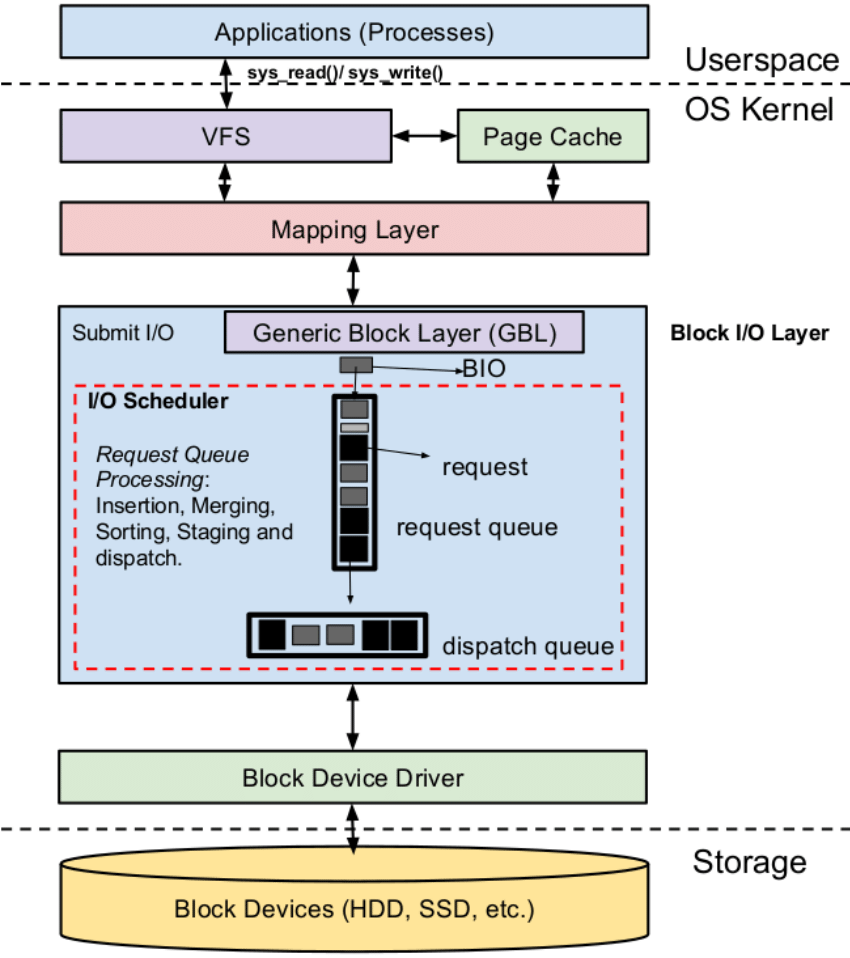
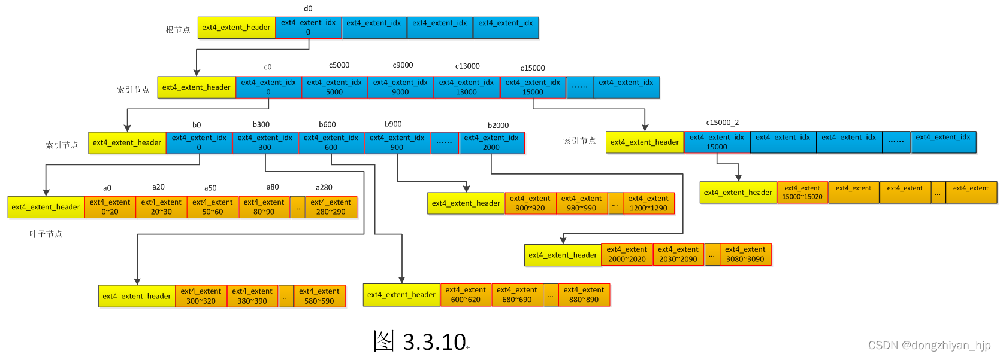
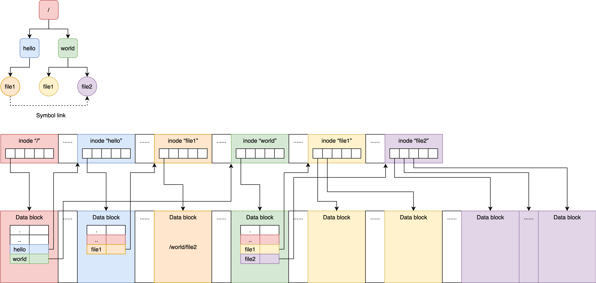
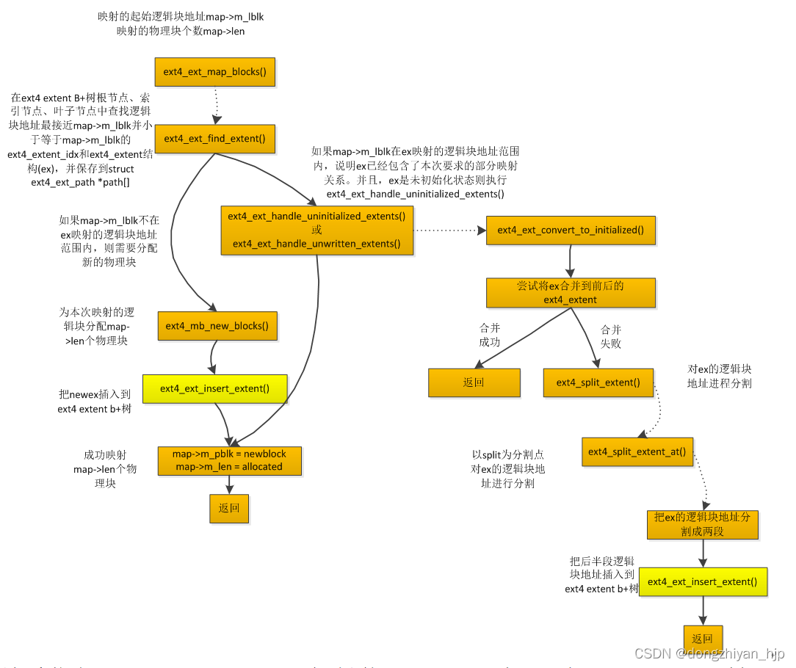
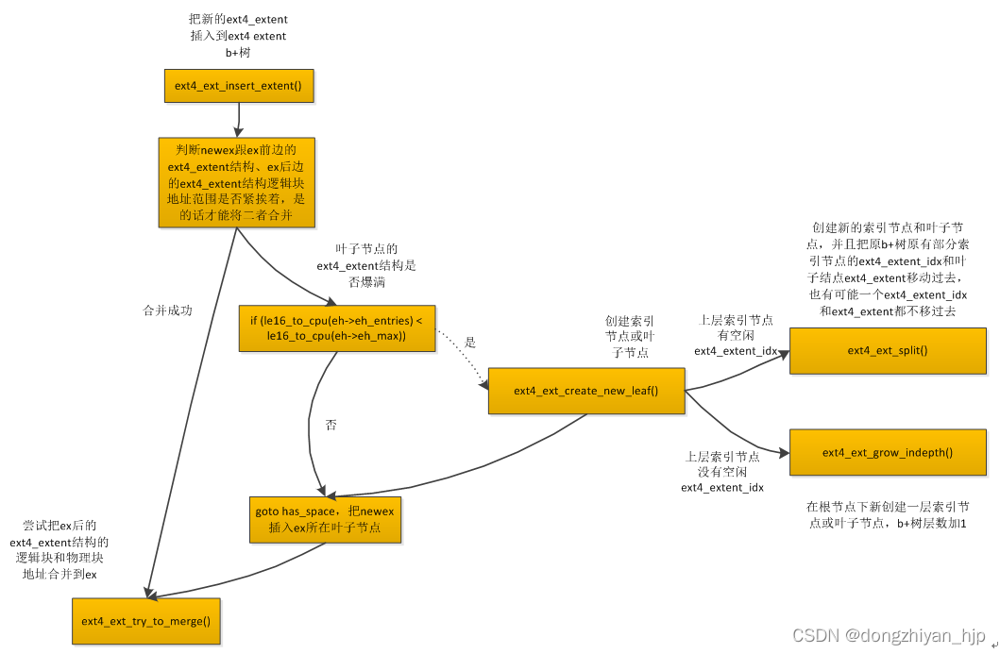
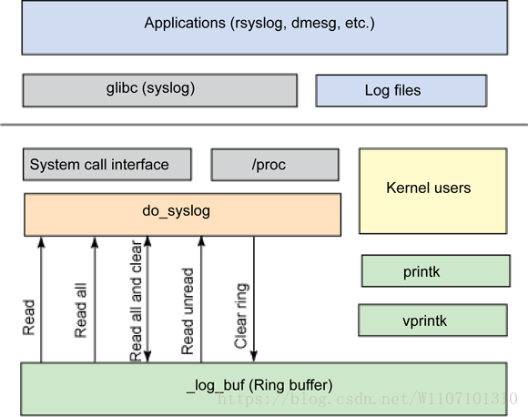
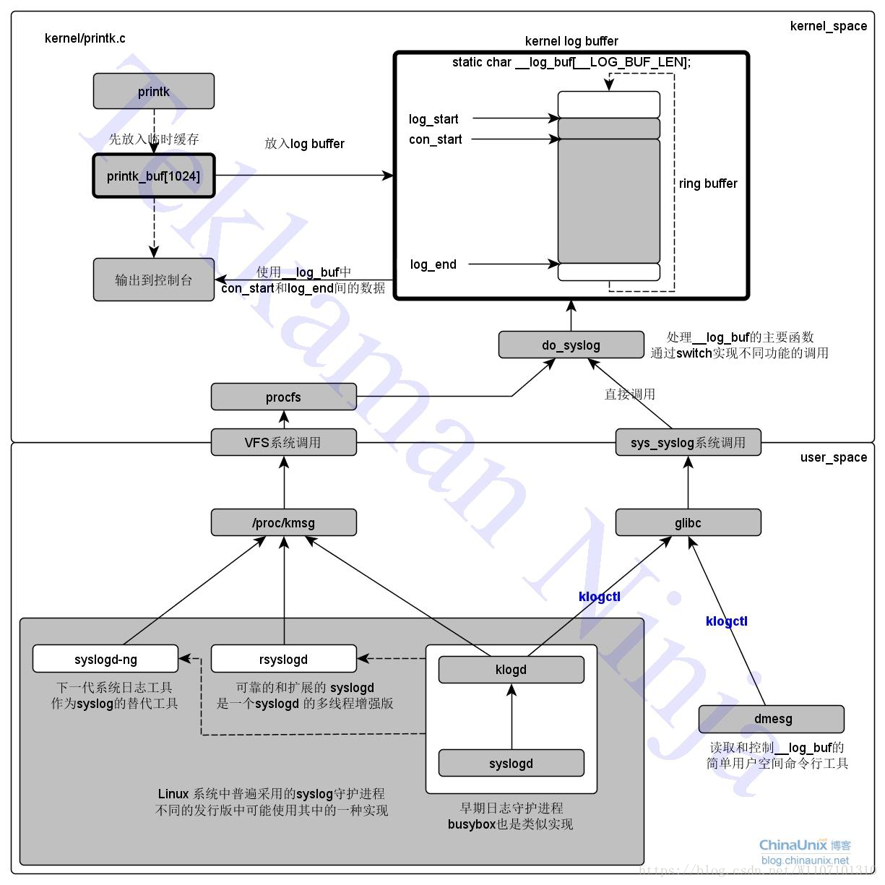

* [File Management](#File-Management)
    * [inode](#inode)
    * [extent](#extent)
    * [block group](#block-group)
    * [directory](#directory)
    * [hard/symbolic link](#hardsymbolic-link)
    * [vfs](#vfs)
    * [mount](#mount)
    * [alloc_file](#alloc_file)
    * [open](#open)
        * [link_path_walk](#link_path_walk)
        * [open_last_lookups](#open_last_lookups)
    * [read-write](#read-write)
        * [direct_IO](#direct_IO)
        * [buffered write](#buffered-write)
            * [bdi_wq](#bdi_wq)
        * [buffered read](#buffered-read)
    * [writeback](#writeback)
    * [coredump](#coredump)
    * [alloc_fd](#alloc_fd)

* [FS](#FS)
    * [overlay](#overlay)
    * [ex4](#ext4)
    * [proc](#proc)

* [IO](#IO)
    * [kobject](#kobject)
    * [char dev](#char-dev)
        * [insmod char dev](#insmod-char-dev)
        * [dev_fs_type](#dev_fs_type)
        * [mount char dev](#mount-char-dev)
        * [mknod char dev](#mknod-char-dev)
        * [open char dev](#open-char-dev)
        * [write char dev](#write-char-dev)
        * [ioctl](#ioctl)
    * [block dev](#block-dev)
        * [inode_hashtable](#inode_hashtable)
        * [mount blk dev](#mount-blk-dev)
            * [ext4_get_tree](#ext4_get_tree)
    * [direct io](#direct-iO)
        * [dio_get_page](#dio_get_page)
        * [get_more_blocks](#get_more_blocks)
        * [submit_page_section](#submit_page_section)
    * [wb_workfn](#wb_workfn)
    * [submit_bio](#submit_bio)
        * [make_request_fn](#make_request_fn)
        * [request_fn](#request_fn)
    * [init request_queue](#init-request_queue)
    * [blk_plug](#blk_plug)
    * [call graph](#call-graph-io)

* [[译] Linux 异步 I/O 框架 io_uring：基本原理、程序示例与性能压测（2020）](http://arthurchiao.art/blog/intro-to-io-uring-zh/)
    * [An Introduction to the io_uring Asynchronous I/O Framework, Oracle, 2020](https://medium.com/oracledevs/an-introduction-to-the-io-uring-asynchronous-i-o-framework-fad002d7dfc1)
    * [How io_uring and eBPF Will Revolutionize Programming in Linux, ScyllaDB, 2020](https://thenewstack.io/how-io_uring-and-ebpf-will-revolutionize-programming-in-linux)


---



---

* [git.block](https://git.kernel.org/pub/scm/linux/kernel/git/axboe/linux.git)
* [lore.block](https://lore.kernel.org/linux-block/)

# File Management


* [Kernel Doc: Filesystems](https://docs.kernel.org/filesystems/index.html)
    * [VFS iomap](https://docs.kernel.org/filesystems/iomap/index.html)

```c
register_filesystem(&ext4_fs_type);

struct file {
  struct path                   f_path;
  struct inode                  *f_inode;  /* cached value */
  const struct file_operations  *f_op;
  struct address_space          *f_mapping;
  void*                         private_data; /* for special inode */

  spinlock_t                    f_lock;
  enum rw_hint                  f_write_hint;
  atomic_long_t                 f_count;
  unsigned int                  f_flags;
  fmode_t                       f_mode;
  loff_t                        f_pos;
  struct mutex                  f_pos_lock;
  struct fown_struct            f_owner;

  /* Used by fs/eventpoll.c to link all the hooks to this file */
  struct list_head              f_ep_links;
  struct list_head              f_tfile_llink;

  errseq_t                      f_wb_err;
  union {
      struct llist_node         fu_llist;
      struct rcu_head           fu_rcuhead;
  } f_u;
};

struct path {
  struct vfsmount               *mnt;
  struct dentry                 *dentry;
};

struct vfsmount {
  struct dentry                 *mnt_root;  /* root of the mounted tree */
  struct super_block            *mnt_sb;    /* pointer to superblock */
  int                           mnt_flags;
};

/* memroy chache of dirctories and files associated inode and file */
struct dentry {
  unsigned int                    d_flags;
  struct dentry                   *d_parent;
  struct inode                    *d_inode;
  struct super_block              *d_sb;
  const struct dentry_operations  *d_op;

  struct hlist_bl_node            d_hash;  /* lookup hash list */
  union {
    struct list_head              d_lru;   /* LRU list */
    wait_queue_head_t             *d_wait; /* in-lookup ones only */
  };
  struct qstr                     d_name;
  unsigned char                   d_iname[DNAME_INLINE_LEN];
  struct list_head                d_child;
  struct list_head                d_subdirs;
};

struct mount {
  struct hlist_node     mnt_hash;
  struct mount          *mnt_parent;
  struct dentry         *mnt_mountpoint;
  struct vfsmount       mnt;

  union {
    struct rcu_head     mnt_rcu;
    struct llist_node   mnt_llist;
  };

  struct list_head      mnt_mounts;  /* list of children, anchored here */
  struct list_head      mnt_child;   /* and going through their mnt_child */
  struct list_head      mnt_instance;/* mount instance on sb->s_mounts */
  const char*           mnt_devname;/* Name of device e.g. /dev/dsk/hda1 */
  struct list_head      mnt_list;
  struct mountpoint*    mnt_mp;     /* where is it mounted */

  struct list_head      mnt_expire; /* link in fs-specific expiry list */
  struct list_head      mnt_share; /* circular list of shared mounts */
  struct list_head      mnt_slave_list;/* list of slave mounts */
  struct list_head      mnt_slave; /* slave list entry */
  struct mount*         mnt_master; /* slave is on master->mnt_slave_list */
  struct mnt_namespace* mnt_ns; /* containing namespace */
};

struct mountpoint {
  struct hlist_node   m_hash;
  struct dentry       *m_dentry;
  struct hlist_head   m_list;
  int m_count;
};
```

## inode
```c
struct inode {
  const struct inode_operations   *i_op;
  struct super_block              *i_sb;
  struct address_space            *i_mapping;

  union {
    const struct file_operations  *i_fop;  /* former ->i_op->default_file_ops */
    void (*free_inode)(struct inode *);
  };

  dev_t                     i_rdev;
  struct list_head          i_devices;

  union {
    struct pipe_inode_info  *i_pipe;
    struct block_device     *i_bdev;
    struct cdev             *i_cdev;
    char                    *i_link;
    unsigned                i_dir_seq;
  };

  umode_t           i_mode;
  unsigned short    i_opflags;
  kuid_t            i_uid;
  kgid_t            i_gid;
  unsigned int      i_flags;

  unsigned long     dirtied_when;  /* jiffies of first dirtying */
  unsigned long     dirtied_time_when;

  struct hlist_node     i_hash;
  struct list_head      i_io_list; /* backing dev IO list */
  struct bdi_writeback  *i_wb;     /* the associated cgroup wb */

  struct file_lock_context  *i_flctx;
  struct address_space      i_data;
};

#define  EXT4_NDIR_BLOCKS    12
#define  EXT4_IND_BLOCK      EXT4_NDIR_BLOCKS
#define  EXT4_DIND_BLOCK     (EXT4_IND_BLOCK + 1)
#define  EXT4_TIND_BLOCK     (EXT4_DIND_BLOCK + 1)
#define  EXT4_N_BLOCKS       (EXT4_TIND_BLOCK + 1)

struct ext4_inode {
  __le16  i_mode;         /* File mode */
  __le16  i_uid;          /* Low 16 bits of Owner Uid */
  __le32  i_size_lo;      /* Size in bytes */
  __le32  i_atime;        /* Access time */
  __le32  i_ctime;        /* Inode Change time */
  __le32  i_mtime;        /* Modification time */
  __le32  i_dtime;        /* Deletion Time */
  __le16  i_gid;          /* Low 16 bits of Group Id */
  __le16  i_links_count;  /* Links count */
  __le32  i_blocks_lo;    /* Blocks count */
  __le32  i_flags;         /* File flags */

  __le32  i_block[EXT4_N_BLOCKS]  /* Pointers to blocks */
  __le32  i_generation;           /* File version (for NFS) */
  __le32  i_file_acl_lo;           /* File ACL */
  __le32  i_size_high;
};
```


## hard/symbolic link
```c
 ln [args] [dst] [src]
```


## vfs


## init_rootfs

```c
struct file_system_type rootfs_fs_type = {
    .name               = "rootfs",
    .init_fs_context    = rootfs_init_fs_context,
    .kill_sb            = kill_litter_super,
};

start_kernel() {
    vfs_caches_init(void) {
        names_cachep = kmem_cache_create_usercopy("names_cache", PATH_MAX, 0,
                SLAB_HWCACHE_ALIGN|SLAB_PANIC, 0, PATH_MAX, NULL);

        dcache_init();
        inode_init();
        files_init();
        files_maxfiles_init();

        mnt_init() {
            int err;

            mnt_cache = kmem_cache_create("mnt_cache", sizeof(struct mount),
                    0, SLAB_HWCACHE_ALIGN|SLAB_PANIC|SLAB_ACCOUNT, NULL);

            mount_hashtable = alloc_large_system_hash("Mount-cache",
                        sizeof(struct hlist_head),
                        mhash_entries, 19,
                        HASH_ZERO,
                        &m_hash_shift, &m_hash_mask, 0, 0);
            mountpoint_hashtable = alloc_large_system_hash("Mountpoint-cache",
                        sizeof(struct hlist_head),
                        mphash_entries, 19,
                        HASH_ZERO,
                        &mp_hash_shift, &mp_hash_mask, 0, 0);

            kernfs_init();

            err = sysfs_init();
            fs_kobj = kobject_create_and_add("fs", NULL);

            shmem_init();

            init_rootfs();
            init_mount_tree() {
                struct vfsmount *mnt;
                struct mount *m;
                struct mnt_namespace *ns;
                struct path root;

                mnt = vfs_kern_mount(&rootfs_fs_type, 0, "rootfs", NULL) {
                    struct fs_context *fc;
                    struct vfsmount *mnt;
                    int ret = 0;

                    fc = fs_context_for_mount(type, flags) {
                        fc = kzalloc(sizeof(struct fs_context), GFP_KERNEL_ACCOUNT);
                        if (!fc)
                            return ERR_PTR(-ENOMEM);

                        fc->purpose     = purpose;
                        fc->sb_flags    = sb_flags;
                        fc->sb_flags_mask = sb_flags_mask;
                        fc->fs_type     = get_filesystem(fs_type);
                        fc->cred        = get_current_cred();
                        fc->net_ns      = get_net(current->nsproxy->net_ns);
                        fc->log.prefix  = fs_type->name;

                        init_fs_context = fc->fs_type->init_fs_context;
                        ret = init_fs_context(fc) {
                            rootfs_init_fs_context(struct fs_context *fc) {
                                if (IS_ENABLED(CONFIG_TMPFS) && is_tmpfs) {
                                    return shmem_init_fs_context(fc) {
                                        struct shmem_options *ctx;

                                        ctx = kzalloc(sizeof(struct shmem_options), GFP_KERNEL);

                                        ctx->mode = 0777 | S_ISVTX;
                                        ctx->uid = current_fsuid();
                                        ctx->gid = current_fsgid();

                                        fc->fs_private = ctx;
                                        fc->ops = &shmem_fs_context_ops = {
                                            .free               = shmem_free_fc,
                                            .get_tree           = shmem_get_tree,
                                            .parse_monolithic   = shmem_parse_options,
                                            .parse_param        = shmem_parse_one,
                                            .reconfigure        = shmem_reconfigure,
                                        };
                                        return 0;
                                    }
                                }

                                return ramfs_init_fs_context(fc) {
                                    struct ramfs_fs_info *fsi;

                                    fsi = kzalloc(sizeof(*fsi), GFP_KERNEL);
                                    fsi->mount_opts.mode = RAMFS_DEFAULT_MODE;
                                    fc->s_fs_info = fsi;
                                    fc->ops = &ramfs_context_ops = {
                                        .free           = ramfs_free_fc,
                                        .parse_param    = ramfs_parse_param,
                                        .get_tree       = ramfs_get_tree,
                                    };
                                }
                            }
                        }

                    }
                    if (name)
                        ret = vfs_parse_fs_string(fc, "source", name, strlen(name));
                    if (!ret)
                        ret = parse_monolithic_mount_data(fc, data);

                    if (!ret) {
                        mnt = fc_mount(fc) {
                            int err = vfs_get_tree(fc) {
                                shmem_get_tree(struct fs_context *fc);

                                ramfs_get_tree();
                            }
                            if (!err) {
                                up_write(&fc->root->d_sb->s_umount);
                                return vfs_create_mount(fc);
                            }
                            return ERR_PTR(err);
                        }
                    } else {
                        mnt = ERR_PTR(ret);
                    }

                    put_fs_context(fc);
                    return mnt;
                }
                ns = alloc_mnt_ns(&init_user_ns, false);
                m = real_mount(mnt);
                ns->root = m;
                ns->nr_mounts = 1;
                mnt_add_to_ns(ns, m);
                init_task.nsproxy->mnt_ns = ns;
                get_mnt_ns(ns);

                root.mnt = mnt;
                root.dentry = mnt->mnt_root;
                mnt->mnt_flags |= MNT_LOCKED;

                set_fs_pwd(current->fs, &root);
                set_fs_root(current->fs, &root);
            }
        }

        bdev_cache_init();
        chrdev_init();
    }
}
```

## mount


* [Kernel Doc: Filesystem Mount API](https://github.com/torvalds/linux/blob/master/Documentation/filesystems/mount_api.rst)

**Call stack**

```c
mount(dev_name, dir_name, type, flags, data) {
    copy_mount_string(); /* type, dev_name, data */
    do_mount() {
        struct path path;
        user_path_at(&path) { /* search the path by name */
            user_path_at_empty() {
                filename_lookup() {
                    path_lookupat() {
                        path_init(nd, flags);
                        link_path_walk();
                        lookup_last();
                    }
                }
            }
        }

        path_mount(&path) {
            do_new_mount() {
                struct file_system_type *type = get_fs_type(fstype);
                struct fs_context *fc = fs_context_for_mount(type, sb_flags);

                vfs_parse_fs_string();

                /* Get the mountable root */
                vfs_get_tree(fc) {
                    fc->ops->get_tree(fc); /* ext4_get_tree */
                    struct super_block *sb = fc->root->d_sb;
                }

                do_new_mount_fc(fc, path, mnt_flags) {
                    struct vfsmount *mnt = vfs_create_mount(fc) {
                        struct mount *mnt = alloc_vfsmnt(fc->source ?: "none");
                        mnt->mnt.mnt_sb         = fc->root->d_sb;
                        mnt->mnt.mnt_root       = dget(fc->root);
                        mnt->mnt_mountpoint     = mnt->mnt.mnt_root;
                        mnt->mnt_parent         = mnt;
                        list_add_tail(&mnt->mnt_instance, &mnt->mnt.mnt_sb->s_mounts);
                    }
                    /* lookup the mnt in mount_hashtable and lock it*/
                    struct mountpoint *mp = lock_mount(mountpoint);
                    do_add_mount(real_mount(mnt), mp, mountpoint, mnt_flags) {
                        struct mount *parent = real_mount(path->mnt);
                        graft_tree(newmnt, parent, mp) {
                            attach_recursive_mnt(mnt, p, mp, false) {
                                mnt_set_mountpoint(dest_mnt, dest_mp, source_mnt) {
                                    child_mnt->mnt_mountpoint = mp->m_dentry;
                                    child_mnt->mnt_parent = mnt;
                                    child_mnt->mnt_mp = mp;
                                    hlist_add_head(&child_mnt->mnt_mp_list, &mp->m_list);
                                }
                                commit_tree(source_mnt) {
                                    mnt_add_to_ns();
                                    list_add_tail(&mnt->mnt_child, &parent->mnt_mounts);
                                }
                            }
                        }
                    }
                }
            }

            do_reconfigure_mnt() {

            }

            do_remount() {

            }

            do_loopback() {

            }

            do_change_type() {

            }

            do_move_mount_old() {

            }
        }
    }
}

```

```c
YSCALL_DEFINE5(mount, char __user *, dev_name, char __user *, dir_name,
    char __user *, type, unsigned long, flags, void __user *, data)
{
    int ret;
    char *kernel_type;
    char *kernel_dev;
    void *options;

    kernel_type = copy_mount_string(type);
    kernel_dev = copy_mount_string(dev_name);
    options = copy_mount_options(data);

    ret = do_mount(kernel_dev, dir_name, kernel_type, flags, options);

    return ret;
}

long do_mount(const char *dev_name, const char __user *dir_name,
    const char *type_page, unsigned long flags, void *data_page)
{
    struct path path;
    int ret;

    ret = user_path_at(AT_FDCWD, dir_name, LOOKUP_FOLLOW, &path);
    ret = path_mount(dev_name, &path, type_page, flags, data_page);
    path_put(&path);
    return ret;
}

int path_mount(const char *dev_name, struct path *path,
    const char *type_page, unsigned long flags, void *data_page)
{
    unsigned int mnt_flags = 0, sb_flags;
    int ret;

    /* Discard magic */
    if ((flags & MS_MGC_MSK) == MS_MGC_VAL)
        flags &= ~MS_MGC_MSK;

    /* Default to relatime unless overriden */
    if (!(flags & MS_NOATIME))
        mnt_flags |= MNT_RELATIME;

    /* Separate the per-mountpoint flags */
    if (flags & MS_NOSUID)
        mnt_flags |= MNT_NOSUID;
    if (flags & MS_NODEV)
        mnt_flags |= MNT_NODEV;
    if (flags & MS_NOEXEC)
        mnt_flags |= MNT_NOEXEC;
    if (flags & MS_NOATIME)
        mnt_flags |= MNT_NOATIME;
    if (flags & MS_NODIRATIME)
        mnt_flags |= MNT_NODIRATIME;
    if (flags & MS_STRICTATIME)
        mnt_flags &= ~(MNT_RELATIME | MNT_NOATIME);
    if (flags & MS_RDONLY)
        mnt_flags |= MNT_READONLY;
    if (flags & MS_NOSYMFOLLOW)
        mnt_flags |= MNT_NOSYMFOLLOW;

    /* The default atime for remount is preservation */
    if ((flags & MS_REMOUNT) &&
        ((flags & (MS_NOATIME | MS_NODIRATIME | MS_RELATIME |
            MS_STRICTATIME)) == 0)) {
        mnt_flags &= ~MNT_ATIME_MASK;
        mnt_flags |= path->mnt->mnt_flags & MNT_ATIME_MASK;
    }

    sb_flags = flags & (SB_RDONLY |
            SB_SYNCHRONOUS |
            SB_MANDLOCK |
            SB_DIRSYNC |
            SB_SILENT |
            SB_POSIXACL |
            SB_LAZYTIME |
            SB_I_VERSION);

    if ((flags & (MS_REMOUNT | MS_BIND)) == (MS_REMOUNT | MS_BIND))
        return do_reconfigure_mnt(path, mnt_flags);
    if (flags & MS_REMOUNT)
        return do_remount(path, flags, sb_flags, mnt_flags, data_page);
    if (flags & MS_BIND)
        return do_loopback(path, dev_name, flags & MS_REC);
    if (flags & (MS_SHARED | MS_PRIVATE | MS_SLAVE | MS_UNBINDABLE))
        return do_change_type(path, flags);
    if (flags & MS_MOVE)
        return do_move_mount_old(path, dev_name);

    return do_new_mount(path, type_page, sb_flags, mnt_flags, dev_name,
          data_page);
}
```

### do_new_mount

```c
int do_new_mount(struct path *path, const char *fstype, int sb_flags,
      int mnt_flags, const char *name, void *data)
{
    struct file_system_type *type;
    struct fs_context *fc;
    const char *subtype = NULL;
    int err = 0;

    type = get_fs_type(fstype) {
        struct file_system_type *fs;
        const char *dot = strchr(name, '.');
        int len = dot ? dot - name : strlen(name);

        fs = __get_fs_type(name, len) {
            struct file_system_type *fs;

            read_lock(&file_systems_lock);
            ret = find_filesystem(name, len) {
                struct file_system_type **p;
                for (p = &file_systems; *p; p = &(*p)->next)
                    if (strncmp((*p)->name, name, len) == 0 && !(*p)->name[len])
                        break;
                return p;
            }
            fs = *(ret);
            if (fs && !try_module_get(fs->owner))
                fs = NULL;
            read_unlock(&file_systems_lock);
            return fs;
        }
        if (!fs && (request_module("fs-%.*s", len, name) == 0)) {
            fs = __get_fs_type(name, len);
            if (!fs)
                pr_warn_once("request_module fs-%.*s succeeded, but still no fs?\n", len, name);
        }

        if (dot && fs && !(fs->fs_flags & FS_HAS_SUBTYPE)) {
            put_filesystem(fs);
            fs = NULL;
        }
        return fs;
    }
    if (!type)
        return -ENODEV;

    if (type->fs_flags & FS_HAS_SUBTYPE) {
        subtype = strchr(fstype, '.');
        if (subtype) {
            subtype++;
        }
        if (!*subtype) {
            put_filesystem(type);
            return -EINVAL;
        }
    }

    fc = fs_context_for_mount(type, sb_flags) {
        fc = kzalloc(sizeof(struct fs_context));
        fc->purpose     = purpose;
        fc->sb_flags    = sb_flags;
        fc->sb_flags_mask = sb_flags_mask;
        fc->fs_type     = get_filesystem(fs_type);
        fc->cred        = get_current_cred();
        fc->net_ns      = get_net(current->nsproxy->net_ns);
        fc->log.prefix  = fs_type->name;

        mutex_init(&fc->uapi_mutex);

        switch (purpose) {
        case FS_CONTEXT_FOR_MOUNT:
            fc->user_ns = get_user_ns(fc->cred->user_ns);
            break;
        case FS_CONTEXT_FOR_SUBMOUNT:
            fc->user_ns = get_user_ns(reference->d_sb->s_user_ns);
        }

        init_fs_context = fc->fs_type->init_fs_context;
        if (!init_fs_context)
            init_fs_context = legacy_init_fs_context;
        ret = init_fs_context(fc) {
            legacy_init_fs_context() {
                fc->fs_private = kzalloc(sizeof(struct legacy_fs_context), GFP_KERNEL_ACCOUNT);
                fc->ops = &legacy_fs_context_ops {
                    .free               = legacy_fs_context_free,
                    .dup                = legacy_fs_context_dup,
                    .parse_param        = legacy_parse_param,
                    .parse_monolithic   = legacy_parse_monolithic,
                    .get_tree           = legacy_get_tree,
                    .reconfigure        = legacy_reconfigure,
                };
            }

            ext4_init_fs_context(struct fs_context *fc) {
                struct ext4_fs_context *ctx;

                ctx = kzalloc(sizeof(struct ext4_fs_context), GFP_KERNEL);
                if (!ctx)
                    return -ENOMEM;

                fc->fs_private = ctx;
                fc->ops = &ext4_context_ops = {
                    .parse_param    = ext4_parse_param,
                    .get_tree       = ext4_get_tree,
                    .reconfigure    = ext4_reconfigure,
                    .free           = ext4_fc_free,
                };
            }

            shmem_init_fs_context(struct fs_context *fc) {
                struct shmem_options *ctx;

                ctx = kzalloc(sizeof(struct shmem_options), GFP_KERNEL);
                if (!ctx)
                    return -ENOMEM;

                ctx->mode = 0777 | S_ISVTX;
                ctx->uid = current_fsuid();
                ctx->gid = current_fsgid();

                fc->fs_private = ctx;
                fc->ops = &shmem_fs_context_ops = {
                    .free               = shmem_free_fc,
                    .get_tree           = shmem_get_tree,
                    .parse_monolithic   = shmem_parse_options,
                    .parse_param        = shmem_parse_one,
                    .reconfigure        = shmem_reconfigure,
                };
            }
        }

        ret = legacy_init_fs_context() {
            fc->fs_private = kzalloc(sizeof(struct legacy_fs_context), GFP_KERNEL_ACCOUNT);
            if (!fc->fs_private)
                return -ENOMEM;
            fc->ops = &legacy_fs_context_ops {
                .free               = legacy_fs_context_free,
                .dup                = legacy_fs_context_dup,
                .parse_param        = legacy_parse_param,
                .parse_monolithic   = legacy_parse_monolithic,
                .get_tree           = legacy_get_tree() {
                    struct legacy_fs_context *ctx = fc->fs_private;
                    struct super_block *sb;
                    struct dentry *root;

                    root = fc->fs_type->mount(fc->fs_type, fc->sb_flags,
                        fc->source, ctx->legacy_data) {

                        public_dev_mount() {

                        }
                    }

                    if (IS_ERR(root))
                        return PTR_ERR(root);

                    sb = root->d_sb;
                    BUG_ON(!sb);

                    fc->root = root;
                    return 0;
                },
                .reconfigure        = legacy_reconfigure,
            }
            return 0;
        }
    }

    if (subtype)
        err = vfs_parse_fs_string(fc, "subtype", subtype, strlen(subtype));
    if (!err && name)
        err = vfs_parse_fs_string(fc, "source", name, strlen(name));
    if (!err)
        err = parse_monolithic_mount_data(fc, data);
    if (!err && !mount_capable(fc))
        err = -EPERM;

    if (!err) {
        /* Get the mountable root */
        err = vfs_get_tree(fc) {
            struct super_block *sb;
            int error;
            /* Get the mountable root in fc->root */
            error = fc->ops->get_tree(fc) {
                ext4_get_tree() {
                    get_tree_bdev(fc, ext4_fill_super) {
                        fc->root = dget(s->s_root);
                    }
                }

                shmem_get_tree() {
                    get_tree_nodev(fc, shmem_fill_super) {
                        vfs_get_super(fc, NULL, fill_super) {
                            fc->root = dget(sb->s_root);
                        }
                    }
                }
            }
            sb = fc->root->d_sb;
            sb->s_flags |= SB_BORN;
        }
    }
    if (!err)
        err = do_new_mount_fc(fc, path, mnt_flags);

    put_fs_context(fc);
    return err;
}

/* Create a new mount using a superblock configuration and request it
 * be added to the namespace tree. */
static int do_new_mount_fc(struct fs_context *fc, struct path *mountpoint,
         unsigned int mnt_flags)
{
    struct vfsmount *mnt;
    struct mountpoint *mp;
    struct super_block *sb = fc->root->d_sb;
    int error;

    mnt = vfs_create_mount(fc) {
        struct mount *mnt;
        struct user_namespace *fs_userns;

        if (!fc->root)
            return ERR_PTR(-EINVAL);

        mnt = alloc_vfsmnt(fc->source ?: "none");
        if (!mnt)
            return ERR_PTR(-ENOMEM);

        if (fc->sb_flags & SB_KERNMOUNT)
            mnt->mnt.mnt_flags = MNT_INTERNAL;

        atomic_inc(&fc->root->d_sb->s_active);
        mnt->mnt.mnt_sb    = fc->root->d_sb;
        mnt->mnt.mnt_root  = dget(fc->root);
        mnt->mnt_mountpoint  = mnt->mnt.mnt_root;
        mnt->mnt_parent    = mnt;

        fs_userns = mnt->mnt.mnt_sb->s_user_ns;
        if (!initial_idmapping(fs_userns))
            mnt->mnt.mnt_userns = get_user_ns(fs_userns);

        lock_mount_hash();
        list_add_tail(&mnt->mnt_instance, &mnt->mnt.mnt_sb->s_mounts);
        unlock_mount_hash();
        return &mnt->mnt;
    }

    mnt_warn_timestamp_expiry(mountpoint, mnt);

    mp = lock_mount(mountpoint);
    if (IS_ERR(mp)) {
        mntput(mnt);
        return PTR_ERR(mp);
    }

    /* add a mount into a namespace's mount tree */
    error = do_add_mount(real_mount(mnt)/*newmnt*/, mp, mountpoint/*path*/, mnt_flags) {
        struct mount *parent = real_mount(path->mnt);

        mnt_flags &= ~MNT_INTERNAL_FLAGS;

        /* Refuse the same filesystem on the same mount point */
        if (path->mnt->mnt_sb == newmnt->mnt.mnt_sb
            && path->mnt->mnt_root == path->dentry)
            return -EBUSY;

        if (d_is_symlink(newmnt->mnt.mnt_root))
            return -EINVAL;

        newmnt->mnt.mnt_flags = mnt_flags;
        return graft_tree(newmnt/*mnt*/, parent/*p*/, mp) {
            if (mnt->mnt.mnt_sb->s_flags & SB_NOUSER)
                return -EINVAL;

            if (d_is_dir(mp->m_dentry) != d_is_dir(mnt->mnt.mnt_root))
                return -ENOTDIR;

            return attach_recursive_mnt(mnt/*source_mnt*/, p/*top_mnt*/, mp/*dest_mp*/, false/*moving*/) {
                struct user_namespace *user_ns = current->nsproxy->mnt_ns->user_ns;
                beneath = flags & MNT_TREE_BENEATH;
                dest_mnt = (beneath) ? top_mnt->mnt_parent : top_mnt;
                HLIST_HEAD(tree_list);
                struct mnt_namespace *ns = dest_mnt->mnt_ns;
                struct mountpoint *smp;
                struct mount *child, *p;
                struct hlist_node *n;
                int err;

                /* Preallocate a mountpoint in case the new mounts need
                 * to be tucked under other mounts. */
                smp = get_mountpoint(source_mnt->mnt.mnt_root) {
                    struct mountpoint *mp, *new = NULL;
                    int ret;

                    if (d_mountpoint(dentry) { return dentry->d_flags & DCACHE_MOUNTED; }) {
                        /* might be worth a WARN_ON() */
                        if (d_unlinked(dentry))
                            return ERR_PTR(-ENOENT);
                mountpoint:
                        read_seqlock_excl(&mount_lock);
                        mp = lookup_mountpoint(dentry) {
                            struct hlist_head *chain = mp_hash(dentry) {
                                unsigned long tmp = ((unsigned long)dentry / L1_CACHE_BYTES);
                                tmp = tmp + (tmp >> mp_hash_shift);
                                return &mountpoint_hashtable[tmp & mp_hash_mask];
                            }
                            struct mountpoint *mp;

                            hlist_for_each_entry(mp, chain, m_hash) {
                                if (mp->m_dentry == dentry) {
                                    mp->m_count++;
                                    return mp;
                                }
                            }
                            return NULL;
                        }
                        read_sequnlock_excl(&mount_lock);
                        if (mp)
                            goto done;
                    }

                    if (!new)
                        new = kmalloc(sizeof(struct mountpoint), GFP_KERNEL);
                    if (!new)
                        return ERR_PTR(-ENOMEM);


                    /* Exactly one processes may set d_mounted */
                    ret = d_set_mounted(dentry);

                    /* Someone else set d_mounted? */
                    if (ret == -EBUSY)
                        goto mountpoint;

                    /* The dentry is not available as a mountpoint? */
                    mp = ERR_PTR(ret);
                    if (ret)
                        goto done;

                    /* Add the new mountpoint to the hash table */
                    read_seqlock_excl(&mount_lock);
                    new->m_dentry = dget(dentry);
                    new->m_count = 1;
                    hlist_add_head(&new->m_hash, mp_hash(dentry));
                    INIT_HLIST_HEAD(&new->m_list);
                    read_sequnlock_excl(&mount_lock);

                    mp = new;
                    new = NULL;
                done:
                    kfree(new);
                    return mp;
                }
                if (IS_ERR(smp))
                    return PTR_ERR(smp);

                /* Is there space to add these mounts to the mount namespace? */
                if (!moving) {
                    err = count_mounts(ns, source_mnt);
                    if (err)
                        goto out;
                }

                if (IS_MNT_SHARED(dest_mnt)) {
                    err = invent_group_ids(source_mnt, true) {
                        struct mount *p;
                        for (p = mnt; p; p = recurse ? next_mnt(p, mnt) : NULL) {
                            if (!p->mnt_group_id && !IS_MNT_SHARED(p)) {
                                int err = mnt_alloc_group_id(p) {
                                    int res = ida_alloc_min(&mnt_group_ida, 1, GFP_KERNEL);
                                    if (res < 0)
                                        return res;
                                    mnt->mnt_group_id = res;
                                    return 0;
                                }
                                if (err) {
                                    cleanup_group_ids(mnt, p);
                                    return err;
                                }
                            }
                        }

                        return 0;
                    }
                    if (err)
                        goto out;
                    err = propagate_mnt(dest_mnt, dest_mp, source_mnt, &tree_list);
                        --->
                    lock_mount_hash();
                    if (err)
                        goto out_cleanup_ids;
                    for (p = source_mnt; p; p = next_mnt(p, source_mnt))
                        set_mnt_shared(p);
                } else {
                    lock_mount_hash();
                }

                if (moving) {
                    unhash_mnt(source_mnt);
                    attach_mnt(source_mnt, dest_mnt, dest_mp);
                    touch_mnt_namespace(source_mnt->mnt_ns);
                } else {
                    if (source_mnt->mnt_ns) {
                        /* move from anon - the caller will destroy */
                        list_del_init(&source_mnt->mnt_ns->list);
                    }
                    mnt_set_mountpoint(dest_mnt/*mnt*/, dest_mp/*mp*/, source_mnt/*child_mnt*/) {
                        mp->m_count++;
                        mnt_add_count(mnt, 1); /* essentially, that's mntget */
                        child_mnt->mnt_mountpoint = mp->m_dentry;
                        child_mnt->mnt_parent = mnt;
                        child_mnt->mnt_mp = mp;
                        hlist_add_head(&child_mnt->mnt_mp_list, &mp->m_list);
                    }
                    commit_tree(source_mnt/*mnt*/) {
                        struct mount *parent = mnt->mnt_parent;
                        struct mount *m;
                        LIST_HEAD(head);
                        struct mnt_namespace *n = parent->mnt_ns;

                        list_add_tail(&head, &mnt->mnt_list);
                        while (!list_empty(&head)) {
                            m = list_first_entry(&head, typeof(*m), mnt_list);
                            list_del(&m->mnt_list);

                            mnt_add_to_ns(n, m) {
                                struct rb_node **link = &ns->mounts.rb_node;
                                struct rb_node *parent = NULL;

                                mnt->mnt_ns = ns;
                                while (*link) {
                                    parent = *link;
                                    if (mnt->mnt_id_unique < node_to_mount(parent)->mnt_id_unique)
                                        link = &parent->rb_left;
                                    else
                                        link = &parent->rb_right;
                                }
                                rb_link_node(&mnt->mnt_node, parent, link);
                                rb_insert_color(&mnt->mnt_node, &ns->mounts);
                                mnt->mnt.mnt_flags |= MNT_ONRB;
                            }
                        }
                        n->nr_mounts += n->pending_mounts;
                        n->pending_mounts = 0;

                        __attach_mnt(mnt, parent) {
                            hlist_add_head_rcu(
                                &mnt->mnt_hash,
                                m_hash(&parent->mnt, mnt->mnt_mountpoint/*dentry*/) {
                                    unsigned long tmp = ((unsigned long)mnt / L1_CACHE_BYTES);
                                    tmp += ((unsigned long)dentry / L1_CACHE_BYTES);
                                    tmp = tmp + (tmp >> m_hash_shift);
                                    return &mount_hashtable[tmp & m_hash_mask];
                                }
                            );
                            list_add_tail(&mnt->mnt_child, &parent->mnt_mounts);
                        }
                        touch_mnt_namespace(n) {
                            ns->event = ++event;
                            wake_up_interruptible(&ns->poll);
                        }
                    }
                }

                hlist_for_each_entry_safe(child, n, &tree_list, mnt_hash) {
                    struct mount *q;
                    hlist_del_init(&child->mnt_hash);
                    q = __lookup_mnt(&child->mnt_parent->mnt, child->mnt_mountpoint);
                    if (q)
                        mnt_change_mountpoint(child, smp, q);
                    /* Notice when we are propagating across user namespaces */
                    if (child->mnt_parent->mnt_ns->user_ns != user_ns)
                        lock_mnt_tree(child);
                    child->mnt.mnt_flags &= ~MNT_LOCKED;
                    commit_tree(child);
                }
                put_mountpoint(smp);
                unlock_mount_hash();

                return 0;
            }
        }
    }

    return error;
}
```

## alloc_file

```c
struct file *anon_inode_getfile(const char *name,
        const struct file_operations *fops,
        void *priv, int flags)
{
    struct file *file;

    if (IS_ERR(anon_inode_inode))
        return ERR_PTR(-ENODEV);

    if (fops->owner && !try_module_get(fops->owner))
        return ERR_PTR(-ENOENT);

    /* We know the anon_inode inode count is always greater than zero,
    * so ihold() is safe. */
    ihold(anon_inode_inode);
    file = alloc_file_pseudo(anon_inode_inode, anon_inode_mnt, name,
        flags & (O_ACCMODE | O_NONBLOCK), fops) {

        static const struct dentry_operations anon_ops = {
            .d_dname = simple_dname
        };
        struct qstr this = QSTR_INIT(name, strlen(name));
        struct path path;
        struct file *file;

        path.dentry = d_alloc_pseudo(mnt->mnt_sb, &this) {
            struct dentry *dentry = __d_alloc(sb, name) {
                struct external_name *ext = NULL;
                struct dentry *dentry;
                char *dname;
                int err;

                dentry = kmem_cache_alloc(dentry_cache, GFP_KERNEL);
                if (!dentry)
                    return NULL;

                /* We guarantee that the inline name is always NUL-terminated.
                * This way the memcpy() done by the name switching in rename
                * will still always have a NUL at the end, even if we might
                * be overwriting an internal NUL character */
                dentry->d_iname[DNAME_INLINE_LEN-1] = 0;
                if (unlikely(!name)) {
                    name = &slash_name;
                    dname = dentry->d_iname;
                } else if (name->len > DNAME_INLINE_LEN-1) {
                    size_t size = offsetof(struct external_name, name[1]);

                    ext = kmalloc(size + name->len, GFP_KERNEL_ACCOUNT);
                    if (!ext) {
                    kmem_cache_free(dentry_cache, dentry);
                    return NULL;
                    }
                    atomic_set(&ext->u.count, 1);
                    dname = ext->name;
                } else  {
                    dname = dentry->d_iname;
                }

                dentry->d_name.len = name->len;
                dentry->d_name.hash = name->hash;
                memcpy(dname, name->name, name->len);
                dname[name->len] = 0;

                /* Make sure we always see the terminating NUL character */
                smp_store_release(&dentry->d_name.name, dname); /* ^^^ */

                dentry->d_lockref.count = 1;
                dentry->d_flags = 0;
                spin_lock_init(&dentry->d_lock);
                seqcount_init(&dentry->d_seq);
                dentry->d_inode = NULL;
                dentry->d_parent = dentry;
                dentry->d_sb = sb;
                dentry->d_op = NULL;
                dentry->d_fsdata = NULL;
                INIT_HLIST_BL_NODE(&dentry->d_hash);
                INIT_LIST_HEAD(&dentry->d_lru);
                INIT_LIST_HEAD(&dentry->d_subdirs);
                INIT_HLIST_NODE(&dentry->d_u.d_alias);
                INIT_LIST_HEAD(&dentry->d_child);
                d_set_d_op(dentry, dentry->d_sb->s_d_op);

                if (dentry->d_op && dentry->d_op->d_init) {
                    err = dentry->d_op->d_init(dentry);
                    if (err) {
                    if (dname_external(dentry))
                        kfree(external_name(dentry));
                    kmem_cache_free(dentry_cache, dentry);
                    return NULL;
                    }
                }

                if (unlikely(ext)) {
                    pg_data_t *pgdat = page_pgdat(virt_to_page(ext));
                    mod_node_page_state(pgdat, NR_INDIRECTLY_RECLAIMABLE_BYTES, ksize(ext));
                }

                this_cpu_inc(nr_dentry);

                return dentry;
            }
            if (likely(dentry))
                dentry->d_flags |= DCACHE_NORCU;
            return dentry;
        }
        if (!path.dentry)
            return ERR_PTR(-ENOMEM);
        if (!mnt->mnt_sb->s_d_op)
            d_set_d_op(path.dentry, &anon_ops);
        path.mnt = mntget(mnt);

        d_instantiate(path.dentry, inode) {
            unsigned add_flags = d_flags_for_inode(inode);
            WARN_ON(d_in_lookup(dentry));

            spin_lock(&dentry->d_lock);
            if (dentry->d_flags & DCACHE_LRU_LIST)
                this_cpu_dec(nr_dentry_negative);
            hlist_add_head(&dentry->d_u.d_alias, &inode->i_dentry);
            raw_write_seqcount_begin(&dentry->d_seq);
            __d_set_inode_and_type(dentry, inode, add_flags) {
                dentry->d_inode = inode;
                flags = READ_ONCE(dentry->d_flags);
                flags &= ~DCACHE_ENTRY_TYPE;
                flags |= type_flags;
                smp_store_release(&dentry->d_flags, flags);
            }
            raw_write_seqcount_end(&dentry->d_seq);
            fsnotify_update_flags(dentry);
            spin_unlock(&dentry->d_lock);
        }

        file = alloc_file(&path, flags, fops) {
            struct file *file;
            file = alloc_empty_file(flags, current_cred()) {
                static long old_max;
                struct file *f;

                /* Privileged users can go above max_files */
                if (get_nr_files() >= files_stat.max_files && !capable(CAP_SYS_ADMIN)) {
                    /* percpu_counters are inaccurate.  Do an expensive check before
                    * we go and fail. */
                    if (percpu_counter_sum_positive(&nr_files) >= files_stat.max_files)
                    goto over;
                }

                f = __alloc_file(flags, cred) {
                    struct file *f;
                    int error;

                    f = kmem_cache_zalloc(filp_cachep, GFP_KERNEL);
                    if (unlikely(!f))
                        return ERR_PTR(-ENOMEM);

                    f->f_cred = get_cred(cred);
                    error = security_file_alloc(f);
                    if (unlikely(error)) {
                        file_free_rcu(&f->f_u.fu_rcuhead);
                        return ERR_PTR(error);
                    }

                    atomic_long_set(&f->f_count, 1);
                    rwlock_init(&f->f_owner.lock);
                    spin_lock_init(&f->f_lock);
                    mutex_init(&f->f_pos_lock);
                    eventpoll_init_file(f) {
                        INIT_LIST_HEAD(&file->f_ep_links);
                        INIT_LIST_HEAD(&file->f_tfile_llink);
                    }
                    f->f_flags = flags;
                    f->f_mode = OPEN_FMODE(flags);
                    /* f->f_version: 0 */

                    return f;
                }
                if (!IS_ERR(f))
                    percpu_counter_inc(&nr_files);

                return f;

            over:
                /* Ran out of filps - report that */
                if (get_nr_files() > old_max) {
                    pr_info("VFS: file-max limit %lu reached\n", get_max_files());
                    old_max = get_nr_files();
                }
                return ERR_PTR(-ENFILE);
            }
            if (IS_ERR(file))
                return file;

            file->f_path = *path;
            file->f_inode = path->dentry->d_inode;
            file->f_mapping = path->dentry->d_inode->i_mapping;
            file->f_wb_err = filemap_sample_wb_err(file->f_mapping);
            if ((file->f_mode & FMODE_READ) && likely(fop->read || fop->read_iter))
                file->f_mode |= FMODE_CAN_READ;
            if ((file->f_mode & FMODE_WRITE) && likely(fop->write || fop->write_iter))
                file->f_mode |= FMODE_CAN_WRITE;
            file->f_mode |= FMODE_OPENED;
            file->f_op = fop;
            if ((file->f_mode & (FMODE_READ | FMODE_WRITE)) == FMODE_READ)
                i_readcount_inc(path->dentry->d_inode);
            return file;
        }

        if (IS_ERR(file)) {
            ihold(inode);
            path_put(&path);
        }
        return file;
    }
    if (IS_ERR(file))
        goto err;

    file->f_mapping = anon_inode_inode->i_mapping;

    file->private_data = priv;

    return file;

err:
    iput(anon_inode_inode);
    module_put(fops->owner);
    return file;
}
```

```c
anon_inode_getfile();
    alloc_file_pseudo();
        d_alloc_pseudo();
            dentry = kmem_cache_alloc(dentry_cache);
            dentry->d_name.len = name->len;
            dentry->d_name.hash = name->hash;
            entry->d_inode = NULL;
            dentry->d_parent = dentry;
            dentry->d_sb = sb;
            dentry->d_op = NULL;
        d_instantiate(path.dentry, inode);

        alloc_file(&path, flags, fops);
            file = alloc_empty_file();
                f = kmem_cache_zalloc(filp_cachep);
                atomic_long_set(&f->f_count, 1);
                rwlock_init(&f->f_owner.lock);
                spin_lock_init(&f->f_lock);
                mutex_init(&f->f_pos_lock);
                eventpoll_init_file(f);
                f->f_flags = flags;
                f->f_mode = OPEN_FMODE(flags);
            file->f_path = *path;
            file->f_inode = path->dentry->d_inode;
            file->f_mapping = path->dentry->d_inode->i_mapping;
            file->f_mode |= FMODE_CAN_READ;
            file->f_op = fop;

    file->f_mapping = anon_inode_inode->i_mapping;
    file->private_data = priv;


```

## open

```c
do_sys_open() {
    get_unused_fd_flags();
    do_filp_open() {
        path_openat() {
            file = alloc_empty_file();

            path_init(nd, flags) {
                nd->flags = ;
                nd->state |= ;
                nd->root = fs->root;
                if (*s == '/') { /* 1. Absolute pathname */
                    nd->path = nd->root;
                } else if (nd->dfd == AT_FDCWD) { /* 2. Relative pathname */
                    nd->path = fs->pwd;
                } else {

                }
                nd->inode = nd->path.dentry->d_inode;
            }

            link_path_walk(s, nd) { /* Name resolution, turning a pathname into the final dentry */
                for (;;) {
                    /* 1. parse one path component */
                    hash_len = hash_name(nd->path.dentry/*salt*/, name);
                    name += hashlen_len(hash_len);
                    if (unlikely(!*name)) {
                        /* 2. reach the last component */
                        return 0;
                    } else {
                        /* 3. not the last component */
                        link = walk_component(nd, WALK_MORE) {
                            /* 3.1 handle dots */
                            handle_dots();

                            /* 3.2 step into component */
                            step_into() {
                                /* 3.2.1 handle mounts */
                                handle_mounts() {
                                    /* 3.2.1.1 handle mounted dentry */
                                    /* 3.2.1.2 handle automount point */
                                }

                                /* 3.2.2 handle non-symlink */
                                nd->path = path;
                                nd->inode = inode;

                                /* 3.2.3 handle symbol link */
                                pick_link();
                            }
                        }
                    }

                }
            }

            open_last_lookups(nd, file, op) {
                /* 1. search in dcache */
                dentry = lookup_fast(nd);
                /* 2. search in file system */
                dentry = lookup_open(nd, file, op, got_write);

                step_into(nd, WALK_TRAILING, dentry);
            }

            do_open(nd, file, op) {
                vfs_open(&nd->path, file) {
                    do_dentry_open() {
                        f->f_mode = OPEN_FMODE(f->f_flags) | FMODE_LSEEK | FMODE_PREAD | FMODE_PWRITE;
                        path_get(&f->f_path);
                        f->f_inode = inode;
                        f->f_mapping = inode->i_mapping;
                        f->f_op = fops_get(inode->i_fop);

                        f->f_op->open() {
                            ext4_file_open();
                        }
                    }
                }
                handle_truncate();
            }
        }
    }
    fsnotify_open();
    fd_install();
}
```

```c
struct task_struct {
  struct fs_struct      *fs;
  struct files_struct   *files;
  struct nsproxy        *nsproxy;
}

struct files_struct {
  struct file __rcu * fd_array[NR_OPEN_DEFAULT];
};

SYSCALL_DEFINE3(open, const char __user *, filename, int, flags, umode_t, mode);
return do_sys_open(AT_FDCWD/*dfd*/, filename, flags, mode) {
    struct open_flags op;
    struct filename *tmp = getname(filename);
    int fd = get_unused_fd_flags(flags);

    struct file *f = do_filp_open(dfd, tmp, &op) {
        struct nameidata nd;
        int flags = op->lookup_flags;
        struct file *filp;

        filp = path_openat(&nd, op, flags | LOOKUP_RCU) {
            file = alloc_empty_file(op->open_flag, current_cred());

            if (unlikely(file->f_flags & __O_TMPFILE)) {
                error = do_tmpfile(nd, flags, op, file);
            } else if (unlikely(file->f_flags & O_PATH)) {
                error = do_o_path(nd, flags, file);
            } else {
                const char *s = path_init(nd, flags);
                    --->
                while (!(error = link_path_walk(s, nd))
                    && (s = open_last_lookups(nd, file, op)) != NULL) {
                }

                do_open(nd, file, op) {
                    struct user_namespace *mnt_userns;
                    int open_flag = op->open_flag;
                    bool do_truncate;
                    int acc_mode;
                    int error;

                    if (!(file->f_mode & (FMODE_OPENED | FMODE_CREATED))) {
                        error = complete_walk(nd);
                    }
                    if (!(file->f_mode & FMODE_CREATED))
                        audit_inode(nd->name, nd->path.dentry, 0);
                    mnt_userns = mnt_user_ns(nd->path.mnt);
                    if (open_flag & O_CREAT) {
                        if ((open_flag & O_EXCL) && !(file->f_mode & FMODE_CREATED))
                            return -EEXIST;
                        if (d_is_dir(nd->path.dentry))
                            return -EISDIR;
                        error = may_create_in_sticky(mnt_userns, nd, d_backing_inode(nd->path.dentry));
                        if (unlikely(error))
                        return error;
                    }

                    do_truncate = false;
                    acc_mode = op->acc_mode;
                    if (file->f_mode & FMODE_CREATED) {
                        /* Don't check for write permission, don't truncate */
                        open_flag &= ~O_TRUNC;
                        acc_mode = 0;
                    } else if (d_is_reg(nd->path.dentry) && open_flag & O_TRUNC) {
                        error = mnt_want_write(nd->path.mnt);
                        if (error)
                            return error;
                        do_truncate = true;
                    }

                    error = may_open(mnt_userns, &nd->path, acc_mode, open_flag);

                    if (!error && !(file->f_mode & FMODE_OPENED)) {
                        error = vfs_open(&nd->path, file) {
                            struct dentry *dentry = d_real(path->dentry, NULL, file->f_flags, 0);
                            file->f_path = *path;

                            return do_dentry_open(file, d_backing_inode(dentry), NULL, cred) {
                                f->f_mode = OPEN_FMODE(f->f_flags) | FMODE_LSEEK | FMODE_PREAD | FMODE_PWRITE;
                                path_get(&f->f_path);
                                f->f_inode = inode;
                                f->f_mapping = inode->i_mapping;
                                f->f_op = fops_get(inode->i_fop);
                                open = f->f_op->open;
                                error = open(inode, f) {
                                    ext4_file_open();
                                }
                                f->f_flags &= ~(O_CREAT | O_EXCL | O_NOCTTY | O_TRUNC);
                                file_ra_state_init(&f->f_ra, f->f_mapping->host->i_mapping);
                                return 0;
                            }
                        }
                    }
                    if (!error)
                        error = ima_file_check(file, op->acc_mode);
                    if (!error && do_truncate) {
                        error = handle_truncate(mnt_userns, file) {

                        }
                    }
                    if (do_truncate)
                        mnt_drop_write(nd->path.mnt);
                    return error;
                }
                terminate_walk(nd);
            }

            return ERR_PTR(error);
        }

        return filp;
    }

    fsnotify_open(f) {
        __u32 mask = FS_OPEN;

        if (file->f_flags & __FMODE_EXEC)
            mask |= FS_OPEN_EXEC;

        fsnotify_file(file, mask) {
            const struct path *path;

            if (file->f_mode & FMODE_NONOTIFY)
                return 0;

            path = file_real_path(file);
            return fsnotify_parent(path->dentry, mask, path, FSNOTIFY_EVENT_PATH) {
                struct inode *inode = d_inode(dentry);

                if (atomic_long_read(&inode->i_sb->s_fsnotify_connectors) == 0)
                    return 0;

                if (S_ISDIR(inode->i_mode)) {
                    mask |= FS_ISDIR;

                    /* sb/mount marks are not interested in name of directory */
                    if (!(dentry->d_flags & DCACHE_FSNOTIFY_PARENT_WATCHED))
                        goto notify_child;
                }

                if (IS_ROOT(dentry))
                    goto notify_child;

                return __fsnotify_parent(dentry, mask, data, data_type);

            notify_child:
                return fsnotify(mask, data, data_type, NULL, NULL, inode, 0);
            }
        }
    }
    fd_install(fd, f);

    putname(tmp);
    return fd;
}

const struct inode_operations ext4_dir_inode_operations = {
    .create    = ext4_create,
    .lookup    = ext4_lookup
}

const struct file_operations ext4_file_operations = {
    .open    = ext4_file_open,
};
```


### path_init

```c
const char *path_init(struct nameidata *nd, unsigned flags)
{
    int error;
    const char *s = nd->name->name;

    /* LOOKUP_CACHED requires RCU, ask caller to retry */
    if ((flags & (LOOKUP_RCU | LOOKUP_CACHED)) == LOOKUP_CACHED)
        return ERR_PTR(-EAGAIN);

    if (!*s)
        flags &= ~LOOKUP_RCU;
    if (flags & LOOKUP_RCU)
        rcu_read_lock();
    else
        nd->seq = nd->next_seq = 0;

    nd->flags = flags;
    nd->state |= ND_JUMPED;

    nd->m_seq = __read_seqcount_begin(&mount_lock.seqcount);
    nd->r_seq = __read_seqcount_begin(&rename_lock.seqcount);
    smp_rmb();

    if (nd->state & ND_ROOT_PRESET) {
        struct dentry *root = nd->root.dentry;
        struct inode *inode = root->d_inode;
        if (*s && unlikely(!d_can_lookup(root))) {
            return ERR_PTR(-ENOTDIR);
        }

        nd->path = nd->root;
        nd->inode = inode;
        if (flags & LOOKUP_RCU) {
            nd->seq = read_seqcount_begin(&nd->path.dentry->d_seq);
            nd->root_seq = nd->seq;
        } else {
            path_get(&nd->path);
        }
        return s;
    }

    nd->root.mnt = NULL;

/* 1. Absolute pathname -- fetch the root (LOOKUP_IN_ROOT uses nd->dfd). */
    if (*s == '/' && !(flags & LOOKUP_IN_ROOT)) {
        error = nd_jump_root(nd) {
            if (unlikely(nd->flags & LOOKUP_BENEATH))
                return -EXDEV;
            if (unlikely(nd->flags & LOOKUP_NO_XDEV)) {
                /* Absolute path arguments to path_init() are allowed. */
                if (nd->path.mnt != NULL && nd->path.mnt != nd->root.mnt)
                    return -EXDEV;
            }
            if (!nd->root.mnt) {
                int error = set_root(nd) {
                    struct fs_struct *fs = current->fs;

                    if (WARN_ON(nd->flags & LOOKUP_IS_SCOPED))
                        return -ENOTRECOVERABLE;

                    if (nd->flags & LOOKUP_RCU) {
                        unsigned seq;
                        do {
                            seq = read_seqcount_begin(&fs->seq);
                            nd->root = fs->root;
                            nd->root_seq = __read_seqcount_begin(&nd->root.dentry->d_seq);
                        } while (read_seqcount_retry(&fs->seq, seq));
                    } else {
                        get_fs_root(fs, &nd->root);
                        nd->state |= ND_ROOT_GRABBED;
                    }
                    return 0;
                }
                if (error)
                    return error;
            }
            if (nd->flags & LOOKUP_RCU) {
                struct dentry *d;
                nd->path = nd->root;
                d = nd->path.dentry;
                nd->inode = d->d_inode;
                nd->seq = nd->root_seq;
                if (read_seqcount_retry(&d->d_seq, nd->seq))
                    return -ECHILD;
            } else {
                path_put(&nd->path);
                nd->path = nd->root;
                path_get(&nd->path);
                nd->inode = nd->path.dentry->d_inode;
            }
            nd->state |= ND_JUMPED;
            return 0;
        }
        if (unlikely(error))
            return ERR_PTR(error);
        return s;
    }

/* 2. Relative pathname -- get the starting-point it is relative to. */
    if (nd->dfd == AT_FDCWD) {
        if (flags & LOOKUP_RCU) {
            struct fs_struct *fs = current->fs;
            unsigned seq;
            do {
                seq = read_seqcount_begin(&fs->seq);
                nd->path = fs->pwd;
                nd->inode = nd->path.dentry->d_inode;
                nd->seq = __read_seqcount_begin(&nd->path.dentry->d_seq);
            } while (read_seqcount_retry(&fs->seq, seq));
        } else {
            get_fs_pwd(current->fs, &nd->path);
            nd->inode = nd->path.dentry->d_inode;
        }
    } else {
        /* Caller must check execute permissions on the starting path component */
        struct fd f = fdget_raw(nd->dfd);
        struct dentry *dentry;

        if (!f.file)
            return ERR_PTR(-EBADF);

        dentry = f.file->f_path.dentry;
        if (*s && unlikely(!d_can_lookup(dentry))) {
            fdput(f);
            return ERR_PTR(-ENOTDIR);
        }

        nd->path = f.file->f_path;
        if (flags & LOOKUP_RCU) {
            nd->inode = nd->path.dentry->d_inode;
            nd->seq = read_seqcount_begin(&nd->path.dentry->d_seq);
        } else {
            path_get(&nd->path);
            nd->inode = nd->path.dentry->d_inode;
        }
        fdput(f);
    }

    /* For scoped-lookups we need to set the root to the dirfd as well. */
    if (flags & LOOKUP_IS_SCOPED) {
        nd->root = nd->path;
        if (flags & LOOKUP_RCU) {
            nd->root_seq = nd->seq;
        } else {
            path_get(&nd->root);
            nd->state |= ND_ROOT_GRABBED;
        }
    }
    return s;
}
```

### link_path_walk

```c
int link_path_walk(const char *name, struct nameidata *nd)
{
    int depth = 0; // depth <= nd->depth
    int err;

    nd->last_type = LAST_ROOT;
    nd->flags |= LOOKUP_PARENT;
    if (IS_ERR(name))
        return PTR_ERR(name);
    while (*name=='/')
        name++;
    if (!*name) {
        nd->dir_mode = 0; // short-circuit the 'hardening' idiocy
        return 0;
    }

    /* At this point we know we have a real path component. */
    for(;;) {
        struct mnt_idmap *idmap;
        const char *link;
        u64 hash_len;
        int type;

        idmap = mnt_idmap(nd->path.mnt);
        err = may_lookup(idmap, nd);
        if (err)
            return err;
/* 1. parse one path component */
        hash_len = hash_name(nd->path.dentry/*salt*/, name) {
            hash = init_name_hash(salt) {
                return salt;
            }
            c = (unsigned char)*name;
            do {
                len++;
                hash = partial_name_hash(c, hash) {
                    return (prevhash + (c << 4) + (c >> 4)) * 11;
                }
                c = (unsigned char)name[len];
            } while (c && c != '/');

            return hashlen_create(end_name_hash(hash), len) {
                return ((u64)(len)<<32 | (u32)(hash));
            }
        }

        type = LAST_NORM;
        if (name[0] == '.') switch (hashlen_len(hash_len)) {
            case 2:
                if (name[1] == '.') {
                    type = LAST_DOTDOT;
                    nd->state |= ND_JUMPED;
                }
                break;
            case 1:
                type = LAST_DOT;
        }
        if (likely(type == LAST_NORM)) {
            struct dentry *parent = nd->path.dentry;
            nd->state &= ~ND_JUMPED;
            if (unlikely(parent->d_flags & DCACHE_OP_HASH)) {
                struct qstr this = { { .hash_len = hash_len }, .name = name };
                err = parent->d_op->d_hash(parent, &this);
                if (err < 0)
                    return err;
                hash_len = this.hash_len;
                name = this.name;
            }
        }

        nd->last.hash_len = hash_len;
        nd->last.name = name;
        nd->last_type = type;

        name += hashlen_len(hash_len) {
            return ((u32)((hashlen) >> 32));
        }
        if (!*name)
            goto OK;

        do {
            name++;
        } while (unlikely(*name == '/'));

        if (unlikely(!*name)) {
/* 2. reach the last component */
OK:
            /* pathname or trailing symlink, done */
            if (!depth) {
                nd->dir_vfsuid = i_uid_into_vfsuid(idmap, nd->inode);
                nd->dir_mode = nd->inode->i_mode;
                nd->flags &= ~LOOKUP_PARENT;
                return 0;
            }
            /* last component of nested symlink */
            name = nd->stack[--depth].name;
            link = walk_component(nd, 0);
        } else {
/* 3. not the last component */
            link = walk_component(nd, WALK_MORE) {
                struct dentry *dentry;

/* 3.1 handle dots */
                if (unlikely(nd->last_type != LAST_NORM)) {
                    if (!(flags & WALK_MORE) && nd->depth)
                        put_link(nd);
                    return handle_dots(nd, nd->last_type);
                }
                dentry = lookup_fast(nd);
                if (unlikely(!dentry)) {
                    dentry = lookup_slow(&nd->last, nd->path.dentry, nd->flags);
                    if (IS_ERR(dentry))
                        return ERR_CAST(dentry);
                }
                if (!(flags & WALK_MORE) && nd->depth)
                    put_link(nd);

/* 3.2 step into component */
                return step_into(nd, flags, dentry) {
                    struct path path;
                    struct inode *inode;
/* 3.2.1 handle mounts */
                    int err = handle_mounts(nd, dentry, &path) {
                        bool jumped;
                        int ret;

                        path->mnt = nd->path.mnt;
                        path->dentry = dentry;
                        if (nd->flags & LOOKUP_RCU) {
                            unsigned int seq = nd->next_seq;
                            if (likely(__follow_mount_rcu(nd, path)))
                                return 0;
                            // *path and nd->next_seq might've been clobbered
                            path->mnt = nd->path.mnt;
                            path->dentry = dentry;
                            nd->next_seq = seq;
                            if (!try_to_unlazy_next(nd, dentry))
                                return -ECHILD;
                        }
                        ret = traverse_mounts(path, &jumped, &nd->total_link_count, nd->flags) {
                            struct vfsmount *mnt = path->mnt;
                            bool need_mntput = false;
                            int ret = 0;

                            while (flags & DCACHE_MANAGED_DENTRY) {
                                /* Allow the filesystem to manage the transit without i_mutex
                                 * being held. */
                                if (flags & DCACHE_MANAGE_TRANSIT) {
                                    ret = path->dentry->d_op->d_manage(path, false);
                                    flags = smp_load_acquire(&path->dentry->d_flags);
                                    if (ret < 0)
                                        break;
                                }
/* 3.2.1.1 handle mounted dentry */
                                if (flags & DCACHE_MOUNTED) { // something's mounted on it..
                                    struct vfsmount *mounted = lookup_mnt(path) {
                                        struct hlist_head *head = m_hash(mnt, dentry) {
                                            unsigned long tmp = ((unsigned long)mnt / L1_CACHE_BYTES);
                                            tmp += ((unsigned long)dentry / L1_CACHE_BYTES);
                                            tmp = tmp + (tmp >> m_hash_shift);
                                            return &mount_hashtable[tmp & m_hash_mask];
                                        }
                                        struct mount *p;
                                        hlist_for_each_entry_rcu(p, head, mnt_hash) {
                                            if (&p->mnt_parent->mnt == mnt && p->mnt_mountpoint == dentry)
                                                return p->mnt;
                                        }
                                        return NULL;
                                    }
                                    if (mounted) { // ... in our namespace
                                        dput(path->dentry);
                                        if (need_mntput)
                                            mntput(path->mnt);
                                        path->mnt = mounted;
                                        path->dentry = dget(mounted->mnt_root);
                                        // here we know it's positive
                                        flags = path->dentry->d_flags;
                                        need_mntput = true;
                                        continue;
                                    }
                                }

                                if (!(flags & DCACHE_NEED_AUTOMOUNT))
                                    break;

/* 3.2.1.2 handle automount point */
                                ret = follow_automount(path, count, lookup_flags);
                                flags = smp_load_acquire(&path->dentry->d_flags);
                                if (ret < 0)
                                    break;
                            }

                            if (ret == -EISDIR)
                                ret = 0;
                            // possible if you race with several mount --move
                            if (need_mntput && path->mnt == mnt)
                                mntput(path->mnt);
                            if (!ret && unlikely(d_flags_negative(flags)))
                                ret = -ENOENT;
                            *jumped = need_mntput;
                            return ret;
                        }
                        if (jumped) {
                            if (unlikely(nd->flags & LOOKUP_NO_XDEV))
                                ret = -EXDEV;
                            else
                                nd->state |= ND_JUMPED;
                        }
                        if (unlikely(ret)) {
                            dput(path->dentry);
                            if (path->mnt != nd->path.mnt)
                                mntput(path->mnt);
                        }
                        return ret;
                    }

                    if (err < 0)
                        return ERR_PTR(err);

                    inode = path.dentry->d_inode;

/* 3.2.2 handle non-symlink */
                    if (likely(!d_is_symlink(path.dentry))
                        || ((flags & WALK_TRAILING) && !(nd->flags & LOOKUP_FOLLOW))
                        || (flags & WALK_NOFOLLOW)) {

                        if (nd->flags & LOOKUP_RCU) {
                            if (read_seqcount_retry(&path.dentry->d_seq, nd->next_seq))
                                return ERR_PTR(-ECHILD);
                            if (unlikely(!inode))
                                return ERR_PTR(-ENOENT);
                        } else {
                            dput(nd->path.dentry);
                            if (nd->path.mnt != path.mnt)
                                mntput(nd->path.mnt);
                        }
                        nd->path = path;
                        nd->inode = inode;
                        nd->seq = nd->next_seq;
                        return NULL;
                    }
                    if (nd->flags & LOOKUP_RCU) {
                        /* make sure that d_is_symlink above matches inode */
                        if (read_seqcount_retry(&path.dentry->d_seq, nd->next_seq))
                            return ERR_PTR(-ECHILD);
                    } else {
                        if (path.mnt == nd->path.mnt)
                            mntget(path.mnt);
                    }

/* 3.2.3 handle symbol link */
                    return pick_link(nd, &path, inode, flags) {
                        struct saved *last;
                        const char *res;
                        int error = reserve_stack(nd, link);

                        last = nd->stack + nd->depth++;
                        last->link = *link;
                        clear_delayed_call(&last->done);
                        last->seq = nd->next_seq;

                        if (flags & WALK_TRAILING) {
                            error = may_follow_link(nd, inode);
                            if (unlikely(error))
                                return ERR_PTR(error);
                        }

                        if (unlikely(nd->flags & LOOKUP_NO_SYMLINKS) ||
                                unlikely(link->mnt->mnt_flags & MNT_NOSYMFOLLOW))
                            return ERR_PTR(-ELOOP);

                        if (!(nd->flags & LOOKUP_RCU)) {
                            touch_atime(&last->link);
                            cond_resched();
                        } else if (atime_needs_update(&last->link, inode)) {
                            if (!try_to_unlazy(nd))
                                return ERR_PTR(-ECHILD);
                            touch_atime(&last->link);
                        }

                        error = security_inode_follow_link(link->dentry, inode,
                                        nd->flags & LOOKUP_RCU);
                        if (unlikely(error))
                            return ERR_PTR(error);

                        res = READ_ONCE(inode->i_link); /* symbol link */
                        if (!res) {
                            const char* (*get)(struct dentry *, struct inode *,
                                    struct delayed_call *);
                            get = inode->i_op->get_link;
                            if (nd->flags & LOOKUP_RCU) {
                                res = get(NULL, inode, &last->done) {
                                    ext4_get_link();
                                    shmem_get_link();
                                }
                                if (res == ERR_PTR(-ECHILD) && try_to_unlazy(nd))
                                    res = get(link->dentry, inode, &last->done);
                            } else {
                                res = get(link->dentry, inode, &last->done);
                            }
                            if (!res)
                                goto all_done;
                            if (IS_ERR(res))
                                return res;
                        }
                        if (*res == '/') {
                            error = nd_jump_root(nd);
                            if (unlikely(error))
                                return ERR_PTR(error);
                            while (unlikely(*++res == '/'));
                        }
                        if (*res)
                            return res;
                    all_done: // pure jump
                        put_link(nd);
                        return NULL;
                    }
                }
            }
        }

        /* a symlink to follow */
        if (unlikely(link)) {
            if (IS_ERR(link))
                return PTR_ERR(link);
            nd->stack[depth++].name = name;
            name = link;
            continue;
        }
        if (unlikely(!d_can_lookup(nd->path.dentry))) {
            if (nd->flags & LOOKUP_RCU) {
                if (!try_to_unlazy(nd))
                    return -ECHILD;
            }
            return -ENOTDIR;
        }
    }
}
```

### open_last_lookups

```c
open_last_lookups(nd, file, op) {
    struct dentry *dir = nd->path.dentry;
    int open_flag = op->open_flag;
    bool got_write = false;
    struct dentry *dentry;
    const char *res;

    nd->flags |= op->intent;

    if (!(open_flag & O_CREAT)) {
        if (nd->last.name[nd->last.len])
            nd->flags |= LOOKUP_FOLLOW | LOOKUP_DIRECTORY;

        /* 1. search in dcache */
        dentry = lookup_fast(nd);
        if (likely(dentry))
            goto finish_lookup;
    } else {
        /* create side of things */
        if (nd->flags & LOOKUP_RCU) {
            if (!try_to_unlazy(nd))
                return ERR_PTR(-ECHILD);
        }
        audit_inode(nd->name, dir, AUDIT_INODE_PARENT);
        /* trailing slashes? */
        if (unlikely(nd->last.name[nd->last.len]))
            return ERR_PTR(-EISDIR);
    }

    if (open_flag & (O_CREAT | O_TRUNC | O_WRONLY | O_RDWR)) {
        got_write = !mnt_want_write(nd->path.mnt);
    }

    /* 2. search in file system */
    dentry = lookup_open(nd, file, op, got_write) {
        /* Negative dentry, just create the file */
        if (!dentry->d_inode && (open_flag & O_CREAT)) {
            error = dir_inode->i_op->create(dir_inode, dentry, mode, open_flag & O_EXCL) {
                ext4_create() {
                    inode = ext4_new_inode_start_handle();
                    inode->i_op = &ext4_file_inode_operations;
                    inode->i_fop = &ext4_file_operations;
                    ext4_set_aops(struct inode *inode) {
                        switch (ext4_inode_journal_mode(inode)) {
                        case EXT4_INODE_ORDERED_DATA_MODE:
                        case EXT4_INODE_WRITEBACK_DATA_MODE:
                            break;
                        case EXT4_INODE_JOURNAL_DATA_MODE:
                            inode->i_mapping->a_ops = &ext4_journalled_aops;
                            return;
                        default:
                            BUG();
                        }
                        if (IS_DAX(inode))
                            inode->i_mapping->a_ops = &ext4_dax_aops;
                        else if (test_opt(inode->i_sb, DELALLOC))
                            inode->i_mapping->a_ops = &ext4_da_aops;
                        else
                            inode->i_mapping->a_ops = &ext4_aops;
                    }
                }
            }
        }

        dentry = d_alloc_parallel(dir, &nd->last, &wq);
        struct dentry *res = dir_inode->i_op->lookup(
            dir_inode, dentry, nd->flags); /* ext4_lookup */
        path->dentry = dentry;
        path->mnt = nd->path.mnt;
    }

finish_lookup:
    if (nd->depth)
        put_link(nd);
    res = step_into(nd, WALK_TRAILING, dentry);
        --->
    if (unlikely(res))
        nd->flags &= ~(LOOKUP_OPEN|LOOKUP_CREATE|LOOKUP_EXCL);
    return res;
}
```

### do_tmpfile

### do_o_path

## read-write


* [Linux内核File cache机制 - 内核工匠]() [:one](https://mp.weixin.qq.com/s?__biz=MzAxMDM0NjExNA==&mid=2247485235&idx=1&sn=d4174dc17c1f98b86aabc31860da42cb&chksm=9b508cdeac2705c8be4a006231aaad66dd6d7a0323e587ba9471a0f7cf8123fc584a13fd4775) ⊙ [:two:](https://mp.weixin.qq.com/s?__biz=MzAxMDM0NjExNA==&mid=2247485763&idx=1&sn=972fc269d021d94f04043d34c39aa164)

### rw_call_stack

#### buffered_io_read

```c
read(fd, buf, size) {
    vfs_write() {
        file->f_op->read() {
            ext4_file_read_iter() {
                if (iocb->ki_flags & IOCB_DIRECT) {
                    return ext4_dio_read_iter(iocb, to);
                } else {
                    return generic_file_read_iter(iocb, to);
                }
            }
        }
    }
}

/* buffered io read */
generic_file_read_iter(iocb, iter) {
    if (iocb->ki_flags & IOCB_DIRECT) {
        mapping->a_ops->direct_IO(iocb, iter);
        return;
    }

    filemap_read(iocb, iter, retval) {
        filemap_get_pages(iocb, iter, &fbatch) {
            /* 1. read folio from page cache */
            filemap_get_read_batch(mapping, index, last_index, fbatch) {
                for (folio = xas_load(&xas); folio; folio = xas_next(&xas)) {
                    folio_batch_add(fbatch, folio);
                }
            }
            /* 2. readahead if necessary */
            folio = fbatch->folios[folio_batch_count(fbatch) - 1];
            filemap_readahead() { /* read ahead for last folio if need */
                page_cache_async_ra() {
                    ondemand_readahead(ractl, folio, req_count) {
                        page_cache_ra_order(ractl, ra, order) {
                            read_pages(ractl) {
                                blk_start_plug(&plug);
                                aops->readahead(rac); /* ext4_readahead */
                                blk_finish_plug(&plug);
                            }
                        }

                        try_context_readahead();

                        do_page_cache_ra() {
                            page_cache_ra_unbounded(ractl, nr_to_read, lookahead_size) {
                                read_pages(ractl) {
                                    --->
                                }
                            }
                        }
                    }
                }
            }

            filemap_update_page();
        }
        do {
            /* copy data to user space */
            copy_folio_to_iter(folio, offset, bytes, iter);
        } while (iov_iter_count(iter) && iocb->ki_pos < isize && !error);
    }
}
```

#### buffered_io_write

```c
write(fd, buf, size) {
    vfs_write() {
        file->f_op->write() {
            ext4_file_write_iter() {
                if (iocb->ki_flags & IOCB_DIRECT) {
                    return ext4_dio_write_iter(iocb, from);
                } else {
                    return ext4_buffered_write_iter(iocb, from);
                }
            }
        }
    }
}

/* buffered io write */
current->backing_dev_info = inode_to_bdi(inode);

generic_perform_write(struct kiocb *iocb, struct iov_iter *i) {
    do {
        struct page *page;
        a_ops->write_begin() {
            ext4_write_begin(struct page **pagep) {
                page = grab_cache_page_write_begin(mapping, index) {
                    /* Find and get a reference to a folio from i_pages cache */
                    pagecache_get_page(mapping, index, fgp_flags, mapping_gfp_mask(mapping)) {
                        __filemap_get_folio();
                    }
                }
                ext4_journal_start(inode, EXT4_HT_WRITE_PAGE, needed_blocks);
                if (ext4_should_dioread_nolock(inode))  {
                    __block_write_begin(page, pos, len, ext4_get_block_unwritten);
                } else {
                    __block_write_begin(page, pos, len, ext4_get_block) {
                        head = folio_create_buffers(folio, inode, 0);
                        for (bh = head, block_start = 0; bh != head || !block_start; block++, block_start=block_end, bh = bh->b_this_page) {
                            ext4_get_block() {
                                ret = ext4_map_blocks() {
                                    ext4_es_lookup_extent(&es); /* looks up an extent in extent status tree */
                                    map->m_pblk = ext4_es_pblock(&es) + map->m_lblk - es.es_lblk;
                                    map->m_flags |= ext4_es_is_written(&es) ? EXT4_MAP_MAPPED : EXT4_MAP_UNWRITTEN;
                                    map->m_len = retval;
                                }

                                if (ret > 0) {
                                    return ret;
                                }

                                ext4_map_create_blocks() {
                                    if (EXT4_INODE_EXTENTS) {
                                        ext4_ext_map_blocks();
                                    } else {
                                        ext4_ind_map_blocks();
                                    }
                                    ext4_es_insert_extent();
                                }
                            }
                        }
                        mark_buffer_dirty();
                        set_buffer_uptodate();
                    }
                }
                *pages = page;
            }
        }

        flush_dcache_page(page);
        copy_page_from_iter_atomic(page, offset, bytes, i);

        a_ops->write_end() {
            ext4_write_end() {
                ext4_journal_stop();
                block_write_end() {
                    __block_commit_write() {
                        set_buffer_uptodate(bh);
                        mark_buffer_dirty() {
                            __mark_inode_dirty(inode, I_DIRTY_PAGES);
                        }
                    }
                }
            }
        }


        balance_dirty_pages_ratelimited() {
            wb_wakeup(wb) {
                mod_delayed_work(bdi_wq, &wb->dwork, 0) {
                    __queue_delayed_work(cpu, wq, dwork, delay) {
                        dwork->wq = wq;
                        add_timer(); /* delayed_work_timer_fn */
                    }
                }
            }
        }
    } while (iov_iter_count(i));
}

current->backing_dev_info = NULL;


delayed_work_timer_fn() {
    struct delayed_work *dwork = from_timer(dwork, t, timer);
    __queue_work(dwork->cpu, dwork->wq, &dwork->work);
}
```

#### dio

```c
/* direct io read */
ext4_dio_read_iter(struct kiocb *iocb, struct iov_iter *to) {
    if (!ext4_dio_supported(iocb, to)) {
        iocb->ki_flags &= ~IOCB_DIRECT;
        return generic_file_read_iter(iocb, to);
    }

    iomap_dio_rw(iocb, to, &ext4_iomap_ops, NULL) {
        struct blk_plug plug;
        struct iomap_dio *dio = kmalloc(sizeof(*dio));
        dio->submit.iter = iter; /* iter: user data */

        blk_start_plug(&plug);
        while ((ret = iomap_iter(&iomi, ops)) > 0) { /* iterate over a ranges in a file */
            iomi.processed = iomap_dio_iter(&iomi, dio) {
                iomap_dio_bio_iter() {
                    nr_pages = bio_iov_vecs_to_alloc();
                    do {
                        struct bio *bio = iomap_dio_alloc_bio();
                        bio_iov_iter_get_pages() { /* add user or kernel pages to a bio */
                            unsigned short nr_pages = bio->bi_max_vecs - bio->bi_vcnt;
                            unsigned short entries_left = bio->bi_max_vecs - bio->bi_vcnt;
                            struct bio_vec *bv = bio->bi_io_vec + bio->bi_vcnt;
                            struct page **pages = (struct page **)bv;

                            size = iov_iter_get_pages2(iter, pages) {
                                /* alloc page* array to hold user iov iter */
                                int n = want_pages_array(pages, maxsize, *start, maxpages) {
                                    *pages = kvmalloc_array(count, sizeof(struct page *));
                                }
                                page = first_bvec_segment(i, &maxsize, start);
                                p = *pages;
                                /* add user iov iter to the allocated array*/
                                for (int k = 0; k < n; k++) {
                                    get_page(p[k] = page + k);
                                }
                            }

                            for (left = size, i = 0; left > 0; left -= len, i++) {
                                struct page *page = pages[i];
                                len = min_t(size_t, PAGE_SIZE - offset, left);
                                if (bio_op(bio) == REQ_OP_ZONE_APPEND) {
                                    bio_iov_add_zone_append_page(bio, page, len, offset);
                                } else {
                                    /* add user iov iter page* into the bio iov */
                                    bio_iov_add_page(bio, page, len, offset) {
                                        struct bio_vec *bv = &bio->bi_io_vec[bio->bi_vcnt];
                                        bv->bv_page = page;
                                        bv->bv_offset = off;
                                        bv->bv_len = len;
                                    }
                                }
                                offset = 0;
                            }
                        }
                        nr_pages = bio_iov_vecs_to_alloc();
                        iomap_dio_submit_bio() {
                            if (dio->dops && dio->dops->submit_io)
                                dio->dops->submit_io(iter, bio, pos);
                            else
                                submit_bio(bio);
                                    --->
                        }
                    } while (nr_pages);
                }
            }
            iocb->ki_flags &= ~IOCB_HIPRI;
        }

        blk_finish_plug(&plug);

        dio->wait_for_completion = wait_for_completion;

        for (;;) {
            set_current_state(TASK_UNINTERRUPTIBLE);
            blk_io_schedule();
        }
        __set_current_state(TASK_RUNNING);

        iomap_dio_complete();
    }
}
```

### direct_io

* [[PATCH v5 00/12] ext4: port direct I/O to iomap infrastructure](https://lore.kernel.org/linux-fsdevel/cover.1571647178.git.mbobrowski@mbobrowski.org/)

```c
static const struct address_space_operations ext4_aops = {
    .read_folio         = ext4_read_folio,
    .readahead          = ext4_readahead,
    .writepage          = ext4_writepage,
    .writepages         = ext4_writepages,
    .write_begin        = ext4_write_begin,
    .write_end          = ext4_write_end,
    .dirty_folio        = ext4_dirty_folio,
    .bmap               = ext4_bmap,
    .invalidate_folio   = ext4_invalidate_folio,
    .release_folio      = ext4_release_folio,
    .direct_IO          = noop_direct_IO,
    .migrate_folio      = buffer_migrate_folio,
    .is_partially_uptodate  = block_is_partially_uptodate,
    .error_remove_page  = generic_error_remove_page,
    .swap_activate      = ext4_iomap_swap_activate,
};

const struct iomap_ops ext4_iomap_ops = {
    .iomap_begin        = ext4_iomap_begin,
    .iomap_end          = ext4_iomap_end,
};

static const struct iomap_dio_ops ext4_dio_write_ops = {
    .end_io = ext4_dio_write_end_io,
};

struct iomap_dio {
    struct kiocb                    *iocb;
    const struct iomap_dio_ops      *dops;
    loff_t                          i_size;
    loff_t                          size;
    atomic_t                        ref;
    unsigned                        flags;
    int                             error;
    size_t                          done_before;
    bool                            wait_for_completion;

    union {
        /* used during submission and for synchronous completion: */
        struct {
            struct iov_iter         *iter;
            struct task_struct      *waiter;
        } submit;

        /* used for aio completion: */
        struct {
            struct work_struct      work;
        } aio;
    };
};

struct iomap_dio_ops {
    int (*end_io)(struct kiocb *iocb, ssize_t size, int error, unsigned flags);
    void (*submit_io)(const struct iomap_iter *iter, struct bio *bio, loff_t file_offset);
    struct bio_set *bio_set;
};

struct iomap_iter {
    struct inode    *inode;
    loff_t          pos;
    u64             len;
    loff_t          iter_start_pos;
    int             status;
    unsigned        flags;
    struct          iomap iomap;
    struct          iomap srcmap;
    void            *private;
};

struct iomap {
    u64                 addr;   /* disk offset of mapping, bytes */
    loff_t              offset;    /* file offset of mapping, bytes */
    u64                 length;    /* length of mapping, bytes */
    u16                 type;    /* type of mapping */
    u16                 flags;    /* flags for mapping */
    struct block_device *bdev;    /* block device for I/O */
    struct dax_device   *dax_dev;   /* dax_dev for dax operations */
    void                *inline_data;
    void                *private;   /* filesystem private */
    const struct iomap_folio_ops *folio_ops;
    u64                 validity_cookie; /* used with .iomap_valid() */
};

struct iomap_folio_ops {
    struct folio *(*get_folio)(struct iomap_iter *iter, loff_t pos, unsigned len);
    void (*put_folio)(struct inode *inode, loff_t pos, unsigned copied, struct folio *folio);
    bool (*iomap_valid)(struct inode *inode, const struct iomap *iomap);
};
```

```c
ssize_t ext4_dio_read_iter(struct kiocb *iocb, struct iov_iter *to)
{
    ssize_t ret;
    struct inode *inode = file_inode(iocb->ki_filp);

    if (iocb->ki_flags & IOCB_NOWAIT) {
        if (!inode_trylock_shared(inode))
        return -EAGAIN;
    } else {
        inode_lock_shared(inode);
    }

    if (!ext4_dio_supported(iocb, to)) {
        inode_unlock_shared(inode);
        /* Fallback to buffered I/O if the operation being performed on
        * the inode is not supported by direct I/O. */
        iocb->ki_flags &= ~IOCB_DIRECT;
        return generic_file_read_iter(iocb, to);
    }

    ret = iomap_dio_rw(iocb, to, &ext4_iomap_ops, NULL, 0, NULL, 0);
    inode_unlock_shared(inode);

    file_accessed(iocb->ki_filp);
    return ret;
}

ssize_t ext4_dio_write_iter(struct kiocb *iocb, struct iov_iter *from)
{
    ssize_t ret;
    handle_t *handle;
    struct inode *inode = file_inode(iocb->ki_filp);
    loff_t offset = iocb->ki_pos;
    size_t count = iov_iter_count(from);
    const struct iomap_ops *iomap_ops = &ext4_iomap_ops;
    bool extend = false, unaligned_io = false;
    bool ilock_shared = true;

    /* Quick check here without any i_rwsem lock to see if it is extending
    * IO. A more reliable check is done in ext4_dio_write_checks() with
    * proper locking in place. */
    if (offset + count > i_size_read(inode))
        ilock_shared = false;

    if (iocb->ki_flags & IOCB_NOWAIT) {
        if (ilock_shared) {
            if (!inode_trylock_shared(inode))
                return -EAGAIN;
        } else {
            if (!inode_trylock(inode))
                return -EAGAIN;
        }
    } else {
        if (ilock_shared)
            inode_lock_shared(inode);
        else
            inode_lock(inode);
    }

    /* Fallback to buffered I/O if the inode does not support direct I/O. */
    if (!ext4_dio_supported(iocb, from)) {
        if (ilock_shared)
            inode_unlock_shared(inode);
        else
            inode_unlock(inode);
        return ext4_buffered_write_iter(iocb, from);
    }

    ret = ext4_dio_write_checks(iocb, from, &ilock_shared, &extend);
    if (ret <= 0)
        return ret;

    /* if we're going to block and IOCB_NOWAIT is set, return -EAGAIN */
    if ((iocb->ki_flags & IOCB_NOWAIT) && (unaligned_io || extend)) {
        ret = -EAGAIN;
        goto out;
    }

    offset = iocb->ki_pos;
    count = ret;

    /* Unaligned direct IO must be serialized among each other as zeroing
    * of partial blocks of two competing unaligned IOs can result in data
    * corruption.
    *
    * So we make sure we don't allow any unaligned IO in flight.
    * For IOs where we need not wait (like unaligned non-AIO DIO),
    * below inode_dio_wait() may anyway become a no-op, since we start
    * with exclusive lock. */
    if (unaligned_io)
        inode_dio_wait(inode);

    if (extend) {
        handle = ext4_journal_start(inode, EXT4_HT_INODE, 2);
        if (IS_ERR(handle)) {
            ret = PTR_ERR(handle);
            goto out;
        }

        ret = ext4_orphan_add(handle, inode);
        if (ret) {
            ext4_journal_stop(handle);
            goto out;
        }

        ext4_journal_stop(handle);
    }

    if (ilock_shared)
        iomap_ops = &ext4_iomap_overwrite_ops;
    ret = iomap_dio_rw(iocb, from, iomap_ops, &ext4_dio_write_ops,
            (unaligned_io || extend) ? IOMAP_DIO_FORCE_WAIT : 0, NULL, 0);
    if (ret == -ENOTBLK)
        ret = 0;

    if (extend)
        ret = ext4_handle_inode_extension(inode, offset, ret, count);

out:
    if (ilock_shared)
        inode_unlock_shared(inode);
    else
        inode_unlock(inode);

    if (ret >= 0 && iov_iter_count(from)) {
        ssize_t err;
        loff_t endbyte;

        offset = iocb->ki_pos;
        err = ext4_buffered_write_iter(iocb, from);
        if (err < 0)
            return err;

        /* We need to ensure that the pages within the page cache for
        * the range covered by this I/O are written to disk and
        * invalidated. This is in attempt to preserve the expected
        * direct I/O semantics in the case we fallback to buffered I/O
        * to complete off the I/O request. */
        ret += err;
        endbyte = offset + err - 1;
        err = filemap_write_and_wait_range(iocb->ki_filp->f_mapping,
                offset, endbyte);
        if (!err)
        invalidate_mapping_pages(iocb->ki_filp->f_mapping,
                offset >> PAGE_SHIFT,
                endbyte >> PAGE_SHIFT);
    }

    return ret;
}
```

#### iomap_dio_rw

```c
ssize_t iomap_dio_rw(struct kiocb *iocb, struct iov_iter *iter,
    const struct iomap_ops *ops, const struct iomap_dio_ops *dops,
    unsigned int dio_flags, void *private, size_t done_before) {

    struct iomap_dio *dio;
    dio = __iomap_dio_rw(iocb, iter, ops, dops, dio_flags, private, done_before);
    if (IS_ERR_OR_NULL(dio))
        return PTR_ERR_OR_ZERO(dio);
    return iomap_dio_complete(dio);
}

struct iomap_dio *
__iomap_dio_rw(struct kiocb *iocb, struct iov_iter *iter,
    const struct iomap_ops *ops, const struct iomap_dio_ops *dops,
    unsigned int dio_flags, void *private, size_t done_before)
{
    struct address_space *mapping = iocb->ki_filp->f_mapping;
    struct inode *inode = file_inode(iocb->ki_filp);
    struct iomap_iter iomi = {
        .inode      = inode,
        .pos        = iocb->ki_pos,
        .len        = iov_iter_count(iter),
        .flags      = IOMAP_DIRECT,
        .private    = private,
    };
    loff_t end = iomi.pos + iomi.len - 1, ret = 0;
    bool wait_for_completion = is_sync_kiocb(iocb) || (dio_flags & IOMAP_DIO_FORCE_WAIT);
    struct blk_plug plug;
    struct iomap_dio *dio;

    if (!iomi.len)
        return NULL;

    dio = kmalloc(sizeof(*dio), GFP_KERNEL);
    if (!dio)
        return ERR_PTR(-ENOMEM);

    dio->iocb = iocb;
    atomic_set(&dio->ref, 1);
    dio->size = 0;
    dio->i_size = i_size_read(inode);
    dio->dops = dops;
    dio->error = 0;
    dio->flags = 0;
    dio->done_before = done_before;

    dio->submit.iter = iter;
    dio->submit.waiter = current;
    dio->submit.poll_bio = NULL;

    if (iov_iter_rw(iter) == READ) { /* return i->data_source ? WRITE : READ; */
        if (iomi.pos >= dio->i_size)
            goto out_free_dio;

        if (iocb->ki_flags & IOCB_NOWAIT) {
            if (filemap_range_needs_writeback(mapping, iomi.pos, end)) {
                ret = -EAGAIN;
                goto out_free_dio;
            }
            iomi.flags |= IOMAP_NOWAIT;
        }

        if (user_backed_iter(iter))
            dio->flags |= IOMAP_DIO_DIRTY;
    } else {
        iomi.flags |= IOMAP_WRITE;
        dio->flags |= IOMAP_DIO_WRITE;

        if (iocb->ki_flags & IOCB_NOWAIT) {
            if (filemap_range_has_page(mapping, iomi.pos, end)) {
                ret = -EAGAIN;
                goto out_free_dio;
            }
            iomi.flags |= IOMAP_NOWAIT;
        }

        /* for data sync or sync, we need sync completion processing */
        if (iocb_is_dsync(iocb) && !(dio_flags & IOMAP_DIO_NOSYNC)) {
            dio->flags |= IOMAP_DIO_NEED_SYNC;

            if (!(iocb->ki_flags & IOCB_SYNC))
                dio->flags |= IOMAP_DIO_WRITE_FUA;
        }
    }

    if (dio_flags & IOMAP_DIO_OVERWRITE_ONLY) {
        ret = -EAGAIN;
        if (iomi.pos >= dio->i_size || iomi.pos + iomi.len > dio->i_size)
            goto out_free_dio;
        iomi.flags |= IOMAP_OVERWRITE_ONLY;
    }

    ret = filemap_write_and_wait_range(mapping, iomi.pos, end);
    if (ret)
        goto out_free_dio;

    if (iov_iter_rw(iter) == WRITE) {
        if (invalidate_inode_pages2_range(mapping, iomi.pos >> PAGE_SHIFT, end >> PAGE_SHIFT)) {
            ret = -ENOTBLK;
            goto out_free_dio;
        }

        if (!wait_for_completion && !inode->i_sb->s_dio_done_wq) {
            ret = sb_init_dio_done_wq(inode->i_sb);
            if (ret < 0)
                goto out_free_dio;
        }
    }

    inode_dio_begin(inode);

    blk_start_plug(&plug);
    while ((ret = iomap_iter(&iomi, ops)) > 0) { /* iterate over a ranges in a file */
        iomi.processed = iomap_dio_iter(&iomi, dio);
        iocb->ki_flags &= ~IOCB_HIPRI;
    }
    blk_finish_plug(&plug);

    if (iov_iter_rw(iter) == READ && iomi.pos >= dio->i_size)
        iov_iter_revert(iter, iomi.pos - dio->i_size);

    if (ret == -EFAULT && dio->size && (dio_flags & IOMAP_DIO_PARTIAL)) {
        if (!(iocb->ki_flags & IOCB_NOWAIT))
        wait_for_completion = true;
        ret = 0;
    }

    /* magic error code to fall back to buffered I/O */
    if (ret == -ENOTBLK) {
        wait_for_completion = true;
        ret = 0;
    }
    if (ret < 0)
        iomap_dio_set_error(dio, ret);

    /* If all the writes we issued were FUA, we don't need to flush the
    * cache on IO completion. Clear the sync flag for this case. */
    if (dio->flags & IOMAP_DIO_WRITE_FUA)
        dio->flags &= ~IOMAP_DIO_NEED_SYNC;

    WRITE_ONCE(iocb->private, dio->submit.poll_bio);

    dio->wait_for_completion = wait_for_completion;
    if (!atomic_dec_and_test(&dio->ref)) {
        if (!wait_for_completion)
            return ERR_PTR(-EIOCBQUEUED);

        for (;;) {
            set_current_state(TASK_UNINTERRUPTIBLE);
            if (!READ_ONCE(dio->submit.waiter))
                break;

            blk_io_schedule();
        }
        __set_current_state(TASK_RUNNING);
    }

  return dio;

out_free_dio:
    kfree(dio);
    if (ret)
        return ERR_PTR(ret);
    return NULL;
}
```


#### iomap_iter

```c
int iomap_iter(struct iomap_iter *iter, const struct iomap_ops *ops)
{
    bool stale = iter->iomap.flags & IOMAP_F_STALE;
    ssize_t advanced;
    u64 olen;
    int ret;

    trace_iomap_iter(iter, ops, _RET_IP_);

    if (!iter->iomap.length)
        goto begin;

    /* Calculate how far the iter was advanced and the original length bytes
    * for ->iomap_end(). */
    advanced = iter->pos - iter->iter_start_pos;
    olen = iter->len + advanced;

    if (ops->iomap_end) {
        ret = ops->iomap_end(iter->inode, iter->iter_start_pos,
            iomap_length_trim(iter, iter->iter_start_pos, olen),
            advanced, iter->flags, &iter->iomap
        );
        if (ret < 0 && !advanced)
            return ret;
    }

    /* detect old return semantics where this would advance */
    if (WARN_ON_ONCE(iter->status > 0))
        iter->status = -EIO;

    /* Use iter->len to determine whether to continue onto the next mapping.
    * Explicitly terminate on error status or if the current iter has not
    * advanced at all (i.e. no work was done for some reason) unless the
    * mapping has been marked stale and needs to be reprocessed. */
    if (iter->status < 0)
        ret = iter->status;
    else if (iter->len == 0 || (!advanced && !stale))
        ret = 0;
    else
        ret = 1;
    iomap_iter_reset_iomap(iter);
    if (ret <= 0)
        return ret;

begin:
    ret = ops->iomap_begin(iter->inode, iter->pos, iter->len, iter->flags,
                &iter->iomap, &iter->srcmap);
    if (ret < 0)
        return ret;
    iomap_iter_done(iter);
    return 1;
}
```

```c
static int ext4_iomap_begin(struct inode *inode, loff_t offset, loff_t length,
        unsigned flags, struct iomap *iomap, struct iomap *srcmap)
{
    int ret;
    struct ext4_map_blocks map;
    u8 blkbits = inode->i_blkbits;

    if ((offset >> blkbits) > EXT4_MAX_LOGICAL_BLOCK)
        return -EINVAL;

    if (WARN_ON_ONCE(ext4_has_inline_data(inode)))
        return -ERANGE;

    /* Calculate the first and last logical blocks respectively. */
    map.m_lblk = offset >> blkbits;
    map.m_len = min_t(loff_t, (offset + length - 1) >> blkbits,
            EXT4_MAX_LOGICAL_BLOCK) - map.m_lblk + 1;

    if (flags & IOMAP_WRITE) {
        /* We check here if the blocks are already allocated, then we
        * don't need to start a journal txn and we can directly return
        * the mapping information. This could boost performance
        * especially in multi-threaded overwrite requests. */
        if (offset + length <= i_size_read(inode)) {
            ret = ext4_map_blocks(NULL, inode, &map, 0);
            if (ret > 0 && (map.m_flags & EXT4_MAP_MAPPED))
                goto out;
        }
        ret = ext4_iomap_alloc(inode, &map, flags);
    } else {
        ret = ext4_map_blocks(NULL, inode, &map, 0);
    }

    if (ret < 0)
        return ret;
out:
    /* When inline encryption is enabled, sometimes I/O to an encrypted file
    * has to be broken up to guarantee DUN contiguity.  Handle this by
    * limiting the length of the mapping returned. */
    map.m_len = fscrypt_limit_io_blocks(inode, map.m_lblk, map.m_len);

    ext4_set_iomap(inode, iomap, &map, offset, length, flags) {
        u8 blkbits = inode->i_blkbits;

        /* Writes that span EOF might trigger an I/O size update on completion,
        * so consider them to be dirty for the purpose of O_DSYNC, even if
        * there is no other metadata changes being made or are pending. */
        iomap->flags = 0;
        if (ext4_inode_datasync_dirty(inode) ||
            offset + length > i_size_read(inode))
            iomap->flags |= IOMAP_F_DIRTY;

        if (map->m_flags & EXT4_MAP_NEW)
            iomap->flags |= IOMAP_F_NEW;

        /* HW-offload atomics are always used */
        if (flags & IOMAP_ATOMIC)
            iomap->flags |= IOMAP_F_ATOMIC_BIO;

        if (flags & IOMAP_DAX)
            iomap->dax_dev = EXT4_SB(inode->i_sb)->s_daxdev;
        else
            iomap->bdev = inode->i_sb->s_bdev;

        iomap->offset = (u64) map->m_lblk << blkbits;
        iomap->length = (u64) map->m_len << blkbits;

        if ((map->m_flags & EXT4_MAP_MAPPED) &&
            !ext4_test_inode_flag(inode, EXT4_INODE_EXTENTS))
            iomap->flags |= IOMAP_F_MERGED;

        if (map->m_flags & EXT4_MAP_UNWRITTEN) {
            iomap->type = IOMAP_UNWRITTEN;
            iomap->addr = (u64) map->m_pblk << blkbits;
            if (flags & IOMAP_DAX)
                iomap->addr += EXT4_SB(inode->i_sb)->s_dax_part_off;
        } else if (map->m_flags & EXT4_MAP_MAPPED) {
            iomap->type = IOMAP_MAPPED;
            iomap->addr = (u64) map->m_pblk << blkbits;
            if (flags & IOMAP_DAX)
                iomap->addr += EXT4_SB(inode->i_sb)->s_dax_part_off;
        } else if (map->m_flags & EXT4_MAP_DELAYED) {
            iomap->type = IOMAP_DELALLOC;
            iomap->addr = IOMAP_NULL_ADDR;
        } else {
            iomap->type = IOMAP_HOLE;
            iomap->addr = IOMAP_NULL_ADDR;
        }
    }

    return 0;
}
```

#### iomap_dio_iter

```c
static loff_t iomap_dio_iter(const struct iomap_iter *iter, struct iomap_dio *dio)
{
    switch (iter->iomap.type) {
    case IOMAP_HOLE:
        if (WARN_ON_ONCE(dio->flags & IOMAP_DIO_WRITE))
            return -EIO;
        return iomap_dio_hole_iter(iter, dio);

    case IOMAP_UNWRITTEN:
        if (!(dio->flags & IOMAP_DIO_WRITE))
            return iomap_dio_hole_iter(iter, dio);
        return iomap_dio_bio_iter(iter, dio);

    case IOMAP_MAPPED:
        return iomap_dio_bio_iter(iter, dio);

    case IOMAP_INLINE:
        return iomap_dio_inline_iter(iter, dio);

    case IOMAP_DELALLOC:
        pr_warn_ratelimited("Direct I/O collision with buffered writes! File: %pD4 Comm: %.20s\n",
                dio->iocb->ki_filp, current->comm);
        return -EIO;

    default:
        WARN_ON_ONCE(1);
        return -EIO;
    }
}

loff_t iomap_dio_bio_iter(const struct iomap_iter *iter, struct iomap_dio *dio)
{
    const struct iomap *iomap = &iter->iomap;
    struct inode *inode = iter->inode;
    unsigned int blkbits = blksize_bits(bdev_logical_block_size(iomap->bdev));
    unsigned int fs_block_size = i_blocksize(inode), pad;
    loff_t length = iomap_length(iter);
    loff_t pos = iter->pos;
    blk_opf_t bio_opf;
    struct bio *bio;
    bool need_zeroout = false;
    bool use_fua = false;
    int nr_pages, ret = 0;
    size_t copied = 0;
    size_t orig_count;

    if ((pos | length) & ((1 << blkbits) - 1) ||
        !bdev_iter_is_aligned(iomap->bdev, dio->submit.iter))
        return -EINVAL;

    if (iomap->type == IOMAP_UNWRITTEN) {
        dio->flags |= IOMAP_DIO_UNWRITTEN;
        need_zeroout = true;
    }

    if (iomap->flags & IOMAP_F_SHARED)
        dio->flags |= IOMAP_DIO_COW;

    if (iomap->flags & IOMAP_F_NEW) {
        need_zeroout = true;
    } else if (iomap->type == IOMAP_MAPPED) {
        if (!(iomap->flags & (IOMAP_F_SHARED|IOMAP_F_DIRTY))
            && (dio->flags & IOMAP_DIO_WRITE_FUA) && bdev_fua(iomap->bdev)) {

            use_fua = true;
        }
    }

    orig_count = iov_iter_count(dio->submit.iter);
    iov_iter_truncate(dio->submit.iter, length);

    if (!iov_iter_count(dio->submit.iter))
        goto out;

    if (need_zeroout || ((dio->flags & IOMAP_DIO_WRITE) && pos >= i_size_read(inode)))
        dio->iocb->ki_flags &= ~IOCB_HIPRI;

    if (need_zeroout) {
        /* zero out from the start of the block to the write offset */
        pad = pos & (fs_block_size - 1);
        if (pad)
        iomap_dio_zero(iter, dio, pos - pad, pad);
    }

    /* Set the operation flags early so that bio_iov_iter_get_pages
    * can set up the page vector appropriately for a ZONE_APPEND
    * operation. */
    bio_opf = iomap_dio_bio_opflags(dio, iomap, use_fua);

    nr_pages = bio_iov_vecs_to_alloc(dio->submit.iter, BIO_MAX_VECS);
    do {
        size_t n;
        if (dio->error) {
            iov_iter_revert(dio->submit.iter, copied);
            copied = ret = 0;
            goto out;
        }

        bio = iomap_dio_alloc_bio(iter, dio, nr_pages, bio_opf);
        fscrypt_set_bio_crypt_ctx(bio, inode, pos >> inode->i_blkbits, GFP_KERNEL);
        bio->bi_iter.bi_sector = iomap_sector(iomap, pos);
        bio->bi_ioprio = dio->iocb->ki_ioprio;
        bio->bi_private = dio;
        bio->bi_end_io = iomap_dio_bio_end_io;

        ret = bio_iov_iter_get_pages(bio, dio->submit.iter);
        if (unlikely(ret)) {
            bio_put(bio);
            goto zero_tail;
        }

        n = bio->bi_iter.bi_size;
        if (dio->flags & IOMAP_DIO_WRITE) {
            task_io_account_write(n);
        } else {
            if (dio->flags & IOMAP_DIO_DIRTY)
                bio_set_pages_dirty(bio);
        }

        dio->size += n;
        copied += n;

        nr_pages = bio_iov_vecs_to_alloc(dio->submit.iter, BIO_MAX_VECS);

        if (nr_pages)
            dio->iocb->ki_flags &= ~IOCB_HIPRI;
        iomap_dio_submit_bio(iter, dio, bio, pos);
        pos += n;
    } while (nr_pages);

zero_tail:
    if (need_zeroout || ((dio->flags & IOMAP_DIO_WRITE) && pos >= i_size_read(inode))) {
        /* zero out from the end of the write to the end of the block */
        pad = pos & (fs_block_size - 1);
        if (pad)
            iomap_dio_zero(iter, dio, pos, fs_block_size - pad);
    }
out:
    /* Undo iter limitation to current extent */
    iov_iter_reexpand(dio->submit.iter, orig_count - copied);
    if (copied)
        return copied;
    return ret;
}

int bio_iov_iter_get_pages(struct bio *bio, struct iov_iter *iter)
{
    int ret = 0;

    if (iov_iter_is_bvec(iter)) {
        bio_iov_bvec_set(bio, iter);
        iov_iter_advance(iter, bio->bi_iter.bi_size);
        return 0;
    }

    do {
        ret = __bio_iov_iter_get_pages(bio, iter);
    } while (!ret && iov_iter_count(iter) && !bio_full(bio, 0));

    /* don't account direct I/O as memory stall */
    bio_clear_flag(bio, BIO_WORKINGSET);
    return bio->bi_vcnt ? 0 : ret;
}

int __bio_iov_iter_get_pages(struct bio *bio, struct iov_iter *iter)
{
    unsigned short nr_pages = bio->bi_max_vecs - bio->bi_vcnt;
    unsigned short entries_left = bio->bi_max_vecs - bio->bi_vcnt;
    struct bio_vec *bv = bio->bi_io_vec + bio->bi_vcnt;
    struct page **pages = (struct page **)bv;
    ssize_t size, left;
    unsigned len, i = 0;
    size_t offset, trim;
    int ret = 0;

    BUILD_BUG_ON(PAGE_PTRS_PER_BVEC < 2);
    pages += entries_left * (PAGE_PTRS_PER_BVEC - 1);

    /* Each segment in the iov is required to be a block size multiple.
    * However, we may not be able to get the entire segment if it spans
    * more pages than bi_max_vecs allows, so we have to ALIGN_DOWN the
    * result to ensure the bio's total size is correct. The remainder of
    * the iov data will be picked up in the next bio iteration. */
    size = iov_iter_get_pages2(iter, pages, UINT_MAX - bio->bi_iter.bi_size, nr_pages, &offset);
    if (unlikely(size <= 0))
        return size ? size : -EFAULT;

    nr_pages = DIV_ROUND_UP(offset + size, PAGE_SIZE);

    trim = size & (bdev_logical_block_size(bio->bi_bdev) - 1);
    iov_iter_revert(iter, trim);

    size -= trim;
    if (unlikely(!size)) {
        ret = -EFAULT;
        goto out;
    }

    for (left = size, i = 0; left > 0; left -= len, i++) {
        struct page *page = pages[i];

        len = min_t(size_t, PAGE_SIZE - offset, left);
        if (bio_op(bio) == REQ_OP_ZONE_APPEND) {
            ret = bio_iov_add_zone_append_page(bio, page, len, offset);
            if (ret)
                break;
        } else {
            bio_iov_add_page(bio, page, len, offset) {
                bool same_page = false;

                    /* try appending data to an existing bvec. */
                if (!__bio_try_merge_page(bio, page, len, offset, &same_page)) {
                    /* add page(s) to a bio in a new segment */
                    __bio_add_page(bio, page, len, offset) {
                        struct bio_vec *bv = &bio->bi_io_vec[bio->bi_vcnt];

                        WARN_ON_ONCE(bio_flagged(bio, BIO_CLONED));
                        WARN_ON_ONCE(bio_full(bio, len));

                        bv->bv_page = page;
                        bv->bv_offset = off;
                        bv->bv_len = len;

                        bio->bi_iter.bi_size += len;
                        bio->bi_vcnt++;

                        if (!bio_flagged(bio, BIO_WORKINGSET) && unlikely(PageWorkingset(page)))
                            bio_set_flag(bio, BIO_WORKINGSET);
                    }
                    return 0;
                }

                if (same_page)
                    put_page(page);
                return 0;
            }
        }

        offset = 0;
    }

    iov_iter_revert(iter, left);
out:
    while (i < nr_pages)
        put_page(pages[i++]);

    return ret;
}

ssize_t iov_iter_get_pages2(struct iov_iter *i,
       struct page **pages, size_t maxsize, unsigned maxpages,
       size_t *start)
{
    if (!maxpages)
        return 0;
    BUG_ON(!pages);

    return __iov_iter_get_pages_alloc(i, &pages, maxsize, maxpages, start);
}

ssize_t __iov_iter_get_pages_alloc(struct iov_iter *i,
       struct page ***pages, size_t maxsize,
       unsigned int maxpages, size_t *start)
{
    unsigned int n;

    if (maxsize > i->count)
        maxsize = i->count;
    if (!maxsize)
        return 0;
    if (maxsize > MAX_RW_COUNT)
        maxsize = MAX_RW_COUNT;

    ret = user_backed_iter(i) {
        return iter_is_ubuf(i) {
            return iov_iter_type(i) == ITER_UBUF; }
        || iter_is_iovec(i) {
            return iov_iter_type(i) == ITER_IOVEC;
        };
    }
    if (likely(ret)) {
        unsigned int gup_flags = 0;
        unsigned long addr;
        int res;

        if (iov_iter_rw(i) != WRITE)
            gup_flags |= FOLL_WRITE;
        if (i->nofault)
            gup_flags |= FOLL_NOFAULT;

        addr = first_iovec_segment(i, &maxsize);
        *start = addr % PAGE_SIZE;
        addr &= PAGE_MASK;
        n = want_pages_array(pages, maxsize, *start, maxpages) {
            unsigned int count = DIV_ROUND_UP(size + start, PAGE_SIZE);

            if (count > maxpages)
                count = maxpages;
            WARN_ON(!count);  /* caller should've prevented that */
            if (!*res) {
                *res = kvmalloc_array(count, sizeof(struct page *), GFP_KERNEL);
                if (!*res)
                return 0;
            }
            return count;
        }
        if (!n)
            return -ENOMEM;
        /* pin user pages in memory */
        res = get_user_pages_fast(addr, n, gup_flags, *pages);
        if (unlikely(res <= 0))
            return res;
        maxsize = min_t(size_t, maxsize, res * PAGE_SIZE - *start);
        iov_iter_advance(i, maxsize);
        return maxsize;
    }

    if (iov_iter_is_bvec(i)) { /* return iov_iter_type(i) == ITER_BVEC; */
        struct page **p;
        struct page *page;

        page = first_bvec_segment(i, &maxsize, start);
        n = want_pages_array(pages, maxsize, *start, maxpages);
        if (!n)
            return -ENOMEM;
        p = *pages;
        for (int k = 0; k < n; k++)
            get_page(p[k] = page + k);
        maxsize = min_t(size_t, maxsize, n * PAGE_SIZE - *start);
        i->count -= maxsize;
        i->iov_offset += maxsize;
        if (i->iov_offset == i->bvec->bv_len) {
            i->iov_offset = 0;
            i->bvec;
            i->nr_segs--;
        }
        return maxsize;
    }
    if (iov_iter_is_pipe(i))
        return pipe_get_pages(i, pages, maxsize, maxpages, start);
    if (iov_iter_is_xarray(i))
        return iter_xarray_get_pages(i, pages, maxsize, maxpages, start);
    return -EFAULT;
}
```

### buffered read


```c
SYSCALL_DEFINE3(read, unsigned int, fd, char __user *, buf, size_t, count)
{
    struct fd f = fdget_pos(fd);
    loff_t pos = file_pos_read(f.file);
    ret = vfs_read(f.file, buf, count, &pos);
}

ssize_t __vfs_read(struct file *file, char __user *buf, size_t count,
       loff_t *pos)
{
    if (file->f_op->read)
        return file->f_op->read(file, buf, count, pos);
    else if (file->f_op->read_iter)
        return new_sync_read(file, buf, count, pos);
    else
        return -EINVAL;
}

static ssize_t new_sync_read(
  struct file *filp, char __user *buf, size_t len, loff_t *ppos)
{
    struct iovec iov = { .iov_base = buf, .iov_len = len };
    struct kiocb kiocb;
    struct iov_iter iter;
    ssize_t ret;

    init_sync_kiocb(&kiocb, filp);
    kiocb.ki_pos = *ppos;
    iov_iter_init(&iter, READ, &iov, 1, len);

    /* file->f_op->read_iter(kio, iter); */
    ret = call_read_iter(filp, &kiocb, &iter);
    *ppos = kiocb.ki_pos;
    return ret;
}

ssize_t ext4_file_read_iter(struct kiocb *iocb, struct iov_iter *to)
{
    struct inode *inode = file_inode(iocb->ki_filp);

    if (unlikely(ext4_forced_shutdown(EXT4_SB(inode->i_sb))))
        return -EIO;

    if (!iov_iter_count(to))
        return 0; /* skip atime */

#ifdef CONFIG_FS_DAX
    if (IS_DAX(inode))
        return ext4_dax_read_iter(iocb, to);
#endif
    if (iocb->ki_flags & IOCB_DIRECT)
        return ext4_dio_read_iter(iocb, to);

    return generic_file_read_iter(iocb, to);
}

/* ext4_file_{read, write}_iter -> ext4_dio_{read, write}_iter */
ssize_t generic_file_read_iter(struct kiocb *iocb, struct iov_iter *iter)
{
    if (iocb->ki_flags & IOCB_DIRECT) {
      struct address_space *mapping = file->f_mapping;
      retval = mapping->a_ops->direct_IO(iocb, iter);
    }
    retval = generic_file_buffered_read(iocb, iter, retval);
}
```

```c
ssize_t generic_file_read_iter(struct kiocb *iocb, struct iov_iter *iter)
{
    size_t count = iov_iter_count(iter);
    ssize_t retval = 0;

    if (!count)
        return 0; /* skip atime */

    if (iocb->ki_flags & IOCB_DIRECT) {
        struct file *file = iocb->ki_filp;
        struct address_space *mapping = file->f_mapping;
        struct inode *inode = mapping->host;

        if (iocb->ki_flags & IOCB_NOWAIT) {
            if (filemap_range_needs_writeback(mapping, iocb->ki_pos, iocb->ki_pos + count - 1))
                return -EAGAIN;
        } else {
            retval = filemap_write_and_wait_range(
                mapping, iocb->ki_pos, iocb->ki_pos + count - 1
            );
            if (retval < 0)
                return retval;
        }

        file_accessed(file);

        retval = mapping->a_ops->direct_IO(iocb, iter);
        if (retval >= 0) {
            iocb->ki_pos += retval;
            count -= retval;
        }
        if (retval != -EIOCBQUEUED)
            iov_iter_revert(iter, count - iov_iter_count(iter));

        if (retval < 0 || !count || IS_DAX(inode))
            return retval;
        if (iocb->ki_pos >= i_size_read(inode))
            return retval;
    }

    return filemap_read(iocb, iter, retval);
}

/* Read data from the page cache. */
ssize_t filemap_read(struct kiocb *iocb, struct iov_iter *iter,
    ssize_t already_read)
{
    struct file *filp = iocb->ki_filp;
    struct file_ra_state *ra = &filp->f_ra;
    struct address_space *mapping = filp->f_mapping;
    struct inode *inode = mapping->host;
    struct folio_batch fbatch;
    int i, error = 0;
    bool writably_mapped;
    loff_t isize, end_offset;

    if (unlikely(iocb->ki_pos >= inode->i_sb->s_maxbytes))
        return 0;
    if (unlikely(!iov_iter_count(iter)))
        return 0;

    iov_iter_truncate(iter, inode->i_sb->s_maxbytes);
    folio_batch_init(&fbatch);

    do {
        cond_resched();

        if ((iocb->ki_flags & IOCB_WAITQ) && already_read)
            iocb->ki_flags |= IOCB_NOWAIT;

        if (unlikely(iocb->ki_pos >= i_size_read(inode)))
            break;

        error = filemap_get_pages(iocb, iter, &fbatch);
            --->
        if (error < 0)
            break;

        isize = i_size_read(inode);
        if (unlikely(iocb->ki_pos >= isize))
            goto put_folios;
        end_offset = min_t(loff_t, isize, iocb->ki_pos + iter->count);

        /* Once we start copying data, we don't want to be touching any
         * cachelines that might be contended: */
        writably_mapped = mapping_writably_mapped(mapping);

        /* When a read accesses the same folio several times, only
         * mark it as accessed the first time. */
        if (!pos_same_folio(iocb->ki_pos, ra->prev_pos - 1, fbatch.folios[0]))
            folio_mark_accessed(fbatch.folios[0]);

        for (i = 0; i < folio_batch_count(&fbatch); i++) {
            struct folio *folio = fbatch.folios[i];
            size_t fsize = folio_size(folio);
            size_t offset = iocb->ki_pos & (fsize - 1);
            size_t bytes = min_t(loff_t, end_offset - iocb->ki_pos, fsize - offset);
            size_t copied;

            if (end_offset < folio_pos(folio))
                break;
            if (i > 0)
                folio_mark_accessed(folio);
            /* If users can be writing to this folio using arbitrary
            * virtual addresses, take care of potential aliasing
            * before reading the folio on the kernel side. */
            if (writably_mapped)
                flush_dcache_folio(folio);

            copied = copy_folio_to_iter(folio, offset, bytes, iter);

            already_read += copied;
            iocb->ki_pos += copied;
            ra->prev_pos = iocb->ki_pos;

            if (copied < bytes) {
                error = -EFAULT;
                break;
            }
        }
    put_folios:
        for (i = 0; i < folio_batch_count(&fbatch); i++)
            folio_put(fbatch.folios[i]);
        folio_batch_init(&fbatch);
    } while (iov_iter_count(iter) && iocb->ki_pos < isize && !error);

    file_accessed(filp);

    return already_read ? already_read : error;
}

int filemap_get_pages(struct kiocb *iocb, struct iov_iter *iter,
    struct folio_batch *fbatch)
{
    struct file *filp = iocb->ki_filp;
    struct address_space *mapping = filp->f_mapping;
    struct file_ra_state *ra = &filp->f_ra;
    pgoff_t index = iocb->ki_pos >> PAGE_SHIFT;
    pgoff_t last_index;
    struct folio *folio;
    int err = 0;

    last_index = DIV_ROUND_UP(iocb->ki_pos + iter->count, PAGE_SIZE);
retry:
    if (fatal_signal_pending(current))
        return -EINTR;

    filemap_get_read_batch(mapping, index, last_index, fbatch);
    if (!folio_batch_count(fbatch)) {
        if (iocb->ki_flags & IOCB_NOIO)
            return -EAGAIN;
        page_cache_sync_readahead(mapping, ra, filp, index, last_index - index);
        filemap_get_read_batch(mapping, index, last_index, fbatch);
    }
    if (!folio_batch_count(fbatch)) {
        if (iocb->ki_flags & (IOCB_NOWAIT | IOCB_WAITQ))
            return -EAGAIN;
        err = filemap_create_folio(filp, mapping, iocb->ki_pos >> PAGE_SHIFT, fbatch);
        if (err == AOP_TRUNCATED_PAGE)
            goto retry;
        return err;
    }

    folio = fbatch->folios[folio_batch_count(fbatch) - 1];
    if (folio_test_readahead(folio)) {
        err = filemap_readahead(iocb, filp, mapping, folio, last_index);
        if (err)
        goto err;
    }
    if (!folio_test_uptodate(folio)) {
        if ((iocb->ki_flags & IOCB_WAITQ) && folio_batch_count(fbatch) > 1)
            iocb->ki_flags |= IOCB_NOWAIT;
        err = filemap_update_page(iocb, mapping, iter, folio);
        if (err)
            goto err;
    }

    return 0;

err:
    if (err < 0)
        folio_put(folio);
    if (likely(--fbatch->nr))
        return 0;
    if (err == AOP_TRUNCATED_PAGE)
        goto retry;
    return err;
}

void filemap_get_read_batch(
    struct address_space *mapping,
    pgoff_t index, pgoff_t max,
    struct folio_batch *fbatch)
{
    XA_STATE(xas, &mapping->i_pages, index);
    struct folio *folio;

    rcu_read_lock();
    for (folio = xas_load(&xas); folio; folio = xas_next(&xas)) {
        if (xas_retry(&xas, folio))
            continue;
        if (xas.xa_index > max || xa_is_value(folio))
            break;
        if (xa_is_sibling(folio))
            break;
        if (!folio_try_get_rcu(folio))
            goto retry;

        if (unlikely(folio != xas_reload(&xas)))
            goto put_folio;

        if (!folio_batch_add(fbatch, folio))
            break;
        if (!folio_test_uptodate(folio))
            break;
        if (folio_test_readahead(folio))
            break;
        xas_advance(&xas, folio->index + folio_nr_pages(folio) - 1);
        continue;

put_folio:
        folio_put(folio);
reßtry:
        xas_reset(&xas);
    }
    rcu_read_unlock();
}

int filemap_readahead(struct kiocb *iocb, struct file *file,
    struct address_space *mapping, struct folio *folio,
    pgoff_t last_index)
{
    DEFINE_READAHEAD(ractl, file, &file->f_ra, mapping, folio->index);

    if (iocb->ki_flags & IOCB_NOIO)
        return -EAGAIN;
    page_cache_async_ra(&ractl, folio, last_index - folio->index);
    return 0;
}

void page_cache_async_ra(struct readahead_control *ractl,
    struct folio *folio, unsigned long req_count)
{
    /* no readahead */
    if (!ractl->ra->ra_pages)
        return;

    if (folio_test_writeback(folio))
        return;

    folio_clear_readahead(folio);

    if (blk_cgroup_congested())
        return;

    ondemand_readahead(ractl, folio, req_count);
}

void ondemand_readahead(struct readahead_control *ractl,
    struct folio *folio, unsigned long req_size)
{
    struct backing_dev_info *bdi = inode_to_bdi(ractl->mapping->host);
    struct file_ra_state *ra = ractl->ra;
    unsigned long max_pages = ra->ra_pages;
    unsigned long add_pages;
    pgoff_t index = readahead_index(ractl);
    pgoff_t expected, prev_index;
    unsigned int order = folio ? folio_order(folio) : 0;

    if (req_size > max_pages && bdi->io_pages > max_pages)
        max_pages = min(req_size, bdi->io_pages);

    if (!index)
        goto initial_readahead;

    expected = round_up(ra->start + ra->size - ra->async_size, 1UL << order);
    if (index == expected || index == (ra->start + ra->size)) {
        ra->start += ra->size;
        ra->size = get_next_ra_size(ra, max_pages);
        ra->async_size = ra->size;
        goto readit;
    }

    if (folio) {
        pgoff_t start;

        rcu_read_lock();
            /* Find the next gap in the page cache */
        start = page_cache_next_miss(ractl->mapping, index + 1, max_pages);
        rcu_read_unlock();

        if (!start || start - index > max_pages)
            return;

        ra->start = start;
        ra->size = start - index;  /* old async_size */
        ra->size += req_size;
        ra->size = get_next_ra_size(ra, max_pages);
        ra->async_size = ra->size;
        goto readit;
    }

    if (req_size > max_pages)
        goto initial_readahead;

    prev_index = (unsigned long long)ra->prev_pos >> PAGE_SHIFT;
    if (index - prev_index <= 1UL)
        goto initial_readahead;

    /* Query the page cache and look for the traces(cached history pages)
    * that a sequential stream would leave behind. */
    if (try_context_readahead(ractl->mapping, ra, index, req_size, max_pages))
        goto readit;

  /* actually reads a chunk of disk */
    do_page_cache_ra(ractl, req_size, 0);
    return;

initial_readahead:
    ra->start = index;
    ra->size = get_init_ra_size(req_size, max_pages);
    ra->async_size = ra->size > req_size ? ra->size - req_size : ra->size;

readit:
    /* Will this read hit the readahead marker made by itself?
    * If so, trigger the readahead marker hit now, and merge
    * the resulted next readahead window into the current one.
    * Take care of maximum IO pages as above. */
    if (index == ra->start && ra->size == ra->async_size) {
        add_pages = get_next_ra_size(ra, max_pages);
        if (ra->size + add_pages <= max_pages) {
            ra->async_size = add_pages;
            ra->size += add_pages;
        } else {
            ra->size = max_pages;
            ra->async_size = max_pages >> 1;
        }
    }

    ractl->_index = ra->start;
    page_cache_ra_order(ractl, ra, order);
}

void page_cache_ra_order(struct readahead_control *ractl,
    struct file_ra_state *ra, unsigned int new_order)
{
    struct address_space *mapping = ractl->mapping;
    pgoff_t index = readahead_index(ractl);
    pgoff_t limit = (i_size_read(mapping->host) - 1) >> PAGE_SHIFT;
    pgoff_t mark = index + ra->size - ra->async_size;
    int err = 0;
    gfp_t gfp = readahead_gfp_mask(mapping);

    if (!mapping_large_folio_support(mapping) || ra->size < 4)
        goto fallback;

    limit = min(limit, index + ra->size - 1);

    if (new_order < MAX_PAGECACHE_ORDER) {
        new_order += 2;
        if (new_order > MAX_PAGECACHE_ORDER)
            new_order = MAX_PAGECACHE_ORDER;
        while ((1 << new_order) > ra->size)
            new_order--;
    }

    filemap_invalidate_lock_shared(mapping);
    while (index <= limit) {
        unsigned int order = new_order;

        /* Align with smaller pages if needed */
        if (index & ((1UL << order) - 1)) {
            order = __ffs(index);
        if (order == 1)
            order = 0;
        }
        /* Don't allocate pages past EOF */
        while (index + (1UL << order) - 1 > limit) {
            if (--order == 1)
                order = 0;
        }
        err = ra_alloc_folio(ractl, index, mark, order, gfp);
        if (err)
            break;
        index += 1UL << order;
    }

    if (index > limit) {
        ra->size += index - limit - 1;
        ra->async_size += index - limit - 1;
    }

    read_pages(ractl);
    filemap_invalidate_unlock_shared(mapping);

    /* If there were already pages in the page cache, then we may have
    * left some gaps.  Let the regular readahead code take care of this
    * situation. */
    if (!err)
        return;
fallback:
    /* actually reads a chunk of disk */
    do_page_cache_ra(ractl, ra->size, ra->async_size);
}

void read_pages(struct readahead_control *rac)
{
    const struct address_space_operations *aops = rac->mapping->a_ops;
    struct folio *folio;
    struct blk_plug plug;

    if (!readahead_count(rac))
        return;

    blk_start_plug(&plug);

    if (aops->readahead) {
        aops->readahead(rac);

        while ((folio = readahead_folio(rac)) != NULL) {
            unsigned long nr = folio_nr_pages(folio);

            folio_get(folio);
            rac->ra->size -= nr;
            if (rac->ra->async_size >= nr) {
                rac->ra->async_size -= nr;
                filemap_remove_folio(folio);
            }
            folio_unlock(folio);
            folio_put(folio);
        }
    } else {
        while ((folio = readahead_folio(rac)) != NULL) {
            aops->read_folio(rac->file, folio);
        }
    }

    blk_finish_plug(&plug);
}

/* do_page_cache_ra() actually reads a chunk of disk.  It allocates
 * the pages first, then submits them for I/O. */
static void do_page_cache_ra(struct readahead_control *ractl,
    unsigned long nr_to_read, unsigned long lookahead_size)
{
    struct inode *inode = ractl->mapping->host;
    unsigned long index = readahead_index(ractl);
    loff_t isize = i_size_read(inode);
    pgoff_t end_index;  /* The last page we want to read */

    if (isize == 0)
        return;

    end_index = (isize - 1) >> PAGE_SHIFT;
    if (index > end_index)
        return;
    /* Don't read past the page containing the last byte of the file */
    if (nr_to_read > end_index - index)
        nr_to_read = end_index - index + 1;

    page_cache_ra_unbounded(ractl, nr_to_read, lookahead_size);
}

/* page_cache_ra_unbounded - Start unchecked readahead. */
void page_cache_ra_unbounded(struct readahead_control *ractl,
    unsigned long nr_to_read, unsigned long lookahead_size)
{
    struct address_space *mapping = ractl->mapping;
    unsigned long index = readahead_index(ractl);
    gfp_t gfp_mask = readahead_gfp_mask(mapping);
    unsigned long i;

    /* Partway through the readahead operation, we will have added
    * locked pages to the page cache, but will not yet have submitted
    * them for I/O.  Adding another page may need to allocate memory,
    * which can trigger memory reclaim.  Telling the VM we're in
    * the middle of a filesystem operation will cause it to not
    * touch file-backed pages, preventing a deadlock.  Most (all?)
    * filesystems already specify __GFP_NOFS in their mapping's
    * gfp_mask, but let's be explicit here. */
    unsigned int nofs = memalloc_nofs_save();

    filemap_invalidate_lock_shared(mapping);
    /* Preallocate as many pages as we will need. */
    for (i = 0; i < nr_to_read; i++) {
        struct folio *folio = xa_load(&mapping->i_pages, index + i);

        if (folio && !xa_is_value(folio)) {
            /* Page already present?  Kick off the current batch
            * of contiguous pages before continuing with the
            * next batch.  This page may be the one we would
            * have intended to mark as Readahead, but we don't
            * have a stable reference to this page, and it's
            * not worth getting one just for that. */
            read_pages(ractl);
            ractl->_index++;
            i = ractl->_index + ractl->_nr_pages - index - 1;
            continue;
        }

        folio = filemap_alloc_folio(gfp_mask, 0);
        if (!folio)
            break;

        if (filemap_add_folio(mapping, folio, index + i, gfp_mask) < 0) {
            folio_put(folio);
            read_pages(ractl);
            ractl->_index++;
            i = ractl->_index + ractl->_nr_pages - index - 1;
            continue;
        }
        if (i == nr_to_read - lookahead_size)
            folio_set_readahead(folio);
        ractl->_nr_pages++;
    }

    read_pages(ractl);
    filemap_invalidate_unlock_shared(mapping);
    memalloc_nofs_restore(nofs);
}
```

### buffered write

```c
SYSCALL_DEFINE3(write, unsigned int, fd, const char __user *, buf,
    size_t, count)
{
    struct fd f = fdget_pos(fd);
    loff_t pos = file_pos_read(f.file);
    ret = vfs_write(f.file, buf, count, &pos);
}

ssize_t __vfs_write(struct file *file, const char __user *p, size_t count,
        loff_t *pos)
{
    if (file->f_op->write)
        return file->f_op->write(file, p, count, pos);
    else if (file->f_op->write_iter) /* ext4_file_write_iter */
        return new_sync_write(file, p, count, pos);
    else
        return -EINVAL;
}

static ssize_t
ext4_file_write_iter(struct kiocb *iocb, struct iov_iter *from)
{
    int ret;
    struct inode *inode = file_inode(iocb->ki_filp);

    ret = ext4_emergency_state(inode->i_sb);
    if (unlikely(ret))
        return ret;

#ifdef CONFIG_FS_DAX
    if (IS_DAX(inode))
        return ext4_dax_write_iter(iocb, from);
#endif

    if (iocb->ki_flags & IOCB_ATOMIC) {
        size_t len = iov_iter_count(from);

        if (len < EXT4_SB(inode->i_sb)->s_awu_min ||
            len > EXT4_SB(inode->i_sb)->s_awu_max)
            return -EINVAL;

        ret = generic_atomic_write_valid(iocb, from);
        if (ret)
            return ret;
    }

    if (iocb->ki_flags & IOCB_DIRECT)
        return ext4_dio_write_iter(iocb, from);
    else
        return ext4_buffered_write_iter(iocb, from);
}
```

```c
ssize_t ext4_buffered_write_iter(struct kiocb *iocb,
          struct iov_iter *from)
{
  ssize_t ret;
  struct inode *inode = file_inode(iocb->ki_filp);

  if (iocb->ki_flags & IOCB_NOWAIT)
    return -EOPNOTSUPP;

  inode_lock(inode);
  ret = ext4_write_checks(iocb, from);
  if (ret <= 0)
    goto out;

  current->backing_dev_info = inode_to_bdi(inode);
  ret = generic_perform_write(iocb, from);
  current->backing_dev_info = NULL;

out:
  inode_unlock(inode);
  if (likely(ret > 0)) {
    iocb->ki_pos += ret;
    ret = generic_write_sync(iocb, ret);
  }

  return ret;
}

ssize_t generic_perform_write(struct kiocb *iocb, struct iov_iter *i)
{
  struct file *file = iocb->ki_filp;
  loff_t pos = iocb->ki_pos;
  struct address_space *mapping = file->f_mapping;
  const struct address_space_operations *a_ops = mapping->a_ops;
  long status = 0;
  ssize_t written = 0;

  do {
    struct page *page;
    unsigned long offset;  /* Offset into pagecache page */
    unsigned long bytes;  /* Bytes to write to page */
    size_t copied;    /* Bytes copied from user */
    void *fsdata;

    offset = (pos & (PAGE_SIZE - 1));
    bytes = min_t(unsigned long, PAGE_SIZE - offset, iov_iter_count(i));

again:
    if (unlikely(fault_in_iov_iter_readable(i, bytes) == bytes)) {
      status = -EFAULT;
      break;
    }

    if (fatal_signal_pending(current)) {
      status = -EINTR;
      break;
    }

    status = a_ops->write_begin(file, mapping, pos, bytes, &page, &fsdata);
    if (unlikely(status < 0))
      break;

    if (mapping_writably_mapped(mapping))
      flush_dcache_page(page);

    copied = copy_page_from_iter_atomic(page, offset, bytes, i);
    flush_dcache_page(page);

    status = a_ops->write_end(file, mapping, pos, bytes, copied, page, fsdata);
    if (unlikely(status != copied)) {
      iov_iter_revert(i, copied - max(status, 0L));
      if (unlikely(status < 0))
        break;
    }
    cond_resched();

    if (unlikely(status == 0)) {
      if (copied)
        bytes = copied;
      goto again;
    }
    pos += status;
    written += status;

    balance_dirty_pages_ratelimited(mapping);
  } while (iov_iter_count(i));

  return written ? written : status;
}

size_t copy_page_from_iter_atomic(
    struct page *page, unsigned offset, size_t bytes,
    struct iov_iter *i)
{
  char *kaddr = kmap_atomic(page), *p = kaddr + offset;
  if (unlikely(!page_copy_sane(page, offset, bytes))) {
    kunmap_atomic(kaddr);
    return 0;
  }
  if (unlikely(iov_iter_is_pipe(i) || iov_iter_is_discard(i))) {
    kunmap_atomic(kaddr);
    WARN_ON(1);
    return 0;
  }
  iterate_and_advance(i, bytes, base, len, off,
    copyin(p + off, base, len),
    memcpy(p + off, base, len)
  )
  kunmap_atomic(kaddr);
  return bytes;
}

int ext4_write_begin(struct file *file, struct address_space *mapping,
          loff_t pos, unsigned len,
          struct page **pagep, void **fsdata)
{
  struct inode *inode = mapping->host;
  int ret, needed_blocks;
  handle_t *handle;
  int retries = 0;
  struct page *page;
  pgoff_t index;
  unsigned from, to;

  if (unlikely(ext4_forced_shutdown(EXT4_SB(inode->i_sb))))
    return -EIO;

  trace_ext4_write_begin(inode, pos, len);
  /* Reserve one block more for addition to orphan list in case
   * we allocate blocks but write fails for some reason */
  needed_blocks = ext4_writepage_trans_blocks(inode) + 1;
  index = pos >> PAGE_SHIFT;
  from = pos & (PAGE_SIZE - 1);
  to = from + len;

  if (ext4_test_inode_state(inode, EXT4_STATE_MAY_INLINE_DATA)) {
    ret = ext4_try_to_write_inline_data(mapping, inode, pos, len, pagep);
    if (ret < 0)
      return ret;
    if (ret == 1)
      return 0;
  }

retry_grab:
  page = grab_cache_page_write_begin(mapping, index);
  if (!page)
    return -ENOMEM;
  unlock_page(page);

retry_journal:
  handle = ext4_journal_start(inode, EXT4_HT_WRITE_PAGE, needed_blocks);
  if (IS_ERR(handle)) {
    put_page(page);
    return PTR_ERR(handle);
  }

  lock_page(page);
  if (page->mapping != mapping) {
    /* The page got truncated from under us */
    unlock_page(page);
    put_page(page);
    ext4_journal_stop(handle);
    goto retry_grab;
  }
  /* In case writeback began while the page was unlocked */
  wait_for_stable_page(page);

#ifdef CONFIG_FS_ENCRYPTION
  if (ext4_should_dioread_nolock(inode))
    ret = ext4_block_write_begin(page, pos, len, ext4_get_block_unwritten);
  else
    ret = ext4_block_write_begin(page, pos, len, ext4_get_block);
#else
  if (ext4_should_dioread_nolock(inode))
    ret = __block_write_begin(page, pos, len, ext4_get_block_unwritten);
  else
    ret = __block_write_begin(page, pos, len, ext4_get_block);
#endif
  if (!ret && ext4_should_journal_data(inode)) {
    ret = ext4_walk_page_buffers(handle, inode,
        page_buffers(page), from, to, NULL, do_journal_get_write_access);
  }

  if (ret) {
    bool extended = (pos + len > inode->i_size) &&
        !ext4_verity_in_progress(inode);

    unlock_page(page);
    /* __block_write_begin may have instantiated a few blocks
     * outside i_size.  Trim these off again. Don't need
     * i_size_read because we hold i_rwsem.
     *
     * Add inode to orphan list in case we crash before
     * truncate finishes */
    if (extended && ext4_can_truncate(inode))
      ext4_orphan_add(handle, inode);

    ext4_journal_stop(handle);
    if (extended) {
      ext4_truncate_failed_write(inode);
      /* If truncate failed early the inode might
       * still be on the orphan list; we need to
       * make sure the inode is removed from the
       * orphan list in that case. */
      if (inode->i_nlink)
        ext4_orphan_del(NULL, inode);
    }

    if (ret == -ENOSPC &&
        ext4_should_retry_alloc(inode->i_sb, &retries))
      goto retry_journal;
    put_page(page);
    return ret;
  }
  *pagep = page;
  return ret;
}

int ext4_get_block(struct inode *inode, sector_t iblock,
        struct buffer_head *bh, int create)
{
    return _ext4_get_block(inode, iblock, bh,
                create ? EXT4_GET_BLOCKS_CREATE : 0) {

        struct ext4_map_blocks map;
        int ret = 0;

        if (ext4_has_inline_data(inode))
            return -ERANGE;

        map.m_lblk = iblock;
        map.m_len = bh->b_size >> inode->i_blkbits;

        /* translating a logical block number (m_lblk) within a file
         * to a physical block number (m_pblk) on disk. */
        ret = ext4_map_blocks(ext4_journal_current_handle(), inode, &map, flags) {
            if (!(EXT4_SB(inode->i_sb)->s_mount_state & EXT4_FC_REPLAY) &&
                ext4_es_lookup_extent(inode, map->m_lblk, NULL, &es)) {

                if (ext4_es_is_written(&es) || ext4_es_is_unwritten(&es)) {
                    map->m_pblk = ext4_es_pblock(&es) + map->m_lblk - es.es_lblk;
                    map->m_flags |= ext4_es_is_written(&es) ? EXT4_MAP_MAPPED : EXT4_MAP_UNWRITTEN;
                    retval = es.es_len - (map->m_lblk - es.es_lblk);
                    if (retval > map->m_len)
                        retval = map->m_len;
                    map->m_len = retval;
                }

                goto found;
            }

        found:
            if (retval > 0 && map->m_flags & EXT4_MAP_MAPPED) {
                ret = check_block_validity(inode, map);
                if (ret != 0)
                    return ret;
            }

            retval = ext4_map_create_blocks(handle, inode, map, flags) {
                if (ext4_test_inode_flag(inode, EXT4_INODE_EXTENTS)) {
                    retval = ext4_ext_map_blocks(handle, inode, map, flags);
                } else {
                    retval = ext4_ind_map_blocks(handle, inode, map, flags);
                }
            }
        }

        if (ret > 0) {
            map_bh(bh, inode->i_sb, map.m_pblk) {
                set_buffer_mapped(bh);
                bh->b_bdev = sb->s_bdev;
                bh->b_blocknr = block;
                bh->b_size = sb->s_blocksize;
            }
            ext4_update_bh_state(bh, map.m_flags);
            bh->b_size = inode->i_sb->s_blocksize * map.m_len;
            ret = 0;
        } else if (ret == 0) {
            /* hole case, need to fill in bh->b_size */
            bh->b_size = inode->i_sb->s_blocksize * map.m_len;
        }

        return ret;
    }
}

struct page *grab_cache_page_write_begin(struct address_space *mapping,
          pgoff_t index)
{
  unsigned fgp_flags = FGP_LOCK | FGP_WRITE | FGP_CREAT | FGP_STABLE;

  return pagecache_get_page(mapping, index, fgp_flags,
      mapping_gfp_mask(mapping));
}

struct page *pagecache_get_page(struct address_space *mapping, pgoff_t index,
    int fgp_flags, gfp_t gfp)
{
  struct folio *folio;

  /* Find and get a reference to a folio from i_pages cache */
  folio = __filemap_get_folio(mapping, index, fgp_flags, gfp);
  if ((fgp_flags & FGP_HEAD) || !folio || xa_is_value(folio))
    return &folio->page;
  return folio_file_page(folio, index);
}

void balance_dirty_pages_ratelimited(struct address_space *mapping)
{
  struct inode *inode = mapping->host;
  struct backing_dev_info *bdi = inode_to_bdi(inode);
  struct bdi_writeback *wb = &bdi->wb;
  int ratelimit;

  if (inode_cgwb_enabled(inode))
    wb = wb_get_create_current(bdi, GFP_KERNEL);
  if (!wb)
    wb = &bdi->wb;

  ratelimit = current->nr_dirtied_pause;
  if (wb->dirty_exceeded)
    ratelimit = min(ratelimit, 32 >> (PAGE_SHIFT - 10));

  if (unlikely(current->nr_dirtied >= ratelimit))
    balance_dirty_pages(mapping, wb, current->nr_dirtied);
}

/* start background writeback, balance_dirty_pages -> */
void wb_start_background_writeback(struct bdi_writeback *wb)
{
  wb_wakeup(wb);
}

static void wb_wakeup(struct bdi_writeback *wb)
{
  spin_lock_bh(&wb->work_lock);
  if (test_bit(WB_registered, &wb->state))
    mod_delayed_work(bdi_wq, &wb->dwork, 0);
  spin_unlock_bh(&wb->work_lock);
}

/* bdi_wq serves all asynchronous writeback tasks */
struct workqueue_struct *bdi_wq;

/* mod_delayed_work - modify delay of or queue a delayed work */
static inline bool mod_delayed_work(struct workqueue_struct *wq,
    struct delayed_work *dwork,
    unsigned long delay)
{
  return mod_delayed_work_on(WORK_CPU_UNBOUND, wq, dwork, delay);
}

/* insert a delayed work in bdi_wq */
bool mod_delayed_work_on(int cpu, struct workqueue_struct *wq,
       struct delayed_work *dwork, unsigned long delay)
{
  unsigned long flags;
  int ret;

  do {
    ret = try_to_grab_pending(&dwork->work, true, &flags);
  } while (unlikely(ret == -EAGAIN));

  if (likely(ret >= 0)) {
    __queue_delayed_work(cpu, wq, dwork, delay);
    local_irq_restore(flags);
  }

  /* -ENOENT from try_to_grab_pending() becomes %true */
  return ret;
}

static void __queue_delayed_work(int cpu, struct workqueue_struct *wq,
  struct delayed_work *dwork, unsigned long delay)
{
  struct timer_list *timer = &dwork->timer;
  struct work_struct *work = &dwork->work;

  if (!delay) {
    __queue_work(cpu, wq, &dwork->work);
    return;
  }

  dwork->wq = wq;
  dwork->cpu = cpu;
  timer->expires = jiffies + delay;

  if (unlikely(cpu != WORK_CPU_UNBOUND))
    add_timer_on(timer, cpu);
  else
    add_timer(timer);
}
```


### iomap_readahead

```c
void iomap_readahead(struct readahead_control *rac, const struct iomap_ops *ops)
{
    struct iomap_iter iter = {
        .inode  = rac->mapping->host,
        .pos    = readahead_pos(rac),
        .len    = readahead_length(rac),
    };
    struct iomap_readpage_ctx ctx = {
        .rac    = rac,
    };

    trace_iomap_readahead(rac->mapping->host, readahead_count(rac));

    while (iomap_iter(&iter, ops) > 0)
        iter.status = iomap_readahead_iter(&iter, &ctx);

    if (ctx.bio)
        submit_bio(ctx.bio);
    if (ctx.cur_folio) {
        if (!ctx.cur_folio_in_bio)
            folio_unlock(ctx.cur_folio);
    }
}
```

### iomap_writepages

```c
int iomap_writepages(struct address_space *mapping, struct writeback_control *wbc,
        struct iomap_writepage_ctx *wpc,
        const struct iomap_writeback_ops *ops)
{
    struct folio *folio = NULL;
    int error;

    if (WARN_ON_ONCE((current->flags & (PF_MEMALLOC | PF_KSWAPD)) == PF_MEMALLOC))
        return -EIO;

    wpc->ops = ops;
    while ((folio = writeback_iter(mapping, wbc, folio, &error)))
        error = iomap_writepage_map(wpc, wbc, folio);
    return iomap_submit_ioend(wpc, error);
}
```

## writeback


```sh
/proc/sys/vm/               # Virtual memory kernel parameters for page reclaim
├── dirty_background_bytes  # Bytes of dirty memory before background reclaim/writeout (0 = use ratio)
├── dirty_background_ratio  # % of memory for dirty pages before background reclaim/writeout
├── dirty_bytes             # Bytes of dirty memory before foreground reclaim/writeout (0 = use ratio)
├── dirty_ratio             # % of memory for dirty pages before foreground reclaim/writeout
├── dirty_expire_centisecs  # Time dirty pages can stay in memory before reclaim (centisecs)
├── dirty_writeback_centisecs # Interval for periodic dirty page writeback (centisecs; 0 = disable)
```

```c
                             +--- indoe->sb != sb <-+
                             |                      |
                             v                      |
                      |--> b_dirty -------------->b_io ---------+
                      |          dirty time >= 30s |            |
                      |                            |            |
 mark_inode_dirty-----+                            |  inode.stat != wb.stat
                      |                            |            v
                      |--> b_dirty_time            |         b_more_io
                                |                  |            |
                      dirty time >= 12H            |            |
                                |                  v            |
                                +--> writeback_single_inode <---+
```

### backing_dev_info

```c
static const struct ctl_table vm_page_writeback_sysctls[] = {
    {
        .procname   = "dirty_background_ratio",
        .data       = &dirty_background_ratio,
        .maxlen     = sizeof(dirty_background_ratio),
        .mode       = 0644,
        .proc_handler   = dirty_background_ratio_handler,
        .extra1     = SYSCTL_ZERO,
        .extra2     = SYSCTL_ONE_HUNDRED,
    },
    {
        .procname   = "dirty_background_bytes",
        .data       = &dirty_background_bytes,
        .maxlen     = sizeof(dirty_background_bytes),
        .mode       = 0644,
        .proc_handler   = dirty_background_bytes_handler,
        .extra1     = SYSCTL_LONG_ONE,
    },
    {
        .procname   = "dirty_ratio",
        .data       = &vm_dirty_ratio,
        .maxlen     = sizeof(vm_dirty_ratio),
        .mode       = 0644,
        .proc_handler   = dirty_ratio_handler,
        .extra1     = SYSCTL_ZERO,
        .extra2     = SYSCTL_ONE_HUNDRED,
    },
    {
        .procname   = "dirty_bytes",
        .data       = &vm_dirty_bytes,
        .maxlen     = sizeof(vm_dirty_bytes),
        .mode       = 0644,
        .proc_handler   = dirty_bytes_handler,
        .extra1     = (void *)&dirty_bytes_min,
    },
    {
        .procname   = "dirty_writeback_centisecs",
        .data       = &dirty_writeback_interval,
        .maxlen     = sizeof(dirty_writeback_interval),
        .mode       = 0644,
        .proc_handler   = dirty_writeback_centisecs_handler,
    },
    {
        .procname   = "dirty_expire_centisecs",
        .data       = &dirty_expire_interval,
        .maxlen     = sizeof(dirty_expire_interval),
        .mode       = 0644,
        .proc_handler   = proc_dointvec_minmax,
        .extra1     = SYSCTL_ZERO,
    },
```

```c
extern spinlock_t               bdi_lock;
extern struct list_head         bdi_list;
extern struct workqueue_struct  *bdi_wq;

struct backing_dev_info {
    u64                 id;
    struct rb_node rb_node;     /* keyed by ->id, global red-black tree */
    struct list_head bdi_list;  /* global list of all BDIs. */
    unsigned long ra_pages;     /* max readahead in PAGE_SIZE units */
    unsigned long io_pages;     /* max allowed IO size */

    struct kref refcnt;         /* Reference counter for the structure */
    unsigned int capabilities;  /* Device capabilities */
    unsigned int min_ratio;
    unsigned int max_ratio, max_prop_frac;

    /* Sum of avg_write_bw of wbs with dirty inodes.  > 0 if there are
     * any dirty wbs, which is depended upon by bdi_has_dirty(). */
    atomic_long_t tot_write_bandwidth;
    /* Jiffies when last process was dirty throttled on this bdi. Used by blk-wbt. */
    unsigned long last_bdp_sleep;

    struct bdi_writeback wb;  /* the root writeback info for this bdi */
    struct list_head wb_list; /* list of all bdi_writeback for different cgroup */
#ifdef CONFIG_CGROUP_WRITEBACK
    struct radix_tree_root cgwb_tree; /* radix tree of active cgroup wbs, keyed by memcg_css->id */
    struct mutex cgwb_release_mutex;  /* protect shutdown of wb structs */
    struct rw_semaphore wb_switch_rwsem; /* no cgwb switch while syncing */
#endif
    wait_queue_head_t wb_waitq;

    struct device *dev;
    char dev_name[64];
    struct device *owner;

    struct timer_list laptop_mode_wb_timer;

#ifdef CONFIG_DEBUG_FS
    struct dentry *debug_dir;
#endif
};

/* Manages writeback operations for specific inode groups */
struct bdi_writeback {
    struct list_head    work_list;  /* Tasks requiring high-priority write-back for BDI devices */
    struct delayed_work dwork;      /* work item used for writeback */
    struct delayed_work bw_dwork;   /* work item used for bandwidth estimate */


    struct list_head    b_dirty;   /* Dirty inodes marked by mark_inode_dirty */
    struct list_head    b_io;      /* parked for writeback, meet the write-back mode timeout
        requirements from the b_dirty list and places them in the b_bio list. */
    struct list_head    b_more_io; /* does not match the work write-back mode */
    struct list_head    b_dirty_time;/*  inodes that time stamp is dirty */

    struct list_head    bdi_node;    /* anchored at bdi->wb_list */

    unsigned long dirty_ratelimit;
    unsigned long balanced_dirty_ratelimit;
};

struct delayed_work {
    struct work_struct      work;
    struct timer_list       timer;

    /* target workqueue and CPU ->timer uses to queue ->work */
    struct workqueue_struct *wq;
    int                     cpu;
};

typedef void (*work_func_t)(struct work_struct *work);

struct work_struct {
    atomic_long_t     data;
    struct list_head  entry;
    work_func_t       func;
};

/* Represents a specific writeback operation task */
struct wb_writeback_work {
    long                      nr_pages;
    struct super_block        *sb;
    unsigned long             *older_than_this;
    enum writeback_sync_modes sync_mode;
    unsigned int              tagged_writepages:1;
    unsigned int              for_kupdate:1; /* periodic wb flag */
    unsigned int              range_cyclic:1; /* range wb flag */
    unsigned int              for_background:1;
    unsigned int              for_sync:1;   /* sync(2) WB_SYNC_ALL writeback */
    unsigned int              auto_free:1;  /* free on completion */
    enum wb_reason            reason;       /* why was writeback initiated? */

    struct list_head          list;         /* pending work list */
    struct wb_completion      *done;        /* set if the caller waits */
};
```

### bdi_init

```c
static int default_bdi_init(void)
{
    int err;

    bdi_wq = alloc_workqueue("writeback", WQ_MEM_RECLAIM | WQ_FREEZABLE |
                    WQ_UNBOUND | WQ_SYSFS, 0);
    if (!bdi_wq)
        return -ENOMEM;

    err = bdi_init(&noop_backing_dev_info);

    return err;
}

static int bdi_init(struct backing_dev_info *bdi)
{
    int ret;

    bdi->dev = NULL;

    kref_init(&bdi->refcnt);
    bdi->min_ratio = 0;
    bdi->max_ratio = 100;
    bdi->max_prop_frac = FPROP_FRAC_BASE;
    INIT_LIST_HEAD(&bdi->bdi_list);
    INIT_LIST_HEAD(&bdi->wb_list);
    init_waitqueue_head(&bdi->wb_waitq);

    ret = cgwb_bdi_init(bdi);

    return ret;
}

static int cgwb_bdi_init(struct backing_dev_info *bdi)
{
    int err;

    bdi->wb_congested = kzalloc(sizeof(*bdi->wb_congested), GFP_KERNEL);

    refcount_set(&bdi->wb_congested->refcnt, 1);

    err = wb_init(&bdi->wb, bdi, 1, GFP_KERNEL);
    if (err) {
        wb_congested_put(bdi->wb_congested);
        return err;
    }
    return 0;
}
```

### wb_init

```c
static int wb_init(
  struct bdi_writeback *wb,
  struct backing_dev_info *bdi,
  int blkcg_id, gfp_t gfp)
{
    wb->bdi = bdi;
    wb->last_old_flush = jiffies;
    INIT_LIST_HEAD(&wb->b_dirty);
    INIT_LIST_HEAD(&wb->b_io);
    INIT_LIST_HEAD(&wb->b_more_io);
    INIT_LIST_HEAD(&wb->b_dirty_time);

    wb->bw_time_stamp = jiffies;
    wb->balanced_dirty_ratelimit = INIT_BW;
    wb->dirty_ratelimit = INIT_BW;
    wb->write_bandwidth = INIT_BW;
    wb->avg_write_bandwidth = INIT_BW;

    spin_lock_init(&wb->work_lock);
    INIT_LIST_HEAD(&wb->work_list);
    INIT_DELAYED_WORK(&wb->dwork, wb_workfn);
    INIT_DELAYED_WORK(&wb->bw_dwork, wb_update_bandwidth_workfn);
    wb->dirty_sleep = jiffies;
}

#define __INIT_DELAYED_WORK(_work, _func, _tflags) \
    do { \
        INIT_WORK(&(_work)->work, (_func)); \
        __init_timer(&(_work)->timer, \
                delayed_work_timer_fn, \
                (_tflags) | TIMER_IRQSAFE); \
    } while (0)

#define INIT_DELAYED_WORK(_work, _func) \
    __INIT_DELAYED_WORK(_work, _func, 0)

/* wb_workfn -> wb_do_writeback -> wb_writeback -> writeback_sb_inodes */
/* -> __writeback_single_inode -> do_writepages -> ext4_writepages */
/* ---> see ext4_writepages in IO management */

void delayed_work_timer_fn(struct timer_list *t)
{
    struct delayed_work *dwork = from_timer(dwork, t, timer);

    /* should have been called from irqsafe timer with irq already off */
    __queue_work(dwork->cpu, dwork->wq, &dwork->work);
}
```

### queue_work

* [linux-proc.md schedule_work](./linux-proc.md#schedule_work)

Direct IO and buffered IO will eventally call `submit_bio`.

## Question:
1. How to use inode bit map present all inodes?
2. Does system alloc a block for a dirctory or a file?
3. What does ext4_file_open do?
4. What happend when inserting data in a file?


## coredump

```c
do_coredump() {
    struct core_state core_state;

    struct coredump_params cprm = {
        .siginfo = siginfo,
        .limit = rlimit(RLIMIT_CORE),
        .mm_flags = mm->flags,
        .vma_meta = NULL,
        .cpu = raw_smp_processor_id(),
    };

    coredump_wait(siginfo->si_signo, &core_state) {

    }

    format_corename(&cn, &cprm, &argv, &argc);
    cprm.file = filp_open(cn.corename, open_flags, 0600);

    file_start_write(cprm.file);
    core_dumped = binfmt->core_dump(&cprm) {
        elf_core_dump(cprm) {
            dump_emit(cprm, &elf, sizeof(elf));
            /* Write program headers for segments dump */
            for (i = 0; i < cprm->vma_count; i++) {
                dump_emit(cprm, &phdr, sizeof(phdr))
            }

            dump_emit(cprm, phdr4note, sizeof(*phdr4note));
            elf_core_write_extra_phdrs(cprm, offset);
            write_note_info(&info, cprm);

            /* For cell spufs */
            elf_coredump_extra_notes_write(cprm);
            /* Align to page */
            dump_skip_to(cprm, dataoff);

            for (i = 0; i < cprm->vma_count; i++) {
                struct core_vma_metadata *meta = cprm->vma_meta + i;
                dump_user_range(cprm, meta->start, meta->dump_size);
            }
            elf_core_write_extra_data(cprm);
            dump_emit(cprm, shdr4extnum/*addr*/, sizeof(*shdr4extnum)/*nr*/) {
                struct file *file = cprm->file;
                loff_t pos = file->f_pos;
                ssize_t n;
                if (cprm->written + nr > cprm->limit)
                    return 0;


                if (dump_interrupted())
                    return 0;
                n = __kernel_write(file, addr, nr, &pos) {
                    file->f_op->write_iter(&kiocb, from);
                    fsnotify_modify(file);
                }
                if (n != nr)
                    return 0;
                file->f_pos = pos;
                cprm->written += n;
                cprm->pos += n;

                return 1;
            }
        }
    }
    file_end_write(cprm.file);
    free_vma_snapshot(&cprm);
    coredump_finish(core_dumped) {
        next = current->signal->core_state->dumper.next;
        while ((curr = next) != NULL) {
            wake_up_process(task);
        }
    }
}
```

## alloc_fd

```c
static int alloc_fd(unsigned start, unsigned end, unsigned flags) {
    struct files_struct *files = current->files;
    unsigned int fd;
    int error;
    struct fdtable *fdt;

    spin_lock(&files->file_lock);

repeat:
    fdt = files_fdtable(files);
    fd = start;
    if (fd < files->next_fd)
        fd = files->next_fd;

    if (fd < fdt->max_fds) {
        fd = find_next_fd(fdt, fd) {

        }
    }

    error = -EMFILE;

    error = expand_files(files, fd) {
        struct fdtable *fdt;
        int expanded = 0;

    repeat:
        fdt = files_fdtable(files);

        /* Do we need to expand? */
        if (nr < fdt->max_fds)
            return expanded;

        /* Can we expand? */
        if (nr >= sysctl_nr_open)
            return -EMFILE;

        if (unlikely(files->resize_in_progress)) {
            spin_unlock(&files->file_lock);
            expanded = 1;
            wait_event(files->resize_wait, !files->resize_in_progress);
            spin_lock(&files->file_lock);
            goto repeat;
        }

        /* All good, so we try */
        files->resize_in_progress = true;
        expanded = expand_fdtable(files, nr) {
            struct fdtable *new_fdt, *cur_fdt;

            spin_unlock(&files->file_lock);
            new_fdt = alloc_fdtable(nr);

            /* make sure all fd_install() have seen resize_in_progress
            * or have finished their rcu_read_lock_sched() section. */
            if (atomic_read(&files->count) > 1)
                synchronize_rcu();

            spin_lock(&files->file_lock);
            if (!new_fdt)
                return -ENOMEM;

            if (unlikely(new_fdt->max_fds <= nr)) {
                __free_fdtable(new_fdt);
                return -EMFILE;
            }

            cur_fdt = files_fdtable(files);
            BUG_ON(nr < cur_fdt->max_fds);
            copy_fdtable(new_fdt, cur_fdt);
            rcu_assign_pointer(files->fdt, new_fdt);

            if (cur_fdt != &files->fdtab)
                call_rcu(&cur_fdt->rcu, free_fdtable_rcu);
            /* coupled with smp_rmb() in fd_install() */
            smp_wmb();
            return 1;
        }
        files->resize_in_progress = false;

        wake_up_all(&files->resize_wait);
        return expanded;
    }

    if (start <= files->next_fd) {
        files->next_fd = fd + 1;
    }

    __set_open_fd(fd, fdt);
    if (flags & O_CLOEXEC)
        __set_close_on_exec(fd, fdt);
    else
        __clear_close_on_exec(fd, fdt);
    error = fd;

#if 1
    /* Sanity check */
    if (rcu_access_pointer(fdt->fd[fd]) != NULL) {
        printk(KERN_WARNING "alloc_fd: slot %d not NULL!\n", fd);
        rcu_assign_pointer(fdt->fd[fd], NULL);
    }
#endif

out:
    spin_unlock(&files->file_lock);
    return error;
}
```

# IO


* [From www.thomas-krenn.com](https://www.thomas-krenn.com/en/wiki/Linux_Storage_Stack_Diagram)
* [dongzhiyan_hjp - block层](https://blog.csdn.net/hu1610552336/category_11923604.html)


All devices have the corresponding device file in /dev(is devtmpfs file system), which has inode, but it's not associated with any data in the storage device, it's associated with the device's drive. And this device file belongs to a special file system: devtmpfs.

* [A block layer introduction :one: the bio layer](https://lwn.net/Articles/736534/) ⊙ [:two: the request layer](https://lwn.net/Articles/738449/)
* [Linux Multi-Queue Block IO Queueing Mechanism (blk-mq) Details](https://www.thomas-krenn.com/en/wiki/Linux_Multi-Queue_Block_IO_Queueing_Mechanism_(blk-mq))
* [Linux Block MQ – simple walkthrough](https://miuv.blog/2017/10/21/linux-block-mq-simple-walkthrough/)
* [Multi-Queue on block layer in Linux Kernel](https://hyunyoung2.github.io/2016/09/14/Multi_Queue/)
* [OPW, Linux: The block I/O layer, :one: Base concepts ](http://ari-ava.blogspot.com/2014/06/opw-linux-block-io-layer-part-1-base.html) ⊙ [:two: The request interface](http://ari-ava.blogspot.com/2014/06/opw-linux-block-io-layer-part-2-request.html) ⊙ [:three: The make request interface](http://ari-ava.blogspot.com/2014/07/opw-linux-block-io-layer-part-3-make.html) ⊙ [:four: The multi-queue interface](http://ari-ava.blogspot.com/2014/07/opw-linux-block-io-layer-part-4-multi.html)
* [Linux Block IO: Introducing Multi-queue SSD Access on Multi-core Systems.pdf](https://kernel.dk/systor13-final18.pdf)
* [The multiqueue block layer](https://lwn.net/Articles/552904/)
* [Simple Clear File IO :cn:](https://spongecaptain.cool/SimpleClearFileIO/)
* [IO子系统全流程介绍](https://zhuanlan.zhihu.com/p/545906763)

```c
lsmod           /* list installed modes */
insmod *.ko     /* install mode */
mknod filename type major minor  /* create dev file in /dev/ */

/*
/sys has following directories
/sys/devices represent all kernel devices in layer
/sys/dev has a char directory and block directory, maintain symbolic link files linked to real devices
/sys/block all block devices
/sys/module all modes information
*/
```


## kobject
```c
module_init(logibm_init);
module_exit(logibm_exit);
```

A kernel module consists:
1. header
  ```c
  #include <linux/module.h>
  #include <linux/init.h>
  ```
2. define functions, handling kernel module main logic
3. Implement a file_operation interface
  ```c
  static const struct file_operations lp_fops = {
    .owner    = THIS_MODULE,
    .write    = lp_write,
    .unlocked_ioctl  = lp_ioctl,
    #ifdef CONFIG_COMPAT
    .compat_ioctl  = lp_compat_ioctl,
    #endif
    .open    = lp_open,
    .release  = lp_release,
    #ifdef CONFIG_PARPORT_1284
    .read    = lp_read,
    #endif
    .llseek    = noop_llseek,
  };
  ```
4. define init and exit functions
5. invoke `module_init` and `moudle_exit`
6. declare lisence, invoke MODULE_LICENSE


## char dev


### insmod char dev

```c
static int __init lp_init (void)
{
    if (register_chrdev (LP_MAJOR, "lp", &lp_fops)) {
        printk (KERN_ERR "lp: unable to get major %d\n", LP_MAJOR);
        return -EIO;
    }
}

int __register_chrdev(
    unsigned int major, unsigned int baseminor,
    unsigned int count, const char *name,
    const struct file_operations *fops)
{
    struct char_device_struct *cd;
    struct cdev *cdev;
    int err = -ENOMEM;

    cd = __register_chrdev_region(major, baseminor, count, name);
    cdev = cdev_alloc();
    cdev->owner = fops->owner;
    cdev->ops = fops;
    kobject_set_name(&cdev->kobj, "%s", name);
    err = cdev_add(cdev, MKDEV(cd->major, baseminor), count);
    cd->cdev = cdev;
    return major ? 0 : cd->major;
}

int cdev_add(struct cdev *p, dev_t dev, unsigned count)
{
    int error;
    p->dev = dev;
    p->count = count;

    error = kobj_map(cdev_map, dev, count, NULL,
        exact_match, exact_lock, p);
    kobject_get(p->kobj.parent);

    return 0;
}
```

### dev_fs_type
```c
rest_init();
    kernel_thread(kernel_init);
        kernel_init_freeable();
            do_basic_setup();
                driver_init();
                    devtmpfs_init();
                    devices_init();
                    buses_init();
                    classes_init();
                    firmware_init();
                    hypervisor_init();

                shmem_init();
                    register_filesystem(&shmem_fs_type);
                        kern_mount(&shmem_fs_type);

                init_irq_proc();
                do_initcalls();

            workqueue_init();
            load_default_modules();
        run_init_process();
    kernel_thread(kthreadd);

int __init devtmpfs_init(void)
{
    int err = register_filesystem(&dev_fs_type);

    thread = kthread_run(devtmpfsd, &err, "kdevtmpfs");
    if (!IS_ERR(thread)) {
        wait_for_completion(&setup_done);
    } else {
        err = PTR_ERR(thread);
        thread = NULL;
    }
    return 0;
}

static int devtmpfsd(void *p)
{
    char options[] = "mode=0755";
    int *err = p;
    *err = ksys_unshare(CLONE_NEWNS);
    if (*err)
        goto out;
    *err = ksys_mount("devtmpfs", "/", "devtmpfs", MS_SILENT, options);
    if (*err)
        goto out;
    ksys_chdir("/.."); /* will traverse into overmounted root */
    ksys_chroot(".");
    complete(&setup_done);
    while (1) {
        spin_lock(&req_lock);
        while (requests) {
            struct req *req = requests;
            requests = NULL;
            spin_unlock(&req_lock);
            while (req) {
                struct req *next = req->next;
                req->err = handle(req->name, req->mode,
                    req->uid, req->gid, req->dev);
                complete(&req->done);
                req = next;
            }
            spin_lock(&req_lock);
        }
        __set_current_state(TASK_INTERRUPTIBLE);
        spin_unlock(&req_lock);
        schedule();
    }
    return 0;
out:
    complete(&setup_done);
    return *err;
}
```

### mount char dev

```c
/* mount -t type device destination_dir
 *
 * mount -> ksys_mount -> do_mount -> do_new_mount ->
 * vfs_kern_mount -> mount_fs -> fs_type.mount */
static struct file_system_type dev_fs_type = {
    .name = "devtmpfs",
    .mount = public_dev_mount,
};

static struct dentry *dev_mount(
  struct file_system_type *fs_type, int flags,
  const char *dev_name, void *data)
{
#ifdef CONFIG_TMPFS
    return mount_single(fs_type, flags, data, shmem_fill_super);
#else
    return mount_single(fs_type, flags, data, ramfs_fill_super);
#endif
}

struct dentry *mount_single(
  struct file_system_type *fs_type,
  int flags, void *data,
  int (*fill_super)(struct super_block *, void *, int))
{
    struct super_block *s;
    int error;

    /* find or create a superblock */
    s = sget(fs_type, compare_single, set_anon_super, flags, NULL);
    if (!s->s_root) {
        error = fill_super(s, data, flags & SB_SILENT ? 1 : 0);
        if (error) {
            deactivate_locked_super(s);
            return ERR_PTR(error);
        }
        s->s_flags |= SB_ACTIVE;
    } else {
        do_remount_sb(s, flags, data, 0);
    }

    return dget(s->s_root);
}

/* int ramfs_fill_super(struct super_block *sb, void *data, int silent) */
int shmem_fill_super(struct super_block *sb, void *data, int silent)
{
    struct inode *inode;
    struct shmem_sb_info *sbinfo;
    int err = -ENOMEM;

    /* Round up to L1_CACHE_BYTES to resist false sharing */
    sbinfo = kzalloc(max((int)sizeof(struct shmem_sb_info),
            L1_CACHE_BYTES), GFP_KERNEL);

    if (!(sb->s_flags & SB_KERNMOUNT)) {
        sbinfo->max_blocks = shmem_default_max_blocks();
        sbinfo->max_inodes = shmem_default_max_inodes();
        if (shmem_parse_options(data, sbinfo, false)) {
        err = -EINVAL;
        goto failed;
        }
    } else {
        sb->s_flags |= SB_NOUSER;
    }

    sb->s_magic = TMPFS_MAGIC;
    sb->s_op = &shmem_ops;

    inode = shmem_get_inode(sb, NULL, S_IFDIR | sbinfo->mode, 0, VM_NORESERVE);
    sb->s_root = d_make_root(inode);

    return err;
}

static struct inode *shmem_get_inode(
  struct super_block *sb, const struct inode *dir,
  umode_t mode, dev_t dev, unsigned long flags)
{
    struct inode *inode;
    struct shmem_inode_info *info;
    struct shmem_sb_info *sbinfo = SHMEM_SB(sb);

    inode = new_inode(sb);
    if (inode) {
        switch (mode & S_IFMT) {
        default:
            inode->i_op = &shmem_special_inode_operations;
            init_special_inode(inode, mode, dev);
            break;
        case S_IFREG:
            inode->i_mapping->a_ops = &shmem_aops;
            inode->i_op = &shmem_inode_operations;
            inode->i_fop = &shmem_file_operations;
            break;
        case S_IFDIR:
            inode->i_op = &shmem_dir_inode_operations;
            inode->i_fop = &simple_dir_operations;
            break;
        case S_IFLNK:
            mpol_shared_policy_init(&info->policy, NULL);
            break;
        }

        lockdep_annotate_inode_mutex_key(inode);
    } else
        shmem_free_inode(sb);
    return inode;
}

void init_special_inode(struct inode *inode, umode_t mode, dev_t rdev)
{
    inode->i_mode = mode;
    if (S_ISCHR(mode)) {
        inode->i_fop = &def_chr_fops;
        inode->i_rdev = rdev;
    } else if (S_ISBLK(mode)) {
        inode->i_fop = &def_blk_fops;
        inode->i_rdev = rdev;
    } else if (S_ISFIFO(mode))
        inode->i_fop = &pipefifo_fops;
    else if (S_ISSOCK(mode))
        ; /* leave it no_open_fops */
}
```

```c
mount();
    ksys_mount(); /* copy type, dev_name, data to kernel */
        do_mount(); /* get path by name */
            do_new_mount(); /* get fs_type by type */
                vfs_kern_mount();
                    alloc_vfsmnt();
                        mount_fs();
                            fs_type.mount(); /* dev_fs_type */
                                dev_mount();
                                    mount_single();
                                        sget();
                                        fill_super(); /* shmem_fill_super */
                                            shmem_get_inode();
                                                new_inode();
                                                init_special_inode();
                                            d_make_root();
                        list_add_tail(&mnt->mnt_instance, &root->d_sb->s_mounts);
```

### mknod char dev

```c
/* mknod /dev/ttyS0 c 4 64 */
SYSCALL_DEFINE3(mknod, const char __user *, filename, umode_t, mode, unsigned, dev)
{
    return sys_mknodat(AT_FDCWD, filename, mode, dev);
}

SYSCALL_DEFINE4(mknodat, int, dfd, const char __user *,
    filename, umode_t, mode, unsigned, dev)
{
    struct dentry *dentry;
    struct path path;
    dentry = user_path_create(dfd, filename, &path, lookup_flags);
    switch (mode & S_IFMT) {
        case 0:
        case S_IFREG:
            error = vfs_create(idmap, path.dentry->d_inode, dentry, mode, true);
            if (!error)
                security_path_post_mknod(idmap, dentry);
            break;
        case S_IFCHR:
        case S_IFBLK:
            error = vfs_mknod(idmap, path.dentry->d_inode, dentry, mode, new_decode_dev(dev));
            break;

        case S_IFIFO:
        case S_IFSOCK:
            error = vfs_mknod(idmap, path.dentry->d_inode, dentry, mode, 0);
            break;
    }
}

int vfs_mknod(struct inode *dir, struct dentry *dentry, umode_t mode, dev_t dev)
{
    error = dir->i_op->mknod(dir, dentry, mode, dev);
}

static const struct inode_operations ramfs_dir_inode_operations = {
    .mknod    = ramfs_mknod,
};

static const struct inode_operations shmem_dir_inode_operations = {
    .mknod    = shmem_mknod,
};

static int shmem_mknod(
    struct inode *dir, struct dentry *dentry, umode_t mode, dev_t dev)
{
    struct inode *inode;
    int error = -ENOSPC;

    inode = shmem_get_inode(dir->i_sb, dir, mode, dev, VM_NORESERVE);
    if (inode) {
        dir->i_size += BOGO_DIRENT_SIZE;
        dir->i_ctime = dir->i_mtime = current_time(dir);
        d_instantiate(dentry, inode);
        dget(dentry); /* Extra count - pin the dentry in core */
    }
    return error;
}
```

```c
mknod();
    sys_mknodat();
        user_path_create();
        vfs_create(); /* S_IFREG*/
        vfs_mknod();  /* S_IFCHR, S_IFBLK, S_IFPIPE, S_IFSOCK */
            dir->i_op->mknod();
                shmem_mknod();
                    shmem_get_inode();
                        d_instantiate();
                            __d_instantiate();
                                __d_set_inode_and_type();
                        dget();
```

### open char dev

```c
const struct file_operations def_chr_fops = {
    .open = chrdev_open,
};

static int chrdev_open(struct inode *inode, struct file *filp)
{
    const struct file_operations *fops;
    struct cdev *p;
    struct cdev *new = NULL;
    int ret = 0;

    spin_lock(&cdev_lock);
    p = inode->i_cdev;
    if (!p) {
        struct kobject *kobj;
        int idx;
        spin_unlock(&cdev_lock);
        kobj = kobj_lookup(cdev_map, inode->i_rdev, &idx);
        if (!kobj)
            return -ENXIO;
        new = container_of(kobj, struct cdev, kobj);
        spin_lock(&cdev_lock);
        /* Check i_cdev again in case somebody beat us to it while
         * we dropped the lock. */
        p = inode->i_cdev;
        if (!p) {
            inode->i_cdev = p = new;
            list_add(&inode->i_devices, &p->list);
            new = NULL;
        } else if (!cdev_get(p))
            ret = -ENXIO;
    } else if (!cdev_get(p)) {
        ret = -ENXIO;
    }
    spin_unlock(&cdev_lock);
    cdev_put(new);
    if (ret)
        return ret;

    ret = -ENXIO;
    fops = fops_get(p->ops);
    if (!fops)
        goto out_cdev_put;

    /* set the fops to cdev's fops */
    replace_fops(filp, fops) {
        do {    \
            struct file *__file = (f);  \
            fops_put(__file->f_op); \
            BUG_ON(!(__file->f_op = (fops)));   \
        } while(0)
    }
    if (filp->f_op->open) {
        ret = filp->f_op->open(inode, filp);
        if (ret)
            goto out_cdev_put;
    }

    return 0;

out_cdev_put:
    cdev_put(p);
    return ret;
}
```

### write char dev

```c
ssize_t __vfs_write(struct file *file, const char __user *p, size_t count, loff_t *pos)
{
    if (file->f_op->write)
        return file->f_op->write(file, p, count, pos);
    else if (file->f_op->write_iter)
        return new_sync_write(file, p, count, pos);
    else
        return -EINVAL;
}

static ssize_t lp_write(
  struct file * file, const char __user * buf,
  size_t count, loff_t *ppos)
{
    unsigned int minor = iminor(file_inode(file));
    struct parport *port = lp_table[minor].dev->port;
    char *kbuf = lp_table[minor].lp_buffer;
    ssize_t retv = 0;
    ssize_t written;
    size_t copy_size = count;

    /* Need to copy the data from user-space. */
    if (copy_size > LP_BUFFER_SIZE)
        copy_size = LP_BUFFER_SIZE;

    if (copy_from_user (kbuf, buf, copy_size)) {
        retv = -EFAULT;
        goto out_unlock;
    }

    do {
        /* Write the data. */
        written = parport_write (port, kbuf, copy_size);
        if (written > 0) {
            copy_size -= written;
            count -= written;
            buf  += written;
            retv += written;
        }

        if (need_resched())
            schedule ();

        if (count) {
            copy_size = count;
            if (copy_size > LP_BUFFER_SIZE)
                copy_size = LP_BUFFER_SIZE;

            if (copy_from_user(kbuf, buf, copy_size)) {
                if (retv == 0)
                retv = -EFAULT;
                break;
            }
        }
    } while (count > 0);
}
```


### ioctl

```c
SYSCALL_DEFINE3(ioctl, unsigned int, fd, unsigned int, cmd, unsigned long, arg)
{
  int error;
  struct fd f = fdget(fd);
  error = do_vfs_ioctl(f.file, fd, cmd, arg);
  fdput(f);
  return error;
}

int do_vfs_ioctl(
  struct file *filp, unsigned int fd,
  unsigned int cmd, unsigned long arg)
{
  int error = 0;
  int __user *argp = (int __user *)arg;
  struct inode *inode = file_inode(filp);

  switch (cmd) {
  case FIONBIO:
    error = ioctl_fionbio(filp, argp);
    break;

  case FIOASYNC:
    error = ioctl_fioasync(fd, filp, argp);
    break;

  case FICLONE:
    return ioctl_file_clone(filp, arg, 0, 0, 0);

  default:
    if (S_ISREG(inode->i_mode))
      error = file_ioctl(filp, cmd, arg);
    else
      error = vfs_ioctl(filp, cmd, arg);
    break;
  }
  return error;
}

long vfs_ioctl(struct file *filp, unsigned int cmd, unsigned long arg)
{
  int error = -ENOTTY;
  if (!filp->f_op->unlocked_ioctl)
    goto out;

  error = filp->f_op->unlocked_ioctl(filp, cmd, arg);
  if (error == -ENOIOCTLCMD)
    error = -ENOTTY;
 out:
  return error;
}

static long lp_ioctl(
  struct file *file, unsigned int cmd,
  unsigned long arg)
{
  unsigned int minor;
  struct timeval par_timeout;
  int ret;

  minor = iminor(file_inode(file));
  mutex_lock(&lp_mutex);
  switch (cmd) {
  default:
    ret = lp_do_ioctl(minor, cmd, arg, (void __user *)arg);
    break;
  }
  mutex_unlock(&lp_mutex);
  return ret;
}


static int lp_do_ioctl(unsigned int minor, unsigned int cmd,
  unsigned long arg, void __user *argp)
{
  int status;
  int retval = 0;

  switch ( cmd ) {
    case LPTIME:
      if (arg > UINT_MAX / HZ)
        return -EINVAL;
      LP_TIME(minor) = arg * HZ/100;
      break;
    case LPCHAR:
      LP_CHAR(minor) = arg;
      break;
    case LPABORT:
      if (arg)
        LP_F(minor) |= LP_ABORT;
      else
        LP_F(minor) &= ~LP_ABORT;
      break;
    case LPABORTOPEN:
      if (arg)
        LP_F(minor) |= LP_ABORTOPEN;
      else
        LP_F(minor) &= ~LP_ABORTOPEN;
      break;
    case LPCAREFUL:
      if (arg)
        LP_F(minor) |= LP_CAREFUL;
      else
        LP_F(minor) &= ~LP_CAREFUL;
      break;
    case LPWAIT:
      LP_WAIT(minor) = arg;
      break;
    case LPSETIRQ:
      return -EINVAL;
      break;
    case LPGETIRQ:
      if (copy_to_user(argp, &LP_IRQ(minor),
          sizeof(int)))
        return -EFAULT;
      break;
    case LPGETSTATUS:
      if (mutex_lock_interruptible(&lp_table[minor].port_mutex))
        return -EINTR;
      lp_claim_parport_or_block (&lp_table[minor]);
      status = r_str(minor);
      lp_release_parport (&lp_table[minor]);
      mutex_unlock(&lp_table[minor].port_mutex);

      if (copy_to_user(argp, &status, sizeof(int)))
        return -EFAULT;
      break;
    case LPRESET:
      lp_reset(minor);
      break;
     case LPGETFLAGS:
       status = LP_F(minor);
      if (copy_to_user(argp, &status, sizeof(int)))
        return -EFAULT;
      break;
    default:
      retval = -EINVAL;
  }
  return retval
}
```


## block dev


---


```c
void init_special_inode(struct inode *inode, umode_t mode, dev_t rdev)
{
  inode->i_mode = mode;
  if (S_ISCHR(mode)) {
    inode->i_fop = &def_chr_fops;
    inode->i_rdev = rdev;
  } else if (S_ISBLK(mode)) {
    inode->i_fop = &def_blk_fops;
    inode->i_rdev = rdev;
  } else if (S_ISFIFO(mode))
    inode->i_fop = &pipefifo_fops;
  else if (S_ISSOCK(mode))
    ;  /* leave it no_open_fops */
}

const struct file_operations def_blk_fops = {
    .open           = blkdev_open, /* call blkdev_get */
    .release        = blkdev_close,
    .llseek         = block_llseek,
    .read_iter      = blkdev_read_iter,
    .write_iter     = blkdev_write_iter,
    .mmap           = generic_file_mmap,
    .fsync          = blkdev_fsync,
    .unlocked_ioctl = block_ioctl,
    .splice_read    = generic_file_splice_read,
    .splice_write   = iter_file_splice_write,
    .fallocate      = blkdev_fallocate,
};
```

### inode_hashtable

```c
static unsigned int i_hash_mask __read_mostly;
static unsigned int i_hash_shift __read_mostly;
static struct hlist_head *inode_hashtable __read_mostly;
static __cacheline_aligned_in_smp DEFINE_SPINLOCK(inode_hash_lock);


static inline void insert_inode_hash(struct inode *inode)
{
  __insert_inode_hash(inode, inode->i_ino);
}

void __insert_inode_hash(struct inode *inode, unsigned long hashval)
{
  struct hlist_head *b = inode_hashtable + hash(inode->i_sb, hashval);

  spin_lock(&inode_hash_lock);
  spin_lock(&inode->i_lock);
  hlist_add_head_rcu(&inode->i_hash, b);
  spin_unlock(&inode->i_lock);
  spin_unlock(&inode_hash_lock);
}

struct inode *ilookup(struct super_block *sb, unsigned long ino)
{
  struct hlist_head *head = inode_hashtable + hash(sb, ino);
  struct inode *inode;
again:
  spin_lock(&inode_hash_lock);
  inode = find_inode_fast(sb, head, ino);
  spin_unlock(&inode_hash_lock);

  if (inode) {
    if (IS_ERR(inode))
      return NULL;
    wait_on_inode(inode);
    if (unlikely(inode_unhashed(inode))) {
      iput(inode);
      goto again;
    }
  }
  return inode;
}

struct inode *find_inode_nowait(struct super_block *sb,
    unsigned long hashval,
    int (*match)(struct inode *, unsigned long, void *),
    void *data
) {
  struct hlist_head *head = inode_hashtable + hash(sb, hashval);
  struct inode *inode, *ret_inode = NULL;
  int mval;

  spin_lock(&inode_hash_lock);
  hlist_for_each_entry(inode, head, i_hash) {
    if (inode->i_sb != sb)
      continue;
    mval = match(inode, hashval, data);
    if (mval == 0)
      continue;
    if (mval == 1)
      ret_inode = inode;
    goto out;
  }
out:
  spin_unlock(&inode_hash_lock);
  return ret_inode;
}

struct inode *find_inode_rcu(struct super_block *sb, unsigned long hashval,
           int (*test)(struct inode *, void *), void *data)
{
  struct hlist_head *head = inode_hashtable + hash(sb, hashval);
  struct inode *inode;

  hlist_for_each_entry_rcu(inode, head, i_hash) {
    if (inode->i_sb == sb &&
        !(READ_ONCE(inode->i_state) & (I_FREEING | I_WILL_FREE)) &&
        test(inode, data))
      return inode;
  }
  return NULL;
}
```

### mount blk dev

```c
/* 3rd file system, save all blk device  */
struct super_block *blockdev_superblock;

static struct file_system_type bd_type = {
  .name           = "bdev",
  .mount          = bd_mount,
  .kill_sb        = kill_anon_super,
};

void __init bdev_cache_init(void)
{
  static struct vfsmount *bd_mnt;

  bdev_cachep = kmem_cache_create("bdev_cache", sizeof(struct bdev_inode), 0,
    (SLAB_HWCACHE_ALIGN|SLAB_RECLAIM_ACCOUNT|SLAB_MEM_SPREAD|SLAB_ACCOUNT|SLAB_PANIC),
    init_once);
  err = register_filesystem(&bd_type);
  if (err)
    panic("Cannot register bdev pseudo-fs");
  bd_mnt = kern_mount(&bd_type);
  if (IS_ERR(bd_mnt))
    panic("Cannot create bdev pseudo-fs");
  blockdev_superblock = bd_mnt->mnt_sb;   /* For writeback */
}

/* All block device inodes stored in bdev file system for convenient management.
 * Linux associates block_device with inode of bdev with bdev_inode */
struct bdev_inode {
  struct block_device   bdev;
  struct inode          vfs_inode;
};

/* Represents a partition or whole disk that can be accessed */
struct block_device {
  sector_t                  bd_start_sect;
  sector_t                  bd_nr_sectors;
  struct address_space*     bd_mapping;
  struct super_block*       bd_super;
  struct request_queue*     bd_queue;
  dev_t                     bd_dev;
  struct gendisk *          bd_disk;

  struct disk_stats __percpu *bd_stats;
  unsigned long             bd_stamp;
  bool                      bd_read_only;  /* read-only policy */
  atomic_t                  bd_openers;
  void *                    bd_claiming;
  struct device             bd_device;
  void *                    bd_holder;
  int                       bd_holders;
  bool                      bd_write_holder;
  struct kobject*           bd_holder_dir;
  u8                        bd_partno;
  spinlock_t                bd_size_lock; /* for bd_inode->i_size updates */

  /* The counter of freeze processes */
  int                       bd_fsfreeze_count;
  /* Mutex for freeze */
  struct mutex              bd_fsfreeze_mutex;
  struct super_block*       bd_fsfreeze_sb;

  struct partition_meta_info* bd_meta_info;
}

/* Represents a physical disk device in the kernel */
struct gendisk {
  int                       major; /* major number of driver */
  int                       first_minor;
  int                       minors; /* partition numbers */
  struct xarray             part_tbl;
  struct request_queue      *queue;
  struct backing_dev_info   *bdi;

  char                      disk_name[DISK_NAME_LEN]; /* name of major driver */

  const struct block_device_operations  *fops;
  void                      *private_data;

  int                       flags;
  struct kobject            *slave_dir;
};
```

#### ext4_get_tree
```c
static const struct fs_context_operations ext4_context_ops = {
    .parse_param    = ext4_parse_param,
    .get_tree       = ext4_get_tree,
    .reconfigure    = ext4_reconfigure,
    .free           = ext4_fc_free,
};

static int ext4_get_tree(struct fs_context *fc)
{
  return get_tree_bdev(fc, ext4_fill_super);
}

/* Get a superblock based on a single block device */
int get_tree_bdev(
  struct fs_context *fc,
  int (*fill_super)(struct super_block *, struct fs_context *))
{
  struct block_device *bdev;
  struct super_block *s;
  fmode_t mode = FMODE_READ | FMODE_EXCL;
  int error = 0;

  if (!(fc->sb_flags & SB_RDONLY))
    mode |= FMODE_WRITE;

  if (!fc->source)
    return invalf(fc, "No source specified");

  bdev = blkdev_get_by_path(fc->source, mode, fc->fs_type);
  if (IS_ERR(bdev)) {
    errorf(fc, "%s: Can't open blockdev", fc->source);
    return PTR_ERR(bdev);
  }

  /* Once the superblock is inserted into the list by sget_fc(), s_umount
   * will protect the lockfs code from trying to start a snapshot while
   * we are mounting */
  mutex_lock(&bdev->bd_fsfreeze_mutex);
  if (bdev->bd_fsfreeze_count > 0) {
    mutex_unlock(&bdev->bd_fsfreeze_mutex);
    warnf(fc, "%pg: Can't mount, blockdev is frozen", bdev);
    blkdev_put(bdev, mode);
    return -EBUSY;
  }

  fc->sb_flags |= SB_NOSEC;
  fc->sget_key = bdev;
  s = sget_fc(fc, test_bdev_super_fc, set_bdev_super_fc);
  mutex_unlock(&bdev->bd_fsfreeze_mutex);
  if (IS_ERR(s)) {
    blkdev_put(bdev, mode);
    return PTR_ERR(s);
  }

  if (s->s_root) {
    /* Don't summarily change the RO/RW state. */
    if ((fc->sb_flags ^ s->s_flags) & SB_RDONLY) {
      warnf(fc, "%pg: Can't mount, would change RO state", bdev);
      deactivate_locked_super(s);
      blkdev_put(bdev, mode);
      return -EBUSY;
    }

    /* s_umount nests inside open_mutex during
     * __invalidate_device().  blkdev_put() acquires
     * open_mutex and can't be called under s_umount.  Drop
     * s_umount temporarily.  This is safe as we're
     * holding an active reference. */
    up_write(&s->s_umount);
    blkdev_put(bdev, mode);
    down_write(&s->s_umount);
  } else {
    s->s_mode = mode;
    snprintf(s->s_id, sizeof(s->s_id), "%pg", bdev);
    shrinker_debugfs_rename(&s->s_shrink, "sb-%s:%s", fc->fs_type->name, s->s_id);
    sb_set_blocksize(s, block_size(bdev));
    error = fill_super(s, fc);
    if (error) {
      deactivate_locked_super(s);
      return error;
    }

    s->s_flags |= SB_ACTIVE;
    bdev->bd_super = s;
  }

  BUG_ON(fc->root);
  fc->root = dget(s->s_root);
  return 0;
}

struct block_device *blkdev_get_by_path(const char *path, fmode_t mode, void *holder)
{
  struct block_device *bdev;
  dev_t dev;
  int error;

  error = lookup_bdev(path, &dev);
  if (error)
    return ERR_PTR(error);

  bdev = blkdev_get_by_dev(dev, mode, holder);
  if (!IS_ERR(bdev) && (mode & FMODE_WRITE) && bdev_read_only(bdev)) {
    blkdev_put(bdev, mode);
    return ERR_PTR(-EACCES);
  }

  return bdev;
}

/* Look up a struct block_device by name. */
int lookup_bdev(const char *pathname, dev_t *dev)
{
  struct inode *inode;
  struct path path;
  int error;

  if (!pathname || !*pathname)
    return -EINVAL;

  /* search /dev/xxx (devtmpfs) by name */
  error = kern_path(pathname, LOOKUP_FOLLOW, &path);
  if (error)
    return error;

  inode = d_backing_inode(path.dentry); /* dentry->d_inode*/
  error = -ENOTBLK;
  if (!S_ISBLK(inode->i_mode))
    goto out_path_put;
  error = -EACCES;
  if (!may_open_dev(&path))
    goto out_path_put;

  *dev = inode->i_rdev;
  error = 0;

out_path_put:
  path_put(&path);
  return error;
}

/* open a block device by device number */
struct block_device *blkdev_get_by_dev(dev_t dev, fmode_t mode, void *holder)
{
  bool unblock_events = true;
  struct block_device *bdev;
  struct gendisk *disk;
  int ret;

  ret = devcgroup_check_permission(DEVCG_DEV_BLOCK,
      MAJOR(dev), MINOR(dev),
      ((mode & FMODE_READ) ? DEVCG_ACC_READ : 0) |
      ((mode & FMODE_WRITE) ? DEVCG_ACC_WRITE : 0));
  if (ret)
    return ERR_PTR(ret);

  bdev = blkdev_get_no_open(dev);
  if (!bdev)
    return ERR_PTR(-ENXIO);
  disk = bdev->bd_disk;

  if (mode & FMODE_EXCL) {
    ret = bd_prepare_to_claim(bdev, holder);
    if (ret)
      goto put_blkdev;
  }

  disk_block_events(disk);

  mutex_lock(&disk->open_mutex);
  ret = -ENXIO;
  if (!disk_live(disk))
    goto abort_claiming;
  if (!try_module_get(disk->fops->owner))
    goto abort_claiming;
  if (bdev_is_partition(bdev)) /* bdev->bd_partno */
    ret = blkdev_get_part(bdev, mode);
  else
    ret = blkdev_get_whole(bdev, mode);
  if (ret)
    goto put_module;
  if (mode & FMODE_EXCL) {
    bd_finish_claiming(bdev, holder);

    /* Block event polling for write claims if requested.  Any write
     * holder makes the write_holder state stick until all are
     * released.  This is good enough and tracking individual
     * writeable reference is too fragile given the way @mode is
     * used in blkdev_get/put(). */
    if ((mode & FMODE_WRITE) && !bdev->bd_write_holder &&
        (disk->event_flags & DISK_EVENT_FLAG_BLOCK_ON_EXCL_WRITE)) {
      bdev->bd_write_holder = true;
      unblock_events = false;
    }
  }
  mutex_unlock(&disk->open_mutex);

  if (unblock_events)
    disk_unblock_events(disk);
  return bdev;

put_module:
  module_put(disk->fops->owner);
abort_claiming:
  if (mode & FMODE_EXCL)
    bd_abort_claiming(bdev, holder);
  mutex_unlock(&disk->open_mutex);
  disk_unblock_events(disk);
put_blkdev:
  blkdev_put_no_open(bdev);
  return ERR_PTR(ret);
}

struct block_device *blkdev_get_no_open(dev_t dev)
{
  struct block_device *bdev;
  struct inode *inode;

  /* find inode in global inode_hashtable */
  inode = ilookup(blockdev_superblock, dev);
  if (!inode && IS_ENABLED(CONFIG_BLOCK_LEGACY_AUTOLOAD)) {
    blk_request_module(dev);
    inode = ilookup(blockdev_superblock, dev);
  }
  if (!inode)
    return NULL;

  /* switch from the inode reference to a device mode one: */
  bdev = &BDEV_I(inode)->bdev;

  if (!kobject_get_unless_zero(&bdev->bd_device.kobj))
    bdev = NULL;

  iput(inode);
  return bdev;
}

int blkdev_get_whole(struct block_device *bdev, fmode_t mode)
{
  struct gendisk *disk = bdev->bd_disk;
  int ret;

  if (disk->fops->open) {
    ret = disk->fops->open(bdev, mode);
    if (ret) {
      /* avoid ghost partitions on a removed medium */
      if (ret == -ENOMEDIUM && test_bit(GD_NEED_PART_SCAN, &disk->state))
        bdev_disk_changed(disk, true);
      return ret;
    }
  }

  if (!atomic_read(&bdev->bd_openers))
    set_init_blocksize(bdev);
  if (test_bit(GD_NEED_PART_SCAN, &disk->state))
    bdev_disk_changed(disk, false);
  atomic_inc(&bdev->bd_openers);
  return 0;
}

/* Find or create a superblock */
struct super_block *sget_fc(struct fs_context *fc,
    int (*test)(struct super_block *, struct fs_context *),
    int (*set)(struct super_block *, struct fs_context *))
{
  struct super_block *s = NULL;
  struct super_block *old;
  struct user_namespace *user_ns = fc->global ? &init_user_ns : fc->user_ns;
  int err;

retry:
  spin_lock(&sb_lock);
  if (test) {
    hlist_for_each_entry(old, &fc->fs_type->fs_supers, s_instances) {
      if (test(old, fc))
        goto share_extant_sb;
    }
  }
  if (!s) {
    spin_unlock(&sb_lock);
    s = alloc_super(fc->fs_type, fc->sb_flags, user_ns);
    if (!s)
      return ERR_PTR(-ENOMEM);
    goto retry;
  }

  s->s_fs_info = fc->s_fs_info;
  err = set(s, fc);
  if (err) {
    s->s_fs_info = NULL;
    spin_unlock(&sb_lock);
    destroy_unused_super(s);
    return ERR_PTR(err);
  }
  fc->s_fs_info = NULL;
  s->s_type = fc->fs_type;
  s->s_iflags |= fc->s_iflags;
  strlcpy(s->s_id, s->s_type->name, sizeof(s->s_id));
  list_add_tail(&s->s_list, &super_blocks); /* add to global super block */
  hlist_add_head(&s->s_instances, &s->s_type->fs_supers);
  spin_unlock(&sb_lock);
  get_filesystem(s->s_type);
  register_shrinker_prepared(&s->s_shrink);
  return s;

share_extant_sb:
  if (user_ns != old->s_user_ns) {
    spin_unlock(&sb_lock);
    destroy_unused_super(s);
    return ERR_PTR(-EBUSY);
  }
  if (!grab_super(old))
    goto retry;
  destroy_unused_super(s);
  return old;
}
```

### device_add_disk
```c
int device_register(struct device *dev)
{
  device_initialize(dev);
  return device_add(dev);
}

static int sd_probe(struct device *dev)
{
    struct gendisk *gd = blk_mq_alloc_disk_for_queue(sdp->request_queue, &sd_bio_compl_lkclass);
    error = device_add_disk(dev, gd, NULL);
}

/* add disk information to kernel list */
int __must_check device_add_disk(struct device *parent, struct gendisk *disk,
         const struct attribute_group **groups)

{
  struct device *ddev = disk_to_dev(disk);
  int ret;

  /* Only makes sense for bio-based to set ->poll_bio */
  if (queue_is_mq(disk->queue) && disk->fops->poll_bio)
    return -EINVAL;

  elevator_init_mq(disk->queue);

  if (disk->major) {
    if (WARN_ON(!disk->minors))
      return -EINVAL;

    if (disk->minors > DISK_MAX_PARTS) {
      disk->minors = DISK_MAX_PARTS;
    }
    if (disk->first_minor + disk->minors > MINORMASK + 1)
      return -EINVAL;
  } else {
    if (WARN_ON(disk->minors))
      return -EINVAL;

    ret = blk_alloc_ext_minor();
    if (ret < 0)
      return ret;
    disk->major = BLOCK_EXT_MAJOR;
    disk->first_minor = ret;
  }

  /* delay uevents, until we scanned partition table */
  dev_set_uevent_suppress(ddev, 1);

  ddev->parent = parent;
  ddev->groups = groups;
  dev_set_name(ddev, "%s", disk->disk_name);
  if (!(disk->flags & GENHD_FL_HIDDEN))
    ddev->devt = MKDEV(disk->major, disk->first_minor);
  ret = device_add(ddev);
  if (ret)
    goto out_free_ext_minor;

  ret = disk_alloc_events(disk);
  if (ret)
    goto out_device_del;

  if (!sysfs_deprecated) {
    ret = sysfs_create_link(block_depr, &ddev->kobj, kobject_name(&ddev->kobj));
    if (ret)
      goto out_device_del;
  }

  pm_runtime_set_memalloc_noio(ddev, true);

  ret = blk_integrity_add(disk);
  if (ret)
    goto out_del_block_link;

  disk->part0->bd_holder_dir = kobject_create_and_add("holders", &ddev->kobj);
  if (!disk->part0->bd_holder_dir) {
    ret = -ENOMEM;
    goto out_del_integrity;
  }
  disk->slave_dir = kobject_create_and_add("slaves", &ddev->kobj);
  if (!disk->slave_dir) {
    ret = -ENOMEM;
    goto out_put_holder_dir;
  }

  ret = bd_register_pending_holders(disk);
  if (ret < 0)
    goto out_put_slave_dir;

  ret = blk_register_queue(disk);
  if (ret)
    goto out_put_slave_dir;

  if (!(disk->flags & GENHD_FL_HIDDEN)) {
    ret = bdi_register(disk->bdi, "%u:%u", disk->major, disk->first_minor);
    if (ret)
      goto out_unregister_queue;
    bdi_set_owner(disk->bdi, ddev);
    ret = sysfs_create_link(&ddev->kobj,
          &disk->bdi->dev->kobj, "bdi");
    if (ret)
      goto out_unregister_bdi;

    bdev_add(disk->part0, ddev->devt);
    if (get_capacity(disk))
      disk_scan_partitions(disk, FMODE_READ);

    /* Announce the disk and partitions after all partitions are
     * created. (for hidden disks uevents remain suppressed forever) */
    dev_set_uevent_suppress(ddev, 0);
    disk_uevent(disk, KOBJ_ADD);
  }

  disk_update_readahead(disk);
  disk_add_events(disk);
  set_bit(GD_ADDED, &disk->state);
  return 0;

  return ret;
}

/**
 * device_add - add device to device hierarchy.
 * @dev: device.
 *
 * This is part 2 of device_register(), though may be called
 * separately _iff_ device_initialize() has been called separately.
 *
 * This adds @dev to the kobject hierarchy via kobject_add(), adds it
 * to the global and sibling lists for the device, then
 * adds it to the other relevant subsystems of the driver model.
 *
 * Do not call this routine or device_register() more than once for
 * any device structure.  The driver model core is not designed to work
 * with devices that get unregistered and then spring back to life.
 * (Among other things, it's very hard to guarantee that all references
 * to the previous incarnation of @dev have been dropped.)  Allocate
 * and register a fresh new struct device instead.
 *
 * NOTE: _Never_ directly free @dev after calling this function, even
 * if it returned an error! Always use put_device() to give up your
 * reference instead.
 *
 * Rule of thumb is: if device_add() succeeds, you should call
 * device_del() when you want to get rid of it. If device_add() has
 * *not* succeeded, use *only* put_device() to drop the reference
 * count. */
int device_add(struct device *dev)
{
  struct device *parent;
  struct kobject *kobj;
  struct class_interface *class_intf;
  int error = -EINVAL;
  struct kobject *glue_dir = NULL;

  dev = get_device(dev);
  if (!dev)
    goto done;

  if (!dev->p) {
    error = device_private_init(dev);
    if (error)
      goto done;
  }

  /* for statically allocated devices, which should all be converted
   * some day, we need to initialize the name. We prevent reading back
   * the name, and force the use of dev_name() */
  if (dev->init_name) {
    dev_set_name(dev, "%s", dev->init_name);
    dev->init_name = NULL;
  }

  /* subsystems can specify simple device enumeration */
  if (!dev_name(dev) && dev->bus && dev->bus->dev_name)
    dev_set_name(dev, "%s%u", dev->bus->dev_name, dev->id);

  if (!dev_name(dev)) {
    error = -EINVAL;
    goto name_error;
  }

  pr_debug("device: '%s': %s\n", dev_name(dev), __func__);

  parent = get_device(dev->parent);
  kobj = get_device_parent(dev, parent);
  if (IS_ERR(kobj)) {
    error = PTR_ERR(kobj);
    goto parent_error;
  }
  if (kobj)
    dev->kobj.parent = kobj;

  /* use parent numa_node */
  if (parent && (dev_to_node(dev) == NUMA_NO_NODE))
    set_dev_node(dev, dev_to_node(parent));

  /* first, register with generic layer. */
  /* we require the name to be set before, and pass NULL */
  error = kobject_add(&dev->kobj, dev->kobj.parent, NULL);
  if (error) {
    glue_dir = get_glue_dir(dev);
    goto Error;
  }

  /* notify platform of device entry */
  device_platform_notify(dev);

  error = device_create_file(dev, &dev_attr_uevent);
  if (error)
    goto attrError;

  error = device_add_class_symlinks(dev);
  if (error)
    goto SymlinkError;
  error = device_add_attrs(dev);
  if (error)
    goto AttrsError;
  error = bus_add_device(dev);
  if (error)
    goto BusError;
  error = dpm_sysfs_add(dev);
  if (error)
    goto DPMError;
  device_pm_add(dev);

  if (MAJOR(dev->devt)) {
    error = device_create_file(dev, &dev_attr_dev);
    if (error)
      goto DevAttrError;

    error = device_create_sys_dev_entry(dev);
    if (error)
      goto SysEntryError;

    devtmpfs_create_node(dev);
  }

  /* Notify clients of device addition.  This call must come
   * after dpm_sysfs_add() and before kobject_uevent(). */
  if (dev->bus)
    blocking_notifier_call_chain(&dev->bus->p->bus_notifier, BUS_NOTIFY_ADD_DEVICE, dev);

  kobject_uevent(&dev->kobj, KOBJ_ADD);

  /* Check if any of the other devices (consumers) have been waiting for
   * this device (supplier) to be added so that they can create a device
   * link to it.
   *
   * This needs to happen after device_pm_add() because device_link_add()
   * requires the supplier be registered before it's called.
   *
   * But this also needs to happen before bus_probe_device() to make sure
   * waiting consumers can link to it before the driver is bound to the
   * device and the driver sync_state callback is called for this device. */
  if (dev->fwnode && !dev->fwnode->dev) {
    dev->fwnode->dev = dev;
    fw_devlink_link_device(dev);
  }

  bus_probe_device(dev);

  /* If all driver registration is done and a newly added device doesn't
   * match with any driver, don't block its consumers from probing in
   * case the consumer device is able to operate without this supplier. */
  if (dev->fwnode && fw_devlink_drv_reg_done && !dev->can_match)
    fw_devlink_unblock_consumers(dev);

  if (parent)
    klist_add_tail(&dev->p->knode_parent,
             &parent->p->klist_children);

  if (dev->class) {
    mutex_lock(&dev->class->p->mutex);
    /* tie the class to the device */
    klist_add_tail(&dev->p->knode_class,
             &dev->class->p->klist_devices);

    /* notify any interfaces that the device is here */
    list_for_each_entry(class_intf,
            &dev->class->p->interfaces, node)
      if (class_intf->add_dev)
        class_intf->add_dev(dev, class_intf);
    mutex_unlock(&dev->class->p->mutex);
  }

done:
  put_device(dev);
  return error;
}

void bdev_add(struct block_device *bdev, dev_t dev)
{
  bdev->bd_dev = dev;
  bdev->bd_inode->i_rdev = dev;
  bdev->bd_inode->i_ino = dev;
  insert_inode_hash(bdev->bd_inode);
}
```

```c
mount(dev_name, dir_name, type, flags, data);
    copy_mount_string(); /* type, dev_name, data */
    do_mount();
        struct path path;
        user_path_at(&path);
            user_path_at_empty();
        path_mount(&path);
            do_new_mount();
                struct file_system_type *type = get_fs_type(fstype);
                struct fs_context *fc = fs_context_for_mount(type, sb_flags);
                vfs_parse_fs_string();

                /* Get the mountable root */
                vfs_get_tree(fc);
                    fc->ops->get_tree(fc); /* ext4_get_tree */
                    struct super_block *sb = fc->root->d_sb;
                    security_sb_set_mnt_opts(sb, fc->security, 0, NULL);

                do_new_mount_fc(fc, path, mnt_flags);
                    struct vfsmount *mnt = vfs_create_mount(fc);
                        struct mount *mnt = alloc_vfsmnt(fc->source ?: "none");
                        list_add_tail(&mnt->mnt_instance, &mnt->mnt.mnt_sb->s_mounts);

                    struct mountpoint *mp = lock_mount(mountpoint);
                    do_add_mount(real_mount(mnt), mp, mountpoint, mnt_flags);
                        struct mount *parent = real_mount(path->mnt);
                        graft_tree(newmnt, parent, mp);
                            attach_recursive_mnt(mnt, p, mp, false);
                                mnt_set_mountpoint(dest_mnt, dest_mp, source_mnt);
                                commit_tree(source_mnt);

ext4_get_tree(fc);
    get_tree_bdev(fc, ext4_fill_super);
        struct block_device *bdev = blkdev_get_by_path(fc->source, mode, fc->fs_type);
            dev_t dev;
            lookup_bdev(path, &dev); /* lookup a bdev's dev_t by path */
                struct path path;
                kern_path(pathname, LOOKUP_FOLLOW, &path); /* search /dev/xxx (1. devtmpfs) by name */
                inode = d_backing_inode(path.dentry); /* dentry->d_inode, inode of devtmpfs */
                *dev = inode->i_rdev;

            bdev = blkdev_get_by_dev(dev, mode, holder);
                bdev = blkdev_get_no_open(dev);
                    inode = ilookup(blockdev_superblock, dev); /* search bdev in (2. bdev fs) */
                        /* find inode in global inode_hashtable */
                    bdev = &BDEV_I(inode)->bdev;

                if (bdev_is_partition(bdev)) /* bdev->bd_partno */
                    blkdev_get_part(bdev, mode);
                else
                    blkdev_get_whole(bdev, mode);
                        struct gendisk *disk = bdev->bd_disk;
                        disk->fops->open(bdev, mode);

        fc->sget_key = bdev;
        struct super_block* s = sget_fc(fc, test_bdev_super_fc, set_bdev_super_fc);
            s = alloc_super(fc->fs_type, fc->sb_flags, user_ns);
            list_add_tail(&s->s_list, &super_blocks); /* add to global super block */
            hlist_add_head(&s->s_instances, &s->s_type->fs_supers);

        fill_super(s, fc);
            ext4_fill_super();
        fc->root = dget(s->s_root);

```

## direct io

```c
/* traditional direct io, ext4 uses iomap dio */
do_direct_IO() {
    dio_get_page() {
        dio_refill_pages();
        get_user_pages_fast() {
            get_user_pages_unlocked();
            own_read(&mm->mmap_sem) {
                __get_user_pages_locked();
                find_vma(mm, start);
                virt_to_page(start);
            }
            up_read(&mm->mmap_sem);
        }
    }

    get_more_blocks() {
        ext4_dio_get_block();
        _ext4_get_block() {
            ext4_map_blocks();
            ext4_es_lookup_extent() {
                ext4_ext_map_blocks();
            }
            map_bh(bh, inode->i_sb, map.m_pblk) {
                set_buffer_mapped(bh);
                bh->b_bdev = sb->s_bdev;
                bh->b_blocknr = block;
                bh->b_size = sb->s_blocksize;
            }
        }
    }

    submit_page_section() {
        dio_send_cur_page() { /* prepare bio data */
            dio_new_bio() {
                dio_bio_alloc();
            }
            dio_bio_add_page();
        }

        dio_bio_submit() {
            submit_bio();
        }
    }

    dio_await_completion(dio);
    dio_complete() {
        ext4_end_io_dio() {
            ext4_put_io_end();
        }
    }

    blk_finish_plug();
}
```

```c
read();
    vfs_read();
        file->f_op->write_iter(); /* ext4_file_read_iter */
            generic_file_read_iter();
                file->f_mapping->a_ops->direct_IO();
                generic_file_buffered_read();

static const struct address_space_operations ext4_da_aops = {
    .read_folio         = ext4_read_folio,
    .readahead          = ext4_readahead,
    .writepages         = ext4_writepages,
    .write_begin        = ext4_da_write_begin,
    .write_end          = ext4_da_write_end,
}

static const struct address_space_operations ext4_aops = {
    .read_folio         = ext4_read_folio,
    .readahead          = ext4_readahead,
    .writepage          = ext4_writepage,
    .writepages         = ext4_writepages,
    .write_begin        = ext4_write_begin,
    .write_end          = ext4_write_end,
    .dirty_folio        = ext4_dirty_folio,
    .bmap               = ext4_bmap,
    .invalidate_folio   = ext4_invalidate_folio,
    .release_folio      = ext4_release_folio,
    .direct_IO          = noop_direct_IO,
    .migrate_folio      = buffer_migrate_folio,
    .is_partially_uptodate  = block_is_partially_uptodate,
    .error_remove_page  = generic_error_remove_page,
    .swap_activate      = ext4_iomap_swap_activate,
};

/* dio_state communicated between submission path and end_io */
struct dio {
    int             flags;
    int             op;
    int             op_flags;

    struct gendisk *bio_disk;
    struct inode   *inode;
    loff_t          i_size; /* i_size when submitted */
    dio_iodone_t   *end_io; /* IO completion function */

    void            *private;  /* copy from map_bh.b_private */

    /* BIO completion state */
    int             is_async;
    bool            defer_completion;
    bool            should_dirty;
    int             io_error;
    struct bio      *bio_list;

    struct task_struct  *waiter;

    struct kiocb        *iocb; /* kiocb */
    ssize_t             result;/* IO result */

    union {
        struct page *pages[DIO_PAGES];  /* page buffer */
        struct work_struct complete_work;/* deferred AIO completion */
    };
};

struct dio_submit {
    struct bio    *bio;           /* bio under assembly */
    unsigned      blkbits;        /* doesn't change */
    unsigned      blkfactor;      /* When we're using an alignment which is finer than the filesystem's soft
                                    blocksize, this specifies how much finer.
                                    blkfactor=2 means 1/4-block alignment.  Does not change */
    unsigned      start_zero_done; /* flag: sub-blocksize zeroing has been performed at the start of a write */
    int           pages_in_io;     /* approximate total IO pages */
    sector_t      block_in_file;   /* Current offset into the underlying file in dio_block units. */
    unsigned      blocks_available;/* At block_in_file.  changes */
    int           reap_counter;    /* rate limit reaping */
    sector_t      final_block_in_request;/* doesn't change */
    int           boundary;        /* prev block is at a boundary */
    get_block_t   *get_block;      /* block mapping function */
    dio_submit_t  *submit_io;      /* IO submition function */

    loff_t        logical_offset_in_bio;  /* current first logical block in bio */
    sector_t      final_block_in_bio;     /* current final block in bio + 1 */
    sector_t      next_block_for_io;      /* next block to be put under IO, in dio_blocks units */

    /* Deferred addition of a page to the dio.  These variables are
    * private to dio_send_cur_page(), submit_page_section() and
    * dio_bio_add_page(). */
    struct page   *cur_page;        /* The page */
    unsigned      cur_page_offset;  /* Offset into it, in bytes */
    unsigned      cur_page_len;     /* Nr of bytes at cur_page_offset */
    sector_t      cur_page_block;   /* Where it starts */
    loff_t        cur_page_fs_offset; /* Offset in file */

    struct iov_iter *iter;

    /* Page queue.  These variables belong to dio_refill_pages() and* dio_get_page(). */
    unsigned      head;      /* next page to process */
    unsigned      tail;      /* last valid page + 1 */
    size_t        from, to;
};

ssize_t blockdev_direct_IO(struct kiocb *iocb,
    struct inode *inode,
    struct iov_iter *iter,
    get_block_t get_block)
{
    return __blockdev_direct_IO(iocb, inode, inode->i_sb->s_bdev, iter,
        get_block, NULL, NULL, DIO_LOCKING | DIO_SKIP_HOLES) {

        unsigned i_blkbits = READ_ONCE(inode->i_blkbits);
        unsigned blkbits = i_blkbits;
        unsigned blocksize_mask = (1 << blkbits) - 1;
        ssize_t retval = -EINVAL;
        const size_t count = iov_iter_count(iter);
        loff_t offset = iocb->ki_pos;
        const loff_t end = offset + count;
        struct dio *dio;
        struct dio_submit sdio = { NULL, };
        struct buffer_head map_bh = { 0, };
        struct blk_plug plug;
        unsigned long align = offset | iov_iter_alignment(iter);

        /* watch out for a 0 len io from a tricksy fs */
        if (iov_iter_rw(iter) == READ && !count)
            return 0;

        dio = kmem_cache_alloc(dio_cache, GFP_KERNEL);
        if (!dio)
            return -ENOMEM;
        /* Believe it or not, zeroing out the page array caused a .5%
        * performance regression in a database benchmark.  So, we take
        * care to only zero out what's needed. */
        memset(dio, 0, offsetof(struct dio, pages));

        dio->flags = flags;
        if (dio->flags & DIO_LOCKING && iov_iter_rw(iter) == READ) {
            /* will be released by direct_io_worker */
            inode_lock(inode);
        }
        dio->is_pinned = iov_iter_extract_will_pin(iter);

        /* Once we sampled i_size check for reads beyond EOF */
        dio->i_size = i_size_read(inode);
        if (iov_iter_rw(iter) == READ && offset >= dio->i_size) {
            retval = 0;
            goto fail_dio;
        }

        if (align & blocksize_mask) {
            if (bdev)
                blkbits = blksize_bits(bdev_logical_block_size(bdev));
            blocksize_mask = (1 << blkbits) - 1;
            if (align & blocksize_mask)
                goto fail_dio;
        }

        if (dio->flags & DIO_LOCKING && iov_iter_rw(iter) == READ) {
            struct address_space *mapping = iocb->ki_filp->f_mapping;

            retval = filemap_write_and_wait_range(mapping, offset, end - 1);
            if (retval)
                goto fail_dio;
        }

        /* For file extending writes updating i_size before data writeouts
        * complete can expose uninitialized blocks in dumb filesystems.
        * In that case we need to wait for I/O completion even if asked
        * for an asynchronous write. */
        if (is_sync_kiocb(iocb))
            dio->is_async = false;
        else if (iov_iter_rw(iter) == WRITE && end > i_size_read(inode))
            dio->is_async = false;
        else
            dio->is_async = true;

        dio->inode = inode;
        if (iov_iter_rw(iter) == WRITE) {
            dio->opf = REQ_OP_WRITE | REQ_SYNC | REQ_IDLE;
            if (iocb->ki_flags & IOCB_NOWAIT)
                dio->opf |= REQ_NOWAIT;
        } else {
            dio->opf = REQ_OP_READ;
        }

        /* For AIO O_(D)SYNC writes we need to defer completions to a workqueue
        * so that we can call ->fsync. */
        if (dio->is_async && iov_iter_rw(iter) == WRITE) {
            retval = 0;
            if (iocb_is_dsync(iocb))
                retval = dio_set_defer_completion(dio);
            else if (!dio->inode->i_sb->s_dio_done_wq) {
                /* In case of AIO write racing with buffered read we
                * need to defer completion. We can't decide this now,
                * however the workqueue needs to be initialized here. */
                retval = sb_init_dio_done_wq(dio->inode->i_sb);
            }
            if (retval)
                goto fail_dio;
        }

        /* Will be decremented at I/O completion time. */
        inode_dio_begin(inode);

        sdio.blkbits = blkbits;
        sdio.blkfactor = i_blkbits - blkbits;
        sdio.block_in_file = offset >> blkbits;

        sdio.get_block = get_block;
        dio->end_io = end_io;
        sdio.final_block_in_bio = -1;
        sdio.next_block_for_io = -1;

        dio->iocb = iocb;

        spin_lock_init(&dio->bio_lock);
        dio->refcount = 1;

        dio->should_dirty = user_backed_iter(iter) && iov_iter_rw(iter) == READ;
        sdio.iter = iter;
        sdio.final_block_in_request = end >> blkbits;

        /* In case of non-aligned buffers, we may need 2 more
        * pages since we need to zero out first and last block. */
        if (unlikely(sdio.blkfactor))
            sdio.pages_in_io = 2;

        sdio.pages_in_io += iov_iter_npages(iter, INT_MAX);

        blk_start_plug(&plug);

        retval = do_direct_IO(dio, &sdio, &map_bh);
        if (retval)
            dio_cleanup(dio, &sdio);

        if (retval == -ENOTBLK) {
            /* The remaining part of the request will be
            * handled by buffered I/O when we return */
            retval = 0;
        }
        /* There may be some unwritten disk at the end of a part-written
        * fs-block-sized block.  Go zero that now. */
        dio_zero_block(dio, &sdio, 1, &map_bh);

        if (sdio.cur_page) {
            ssize_t ret2;

            ret2 = dio_send_cur_page(dio, &sdio, &map_bh);
            if (retval == 0)
                retval = ret2;
            dio_unpin_page(dio, sdio.cur_page);
            sdio.cur_page = NULL;
        }
        if (sdio.bio)
            dio_bio_submit(dio, &sdio);

        blk_finish_plug(&plug);

        /* It is possible that, we return short IO due to end of file.
        * In that case, we need to release all the pages we got hold on. */
        dio_cleanup(dio, &sdio);

        /* All block lookups have been performed. For READ requests
        * we can let i_mutex go now that its achieved its purpose
        * of protecting us from looking up uninitialized blocks. */
        if (iov_iter_rw(iter) == READ && (dio->flags & DIO_LOCKING))
            inode_unlock(dio->inode);

        /* The only time we want to leave bios in flight is when a successful
        * partial aio read or full aio write have been setup.  In that case
        * bio completion will call aio_complete.  The only time it's safe to
        * call aio_complete is when we return -EIOCBQUEUED, so we key on that.
        * This had *better* be the only place that raises -EIOCBQUEUED. */
        BUG_ON(retval == -EIOCBQUEUED);
        if (dio->is_async && retval == 0 && dio->result &&
            (iov_iter_rw(iter) == READ || dio->result == count))
            retval = -EIOCBQUEUED;
        else
            dio_await_completion(dio);

        if (drop_refcount(dio) == 0) {
            retval = dio_complete(dio, retval, DIO_COMPLETE_INVALIDATE);
        } else
            BUG_ON(retval != -EIOCBQUEUED);

        return retval;

    fail_dio:
        if (dio->flags & DIO_LOCKING && iov_iter_rw(iter) == READ)
            inode_unlock(inode);

        kmem_cache_free(dio_cache, dio);
        return retval;
    }
}

int do_direct_IO(struct dio *dio, struct dio_submit *sdio,
      struct buffer_head *map_bh)
{
    const unsigned blkbits = sdio->blkbits;
    const unsigned i_blkbits = blkbits + sdio->blkfactor;
    int ret = 0;

    while (sdio->block_in_file < sdio->final_block_in_request) {
        struct page *page;
        size_t from, to;

        page = dio_get_page(dio, sdio);
        if (IS_ERR(page)) {
            ret = PTR_ERR(page);
            goto out;
        }
        from = sdio->head ? 0 : sdio->from;
        to = (sdio->head == sdio->tail - 1) ? sdio->to : PAGE_SIZE;
        sdio->head++;

        while (from < to) {
            unsigned this_chunk_bytes;  /* # of bytes mapped */
            unsigned this_chunk_blocks;  /* # of blocks */
            unsigned u;

            if (sdio->blocks_available == 0) {
                /* Need to go and map some more disk */
                unsigned long blkmask;
                unsigned long dio_remainder;

                ret = get_more_blocks(dio, sdio, map_bh);
                if (ret) {
                    put_page(page);
                    goto out;
                }

                if (!buffer_mapped(map_bh))
                    goto do_holes;

                sdio->blocks_available = map_bh->b_size >> blkbits;
                sdio->next_block_for_io = map_bh->b_blocknr << sdio->blkfactor;

                if (buffer_new(map_bh)) {
                clean_bdev_aliases(
                    map_bh->b_bdev,
                    map_bh->b_blocknr,
                    map_bh->b_size >> i_blkbits);
                }

                if (!sdio->blkfactor)
                    goto do_holes;

                blkmask = (1 << sdio->blkfactor) - 1;
                dio_remainder = (sdio->block_in_file & blkmask);

                if (!buffer_new(map_bh))
                    sdio->next_block_for_io += dio_remainder;

                sdio->blocks_available -= dio_remainder;
            }

do_holes:
            /* Handle holes */
            if (!buffer_mapped(map_bh)) {
                loff_t i_size_aligned;

                /* AKPM: eargh, -ENOTBLK is a hack */
                if (dio->op == REQ_OP_WRITE) {
                    put_page(page);
                    return -ENOTBLK;
                }

                /* Be sure to account for a partial block as the
                * last block in the file */
                i_size_aligned = ALIGN(i_size_read(dio->inode), 1 << blkbits);
                if (sdio->block_in_file >= i_size_aligned >> blkbits) {
                    /* We hit eof */
                    put_page(page);
                    goto out;
                }
                zero_user(page, from, 1 << blkbits);
                sdio->block_in_file++;
                from += 1 << blkbits;
                dio->result += 1 << blkbits;
                goto next_block;
            }

            /* If we're performing IO which has an alignment which
            * is finer than the underlying fs, go check to see if
            * we must zero out the start of this block. */
            if (unlikely(sdio->blkfactor && !sdio->start_zero_done))
                dio_zero_block(dio, sdio, 0, map_bh);

            /* Work out, in this_chunk_blocks, how much disk we
            * can add to this page */
            this_chunk_blocks = sdio->blocks_available;
            u = (to - from) >> blkbits;
            if (this_chunk_blocks > u)
                this_chunk_blocks = u;
            u = sdio->final_block_in_request - sdio->block_in_file;
            if (this_chunk_blocks > u)
                this_chunk_blocks = u;
            this_chunk_bytes = this_chunk_blocks << blkbits;

            if (this_chunk_blocks == sdio->blocks_available)
                sdio->boundary = buffer_boundary(map_bh);

            ret = submit_page_section(dio, sdio, page,
                    from,
                    this_chunk_bytes,
                    sdio->next_block_for_io,
                    map_bh);
            if (ret) {
                put_page(page);
                goto out;
            }
            sdio->next_block_for_io += this_chunk_blocks;

            sdio->block_in_file += this_chunk_blocks;
            from += this_chunk_bytes;
            dio->result += this_chunk_bytes;
            sdio->blocks_available -= this_chunk_blocks;

next_block:
            if (sdio->block_in_file == sdio->final_block_in_request)
                break;
        }

        /* Drop the ref which was taken in get_user_pages() */
        put_page(page);
    }
out:
    return ret;
}
```

### dio_get_page

```c
struct page *dio_get_page(struct dio *dio, struct dio_submit *sdio)
{
    if (dio_pages_present(sdio) == 0) {
        int ret;

        ret = dio_refill_pages(dio, sdio);
        if (ret)
            return ERR_PTR(ret);
    }

    return dio->pages[sdio->head];
}

int dio_refill_pages(struct dio *dio, struct dio_submit *sdio)
{
    ssize_t ret;

    ret = iov_iter_get_pages(sdio->iter, dio->pages, LONG_MAX, DIO_PAGES,
            &sdio->from);

    if (ret < 0 && sdio->blocks_available && (dio->op == REQ_OP_WRITE)) {
        struct page *page = ZERO_PAGE(0);

        if (dio->page_errors == 0)
            dio->page_errors = ret;
        get_page(page);
        dio->pages[0] = page;
        sdio->head = 0;
        sdio->tail = 1;
        sdio->from = 0;
        sdio->to = PAGE_SIZE;
        return 0;
    }

    if (ret >= 0) {
        iov_iter_advance(sdio->iter, ret);
        ret += sdio->from;
        sdio->head = 0;
        sdio->tail = (ret + PAGE_SIZE - 1) / PAGE_SIZE;
        sdio->to = ((ret - 1) & (PAGE_SIZE - 1)) + 1;
        return 0;
    }
    return ret;
}

ssize_t iov_iter_get_pages(struct iov_iter *i,
       struct page **pages, size_t maxsize, unsigned maxpages,
       size_t *start)
{
    if (maxsize > i->count)
        maxsize = i->count;

    if (unlikely(i->type & ITER_PIPE))
        return pipe_get_pages(i, pages, maxsize, maxpages, start);

    iterate_all_kinds(i, maxsize, v,
        ({
            unsigned long addr = (unsigned long)v.iov_base;
            size_t len = v.iov_len + (*start = addr & (PAGE_SIZE - 1));
            int n;
            int res;

            if (len > maxpages * PAGE_SIZE)
                len = maxpages * PAGE_SIZE;
            addr &= ~(PAGE_SIZE - 1);
            n = DIV_ROUND_UP(len, PAGE_SIZE);
            /* pin user pages in memory */
            res = get_user_pages_fast(addr, n, (i->type & WRITE) != WRITE, pages);
            if (unlikely(res < 0))
                return res;
            return (res == n ? len : res * PAGE_SIZE) - *start;
            0;
        }), ({
            /* can't be more than PAGE_SIZE */
            *start = v.bv_offset;
            get_page(*pages = v.bv_page);
            return v.bv_len;
        }), ({
            return -EFAULT;
        })
    )

    return 0;
}

long __get_user_pages(struct task_struct *tsk, struct mm_struct *mm,
          unsigned long start, unsigned long nr_pages,
          unsigned int foll_flags, struct page **pages,
          struct vm_area_struct **vmas, int *nonblocking)
{
    struct vm_area_struct *vma;
    unsigned long vm_flags;
    int i;

    /* calculate required read or write permissions.
    * If FOLL_FORCE is set, we only require the "MAY" flags. */
    vm_flags  = (foll_flags & FOLL_WRITE) ? (VM_WRITE | VM_MAYWRITE) : (VM_READ | VM_MAYREAD);
    vm_flags &= (foll_flags & FOLL_FORCE) ? (VM_MAYREAD | VM_MAYWRITE) : (VM_READ | VM_WRITE);

    for (i = 0; i < nr_pages; i++) {
        vma = find_vma(mm, start);
        if (!vma)
            goto finish_or_fault;

        /* protect what we can, including chardevs */
        if ((vma->vm_flags & (VM_IO | VM_PFNMAP)) || !(vm_flags & vma->vm_flags))
            goto finish_or_fault;

        if (pages) {
            pages[i] = virt_to_page(start);
            if (pages[i])
                get_page(pages[i]);
        }
        if (vmas)
            vmas[i] = vma;
        start = (start + PAGE_SIZE) & PAGE_MASK;
    }

    return i;

finish_or_fault:
    return i ? : -EFAULT;
}
```

### get_more_blocks

```c
int get_more_blocks(struct dio *dio, struct dio_submit *sdio,
         struct buffer_head *map_bh)
{
    int ret;
    sector_t fs_startblk;  /* Into file, in filesystem-sized blocks */
    sector_t fs_endblk;  /* Into file, in filesystem-sized blocks */
    unsigned long fs_count;  /* Number of filesystem-sized blocks */
    int create;
    unsigned int i_blkbits = sdio->blkbits + sdio->blkfactor;
    loff_t i_size;

    /* If there was a memory error and we've overwritten all the
    * mapped blocks then we can now return that memory error */
    ret = dio->page_errors;
    if (ret == 0) {
        fs_startblk = sdio->block_in_file >> sdio->blkfactor;
        fs_endblk = (sdio->final_block_in_request - 1) >> sdio->blkfactor;
        fs_count = fs_endblk - fs_startblk + 1;

        map_bh->b_state = 0;
        map_bh->b_size = fs_count << i_blkbits;

        /* For writes that could fill holes inside i_size on a
        * DIO_SKIP_HOLES filesystem we forbid block creations: only
        * overwrites are permitted. We will return early to the caller
        * once we see an unmapped buffer head returned, and the caller
        * will fall back to buffered I/O.
        *
        * Otherwise the decision is left to the get_blocks method,
        * which may decide to handle it or also return an unmapped
        * buffer head. */
        create = dio->op == REQ_OP_WRITE;
        if (dio->flags & DIO_SKIP_HOLES) {
            i_size = i_size_read(dio->inode);
            if (i_size && fs_startblk <= (i_size - 1) >> i_blkbits)
                create = 0;
        }

        ret = (*sdio->get_block)(dio->inode, fs_startblk, map_bh, create);

        /* Store for completion */
        dio->private = map_bh->b_private;

        if (ret == 0 && buffer_defer_completion(map_bh))
            ret = dio_set_defer_completion(dio);
    }
    return ret;
}
```

### submit_page_section

```c
int submit_page_section(struct dio *dio, struct dio_submit *sdio, struct page *page,
        unsigned offset, unsigned len, sector_t blocknr,
        struct buffer_head *map_bh)
{
    int ret = 0;
    int boundary = sdio->boundary;  /* dio_send_cur_page may clear it */

    if (dio->op == REQ_OP_WRITE) {
        task_io_account_write(len);
    }

    /* Can we just grow the current page's presence in the dio? */
    if (sdio->cur_page == page &&
        sdio->cur_page_offset + sdio->cur_page_len == offset &&
        sdio->cur_page_block + (sdio->cur_page_len >> sdio->blkbits) == blocknr)
    {
        sdio->cur_page_len += len;
        goto out;
    }

    /* If there's a deferred page already there then send it. */
    if (sdio->cur_page) {
        ret = dio_send_cur_page(dio, sdio, map_bh);
        put_page(sdio->cur_page);
        sdio->cur_page = NULL;
        if (ret)
        return ret;
    }

    get_page(page);    /* It is in dio */
    sdio->cur_page = page;
    sdio->cur_page_offset = offset;
    sdio->cur_page_len = len;
    sdio->cur_page_block = blocknr;
    sdio->cur_page_fs_offset = sdio->block_in_file << sdio->blkbits;

out:
    /* If boundary then we want to schedule the IO now to avoid metadata seeks. */
    if (boundary) {
        ret = dio_send_cur_page(dio, sdio, map_bh);
        if (sdio->bio)
            dio_bio_submit(dio, sdio);
        put_page(sdio->cur_page);
        sdio->cur_page = NULL;
    }
    return ret;
}

int dio_send_cur_page(struct dio *dio, struct dio_submit *sdio,
    struct buffer_head *map_bh)
{
    int ret = 0;

    if (sdio->bio) {
        loff_t cur_offset = sdio->cur_page_fs_offset;
        loff_t bio_next_offset = sdio->logical_offset_in_bio + sdio->bio->bi_iter.bi_size;

        if (sdio->final_block_in_bio != sdio->cur_page_block || cur_offset != bio_next_offset)
        dio_bio_submit(dio, sdio);
    }

    if (sdio->bio == NULL) {
        ret = dio_new_bio(dio, sdio, sdio->cur_page_block, map_bh);
        if (ret)
        goto out;
    }

    if (dio_bio_add_page(sdio) != 0) {
        dio_bio_submit(dio, sdio);
        ret = dio_new_bio(dio, sdio, sdio->cur_page_block, map_bh);
        if (ret == 0) {
            ret = dio_bio_add_page(sdio);
        }
    }
out:
    return ret;
}

int dio_new_bio(struct dio *dio, struct dio_submit *sdio,
    sector_t start_sector, struct buffer_head *map_bh)
{
    sector_t sector;
    int ret, nr_pages;

    ret = dio_bio_reap(dio, sdio);
    if (ret)
        goto out;
    sector = start_sector << (sdio->blkbits - 9);
    nr_pages = min(sdio->pages_in_io, BIO_MAX_PAGES);
    dio_bio_alloc(dio, sdio, map_bh->b_bdev, sector/*first_sector*/, nr_pages/*nr_vecs*/) {
        struct bio *bio;

        bio = bio_alloc(GFP_KERNEL, nr_vecs);

        bio_set_dev(bio, bdev);
        bio->bi_iter.bi_sector = first_sector;
        bio_set_op_attrs(bio, dio->op, dio->op_flags);

        if (dio->is_async)
            bio->bi_end_io = dio_bio_end_aio;
        else
            bio->bi_end_io = dio_bio_end_io;

        bio->bi_write_hint = dio->iocb->ki_hint;

        sdio->bio = bio;
        sdio->logical_offset_in_bio = sdio->cur_page_fs_offset;
    }
    sdio->boundary = 0;
out:
    return ret;
}

void dio_bio_submit(struct dio *dio, struct dio_submit *sdio)
{
    struct bio *bio = sdio->bio;
    unsigned long flags;

    bio->bi_private = dio;

    spin_lock_irqsave(&dio->bio_lock, flags);
    dio->refcount++;
    spin_unlock_irqrestore(&dio->bio_lock, flags);

    if (dio->is_async && dio->op == REQ_OP_READ && dio->should_dirty)
        bio_set_pages_dirty(bio);

    dio->bio_disk = bio->bi_disk;

    if (sdio->submit_io) {
        sdio->submit_io(bio, dio->inode, sdio->logical_offset_in_bio);
        dio->bio_cookie = BLK_QC_T_NONE;
    } else
        dio->bio_cookie = submit_bio(bio);

    sdio->bio = NULL;
    sdio->boundary = 0;
    sdio->logical_offset_in_bio = 0;
}
```

## wb_workfn


* [[PATCH 00/13] Parallelizing filesystem writeback](https://lore.kernel.org/all/20250529111504.89912-1-kundan.kumar@samsung.com/)
    * [[RFC 1/1] writeback: enable parallel writeback using multiple work items](https://lore.kernel.org/all/20250414102824.9901-2-kundan.kumar@samsung.com/)

writeback cases:
1. Periodic Write-back: `/proc/sys/vm/`
    * **dirty_background_ratio**: The percentage of total system memory (or "dirtyable" memory) at which the kernel starts **background writeback** of dirty pages.
    * **dirty_background_bytes**: An absolute limit (in bytes) for dirty pages before **background writeback** starts, overriding dirty_background_ratio if set.
    * **dirty_ratio**: The percentage of total system memory at which a process generating dirty pages (e.g., via write()) is forced to perform **synchronous writeback**.
    * **dirty_bytes**: An absolute limit (in bytes) for dirty pages before a writing process is forced to perform **synchronous writeback**, overriding dirty_ratio if set.
    * **dirty_expire_centisecs**: The maximum age (in centiseconds) a dirty page can remain in memory before it’s written back to disk.
    * **dirty_writeback_centisecs**: The interval (in centiseconds) at which the kernel’s writeback threads wake up to check for dirty pages to flush.

2. Memory Pressure
    * **dirty_ratio**: The maximum percentage of system memory that can be filled with dirty pages before the kernel starts writing them back to disk.
    * **dirty_background_ratio**: The percentage of system memory filled with dirty pages at which the background write-back process kicks in.

3. Explicit Sync Operations
    * **fsync**(): Forces a write-back of all dirty pages associated with a file descriptor to the storage device.
    * **fdatasync**(): Similar to fsync(), but only flushes the file’s data, not its metadata.
    * **sync**(): Forces a write-back of all dirty pages in the system, affecting all files.

4. Unmounting Filesystems

5. File Close Operation
    * If the file has been opened with the **O_SYNC** flag or similar flags that request synchronous I/O operations.

6. Direct Write-through or Write-back Modes
    * Certain filesystems or storage configurations (like RAID controllers or specific types of networked storage) can be set up to use write-through or write-back caching modes, which influence when and how dirty pages are written back to the storage device.

```c
wb_workfn() {
    wb_do_writeback() { /* traverse Struct.1.wb_writeback_work */
        /* 1. wb work_list which has highest prio */
        while ((work = get_next_work_item(wb)) != NULL) {
            wb_writeback(wb, work);
        }

        /* 2. wb trigger by memory reclaim */
        wb_check_start_all(wb) {
            if (!test_bit(WB_start_all, &wb->state))
                return 0;

            nr_pages = get_nr_dirty_pages();
            if (nr_pages) {
                struct wb_writeback_work work = {
                    .nr_pages       = wb_split_bdi_pages(wb, nr_pages),
                    .sync_mode      = WB_SYNC_NONE,
                    .range_cyclic   = 1,
                    .reason         = wb->start_all_reason,
                };

                nr_pages = wb_writeback(wb, &work);
            }
        }

        /* 3. wb periodically */
        wb_check_old_data_flush(wb) {
            expired = wb->last_old_flush +
                msecs_to_jiffies(dirty_writeback_interval * 10);
            if (time_before(jiffies, expired))
                return 0;

            nr_pages = get_nr_dirty_pages();

            if (nr_pages) {
                struct wb_writeback_work work = {
                    .nr_pages       = nr_pages,
                    .sync_mode      = WB_SYNC_NONE,
                    .for_kupdate    = 1,
                    .range_cyclic   = 1,
                    .reason         = WB_REASON_PERIODIC,
                };

                return wb_writeback(wb, &work);
            }
        }

        /* 4. wb backgroud */
        wb_check_background_flush(wb) {
            if (wb_over_bg_thresh(wb)) {
                struct wb_writeback_work work = {
                    .nr_pages       = LONG_MAX,
                    .sync_mode      = WB_SYNC_NONE,
                    .for_background = 1,
                    .range_cyclic   = 1,
                    .reason         = WB_REASON_BACKGROUND,
                };

                return wb_writeback(wb, &work);
            }
        }
    }

    if (!list_empty(&wb->work_list)) {
        wb_wakeup(wb) {
            mod_delayed_work() {
                --->
            }
        }
    } else if (wb_has_dirty_io(wb) && dirty_writeback_interval) {
        wb_wakeup_delayed(wb) {
            queue_delayed_work() {
                --->
            }
        }
    }
}

wb_writeback(wb, work) {
    for (;;) {
        struct blk_plug plug;
        blk_start_plug(plug);
        current->plug = plug;

        if (list_empty(&wb->b_io)) {
            /* Queue all expired dirty inodes for io, eldest first. */
            queue_io(wb, work, dirtied_before) {
                list_splice_init(&wb->b_more_io, &wb->b_io);
                move_expired_inodes(&wb->b_dirty, &wb->b_io, dirtied_before);
                move_expired_inodes(&wb->b_dirty_time, &wb->b_io, time_expire_jif);
            }
        }

        if (work->sb) {
            /* traverse wb->b_io, which is inode list */
            progress = writeback_sb_inodes() { /* Struct.2.writeback_control */
                while (!list_empty(&wb->b_io)) {
                    struct inode *inode = wb_inode(wb->b_io.prev);
                    __writeback_single_inode(inode, &wbc) {
                        do_writepages() {
                            while (1) {
                                if (mapping->a_ops->writepages) {
                                    mapping->a_ops->writepages(mapping, wbc) {
                                        ext4_writepages() { /* Struct.3.mpage_da_data */
                                            blk_start_plug(&plug);
                                            /* 1. find page cache data */
                                            mpage_prepare_extent_to_map() {
                                                struct pagevec pvec;
                                                pgoff_t index = mpd->first_page;
                                                pgoff_t end = mpd->last_page;

                                                while (index <= end) {
                                                    /* 1.1 find dirty pages */
                                                    nr_pages = pagevec_lookup_range_tag(&pvec) { /* PAGECACHE_TAG_{TOWRITE, DIRTY} */
                                                        find_get_pages_range_tag();
                                                            /* find in i_pages xarray */
                                                    }

                                                    for (i = 0; i < nr_pages; i++) {
                                                        struct page *page = pvec.pages[i];
                                                        /* Wait for a folio to finish writeback */
                                                        wait_on_page_writeback() {
                                                            wait_on_page_bit(page, PG_writeback) {
                                                                io_schedule() {
                                                                    schedule();
                                                                }
                                                            }
                                                        }

                                                        /* converts the page index to a logical block number */
                                                        lblk = ((ext4_lblk_t)page->index) << (PAGE_SHIFT - blkbits);
                                                        head = page_buffers(page);

                                                        /* 1.2. submit page buffers for IO or add them to extent */
                                                        mpage_process_page_bufs(mpd, head, head, lblk) {
                                                            do {
                                                                if (lblk >= blocks || !mpage_add_bh_to_extent()) {
                                                                    break;
                                                                }
                                                            } while (lblk++, (bh = bh->b_this_page) != head);

                                                            mpage_submit_page(mpd, head->b_page) {
                                                                ext4_bio_write_page() {
                                                                    do {
                                                                        io_submit_add_bh() { /* Struct.4.buffer_head */
                                                                            io_submit_init_bio() { /* init bio */
                                                                                bio = bio_alloc();
                                                                                /* physical sector nr */
                                                                                bio->bi_iter.bi_sector = bh->b_blocknr * (bh->b_size >> 9);
                                                                                wbc_init_bio();
                                                                            }
                                                                            bio_add_page() {
                                                                                bv->bv_page = page;
                                                                                bv->bv_offset = off;
                                                                                bv->bv_len = len;

                                                                                bio->bi_iter.bi_size += len;
                                                                                bio->bi_vcnt++;
                                                                            }
                                                                        }
                                                                    } while ((bh = bh->b_this_page) != head);
                                                                }
                                                            }
                                                        }
                                                    }
                                                }
                                            }

                                            /* 2. submit io data */
                                            ext4_io_submit() {
                                                submit_bio();
                                            }
                                            blk_start_unplug(&plug);
                                        }
                                    }
                                } else {
                                    generic_writepages(mapping, wbc);
                                }

                                if ((ret != -ENOMEM) || (wbc->sync_mode != WB_SYNC_ALL))
                                    break;
                            }
                        }

                        bool isAfter = time_after(jiffies, inode->dirtied_time_when + dirtytime_expire_interval * HZ);
                        if ((inode->i_state & I_DIRTY_TIME)
                            && (wbc->sync_mode == WB_SYNC_ALL || wbc->for_sync || isAfter))
                        {
                            mark_inode_dirty_sync(inode);
                        }
                    }
                }
            }
        } else {
            progress = __writeback_inodes_wb() {
                writeback_sb_inodes();
            }
        }

        if (progress)
            continue;

        if (list_empty(&wb->b_more_io))
            break;

        blk_finish_plug();

        inode_sleep_on_writeback();
    }
}

sync_filesystem() {
    writeback_inodes_sb() {
        writeback_inodes_sb_nr() {
            get_nr_dirty_pages();
            __writeback_inodes_sb_nr() { /* wb_writeback_work */
                struct wb_writeback_work work = { };
                /* split a wb_writeback_work to all wb's of a bdi */
                bdi_split_work_to_wbs() {
                    struct wb_writeback_work *work =  kmalloc(sizeof(*work), GFP_ATOMIC);
                    /* split nr_pages to write according to bandwidth */
                    wb_split_bdi_pages();
                    wb_queue_work(wb, work) {
                        list_add_tail(&work->list, &wb->work_list);
                        mod_delayed_work(bdi_wq, &wb->dwork, 0) {
                            mod_delayed_work_on() {
                                __queue_delayed_work() {
                                    add_timer(); /* delayed_work_timer_fn */
                                }
                            }
                        }
                    }
                }
                wb_wait_for_completion() {
                    done->wait_start = jiffies;
                    atomic_dec(&done->cnt); /* put down the initial count */
                    wait_event(*done->waitq, wb_wait_for_completion_cb(done) = {
                        unsigned long waited_secs = (jiffies - done->wait_start) / HZ;

                        done->progress_stamp = jiffies;
                        if (waited_secs > sysctl_hung_task_timeout_secs)
                            pr_info("INFO: The task %s:%d has been waiting for writeback "
                                "completion for more than %lu seconds.",
                                current->comm, current->pid, waited_secs);

                        return !atomic_read(&done->cnt);
                    });
                }
            }
        }
    }
}
```

```c
/* wb_workfn -> wb_do_writeback -> wb_writeback
 * -> writeback_sb_inodes -> __writeback_single_inode
 * -> do_writepages -> ext4_writepages */
void wb_workfn(struct work_struct *work)
{
    struct bdi_writeback *wb = container_of(to_delayed_work(work),
                struct bdi_writeback, dwork);
    long pages_written;

    if (likely(!current_is_workqueue_rescuer() || !test_bit(WB_registered, &wb->state)))
    {
        do {
            pages_written = wb_do_writeback(wb);
        } while (!list_empty(&wb->work_list));
    } else {
        pages_written = writeback_inodes_wb(wb, 1024, WB_REASON_FORKER_THREAD);
    }

    if (!list_empty(&wb->work_list))
        wb_wakeup(wb);
    else if (wb_has_dirty_io(wb) && dirty_writeback_interval)
        wb_wakeup_delayed(wb);

    current->flags &= ~PF_SWAPWRITE;
}

/* Retrieve work items and do the writeback they describe */
static long wb_do_writeback(struct bdi_writeback *wb)
{
    struct wb_writeback_work *work;
    long wrote = 0;

    set_bit(WB_writeback_running, &wb->state);
    /* get next work from wb->work_list */
    while ((work = get_next_work_item(wb)) != NULL) {
        wrote += wb_writeback(wb, work);
        finish_writeback_work(wb, work);
    }

    wrote += wb_check_start_all(wb);
    wrote += wb_check_start_all(wb);
    wrote += wb_check_old_data_flush(wb);
    wrote += wb_check_background_flush(wb);
    clear_bit(WB_writeback_running, &wb->state);

    return wrote;
}

/* Explicit flushing or periodic writeback of "old" data. */
static long wb_writeback(
  struct bdi_writeback *wb, struct wb_writeback_work *work)
{
    unsigned long wb_start = jiffies;
    long nr_pages = work->nr_pages;
    unsigned long oldest_jif;
    struct inode *inode;
    long progress;
    struct blk_plug plug;

    oldest_jif = jiffies;
    work->older_than_this = &oldest_jif;

    blk_start_plug(&plug);
    spin_lock(&wb->list_lock);
    for (;;) {
        if (list_empty(&wb->b_io))
        queue_io(wb, work);

        if (work->sb)
            progress = writeback_sb_inodes(work->sb, wb, work);
        else
            progress = __writeback_inodes_wb(wb, work);

        wb_update_bandwidth(wb, wb_start);

        if (progress)
            continue;

        if (list_empty(&wb->b_more_io))
            break;

        inode = wb_inode(wb->b_more_io.prev);
        spin_lock(&inode->i_lock);
        spin_unlock(&wb->list_lock);
        /* This function drops i_lock... */
        inode_sleep_on_writeback(inode);
        spin_lock(&wb->list_lock);
    }
    spin_unlock(&wb->list_lock);
    blk_finish_plug(&plug);

    return nr_pages - work->nr_pages;
}

/* Write a portion of b_io inodes which belong to @sb. */
static long writeback_sb_inodes(
    struct super_block *sb,
    struct bdi_writeback *wb,
    struct wb_writeback_work *work)
{
    struct writeback_control wbc = {
        .sync_mode          = work->sync_mode,
        .tagged_writepages  = work->tagged_writepages,
        .for_kupdate        = work->for_kupdate,
        .for_background     = work->for_background,
        .for_sync           = work->for_sync,
        .range_cyclic       = work->range_cyclic,
        .range_start        = 0,
        .range_end          = LLONG_MAX,
    };

    unsigned long start_time = jiffies;
    long write_chunk;
    long wrote = 0;  /* count both pages and inodes */

    while (!list_empty(&wb->b_io)) {
        struct inode *inode = wb_inode(wb->b_io.prev);
        struct bdi_writeback *tmp_wb;

        write_chunk = writeback_chunk_size(wb, work) {
            if (work->sync_mode == WB_SYNC_ALL || work->tagged_writepages)
                return LONG_MAX;

            pages = min(wb->avg_write_bandwidth / 2, global_wb_domain.dirty_limit / DIRTY_SCOPE);
            pages = min(pages, work->nr_pages);
            return round_down(pages + sb->s_min_writeback_pages, sb->s_min_writeback_pages);
        }
        wbc.nr_to_write = write_chunk;
        wbc.pages_skipped = 0;

        __writeback_single_inode(inode, &wbc);

        wbc_detach_inode(&wbc);
        work->nr_pages -= write_chunk - wbc.nr_to_write;
        wrote += write_chunk - wbc.nr_to_write;

        if (need_resched()) {
            blk_flush_plug(current);
            cond_resched();
        }

        tmp_wb = inode_to_wb_and_lock_list(inode);
        spin_lock(&inode->i_lock);
        if (!(inode->i_state & I_DIRTY_ALL))
            wrote++;
        requeue_inode(inode, tmp_wb, &wbc);
        inode_sync_complete(inode);
        spin_unlock(&inode->i_lock);

        if (unlikely(tmp_wb != wb)) {
            spin_unlock(&tmp_wb->list_lock);
            spin_lock(&wb->list_lock);
        }

        if (wrote) {
            if (time_is_before_jiffies(start_time + HZ / 10UL))
                break;
            if (work->nr_pages <= 0)
                break;
        }
    }
    return wrote;
}

/* Write out an inode and its dirty pages */
static int __writeback_single_inode(
  struct inode *inode, struct writeback_control *wbc)
{
    struct address_space *mapping = inode->i_mapping;
    long nr_to_write = wbc->nr_to_write;
    unsigned dirty;
    int ret;

    ret = do_writepages(mapping, wbc);

    /* Make sure to wait on the data before writing out the metadata.
    * This is important for filesystems that modify metadata on data
    * I/O completion. We don't do it for sync(2) writeback because it has a
    * separate, external IO completion path and ->sync_fs for guaranteeing
    * inode metadata is written back correctly. */
    if (wbc->sync_mode == WB_SYNC_ALL && !wbc->for_sync) {
        int err = filemap_fdatawait(mapping);
        if (ret == 0)
        ret = err;
    }

    /* Some filesystems may redirty the inode during the writeback
    * due to delalloc, clear dirty metadata flags right before
    * write_inode() */
    spin_lock(&inode->i_lock);

    dirty = inode->i_state & I_DIRTY;
    if (inode->i_state & I_DIRTY_TIME) {
        if ((dirty & I_DIRTY_INODE) ||
            wbc->sync_mode == WB_SYNC_ALL ||
            unlikely(inode->i_state & I_DIRTY_TIME_EXPIRED) ||
            unlikely(time_after(jiffies, (inode->dirtied_time_when + dirtytime_expire_interval * HZ))))
        {
            dirty |= I_DIRTY_TIME | I_DIRTY_TIME_EXPIRED;
        }
    } else
        inode->i_state &= ~I_DIRTY_TIME_EXPIRED;

    inode->i_state &= ~dirty;

    /* Paired with smp_mb() in __mark_inode_dirty().  This allows
    * __mark_inode_dirty() to test i_state without grabbing i_lock -
    * either they see the I_DIRTY bits cleared or we see the dirtied
    * inode.
    *
    * I_DIRTY_PAGES is always cleared together above even if @mapping
    * still has dirty pages.  The flag is reinstated after smp_mb() if
    * necessary.  This guarantees that either __mark_inode_dirty()
    * sees clear I_DIRTY_PAGES or we see PAGECACHE_TAG_DIRTY. */
    smp_mb();

    if (mapping_tagged(mapping, PAGECACHE_TAG_DIRTY))
        inode->i_state |= I_DIRTY_PAGES;

    spin_unlock(&inode->i_lock);

    if (dirty & I_DIRTY_TIME)
        mark_inode_dirty_sync(inode);
    /* Don't write the inode if only I_DIRTY_PAGES was set */
    if (dirty & ~I_DIRTY_PAGES) {
        int err = write_inode(inode, wbc);
        if (ret == 0)
            ret = err;
    }
    trace_writeback_single_inode(inode, wbc, nr_to_write);
    return ret;
}

int do_writepages(
  struct address_space *mapping, struct writeback_control *wbc)
{
    int ret;

    if (wbc->nr_to_write <= 0)
        return 0;
    while (1) {
        if (mapping->a_ops->writepages)
            ret = mapping->a_ops->writepages(mapping, wbc);
        else
            ret = generic_writepages(mapping, wbc);

        if ((ret != -ENOMEM) || (wbc->sync_mode != WB_SYNC_ALL))
            break;
        cond_resched();
        congestion_wait(BLK_RW_ASYNC, HZ/50);
    }
    return ret;
}
```

### ext4_writepages

```c
static int ext4_writepages(
  struct address_space *mapping,
  struct writeback_control *wbc)
{
    struct mpage_da_data mpd;
    struct inode *inode = mapping->host;
    struct ext4_sb_info *sbi = EXT4_SB(mapping->host->i_sb);

    if (wbc->range_cyclic) {
        writeback_index = mapping->writeback_index;
        if (writeback_index)
            cycled = 0;
        mpd.first_page = writeback_index;
        mpd.last_page = -1;
    } else {
        mpd.first_page = wbc->range_start >> PAGE_SHIFT;
        mpd.last_page = wbc->range_end >> PAGE_SHIFT;
    }

    mpd.inode = inode;
    mpd.wbc = wbc;
    ext4_io_submit_init(&mpd.io_submit, wbc);
    mpd.do_map = 0;
    mpd.io_submit.io_end = ext4_init_io_end(inode, GFP_KERNEL);

    /* find & lock contiguous range of dirty pages and underlying extent to map */
    ret = mpage_prepare_extent_to_map(&mpd);
    ext4_io_submit(&mpd.io_submit);
}

/* Delayed allocation stuff
 * mpage : multi-page I/O */
struct mpage_da_data {
    struct inode              *inode;
    struct writeback_control  *wbc;

    pgoff_t first_page;  /* The first page to write */
    pgoff_t next_page;  /* Current page to examine */
    pgoff_t last_page;  /* Last page to examine */

    struct ext4_map_blocks map;
    struct ext4_io_submit io_submit; /* IO submission data */
    unsigned int do_map:1;
};

struct ext4_map_blocks {
    ext4_fsblk_t m_pblk;  /* Physical block number */
    ext4_lblk_t  m_lblk;  /* Logical block number */
    unsigned int m_len;   /* Length of the block mapping (in blocks) */
    unsigned int m_flags; /* Flags indicating mapping status or properties */
};

struct ext4_io_submit {
    struct writeback_control  *io_wbc;
    struct bio                *io_bio;
    ext4_io_end_t             *io_end;
    sector_t                  io_next_block;
};

/* For converting unwritten extents on a work queue. 'handle' is used for
 * buffered writeback. */
typedef struct ext4_io_end {
    struct list_head    list;       /* per-file finished IO list */
    handle_t            *handle;    /* handle reserved for extent conversion */
    struct inode        *inode;     /* file being written to */
    struct bio          *bio;       /* Linked list of completed bios covering the extent */
    unsigned int        flag;       /* unwritten or not */
    refcount_t          count;      /* reference counter */
    struct list_head    list_vec;   /* list of ext4_io_end_vec */
} ext4_io_end_t;

/* Prepares a batch of dirty pages (in the form of an extent)
 * to be mapped to disk blocks during writeback,
 * minimizing I/O operations and leveraging ext4’s extent-based block allocation. */

/* mpage_prepare_extent_to_map -> mpage_process_page_bufs -> */
/* mpage_submit_page -> ext4_bio_write_page -> io_submit_add_bh */
static int mpage_prepare_extent_to_map(struct mpage_da_data *mpd)
{
    struct address_space *mapping = mpd->inode->i_mapping;
    struct pagevec pvec;
    unsigned int nr_pages;
    long left = mpd->wbc->nr_to_write;
    pgoff_t index = mpd->first_page;
    pgoff_t end = mpd->last_page;
    int tag;
    int i, err = 0;
    int blkbits = mpd->inode->i_blkbits;
    ext4_lblk_t lblk;
    struct buffer_head *head;

    if (mpd->wbc->sync_mode == WB_SYNC_ALL || mpd->wbc->tagged_writepages)
        tag = PAGECACHE_TAG_TOWRITE;
    else
        tag = PAGECACHE_TAG_DIRTY;

    pagevec_init(&pvec);
    mpd->map.m_len = 0;
    mpd->next_page = index;

    while (index <= end) {
        nr_pages = pagevec_lookup_range_tag(&pvec, mapping, &index, end, tag);

        for (i = 0; i < nr_pages; i++) {
            struct page *page = pvec.pages[i];
            lock_page(page);
            wait_on_page_writeback(page);

            if (mpd->map.m_len == 0)
                mpd->first_page = page->index;
            mpd->next_page = page->index + 1;

            /* converts the page index to a logical block number */
            lblk = ((ext4_lblk_t)page->index) << (PAGE_SHIFT - blkbits);
            head = page_buffers(page) {
                return page_private(page)
            };
            err = mpage_process_page_bufs(mpd, head, head, lblk);

            left--;
        }
        pagevec_release(&pvec);
        cond_resched();
    }
    return 0;
out:
    pagevec_release(&pvec);
    return err;
}

/* find_get_pages_range_tag - Find and return head pages matching @tag. */
unsigned find_get_pages_range_tag(struct address_space *mapping, pgoff_t *index,
      pgoff_t end, xa_mark_t tag, unsigned int nr_pages,
      struct page **pages)
{
    XA_STATE(xas, &mapping->i_pages, *index);
    struct folio *folio;
    unsigned ret = 0;

    if (unlikely(!nr_pages))
        return 0;

    rcu_read_lock();
    while ((folio = find_get_entry(&xas, end, tag))) {
        if (xa_is_value(folio))
            continue;

        pages[ret] = &folio->page;
        if (++ret == nr_pages) {
            *index = folio->index + folio_nr_pages(folio);
            goto out;
        }
    }

    if (end == (pgoff_t)-1)
        *index = (pgoff_t)-1;
    else
        *index = end + 1;
out:
    rcu_read_unlock();

    return ret;
}

struct buffer_head {
    unsigned long       b_state;      /* buffer state bitmap (see above) */
    struct buffer_head  *b_this_page; /* circular list of page's buffers */
    struct page         *b_page;      /* the page this bh is mapped to */

    sector_t            b_blocknr; /* start block number */
    size_t              b_size;    /* size of mapping */
    char                *b_data;   /* pointer to data within the page */

    struct block_device *b_bdev;
    bh_end_io_t         *b_end_io; /* I/O completion */
    void                *b_private;/* reserved for b_end_io */
    struct list_head    b_assoc_buffers;/* associated with another mapping */
    struct address_space    *b_assoc_map;   /* mapping this buffer is associated with */
    atomic_t            b_count;        /* users using this buffer_head */
};

/* submit page buffers for IO or add them to extent */
static int mpage_process_page_bufs(
  struct mpage_da_data *mpd,
  struct buffer_head *head,
  struct buffer_head *bh,
  ext4_lblk_t lblk)
{
    struct inode *inode = mpd->inode;
    int err;
    ext4_lblk_t blocks = (i_size_read(inode) + i_blocksize(inode) - 1) >> inode->i_blkbits;

    do {
        if (lblk >= blocks || !mpage_add_bh_to_extent(mpd, lblk, bh)) {
        /* Found extent to map? */
        if (mpd->map.m_len)
            return 0;
        /* Buffer needs mapping and handle is not started? */
        if (!mpd->do_map)
            return 0;
        /* Everything mapped so far and we hit EOF */
        break;
        }
    } while (lblk++, (bh = bh->b_this_page) != head);
    /* So far everything mapped? Submit the page for IO. */
    if (mpd->map.m_len == 0) {
        err = mpage_submit_page(mpd, head->b_page);
        if (err < 0)
            return err;
    }
    return lblk < blocks;
}

/* try to add bh to extent of blocks to map */
static bool mpage_add_bh_to_extent(
  struct mpage_da_data *mpd,
  ext4_lblk_t lblk,
  struct buffer_head *bh)
{
  struct ext4_map_blocks *map = &mpd->map;

  /* Buffer that doesn't need mapping for writeback? */
  if (!buffer_dirty(bh) || !buffer_mapped(bh) ||
      (!buffer_delay(bh) && !buffer_unwritten(bh))) {
    /* So far no extent to map => we write the buffer right away */
    if (map->m_len == 0)
      return true;
    return false;
  }

  /* First block in the extent? */
  if (map->m_len == 0) {
    /* We cannot map unless handle is started... */
    if (!mpd->do_map)
      return false;
    map->m_lblk = lblk;
    map->m_len = 1;
    map->m_flags = bh->b_state & BH_FLAGS;
    return true;
  }

  if (map->m_len >= MAX_WRITEPAGES_EXTENT_LEN)
    return false;

  /* Can we merge the block to our big extent? */
  if (lblk == map->m_lblk + map->m_len
    && (bh->b_state & BH_FLAGS) == map->m_flags) {
    map->m_len++;
    return true;
  }
  return false;
}

static int mpage_submit_page(struct mpage_da_data *mpd, struct page *page)
{
  int len;
  loff_t size;
  int err;

  clear_page_dirty_for_io(page);
  /* We have to be very careful here!  Nothing protects writeback path
   * against i_size changes and the page can be writeably mapped into
   * page tables. So an application can be growing i_size and writing
   * data through mmap while writeback runs. clear_page_dirty_for_io()
   * write-protects our page in page tables and the page cannot get
   * written to again until we release page lock. So only after
   * clear_page_dirty_for_io() we are safe to sample i_size for
   * ext4_bio_write_page() to zero-out tail of the written page. We rely
   * on the barrier provided by TestClearPageDirty in
   * clear_page_dirty_for_io() to make sure i_size is really sampled only
   * after page tables are updated. */
  size = i_size_read(mpd->inode);
  if (page->index == size >> PAGE_SHIFT)
    len = size & ~PAGE_MASK;
  else
    len = PAGE_SIZE;
  err = ext4_bio_write_page(&mpd->io_submit, page, len, mpd->wbc, false);
  if (!err)
    mpd->wbc->nr_to_write--;
  mpd->first_page++;

  return err;
}

int ext4_bio_write_page(struct ext4_io_submit *io,
      struct page *page,
      int len,
      struct writeback_control *wbc,
      bool keep_towrite)
{
    struct page *data_page = NULL;
    struct inode *inode = page->mapping->host;
    unsigned block_start;
    struct buffer_head *bh, *head;
    int ret = 0;
    int nr_submitted = 0;
    int nr_to_submit = 0;


    if (keep_towrite)
        set_page_writeback_keepwrite(page);
    else
        set_page_writeback(page);
    ClearPageError(page);

    /* Comments copied from block_write_full_page:
    *
    * The page straddles i_size.  It must be zeroed out on each and every
    * writepage invocation because it may be mmapped.  "A file is mapped
    * in multiples of the page size.  For a file that is not a multiple of
    * the page size, the remaining memory is zeroed when mapped, and
    * writes to that region are not written out to the file." */
    if (len < PAGE_SIZE)
        zero_user_segment(page, len, PAGE_SIZE);
    /* In the first loop we prepare and mark buffers to submit. We have to
    * mark all buffers in the page before submitting so that
    * end_page_writeback() cannot be called from ext4_bio_end_io() when IO
    * on the first buffer finishes and we are still working on submitting
    * the second buffer. */
    bh = head = page_buffers(page);
    do {
        block_start = bh_offset(bh);
        if (block_start >= len) {
            clear_buffer_dirty(bh);
            set_buffer_uptodate(bh);
            continue;
        }
        if (!buffer_dirty(bh) || buffer_delay(bh) || !buffer_mapped(bh) || buffer_unwritten(bh)) {
            /* A hole? We can safely clear the dirty bit */
            if (!buffer_mapped(bh))
                clear_buffer_dirty(bh);
            if (io->io_bio)
                ext4_io_submit(io);
            continue;
        }
        if (buffer_new(bh)) {
            clear_buffer_new(bh);
            clean_bdev_bh_alias(bh);
        }
        set_buffer_async_write(bh);
        nr_to_submit++;
    } while ((bh = bh->b_this_page) != head);

    bh = head = page_buffers(page);

    if (ext4_encrypted_inode(inode) && S_ISREG(inode->i_mode) &&
        nr_to_submit) {
        gfp_t gfp_flags = GFP_NOFS;

        /* Since bounce page allocation uses a mempool, we can only use
        * a waiting mask (i.e. request guaranteed allocation) on the
        * first page of the bio.  Otherwise it can deadlock. */
        if (io->io_bio)
        gfp_flags = GFP_NOWAIT | __GFP_NOWARN;
retry_encrypt:
        data_page = fscrypt_encrypt_page(inode, page, PAGE_SIZE, 0, page->index, gfp_flags);
        if (IS_ERR(data_page)) {
            ret = PTR_ERR(data_page);
            if (ret == -ENOMEM && (io->io_bio || wbc->sync_mode == WB_SYNC_ALL)) {
                gfp_flags = GFP_NOFS;
                if (io->io_bio)
                    ext4_io_submit(io);
                else
                    gfp_flags |= __GFP_NOFAIL;
                    congestion_wait(BLK_RW_ASYNC, HZ/50);
                goto retry_encrypt;
            }
            data_page = NULL;
            goto out;
        }
    }

    /* Now submit buffers to write */
    do {
        if (!buffer_async_write(bh))
            continue;
        ret = io_submit_add_bh(io, inode, data_page ? data_page : page, bh);
        if (ret) {
            /* We only get here on ENOMEM.  Not much else
            * we can do but mark the page as dirty, and
            * better luck next time. */
            break;
        }
        nr_submitted++;
        clear_buffer_dirty(bh);
    } while ((bh = bh->b_this_page) != head);

    /* Error stopped previous loop? Clean up buffers... */
    if (ret) {
out:
        if (data_page)
            fscrypt_restore_control_page(data_page);
        printk_ratelimited(KERN_ERR "%s: ret = %d\n", __func__, ret);
        redirty_page_for_writepage(wbc, page);
        do {
            clear_buffer_async_write(bh);
            bh = bh->b_this_page;
        } while (bh != head);
    }
    unlock_page(page);
    /* Nothing submitted - we have to end page writeback */
    if (!nr_submitted)
        end_page_writeback(page);
    return ret;
}

static int io_submit_add_bh(
  struct ext4_io_submit *io, struct inode *inode,
  struct page *page, struct buffer_head *bh)
{
    int ret;

    if (io->io_bio && bh->b_blocknr != io->io_next_block) {
submit_and_retry:
        ext4_io_submit(io);
    }
    if (io->io_bio == NULL) {
        ret = io_submit_init_bio(io, bh) {
            struct bio *bio;
            bio = bio_alloc(GFP_NOIO, BIO_MAX_PAGES);
            if (!bio)
                return -ENOMEM;
            wbc_init_bio(io->io_wbc, bio);
            /* physical sector nr which is get in _ext4_get_block() */
            bio->bi_iter.bi_sector = bh->b_blocknr * (bh->b_size >> 9);
            bio->bi_bdev = bh->b_bdev;
            bio->bi_end_io = ext4_end_bio;
            bio->bi_private = ext4_get_io_end(io->io_end);
            io->io_bio = bio;
            io->io_next_block = bh->b_blocknr;
            return 0;
        }
        if (ret)
            return ret;
        io->io_bio->bi_write_hint = inode->i_write_hint;
    }

    ret = bio_add_page(io->io_bio, page, bh->b_size, bh_offset(bh));
    if (ret != bh->b_size)
        goto submit_and_retry;

    wbc_account_io(io->io_wbc, page, bh->b_size);
    io->io_next_block++;
    return 0;
}

void ext4_io_submit(struct ext4_io_submit *io)
{
    struct bio *bio = io->io_bio;
    if (bio) {
        int io_op_flags = io->io_wbc->sync_mode == WB_SYNC_ALL ?
            REQ_SYNC : 0;
        io->io_bio->bi_write_hint = io->io_end->inode->i_write_hint;
        bio_set_op_attrs(io->io_bio, REQ_OP_WRITE, io_op_flags);
        submit_bio(io->io_bio);
    }
    io->io_bio = NULL;
}
/* ---> submit_bio */
```

## submit_bio


---


---


```c
/* io scheduler */
__submit_bio(bio) {
    struct blk_plug plug;

    blk_mq_submit_bio(bio) {
        struct request_queue *q = bdev_get_queue(bio->bi_bdev);

        bio_set_ioprio(bio);
        struct request *rq = blk_mq_peek_cached_request(q);

        /* Allocate a new request */
        if (!rq) {
            rq = blk_mq_get_new_requests(q) {
                blk_mq_attempt_bio_merge(q, bio, nsegs) {
                    blk_attempt_plug_merge();

                    blk_mq_sched_bio_merge(q, bio, nr_segs) {
                        blk_attempt_plug_merge(q, bio, nr_segs);

                        blk_mq_sched_bio_merge(q, bio, nr_segs) {
                            struct elevator_queue *e = q->elevator;
                            if (e->type->ops.bio_merge) {
                                e->type->ops.bio_merge(q, bio, nr_segs) {
                                    bfq_bio_merge() {
                                        blk_mq_sched_try_merge() {
                                            elv_merge(q, &rq, bio) {
                                                e->type->ops.request_merge(q, req, bio) {
                                                    dd_request_merge();
                                                    bfq_request_merge();
                                                }
                                            }
                                            bio_attempt_back_merge();
                                            bio_attempt_front_merge();
                                        }
                                    }
                                    dd_bio_merge();
                                    kyber_bio_merge();
                                }
                            } else {
                                struct blk_mq_ctx *ctx = blk_mq_get_ctx(q);
                                /* Map bio to a hardware queue */
                                struct blk_mq_hw_ctx *hctx = blk_mq_map_queue();
                                blk_bio_list_merge();
                            }
                        }
                    }
                    *bio = NULL;
                }
                rq_qos_throttle();
                rq = __blk_mq_alloc_requests(&data);
            }
        }

        blk_mq_bio_to_request(rq, bio, nr_segs);

        hctx = rq->mq_hctx;
        if ((rq->rq_flags & RQF_USE_SCHED) ||
            (hctx->dispatch_busy && (q->nr_hw_queues == 1 || !is_sync))) {
            blk_mq_insert_request(rq, 0);
            blk_mq_run_hw_queue(hctx, true);
        } else {
            blk_mq_run_dispatch_ops(q, blk_mq_try_issue_directly(hctx, rq));
        }

    }
    blk_finish_plug(plug);
}
```

```c
struct request_queue {
    /* Together with queue_head for cacheline sharing */
    struct list_head        queue_head;
    struct request          *last_merge;
    struct elevator_queue   *elevator;
    request_fn_proc         *request_fn;
    make_request_fn         *make_request_fn;
};

/* The number of allocated requests: /sys/block/<device>/queue/nr_requests
 * The number of in-flight requests: /sys/block/<device>/inflight */

struct request {
  struct list_head      queuelist;
  struct request_queue  *q;
  struct bio            *bio;
  struct bio            *biotail;
}

struct elevator_queue
{
  struct elevator_type *type;
  void *elevator_data;
  struct kobject kobj;
  struct mutex sysfs_lock;
  unsigned int registered:1;
  unsigned int uses_mq:1;
  DECLARE_HASHTABLE(hash, ELV_HASH_BITS);
};

/* main unit of I/O for the block layer and lower layers (ie drivers and
 * stacking drivers) */
struct bio {
    struct bio              *bi_next;  /* request queue link */
    struct gendisk          *bi_disk;
    unsigned int            bi_opf;    /* REQ_OP_* + flags */
    unsigned short          bi_flags;  /* status, etc and bvec pool number */
    unsigned short          bi_ioprio;
    unsigned short          bi_write_hint;
    blk_status_t            bi_status;
    u8                      bi_partno;

    struct bio_vec          *bi_io_vec;  /* the actual vec list */
    struct bvec_iter        bi_iter;

    /* Number of segments in this BIO after
    * physical address coalescing is performed. */
    unsigned int            bi_phys_segments;

    /* To keep track of the max segment size, we account for the
    * sizes of the first and last mergeable segments in this bio. */
    unsigned int            bi_seg_front_size;
    unsigned int            bi_seg_back_size;

    atomic_t                __bi_remaining;
    bio_end_io_t            *bi_end_io;

    void                    *bi_private;
    /* Optional ioc and css associated with this bio.  Put on bio
    * release.  Read comment on top of bio_associate_current(). */
    struct io_context           *bi_ioc;
    struct cgroup_subsys_state  *bi_css;
    struct blkcg_gq             *bi_blkg;
    struct bio_issue            bi_issue;


    unsigned short              bi_vcnt;  /* how many bio_vec's */

    /* Everything starting with bi_max_vecs will be preserved by bio_reset() */
    unsigned short              bi_max_vecs;  /* max bvl_vecs we can hold */

    atomic_t                     __bi_cnt;  /* pin count */

    struct bio_set              *bi_pool;

    /* We can inline a number of vecs at the end of the bio, to avoid
    * double allocations for a small number of bio_vecs. This member
    * MUST obviously be kept at the very end of the bio. */
    struct bio_vec              bi_inline_vecs[0];
};

struct bvec_iter {
    sector_t        bi_sector;    /* device address in 512 byte sectors */
    unsigned int    bi_size;      /* residual I/O count */
    unsigned int    bi_idx;       /* current index into bvl_vec */
    unsigned int    bi_bvec_done; /* number of bytes completed in current bvec */
};

struct bio_vec {
    struct page   *bv_page;
    unsigned int  bv_len;
    unsigned int  bv_offset;
}

struct bio_set {
    struct kmem_cache       *bio_slab;
    unsigned int            front_pad;

    struct bio_alloc_cache __percpu *cache;

    mempool_t               bio_pool;
    mempool_t               bvec_pool;

    unsigned int            back_pad;
    /* Deadlock avoidance for stacking block drivers: see comments in
    * bio_alloc_bioset() for details */
    spinlock_t              rescue_lock;
    struct bio_list         rescue_list;
    struct work_struct      rescue_work;
    struct workqueue_struct    *rescue_workqueue;

    struct hlist_node       cpuhp_dead;
};
```

```c
/* submit a bio to the block device layer for I/O */
void submit_bio(struct bio *bio)
{
    if (bio_op(bio) == REQ_OP_READ) {
        task_io_account_read(bio->bi_iter.bi_size);
        count_vm_events(PGPGIN, bio_sectors(bio));
    } else if (bio_op(bio) == REQ_OP_WRITE) {
        count_vm_events(PGPGOUT, bio_sectors(bio));
    }

    bio_set_ioprio(bio) {
        /* Nobody set ioprio so far? Initialize it based on task's nice value */
        if (IOPRIO_PRIO_CLASS(bio->bi_ioprio) == IOPRIO_CLASS_NONE)
            bio->bi_ioprio = get_current_ioprio();
        blkcg_set_ioprio(bio);
    }
    submit_bio_noacct(bio);
}

void submit_bio_noacct(struct bio *bio)
{
    struct block_device *bdev = bio->bi_bdev;
    struct request_queue *q = bdev_get_queue(bdev);
    blk_status_t status = BLK_STS_IOERR;

    might_sleep();

    /* For a REQ_NOWAIT based request, return -EOPNOTSUPP
    * if queue does not support NOWAIT. */
    if ((bio->bi_opf & REQ_NOWAIT) && !bdev_nowait(bdev))
        goto not_supported;

    if (should_fail_bio(bio))
        goto end_io;
    bio_check_ro(bio);
    if (!bio_flagged(bio, BIO_REMAPPED)) {
        if (unlikely(bio_check_eod(bio)))
            goto end_io;
        if (bdev_is_partition(bdev) &&
            unlikely(blk_partition_remap(bio)))
            goto end_io;
    }

    /* Filter flush bio's early so that bio based drivers without flush
    * support don't have to worry about them. */
    if (op_is_flush(bio->bi_opf)) {
        if (WARN_ON_ONCE(bio_op(bio) != REQ_OP_WRITE &&
                bio_op(bio) != REQ_OP_ZONE_APPEND))
            goto end_io;
        if (!bdev_write_cache(bdev)) {
            bio->bi_opf &= ~(REQ_PREFLUSH | REQ_FUA);
            if (!bio_sectors(bio)) {
                status = BLK_STS_OK;
                goto end_io;
            }
        }
    }

    switch (bio_op(bio)) {
    case REQ_OP_READ:
        break;
    case REQ_OP_WRITE:
        if (bio->bi_opf & REQ_ATOMIC) {
            status = blk_validate_atomic_write_op_size(q, bio);
            if (status != BLK_STS_OK)
                goto end_io;
        }
        break;
    case REQ_OP_FLUSH:
        /* REQ_OP_FLUSH can't be submitted through bios, it is only
        * synthetized in struct request by the flush state machine. */
        goto not_supported;
    case REQ_OP_DISCARD:
        if (!bdev_max_discard_sectors(bdev))
            goto not_supported;
        break;
    case REQ_OP_SECURE_ERASE:
        if (!bdev_max_secure_erase_sectors(bdev))
            goto not_supported;
        break;
    case REQ_OP_ZONE_APPEND:
        status = blk_check_zone_append(q, bio);
        if (status != BLK_STS_OK)
            goto end_io;
        break;
    case REQ_OP_WRITE_ZEROES:
        if (!q->limits.max_write_zeroes_sectors)
            goto not_supported;
        break;
    case REQ_OP_ZONE_RESET:
    case REQ_OP_ZONE_OPEN:
    case REQ_OP_ZONE_CLOSE:
    case REQ_OP_ZONE_FINISH:
    case REQ_OP_ZONE_RESET_ALL:
        if (!bdev_is_zoned(bio->bi_bdev))
            goto not_supported;
        break;
    case REQ_OP_DRV_IN:
    case REQ_OP_DRV_OUT:
        /* Driver private operations are only used with passthrough
        * requests. */
        fallthrough;
    default:
        goto not_supported;
    }

    ret = blk_throtl_bio(bio) {
        if (!blk_should_throtl(bio))
            return false;

        return __blk_throtl_bio(bio);
    }
    if (ret)
        return;
    submit_bio_noacct_nocheck(bio);
    return;

not_supported:
    status = BLK_STS_NOTSUPP;
end_io:
    bio->bi_status = status;
    bio_endio(bio);
}

void submit_bio_noacct_nocheck(struct bio *bio)
{
    blk_cgroup_bio_start(bio);
    blkcg_bio_issue_init(bio);

    if (!bio_flagged(bio, BIO_TRACE_COMPLETION)) {
        trace_block_bio_queue(bio);
        /* Now that enqueuing has been traced, we need to trace
        * completion as well. */
        bio_set_flag(bio, BIO_TRACE_COMPLETION);
    }

    /* We only want one ->submit_bio to be active at a time, else stack
    * usage with stacked devices could be a problem.  Use current->bio_list
    * to collect a list of requests submited by a ->submit_bio method while
    * it is active, and then process them after it returned. */
    if (current->bio_list)
        bio_list_add(&current->bio_list[0], bio);
    else if (!bdev_test_flag(bio->bi_bdev, BD_HAS_SUBMIT_BIO))
        __submit_bio_noacct_mq(bio);
    else
        __submit_bio_noacct(bio);
}

void __submit_bio_noacct_mq(struct bio *bio)
{
    struct bio_list bio_list[2] = { };

    current->bio_list = bio_list;

    do {
        __submit_bio(bio);
    } while ((bio = bio_list_pop(&bio_list[0])));

    current->bio_list = NULL;
}

void __submit_bio(struct bio *bio)
{
    struct blk_plug plug;

    if (unlikely(!blk_crypto_bio_prep(&bio)))
        return;

    blk_start_plug(&plug);

    if (!bdev_test_flag(bio->bi_bdev, BD_HAS_SUBMIT_BIO)) {
        blk_mq_submit_bio(bio);
    } else if (likely(bio_queue_enter(bio) == 0)) {
        struct gendisk *disk = bio->bi_bdev->bd_disk;

        if ((bio->bi_opf & REQ_POLLED) && !(disk->queue->limits.features & BLK_FEAT_POLL)) {
            bio->bi_status = BLK_STS_NOTSUPP;
            bio_endio(bio);
        } else {
            disk->fops->submit_bio(bio);
        }
        blk_queue_exit(disk->queue);
    }

    blk_finish_plug(&plug);
}

void blk_mq_submit_bio(struct bio *bio)
{
    struct request_queue *q = bdev_get_queue(bio->bi_bdev);
    struct blk_plug *plug = blk_mq_plug(bio);
    const int is_sync = op_is_sync(bio->bi_opf);
    struct request *rq;
    unsigned int nr_segs = 1;
    blk_status_t ret;

    rq = blk_mq_peek_cached_request(q, plug, &bio, nr_segs) {
        enum hctx_type type = blk_mq_get_hctx_type(opf);
        struct request *rq;

        if (!plug)
            return NULL;
        rq = rq_list_peek(&plug->cached_rqs);
        if (!rq || rq->q != q)
            return NULL;
        if (type != rq->mq_hctx->type &&
            (type != HCTX_TYPE_READ || rq->mq_hctx->type != HCTX_TYPE_DEFAULT))
            return NULL;
        if (op_is_flush(rq->cmd_flags) != op_is_flush(opf))
            return NULL;
        return rq;
    }
    if (bio_zone_write_plugging(bio)) {
        nr_segs = bio->__bi_nr_segments;
        if (rq)
            blk_queue_exit(q);
        goto new_request;
    }
    if (!rq) {
        if (unlikely(bio_queue_enter(bio)))
            return;
    }
    if (!rq) {
        if (!bio)
            return;
        rq = blk_mq_get_new_requests(q, plug, bio, nr_segs);
        if (unlikely(!rq))
            return;
    }
    if (unlikely(bio_unaligned(bio, q))) {
        bio_io_error(bio);
        goto queue_exit;
    }

    if ((bio->bi_opf & REQ_POLLED) && !blk_mq_can_poll(q)) {
        bio->bi_status = BLK_STS_NOTSUPP;
        bio_endio(bio);
        goto queue_exit;
    }

    bio = __bio_split_to_limits(bio, &q->limits, &nr_segs);
    if (!bio)
        goto queue_exit;

    if (!bio_integrity_prep(bio))
        goto queue_exit;

    if (blk_mq_attempt_bio_merge(q, bio, nr_segs))
        goto queue_exit;

    if (blk_queue_is_zoned(q) && blk_zone_plug_bio(bio, nr_segs))
        goto queue_exit;

new_request:
    if (rq) {
        blk_mq_use_cached_rq(rq, plug, bio);
    } else {
        rq = blk_mq_get_new_requests(q, plug, bio);
        if (unlikely(!rq)) {
            if (bio->bi_opf & REQ_NOWAIT)
                bio_wouldblock_error(bio);
            goto queue_exit;
        }
    }

    trace_block_getrq(bio);

    rq_qos_track(q, rq, bio);

    blk_mq_bio_to_request(rq, bio, nr_segs);

    ret = blk_crypto_rq_get_keyslot(rq);
    if (ret != BLK_STS_OK) {
        bio->bi_status = ret;
        bio_endio(bio);
        blk_mq_free_request(rq);
        return;
    }

    if (bio_zone_write_plugging(bio))
        blk_zone_write_plug_init_request(rq);

    if (op_is_flush(bio->bi_opf) && blk_insert_flush(rq))
        return;

    if (plug) {
        blk_add_rq_to_plug(plug, rq);
        return;
    }

    hctx = rq->mq_hctx;
    if ((rq->rq_flags & RQF_USE_SCHED) ||
        (hctx->dispatch_busy && (q->nr_hw_queues == 1 || !is_sync))) {
        blk_mq_insert_request(rq, 0);
        blk_mq_run_hw_queue(hctx, true);
            --->
    } else {
        blk_mq_run_dispatch_ops(q, blk_mq_try_issue_directly(hctx, rq));
    }
    return;

queue_exit:
    /* Don't drop the queue reference if we were trying to use a cached
    * request and thus didn't acquire one. */
    if (!rq)
        blk_queue_exit(q);

}

struct request *blk_mq_get_new_requests(
    struct request_queue *q,
    struct blk_plug *plug,
    struct bio *bio,
    unsigned int nsegs)
{
    struct blk_mq_alloc_data data = {
        .q          = q,
        .flags      = 0,
        .shallow_depth = 0,
        .cmd_flags  = bio->bi_opf,
        .rq_flags   = 0,
        .nr_tags    = 1,
        .cached_rqs = NULL,
        .ctx        = NULL,
        .hctx       = NULL
    };
    struct request *rq;

    if (unlikely(bio_queue_enter(bio)))
        return NULL;

    if (blk_mq_attempt_bio_merge(q, bio, nsegs))
        goto queue_exit;

    rq_qos_throttle(q, bio) {
        if (static_branch_unlikely(&block_rq_qos) && q->rq_qos) {
            bio_set_flag(bio, BIO_QOS_THROTTLED);
            __rq_qos_throttle(q->rq_qos, bio) {
                do {
                    if (rqos->ops->throttle)
                        rqos->ops->throttle(rqos, bio);
                    rqos = rqos->next;
                } while (rqos);
            }
        }
    }

    if (plug) {
        data.nr_tags = plug->nr_ios;
        plug->nr_ios = 1;
        data.cached_rq = &plug->cached_rq;
    }

    rq = __blk_mq_alloc_requests(&data);
    if (rq)
        return rq;
    rq_qos_cleanup(q, bio);
    if (bio->bi_opf & REQ_NOWAIT)
        bio_wouldblock_error(bio);
queue_exit:
    blk_queue_exit(q);
    return NULL;
}

bool blk_mq_attempt_bio_merge(struct request_queue *q,
             struct bio *bio, unsigned int nr_segs)
{
    if (!blk_queue_nomerges(q) && bio_mergeable(bio)) {
        /* try to merge with %current's plugged list */
        if (blk_attempt_plug_merge(q, bio, nr_segs))
            return true;
        if (blk_mq_sched_bio_merge(q, bio, nr_segs))
            return true;
    }
    return false;
}

bool blk_mq_sched_bio_merge(struct request_queue *q, struct bio *bio,
    unsigned int nr_segs)
{
    struct elevator_queue *e = q->elevator;
    struct blk_mq_ctx *ctx;
    struct blk_mq_hw_ctx *hctx;
    bool ret = false;
    enum hctx_type type;

    if (e && e->type->ops.bio_merge) {
        ret = e->type->ops.bio_merge(q, bio, nr_segs) {
            bfq_bio_merge();
            dd_bio_merge();
            kyber_bio_merge();
        }
        goto out_put;
    }

    ctx = blk_mq_get_ctx(q) {
        return __blk_mq_get_ctx(q, raw_smp_processor_id()) {
            return per_cpu_ptr(q->queue_ctx, cpu);
        }
    }
    hctx = blk_mq_map_queue(bio->bi_opf, ctx) {
        enum hctx_type type = blk_mq_get_hctx_type(opf) {
            enum hctx_type type = HCTX_TYPE_DEFAULT;

            if (opf & REQ_POLLED)
                type = HCTX_TYPE_POLL;
            else if ((opf & REQ_OP_MASK) == REQ_OP_READ)
                type = HCTX_TYPE_READ;
            return type;
        }
        return ctx->hctxs[type];
    }
    type = hctx->type;
    if (list_empty_careful(&ctx->rq_lists[type]))
        goto out_put;

    /* default per sw-queue merge */
    spin_lock(&ctx->lock);
    /* Reverse check our software queue for entries that we could
    * potentially merge with. Currently includes a hand-wavy stop
    * count of 8, to not spend too much time checking for merges. */
    if (blk_bio_list_merge(q, &ctx->rq_lists[type], bio, nr_segs))
        ret = true;

    spin_unlock(&ctx->lock);
out_put:
    return ret;
}

struct elevator_type iosched_bfq_mq = {
    .ops = {
        .limit_depth        = bfq_limit_depth,
        .prepare_request    = bfq_prepare_request,
        .requeue_request    = bfq_finish_requeue_request,
        .finish_request     = bfq_finish_request,
        .exit_icq           = bfq_exit_icq,
        .insert_requests    = bfq_insert_requests,
        .dispatch_request   = bfq_dispatch_request,
        .next_request       = elv_rb_latter_request,
        .former_request     = elv_rb_former_request,
        .allow_merge        = bfq_allow_bio_merge,
        .bio_merge          = bfq_bio_merge,
        .request_merge      = bfq_request_merge,
        .requests_merged    = bfq_requests_merged,
        .request_merged     = bfq_request_merged,
        .has_work           = bfq_has_work,
        .depth_updated      = bfq_depth_updated,
        .init_hctx          = bfq_init_hctx,
        .init_sched         = bfq_init_queue,
        .exit_sched         = bfq_exit_queue,
    },

    .icq_size               = sizeof(struct bfq_io_cq),
    .icq_align              = __alignof__(struct bfq_io_cq),
    .elevator_attrs         =  bfq_attrs,
    .elevator_name          =  "bfq",
    .elevator_owner         =  THIS_MODULE,
};

bool bfq_bio_merge(struct request_queue *q, struct bio *bio,
    unsigned int nr_segs)
{
    struct bfq_data *bfqd = q->elevator->elevator_data;
    struct request *free = NULL;
    /* bfq_bic_lookup grabs the queue_lock: invoke it now and
    * store its return value for later use, to avoid nesting
    * queue_lock inside the bfqd->lock. We assume that the bic
    * returned by bfq_bic_lookup does not go away before
    * bfqd->lock is taken. */
    struct bfq_io_cq *bic = bfq_bic_lookup(q);
    bool ret;

    spin_lock_irq(&bfqd->lock);

    if (bic) {
        /* Make sure cgroup info is uptodate for current process before
        * considering the merge. */
        bfq_bic_update_cgroup(bic, bio);

        bfqd->bio_bfqq = bic_to_bfqq(bic, op_is_sync(bio->bi_opf));
    } else {
        bfqd->bio_bfqq = NULL;
    }
    bfqd->bio_bic = bic;

    ret = blk_mq_sched_try_merge(q, bio, nr_segs, &free);

    spin_unlock_irq(&bfqd->lock);
    if (free)
        blk_mq_free_request(free);

    return ret;
}

bool blk_mq_sched_try_merge(struct request_queue *q, struct bio *bio,
    unsigned int nr_segs, struct request **merged_request)
{
  struct request *rq;

  switch (elv_merge(q, &rq, bio)) {
  case ELEVATOR_BACK_MERGE:
    if (!blk_mq_sched_allow_merge(q, rq, bio))
      return false;
    if (bio_attempt_back_merge(rq, bio, nr_segs) != BIO_MERGE_OK)
      return false;
    *merged_request = attempt_back_merge(q, rq);
    if (!*merged_request)
      elv_merged_request(q, rq, ELEVATOR_BACK_MERGE);
    return true;
  case ELEVATOR_FRONT_MERGE:
    if (!blk_mq_sched_allow_merge(q, rq, bio))
      return false;
    if (bio_attempt_front_merge(rq, bio, nr_segs) != BIO_MERGE_OK)
      return false;
    *merged_request = attempt_front_merge(q, rq);
    if (!*merged_request)
      elv_merged_request(q, rq, ELEVATOR_FRONT_MERGE);
    return true;
  case ELEVATOR_DISCARD_MERGE:
    return bio_attempt_discard_merge(q, rq, bio) == BIO_MERGE_OK;
  default:
    return false;
  }
}
```

### elv_merge

```c
enum elv_merge elv_merge(
  struct request_queue *q,
  struct request **req,
  struct bio *bio)
{
    struct elevator_queue *e = q->elevator;
    struct request *__rq;

    /* Levels of merges:
    *   nomerges:   No merges at all attempted
    *   noxmerges:  Only simple one-hit cache try
    *   merges:     All merge tries attempted */
    if (blk_queue_nomerges(q) || !bio_mergeable(bio))
        return ELEVATOR_NO_MERGE;

    /* First try one-hit cache. */
    if (q->last_merge && elv_bio_merge_ok(q->last_merge, bio)) {
        enum elv_merge ret = blk_try_merge(q->last_merge, bio);

        if (ret != ELEVATOR_NO_MERGE) {
            *req = q->last_merge;
            return ret;
        }
    }

    if (blk_queue_noxmerges(q))
        return ELEVATOR_NO_MERGE;

    /* See if our hash lookup can find a potential backmerge. */
    __rq = elv_rqhash_find(q, bio->bi_iter.bi_sector);
    if (__rq && elv_bio_merge_ok(__rq, bio)) {
        *req = __rq;

        if (blk_discard_mergable(__rq))
            return ELEVATOR_DISCARD_MERGE;
        return ELEVATOR_BACK_MERGE;
    }

    if (e->type->ops.request_merge) {
        return e->type->ops.request_merge(q, req, bio) {
            bfq_request_merge();
            dd_request_merge();
        }
    }

    return ELEVATOR_NO_MERGE;
}

enum elv_merge blk_try_merge(struct request *rq, struct bio *bio)
{
  if (blk_rq_pos(rq) + blk_rq_sectors(rq) == bio->bi_iter.bi_sector)
    return ELEVATOR_BACK_MERGE;
  else if (blk_rq_pos(rq) - bio_sectors(bio) == bio->bi_iter.bi_sector)
    return ELEVATOR_FRONT_MERGE;
  return ELEVATOR_NO_MERGE;
}

/* elevator_merge_fn for iosched_cfq is: */
static enum elv_merge cfq_merge(struct request_queue *q, struct request **req,
         struct bio *bio)
{
  struct cfq_data *cfqd = q->elevator->elevator_data;
  struct request *__rq;

  __rq = cfq_find_rq_fmerge(cfqd, bio);
  if (__rq && elv_bio_merge_ok(__rq, bio)) {
    *req = __rq;
    return ELEVATOR_FRONT_MERGE;
  }
  return ELEVATOR_NO_MERGE;
}

static struct request *cfq_find_rq_fmerge(
  struct cfq_data *cfqd, struct bio *bio)
{
  struct task_struct *tsk = current;
  struct cfq_io_cq *cic;
  struct cfq_queue *cfqq;

  cic = cfq_cic_lookup(cfqd, tsk->io_context);
  if (!cic)
    return NULL;

  cfqq = cic_to_cfqq(cic, op_is_sync(bio->bi_opf));
  if (cfqq)
    return elv_rb_find(&cfqq->sort_list, bio_end_sector(bio));

  return NUL
}
```

### blk_mq_run_work_fn

```c
static struct blk_mq_hw_ctx *
blk_mq_alloc_hctx(struct request_queue *q, struct blk_mq_tag_set *set, int node)
{
    INIT_DELAYED_WORK(&hctx->run_work, blk_mq_run_work_fn);
}

static void blk_mq_run_work_fn(struct work_struct *work)
{
    struct blk_mq_hw_ctx *hctx =
        container_of(work, struct blk_mq_hw_ctx, run_work.work);

    blk_mq_run_dispatch_ops(hctx->queue,
                blk_mq_sched_dispatch_requests(hctx));
}
```

```c
struct request_queue *blk_mq_alloc_queue(struct blk_mq_tag_set *set,
        struct queue_limits *lim, void *queuedata)
{
    struct queue_limits default_lim = { };
    struct request_queue *q;
    int ret;

    if (!lim)
        lim = &default_lim;
    lim->features |= BLK_FEAT_IO_STAT | BLK_FEAT_NOWAIT;
    if (set->nr_maps > HCTX_TYPE_POLL)
        lim->features |= BLK_FEAT_POLL;

    q = blk_alloc_queue(lim, set->numa_node);
    if (IS_ERR(q))
        return q;
    q->queuedata = queuedata;
    ret = blk_mq_init_allocated_queue(set, q);
    if (ret) {
        blk_put_queue(q);
        return ERR_PTR(ret);
    }
    return q;
}
```

## qos

```c
enum rq_qos_id {
    RQ_QOS_WBT,
    RQ_QOS_LATENCY,
    RQ_QOS_COST,
};

struct rq_wait {
    wait_queue_head_t wait;
    atomic_t inflight;
};

struct rq_qos {
    const struct rq_qos_ops *ops;
    struct gendisk *disk;
    enum rq_qos_id id;
    struct rq_qos *next;
#ifdef CONFIG_BLK_DEBUG_FS
    struct dentry *debugfs_dir;
#endif
};

struct rq_qos_ops {
    void (*throttle)(struct rq_qos *, struct bio *);
    void (*track)(struct rq_qos *, struct request *, struct bio *);
    void (*merge)(struct rq_qos *, struct request *, struct bio *);
    void (*issue)(struct rq_qos *, struct request *);
    void (*requeue)(struct rq_qos *, struct request *);
    void (*done)(struct rq_qos *, struct request *);
    void (*done_bio)(struct rq_qos *, struct bio *);
    void (*cleanup)(struct rq_qos *, struct bio *);
    void (*queue_depth_changed)(struct rq_qos *);
    void (*exit)(struct rq_qos *);
    const struct blk_mq_debugfs_attr *debugfs_attrs;
};
```

```c
static inline void rq_qos_throttle(struct request_queue *q, struct bio *bio)
{
    if (static_branch_unlikely(&block_rq_qos) && q->rq_qos) {
        bio_set_flag(bio, BIO_QOS_THROTTLED);
        __rq_qos_throttle(q->rq_qos, bio) {
            do {
                if (rqos->ops->throttle)
                    rqos->ops->throttle(rqos, bio);
                rqos = rqos->next;
            } while (rqos);
        }
    }
}
```

### wbt_rqos_ops

```c
static const struct rq_qos_ops wbt_rqos_ops = {
    .throttle               = wbt_wait,
    .issue                  = wbt_issue,
    .track                  = wbt_track,
    .requeue                = wbt_requeue,
    .done                   = wbt_done,
    .cleanup                = wbt_cleanup,
    .queue_depth_changed    = wbt_queue_depth_changed,
    .exit                   = wbt_exit,
};
```

```c
/* May sleep, if we have exceeded the writeback limits. */
static void wbt_wait(struct rq_qos *rqos, struct bio *bio)
{
    struct rq_wb *rwb = RQWB(rqos);
    enum wbt_flags flags;

    flags = bio_to_wbt_flags(rwb, bio);
    if (!(flags & WBT_TRACKED)) {
        if (flags & WBT_READ)
            wb_timestamp(rwb, &rwb->last_issue);
        return;
    }

    __wbt_wait(rwb, flags, bio->bi_opf) {
        struct rq_wait *rqw = get_rq_wait(rwb, wb_acct);
        struct wbt_wait_data data = {
            .rwb = rwb,
            .wb_acct = wb_acct,
            .opf = opf,
        };

        rq_qos_wait(rqw, &data, wbt_inflight_cb, wbt_cleanup_cb) {
            struct rq_qos_wait_data data = {
                .rqw            = rqw,
                .cb             = acquire_inflight_cb,
                .private_data   = private_data,
                .got_token      = false,
            };
            bool first_waiter;

            if (!waitqueue_active(&rqw->wait) && acquire_inflight_cb(rqw, private_data))
                return;

            init_wait_func(&data.wq, rq_qos_wake_function);
            first_waiter = prepare_to_wait_exclusive(&rqw->wait, &data.wq, TASK_UNINTERRUPTIBLE);

            if (!data.got_token && first_waiter && acquire_inflight_cb(rqw, private_data)) {
                finish_wait(&rqw->wait, &data.wq);

                if (data.got_token)
                    cleanup_cb(rqw, private_data);
                return;
            }

            /* we are now relying on the waker to increase our inflight counter. */
            do {
                if (data.got_token)
                    break;
                io_schedule() {
                    int token;

                    token = io_schedule_prepare() {
                        int old_iowait = current->in_iowait;

                        current->in_iowait = 1;
                        blk_flush_plug(current->plug, true) {
                            current->in_iowait = token;
                        }
                        return old_iowait;
                    }
                    schedule();
                    io_schedule_finish(token);
                }
                set_current_state(TASK_UNINTERRUPTIBLE);
            } while (1);
            finish_wait(&rqw->wait, &data.wq);
        }
    }

    if (!blk_stat_is_active(rwb->cb))
        rwb_arm_timer(rwb);
}
```

## init request_queue

```c
/* Small computer system interface */
static struct scsi_device *scsi_alloc_sdev(
  struct scsi_target *starget,
  u64 lun, void *hostdata)
{
  struct scsi_device *sdev;
  sdev = kzalloc(sizeof(*sdev) + shost->transportt->device_size,
           GFP_ATOMIC);
  sdev->request_queue = scsi_alloc_queue(sdev);
}

struct request_queue *scsi_alloc_queue(struct scsi_device *sdev)
{
  struct Scsi_Host *shost = sdev->host;
  struct request_queue *q;

  q = blk_alloc_queue_node(GFP_KERNEL, NUMA_NO_NODE);
  if (!q)
    return NULL;
  q->cmd_size = sizeof(struct scsi_cmnd) + shost->hostt->cmd_size;
  q->rq_alloc_data = shost;
  q->request_fn = scsi_request_fn;
  q->init_rq_fn = scsi_init_rq;
  q->exit_rq_fn = scsi_exit_rq;
  q->initialize_rq_fn = scsi_initialize_rq;

  if (blk_init_allocated_queue(q) < 0) {
    blk_cleanup_queue(q);
    return NULL;
  }
  __scsi_init_queue(shost, q);
  return q
}

int blk_init_allocated_queue(struct request_queue *q)
{
  q->fq = blk_alloc_flush_queue(q, NUMA_NO_NODE, q->cmd_size);
  blk_queue_make_request(q, blk_queue_bio);
  /* init elevator */
  if (elevator_init(q, NULL)) {
    /* struct elevator_type elevator_noop fifo
     * struct elevator_type iosched_deadline
     * struct elevator_type iosched_cfq */
  }
}
```

## blk_plug

* [WLN.net: Block Layer Plugging](https://lwn.net/Kernel/Index/#Block_layer-Plugging)

A plugged queue passes no requests to the underlying device; it allows them to accumulate, instead, so that the I/O scheduler has a chance to reorder them and optimize performance.

When I/O is queued to an empty device, that device enters a plugged state. This means that I/O isn't immediately dispatched to the low level device driver, instead it is held back by this plug. When a process is going to wait on the I/O to finish, the device is unplugged and request dispatching to the device driver is started. The idea behind plugging is to allow a buildup of requests to better utilize the hardware and to allow merging of sequential requests into one single larger request.

```c
blk_finish_plug() {
    if (plug == current->plug) {
        return;
    }
    __blk_flush_plug(plug, false) {
        blk_mq_flush_plug_list() {
            struct request_queue *q = rq->q;
            if (!multiple_queues && !has_elevator && !from_schedule) {
                if (__blk_mq_flush_plug_list(q, plug))
                    q->mq_ops->queue_rqs(&plug->mq_list);
                    return;

                if (blk_mq_plug_issue_direct(plug, false))
                    return;
            }

            blk_mq_dispatch_plug_list() {
                blk_mq_sched_insert_requests() {
                    struct elevator_queue *e = hctx->queue->elevator;
                    e->type->ops.insert_requests(hctx, list, false);

                    blk_mq_run_hw_queue() {
                        __blk_mq_delay_run_hw_queue() {
                            __blk_mq_run_hw_queue() {
                                blk_mq_sched_dispatch_requests() {
                                    __blk_mq_sched_dispatch_requests() {
                                        blk_mq_dispatch_rq_list() {
                                            q->mq_ops->queue_rq(hctx, &bd);
                                            q->mq_ops->commit_rqs(hctx);
                                        }
                                    }
                                }
                            }
                        }
                    }
                }
            }
        }
    }

    current->plug = NULL;
}
```

```c
void blk_start_plug(struct blk_plug *plug)
{
    struct task_struct *tsk = current;

    /* If this is a nested plug, don't actually assign it. */
    if (tsk->plug)
        return;

    INIT_LIST_HEAD(&plug->list);
    INIT_LIST_HEAD(&plug->mq_list);
    INIT_LIST_HEAD(&plug->cb_list);
    /* Store ordering should not be needed here, since a potential
    * preempt will imply a full memory barrier */
    tsk->plug = plug;
}

void blk_finish_plug(struct blk_plug *plug)
{
    if (plug == current->plug) {
        __blk_flush_plug(plug, false);
        current->plug = NULL;
    }
}

void __blk_flush_plug(struct blk_plug *plug, bool from_schedule)
{
    if (!list_empty(&plug->cb_list))
        flush_plug_callbacks(plug, from_schedule);
    if (!rq_list_empty(plug->mq_list))
        blk_mq_flush_plug_list(plug, from_schedule);

    if (unlikely(!rq_list_empty(plug->cached_rq)))
        blk_mq_free_plug_rqs(plug);
}

void blk_mq_flush_plug_list(struct blk_plug *plug, bool from_schedule)
{
  struct request *rq;

  if (rq_list_empty(plug->mq_list))
    return;
  plug->rq_count = 0;

  if (!plug->multiple_queues && !plug->has_elevator && !from_schedule) {
    struct request_queue *q;

    rq = rq_list_peek(&plug->mq_list);
    q = rq->q;

    if (q->mq_ops->queue_rqs && !(rq->mq_hctx->flags & BLK_MQ_F_TAG_QUEUE_SHARED)) {
      blk_mq_run_dispatch_ops(q, __blk_mq_flush_plug_list(q, plug));
      if (rq_list_empty(plug->mq_list))
        return;
    }

    blk_mq_run_dispatch_ops(q,
        blk_mq_plug_issue_direct(plug, false));
    if (rq_list_empty(plug->mq_list))
      return;
  }

  do {
    blk_mq_dispatch_plug_list(plug, from_schedule);
  } while (!rq_list_empty(plug->mq_list));
}

void __blk_mq_flush_plug_list(struct request_queue *q, struct blk_plug *plug)
{
  if (blk_queue_quiesced(q))
    return;
  q->mq_ops->queue_rqs(&plug->mq_list); /* virtio_queue_rqs */
}

void blk_mq_dispatch_plug_list(struct blk_plug *plug, bool from_sched)
{
  struct blk_mq_hw_ctx *this_hctx = NULL;
  struct blk_mq_ctx *this_ctx = NULL;
  struct request *requeue_list = NULL;
  unsigned int depth = 0;
  LIST_HEAD(list);

  do {
    struct request *rq = rq_list_pop(&plug->mq_list);

    if (!this_hctx) {
      this_hctx = rq->mq_hctx;
      this_ctx = rq->mq_ctx;
    } else if (this_hctx != rq->mq_hctx || this_ctx != rq->mq_ctx) {
      rq_list_add(&requeue_list, rq);
      continue;
    }
    list_add_tail(&rq->queuelist, &list);
    depth++;
  } while (!rq_list_empty(plug->mq_list));

  plug->mq_list = requeue_list;
  trace_block_unplug(this_hctx->queue, depth, !from_sched);
  blk_mq_sched_insert_requests(this_hctx, this_ctx, &list, from_sched);
}

void blk_mq_sched_insert_requests(struct blk_mq_hw_ctx *hctx,
          struct blk_mq_ctx *ctx,
          struct list_head *list, bool run_queue_async)
{
  struct elevator_queue *e;
  struct request_queue *q = hctx->queue;

  /* blk_mq_sched_insert_requests() is called from flush plug
   * context only, and hold one usage counter to prevent queue
   * from being released. */
  percpu_ref_get(&q->q_usage_counter);

  e = hctx->queue->elevator;
  if (e) {
    e->type->ops.insert_requests(hctx, list, false);
  } else {
    /* try to issue requests directly if the hw queue isn't
     * busy in case of 'none' scheduler, and this way may save
     * us one extra enqueue & dequeue to sw queue. */
    if (!hctx->dispatch_busy && !run_queue_async) {
      blk_mq_run_dispatch_ops(hctx->queue,
        blk_mq_try_issue_list_directly(hctx, list));
      if (list_empty(list))
        goto out;
    }
    blk_mq_insert_requests(hctx, ctx, list);
  }

  blk_mq_run_hw_queue(hctx, run_queue_async);

 out:
  percpu_ref_put(&q->q_usage_counter);
}

/* Start to run a hardware queue. */
void blk_mq_run_hw_queue(struct blk_mq_hw_ctx *hctx, bool async)
{
  bool need_run;

  __blk_mq_run_dispatch_ops(
        hctx->queue,
        false,
    need_run = !blk_queue_quiesced(hctx->queue) && blk_mq_hctx_has_pending(hctx)
    );

  if (need_run)
    __blk_mq_delay_run_hw_queue(hctx, async, 0);
}

static void __blk_mq_delay_run_hw_queue(struct blk_mq_hw_ctx *hctx, bool async,
          unsigned long msecs)
{
  if (unlikely(blk_mq_hctx_stopped(hctx)))
    return;

  if (!async && !(hctx->flags & BLK_MQ_F_BLOCKING)) {
    if (cpumask_test_cpu(raw_smp_processor_id(), hctx->cpumask)) {
      __blk_mq_run_hw_queue(hctx);
      return;
    }
  }

  kblockd_mod_delayed_work_on(blk_mq_hctx_next_cpu(hctx), &hctx->run_work,
            msecs_to_jiffies(msecs));
}

void __blk_mq_run_hw_queue(struct blk_mq_hw_ctx *hctx)
{
  /* We can't run the queue inline with ints disabled. Ensure that
   * we catch bad users of this early. */
  WARN_ON_ONCE(in_interrupt());

  blk_mq_run_dispatch_ops(hctx->queue,
      blk_mq_sched_dispatch_requests(hctx));
}

void blk_mq_sched_dispatch_requests(struct blk_mq_hw_ctx *hctx)
{
  struct request_queue *q = hctx->queue;

  /* RCU or SRCU read lock is needed before checking quiesced flag */
  if (unlikely(blk_mq_hctx_stopped(hctx) || blk_queue_quiesced(q)))
    return;

  hctx->run++;

  if (__blk_mq_sched_dispatch_requests(hctx) == -EAGAIN) {
    if (__blk_mq_sched_dispatch_requests(hctx) == -EAGAIN)
      blk_mq_run_hw_queue(hctx, true);
  }
}

int __blk_mq_sched_dispatch_requests(struct blk_mq_hw_ctx *hctx)
{
  struct request_queue *q = hctx->queue;
  const bool has_sched = q->elevator;
  int ret = 0;
  LIST_HEAD(rq_list);

  if (!list_empty_careful(&hctx->dispatch)) {
    spin_lock(&hctx->lock);
    if (!list_empty(&hctx->dispatch))
      list_splice_init(&hctx->dispatch, &rq_list);
    spin_unlock(&hctx->lock);
  }

  /* Only ask the scheduler for requests, if we didn't have residual
   * requests from the dispatch list. This is to avoid the case where
   * we only ever dispatch a fraction of the requests available because
   * of low device queue depth. Once we pull requests out of the IO
   * scheduler, we can no longer merge or sort them. So it's best to
   * leave them there for as long as we can. Mark the hw queue as
   * needing a restart in that case.
   *
   * We want to dispatch from the scheduler if there was nothing
   * on the dispatch list or we were able to dispatch from the
   * dispatch list. */
  if (!list_empty(&rq_list)) {
    blk_mq_sched_mark_restart_hctx(hctx);
    if (blk_mq_dispatch_rq_list(hctx, &rq_list, 0)) {
      if (has_sched)
        ret = blk_mq_do_dispatch_sched(hctx);
      else
        ret = blk_mq_do_dispatch_ctx(hctx);
    }
  } else if (has_sched) {
    ret = blk_mq_do_dispatch_sched(hctx);
  } else if (hctx->dispatch_busy) {
    /* dequeue request one by one from sw queue if queue is busy */
    ret = blk_mq_do_dispatch_ctx(hctx);
  } else {
    blk_mq_flush_busy_ctxs(hctx, &rq_list);
    blk_mq_dispatch_rq_list(hctx, &rq_list, 0);
  }

  return ret;
}

bool blk_mq_dispatch_rq_list(struct blk_mq_hw_ctx *hctx, struct list_head *list,
           unsigned int nr_budgets)
{
  enum prep_dispatch prep;
  struct request_queue *q = hctx->queue;
  struct request *rq, *nxt;
  int errors, queued;
  blk_status_t ret = BLK_STS_OK;
  LIST_HEAD(zone_list);
  bool needs_resource = false;

  if (list_empty(list))
    return false;

  /* Now process all the entries, sending them to the driver. */
  errors = queued = 0;
  do {
    struct blk_mq_queue_data bd;

    rq = list_first_entry(list, struct request, queuelist);

    WARN_ON_ONCE(hctx != rq->mq_hctx);
    prep = blk_mq_prep_dispatch_rq(rq, !nr_budgets);
    if (prep != PREP_DISPATCH_OK)
      break;

    list_del_init(&rq->queuelist);

    bd.rq = rq;

    /* Flag last if we have no more requests, or if we have more
     * but can't assign a driver tag to it. */
    if (list_empty(list))
      bd.last = true;
    else {
      nxt = list_first_entry(list, struct request, queuelist);
      bd.last = !blk_mq_get_driver_tag(nxt);
    }

    /* once the request is queued to lld, no need to cover the
     * budget any more */
    if (nr_budgets)
      nr_budgets--;
    ret = q->mq_ops->queue_rq(hctx, &bd);
    switch (ret) {
    case BLK_STS_OK:
      queued++;
      break;
    case BLK_STS_RESOURCE:
      needs_resource = true;
      fallthrough;
    case BLK_STS_DEV_RESOURCE:
      blk_mq_handle_dev_resource(rq, list);
      goto out;
    case BLK_STS_ZONE_RESOURCE:
      /* Move the request to zone_list and keep going through
       * the dispatch list to find more requests the drive can
       * accept. */
      blk_mq_handle_zone_resource(rq, &zone_list);
      needs_resource = true;
      break;
    default:
      errors++;
      blk_mq_end_request(rq, ret);
    }
  } while (!list_empty(list));
out:
  if (!list_empty(&zone_list))
    list_splice_tail_init(&zone_list, list);

  /* If we didn't flush the entire list, we could have told the driver
   * there was more coming, but that turned out to be a lie. */
  if ((!list_empty(list) || errors || needs_resource ||
       ret == BLK_STS_DEV_RESOURCE) && q->mq_ops->commit_rqs && queued)
    q->mq_ops->commit_rqs(hctx);
  /* Any items that need requeuing? Stuff them into hctx->dispatch,
   * that is where we will continue on next queue run. */
  if (!list_empty(list)) {
    bool needs_restart;
    /* For non-shared tags, the RESTART check will suffice */
    bool no_tag = prep == PREP_DISPATCH_NO_TAG &&
      (hctx->flags & BLK_MQ_F_TAG_QUEUE_SHARED);

    if (nr_budgets)
      blk_mq_release_budgets(q, list);

    spin_lock(&hctx->lock);
    list_splice_tail_init(list, &hctx->dispatch);
    spin_unlock(&hctx->lock);

    /* Order adding requests to hctx->dispatch and checking
     * SCHED_RESTART flag. The pair of this smp_mb() is the one
     * in blk_mq_sched_restart(). Avoid restart code path to
     * miss the new added requests to hctx->dispatch, meantime
     * SCHED_RESTART is observed here. */
    smp_mb();

    /* If SCHED_RESTART was set by the caller of this function and
     * it is no longer set that means that it was cleared by another
     * thread and hence that a queue rerun is needed.
     *
     * If 'no_tag' is set, that means that we failed getting
     * a driver tag with an I/O scheduler attached. If our dispatch
     * waitqueue is no longer active, ensure that we run the queue
     * AFTER adding our entries back to the list.
     *
     * If no I/O scheduler has been configured it is possible that
     * the hardware queue got stopped and restarted before requests
     * were pushed back onto the dispatch list. Rerun the queue to
     * avoid starvation. Notes:
     * - blk_mq_run_hw_queue() checks whether or not a queue has
     *   been stopped before rerunning a queue.
     * - Some but not all block drivers stop a queue before
     *   returning BLK_STS_RESOURCE. Two exceptions are scsi-mq
     *   and dm-rq.
     *
     * If driver returns BLK_STS_RESOURCE and SCHED_RESTART
     * bit is set, run queue after a delay to avoid IO stalls
     * that could otherwise occur if the queue is idle.  We'll do
     * similar if we couldn't get budget or couldn't lock a zone
     * and SCHED_RESTART is set. */
    needs_restart = blk_mq_sched_needs_restart(hctx);
    if (prep == PREP_DISPATCH_NO_BUDGET)
      needs_resource = true;
    if (!needs_restart ||
        (no_tag && list_empty_careful(&hctx->dispatch_wait.entry)))
      blk_mq_run_hw_queue(hctx, true);
    else if (needs_restart && needs_resource)
      blk_mq_delay_run_hw_queue(hctx, BLK_MQ_RESOURCE_DELAY);

    blk_mq_update_dispatch_busy(hctx, true);
    return false;
  } else
    blk_mq_update_dispatch_busy(hctx, false);

  return (queued + errors) != 0;
}

static const struct blk_mq_ops scsi_mq_ops = {
    .get_budget   = scsi_mq_get_budget,
    .put_budget   = scsi_mq_put_budget,
    .queue_rq     = scsi_queue_rq,
    .complete     = scsi_complete,
};
```

## Q:
1. How to implement the IO port of dev register, and mmap of IO dev cache?
2. How to assign virutal irq to a cpu?
3. The interrupt controller sends interrupt to each cpu, which one will handle it?
4. How interrupt controller converts pthysical irq to interrupt vector?
5. Will first 32 interrupt call do_IRQ?
6. RAID, VLM
7. When to create block_device in bdev file system
8. Details of `dio_get_page()` and `get_more_blocks()`?
9. Who will call `delayed_work_timer_fn` and `wb_workfn`?
10. How data flow: `wb_writeback_work` -> `writeback_control` -> `mpage_da_data` -> `buffer_head` -> `bio` works?


# Tuning

## Application Calls

performance of synchronous write workloads can be improved by using **fsync**(2) to flush a logical group of writes, instead of individually when using the O_DSYNC/O_RSYNC open(2) flags


```sh
int posix_fadvise(int fd, off_t offset, off_t len, int advice);
int madvise(void *addr, size_t length, int advice);
```

Advice | Description
- | -
POSIX_FADV_SEQUENTIAL | The specified data range will be accessed sequentially.
POSIX_FADV_RANDOM | The specified data range will be accessed randomly.
POSIX_FADV_NOREUSE | The data will not be reused.
POSIX_FADV_WILLNEED | The data will be used again in the near future.
POSIX_FADV_DONTNEED | The data will not be used again in the near future.
MADV_RANDOM | Offsets will be accessed in random order.
MADV_SEQUENTIAL | Offsets will be accessed in sequential order.
MADV_WILLNEED | Data will be needed again (please cache).
MADV_DONTNEED | Data will not be needed again (no need to cache).


# FS

## overlay

```c
struct file_system_type ovl_fs_type = {
    .owner              = THIS_MODULE,
    .name               = "overlay",
    .init_fs_context    = ovl_init_fs_context,
    .parameters         = ovl_parameter_spec,
    .fs_flags           = FS_USERNS_MOUNT,
    .kill_sb            = kill_anon_super,
};

struct fs_context_operations ovl_context_ops = {
    .parse_monolithic   = ovl_parse_monolithic,
    .parse_param        = ovl_parse_param,
    .get_tree           = ovl_get_tree,
    .reconfigure        = ovl_reconfigure,
    .free               = ovl_free,
};

struct ovl_fs_context_layer {
    char *name;
    struct path path;
};

struct ovl_fs_context {
    struct path upper;
    struct path work;
    size_t capacity;
    size_t nr; /* includes nr_data */
    size_t nr_data;
    struct ovl_opt_set set;
    struct ovl_fs_context_layer *lower;
    char *lowerdir_all; /* user provided lowerdir string */
};
```

### ovl_get_tree

```c
int ovl_get_tree(struct fs_context *fc)
{
    return get_tree_nodev(fc, ovl_fill_super(sb, fc) {
        struct ovl_fs *ofs = sb->s_fs_info;
        struct ovl_fs_context *ctx = fc->fs_private;
        struct dentry *root_dentry;
        struct ovl_entry *oe;
        struct ovl_layer *layers;
        struct cred *cred;
        int err;

        sb->s_d_op = &ovl_dentry_operations;

        err = -ENOMEM;
        ofs->creator_cred = cred = prepare_creds();
        if (!cred)
            goto out_err;

        err = ovl_fs_params_verify(ctx, &ofs->config);

        err = -ENOMEM;
        layers = kcalloc(ctx->nr + 1, sizeof(struct ovl_layer), GFP_KERNEL);
        ofs->config.lowerdirs = kcalloc(ctx->nr + 1, sizeof(char *), GFP_KERNEL);

        ofs->layers = layers;
        /* Layer 0 is reserved for upper even if there's no upper.
        * config.lowerdirs[0] is used for storing the user provided colon
        * separated lowerdir string. */
        ofs->config.lowerdirs[0] = ctx->lowerdir_all;
        ctx->lowerdir_all = NULL;
        ofs->numlayer = 1;

        sb->s_stack_depth = 0;
        sb->s_maxbytes = MAX_LFS_FILESIZE;
        atomic_long_set(&ofs->last_ino, 1);
        /* Assume underlying fs uses 32bit inodes unless proven otherwise */
        if (ofs->config.xino != OVL_XINO_OFF) {
            ofs->xino_mode = BITS_PER_LONG - 32;
            if (!ofs->xino_mode) {
                ofs->config.xino = OVL_XINO_OFF;
            }
        }

        /* alloc/destroy_inode needed for setting up traps in inode cache */
        sb->s_op = &ovl_super_operations;

        if (ofs->config.upperdir) {
            struct super_block *upper_sb;

            err = -EINVAL;
            if (!ofs->config.workdir) {
                goto out_err;
            }

            err = ovl_get_upper(sb, ofs, &layers[0], &ctx->upper);
            if (err)
                goto out_err;

            upper_sb = ovl_upper_mnt(ofs)->mnt_sb;
            if (!ovl_should_sync(ofs)) {
                ofs->errseq = errseq_sample(&upper_sb->s_wb_err);
                if (errseq_check(&upper_sb->s_wb_err, ofs->errseq)) {
                    err = -EIO;
                    pr_err("Cannot mount volatile when upperdir has an unseen error. Sync upperdir fs to clear state.\n");
                    goto out_err;
                }
            }

            err = ovl_get_workdir(sb, ofs, &ctx->upper, &ctx->work);
            if (err)
                goto out_err;

            if (!ofs->workdir)
                sb->s_flags |= SB_RDONLY;

            sb->s_stack_depth = upper_sb->s_stack_depth;
            sb->s_time_gran = upper_sb->s_time_gran;
        }
        oe = ovl_get_lowerstack(sb, ctx, ofs, layers);

        /* If the upper fs is nonexistent, we mark overlayfs r/o too */
        if (!ovl_upper_mnt(ofs))
            sb->s_flags |= SB_RDONLY;

        if (!ovl_origin_uuid(ofs) && ofs->numfs > 1) {
            ofs->config.uuid = OVL_UUID_NULL;
        } else if (ovl_has_fsid(ofs) && ovl_upper_mnt(ofs)) {
            /* Use per instance persistent uuid/fsid */
            ovl_init_uuid_xattr(sb, ofs, &ctx->upper);
        }

        if (!ovl_force_readonly(ofs) && ofs->config.index) {
            err = ovl_get_indexdir(sb, ofs, oe, &ctx->upper);
            if (err)
                goto out_free_oe;

            /* Force r/o mount with no index dir */
            if (!ofs->workdir)
                sb->s_flags |= SB_RDONLY;
        }

        err = ovl_check_overlapping_layers(sb, ofs);

        /* Show index=off in /proc/mounts for forced r/o mount */
        if (!ofs->workdir) {
            ofs->config.index = false;
            if (ovl_upper_mnt(ofs) && ofs->config.nfs_export) {
                ofs->config.nfs_export = false;
            }
        }

        if (ofs->config.metacopy && ofs->config.nfs_export) {
            ofs->config.nfs_export = false;
        }

        /* Support encoding decodable file handles with nfs_export=on
        * and encoding non-decodable file handles with nfs_export=off
        * if all layers support file handles. */
        if (ofs->config.nfs_export)
            sb->s_export_op = &ovl_export_operations;
        else if (!ofs->nofh)
            sb->s_export_op = &ovl_export_fid_operations;

        /* Never override disk quota limits or use reserved space */
        cap_lower(cred->cap_effective, CAP_SYS_RESOURCE);

        sb->s_magic = OVERLAYFS_SUPER_MAGIC;
        sb->s_xattr = ovl_xattr_handlers(ofs);
        sb->s_fs_info = ofs;
    #ifdef CONFIG_FS_POSIX_ACL
        sb->s_flags |= SB_POSIXACL;
    #endif
        sb->s_iflags |= SB_I_SKIP_SYNC;
        /* Ensure that umask handling is done by the filesystems used
        * for the the upper layer instead of overlayfs as that would
        * lead to unexpected results. */
        sb->s_iflags |= SB_I_NOUMASK;
        sb->s_iflags |= SB_I_EVM_UNSUPPORTED;

        err = -ENOMEM;
        root_dentry = ovl_get_root(sb, ctx->upper.dentry, oe);
        if (!root_dentry)
            goto out_free_oe;

        sb->s_root = root_dentry;

        return 0;
    });
}
```

### ovl_dentry_operations

```c

```

## ext4

* [git.ext4](https://git.kernel.org/pub/scm/linux/kernel/git/tytso/ext4.git)
* [lore.ext4](https://lore.kernel.org/linux-ext4/)
* [Kern - ext4 Data Structures and Algorithms](https://docs.kernel.org/filesystems/ext4/)
* [Understanding Ext4 Disk Layout, Part 1](https://blogs.oracle.com/linux/post/understanding-ext4-disk-layout-part-1) ⊙ [Part 2](https://blogs.oracle.com/linux/post/understanding-ext4-disk-layout-part-2)
* [Directory Entry Lookup in ext4](https://blogs.oracle.com/linux/post/directory-entry-lookup-in-ext4)
* [Space Management With Large Directories in Ext4](https://blogs.oracle.com/linux/post/space-management-with-large-directories-in-ext4)
* [ext4文件系统](https://blog.csdn.net/hu1610552336/category_12079527.html)
* [[PATCH 00/13] ext4: optimize online defragment](https://lore.kernel.org/lkml/20250923012724.2378858-1-yi.zhang@huaweicloud.com/)

### extent

```c
struct ext4_inode_info {
    __le32              i_data[15];     /* unconverted */
    struct inode        vfs_inode;

    /* extents status tree */
    struct ext4_es_tree i_es_tree;
    rwlock_t            i_es_lock;
    struct list_head    i_es_list;
    unsigned int        i_es_all_nr;   /* protected by i_es_lock */
    unsigned int        i_es_shk_nr;   /* protected by i_es_lock */
};

/* Stored in i_block[], indicates the number of extents or index entries and the tree depth.
 * Each block (leaves and indexes), even inode-stored has header. */
struct ext4_extent_header {
    __le16  eh_magic;       /* probably will support different formats */
    __le16  eh_entries;     /* number of valid entries: ext4_extent_idx or ext4_extent */
    __le16  eh_max;         /* capacity of store in entries */
    __le16  eh_depth;       /* has tree real underlying blocks? */
    __le32  eh_generation;  /* generation of the tree */
};

/* Point to disk blocks containing more extents or deeper index nodes (for large files) */
struct ext4_extent_idx {
    __le32  ei_block;   /* index covers logical blocks from 'block' */
    __le32  ei_leaf_lo; /* pointer to the physical block of the next *
                          * level. leaf or next index could be there */
    __le16  ei_leaf_hi; /* high 16 bits of physical block */
    __u16  ei_unused;
};

/* Store actual mappings (logical - physical) */
struct ext4_extent {
    __le32  ee_block;     /* first logical block extent covers */
    /* the most significant bit used as a flag to identify whether
     * this entent is initialized, 15 bits can present max 128MB data */
    __le16  ee_len;       /* number of blocks covered by extent */
    __le16  ee_start_hi;  /* high 16 bits of physical block */
    __le32  ee_start_lo;  /* low 32 bits of physical block */
};
```

* the `ee_len` is 16 bits, one bit indicates validation, so one ext4_extent can represent 2^15 blocks data, each block is 4k, the total data is 2^15 * 2^12 = 2^27 bits = 128MB.



```c
const struct inode_operations ext4_dir_inode_operations = {
    .create     = ext4_create,
    .lookup     = ext4_lookup,
    .link       = ext4_link,
    .unlink     = ext4_unlink,
    .symlink    = ext4_symlink,
    .mkdir      = ext4_mkdir,
    .rmdir      = ext4_rmdir,
    .mknod      = ext4_mknod,
    .tmpfile    = ext4_tmpfile,
    .rename     = ext4_rename2,
    .setattr    = ext4_setattr,
    .getattr    = ext4_getattr,
    .listxattr  = ext4_listxattr,
    .get_acl    = ext4_get_acl,
    .set_acl    = ext4_set_acl,
    .fiemap      = ext4_fiemap,
};

/* open -> do_sys_open -> do_filp_open -> path_openat -> do_last -> lookup_open
 * ext4_create -> ext4_new_inode_start_handle -> __ext4_new_inode */
struct inode *__ext4_new_inode(
    handle_t *handle, struct inode *dir,
    umode_t mode, const struct qstr *qstr,
    __u32 goal, uid_t *owner, __u32 i_flags,
    int handle_type, unsigned int line_no,
    int nblocks)
{
    inode_bitmap_bh = ext4_read_inode_bitmap(sb, group);
    ino = ext4_find_next_zero_bit((unsigned long *)
                    inode_bitmap_bh->b_data,
                    EXT4_INODES_PER_GROUP(sb), ino);
}
```

### block group

* One block group contains:
  * one block representing block bit info + several block representing data blocks
  * one block representing inode bit info + several block representing inode blocks

```c
struct ext4_group_desc
{
  __le32  bg_block_bitmap_lo;  /* Blocks bitmap block */
  __le32  bg_inode_bitmap_lo;  /* Inodes bitmap block */
  __le32  bg_inode_table_lo;  /* Inodes table block */
};
```


```c
struct ext4_super_block {
  __le32  s_blocks_count_lo;  /* Blocks count */
  __le32  s_r_blocks_count_lo;  /* Reserved blocks count */
  __le32  s_free_blocks_count_lo;  /* Free blocks count */

  __le32  s_blocks_count_hi;  /* Blocks count */
  __le32  s_r_blocks_count_hi;  /* Reserved blocks count */
  __le32  s_free_blocks_count_hi;  /* Free blocks count */
}

struct super_block {
  struct list_head               s_list; /* Keep first */
  struct dentry                  *s_root;
  struct file_system_type        *s_type;
  const struct super_operations  *s_op;

  dev_t                   s_dev;
  struct block_device     *s_bdev;
  struct backing_dev_info *s_bdi;

  unsigned char      s_blocksize_bits;
  unsigned long      s_blocksize;
  loff_t             s_maxbytes;  /* Max file size */
  struct hlist_node  s_instances;

  struct list_head  s_mounts; /* list of mounts; _not_ for fs use */
  struct list_head  s_inodes; /* all inodes */
  struct list_head  s_inodes_wb; /* writeback inodes */
};
```


### director

```c
struct ext4_dir_entry {
  __le32  inode;      /* Inode number */
  __le16  rec_len;    /* Directory entry length */
  __le16  name_len;    /* Name length */
  char  name[EXT4_NAME_LEN];  /* File name */
};
struct ext4_dir_entry_2 {
  __le32  inode;      /* Inode number */
  __le16  rec_len;    /* Directory entry length */
  __u8  name_len;    /* Name length */
  __u8  file_type;
  char  name[EXT4_NAME_LEN];  /* File name */
};

/* EXT4_INDEX_FL */
struct dx_root
{
  struct fake_dirent dot;
  char dot_name[4];
  struct fake_dirent dotdot;
  char dotdot_name[4];
  struct dx_root_info
  {
    __le32 reserved_zero;
    u8 hash_version;
    u8 info_length; /* 8 */
    u8 indirect_levels;
    u8 unused_flags;
  }
  info;
  struct dx_entry  entries[0];
};

struct dx_entry
{
  __le32 hash;
  __le32 block;
};
```




### ext4_ext_map_blocks



```c
int ext4_ext_map_blocks(handle_t *handle, struct inode *inode,
            struct ext4_map_blocks *map, int flags)
{
    struct ext4_ext_path *path = NULL;
    struct ext4_extent newex, *ex, ex2;
    struct ext4_sb_info *sbi = EXT4_SB(inode->i_sb);
    ext4_fsblk_t newblock = 0, pblk;
    int err = 0, depth;
    unsigned int allocated = 0, offset = 0;
    unsigned int allocated_clusters = 0;
    struct ext4_allocation_request ar;
    ext4_lblk_t cluster_offset;

    ext_debug(inode, "blocks %u/%u requested\n", map->m_lblk, map->m_len);
    trace_ext4_ext_map_blocks_enter(inode, map->m_lblk, map->m_len, flags);

    /* find extent for this block */
    path = ext4_find_extent(inode, map->m_lblk, NULL, flags);
    if (IS_ERR(path)) {
        err = PTR_ERR(path);
        goto out;
    }

    depth = ext_depth(inode);

    /* consistent leaf must not be empty;
    * this situation is possible, though, _during_ tree modification;
    * this is why assert can't be put in ext4_find_extent() */
    if (unlikely(path[depth].p_ext == NULL && depth != 0)) {
        EXT4_ERROR_INODE(inode, "bad extent address "
                "lblock: %lu, depth: %d pblock %lld",
                (unsigned long) map->m_lblk, depth,
                path[depth].p_block);
        err = -EFSCORRUPTED;
        goto out;
    }

    ex = path[depth].p_ext;
    if (ex) {
        ext4_lblk_t ee_block = le32_to_cpu(ex->ee_block);
        ext4_fsblk_t ee_start = ext4_ext_pblock(ex);
        unsigned short ee_len;


        /* unwritten extents are treated as holes, except that
        * we split out initialized portions during a write. */
        ee_len = ext4_ext_get_actual_len(ex);

        trace_ext4_ext_show_extent(inode, ee_block, ee_start, ee_len);

        /* if found extent covers block, simply return it */
        if (in_range(map->m_lblk, ee_block, ee_len)) {
            newblock = map->m_lblk - ee_block + ee_start;
            /* number of remaining blocks in the extent */
            allocated = ee_len - (map->m_lblk - ee_block);
            ext_debug(inode, "%u fit into %u:%d -> %llu\n",
                map->m_lblk, ee_block, ee_len, newblock);

            /* If the extent is initialized check whether the
            * caller wants to convert it to unwritten. */
            if ((!ext4_ext_is_unwritten(ex)) &&
                (flags & EXT4_GET_BLOCKS_CONVERT_UNWRITTEN)) {
                path = convert_initialized_extent(handle,
                    inode, map, path, &allocated);
                if (IS_ERR(path))
                    err = PTR_ERR(path);
                goto out;
            } else if (!ext4_ext_is_unwritten(ex)) {
                map->m_flags |= EXT4_MAP_MAPPED;
                map->m_pblk = newblock;
                if (allocated > map->m_len)
                    allocated = map->m_len;
                map->m_len = allocated;
                ext4_ext_show_leaf(inode, path);
                goto out;
            }

            path = ext4_ext_handle_unwritten_extents(
                handle, inode, map, path, flags,
                &allocated, newblock);
            if (IS_ERR(path))
                err = PTR_ERR(path);
            goto out;
        }
    }

    /* requested block isn't allocated yet;
    * we couldn't try to create block if flags doesn't contain EXT4_GET_BLOCKS_CREATE */
    if ((flags & EXT4_GET_BLOCKS_CREATE) == 0) {
        ext4_lblk_t len;

        len = ext4_ext_determine_insert_hole(inode, path, map->m_lblk);

        map->m_pblk = 0;
        map->m_len = min_t(unsigned int, map->m_len, len);
        goto out;
    }

    /* Okay, we need to do block allocation. */
    newex.ee_block = cpu_to_le32(map->m_lblk);
    cluster_offset = EXT4_LBLK_COFF(sbi, map->m_lblk);

    /* If we are doing bigalloc, check to see if the extent returned
    * by ext4_find_extent() implies a cluster we can use. */
    if (cluster_offset && ex &&
        get_implied_cluster_alloc(inode->i_sb, map, ex, path)) {
        ar.len = allocated = map->m_len;
        newblock = map->m_pblk;
        goto got_allocated_blocks;
    }

    /* find neighbour allocated blocks */
    ar.lleft = map->m_lblk;
    err = ext4_ext_search_left(inode, path, &ar.lleft, &ar.pleft);
    if (err)
        goto out;
    ar.lright = map->m_lblk;
    err = ext4_ext_search_right(inode, path, &ar.lright, &ar.pright,
                    &ex2, flags);
    if (err < 0)
        goto out;

    /* Check if the extent after searching to the right implies a
    * cluster we can use. */
    if ((sbi->s_cluster_ratio > 1) && err &&
        get_implied_cluster_alloc(inode->i_sb, map, &ex2, path)) {
        ar.len = allocated = map->m_len;
        newblock = map->m_pblk;
        err = 0;
        goto got_allocated_blocks;
    }

    /* See if request is beyond maximum number of blocks we can have in
    * a single extent. For an initialized extent this limit is
    * EXT_INIT_MAX_LEN and for an unwritten extent this limit is
    * EXT_UNWRITTEN_MAX_LEN. */
    if (map->m_len > EXT_INIT_MAX_LEN &&
        !(flags & EXT4_GET_BLOCKS_UNWRIT_EXT))
        map->m_len = EXT_INIT_MAX_LEN;
    else if (map->m_len > EXT_UNWRITTEN_MAX_LEN &&
        (flags & EXT4_GET_BLOCKS_UNWRIT_EXT))
        map->m_len = EXT_UNWRITTEN_MAX_LEN;

    /* Check if we can really insert (m_lblk)::(m_lblk + m_len) extent */
    newex.ee_len = cpu_to_le16(map->m_len);
    err = ext4_ext_check_overlap(sbi, inode, &newex, path);
    if (err)
        allocated = ext4_ext_get_actual_len(&newex);
    else
        allocated = map->m_len;

    /* allocate new block */
    ar.inode = inode;
    ar.goal = ext4_ext_find_goal(inode, path, map->m_lblk);
    ar.logical = map->m_lblk;
    /* We calculate the offset from the beginning of the cluster
    * for the logical block number, since when we allocate a
    * physical cluster, the physical block should start at the
    * same offset from the beginning of the cluster.  This is
    * needed so that future calls to get_implied_cluster_alloc()
    * work correctly. */
    offset = EXT4_LBLK_COFF(sbi, map->m_lblk);
    ar.len = EXT4_NUM_B2C(sbi, offset+allocated);
    ar.goal -= offset;
    ar.logical -= offset;
    if (S_ISREG(inode->i_mode))
        ar.flags = EXT4_MB_HINT_DATA;
    else
        /* disable in-core preallocation for non-regular files */
        ar.flags = 0;
    if (flags & EXT4_GET_BLOCKS_NO_NORMALIZE)
        ar.flags |= EXT4_MB_HINT_NOPREALLOC;
    if (flags & EXT4_GET_BLOCKS_DELALLOC_RESERVE)
        ar.flags |= EXT4_MB_DELALLOC_RESERVED;
    if (flags & EXT4_GET_BLOCKS_METADATA_NOFAIL)
        ar.flags |= EXT4_MB_USE_RESERVED;
    newblock = ext4_mb_new_blocks(handle, &ar, &err);
    if (!newblock)
        goto out;
    allocated_clusters = ar.len;
    ar.len = EXT4_C2B(sbi, ar.len) - offset;
    ext_debug(inode, "allocate new block: goal %llu, found %llu/%u, requested %u\n",
        ar.goal, newblock, ar.len, allocated);
    if (ar.len > allocated)
        ar.len = allocated;

got_allocated_blocks:
    /* try to insert new extent into found leaf and return */
    pblk = newblock + offset;
    ext4_ext_store_pblock(&newex, pblk);
    newex.ee_len = cpu_to_le16(ar.len);
    /* Mark unwritten */
    if (flags & EXT4_GET_BLOCKS_UNWRIT_EXT) {
        ext4_ext_mark_unwritten(&newex);
        map->m_flags |= EXT4_MAP_UNWRITTEN;
    }

    path = ext4_ext_insert_extent(handle, inode, path, &newex, flags);
    if (IS_ERR(path)) {
        err = PTR_ERR(path);
        if (allocated_clusters) {
            int fb_flags = 0;

            /* free data blocks we just allocated.
            * not a good idea to call discard here directly,
            * but otherwise we'd need to call it every free(). */
            ext4_discard_preallocations(inode);
            if (flags & EXT4_GET_BLOCKS_DELALLOC_RESERVE)
                fb_flags = EXT4_FREE_BLOCKS_NO_QUOT_UPDATE;
            ext4_free_blocks(handle, inode, NULL, newblock,
                    EXT4_C2B(sbi, allocated_clusters),
                    fb_flags);
        }
        goto out;
    }

    /* Cache the extent and update transaction to commit on fdatasync only
    * when it is _not_ an unwritten extent. */
    if ((flags & EXT4_GET_BLOCKS_UNWRIT_EXT) == 0)
        ext4_update_inode_fsync_trans(handle, inode, 1);
    else
        ext4_update_inode_fsync_trans(handle, inode, 0);

    map->m_flags |= (EXT4_MAP_NEW | EXT4_MAP_MAPPED);
    map->m_pblk = pblk;
    map->m_len = ar.len;
    allocated = map->m_len;
    ext4_ext_show_leaf(inode, path);
out:
    /* We never use EXT4_GET_BLOCKS_QUERY_LAST_IN_LEAF with CREATE flag.
    * So we know that the depth used here is correct, since there was no
    * block allocation done if EXT4_GET_BLOCKS_QUERY_LAST_IN_LEAF is set.
    * If tomorrow we start using this QUERY flag with CREATE, then we will
    * need to re-calculate the depth as it might have changed due to block
    * allocation. */
    if (flags & EXT4_GET_BLOCKS_QUERY_LAST_IN_LEAF) {
        WARN_ON_ONCE(flags & EXT4_GET_BLOCKS_CREATE);
        if (!err && ex && (ex == EXT_LAST_EXTENT(path[depth].p_hdr)))
            map->m_flags |= EXT4_MAP_QUERY_LAST_IN_LEAF;
    }

    ext4_free_ext_path(path);

    trace_ext4_ext_map_blocks_exit(inode, flags, map,
                    err ? err : allocated);
    return err ? err : allocated;
}
```

### ext4_ext_insert_extent



```c
```

## proc

```c
struct proc_dir_entry proc_root = {
    .low_ino    = PROC_ROOT_INO,
    .namelen    = 5,
    .mode       = S_IFDIR | S_IRUGO | S_IXUGO,
    .nlink      = 2,
    .refcnt     = REFCOUNT_INIT(1),
    .proc_iops  = &proc_root_inode_operations,
    .proc_dir_ops   = &proc_root_operations,
    .parent     = &proc_root,
    .subdir     = RB_ROOT,
    .name       = "/proc",
};


struct proc_dir_entry {
    /* number of callers into module in progress;
    * negative -> it's going away RSN */
    atomic_t in_use;
    refcount_t refcnt;
    struct list_head pde_openers;    /* who did ->open, but not ->release */
    /* protects ->pde_openers and all struct pde_opener instances */
    spinlock_t pde_unload_lock;
    struct completion *pde_unload_completion;
    const struct inode_operations *proc_iops;
    union {
        const struct proc_ops *proc_ops;
        const struct file_operations *proc_dir_ops;
    };
    const struct dentry_operations *proc_dops;
    union {
        const struct seq_operations *seq_ops;
        int (*single_show)(struct seq_file *, void *);
    };

    proc_write_t write;
    void            *data;
    unsigned int    state_size;
    unsigned int    low_ino;
    nlink_t         nlink;
    kuid_t          uid;
    kgid_t          gid;
    loff_t          size;

    struct proc_dir_entry   *parent;
    struct rb_root          subdir;
    struct rb_node          subdir_node;

    char        *name;
    umode_t     mode;
    u8          flags;
    u8          namelen;
    char        inline_name[];
};

struct seq_file {
    char *buf;
    size_t size;
    size_t from;
    size_t count;
    size_t pad_until;
    loff_t index;
    loff_t read_pos;
    struct mutex lock;
    const struct seq_operations *op;
    int poll_event;
    const struct file *file;
    void *private;
};

struct seq_operations {
    void * (*start) (struct seq_file *m, loff_t *pos);
    void (*stop) (struct seq_file *m, void *v);
    void * (*next) (struct seq_file *m, void *v, loff_t *pos);
    int (*show) (struct seq_file *m, void *v);
};

static const struct proc_ops proc_single_ops = {
    /* not permanent -- can call into arbitrary ->single_show */
    .proc_open          = proc_single_open,
    .proc_read_iter     = seq_read_iter,
    .proc_lseek         = seq_lseek,
    .proc_release        = single_release,
};
```

### proc_create_single

```c
#define proc_create_single(name, mode, parent, show) \
    proc_create_single_data(name, mode, parent, show, NULL)

struct proc_dir_entry *proc_create_single_data(const char *name, umode_t mode,
    struct proc_dir_entry *parent,
    int (*show)(struct seq_file *, void *), void *data)
{
    struct proc_dir_entry *p;

    p = proc_create_reg(name, mode, &parent, data) {
        struct proc_dir_entry *p;

        if ((mode & S_IFMT) == 0)
            mode |= S_IFREG;
        if ((mode & S_IALLUGO) == 0)
            mode |= S_IRUGO;
        if (WARN_ON_ONCE(!S_ISREG(mode)))
            return NULL;

        p = __proc_create(parent, name, mode, 1) {
            struct proc_dir_entry *ent = NULL;
            const char *fn;
            struct qstr qstr;

            ret = xlate_proc_name(name, parent, &fn) {
                int rv;

                read_lock(&proc_subdir_lock);
                rv = __xlate_proc_name(name, ret, residual) {
                    const char  *cp = name, *next;
                    struct proc_dir_entry    *de;

                    de = *ret ?: &proc_root;
                    while ((next = strchr(cp, '/')) != NULL) {
                        de = pde_subdir_find(de, cp, next - cp) {
                            struct rb_node *node = dir->subdir.rb_node;

                            while (node) {
                                struct proc_dir_entry *de =
                                    rb_entry(node, struct proc_dir_entry, subdir_node);
                                int result = proc_match(name, de, len) {
                                    if (len < de->namelen)
                                        return -1;
                                    if (len > de->namelen)
                                        return 1;

                                    return memcmp(name, de->name, len);
                                }

                                if (result < 0)
                                    node = node->rb_left;
                                else if (result > 0)
                                    node = node->rb_right;
                                else
                                    return de;
                            }
                            return NULL;
                        }
                        if (!de) {
                            WARN(1, "name '%s'\n", name);
                            return -ENOENT;
                        }
                        cp = next + 1;
                    }
                    *residual = cp;
                    *ret = de;
                    return 0;
                }
                read_unlock(&proc_subdir_lock);
                return rv;
            }
            if (ret != 0)
                goto out;
            qstr.name = fn;
            qstr.len = strlen(fn);
            if (qstr.len == 0 || qstr.len >= 256) {
                WARN(1, "name len %u\n", qstr.len);
                return NULL;
            }
            if (qstr.len == 1 && fn[0] == '.') {
                WARN(1, "name '.'\n");
                return NULL;
            }
            if (qstr.len == 2 && fn[0] == '.' && fn[1] == '.') {
                WARN(1, "name '..'\n");
                return NULL;
            }
            if (*parent == &proc_root && name_to_int(&qstr) != ~0U) {
                WARN(1, "create '/proc/%s' by hand\n", qstr.name);
                return NULL;
            }
            if (is_empty_pde(*parent)) {
                WARN(1, "attempt to add to permanently empty directory");
                return NULL;
            }

            ent = kmem_cache_zalloc(proc_dir_entry_cache, GFP_KERNEL);
            if (!ent)
                goto out;

            if (qstr.len + 1 <= SIZEOF_PDE_INLINE_NAME) {
                ent->name = ent->inline_name;
            } else {
                ent->name = kmalloc(qstr.len + 1, GFP_KERNEL);
                if (!ent->name) {
                    pde_free(ent);
                    return NULL;
                }
            }

            memcpy(ent->name, fn, qstr.len + 1);
            ent->namelen = qstr.len;
            ent->mode = mode;
            ent->nlink = nlink;
            ent->subdir = RB_ROOT;
            refcount_set(&ent->refcnt, 1);
            spin_lock_init(&ent->pde_unload_lock);
            INIT_LIST_HEAD(&ent->pde_openers);
            proc_set_user(ent, (*parent)->uid, (*parent)->gid);

            ent->proc_dops = &proc_misc_dentry_ops;
            /* Revalidate everything under /proc/${pid}/net */
            if ((*parent)->proc_dops == &proc_net_dentry_ops) {
                pde_force_lookup(ent) {
                    /* /proc/net/ entries can be changed under us by setns(CLONE_NEWNET) */
                    pde->proc_dops = &proc_net_dentry_ops;
                }
            }
        }
        if (p) {
            p->proc_iops = &proc_file_inode_operations;
            p->data = data;
        }
        return p;
    }
    if (!p)
        return NULL;

    p->proc_ops = &proc_single_ops;
    p->single_show = show;
    pde_set_flags(p);

    return proc_register(parent, p) {
        ret = proc_alloc_inum(&dp->low_ino) {
            int i;

            i = ida_alloc_max(&proc_inum_ida, UINT_MAX - PROC_DYNAMIC_FIRST, GFP_KERNEL);
            if (i < 0)
                return i;
            *inum = PROC_DYNAMIC_FIRST + (unsigned int)i;
            return 0;
        }
        if (ret)
            goto out_free_entry;

        write_lock(&proc_subdir_lock);
        dp->parent = dir;

        ret = pde_subdir_insert(dir, dp) {
            struct rb_root *root = &dir->subdir;
            struct rb_node **new = &root->rb_node, *parent = NULL;

            /* Figure out where to put new node */
            while (*new) {
                struct proc_dir_entry *this = rb_entry(*new,
                                    struct proc_dir_entry,
                                    subdir_node);
                int result = proc_match(de->name, this, de->namelen) {
                    if (len < de->namelen)
                        return -1;
                    if (len > de->namelen)
                        return 1;

                    return memcmp(name, de->name, len);
                }

                parent = *new;
                if (result < 0)
                    new = &(*new)->rb_left;
                else if (result > 0)
                    new = &(*new)->rb_right;
                else
                    return false;
            }

            /* Add new node and rebalance tree. */
            rb_link_node(&de->subdir_node, parent, new);
            rb_insert_color(&de->subdir_node, root);
            return true;
        }
        if (ret == false) {
            WARN(1, "proc_dir_entry '%s/%s' already registered\n",
                dir->name, dp->name);
            write_unlock(&proc_subdir_lock);
            goto out_free_inum;
        }
        dir->nlink++;
        write_unlock(&proc_subdir_lock);

        return dp;
    out_free_inum:
        proc_free_inum(dp->low_ino);
    out_free_entry:
        pde_free(dp);
        return NULL;
    }
}
```

### proc_single_ops

#### proc_singel_open

```c
static int proc_single_open(struct inode *inode, struct file *file)
{
    struct proc_dir_entry *de = PDE(inode);

    return single_open(file, de->single_show, de->data) {
        struct seq_operations *op = kmalloc(sizeof(*op), GFP_KERNEL_ACCOUNT);
        int res = -ENOMEM;

        if (op) {
            op->start = single_start {
                return *pos ? NULL : SEQ_START_TOKEN;
            }
            op->next = single_next {
                ++*pos;
                return NULL;
            }
            op->stop = single_stop;
            op->show = show;

            res = seq_open(file, op) {
                struct seq_file *p;

                WARN_ON(file->private_data);

                p = kmem_cache_zalloc(seq_file_cache, GFP_KERNEL);
                if (!p)
                    return -ENOMEM;

                file->private_data = p;

                mutex_init(&p->lock);
                p->op = op;
                p->file = file;
                file->f_mode &= ~FMODE_PWRITE;

                return 0;
            }
            if (!res)
                ((struct seq_file *)file->private_data)->private = data;
            else
                kfree(op);
        }
        return res;
    }
}
```

#### seq_read_iter

```c
/* Ready-made ->f_op->read_iter() */
ssize_t seq_read_iter(struct kiocb *iocb, struct iov_iter *iter)
{
    struct seq_file *m = iocb->ki_filp->private_data;
    size_t copied = 0;
    size_t n;
    void *p;
    int err = 0;

    if (!iov_iter_count(iter))
        return 0;

    mutex_lock(&m->lock);

    /* if request is to read from zero offset, reset iterator to first
    * record as it might have been already advanced by previous requests */
    if (iocb->ki_pos == 0) {
        m->index = 0;
        m->count = 0;
    }

    /* Don't assume ki_pos is where we left it */
    if (unlikely(iocb->ki_pos != m->read_pos)) {
        while ((err = traverse(m, iocb->ki_pos)) == -EAGAIN)
            ;
        if (err) {
            /* With prejudice... */
            m->read_pos = 0;
            m->index = 0;
            m->count = 0;
            goto Done;
        } else {
            m->read_pos = iocb->ki_pos;
        }
    }

    /* grab buffer if we didn't have one */
    if (!m->buf) {
        m->buf = seq_buf_alloc(m->size = PAGE_SIZE) {
          if (unlikely(size > MAX_RW_COUNT))
                return NULL;

            return kvmalloc(size, GFP_KERNEL_ACCOUNT);
        }
        if (!m->buf)
            goto Enomem;
    }
    // something left in the buffer - copy it out first
    if (m->count) {
        n = copy_to_iter(m->buf + m->from, m->count, iter);
        m->count -= n;
        m->from += n;
        copied += n;
        if (m->count)    // hadn't managed to copy everything
            goto Done;
    }
    // get a non-empty record in the buffer
    m->from = 0;
    p = m->op->start(m, &m->index);
    while (1) {
        err = PTR_ERR(p);
        if (!p || IS_ERR(p))    // EOF or an error
            break;
        err = m->op->show(m, p);
        if (err < 0)        // hard error
            break;
        if (unlikely(err))    // ->show() says "skip it"
            m->count = 0;
        if (unlikely(!m->count)) { // empty record
            p = m->op->next(m, p, &m->index);
            continue;
        }
        if (!seq_has_overflowed(m)) // got it
            goto Fill;
        // need a bigger buffer
        m->op->stop(m, p);
        kvfree(m->buf);
        m->count = 0;
        m->buf = seq_buf_alloc(m->size <<= 1);
        if (!m->buf)
            goto Enomem;
        p = m->op->start(m, &m->index);
    }
    // EOF or an error
    m->op->stop(m, p);
    m->count = 0;
    goto Done;
Fill:
    // one non-empty record is in the buffer; if they want more,
    // try to fit more in, but in any case we need to advance
    // the iterator once for every record shown.
    while (1) {
        size_t offs = m->count;
        loff_t pos = m->index;

        p = m->op->next(m, p, &m->index);
        if (pos == m->index) {
            pr_info_ratelimited("buggy .next function %ps did not update position index\n",
                        m->op->next);
            m->index++;
        }
        if (!p || IS_ERR(p))    // no next record for us
            break;
        if (m->count >= iov_iter_count(iter))
            break;
        err = m->op->show(m, p);
        if (err > 0) {        // ->show() says "skip it"
            m->count = offs;
        } else if (err || seq_has_overflowed(m)) {
            m->count = offs;
            break;
        }
    }
    m->op->stop(m, p);
    n = copy_to_iter(m->buf, m->count, iter);
    copied += n;
    m->count -= n;
    m->from = n;
Done:
    if (unlikely(!copied)) {
        copied = m->count ? -EFAULT : err;
    } else {
        iocb->ki_pos += copied;
        m->read_pos += copied;
    }
    mutex_unlock(&m->lock);
    return copied;
Enomem:
    err = -ENOMEM;
    goto Done;
}
```
## kmsg



---



```c
static const struct proc_ops kmsg_proc_ops = {
    .proc_flags     = PROC_ENTRY_PERMANENT,
    .proc_read      = kmsg_read,
    .proc_poll      = kmsg_poll,
    .proc_open      = kmsg_open,
    .proc_release   = kmsg_release,
    .proc_lseek     = generic_file_llseek,
};

static int __init proc_kmsg_init(void)
{
    proc_create("kmsg", S_IRUSR, NULL, &kmsg_proc_ops);
    return 0;
}
```

### do_syslog

```c
int do_syslog(int type, char __user *buf, int len, int source)
{
    struct printk_info info;
    bool clear = false;
    static int saved_console_loglevel = LOGLEVEL_DEFAULT;
    int error;

    error = check_syslog_permissions(type, source);
    if (error)
        return error;

    switch (type) {
    case SYSLOG_ACTION_CLOSE:    /* Close log */
        break;
    case SYSLOG_ACTION_OPEN:    /* Open log */
        break;
    case SYSLOG_ACTION_READ:    /* Read from log */
        if (!buf || len < 0)
            return -EINVAL;
        if (!len)
            return 0;
        if (!access_ok(buf, len))
            return -EFAULT;
        error = syslog_print(buf, len);
        break;
    /* Read/clear last kernel messages */
    case SYSLOG_ACTION_READ_CLEAR:
        clear = true;
        fallthrough;
    /* Read last kernel messages */
    case SYSLOG_ACTION_READ_ALL:
        if (!buf || len < 0)
            return -EINVAL;
        if (!len)
            return 0;
        if (!access_ok(buf, len))
            return -EFAULT;
        error = syslog_print_all(buf, len, clear);
        break;
    /* Clear ring buffer */
    case SYSLOG_ACTION_CLEAR:
        syslog_clear();
        break;
    /* Disable logging to console */
    case SYSLOG_ACTION_CONSOLE_OFF:
        if (saved_console_loglevel == LOGLEVEL_DEFAULT)
            saved_console_loglevel = console_loglevel;
        console_loglevel = minimum_console_loglevel;
        break;
    /* Enable logging to console */
    case SYSLOG_ACTION_CONSOLE_ON:
        if (saved_console_loglevel != LOGLEVEL_DEFAULT) {
            console_loglevel = saved_console_loglevel;
            saved_console_loglevel = LOGLEVEL_DEFAULT;
        }
        break;
    /* Set level of messages printed to console */
    case SYSLOG_ACTION_CONSOLE_LEVEL:
        if (len < 1 || len > 8)
            return -EINVAL;
        if (len < minimum_console_loglevel)
            len = minimum_console_loglevel;
        console_loglevel = len;
        /* Implicitly re-enable logging to console */
        saved_console_loglevel = LOGLEVEL_DEFAULT;
        break;
    /* Number of chars in the log buffer */
    case SYSLOG_ACTION_SIZE_UNREAD:
        mutex_lock(&syslog_lock);
        if (!prb_read_valid_info(prb, syslog_seq, &info, NULL)) {
            /* No unread messages. */
            mutex_unlock(&syslog_lock);
            return 0;
        }
        if (info.seq != syslog_seq) {
            /* messages are gone, move to first one */
            syslog_seq = info.seq;
            syslog_partial = 0;
        }
        if (source == SYSLOG_FROM_PROC) {
            /* Short-cut for poll(/"proc/kmsg") which simply checks
            * for pending data, not the size; return the count of
            * records, not the length. */
            error = prb_next_seq(prb) - syslog_seq;
        } else {
            bool time = syslog_partial ? syslog_time : printk_time;
            unsigned int line_count;
            u64 seq;

            prb_for_each_info(syslog_seq, prb, seq, &info,
                    &line_count) {
                error += get_record_print_text_size(&info, line_count,
                                    true, time);
                time = printk_time;
            }
            error -= syslog_partial;
        }
        mutex_unlock(&syslog_lock);
        break;
    /* Size of the log buffer */
    case SYSLOG_ACTION_SIZE_BUFFER:
        error = log_buf_len;
        break;
    default:
        error = -EINVAL;
        break;
    }

    return error;
}
```

#### syslog_print

```c
```

## XFS

* [XFS - Block Atomic Writes in UEK8](https://blogs.oracle.com/linux/post/xfs-block-atomic-writes-in-uek8)

## initramfs

```c
static int __init populate_rootfs(void)
{
	initramfs_cookie = async_schedule_domain(do_populate_rootfs, NULL,
						 &initramfs_domain);
	usermodehelper_enable();
	if (!initramfs_async)
		wait_for_initramfs();
	return 0;
}
rootfs_initcall(populate_rootfs);

void __init do_populate_rootfs(void *unused, async_cookie_t cookie)
{
	/* Load the built in initramfs */
	char *err = unpack_to_rootfs(__initramfs_start, __initramfs_size);
	if (err)
		panic_show_mem("%s", err); /* Failed to decompress INTERNAL initramfs */

	if (!initrd_start || IS_ENABLED(CONFIG_INITRAMFS_FORCE))
		goto done;

	if (IS_ENABLED(CONFIG_BLK_DEV_RAM))
		printk(KERN_INFO "Trying to unpack rootfs image as initramfs...\n");
	else
		printk(KERN_INFO "Unpacking initramfs...\n");

	err = unpack_to_rootfs((char *)initrd_start, initrd_end - initrd_start);
	if (err) {
#ifdef CONFIG_BLK_DEV_RAM
		populate_initrd_image(err);
#else
		printk(KERN_EMERG "Initramfs unpacking failed: %s\n", err);
#endif
	}

done:
	security_initramfs_populated();

	/*
	 * If the initrd region is overlapped with crashkernel reserved region,
	 * free only memory that is not part of crashkernel region.
	 */
	if (!do_retain_initrd && initrd_start && !kexec_free_initrd()) {
		free_initrd_mem(initrd_start, initrd_end);
	} else if (do_retain_initrd && initrd_start) {
		bin_attr_initrd.size = initrd_end - initrd_start;
		bin_attr_initrd.private = (void *)initrd_start;
		if (sysfs_create_bin_file(firmware_kobj, &bin_attr_initrd))
			pr_err("Failed to create initrd sysfs file");
	}
	initrd_start = 0;
	initrd_end = 0;

	init_flush_fput();
}
```