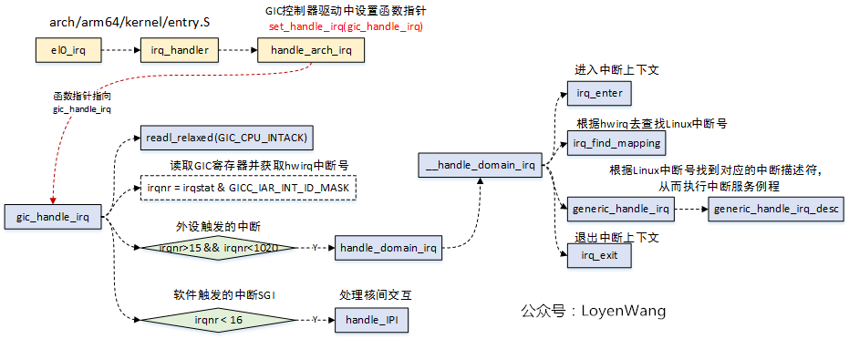
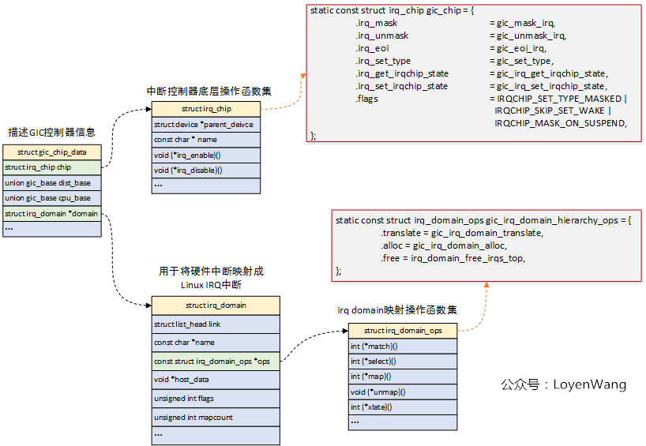
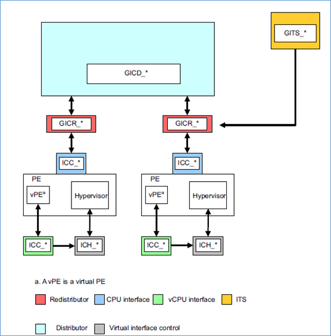
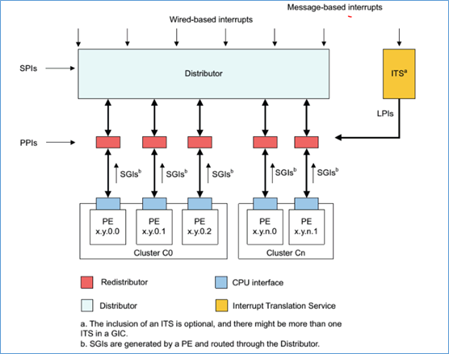
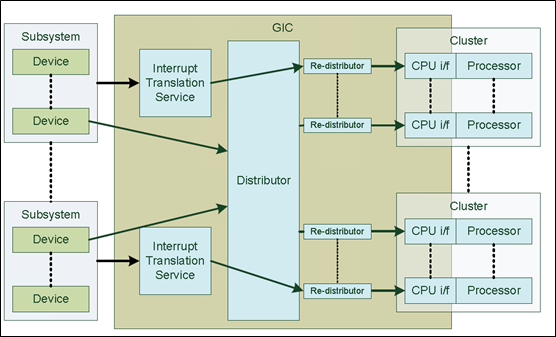
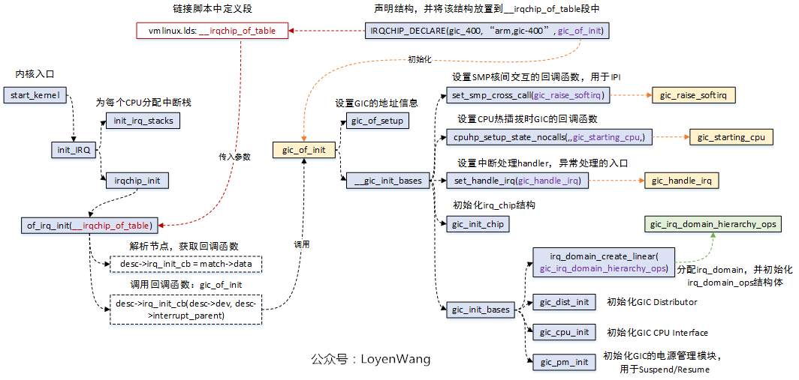
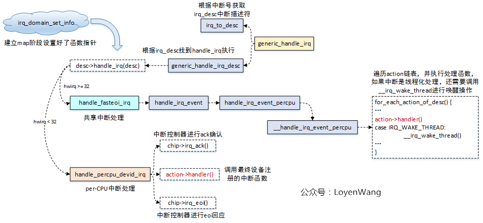
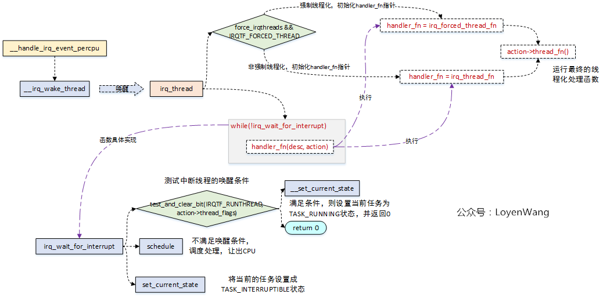
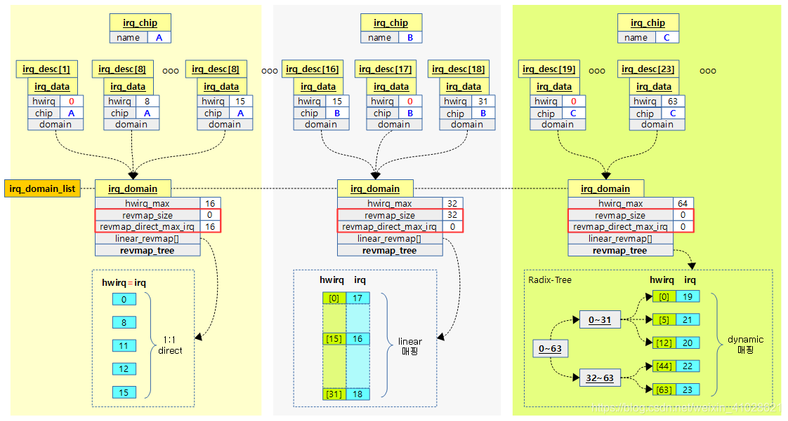

* [vector](#vectors)
* [el0t_64_irq_handler](#el0t_64_irq_handler)
* [el1h_64_irq_handler](#el1h_64_irq_handler)
* [el0t_64_sync_handler](#el0t_64_sync_handler)
* [el1h_64_sync_handler](#el1h_64_sync_handler)
* [ipi_handler](#ipi_handler)
* [gic_v3](#gic_v3)
    * [gic_of_init](#gic_of_init)
        * [gic_smp_init](#gic_smp_init)
    * [gic_handle_irq](#gic_handle_irq)
    * [irq_domain](#irq_domain)
    * [generic_handle_domain_irq](#generic_handle_domain_irq)
    * [irq_resolve_mapping](#irq_resolve_mapping)
    * [irq_create_mapping](#irq_create_mapping)

---



---


* [中断专题——中断及中断虚拟化总汇](https://mp.weixin.qq.com/s/8S8dsQKBuhNX3gffRpaRbQ)

# vectors

```c
SYM_FUNC_START_LOCAL(__primary_switched)
    adr_l    x4, init_task
    init_cpu_task x4, x5, x6

    adr_l    x8, vectors            // load VBAR_EL1 with virtual
    msr    vbar_el1, x8            // vector table address
    isb

SYM_FUNC_START_LOCAL(__secondary_switched)
    mov    x0, x20
    bl    set_cpu_boot_mode_flag

    mov    x0, x20
    bl    finalise_el2

    str_l    xzr, __early_cpu_boot_status, x3
    adr_l    x5, vectors
    msr    vbar_el1, x5
    isb
```

| **Aspect** | **Synchronous Exception** | **IRQ** | **FIQ** | **SError** |
| :-: | :-: | :-: | :-: | :-: |
| **Trigger** | Caused by instruction execution. | Triggered by hardware devices. | Triggered by high-priority devices. | Triggered by hardware/system errors. |
| **Sync/Async** | Synchronous. | Asynchronous. | Asynchronous. | Asynchronous. |
| **Priority** | N/A | Lower than FIQ. | Higher than IRQ. | N/A (critical errors). |
| **Use Case** | Faults, traps, system calls. | General hardware interrupts. | Time-sensitive interrupts. | Hardware/system failure reporting. |
| **Handling Speed** | Immediate. | Slower than FIQ. | Faster due to dedicated registers. | Depends on the system state. |

```c
SYM_CODE_START(vectors)
    /* t: a thread/task context (normal kernel or user execution).
     * h: a hypervisor or higher-privilege context (e.g., EL2 handling). */
    kernel_ventry    1, t, 64, sync     // Synchronous EL1t
    kernel_ventry    1, t, 64, irq      // IRQ EL1t
    kernel_ventry    1, t, 64, fiq      // FIQ EL1t
    kernel_ventry    1, t, 64, error    // Error EL1t

    kernel_ventry    1, h, 64, sync     // Synchronous EL1h
    kernel_ventry    1, h, 64, irq      // IRQ EL1h
    kernel_ventry    1, h, 64, fiq      // FIQ EL1h
    kernel_ventry    1, h, 64, error    // Error EL1h

    kernel_ventry    0, t, 64, sync     // Synchronous 64-bit EL0
    kernel_ventry    0, t, 64, irq      // IRQ 64-bit EL0
    kernel_ventry    0, t, 64, fiq      // FIQ 64-bit EL0
    kernel_ventry    0, t, 64, error    // Error 64-bit EL0

    kernel_ventry    0, t, 32, sync     // Synchronous 32-bit EL0
    kernel_ventry    0, t, 32, irq      // IRQ 32-bit EL0
    kernel_ventry    0, t, 32, fiq      // FIQ 32-bit EL0
    kernel_ventry    0, t, 32, error    // Error 32-bit EL0
SYM_CODE_END(vectors)

UNHANDLED(el1t, 64, sync)
UNHANDLED(el1t, 64, irq)
UNHANDLED(el1t, 64, fiq)
UNHANDLED(el1t, 64, error)

.macro kernel_ventry, el:req, ht:req, regsize:req, label:req
    .align 7
.Lventry_start\@:
    .if    \el == 0
    b    .Lskip_tramp_vectors_cleanup\@

    .if    \regsize == 64
    mrs    x30, tpidrro_el0
    msr    tpidrro_el0, xzr
    .else
    mov    x30, xzr
    .endif
.Lskip_tramp_vectors_cleanup\@:
    .endif /* \el == 0 */

    /* 1. alloc stack space for pt_regs */
    sub    sp, sp, #PT_REGS_SIZE
#ifdef CONFIG_VMAP_STACK
    add    sp, sp, x0            // sp' = sp + x0
    sub    x0, sp, x0            // x0' = sp' - x0 = (sp + x0) - x0 = sp
    tbnz    x0, #THREAD_SHIFT, 0f
    sub    x0, sp, x0            // x0'' = sp' - x0' = (sp + x0) - sp = x0
    sub    sp, sp, x0            // sp'' = sp' - x0 = (sp + x0) - x0 = sp
    b    el\el\ht\()_\regsize\()_\label

0:
    /* Stash the original SP (minus PT_REGS_SIZE) in tpidr_el0. */
    msr    tpidr_el0, x0

    /* Recover the original x0 value and stash it in tpidrro_el0 */
    sub    x0, sp, x0
    msr    tpidrro_el0, x0

    /* Switch to the overflow stack */
    adr_this_cpu sp, overflow_stack + OVERFLOW_STACK_SIZE, x0

    mrs    x0, tpidr_el0            // sp of interrupted context
    sub    x0, sp, x0            // delta with top of overflow stack
    tst    x0, #~(OVERFLOW_STACK_SIZE - 1)    // within range?
    b.ne    __bad_stack            // no? -> bad stack pointer

    /* We were already on the overflow stack. Restore sp/x0 and carry on. */
    sub    sp, sp, x0
    mrs    x0, tpidrro_el0
#endif
    /* 2. call entry_handler */
    b    el\el\ht\()_\regsize\()_\label
.org .Lventry_start\@ + 128    // Did we overflow the ventry slot?
    .endm
```

## entry_handler

```c
entry_handler    1, h, 64, sync
entry_handler    1, h, 64, irq
entry_handler    1, h, 64, fiq
entry_handler    1, h, 64, error

    .macro entry_handler el:req, ht:req, regsize:req, label:req
SYM_CODE_START_LOCAL(el\el\ht\()_\regsize\()_\label)
    /* 1. save context */
    kernel_entry \el, \regsize
    mov    x0, sp /* sp passed as arg to el_ht_handler */
    /* 2. call handler */
    bl    el\el\ht\()_\regsize\()_\label\()_handler
    /* 3. return user/kernel space */
    .if \el == 0
    b    ret_to_user
    .else
    b    ret_to_kernel
    .endif
SYM_CODE_END(el\el\ht\()_\regsize\()_\label)
    .endm
```

```c
.macro    kernel_entry, el, regsize = 64
    .if    \el == 0
    alternative_insn nop, SET_PSTATE_DIT(1), ARM64_HAS_DIT
    .endif

    .if    \regsize == 32
    mov    w0, w0                // zero upper 32 bits of x0
    .endif
    /* save the regs context of current task on the top of stack */
    stp    x0, x1, [sp, #16 * 0]
    stp    x2, x3, [sp, #16 * 1]
    stp    x4, x5, [sp, #16 * 2]
    stp    x6, x7, [sp, #16 * 3]
    stp    x8, x9, [sp, #16 * 4]
    stp    x10, x11, [sp, #16 * 5]
    stp    x12, x13, [sp, #16 * 6]
    stp    x14, x15, [sp, #16 * 7]
    stp    x16, x17, [sp, #16 * 8]
    stp    x18, x19, [sp, #16 * 9]
    stp    x20, x21, [sp, #16 * 10]
    stp    x22, x23, [sp, #16 * 11]
    stp    x24, x25, [sp, #16 * 12]
    stp    x26, x27, [sp, #16 * 13]
    stp    x28, x29, [sp, #16 * 14]

    .if    \el == 0
    clear_gp_regs
    mrs    x21, sp_el0
    ldr_this_cpu    tsk, __entry_task, x20
    msr    sp_el0, tsk

    /* Ensure MDSCR_EL1.SS is clear, since we can unmask debug exceptions
     * when scheduling. */
    ldr    x19, [tsk, #TSK_TI_FLAGS]
    disable_step_tsk x19, x20

    /* Check for asynchronous tag check faults in user space */
    ldr    x0, [tsk, THREAD_SCTLR_USER]
    check_mte_async_tcf x22, x23, x0

#ifdef CONFIG_ARM64_PTR_AUTH
alternative_if ARM64_HAS_ADDRESS_AUTH
    /* Enable IA for in-kernel PAC if the task had it disabled. Although
     * this could be implemented with an unconditional MRS which would avoid
     * a load, this was measured to be slower on Cortex-A75 and Cortex-A76.
     *
     * Install the kernel IA key only if IA was enabled in the task. If IA
     * was disabled on kernel exit then we would have left the kernel IA
     * installed so there is no need to install it again. */
    tbz    x0, SCTLR_ELx_ENIA_SHIFT, 1f
    __ptrauth_keys_install_kernel_nosync tsk, x20, x22, x23
    b    2f
1:
    mrs    x0, sctlr_el1
    orr    x0, x0, SCTLR_ELx_ENIA
    msr    sctlr_el1, x0
2:
alternative_else_nop_endif
#endif

    apply_ssbd 1, x22, x23

    mte_set_kernel_gcr x22, x23

    /* Any non-self-synchronizing system register updates required for
     * kernel entry should be placed before this point. */
alternative_if ARM64_MTE
    isb
    b    1f
alternative_else_nop_endif
alternative_if ARM64_HAS_ADDRESS_AUTH
    isb
alternative_else_nop_endif
1:

    scs_load_current
    .else     /* \el != 0 */
    add    x21, sp, #PT_REGS_SIZE
    get_current_task tsk
    .endif /* \el == 0 */

    mrs    x22, elr_el1
    mrs    x23, spsr_el1
    stp    lr, x21, [sp, #S_LR]

    /* For exceptions from EL0, create a final frame record.
     * For exceptions from EL1, create a synthetic frame record so the
     * interrupted code shows up in the backtrace. */
    .if \el == 0
        stp    xzr, xzr, [sp, #S_STACKFRAME]
    .else
        stp    x29, x22, [sp, #S_STACKFRAME]
    .endif

    add    x29, sp, #S_STACKFRAME

#ifdef CONFIG_ARM64_SW_TTBR0_PAN
alternative_if_not ARM64_HAS_PAN
    bl    __swpan_entry_el\el
alternative_else_nop_endif
#endif

    stp    x22, x23, [sp, #S_PC]

    /* Not in a syscall by default (el0_svc overwrites for real syscall) */
    .if    \el == 0
    mov    w21, #NO_SYSCALL
    str    w21, [sp, #S_SYSCALLNO]
    .endif

#ifdef CONFIG_ARM64_PSEUDO_NMI
alternative_if_not ARM64_HAS_GIC_PRIO_MASKING
    b    .Lskip_pmr_save\@
alternative_else_nop_endif

    mrs_s    x20, SYS_ICC_PMR_EL1
    str    x20, [sp, #S_PMR_SAVE]
    mov    x20, #GIC_PRIO_IRQON | GIC_PRIO_PSR_I_SET
    msr_s    SYS_ICC_PMR_EL1, x20

.Lskip_pmr_save\@:
#endif

    /* Registers that may be useful after this macro is invoked:
     *
     * x20 - ICC_PMR_EL1
     * x21 - aborted SP
     * x22 - aborted PC
     * x23 - aborted PSTATE */
    .endm
```

## ret_to_kernel

```c
SYM_CODE_START_LOCAL(ret_to_kernel)
    kernel_exit 1
SYM_CODE_END(ret_to_kernel)

    .macro    kernel_exit, el
    .if    \el != 0
        disable_daif
    .endif

#ifdef CONFIG_ARM64_PSEUDO_NMI
alternative_if_not ARM64_HAS_GIC_PRIO_MASKING
    b    .Lskip_pmr_restore\@
alternative_else_nop_endif

    ldr    x20, [sp, #S_PMR_SAVE]
    msr_s    SYS_ICC_PMR_EL1, x20

    /* Ensure priority change is seen by redistributor */
alternative_if_not ARM64_HAS_GIC_PRIO_RELAXED_SYNC
    dsb    sy
alternative_else_nop_endif

.Lskip_pmr_restore\@:
#endif

    ldp    x21, x22, [sp, #S_PC]        // load ELR, SPSR

#ifdef CONFIG_ARM64_SW_TTBR0_PAN
alternative_if_not ARM64_HAS_PAN
    bl    __swpan_exit_el\el
alternative_else_nop_endif
#endif

    .if    \el == 0
    ldr    x23, [sp, #S_SP]        // load return stack pointer
    msr    sp_el0, x23
    tst    x22, #PSR_MODE32_BIT        // native task?
    b.eq    3f

#ifdef CONFIG_ARM64_ERRATUM_845719
alternative_if ARM64_WORKAROUND_845719
#ifdef CONFIG_PID_IN_CONTEXTIDR
    mrs    x29, contextidr_el1
    msr    contextidr_el1, x29
#else
    msr contextidr_el1, xzr
#endif
alternative_else_nop_endif
#endif
3:
    scs_save tsk

    /* Ignore asynchronous tag check faults in the uaccess routines */
    ldr    x0, [tsk, THREAD_SCTLR_USER]
    clear_mte_async_tcf x0

#ifdef CONFIG_ARM64_PTR_AUTH
alternative_if ARM64_HAS_ADDRESS_AUTH
    /* IA was enabled for in-kernel PAC. Disable it now if needed, or
     * alternatively install the user's IA. All other per-task keys and
     * SCTLR bits were updated on task switch.
     *
     * No kernel C function calls after this. */
    tbz    x0, SCTLR_ELx_ENIA_SHIFT, 1f
    __ptrauth_keys_install_user tsk, x0, x1, x2
    b    2f
1:
    mrs    x0, sctlr_el1
    bic    x0, x0, SCTLR_ELx_ENIA
    msr    sctlr_el1, x0
2:
alternative_else_nop_endif
#endif

    mte_set_user_gcr tsk, x0, x1

    apply_ssbd 0, x0, x1
    .endif

    /* restore context */
    msr    elr_el1, x21            // set up the return data
    msr    spsr_el1, x22
    ldp    x0, x1, [sp, #16 * 0]
    ldp    x2, x3, [sp, #16 * 1]
    ldp    x4, x5, [sp, #16 * 2]
    ldp    x6, x7, [sp, #16 * 3]
    ldp    x8, x9, [sp, #16 * 4]
    ldp    x10, x11, [sp, #16 * 5]
    ldp    x12, x13, [sp, #16 * 6]
    ldp    x14, x15, [sp, #16 * 7]
    ldp    x16, x17, [sp, #16 * 8]
    ldp    x18, x19, [sp, #16 * 9]
    ldp    x20, x21, [sp, #16 * 10]
    ldp    x22, x23, [sp, #16 * 11]
    ldp    x24, x25, [sp, #16 * 12]
    ldp    x26, x27, [sp, #16 * 13]
    ldp    x28, x29, [sp, #16 * 14]

    .if    \el == 0
alternative_if_not ARM64_UNMAP_KERNEL_AT_EL0
    ldr    lr, [sp, #S_LR]
    add    sp, sp, #PT_REGS_SIZE        // restore sp

    eret

alternative_else_nop_endif
#ifdef CONFIG_UNMAP_KERNEL_AT_EL0
    msr    far_el1, x29

    ldr_this_cpu    x30, this_cpu_vector, x29
    tramp_alias    x29, tramp_exit
    msr        vbar_el1, x30        // install vector table
    ldr        lr, [sp, #S_LR]        // restore x30
    add        sp, sp, #PT_REGS_SIZE    // restore sp
    br        x29
#endif
    .else /* \el == 0 */
    ldr    lr, [sp, #S_LR]
    add    sp, sp, #PT_REGS_SIZE        // restore sp

    /* Ensure any device/NC reads complete */
    alternative_insn nop, "dmb sy", ARM64_WORKAROUND_1508412

    eret
    .endif

    sb
    .endm
```

## ret_to_user
```c
SYM_CODE_START_LOCAL(ret_to_user)
    ldr    x19, [tsk, #TSK_TI_FLAGS]    // re-check for single-step
    enable_step_tsk x19, x2
#ifdef CONFIG_GCC_PLUGIN_STACKLEAK
    bl    stackleak_erase_on_task_stack
#endif
    kernel_exit 0
SYM_CODE_END(ret_to_user)
```

```c
/* arch/arm64/include/asm/exception.h */
asmlinkage void el1h_64_sync_handler(struct pt_regs *regs);
asmlinkage void el1h_64_irq_handler(struct pt_regs *regs);
asmlinkage void el1h_64_fiq_handler(struct pt_regs *regs);
asmlinkage void el1h_64_error_handler(struct pt_regs *regs);

asmlinkage void el0t_64_sync_handler(struct pt_regs *regs);
asmlinkage void el0t_64_irq_handler(struct pt_regs *regs);
asmlinkage void el0t_64_fiq_handler(struct pt_regs *regs);
asmlinkage void el0t_64_error_handler(struct pt_regs *regs);
```

# el0t_64_irq_handler

```c
el0t_64_irq_handler(struct pt_regs *regs) {
    el0_interrupt(regs, handle_arch_irq = gic_handle_irq) {
        enter_from_user_mode(regs);

        write_sysreg(DAIF_PROCCTX_NOIRQ, daif);

        if (regs->pc & BIT(55))
            arm64_apply_bp_hardening();

        irq_enter_rcu() {
            __irq_enter_raw() {
                preempt_count_add(HARDIRQ_OFFSET);
                lockdep_hardirq_enter();
            }

            if (tick_nohz_full_cpu(smp_processor_id())
                || (is_idle_task(current) && (irq_count() == HARDIRQ_OFFSET))) {
                tick_irq_enter();
            }

            account_hardirq_enter(current) {
                vtime_account_irq(tsk, HARDIRQ_OFFSET);
                irqtime_account_irq(tsk, HARDIRQ_OFFSET) {
                    struct irqtime *irqtime = this_cpu_ptr(&cpu_irqtime);
                    unsigned int pc;
                    s64 delta;
                    int cpu;

                    if (!sched_clock_irqtime)
                        return;

                    cpu = smp_processor_id();
                    /* TODO?: account current time to previous exit time? */
                    delta = sched_clock_cpu(cpu) - irqtime->irq_start_time;
                    irqtime->irq_start_time += delta;
                    pc = irq_count() - offset;

                    if (pc & HARDIRQ_MASK)
                        irqtime_account_delta(irqtime, delta, CPUTIME_IRQ);
                    else if ((pc & SOFTIRQ_OFFSET) && curr != this_cpu_ksoftirqd())
                        irqtime_account_delta(irqtime, delta, CPUTIME_SOFTIRQ);
                }
            }
        }

        do_interrupt_handler(regs, handler) {
            struct pt_regs *old_regs = set_irq_regs(regs);

            if (on_thread_stack()) {
                call_on_irq_stack(regs, handler);
            } else {
                handler(regs); /* gic_handle_irq, set at gic_of_init */
            }

            set_irq_regs(old_regs);
        }

        irq_exit_rcu() {
            account_hardirq_exit(current) {
                vtime_account_hardirq(tsk);
                irqtime_account_irq(tsk, 0);
            }
            preempt_count_sub(HARDIRQ_OFFSET);
            if (!in_interrupt() && local_softirq_pending()) {
            #ifdef CONFIG_PREEMPT_RT
                /* PREEMPT_RT kernel just wakes up softirqd */
                static inline void invoke_softirq(void) {
                    if (should_wake_ksoftirqd() { return !this_cpu_read(softirq_ctrl.cnt) }) {
                        wakeup_softirqd();
                    }
                }
            #else
                /* standard kernel __do_softirq to handle the irqs and wakes up
                 * ksoftirqd if softirq execution MAX_SOFTIRQ_TIME timeout */
                static inline void invoke_softirq(void) {
                    if (!force_irqthreads() || !__this_cpu_read(ksoftirqd)) {
                        __do_softirq() {
                            handle_softirqs(false) {
                                end = jiffies + MAX_SOFTIRQ_TIME;
                                pending = local_softirq_pending();
                                h = softirq_vec;

                                /* run in interrupt conext in bottom-half
                                 * with local irq disabled, non-preemptible, and non-blocking */
                                while ((softirq_bit = ffs(pending))) {
                                    h->action(h); /* soft irq handler, e.g., net_rx_action, net_tx_action */
                                    h++;
                                    pending >>= softirq_bit;
                                }

                                /* run in process context in ksoftirqd */
                                pending = local_softirq_pending();
                                if (pending) {
                                    if (time_before(jiffies, end) && !need_resched() && --max_restart)
                                    goto restart;

                                    wakeup_softirqd();
                                }
                            }
                        }
                    } else {
                        wakeup_softirqd();
                    }
                }
            }

            tick_irq_exit();
        }

        exit_to_user_mode(regs) {
            exit_to_user_mode_prepare(regs) {
                flags = read_thread_flags();
                if (unlikely(flags & _TIF_WORK_MASK)) {
                    do_notify_resume(regs, flags) {
                        do {
                            if (thread_flags & _TIF_NEED_RESCHED) {
                                local_daif_restore(DAIF_PROCCTX_NOIRQ);
                                schedule();
                            } else {
                                local_daif_restore(DAIF_PROCCTX);

                                if (thread_flags & _TIF_UPROBE)
                                    uprobe_notify_resume(regs);

                                if (thread_flags & _TIF_MTE_ASYNC_FAULT) {
                                    clear_thread_flag(TIF_MTE_ASYNC_FAULT);
                                    send_sig_fault(SIGSEGV, SEGV_MTEAERR, (void __user *)NULL, current);
                                }

                                if (thread_flags & (_TIF_SIGPENDING | _TIF_NOTIFY_SIGNAL))
                                    do_signal(regs);

                                if (thread_flags & _TIF_NOTIFY_RESUME) {
                                    resume_user_mode_work(regs);
                                }

                                if (thread_flags & _TIF_FOREIGN_FPSTATE)
                                    fpsimd_restore_current_state();
                            }

                            local_daif_mask();
                            thread_flags = read_thread_flags();
                        } while (thread_flags & _TIF_WORK_MASK);
                    }
                }
            }
            mte_check_tfsr_exit();
            __exit_to_user_mode() {
                trace_hardirqs_on_prepare();
                lockdep_hardirqs_on_prepare();
                user_enter_irqoff();
                lockdep_hardirqs_on(CALLER_ADDR0);
            }
        }
    }
}
```

# el1h_64_irq_handler

```c
el1h_64_irq_handler(struct pt_regs *regs) {
    el1_interrupt(regs, handle_arch_irq = gic_handle_irq) {
        write_sysreg(DAIF_PROCCTX_NOIRQ, daif);

        if (IS_ENABLED(CONFIG_ARM64_PSEUDO_NMI) && !interrupts_enabled(regs)) {
            __el1_pnmi(regs, handler);
        } else {
            __el1_irq(regs, handler) {
                enter_from_kernel_mode(regs);

                irq_enter_rcu();
                do_interrupt_handler(regs, handler);
                irq_exit_rcu();

                arm64_preempt_schedule_irq() {
                    if (!need_irq_preemption())
                        return;

                    if (READ_ONCE(current_thread_info()->preempt_count) != 0)
                        return;

                    if (system_uses_irq_prio_masking() && read_sysreg(daif))
                        return;

                    if (system_capabilities_finalized()) {
                        preempt_schedule_irq() {
                            do {
                                preempt_disable();
                                local_irq_enable();
                                __schedule(SM_PREEMPT);
                                local_irq_disable();
                                sched_preempt_enable_no_resched();
                            } while (need_resched());
                        }
                    }
                }

                exit_to_kernel_mode(regs) {
                    if (interrupts_enabled(regs)) {
                        if (regs->exit_rcu) {
                            trace_hardirqs_on_prepare();
                            lockdep_hardirqs_on_prepare();
                            ct_irq_exit();
                            lockdep_hardirqs_on(CALLER_ADDR0);
                            return;
                        }

                        trace_hardirqs_on();
                    } else {
                        if (regs->exit_rcu)
                            ct_irq_exit();
                    }
                }
            }
        }
    }
}
```

# el0t_64_sync_handler

```c
/* sync exception using thread stack */
void el0t_64_sync_handler(struct pt_regs *regs) {
    unsigned long esr = read_sysreg(esr_el1);

    switch (ESR_ELx_EC(esr)) {
    case ESR_ELx_EC_SVC64:
        el0_svc(regs) {
            enter_from_user_mode(regs) {
                lockdep_hardirqs_off(CALLER_ADDR0);
                CT_WARN_ON(ct_state() != CONTEXT_USER);
                user_exit_irqoff();
                trace_hardirqs_off_finish();
                mte_disable_tco_entry(current);
            }
            cortex_a76_erratum_1463225_svc_handler();

            do_el0_svc(regs) {
                fp_user_discard();
                el0_svc_common(regs, regs->regs[8], __NR_syscalls, sys_call_table) {
                    unsigned long flags = read_thread_flags();

                    regs->orig_x0 = regs->regs[0];
                    regs->syscallno = scno;

                    if (flags & _TIF_MTE_ASYNC_FAULT) {
                        syscall_set_return_value(current, regs, -ERESTARTNOINTR, 0);
                        return;
                    }

                    invoke_syscall(regs, scno, sc_nr, syscall_table) {
                        if (scno < sc_nr) {
                            syscall_fn_t syscall_fn;
                            syscall_fn = syscall_table[array_index_nospec(scno, sc_nr)];
                            ret = __invoke_syscall(regs, syscall_fn) {
                                return syscall_fn(regs);
                            }
                        } else {
                            ret = do_ni_syscall(regs, scno);
                        }
                    }
                }
            }

            exit_to_user_mode(regs)
                --->
        }
        break;
    case ESR_ELx_EC_DABT_LOW:
        el0_da(regs, esr);
        break;
    case ESR_ELx_EC_IABT_LOW:
        el0_ia(regs, esr);
        break;
    case ESR_ELx_EC_FP_ASIMD:
        el0_fpsimd_acc(regs, esr);
        break;
    case ESR_ELx_EC_SVE:
        el0_sve_acc(regs, esr);
        break;
    case ESR_ELx_EC_SME:
        el0_sme_acc(regs, esr);
        break;
    case ESR_ELx_EC_FP_EXC64:
        el0_fpsimd_exc(regs, esr);
        break;
    case ESR_ELx_EC_SYS64:
    case ESR_ELx_EC_WFx:
        el0_sys(regs, esr);
        break;
    case ESR_ELx_EC_SP_ALIGN:
        el0_sp(regs, esr);
        break;
    case ESR_ELx_EC_PC_ALIGN:
        el0_pc(regs, esr);
        break;
    case ESR_ELx_EC_UNKNOWN:
        el0_undef(regs, esr);
        break;
    case ESR_ELx_EC_BTI:
        el0_bti(regs);
        break;
    case ESR_ELx_EC_BREAKPT_LOW:
    case ESR_ELx_EC_SOFTSTP_LOW:
    case ESR_ELx_EC_WATCHPT_LOW:
    case ESR_ELx_EC_BRK64:
        el0_dbg(regs, esr);
        break;
    case ESR_ELx_EC_FPAC:
        el0_fpac(regs, esr);
        break;
    default:
        el0_inv(regs, esr);
    }
}
```

# el1h_64_sync_handler

```c
/* sync exception using handler stack */
void el1h_64_sync_handler(struct pt_regs *regs) {
    unsigned long esr = read_sysreg(esr_el1);

    switch (ESR_ELx_EC(esr)) {
    case ESR_ELx_EC_DABT_CUR:
    case ESR_ELx_EC_IABT_CUR:
        el1_abort(regs, esr) {

        }
        break;
    case ESR_ELx_EC_PC_ALIGN:
        el1_pc(regs, esr) {

        }
        break;
    case ESR_ELx_EC_SYS64:
    case ESR_ELx_EC_UNKNOWN:
        el1_undef(regs, esr);
        break;
    case ESR_ELx_EC_BTI:
        el1_bti(regs, esr);
        break;
    case ESR_ELx_EC_BREAKPT_CUR:
    case ESR_ELx_EC_SOFTSTP_CUR:
    case ESR_ELx_EC_WATCHPT_CUR:
    case ESR_ELx_EC_BRK64:
        el1_dbg(regs, esr);
        break;
    case ESR_ELx_EC_FPAC:
        el1_fpac(regs, esr);
        break;
    default:
        __panic_unhandled(regs, "64-bit el1h sync", esr);
    }
}
```

# ipi_handler

```c
/* Registered at gic_smp_init->set_smp_ipi_range */
irqreturn_t ipi_handler(int irq, void *data) {
    do_handle_IPI(irq - ipi_irq_base) {
        unsigned int cpu = smp_processor_id();

        if ((unsigned)ipinr < NR_IPI)
            trace_ipi_entry(ipi_types[ipinr]);

        switch (ipinr) {
        case IPI_RESCHEDULE:
            scheduler_ipi() {
                #define preempt_fold_need_resched() \
                    do { \
                        if (tif_need_resched()) \
                            set_preempt_need_resched(); \
                    } while (0)
            }
            break;

        case IPI_CALL_FUNC:
            generic_smp_call_function_interrupt();
            break;

        case IPI_CPU_STOP:
            local_cpu_stop();
            break;

        case IPI_CPU_CRASH_STOP:
            if (IS_ENABLED(CONFIG_KEXEC_CORE)) {
                ipi_cpu_crash_stop(cpu, get_irq_regs());

                unreachable();
            }
            break;

    #ifdef CONFIG_GENERIC_CLOCKEVENTS_BROADCAST
        case IPI_TIMER:
            tick_receive_broadcast();
            break;
    #endif

    #ifdef CONFIG_IRQ_WORK
        case IPI_IRQ_WORK:
            irq_work_run();
            break;
    #endif

        default:
            pr_crit("CPU%u: Unknown IPI message 0x%x\n", cpu, ipinr);
            break;
        }

        if ((unsigned)ipinr < NR_IPI)
            trace_ipi_exit(ipi_types[ipinr]);
    }
    return IRQ_HANDLED;
}
```

## IPI_CALL_FUNC

```c
#define generic_smp_call_function_interrupt \
    generic_smp_call_function_single_interrupt

void generic_smp_call_function_single_interrupt(void)
{
    __flush_smp_call_function_queue(true);
}

void __flush_smp_call_function_queue(bool warn_cpu_offline)
{
    call_single_data_t *csd, *csd_next;
    struct llist_node *entry, *prev;
    struct llist_head *head;
    static bool warned;
    atomic_t *tbt;

    lockdep_assert_irqs_disabled();

    /* Allow waiters to send backtrace NMI from here onwards */
    tbt = this_cpu_ptr(&trigger_backtrace);
    atomic_set_release(tbt, 1);

    head = this_cpu_ptr(&call_single_queue);
    entry = llist_del_all(head);
    entry = llist_reverse_order(entry);

    /* There shouldn't be any pending callbacks on an offline CPU. */
    if (unlikely(warn_cpu_offline && !cpu_online(smp_processor_id()) &&
             !warned && entry != NULL)) {
        warned = true;
        WARN(1, "IPI on offline CPU %d\n", smp_processor_id());

        /* We don't have to use the _safe() variant here
         * because we are not invoking the IPI handlers yet. */
        llist_for_each_entry(csd, entry, node.llist) {
            switch (CSD_TYPE(csd)) {
            case CSD_TYPE_ASYNC:
            case CSD_TYPE_SYNC:
            case CSD_TYPE_IRQ_WORK:
                pr_warn("IPI callback %pS sent to offline CPU\n",
                    csd->func);
                break;

            case CSD_TYPE_TTWU:
                pr_warn("IPI task-wakeup sent to offline CPU\n");
                break;

            default:
                pr_warn("IPI callback, unknown type %d, sent to offline CPU\n",
                    CSD_TYPE(csd));
                break;
            }
        }
    }

/* 1. run all SYNC callbacks, people are waiting for us. */
    prev = NULL;
    llist_for_each_entry_safe(csd, csd_next, entry, node.llist) {
        /* Do we wait until *after* callback? */
        if (CSD_TYPE(csd) == CSD_TYPE_SYNC) {
            smp_call_func_t func = csd->func;
            void *info = csd->info;

            if (prev) {
                prev->next = &csd_next->node.llist;
            } else {
                entry = &csd_next->node.llist;
            }

            csd_lock_record(csd);
            csd_do_func(func, info, csd) {
                func(info);
            }
            csd_unlock(csd);
            csd_lock_record(NULL);
        } else {
            prev = &csd->node.llist;
        }
    }

    if (!entry)
        return;

/* 2. run all !SYNC callbacks. */
    prev = NULL;
    llist_for_each_entry_safe(csd, csd_next, entry, node.llist) {
        int type = CSD_TYPE(csd);

        if (type != CSD_TYPE_TTWU) {
            if (prev) {
                prev->next = &csd_next->node.llist;
            } else {
                entry = &csd_next->node.llist;
            }

            if (type == CSD_TYPE_ASYNC) {
                smp_call_func_t func = csd->func;
                void *info = csd->info;

                csd_lock_record(csd);
                csd_unlock(csd);
                csd_do_func(func, info, csd);
                csd_lock_record(NULL);
            } else if (type == CSD_TYPE_IRQ_WORK) {
                irq_work_single(csd);
            }

        } else {
            prev = &csd->node.llist;
        }
    }

/* 3. only CSD_TYPE_TTWU is left, issue those. */
    if (entry) {
        csd = llist_entry(entry, typeof(*csd), node.llist);
        csd_do_func(sched_ttwu_pending, entry, csd);
    }
}

void sched_ttwu_pending(void *arg)
{
    struct llist_node *llist = arg;
    struct rq *rq = this_rq();
    struct task_struct *p, *t;
    struct rq_flags rf;

    if (!llist)
        return;

    rq_lock_irqsave(rq, &rf);
    update_rq_clock(rq);

    llist_for_each_entry_safe(p, t, llist, wake_entry.llist) {
        if (WARN_ON_ONCE(p->on_cpu))
            smp_cond_load_acquire(&p->on_cpu, !VAL);

        if (WARN_ON_ONCE(task_cpu(p) != cpu_of(rq)))
            set_task_cpu(p, cpu_of(rq));

        ttwu_do_activate(rq, p, p->sched_remote_wakeup ? WF_MIGRATED : 0, &rf);
    }

    WRITE_ONCE(rq->ttwu_pending, 0);
    rq_unlock_irqrestore(rq, &rf);
}
```

# gic_v3



* [浅析 MSI-X 实现原理：结合ARM GICv3和PCIe硬件实现](https://mp.weixin.qq.com/s/A-LsAtKlWvHgoG_gwgr09g)

---

GIC V3 | ITS
:---: | :---:
 | 



* **Interrupt Affinity**: `irqbalance` monitors IRQ loads (via `/proc/interrupts`) and CPU utilization, then reassigns IRQs to underutilized CPUs by updating GICv3 affinity settings.
* **NUMA Awareness**: `irqbalance` uses sysfs data (e.g., `/sys/devices/system/node/`) to bias IRQs toward local CPUs, reducing cross-node memory access latency.

**Interrupt Types**:

- **SGI**(Software Generated Interrupts): 0-15, private to each CPU core and are used for inter-processor communication
- **PPI**(Private Peripheral Interrupts): 16-31, private to each CPU core within a GIC.
- **SPI**(Shared: Peripheral Interrupts): 32-1019, shared across CPUs and are unique within a single GIC instance.
- **LPI**(Locality-specific Peripheral Interrupts): 8192+, managed by the GIC’s ITS (Interrupt Translation Service) and have a separate ID space (starting from 8192). LPIs are unique within the ITS of a GIC but could overlap across different GIC instances if they have separate ITS components.

Feature | LPI Number | Hardware IRQ Number (HWIRQ) | Linux IRQ Number
:-: | :-: | :-: | :-:
Definition | Virtual interrupt ID for MSIs in GICv3/v4 | Hardware-level interrupt ID in GIC | Software-level interrupt ID in Linux
Range | Starts at 8192, large range | 0–1019 (SPI/PPI/SGI), 8192+ (LPI) | Arbitrary, assigned by kernel
Scope | Specific to MSI and GIC ITS | All GIC interrupts (SPI, PPI, SGI, LPI) | All interrupts in Linux
Used By | GIC ITS for MSI mapping | GIC hardware for signaling | Linux kernel for interrupt handling
Example | LPI 8194 (MSI for PCIe NIC) | HWIRQ 8194 (LPI) or 32 (SPI) | Linux IRQ 100 (mapped to HWIRQ 8194)
Configuration | Programmed by ITS driver | Defined in Device Tree/ACPI or ITS | Assigned by IRQ domain in kernel
Relation to MSI | Directly used for MSI interrupts | LPI number = HWIRQ for MSIs | Maps to HWIRQ/LPI via IRQ domain

```sh
# cat /proc/interrupts
100:  1234  0  0  0  GICv3  8194  Level  pcie-msi
```

**GIC Main Components**:

- ITS (Interrupt Translation Service)

    Primary Functions:
    - MSI/MSI-X interrupt translation
    - Device ID management
    - Event ID to LPI mapping
    - Collection management

    Key Operations:
    - MAPD: Device mapping
    - MAPC: Collection mapping
    - MAPTI: Translation mapping
    - MOVI: Interrupt movement
    - DISCARD: Entry removal

- Distributor (GICD)

    Primary Functions:
    - Manages Shared Peripheral Interrupts (**SPIs**)
    - Controls interrupt routing to Redistributors
    - Handles interrupt prioritization
    - Manages interrupt enable/disable

    Key Operations:
    - Group assignment (G0/G1S/G1NS)
    - Priority assignment
    - Target processor selection
    - Interrupt enabling/disabling
    - Security state control

- Redistributor (GICR) - one per PE

    Primary Functions:
    - One per Processing Element (PE)
    - Manages **SGIs **and **PPIs**
    - Controls power management
    - Handles **LPI **configuration

    Key Features:
    - Local interrupt routing
    - Wake-up logic
    - PE interface management
    - LPI configuration tables
    - PPIs/SGIs configuration

- CPU Interface (GICR_SGI/GICR_PPI)

    Primary Functions:
    - Presents interrupts to PE
    - Handles interrupt acknowledgment
    - Manages EOI (End Of Interrupt)
    - Controls priority masking

    Key Registers:
    - ICC_IAR: Interrupt Acknowledge
    - ICC_EOIR: End of Interrupt
    - ICC_PMR: Priority Mask
    - ICC_BPR: Binary Point
    - ICC_RPR: Running Priority

Feature | Wired-Based Interrupt | Message-Based Interrupt (MSI)
:-: | :-: | :-:
Signaling Method | Physical interrupt line | Memory write (message)
Trigger Type | Level or edge-triggered | Typically edge-triggered
Scalability | Limited by physical lines | Highly scalable (thousands of interrupts)
Hardware Requirement | Dedicated interrupt pins | MSI-capable device and GIC ITS
Complexity | Simpler setup | More complex (requires ITS, MSI config)
Use Case | Legacy peripherals, simple devices | PCIe devices, virtualization
GIC Support | GICv2, GICv3 (SPI, PPI) | GICv3/v4 with ITS
Linux Subsystem | IRQ subsystem | MSI subsystem


```c
IRQCHIP_DECLARE(gic_v3, "arm,gic-v3", gic_of_init);

#define IRQCHIP_DECLARE(name, compat, fn)    \
    OF_DECLARE_2(irqchip, name, compat, typecheck_irq_init_cb(fn))

#define OF_DECLARE_2(table, name, compat, fn) \
    _OF_DECLARE(table, name, compat, fn, of_init_fn_2)

#define _OF_DECLARE(table, name, compat, fn, fn_type) \
    static const struct of_device_id __of_table_##name \
        __used __section("__" #table "_of_table") \
        __aligned(__alignof__(struct of_device_id)) \
        = { .compatible = compat, \
            .data = (fn == (fn_type)NULL) ? fn : fn  }
```

```c
static struct irq_chip gic_chip = {
    .name                   = "GICv3",
    /* Disables (masks) an interrupt at the hardware level. */
    .irq_mask               = gic_mask_irq,
    /* Enables (unmasks) an interrupt at the hardware level. */
    .irq_unmask             = gic_unmask_irq,
    /* Acknowledges an interrupt to clear its pending state */
    .irq_ack                = NULL, /* implemented in gic_read_iar() */
    /* Signals the end of interrupt handling */
    .irq_eoi                = gic_eoi_irq,

    .irq_set_type           = gic_set_type,
    .irq_set_affinity       = gic_set_affinity,
    .irq_retrigger          = gic_retrigger,
    .irq_get_irqchip_state  = gic_irq_get_irqchip_state,
    .irq_set_irqchip_state  = gic_irq_set_irqchip_state,
    .irq_nmi_setup          = gic_irq_nmi_setup,
    .irq_nmi_teardown       = gic_irq_nmi_teardown,
    .ipi_send_mask          = gic_ipi_send_mask,
    .flags                  = IRQCHIP_SET_TYPE_MASKED |
        IRQCHIP_SKIP_SET_WAKE | IRQCHIP_MASK_ON_SUSPEND,
};
```

## gic_of_init



```c
static struct gic_chip_data gic_data; /* init at gic_init_bases */
```

```c
int __init
gic_of_init(struct device_node *node, struct device_node *parent)
{
    struct gic_chip_data *gic;
    int irq, ret;

    gic = &gic_data[gic_cnt];

    ret = gic_of_setup(gic, node);

    if (gic_cnt == 0 && !gic_check_eoimode(node, &gic->raw_cpu_base))
        static_branch_disable(&supports_deactivate_key);

    ret = __gic_init_bases(gic, &node->fwnode) {
        if (gic == &gic_data[0]) {
            for (i = 0; i < NR_GIC_CPU_IF; i++)
                gic_cpu_map[i] = 0xff;

            set_handle_irq(gic_handle_irq); /* called at do_interrupt_handler */
        }

        ret = gic_init_bases(gic, handle);
        if (gic == &gic_data[0])
            gic_smp_init();

        return ret;
    }

    if (!gic_cnt) {
        gic_init_physaddr(node);
        gic_of_setup_kvm_info(node);
    }

    if (parent) {
        irq = irq_of_parse_and_map(node, 0);
        gic_cascade_irq(gic_cnt, irq);
    }

    if (IS_ENABLED(CONFIG_ARM_GIC_V2M))
        gicv2m_init(&node->fwnode, gic_data[gic_cnt].domain);

    gic_cnt++;
    return 0;
}
```

### gic_init_bases

```c
int __init gic_init_bases(phys_addr_t dist_phys_base,
                 void __iomem *dist_base,
                 struct redist_region *rdist_regs,
                 u32 nr_redist_regions,
                 u64 redist_stride,
                 struct fwnode_handle *handle)
{
    u32 typer;
    int err;

    if (!is_hyp_mode_available())
        static_branch_disable(&supports_deactivate_key);

    if (static_branch_likely(&supports_deactivate_key))
        pr_info("GIC: Using split EOI/Deactivate mode\n");

    gic_data.fwnode = handle;
    gic_data.dist_phys_base = dist_phys_base;
    gic_data.dist_base = dist_base;
    gic_data.redist_regions = rdist_regs;
    gic_data.nr_redist_regions = nr_redist_regions;
    gic_data.redist_stride = redist_stride;

    /* Find out how many interrupts are supported. */
    typer = readl_relaxed(gic_data.dist_base + GICD_TYPER);
    gic_data.rdists.gicd_typer = typer;

    gic_enable_quirks(readl_relaxed(gic_data.dist_base + GICD_IIDR),
              gic_quirks, &gic_data);

    pr_info("%d SPIs implemented\n", GIC_LINE_NR - 32);
    pr_info("%d Extended SPIs implemented\n", GIC_ESPI_NR);

    /* ThunderX1 explodes on reading GICD_TYPER2, in violation of the
     * architecture spec (which says that reserved registers are RES0). */
    if (!(gic_data.flags & FLAGS_WORKAROUND_CAVIUM_ERRATUM_38539))
        gic_data.rdists.gicd_typer2 = readl_relaxed(gic_data.dist_base + GICD_TYPER2);

    gic_data.domain = irq_domain_create_tree(handle, &gic_irq_domain_ops,
                         &gic_data);
    gic_data.rdists.rdist = alloc_percpu(typeof(*gic_data.rdists.rdist));
    if (!static_branch_unlikely(&gic_nvidia_t241_erratum)) {
        /* Disable GICv4.x features for the erratum T241-FABRIC-4 */
        gic_data.rdists.has_rvpeid = true;
        gic_data.rdists.has_vlpis = true;
        gic_data.rdists.has_direct_lpi = true;
        gic_data.rdists.has_vpend_valid_dirty = true;
    }

    if (WARN_ON(!gic_data.domain) || WARN_ON(!gic_data.rdists.rdist)) {
        err = -ENOMEM;
        goto out_free;
    }

    irq_domain_update_bus_token(gic_data.domain, DOMAIN_BUS_WIRED);

    gic_data.has_rss = !!(typer & GICD_TYPER_RSS);

    if (typer & GICD_TYPER_MBIS) {
        err = mbi_init(handle, gic_data.domain);
        if (err)
            pr_err("Failed to initialize MBIs\n");
    }

    set_handle_irq(gic_handle_irq);

    gic_update_rdist_properties();

    gic_cpu_sys_reg_enable();
    gic_prio_init();
    gic_dist_init();
    gic_cpu_init();
    gic_enable_nmi_support();
    gic_smp_init();
    gic_cpu_pm_init();

    if (gic_dist_supports_lpis()) {
        its_init(handle, &gic_data.rdists, gic_data.domain, dist_prio_irq);
        its_cpu_init();
        its_lpi_memreserve_init();
    } else {
        if (IS_ENABLED(CONFIG_ARM_GIC_V2M))
            gicv2m_init(handle, gic_data.domain);
    }

    return 0;

out_free:
    if (gic_data.domain)
        irq_domain_remove(gic_data.domain);
    free_percpu(gic_data.rdists.rdist);
    return err;
}
```

### gic_smp_init

```c
void __init gic_smp_init(void)
{
    struct irq_fwspec sgi_fwspec = {
        .fwnode         = gic_data.fwnode,
        .param_count    = 1,
    };
    int base_sgi;

    cpuhp_setup_state_nocalls(CPUHP_BP_PREPARE_DYN,
                "irqchip/arm/gicv3:checkrdist",
                gic_check_rdist, NULL);

    cpuhp_setup_state_nocalls(CPUHP_AP_IRQ_GIC_STARTING,
                "irqchip/arm/gicv3:starting",
                gic_starting_cpu, NULL);

    /* Register all 8 non-secure SGIs */
    base_sgi = irq_domain_alloc_irqs(gic_data.domain, 8, NUMA_NO_NODE, &sgi_fwspec);
    if (WARN_ON(base_sgi <= 0))
        return;

    set_smp_ipi_range(base_sgi, 8);
}

static inline void set_smp_ipi_range(int ipi_base, int n)
{
    set_smp_ipi_range_percpu(ipi_base, n, 0) {
        int i;

        WARN_ON(n < MAX_IPI);
        nr_ipi = min(n, MAX_IPI);

        percpu_ipi_descs = !!ncpus;
        ipi_irq_base = ipi_base;

        for (i = 0; i < nr_ipi; i++) {
            if (!percpu_ipi_descs)
                ipi_setup_sgi(i);
            else
                ipi_setup_lpi(i, ncpus);
        }

        /* Setup the boot CPU immediately */
        ipi_setup(smp_processor_id());
    }
}

static void ipi_setup_sgi(int ipi)
{
    int err, irq, cpu;

    irq = ipi_irq_base + ipi;

    if (ipi_should_be_nmi(ipi)) {
        err = request_percpu_nmi(irq, ipi_handler, "IPI", &irq_stat);
    } else {
        err = request_percpu_irq(irq, ipi_handler, "IPI", &irq_stat);
    }

    for_each_possible_cpu(cpu)
        get_ipi_desc(cpu, ipi) = irq_to_desc(irq);

    irq_set_status_flags(irq, IRQ_HIDDEN);
}

static void ipi_setup_lpi(int ipi, int ncpus)
{
    for (int cpu = 0; cpu < ncpus; cpu++) {
        int err, irq;

        irq = ipi_irq_base + (cpu * nr_ipi) + ipi;

        err = irq_force_affinity(irq, cpumask_of(cpu));

        err = request_irq(irq, ipi_handler, IRQF_NO_AUTOEN, "IPI", NULL);

        irq_set_status_flags(irq, (IRQ_HIDDEN | IRQ_NO_BALANCING_MASK));

        get_ipi_desc(cpu, ipi) = irq_to_desc(irq);
    }
}

static void ipi_setup(int cpu)
{
    int i;

    if (WARN_ON_ONCE(!ipi_irq_base))
        return;

    for (i = 0; i < nr_ipi; i++) {
        if (!percpu_ipi_descs) {
            if (ipi_should_be_nmi(i)) {
                prepare_percpu_nmi(ipi_irq_base + i);
                enable_percpu_nmi(ipi_irq_base + i, 0);
            } else {
                enable_percpu_irq(ipi_irq_base + i, 0);
            }
        } else {
            enable_irq(irq_desc_get_irq(get_ipi_desc(cpu, i))) {
                scoped_irqdesc_get_and_lock(irq, IRQ_GET_DESC_CHECK_GLOBAL) {
                    struct irq_desc *desc = scoped_irqdesc;

                    if (WARN(!desc->irq_data.chip, "enable_irq before setup/request_irq: irq %u\n", irq))
                        return;
                    __enable_irq(desc) {
                        switch (desc->depth) {
                        case 0:
                    err_out:
                            WARN(1, KERN_WARNING "Unbalanced enable for IRQ %d\n",
                                irq_desc_get_irq(desc));
                            break;
                        case 1: {
                            if (desc->istate & IRQS_SUSPENDED)
                                goto err_out;
                            /* Prevent probing on this irq: */
                            irq_settings_set_noprobe(desc);
                            /* Call irq_startup() not irq_enable() here because the
                            * interrupt might be marked NOAUTOEN so irq_startup()
                            * needs to be invoked when it gets enabled the first time.
                            * This is also required when __enable_irq() is invoked for
                            * a managed and shutdown interrupt from the S3 resume
                            * path.
                            *
                            * If it was already started up, then irq_startup() will
                            * invoke irq_enable() under the hood. */
                            irq_startup(desc, IRQ_RESEND, IRQ_START_FORCE);
                            break;
                        }
                        default:
                            desc->depth--;
                        }
                    }
                }
            }
        }
    }
}
```

## gic_handle_irq


---



---



```c
gic_of_init() {
    gic_init_bases() {
        set_handle_irq(gic_handle_irq);
        its_init(handle, &gic_data.rdists, gic_data.domain, dist_prio_irq);
    }
}

void (*handle_arch_irq)(struct pt_regs *) __ro_after_init = default_handle_irq;
void (*handle_arch_fiq)(struct pt_regs *) __ro_after_init = default_handle_fiq;

int __init set_handle_irq(void (*handle_irq)(struct pt_regs *))
{
    if (handle_arch_irq != default_handle_irq)
        return -EBUSY;

    handle_arch_irq = handle_irq;
    pr_info("Root IRQ handler: %ps\n", handle_irq);
    return 0;
}

/* el0_irq -> irq_handler */
static void __exception_irq_entry gic_handle_irq(struct pt_regs *regs)
{
    if (unlikely(gic_supports_nmi() && !interrupts_enabled(regs))) {
        __gic_handle_irq_from_irqsoff(regs);

    } else {
        __gic_handle_irq_from_irqson(regs) {
            bool is_nmi;
            u32 irqnr;

            irqnr = gic_read_iar();

            is_nmi = gic_rpr_is_nmi_prio() {
                if (!gic_supports_nmi())
                    return false;
                return unlikely(gic_read_rpr() == GICV3_PRIO_NMI);
            }

            if (is_nmi) {
                nmi_enter() {
                    __nmi_enter() {
                        lockdep_off();
                        arch_nmi_enter();
                        BUG_ON(in_nmi() == NMI_MASK);
                        __preempt_count_add(NMI_OFFSET + HARDIRQ_OFFSET);
                    }
                    lockdep_hardirq_enter();
                    ct_nmi_enter();
                    instrumentation_begin();
                    ftrace_nmi_enter();
                    instrumentation_end();

                }

                __gic_handle_nmi(irqnr, regs) {
                    if (gic_irqnr_is_special(irqnr))
                        return;

                    gic_complete_ack(irqnr);

                    ret = generic_handle_domain_nmi(gic_data.domain, irqnr) {
                        WARN_ON_ONCE(!in_nmi());
                        return handle_irq_desc(irq_resolve_mapping(domain, hwirq));
                    }
                    if (ret) {
                        WARN_ONCE(true, "Unexpected pseudo-NMI (irqnr %u)\n", irqnr);
                        gic_deactivate_unhandled(irqnr);
                    }
                }
                nmi_exit();
            }

            if (gic_prio_masking_enabled()) {
                gic_pmr_mask_irqs();
                gic_arch_enable_irqs();
            }

            if (!is_nmi) {
                __gic_handle_irq(irqnr, regs) {
                    if (gic_irqnr_is_special(irqnr))
                        return;

                    gic_complete_ack(irqnr) {
                        if (static_branch_likely(&supports_deactivate_key)) {
                            write_gicreg(irqnr, ICC_EOIR1_EL1);
                        }

                        isb();
                    }

                    ret = generic_handle_domain_irq(gic_data.domain, irqnr);
                        --->
                    if (ret) {
                        WARN_ONCE(true, "Unexpected interrupt (irqnr %u)\n", irqnr);
                        gic_deactivate_unhandled(irqnr);
                    }
                }
            }
        }
    }
}
```

## irq_domain



### generic_handle_domain_irq

```c
int generic_handle_domain_irq(struct irq_domain *domain, unsigned int hwirq)
{
    struct irq_desc desc = irq_resolve_mapping(domain, hwirq, NULL/*irq*/);
    return handle_irq_desc(desc) {
        struct irq_data *data;

        if (!desc)
            return -EINVAL;

        data = irq_desc_get_irq_data(desc);
        if (WARN_ON_ONCE(!in_hardirq() && irqd_is_handle_enforce_irqctx(data)))
            return -EPERM;

        generic_handle_irq_desc(desc) {
            desc->handle_irq(desc) /* handler of gic */
            = handle_fasteoi_irq(struct irq_desc *desc) {

            }
            = handle_percpu_irq(struct irq_desc *desc) {

            }

            /* Signal: Triggered by a transition (rising or falling edge) on the interrupt line.
             * Handler: Acknowledges the interrupt (e.g., via GIC EOI),
             *      no need to clear the source to stop the signal. */

            /* Active as long as the condition persists (e.g., high or low voltage level). */
            = handle_level_irq(struct irq_desc *desc) {
                raw_spin_lock(&desc->lock);
                mask_ack_irq(desc) {
                    if (desc->irq_data.chip->irq_mask_ack) {
                        desc->irq_data.chip->irq_mask_ack(&desc->irq_data);
                        irq_state_set_masked(desc);
                    } else {
                        mask_irq(desc);
                        if (desc->irq_data.chip->irq_ack)
                            desc->irq_data.chip->irq_ack(&desc->irq_data);
                    }
                }

                if (!irq_may_run(desc))
                    goto out_unlock;

                desc->istate &= ~(IRQS_REPLAY | IRQS_WAITING);

                if (unlikely(!desc->action || irqd_irq_disabled(&desc->irq_data))) {
                    desc->istate |= IRQS_PENDING;
                    goto out_unlock;
                }

                handle_irq_event(desc) {
                    irqreturn_t ret;

                    desc->istate &= ~IRQS_PENDING;
                    irqd_set(&desc->irq_data, IRQD_IRQ_INPROGRESS);
                    raw_spin_unlock(&desc->lock);

                    ret = handle_irq_event_percpu(desc) {
                        irqreturn_t retval;

                        retval = __handle_irq_event_percpu(desc) {
                            irqreturn_t retval = IRQ_NONE;
                            unsigned int irq = desc->irq_data.irq;
                            struct irqaction *action;

                            record_irq_time(desc);

                            for_each_action_of_desc(desc, action) {
                                irqreturn_t res;
                                res = act
                                /* hanlder of dev driver
                                 * return IRQ_WAKE_THREAD for threaded handler */
                                res = action->handler(irq, action->dev_id);

                                switch (res) {
                                case IRQ_WAKE_THREAD:
                                    __irq_wake_thread(desc, action);
                                case IRQ_HANDLED:
                                    *flags |= action->flags;
                                    break;
                                default:
                                    break;
                                }
                                retval |= res;
                            }
                            return retval;
                        }

                        add_interrupt_randomness(desc->irq_data.irq);

                        if (!irq_settings_no_debug(desc))
                            note_interrupt(desc, retval);
                        return retval;
                    }

                    raw_spin_lock(&desc->lock);
                    irqd_clear(&desc->irq_data, IRQD_IRQ_INPROGRESS);
                    return ret;
                }

                cond_unmask_irq(desc) {
                    if (!irqd_irq_disabled(&desc->irq_data) && irqd_irq_masked(&desc->irq_data) && !desc->threads_oneshot) {
                        unmask_irq(desc) {
                            if (!irqd_irq_masked(&desc->irq_data))
                                return;

                            if (desc->irq_data.chip->irq_unmask) {
                                desc->irq_data.chip->irq_unmask(&desc->irq_data);
                                irq_state_clr_masked(desc);
                            }
                        }
                    }
                }
            }
        }
    }
}
```

### irq_resolve_mapping

```c
struct irq_desc desc = irq_resolve_mapping(domain, hwirq, NULL/*irq*/) {
    return __irq_resolve_mapping(domain, hwirq, NULL) {
        struct irq_desc *desc = NULL;
        struct irq_data *data;

        /* Look for default domain if necessary */
        if (domain == NULL)
            domain = irq_default_domain;
        if (domain == NULL)
            return desc;

        if (irq_domain_is_nomap(domain)) {
            if (hwirq < domain->hwirq_max) {
                data = irq_domain_get_irq_data(domain, hwirq);
                if (data && data->hwirq == hwirq)
                    desc = irq_data_to_desc(data);
                if (irq && desc)
                    *irq = hwirq;
            }

            return desc;
        }

        rcu_read_lock();
        /* Check if the hwirq is in the linear revmap. */
        if (hwirq < domain->revmap_size)
            data = rcu_dereference(domain->revmap[hwirq]);
        else
            data = radix_tree_lookup(&domain->revmap_tree, hwirq);

        if (likely(data)) {
            desc = irq_data_to_desc(data) {
                return container_of(data->common, struct irq_desc, irq_common_data);
            }
            if (irq)
                *irq = data->irq;
        }

        rcu_read_unlock();
        return desc;
    }
}
```

## irq_create_mapping

```c
static inline unsigned int irq_create_mapping(struct irq_domain *host,
                        irq_hw_number_t hwirq)
{
    return irq_create_mapping_affinity(host, hwirq, NULL) {
        int virq;

        /* Look for default domain if necessary */
        if (domain == NULL)
            domain = irq_default_domain;
        if (domain == NULL) {
            WARN(1, "%s(, %lx) called with NULL domain\n", __func__, hwirq);
            return 0;
        }

        mutex_lock(&domain->root->mutex);

        /* Check if mapping already exists */
        virq = irq_find_mapping(domain, hwirq);
        if (virq) {
            pr_debug("existing mapping on virq %d\n", virq);
            goto out;
        }

        virq = irq_create_mapping_affinity_locked(domain, hwirq, affinity) {
            struct device_node *of_node = irq_domain_get_of_node(domain);
            int virq;

            pr_debug("irq_create_mapping(0x%p, 0x%lx)\n", domain, hwirq);

            /* Allocate a virtual interrupt number */
            virq = irq_domain_alloc_descs(-1, 1, hwirq, of_node_to_nid(of_node), affinity) {
                unsigned int hint;

                if (virq >= 0) {
                    virq = __irq_alloc_descs(virq, virq, cnt, node, THIS_MODULE, affinity);
                } else {
                    hint = hwirq % irq_get_nr_irqs();
                    if (hint == 0)
                        hint++;
                    virq = __irq_alloc_descs(-1, hint, cnt, node, THIS_MODULE, affinity);
                    if (virq <= 0 && hint > 1) {
                        virq = __irq_alloc_descs(-1, 1, cnt, node, THIS_MODULE, affinity) {
                            int start, ret;

                            if (!cnt)
                                return -EINVAL;

                            if (irq >= 0) {
                                if (from > irq)
                                    return -EINVAL;
                                from = irq;
                            } else {
                                /* For interrupts which are freely allocated the
                                * architecture can force a lower bound to the @from
                                * argument. x86 uses this to exclude the GSI space. */
                                from = arch_dynirq_lower_bound(from);
                            }

                            mutex_lock(&sparse_irq_lock);

                            start = irq_find_free_area(from, cnt) {
                                MA_STATE(mas, &sparse_irqs, 0, 0);

                                if (mas_empty_area(&mas, from, MAX_SPARSE_IRQS, cnt))
                                    return -ENOSPC;
                                return mas.index;
                            }
                            ret = -EEXIST;
                            if (irq >=0 && start != irq)
                                goto unlock;

                            if (start + cnt > nr_irqs) {
                                ret = irq_expand_nr_irqs(start + cnt);
                                if (ret)
                                    goto unlock;
                            }
                            ret = alloc_descs(start, cnt, node, affinity, owner) {
                                struct irq_desc *desc;
                                int i;

                                /* Validate affinity mask(s) */
                                if (affinity) {
                                    for (i = 0; i < cnt; i++) {
                                        if (cpumask_empty(&affinity[i].mask))
                                            return -EINVAL;
                                    }
                                }

                                for (i = 0; i < cnt; i++) {
                                    const struct cpumask *mask = NULL;
                                    unsigned int flags = 0;

                                    if (affinity) {
                                        if (affinity->is_managed) {
                                            flags = IRQD_AFFINITY_MANAGED | IRQD_MANAGED_SHUTDOWN;
                                        }
                                        flags |= IRQD_AFFINITY_SET;
                                        mask = &affinity->mask;
                                        node = cpu_to_node(cpumask_first(mask));
                                        affinity++;
                                    }

                                    desc = alloc_desc(start + i, node, flags, mask, owner) {
                                        struct irq_desc *desc;
                                        int ret;

                                        desc = kzalloc_node(sizeof(*desc), GFP_KERNEL, node);
                                        if (!desc)
                                            return NULL;

                                        ret = init_desc(desc, irq, node, flags, affinity, owner) {
                                            desc->kstat_irqs = alloc_percpu(struct irqstat);
                                            if (!desc->kstat_irqs)
                                                return -ENOMEM;

                                            if (alloc_masks(desc, node)) {
                                                free_percpu(desc->kstat_irqs);
                                                return -ENOMEM;
                                            }

                                            raw_spin_lock_init(&desc->lock);
                                            lockdep_set_class(&desc->lock, &irq_desc_lock_class);
                                            mutex_init(&desc->request_mutex);
                                            init_waitqueue_head(&desc->wait_for_threads);
                                            desc_set_defaults(irq, desc, node, affinity, owner);
                                            irqd_set(&desc->irq_data, flags);
                                            irq_resend_init(desc);
                                        #ifdef CONFIG_SPARSE_IRQ
                                            kobject_init(&desc->kobj, &irq_kobj_type);
                                            init_rcu_head(&desc->rcu);
                                        #endif

                                            return 0;
                                        }
                                        if (unlikely(ret)) {
                                            kfree(desc);
                                            return NULL;
                                        }

                                        return desc;
                                    }
                                    if (!desc)
                                        goto err;
                                    irq_insert_desc(start + i, desc) {
                                        /* while all IRQ domains use the same global sparse_irqs infrastructure
                                         * to store irq_desc structures for Linux IRQ numbers,
                                         * each IRQ domain maintains its own mapping of HW IRQs to Linux IRQs,
                                         * and the irq_desc structures themselves are not directly
                                         * tied to HW IRQs but to Linux IRQ numbers.
                                         *
                                         * This tree is indexed by Linux IRQ numbers (e.g., 16, 48, 100),
                                         * not HW IRQs. */
                                        MA_STATE(mas, &sparse_irqs, irq, irq);
                                        WARN_ON(mas_store_gfp(&mas, desc, GFP_KERNEL) != 0);
                                    }
                                    irq_sysfs_add(start + i, desc);
                                    irq_add_debugfs_entry(start + i, desc);
                                }
                                return start;

                            err:
                                for (i--; i >= 0; i--)
                                    free_desc(start + i);
                                return -ENOMEM;
                            }
                        unlock:
                            mutex_unlock(&sparse_irq_lock);
                            return ret;
                        }
                    }
                }

                return virq;
            }
            if (virq <= 0) {
                pr_debug("-> virq allocation failed\n");
                return 0;
            }

            if (irq_domain_associate_locked(domain, virq, hwirq)) {
                irq_free_desc(virq);
                return 0;
            }

            pr_debug("irq %lu on domain %s mapped to virtual irq %u\n",
                hwirq, of_node_full_name(of_node), virq);

            return virq;
        }
    out:
        mutex_unlock(&domain->root->mutex);

        return virq;
    }
}
```