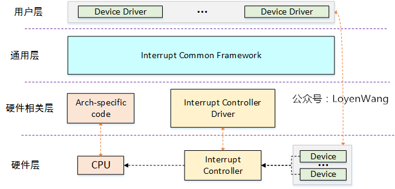
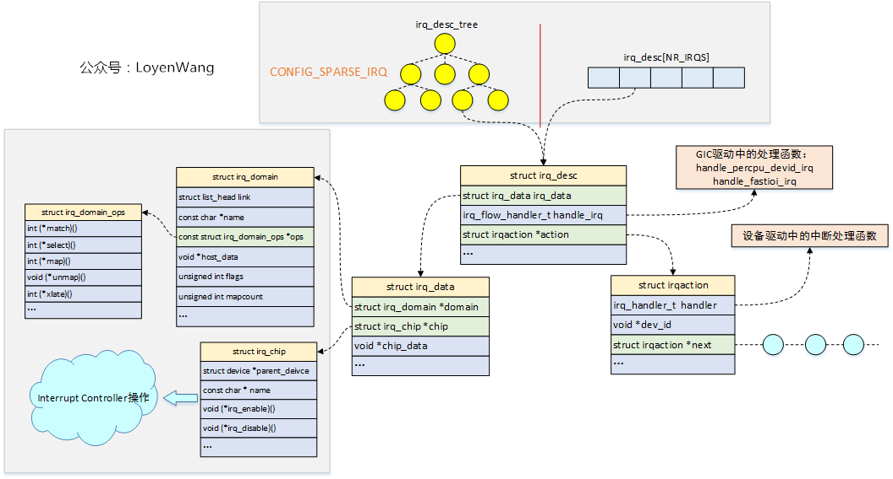
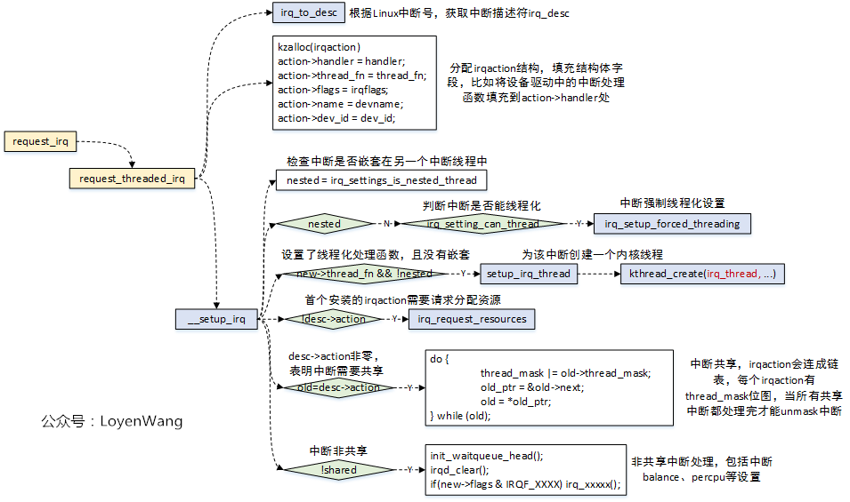

* [中断管理 - LoyenWang](https://www.cnblogs.com/LoyenWang/category/1777370.html)
    * [1. 中断控制器及驱动分析](https://www.cnblogs.com/LoyenWang/p/12249106.html)
    * [2. 通用框架处理](https://www.cnblogs.com/LoyenWang/p/13052677.html)

* [IRQ Subsystem - WOWO TECH](http://www.wowotech.net/sort/irq_subsystem)
    * [1. 综述](http://www.wowotech.net/irq_subsystem/interrupt_subsystem_architecture.html)
    * [2. IRQ Domain介绍](http://www.wowotech.net/irq_subsystem/irq-domain.html)
    * [3. IRQ number和中断描述符](http://www.wowotech.net/irq_subsystem/interrupt_descriptor.html)
    * [4. High level irq event handler](http://www.wowotech.net/irq_subsystem/High_level_irq_event_handler.html)
    * [5. 驱动申请中断API](http://www.wowotech.net/irq_subsystem/request_threaded_irq.html)
    * [6. ARM中断处理过程](http://www.wowotech.net/irq_subsystem/irq_handler.html)
    * [7. GIC代码分析](http://www.wowotech.net/irq_subsystem/gic_driver.html)
    * [8. 中断唤醒系统流程](http://www.wowotech.net/irq_subsystem/irq_handle_procedure.html)
    * [softirq](http://www.wowotech.net/irq_subsystem/soft-irq.html)
    * [tasklet](http://www.wowotech.net/irq_subsystem/tasklet.html)
    * [ARMv8 异常处理简介](https://mp.weixin.qq.com/s/dZEMB4_Xmgd8f7GO7c8Oag)

* [深入分析linux内核源码：中断子系统详解](https://mp.weixin.qq.com/s/8BV0aQMeBtqUlKrpa8QZeg)

* PREEMPT_RT

    * **Hard interrupts force threading**

        * **Standard kernel**: non-threaded processing is adopted by default

            After the kernel detects a hardware interrupt, it turns off preemption and interruption, performs some hardware-related operations (indicated by do_IRQ), directly calls the interrupt service routine (indicated by ISR) registered by the user, and then opens the interrupt, and exits the interrupt context after opening preemption. The entire processing process is carried out in the interrupt context.

        * **Real-time kernel**: threaded processing is adopted by default

            After the kernel detects a hardware interrupt, it turns off preemption and interruption, performs some hardware-related operations (indicated by do_IRQ), wakes up only the interrupt thread, and then opens the interrupt, and exits the interrupt context after opening preemption.

            The processing of the interrupt service routine (indicated by ISR, which is really time-consuming) is placed in the interrupt thread. Among them, the interrupt thread defaults to a real-time process with **SCHED_FIFO** **priority 50**.

        * Notes after threading the RT kernel hard interrupt

            1. The RT kernel interrupt processing is threaded by default, and the interrupt processing function is actually executed in the interrupt thread. The interrupt thread defaults to a real-time thread, with a scheduling policy of SCHED_FIFO and a priority of 50. It may be preempted by a real-time thread with a higher priority, and there is a scheduling delay. Its execution time is more uncertain than before threading. Please pay attention to this change.
            2. After threading, the execution of the interrupt needs to wake up the interrupt thread to execute, which has the overhead of task switching and scheduling delay. If the interrupt processing process is simple but frequent, such as just reading and writing registers or waking up processes, it is necessary to weigh the pros and cons of threading to confirm whether to thread the interrupt.
            3. When registering an interrupt, interrupts with IRQF_NO_THREAD, IRQF_PERCPU (such as clock tick interrupts) or IRQF_ONESHOT marks (for reentry control of active threaded interrupts) will not be threaded. Normally, you can avoid threading interrupts by adding the IRQF_NO_THREAD flag when registering interrupts, but it is not advisable to perform too time-consuming operations in non-threaded interrupt handlers.
            4. In non-threaded interrupt handlers, spinlock/rwlock/local_lock and other locks that can be preempted in the RT kernel cannot be used. Only non-preemptive versions, such as raw_spinlock_t, can be used.
            5. In threaded interrupt handlers, the above-mentioned locks that can be preempted in the RT kernel can be used;

    * **Softirq preemptable**

        * Standard kernel soft interrupt **execution point**
            1. **Hard Interrupt bottom half**

                After the hard interrupt is processed, call irq_exit to exit. If it is detected that there is a soft interrupt to be processed, call invoke_softirq function to process the soft interrupt.

            2. If the soft interrupt is not processed at the previous execution point, it will be processed in **ksoftirqd **by waking up ksoftirqd

                The ksoftirqd thread is a normal thread of the default priority fair scheduling class

            3. Some mutual exclusion mechanisms that close the bottom half (such as spin_lock_bh/spin_unlock_bh), when the outermost bottom half is enabled Call **__local_bh_enable_ip **function, if **not in the interrupt context**, call do_softirq() to process the soft interrupt

            The above three soft interrupt execution points will disable the bottom half to ensure mutual exclusion. The standard kernel disables the bottom half by disabling preemption.

        * The **priority **of standard kernel soft interrupt **execution**
            1. The bottom half of the interrupt will only **be interrupted by hard interrupts **and will **not be preempted by other processes**. Theoretically, its priority is higher than that of real-time threads;
            2. Although the ksoftirqd thread is a common thread of the fair scheduling class, once it is scheduled, the bottom half will be disabled and preemption will be disabled, and it will not be preempted by other processes.

        * Changes to soft interrupts in the RT kernel
            1. **Cancel the immediate processing** of the BH in hard irq ctx

                After the hard interrupt is processed, if it is detected that there is a soft interrupt to be processed, only the ksoftirqd thread is waked up and then returned, and the actual processing is performed in the ksoftirqd thread.

            2. Decouple the **control of soft interrupts** from the **control of preemption**, and disabling soft interrupts no longer implicitly disables preemption

                This allows the processing of soft interrupts to remain preemptible, thereby reducing the scope of the non-preemptible area.

            3. When the bottom half is enabled, In the **__local_bh_enable_ip** function, only when the current context is **preemptible** and the **interrupt is enabled**, __do_softirq() is directly called to process the soft interrupt, otherwise only the ksoftirqd thread is awakened. Also reduces the scope of the potential non-preemptible area

        * RT kernel soft interrupt execution priority
            1. Based on the above changes, the RT kernel's processing of soft interrupts becomes completely preemptible;
            2. The ksoftirqd thread remains a normal thread of the default priority fair scheduling class. Since soft interrupt processing is preemptible, real-time processes can preempt soft interrupt execution.
---



---



---


```c
/* The interrupt vector interrupt controller sent to
 * each cpu is per cpu local variable, but the abstract
 * layer's virtual signal irq and it's irq_desc is global.
 * So per cpu needs its own mapping from vector to irq_desc */
typedef struct irq_desc* vector_irq_t[NR_VECTORS];
DECLARE_PER_CPU(vector_irq_t, vector_irq);

struct irq_desc {
    struct irq_common_data irq_common_data;
    struct irq_data        irq_data;
    unsigned int __percpu  *kstat_irqs;
    irq_flow_handler_t     handle_irq;
    struct irqaction       *action; /* IRQ action list */

    struct cpumask        *percpu_enabled;
    wait_queue_head_t     wait_for_threads;
};

struct irqaction {
    irq_handler_t       handler; /* typedef irqreturn_t (*irq_handler_t)(int, void *) */
    void                *dev_id;
    void __percpu       *percpu_dev_id;
    struct irqaction    *next;
    irq_handler_t       thread_fn;
    struct task_struct  *thread;
    struct irqaction    *secondary;
    unsigned int        irq;
    unsigned int        flags;
    unsigned long       thread_flags;
    unsigned long       thread_mask;
    const char          *name;
    struct proc_dir_entry *dir;
};
```

**Primary cases where hardware IRQs are disabled:**
1. **Critical Sections in Interrupt Handlers**:
   - **Why**: During the top half of an interrupt service routine (ISR), the kernel may disable IRQs on the current CPU to prevent other interrupts from interfering with time-sensitive operations or shared data access.
   - **Mechanism**: The kernel uses `local_irq_disable()` or `spin_lock_irq()` to disable IRQs locally.
2. **Protecting Shared Kernel Data Structures**:
   - **Why**: In symmetric multiprocessing (SMP) systems, multiple CPUs may access shared kernel resources (e.g., task queues, memory management structures). Disabling IRQs prevents interrupt handlers on the same CPU from preempting and corrupting these structures.
   - **Example**: When updating the scheduler’s runqueue, the kernel disables IRQs to ensure atomic operations.
   - **Mechanism**: Spinlocks with IRQ disabling (e.g., `spin_lock_irqsave()`) are used to protect critical sections.
3. **Atomic Operations in Kernel Code**:
   - **Why**: Certain kernel operations require uninterrupted execution to maintain consistency, especially in non-preemptible contexts or when manipulating hardware registers.
   - **Example**: When configuring an interrupt controller (e.g., APIC) or initializing a device, IRQs are disabled to prevent interrupts from triggering before setup is complete.
   - **Mechanism**: `local_irq_disable()` or `cli` (on x86) is used for short, atomic operations.
4. **Preventing Nested Interrupts**:
   - **Why**: Nested interrupts (an interrupt occurring during another interrupt’s handling) can lead to stack overflows or complex race conditions, especially for high-frequency IRQs.
   - **Example**: During handling of a high-priority timer interrupt, the kernel may disable other IRQs to avoid nested interrupt storms.
   - **Mechanism**: The kernel automatically disables IRQs on the current CPU when entering an ISR, or explicitly via `local_irq_disable()`.
5. **System Boot and Initialization**:
   - **Why**: During early boot or hardware initialization, the kernel disables IRQs to ensure a controlled environment while setting up critical components like the interrupt controller, CPU, or memory management.
   - **Example**: When initializing the APIC or IDT, IRQs are disabled to prevent premature interrupt triggers.
   - **Mechanism**: IRQs are disabled globally or locally via low-level assembly (e.g., `cli`) or kernel functions.
6. **Power Management and CPU Idle States**:
   - **Why**: When entering low-power CPU states (e.g., C-states) or during suspend/resume operations, IRQs are disabled to prevent interrupts from waking the CPU or interfering with power transitions.
   - **Example**: Before entering a deep idle state, the kernel disables IRQs to ensure no interrupts disrupt the transition.
   - **Mechanism**: `local_irq_disable()` or architecture-specific power management code.
7. **Debugging and Error Handling**:
   - **Why**: In cases of severe errors (e.g., kernel panic, oops), the kernel may disable IRQs to halt interrupt activity and safely log diagnostic information or enter a debugger.
   - **Example**: During a kernel panic, IRQs are disabled to prevent further interrupts from complicating recovery or logging.
   - **Mechanism**: `local_irq_disable()` or panic-specific code.
8. **Real-Time or Latency-Sensitive Operations**:
   - **Why**: In real-time systems or latency-sensitive tasks, IRQs may be disabled briefly to ensure deterministic execution of critical code.
   - **Example**: In a real-time kernel (PREEMPT_RT), IRQs might be disabled during a high-priority task to avoid preemption.
   - **Mechanism**: Controlled use of `local_irq_disable()` or real-time scheduling policies.

# init_IRQ

```c
void __init init_IRQ(void)
{
    init_irq_stacks();
    init_irq_scs();
    irqchip_init() {
        of_irq_init(__irqchip_of_table/* matches */) {
            const struct of_device_id *match;
            struct device_node *np, *parent = NULL;
            struct of_intc_desc *desc, *temp_desc;
            struct list_head intc_desc_list, intc_parent_list;

            INIT_LIST_HEAD(&intc_desc_list);
            INIT_LIST_HEAD(&intc_parent_list);

            for_each_matching_node_and_match(np, matches, &match) {
                if (!of_property_read_bool(np, "interrupt-controller") ||
                        !of_device_is_available(np))
                    continue;

                if (WARN(!match->data, "of_irq_init: no init function for %s\n",
                    match->compatible))
                    continue;

                /* Here, we allocate and populate an of_intc_desc with the node
                * pointer, interrupt-parent device_node etc. */
                desc = kzalloc(sizeof(*desc), GFP_KERNEL);
                if (!desc) {
                    of_node_put(np);
                    goto err;
                }

                desc->irq_init_cb = match->data;
                desc->dev = of_node_get(np);
                /* interrupts-extended can reference multiple parent domains.
                * Arbitrarily pick the first one; assume any other parents
                * are the same distance away from the root irq controller. */
                desc->interrupt_parent = of_parse_phandle(np, "interrupts-extended", 0);
                if (!desc->interrupt_parent)
                    desc->interrupt_parent = of_irq_find_parent(np);
                if (desc->interrupt_parent == np) {
                    of_node_put(desc->interrupt_parent);
                    desc->interrupt_parent = NULL;
                }
                list_add_tail(&desc->list, &intc_desc_list);
            }

            /* The root irq controller is the one without an interrupt-parent.
            * That one goes first, followed by the controllers that reference it,
            * followed by the ones that reference the 2nd level controllers, etc. */
            while (!list_empty(&intc_desc_list)) {
                /* Process all controllers with the current 'parent'.
                * First pass will be looking for NULL as the parent.
                * The assumption is that NULL parent means a root controller. */
                list_for_each_entry_safe(desc, temp_desc, &intc_desc_list, list) {
                    int ret;

                    if (desc->interrupt_parent != parent)
                        continue;

                    list_del(&desc->list);

                    of_node_set_flag(desc->dev, OF_POPULATED);

                    ret = desc->irq_init_cb(desc->dev, desc->interrupt_parent) {
                        gic_of_init(); /* for gic_v3 */
                    }
                    if (ret) {
                        pr_err("%s: Failed to init %pOF (%p), parent %p\n",
                            __func__, desc->dev, desc->dev,
                            desc->interrupt_parent);
                        of_node_clear_flag(desc->dev, OF_POPULATED);
                        kfree(desc);
                        continue;
                    }

                    /* This one is now set up; add it to the parent list so
                    * its children can get processed in a subsequent pass. */
                    list_add_tail(&desc->list, &intc_parent_list);
                }

                /* Get the next pending parent that might have children */
                desc = list_first_entry_or_null(&intc_parent_list,
                                typeof(*desc), list);
                if (!desc) {
                    pr_err("of_irq_init: children remain, but no parents\n");
                    break;
                }
                list_del(&desc->list);
                parent = desc->dev;
                kfree(desc);
            }

            list_for_each_entry_safe(desc, temp_desc, &intc_parent_list, list) {
                list_del(&desc->list);
                kfree(desc);
            }
        err:
            list_for_each_entry_safe(desc, temp_desc, &intc_desc_list, list) {
                list_del(&desc->list);
                of_node_put(desc->dev);
                kfree(desc);
            }
        }

        acpi_probe_device_table(irqchip);
        #define acpi_probe_device_table(t)  \
        ({  \
            extern struct acpi_probe_entry ACPI_PROBE_TABLE(t), \
                                    ACPI_PROBE_TABLE_END(t);    \
            __acpi_probe_device_table(&ACPI_PROBE_TABLE(t),     \
                        (&ACPI_PROBE_TABLE_END(t) - \
                        &ACPI_PROBE_TABLE(t)));     \
        })
    }

    if (system_uses_irq_prio_masking()) {
        /* Now that we have a stack for our IRQ handler, set
        * the PMR/PSR pair to a consistent state. */
        WARN_ON(read_sysreg(daif) & PSR_A_BIT);
        local_daif_restore(DAIF_PROCCTX_NOIRQ);
    }
}
```

# request_irq



```c
static int logibm_open(struct input_dev *dev)
{
    if (request_irq(logibm_irq, logibm_interrupt, 0, "logibm", NULL)) {
        return -EBUSY;
    }
    outb(LOGIBM_ENABLE_IRQ, LOGIBM_CONTROL_PORT);
    return 0;
}

static irqreturn_t logibm_interrupt(int irq, void *dev_id)
{

}

irqreturn_t (*irq_handler_t)(int irq, void * dev_id);

enum irqreturn {
    IRQ_NONE            = (0 << 0),
    IRQ_HANDLED         = (1 << 0),
    IRQ_WAKE_THREAD     = (1 << 1),
};

static inline int request_irq(
  unsigned int irq, irq_handler_t handler,
  unsigned long flags, const char *name, void *dev)
{
    return request_threaded_irq(irq, handler, NULL, flags, name, dev);
}

int request_threaded_irq(
    unsigned int irq, irq_handler_t handler,
    irq_handler_t thread_fn, unsigned long irqflags,
    const char *devname, void *dev_id)
{
    struct irqaction *action;
    struct irq_desc *desc;
    int retval;

    desc = irq_to_desc(irq) {
        return mtree_load(&sparse_irqs, irq);
    }

    action = kzalloc(sizeof(struct irqaction), GFP_KERNEL);
    action->handler = handler;
    action->thread_fn = thread_fn;
    action->flags = irqflags;
    action->name = devname;
    action->dev_id = dev_id;
    retval = __setup_irq(irq, desc, action);
}

static int
__setup_irq(unsigned int irq, struct irq_desc *desc, struct irqaction *new)
{
    struct irqaction *old, **old_ptr;
    unsigned long flags, thread_mask = 0;
    int ret, nested, shared = 0;

    new->irq = irq;

    if (new->thread_fn && !nested) {
        ret = setup_irq_thread(new, irq, false);
    }

    old_ptr = &desc->action;
    old = *old_ptr;
    /* add new interrupt at end of irq queue */
    if (old) {
        do {
            thread_mask |= old->thread_mask;
            old_ptr = &old->next;
            old = *old_ptr;
        } while (old);
    }
    *old_ptr = new;
    if (new->thread) {
        wake_up_process(new->thread) {
            return try_to_wake_up(p, TASK_NORMAL, 0);
        }
    }
}

static int setup_irq_thread(
  struct irqaction *new, unsigned int irq, bool secondary)
{
    struct task_struct *t;
    struct sched_param param = {
        .sched_priority = MAX_USER_RT_PRIO/2,
    };

    t = kthread_create(irq_thread, new, "irq/%d-%s", irq, new->name);
    sched_setscheduler_nocheck(t, SCHED_FIFO, &param);
    get_task_struct(t);
    new->thread = t;

    return 0;
}
```

## request_percpu_irq

```c
request_percpu_irq(unsigned int irq, irq_handler_t handler,
           const char *devname, void __percpu *percpu_dev_id) {
    return __request_percpu_irq(irq, handler, 0, devname, percpu_dev_id) {
        desc = irq_to_desc(irq);

        action = kzalloc(sizeof(struct irqaction), GFP_KERNEL);
        action->handler = handler;
        action->flags = flags | IRQF_PERCPU | IRQF_NO_SUSPEND;
        action->name = devname;
        action->percpu_dev_id = dev_id;

        retval = irq_chip_pm_get(&desc->irq_data);

        retval = __setup_irq(irq, desc, action /*new*/) {
            new->irq = irq;

            nested = irq_settings_is_nested_thread(desc);
            if (nested) {
                if (!new->thread_fn) {
                    ret = -EINVAL;
                    goto out_mput;
                }
                new->handler = irq_nested_primary_handler;
            } else {
                if (irq_settings_can_thread(desc)) {
                    ret = irq_setup_forced_threading(new);
                    if (ret)
                        goto out_mput;
                }
            }

            /* Create a handler thread when a thread function is supplied
             * and the interrupt does not nest into another interrupt thread. */
            if (new->thread_fn && !nested) {
                ret = setup_irq_thread(new, irq, false) {
                    kthread_create(irq_thread, new, "irq/%d-%s", irq, new->name);
                }
                if (ret)
                    goto out_mput;
                if (new->secondary) {
                    ret = setup_irq_thread(new->secondary, irq, true);
                    if (ret)
                        goto out_thread;
                }
            }

            if (desc->irq_data.chip->flags & IRQCHIP_ONESHOT_SAFE)
                new->flags &= ~IRQF_ONESHOT;

            mutex_lock(&desc->request_mutex);

            chip_bus_lock(desc);

            /* First installed action requests resources. */
            if (!desc->action) {
                ret = irq_request_resources(desc);
                if (ret) {
                    goto out_bus_unlock;
                }
            }

            raw_spin_lock_irqsave(&desc->lock, flags);
            old_ptr = &desc->action;
            old = *old_ptr;
            if (old) {
                unsigned int oldtype;

                if (desc->istate & IRQS_NMI) {
                    ret = -EINVAL;
                    goto out_unlock;
                }

                if (irqd_trigger_type_was_set(&desc->irq_data)) {
                    oldtype = irqd_get_trigger_type(&desc->irq_data);
                } else {
                    oldtype = new->flags & IRQF_TRIGGER_MASK;
                    irqd_set_trigger_type(&desc->irq_data, oldtype);
                }

                if (!((old->flags & new->flags) & IRQF_SHARED) ||
                    (oldtype != (new->flags & IRQF_TRIGGER_MASK)) ||
                    ((old->flags ^ new->flags) & IRQF_ONESHOT))
                    goto mismatch;

                /* All handlers must agree on per-cpuness */
                if ((old->flags & IRQF_PERCPU) !=
                    (new->flags & IRQF_PERCPU))
                    goto mismatch;

                /* add new interrupt at end of irq queue */
                do {
                    thread_mask |= old->thread_mask;
                    old_ptr = &old->next;
                    old = *old_ptr;
                } while (old);
                shared = 1;
            }

            /* Setup the thread mask for this irqaction for ONESHOT. For
            * !ONESHOT irqs the thread mask is 0 so we can avoid a
            * conditional in irq_wake_thread(). */
            if (new->flags & IRQF_ONESHOT) {
                /* Unlikely to have 32 resp 64 irqs sharing one line,
                * but who knows. */
                if (thread_mask == ~0UL) {
                    ret = -EBUSY;
                    goto out_unlock;
                }
                /* The thread_mask for the action is or'ed to
                * desc->thread_active to indicate that the
                * IRQF_ONESHOT thread handler has been woken, but not
                * yet finished. The bit is cleared when a thread
                * completes. When all threads of a shared interrupt
                * line have completed desc->threads_active becomes
                * zero and the interrupt line is unmasked. See
                * handle.c:irq_wake_thread() for further information.
                *
                * If no thread is woken by primary (hard irq context)
                * interrupt handlers, then desc->threads_active is
                * also checked for zero to unmask the irq line in the
                * affected hard irq flow handlers
                * (handle_[fasteoi|level]_irq).
                *
                * The new action gets the first zero bit of
                * thread_mask assigned. See the loop above which or's
                * all existing action->thread_mask bits. */
                new->thread_mask = 1UL << ffz(thread_mask);

            } else if (new->handler == irq_default_primary_handler &&
                !(desc->irq_data.chip->flags & IRQCHIP_ONESHOT_SAFE)) {
                /* The interrupt was requested with handler = NULL, so
                * we use the default primary handler for it. But it
                * does not have the oneshot flag set. In combination
                * with level interrupts this is deadly, because the
                * default primary handler just wakes the thread, then
                * the irq lines is reenabled, but the device still
                * has the level irq asserted. Rinse and repeat....
                *
                * While this works for edge type interrupts, we play
                * it safe and reject unconditionally because we can't
                * say for sure which type this interrupt really
                * has. The type flags are unreliable as the
                * underlying chip implementation can override them. */
                pr_err("Threaded irq requested with handler=NULL and !ONESHOT for %s (irq %d)\n",
                    new->name, irq);
                ret = -EINVAL;
                goto out_unlock;
            }

            if (!shared) {
                /* Setup the type (level, edge polarity) if configured: */
                if (new->flags & IRQF_TRIGGER_MASK) {
                    ret = __irq_set_trigger(desc,
                                new->flags & IRQF_TRIGGER_MASK);

                    if (ret)
                        goto out_unlock;
                }

                /* Activate the interrupt. That activation must happen
                * independently of IRQ_NOAUTOEN. request_irq() can fail
                * and the callers are supposed to handle
                * that. enable_irq() of an interrupt requested with
                * IRQ_NOAUTOEN is not supposed to fail. The activation
                * keeps it in shutdown mode, it merily associates
                * resources if necessary and if that's not possible it
                * fails. Interrupts which are in managed shutdown mode
                * will simply ignore that activation request. */
                ret = irq_activate(desc);
                if (ret)
                    goto out_unlock;

                desc->istate &= ~(IRQS_AUTODETECT | IRQS_SPURIOUS_DISABLED | \
                        IRQS_ONESHOT | IRQS_WAITING);
                irqd_clear(&desc->irq_data, IRQD_IRQ_INPROGRESS);

                if (new->flags & IRQF_PERCPU) {
                    irqd_set(&desc->irq_data, IRQD_PER_CPU);
                    irq_settings_set_per_cpu(desc);
                    if (new->flags & IRQF_NO_DEBUG)
                        irq_settings_set_no_debug(desc);
                }

                if (noirqdebug)
                    irq_settings_set_no_debug(desc);

                if (new->flags & IRQF_ONESHOT)
                    desc->istate |= IRQS_ONESHOT;

                /* Exclude IRQ from balancing if requested */
                if (new->flags & IRQF_NOBALANCING) {
                    irq_settings_set_no_balancing(desc);
                    irqd_set(&desc->irq_data, IRQD_NO_BALANCING);
                }

                if (!(new->flags & IRQF_NO_AUTOEN) &&
                    irq_settings_can_autoenable(desc)) {
                    irq_startup(desc, IRQ_RESEND, IRQ_START_COND);
                } else {
                    /* Shared interrupts do not go well with disabling
                    * auto enable. The sharing interrupt might request
                    * it while it's still disabled and then wait for
                    * interrupts forever. */
                    WARN_ON_ONCE(new->flags & IRQF_SHARED);
                    /* Undo nested disables: */
                    desc->depth = 1;
                }

            } else if (new->flags & IRQF_TRIGGER_MASK) {
                unsigned int nmsk = new->flags & IRQF_TRIGGER_MASK;
                unsigned int omsk = irqd_get_trigger_type(&desc->irq_data);

                if (nmsk != omsk)
                    /* hope the handler works with current  trigger mode */
                    pr_warn("irq %d uses trigger mode %u; requested %u\n",
                        irq, omsk, nmsk);
            }

            *old_ptr = new;

            irq_pm_install_action(desc, new);

            /* Reset broken irq detection when installing new handler */
            desc->irq_count = 0;
            desc->irqs_unhandled = 0;

            /* Check whether we disabled the irq via the spurious handler
            * before. Reenable it and give it another chance. */
            if (shared && (desc->istate & IRQS_SPURIOUS_DISABLED)) {
                desc->istate &= ~IRQS_SPURIOUS_DISABLED;
                __enable_irq(desc);
            }

            raw_spin_unlock_irqrestore(&desc->lock, flags);
            chip_bus_sync_unlock(desc);
            mutex_unlock(&desc->request_mutex);

            irq_setup_timings(desc, new);

            wake_up_and_wait_for_irq_thread_ready(desc, new);
            wake_up_and_wait_for_irq_thread_ready(desc, new->secondary);

            register_irq_proc(irq, desc);
            new->dir = NULL;
            register_handler_proc(irq, new);
            return 0;
        }

        return retval;
    }
}
```

## register_irq_proc

```c
void register_irq_proc(unsigned int irq, struct irq_desc *desc)
{
    static DEFINE_MUTEX(register_lock);
    void __maybe_unused *irqp = (void *)(unsigned long) irq;
    char name [MAX_NAMELEN];

    if (!root_irq_dir || (desc->irq_data.chip == &no_irq_chip))
        return;

    /* irq directories are registered only when a handler is
    * added, not when the descriptor is created, so multiple
    * tasks might try to register at the same time. */
    mutex_lock(&register_lock);

    if (desc->dir)
        goto out_unlock;

    sprintf(name, "%d", irq);

    /* create /proc/irq/1234 */
    desc->dir = proc_mkdir(name, root_irq_dir);
    if (!desc->dir)
        goto out_unlock;

#ifdef CONFIG_SMP
    umode_t umode = S_IRUGO;

    if (irq_can_set_affinity_usr(desc->irq_data.irq))
        umode |= S_IWUSR;

    /* create /proc/irq/<irq>/smp_affinity */
    proc_create_data("smp_affinity", umode, desc->dir,
            &irq_affinity_proc_ops, irqp);

    /* create /proc/irq/<irq>/affinity_hint */
    proc_create_single_data("affinity_hint", 0444, desc->dir,
            irq_affinity_hint_proc_show, irqp);

    /* create /proc/irq/<irq>/smp_affinity_list */
    proc_create_data("smp_affinity_list", umode, desc->dir,
            &irq_affinity_list_proc_ops, irqp);

    proc_create_single_data("node", 0444, desc->dir, irq_node_proc_show,
            irqp);
# ifdef CONFIG_GENERIC_IRQ_EFFECTIVE_AFF_MASK
    proc_create_single_data("effective_affinity", 0444, desc->dir,
            irq_effective_aff_proc_show, irqp);
    proc_create_single_data("effective_affinity_list", 0444, desc->dir,
            irq_effective_aff_list_proc_show, irqp);
# endif

#endif
    proc_create_single_data("spurious", 0444, desc->dir,
            irq_spurious_proc_show, (void *)(long)irq);

out_unlock:
    mutex_unlock(&register_lock);
}
```

### irq_affinity_proc_ops

```c
static const struct proc_ops irq_affinity_proc_ops = {
    .proc_open      = irq_affinity_proc_open,
    .proc_read      = seq_read,
    .proc_lseek	    = seq_lseek,
    .proc_release   = single_release,
    .proc_write     = irq_affinity_proc_write,
};
```

# free_irq

Free an interrupt allocated with request_irq

# enable_irq

Enable or disable a specific IRQ line.

```c
void enable_irq(unsigned int irq)
{
    unsigned long flags;
    struct irq_desc *desc = irq_get_desc_buslock(irq, &flags, IRQ_GET_DESC_CHECK_GLOBAL);

    if (!desc)
        return;
    if (WARN(!desc->irq_data.chip,
        KERN_ERR "enable_irq before setup/request_irq: irq %u\n", irq))
        goto out;

    __enable_irq(desc) {
        switch (desc->depth) {
        case 0:
    err_out:
            WARN(1, KERN_WARNING "Unbalanced enable for IRQ %d\n", irq_desc_get_irq(desc));
            break;
        case 1: {
            if (desc->istate & IRQS_SUSPENDED)
                goto err_out;
            /* Prevent probing on this irq: */
            irq_settings_set_noprobe(desc);
            irq_startup(desc, IRQ_RESEND, IRQ_START_FORCE) {
                struct irq_data *d = irq_desc_get_irq_data(desc);
                const struct cpumask *aff = irq_data_get_affinity_mask(d);
                int ret = 0;

                desc->depth = 0;

                if (irqd_is_started(d)) {
                    irq_enable(desc) {
                        if (!irqd_irq_disabled(&desc->irq_data)) {
                            unmask_irq(desc);
                        } else {
                            irq_state_clr_disabled(desc);
                            if (desc->irq_data.chip->irq_enable) {
                                desc->irq_data.chip->irq_enable(&desc->irq_data);
                                irq_state_clr_masked(desc);
                            } else {
                                unmask_irq(desc);
                            }
                        }
                    }
                } else {
                    switch (__irq_startup_managed(desc, aff, force)) {
                    case IRQ_STARTUP_NORMAL:
                        if (d->chip->flags & IRQCHIP_AFFINITY_PRE_STARTUP)
                            irq_setup_affinity(desc);
                        ret = __irq_startup(desc);
                        if (!(d->chip->flags & IRQCHIP_AFFINITY_PRE_STARTUP))
                            irq_setup_affinity(desc);
                        break;
                    case IRQ_STARTUP_MANAGED:
                        irq_do_set_affinity(d, aff, false);
                        ret = __irq_startup(desc);
                        break;
                    case IRQ_STARTUP_ABORT:
                        irqd_set_managed_shutdown(d);
                        return 0;
                    }
                }
                if (resend)
                    check_irq_resend(desc, false);

                return ret;
            }
            break;
        }
        default:
            desc->depth--;
        }
    }
out:
    irq_put_desc_busunlock(desc, flags);
}
```

# local_irq_disable

Disable or enable all IRQs on the current CPU

* **irq_enter()** Marks the entry into an interrupt context (hard IRQ context) in the Linux kernel, updating the kernel’s internal state (preempt_count) to reflect that it is processing a hardware interrupt.
* **local_irq_disable()** Disables **all hw irq** on the **local CPU level**, preventing the CPU from being interrupted by any hardware IRQs (e.g., from the GIC) until interrupts are re-enabled.
* **irq_mask** is a callback in the struct irq_chip (include/linux/irq.h) implemented by an interrupt controller driver (e.g., GICv3) to disable a **specific interrupt line** at the **intr controller level**.

Feature | irq_enter() | local_irq_disable()
 :-: | :-: | :-:
Purpose | Marks entry into a hard IRQ context | Disables hardware interrupts on the CPU
Scope | Software state (kernel context tracking) | Hardware state (CPU interrupt enable)
Effect on HWIRQs | No effect on HWIRQs or GIC | Prevents CPU from handling HWIRQs
Effect on SoftIRQs | Indirectly disables softIRQs via preempt_count | Indirectly disables softIRQs via preempt_count
When Called | At the start of IRQ handling (arch code) | In critical sections or IRQ handlers
Hardware Interaction | None (purely software) | Modifies CPU’s IRQ enable bit (e.g., CPSR)
Typical Context | Interrupt entry (hard IRQ context) | Any context needing IRQ protection
Paired Function | irq_exit() | local_irq_enable()
Preempt Count | Increments hardirq count | Increments disable count

```c
#define local_irq_disable() do { raw_local_irq_disable(); } while (0)

#define raw_local_irq_disable() arch_local_irq_disable()

static inline void arch_local_irq_disable(void)
{
    if (system_uses_irq_prio_masking()) {
        __pmr_local_irq_disable();
    } else {
        __daif_local_irq_disable() {
            barrier();
            asm volatile("msr daifset, #3");
            barrier();
        }
    }
}

```

# local_irq_save

Save the current IRQ state and disable IRQs, then restore the original state.

# irq_set_affinity

# softirq

VS | standard kernel | PREEMPT_RT kernel
:-: | :-: | :-:
Interrupt bottom half | invokes softirq to handle the irqs | just wakes up ksoftirqd
local_bh_enable  | call do_softirq if not in irq ctx and preept on | call do_softirq in preemptable and irq enabled ctx otherwise wakeup ksoftirqd
ksoftirqd prio | bh > RT > ksoftirqd == fair | bh > ksoftirqd == RT > fair
ksoftirqd preemptable | preempted only by hard irq | fully preemptable
mutual exclusion | by disabling bh | by disabling preemption
softirq ctrl & preemption | diable softirq will disalbe preemption | decouple the binding

**softirq execution points:**
1. **Interrupt bottom half**

    After the hard interrupt is processed, call **irq_exit** to exit. If it is detected that there is a soft interrupt to be processed, call **invoke_softirq** function to process the soft interrupt.

    ```c
    irq_exit_rcu() {
        preempt_count_sub(HARDIRQ_OFFSET);
        if (!in_interrupt() && local_softirq_pending())
            invoke_softirq();
        tick_irq_exit();
    }
    ```

    ```c
    #ifdef CONFIG_PREEMPT_RT
        /* PREEMPT_RT kernel just wakes up softirqd */
        static inline void invoke_softirq(void) {
            if (should_wake_ksoftirqd() { return !this_cpu_read(softirq_ctrl.cnt) }) {
                wakeup_softirqd();
            }
        }
    #else
        /* standard kernel invokes softirq to handle the irqs */
        static inline void invoke_softirq(void) {
            if (!force_irqthreads() || !__this_cpu_read(ksoftirqd)) {
                handle_softirqs();
            } else {
                wakeup_softirqd();
            }
        }
    #endif
    ```

2. **ksoftirqd Kernel Threads**:

    If the soft interrupt is not processed at the previous execution point, wake up ksoftirqd and process it in ksoftirqd. The ksoftirqd thread is a normal thread of the default priority fair scheduling class

    ```c
    handle_softirqs(void) {
        end = jiffies + MAX_SOFTIRQ_TIME;
        pending = local_softirq_pending();
        h = softirq_vec;

        /* 1. run in interrupt context in bottom-half
         * with local irq disabled, non-preemptible, and non-blocking */
        while ((softirq_bit = ffs(pending))) {
            h->action(h); /* soft irq handler, e.g., net_rx_action, net_tx_action */
            h++;
            pending >>= softirq_bit;
        }

        /* 2. run in process context in ksoftirqd */
        pending = local_softirq_pending();
        if (pending) {
            if (time_before(jiffies, end) && !need_resched() && --max_restart)
                goto restart;

            wakeup_softirqd();
        }
    }
    ```

3. **local_bh_enable**

    Some mutual exclusion mechanisms that close the bottom half (such as spin_lock_bh/spin_unlock_bh), when the outermost bottom half is enabled Call **local_bh_enable** function, if not in the interrupt context, call do_softirq() to process the soft interrupt

    ```c
    void __local_bh_enable_ip(unsigned long ip, unsigned int cnt) {
        bool preempt_on = preemptible();
        pending = local_softirq_pending();

        if (!preempt_on) {
            wakeup_softirqd();
            goto out;
        }

        cnt = SOFTIRQ_OFFSET;
        __local_bh_enable(cnt, false);
        handle_softirqs();
    }
    ```

## ksoftirqd

```c
static struct smp_hotplug_thread softirq_threads = {
    .store              = &ksoftirqd,
    .thread_should_run  = ksoftirqd_should_run,
    .thread_fn          = run_ksoftirqd,
    .thread_comm        = "ksoftirqd/%u",
};

static __init int spawn_ksoftirqd(void)
{
    cpuhp_setup_state_nocalls(CPUHP_SOFTIRQ_DEAD, "softirq:dead", NULL, takeover_tasklets);
    BUG_ON(smpboot_register_percpu_thread(&softirq_threads));

    return 0;
}
early_initcall(spawn_ksoftirqd);

/* kernel/smpboot.c */
static LIST_HEAD(hotplug_threads);
static DEFINE_MUTEX(smpboot_threads_lock);

int smpboot_register_percpu_thread(struct smp_hotplug_thread *plug_thread)
{
    unsigned int cpu;
    int ret = 0;

    get_online_cpus();
    mutex_lock(&smpboot_threads_lock);
    for_each_online_cpu(cpu) {
        ret = __smpboot_create_thread(plug_thread, cpu);
        if (ret) {
            smpboot_destroy_threads(plug_thread);
            goto out;
        }
        smpboot_unpark_thread(plug_thread, cpu);
    }
    list_add(&plug_thread->list, &hotplug_threads);
out:
    mutex_unlock(&smpboot_threads_lock);
    put_online_cpus();
    return ret;
}

static int
__smpboot_create_thread(struct smp_hotplug_thread *ht, unsigned int cpu)
{
    struct task_struct *tsk = *per_cpu_ptr(ht->store, cpu);
    struct smpboot_thread_data *td;

    if (tsk)
        return 0;

    td = kzalloc_node(sizeof(*td), GFP_KERNEL, cpu_to_node(cpu));
    if (!td)
        return -ENOMEM;
    td->cpu = cpu;
    td->ht = ht;

    tsk = kthread_create_on_cpu(smpboot_thread_fn, td, cpu, ht->thread_comm);
    if (IS_ERR(tsk)) {
        kfree(td);
        return PTR_ERR(tsk);
    }

    /* Park the thread so that it could start right on the CPU
     * when it is available. */
    kthread_park(tsk);
    get_task_struct(tsk);
    *per_cpu_ptr(ht->store, cpu) = tsk;
    if (ht->create) {
        /* Make sure that the task has actually scheduled out
        * into park position, before calling the create
        * callback. At least the migration thread callback
        * requires that the task is off the runqueue. */
        if (!wait_task_inactive(tsk, TASK_PARKED))
            WARN_ON(1);
        else
            ht->create(cpu);
    }
    return 0;
}

struct task_struct *kthread_create_on_cpu(
  int (*threadfn)(void *data),
  void *data, unsigned int cpu,
  const char *namefmt)
{
    struct task_struct *p;

    p = kthread_create_on_node(threadfn, data, cpu_to_node(cpu), namefmt, cpu);
    if (IS_ERR(p))
        return p;
    kthread_bind(p, cpu);
    /* CPU hotplug need to bind once again when unparking the thread. */
    set_bit(KTHREAD_IS_PER_CPU, &to_kthread(p)->flags);
    to_kthread(p)->cpu = cpu;
    return p;
}

void kthread_bind(struct task_struct *p, unsigned int cpu)
{
    __kthread_bind(p, cpu, TASK_UNINTERRUPTIBLE);
}

void __kthread_bind_mask(struct task_struct *p, const struct cpumask *mask, long state)
{
    unsigned long flags;

    if (!wait_task_inactive(p, state)) {
        WARN_ON(1);
        return;
    }

    /* It's safe because the task is inactive. */
    raw_spin_lock_irqsave(&p->pi_lock, flags);
    do_set_cpus_allowed(p, mask);
    p->flags |= PF_NO_SETAFFINITY;
    raw_spin_unlock_irqrestore(&p->pi_lock, flags);
}

void do_set_cpus_allowed(struct task_struct *p, const struct cpumask *new_mask)
{
    struct rq *rq = task_rq(p);
    bool queued, running;

    lockdep_assert_held(&p->pi_lock);

    queued = task_on_rq_queued(p);
    running = task_current(rq, p);

    if (queued) {
        /* Because __kthread_bind() calls this on blocked tasks without
        * holding rq->lock. */
        lockdep_assert_held(&rq->lock);
        dequeue_task(rq, p, DEQUEUE_SAVE | DEQUEUE_NOCLOCK);
    }
    if (running)
        put_prev_task(rq, p);

    p->sched_class->set_cpus_allowed(p, new_mask);

    if (queued)
        enqueue_task(rq, p, ENQUEUE_RESTORE | ENQUEUE_NOCLOCK);
    if (running)
        set_curr_task(rq, p);
}
const struct sched_class fair_sched_class = {
  #ifdef CONFIG_SMP
  .set_cpus_allowed  = set_cpus_allowed_common,
#endif
};

void set_cpus_allowed_common(struct task_struct *p, const struct cpumask *new_mask)
{
    cpumask_copy(&p->cpus_allowed, new_mask);
    p->nr_cpus_allowed = cpumask_weight(new_mask);
}
```

## run_ksoftirqd

```c
int smpboot_thread_fn(void *data)
{
    struct smpboot_thread_data *td = data;
    struct smp_hotplug_thread *ht = td->ht;

    while (1) {
        set_current_state(TASK_INTERRUPTIBLE);
        preempt_disable();
        if (kthread_should_stop()) {
            __set_current_state(TASK_RUNNING);
            preempt_enable();
            /* cleanup must mirror setup */
            if (ht->cleanup && td->status != HP_THREAD_NONE)
                ht->cleanup(td->cpu, cpu_online(td->cpu));
            kfree(td);
            return 0;
        }

        if (kthread_should_park()) {
            __set_current_state(TASK_RUNNING);
            preempt_enable();
            if (ht->park && td->status == HP_THREAD_ACTIVE) {
                BUG_ON(td->cpu != smp_processor_id());
                ht->park(td->cpu);
                td->status = HP_THREAD_PARKED;
            }
            kthread_parkme();
            /* We might have been woken for stop */
            continue;
        }

        BUG_ON(td->cpu != smp_processor_id());

        /* Check for state change setup */
        switch (td->status) {
        case HP_THREAD_NONE:
            __set_current_state(TASK_RUNNING);
            preempt_enable();
            if (ht->setup)
                ht->setup(td->cpu);
            td->status = HP_THREAD_ACTIVE;
            continue;

        case HP_THREAD_PARKED:
            __set_current_state(TASK_RUNNING);
            preempt_enable();
            if (ht->unpark)
                ht->unpark(td->cpu);
            td->status = HP_THREAD_ACTIVE;
            continue;
        }

        if (!ht->thread_should_run(td->cpu)) {
            preempt_enable_no_resched();
            schedule();
        } else {
            __set_current_state(TASK_RUNNING);
            preempt_enable();
            ht->thread_fn(td->cpu); /* run_ksoftirqd */
        }
    }
}

static void run_ksoftirqd(unsigned int cpu)
{
    ksoftirqd_run_begin() {
    #ifdef CONFIG_PREEMPT_RT /* enabled again in handle_softirqs */
        __local_bh_disable_ip(_RET_IP_, SOFTIRQ_OFFSET);
        local_irq_disable();
    #else
        local_irq_disable();
        #endif
    }

    if (local_softirq_pending()) {
        handle_softirqs(true);
        ksoftirqd_run_end();
        cond_resched();
        return;
    }

    ksoftirqd_run_end() {
    #ifdef CONFIG_PREEMPT_RT
        __local_bh_enable(SOFTIRQ_OFFSET, true);
        WARN_ON_ONCE(in_interrupt());
        local_irq_enable();
    #else
        local_irq_enable();
    #endif
    }
}

struct softirq_action
{
    void (*action)(struct softirq_action *);
};

static void handle_softirqs(bool ksirqd)
{
    unsigned long end = jiffies + MAX_SOFTIRQ_TIME;
    unsigned long old_flags = current->flags;
    int max_restart = MAX_SOFTIRQ_RESTART;
    struct softirq_action *h;
    bool in_hardirq;
    __u32 pending;
    int softirq_bit;

    current->flags &= ~PF_MEMALLOC;

    pending = local_softirq_pending();

    softirq_handle_begin() {
        #ifndef CONFIG_PREEMPT_RT
        __local_bh_disable_ip(_RET_IP_, SOFTIRQ_OFFSET);
        #endif
    }

    in_hardirq = lockdep_softirq_start();
    account_softirq_enter(current);

restart:
    /* Reset the pending bitmask before enabling irqs */
    set_softirq_pending(0);

    local_irq_enable();

    /* 1. run in interrupt conext in bottom-half
     * with local irq disabled, non-preemptible, and non-blocking */
    h = softirq_vec;
    while ((softirq_bit = ffs(pending))) {
        unsigned int vec_nr;
        int prev_count;

        h += softirq_bit - 1;

        vec_nr = h - softirq_vec;
        prev_count = preempt_count();

        kstat_incr_softirqs_this_cpu(vec_nr);

        trace_softirq_entry(vec_nr);
        h->action();
        trace_softirq_exit(vec_nr);
        if (unlikely(prev_count != preempt_count())) {
                vec_nr, softirq_to_name[vec_nr], h->action,
                prev_count, preempt_count());
            preempt_count_set(prev_count);
        }
        h++;
        pending >>= softirq_bit;
    }

    if (!IS_ENABLED(CONFIG_PREEMPT_RT) && ksirqd)
        rcu_softirq_qs();

    local_irq_disable();

    /* 2. run in process context in ksoftirqd
     *
     * To prevent excessive latency, handle_softirqs() limits the time spent processing softIRQs
     * and may defer remaining work to the ksoftirqd kernel thread. */
    pending = local_softirq_pending();
    if (pending) {
        if (time_before(jiffies, end) && !need_resched() &&
            --max_restart)
            goto restart;

        wakeup_softirqd();
    }

    account_softirq_exit(current);
    lockdep_softirq_end(in_hardirq);
    softirq_handle_end() {
        #ifndef CONFIG_PREEMPT_RT
        __local_bh_enable(SOFTIRQ_OFFSET);
        WARN_ON_ONCE(in_interrupt());
        #endif
    }
    current_restore_flags(old_flags, PF_MEMALLOC);
}
```

## open_softirq

```c
void __init softirq_init(void)
{
    int cpu;

    for_each_possible_cpu(cpu) {
        per_cpu(tasklet_vec, cpu).tail = &per_cpu(tasklet_vec, cpu).head;
        per_cpu(tasklet_hi_vec, cpu).tail = &per_cpu(tasklet_hi_vec, cpu).head;
    }

    open_softirq(TASKLET_SOFTIRQ, tasklet_action);
    open_softirq(HI_SOFTIRQ, tasklet_hi_action);
}

enum {
    HI_SOFTIRQ=0,
    TIMER_SOFTIRQ,
    NET_TX_SOFTIRQ,
    NET_RX_SOFTIRQ,
    BLOCK_SOFTIRQ,
    IRQ_POLL_SOFTIRQ,
    TASKLET_SOFTIRQ,
    SCHED_SOFTIRQ,
    HRTIMER_SOFTIRQ,
    RCU_SOFTIRQ,
    NR_SOFTIRQS
};

struct softirq_action
{
    void (*action)(struct softirq_action *);
};

static struct softirq_action softirq_vec[NR_SOFTIRQS] __cacheline_aligned_in_smp;

void open_softirq(int nr, void (*action)(struct softirq_action *))
{
    softirq_vec[nr].action = action;
}
```

## raise_softirq_irqoff


To summarize, each softirq goes through the following stages:
* Registration of a softirq with the `open_softirq` function.
* Activation of a softirq by marking it as deferred with the `raise_softirq` function.
* After this, all marked softirqs will be triggered in the next time the Linux kernel schedules a round of executions of deferrable functions.
* And execution of the deferred functions that have the same type.

```c
void raise_softirq_irqoff(unsigned int nr)
{
    __raise_softirq_irqoff(nr) {
        or_softirq_pending(1UL << nr) {
            #define local_softirq_pending_ref irq_stat.__softirq_pending
            #define or_softirq_pending(x)	(__this_cpu_or(local_softirq_pending_ref, (x)))
        }
    }

    /* If we're in an interrupt or softirq, we're done
    * (this also catches softirq-disabled code). We will
    * actually run the softirq once we return from
    * the irq or softirq (irq_exit_rcu)
    *
    * Otherwise we wake up ksoftirqd to make sure we
    * schedule the softirq soon. */
    if (!in_interrupt() && should_wake_ksoftirqd())
        wakeup_softirqd();
}

#define in_interrupt()      (irq_count())

#ifdef CONFIG_PREEMPT_RT
# define softirq_count()    (current->softirq_disable_cnt & SOFTIRQ_MASK)
# define irq_count()        ((preempt_count() & (NMI_MASK | HARDIRQ_MASK)) | softirq_count())
#else
# define softirq_count()    (preempt_count() & SOFTIRQ_MASK)
# define irq_count()        (preempt_count() & (NMI_MASK | HARDIRQ_MASK | SOFTIRQ_MASK))
#endif

/* arch/arm64/include/asm/preempt.h */
static inline int preempt_count(void)
{
    return READ_ONCE(current_thread_info()->preempt.count);
}

/* per cpu bitmap that indicates which soft IRQs are pending for the CPU. */
typedef struct {
    unsigned int __softirq_pending;
} ____cacheline_aligned irq_cpustat_t;

DEFINE_PER_CPU_ALIGNED(irq_cpustat_t, irq_stat);

/* 3. per task data */
struct task_struct {
    struct thread_info {
        unsigned long       flags;  /* TIF_SIGPENDING, TIF_NEED_RESCHED */
        u64                 ttbr0;
        union {
            u64             preempt_count;  /* 0 => preemptible, <0 => bug */
            struct {
                u32         count;
                u32         need_resched;
            } preempt;
        };
        u32                 cpu;
    } thread_info;
};

#define hardirq_count() (preempt_count() & HARDIRQ_MASK)
#define softirq_count() (preempt_count() & SOFTIRQ_MASK)
#define irq_count() (preempt_count() & (HARDIRQ_MASK | SOFTIRQ_MASK | NMI_MASK))

#define in_irq()  (hardirq_count())
#define in_softirq()  (softirq_count())
#define in_interrupt()  (irq_count())
#define in_serving_softirq() (softirq_count() & SOFTIRQ_OFFSET)
#define in_nmi()  (preempt_count() & NMI_MASK)
#define in_task()  (!(preempt_count() & (NMI_MASK | HARDIRQ_MASK | SOFTIRQ_OFFSET)))

void __raise_softirq_irqoff(unsigned int nr)
{
    or_softirq_pending(1UL << nr);
}

#define local_softirq_pending_ref irq_stat.__softirq_pending

#define local_softirq_pending() (__this_cpu_read(local_softirq_pending_ref))
#define set_softirq_pending(x) (__this_cpu_write(local_softirq_pending_ref, (x)))
#define or_softirq_pending(x) (__this_cpu_or(local_softirq_pending_ref, (x)))

#define hardirq_count() (preempt_count() & HARDIRQ_MASK)
#define softirq_count() (preempt_count() & SOFTIRQ_MASK)
#define irq_count() (preempt_count() & (HARDIRQ_MASK | SOFTIRQ_MASK | NMI_MASK))

#define in_irq()  (hardirq_count())
#define in_softirq()  (softirq_count())
#define in_interrupt()  (irq_count())


void wakeup_softirqd(void)
{
    struct task_struct *tsk = __this_cpu_read(ksoftirqd);

    if (tsk && tsk->state != TASK_RUNNING)
        wake_up_process(tsk);
}
```

## local_bh_enable

```c
#ifdef CONFIG_PREEMPT_RT

struct softirq_ctrl {
    local_lock_t    lock;
    int             cnt;
};

static DEFINE_PER_CPU(struct softirq_ctrl, softirq_ctrl) = {
    .lock   = INIT_LOCAL_LOCK(softirq_ctrl.lock),
};

static inline void local_bh_enable(void)
{
    __local_bh_enable_ip(_THIS_IP_, SOFTIRQ_DISABLE_OFFSET/*cnt*/) {
        bool preempt_on = preemptible() {
            return (preempt_count() == 0 && !irqs_disabled())
        }
        unsigned long flags;
        u32 pending;
        int curcnt;

        WARN_ON_ONCE(in_hardirq());
        lockdep_assert_irqs_enabled();

        lock_map_release(&bh_lock_map);

        local_irq_save(flags);
        curcnt = __this_cpu_read(softirq_ctrl.cnt);

        /* If this is not reenabling soft interrupts, no point in trying to
         * run pending ones. */
        if (curcnt != cnt)
            goto out;

        pending = local_softirq_pending() {
            return __this_cpu_read(local_softirq_pending_ref);
        }
        if (!pending)
            goto out;

        if (!preempt_on) {
            wakeup_softirqd();
            goto out;
        }

        /* Adjust softirq count to SOFTIRQ_OFFSET which makes
         * in_serving_softirq() become true. */
        cnt = SOFTIRQ_OFFSET;
        __local_bh_enable(cnt, false) {
            unsigned long flags;
            int newcnt;

            DEBUG_LOCKS_WARN_ON(current->softirq_disable_cnt
                != this_cpu_read(softirq_ctrl.cnt));

            if (IS_ENABLED(CONFIG_TRACE_IRQFLAGS) && softirq_count() == cnt) {
                raw_local_irq_save(flags);
                lockdep_softirqs_on(_RET_IP_);
                raw_local_irq_restore(flags);
            }

            newcnt = __this_cpu_sub_return(softirq_ctrl.cnt, cnt);
            current->softirq_disable_cnt = newcnt;

            if (!newcnt && unlock) {
                rcu_read_unlock();
                local_unlock(&softirq_ctrl.lock);
            }
        }

        __do_softirq() {
            handle_softirqs(false); --->
        }

    out:
        __local_bh_enable(cnt, preempt_on);
        local_irq_restore(flags);
    }
}

#endif /* CONFIG_PREEMPT_RT */
```

# tasklet

* [LWN - The end of tasklets](https://lwn.net/Articles/960041/)
* [\[PATCH 3/8\] workqueue: Implement BH workqueues to eventually replace tasklets](https://lore.kernel.org/all/20240130091300.2968534-4-tj@kernel.org/)

## tasklet_action

```c
static DEFINE_PER_CPU(struct tasklet_head, tasklet_vec);
static DEFINE_PER_CPU(struct tasklet_head, tasklet_hi_vec);

struct tasklet_head {
  struct tasklet_struct *head;
  struct tasklet_struct **tail;
};

struct tasklet_struct
{
    struct tasklet_struct *next;
    unsigned long         state;
    atomic_t              count; /* 0 enabled, non-0 disabled */
    void (*func)(unsigned long);
    unsigned long         data;
};

void __init softirq_init(void)
{
    int cpu;

    for_each_possible_cpu(cpu) {
        per_cpu(tasklet_vec, cpu).tail = &per_cpu(tasklet_vec, cpu).head;
        per_cpu(tasklet_hi_vec, cpu).tail = &per_cpu(tasklet_hi_vec, cpu).head;
    }

    open_softirq(TASKLET_SOFTIRQ, tasklet_action);
    open_softirq(HI_SOFTIRQ, tasklet_hi_action);
}

static __latent_entropy void tasklet_action(struct softirq_action *a)
{
    tasklet_action_common(a, this_cpu_ptr(&tasklet_vec), TASKLET_SOFTIRQ);
}

static void tasklet_action_common(struct softirq_action *a,
    struct tasklet_head *tl_head,
    unsigned int softirq_nr)
{
    struct tasklet_struct *list;

    local_irq_disable();
    list = tl_head->head;
    tl_head->head = NULL;
    tl_head->tail = &tl_head->head;
    local_irq_enable();

    while (list) {
        struct tasklet_struct *t = list;

        list = list->next;

        if (tasklet_trylock(t)) {
            if (!atomic_read(&t->count)) {
                if (!test_and_clear_bit(TASKLET_STATE_SCHED, &t->state))
                    BUG();
                t->func(t->data);
                tasklet_unlock(t);
                continue;
            }
            tasklet_unlock(t);
        }

        local_irq_disable();
        t->next = NULL;
        *tl_head->tail = t;
        tl_head->tail = &t->next;
        __raise_softirq_irqoff(softirq_nr);
        local_irq_enable();
    }
}
```

## tasklet_schedule

```c
void tasklet_init(struct tasklet_struct *t,
      void (*func)(unsigned long), unsigned long data)
{
    t->next = NULL;
    t->state = 0;
    atomic_set(&t->count, 0);
    t->func = func;
    t->data = data;
}

enum {
    TASKLET_STATE_SCHED,  /* Tasklet is scheduled for execution */
    TASKLET_STATE_RUN     /* Tasklet is running (SMP only) */
};

void tasklet_schedule(struct tasklet_struct *t)
{
    if (!test_and_set_bit(TASKLET_STATE_SCHED, &t->state))
        __tasklet_schedule(t);
}

void __tasklet_schedule(struct tasklet_struct *t)
{
    __tasklet_schedule_common(t, &tasklet_vec, TASKLET_SOFTIRQ);
}

void __tasklet_schedule_common(struct tasklet_struct *t,
  struct tasklet_head __percpu *headp,
  unsigned int softirq_nr)
{
    struct tasklet_head *head;
    unsigned long flags;

    local_irq_save(flags);
    head = this_cpu_ptr(headp);
    t->next = NULL;
    *head->tail = t;
    head->tail = &(t->next);
    raise_softirq_irqoff(softirq_nr);
    local_irq_restore(flags);
}
```

# fs_proc

``sh
/proc/stat
/proc/interrupts
/proc/softirqs

/proc/irq/<pid>
├── affinity_hint
├── effective_affinity
├── effective_affinity_list
├── node
├── smp_affinity
├── smp_affinity_list
└── spurious
```