# Table of Contents

<details>
<summary>Open * Close</summary>

* [_start:](#_start)

* [setu_arch](#setup_arch)
    * [setup_machine_fdt](#setup_machine_fdt)
    * [arm64_memblock_init](#arm64_memblock_init)
    * [paging_init](#paging_init)
    * [bootmem_init](#bootmem_init)

* [numa](#numa)
    * [numa_init](#numa_init)
    * [node](#node)
    * [zone](#zone)
        * [zone_sizes_init](#zone_sizes_init)
        * [build_all_zonelists](#build_all_zonelists)
    * [page](#page)

* [sparsemem](#sparsemem)
    * [sparse_init](#sparse_init)
    * [vmemmap_populate](#vmemmap_populate)
    * [sparse_add_section](#sparse_add_section)
    * [sparse_remove_section](#sparse_remove_section)

* [mm_core_init](#mm_core_init)

* [memblock](#memblock)
    * [memblock_add](#memblock_add)
    * [memmap_remove](#memmap_remove)
    * [memmap_free](#memmap_free)
    * [memblock_free_all](#memblock_free_all)
* [hotplug](#hotplug)
    * [add_memory](#add_memory)
    * [remove_memory](#remove_memory)
    * [memory_subsys](#memory_subsys)
        * [memory_block_online](#memory_block_online)
        * [memory_block_offline](#memory_block_offline)

* [segment](#segment)
* [paging](#paging)
* [user virtual space](#user-virtual-space)
* [kernel virtual space](#kernel-virtual-space)

* [alloc_pages](#alloc_pages)
    * [prepare_alloc_pages](#prepare_alloc_pages)
    * [get_page_from_freelist](#get_page_from_freelist)
        * [rmqueue](#rmqueue)
        * [rmqueue_pcplist](#rmqueue_pcplist)
        * [rmqueue_fallback](#rmqueue_fallback)
        * [node_reclaim](#node_reclaim)
    * [alloc_pages_slowpath](#alloc_pages_slowpath)
        * [alloc_pages_direct_compact](#alloc_pages_direct_compact)
        * [alloc_pages_direct_reclaim](#alloc_pages_direct_reclaim)
        * [alloc_pages_may_oom](#alloc_pages_may_oom)

* [free_pages](#free_pages)
    * [free_frozen_pages](#free_frozen_pages)
    * [free_one_page](#free_one_page)

* [kmem_cache](#kmem_cache)
    * [kmem_cache_create](#kmem_cache_create)
        * [calculate_sizes](#calculate_sizes)
    * [kmem_cache_destroy](#kmem_cache_destroy)

* [slab](#slab)
    * [slab_alloc](#slab_alloc)
* [slub](#slub)
    * [slub_alloc](#slub_alloc)
    * [slub_free](#slub_free)
* [kernel mapping](#kernel-mapping)
* [kmalloc](#kmalloc)
    * [kmalloc_caches](#kmalloc_caches)
* [kmap_atomic](#kmap_atomic)
* [vmalloc](#vmalloc)
* [cma](#cma)
    * [rmem_cma_setup](#rmem_cma_setup)
    * [cma_init_reserved_areas](#cma_init_reserved_areas)
    * [cma_alloc](#cma_alloc)
* [rmap](#rmap)

* [brk](#brk)

* [pgd_mapping](#pgd_mapping)
    * [create_pgd_mapping](#create_pgd_mapping)
    * [remove_pgd_mapping](#remove_pgd_mapping)

* [mmap](#mmap)
    * [get_unmapped_area](#get_unmapped_area)
    * [mmap_region](#mmap_region)
    * [mm_populate](#mm_populate)

* [page_fault](#page_fault)
    * [hugetlb_fault](#hugetlb_fault)
    * [do_pte_missing](#do_pte_missing)
        * [do_anonymous_page](#do_anonymous_page)
        * [do_fault](#do_fault)
            * [do_read_fault](#do_read_fault)
            * [do_cow_fault](#do_cow_fault)
            * [do_sharaed_fault](#do_shared_fault)
    * [do_swap_page](#do_swap_page)
    * [do_wp_page](#do_wp_page)
    * [do_numa_page](#do_numa_page)

* [munmap](#munmap)

* [mmu_gather](#mmu_gather)
    * [tlb_gather_mmu](#tlb_gather_mmu)
    * [unmap_vmas](#unmap_vmas)
    * [free_pgtables](#free_pgtables)
    * [tlb_finish_mmu](#tlb_finish_mmu)

* [mremap](#mremap)
    * [anon_vma_prepare](#anon_vma_prepare)
    * [anon_vma_fork](#anon_vma_fork)
    * [try_to_unmap](#try_to_unmap)

* [page_reclaim](#page_reclaim)
    * [lru](#lru)
    * [folio_batch](#folio_batch)
    * [workingset](#workingset)
    * [throttle_direct_reclaim](#throttle_direct_reclaim)
    * [shrink_node](#shrink_node)
        * [shrink_node_memcgs](#shrink_node_memcgs)
            * [get_scan_count](#get_scan_count)
        * [shrink_active_list](#shrink_active_list)
            * [isolate_lru_folios](#isolate_lru_folios)
            * [move_folios_to_lru](#move_folios_to_lru)
        * [shrink_inactive_list](#shrink_inactive_list)
            * [shrink_folio_list](#shrink_folio_list)
                * [remove_mapping](#remove_mapping)
        * [shrink_slab](#shrink_slab)
            * [shrink_slab_memcg](#shrink_slab_memcg)
    * [vmpressure](#vmpressure)

* [page_compact](#page_compact)
    * [compact_finished](#compact_finished)
    * [isolate_migratepages](#isolate_migratepages)
        * [fast_find_migrateblock](#fast_find_migrateblock)
        * [isolate_migratepages_block](#isolate_migratepages_block)
    * [isolate_freepages](#isolate_freepages)
        * [fast_isolate_freepages](#fast_isolate_freepages)
        * [isolate_freepages_block](#isolate_freepages_block)

* [page_migrate](#page_migrate)
    * [migreate_pages_batch](#migreate_pages_batch)
        * [migrate_folio_unmap](#migrate_folio_unmap)
            * [try_to_migrate](#try_to_migrate)
        * [migrate_folio_move](#migrate_folio_move)
            * [migrate_folio](#migrate_folio)
        * [remove_migration_ptes](#remove_migration_ptes)

* [kcompactd](#kcompactd)
* [kswapd](#kswapd)

* [swap](#swap)
    * [swapon](#swapon)
        * [setup_swap_map_and_extents](#setup_swap_map_and_extents)
    * [swapoff](#swapoff)
        * [swap_discard_work](#swap_discard_work)
    * [add_to_swap](#add_to_swap)
        * [get_swap_pages](#get_swap_pages)
        * [swap_alloc_cluster](#swap_alloc_cluster)
        * [scan_swap_map_slots](#scan_swap_map_slots)
            * [scan_swap_map_try_ssd_cluster](#scan_swap_map_try_ssd_cluster)
    * [swap_free](#swap_free)
    * [folio_free_swap](#folio_free_swap)

* [fork](#fork)
    * [copy_page_range](#copy_page_range)

* [out_of_memory](#out_of_memory)
    * [oom_reaper](#oom_reaper)
    * [select_bad_process](#select_bad_process)
    * [oom_kill_process](#oom_kill_process)

</details>


* [:link: Linux - Memory Management Documentation](https://docs.kernel.org/mm/index.html)
    * [Memory Layout on AArch64 Linux](https://docs.kernel.org/arch/arm64/memory.html)

* Folio
    * [LWN Series - Folio](https://lwn.net/Kernel/Index/#Memory_management-Folios)
    * [YouTube - Large Pages in the Linux Kernel - 2020.12.03 Matthew Wilcox, Oracle](https://www.youtube.com/watch?v=hoSpvGxXgNg)
    * [YouTuBe - Folios - 2022.6.20 Matthew Wilcox](https://www.youtube.com/watch?v=URTuP6wXYPA)
    * [YouTube - Memory Folios - 2022.6.23 Matthew Wilcox, Oracle](https://www.youtube.com/watch?v=nknQML80w3E)
    * [论好名字的重要性： Linux内核page到folio的变迁](https://mp.weixin.qq.com/s/4XnyOCSQwf6NGXY8RIAI0A)
* [LWN - Compund Page](https://lwn.net/Kernel/Index/#Memory_management-Compound_pages)
* [wowo tech - memory management :cn:](http://www.wowotech.net/sort/memory_management)
    * [ARM64 Kernel Image Mapping](http://www.wowotech.net/memory_management/436.html)
    * [Memory Model: FLATE, SPARSE](http://www.wowotech.net/memory_management/memory_model.html)
    * [Fix Map](http://www.wowotech.net/memory_management/fixmap.html)
    * [TLB Flush](http://www.wowotech.net/memory_management/tlb-flush.html)
    * [Memory Init :one:](http://www.wowotech.net/memory_management/mm-init-1.html) ⊙ [:two: - identity mapping & kernel image mapping ](http://www.wowotech.net/memory_management/__create_page_tables_code_analysis.html) ⊙ [:three: - Memory Layout](http://www.wowotech.net/memory_management/memory-layout.html) ⊙ [:four: - mapping](http://www.wowotech.net/memory_management/mem_init_3.html)
    * [CMA](http://www.wowotech.net/memory_management/cma.html)
    * [Dynamic DMA mapping Guide](http://www.wowotech.net/memory_management/DMA-Mapping-api.html)
    * [Page Reclaim](http://www.wowotech.net/memory_management/page_reclaim_basic.html)
    * [Rmap](http://www.wowotech.net/memory_management/reverse_mapping.html)
    * [copy_from_user](http://www.wowotech.net/memory_management/454.html)
    * [Consistent memory model](http://www.wowotech.net/memory_management/456.html)
    * [Cache Memory](http://www.wowotech.net/memory_management/458.html)
* [LoyenWang :cn:]()
    * [ARM V8 MMU and mem mapping](https://www.cnblogs.com/LoyenWang/p/11406693.html)
    * [Physical memory init](https://www.cnblogs.com/LoyenWang/p/11440957.html)
    * [paging_init](https://www.cnblogs.com/LoyenWang/p/11483948.html)
    * [sparse memory model](https://www.cnblogs.com/LoyenWang/p/11523678.html)
    * [zone_sizes_init](https://www.cnblogs.com/LoyenWang/p/11568481.html)
    * [zoned page frame allocator](https://www.cnblogs.com/LoyenWang/p/11626237.html)
    * [buddy system](https://www.cnblogs.com/LoyenWang/p/11666939.html)
    * [watermark](https://www.cnblogs.com/LoyenWang/p/11708255.html)
    * [memory compaction](https://www.cnblogs.com/LoyenWang/p/11746357.html)
    * [memory reclaim](https://www.cnblogs.com/LoyenWang/p/11827153.html)
    * [slub allocator](https://www.cnblogs.com/LoyenWang/p/11922887.html)
    * [vmap vmalloc](https://www.cnblogs.com/LoyenWang/p/11965787.html)
    * [vma malloc mmap ](https://www.cnblogs.com/LoyenWang/p/12037658.html)
    * [page fault](https://www.cnblogs.com/LoyenWang/p/12116570.html)
    * [rmap](https://www.cnblogs.com/LoyenWang/p/12164683.html)
    * [cma](https://www.cnblogs.com/LoyenWang/p/12182594.html)

* [内存管理2：ARM64 linux虚拟内存布局是怎样的](https://zhuanlan.zhihu.com/p/407063888)

* Cache
    * [深入学习Cache系列 :one: :link:](https://mp.weixin.qq.com/s/0_TRtwVxWW2B-izGFwykOw) ⊙ [:two: :link:](https://mp.weixin.qq.com/s/zN1BlEL378YSSKlcL96MGQ) ⊙ [:three: :link:](https://mp.weixin.qq.com/s/84BAFSCjasJBFDiN-XXUMg)

* [深入理解Linux内核之mmu-gather操作](https://blog.csdn.net/youzhangjing_/article/details/127703682)

*  bin的技术小屋
    * [深入理解 Linux 虚拟内存管理](https://mp.weixin.qq.com/s/uWadcBxEgctnrgyu32T8sQ)
    * [深入理解 Linux 物理内存管理](https://mp.weixin.qq.com/s/Cn-oX0W5DrI2PivaWLDpPw)
    * [深入理解 Linux 物理内存分配全链路实现](https://mp.weixin.qq.com/s/llZXDRG99NUXoMyIAf00ig)
    * [深入理解 Linux 伙伴系统的设计与实现](https://mp.weixin.qq.com/s/e28oT6vE7cOD5M8pukn_jw)
    * [深度解读 Linux 内核级通用内存池 - kmalloc](https://mp.weixin.qq.com/s/atHXeXxx0L63w99RW7bMHg)
    * [深度解读 Linux 虚拟物理内存映射](https://mp.weixin.qq.com/s/FzTBx32ABR0Vtpq50pwNSA)
    * [深度解读 Linux mmap](https://mp.weixin.qq.com/s/AUsgFOaePwVsPozC3F6Wjw)

*  深度 Linux
    * [探索三大分配器: bootmem, buddy, slab](https://mp.weixin.qq.com/s/Ki1z8na9-oVw1tk7PcdVrg)
    * [Linux内存回收机制：系统性能的幕后守护者](https://mp.weixin.qq.com/s/DwYGCwdr4Qb_bFvW5c1-pA)
    * [探秘IOMMU：从概念到原理的深度解析](https://mp.weixin.qq.com/s/XFwaEzFgN5FVDn5wheWhkA)

* Kernel Exploring
    * [内存管理的不同粒度](https://richardweiyang-2.gitbook.io/kernel-exploring/00-memory_a_bottom_up_view/13-physical-layer-partition)

        ```
                    +-+-+-+-+-+-+-+-+-+-+-+-+-+-+-+-+-+-+-+-+-+-+-+-+-+-+-+-+-+-+-+-+
        slub        | | | | | | | | | | | | | | | | | | | | | | | | | | | | | | | | |
                    +-+-+-+-+-+-+-+-+-+-+-+-+-+-+-+-+-+-+-+-+-+-+-+-+-+-+-+-+-+-+-+-+
        page        |   |   |   |   |   |   |   |   |   |   |   |   |   |   |   |   |
                    +---+---+---+---+---+---+---+---+---+---+---+---+---+---+---+---+
        page_block  |       |       |       |       |       |       |       |       |
                    +-------+-------+-------+-------+-------+-------+-------+-------+
        mem_section |               |               |               |               |
                    +---------------+---------------+---------------+---------------+
        memory_block|                               |                               |
                    +-------------------------------+-------------------------------+
        memblock    |                                                               |
                    +---------------------------------------------------------------+
        e820        |                                                               |
                    +---------------------------------------------------------------+
        ```

        * **Migrate Types**: Each pageblock has a single migrate type (e.g., MIGRATE_UNMOVABLE), set via **set_pageblock_migratetype**(). This ties to gfp_migratetype() we discussed.
        * **Zonelist**: Pageblocks exist within zones (e.g., ZONE_NORMAL). The allocator walks the zonelist, and compaction operates on pageblocks within those zones.
        * **__gfp_pfmemalloc_flags**: If ALLOC_NO_WATERMARKS is returned, the allocator might split a pageblock from a reserve pool (e.g., MIGRATE_HIGHATOMIC).
        * **Buddy System**: Pageblocks are a higher-level abstraction over the buddy’s free lists, aiding bulk management.

* [Linux watermark 内存水位](https://mp.weixin.qq.com/s/vCUfMgLAXshWhWa65SN_wA)

---

# _start:

* 

```s
/* arch/arm64/kernel/head.S */
_start:
_primary_entry
    bl record_mmu_state

    /* Preserve the arguments passed by the bootloader in x0 .. x3 */
    bl preserve_boot_args

    bl create_idmap

    bl __cpu_setup

    b __primary_switch {
        adrp x1, reserved_pg_dir
        adrp x2, init_idmap_pg_dir
        bl __enable_mmu

        bl clear_page_tables
        bl create_kernel_mapping

        adrp x1, init_pg_dir
        load_ttbr1 x1, x1, x2 /* install x1 as a TTBR1 page table */

        x0 = __pa(KERNEL_START)

        bl __primary_switched {
            adr_l x4, init_task
            init_cpu_task x4, x5, x6

            adr_l x8, vectors /* load VBAR_EL1 with virtual */
            msr vbar_el1, x8 /* vector table address */

            /* Save the offset between
             * the kernel virtual and physical mappings*/
            ldr_l       x4, _text
            sub         x4, x4, x0
            str_l       x4, kimage_voffset, x5

            bl set_cpu_boot_mode_flag

            bl __pi_memset

            mov x0, x21    // pass FDT address in x0
            bl early_fdt_map
                /* populate pud, pmd, pte, p4d */
                early_fixmap_init()
                    __p4d_populate(p4dp, __pa_symbol(bm_pud))
                    __pud_populate(pudp, __pa_symbol(bm_pmd))
                    __pmd_populate(pmdp, __pa_symbol(bm_pte))

                /* map phys & virt */
                early_fdt_ptr = fixmap_remap_fdt(dt_phys, size)
                    create_mapping_noalloc()

            mov x0, x20 /* pass the full boot status */
            bl init_feature_override  /* Parse cpu feature overrides */

            bl start_kernel
        }
    }
```

```c
/* init/main.c */
start_kernel()
    setup_arch(&command_line) {
        setup_initial_init_mm()
        early_fixmap_init()
        early_ioremap_init();
        setup_machine_fdt(__fdt_pointer);
        arm64_memblock_init() {

        }
        paging_init() {
            /* map kernel: text, rodata init, data, bss*/
            map_kernel(pgdp);
            /* map all the memory banks */
            map_mem(pgdp);
            pgd_clear_fixmap();
            cpu_replace_ttbr1(lm_alias(swapper_pg_dir), init_idmap_pg_dir);
            init_mm.pgd = swapper_pg_dir;
            memblock_phys_free(__pa_symbol(init_pg_dir));
            memblock_allow_resize();
            create_idmap();
        }

        acpi_table_upgrade();

        bootmem_init() {
            dma_pernuma_cma_reserve();
            sparse_init();
            zone_sizes_init();
            dma_contiguous_reserve(arm64_dma_phys_limit);
            reserve_crashkernel();
        }
    }

    setup_per_cpu_areas() {

    }

    mm_core_init() {
        build_all_zonelists(NULL);
            --->
        page_alloc_init_cpuhp();
        page_ext_init_flatmem();
        mem_debugging_and_hardening_init();
        kfence_alloc_pool();
        report_meminit();
        kmsan_init_shadow();
        stack_depot_early_init();
        mem_init();
        mem_init_print_info();
        kmem_cache_init();

        page_ext_init_flatmem_late();
        kmemleak_init();
        ptlock_cache_init();
        pgtable_cache_init();
        debug_objects_mem_init();
        vmalloc_init();
        /* If no deferred init page_ext now, as vmap is fully initialized */
        if (!deferred_struct_pages)
            page_ext_init();
        /* Should be run before the first non-init thread is created */
        init_espfix_bsp();
        /* Should be run after espfix64 is set up. */
        pti_init();
        kmsan_init_runtime();
        mm_cache_init();
    }

    kmem_cache_init_late() {
        flushwq = alloc_workqueue("slub_flushwq", WQ_MEM_RECLAIM, 0);
    }

    setup_per_cpu_pageset() {

    }

    anon_vma_init() {

    }

    thread_stack_cache_init() {
        thread_stack_cache = kmem_cache_create_usercopy(
            "thread_stack",
            THREAD_SIZE, THREAD_SIZE, 0, 0,
            THREAD_SIZE, NUL
        );
    }

    proc_caches_init() {

    }

    vfs_caches_init() {

    }

    pagecache_init() {
        for (i = 0; i < PAGE_WAIT_TABLE_SIZE; i++)
            init_waitqueue_head(&folio_wait_table[i]);
        page_writeback_init();
    }
```

# setup_arch

```c
setup_arch(&command_line);
    setup_initial_init_mm(_stext, _etext, _edata, _end) {
        init_mm.start_code = (unsigned long)start_code;
        init_mm.end_code = (unsigned long)end_code;
        init_mm.end_data = (unsigned long)end_data;
        init_mm.brk = (unsigned long)brk;
    }

    early_fixmap_init();

    early_ioremap_init();

    setup_machine_fdt(__fdt_pointer);
        --->
    arm64_memblock_init();
        --->
    paging_init();
        --->
    acpi_table_upgrade();

    bootmem_init();
        --->
```

## early_fixmap_init


```c
static pte_t bm_pte[NR_BM_PTE_TABLES][PTRS_PER_PTE] __page_aligned_bss;
static pmd_t bm_pmd[PTRS_PER_PMD] __page_aligned_bss __maybe_unused;
static pud_t bm_pud[PTRS_PER_PUD] __page_aligned_bss __maybe_unused;

void __init early_fixmap_init(void)
{
    unsigned long addr = FIXADDR_TOT_START;
    unsigned long end = FIXADDR_TOP;

    pgd_t *pgdp = pgd_offset_k(addr) {
        pgd_offset(&init_mm, (address)) {
            pgd_offset_pgd((mm)->pgd, (address)) {
                return (pgd + pgd_index(address));
            }
        }
    }
    p4d_t *p4dp = p4d_offset_kimg(pgdp, addr) {
        if (!pgtable_l5_enabled()) {
            return pgd_to_folded_p4d(pgdp, addr);
        }
        return (p4d_t *)__phys_to_kimg(p4d_offset_phys(pgdp, addr)) {
            return ((unsigned long)((x) + kimage_voffset))
        }
    }

    early_fixmap_init_pud(p4dp, addr, end) {
        p4d_t p4d = READ_ONCE(*p4dp);
        pud_t *pudp;

        if (p4d_none(p4d)) {
            __p4d_populate(p4dp, __pa_symbol(bm_pud), P4D_TYPE_TABLE | P4D_TABLE_AF) {
                set_p4d(p4dp, __p4d(__phys_to_p4d_val(pudp) | prot));
            }
        }

        pudp = pud_offset_kimg(p4dp, addr);
        early_fixmap_init_pmd(pudp, addr, end) {
            unsigned long next;
            pud_t pud = READ_ONCE(*pudp);
            pmd_t *pmdp;

            if (pud_none(pud))
                __pud_populate(pudp, __pa_symbol(bm_pmd), PUD_TYPE_TABLE | PUD_TABLE_AF);

            pmdp = pmd_offset_kimg(pudp, addr);
            do {
                next = pmd_addr_end(addr, end);
                early_fixmap_init_pte(pmdp, addr) {
                    pmd_t pmd = READ_ONCE(*pmdp);
                    pte_t *ptep;

                    if (pmd_none(pmd)) {
                        ptep = bm_pte[BM_PTE_TABLE_IDX(addr)];
                        __pmd_populate(pmdp, __pa_symbol(ptep), PMD_TYPE_TABLE | PMD_TABLE_AF) {
                            set_pmd(pmdp, __pmd(__phys_to_pmd_val(ptep) | prot));
                        }
                    }
                }
            } while (pmdp++, addr = next, addr != end);
        }
    }
}
```

## setup_machine_fdt

```c
setup_machine_fdt(__fdt_pointer)
    void *dt_virt = fixmap_remap_fdt(dt_phys, &size, PAGE_KERNEL) {
        const u64 dt_virt_base = __fix_to_virt(FIX_FDT);
        dt_phys_base = round_down(dt_phys, PAGE_SIZE);
        offset = dt_phys % PAGE_SIZE;
        dt_virt = (void *)dt_virt_base + offset;

        create_mapping_noalloc(dt_phys_base, dt_virt_base, PAGE_SIZE, prot);
            __create_pgd_mapping();

        *size = fdt_totalsize(dt_virt);
        if (*size > MAX_FDT_SIZE)
            return NULL;

        if (offset + *size > PAGE_SIZE) {
            create_mapping_noalloc(dt_phys_base, dt_virt_base,
                        offset + *size, prot);
        }

        return dt_virt;
    }
    if (dt_virt)
        memblock_reserve(dt_phys, size);

    early_init_dt_scan(dt_virt) {
        status = early_init_dt_verify(params);
        early_init_dt_scan_nodes() {

        }
    }

    const char * name = of_flat_dt_get_machine_name();

    /* Early fixups are done, map the FDT as read-only now */
    fixmap_remap_fdt(dt_phys, &size, PAGE_KERNEL_RO) {

    }

    name = of_flat_dt_get_machine_name();

```

## arm64_memblock_init

```c
arm64_memblock_init() {
    s64 linear_region_size = PAGE_END - _PAGE_OFFSET(vabits_actual);

    /* Remove memory above our supported physical address size */
    memblock_remove(1ULL << PHYS_MASK_SHIFT, ULLONG_MAX);

    /* Select a suitable value for the base of physical memory. */
    memstart_addr = round_down(memblock_start_of_DRAM(), ARM64_MEMSTART_ALIGN);

    /* Remove the memory that we will not be able to cover with the
     * linear mapping. Take care not to clip the kernel which may be
     * high in memory. */
    memblock_remove(max_t(u64, memstart_addr + linear_region_size,
            __pa_symbol(_end)), ULLONG_MAX);
    if (memstart_addr + linear_region_size < memblock_end_of_DRAM()) {
        /* ensure that memstart_addr remains sufficiently aligned */
        memstart_addr = round_up(memblock_end_of_DRAM() - linear_region_size,
                    ARM64_MEMSTART_ALIGN);
        memblock_remove(0, memstart_addr);
    }

    /* Register the kernel text, kernel data, initrd, and initial
     * pagetables with memblock. */
    memblock_reserve(__pa_symbol(_stext), _end - _stext);

    /* Remove the memory that we will not be able to cover
     * with the linear mapping. */
    memblock_remove(max_t(u64, memstart_addr + linear_region_size, __pa_symbol(_end)), ULLONG_MAX);

    if (IS_ENABLED(CONFIG_BLK_DEV_INITRD) && phys_initrd_size) {
        /* the generic initrd code expects virtual addresses */
        initrd_start = __phys_to_virt(phys_initrd_start);
        initrd_end = initrd_start + phys_initrd_size;
    }

    early_init_fdt_scan_reserved_mem() {

    }

    high_memory = __va(memblock_end_of_DRAM() - 1) + 1;
}
```


## paging_init

```c
/* arch/arm64/mm/mmu.c */
paging_init() {
    /* The linear map, maps all the memory banks */
    map_mem(swapper_pg_dir) {
        memblock_mark_nomap(kernel_start, kernel_end - kernel_start);
        for_each_mem_range(i, &start, &end) {
            __map_memblock(pgdp, start, end, pgprot_tagged(PAGE_KERNEL), flags) {
                __create_pgd_mapping(pgdp, start, __phys_to_virt(start), end - start, prot, early_pgtable_alloc, flags) {
                    --->
                }
            }
        }
        __map_memblock(pgdp, kernel_start, kernel_end, PAGE_KERNEL, NO_CONT_MAPPINGS);
        memblock_clear_nomap(kernel_start, kernel_end - kernel_start);
    }

    memblock_allow_resize();

    create_idmap();

    declare_kernel_vmas() {
        static struct vm_struct vmlinux_seg[KERNEL_SEGMENT_COUNT];

        declare_vma(&vmlinux_seg[0], _stext, _etext, VM_NO_GUARD);
        declare_vma(&vmlinux_seg[1], __start_rodata, __inittext_begin, VM_NO_GUARD);
        declare_vma(&vmlinux_seg[2], __inittext_begin, __inittext_end, VM_NO_GUARD);
        declare_vma(&vmlinux_seg[3], __initdata_begin, __initdata_end, VM_NO_GUARD);
        declare_vma(&vmlinux_seg[4]/*vma*/, _data/*start*/, _end/*end*/, 0/*vm_flags*/) {
            phys_addr_t pa_start = __pa_symbol(va_start);
            unsigned long size = va_end - va_start;

            BUG_ON(!PAGE_ALIGNED(pa_start));
            BUG_ON(!PAGE_ALIGNED(size));

            if (!(vm_flags & VM_NO_GUARD))
                size += PAGE_SIZE;

            vma->addr       = va_start;
            vma->phys_addr  = pa_start;
            vma->size       = size;
            vma->flags      = VM_MAP | vm_flags;
            vma->caller     = __builtin_return_address(0);

            vm_area_add_early(vma/*vm*/) {
                struct vm_struct *tmp, **p;

                BUG_ON(vmap_initialized);
                for (p = &vmlist; (tmp = *p) != NULL; p = &tmp->next) {
                    if (tmp->addr >= vm->addr) {
                        BUG_ON(tmp->addr < vm->addr + vm->size);
                        break;
                    } else
                        BUG_ON(tmp->addr + tmp->size > vm->addr);
                }
                vm->next = *p;
                *p = vm;
            }
        }
    }
}

static struct vm_struct *vmlist __initdata;
```

## bootmem_init

```c
bootmem_init() {
    min = PFN_UP(memblock_start_of_DRAM());
    max = PFN_DOWN(memblock_end_of_DRAM());

    early_memtest(min << PAGE_SHIFT, max << PAGE_SHIFT);

    max_pfn = max_low_pfn = max;
    min_low_pfn = min;

    arch_numa_init();
        --->

    sparse_init();
        --->

    zone_sizes_init();
        --->

    dma_contiguous_reserve(arm64_dma_phys_limit);

    reserve_crashkernel();
}
```

# numa


```
              +-+-+-+-+-+-+-+-+-+-+-+-+-+-+-+-+-+-+-+-+-+-+-+-+-+-+-+-+-+-+-+-+
 slub         | | | | | | | | | | | | | | | | | | | | | | | | | | | | | | | | |
              +-+-+-+-+-+-+-+-+-+-+-+-+-+-+-+-+-+-+-+-+-+-+-+-+-+-+-+-+-+-+-+-+
 page         |   |   |   |   |   |   |   |   |   |   |   |   |   |   |   |   |
              +---+---+---+---+---+---+---+---+---+---+---+---+---+---+---+---+
 page_block   |       |       |       |       |       |       |       |       |
              +-------+-------+-------+-------+-------+-------+-------+-------+
 mem_section  |               |               |               |               |
              +---------------+---------------+---------------+---------------+
 memory_block |                               |                               |
              +-------------------------------+-------------------------------+
 memblock     |                                                               |
              +---------------------------------------------------------------+
 e820         |                                                               |
              +---------------------------------------------------------------+
```


## numa_init

* start_kernel -> setup_arch -> bootmem_init -> arch_numa_init

```c
arch_numa_init() {
    if (!numa_off) {
        if (!acpi_disabled && !numa_init(arch_acpi_numa_init))
            return;
        if (acpi_disabled && !numa_init(of_numa_init))
            return;
    }

    numa_init(dummy_numa_init) {
        nodes_clear(numa_nodes_parsed);
        nodes_clear(node_possible_map);
        nodes_clear(node_online_map);

        ret = numa_alloc_distance() {
            size = nr_node_ids * nr_node_ids * sizeof(numa_distance[0]);
            numa_distance = memblock_alloc(size, PAGE_SIZE);
            numa_distance_cnt = nr_node_ids;

            /* fill with the default distances */
            for (i = 0; i < numa_distance_cnt; i++) {
                for (j = 0; j < numa_distance_cnt; j++) {
                    numa_distance[i * numa_distance_cnt + j] = i == j
                        ? LOCAL_DISTANCE : REMOTE_DISTANCE;
                }
            }
        }
        if (ret < 0)
            return ret;

        ret = init_func(); arch_acpi_numa_init() {
            acpi_numa_init() {
                int i, fake_pxm, cnt = 0;

                if (acpi_disabled)
                    return -EINVAL;

                /* SRAT: System Resource Affinity Table */
                ret = acpi_table_parse(ACPI_SIG_SRAT, acpi_parse_srat) {
                    struct acpi_table_header *table = NULL;

                    if (acpi_disabled)
                        return -ENODEV;

                    if (!id || !handler)
                        return -EINVAL;

                    if (strncmp(id, ACPI_SIG_MADT, 4) == 0)
                        acpi_get_table(id, acpi_apic_instance, &table);
                    else
                        acpi_get_table(id, 0, &table);

                    if (table) {
                        handler(table); acpi_parse_srat() {
                            struct acpi_table_srat *srat = (struct acpi_table_srat *)table;

                            acpi_srat_revision = srat->header.revision;

                            /* Real work done in acpi_table_parse_srat below. */
                            return 0;
                        }
                        acpi_put_table(table);
                        return 0;
                    } else
                        return -ENODEV;
                }
                if (!ret) {
                    struct acpi_subtable_proc srat_proc[4];

                    memset(srat_proc, 0, sizeof(srat_proc));
                    srat_proc[0].id = ACPI_SRAT_TYPE_CPU_AFFINITY;
                    srat_proc[0].handler = acpi_parse_processor_affinity;

                    srat_proc[1].id = ACPI_SRAT_TYPE_X2APIC_CPU_AFFINITY;
                    srat_proc[1].handler = acpi_parse_x2apic_affinity;

                    srat_proc[2].id = ACPI_SRAT_TYPE_GICC_AFFINITY;
                    srat_proc[2].handler = acpi_parse_gicc_affinity;

                    srat_proc[3].id = ACPI_SRAT_TYPE_GENERIC_AFFINITY;
                    srat_proc[3].handler = acpi_parse_gi_affinity;

                    acpi_table_parse_entries_array(
                        ACPI_SIG_SRAT,
                        sizeof(struct acpi_table_srat),
                        srat_proc, ARRAY_SIZE(srat_proc), 0
                    );

                    cnt = acpi_table_parse_srat(ACPI_SRAT_TYPE_MEMORY_AFFINITY,
                        acpi_parse_memory_affinity, 0);
                    acpi_parse_memory_affinity() {
                        struct acpi_srat_mem_affinity *memory_affinity;

                        memory_affinity = (struct acpi_srat_mem_affinity *)header;

                        acpi_table_print_srat_entry(&header->common);

                        /* let architecture-dependent part to do it */
                        ret = acpi_numa_memory_affinity_init(memory_affinity) {
                            u64 start, end;
                            u32 hotpluggable;
                            int node, pxm;

                            hotpluggable = IS_ENABLED(CONFIG_MEMORY_HOTPLUG)
                                && (ma->flags & ACPI_SRAT_MEM_HOT_PLUGGABLE);

                            start = ma->base_address;
                            end = start + ma->length;
                            pxm = ma->proximity_domain;
                            if (acpi_srat_revision <= 1)
                                pxm &= 0xff;

                            numa_add_memblk(node, start, end)
                                --->

                            node = acpi_map_pxm_to_node(pxm);
                            node_set(node, numa_nodes_parsed);

                            /* Mark hotplug range in memblock. */
                            memblock_mark_hotplug(start, ma->length);
                            max_possible_pfn = max(max_possible_pfn, PFN_UP(end - 1));

                            return 0;
                        }
                        if (!)
                            parsed_numa_memblks++;
                        return 0;
                    }
                }

                /* SLIT: System Locality Information Table */
                acpi_table_parse(ACPI_SIG_SLIT, acpi_parse_slit);

                /* fake_pxm is the next unused PXM value after SRAT parsing */
                for (i = 0, fake_pxm = -1; i < MAX_NUMNODES; i++) {
                    if (node_to_pxm_map[i] > fake_pxm)
                        fake_pxm = node_to_pxm_map[i];
                }
                fake_pxm++;
                acpi_table_parse_cedt(ACPI_CEDT_TYPE_CFMWS, acpi_parse_cfmws, &fake_pxm);

                if (cnt < 0)
                    return cnt;
                else if (!parsed_numa_memblks)
                    return -ENOENT;
                return 0;
            }
        }

        ret = numa_register_nodes() {
            for_each_node_mask(nid, numa_nodes_parsed) {
                unsigned long start_pfn, end_pfn;

                get_pfn_range_for_nid(nid, &start_pfn, &end_pfn);
                setup_node_data(nid, start_pfn, end_pfn) {
                    const size_t nd_size = roundup(sizeof(pg_data_t), SMP_CACHE_BYTES);
                    u64 nd_pa;
                    void *nd;
                    int tnid;

                    nd_pa = memblock_phys_alloc_try_nid(nd_size, SMP_CACHE_BYTES, nid);
                    nd = __va(nd_pa);
                    tnid = early_pfn_to_nid(nd_pa >> PAGE_SHIFT);

                    node_data[nid] = nd;
                    memset(NODE_DATA(nid), 0, sizeof(pg_data_t));
                    NODE_DATA(nid)->node_id = nid;
                    NODE_DATA(nid)->node_start_pfn = start_pfn;
                    NODE_DATA(nid)->node_spanned_pages = end_pfn - start_pfn;
                }

                node_set_online(nid) {
                    node_set_state(nid, N_ONLINE);
                    nr_online_nodes = num_node_state(N_ONLINE);
                }
            }

            /* Setup online nodes to actual nodes*/
            node_possible_map = numa_nodes_parsed;
        }
        setup_node_to_cpumask_map();
    }
}
```

## node

```c
/* drivers/base/arch_numa.c */
struct pglist_data *node_data[MAX_NUMNODES] __read_mostly;
EXPORT_SYMBOL(node_data);
nodemask_t numa_nodes_parsed __initdata;
static int cpu_to_node_map[NR_CPUS] = { [0 ... NR_CPUS-1] = NUMA_NO_NODE };

static int numa_distance_cnt;
static u8 *numa_distance;
bool numa_off;

typedef struct pglist_data {
    struct zone node_zones[MAX_NR_ZONES];
    /* backup area if current node run out
     * link zones in Movable->highmem->normal->dma direction */
    struct zonelist node_zonelists[MAX_ZONELISTS];
    int nr_zones;
    struct page *node_mem_map;
    unsigned long node_start_pfn;     /* start page number of this node */
    unsigned long node_present_pages; /* total number of physical pages */
    unsigned long node_spanned_pages; /* total size of physical page range, including holes */
    int node_id;
} pg_data_t;

struct zonelist {
    struct zoneref {
        struct zone *zone;  /* Pointer to actual zone */
        int zone_idx;       /* zone_idx(zoneref->zone) */
    } _zonerefs[MAX_ZONES_PER_ZONELIST + 1];
};

#define MAX_ZONES_PER_ZONELIST (MAX_NUMNODES * MAX_NR_ZONES)

enum zone_type {
    ZONE_DMA,
    ZONE_DMA32,
    ZONE_NORMAL,    /* direct mmapping area */
    ZONE_HIGHMEM,   /* only for 32 bit system */
    /* make memory offlining/unplug more likely to succeed,
     * and to locally limit unmovable allocations */
    ZONE_MOVABLE,
    ZONE_DEVICE,
    __MAX_NR_ZONES
};
```

* [Chapter 2 Describing Physical Memory](https://www.kernel.org/doc/gorman/html/understand/understand005.html)

## zone

| **Type** | **Definition**  | **Usage** |
| :-: | :-: | :-: |
| `MIGRATE_UNMOVABLE`   | Pages that cannot be moved to another physical location. | Used for stable, critical allocations like kernel data or pinned DMA buffers. |
| `MIGRATE_MOVABLE`     | Pages that can be migrated to another physical location. | Helps defragment memory for large allocations (e.g., user-space pages with `__GFP_MOVABLE`). |
| `MIGRATE_RECLAIMABLE` | Pages that can be freed but not moved. | Reclaimed under memory pressure (e.g., slab caches with `__GFP_RECLAIMABLE`). |
| `MIGRATE_PCPTYPES`    | Marker for the number of types in per-CPU page lists. | Defines scope of fast pcp caches (`UNMOVABLE`, `MOVABLE`, `RECLAIMABLE`). |
| `MIGRATE_HIGHATOMIC`  | Reserve pool for high-priority atomic allocations. | Emergency pool for critical needs (e.g., `GFP_ATOMIC` with `ALLOC_HIGHATOMIC`). |
| `MIGRATE_CMA`         | Pages reserved for the Contiguous Memory Allocator. | Supports large, contiguous allocations for devices like GPUs (movable). |
| `MIGRATE_ISOLATE`     | |

```c
/* The zone fallback order is MOVABLE -> HIGHMEM -> NORMAL -> DMA32 -> DMA */

Node 0                 Node 1
[CPU 0]                [CPU 1]
  |                      |
  v                      v
+----------------+     +----------------+
| ZONE_NORMAL    |     | ZONE_NORMAL    |
| (3.984 GB)     |     | (3.984 GB)     |
| Buddy Free     |     | Buddy Free     |
| Lists:         |     | Lists:         |
| - UNMOVABLE    |     | - UNMOVABLE    |
| - MOVABLE      |     | - MOVABLE      |
| - RECLAIMABLE  |     | - RECLAIMABLE  |
| - HIGHATOMIC   |     | - HIGHATOMIC   |
+----------------+     +----------------+
| ZONE_DMA       |     | ZONE_DMA       |
| (16 MB)        |     | (16 MB)        |
| Buddy Free     |     | Buddy Free     |
| Lists (similar)|     | Lists (similar)|
+----------------+     +----------------+
  |                      |
  +--- Zonelist -       -+---- Zonelist --+
  |    Node 0            |    Node 1      |
  v                      v                |
+----------------+     +----------------+ |
| 1. N0 NORMAL   |     | 1. N1 NORMAL   | |
| 2. N0 DMA      |     | 2. N1 DMA      | | Priority Order
| 3. N1 NORMAL   |     | 3. N0 NORMAL   | | for Allocation
| 4. N1 DMA      |     | 4. N0 DMA      | |
+----------------+     +----------------+ |
Dist: 10 (local)       Dist: 10 (local)   |
      20 (remote)            20 (remote)  v
```

```c
struct zone {
    /* zone watermarks, access with *_wmark_pages(zone) macros */
    unsigned long _watermark[NR_WMARK];
    /* temporarily increases the effective low watermark
     * for a memory zone to trigger more aggressive reclaim or compaction
     * to prevent allocation failures for high-order pages  */
    unsigned long watermark_boost;

    unsigned long nr_reserved_highatomic;
    unsigned long nr_free_highatomic;

    long lowmem_reserve[MAX_NR_ZONES];

    struct pglist_data  *zone_pgdat;
    struct per_cpu_pageset *pageset; /* hot/cold page */

    unsigned long    *pageblock_flags /* track migratetype of each pageblock */

    unsigned long    zone_start_pfn;
    unsigned long    managed_pages; /* managed_pages = present_pages - reserved_pages */
    unsigned long    spanned_pages; /* spanned_pages = zone_end_pfn - zone_start_pfn */
    unsigned long    present_pages; /* present_pages = spanned_pages - absent_pages(pages in holes) */

    const char    *name;
    /* free areas of different sizes */
    struct free_area  free_area[MAX_PAGE_ORDER];
    /* zone flags, see below */
    unsigned long    flags;

    /* Primarily protects free_area */
    spinlock_t    lock;

    atomic_long_t   vm_stat[NR_VM_ZONE_STAT_ITEMS];
    atomic_long_t   vm_numa_event[NR_VM_NUMA_EVENT_ITEMS];
};

struct per_cpu_pageset {
    struct per_cpu_pages pcp;
    s8 expire;
    u16 vm_numa_stat_diff[NR_VM_NUMA_STAT_ITEMS];
};

struct per_cpu_pages {
    int count; /* number of pages in the list */
    int high;  /* high watermark, emptying needed */
    int batch; /* chunk size for buddy add/remove */

    /* Lists of pages, one per migrate type stored on the pcp-lists */
    struct list_head lists[MIGRATE_PCPTYPES];
};

enum migratetype {
    MIGRATE_UNMOVABLE,
    MIGRATE_MOVABLE,
    MIGRATE_RECLAIMABLE,
    MIGRATE_PCPTYPES,  /* the number of types on the pcp lists */
    MIGRATE_HIGHATOMIC = MIGRATE_PCPTYPES,
    MIGRATE_CMA,
    MIGRATE_ISOLATE,
    MIGRATE_TYPES
};

#define PB_migratetype_bits 3
/* Bit indices that affect a whole block of pages */
enum pageblock_bits {
    PB_migrate,
    PB_migrate_end = PB_migrate + PB_migratetype_bits - 1,
    /* 3 bits required for migrate types */
    PB_migrate_skip,/* If set the block is skipped by compaction */

    NR_PAGEBLOCK_BITS
};
```

### zone_sizes_init

* <code style="color : yellowgreen">start_kernel</code> -> <code style="color : yellowgreen">setup_arch</code> -> <code style="color : yellowgreen">bootmem_init</code> -> <code style="color : yellowgreen">zone_sizes_init</code>

```c
zone_sizes_init() {
    /* Initialise all pg_data_t and zone data */
    free_area_init(max_zone_pfns) {

        find_zone_movable_pfns_for_nodes();

        for_each_mem_pfn_range(i, MAX_NUMNODES, &start_pfn, &end_pfn, &nid) {
            subsection_map_init(start_pfn, end_pfn - start_pfn);
        }

        setup_nr_node_ids();
        for_each_node(nid) {
            pg_data_t *pgdat;

            if (!node_online(nid)) {

                pgdat = arch_alloc_nodedata(nid) {

                }

                arch_refresh_nodedata(nid, pgdat);
                free_area_init_memoryless_node(nid);

                continue;
            }

            pgdat = NODE_DATA(nid);
            free_area_init_node(nid) {
                get_pfn_range_for_nid(nid, &start_pfn, &end_pfn);

                pgdat->node_id = nid;
                pgdat->node_start_pfn = start_pfn;
                pgdat->per_cpu_nodestats = NULL;

                calculate_node_totalpages(pgdat, start_pfn, end_pfn) {
                    spanned = zone_spanned_pages_in_node();
                    absent = zone_absent_pages_in_node()
                    if (size)
                        zone->zone_start_pfn = zone_start_pfn;
                    else
                        zone->zone_start_pfn = 0;
                    zone->spanned_pages = size;
                    zone->present_pages = real_size;

                }

                alloc_node_mem_map() { #ifdef CONFIG_FLATMEM
                    start = pgdat->node_start_pfn & ~(MAX_ORDER_NR_PAGES - 1);
                    offset = pgdat->node_start_pfn - start;

                    end = pgdat_end_pfn(pgdat);
                    end = ALIGN(end, MAX_ORDER_NR_PAGES);
                    size =  (end - start) * sizeof(struct page);
                    map = memmap_alloc(size);

                    pgdat->node_mem_map = map + offset;

                    if (pgdat == NODE_DATA(0)) {
                        mem_map = NODE_DATA(0)->node_mem_map;
                        if (page_to_pfn(mem_map) != pgdat->node_start_pfn)
                            mem_map -= offset;
                    }
                }

                /* Set up the zone data structures */
                free_area_init_core(pgdat) {
                    /* calculate the freesize of pgdat */
                    zone_init_internals(zone, j, nid, freesize);
                    set_pageblock_order();
                    setup_usemap(zone) {
                        unsigned long usemapsize = usemap_size(
                            zone->zone_start_pfn, zone->spanned_pages) {

                            unsigned long usemapsize;
                            zonesize += zone_start_pfn & (pageblock_nr_pages-1);
                            usemapsize = roundup(zonesize, pageblock_nr_pages);
                            usemapsize = usemapsize >> pageblock_order;
                            usemapsize *= NR_PAGEBLOCK_BITS;
                            usemapsize = roundup(usemapsize, BITS_PER_LONG);

                            return usemapsize / BITS_PER_BYTE;
                        }
                        zone->pageblock_flags = NULL;
                        if (usemapsize) {
                            zone->pageblock_flags = memblock_alloc_node(
                                usemapsize, SMP_CACHE_BYTES, zone_to_nid(zone)
                            );
                        }
                    }
                    init_currently_empty_zone();
                }
                lru_gen_init_pgdat(pgdat);
            }

            /* Any memory on that node */
            if (pgdat->node_present_pages)
                node_set_state(nid, N_MEMORY);
            check_for_memory(pgdat, nid);
        }

        memmap_init() {
            for_each_mem_pfn_range(i, MAX_NUMNODES, &start_pfn, &end_pfn, &nid) {
                struct pglist_data *node = NODE_DATA(nid);

                for (j = 0; j < MAX_NR_ZONES; j++) {
                    struct zone *zone = node->node_zones + j;

                    /* return zone->present_pages */
                    if (!populated_zone(zone))
                        continue;

                    memmap_init_zone_range(zone, start_pfn, end_pfn, &hole_pfn) {
                        memmap_init_range() {
                            for (pfn = start_pfn; pfn < end_pfn; ) {
                                if (context == MEMINIT_EARLY) {
                                    if (overlap_memmap_init(zone, &pfn))
                                        continue;
                                    if (defer_init(nid, pfn, zone_end_pfn)) {
                                        deferred_struct_pages = true;
                                        break;
                                    }
                                }

                                page = pfn_to_page(pfn); /* vmemmap + pfn */
                                __init_single_page(page, pfn, zone, nid) {
                                    mm_zero_struct_page(page); /* memset(0) */
                                    set_page_links(page, zone, nid, pfn);
                                    init_page_count(page); /* 1 */
                                    page_mapcount_reset(page);
                                    page_cpupid_reset_last(page);
                                    page_kasan_tag_reset(page);

                                    INIT_LIST_HEAD(&page->lru);
                                }
                                if (context == MEMINIT_HOTPLUG)
                                    __SetPageReserved(page);

                                if (pageblock_aligned(pfn)) {
                                    set_pageblock_migratetype(page, migratetype);
                                    cond_resched();
                                }

                                pfn++;
                            }
                        }
                    }
                    zone_id = j;
                }
            }
        }
    }
}
```

### build_all_zonelists

* start_kernel -> mm_core_init -> build_all_zonelists

```c
build_all_zonelists(NULL) {
    __build_all_zonelists(NULL) {
        for_each_node(nid) {
            pg_data_t *pgdat = NODE_DATA(nid);

            build_zonelists(pgdat) {
                static int node_order[MAX_NUMNODES];
                int node, nr_nodes = 0;
                nodemask_t used_mask = NODE_MASK_NONE;
                int local_node, prev_node;

                /* NUMA-aware ordering of nodes */
                local_node = pgdat->node_id;
                prev_node = local_node;

                memset(node_order, 0, sizeof(node_order));
                find_next_best_node(local_node, &used_mask) {
                    for_each_node_state(n, N_MEMORY) {
                        /* Don't want a node to appear more than once */
                        if (node_isset(n, *used_node_mask))
                            continue;

                        /* Use the distance array to find the distance */
                        val = node_distance(node, n) {
                            return numa_distance[from * numa_distance_cnt + to];
                        }

                        /* Penalize nodes under us ("prefer the next node") */
                        val += (n < node);

                        /* Give preference to headless and unused nodes */
                        if (!cpumask_empty(cpumask_of_node(n)))
                            val += PENALTY_FOR_NODE_WITH_CPUS;

                        /* Slight preference for less loaded node */
                        val *= MAX_NUMNODES;
                        val += node_load[n];

                        if (val < min_val) {
                            min_val = val;
                            best_node = n;
                        }
                    }

                    if (best_node >= 0)
                        node_set(best_node, *used_node_mask);

                    return best_node;
                }
                while ((node = find_next_best_node()) >= 0) {
                    if (node_distance(local_node, node)
                        != node_distance(local_node, prev_node))
                        node_load[node] += 1;

                    node_order[nr_nodes++] = node;
                    prev_node = node;
                }

                build_zonelists_in_node_order(pgdat, node_order, nr_nodes) {
                    struct zoneref *zonerefs;
                    int i;

                    zonerefs = pgdat->node_zonelists[ZONELIST_FALLBACK]._zonerefs;

                    for (i = 0; i < nr_nodes; i++) {
                        int nr_zones;

                        pg_data_t *node = NODE_DATA(node_order[i]);

                        nr_zones = build_zonerefs_node(node, zonerefs) {
                            struct zone *zone;
                            enum zone_type zone_type = MAX_NR_ZONES;
                            int nr_zones = 0;

                            do {
                                zone_type--;
                                zone = pgdat->node_zones + zone_type;
                                if (populated_zone(zone)) {
                                    zoneref_set_zone(zone, &zonerefs[nr_zones++]) {
                                        zoneref->zone = zone;
                                        zoneref->zone_idx = zone_idx(zone);
                                    }
                                }
                            } while (zone_type);

                            return nr_zones;
                        }
                        zonerefs += nr_zones;
                    }
                    zonerefs->zone = NULL;
                    zonerefs->zone_idx = 0;
                }

                build_thisnode_zonelists(pgdat) {
                    struct zoneref *zonerefs;
                    int nr_zones;

                    zonerefs = pgdat->node_zonelists[ZONELIST_NOFALLBACK]._zonerefs;
                    nr_zones = build_zonerefs_node(pgdat, zonerefs);
                        --->
                    zonerefs += nr_zones;
                    zonerefs->zone = NULL;
                    zonerefs->zone_idx = 0;
                }
            }
        }
    }
    for_each_possible_cpu(cpu)
        per_cpu_pages_init(&per_cpu(boot_pageset, cpu), &per_cpu(boot_zonestats, cpu));

    mminit_verify_zonelist();
    cpuset_init_current_mems_allowed();
}
```

## page

* [LWN Index  - struct_page](https://lwn.net/Kernel/Index/#Memory_management-struct_page)
    * [Pulling slabs out of struct page](https://lwn.net/Articles/871982/)
    * [Struct slab comes to 5.17 ](https://lwn.net/Articles/881039/)
    * [The proper time to split struct page](https://lwn.net/Articles/937839/)

* [Linux Compound Page](https://mp.weixin.qq.com/s/kj0UjP7QSynIb_KHov490g)

| **Context** | <span style="color:yellowgreen">index Usage</span> | <span style="color:yellowgreen">private Usage</span> |
| :-: | :-: | :-: |
| **File-Backed Pages** | page offset within the file (measured in pages). | filesystem-specific metadata (e.g., journaling info). |
| **Anonymous Pages** |  | |
| **Swap Cache Pages** | `swp_entry_t` (location in swap space). |  |
| **Device-Backed Pages** | device-specific offsets or identifiers. | device-specific data (e.g., DMA or driver info). |
| **Buffer Pages** | | Buffer head pointer |
| **Writeback Pages** | May store the offset for tracking page in writeback operations. | flags or state related to writeback processes. |
| **VMA (File-Backed)** | Offset within the file, relative to the VMA’s vm_pgoff, used for address translation. | Typically 0 or buffer-related data (e.g., buffer_head) if the page is part of a file mapping.
| **VMA (Anonymous)** | Offset within the VMA (relative to start), used during fault handling; less meaningful unless swapped. | 0 unless swapped, then holds swp_entry_t when in swap cache.
| **Networking** | Rarely used. | custom metadata for network-related operations (e.g., zero-copy). |
| **Buddy Pages** | | Buddy order |
| **Slab Pages** | | kmem_cache pointer |
| **Huge Pages** | offset of the huge page in its mapping. | metadata about the huge page (e.g., reference count). |
| **Compound Head** | Offset within the compound page mapping | metadata for managing compound pages (e.g., ref count). |
| **Compound Tail** | Compound head pointer | Offset to head |

---
**Page Table Flags in 4KB Granule**
|Flag|Bits|Purpose|Common Values|
| :-: | :-: | :-: | :-: |
|PTE_VALID|0|Valid entry|1 (valid), 0 (invalid)|
|PTE_TABLE|1|Table vs. page|0 (page at PTE level)|
|PTE_MT|2-4|Memory type (AttrIndx)|0-7 (e.g., Normal, Device)|
|PTE_NS|5|Non-secure|1 (non-secure)|
|PTE_AP|6-7|Access permissions|00, 01, 10, 11|
|PTE_SH|8-9|Shareability|11 (inner shareable)|
|PTE_AF|10|Access flag|1 (accessed)|
|PTE_NG|11|Not global|1 (user), 0 (kernel)|
|Physical Addr|12-47|Physical page address|Page frame number|
|PTE_DIRTY|(SW)|Software dirty bit|1 (dirty)|
|PTE_YOUNG|(SW)|Software access bit|1 (recently accessed)|

```c
struct page {
    /* Atomic flags + zone number, some possibly updated asynchronously */
    unsigned long flags;

    /* Five words (20/40 bytes) are available in this union.
    * WARNING: bit 0 of the first word is used for PageTail(). That
    * means the other users of this union MUST NOT use the bit to
    * avoid collision and false-positive PageTail(). */
    union {
        struct {	/* Page cache and anonymous pages */
            /**
            * @lru: Pageout list, eg. active_list protected by
            * lruvec->lru_lock.  Sometimes used as a generic list
            * by the page owner. */
            union {
                struct list_head lru;

                /* Or, for the Unevictable "LRU list" slot */
                struct {
                    /* Always even, to negate PageTail */
                    void *__filler;
                    /* Count page's or folio's mlocks */
                    unsigned int mlock_count;
                };

                /* Or, free page */
                struct list_head buddy_list;
                struct list_head pcp_list;
                struct {
                    struct llist_node pcp_llist;
                    unsigned int order;
                };
            };
            /* See page-flags.h for PAGE_MAPPING_FLAGS */
            struct address_space *mapping;
            union {
                /* 1. anon mapping: page offset in user virtual address space
                 * 2. file mapping: page offset in file
                 * 3. migration type
                 * 4. swap_entry_t */
                pgoff_t __folio_index;		/* Our offset within mapping. */
                unsigned long share;	/* share count for fsdax */
            };
            /**
            * @private: Mapping-private opaque data.
            * Usually used for buffer_heads if PagePrivate.
            * Used for swp_entry_t if swapcache flag set.
            * Indicates order in the buddy system if PageBuddy. */
            unsigned long private;
        };
        struct {	/* page_pool used by netstack */
            /**
            * @pp_magic: magic value to avoid recycling non
            * page_pool allocated pages. */
            unsigned long pp_magic;
            struct page_pool *pp;
            unsigned long _pp_mapping_pad;
            unsigned long dma_addr;
            atomic_long_t pp_ref_count;
        };
        struct {	/* Tail pages of compound page */
            unsigned long compound_head;	/* Bit zero is set */
        };
        struct {	/* ZONE_DEVICE pages */
            /* The first word is used for compound_head or folio
            * pgmap */
            void *_unused_pgmap_compound_head;
            void *zone_device_data;
            /* ZONE_DEVICE private pages are counted as being
            * mapped so the next 3 words hold the mapping, index,
            * and private fields from the source anonymous or
            * page cache page while the page is migrated to device
            * private memory.
            * ZONE_DEVICE MEMORY_DEVICE_FS_DAX pages also
            * use the mapping, index, and private fields when
            * pmem backed DAX files are mapped. */
        };

        /** @rcu_head: You can use this to free a page by RCU. */
        struct rcu_head rcu_head;
    };

    union { /* This union is 4 bytes in size. */
        /* For head pages of typed folios, the value stored here
        * allows for determining what this page is used for. The
        * tail pages of typed folios will not store a type
        * (page_type == _mapcount == -1).
        *
        * See page-flags.h for a list of page types which are currently
        * stored here.
        *
        * Owners of typed folios may reuse the lower 16 bit of the
        * head page page_type field after setting the page type,
        * but must reset these 16 bit to -1 before clearing the
        * page type. */
        unsigned int page_type;

        /* For pages that are part of non-typed folios for which mappings
        * are tracked via the RMAP, encodes the number of times this page
        * is directly referenced by a page table.
        *
        * Note that the mapcount is always initialized to -1, so that
        * transitions both from it and to it can be tracked, using
        * atomic_inc_and_test() and atomic_add_negative(-1). */
        atomic_t _mapcount;
    };

    /* Usage count. *DO NOT USE DIRECTLY*. See page_ref.h */
    atomic_t _refcount;

#ifdef CONFIG_MEMCG
    unsigned long memcg_data;
#elif defined(CONFIG_SLAB_OBJ_EXT)
    unsigned long _unused_slab_obj_exts;
#endif

    /* On machines where all RAM is mapped into kernel address space,
    * we can simply calculate the virtual address. On machines with
    * highmem some memory is mapped into kernel virtual memory
    * dynamically, so we need a place to store that address.
    * Note that this field could be 16 bits on x86 ... ;)
    *
    * Architectures with slow multiplication can define
    * WANT_PAGE_VIRTUAL in asm/page.h */
#if defined(WANT_PAGE_VIRTUAL)
    void *virtual;			/* Kernel virtual address (NULL if
                    not kmapped, ie. highmem) */
#endif /* WANT_PAGE_VIRTUAL */

#ifdef LAST_CPUPID_NOT_IN_PAGE_FLAGS
    int _last_cpupid;
#endif

#ifdef CONFIG_KMSAN
    /* KMSAN metadata for this page:
    *  - shadow page: every bit indicates whether the corresponding
    *    bit of the original page is initialized (0) or not (1);
    *  - origin page: every 4 bytes contain an id of the stack trace
    *    where the uninitialized value was created. */
    struct page *kmsan_shadow;
    struct page *kmsan_origin;
#endif
} _struct_page_alignment;
```

# sparsemem

* [Physical Memory Model: FLATE - SPARSE](https://docs.kernel.org/mm/memory-model.html)

[Pic Source](https://zhuanlan.zhihu.com/p/220068494)


```c
#ifdef CONFIG_SPARSEMEM_EXTREME
    #define SECTIONS_PER_ROOT   (PAGE_SIZE / sizeof (struct mem_section))
#else
    #define SECTIONS_PER_ROOT    1
#endif

#ifdef CONFIG_SPARSEMEM_EXTREME
    struct mem_section **mem_section;
#else
    struct mem_section mem_section[NR_SECTION_ROOTS][SECTIONS_PER_ROOT];
#endif


#if MAX_NUMNODES <= 256
    static u8 section_to_node_table[NR_MEM_SECTIONS];
#else
    static u16 section_to_node_table[NR_MEM_SECTIONS];
#endif
```

```c
#define __is_lm_address(addr) (((u64)(addr) - PAGE_OFFSET) < (PAGE_END - PAGE_OFFSET))

#define __lm_to_phys(addr) (((addr) - PAGE_OFFSET) + PHYS_OFFSET)
#define __kimg_to_phys(addr) ((addr) - kimage_voffset)

#define __virt_to_phys_nodebug(x) ({ \
    phys_addr_t __x = (phys_addr_t)(__tag_reset(x)); \
    __is_lm_address(__x) ? __lm_to_phys(__x) : __kimg_to_phys(__x); \
})

#define __virt_to_phys(x)   __virt_to_phys_nodebug(x)
#define __pa(x) __virt_to_phys((unsigned long)(x))

#define __phys_to_virt(x)   ((unsigned long)((x) - PHYS_OFFSET) | PAGE_OFFSET)
#define __phys_to_kimg(x)   ((unsigned long)((x) + kimage_voffset))

#define page_to_phys(page)  (__pfn_to_phys(page_to_pfn(page)))
#define phys_to_page(phys)  (pfn_to_page(__phys_to_pfn(phys)))

#if defined(CONFIG_FLATMEM)

    #ifndef ARCH_PFN_OFFSET
    #define ARCH_PFN_OFFSET     (0UL)
    #endif

    #define __pfn_to_page(pfn) (mem_map + ((pfn) - ARCH_PFN_OFFSET))
    #define __page_to_pfn(page) ((unsigned long)((page) - mem_map) \
        + ARCH_PFN_OFFSET)

#elif defined(CONFIG_SPARSEMEM_VMEMMAP)

    #define vmemmap ((struct page *)VMEMMAP_START - (memstart_addr >> PAGE_SHIFT))

    /* memmap is virtually contiguous.  */
    #define __pfn_to_page(pfn)      (vmemmap + (pfn))
    #define __page_to_pfn(page)    (unsigned long)((page) - vmemmap)

#elif defined(CONFIG_SPARSEMEM)

    /* Note: section's mem_map is encoded to reflect its start_pfn.
     * section[i].section_mem_map == mem_map's address - start_pfn; */
    #define __page_to_pfn(pg) \
    ({ const struct page *__pg = (pg); \
        int __sec = page_to_section(__pg); \
        (unsigned long)(__pg - __section_mem_map_addr(__nr_to_section(__sec))); \
    })

    #define __pfn_to_page(pfn) \
    ({ unsigned long __pfn = (pfn); \
        struct mem_section *__sec = __pfn_to_section(__pfn); \
        __section_mem_map_addr(__sec) + __pfn; \
    })

    struct page *__section_mem_map_addr(struct mem_section *section) {
        unsigned long map = section->section_mem_map;
        map &= SECTION_MAP_MASK;
        return (struct page *)map;
    }
#endif /* CONFIG_FLATMEM/SPARSEMEM */
```

## sparse_init

```c
int sparse_init(void) {
    /* Mark all memblocks as present */
    memblocks_present() {
        for_each_mem_pfn_range() {
            memory_present(nid, start, end) {
                if (unlikely(!mem_section)) {
                    mem_section = memblock_alloc(size, align);
                }

                mminit_validate_memmodel_limits(&start, &end);
                for (pfn = start; pfn < end; pfn += PAGES_PER_SECTION) {
                    unsigned long section = pfn_to_section_nr(pfn);
                    struct mem_section *ms;

                    sparse_index_init(section, nid) {
                        unsigned long root = SECTION_NR_TO_ROOT(section_nr) {
                            return ((sec) / SECTIONS_PER_ROOT);
                        }
                        struct mem_section *section;

                        if (mem_section[root])
                            return 0;

                        section = sparse_index_alloc(nid) {
                            if (slab_is_available()) {
                                section = kzalloc_node(array_size, GFP_KERNEL, nid);
                            } else {
                                section = memblock_alloc_node(array_size, SMP_CACHE_BYTES, nid);
                            }
                            return section;
                        }
                        mem_section[root] = section;
                    }
                    set_section_nid(section, nid) {
                        section_to_node_table[section_nr] = nid;
                    }

                    ms = __nr_to_section(section) {
                        unsigned long root = SECTION_NR_TO_ROOT(nr);

                        if (unlikely(root >= NR_SECTION_ROOTS))
                            return NULL;

                    #ifdef CONFIG_SPARSEMEM_EXTREME
                        if (!mem_section || !mem_section[root])
                            return NULL;
                    #endif
                        return &mem_section[root][nr & SECTION_ROOT_MASK];
                    }
                    if (!ms->section_mem_map) {
                        ms->section_mem_map = sparse_encode_early_nid(nid) | SECTION_IS_ONLINE {
                                (nid << SECTION_NID_SHIFT) | SECTION_IS_ONLINE;
                            }
                        __section_mark_present(ms, section) {
                            ms->section_mem_map |= SECTION_MARKED_PRESENT
                        }
                    }
                }
            }
        }
    }

    pnum_begin = first_present_section_nr();
    nid_begin = sparse_early_nid(__nr_to_section(pnum_begin));

    for_each_present_section_nr(pnum_begin + 1, pnum_end) {
        int nid = sparse_early_nid(__nr_to_section(pnum_end)) {
            return (section->section_mem_map >> SECTION_NID_SHIFT);
        }

        if (nid == nid_begin) {
            map_count++;
            continue;
        }
        /* Init node with sections in range [pnum_begin, pnum_end) */
        sparse_init_nid(nid_begin, pnum_begin, pnum_end, map_count);
        nid_begin = nid;
        pnum_begin = pnum_end;
        map_count = 1;
    }

    /* cover the last node */
    sparse_init_nid(nid_begin, pnum_begin, pnum_end, map_count) {
        struct mem_section_usage *usage;
        unsigned long pnum;
        struct page *map;

        usage = sparse_early_usemaps_alloc_pgdat_section(
            NODE_DATA(nid), mem_section_usage_size() * map_count
        );

        sparse_buffer_init(map_count * section_map_size(), nid) {
            sparsemap_buf = memmap_alloc(size, section_map_size(), addr, nid, true);
            sparsemap_buf_end = sparsemap_buf + size;
        }

        for_each_present_section_nr(pnum_begin, pnum) {
            unsigned long pfn = section_nr_to_pfn(pnum);

            if (pnum >= pnum_end)
                break;

            /* 1. sparse-vmemmap.c */
            map = __populate_section_memmap(pfn, PAGES_PER_SECTION, nid, NULL, NULL) {
                /* get virt addr of this page in vmemmap area */
                unsigned long start = (unsigned long) pfn_to_page(pfn) {
                    return (pfn) + vmemmap {
                        return ((struct page *)VMEMMAP_START - (memstart_addr >> PAGE_SHIFT));
                    }
                }
                unsigned long end = start + nr_pages * sizeof(struct page);

                if (vmemmap_can_optimize(altmap, pgmap))
                    r = vmemmap_populate_compound_pages(pfn, start, end, nid, pgmap);
                else {
                    r = vmemmap_populate(start, end, nid, altmap);
                        --->
                }
            }

            /* sparse.c */
            map = __populate_section_memmap(pfn, PAGES_PER_SECTION, nid, NULL, NULL) {
                unsigned long size = section_map_size();
                struct page *map = sparse_buffer_alloc(size);
                phys_addr_t addr = __pa(MAX_DMA_ADDRESS);

                map = memmap_alloc(size, size, addr, nid, false);
            }

            check_usemap_section_nr(nid, usage);
            sparse_init_one_section(__nr_to_section(pnum), pnum, map, usage, SECTION_IS_EARLY) {
                ms->section_mem_map &= ~SECTION_MAP_MASK;
                ms->section_mem_map |= sparse_encode_mem_map(mem_map, pnum) | SECTION_HAS_MEM_MAP | flags;
                ms->usage = usage;
            }
            usage = (void *) usage + mem_section_usage_size();
        }
        sparse_buffer_fini() {
            unsigned long size = sparsemap_buf_end - sparsemap_buf;

            if (sparsemap_buf && size > 0)
                sparse_buffer_free(size);
            sparsemap_buf = NULL;
        }
    }
}
```

## vmemmap_populate

```c
vmemmap_populate(unsigned long start, unsigned long end, int node, struct vmem_altmap *altmap) {
    if (!IS_ENABLED(CONFIG_ARM64_4K_PAGES)) {
        return vmemmap_populate_basepages(start, end, node, altmap, NULL/*reuse*/) {
            for (; addr < end; addr += PAGE_SIZE) {
                pte = vmemmap_populate_address(addr, node, altmap, reuse) {
                    pgd = vmemmap_pgd_populate(addr, node) {
                        pgd_t *pgd = pgd_offset_k(addr);
                        if (pgd_none(*pgd)) {
                            void *p = vmemmap_alloc_block_zero(PAGE_SIZE, node) {
                                p = vmemmap_alloc_block(size, node) {
                                    if (slab_is_available()) {
                                        gfp_t gfp_mask = GFP_KERNEL|__GFP_RETRY_MAYFAIL|__GFP_NOWARN;

                                        page = alloc_pages_node(node, gfp_mask, order) {
                                            __alloc_pages();
                                        }
                                        if (page)
                                            return page_address(page);

                                        return NULL;
                                    } else {
                                        return __earlyonly_bootmem_alloc(node, size, size, __pa(MAX_DMA_ADDRESS)) {
                                            memblock_alloc_try_nid_raw()
                                                memblock_alloc_internal()
                                                    --->
                                        }
                                    }
                                }
                                memset(p, 0, size);
                            }
                            if (!p)
                                return NULL;
                            pgd_populate(&init_mm, pgd, p);
                        }
                        return pgd;
                    }

                    p4d = vmemmap_p4d_populate(pgd, addr, node) {
                        p4d_t *p4d = p4d_offset(pgd, addr);
                        if (p4d_none(*p4d)) {
                            void *p = vmemmap_alloc_block_zero(PAGE_SIZE, node);
                            if (!p)
                                return NULL;
                            pud_init(p);
                            p4d_populate(&init_mm, p4d, p);
                        }
                        return p4d;
                    }

                    pud = vmemmap_pud_populate(p4d, addr, node) {
                        pud_t *pud = pud_offset(p4d, addr);
                        if (pud_none(*pud)) {
                            void *p = vmemmap_alloc_block_zero(PAGE_SIZE, node);
                            if (!p)
                                return NULL;
                            pmd_init(p);
                            pud_populate(&init_mm/*mm*/, pud/*pudp*/, p/*pmdp*/);
                            return pud;
                        }
                    }

                    pmd = vmemmap_pmd_populate(pud, addr, node);

                    pte = vmemmap_pte_populate(pmd, addr, node, altmap, reuse) {
                        pte_t *pte = pte_offset_kernel(pmd, addr);
                        if (pte_none(ptep_get(pte))) {
                            pte_t entry;
                            void *p;

                            if (!reuse) {
                                p = vmemmap_alloc_block_buf(PAGE_SIZE, node, altmap);
                                if (!p)
                                    return NULL;
                            } else {
                                get_page(reuse);
                                p = page_to_virt(reuse);
                            }
                            entry = pfn_pte(__pa(p) >> PAGE_SHIFT, PAGE_KERNEL);
                            set_pte_at(&init_mm, addr, pte, entry, 1/*nr*/) {
                                for (;;) {
                                    set_pte(ptep, pte) {
                                        WRITE_ONCE(*ptep, pte);
                                    }
                                    if (--nr == 0)
                                        break;
                                    ptep++;
                                    pte_val(pte) += PAGE_SIZE;
                                }
                            }
                        }
                        return pte;
                    }

                    vmemmap_verify(pte, node, addr, addr + PAGE_SIZE);
                }
                if (!pte)
                    return -ENOMEM;
            }
        }
    } else {
        return vmemmap_populate_hugepages(start, end, node, altmap);
    }
}
```

## sparse_add_section

```c
sparse_add_section(int nid, unsigned long start_pfn,
        unsigned long nr_pages, struct vmem_altmap *altmap,
        struct dev_pagemap *pgmap)
{
    unsigned long section_nr = pfn_to_section_nr(start_pfn);
    struct mem_section *ms;
    struct page *memmap;
    int ret;

    ret = sparse_index_init(section_nr, nid);
    if (ret < 0)
        return ret;

    memmap = section_activate(nid, start_pfn, nr_pages, altmap, pgmap) {
        __populate_section_memmap();
            --->
    }
    if (IS_ERR(memmap))
        return PTR_ERR(memmap);

    /* Poison uninitialized struct pages in order to catch invalid flags
     * combinations. */
    page_init_poison(memmap, sizeof(struct page) * nr_pages);

    ms = __nr_to_section(section_nr);
    set_section_nid(section_nr, nid);
    __section_mark_present(ms, section_nr);

    /* Align memmap to section boundary in the subsection case */
    if (section_nr_to_pfn(section_nr) != start_pfn)
        memmap = pfn_to_page(section_nr_to_pfn(section_nr));
    sparse_init_one_section(ms, section_nr, memmap, ms->usage, 0) {
        ms->section_mem_map &= ~SECTION_MAP_MASK;
        ms->section_mem_map |= sparse_encode_mem_map(mem_map, pnum)
            | SECTION_HAS_MEM_MAP | flags;
        ms->usage = usage;
    }

    return 0;
}
```

## sparse_remove_section

```c
void sparse_remove_section(unsigned long pfn, unsigned long nr_pages,
        struct vmem_altmap *altmap)
{
    struct mem_section *ms = __pfn_to_section(pfn);

    if (WARN_ON_ONCE(!valid_section(ms)))
        return;

    section_deactivate(pfn, nr_pages, altmap) {
        struct mem_section *ms = __pfn_to_section(pfn);
        bool section_is_early = early_section(ms) {
            return (section && (section->section_mem_map & SECTION_IS_EARLY));
        }
        struct page *memmap = NULL;
        bool empty;

        if (clear_subsection_map(pfn, nr_pages))
            return;

        empty = is_subsection_map_empty(ms);
        if (empty) {
            unsigned long section_nr = pfn_to_section_nr(pfn);

            ms->section_mem_map &= ~SECTION_HAS_MEM_MAP;

            if (!PageReserved(virt_to_page(ms->usage))) {
                kfree_rcu(ms->usage, rcu);
                WRITE_ONCE(ms->usage, NULL);
            }
            memmap = sparse_decode_mem_map(ms->section_mem_map, section_nr);
        }

        if (!section_is_early) {
            depopulate_section_memmap(pfn, nr_pages, altmap);
        } else if (memmap) {
            free_map_bootmem(memmap) {
                unsigned long start = (unsigned long)memmap;
                unsigned long end = (unsigned long)(memmap + PAGES_PER_SECTION);

                vmemmap_free(start, end, NULL) {
                    unmap_hotplug_range(start, end, true, altmap);
                    free_empty_tables(start, end, VMEMMAP_START, VMEMMAP_END);
                }
            }
        }

        if (empty)
            ms->section_mem_map = (unsigned long)NULL;
    }
}
```

# alloc_pages


watermark | free area
--- | ---
 | 

---


```c
#define ALLOC_OOM            ALLOC_NO_WATERMARKS /* performed during OOM handling */
#define ALLOC_NON_BLOCK     0x10 /* Caller cannot block. Allow access
                                * to 25% of the min watermark or
                                * 62.5% if __GFP_HIGH is set. */
#define ALLOC_MIN_RESERVE   0x20 /* __GFP_HIGH set. Allow access to 50%
                                * of the min watermark. */
#define ALLOC_CPUSET        0x40 /* check for correct cpuset */
#define ALLOC_CMA           0x80 /* allow allocations from CMA areas */
#define ALLOC_NOFRAGMENT    0x100 /* avoid mixing pageblock types */
#define ALLOC_HIGHATOMIC    0x200 /* Allows access to MIGRATE_HIGHATOMIC */
#define ALLOC_KSWAPD        0x800 /* allow waking of kswapd, __GFP_KSWAPD_RECLAIM set */

/* Flags that allow allocations below the min watermark. */
#define ALLOC_RESERVES (ALLOC_NON_BLOCK|ALLOC_MIN_RESERVE|ALLOC_HIGHATOMIC|ALLOC_OOM)
```

```c
struct page *alloc_pages(gfp_t gfp_mask, unsigned int order) {
    return alloc_pages_node(numa_node_id(), gfp_mask, order) {
        __alloc_pages(gfp_mask, order, nid, NULL/*nodemask*/) {
            struct page *page;
            unsigned int alloc_flags = ALLOC_WMARK_LOW;
            gfp_t alloc_gfp; /* The gfp_t that was actually used for allocation */
            struct alloc_context ac = { };

            if (WARN_ON_ONCE_GFP(order > MAX_PAGE_ORDER, gfp))
                return NULL;

            gfp &= gfp_allowed_mask;
            gfp = current_gfp_context(gfp) {
                unsigned int pflags = READ_ONCE(current->flags);

                if (pflags & PF_MEMALLOC_NOIO)
                    flags &= ~(__GFP_IO | __GFP_FS);
                else if (pflags & PF_MEMALLOC_NOFS)
                    flags &= ~__GFP_FS;

                if (pflags & PF_MEMALLOC_PIN)
                    flags &= ~__GFP_MOVABLE;

                return flags;
            }
            alloc_gfp = gfp;
            ret = prepare_alloc_pages(gfp, order, preferred_nid, nodemask, &ac, &alloc_gfp, &alloc_flags);
                --->
            if (!ret)
                return NULL;

            /* Forbid the first pass from falling back to types that fragment
             * memory until all local zones are considered. */
            alloc_flags |= alloc_flags_nofragment(ac.preferred_zoneref->zone, gfp) {
                unsigned int alloc_flags = (__force int) (gfp_mask & __GFP_KSWAPD_RECLAIM);
                if (defrag_mode) {
                    alloc_flags |= ALLOC_NOFRAGMENT;
                    return alloc_flags;
                }
            }

            /* First allocation attempt */
            page = get_page_from_freelist(alloc_gfp, order, alloc_flags, &ac);
            if (likely(page))
                goto out;

            alloc_gfp = gfp;
            ac.spread_dirty_pages = false;

            /* Restore the original nodemask if it was potentially replaced with
             * &cpuset_current_mems_allowed to optimize the fast-path attempt. */
            ac.nodemask = nodemask;

            page = __alloc_pages_slowpath(alloc_gfp, order, &ac);

        out:
            if (memcg_kmem_online() && (gfp & __GFP_ACCOUNT) && page &&
                unlikely(__memcg_kmem_charge_page(page, gfp, order) != 0)) {
                __free_pages(page, order);
                page = NULL;
            }

            kmsan_alloc_page(page, order, alloc_gfp);

            return page;
        }
    }
}
```

## prepare_alloc_pages

```c
bool prepare_alloc_pages(gfp_t gfp_mask, unsigned int order,
    int preferred_nid, nodemask_t *nodemask,
    struct alloc_context *ac, gfp_t *alloc_gfp,
    unsigned int *alloc_flags)
{
    ac->highest_zoneidx = gfp_zone(gfp_mask) {
        #define GFP_ZONE_TABLE ( \
              (ZONE_NORMAL << 0 * GFP_ZONES_SHIFT) \
            | (OPT_ZONE_DMA << ___GFP_DMA * GFP_ZONES_SHIFT) \
            | (OPT_ZONE_HIGHMEM << ___GFP_HIGHMEM * GFP_ZONES_SHIFT) \
            | (OPT_ZONE_DMA32 << ___GFP_DMA32 * GFP_ZONES_SHIFT) \
            | (ZONE_NORMAL << ___GFP_MOVABLE * GFP_ZONES_SHIFT) \
            | (OPT_ZONE_DMA << (___GFP_MOVABLE | ___GFP_DMA) * GFP_ZONES_SHIFT) \
            | (ZONE_MOVABLE << (___GFP_MOVABLE | ___GFP_HIGHMEM) * GFP_ZONES_SHIFT)\
            | (OPT_ZONE_DMA32 << (___GFP_MOVABLE | ___GFP_DMA32) * GFP_ZONES_SHIFT)\
        )

        enum zone_type z;
        int bit = (__force int) (flags & GFP_ZONEMASK);

        z = (GFP_ZONE_TABLE >> (bit * GFP_ZONES_SHIFT)) & ((1 << GFP_ZONES_SHIFT) - 1);

        return z;
    }

    ac->zonelist = node_zonelist(preferred_nid, gfp_mask) {
        return NODE_DATA(nid)->node_zonelists + gfp_zonelist(flags) {
            #ifdef CONFIG_NUMA
                if (unlikely(flags & __GFP_THISNODE))
                    return ZONELIST_NOFALLBACK;
            #endif
                return ZONELIST_FALLBACK;
        }
    }

    ac->nodemask = nodemask;
    /* MIGRATE_UNMOVABLE (0): Pages can’t be moved (default if no flags match).
     *      Input: GFP_KERNEL (typically __GFP_RECLAIM | __GFP_ZERO,
     *          no __GFP_MOVABLE or __GFP_RECLAIMABLE):
     *      gfp_flags & GFP_MOVABLE_MASK = 0
     *      0 >> 3 = 0
     *      Result: MIGRATE_UNMOVABLE
     * MIGRATE_MOVABLE (1): Pages can be migrated (if __GFP_MOVABLE is set).
     * MIGRATE_RECLAIMABLE (2): Pages can be reclaimed (if __GFP_RECLAIMABLE is set).
     * MIGRATE_HIGHATOMIC (3): A special case.
     *      Input: __GFP_MOVABLE | __GFP_RECLAIMABLE (e.g., 0x8 | 0x10 = 0x18):
     *      gfp_flags & GFP_MOVABLE_MASK = 0x18
     *      0x18 >> 3 = 3
     *      Result: MIGRATE_HIGHATOMIC (but triggers the VM_WARN_ON). */
    ac->migratetype = gfp_migratetype(gfp_mask) {
        enum {
            ___GFP_DMA_BIT          = 0,
            ___GFP_HIGHMEM_BIT      = 1,
            ___GFP_DMA32_BIT        = 2,
            ___GFP_MOVABLE_BIT      = 3,
            ___GFP_RECLAIMABLE_BIT  = 4,
            ___GFP_HIGH_BIT         = 5,
        };
        #define GFP_MOVABLE_MASK (__GFP_RECLAIMABLE|__GFP_MOVABLE)
        #define GFP_MOVABLE_SHIFT 3
        return (gfp_flags & GFP_MOVABLE_MASK) >> GFP_MOVABLE_SHIFT;
    }

    if (cpusets_enabled()) {
        *alloc_gfp |= __GFP_HARDWALL;
        if (in_task() && !ac->nodemask)
            ac->nodemask = &cpuset_current_mems_allowed;
        else
            *alloc_flags |= ALLOC_CPUSET;
    }

    might_alloc(gfp_mask);

    ret = should_fail_alloc_page(gfp_mask, order) {
        int flags = 0;

        if (order < fail_page_alloc.min_order)
            return false;
        if (gfp_mask & __GFP_NOFAIL)
            return false;
        if (fail_page_alloc.ignore_gfp_highmem && (gfp_mask & __GFP_HIGHMEM))
            return false;
        if (fail_page_alloc.ignore_gfp_reclaim && (gfp_mask & __GFP_DIRECT_RECLAIM))
            return false;

        /* See comment in __should_failslab() */
        if (gfp_mask & __GFP_NOWARN)
            flags |= FAULT_NOWARN;

        return should_fail_ex(&fail_page_alloc.attr, 1 << order, flags) {
            bool stack_checked = false;

            if (in_task()) {
                unsigned int fail_nth = READ_ONCE(current->fail_nth);

                if (fail_nth) {
                    if (!fail_stacktrace(attr))
                        return false;

                    stack_checked = true;
                    fail_nth--;
                    WRITE_ONCE(current->fail_nth, fail_nth);
                    if (!fail_nth)
                        goto fail;

                    return false;
                }
            }

            /* No need to check any other properties if the probability is 0 */
            if (attr->probability == 0)
                return false;

            if (attr->task_filter && !fail_task(attr, current))
                return false;

            if (atomic_read(&attr->times) == 0)
                return false;

            if (!stack_checked && !fail_stacktrace(attr))
                return false;

            if (atomic_read(&attr->space) > size) {
                atomic_sub(size, &attr->space);
                return false;
            }

            if (attr->interval > 1) {
                attr->count++;
                if (attr->count % attr->interval)
                    return false;
            }

            if (attr->probability <= get_random_u32_below(100))
                return false;

        fail:
            if (!(flags & FAULT_NOWARN))
                fail_dump(attr);

            if (atomic_read(&attr->times) != -1)
                atomic_dec_not_zero(&attr->times);

            return true;
        }
    }
    if (ret)
        return false;

    *alloc_flags = gfp_to_alloc_flags_cma(gfp_mask, *alloc_flags) {
        #ifdef CONFIG_CMA
            if (gfp_migratetype(gfp_mask) == MIGRATE_MOVABLE)
                alloc_flags |= ALLOC_CMA;
        #endif
            return alloc_flags;
    }

    /* Dirty zone balancing only done in the fast path */
    ac->spread_dirty_pages = (gfp_mask & __GFP_WRITE);

    /* The preferred zone is used for statistics but crucially it is
     * also used as the `starting point` for the zonelist iterator. It
     * may get reset for allocations that ignore memory policies. */
    ac->preferred_zoneref = first_zones_zonelist(
        ac->zonelist, ac->highest_zoneidx, ac->nodemask
    );

    return true;
}
```

## get_page_from_freelist


```c
struct page * get_page_from_freelist(
    gfp_t gfp_mask, unsigned int order, int alloc_flags,
    const struct alloc_context *ac)
{
    struct zoneref *z;
    struct zone *zone;
    struct pglist_data *last_pgdat = NULL;
    bool last_pgdat_dirty_ok = false;
    bool no_fallback;

retry:
    /* Scan zonelist, looking for a zone with enough free.
     * See also cpuset_node_allowed() comment in kernel/cgroup/cpuset.c. */
    no_fallback = alloc_flags & ALLOC_NOFRAGMENT;
    z = ac->preferred_zoneref;
    for_next_zone_zonelist_nodemask(zone, z, ac->highest_zoneidx, ac->nodemask) {
        struct page *page;
        unsigned long mark;

        if (cpusets_enabled() &&
            (alloc_flags & ALLOC_CPUSET) &&
            !__cpuset_zone_allowed(zone, gfp_mask))
                continue;

        if (ac->spread_dirty_pages) {
            if (last_pgdat != zone->zone_pgdat) {
                last_pgdat = zone->zone_pgdat;
                last_pgdat_dirty_ok = node_dirty_ok(zone->zone_pgdat) {
                    unsigned long limit = node_dirty_limit(pgdat);
                    unsigned long nr_pages = 0;

                    nr_pages += node_page_state(pgdat, NR_FILE_DIRTY);
                    nr_pages += node_page_state(pgdat, NR_WRITEBACK);

                    return nr_pages <= limit;
                }
            }

            if (!last_pgdat_dirty_ok)
                continue;
        }

        if (no_fallback && nr_online_nodes > 1 && zone != ac->preferred_zoneref->zone) {
            int local_nid;

            /* If moving to a remote node, retry but allow
             * fragmenting fallbacks. Locality is more important
             * than fragmentation avoidance. */
            local_nid = zone_to_nid(ac->preferred_zoneref->zone);
            if (zone_to_nid(zone) != local_nid) {
                alloc_flags &= ~ALLOC_NOFRAGMENT;
                goto retry;
            }
        }

        /* Detect whether the number of free pages is below high
         * watermark.  If so, we will decrease pcp->high and free
         * PCP pages in free path to reduce the possibility of
         * premature page reclaiming.  Detection is done here to
         * avoid to do that in hotter free path. */
        if (test_bit(ZONE_BELOW_HIGH, &zone->flags))
            goto check_alloc_wmark;

        /* fast check high wmark */
        mark = high_wmark_pages(zone);
        ret = zone_watermark_fast(zone, order, mark, ac->highest_zoneidx, alloc_flags, gfp_mask);
        if (ret) {
            goto try_this_zone;
        } else
            set_bit(ZONE_BELOW_HIGH, &zone->flags);

/* check real mwark */
check_alloc_wmark:
        mark = wmark_pages(zone, alloc_flags & ALLOC_WMARK_MASK) {
            return (z->_watermark[i] + z->watermark_boost)
        }
        if (!zone_watermark_fast(zone, order, mark, ac->highest_zoneidx, alloc_flags, gfp_mask)) {
            int ret;

            if (cond_accept_memory(zone, order, alloc_flags))
                goto try_this_zone;

            if (deferred_pages_enabled()) {
                if (_deferred_grow_zone(zone, order))
                    goto try_this_zone;
            }

            /* Checked here to keep the fast path fast */
            BUILD_BUG_ON(ALLOC_NO_WATERMARKS < NR_WMARK);
            if (alloc_flags & ALLOC_NO_WATERMARKS)
                goto try_this_zone;

            ret = zone_allows_reclaim(ac->preferred_zoneref->zone, zone) {
                return node_distance(zone_to_nid(local_zone), zone_to_nid(zone))
                    <= node_reclaim_distance/*30*/;
            }
            ret1 = node_reclaim_enabled(void) {
                return node_reclaim_mode & (RECLAIM_ZONE|RECLAIM_WRITE|RECLAIM_UNMAP);
            }
            if (!ret1 || !ret)
                continue;

            ret = node_reclaim(zone->zone_pgdat, gfp_mask, order);
            switch (ret) {
            case NODE_RECLAIM_NOSCAN: /* did not scan */
                continue;
            case NODE_RECLAIM_FULL: /* scanned but unreclaimable */
                continue;
            default: /* did we reclaim enough */
                if (zone_watermark_ok(zone, order, mark, ac->highest_zoneidx, alloc_flags))
                    goto try_this_zone;

                continue;
            }
        }

try_this_zone:
        page = rmqueue(ac->preferred_zoneref->zone, zone, order, gfp_mask, alloc_flags, ac->migratetype);
        if (page) {
            prep_new_page(page, order, gfp_mask, alloc_flags);

            /* If this is a high-order atomic allocation then check
             * if the pageblock should be reserved for the future */
            if (unlikely(alloc_flags & ALLOC_HIGHATOMIC))
                reserve_highatomic_pageblock(page, zone);

            return page;
        } else {
            if (has_unaccepted_memory()) {
                if (try_to_accept_memory(zone, order)) {
                    goto try_this_zone;
                }
            }
        }
    }

    /* It's possible on a UMA machine to get through all zones that are
     * fragmented. If avoiding fragmentation, reset and try again. */
    if (no_fallback) {
        alloc_flags &= ~ALLOC_NOFRAGMENT;
        goto retry;
    }

    return NULL;
}
```

### zone_watermark_ok

```c
static inline bool zone_watermark_fast(
    struct zone *z, unsigned int order,
    unsigned long mark, int highest_zoneidx,
    unsigned int alloc_flags, gfp_t gfp_mask) {

    long free_pages;
    free_pages = zone_page_state(z, NR_FREE_PAGES) {
        return atomic_long_read(&zone->vm_stat[item]);
    }

    /* Fast check for order-0 only. If this fails then the reserves
     * need to be calculated. */
    if (!order) {
        long usable_free;
        long reserved;

        usable_free = free_pages;
        reserved = __zone_watermark_unusable_free(z, 0, alloc_flags);
            --->
        /* reserved may over estimate high-atomic reserves. */
        usable_free -= min(usable_free, reserved);
        if (usable_free > mark + z->lowmem_reserve[highest_zoneidx])
            return true;
    }

    /* Return true if free base pages are above 'mark' */
    ret = __zone_watermark_ok(z, order, mark, highest_zoneidx, alloc_flags, free_pages) {
        long min = mark;
        int o;

        free_pages -= __zone_watermark_unusable_free(z, order, alloc_flags) {
            long unusable_free = (1 << order) - 1;
            /* #define ALLOC_RESERVES (ALLOC_NON_BLOCK|ALLOC_MIN_RESERVE|ALLOC_HIGHATOMIC|ALLOC_OOM) */
            if (likely(!(alloc_flags & ALLOC_RESERVES))) {
                unusable_free += READ_ONCE(z->nr_free_highatomic);
            }
            if (!(alloc_flags & ALLOC_CMA)) {
                unusable_free += zone_page_state(z, NR_FREE_CMA_PAGES);
            }
            return unusable_free;
        }

        if (unlikely(alloc_flags & ALLOC_RESERVES)) {
            /* __GFP_HIGH set. Allow access to 50% of the min watermark. */
            if (alloc_flags & ALLOC_MIN_RESERVE) {
                min -= min / 2;
                if (alloc_flags & ALLOC_NON_BLOCK) {
                    min -= min / 4;
                }
            }
            if (alloc_flags & ALLOC_OOM) {
                min -= min / 2;
            }
        }

        if (free_pages <= min + z->lowmem_reserve[highest_zoneidx])
            return false;

        if (!order)
            return true;

        for (o = order; o < NR_PAGE_ORDERS; o++) {
            struct free_area *area = &z->free_area[o];
            int mt;

            if (!area->nr_free)
                continue;

            for (mt = 0; mt < MIGRATE_PCPTYPES; mt++) {
                if (!free_area_empty(area, mt))
                    return true;
            }
            if ((alloc_flags & ALLOC_CMA) && !free_area_empty(area, MIGRATE_CMA)) {
                return true;
            }
            if ((alloc_flags & (ALLOC_HIGHATOMIC|ALLOC_OOM)) &&
                !free_area_empty(area, MIGRATE_HIGHATOMIC)) {
                return true;
            }
        }
        return false;
    }
    if (ret) {
        return true;
    }

    /* Ignore watermark boosting for __GFP_HIGH order-0 allocations
     * when checking the min watermark. The min watermark is the
     * point where boosting is ignored so that kswapd is woken up
     * when below the low watermark. */
    if (unlikely(!order && (alloc_flags & ALLOC_MIN_RESERVE) && z->watermark_boost
        && ((alloc_flags & ALLOC_WMARK_MASK) == WMARK_MIN))) {

        mark = z->_watermark[WMARK_MIN];
        return __zone_watermark_ok(z, order, mark, highest_zoneidx,
                    alloc_flags, free_pages);
    }

    return false;
}
```

### rmqueue

```c
struct page *rmqueue(struct zone *preferred_zone,
            struct zone *zone, unsigned int order,
            gfp_t gfp_flags, unsigned int alloc_flags,
            int migratetype)
{
    struct page *page;

    if (likely(pcp_allowed_order(order)) {
        if (order <= PAGE_ALLOC_COSTLY_ORDER)
                return true;
        #ifdef CONFIG_TRANSPARENT_HUGEPAGE
            if (order == HPAGE_PMD_ORDER)
                return true;
        #endif
            return false;
    }) {
        page = rmqueue_pcplist(preferred_zone, zone, order, migratetype, alloc_flags);
        if (likely(page))
            goto out;
    }

    page = rmqueue_buddy(preferred_zone, zone, order, alloc_flags, migratetype) {
        struct page *page;
        unsigned long flags;

        do {
            page = NULL;
            spin_lock_irqsave(&zone->lock, flags);
            if (alloc_flags & ALLOC_HIGHATOMIC) {
                page = __rmqueue_smallest(zone, order, MIGRATE_HIGHATOMIC);
            }
            if (!page) {
                page = __rmqueue(zone, order, migratetype, alloc_flags) {
                    struct page *page;

                    if (IS_ENABLED(CONFIG_CMA)) {
                        if (alloc_flags & ALLOC_CMA &&
                            zone_page_state(zone, NR_FREE_CMA_PAGES) >
                            zone_page_state(zone, NR_FREE_PAGES) / 2) {

                            page = __rmqueue_cma_fallback(zone, order) {
                                return __rmqueue_smallest(zone, order, MIGRATE_CMA);
                            }
                            if (page)
                                return page;
                        }
                    }
                retry:
                    page = __rmqueue_smallest(zone, order, migratetype);
                    if (unlikely(!page)) {
                        if (alloc_flags & ALLOC_CMA) {
                            page = __rmqueue_cma_fallback(zone, order) {
                                return __rmqueue_smallest(zone, order, MIGRATE_CMA);
                            }
                        }
                        if (!page && __rmqueue_fallback(zone, order, migratetype, alloc_flags)) {
                            goto retry;
                        }
                    }
                    return page;
                }

                if (!page && (alloc_flags & ALLOC_OOM)) {
                    page = __rmqueue_smallest(zone, order, MIGRATE_HIGHATOMIC) {
                        unsigned int current_order;
                        struct free_area *area;
                        struct page *page;

                        /* Find a page of the appropriate size in the preferred list */
                        for (current_order = order; current_order < NR_PAGE_ORDERS; ++current_order) {
                            area = &(zone->free_area[current_order]);
                            page = get_page_from_free_area(area, migratetype) {
                                return list_first_entry_or_null(&area->free_list[migratetype], struct page, buddy_list);
                            }
                            if (!page)
                                continue;
                            del_page_from_free_list(page, zone, current_order) {
                                /* clear reported state and update reported page count */
                                if (page_reported(page))
                                    __ClearPageReported(page);

                                list_del(&page->buddy_list);
                                __ClearPageBuddy(page);
                                set_page_private(page, 0);
                                zone->free_area[order].nr_free--;
                            }

                            expand(zone, page, order/*low*/, current_order/*high*/, migratetype) {
                                unsigned long size = 1 << high;

                                while (high > low) {
                                    high--;
                                    size >>= 1;

                                    if (set_page_guard(zone, &page[size], high, migratetype))
                                        continue;

                                    add_to_free_list(&page[size], zone, high/*order*/, migratetype) {
                                        struct free_area *area = &zone->free_area[order];

                                        list_add(&page->buddy_list, &area->free_list[migratetype]);
                                        area->nr_free++;
                                    }
                                    set_buddy_order(&page[size], high) {
                                        set_page_private(page, order) {
                                            page->private = private;
                                        }
                                        __SetPageBuddy(page);
                                    }
                                }
                            }

                            set_pcppage_migratetype(page, migratetype) {
                                page->index = migratetype;
                            }
                            return page;
                        }

                        return NULL;
                    }
                }

                if (!page) {
                    spin_unlock_irqrestore(&zone->lock, flags);
                    return NULL;
                }
            }
            __mod_zone_freepage_state(zone, -(1 << order), get_pcppage_migratetype(page));
            spin_unlock_irqrestore(&zone->lock, flags);
        } while (check_new_pages(page, order));

        __count_zid_vm_events(PGALLOC, page_zonenum(page), 1 << order);
        zone_statistics(preferred_zone, zone, 1);

        return page;
    }

out:
    /* memory steal happens, wakeup kswapd to compact memory */
    if ((alloc_flags & ALLOC_KSWAPD)
        && unlikely(test_bit(ZONE_BOOSTED_WATERMARK, &zone->flags))) {

        clear_bit(ZONE_BOOSTED_WATERMARK, &zone->flags);
        wakeup_kswapd(zone, 0, 0, zone_idx(zone));
    }

    return page;
}
```

### rmqueue_pcplist

```c
struct per_cpu_pages {
    spinlock_t lock;    /* Protects lists field */
    int count;          /* number of pages in the list */
    int high;           /* high watermark, emptying needed */
    int high_min;       /* min high watermark */
    int high_max;       /* max high watermark */
    int batch;          /* chunk size for buddy add/remove */
    u8 flags;           /* protected by pcp->lock */
    u8 alloc_factor;    /* batch scaling factor during allocate */
    u8 expire;          /* When 0, remote pagesets are drained */
    short free_count;   /* consecutive free count */

    /* Lists of pages, one per migrate type stored on the pcp-lists */
    struct list_head lists[NR_PCP_LISTS];
};
```

```c
struct page *rmqueue_pcplist(struct zone *preferred_zone,
            struct zone *zone, unsigned int order,
            int migratetype, unsigned int alloc_flags)
{
    struct per_cpu_pages *pcp;
    struct list_head *list;
    struct page *page;
    unsigned long __maybe_unused UP_flags;

    /* spin_trylock may fail due to a parallel drain or IRQ reentrancy. */
    pcp_trylock_prepare(UP_flags);
    pcp = pcp_spin_trylock(zone->per_cpu_pageset);
    if (!pcp) {
        pcp_trylock_finish(UP_flags);
        return NULL;
    }

    pcp->free_count >>= 1;
    ret = order_to_pindex(migratetype, order) {
        #ifdef CONFIG_TRANSPARENT_HUGEPAGE
            if (order > PAGE_ALLOC_COSTLY_ORDER) {
                VM_BUG_ON(order != pageblock_order);
                return NR_LOWORDER_PCP_LISTS;
            }
        #else
            VM_BUG_ON(order > PAGE_ALLOC_COSTLY_ORDER);
        #endif

        return (MIGRATE_PCPTYPES * order) + migratetype;
    }
    list = &pcp->lists[ret];

    page = __rmqueue_pcplist(zone, order, migratetype, alloc_flags, pcp, list) {
        struct page *page;

        do {
            if (list_empty(list)) {
                int batch = nr_pcp_alloc(pcp, zone, order);
                int alloced;

                alloced = rmqueue_bulk(zone, order, batch/*count*/, list, migratetype, alloc_flags) {
                    unsigned long flags;
                    for (i = 0; i < count; ++i) {
                        struct page *page = __rmqueue(zone, order, migratetype, alloc_flags);
                        list_add_tail(&page->pcp_list, list);
                    }
                    return i;
                }

                pcp->count += alloced << order;
                if (unlikely(list_empty(list)))
                    return NULL;
            }

            page = list_first_entry(list, struct page, pcp_list);
            list_del(&page->pcp_list);
            pcp->count -= 1 << order;
        } while (check_new_pages(page, order));

        return page;
    }
    pcp_spin_unlock(pcp);
    pcp_trylock_finish(UP_flags);
    if (page) {
        __count_zid_vm_events(PGALLOC, page_zonenum(page), 1 << order);
        zone_statistics(preferred_zone, zone, 1);
    }
    return page;
}
```

### rmqueue_fallback

```c
static int fallbacks[MIGRATE_TYPES][MIGRATE_PCPTYPES - 1] = {
    [MIGRATE_UNMOVABLE]   = { MIGRATE_RECLAIMABLE, MIGRATE_MOVABLE   },
    [MIGRATE_MOVABLE]     = { MIGRATE_RECLAIMABLE, MIGRATE_UNMOVABLE },
    [MIGRATE_RECLAIMABLE] = { MIGRATE_UNMOVABLE,   MIGRATE_MOVABLE   },
};

bool __rmqueue_fallback(struct zone *zone, int order, int start_migratetype,
                        unsigned int alloc_flags)
{
    struct free_area *area;
    int current_order;
    int min_order = order;
    struct page *page;
    int fallback_mt;
    bool can_steal;

    if (order < pageblock_order && alloc_flags & ALLOC_NOFRAGMENT)
        min_order = pageblock_order;

    /* Find the largest available free page in the other list. This roughly
     * approximates finding the pageblock with the most free pages, which
     * would be too costly to do exactly. */
    for (current_order = MAX_PAGE_ORDER; current_order >= min_order; --current_order) {
        area = &(zone->free_area[current_order]);
        fallback_mt = find_suitable_fallback(area, current_order,
            start_migratetype/*migratetype*/, false, &can_steal) {

            int i;
            int fallback_mt;

            if (area->nr_free == 0)
                return -1;

            *can_steal = false;
            for (i = 0; i < MIGRATE_PCPTYPES - 1 ; i++) {
                fallback_mt = fallbacks[migratetype][i];
                if (free_area_empty(area, fallback_mt))
                    continue;

                ret = can_steal_fallback(order, migratetype/*start_mt*/) {
                    if (order >= pageblock_order)
                        return true;

                    if (order >= pageblock_order / 2
                        || start_mt == MIGRATE_RECLAIMABLE
                        || start_mt == MIGRATE_UNMOVABLE
                        || page_group_by_mobility_disabled) {

                        return true;
                    }

                    return false;
                }
                if (ret) {
                    *can_steal = true;
                }

                if (!only_stealable)
                    return fallback_mt;

                if (*can_steal)
                    return fallback_mt;
            }

            return -1;
        }
        if (fallback_mt == -1)
            continue;

        /* We cannot steal all free pages from the pageblock and the
         * requested migratetype is movable. In that case it's better to
         * steal and split the smallest available page instead of the
         * largest available page, because even if the next movable
         * allocation falls back into a different pageblock than this
         * one, it won't cause permanent fragmentation. */
        if (!can_steal && start_migratetype == MIGRATE_MOVABLE && current_order > order)
            goto find_smallest;

        goto do_steal;
    }

    return false;

find_smallest:
    for (current_order = order; current_order < NR_PAGE_ORDERS; current_order++) {
        area = &(zone->free_area[current_order]);
        fallback_mt = find_suitable_fallback(area, current_order,
                start_migratetype, false, &can_steal);
        if (fallback_mt != -1)
            break;
    }

do_steal:
    page = get_page_from_free_area(area, fallback_mt);

    /* whether to steal just one page or an entire pageblock */
    steal_suitable_fallback(zone, page, alloc_flags,
        start_migratetype/*start_type*/, can_steal/*whole_block*/) {

        unsigned int current_order = buddy_order(page);
        int free_pages, movable_pages, alike_pages;
        int old_block_type;

        old_block_type = get_pageblock_migratetype(page);

        /* This can happen due to races and we want to prevent broken
         * highatomic accounting. */
        if (is_migrate_highatomic(old_block_type))
            goto single_page;

    /* 1. steal whole page_block */
        /* 1.1 Take ownership if orders >= pageblock_order */
        if (current_order >= pageblock_order) {
            del_page_from_free_list(page, zone, current_order, block_type);
            change_pageblock_range(page, current_order, start_type) {
                int nr_pageblocks = 1 << (start_order - pageblock_order);
                while (nr_pageblocks--) {
                    set_pageblock_migratetype(pageblock_page, migratetype);
                    pageblock_page += pageblock_nr_pages;
                }
            }
            nr_added = expand(zone, page, order, current_order, start_type);
            account_freepages(zone, nr_added, start_type);
            return page;
        }

        /* Boost watermarks to increase reclaim pressure to reduce the
         * likelihood of future fallbacks. Wake kswapd now as the node
         * may be balanced overall and kswapd will not wake naturally. */
        if (boost_watermark(zone) && (alloc_flags & ALLOC_KSWAPD))
            set_bit(ZONE_BOOSTED_WATERMARK, &zone->flags);

        /* We are not allowed to try stealing from the whole block */
        if (!whole_block)
            goto single_page;

        /* moving whole block can fail due to zone boundary conditions */
        ret = prep_move_freepages_block(zone, page,
            &start_pfn, &free_pages/*num_free*/, &movable_pages/*num_movable*/) {

            unsigned long pfn, start, end;

            pfn = page_to_pfn(page);
            start = pageblock_start_pfn(pfn);
            end = pageblock_end_pfn(pfn);

            if (!zone_spans_pfn(zone, start))
                return false;
            if (!zone_spans_pfn(zone, end - 1))
                return false;

            *start_pfn = start;

            if (num_free) {
                *num_free = 0;
                *num_movable = 0;
                for (pfn = start; pfn < end;) {
                    page = pfn_to_page(pfn);
                    if (PageBuddy(page)) {
                        int nr = 1 << buddy_order(page);

                        *num_free += nr;
                        pfn += nr;
                        continue;
                    }
                    /* We assume that pages that could be isolated for
                     * migration are movable. But we don't actually try
                     * isolating, as that would be expensive. */
                    if (PageLRU(page) || __PageMovable(page))
                        (*num_movable)++;
                    pfn++;
                }
            }

            return true;
        }
        if (!ret)
            goto single_page;

        /* Determine how many pages are compatible with our allocation.
         * For movable allocation, it's the number of movable pages which
         * we just obtained. For other types it's a bit more tricky. */
        if (start_type == MIGRATE_MOVABLE) {
            alike_pages = movable_pages;
        } else {
            /* If we are falling back a RECLAIMABLE or UNMOVABLE allocation
             * to MOVABLE pageblock, consider all non-movable pages as
             * compatible. If it's UNMOVABLE falling back to RECLAIMABLE or
             * vice versa, be conservative since we can't distinguish the
             * exact migratetype of non-movable pages. */
            if (old_block_type == MIGRATE_MOVABLE)
                alike_pages = pageblock_nr_pages - (free_pages + movable_pages);
            else
                alike_pages = 0;
        }

        /* 1.2 If at least half of the pageblock's pages are free or compatible
         * (free_pages + alike_pages > pageblock_nr_pages / 2),
         * the pageblock's migration type is changed to the requested type. */
        if (free_pages + alike_pages >= (1 << (pageblock_order-1)) || page_group_by_mobility_disabled) {
            __move_freepages_block(zone, start_pfn, block_type, start_type) {
                struct page *page;
                unsigned long pfn, end_pfn;
                unsigned int order;
                int pages_moved = 0;

                VM_WARN_ON(start_pfn & (pageblock_nr_pages - 1));
                end_pfn = pageblock_end_pfn(start_pfn);

                for (pfn = start_pfn; pfn < end_pfn;) {
                    page = pfn_to_page(pfn);
                    if (!PageBuddy(page)) {
                        pfn++;
                        continue;
                    }

                    /* Make sure we are not inadvertently changing nodes */
                    VM_BUG_ON_PAGE(page_to_nid(page) != zone_to_nid(zone), page);
                    VM_BUG_ON_PAGE(page_zone(page) != zone, page);

                    order = buddy_order(page);

                    move_to_free_list(page, zone, order, old_mt, new_mt);

                    pfn += 1 << order;
                    pages_moved += 1 << order;
                }

                set_pageblock_migratetype(pfn_to_page(start_pfn), new_mt/*migratetype*/) {
                    if (unlikely(page_group_by_mobility_disabled && migratetype < MIGRATE_PCPTYPES))
                        migratetype = MIGRATE_UNMOVABLE;

                    set_pfnblock_flags_mask(page, (unsigned long)migratetype/*flag*/,
                                page_to_pfn(page)/*pfn*/, MIGRATETYPE_MASK/*mask*/) {
                        unsigned long *bitmap;
                        unsigned long bitidx, word_bitidx;
                        unsigned long word;

                        bitmap = get_pageblock_bitmap(page, pfn);
                        bitidx = pfn_to_bitidx(page, pfn);
                        word_bitidx = bitidx / BITS_PER_LONG;
                        bitidx &= (BITS_PER_LONG-1);

                        mask <<= bitidx;
                        flags <<= bitidx;

                        word = READ_ONCE(bitmap[word_bitidx]);
                        while (!try_cmpxchg(&bitmap[word_bitidx], &word, (word & ~mask) | flags));
                    }
                }

                return pages_moved;
            }
            return __rmqueue_smallest(zone, order, start_type);
        }
    /* 2. steal single page */
    single_page:
        page_del_and_expand(zone, page, order, current_order, block_type) {
            int nr_pages = 1 << high;

            __del_page_from_free_list(page, zone, high, migratetype) {
                if (page_reported(page))
                    __ClearPageReported(page);

                list_del(&page->buddy_list);
                __ClearPageBuddy(page);
                set_page_private(page, 0);
                zone->free_area[order].nr_free--;
            }
            nr_pages -= expand(zone, page, low, high, migratetype);
            account_freepages(zone, -nr_pages, migratetype);
        }

        return page;
    }

    return true;
}
```

### node_reclaim

```c
int node_reclaim(struct pglist_data *pgdat, gfp_t gfp_mask, unsigned int order)
{
    int ret;

    /* Node reclaim reclaims unmapped file backed pages and
    * slab pages if we are over the defined limits.
    *
    * A small portion of unmapped file backed pages is needed for
    * file I/O otherwise pages read by file I/O will be immediately
    * thrown out if the node is overallocated. So we do not reclaim
    * if less than a specified percentage of the node is used by
    * unmapped file backed pages. */
    if (node_pagecache_reclaimable(pgdat) <= pgdat->min_unmapped_pages &&
        node_page_state_pages(pgdat, NR_SLAB_RECLAIMABLE_B) <=
        pgdat->min_slab_pages)
        return NODE_RECLAIM_FULL;

    /* Do not scan if the allocation should not be delayed. */
    if (!gfpflags_allow_blocking(gfp_mask) || (current->flags & PF_MEMALLOC))
        return NODE_RECLAIM_NOSCAN;

    /* Only run node reclaim on the local node or on nodes that do not
    * have associated processors. This will favor the local processor
    * over remote processors and spread off node memory allocations
    * as wide as possible. */
    if (node_state(pgdat->node_id, N_CPU) && pgdat->node_id != numa_node_id())
        return NODE_RECLAIM_NOSCAN;

    if (test_and_set_bit(PGDAT_RECLAIM_LOCKED, &pgdat->flags))
        return NODE_RECLAIM_NOSCAN;

    ret = __node_reclaim(pgdat, gfp_mask, order) {
        /* Minimum pages needed in order to stay on node */
        const unsigned long nr_pages = 1 << order;
        struct task_struct *p = current;
        unsigned int noreclaim_flag;
        struct scan_control sc = {
            .nr_to_reclaim = max(nr_pages, SWAP_CLUSTER_MAX),
            .gfp_mask = current_gfp_context(gfp_mask),
            .order = order,
            .priority = NODE_RECLAIM_PRIORITY,
            .may_writepage = !!(node_reclaim_mode & RECLAIM_WRITE),
            .may_unmap = !!(node_reclaim_mode & RECLAIM_UNMAP),
            .may_swap = 1,
            .reclaim_idx = gfp_zone(gfp_mask),
        };
        unsigned long pflags;

        cond_resched();
        psi_memstall_enter(&pflags);
        delayacct_freepages_start();
        fs_reclaim_acquire(sc.gfp_mask);
        /* We need to be able to allocate from the reserves for RECLAIM_UNMAP */
        noreclaim_flag = memalloc_noreclaim_save();
        set_task_reclaim_state(p, &sc.reclaim_state);

        if (node_pagecache_reclaimable(pgdat) > pgdat->min_unmapped_pages ||
            node_page_state_pages(pgdat, NR_SLAB_RECLAIMABLE_B) > pgdat->min_slab_pages) {
            /* Free memory by calling shrink node with increasing
            * priorities until we have enough memory freed. */
            do {
                shrink_node(pgdat, &sc);
                    --->
            } while (sc.nr_reclaimed < nr_pages && --sc.priority >= 0);
        }

        set_task_reclaim_state(p, NULL);
        memalloc_noreclaim_restore(noreclaim_flag);
        fs_reclaim_release(sc.gfp_mask);
        psi_memstall_leave(&pflags);
        delayacct_freepages_end();

        return sc.nr_reclaimed >= nr_pages;
    }
    clear_bit(PGDAT_RECLAIM_LOCKED, &pgdat->flags);

    if (!ret)
        count_vm_event(PGSCAN_ZONE_RECLAIM_FAILED);

    return ret;
}
```

### cond_accept_memory

### _deferred_grow_zone

## alloc_pages_slowpath

```c
struct page *
__alloc_pages_slowpath(gfp_t gfp_mask, unsigned int order,
                        struct alloc_context *ac)
{
    bool can_direct_reclaim = gfp_mask & __GFP_DIRECT_RECLAIM;
    const bool costly_order = order > PAGE_ALLOC_COSTLY_ORDER;
    struct page *page = NULL;
    unsigned int alloc_flags;
    unsigned long did_some_progress;
    enum compact_priority compact_priority;
    enum compact_result compact_result;
    int compaction_retries;
    int no_progress_loops;
    unsigned int cpuset_mems_cookie;
    unsigned int zonelist_iter_cookie;
    int reserve_flags;

restart:
    compaction_retries = 0;
    no_progress_loops = 0;
    compact_priority = DEF_COMPACT_PRIORITY;
    cpuset_mems_cookie = read_mems_allowed_begin();
    zonelist_iter_cookie = zonelist_iter_begin();

    /* The fast path uses conservative alloc_flags to succeed only until
     * kswapd needs to be woken up, and to avoid the cost of setting up
     * alloc_flags precisely. So we do that now. */
    alloc_flags = gfp_to_alloc_flags(gfp_mask, order) {
        unsigned int alloc_flags = ALLOC_WMARK_MIN | ALLOC_CPUSET;

        alloc_flags |= (__force int)
            (gfp_mask & (__GFP_HIGH | __GFP_KSWAPD_RECLAIM));

        if (!(gfp_mask & __GFP_DIRECT_RECLAIM)) {
            if (!(gfp_mask & __GFP_NOMEMALLOC)) {
                alloc_flags |= ALLOC_NON_BLOCK;

                if (order > 0) {
                    alloc_flags |= ALLOC_HIGHATOMIC;
                }
            }

            if (alloc_flags & ALLOC_MIN_RESERVE)
                alloc_flags &= ~ALLOC_CPUSET;
        } else if (unlikely(rt_task(current)) && in_task())
            alloc_flags |= ALLOC_MIN_RESERVE;

        alloc_flags = gfp_to_alloc_flags_cma(gfp_mask, alloc_flags);

        return alloc_flags;
    }

    /* We need to recalculate the starting point for the zonelist iterator
    * because we might have used different nodemask in the fast path, or
    * there was a cpuset modification and we are retrying - otherwise we
    * could end up iterating over non-eligible zones endlessly. */
    ac->preferred_zoneref = first_zones_zonelist(
        ac->zonelist, ac->highest_zoneidx, ac->nodemask);
    if (!ac->preferred_zoneref->zone)
        goto nopage;

    /* Check for insane configurations where the cpuset doesn't contain
    * any suitable zone to satisfy the request - e.g. non-movable
    * GFP_HIGHUSER allocations from MOVABLE nodes only. */
    if (cpusets_insane_config() && (gfp_mask & __GFP_HARDWALL)) {
        struct zoneref *z = first_zones_zonelist(
            ac->zonelist,
            ac->highest_zoneidx,
            &cpuset_current_mems_allowed
        );
        if (!z->zone)
            goto nopage;
    }

    if (alloc_flags & ALLOC_KSWAPD)
        wake_all_kswapds(order, gfp_mask, ac);

    /* The adjusted alloc_flags might result in immediate success, so try
     * that first */
    page = get_page_from_freelist(gfp_mask, order, alloc_flags, ac);
    if (page)
        goto got_pg;

    /* For costly allocations, try direct compaction first, as it's likely
     * that we have enough base pages and don't need to reclaim. For non-
     * movable high-order allocations, do that as well, as compaction will
     * try prevent permanent fragmentation by migrating from blocks of the
     * same migratetype.
     * Don't try this for allocations that are allowed to ignore
     * watermarks, as the ALLOC_NO_WATERMARKS attempt didn't yet happen. */
    if (can_direct_reclaim
        && (costly_order || (order > 0 && ac->migratetype != MIGRATE_MOVABLE))
        && !gfp_pfmemalloc_allowed(gfp_mask)) {

        page = __alloc_pages_direct_compact(gfp_mask, order,
                        alloc_flags, ac,
                        INIT_COMPACT_PRIORITY,
                        &compact_result);
        if (page)
            goto got_pg;

        /* Checks for costly allocations with __GFP_NORETRY, which
         * includes some THP page fault allocations */
        if (costly_order && (gfp_mask & __GFP_NORETRY)) {
            if (compact_result == COMPACT_SKIPPED ||
                compact_result == COMPACT_DEFERRED)
                goto nopage;

            /* Looks like reclaim/compaction is worth trying, but
             * sync compaction could be very expensive, so keep
             * using async compaction. */
            compact_priority = INIT_COMPACT_PRIORITY;
        }
    }

retry:
    /* Ensure kswapd doesn't accidentally go to sleep as long as we loop */
    if (alloc_flags & ALLOC_KSWAPD)
        wake_all_kswapds(order, gfp_mask, ac);

    /* "Process Flag: Memory Allocation" and signals that this task is special
     * when it comes to memory allocation—it’s allowed to bypass normal restrictions
     * and tap into reserved memory pools. */
    reserve_flags = __gfp_pfmemalloc_flags(gfp_mask) {
        if (unlikely(gfp_mask & __GFP_NOMEMALLOC))
            return 0;
        if (gfp_mask & __GFP_MEMALLOC)
            return ALLOC_NO_WATERMARKS;
        if (in_serving_softirq() && (current->flags & PF_MEMALLOC))
            return ALLOC_NO_WATERMARKS;
        if (!in_interrupt()) {
            if (current->flags & PF_MEMALLOC)
                return ALLOC_NO_WATERMARKS;
            else if (oom_reserves_allowed(current))
                return ALLOC_OOM;
        }

        return 0; /* normal mem alloc */
    }
    if (reserve_flags)
        alloc_flags = gfp_to_alloc_flags_cma(gfp_mask, reserve_flags) |
                    (alloc_flags & ALLOC_KSWAPD);

    /* Reset the nodemask and zonelist iterators if memory policies can be
     * ignored. These allocations are high priority and system rather than
     * user oriented. */
    if (!(alloc_flags & ALLOC_CPUSET) || reserve_flags) {
        ac->nodemask = NULL;
        ac->preferred_zoneref = first_zones_zonelist(ac->zonelist,
                    ac->highest_zoneidx, ac->nodemask);
    }

    /* Attempt with potentially adjusted zonelist and alloc_flags */
    page = get_page_from_freelist(gfp_mask, order, alloc_flags, ac);
    if (page)
        goto got_pg;

    /* Caller is not willing to reclaim, we can't balance anything */
    if (!can_direct_reclaim)
        goto nopage;

    /* Avoid recursion of direct reclaim */
    if (current->flags & PF_MEMALLOC)
        goto nopage;

    /* Try direct reclaim and then allocating */
    page = __alloc_pages_direct_reclaim(
        gfp_mask, order, alloc_flags, ac, &did_some_progress
    );
    if (page)
        goto got_pg;

    /* Try direct compaction and then allocating */
    page = __alloc_pages_direct_compact(
        gfp_mask, order, alloc_flags, ac, compact_priority, &compact_result
    );
    if (page)
        goto got_pg;

    /* Do not loop if specifically requested */
    if (gfp_mask & __GFP_NORETRY)
        goto nopage;

    /* Do not retry costly high order allocations unless they are
     * __GFP_RETRY_MAYFAIL */
    if (costly_order && !(gfp_mask & __GFP_RETRY_MAYFAIL))
        goto nopage;

    if (should_reclaim_retry(gfp_mask, order, ac, alloc_flags,
        did_some_progress > 0, &no_progress_loops))
        goto retry;

    /* It doesn't make any sense to retry for the compaction if the order-0
     * reclaim is not able to make any progress because the current
     * implementation of the compaction depends on the sufficient amount
     * of free memory (see __compaction_suitable) */
    if (did_some_progress > 0 && should_compact_retry(ac, order, alloc_flags,
        compact_result, &compact_priority, &compaction_retries))
        goto retry;


    /* Deal with possible cpuset update races or zonelist updates to avoid
     * a unnecessary OOM kill. */
    if (check_retry_cpuset(cpuset_mems_cookie, ac) ||
        check_retry_zonelist(zonelist_iter_cookie))
        goto restart;

    /* Reclaim has failed us, start killing things */
    page = __alloc_pages_may_oom(gfp_mask, order, ac, &did_some_progress);
    if (page)
        goto got_pg;

    /* Avoid allocations with no watermarks from looping endlessly */
    if (tsk_is_oom_victim(current) &&
        (alloc_flags & ALLOC_OOM ||
        (gfp_mask & __GFP_NOMEMALLOC)))
        goto nopage;

    /* Retry as long as the OOM killer is making progress */
    if (did_some_progress) {
        no_progress_loops = 0;
        goto retry;
    }

nopage:
    /* Deal with possible cpuset update races or zonelist updates to avoid
     * a unnecessary OOM kill. */
    if (check_retry_cpuset(cpuset_mems_cookie, ac) ||
        check_retry_zonelist(zonelist_iter_cookie))
        goto restart;

    /* Make sure that __GFP_NOFAIL request doesn't leak out and make sure
    * we always retry */
    if (gfp_mask & __GFP_NOFAIL) {
        /* All existing users of the __GFP_NOFAIL are blockable, so warn
        * of any new users that actually require GFP_NOWAIT */
        if (WARN_ON_ONCE_GFP(!can_direct_reclaim, gfp_mask))
            goto fail;

        /* PF_MEMALLOC request from this context is rather bizarre
         * because we cannot reclaim anything and only can loop waiting
         * for somebody to do a work for us */
        WARN_ON_ONCE_GFP(current->flags & PF_MEMALLOC, gfp_mask);

        /* non failing costly orders are a hard requirement which we
         * are not prepared for much so let's warn about these users
         * so that we can identify them and convert them to something
         * else. */
        WARN_ON_ONCE_GFP(costly_order, gfp_mask);

        /* Help non-failing allocations by giving some access to memory
         * reserves normally used for high priority non-blocking
         * allocations but do not use ALLOC_NO_WATERMARKS because this
         * could deplete whole memory reserves which would just make
         * the situation worse. */
        page = __alloc_pages_cpuset_fallback(gfp_mask, order, ALLOC_MIN_RESERVE, ac);
        if (page)
            goto got_pg;

        cond_resched();
        goto retry;
    }
fail:

got_pg:
    return page;
}
```

### alloc_pages_direct_reclaim

:arrow_right: [__perform_reclaim](#page_reclaim) for details.

```c
struct page *
__alloc_pages_direct_reclaim(gfp_t gfp_mask, unsigned int order,
        unsigned int alloc_flags, const struct alloc_context *ac,
        unsigned long *did_some_progress)
{
    struct page *page = NULL;
    unsigned long pflags;
    bool drained = false;

    psi_memstall_enter(&pflags);
    *did_some_progress = __perform_reclaim(gfp_mask, order, ac);
    if (unlikely(!(*did_some_progress)))
        goto out;

retry:
    page = get_page_from_freelist(gfp_mask, order, alloc_flags, ac);

    /* If an allocation failed after direct reclaim, it could be because
    * pages are pinned on the per-cpu lists or in high alloc reserves.
    * Shrink them and try again */
    if (!page && !drained) {
        unreserve_highatomic_pageblock(ac, false);
        drain_all_pages(NULL);
        drained = true;
        goto retry;
    }
out:
    psi_memstall_leave(&pflags);

    return page;
}
```

### alloc_pages_direct_compact

:arrow_right: [compact_zone_order](#page_compact) for details.

```c
struct page *
__alloc_pages_direct_compact(gfp_t gfp_mask, unsigned int order,
        unsigned int alloc_flags, const struct alloc_context *ac,
        enum compact_priority prio, enum compact_result *compact_result)
{
    struct page *page = NULL;
    unsigned long pflags;
    unsigned int noreclaim_flag;

    if (!order)
        return NULL;

    *compact_result = try_to_compact_pages(gfp_mask, order, alloc_flags, ac, prio, &page) {
        int may_perform_io = (__force int)(gfp_mask & __GFP_IO);
        struct zoneref *z;
        struct zone *zone;
        enum compact_result rc = COMPACT_SKIPPED;

        if (!may_perform_io)
            return COMPACT_SKIPPED;

        /* Compact each zone in the list */
        for_each_zone_zonelist_nodemask(zone, z, ac->zonelist, ac->highest_zoneidx, ac->nodemask) {
            enum compact_result status;

            if (prio > MIN_COMPACT_PRIORITY && compaction_deferred(zone, order)) {
                rc = max_t(enum compact_result, COMPACT_DEFERRED, rc);
                continue;
            }

            status = compact_zone_order(zone, order, gfp_mask, prio, alloc_flags, ac->highest_zoneidx, capture);
            rc = max(status, rc);

            /* The allocation should succeed, stop compacting */
            if (status == COMPACT_SUCCESS) {
                /* We think the allocation will succeed in this zone,
                * but it is not certain, hence the false. The caller
                * will repeat this with true if allocation indeed
                * succeeds in this zone. */
                compaction_defer_reset(zone, order, false);

                break;
            }

            if (prio != COMPACT_PRIO_ASYNC && (status == COMPACT_COMPLETE ||
                        status == COMPACT_PARTIAL_SKIPPED))
                /* We think that allocation won't succeed in this zone
                * so we defer compaction there. If it ends up
                * succeeding after all, it will be reset. */
                defer_compaction(zone, order);

            /* We might have stopped compacting due to need_resched() in
            * async compaction, or due to a fatal signal detected. In that
            * case do not try further zones */
            if ((prio == COMPACT_PRIO_ASYNC && need_resched())
                        || fatal_signal_pending(current))
                break;
        }

        return rc;
    }

    if (*compact_result == COMPACT_SKIPPED)
        return NULL;

    if (page)
        prep_new_page(page, order, gfp_mask, alloc_flags);

    if (!page)
        page = get_page_from_freelist(gfp_mask, order, alloc_flags, ac);

    if (page) {
        struct zone *zone = page_zone(page);
        zone->compact_blockskip_flush = false;
        compaction_defer_reset(zone, order, true);
        count_vm_event(COMPACTSUCCESS);
        return page;
    }

    return NULL;
}
```

### alloc_pages_may_oom

:arrow_right: [out_of_memory](#out_of_memory) for details.

```c
struct page * __alloc_pages_may_oom(gfp_t gfp_mask, unsigned int order,
    const struct alloc_context *ac, unsigned long *did_some_progress)
{
    struct oom_control oc = {
        .zonelist = ac->zonelist,
        .nodemask = ac->nodemask,
        .memcg = NULL,
        .gfp_mask = gfp_mask,
        .order = order,
    };
    struct page *page;

    *did_some_progress = 0;

    if (!mutex_trylock(&oom_lock)) {
        *did_some_progress = 1;
        schedule_timeout_uninterruptible(1);
        return NULL;
    }

    /* Go through the zonelist yet one more time, keep very high watermark
     * here, this is only to catch a parallel oom killing, we must fail if
     * we're still under heavy pressure. But make sure that this reclaim
     * attempt shall not depend on __GFP_DIRECT_RECLAIM && !__GFP_NORETRY
     * allocation which will never fail due to oom_lock already held. */
    page = get_page_from_freelist((gfp_mask | __GFP_HARDWALL) &
                    ~__GFP_DIRECT_RECLAIM, order,
                    ALLOC_WMARK_HIGH|ALLOC_CPUSET, ac);
    if (page)
        goto out;

    /* Coredumps can quickly deplete all memory reserves */
    if (current->flags & PF_DUMPCORE)
        goto out;
    /* The OOM killer will not help higher order allocs */
    if (order > PAGE_ALLOC_COSTLY_ORDER)
        goto out;
    /* We have already exhausted all our reclaim opportunities without any
    * success so it is time to admit defeat. We will skip the OOM killer
    * because it is very likely that the caller has a more reasonable
    * fallback than shooting a random task.
    *
    * The OOM killer may not free memory on a specific node. */
    if (gfp_mask & (__GFP_RETRY_MAYFAIL | __GFP_THISNODE))
        goto out;
    /* The OOM killer does not needlessly kill tasks for lowmem */
    if (ac->highest_zoneidx < ZONE_NORMAL)
        goto out;
    if (pm_suspended_storage())
        goto out;
    /* XXX: GFP_NOFS allocations should rather fail than rely on
     * other request to make a forward progress.
     * We are in an unfortunate situation where out_of_memory cannot
     * do much for this context but let's try it to at least get
     * access to memory reserved if the current task is killed (see
     * out_of_memory). Once filesystems are ready to handle allocation
     * failures more gracefully we should just bail out here. */

    /* Exhausted what can be done so it's blame time */
    if (out_of_memory(&oc) ||
        WARN_ON_ONCE_GFP(gfp_mask & __GFP_NOFAIL, gfp_mask)) {
        *did_some_progress = 1;

        /* Help non-failing allocations by giving them access to memory
        * reserves */
        if (gfp_mask & __GFP_NOFAIL)
            page = __alloc_pages_cpuset_fallback(gfp_mask, order,
                    ALLOC_NO_WATERMARKS, ac);
    }
out:
    mutex_unlock(&oom_lock);
    return page;
}
```

# free_pages


```c
void free_pages(unsigned long addr, unsigned int order)
{
    if (addr != 0) {
        VM_BUG_ON(!virt_addr_valid((void *)addr));
        __free_pages(virt_to_page((void *)addr), order) {
            /* get PageHead before we drop reference */
            int head = PageHead(page);
            struct alloc_tag *tag = pgalloc_tag_get(page);

            if (put_page_testzero(page)) {
                free_frozen_pages(page, order);
            } else if (!head) {
                pgalloc_tag_sub_pages(tag, (1 << order) - 1);
                while (order-- > 0) {
                    free_frozen_pages(page + (1 << order), order);
                }
            }
        }
    }
}
```

## free_frozen_pages

```c
void free_frozen_pages(struct page *page, unsigned int order)
{
    unsigned long __maybe_unused UP_flags;
    struct per_cpu_pages *pcp;
    struct zone *zone;
    unsigned long pfn = page_to_pfn(page);
    int migratetype, pcpmigratetype;

    if (!pcp_allowed_order(order)) {
        __free_pages_ok(page, order, FPI_NONE);
        return;
    }

    if (!free_pages_prepare(page, order))
        return;

    zone = page_zone(page);
    migratetype = get_pfnblock_migratetype(page, pfn);
    if (unlikely(migratetype >= MIGRATE_PCPTYPES)) {
        if (unlikely(is_migrate_isolate(migratetype))) {
            free_one_page(page_zone(page), page, pfn, order, migratetype, FPI_NONE);
            return;
        }
        pcpmigratetype = MIGRATE_MOVABLE;
    }

    pcp_trylock_prepare(UP_flags);
    pcp = pcp_spin_trylock(zone->per_cpu_pageset);
    if (pcp) {
        free_frozen_page_commit(zone, pcp, page, pcpmigratetype, order) {
            int high, batch;
            int pindex;
            bool free_high = false;

            pcp->alloc_factor >>= 1;
            __count_vm_events(PGFREE, 1 << order);
            pindex = order_to_pindex(migratetype, order);
            list_add(&page->pcp_list, &pcp->lists[pindex]);
            pcp->count += 1 << order;

            batch = READ_ONCE(pcp->batch);
            if (order && order <= PAGE_ALLOC_COSTLY_ORDER) {
                free_high = (pcp->free_count >= batch
                    && (pcp->flags & PCPF_PREV_FREE_HIGH_ORDER)
                    && (!(pcp->flags & PCPF_FREE_HIGH_BATCH) || pcp->count >= READ_ONCE(batch)));
                pcp->flags |= PCPF_PREV_FREE_HIGH_ORDER;
            } else if (pcp->flags & PCPF_PREV_FREE_HIGH_ORDER) {
                pcp->flags &= ~PCPF_PREV_FREE_HIGH_ORDER;
            }

            if (pcp->free_count < (batch << CONFIG_PCP_BATCH_SCALE_MAX))
                pcp->free_count += (1 << order);

            high = nr_pcp_high(pcp, zone, batch, free_high);
            if (pcp->count >= high) {
                /* free pcp pages to buddy */
                free_pcppages_bulk(zone, nr_pcp_free(pcp, batch, high, free_high), pcp, pindex) {
                    count = min(pcp->count, count);

                    /* Ensure requested pindex is drained first. */
                    pindex = pindex - 1;

                    spin_lock_irqsave(&zone->lock, flags);
                    isolated_pageblocks = has_isolate_pageblock(zone);

                    while (count > 0) {
                        struct list_head *list;
                        int nr_pages;

                        /* Remove pages from lists in a round-robin fashion. */
                        do {
                            if (++pindex > NR_PCP_LISTS - 1)
                                pindex = 0;
                            list = &pcp->lists[pindex];
                        } while (list_empty(list));

                        order = pindex_to_order(pindex);
                        nr_pages = 1 << order;
                        do {
                            int mt;

                            page = list_last_entry(list, struct page, pcp_list);
                            mt = get_pcppage_migratetype(page);

                            /* must delete to avoid corrupting pcp list */
                            list_del(&page->pcp_list);
                            count -= nr_pages;
                            pcp->count -= nr_pages;

                            /* MIGRATE_ISOLATE page should not go to pcplists */
                            VM_BUG_ON_PAGE(is_migrate_isolate(mt), page);
                            /* Pageblock could have been isolated meanwhile */
                            if (unlikely(isolated_pageblocks))
                                mt = get_pageblock_migratetype(page);

                            __free_one_page(page, page_to_pfn(page), zone, order, mt, FPI_NONE);
                        } while (count > 0 && !list_empty(list));
                    }
                }
                if (test_bit(ZONE_BELOW_HIGH, &zone->flags) &&
                    zone_watermark_ok(zone, 0, high_wmark_pages(zone), ZONE_MOVABLE, 0))
                    clear_bit(ZONE_BELOW_HIGH, &zone->flags);
            }
        }
        pcp_spin_unlock(pcp);
    } else {
        free_one_page(zone, page, pfn, order, migratetype, FPI_NONE);
    }
    pcp_trylock_finish(UP_flags);
}
```

## free_one_page

```c
void __free_pages_ok(struct page *page, unsigned int order, fpi_t fpi_flags)
{
    unsigned long pfn = page_to_pfn(page);
    struct zone *zone = page_zone(page);

    if (free_pages_prepare(page, order))
        free_one_page(zone, page, pfn, order, fpi_flags);
}
```

```c
free_one_page(zone, page, pfn, order, migratetype, FPI_NONE) {
    unsigned long flags;

    split_large_buddy(zone, page, pfn, order, fpi_flags) {
        unsigned long end = pfn + (1 << order);

        VM_WARN_ON_ONCE(!IS_ALIGNED(pfn, 1 << order));
        /* Caller removed page from freelist, buddy info cleared! */
        VM_WARN_ON_ONCE(PageBuddy(page));

        if (order > pageblock_order)
            order = pageblock_order;

        do {
            int mt = get_pfnblock_migratetype(page, pfn);

            __free_one_page(page, pfn, zone, order, mt, fpi) {
                --->
            }
            pfn += 1 << order;
            if (pfn == end)
                break;
            page = pfn_to_page(pfn);
        } while (1);
    }
}
```

```c
__free_one_page(page, pfn, zone, order, migratetype, fpi_flags) {
    struct capture_control *capc = task_capc(zone);

    while (order < MAX_PAGE_ORDER) {
        int buddy_mt = migratetype;

        if (compaction_capture(capc, page, order, migratetype)) {
            __mod_zone_freepage_state(zone, -(1 << order), migratetype);
            return;
        }

        buddy = find_buddy_page_pfn(page, pfn, order, &buddy_pfn) {
            unsigned long __buddy_pfn = __find_buddy_pfn(pfn, order) {
                return page_pfn ^ (1 << order);
            }
            struct page *buddy;

            buddy = page + (__buddy_pfn - pfn);
            if (buddy_pfn) {
                *buddy_pfn = __buddy_pfn;
            }

            ret = page_is_buddy(page, buddy, order){
                if (!page_is_guard(buddy) && !PageBuddy(buddy))
                    return false;
                if (buddy_order(buddy) != order)
                    return false;
                if (page_zone_id(page) != page_zone_id(buddy))
                    return false;

                VM_BUG_ON_PAGE(page_count(buddy) != 0, buddy);

                return true;
            }
            if (ret) {
                return buddy;
            }
            return NULL;
        }
        if (!buddy)
            goto done_merging;

        if (unlikely(order >= pageblock_order)) {
            int buddy_mt = get_pfnblock_migratetype(buddy, buddy_pfn);

            if (migratetype != buddy_mt
                    && (!migratetype_is_mergeable(migratetype) ||
                        !migratetype_is_mergeable(buddy_mt)))
                goto done_merging;
        }

        if (page_is_guard(buddy))
            clear_page_guard(zone, buddy, order, migratetype);
        else
            del_page_from_free_list(buddy, zone, order);

        if (unlikely(buddy_mt != migratetype)) {
            set_pageblock_migratetype(buddy, migratetype);
        }

        combined_pfn = buddy_pfn & pfn;
        page = page + (combined_pfn - pfn);
        pfn = combined_pfn;
        order++;
    }

done_merging:
    set_buddy_order(page, order);

    if (fpi_flags & FPI_TO_TAIL)
        to_tail = true;
    else if (is_shuffle_order(order))
        to_tail = shuffle_pick_tail();
    else
        to_tail = buddy_merge_likely(pfn, buddy_pfn, page, order);

    if (to_tail)
        add_to_free_list_tail(page, zone, order, migratetype);
    else
        add_to_free_list(page, zone, order, migratetype);

    /* Notify page reporting subsystem of freed page */
    if (!(fpi_flags & FPI_SKIP_REPORT_NOTIFY)) {
        page_reporting_notify_free(order);
    }
}
```

# kmem_cache


```c
/* mm/slab_common.c */
enum slab_state slab_state;
LIST_HEAD(slab_caches);
DEFINE_MUTEX(slab_mutex);
struct kmem_cache *kmem_cache;

/* mm/slab.c */
struct kmem_cache kmem_cache_boot = {
    .name   = "kmem_cache",
    .size   = sizeof(struct kmem_cache),
    .flags  = SLAB_PANIC,
    .aligs  = ARCH_KMALLOC_MINALIGN,
};

struct kmem_cache {
#ifndef CONFIG_SLUB_TINY
    struct kmem_cache_cpu __percpu *cpu_slab;
#endif

    /* Used for retrieving partial slabs, etc. */
    slab_flags_t flags;
    unsigned long min_partial;
    unsigned int size;        /* Object size including metadata */
    unsigned int object_size;    /* Object size without metadata */
    struct reciprocal_value reciprocal_size;
    unsigned int offset;        /* Free pointer offset */

#ifdef CONFIG_SLUB_CPU_PARTIAL
    /* Number of per cpu partial objects to keep around */
    unsigned int cpu_partial;
    /* Number of per cpu partial slabs to keep around */
    unsigned int cpu_partial_slabs;
#endif

    /* high 16 bits store nr of page used by cache
     * low 16 bits store nr of obj in cache */
    struct kmem_cache_order_objects oo;
    struct kmem_cache_order_objects min;

    gfp_t allocflags;        /* gfp flags to use on each alloc */
    int refcount;            /* Refcount for slab cache destroy */
    void (*ctor)(void *object);    /* Object constructor */
    unsigned int inuse;        /* Offset to metadata */
    unsigned int align;        /* Alignment */
    unsigned int red_left_pad;    /* Left redzone padding size */
    const char *name;        /* Name (only for display!) */
    struct list_head list;        /* List of slab caches */

    struct kmem_cache_node *node[MAX_NUMNODES];
};

struct kmem_cache_node {
    spinlock_t          list_lock;
    unsigned long       nr_partial;
    struct list_head    partial;
};

struct kmem_cache_cpu {
    union {
        struct {
            void **freelist;    /* Pointer to next available object */
            unsigned long tid;    /* Globally unique transaction id */
        };
        freelist_aba_t freelist_tid;
    };
    struct slab *slab;    /* The slab from which we are allocating */

#ifdef CONFIG_SLUB_CPU_PARTIAL
    struct slab *partial;    /* Partially allocated frozen slabs */
#endif
    local_lock_t lock;    /* Protects the fields above */
};
```

## kmem_cache_create

```c
struct kmem_cache *
kmem_cache_create(const char *name, unsigned int size, unsigned int align,
        slab_flags_t flags, void (*ctor)(void *))
{
    return kmem_cache_create_usercopy(name, size, align, flags, 0, 0, ctor);
}

struct kmem_cache *
kmem_cache_create_usercopy(const char *name,
    unsigned int size, unsigned int align,
    slab_flags_t flags,
    unsigned int useroffset, unsigned int usersize,
    void (*ctor)(void *))
{
    struct kmem_cache *s = NULL;
    const char *cache_name;
    int err;

    mutex_lock(&slab_mutex);

    flags &= CACHE_CREATE_MASK;

    if (!usersize)
        s = __kmem_cache_alias(name, size, align, flags, ctor);

    cache_name = kstrdup_const(name, GFP_KERNEL);

    s = create_cache(cache_name, size,
        calculate_alignment(flags, align, size),
        flags, useroffset, usersize, ctor, NULL) {

        s = kmem_cache_zalloc(kmem_cache, GFP_KERNEL);

        s->name = name;
        s->size = s->object_size = object_size;
        s->align = align;
        s->ctor = ctor;
        s->useroffset = useroffset;
        s->usersize = usersize;

        __kmem_cache_create(s, flags) {
            err = kmem_cache_open(s, flags) {
                s->flags = kmem_cache_flags(s->size, flags, s->name);
                s->random = get_random_long();

                if (!calculate_sizes(s)) {
                    goto error;
                }

                s->min_partial = min_t(unsigned long, MAX_PARTIAL, ilog2(s->size) / 2);
                s->min_partial = max_t(unsigned long, MIN_PARTIAL, s->min_partial);

                set_cpu_partial(s) {
                #ifdef CONFIG_SLUB_CPU_PARTIAL
                    unsigned int nr_objects;
                    if (!kmem_cache_has_cpu_partial(s))
                        nr_objects = 0;
                    else if (s->size >= PAGE_SIZE)
                        nr_objects = 6;
                    else if (s->size >= 1024)
                        nr_objects = 24;
                    else if (s->size >= 256)
                        nr_objects = 52;
                    else
                        nr_objects = 120;

                    slub_set_cpu_partial(s, nr_objects) {
                        s->cpu_partial = nr_objects;
                        nr_slabs = DIV_ROUND_UP(nr_objects * 2, oo_objects(s->oo));
                        s->cpu_partial_slabs = nr_slabs;
                    }
                #endif
                }

                init_cache_random_seq(s);

                init_kmem_cache_nodes(s) {
                    for_each_node_mask(node, slab_nodes) {
                        struct kmem_cache_node *n;

                        if (slab_state == DOWN) {
                            early_kmem_cache_node_alloc(node);
                            continue;
                        }

                        n = kmem_cache_alloc_node(kmem_cache_node, GFP_KERNEL, node);
                        init_kmem_cache_node(n) {
                            n->nr_partial = 0;
                            spin_lock_init(&n->list_lock);
                            INIT_LIST_HEAD(&n->partial);
                        }
                        s->node[node] = n;
                    }
                }

                alloc_kmem_cache_cpus(s) {
                    s->cpu_slab = __alloc_percpu(sizeof(struct kmem_cache_cpu), 2 * sizeof(void *));
                    init_kmem_cache_cpus(s) {
                        for_each_possible_cpu(cpu) {
                            c = per_cpu_ptr(s->cpu_slab, cpu);
                            local_lock_init(&c->lock);
                            c->tid = init_tid(cpu);
                        }
                    }
                }
            }

            err = sysfs_slab_add(s);

            if (s->flags & SLAB_STORE_USER)
                debugfs_slab_add(s);
        }

        s->refcount = 1;
        list_add(&s->list, &slab_caches);
        return s;
    }
    if (IS_ERR(s)) {
        err = PTR_ERR(s);
        kfree_const(cache_name);
    }

out_unlock:
    mutex_unlock(&slab_mutex);

    if (err) {
        return NULL;
    }
    return s;
}
```

### calculate_sizes


```c
int calculate_sizes(struct kmem_cache *s) {
    slab_flags_t flags = s->flags;
    unsigned int size = s->object_size;
    unsigned int order;

/* 1. | object_size + ALIGN | */
    size = ALIGN(size, sizeof(void *));

#ifdef CONFIG_SLUB_DEBUG
    if ((flags & SLAB_POISON) && !(flags & SLAB_TYPESAFE_BY_RCU) && !s->ctor)
        s->flags |= __OBJECT_POISON;
    else
        s->flags &= ~__OBJECT_POISON;

/* 2. | object_size + ALIGN | RHT_RED_ZONE | */
    if ((flags & SLAB_RED_ZONE) && size == s->object_size)
        size += sizeof(void *);
#endif

    s->inuse = size;

    if (slub_debug_orig_size(s) ||
        (flags & (SLAB_TYPESAFE_BY_RCU | SLAB_POISON)) ||
        ((flags & SLAB_RED_ZONE) && s->object_size < sizeof(void *)) || s->ctor) {

/* 3.1 | object_size + ALIGN | RHT_RED_ZONE | free_ptr | */
        s->offset = size;
        size += sizeof(void *);
    } else {
/* 3.2 | object_size + ALIGN | RED_ZONE | */
        s->offset = ALIGN_DOWN(s->object_size / 2, sizeof(void *));
    }

#ifdef CONFIG_SLUB_DEBUG
    if (flags & SLAB_STORE_USER) {
/* 4. | object_size + ALIGN | RHT_RED_ZONE | free_ptr | track | track | */
        size += 2 * sizeof(struct track);

        /* Save the original kmalloc request size */
        if (flags & SLAB_KMALLOC) {
            size += sizeof(unsigned int);
        }
    }
#endif

    kasan_cache_create(s, &size, &s->flags);
#ifdef CONFIG_SLUB_DEBUG
    if (flags & SLAB_RED_ZONE) {
/* 5. | LFT_RED_ZONE + ALIGN | object_size + ALIGN | RHT_RED_ZONE | free_ptr | */
        size += sizeof(void *);

        s->red_left_pad = sizeof(void *);
        s->red_left_pad = ALIGN(s->red_left_pad, s->align);
        size += s->red_left_pad;
    }
#endif

/* 6. | LFT_RED_ZONE + ALIGN | object_size + ALIGN | RHT_RED_ZONE | free_ptr | ALIGN | */
    size = ALIGN(size, s->align);
    s->size = size;
    s->reciprocal_size = reciprocal_value(size);

    order = calculate_order(size) {
        unsigned int order;
        unsigned int min_objects;
        unsigned int max_objects;
        unsigned int min_order;

        min_objects = slub_min_objects;
        if (!min_objects) {
            unsigned int nr_cpus = num_present_cpus();
            if (nr_cpus <= 1)
                nr_cpus = nr_cpu_ids;
            min_objects = 4 * (fls(nr_cpus) + 1);
        }
        /* min_objects can't be 0 because get_order(0) is undefined */
        max_objects = max(order_objects(slub_max_order, size), 1U);
        min_objects = min(min_objects, max_objects);

        min_order = max_t(unsigned int, slub_min_order, get_order(min_objects * size));
        ret = order_objects(min_order, size) {
            return ((unsigned int)PAGE_SIZE << order) / size;
        }
        if (ret > MAX_OBJS_PER_PAGE) {
            return get_order(size * MAX_OBJS_PER_PAGE) - 1;
        }

        for (unsigned int fraction = 16; fraction > 1; fraction /= 2) {
            order = calc_slab_order(size, min_order, slub_max_order, fraction) {
                unsigned int order;

                for (order = min_order; order <= max_order; order++) {
                    unsigned int slab_size = (unsigned int)PAGE_SIZE << order;
                    unsigned int rem;

                    rem = slab_size % size;
                    if (rem <= slab_size / fract_leftover)
                        break;
                }

                return order;
            }

            if (order <= slub_max_order)
                return order;
        }

        order = get_order(size);
        if (order <= MAX_PAGE_ORDER)
            return order;
        return -ENOSYS;
    }

    if ((int)order < 0)
        return 0;

    s->allocflags = 0;
    if (order)
        s->allocflags |= __GFP_COMP;

    if (s->flags & SLAB_CACHE_DMA)
        s->allocflags |= GFP_DMA;

    if (s->flags & SLAB_CACHE_DMA32)
        s->allocflags |= GFP_DMA32;

    if (s->flags & SLAB_RECLAIM_ACCOUNT)
        s->allocflags |= __GFP_RECLAIMABLE;

    s->oo = oo_make(order, size);
    s->min = oo_make(get_order(size), size) {
        struct kmem_cache_order_objects x = {
            (order << OO_SHIFT) + order_objects(order, size)
        };
        return x;
    }

    return !!oo_objects(s->oo) {
        return x.x & OO_MASK;
    }
}
```

## kmem_cache_destroy


```c
void kmem_cache_destroy(struct kmem_cache *s)
{
    int err = -EBUSY;
    bool rcu_set;

    if (unlikely(!s) || !kasan_check_byte(s))
        return;

    cpus_read_lock();
    mutex_lock(&slab_mutex);

    rcu_set = s->flags & SLAB_TYPESAFE_BY_RCU;

    s->refcount--;
    if (s->refcount)
        goto out_unlock;

    err = shutdown_cache(s) {
        /* free asan quarantined objects */
        kasan_cache_shutdown(s);

        ret = __kmem_cache_shutdown(s) {
            int node;
            struct kmem_cache_node *n;

            flush_all_cpus_locked(s);
            /* Attempt to free all objects */
            for_each_kmem_cache_node(s, node, n) {
                free_partial(s, n) {
                    LIST_HEAD(discard);
                    struct slab *slab, *h;

                    list_for_each_entry_safe(slab, h, &n->partial, slab_list) {
                        if (!slab->inuse) {
                            remove_partial(n, slab);
                            list_add(&slab->slab_list, &discard);
                        } else {
                            list_slab_objects(s, slab);
                        }
                    }
                    spin_unlock_irq(&n->list_lock);

                    list_for_each_entry_safe(slab, h, &discard, slab_list) {
                        discard_slab(s, slab);
                    }
                }
                if (n->nr_partial || node_nr_slabs(n))
                    return 1;
            }
            return 0;
        }
        if (ret != 0) {
            return -EBUSY;
        }

        list_del(&s->list);

        if (s->flags & SLAB_TYPESAFE_BY_RCU) {
            list_add_tail(&s->list, &slab_caches_to_rcu_destroy);
            schedule_work(&slab_caches_to_rcu_destroy_work) {
                list_for_each_entry_safe(s, s2, &to_destroy, list) {
                    debugfs_slab_release(s);
                    kfence_shutdown_cache(s);
                    kmem_cache_release(s) {
                        slab_kmem_cache_release(s) {
                            __kmem_cache_release(s) {
                                cache_random_seq_destroy(s) {
                                    free_percpu(s->cpu_slab);

                                    free_kmem_cache_nodes(s) {
                                        for_each_kmem_cache_node(s, node, n) {
                                            s->node[node] = NULL;
                                            kmem_cache_free(kmem_cache_node, n);
                                        }
                                    }
                                }
                            }

                            kfree_const(s->name);

                            kmem_cache_free(kmem_cache, s) {
                                s = cache_from_obj(s, x);
                                if (!s)
                                    return;
                                slab_free(s, virt_to_slab(x), x, _RET_IP_);
                            }
                        }
                    }
                }
            }
        } else {
            kfence_shutdown_cache(s);
            debugfs_slab_release(s);
        }
    }

out_unlock:
    mutex_unlock(&slab_mutex);
    cpus_read_unlock();
    if (!err && !rcu_set) {
        kmem_cache_release(s);
    }
}
```


```c
void kmem_cache_init(void)
{
    static struct kmem_cache boot_kmem_cache, boot_kmem_cache_node;

    kmem_cache_node = &boot_kmem_cache_node;
    kmem_cache = &boot_kmem_cache;

    create_boot_cache(kmem_cache_node, "kmem_cache_node",
        sizeof(struct kmem_cache_node), SLAB_HWCACHE_ALIGN, 0, 0);

    register_hotmemory_notifier(&slab_memory_callback_nb);

    /* Able to allocate the per node structures */
    slab_state = PARTIAL;

    create_boot_cache(kmem_cache, "kmem_cache",
        offsetof(struct kmem_cache, node) +
            nr_node_ids * sizeof(struct kmem_cache_node *),
        SLAB_HWCACHE_ALIGN, 0, 0
    );

    kmem_cache = bootstrap(&boot_kmem_cache);
    kmem_cache_node = bootstrap(&boot_kmem_cache_node);

    /* Now we can use the kmem_cache to allocate kmalloc slabs */
    setup_kmalloc_cache_index_table();
    create_kmalloc_caches(0);

    /* Setup random freelists for each cache */
    init_freelist_randomization();

    cpuhp_setup_state_nocalls(CPUHP_SLUB_DEAD, "slub:dead", NULL,
          slub_cpu_dead);
}
```

# slub

* [Kenel Index Slab - LWN](https://lwn.net/Kernel/Index/#Memory_management-Slab_allocators)
    * [The SLUB allocator ](https://lwn.net/Articles/229984/)
* [Oracle Linux SLUB Allocator Internals and Debugging :one: :link:](https://blogs.oracle.com/linux/post/linux-slub-allocator-internals-and-debugging-1) ⊙ [:two: :link:](https://blogs.oracle.com/linux/post/linux-slub-allocator-internals-and-debugging-2) ⊙ [:three: - KASan :link:](https://blogs.oracle.com/linux/post/linux-slub-allocator-internals-and-debugging-3) ⊙ [:four: - KFENCE :link:](https://blogs.oracle.com/linux/post/linux-slub-allocator-internals-and-debugging-4)

* bin 的技术小屋
    * [80 张图带你一步一步推演 slab 内存池的设计与实现](https://mp.weixin.qq.com/s/yHF5xBm5yMXDAHmE_noeCg)
    * [slab 内存池的创建初始化流程](https://mp.weixin.qq.com/s/CcPUAeHY0i2XAVerAWCmLA)
    * [slab 内存分配全链路实现](https://mp.weixin.qq.com/s/bNAQmzeBLx2HObSNySmB-Q)
    * [slab 内存池回收内存以及销毁全流程](https://mp.weixin.qq.com/s/dHLqT6KtAPZWzq_SmQZVFA)


```c
/* Reuses the bits in struct page */
struct slab {
    unsigned long __page_flags;

    struct kmem_cache *slab_cache;
    union {
        struct {
            union {
                struct list_head slab_list;
#ifdef CONFIG_SLUB_CPU_PARTIAL
                struct {
                    struct slab *next;
                     /* Nr of total free slabs, the first partial page
                      * represents the total nr of cache. */
                    int slabs; /* Nr of slabs left */
                };
#endif
            };
            /* Double-word boundary */
            union {
                struct {
                    void *freelist; /* first free object */
                    union {
                        unsigned long counters;
                        struct {
                           unsigned inuse:16;       /* used obj */
                            unsigned objects:15;    /* nr obj */
                            unsigned frozen:1;      /* on cpu cache */
                        };
                    };
                };
#ifdef system_has_freelist_aba
                freelist_aba_t freelist_counter {
                    struct {
                        void *freelist;
                        unsigned long counter;
                    };
                    freelist_full_t full;
                }
#endif
            };
        };
        struct rcu_head rcu_head;
    };
    unsigned int __unused;

    atomic_t __page_refcount;
    unsigned long obj_exts;
};

/* guard the struct slab has same member offset with struct page */
#define SLAB_MATCH(pg, sl) \
    static_assert(offsetof(struct page, pg) == offsetof(struct slab, sl))

SLAB_MATCH(flags, __page_flags);
SLAB_MATCH(compound_head, slab_cache); /* Ensure bit 0 is clear */
SLAB_MATCH(_refcount, __page_refcount);
SLAB_MATCH(memcg_data, obj_exts);
#undef SLAB_MATCH
```

## slub_alloc



---


```c
kmem_cache_alloc(s, flags) {
    __kmem_cache_alloc_lru(s, lru, flags)
        slab_alloc()
            slab_alloc_node()
                slab_pre_alloc_hook()
                kfence_alloc()
                __slab_alloc_node()
}

void *__slab_alloc_node(struct kmem_cache *s,
    gfp_t gfpflags, int node, unsigned long addr, size_t orig_size) {
    struct kmem_cache_cpu *c;
    struct slab *slab;
    unsigned long tid;
    void *object;

redo:
    /* 1. get free obj from cpu cache */
    c = raw_cpu_ptr(s->cpu_slab);
    tid = READ_ONCE(c->tid);
    object = c->freelist;
    slab = c->slab;

/* slow path */
    if (unlikely(!object || !slab || !node_match(slab, node))) {
        object = __slab_alloc(s, gfpflags, node, addr, c, orig_size) {
            c = slub_get_cpu_ptr(s->cpu_slab);
            return ___slab_alloc(s, gfpflags, node, addr, c, orig_size) {
            reread_slab:
                slab = READ_ONCE(c->slab);
                if (!slab) {
                    goto new_slab;
                }

                if (unlikely(slab != c->slab)) {
                    local_unlock_irqrestore(&s->cpu_slab->lock, flags);
                    goto reread_slab;
                }

                freelist = c->freelist;
                if (freelist)
                    goto load_freelist;

                /* Check the slab->freelist and either transfer the freelist to the
                 * per cpu freelist or deactivate the slab. */
                freelist = get_freelist(s, slab) {
                    struct slab new;
                    unsigned long counters;
                    void *freelist;

                    do {
                        freelist = slab->freelist;
                        counters = slab->counters;

                        new.counters = counters;
                        new.inuse = slab->objects;
                        new.frozen = freelist != NULL;
                    } while (!__slab_update_freelist(s, slab,
                        freelist, counters,
                        NULL, new.counters,
                        "get_freelist")
                    );

                    return freelist;
                }
                if (!freelist) {
                    c->slab = NULL;
                    c->tid = next_tid(c->tid);
                    goto new_slab;
                }

            load_freelist: /* load a freelist to cpu freelist */
                c->freelist = get_freepointer(s, freelist/*object*/) {
                    object = kasan_reset_tag(object);
                    ptr_addr = (unsigned long)object + s->offset;
                    p = *(freeptr_t *)(ptr_addr);
                    return freelist_ptr_decode(s, p, ptr_addr);
                }
                c->tid = next_tid(c->tid);
                return freelist;

            deactivate_slab: /* Finishes removing the cpu slab, merges cpu's freelist with slab's freelist */
                struct slab new;
                struct slab old;
                if (slab != c->slab) {
                    local_unlock_irqrestore(&s->cpu_slab->lock, flags);
                    goto reread_slab;
                }
                freelist = c->freelist;
                c->slab = NULL;
                c->freelist = NULL;
                c->tid = next_tid(c->tid);
                deactivate_slab(s, slab, freelist) {
                    if (slab->freelist) {
                        stat(s, DEACTIVATE_REMOTE_FREES);
                        tail = DEACTIVATE_TO_TAIL;
                    }

                    /* Stage one: Count the objects on cpu's freelist as free_delta and
                     * remember the last object in freelist_tail for later splicing. */
                    freelist_tail = NULL;
                    freelist_iter = freelist;
                    while (freelist_iter) {
                        nextfree = get_freepointer(s, freelist_iter);

                        if (freelist_corrupted(s, slab, &freelist_iter, nextfree))
                            break;

                        freelist_tail = freelist_iter;
                        free_delta++;

                        freelist_iter = nextfree;
                    }

                    /* Stage two: Unfreeze the slab while splicing the per-cpu
                     * freelist to the head of slab's freelist. */
                    do {
                        old.freelist = READ_ONCE(slab->freelist);
                        old.counters = READ_ONCE(slab->counters);
                        VM_BUG_ON(!old.frozen);

                        /* Determine target state of the slab */
                        new.counters = old.counters;
                        new.frozen = 0;
                        if (freelist_tail) {
                            new.inuse -= free_delta;
                            /* set freepointer of freelist_tail is old.freelist */
                            set_freepointer(s, freelist_tail, old.freelist);
                            new.freelist = freelist;
                        } else {
                            new.freelist = old.freelist;
                        }
                    } while (!slab_update_freelist(s, slab,
                        old.freelist, old.counters,
                        new.freelist, new.counters,
                        "unfreezing slab")
                    );

                    /* Stage three: Manipulate the slab list based on the updated state. */
                    if (!new.inuse && n->nr_partial >= s->min_partial) {
                        discard_slab(s, slab) {
                            free_slab(s, slab) {
                                __free_page();
                            }
                        }
                    } else if (new.freelist) {
                        add_partial(n, slab, tail) {
                            __add_partial(n, slab, tail) {
                                n->nr_partial++;
                                if (tail == DEACTIVATE_TO_TAIL) {
                                    list_add_tail(&slab->slab_list, &n->partial);
                                } else {
                                    list_add(&slab->slab_list, &n->partial);
                                }
                                slab_set_node_partial(slab) {
                                    set_bit(PG_workingset, folio_flags(slab_folio(slab), 0));
                                }
                            }
                        }
                    }
                }

            new_slab:
            #ifdef CONFIG_SLUB_CPU_PARTIAL
                while (slub_percpu_partial(c)) {
                    if (unlikely(c->slab)) {
                        goto reread_slab;
                    }
                    if (unlikely(!slub_percpu_partial(c))) {
                        /* we were preempted and partial list got empty */
                        goto new_objects;
                    }

                    slab = slub_percpu_partial(c);
                    slub_set_percpu_partial(c, slab) {
                        c->partial = slab->next;
                    }

                    if (unlikely(!node_match(slab, node) || !pfmemalloc_match(slab, gfpflags))) {
                        slab->next = NULL;
                        __put_partials(s, slab);
                        continue;
                    }

                    freelist = freeze_slab(s, slab);
                    goto retry_load_slab;
                }
            #endif

            new_objects:
                /* get partial from node */
                pc.flags = gfpflags;
                pc.slab = &slab;
                pc.orig_size = orig_size;
                slab = get_partial(s, node, &pc) {
                    obj = get_partial_node(s, n) {
                        list_for_each_entry_safe(slab, slab2, &n->partial, slab_list) {
                            if (IS_ENABLED(CONFIG_SLUB_TINY) || kmem_cache_debug(s)) {
                                obj = alloc_single_from_partial(s, n, slab, pc->orig_size) {
                                    object = slab->freelist;
                                    slab->freelist = get_freepointer(s, object) {
                                        /* `object + s->offset` stores next free obj addr */
                                        return freelist_dereference(s, object + s->offset);
                                    }
                                    slab->inuse++;

                                    /* slab is runing out, move it from parital list to full list */
                                    if (slab->inuse == slab->objects) {
                                        remove_partial(n, slab) {
                                            list_del(&slab->slab_list);
                                            n->nr_partial--;
                                        }
                                        add_full(s, n, slab) {
                                            list_add(&slab->slab_list, &n->full);
                                        }
                                    }
                                }

                                if (obj) {
                                    partial = slab;
                                    pc->object = object;
                                    break;
                                }
                                continue;
                            }

                            remove_partial(n, slab) {
                                list_del(&slab->slab_list);
                                slab_clear_node_partial(slab);
                                n->nr_partial--;
                            }

                            if (!partial) {
                                partial = slab;
                            } else {
                                /* Put a slab into a partial slab slot if available */
                                put_cpu_partial(s, slab, 0);
                                partial_slabs++;
                            }

                            if (!kmem_cache_has_cpu_partial(s) || partial_slabs > s->cpu_partial_slabs / 2) {
                                break;
                            }
                        }

                        return partial;
                    }

                    if (obj)
                        return obj;
                    obj = get_any_partial(s)
                        return NULL;
                }
                if (slab) {
                    freelist = freeze_slab(s, slab) {
                        struct slab new;
                        unsigned long counters;
                        void *freelist;

                        do {
                            freelist = slab->freelist;
                            counters = slab->counters;

                            new.counters = counters;
                            VM_BUG_ON(new.frozen);

                            new.inuse = slab->objects;
                            new.frozen = 1;

                            slab_update_freelist(s, slab,
                                freelist, counters,
                                NULL, new.counters, "freeze_slab") {

                                bool ret;

                                if (s->flags & __CMPXCHG_DOUBLE) {
                                    ret = __update_freelist_fast(slab, freelist_old, counters_old,
                                                        freelist_new, counters_new);
                                } else {
                                    unsigned long flags;

                                    local_irq_save(flags);
                                    ret = __update_freelist_slow(slab, freelist_old, counters_old,
                                                        freelist_new, counters_new) {
                                        slab_lock(slab);
                                        if (slab->freelist == freelist_old &&
                                            slab->counters == counters_old) {

                                            slab->freelist = freelist_new /* NULL */;
                                            slab->counters = counters_new;
                                            ret = true;
                                        }
                                        slab_unlock(slab);
                                    }
                                    local_irq_restore(flags);
                                }
                                if (likely(ret))
                                    return true;

                                return false;
                            }
                        } while (!slab_update_freelist());

                        return freelist;
                    }
                    goto retry_load_slab;
                }

                slub_put_cpu_ptr(s->cpu_slab);
                /* node has no partial, alloc_page */
                slab = new_slab(s, gfpflags, node) {
                    return allocate_slab(s, flags & (GFP_RECLAIM_MASK | GFP_CONSTRAINT_MASK), node) {
                        flags &= gfp_allowed_mask;
                        flags |= s->allocflags;

                        alloc_gfp = (flags | __GFP_NOWARN | __GFP_NORETRY) & ~__GFP_NOFAIL;
                        if ((alloc_gfp & __GFP_DIRECT_RECLAIM) && oo_order(oo) > oo_order(s->min))
                            alloc_gfp = (alloc_gfp | __GFP_NOMEMALLOC) & ~__GFP_RECLAIM;

                        slab = alloc_slab_page(alloc_gfp, node, oo);
                        if (unlikely(!slab)) {
                            oo = s->min;
                            alloc_gfp = flags;
                            slab = alloc_slab_page(alloc_gfp, node, oo);
                            if (unlikely(!slab))
                                return NULL;
                            stat(s, ORDER_FALLBACK);
                        }

                        slab->objects = oo_objects(oo);
                        slab->inuse = 0;
                        slab->frozen = 0;

                        account_slab(slab, oo_order(oo), s, flags);

                        slab->slab_cache = s;

                        kasan_poison_slab(slab);

                        start = slab_address(slab) {
                            return folio_address(slab_folio(slab));
                        }

                        setup_slab_debug(s, slab, start);

                        /* Shuffle the single linked freelist based on a random pre-computed sequence */
                        shuffle = shuffle_freelist(s, slab);

                        if (!shuffle) {
                            start = fixup_red_left(s, start) {
                                if (kmem_cache_debug_flags(s, SLAB_RED_ZONE))
                                    p += s->red_left_pad;
                                return p;
                            }
                            start = setup_object(s, start) {
                                object = kasan_init_slab_obj(s, object);
                                if (unlikely(s->ctor)) {
                                    s->ctor(object);
                                }
                                return object;
                            }
                            slab->freelist = start;
                            for (idx = 0, p = start; idx < slab->objects - 1; idx++) {
                                next = p + s->size;
                                next = setup_object(s, next);
                                set_freepointer(s, p/*object*/, next/*fp*/) {
                                    unsigned long freeptr_addr = (unsigned long)object + s->offset;
                                    freeptr_addr = (unsigned long)kasan_reset_tag((void *)freeptr_addr);
                                    *(freeptr_t *)freeptr_addr = freelist_ptr_encode(s, fp, freeptr_addr);
                                }
                                p = next;
                            }
                            set_freepointer(s, p, NULL);
                        }

                        return slab;
                    }
                }
                c = slub_get_cpu_ptr(s->cpu_slab);

                if (unlikely(!slab)) {
                    slab_out_of_memory(s, gfpflags, node);
                    return NULL;
                }

                freelist = slab->freelist;
                slab->freelist = NULL;
                slab->inuse = slab->objects;
                slab->frozen = 1;

            retry_load_slab:
                if (unlikely(c->slab)) {
                    void *flush_freelist = c->freelist;
                    struct slab *flush_slab = c->slab;

                    c->slab = NULL;
                    c->freelist = NULL;
                    c->tid = next_tid(c->tid);

                    deactivate_slab(s, flush_slab, flush_freelist);

                    goto retry_load_slab;
                }

                c->slab = slab;
                goto load_freelist;
            }
        }
    } else {
/* fast path */
        void *next_object = get_freepointer_safe(s, object) {
            unsigned long freepointer_addr;
            freeptr_t p;

            if (!debug_pagealloc_enabled_static())
                return get_freepointer(s, object);

            object = kasan_reset_tag(object);
            freepointer_addr = (unsigned long)object + s->offset;
            copy_from_kernel_nofault(&p, (freeptr_t *)freepointer_addr, sizeof(p));
            return freelist_ptr_decode(s, p, freepointer_addr);
        }

        if (unlikely(!this_cpu_cmpxchg_double(
            s->cpu_slab->freelist, s->cpu_slab->tid,
            object, tid,
            next_object, next_tid(tid))))
        {
            note_cmpxchg_failure("slab_alloc", s, tid);
            goto redo;
        }

        prefetch_freepointer(s, next_object);
    }

    return object;
}
```

## slab_free


```c
void kmem_cache_free(struct kmem_cache *s, void *x)
{
    s = cache_from_obj(s, x) {
        return virt_to_cache(x) {
            struct slab *slab = virt_to_slab(obj) {
                struct folio *folio = virt_to_folio(addr);
                if (!folio_test_slab(folio))
                    return NULL;
                return folio_slab(folio);
            }
            return slab->slab_cache;
        }
    }
    if (!s)
        return;
    slab_free(s, virt_to_slab(x), x, _RET_IP_);
}

void slab_free(struct kmem_cache *s, struct slab *slab, void *object,
           unsigned long addr)
{
    memcg_slab_free_hook(s, slab, &object, 1);
    /* With KASAN enabled slab_free_freelist_hook modifies the freelist
     * to remove objects, whose reuse must be delayed. */
    if (likely(slab_free_hook(s, object, slab_want_init_on_free(s), false))) {
        do_slab_free(s, slab, object/*head*/, object/*tail*/, 1/*cnt*/, addr) {
            struct kmem_cache_cpu *c;
            unsigned long tid;
            void **freelist;

        redo:
            c = raw_cpu_ptr(s->cpu_slab);
            tid = READ_ONCE(c->tid);

            /* Same with comment on barrier() in slab_alloc_node() */
            barrier();

/* slow path: slab doesnt belong to cur cpu cache */
            if (unlikely(slab != c->slab)) {
                __slab_free(s, slab, head, tail, cnt, addr) {
                    struct slab new;

                    do {
                        if (unlikely(n)) {
                            spin_unlock_irqrestore(&n->list_lock, flags);
                            n = NULL;
                        }
                        prior = slab->freelist;
                        counters = slab->counters;
                        set_freepointer(s, tail, prior);
                        new.counters = counters;
                        was_frozen = new.frozen;
                        new.inuse -= cnt;
                        /* !was_frozen: not on cpu cache
                         * !new.inuse: slab is empty (0 objs used)
                         * !prior: slab was full (all objs used ) */
                        if ((!new.inuse || !prior) && !was_frozen) {
                            /* Needs to be taken off a list */
                            if (!kmem_cache_has_cpu_partial(s) || prior) {
                                n = get_node(s, slab_nid(slab));
                                spin_lock_irqsave(&n->list_lock, flags);
                                on_node_partial = slab_test_node_partial(slab);
                            }
                        }
                    } while (!slab_update_freelist(s, slab,
                        prior, counters,
                        head, new.counters,
                        "__slab_free")
                    );

                    if (likely(!n)) {
                        if (likely(was_frozen)) {
                            stat(s, FREE_FROZEN);
                        } else if (kmem_cache_has_cpu_partial(s) && !prior) {
                            /* !prior means we started with a full slab */
                            put_cpu_partial(s, slab, 1/*drain*/) {
                                struct slab *oldslab;
                                struct slab *slab_to_put = NULL;
                                unsigned long flags;
                                int slabs = 0;

                                /* head partial slab records the totoal nr of slabs */
                                oldslab = this_cpu_read(s->cpu_slab->partial);

                                if (oldslab) {
                                    /* put excessive cpu partial to node partial */
                                    if (drain && oldslab->slabs >= s->cpu_partial_slabs) {
                                        slab_to_put = oldslab;
                                        oldslab = NULL;
                                    } else {
                                        slabs = oldslab->slabs;
                                    }
                                }

                                slabs++;

                                slab->slabs = slabs;
                                slab->next = oldslab;

                                this_cpu_write(s->cpu_slab->partial, slab);

                                if (slab_to_put) {
                                    __put_partials(s, slab_to_put) {
                                        while (partial_slab) {
                                            slab = partial_slab;
                                            partial_slab = slab->next;

                                            n2 = get_node(s, slab_nid(slab));
                                            if (n != n2) {
                                                if (n) {
                                                    spin_unlock_irqrestore(&n->list_lock, flags);
                                                }
                                                n = n2;
                                                spin_lock_irqsave(&n->list_lock, flags);
                                            }

                                            /* put excessive node parital to buddy system */
                                            if (unlikely(!slab->inuse && n->nr_partial >= s->min_partial)) {
                                                slab->next = slab_to_discard;
                                                slab_to_discard = slab;
                                            } else {
                                                add_partial(n, slab, DEACTIVATE_TO_TAIL);
                                            }
                                        }

                                        if (n)
                                            spin_unlock_irqrestore(&n->list_lock, flags);

                                        while (slab_to_discard) {
                                            slab = slab_to_discard;
                                            slab_to_discard = slab_to_discard->next;
                                            discard_slab(s, slab);
                                        }
                                    }
                                }
                            }
                            stat(s, CPU_PARTIAL_FREE);
                        }

                        return;
                    }

                    /* This slab was partially empty but not on the per-node partial list,
                     * in which case we shouldn't manipulate its list, just return. */
                    if (prior && !on_node_partial) {
                        spin_unlock_irqrestore(&n->list_lock, flags);
                        return;
                    }

                    if (unlikely(!new.inuse && n->nr_partial >= s->min_partial))
                        goto slab_empty;

                    /* Objects left in the slab. If it was not on the partial list before
                     * then add it.
                     * !prior: on full list */
                    if (!kmem_cache_has_cpu_partial(s) && unlikely(!prior)) {
                        remove_full(s, n, slab);
                        add_partial(n, slab, DEACTIVATE_TO_TAIL);
                    }
                    spin_unlock_irqrestore(&n->list_lock, flags);
                    return;

                /* free excessive empty slab to buddy system */
                slab_empty:
                    if (prior) { /* Slab on the partial list. */
                        remove_partial(n, slab) {
                            list_del(&slab->slab_list);
                            slab_clear_node_partial(slab) {
                                clear_bit(PG_workingset, folio_flags(slab_folio(slab), 0));
                            }
                            n->nr_partial--;
                        }
                    } else { /* Slab must be on the full list */
                        remove_full(s, n, slab)  {
                            /* full list is only enabled as SLAB_STORE_USER enabled */
                            if (!(s->flags & SLAB_STORE_USER))
                                return;
                            list_del(&slab->slab_list);
                        }
                    }

                    spin_unlock_irqrestore(&n->list_lock, flags);
                    stat(s, FREE_SLAB);
                    discard_slab(s, slab) {
                        __free_pages();
                    }
                }
                return;
            }

/* fast path: slab belongs to cur cpu slab */

            if (USE_LOCKLESS_FAST_PATH()) {
                freelist = READ_ONCE(c->freelist);

                set_freepointer(s, tail, freelist);

                if (unlikely(!__update_cpu_freelist_fast(s, freelist, head, tid))) {
                    note_cmpxchg_failure("slab_free", s, tid);
                    goto redo;
                }
            } else {
                /* Update the free list under the local lock */
                local_lock(&s->cpu_slab->lock);
                c = this_cpu_ptr(s->cpu_slab);
                if (unlikely(slab != c->slab)) {
                    local_unlock(&s->cpu_slab->lock);
                    goto redo;
                }
                tid = c->tid;
                freelist = c->freelist;

                set_freepointer(s, tail, freelist);
                c->freelist = head;
                c->tid = next_tid(tid);

                local_unlock(&s->cpu_slab->lock);
            }
        }
    }
}
```

# kmalloc

* [bin的技术小屋](https://mp.weixin.qq.com/s/atHXeXxx0L63w99RW7bMHg)

```c
/* kmalloc is the normal method of allocating memory
 * for objects smaller than page size in the kernel. */
static void *kmalloc(size_t size, gfp_t flags) {
    if (__builtin_constant_p(size)) {
        if (size > KMALLOC_MAX_CACHE_SIZE)
            return kmalloc_large(size, flags);

    #ifndef CONFIG_SLOB
        if (!(flags & GFP_DMA)) {
            unsigned int index = kmalloc_index(size);
            if (!index)
                return ZERO_SIZE_PTR;
            return kmem_cache_alloc_trace(kmalloc_caches[index], flags, size);
        }
    #endif
    }

    return __kmalloc(size, flags) {
        struct kmem_cache *s;
        void *ret;

        if (unlikely(size > KMALLOC_MAX_CACHE_SIZE))
            return kmalloc_large(size, flags) {
                unsigned int order = get_order(size);
                return kmalloc_order_trace(size, flags, order) {
                    kmalloc_order(size, flags, order) {
                        void *ret;
                        struct page *page;

                        flags |= __GFP_COMP;
                        page = alloc_pages(flags, order);
                        ret = page ? page_address(page) : NULL;
                        kmemleak_alloc(ret, size, 1, flags);
                        kasan_kmalloc_large(ret, size, flags);
                        return ret;
                    }
                }
            }

        s = kmalloc_slab(size, flags) {
            unsigned int index;

            if (size <= 192) {
                if (!size)
                return ZERO_SIZE_PTR;

                index = size_index[size_index_elem(size)] {
                    return (bytes - 1) / 8;
                }
            } else {
                if (unlikely(size > KMALLOC_MAX_CACHE_SIZE)) {
                    WARN_ON(1);
                    return NULL;
                }
                index = fls(size - 1);
            }

            #ifdef CONFIG_ZONE_DMA
                if (unlikely((flags & GFP_DMA)))
                    return kmalloc_dma_caches[index];
            #endif
            return kmalloc_caches[index];
        }
        if (unlikely(ZERO_OR_NULL_PTR(s)))
            return s;

        ret = slab_alloc(s, flags, _RET_IP_);

        return ret;
    }
}
```

## kmalloc_caches

```c
/* mm/slab_common.c */
struct kmem_cache *kmalloc_caches[KMALLOC_SHIFT_HIGH + 1];

void kmem_cache_init(void)
{
    setup_kmalloc_cache_index_table();
    create_kmalloc_caches(0) {
        for (i = KMALLOC_SHIFT_LOW; i <= KMALLOC_SHIFT_HIGH; i++) {
            if (!kmalloc_caches[i])
                new_kmalloc_cache(i, flags);

            if (KMALLOC_MIN_SIZE <= 32 && !kmalloc_caches[1] && i == 6) {
                new_kmalloc_cache(1, flags);
            }
            if (KMALLOC_MIN_SIZE <= 64 && !kmalloc_caches[2] && i == 7) {
                new_kmalloc_cache(2, flags) {
                    kmalloc_caches[idx] = create_kmalloc_cache(kmalloc_info[idx].name,
                        kmalloc_info[idx].size, flags, 0,
                        kmalloc_info[idx].size
                    ) {

                    }
                }
            }
        }

        /* Kmalloc array is now usable */
        slab_state = UP;

        for (i = 0; i <= KMALLOC_SHIFT_HIGH; i++) {
            struct kmem_cache *s = kmalloc_caches[i];

            if (s) {
                unsigned int size = kmalloc_size(i);
                kmalloc_dma_caches[i] = create_kmalloc_cache(n,
                    size, SLAB_CACHE_DMA | flags, 0, 0) {

                    struct kmem_cache *s = kmem_cache_zalloc(kmem_cache, GFP_NOWAIT);

                    create_boot_cache(s, name, size, flags, useroffset, usersize);
                    list_add(&s->list, &slab_caches);
                    memcg_link_cache(s);
                    s->refcount = 1;
                    return s;
                }
            }
        }
    }
}

const struct kmalloc_info_struct kmalloc_info[] __initconst = {
    {NULL,                      0},    {"kmalloc-96",             96},
    {"kmalloc-192",           192},    {"kmalloc-8",               8},
    {"kmalloc-16",             16},    {"kmalloc-32",             32},
    {"kmalloc-64",             64},    {"kmalloc-128",           128},
    {"kmalloc-256",           256},    {"kmalloc-512",           512},
    {"kmalloc-1024",         1024},    {"kmalloc-2048",         2048},
    {"kmalloc-4096",         4096},    {"kmalloc-8192",         8192},
    {"kmalloc-16384",       16384},    {"kmalloc-32768",       32768},
    {"kmalloc-65536",       65536},    {"kmalloc-131072",     131072},
    {"kmalloc-262144",     262144},    {"kmalloc-524288",     524288},
    {"kmalloc-1048576",   1048576},    {"kmalloc-2097152",   2097152},
    {"kmalloc-4194304",   4194304},    {"kmalloc-8388608",   8388608},
    {"kmalloc-16777216", 16777216},    {"kmalloc-33554432", 33554432},
    {"kmalloc-67108864", 67108864}
};

/* Conversion table for small slabs sizes / 8 to the index in the
 * kmalloc array. This is necessary for slabs < 192 since we have non power
 * of two cache sizes there. The size of larger slabs can be determined using
 * fls. */
u8 size_index[24] = {
  3,  /* 8 */
  4,  /* 16 */
  5,  /* 24 */
  5,  /* 32 */
  6,  /* 40 */
  6,  /* 48 */
  6,  /* 56 */
  6,  /* 64 */
  1,  /* 72 */
  1,  /* 80 */
  1,  /* 88 */
  1,  /* 96 */
  7,  /* 104 */
  7,  /* 112 */
  7,  /* 120 */
  7,  /* 128 */
  2,  /* 136 */
  2,  /* 144 */
  2,  /* 152 */
  2,  /* 160 */
  2,  /* 168 */
  2,  /* 176 */
  2,  /* 184 */
  2   /* 192 */
};
```

# vmalloc

```c
static struct kmem_cache *vmap_area_cachep;

/* This linked list is used in pair with free_vmap_area_root.
 * It gives O(1) access to prev/next to perform fast coalescing. */
static LIST_HEAD(free_vmap_area_list);

/* This augment red-black tree represents the free vmap space.
 * All vmap_area objects in this tree are sorted by va->va_start
 * address. */
static struct rb_root free_vmap_area_root = RB_ROOT;

struct vm_struct {
    struct vm_struct  *next;
    void              *addr;
    unsigned long     size;
    unsigned long     flags;
    struct page       **pages;
    unsigned int      nr_pages;
    phys_addr_t       phys_addr;
    const void        *caller;
};

struct vmap_area {
    unsigned long va_start;
    unsigned long va_end;

    struct rb_node rb_node; /* address sorted rbtree */
    struct list_head list; /* address sorted list */

    union {
        unsigned long subtree_max_size; /* in "free" tree free_vmap_area_root */
        struct vm_struct *vm;           /* in "busy" tree vmap_area_root */
    };
};
```

```c
/* allocate virtually contiguous memory */
vmalloc(size) {
    __vmalloc_node_range(size, align, VMALLOC_START, VMALLOC_END, gfp_mask, PAGE_KERNEL, 0, node, caller) {
        struct vm_struct *area = __get_vm_area_node() {
            struct vmap_area *va;
            struct vm_struct *area;
            area = kzalloc_node(sizeof(*area));
            /* Allocate a region of KVA */
            va = alloc_vmap_area(size) {
                va = kmem_cache_alloc_node(vmap_area_cachep);
                addr = __alloc_vmap_area(
                    &free_vmap_area_root/*root*/, &free_vmap_area_list/*head*/,
                    size, align, vstart, vend) {

                    va = find_vmap_lowest_match();
                    adjust_va_to_fit_type();
                        kmem_cache_alloc(vmap_area_cachep, GFP_NOWAIT);
                }
                va->va_start = addr;
                va->va_end = addr + size;
                va->vm = NULL;
                insert_vmap_area(va, &vmap_area_root, &vmap_area_list);
            }
            setup_vmalloc_vm(area, va, flags, caller);
        }

        ret = __vmalloc_area_node(area, gfp_mask, prot, shift, node);
        return area->addr;
    }
}

/* Allocate physical pages and map them into vmalloc space. */
__vmalloc_area_node(area, gfp_mask, prot, shift, node) {
    vm_area_alloc_pages() {
        alloc_pages();
    }

    vmap_pages_range(addr, addr + size, prot, area->pages, page_shift) {
        vmap_range_noflush() {
            pgd = pgd_offset_k(addr);
            vmap_p4d_range() {
                p4d = p4d_alloc_track(&init_mm, pgd, addr, mask);
                vmap_pud_range() {
                    pud = pud_alloc_track(&init_mm, p4d, addr, mask);
                    vmap_pmd_range() {
                        pmd = pmd_alloc_track(&init_mm, pud, addr, mask);
                        vmap_pte_range() {
                            pte = pte_alloc_kernel_track(pmd, addr, mask);
                            set_pte_at(&init_mm, addr, pte, pfn_pte(pfn, prot)) {
                                set_ptes(mm, addr, ptep, pte, 1) {
                                    for (;;) {
                                        __set_pte_at(mm, addr, ptep, pte) {
                                            if (pte_present(pte) && pte_user_exec(pte) && !pte_special(pte)) {
                                                __sync_icache_dcache(pte) {
                                                    struct folio *folio = page_folio(pte_page(pte));
                                                    if (!test_bit(PG_dcache_clean, &folio->flags)) {
                                                        sync_icache_aliases(
                                                            (unsigned long)folio_address(folio),
                                                            (unsigned long)folio_address(folio) + folio_size(folio)) {

                                                            if (icache_is_aliasing()) {
                                                                dcache_clean_pou(start, end);
                                                                icache_inval_all_pou();
                                                            } else {
                                                                caches_clean_inval_pou(start, end);
                                                            }
                                                        }
                                                        set_bit(PG_dcache_clean, &folio->flags);
                                                    }
                                                }
                                            }

                                            set_pte(ptep, pte) {
                                                WRITE_ONCE(*ptep, pte);
                                                if (pte_valid_not_user(pte)) {
                                                    dsb(ishst);
                                                    isb();
                                                }
                                            }
                                        }
                                        if (--nr == 0)
                                            break;
                                        ptep++;
                                        addr += PAGE_SIZE;
                                        pte_val(pte) += PAGE_SIZE;
                                    }
                                }
                            }
                        }
                    }
                }
            }
        }
    }
}
```

# page_reclaim


---


* [Overview of Memory Reclaim in the Current Upstream Kernel.pdf](https://lpc.events/event/11/contributions/896/attachments/793/1493/slides-r2.pdf)

Q: how workingset works?

1. directly free the unmodified file pages
2. writeback the modified file pages to storage device
3. writeback annonymous pages to swapping area

**Memory candidate for page reclaim:**

| Type | Location | Reclaim Method | Key Challenge |
| :-: |:-: |:-: |:-: |
| Anonymous | LRU anon lists | Swap to disk | I/O overhead, pinned pages |
| File-Backed | LRU file lists | Drop, writeback, unmap | Dirty page I/O |
| Slab Cache | Shrinker-managed | Subsystem-specific free | Partial page reclaim |
| Unevictable | Unevictable LRU | Skipped (special cases) | Requires unlocking |
| Huge Pages | Compound pages | Split or free to pool | Splitting overhead |
| Free Pages | Buddy free lists | Compaction | Fragmentation |
| Movable Non-LRU | Subsystem-managed | Custom migration | Subsystem cooperation |

1. **File Page Cache**: This is memory used to cache files and block device data. When the system is under memory pressure, the kernel can reclaim page cache pages, as they can be re-read from disk if needed.
2. **Anonymous Pages**: These are pages used by processes that do not map to any file (e.g., heap and stack memory). If these pages are not actively used, they can be swapped out to disk.
3. **Swap Cache**: These are pages that have been swapped out to disk but are still cached in memory. If memory is needed, these pages can be reclaimed, as they can be retrieved from the swap area on disk.
4. **Slab Cache**: Memory allocated for kernel objects and data structures (e.g., **inodes**, **dentries**, or **buffers**). While this memory is often actively used, some of it can be reclaimed if it becomes unused or if memory pressure is high.
5. **Movable Non-LRU Pages**: Pages not on LRU lists but marked as movable by subsystems (e.g., device drivers, balloon drivers). Managed by custom migration callbacks (e.g., isolate_movable_page).
* Reclaim Process: Isolated via `isolate_movable_page` if the subsystem allows it (e.g., in isolate_migratepages_block).

## lru

* [linux内存回收之 File page的 lru list算法原理](https://zhuanlan.zhihu.com/p/421298579)

```c
enum pgdat_flags {
    /* reclaim scanning has recently found many dirty file pages at the tail of the LRU. */
    PGDAT_DIRTY,

    /* reclaim scanning has recently found many pages under writeback */
    PGDAT_WRITEBACK,

    PGDAT_RECLAIM_LOCKED, /* prevents concurrent reclaim */
};

enum zone_flags {
    ZONE_BOOSTED_WATERMARK, /* zone recently boosted watermarks.
                     * Cleared when kswapd is woken. */
    ZONE_RECLAIM_ACTIVE, /* kswapd may be scanning the zone. */
    ZONE_BELOW_HIGH,    /* zone is below high watermark. */
};

typedef struct pglist_data {
    struct lruvec           lruvec;
    struct task_struct*     kswapd;
};

struct lruvec {
    struct list_head        lists[NR_LRU_LISTS];
    spinlock_t              lru_lock;

    unsigned long           anon_cost;
    unsigned long           file_cost;

    atomic_long_t           nonresident_age;

    unsigned long           refaults[ANON_AND_FILE];

    unsigned long           flags;

    struct pglist_data      *pgdat;
};

#define LRU_BASE        0
#define LRU_ACTIVE      1
#define LRU_FILE        2

enum lru_list {
    LRU_INACTIVE_ANON   = LRU_BASE,
    LRU_ACTIVE_ANON     = LRU_BASE + LRU_ACTIVE,
    LRU_INACTIVE_FILE   = LRU_BASE + LRU_FILE,
    LRU_ACTIVE_FILE     = LRU_BASE + LRU_FILE + LRU_ACTIVE,
    LRU_UNEVICTABLE,
    NR_LRU_LISTS
};

enum pageflags {
    PG_locked,      /* Page is locked. Don't touch. */
    PG_referenced,  /* accessed recently */
    PG_dirty,
    PG_lru,
    PG_active,      /* active page */
    PG_swapcache,   /* Swap page: swp_entry_t in private */
    PG_swapbacked,  /* Page is backed by RAM/swap */
    PG_unevictable, /* Page is "unevictable"  */
    PG_workingset,
}
```

```c
/* Mark a page as having seen activity.
 *
 * inactive,unreferenced     -> inactive,referenced
 * inactive,referenced       -> active,unreferenced
 * active,unreferenced       -> active,referenced
 *
 * When a newly allocated page is not yet visible, so safe for non-atomic ops,
 * __SetPageReferenced(page) may be substituted for mark_page_accessed(page). */

void folio_mark_accessed(struct folio *folio)
{
    if (lru_gen_enabled()) {
        folio_inc_refs(folio);
        return;
    }

    if (!folio_test_referenced(folio)) {
        folio_set_referenced(folio);
    } else if (folio_test_unevictable(folio)) {
        /* Unevictable pages are on the "LRU_UNEVICTABLE" list. But,
        * this list is never rotated or maintained, so marking an
        * unevictable page accessed has no effect. */
    } else if (!folio_test_active(folio)) {
        /* If the folio is on the LRU, queue it for activation via
        * cpu_fbatches.activate. Otherwise, assume the folio is in a
        * folio_batch, mark it active and it'll be moved to the active
        * LRU on the next drain. */
        if (folio_test_lru(folio)) {
            folio_activate(folio);
        } else {
            __lru_cache_activate_folio(folio) {
                fbatch = this_cpu_ptr(&cpu_fbatches.lru_add);
                for (i = folio_batch_count(fbatch) - 1; i >= 0; i--) {
                    struct folio *batch_folio = fbatch->folios[i];
                    if (batch_folio == folio) {
                        folio_set_active(folio);
                        break;
                    }
                }
            }
        }

        folio_clear_referenced(folio);
        workingset_activation(folio);
    }
    if (folio_test_idle(folio)) {
        folio_clear_idle(folio);
    }
}
```

## MGLRU

## folio_batch

```c
#define PAGEVEC_SIZE        31

struct folio_batch {
    unsigned char nr;
    bool percpu_pvec_drained;
    struct folio *folios[PAGEVEC_SIZE];
};

struct cpu_fbatches {
    local_lock_t lock;
    struct folio_batch lru_add;
    struct folio_batch lru_deactivate_file;
    struct folio_batch lru_deactivate;
    struct folio_batch lru_lazyfree;
    struct folio_batch activate;
};

static DEFINE_PER_CPU(struct cpu_fbatches, cpu_fbatches) = {
    .lock = INIT_LOCAL_LOCK(lock),
};

unsigned folio_batch_add(struct folio_batch *fbatch, struct folio *folio)
{
    fbatch->folios[fbatch->nr++] = folio;
}

unsigned int folio_batch_space(struct folio_batch *fbatch)
{
    return PAGEVEC_SIZE - fbatch->nr;
}
```

```c
void lru_add_drain(void)
{
    local_lock(&cpu_fbatches.lock);
    lru_add_drain_cpu(smp_processor_id()) {
        struct cpu_fbatches *fbatches = &per_cpu(cpu_fbatches, cpu);
        struct folio_batch *fbatch = &fbatches->lru_add;

        if (folio_batch_count(fbatch)) {
            folio_batch_move_lru(fbatch, lru_add_fn/*move_fn*/) {
                int i;
                struct lruvec *lruvec = NULL;
                unsigned long flags = 0;

                for (i = 0; i < folio_batch_count(fbatch); i++) {
                    struct folio *folio = fbatch->folios[i];

                    /* block memcg migration while the folio moves between lru */
                    if (move_fn != lru_add_fn && !folio_test_clear_lru(folio))
                        continue;

                    lruvec = folio_lruvec_relock_irqsave(folio, lruvec, &flags);
                    move_fn(lruvec, folio);

                    folio_set_lru(folio);
                }

                if (lruvec)
                    unlock_page_lruvec_irqrestore(lruvec, flags);
                folios_put(fbatch->folios, folio_batch_count(fbatch));
                folio_batch_reinit(fbatch);
            }
        }

        fbatch = &per_cpu(lru_rotate.fbatch, cpu);
        /* Disabling interrupts below acts as a compiler barrier. */
        if (data_race(folio_batch_count(fbatch))) {
            local_lock_irqsave(&lru_rotate.lock, flags);
            folio_batch_move_lru(fbatch, lru_move_tail_fn);
            local_unlock_irqrestore(&lru_rotate.lock, flags);
        }

        fbatch = &fbatches->lru_deactivate_file;
        if (folio_batch_count(fbatch))
            folio_batch_move_lru(fbatch, lru_deactivate_file_fn);

        fbatch = &fbatches->lru_deactivate;
        if (folio_batch_count(fbatch))
            folio_batch_move_lru(fbatch, lru_deactivate_fn);

        fbatch = &fbatches->lru_lazyfree;
        if (folio_batch_count(fbatch))
            folio_batch_move_lru(fbatch, lru_lazyfree_fn);

        folio_activate_drain(cpu) {
            struct folio_batch *fbatch = &per_cpu(cpu_fbatches.activate, cpu);

            if (folio_batch_count(fbatch))
                folio_batch_move_lru(fbatch, folio_activate_fn);
        }
    }
    local_unlock(&cpu_fbatches.lock);
    mlock_drain_local();
}
```

## workingset

* [Linux memory workingset 内存工作集](https://mp.weixin.qq.com/s/JB5OUvjFygHSj-SmEysDpg)

**Shadow Entries:**
* When a page is evicted (e.g., file page dropped or anon page swapped), a shadow entry is stored in the page cache’s radix tree (struct address_space->i_pages) or swap cache.
* This entry records the eviction timestamp (an lruvec counter) rather than the full struct page.

### workingset_refault

```c
void workingset_refault(struct folio *folio, void *shadow)
{
    bool file = folio_is_file_lru(folio);
    struct pglist_data *pgdat;
    struct mem_cgroup *memcg;
    struct lruvec *lruvec;
    bool workingset;
    long nr;

    nr = folio_nr_pages(folio);
    memcg = folio_memcg(folio);
    pgdat = folio_pgdat(folio);
    lruvec = mem_cgroup_lruvec(memcg, pgdat);

    mod_lruvec_state(lruvec, WORKINGSET_REFAULT_BASE + file, nr);

    if (!workingset_test_recent(shadow, file, &workingset))
        return;

    folio_set_active(folio);
    workingset_age_nonresident(lruvec, nr) {
        do {
            atomic_long_add(nr_pages, &lruvec->nonresident_age);
        } while ((lruvec = parent_lruvec(lruvec)));
    }
    mod_lruvec_state(lruvec, WORKINGSET_ACTIVATE_BASE + file, nr);

    /* Folio was active prior to eviction */
    if (workingset) {
        folio_set_workingset(folio);
        lru_note_cost_refault(folio) {
            lru_note_cost(
                folio_lruvec(folio),
                folio_is_file_lru(folio),
                folio_nr_pages(folio),
                0
            );
        }
        mod_lruvec_state(lruvec, WORKINGSET_RESTORE_BASE + file, nr);
    }
}

bool workingset_test_recent(void *shadow, bool file, bool *workingset)
{
    struct mem_cgroup *eviction_memcg;
    struct lruvec *eviction_lruvec;
    unsigned long refault_distance;
    unsigned long workingset_size;
    unsigned long refault;
    int memcgid;
    struct pglist_data *pgdat;
    unsigned long eviction;

    rcu_read_lock();

    unpack_shadow(shadow, &memcgid, &pgdat, &eviction, workingset) {
        unsigned long entry = xa_to_value(shadow);
        int memcgid, nid;
        bool workingset;

        workingset = entry & ((1UL << WORKINGSET_SHIFT) - 1);
        entry >>= WORKINGSET_SHIFT;
        nid = entry & ((1UL << NODES_SHIFT) - 1);
        entry >>= NODES_SHIFT;
        memcgid = entry & ((1UL << MEM_CGROUP_ID_SHIFT) - 1);
        entry >>= MEM_CGROUP_ID_SHIFT;

        *memcgidp = memcgid;
        *pgdat = NODE_DATA(nid);
        *evictionp = entry;
        *workingsetp = workingset;
    }
    eviction <<= bucket_order;

    eviction_memcg = mem_cgroup_from_id(memcgid);
    if (!mem_cgroup_disabled() && (!eviction_memcg || !mem_cgroup_tryget(eviction_memcg))) {
        rcu_read_unlock();
        return false;
    }

    rcu_read_unlock();


    mem_cgroup_flush_stats_ratelimited(eviction_memcg);

    eviction_lruvec = mem_cgroup_lruvec(eviction_memcg, pgdat);
    refault = atomic_long_read(&eviction_lruvec->nonresident_age);
    refault_distance = (refault - eviction) & EVICTION_MASK;

    workingset_size = lruvec_page_state(eviction_lruvec, NR_ACTIVE_FILE);
    if (!file) {
        workingset_size += lruvec_page_state(eviction_lruvec, NR_INACTIVE_FILE);
    }
    if (mem_cgroup_get_nr_swap_pages(eviction_memcg) > 0) {
        workingset_size += lruvec_page_state(eviction_lruvec, NR_ACTIVE_ANON);
        if (file) {
            workingset_size += lruvec_page_state(eviction_lruvec, NR_INACTIVE_ANON);
        }
    }

    mem_cgroup_put(eviction_memcg);
    return refault_distance <= workingset_size;
}
```

### workingset_activation

```c
/* folio_mark_accessed -> workingset_activation */
void workingset_activation(struct folio *folio)
{
    struct mem_cgroup *memcg;

    rcu_read_lock();

    memcg = folio_memcg_rcu(folio);
    if (!mem_cgroup_disabled() && !memcg)
        goto out;

    workingset_age_nonresident(folio_lruvec(folio), folio_nr_pages(folio)) {
        do {
            atomic_long_add(nr_pages, &lruvec->nonresident_age);
        } while ((lruvec = parent_lruvec(lruvec)));
    }

out:
    rcu_read_unlock();
}
```

### workingset_eviction

```c
/* shrink_folio_list -> __remove_mapping -> workingset_eviction */
void *workingset_eviction(struct folio *folio, struct mem_cgroup *target_memcg)
{
    struct pglist_data *pgdat = folio_pgdat(folio);
    unsigned long eviction;
    struct lruvec *lruvec;
    int memcgid;

    lruvec = mem_cgroup_lruvec(target_memcg, pgdat);
    /* XXX: target_memcg can be NULL, go through lruvec */
    memcgid = mem_cgroup_id(lruvec_memcg(lruvec));
    eviction = atomic_long_read(&lruvec->nonresident_age);
    eviction >>= bucket_order;
    workingset_age_nonresident(lruvec, folio_nr_pages(folio)) {
        do {
            atomic_long_add(nr_pages, &lruvec->nonresident_age);
        } while ((lruvec = parent_lruvec(lruvec)));
    }

    return pack_shadow(memcgid, pgdat, eviction, folio_test_workingset(folio)) {
        eviction &= EVICTION_MASK;
        eviction = (eviction << MEM_CGROUP_ID_SHIFT) | memcgid;
        eviction = (eviction << NODES_SHIFT) | pgdat->node_id;
        eviction = (eviction << WORKINGSET_SHIFT) | workingset;

        return xa_mk_value(eviction);
    }
}
```

## perform_reclaim

```c
struct scan_control {
    /* How many pages shrink_list() should reclaim */
    unsigned long nr_to_reclaim;
    /* Allocation order */
    s8 order;
    /* Scan (total_size >> priority) pages at once */
    s8 priority;

    /* Nodemask of nodes allowed by the caller. If NULL, all nodes are scanned. */
    nodemask_t	*nodemask;
    /* The highest zone to isolate folios for reclaim from */
    s8 reclaim_idx;
    /* This context's GFP mask */
    gfp_t gfp_mask;
    /* The memory cgroup that hit its limit and as a result is the
     * primary target of this reclaim invocation. */
    struct mem_cgroup *target_mem_cgroup;

    /* Incremented by the number of inactive pages that were scanned */
    unsigned long nr_scanned;
    /* Number of pages freed so far during a call to shrink_zones() */
    unsigned long nr_reclaimed;

    /* Writepage batching in laptop mode; RECLAIM_WRITE */
    unsigned int may_writepage:1;
    /* Can mapped folios be reclaimed? */
    unsigned int may_unmap:1;
    /* Can folios be swapped as part of reclaim? */
    unsigned int may_swap:1;

    /* Not allow cache_trim_mode to be turned on as part of reclaim?
     * whether the kernel should focus on trimming (reclaiming) cached pages */
    unsigned int no_cache_trim_mode:1;
    /* Has cache_trim_mode failed at least once? */
    unsigned int cache_trim_mode_failed:1;

    /* Proactive reclaim invoked by userspace through memory.reclaim */
    unsigned int proactive:1;

    /* Scan pressure balancing between anon and file LRUs */
    unsigned long	anon_cost;
    unsigned long	file_cost;

#ifdef CONFIG_MEMCG
    /* Swappiness value for proactive reclaim. Always use sc_swappiness()! */
    int *proactive_swappiness;
#endif

    /* Can active folios be deactivated as part of reclaim? */
#define DEACTIVATE_ANON 1
#define DEACTIVATE_FILE 2
    unsigned int may_deactivate:2;
    unsigned int force_deactivate:1;
    unsigned int skipped_deactivate:1;

    /* Cgroup memory below memory.low is protected as long as we
    * don't threaten to OOM. If any cgroup is reclaimed at
    * reduced force or passed over entirely due to its memory.low
    * setting (memcg_low_skipped), and nothing is reclaimed as a
    * result, then go back for one more cycle that reclaims the protected
    * memory (memcg_low_reclaim) to avert OOM. */
    unsigned int memcg_low_reclaim:1;
    unsigned int memcg_low_skipped:1;
    /* Shared cgroup tree walk failed, rescan the whole tree */
    unsigned int memcg_full_walk:1;
    unsigned int hibernation_mode:1;
    /* One of the zones is ready for compaction */
    unsigned int compaction_ready:1;
    /* There is easily reclaimable cold cache in the current node */
    unsigned int cache_trim_mode:1;
    /* The file folios on the current node are dangerously low */
    unsigned int file_is_tiny:1;
    /* Always discard instead of demoting to lower tier memory */
    unsigned int no_demotion:1;

    struct {
        unsigned int dirty;
        unsigned int unqueued_dirty;
        unsigned int congested;
        unsigned int writeback;
        unsigned int immediate;
        unsigned int file_taken;
        unsigned int taken;
    } nr;

    /* for recording the reclaimed slab by now */
    struct reclaim_state reclaim_state;
};
```

```c
__perform_reclaim(gfp_mask, order, ac) {
    unsigned int noreclaim_flag;
    unsigned long progress;

    cond_resched();

    /* We now go into synchronous reclaim */
    cpuset_memory_pressure_bump();
    fs_reclaim_acquire(gfp_mask);
    noreclaim_flag = memalloc_noreclaim_save();

    progress = try_to_free_pages(ac->zonelist, order, gfp_mask, ac->nodemask) {
        unsigned long nr_reclaimed;
        struct scan_control sc = {
            .nr_to_reclaim = SWAP_CLUSTER_MAX,
            .gfp_mask = current_gfp_context(gfp_mask),
            .reclaim_idx = gfp_zone(gfp_mask),
            .order = order,
            .nodemask = nodemask,
            /* #define DEF_PRIORITY 12
             * implies that we will scan 1/4096th of the
             * queues ("queue_length >> 12") during an aging round. */
            .priority = DEF_PRIORITY,
            .may_writepage = !laptop_mode,
            .may_unmap = 1,
            .may_swap = 1,
        };

        /* Do not enter reclaim if fatal signal was delivered while throttled.
         * 1 is returned so that the page allocator does not OOM kill at this point. */
        if (throttle_direct_reclaim(sc.gfp_mask, zonelist, nodemask))
            return 1;

        set_task_reclaim_state(current, &sc.reclaim_state);

        nr_reclaimed = do_try_to_free_pages(zonelist, &sc) {
            int initial_priority = sc->priority;
            pg_data_t *last_pgdat;
            struct zoneref *z;
            struct zone *zone;

        retry:
            if (!cgroup_reclaim(sc))
                __count_zid_vm_events(ALLOCSTALL, sc->reclaim_idx, 1);

            do {
                if (!sc->proactive) {
                    vmpressure_prio(sc->gfp_mask, sc->target_mem_cgroup, sc->priority);
                }
                sc->nr_scanned = 0;

                shrink_zones(zonelist, sc) {
                    struct zoneref *z;
                    struct zone *zone;
                    unsigned long nr_soft_reclaimed;
                    unsigned long nr_soft_scanned;
                    gfp_t orig_mask;
                    pg_data_t *last_pgdat = NULL;
                    pg_data_t *first_pgdat = NULL;

                    /* If the number of buffer_heads in the machine exceeds the maximum
                     * allowed level, force direct reclaim to scan the highmem zone as
                     * highmem pages could be pinning lowmem pages storing buffer_heads */
                    orig_mask = sc->gfp_mask;
                    if (buffer_heads_over_limit) {
                        sc->gfp_mask |= __GFP_HIGHMEM;
                        sc->reclaim_idx = gfp_zone(sc->gfp_mask);
                    }

                    /* iterate zones within a node from high to low zone */
                    for_each_zone_zonelist_nodemask(zone, z, zonelist, sc->reclaim_idx, sc->nodemask) {
                        /* Take care memory controller reclaiming has small influence
                         * to global LRU. */
                        if (!cgroup_reclaim(sc)) {
                            if (!cpuset_zone_allowed(zone, GFP_KERNEL | __GFP_HARDWALL))
                                continue;

                            if (IS_ENABLED(CONFIG_COMPACTION) &&
                                sc->order > PAGE_ALLOC_COSTLY_ORDER &&
                                compaction_ready(zone, sc)) {
                                sc->compaction_ready = true;
                                continue;
                            }

                            if (zone->zone_pgdat == last_pgdat)
                                continue;

                            nr_soft_scanned = 0;
                            nr_soft_reclaimed = memcg1_soft_limit_reclaim(
                                zone->zone_pgdat,
                                sc->order, sc->gfp_mask,
                                &nr_soft_scanned
                            );
                            sc->nr_reclaimed += nr_soft_reclaimed;
                            sc->nr_scanned += nr_soft_scanned;
                        }

                        if (!first_pgdat)
                            first_pgdat = zone->zone_pgdat;

                        /* scan at node level, skip the zone from same node of last_pgdat */
                        if (zone->zone_pgdat == last_pgdat)
                            continue;
                        last_pgdat = zone->zone_pgdat;

                        shrink_node(zone->zone_pgdat, sc)
                            --->
                    }

                    if (first_pgdat)
                        consider_reclaim_throttle(first_pgdat, sc);

                    /* Restore to original mask to avoid the impact on the caller if we
                     * promoted it to __GFP_HIGHMEM. */
                    sc->gfp_mask = orig_mask;
                }

                if (sc->nr_reclaimed >= sc->nr_to_reclaim)
                    break;

                if (sc->compaction_ready)
                    break;

                /* If we're getting trouble reclaiming, start doing
                 * writepage even in laptop mode. */
                if (sc->priority < DEF_PRIORITY - 2)
                    sc->may_writepage = 1;
            } while (--sc->priority >= 0);

            last_pgdat = NULL;
            for_each_zone_zonelist_nodemask(zone, z, zonelist, sc->reclaim_idx, sc->nodemask) {
                if (zone->zone_pgdat == last_pgdat)
                    continue;
                last_pgdat = zone->zone_pgdat;

                snapshot_refaults(sc->target_mem_cgroup, zone->zone_pgdat);

                if (cgroup_reclaim(sc)) {
                    struct lruvec *lruvec;

                    lruvec = mem_cgroup_lruvec(sc->target_mem_cgroup, zone->zone_pgdat);
                    clear_bit(LRUVEC_CGROUP_CONGESTED, &lruvec->flags);
                }
            }

            if (sc->nr_reclaimed)
                return sc->nr_reclaimed;

            /* Aborted reclaim to try compaction? don't OOM, then */
            if (sc->compaction_ready)
                return 1;

            /* We make inactive:active ratio decisions based on the node's
            * composition of memory, but a restrictive reclaim_idx or a
            * memory.low cgroup setting can exempt large amounts of
            * memory from reclaim. Neither of which are very common, so
            * instead of doing costly eligibility calculations of the
            * entire cgroup subtree up front, we assume the estimates are
            * good, and retry with forcible deactivation if that fails. */
            if (sc->skipped_deactivate) {
                sc->priority = initial_priority;
                sc->force_deactivate = 1;
                sc->skipped_deactivate = 0;
                goto retry;
            }

            /* Untapped cgroup reserves?  Don't OOM, retry. */
            if (sc->memcg_low_skipped) {
                sc->priority = initial_priority;
                sc->force_deactivate = 0;
                sc->memcg_low_reclaim = 1;
                sc->memcg_low_skipped = 0;
                goto retry;
            }

            return 0;
        }

        set_task_reclaim_state(current, NULL);

        return nr_reclaimed;
    }

    memalloc_noreclaim_restore(noreclaim_flag);
    fs_reclaim_release(gfp_mask);

    cond_resched();

    return progress;
}
```

## throttle_direct_reclaim


---


```c
bool throttle_direct_reclaim(gfp_t gfp_mask, struct zonelist *zonelist,
    nodemask_t *nodemask)
{
    struct zoneref *z;
    struct zone *zone;
    pg_data_t *pgdat = NULL;

    if (current->flags & PF_KTHREAD)
        goto out;

    if (fatal_signal_pending(current))
        goto out;

    for_each_zone_zonelist_nodemask(zone, z, zonelist, gfp_zone(gfp_mask), nodemask) {
        if (zone_idx(zone) > ZONE_NORMAL)
            continue;

        /* Throttle based on the first usable node */
        pgdat = zone->zone_pgdat;
        ret = allow_direct_reclaim(pgdat) {
            if (pgdat->kswapd_failures >= MAX_RECLAIM_RETRIES)
                return true;

            for (i = 0; i <= ZONE_NORMAL; i++) {
                zone = &pgdat->node_zones[i];
                if (!managed_zone(zone))
                    continue;

                if (!zone_reclaimable_pages(zone))
                    continue;

                pfmemalloc_reserve += min_wmark_pages(zone);
                free_pages += zone_page_state_snapshot(zone, NR_FREE_PAGES);
            }

            /* If there are no reserves (unexpected config) then do not throttle */
            if (!pfmemalloc_reserve)
                return true;

            wmark_ok = free_pages > pfmemalloc_reserve / 2;

            /* kswapd must be awake if processes are being throttled */
            if (!wmark_ok && waitqueue_active(&pgdat->kswapd_wait)) {
                if (READ_ONCE(pgdat->kswapd_highest_zoneidx) > ZONE_NORMAL)
                    WRITE_ONCE(pgdat->kswapd_highest_zoneidx, ZONE_NORMAL);

                wake_up_interruptible(&pgdat->kswapd_wait);
            }

            return wmark_ok;
        }
        if (ret) {
            goto out;
        }
        break;
    }

    /* If no zone was usable by the allocation flags then do not throttle */
    if (!pgdat)
        goto out;

    /* Account for the throttling */
    count_vm_event(PGSCAN_DIRECT_THROTTLE);

    if (!(gfp_mask & __GFP_FS))
        wait_event_interruptible_timeout(
            pgdat->pfmemalloc_wait, allow_direct_reclaim(pgdat), HZ
        );
    else
        /* Throttle until kswapd wakes the process */
        wait_event_killable(
            zone->zone_pgdat->pfmemalloc_wait, allow_direct_reclaim(pgdat)
        );

    if (fatal_signal_pending(current))
        return true;

out:
    return false;
}
```

## shrink_node


---


```c
shrink_node(zone->zone_pgdat, sc) {
    unsigned long nr_reclaimed, nr_scanned, nr_node_reclaimed;
    struct lruvec *target_lruvec;
    bool reclaimable = false;

    if (lru_gen_enabled() && root_reclaim(sc)) {
        lru_gen_shrink_node(pgdat, sc);
        return;
    }

    target_lruvec = mem_cgroup_lruvec(sc->target_mem_cgroup, pgdat) {
        struct mem_cgroup_per_node *mz;
        struct lruvec *lruvec;

        if (mem_cgroup_disabled()) {
            lruvec = &pgdat->__lruvec;
            goto out;
        }

        if (!memcg)
            memcg = root_mem_cgroup;

        mz = memcg->nodeinfo[pgdat->node_id];
        lruvec = &mz->lruvec;
    out:
        /* Since a node can be onlined after the mem_cgroup was created,
         * we have to be prepared to initialize lruvec->pgdat here;
         * and if offlined then reonlined, we need to reinitialize it. */
        if (unlikely(lruvec->pgdat != pgdat))
            lruvec->pgdat = pgdat;
        return lruvec;
    }

again:
    memset(&sc->nr, 0, sizeof(sc->nr));

    nr_reclaimed = sc->nr_reclaimed;
    nr_scanned = sc->nr_scanned;

    prepare_scan_control(pgdat, sc);

    shrink_node_memcgs(pgdat, sc);
  		--->

    flush_reclaim_state(sc);

    nr_node_reclaimed = sc->nr_reclaimed - nr_reclaimed;

    /* Record the subtree's reclaim efficiency */
    if (!sc->proactive) {
        vmpressure(sc->gfp_mask, sc->target_mem_cgroup, true,
            sc->nr_scanned - nr_scanned, nr_node_reclaimed);
    }

    if (nr_node_reclaimed)
        reclaimable = true;

    if (current_is_kswapd()) {
        if (sc->nr.writeback && sc->nr.writeback == sc->nr.taken)
            set_bit(PGDAT_WRITEBACK, &pgdat->flags);

        /* Allow kswapd to start writing pages during reclaim.*/
        if (sc->nr.unqueued_dirty == sc->nr.file_taken)
            set_bit(PGDAT_DIRTY, &pgdat->flags);

        /* If kswapd scans pages marked for immediate
         * reclaim and under writeback (nr_immediate), it
         * implies that pages are cycling through the LRU
         * faster than they are written so forcibly stall
         * until some pages complete writeback. */
        if (sc->nr.immediate) {
            reclaim_throttle(pgdat, VMSCAN_THROTTLE_WRITEBACK);
        }
    }

    /* Tag a node/memcg as congested if all the dirty pages were marked
     * for writeback and immediate reclaim (counted in nr.congested).
     *
     * Legacy memcg will stall in page writeback so avoid forcibly
     * stalling in reclaim_throttle(). */
    if (sc->nr.dirty && sc->nr.dirty == sc->nr.congested) {
        if (cgroup_reclaim(sc) && writeback_throttling_sane(sc))
            set_bit(LRUVEC_CGROUP_CONGESTED, &target_lruvec->flags);

        if (current_is_kswapd())
            set_bit(LRUVEC_NODE_CONGESTED, &target_lruvec->flags);
    }

    /* Stall direct reclaim for IO completions if the lruvec is
     * node is congested. Allow kswapd to continue until it
     * starts encountering unqueued dirty pages or cycling through
     * the LRU too quickly. */
    is_congested = (test_bit(LRUVEC_CGROUP_CONGESTED, &target_lruvec->flags)
        || test_bit(LRUVEC_NODE_CONGESTED, &target_lruvec->flags));
    if (!current_is_kswapd() && current_may_throttle()
        && !sc->hibernation_mode && is_congested) {

        reclaim_throttle(pgdat, VMSCAN_THROTTLE_CONGESTED);
    }

    ret = should_continue_reclaim(pgdat, nr_node_reclaimed, sc) {
        unsigned long pages_for_compaction;
        unsigned long inactive_lru_pages;
        int z;

        /* If not in reclaim/compaction mode, stop */
        if (!in_reclaim_compaction(sc))
            return false;

        if (!nr_reclaimed)
            return false;

        /* If compaction would go ahead or the allocation would succeed, stop */
        for (z = 0; z <= sc->reclaim_idx; z++) {
            struct zone *zone = &pgdat->node_zones[z];
            if (!managed_zone(zone))
                continue;

            /* Allocation can already succeed, nothing to do */
            if (zone_watermark_ok(zone, sc->order, min_wmark_pages(zone),
                        sc->reclaim_idx, 0))
                return false;

            if (compaction_suitable(zone, sc->order, sc->reclaim_idx))
                return false;
        }

        /* If we have not reclaimed enough pages for compaction and the
         * inactive lists are large enough, continue reclaiming */
        pages_for_compaction = compact_gap(sc->order);
        inactive_lru_pages = node_page_state(pgdat, NR_INACTIVE_FILE);
        if (can_reclaim_anon_pages(NULL, pgdat->node_id, sc))
            inactive_lru_pages += node_page_state(pgdat, NR_INACTIVE_ANON);

        return inactive_lru_pages > pages_for_compaction;
    }
    if (ret)
        goto again;

    if (reclaimable)
        pgdat->kswapd_failures = 0;
}
```

### shrink_node_memcgs

```c
shrink_node_memcgs(pgdat, sc) {
    struct mem_cgroup *target_memcg = sc->target_mem_cgroup;
    struct mem_cgroup *memcg;

    memcg = mem_cgroup_iter(target_memcg, NULL, NULL);
    do {
        struct lruvec *lruvec = mem_cgroup_lruvec(memcg, pgdat);
        unsigned long reclaimed;
        unsigned long scanned;

        mem_cgroup_calculate_protection(target_memcg, memcg) {
            memcg->memory.emin = ;
            memcg->memory.elow = ;
        }

        if (mem_cgroup_below_min(target_memcg, memcg)) {
            /* Hard protection.
             * If there is no reclaimable memory, OOM. */
            continue;
        } else if (mem_cgroup_below_low(target_memcg, memcg)) {
            /* Soft protection.
             * Respect the protection only as long as
             * there is an unprotected supply
             * of reclaimable memory from other cgroups. */
            if (!sc->memcg_low_reclaim) {
                sc->memcg_low_skipped = 1;
                continue;
            }
            memcg_memory_event(memcg, MEMCG_LOW);
        }
        /* else: cgroup mem usage is above the low, do reclaim */

        reclaimed = sc->nr_reclaimed;
        scanned = sc->nr_scanned;

        shrink_lruvec(lruvec, sc) {
            unsigned long nr[NR_LRU_LISTS];
            unsigned long targets[NR_LRU_LISTS];
            unsigned long nr_to_scan;
            enum lru_list lru;
            unsigned long nr_reclaimed = 0;
            unsigned long nr_to_reclaim = sc->nr_to_reclaim;
            bool proportional_reclaim;
            struct blk_plug plug;

            if (lru_gen_enabled() && !root_reclaim(sc)) {
                lru_gen_shrink_lruvec(lruvec, sc);
                return;
            }

            get_scan_count(lruvec, sc, nr);
                --->

            /* Record the original scan target for proportional adjustments later */
            memcpy(targets, nr, sizeof(nr));

            proportional_reclaim = (!cgroup_reclaim(sc) && !current_is_kswapd() &&
                        sc->priority == DEF_PRIORITY);

            blk_start_plug(&plug);
            while (nr[LRU_INACTIVE_ANON] || nr[LRU_ACTIVE_FILE] || nr[LRU_INACTIVE_FILE]) {
                unsigned long nr_anon, nr_file, percentage;
                unsigned long nr_scanned;

                for_each_evictable_lru(lru) {
                    if (nr[lru]) {
                        nr_to_scan = min(nr[lru], SWAP_CLUSTER_MAX);
                        nr[lru] -= nr_to_scan;
                        nr_reclaimed += shrink_list(lru, nr_to_scan, lruvec, sc) {
                            if (is_active_lru(lru)) {
                                /* may_deactivate       is_file_lru
                                 * DEACTIVATE_ANON 01   1 << 0 = 01
                                 * DEACTIVATE_FILE 10   1 << 1 = 10 */
                                if (sc->may_deactivate & (1 << is_file_lru(lru)))
                                    shrink_active_list(nr_to_scan, lruvec, sc, lru);
                                else
                                    sc->skipped_deactivate = 1;
                                return 0;
                            }

                            return shrink_inactive_list(nr_to_scan, lruvec, sc, lru);
                        }
                    }
                }

                cond_resched();

                if (nr_reclaimed < nr_to_reclaim || proportional_reclaim)
                    continue;

                nr_file = nr[LRU_INACTIVE_FILE] + nr[LRU_ACTIVE_FILE];
                nr_anon = nr[LRU_INACTIVE_ANON] + nr[LRU_ACTIVE_ANON];

                if (!nr_file || !nr_anon)
                    break;

                if (nr_file > nr_anon) {
                    unsigned long scan_target = targets[LRU_INACTIVE_ANON]
                        + targets[LRU_ACTIVE_ANON] + 1;
                    lru = LRU_BASE;
                    percentage = nr_anon * 100 / scan_target;
                } else {
                    unsigned long scan_target = targets[LRU_INACTIVE_FILE]
                        + targets[LRU_ACTIVE_FILE] + 1;
                    lru = LRU_FILE;
                    percentage = nr_file * 100 / scan_target;
                }

                /* Stop scanning the smaller of the LRU */
                nr[lru] = 0;
                nr[lru + LRU_ACTIVE] = 0;

                /* Recalculate the other LRU scan count based on its original
                 * scan target and the percentage scanning already complete */
                lru = (lru == LRU_FILE) ? LRU_BASE : LRU_FILE;
                nr_scanned = targets[lru] - nr[lru];
                nr[lru] = targets[lru] * (100 - percentage) / 100;
                nr[lru] -= min(nr[lru], nr_scanned);

                lru += LRU_ACTIVE;
                nr_scanned = targets[lru] - nr[lru];
                nr[lru] = targets[lru] * (100 - percentage) / 100;
                nr[lru] -= min(nr[lru], nr_scanned);
            }

            blk_finish_plug(&plug);
            sc->nr_reclaimed += nr_reclaimed;

            /* Even if we did not try to evict anon pages at all, we want to
             * rebalance the anon lru active/inactive ratio. */
            if (can_age_anon_pages(lruvec_pgdat(lruvec), sc)
                && inactive_is_low(lruvec, LRU_INACTIVE_ANON)) {

                shrink_active_list(SWAP_CLUSTER_MAX, lruvec, sc, LRU_ACTIVE_ANON);
            }
        }

        shrink_slab(sc->gfp_mask, pgdat->node_id, memcg, sc->priority);

        /* Record the group's reclaim efficiency */
        if (!sc->proactive) {
            vmpressure(sc->gfp_mask, memcg, false,
                sc->nr_scanned - scanned,
                sc->nr_reclaimed - reclaimed
            );
        }
    } while ((memcg = mem_cgroup_iter(target_memcg, memcg, NULL)));
}
```

#### get_scan_count

```c
void get_scan_count(struct lruvec *lruvec, struct scan_control *sc, unsigned long *nr)
{
    struct pglist_data *pgdat = lruvec_pgdat(lruvec);
    struct mem_cgroup *memcg = lruvec_memcg(lruvec);
    unsigned long anon_cost, file_cost, total_cost;
    int swappiness = mem_cgroup_swappiness(memcg);
    u64 fraction[ANON_AND_FILE];
    u64 denominator = 0;    /* gcc */
    enum scan_balance scan_balance;
    unsigned long ap, fp;
    enum lru_list lru;

    /* If we have no swap space, do not bother scanning anon folios. */
    if (!sc->may_swap || !can_reclaim_anon_pages(memcg, pgdat->node_id, sc)) {
        scan_balance = SCAN_FILE;
        goto out;
    }

    if (cgroup_reclaim(sc) && !swappiness) {
        scan_balance = SCAN_FILE;
        goto out;
    }

    /* Near OOM, priority decrease from DEAFULT to 0 */
    if (!sc->priority && swappiness) {
        scan_balance = SCAN_EQUAL;
        goto out;
    }

    /* Few File Pages */
    if (sc->file_is_tiny) {
        scan_balance = SCAN_ANON;
        goto out;
    }

    if (sc->cache_trim_mode) {
        scan_balance = SCAN_FILE;
        goto out;
    }

    scan_balance = SCAN_FRACT;

      /* This "weighted" approach ensures neither anon nor file reclaim
       * completely dominates the decision, even if one of them has very low or zero cost. */
    total_cost = sc->anon_cost + sc->file_cost;
    anon_cost = total_cost + sc->anon_cost; /* anon_cost = 2*anon + file */
    file_cost = total_cost + sc->file_cost; /* file_cost = 2*file + anon */
    total_cost = anon_cost + file_cost;            /* total_cost = 3*(anon + file) */

    ap = swappiness * (total_cost + 1);
    ap /= anon_cost + 1;

    fp = (200 - swappiness) * (total_cost + 1);
    fp /= file_cost + 1;

    fraction[0] = ap;
    fraction[1] = fp;
    denominator = ap + fp;

out:
    for_each_evictable_lru(lru) {
        int file = is_file_lru(lru);
        unsigned long lruvec_size;
        unsigned long low, min;
        unsigned long scan;

        lruvec_size = lruvec_lru_size(lruvec, lru, sc->reclaim_idx) {
            for (zid = 0; zid <= zone_idx; zid++) {
                struct zone *zone = &lruvec_pgdat(lruvec)->node_zones[zid];
                if (!managed_zone(zone))
                    continue;
                if (!mem_cgroup_disabled())
                    size += mem_cgroup_get_zone_lru_size(lruvec, lru, zid);
                else
                    size += zone_page_state(zone, NR_ZONE_LRU_BASE + lru);
            }
            return size;
        }
        mem_cgroup_protection(sc->target_mem_cgroup, memcg, &min, &low) {
            *min = READ_ONCE(memcg->memory.emin);
            *low = READ_ONCE(memcg->memory.elow);
        }

        if (min || low) {
            unsigned long cgroup_size = mem_cgroup_size(memcg) {
                return atomic_long_read(&counter->usage);
            }
            unsigned long protection;

            /* memory.low scaling, make sure we retry before OOM */
            if (!sc->memcg_low_reclaim && low > min) {
                protection = low;
                sc->memcg_low_skipped = 1;
            } else {
                protection = min;
            }

            /* Avoid TOCTOU with earlier protection check */
            cgroup_size = max(cgroup_size, protection);

            scan = lruvec_size - lruvec_size * protection /
                (cgroup_size + 1);

            scan = max(scan, SWAP_CLUSTER_MAX);
        } else {
            scan = lruvec_size;
        }

        scan >>= sc->priority;

        if (!scan && !mem_cgroup_online(memcg))
            scan = min(lruvec_size, SWAP_CLUSTER_MAX);

        switch (scan_balance) {
        case SCAN_EQUAL:
            /* Scan lists relative to size */
            break;
        case SCAN_FRACT:
            scan = mem_cgroup_online(memcg)
                ? div64_u64(scan * fraction[file], denominator)
                : DIV64_U64_ROUND_UP(scan * fraction[file], denominator);
            break;
        case SCAN_FILE:
        case SCAN_ANON:
            if ((scan_balance == SCAN_FILE) != file)
                scan = 0;
            break;
        default:
            /* Look ma, no brain */
            BUG();
        }

        nr[lru] = scan;
    }
}

void lru_note_cost(struct lruvec *lruvec, bool file,
        unsigned int nr_io, unsigned int nr_rotated)
{
    unsigned long cost;

    /* Reflect the relative cost of incurring IO and spending CPU
    * time on rotations. This doesn't attempt to make a precise
    * comparison, it just says: if reloads are about comparable
    * between the LRU lists, or rotations are overwhelmingly
    * different between them, adjust scan balance for CPU work. */
    cost = nr_io * SWAP_CLUSTER_MAX + nr_rotated;

    do {
        unsigned long lrusize;

        /* Hold lruvec->lru_lock is safe here, since
        * 1) The pinned lruvec in reclaim, or
        * 2) From a pre-LRU page during refault (which also holds the
        *    rcu lock, so would be safe even if the page was on the LRU
        *    and could move simultaneously to a new lruvec). */
        spin_lock_irq(&lruvec->lru_lock);
        /* Record cost event */
        if (file)
            lruvec->file_cost += cost;
        else
            lruvec->anon_cost += cost;

        /* Decay previous events
        *
        * Because workloads change over time (and to avoid
        * overflow) we keep these statistics as a floating
        * average, which ends up weighing recent refaults
        * more than old ones. */
        lrusize = lruvec_page_state(lruvec, NR_INACTIVE_ANON) +
            lruvec_page_state(lruvec, NR_ACTIVE_ANON) +
            lruvec_page_state(lruvec, NR_INACTIVE_FILE) +
            lruvec_page_state(lruvec, NR_ACTIVE_FILE);

        if (lruvec->file_cost + lruvec->anon_cost > lrusize / 4) {
            lruvec->file_cost /= 2;
            lruvec->anon_cost /= 2;
        }
        spin_unlock_irq(&lruvec->lru_lock);
    } while ((lruvec = parent_lruvec(lruvec)));
}
```

### shrink_active_list


```c
shrink_active_list(nr_to_scan, lruvec, sc, lru) {
    unsigned long nr_taken;
    unsigned long nr_scanned;
    unsigned long vm_flags;
    LIST_HEAD(l_hold);    /* The folios which were snipped off */
    LIST_HEAD(l_active);
    LIST_HEAD(l_inactive);
    unsigned nr_deactivate, nr_activate;
    unsigned nr_rotated = 0;
    int file = is_file_lru(lru);
    struct pglist_data *pgdat = lruvec_pgdat(lruvec);

    lru_add_drain();

    spin_lock_irq(&lruvec->lru_lock);

    /* 1. isolate nr_to_scan size folios, which may still be active/inactive */
    nr_taken = isolate_lru_folios(nr_to_scan, lruvec,
        &l_hold, &nr_scanned, sc, lru
    );

    __mod_node_page_state(pgdat, NR_ISOLATED_ANON + file, nr_taken);

    if (!cgroup_reclaim(sc))
        __count_vm_events(PGREFILL, nr_scanned);
    __count_memcg_events(lruvec_memcg(lruvec), PGREFILL, nr_scanned);

    spin_unlock_irq(&lruvec->lru_lock);

    /* 2. filter the folios which should still be active/inactive */
    while (!list_empty(&l_hold)) {
        struct folio *folio;

        cond_resched();
        folio = lru_to_folio(&l_hold);
        list_del(&folio->lru);

        /* 2.1 move to unevictable list */
        if (unlikely(!folio_evictable(folio))) {
            folio_putback_lru(folio);
            continue;
        }

        if (unlikely(buffer_heads_over_limit)) {
            if (folio_needs_release(folio) && folio_trylock(folio)) {
                filemap_release_folio(folio, 0);
                folio_unlock(folio);
            }
        }

        /* 2.2 rotate to active list
         * Referenced or rmap lock contention: rotate */
        if (folio_referenced(folio, 0, sc->target_mem_cgroup, &vm_flags) != 0) {
            /* Identify referenced, file-backed active folios and
             * give them one more trip around the active list. */
            if ((vm_flags & VM_EXEC) && folio_is_file_lru(folio)) {
                nr_rotated += folio_nr_pages(folio);
                list_add(&folio->lru, &l_active);
                continue;
            }
        }

        /* 2.3 move to inactive list */
        folio_clear_active(folio);    /* we are de-activating */
        folio_set_workingset(folio);
        list_add(&folio->lru, &l_inactive);
    }

    spin_lock_irq(&lruvec->lru_lock);

    /* 3. moves folios from private @list to appropriate LRU list.
     * Returns the number of pages moved to the given lruvec */
    nr_activate = move_folios_to_lru(lruvec, &l_active);
    nr_deactivate = move_folios_to_lru(lruvec, &l_inactive);

    __count_vm_events(PGDEACTIVATE, nr_deactivate);
    __count_memcg_events(lruvec_memcg(lruvec), PGDEACTIVATE, nr_deactivate);

    __mod_node_page_state(pgdat, NR_ISOLATED_ANON + file, -nr_taken);
    spin_unlock_irq(&lruvec->lru_lock);

    if (nr_rotated) {
        lru_note_cost(lruvec, file, 0/*nr_io*/, nr_rotated);
    }
}
```

#### isolate_lru_folios

```c
unsigned long isolate_lru_folios(unsigned long nr_to_scan,
    struct lruvec *lruvec, struct list_head *dst,
    unsigned long *nr_scanned, struct scan_control *sc,
    enum lru_list lru)
{
    struct list_head *src = &lruvec->lists[lru];
    unsigned long nr_taken = 0;
    unsigned long nr_zone_taken[MAX_NR_ZONES] = { 0 };
    unsigned long nr_skipped[MAX_NR_ZONES] = { 0, };
    unsigned long skipped = 0;
    unsigned long scan, total_scan, nr_pages;
    LIST_HEAD(folios_skipped);

    total_scan = 0;
    scan = 0;

    /* iterate list from old data to new data */
    while (scan < nr_to_scan && !list_empty(src)) {
        struct list_head *move_to = src;
        struct folio *folio;

        folio = lru_to_folio(src);
        prefetchw_prev_lru_folio(folio, src, flags);

        nr_pages = folio_nr_pages(folio);
        total_scan += nr_pages;

        if (folio_zonenum(folio) > sc->reclaim_idx || skip_cma(folio, sc)) {
            nr_skipped[folio_zonenum(folio)] += nr_pages;
            move_to = &folios_skipped;
            goto move;
        }

        scan += nr_pages;

        if (!folio_test_lru(folio))
            goto move;
        if (!sc->may_unmap && folio_mapped(folio))
            goto move;

        if (unlikely(!folio_try_get(folio)))
            goto move;

        if (!folio_test_clear_lru(folio)) {
            /* Another thread is already isolating this folio */
            folio_put(folio);
            goto move;
        }

        nr_taken += nr_pages;
        nr_zone_taken[folio_zonenum(folio)] += nr_pages;
        move_to = dst;
move:
        list_move(&folio->lru, move_to);
    }

    if (!list_empty(&folios_skipped)) {
        list_splice(&folios_skipped, src);
        for (zid = 0; zid < MAX_NR_ZONES; zid++) {
            if (!nr_skipped[zid])
                continue;

            __count_zid_vm_events(PGSCAN_SKIP, zid, nr_skipped[zid]);
            skipped += nr_skipped[zid];
        }
    }

    *nr_scanned = total_scan;
    update_lru_sizes(lruvec, lru, nr_zone_taken) {
        for (zid = 0; zid < MAX_NR_ZONES; zid++) {
            if (!nr_zone_taken[zid])
                continue;

            update_lru_size(lruvec, lru, zid, -nr_zone_taken[zid]) {
                __update_lru_size(lruvec, lru, zid, nr_pages);
            #ifdef CONFIG_MEMCG
                mem_cgroup_update_lru_size(lruvec, lru, zid, nr_pages);
            #endif
            }
        }
    }

    return nr_taken;
}
```

#### move_folios_to_lru

```c
/* Moves folios from private @list to appropriate LRU list.
 * Returns the number of pages moved to the given lruvec. */
move_folios_to_lru(lruvec, list) {
    int nr_pages, nr_moved = 0;
    struct folio_batch free_folios;

    folio_batch_init(&free_folios);
    while (!list_empty(list)) {
        struct folio *folio = lru_to_folio(list);

        list_del(&folio->lru);

        /* 3.1 move to unevictable list */
        if (unlikely(!folio_evictable(folio))) {
            spin_unlock_irq(&lruvec->lru_lock);
            folio_putback_lru(folio);
            spin_lock_irq(&lruvec->lru_lock);
            continue;
        }

        folio_set_lru(folio);

        /* 3.2 move to buddy system */
        if (unlikely(folio_put_testzero(folio))) {
            __folio_clear_lru_flags(folio);

            if (folio_test_large(folio) && folio_test_large_rmappable(folio)) {
                folio_undo_large_rmappable(folio);
            }
            if (folio_batch_add(&free_folios, folio) == 0) {
                spin_unlock_irq(&lruvec->lru_lock);
                mem_cgroup_uncharge_folios(&free_folios);
                free_unref_folios(&free_folios);
                spin_lock_irq(&lruvec->lru_lock);
            }

            continue;
        }

        /* 3.3 move to active/inactive list */
        lruvec_add_folio(lruvec, folio);
        nr_pages = folio_nr_pages(folio);
        nr_moved += nr_pages;
        if (folio_test_active(folio))
            workingset_age_nonresident(lruvec, nr_pages);
    }

    if (free_folios.nr) {
        spin_unlock_irq(&lruvec->lru_lock);
        mem_cgroup_uncharge_folios(&free_folios);
        free_unref_folios(&free_folios);
        spin_lock_irq(&lruvec->lru_lock);
    }

    return nr_moved;
}
```

### shrink_inactive_list


```c
shrink_inactive_list(nr_to_scan, lruvec, sc, lru) {
    LIST_HEAD(folio_list);
    unsigned long nr_scanned;
    unsigned int nr_reclaimed = 0;
    unsigned long nr_taken;
    struct reclaim_stat stat;
    bool file = is_file_lru(lru);
    enum vm_event_item item;
    struct pglist_data *pgdat = lruvec_pgdat(lruvec);
    bool stalled = false;

    while (unlikely(too_many_isolated(pgdat, file, sc))) {
        if (stalled)
            return 0;

        /* wait a bit for the reclaimer. */
        stalled = true;
        reclaim_throttle(pgdat, VMSCAN_THROTTLE_ISOLATED);

        /* We are about to die and free our memory. Return now. */
        if (fatal_signal_pending(current))
            return SWAP_CLUSTER_MAX;
    }

    lru_add_drain();

    spin_lock_irq(&lruvec->lru_lock);

    nr_taken = isolate_lru_folios(nr_to_scan, lruvec, &folio_list, &nr_scanned, sc, lru);

    __mod_node_page_state(pgdat, NR_ISOLATED_ANON + file, nr_taken);
    item = PGSCAN_KSWAPD + reclaimer_offset();
    if (!cgroup_reclaim(sc))
        __count_vm_events(item, nr_scanned);
    __count_memcg_events(lruvec_memcg(lruvec), item, nr_scanned);
    __count_vm_events(PGSCAN_ANON + file, nr_scanned);

    spin_unlock_irq(&lruvec->lru_lock);

    if (nr_taken == 0)
        return 0;

    nr_reclaimed = shrink_folio_list(&folio_list, pgdat, sc, &stat, false);
        --->

    spin_lock_irq(&lruvec->lru_lock);
    move_folios_to_lru(lruvec, &folio_list);
        --->

    __mod_node_page_state(pgdat, NR_ISOLATED_ANON + file, -nr_taken);
    item = PGSTEAL_KSWAPD + reclaimer_offset();
    if (!cgroup_reclaim(sc))
        __count_vm_events(item, nr_reclaimed);
    __count_memcg_events(lruvec_memcg(lruvec), item, nr_reclaimed);
    __count_vm_events(PGSTEAL_ANON + file, nr_reclaimed);
    spin_unlock_irq(&lruvec->lru_lock);

    lru_note_cost(lruvec, file, stat.nr_pageout, nr_scanned - nr_reclaimed);

    if (stat.nr_unqueued_dirty == nr_taken) {
        /* wakeup dirty page flusher threads */
        wakeup_flusher_threads(WB_REASON_VMSCAN);
        if (!writeback_throttling_sane(sc))
            reclaim_throttle(pgdat, VMSCAN_THROTTLE_WRITEBACK);
    }

    sc->nr.dirty += stat.nr_dirty;
    sc->nr.congested += stat.nr_congested;
    sc->nr.unqueued_dirty += stat.nr_unqueued_dirty;
    sc->nr.writeback += stat.nr_writeback;
    sc->nr.immediate += stat.nr_immediate;
    sc->nr.taken += nr_taken;
    if (file)
        sc->nr.file_taken += nr_taken;

    return nr_reclaimed;
}
```

#### shrink_folio_list


```c
unsigned int shrink_folio_list(struct list_head *folio_list,
        struct pglist_data *pgdat, struct scan_control *sc,
        struct reclaim_stat *stat, bool ignore_references)
{
    struct folio_batch free_folios;
    LIST_HEAD(ret_folios);
    LIST_HEAD(demote_folios);
    unsigned int nr_reclaimed = 0;
    unsigned int pgactivate = 0;
    bool do_demote_pass;
    struct swap_iocb *plug = NULL;

    memset(stat, 0, sizeof(*stat));
    cond_resched();
    do_demote_pass = can_demote(pgdat->node_id, sc);

retry:
    while (!list_empty(folio_list)) {
        struct address_space *mapping;
        struct folio *folio;
        enum folio_references references = FOLIOREF_RECLAIM;
        bool dirty, writeback;
        unsigned int nr_pages;

        cond_resched();

        folio = lru_to_folio(folio_list);
        list_del(&folio->lru);

/* 1. Initial Checks and Skipping : locked, unevictable, unmappable folio */
        if (!folio_trylock(folio))
            goto keep;

        nr_pages = folio_nr_pages(folio);

        /* Account the number of base pages */
        sc->nr_scanned += nr_pages;

        if (unlikely(!folio_evictable(folio)))
            goto activate_locked;

        if (!sc->may_unmap && folio_mapped(folio))
            goto keep_locked;

        /* folio_update_gen() tried to promote this page? */
        if (lru_gen_enabled() && !ignore_references
            && folio_mapped(folio) && folio_test_referenced(folio))
            goto keep_locked;

        folio_check_dirty_writeback(folio, &dirty, &writeback);
        if (drty || writeback)
            stat->nr_dirty += nr_pages;

        if (dirty && !writeback)
            stat->nr_unqueued_dirty += nr_pages;

        if (writeback && folio_test_reclaim(folio))
            stat->nr_congested += nr_pages;

/* 2. check writeback page */
        if (folio_test_writeback(folio)) { /* anon/file page is under writeback */
            /* Case 1 above: Excessive Writeback
             * folios are being queued for I/O but
             * are being recycled through the LRU before the I/O can complete.*/
            if (current_is_kswapd() &&
                folio_test_reclaim(folio) &&
                test_bit(PGDAT_WRITEBACK, &pgdat->flags)) {
                stat->nr_immediate += nr_pages; /* do immediate reclaim */
                goto activate_locked;

            /* Case 2 above: No FS/IO or Not Marked for Reclaim
             * Global or new memcg reclaim encounters a folio that is
             * not marked for immediate reclaim, or the caller does not
             * have __GFP_FS */
            } else if (writeback_throttling_sane(sc) ||
                !folio_test_reclaim(folio) ||
                !may_enter_fs(folio, sc->gfp_mask)) { /* __GFP_FS __GFP_IO */

                folio_set_reclaim(folio);
                stat->nr_writeback += nr_pages;
                goto activate_locked;

            /* Case 3 above */
            } else {
                folio_unlock(folio);
                folio_wait_writeback(folio);
                /* then go back and try same folio again */
                list_add_tail(&folio->lru, folio_list);
                continue;
            }
        }

/* 3. check pte refcnt and PG_referenced */
        if (!ignore_references)
            references = folio_check_references(folio, sc);

        switch (references) {
        case FOLIOREF_ACTIVATE: /* hot page: pte_refcnt > 1 && PG_referenced */
            goto activate_locked;
        case FOLIOREF_KEEP:     /* warm page: pte_refcnt > 0 */
            stat->nr_ref_keep += nr_pages;
            goto keep_locked;
        case FOLIOREF_RECLAIM:  /* cold page: pte_refcnt == 0 */
        case FOLIOREF_RECLAIM_CLEAN:
            ; /* try to reclaim the folio below */
        }

        /* Before reclaiming the folio, try to relocate
         * its contents to another node. */
        if (do_demote_pass &&
            (thp_migration_supported() || !folio_test_large(folio))) {
            list_add(&folio->lru, &demote_folios);
            folio_unlock(folio);
            continue;
        }

/* 4. add anno swapbacked folio to swap cache
 * and mark PG_swapcache PG_dirty */
        if (folio_test_anon(folio) && folio_test_swapbacked(folio)) {
            if (!folio_test_swapcache(folio)) {
                if (!(sc->gfp_mask & __GFP_IO))
                    goto keep_locked;
                if (folio_maybe_dma_pinned(folio))
                    goto keep_locked;
                if (folio_test_large(folio)) {
                    if (!can_split_folio(folio, NULL))
                        goto activate_locked;
                    if (!folio_entire_mapcount(folio) && split_folio_to_list(folio, folio_list))
                        goto activate_locked;
                }

                if (!add_to_swap(folio)) { /* add failed */
                    if (!folio_test_large(folio))
                        goto activate_locked_split;
                    /* Fallback to swap normal pages */
                    if (split_folio_to_list(folio, folio_list))
                        goto activate_locked;
                    if (!add_to_swap(folio))
                        goto activate_locked_split;
                }
            }
        } else if (folio_test_swapbacked(folio) && folio_test_large(folio)) {
            if (split_folio_to_list(folio, folio_list))
                goto keep_locked;
        }

        /* large page was splited */
        if ((nr_pages > 1) && !folio_test_large(folio)) {
            sc->nr_scanned -= (nr_pages - 1);
            nr_pages = 1;
        }

/* 5. unmap user space mapped folio */
        /* The folio is mapped into the page tables of one or more
         * processes. Try to unmap it here. */
        if (folio_mapped(folio)) {
            enum ttu_flags flags = TTU_BATCH_FLUSH;
            bool was_swapbacked = folio_test_swapbacked(folio);

            if (folio_test_pmd_mappable(folio))
                flags |= TTU_SPLIT_HUGE_PMD;

            /* try to unmap and write swp_pte */
            try_to_unmap(folio, flags);
            if (folio_mapped(folio)) {
                stat->nr_unmap_fail += nr_pages;
                if (!was_swapbacked && folio_test_swapbacked(folio))
                    stat->nr_lazyfree_fail += nr_pages;
                goto activate_locked;
            }
        }

        if (folio_maybe_dma_pinned(folio))
            goto activate_locked;

/* 6. writeback diry anon/file page cache */
        mapping = folio_mapping(folio);
        if (folio_test_dirty(folio)) {
            /* dont writeback:
             * 1. only kswap can writeback, otherwise its may be stack overflow
             * 2. folio is not under reaclaim
             * 3. pgdat is not doing batch writeback */
            if (folio_is_file_lru(folio) &&
                (!current_is_kswapd() || !folio_test_reclaim(folio)
                    || !test_bit(PGDAT_DIRTY, &pgdat->flags))) {

                node_stat_mod_folio(folio, NR_VMSCAN_IMMEDIATE, nr_pages);
                folio_set_reclaim(folio);
                goto activate_locked;
            }

            if (references == FOLIOREF_RECLAIM_CLEAN)
                goto keep_locked;
            if (!may_enter_fs(folio, sc->gfp_mask))
                goto keep_locked;
            if (!sc->may_writepage)
                goto keep_locked;

            try_to_unmap_flush_dirty();
            switch (pageout(folio, mapping, &plug)) {
            case PAGE_KEEP:
                goto keep_locked;
            case PAGE_ACTIVATE:
                goto activate_locked;
            case PAGE_SUCCESS:
                /* after successful wirteback,
                 * the folio may be writebackable, dirty again */
                stat->nr_pageout += nr_pages;

                if (folio_test_writeback(folio))
                    goto keep;
                if (folio_test_dirty(folio))
                    goto keep;
                if (!folio_trylock(folio))
                    goto keep;
                if (folio_test_dirty(folio) || folio_test_writeback(folio))
                    goto keep_locked;

                mapping = folio_mapping(folio);
                fallthrough;
            case PAGE_CLEAN:
                ; /* try to free the folio below */
            }
        }

/* 7. free folio buffer */
        /* If the folio has buffers, try to free the buffer
         * mappings associated with this folio. If we succeed
         * we try to free the folio as well. */
        if (folio_needs_release(folio)) {
            if (!filemap_release_folio(folio, sc->gfp_mask))
                goto activate_locked;
            if (!mapping && folio_ref_count(folio) == 1) {
                folio_unlock(folio);
                if (folio_put_testzero(folio))
                    goto free_it;
                else {
                    /* rare race with speculative reference.
                    * the speculative reference will free
                    * this folio shortly, so we may
                    * increment nr_reclaimed here (and
                    * leave it off the LRU). */
                    nr_reclaimed += nr_pages;
                    continue;
                }
            }
        }

/* 8. remove address space mapping from swapcache or filecache */
        if (folio_test_anon(folio) && !folio_test_swapbacked(folio)) {
            if (!folio_ref_freeze(folio, 1))
                goto keep_locked;
            count_vm_events(PGLAZYFREED, nr_pages);
            count_memcg_folio_events(folio, PGLAZYFREED, nr_pages);
        } else if (!mapping || !__remove_mapping(mapping, folio, true, sc->target_mem_cgroup))
            goto keep_locked;

        folio_unlock(folio);

free_it:
        nr_reclaimed += nr_pages;

        if (folio_test_large(folio) && folio_test_large_rmappable(folio))
            folio_undo_large_rmappable(folio);

        if (folio_batch_add(&free_folios, folio) == 0) {
            mem_cgroup_uncharge_folios(&free_folios);
            try_to_unmap_flush();
            free_unref_folios(&free_folios);
        }

        continue;

activate_locked_split:
        if (nr_pages > 1) {
            sc->nr_scanned -= (nr_pages - 1);
            nr_pages = 1;
        }
activate_locked:
        /* Not a candidate for swapping, so reclaim swap space. */
        if (folio_test_swapcache(folio)
            && (mem_cgroup_swap_full(folio) || folio_test_mlocked(folio))) {

            /* Free the swap cache used for this folio. */
            folio_free_swap(folio);
        }
        if (!folio_test_mlocked(folio)) {
            int type = folio_is_file_lru(folio);
            folio_set_active(folio);
            stat->nr_activate[type] += nr_pages;
            count_memcg_folio_events(folio, PGACTIVATE, nr_pages);
        }
keep_locked:
        folio_unlock(folio);
keep:
        list_add(&folio->lru, &ret_folios);
    }
    /* 'folio_list' is always empty here */

    /* Migrate folios selected for demotion */
    nr_reclaimed += demote_folio_list(&demote_folios, pgdat);
    /* Folios that could not be demoted are still in @demote_folios */
    if (!list_empty(&demote_folios)) {
        /* Folios which weren't demoted go back on @folio_list */
        list_splice_init(&demote_folios, folio_list);

        if (!sc->proactive) {
            do_demote_pass = false;
            goto retry;
        }
    }

    pgactivate = stat->nr_activate[0] + stat->nr_activate[1];

    mem_cgroup_uncharge_folios(&free_folios);
    try_to_unmap_flush();
    free_unref_folios(&free_folios);

    list_splice(&ret_folios, folio_list);
    count_vm_events(PGACTIVATE, pgactivate);

    if (plug)
        swap_write_unplug(plug);
    return nr_reclaimed;
}
```

##### remove_mapping

```c
/* remove mapping from swapcache or filecache */
int __remove_mapping(struct address_space *mapping, struct folio *folio,
                bool reclaimed, struct mem_cgroup *target_memcg)
{
    int refcount;
    void *shadow = NULL;

    BUG_ON(!folio_test_locked(folio));
    BUG_ON(mapping != folio_mapping(folio));

    if (!folio_test_swapcache(folio))
        spin_lock(&mapping->host->i_lock);
    xa_lock_irq(&mapping->i_pages);

    refcount = 1 + folio_nr_pages(folio);
    if (!folio_ref_freeze(folio, refcount))
        goto cannot_free;
    /* note: atomic_cmpxchg in folio_ref_freeze provides the smp_rmb */
    if (unlikely(folio_test_dirty(folio))) {
        folio_ref_unfreeze(folio, refcount);
        goto cannot_free;
    }
/* 1. swap cache */
    if (folio_test_swapcache(folio)) {
        swp_entry_t swap = folio->swap;

        if (reclaimed && !mapping_exiting(mapping)) {
            shadow = workingset_eviction(folio, target_memcg);
        }
        __delete_from_swap_cache(folio, swap, shadow);
            --->
        mem_cgroup_swapout(folio, swap);
        xa_unlock_irq(&mapping->i_pages);
        put_swap_folio(folio, swap);
    } else {
/* 2. file cache */
        void (*free_folio)(struct folio *);

        free_folio = mapping->a_ops->free_folio;

        if (reclaimed && folio_is_file_lru(folio)
            && !mapping_exiting(mapping) && !dax_mapping(mapping)) {

            shadow = workingset_eviction(folio, target_memcg);
        }
        __filemap_remove_folio(folio, shadow) {
            struct address_space *mapping = folio->mapping;

            filemap_unaccount_folio(mapping, folio) {
                nr = folio_nr_pages(folio);

                __lruvec_stat_mod_folio(folio, NR_FILE_PAGES, -nr);
                if (folio_test_swapbacked(folio)) {
                    __lruvec_stat_mod_folio(folio, NR_SHMEM, -nr);
                    if (folio_test_pmd_mappable(folio)) {
                        __lruvec_stat_mod_folio(folio, NR_SHMEM_THPS, -nr);
                    }
                } else if (folio_test_pmd_mappable(folio)) {
                    __lruvec_stat_mod_folio(folio, NR_FILE_THPS, -nr);
                    filemap_nr_thps_dec(mapping);
                }

                if (WARN_ON_ONCE(folio_test_dirty(folio) && mapping_can_writeback(mapping)))
                    folio_account_cleaned(folio, inode_to_wb(mapping->host));
            }

            page_cache_delete(mapping, folio, shadow) {
                XA_STATE(xas, &mapping->i_pages, folio->index);
                long nr = 1;

                mapping_set_update(&xas, mapping);

                xas_set_order(&xas, folio->index, folio_order(folio));
                nr = folio_nr_pages(folio);

                VM_BUG_ON_FOLIO(!folio_test_locked(folio), folio);

                xas_store(&xas, shadow);
                xas_init_marks(&xas);

                folio->mapping = NULL;
                /* Leave page->index set: truncation lookup relies upon it */
                mapping->nrpages -= nr;
            }
        }

        xa_unlock_irq(&mapping->i_pages);
        if (mapping_shrinkable(mapping))
            inode_add_lru(mapping->host);
        spin_unlock(&mapping->host->i_lock);

        if (free_folio)
            free_folio(folio);
    }

    return 1;

cannot_free:
    xa_unlock_irq(&mapping->i_pages);
    if (!folio_test_swapcache(folio))
        spin_unlock(&mapping->host->i_lock);
    return 0;
}
```

## shrinker

```c
struct shrinker {
    unsigned long (*count_objects)(
        struct shrinker *, struct shrink_control *sc);
    unsigned long (*scan_objects)(
        struct shrinker *, struct shrink_control *sc);

    long batch; /* reclaim batch size, 0 = default */
    int seeks;  /* seeks to recreate an obj */
    unsigned flags;

    refcount_t refcount;
    struct completion done; /* use to wait for refcount to reach 0 */
    struct rcu_head rcu;

    void *private_data;

    /* These are for internal use */
    struct list_head list;
#ifdef CONFIG_MEMCG
    /* ID in shrinker_idr */
    int id;
#endif

    /* objs pending delete, per node */
    atomic_long_t *nr_deferred;
};
```

```c
shrinker_register(sbi->s_es_shrinker); /* shrinker to reclaim extents from extent status tree */
shrinker_register(s->s_shrink); /* per-sb shrinker handle */
shrinker_register(huge_zero_page_shrinker);
shrinker_register(deferred_split_shrinker);
shrinker_register(vmap_node_shrinker); /* for vmalloc vmap node */
shrinker_register(workingset_shadow_shrinker);
shrinker_register(pool->shrinker); /* mm-zspool */
shrinker_register(zswap_shrinker);
shrinker_register(kfree_rcu_shrinker);
```

```c
static struct ctl_table kern_table[] = {
    {
        .procname   = "drop_caches",
        .data       = &sysctl_drop_caches,
        .maxlen     = sizeof(int),
        .mode       = 0200,
        .proc_handler   = drop_caches_sysctl_handler,
        .extra1     = SYSCTL_ONE,
        .extra2     = SYSCTL_FOUR,
    }
};

int drop_caches_sysctl_handler(struct ctl_table *table, int write,
        void *buffer, size_t *length, loff_t *ppos)
{
    int ret;

    ret = proc_dointvec_minmax(table, write, buffer, length, ppos);
    if (ret)
        return ret;
    if (write) {
        static int stfu;

        if (sysctl_drop_caches & 1) {
            lru_add_drain_all();
            iterate_supers(drop_pagecache_sb, NULL);
            count_vm_event(DROP_PAGECACHE);
        }
        if (sysctl_drop_caches & 2) {
            drop_slab() {
                int nid;
                int shift = 0;
                unsigned long freed;

                do {
                    freed = 0;
                    for_each_online_node(nid) {
                        if (fatal_signal_pending(current))
                            return;

                        freed += drop_slab_node(nid) {
                            unsigned long freed = 0;
                            struct mem_cgroup *memcg = NULL;

                            memcg = mem_cgroup_iter(NULL, NULL, NULL);
                            do {
                                freed += shrink_slab(GFP_KERNEL, nid, memcg, 0);
                            } while ((memcg = mem_cgroup_iter(NULL, memcg, NULL)) != NULL);

                            return freed;
                        }
                    }
                } while ((freed >> shift++) > 1);
            }
            count_vm_event(DROP_SLAB);
        }
        stfu |= sysctl_drop_caches & 4;
    }
    return 0;
}
```

### shrink_slab

```c
unsigned long shrink_slab(gfp_t gfp_mask, int nid, struct mem_cgroup *memcg, int priority)
{
    unsigned long ret, freed = 0;
    struct shrinker *shrinker;

    if (!mem_cgroup_disabled() && !mem_cgroup_is_root(memcg))
        return shrink_slab_memcg(gfp_mask, nid, memcg, priority);

    rcu_read_lock();
    list_for_each_entry_rcu(shrinker, &shrinker_list, list) {
        struct shrink_control sc = {
            .gfp_mask   = gfp_mask,
            .nid        = nid,
            .memcg      = memcg,
        };

        if (!shrinker_try_get(shrinker))
            continue;

        rcu_read_unlock();

        ret = do_shrink_slab(&sc, shrinker, priority) {
            unsigned long freed = 0;
            unsigned long long delta;
            long total_scan;
            long freeable;
            long nr;
            long new_nr;
            long batch_size = shrinker->batch ? shrinker->batch : SHRINK_BATCH;
            long scanned = 0, next_deferred;

            freeable = shrinker->count_objects(shrinker, shrinkctl);
            if (freeable == 0 || freeable == SHRINK_EMPTY)
                return freeable;

            /* copy the current shrinker scan count into a local variable
            * and zero it so that other concurrent shrinker invocations
            * don't also do this scanning work. */
            nr = xchg_nr_deferred(shrinker, shrinkctl);

            if (shrinker->seeks) {
                delta = freeable >> priority;
                delta *= 4;
                do_div(delta, shrinker->seeks);
            } else {
                /* These objects don't require any IO to create. Trim
                * them aggressively under memory pressure to keep
                * them from causing refetches in the IO caches. */
                delta = freeable / 2;
            }

            total_scan = nr >> priority;
            total_scan += delta;
            total_scan = min(total_scan, (2 * freeable));

            while (total_scan >= batch_size || total_scan >= freeable) {
                unsigned long ret;
                unsigned long nr_to_scan = min(batch_size, total_scan);

                shrinkctl->nr_to_scan = nr_to_scan;
                shrinkctl->nr_scanned = nr_to_scan;
                ret = shrinker->scan_objects(shrinker, shrinkctl);
                if (ret == SHRINK_STOP)
                    break;
                freed += ret;

                total_scan -= shrinkctl->nr_scanned;
                scanned += shrinkctl->nr_scanned;

                cond_resched();
            }

            next_deferred = max_t(long, (nr + delta - scanned), 0);
            next_deferred = min(next_deferred, (2 * freeable));

            /* move the unused scan count back into the shrinker in a
            * manner that handles concurrent updates. */
            new_nr = add_nr_deferred(next_deferred, shrinker, shrinkctl) {
                int nid = sc->nid;

                if (!(shrinker->flags & SHRINKER_NUMA_AWARE))
                    nid = 0;

                if (sc->memcg && (shrinker->flags & SHRINKER_MEMCG_AWARE))
                    return add_nr_deferred_memcg(nr, nid, shrinker, sc->memcg);

                return atomic_long_add_return(nr, &shrinker->nr_deferred[nid]);
            }

            return freed;
        }
        if (ret == SHRINK_EMPTY)
            ret = 0;
        freed += ret;

        rcu_read_lock();
        shrinker_put(shrinker);
    }

    rcu_read_unlock();
    cond_resched();
    return freed;
}
```

### shrink_slab_memcg

```c
unsigned long shrink_slab_memcg(gfp_t gfp_mask, int nid,
    struct mem_cgroup *memcg, int priority)
{
    struct shrinker_info *info;
    unsigned long ret, freed = 0;
    int offset, index = 0;

    if (!mem_cgroup_online(memcg))
        return 0;

again:
    rcu_read_lock();
    info = rcu_dereference(memcg->nodeinfo[nid]->shrinker_info);
    if (unlikely(!info))
        goto unlock;

    if (index < shrinker_id_to_index(info->map_nr_max)) {
        struct shrinker_info_unit *unit;

        unit = info->unit[index];

        rcu_read_unlock();

        for_each_set_bit(offset, unit->map, SHRINKER_UNIT_BITS) {
            struct shrink_control sc = {
                .gfp_mask = gfp_mask,
                .nid = nid,
                .memcg = memcg,
            };
            struct shrinker *shrinker;
            int shrinker_id = calc_shrinker_id(index, offset);

            rcu_read_lock();
            shrinker = idr_find(&shrinker_idr, shrinker_id);
            if (unlikely(!shrinker || !shrinker_try_get(shrinker))) {
                clear_bit(offset, unit->map);
                rcu_read_unlock();
                continue;
            }
            rcu_read_unlock();

            /* Call non-slab shrinkers even though kmem is disabled */
            if (!memcg_kmem_online() && !(shrinker->flags & SHRINKER_NONSLAB))
                continue;

            ret = do_shrink_slab(&sc, shrinker, priority);
            if (ret == SHRINK_EMPTY) {
                clear_bit(offset, unit->map);
                smp_mb__after_atomic();
                ret = do_shrink_slab(&sc, shrinker, priority);
                if (ret == SHRINK_EMPTY)
                    ret = 0;
                else
                    set_shrinker_bit(memcg, nid, shrinker_id);
            }
            freed += ret;
            shrinker_put(shrinker);
        }

        index++;
        goto again;
    }
unlock:
    rcu_read_unlock();
    return freed;
}
```

### super_shrinker

```c
struct super_block {
    struct list_lru     s_dentry_lru;
    struct list_lru     s_inode_lru;
    struct rcu_head     rcu;
    struct work_struct  destroy_work;
};
```

```c
struct super_block *sget_fc(struct fs_context *fc,
    int (*test)(struct super_block *, struct fs_context *),
    int (*set)(struct super_block *, struct fs_context *))
{
    struct super_block *s = NULL;

    s = alloc_super(fc->fs_type, fc->sb_flags, user_ns) {
        struct super_block *s = kzalloc(sizeof(struct super_block), GFP_KERNEL);
        s->s_shrink = shrinker_alloc(SHRINKER_NUMA_AWARE | SHRINKER_MEMCG_AWARE,
                    "sb-%s", type->name);

        s->s_shrink->scan_objects = super_cache_scan;
        s->s_shrink->count_objects = super_cache_count;
        s->s_shrink->batch = 1024;
        s->s_shrink->private_data = s;
    }

    shrinker_register(s->s_shrink);
    return s;
}

unsigned long super_cache_scan(struct shrinker *shrink,
    struct shrink_control *sc)
{
    struct super_block *sb;
    long    fs_objects = 0;
    long    total_objects;
    long    freed = 0;
    long    dentries;
    long    inodes;

    sb = shrink->private_data;

    /* Deadlock avoidance.  We may hold various FS locks, and we don't want
    * to recurse into the FS that called us in clear_inode() and friends.. */
    if (!(sc->gfp_mask & __GFP_FS))
        return SHRINK_STOP;

    if (!super_trylock_shared(sb))
        return SHRINK_STOP;

    if (sb->s_op->nr_cached_objects)
        fs_objects = sb->s_op->nr_cached_objects(sb, sc);

    inodes = list_lru_shrink_count(&sb->s_inode_lru, sc);
    dentries = list_lru_shrink_count(&sb->s_dentry_lru, sc);
    total_objects = dentries + inodes + fs_objects + 1;
    if (!total_objects)
        total_objects = 1;

    /* proportion the scan between the caches */
    dentries = mult_frac(sc->nr_to_scan, dentries, total_objects);
    inodes = mult_frac(sc->nr_to_scan, inodes, total_objects);
    fs_objects = mult_frac(sc->nr_to_scan, fs_objects, total_objects);

    /* prune the dcache first as the icache is pinned by it, then
    * prune the icache, followed by the filesystem specific caches
    *
    * Ensure that we always scan at least one object - memcg kmem
    * accounting uses this to fully empty the caches. */
    sc->nr_to_scan = dentries + 1;
    freed = prune_dcache_sb(sb, sc) {
        LIST_HEAD(dispose);
        long freed;

        freed = list_lru_shrink_walk(&sb->s_dentry_lru, sc, dentry_lru_isolate, &dispose);
        shrink_dentry_list(&dispose) {
            while (!list_empty(list)) {
                struct dentry *dentry;

                dentry = list_entry(list->prev, struct dentry, d_lru);
                spin_lock(&dentry->d_lock);
                rcu_read_lock();
                if (!lock_for_kill(dentry)) {
                    bool can_free;
                    rcu_read_unlock();
                    d_shrink_del(dentry);
                    can_free = dentry->d_flags & DCACHE_DENTRY_KILLED;
                    spin_unlock(&dentry->d_lock);
                    if (can_free)
                        dentry_free(dentry);
                    continue;
                }
                d_shrink_del(dentry) {
                    D_FLAG_VERIFY(dentry, DCACHE_SHRINK_LIST | DCACHE_LRU_LIST);
                    list_del_init(&dentry->d_lru);
                    dentry->d_flags &= ~(DCACHE_SHRINK_LIST | DCACHE_LRU_LIST);
                    this_cpu_dec(nr_dentry_unused);
                }

                shrink_kill(dentry) {
                    do {
                        rcu_read_unlock();
                        victim = __dentry_kill(victim);
                            --->
                        rcu_read_lock();
                    } while (victim && lock_for_kill(victim));
                    rcu_read_unlock();
                    if (victim)
                        spin_unlock(&victim->d_lock);
                }
            }
        }
        return freed;
    }

    sc->nr_to_scan = inodes + 1;
    freed += prune_icache_sb(sb, sc) {
        LIST_HEAD(freeable);
        long freed;

        freed = list_lru_shrink_walk(&sb->s_inode_lru, sc, inode_lru_isolate, &freeable);
        dispose_list(&freeable) {
            while (!list_empty(head)) {
                struct inode *inode;

                inode = list_first_entry(head, struct inode, i_lru);
                list_del_init(&inode->i_lru);

                evict(inode);
                    --->
                cond_resched();
            }
        }
        return freed;
    }

    if (fs_objects) {
        sc->nr_to_scan = fs_objects + 1;
        freed += sb->s_op->free_cached_objects(sb, sc);
    }

    super_unlock_shared(sb);
    return freed;
}
```

## vmpressure

```c
void vmpressure(gfp_t gfp, struct mem_cgroup *memcg, bool tree,
        unsigned long scanned, unsigned long reclaimed)
{
    struct vmpressure *vmpr;

    if (mem_cgroup_disabled())
        return;

    /* The in-kernel users only care about the reclaim efficiency
    * for this @memcg rather than the whole subtree, and there
    * isn't and won't be any in-kernel user in a legacy cgroup. */
    if (!cgroup_subsys_on_dfl(memory_cgrp_subsys) && !tree)
        return;

    vmpr = memcg_to_vmpressure(memcg);

    /* Here we only want to account pressure that userland is able to
    * help us with. For example, suppose that DMA zone is under
    * pressure; if we notify userland about that kind of pressure,
    * then it will be mostly a waste as it will trigger unnecessary
    * freeing of memory by userland (since userland is more likely to
    * have HIGHMEM/MOVABLE pages instead of the DMA fallback). That
    * is why we include only movable, highmem and FS/IO pages.
    * Indirect reclaim (kswapd) sets sc->gfp_mask to GFP_KERNEL, so
    * we account it too. */
    if (!(gfp & (__GFP_HIGHMEM | __GFP_MOVABLE | __GFP_IO | __GFP_FS)))
        return;

    /* If we got here with no pages scanned, then that is an indicator
    * that reclaimer was unable to find any shrinkable LRUs at the
    * current scanning depth. But it does not mean that we should
    * report the critical pressure, yet. If the scanning priority
    * (scanning depth) goes too high (deep), we will be notified
    * through vmpressure_prio(). But so far, keep calm. */
    if (!scanned)
        return;

    if (tree) {
        spin_lock(&vmpr->sr_lock);
        scanned = vmpr->tree_scanned += scanned;
        vmpr->tree_reclaimed += reclaimed;
        spin_unlock(&vmpr->sr_lock);

        if (scanned < vmpressure_win)
            return;
        schedule_work(&vmpr->work);
    } else {
        enum vmpressure_levels level;

        /* For now, no users for root-level efficiency */
        if (!memcg || mem_cgroup_is_root(memcg))
            return;

        spin_lock(&vmpr->sr_lock);
        scanned = vmpr->scanned += scanned;
        reclaimed = vmpr->reclaimed += reclaimed;
        if (scanned < vmpressure_win) {
            spin_unlock(&vmpr->sr_lock);
            return;
        }
        vmpr->scanned = vmpr->reclaimed = 0;
        spin_unlock(&vmpr->sr_lock);

        level = vmpressure_calc_level(scanned, reclaimed) {
            unsigned long scale = scanned + reclaimed;
            unsigned long pressure = 0;

            if (reclaimed >= scanned)
                goto out;

            pressure = scale - (reclaimed * scale / scanned);
            pressure = pressure * 100 / scale;

        out:
            return vmpressure_level(pressure) {
                if (pressure >= vmpressure_level_critical)
                    return VMPRESSURE_CRITICAL;
                else if (pressure >= vmpressure_level_med)
                    return VMPRESSURE_MEDIUM;
                return VMPRESSURE_LOW;
            }
        }

        if (level > VMPRESSURE_LOW) {
            WRITE_ONCE(memcg->socket_pressure, jiffies + HZ);
        }
    }
}
```

# page_compact

```sh
/proc/sys/vm/compact_memory
/sys/devices/system/node/nodex/compact
/proc/sys/vm/compaction_proactiveness
```



* [OPPO内核工匠 - Linux内核内存规整详解](https://mp.weixin.qq.com/s/Ts7yGSuTrh3JLMnP4E3ajA)

---

**Compaction Eligible Page Types**
1. Anonymous Pages: Process-private memory (e.g., heap, stack).
2. File-Backed Pages (Page Cache): Pages caching file data (mapping to address_space).
3. Swap-Cached Pages: Pages in swap cache (PG_swapcache), backed by swap.
4. Compound Pages (THP, Hugetlbfs): Large pages (e.g., 2MB THP).

**Compaction Ineligible Page Types**
* Kernel Pages (Slab): PG_slab pages (e.g., kmalloc() buffers) are non-movable.
* Locked Pages: PG_mlocked (via mlock()) or PG_locked (in I/O).
* Unevictable Pages: PG_unevictable (e.g., mlocked, kernel-reserved).
* Pinned Pages: DMA or device-mapped pages (PG_uncached).
* Free Pages: Already in buddy allocator, not migrated.
* Hardware Poisoned: PG_hwpoison pages with errors.

---

| A | B |
| - | - |
|  |  |

* **MIGRATE_ASYNC** means never block
* **MIGRATE_SYNC_LIGHT** allow blocking on most operations but not ->writepage as the potential stall time is too significant
* **MIGRATE_SYNC** will block when migrating pages

---

| Aspect | Dirty Pages | Writable Pages |
| :-: | :-: | :-: |
| Definition | Modified in memory, not synced to disk. | Pages with write permission (dirty or clean). |
| State | Always writable and modified. | May be clean or dirty. |
| Migration Handling | May require writeback or special care. | Requires PTE updates, locking; simpler if clean. |
| Compaction Impact | Skipped in MIGRATE_ASYNC if complex.  | Movable if locked, regardless of dirtiness. |
| Examples | Modified file pages, swapped anon pages. | Process heap, stack, or file mappings. |

```c
struct zone {
    /* pfn where compaction free scanner should start */
    unsigned long       compact_cached_free_pfn;
    /* pfn where compaction migration scanner should start */
    unsigned long       compact_cached_migrate_pfn[ASYNC_AND_SYNC];
    unsigned long       compact_init_migrate_pfn;
    unsigned long       compact_init_free_pfn;

    unsigned int        compact_considered;
    unsigned int        compact_defer_shift;
    int                 compact_order_failed;

    /* Set to true when the PG_migrate_skip bits should be cleared */
    bool                compact_blockskip_flush;
};

struct compact_control {
    struct list_head freepages[NR_PAGE_ORDERS]; /* List of free pages to migrate to */
    struct list_head migratepages;  /* List of pages being migrated */
    unsigned int nr_freepages;      /* Number of isolated free pages */
    unsigned int nr_migratepages;   /* Number of pages to migrate */
    unsigned long free_pfn;         /* isolate_freepages search base */

    /* Acts as an in/out parameter to page isolation for migration.
     * isolate_migratepages uses it as a search base.
     * isolate_migratepages_block will update the value to the next pfn
     * after the last isolated one. */
    unsigned long migrate_pfn;
    unsigned long fast_start_pfn;   /* a pfn to start linear scan from */
    struct zone *zone;
    unsigned long total_migrate_scanned;
    unsigned long total_free_scanned;
    unsigned short fast_search_fail;/* failures to use free list searches */
    short search_order;             /* order to start a fast search at */
    const gfp_t gfp_mask;           /* gfp mask of a direct compactor */
    int order;                      /* order only set by direct/async compactor */
    int migratetype;                /* migratetype of direct compactor */
    const unsigned int alloc_flags; /* alloc flags of a direct compactor */
    const int highest_zoneidx;      /* zone index of a direct compactor */
    enum migrate_mode mode;         /* Async or sync migration mode */
    bool ignore_skip_hint;          /* Scan blocks even if marked skip */
    bool no_set_skip_hint;          /* Don't mark blocks for skipping */
    bool ignore_block_suitable;     /* Scan blocks considered unsuitable */
    bool direct_compaction;         /* False from kcompactd or /proc/... */
    bool proactive_compaction;      /* kcompactd proactive compaction */
    bool whole_zone;                /* Whole zone should/has been scanned */
    bool contended;                 /* Signal lock contention */
    bool finish_pageblock;          /* Scan the remainder of a pageblock. Used
                    * when there are potentially transient
                    * isolation or migration failures to
                    * ensure forward progress. */
    bool alloc_contig;              /* alloc_contig_range allocation */
};
```

```c
status = compact_zone_order(zone, order, gfp_mask, prio, alloc_flags, ac->highest_zoneidx, capture) {
    enum compact_result ret;
    struct compact_control cc = {
        .order = order, /* order required for compaction */
        .search_order = order, /* free pages search order from high to low */
        .gfp_mask = gfp_mask, /* compact file pages for __GFP_FS */
        .zone = zone,
        /* not compact dirty and writing page for MIGRATE_ASYNC & MIGRATE_SYNC_LIGHT */
        .mode = (prio == COMPACT_PRIO_ASYNC) ? MIGRATE_ASYNC : MIGRATE_SYNC_LIGHT,
        .alloc_flags = alloc_flags,
        .highest_zoneidx = highest_zoneidx,
        .direct_compaction = true,
        .whole_zone = (prio == MIN_COMPACT_PRIORITY),
        .ignore_skip_hint = (prio == MIN_COMPACT_PRIORITY),
        .ignore_block_suitable = (prio == MIN_COMPACT_PRIORITY)
    };
    struct capture_control capc = {
        .cc = &cc,
        .page = NULL, /* call compaction_capture to capture the page when __free_one_page */
    };

    WRITE_ONCE(current->capture_control, &capc);

    ret = compact_zone(&cc, &capc) {
        enum compact_result ret;
        unsigned long start_pfn = cc->zone->zone_start_pfn;
        unsigned long end_pfn = zone_end_pfn(cc->zone);
        unsigned long last_migrated_pfn;
        const bool sync = cc->mode != MIGRATE_ASYNC;
        bool update_cached;
        unsigned int nr_succeeded = 0;

        cc->total_migrate_scanned = 0;
        cc->total_free_scanned = 0;
        cc->nr_migratepages = 0;
        cc->nr_freepages = 0;
        INIT_LIST_HEAD(&cc->freepages);
        INIT_LIST_HEAD(&cc->migratepages);

        cc->migratetype = gfp_migratetype(cc->gfp_mask);

        if (!is_via_compact_memory(cc->order)) { /* return order == -1; */
            ret = compaction_suit_allocation_order(
                cc->zone, cc->order,
                cc->highest_zoneidx,
                cc->alloc_flags
            );
            if (ret != COMPACT_CONTINUE)
                return ret;
        }

        if (compaction_restarting(cc->zone, cc->order))
            __reset_isolation_suitable(cc->zone);

        cc->fast_start_pfn = 0;
        if (cc->whole_zone) {
            cc->migrate_pfn = start_pfn;
            cc->free_pfn = pageblock_start_pfn(end_pfn - 1);
        } else {
            cc->migrate_pfn = cc->zone->compact_cached_migrate_pfn[sync];
            cc->free_pfn = cc->zone->compact_cached_free_pfn;
            if (cc->free_pfn < start_pfn || cc->free_pfn >= end_pfn) {
                cc->free_pfn = pageblock_start_pfn(end_pfn - 1);
                cc->zone->compact_cached_free_pfn = cc->free_pfn;
            }
            if (cc->migrate_pfn < start_pfn || cc->migrate_pfn >= end_pfn) {
                cc->migrate_pfn = start_pfn;
                cc->zone->compact_cached_migrate_pfn[0] = cc->migrate_pfn;
                cc->zone->compact_cached_migrate_pfn[1] = cc->migrate_pfn;
            }

            if (cc->migrate_pfn <= cc->zone->compact_init_migrate_pfn)
                cc->whole_zone = true;
        }

        last_migrated_pfn = 0;

        /* Migrate has separate cached PFNs for ASYNC and SYNC* migration on
        * the basis that some migrations will fail in ASYNC mode. However,
        * if the cached PFNs match and pageblocks are skipped due to having
        * no isolation candidates, then the sync state does not matter.
        * Until a pageblock with isolation candidates is found, keep the
        * cached PFNs in sync to avoid revisiting the same blocks. */
        update_cached = !sync &&
            cc->zone->compact_cached_migrate_pfn[0] == cc->zone->compact_cached_migrate_pfn[1];

        /* lru_add_drain_all could be expensive with involving other CPUs */
        lru_add_drain();

        while ((ret = compact_finished(cc)) == COMPACT_CONTINUE) {
            int err;
            unsigned long iteration_start_pfn = cc->migrate_pfn;

            /* Avoid multiple rescans of the same pageblock which can
            * happen if a page cannot be isolated (dirty/writeback in
            * async mode) or if the migrated pages are being allocated
            * before the pageblock is cleared.  The first rescan will
            * capture the entire pageblock for migration. If it fails,
            * it'll be marked skip and scanning will proceed as normal. */
            cc->finish_pageblock = false;
            if (pageblock_start_pfn(last_migrated_pfn) == pageblock_start_pfn(iteration_start_pfn)) {
                cc->finish_pageblock = true;
            }

    rescan:
            switch (isolate_migratepages(cc)) {
            case ISOLATE_ABORT:
                ret = COMPACT_CONTENDED;
                putback_movable_pages(&cc->migratepages);
                cc->nr_migratepages = 0;
                goto out;
            case ISOLATE_NONE:
                if (update_cached) {
                    cc->zone->compact_cached_migrate_pfn[1] =
                        cc->zone->compact_cached_migrate_pfn[0];
                }

                /* We haven't isolated and migrated anything, but
                * there might still be unflushed migrations from
                * previous cc->order aligned block. */
                goto check_drain;
            case ISOLATE_SUCCESS:
                update_cached = false;
                last_migrated_pfn = max(cc->zone->zone_start_pfn,
                    pageblock_start_pfn(cc->migrate_pfn - 1));
            }

            err = migrate_pages(&cc->migratepages, compaction_alloc,
                    compaction_free, (unsigned long)cc, cc->mode,
                    MR_COMPACTION, &nr_succeeded);

            /* All pages were either migrated or will be released */
            cc->nr_migratepages = 0;
            if (err) {
                putback_movable_pages(&cc->migratepages);
                /* migrate_pages() may return -ENOMEM when scanners meet
                * and we want compact_finished() to detect it */
                if (err == -ENOMEM && !compact_scanners_met(cc)) {
                    ret = COMPACT_CONTENDED;
                    goto out;
                }
                /* If an ASYNC or SYNC_LIGHT fails to migrate a page
                * within the pageblock_order-aligned block and
                * fast_find_migrateblock may be used then scan the
                * remainder of the pageblock. This will mark the
                * pageblock "skip" to avoid rescanning in the near
                * future. This will isolate more pages than necessary
                * for the request but avoid loops due to
                * fast_find_migrateblock revisiting blocks that were
                * recently partially scanned. */
                if (!pageblock_aligned(cc->migrate_pfn) &&
                    !cc->ignore_skip_hint && !cc->finish_pageblock &&
                    (cc->mode < MIGRATE_SYNC)) {
                    cc->finish_pageblock = true;

                    /* Draining pcplists does not help THP if
                    * any page failed to migrate. Even after
                    * drain, the pageblock will not be free. */
                    if (cc->order == COMPACTION_HPAGE_ORDER)
                        last_migrated_pfn = 0;

                    goto rescan;
                }
            }

            /* Stop if a page has been captured */
            if (capc && capc->page) {
                ret = COMPACT_SUCCESS;
                break;
            }

    check_drain:
            /* Has the migration scanner moved away from the previous
            * cc->order aligned block where we migrated from? If yes,
            * flush the pages that were freed, so that they can merge and
            * compact_finished() can detect immediately if allocation
            * would succeed. */
            if (cc->order > 0 && last_migrated_pfn) {
                unsigned long current_block_start =
                    block_start_pfn(cc->migrate_pfn, cc->order);

                if (last_migrated_pfn < current_block_start) {
                    lru_add_drain_cpu_zone(cc->zone);
                    /* No more flushing until we migrate again */
                    last_migrated_pfn = 0;
                }
            }
        }

    out:
        /* Release free pages and update where the free scanner should restart,
         * so we don't leave any returned pages behind in the next attempt. */
        if (cc->nr_freepages > 0) {
            unsigned long free_pfn = release_freepages(&cc->freepages);

            cc->nr_freepages = 0;
            VM_BUG_ON(free_pfn == 0);
            /* The cached pfn is always the first in a pageblock */
            free_pfn = pageblock_start_pfn(free_pfn);
            /* Only go back, not forward. The cached pfn might have been
            * already reset to zone end in compact_finished() */
            if (free_pfn > cc->zone->compact_cached_free_pfn)
                cc->zone->compact_cached_free_pfn = free_pfn;
        }

        return ret;
    }

    WRITE_ONCE(current->capture_control, NULL);
    *capture = READ_ONCE(capc.page);
    if (*capture)
        ret = COMPACT_SUCCESS;

    return ret;
}
```

## compact_finished


```c
enum compact_result compact_finished(struct compact_control *cc)
{
    int ret;

    ret = __compact_finished(cc) {
        unsigned int order;
        const int migratetype = cc->migratetype;
        int ret;

/* 1. Compaction run completes if the migrate and free scanner meet */
        if (compact_scanners_met(cc)) {
            reset_cached_positions(cc->zone) {
                zone->compact_cached_migrate_pfn[0] = zone->zone_start_pfn;
                zone->compact_cached_migrate_pfn[1] = zone->zone_start_pfn;
                zone->compact_cached_free_pfn = pageblock_start_pfn(zone_end_pfn(zone) - 1);
            }

            /* Mark that the PG_migrate_skip information should be cleared
             * by kswapd when it goes to sleep. kcompactd does not set the
             * flag itself as the decision to be clear should be directly
             * based on an allocation request. */
            if (cc->direct_compaction)
                cc->zone->compact_blockskip_flush = true;

            return (cc->whole_zone) ? COMPACT_COMPLETE : COMPACT_PARTIAL_SKIPPED;
        }

/* 2. proactive mode: fragementation score under wmark */
        if (cc->proactive_compaction) {
            int score, wmark_low;
            pg_data_t *pgdat;

            pgdat = cc->zone->zone_pgdat;
            if (kswapd_is_running(pgdat))
                return COMPACT_PARTIAL_SKIPPED;

              score = fragmentation_score_zone(cc->zone);
                --->
            wmark_low = fragmentation_score_wmark(true);
                --->
            if (score > wmark_low)
                ret = COMPACT_CONTINUE;
            else
                ret = COMPACT_SUCCESS;

            goto out;
        }

        /* order == -1 is expected when compacting proactively via
         * 1. /proc/sys/vm/compact_memory
         * 2. /sys/devices/system/node/nodex/compact
         * 3. /proc/sys/vm/compaction_proactiveness */
        if (is_via_compact_memory(cc->order)) /* return cc-order == -1; */
            return COMPACT_CONTINUE;

        /* Always finish scanning a pageblock to reduce the possibility of
         * fallbacks in the future. This is particularly important when
         * migration source is unmovable/reclaimable but it's not worth
         * special casing. */
        if (!pageblock_aligned(cc->migrate_pfn))
            return COMPACT_CONTINUE;

/* 3. Direct compactor */
        ret = COMPACT_NO_SUITABLE_PAGE;
        for (order = cc->order; order < NR_PAGE_ORDERS; order++) {
            struct free_area *area = &cc->zone->free_area[order];
            bool can_steal;

            /* 3.1 Job done if page is free of the right migratetype */
            if (!free_area_empty(area, migratetype))
                return COMPACT_SUCCESS;

            /* 3.2 MIGRATE_MOVABLE can fallback on MIGRATE_CMA */
            if (migratetype == MIGRATE_MOVABLE && !free_area_empty(area, MIGRATE_CMA)) {
                return COMPACT_SUCCESS;
            }

            /* 3.3 Job done if allocation would steal freepages from
             * other migratetype buddy lists. */
            if (find_suitable_fallback(area, order, migratetype, true, &can_steal) != -1) {
                return COMPACT_SUCCESS;
            }
        }

    out:
        if (cc->contended || fatal_signal_pending(current))
            ret = COMPACT_CONTENDED;

        return ret;
    }

    if (ret == COMPACT_NO_SUITABLE_PAGE)
        ret = COMPACT_CONTINUE;

    return ret;
}
```

## isolate_migratepages

```c
isolate_migrate_t isolate_migratepages(struct compact_control *cc)
{
    unsigned long block_start_pfn;
    unsigned long block_end_pfn;
    unsigned long low_pfn;
    struct page *page;
    const isolate_mode_t isolate_mode =
        (sysctl_compact_unevictable_allowed ? ISOLATE_UNEVICTABLE : 0)
        | (cc->mode != MIGRATE_SYNC ? ISOLATE_ASYNC_MIGRATE : 0);
    bool fast_find_block;

    low_pfn = fast_find_migrateblock(cc);
    block_start_pfn = max(pageblock_start_pfn(low_pfn), cc->zone->zone_start_pfn);
    fast_find_block = low_pfn != cc->migrate_pfn && !cc->fast_search_fail;
    block_end_pfn = pageblock_end_pfn(low_pfn);

    for (; block_end_pfn <= cc->free_pfn;
        fast_find_block = false,
        cc->migrate_pfn = low_pfn = block_end_pfn,
        block_start_pfn = block_end_pfn,
        block_end_pfn += pageblock_nr_pages) {

        if (!(low_pfn % (COMPACT_CLUSTER_MAX * pageblock_nr_pages)))
            cond_resched();

        page = pageblock_pfn_to_page(block_start_pfn, block_end_pfn, cc->zone);
        if (!page) {
            unsigned long next_pfn;
            next_pfn = skip_offline_sections(block_start_pfn);
            if (next_pfn)
                block_end_pfn = min(next_pfn, cc->free_pfn);
            continue;
        }

        /* If isolation recently failed, do not retry. Only check the
         * pageblock once. COMPACT_CLUSTER_MAX causes a pageblock
         * to be visited multiple times. Assume skip was checked
         * before making it "skip" so other compaction instances do
         * not scan the same block. */
        bool isolation_suitable(struct compact_control *cc, struct page *page) {
            if (cc->ignore_skip_hint)
                return true;
            return !get_pageblock_skip(page);
        }
        if ((pageblock_aligned(low_pfn) || low_pfn == cc->zone->zone_start_pfn)
            && !fast_find_block && !isolation_suitable(cc, page)) {

            continue;
        }

        ret = suitable_migration_source(cc, page) {
            int block_mt;

            if (pageblock_skip_persistent(page))
                return false;
            if ((cc->mode != MIGRATE_ASYNC) || !cc->direct_compaction)
                return true;

            block_mt = get_pageblock_migratetype(page);

            if (cc->migratetype == MIGRATE_MOVABLE) {
                return is_migrate_movable(block_mt) {
                    return is_migrate_cma(mt) || mt == MIGRATE_MOVABLE;
                }
            } else {
                return block_mt == cc->migratetype;
            }
        }
        if (!ret) {
            update_cached_migrate(cc, block_end_pfn) {
                pfn = pageblock_end_pfn(pfn);
                /* Update where async and sync compaction should restart */
                if (pfn > zone->compact_cached_migrate_pfn[0])
                    zone->compact_cached_migrate_pfn[0] = pfn;
                if (cc->mode != MIGRATE_ASYNC && pfn > zone->compact_cached_migrate_pfn[1])
                    zone->compact_cached_migrate_pfn[1] = pfn;
            }
            continue;
        }

        ret = isolate_migratepages_block(cc, low_pfn, block_end_pfn, isolate_mode);
        if (ret) {
            return ISOLATE_ABORT;
        }

        /* Either we isolated something and proceed with migration. Or
         * we failed and compact_zone should decide if we should
         * continue or not. */
        break;
    }

    return cc->nr_migratepages ? ISOLATE_SUCCESS : ISOLATE_NONE;
}
```

### fast_find_migrateblock

1. If the target order is too small, then there's absolutely no need to search. Still, use cc->migrate_pfn as the starting pfn.
2. Since there's a requirement for cc->order, it's only applicable to `direct memory` and `async memory` compaction (only these two scenarios specify cc->order; for other scenarios, cc->order is -1).
3. The pageblock where the free page is located must be within the 1/2 or 1/8 of the memory search range. This part is the most likely area to be scanned by migrate scanner, to avoid affecting the scanning of free pages.
4. Scanning for free pages will alter the layout of the freelist, so try to ensure that the free list isn't scanned for free memory blocks repeatedly in the next scan.
5. If cc->ignore_skip_hint is set, the migrate scanner won't use the fast mechanism for migrating pages.
6. Only search for movable free pages, and the search range starts from order - 1.

```c
unsigned long fast_find_migrateblock(struct compact_control *cc)
{
    unsigned int limit = freelist_scan_limit(cc) {
        unsigned short shift = BITS_PER_LONG - 1;
        return (COMPACT_CLUSTER_MAX >> min(shift, cc->fast_search_fail)) + 1;
    }
    unsigned int nr_scanned = 0;
    unsigned long distance;
    unsigned long pfn = cc->migrate_pfn;
    unsigned long high_pfn;
    int order;
    bool found_block = false;

/* 1. Initialization and Early Checks: */

    /* Skip hints are relied on to avoid repeats on the fast search */
    if (cc->ignore_skip_hint)
        return pfn;

    /* If the pageblock should be finished then do not select a different pageblock. */
    if (cc->finish_pageblock)
        return pfn;

    /* continus scan:
    * If the migrate_pfn is not at the start of a zone or the start
    * of a pageblock then assume this is a continuation of a previous
    * scan restarted due to COMPACT_CLUSTER_MAX. */
    if (pfn != cc->zone->zone_start_pfn && pfn != pageblock_start_pfn(pfn))
        return pfn;

/* 2. Small Order Optimization:
    * For smaller orders, just linearly scan as the number of pages
    * to migrate should be relatively small and does not necessarily
    * justify freeing up a large block for a small allocation. */
    if (cc->order <= PAGE_ALLOC_COSTLY_ORDER)
        return pfn;

/* 3. Direct Compaction Restriction
    * Only allow kcompactd and direct requests for movable pages to
    * quickly clear out a MOVABLE pageblock for allocation. This
    * reduces the risk that a large movable pageblock is freed for
    * an unmovable/reclaimable small allocation. */
    if (cc->direct_compaction && cc->migratetype != MIGRATE_MOVABLE)
        return pfn;

/* 4. Search Space Determination:
    * When starting the migration scanner, pick any pageblock within the
    * first half of the search space. Otherwise try and pick a pageblock
    * within the first eighth to reduce the chances that a migration
    * target later becomes a source. */
    distance = (cc->free_pfn - cc->migrate_pfn) >> 1;
    if (cc->migrate_pfn != cc->zone->zone_start_pfn)
        distance >>= 2;
    high_pfn = pageblock_start_pfn(cc->migrate_pfn + distance);

/* 5. Fast Search Loop: */
    for (order = cc->order - 1;
        order >= PAGE_ALLOC_COSTLY_ORDER && !found_block && nr_scanned < limit;
        order--) {

        struct free_area *area = &cc->zone->free_area[order];
        struct list_head *freelist;
        unsigned long flags;
        struct page *freepage;

        if (!area->nr_free)
            continue;

        spin_lock_irqsave(&cc->zone->lock, flags);
        freelist = &area->free_list[MIGRATE_MOVABLE];

        list_for_each_entry(freepage, freelist, buddy_list) {
            unsigned long free_pfn;

            if (nr_scanned++ >= limit) {
                move_freelist_tail(freelist, freepage);
                break;
            }

            free_pfn = page_to_pfn(freepage);
            if (free_pfn < high_pfn) {
                if (get_pageblock_skip(freepage))
                    continue;

                /* Reorder to so a future search skips recent pages */
                move_freelist_tail(freelist, freepage);

                update_fast_start_pfn(cc, free_pfn) {
                    if (cc->fast_start_pfn == ULONG_MAX)
                        return;
                    if (!cc->fast_start_pfn)
                        cc->fast_start_pfn = pfn;
                    cc->fast_start_pfn = min(cc->fast_start_pfn, pfn);
                }
                pfn = pageblock_start_pfn(free_pfn);
                if (pfn < cc->zone->zone_start_pfn)
                    pfn = cc->zone->zone_start_pfn;
                cc->fast_search_fail = 0;
                found_block = true;
                break;
            }
        }
        spin_unlock_irqrestore(&cc->zone->lock, flags);
    }

    cc->total_migrate_scanned += nr_scanned;

    if (!found_block) {
        cc->fast_search_fail++;
        pfn = reinit_migrate_pfn(cc) {
            if (!cc->fast_start_pfn || cc->fast_start_pfn == ULONG_MAX)
                return cc->migrate_pfn;
            cc->migrate_pfn = cc->fast_start_pfn;
            cc->fast_start_pfn = ULONG_MAX;

            return cc->migrate_pfn;
        }
    }
    return pfn;
}
```

### isolate_migratepages_block

1. Not isolate **huge pages**, but **alloc_contig_range** may dissolve hugetlbfs
2. Not isolate **free buddy pages**
3. **non-LRU** page allocated for kernel usage, can be isolated if the developer impelements isolate_page, migratepage and putback_page operations
4. Not isolate **pinned pages**
5. Not isolate **file-mapped page** on GFP_NOFS
6. Isolation affected by policy: ISOLATE_ASYNC_MIGRATE wont isolate dirty pages and writing pages
7. **Direct && Async** compact will skip the whole order-aligned page block on any failure within the block and put back any isolated pages. This behavior is contorled by `skip_on_failur` local varible.

```c
int isolate_migratepages_block(struct compact_control *cc, unsigned long low_pfn,
            unsigned long end_pfn, isolate_mode_t mode)
{
    pg_data_t *pgdat = cc->zone->zone_pgdat;
    unsigned long nr_scanned = 0, nr_isolated = 0;
    struct lruvec *lruvec;
    unsigned long flags = 0;
    struct lruvec *locked = NULL;
    struct folio *folio = NULL;
    struct page *page = NULL, *valid_page = NULL;
    struct address_space *mapping;
    unsigned long start_pfn = low_pfn;
    /* skip to the end of the current order-aligned block
     * if isolating a page fails, rather than continuing PFN-by-PFN within that block. */
    bool skip_on_failure = false;
    unsigned long next_skip_pfn = 0;
    bool skip_updated = false;
    int ret = 0;

    cc->migrate_pfn = low_pfn;

    while (unlikely(too_many_isolated(cc))) {
        if (cc->nr_migratepages)
            return -EAGAIN;
        if (cc->mode == MIGRATE_ASYNC)
            return -EAGAIN;
        reclaim_throttle(pgdat, VMSCAN_THROTTLE_ISOLATED);

        if (fatal_signal_pending(current))
            return -EINTR;
    }

    cond_resched();

    if (cc->direct_compaction && (cc->mode == MIGRATE_ASYNC)) {
        skip_on_failure = true;
        next_skip_pfn = block_end_pfn(low_pfn, cc->order);
    }

    /* Time to isolate some pages for migration */
    for (; low_pfn < end_pfn; low_pfn++) {
        bool is_dirty, is_unevictable;

        if (skip_on_failure && low_pfn >= next_skip_pfn) {
            /* We have isolated all migration candidates in the
             * previous order-aligned block, and did not skip it due
             * to failure. We should migrate the pages now and
             * hopefully succeed compaction. */
            if (nr_isolated)
                break;

            /* We failed to isolate in the previous order-aligned
             * block. Set the new boundary to the end of the
             * current block. Note we can't simply increase
             * next_skip_pfn by 1 << order, as low_pfn might have
             * been incremented by a higher number due to skipping
             * a compound or a high-order buddy page in the
             * previous loop iteration. */
            next_skip_pfn = block_end_pfn(low_pfn, cc->order);
        }

        /* Periodically drop the lock (if held) regardless of its
         * contention, to give chance to IRQs. Abort completely if
         * a fatal signal is pending. */
        if (!(low_pfn % COMPACT_CLUSTER_MAX)) {
            if (locked) {
                unlock_page_lruvec_irqrestore(locked, flags);
                locked = NULL;
            }

            if (fatal_signal_pending(current)) {
                cc->contended = true;
                ret = -EINTR;

                goto fatal_pending;
            }

            cond_resched();
        }

        nr_scanned++;

        page = pfn_to_page(low_pfn);

        /* Check if the pageblock has already been marked skipped.
         * Only the first PFN is checked as the caller isolates
         * COMPACT_CLUSTER_MAX at a time so the second call must
         * not falsely conclude that the block should be skipped. */
        if (!valid_page && (pageblock_aligned(low_pfn) || low_pfn == cc->zone->zone_start_pfn)) {
            if (!isolation_suitable(cc, page)) {
                low_pfn = end_pfn;
                folio = NULL;
                goto isolate_abort;
            }
            valid_page = page;
        }

        if (PageHuge(page) && cc->alloc_contig) {
            if (locked) {
                unlock_page_lruvec_irqrestore(locked, flags);
                locked = NULL;
            }

            ret = isolate_or_dissolve_huge_page(page, &cc->migratepages);

            /* Fail isolation in case isolate_or_dissolve_huge_page()
             * reports an error. In case of -ENOMEM, abort right away. */
            if (ret < 0) {
                /* Do not report -EBUSY down the chain */
                if (ret == -EBUSY)
                    ret = 0;
                low_pfn += compound_nr(page) - 1;
                nr_scanned += compound_nr(page) - 1;
                goto isolate_fail;
            }

            if (PageHuge(page)) {
                /* Hugepage was successfully isolated and placed
                 * on the cc->migratepages list. */
                folio = page_folio(page);
                low_pfn += folio_nr_pages(folio) - 1;
                goto isolate_success_no_list;
            }

            /* Ok, the hugepage was dissolved. Now these pages are
             * Buddy and cannot be re-allocated because they are
             * isolated. Fall-through as the check below handles
             * Buddy pages. */
        }

        if (PageBuddy(page)) {
            unsigned long freepage_order = buddy_order_unsafe(page);

            if (freepage_order > 0 && freepage_order <= MAX_PAGE_ORDER) {
                low_pfn += (1UL << freepage_order) - 1;
                nr_scanned += (1UL << freepage_order) - 1;
            }
            continue;
        }

        if (PageCompound(page) && !cc->alloc_contig) {
            const unsigned int order = compound_order(page);
            if (likely(order <= MAX_PAGE_ORDER)) {
                low_pfn += (1UL << order) - 1;
                nr_scanned += (1UL << order) - 1;
            }
            goto isolate_fail;
        }

        if (!PageLRU(page)) {
            /* non-LRU but page->mapping & PAGE_MAPPING_MOVABLE page */
            if (unlikely(__PageMovable(page)) && !PageIsolated(page)) {
                if (locked) {
                    unlock_page_lruvec_irqrestore(locked, flags);
                    locked = NULL;
                }

                if (isolate_movable_page(page, mode)) {
                    folio = page_folio(page);
                    goto isolate_success;
                }
            }

            goto isolate_fail;
        }

        folio = folio_get_nontail_page(page);
        if (unlikely(!folio))
            goto isolate_fail;

        mapping = folio_mapping(folio) {
            struct address_space *mapping;

            /* This happens if someone calls flush_dcache_page on slab page */
            if (unlikely(folio_test_slab(folio)))
                return NULL;

            if (unlikely(folio_test_swapcache(folio)))
                return swap_address_space(folio->swap);

            mapping = folio->mapping;
            if ((unsigned long)mapping & PAGE_MAPPING_FLAGS)
                return NULL;

            return mapping;
        }
        /* an anonymous page is pinned in memory */
        if (!mapping && (folio_ref_count(folio) - 1) > folio_mapcount(folio))
            goto isolate_fail_put;

        /* Only allow to migrate anonymous pages in GFP_NOFS context
         * because those do not depend on fs locks. */
        if (!(cc->gfp_mask & __GFP_FS) && mapping)
            goto isolate_fail_put;

        /* Only take pages on LRU: a check now makes later tests safe */
        if (!folio_test_lru(folio))
            goto isolate_fail_put;

        is_unevictable = folio_test_unevictable(folio);

        /* Compaction might skip unevictable pages but CMA takes them */
        if (!(mode & ISOLATE_UNEVICTABLE) && is_unevictable)
            goto isolate_fail_put;

        if ((mode & ISOLATE_ASYNC_MIGRATE) && folio_test_writeback(folio))
            goto isolate_fail_put;

        is_dirty = folio_test_dirty(folio);

        if (((mode & ISOLATE_ASYNC_MIGRATE) && is_dirty) || (mapping && is_unevictable)) {
            bool migrate_dirty = true;
            bool is_unmovable;

            if (!folio_trylock(folio))
                goto isolate_fail_put;

            mapping = folio_mapping(folio);
            if ((mode & ISOLATE_ASYNC_MIGRATE) && is_dirty) {
                migrate_dirty = !mapping || mapping->a_ops->migrate_folio;
            }
            is_unmovable = mapping && mapping_unmovable(mapping);
            folio_unlock(folio);
            if (!migrate_dirty || is_unmovable)
                goto isolate_fail_put;
        }

        if (!folio_test_clear_lru(folio))
            goto isolate_fail_put;

        lruvec = folio_lruvec(folio);

        /* If we already hold the lock, we can skip some rechecking */
        if (lruvec != locked) {
            if (locked) {
                unlock_page_lruvec_irqrestore(locked, flags);
            }

            compact_lock_irqsave(&lruvec->lru_lock, &flags, cc);
            locked = lruvec;

            /* Try get exclusive access under lock. If marked for
             * skip, the scan is aborted unless the current context
             * is a rescan to reach the end of the pageblock. */
            if (!skip_updated && valid_page) {
                skip_updated = true;
                if (test_and_set_skip(cc, valid_page) && !cc->finish_pageblock) {
                    low_pfn = end_pfn;
                    goto isolate_abort;
                }
            }

            /* folio become large since the non-locked check, and it's on LRU. */
            if (unlikely(folio_test_large(folio) && !cc->alloc_contig)) {
                low_pfn += folio_nr_pages(folio) - 1;
                nr_scanned += folio_nr_pages(folio) - 1;
                folio_set_lru(folio);
                goto isolate_fail_put;
            }
        }

        /* The folio is taken off the LRU */
        if (folio_test_large(folio))
            low_pfn += folio_nr_pages(folio) - 1;

        /* Successfully isolated */
        lruvec_del_folio(lruvec, folio);

isolate_success:
        list_add(&folio->lru, &cc->migratepages);

isolate_success_no_list:
        cc->nr_migratepages += folio_nr_pages(folio);
        nr_isolated += folio_nr_pages(folio);
        nr_scanned += folio_nr_pages(folio) - 1;

        /* Avoid isolating too much unless this block is being
        * fully scanned (e.g. dirty/writeback pages, parallel allocation)
        * or a lock is contended. For contention, isolate quickly to
        * potentially remove one source of contention. */
        if (cc->nr_migratepages >= COMPACT_CLUSTER_MAX
            && !cc->finish_pageblock && !cc->contended) {

            ++low_pfn;
            break;
        }

        continue;

isolate_fail_put:
        /* Avoid potential deadlock in freeing page under lru_lock */
        if (locked) {
            unlock_page_lruvec_irqrestore(locked, flags);
            locked = NULL;
        }
        folio_put(folio);

isolate_fail:
        /* skip the remainder of the page block if !skip_on_failure
         * which is !(direct_compact && MIGRATE_ASYNC) */
        if (!skip_on_failure && ret != -ENOMEM)
            continue;

        /* We have isolated some pages, but then failed. Release them
         * instead of migrating, as we cannot form the cc->order buddy
         * page anyway. */
        if (nr_isolated) {
            if (locked) {
                unlock_page_lruvec_irqrestore(locked, flags);
                locked = NULL;
            }
            putback_movable_pages(&cc->migratepages);
            cc->nr_migratepages = 0;
            nr_isolated = 0;
        }

        if (low_pfn < next_skip_pfn) {
            low_pfn = next_skip_pfn - 1;
            /* The check near the loop beginning would have updated
             * next_skip_pfn too, but this is a bit simpler. */
            next_skip_pfn += 1UL << cc->order;
        }

        if (ret == -ENOMEM)
            break;
    }

    /* The PageBuddy() check could have potentially brought us outside
     * the range to be scanned. */
    if (unlikely(low_pfn > end_pfn))
        low_pfn = end_pfn;

    folio = NULL;

isolate_abort:
    if (locked)
        unlock_page_lruvec_irqrestore(locked, flags);
    if (folio) {
        folio_set_lru(folio);
        folio_put(folio);
    }

    /* Update the cached scanner pfn once the pageblock has been scanned.
     * Pages will either be migrated in which case there is no point
     * scanning in the near future or migration failed in which case the
     * failure reason may persist. The block is marked for skipping if
     * there were no pages isolated in the block or if the block is
     * rescanned twice in a row. */
    if (low_pfn == end_pfn && (!nr_isolated || cc->finish_pageblock)) {
        if (!cc->no_set_skip_hint && valid_page && !skip_updated) {
            set_pageblock_skip(valid_page);
        }
        update_cached_migrate(cc, low_pfn);
    }

fatal_pending:
    cc->total_migrate_scanned += nr_scanned;
    if (nr_isolated)
        count_compact_events(COMPACTISOLATED, nr_isolated);

    cc->migrate_pfn = low_pfn;

    return ret;
}
```

## isolate_freepages

```c
void isolate_freepages(struct compact_control *cc)
{
    struct zone *zone = cc->zone;
    struct page *page;
    unsigned long block_start_pfn;    /* start of current pageblock */
    unsigned long isolate_start_pfn; /* exact pfn we start at */
    unsigned long block_end_pfn;    /* end of current pageblock */
    unsigned long low_pfn;         /* lowest pfn scanner is able to scan */
    struct list_head *freelist = &cc->freepages;
    unsigned int stride;

    /* Try a small search of the free lists for a candidate */
    fast_isolate_freepages(cc);
    if (cc->nr_freepages)
        goto splitmap;

    isolate_start_pfn = cc->free_pfn;
    block_start_pfn = pageblock_start_pfn(isolate_start_pfn);
    block_end_pfn = min(block_start_pfn + pageblock_nr_pages, zone_end_pfn(zone));
    low_pfn = pageblock_end_pfn(cc->migrate_pfn);
    stride = cc->mode == MIGRATE_ASYNC ? COMPACT_CLUSTER_MAX : 1;

    for (; block_start_pfn >= low_pfn;
        block_end_pfn = block_start_pfn,
        block_start_pfn -= pageblock_nr_pages,
        isolate_start_pfn = block_start_pfn) {

        unsigned long nr_isolated;

        if (!(block_start_pfn % (COMPACT_CLUSTER_MAX * pageblock_nr_pages)))
            cond_resched();

        page = pageblock_pfn_to_page(block_start_pfn, block_end_pfn, zone);
        if (!page) {
            unsigned long next_pfn;
            next_pfn = skip_offline_sections_reverse(block_start_pfn);
            if (next_pfn)
                block_start_pfn = max(next_pfn, low_pfn);
            continue;
        }

        ret = suitable_migration_target(cc, page) {
            if (PageBuddy(page)) {
                int order = cc->order > 0 ? cc->order : pageblock_order;
                if (buddy_order_unsafe(page) >= order)
                    return false;
            }

            if (cc->ignore_block_suitable)
                return true;
            if (is_migrate_movable(get_pageblock_migratetype(page)))
                return true;

            return false;
        }
        if (!ret)
            continue;

        if (!isolation_suitable(cc, page)) /* PB_migrate_skip */
            continue;

        /* Found a block suitable for isolating free pages from. */
        nr_isolated = isolate_freepages_block(cc, &isolate_start_pfn/*start_pfn*/,
            block_end_pfn, freelist, stride, false/*strict*/);

        /* Update the skip hint if the full pageblock was scanned */
        if (isolate_start_pfn == block_end_pfn)
            update_pageblock_skip(cc, page, block_start_pfn - pageblock_nr_pages);

        /* Are enough freepages isolated? */
        if (cc->nr_freepages >= cc->nr_migratepages) {
            if (isolate_start_pfn >= block_end_pfn) {
                /* Restart at previous pageblock if more
                 * freepages can be isolated next time. */
                isolate_start_pfn = block_start_pfn - pageblock_nr_pages;
            }
            break;
        } else if (isolate_start_pfn < block_end_pfn) {
            /* If isolation failed early, do not continue needlessly. */
            break;
        }

        /* Adjust stride depending on isolation */
        if (nr_isolated) {
            stride = 1;
            continue;
        }
        stride = min_t(unsigned int, COMPACT_CLUSTER_MAX, stride << 1);
    }

    cc->free_pfn = isolate_start_pfn;

splitmap:
    split_map_pages(freelist) {
        unsigned int i, order, nr_pages;
        struct page *page, *next;
        LIST_HEAD(tmp_list);

        list_for_each_entry_safe(page, next, list, lru) {
            list_del(&page->lru);

            order = page_private(page);
            nr_pages = 1 << order;

            post_alloc_hook(page, order, __GFP_MOVABLE);
            if (order) {
                split_page(page, order) {
                    for (i = 1; i < (1 << order); i++) {
                        set_page_refcounted(page + i);
                    }
                    split_page_owner(page, 1 << order);
                    split_page_memcg(page, 1 << order);
                }
            }

            for (i = 0; i < nr_pages; i++) {
                list_add(&page->lru, &tmp_list);
                page++;
            }
        }

        list_splice(&tmp_list, list);
    }
}
```

### fast_isolate_freepages


```c
void fast_isolate_freepages(struct compact_control *cc)
{
    unsigned int limit = max(1U, freelist_scan_limit(cc) >> 1);
    unsigned int nr_scanned = 0, total_isolated = 0;
    unsigned long low_pfn, min_pfn, highest = 0;
    unsigned long nr_isolated = 0;
    unsigned long distance;
    struct page *page = NULL;
    bool scan_start = false;
    int order;

    /* Full compaction passes in a negative order */
    if (cc->order <= 0)
        return;

    /* If starting the scan, use a deeper search and use the highest
     * PFN found if a suitable one is not found. */
    if (cc->free_pfn >= cc->zone->compact_init_free_pfn) {
        limit = pageblock_nr_pages >> 1;
        scan_start = true;
    }

    /* Preferred point is in the top quarter (1/4) of the scan space but take
     * a pfn from the top half(1/2) if the search is problematic. */
    distance = (cc->free_pfn - cc->migrate_pfn);
    low_pfn = pageblock_start_pfn(cc->free_pfn - (distance >> 2));
    min_pfn = pageblock_start_pfn(cc->free_pfn - (distance >> 1));

    if (WARN_ON_ONCE(min_pfn > low_pfn))
        low_pfn = min_pfn;

    /* Search starts from the last successful isolation order or the next
     * order to search after a previous failure */
    cc->search_order = min_t(unsigned int, cc->order - 1, cc->search_order);

    for (order = cc->search_order;
        !page && order >= 0;
        order = next_search_order(cc, order)) {

        struct free_area *area = &cc->zone->free_area[order];
        struct list_head *freelist;
        struct page *freepage;
        unsigned long flags;
        unsigned int order_scanned = 0;
        unsigned long high_pfn = 0;

        if (!area->nr_free)
            continue;

        spin_lock_irqsave(&cc->zone->lock, flags);
        freelist = &area->free_list[MIGRATE_MOVABLE];

        list_for_each_entry_reverse(freepage, freelist, buddy_list) {
            unsigned long pfn;

            order_scanned++;
            nr_scanned++;
            pfn = page_to_pfn(freepage);

            if (pfn >= highest)
                highest = max(pageblock_start_pfn(pfn), cc->zone->zone_start_pfn);

            if (pfn >= low_pfn) {
                cc->fast_search_fail = 0;
                cc->search_order = order;
                page = freepage;
                break;
            }

            if (pfn >= min_pfn && pfn > high_pfn) {
                high_pfn = pfn;
                /* Shorten the scan if a candidate is found */
                limit >>= 1;
            }

            if (order_scanned >= limit)
                break;
        }

        /* Use a maximum candidate pfn if a preferred one was not found */
        if (!page && high_pfn) {
            page = pfn_to_page(high_pfn);
            /* Update freepage for the list reorder below */
            freepage = page;
        }

        /* Reorder to so a future search skips recent pages */
        move_freelist_head(freelist, freepage);

        if (page) {
            if (__isolate_free_page(page, order)) {
                set_page_private(page, order);
                nr_isolated = 1 << order;
                nr_scanned += nr_isolated - 1;
                total_isolated += nr_isolated;
                cc->nr_freepages += nr_isolated;
                list_add_tail(&page->lru, &cc->freepages);
                count_compact_events(COMPACTISOLATED, nr_isolated);
            } else {
                /* If isolation fails, abort the search */
                order = cc->search_order + 1;
                page = NULL;
            }
        }

        spin_unlock_irqrestore(&cc->zone->lock, flags);

        /* Skip fast search if enough freepages isolated */
        if (cc->nr_freepages >= cc->nr_migratepages)
            break;

        /* Smaller scan on next order so the total scan is related
        * to freelist_scan_limit. */
        if (order_scanned >= limit)
            limit = max(1U, limit >> 1);
    }

    if (!page) {
        cc->fast_search_fail++;
        if (scan_start) {
            /* Use the highest PFN found above min. If one was
            * not found, be pessimistic for direct compaction
            * and use the min mark. */
            if (highest >= min_pfn) {
                page = pfn_to_page(highest);
                cc->free_pfn = highest;
            } else {
                if (cc->direct_compaction && pfn_valid(min_pfn)) {
                    page = pageblock_pfn_to_page(min_pfn,
                        min(pageblock_end_pfn(min_pfn), zone_end_pfn(cc->zone)),
                        cc->zone
                    );
                    if (page && !suitable_migration_target(cc, page))
                        page = NULL;

                    cc->free_pfn = min_pfn;
                }
            }
        }
    }

    if (highest && highest >= cc->zone->compact_cached_free_pfn) {
        highest -= pageblock_nr_pages;
        cc->zone->compact_cached_free_pfn = highest;
    }

    cc->total_free_scanned += nr_scanned;
    if (!page)
        return;

    low_pfn = page_to_pfn(page);
    fast_isolate_around(cc, low_pfn) {
        unsigned long start_pfn, end_pfn;
        struct page *page;

        /* Do not search around if there are enough pages already */
        if (cc->nr_freepages >= cc->nr_migratepages)
            return;

        /* Minimise scanning during async compaction */
        if (cc->direct_compaction && cc->mode == MIGRATE_ASYNC)
            return;

        /* Pageblock boundaries */
        start_pfn = max(pageblock_start_pfn(pfn), cc->zone->zone_start_pfn);
        end_pfn = min(pageblock_end_pfn(pfn), zone_end_pfn(cc->zone));

        page = pageblock_pfn_to_page(start_pfn, end_pfn, cc->zone);
        if (!page)
            return;

        isolate_freepages_block(cc, &start_pfn, end_pfn, &cc->freepages, 1, false);

        /* Skip this pageblock in the future as it's full or nearly full */
        if (start_pfn == end_pfn && !cc->no_set_skip_hint)
            set_pageblock_skip(page);
    }
}
```

### isolate_freepages_block

```c
isolate_freepages_block(cc, &isolate_start_pfn/*start_pfn*/,
    block_end_pfn, freelist, stride, false/*strict*/) {

    if (strict)
        stride = 1;

    page = pfn_to_page(blockpfn);

    for (; blockpfn < end_pfn; blockpfn += stride, page += stride) {
        int isolated;

        if (!(blockpfn % COMPACT_CLUSTER_MAX)
            && compact_unlock_should_abort(&cc->zone->lock, flags, &locked, cc))
            break;

        nr_scanned++;

        if (PageCompound(page)) {
            const unsigned int order = compound_order(page);
            if (blockpfn + (1UL << order) <= end_pfn) {
                blockpfn += (1UL << order) - 1;
                page += (1UL << order) - 1;
                nr_scanned += (1UL << order) - 1;
            }

            goto isolate_fail;
        }

        /* only return true for the head page of a free buddy block */
        if (!PageBuddy(page))
            goto isolate_fail;

        /* If we already hold the lock, we can skip some rechecking. */
        if (!locked) {
            locked = compact_lock_irqsave(&cc->zone->lock, &flags, cc);

            /* Recheck this is a buddy page under lock */
            if (!PageBuddy(page))
                goto isolate_fail;
        }

        /* If (!PageBuddy(page)) ensures this is the head pages of a free buddy block
         * Found a free page, will break it into order-0 pages */
        order = buddy_order(page);
        isolated = __isolate_free_page(page, order) {
            struct zone *zone = page_zone(page);
            int mt = get_pageblock_migratetype(page);

            if (!is_migrate_isolate(mt)) { /* migratetype == MIGRATE_ISOLATE */
                unsigned long watermark;
                watermark = zone->_watermark[WMARK_MIN] + (1UL << order);
                if (!zone_watermark_ok(zone, 0, watermark, 0, ALLOC_CMA))
                    return 0;

                __mod_zone_freepage_state(zone, -(1UL << order), mt);
            }

            del_page_from_free_list(page, zone, order);

            if (order >= pageblock_order - 1) {
                struct page *endpage = page + (1 << order) - 1;
                for (; page < endpage; page += pageblock_nr_pages) {
                    int mt = get_pageblock_migratetype(page);
                    if (migratetype_is_mergeable(mt)) {
                        set_pageblock_migratetype(page, MIGRATE_MOVABLE);
                    }
                }
            }

            return 1UL << order;
        }
        if (!isolated)
            break;
        set_page_private(page, order);

        nr_scanned += isolated - 1;
        total_isolated += isolated;
        cc->nr_freepages += isolated;

        list_add_tail(&page->lru, freelist);

        if (!strict && cc->nr_migratepages <= cc->nr_freepages) {
            blockpfn += isolated;
            break;
        }
        /* Advance to the end of split page */
        blockpfn += isolated - 1;
        page += isolated - 1;

        continue;

isolate_fail:
        if (strict)
            break;
    }

    if (locked)
        spin_unlock_irqrestore(&cc->zone->lock, flags);

    /* Be careful to not go outside of the pageblock. */
    if (unlikely(blockpfn > end_pfn))
        blockpfn = end_pfn;

    /* Record how far we have got within the block */
    *start_pfn = blockpfn;

    if (strict && blockpfn < end_pfn)
        total_isolated = 0;

    cc->total_free_scanned += nr_scanned;
    if (total_isolated)
        count_compact_events(COMPACTISOLATED, total_isolated);
    return total_isolated;
}
```

# page_migrate


---


Type | Note
:-: | :-:
MIGRATE_ASYNC | means never block
MIGRATE_SYNC_LIGHT | allow blocking on most operations but not `->writepage` as the potential stall time is too significant
MIGRATE_SYNC | will block when migrating pages
MIGRATE_SYNC_NO_COPY | will block when migrating pages but will not copy pages with the CPU

```c
enum migrate_reason {
    MR_COMPACTION,
    MR_MEMORY_FAILURE,
    MR_MEMORY_HOTPLUG,
    MR_SYSCALL,
    MR_MEMPOLICY_MBIND,
    MR_NUMA_MISPLACED,
    MR_CONTIG_RANGE,
    MR_LONGTERM_PIN,
    MR_DEMOTION,
    MR_TYPES
};
```

```c
int migrate_pages(struct list_head *from, new_folio_t get_new_folio,
        free_folio_t put_new_folio, unsigned long private,
        enum migrate_mode mode, int reason, unsigned int *ret_succeeded)
{
    int rc, rc_gather;
    int nr_pages;
    struct folio *folio, *folio2;
    LIST_HEAD(folios);
    LIST_HEAD(ret_folios);
    LIST_HEAD(split_folios);
    struct migrate_pages_stats stats;

    rc_gather = migrate_hugetlbs(from, get_new_folio, put_new_folio, private,
                    mode, reason, &stats, &ret_folios);
    if (rc_gather < 0)
        goto out;

again:
    nr_pages = 0;
    list_for_each_entry_safe(folio, folio2, from, lru) {
        /* Retried hugetlb folios will be kept in list  */
        if (folio_test_hugetlb(folio)) {
            list_move_tail(&folio->lru, &ret_folios);
            continue;
        }

        nr_pages += folio_nr_pages(folio);
        if (nr_pages >= NR_MAX_BATCHED_MIGRATION)
            break;
    }
    if (nr_pages >= NR_MAX_BATCHED_MIGRATION)
        list_cut_before(&folios, from, &folio2->lru);
    else
        list_splice_init(from, &folios);

    if (mode == MIGRATE_ASYNC)
        rc = migrate_pages_batch(&folios, get_new_folio, put_new_folio,
                private, mode, reason, &ret_folios,
                &split_folios, &stats,
                NR_MAX_MIGRATE_PAGES_RETRY);
    else
        rc = migrate_pages_sync(&folios, get_new_folio, put_new_folio,
                private, mode, reason, &ret_folios,
                &split_folios, &stats);

    list_splice_tail_init(&folios, &ret_folios);
    if (rc < 0) {
        rc_gather = rc;
        list_splice_tail(&split_folios, &ret_folios);
        goto out;
    }
    if (!list_empty(&split_folios)) {
        migrate_pages_batch(&split_folios, get_new_folio,
                put_new_folio, private, MIGRATE_ASYNC, reason,
                &ret_folios, NULL, &stats, 1);
        list_splice_tail_init(&split_folios, &ret_folios);
    }
    rc_gather += rc;
    if (!list_empty(from))
        goto again;
out:
    list_splice(&ret_folios, from);

    if (list_empty(from))
        rc_gather = 0;

    if (ret_succeeded)
        *ret_succeeded = stats.nr_succeeded;

    return rc_gather;
}
```

## migreate_pages_batch

```c
int migrate_pages_batch(struct list_head *from,
        new_folio_t get_new_folio, free_folio_t put_new_folio,
        unsigned long private, enum migrate_mode mode, int reason,
        struct list_head *ret_folios, struct list_head *split_folios,
        struct migrate_pages_stats *stats, int nr_pass)
{
    LIST_HEAD(unmap_folios);
    LIST_HEAD(dst_folios);
    bool nosplit = (reason == MR_NUMA_MISPLACED);

/* 1. unmap src folios */
    for (pass = 0; pass < nr_pass && retry; pass++) {
        retry = 0;
        thp_retry = 0;
        nr_retry_pages = 0;

        list_for_each_entry_safe(folio, folio2, from, lru) {
            is_large = folio_test_large(folio);
            is_thp = is_large && folio_test_pmd_mappable(folio);
            nr_pages = folio_nr_pages(folio);

            cond_resched();

            if (!thp_migration_supported() && is_thp) {
                nr_failed++;
                stats->nr_thp_failed++;
                if (!try_split_folio(folio, split_folios)) {
                    continue;
                }
                list_move_tail(&folio->lru, ret_folios);
                continue;
            }

            rc = migrate_folio_unmap(get_new_folio, put_new_folio,
                private, folio, &dst, mode, reason,
                ret_folios);
            switch(rc) {
            case -ENOMEM:
                nr_failed++;
                stats->nr_thp_failed += is_thp;
                /* Large folio NUMA faulting doesn't split to retry. */
                if (is_large && !nosplit) {
                    int ret = try_split_folio(folio, split_folios);

                    if (!ret) {
                        stats->nr_thp_split += is_thp;
                        stats->nr_split++;
                        break;
                    } else if (reason == MR_LONGTERM_PIN && ret == -EAGAIN) {
                        retry++;
                        thp_retry += is_thp;
                        nr_retry_pages += nr_pages;
                        /* Undo duplicated failure counting. */
                        nr_failed--;
                        stats->nr_thp_failed -= is_thp;
                        break;
                    }
                }

                stats->nr_failed_pages += nr_pages + nr_retry_pages;
                /* nr_failed isn't updated for not used */
                stats->nr_thp_failed += thp_retry;
                rc_saved = rc;
                if (list_empty(&unmap_folios))
                    goto out;
                else
                    goto move;
            case -EAGAIN:
                retry++;
                thp_retry += is_thp;
                nr_retry_pages += nr_pages;
                break;
            case MIGRATEPAGE_SUCCESS:
                stats->nr_succeeded += nr_pages;
                stats->nr_thp_succeeded += is_thp;
                break;
            case MIGRATEPAGE_UNMAP:
                list_move_tail(&folio->lru, &unmap_folios);
                list_add_tail(&dst->lru, &dst_folios);
                break;
            default:
                nr_failed++;
                stats->nr_thp_failed += is_thp;
                stats->nr_failed_pages += nr_pages;
                break;
            }
        }
    }
    nr_failed += retry;
    stats->nr_thp_failed += thp_retry;
    stats->nr_failed_pages += nr_retry_pages;

move:
    /* Flush TLBs for all unmapped folios */
    try_to_unmap_flush();

/* 2. move src to dst */
    retry = 1;
    for (pass = 0; pass < nr_pass && retry; pass++) {
        retry = 0;
        thp_retry = 0;
        nr_retry_pages = 0;

        dst = list_first_entry(&dst_folios, struct folio, lru);
        dst2 = list_next_entry(dst, lru);
        list_for_each_entry_safe(folio, folio2, &unmap_folios, lru) {
            is_thp = folio_test_large(folio) && folio_test_pmd_mappable(folio);
            nr_pages = folio_nr_pages(folio);

            cond_resched();

            rc = migrate_folio_move(put_new_folio, private, folio, dst, mode, reason, ret_folios);
            switch(rc) {
            case -EAGAIN:
                retry++;
                thp_retry += is_thp;
                nr_retry_pages += nr_pages;
                break;
            case MIGRATEPAGE_SUCCESS:
                stats->nr_succeeded += nr_pages;
                stats->nr_thp_succeeded += is_thp;
                break;
            default:
                nr_failed++;
                stats->nr_thp_failed += is_thp;
                stats->nr_failed_pages += nr_pages;
                break;
            }
            dst = dst2;
            dst2 = list_next_entry(dst, lru);
        }
    }
    nr_failed += retry;
    stats->nr_thp_failed += thp_retry;
    stats->nr_failed_pages += nr_retry_pages;

    rc = rc_saved ? : nr_failed;
out:

/*3.  Cleanup remaining folios */
    dst = list_first_entry(&dst_folios, struct folio, lru);
    dst2 = list_next_entry(dst, lru);
    list_for_each_entry_safe(folio, folio2, &unmap_folios, lru) {
        int old_page_state = 0;
        struct anon_vma *anon_vma = NULL;

        __migrate_folio_extract(dst, &old_page_state, &anon_vma);
        migrate_folio_undo_src(folio, old_page_state & PAGE_WAS_MAPPED,
                    anon_vma, true, ret_folios);
        list_del(&dst->lru);
        migrate_folio_undo_dst(dst, true, put_new_folio, private);
        dst = dst2;
        dst2 = list_next_entry(dst, lru);
    }

    return rc;
}
```

## migrate_folio_unmap

```c
rc = migrate_folio_unmap(get_new_folio, put_new_folio,
    private, folio/*src*/, &dst, mode, reason,
    ret_folios) {

    if (folio_ref_count(src) == 1) {
        /* Folio was freed from under us. So we are done. */
        folio_clear_active(src);
        folio_clear_unevictable(src);
        /* free_pages_prepare() will clear PG_isolated. */
        list_del(&src->lru);
        migrate_folio_done(src, reason);
        return MIGRATEPAGE_SUCCESS;
    }

    dst = get_new_folio(src, private); /* compaction_alloc -> isolate_freepages */
    if (!dst)
        return -ENOMEM;
    *dstp = dst;

    dst->private = NULL;

    if (!folio_trylock(src)) {
        if (mode == MIGRATE_ASYNC)
            goto out;

        if (current->flags & PF_MEMALLOC)
            goto out;

        if (mode == MIGRATE_SYNC_LIGHT && !folio_test_uptodate(src))
            goto out;

        folio_lock(src);
    }
    locked = true;
    if (folio_test_mlocked(src))
        old_page_state |= PAGE_WAS_MLOCKED;

    if (folio_test_writeback(src)) {
        switch (mode) {
        case MIGRATE_SYNC:
        case MIGRATE_SYNC_NO_COPY:
            break;
        default:
            rc = -EBUSY;
            goto out;
        }
        folio_wait_writeback(src);
    }

    if (folio_test_anon(src) && !folio_test_ksm(src))
        anon_vma = folio_get_anon_vma(src);

    if (unlikely(!folio_trylock(dst)))
        goto out;
    dst_locked = true;

    if (unlikely(!is_lru)) {
        __migrate_folio_record(dst, old_page_state, anon_vma);
        return MIGRATEPAGE_UNMAP;
    }

    if (!src->mapping) {
        if (folio_test_private(src)) {
            try_to_free_buffers(src);
            goto out;
        }
    } else if (folio_mapped(src)) {
        try_to_migrate(src, mode == MIGRATE_ASYNC ? TTU_BATCH_FLUSH : 0);
            --->
        old_page_state |= PAGE_WAS_MAPPED;
    }

    /* By try_to_migrate(), src->mapcount goes down to 0 */
    if (!folio_mapped(src)) {
        __migrate_folio_record(dst, old_page_state, anon_vma);
        return MIGRATEPAGE_UNMAP;
    }

out:
    if (rc == -EAGAIN)
        ret = NULL;

    migrate_folio_undo_src(src, old_page_state & PAGE_WAS_MAPPED,
                anon_vma, locked, ret);
    migrate_folio_undo_dst(dst, dst_locked, put_new_folio, private);

    return rc;
}
```

### try_to_migrate

```c
void try_to_migrate(struct folio *folio, enum ttu_flags flags)
{
    struct rmap_walk_control rwc = {
        .rmap_one = try_to_migrate_one,
        .arg = (void *)flags,
        .done = folio_not_mapped,
        .anon_lock = folio_lock_anon_vma_read,
    };

    if (WARN_ON_ONCE(flags & ~(TTU_RMAP_LOCKED | TTU_SPLIT_HUGE_PMD | TTU_SYNC | TTU_BATCH_FLUSH)))
        return;

    if (folio_is_zone_device(folio) &&
        (!folio_is_device_private(folio) && !folio_is_device_coherent(folio)))
        return;

    if (!folio_test_ksm(folio) && folio_test_anon(folio))
        rwc.invalid_vma = invalid_migration_vma;

    if (flags & TTU_RMAP_LOCKED)
        rmap_walk_locked(folio, &rwc);
    else
        rmap_walk(folio, &rwc);
}
```

```c
bool try_to_migrate_one(struct folio *folio, struct vm_area_struct *vma,
            unsigned long address, void *arg)
{
    struct mm_struct *mm = vma->vm_mm;
    DEFINE_FOLIO_VMA_WALK(pvmw, folio, vma, address, 0);
    pte_t pteval;
    struct page *subpage;
    bool anon_exclusive, ret = true;
    struct mmu_notifier_range range;
    enum ttu_flags flags = (enum ttu_flags)(long)arg;
    unsigned long pfn;
    unsigned long hsz = 0;

    if (flags & TTU_SYNC)
        pvmw.flags = PVMW_SYNC;

    if (flags & TTU_SPLIT_HUGE_PMD)
        split_huge_pmd_address(vma, address, true, folio);

    /* For THP, we have to assume the worse case ie pmd for invalidation.
    * For hugetlb, it could be much worse if we need to do pud
    * invalidation in the case of pmd sharing.
    *
    * Note that the page can not be free in this function as call of
    * try_to_unmap() must hold a reference on the page. */
    range.end = vma_address_end(&pvmw);
    mmu_notifier_range_init(&range, MMU_NOTIFY_CLEAR, 0, vma->vm_mm,
                address, range.end);
    if (folio_test_hugetlb(folio)) {
        adjust_range_if_pmd_sharing_possible(vma, &range.start, &range.end);
        hsz = huge_page_size(hstate_vma(vma));
    }
    mmu_notifier_invalidate_range_start(&range);

    while (page_vma_mapped_walk(&pvmw)) {
#ifdef CONFIG_ARCH_ENABLE_THP_MIGRATION
        /* PMD-mapped THP migration entry */
        if (!pvmw.pte) {
            subpage = folio_page(folio, pmd_pfn(*pvmw.pmd) - folio_pfn(folio));
            if (set_pmd_migration_entry(&pvmw, subpage)) {
                ret = false;
                page_vma_mapped_walk_done(&pvmw);
                break;
            }
            continue;
        }
#endif

        /* Unexpected PMD-mapped THP? */
        VM_BUG_ON_FOLIO(!pvmw.pte, folio);

        pfn = pte_pfn(ptep_get(pvmw.pte));

        if (folio_is_zone_device(folio)) {
            VM_BUG_ON_FOLIO(folio_nr_pages(folio) > 1, folio);
            subpage = &folio->page;
        } else {
            subpage = folio_page(folio, pfn - folio_pfn(folio));
        }
        address = pvmw.address;
        anon_exclusive = folio_test_anon(folio) && PageAnonExclusive(subpage);

        /* Set the dirty flag on the folio now the pte is gone. */
        if (pte_dirty(pteval))
            folio_mark_dirty(folio);

        /* Update high watermark before we lower rss */
        update_hiwater_rss(mm);

        if (folio_is_device_private(folio)) {

        } else if (PageHWPoison(subpage)) {

        } else if (pte_unused(pteval) && !userfaultfd_armed(vma)) {

        } else {
            swp_entry_t entry;
            pte_t swp_pte;

            if (arch_unmap_one(mm, vma, address, pteval) < 0) {
                if (folio_test_hugetlb(folio))
                    set_huge_pte_at(mm, address, pvmw.pte, pteval, hsz);
                else
                    set_pte_at(mm, address, pvmw.pte, pteval);
                ret = false;
                page_vma_mapped_walk_done(&pvmw);
                break;
            }

            /* See folio_try_share_anon_rmap_pte(): clear PTE first. */
            if (folio_test_hugetlb(folio)) {

            } else if (anon_exclusive &&
                folio_try_share_anon_rmap_pte(folio, subpage)) {
                set_pte_at(mm, address, pvmw.pte, pteval);
                ret = false;
                page_vma_mapped_walk_done(&pvmw);
                break;
            }

            /* Store the pfn of the page in a special migration
             * pte. do_swap_page() will wait until the migration
             * pte is removed and then restart fault handling. */
            if (pte_write(pteval))
                entry = make_writable_migration_entry( page_to_pfn(subpage));
            else if (anon_exclusive)
                entry = make_readable_exclusive_migration_entry( page_to_pfn(subpage));
            else
                entry = make_readable_migration_entry(page_to_pfn(subpage));

            if (pte_young(pteval))
                entry = make_migration_entry_young(entry);
            if (pte_dirty(pteval))
                entry = make_migration_entry_dirty(entry);

            swp_pte = swp_entry_to_pte(entry);
            if (pte_soft_dirty(pteval))
                swp_pte = pte_swp_mksoft_dirty(swp_pte);
            if (pte_uffd_wp(pteval))
                swp_pte = pte_swp_mkuffd_wp(swp_pte);

            if (folio_test_hugetlb(folio))
                set_huge_pte_at(mm, address, pvmw.pte, swp_pte, hsz);
            else
                set_pte_at(mm, address, pvmw.pte, swp_pte);

            /* No need to invalidate here it will synchronize on
             * against the special swap migration pte. */
        }

        if (unlikely(folio_test_hugetlb(folio))) {
            hugetlb_remove_rmap(folio);
        } else {
            folio_remove_rmap_pte(folio, subpage, vma);
        }
        if (vma->vm_flags & VM_LOCKED)
            mlock_drain_local();
        folio_put(folio);
    }

    mmu_notifier_invalidate_range_end(&range);

    return ret;
}
```

## migrate_folio_move

```c
/* Migrate the folio to the newly allocated folio in dst. */
static int migrate_folio_move(free_folio_t put_new_folio, unsigned long private,
                struct folio *src, struct folio *dst,
                enum migrate_mode mode, enum migrate_reason reason,
                struct list_head *ret)
{
    int rc;
    int old_page_state = 0;
    struct anon_vma *anon_vma = NULL;
    bool is_lru = !__folio_test_movable(src);
    struct list_head *prev;

    __migrate_folio_extract(dst, &old_page_state, &anon_vma) {
        unsigned long private = (unsigned long)dst->private;
        *anon_vmap = (struct anon_vma *)(private & ~PAGE_OLD_STATES);
        *old_page_state = private & PAGE_OLD_STATES;
        dst->private = NULL;
    }

    prev = dst->lru.prev;
    list_del(&dst->lru);

    rc = move_to_new_folio(dst, src, mode) {
        bool is_lru = !__folio_test_movable(src) {
            return ((unsigned long)folio->mapping & PAGE_MAPPING_FLAGS)
                == PAGE_MAPPING_MOVABLE;
        }
        if (likely(is_lru)) {
            /* file or swap address space */
            struct address_space *mapping = folio_mapping(src);

            if (!mapping) {
                rc = migrate_folio(mapping, dst, src, mode);
            } else if (mapping_unmovable(mapping)) {
                rc = -EOPNOTSUPP;
            } else if (mapping->a_ops->migrate_folio) {
                rc = mapping->a_ops->migrate_folio(mapping, dst, src, mode);
            } else {
                rc = fallback_migrate_folio(mapping, dst, src, mode) {
                    if (folio_test_dirty(src)) {
                        switch (mode) {
                        case MIGRATE_SYNC:
                        case MIGRATE_SYNC_NO_COPY:
                            break;
                        default:
                            return -EBUSY;
                        }
                        return writeout(mapping, src);
                    }
                    if (!filemap_release_folio(src, GFP_KERNEL))
                        return mode == MIGRATE_SYNC ? -EAGAIN : -EBUSY;

                    return migrate_folio(mapping, dst, src, mode);
                }
            }
        } else {
            const struct movable_operations *mops;
            if (!folio_test_movable(src)) {
                rc = MIGRATEPAGE_SUCCESS;
                folio_clear_isolated(src);
                goto out;
            }

            mops = folio_movable_ops(src);
            rc = mops->migrate_page(&dst->page, &src->page, mode);
        }

        if (rc == MIGRATEPAGE_SUCCESS) {
            if (__folio_test_movable(src)) {
                VM_BUG_ON_FOLIO(!folio_test_isolated(src), src);

                folio_clear_isolated(src);
            }

            if (!folio_mapping_flags(src))
                src->mapping = NULL;

            if (likely(!folio_is_zone_device(dst)))
                flush_dcache_folio(dst);
        }
    out:
        return rc;
    }
    if (rc)
        goto out;

    if (unlikely(!is_lru))
        goto out_unlock_both;

    folio_add_lru(dst);
    if (old_page_state & PAGE_WAS_MLOCKED)
        lru_add_drain();

    if (old_page_state & PAGE_WAS_MAPPED)
        remove_migration_ptes(src, dst, false);

out_unlock_both:
    folio_unlock(dst);
    set_page_owner_migrate_reason(&dst->page, reason);

    folio_put(dst);


    list_del(&src->lru);
    /* Drop an anon_vma reference if we took one */
    if (anon_vma)
        put_anon_vma(anon_vma);
    folio_unlock(src);
    migrate_folio_done(src, reason);

    return rc;
out:
    if (rc == -EAGAIN) {
        list_add(&dst->lru, prev);
        __migrate_folio_record(dst, old_page_state, anon_vma);
        return rc;
    }

    migrate_folio_undo_src(src, old_page_state & PAGE_WAS_MAPPED, anon_vma, true, ret);
    migrate_folio_undo_dst(dst, true, put_new_folio, private);

    return rc;
}
```

### migrate_folio

```c
int migrate_folio(struct address_space *mapping, struct folio *dst,
    struct folio *src, enum migrate_mode mode)
{
    int rc, expected_count = folio_expected_refs(mapping, src);

    /* Check whether src does not have extra refs before we do more work */
    if (folio_ref_count(src) != expected_count)
        return -EAGAIN;

    rc = folio_mc_copy(dst, src);
    if (unlikely(rc))
        return rc;

    int rc = folio_migrate_mapping(mapping, dst, src, extra_count);
    if (rc != MIGRATEPAGE_SUCCESS)
        return rc;

    if (src_private)
        folio_attach_private(dst, folio_detach_private(src));

    folio_migrate_flags(dst, src) {
        int cpupid;

        if (folio_test_error(folio))
            folio_set_error(newfolio);
        if (folio_test_referenced(folio))
            folio_set_referenced(newfolio);
        if (folio_test_uptodate(folio))
            folio_mark_uptodate(newfolio);
        if (folio_test_clear_active(folio)) {
            VM_BUG_ON_FOLIO(folio_test_unevictable(folio), folio);
            folio_set_active(newfolio);
        } else if (folio_test_clear_unevictable(folio))
            folio_set_unevictable(newfolio);
        if (folio_test_workingset(folio))
            folio_set_workingset(newfolio);
        if (folio_test_checked(folio))
            folio_set_checked(newfolio);
        /* PG_anon_exclusive (-> PG_mappedtodisk) is always migrated via
            * migration entries. We can still have PG_anon_exclusive set on an
            * effectively unmapped and unreferenced first sub-pages of an
            * anonymous THP: we can simply copy it here via PG_mappedtodisk. */
        if (folio_test_mappedtodisk(folio))
            folio_set_mappedtodisk(newfolio);

        /* Move dirty on pages not done by folio_migrate_mapping() */
        if (folio_test_dirty(folio))
            folio_set_dirty(newfolio);

        if (folio_test_young(folio))
            folio_set_young(newfolio);
        if (folio_test_idle(folio))
            folio_set_idle(newfolio);

        /* Copy NUMA information to the new page, to prevent over-eager
            * future migrations of this same page. */
        cpupid = folio_xchg_last_cpupid(folio, -1);
        /* For memory tiering mode, when migrate between slow and fast
            * memory node, reset cpupid, because that is used to record
            * page access time in slow memory node. */
        if (sysctl_numa_balancing_mode & NUMA_BALANCING_MEMORY_TIERING) {
            bool f_toptier = node_is_toptier(folio_nid(folio));
            bool t_toptier = node_is_toptier(folio_nid(newfolio));

            if (f_toptier != t_toptier)
                cpupid = -1;
        }
        folio_xchg_last_cpupid(newfolio, cpupid);

        folio_migrate_ksm(newfolio, folio);
        /* Please do not reorder this without considering how mm/ksm.c's
            * get_ksm_page() depends upon ksm_migrate_page() and PageSwapCache(). */
        if (folio_test_swapcache(folio))
            folio_clear_swapcache(folio);
        folio_clear_private(folio);

        /* page->private contains hugetlb specific flags */
        if (!folio_test_hugetlb(folio))
            folio->private = NULL;

        /* If any waiters have accumulated on the new page then
        * wake them up. */
        if (folio_test_writeback(newfolio))
            folio_end_writeback(newfolio);

        /* PG_readahead shares the same bit with PG_reclaim.  The above
            * end_page_writeback() may clear PG_readahead mistakenly, so set the
            * bit after that. */
        if (folio_test_readahead(folio))
            folio_set_readahead(newfolio);

        folio_copy_owner(newfolio, folio);

        mem_cgroup_migrate(folio, newfolio);
    }

    return MIGRATEPAGE_SUCCESS;
}
```

#### folio_migrate_mapping

```c
int rc = folio_migrate_mapping(mapping, dst, src, extra_count) {
    XA_STATE(xas, &mapping->i_pages, folio_index(folio));
    struct zone *oldzone, *newzone;
    int dirty;
    int expected_count = folio_expected_refs(mapping, folio) + extra_count;
    long nr = folio_nr_pages(folio);
    long entries, i;

    if (!mapping) { /* Anonymous page without mapping */
        if (folio_ref_count(folio) != expected_count)
            return -EAGAIN;

        /* No turning back from here */
        newfolio->index = folio->index;
        newfolio->mapping = folio->mapping;
        if (folio_test_swapbacked(folio))
            __folio_set_swapbacked(newfolio);

        return MIGRATEPAGE_SUCCESS;
    }

    oldzone = folio_zone(folio);
    newzone = folio_zone(newfolio);

    xas_lock_irq(&xas);
    if (!folio_ref_freeze(folio, expected_count)) {
        xas_unlock_irq(&xas);
        return -EAGAIN;
    }

    newfolio->index = folio->index;
    newfolio->mapping = folio->mapping;
    folio_ref_add(newfolio, nr); /* add cache reference */
    if (folio_test_swapbacked(folio)) {
        __folio_set_swapbacked(newfolio);
        if (folio_test_swapcache(folio)) {
            folio_set_swapcache(newfolio);
            newfolio->private = folio_get_private(folio);
        }
        entries = nr;
    } else {
        VM_BUG_ON_FOLIO(folio_test_swapcache(folio), folio);
        entries = 1;
    }

    /* Move dirty while page refs frozen and newpage not yet exposed */
    dirty = folio_test_dirty(folio);
    if (dirty) {
        folio_clear_dirty(folio);
        folio_set_dirty(newfolio);
    }

    /* Swap cache still stores N entries instead of a high-order entry */
    for (i = 0; i < entries; i++) {
        xas_store(&xas, newfolio);
        xas_next(&xas);
    }

    /* Drop cache reference from old page by unfreezing
        * to one less reference.
        * We know this isn't the last reference. */
    folio_ref_unfreeze(folio, expected_count - nr);

    xas_unlock(&xas);
    /* Leave irq disabled to prevent preemption while updating stats */

    if (newzone != oldzone) {
        struct lruvec *old_lruvec, *new_lruvec;
        struct mem_cgroup *memcg;

        memcg = folio_memcg(folio);
        old_lruvec = mem_cgroup_lruvec(memcg, oldzone->zone_pgdat);
        new_lruvec = mem_cgroup_lruvec(memcg, newzone->zone_pgdat);

        __mod_lruvec_state(old_lruvec, NR_FILE_PAGES, -nr);
        __mod_lruvec_state(new_lruvec, NR_FILE_PAGES, nr);
        if (folio_test_swapbacked(folio) && !folio_test_swapcache(folio)) {
            __mod_lruvec_state(old_lruvec, NR_SHMEM, -nr);
            __mod_lruvec_state(new_lruvec, NR_SHMEM, nr);

            if (folio_test_pmd_mappable(folio)) {
                __mod_lruvec_state(old_lruvec, NR_SHMEM_THPS, -nr);
                __mod_lruvec_state(new_lruvec, NR_SHMEM_THPS, nr);
            }
        }
#ifdef CONFIG_SWAP
        if (folio_test_swapcache(folio)) {
            __mod_lruvec_state(old_lruvec, NR_SWAPCACHE, -nr);
            __mod_lruvec_state(new_lruvec, NR_SWAPCACHE, nr);
        }
#endif
        if (dirty && mapping_can_writeback(mapping)) {
            __mod_lruvec_state(old_lruvec, NR_FILE_DIRTY, -nr);
            __mod_zone_page_state(oldzone, NR_ZONE_WRITE_PENDING, -nr);
            __mod_lruvec_state(new_lruvec, NR_FILE_DIRTY, nr);
            __mod_zone_page_state(newzone, NR_ZONE_WRITE_PENDING, nr);
        }
    }
    local_irq_enable();

    return MIGRATEPAGE_SUCCESS;
}
```

### remove_migration_ptes

```c
void remove_migration_ptes(struct folio *src, struct folio *dst, bool locked)
{
    struct rmap_walk_control rwc = {
        .rmap_one = remove_migration_pte,
        .arg = src,
    };

    if (locked)
        rmap_walk_locked(dst, &rwc);
    else
        rmap_walk(dst, &rwc);
}
```

```c
bool remove_migration_pte(struct folio *folio,
    struct vm_area_struct *vma, unsigned long addr, void *old)
{
    DEFINE_FOLIO_VMA_WALK(pvmw, old, vma, addr, PVMW_SYNC | PVMW_MIGRATION);

    while (page_vma_mapped_walk(&pvmw)) {
        rmap_t rmap_flags = RMAP_NONE;
        pte_t old_pte;
        pte_t pte;
        swp_entry_t entry;
        struct page *new;
        unsigned long idx = 0;

        /* pgoff is invalid for ksm pages, but they are never large */
        if (folio_test_large(folio) && !folio_test_hugetlb(folio))
            idx = linear_page_index(vma, pvmw.address) - pvmw.pgoff;
        new = folio_page(folio, idx);

        folio_get(folio);
        pte = mk_pte(new, READ_ONCE(vma->vm_page_prot));
        old_pte = ptep_get(pvmw.pte);
        if (pte_swp_soft_dirty(old_pte))
            pte = pte_mksoft_dirty(pte);

        entry = pte_to_swp_entry(old_pte);
        if (!is_migration_entry_young(entry))
            pte = pte_mkold(pte);
        if (folio_test_dirty(folio) && is_migration_entry_dirty(entry))
            pte = pte_mkdirty(pte);
        if (is_writable_migration_entry(entry))
            pte = pte_mkwrite(pte, vma);
        else if (pte_swp_uffd_wp(old_pte))
            pte = pte_mkuffd_wp(pte);

        if (folio_test_anon(folio) && !is_readable_migration_entry(entry))
            rmap_flags |= RMAP_EXCLUSIVE;

        if (unlikely(is_device_private_page(new))) {
            if (pte_write(pte))
                entry = make_writable_device_private_entry(page_to_pfn(new));
            else
                entry = make_readable_device_private_entry(page_to_pfn(new));

            pte = swp_entry_to_pte(entry);
            if (pte_swp_soft_dirty(old_pte))
                pte = pte_swp_mksoft_dirty(pte);
            if (pte_swp_uffd_wp(old_pte))
                pte = pte_swp_mkuffd_wp(pte);
        }

        if (folio_test_anon(folio))
            folio_add_anon_rmap_pte(folio, new, vma, pvmw.address, rmap_flags);
        else
            folio_add_file_rmap_pte(folio, new, vma);
        set_pte_at(vma->vm_mm, pvmw.address, pvmw.pte, pte);

        if (vma->vm_flags & VM_LOCKED)
            mlock_drain_local();

        /* No need to invalidate - it was non-present before */
        update_mmu_cache(vma, pvmw.address, pvmw.pte);
    }

    return true;
}
```

# kcompactd

* The conditions to wakeup kcompactd
    1. Before kswapd run

        wakeup_kcompactd if the failure of kswapd comes from external fragments not low memory.

        ```c
        void wakeup_kswapd(struct zone *zone, gfp_t gfp_flags, int order,
            enum zone_type highest_zoneidx) {

            /* Hopeless node, leave it to direct reclaim if possible */
            if (pgdat->kswapd_failures >= MAX_RECLAIM_RETRIES
                || (pgdat_balanced(pgdat, order, highest_zoneidx)
                && !pgdat_watermark_boosted(pgdat, highest_zoneidx))) {

                if (!(gfp_flags & __GFP_DIRECT_RECLAIM))
                    wakeup_kcompactd(pgdat, order, highest_zoneidx);
                return;
            }
        }
        ```

    2. When kswapd run

        During the memory allocation process, if "memory stealing" occurs, memory reclaim may be triggered at the end of the allocation, and memory compaction may be triggered during the memory recycling process. This is a logic to reduce the risk of memory fragmentation in advance.

        ```c
        steal_suitable_fallback(zone, page, alloc_flags, start_migratetype, can_steal) {
            /* Boost watermarks to increase reclaim pressure to reduce the
             * likelihood of future fallbacks. Wake kswapd now as the node
             * may be balanced overall and kswapd will not wake naturally. */
            if (boost_watermark(zone) && (alloc_flags & ALLOC_KSWAPD))
                set_bit(ZONE_BOOSTED_WATERMARK, &zone->flags);
        }

        struct page *rmqueue(struct zone *preferred_zone,
            struct zone *zone, unsigned int order,
            gfp_t gfp_flags, unsigned int alloc_flags,
            int migratetype) {

            if ((alloc_flags & ALLOC_KSWAPD)
                && unlikely(test_bit(ZONE_BOOSTED_WATERMARK, &zone->flags))) {

                clear_bit(ZONE_BOOSTED_WATERMARK, &zone->flags);
                wakeup_kswapd(zone, 0, 0, zone_idx(zone));
            }

            return page;
        }

        static int balance_pgdat(pg_data_t *pgdat, int order, int highest_zoneidx) {
            nr_boost_reclaim = 0;
            for (i = 0; i <= highest_zoneidx; i++) {
                zone = pgdat->node_zones + i;
                if (!managed_zone(zone))
                    continue;
                nr_boost_reclaim += zone->watermark_boost;
                zone_boosts[i] = zone->watermark_boost;
            }
            boosted = nr_boost_reclaim;

            if (boosted) {
                wakeup_kcompactd(pgdat, pageblock_order, highest_zoneidx);
            }
        }

        ```

    3. After kswapd run

        After kswapd is finished running, it will routinely clear the cache information related to memory compaction, triggering memory compaction;

        ```c
        void kswapd_try_to_sleep(pg_data_t *pgdat, int alloc_order, int reclaim_order,
            unsigned int highest_zoneidx) {

            /* Return true if high watermarks have been met.
             * Since we have freed the memory, now we should compact it to make
             * allocation of the requested order possible. */
            if (prepare_kswapd_sleep(pgdat, reclaim_order, highest_zoneidx)) {
                wakeup_kcompactd(pgdat, alloc_order, highest_zoneidx);
            }
        }
        ```

```c
int kcompactd(void *p)
{
    pg_data_t *pgdat = (pg_data_t *)p;
    struct task_struct *tsk = current;
    long default_timeout = msecs_to_jiffies(HPAGE_FRAG_CHECK_INTERVAL_MSEC);
    long timeout = default_timeout;

    const struct cpumask *cpumask = cpumask_of_node(pgdat->node_id);

    if (!cpumask_empty(cpumask))
        set_cpus_allowed_ptr(tsk, cpumask);

    set_freezable();

    pgdat->kcompactd_max_order = 0;
    pgdat->kcompactd_highest_zoneidx = pgdat->nr_zones - 1;

    /* test_bit(KTHREAD_SHOULD_STOP, &to_kthread(current)->flags); */
    while (!kthread_should_stop()) {
        unsigned long pflags;

        if (!sysctl_compaction_proactiveness)
            timeout = MAX_SCHEDULE_TIMEOUT;

        ret = wait_event_freezable_timeout(pgdat->kcompactd_wait, kcompactd_work_requested(pgdat) {
            return pgdat->kcompactd_max_order > 0 || kthread_should_stop() ||
                pgdat->proactive_compact_trigger;
        }, timeout);

        if (ret && !pgdat->proactive_compact_trigger) {
            kcompactd_do_work(pgdat) {
                int zoneid;
                struct zone *zone;
                struct compact_control cc = {
                    .order = pgdat->kcompactd_max_order,
                    .search_order = pgdat->kcompactd_max_order,
                    .highest_zoneidx = pgdat->kcompactd_highest_zoneidx,
                    .mode = MIGRATE_SYNC_LIGHT,
                    .ignore_skip_hint = false,
                    .gfp_mask = GFP_KERNEL,
                };
                enum compact_result ret;

                for (zoneid = 0; zoneid <= cc.highest_zoneidx; zoneid++) {
                    zone = &pgdat->node_zones[zoneid];
                    if (!populated_zone(zone))
                        continue;

                    if (compaction_deferred(zone, cc.order))
                        continue;

                    /* check fragmentation index is under wmark */
                    ret = compaction_suit_allocation_order(zone, cc.order, zoneid, ALLOC_WMARK_MIN) {
                        unsigned long watermark;

                        watermark = wmark_pages(zone, alloc_flags & ALLOC_WMARK_MASK);
                        if (zone_watermark_ok(zone, order, watermark, highest_zoneidx, alloc_flags)) {
                            return COMPACT_SUCCESS;
                        }

                        ret = compaction_suitable(zone, order, highest_zoneidx) {
                            enum compact_result compact_result;
                            bool suitable;

                            suitable = __compaction_suitable(zone, order, highest_zoneidx, zone_page_state(zone, NR_FREE_PAGES)) {

                                unsigned long watermark = (order > PAGE_ALLOC_COSTLY_ORDER)
                                    ? low_wmark_pages(zone) : min_wmark_pages(zone);
                                watermark += compact_gap(order) { return 2UL << order; }
                                return __zone_watermark_ok(zone, 0, watermark, highest_zoneidx, ALLOC_CMA, wmark_target);
                            }

                            if (suitable) {
                                compact_result = COMPACT_CONTINUE;
                                if (order > PAGE_ALLOC_COSTLY_ORDER) {
                                    int fragindex = fragmentation_index(zone, order) {
                                        struct contig_page_info info;
                                        fill_contig_page_info(zone, order, &info);
                                            --->
                                        return __fragmentation_index(order, &info) {
                                            unsigned long requested = 1UL << order;

                                            if (WARN_ON_ONCE(order > MAX_PAGE_ORDER))
                                                return 0;

                                            if (!info->free_blocks_total)
                                                return 0;

                                            /* Fragmentation index only makes sense when a request would fail */
                                            if (info->free_blocks_suitable)
                                                return -1000;

                                            /* Index is between 0 and 1 so return within 3 decimal places
                                             *
                                             * 0 => fail due to lack of memory
                                             * 1000 => fail due to fragmentation */
                                            return 1000 - div_u64(
                                                (1000 +
                                                    (div_u64(
                                                        info->free_pages * 1000ULL,
                                                        requested)
                                                    )
                                                ),
                                                info->free_blocks_total
                                            );
                                        }
                                    }
                                    if (fragindex >= 0 && fragindex <= sysctl_extfrag_threshold) {
                                        suitable = false;
                                        compact_result = COMPACT_NOT_SUITABLE_ZONE;
                                    }
                                }
                            } else {
                                compact_result = COMPACT_SKIPPED;
                            }

                            return suitable;
                        }
                        if (!ret)
                            return COMPACT_SKIPPED;

                        return COMPACT_CONTINUE;
                    }
                    if (ret != COMPACT_CONTINUE)
                        continue;

                    if (kthread_should_stop())
                        return;

                    cc.zone = zone;
                    status = compact_zone(&cc, NULL);
                        --->

                    if (status == COMPACT_SUCCESS) {
                        compaction_defer_reset(zone, cc.order, false);
                    } else if (status == COMPACT_PARTIAL_SKIPPED || status == COMPACT_COMPLETE) {
                        drain_all_pages(zone);
                        defer_compaction(zone, cc.order);
                    }
                }

                if (pgdat->kcompactd_max_order <= cc.order)
                    pgdat->kcompactd_max_order = 0;
                if (pgdat->kcompactd_highest_zoneidx >= cc.highest_zoneidx)
                    pgdat->kcompactd_highest_zoneidx = pgdat->nr_zones - 1;
            }
            timeout = default_timeout;

            continue;
        }

        timeout = default_timeout;
        ret = should_proactive_compact_node(pgdat) {
            int wmark_high;

            if (!sysctl_compaction_proactiveness || kswapd_is_running(pgdat))
                return false;

            wmark_high = fragmentation_score_wmark(false/*low*/) {
                unsigned int wmark_low = max(100U - sysctl_compaction_proactiveness, 5U);
                return low ? wmark_low : min(wmark_low + 10, 100U);
            }
            return fragmentation_score_node(pgdat) {
                unsigned int score = 0;
                int zoneid;

                for (zoneid = 0; zoneid < MAX_NR_ZONES; zoneid++) {
                    struct zone *zone = &pgdat->node_zones[zoneid];
                    if (!populated_zone(zone))
                        continue;

                    score += fragmentation_score_zone_weighted(zone) {
                        unsigned long score = zone->present_pages * fragmentation_score_zone(zone) {
                            return extfrag_for_order(zone, COMPACTION_HPAGE_ORDER) {
                                struct contig_page_info info;

                                fill_contig_page_info(zone, order/*suitable_order*/, &info) {
                                    unsigned int order;

                                    info->free_pages = 0;
                                    info->free_blocks_total = 0;
                                    info->free_blocks_suitable = 0;

                                    for (order = 0; order < NR_PAGE_ORDERS; order++) {
                                        unsigned long blocks = data_race(zone->free_area[order].nr_free);
                                        info->free_blocks_total += blocks;
                                        info->free_pages += blocks << order;
                                        if (order >= suitable_order) {
                                            info->free_blocks_suitable
                                                += blocks << (order - suitable_order);
                                        }
                                    }
                                }
                                if (info.free_pages == 0)
                                    return 0;

                                return div_u64(
                                    (info.free_pages - (info.free_blocks_suitable << order)) * 100,
                                    info.free_pages
                                );
                            }
                        }
                        return div64_ul(score, zone->zone_pgdat->node_present_pages + 1);
                    }
                }

                return score;
            } > wmark_high;
        }
        if (ret) {
            unsigned int prev_score, score;

            prev_score = fragmentation_score_node(pgdat);
            proactive_compact_node(pgdat) {
                int zoneid;
                struct zone *zone;
                struct compact_control cc = {
                    .order = -1,
                    .mode = MIGRATE_SYNC_LIGHT,
                    .ignore_skip_hint = true,
                    .whole_zone = true,
                    .gfp_mask = GFP_KERNEL,
                    .proactive_compaction = true,
                };

                for (zoneid = 0; zoneid < MAX_NR_ZONES; zoneid++) {
                    zone = &pgdat->node_zones[zoneid];
                    if (!populated_zone(zone))
                        continue;
                    cc.zone = zone;
                    compact_zone(&cc, NULL);
                        --->
                }
            }
            score = fragmentation_score_node(pgdat);
            if (unlikely(score >= prev_score))
                timeout = default_timeout << COMPACT_MAX_DEFER_SHIFT;
        }
        if (unlikely(pgdat->proactive_compact_trigger))
            pgdat->proactive_compact_trigger = false;
    }

    return 0;
}
```


# kswapd

* [kswapd介绍 - 内核工匠](https://mp.weixin.qq.com/s/1iVJC8Ca5OQfdEIYQW-4GQ)


```c
int kswapd(void *p)
{
    unsigned int alloc_order, reclaim_order;
    unsigned int highest_zoneidx = MAX_NR_ZONES - 1;
    pg_data_t *pgdat = (pg_data_t *)p;
    struct task_struct *tsk = current;
    const struct cpumask *cpumask = cpumask_of_node(pgdat->node_id);

    if (!cpumask_empty(cpumask))
        set_cpus_allowed_ptr(tsk, cpumask);

    tsk->flags |= PF_MEMALLOC | PF_KSWAPD;
    set_freezable();

    WRITE_ONCE(pgdat->kswapd_order, 0);
    WRITE_ONCE(pgdat->kswapd_highest_zoneidx, MAX_NR_ZONES);
    atomic_set(&pgdat->nr_writeback_throttled, 0);

    for ( ; ; ) {
        bool ret;

        alloc_order = reclaim_order = READ_ONCE(pgdat->kswapd_order);
        highest_zoneidx = kswapd_highest_zoneidx(pgdat, highest_zoneidx);

kswapd_try_sleep:
        kswapd_try_to_sleep(pgdat, alloc_order, reclaim_order, highest_zoneidx);

        /* Read the new order and highest_zoneidx */
        alloc_order = READ_ONCE(pgdat->kswapd_order);
        highest_zoneidx = kswapd_highest_zoneidx(pgdat, highest_zoneidx);
        WRITE_ONCE(pgdat->kswapd_order, 0);
        WRITE_ONCE(pgdat->kswapd_highest_zoneidx, MAX_NR_ZONES);

        ret = try_to_freeze();
        if (kthread_should_stop())
            break;
        if (ret)
            continue;

        reclaim_order = balance_pgdat(pgdat, alloc_order, highest_zoneidx) {
            struct scan_control sc = {
                .gfp_mask = GFP_KERNEL,
                .order = order,
                .may_unmap = 1,
            };

            set_task_reclaim_state(current, &sc.reclaim_state);

            nr_boost_reclaim = 0;
            for (i = 0; i <= highest_zoneidx; i++) {
                zone = pgdat->node_zones + i;
                if (!managed_zone(zone))
                    continue;

                nr_boost_reclaim += zone->watermark_boost;
                zone_boosts[i] = zone->watermark_boost;
            }
            boosted = nr_boost_reclaim;

        restart:
            set_reclaim_active(pgdat, highest_zoneidx);
            sc.priority = DEF_PRIORITY;
            do {
                unsigned long nr_reclaimed = sc.nr_reclaimed;
                bool raise_priority = true;
                bool balanced;
                bool ret;

                sc.reclaim_idx = highest_zoneidx;
                if (buffer_heads_over_limit) {
                    for (i = MAX_NR_ZONES - 1; i >= 0; i--) {
                        zone = pgdat->node_zones + i;
                        if (!managed_zone(zone))
                            continue;

                        sc.reclaim_idx = i;
                        break;
                    }
                }

                balanced = pgdat_balanced(pgdat, sc.order, highest_zoneidx) {
                    int i;
                    unsigned long mark = -1;
                    struct zone *zone;

                    /* Check watermarks bottom-up as lower zones are more likely to
                     * meet watermarks. */
                    for (i = 0; i <= highest_zoneidx; i++) {
                        zone = pgdat->node_zones + i;

                        if (!managed_zone(zone))
                            continue;

                        if (sysctl_numa_balancing_mode & NUMA_BALANCING_MEMORY_TIERING)
                            mark = wmark_pages(zone, WMARK_PROMO);
                        else
                            mark = high_wmark_pages(zone);
                        if (zone_watermark_ok_safe(zone, order, mark, highest_zoneidx))
                            return true;
                    }

                    /* a node has no managed zone within highest_zoneidx */
                    if (mark == -1)
                        return true;

                    return false;
                }
                if (!balanced && nr_boost_reclaim) {
                    nr_boost_reclaim = 0;
                    goto restart;
                }

                if (!nr_boost_reclaim && balanced)
                    goto out;

                /* Limit the priority of boosting to avoid reclaim writeback */
                if (nr_boost_reclaim && sc.priority == DEF_PRIORITY - 2)
                    raise_priority = false;

                /* Do not writeback or swap pages for boosted reclaim. The
                 * intent is to relieve pressure not issue sub-optimal IO
                 * from reclaim context. If no pages are reclaimed, the
                 * reclaim will be aborted. */
                sc.may_writepage = !laptop_mode && !nr_boost_reclaim;
                sc.may_swap = !nr_boost_reclaim;

                /* Do some background aging, to give pages a chance to be
                 * referenced before reclaiming. All pages are rotated
                 * regardless of classzone as this is about consistent aging. */
                kswapd_age_node(pgdat, &sc) {
                    struct mem_cgroup *memcg;
                    struct lruvec *lruvec;

                    if (lru_gen_enabled()) {
                        lru_gen_age_node(pgdat, sc);
                        return;
                    }

                    if (!can_age_anon_pages(pgdat, sc))
                        return;

                    lruvec = mem_cgroup_lruvec(NULL, pgdat);
                    if (!inactive_is_low(lruvec, LRU_INACTIVE_ANON))
                        return;

                    memcg = mem_cgroup_iter(NULL, NULL, NULL);
                    do {
                        lruvec = mem_cgroup_lruvec(memcg, pgdat);
                        shrink_active_list(SWAP_CLUSTER_MAX, lruvec, sc, LRU_ACTIVE_ANON);
                        memcg = mem_cgroup_iter(NULL, memcg, NULL);
                    } while (memcg);
                }

                /* If we're getting trouble reclaiming, start doing writepage
                * even in laptop mode. */
                if (sc.priority < DEF_PRIORITY - 2)
                    sc.may_writepage = 1;

                /* Call soft limit reclaim before calling shrink_node. */
                sc.nr_scanned = 0;
                nr_soft_scanned = 0;
                nr_soft_reclaimed = memcg1_soft_limit_reclaim(
                    pgdat, sc.order, sc.gfp_mask, &nr_soft_scanned
                );
                sc.nr_reclaimed += nr_soft_reclaimed;

                /* There should be no need to raise the scanning priority if
                 * enough pages are already being scanned that that high
                 * watermark would be met at 100% efficiency. */
                ret = kswapd_shrink_node(pgdat, &sc) {
                    /* Reclaim a number of pages proportional to the number of zones */
                    sc->nr_to_reclaim = 0;
                    for (z = 0; z <= sc->reclaim_idx; z++) {
                        zone = pgdat->node_zones + z;
                        if (!managed_zone(zone))
                            continue;

                        sc->nr_to_reclaim += max(high_wmark_pages(zone), SWAP_CLUSTER_MAX);
                    }

                    shrink_node(pgdat, sc);
                        --->

                    /* Fragmentation may mean that the system cannot be rebalanced for
                     * high-order allocations. If twice the allocation size has been
                     * reclaimed then recheck watermarks only at order-0 to prevent
                     * excessive reclaim. Assume that a process requested a high-order
                     * can direct reclaim/compact. */
                    if (sc->order && sc->nr_reclaimed >= compact_gap(sc->order))
                        sc->order = 0;

                    /* account for progress from mm_account_reclaimed_pages() */
                    return max(sc->nr_scanned, sc->nr_reclaimed - nr_reclaimed) >= sc->nr_to_reclaim;
                }
                if (ret)
                    raise_priority = false;

                /* If the low watermark is met there is no need for processes
                 * to be throttled on pfmemalloc_wait as they should not be
                 * able to safely make forward progress. Wake them */
                if (waitqueue_active(&pgdat->pfmemalloc_wait) && allow_direct_reclaim(pgdat))
                    wake_up_all(&pgdat->pfmemalloc_wait);

                /* Check if kswapd should be suspending */
                __fs_reclaim_release(_THIS_IP_);
                ret = try_to_freeze();
                __fs_reclaim_acquire(_THIS_IP_);

                if (ret || kthread_should_stop())
                    break;

                /* Raise priority if scanning rate is too low or there was no
                 * progress in reclaiming pages */
                nr_reclaimed = sc.nr_reclaimed - nr_reclaimed;
                nr_boost_reclaim -= min(nr_boost_reclaim, nr_reclaimed);

                /* If reclaim made no progress for a boost, stop reclaim as
                 * IO cannot be queued and it could be an infinite loop in
                 * extreme circumstances. */
                if (nr_boost_reclaim && !nr_reclaimed)
                    break;

                if (raise_priority || !nr_reclaimed) {
                    sc.priority--;
                }
            } while (sc.priority >= 1);

            if (!sc.nr_reclaimed)
                pgdat->kswapd_failures++;

        out:
            clear_reclaim_active(pgdat, highest_zoneidx);

            /* If reclaim was boosted, account for the reclaim done in this pass */
            if (boosted) {
                unsigned long flags;

                for (i = 0; i <= highest_zoneidx; i++) {
                    if (!zone_boosts[i])
                        continue;

                    /* Increments are under the zone lock */
                    zone = pgdat->node_zones + i;
                    spin_lock_irqsave(&zone->lock, flags);
                    zone->watermark_boost -= min(zone->watermark_boost, zone_boosts[i]);
                    spin_unlock_irqrestore(&zone->lock, flags);
                }

                /* As there is now likely space, wakeup kcompact to defragment pageblocks. */
                wakeup_kcompactd(pgdat, pageblock_order, highest_zoneidx);
            }

            snapshot_refaults(NULL, pgdat);
            __fs_reclaim_release(_THIS_IP_);
            psi_memstall_leave(&pflags);
            set_task_reclaim_state(current, NULL);

            return sc.order;
        }

        if (reclaim_order < alloc_order)
            goto kswapd_try_sleep;
    }

    tsk->flags &= ~(PF_MEMALLOC | PF_KSWAPD);

    return 0;
}
```

# swap

* https://blog.csdn.net/qkhhyga2016/article/details/88722458


```md
+-----------------------------------------------------+
| +-----------------------------------------------+   |
| |                 memory management             |   |
| +-----------------------------------------------+   |
|                          +-----------------------+  |
|                          |    +--------------+   |  |
|    +--------------+      |    |  swap core   |   |  |
|    |  swap cache  |      |    +--------------+   |  |
|    +--------------+      |    +--------------+   |  |
|                          |    | block driver |   |  |
|                          |    +--------------+   |  |
|  ------------------------------------------------|  |
|                          |                       |  |
|   +----------------+     | +------+   +-------+  |  |
|   |      ddr       |     | |disk 1|   |disk 2 |  |  |
|   +----------------+     | +------+   +-------+  |  |
|                          +-----------------------+  |
+-----------------------------------------------------+

```

```c
/* One swap address space for each 64M swap space */
#define SWAP_ADDRESS_SPACE_SHIFT    14
#define SWAP_ADDRESS_SPACE_PAGES    (1 << SWAP_ADDRESS_SPACE_SHIFT)

#define SWAPFILE_CLUSTER            256

#define SWAP_BATCH                  64
#define SWAP_SLOTS_CACHE_SIZE       SWAP_BATCH

static unsigned int     nr_swapfiles;
atomic_long_t           nr_swap_pages;

struct swap_info_struct *swap_info[MAX_SWAPFILES];

static PLIST_HEAD(swap_active_head);
static struct plist_head *swap_avail_heads;

/* Describe a swap partition */
struct swap_info_struct {
    struct percpu_ref users;    /* indicate and keep swap device valid. */
    unsigned long    flags;     /* SWP_USED etc: see above */
    signed short    prio;       /* swap priority of this type */
    struct plist_node list;     /* entry in swap_active_head */
    signed char    type;        /* index of swap_info */
    unsigned int    max;        /* extent of the swap_map */
    unsigned char *swap_map; {  /* vmalloc'ed array of usage counts */
        #define SWAP_HAS_CACHE  0x40 /* Flag page is cached, in first swap_map */
        #define COUNT_CONTINUED 0x80 /* Flag swap_map continuation for full count */
        /* Special value in first swap_map */
        #define SWAP_MAP_MAX    0x3e /* Max count */
        #define SWAP_MAP_BAD    0x3f /* Note page is bad */
        #define SWAP_MAP_SHMEM  0xbf /* Owned by shmem/tmpfs */

        /* Special value in each swap_map continuation */
        #define SWAP_CONT_MAX   0x7f /* Max count */

        /* refcnt, inc at try_to_unmap_one */
    }
    struct swap_cluster_info *cluster_info; /* cluster info. Only for SSD */
    struct swap_cluster_list free_clusters; /* free clusters list */

    unsigned int lowest_bit;    /* index of first free in swap_map */
    unsigned int highest_bit;    /* index of last free in swap_map */
    unsigned int pages;        /* total of usable pages of swap */
    unsigned int inuse_pages;    /* number of those currently in use */
    unsigned int cluster_next;    /* likely index for next allocation */
    unsigned int cluster_nr;    /* countdown to next cluster search */
    unsigned int __percpu *cluster_next_cpu; /*percpu index for next allocation */
    struct percpu_cluster __percpu *percpu_cluster; /* per cpu's swap location */

    struct rb_root swap_extent_root;/* root of the swap extent rbtree */

    struct bdev_handle *bdev_handle;/* open handle of the bdev */
    struct block_device *bdev;    /* swap device or bdev of swap file */
    struct file *swap_file;        /* seldom referenced */
    unsigned int old_block_size;    /* seldom referenced */
    struct completion comp;        /* seldom referenced */
    spinlock_t lock;
    spinlock_t cont_lock;
    struct work_struct discard_work; /* discard worker */
    struct swap_cluster_list discard_clusters; /* discard clusters list */

    /* entries in swap_avail_heads, one entry per node. */
    struct plist_node       avail_lists[];
};

/* Describe multiple consecutive storage blocks
 * and the mapping relationship with the sectors in the block device */
struct swap_extent {
    struct rb_node  rb_node; /* insert into swap_extent_root */
    pgoff_t         start_page;
    pgoff_t         nr_pages;
    sector_t        start_block;
};

struct swap_cluster_list {
    struct swap_cluster_info head;
    struct swap_cluster_info tail;
};

struct swap_cluster_info {
    spinlock_t      lock;
    /* stores next cluster if the cluster is free
     * or cluster usage counter otherwise */
    unsigned int    data:24;
    unsigned int    flags:8;
};

struct percpu_cluster {
    struct swap_cluster_info index; /* Current cluster index */
    unsigned int next; /* Likely next allocation offset */
};

static const struct address_space_operations swap_aops = {
    .writepage      = swap_writepage,
    .dirty_folio    = noop_dirty_folio,
    .migrate_folio  = migrate_folio,
};

/* a address_space manages 64MB sized swap cache space */
struct address_space *swapper_spaces[MAX_SWAPFILES];
static unsigned int nr_swapper_spaces[MAX_SWAPFILES];

static DEFINE_PER_CPU(struct swap_slots_cache, swp_slots);

struct swap_slots_cache {
    bool            lock_initialized;
    struct mutex    alloc_lock; /* protects slots, nr, cur */
    swp_entry_t     *slots;
    int             nr;
    int             cur;

    spinlock_t      free_lock;  /* protects slots_ret, n_ret */
    swp_entry_t     *slots_ret;
    int             n_ret;
};
```

```c
static inline swp_entry_t swp_entry(unsigned long type, pgoff_t offset)
{
    swp_entry_t ret;
    ret.val = (type << SWP_TYPE_SHIFT) | (offset & SWP_OFFSET_MASK);
    return ret;
}

static inline unsigned swp_type(swp_entry_t entry)
{
    return (entry.val >> SWP_TYPE_SHIFT);
}

static inline pgoff_t swp_offset(swp_entry_t entry)
{
    return entry.val & SWP_OFFSET_MASK;
}
```

## swapon

```c
SYSCALL_DEFINE2(swapon, const char __user *, specialfile, int, swap_flags)
{
    struct swap_info_struct *p;
    struct filename *name;
    struct file *swap_file = NULL;
    struct address_space *mapping;
    struct dentry *dentry;
    int prio;
    int error;
    union swap_header *swap_header;
    int nr_extents;
    sector_t span;
    unsigned long maxpages;
    unsigned char *swap_map = NULL;
    struct swap_cluster_info *cluster_info = NULL;
    struct page *page = NULL;
    struct inode *inode = NULL;
    bool inced_nr_rotate_swap = false;

    p = alloc_swap_info();
    INIT_WORK(&p->discard_work, swap_discard_work);

    name = getname(specialfile);
    swap_file = file_open_name(name, O_RDWR|O_LARGEFILE, 0);

    p->swap_file = swap_file;
    mapping = swap_file->f_mapping;
    dentry = swap_file->f_path.dentry;
    inode = mapping->host;

    error = claim_swapfile(p, inode) {
        if (S_ISBLK(inode->i_mode)) {
            p->bdev_file = bdev_file_open_by_dev(inode->i_rdev,
                BLK_OPEN_READ | BLK_OPEN_WRITE, p, NULL
            );

            p->bdev = file_bdev(p->bdev_file);
            p->old_block_size = block_size(p->bdev);
            error = set_blocksize(p->bdev, PAGE_SIZE);

            if (bdev_is_zoned(p->bdev))
                return -EINVAL;
            p->flags |= SWP_BLKDEV;
        } else if (S_ISREG(inode->i_mode)) {
            p->bdev = inode->i_sb->s_bdev;
        }
    }

    inode_lock(inode);
    page = read_mapping_page(mapping, 0, swap_file);
    swap_header = kmap(page);

    maxpages = read_swap_header(p, swap_header, inode);

    /* OK, set up the swap map and apply the bad block list */
    swap_map = vzalloc(maxpages);

    if (p->bdev && bdev_stable_writes(p->bdev))
        p->flags |= SWP_STABLE_WRITES;

    if (p->bdev && bdev_synchronous(p->bdev))
        p->flags |= SWP_SYNCHRONOUS_IO;

    if (p->bdev && bdev_nonrot(p->bdev)) {
        int cpu;
        unsigned long ci, nr_cluster;

        p->flags |= SWP_SOLIDSTATE;
        p->cluster_next_cpu = alloc_percpu(unsigned int);

        /* select a random position to start with to help wear leveling SSD */
        for_each_possible_cpu(cpu) {
            per_cpu(*p->cluster_next_cpu, cpu) =
                get_random_u32_inclusive(1, p->highest_bit);
        }
        nr_cluster = DIV_ROUND_UP(maxpages, SWAPFILE_CLUSTER);

        cluster_info = kvcalloc(nr_cluster, sizeof(*cluster_info), GFP_KERNEL);

        p->percpu_cluster = alloc_percpu(struct percpu_cluster);
        for_each_possible_cpu(cpu) {
            struct percpu_cluster *cluster;
            cluster = per_cpu_ptr(p->percpu_cluster, cpu);
            cluster_set_null(&cluster->index);
        }
    } else {
        atomic_inc(&nr_rotate_swap);
        inced_nr_rotate_swap = true;
    }

    error = swap_cgroup_swapon(p->type, maxpages);

    nr_extents = setup_swap_map_and_extents(p, swap_header, swap_map,
        cluster_info, maxpages, &span
    );

    if ((swap_flags & SWAP_FLAG_DISCARD) &&
        p->bdev && bdev_max_discard_sectors(p->bdev)) {

        p->flags |= (SWP_DISCARDABLE | SWP_AREA_DISCARD | SWP_PAGE_DISCARD);
        if (swap_flags & SWAP_FLAG_DISCARD_ONCE)
            p->flags &= ~SWP_PAGE_DISCARD;
        else if (swap_flags & SWAP_FLAG_DISCARD_PAGES)
            p->flags &= ~SWP_AREA_DISCARD;

        /* issue a swapon-time discard if it's still required */
        if (p->flags & SWP_AREA_DISCARD) {
            int err = discard_swap(p);
        }
    }

    error = init_swap_address_space(p->type, maxpages/*nr_pages*/) {
        struct address_space *spaces, *space;
        unsigned int i, nr;

        nr = DIV_ROUND_UP(nr_pages, SWAP_ADDRESS_SPACE_PAGES);
        spaces = kvcalloc(nr, sizeof(struct address_space), GFP_KERNEL);

        for (i = 0; i < nr; i++) {
            space = spaces + i;
            xa_init_flags(&space->i_pages, XA_FLAGS_LOCK_IRQ);
            atomic_set(&space->i_mmap_writable, 0);
            space->a_ops = &swap_aops;
            /* swap cache doesn't use writeback related tags */
            mapping_set_no_writeback_tags(space);
        }
        nr_swapper_spaces[type] = nr;
        swapper_spaces[type] = spaces;

        return 0;
    }

    error = zswap_swapon(p->type, maxpages);

    inode->i_flags |= S_SWAPFILE;
    error = inode_drain_writes(inode);

    mutex_lock(&swapon_mutex);
    prio = -1;
    if (swap_flags & SWAP_FLAG_PREFER) {
        prio = (swap_flags & SWAP_FLAG_PRIO_MASK) >> SWAP_FLAG_PRIO_SHIFT;
    }

    enable_swap_info(p, prio, swap_map, cluster_info) {
        setup_swap_info(p, prio, swap_map, cluster_info) {
            if (prio >= 0)
                p->prio = prio;
            else
                p->prio = --least_priority;

            /* the plist prio is negated because plist ordering is
             * low-to-high, while swap ordering is high-to-low */
            p->list.prio = -p->prio;
            for_each_node(i) {
                if (p->prio >= 0)
                    p->avail_lists[i].prio = -p->prio;
                else {
                    if (swap_node(p) == i)
                        p->avail_lists[i].prio = 1;
                    else
                        p->avail_lists[i].prio = -p->prio;
                }
            }
            p->swap_map = swap_map;
            p->cluster_info = cluster_info;
        }

        _enable_swap_info(p) {
            p->flags |= SWP_WRITEOK;
            atomic_long_add(p->pages, &nr_swap_pages);
            total_swap_pages += p->pages;

            assert_spin_locked(&swap_lock);

            plist_add(&p->list, &swap_active_head);

            /* add to available list iff swap device is not full */
            if (p->highest_bit) {
                add_to_avail_list(p) {
                    for_each_node(nid) {
                        plist_add(&p->avail_lists[nid], &swap_avail_heads[nid]);
                    }
                }
            }
        }
    }

    mutex_unlock(&swapon_mutex);
    atomic_inc(&proc_poll_event);
    wake_up_interruptible(&proc_poll_wait);

    return error;
}
```

### setup_swap_map_and_extents

```c
int setup_swap_map_and_extents(
    struct swap_info_struct *p,
    union swap_header *swap_header,
    unsigned char *swap_map,
    struct swap_cluster_info *cluster_info,
    unsigned long maxpages,
    sector_t *span
) {
    unsigned int j, k;
    unsigned int nr_good_pages;
    int nr_extents;
    unsigned long nr_clusters = DIV_ROUND_UP(maxpages, SWAPFILE_CLUSTER);
    unsigned long col = p->cluster_next / SWAPFILE_CLUSTER % SWAP_CLUSTER_COLS;
    unsigned long i, idx;

    nr_good_pages = maxpages - 1; /* omit header page */

    cluster_list_init(&p->free_clusters);
    cluster_list_init(&p->discard_clusters);

    for (i = 0; i < swap_header->info.nr_badpages; i++) {
        unsigned int page_nr = swap_header->info.badpages[i];
        if (page_nr == 0 || page_nr > swap_header->info.last_page)
            return -EINVAL;
        if (page_nr < maxpages) {
            swap_map[page_nr] = SWAP_MAP_BAD;
            nr_good_pages--;
            inc_cluster_info_page(p, cluster_info, page_nr);
        }
    }

    /* Haven't marked the cluster free yet, no list operation involved */
    for (i = maxpages; i < round_up(maxpages, SWAPFILE_CLUSTER); i++) {
        inc_cluster_info_page(p, cluster_info, i);
    }

    if (nr_good_pages) {
        swap_map[0] = SWAP_MAP_BAD;
        inc_cluster_info_page(p, cluster_info, 0);
        p->max = maxpages;
        p->pages = nr_good_pages;

        nr_extents = setup_swap_extents(p/*sis*/, span) {
            struct file *swap_file = sis->swap_file;
            struct address_space *mapping = swap_file->f_mapping;
            struct inode *inode = mapping->host;
            int ret;

            if (S_ISBLK(inode->i_mode)) {
                ret = add_swap_extent(sis, 0, sis->max, 0);
                *span = sis->pages;
                return ret;
            }

            if (mapping->a_ops->swap_activate) {
                ret = mapping->a_ops->swap_activate(sis, swap_file, span);
                if (ret < 0)
                    return ret;
                sis->flags |= SWP_ACTIVATED;
                if ((sis->flags & SWP_FS_OPS) &&
                    sio_pool_init() != 0) {
                    destroy_swap_extents(sis);
                    return -ENOMEM;
                }
                return ret;
            }

            return generic_swapfile_activate(sis, swap_file, span) {
                struct address_space *mapping = swap_file->f_mapping;
                struct inode *inode = mapping->host;
                unsigned blocks_per_page;
                unsigned long page_no;
                unsigned blkbits;
                sector_t probe_block;
                sector_t last_block;
                sector_t lowest_block = -1;
                sector_t highest_block = 0;
                int nr_extents = 0;
                int ret;

                blkbits = inode->i_blkbits;
                blocks_per_page = PAGE_SIZE >> blkbits;

                /* Map all the blocks into the extent tree.  This code doesn't try
                 * to be very smart. */
                probe_block = 0;
                page_no = 0;
                last_block = i_size_read(inode) >> blkbits;
                while ((probe_block + blocks_per_page) <= last_block && page_no < sis->max) {
                    unsigned block_in_page;
                    sector_t first_block;

                    cond_resched();

                    first_block = probe_block;
                    first_block >>= (PAGE_SHIFT - blkbits);
                    if (page_no) { /* exclude the header page */
                        if (first_block < lowest_block)
                            lowest_block = first_block;
                        if (first_block > highest_block)
                            highest_block = first_block;
                    }

                    /* We found a PAGE_SIZE-length, PAGE_SIZE-aligned run of blocks */
                    ret = add_swap_extent(sis, page_no/*start_page*/, 1/*nr_pages*/, first_block/*start_block*/) {
                        struct rb_node **link = &sis->swap_extent_root.rb_node, *parent = NULL;
                        struct swap_extent *se;
                        struct swap_extent *new_se;

                        while (*link) {
                            parent = *link;
                            link = &parent->rb_right;
                        }

                        if (parent) {
                            se = rb_entry(parent, struct swap_extent, rb_node);
                            if (se->start_block + se->nr_pages == start_block) {
                                se->nr_pages += nr_pages; /* Merge it */
                                return 0;
                            }
                        }

                        /* No merge, insert a new extent. */
                        new_se = kmalloc(sizeof(*se), GFP_KERNEL);
                        new_se->start_page = start_page;
                        new_se->nr_pages = nr_pages;
                        new_se->start_block = start_block;

                        rb_link_node(&new_se->rb_node, parent, link);
                        rb_insert_color(&new_se->rb_node, &sis->swap_extent_root);
                        return 1;
                    }
                    nr_extents += ret;
                    page_no++;
                    probe_block += blocks_per_page;
            reprobe:
                    continue;
                }

                ret = nr_extents;
                *span = 1 + highest_block - lowest_block;
                if (page_no == 0)
                    page_no = 1; /* force Empty message */
                sis->max = page_no;
                sis->pages = page_no - 1;
                sis->highest_bit = page_no - 1;
            out:
                return ret;
            }
        }
        nr_good_pages = p->pages;
    }

    /* Reduce false cache line sharing between cluster_info and
     * sharing same address space. */
    for (k = 0; k < SWAP_CLUSTER_COLS; k++) {
        j = (k + col) % SWAP_CLUSTER_COLS;
        for (i = 0; i < DIV_ROUND_UP(nr_clusters, SWAP_CLUSTER_COLS); i++) {
            idx = i * SWAP_CLUSTER_COLS + j;
            if (idx >= nr_clusters)
                continue;
            if (cluster_count(&cluster_info[idx]))
                continue;
            cluster_set_flag(&cluster_info[idx], CLUSTER_FLAG_FREE);
            cluster_list_add_tail(&p->free_clusters/*list*/, cluster_info/*ci*/, idx) {
                if (cluster_list_empty(list)) {
                    cluster_set_next_flag(&list->head, idx, 0);
                    cluster_set_next_flag(&list->tail, idx, 0);
                } else {
                    struct swap_cluster_info *ci_tail;
                    unsigned int tail = cluster_next(&list->tail);

                    ci_tail = ci + tail;
                    cluster_set_next(ci_tail/*info*/, idx) {
                        info->data = next;
                    }
                    cluster_set_next_flag(&list->tail, idx, 0) {
                        info->flags = flag;
                        info->data = next;
                    }
                }
            }
        }
    }

    enable_swap_slots_cache(cpu) {
        slots = kvcalloc(SWAP_SLOTS_CACHE_SIZE, sizeof(swp_entry_t), GFP_KERNEL);
        slots_ret = kvcalloc(SWAP_SLOTS_CACHE_SIZE, sizeof(swp_entry_t), GFP_KERNEL);

        mutex_lock(&swap_slots_cache_mutex);
        cache = &per_cpu(swp_slots, cpu);

        cache->nr = 0;
        cache->cur = 0;
        cache->n_ret = 0;

        mb();
        cache->slots = slots;
        cache->slots_ret = slots_ret;
        mutex_unlock(&swap_slots_cache_mutex);
        return 0;
    }

    return nr_extents;
}
```

## swapoff

```c
SYSCALL_DEFINE1(swapoff, const char __user *, specialfile)
{
    struct swap_info_struct *p = NULL;
    unsigned char *swap_map;
    struct swap_cluster_info *cluster_info;
    struct file *swap_file, *victim;
    struct address_space *mapping;
    struct inode *inode;
    struct filename *pathname;
    int err, found = 0;
    unsigned int old_block_size;

    if (!capable(CAP_SYS_ADMIN))
        return -EPERM;

    pathname = getname(specialfile);

    victim = file_open_name(pathname, O_RDWR|O_LARGEFILE, 0);
    err = PTR_ERR(victim);

    mapping = victim->f_mapping;
    plist_for_each_entry(p, &swap_active_head, list) {
        if (p->flags & SWP_WRITEOK) {
            if (p->swap_file->f_mapping == mapping) {
                found = 1;
                break;
            }
        }
    }
    if (!found) {
        err = -EINVAL;
        spin_unlock(&swap_lock);
        goto out_dput;
    }

    spin_lock(&p->lock);
    del_from_avail_list(p);
    if (p->prio < 0) {
        struct swap_info_struct *si = p;
        int nid;

        plist_for_each_entry_continue(si, &swap_active_head, list) {
            si->prio++;
            si->list.prio--;
            for_each_node(nid) {
                if (si->avail_lists[nid].prio != 1)
                    si->avail_lists[nid].prio--;
            }
        }
        least_priority++;
    }
    plist_del(&p->list, &swap_active_head);
    atomic_long_sub(p->pages, &nr_swap_pages);
    total_swap_pages -= p->pages;
    p->flags &= ~SWP_WRITEOK;
    spin_unlock(&p->lock);
    spin_unlock(&swap_lock);

    disable_swap_slots_cache_lock();

    set_current_oom_origin();
    err = try_to_unuse(p->type);
    clear_current_oom_origin();

    if (err) {
        /* re-insert swap space back into swap_list */
        reinsert_swap_info(p);
        reenable_swap_slots_cache_unlock();
        goto out_dput;
    }

    reenable_swap_slots_cache_unlock();

    percpu_ref_kill(&p->users);
    synchronize_rcu();
    wait_for_completion(&p->comp);

    flush_work(&p->discard_work);

    destroy_swap_extents(p) {
        while (!RB_EMPTY_ROOT(&sis->swap_extent_root)) {
            struct rb_node *rb = sis->swap_extent_root.rb_node;
            struct swap_extent *se = rb_entry(rb, struct swap_extent, rb_node);

            rb_erase(rb, &sis->swap_extent_root);
            kfree(se);
        }

        if (sis->flags & SWP_ACTIVATED) {
            struct file *swap_file = sis->swap_file;
            struct address_space *mapping = swap_file->f_mapping;

            sis->flags &= ~SWP_ACTIVATED;
            if (mapping->a_ops->swap_deactivate)
                mapping->a_ops->swap_deactivate(swap_file);
        }
    }

    if (p->flags & SWP_CONTINUED)
        free_swap_count_continuations(p);

    if (!p->bdev || !bdev_nonrot(p->bdev))
        atomic_dec(&nr_rotate_swap);

    mutex_lock(&swapon_mutex);
    spin_lock(&swap_lock);
    spin_lock(&p->lock);
    drain_mmlist();

    /* wait for anyone still in scan_swap_map_slots */
    p->highest_bit = 0; /* cuts scans short */
    while (p->flags >= SWP_SCANNING) {
        spin_unlock(&p->lock);
        spin_unlock(&swap_lock);
        schedule_timeout_uninterruptible(1);
        spin_lock(&swap_lock);
        spin_lock(&p->lock);
    }

    swap_file = p->swap_file;
    old_block_size = p->old_block_size;
    p->swap_file = NULL;
    p->max = 0;
    swap_map = p->swap_map;
    p->swap_map = NULL;
    cluster_info = p->cluster_info;
    p->cluster_info = NULL;
    spin_unlock(&p->lock);
    spin_unlock(&swap_lock);
    arch_swap_invalidate_area(p->type);
    zswap_swapoff(p->type);
    mutex_unlock(&swapon_mutex);
    free_percpu(p->percpu_cluster);
    p->percpu_cluster = NULL;
    free_percpu(p->cluster_next_cpu);
    p->cluster_next_cpu = NULL;
    vfree(swap_map);
    kvfree(cluster_info);
    /* Destroy swap account information */
    swap_cgroup_swapoff(p->type);

    exit_swap_address_space(p->type);

    inode = mapping->host;
    if (p->bdev_file) {
        set_blocksize(p->bdev, old_block_size);
        fput(p->bdev_file);
        p->bdev_file = NULL;
    }

    inode_lock(inode);
    inode->i_flags &= ~S_SWAPFILE;
    inode_unlock(inode);
    filp_close(swap_file, NULL);

    spin_lock(&swap_lock);
    p->flags = 0;
    spin_unlock(&swap_lock);

    err = 0;
    atomic_inc(&proc_poll_event);
    wake_up_interruptible(&proc_poll_wait);

out_dput:
    filp_close(victim, NULL);
out:
    putname(pathname);
    return err;
}
```

### swap_discard_work

```c
void swap_discard_work(struct work_struct *work)
{
    struct swap_info_struct *si;

    si = container_of(work, struct swap_info_struct, discard_work);

    spin_lock(&si->lock);
    swap_do_scheduled_discard(si) {
        struct swap_cluster_info *info, *ci;
        unsigned int idx;

        info = si->cluster_info;

        while (!cluster_list_empty(&si->discard_clusters)) {
            idx = cluster_list_del_first(&si->discard_clusters, info);
            spin_unlock(&si->lock);

            discard_swap_cluster(si, idx * SWAPFILE_CLUSTER/*start_page*/, SWAPFILE_CLUSTER/*nr_pages*/) {
                struct swap_extent *se = offset_to_swap_extent(si, start_page) {
                    struct swap_extent *se;
                    struct rb_node *rb;

                    rb = sis->swap_extent_root.rb_node;
                    while (rb) {
                        se = rb_entry(rb, struct swap_extent, rb_node);
                        if (offset < se->start_page)
                            rb = rb->rb_left;
                        else if (offset >= se->start_page + se->nr_pages)
                            rb = rb->rb_right;
                        else
                            return se;
                    }
                }

                while (nr_pages) {
                    pgoff_t offset = start_page - se->start_page;
                    sector_t start_block = se->start_block + offset;
                    sector_t nr_blocks = se->nr_pages - offset;

                    if (nr_blocks > nr_pages)
                        nr_blocks = nr_pages;
                    start_page += nr_blocks;
                    nr_pages -= nr_blocks;

                    start_block <<= PAGE_SHIFT - 9;
                    nr_blocks <<= PAGE_SHIFT - 9;
                    if (blkdev_issue_discard(si->bdev, start_block, nr_blocks, GFP_NOIO))
                        break;

                    se = next_se(se);
                }
            }

            spin_lock(&si->lock);
            ci = lock_cluster(si, idx * SWAPFILE_CLUSTER);
            __free_cluster(si, idx) {
                struct swap_cluster_info *ci = si->cluster_info;

                cluster_set_flag(ci + idx, CLUSTER_FLAG_FREE);
                cluster_list_add_tail(&si->free_clusters, ci, idx);
            }
            memset(si->swap_map + idx * SWAPFILE_CLUSTER, 0, SWAPFILE_CLUSTER);
        }
    }
    spin_unlock(&si->lock);
}
```

### try_to_unuse

```c
int try_to_unuse(unsigned int type)
{
    struct mm_struct *prev_mm;
    struct mm_struct *mm;
    struct list_head *p;
    int retval = 0;
    struct swap_info_struct *si = swap_info[type];
    struct folio *folio;
    swp_entry_t entry;
    unsigned int i;

    if (!READ_ONCE(si->inuse_pages))
        goto success;

retry:
    retval = shmem_unuse(type);
    if (retval)
        return retval;

    prev_mm = &init_mm;
    mmget(prev_mm);

    spin_lock(&mmlist_lock);
    p = &init_mm.mmlist;
    while (READ_ONCE(si->inuse_pages) && !signal_pending(current)
        && (p = p->next) != &init_mm.mmlist) {

        mm = list_entry(p, struct mm_struct, mmlist);
        if (!mmget_not_zero(mm))
            continue;
        spin_unlock(&mmlist_lock);
        mmput(prev_mm);
        prev_mm = mm;
        retval = unuse_mm(mm, type);
        if (retval) {
            mmput(prev_mm);
            return retval;
        }

        cond_resched();
        spin_lock(&mmlist_lock);
    }
    spin_unlock(&mmlist_lock);

    mmput(prev_mm);

    i = 0;
    while (READ_ONCE(si->inuse_pages) && !signal_pending(current)
        && (i = find_next_to_unuse(si, i)) != 0) {

        entry = swp_entry(type, i);
        folio = filemap_get_folio(swap_address_space(entry), i);
        if (IS_ERR(folio))
            continue;

        folio_lock(folio);
        folio_wait_writeback(folio);
        folio_free_swap(folio);
        folio_unlock(folio);
        folio_put(folio);
    }

    /* Lets check again to see if there are still swap entries in the map.
    * If yes, we would need to do retry the unuse logic again.
    * Under global memory pressure, swap entries can be reinserted back
    * into process space after the mmlist loop above passes over them.
    *
    * Limit the number of retries? No: when mmget_not_zero()
    * above fails, that mm is likely to be freeing swap from
    * exit_mmap(), which proceeds at its own independent pace;
    * and even shmem_writepage() could have been preempted after
    * folio_alloc_swap(), temporarily hiding that swap.  It's easy
    * and robust (though cpu-intensive) just to keep retrying. */
    if (READ_ONCE(si->inuse_pages)) {
        if (!signal_pending(current))
            goto retry;
        return -EINTR;
    }

success:
    /* Make sure that further cleanups after try_to_unuse() returns happen
    * after swap_range_free() reduces si->inuse_pages to 0. */
    smp_mb();
    return 0;
}
```

```c
int unuse_mm(struct mm_struct *mm, unsigned int type)
{
    struct vm_area_struct *vma;
    int ret = 0;
    VMA_ITERATOR(vmi, mm, 0);

    mmap_read_lock(mm);
    for_each_vma(vmi, vma) {
        if (vma->anon_vma) {
            ret = unuse_vma(vma, type) {
                pgd_t *pgd;
                unsigned long addr, end, next;
                int ret;

                addr = vma->vm_start;
                end = vma->vm_end;

                pgd = pgd_offset(vma->vm_mm, addr);
                do {
                    next = pgd_addr_end(addr, end);
                    if (pgd_none_or_clear_bad(pgd))
                        continue;
                    ret = unuse_p4d_range(vma, pgd, addr, next, type) {
                        p4d_t *p4d;
                        unsigned long next;
                        int ret;

                        p4d = p4d_offset(pgd, addr);
                        do {
                            next = p4d_addr_end(addr, end);
                            if (p4d_none_or_clear_bad(p4d))
                                continue;
                            ret = unuse_pud_range(vma, p4d, addr, next, type) {
                                pud_t *pud;
                                unsigned long next;
                                int ret;

                                pud = pud_offset(p4d, addr);
                                do {
                                    next = pud_addr_end(addr, end);
                                    if (pud_none_or_clear_bad(pud))
                                        continue;
                                    ret = unuse_pmd_range(vma, pud, addr, next, type) {
                                        pmd_t *pmd;
                                        unsigned long next;
                                        int ret;

                                        pmd = pmd_offset(pud, addr);
                                        do {
                                            cond_resched();
                                            next = pmd_addr_end(addr, end);
                                            ret = unuse_pte_range(vma, pmd, addr, next, type)
                                                --->
                                            if (ret)
                                                return ret;
                                        } while (pmd++, addr = next, addr != end);
                                        return 0;
                                    }
                                    if (ret)
                                        return ret;
                                } while (pud++, addr = next, addr != end);
                                return 0;
                            }
                            if (ret)
                                return ret;
                        } while (p4d++, addr = next, addr != end);
                        return 0;
                    }
                    if (ret)
                        return ret;
                } while (pgd++, addr = next, addr != end);
                return 0;
            }
            if (ret)
                break;
        }

        cond_resched();
    }
    mmap_read_unlock(mm);
    return ret;
}
```

```c
int unuse_pte_range(struct vm_area_struct *vma, pmd_t *pmd,
            unsigned long addr, unsigned long end,
            unsigned int type)
{
    pte_t *pte = NULL;
    struct swap_info_struct *si;

    si = swap_info[type];
    do {
        struct folio *folio;
        unsigned long offset;
        unsigned char swp_count;
        swp_entry_t entry;
        int ret;
        pte_t ptent;

        if (!pte++) {
            pte = pte_offset_map(pmd, addr);
            if (!pte)
                break;
        }

        ptent = ptep_get_lockless(pte);

        if (!is_swap_pte(ptent))
            continue;

        entry = pte_to_swp_entry(ptent);
        if (swp_type(entry) != type)
            continue;

        offset = swp_offset(entry);
        pte_unmap(pte);
        pte = NULL;

        folio = swap_cache_get_folio(entry, vma, addr);
        if (!folio) {
            struct page *page;
            struct vm_fault vmf = {
                .vma = vma,
                .address = addr,
                .real_address = addr,
                .pmd = pmd,
            };

            page = swapin_readahead(entry, GFP_HIGHUSER_MOVABLE, &vmf);
            if (page)
                folio = page_folio(page);
        }
        if (!folio) {
            swp_count = READ_ONCE(si->swap_map[offset]);
            if (swp_count == 0 || swp_count == SWAP_MAP_BAD)
                continue;
            return -ENOMEM;
        }

        folio_lock(folio);
        folio_wait_writeback(folio);
        ret = unuse_pte(vma, pmd, addr, entry, folio);
        if (ret < 0) {
            folio_unlock(folio);
            folio_put(folio);
            return ret;
        }

        folio_free_swap(folio);
        folio_unlock(folio);
        folio_put(folio);
    } while (addr += PAGE_SIZE, addr != end);

    if (pte)
        pte_unmap(pte);
    return 0;
}
```

## add_to_swap

```c
bool add_to_swap(struct folio *folio)
{
    swp_entry_t entry;
    int err;

    entry = folio_alloc_swap(folio) {
        swp_entry_t entry;
        struct swap_slots_cache *cache;

        entry.val = 0;

        if (folio_test_large(folio)) {
            if (IS_ENABLED(CONFIG_THP_SWAP) && arch_thp_swp_supported()) {
                get_swap_pages(1, &entry, folio_nr_pages(folio));
            }
            goto out;
        }

        cache = raw_cpu_ptr(&swp_slots);

        if (likely(check_cache_active() && cache->slots)) {
            if (cache->slots) {
    repeat:
                if (cache->nr) {
                    entry = cache->slots[cache->cur];
                    cache->slots[cache->cur++].val = 0;
                    cache->nr--;
                } else if (refill_swap_slots_cache(cache) {
                    if (!use_swap_slot_cache)
                        return 0;
                    cache->cur = 0;
                    if (swap_slot_cache_active)
                        cache->nr = get_swap_pages(SWAP_SLOTS_CACHE_SIZE, cache->slots, 1);
                            --->
                    return cache->nr;
                }) {
                    goto repeat;
                }
            }
            if (entry.val)
                goto out;
        }

        get_swap_pages(1, &entry, 1);
    out:
        if (mem_cgroup_try_charge_swap(folio, entry)) {
            put_swap_folio(folio, entry);
            entry.val = 0;
        }
        return entry;
    }

    err = add_to_swap_cache(folio, entry,
        __GFP_HIGH|__GFP_NOMEMALLOC|__GFP_NOWARN, NULL) {

        struct address_space *address_space = swap_address_space(entry) {
            return &swapper_spaces[swp_type(entry)][swp_offset(entry)
                >> SWAP_ADDRESS_SPACE_SHIFT];
        }
        pgoff_t idx = swp_offset(entry);
        XA_STATE_ORDER(xas, &address_space->i_pages, idx, folio_order(folio));
        unsigned long i, nr = folio_nr_pages(folio);
        void *old;

        xas_set_update(&xas, workingset_update_node);

        folio_ref_add(folio, nr);
        folio_set_swapcache(folio);
        folio->swap = entry;

        do {
            xas_lock_irq(&xas);
            xas_create_range(&xas);
            if (xas_error(&xas))
                goto unlock;
            for (i = 0; i < nr; i++) {
                VM_BUG_ON_FOLIO(xas.xa_index != idx + i, folio);
                if (shadowp) {
                    old = xas_load(&xas);
                    if (xa_is_value(old))
                        *shadowp = old;
                }
                xas_store(&xas, folio);
                xas_next(&xas);
            }
            address_space->nrpages += nr;
            __node_stat_mod_folio(folio, NR_FILE_PAGES, nr);
            __lruvec_stat_mod_folio(folio, NR_SWAPCACHE, nr);
    unlock:
            xas_unlock_irq(&xas);
        } while (xas_nomem(&xas, gfp));

        if (!xas_error(&xas))
            return 0;

        folio_clear_swapcache(folio);
        folio_ref_sub(folio, nr);
        return xas_error(&xas);
    }

    folio_mark_dirty(folio);

    return true;

fail:
    put_swap_folio(folio, entry);
    return false;
}
```

###  get_swap_pages

```c
int get_swap_pages(int n_goal, swp_entry_t swp_entries[], int entry_order) {
    unsigned long size = 1 << swap_entry_order(entry_order); /* nr_page = 1 << page_order */
    struct swap_info_struct *si, *next;
    long avail_pgs;
    int n_ret = 0;
    int node;

    avail_pgs = atomic_long_read(&nr_swap_pages) / size;
    if (avail_pgs <= 0) {
        spin_unlock(&swap_avail_lock);
        goto noswap;
    }

    n_goal = min3((long)n_goal, (long)SWAP_BATCH, avail_pgs);

    atomic_long_sub(n_goal * size, &nr_swap_pages);

start_over:
    node = numa_node_id();
    plist_for_each_entry_safe(si, next, &swap_avail_heads[node], avail_lists[node]) {
        /* requeue si to after same-priority siblings
         * to avoid contention with other cpus */
        plist_requeue(&si->avail_lists[node], &swap_avail_heads[node]);

        if (!si->highest_bit || !(si->flags & SWP_WRITEOK)) {
            if (plist_node_empty(&si->avail_lists[node])) {
                spin_unlock(&si->lock);
                goto nextsi;
            }
              /* this swap partition is used up, rm it from available list */
            __del_from_avail_list(si);
            spin_unlock(&si->lock);
            goto nextsi;
        }
        if (size == SWAPFILE_CLUSTER) {
            if (si->flags & SWP_BLKDEV) {
                n_ret = swap_alloc_cluster(si, swp_entries/*slot*/);
            }
        } else {
            n_ret = scan_swap_map_slots(si, SWAP_HAS_CACHE, n_goal, swp_entries);
        }
        spin_unlock(&si->lock);
        if (n_ret || size == SWAPFILE_CLUSTER)
            goto check_out;
        cond_resched();

        spin_lock(&swap_avail_lock);
nextsi:
        if (plist_node_empty(&next->avail_lists[node]))
            goto start_over;
    }

    spin_unlock(&swap_avail_lock);

check_out:
    if (n_ret < n_goal)
        atomic_long_add((long)(n_goal - n_ret) * size, &nr_swap_pages);
noswap:
    return n_ret;
}
```

### scan_swap_map_slots

```c
scan_swap_map_slots(
    struct swap_info_struct *si,
    unsigned char usage, int nr,
    swp_entry_t slots[])
{
    struct swap_cluster_info *ci;
    unsigned long offset;
    unsigned long scan_base;
    unsigned long last_in_cluster = 0;
    int latency_ration = LATENCY_LIMIT;
    int n_ret = 0;
    bool scanned_many = false;

    si->flags += SWP_SCANNING;

    /* Use percpu scan base for SSD to reduce lock contention on
     * cluster and swap cache.  For HDD, sequential access is more
     * important. */
    if (si->flags & SWP_SOLIDSTATE)
        scan_base = this_cpu_read(*si->cluster_next_cpu);
    else
        scan_base = si->cluster_next;
    offset = scan_base;

    if (si->cluster_info) { /* SSD algorithm */
        if (!scan_swap_map_try_ssd_cluster(si, &offset, &scan_base))
            goto scan;
    } else if (unlikely(!si->cluster_nr--)) {
        if (si->pages - si->inuse_pages < SWAPFILE_CLUSTER) {
            si->cluster_nr = SWAPFILE_CLUSTER - 1;
            goto checks;
        }

        scan_base = offset = si->lowest_bit;
        last_in_cluster = offset + SWAPFILE_CLUSTER - 1;

        /* Locate the first empty (unaligned) cluster */
        for (; last_in_cluster <= si->highest_bit; offset++) {
            if (si->swap_map[offset]) {/* swp_map[offset] != 0 means inuse */
                last_in_cluster = offset + SWAPFILE_CLUSTER;
            } else if (offset == last_in_cluster) {
                spin_lock(&si->lock);
                offset -= SWAPFILE_CLUSTER - 1;
                si->cluster_next = offset;
                si->cluster_nr = SWAPFILE_CLUSTER - 1;
                goto checks;
            }
            if (unlikely(--latency_ration < 0)) {
                cond_resched();
                latency_ration = LATENCY_LIMIT;
            }
        }

        offset = scan_base;
        spin_lock(&si->lock);
        si->cluster_nr = SWAPFILE_CLUSTER - 1;
    }

checks:
    if (si->cluster_info) { /* SSD */
        /* avoid using a free cluster in the middle of free cluster list */
        scan_swap_map_ssd_cluster_conflict(si, offset) {
            struct percpu_cluster *percpu_cluster;
            bool conflict;

            offset /= SWAPFILE_CLUSTER;
            conflict = !cluster_list_empty(&si->free_clusters)
                && offset != cluster_list_first(&si->free_clusters)
                && cluster_is_free(&si->cluster_info[offset]);

            if (!conflict)
                return false;

            percpu_cluster = this_cpu_ptr(si->percpu_cluster);
            cluster_set_null(&percpu_cluster->index);
            return true;
        }
        while (scan_swap_map_ssd_cluster_conflict()) {
        /* take a break if we already got some slots */
            if (n_ret)
                goto done;
            if (!scan_swap_map_try_ssd_cluster(si, &offset, &scan_base))
                goto scan;
        }
    }
    if (!(si->flags & SWP_WRITEOK))
        goto no_page;
    if (!si->highest_bit)
        goto no_page;
    if (offset > si->highest_bit)
        scan_base = offset = si->lowest_bit;

    ci = lock_cluster(si, offset);
    /* reuse swap entry of cache-only swap if not busy. */
    if (vm_swap_full() && si->swap_map[offset] == SWAP_HAS_CACHE) {
        int swap_was_freed;
        swap_was_freed = __try_to_reclaim_swap(si, offset, TTRS_ANYWAY);
        spin_lock(&si->lock);
        /* entry was freed successfully, try to use this again */
        if (swap_was_freed)
            goto checks;
        goto scan; /* check next one */
    }

    if (si->swap_map[offset]) {
        if (!n_ret)
            goto scan;
        else
            goto done;
    }
    WRITE_ONCE(si->swap_map[offset], usage);
    inc_cluster_info_page(si, si->cluster_info, offset) {
        unsigned long idx = page_nr / SWAPFILE_CLUSTER;
        if (!cluster_info)
            return;

        /* The info about idx cluster may be stored in three independent places:
         * 1. percpu_cluster, 2. cluster_info[idx], 3. free_cluster.head
         *
         * free_cluster.head is advanced when 2 is null,
         * alloc_cluster always sets the flags of free_cluster.head to 0 */
        if (cluster_is_free(&cluster_info[idx])) { /* info->flags & CLUSTER_FLAG_FREE */
            alloc_cluster(p, idx) {
                struct swap_cluster_info *ci = si->cluster_info;
                cluster_list_del_first(&si->free_clusters, ci) {
                    idx = cluster_next(&list->head);
                    if (cluster_next(&list->tail) == idx) {
                        cluster_set_null(&list->head);
                        cluster_set_null(&list->tail);
                    } else {
                        cluster_set_next_flag(&list->head, cluster_next(&ci[idx]), 0);
                    }
                }
                cluster_set_count_flag(ci + idx, 0, 0);
            }
        }

        cluster_set_count(&cluster_info[idx], cluster_count(&cluster_info[idx]) + 1);
    }

    swap_range_alloc(si, offset, 1) {
        unsigned int end = offset + nr_entries - 1;

        if (offset == si->lowest_bit)
            si->lowest_bit += nr_entries;
        if (end == si->highest_bit)
            WRITE_ONCE(si->highest_bit, si->highest_bit - nr_entries);

        WRITE_ONCE(si->inuse_pages, si->inuse_pages + nr_entries);
        if (si->inuse_pages == si->pages) {
            si->lowest_bit = si->max;
            si->highest_bit = 0;
            del_from_avail_list(si) {
                for_each_node(nid)
                    plist_del(&p->avail_lists[nid], &swap_avail_heads[nid]);
            }
        }
    }
    slots[n_ret++] = swp_entry(si->type, offset);

    /* got enough slots or reach max slots? */
    if ((n_ret == nr) || (offset >= si->highest_bit))
        goto done;

    /* try to get more slots in cluster */
    if (si->cluster_info) {
        if (scan_swap_map_try_ssd_cluster(si, &offset, &scan_base)) {
            /* return true for successful scan */
            goto checks;
        }
    } else if (si->cluster_nr && !si->swap_map[++offset]) {
        /* non-ssd case, still more slots in cluster? */
        --si->cluster_nr;
        goto checks;
    }

    if (!scanned_many) {
        unsigned long scan_limit;

        if (offset < scan_base)
            scan_limit = scan_base;
        else
            scan_limit = si->highest_bit;
        for (; offset <= scan_limit && --latency_ration > 0; offset++) {
            if (!si->swap_map[offset])
                goto checks;
        }
    }

done:
    set_cluster_next(si, offset + 1) {
        unsigned long prev;
        if (!(si->flags & SWP_SOLIDSTATE)) {
            si->cluster_next = next;
            return;
        }

        prev = this_cpu_read(*si->cluster_next_cpu);
        if ((prev >> SWAP_ADDRESS_SPACE_SHIFT) != (next >> SWAP_ADDRESS_SPACE_SHIFT)) {
            /* No free swap slots available */
            if (si->highest_bit <= si->lowest_bit)
                return;
            next = get_random_u32_inclusive(si->lowest_bit, si->highest_bit);
            next = ALIGN_DOWN(next, SWAP_ADDRESS_SPACE_PAGES);
            next = max_t(unsigned int, next, si->lowest_bit);
        }
        this_cpu_write(*si->cluster_next_cpu, next);
    }
    si->flags -= SWP_SCANNING;

    return n_ret;

scan:
    spin_unlock(&si->lock);
    while (++offset <= READ_ONCE(si->highest_bit)) {
        if (unlikely(--latency_ration < 0)) {
            cond_resched();
            latency_ration = LATENCY_LIMIT;
            scanned_many = true;
        }
        if (swap_offset_available_and_locked(si, offset) {
            if (data_race(!si->swap_map[offset])) {
                spin_lock(&si->lock);
                return true;
            }

            if (vm_swap_full() && READ_ONCE(si->swap_map[offset]) == SWAP_HAS_CACHE) {
                spin_lock(&si->lock);
                return true;
            }

            return false;
        }) {
            goto checks;
        }
    }

    offset = si->lowest_bit;
    while (offset < scan_base) {
        if (unlikely(--latency_ration < 0)) {
            cond_resched();
            latency_ration = LATENCY_LIMIT;
            scanned_many = true;
        }
        if (swap_offset_available_and_locked(si, offset))
            goto checks;
        offset++;
    }
    spin_lock(&si->lock);

no_page:
    si->flags -= SWP_SCANNING;
    return n_ret;
}
```

#### scan_swap_map_try_ssd_cluster

```c
bool scan_swap_map_try_ssd_cluster(struct swap_info_struct *si,
    unsigned long *offset, unsigned long *scan_base)
{
    struct percpu_cluster *cluster;
    struct swap_cluster_info *ci;
    unsigned long tmp, max;

new_cluster:
    cluster = this_cpu_ptr(si->percpu_cluster);
    if (cluster_is_null(&cluster->index)) {
        /* The info about idx cluster may be stored in three independent places:
         * 1. percpu_cluster, 2. cluster_info[idx], 3. free_cluster.head
         *
         * Here 1 and 2 are null, but 3 is not.
         * inc_cluster_info_page will advance free_cluster.head when 2 is null,
         * alloc_cluster always sets the flags of free_cluster.head to 0 */
        if (!cluster_list_empty(&si->free_clusters)) {
            /* After assignment 1 and 3 will be nonull */
            cluster->index = si->free_clusters.head;
            cluster->next = cluster_next(&cluster->index) * SWAPFILE_CLUSTER;
        } else if (!cluster_list_empty(&si->discard_clusters)) {
            swap_do_scheduled_discard(si);
            *scan_base = this_cpu_read(*si->cluster_next_cpu);
            *offset = *scan_base;
            goto new_cluster;
        } else {
            return false;
        }
    }

    /* Other CPUs can use our cluster if they can't find a free cluster,
     * check if there is still free entry in the cluster */
    tmp = cluster->next;
    max = min_t(unsigned long, si->max,
            (cluster_next(&cluster->index) + 1) * SWAPFILE_CLUSTER);
    if (tmp < max) {
        ci = lock_cluster(si, tmp);
        while (tmp < max) {
            if (!si->swap_map[tmp])
                break;
            tmp++;
        }
        unlock_cluster(ci);
    }
    if (tmp >= max) {
        cluster_set_null(&cluster->index);
        goto new_cluster;
    }
    cluster->next = tmp + 1;
    *offset = tmp;
    *scan_base = tmp;
    return true;
}
```

### swap_alloc_cluster

```c
n_ret = swap_alloc_cluster(si, swp_entries/*slot*/) {
    if (cluster_list_empty(&si->free_clusters))
        return 0;

    idx = cluster_list_first(&si->free_clusters);
    offset = idx * SWAPFILE_CLUSTER;
    ci = lock_cluster(si, offset);
    alloc_cluster(si, idx) {
        struct swap_cluster_info *ci = si->cluster_info;
        cluster_list_del_first(&si->free_clusters, ci) {
            idx = cluster_next(&list->head);
            if (cluster_next(&list->tail) == idx) {
                cluster_set_null(&list->head);
                cluster_set_null(&list->tail);
            } else {
                cluster_set_next_flag(&list->head, cluster_next(&ci[idx]), 0);
            }
        }
        cluster_set_count_flag(ci + idx, 0, 0);
    }
    cluster_set_count_flag(ci, SWAPFILE_CLUSTER, CLUSTER_FLAG_HUGE);

    memset(si->swap_map + offset, SWAP_HAS_CACHE, SWAPFILE_CLUSTER);

    swap_range_alloc(si, offset, SWAPFILE_CLUSTER/*nr_entries*/) {
        unsigned int end = offset + nr_entries - 1;

        if (offset == si->lowest_bit)
            si->lowest_bit += nr_entries;
        if (end == si->highest_bit) {
            WRITE_ONCE(si->highest_bit, si->highest_bit - nr_entries);
        }
        WRITE_ONCE(si->inuse_pages, si->inuse_pages + nr_entries);
        if (si->inuse_pages == si->pages) {
            si->lowest_bit = si->max;
            si->highest_bit = 0;
            del_from_avail_list(si) {
                for_each_node(nid) {
                    plist_del(&p->avail_lists[nid], &swap_avail_heads[nid]);
                }
            }
        }
    }

    *slot = swp_entry(si->type, offset);
}
```

## swap_free

```c
/* free a swap entry to cpu swap slot cache,
 * and global entry pool if cpu slot cache is full */
void swap_free(swp_entry_t entry)
{
    struct swap_info_struct *p;

    p = _swap_info_get(entry) {
        return swp_swap_info(entry) {
            return swap_type_to_swap_info(swp_type(entry)) {
                if (type >= MAX_SWAPFILES)
                    return NULL;

                return READ_ONCE(swap_info[type]);
            }
        }
    }

    __swap_entry_free(p, entry) {
        struct swap_cluster_info *ci;
        unsigned long offset = swp_offset(entry);
        unsigned char usage;

        ci = lock_cluster_or_swap_info(p, offset);
        usage = __swap_entry_free_locked(p, offset, 1/*usage*/) {
            unsigned char count;
            unsigned char has_cache;

            count = p->swap_map[offset];

            has_cache = count & SWAP_HAS_CACHE;
            count &= ~SWAP_HAS_CACHE;

            if (usage == SWAP_HAS_CACHE) {
                VM_BUG_ON(!has_cache);
                has_cache = 0;
            } else if (count == SWAP_MAP_SHMEM) {
                /* Or we could insist on shmem.c using a special
                 * swap_shmem_free() and free_shmem_swap_and_cache()... */
                count = 0;
            } else if ((count & ~COUNT_CONTINUED) <= SWAP_MAP_MAX) {
                if (count == COUNT_CONTINUED) {
                    if (swap_count_continued(p, offset, count))
                        count = SWAP_MAP_MAX | COUNT_CONTINUED;
                    else
                        count = SWAP_MAP_MAX;
                } else {
                    count--;
                }
            }

            usage = count | has_cache;
            if (usage)
                WRITE_ONCE(p->swap_map[offset], usage);
            else
                WRITE_ONCE(p->swap_map[offset], SWAP_HAS_CACHE);

            return usage;
        }
        unlock_cluster_or_swap_info(p, ci);

        if (!usage) {
            free_swap_slot(entry) {
                struct swap_slots_cache *cache;

                cache = raw_cpu_ptr(&swp_slots);
                if (likely(use_swap_slot_cache && cache->slots_ret)) {
                    spin_lock_irq(&cache->free_lock);
                    /* Swap slots cache may be deactivated before acquiring lock */
                    if (!use_swap_slot_cache || !cache->slots_ret) {
                        spin_unlock_irq(&cache->free_lock);
                        goto direct_free;
                    }
                    if (cache->n_ret >= SWAP_SLOTS_CACHE_SIZE) {
                        swapcache_free_entries(cache->slots_ret, cache->n_ret);
                        cache->n_ret = 0;
                    }
                    cache->slots_ret[cache->n_ret++] = entry;
                    spin_unlock_irq(&cache->free_lock);
                } else {
            direct_free:
                    /* Return slots to global pool. */
                    swapcache_free_entries(&entry/*entries*/, 1/*n*/) {
                        struct swap_info_struct *p, *prev;
                        int i;

                        if (n <= 0)
                            return;

                        prev = NULL;
                        p = NULL;

                        if (nr_swapfiles > 1) {
                            sort(entries, n, sizeof(entries[0]), swp_entry_cmp, NULL);
                        }
                        for (i = 0; i < n; ++i) {
                            p = swap_info_get_cont(entries[i], prev);
                            swap_entry_free(p, entries[i]/*entry*/) {
                                struct swap_cluster_info *ci;
                                unsigned long offset = swp_offset(entry);
                                unsigned char count;

                                ci = lock_cluster(p, offset);
                                count = p->swap_map[offset];
                                VM_BUG_ON(count != SWAP_HAS_CACHE);
                                p->swap_map[offset] = 0;

                                dec_cluster_info_page(p, p->cluster_info, offset) {
                                    unsigned long idx = page_nr / SWAPFILE_CLUSTER;

                                    VM_BUG_ON(cluster_count(&cluster_info[idx]) == 0);
                                    cluster_set_count(&cluster_info[idx], cluster_count(&cluster_info[idx]) - 1);

                                    if (cluster_count(&cluster_info[idx]) == 0) {
                                        free_cluster(p, idx) {
                                            struct swap_cluster_info *ci = si->cluster_info + idx;
                                            if ((si->flags & (SWP_WRITEOK | SWP_PAGE_DISCARD))
                                                == (SWP_WRITEOK | SWP_PAGE_DISCARD)) {

                                                swap_cluster_schedule_discard(si, idx);
                                                return;
                                            }

                                            __free_cluster(si, idx) {
                                                struct swap_cluster_info *ci = si->cluster_info;

                                                cluster_set_flag(ci + idx, CLUSTER_FLAG_FREE);
                                                cluster_list_add_tail(&si->free_clusters, ci, idx);
                                            }
                                        }
                                    }
                                }
                                unlock_cluster(ci);

                                mem_cgroup_uncharge_swap(entry, 1);
                                swap_range_free(p, offset, 1/*nr_entries*/) {
                                    unsigned long begin = offset;
                                    unsigned long end = offset + nr_entries - 1;
                                    void (*swap_slot_free_notify)(struct block_device *, unsigned long);

                                    if (offset < si->lowest_bit)
                                        si->lowest_bit = offset;
                                    if (end > si->highest_bit) {
                                        bool was_full = !si->highest_bit;

                                        WRITE_ONCE(si->highest_bit, end);
                                        if (was_full && (si->flags & SWP_WRITEOK))
                                            add_to_avail_list(si);
                                    }
                                    atomic_long_add(nr_entries, &nr_swap_pages);
                                    WRITE_ONCE(si->inuse_pages, si->inuse_pages - nr_entries);
                                    if (si->flags & SWP_BLKDEV)
                                        swap_slot_free_notify =
                                            si->bdev->bd_disk->fops->swap_slot_free_notify;
                                    else
                                        swap_slot_free_notify = NULL;

                                    while (offset <= end) {
                                        arch_swap_invalidate_page(si->type, offset);
                                        zswap_invalidate(si->type, offset);
                                        if (swap_slot_free_notify)
                                            swap_slot_free_notify(si->bdev, offset);
                                        offset++;
                                    }
                                    clear_shadow_from_swap_cache(si->type, begin, end) {
                                        unsigned long curr = begin;
                                        void *old;

                                        for (;;) {
                                            swp_entry_t entry = swp_entry(type, curr);
                                            struct address_space *address_space = swap_address_space(entry);
                                            XA_STATE(xas, &address_space->i_pages, curr);

                                            xas_set_update(&xas, workingset_update_node);

                                            xa_lock_irq(&address_space->i_pages);
                                            xas_for_each(&xas, old, end) {
                                                if (!xa_is_value(old))
                                                    continue;
                                                xas_store(&xas, NULL);
                                            }
                                            xa_unlock_irq(&address_space->i_pages);

                                            /* search the next swapcache until we meet end */
                                            curr >>= SWAP_ADDRESS_SPACE_SHIFT;
                                            curr++;
                                            curr <<= SWAP_ADDRESS_SPACE_SHIFT;
                                            if (curr > end)
                                                break;
                                        }
                                    }
                                }
                            }
                            prev = p;
                        }
                        if (p)
                            spin_unlock(&p->lock);
                    }
                }
            }
        }

        return usage;
    }
}
```

## folio_free_swap

```c
/* delete folio from swap cache */
bool folio_free_swap(struct folio *folio) {
    if (!folio_test_swapcache(folio))
        return false;
    if (folio_test_writeback(folio))
        return false;
    if (folio_swapped(folio))
        return false;

    delete_from_swap_cache(folio) {
        swp_entry_t entry = folio->swap;
        struct address_space *address_space = swap_address_space(entry);

        xa_lock_irq(&address_space->i_pages);
        __delete_from_swap_cache(folio, entry, NULL/*shadow*/) {
            struct address_space *address_space = swap_address_space(entry);
            int i;
            long nr = folio_nr_pages(folio);
            pgoff_t idx = swp_offset(entry);
            XA_STATE(xas, &address_space->i_pages, idx);

            xas_set_update(&xas, workingset_update_node);

            VM_BUG_ON_FOLIO(!folio_test_locked(folio), folio);
            VM_BUG_ON_FOLIO(!folio_test_swapcache(folio), folio);
            VM_BUG_ON_FOLIO(folio_test_writeback(folio), folio);

            for (i = 0; i < nr; i++) {
                void *entry = xas_store(&xas, shadow);
                VM_BUG_ON_PAGE(entry != folio, entry);
                xas_next(&xas);
            }
            folio->swap.val = 0;
            folio_clear_swapcache(folio);
            address_space->nrpages -= nr;
            __node_stat_mod_folio(folio, NR_FILE_PAGES, -nr);
            __lruvec_stat_mod_folio(folio, NR_SWAPCACHE, -nr);
        }
        xa_unlock_irq(&address_space->i_pages);

        put_swap_folio(folio, entry);
        folio_ref_sub(folio, folio_nr_pages(folio));
    }

    folio_set_dirty(folio);
    return true;
}
```

## swap_writeout

```c
static pageout_t pageout(struct folio *folio, struct address_space *mapping,
             struct swap_iocb **plug, struct list_head *folio_list)
{
    int (*writeout)(struct folio *, struct writeback_control *);

    /*
    * We no longer attempt to writeback filesystem folios here, other
    * than tmpfs/shmem.  That's taken care of in page-writeback.
    * If we find a dirty filesystem folio at the end of the LRU list,
    * typically that means the filesystem is saturating the storage
    * with contiguous writes and telling it to write a folio here
    * would only make the situation worse by injecting an element
    * of random access.
    *
    * If the folio is swapcache, write it back even if that would
    * block, for some throttling. This happens by accident, because
    * swap_backing_dev_info is bust: it doesn't reflect the
    * congestion state of the swapdevs.  Easy to fix, if needed.
    */
    if (!is_page_cache_freeable(folio))
        return PAGE_KEEP;
    if (!mapping) {
        /*
        * Some data journaling orphaned folios can have
        * folio->mapping == NULL while being dirty with clean buffers.
        */
        if (folio_test_private(folio)) {
            if (try_to_free_buffers(folio)) {
                folio_clear_dirty(folio);
                pr_info("%s: orphaned folio\n", __func__);
                return PAGE_CLEAN;
            }
        }
        return PAGE_KEEP;
    }
    if (shmem_mapping(mapping))
        writeout = shmem_writeout;
    else if (folio_test_anon(folio))
        writeout = swap_writeout;
    else
        return PAGE_ACTIVATE;

    if (folio_clear_dirty_for_io(folio)) {
        int res;
        struct writeback_control wbc = {
            .sync_mode = WB_SYNC_NONE,
            .nr_to_write = SWAP_CLUSTER_MAX,
            .range_start = 0,
            .range_end = LLONG_MAX,
            .for_reclaim = 1,
            .swap_plug = plug,
        };

        /*
        * The large shmem folio can be split if CONFIG_THP_SWAP is
        * not enabled or contiguous swap entries are failed to
        * allocate.
        */
        if (shmem_mapping(mapping) && folio_test_large(folio))
            wbc.list = folio_list;

        folio_set_reclaim(folio);
        res = writeout(folio, &wbc);
        if (res < 0)
            handle_write_error(mapping, folio, res);
        if (res == AOP_WRITEPAGE_ACTIVATE) {
            folio_clear_reclaim(folio);
            return PAGE_ACTIVATE;
        }

        if (!folio_test_writeback(folio)) {
            /* synchronous write? */
            folio_clear_reclaim(folio);
        }
        trace_mm_vmscan_write_folio(folio);
        node_stat_add_folio(folio, NR_VMSCAN_WRITE);
        return PAGE_SUCCESS;
    }

    return PAGE_CLEAN;
}
```

```c
int swap_writeout(struct page *page, struct writeback_control *wbc)
{
    struct folio *folio = page_folio(page);
    int ret;

    if (folio_free_swap(folio)) {
        folio_unlock(folio);
        return 0;
    }
    /* Arch code may have to preserve more data than just the page
     * contents, e.g. memory tags. */
    ret = arch_prepare_to_swap(folio);
    if (ret) {
        folio_mark_dirty(folio);
        folio_unlock(folio);
        return ret;
    }

    /* Use a bitmap (zeromap) to avoid doing IO for zero-filled pages.
     * The bits in zeromap are protected by the locked swapcache folio
     * and atomic updates are used to protect against read-modify-write
     * corruption due to other zero swap entries seeing concurrent updates. */
    if (is_folio_zero_filled(folio)) {
        swap_zeromap_folio_set(folio);
        folio_unlock(folio);
        return 0;
    } else {
        /* Clear bits this folio occupies in the zeromap to prevent
         * zero data being read in from any previous zero writes that
         * occupied the same swap entries. */
        swap_zeromap_folio_clear(folio);
    }
    if (zswap_store(folio)) {
        count_mthp_stat(folio_order(folio), MTHP_STAT_ZSWPOUT);
        folio_unlock(folio);
        return 0;
    }
    if (!mem_cgroup_zswap_writeback_enabled(folio_memcg(folio))) {
        folio_mark_dirty(folio);
        return AOP_WRITEPAGE_ACTIVATE;
    }

    __swap_writepage(folio, wbc) {
        struct swap_info_struct *sis = swp_swap_info(folio->swap);

        VM_BUG_ON_FOLIO(!folio_test_swapcache(folio), folio);
        /* ->flags can be updated non-atomicially (scan_swap_map_slots),
        * but that will never affect SWP_FS_OPS, so the data_race
        * is safe. */
        if (data_race(sis->flags & SWP_FS_OPS))
            swap_writepage_fs(folio, wbc);

        /* ->flags can be updated non-atomicially (scan_swap_map_slots),
        * but that will never affect SWP_SYNCHRONOUS_IO, so the data_race
        * is safe. */
        else if (data_race(sis->flags & SWP_SYNCHRONOUS_IO))
            swap_writepage_bdev_sync(folio, wbc, sis);
        else
            swap_writepage_bdev_async(folio, wbc, sis);
    }
    return 0;
}

static void swap_writepage_bdev_sync(struct folio *folio,
        struct writeback_control *wbc, struct swap_info_struct *sis)
{
    struct bio_vec bv;
    struct bio bio;

    bio_init(&bio, sis->bdev, &bv, 1,
        REQ_OP_WRITE | REQ_SWAP | wbc_to_write_flags(wbc));
    bio.bi_iter.bi_sector = swap_folio_sector(folio) {
        struct swap_info_struct *sis = swp_swap_info(folio->swap);
        struct swap_extent *se;
        sector_t sector;
        pgoff_t offset;

        offset = swp_offset(folio->swap);
        se = offset_to_swap_extent(sis, offset) {
            struct swap_extent *se;
            struct rb_node *rb;

            rb = sis->swap_extent_root.rb_node;
            while (rb) {
                se = rb_entry(rb, struct swap_extent, rb_node);
                if (offset < se->start_page)
                    rb = rb->rb_left;
                else if (offset >= se->start_page + se->nr_pages)
                    rb = rb->rb_right;
                else
                    return se;
            }
            /* It *must* be present */
            BUG();
        }
        sector = se->start_block + (offset - se->start_page);
        return sector << (PAGE_SHIFT - 9);
    }
    bio_add_folio_nofail(&bio, folio, folio_size(folio), 0);

    bio_associate_blkg_from_page(&bio, folio);
    count_swpout_vm_event(folio);

    folio_start_writeback(folio);
    folio_unlock(folio);

    submit_bio_wait(&bio) {
        DECLARE_COMPLETION_ONSTACK_MAP(done, bio->bi_bdev->bd_disk->lockdep_map);

        bio->bi_private = &done;
        bio->bi_end_io = submit_bio_wait_endio;
        bio->bi_opf |= REQ_SYNC;
        submit_bio(bio);
        blk_wait_io(&done);

        return blk_status_to_errno(bio->bi_status);
    }
    __end_swap_bio_write(&bio);
}
```

# mm_core_init

```c
void start_kernel(void) {
    mm_core_init() {
        build_all_zonelists(NULL);
            --->
        page_alloc_init_cpuhp();

        page_ext_init_flatmem();
        mem_debugging_and_hardening_init();
        kfence_alloc_pool();
        report_meminit();
        kmsan_init_shadow();
        stack_depot_early_init();

        mem_init() {
            /* release free pages to the buddy allocator */
            memblock_free_all();
                --->
        }

        mem_init_print_info();
        kmem_cache_init();

        page_ext_init_flatmem_late();
        kmemleak_init();
        ptlock_cache_init();
        pgtable_cache_init();
        debug_objects_mem_init();
        vmalloc_init()
            --->
        /* If no deferred init page_ext now, as vmap is fully initialized */
        if (!deferred_struct_pages)
            page_ext_init();
        /* Should be run before the first non-init thread is created */
        init_espfix_bsp();
        /* Should be run after espfix64 is set up. */
        pti_init();
        kmsan_init_runtime();
        mm_cache_init();
    }
}
```

# memblock

```c
struct memblock {
    bool bottom_up;  /* is bottom up direction? */
    phys_addr_t current_limit;
    struct memblock_type memory;
    struct memblock_type reserved;
};

struct memblock_type {
    unsigned long cnt;
    unsigned long max;
    phys_addr_t total_size;
    struct memblock_region *regions;
    char *name;
};

struct memblock_region {
    phys_addr_t base;
    phys_addr_t size;
    enum memblock_flags flags;
    int nid;
};

static struct memblock_region memblock_memory_init_regions[INIT_MEMBLOCK_MEMORY_REGIONS];
static struct memblock_region memblock_reserved_init_regions[INIT_MEMBLOCK_RESERVED_REGIONS];

struct memblock memblock __initdata_memblock = {
    .memory.regions     = memblock_memory_init_regions,
    .memory.max         = INIT_MEMBLOCK_MEMORY_REGIONS,
    .memory.name        = "memory",

    .reserved.regions   = memblock_reserved_init_regions,
    .reserved.max       = INIT_MEMBLOCK_RESERVED_REGIONS,
    .reserved.name      = "reserved",

    .bottom_up		= false,
    .current_limit		= MEMBLOCK_ALLOC_ANYWHERE,
};
```

## memblock_add

```c
memblock_add(phys_addr_t base, phys_addr_t size)
{
    phys_addr_t end = base + size - 1;

    return memblock_add_range(&memblock.memory, base, size, MAX_NUMNODES, 0) {
        bool insert = false;
        phys_addr_t obase = base;
        phys_addr_t end = base + memblock_cap_size(base, &size);
        int idx, nr_new, start_rgn = -1, end_rgn;
        struct memblock_region *rgn;

        if (!size)
            return 0;

        /* special case for empty array */
        if (type->regions[0].size == 0) {
            WARN_ON(type->cnt != 1 || type->total_size);
            type->regions[0].base = base;
            type->regions[0].size = size;
            type->regions[0].flags = flags;
            memblock_set_region_node(&type->regions[0], nid);
            type->total_size = size;
            return 0;
        }

        if (type->cnt * 2 + 1 <= type->max)
            insert = true;

    repeat:
        /* The following is executed twice.
         * 1. with %false @insert: counts the number of regions needed
         * 2. with %true: inserts them. */
        base = obase;
        nr_new = 0;

        for_each_memblock_type(idx, type, rgn) {
            phys_addr_t rbase = rgn->base;
            phys_addr_t rend = rbase + rgn->size;

            if (rbase >= end)
                break;
            if (rend <= base)
                continue;

            /* @rgn overlaps.  If it separates the lower part of new
             * area, insert that portion. */
            if (rbase > base) {
                nr_new++;
                if (insert) {
                    if (start_rgn == -1)
                        start_rgn = idx;
                    end_rgn = idx + 1;

                    memblock_insert_region(type, idx++, base, rbase - base, nid, flags) {
                        struct memblock_region *rgn = &type->regions[idx];

                        memmove(rgn + 1, rgn, (type->cnt - idx) * sizeof(*rgn));
                        rgn->base = base;
                        rgn->size = size;
                        rgn->flags = flags;
                        memblock_set_region_node(rgn, nid);
                        type->cnt++;
                        type->total_size += size;
                    }
                }
            }
            /* area below @rend is dealt with, forget about it */
            base = min(rend, end);
        }

        /* insert the remaining portion */
        if (base < end) {
            nr_new++;
            if (insert) {
                if (start_rgn == -1)
                    start_rgn = idx;
                end_rgn = idx + 1;
                memblock_insert_region(type, idx, base, end - base, nid, flags);
            }
        }

        if (!nr_new)
            return 0;

        /* If this was the first round, resize array and repeat for actual
         * insertions; otherwise, merge and return. */
        if (!insert) {
            while (type->cnt + nr_new > type->max) {
                ret = memblock_double_array(type, obase, size) {
                    struct memblock_region *new_array, *old_array;
                    phys_addr_t old_alloc_size, new_alloc_size;
                    phys_addr_t old_size, new_size, addr, new_end;
                    int use_slab = slab_is_available();
                    int *in_slab;

                    if (!memblock_can_resize)
                        panic("memblock: cannot resize %s array\n", type->name);

                    /* Calculate new doubled size */
                    old_size = type->max * sizeof(struct memblock_region);
                    new_size = old_size << 1;

                    old_alloc_size = PAGE_ALIGN(old_size);
                    new_alloc_size = PAGE_ALIGN(new_size);

                    if (type == &memblock.memory)
                        in_slab = &memblock_memory_in_slab;
                    else
                        in_slab = &memblock_reserved_in_slab;

                    /* Try to find some space for it */
                    if (use_slab) {
                        new_array = kmalloc(new_size, GFP_KERNEL);
                        addr = new_array ? __pa(new_array) : 0;
                    } else {
                        /* only exclude range when trying to double reserved.regions */
                        if (type != &memblock.reserved)
                            new_area_start = new_area_size = 0;

                        addr = memblock_find_in_range(
                            new_area_start + new_area_size,
                            memblock.current_limit,
                            new_alloc_size, PAGE_SIZE ) {

                        }
                        if (!addr && new_area_size)
                            addr = memblock_find_in_range(0,
                                min(new_area_start, memblock.current_limit),
                                new_alloc_size, PAGE_SIZE);

                        new_array = addr ? __va(addr) : NULL;
                    }
                    if (!addr) {
                        return -1;
                    }

                    new_end = addr + new_size - 1;

                    memcpy(new_array, type->regions, old_size);
                    memset(new_array + type->max, 0, old_size);
                    old_array = type->regions;
                    type->regions = new_array;
                    type->max <<= 1;

                    /* Free old array. We needn't free it if the array is the static one */
                    if (*in_slab)
                        kfree(old_array);
                    else if (old_array != memblock_memory_init_regions &&
                        old_array != memblock_reserved_init_regions)
                        memblock_free(old_array, old_alloc_size);

                    if (!use_slab) {
                        memblock_reserve(addr, new_alloc_size);
                    }

                    *in_slab = use_slab;

                    return 0;
                }
                if (ret < 0)
                    return -ENOMEM;
            }
            insert = true;
            goto repeat;
        } else {
            memblock_merge_regions(type, start_rgn, end_rgn) {
                int i = 0;
                if (start_rgn)
                    i = start_rgn - 1;
                end_rgn = min(end_rgn, type->cnt - 1);
                while (i < end_rgn) {
                    struct memblock_region *this = &type->regions[i];
                    struct memblock_region *next = &type->regions[i + 1];

                    if ((this->base + this->size != next->base)
                        || (memblock_get_region_node(this) != memblock_get_region_node(next))
                        || this->flags != next->flags) {

                        i++;
                        continue;
                    }

                    this->size += next->size;
                    /* move forward from next + 1, index of which is i + 2 */
                    memmove(next, next + 1, (type->cnt - (i + 2)) * sizeof(*next));
                    type->cnt--;
                    end_rgn--;
                }
            }
            return 0;
        }
    }
}
```

## memblock_remove

```c
int memblock_remove(phys_addr_t base, phys_addr_t size)
{
    phys_addr_t end = base + size - 1;

    return memblock_remove_range(&memblock.memory, base, size) {
        int start_rgn, end_rgn;
        int i, ret;

        /* isolate given range into disjoint memblocks */
        ret = memblock_isolate_range(type, base, size, &start_rgn, &end_rgn) {
            phys_addr_t end = base + memblock_cap_size(base, &size);
            int idx;
            struct memblock_region *rgn;

            *start_rgn = *end_rgn = 0;

            if (!size)
                return 0;

            /* we'll create at most two more regions */
            while (type->cnt + 2 > type->max) {
                if (memblock_double_array(type, base, size) < 0)
                    return -ENOMEM;
            }

            for_each_memblock_type(idx, type, rgn) {
                phys_addr_t rbase = rgn->base;
                phys_addr_t rend = rbase + rgn->size;

                if (rbase >= end)
                    break;
                if (rend <= base)
                    continue;

                if (rbase < base) {
                    rgn->base = base;
                    rgn->size -= base - rbase;
                    type->total_size -= base - rbase;
                    memblock_insert_region(
                        type, idx, rbase, base - rbase,
                        memblock_get_region_node(rgn),
                        rgn->flags) {

                        struct memblock_region *rgn = &type->regions[idx];

                        memmove(rgn + 1, rgn, (type->cnt - idx) * sizeof(*rgn));
                        rgn->base = base;
                        rgn->size = size;
                        rgn->flags = flags;
                        memblock_set_region_node(rgn, nid);
                        type->cnt++;
                        type->total_size += size;
                    }
                } else if (rend > end) {
                    rgn->base = end;
                    rgn->size -= end - rbase;
                    type->total_size -= end - rbase;
                    memblock_insert_region(type, idx--, rbase, end - rbase,
                                memblock_get_region_node(rgn),
                                rgn->flags);
                } else {
                    if (!*end_rgn)
                        *start_rgn = idx;
                    *end_rgn = idx + 1;
                }
            }

            return 0;
        }
        if (ret)
            return ret;

        for (i = end_rgn - 1; i >= start_rgn; i--) {
            memblock_remove_region(type, i/*r*/) {
                type->total_size -= type->regions[r].size;
                memmove(&type->regions[r], &type->regions[r + 1],
                    (type->cnt - (r + 1)) * sizeof(type->regions[r]));
                type->cnt--;

                /* Special case for empty arrays */
                if (type->cnt == 0) {
                    type->cnt = 1;
                    type->regions[0].base = 0;
                    type->regions[0].size = 0;
                    type->regions[0].flags = 0;
                    memblock_set_region_node(&type->regions[0], MAX_NUMNODES);
                }
            }
        }
        return 0;
    }
}
```

## memblock_free

```c

```

## memblock_free_all

* start_kernel -> mm_core_init -> mem_init -> memblock_free_all

```c
memblock_free_all() {
    /* The mem_map array can get very big.
        * Free the unused area of the memory map. */
    free_unused_memmap() {
        for_each_mem_pfn_range(i, MAX_NUMNODES, &start, &end, NULL) {
            free_memmap(prev_end, start) {
                /* Free boot memory block previously allocated by memblock_phys_alloc_xx() API.
                * The freeing memory will not be released to the buddy allocator. */
                memblock_phys_free(pg, pgend - pg);
                    memblock_remove_range(&memblock.reserved, base, size) {
                        memblock_isolate_range()
                        memblock_remove_region()
                    }
            }
        }
    }
    reset_all_zones_managed_pages();
        atomic_long_set(&z->managed_pages, 0);

    pages = free_low_memory_core_early() {
        memmap_init_reserved_pages() {
            /* initialize struct pages for the reserved regions */
            for_each_reserved_mem_range(i, &start, &end)
                reserve_bootmem_region(start, end) {
                    for (; start_pfn < end_pfn; start_pfn++) {
                        struct page *page = pfn_to_page(start_pfn);
                        init_reserved_page(start_pfn) {

                        }
                        /* Avoid false-positive PageTail() */
                        INIT_LIST_HEAD(&page->lru);

                        __SetPageReserved(page);

                    }
                }

            /* and also treat struct pages for the NOMAP regions as PageReserved */
            for_each_mem_region(region) {
                if (memblock_is_nomap(region)) {
                    start = region->base;
                    end = start + region->size;
                    reserve_bootmem_region(start, end);
                }
            }
        }

        for_each_free_mem_range() {
            __free_pages()
        }
    }

    totalram_pages_add(pages) {
        atomic_long_add(count, &_totalram_pages);
    }
}
```

# hotplug

## add_memory

```c
int add_memory(int nid, u64 start, u64 size, mhp_t mhp_flags) {
    int rc;

    lock_device_hotplug();
    rc = __add_memory(nid, start, size, mhp_flags) {
        struct resource *res;
        int ret;

        res = register_memory_resource(start, size, "System RAM");
        if (IS_ERR(res))
            return PTR_ERR(res);

        ret = add_memory_resource(nid, res, mhp_flags) {
            ret = memblock_add_node(start, size, nid, memblock_flags) {
                return memblock_add_range(&memblock.memory, base, size, nid, flags);
                    --->
            }

            __try_online_node(nid, false) {
                pg_data_t *pgdat;
                int ret = 1;

                if (node_online(nid))
                    return 0;

                pgdat = hotadd_init_pgdat(nid) {
                    struct pglist_data *pgdat;
                    pgdat = NODE_DATA(nid);
                    free_area_init_core_hotplug(pgdat);
                    build_all_zonelists(pgdat);
                }

                if (set_node_online) {
                    node_set_online(nid);
                    ret = register_one_node(nid);
                    BUG_ON(ret);
                }
            }

            arch_add_memory(nid, start, size, &params) {
                int ret, flags = NO_EXEC_MAPPINGS;

                if (can_set_direct_map())
                    flags |= NO_BLOCK_MAPPINGS | NO_CONT_MAPPINGS;

                __create_pgd_mapping(swapper_pg_dir, start, __phys_to_virt(start),
                    size, params->pgprot, __pgd_pgtable_alloc, flags
                );

                memblock_clear_nomap(start, size);

                ret = __add_pages(nid, start >> PAGE_SHIFT, size >> PAGE_SHIFT, params) {
                    for (; pfn < end_pfn; pfn += cur_nr_pages) {
                        /* Select all remaining pages up to the next section boundary */
                        cur_nr_pages = min(end_pfn - pfn, SECTION_ALIGN_UP(pfn + 1) - pfn);
                        err = sparse_add_section(nid, pfn, cur_nr_pages, altmap, params->pgmap);
                            --->
                        if (err)
                            break;
                        cond_resched();
                    }
                }

                if (ret)
                    __remove_pgd_mapping(swapper_pg_dir, __phys_to_virt(start), size);
                else {
                    max_pfn = PFN_UP(start + size);
                    max_low_pfn = max_pfn;
                }

                return ret;
            }

            ret = create_memory_block_devices(start, size, NULL, group) {
                start_block_id = pfn_to_block_id(PFN_DOWN(start));
                  end_block_id = pfn_to_block_id(PFN_DOWN(start + size)) {
                    return memory_block_id(pfn_to_section_nr(pfn)) {
                        return section_nr / sections_per_block;
                    }
                }
                for (block_id = start_block_id; block_id != end_block_id; block_id++) {
                    ret = add_hotplug_memory_block(block_id, altmap, group) {
                        add_memory_block();
                            --->
                    }
                }
            }

            if (new_node) {
                node_set_online(nid);
                ret = __register_one_node(nid);
                BUG_ON(ret);
            }
            register_memory_blocks_under_node(nid, PFN_DOWN(start),
                PFN_UP(start + size - 1), MEMINIT_HOTPLUG
            );
        }
        if (ret < 0)
            release_memory_resource(res);
        return ret;
    }
    unlock_device_hotplug();

    return rc;
}
```

### add_memory_block

```c

int add_memory_block(unsigned long block_id, unsigned long state,
        struct vmem_altmap *altmap,
        struct memory_group *group)
{
    struct memory_block *mem;
    int ret = 0;

    mem = find_memory_block_by_id(block_id);
    if (mem) {
        put_device(&mem->dev);
        return -EEXIST;
    }
    mem = kzalloc(sizeof(*mem), GFP_KERNEL);
    if (!mem)
        return -ENOMEM;

    mem->start_section_nr = block_id * sections_per_block;
    mem->state = state;
    mem->nid = NUMA_NO_NODE;
    mem->altmap = altmap;
    INIT_LIST_HEAD(&mem->group_next);

#ifndef CONFIG_NUMA
    if (state == MEM_ONLINE)
        /* MEM_ONLINE at this point implies early memory. With NUMA,
        * we'll determine the zone when setting the node id via
        * memory_block_add_nid(). Memory hotplug updated the zone
        * manually when memory onlining/offlining succeeds. */
        mem->zone = early_node_zone_for_memory_block(mem, NUMA_NO_NODE);
#endif /* CONFIG_NUMA */

    ret = __add_memory_block(mem/*memory*/) {
        int ret;

        memory->dev.bus = &memory_subsys;
        memory->dev.id = memory->start_section_nr / sections_per_block;
        memory->dev.release = memory_block_release;
        memory->dev.groups = memory_memblk_attr_groups;
        memory->dev.offline = memory->state == MEM_OFFLINE;

        ret = device_register(&memory->dev) {
            device_initialize(dev);
            return device_add(dev);
        }
        xa_store(&memory_blocks, memory->dev.id, memory, GFP_KERNEL)

        return ret;
    }
    if (ret)
        return ret;

    if (group) {
        mem->group = group;
        list_add(&mem->group_next, &group->memory_blocks);
    }

    return 0;
}
```

## remove_memory

```c
int remove_memory(u64 start, u64 size) {
    int rc;

    lock_device_hotplug();
    rc = try_remove_memory(start, size) {
        int rc, nid = NUMA_NO_NODE;

        rc = walk_memory_blocks(start, size, &nid, check_memblock_offlined_cb);
        if (rc)
            return rc;

        /* remove memmap entry */
        firmware_map_remove(start, start + size, "System RAM");

        mem_hotplug_begin();

        rc = memory_blocks_have_altmaps(start, size);
        if (rc < 0) {
            mem_hotplug_done();
            return rc;
        } else if (!rc) {
            remove_memory_block_devices(start, size);
            arch_remove_memory(start, size, NULL) {
                unsigned long start_pfn = start >> PAGE_SHIFT;
                unsigned long nr_pages = size >> PAGE_SHIFT;

                __remove_pages(start_pfn, nr_pages, altmap);
                __remove_pgd_mapping(swapper_pg_dir, __phys_to_virt(start), size);
            }
        } else {
            /* all memblocks in the range have altmaps */
            remove_memory_blocks_and_altmaps(start, size);
        }

        if (IS_ENABLED(CONFIG_ARCH_KEEP_MEMBLOCK)) {
            memblock_phys_free(start, size);
            memblock_remove(start, size);
        }

        release_mem_region_adjustable(start, size);

        if (nid != NUMA_NO_NODE)
            try_offline_node(nid);

        mem_hotplug_done();
        return 0;
    }
    unlock_device_hotplug();

    return rc;
}
```

## memory_subsys

```c
static const struct bus_type memory_subsys = {
    .name       = MEMORY_CLASS_NAME,
    .dev_name   = MEMORY_CLASS_NAME,
    .online     = memory_subsys_online,
    .offline    = memory_subsys_offline,
};

struct memory_block {
    unsigned long start_section_nr;
    unsigned long state;    /* serialized by the dev->lock */
    int online_type;        /* for passing data to online routine */
    int nid;                /* NID for this memory block */

    struct zone *zone;
    struct device dev;      /* dev.bus = &memory_subsys */
    struct vmem_altmap *altmap;
    struct memory_group *group;     /* group (if any) for this block */
    struct list_head group_next;    /* next block inside memory group */
};

int memory_subsys_online(struct device *dev)
{
    /* container_of(dev, struct memory_block, dev) */
    struct memory_block *mem = to_memory_block(dev);
    int ret;

    if (mem->state == MEM_ONLINE)
        return 0;

    if (mem->online_type == MMOP_OFFLINE)
        mem->online_type = MMOP_ONLINE;

    ret = memory_block_change_state(mem, MEM_ONLINE, MEM_OFFLINE) {
        switch (action) {
        case MEM_ONLINE:
            ret = memory_block_online(mem);
            break;
        case MEM_OFFLINE:
            ret = memory_block_offline(mem);
            break;
        default:
            ret = -EINVAL;
        }
    }
    mem->online_type = MMOP_OFFLINE;

    return ret;
}
```

### memory_block_online

```c
int memory_block_online(struct memory_block *mem)
{
    unsigned long start_pfn = section_nr_to_pfn(mem->start_section_nr);
    unsigned long nr_pages = PAGES_PER_SECTION * sections_per_block;
    unsigned long nr_vmemmap_pages = 0;
    struct zone *zone;
    int ret;

    zone = zone_for_pfn_range(mem->online_type, mem->nid, mem->group, start_pfn, nr_pages);

    if (mem->altmap)
        nr_vmemmap_pages = mem->altmap->free;

    mem_hotplug_begin();
    if (nr_vmemmap_pages) {
        ret = mhp_init_memmap_on_memory(start_pfn, nr_vmemmap_pages, zone);
        if (ret)
            goto out;
    }

    ret = online_pages(start_pfn + nr_vmemmap_pages/*pfn*/,
        nr_pages - nr_vmemmap_pages/*nr_pages*/, zone, mem->group) {

        unsigned long flags;
        int need_zonelists_rebuild = 0;
        const int nid = zone_to_nid(zone);
        int ret;
        struct memory_notify arg;

        /* associate pfn range with the zone */
        move_pfn_range_to_zone(zone, pfn, nr_pages, NULL, MIGRATE_ISOLATE/*migratetype*/) {
            struct pglist_data *pgdat = zone->zone_pgdat;
            int nid = pgdat->node_id;

            clear_zone_contiguous(zone);

            if (zone_is_empty(zone))
                init_currently_empty_zone(zone, start_pfn, nr_pages);
            resize_zone_range(zone, start_pfn, nr_pages);
            resize_pgdat_range(pgdat, start_pfn, nr_pages);

            if (zone_is_zone_device(zone)) {
                if (!IS_ALIGNED(start_pfn, PAGES_PER_SECTION))
                    section_taint_zone_device(start_pfn);
                if (!IS_ALIGNED(start_pfn + nr_pages, PAGES_PER_SECTION))
                    section_taint_zone_device(start_pfn + nr_pages);
            }

            memmap_init_range(nr_pages, nid, zone_idx(zone), start_pfn, 0,
                    MEMINIT_HOTPLUG, altmap, migratetype);
                --->

            set_zone_contiguous(zone);
        }

        arg.start_pfn = pfn;
        arg.nr_pages = nr_pages;
        node_states_check_changes_online(nr_pages, zone, &arg);

        ret = memory_notify(MEM_GOING_ONLINE, &arg);
        ret = notifier_to_errno(ret);

        spin_lock_irqsave(&zone->lock, flags);
        zone->nr_isolate_pageblock += nr_pages / pageblock_nr_pages;
        spin_unlock_irqrestore(&zone->lock, flags);

        if (!populated_zone(zone)) { /* return zone->present_pages; */
            need_zonelists_rebuild = 1;
            setup_zone_pageset(zone) {
                if (sizeof(struct per_cpu_zonestat) > 0)
                    zone->per_cpu_zonestats = alloc_percpu(struct per_cpu_zonestat);

                zone->per_cpu_pageset = alloc_percpu(struct per_cpu_pages);
                for_each_possible_cpu(cpu) {
                    struct per_cpu_pages *pcp;
                    struct per_cpu_zonestat *pzstats;

                    pcp = per_cpu_ptr(zone->per_cpu_pageset, cpu);
                    pzstats = per_cpu_ptr(zone->per_cpu_zonestats, cpu);
                    per_cpu_pages_init(pcp, pzstats);
                }

                zone_set_pageset_high_and_batch(zone, 0);
            }
        }

        online_pages_range(pfn, nr_pages) {
            const unsigned long end_pfn = start_pfn + nr_pages;
            unsigned long pfn;

            for (pfn = start_pfn; pfn < end_pfn;) {
                int order;

                if (pfn)
                    order = min_t(int, MAX_PAGE_ORDER, __ffs(pfn));
                else
                    order = MAX_PAGE_ORDER;

                (*online_page_callback)(pfn_to_page(pfn), order);
                generic_online_page(struct page *page, unsigned int order) {
                    debug_pagealloc_map_pages(page, 1 << order);
                    __free_pages_core(page, order);
                    totalram_pages_add(1UL << order);
                }
                pfn += (1UL << order);
            }

            /* mark all involved sections as online */
            online_mem_sections(start_pfn, end_pfn) {
                for (pfn = start_pfn; pfn < end_pfn; pfn += PAGES_PER_SECTION) {
                    unsigned long section_nr = pfn_to_section_nr(pfn);
                    struct mem_section *ms;

                    /* onlining code should never touch invalid ranges */
                    if (WARN_ON(!valid_section_nr(section_nr)))
                        continue;

                    ms = __nr_to_section(section_nr);
                    ms->section_mem_map |= SECTION_IS_ONLINE;
                }
            }
        }
        adjust_present_page_count(pfn_to_page(pfn), group, nr_pages);

        node_states_set_node(nid, &arg);
        if (need_zonelists_rebuild) {
            build_all_zonelists(NULL);
        }

        /* Basic onlining is complete, allow allocation of onlined pages. */
        undo_isolate_page_range(pfn, pfn + nr_pages, MIGRATE_MOVABLE);

        shuffle_zone(zone) {
            unsigned long i, flags;
            unsigned long start_pfn = z->zone_start_pfn;
            unsigned long end_pfn = zone_end_pfn(z);
            const int order = SHUFFLE_ORDER;
            const int order_pages = 1 << order;

            spin_lock_irqsave(&z->lock, flags);
            start_pfn = ALIGN(start_pfn, order_pages);
            for (i = start_pfn; i < end_pfn; i += order_pages) {
                unsigned long j;
                int migratetype, retry;
                struct page *page_i, *page_j;

                page_i = shuffle_valid_page(z, i, order);
                if (!page_i)
                    continue;

                for (retry = 0; retry < SHUFFLE_RETRY; retry++) {
                    j = z->zone_start_pfn +
                        ALIGN_DOWN(get_random_long() % z->spanned_pages, order_pages);
                    page_j = shuffle_valid_page(z, j, order);
                    if (page_j && page_j != page_i)
                        break;
                }
                if (retry >= SHUFFLE_RETRY) {
                    continue;
                }

                migratetype = get_pageblock_migratetype(page_i);
                if (get_pageblock_migratetype(page_j) != migratetype) {
                    continue;
                }

                list_swap(&page_i->lru, &page_j->lru);

                if ((i % (100 * order_pages)) == 0) {
                    spin_unlock_irqrestore(&z->lock, flags);
                    cond_resched();
                    spin_lock_irqsave(&z->lock, flags);
                }
            }
        }

        /* reinitialise watermarks and update pcp limits */
        init_per_zone_wmark_min() {
            calculate_min_free_kbytes();
            setup_per_zone_wmarks();
            refresh_zone_stat_thresholds();
            setup_per_zone_lowmem_reserve();

            setup_min_unmapped_ratio();
            setup_min_slab_ratio();

            khugepaged_min_free_kbytes_update();
        }

        kswapd_run(nid);
        kcompactd_run(nid);

        writeback_set_ratelimit();

        memory_notify(MEM_ONLINE, &arg);
        return 0;

    failed_addition:
        memory_notify(MEM_CANCEL_ONLINE, &arg);
        remove_pfn_range_from_zone(zone, pfn, nr_pages);
        return ret;
    }

    if (ret) {
        if (nr_vmemmap_pages)
            mhp_deinit_memmap_on_memory(start_pfn, nr_vmemmap_pages);
        goto out;
    }

    if (nr_vmemmap_pages)
        adjust_present_page_count(pfn_to_page(start_pfn), mem->group,
                    nr_vmemmap_pages);

    mem->zone = zone;
out:
    mem_hotplug_done();
    return ret;
}
```

### memory_block_offline

```c
int memory_block_offline(struct memory_block *mem)
{
    unsigned long start_pfn = section_nr_to_pfn(mem->start_section_nr);
    unsigned long nr_pages = PAGES_PER_SECTION * sections_per_block;
    unsigned long nr_vmemmap_pages = 0;
    int ret;

    if (!mem->zone)
        return -EINVAL;

    if (mem->altmap)
        nr_vmemmap_pages = mem->altmap->free;

    mem_hotplug_begin();
    if (nr_vmemmap_pages)
        adjust_present_page_count(pfn_to_page(start_pfn), mem->group,
                    -nr_vmemmap_pages);

    ret = offline_pages(start_pfn + nr_vmemmap_pages,
        nr_pages - nr_vmemmap_pages, mem->zone, mem->group) {

        const unsigned long end_pfn = start_pfn + nr_pages;
        unsigned long pfn, system_ram_pages = 0;
        const int node = zone_to_nid(zone);
        unsigned long flags;
        struct memory_notify arg;
        char *reason;
        int ret;

        walk_system_ram_range(start_pfn, nr_pages, &system_ram_pages,
            count_system_ram_pages_cb);
        if (system_ram_pages != nr_pages) {
            ret = -EINVAL;
            reason = "memory holes";
            goto failed_removal;
        }

        if (WARN_ON_ONCE(page_zone(pfn_to_page(start_pfn)) != zone ||
                page_zone(pfn_to_page(end_pfn - 1)) != zone)) {
            ret = -EINVAL;
            reason = "multizone range";
            goto failed_removal;
        }

        zone_pcp_disable(zone);
        lru_cache_disable();

        /* set above range as isolated */
        ret = start_isolate_page_range(start_pfn, end_pfn,
            MIGRATE_MOVABLE,
            MEMORY_OFFLINE | REPORT_FAILURE,
            GFP_USER | __GFP_MOVABLE | __GFP_RETRY_MAYFAIL);
            --->

        if (ret) {
            reason = "failure to isolate range";
            goto failed_removal_pcplists_disabled;
        }

        arg.start_pfn = start_pfn;
        arg.nr_pages = nr_pages;
        node_states_check_changes_offline(nr_pages, zone, &arg);

        ret = memory_notify(MEM_GOING_OFFLINE, &arg);
        ret = notifier_to_errno(ret);
        if (ret) {
            reason = "notifier failure";
            goto failed_removal_isolated;
        }

        do {
            pfn = start_pfn;
            do {
                if (signal_pending(current)) {
                    ret = -EINTR;
                    reason = "signal backoff";
                    goto failed_removal_isolated;
                }

                cond_resched();

                ret = scan_movable_pages(pfn, end_pfn, &pfn) {

                }
                if (!ret) {
                    do_migrate_range(pfn, end_pfn) {
                        unsigned long pfn;
                        struct page *page, *head;
                        LIST_HEAD(source);
                        static DEFINE_RATELIMIT_STATE(migrate_rs, DEFAULT_RATELIMIT_INTERVAL,
                            DEFAULT_RATELIMIT_BURST);

                        for (pfn = start_pfn; pfn < end_pfn; pfn++) {
                            struct folio *folio;
                            bool isolated;

                            if (!pfn_valid(pfn))
                                continue;
                            page = pfn_to_page(pfn);
                            folio = page_folio(page);
                            head = &folio->page;

                            if (PageHuge(page)) {
                                pfn = page_to_pfn(head) + compound_nr(head) - 1;
                                isolate_hugetlb(folio, &source);
                                continue;
                            } else if (PageTransHuge(page))
                                pfn = page_to_pfn(head) + thp_nr_pages(page) - 1;

                            /* HWPoison pages have elevated reference counts so the migration would
                            * fail on them. It also doesn't make any sense to migrate them in the
                            * first place. Still try to unmap such a page in case it is still mapped
                            * (e.g. current hwpoison implementation doesn't unmap KSM pages but keep
                            * the unmap as the catch all safety net). */
                            if (PageHWPoison(page)) {
                                if (WARN_ON(folio_test_lru(folio)))
                                    folio_isolate_lru(folio);
                                if (folio_mapped(folio))
                                    try_to_unmap(folio, TTU_IGNORE_MLOCK);
                                continue;
                            }

                            if (!get_page_unless_zero(page))
                                continue;
                            /* We can skip free pages. And we can deal with pages on
                             * LRU and non-lru movable pages. */
                            if (PageLRU(page))
                                isolated = isolate_lru_page(page);
                            else
                                isolated = isolate_movable_page(page, ISOLATE_UNEVICTABLE);
                            if (isolated) {
                                list_add_tail(&page->lru, &source);
                                if (!__PageMovable(page))
                                    inc_node_page_state(page, NR_ISOLATED_ANON +
                                                page_is_file_lru(page));

                            } else {
                                if (__ratelimit(&migrate_rs)) {
                                    pr_warn("failed to isolate pfn %lx\n", pfn);
                                    dump_page(page, "isolation failed");
                                }
                            }
                            put_page(page);
                        }
                        if (!list_empty(&source)) {
                            nodemask_t nmask = node_states[N_MEMORY];
                            struct migration_target_control mtc = {
                                .nmask = &nmask,
                                .gfp_mask = GFP_USER | __GFP_MOVABLE | __GFP_RETRY_MAYFAIL,
                            };
                            int ret;

                            /* We have checked that migration range is on a single zone so
                             * we can use the nid of the first page to all the others. */
                            mtc.nid = page_to_nid(list_first_entry(&source, struct page, lru));

                            /* try to allocate from a different node but reuse this node
                             * if there are no other online nodes to be used (e.g. we are
                             * offlining a part of the only existing node) */
                            node_clear(mtc.nid, nmask);
                            if (nodes_empty(nmask))
                                node_set(mtc.nid, nmask);
                            ret = migrate_pages(&source, alloc_migration_target, NULL,
                                (unsigned long)&mtc, MIGRATE_SYNC, MR_MEMORY_HOTPLUG, NULL);
                            if (ret) {
                                list_for_each_entry(page, &source, lru) {
                                    if (__ratelimit(&migrate_rs)) {
                                        pr_warn("migrating pfn %lx failed ret:%d\n",
                                            page_to_pfn(page), ret);
                                        dump_page(page, "migration failure");
                                    }
                                }
                                putback_movable_pages(&source);
                            }
                        }
                    }
                }
            } while (!ret);

            if (ret != -ENOENT) {
                reason = "unmovable page";
                goto failed_removal_isolated;
            }

            /* Dissolve free hugepages in the memory block before doing
             * offlining actually in order to make hugetlbfs's object
             * counting consistent. */
            ret = dissolve_free_huge_pages(start_pfn, end_pfn);
            if (ret) {
                reason = "failure to dissolve huge pages";
                goto failed_removal_isolated;
            }

            ret = test_pages_isolated(start_pfn, end_pfn, MEMORY_OFFLINE);

        } while (ret);

        /* Mark all sections offline and remove free pages from the buddy. */
        __offline_isolated_pages(start_pfn, end_pfn);
        pr_debug("Offlined Pages %ld\n", nr_pages);

        /* The memory sections are marked offline, and the pageblock flags
        * effectively stale; nobody should be touching them. Fixup the number
        * of isolated pageblocks, memory onlining will properly revert this. */
        spin_lock_irqsave(&zone->lock, flags);
        zone->nr_isolate_pageblock -= nr_pages / pageblock_nr_pages;
        spin_unlock_irqrestore(&zone->lock, flags);

        lru_cache_enable();
        zone_pcp_enable(zone);

        /* removal success */
        adjust_managed_page_count(pfn_to_page(start_pfn), -nr_pages);
        adjust_present_page_count(pfn_to_page(start_pfn), group, -nr_pages);

        /* reinitialise watermarks and update pcp limits */
        init_per_zone_wmark_min();

        /* Make sure to mark the node as memory-less before rebuilding the zone
        * list. Otherwise this node would still appear in the fallback lists. */
        node_states_clear_node(node, &arg);
        if (!populated_zone(zone)) {
            zone_pcp_reset(zone);
            build_all_zonelists(NULL);
        }

        if (arg.status_change_nid >= 0) {
            kcompactd_stop(node);
            kswapd_stop(node);
        }

        writeback_set_ratelimit();

        memory_notify(MEM_OFFLINE, &arg);
        remove_pfn_range_from_zone(zone, start_pfn, nr_pages);
        return 0;

    failed_removal_isolated:
        /* pushback to free area */
        undo_isolate_page_range(start_pfn, end_pfn, MIGRATE_MOVABLE);
        memory_notify(MEM_CANCEL_OFFLINE, &arg);
    failed_removal_pcplists_disabled:
        lru_cache_enable();
        zone_pcp_enable(zone);
    failed_removal:
        pr_debug("memory offlining [mem %#010llx-%#010llx] failed due to %s\n",
            (unsigned long long) start_pfn << PAGE_SHIFT,
            ((unsigned long long) end_pfn << PAGE_SHIFT) - 1,
            reason);
        return ret;

    }

    mem->zone = NULL;
out:
    mem_hotplug_done();
    return ret;
}
```

# segment

```c
#define GDT_ENTRY_INIT(flags, base, limit) { { { \
    .a = ((limit) & 0xffff) | (((base) & 0xffff) << 16), \
    .b = (((base) & 0xff0000) >> 16) | (((flags) & 0xf0ff) << 8) | \
      ((limit) & 0xf0000) | ((base) & 0xff000000), \
  } } }

DEFINE_PER_CPU_PAGE_ALIGNED(struct gdt_page, gdt_page) = { .gdt = {
#ifdef CONFIG_X86_64
  [GDT_ENTRY_KERNEL32_CS]       = GDT_ENTRY_INIT(0xc09b, 0, 0xfffff),
  [GDT_ENTRY_KERNEL_CS]         = GDT_ENTRY_INIT(0xa09b, 0, 0xfffff),
  [GDT_ENTRY_KERNEL_DS]         = GDT_ENTRY_INIT(0xc093, 0, 0xfffff),
  [GDT_ENTRY_DEFAULT_USER32_CS] = GDT_ENTRY_INIT(0xc0fb, 0, 0xfffff),
  [GDT_ENTRY_DEFAULT_USER_DS]   = GDT_ENTRY_INIT(0xc0f3, 0, 0xfffff),
  [GDT_ENTRY_DEFAULT_USER_CS]   = GDT_ENTRY_INIT(0xa0fb, 0, 0xfffff),
#else
  [GDT_ENTRY_KERNEL_CS]         = GDT_ENTRY_INIT(0xc09a, 0, 0xfffff),
  [GDT_ENTRY_KERNEL_DS]         = GDT_ENTRY_INIT(0xc092, 0, 0xfffff),
  [GDT_ENTRY_DEFAULT_USER_CS]   = GDT_ENTRY_INIT(0xc0fa, 0, 0xfffff),
  [GDT_ENTRY_DEFAULT_USER_DS]   = GDT_ENTRY_INIT(0xc0f2, 0, 0xfffff),

#endif
} };
EXPORT_PER_CPU_SYMBOL_GPL(gdt_page);

#define __KERNEL_CS      (GDT_ENTRY_KERNEL_CS*8)
#define __KERNEL_DS      (GDT_ENTRY_KERNEL_DS*8)
#define __USER_DS      (GDT_ENTRY_DEFAULT_USER_DS*8 + 3)
#define __USER_CS      (GDT_ENTRY_DEFAULT_USER_CS*8 + 3)
```


# paging


# user virtual space

```c
/* User space process size. 47bits minus one guard page. */
#define TASK_SIZE_MAX  ((1UL << 47) - PAGE_SIZE)
#define TASK_SIZE    (test_thread_flag(TIF_ADDR32) ? IA32_PAGE_OFFSET : TASK_SIZE_MAX)

struct mm_struct {
    unsigned long mmap_base;  /* base of mmap area */
    unsigned long total_vm;   /* Total pages mapped */
    unsigned long locked_vm;  /* Pages that have PG_mlocked set */
    unsigned long pinned_vm;  /* Refcount permanently increased */
    unsigned long data_vm;    /* VM_WRITE & ~VM_SHARED & ~VM_STACK */
    unsigned long exec_vm;    /* VM_EXEC & ~VM_WRITE & ~VM_STACK */
    unsigned long stack_vm;   /* VM_STACK */
    unsigned long start_code, end_code, start_data, end_data;
    unsigned long start_brk, brk, start_stack;
    unsigned long arg_start, arg_end, env_start, env_end;

    unsigned long task_size; /* size of task vm space */

    struct vm_area_struct *mmap;    /* list of VMAs */
    struct rb_root mm_rb;

    /* Architecture-specific MM context */
    mm_context_t {
        atomic64_t  id;
        refcount_t  pinned;
        void        *vdso;
        unsigned long   flags;
    } context;
};

struct vm_area_struct {
    unsigned long vm_start; /* Our start address within vm_mm. */
    unsigned long vm_end; /* The first byte after our end address within vm_mm. */

    /* linked list of VM areas per task, sorted by address */
    struct vm_area_struct *vm_next, *vm_prev;
    struct rb_node vm_rb;

    struct mm_struct *vm_mm; /* The address space we belong to. */
    struct list_head anon_vma_chain;
    const struct vm_operations_struct *vm_ops;

    struct anon_vma *anon_vma;  /* Serialized by page_table_lock */
    unsigned long vm_pgoff;     /* Offset (within vm_file) in PAGE_SIZE units */
    struct file * vm_file;      /* File we map to (can be NULL). */
    void * vm_private_data;     /* was vm_pte (shared mem) */
} __randomize_layout;
```


# kernel virtual space

```c
/* Documentation/arch/arm64/memory.rst
 *
 * PAGE_OFFSET - the virtual address of the start of the linear map, at the
 *               start of the TTBR1 address space.
 * PAGE_END - the end of the linear map, where all other kernel mappings begin.
 * KIMAGE_VADDR - the virtual address of the start of the kernel image.
 * VA_BITS - the maximum number of bits for virtual addresses. */

 AArch64 Linux memory layout with 4KB pages + 4 levels (48-bit):

  Start                 End                 Size        Use
  -----------------------------------------------------------------------
  0000000000000000      0000ffffffffffff    256TB       user
  ffff000000000000      ffff7fffffffffff    128TB       kernel logical memory map
 [ffff600000000000      ffff7fffffffffff]    32TB       [kasan shadow region]
  ffff800000000000      ffff80007fffffff      2GB       modules
  ffff800080000000      fffffbffefffffff    124TB       vmalloc
  fffffbfff0000000      fffffbfffdffffff    224MB       fixed mappings (top down)
  fffffbfffe000000      fffffbfffe7fffff      8MB       [guard region]
  fffffbfffe800000      fffffbffff7fffff     16MB       PCI I/O space
  fffffbffff800000      fffffbffffffffff      8MB       [guard region]
  fffffc0000000000      fffffdffffffffff      2TB       vmemmap
  fffffe0000000000      ffffffffffffffff      2TB       [guard region]
```


# cma


* [wowo tech](http://www.wowotech.net/memory_management/cma.html)
* [CMA技术原理分析 - 内核工匠](https://mp.weixin.qq.com/s/kNHys4p2sXFV6wwV7VDFqQ)
* [LoyenWang - Linux内存管理之CMA](https://www.cnblogs.com/LoyenWang/p/12182594.html)

```c
struct cma {
    unsigned long   count; /* page count */
    unsigned long   available_count;
    unsigned int    order_per_bit; /* Order of pages represented by one bit */
    spinlock_t	    lock;
    struct mutex    alloc_mutex;
#ifdef CONFIG_CMA_DEBUGFS
    struct hlist_head       mem_head;
    spinlock_t              mem_head_lock;
#endif
    char                    name[CMA_MAX_NAME];
    int                     nranges;
    struct cma_memrange     ranges[CMA_MAX_RANGES];
#ifdef CONFIG_CMA_SYSFS
    /* the number of CMA page successful allocations */
    atomic64_t              nr_pages_succeeded;
    /* the number of CMA page allocation failures */
    atomic64_t              nr_pages_failed;
    /* the number of CMA page released */
    atomic64_t              nr_pages_released;
    /* kobject requires dynamic object */
    struct cma_kobject      *cma_kobj;
#endif
    unsigned long           flags;
    /* NUMA node (NUMA_NO_NODE if unspecified) */
    int                     nid;
};

struct cma_memrange {
    unsigned long base_pfn;
    unsigned long early_pfn;
    unsigned long count;
    unsigned long *bitmap;
#ifdef CONFIG_CMA_DEBUGFS
    struct debugfs_u32_array dfs_bitmap;
#endif
};
#define CMA_MAX_RANGES 8

# define MAX_CMA_AREAS 20
struct cma cma_areas[MAX_CMA_AREAS];
unsigned cma_area_count;

RESERVEDMEM_OF_DECLARE(cma, "shared-dma-pool", rmem_cma_setup);
RESERVEDMEM_OF_DECLARE(tegra210_emc_table, "nvidia,tegra210-emc-table", tegra210_emc_table_init);
RESERVEDMEM_OF_DECLARE(dma, "restricted-dma-pool", rmem_swiotlb_setup);

/* setup_arch -> arm64_memblock_init -> early_init_fdt_scan_reserved_mem
 * -> fdt_init_reserved_mem -> __reserved_mem_init_node */
#define #define RESERVEDMEM_OF_DECLARE(name, compat, init) \
    _OF_DECLARE(reservedmem, name, compat, init, reservedmem_of_init_fn)

#define _OF_DECLARE(table, name, compat, fn, fn_type) \
    static const struct of_device_id __of_table_##name \
        __used __section("__" #table "_of_table") \ /* __reservedmem_of_table */
        __aligned(__alignof__(struct of_device_id)) \
        = { .compatible = compat,   \
            .data = (fn == (fn_type)NULL) ? fn : fn  }

struct of_device_id {
    char        name[32];
    char        type[32];
    char        compatible[128];
    const void  *data;
};

/* arch/arm64/boot/dts/broadcom/bcm2712.dtsi */
cma: linux,cma {
    compatible = "shared-dma-pool";
    size = <0x0 0x4000000>; /* 64MB */
    reusable;
    linux,cma-default;
    alloc-ranges = <0x0 0x00000000 0x0 0x40000000>;
};

static int __init __reserved_mem_init_node(struct reserved_mem *rmem)
{
    extern const struct of_device_id __reservedmem_of_table[];
    const struct of_device_id *i;
    int ret = -ENOENT;

    for (i = __reservedmem_of_table; i < &__rmem_of_table_sentinel; i++) {
        reservedmem_of_init_fn initfn = i->data;
        const char *compat = i->compatible;

        if (!of_flat_dt_is_compatible(rmem->fdt_node, compat))
            continue;

        ret = initfn(rmem); /* rmem_cma_setup */
        if (ret == 0) {
            break;
        }
    }
    return ret;
}
```

## rmem_cma_setup

```c
struct reserved_mem {
    const char                      *name;
    unsigned long                   fdt_node;
    const struct reserved_mem_ops   *ops; /* rmem_cma_ops */
    phys_addr_t                     base;
    phys_addr_t                     size;
    void                            *priv; /* point to cma */
};

static int __init rmem_cma_setup(struct reserved_mem *rmem)
{
    unsigned long node = rmem->fdt_node;
    bool default_cma = of_get_flat_dt_prop(node, "linux,cma-default", NULL);
    struct cma *cma;
    int err;

    if (size_cmdline != -1 && default_cma) {
        pr_info("Reserved memory: bypass %s node, using cmdline CMA params instead\n",
            rmem->name);
        return -EBUSY;
    }

    if (!of_get_flat_dt_prop(node, "reusable", NULL) ||
        of_get_flat_dt_prop(node, "no-map", NULL))
        return -EINVAL;

    if (!IS_ALIGNED(rmem->base | rmem->size, CMA_MIN_ALIGNMENT_BYTES)) {
        pr_err("Reserved memory: incorrect alignment of CMA region\n");
        return -EINVAL;
    }

    err = cma_init_reserved_mem(rmem->base, rmem->size, 0, rmem->name, &cma/*res_cma*/) {
        cma = &cma_areas[cma_area_count];

        snprintf(cma->name, CMA_MAX_NAME,  "cma%d\n", cma_area_count);

        cma->base_pfn = PFN_DOWN(base);
        cma->count = size >> PAGE_SHIFT;
        cma->order_per_bit = order_per_bit;
        *res_cma = cma;
        cma_area_count++;
        totalcma_pages += (size / PAGE_SIZE);
    }

    /* Architecture specific contiguous memory fixup. */
    dma_contiguous_early_fixup(rmem->base, rmem->size);

    if (default_cma)
        dma_contiguous_default_area = cma;

    rmem->ops = &rmem_cma_ops;
    rmem->priv = cma;

    pr_info("Reserved memory: created CMA memory pool at %pa, size %ld MiB\n",
        &rmem->base, (unsigned long)rmem->size / SZ_1M);

    return 0;
}
```

```c
static const struct reserved_mem_ops rmem_cma_ops = {
    .device_init    = rmem_cma_device_init(struct reserved_mem *rmem, struct device *dev) {
        dev->cma_area = rmem->priv/* cma */;
    },
    .device_release = rmem_cma_device_release(struct reserved_mem *rmem, struct device *dev) {
        dev->cma_area = NULL;
    },
};
```

## cma_init_reserved_areas


```c
core_initcall(cma_init_reserved_areas);

cma_init_reserved_areas(void) {
    for (i = 0; i < cma_area_count; i++) {
        cma_activate_area(&cma_areas[i]/*cma*/) {
            unsigned long base_pfn = cma->base_pfn, pfn;
            struct zone *zone;

            cma->bitmap = bitmap_zalloc(cma_bitmap_maxno(cma), GFP_KERNEL);

            zone = page_zone(pfn_to_page(base_pfn));
            for (pfn = base_pfn + 1; pfn < base_pfn + cma->count; pfn++) {
                if (page_zone(pfn_to_page(pfn)) != zone)
                    goto not_in_zone;
            }

            for (pfn = base_pfn; pfn < base_pfn + cma->count; pfn += pageblock_nr_pages) {
                init_cma_reserved_pageblock(pfn_to_page(pfn)) {
                    unsigned i = pageblock_nr_pages;
                    struct page *p = page;

                    do {
                        __ClearPageReserved(p);
                        set_page_count(p, 0);
                    } while (++p, --i);

                    set_pageblock_migratetype(page, MIGRATE_CMA) {
                        if (unlikely(page_group_by_mobility_disabled && migratetype < MIGRATE_PCPTYPES)) {
                            migratetype = MIGRATE_UNMOVABLE;
                        }

                        set_pfnblock_flags_mask(page, (unsigned long)migratetype, page_to_pfn(page), MIGRATETYPE_MASK) {
                            unsigned long *bitmap;
                            unsigned long bitidx, word_bitidx;
                            unsigned long word;

                            BUILD_BUG_ON(NR_PAGEBLOCK_BITS != 4);
                            BUILD_BUG_ON(MIGRATE_TYPES > (1 << PB_migratetype_bits));

                            bitmap = get_pageblock_bitmap(page, pfn) {
                                #ifdef CONFIG_SPARSEMEM
                                    return section_to_usemap(__pfn_to_section(pfn)) {
                                        return ms->usage->pageblock_flags;
                                    }
                                #else
                                    return page_zone(page)->pageblock_flags;
                                #endif /* CONFIG_SPARSEMEM */
                            }
                            bitidx = pfn_to_bitidx(page, pfn);
                            word_bitidx = bitidx / BITS_PER_LONG;
                            bitidx &= (BITS_PER_LONG-1);

                            VM_BUG_ON_PAGE(!zone_spans_pfn(page_zone(page), pfn), page);

                            mask <<= bitidx;
                            flags <<= bitidx;

                            word = READ_ONCE(bitmap[word_bitidx]);
                            do {
                            } while (!try_cmpxchg(&bitmap[word_bitidx], &word, (word & ~mask) | flags));
                        }
                    }
                    set_page_refcounted(page);
                    /* pages were reserved and not allocated */
                    clear_page_tag_ref(page);

                    /* free pages to buddy system */
                    __free_pages(page, pageblock_order);

                    adjust_managed_page_count(page, pageblock_nr_pages);
                    page_zone(page)->cma_pages += pageblock_nr_pages;
                }
            }

            return;

        not_in_zone:
            bitmap_free(cma->bitmap);
        out_error:
            /* Expose all pages to the buddy, they are useless for CMA. */
            if (!cma->reserve_pages_on_error) {
                for (pfn = base_pfn; pfn < base_pfn + cma->count; pfn++) {
                    free_reserved_page(pfn_to_page(pfn)) {

                    }
                }
            }
            totalcma_pages -= cma->count;
            cma->count = 0;
            pr_err("CMA area %s could not be activated\n", cma->name);
            return;
        }
    }
}
```

## cma_alloc


```c
cma_alloc(cma_heap->cma, pagecount, align, false);
cma_alloc(kvm_cma, nr_pages, order_base_2(HPT_ALIGN_PAGES), false);
cma_alloc(dev_get_cma_area(dev), count, align, no_warn);

struct page *cma_alloc(struct cma *cma, unsigned long count,
            unsigned int align, bool no_warn)
{
    return __cma_alloc(cma, count, align, GFP_KERNEL | (no_warn ? __GFP_NOWARN : 0));
}

static struct page *__cma_alloc(struct cma *cma, unsigned long count,
            unsigned int align, gfp_t gfp)
{
    struct page *page = NULL;
    int ret = -ENOMEM, r;
    unsigned long i;
    const char *name = cma ? cma->name : NULL;

    trace_cma_alloc_start(name, count, align);

    if (!cma || !cma->count)
        return page;

    if (!count)
        return page;

    for (r = 0; r < cma->nranges; r++) {
        page = NULL;
        ret = cma_range_alloc(cma, &cma->ranges[r], count, align, &page, gfp);
        if (ret != -EBUSY || page)
            break;
    }

    if (page) {
        for (i = 0; i < count; i++)
            page_kasan_tag_reset(nth_page(page, i));
    }

    if (ret && !(gfp & __GFP_NOWARN)) {
        cma_debug_show_areas(cma);
    }

    trace_cma_alloc_finish(name, page ? page_to_pfn(page) : 0,
                page, count, align, ret);
    if (page) {
        count_vm_event(CMA_ALLOC_SUCCESS);
        cma_sysfs_account_success_pages(cma, count);
    } else {
        count_vm_event(CMA_ALLOC_FAIL);
        cma_sysfs_account_fail_pages(cma, count);
    }

    return page;
}

static int cma_range_alloc(struct cma *cma, struct cma_memrange *cmr,
                unsigned long count, unsigned int align,
                struct page **pagep, gfp_t gfp) {

    unsigned long mask, offset;
    unsigned long pfn = -1;
    unsigned long start = 0;
    unsigned long bitmap_maxno, bitmap_no, bitmap_count;
    unsigned long i;
    struct page *page = NULL;
    int ret = -ENOMEM;

    mask = cma_bitmap_aligned_mask(cma, align) {
        if (align_order <= cma->order_per_bit)
            return 0;
        return (1UL << (align_order - cma->order_per_bit)) - 1;

    }
    offset = cma_bitmap_aligned_offset(cma, align) {
        return (cmr->base_pfn & ((1UL << align_order) - 1))
            >> cma->order_per_bit;
    }
    bitmap_maxno = cma_bitmap_maxno(cma, cmr) {
        return cmr->count >> cma->order_per_bit;
    }
    bitmap_count = cma_bitmap_pages_to_bits(cma, count) {
        return ALIGN(pages, 1UL << cma->order_per_bit) >> cma->order_per_bit;
    }

    if (bitmap_count > bitmap_maxno)
        goto out;

    for (;;) {
        spin_lock_irq(&cma->lock);
        if (count > cma->available_count) {
            spin_unlock_irq(&cma->lock);
            break;
        }

        bitmap_no = bitmap_find_next_zero_area_off(cma->bitmap,
            bitmap_maxno, start, bitmap_count, mask, offset
        );

        bitmap_set(cma->bitmap, bitmap_no, bitmap_count);
        cma->available_count -= count;
        spin_unlock_irq(&cma->lock);

        pfn = cma->base_pfn + (bitmap_no << cma->order_per_bit);

        mutex_lock(&cma->alloc_mutex);
        ret = alloc_contig_range(pfn, pfn + count, MIGRATE_CMA, gfp_mask) {
            unsigned long outer_start, outer_end;
            int ret = 0;

            struct compact_control cc = {
                .nr_migratepages = 0,
                .order = -1,
                .zone = page_zone(pfn_to_page(start)),
                .mode = MIGRATE_SYNC,
                .ignore_skip_hint = true,
                .no_set_skip_hint = true,
                .gfp_mask = current_gfp_context(gfp_mask),
                .alloc_contig = true,
            };
            INIT_LIST_HEAD(&cc.migratepages);

/* 1. moves free pages to the MIGRATE_ISOLATE freelist */
            gfp_mask = current_gfp_context(gfp_mask);
            ret = start_isolate_page_range(start, end, migratetype, 0/*flag*/, gfp_mask) {
                unsigned long pfn;
                struct page *page;
                /* isolation is done at page block granularity */
                unsigned long isolate_start = pageblock_start_pfn(start_pfn);
                unsigned long isolate_end = pageblock_align(end_pfn);
                int ret;
                bool skip_isolation = false;

                drain_all_pages(cc.zone);

                /* start_pfn = 0x1200, end_pfn = 0x2800, and pageblock_nr_pages = 0x400 (1024 pages)
                 * isolate_start = pageblock_start_pfn(0x1200) = 0x1000
                 * isolate_end = pageblock_align(0x2800) = 0x2c00
                 * Range: [0x1000, 0x2c00) spans three blocks:
                 *      First Pageblock:        [0x1000, 0x1400)
                 *      Last Pageblock:         [0x1400, 0x1800)
                 *      Intermediate Pageblock: [0x1800, 0x2c00) */

                /* isolate [isolate_start, isolate_start + pageblock_nr_pages) pageblock */
                ret = isolate_single_pageblock(isolate_start, flags/*0*/, false, skip_isolation, migratetype);
                if (ret) /* failed */
                    return ret;

                if (isolate_start == isolate_end - pageblock_nr_pages)
                    skip_isolation = true;

                /* isolate [isolate_end - pageblock_nr_pages, isolate_end) pageblock */
                ret = isolate_single_pageblock(isolate_end, flags, true, skip_isolation, migratetype);
                if (ret) {
                    unset_migratetype_isolate(pfn_to_page(isolate_start), migratetype);
                    return ret;
                }

                /* skip isolated pageblocks at the beginning and end */
                for (pfn = isolate_start + pageblock_nr_pages;
                    pfn < isolate_end - pageblock_nr_pages;
                    pfn += pageblock_nr_pages) {

                    page = __first_valid_page(pfn, pageblock_nr_pages);
                    if (page && set_migratetype_isolate()) {
                        undo_isolate_page_range();
                        unset_migratetype_isolate(
                            pfn_to_page(isolate_end - pageblock_nr_pages),
                            migratetype
                        );
                        return -EBUSY;
                    }
                }
            }
            if (ret)
                goto done;

            drain_all_pages(cc.zone);

/* 2. migrate any in-use pages in the range to other locations, freeing up the range for allocation */
            ret = __alloc_contig_migrate_range(&cc, start, end, migratetype/*MIGRATE_CMA*/);
            if (ret && ret != -EBUSY)
                goto done;

            /* locate a large free memory block that precedes or includes the given start_pfn.*/
            outer_start = find_large_buddy(unsigned long start_pfn) {
                int order = 0;
                struct page *page;
                unsigned long pfn = start_pfn;

                while (!PageBuddy(page = pfn_to_page(pfn))) {
                    /* Nothing found */
                    if (++order > MAX_PAGE_ORDER)
                        return start_pfn;
                    pfn &= ~0UL << order;
                }

                /* Found a preceding buddy, but does it straddle? */
                if (pfn + (1 << buddy_order(page)) > start_pfn)
                    return pfn;

                /* Nothing found */
                return start_pfn;
            }

            /* Make sure the range is really isolated. */
            if (test_pages_isolated(outer_start, end, 0)) {
                ret = -EBUSY;
                goto done;
            }

/* 3. moves pages from the MIGRATE_ISOLATE freelist to cc->freepages
 * for the specific allocation request, removing them from the buddy allocator’s control. */
            outer_end = isolate_freepages_range(&cc, outer_start, end);
            if (!outer_end) {
                ret = -EBUSY;
                goto done;
            }

            if (!(gfp_mask & __GFP_COMP)) {
                split_free_pages(cc.freepages, gfp_mask);

                /* Free head and tail (if any) */
                if (start != outer_start)
                    free_contig_range(outer_start, start - outer_start);
                if (end != outer_end)
                    free_contig_range(end, outer_end - end);
            } else if (start == outer_start && end == outer_end && is_power_of_2(end - start)) {
                struct page *head = pfn_to_page(start);
                int order = ilog2(end - start);

                check_new_pages(head, order);
                prep_new_page(head, order, gfp_mask, 0);
                set_page_refcounted(head);
            } else {
                ret = -EINVAL;
                WARN(true, "PFN range: requested [%lu, %lu), allocated [%lu, %lu)\n",
                    start, end, outer_start, outer_end);
            }
        done:
/* 4. reset the migrateype to MIGRATE_CMA */
            undo_isolate_page_range(start, end, migratetype);
            return ret;
        }
        mutex_unlock(&cma->alloc_mutex);

        if (ret == 0) {
            page = pfn_to_page(pfn);
            break;
        }

        cma_clear_bitmap(cma, pfn, count);
        if (ret != -EBUSY)
            break;

        /* try again with a bit different memory target */
        start = bitmap_no + mask + 1;
    }

out:
    *pagep = page;
    return ret;
}
```

### isolate_single_pageblock

```c
int isolate_single_pageblock(unsigned long boundary_pfn, int flags,
        bool isolate_before, bool skip_isolation, int migratetype)
{
    unsigned long start_pfn;
    unsigned long isolate_pageblock;
    unsigned long pfn;
    struct zone *zone;
    int ret;

    VM_BUG_ON(!pageblock_aligned(boundary_pfn));

    if (isolate_before)
        isolate_pageblock = boundary_pfn - pageblock_nr_pages;
    else
        isolate_pageblock = boundary_pfn;

    /* scan at the beginning of MAX_ORDER_NR_PAGES aligned range to avoid
     * only isolating a subset of pageblocks from a bigger than pageblock
     * free or in-use page. Also make sure all to-be-isolated pageblocks
     * are within the same zone. */
    zone = page_zone(pfn_to_page(isolate_pageblock));
    start_pfn  = max(ALIGN_DOWN(isolate_pageblock, MAX_ORDER_NR_PAGES), zone->zone_start_pfn);

    if (skip_isolation) {
        int mt __maybe_unused = get_pageblock_migratetype(pfn_to_page(isolate_pageblock));

        VM_BUG_ON(!is_migrate_isolate(mt));
    } else {
        ret = set_migratetype_isolate(pfn_to_page(isolate_pageblock), migratetype,
            flags, isolate_pageblock, isolate_pageblock + pageblock_nr_pages
        );
        if (ret)
            return ret;
    }

    if (isolate_before) {
        if (!pfn_to_online_page(boundary_pfn))
            return 0;
    } else {
        if (!pfn_to_online_page(boundary_pfn - 1))
            return 0;
    }

    for (pfn = start_pfn; pfn < boundary_pfn;) {
        struct page *page = __first_valid_page(pfn, boundary_pfn - pfn);

        VM_BUG_ON(!page);
        pfn = page_to_pfn(page);

        if (PageUnaccepted(page)) {
            pfn += MAX_ORDER_NR_PAGES;
            continue;
        }

        if (PageBuddy(page)) {
            int order = buddy_order(page);
            VM_WARN_ON_ONCE(pfn + (1 << order) > boundary_pfn);
            pfn += 1UL << order;
            continue;
        }

        /* If a compound page is straddling our block, attempt
        * to migrate it out of the way.
        *
        * We don't have to worry about this creating a large
        * free page that straddles into our block: gigantic
        * pages are freed as order-0 chunks, and LRU pages
        * (currently) do not exceed pageblock_order.
        *
        * The block of interest has already been marked
        * MIGRATE_ISOLATE above, so when migration is done it
        * will free its pages onto the correct freelists. */
        if (PageCompound(page)) {
            struct page *head = compound_head(page);
            unsigned long head_pfn = page_to_pfn(head);
            unsigned long nr_pages = compound_nr(head);

            if (head_pfn + nr_pages <= boundary_pfn || PageHuge(page)) {
                pfn = head_pfn + nr_pages;
                continue;
            }

            /* These pages are movable too, but they're
            * not expected to exceed pageblock_order.
            *
            * Let us know when they do, so we can add
            * proper free and split handling for them. */
            VM_WARN_ON_ONCE_PAGE(PageLRU(page), page);
            VM_WARN_ON_ONCE_PAGE(__PageMovable(page), page);

            goto failed;
        }

        pfn++;
    }
    return 0;

failed:
    /* restore the original migratetype */
    if (!skip_isolation)
        unset_migratetype_isolate(pfn_to_page(isolate_pageblock), migratetype);
    return -EBUSY;
}
```

#### set_migratetype_isolate

```c
static int set_migratetype_isolate(struct page *page, int migratetype, int isol_flags,
            unsigned long start_pfn, unsigned long end_pfn)
{
    struct zone *zone = page_zone(page);
    struct page *unmovable;
    unsigned long flags;
    unsigned long check_unmovable_start, check_unmovable_end;

    if (PageUnaccepted(page))
        accept_page(page);

    spin_lock_irqsave(&zone->lock, flags);

    /* We assume the caller intended to SET migrate type to isolate.
    * If it is already set, then someone else must have raced and
    * set it before us. */
    if (is_migrate_isolate_page(page)) {
        spin_unlock_irqrestore(&zone->lock, flags);
        return -EBUSY;
    }

    /* FIXME: Now, memory hotplug doesn't call shrink_slab() by itself.
    * We just check MOVABLE pages.
    *
    * Pass the intersection of [start_pfn, end_pfn) and the page's pageblock
    * to avoid redundant checks. */
    check_unmovable_start = max(page_to_pfn(page), start_pfn);
    check_unmovable_end = min(pageblock_end_pfn(page_to_pfn(page)), end_pfn);

    /* return the first unmovable page */
    unmovable = has_unmovable_pages(check_unmovable_start, check_unmovable_end, migratetype, isol_flags) {
        struct page *page = pfn_to_page(start_pfn);
        struct zone *zone = page_zone(page);
        unsigned long pfn;

        VM_BUG_ON(pageblock_start_pfn(start_pfn) != pageblock_start_pfn(end_pfn - 1));

        if (is_migrate_cma_page(page)) {
            if (is_migrate_cma(migratetype))
                return NULL;
            return page;
        }

        for (pfn = start_pfn; pfn < end_pfn; pfn++) {
            page = pfn_to_page(pfn);

            if (PageReserved(page))
                return page;

            if (zone_idx(zone) == ZONE_MOVABLE)
                continue;

            if (PageHuge(page) || PageTransCompound(page)) {
                struct folio *folio = page_folio(page);
                unsigned int skip_pages;

                if (PageHuge(page)) {
                    struct hstate *h;
                    h = size_to_hstate(folio_size(folio));
                    if (h && !hugepage_migration_supported(h))
                        return page;
                } else if (!folio_test_lru(folio) && !__folio_test_movable(folio)) {
                    return page;
                }

                skip_pages = folio_nr_pages(folio) - folio_page_idx(folio, page);
                pfn += skip_pages - 1;
                continue;
            }

            if (!page_ref_count(page)) {
                if (PageBuddy(page))
                    pfn += (1 << buddy_order(page)) - 1;
                continue;
            }

            if ((flags & MEMORY_OFFLINE) && PageHWPoison(page))
                continue;

            if ((flags & MEMORY_OFFLINE) && PageOffline(page))
                continue;

            if (__PageMovable(page) || PageLRU(page))
                continue;

            return page;
        }
        return NULL;
    }

    if (!unmovable) {
        ret = move_freepages_block_isolate(zone, page, MIGRATE_ISOLATE) {
            unsigned long start_pfn, pfn;

            if (!prep_move_freepages_block(zone, page, &start_pfn, NULL, NULL))
                return false;

            /* No splits needed if buddies can't span multiple blocks */
            if (pageblock_order == MAX_PAGE_ORDER)
                goto move;

            /* We're a tail block in a larger buddy */
            pfn = find_large_buddy(start_pfn);
            if (pfn != start_pfn) {
                struct page *buddy = pfn_to_page(pfn);
                int order = buddy_order(buddy);

                del_page_from_free_list(buddy, zone, order, get_pfnblock_migratetype(buddy, pfn));
                set_pageblock_migratetype(page, migratetype);
                split_large_buddy(zone, buddy, pfn, order, FPI_NONE);
                return true;
            }

            /* We're the starting block of a larger buddy */
            if (PageBuddy(page) && buddy_order(page) > pageblock_order) {
                int order = buddy_order(page);

                del_page_from_free_list(page, zone, order, get_pfnblock_migratetype(page, pfn));
                set_pageblock_migratetype(page, migratetype);
                split_large_buddy(zone, page, pfn, order, FPI_NONE);
                return true;
            }
        move:
            __move_freepages_block(zone, start_pfn, get_pfnblock_migratetype(page, start_pfn), migratetype) {
                struct page *page;
                unsigned long pfn, end_pfn;
                unsigned int order;
                int pages_moved = 0;

                VM_WARN_ON(start_pfn & (pageblock_nr_pages - 1));
                end_pfn = pageblock_end_pfn(start_pfn);

                for (pfn = start_pfn; pfn < end_pfn;) {
                    page = pfn_to_page(pfn);
                    /* __ClearPageBuddy at __del_page_from_free_list
                     * return data_race(page->page_type >> 24) == PGTY_buddy */
                    if (!PageBuddy(page)) {
                        pfn++;
                        continue;
                    }

                    /* Make sure we are not inadvertently changing nodes */
                    VM_BUG_ON_PAGE(page_to_nid(page) != zone_to_nid(zone), page);
                    VM_BUG_ON_PAGE(page_zone(page) != zone, page);

                    order = buddy_order(page);

                    move_to_free_list(page, zone, order, old_mt, new_mt) {
                        struct free_area *area = &zone->free_area[order];
                        int nr_pages = 1 << order;

                        list_move_tail(&page->buddy_list, &area->free_list[new_mt]);

                        account_freepages(zone, -nr_pages, old_mt);
                        account_freepages(zone, nr_pages, new_mt);

                        if (order >= pageblock_order && is_migrate_isolate(old_mt) != is_migrate_isolate(new_mt)) {
                            if (!is_migrate_isolate(old_mt))
                                nr_pages = -nr_pages;
                            __mod_zone_page_state(zone, NR_FREE_PAGES_BLOCKS, nr_pages);
                        }
                    }

                    pfn += 1 << order;
                    pages_moved += 1 << order;
                }

                set_pageblock_migratetype(pfn_to_page(start_pfn), new_mt);

                return pages_moved;
            }
            return true;
        }
        if (!ret) {
            spin_unlock_irqrestore(&zone->lock, flags);
            return -EBUSY;
        }
        zone->nr_isolate_pageblock++;
        spin_unlock_irqrestore(&zone->lock, flags);
        return 0;
    }

    spin_unlock_irqrestore(&zone->lock, flags);
    if (isol_flags & REPORT_FAILURE) {
        dump_page(unmovable, "  unmovable page");
    }

    return -EBUSY;
}
```

### __alloc_contig_migrate_range

```c
int __alloc_contig_migrate_range(struct compact_control *cc,
        unsigned long start, unsigned long end, int migratetype)
{
    /* This function is based on compact_zone() from compaction.c. */
    unsigned int nr_reclaimed;
    unsigned long pfn = start;
    unsigned int tries = 0;
    int ret = 0;
    struct migration_target_control mtc = {
        .nid = zone_to_nid(cc->zone),
        .gfp_mask = cc->gfp_mask,
        .reason = MR_CONTIG_RANGE,
    };
    struct page *page;
    unsigned long total_mapped = 0;
    unsigned long total_migrated = 0;
    unsigned long total_reclaimed = 0;

    lru_cache_disable();

    while (pfn < end || !list_empty(&cc->migratepages)) {
        if (fatal_signal_pending(current)) {
            ret = -EINTR;
            break;
        }

        if (list_empty(&cc->migratepages)) {
            cc->nr_migratepages = 0;
            ret = isolate_migratepages_range(cc, pfn, end) {
                unsigned long pfn, block_start_pfn, block_end_pfn;
                int ret = 0;

                /* Scan block by block. First and last block may be incomplete */
                pfn = start_pfn;
                block_start_pfn = pageblock_start_pfn(pfn);
                if (block_start_pfn < cc->zone->zone_start_pfn)
                    block_start_pfn = cc->zone->zone_start_pfn;
                block_end_pfn = pageblock_end_pfn(pfn);

                for (; pfn < end_pfn;
                    pfn = block_end_pfn,
                    block_start_pfn = block_end_pfn,
                    block_end_pfn += pageblock_nr_pages) {

                    block_end_pfn = min(block_end_pfn, end_pfn);

                    if (!pageblock_pfn_to_page(block_start_pfn, block_end_pfn, cc->zone))
                        continue;

                    ret = isolate_migratepages_block(cc, pfn, block_end_pfn, ISOLATE_UNEVICTABLE);
                    if (ret)
                        break;

                    if (cc->nr_migratepages >= COMPACT_CLUSTER_MAX)
                        break;
                }

                return ret;
            }
            if (ret && ret != -EAGAIN)
                break;
            pfn = cc->migrate_pfn;
            tries = 0;
        } else if (++tries == 5) {
            ret = -EBUSY;
            break;
        }

        /* Reclaims clean pages from a provided list by attempting
         * to free them back to the buddy allocator. */
        nr_reclaimed = reclaim_clean_pages_from_list(cc->zone, &cc->migratepages) {
            struct scan_control sc = {
                .gfp_mask = GFP_KERNEL,
                .may_unmap = 1,
            };
            struct reclaim_stat stat;
            unsigned int nr_reclaimed;
            struct folio *folio, *next;
            LIST_HEAD(clean_folios);
            unsigned int noreclaim_flag;

            list_for_each_entry_safe(folio, next, folio_list, lru) {
                if (!folio_test_hugetlb(folio) && folio_is_file_lru(folio) &&
                    !folio_test_dirty(folio) && !__folio_test_movable(folio) &&
                    !folio_test_unevictable(folio)) {

                    folio_clear_active(folio);
                    list_move(&folio->lru, &clean_folios);
                }
            }

            noreclaim_flag = memalloc_noreclaim_save();
            nr_reclaimed = shrink_folio_list(&clean_folios, zone->zone_pgdat, &sc, &stat, true);
            memalloc_noreclaim_restore(noreclaim_flag);

            list_splice(&clean_folios, folio_list);
            mod_node_page_state(zone->zone_pgdat, NR_ISOLATED_FILE, -(long)nr_reclaimed);
            mod_node_page_state(zone->zone_pgdat, NR_ISOLATED_ANON, stat.nr_lazyfree_fail);
            mod_node_page_state(zone->zone_pgdat, NR_ISOLATED_FILE, -(long)stat.nr_lazyfree_fail);

            return nr_reclaimed;
        }
        cc->nr_migratepages -= nr_reclaimed;

        ret = migrate_pages(&cc->migratepages, alloc_migration_target,
            NULL, (unsigned long)&mtc, cc->mode, MR_CONTIG_RANGE, NULL);

        /* On -ENOMEM, migrate_pages() bails out right away. It is pointless
         * to retry again over this error, so do the same here. */
        if (ret == -ENOMEM)
            break;
    }

    lru_cache_enable();
    if (ret < 0) {
        if (!(cc->gfp_mask & __GFP_NOWARN) && ret == -EBUSY)
            alloc_contig_dump_pages(&cc->migratepages);
        putback_movable_pages(&cc->migratepages);
    }

    return (ret < 0) ? ret : 0;
}
```

### isolate_freepages_range

```c
unsigned long
isolate_freepages_range(struct compact_control *cc,
            unsigned long start_pfn, unsigned long end_pfn)
{
    unsigned long isolated, pfn, block_start_pfn, block_end_pfn;
    int order;

    for (order = 0; order < NR_PAGE_ORDERS; order++)
        INIT_LIST_HEAD(&cc->freepages[order]);

    pfn = start_pfn;
    block_start_pfn = pageblock_start_pfn(pfn);
    if (block_start_pfn < cc->zone->zone_start_pfn)
        block_start_pfn = cc->zone->zone_start_pfn;
    block_end_pfn = pageblock_end_pfn(pfn);

    for (; pfn < end_pfn;
        pfn += isolated, block_start_pfn = block_end_pfn, block_end_pfn += pageblock_nr_pages) {

        /* Protect pfn from changing by isolate_freepages_block */
        unsigned long isolate_start_pfn = pfn;

        /* pfn could pass the block_end_pfn if isolated freepage
        * is more than pageblock order. In this case, we adjust
        * scanning range to right one. */
        if (pfn >= block_end_pfn) {
            block_start_pfn = pageblock_start_pfn(pfn);
            block_end_pfn = pageblock_end_pfn(pfn);
        }

        block_end_pfn = min(block_end_pfn, end_pfn);

        if (!pageblock_pfn_to_page(block_start_pfn, block_end_pfn, cc->zone))
            break;

        isolated = isolate_freepages_block(cc, &isolate_start_pfn, block_end_pfn, cc->freepages, 0, true);
            --->

        /* In strict mode, isolate_freepages_block() returns 0 if
         * there are any holes in the block (ie. invalid PFNs or
         * non-free pages). */
        if (!isolated)
            break;

        /* If we managed to isolate pages, it is always (1 << n) *
         * pageblock_nr_pages for some non-negative n.  (Max order
         * page may span two pageblocks). */
    }

    if (pfn < end_pfn) {
        /* Loop terminated early, cleanup. */
        release_free_list(cc->freepages);
        return 0;
    }

    /* We don't use freelists for anything. */
    return pfn;
}
```

### undo_isolate_page_range

```c
void undo_isolate_page_range(unsigned long start_pfn, unsigned long end_pfn, int migratetype) {
    unsigned long pfn;
    struct page *page;
    unsigned long isolate_start = pageblock_start_pfn(start_pfn);
    unsigned long isolate_end = pageblock_align(end_pfn);

    for (pfn = isolate_start;
        pfn < isolate_end;
        pfn += pageblock_nr_pages) {
        page = __first_valid_page(pfn, pageblock_nr_pages);
        if (!page || !is_migrate_isolate_page(page))
            continue;

        unset_migratetype_isolate(page, migratetype) {
            struct zone *zone;
            unsigned long flags, nr_pages;
            bool isolated_page = false;
            unsigned int order;
            struct page *buddy;

            zone = page_zone(page);
            spin_lock_irqsave(&zone->lock, flags);
            if (!is_migrate_isolate_page(page))
                goto out;

            if (PageBuddy(page)) {
                order = buddy_order(page);
                if (order >= pageblock_order && order < MAX_PAGE_ORDER) {
                    buddy = find_buddy_page_pfn(page, page_to_pfn(page), order, NULL);
                    if (buddy && !is_migrate_isolate_page(buddy)) {
                        isolated_page = !!__isolate_free_page(page, order);
                            --->
                        VM_WARN_ON(!isolated_page);
                    }
                }
            }


            if (!isolated_page) {
                move_freepages_block_isolate(zone, page, migratetype) {
                    /* ISOATE pages are not PGTY_Buddy, so
                     * __move_freepages_block just reset the migrateype
                     * and doesn't mv pages */
                }
            } else {
                set_pageblock_migratetype(page, migratetype);
                __putback_isolated_page(page, order, migratetype) {
                    __free_one_page(page, page_to_pfn(page), zone, order, mt,
                        FPI_SKIP_REPORT_NOTIFY | FPI_TO_TAIL
                    );
                }
            }
            zone->nr_isolate_pageblock--;
        out:
            spin_unlock_irqrestore(&zone->lock, flags);
        }
    }
}
```

## cma_release

```c
bool cma_release(struct cma *cma, const struct page *pages, unsigned long count)
{
    struct cma_memrange *cmr;
    unsigned long pfn, end_pfn;
    int r;

    if (!cma_pages_valid(cma, pages, count))
        return false;

    pfn = page_to_pfn(pages);
    end_pfn = pfn + count;

    for (r = 0; r < cma->nranges; r++) {
        cmr = &cma->ranges[r];
        if (pfn >= cmr->base_pfn && pfn < (cmr->base_pfn + cmr->count)) {
            VM_BUG_ON(end_pfn > cmr->base_pfn + cmr->count);
            break;
        }
    }

    if (r == cma->nranges)
        return false;

    free_contig_range(pfn, count) {
        unsigned long count = 0;
        struct folio *folio = pfn_folio(pfn);

        if (folio_test_large(folio)) {
            int expected = folio_nr_pages(folio);

            if (nr_pages == expected)
                folio_put(folio);
            else
                WARN(true, "PFN %lu: nr_pages %lu != expected %d\n",
                    pfn, nr_pages, expected);
            return;
        }

        for (; nr_pages--; pfn++) {
            struct page *page = pfn_to_page(pfn);
            count += page_count(page) != 1;
            /* free to MIGRATE_CMA list */
            __free_page(page);
        }
    }

    cma_clear_bitmap(cma, cmr, pfn, count) {
        unsigned long bitmap_no, bitmap_count;
        unsigned long flags;

        bitmap_no = (pfn - cmr->base_pfn) >> cma->order_per_bit;
        bitmap_count = cma_bitmap_pages_to_bits(cma, count);

        spin_lock_irqsave(&cma->lock, flags);
        bitmap_clear(cmr->bitmap, bitmap_no, bitmap_count);
        cma->available_count += count;
        spin_unlock_irqrestore(&cma->lock, flags);
    }

    cma_sysfs_account_release_pages(cma, count) {
        atomic64_add(nr_pages, &cma->nr_pages_released);
    }

    return true;
}
```

# brk

```c
SYSCALL_DEFINE1(brk, unsigned long, brk)
{
    unsigned long retval;
    unsigned long newbrk, oldbrk;
    struct mm_struct *mm = current->mm;
    struct vm_area_struct *next;

    newbrk = PAGE_ALIGN(brk);
    oldbrk = PAGE_ALIGN(mm->brk);
    if (oldbrk == newbrk)
        goto set_brk;

    /* Always allow shrinking brk. */
    if (brk <= mm->brk) {
        if (!do_munmap(mm, newbrk, oldbrk-newbrk, &uf))
            goto set_brk;
        goto out;
    }

    /* Check against existing mmap mappings. */
    next = find_vma(mm, oldbrk);
    if (next && newbrk + PAGE_SIZE > vm_start_gap(next))
        goto out;

    /* Ok, looks good - let it rip. */
    if (do_brk(oldbrk, newbrk-oldbrk, &uf) < 0)
        goto out;

set_brk:
    mm->brk = brk;

    return brk;
out:
    retval = mm->brk;
    return retval
}

static int do_brk(unsigned long addr, unsigned long len, struct list_head *uf)
{
    return do_brk_flags(addr, len, 0, uf);
}

int do_brk_flags(unsigned long addr, unsigned long len, unsigned long flags, struct list_head *uf)
{
    struct mm_struct *mm = current->mm;
    struct vm_area_struct *vma, *prev;
    struct rb_node **rb_link, *rb_parent;
    pgoff_t pgoff = addr >> PAGE_SHIFT;
    int error;

    error = get_unmapped_area(NULL, addr, len, 0, MAP_FIXED);
    if (offset_in_page(error))
        return error;

    /* Clear old maps.  this also does some error checking for us */
    while (find_vma_links(mm, addr, addr + len, &prev, &rb_link, &rb_parent)) {
        if (do_munmap(mm, addr, len, uf))
            return -ENOMEM;
    }

    /* Can we just expand an old private anonymous mapping? */
    vma = vma_merge(mm, prev, addr, addr + len, flags, NULL, NULL, pgoff, NULL, NULL_VM_UFFD_CTX);
    if (vma)
        goto out;

    /* create a vma struct for an anonymous mapping */
    vma = vm_area_alloc(mm);
    if (!vma) {
        vm_unacct_memory(len >> PAGE_SHIFT);
        return -ENOMEM;
    }

    vma_set_anonymous(vma);
    vma->vm_start = addr;
    vma->vm_end = addr + len;
    vma->vm_pgoff = pgoff;
    vma->vm_flags = flags;
    vma->vm_page_prot = vm_get_page_prot(flags);
    vma_link(mm, vma, prev, rb_link, rb_parent);

out:
    perf_event_mmap(vma);
    mm->total_vm += len >> PAGE_SHIFT;
    mm->data_vm += len >> PAGE_SHIFT;
    if (flags & VM_LOCKED)
        mm->locked_vm += (len >> PAGE_SHIFT);
    vma->vm_flags |= VM_SOFTDIRTY;
    return 0;
}

unsigned long get_unmapped_area(
  struct file *file, unsigned long addr, unsigned long len,
  unsigned long pgoff, unsigned long flags)
{
    unsigned long (*get_area)(struct file *, unsigned long,
          unsigned long, unsigned long, unsigned long);

    unsigned long error = arch_mmap_check(addr, len, flags);
    if (error)
        return error;

    /* Careful about overflows, 3G */
    if (len > TASK_SIZE)
        return -ENOMEM;

    get_area = current->mm->get_unmapped_area;
    if (file) {
        if (file->f_op->get_unmapped_area)
        get_area = file->f_op->get_unmapped_area;
    } else if (flags & MAP_SHARED) {
        /* mmap_region() will call shmem_zero_setup() to create a file,
        * so use shmem's get_unmapped_area in case it can be huge.
        * do_mmap_pgoff() will clear pgoff, so match alignment. */
        pgoff = 0;
        get_area = shmem_get_unmapped_area;
    }

    addr = get_area(file, addr, len, pgoff, flags);
    if (IS_ERR_VALUE(addr))
        return addr;

    if (addr > TASK_SIZE - len)
        return -ENOMEM;
    if (offset_in_page(addr))
        return -EINVAL;

    error = security_mmap_addr(addr);
    return error ? error : addr;
}
```

# pgd_mapping

## create_pgd_mapping

```c
__create_pgd_mapping(pgdir, phys, virt, size, prot, pgd_pgtable_alloc, flags) {
    do {
        next = pgd_addr_end(addr, end);
        alloc_init_pud(pgdp, addr, next, phys, prot, pgtable_alloc, flags) {
            if (pgd_none(pgd)) {
                pud_phys = pgtable_alloc(PUD_SHIFT);
                __p4d_populate(p4dp, pud_phys, p4dval) {
                    set_p4d(p4dp, __p4d(__phys_to_p4d_val(pudp) | prot));
                }
                p4d = READ_ONCE(*p4dp);
            }
            BUG_ON(p4d_bad(p4d));

            pudp = pud_set_fixmap_offset(p4dp, addr);
            do {
                next = pud_addr_end(addr, end);
                if (pud_sect_supported() && (flags & NO_BLOCK_MAPPINGS) == 0) {
                    pud_set_huge(pudp, phys, prot);
                } else {
                    alloc_init_cont_pmd(pudp, addr, next, phys, prot, pgtable_alloc, flags) {
                        if (pud_none(pud)) {
                            pmd_phys = pgtable_alloc(PMD_SHIFT);
                            __pud_populate(pudp, pmd_phys, pudval);
                            pud = READ_ONCE(*pudp);
                        }
                        BUG_ON(pud_bad(pud));

                        pmdp = pmd_set_fixmap_offset(pudp, addr);
                        do {
                            next = pmd_cont_addr_end(addr, end);
                            init_pmd(pudp, addr, next, phys, __prot, pgtable_alloc, flags) {
                                do {
                                    next = pmd_addr_end(addr, end);
                                    if ((flags & NO_BLOCK_MAPPINGS) == 0) {
                                        pmd_set_huge(pmdp, phys, prot) {
                                            prot = mk_pmd_sect_prot(prot) {
                                                return __pgprot((pgprot_val(prot) & ~PMD_TABLE_BIT) | PMD_TYPE_SECT);
                                            }
                                            pmd_t new_pmd = pfn_pmd(__phys_to_pfn(phys), prot);

                                            set_pmd(pmdp, new_pmd);
                                            return 1;
                                        }
                                    } else {
                                        alloc_init_cont_pte(pmdp, addr, next, phys, prot, pgtable_alloc, flags) {
                                            if (pmd_none(pmd)) {
                                                pte_phys = pgtable_alloc(PAGE_SHIFT);
                                                __pmd_populate(pmdp, pte_phys, pmdval);
                                                pmd = READ_ONCE(*pmdp);
                                            }
                                            BUG_ON(pmd_bad(pmd));

                                            do {
                                                next = pte_cont_addr_end(addr, end);
                                                init_pte(pmdp, addr, next, phys, __prot) {
                                                    ptep = pte_set_fixmap_offset(pmdp, addr);
                                                    do {
                                                        set_pte(ptep, pfn_pte(__phys_to_pfn(phys), prot)) {
                                                            WRITE_ONCE(*ptep, pte);
                                                            if (pte_valid_not_user(pte)) {
                                                                dsb(ishst);
                                                                isb();
                                                            }
                                                        }
                                                        phys += PAGE_SIZE;
                                                    } while (ptep++, addr += PAGE_SIZE, addr != end);
                                                    pte_clear_fixmap();
                                                }
                                                phys += next - addr;
                                            } while (addr = next, addr != end);
                                        }
                                    }
                                    phys += next - addr;
                                } while (pmdp++, addr = next, addr != end);
                            }
                            phys += next - addr;
                        } while (addr = next, addr != end);
                    }
                }
                phys += next - addr;
            } while (pudp++, addr = next, addr != end);
            pud_clear_fixmap();
        }
        phys += next - addr;
    } while (pgdp++, addr = next, addr != end);
}
```

## remove_pgd_mapping

```c
__remove_pgd_mapping()
    /* free phys mem which virt addr is [start, end] */
    unmap_hotplug_range(asid, pgdir, start, end, 0, tlb) {
        do {
            if (pgd_none(pgd))
                continue;
        /* 1. pgd */
            unmap_hotplug_p4d_range(asid, pgdp, addr, next, free_mapped, tlb) {
                do {
                    if (p4d_none(p4d))
                        continue;
        /* 2. pud */
                    unmap_hotplug_pud_range(asid, p4dp, addr, next, free_mapped, tlb) {
                        do {
                            if (pud_none(pud))
                                continue;
                            if (pud_sect(pud)) {
                                pud_clear(pudp);
                                // tlb_batach_tlb_gather(tlb, addr | ARM64_TLB_FLUSH_PUD);

                                flush_tlb_kernel_range(addr, addr + PAGE_SIZE);
                                    --->
                                if (free_mapped) {
                                    free_hotplug_page_range(pud_page(pud), PUD_SIZE, tlb)
                                        free_pages()
                                }
                                continue;
                            }
        /* 2. pmd */
                            unmap_hotplug_pmd_range(asid, pudp, addr, next, free_mapped, tlb) {
                                do {
                                    if (pmd_none(pmd))
                                        continue;

                                    flush_tlb_kernel_range(addr, addr + PAGE_SIZE);
                                        --->
                                    if (pmd_sect(pmd)) {
                                        pmd_clear(pmdp);
                                        if (free_mapped)
                                            free_hotplug_page_range(pmd_page(pmd), PMD_SIZE, tlb)
                                               free_pages()
                                        continue;
                                    }
        /* 3. pte */
                                    unmap_hotplug_pte_range(asid, pmdp, addr, next, free_mapped, tlb);
                                        do {
                                            if (pte_none(pte))
                                                continue;
                                            pte_clear(NULL, addr, ptep);

                                            flush_tlb_kernel_range(addr, addr + PAGE_SIZE);
                                                --->
                                            if (free_mapped) {
                                                free_hotplug_page_range(pte_page(pte), PAGE_SIZE, tlb)
                                                   free_pages()
                                            }
                                        } while (addr += PAGE_SIZE, addr < end);
                                    }
                                } while (addr = next, addr < end);
                            }
                        } while (addr = next, addr < end);
                    }
                } while (addr = next, addr < end);
            }
        } while (addr = next, addr < end)

    /* free phsy mem of pgtable which is used to map virt addr [start, end] */
    free_empty_tables()
        do {
            pgd = READ_ONCE(*pgdp);
            if (pgd_none(pgd))
                continue;
            free_empty_p4d_table(asid, pgdp, addr, next, floor, ceiling, tlb) {
                do {
                    if (p4d_none(p4d))
                        continue;
                    free_empty_pud_table(asid, p4dp, addr, next, floor, ceiling, tlb) {
                        do {
                            pud = READ_ONCE(*pudp);
                            free_empty_pmd_table(asid, pudp, addr, next, floor, ceiling, tlb) {
                                do {
                                    pmd = READ_ONCE(*pmdp);
                                    if (pmd_none(pmd))
                                        continue;
                                    free_empty_pte_table(asid, pmdp, addr, next, floor, ceiling, tlb) {
                                        do {
                                            WARN_ON(!pte_none(pte));
                                        } while ();

                                        pmd_clear(pmdp);
                                        __flush_tlb_kernel_pgtable(start);
                                        free_hotplug_pgtable_page(virt_to_page(ptep), tlb);
                                            free_pages()
                                    }
                                } while (addr = next, addr < end);

                                pud_clear(pudp);
                                __flush_tlb_kernel_pgtable(start);
                                free_hotplug_pgtable_page(virt_to_page(pmdp), tlb);
                                    free_pages()
                            }
                        } while (addr = next, addr < end);

                        p4d_clear(p4dp);
                        __flush_tlb_kernel_pgtable(start);
                        free_hotplug_pgtable_page(virt_to_page(pudp), tlb);
                            free_pages()
                    }
                } while (addr = next, addr < end);
            }
        } while (addr = next, addr < end);
```

# mmap

* bin 的技术小屋 [原理](https://mp.weixin.qq.com/s/AUsgFOaePwVsPozC3F6Wjw) ⊙ [源码](https://mp.weixin.qq.com/s/BY3OZ6rkYYyQil_webt7Xg)


```c
struct mm_struct {
    pgd_t                   *pgd;
    struct maple_tree       mm_mt;
    struct rw_semaphore     mmap_lock;
}

struct vm_area_struct {
    /* For areas with an address space and backing store,
    * linkage into the address_space->i_mmap interval tree. */
    struct {
        struct rb_node rb;
        unsigned long rb_subtree_last;
    } shared;

    /* A file's MAP_PRIVATE vma can be in both i_mmap tree and anon_vma list
    * An anonymous MAP_PRIVATE, stack or brk vma can only be in an anon_vma list.
    * A MAP_SHARED vma can only be in the i_mmap tree. */
    struct list_head anon_vma_chain;
    struct anon_vma *anon_vma;

    const struct vm_operations_struct *vm_ops;

    unsigned long vm_pgoff; /* Offset (within vm_file) in PAGE_SIZE units */
    struct file * vm_file;  /* File we map to (can be NULL). */
    void * vm_private_data; /* was vm_pte (shared mem) */
};

struct anon_vma_chain {
    struct vm_area_struct   *vma;
    struct anon_vma         *anon_vma;
    struct list_head        same_vma; /* locked by mmap_sem & page_table_lock */
    struct rb_node          rb; /* locked by anon_vma->rwsem */
    unsigned long           rb_subtree_last;
};

struct anon_vma {
    struct anon_vma       *root;  /* Root of this anon_vma tree */
    struct rw_semaphore   rwsem;  /* W: modification, R: walking the list */
    atomic_t              refcount;
    unsigned              degree;
    struct anon_vma       *parent;  /* Parent of this anon_vma */
    struct rb_root_cached rb_root;
};

/* page cache in memory */
struct address_space {
    struct inode          *host;
    struct xarray         i_pages; /* cached physical pages */
    struct rw_semaphore   invalidate_lock;
    gfp_t                 gfp_mask;
    atomic_t              i_mmap_writable; /* Number of VM_SHARED mappings. */
    struct rb_root_cached i_mmap; /* Tree of private and shared mappings. vm_area_struct */
    struct rw_semaphore   i_mmap_rwsem;
    unsigned long         nrpages;
    pgoff_t               writeback_index; /* Writeback starts here */
    const struct address_space_operations *a_ops;
    unsigned long         flags;
    errseq_t              wb_err;
    spinlock_t            private_lock;
    struct list_head      private_list;
    void*                 private_data;
};
```

```c
mmap() {
    sys_mmap_pgoff() {
        vm_mmap_pgoff() {
            do_mmap(file, addr, len, prot, flag, 0, pgoff, &populate, &uf) {
                get_unmapped_area() {
                    get_area = current->mm->get_unmapped_area;
                    if (file->f_op ->get_unmapped_area) {
                        get_area = file->f_op->get_unmapped_area {
                            __thp_get_unmapped_area() {
                                current->mm->get_unmapped_area();
                            }
                        }
                    } else if (flags & MAP_SHARED) {
                        get_area = shmem_get_unmapped_area;
                    }
                    addr = get_area(file, addr, len, pgoff, flags) { /* arch_get_unmapped_area */
                        vm_unmapped_area() {
                            if (info->flags & VM_UNMAPPED_AREA_TOPDOWN)
                                addr = unmapped_area_topdown(info);
                            else {
                                addr = unmapped_area(info) {

                                }
                            }
                        }
                    }
                }

                mmap_region() {
                    if (!may_expand_vm()) {
                        return -ENOMEM;
                    }

                    /* Unmap any existing mapping in the area */
                    do_vmi_munmap(&vmi, mm);

                    vma_expand();

                    struct vm_area_struct *vma = kmem_cache_zalloc();

                    if (file) {
                        vma->vm_file = get_file(file);
                        /* 2.1. link the file to vma */
                        rc = call_mmap(file, vma) {
                            file->f_op->mmap(file, vma);
                            ext4_file_mmap() {
                                vma->vm_ops = &ext4_file_vm_ops;
                            }
                        }

                        /* 2.2. link the vma to the file */
                        vma_interval_tree_insert(vma, &mapping->i_mmap);

                        if (rc) {
                            unmap_region()
                                --->
                        }
                    } else if (vm_flags & VM_SHARED) {
                        shmem_zero_setup(vma); /* tmpfs under /dev/zero */
                    } else {
                        vma_set_anonymous(vma); /* vma->vm_ops = NULL; */
                    }
                }
            }

            if (populate) {
                mm_populate(ret, populate);
            }
        }
    }
}


setup_new_exec();
    arch_pick_mmap_layout();
        mm->mmap_base = TASK_UNMAPPED_BASE + random_factor;
        mm->get_unmapped_area = arch_get_unmapped_area;

mm->get_unmapped_area();
    arch_get_unmapped_area();
        find_start_end() {
            *begin = get_mmap_base(1);
                return mm->mmap_base;
            *end = task_size_64bit(addr > DEFAULT_MAP_WINDOW);
        }
        vm_unmapped_area();
            unmapped_area();
```

```c
SYSCALL_DEFINE6(mmap, unsigned long, addr, unsigned long, len,
        unsigned long, prot, unsigned long, flags,
        unsigned long, fd, unsigned long, off)
{
    if (offset_in_page(off) != 0)
        return -EINVAL;

    return ksys_mmap_pgoff(addr, len, prot, flags, fd, off >> PAGE_SHIFT) {
        struct file *file = NULL;
        unsigned long retval;

        if (!(flags & MAP_ANONYMOUS)) {
            audit_mmap_fd(fd, flags);
            file = fget(fd);
            if (!file)
                return -EBADF;
            if (is_file_hugepages(file)) {
                len = ALIGN(len, huge_page_size(hstate_file(file)));
            } else if (unlikely(flags & MAP_HUGETLB)) {
                retval = -EINVAL;
                goto out_fput;
            }
        } else if (flags & MAP_HUGETLB) {
            struct hstate *hs;

            hs = hstate_sizelog((flags >> MAP_HUGE_SHIFT) & MAP_HUGE_MASK);
            if (!hs)
                return -EINVAL;

            len = ALIGN(len, huge_page_size(hs));
            file = hugetlb_file_setup(HUGETLB_ANON_FILE, len,
                    VM_NORESERVE,
                    HUGETLB_ANONHUGE_INODE,
                    (flags >> MAP_HUGE_SHIFT) & MAP_HUGE_MASK);
            if (IS_ERR(file))
                return PTR_ERR(file);
        }

        retval = vm_mmap_pgoff(file, addr, len, prot, flags, pgoff) {
            unsigned long ret;
            struct mm_struct *mm = current->mm;
            unsigned long populate;
            LIST_HEAD(uf);

            ret = security_mmap_file(file, prot, flag);
            if (!ret) {
                if (mmap_write_lock_killable(mm))
                    return -EINTR;

                ret = do_mmap(file, addr, len, prot, flag, 0, pgoff, &populate, &uf);
                    --->

                mmap_write_unlock(mm);
                userfaultfd_unmap_complete(mm, &uf);
                if (populate)
                    mm_populate(ret, populate);
            }
            return ret;
        }

    out_fput:
        if (file)
            fput(file);
        return retval;
    }
}
```

## do_mmap

```c
 unsigned long do_mmap(struct file *file, unsigned long addr,
    unsigned long len, unsigned long prot,
    unsigned long flags, vm_flags_t vm_flags,
    unsigned long pgoff, unsigned long *populate,
    struct list_head *uf) {

    struct mm_struct *mm = current->mm;
    int pkey = 0;

    *populate = 0;

    if (!len)
        return -EINVAL;

    if ((prot & PROT_READ) && (current->personality & READ_IMPLIES_EXEC))
        if (!(file && path_noexec(&file->f_path)))
            prot |= PROT_EXEC;

    /* force arch specific MAP_FIXED handling in get_unmapped_area */
    if (flags & MAP_FIXED_NOREPLACE)
        flags |= MAP_FIXED;

    if (!(flags & MAP_FIXED))
        addr = round_hint_to_min(addr);

    /* Careful about overflows.. */
    len = PAGE_ALIGN(len);
    if (!len)
        return -ENOMEM;

    /* offset overflow? */
    if ((pgoff + (len >> PAGE_SHIFT)) < pgoff)
        return -EOVERFLOW;

    /* Too many mappings? */
    if (mm->map_count > sysctl_max_map_count)
        return -ENOMEM;

    addr = get_unmapped_area(file, addr, len, pgoff, flags);
    if (IS_ERR_VALUE(addr))
        return addr;

    if (flags & MAP_FIXED_NOREPLACE) {
        if (find_vma_intersection(mm, addr, addr + len))
            return -EEXIST;
    }

    if (prot == PROT_EXEC) {
        pkey = execute_only_pkey(mm);
        if (pkey < 0)
            pkey = 0;
    }

    /* Do simple checking here so the lower-level routines won't have
    * to. we assume access permissions have been handled by the open
    * of the memory object, so we don't do any here. */
    vm_flags |= calc_vm_prot_bits(prot, pkey) | calc_vm_flag_bits(flags) |
            mm->def_flags | VM_MAYREAD | VM_MAYWRITE | VM_MAYEXEC;

    if (flags & MAP_LOCKED)
        if (!can_do_mlock())
            return -EPERM;

    if (!mlock_future_ok(mm, vm_flags, len))
        return -EAGAIN;

    if (file) {
        struct inode *inode = file_inode(file);
        unsigned long flags_mask;

        if (!file_mmap_ok(file, inode, pgoff, len))
            return -EOVERFLOW;

        flags_mask = LEGACY_MAP_MASK | file->f_op->mmap_supported_flags;

        switch (flags & MAP_TYPE) {
        case MAP_SHARED:
            flags &= LEGACY_MAP_MASK;
            fallthrough;
        case MAP_SHARED_VALIDATE:
            if (flags & ~flags_mask)
                return -EOPNOTSUPP;
            if (prot & PROT_WRITE) {
                if (!(file->f_mode & FMODE_WRITE))
                    return -EACCES;
                if (IS_SWAPFILE(file->f_mapping->host))
                    return -ETXTBSY;
            }

            if (IS_APPEND(inode) && (file->f_mode & FMODE_WRITE))
                return -EACCES;

            vm_flags |= VM_SHARED | VM_MAYSHARE;
            if (!(file->f_mode & FMODE_WRITE))
                vm_flags &= ~(VM_MAYWRITE | VM_SHARED);
            fallthrough;
        case MAP_PRIVATE:
            if (!(file->f_mode & FMODE_READ))
                return -EACCES;
            if (path_noexec(&file->f_path)) {
                if (vm_flags & VM_EXEC)
                    return -EPERM;
                vm_flags &= ~VM_MAYEXEC;
            }

            if (!file->f_op->mmap)
                return -ENODEV;
            if (vm_flags & (VM_GROWSDOWN|VM_GROWSUP))
                return -EINVAL;
            break;

        default:
            return -EINVAL;
        }
    } else {
        switch (flags & MAP_TYPE) {
        case MAP_SHARED:
            if (vm_flags & (VM_GROWSDOWN|VM_GROWSUP))
                return -EINVAL;
            pgoff = 0;
            vm_flags |= VM_SHARED | VM_MAYSHARE;
            break;
        case MAP_PRIVATE:
            pgoff = addr >> PAGE_SHIFT;
            break;
        default:
            return -EINVAL;
        }
    }

    if (flags & MAP_NORESERVE) {
        /* We honor MAP_NORESERVE if allowed to overcommit */
        if (sysctl_overcommit_memory != OVERCOMMIT_NEVER)
            vm_flags |= VM_NORESERVE;

        /* hugetlb applies strict overcommit unless MAP_NORESERVE */
        if (file && is_file_hugepages(file))
            vm_flags |= VM_NORESERVE;
    }

    addr = mmap_region(file, addr, len, vm_flags, pgoff, uf);
    if (!IS_ERR_VALUE(addr) &&
        ((vm_flags & VM_LOCKED) ||
        (flags & (MAP_POPULATE | MAP_NONBLOCK)) == MAP_POPULATE))
        *populate = len;
    return addr;
}
```

## get_unmapped_area

```c
unsigned long
get_unmapped_area(struct file *file, unsigned long addr, unsigned long len,
        unsigned long pgoff, unsigned long flags)
{
    unsigned long (*get_area)(struct file *, unsigned long,
                unsigned long, unsigned long, unsigned long);

    unsigned long error = arch_mmap_check(addr, len, flags);
    if (error)
        return error;

    /* Careful about overflows.. */
    if (len > TASK_SIZE)
        return -ENOMEM;

    get_area = current->mm->get_unmapped_area;
    if (file) {
        if (file->f_op->get_unmapped_area) {
            get_area = file->f_op->get_unmapped_area;
        }
    } else if (flags & MAP_SHARED) {
        pgoff = 0;
        get_area = shmem_get_unmapped_area;
    } else if (IS_ENABLED(CONFIG_TRANSPARENT_HUGEPAGE)) {
        get_area = thp_get_unmapped_area;
    }

    addr = get_area(file, addr, len, pgoff, flags) {
        arch_get_unmapped_area() {
            return generic_get_unmapped_area(filp, addr, len, pgoff, flags); {
                struct mm_struct *mm = current->mm;
                struct vm_area_struct *vma, *prev;
                struct vm_unmapped_area_info info;
                const unsigned long mmap_end = arch_get_mmap_end(addr, len, flags) {

                }

                if (len > mmap_end - mmap_min_addr)
                    return -ENOMEM;

                if (flags & MAP_FIXED)
                    return addr;

                if (addr) {
                    addr = PAGE_ALIGN(addr);
                    vma = find_vma_prev(mm, addr, &prev);
                    if (mmap_end - len >= addr && addr >= mmap_min_addr &&
                        (!vma || addr + len <= vm_start_gap(vma)) &&
                        (!prev || addr >= vm_end_gap(prev)))
                        return addr;
                }

                info.flags = 0;
                info.length = len;
                info.low_limit = mm->mmap_base;
                info.high_limit = mmap_end;
                info.align_mask = 0;
                info.align_offset = 0;
                return vm_unmapped_area(&info) {
                    unsigned long addr;

                    if (info->flags & VM_UNMAPPED_AREA_TOPDOWN) {
                        addr = unmapped_area_topdown(info);
                    } else {
                        /* arm64 adopts classical layout, addr grows from low to high */
                        addr = unmapped_area(info) {
                            unsigned long length, gap;
                            unsigned long low_limit, high_limit;
                            struct vm_area_struct *tmp;

                            MA_STATE(mas, &current->mm->mm_mt, 0, 0);

                            /* Adjust search length to account for worst case alignment overhead */
                            length = info->length + info->align_mask;
                            if (length < info->length)
                                return -ENOMEM;

                            low_limit = info->low_limit;
                            if (low_limit < mmap_min_addr)
                                low_limit = mmap_min_addr;
                            high_limit = info->high_limit;
                        retry:
                            if (mas_empty_area(&mas, low_limit, high_limit - 1, length))
                                return -ENOMEM;

                            gap = mas.index;
                            gap += (info->align_offset - gap) & info->align_mask;
                            tmp = mas_next(&mas, ULONG_MAX);
                            if (tmp && (tmp->vm_flags & VM_STARTGAP_FLAGS)) { /* Avoid prev check if possible */
                                if (vm_start_gap(tmp) < gap + length - 1) {
                                    low_limit = tmp->vm_end;
                                    mas_reset(&mas);
                                    goto retry;
                                }
                            } else {
                                tmp = mas_prev(&mas, 0);
                                if (tmp && vm_end_gap(tmp) > gap) {
                                    low_limit = vm_end_gap(tmp);
                                    mas_reset(&mas);
                                    goto retry;
                                }
                            }

                            return gap;
                        }
                    }

                    return addr;
                }
            }
        }
    }
    if (IS_ERR_VALUE(addr))
        return addr;

    if (addr > TASK_SIZE - len)
        return -ENOMEM;
    if (offset_in_page(addr))
        return -EINVAL;

    error = security_mmap_addr(addr);
    return error ? error : addr;
}
```

## mmap_region


```c
unsigned long mmap_region(struct file *file, unsigned long addr,
        unsigned long len, vm_flags_t vm_flags, unsigned long pgoff,
        struct list_head *uf)
{
    struct mm_struct *mm = current->mm;
    struct vm_area_struct *vma = NULL;
    struct vm_area_struct *next, *prev, *merge;
    pgoff_t pglen = len >> PAGE_SHIFT;
    unsigned long charged = 0;
    unsigned long end = addr + len;
    unsigned long merge_start = addr, merge_end = end;
    bool writable_file_mapping = false;
    pgoff_t vm_pgoff;
    int error;
    VMA_ITERATOR(vmi, mm, addr);

    /* Check against address space limit. */
    if (!may_expand_vm(mm, vm_flags, len >> PAGE_SHIFT)) {
        unsigned long nr_pages;

        /* MAP_FIXED may remove pages of mappings that intersects with
         * requested mapping. Account for the pages it would unmap. */
        nr_pages = count_vma_pages_range(mm, addr, end);

        if (!may_expand_vm(mm, vm_flags, (len >> PAGE_SHIFT) - nr_pages))
            return -ENOMEM;
    }

    /* Unmap any existing mapping in the area */
    if (do_vmi_munmap(&vmi, mm, addr, len, uf, false))
        return -ENOMEM;

    /* Private writable mapping: check memory availability */
    if (accountable_mapping(file, vm_flags)) {
        charged = len >> PAGE_SHIFT;
        if (security_vm_enough_memory_mm(mm, charged))
            return -ENOMEM;
        vm_flags |= VM_ACCOUNT;
    }

    next = vma_next(&vmi);
    prev = vma_prev(&vmi);
    if (vm_flags & VM_SPECIAL) {
        if (prev)
            vma_iter_next_range(&vmi);
        goto cannot_expand;
    }

    /* Attempt to expand an old mapping */
    /* Check next */
    ret = can_vma_merge_before(next, vm_flags, NULL, file, pgoff+pglen, NULL_VM_UFFD_CTX, NULL);
    if (next && next->vm_start == end && !vma_policy(next) && ret) {
        merge_end = next->vm_end;
        vma = next;
        vm_pgoff = next->vm_pgoff - pglen;
    }

    /* Check prev */
    ret = vma
        ? can_vma_merge_after(prev, vm_flags, vma->anon_vma, file, pgoff, vma->vm_userfaultfd_ctx, NULL)
        : can_vma_merge_after(prev, vm_flags, NULL, file, pgoff,
                    NULL_VM_UFFD_CTX, NULL);
    if (prev && prev->vm_end == addr && !vma_policy(prev) && (ret)) {
        merge_start = prev->vm_start;
        vma = prev;
        vm_pgoff = prev->vm_pgoff;
    } else if (prev) {
        vma_iter_next_range(&vmi);
    }

    /* Actually expand, if possible */
    if (vma && !vma_expand(&vmi, vma, merge_start, merge_end, vm_pgoff, next)) {
        khugepaged_enter_vma(vma, vm_flags);
        goto expanded;
    }

    if (vma == prev)
        vma_iter_set(&vmi, addr);

cannot_expand:
    vma = vm_area_alloc(mm);
    if (!vma) {
        error = -ENOMEM;
        goto unacct_error;
    }

    vma_iter_config(&vmi, addr, end);
    vma->vm_start = addr;
    vma->vm_end = end;
    vm_flags_init(vma, vm_flags);
    vma->vm_page_prot = vm_get_page_prot(vm_flags);
    vma->vm_pgoff = pgoff;

    if (file) {
        vma->vm_file = get_file(file);
        error = call_mmap(file, vma) {
            return file->f_op->mmap(file, vma) { /* ext4_file_mmap */
                vma->vm_ops = &ext4_file_vm_ops;
            }
        }
        if (error)
            goto unmap_and_free_vma;

        if (vma_is_shared_maywrite(vma)) {
            error = mapping_map_writable(file->f_mapping);
            if (error)
                goto close_and_free_vma;

            writable_file_mapping = true;
        }

        error = -EINVAL;
        if (WARN_ON((addr != vma->vm_start)))
            goto close_and_free_vma;

        vma_iter_config(&vmi, addr, end);

        if (unlikely(vm_flags != vma->vm_flags && prev)) {
            merge = vma_merge_new_vma(&vmi, prev, vma, vma->vm_start, vma->vm_end, vma->vm_pgoff) {

                return vma_merge(vmi, vma->vm_mm, prev, start, end, vma->vm_flags,
                    vma->anon_vma, vma->vm_file, pgoff, vma_policy(vma),
                    vma->vm_userfaultfd_ctx, anon_vma_name(vma));
            }
            if (merge) {
                fput(vma->vm_file);
                vm_area_free(vma);
                vma = merge;
                /* Update vm_flags to pick up the change. */
                vm_flags = vma->vm_flags;
                goto unmap_writable;
            }
        }

        vm_flags = vma->vm_flags;
    } else if (vm_flags & VM_SHARED) {
        error = shmem_zero_setup(vma) { /* tmpfs under /dev/zero */
            struct file *file;
            loff_t size = vma->vm_end - vma->vm_start;

            file = shmem_kernel_file_setup("dev/zero", size, vma->vm_flags);
            if (IS_ERR(file))
                return PTR_ERR(file);

            if (vma->vm_file)
                fput(vma->vm_file);
            vma->vm_file = file;
            vma->vm_ops = &shmem_anon_vm_ops;

            return 0;
        }
        if (error)
            goto free_vma;
    } else {
        vma_set_anonymous(vma) {
            vma->vm_ops = NULL;
        }
    }

    if (map_deny_write_exec(vma, vma->vm_flags)) {
        error = -EACCES;
        goto close_and_free_vma;
    }

    /* Allow architectures to sanity-check the vm_flags */
    error = -EINVAL;
    if (!arch_validate_flags(vma->vm_flags))
        goto close_and_free_vma;

    error = -ENOMEM;
    if (vma_iter_prealloc(&vmi, vma))
        goto close_and_free_vma;

    /* Lock the VMA since it is modified after insertion into VMA tree */
    vma_start_write(vma);
    vma_iter_store(&vmi, vma);
    mm->map_count++;
    if (vma->vm_file) {
        i_mmap_lock_write(vma->vm_file->f_mapping);
        if (vma_is_shared_maywrite(vma))
            mapping_allow_writable(vma->vm_file->f_mapping);

        flush_dcache_mmap_lock(vma->vm_file->f_mapping);

        /* insert vma into address_space i_mmap tree */
        vma_interval_tree_insert(vma, &vma->vm_file->f_mapping->i_mmap);
        flush_dcache_mmap_unlock(vma->vm_file->f_mapping);
        i_mmap_unlock_write(vma->vm_file->f_mapping);
    }

    khugepaged_enter_vma(vma, vma->vm_flags);

    /* Once vma denies write, undo our temporary denial count */
unmap_writable:
    if (writable_file_mapping)
        mapping_unmap_writable(file->f_mapping);
    file = vma->vm_file;
    ksm_add_vma(vma);
expanded:
    perf_event_mmap(vma);

    vm_stat_account(mm, vm_flags, len >> PAGE_SHIFT);
    if (vm_flags & VM_LOCKED) {
        if ((vm_flags & VM_SPECIAL) || vma_is_dax(vma) ||
                    is_vm_hugetlb_page(vma) ||
                    vma == get_gate_vma(current->mm))
            vm_flags_clear(vma, VM_LOCKED_MASK);
        else
            mm->locked_vm += (len >> PAGE_SHIFT);
    }

    if (file)
        uprobe_mmap(vma);

    /* New (or expanded) vma always get soft dirty status.
    * Otherwise user-space soft-dirty page tracker won't
    * be able to distinguish situation when vma area unmapped,
    * then new mapped in-place (which must be aimed as
    * a completely new data area). */
    vm_flags_set(vma, VM_SOFTDIRTY);

    vma_set_page_prot(vma);

    validate_mm(mm);
    return addr;

close_and_free_vma:
    if (file && vma->vm_ops && vma->vm_ops->close)
        vma->vm_ops->close(vma);

    if (file || vma->vm_file) {
unmap_and_free_vma:
        fput(vma->vm_file);
        vma->vm_file = NULL;

        vma_iter_set(&vmi, vma->vm_end);
        /* Undo any partial mapping done by a device driver. */
        unmap_region(mm, &vmi.mas, vma, prev, next, vma->vm_start,
                vma->vm_end, vma->vm_end, true);
    }
    if (writable_file_mapping)
        mapping_unmap_writable(file->f_mapping);
free_vma:
    vm_area_free(vma);
unacct_error:
    if (charged)
        vm_unacct_memory(charged);
    validate_mm(mm);
    return error;
}
```

## mm_populate

```c
int __mm_populate(unsigned long start, unsigned long len, int ignore_errors)
{
    struct mm_struct *mm = current->mm;
    unsigned long end, nstart, nend;
    struct vm_area_struct *vma = NULL;
    int locked = 0;
    long ret = 0;

    end = start + len;

    for (nstart = start; nstart < end; nstart = nend) {
        if (!locked) {
            locked = 1;
            mmap_read_lock(mm);
            vma = find_vma_intersection(mm, nstart, end);
        } else if (nstart >= vma->vm_end)
            vma = find_vma_intersection(mm, vma->vm_end, end);

        if (!vma)
            break;

        nend = min(end, vma->vm_end);
        if (vma->vm_flags & (VM_IO | VM_PFNMAP))
            continue;
        if (nstart < vma->vm_start)
            nstart = vma->vm_start;

        ret = populate_vma_page_range(vma, nstart, nend, &locked) {
            if (vma->vm_flags & VM_LOCKONFAULT)
                return nr_pages;

            gup_flags = FOLL_TOUCH;

            if ((vma->vm_flags & (VM_WRITE | VM_SHARED)) == VM_WRITE)
                gup_flags |= FOLL_WRITE;

            if (vma_is_accessible(vma))
                gup_flags |= FOLL_FORCE;

            if (locked)
                gup_flags |= FOLL_UNLOCKABLE;

            ret = __get_user_pages(mm, start, nr_pages, gup_flags, NULL, locked ? locked : &local_locked) {
                do {
                    struct page *page;
                    unsigned int foll_flags = gup_flags;
                    unsigned int page_increm;

                    /* first iteration or cross vma bound */
                    if (!vma || start >= vma->vm_end) {
                        vma = gup_vma_lookup(mm, start);
                        if (!vma && in_gate_area(mm, start)) {
                            ret = get_gate_page(mm, start & PAGE_MASK,
                                    gup_flags, &vma, pages ? &page : NULL);
                            if (ret)
                                goto out;
                            ctx.page_mask = 0;
                            goto next_page;
                        }

                        if (!vma) {
                            ret = -EFAULT;
                            goto out;
                        }
                        ret = check_vma_flags(vma, gup_flags);
                        if (ret)
                            goto out;
                    }
            retry:
                    if (fatal_signal_pending(current)) {
                        ret = -EINTR;
                        goto out;
                    }
                    cond_resched();

                    page = follow_page_mask(vma, start, foll_flags, &ctx);
                    if (!page || PTR_ERR(page) == -EMLINK) {
                        ret = faultin_page(vma, start, &foll_flags, PTR_ERR(page) == -EMLINK, locked) {
                            handle_mm_fault(vma, address, fault_flags, NULL);
                                --->
                        }
                    } else if (PTR_ERR(page) == -EEXIST) {
                        if (pages) {
                            ret = PTR_ERR(page);
                            goto out;
                        }
                    } else if (IS_ERR(page)) {
                        ret = PTR_ERR(page);
                        goto out;
                    }

            next_page:
                    page_increm = 1 + (~(start >> PAGE_SHIFT) & ctx.page_mask);
                    if (page_increm > nr_pages)
                        page_increm = nr_pages;

                    if (pages) {
                        struct page *subpage;
                        unsigned int j;

                        if (page_increm > 1) {
                            struct folio *folio;

                            folio = try_grab_folio(page, page_increm - 1, foll_flags);
                            if (WARN_ON_ONCE(!folio)) {
                                gup_put_folio(page_folio(page), 1, foll_flags);
                                ret = -EFAULT;
                                goto out;
                            }
                        }

                        for (j = 0; j < page_increm; j++) {
                            subpage = nth_page(page, j);
                            pages[i + j] = subpage;
                            flush_anon_page(vma, subpage, start + j * PAGE_SIZE);
                            flush_dcache_page(subpage);
                        }
                    }

                    i += page_increm;
                    start += page_increm * PAGE_SIZE;
                    nr_pages -= page_increm;
                } while (nr_pages);
            }

            lru_add_drain();
            return ret;
        }
        if (ret < 0) {
            if (ignore_errors) {
                ret = 0;
                continue;    /* continue at next VMA */
            }
            break;
        }
        nend = nstart + ret * PAGE_SIZE;
        ret = 0;
    }
    if (locked)
        mmap_read_unlock(mm);
    return ret;    /* 0 or negative error code */
}
```

# page_fault


---


---


---


---


---


---

* [bin 的技术小屋](https://mp.weixin.qq.com/s/zyLSQehjr0zQ5WemjMqluw)


```c
struct file {
    struct file_operations* f_op;
    struct address_space*   f_mapping;
};

/* page cache in memory */
struct address_space {
    struct inode          *host;
    struct xarray         i_pages; /* cached physical pages */
    struct rw_semaphore   invalidate_lock;
    gfp_t                 gfp_mask;
    atomic_t              i_mmap_writable; /* Number of VM_SHARED mappings. */
    struct rb_root_cached i_mmap; /* Tree of private and shared mappings. vm_area_struct */
    struct rw_semaphore   i_mmap_rwsem;
    unsigned long         nrpages;
    pgoff_t               writeback_index; /* Writeback starts here */
    const struct address_space_operations *a_ops;
    unsigned long         flags;
    errseq_t              wb_err;
    spinlock_t            private_lock;
    struct list_head      private_list;
    void*                 private_data;
};
```

ARM ESR Layout:
```c
+---------+---------+--------------------------------------------------+
| Bits    | Field   | Description                                      |
+---------+---------+--------------------------------------------------+
| [63:32] | RES0    | Reserved, must be 0                              |
| [31:26] | EC      | Exception Class (6 bits)                         |
|         |         | - 0x00: Unknown reason                           |
|         |         | - 0x01: Trapped WFI/WFE                          |
|         |         | - 0x0E: Illegal Execution State                  |
|         |         | - 0x15: SVC instruction                          |
|         |         | - 0x22: Instruction Abort (lower EL)             |
|         |         | - 0x24: Data Abort (lower EL)                    |
|         |         | - 0x3C: IRQ (from same EL)                       |
|         |         | - 0x3F: Other (see ARM ARM for full list)        |
+---------+---------+--------------------------------------------------+
| [25]    | IL      | Instruction Length                               |
|         |         | - 0: 16-bit instruction                         |
|         |         | - 1: 32-bit instruction                         |
+---------+---------+--------------------------------------------------+
| [24:0]  | ISS     | Instruction-Specific Syndrome (25 bits)          |
|         |         | (Format depends on EC value)                    |
|         |         | e.g., for Data/Instruction Aborts:               |
|         |         | - [24]: DFSC (Data Fault Status Code) present    |
|         |         | - [5:0]: DFSC/IFSC (Fault Status Code)           |
+---------+---------+--------------------------------------------------+
```

```c
/* arm64
 * arch/arm64/mm/fault.c */
static const struct fault_info fault_info[] = {
    { do_translation_fault, SIGSEGV, SEGV_MAPERR,   "level 0 translation fault" },
    { do_translation_fault, SIGSEGV, SEGV_MAPERR,   "level 1 translation fault" },
    { do_translation_fault, SIGSEGV, SEGV_MAPERR,   "level 2 translation fault" },
    { do_translation_fault, SIGSEGV, SEGV_MAPERR,   "level 3 translation fault" },
};

el1h_64_sync_handler() {
    switch (esr) {
        el1_abort(regs, esr) {
            do_mem_abort() {
                const struct fault_info *inf = esr_to_fault_info(esr) {
                    return fault_info + (esr & ESR_ELx_FSC);
                }
                inf->fn(far, esr, regs)->do_translation_fault() {
                    unsigned long addr = untagged_addr(far);

                    if (is_ttbr0_addr(addr)) { /* return addr < TASK_SIZE; */
                        return do_page_fault() {
                            vma = lock_vma_under_rcu(mm, addr);

                            __do_page_fault() {
                                fault = handle_mm_fault()
                                    --->
                                if (fault & VM_FAULT_OOM) {
                                    pagefault_out_of_memory() {

                                    }
                                    return 0;
                                }

                                if (fault & VM_FAULT_SIGBUS) {
                                    arm64_force_sig_fault(SIGBUS, BUS_ADRERR, far, inf->name);
                                } else if (fault & (VM_FAULT_HWPOISON_LARGE | VM_FAULT_HWPOISON)) {
                                    unsigned int lsb;

                                    lsb = PAGE_SHIFT;
                                    if (fault & VM_FAULT_HWPOISON_LARGE)
                                        lsb = hstate_index_to_shift(VM_FAULT_GET_HINDEX(fault));

                                    arm64_force_sig_mceerr(BUS_MCEERR_AR, far, lsb, inf->name);
                                } else {
                                    arm64_force_sig_fault(SIGSEGV,
                                        fault == VM_FAULT_BADACCESS ? SEGV_ACCERR : SEGV_MAPERR,
                                        far, inf->name
                                    );
                                }
                            }
                        }
                    }

                    do_bad_area(addr, fsr, regs) {
                        unsigned long addr = untagged_addr(far);
                        if (user_mode(regs)) {
                            const struct fault_info *inf = esr_to_fault_info(esr);
                            set_thread_esr(addr, esr);
                            arm64_force_sig_fault(inf->sig, inf->code, far, inf->name);
                        } else {
                            __do_kernel_fault(addr, esr, regs);
                        }
                    }
                }
            }
        }
    }
}


/* mm/memory.c */
handle_mm_fault(vma, address, flags, regs);
    hugetlb_fault();

    __handle_mm_fault() {
        pgd = pgd_offset(mm, address)
        p4d = p4d_alloc(pgd)
        if (!p4d)
            return VM_FAULT_OOM;
        pud = pud_alloc(p4d)
        if (!pud)
            return VM_FAULT_OOM;
    retry_pud:
        pmd = pmd_alloc(pud)
        if (!pmd)
            return VM_FAULT_OOM;

        handle_pte_fault() {
            if (!vmf->pte) {
                return do_pte_missing(vmf) {
                    if (vma_is_anonymous(vmf->vma)) {
                        /* 1. anonymous fault */
                        return do_anonymous_page(vmf);
                            --->
                    } else {
                        /* 2. file fault */
                        return do_fault(vmf) {
                            /* 2.1 read fault */
                            if (!(vmf->flags & FAULT_FLAG_WRITE)) {
                                do_read_fault();
                            } else if (!(vma->vm_flags & VM_SHARED)) {
                                /* 2.2 cow fault */
                                do_cow_fault();
                            } else {
                                /* 2.3 shared fault */
                                do_shared_fault();
                            }
                        }
                    }
                }
            }

            /* 3. swap fault */
            if (!pte_present(vmf->orig_pte)) {
                return do_swap_page(vmf)
                    --->
            }

            /* migrate page from remote node to cur node */
            if (pte_protnone(vmf->orig_pte) && vma_is_accessible(vmf->vma)) {
                return do_numa_page(vmf);
                    --->
            }

            if (vmf->flags & (FAULT_FLAG_WRITE | FAULT_FLAG_UNSHARE)) {
                if (!pte_write(entry)) {
                    return do_wp_page(vmf);
                        --->
                } else if (likely(vmf->flags & FAULT_FLAG_WRITE)) {
                    entry = pte_mkdirty(entry);
                }
            }

            update_mmu_tlb(vmf->vma, vmf->address, vmf->pte);

            update_mmu_cache(vmf->vma, vmf->address, vmf->pte);
        }
    }
```

## do_pte_missing

```c
static vm_fault_t do_pte_missing(struct vm_fault *vmf)
{
    if (vma_is_anonymous(vmf->vma)) /* return !vma->vm_ops; */
        return do_anonymous_page(vmf);
    else
        return do_fault(vmf);
}
```

### do_anonymous_page


```c
do_anonymous_page(vmf) {
    pte = pte_alloc(pmd)
    if (pte)
        return VM_FAULT_OOM;
    anon_vma_prepare(vma)
        --->

    folio = vma_alloc_zeroed_movable_folio(vma, vmf->address);

    mk_pte();

    folio_add_new_anon_rmap(folio, vma, vmf->address);
        __folio_set_anon(folio, &folio->page, vma, address, 1);
            --->
    folio_add_lru_vma(folio, vma);

    set_pte_at(vma->vm_mm, vmf->address, vmf->pte, entry);
        --->
    update_mmu_cache()
}
```

### do_fault


```c
static vm_fault_t do_fault(struct vm_fault *vmf) {
    if (!vma->vm_ops->fault) {
        vmf->pte = pte_offset_map_lock(vmf->vma->vm_mm, vmf->pmd, vmf->address, &vmf->ptl);
        if (unlikely(!vmf->pte))
            ret = VM_FAULT_SIGBUS;
        else {
            if (unlikely(pte_none(ptep_get(vmf->pte))))
                ret = VM_FAULT_SIGBUS;
            else
                ret = VM_FAULT_NOPAGE;

            pte_unmap_unlock(vmf->pte, vmf->ptl);
        }
    } else if (!(vmf->flags & FAULT_FLAG_WRITE))
        ret = do_read_fault(vmf);
    else if (!(vma->vm_flags & VM_SHARED))
        ret = do_cow_fault(vmf);
    else
        ret = do_shared_fault(vmf);
}
```

#### do_read_fault

```c
do_read_fault() { /* if (!(vmf->flags & FAULT_FLAG_WRITE)) */
/* 1. allocate phys pages */
    __do_fault() {
        vma->vm_ops->fault() {
            shm_vm_ops.fault() {
                shmem_fault();
                    --->
            }
            ext4_file_vm_ops.fault() {
                filemap_fault() {
                    folio = filemap_get_folio(mapping, index);
                    if (folio) {
                        do_async_mmap_readahead();
                    } else if (!page) {
                        do_sync_mmap_readahead();
                        folio = __filemap_get_folio();
                    }

                    vmf->page = folio_file_page(folio, index);
                }
            }
        }
    }

/* 2. map phys pages with vma */
    finish_fault() {
        set_pte_range(vmf, folio, page, 1, vmf->address) {
            entry = mk_pte(page, vma->vm_page_prot);
            if (write && !(vma->vm_flags & VM_SHARED)) {
                add_mm_counter(vma->vm_mm, MM_ANONPAGES, nr);
                folio_add_new_anon_rmap(folio, vma, addr);
                folio_add_lru_vma(folio, vma);
            } else {
                add_mm_counter(vma->vm_mm, mm_counter_file(page), nr);
                folio_add_file_rmap_ptes(folio, page, nr, vma);
            }
            set_ptes(vma->vm_mm, addr, vmf->pte, entry, nr);

            update_mmu_cache_range(vmf, vma, addr, vmf->pte, nr);
        }
    }
}
```

#### do_cow_fault

```c
do_cow_fault() { /* if (!(vma->vm_flags & VM_SHARED)) */
    anon_vma_prepare(vma)
    vmf->cow_page = alloc_page_vma()
    __do_fault(vmf);

    copy_user_highpage(vmf->cow_page, vmf->page, vmf->address, vma);
    finish_fault(vmf);
}
```

#### do_shared_fault

```c
do_shared_fault() {
    __do_fault(vmf);
    ext4_page_mkwrite();
    finish_fault(vmf);
    fault_dirty_shared_page();
}
```

## do_swap_page


```c
vm_fault_t do_swap_page(struct vm_fault *vmf)
{
    struct vm_area_struct *vma = vmf->vma;
    struct folio *swapcache, *folio = NULL;
    struct page *page;
    struct swap_info_struct *si = NULL;
    rmap_t rmap_flags = RMAP_NONE;
    bool exclusive = false;
    swp_entry_t entry;
    pte_t pte;
    vm_fault_t ret = 0;
    void *shadow = NULL;

    if (!pte_unmap_same(vmf))
        goto out;

/* 1. find swp_entry */
    entry = pte_to_swp_entry(vmf->orig_pte);
    if (unlikely(non_swap_entry(entry) { return swp_type(entry) >= MAX_SWAPFILES })) {
        if (is_migration_entry(entry)) {
            migration_entry_wait(vma->vm_mm, vmf->pmd, vmf->address);
        } else if (is_pte_marker_entry(entry)) {
            ret = handle_pte_marker(vmf);
        } else {
            print_bad_pte(vma, vmf->address, vmf->orig_pte, NULL);
            ret = VM_FAULT_SIGBUS;
        }
        goto out;
    }

    si = get_swap_device(entry);
    if (unlikely(!si))
        goto out;

/* 2. get swp cache page */
    folio = swap_cache_get_folio(entry, vma, vmf->address);
    if (folio) {
        page = folio_file_page(folio, swp_offset(entry));
    }
    swapcache = folio;

    if (!folio) {
        /* the 1st time of swp fault: for shared swap cache between processes */
        if (data_race(si->flags & SWP_SYNCHRONOUS_IO) && __swap_count(entry) == 1) {
            folio = vma_alloc_folio(GFP_HIGHUSER_MOVABLE, 0, vma, vmf->address, false);
            page = &folio->page;
            if (folio) {
                __folio_set_locked(folio);
                __folio_set_swapbacked(folio);

                if (mem_cgroup_swapin_charge_folio(folio, vma->vm_mm, GFP_KERNEL, entry)) {
                    ret = VM_FAULT_OOM;
                    goto out_page;
                }
                mem_cgroup_swapin_uncharge_swap(entry);

                shadow = get_shadow_from_swap_cache(entry);
                if (shadow)
                    workingset_refault(folio, shadow);

                folio_add_lru(folio);

                folio->swap = entry;
                swap_read_folio(folio, true, NULL) {
                    if (zswap_load(folio)) {
                        folio_mark_uptodate(folio);
                        folio_unlock(folio);
                    } else if (data_race(sis->flags & SWP_FS_OPS)) {
                        swap_read_folio_fs(folio, plug);
                    } else if (synchronous || (sis->flags & SWP_SYNCHRONOUS_IO)) {
                        swap_read_folio_bdev_sync(folio, sis);
                    } else {
                        swap_read_folio_bdev_async(folio, sis);
                    }
                }
                folio->private = NULL;
            }
        } else {
            /* the 2nd+ times page fault */
            page = swapin_readahead(entry, GFP_HIGHUSER_MOVABLE, vmf);
            if (page)
                folio = page_folio(page);
            swapcache = folio;
        }

        if (!folio) {
            vmf->pte = pte_offset_map_lock(vma->vm_mm, vmf->pmd, vmf->address, &vmf->ptl);
            if (likely(vmf->pte && pte_same(ptep_get(vmf->pte), vmf->orig_pte)))
                ret = VM_FAULT_OOM;
            goto unlock;
        }

        /* Had to read the page from swap area: Major fault */
        ret = VM_FAULT_MAJOR;
        count_vm_event(PGMAJFAULT);
        count_memcg_event_mm(vma->vm_mm, PGMAJFAULT);
    }

    ret |= folio_lock_or_retry(folio, vmf);
    if (ret & VM_FAULT_RETRY)
        goto out_release;

    if (swapcache) {
        if (unlikely(!folio_test_swapcache(folio) || page_swap_entry(page).val != entry.val))
            goto out_page;

        folio = ksm_might_need_to_copy(folio, vma, vmf->address);
        if (unlikely(!folio)) {
            ret = VM_FAULT_OOM;
            folio = swapcache;
            goto out_page;
        } else if (unlikely(folio == ERR_PTR(-EHWPOISON))) {
            ret = VM_FAULT_HWPOISON;
            folio = swapcache;
            goto out_page;
        }
        if (folio != swapcache)
            page = folio_page(folio, 0);

        if ((vmf->flags & FAULT_FLAG_WRITE) && folio == swapcache &&
            !folio_test_ksm(folio) && !folio_test_lru(folio))
            lru_add_drain();
    }

    folio_throttle_swaprate(folio, GFP_KERNEL);

    /* Back out if somebody else already faulted in this pte. */
    vmf->pte = pte_offset_map_lock(vma->vm_mm, vmf->pmd, vmf->address, &vmf->ptl);
    if (unlikely(!vmf->pte || !pte_same(ptep_get(vmf->pte), vmf->orig_pte)))
        goto out_nomap;

    if (unlikely(!folio_test_uptodate(folio))) {
        ret = VM_FAULT_SIGBUS;
        goto out_nomap;
    }

    if (!folio_test_ksm(folio)) {
        exclusive = pte_swp_exclusive(vmf->orig_pte);
        if (folio != swapcache) {
            exclusive = true;
        } else if (exclusive && folio_test_writeback(folio)
            && data_race(si->flags & SWP_STABLE_WRITES)) {

            exclusive = false;
        }
    }

    arch_swap_restore(entry, folio);

/* 3. free the swap entry and swap cache for last reference. */
    swap_free(entry)
        --->
    ret = should_try_to_free_swap(folio, vma, vmf->flags) {
        if (!folio_test_swapcache(folio))
            return false;
        if (mem_cgroup_swap_full(folio) || (vma->vm_flags & VM_LOCKED) ||
            folio_test_mlocked(folio))
            return true;
        return (fault_flags & FAULT_FLAG_WRITE) && !folio_test_ksm(folio) &&
            folio_ref_count(folio) == 2;
    }
    if (ret) {
        folio_free_swap(folio);
            --->
    }

    inc_mm_counter(vma->vm_mm, MM_ANONPAGES);
    dec_mm_counter(vma->vm_mm, MM_SWAPENTS);
    pte = mk_pte(page, vma->vm_page_prot);

    if (!folio_test_ksm(folio) && (exclusive || folio_ref_count(folio) == 1)) {
        if (vmf->flags & FAULT_FLAG_WRITE) {
            pte = maybe_mkwrite(pte_mkdirty(pte), vma);
            vmf->flags &= ~FAULT_FLAG_WRITE;
        }
        rmap_flags |= RMAP_EXCLUSIVE;
    }

    flush_icache_page(vma, page);
    if (pte_swp_soft_dirty(vmf->orig_pte))
        pte = pte_mksoft_dirty(pte);
    if (pte_swp_uffd_wp(vmf->orig_pte))
        pte = pte_mkuffd_wp(pte);
    vmf->orig_pte = pte;

    /* ksm created a completely new copy */
    if (unlikely(folio != swapcache && swapcache)) {
        folio_add_new_anon_rmap(folio, vma, vmf->address);
        folio_add_lru_vma(folio, vma);
    } else {
        folio_add_anon_rmap_pte(folio, page, vma, vmf->address, rmap_flags);
    }

/* 4. set pte, build mapping */
    set_pte_at(vma->vm_mm, vmf->address, vmf->pte, pte);
    arch_do_swap_page(vma->vm_mm, vma, vmf->address, pte, vmf->orig_pte);

    folio_unlock(folio);
    if (folio != swapcache && swapcache) {
        folio_unlock(swapcache);
        folio_put(swapcache);
    }

    if (vmf->flags & FAULT_FLAG_WRITE) {
        ret |= do_wp_page(vmf);
        if (ret & VM_FAULT_ERROR)
            ret &= VM_FAULT_ERROR;
        goto out;
    }

    /* No need to invalidate - it was non-present before */
    update_mmu_cache_range(vmf, vma, vmf->address, vmf->pte, 1);
unlock:
    if (vmf->pte)
        pte_unmap_unlock(vmf->pte, vmf->ptl);
out:
    if (si)
        put_swap_device(si);
    return ret;

out_nomap:
    if (vmf->pte)
        pte_unmap_unlock(vmf->pte, vmf->ptl);
out_page:
    folio_unlock(folio);
out_release:
    folio_put(folio);
    if (folio != swapcache && swapcache) {
        folio_unlock(swapcache);
        folio_put(swapcache);
    }
    if (si)
        put_swap_device(si);
    return ret;
}
```

## do_wp_page


---

 |

```c
do_wp_page(vmf) {
    const bool unshare = vmf->flags & FAULT_FLAG_UNSHARE;
    struct vm_area_struct *vma = vmf->vma;
    struct folio *folio = NULL;
    pte_t pte;

    if (likely(!unshare)) {
        if (userfaultfd_pte_wp(vma, ptep_get(vmf->pte))) {
            if (!userfaultfd_wp_async(vma)) {
                pte_unmap_unlock(vmf->pte, vmf->ptl);
                return handle_userfault(vmf, VM_UFFD_WP);
            }

            pte = pte_clear_uffd_wp(ptep_get(vmf->pte));

            set_pte_at(vma->vm_mm, vmf->address, vmf->pte, pte);

            vmf->orig_pte = pte;
        }

        /* Userfaultfd write-protect can defer flushes. Ensure the TLB
         * is flushed in this case before copying. */
        if (unlikely(userfaultfd_wp(vmf->vma) && mm_tlb_flush_pending(vmf->vma->vm_mm)))
            flush_tlb_page(vmf->vma, vmf->address);
    }

    /* gets the page associated with a pte. */
    vmf->page = vm_normal_page(vma, vmf->address, vmf->orig_pte);

    if (vmf->page)
        folio = page_folio(vmf->page);

/* 1. Shared mapping */
    if (vma->vm_flags & (VM_SHARED | VM_MAYSHARE)) {
        if (!vmf->page) {
/* 1.1 pfn shared mapping: Page-ranges managed without "struct page", just pure PFN  */
            return wp_pfn_shared(vmf) {
                struct vm_area_struct *vma = vmf->vma;

                if (vma->vm_ops && vma->vm_ops->pfn_mkwrite) {
                    vm_fault_t ret;

                    pte_unmap_unlock(vmf->pte, vmf->ptl);
                    ret = vmf_can_call_fault(vmf);
                    if (ret)
                        return ret;

                    vmf->flags |= FAULT_FLAG_MKWRITE;
                    /* Validate Access: Ensures the write is allowed (e.g., within bounds, permissions).
                     * Prepare Memory: May notify hardware (e.g., GPU) or update metadata.
                     * Update PTE: Sets PTE_WRITABLE (e.g., AP = 01 on ARM64) to allow the write.
                     * Dirty Tracking: Optional, driver-specific; no address_space for PFN mappings, so dirtying is handled differently (e.g., via hardware or driver state). */
                    ret = vma->vm_ops->pfn_mkwrite(vmf);
                    if (ret & (VM_FAULT_ERROR | VM_FAULT_NOPAGE))
                        return ret;
                    return finish_mkwrite_fault(vmf, NULL);
                }
                wp_page_reuse(vmf, NULL);
                return 0;
            }
        }
/* 1.2 page shared mapping */
        return wp_page_shared(vmf, folio) {
            do_page_mkwrite();
        }
    }

/* 2. Private mapping
 * 2.1 the last proc can reuse the folio */
    if (folio && folio_test_anon(folio) &&
        (PageAnonExclusive(vmf->page) || wp_can_reuse_anon_folio(folio, vma))) {
        if (!PageAnonExclusive(vmf->page))
            SetPageAnonExclusive(vmf->page);
        if (unlikely(unshare)) {
            pte_unmap_unlock(vmf->pte, vmf->ptl);
            return 0;
        }
        wp_page_reuse(vmf, folio) {
            pte_mkyoung(vmf->orig_pte);
            maybe_mkwrite(pte_mkdirty(entry), vma);
        }
        return 0;
    }

/* 2.2. others need COW */
    return wp_page_copy(vmf) {
        const bool unshare = vmf->flags & FAULT_FLAG_UNSHARE;

        if (vmf->page)
            old_folio = page_folio(vmf->page);
        ret = vmf_anon_prepare(vmf);
        if (unlikely(ret))
            goto out;

/* 2.2.1 alloc new folio */
        pfn_is_zero = is_zero_pfn(pte_pfn(vmf->orig_pte));
        new_folio = folio_prealloc(mm, vma, vmf->address, pfn_is_zero);
        if (!new_folio)
            goto oom;

/* 2.2.2 copy user */
        if (!pfn_is_zero) {
            int err;
            err = __wp_page_copy_user(&new_folio->page, vmf->page, vmf);
            if (err) {
                folio_put(new_folio);
                if (old_folio)
                    folio_put(old_folio);

                delayacct_wpcopy_end();
                return err == -EHWPOISON ? VM_FAULT_HWPOISON : 0;
            }
            kmsan_copy_page_meta(&new_folio->page, vmf->page);
        }

        __folio_mark_uptodate(new_folio);

        mmu_notifier_range_init(&range, MMU_NOTIFY_CLEAR, 0, mm,
                    vmf->address & PAGE_MASK,
                    (vmf->address & PAGE_MASK) + PAGE_SIZE);
        mmu_notifier_invalidate_range_start(&range);

/* 2.2.3 set pte */
        vmf->pte = pte_offset_map_lock(mm, vmf->pmd, vmf->address, &vmf->ptl);
        if (likely(vmf->pte && pte_same(ptep_get(vmf->pte), vmf->orig_pte))) {
            flush_cache_page(vma, vmf->address, pte_pfn(vmf->orig_pte));
            entry = mk_pte(&new_folio->page, vma->vm_page_prot);
            entry = pte_sw_mkyoung(entry);
            if (unlikely(unshare)) {
                if (pte_soft_dirty(vmf->orig_pte))
                    entry = pte_mksoft_dirty(entry);
                if (pte_uffd_wp(vmf->orig_pte))
                    entry = pte_mkuffd_wp(entry);
            } else {
                entry = maybe_mkwrite(pte_mkdirty(entry), vma);
            }

/* 2.2.4 rmap, lru, cgroup, mmu_notifier */
            ptep_clear_flush(vma, vmf->address, vmf->pte);
            folio_add_new_anon_rmap(new_folio, vma, vmf->address);
            folio_add_lru_vma(new_folio, vma);

            BUG_ON(unshare && pte_write(entry));
            set_pte_at_notify(mm, vmf->address, vmf->pte, entry);
            update_mmu_cache_range(vmf, vma, vmf->address, vmf->pte, 1);
            if (old_folio) {
                folio_remove_rmap_pte(old_folio, vmf->page, vma);
            }

            /* Free the old page.. */
            new_folio = old_folio;
            page_copied = 1;
            pte_unmap_unlock(vmf->pte, vmf->ptl);
        } else if (vmf->pte) {
            update_mmu_tlb(vma, vmf->address, vmf->pte);
            pte_unmap_unlock(vmf->pte, vmf->ptl);
        }

        mmu_notifier_invalidate_range_end(&range);

        if (new_folio)
            folio_put(new_folio);
        if (old_folio) {
            if (page_copied)
                free_swap_cache(old_folio);
            folio_put(old_folio);
        }

        return 0;
    oom:
        ret = VM_FAULT_OOM;
    out:
        if (old_folio)
            folio_put(old_folio);

        return ret;
    }
}
```

## do_numa_page

```c

```

## do_kernel_fault

```c
__do_kernel_fault(unsigned long addr, unsigned long esr,
    struct pt_regs *regs)
{
    const char *msg;

    /* Are we prepared to handle this kernel fault?
     * We are almost certainly not prepared to handle instruction faults. */
    if (!is_el1_instruction_abort(esr) && fixup_exception(regs))
        return;

    if (WARN_RATELIMIT(is_spurious_el1_translation_fault(addr, esr, regs),
        "Ignoring spurious kernel translation fault at virtual address %016lx\n", addr))
        return;

    if (is_el1_mte_sync_tag_check_fault(esr)) {
        do_tag_recovery(addr, esr, regs);

        return;
    }

    if (is_el1_permission_fault(addr, esr, regs)) {
        if (esr & ESR_ELx_WNR)
            msg = "write to read-only memory";
        else if (is_el1_instruction_abort(esr))
            msg = "execute from non-executable memory";
        else
            msg = "read from unreadable memory";
    } else if (addr < PAGE_SIZE) {
        msg = "NULL pointer dereference";
    } else {
        if (esr_fsc_is_translation_fault(esr) &&
            kfence_handle_page_fault(addr, esr & ESR_ELx_WNR, regs))
            return;

        msg = "paging request";
    }

    if (efi_runtime_fixup_exception(regs, msg))
        return;

    die_kernel_fault(msg, addr, esr, regs);
}
```

```c
struct exception_table_entry
{
    int insn, fixup;
    short type, data;
};

#define __ASM_EXTABLE_RAW(insn, fixup, type, data)  \
    .pushsection    __ex_table, "a";                \
    .align        2;                                \
    .long        ((insn) - .);                      \
    .long        ((fixup) - .);                     \
    .short        (type);                           \
    .short        (data);                           \
    .popsection;

start_kernel() {
    /* Sort the kernel's built-in exception table */
    void __init sort_main_extable(void)
    {
        if (main_extable_sort_needed &&
            &__stop___ex_table > &__start___ex_table) {
            pr_notice("Sorting __ex_table...\n");
            sort_extable(__start___ex_table, __stop___ex_table);
        }
    }
}
```

```c
bool fixup_exception(struct pt_regs *regs)
{
    const struct exception_table_entry *ex;

    ex = search_exception_tables(instruction_pointer(regs));
    if (!ex)
        return false;

    switch (ex->type) {
    case EX_TYPE_BPF:
        return ex_handler_bpf(ex, regs);
    case EX_TYPE_UACCESS_ERR_ZERO:
    case EX_TYPE_KACCESS_ERR_ZERO:
        return ex_handler_uaccess_err_zero(ex, regs) {
            int reg_err = FIELD_GET(EX_DATA_REG_ERR, ex->data);
            int reg_zero = FIELD_GET(EX_DATA_REG_ZERO, ex->data);

            pt_regs_write_reg(regs, reg_err, -EFAULT);
            pt_regs_write_reg(regs, reg_zero, 0);

            regs->pc = get_ex_fixup(ex);
            return true;
        }
    case EX_TYPE_LOAD_UNALIGNED_ZEROPAD:
        return ex_handler_load_unaligned_zeropad(ex, regs);
    }

    BUG();
}
```

# munmap

```c
munmap()
SYSCALL_DEFINE2(munmap) {
    __vm_munmap(addr, len, true) {
        do_vmi_munmap() {
            vma = vma_find(vmi, end);
            do_vmi_align_munmap() {
                if (start > vma->vm_start) {
                    error = __split_vma(vmi, vma, start, 1);
                }

                unmap_region() {
                    lru_add_drain();
                    tlb_gather_mmu(&tlb, mm);
                    update_hiwater_rss(mm);

                    /* 1. just unmap the phys which is mmaped with vma, vma is free by vm_area_free */
                    unmap_vmas(&tlb, mt, vma, start, end, mm_wr_locked)
                        --->
                    /* 2 free pg table */
                    free_pgtables(&tlb)
                        --->
                    /* 3. finish gather */
                    tlb_finish_mmu(&tlb)
                        --->
                }

                remove_mt(mm, &mas_detach) {
                    mas_for_each(mas, vma, ULONG_MAX) {
                        remove_vma(vma) {
                            vm_area_free(vma) {
                                free_anon_vma_name(vma);
                                kmem_cache_free(vm_area_cachep, vma);
                            }
                        }
                    }
                }
            }
        }
    }
}
```

# mmu_gather

* [ARM64内核源码解读: mmu-gather操作](https://blog.csdn.net/m0_50662680/article/details/128445158)


```c
struct mmu_gather {
    struct mm_struct        *mm;

    /* gather page table memory */
    struct mmu_table_batch  *batch;

    unsigned long        start;
    unsigned long        end;

    unsigned int        fullmm : 1;
    unsigned int        need_flush_all : 1;
    unsigned int        freed_tables : 1;
    unsigned int        delayed_rmap : 1;
    unsigned int        cleared_ptes : 1;
    unsigned int        cleared_pmds : 1;
    unsigned int        cleared_puds : 1;
    unsigned int        cleared_p4ds : 1;

    unsigned int        vma_exec : 1;
    unsigned int        vma_huge : 1;
    unsigned int        vma_pfn  : 1;

    unsigned int        batch_count;

    /* gather normla memory */
    struct mmu_gather_batch     *active;
    struct mmu_gather_batch     local;
    struct page                 *__pages[MMU_GATHER_BUNDLE];

#ifdef CONFIG_MMU_GATHER_PAGE_SIZE
    unsigned int page_size;
#endif
};

struct mmu_table_batch {
    struct rcu_head     rcu;
    unsigned int        nr;
    void                *tables[];
};

struct mmu_gather_batch {
    struct mmu_gather_batch     *next;
    unsigned int                nr;
    unsigned int                max;
    struct encoded_page         *encoded_pages[];
};
```

## tlb_gather_mmu
```c
tlb_gather_mmu(struct mmu_gather *tlb, struct mm_struct *mm, bool fullmm) {
    tlb->mm = mm;
    tlb->fullmm = fullmm;

#ifndef CONFIG_MMU_GATHER_NO_GATHER
    tlb->need_flush_all = 0;
    tlb->local.next = NULL;
    tlb->local.nr   = 0;
    tlb->local.max  = ARRAY_SIZE(tlb->__pages);
    tlb->active     = &tlb->local;
    tlb->batch_count = 0;
#endif
    tlb->delayed_rmap = 0;

    tlb_table_init(tlb) {
        tlb->batch = NULL;
    }

#ifdef CONFIG_MMU_GATHER_PAGE_SIZE
    tlb->page_size = 0;
#endif

    __tlb_reset_range(tlb) {
        if (tlb->fullmm) {
            tlb->start = tlb->end = ~0;
        } else {
            tlb->start = TASK_SIZE;
            tlb->end = 0;
        }
        tlb->freed_tables = 0;
        tlb->cleared_ptes = 0;
        tlb->cleared_pmds = 0;
        tlb->cleared_puds = 0;
        tlb->cleared_p4ds = 0;
    }

    inc_tlb_flush_pending(tlb->mm);
}
```

## unmap_vmas

```c
unmap_vmas(&tlb, mt, vma, start, end, mm_wr_locked) {
    do {
        unmap_single_vma();
            unmap_page_range() {
                tlb_start_vma(tlb, vma);

                pgd = pgd_offset(vma->vm_mm, addr);
                do {
                    next = pgd_addr_end(addr, end);
                    if (pgd_none_or_clear_bad(pgd)) {
                        continue;
                    }
                    next = zap_p4d_range(tlb, vma, pgd, addr, next, details); {
                        p4d = p4d_offset(pgd, addr);
                        do {
                            next = p4d_addr_end(addr, end);
                            if (p4d_none_or_clear_bad(p4d)) {
                                continue;
                            }
                            next = zap_pud_range(tlb, vma, p4d, addr, next, details) {
                                do {
                                    if (pud_none_or_clear_bad(pud)) {
                                        continue;
                                    }
                                    next = zap_pmd_range(tlb, vma, pud, addr, next, details); {
                                        zap_pte_range() {
                                            start_pte = pte = pte_offset_map_lock(mm, pmd, addr, &ptl);
                                            flush_tlb_batched_pending(mm);
                                            arch_enter_lazy_mmu_mode();

                                            do {
                                                pte_t ptent = *pte;
                                                struct page *page;

                                                if (pte_present(ptent)) {
                                                    unsigned int delay_rmap;

                                                    page = vm_normal_page(vma, addr, ptent);
                                                    /* clear pte entry */
                                                    ptent = ptep_get_and_clear_full(mm, addr, pte, tlb->fullmm);

                                                    tlb_remove_tlb_entry(tlb, pte, addr) {
                                                        tlb_flush_pte_range() {
                                                            __tlb_adjust_range(tlb, address, size) {
                                                                tlb->start = min(tlb->start, address);
                                                                tlb->end = max(tlb->end, address + range_size);
                                                            }
                                                            tlb->cleared_ptes = 1;
                                                        }
                                                        __tlb_remove_tlb_entry();
                                                    }
                                                    zap_install_uffd_wp_if_needed(vma, addr, pte, details, ptent);
                                                    if (unlikely(!page))
                                                        continue;

                                                    delay_rmap = 0;
                                                    if (!PageAnon(page)) {
                                                        if (pte_dirty(ptent)) {
                                                            set_page_dirty(page);
                                                            if (tlb_delay_rmap(tlb)) {
                                                                delay_rmap = 1;
                                                                force_flush = 1;
                                                            }
                                                        }
                                                    }

                                                    ret = __tlb_remove_page(tlb, page, delay_rmap) {
                                                        batch = tlb->active;
                                                        batch->encoded_pages[batch->nr++] = page;
                                                        if (batch->nr == batch->max) {
                                                            ret = tlb_next_batch(tlb) {
                                                                batch = tlb->active;
                                                                if (batch->next) {
                                                                    tlb->active = batch->next;
                                                                    return true;
                                                                }

                                                                if (tlb->batch_count == MAX_GATHER_BATCH_COUNT)
                                                                    return false;

                                                                batch = (void *)__get_free_page(GFP_NOWAIT | __GFP_NOWARN);

                                                                tlb->batch_count++;
                                                                batch->next = NULL;
                                                                batch->nr   = 0;
                                                                batch->max  = MAX_GATHER_BATCH;

                                                                tlb->active->next = batch;
                                                                tlb->active = batch;

                                                                return true;
                                                            }
                                                            if (!ret)
                                                                return true;
                                                            batch = tlb->active;
                                                        }
                                                    }
                                                    if (ret) {
                                                        force_flush = 1;
                                                        addr += PAGE_SIZE;
                                                        break;
                                                    }
                                                    continue;
                                                }

                                                pte_clear_not_present_full(mm, addr, pte, tlb->fullmm);
                                                zap_install_uffd_wp_if_needed(vma, addr, pte, details, ptent);
                                            } while (pte++, addr += PAGE_SIZE, addr != end);

                                            if (force_flush) {
                                                tlb_flush_mmu_tlbonly(tlb);
                                                tlb_flush_rmaps(tlb, vma);
                                            }
                                            pte_unmap_unlock(start_pte, ptl);

                                            if (force_flush)
                                                tlb_flush_mmu(tlb);
                                                    --->

                                            return addr;
                                        }
                                    }
                                next:
                                    cond_resched();
                                } while (pud++, addr = next, addr != end);
                            }
                        } while (p4d++, addr = next, addr != end);
                    }
                } while (pgd++, addr = next, addr != end);

                tlb_end_vma(tlb, vma) {
                    tlb_flush_mmu_tlbonly(tlb);
                }
            }
    } while ((vma = mas_find(&mas, end_addr - 1)) != NULL);
}
```

## free_pgtables

```c
/* 2 free pg table */
free_pgtables(&tlb) {
    do {
        unlink_anon_vmas(vma) {
            list_for_each_entry_safe(avc, next, &vma->anon_vma_chain, same_vma) {
                struct anon_vma *anon_vma = avc->anon_vma;
                anon_vma_interval_tree_remove(avc, &anon_vma->rb_root);
                list_del(&avc->same_vma);
                anon_vma_chain_free(avc) {
                    kmem_cache_free(anon_vma_chain_cachep);
                }
            }
        }

        unlink_file_vma(vma) {
            struct file *file = vma->vm_file;
            if (file) {
                struct address_space *mapping = file->f_mapping;
                i_mmap_lock_write(mapping);
                __remove_shared_vm_struct(vma, file, mapping) {
                    vma_interval_tree_remove(vma, &mapping->i_mmap);
                }
                i_mmap_unlock_write(mapping);
            }
        }

        free_pgd_range() {
            addr &= PMD_MASK;
            if (addr < floor) {
                addr += PMD_SIZE;
                if (!addr)
                    return;
            }
            if (ceiling) {
                ceiling &= PMD_MASK;
                if (!ceiling)
                    return;
            }
            if (end - 1 > ceiling - 1)
                end -= PMD_SIZE;
            if (addr > end - 1)
                return;

            do {
                next = pgd_addr_end(addr, end);
                if (pgd_none_or_clear_bad(pgd))
                    continue;
                free_p4d_range(tlb, pgd, addr, next, floor, ceiling) {
                    do {
                        next = p4d_addr_end(addr, end);
                        if (p4d_none_or_clear_bad(p4d))
                            continue;
                        free_pud_range(tlb, p4d, addr, next, floor, ceiling) {
                            do {
                                next = pud_addr_end(addr, end);
                                if (pud_none_or_clear_bad(pud))
                                    continue;
                                free_pmd_range(tlb, pud, addr, next, floor, ceiling); {
                                    do {
                                        next = pmd_addr_end(addr, end);
                                        if (pmd_none_or_clear_bad(pmd))
                                            continue;
                                        free_pte_range(tlb, pmd, addr); {
                                            pgtable_t token = pmd_pgtable(*pmd);
                                            pmd_clear(pmd);
                                            pte_free_tlb(tlb, token, addr) {
                                                tlb_flush_pmd_range(tlb, address, PAGE_SIZE) {
                                                    __tlb_adjust_range(tlb, address, size);
                                                    tlb->cleared_pmds = 1;
                                                }
                                                tlb->freed_tables = 1;
                                                __pte_free_tlb(tlb, ptep, address) {
                                                    pgtable_pte_page_dtor(pte);
                                                    tlb_remove_table(tlb, pte) {
                                                        struct mmu_table_batch **batch = &tlb->batch;

                                                        if (*batch == NULL) {
                                                            *batch = (struct mmu_table_batch *)__get_free_page(GFP_NOWAIT | __GFP_NOWARN);
                                                            if (*batch == NULL) {
                                                                tlb_table_invalidate(tlb);
                                                                tlb_remove_table_one(table);
                                                                return;
                                                            }
                                                            (*batch)->nr = 0;
                                                        }

                                                        (*batch)->tables[(*batch)->nr++] = table;
                                                        if ((*batch)->nr == MAX_TABLE_BATCH) {
                                                            tlb_table_flush(tlb);
                                                                --->
                                                        }
                                                    }
                                                }
                                            }
                                            mm_dec_nr_ptes(tlb->mm);
                                        }
                                    } while (pmd++, addr = next, addr != end);

                                    start &= PUD_MASK;
                                    if (start < floor)
                                        return;
                                    if (ceiling) {
                                        ceiling &= PUD_MASK;
                                        if (!ceiling)
                                            return;
                                    }
                                    if (end - 1 > ceiling - 1)
                                        return;

                                    pud_clear(pud);
                                    pmd_free_tlb(tlb, pmd, start) {
                                        tlb_flush_pud_range(tlb, address, PAGE_SIZE) {
                                            __tlb_adjust_range(tlb, address, size);
                                            tlb->cleared_puds = 1;
                                        }
                                        tlb->freed_tables = 1;
                                        __pmd_free_tlb(tlb, pmdp, address) {
                                            pgtable_pmd_page_dtor(page);
                                            tlb_remove_table(tlb, page);
                                                --->
                                        }
                                    }
                                    mm_dec_nr_pmds(tlb->mm);
                                }
                            } while (pud++, addr = next, addr != end);

                            start &= P4D_MASK;
                            if (start < floor)
                                return;
                            if (ceiling) {
                                ceiling &= P4D_MASK;
                                if (!ceiling)
                                    return;
                            }
                            if (end - 1 > ceiling - 1)
                                return;

                            pud = pud_offset(p4d, start);
                            p4d_clear(p4d);
                            pud_free_tlb(tlb, pud, start) {
                                tlb_remove_table(tlb, pud);
                                    --->
                            }
                            mm_dec_nr_puds(tlb->mm);
                        }

                        p4d = p4d_offset(pgd, start);
                        pgd_clear(pgd);
                        p4d_free_tlb(tlb, p4d, start) {

                        }
                    } while (p4d++, addr = next, addr != end);
                }
            } while (pgd++, addr = next, addr != end)
        }
    } while (vma);
}
```

## tlb_finish_mmu
```c
/* 3. finish gather */
tlb_finish_mmu(&tlb) {
    tlb_flush_mmu(tlb) {
        tlb_flush_mmu_tlbonly(tlb)  {
            if (!(tlb->freed_tables
                || tlb->cleared_ptes || tlb->cleared_pmds
                || tlb->cleared_puds || tlb->cleared_p4ds)) {

                return;
            }
            tlb_flush(tlb) {
                if (tlb->fullmm) {
                    if (!last_level)
                        flush_tlb_mm(tlb->mm);
                    return;
                }

                __flush_tlb_range(&vma, tlb->start, tlb->end, stride,
                        last_level, tlb_level);
            }
            __tlb_reset_range(tlb) {
                if (tlb->fullmm) {
                    tlb->start = tlb->end = ~0;
                } else {
                    tlb->start = TASK_SIZE;
                    tlb->end = 0;
                }
                tlb->freed_tables = 0;
                tlb->cleared_ptes = 0;
                tlb->cleared_pmds = 0;
                tlb->cleared_puds = 0;
                tlb->cleared_p4ds = 0;
            }
        }

        tlb_flush_mmu_free(tlb) {
            tlb_table_flush(tlb)  {
                **batch = &tlb->batch;
                if (*batch) {
                    tlb_table_invalidate(tlb) {
                        if (tlb_needs_table_invalidate()) {
                            tlb_flush_mmu_tlbonly(tlb)
                                --->
                        }
                    }
                    tlb_remove_table_free(*batch) {
                        for (i = 0; i < batch->nr; i++) {
                            __tlb_remove_table(batch->tables[i]) {
                                free_page_and_swap_cache() {
                                    struct folio *folio = page_folio(page);
                                    free_swap_cache(folio);
                                    if (!is_huge_zero_page(page))
                                        folio_put(folio);
                                }
                            }
                        }
                        free_page((unsigned long)batch);
                    }
                    *batch = NULL;
                }
            }

            tlb_batch_pages_flush(tlb) {
                for (batch = &tlb->local; batch && batch->nr; batch = batch->next) {
                    struct encoded_page **pages = batch->encoded_pages;

                    do {
                        unsigned int nr = min(512U, batch->nr);

                        free_pages_and_swap_cache(pages, nr) {
                            lru_add_drain();
                            for (int i = 0; i < nr; i++) {
                                free_swap_cache(encoded_page_ptr(pages[i]));
                            }
                            release_pages(pages, nr) {
                                mem_cgroup_uncharge_list(&pages_to_free);
                                free_unref_page_list(&pages_to_free);
                            }
                        }
                        pages += nr;
                        batch->nr -= nr;

                        cond_resched();
                    } while (batch->nr);
                }
                tlb->active = &tlb->local;
            }
        }
    }

    tlb_batch_list_free() {
        for (batch = tlb->local.next; batch; batch = next) {
            next = batch->next;
            free_pages((unsigned long)batch, 0);
        }
    }
}
```

# mremap

```c
SYSCALL_DEFINE5(mremap) {
    vma = vma_lookup(mm, addr);
    if (flags & (MREMAP_FIXED | MREMAP_DONTUNMAP)) {
        ret = mremap_to(addr, old_len, new_addr, new_len,
                &locked, flags, &uf, &uf_unmap_early,
                &uf_unmap);
        goto out;
    }
    if (old_len >= new_len) {
        VMA_ITERATOR(vmi, mm, addr + new_len);

        if (old_len == new_len) {
            ret = addr;
            goto out;
        }

        ret = do_vmi_munmap(&vmi, mm, addr + new_len, old_len - new_len,
                    &uf_unmap, true);
        if (ret)
            goto out;

        ret = addr;
        goto out_unlocked;
    }

    /* Ok, we need to grow */
    vma = vma_to_resize(addr, old_len, new_len, flags);

    /* old_len exactly to the end of the area.. */
    if (old_len == vma->vm_end - addr) {
        /* can we just expand the current mapping? */
        if (vma_expandable(vma, new_len - old_len)) {
            long pages = (new_len - old_len) >> PAGE_SHIFT;
            unsigned long extension_start = addr + old_len;
            unsigned long extension_end = addr + new_len;
            pgoff_t extension_pgoff = vma->vm_pgoff +
                ((extension_start - vma->vm_start) >> PAGE_SHIFT);
            VMA_ITERATOR(vmi, mm, extension_start);

            vma = vma_merge(&vmi, mm, vma, extension_start,
                extension_end, vma->vm_flags, vma->anon_vma,
                vma->vm_file, extension_pgoff, vma_policy(vma),
                vma->vm_userfaultfd_ctx, anon_vma_name(vma));
            if (!vma) {
                vm_unacct_memory(pages);
                ret = -ENOMEM;
                goto out;
            }

            if (vma->vm_flags & VM_LOCKED) {
                mm->locked_vm += pages;
                locked = true;
                new_addr = addr;
            }
            ret = addr;
            goto out;
        }
    }

    ret = -ENOMEM;
    if (flags & MREMAP_MAYMOVE) {
        unsigned long map_flags = 0;
        if (vma->vm_flags & VM_MAYSHARE)
            map_flags |= MAP_SHARED;

        new_addr = get_unmapped_area(vma->vm_file, 0, new_len,
            vma->vm_pgoff + ((addr - vma->vm_start) >> PAGE_SHIFT),
            map_flags);
        if (IS_ERR_VALUE(new_addr)) {
            ret = new_addr;
            goto out;
        }

        ret = move_vma(vma, addr, old_len, new_len, new_addr,
            &locked, flags, &uf, &uf_unmap);
    }
out:
    return ret;
}
```

# rmap


* [wowotech - 逆向映射的演进](http://www.wowotech.net/memory_management/reverse_mapping.html)
* [五花肉 - linux内核反向映射(RMAP)技术分析 - 知乎](https://zhuanlan.zhihu.com/p/564867734)
* [linux 匿名页反向映射 - 知乎](https://zhuanlan.zhihu.com/p/361173109)
* https://blog.csdn.net/u010923083/article/details/116456497
* https://zhuanlan.zhihu.com/p/448713030

```c
struct vm_area_struct {
    struct list_head    anon_vma_chain;
    struct anon_vma*    anon_vma;

    /* key used to insert into anon_vma rb_root */
    unsigned long vm_pgoff; /* Offset (within vm_file) in PAGE_SIZE units */
    struct file * vm_file;  /* File we map to (can be NULL). */
}

struct anon_vma {
    struct anon_vma         *root;
    struct rw_semaphore     rwsem;

    unsigned                degree;
    atomic_t                refcount;
    struct anon_vma         *parent;
    struct rb_root_cached   rb_root;
};

struct anon_vma_chain {
    struct vm_area_struct*  vma;
    struct anon_vma*        anon_vma;
    struct list_head        same_vma;
    struct rb_node          rb;
    unsigned long           rb_subtree_last;
};

struct page {
    /* If low bit clear, points to inode address_space, or NULL.
     * If page mapped as anonymous memory, low bit is set,
     * and it points to anon_vma object */
    struct address_space *mapping;

    union {
        /* 1. anon mapping: page offset in user virtual address space
         * 2. file mapping: page offset in file
         * 3. migration type
         * 4. swap_entry_t */
        pgoff_t index;
        union {
            atomic_t _mapcount;
        }
    }
};
```

## anon_vma_prepare

```c
/* attach an anon_vma to a memory region */
anon_vma_prepare() {
    if (likely(vma->anon_vma))
        return 0;

    avc = anon_vma_chain_alloc(GFP_KERNEL);
    anon_vma = find_mergeable_anon_vma(vma);
    anon_vma = anon_vma_alloc()
    vma->anon_vma = anon_vma;
    anon_vma_chain_link(vma, avc, anon_vma) {
        avc->vma = vma;
        avc->anon_vma = anon_vma;
        list_add(&avc->same_vma, &vma->anon_vma_chain);
        anon_vma_interval_tree_insert(avc, &anon_vma->rb_root);
    }
}

folio_add_new_anon_rmap() {
    __folio_set_anon() {
        struct anon_vma *anon_vma = vma->anon_vma;
        anon_vma = (void *) anon_vma + PAGE_MAPPING_ANON;
        WRITE_ONCE(folio->mapping, (struct address_space *) anon_vma);
        folio->index = linear_page_index(vma, address) {
            pgoff_t pgoff;
            if (unlikely(is_vm_hugetlb_page(vma))) {
                return linear_hugepage_index(vma, address);
            }
            pgoff = (address - vma->vm_start) >> PAGE_SHIFT;
            pgoff += vma->vm_pgoff;
            return pgoff;
        }
    }

    __folio_set_swapbacked(folio);

    if (likely(!folio_test_large(folio))) {
        /* increment count (starts at -1) */
        atomic_set(&folio->_mapcount, 0);
        SetPageAnonExclusive(&folio->page);
    } else if (!folio_test_pmd_mappable(folio)) {
        int i;

        for (i = 0; i < nr; i++) {
            struct page *page = folio_page(folio, i);

            /* increment count (starts at -1) */
            atomic_set(&page->_mapcount, 0);
            SetPageAnonExclusive(page);
        }

        atomic_set(&folio->_nr_pages_mapped, nr);
    } else {
        /* increment count (starts at -1) */
        atomic_set(&folio->_entire_mapcount, 0);
        atomic_set(&folio->_nr_pages_mapped, ENTIRELY_MAPPED);
        SetPageAnonExclusive(&folio->page);
        __lruvec_stat_mod_folio(folio, NR_ANON_THPS, nr);
    }

    __lruvec_stat_mod_folio(folio, NR_ANON_MAPPED, nr);
}
```

## anon_vma_fork


```c
dup_mmap(mm, oldmm) {
    for_each_vma(vmi, mpnt) {
        anon_vma_fork();
    }
}

int anon_vma_fork(struct vm_area_struct *vma, struct vm_area_struct *pvma)
{
    struct anon_vma_chain *avc;
    struct anon_vma *anon_vma;
    int error;

    /* Don't bother if the parent process has no anon_vma here. */
    if (!pvma->anon_vma)
        return 0;

    /* Drop inherited anon_vma, we'll reuse existing or allocate new. */
    vma->anon_vma = NULL;

    /* 1. attach the new VMA to the parent VMA's anon_vmas,
     * so rmap can find non-COWed pages in child processes. */
    error = anon_vma_clone(vma/*dst*/, pvma/*src*/) {
        list_for_each_entry_reverse(pavc, &src->anon_vma_chain, same_vma) {
            struct anon_vma *anon_vma;

            avc = anon_vma_chain_alloc(GFP_NOWAIT | __GFP_NOWARN);
            anon_vma = pavc->anon_vma;
            anon_vma_chain_link(dst, avc, anon_vma);
        }
        if (dst->anon_vma)
            dst->anon_vma->num_active_vmas++;
        return 0;
    }

    /* An existing anon_vma has been reused, all done then. */
    if (vma->anon_vma)
        return 0;

    /* 2. Then add our own anon_vma. */
    anon_vma = anon_vma_alloc();
    anon_vma->num_active_vmas++;
    avc = anon_vma_chain_alloc(GFP_KERNEL);

    anon_vma->root = pvma->anon_vma->root;
    anon_vma->parent = pvma->anon_vma;

    get_anon_vma(anon_vma->root);
    /* Mark this anon_vma as the one where our new (COWed) pages go. */
    vma->anon_vma = anon_vma;
    anon_vma_lock_write(anon_vma);
    anon_vma_chain_link(vma, avc, anon_vma);
    anon_vma->parent->num_children++;
    anon_vma_unlock_write(anon_vma);

    return 0;
}
```

## try_to_unmap


```c
try_to_unmap(struct folio *folio, enum ttu_flags flags) {
    struct rmap_walk_control rwc = {
        .rmap_one = try_to_unmap_one,
        .arg = (void *)flags,
        .done = folio_not_mapped,
        .anon_lock = folio_lock_anon_vma_read,
    };

    rmap_walk_locked(folio, &rwc) {
        if (folio_test_anon(folio)) {
            rmap_walk_anon(folio, rwc, true) {
                pgoff_start = folio_pgoff(folio);
                pgoff_end = pgoff_start + folio_nr_pages(folio) - 1;
                anon_vma_interval_tree_foreach(avc, &anon_vma->rb_root, pgoff_start, pgoff_end) {
                    struct vm_area_struct *vma = avc->vma;
                    unsigned long address = vma_address(&folio->page, vma);

                    rwc->invalid_vma(vma, rwc->arg);

                    ret = rwc->rmap_one(folio, vma, address, rwc->arg) {
                        try_to_unmap_one();
                            --->
                    }

                    rwc->done(folio) {
                        folio_not_mapped();
                    }
                }
            }
        } else {
            rmap_walk_file(folio, rwc, true) {
                struct address_space *mapping = folio_mapping(folio);
                vma_interval_tree_foreach(vma, &mapping->i_mmap, pgoff_start, pgoff_end) {
                    unsigned long address = vma_address(&folio->page, vma);

                    if (rwc->invalid_vma && rwc->invalid_vma(vma, rwc->arg))
                        continue;

                    if (!rwc->rmap_one(folio, vma, address, rwc->arg))
                        goto done;
                    if (rwc->done && rwc->done(folio))
                        goto done;
                }
            }
        }
    }
}
```

```c
bool try_to_unmap_one(struct folio *folio, struct vm_area_struct *vma,
            unsigned long address, void *arg)
{
    struct mm_struct *mm = vma->vm_mm;
    DEFINE_FOLIO_VMA_WALK(pvmw, folio, vma, address, 0);
    pte_t pteval;
    struct page *subpage;
    bool anon_exclusive, ret = true;
    struct mmu_notifier_range range;
    enum ttu_flags flags = (enum ttu_flags)(long)arg;
    unsigned long pfn;
    unsigned long hsz = 0;

    /* check if @pvmw->pfn is mapped in @pvmw->vma at @pvmw->address */
    while (page_vma_mapped_walk(&pvmw)) {
        pfn = pte_pfn(ptep_get(pvmw.pte));
        subpage = folio_page(folio, pfn - folio_pfn(folio));
        address = pvmw.address;
        anon_exclusive = folio_test_anon(folio) && PageAnonExclusive(subpage);

        if (should_defer_flush(mm, flags)) {
            pteval = ptep_get_and_clear(mm, address, pvmw.pte);
            set_tlb_ubc_flush_pending(mm, pteval, address);
        } else {
            pteval = ptep_clear_flush(vma, address, pvmw.pte);
        }

        /* Set the dirty flag on the folio now the pte is gone. */
        if (pte_dirty(pteval))
            folio_mark_dirty(folio);

        /* Update high watermark before we lower rss */
        update_hiwater_rss(mm);

        if (folio_test_anon(folio)) {
            swp_entry_t entry = page_swap_entry(subpage) {
                struct folio *folio = page_folio(page);
                swp_entry_t entry = folio->swap;

                entry.val += folio_page_idx(folio, page) {
                    return ((p) - &(folio)->page);
                }
                return entry;
            }
            pte_t swp_pte;

            /* MADV_FREE page check */
            if (!folio_test_swapbacked(folio)) {
                int ref_count, map_count;
                smp_mb();

                ref_count = folio_ref_count(folio);
                map_count = folio_mapcount(folio);

                smp_rmb();

                if (ref_count == 1 + map_count && !folio_test_dirty(folio)) {
                    dec_mm_counter(mm, MM_ANONPAGES);
                    goto discard;
                }

                set_pte_at(mm, address, pvmw.pte, pteval);
                folio_set_swapbacked(folio);
                ret = false;
                page_vma_mapped_walk_done(&pvmw);
                break;
            }

            /* Increase reference count of swap entry by 1 */
            if (swap_duplicate(entry) < 0) {
                set_pte_at(mm, address, pvmw.pte, pteval);
                ret = false;
                page_vma_mapped_walk_done(&pvmw);
                break;
            }
            if (arch_unmap_one(mm, vma, address, pteval) < 0) {
                swap_free(entry);
                set_pte_at(mm, address, pvmw.pte, pteval);
                ret = false;
                page_vma_mapped_walk_done(&pvmw);
                break;
            }

            /* See folio_try_share_anon_rmap(): clear PTE first. */
            if (anon_exclusive && folio_try_share_anon_rmap_pte(folio, subpage)) {
                swap_free(entry);
                set_pte_at(mm, address, pvmw.pte, pteval);
                ret = false;
                page_vma_mapped_walk_done(&pvmw);
                break;
            }
            if (list_empty(&mm->mmlist)) {
                spin_lock(&mmlist_lock);
                if (list_empty(&mm->mmlist))
                    list_add(&mm->mmlist, &init_mm.mmlist);
                spin_unlock(&mmlist_lock);
            }
            dec_mm_counter(mm, MM_ANONPAGES);
            inc_mm_counter(mm, MM_SWAPENTS);

            swp_pte = swp_entry_to_pte(entry);
            if (anon_exclusive)
                swp_pte = pte_swp_mkexclusive(swp_pte);
            if (pte_soft_dirty(pteval))
                swp_pte = pte_swp_mksoft_dirty(swp_pte);
            if (pte_uffd_wp(pteval))
                swp_pte = pte_swp_mkuffd_wp(swp_pte);
            set_pte_at(mm, address, pvmw.pte, swp_pte);
        } else {
            dec_mm_counter(mm, mm_counter_file(&folio->page));
        }
discard:
        if (unlikely(folio_test_hugetlb(folio)))
            hugetlb_remove_rmap(folio);
        else {
            folio_remove_rmap_pte(folio, subpage, vma) {
                atomic_add_negative(-1, &page->_mapcount);
            }
        }
        if (vma->vm_flags & VM_LOCKED)
            mlock_drain_local();
        folio_put(folio);
    }

    mmu_notifier_invalidate_range_end(&range);

    return ret;
}
```

# kernel mapping
```c
/* arch/x86/include/asm/pgtable_64.h */
extern pud_t level3_kernel_pgt[512];
extern pud_t level3_ident_pgt[512];

extern pmd_t level2_kernel_pgt[512];
extern pmd_t level2_fixmap_pgt[512];
extern pmd_t level2_ident_pgt[512];

extern pte_t level1_fixmap_pgt[512];
extern pgd_t init_top_pgt[];

#define swapper_pg_dir init_top_pgt

/* arch\x86\kernel\head_64.S */
__INITDATA
NEXT_PAGE(init_top_pgt)
  .quad   level3_ident_pgt - __START_KERNEL_map + _KERNPG_TABLE
  .org    init_top_pgt + PGD_PAGE_OFFSET*8, 0
  .quad   level3_ident_pgt - __START_KERNEL_map + _KERNPG_TABLE
  .org    init_top_pgt + PGD_START_KERNEL*8, 0
  /* (2^48-(2*1024*1024*1024))/(2^39) = 511 */
  .quad   level3_kernel_pgt - __START_KERNEL_map + _PAGE_TABLE

NEXT_PAGE(level3_ident_pgt)
  .quad  level2_ident_pgt - __START_KERNEL_map + _KERNPG_TABLE
  .fill  511, 8, 0
NEXT_PAGE(level2_ident_pgt)
  /* Since I easily can, map the first 1G.
   * Don't set NX because code runs from these pages. */
  PMDS(0, __PAGE_KERNEL_IDENT_LARGE_EXEC, PTRS_PER_PMD)


NEXT_PAGE(level3_kernel_pgt)
  .fill  L3_START_KERNEL,8,0
  /* (2^48-(2*1024*1024*1024)-((2^39)*511))/(2^30) = 510 */
  .quad  level2_kernel_pgt - __START_KERNEL_map + _KERNPG_TABLE
  .quad  level2_fixmap_pgt - __START_KERNEL_map + _PAGE_TABLE


NEXT_PAGE(level2_kernel_pgt)
  /* 512 MB kernel mapping. We spend a full page on this pagetable
   * anyway.
   *
   * The kernel code+data+bss must not be bigger than that.
   *
   * (NOTE: at +512MB starts the module area, see MODULES_VADDR.
   *  If you want to increase this then increase MODULES_VADDR
   *  too.) */
  PMDS(0, __PAGE_KERNEL_LARGE_EXEC,
    KERNEL_IMAGE_SIZE/PMD_SIZE)


NEXT_PAGE(level2_fixmap_pgt)
  .fill  506,8,0
  .quad  level1_fixmap_pgt - __START_KERNEL_map + _PAGE_TABLE
  /* 8MB reserved for vsyscalls + a 2MB hole = 4 + 1 entries */
  .fill  5,8,0


NEXT_PAGE(level1_fixmap_pgt)
  .fill  51


PGD_PAGE_OFFSET = pgd_index(__PAGE_OFFSET_BASE)
PGD_START_KERNEL = pgd_index(__START_KERNEL_map)
L3_START_KERNEL = pud_index(__START_KERNEL_map)
```


```c
/* kernel mm_struct */
struct mm_struct init_mm = {
    .mm_rb      = RB_ROOT,
    .pgd        = swapper_pg_dir,
    .mm_users   = ATOMIC_INIT(2),
    .mm_count   = ATOMIC_INIT(1),
    .mmap_sem   = __RWSEM_INITIALIZER(init_mm.mmap_sem),
    .page_table_lock =  __SPIN_LOCK_UNLOCKED(init_mm.page_table_lock),
    .mmlist     = LIST_HEAD_INIT(init_mm.mmlist),
    .user_ns    = &init_user_ns,
    INIT_MM_CONTEXT(init_mm)
};

/* init kernel mm_struct */
void __init setup_arch(char **cmdline_p)
{
  clone_pgd_range(swapper_pg_dir + KERNEL_PGD_BOUNDARY,
      initial_page_table + KERNEL_PGD_BOUNDARY,
      KERNEL_PGD_PTRS);

  load_cr3(swapper_pg_dir);
  __flush_tlb_all();

  init_mm.start_code = (unsigned long) _text;
  init_mm.end_code = (unsigned long) _etext;
  init_mm.end_data = (unsigned long) _edata;
  init_mm.brk = _brk_end;
  init_mem_mapping();
}

/* init_mem_mapping -> */
unsigned long kernel_physical_mapping_init(
  unsigned long paddr_start,
  unsigned long paddr_end,
  unsigned long page_size_mask)
{
  unsigned long vaddr, vaddr_start, vaddr_end, vaddr_next, paddr_last;

  paddr_last = paddr_end;
  vaddr = (unsigned long)__va(paddr_start);
  vaddr_end = (unsigned long)__va(paddr_end);
  vaddr_start = vaddr;

  for (; vaddr < vaddr_end; vaddr = vaddr_next) {
    pgd_t *pgd = pgd_offset_k(vaddr);
    p4d_t *p4d;

    vaddr_next = (vaddr & PGDIR_MASK) + PGDIR_SIZE;

    if (pgd_val(*pgd)) {
      p4d = (p4d_t *)pgd_page_vaddr(*pgd);
      paddr_last = phys_p4d_init(p4d, __pa(vaddr),
               __pa(vaddr_end),
               page_size_mask);
      continue;
    }

    p4d = alloc_low_page();
    paddr_last = phys_p4d_init(p4d, __pa(vaddr), __pa(vaddr_end),
             page_size_mask);

    p4d_populate(&init_mm, p4d_offset(pgd, vaddr), (pud_t *) p4d);
  }
  __flush_tlb_all();

  return paddr_last;
}
```

# fork

```c
kernel_clone()
    copy_mm() {
        if (clone_flags & CLONE_VM) {
            mmget(oldmm);
            mm = oldmm;
        } else {
            mm = dup_mm(tsk, current->mm) {
                mm = allocate_mm() {
                    kmem_cache_alloc(mm_cachep, GFP_KERNEL);
                }
                memcpy(mm, oldmm, sizeof(*mm));

                mm_init(mm, tsk, mm->user_ns)
                dup_mmap(mm, oldmm) {
                    dup_mm_exe_file(mm, oldmm) {
                        struct file *exe_file = get_mm_exe_file(oldmm);
                        RCU_INIT_POINTER(mm->exe_file, exe_file);
                        if (exe_file) {
                            deny_write_access(exe_file) {
                                struct inode *inode = file_inode(file);
                                return atomic_dec_unless_positive(&inode->i_writecount) ? 0 : -ETXTBSY;
                            }
                        }
                    }

                    mm->total_vm = oldmm->total_vm;
                    mm->data_vm = oldmm->data_vm;
                    mm->exec_vm = oldmm->exec_vm;
                    mm->stack_vm = oldmm->stack_vm;

                    __mt_dup(&oldmm->mm_mt, &mm->mm_mt, GFP_KERNEL);

                    for_each_vma(vmi, mpnt) {
                        struct file *file;

                        if (mpnt->vm_flags & VM_DONTCOPY) {
                            vm_stat_account(mm, mpnt->vm_flags, -vma_pages(mpnt));
                            continue;
                        }
                        charge = 0;
                        /* Don't duplicate many vmas if we've been oom-killed (for example) */
                        if (fatal_signal_pending(current)) {
                            retval = -EINTR;
                            goto loop_out;
                        }
                        if (mpnt->vm_flags & VM_ACCOUNT) {
                            unsigned long len = vma_pages(mpnt);
                            charge = len;
                        }

                        tmp = vm_area_dup(mpnt) {
                            new = kmem_cache_alloc(vm_area_cachep, GFP_KERNEL);
                            memcpy(new, orig, sizeof(*new));
                        }

                        retval = vma_dup_policy(mpnt, tmp);

                        tmp->vm_mm = mm;
                        retval = dup_userfaultfd(tmp, &uf);

                        if (tmp->vm_flags & VM_WIPEONFORK) {
                            /* VM_WIPEONFORK gets a clean slate in the child.
                             * Don't prepare anon_vma until fault since we don't
                             * copy page for current vma. */
                            tmp->anon_vma = NULL;
                        } else {
                            anon_vma_fork(tmp, mpnt) {
                                --->
                            }
                        }

                        vm_flags_clear(tmp, VM_LOCKED_MASK);
                        file = tmp->vm_file;
                        if (file) {
                            struct address_space *mapping = file->f_mapping;

                            if (vma_is_shared_maywrite(tmp)) {
                                mapping_allow_writable(mapping) {
                                    atomic_inc(&mapping->i_mmap_writable);
                                }
                            }

                            flush_dcache_mmap_lock(mapping);
                            /* insert tmp into the share list, just after mpnt */
                            vma_interval_tree_insert_after(tmp, mpnt, &mapping->i_mmap);
                            flush_dcache_mmap_unlock(mapping);
                        }

                        /* Link the vma into the MT */
                        if (vma_iter_bulk_store(&vmi, tmp))
                            goto fail_nomem_vmi_store;

                        mm->map_count++;
                        if (!(tmp->vm_flags & VM_WIPEONFORK))
                            /* set cow at copy_present_pte */
                            retval = copy_page_range(tmp, mpnt);
                                --->

                        if (tmp->vm_ops && tmp->vm_ops->open)
                            tmp->vm_ops->open(tmp);

                        if (retval)
                            goto loop_out;
                    }
                    /* a new mm has just been created */
                    retval = arch_dup_mmap(oldmm, mm);

                    flush_tlb_mm(oldmm);
                }
            }
        }

        tsk->mm = mm;
        tsk->active_mm = mm;
    }
```

## copy_page_range

```c
int copy_page_range(struct vm_area_struct *dst_vma, struct vm_area_struct *src_vma)
{
    pgd_t *src_pgd, *dst_pgd;
    unsigned long next;
    unsigned long addr = src_vma->vm_start;
    unsigned long end = src_vma->vm_end;
    struct mm_struct *dst_mm = dst_vma->vm_mm;
    struct mm_struct *src_mm = src_vma->vm_mm;
    struct mmu_notifier_range range;
    bool is_cow;
    int ret;

    ret = vma_needs_copy(dst_vma, src_vma) {
        if (userfaultfd_wp(dst_vma))
            return true;
        if (src_vma->vm_flags & (VM_PFNMAP | VM_MIXEDMAP))
            return true;
        if (src_vma->anon_vma)
            return true;
        return false;
    }
    if (!ret)
        return 0;

    if (is_vm_hugetlb_page(src_vma))
        return copy_hugetlb_page_range(dst_mm, src_mm, dst_vma, src_vma);

    if (unlikely(src_vma->vm_flags & VM_PFNMAP)) {
        ret = track_pfn_copy(src_vma);
        if (ret)
            return ret;
    }

    is_cow = is_cow_mapping(src_vma->vm_flags) {
        return (flags & (VM_SHARED | VM_MAYWRITE)) == VM_MAYWRITE;
    }

    if (is_cow) {
        mmu_notifier_range_init(&range, MMU_NOTIFY_PROTECTION_PAGE,
                    0, src_mm, addr, end);
        mmu_notifier_invalidate_range_start(&range);
        /* Disabling preemption is not needed for the write side, as
        * the read side doesn't spin, but goes to the mmap_lock.
        *
        * Use the raw variant of the seqcount_t write API to avoid
        * lockdep complaining about preemptibility. */
        vma_assert_write_locked(src_vma);
        raw_write_seqcount_begin(&src_mm->write_protect_seq);
    }

    ret = 0;
    dst_pgd = pgd_offset(dst_mm, addr);
    src_pgd = pgd_offset(src_mm, addr);
    do {
        next = pgd_addr_end(addr, end);
        if (pgd_none_or_clear_bad(src_pgd))
            continue;
        ret = copy_p4d_range(dst_vma, src_vma, dst_pgd, src_pgd, addr, next) {
            struct mm_struct *dst_mm = dst_vma->vm_mm;
            p4d_t *src_p4d, *dst_p4d;
            unsigned long next;

            dst_p4d = p4d_alloc(dst_mm, dst_pgd, addr);
            if (!dst_p4d)
                return -ENOMEM;

            src_p4d = p4d_offset(src_pgd, addr);
            do {
                next = p4d_addr_end(addr, end);
                if (p4d_none_or_clear_bad(src_p4d))
                    continue;
                ret = copy_pud_range(dst_vma, src_vma, dst_p4d, src_p4d, addr, next) {
                    dst_pud = pud_alloc(dst_mm, dst_p4d, addr);
                    if (!dst_pud)
                        return -ENOMEM;
                    src_pud = pud_offset(src_p4d, addr);
                    do {
                        next = pud_addr_end(addr, end);
                        if (pud_none_or_clear_bad(src_pud))
                            continue;

                        ret = copy_pmd_range(dst_vma, src_vma, dst_pud, src_pud, addr, next) {
                            dst_pmd = pmd_alloc(dst_mm, dst_pud, addr);
                            if (!dst_pmd)
                                return -ENOMEM;
                            src_pmd = pmd_offset(src_pud, addr);
                            do {
                                next = pmd_addr_end(addr, end);
                                if (pmd_none_or_clear_bad(src_pmd))
                                    continue;
                                ret = copy_pte_range(dst_vma, src_vma, dst_pmd, src_pmd, addr, next);
                                    --->
                                if (ret)
                                    return -ENOMEM;
                            } while (dst_pmd++, src_pmd++, addr = next, addr != end);
                            return 0;
                        }
                        if (ret)
                            return -ENOMEM;
                    } while (dst_pud++, src_pud++, addr = next, addr != end);
                    return 0;
                }
                if (ret)
                    return -ENOMEM;
            } while (dst_p4d++, src_p4d++, addr = next, addr != end);
            return 0;
        }
        if (unlikely(ret)) {
            untrack_pfn_clear(dst_vma);
            ret = -ENOMEM;
            break;
        }
    } while (dst_pgd++, src_pgd++, addr = next, addr != end);

    if (is_cow) {
        raw_write_seqcount_end(&src_mm->write_protect_seq);
        mmu_notifier_invalidate_range_end(&range);
    }
    return ret;
}
```

```c
int copy_pte_range(struct vm_area_struct *dst_vma, struct vm_area_struct *src_vma,
        pmd_t *dst_pmd, pmd_t *src_pmd, unsigned long addr,
        unsigned long end)
{
    struct mm_struct *dst_mm = dst_vma->vm_mm;
    struct mm_struct *src_mm = src_vma->vm_mm;
    pte_t *orig_src_pte, *orig_dst_pte;
    pte_t *src_pte, *dst_pte;
    pte_t ptent;
    spinlock_t *src_ptl, *dst_ptl;
    int progress, ret = 0;
    int rss[NR_MM_COUNTERS];
    swp_entry_t entry = (swp_entry_t){0};
    struct folio *prealloc = NULL;

again:
    progress = 0;
    init_rss_vec(rss);

    dst_pte = pte_alloc_map_lock(dst_mm, dst_pmd, addr, &dst_ptl);
    if (!dst_pte) {
        ret = -ENOMEM;
        goto out;
    }

    src_pte = pte_offset_map_nolock(src_mm, src_pmd, addr, &src_ptl);
    if (!src_pte) {
        pte_unmap_unlock(dst_pte, dst_ptl);
        /* ret == 0 */
        goto out;
    }
    spin_lock_nested(src_ptl, SINGLE_DEPTH_NESTING);
    orig_src_pte = src_pte;
    orig_dst_pte = dst_pte;
    arch_enter_lazy_mmu_mode();

    do {
        if (progress >= 32) {
            progress = 0;
            if (need_resched() || spin_needbreak(src_ptl) || spin_needbreak(dst_ptl))
                break;
        }
        ptent = ptep_get(src_pte);
        if (pte_none(ptent)) {
            progress++;
            continue;
        }
        if (unlikely(!pte_present(ptent))) {
            ret = copy_nonpresent_pte(dst_mm, src_mm,
                dst_pte, src_pte, dst_vma, src_vma, addr, rss) {

                swp_entry_t entry = pte_to_swp_entry(orig_pte);

                if (likely(!non_swap_entry(entry))) { /* swp_type(entry) >= MAX_SWAPFILES; */
                    /* inc swap refcnt */
                    if (swap_duplicate(entry) < 0)
                        return -EIO;

                    /* make sure dst_mm is on swapoff's mmlist. */
                    if (unlikely(list_empty(&dst_mm->mmlist))) {
                        spin_lock(&mmlist_lock);
                        if (list_empty(&dst_mm->mmlist))
                            list_add(&dst_mm->mmlist, &src_mm->mmlist);
                        spin_unlock(&mmlist_lock);
                    }
                    /* Mark the swap entry as shared. */
                    if (pte_swp_exclusive(orig_pte)) {
                        pte = pte_swp_clear_exclusive(orig_pte);
                        set_pte_at(src_mm, addr, src_pte, pte);
                    }
                    rss[MM_SWAPENTS]++;
                } else if (is_migration_entry(entry)) { /* swp_type(entry) == SWP_MIGRATION_* */
                    folio = pfn_swap_entry_folio(entry);

                    rss[mm_counter(folio)]++;

                    if (!is_readable_migration_entry(entry) && is_cow_mapping(vm_flags)) {
                        entry = make_readable_migration_entry( swp_offset(entry));
                        pte = swp_entry_to_pte(entry);
                        if (pte_swp_soft_dirty(orig_pte))
                            pte = pte_swp_mksoft_dirty(pte);
                        if (pte_swp_uffd_wp(orig_pte))
                            pte = pte_swp_mkuffd_wp(pte);
                        set_pte_at(src_mm, addr, src_pte, pte);
                    }
                } else if (is_device_private_entry(entry)) {

                } else if (is_device_exclusive_entry(entry)) {

                } else if (is_pte_marker_entry(entry)) {
                    pte_marker marker = copy_pte_marker(entry, dst_vma);

                    if (marker)
                        set_pte_at(dst_mm, addr, dst_pte, make_pte_marker(marker));
                    return 0;
                }
                if (!userfaultfd_wp(dst_vma))
                    pte = pte_swp_clear_uffd_wp(pte);
                set_pte_at(dst_mm, addr, dst_pte, pte);
                return 0;
            }

            if (ret == -EIO) {
                entry = pte_to_swp_entry(ptep_get(src_pte));
                break;
            } else if (ret == -EBUSY) {
                break;
            } else if (!ret) {
                progress += 8;
                continue;
            }

            WARN_ON_ONCE(ret != -ENOENT);
        }

        /* copy_present_pte() will clear `*prealloc' if consumed */
        ret = copy_present_pte(dst_vma, src_vma, dst_pte, src_pte,
            addr, rss, &prealloc) {

            page = vm_normal_page(src_vma, addr, pte);
            if (page)
                folio = page_folio(page);
            if (page && folio_test_anon(folio)) {
                folio_get(folio);
                if (unlikely(folio_try_dup_anon_rmap_pte(folio, page, src_vma))) {
                    /* Page may be pinned, we have to copy. */
                    folio_put(folio);
                    return copy_present_page(dst_vma, src_vma, dst_pte, src_pte,
                        addr, rss, prealloc, page) {

                        copy_user_highpage(&new_folio->page, page, addr, src_vma);
                        __folio_mark_uptodate(new_folio);
                        folio_add_new_anon_rmap(new_folio, dst_vma, addr);
                        folio_add_lru_vma(new_folio, dst_vma);
                        rss[MM_ANONPAGES]++;

                        /* All done, just insert the new page copy in the child */
                        pte = mk_pte(&new_folio->page, dst_vma->vm_page_prot);
                        pte = maybe_mkwrite(pte_mkdirty(pte), dst_vma);
                        if (userfaultfd_pte_wp(dst_vma, ptep_get(src_pte)))
                            pte = pte_mkuffd_wp(pte);
                        set_pte_at(dst_vma->vm_mm, addr, dst_pte, pte);
                        return 0;
                    }
                }
                rss[MM_ANONPAGES]++;
            } else if (page) {
                folio_get(folio);
                folio_dup_file_rmap_pte(folio, page);
                rss[mm_counter_file(page)]++;
            }

            /* If it's a COW mapping, write protect it both
             * in the parent and the child */
            if (is_cow_mapping(vm_flags) && pte_write(pte)) {
                ptep_set_wrprotect(src_mm, addr, src_pte);
                pte = pte_wrprotect(pte) {
                    if (pte_hw_dirty(pte))
                        pte = set_pte_bit(pte, __pgprot(PTE_DIRTY));

                    pte = clear_pte_bit(pte, __pgprot(PTE_WRITE));
                    pte = set_pte_bit(pte, __pgprot(PTE_RDONLY));
                    return pte;
                }
            }
            VM_BUG_ON(page && folio_test_anon(folio) && PageAnonExclusive(page));

            /* If it's a shared mapping, mark it clean in the child */
            if (vm_flags & VM_SHARED)
                pte = pte_mkclean(pte);
            pte = pte_mkold(pte);

            if (!userfaultfd_wp(dst_vma))
                pte = pte_clear_uffd_wp(pte);

            set_pte_at(dst_vma->vm_mm, addr, dst_pte, pte);
            return 0;
        }

        /* If we need a pre-allocated page for this pte, drop the
         * locks, allocate, and try again. */
        if (unlikely(ret == -EAGAIN))
            break;
        if (unlikely(prealloc)) {
            folio_put(prealloc);
            prealloc = NULL;
        }
        progress += 8;
    } while (dst_pte++, src_pte++, addr += PAGE_SIZE, addr != end);

    arch_leave_lazy_mmu_mode();
    pte_unmap_unlock(orig_src_pte, src_ptl);
    add_mm_rss_vec(dst_mm, rss);
    pte_unmap_unlock(orig_dst_pte, dst_ptl);
    cond_resched();

    if (ret == -EIO) {
        VM_WARN_ON_ONCE(!entry.val);
        if (add_swap_count_continuation(entry, GFP_KERNEL) < 0) {
            ret = -ENOMEM;
            goto out;
        }
        entry.val = 0;
    } else if (ret == -EBUSY) {
        goto out;
    } else if (ret ==  -EAGAIN) {
        prealloc = folio_prealloc(src_mm, src_vma, addr, false);
        if (!prealloc)
            return -ENOMEM;
    } else if (ret) {
        VM_WARN_ON_ONCE(1);
    }

    /* We've captured and resolved the error. Reset, try again. */
    ret = 0;

    if (addr != end)
        goto again;
out:
    if (unlikely(prealloc))
        folio_put(prealloc);
    return ret;
}
```

# out_of_memory

* [LWN Index - Out-of-memory handling](https://lwn.net/Kernel/Index/#Memory_management-Out-of-memory_handling)
    * [User-space out-of-memory handling :one:](https://lwn.net/Articles/590960/) ⊙ [:two:](https://lwn.net/Articles/591990/)

* Tuning and Debugging
    * View Scores: Check `/proc/<pid>/oom_score` for each process.
    * Adjust Priority: Write to `/proc/<pid>/oom_score_adj` (e.g., echo -500 > /proc/1234/oom_score_adj to protect PID 1234).
    * Logs: Use `dmesg` or `journalctl` to see OOM events.
    * Disable: Set `vm.oom_kill_allocating_task = 1` to kill the allocating process instead of scoring, or increase memory/swap to avoid OOM entirely.

```c
struct oom_control {
    /* Used to determine cpuset */
    struct zonelist *zonelist;

    /* Used to determine mempolicy */
    nodemask_t *nodemask;

    /* Memory cgroup in which oom is invoked, or NULL for global oom */
    struct mem_cgroup *memcg;

    /* Used to determine cpuset and node locality requirement */
    const gfp_t gfp_mask;

    /* order == -1 means the oom kill is required by sysrq, otherwise only
     * for display purposes. */
    const int order;

    /* Used by oom implementation, do not set */
    unsigned long totalpages;
    struct task_struct *chosen;
    long chosen_points;

    /* Used to print the constraint info. */
    enum oom_constraint constraint;
};

bool out_of_memory(struct oom_control *oc)
{
    unsigned long freed = 0;

    if (oom_killer_disabled)
        return false;

    if (!is_memcg_oom(oc)) {
        blocking_notifier_call_chain(&oom_notify_list, 0, &freed);
        if (freed > 0 && !is_sysrq_oom(oc)) {
            /* Got some memory back in the last second. */
            return true;
        }
    }

    ret = task_will_free_mem(current) {
        struct mm_struct *mm = task->mm;
        struct task_struct *p;
        bool ret = true;

        if (!mm)
            return false;

        ret = __task_will_free_mem(task) {
            struct signal_struct *sig = task->signal;

            if (sig->core_state)
                return false;

            if (sig->flags & SIGNAL_GROUP_EXIT)
                return true;

            if (thread_group_empty(task) && (task->flags & PF_EXITING))
                return true;

            return false;
        }
        if (!ret)
            return false;

        /* This task has already been drained by the oom reaper so there are
        * only small chances it will free some more */
        if (test_bit(MMF_OOM_SKIP, &mm->flags))
            return false;

        if (atomic_read(&mm->mm_users) <= 1)
            return true;

        /* Make sure that all tasks which share the mm with the given tasks
        * are dying as well to make sure that a) nobody pins its mm and
        * b) the task is also reapable by the oom reaper. */
        rcu_read_lock();
        for_each_process(p) {
            if (!process_shares_mm(p, mm))
                continue;
            if (same_thread_group(task, p))
                continue;
            ret = __task_will_free_mem(p);
            if (!ret)
                break;
        }
        rcu_read_unlock();

        return ret;
    }
    if (ret) {
        mark_oom_victim(current) {
            struct mm_struct *mm = tsk->mm;

            if (test_and_set_tsk_thread_flag(tsk, TIF_MEMDIE))
                return;

            /* oom_mm is bound to the signal struct life time. */
            if (!cmpxchg(&tsk->signal->oom_mm, NULL, mm)) {
                mmgrab(tsk->signal->oom_mm);
            }

            __thaw_task(tsk);
            atomic_inc(&oom_victims);
        }

        /* Give the OOM victim time to exit naturally before invoking the oom_reaping. */
        queue_oom_reaper(current) {
            if (test_and_set_bit(MMF_OOM_REAP_QUEUED, &tsk->signal->oom_mm->flags))
                return;

            get_task_struct(tsk);
            timer_setup(&tsk->oom_reaper_timer, wake_oom_reaper, 0);
            tsk->oom_reaper_timer.expires = jiffies + OOM_REAPER_DELAY;
            add_timer(&tsk->oom_reaper_timer);
        }
        return true;
    }

    if (!(oc->gfp_mask & __GFP_FS) && !is_memcg_oom(oc))
        return true;

    oc->constraint = constrained_alloc(oc);
    if (oc->constraint != CONSTRAINT_MEMORY_POLICY)
        oc->nodemask = NULL;
    check_panic_on_oom(oc);

    if (!is_memcg_oom(oc)
        && sysctl_oom_kill_allocating_task
        && current->mm && !oom_unkillable_task(current)
        && oom_cpuset_eligible(current, oc)
        && current->signal->oom_score_adj != OOM_SCORE_ADJ_MIN) {

        get_task_struct(current);
        oc->chosen = current;
        oom_kill_process(oc, "Out of memory (oom_kill_allocating_task)");
        return true;
    }

    select_bad_process(oc);
        --->
    if (!oc->chosen) {
        dump_header(oc);
    }
    if (oc->chosen && oc->chosen != (void *)-1UL) {
        oom_kill_process(oc, !is_memcg_oom(oc)
            ? "Out of memory" : "Memory cgroup out of memory"
        );
    }
    return !!oc->chosen;
}
```

## oom_reaper

```c
void wake_oom_reaper(struct timer_list *timer)
{
    struct task_struct *tsk = container_of(timer, struct task_struct, oom_reaper_timer);
    struct mm_struct *mm = tsk->signal->oom_mm;
    unsigned long flags;

    /* The victim managed to terminate on its own - see exit_mmap */
    if (test_bit(MMF_OOM_SKIP, &mm->flags)) {
        put_task_struct(tsk);
        return;
    }

    spin_lock_irqsave(&oom_reaper_lock, flags);
    tsk->oom_reaper_list = oom_reaper_list;
    oom_reaper_list = tsk;
    spin_unlock_irqrestore(&oom_reaper_lock, flags);
    wake_up(&oom_reaper_wait);
}

int oom_reaper(void *unused)
{
    set_freezable();

    while (true) {
        struct task_struct *tsk = NULL;

        wait_event_freezable(oom_reaper_wait, oom_reaper_list != NULL);

        spin_lock_irq(&oom_reaper_lock);
        if (oom_reaper_list != NULL) {
            tsk = oom_reaper_list;
            oom_reaper_list = tsk->oom_reaper_list;
        }
        spin_unlock_irq(&oom_reaper_lock);

        if (tsk) {
            oom_reap_task(tsk) {
                int attempts = 0;
                struct mm_struct *mm = tsk->signal->oom_mm;

                oom_reap_task_mm = [](tsk, mm) {
                    bool ret = true;

                    if (test_bit(MMF_OOM_SKIP, &mm->flags)) {
                        goto out_unlock;
                    }

                    ret = __oom_reap_task_mm(mm) {
                        struct vm_area_struct *vma;
                        bool ret = true;
                        VMA_ITERATOR(vmi, mm, 0);

                        set_bit(MMF_UNSTABLE, &mm->flags);

                        for_each_vma(vmi, vma) {
                            if (vma->vm_flags & (VM_HUGETLB|VM_PFNMAP))
                                continue;

                            if (vma_is_anonymous(vma) || !(vma->vm_flags & VM_SHARED)) {
                                struct mmu_notifier_range range;
                                struct mmu_gather tlb;

                                mmu_notifier_range_init(&range, MMU_NOTIFY_UNMAP, 0, mm, vma->vm_start, vma->vm_end);
                                tlb_gather_mmu(&tlb, mm);
                                if (mmu_notifier_invalidate_range_start_nonblock(&range)) {
                                    tlb_finish_mmu(&tlb);
                                    ret = false;
                                    continue;
                                }
                                unmap_page_range(&tlb, vma, range.start, range.end, NULL);
                                    --->
                                mmu_notifier_invalidate_range_end(&range);
                                tlb_finish_mmu(&tlb);
                            }
                        }

                        return ret;
                    }
                }

                while (attempts++ < MAX_OOM_REAP_RETRIES && !oom_reap_task_mm()) {
                    schedule_timeout_idle(HZ/10);
                }

                if (attempts <= MAX_OOM_REAP_RETRIES || test_bit(MMF_OOM_SKIP, &mm->flags))
                    goto done;

                sched_show_task(tsk);
                debug_show_all_locks();

            done:
                tsk->oom_reaper_list = NULL;

                set_bit(MMF_OOM_SKIP, &mm->flags);

                put_task_struct(tsk);
            }
        }
    }

    return 0;
}
```

## select_bad_process

```c
void select_bad_process(struct oom_control *oc)
{
    oc->chosen_points = LONG_MIN;

    if (is_memcg_oom(oc))
        mem_cgroup_scan_tasks(oc->memcg, oom_evaluate_task, oc);
    else {
        struct task_struct *p;

        rcu_read_lock();
        for_each_process(p) {
            oom_evaluate_task = [](p, oc) {
                struct oom_control *oc = arg;
                long points;

                if (oom_unkillable_task(task))
                    goto next;

                /* p may not have freeable memory in nodemask */
                if (!is_memcg_oom(oc) && !oom_cpuset_eligible(task, oc))
                    goto next;

                /* This task already has access to memory reserves and is being killed.
                * Don't allow any other task to have access to the reserves unless
                * the task has MMF_OOM_SKIP because chances that it would release
                * any memory is quite low. */
                if (!is_sysrq_oom(oc) && tsk_is_oom_victim(task)) {
                    if (test_bit(MMF_OOM_SKIP, &task->signal->oom_mm->flags))
                        goto next;
                    goto abort;
                }

                /* If task is allocating a lot of memory and has been marked to be
                 * killed first if it triggers an oom, then select it. */
                if (oom_task_origin(task)) { /* return p->signal->oom_flag_origin; */
                    points = LONG_MAX;
                    goto select;
                }

                points = oom_badness(task, oc->totalpages) {
                    long points;
                    long adj;

                    if (oom_unkillable_task(p))
                        return LONG_MIN;

                    p = find_lock_task_mm(p);
                    if (!p)
                        return LONG_MIN;

                    adj = (long)p->signal->oom_score_adj;
                    if (adj == OOM_SCORE_ADJ_MIN || test_bit(MMF_OOM_SKIP, &p->mm->flags) || in_vfork(p)) {
                        task_unlock(p);
                        return LONG_MIN;
                    }

                    /* The baseline for the badness score is the proportion of RAM that each
                     * task's rss, pagetable and swap space use */
                    points = get_mm_rss(p->mm) {
                        return get_mm_counter(mm, MM_FILEPAGES) +
                            get_mm_counter(mm, MM_ANONPAGES) +
                            get_mm_counter(mm, MM_SHMEMPAGES);
                    }
                    + get_mm_counter(p->mm, MM_SWAPENTS)
                    + mm_pgtables_bytes(p->mm) / PAGE_SIZE;
                    task_unlock(p);

                    /* Normalize to oom_score_adj units */
                    adj *= totalpages / 1000;
                    points += adj;

                    return points;
                }
                if (points == LONG_MIN || points < oc->chosen_points)
                    goto next;

            select:
                if (oc->chosen)
                    put_task_struct(oc->chosen);
                get_task_struct(task);
                oc->chosen = task;
                oc->chosen_points = points;
            next:
                return 0;
            abort:
                if (oc->chosen)
                    put_task_struct(oc->chosen);
                oc->chosen = (void *)-1UL;
                return 1;
            }

            if (oom_evaluate_task())
                break;
        }
        rcu_read_unlock();
    }
}
```

### mem_cgroup_scan_tasks

```c
void mem_cgroup_scan_tasks(struct mem_cgroup *memcg,
    int (*fn)(struct task_struct *, void *), void *arg)
{
    struct mem_cgroup *iter;
    int ret = 0;
    int i = 0;

    BUG_ON(mem_cgroup_is_root(memcg));

    for_each_mem_cgroup_tree(iter, memcg) {
        struct css_task_iter it;
        struct task_struct *task;

        css_task_iter_start(&iter->css, CSS_TASK_ITER_PROCS, &it);
        while (!ret && (task = css_task_iter_next(&it))) {
            /* Avoid potential softlockup warning */
            if ((++i & 1023) == 0)
                cond_resched();
            ret = fn(task, arg);
        }
        css_task_iter_end(&it);
        if (ret) {
            mem_cgroup_iter_break(memcg, iter);
            break;
        }
    }
}
```

## oom_kill_process

```c
void oom_kill_process(struct oom_control *oc, const char *message)
{
    struct task_struct *victim = oc->chosen;
    struct mem_cgroup *oom_group;
    static DEFINE_RATELIMIT_STATE(oom_rs, DEFAULT_RATELIMIT_INTERVAL,
                        DEFAULT_RATELIMIT_BURST);

    /* If the task is already exiting, don't alarm the sysadmin or kill
     * its children or threads, just give it access to memory reserves
     * so it can die quickly */
    task_lock(victim);
    if (task_will_free_mem(victim)) {
        mark_oom_victim(victim);
        queue_oom_reaper(victim);
        task_unlock(victim);
        put_task_struct(victim);
        return;
    }
    task_unlock(victim);

    if (__ratelimit(&oom_rs)) {
        dump_header(oc);
        dump_oom_victim(oc, victim);
    }

    oom_group = mem_cgroup_get_oom_group(victim, oc->memcg);

    __oom_kill_process(victim, message) {
        struct task_struct *p;
        struct mm_struct *mm;
        bool can_oom_reap = true;

        p = find_lock_task_mm(victim);
        if (!p) {
            put_task_struct(victim);
            return;
        } else if (victim != p) {
            get_task_struct(p);
            put_task_struct(victim);
            victim = p;
        }

        /* Get a reference to safely compare mm after task_unlock(victim) */
        mm = victim->mm;
        mmgrab(mm);

        /* Raise event before sending signal: task reaper must see this */
        count_vm_event(OOM_KILL);
        memcg_memory_event_mm(mm, MEMCG_OOM_KILL);

        do_send_sig_info(SIGKILL, SEND_SIG_PRIV, victim, PIDTYPE_TGID);
        mark_oom_victim(victim);
        task_unlock(victim);

        rcu_read_lock();
        for_each_process(p) {
            if (!process_shares_mm(p, mm))
                continue;
            if (same_thread_group(p, victim))
                continue;
            if (is_global_init(p)) {
                can_oom_reap = false;
                set_bit(MMF_OOM_SKIP, &mm->flags);
                continue;
            }

            if (unlikely(p->flags & PF_KTHREAD))
                continue;
            do_send_sig_info(SIGKILL, SEND_SIG_PRIV, p, PIDTYPE_TGID);
        }
        rcu_read_unlock();

        if (can_oom_reap)
            queue_oom_reaper(victim);

        mmdrop(mm);
        put_task_struct(victim);
    }

    /* If necessary, kill all tasks in the selected memory cgroup. */
    if (oom_group) {
        memcg_memory_event(oom_group, MEMCG_OOM_GROUP_KILL);
        mem_cgroup_print_oom_group(oom_group);
        mem_cgroup_scan_tasks(
            oom_group,
            oom_kill_memcg_member() {
                if (task->signal->oom_score_adj != OOM_SCORE_ADJ_MIN && !is_global_init(task)) {
                    get_task_struct(task);
                    __oom_kill_process(task, message);
                }
            }
            (void *)message
        );
        mem_cgroup_put(oom_group);
    }
}
```

# exit_mm

```c
/* exit -> do_exit -> exit_mm */
void exit_mm(void)
{
    struct mm_struct *mm = current->mm;

    exit_mm_release(current, mm) {
        futex_exit_release(tsk) {
            if (unlikely(tsk->robust_list)) {
                exit_robust_list(tsk) {

                }
                tsk->robust_list = NULL;
            }

            if (unlikely(!list_empty(&tsk->pi_state_list))) {
                exit_pi_state_list(tsk) {

                }
            }
        }

        mm_release(tsk, mm) {
            uprobe_free_utask(tsk);

            /* Get rid of any cached register state */
            deactivate_mm(tsk, mm);

            if (tsk->clear_child_tid) {
                if (atomic_read(&mm->mm_users) > 1) {
                    put_user(0, tsk->clear_child_tid);
                    do_futex(tsk->clear_child_tid, FUTEX_WAKE,
                            1, NULL, NULL, 0, 0);
                }
                tsk->clear_child_tid = NULL;
            }

            if (tsk->vfork_done)
                complete_vfork_done(tsk);
        }
    }

    if (!mm)
        return;

    mmap_read_lock(mm);
    mmgrab_lazy_tlb(mm);
    BUG_ON(mm != current->active_mm);
    /* more a memory barrier than a real lock */
    task_lock(current);
    smp_mb__after_spinlock();
    local_irq_disable();
    current->mm = NULL;
    membarrier_update_current_mm(NULL);
    enter_lazy_tlb(mm, current);
    local_irq_enable();
    task_unlock(current);
    mmap_read_unlock(mm);
    mm_update_next_owner(mm);

    mmput(mm) {
        if (atomic_dec_and_test(&mm->mm_users)) {
            __mmput(mm) {
                uprobe_clear_state(mm);
                exit_aio(mm);
                ksm_exit(mm);
                khugepaged_exit(mm); /* must run before exit_mmap */

                exit_mmap(mm) {
                    struct mmu_gather tlb;
                    struct vm_area_struct *vma;
                    unsigned long nr_accounted = 0;
                    MA_STATE(mas, &mm->mm_mt, 0, 0);
                    int count = 0;

                    /* mm's last user has gone, and its about to be pulled down */
                    mmu_notifier_release(mm);

                    mmap_read_lock(mm);
                    arch_exit_mmap(mm);

                    vma = mas_find(&mas, ULONG_MAX);
                    if (!vma || unlikely(xa_is_zero(vma))) {
                        /* Can happen if dup_mmap() received an OOM */
                        mmap_read_unlock(mm);
                        mmap_write_lock(mm);
                        goto destroy;
                    }

                    lru_add_drain();
                    flush_cache_mm(mm);
                    tlb_gather_mmu_fullmm(&tlb, mm);

                    /* update_hiwater_rss(mm) here? but nobody should be looking */
                    /* Use ULONG_MAX here to ensure all VMAs in the mm are unmapped */
                    unmap_vmas(&tlb, &mas, vma, 0, ULONG_MAX, ULONG_MAX, false) {
                        struct mmu_notifier_range range;
                        struct zap_details details = {
                            .zap_flags = ZAP_FLAG_DROP_MARKER | ZAP_FLAG_UNMAP,
                            /* Careful - we need to zap private pages too! */
                            .even_cows = true,
                        };

                        mmu_notifier_range_init(&range, MMU_NOTIFY_UNMAP, 0, vma->vm_mm,
                                    start_addr, end_addr);
                        mmu_notifier_invalidate_range_start(&range);
                        do {
                            unsigned long start = start_addr;
                            unsigned long end = end_addr;
                            hugetlb_zap_begin(vma, &start, &end);
                            unmap_single_vma(tlb, vma, start, end, &details, mm_wr_locked)
                                --->
                            hugetlb_zap_end(vma, &details);
                            vma = mas_find(mas, tree_end - 1);
                        } while (vma && likely(!xa_is_zero(vma)));
                        mmu_notifier_invalidate_range_end(&range);
                    }

                    mmap_read_unlock(mm);

                    /* Set MMF_OOM_SKIP to hide this task from the oom killer/reaper
                     * because the memory has been already freed. */
                    set_bit(MMF_OOM_SKIP, &mm->flags);
                    mmap_write_lock(mm);
                    mt_clear_in_rcu(&mm->mm_mt);
                    mas_set(&mas, vma->vm_end);
                    free_pgtables(&tlb, &mas, vma, FIRST_USER_ADDRESS, USER_PGTABLES_CEILING, true);
                        --->
                    tlb_finish_mmu(&tlb);

                    /* Walk the list again, actually closing and freeing it, with preemption
                     * enabled, without holding any MM locks besides the unreachable
                     * mmap_write_lock. */
                    mas_set(&mas, vma->vm_end);
                    do {
                        if (vma->vm_flags & VM_ACCOUNT) {
                            nr_accounted += vma_pages(vma);
                        }

                        remove_vma(vma, true) {
                            might_sleep();
                            if (vma->vm_ops && vma->vm_ops->close)
                                vma->vm_ops->close(vma);
                            if (vma->vm_file)
                                fput(vma->vm_file);
                            mpol_put(vma_policy(vma));
                            if (unreachable)
                                __vm_area_free(vma);
                            else {
                                vm_area_free(vma) {
                                    kmem_cache_free(vm_area_cachep, vma);
                                }
                            }
                        }

                        count++;
                        cond_resched();
                        vma = mas_find(&mas, ULONG_MAX);
                    } while (vma && likely(!xa_is_zero(vma)));

                    BUG_ON(count != mm->map_count);

                    trace_exit_mmap(mm);
                destroy:
                    __mt_destroy(&mm->mm_mt);
                    mmap_write_unlock(mm);
                    vm_unacct_memory(nr_accounted);
                }
                mm_put_huge_zero_page(mm);
                set_mm_exe_file(mm, NULL);
                if (!list_empty(&mm->mmlist)) {
                    spin_lock(&mmlist_lock);
                    list_del(&mm->mmlist);
                    spin_unlock(&mmlist_lock);
                }
                if (mm->binfmt)
                    module_put(mm->binfmt->module);
                lru_gen_del_mm(mm);

                mmdrop(mm) {
                    if (unlikely(atomic_dec_and_test(&mm->mm_count))) {
                        __mmdrop(mm) {
                            cleanup_lazy_tlbs(mm);

                            WARN_ON_ONCE(mm == current->active_mm);
                            mm_free_pgd(mm) {
                                pgd_free(mm, mm->pgd) {
                                    if (PGD_SIZE == PAGE_SIZE)
                                        free_page((unsigned long)pgd);
                                    else
                                        kmem_cache_free(pgd_cache, pgd);
                                }
                            }
                            destroy_context(mm);
                            mmu_notifier_subscriptions_destroy(mm);
                            check_mm(mm);
                            put_user_ns(mm->user_ns);
                            mm_pasid_drop(mm);
                            mm_destroy_cid(mm);

                            for (i = 0; i < NR_MM_COUNTERS; i++) {
                                percpu_counter_destroy(&mm->rss_stat[i]);
                            }
                            free_mm(mm) {
                                kmem_cache_free(mm_cachep, (mm));
                            }
                        }
                    }
                }
            }
        }
    }

    if (test_thread_flag(TIF_MEMDIE)) {
        exit_oom_victim() {
            clear_thread_flag(TIF_MEMDIE);
            if (!atomic_dec_return(&oom_victims)) {
                wake_up_all(&oom_victims_wait);
            }
        }
    }
}
```

# dma

## dma_alloc_coherent

```c
static inline void *dma_alloc_coherent(struct device *dev, size_t size,
        dma_addr_t *dma_handle, gfp_t gfp)
{
    return dma_alloc_attrs(dev, size, dma_handle, gfp, (gfp & __GFP_NOWARN) ? DMA_ATTR_NO_WARN : 0) {
        const struct dma_map_ops *ops = get_dma_ops(dev);
        void *cpu_addr;

        WARN_ON_ONCE(!dev->coherent_dma_mask);

        /* DMA allocations can never be turned back into a page pointer, so
        * requesting compound pages doesn't make sense (and can't even be
        * supported at all by various backends). */
        if (WARN_ON_ONCE(flag & __GFP_COMP))
            return NULL;

        if (dma_alloc_from_dev_coherent(dev, size, dma_handle, &cpu_addr)) {
            trace_dma_alloc(dev, cpu_addr, *dma_handle, size,
                    DMA_BIDIRECTIONAL, flag, attrs);
            return cpu_addr;
        }

        /* let the implementation decide on the zone to allocate from: */
        flag &= ~(__GFP_DMA | __GFP_DMA32 | __GFP_HIGHMEM);

        if (dma_alloc_direct(dev, ops)) {
            cpu_addr = dma_direct_alloc(dev, size, dma_handle, flag, attrs);
        } else if (use_dma_iommu(dev)) {
            cpu_addr = iommu_dma_alloc(dev, size, dma_handle, flag, attrs);
        } else if (ops->alloc) {
            cpu_addr = ops->alloc(dev, size, dma_handle, flag, attrs);
        } else {
            trace_dma_alloc(dev, NULL, 0, size, DMA_BIDIRECTIONAL, flag,
                    attrs);
            return NULL;
        }

        trace_dma_alloc(dev, cpu_addr, *dma_handle, size, DMA_BIDIRECTIONAL,
                flag, attrs);
        debug_dma_alloc_coherent(dev, size, *dma_handle, cpu_addr, attrs);
        return cpu_addr;
    }
}
```

### dma_direct_alloc

```c
void *dma_direct_alloc(struct device *dev, size_t size,
        dma_addr_t *dma_handle, gfp_t gfp, unsigned long attrs)
{
    bool remap = false, set_uncached = false;
    struct page *page;
    void *ret;

    size = PAGE_ALIGN(size);
    if (attrs & DMA_ATTR_NO_WARN)
        gfp |= __GFP_NOWARN;

    if ((attrs & DMA_ATTR_NO_KERNEL_MAPPING) &&
        !force_dma_unencrypted(dev) && !is_swiotlb_for_alloc(dev))
        return dma_direct_alloc_no_mapping(dev, size, dma_handle, gfp);

    if (!dev_is_dma_coherent(dev)) {
        if (IS_ENABLED(CONFIG_ARCH_HAS_DMA_ALLOC) &&
            !is_swiotlb_for_alloc(dev))
            return arch_dma_alloc(dev, size, dma_handle, gfp,
                        attrs);

        /* If there is a global pool, always allocate from it for
        * non-coherent devices. */
        if (IS_ENABLED(CONFIG_DMA_GLOBAL_POOL))
            return dma_alloc_from_global_coherent(dev, size,
                    dma_handle);

        /* Otherwise we require the architecture to either be able to
        * mark arbitrary parts of the kernel direct mapping uncached,
        * or remapped it uncached. */
        set_uncached = IS_ENABLED(CONFIG_ARCH_HAS_DMA_SET_UNCACHED);
        remap = IS_ENABLED(CONFIG_DMA_DIRECT_REMAP);
        if (!set_uncached && !remap) {
            pr_warn_once("coherent DMA allocations not supported on this platform.\n");
            return NULL;
        }
    }

    /* Remapping or decrypting memory may block, allocate the memory from
    * the atomic pools instead if we aren't allowed block. */
    if ((remap || force_dma_unencrypted(dev)) &&
        dma_direct_use_pool(dev, gfp))
        return dma_direct_alloc_from_pool(dev, size, dma_handle, gfp);

    /* we always manually zero the memory once we are done */
    page = __dma_direct_alloc_pages(dev, size, gfp & ~__GFP_ZERO, true);
    if (!page)
        return NULL;

    /* dma_alloc_contiguous can return highmem pages depending on a
    * combination the cma= arguments and per-arch setup.  These need to be
    * remapped to return a kernel virtual address. */
    if (PageHighMem(page)) {
        remap = true;
        set_uncached = false;
    }

    if (remap) {
        pgprot_t prot = dma_pgprot(dev, PAGE_KERNEL, attrs);

        if (force_dma_unencrypted(dev))
            prot = pgprot_decrypted(prot);

        /* remove any dirty cache lines on the kernel alias */
        arch_dma_prep_coherent(page, size);

        /* create a coherent mapping */
        ret = dma_common_contiguous_remap(page, size, prot,
                __builtin_return_address(0));
        if (!ret)
            goto out_free_pages;
    } else {
        ret = page_address(page);
        if (dma_set_decrypted(dev, ret, size))
            goto out_leak_pages;
    }

    memset(ret, 0, size);

    if (set_uncached) {
        arch_dma_prep_coherent(page, size);
        ret = arch_dma_set_uncached(ret, size);
        if (IS_ERR(ret))
            goto out_encrypt_pages;
    }

    *dma_handle = phys_to_dma_direct(dev, page_to_phys(page));
    return ret;

out_encrypt_pages:
    if (dma_set_encrypted(dev, page_address(page), size))
        return NULL;
out_free_pages:
    __dma_direct_free_pages(dev, page, size);
    return NULL;
out_leak_pages:
    return NULL;
}
```

### iommu_dma_alloc

# huge page - todo

# thp - todo

Config | val
:-: | :-:
/sys/kernel/mm/transparent_hugepage/ | always, defer, defer+madvise, madvise, never
/sys/kernel/mm/transparent_hugepage/shmem_enabled | always, within_size, advise, never , deny, force
/sys/kernel/mm/transparent_hugepage/use_zero_page | 0, 1
/sys/kernel/mm/transparent_hugepage/hpage_pmd_size | read-only
/sys/kernel/mm/transparent_hugepage/khugepaged/ | defrag, pages_to_scan, scan_sleep_millisecs, alloc_sleep_millisecs, max_ptes_none, max_ptes_swap
/proc/[pid]/smaps | Shows THP usage for a specific process.
/proc/meminfo | show AnonHugePages, ShmemHugePages, HugePages_Total

# fs_proc

```sh
/proc/meminfo
/proc/zoneinfo
/proc/buddyinfo
/proc/slabinfo
/proc/vmallocinfo
/proc/iomem
/proc/pagetypeinfo
/proc/vmstat
/proc/swaps
/proc/kpagecount
/proc/kpageflags

proc/<pid>/maps
proc/<pid>/smaps
/proc/<pid>/oom_adj
/proc/<pid>/oom_score
/proc/<pid>/oom_score_adj
```

/proc/sys/vm | Meaning
:-: | :-:
**admin_reserve_kbytes** | amount of memory (in KB) reserved for privileged processes
**compaction_proactiveness** | [0, 100] Default: 20. Controls the aggressiveness of proactive memory compaction
**compact_memory** |  Writing 1 to this file triggers manual compaction across all zones
**compact_unevictable_allowed** | whether unevictable pages (e.g., mlocked pages) can be compacted
**defrag_mode** | Controls THP defragmentation behavior. Values: always, defer, defer+madvise, madvise, never
**dirty_background_bytes** | absolute amount of dirty memory (in bytes) that can be held before **background writeback(kswapd or pdflush)** starts.
**dirty_background_ratio** | the percentage of total memory that can be dirty before background writeback begins.
**dirty_bytes** | Absolute limit (in bytes) of dirty memory before processes are blocked and forced to write back.
**dirty_ratio** | Percentage of total memory that can be dirty before **processes are blocked and forced** to write back. Default: ~20%.
**dirty_expire_centisecs** | Time (in hundredths of a second) after which dirty pages are considered old and written back to disk. Default: ~3000 (30 seconds).
**dirty_writeback_centisecs** | Interval (in hundredths of a second) at which the kernel’s writeback daemon checks for dirty pages to write. Default: ~500 (5 seconds).
**dirtytime_expire_seconds** | Maximum age (in seconds) for dirty pages on filesystems supporting dirtytime before writeback.
**drop_caches** | Writing a value clears caches: 1 (pagecache), 2 (slab objects), 3 (both).
**enable_soft_offline** | Enables/disables soft offline of pages with correctable memory errors. 1 enables, 0 disables.
**extfrag_threshold** | Controls the fragmentation threshold (default ~500, range 0–1000) Default: ~500.
**hugetlb_optimize_vmemmap** | Enables optimization of virtual memory mappings for huge pages to reduce memory overhead. 1 enables, 0 disables.
**hugetlb_shm_group** | Specifies the group ID allowed to use huge pages for shared memory.
**laptop_mode** | Enables laptop mode (1) to reduce disk I/O for power saving, or disables it (0).
**legacy_va_layout** | Reverts to older (pre-2.6.9) virtual address space layout if set to 1
**lowmem_reserve_ratio** | Sets memory reserve ratios for different memory zones to prevent low-memory conditions in critical zones.
**max_map_count** | Maximum number of memory map areas a process can have.
**memfd_noexec** | Controls whether memfd_create() creates non-executable memory. 0 allows executable, 1 or 2 enforces non-executable.
**memory_failure_early_kill** | If 1, immediately kills processes using pages with uncorrectable memory errors. If 0, tries to isolate pages.
**memory_failure_recovery** | Enables (1) or disables (0) recovery from memory failures.
**min_free_kbytes** | Minimum amount of free memory (in KB) the kernel keeps available.
**min_slab_ratio** | Minimum percentage of memory that can be used for slab caches.
**min_unmapped_ratio** | Minimum percentage of memory kept unmapped to prevent swapping under memory pressure.
**mmap_min_addr** | Minimum virtual address for user-space mappings.
**mmap_rnd_bits** | Number of bits for address space layout randomization (ASLR) for non-PIE
**mmap_rnd_compat_bits** | ASLR bits for 32-bit compatibility mode on 64-bit systems.
**nr_hugepages** | Sets the number of huge pages to allocate.
**nr_hugepages_mempolicy** | Sets huge pages per NUMA node for specific memory policies.
**nr_overcommit_hugepages** | Maximum number of overcommitted huge pages (allocated on demand).
**numa_stat** | Enables (1) or disables (0) NUMA statistics in /proc/vmstat.
**numa_zonelist_order** | Defines the order of NUMA zones for memory allocation (e.g., node, zone).
**oom_dump_tasks** | If 1, logs detailed task info when the OOM killer is triggered.
**oom_kill_allocating_task** | If 1, OOM killer targets the task triggering the allocation. If 0, it uses heuristics to select a victim.
**overcommit_kbytes** | Absolute limit (in KB) for memory overcommitment.
**overcommit_memory** | 0: Heuristic overcommit. 1: Always allow overcommit. 2: Never overcommit (strict).
**overcommit_ratio** | Percentage of physical RAM allowed for overcommit when overcommit_memory=2 Default: ~50.
**page-cluster** | Number of pages read/written in a single I/O operation during swapping. Default: ~3 (8 pages).
**page_lock_unfairness** | Controls fairness of page lock acquisition. Higher values allow more unfairness (favoring current holder).
**panic_on_oom** | If 1, kernel panics on OOM. If 0, OOM killer is invoked.
**percpu_pagelist_high_fraction** | Fraction of memory reserved for per-CPU page lists.
**stat_interval** | Interval (in seconds) for updating /proc/stat memory statistics.
**stat_refresh** | Writing any value forces an immediate refresh of memory statistics.
**swappiness** |
**unprivileged_userfaultfd** | Controls whether unprivileged users can use userfaultfd (0=privileged only, 1=unprivileged).
**user_reserve_kbytes** | Memory (in KB) reserved for user processes under memory pressure.
**vfs_cache_pressure** | Controls how aggressively the kernel reclaims memory from VFS caches (e.g., dentries, inodes). Range: 0–1000. Default: ~100.
**watermark_boost_factor** | Adjusts watermark boosting for memory reclaim under pressure (in percentage).
**watermark_scale_factor** | Adjusts kswapd aggressiveness (range 0–3000, default ~10–30) to reduce fragmentation but increasing reclaim overhead. Default: ~10–30.
**zone_reclaim_mode** | Controls NUMA zone reclaim behavior: RECLAIM_ZONE, RECLAIM_WRITE, RECLAIM_UNMAP

## /proc/meminfo

```c
static int meminfo_proc_show(struct seq_file *m, void *v)
{
    struct sysinfo i;
    unsigned long committed;
    long cached;
    long available;
    unsigned long pages[NR_LRU_LISTS];
    unsigned long sreclaimable, sunreclaim;
    int lru;

    si_meminfo(&i) {
        val->totalram = totalram_pages() {
            return (unsigned long)atomic_long_read(&_totalram_pages);
        }
        val->sharedram = global_node_page_state(NR_SHMEM) {
            return global_node_page_state_pages(item) {
                long x = atomic_long_read(&vm_node_stat[item]);
            #ifdef CONFIG_SMP
                if (x < 0)
                    x = 0;
            #endif
                return x;
            }
        }
        val->freeram = global_zone_page_state(NR_FREE_PAGES);
        val->bufferram = nr_blockdev_pages() {
            struct inode *inode;
            long ret = 0;

            spin_lock(&blockdev_superblock->s_inode_list_lock);
            list_for_each_entry(inode, &blockdev_superblock->s_inodes, i_sb_list)
                ret += inode->i_mapping->nrpages;
            spin_unlock(&blockdev_superblock->s_inode_list_lock);

            return ret;
        }
        val->totalhigh = totalhigh_pages() {
            return __totalhigh_pages() {
                unsigned long pages = 0;
                struct zone *zone;

                for_each_populated_zone(zone) {
                    if (is_highmem(zone))
                        pages += zone_managed_pages(zone);
                }

                return pages;
            }
        }
        val->freehigh = nr_free_highpages() {
            return __nr_free_highpages() {
                unsigned long pages = 0;
                struct zone *zone;

                for_each_populated_zone(zone) {
                    if (is_highmem(zone))
                        pages += zone_page_state(zone, NR_FREE_PAGES);
                }

                return pages;
            }
        }
        val->mem_unit = PAGE_SIZE;
    }

    si_swapinfo(&i) {
        unsigned int type;
        unsigned long nr_to_be_unused = 0;

        spin_lock(&swap_lock);
        for (type = 0; type < nr_swapfiles; type++) {
            struct swap_info_struct *si = swap_info[type];

            if ((si->flags & SWP_USED) && !(si->flags & SWP_WRITEOK)) {
                nr_to_be_unused += swap_usage_in_pages(si) {
                    return atomic_long_read(&si->inuse_pages) & SWAP_USAGE_COUNTER_MASK;
                }
            }
        }
        val->freeswap = atomic_long_read(&nr_swap_pages) + nr_to_be_unused;
        val->totalswap = total_swap_pages + nr_to_be_unused;
        spin_unlock(&swap_lock);
    }
    committed = vm_memory_committed();

    cached = global_node_page_state(NR_FILE_PAGES) -
            total_swapcache_pages() - i.bufferram;
    if (cached < 0)
        cached = 0;

    for (lru = LRU_BASE; lru < NR_LRU_LISTS; lru++)
        pages[lru] = global_node_page_state(NR_LRU_BASE + lru);

    available = si_mem_available() {
        long available;
        unsigned long pagecache;
        unsigned long wmark_low = 0;
        unsigned long reclaimable;
        struct zone *zone;

        for_each_zone(zone) {
            wmark_low += low_wmark_pages(zone);
        }

        /* Estimate the amount of memory available for userspace allocations,
        * without causing swapping or OOM. */
        available = global_zone_page_state(NR_FREE_PAGES) - totalreserve_pages;

        /* Not all the page cache can be freed, otherwise the system will
        * start swapping or thrashing. Assume at least half of the page
        * cache, or the low watermark worth of cache, needs to stay. */
        pagecache = global_node_page_state(NR_ACTIVE_FILE) +
            global_node_page_state(NR_INACTIVE_FILE);
        pagecache -= min(pagecache / 2, wmark_low);
        available += pagecache;

        /* Part of the reclaimable slab and other kernel memory consists of
        * items that are in use, and cannot be freed. Cap this estimate at the
        * low watermark. */
        reclaimable = global_node_page_state_pages(NR_SLAB_RECLAIMABLE_B) +
            global_node_page_state(NR_KERNEL_MISC_RECLAIMABLE);
        reclaimable -= min(reclaimable / 2, wmark_low);
        available += reclaimable;

        if (available < 0)
            available = 0;
        return available;
    }

    sreclaimable = global_node_page_state_pages(NR_SLAB_RECLAIMABLE_B);
    sunreclaim = global_node_page_state_pages(NR_SLAB_UNRECLAIMABLE_B);

    show_val_kb(m, "MemTotal:       ", i.totalram);
    show_val_kb(m, "MemFree:        ", i.freeram);
}
```

# debug

## CONFIG_DEBUG_KMEMLEAK

```sh
CONFIG_HAVE_DEBUG_KMEMLEAK=y
CONFIG_DEBUG_KMEMLEAK=y
CONFIG_DEBUG_KMEMLEAK_EARLY_LOG_SIZE=16000
CONFIG_DEBUG_KMEMLEAK_DEFAULT_OFF=y

# show memleak details
mount -t debugfs debugfs /sys/kernel/debug
echo scan > /sys/kernel/debug/kmemleak
cat /sys/kernel/debug/kmemleak
echo clear > /sys/kernel/debug/kmemleak
```

## CONFIG_KASAN

KASAN detects invalid memory accesses and use-after-free bugs, which can lead to leaks.

```sh
CONFIG_KASAN=y

dmesg | grep kasan
```

# Tuning

## Tunable Parameters

Option | Default | Description
:-- | :-: | :-:
vm.dirty_background_bytes | 0 | Amount of dirty memory to trigger pdflush background write-back
vm.dirty_background_ratio | 10 | Percentage of dirty system memory to trigger pdflush background write-back
vm.dirty_bytes | 0 | Amount of dirty memory that causes a writing process to start write-back
vm.dirty_ratio | 20 | Ratio of dirty system memory to cause a writing process to begin write-back
vm.dirty_expire_centisecs | 3,000 | Minimum time for dirty memory to be eligible for pdflush (promotes write cancellation)
vm.dirty_writeback_centisecs | 500 | pdflush wake-up interval (0 to disable)
vm.min_free_kbytes | dynamic | sets the desired free memory amount (some kernel atomic allocations can consume this)
vm.watermark_scale_factor | 10 | The distance between kswapd watermarks (min, low, high) that control waking up and sleeping (unit is fractions of 10000, such that 10 means 0.1% of system memory)
vm.watermark_boost_factor | 5000 | How far past the high watermark kswapd scans when memory is fragmented (recent fragmentation events occurred); unit is fractions of 10000, so 5000 means kswapd can boost up to 150% of the high watermark; 0 to disable
vm.percpu_pagelist_fraction | 0 | This can override the default max fraction of pages that can be allocated to per-cpu page lists (a value of 10 limits to 1/10th of pages)
vm.overcommit_memory | 0 | 0 = Use a heuristic to allow reasonable overcommits; 1 = always overcommit; 2 = don’t overcommit
vm.swappiness | 60 | The degree to favor swapping (paging) for freeing memory over reclaiming it from the page cache
vm.vfs_cache_pressure | 100 | The degree to reclaim cached directory and inode objects; lower values retain them more; 0 means never reclaim—can easily lead to out-of-memory conditions
kernel.numa_balancing | 1 |  Enables automatic NUMA page balancing
kernel.numa_balancing_scan_size_mb  | 256 | How many Mbytes of pages are scanned for each NUMA balancing scan

## Multiple Page Sizes

```sh
echo 50 > /proc/sys/vm/nr_hugepages
grep Huge /proc/meminfo
AnonHugePages: 0 kB
HugePages_Total: 50
HugePages_Free: 50
HugePages_Rsvd: 0
HugePages_Surp: 0
Hugepagesize: 2048 kB
```

```sh
mkdir /mnt/hugetlbfs
mount -t hugetlbfs none /mnt/hugetlbfs -o pagesize=2048K
```

## Allocators

```sh
export LD_PRELOAD=/usr/lib/x86_64-linux-gnu/libtcmalloc_minimal.so.4
```

## NUMA Binding

bind processes to NUMA nodes.
```sh
numactl --membind=0 3161
```

## Resource Controls

* **memory.limit_in_bytes**: The maximum allowed user memory, including file cache usage, in bytes
* **memory.memsw.limit_in_bytes**: The maximum allowed memory and swap space, in bytes(when swap is in use)
* **memory.kmem.limit_in_bytes**: The maximum allowed kernel memory, in bytes
* **memory.tcp.limit_in_bytes**: The maximum tcp buffer memory, in bytes.
* **memory.swappiness**: Similar to vm.swappiness described earlier but can be set for a cgroup
* **memory.oom_control**: Can be set to 0, to allow the OOM killer for this cgroup, or 1, to disable it