* [git.net](https://git.kernel.org/pub/scm/linux/kernel/git/netdev/net.git/)
* [git.net-next](https://git.kernel.org/pub/scm/linux/kernel/git/netdev/net-next.git/)
* [lore.netdev](https://lore.kernel.org/netdev/)
---

* [iximiuz Labs - Computer Networking Fundamentals For Developers, DevOps, and Platform Engineers](https://labs.iximiuz.com/courses/computer-networking-fundamentals)
* [Linux Thundering Herd Problem :cn:](https://mp.weixin.qq.com/s/dQWKBujtPcazzw7zacP1lg)
* [Linux Kernel TCP/IP Stack :cn:](https://mp.weixin.qq.com/s/EAEzLbsRIWyAv2x8tR3gNA)
* [十年码农内功 - 网络收发包详细流程图](https://mp.weixin.qq.com/s/JXYNQlGffSgwmQfxIi0ryQ)
* [The TTY demystified](http://www.linusakesson.net/programming/tty/index.php)
* [NAT - Network Address Translation](https://www.karlrupp.net/en/computer/nat_tutorial)
* [How NAT traversal works](https://tailscale.com/blog/how-nat-traversal-works)
* [Introduction to modern network load balancing and proxying](https://blog.envoyproxy.io/introduction-to-modern-network-load-balancing-and-proxying-a57f6ff80236)
* [[译] [论文] BBR: 基于拥塞(而非丢包)的拥塞控制(ACM, 2017)](http://arthurchiao.art/blog/bbr-paper-zh/)
* [Linux 网络栈原理, 监控与调优: 前言(2022)](http://arthurchiao.art/blog/linux-net-stack-zh/)
    * [Linux 网络栈接收数据(RX): 配置调优(2022)](http://arthurchiao.art/blog/linux-net-stack-tuning-rx-zh/)
    * [Linux 网络栈接收数据(RX): 原理及内核实现(2022)](http://arthurchiao.art/blog/linux-net-stack-implementation-rx-zh/)
    * [Linux 中断(IRQ/softirq)基础: 原理及内核实现(2022)](http://arthurchiao.art/blog/linux-irq-softirq-zh/)
* [Linux Network Performance Ultimate Guide](https://ntk148v.github.io/posts/linux-network-performance-ultimate-guide/)
* [Life of a Packet in Kubernetes -veth, bridge, ns](https://dramasamy.medium.com/life-of-a-packet-in-kubernetes-part-1-f9bc0909e051) ⊙ [calico](https://dramasamy.medium.com/life-of-a-packet-in-kubernetes-part-2-a07f5bf0ff14) ⊙ [iptables](https://dramasamy.medium.com/life-of-a-packet-in-kubernetes-part-3-dd881476da0f) ⊙ [Ingress](https://dramasamy.medium.com/life-of-a-packet-in-kubernetes-part-4-4dbc5256050a)

---

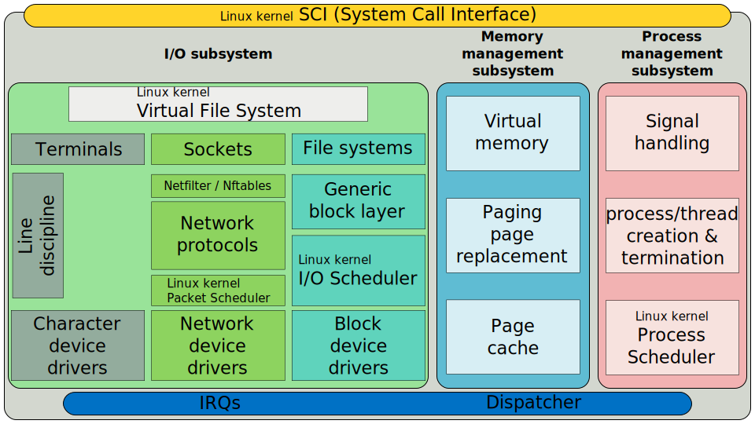

---


* Each RX queue is associated with a separate IRQ, which can be routed to a different CPU.

| Concept | Type | Primary Function | Key Feature |
| :-: | :-: | :-: | :-: |
| **RSS** | Hardware | Distributes packets across NIC queues | Hardware-based load balancing via hash |
| **RPS** | Software | Distributes received packets across CPUs | Software-based load balancing |
| **RFS** | Software | Steers packets to application’s CPU | Improves cache locality with flow table |
| **aRFS** | Hardware | Hardware-accelerated packet steering | Uses NIC filters for application locality |
| **LRO** | Hardware | Aggregates packets in NIC | Hardware-based packet coalescing |
| **GRO** | Software | Aggregates incoming packets into larger ones | Software-based packet coalescing |
| **XPS** | Software | Maps CPUs to transmit queues | Optimizes transmit queue selection |
| **TSO/GSO** | Hardware/Software | Segments large packets for transmission | Offloads segmentation to NIC or kernel |
| **NAPI** | Software | Polling-based packet processing | Reduces interrupt overhead in high traffic |
| **BQL** | Software | Limits transmit queue buffering | Self-tuning for low-latency transmission |
| **QDisc** | Software | Manages transmit traffic | Configurable traffic prioritization |
| **Interrupt Coalescing** | Hardware | Batches NIC interrupts | Reduces CPU overhead with tunable batching |

* **GRO**: Enabled/disabled via `ethtool -K <interface> gro on|off`. Requires NAPI driver support.
* **RPS**: Configured via `/sys/class/net/<device>/queues/rx-<queue>/rps_cpus` with CPU bitmaps. Disabled by default (set to 0).
* **RFS**: Enabled by setting `/proc/sys/net/core/rps_sock_flow_entries` and `/sys/class/net/<device>/queues/rx-<queue>/rps_flow_cnt`.
* **aRFS**: Requires NIC support for ntuple filters (`ethtool -K <interface> ntuple on`) and driver support for ndo_rx_flow_steer.
* **XPS**: Configured via `/sys/class/net/<device>/queues/tx-<queue>/xps_cpus`.
* **LRO**: Enabled/disabled via `ethtool -K <interface> lro on|off`, but often disabled when GRO is available.
* **TSO/GSO**: Enabled/disabled via `ethtool -K <interface> tso|gso on|off`.
* **NAPI**: Enabled by default in modern drivers; no manual configuration typically needed.
* **BQL**: Self-tuning, but limits can be adjusted via ethtool or driver parameters.
* **QDisc**: Configured via the tc command for advanced traffic control.
* **Interrupt Coalescing**: Tuned via `ethtool -C <interface> rx-usecs <value>` or driver-specific settings.

---


* While <span style="color:yellowgreen">struct proto</span> is protocol-specific (e.g., TCP vs. UDP), <span style="color:yellowgreen">struct proto_ops</span> is address-family-specific (e.g., IPv4 vs. IPv6).

---

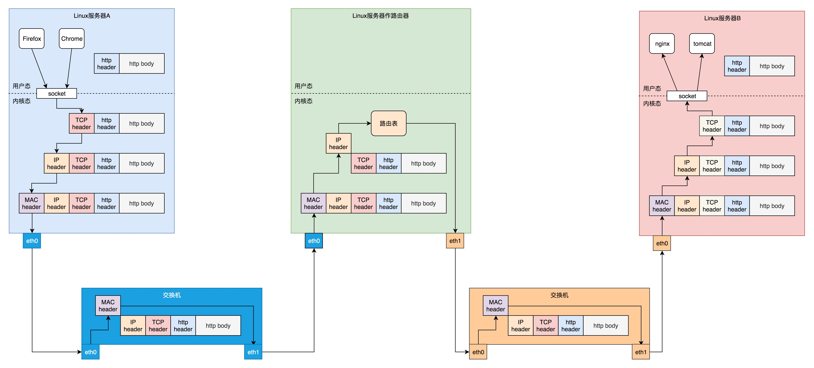

| **Device** | **Function** | **Key Feature** |
| :-: | :-: | :-: |
| **Router** | Connects different networks, directs data packets | Uses IP addresses, often includes Wi-Fi |
| **Switch** | Connects devices within a network | Uses MAC addresses, efficient data flow |
| **Hub** | Connects multiple devices, broadcasts data | Outdated, less efficient than switches |
| **Access Point (AP)** | Provides wireless connectivity to a wired network | Extends Wi-Fi coverage |
| **Modem** | Converts digital/analog signals for internet access | Connects to ISP (cable, DSL, fiber) |
| **Firewall** | Monitors and controls network traffic for security | Can be hardware or software |
| **Bridge** | Connects two network segments into one | Filters traffic by MAC addresses |
| **Gateway** | Links networks with different protocols | Often a router, translates network types |
| **Network Interface Card (NIC)** | Connects a device to a network (wired/wireless) | Essential for network access |
| **Repeater** | Amplifies/regenerates signals to extend range | Boosts Wi-Fi or wired signals |
| **Load Balancer** | Distributes traffic across multiple servers | Optimizes performance, prevents overload |
| **Wireless Controller** | Manages multiple access points in large Wi-Fi networks | Centralizes control in enterprises |
| **Network Attached Storage (NAS)** | Provides file storage and sharing over a network | Acts as a networked file server |
| **Proxy Server** | Intermediary between users and the internet | Enhances security, caches data |

```c
struct socket_alloc {
    struct socket socket;
    struct inode  vfs_inode;
};

struct socket {
    socket_state            state;
    short                   type;
    unsigned long           flags;

    struct file             *file;
    struct sock             *sk;
    struct socket_wq        wq;
    const struct proto_ops  *ops;
};

struct sock {
    struct sock_common    __sk_common;
    struct sk_buff        *sk_rx_skb_cache;

    struct page_frag      sk_frag; /* copy user space data to this page */
    int                   sk_sndbuf; /* size of send buffer in bytes */
    int                   sk_rcvbuf; /* size of receive buffer in bytes*/
    struct sk_buff_head   sk_receive_queue;  /* incoming packets */
    struct sk_buff_head   sk_write_queue;    /* outgoing Packets */

    u32                   sk_ack_backlog;   /* current listen backlog */
    u32                   sk_max_ack_backlog; /* listen backlog set in listen() */

#define sk_nulls_node   __sk_common.skc_nulls_node; /* main hash linkage for TCP/UDP/UDP-Lite protocol */

    union {
        struct sk_buff    *sk_send_head;
        struct rb_root    tcp_rtx_queue; /* re-transmit queue */
    };

    struct {
        atomic_t          rmem_alloc;
        int               len;
        struct sk_buff    *head;
        struct sk_buff    *tail;
    } sk_backlog;

    struct sk_filter    *sk_filter;

    union {
        struct socket_wq  *sk_wq;     /* private: */
        struct socket_wq  *sk_wq_raw; /* public: */
    };

    struct dst_entry    *sk_rx_dst;
    struct dst_entry    *sk_dst_cache;

    unsigned int        sk_ll_usec;
    /* ===== mostly read cache line ===== */
    unsigned int        sk_napi_id; /* set by sk_mark_napi_id */
};

struct socket_wq {
    wait_queue_head_t      wait;
    struct fasync_struct   *fasync_list;
    unsigned long          flags;
    struct rcu_head        rcu;
};

typedef struct wait_queue_head {
  spinlock_t        lock;
  struct list_head  head;
} wait_queue_head_t;

struct tcp_sock {
  struct inet_connection_sock  inet_conn;

  struct list_head tsq_node; /* anchor in tsq_tasklet.head list */
  struct list_head tsorted_sent_queue; /* time-sorted sent but un-SACKed skbs */

  /* OOO segments go in this rbtree. Socket lock must be held. */
  struct rb_root    out_of_order_queue;
  struct sk_buff    *ooo_last_skb; /* cache rb_last(out_of_order_queue) */

  /* TCP fastopen related information */
  struct tcp_fastopen_request *fastopen_req;
  /* fastopen_rsk points to request_sock that resulted in this big
    * socket. Used to retransmit SYNACKs etc. */
  struct request_sock *fastopen_rsk;

  u32  packets_out;  /* Packets which are "in flight"  */
  u32  retrans_out;  /* Retransmitted packets out    */
  u32  max_packets_out;  /* max packets_out in last window */
  u32  max_packets_seq;  /* right edge of max_packets_out flight */

  /* Slow start and congestion control (see also Nagle, and Karn & Partridge) */
  u32  snd_ssthresh;  /* Slow start size threshold    */
  u32  snd_cwnd;  /* Sending congestion window    */
  u32  snd_cwnd_cnt;  /* Linear increase counter    */
  u32  snd_cwnd_clamp; /* Do not allow snd_cwnd to grow above this */
  u32  snd_cwnd_used;
  u32  snd_cwnd_stamp;
  u32  prior_cwnd;  /* cwnd right before starting loss recovery */
  u32  prr_delivered;  /* Number of newly delivered packets to
         * receiver in Recovery. */
  u32  prr_out;  /* Total number of pkts sent during Recovery. */
  u32  delivered;  /* Total data packets delivered incl. rexmits */
  u32  delivered_ce;  /* Like the above but only ECE marked packets */
  u32  lost;    /* Total data packets lost incl. rexmits */
  u32  app_limited;  /* limited until "delivered" reaches this val */
  u64  first_tx_mstamp;  /* start of window send phase */
  u64  delivered_mstamp; /* time we reached "delivered" */
  u32  rate_delivered;    /* saved rate sample: packets delivered */
  u32  rate_interval_us;  /* saved rate sample: time elapsed */

  u32  rcv_wnd;  /* Current receiver window    */
  u32  write_seq;  /* Tail(+1) of data held in tcp send buffer */
  u32  notsent_lowat;  /* TCP_NOTSENT_LOWAT */
  u32  pushed_seq;  /* Last pushed seq, required to talk to windows */
  u32  lost_out;  /* Lost packets      */
  u32  sacked_out;  /* SACK'd packets      */
};

/* INET connection oriented sock */
struct inet_connection_sock {
  struct inet_sock            icsk_inet;
  struct inet_bind_bucket     *icsk_bind_hash;   /* Bind node */
  struct request_sock_queue   icsk_accept_queue; /* FIFO of established children */
  struct tcp_congestion_ops           *icsk_ca_ops;
  struct inet_connection_sock_af_ops  *icsk_af_ops; /* Operations which are AF_INET{4,6} specific */

  struct timer_list           sk_timer;
  struct timer_list           icsk_retransmit_timer;
  struct timer_list           icsk_delack_timer;

  __u32                       icsk_rto;
};

struct request_sock_queue {
  spinlock_t            rskq_lock;
  u8                    rskq_defer_accept;

  u32                   synflood_warned;
  atomic_t              qlen; /* half connect queue len */
  atomic_t              young;

  struct request_sock  *rskq_accept_head;
  struct request_sock  *rskq_accept_tail;
  struct fastopen_queue  fastopenq;
  /* Check max_qlen != 0 to determine if TFO is enabled. */
};

/* representation of INET sockets */
struct inet_sock {
  /* sk and pinet6 has to be the first two members of inet_sock */
  struct sock    sk;
  struct ipv6_pinfo  *pinet6; /* pointer to IPv6 control block */

  /* Socket demultiplex comparisons on incoming packets. */
#define inet_daddr        sk.__sk_common.skc_daddr
#define inet_dport        sk.__sk_common.skc_dport
#define inet_rcv_saddr    sk.__sk_common.skc_rcv_saddr
#define inet_num          sk.__sk_common.skc_num /* Local port */

  __be32        inet_saddr;
  __be16        inet_sport;

  __s16         uc_ttl;
  __u16         cmsg_flags;
  struct ip_options_rcu __rcu  *inet_opt;
  __u16         inet_id;

  __u8          tos;
  __u8          min_ttl;
  __u8          mc_ttl;
  __u8          pmtudisc;
  __u8          recverr:1,
                is_icsk:1,
                freebind:1,
                hdrincl:1,
                mc_loop:1,
                transparent:1,
                mc_all:1,
                nodefrag:1;
  __u8          bind_address_no_port:1,
                recverr_rfc4884:1,
                defer_connect:1; /* Indicates that fastopen_connect is set
                * and cookie exists so we defer connect
                * until first data frame is written */
  __u8          rcv_tos;
  __u8          convert_csum;
  int           uc_index;
  int           mc_index;
  __be32        mc_addr;
  struct ip_mc_socklist __rcu  *mc_list;
  struct inet_cork_full  cork;
};
```

# socket

```c
struct sock_common          ← shared header (hash, ports, state, family)
    |
    ▼
struct sock                 ← generic: rx/tx queues, sk_prot, callbacks
    |
    ▼
struct inet_sock            ← IPv4/IPv6: src/dst addr, ports, TTL, TOS, multicast, corking
    |
    |--► struct udp_sock         (UDP: embeds inet_sock directly)
    |
    |--► struct inet_connection_sock   (connection-oriented:  accept queue, retransmit/delack/keepalive timers, congestion ops)
        |
        |--► struct tcp_sock  (TCP: cwnd, seq numbers, retransmit, etc.)

struct sock_common
    |
    ▼
struct inet_timewait_sock


struct sock_common
    |
    ▼
struct request_sock         ← mini sock to represent a connection request
```

```c
socket() {
/* 1. create */
    sock_create() {
        struct socket *sock = _sock_create() {
            sock = sock_alloc() {
/* 1.1 create socket inode */
                inode = new_inode_pseudo(super_block *sb) {
                    alloc_inode(sb) {
                        if (sb->s_op->alloc_inode) {
                            inode = sb->s_op->alloc_inode(sb) {
                                sock_alloc_inode() {
                                    struct socket_alloc *ei = kmem_cache_alloc(sock_inode_cachep);
                                    struct socket_wq *wq = kmalloc(sizeof(*wq), GFP_KERNEL);
                                }
                            }
                        } else {
                            inode = kmem_cache_alloc(inode_cachep, GFP_KERNEL);
                        }
                    }
                }
                sock = SOCKET_I(inode);
                inode->i_op = &sockfs_inode_ops;
            }

/* 1.2 create sock */
            pf = net_families[family]; /* get AF */
            pf->create() { /* inet_family_ops.inet_create */
                inet_create() {
                    inet_protosw *answer = inetsw[sock->type]; /* get socket */
                    sock->ops = answer->ops;
                    struct sock *sk = sk_alloc() {
                        sk_prot_alloc() {
                            slab = prot->slab;
                            if (slab)
                                kmem_cache_alloc(slab);
                            else
                                kmalloc(prot->obj_size);
                        }
                    }

/* 1.3 init sock */
                    sock_init_data(sock, sk) {
                        sk_init_common(sk);

                        /* 1.3.1 init sock callback */
                        sk->sk_state_change = sock_def_wakeup;
                        sk->sk_data_ready = sock_def_readable;
                        sk->sk_write_space = sock_def_write_space;

                        sock->sk = sk;
                        sk->sk_socket = sock;
                    }

                    /* 1.3.2 no-listen hash */
                    sk->sk_prot->hash(sk) { /* inet_hash */
                        if (sk->sk_state != TCP_LISTEN) {
                            inet_ehash_nolisten(sk, osk, NULL);
                            return 0;
                        }
                    }

                    sk->sk_prot->init(sk) {
                        tcp_v4_init_sock() {
                            tcp_init_sock() {
                                tp->out_of_order_queue = RB_ROOT;
                                sk->tcp_rtx_queue = RB_ROOT;

                                /* 1.3.3 init timers */
                                tcp_init_xmit_timers() {
                                    inet_csk_init_xmit_timers(sk,
                                        &tcp_write_timer,
                                        &tcp_delack_timer,
                                        &tcp_keepalive_timer
                                    );
                                }

                                /* 1.3.4 init congestion control */
                                sk->sk_state = TCP_CLOSE;
                                tp->snd_cwnd = TCP_INIT_CWND;
                                tp->snd_ssthresh = TCP_INFINITE_SSTHRESH;
                                tcp_assign_congestion_control() {
                                    icsk->icsk_ca_ops = rcu_dereference(net->ipv4.tcp_congestion_control);
                                }

                                /* 1.3.5 init rx tx buffer */
                                sk->sk_sndbuf = sock_net(sk)->ipv4.sysctl_tcp_wmem[1];
                                sk->sk_rcvbuf = sock_net(sk)->ipv4.sysctl_tcp_rmem[1];
                            }
                        }
                        icsk->icsk_af_ops = &ipv4_specific;
                        tcp_sk(sk)->af_specific = &tcp_sock_ipv4_specific;
                    }
                }
            }
        }
    }


/* 2. map */
    sock_map_fd() {
        fd = get_unused_fd_flags();

        new_file = sock_alloc_file() {
            alloc_file_pseudo(inode, mnt, dname, flags, &socket_file_ops) {
                d_alloc_pseudo();
                d_set_d_op(&anon_ops);
                alloc_file() {
                    struct file *file = alloc_empty_file(flags, current_cred()) {
                        kmem_cache_zalloc(filp_cachep);
                    }
                    file->f_path = *path;
                    file->f_inode = path->dentry->d_inode;
                    file->f_mapping = path->dentry->d_inode->i_mapping;
                    file->f_op = socket_file_ops;
                }
            }
            sock->file = file;
            file->private_data = sock;
        }

        fd_install(fd, newfile);
    }
}
```

```c
SYSCALL_DEFINE3(socket, int, family, int, type, int, protocol)
{
  int retval;
  struct socket *sock;
  int flags;

  if (SOCK_NONBLOCK != O_NONBLOCK && (flags & SOCK_NONBLOCK))
    flags = (flags & ~SOCK_NONBLOCK) | O_NONBLOCK;

  retval = sock_create(family, type, protocol, &sock);
  retval = sock_map_fd(sock, flags & (O_CLOEXEC | O_NONBLOCK));

  return retval;
}

int sock_create(int family, int type, int protocol, struct socket **res)
{
  return __sock_create(current->nsproxy->net_ns, family, type, protocol, res, 0);
}

int __sock_create(
  struct net *net, int family, int type, int protocol,
  struct socket **res, int kern)
{
  int err;
  struct socket *sock;
  const struct net_proto_family *pf;

  /* Allocate the socket and allow the family to set things up */
  sock = sock_alloc();
  sock->type = type;

  pf = rcu_dereference(net_families[family]);
  err = pf->create(net, sock, protocol, kern);

  *res = sock;

  return 0;
}

struct socket *sock_alloc(void)
{
  struct inode *inode;
  struct socket *sock;

  inode = new_inode_pseudo(sock_mnt->mnt_sb);
  sock = SOCKET_I(inode);

  inode->i_ino = get_next_ino();
  inode->i_mode = S_IFSOCK | S_IRWXUGO;
  inode->i_uid = current_fsuid();
  inode->i_gid = current_fsgid();
  inode->i_op = &sockfs_inode_ops;

  return sock;
}

struct inode *new_inode_pseudo(struct super_block *sb)
{
  struct inode *inode = alloc_inode(sb);

  if (inode) {
    spin_lock(&inode->i_lock);
    inode->i_state = 0;
    spin_unlock(&inode->i_lock);
    INIT_LIST_HEAD(&inode->i_sb_list);
  }
  return inode;
}

const struct super_operations sockfs_ops = {
  .alloc_inode    = sock_alloc_inode,
  .destroy_inode  = sock_destroy_inode,
  .statfs         = simple_statfs,
};

struct inode *alloc_inode(struct super_block *sb)
{
  struct inode *inode;

  if (sb->s_op->alloc_inode)
    inode = sb->s_op->alloc_inode(sb); /* sock_alloc_inode */
  else
    inode = kmem_cache_alloc(inode_cachep, GFP_KERNEL);

  if (!inode)
    return NULL;

  if (unlikely(inode_init_always(sb, inode))) {
    if (inode->i_sb->s_op->destroy_inode)
      inode->i_sb->s_op->destroy_inode(inode);
    else
      kmem_cache_free(inode_cachep, inode);
    return NULL;
  }

  return inode;
}

struct kmem_cache *sock_inode_cachep __ro_after_init;

struct inode *sock_alloc_inode(struct super_block *sb)
{
  struct socket_alloc *ei;
  struct socket_wq *wq;

  ei = kmem_cache_alloc(sock_inode_cachep, GFP_KERNEL);
  if (!ei)
    return NULL;
  wq = kmalloc(sizeof(*wq), GFP_KERNEL);
  if (!wq) {
    kmem_cache_free(sock_inode_cachep, ei);
    return NULL;
  }
  init_waitqueue_head(&wq->wait);
  wq->fasync_list = NULL;
  wq->flags = 0;
  ei->socket.wq = wq;

  ei->socket.state = SS_UNCONNECTED;
  ei->socket.flags = 0;
  ei->socket.ops = NULL;
  ei->socket.sk = NULL;
  ei->socket.file = NULL;

  return &ei->vfs_inode;
}

enum sock_type {
  SOCK_STREAM = 1,
  SOCK_DGRAM  = 2,
  SOCK_RAW    = 3,
};

/* Supported address families. */
#define AF_UNSPEC 0
#define AF_UNIX   1   /* Unix domain sockets */
#define AF_LOCAL  1   /* POSIX name for AF_UNIX */
#define AF_INET   2   /* Internet IP Protocol */
#define AF_INET6  10  /* IP version 6 */
#define AF_MPLS   28  /* MPLS */
#define AF_MAX    44  /* For now */
#define NPROTO    AF_MAX

struct net_proto_family *net_families[NPROTO];
/* net/ipv4/af_inet.c */
const struct net_proto_family inet_family_ops = {
  .family = PF_INET,
  .create = inet_create
}

int inet_create(
  struct net *net, struct socket *sock, int protocol, int kern)
{
  struct sock *sk;
  struct inet_protosw *answer;
  struct inet_sock *inet;
  struct proto *answer_prot;
  unsigned char answer_flags;
  int try_loading_module = 0;
  int err;

  sock->state = SS_UNCONNECTED;

  /* Look for the requested type/protocol pair. */
lookup_protocol:
  list_for_each_entry_rcu(answer, &inetsw[sock->type], list) {
    err = 0;
    /* Check the non-wild match. */
    if (protocol == answer->protocol) {
      if (protocol != IPPROTO_IP)
        break;
    } else {
      /* Check for the two wild cases. */
      if (IPPROTO_IP == protocol) {
        protocol = answer->protocol;
        break;
      }
      if (IPPROTO_IP == answer->protocol)
        break;
    }
    err = -EPROTONOSUPPORT;
  }

  sock->ops = answer->ops;
  answer_prot = answer->prot;
  answer_flags = answer->flags;

  sk = sk_alloc(net, PF_INET, GFP_KERNEL, answer_prot, kern);

  inet = inet_sk(sk);
  inet->nodefrag = 0;
  if (SOCK_RAW == sock->type) {
    inet->inet_num = protocol;
    if (IPPROTO_RAW == protocol)
      inet->hdrincl = 1;
  }
  inet->inet_id = 0;
  sock_init_data(sock, sk);

  sk->sk_destruct     = inet_sock_destruct;
  sk->sk_protocol     = protocol;
  sk->sk_backlog_rcv = sk->sk_prot->backlog_rcv;

  inet->uc_ttl  = -1;
  inet->mc_loop  = 1;
  inet->mc_ttl  = 1;
  inet->mc_all  = 1;
  inet->mc_index  = 0;
  inet->mc_list  = NULL;
  inet->rcv_tos  = 0;

  if (inet->inet_num) {
    inet->inet_sport = htons(inet->inet_num);
    err = sk->sk_prot->hash(sk); /* inet_hash */
  }

  if (sk->sk_prot->init) {
    err = sk->sk_prot->init(sk); /* tcp_v4_init_sock() */
  }
}

struct sock *sk_alloc(
  struct net *net, int family, gfp_t priority,
  struct proto *prot, int kern)
{
  struct sock *sk;

  sk = sk_prot_alloc(prot, priority | __GFP_ZERO, family);
  if (sk) {
    sk->sk_family = family;
    sk->sk_prot = sk->sk_prot_creator = prot;
    sk->sk_kern_sock = kern;
    sock_lock_init(sk);
    sk->sk_net_refcnt = kern ? 0 : 1;
    if (likely(sk->sk_net_refcnt)) {
      get_net(net);
      sock_inuse_add(net, 1);
    }

    sock_net_set(sk, net);
    refcount_set(&sk->sk_wmem_alloc, 1);

    mem_cgroup_sk_alloc(sk);
    cgroup_sk_alloc(&sk->sk_cgrp_data);
    sock_update_classid(&sk->sk_cgrp_data);
    sock_update_netprioidx(&sk->sk_cgrp_data);
    sk_tx_queue_clear(sk);
  }

  return sk;
}

struct sock *sk_prot_alloc(
  struct proto *prot, gfp_t priority, int family)
{
  struct sock *sk;
  struct kmem_cache *slab;

  slab = prot->slab;
  if (slab != NULL) {
    sk = kmem_cache_alloc(slab, priority & ~__GFP_ZERO);
    if (!sk)
      return sk;
    if (priority & __GFP_ZERO)
      sk_prot_clear_nulls(sk, prot->obj_size);
  } else
    sk = kmalloc(prot->obj_size, priority);

  if (sk != NULL) {
    if (security_sk_alloc(sk, family, priority))
      goto out_free;

    if (!try_module_get(prot->owner))
      goto out_free_sec;
    sk_tx_queue_clear(sk);
  }

  return sk;

out_free_sec:
  security_sk_free(sk);
out_free:
  if (slab != NULL)
    kmem_cache_free(slab, sk);
  else
    kfree(sk);
  return NULL;
}

/* sw: switch */
struct list_head inetsw[SOCK_MAX];
int __init inet_init(void)
{
  /* Register the socket-side information for inet_create. */
  for (r = &inetsw[0]; r < &inetsw[SOCK_MAX]; ++r)
    INIT_LIST_HEAD(r);
  for (q = inetsw_array; q < &inetsw_array[INETSW_ARRAY_LEN]; ++q)
    inet_register_protosw(q);
}

struct inet_protosw inetsw_array[] =
{
  {
    .type       = SOCK_STREAM,
    .protocol   = IPPROTO_TCP,
    .prot       = &tcp_prot,
    .ops        = &inet_stream_ops,
    .flags      = INET_PROTOSW_PERMANENT | INET_PROTOSW_ICSK,
  },
  {
    .type       = SOCK_DGRAM,
    .protocol   = IPPROTO_UDP,
    .prot       = &udp_prot,
    .ops        = &inet_dgram_ops,
    .flags      = INET_PROTOSW_PERMANENT,
  },
  {
    .type       = SOCK_DGRAM,
    .protocol   = IPPROTO_ICMP,
    .prot       = &ping_prot,
    .ops        = &inet_sockraw_ops,
    .flags      = INET_PROTOSW_REUSE,
  },
  {
    .type       = SOCK_RAW,
    .protocol   = IPPROTO_IP,  /* wild card */
    .prot       = &raw_prot,
    .ops        = &inet_sockraw_ops,
    .flags      = INET_PROTOSW_REUSE,
  }
};

/* sock_ops is better, sock_{steam, dgram, raw}_ops */
const struct proto_ops inet_stream_ops = {
  .family       = PF_INET,
  .owner        = THIS_MODULE,
  .bind         = inet_bind,
  .connect      = inet_stream_connect,
  .accept       = inet_accept,
  .listen       = inet_listen
  .sendmsg      = inet_sendmsg,
  .recvmsg      = inet_recvmsg
};

struct proto tcp_prot = {
  .name         = "TCP",
  .owner        = THIS_MODULE,
  .connect      = tcp_v4_connect,
  .recvmsg      = tcp_recvmsg,
  .sendmsg      = tcp_sendmsg,
  .get_port     = inet_csk_get_port,
  .backlog_rcv  = tcp_v4_do_rcv,
  .hash         = inet_hash,
  .unhash       = inet_unhash,
  .h.hashinfo   = &tcp_hashinfo
}
```

```c
int sock_map_fd(struct socket *sock, int flags)
{
  struct file *newfile;
  int fd = get_unused_fd_flags(flags);
  if (unlikely(fd < 0)) {
    sock_release(sock);
    return fd;
  }

  newfile = sock_alloc_file(sock, flags, NULL);
  if (likely(!IS_ERR(newfile))) {
    fd_install(fd, newfile);
    return fd;
  }

  put_unused_fd(fd);
  return PTR_ERR(newfile);
}

struct file *sock_alloc_file(struct socket *sock, int flags, const char *dname)
{
  struct file *file;

  if (!dname)
    dname = sock->sk ? sock->sk->sk_prot_creator->name : "";

  file = alloc_file_pseudo(SOCK_INODE(sock), sock_mnt, dname,
        O_RDWR | (flags & O_NONBLOCK),
        &socket_file_ops);
  if (IS_ERR(file)) {
    sock_release(sock);
    return file;
  }

  sock->file = file;
  file->private_data = sock;
  return file;
}

struct file *alloc_file_pseudo(
  struct inode *inode, struct vfsmount *mnt,
  const char *name, int flags,
  const struct file_operations *fops)
{
  static const struct dentry_operations anon_ops = {
    .d_dname = simple_dname
  };

  struct qstr this = QSTR_INIT(name, strlen(name));
  struct path path;
  struct file *file;

  path.dentry = d_alloc_pseudo(mnt->mnt_sb, &this);

  if (!mnt->mnt_sb->s_d_op)
    d_set_d_op(path.dentry, &anon_ops);

  path.mnt = mntget(mnt);
  d_instantiate(path.dentry, inode);

  file = alloc_file(&path, flags, fops);
  if (IS_ERR(file)) {
    ihold(inode);
    path_put(&path);
  }
  return file;
}

struct file *alloc_file(
  const struct path *path, int flags,
  const struct file_operations *fop)
{
  struct file *file = alloc_empty_file(flags, current_cred());

  file->f_op = fop;
  file->f_path = *path;
  file->f_inode = path->dentry->d_inode;
  file->f_mapping = path->dentry->d_inode->i_mapping;
  file->f_wb_err = filemap_sample_wb_err(file->f_mapping);

  if ((file->f_mode & FMODE_READ) && likely(fop->read || fop->read_iter))
    file->f_mode |= FMODE_CAN_READ;
  if ((file->f_mode & FMODE_WRITE) && likely(fop->write || fop->write_iter))
    file->f_mode |= FMODE_CAN_WRITE;

  file->f_mode |= FMODE_OPENED;

  if ((file->f_mode & (FMODE_READ | FMODE_WRITE)) == FMODE_READ)
    i_readcount_inc(path->dentry->d_inode);

  return file;
}
```

```c
void sock_init_data(struct socket *sock, struct sock *sk)
{
  sk_init_common(sk);
  sk->sk_send_head  =  NULL;

  timer_setup(&sk->sk_timer, NULL, 0);

  sk->sk_allocation  =  GFP_KERNEL;
  sk->sk_rcvbuf    =  sysctl_rmem_default;
  sk->sk_sndbuf    =  sysctl_wmem_default;
  sk->sk_state    =  TCP_CLOSE;

  sk_set_socket(sk, sock);

  sock_set_flag(sk, SOCK_ZAPPED);

  if (sock) {
    sk->sk_type  =  sock->type;
    sk->sk_wq  =  sock->wq;
    sock->sk  =  sk;
    sk->sk_uid  =  SOCK_INODE(sock)->i_uid;
  } else {
    sk->sk_wq  =  NULL;
    sk->sk_uid  =  make_kuid(sock_net(sk)->user_ns, 0);
  }

  rwlock_init(&sk->sk_callback_lock);
  if (sk->sk_kern_sock)
    lockdep_set_class_and_name(
      &sk->sk_callback_lock,
      af_kern_callback_keys + sk->sk_family,
      af_family_kern_clock_key_strings[sk->sk_family]);
  else
    lockdep_set_class_and_name(
      &sk->sk_callback_lock,
      af_callback_keys + sk->sk_family,
      af_family_clock_key_strings[sk->sk_family]);

  sk->sk_state_change  =  sock_def_wakeup;
  sk->sk_data_ready  =  sock_def_readable;
  sk->sk_write_space  =  sock_def_write_space;
  sk->sk_error_report  =  sock_def_error_report;
  sk->sk_destruct    =  sock_def_destruct;

  sk->sk_frag.page  =  NULL;
  sk->sk_frag.offset  =  0;
  sk->sk_peek_off    =  -1;

  sk->sk_peer_pid   =  NULL;
  sk->sk_peer_cred  =  NULL;
  sk->sk_write_pending  =  0;
  sk->sk_rcvlowat    =  1;
  sk->sk_rcvtimeo    =  MAX_SCHEDULE_TIMEOUT;
  sk->sk_sndtimeo    =  MAX_SCHEDULE_TIMEOUT;

  sk->sk_stamp = SK_DEFAULT_STAMP;
#if BITS_PER_LONG==32
  seqlock_init(&sk->sk_stamp_seq);
#endif
  atomic_set(&sk->sk_zckey, 0);

#ifdef CONFIG_NET_RX_BUSY_POLL
  sk->sk_napi_id    =  0;
  sk->sk_ll_usec    =  sysctl_net_busy_read;
#endif

  sk->sk_max_pacing_rate = ~0U;
  sk->sk_pacing_rate = ~0U;
  sk->sk_pacing_shift = 10;
  sk->sk_incoming_cpu = -1;

  sk_rx_queue_clear(sk);
  /* Before updating sk_refcnt, we must commit prior changes to memory
   * (Documentation/RCU/rculist_nulls.txt for details) */
  smp_wmb();
  refcount_set(&sk->sk_refcnt, 1);
  atomic_set(&sk->sk_drops, 0);
}

/* sk_prot->init(sk); */
int tcp_v4_init_sock(struct sock *sk)
{
  struct inet_connection_sock *icsk = inet_csk(sk);

  tcp_init_sock(sk);

  icsk->icsk_af_ops = &ipv4_specific;

  tcp_sk(sk)->af_specific = &tcp_sock_ipv4_specific;

  return 0;
}

void tcp_init_sock(struct sock *sk)
{
  struct inet_connection_sock *icsk = inet_csk(sk);
  struct tcp_sock *tp = tcp_sk(sk);

  tp->out_of_order_queue = RB_ROOT;
  sk->tcp_rtx_queue = RB_ROOT;
  tcp_init_xmit_timers(sk);
  INIT_LIST_HEAD(&tp->tsq_node);
  INIT_LIST_HEAD(&tp->tsorted_sent_queue);

  icsk->icsk_rto = TCP_TIMEOUT_INIT;
  tp->mdev_us = jiffies_to_usecs(TCP_TIMEOUT_INIT);
  minmax_reset(&tp->rtt_min, tcp_jiffies32, ~0U);

  /* So many TCP implementations out there (incorrectly) count the
   * initial SYN frame in their delayed-ACK and congestion control
   * algorithms that we must have the following bandaid to talk
   * efficiently to them.  -DaveM */
  tp->snd_cwnd = TCP_INIT_CWND;

  /* There's a bubble in the pipe until at least the first ACK. */
  tp->app_limited = ~0U;

  /* See draft-stevens-tcpca-spec-01 for discussion of the
   * initialization of these values. */
  tp->snd_ssthresh = TCP_INFINITE_SSTHRESH;
  tp->snd_cwnd_clamp = ~0;
  tp->mss_cache = TCP_MSS_DEFAULT;

  tp->reordering = sock_net(sk)->ipv4.sysctl_tcp_reordering;
  tcp_assign_congestion_control(sk);

  tp->tsoffset = 0;
  tp->rack.reo_wnd_steps = 1;

  sk->sk_state = TCP_CLOSE;

  sk->sk_write_space = sk_stream_write_space;
  sock_set_flag(sk, SOCK_USE_WRITE_QUEUE);

  icsk->icsk_sync_mss = tcp_sync_mss;

  sk->sk_sndbuf = sock_net(sk)->ipv4.sysctl_tcp_wmem[1];
  sk->sk_rcvbuf = sock_net(sk)->ipv4.sysctl_tcp_rmem[1];

  sk_sockets_allocated_inc(sk);
  sk->sk_route_forced_caps = NETIF_F_GSO;
}
```

# bind
```c
SYSCALL_DEFINE3(bind, int, fd, struct sockaddr __user *, umyaddr, int, addrlen)
{
  struct socket *sock;
  struct sockaddr_storage address;
  int err, fput_needed;

  sock = sockfd_lookup_light(fd, &err, &fput_needed);
  if (sock) {
    err = move_addr_to_kernel(umyaddr, addrlen, &address);
    if (err >= 0) {
      err = sock->ops->bind(sock, (struct sockaddr *)&address, addrlen);
    }
    fput_light(sock->file, fput_needed);
  }
  return err;
}

/* inet_stream_ops.bind */
int inet_bind(struct socket *sock, struct sockaddr *uaddr, int addr_len)
{
  struct sock *sk = sock->sk;
  u32 flags = BIND_WITH_LOCK;
  int err;

  if (sk->sk_prot->bind) {
    return sk->sk_prot->bind(sk, uaddr, addr_len);
  }
  if (addr_len < sizeof(struct sockaddr_in))
    return -EINVAL;

  if (err)
    return err;

  return __inet_bind(sk, uaddr, addr_len, flags);
}

int __inet_bind(struct socket *sock, struct sockaddr *uaddr, int addr_len)
{
  struct sockaddr_in *addr = (struct sockaddr_in *)uaddr;
  struct sock *sk = sock->sk;
  struct inet_sock *inet = inet_sk(sk);
  struct net *net = sock_net(sk);
  unsigned short snum;
  snum = ntohs(addr->sin_port);

  inet->inet_rcv_saddr = inet->inet_saddr = addr->sin_addr.s_addr;
  /* Make sure we are allowed to bind here. */
  if (snum || !(inet->bind_address_no_port || force_bind_address_no_port)) {
    /* use inet_csk_get_port to check confilct of port */
    if (sk->sk_prot->get_port(sk, snum)) {
      inet->inet_saddr = inet->inet_rcv_saddr = 0;
      err = -EADDRINUSE;
      goto out_release_sock;
    }
    err = BPF_CGROUP_RUN_PROG_INET4_POST_BIND(sk);
    if (err) {
      inet->inet_saddr = inet->inet_rcv_saddr = 0;
      goto out_release_sock;
    }
  }
  inet->inet_sport = htons(inet->inet_num);
  inet->inet_daddr = 0;
  inet->inet_dport = 0;
  sk_dst_reset(sk);
}
```

# listen


```c
listen() {
    sockfd_lookup_light();
    sock->ops->listen() { /*inet_stream_ops.listen */
        inet_listen() {
            inet_csk_listen_start() {
                /* allock request sock queue */
                reqsk_queue_alloc() {
                    queue->fastopenq.rskq_rst_head = NULL;
                    queue->fastopenq.rskq_rst_tail = NULL;
                    queue->fastopenq.qlen = 0;
                }

                inet_csk_delack_init(sk);
                sk_state_store(sk, TCP_LISTEN);

                sk->sk_prot->get_port();

                /* insert into lhash2 */
                sk->sk_prot->hash(sk) {
                    inet_hash() {
                        if (sk->sk_state != TCP_LISTEN) {
                            inet_ehash_nolisten(sk, osk);
                            return 0;
                        }

                        if (sk->sk_reuseport) {
                            inet_reuseport_add_sock();
                            return;
                        }

                        struct inet_listen_hashbucket* ilb2 = inet_lhash2_bucket_sk(hashinfo, sk);
                        __sk_nulls_add_node_rcu(sk, &ilb2->nulls_head);
                    }
                }
            }
            sk->sk_max_ack_backlog = backlog;
        }
    }
}
```

```c
SYSCALL_DEFINE2(listen, int, fd, int, backlog)
{
    struct socket *sock;
    int err, fput_needed;
    int somaxconn;

    sock = sockfd_lookup_light(fd, &err, &fput_needed);
    if (sock) {
        somaxconn = sock_net(sock->sk)->core.sysctl_somaxconn;
        if ((unsigned int)backlog > somaxconn)
            backlog = somaxconn;
        err = sock->ops->listen(sock, backlog);
        fput_light(sock->file, fput_needed);
    }
    return err;
}

/* inet_stream_ops.listen */
int inet_listen(struct socket *sock, int backlog)
{
    struct sock *sk = sock->sk;
    unsigned char old_state;
    int err, tcp_fastopen;

    lock_sock(sk);

    err = -EINVAL;
    if (sock->state != SS_UNCONNECTED || sock->type != SOCK_STREAM)
        goto out;

    old_state = sk->sk_state;
    if (!((1 << old_state) & (TCPF_CLOSE | TCPF_LISTEN)))
        goto out;

    /* Really, if the socket is already in listen state
     * we can only allow the backlog to be adjusted. */
    if (old_state != TCP_LISTEN) {
        /* Enable TFO w/o requiring TCP_FASTOPEN socket option.
        * Note that only TCP sockets (SOCK_STREAM) will reach here.
        * Also fastopen backlog may already been set via the option
        * because the socket was in TCP_LISTEN state previously but
        * was shutdown() rather than close(). */
        tcp_fastopen = sock_net(sk)->ipv4.sysctl_tcp_fastopen;
        if ((tcp_fastopen & TFO_SERVER_WO_SOCKOPT1) &&
            (tcp_fastopen & TFO_SERVER_ENABLE) &&
            !inet_csk(sk)->icsk_accept_queue.fastopenq.max_qlen)
        {
            fastopen_queue_tune(sk, backlog);
            tcp_fastopen_init_key_once(sock_net(sk));
        }

        err = inet_csk_listen_start(sk, backlog);
        if (err)
            goto out;
        tcp_call_bpf(sk, BPF_SOCK_OPS_TCP_LISTEN_CB, 0, NULL);
    }
    sk->sk_max_ack_backlog = backlog;
    err = 0;

out:
    release_sock(sk);
    return err;
}

int inet_csk_listen_start(struct sock *sk, int backlog)
{
    struct inet_connection_sock *icsk = inet_csk(sk);
    struct inet_sock *inet = inet_sk(sk);
    int err = -EADDRINUSE;

    reqsk_queue_alloc(&icsk->icsk_accept_queue); /* FIFO of established children */

    sk->sk_max_ack_backlog = backlog;            /* listen backlog set in listen() */
    sk->sk_ack_backlog = 0;                      /* current listen backlog */
    inet_csk_delack_init(sk);

    sk_state_store(sk, TCP_LISTEN);
    /* socket enters to hash table only after validation is complete */
    if (!sk->sk_prot->get_port(sk, inet->inet_num)) {
        inet->inet_sport = htons(inet->inet_num);

        sk_dst_reset(sk);
        err = sk->sk_prot->hash(sk);

        if (likely(!err))
        return 0;
    }

    inet_sk_set_state(sk, TCP_CLOSE);
    return err;
}

void reqsk_queue_alloc(struct request_sock_queue *queue)
{
    spin_lock_init(&queue->rskq_lock);

    spin_lock_init(&queue->fastopenq.lock);
    queue->fastopenq.rskq_rst_head = NULL;
    queue->fastopenq.rskq_rst_tail = NULL;
    queue->fastopenq.qlen = 0;

    queue->rskq_accept_head = NULL;
}

struct proto tcp_prot = {
    .hash = inet_hash;
}

int inet_hash(struct sock *sk)
{
    int err = 0;

    if (sk->sk_state != TCP_CLOSE) {
        local_bh_disable();
        err = __inet_hash(sk, NULL);
        local_bh_enable();
    }

    return err;
}

/* net/ipv4/tcp_ipv4.c */
struct inet_hashinfo tcp_hashinfo;

int __inet_hash(struct sock *sk, struct sock *osk)
{
    struct inet_hashinfo *hashinfo = sk->sk_prot->h.hashinfo; /* tcp_hashinfo; */
    struct inet_listen_hashbucket *ilb;
    int err = 0;

    if (sk->sk_state != TCP_LISTEN) {
        inet_ehash_nolisten(sk, osk);
        return 0;
    }

    ilb = &hashinfo->listening_hash[inet_sk_listen_hashfn(sk)];

    spin_lock(&ilb->lock);
    if (sk->sk_reuseport) {
        err = inet_reuseport_add_sock(sk, ilb);
        if (err)
        goto unlock;
    }
    if (IS_ENABLED(CONFIG_IPV6) && sk->sk_reuseport && sk->sk_family == AF_INET6)
        __sk_nulls_add_node_tail_rcu(sk, &ilb->nulls_head);
    else
        __sk_nulls_add_node_rcu(sk, &ilb->nulls_head);

    inet_hash2(hashinfo, sk);
    ilb->count++;
    sock_set_flag(sk, SOCK_RCU_FREE);
    sock_prot_inuse_add(sock_net(sk), sk->sk_prot, 1);
unlock:
    spin_unlock(&ilb->lock);

    return err;
}

void inet_hash2(struct inet_hashinfo *h, struct sock *sk)
{
    struct inet_listen_hashbucket *ilb2;

    if (!h->lhash2)
        return;

    ilb2 = inet_lhash2_bucket_sk(h, sk);

    spin_lock(&ilb2->lock);
    if (sk->sk_reuseport && sk->sk_family == AF_INET6)
        hlist_add_tail_rcu(&inet_csk(sk)->icsk_listen_portaddr_node, &ilb2->head);
    else
        hlist_add_head_rcu(&inet_csk(sk)->icsk_listen_portaddr_node, &ilb2->head);
    ilb2->count++;
    spin_unlock(&ilb2->lock);
}
```

# connect


```c
send:
connect() {
    sock = sockfd_lookup_light();
    sock->ops->connect(sock) {
        __inet_stream_connect() {
            sk->sk_prot->connect() { /* SS_UNCONNECTED */
                tcp_v4_connect() {
                    ip_route_connect();
                    inet_hash_connect();
                    secure_tcp_seq();
                    secure_tcp_ts_off();
                    tcp_set_state(sk, TCP_SYN_SENT);

                    tcp_connect() {
                        tcp_connect_init() {
                            tcp_select_initial_window();
                            tp->snd_una = tp->write_seq;
                            tp->snd_nxt = tp->write_seq;
                        }

                        tcp_stream_alloc_skb();
                        tcp_init_nondata_skb(TCPHDR_SYN);
                        tcp_transmit_skb();
                        tcp_send_head();
                        inet_csk_reset_xmit_timer();
                    }
                }
            }

            if (!(flags & O_NONBLOCK)) {
                inet_wait_for_connect()
                    /* woken up by sk->sk_state_change() at tcp_rcv_synsent_state_process */
            }
        }
    }
}


receive:
tcp_v4_rcv() {
    sk = __inet_lookup_skb() {
        __inet_lookup_established();
        __inet_lookup_listener();
    }

    if (sk->sk_state == TCP_NEW_SYN_RECV) {
        struct request_sock *req = inet_reqsk(sk);
        sk = req->rsk_listener;

        newsk = tcp_check_req() {
            child = inet_csk(sk)->icsk_af_ops->syn_recv_sock() {
                tcp_v4_syn_recv_sock() {
                    if (sk_acceptq_is_full());
                        goto drop;
                    newsk = tcp_create_openreq_child(sk, req, skb) {
                        inet_csk_clone_lock() {
                            inet_sk_set_state(newsk, TCP_SYN_RECV) {
                                sk->sk_state = TCP_SYN_RECV;
                            }
                        tcp_init_xmit_timers();
                        }
                    }

                    inet_ehash_nolisten() {
                        inet_ehash_insert() { /* hash insert the new sk and remove the old request_sk */
                            inet_ehash_bucket(hashinfo, sk->sk_hash);
                            __sk_nulls_add_node_rcu();
                                hlist_nulls_add_head_rcu(&sk->sk_nulls_node, list);
                            if (osk)
                                sk_nulls_del_node_init_rcu(osk);
                        }
                    }
                }
            }

            inet_csk_complete_hashdance(child) {
                inet_csk_reqsk_queue_drop() {
                    reqsk_queue_unlink() {
                        __sk_nulls_del_node_init_rcu(sk) {
                            hlist_nulls_del_init_rcu(&sk->sk_nulls_node);
                        }
                    }
                    reqsk_queue_removed() {
                        --icsk_accept_queue.yong;
                        --icsk_accept_queue.qlen;
                    }
                }
                reqsk_queue_removed();

                inet_csk_reqsk_queue_add() {
                    sk->rskq_accept_tail = reqst_sk;
                    sk_acceptq_added() {
                        icsk_accept_queue->rskq_accept_tail = req;
                        sk_acceptq_added();
                            ++sk->sk_ack_backlog
                    }
                }
            }
        }

        tcp_child_process() {
            if (!sock_owned_by_user(child)) {
                tcp_rcv_state_process(child, skb);
                sk_listener->sk_data_ready() /* sock_def_readable */
            } else {
                __sk_add_backlog(child, skb);
            }
        }
    }

    tcp_filter(sk, skb);
    tcp_v4_fill_cb(skb, iph, th);

    tcp_v4_do_rcv() {
        tcp_rcv_state_process() {
            if (sk->sk_state == TCP_LISTEN) {
                icsk->icsk_af_ops->conn_request() { /* ipv4_specific.conn_request */
                    tcp_v4_conn_request() {
                        tcp_conn_request() {
                            if (inet_csk_reqsk_queue_is_full(sk));
                                drop;
                            if (sk_acceptq_is_full(sk));
                                drop;

                            inet_reqsk_alloc() {
                                sk = kmem_cache_alloc(request_sock_ops->slab)
                                sk->sk_state = TCP_NEW_SYN_RECV;
                            }

                            dst = af_ops->route_req(sk, skb, &fl, req);
                            if (!dst)
                                drop;

                            af_ops->init_req(req, sk, skb) {
                                tcp_v4_init_req() {
                                    sk_rcv_saddr_set();
                                    sk_daddr_set();
                                }
                            }


                            if (fastopen) {
                                af_ops->send_synack();
                                inet_csk_reqsk_queue_add() {
                                    sk->rskq_accept_tail = reqst_sk;
                                    sk_acceptq_added() {
                                        icsk_accept_queue->rskq_accept_tail = req;
                                        sk_acceptq_added() {
                                            ++sk->sk_ack_backlog
                                        }
                                    }
                                }
                                sk->sk_data_ready(sk);
                            } else {
                                inet_csk_reqsk_queue_hash_add() {
                                    reqsk_queue_hash_req() {
                                        timer_setup();
                                        mod_timer(&req->rsk_timer, jiffies + timeout);
                                        inet_ehash_insert() { /* add to established hash table */
                                            inet_ehash_bucket(hashinfo, sk->sk_hash);
                                            __sk_nulls_add_node_rcu() {
                                                hlist_nulls_add_head_rcu(&sk->sk_nulls_node, list);
                                            }
                                            if (osk);
                                                sk_nulls_del_node_init_rcu(osk);
                                        }
                                    }
                                    inet_csk_reqsk_queue_added() {
                                        ++icsk_accept_queue->young;
                                        --icsk_accept_queue->qlen;
                                    }
                                }

                                af_ops->send_synack() {
                                    tcp_v4_send_synack();
                                }
                            }
                        }
                    }
                }
            }

            if (sk->sk_state == TCP_SYN_SENT) {
                tcp_rcv_synsent_state_process() {
                    tcp_ack(sk, skb, FLAG_SLOWPATH);
                    tcp_finish_connect(sk, skb) {
                            tcp_set_state(sk, TCP_ESTABLISHED);
                            tcp_init_transfer() {
                                tcp_call_bpf(sk, bpf_op, 0, NULL);
                                tcp_init_congestion_control(sk);
                                tcp_init_buffer_space(sk);
                            }
                            inet_csk_reset_keepalive_timer();

                            sk->sk_state_change() {
                                /* wakup `connect` slept at inet_wait_for_connect */
                                sock_def_wakeup();
                            }
                    tcp_send_ack(sk);
                    }
                }

                tcp_data_snd_check(sk);
                return 0;
            }

            tcp_check_req(); /* tp->fastopen_rsk */

            /* Step 1 2 3 4 */
            tcp_validate_incoming() {
                /* RFC1323: H1. Apply PAWS check first. */
                /* Step 1: check sequence number */
                /* Step 2: check RST bit */
                /* Step 3: check security and precedence [ignored] */
                /* Step 4: Check for a SYN RFC 5961 4.2 : Send a challenge ack */
            }

            /* step 5: check the ACK field */
            tcp_ack();

            if (sk->sk_state == TCP_SYN_RECV) {
                tcp_init_transfer();
                    tcp_init_buffer_space();
                    tcp_init_congestion_control(sk);
                tcp_set_state(sk, TCP_ESTABLISHED);

                sk->sk_state_change() {
                    sock_def_wakeup() {
                        wake_up_interruptible_all() {
                            __wake_up() {
                                __wake_up_common_lock() {
                                    __wake_up_common();
                                }
                            }
                        }
                    }
                }
            }
        }
    }
}
```

## send
```c
SYSCALL_DEFINE3(connect, int, fd, struct sockaddr __user *, uservaddr, int, addrlen)
{
  struct socket *sock;
  struct sockaddr_storage address;
  int err, fput_needed;
  sock = sockfd_lookup_light(fd, &err, &fput_needed);
  err = move_addr_to_kernel(uservaddr, addrlen, &address);
  err = sock->ops->connect(sock, (struct sockaddr *)&address, addrlen, sock->file->f_flags);
}

const struct proto_ops inet_stream_ops = {
  .connect = inet_stream_connect,
}

int __inet_stream_connect(
  struct socket *sock, struct sockaddr *uaddr,
  int addr_len, int flags, int is_sendmsg)
{
  struct sock *sk = sock->sk;
  int err;
  long timeo;

  switch (sock->state) {
    case SS_UNCONNECTED:
      err = -EISCONN;
      if (sk->sk_state != TCP_CLOSE)
        goto out;

      err = sk->sk_prot->connect(sk, uaddr, addr_len);
      sock->state = SS_CONNECTING;
      break;
  }

  timeo = sock_sndtimeo(sk, flags & O_NONBLOCK);
  if ((1 << sk->sk_state) & (TCPF_SYN_SENT | TCPF_SYN_RECV)) {
    /* woken up by sk->sk_state_change(sk) at tcp_rcv_synsent_state_process */
    if (!timeo || !inet_wait_for_connect(sk, timeo, writebias))
      goto out;

    err = sock_intr_errno(timeo);
    if (signal_pending(current))
      goto out;
  }
  sock->state = SS_CONNECTED;
}

struct proto tcp_prot = {
  .connect = tcp_v4_connect
}

/* initiate an outgoing connection */
int tcp_v4_connect(struct sock *sk, struct sockaddr *uaddr, int addr_len)
{
  struct sockaddr_in *usin = (struct sockaddr_in *)uaddr;
  struct inet_sock *inet = inet_sk(sk);
  struct tcp_sock *tp = tcp_sk(sk);
  __be16 orig_sport, orig_dport;
  __be32 daddr, nexthop;
  struct flowi4 *fl4;
  struct rtable *rt;

  orig_sport = inet->inet_sport;
  orig_dport = usin->sin_port;
  rt = ip_route_connect(fl4, nexthop, inet->inet_saddr,
            RT_CONN_FLAGS(sk), sk->sk_bound_dev_if,
            IPPROTO_TCP,
            orig_sport, orig_dport, sk);

  tcp_set_state(sk, TCP_SYN_SENT);

  /* Bind a port for a connect operation and hash it. */
  err = inet_hash_connect(tcp_death_row, sk);
  sk_set_txhash(sk);
  rt = ip_route_newports(fl4, rt, orig_sport, orig_dport,
             inet->inet_sport, inet->inet_dport, sk);
  /* OK, now commit destination to socket.  */
  sk->sk_gso_type = SKB_GSO_TCPV4;
  sk_setup_caps(sk, &rt->dst);
  if (likely(!tp->repair)) {
    if (!tp->write_seq)
      tp->write_seq = secure_tcp_seq(
        inet->inet_saddr, inet->inet_daddr,
        inet->inet_sport, usin->sin_port);

    tp->tsoffset = secure_tcp_ts_off(
      sock_net(sk), inet->inet_saddr, inet->inet_daddr);
  }
  rt = NULL;

  err = tcp_connect(sk);
}

/* Build a SYN and send it off. */
int tcp_connect(struct sock *sk)
{
  struct tcp_sock *tp = tcp_sk(sk);
  struct sk_buff *buff;
  int err;

  tcp_call_bpf(sk, BPF_SOCK_OPS_TCP_CONNECT_CB, 0, NULL);

  /* Do all connect socket setups that can be done AF independent. */
  tcp_connect_init(sk);

  buff = tcp_stream_alloc_skb(sk, 0, sk->sk_allocation, true);

  tcp_init_nondata_skb(buff, tp->write_seq++, TCPHDR_SYN);
  tcp_mstamp_refresh(tp);
  tp->retrans_stamp = tcp_time_stamp(tp);
  tcp_connect_queue_skb(sk, buff);
  tcp_ecn_send_syn(sk, buff);
  /* Insert skb into rb tree, ordered by TCP_SKB_CB(skb)->seq */
  tcp_rbtree_insert(&sk->tcp_rtx_queue, buff);

  /* Send off SYN; include data in Fast Open. */
  err = tp->fastopen_req
    ? tcp_send_syn_data(sk, buff)
    : tcp_transmit_skb(sk, buff, 1, sk->sk_allocation);

  tp->snd_nxt = tp->write_seq;
  tp->pushed_seq = tp->write_seq;
  buff = tcp_send_head(sk);
  if (unlikely(buff)) {
    tp->snd_nxt  = TCP_SKB_CB(buff)->seq;
    tp->pushed_seq  = TCP_SKB_CB(buff)->seq;
  }

  /* Timer for repeating the SYN until an answer. */
  inet_csk_reset_xmit_timer(sk, ICSK_TIME_RETRANS, inet_csk(sk)->icsk_rto, TCP_RTO_MAX);
  return 0;
}

/* Do all connect socket setups that can be done AF independent. */
void tcp_connect_init(struct sock *sk)
{
  const struct dst_entry *dst = __sk_dst_get(sk);
  struct tcp_sock *tp = tcp_sk(sk);
  __u8 rcv_wscale;
  u32 rcv_wnd;

  tp->tcp_header_len = sizeof(struct tcphdr);
  if (sock_net(sk)->ipv4.sysctl_tcp_timestamps)
    tp->tcp_header_len += TCPOLEN_TSTAMP_ALIGNED;

  /* If user gave his TCP_MAXSEG, record it to clamp */
  if (tp->rx_opt.user_mss)
    tp->rx_opt.mss_clamp = tp->rx_opt.user_mss;
  tp->max_window = 0;
  tcp_mtup_init(sk);
  tcp_sync_mss(sk, dst_mtu(dst));

  tcp_ca_dst_init(sk, dst);

  if (!tp->window_clamp)
    tp->window_clamp = dst_metric(dst, RTAX_WINDOW);
  tp->advmss = tcp_mss_clamp(tp, dst_metric_advmss(dst));

  tcp_initialize_rcv_mss(sk);

  /* limit the window selection if the user enforce a smaller rx buffer */
  if (sk->sk_userlocks & SOCK_RCVBUF_LOCK &&
      (tp->window_clamp > tcp_full_space(sk) || tp->window_clamp == 0))
    tp->window_clamp = tcp_full_space(sk);

  rcv_wnd = tcp_rwnd_init_bpf(sk);
  if (rcv_wnd == 0)
    rcv_wnd = dst_metric(dst, RTAX_INITRWND);

  tcp_select_initial_window(sk, tcp_full_space(sk),
          tp->advmss - (tp->rx_opt.ts_recent_stamp ? tp->tcp_header_len - sizeof(struct tcphdr) : 0),
          &tp->rcv_wnd,
          &tp->window_clamp,
          sock_net(sk)->ipv4.sysctl_tcp_window_scaling,
          &rcv_wscale,
          rcv_wnd);

  tp->rx_opt.rcv_wscale = rcv_wscale;
  tp->rcv_ssthresh = tp->rcv_wnd;

  sk->sk_err = 0;
  sock_reset_flag(sk, SOCK_DONE);
  tp->snd_wnd = 0;
  tcp_init_wl(tp, 0);
  tcp_write_queue_purge(sk);
  tp->snd_una = tp->write_seq;
  tp->snd_sml = tp->write_seq;
  tp->snd_up = tp->write_seq;
  tp->snd_nxt = tp->write_seq;

  if (likely(!tp->repair))
    tp->rcv_nxt = 0;
  else
    tp->rcv_tstamp = tcp_jiffies32;
  tp->rcv_wup = tp->rcv_nxt;
  tp->copied_seq = tp->rcv_nxt;

  inet_csk(sk)->icsk_rto = tcp_timeout_init(sk);
  inet_csk(sk)->icsk_retransmits = 0;
  tcp_clear_retrans(tp);
}

void tcp_connect_queue_skb(struct sock *sk, struct sk_buff *skb)
{
  struct tcp_sock *tp = tcp_sk(sk);
  struct tcp_skb_cb *tcb = TCP_SKB_CB(skb);

  tcb->end_seq += skb->len;
  __skb_header_release(skb);
  sk->sk_wmem_queued += skb->truesize;
  sk_mem_charge(sk, skb->truesize);
  WRITE_ONCE(tp->write_seq, tcb->end_seq);
  tp->packets_out += tcp_skb_pcount(skb);
}

long inet_wait_for_connect(struct sock *sk, long timeo, int writebias)
{
  DEFINE_WAIT_FUNC(wait, woken_wake_function);

  add_wait_queue(sk_sleep(sk), &wait);
  sk->sk_write_pending += writebias;

  while ((1 << sk->sk_state) & (TCPF_SYN_SENT | TCPF_SYN_RECV)) {
    timeo = wait_woken(&wait, TASK_INTERRUPTIBLE, timeo);
    if (signal_pending(current) || !timeo)
      break;
  }
  remove_wait_queue(sk_sleep(sk), &wait);
  sk->sk_write_pending -= writebias;
  return timeo;
}
```
* [wait_woken](./linux-proc.md#wait_woken)

## receive

```c
struct net_protocol tcp_protocol = {
  .early_demux          =  tcp_v4_early_demux,
  .early_demux_handler  =  tcp_v4_early_demux,
  .handler              =  tcp_v4_rcv,
  .err_handler          =  tcp_v4_err,
  .no_policy            =  1,
  .netns_ok             =  1,
  .icmp_strict_tag_validation = 1,
}

/* tcp_v4_rcv -> tcp_v4_do_rcv -> tcp_rcv_state_process
 * see process of `TCP_NEW_SYN_RECV` state in tcp_v4_rcv */
int tcp_rcv_state_process(struct sock *sk, struct sk_buff *skb)
{
  struct tcp_sock *tp = tcp_sk(sk);
  struct inet_connection_sock *icsk = inet_csk(sk);
  const struct tcphdr *th = tcp_hdr(skb);
  struct request_sock *req;
  int queued = 0;
  bool acceptable;

  switch (sk->sk_state) {
  case TCP_CLOSE:
      goto discard;

  case TCP_LISTEN:
      if (th->ack)
        return 1;

      if (th->rst)
        goto discard;

      if (th->syn) {
        if (th->fin)
          goto discard;
        /* It is possible that we process SYN packets from backlog,
         * so we need to make sure to disable BH and RCU right there. */
        rcu_read_lock();
        local_bh_disable();
        acceptable = icsk->icsk_af_ops->conn_request(sk, skb) >= 0;
        local_bh_enable();
        rcu_read_unlock();

        if (!acceptable)
          return 1;
        consume_skb(skb);
        return 0;
      }
      goto discard;

  case TCP_SYN_SENT:
      tp->rx_opt.saw_tstamp = 0;
      tcp_mstamp_refresh(tp);
      queued = tcp_rcv_synsent_state_process(sk, skb, th);
      if (queued >= 0)
        return queued;

      /* Do step6 onward by hand. */
      tcp_urg(sk, skb, th);
      __kfree_skb(skb);
      tcp_data_snd_check(sk);
      return 0;
  }

  tcp_mstamp_refresh(tp);
  tp->rx_opt.saw_tstamp = 0;
  req = tp->fastopen_rsk;
  if (req) {
    bool req_stolen;
    if (!tcp_check_req(sk, skb, req, true, &req_stolen))
      goto discard;
  }

  if (!th->ack && !th->rst && !th->syn)
    goto discard;

  /* Step 1 2 3 4 */
  if (!tcp_validate_incoming(sk, skb, th, 0))
    return 0;

  /* Step 5: check the ACK field */
  acceptable = tcp_ack(sk, skb, FLAG_SLOWPATH | FLAG_UPDATE_TS_RECENT | FLAG_NO_CHALLENGE_ACK) > 0;

  if (!acceptable) {
    if (sk->sk_state == TCP_SYN_RECV)
      return 1;  /* send one RST */
    tcp_send_challenge_ack(sk, skb);
    goto discard;
  }
  switch (sk->sk_state) {
  case TCP_SYN_RECV:
      tp->delivered++; /* SYN-ACK delivery isn't tracked in tcp_ack */
      if (!tp->srtt_us)
        tcp_synack_rtt_meas(sk, req);

      /* Once we leave TCP_SYN_RECV, we no longer need req
       * so release it. */
      if (req) {
        inet_csk(sk)->icsk_retransmits = 0;
        reqsk_fastopen_remove(sk, req, false);
        /* Re-arm the timer because data may have been sent out.
        * This is similar to the regular data transmission case
        * when new data has just been ack'ed.
        *
        * (TFO) - we could try to be more aggressive and
        * retransmitting any data sooner based on when they
        * are sent out. */
        tcp_rearm_rto(sk);
      } else {
        tcp_init_transfer(sk, BPF_SOCK_OPS_PASSIVE_ESTABLISHED_CB);
        tp->copied_seq = tp->rcv_nxt;
      }
      tcp_set_state(sk, TCP_ESTABLISHED);
      sk->sk_state_change(sk);

      /* Note, that this wakeup is only for marginal crossed SYN case.
      * Passively open sockets are not waked up, because
      * sk->sk_sleep == NULL and sk->sk_socket == NULL. */
      if (sk->sk_socket)
        sk_wake_async(sk, SOCK_WAKE_IO, POLL_OUT);

      tp->snd_una = TCP_SKB_CB(skb)->ack_seq;
      tp->snd_wnd = ntohs(th->window) << tp->rx_opt.snd_wscale;
      tcp_init_wl(tp, TCP_SKB_CB(skb)->seq);

      if (tp->rx_opt.tstamp_ok)
        tp->advmss -= TCPOLEN_TSTAMP_ALIGNED;

      if (!inet_csk(sk)->icsk_ca_ops->cong_control)
        tcp_update_pacing_rate(sk);

      /* Prevent spurious tcp_cwnd_restart() on first data packet */
      tp->lsndtime = tcp_jiffies32;

      tcp_initialize_rcv_mss(sk);
      tcp_fast_path_on(tp);
      break;

  case TCP_FIN_WAIT1: {
      int tmo;

      /* If we enter the TCP_FIN_WAIT1 state and we are a
      * Fast Open socket and this is the first acceptable
      * ACK we have received, this would have acknowledged
      * our SYNACK so stop the SYNACK timer. */
      if (req) {
        /* We no longer need the request sock. */
        reqsk_fastopen_remove(sk, req, false);
        tcp_rearm_rto(sk);
      }
      if (tp->snd_una != tp->write_seq)
        break;

      tcp_set_state(sk, TCP_FIN_WAIT2);
      sk->sk_shutdown |= SEND_SHUTDOWN;

      sk_dst_confirm(sk);

      if (!sock_flag(sk, SOCK_DEAD)) {
        /* Wake up lingering close() */
        sk->sk_state_change(sk);
        break;
      }

      if (tp->linger2 < 0) {
        tcp_done(sk);
        return 1;
      }
      if (TCP_SKB_CB(skb)->end_seq != TCP_SKB_CB(skb)->seq
        && after(TCP_SKB_CB(skb)->end_seq - th->fin, tp->rcv_nxt))
      {
        /* Receive out of order FIN after close() */
        if (tp->syn_fastopen && th->fin)
          tcp_fastopen_active_disable(sk);
        tcp_done(sk);
        return 1;
      }

      tmo = tcp_fin_time(sk);
      if (tmo > TCP_TIMEWAIT_LEN) {
        inet_csk_reset_keepalive_timer(sk, tmo - TCP_TIMEWAIT_LEN);
      } else if (th->fin || sock_owned_by_user(sk)) {
        /* Bad case. We could lose such FIN otherwise.
        * It is not a big problem, but it looks confusing
        * and not so rare event. We still can lose it now,
        * if it spins in bh_lock_sock(), but it is really
        * marginal case. */
        inet_csk_reset_keepalive_timer(sk, tmo);
      } else {
        tcp_time_wait(sk, TCP_FIN_WAIT2, tmo);
        goto discard;
      }
      break;
  }

  case TCP_CLOSING:
      if (tp->snd_una == tp->write_seq) {
        tcp_time_wait(sk, TCP_TIME_WAIT, 0);
        goto discard;
      }
      break;

  case TCP_LAST_ACK:
      if (tp->snd_una == tp->write_seq) {
        tcp_update_metrics(sk);
        tcp_done(sk);
        goto discard;
      }
      break;
  }

  /* Step 6: check the URG bit */
  tcp_urg(sk, skb, th);

  /* Step 7: process the segment text */
  switch (sk->sk_state) {
  case TCP_CLOSE_WAIT:
  case TCP_CLOSING:
  case TCP_LAST_ACK:
      if (!before(TCP_SKB_CB(skb)->seq, tp->rcv_nxt))
        break;
      /* fall through */
  case TCP_FIN_WAIT1:
  case TCP_FIN_WAIT2:
      /* RFC 793 says to queue data in these states,
      * RFC 1122 says we MUST send a reset.
      * BSD 4.4 also does reset. */
      if (sk->sk_shutdown & RCV_SHUTDOWN) {
        if (TCP_SKB_CB(skb)->end_seq != TCP_SKB_CB(skb)->seq && after(TCP_SKB_CB(skb)->end_seq - th->fin, tp->rcv_nxt)) {
          tcp_reset(sk);
          return 1;
        }
      }
      /* Fall through */
  case TCP_ESTABLISHED:
      tcp_data_queue(sk, skb);
      queued = 1;
      break;
  }

  /* tcp_data could move socket to TIME-WAIT */
  if (sk->sk_state != TCP_CLOSE) {
    tcp_data_snd_check(sk);
    tcp_ack_snd_check(sk);
  }

  if (!queued) {
discard:
    tcp_drop(sk, skb);
  }
  return 0;
}
```

### tcp_conn_request

* [tcp/dccp: lockless listener](https://lwn.net/Articles/659199/)

```c
const struct inet_connection_sock_af_ops ipv4_specific = {
  .queue_xmit        = ip_queue_xmit,
  .send_check        = tcp_v4_send_check,
  .rebuild_header    = inet_sk_rebuild_header,
  .sk_rx_dst_set     = inet_sk_rx_dst_set,
  .conn_request      = tcp_v4_conn_request,
  .syn_recv_sock     = tcp_v4_syn_recv_sock,
  .net_header_len    = sizeof(struct iphdr),
  .setsockopt        = ip_setsockopt,
  .getsockopt        = ip_getsockopt,
  .addr2sockaddr     = inet_csk_addr2sockaddr,
  .sockaddr_len      = sizeof(struct sockaddr_in),
  .mtu_reduced       = tcp_v4_mtu_reduced,
};

struct request_sock_ops tcp_request_sock_ops = {
  .family           =  PF_INET,
  .obj_size         =  sizeof(struct tcp_request_sock),
  .rtx_syn_ack      =  tcp_rtx_synack,
  .send_ack         =  tcp_v4_reqsk_send_ack,
  .destructor       =  tcp_v4_reqsk_destructor,
  .send_reset       =  tcp_v4_send_reset,
  .syn_ack_timeout  =  tcp_syn_ack_timeout,
};

const struct tcp_request_sock_ops tcp_request_sock_ipv4_ops = {
  .mss_clamp        =  TCP_MSS_DEFAULT,
  .req_md5_lookup   =  tcp_v4_md5_lookup,
  .calc_md5_hash    =  tcp_v4_md5_hash_skb,
  .cookie_init_seq  =  cookie_v4_init_sequence,
  .route_req        =  tcp_v4_route_req,
  .init_seq         =  tcp_v4_init_seq,
  .init_ts_off      =  tcp_v4_init_ts_off,
  .send_synack      =  tcp_v4_send_synack,
};

int tcp_v4_conn_request(struct sock *sk, struct sk_buff *skb)
{
  if (skb_rtable(skb)->rt_flags & (RTCF_BROADCAST | RTCF_MULTICAST))
    goto drop;

  return tcp_conn_request(&tcp_request_sock_ops,
        &tcp_request_sock_ipv4_ops, sk, skb);

drop:
  tcp_listendrop(sk);
  return 0;
}

int tcp_conn_request(
  struct request_sock_ops *rsk_ops,
  const struct tcp_request_sock_ops *af_ops,
  struct sock *sk, struct sk_buff *skb)
{
  struct tcp_fastopen_cookie foc = { .len = -1 };
  __u32 isn = TCP_SKB_CB(skb)->tcp_tw_isn;
  struct tcp_options_received tmp_opt;
  struct tcp_sock *tp = tcp_sk(sk);
  struct net *net = sock_net(sk);
  struct sock *fastopen_sk = NULL;
  struct request_sock *req;
  bool want_cookie = false;
  struct dst_entry *dst;
  struct flowi fl;

  /* return reqsk_queue_len(&inet_csk(sk)->icsk_accept_queue) >= sk->sk_max_ack_backlog;
   * icsk_accept_queue: FIFO of established children */
  if ((net->ipv4.sysctl_tcp_syncookies == 2 || inet_csk_reqsk_queue_is_full(sk)) && !isn) {
    want_cookie = tcp_syn_flood_action(sk, skb, rsk_ops->slab_name);
    if (!want_cookie)
      goto drop;
  }

  /* return sk->sk_ack_backlog > sk->sk_max_ack_backlog; */
  if (sk_acceptq_is_full(sk)) {
    goto drop;
  }

  req = inet_reqsk_alloc(rsk_ops, sk, !want_cookie);
  if (!req)
    goto drop;

  tcp_rsk(req)->af_specific = af_ops;
  tcp_rsk(req)->ts_off = 0;

  tcp_clear_options(&tmp_opt);
  tmp_opt.mss_clamp = af_ops->mss_clamp;
  tmp_opt.user_mss  = tp->rx_opt.user_mss;
  tcp_parse_options(sock_net(sk), skb, &tmp_opt, 0, want_cookie ? NULL : &foc);

  if (want_cookie && !tmp_opt.saw_tstamp)
    tcp_clear_options(&tmp_opt);

  if (IS_ENABLED(CONFIG_SMC) && want_cookie)
    tmp_opt.smc_ok = 0;

  tmp_opt.tstamp_ok = tmp_opt.saw_tstamp;
  tcp_openreq_init(req, &tmp_opt, skb, sk);
  inet_rsk(req)->no_srccheck = inet_sk(sk)->transparent;

  /* Note: tcp_v6_init_req() might override ir_iif for link locals */
  inet_rsk(req)->ir_iif = inet_request_bound_dev_if(sk, skb);

  /* tcp_v4_init_seq */
  af_ops->init_req(req, sk, skb);

  if (security_inet_conn_request(sk, skb, req))
    goto drop_and_free;

  if (tmp_opt.tstamp_ok)
    tcp_rsk(req)->ts_off = af_ops->init_ts_off(net, skb);

  dst = af_ops->route_req(sk, &fl, req);
  if (!dst)
    goto drop_and_free;

  if (!want_cookie && !isn) {
    /* Kill the following clause, if you dislike this way. */
    if (!net->ipv4.sysctl_tcp_syncookies
      && (net->ipv4.sysctl_max_syn_backlog - inet_csk_reqsk_queue_len(sk) < (net->ipv4.sysctl_max_syn_backlog >> 2))
      && !tcp_peer_is_proven(req, dst))
    {
      pr_drop_req(req, ntohs(tcp_hdr(skb)->source), rsk_ops->family);
      goto drop_and_release;
    }

    isn = af_ops->init_seq(skb);
  }

  tcp_ecn_create_request(req, skb, sk, dst);

  if (want_cookie) {
    isn = cookie_init_sequence(af_ops, sk, skb, &req->mss);
    req->cookie_ts = tmp_opt.tstamp_ok;
    if (!tmp_opt.tstamp_ok)
      inet_rsk(req)->ecn_ok = 0;
  }

  tcp_rsk(req)->snt_isn = isn;
  tcp_rsk(req)->txhash = net_tx_rndhash();
  tcp_openreq_init_rwin(req, sk, dst);
  sk_rx_queue_set(req_to_sk(req), skb);
  if (!want_cookie) {
    tcp_reqsk_record_syn(sk, req, skb);
    fastopen_sk = tcp_try_fastopen(sk, skb, req, &foc, dst);
  }
  if (fastopen_sk) {
    af_ops->send_synack(fastopen_sk, dst, &fl, req, &foc, TCP_SYNACK_FASTOPEN);
    /* Add the child socket directly into the accept queue */
    if (!inet_csk_reqsk_queue_add(sk, req, fastopen_sk)) {
      reqsk_fastopen_remove(fastopen_sk, req, false);
      bh_unlock_sock(fastopen_sk);
      sock_put(fastopen_sk);
      reqsk_put(req);
      goto drop;
    }
    sk->sk_data_ready(sk); /* sock_def_readable */
    bh_unlock_sock(fastopen_sk);
    sock_put(fastopen_sk);
  } else {
    tcp_rsk(req)->tfo_listener = false;
    if (!want_cookie)
      inet_csk_reqsk_queue_hash_add(sk, req, tcp_timeout_init((struct sock *)req));
    af_ops->send_synack(sk, dst, &fl, req, &foc, !want_cookie ? TCP_SYNACK_NORMAL : TCP_SYNACK_COOKIE);
    if (want_cookie) {
      reqsk_free(req);
      return 0;
    }
  }
  reqsk_put(req);
  return 0;

drop_and_release:
  dst_release(dst);
drop_and_free:
  reqsk_free(req);
drop:
  tcp_listendrop(sk);
  return 0;
}

request_sock *inet_reqsk_alloc(const struct request_sock_ops *ops,
  struct sock *sk_listener,
  bool attach_listener)
{
  struct request_sock *req = reqsk_alloc(ops, sk_listener, attach_listener);

  if (req) {
    struct inet_request_sock *ireq = inet_rsk(req);

    ireq->ireq_opt = NULL;
#if IS_ENABLED(CONFIG_IPV6)
    ireq->pktopts = NULL;
#endif
    atomic64_set(&ireq->ir_cookie, 0);
    /* https://git.kernel.org/pub/scm/linux/kernel/git/torvalds/linux.git/commit/?id=10feb428a504
     * #define ireq_state   req.__req_common.skc_state
     * #define sk_state     __sk_common.skc_state */
    ireq->ireq_state = TCP_NEW_SYN_RECV;
    write_pnet(&ireq->ireq_net, sock_net(sk_listener));
    ireq->ireq_family = sk_listener->sk_family;
  }

  return req;
}

struct request_sock *reqsk_alloc(const struct request_sock_ops *ops, struct sock *sk_listener,
      bool attach_listener)
{
  struct request_sock *req;

  req = kmem_cache_alloc(ops->slab, GFP_ATOMIC | __GFP_NOWARN);
  if (!req)
    return NULL;
  req->rsk_listener = NULL;
  if (attach_listener) {
    if (unlikely(!refcount_inc_not_zero(&sk_listener->sk_refcnt))) {
      kmem_cache_free(ops->slab, req);
      return NULL;
    }
    req->rsk_listener = sk_listener;
  }
  req->rsk_ops = ops;
  req_to_sk(req)->sk_prot = sk_listener->sk_prot;
  sk_node_init(&req_to_sk(req)->sk_node);
  sk_tx_queue_clear(req_to_sk(req));
  req->saved_syn = NULL;
  refcount_set(&req->rsk_refcnt, 0);

  return req;
}

/* send_synack -> */
int tcp_v4_send_synack(
  const struct sock *sk, struct dst_entry *dst,
  struct flowi *fl,
  struct request_sock *req,
  struct tcp_fastopen_cookie *foc,
  enum tcp_synack_type synack_type)
{

}

/* wakeup `accept` slept at inet_csk_wait_for_connect */
void sock_def_wakeup(struct sock *sk)
{
  struct socket_wq *wq;

  wq = rcu_dereference(sk->sk_wq);
  if (skwq_has_sleeper(wq))
    wake_up_interruptible_all(&wq->wait);
}

#define wake_up_interruptible_all(x) __wake_up(x, TASK_INTERRUPTIBLE, 0, NULL)

void tcp_v4_init_req(struct request_sock *req,
  const struct sock *sk_listener,
  struct sk_buff *skb)
{
  struct inet_request_sock *ireq = inet_rsk(req);
  struct net *net = sock_net(sk_listener);

  sk_rcv_saddr_set(req_to_sk(req), ip_hdr(skb)->daddr);
  sk_daddr_set(req_to_sk(req), ip_hdr(skb)->saddr);
  RCU_INIT_POINTER(ireq->ireq_opt, tcp_v4_save_options(net, skb));
}
```
* [wake_up](./linux-proc.md#wake_up)

### tcp_rcv_synsent_state_process
```c
int tcp_rcv_synsent_state_process(struct sock *sk, struct sk_buff *skb,
  const struct tcphdr *th)
{
  struct inet_connection_sock *icsk = inet_csk(sk);
  struct tcp_sock *tp = tcp_sk(sk);
  struct tcp_fastopen_cookie foc = { .len = -1 };
  int saved_clamp = tp->rx_opt.mss_clamp;
  bool fastopen_fail;

  tcp_parse_options(sock_net(sk), skb, &tp->rx_opt, 0, &foc);
  if (tp->rx_opt.saw_tstamp && tp->rx_opt.rcv_tsecr)
    tp->rx_opt.rcv_tsecr -= tp->tsoffset;

  if (th->ack) {
    /* rfc793:
     * "If the state is SYN-SENT then
     *    first check the ACK bit
     *      If the ACK bit is set
     *    If SEG.ACK =< ISS, or SEG.ACK > SND.NXT, send
     *        a reset (unless the RST bit is set, if so drop
     *        the segment and return)" */
    if (!after(TCP_SKB_CB(skb)->ack_seq, tp->snd_una) || after(TCP_SKB_CB(skb)->ack_seq, tp->snd_nxt))
      goto reset_and_undo;

    if (tp->rx_opt.saw_tstamp && tp->rx_opt.rcv_tsecr &&
        !between(tp->rx_opt.rcv_tsecr, tp->retrans_stamp, tcp_time_stamp(tp)))
    {
      goto reset_and_undo;
    }

    /* Now ACK is acceptable.
     * "If the RST bit is set
     *    If the ACK was acceptable then signal the user "error:
     *    connection reset", drop the segment, enter CLOSED state,
     *    delete TCB, and return." */
    if (th->rst) {
      tcp_reset(sk);
      goto discard;
    }

    if (!th->syn)
      goto discard_and_undo;

    /* rfc793:
     *   "If the SYN bit is on ...
     *    are acceptable then ...
     *    (our SYN has been ACKed), change the connection
     *    state to ESTABLISHED..." */

    tcp_ecn_rcv_synack(tp, th);

    tcp_init_wl(tp, TCP_SKB_CB(skb)->seq);
    tcp_ack(sk, skb, FLAG_SLOWPATH);

    /* Ok.. it's good. Set up sequence numbers and
     * move to established. */
    WRITE_ONCE(tp->rcv_nxt, TCP_SKB_CB(skb)->seq + 1);
    tp->rcv_wup = TCP_SKB_CB(skb)->seq + 1;

    /* RFC1323: The window in SYN & SYN/ACK segments is
     * never scaled. */
    tp->snd_wnd = ntohs(th->window);

    if (!tp->rx_opt.wscale_ok) {
      tp->rx_opt.snd_wscale = tp->rx_opt.rcv_wscale = 0;
      tp->window_clamp = min(tp->window_clamp, 65535U);
    }

    if (tp->rx_opt.saw_tstamp) {
      tp->rx_opt.tstamp_ok     = 1;
      tp->tcp_header_len = sizeof(struct tcphdr) + TCPOLEN_TSTAMP_ALIGNED;
      tp->advmss      -= TCPOLEN_TSTAMP_ALIGNED;
      tcp_store_ts_recent(tp);
    } else {
      tp->tcp_header_len = sizeof(struct tcphdr);
    }

    tcp_sync_mss(sk, icsk->icsk_pmtu_cookie);
    tcp_initialize_rcv_mss(sk);

    /* Remember, tcp_poll() does not lock socket!
     * Change state from SYN-SENT only after copied_seq
     * is initialized. */
    tp->copied_seq = tp->rcv_nxt;

    smc_check_reset_syn(tp);

    tcp_finish_connect(sk, skb);

    fastopen_fail = (tp->syn_fastopen || tp->syn_data) && tcp_rcv_fastopen_synack(sk, skb, &foc);

    if (!sock_flag(sk, SOCK_DEAD)) {
      /* wakup `connect` slept at inet_wait_for_connect */
      sk->sk_state_change(sk);
      sk_wake_async(sk, SOCK_WAKE_IO, POLL_OUT);
    }

    if (fastopen_fail)
      return -1;
    if (sk->sk_write_pending ||
        icsk->icsk_accept_queue.rskq_defer_accept ||
        icsk->icsk_ack.pingpong)
    {
      /* Save one ACK. Data will be ready after
       * several ticks, if write_pending is set.
       *
       * It may be deleted, but with this feature tcpdumps
       * look so _wonderfully_ clever, that I was not able
       * to stand against the temptation 8)     --ANK */
      inet_csk_schedule_ack(sk);
      tcp_enter_quickack_mode(sk, TCP_MAX_QUICKACKS);
      inet_csk_reset_xmit_timer(sk, ICSK_TIME_DACK, TCP_DELACK_MAX, TCP_RTO_MAX);

discard:
      tcp_drop(sk, skb);
      return 0;
    } else {
      tcp_send_ack(sk);
    }
    return -1;
  }

  /* No ACK in the segment */

  if (th->rst) {
    /* rfc793:
     * "If the RST bit is set
     *
     *      Otherwise (no ACK) drop the segment and return." */
    goto discard_and_undo;
  }

  /* PAWS check. */
  if (tp->rx_opt.ts_recent_stamp && tp->rx_opt.saw_tstamp &&
      tcp_paws_reject(&tp->rx_opt, 0))
    goto discard_and_undo;

  if (th->syn) {
    /* We see SYN without ACK. It is attempt of
     * simultaneous connect with crossed SYNs.
     * Particularly, it can be connect to self. */
    tcp_set_state(sk, TCP_SYN_RECV);

    if (tp->rx_opt.saw_tstamp) {
      tp->rx_opt.tstamp_ok = 1;
      tcp_store_ts_recent(tp);
      tp->tcp_header_len = sizeof(struct tcphdr) + TCPOLEN_TSTAMP_ALIGNED;
    } else {
      tp->tcp_header_len = sizeof(struct tcphdr);
    }

    WRITE_ONCE(tp->rcv_nxt, TCP_SKB_CB(skb)->seq + 1);
    tp->copied_seq = tp->rcv_nxt;
    tp->rcv_wup = TCP_SKB_CB(skb)->seq + 1;

    /* RFC1323: The window in SYN & SYN/ACK segments is
     * never scaled. */
    tp->snd_wnd    = ntohs(th->window);
    tp->snd_wl1    = TCP_SKB_CB(skb)->seq;
    tp->max_window = tp->snd_wnd;

    tcp_ecn_rcv_syn(tp, th);

    tcp_mtup_init(sk);
    tcp_sync_mss(sk, icsk->icsk_pmtu_cookie);
    tcp_initialize_rcv_mss(sk);

    tcp_send_synack(sk);
#if 0
    /* Note, we could accept data and URG from this segment.
     * There are no obstacles to make this (except that we must
     * either change tcp_recvmsg() to prevent it from returning data
     * before 3WHS completes per RFC793, or employ TCP Fast Open).
     *
     * However, if we ignore data in ACKless segments sometimes,
     * we have no reasons to accept it sometimes.
     * Also, seems the code doing it in step6 of tcp_rcv_state_process
     * is not flawless. So, discard packet for sanity.
     * Uncomment this return to process the data. */
    return -1;
#else
    goto discard;
#endif
  }
  /* "fifth, if neither of the SYN or RST bits is set then
   * drop the segment and return." */

discard_and_undo:
  tcp_clear_options(&tp->rx_opt);
  tp->rx_opt.mss_clamp = saved_clamp;
  goto discard;

reset_and_undo:
  tcp_clear_options(&tp->rx_opt);
  tp->rx_opt.mss_clamp = saved_clamp;
  return 1;
}

void tcp_finish_connect(struct sock *sk, struct sk_buff *skb)
{
  struct tcp_sock *tp = tcp_sk(sk);
  struct inet_connection_sock *icsk = inet_csk(sk);

  tcp_set_state(sk, TCP_ESTABLISHED);
  icsk->icsk_ack.lrcvtime = tcp_jiffies32;

  if (skb) {
    icsk->icsk_af_ops->sk_rx_dst_set(sk, skb);
    security_inet_conn_established(sk, skb);
    sk_mark_napi_id(sk, skb);
  }

  tcp_init_transfer(sk, BPF_SOCK_OPS_ACTIVE_ESTABLISHED_CB);

  /* Prevent spurious tcp_cwnd_restart() on first data
   * packet. */
  tp->lsndtime = tcp_jiffies32;

  if (sock_flag(sk, SOCK_KEEPOPEN))
    inet_csk_reset_keepalive_timer(sk, keepalive_time_when(tp));

  if (!tp->rx_opt.snd_wscale)
    __tcp_fast_path_on(tp, tp->snd_wnd);
  else
    tp->pred_flags = 0;
}
```

### tcp_check_req

```c
/* Process an incoming packet for SYN_RECV sockets represented as a
 * request_sock. Normally sk is the listener socket but for
 * TFO (TCP Fast Open) it points to the child socket. */
struct sock *tcp_check_req(struct sock *sk, struct sk_buff *skb,
         struct request_sock *req,
         bool fastopen, bool *req_stolen)
{
    struct tcp_options_received tmp_opt;
    struct sock *child;
    const struct tcphdr *th = tcp_hdr(skb);
    __be32 flg = tcp_flag_word(th) & (TCP_FLAG_RST|TCP_FLAG_SYN|TCP_FLAG_ACK);
    bool paws_reject = false;
    bool own_req;

/* 1. parse tcp options */
    tmp_opt.saw_tstamp = 0;
    if (th->doff > (sizeof(struct tcphdr)>>2)) {
        tcp_parse_options(sock_net(sk), skb, &tmp_opt, 0, NULL);

        if (tmp_opt.saw_tstamp) {
            tmp_opt.ts_recent = req->ts_recent;
            if (tmp_opt.rcv_tsecr)
                tmp_opt.rcv_tsecr -= tcp_rsk(req)->ts_off;
            /* We do not store true stamp, but it is not required,
            * it can be estimated (approximately)
            * from another data. */
            tmp_opt.ts_recent_stamp = ktime_get_seconds() - ((TCP_TIMEOUT_INIT/HZ)<<req->num_timeout);
            paws_reject = tcp_paws_reject(&tmp_opt, th->rst);
        }
    }

/* 2. Check for pure retransmitted SYN. */
    if (TCP_SKB_CB(skb)->seq == tcp_rsk(req)->rcv_isn && flg == TCP_FLAG_SYN && !paws_reject) {
        if (!tcp_oow_rate_limited(sock_net(sk), skb, LINUX_MIB_TCPACKSKIPPEDSYNRECV, &tcp_rsk(req)->last_oow_ack_time)
            && !inet_rtx_syn_ack(sk, req)) {
            unsigned long expires = jiffies;

            expires += min(TCP_TIMEOUT_INIT << req->num_timeout,
                    TCP_RTO_MAX);
            if (!fastopen)
                mod_timer_pending(&req->rsk_timer, expires);
            else
                req->rsk_timer.expires = expires;
        }
        return NULL;
    }

    if ((flg & TCP_FLAG_ACK) && !fastopen && (TCP_SKB_CB(skb)->ack_seq != tcp_rsk(req)->snt_isn + 1))
        return sk;

/* 3. Out of window check */
    ret = tcp_in_window(TCP_SKB_CB(skb)->seq, TCP_SKB_CB(skb)->end_seq,
        tcp_rsk(req)->rcv_nxt, tcp_rsk(req)->rcv_nxt + req->rsk_rcv_wnd);
    if (paws_reject || !ret) {
            /* Out of window: send ACK and drop. */
            ret = tcp_oow_rate_limited(sock_net(sk), skb, LINUX_MIB_TCPACKSKIPPEDSYNRECV, &tcp_rsk(req)->last_oow_ack_time);
            if (!(flg & TCP_FLAG_RST) && !ret) {
                req->rsk_ops->send_ack(sk, skb, req); /* tcp_v4_reqsk_send_ack */
            }
            return NULL;
    }

  /* In sequence, PAWS is OK. */

    if (tmp_opt.saw_tstamp && !after(TCP_SKB_CB(skb)->seq, tcp_rsk(req)->rcv_nxt))
        req->ts_recent = tmp_opt.rcv_tsval;

    if (TCP_SKB_CB(skb)->seq == tcp_rsk(req)->rcv_isn) {
        /* Truncate SYN, it is out of window starting at tcp_rsk(req)->rcv_isn + 1. */
        flg &= ~TCP_FLAG_SYN;
    }

    if (flg & (TCP_FLAG_RST|TCP_FLAG_SYN)) {
        goto embryonic_reset;
    }

    if (!(flg & TCP_FLAG_ACK))
        return NULL;

    if (fastopen)
        return sk;

    /* While TCP_DEFER_ACCEPT is active, drop bare ACK. */
    if (req->num_timeout < inet_csk(sk)->icsk_accept_queue.rskq_defer_accept &&
        TCP_SKB_CB(skb)->end_seq == tcp_rsk(req)->rcv_isn + 1)
    {
        inet_rsk(req)->acked = 1;
        return NULL;
    }

    /* OK, ACK is valid, create big socket and
    * feed this segment to it. It will repeat all
    * the tests. THIS SEGMENT MUST MOVE SOCKET TO
    * ESTABLISHED STATE. If it will be dropped after
    * socket is created, wait for troubles. */
    child = inet_csk(sk)->icsk_af_ops->syn_recv_sock(sk, skb, req, NULL, req, &own_req);
    if (!child)
        goto listen_overflow;

    sock_rps_save_rxhash(child, skb);
    tcp_synack_rtt_meas(child, req);
    *req_stolen = !own_req;

    return inet_csk_complete_hashdance(sk, child, req, own_req);

listen_overflow:
    if (!sock_net(sk)->ipv4.sysctl_tcp_abort_on_overflow) {
        inet_rsk(req)->acked = 1;
        return NULL;
    }

embryonic_reset:
    if (!(flg & TCP_FLAG_RST)) {
        req->rsk_ops->send_reset(sk, skb);
    } else if (fastopen) { /* received a valid RST pkt */
        reqsk_fastopen_remove(sk, req, true);
        tcp_reset(sk);
    }
    if (!fastopen) {
        inet_csk_reqsk_queue_drop(sk, req);
    }
    return NULL;
}

const struct inet_connection_sock_af_ops ipv4_specific = {
    .syn_recv_sock = tcp_v4_syn_recv_sock;
}

/* The three way handshake has completed - we got a valid synack -
 * now create the new socket. */
struct sock *tcp_v4_syn_recv_sock(const struct sock *sk, struct sk_buff *skb,
  struct request_sock *req,
  struct dst_entry *dst,
  struct request_sock *req_unhash,
  bool *own_req)
{
  struct inet_request_sock *ireq;
  struct inet_sock *newinet;
  struct tcp_sock *newtp;
  struct sock *newsk;
#ifdef CONFIG_TCP_MD5SIG
  struct tcp_md5sig_key *key;
#endif
  struct ip_options_rcu *inet_opt;

  if (sk_acceptq_is_full(sk))
    goto exit_overflow;

  newsk = tcp_create_openreq_child(sk, req, skb);
  if (!newsk)
    goto exit_nonewsk;

  newsk->sk_gso_type = SKB_GSO_TCPV4;
  inet_sk_rx_dst_set(newsk, skb);

  newtp          = tcp_sk(newsk);
  newinet          = inet_sk(newsk);
  ireq          = inet_rsk(req);
  sk_daddr_set(newsk, ireq->ir_rmt_addr);
  sk_rcv_saddr_set(newsk, ireq->ir_loc_addr);
  newsk->sk_bound_dev_if = ireq->ir_iif;
  newinet->inet_saddr   = ireq->ir_loc_addr;
  inet_opt        = rcu_dereference(ireq->ireq_opt);
  RCU_INIT_POINTER(newinet->inet_opt, inet_opt);
  newinet->mc_index     = inet_iif(skb);
  newinet->mc_ttl        = ip_hdr(skb)->ttl;
  newinet->rcv_tos      = ip_hdr(skb)->tos;
  inet_csk(newsk)->icsk_ext_hdr_len = 0;
  if (inet_opt)
    inet_csk(newsk)->icsk_ext_hdr_len = inet_opt->opt.optlen;
  newinet->inet_id = prandom_u32();

  if (!dst) {
    dst = inet_csk_route_child_sock(sk, newsk, req);
    if (!dst)
      goto put_and_exit;
  } else {
    /* syncookie case : see end of cookie_v4_check() */
  }
  sk_setup_caps(newsk, dst);

  tcp_ca_openreq_child(newsk, dst);

  tcp_sync_mss(newsk, dst_mtu(dst));
  newtp->advmss = tcp_mss_clamp(tcp_sk(sk), dst_metric_advmss(dst));

  tcp_initialize_rcv_mss(newsk);

#ifdef CONFIG_TCP_MD5SIG
  /* Copy over the MD5 key from the original socket */
  key = tcp_md5_do_lookup(sk, (union tcp_md5_addr *)&newinet->inet_daddr,
        AF_INET);
  if (key) {
    /* We're using one, so create a matching key
     * on the newsk structure. If we fail to get
     * memory, then we end up not copying the key
     * across. Shucks. */
    tcp_md5_do_add(newsk, (union tcp_md5_addr *)&newinet->inet_daddr,
             AF_INET, 32, key->key, key->keylen, GFP_ATOMIC);
    sk_nocaps_add(newsk, NETIF_F_GSO_MASK);
  }
#endif

  if (__inet_inherit_port(sk, newsk) < 0)
    goto put_and_exit;
  *own_req = inet_ehash_nolisten(newsk, req_to_sk(req_unhash));
  if (likely(*own_req)) {
    tcp_move_syn(newtp, req);
    ireq->ireq_opt = NULL;
  } else {
    newinet->inet_opt = NULL;
  }
  return newsk;

exit_overflow:

exit_nonewsk:
  dst_release(dst);
exit:
  tcp_listendrop(sk);
  return NULL;
put_and_exit:
  newinet->inet_opt = NULL;
  inet_csk_prepare_forced_close(newsk);
  tcp_done(newsk);
  goto exit;
}

struct sock *tcp_create_openreq_child(const struct sock *sk,
  struct request_sock *req,
  struct sk_buff *skb)
{
  struct sock *newsk = inet_csk_clone_lock(sk, req, GFP_ATOMIC);
  const struct inet_request_sock *ireq = inet_rsk(req);
  struct tcp_request_sock *treq = tcp_rsk(req);
  struct inet_connection_sock *newicsk;
  struct tcp_sock *oldtp, *newtp;
  u32 seq;

  if (!newsk)
    return NULL;

  newicsk = inet_csk(newsk);
  newtp = tcp_sk(newsk);
  oldtp = tcp_sk(sk);

  /* Now setup tcp_sock */
  newtp->pred_flags = 0;

  seq = treq->rcv_isn + 1;
  newtp->rcv_wup = seq;
  newtp->copied_seq = seq;
  WRITE_ONCE(newtp->rcv_nxt, seq);
  newtp->segs_in = 1;

  newtp->snd_sml = newtp->snd_una =
  newtp->snd_nxt = newtp->snd_up = treq->snt_isn + 1;

  INIT_LIST_HEAD(&newtp->tsq_node);
  INIT_LIST_HEAD(&newtp->tsorted_sent_queue);

  tcp_init_wl(newtp, treq->rcv_isn);

  newtp->srtt_us = 0;
  newtp->mdev_us = jiffies_to_usecs(TCP_TIMEOUT_INIT);
  minmax_reset(&newtp->rtt_min, tcp_jiffies32, ~0U);
  newicsk->icsk_rto = TCP_TIMEOUT_INIT;
  newicsk->icsk_ack.lrcvtime = tcp_jiffies32;

  newtp->packets_out = 0;
  newtp->retrans_out = 0;
  newtp->sacked_out = 0;
  newtp->snd_ssthresh = TCP_INFINITE_SSTHRESH;
  newtp->tlp_high_seq = 0;
  newtp->lsndtime = tcp_jiffies32;
  newsk->sk_txhash = treq->txhash;
  newtp->last_oow_ack_time = 0;
  newtp->total_retrans = req->num_retrans;

  /* So many TCP implementations out there (incorrectly) count the
   * initial SYN frame in their delayed-ACK and congestion control
   * algorithms that we must have the following bandaid to talk
   * efficiently to them.  -DaveM */
  newtp->snd_cwnd = TCP_INIT_CWND;
  newtp->snd_cwnd_cnt = 0;

  /* There's a bubble in the pipe until at least the first ACK. */
  newtp->app_limited = ~0U;

  tcp_init_xmit_timers(newsk);
  newtp->write_seq = newtp->pushed_seq = treq->snt_isn + 1;

  newtp->rx_opt.saw_tstamp = 0;

  newtp->rx_opt.dsack = 0;
  newtp->rx_opt.num_sacks = 0;

  newtp->urg_data = 0;

  if (sock_flag(newsk, SOCK_KEEPOPEN))
    inet_csk_reset_keepalive_timer(newsk, keepalive_time_when(newtp));

  newtp->rx_opt.tstamp_ok = ireq->tstamp_ok;
  newtp->rx_opt.sack_ok = ireq->sack_ok;
  newtp->window_clamp = req->rsk_window_clamp;
  newtp->rcv_ssthresh = req->rsk_rcv_wnd;
  newtp->rcv_wnd = req->rsk_rcv_wnd;
  newtp->rx_opt.wscale_ok = ireq->wscale_ok;
  if (newtp->rx_opt.wscale_ok) {
    newtp->rx_opt.snd_wscale = ireq->snd_wscale;
    newtp->rx_opt.rcv_wscale = ireq->rcv_wscale;
  } else {
    newtp->rx_opt.snd_wscale = newtp->rx_opt.rcv_wscale = 0;
    newtp->window_clamp = min(newtp->window_clamp, 65535U);
  }
  newtp->snd_wnd = ntohs(tcp_hdr(skb)->window) << newtp->rx_opt.snd_wscale;
  newtp->max_window = newtp->snd_wnd;

  if (newtp->rx_opt.tstamp_ok) {
    newtp->rx_opt.ts_recent = req->ts_recent;
    newtp->rx_opt.ts_recent_stamp = ktime_get_seconds();
    newtp->tcp_header_len = sizeof(struct tcphdr) + TCPOLEN_TSTAMP_ALIGNED;
  } else {
    newtp->rx_opt.ts_recent_stamp = 0;
    newtp->tcp_header_len = sizeof(struct tcphdr);
  }
  newtp->tsoffset = treq->ts_off;
#ifdef CONFIG_TCP_MD5SIG
  newtp->md5sig_info = NULL;  /*XXX*/
  if (newtp->af_specific->md5_lookup(sk, newsk))
    newtp->tcp_header_len += TCPOLEN_MD5SIG_ALIGNED;
#endif
  if (skb->len >= TCP_MSS_DEFAULT + newtp->tcp_header_len)
    newicsk->icsk_ack.last_seg_size = skb->len - newtp->tcp_header_len;
  newtp->rx_opt.mss_clamp = req->mss;
  tcp_ecn_openreq_child(newtp, req);
  newtp->fastopen_req = NULL;
  newtp->fastopen_rsk = NULL;
  newtp->syn_data_acked = 0;
  newtp->rack.mstamp = 0;
  newtp->rack.advanced = 0;
  newtp->rack.reo_wnd_steps = 1;
  newtp->rack.last_delivered = 0;
  newtp->rack.reo_wnd_persist = 0;
  newtp->rack.dsack_seen = 0;

  return newsk;
}

struct sock *inet_csk_clone_lock(const struct sock *sk,
         const struct request_sock *req,
         const gfp_t priority)
{
  struct sock *newsk = sk_clone_lock(sk, priority);

  if (newsk) {
    struct inet_connection_sock *newicsk = inet_csk(newsk);

    inet_sk_set_state(newsk, TCP_SYN_RECV);
    newicsk->icsk_bind_hash = NULL;

    inet_sk(newsk)->inet_dport = inet_rsk(req)->ir_rmt_port;
    inet_sk(newsk)->inet_num = inet_rsk(req)->ir_num;
    inet_sk(newsk)->inet_sport = htons(inet_rsk(req)->ir_num);

    /* listeners have SOCK_RCU_FREE, not the children */
    sock_reset_flag(newsk, SOCK_RCU_FREE);

    inet_sk(newsk)->mc_list = NULL;

    newsk->sk_mark = inet_rsk(req)->ir_mark;
    atomic64_set(&newsk->sk_cookie, atomic64_read(&inet_rsk(req)->ir_cookie));

    newicsk->icsk_retransmits = 0;
    newicsk->icsk_backoff    = 0;
    newicsk->icsk_probes_out  = 0;

    /* Deinitialize accept_queue to trap illegal accesses. */
    memset(&newicsk->icsk_accept_queue, 0, sizeof(newicsk->icsk_accept_queue));

    security_inet_csk_clone(newsk, req);
  }
  return newsk;
}

sock *inet_csk_complete_hashdance(struct sock *sk, struct sock *child,
  struct request_sock *req, bool own_req)
{
    if (own_req) {
        inet_csk_reqsk_queue_drop(sk, req);
        reqsk_queue_removed(&inet_csk(sk)->icsk_accept_queue, req);
        if (inet_csk_reqsk_queue_add(sk, req, child))
            return child;
    }
    /* Too bad, another child took ownership of the request, undo. */
    bh_unlock_sock(child);
    sock_put(child);
    return NULL;
}
```

# accept


```c
accpet() {
    __sys_accept4() {
        sockfd_lookup_light();
        newsock = sock_alloc();
        newfd = get_unused_fd_flags();
        newfile = sock_alloc_file(sock) {
            alloc_file_pseudo(SOCK_INODE(sock), sock_mnt, dname);
        }

        sock->ops->accept() { /* inet_stream_ops.accept */
            inet_accept() {
                sk1->sk_prot->accept() { /* tcp_prot.accept */
                    inet_csk_accept() {
                        reqsk_queue_empty() {
                            /* wakeup by sk_listener->sk_data_ready() sock_def_readable in TCP_NEW_SYN_RECV */
                            inet_csk_wait_for_connect() {
                                prepare_to_wait_exclusive() {
                                    wq_entry->flags |= WQ_FLAG_EXCLUSIVE;
                                    __add_wait_queue_entry_tail(wq_head, wq_entry);
                                }
                                schedule_timeout();
                                finish_wait() {
                                    list_del_init(&wq_entry->entry);
                                }
                            }
                        }

                        reqsk_queue_remove() {
                            WRITE_ONCE(queue->rskq_accept_head, req->dl_next);
                            sk_acceptq_removed() {
                                --sk->sk_ack_backlog;
                            }
                        }
                    }
                }

                sock_graft(sk2, newsock) {
                    newsock->sk = sk2;
                }
                newsock->state = SS_CONNECTED;
            }
        }
        move_addr_to_user();
        fd_install(newfd, newfile);
    }
}
```

```c
SYSCALL_DEFINE3(accept, int, fd, struct sockaddr __user *, upeer_sockaddr,
    int __user *, upeer_addrlen)
{
  return sys_accept4(fd, upeer_sockaddr, upeer_addrlen, 0);
}

SYSCALL_DEFINE4(accept4, int, fd, struct sockaddr __user *, upeer_sockaddr,
    int __user *, upeer_addrlen, int, flags)
{
  struct socket *sock, *newsock;
  struct file *newfile;
  int err, len, newfd, fput_needed;
  struct sockaddr_storage address;

  /* listen socket */
  sock = sockfd_lookup_light(fd, &err, &fput_needed);
  newsock = sock_alloc();
  newsock->type = sock->type;
  newsock->ops = sock->ops;
  newfd = get_unused_fd_flags(flags);
  newfile = sock_alloc_file(newsock, flags, sock->sk->sk_prot_creator->name);
  err = sock->ops->accept(sock, newsock, sock->file->f_flags, false);
  if (upeer_sockaddr) {
    newsock->ops->getname(newsock, (struct sockaddr *)&address, &len, 2);
    err = move_addr_to_user(&address, len, upeer_sockaddr, upeer_addrlen);
  }
  fd_install(newfd, newfile);

  return newfd;
}

/* inet_stream_ops.accept */
int inet_accept(struct socket *sock, struct socket *newsock, int flags, bool kern)
{
    struct sock *sk1 = sock->sk;
    int err = -EINVAL;
    struct sock *sk2 = sk1->sk_prot->accept(sk1, flags, &err, kern);
    sock_rps_record_flow(sk2);
    sock_graft(sk2, newsock);
    newsock->state = SS_CONNECTED;
}

/* tcp_prot.accept */
struct sock *inet_csk_accept(struct sock *sk, int flags, int *err, bool kern)
{
  struct inet_connection_sock *icsk = inet_csk(sk);
  struct request_sock_queue *queue = &icsk->icsk_accept_queue;
  struct request_sock *req;
  struct sock *newsk;
  int error;

  if (sk->sk_state != TCP_LISTEN)
    goto out_err;

  /* Find already established connection */
  if (reqsk_queue_empty(queue)) {
    long timeo = sock_rcvtimeo(sk, flags & O_NONBLOCK);
    error = inet_csk_wait_for_connect(sk, timeo);
  }
  req = reqsk_queue_remove(queue, sk);
  newsk = req->sk;

  return newsk;
}

void sock_graft(struct sock *sk, struct socket *parent)
{
  write_lock_bh(&sk->sk_callback_lock);
  rcu_assign_pointer(sk->sk_wq, parent->wq);
  parent->sk = sk;
  sk_set_socket(sk, parent);
  sk->sk_uid = SOCK_INODE(parent)->i_uid;
  security_sock_graft(sk, parent);
  write_unlock_bh(&sk->sk_callback_lock);
}

int inet_csk_wait_for_connect(struct sock *sk, long timeo)
{
  struct inet_connection_sock *icsk = inet_csk(sk);
  DEFINE_WAIT(wait);
  int err;

  for (;;) {
    /* waked up by: sk->sk_state_change = sock_def_wakeup; */
    prepare_to_wait_exclusive(sk_sleep(sk), &wait, TASK_INTERRUPTIBLE);
    release_sock(sk);
    if (reqsk_queue_empty(&icsk->icsk_accept_queue))
      timeo = schedule_timeout(timeo);
    sched_annotate_sleep();
    lock_sock(sk);
    err = 0;
    if (!reqsk_queue_empty(&icsk->icsk_accept_queue))
      break;
    err = -EINVAL;
    if (sk->sk_state != TCP_LISTEN)
      break;
    err = sock_intr_errno(timeo);
    if (signal_pending(current))
      break;
    err = -EAGAIN;
    if (!timeo)
      break;
  }
  finish_wait(sk_sleep(sk), &wait);
  return err;
}

wait_queue_head_t *sk_sleep(struct sock *sk)
{
  return &rcu_dereference_raw(sk->sk_wq)->wait;
}

void prepare_to_wait_exclusive(
  struct wait_queue_head *wq_head, struct wait_queue_entry *wq_entry, int state)
{
  unsigned long flags;

  wq_entry->flags |= WQ_FLAG_EXCLUSIVE;
  spin_lock_irqsave(&wq_head->lock, flags);
  if (list_empty(&wq_entry->entry))
    __add_wait_queue_entry_tail(wq_head, wq_entry);
  set_current_state(state);
  spin_unlock_irqrestore(&wq_head->lock, flags);
}

#define DEFINE_WAIT(name) DEFINE_WAIT_FUNC(name, autoremove_wake_function)

#define DEFINE_WAIT_FUNC(name, function)      \
  struct wait_queue_entry name = {            \
    .private  = current,                      \
    .func     = function,                     \
    .entry    = LIST_HEAD_INIT((name).entry), \
  }

int autoremove_wake_function(
  struct wait_queue_entry *wq_entry, unsigned mode, int sync, void *key)
{
  /* try_to_wake_up */
  int ret = default_wake_function(wq_entry, mode, sync, key);

  if (ret)
    list_del_init(&wq_entry->entry);

  return ret;
}

void finish_wait(
  struct wait_queue_head *wq_head, struct wait_queue_entry *wq_entry)
{
  unsigned long flags;

  __set_current_state(TASK_RUNNING);

  if (!list_empty_careful(&wq_entry->entry)) {
    spin_lock_irqsave(&wq_head->lock, flags);
    list_del_init(&wq_entry->entry);
    spin_unlock_irqrestore(&wq_head->lock, flags);
  }
}
```

# accept queue

Overview of Socket Hash Tables:
1. inet_bind_hashbucket (Bind Hash Table)
    * Purpose: Tracks sockets bound to specific local ports (e.g., via bind()).
    * Key: Local port number.
    * Prevents port conflicts (e.g., multiple sockets binding to the same port unless SO_REUSEADDR is set).

2. inet_listen_hashbucket (Listening Hash Table)
    * Key: Local port number.
    * Hash Function: Hashed via inet_lhashfn() (port-based hash).
    * Usage:
        * Looked up during incoming connection requests to find the listening socket.
        * Supports SO_REUSEPORT, allowing multiple listeners on the same port.

3. inet_ehash_bucket (Established Hash Table)
    * Key: 4-tuple (source IP, source port, destination IP, destination port).
    * Usage:
        * Used to match incoming packets to existing connections.
        * Time-wait sockets are also stored here to handle lingering packets after closure.

4. twchain (Time-Wait Hash Table) (Optional)
    * Purpose: In some kernel configurations, time-wait sockets are separated into a dedicated hash table.
    * Structure: Similar to ehash, using hlist_nulls_head.
    * Key: Same 4-tuple as ehash.
    * Usage: Reduces contention in ehash by isolating time-wait entries.

```c
struct inet_hashinfo {
    /* Established Hash Table */
    struct inet_ehash_bucket  *ehash;
    spinlock_t                *ehash_locks;
    unsigned int              ehash_mask;
    unsigned int              ehash_locks_mask;

    /* Bind Hash Table */
    struct kmem_cache               *bind_bucket_cachep;
    struct inet_bind_hashbucket     *bhash;
    unsigned int                    bhash_size;

    /* Listening Hash Table */
    unsigned int                    lhash2_mask;
    struct inet_listen_hashbucket   *lhash2;
};
```

## inet_csk_reqsk_queue_hash_add

```c
/* 1st handshake, invoked by tcp_conn_request, when first SYN arrives to server and fastopen is off
 * add the request_sock into the half-accept queue */
void inet_csk_reqsk_queue_hash_add(
  struct sock *sk, struct request_sock *req, unsigned long timeout)
{
    reqsk_queue_hash_req(req, timeout) {
        timer_setup(&req->rsk_timer, reqsk_timer_handler, TIMER_PINNED);
        mod_timer(&req->rsk_timer, jiffies + timeout);

        inet_ehash_insert(req_to_sk(req), NULL);

        smp_wmb();
        refcount_set(&req->rsk_refcnt, 2 + 1);
    }

    inet_csk_reqsk_queue_added(sk) {
        reqsk_queue_added(&inet_csk(sk)->icsk_accept_queue) {
            atomic_inc(&queue->young);
            atomic_inc(&queue->qlen);
        }
    }
}

bool inet_ehash_insert(struct sock *sk, struct sock *osk)
{
    struct inet_hashinfo *hashinfo = sk->sk_prot->h.hashinfo;
    struct hlist_nulls_head *list;
    struct inet_ehash_bucket *head;
    spinlock_t *lock;
    bool ret = true;

    sk->sk_hash = sk_ehashfn(sk);
    head = inet_ehash_bucket(hashinfo, sk->sk_hash);
    list = &head->chain;
    lock = inet_ehash_lockp(hashinfo, sk->sk_hash);

    spin_lock(lock);
    if (osk) {
        ret = sk_nulls_del_node_init_rcu(osk) {
            bool rc = __sk_nulls_del_node_init_rcu(sk) {
                if (sk_hashed(sk)) {
                    hlist_nulls_del_init_rcu(&sk->sk_nulls_node);
                    return true;
                }
                return false;
            }

            if (rc) {
                /* paranoid for a while -acme */
                WARN_ON(refcount_read(&sk->sk_refcnt) == 1);
                __sock_put(sk);
            }
            return rc;
        }
    }
    if (ret) {
        __sk_nulls_add_node_rcu(sk, list) {
            hlist_nulls_add_head_rcu(&sk->sk_nulls_node, list);
        }
    }
    spin_unlock(lock);
    return ret;
}
```

## inet_ehash_nolisten

```c
/* 3rd handshake, invoked by tcp_v4_syn_recv_sock when thres-way handshake completed at server
 * add socket hashinfo */
bool inet_ehash_nolisten(struct sock *sk, struct sock *osk)
{
    bool ok = inet_ehash_insert(sk, osk);
        --->

    if (ok) {
        sock_prot_inuse_add(sock_net(sk), sk->sk_prot, 1);
    } else {
        percpu_counter_inc(sk->sk_prot->orphan_count);
        inet_sk_set_state(sk, TCP_CLOSE);
        sock_set_flag(sk, SOCK_DEAD);
        inet_csk_destroy_sock(sk);
    }
    return ok;
}
```

## inet_csk_reqsk_queue_drop

```c
/* 3rd handshake, invoked at inet_csk_complete_hashdance
 * remove the request_sock from half-accept quque */
void inet_csk_reqsk_queue_drop_and_put(struct sock *sk, struct request_sock *req)
{
    inet_csk_reqsk_queue_drop(sk, req) {
        /* return true if req was found in the ehash table */
        ret = reqsk_queue_unlink(&inet_csk(sk)->icsk_accept_queue, req) {
            struct inet_hashinfo *hashinfo = req_to_sk(req)->sk_prot->h.hashinfo;
            bool found = false;

            if (sk_hashed(req_to_sk(req))) {
                spinlock_t *lock = inet_ehash_lockp(hashinfo, req->rsk_hash);

                spin_lock(lock);
                found = __sk_nulls_del_node_init_rcu(req_to_sk(req));
                spin_unlock(lock);
            }
            if (timer_pending(&req->rsk_timer) && del_timer_sync(&req->rsk_timer))
                reqsk_put(req);
            return found;
        }
        if (ret) {
            reqsk_queue_removed(&inet_csk(sk)->icsk_accept_queue, req) {
                if (req->num_timeout == 0)
                    atomic_dec(&queue->young);
                atomic_dec(&queue->qlen);
            }
            reqsk_put(req);
        }
    }

    reqsk_put(req);
}
```

## inet_csk_reqsk_queue_add

```c
/* 3rd handshake, invoked by tcp_conn_request, when first SYN arrives to server and fastopen is on
 * add the new connected sock into the accept queue */
sock *inet_csk_reqsk_queue_add(struct sock *sk, struct request_sock *req, struct sock *child)
{
    struct request_sock_queue *queue = &inet_csk(sk)->icsk_accept_queue;

    spin_lock(&queue->rskq_lock);
    if (unlikely(sk->sk_state != TCP_LISTEN)) {
        inet_child_forget(sk, req, child);
        child = NULL;
    } else {
        req->sk = child;
        req->dl_next = NULL;
        if (queue->rskq_accept_head == NULL)
            WRITE_ONCE(queue->rskq_accept_head, req);
        else
            queue->rskq_accept_tail->dl_next = req;
        queue->rskq_accept_tail = req;
        sk_acceptq_added(sk) {
            sk->sk_ack_backlog++;
        }
    }
    spin_unlock(&queue->rskq_lock);
    return child;
}
```

## reqsk_queue_remove

```c
/* invoked by accept, remove the connected soket from accept queue */
request_sock *reqsk_queue_remove(struct request_sock_queue *queue, struct sock *parent)
{
    struct request_sock *req;

    spin_lock_bh(&queue->rskq_lock);
    req = queue->rskq_accept_head;
    if (req) {
        sk_acceptq_removed(parent) {
            sk->sk_ack_backlog--;
        }
        WRITE_ONCE(queue->rskq_accept_head, req->dl_next);
        if (queue->rskq_accept_head == NULL)
            queue->rskq_accept_tail = NULL;
    }
    spin_unlock_bh(&queue->rskq_lock);
    return req;
}
```

## queue_is_full_len

```c
bool sk_acceptq_is_full(const struct sock *sk)
{
    return sk->sk_ack_backlog > sk->sk_max_ack_backlog;
}

int inet_csk_reqsk_queue_is_full(const struct sock *sk)
{
    return inet_csk_reqsk_queue_len(sk) >= sk->sk_max_ack_backlog;
}

int inet_csk_reqsk_queue_len(const struct sock *sk)
{
    return reqsk_queue_len(&inet_csk(sk)->icsk_accept_queue);
}

int reqsk_queue_len(const struct request_sock_queue *queue)
{
    return atomic_read(&queue->qlen);
}

int reqsk_queue_len_young(const struct request_sock_queue *queue)
{
    return atomic_read(&queue->young);
}
```

# shutdown

```c
SYSCALL_DEFINE2(shutdown, int, fd, int, how)
{
  return __sys_shutdown(fd, how);
}

int __sys_shutdown(int fd, int how)
{
  int err, fput_needed;
  struct socket *sock;

  sock = sockfd_lookup_light(fd, &err, &fput_needed);
  if (sock != NULL) {
    err = security_socket_shutdown(sock, how);
    if (!err)
      err = sock->ops->shutdown(sock, how);
    fput_light(sock->file, fput_needed);
  }
  return err;
}

const struct proto_ops inet_stream_ops = {
  .shutdown = inet_shutdown,
};

int inet_shutdown(struct socket *sock, int how)
{
  struct sock *sk = sock->sk;
  int err = 0;

  /* This should really check to make sure
   * the socket is a TCP socket. (WHY AC...) */
  how++; /* maps 0->1 has the advantage of making bit 1 rcvs and
           1->2 bit 2 snds.
           2->3 */
  if ((how & ~SHUTDOWN_MASK) || !how)  /* MAXINT->0 */
    return -EINVAL;

  lock_sock(sk);
  if (sock->state == SS_CONNECTING) {
    if ((1 << sk->sk_state) & (TCPF_SYN_SENT | TCPF_SYN_RECV | TCPF_CLOSE))
      sock->state = SS_DISCONNECTING;
    else
      sock->state = SS_CONNECTED;
  }

  switch (sk->sk_state) {
  case TCP_CLOSE:
      err = -ENOTCONN;
      /* Hack to wake up other listeners, who can poll for
        EPOLLHUP, even on eg. unconnected UDP sockets -- RR */
      /* fall through */
  default:
      sk->sk_shutdown |= how;
      if (sk->sk_prot->shutdown)
        sk->sk_prot->shutdown(sk, how);
      break;

  /* Remaining two branches are temporary solution for missing
   * close() in multithreaded environment. It is _not_ a good idea,
   * but we have no choice until close() is repaired at VFS level. */
  case TCP_LISTEN:
      if (!(how & RCV_SHUTDOWN))
        break;
      /* fall through */
  case TCP_SYN_SENT:
      err = sk->sk_prot->disconnect(sk, O_NONBLOCK);
      sock->state = err ? SS_DISCONNECTING : SS_UNCONNECTED;
      break;
  }

  /* Wake up anyone sleeping in poll. */
  sk->sk_state_change(sk);
  release_sock(sk);
  return err;
}

struct proto tcp_prot = {
  .shutdown   = tcp_shutdown,
  .disconnect = tcp_disconnect
};

/* shutdown the sending side of a connection. Much like close except
 * that we don't receive shut down or sock_set_flag(sk, SOCK_DEAD). */
void tcp_shutdown(struct sock *sk, int how)
{
  if (!(how & SEND_SHUTDOWN))
    return;

  /* If we've already sent a FIN, or it's a closed state, skip this. */
  if ((1 << sk->sk_state) & (TCPF_ESTABLISHED | TCPF_SYN_SENT |TCPF_SYN_RECV | TCPF_CLOSE_WAIT)) {
    /* Clear out any half completed packets.  FIN if needed. */
    if (tcp_close_state(sk))
      tcp_send_fin(sk);
  }
}

int tcp_close_state(struct sock *sk)
{
  int next = (int)new_state[sk->sk_state];
  int ns = next & TCP_STATE_MASK;

  tcp_set_state(sk, ns);

  return next & TCP_ACTION_FIN;
}

const unsigned char new_state[16] = {
  /* current state:       new state:         action:  */
  [0 /* (Invalid) */]   = TCP_CLOSE,
  [TCP_ESTABLISHED]     = TCP_FIN_WAIT1 | TCP_ACTION_FIN,
  [TCP_SYN_SENT]        = TCP_CLOSE,
  [TCP_SYN_RECV]        = TCP_FIN_WAIT1 | TCP_ACTION_FIN,
  [TCP_FIN_WAIT1]       = TCP_FIN_WAIT1,
  [TCP_FIN_WAIT2]       = TCP_FIN_WAIT2,
  [TCP_TIME_WAIT]       = TCP_CLOSE,
  [TCP_CLOSE]           = TCP_CLOSE,
  [TCP_CLOSE_WAIT]      = TCP_LAST_ACK  | TCP_ACTION_FIN,
  [TCP_LAST_ACK]        = TCP_LAST_ACK,
  [TCP_LISTEN]          = TCP_CLOSE,
  [TCP_CLOSING]         = TCP_CLOSING,
  [TCP_NEW_SYN_RECV]    = TCP_CLOSE,  /* should not happen ! */
};
```

```c
__sys_shutdown();
  sock->ops->shutdown();
    inet_shutdown();
      sk->sk_shutdown |= how;
      sk->sk_prot->shutdown();
        tcp_shutdown();
          if (!(how & SEND_SHUTDOWN))
            return;
          if (tcp_close_state())
            tcp_send_fin();
```

# sk_buff

* [kmalloc_slab](./linux-kernel-mem.md#kmalloc)
* [slab_alloc](./linux-kernel-mem.md#slab_alloc)

* [How sk_buffs alloc work](http://vger.kernel.org/~davem/skb_data.html)
* [Management of sk_buffs](https://people.cs.clemson.edu/~westall/853/notes/skbuff.pdf)


**An sk_buff can hold data in up to three places simultaneously:**
| Area | Where | Description
| - | - | - |
Linear | skb->data ... skb->tail | Directly accessible bytes in the head buffer
Page frags | skb_shinfo->frags[0..nr_frags-1] | (page, offset, len) tuples - zero-copy NIC DMA pages
frag_list | skb_shinfo->frag_list->next->.. | A chain of complete child sk_buffs

**What gets put into frag_list:**
1. IP reassembly - when fragments of an IP datagram arrive, the kernel reassembles them by chaining the fragment skbs onto the first fragment's frag_list. The head skb gets the first fragment's data; every subsequent fragment becomes a child skb in the chain.

2. GRO "strategy C" coalescing - when skb_gro_receive cannot copy frag descriptors into frags[] (would exceed MAX_SKB_FRAGS), it falls back to chaining the incoming skb onto the held skb's frag_list:

3. UDP cork / MSG_MORE - when an application sends multiple sendmsg calls with MSG_MORE, the UDP layer can chain the extra data skbs onto frag_list and send them as one datagram.

```c
struct sk_buff {
    union {
        struct {
            struct sk_buff    *next;
            struct sk_buff    *prev;
            union {
                struct net_device *dev;
                unsigned long     dev_scratch;
            };
        };
        struct rb_node  rbnode; /* used in netem & tcp stack */
    };

    union {
        struct sock    *sk;
        int            ip_defrag_offset;
    };

    char            cb[48] __aligned(8);

    unsigned int    len,        /* bytes of both linear and non-linear data */
                    data_len;   /* bytes of non-linear data */
    __u16           mac_len, hdr_len;

    __be16          protocol;
    __u16           transport_header;
    __u16           network_header;
    __u16           mac_header;

    /* typedef unsigned char *sk_buff_data_t; */
    sk_buff_data_t     tail;
    sk_buff_data_t     end;
    unsigned char     *head, *data;
    unsigned int      truesize;
    refcount_t        users;
};

struct skb_shared_info {
  __u8    __unused, meta_len;
  __u8    nr_frags, tx_flags;

  unsigned short  gso_size; /* generic segmentation size */
  unsigned int    gso_type; /* SKB_GSO_TCPV4 or SKB_GSO_TCPV6 */
  unsigned short  gso_segs;

  struct sk_buff                *frag_list;
  struct skb_shared_hwtstamps   hwtstamps;
  u32                           tskey;

  /* must be last field, see pskb_expand_head() */
  skb_frag_t                    frags[MAX_SKB_FRAGS];
};

typedef struct skb_frag_struct skb_frag_t;

struct skb_frag_struct {
    struct {
        struct page *p;
    } page;

    __u32 page_offset;
    __u32 size;
};

struct proto tcp_prot = {
  .max_header = MAX_TCP_HEADER,
};

#define MAX_TCP_HEADER  L1_CACHE_ALIGN(128 + MAX_HEADER)
#define L1_CACHE_ALIGN(x) __ALIGN_KERNEL(x, L1_CACHE_BYTES)

#define __ALIGN_KERNEL(x, a)  __ALIGN_KERNEL_MASK(x, (typeof(x))(a) - 1)
#define __ALIGN_KERNEL_MASK(x, mask)  (((x) + (mask)) & ~(mask))

/* L1 cache line size */
#define L1_CACHE_SHIFT  (CONFIG_X86_L1_CACHE_SHIFT)
#define L1_CACHE_BYTES  (1 << L1_CACHE_SHIFT)

#if defined(CONFIG_HYPERV_NET)
# define LL_MAX_HEADER 128
#elif defined(CONFIG_WLAN) || IS_ENABLED(CONFIG_AX25)
# if defined(CONFIG_MAC80211_MESH)
#  define LL_MAX_HEADER 128
# else
#  define LL_MAX_HEADER 96
# endif
#else
# define LL_MAX_HEADER 32
#endif

#if !IS_ENABLED(CONFIG_NET_IPIP) && !IS_ENABLED(CONFIG_NET_IPGRE) && \
    !IS_ENABLED(CONFIG_IPV6_SIT) && !IS_ENABLED(CONFIG_IPV6_TUNNEL)
#define MAX_HEADER LL_MAX_HEADER
#else
#define MAX_HEADER (LL_MAX_HEADER + 48)
#endif

struct sk_buff *tcp_stream_alloc_skb(struct sock *sk, gfp_t gfp,
                     bool force_schedule)
{
    struct sk_buff *skb;

    skb = alloc_skb_fclone(MAX_TCP_HEADER, gfp);
    if (likely(skb)) {
        bool mem_scheduled;

        skb->truesize = SKB_TRUESIZE(skb_end_offset(skb));
        if (force_schedule) {
            mem_scheduled = true;
            sk_forced_mem_schedule(sk, skb->truesize);
        } else {
            mem_scheduled = sk_wmem_schedule(sk, skb->truesize);
        }
        if (likely(mem_scheduled)) {
            skb_reserve(skb, MAX_TCP_HEADER);
            skb->ip_summed = CHECKSUM_PARTIAL;
            INIT_LIST_HEAD(&skb->tcp_tsorted_anchor);
            return skb;
        }
        __kfree_skb(skb);
    } else {
        if (!sk->sk_bypass_prot_mem)
            tcp_enter_memory_pressure(sk);
        sk_stream_moderate_sndbuf(sk);
    }
    return NULL;
}

static inline struct sk_buff *alloc_skb_fclone(unsigned int size,
                           gfp_t priority)
{
    return __alloc_skb(size, priority, SKB_ALLOC_FCLONE, NUMA_NO_NODE);
}
/* Allocate a new &sk_buff. The returned buffer has no headroom and a
 * tail room of at least size bytes. The object has a reference count
 * of one. The return is the buffer. On a failure the return is %NULL.
 *
 * Buffers may only be allocated from interrupts using a @gfp_mask of
 * %GFP_ATOMIC. */
struct sk_buff *__alloc_skb(unsigned int size, gfp_t gfp_mask,
                int flags, int node)
{
    struct sk_buff *skb = NULL;
    struct kmem_cache *cache;
    u8 *data;

    if (sk_memalloc_socks() && (flags & SKB_ALLOC_RX))
        gfp_mask |= __GFP_MEMALLOC;

    if (flags & SKB_ALLOC_FCLONE) {
        cache = net_hotdata.skbuff_fclone_cache;
        goto fallback;
    }
    cache = net_hotdata.skbuff_cache;
    if (unlikely(node != NUMA_NO_NODE && node != numa_mem_id()))
        goto fallback;

    if (flags & SKB_ALLOC_NAPI) {
        skb = napi_skb_cache_get(true);
        if (unlikely(!skb))
            return NULL;
    } else if (!in_hardirq() && !irqs_disabled()) {
        local_bh_disable();
        skb = napi_skb_cache_get(false);
        local_bh_enable();
    }

    if (!skb) {
fallback:
        skb = kmem_cache_alloc_node(cache, gfp_mask & ~GFP_DMA, node);
        if (unlikely(!skb))
            return NULL;
    }
    skbuff_clear(skb);

    /* We do our best to align skb_shared_info on a separate cache
     * line. It usually works because kmalloc(X > SMP_CACHE_BYTES) gives
     * aligned memory blocks, unless SLUB/SLAB debug is enabled.
     * Both skb->head and skb_shared_info are cache line aligned. */
    data = kmalloc_reserve(&size, gfp_mask, node, skb);
    if (unlikely(!data))
        goto nodata;
    /* kmalloc_size_roundup() might give us more room than requested.
     * Put skb_shared_info exactly at the end of allocated zone,
     * to allow max possible filling before reallocation. */
    __finalize_skb_around(skb, data, size);

    if (flags & SKB_ALLOC_FCLONE) {
        struct sk_buff_fclones *fclones;

        fclones = container_of(skb, struct sk_buff_fclones, skb1);

        /* skb->fclone is a 2bits field.
         * Replace expensive RMW (skb->fclone = SKB_FCLONE_ORIG)
         * with a single OR. */
        BUILD_BUG_ON(SKB_FCLONE_UNAVAILABLE != 0);
        DEBUG_NET_WARN_ON_ONCE(skb->fclone != SKB_FCLONE_UNAVAILABLE);
        skb->fclone |= SKB_FCLONE_ORIG;

        refcount_set(&fclones->fclone_ref, 1);
    }

    return skb;

nodata:
    kmem_cache_free(cache, skb);
    return NULL;
}

/* kmalloc_reserve is a wrapper around kmalloc_node_track_caller that tells
 * the caller if emergency pfmemalloc reserves are being used. If it is and
 * the socket is later found to be SOCK_MEMALLOC then PFMEMALLOC reserves
 * may be used. Otherwise, the packet data may be discarded until enough
 * memory is free */
#define kmalloc_reserve(size, gfp, node, pfmemalloc) \
  __kmalloc_reserve(size, gfp, node, _RET_IP_, pfmemalloc)

void *__kmalloc_reserve(size_t size, gfp_t flags, int node,
            unsigned long ip, bool *pfmemalloc)
{
  void *obj;
  bool ret_pfmemalloc = false;

  /* Try a regular allocation, when that fails and we're not entitled
   * to the reserves, fail. */
  obj = kmalloc_node_track_caller(size, flags | __GFP_NOMEMALLOC | __GFP_NOWARN, node);
  if (obj || !(gfp_pfmemalloc_allowed(flags)))
    goto out;

  /* Try again but now we are using pfmemalloc reserves */
  ret_pfmemalloc = true;
  obj = kmalloc_node_track_caller(size, flags, node);

out:
  if (pfmemalloc)
    *pfmemalloc = ret_pfmemalloc;

  return obj;
}

/* slub.c */
void *__kmalloc_track_caller(size_t size, gfp_t gfpflags, unsigned long caller)
{
  struct kmem_cache *s;
  void *ret;

  if (unlikely(size > KMALLOC_MAX_CACHE_SIZE))
    return kmalloc_large(size, gfpflags);

  s = kmalloc_slab(size, gfpflags);

  if (unlikely(ZERO_OR_NULL_PTR(s)))
    return s;

  ret = slab_alloc(s, gfpflags, caller);

  /* Honor the call site pointer we received. */
  trace_kmalloc(caller, ret, size, s->size, gfpflags);

  return ret;
}
```

## skb_clone
```c

/* Duplicate an &sk_buff. The new one is not owned by a socket. Both
 * copies share the same packet data but not structure. The new
 * buffer has a reference count of 1. If the allocation fails the
 * function returns %NULL otherwise the new buffer is returned.
 *
 * If this function is called from an interrupt gfp_mask() must be
 * %GFP_ATOMIC */
struct sk_buff *skb_clone(struct sk_buff *skb, gfp_t gfp_mask)
{
  struct sk_buff_fclones *fclones =
    container_of(skb, struct sk_buff_fclones, skb1);
  struct sk_buff *n;

  if (skb_orphan_frags(skb, gfp_mask))
    return NULL;

  if (skb->fclone == SKB_FCLONE_ORIG &&
      refcount_read(&fclones->fclone_ref) == 1) {
    n = &fclones->skb2;
    refcount_set(&fclones->fclone_ref, 2);
  } else {
    if (skb_pfmemalloc(skb))
      gfp_mask |= __GFP_MEMALLOC;

    n = kmem_cache_alloc(skbuff_head_cache, gfp_mask);
    if (!n)
      return NULL;

    n->fclone = SKB_FCLONE_UNAVAILABLE;
  }

  return __skb_clone(n, skb);
}

struct sk_buff *__skb_clone(struct sk_buff *n, struct sk_buff *skb)
{
#define C(x) n->x = skb->x

  n->next = n->prev = NULL;
  n->sk = NULL;
  __copy_skb_header(n, skb);

  C(len);
  C(data_len);
  C(mac_len);
  n->hdr_len = skb->nohdr ? skb_headroom(skb) : skb->hdr_len;
  n->cloned = 1;
  n->nohdr = 0;
  n->peeked = 0;
  C(pfmemalloc);
  n->destructor = NULL;
  C(tail);
  C(end);
  C(head);
  C(head_frag);
  C(data);
  C(truesize);
  refcount_set(&n->users, 1);

  atomic_inc(&(skb_shinfo(skb)->dataref));
  skb->cloned = 1;

  return n;
#undef C
}
```

```c
tcp_stream_alloc_skb()
  size = ALIGN(size, 4)
  skb = alloc_skb_fclone()
    __alloc_skb()
      struct kmem_cache* cache = (flags & SKB_ALLOC_FCLONE) ? skbuff_fclone_cache : skbuff_head_cache;
      skb = kmem_cache_alloc_node(cache) /* Get the HEAD */
      data = kmalloc_reserve()
        __kmalloc_reserve()
          kmalloc_node_track_caller()
            struct kmem_cache *s = (size > KMALLOC_MAX_CACHE_SIZE)
              ? kmalloc_large(size, gfpflags)
              : kmalloc_slab()
            slab_alloc(s, gfpflags, caller)

      skb->head = data;
      skb->data = data;
      skb->tail = skb->data;
      skb->end = skb->tail + size;
      skb->mac_header = (typeof(skb->mac_header))~0U;
      skb->transport_header = (typeof(skb->transport_header))~0U;

  skb_reserve(skb, sk->sk_prot->max_header)
    skb->data += len;
    skb->tail += len;
```

## kfree_skb_partial

```c
void skb_release_head_state(struct sk_buff *skb)
{
    skb_dst_drop(skb);
    if (skb->destructor) {
        /* skb->destructor = skb_is_tcp_pure_ack(skb) ? __sock_wfree : tcp_wfree; */
        skb->destructor(skb) {
            tcp_wfree(struct sk_buff *skb) {
                struct sock *sk = skb->sk;
                struct tcp_sock *tp = tcp_sk(sk);
                unsigned long flags, nval, oval;
                struct tsq_tasklet *tsq;
                bool empty;

                /* Keep one reference on sk_wmem_alloc.
                 * Will be released by sk_free() from here or tcp_tasklet_func() */
                WARN_ON(refcount_sub_and_test(skb->truesize - 1, &sk->sk_wmem_alloc));

                if (refcount_read(&sk->sk_wmem_alloc) >= SKB_TRUESIZE(1)
                    && this_cpu_ksoftirqd() == current)
                    goto out;

                oval = smp_load_acquire(&sk->sk_tsq_flags);
                do {
                    if (!(oval & TSQF_THROTTLED) || (oval & TSQF_QUEUED))
                        goto out;

                    nval = (oval & ~TSQF_THROTTLED) | TSQF_QUEUED;
                } while (!try_cmpxchg(&sk->sk_tsq_flags, &oval, nval));

                /* queue this socket to tasklet queue */
                tsq = this_cpu_ptr(&tsq_tasklet);
                empty = list_empty(&tsq->head);
                list_add(&tp->tsq_node, &tsq->head);
                if (empty) {
                    tasklet_schedule(&tsq->tasklet) {
                        if (!test_and_set_bit(TASKLET_STATE_SCHED, &t->state)) {
                            __tasklet_schedule(t) {
                                __tasklet_schedule_common(t, &tasklet_vec, TASKLET_SOFTIRQ);
                            }
                        }
                    }
                }
                return;
            out:
                sk_free(sk);
            }
        }
    }
#if IS_ENABLED(CONFIG_NF_CONNTRACK)
    nf_conntrack_put(skb_nfct(skb));
#endif
    skb_ext_put(skb);
}


void tcp_tasklet_func(struct tasklet_struct *t)
{
    /* tsq: tcp small queue */
    struct tsq_tasklet *tsq = from_tasklet(tsq,  t, tasklet);
    LIST_HEAD(list);
    unsigned long flags;
    struct list_head *q, *n;
    struct tcp_sock *tp;
    struct sock *sk;

    local_irq_save(flags);
    list_splice_init(&tsq->head, &list);
    local_irq_restore(flags);

    list_for_each_safe(q, n, &list) {
        tp = list_entry(q, struct tcp_sock, tsq_node);
        list_del(&tp->tsq_node);

        sk = (struct sock *)tp;
        clear_bit(TSQ_QUEUED, &sk->sk_tsq_flags);

        tcp_tsq_handler(sk) {
            if (!sock_owned_by_user(sk)) {
                tcp_tsq_write(sk) {
                    if ((1 << sk->sk_state) &
                        (TCPF_ESTABLISHED | TCPF_FIN_WAIT1 | TCPF_CLOSING |
                            TCPF_CLOSE_WAIT  | TCPF_LAST_ACK)) {
                        struct tcp_sock *tp = tcp_sk(sk);

                        if (tp->lost_out > tp->retrans_out &&
                            tcp_snd_cwnd(tp) > tcp_packets_in_flight(tp)) {
                            tcp_mstamp_refresh(tp);
                            tcp_xmit_retransmit_queue(sk);
                        }

                        tcp_write_xmit(sk, tcp_current_mss(sk), tp->nonagle,
                                0, GFP_ATOMIC);
                    }
                }
            } else if (!test_and_set_bit(TCP_TSQ_DEFERRED, &sk->sk_tsq_flags)) {
                sock_hold(sk);
            }
        }
        sk_free(sk) {

        }
    }
}
```

# write

* [Monitoring and Tuning the Linux Networking Stack: Sending Data](https://blog.packagecloud.io/monitoring-tuning-linux-networking-stack-sending-data/)
* [How TCP output engine works](http://vger.kernel.org/~davem/tcp_output.html)
* [[PATCH net-next v14 0/9] Device memory TCP TX](https://lore.kernel.org/20250508004830.4100853-1-almasrymina@google.com/)


---


---

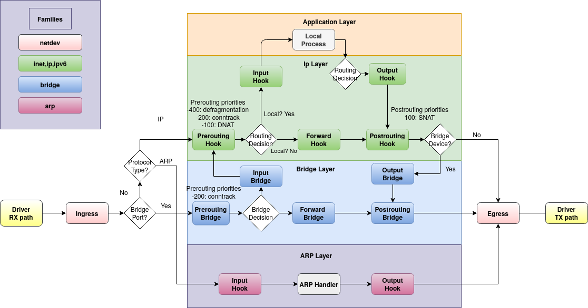

---


## call-graph-write

```c
/* vfs layer */
SYSCALL_DEFINE3(write, fd, buf, count) {
    vfs_write(file, buf, counts) {
        file->f_op->write_iter(kio, iter);
    }
}

/* socket layer */
sock_write_iter() {
    sock_sendmsg() {
        sock_sendmsg_nosec() {
            sock->ops->sendmsg() {
                inet_stream_ops.sendmsg() {
                    sk->sk_prot->sendmsg(); /* tcp_prot.sendmsg */
                }
            }
        }
    }
}

/* tcp layer */
tcp_sendmsg() {
    if (flags & MSG_FASTOPEN) {
        err = tcp_sendmsg_fastopen();
    }

/* 1. wait for connection */
    if (!TCPF_ESTABLISHED) {
        sk_stream_wait_connect();
    }

    mss_now = tcp_send_mss(sk, &size_goal, flags);

    while (msg_data_left(msg)) {
/* 2. alloc skb & insert into sk_write_queue */
        skb = tcp_stream_alloc_skb(); /* alloc new one if null */
        tcp_skb_entail(sk, skb); /* add into sk->sk_write_queue */

/* 3. copy data */
        if (!zc) {                          /* 3.1 copy to sock's sk_frag page_frag */
            struct page_frag *pfrag = sk_page_frag(sk);
            sk_page_frag_refill(sk, pfrag);
            skb_copy_to_page_nocache();
        } else if (zc == MSG_ZEROCOPY) {    /* 3.2 zero copy */
            skb_zerocopy_iter_stream();
        } else if (zc == MSG_SPLICE_PAGES) {/* splice to sk_buff's skb_shared_info */
            skb_splice_from_iter();
        }

/* 4. send data */
        if (skb->len < size_goal || (flags & MSG_OOB) || unlikely(tp->repair))
            continue;

        tcp_write_xmit() {
            while ((skb = tcp_send_head(sk))) {
                max_segs = tcp_tso_segs();
                tso_segs = tcp_init_tso_segs();

                /* 4.1 congestion control */
                tcp_cwnd_test();
                tcp_snd_wnd_test();
                tcp_nagle_test();
                tcp_tso_should_defer();

                /* 4.2 fragment */
                limit = tcp_mss_split_point();
                tso_fragment() {
                    skb_split() {
                        skb_split_inside_header();
                        skb_split_no_header();
                    }
                }

                tcp_transmit_skb() {
                    /* 4.3 build TCP header */
                    /* 4.4 send msg: ipv4_specific.ip_queue_xmit */
                    icsk->icsk_af_ops->queue_xmit(sk, skb, &inet->cork.fl);
                }

                /* 4.5 add into retransmit */
                tcp_event_new_data_sent() {
                    __skb_unlink(skb, &sk->sk_write_queue);
                    tcp_rbtree_insert(&sk->tcp_rtx_queue, skb);
                    tcp_rearm_rto(sk);
                }
            }

            tcp_cwnd_validate() {
                tcp_cwnd_application_limited();
            }
        }
    }
}

/* ip layer */
ipv4_specific.ip_queue_xmit() {
    /* 1. get route table */
    rt = ip_route_output_ports() {
        ip_route_output_key_hash_rcu() {
            fib_lookup();
            __mkroute_output() {
                rt_dst_alloc();
            }
        }
    }
    skb_dst_set_noref(skb, &rt->dst);

    /* 2. build IP header */

    /* 3. netfilter */
    ip_local_out() {
        nf_hook();                          /* NF_INET_LOCAL_OUT */
        dst_output() {
            skb_dst(skb)->output() {
                ip_output() { /* ipv4_dst_ops.output() */
                    NF_HOOK_COND();         /* NF_INET_POST_ROUTING */
                    ip_finish_output() {
                        if (skb->len > mtu)
                            return ip_fragment(sk, ip_finish_output2)
                        ip_finish_output2();
                    }
                }
            }
        }
    }
}

/* mac layer */
ip_finish_output2() {
    exthop = rt_nexthop(rt, ip_hdr(skb)->daddr);
    neigh = ipv4_neigh_lookup_noref(dev, nexthop);
    neigh_output(neigh, skb) {
        neigh->output() {
            neigh_resolve_output() { /* arp_hh_ops.output */
                ret = neigh_event_send() {
                    __skb_queue_tail(&neigh->arp_queue, skb);
                    neigh_probe() {
                        arp_send_dst() {
                            skb = arp_create();
                            arp_xmit(skb); /* arp_rcv */
                        }
                    }
                }
                if (!ret) {
                    dev_queue_xmit(skb);
                }
            }
        }
    }
}


/* dev layer */
dev_queue_xmit() {
    struct net_device *dev = skb->dev;
    struct netdev_queue *txq = netdev_pick_tx(dev, skb);
    struct Qdisc *q = rcu_derefence_bh(txq->qdisc);

    if (nf_hook_egress_active()) {
        skb = nf_hook_egress(skb, &rc, dev);
        if (!skb)
            goto out;
    }

    if (static_branch_unlikely(&egress_needed_key)) {
        skb = sch_handle_egress(skb, &rc, dev);
    }

    txq = netdev_core_pick_tx(dev, skb, sb_dev);
    __dev_xmit_skb(skb, q, dev, txq) {
        dev_qdisc_enqueue() {
            q->enqueue(skb, q, &to_free);
        }

        if (qdisc_run_begin(q)) { /* check if qdisc is alreay running */
            __qdisc_run(q) {
                qdisc_restart(q, &pakcets) {
                    skb = dequeue_skb(q, &validate, packets); /* may dequeue bulk sbk */
                    txq = skb_get_tx_queue(dev, skb);
                    sch_direct_xmit(skb, q, dev, txq, root_lock, validate) {
                        dev_hard_start_xmit() {
                            while (skb) {
                                xmit_one() {
                                    netdev_start_xmit() {
                                        net_device_ops->ndo_start_xmit(skb, dev) {
                                            ixgbe_xmit_frame();
                                        }
                                    }
                                }
                            }
                        }
                        if (dev_xmit_complete(ret)) {
                            /* Driver sent out skb successfully or skb was consumed */
                            ret = qdisc_qlen(q);
                        } else {
                            /* Driver returned NETDEV_TX_BUSY - requeue skb */
                            ret = dev_requeue_skb(skb, q);
                        }
                    }
                }

                while (qdisc_restart(...)) {
                    if (quota <= 0 || need_resched()) {
                        __netif_reschedule(q) {
                            q->next_sched = NULL;
                            *sd->output_queue_tailp = q;
                            sd->output_queue_tailp = &q->next_sched;

                            raise_softirq_irqoff(NET_TX_SOFTIRQ) { /* return to user space */
                                net_tx_action() { /* NET_TX_SOFTIRQ */
                                    qdisc_run(q) {
                                        if (qdisc_run_begin(q)) {
                                            __qdisc_run(q);
                                            qdisc_run_end(q) {
                                                __clear_bit(__QDISC_STATE2_RUNNING, &qdisc->state2);
                                            }
                                        }
                                    }
                                }
                            }
                        }
                    }
                }
            }

            qdisc_run_end(q);
        }
    }
}

/* driver layer */
ixgbe_xmit_frame();
```

## vfs layer tx

```c
SYSCALL_DEFINE3(write, unsigned int, fd, const char __user *, buf,
        size_t, count)
{
    return ksys_write(fd, buf, count);
}


ssize_t ksys_write(unsigned int fd, const char __user *buf, size_t count)
{
    CLASS(fd_pos, f)(fd);
    ssize_t ret = -EBADF;

    if (!fd_empty(f)) {
        loff_t pos, *ppos = file_ppos(fd_file(f));
        if (ppos) {
            pos = *ppos;
            ppos = &pos;
        }
        ret = vfs_write(fd_file(f), buf, count, ppos);
        if (ret >= 0 && ppos)
            fd_file(f)->f_pos = pos;
    }

    return ret;
}

ssize_t vfs_write(struct file *file, const char __user *buf, size_t count, loff_t *pos)
{
    ssize_t ret;

    if (!(file->f_mode & FMODE_WRITE))
        return -EBADF;
    if (!(file->f_mode & FMODE_CAN_WRITE))
        return -EINVAL;
    if (unlikely(!access_ok(buf, count)))
        return -EFAULT;

    ret = rw_verify_area(WRITE, file, pos, count);
    if (ret)
        return ret;
    if (count > MAX_RW_COUNT)
        count =  MAX_RW_COUNT;
    file_start_write(file);
    if (file->f_op->write)
        ret = file->f_op->write(file, buf, count, pos);
    else if (file->f_op->write_iter)
        ret = new_sync_write(file, buf, count, pos);
    else
        ret = -EINVAL;
    if (ret > 0) {
        fsnotify_modify(file);
        add_wchar(current, ret);
    }
    inc_syscw(current);
    file_end_write(file);
    return ret;
}

static ssize_t new_sync_write(struct file *filp, const char __user *buf, size_t len, loff_t *ppos)
{
    struct kiocb kiocb;
    struct iov_iter iter;
    ssize_t ret;

    init_sync_kiocb(&kiocb, filp) {
        *kiocb = (struct kiocb) {
            .ki_filp = filp,
            .ki_flags = filp->f_iocb_flags,
            .ki_ioprio = get_current_ioprio(),
        };
    }
    kiocb.ki_pos = (ppos ? *ppos : 0);
    iov_iter_ubuf(&iter, ITER_SOURCE, (void __user *)buf, len) {
        WARN_ON(direction & ~(READ | WRITE));
        *i = (struct iov_iter) {
            .iter_type = ITER_UBUF,
            .data_source = direction,
            .ubuf = buf,
            .count = count,
            .nr_segs = 1
        };
    }

    ret = filp->f_op->write_iter(&kiocb, &iter);
    BUG_ON(ret == -EIOCBQUEUED);
    if (ret > 0 && ppos)
        *ppos = kiocb.ki_pos;
    return ret;
}

static const struct file_operations socket_file_ops = {
     .owner           = THIS_MODULE,
     .read_iter       = sock_read_iter,
     .write_iter      = sock_write_iter,
     .poll            = sock_poll,
     .unlocked_ioctl  = sock_ioctl,
#ifdef CONFIG_COMPAT
     .compat_ioctl    = compat_sock_ioctl,
#endif
    .uring_cmd       = io_uring_cmd_sock,
    .mmap            = sock_mmap,
    .release         = sock_close,
    .fasync          = sock_fasync,
    .splice_write    = splice_to_socket,
    .splice_read     = sock_splice_read,
    .splice_eof      = sock_splice_eof,
    .show_fdinfo     = sock_show_fdinfo,
};

static const struct file_operations eventfd_fops = {
#ifdef CONFIG_PROC_FS
     .show_fdinfo     = eventfd_show_fdinfo,
#endif
    .release         = eventfd_release,
    .poll            = eventfd_poll,
    .read_iter       = eventfd_read,
    .write           = eventfd_write,
    .llseek          = noop_llseek,
};

static ssize_t sock_write_iter(struct kiocb *iocb, struct iov_iter *from)
{
    struct file *file = iocb->ki_filp;
    struct socket *sock = file->private_data;
    struct msghdr msg = {.msg_iter = *from,
                 .msg_iocb = iocb};
    ssize_t res;

    if (iocb->ki_pos != 0)
        return -ESPIPE;

    if (file->f_flags & O_NONBLOCK || (iocb->ki_flags & IOCB_NOWAIT))
        msg.msg_flags = MSG_DONTWAIT;

    if (sock->type == SOCK_SEQPACKET)
        msg.msg_flags |= MSG_EOR;

    if (iocb->ki_flags & IOCB_NOSIGNAL)
        msg.msg_flags |= MSG_NOSIGNAL;

    res = __sock_sendmsg(sock, &msg) {
        int err = security_socket_sendmsg(sock, msg, msg_data_left(msg));

        return err ?: sock_sendmsg_nosec(sock, msg);
    }
    *from = msg.msg_iter;
    return res;
}
```

## socket layer tx

```c
/* sock_sendmsg -> */
static inline int sock_sendmsg_nosec(struct socket *sock, struct msghdr *msg)
{
    int ret = INDIRECT_CALL_INET(READ_ONCE(sock->ops)->sendmsg, inet6_sendmsg,
                     inet_sendmsg, sock, msg,
                     msg_data_left(msg));
    BUG_ON(ret == -EIOCBQUEUED);

    if (trace_sock_send_length_enabled())
        call_trace_sock_send_length(sock->sk, ret, 0);
    return ret;
}

/* inet_stream_ops.sendmsg */
int inet_sendmsg(struct socket *sock, struct msghdr *msg, size_t size)
{
    struct sock *sk = sock->sk;
    const struct proto *prot;

    if (unlikely(inet_send_prepare(sk)))
        return -EAGAIN;

    prot = READ_ONCE(sk->sk_prot);
    return INDIRECT_CALL_2(prot->sendmsg, tcp_sendmsg, udp_sendmsg,
                   sk, msg, size);
}

int inet_send_prepare(struct sock *sk)
{
    sock_rps_record_flow(sk);

    /* We may need to bind the socket. */
    if (data_race(!inet_sk(sk)->inet_num) && !sk->sk_prot->no_autobind && inet_autobind(sk))
        return -EAGAIN;

    return 0;
}

static int inet_autobind(struct sock *sk)
{
    struct inet_sock *inet;
    /* We may need to bind the socket. */
    lock_sock(sk);
    inet = inet_sk(sk);
    if (!inet->inet_num) {
        if (sk->sk_prot->get_port(sk, 0)) {
            release_sock(sk);
            return -EAGAIN;
        }
        inet->inet_sport = htons(inet->inet_num);
    }
    release_sock(sk);
    return 0;
}
```

### sock_rps_record_flow

```c
static inline void sock_rps_record_flow(const struct sock *sk)
{
#ifdef CONFIG_RPS
    if (!rfs_is_needed())
        return;

    _sock_rps_record_flow(sk);
#endif
}

void _sock_rps_record_flow(const struct sock *sk)
{
    /* Reading sk->sk_rxhash might incur an expensive cache line
     * miss.
     *
     * TCP_ESTABLISHED does cover almost all states where RFS
     * might be useful, and is cheaper [1] than testing :
     *    IPv4: inet_sk(sk)->inet_daddr
     *    IPv6: ipv6_addr_any(&sk->sk_v6_daddr)
     * OR    an additional socket flag
     * [1] : sk_state and sk_prot are in the same cache line. */
    if (sk->sk_state == TCP_ESTABLISHED) {
        /* This READ_ONCE() is paired with the WRITE_ONCE()
         * from sock_rps_save_rxhash() and sock_rps_reset_rxhash(). */
        _sock_rps_record_flow_hash(READ_ONCE(sk->sk_rxhash)) {
            rps_tag_ptr tag_ptr;

            if (!hash)
                return;
            rcu_read_lock();
            tag_ptr = READ_ONCE(net_hotdata.rps_sock_flow_table);
            if (tag_ptr)
                rps_record_sock_flow(tag_ptr, hash);
            rcu_read_unlock();
        }
    }
}

static inline void rps_record_sock_flow(rps_tag_ptr tag_ptr, u32 hash)
{
    unsigned int index = hash & rps_tag_to_mask(tag_ptr);
    u32 val = hash & ~net_hotdata.rps_cpu_mask;
    struct rps_sock_flow_table *table;

    /* We only give a hint, preemption can change CPU under us */
    val |= raw_smp_processor_id();

    table = rps_tag_to_table(tag_ptr);
    /* The following WRITE_ONCE() is paired with the READ_ONCE()
     * here, and another one in get_rps_cpu(). */
    if (READ_ONCE(table[index].ent) != val)
        WRITE_ONCE(table[index].ent, val);
}
```

## tcp layer tx

```sh
 0                   1                   2                   3
 0 1 2 3 4 5 6 7 8 9 0 1 2 3 4 5 6 7 8 9 0 1 2 3 4 5 6 7 8 9 0 1
+-+-+-+-+-+-+-+-+-+-+-+-+-+-+-+-+-+-+-+-+-+-+-+-+-+-+-+-+-+-+-+-+
|          Source Port          |       Destination Port        |
+-+-+-+-+-+-+-+-+-+-+-+-+-+-+-+-+-+-+-+-+-+-+-+-+-+-+-+-+-+-+-+-+
|                        Sequence Number                        |
+-+-+-+-+-+-+-+-+-+-+-+-+-+-+-+-+-+-+-+-+-+-+-+-+-+-+-+-+-+-+-+-+
|                    Acknowledgment Number                      |
+-+-+-+-+-+-+-+-+-+-+-+-+-+-+-+-+-+-+-+-+-+-+-+-+-+-+-+-+-+-+-+-+
|  Data |           |U|A|P|R|S|F|                               |
| Offset| Reserved  |R|C|S|S|Y|I|            Window             |
|       |           |G|K|H|T|N|N|                               |
+-+-+-+-+-+-+-+-+-+-+-+-+-+-+-+-+-+-+-+-+-+-+-+-+-+-+-+-+-+-+-+-+
|           Checksum            |         Urgent Pointer        |
+-+-+-+-+-+-+-+-+-+-+-+-+-+-+-+-+-+-+-+-+-+-+-+-+-+-+-+-+-+-+-+-+
|                    Options (if Data Offset > 5)               |
|           kind(1) | lenth(1)  | info(n)                       |
|           0                   |   EOL                         |
|           1                   |   NOP                         |
|           2           4       |   MSS                         |
|           3           3       |   WSCALE/WSOPT                |
|           4           2       |   SACK                        |
|           5           N*8 + 2 |   [,]...[,]                   |
|           8           10      |   TSOPT: TSV(4) TSER(4)       |
+-+-+-+-+-+-+-+-+-+-+-+-+-+-+-+-+-+-+-+-+-+-+-+-+-+-+-+-+-+-+-+-+
```
* **Source Port** (16 bits)
    * Identifies the sending application/process on the source device.
    * Range: 0 to 65,535.
    * Example: 49152 (ephemeral port, 11000000 00000000).

* **Destination Port** (16 bits)
    * Identifies the receiving application/process on the destination device.
    * Common examples: 80 (HTTP), 443 (HTTPS).
    * Example: 80 (00000000 01010000).

* **Sequence Number** (32 bits)
    * Tracks the order of bytes sent in the TCP stream. For the first segment, it’s the Initial Sequence Number (ISN); subsequent segments indicate the byte offset.
    * Example: 00000000 00000000 00000000 00000001 (1).

* **Acknowledgment Number** (32 bits)
    * Indicates the next byte the receiver expects to receive, acknowledging receipt of prior bytes. Used only if the ACK flag is set.
    * Example: 00000000 00000000 00000000 00000010 (acknowledging up to byte 1).

* **Data Offset** (4 bits)
    * Specifies the length of the TCP header in 32-bit words (4 bytes).
    * Minimum is 5 (20 bytes, no options); maximum is 15 (60 bytes with options).
    * Example: 0101 (5 words = 20 bytes).

* **Reserved** (6 bits)
    * Set to zero for future use.
    * Example: 000000.

* **Flags** (6 bits)
    * Control bits for TCP connection management:
    * URG: Urgent Pointer field is significant.
    * ACK: Acknowledgment field is significant.
    * PSH: Push data to the application immediately.
    * RST: Reset the connection.
    * SYN: Synchronize sequence numbers (connection start).
    * FIN: No more data from sender (connection end).
    * Example: 000010 (ACK set).

* **Window** (16 bits)
    * Specifies the size of the receiver’s buffer (in bytes) for incoming data, used for flow control.
    * Example: 00000000 11111111 (255 bytes).

* **Checksum** (16 bits)
    * Verifies the integrity of the TCP header, data, and a pseudo-header (parts of the IP header).
    * Example: 10101010 11001100 (varies).

* **Urgent Pointer** (16 bits)
    * Indicates the offset from the Sequence Number where urgent data ends (only valid if URG flag is set).
    * Example: 00000000 00000000 (no urgent data).

* **Options** (variable, 0-40 bytes)
    * Optional fields for features like Maximum Segment Size (MSS), Window Scaling, or Timestamps. Present if Data Offset > 5.
    * Padded to align with 32-bit boundaries.
    * Example: MSS option might be 02 04 05 B4 (MSS = 1460 bytes).

### tcp_sendmsg

```c
tcp_sendmsg
    |
    |- parse cmsgs (timestamps, devmem DMA-buf)
    |- select zero-copy mode (copy / MSG_ZEROCOPY / MSG_SPLICE_PAGES)
    |- MSG_FASTOPEN: piggyback data on SYN
    |- wait for ESTABLISHED if needed
    |
    |- loop over msg_iter:
            |
            |- reuse tail skb if room (coalesce) -----------------------------|
            |- else alloc new skb (tcp_stream_alloc_skb)                      |
            |                                                                 |
            |- copy data into page frags --- 3 modes:                         |
            |     zc==0           → skb_copy_to_page_nocache (copy_from_user) |
            |     MSG_ZEROCOPY    → pin user pages, store in frags            |
            |     MSG_SPLICE_PAGES→ splice page refs from iterator            |
            |                                                                 |
            |- advance write_seq / end_seq                                    |
            |                                                                 |
            |- skb full or forced_push? → tcp_push / tcp_push_one ------------|
            |
            |- wmem exhausted? → tcp_push partial, sleep, retry
```

```c
/* tcp_prot.sendmsg, copy data to skb */
int tcp_sendmsg(struct sock *sk, struct msghdr *msg, size_t size)
{
    int ret;

    lock_sock(sk);
    ret = tcp_sendmsg_locked(sk, msg, size);
    release_sock(sk);

    return ret;
}

int tcp_sendmsg_locked(struct sock *sk, struct msghdr *msg, size_t size)
{
    struct net_devmem_dmabuf_binding *binding = NULL;
    struct tcp_sock *tp = tcp_sk(sk);
    struct ubuf_info *uarg = NULL;
    struct sk_buff *skb;
    struct sockcm_cookie sockc;
    int flags, err, copied = 0;
    int mss_now = 0, size_goal, copied_syn = 0;
    int process_backlog = 0;
    int sockc_err = 0;
    int zc = 0;
    long timeo;

    flags = msg->msg_flags;

    sockc = (struct sockcm_cookie){ .tsflags = READ_ONCE(sk->sk_tsflags) };
    if (msg->msg_controllen) {
        sockc_err = sock_cmsg_send(sk, msg, &sockc);
        /* Don't return error until MSG_FASTOPEN has been processed;
         * that may succeed even if the cmsg is invalid. */
    }

/* 2. — Zero-Copy Mode Selection */
    if ((flags & MSG_ZEROCOPY) && size) {
        /* MSG_ZEROCOPY with a pre-supplied msg_ubuf
         * - caller (e.g. io_uring) has already pinned user pages; just adopt uarg. */
        if (msg->msg_ubuf) {
            uarg = msg->msg_ubuf;
            if (sk->sk_route_caps & NETIF_F_SG)
                zc = MSG_ZEROCOPY;

        /* MSG_ZEROCOPY with SOCK_ZEROCOPY
         * - kernel pins the user pages via msg_zerocopy_realloc. */
        } else if (sock_flag(sk, SOCK_ZEROCOPY)) {
            skb = tcp_write_queue_tail(sk);
            uarg = msg_zerocopy_realloc(sk, size, skb_zcopy(skb), !sockc_err && sockc.dmabuf_id);
            if (!uarg) {
                err = -ENOBUFS;
                goto out_err;
            }
            if (sk->sk_route_caps & NETIF_F_SG)
                zc = MSG_ZEROCOPY;
            else
                uarg_to_msgzc(uarg)->zerocopy = 0;

            if (!sockc_err && sockc.dmabuf_id) {
                binding = net_devmem_get_binding(sk, sockc.dmabuf_id);
                if (IS_ERR(binding)) {
                    err = PTR_ERR(binding);
                    binding = NULL;
                    goto out_err;
                }
            }
        }
    } else if (unlikely(msg->msg_flags & MSG_SPLICE_PAGES) && size) {
        if (sk->sk_route_caps & NETIF_F_SG)
            zc = MSG_SPLICE_PAGES;
    }

    if (!sockc_err && sockc.dmabuf_id &&
        (!(flags & MSG_ZEROCOPY) || !sock_flag(sk, SOCK_ZEROCOPY))) {
        err = -EINVAL;
        goto out_err;
    }

/* 3 - TCP Fast Open */
    if (unlikely(flags & MSG_FASTOPEN || inet_test_bit(DEFER_CONNECT, sk)) &&
        !tp->repair) {
        err = tcp_sendmsg_fastopen(sk, msg, &copied_syn, size, uarg);
        if (err == -EINPROGRESS && copied_syn > 0)
            goto out;
        else if (err)
            goto out_err;
    }

    timeo = sock_sndtimeo(sk, flags & MSG_DONTWAIT);

    /* If a gap is detected between sends, mark the socket application-limited. */
    tcp_rate_check_app_limited(sk);

/* 4. Pre-Loop Checks */
    if (((1 << sk->sk_state) & ~(TCPF_ESTABLISHED | TCPF_CLOSE_WAIT)) && !tcp_passive_fastopen(sk)) {
        err = sk_stream_wait_connect(sk, &timeo);
        if (err != 0)
            goto do_error;
    }

    if (unlikely(tp->repair)) {
        if (tp->repair_queue == TCP_RECV_QUEUE) {
            copied = tcp_send_rcvq(sk, msg, size);
            goto out_nopush;
        }

        err = -EINVAL;
        if (tp->repair_queue == TCP_NO_QUEUE)
            goto out_err;

        /* 'common' sending to sendq */
    }

    sockcm_init(&sockc, sk);
    if (msg->msg_controllen) {
        err = sock_cmsg_send(sk, msg, &sockc);
        if (unlikely(err)) {
            err = -EINVAL;
            goto out_err;
        }
    }

    if (sockc_err) {
        err = sockc_err;
        goto out_err;
    }

    /* This should be in poll */
    sk_clear_bit(SOCKWQ_ASYNC_NOSPACE, sk);

    /* Ok commence sending. */
    copied = 0;

/* 5. The Main Send Loop */

restart:
    mss_now = tcp_send_mss(sk, &size_goal, flags);

    err = -EPIPE;
    if (sk->sk_err || (sk->sk_shutdown & SEND_SHUTDOWN))
        goto do_error;

    while (msg_data_left(msg) { return iov_iter_count(&msg->msg_iter); }) {
        int copy = 0;

/* 5.1 Find or Allocate an skb */
        skb = tcp_write_queue_tail(sk) {
            return skb_peek_tail(&sk->sk_write_queue);
        }
        if (skb)
            copy = size_goal - skb->len;

        if (copy <= 0 || !tcp_skb_can_collapse_to(skb)) { /* !TCP_SKB_CB(skb)->eor */
            bool first_skb;

new_segment:
            ret = sk_stream_memory_free(sk) {
                return __sk_stream_memory_free(sk, 0) {
                    if (READ_ONCE(sk->sk_wmem_queued) >= READ_ONCE(sk->sk_sndbuf))
                        return false;

                    return sk->sk_prot->stream_memory_free
                        ? INDIRECT_CALL_INET_1(sk->sk_prot->stream_memory_free, tcp_stream_memory_free, sk, wake)
                        : true;
                }
            }
            if (!ret)
                goto wait_for_sndbuf;

            if (unlikely(process_backlog >= 16)) {
                process_backlog = 0;
                if (sk_flush_backlog(sk))
                    goto restart;
            }

            first_skb = tcp_rtx_and_write_queues_empty(sk);
            skb = tcp_stream_alloc_skb(sk, sk->sk_allocation, first_skb);
            if (!skb)
                goto wait_for_space;

            process_backlog++;
            skb->decrypted = !!(flags & MSG_SENDPAGE_DECRYPTED);

            tcp_skb_entail(sk, skb);
            copy = size_goal;

            if (tp->repair)
                TCP_SKB_CB(skb)->sacked |= TCPCB_REPAIRED;
        }

        /* Try to append data to the end of skb. */
        if (copy > msg_data_left(msg))
            copy = msg_data_left(msg);

/* 5.2 Data Copy (three modes) */

/* 5.2.1 - copy to page_frag */
        if (zc == 0) {
            bool merge = true;
            int i = skb_shinfo(skb)->nr_frags;
            struct page_frag *pfrag = sk_page_frag(sk) {
                return (sk->sk_use_task_frag) ? &current->task_frag : &sk->sk_frag;
            }

            if (!sk_page_frag_refill(sk, pfrag))
                goto wait_for_space;

            if (!skb_can_coalesce(skb, i, pfrag->page, pfrag->offset)) {
                if (i >= READ_ONCE(net_hotdata.sysctl_max_skb_frags)) {
                    tcp_mark_push(tp, skb);
                    goto new_segment;
                }
                merge = false;
            }

            copy = min_t(int, copy, pfrag->size - pfrag->offset);

            if (unlikely(skb_zcopy_pure(skb) || skb_zcopy_managed(skb))) {
                if (tcp_downgrade_zcopy_pure(sk, skb))
                    goto wait_for_space;
                skb_zcopy_downgrade_managed(skb);
            }

            /* charges the copy bytes mem against sk->sk_wmem_queued,
             * and throttles if the socket send buffer is full. */
            copy = tcp_wmem_schedule(sk, copy) {
                int left;

                if (likely(sk_wmem_schedule(sk, copy)))
                    return copy;

                /* We could be in trouble if we have nothing queued.
                 * Use whatever is left in sk->sk_forward_alloc and tcp_wmem[0]
                 * to guarantee some progress. */
                left = READ_ONCE(sock_net(sk)->ipv4.sysctl_tcp_wmem[0]) - sk->sk_wmem_queued;
                if (left > 0)
                    sk_forced_mem_schedule(sk, min(left, copy));
                return min(copy, sk->sk_forward_alloc);
            }
            if (!copy)
                goto wait_for_space;

            err = skb_copy_to_page_nocache(sk, &msg->msg_iter, skb,
                pfrag->page, pfrag->offset, copy);
            if (err)
                goto do_error;

            if (merge) { /* merge the pfrag into &skb_shinfo(skb)->frags[i-1] */
                skb_frag_size_add(&skb_shinfo(skb)->frags[i - 1], copy) {
                    frag->len += delta;
                }
            } else { /* splice the pfrag into sk */
                skb_fill_page_desc(skb, i, pfrag->page, pfrag->offset, copy) {
                    skb_fill_netmem_desc(skb, i, page_to_netmem(page), off, size) {
                        __skb_fill_netmem_desc(skb, i, netmem, off, size);
                        skb_shinfo(skb)->nr_frags = i + 1;
                    }
                }
                page_ref_inc(pfrag->page);
            }
            pfrag->offset += copy;

/* 5.2.2 MSG_ZEROCOPY
 * User pages are pinned and stored as skb_frag_t entries pointing directly into user address space.
 * uarg carries a reference count; when the NIC is done with the pages,
 * a completion notification is sent via MSG_ERRQUEUE so the app knows it can reuse the buffer. */
        } else if (zc == MSG_ZEROCOPY)  {
            /* First append to a fragless skb builds initial pure zerocopy skb */
            if (!skb->len)
                skb_shinfo(skb)->flags |= SKBFL_PURE_ZEROCOPY;

            if (!skb_zcopy_pure(skb)) {
                copy = tcp_wmem_schedule(sk, copy);
                if (!copy)
                    goto wait_for_space;
            }

            err = skb_zerocopy_iter_stream(sk, skb, msg, copy, uarg, binding);
            if (err == -EMSGSIZE || err == -EEXIST) {
                tcp_mark_push(tp, skb);
                goto new_segment;
            }
            if (err < 0)
                goto do_error;
            copy = err;

/* 5.2.3 MSG_SPLICE_PAGES
 * Page references are moved from the pipe/splice iterator directly into skb frags
 * - no copy, no user-page pinning. */
        } else if (zc == MSG_SPLICE_PAGES) {
            if (tcp_downgrade_zcopy_pure(sk, skb))
                goto wait_for_space;
            copy = tcp_wmem_schedule(sk, copy);
            if (!copy)
                goto wait_for_space;

            err = skb_splice_from_iter(skb, &msg->msg_iter, copy, sk->sk_allocation);
            if (err < 0) {
                if (err == -EMSGSIZE) {
                    tcp_mark_push(tp, skb);
                    goto new_segment;
                }
                goto do_error;
            }
            copy = err;

            if (!(flags & MSG_NO_SHARED_FRAGS))
                skb_shinfo(skb)->flags |= SKBFL_SHARED_FRAG;

            sk_wmem_queued_add(sk, copy);
            sk_mem_charge(sk, copy);
        }

        if (!copied)
            TCP_SKB_CB(skb)->tcp_flags &= ~TCPHDR_PSH;

/* 5.3 Accounting & Nagle Decision */
        WRITE_ONCE(tp->write_seq, tp->write_seq + copy);
        TCP_SKB_CB(skb)->end_seq += copy;
        tcp_skb_pcount_set(skb, 0);

        copied += copy;
        if (!msg_data_left(msg)) {
            if (unlikely(flags & MSG_EOR))
                TCP_SKB_CB(skb)->eor = 1;
            goto out;
        }

        if (skb->len < size_goal || (flags & MSG_OOB) || unlikely(tp->repair))
            continue;

/* 5.4. send data now
* Three conditions to send data:
* 1. !msg_data_left(msg)
* 2. forced_push(tp)
* 3. skb == tcp_send_head(sk) */

        if (forced_push(tp)) { /* tp->write_seq > tp->pushed_seq + (tp->max_window >> 1)) */
            tcp_mark_push(tp, skb);
            __tcp_push_pending_frames(sk, mss_now, TCP_NAGLE_PUSH);
        } else if (skb == tcp_send_head(sk))
            tcp_push_one(sk, mss_now);

        continue;

wait_for_sndbuf:
        set_bit(SOCK_NOSPACE, &sk->sk_socket->flags);
        tcp_remove_empty_skb(sk);

        if (copied)
            tcp_push(sk, flags & ~MSG_MORE, mss_now, TCP_NAGLE_PUSH, size_goal);

        err = sk_stream_wait_memory(sk, &timeo);
        if (err != 0)
            goto do_error;

        mss_now = tcp_send_mss(sk, &size_goal, flags);
    }

/* 6. Post-Loop: Push & Cleanup */
out:
    if (copied) {
        tcp_tx_timestamp(sk, sockc.tsflags);
        tcp_push(sk, flags, mss_now, tp->nonagle, size_goal) {
            struct tcp_sock *tp = tcp_sk(sk);
            struct sk_buff *skb;

            skb = tcp_write_queue_tail(sk);
            if (!skb)
                return;
            if (!(flags & MSG_MORE) || forced_push(tp)) {
                tcp_mark_push(tp, skb) {
                    TCP_SKB_CB(skb)->tcp_flags |= TCPHDR_PSH;
                    tp->pushed_seq = tp->write_seq;
                }
            }

            tcp_mark_urg(tp, flags) {
                if (flags & MSG_OOB)
                    tp->snd_up = tp->write_seq;
            }

            if (tcp_should_autocork(sk, skb, size_goal)) {
                /* avoid atomic op if TSQ_THROTTLED bit is already set */
                if (!test_bit(TSQ_THROTTLED, &sk->sk_tsq_flags)) {
                    NET_INC_STATS(sock_net(sk), LINUX_MIB_TCPAUTOCORKING);
                    set_bit(TSQ_THROTTLED, &sk->sk_tsq_flags);
                    smp_mb__after_atomic();
                }
                /* It is possible TX completion already happened
                 * before we set TSQ_THROTTLED. */
                if (refcount_read(&sk->sk_wmem_alloc) > skb->truesize)
                    return;
            }

            if (flags & MSG_MORE)
                nonagle = TCP_NAGLE_CORK;

            __tcp_push_pending_frames(sk, mss_now, nonagle) {
                if (unlikely(sk->sk_state == TCP_CLOSE))
                    return;

                if (tcp_write_xmit(sk, cur_mss, nonagle, 0, sk_gfp_mask(sk, GFP_ATOMIC)))
                    tcp_check_probe_timer(sk);
            }
        }
    }

out_nopush:
    sock_zerocopy_put(uarg);
    return copied + copied_syn;

do_error:
    skb = tcp_write_queue_tail(sk);
do_fault:
    tcp_remove_empty_skb(sk, skb);

    if (copied + copied_syn)
        goto out;
out_err:
    sock_zerocopy_put_abort(uarg);
    err = sk_stream_error(sk, flags, err);
    /* make sure we wake any epoll edge trigger waiter */
    if (unlikely(tcp_rtx_and_write_queues_empty(sk) && err == -EAGAIN)) {
        sk->sk_write_space(sk);
        tcp_chrono_stop(sk, TCP_CHRONO_SNDBUF_LIMITED);
    }

    return err;
}
```

#### skb_copy_to_page_nocache

```c
static inline int skb_copy_to_page_nocache(struct sock *sk, struct iov_iter *from,
                       struct sk_buff *skb,
                       struct page *page,
                       int off, int copy)
{
    int err;

    err = skb_do_copy_data_nocache(sk, skb, from, page_address(page) + off, copy, skb->len) {
        if (skb->ip_summed == CHECKSUM_NONE) {
            __wsum csum = 0;
            if (!csum_and_copy_from_iter_full(to, copy, &csum, from))
                return -EFAULT;
            skb->csum = csum_block_add(skb->csum, csum, offset);
        } else if (sk->sk_route_caps & NETIF_F_NOCACHE_COPY) {
            if (!copy_from_iter_full_nocache(to, copy, from))
                return -EFAULT;
        } else if (!copy_from_iter_full(to, copy, from))
            return -EFAULT;

        return 0;
    }
    if (err)
        return err;

    skb_len_add(skb, copy) {
        skb->len += delta;
        skb->data_len += delta;
        skb->truesize += delta;
    }
    sk_wmem_queued_add(sk, copy) {
        WRITE_ONCE(sk->sk_wmem_queued, sk->sk_wmem_queued + val);
    }
    sk_mem_charge(sk, copy) {
        if (!sk_has_account(sk))
            return;
        sk_forward_alloc_add(sk, -size) {
            /* Paired with lockless reads of sk->sk_forward_alloc */
            WRITE_ONCE(sk->sk_forward_alloc, sk->sk_forward_alloc + val);
        }
    }
    return 0;
}
```

#### skb_zerocopy_iter_stream

```c
int skb_zerocopy_iter_stream(struct sock *sk, struct sk_buff *skb,
                 struct msghdr *msg, int len,
                 struct ubuf_info *uarg,
                 struct net_devmem_dmabuf_binding *binding)
{
    int err, orig_len = skb->len;

    if (uarg->ops->link_skb) {
        err = uarg->ops->link_skb(skb, uarg);
        if (err)
            return err;
    } else {
        struct ubuf_info *orig_uarg = skb_zcopy(skb);

        /* An skb can only point to one uarg. This edge case happens
         * when TCP appends to an skb, but zerocopy_realloc triggered
         * a new alloc. */
        if (orig_uarg && uarg != orig_uarg)
            return -EEXIST;
    }

    err = __zerocopy_sg_from_iter(msg, sk, skb, &msg->msg_iter, len, binding);
    if (err == -EFAULT || (err == -EMSGSIZE && skb->len == orig_len)) {
        struct sock *save_sk = skb->sk;

        /* Streams do not free skb on error. Reset to prev state. */
        iov_iter_revert(&msg->msg_iter, skb->len - orig_len);
        skb->sk = sk;
        ___pskb_trim(skb, orig_len);
        skb->sk = save_sk;
        return err;
    }

    skb_zcopy_set(skb, uarg, NULL);
    return skb->len - orig_len;
}

int __zerocopy_sg_from_iter(struct msghdr *msg, struct sock *sk,
                struct sk_buff *skb, struct iov_iter *from,
                size_t length,
                struct net_devmem_dmabuf_binding *binding)
{
    unsigned long orig_size = skb->truesize;
    unsigned long truesize;
    int ret;

    if (msg && msg->msg_ubuf && msg->sg_from_iter)
        ret = msg->sg_from_iter(skb, from, length);
    else if (binding)
        ret = zerocopy_fill_skb_from_devmem(skb, from, length, binding);
    else
        ret = zerocopy_fill_skb_from_iter(skb, from, length);

    truesize = skb->truesize - orig_size;
    if (sk && sk->sk_type == SOCK_STREAM) {
        sk_wmem_queued_add(sk, truesize);
        if (!skb_zcopy_pure(skb))
            sk_mem_charge(sk, truesize);
    } else {
        refcount_add(truesize, &skb->sk->sk_wmem_alloc);
    }
    return ret;
}

int zerocopy_fill_skb_from_iter(struct sk_buff *skb,
                struct iov_iter *from, size_t length)
{
    int frag = skb_shinfo(skb)->nr_frags;

    if (!skb_frags_readable(skb))
        return -EFAULT;

    while (length && iov_iter_count(from)) {
        struct page *head, *last_head = NULL;
        struct page *pages[MAX_SKB_FRAGS];
        int refs, order, n = 0;
        size_t start;
        ssize_t copied;

        if (frag == MAX_SKB_FRAGS)
            return -EMSGSIZE;

        copied = iov_iter_get_pages2(from, pages, length, MAX_SKB_FRAGS - frag, &start);
        if (copied < 0)
            return -EFAULT;

        length -= copied;

        skb->data_len += copied;
        skb->len += copied;
        skb->truesize += PAGE_ALIGN(copied + start);

        head = compound_head(pages[n]);
        order = compound_order(head);

        for (refs = 0; copied != 0; start = 0) {
            int size = min_t(int, copied, PAGE_SIZE - start);

            if (pages[n] - head > (1UL << order) - 1) {
                head = compound_head(pages[n]);
                order = compound_order(head);
            }

            start += (pages[n] - head) << PAGE_SHIFT;
            copied -= size;
            n++;
            if (frag) {
                skb_frag_t *last = &skb_shinfo(skb)->frags[frag - 1];

                if (head == skb_frag_page(last) &&
                    start == skb_frag_off(last) + skb_frag_size(last)) {
                    skb_frag_size_add(last, size);
                    /* We combined this page, we need to release
                     * a reference. Since compound pages refcount
                     * is shared among many pages, batch the refcount
                     * adjustments to limit false sharing. */
                    last_head = head;
                    refs++;
                    continue;
                }
            }
            if (refs) {
                page_ref_sub(last_head, refs);
                refs = 0;
            }
            skb_fill_page_desc_noacc(skb, frag++, head, start, size);
        }
        if (refs)
            page_ref_sub(last_head, refs);
    }
    return 0;
}
```

#### skb_splice_from_iter

```c
ssize_t skb_splice_from_iter(struct sk_buff *skb, struct iov_iter *iter,
                 ssize_t maxsize)
{
    size_t frag_limit = READ_ONCE(net_hotdata.sysctl_max_skb_frags);
    struct page *pages[8], **ppages = pages;
    ssize_t spliced = 0, ret = 0;
    unsigned int i;

    while (iter->count > 0) {
        ssize_t space, nr, len;
        size_t off;

        ret = -EMSGSIZE;
        space = frag_limit - skb_shinfo(skb)->nr_frags;
        if (space < 0)
            break;

        /* We might be able to coalesce without increasing nr_frags */
        nr = clamp_t(size_t, space, 1, ARRAY_SIZE(pages));

        len = iov_iter_extract_pages(iter, &ppages, maxsize, nr, 0, &off);
        if (len <= 0) {
            ret = len ?: -EIO;
            break;
        }

        i = 0;
        do {
            struct page *page = pages[i++];
            size_t part = min_t(size_t, PAGE_SIZE - off, len);

            ret = -EIO;
            if (WARN_ON_ONCE(!sendpage_ok(page)))
                goto out;

            ret = skb_append_pagefrags(skb, page, off, part, frag_limit);
            if (ret < 0) {
                iov_iter_revert(iter, len);
                goto out;
            }

            if (skb->ip_summed == CHECKSUM_NONE)
                skb_splice_csum_page(skb, page, off, part);

            off = 0;
            spliced += part;
            maxsize -= part;
            len -= part;
        } while (len > 0);

        if (maxsize <= 0)
            break;
    }

out:
    skb_len_add(skb, spliced);
    return spliced ?: ret;
}

int skb_append_pagefrags(struct sk_buff *skb, struct page *page,
             int offset, size_t size, size_t max_frags)
{
    int i = skb_shinfo(skb)->nr_frags;

    if (skb_can_coalesce(skb, i, page, offset)) {
        skb_frag_size_add(&skb_shinfo(skb)->frags[i - 1], size);
    } else if (i < max_frags) {
        skb_zcopy_downgrade_managed(skb);
        get_page(page);
        skb_fill_page_desc_noacc(skb, i, page, offset, size);
    } else {
        return -EMSGSIZE;
    }

    return 0;
}
```

#### sk_page_frag_refill

```c
bool sk_page_frag_refill(struct sock *sk, struct page_frag *pfrag)
{
    if (likely(skb_page_frag_refill(32U, pfrag, sk->sk_allocation)))
        return true;

    if (!sk->sk_bypass_prot_mem)
        sk_enter_memory_pressure(sk);

    sk_stream_moderate_sndbuf(sk) {
        u32 val;

        if (sk->sk_userlocks & SOCK_SNDBUF_LOCK)
            return;

        val = min(sk->sk_sndbuf, sk->sk_wmem_queued >> 1);
        val = max_t(u32, val, sk_unused_reserved_mem(sk) {
            int unused_mem;

            if (likely(!sk->sk_reserved_mem))
                return 0;

            unused_mem = sk->sk_reserved_mem - sk->sk_wmem_queued -
                    atomic_read(&sk->sk_rmem_alloc);

            return unused_mem > 0 ? unused_mem : 0;
        });

        WRITE_ONCE(sk->sk_sndbuf, max_t(u32, val, SOCK_MIN_SNDBUF));
    }

    return false;
}

bool skb_page_frag_refill(unsigned int sz, struct page_frag *pfrag, gfp_t gfp)
{
    if (pfrag->page) {
        if (page_ref_count(pfrag->page) == 1) {
            pfrag->offset = 0;
            return true;
        }
        if (pfrag->offset + sz <= pfrag->size)
            return true;
        put_page(pfrag->page);
    }

    pfrag->offset = 0;
    if (SKB_FRAG_PAGE_ORDER &&
        !static_branch_unlikely(&net_high_order_alloc_disable_key)) {
        /* Avoid direct reclaim but allow kswapd to wake */
        pfrag->page = alloc_pages((gfp & ~__GFP_DIRECT_RECLAIM) |
                      __GFP_COMP | __GFP_NOWARN |
                      __GFP_NORETRY,
                      SKB_FRAG_PAGE_ORDER);
        if (likely(pfrag->page)) {
            pfrag->size = PAGE_SIZE << SKB_FRAG_PAGE_ORDER;
            return true;
        }
    }
    pfrag->page = alloc_page(gfp);
    if (likely(pfrag->page)) {
        pfrag->size = PAGE_SIZE;
        return true;
    }
    return false;
}
```

### tcp_write_xmit

```c
/* __tcp_push_pending_frames | tcp_push_one ->
 * 1. fragment segment
 * 2. congestion control
 * 3. Nagle algorithm
 * 3. slide window
 *
 * TSO: TCP Segmentation Offload */

 /* In order to avoid the overhead associated
  * with a large number of packets on the transmit path,
  * the Linux kernel implements several optimizations:
  * 1. TCP segmentation offload (TSO),
  * 2. UDP fragmentation offload (UFO) and
  * 3. generic segmentation offload (GSO).
  *
  * All of these optimizations allow the IP stack to create packets
  * which are larger than the MTU of the outgoing NIC.
  * For IPv4, packets as large as the IPv4 maximum of 65,536 bytes
  * can be created and queued to the driver queue.
  * In the case of TSO and UFO, the NIC hardware takes responsibility
  * for breaking the single large packet into packets small enough
  * to be transmitted on the physical interface.
  * For NICs without hardware support, GSO performs the same operation
  * in software immediately before queueing to the driver queue. */

void __tcp_push_pending_frames(struct sock *sk, unsigned int cur_mss,
                   int nonagle)
{
    /* If we are closed, the bytes will have to remain here.
     * In time closedown will finish, we empty the write queue and
     * all will be happy. */
    if (unlikely(sk->sk_state == TCP_CLOSE))
        return;

    if (tcp_write_xmit(sk, cur_mss, nonagle, 0, sk_gfp_mask(sk, GFP_ATOMIC)))
        tcp_check_probe_timer(sk);
}

void tcp_push_one(struct sock *sk, unsigned int mss_now)
{
    struct sk_buff *skb = tcp_send_head(sk);

    BUG_ON(!skb || skb->len < mss_now);

    tcp_write_xmit(sk, mss_now, TCP_NAGLE_PUSH, 1, sk->sk_allocation);
}

bool tcp_write_xmit(struct sock *sk, unsigned int mss_now, int nonagle,
               int push_one, gfp_t gfp)
{
    struct tcp_sock *tp = tcp_sk(sk);
    struct sk_buff *skb;
    unsigned int tso_segs, sent_pkts;
    u32 cwnd_quota, max_segs;
    int result;
    bool is_cwnd_limited = false, is_rwnd_limited = false;

    sent_pkts = 0;

/* 1. Setup / AccECN beacon */
    tcp_mstamp_refresh(tp);

    /* AccECN option beacon depends on mstamp, it may change mss */
    if (tcp_ecn_mode_accecn(tp) && tcp_accecn_option_beacon_check(sk))
        mss_now = tcp_current_mss(sk);

/* 2. MTU probing (optional) */
    if (!push_one) {
        /* Do MTU probing. */
        result = tcp_mtu_probe(sk);
        if (!result) {
            return false;
        } else if (result > 0) {
            sent_pkts = 1;
        }
    }

/* 3. Main send loop */
    max_segs = tcp_tso_segs(sk, mss_now);
    while ((skb = tcp_send_head(sk))) {
        unsigned int limit;
        int missing_bytes;

        if (unlikely(tp->repair) && tp->repair_queue == TCP_SEND_QUEUE) {
            /* "skb_mstamp_ns" is used as a start point for the retransmit timer */
            tp->tcp_wstamp_ns = tp->tcp_clock_cache;
            skb_set_delivery_time(skb, tp->tcp_wstamp_ns, SKB_CLOCK_MONOTONIC);
            list_move_tail(&skb->tcp_tsorted_anchor, &tp->tsorted_sent_queue);
            tcp_init_tso_segs(skb, mss_now);
            goto repair; /* Skip network transmission */
        }

        if (tcp_pacing_check(sk))
            break;

        cwnd_quota = tcp_cwnd_test(tp);
        if (!cwnd_quota) {
            if (push_one == 2)
                /* Force out a loss probe pkt. */
                cwnd_quota = 1;
            else
                break;
        }
        cwnd_quota = min(cwnd_quota, max_segs);
        missing_bytes = cwnd_quota * mss_now - skb->len;
        if (missing_bytes > 0)
            tcp_grow_skb(sk, skb, missing_bytes);

        tso_segs = tcp_set_skb_tso_segs(skb, mss_now);

        if (unlikely(!tcp_snd_wnd_test(tp, skb, mss_now))) {
            is_rwnd_limited = true;
            break;
        }

        if (tso_segs == 1) {
            if (unlikely(!tcp_nagle_test(tp, skb, mss_now,
                             (tcp_skb_is_last(sk, skb) ?
                              nonagle : TCP_NAGLE_PUSH))))
                break;
        } else {
            if (!push_one &&
                tcp_tso_should_defer(sk, skb, &is_cwnd_limited, &is_rwnd_limited, max_segs))
                break;
        }

        limit = mss_now;
        if (tso_segs > 1 && !tcp_urg_mode(tp))
            limit = tcp_mss_split_point(sk, skb, mss_now,
                            cwnd_quota,
                            nonagle);

        if (skb->len > limit &&
            unlikely(tso_fragment(sk, skb, limit, mss_now, gfp)))
            break;

        if (tcp_small_queue_check(sk, skb, 0))
            break;

        /* Argh, we hit an empty skb(), presumably a thread
         * is sleeping in sendmsg()/sk_stream_wait_memory().
         * We do not want to send a pure-ack packet and have
         * a strange looking rtx queue with empty packet(s). */
        if (TCP_SKB_CB(skb)->end_seq == TCP_SKB_CB(skb)->seq)
            break;

        if (unlikely(tcp_transmit_skb(sk, skb, 1, gfp)))
            break;

repair:
        /* Advance the send_head.  This one is sent out.
         * This call will increment packets_out. */
        tcp_event_new_data_sent(sk, skb) {
            struct inet_connection_sock *icsk = inet_csk(sk);
            struct tcp_sock *tp = tcp_sk(sk);
            unsigned int prior_packets = tp->packets_out;

            WRITE_ONCE(tp->snd_nxt, TCP_SKB_CB(skb)->end_seq);

            __skb_unlink(skb, &sk->sk_write_queue);
            tcp_rbtree_insert(&sk->tcp_rtx_queue, skb);

            if (tp->highest_sack == NULL)
                tp->highest_sack = skb;

            tp->packets_out += tcp_skb_pcount(skb);
            if (!prior_packets || icsk->icsk_pending == ICSK_TIME_LOSS_PROBE)
                tcp_rearm_rto(sk);

            NET_ADD_STATS(sock_net(sk), LINUX_MIB_TCPORIGDATASENT, tcp_skb_pcount(skb));
            tcp_check_space(sk);
        }

        tcp_minshall_update(tp, mss_now, skb);
        sent_pkts += tcp_skb_pcount(skb);

        if (push_one)
            break;
    }

/* 4. Post-loop bookkeeping */
    if (is_rwnd_limited)
        tcp_chrono_start(sk, TCP_CHRONO_RWND_LIMITED);
    else
        tcp_chrono_stop(sk, TCP_CHRONO_RWND_LIMITED);

    is_cwnd_limited |= (tcp_packets_in_flight(tp) >= tcp_snd_cwnd(tp));
    if (likely(sent_pkts || is_cwnd_limited))
        tcp_cwnd_validate(sk, is_cwnd_limited);

    if (likely(sent_pkts)) {
        if (tcp_in_cwnd_reduction(sk))
            tp->prr_out += sent_pkts;

        /* Send one loss probe per tail loss episode. */
        if (push_one != 2)
            tcp_schedule_loss_probe(sk, false);
        return false;
    }
    return !tp->packets_out && !tcp_write_queue_empty(sk);
}

void tcp_set_skb_tso_segs(struct sk_buff *skb, unsigned int mss_now)
{
  if (skb->len <= mss_now) {
    /* Avoid the costly divide in the normal
     * non-TSO case. */
    tcp_skb_pcount_set(skb, 1);
    TCP_SKB_CB(skb)->tcp_gso_size = 0;
  } else {
    tcp_skb_pcount_set(skb, DIV_ROUND_UP(skb->len, mss_now));
    TCP_SKB_CB(skb)->tcp_gso_size = mss_now;
  }
}
```

### tso_fragment

```c
/* Returns the portion of skb which can be sent right away */
static unsigned int tcp_mss_split_point(const struct sock *sk,
                    const struct sk_buff *skb,
                    unsigned int mss_now,
                    unsigned int max_segs,
                    int nonagle)
{
    const struct tcp_sock *tp = tcp_sk(sk);
    u32 partial, needed, window, max_len;

    window = tcp_wnd_end(tp) - TCP_SKB_CB(skb)->seq;
    max_len = mss_now * max_segs;

    if (likely(max_len <= window && skb != tcp_write_queue_tail(sk)))
        return max_len;

    needed = min(skb->len, window);

    if (max_len <= needed)
        return max_len;

    partial = needed % mss_now;
    /* If last segment is not a full MSS, check if Nagle rules allow us
     * to include this last segment in this skb.
     * Otherwise, we'll split the skb at last MSS boundary */
    if (tcp_nagle_check(partial != 0, tp, nonagle))
        return needed - partial;

    return needed;
}

/* Trim TSO SKB to LEN bytes, put the remaining data into a new packet
 * which is put after SKB on the list.  It is very much like
 * tcp_fragment() except that it may make several kinds of assumptions
 * in order to speed up the splitting operation.  In particular, we
 * know that all the data is in scatter-gather pages, and that the
 * packet has never been sent out before (and thus is not cloned). */
int tso_fragment(struct sock *sk, struct sk_buff *skb, unsigned int len,
            unsigned int mss_now, gfp_t gfp)
{
    int nlen = skb->len - len;
    struct sk_buff *buff;
    u16 flags;

    /* All of a TSO frame must be composed of paged data.  */
    DEBUG_NET_WARN_ON_ONCE(skb->len != skb->data_len);

    buff = tcp_stream_alloc_skb(sk, gfp, true);
    if (unlikely(!buff))
        return -ENOMEM;
    skb_copy_decrypted(buff, skb);
    mptcp_skb_ext_copy(buff, skb);

    sk_wmem_queued_add(sk, buff->truesize) {
        WRITE_ONCE(sk->sk_wmem_queued, sk->sk_wmem_queued + val);
    }
    sk_mem_charge(sk, buff->truesize);
    buff->truesize += nlen;
    skb->truesize -= nlen;

    /* Correct the sequence numbers. */
    TCP_SKB_CB(buff)->seq = TCP_SKB_CB(skb)->seq + len;
    TCP_SKB_CB(buff)->end_seq = TCP_SKB_CB(skb)->end_seq;
    TCP_SKB_CB(skb)->end_seq = TCP_SKB_CB(buff)->seq;

    /* PSH and FIN should only be set in the second packet. */
    flags = TCP_SKB_CB(skb)->tcp_flags;
    TCP_SKB_CB(skb)->tcp_flags = flags & ~(TCPHDR_FIN | TCPHDR_PSH);
    TCP_SKB_CB(buff)->tcp_flags = flags;

    tcp_skb_fragment_eor(skb, buff) {
        TCP_SKB_CB(skb2)->eor = TCP_SKB_CB(skb)->eor;
        TCP_SKB_CB(skb)->eor = 0;
    }

    skb_split(skb, buff, len);
    tcp_fragment_tstamp(skb, buff);

    /* Fix up tso_factor for both original and new SKB.  */
    tcp_set_skb_tso_segs(skb, mss_now);
    tcp_set_skb_tso_segs(buff, mss_now);

    /* Link BUFF into the send queue. */
    __skb_header_release(buff) {
        skb->nohdr = 1;
        atomic_set(&skb_shinfo(skb)->dataref, 1 + (1 << SKB_DATAREF_SHIFT));
    }
    tcp_insert_write_queue_after(skb, buff, sk, TCP_FRAG_IN_WRITE_QUEUE) {
        if (tcp_queue == TCP_FRAG_IN_WRITE_QUEUE)
            __skb_queue_after(&sk->sk_write_queue, skb, buff);
        else
            tcp_rbtree_insert(&sk->tcp_rtx_queue, buff);
    }

    return 0;
}

void skb_split(struct sk_buff *skb, struct sk_buff *skb1, const u32 len)
{
    int pos = skb_headlen(skb) {
        return skb->len - skb->data_len;
    }
    const int zc_flags = SKBFL_SHARED_FRAG | SKBFL_PURE_ZEROCOPY;

    skb_zcopy_downgrade_managed(skb) {
        if (unlikely(skb_zcopy_managed(skb))) {
            __skb_zcopy_downgrade_managed(skb) {
                int i;

                skb_shinfo(skb)->flags &= ~SKBFL_MANAGED_FRAG_REFS;
                for (i = 0; i < skb_shinfo(skb)->nr_frags; i++) {
                    skb_frag_ref(skb, i) {
                        __skb_frag_ref(&skb_shinfo(skb)->frags[f]);
                    }
                }
            }
        }
    }

    skb_shinfo(skb1)->flags |= skb_shinfo(skb)->flags & zc_flags;
    skb_zerocopy_clone(skb1, skb, 0) {
        if (skb_zcopy(orig)) {
            if (skb_zcopy(nskb)) {
                /* !gfp_mask callers are verified to !skb_zcopy(nskb) */
                if (!gfp_mask) {
                    WARN_ON_ONCE(1);
                    return -ENOMEM;
                }
                if (skb_uarg(nskb) == skb_uarg(orig))
                    return 0;
                if (skb_copy_ubufs(nskb, GFP_ATOMIC))
                    return -EIO;
            }
            skb_zcopy_set(nskb, skb_uarg(orig), NULL) {
                if (skb && uarg && !skb_zcopy(skb)) {
                    if (unlikely(have_ref && *have_ref))
                        *have_ref = false;
                    else
                        net_zcopy_get(uarg);

                    skb_zcopy_init(skb, uarg) {
                        skb_shinfo(skb)->destructor_arg = uarg;
                        skb_shinfo(skb)->flags |= uarg->flags;
                    }
                }
            }
        }
        return 0;
    }
    if (len < pos)    /* Split line is inside header. */
        skb_split_inside_header(skb, skb1, len, pos);
    else        /* Second chunk has no header, nothing to copy. */
        skb_split_no_header(skb, skb1, len, pos);
}

void skb_split_inside_header(struct sk_buff *skb,
                       struct sk_buff* skb1,
                       const u32 len, const int pos)
{
    int i;

    skb_copy_from_linear_data_offset(skb, len, skb_put(skb1, pos - len), pos - len) {
        memcpy(to, skb->data + offset, len);
    }
    /* And move data appendix as is. */
    for (i = 0; i < skb_shinfo(skb)->nr_frags; i++)
        skb_shinfo(skb1)->frags[i] = skb_shinfo(skb)->frags[i];

    skb_shinfo(skb1)->nr_frags  = skb_shinfo(skb)->nr_frags;
    skb1->unreadable            = skb->unreadable;
    skb_shinfo(skb)->nr_frags   = 0;
    skb1->data_len              = skb->data_len;
    skb1->len                   += skb1->data_len;
    skb->data_len               = 0;
    skb->len                    = len;

    skb_set_tail_pointer(skb, len) {
        skb->tail = skb->data + offset;
    }
}

void skb_split_no_header(struct sk_buff *skb,
                       struct sk_buff* skb1,
                       const u32 len, int pos)
{
    int i, k = 0;
    const int nfrags = skb_shinfo(skb)->nr_frags;

    skb_shinfo(skb)->nr_frags   = 0;
    skb1->len                   = skb1->data_len = skb->len - len;
    skb->len                    = len;
    skb->data_len               = len - pos;

    for (i = 0; i < nfrags; i++) {
        int size = skb_frag_size(&skb_shinfo(skb)->frags[i]);

        if (pos + size > len) {
            skb_shinfo(skb1)->frags[k] = skb_shinfo(skb)->frags[i];

            if (pos < len) {
                /* Split frag.
                 * We have two variants in this case:
                 * 1. Move all the frag to the second
                 *    part, if it is possible. F.e.
                 *    this approach is mandatory for TUX,
                 *    where splitting is expensive.
                 * 2. Split is accurately. We make this. */
                skb_frag_ref(skb, i);
                skb_frag_off_add(&skb_shinfo(skb1)->frags[0], len - pos);
                skb_frag_size_sub(&skb_shinfo(skb1)->frags[0], len - pos);
                skb_frag_size_set(&skb_shinfo(skb)->frags[i], len - pos);
                skb_shinfo(skb)->nr_frags++;
            }
            k++;
        } else {
            skb_shinfo(skb)->nr_frags++;
        }
        pos += size;
    }
    skb_shinfo(skb1)->nr_frags = k;

    skb1->unreadable = skb->unreadable;
}
```

### tcp_transmit_skb

```c
/* This routine actually transmits TCP packets queued in by
 * tcp_do_sendmsg().  This is used by both the initial
 * transmission and possible later retransmissions.
 * All SKB's seen here are completely headerless.  It is our
 * job to build the TCP header, and pass the packet down to
 * IP so it can do the same plus pass the packet off to the
 * device.
 *
 * We are working here with either a clone of the original
 * SKB, or a fresh unique copy made by the retransmit engine. */

static int tcp_transmit_skb(struct sock *sk, struct sk_buff *skb, int clone_it,
                gfp_t gfp_mask)
{
    return __tcp_transmit_skb(sk, skb, clone_it, gfp_mask, tcp_sk(sk)->rcv_nxt);
}

int __tcp_transmit_skb(struct sock *sk, struct sk_buff *skb,
                  int clone_it, gfp_t gfp_mask, u32 rcv_nxt)
{
    const struct inet_connection_sock *icsk = inet_csk(sk);
    struct inet_sock *inet;
    struct tcp_sock *tp;
    struct tcp_skb_cb *tcb;
    struct tcp_out_options opts;
    unsigned int tcp_options_size, tcp_header_size;
    struct sk_buff *oskb = NULL;
    struct tcp_key key;
    struct tcphdr *th;
    u64 prior_wstamp;
    int err;

/* 1. Pacing timestamp */
    BUG_ON(!skb || !tcp_skb_pcount(skb));
    tp = tcp_sk(sk);
    prior_wstamp = tp->tcp_wstamp_ns;
    tp->tcp_wstamp_ns = max(tp->tcp_wstamp_ns, tp->tcp_clock_cache);
    skb_set_delivery_time(skb, tp->tcp_wstamp_ns, SKB_CLOCK_MONOTONIC);

/* 2. Clone/copy for retransmits */
    if (clone_it) {
        oskb = skb;
        tcp_skb_tsorted_save(oskb) {
            if (unlikely(skb_cloned(oskb)))
                skb = pskb_copy(oskb, gfp_mask);
            else
                skb = skb_clone(oskb, gfp_mask);
        } tcp_skb_tsorted_restore(oskb);

        if (unlikely(!skb))
            return -ENOBUFS;
        /* retransmit skbs might have a non zero value in skb->dev
         * because skb->dev is aliased with skb->rbnode.rb_left */
        skb->dev = NULL;
    }

    inet = inet_sk(sk);
    tcb = TCP_SKB_CB(skb);
    memset(&opts.cleared, 0, sizeof(opts.cleared));

/* 3. Options negotiation */
    tcp_get_current_key(sk, &key);
    if (unlikely(tcb->tcp_flags & TCPHDR_SYN)) {
        tcp_options_size = tcp_syn_options(sk, skb, &opts, &key);
    } else {
        tcp_options_size = tcp_established_options(sk, skb, &opts, &key);
        /* Force a PSH flag on all (GSO) packets to expedite GRO flush
         * at receiver : This slightly improve GRO performance.
         * Note that we do not force the PSH flag for non GSO packets,
         * because they might be sent under high congestion events,
         * and in this case it is better to delay the delivery of 1-MSS
         * packets and thus the corresponding ACK packet that would
         * release the following packet. */
        if (tcp_skb_pcount(skb) > 1)
            tcb->tcp_flags |= TCPHDR_PSH;
    }
    tcp_header_size = tcp_options_size + sizeof(struct tcphdr);

/* 4. TX queue selection (ooo_okay) */
    /* We set skb->ooo_okay to one if this packet can select
     * a different TX queue than prior packets of this flow,
     * to avoid self inflicted reorders.
     * The 'other' queue decision is based on current cpu number
     * if XPS is enabled, or sk->sk_txhash otherwise.
     * We can switch to another (and better) queue if:
     * 1) No packet with payload is in qdisc/device queues.
     *    Delays in TX completion can defeat the test
     *    even if packets were already sent.
     * 2) Or rtx queue is empty.
     *    This mitigates above case if ACK packets for
     *    all prior packets were already processed. */
    skb->ooo_okay = sk_wmem_alloc_get(sk) < SKB_TRUESIZE(1) ||
            tcp_rtx_queue_empty(sk);

    /* If we had to use memory reserve to allocate this skb,
     * this might cause drops if packet is looped back :
     * Other socket might not have SOCK_MEMALLOC.
     * Packets not looped back do not care about pfmemalloc. */
    skb->pfmemalloc = 0;

/* 5. Prepend TCP header */
    __skb_push(skb, tcp_header_size) {
        /* head   data                tail         end
            |      |                   |            |
          [ hdrrm ][ TCP hdr | payload ][ tailroom ][ skb_shared_info ] */
        skb->data -= len;
        DEBUG_NET_WARN_ON_ONCE(skb->data < skb->head);
        skb->len  += len;
        return skb->data;
    }
    skb_reset_transport_header(skb) {
        long offset = skb->data - skb->head;

        DEBUG_NET_WARN_ON_ONCE(offset != (typeof(skb->transport_header))offset);
        skb->transport_header = offset;
    }

    skb_orphan(skb) {
        if (skb->destructor) {
            skb->destructor(skb);
            skb->destructor = NULL;
            skb->sk        = NULL;
        } else {
            BUG_ON(skb->sk);
        }
    }
    skb->sk = sk;
    skb->destructor = skb_is_tcp_pure_ack(skb) ? __sock_wfree : tcp_wfree;
    refcount_add(skb->truesize, &sk->sk_wmem_alloc);

    skb_set_dst_pending_confirm(skb, READ_ONCE(sk->sk_dst_pending_confirm)) {
        skb->dst_pending_confirm = val;
    }

/* 6. Build TCP header and checksum it. */
    th = (struct tcphdr *)skb->data;
    th->source          = inet->inet_sport;
    th->dest            = inet->inet_dport;
    th->seq             = htonl(tcb->seq);
    th->ack_seq         = htonl(rcv_nxt);
    *(((__be16 *)th) + 6) = htons(((tcp_header_size >> 2) << 12) |
                    (tcb->tcp_flags & TCPHDR_FLAGS_MASK));

    th->check           = 0;
    th->urg_ptr         = 0;

    /* The urg_mode check is necessary during a below snd_una win probe */
    if (unlikely(tcp_urg_mode(tp) && before(tcb->seq, tp->snd_up))) {
        if (before(tp->snd_up, tcb->seq + 0x10000)) {
            th->urg_ptr = htons(tp->snd_up - tcb->seq);
            th->urg = 1;
        } else if (after(tcb->seq + 0xFFFF, tp->snd_nxt)) {
            th->urg_ptr = htons(0xFFFF);
            th->urg = 1;
        }
    }

/* 7. Window and ECN */
    skb_shinfo(skb)->gso_type = sk->sk_gso_type;
    if (likely(!(tcb->tcp_flags & TCPHDR_SYN))) {
        th->window      = htons(tcp_select_window(sk));
        tcp_ecn_send(sk, skb, th, tcp_header_size);
    } else {
        /* RFC1323: The window in SYN & SYN/ACK segments
         * is never scaled. */
        th->window    = htons(min(tp->rcv_wnd, 65535U));
    }

/* 8. TCP options, auth, BPF */
    tcp_options_write(th, tp, NULL, &opts, &key);

    if (tcp_key_is_md5(&key)) {
#ifdef CONFIG_TCP_MD5SIG
        /* Calculate the MD5 hash, as we have all we need now */
        sk_gso_disable(sk);
        tp->af_specific->calc_md5_hash(opts.hash_location, key.md5_key, sk, skb);
#endif
    } else if (tcp_key_is_ao(&key)) {
        int err;

        err = tcp_ao_transmit_skb(sk, skb, key.ao_key, th, opts.hash_location);
        if (err) {
            sk_skb_reason_drop(sk, skb, SKB_DROP_REASON_NOT_SPECIFIED);
            return -ENOMEM;
        }
    }

    /* BPF prog is the last one writing header option */
    bpf_skops_write_hdr_opt(sk, skb, NULL, NULL, 0, &opts);

/* 9. Checksum */
#if IS_ENABLED(CONFIG_IPV6)
    if (likely(icsk->icsk_af_ops->net_header_len == sizeof(struct ipv6hdr)))
        tcp_v6_send_check(sk, skb);
    else
#endif
        tcp_v4_send_check(sk, skb) {
            const struct inet_sock *inet = inet_sk(sk);

            __tcp_v4_send_check(skb, inet->inet_saddr, inet->inet_daddr) {
                struct tcphdr *th = tcp_hdr(skb);

                th->check = ~tcp_v4_check(skb->len, saddr, daddr, 0);
                skb->csum_start = skb_transport_header(skb) - skb->head;
                skb->csum_offset = offsetof(struct tcphdr, check);
            }
        }

/* 10. Stats and GSO metadata */
    if (likely(tcb->tcp_flags & TCPHDR_ACK))
        tcp_event_ack_sent(sk, rcv_nxt);

    if (skb->len != tcp_header_size) {
        tcp_event_data_sent(tp, sk);
        WRITE_ONCE(tp->data_segs_out, tp->data_segs_out + tcp_skb_pcount(skb));
        WRITE_ONCE(tp->bytes_sent, tp->bytes_sent + skb->len - tcp_header_size);
    }

    if (after(tcb->end_seq, tp->snd_nxt) || tcb->seq == tcb->end_seq)
        TCP_ADD_STATS(sock_net(sk), TCP_MIB_OUTSEGS, tcp_skb_pcount(skb));

    tp->segs_out += tcp_skb_pcount(skb);
    skb_set_hash_from_sk(skb, sk);
    /* OK, its time to fill skb_shinfo(skb)->gso_{segs|size} */
    skb_shinfo(skb)->gso_segs = tcp_skb_pcount(skb);
    skb_shinfo(skb)->gso_size = tcp_skb_mss(skb);

    /* Leave earliest departure time in skb->tstamp (skb->skb_mstamp_ns) */

    /* Cleanup our debris for IP stacks */
    memset(skb->cb, 0, max(sizeof(struct inet_skb_parm), sizeof(struct inet6_skb_parm)));

    tcp_add_tx_delay(skb, tp) {
        if (static_branch_unlikely(&tcp_tx_delay_enabled))
            skb->skb_mstamp_ns += (u64)tp->tcp_tx_delay * NSEC_PER_USEC;
    }

/* 11. Hand off to IP layer */
    err = INDIRECT_CALL_INET(icsk->icsk_af_ops->queue_xmit,
                 inet6_csk_xmit, ip_queue_xmit,
                 sk, skb, &inet->cork.fl);

/* 12. Post-send */
    if (unlikely(err > 0)) {
        tcp_enter_cwr(sk);
        err = net_xmit_eval(err);
    }
    if (!err && oskb) {
        tcp_update_skb_after_send(sk, oskb, prior_wstamp);
        tcp_rate_skb_sent(sk, oskb);
    }
    return err;
}

```

#### tcp_options_write

```c
void tcp_options_write(struct tcphdr *th, struct tcp_sock *tp,
                  const struct tcp_request_sock *tcprsk,
                  struct tcp_out_options *opts,
                  struct tcp_key *key)
{
    u8 leftover_highbyte = TCPOPT_NOP; /* replace 1st NOP if avail */
    u8 leftover_lowbyte = TCPOPT_NOP;  /* replace 2nd NOP in succession */
    __be32 *ptr = (__be32 *)(th + 1);
    u16 options = opts->options;    /* mungable copy */

    if (tcp_key_is_md5(key)) {
        *ptr++ = htonl((TCPOPT_NOP << 24) | (TCPOPT_NOP << 16) |
                   (TCPOPT_MD5SIG << 8) | TCPOLEN_MD5SIG);
        /* overload cookie hash location */
        opts->hash_location = (__u8 *)ptr;
        ptr += 4;
    } else if (tcp_key_is_ao(key)) {
        ptr = process_tcp_ao_options(tp, tcprsk, opts, key, ptr);
    }
    if (unlikely(opts->mss)) {
        *ptr++ = htonl((TCPOPT_MSS << 24) |
                   (TCPOLEN_MSS << 16) |
                   opts->mss);
    }

    if (likely(OPTION_TS & options)) {
        if (unlikely(OPTION_SACK_ADVERTISE & options)) {
            *ptr++ = htonl((TCPOPT_SACK_PERM << 24) |
                       (TCPOLEN_SACK_PERM << 16) |
                       (TCPOPT_TIMESTAMP << 8) |
                       TCPOLEN_TIMESTAMP);
            options &= ~OPTION_SACK_ADVERTISE;
        } else {
            *ptr++ = htonl((TCPOPT_NOP << 24) |
                       (TCPOPT_NOP << 16) |
                       (TCPOPT_TIMESTAMP << 8) |
                       TCPOLEN_TIMESTAMP);
        }
        *ptr++ = htonl(opts->tsval);
        *ptr++ = htonl(opts->tsecr);
    }

    if (OPTION_ACCECN & options) {
        const u32 *ecn_bytes = opts->use_synack_ecn_bytes ?
                       synack_ecn_bytes :
                       tp->received_ecn_bytes;
        const u8 ect0_idx = INET_ECN_ECT_0 - 1;
        const u8 ect1_idx = INET_ECN_ECT_1 - 1;
        const u8 ce_idx = INET_ECN_CE - 1;
        u32 e0b;
        u32 e1b;
        u32 ceb;
        u8 len;

        e0b = ecn_bytes[ect0_idx] + TCP_ACCECN_E0B_INIT_OFFSET;
        e1b = ecn_bytes[ect1_idx] + TCP_ACCECN_E1B_INIT_OFFSET;
        ceb = ecn_bytes[ce_idx] + TCP_ACCECN_CEB_INIT_OFFSET;
        len = TCPOLEN_ACCECN_BASE +
              opts->num_accecn_fields * TCPOLEN_ACCECN_PERFIELD;

        if (opts->num_accecn_fields == 2) {
            *ptr++ = htonl((TCPOPT_ACCECN1 << 24) | (len << 16) |
                       ((e1b >> 8) & 0xffff));
            *ptr++ = htonl(((e1b & 0xff) << 24) |
                       (ceb & 0xffffff));
        } else if (opts->num_accecn_fields == 1) {
            *ptr++ = htonl((TCPOPT_ACCECN1 << 24) | (len << 16) |
                       ((e1b >> 8) & 0xffff));
            leftover_highbyte = e1b & 0xff;
            leftover_lowbyte = TCPOPT_NOP;
        } else if (opts->num_accecn_fields == 0) {
            leftover_highbyte = TCPOPT_ACCECN1;
            leftover_lowbyte = len;
        } else if (opts->num_accecn_fields == 3) {
            *ptr++ = htonl((TCPOPT_ACCECN1 << 24) | (len << 16) |
                       ((e1b >> 8) & 0xffff));
            *ptr++ = htonl(((e1b & 0xff) << 24) |
                       (ceb & 0xffffff));
            *ptr++ = htonl(((e0b & 0xffffff) << 8) |
                       TCPOPT_NOP);
        }
        if (tp) {
            tp->accecn_minlen = 0;
            tp->accecn_opt_tstamp = tp->tcp_mstamp;
            tp->accecn_opt_sent_w_dsack = tp->rx_opt.dsack;
            if (tp->accecn_opt_demand)
                tp->accecn_opt_demand--;
        }
    } else if (tp) {
        tp->accecn_opt_sent_w_dsack = 0;
    }

    if (unlikely(OPTION_SACK_ADVERTISE & options)) {
        *ptr++ = htonl((leftover_highbyte << 24) |
                   (leftover_lowbyte << 16) |
                   (TCPOPT_SACK_PERM << 8) |
                   TCPOLEN_SACK_PERM);
        leftover_highbyte = TCPOPT_NOP;
        leftover_lowbyte = TCPOPT_NOP;
    }

    if (unlikely(OPTION_WSCALE & options)) {
        u8 highbyte = TCPOPT_NOP;

        /* Do not split the leftover 2-byte to fit into a single
         * NOP, i.e., replace this NOP only when 1 byte is leftover
         * within leftover_highbyte. */
        if (unlikely(leftover_highbyte != TCPOPT_NOP &&
                 leftover_lowbyte == TCPOPT_NOP)) {
            highbyte = leftover_highbyte;
            leftover_highbyte = TCPOPT_NOP;
        }
        *ptr++ = htonl((highbyte << 24) |
                   (TCPOPT_WINDOW << 16) |
                   (TCPOLEN_WINDOW << 8) |
                   opts->ws);
    }

    if (unlikely(opts->num_sack_blocks)) {
        struct tcp_sack_block *sp = tp->rx_opt.dsack ?
            tp->duplicate_sack : tp->selective_acks;
        int this_sack;

        *ptr++ = htonl((leftover_highbyte << 24) |
                   (leftover_lowbyte << 16) |
                   (TCPOPT_SACK <<  8) |
                   (TCPOLEN_SACK_BASE + (opts->num_sack_blocks *
                             TCPOLEN_SACK_PERBLOCK)));
        leftover_highbyte = TCPOPT_NOP;
        leftover_lowbyte = TCPOPT_NOP;

        for (this_sack = 0; this_sack < opts->num_sack_blocks;
             ++this_sack) {
            *ptr++ = htonl(sp[this_sack].start_seq);
            *ptr++ = htonl(sp[this_sack].end_seq);
        }

        tp->rx_opt.dsack = 0;
    } else if (unlikely(leftover_highbyte != TCPOPT_NOP ||
                leftover_lowbyte != TCPOPT_NOP)) {
        *ptr++ = htonl((leftover_highbyte << 24) |
                   (leftover_lowbyte << 16) |
                   (TCPOPT_NOP << 8) |
                   TCPOPT_NOP);
        leftover_highbyte = TCPOPT_NOP;
        leftover_lowbyte = TCPOPT_NOP;
    }

    if (unlikely(OPTION_FAST_OPEN_COOKIE & options)) {
        struct tcp_fastopen_cookie *foc = opts->fastopen_cookie;
        u8 *p = (u8 *)ptr;
        u32 len; /* Fast Open option length */

        if (foc->exp) {
            len = TCPOLEN_EXP_FASTOPEN_BASE + foc->len;
            *ptr = htonl((TCPOPT_EXP << 24) | (len << 16) |
                     TCPOPT_FASTOPEN_MAGIC);
            p += TCPOLEN_EXP_FASTOPEN_BASE;
        } else {
            len = TCPOLEN_FASTOPEN_BASE + foc->len;
            *p++ = TCPOPT_FASTOPEN;
            *p++ = len;
        }

        memcpy(p, foc->val, foc->len);
        if ((len & 3) == 2) {
            p[foc->len] = TCPOPT_NOP;
            p[foc->len + 1] = TCPOPT_NOP;
        }
        ptr += (len + 3) >> 2;
    }

    smc_options_write(ptr, &options);

    mptcp_options_write(th, ptr, tp, opts);
}
```

## ip layer tx

```sh
 0                   1                   2                   3
 0 1 2 3 4 5 6 7 8 9 0 1 2 3 4 5 6 7 8 9 0 1 2 3 4 5 6 7 8 9 0 1
+-+-+-+-+-+-+-+-+-+-+-+-+-+-+-+-+-+-+-+-+-+-+-+-+-+-+-+-+-+-+-+-+
|Version|  IHL  |Type of Service|          Total Length         |
+-+-+-+-+-+-+-+-+-+-+-+-+-+-+-+-+-+-+-+-+-+-+-+-+-+-+-+-+-+-+-+-+
|         Identification        |Flags|      Fragment Offset    |
+-+-+-+-+-+-+-+-+-+-+-+-+-+-+-+-+-+-+-+-+-+-+-+-+-+-+-+-+-+-+-+-+
|  Time to Live |    Protocol   |         Header Checksum       |
+-+-+-+-+-+-+-+-+-+-+-+-+-+-+-+-+-+-+-+-+-+-+-+-+-+-+-+-+-+-+-+-+
|                       Source Address                          |
+-+-+-+-+-+-+-+-+-+-+-+-+-+-+-+-+-+-+-+-+-+-+-+-+-+-+-+-+-+-+-+-+
|                    Destination Address                        |
+-+-+-+-+-+-+-+-+-+-+-+-+-+-+-+-+-+-+-+-+-+-+-+-+-+-+-+-+-+-+-+-+
|                    Options (if IHL > 5)                       |
+-+-+-+-+-+-+-+-+-+-+-+-+-+-+-+-+-+-+-+-+-+-+-+-+-+-+-+-+-+-+-+-+
```

* **Version** (4 bits)
    * Indicates the IP version. For IPv4, this is 4.
    * Example: 0100 in binary.

* **IHL (Internet Header Length)** (4 bits)
    * Specifies the length of the header in 32-bit words (4 bytes).
    * Minimum value is 5 (20 bytes, no options); maximum is 15 (60 bytes with options).
    * Example: 0101 (5 words = 20 bytes).

* **Type of Service (ToS)** (8 bits)
    * Historically used for Quality of Service (QoS) to indicate priority or handling (e.g., delay, throughput). Now often reinterpreted as DSCP (6 bits) and ECN (2 bits).
    * Example: 00000000 (default).

* **Total Length** (16 bits)
    * The total size of the IP packet (header + data) in bytes.
    * Range: 20 bytes (header only) to 65,535 bytes (max packet size).
    * Example: 00000000 01000000 (64 bytes).

* **Identification** (16 bits)
    * A unique identifier for the packet, used to reassemble fragments if the packet is split.
    * Example: 00000000 00000001 (ID 1).

* **Flags** (3 bits)
    * Controls fragmentation:
    * Bit 0: Reserved (always 0).
    * Bit 1: DF (Don’t Fragment) - 1 means no fragmentation allowed.
    * Bit 2: MF (More Fragments) - 1 means more fragments follow.
    * Example: 010 (DF set, no more fragments).

* **Fragment Offset** (13 bits)
    * Indicates the position of this fragment in the original packet, measured in 8-byte units.
    * Example: 0000000000000 (first fragment or unfragmented).

* **Time to Live (TTL)** (8 bits)
    * Limits the packet’s lifetime to prevent infinite looping; decremented by each router. Packet is discarded if TTL reaches 0.
    * Range: 0 to 255 hops.
    * Example: 01000000 (64 hops, a common default).

* **Protocol** (8 bits)
    * Identifies the next-level protocol encapsulated in the packet (e.g., TCP = 6, UDP = 17).
    * Example: 00000110 (TCP).
    * See IANA protocol numbers for a full list.

* **Header Checksum** (16 bits)
    * A checksum to verify the integrity of the IP header (not the data). Recalculated at each hop since TTL changes.
    * Example: 10101010 11001100 (varies).

* **Source Address** (32 bits)
    * The IPv4 address of the sender.

    * Example: 192.168.1.100 (11000000 10101000 00000001 01100100).

* **Destination Address** (32 bits)
    * The IPv4 address of the recipient.
    * Example: 8.8.8.8 (00001000 00001000 00001000 00001000).

* **Options** (variable, 0-40 bytes)
    * Optional field for additional features (e.g., source routing). Present only if IHL > 5. Rarely used due to processing overhead.
    * Padded to align with 32-bit boundaries.


```c
const struct inet_connection_sock_af_ops ipv4_specific = {
    .queue_xmit        = ip_queue_xmit,
    .send_check        = tcp_v4_send_check,
    .rebuild_header    = inet_sk_rebuild_header,
    .sk_rx_dst_set     = inet_sk_rx_dst_set,
    .conn_request      = tcp_v4_conn_request,
    .syn_recv_sock     = tcp_v4_syn_recv_sock,
    .net_header_len    = sizeof(struct iphdr),
    .setsockopt        = ip_setsockopt,
    .getsockopt        = ip_getsockopt,
    .addr2sockaddr     = inet_csk_addr2sockaddr,
    .sockaddr_len      = sizeof(struct sockaddr_in),
    .mtu_reduced       = tcp_v4_mtu_reduced,
};

/* 1. select route
 * 2. build IP header
 * 3. send packet */
int ip_queue_xmit(struct sock *sk, struct sk_buff *skb, struct flowi *fl)
{
    return __ip_queue_xmit(sk, skb, fl, READ_ONCE(inet_sk(sk)->tos));
}

/* Note: skb->sk can be different from sk, in case of tunnels */
int __ip_queue_xmit(struct sock *sk, struct sk_buff *skb, struct flowi *fl, __u8 tos)
{
    struct inet_sock *inet = inet_sk(sk);
    struct net *net = sock_net(sk);
    struct ip_options_rcu *inet_opt;
    struct flowi4 *fl4;
    struct rtable *rt;
    struct iphdr *iph;
    int res;

/* 1. select route */
    inet_opt = rcu_dereference(inet->inet_opt);
    fl4 = &fl->u.ip4;
    rt = skb_rtable(skb);
    if (rt) {
        goto packet_routed;
    }

    /* Make sure we can route this packet. */
    rt = dst_rtable(__sk_dst_check(sk, 0));
    if (!rt) {
        inet_sk_init_flowi4(inet, fl4);

        /* sctp_v4_xmit() uses its own DSCP value */
        fl4->flowi4_dscp = inet_dsfield_to_dscp(tos);

        /* If this fails, retransmit mechanism of transport layer will
         * keep trying until route appears or the connection times
         * itself out. */
        rt = ip_route_output_flow(net, fl4, sk);
        if (IS_ERR(rt))
            goto no_route;
        sk_setup_caps(sk, &rt->dst);
    }
    skb_dst_set_noref(skb, &rt->dst);

/* 2. build IP header */
packet_routed:
    if (inet_opt && inet_opt->opt.is_strictroute && rt->rt_uses_gateway)
        goto no_route;

    /* OK, we know where to send it, allocate and build IP header.
     * skb_push decrements the 'skb->data' pointer */
    skb_push(skb, sizeof(struct iphdr) + (inet_opt ? inet_opt->opt.optlen : 0)) {
        /* head     data                      tail        end
            |        |                         |           |
            [ hdrrm ][ IP | TCP hdr | payload ][ tailroom ][ skb_shared_info ] */
    }
    skb_reset_network_header(skb);
    iph               = ip_hdr(skb);
    *((__be16 *)iph)  = htons((4 << 12) | (5 << 8) | (inet->tos & 0xff));
    iph->frag_off     = (ip_dont_fragment(sk, &rt->dst) && !skb->ignore_df) ? htons(IP_DF) : 0;
    iph->ttl          = ip_select_ttl(inet, &rt->dst);
    iph->protocol     = sk->sk_protocol;
    ip_copy_addrs(iph, fl4);

    /* Transport layer set skb->h.foo itself. */
    if (inet_opt && inet_opt->opt.optlen) {
        iph->ihl += inet_opt->opt.optlen >> 2;
        ip_options_build(skb, &inet_opt->opt, inet->inet_daddr, rt, 0);
    }

    ip_select_ident_segs(net, skb, sk, skb_shinfo(skb)->gso_segs ?: 1);

    /* TODO : should we use skb->sk here instead of sk ? */
    skb->priority = sk->sk_priority;
    skb->mark = sk->sk_mark;

/* 3. send packet */
    res = ip_local_out(net, sk, skb);
}
```

### ip_local_out

```c
int ip_local_out(
    struct net *net, struct sock *sk, struct sk_buff *skb)
{
    int err;

    err = __ip_local_out(net, sk, skb);
    if (likely(err == 1))
        err = dst_output(net, sk, skb);

    return err;
}

int __ip_local_out(struct net *net, struct sock *sk, struct sk_buff *skb)
{
    struct iphdr *iph = ip_hdr(skb);

    IP_INC_STATS(net, IPSTATS_MIB_OUTREQUESTS);

    iph_set_totlen(iph, skb->len) {
        iph->tot_len = len <= IP_MAX_MTU ? htons(len) : 0;
    }
    ip_send_check(iph) {
        iph->check = 0;
        iph->check = ip_fast_csum((unsigned char *)iph, iph->ihl);
    }

    /* if egress device is enslaved to an L3 master device pass the
    * skb to its handler for processing */
    skb = l3mdev_ip_out(sk, skb);
    if (unlikely(!skb))
        return 0;

    skb->protocol = htons(ETH_P_IP);

    return nf_hook(NFPROTO_IPV4, NF_INET_LOCAL_OUT,
               net, sk, skb, NULL, skb_dst(skb)->dev,
               dst_output);
}

int dst_output(struct net *net, struct sock *sk, struct sk_buff *skb)
{
    return skb_dst(skb)->output(net, sk, skb);
}

/* ipv4_dst_ops.output */
int ip_output(struct net *net, struct sock *sk, struct sk_buff *skb)
{
    struct net_device *dev, *indev = skb->dev;
    int ret_val;

    rcu_read_lock();
    dev = skb_dst_dev_rcu(skb);
    skb->dev = dev;
    skb->protocol = htons(ETH_P_IP);

    ret_val = NF_HOOK_COND(NFPROTO_IPV4, NF_INET_POST_ROUTING,
                net, sk, skb, indev, dev,
                ip_finish_output,
                !(IPCB(skb)->flags & IPSKB_REROUTED));
    rcu_read_unlock();
    return ret_val;
}

static int ip_finish_output(struct net *net, struct sock *sk, struct sk_buff *skb)
{
    int ret;

    ret = BPF_CGROUP_RUN_PROG_INET_EGRESS(sk, skb);
    switch (ret) {
    case NET_XMIT_SUCCESS:
        return __ip_finish_output(net, sk, skb);
    case NET_XMIT_CN:
        return __ip_finish_output(net, sk, skb) ? : ret;
    default:
        kfree_skb_reason(skb, SKB_DROP_REASON_BPF_CGROUP_EGRESS);
        return ret;
    }
}

int __ip_finish_output(struct net *net, struct sock *sk, struct sk_buff *skb)
{
    unsigned int mtu;

#if defined(CONFIG_NETFILTER) && defined(CONFIG_XFRM)
    /* Policy lookup after SNAT yielded a new policy */
    if (skb_dst(skb)->xfrm) {
        IPCB(skb)->flags |= IPSKB_REROUTED;
        return dst_output(net, sk, skb);
    }
#endif
    mtu = ip_skb_dst_mtu(sk, skb);
    if (skb_is_gso(skb))
        return ip_finish_output_gso(net, sk, skb, mtu);

    if (skb->len > mtu || IPCB(skb)->frag_max_size)
        return ip_fragment(net, sk, skb, mtu, ip_finish_output2);

    return ip_finish_output2(net, sk, skb);
}
```

### ip_finish_output_gso

```c
int ip_finish_output_gso(struct net *net, struct sock *sk,
        struct sk_buff *skb, unsigned int mtu)
{
    netdev_features_t features;
    struct sk_buff *segs;
    int ret = 0;

    /* common case: seglen is <= mtu */
    if (skb_gso_validate_network_len(skb, mtu)) {
        return ip_finish_output2(net, sk, skb);
    }

    features = netif_skb_features(skb);
    BUILD_BUG_ON(sizeof(*IPCB(skb)) > SKB_SGO_CB_OFFSET);
    segs = skb_gso_segment(skb, features & ~NETIF_F_GSO_MASK);
    if (IS_ERR_OR_NULL(segs)) {
        kfree_skb(skb);
        return -ENOMEM;
    }

    consume_skb(skb);

    do {
        struct sk_buff *nskb = segs->next;
        int err;

        segs->next = NULL;
        skb_mark_not_on_list(segs);
        err = ip_fragment(net, sk, segs, mtu, ip_finish_output2);

        if (err && ret == 0) {
            ret = err;
        }
        segs = nskb;
    } while (segs);

    return ret;
}

static inline
struct sk_buff *skb_gso_segment(struct sk_buff *skb, netdev_features_t features)
{
    return __skb_gso_segment(skb, features, true);
}

struct sk_buff *__skb_gso_segment(struct sk_buff *skb,
          netdev_features_t features, bool tx_path)
{
    struct sk_buff *segs;

    if (unlikely(skb_needs_check(skb, tx_path))) {
        int err;

        /* We're going to init ->check field in TCP or UDP header */
        err = skb_cow_head(skb, 0);
        if (err < 0)
            return ERR_PTR(err);
    }

    /* Only report GSO partial support if it will enable us to
    * support segmentation on this frame without needing additional
    * work. */
    if (features & NETIF_F_GSO_PARTIAL) {
        netdev_features_t partial_features = NETIF_F_GSO_ROBUST;
        struct net_device *dev = skb->dev;

        partial_features |= dev->features & dev->gso_partial_features;
        if (!skb_gso_ok(skb, features | partial_features))
        features &= ~NETIF_F_GSO_PARTIAL;
    }

    BUILD_BUG_ON(SKB_SGO_CB_OFFSET + sizeof(*SKB_GSO_CB(skb)) > sizeof(skb->cb));

    SKB_GSO_CB(skb)->mac_offset = skb_headroom(skb);
    SKB_GSO_CB(skb)->encap_level = 0;

    skb_reset_mac_header(skb);
    skb_reset_mac_len(skb);

    segs = skb_mac_gso_segment(skb, features);

    if (unlikely(skb_needs_check(skb, tx_path) && !IS_ERR(segs)))
        skb_warn_bad_offload(skb);

    return segs;
}
```

#### skb_mac_gso_segment

```c
struct sk_buff *skb_mac_gso_segment(struct sk_buff *skb,
            netdev_features_t features)
{
    struct sk_buff *segs = ERR_PTR(-EPROTONOSUPPORT);
    struct packet_offload *ptype;
    int vlan_depth = skb->mac_len;
    __be16 type = skb_network_protocol(skb, &vlan_depth);

    if (unlikely(!type))
        return ERR_PTR(-EINVAL);

    __skb_pull(skb, vlan_depth);

    rcu_read_lock();
    list_for_each_entry_rcu(ptype, &offload_base, list) {
        if (ptype->type == type && ptype->callbacks.gso_segment) {
            segs = ptype->callbacks.gso_segment(skb, features) {
                inet_gso_segment();
            }
            break;
        }
    }
    rcu_read_unlock();

    __skb_push(skb, skb->data - skb_mac_header(skb));

    return segs;
}
```

#### inet_gso_segment

```c
struct sk_buff *inet_gso_segment(struct sk_buff *skb,
    netdev_features_t features)
{
  bool udpfrag = false, fixedid = false, gso_partial, encap;
  struct sk_buff *segs = ERR_PTR(-EINVAL);
  const struct net_offload *ops;
  unsigned int offset = 0;
  struct iphdr *iph;
  int proto, tot_len;
  int nhoff;
  int ihl;
  int id;

  skb_reset_network_header(skb);
  nhoff = skb_network_header(skb) - skb_mac_header(skb);
  if (unlikely(!pskb_may_pull(skb, sizeof(*iph))))
    goto out;

  iph = ip_hdr(skb);
  ihl = iph->ihl * 4;
  if (ihl < sizeof(*iph))
    goto out;

  id = ntohs(iph->id);
  proto = iph->protocol;

  /* Warning: after this point, iph might be no longer valid */
  if (unlikely(!pskb_may_pull(skb, ihl)))
    goto out;
  __skb_pull(skb, ihl);

  encap = SKB_GSO_CB(skb)->encap_level > 0;
  if (encap)
    features &= skb->dev->hw_enc_features;
  SKB_GSO_CB(skb)->encap_level += ihl;

  skb_reset_transport_header(skb);

  segs = ERR_PTR(-EPROTONOSUPPORT);

  if (!skb->encapsulation || encap) {
    udpfrag = !!(skb_shinfo(skb)->gso_type & SKB_GSO_UDP);
    fixedid = !!(skb_shinfo(skb)->gso_type & SKB_GSO_TCP_FIXEDID);

    /* fixed ID is invalid if DF bit is not set */
    if (fixedid && !(ip_hdr(skb)->frag_off & htons(IP_DF)))
      goto out;
  }

  ops = rcu_dereference(inet_offloads[proto]);
  if (likely(ops && ops->callbacks.gso_segment))
    segs = ops->callbacks.gso_segment(skb, features); /* tcp4_gso_segment */

  if (IS_ERR_OR_NULL(segs))
    goto out;

  gso_partial = !!(skb_shinfo(segs)->gso_type & SKB_GSO_PARTIAL);

  skb = segs;
  do {
    iph = (struct iphdr *)(skb_mac_header(skb) + nhoff);
    if (udpfrag) {
      iph->frag_off = htons(offset >> 3);
      if (skb->next)
        iph->frag_off |= htons(IP_MF);
      offset += skb->len - nhoff - ihl;
      tot_len = skb->len - nhoff;
    } else if (skb_is_gso(skb)) {
      if (!fixedid) {
        iph->id = htons(id);
        id += skb_shinfo(skb)->gso_segs;
      }

      if (gso_partial)
        tot_len = skb_shinfo(skb)->gso_size +
            SKB_GSO_CB(skb)->data_offset +
            skb->head - (unsigned char *)iph;
      else
        tot_len = skb->len - nhoff;
    } else {
      if (!fixedid)
        iph->id = htons(id++);
      tot_len = skb->len - nhoff;
    }
    iph->tot_len = htons(tot_len);
    ip_send_check(iph);
    if (encap)
      skb_reset_inner_headers(skb);
    skb->network_header = (u8 *)iph - skb->head;
    skb_reset_mac_len(skb);
  } while ((skb = skb->next));

out:
  return segs;
}
```

#### tcp4_gso_segment

```c
static struct sk_buff *tcp4_gso_segment(struct sk_buff *skb,
                    netdev_features_t features)
{
    if (!(skb_shinfo(skb)->gso_type & SKB_GSO_TCPV4))
        return ERR_PTR(-EINVAL);

    if (!pskb_may_pull(skb, sizeof(struct tcphdr)))
        return ERR_PTR(-EINVAL);

    /* is_flist.4 tx segementation */
    if (skb_shinfo(skb)->gso_type & SKB_GSO_FRAGLIST) {
        struct tcphdr *th = tcp_hdr(skb);

        if ((skb_pagelen(skb) - th->doff * 4 == skb_shinfo(skb)->gso_size) &&
            !(skb_shinfo(skb)->gso_type & SKB_GSO_DODGY))
            return __tcp4_gso_segment_list(skb, features) {
                skb = skb_segment_list(skb, features, skb_mac_header_len(skb));
                if (IS_ERR(skb))
                    return skb;

                return __tcpv4_gso_segment_list_csum(skb);
            }

        skb->ip_summed = CHECKSUM_NONE;
    }

    if (unlikely(skb->ip_summed != CHECKSUM_PARTIAL)) {
        const struct iphdr *iph = ip_hdr(skb);
        struct tcphdr *th = tcp_hdr(skb);

        /* Set up checksum pseudo header, usually expect stack to
         * have done this already. */

        th->check = 0;
        skb->ip_summed = CHECKSUM_PARTIAL;
        __tcp_v4_send_check(skb, iph->saddr, iph->daddr);
    }

    return tcp_gso_segment(skb, features);
}

struct sk_buff *tcp_gso_segment(struct sk_buff *skb,
                netdev_features_t features)
{
    struct sk_buff *segs = ERR_PTR(-EINVAL);
    unsigned int sum_truesize = 0;
    struct tcphdr *th;
    unsigned int thlen;
    unsigned int seq;
    unsigned int oldlen;
    unsigned int mss;
    struct sk_buff *gso_skb = skb;
    __sum16 newcheck;
    bool ooo_okay, copy_destructor;
    bool ecn_cwr_mask;
    __wsum delta;

    th = tcp_hdr(skb);
    thlen = th->doff * 4;
    if (thlen < sizeof(*th))
        goto out;

    if (unlikely(skb_checksum_start(skb) != skb_transport_header(skb)))
        goto out;

    if (!pskb_may_pull(skb, thlen))
        goto out;

    oldlen = ~skb->len;
    __skb_pull(skb, thlen);

    mss = skb_shinfo(skb)->gso_size;
    if (unlikely(skb->len <= mss))
        goto out;

    if (skb_gso_ok(skb, features | NETIF_F_GSO_ROBUST)) {
        /* Packet is from an untrusted source, reset gso_segs. */

        skb_shinfo(skb)->gso_segs = DIV_ROUND_UP(skb->len, mss);

        segs = NULL;
        goto out;
    }

    copy_destructor = gso_skb->destructor == tcp_wfree;
    ooo_okay = gso_skb->ooo_okay;
    /* All segments but the first should have ooo_okay cleared */
    skb->ooo_okay = 0;

    segs = skb_segment(skb, features);
    if (IS_ERR(segs))
        goto out;

    /* Only first segment might have ooo_okay set */
    segs->ooo_okay = ooo_okay;

    /* GSO partial and frag_list segmentation only requires splitting
     * the frame into an MSS multiple and possibly a remainder, both
     * cases return a GSO skb. So update the mss now. */
    if (skb_is_gso(segs))
        mss *= skb_shinfo(segs)->gso_segs;

    delta = (__force __wsum)htonl(oldlen + thlen + mss);

    skb = segs;
    th = tcp_hdr(skb);
    seq = ntohl(th->seq);

    if (unlikely(skb_shinfo(gso_skb)->tx_flags & SKBTX_ANY_TSTAMP))
        tcp_gso_tstamp(segs, gso_skb, seq, mss);

    newcheck = ~csum_fold(csum_add(csum_unfold(th->check), delta));

    ecn_cwr_mask = !!(skb_shinfo(gso_skb)->gso_type & SKB_GSO_TCP_ACCECN);

    while (skb->next) {
        th->fin = th->psh = 0;
        th->check = newcheck;

        if (skb->ip_summed == CHECKSUM_PARTIAL)
            gso_reset_checksum(skb, ~th->check);
        else
            th->check = gso_make_checksum(skb, ~th->check);

        seq += mss;
        if (copy_destructor) {
            skb->destructor = gso_skb->destructor;
            skb->sk = gso_skb->sk;
            sum_truesize += skb->truesize;
        }
        skb = skb->next;
        th = tcp_hdr(skb);

        th->seq = htonl(seq);

        th->cwr &= ecn_cwr_mask;
    }

    /* Following permits TCP Small Queues to work well with GSO :
     * The callback to TCP stack will be called at the time last frag
     * is freed at TX completion, and not right now when gso_skb
     * is freed by GSO engine */
    if (copy_destructor) {
        int delta;

        swap(gso_skb->sk, skb->sk);
        swap(gso_skb->destructor, skb->destructor);
        sum_truesize += skb->truesize;
        delta = sum_truesize - gso_skb->truesize;
        /* In some pathological cases, delta can be negative.
         * We need to either use refcount_add() or refcount_sub_and_test() */
        if (likely(delta >= 0))
            refcount_add(delta, &skb->sk->sk_wmem_alloc);
        else
            WARN_ON_ONCE(refcount_sub_and_test(-delta, &skb->sk->sk_wmem_alloc));
    }

    delta = (__force __wsum)htonl(oldlen +
                      (skb_tail_pointer(skb) -
                       skb_transport_header(skb)) +
                      skb->data_len);
    th->check = ~csum_fold(csum_add(csum_unfold(th->check), delta));
    if (skb->ip_summed == CHECKSUM_PARTIAL)
        gso_reset_checksum(skb, ~th->check);
    else
        th->check = gso_make_checksum(skb, ~th->check);
out:
    return segs;
}
```

##### skb_segment

```c
struct sk_buff *skb_segment(struct sk_buff *head_skb,
                netdev_features_t features)
{
    struct sk_buff *segs = NULL;
    struct sk_buff *tail = NULL;
    struct sk_buff *list_skb = skb_shinfo(head_skb)->frag_list;
    unsigned int mss = skb_shinfo(head_skb)->gso_size;
    unsigned int doffset = head_skb->data - skb_mac_header(head_skb);
    unsigned int offset = doffset;
    unsigned int tnl_hlen = skb_tnl_header_len(head_skb);
    unsigned int partial_segs = 0;
    unsigned int headroom;
    unsigned int len = head_skb->len;
    struct sk_buff *frag_skb;
    skb_frag_t *frag;
    __be16 proto;
    bool csum, sg;
    int err = -ENOMEM;
    int i = 0;
    int nfrags, pos;

    if ((skb_shinfo(head_skb)->gso_type & SKB_GSO_DODGY) &&
        mss != GSO_BY_FRAGS && mss != skb_headlen(head_skb)) {
        struct sk_buff *check_skb;

        for (check_skb = list_skb; check_skb; check_skb = check_skb->next) {
            if (skb_headlen(check_skb) && !check_skb->head_frag) {
                /* gso_size is untrusted, and we have a frag_list with
                 * a linear non head_frag item.
                 *
                 * If head_skb's headlen does not fit requested gso_size,
                 * it means that the frag_list members do NOT terminate
                 * on exact gso_size boundaries. Hence we cannot perform
                 * skb_frag_t page sharing. Therefore we must fallback to
                 * copying the frag_list skbs; we do so by disabling SG. */
                features &= ~NETIF_F_SG;
                break;
            }
        }
    }

    __skb_push(head_skb, doffset);
    proto = skb_network_protocol(head_skb, NULL);
    if (unlikely(!proto))
        return ERR_PTR(-EINVAL);

    sg = !!(features & NETIF_F_SG);
    csum = !!can_checksum_protocol(features, proto);

    if (sg && csum && (mss != GSO_BY_FRAGS))  {
        if (!(features & NETIF_F_GSO_PARTIAL)) {
            struct sk_buff *iter;
            unsigned int frag_len;

            if (!list_skb ||
                !net_gso_ok(features, skb_shinfo(head_skb)->gso_type))
                goto normal;

            /* If we get here then all the required
             * GSO features except frag_list are supported.
             * Try to split the SKB to multiple GSO SKBs
             * with no frag_list.
             * Currently we can do that only when the buffers don't
             * have a linear part and all the buffers except
             * the last are of the same length. */
            frag_len = list_skb->len;
            skb_walk_frags(head_skb, iter) {
                if (frag_len != iter->len && iter->next)
                    goto normal;
                if (skb_headlen(iter) && !iter->head_frag)
                    goto normal;

                len -= iter->len;
            }

            if (len != frag_len)
                goto normal;
        }

        /* GSO partial only requires that we trim off any excess that
         * doesn't fit into an MSS sized block, so take care of that
         * now.
         * Cap len to not accidentally hit GSO_BY_FRAGS. */
        partial_segs = min(len, GSO_BY_FRAGS - 1) / mss;
        if (partial_segs > 1)
            mss *= partial_segs;
        else
            partial_segs = 0;
    }

normal:
    headroom = skb_headroom(head_skb);
    pos = skb_headlen(head_skb);

    if (skb_orphan_frags(head_skb, GFP_ATOMIC))
        return ERR_PTR(-ENOMEM);

    nfrags = skb_shinfo(head_skb)->nr_frags;
    frag = skb_shinfo(head_skb)->frags;
    frag_skb = head_skb;

    do {
        struct sk_buff *nskb;
        skb_frag_t *nskb_frag;
        int hsize;
        int size;

        if (unlikely(mss == GSO_BY_FRAGS)) {
            len = list_skb->len;
        } else {
            len = head_skb->len - offset;
            if (len > mss)
                len = mss;
        }

        hsize = skb_headlen(head_skb) - offset;

        if (hsize <= 0 && i >= nfrags && skb_headlen(list_skb) &&
            (skb_headlen(list_skb) == len || sg)) {
            BUG_ON(skb_headlen(list_skb) > len);

            nskb = skb_clone(list_skb, GFP_ATOMIC);
            if (unlikely(!nskb))
                goto err;

            i = 0;
            nfrags = skb_shinfo(list_skb)->nr_frags;
            frag = skb_shinfo(list_skb)->frags;
            frag_skb = list_skb;
            pos += skb_headlen(list_skb);

            while (pos < offset + len) {
                BUG_ON(i >= nfrags);

                size = skb_frag_size(frag);
                if (pos + size > offset + len)
                    break;

                i++;
                pos += size;
                frag++;
            }

            list_skb = list_skb->next;

            if (unlikely(pskb_trim(nskb, len))) {
                kfree_skb(nskb);
                goto err;
            }

            hsize = skb_end_offset(nskb);
            if (skb_cow_head(nskb, doffset + headroom)) {
                kfree_skb(nskb);
                goto err;
            }

            nskb->truesize += skb_end_offset(nskb) - hsize;
            skb_release_head_state(nskb);
            __skb_push(nskb, doffset);
        } else {
            if (hsize < 0)
                hsize = 0;
            if (hsize > len || !sg)
                hsize = len;

            nskb = __alloc_skb(hsize + doffset + headroom,
                       GFP_ATOMIC, skb_alloc_rx_flag(head_skb),
                       NUMA_NO_NODE);

            if (unlikely(!nskb))
                goto err;

            skb_reserve(nskb, headroom);
            __skb_put(nskb, doffset);
        }

        if (segs)
            tail->next = nskb;
        else
            segs = nskb;
        tail = nskb;

        __copy_skb_header(nskb, head_skb);

        skb_headers_offset_update(nskb, skb_headroom(nskb) - headroom);
        skb_reset_mac_len(nskb);

        skb_copy_from_linear_data_offset(head_skb, -tnl_hlen,
                         nskb->data - tnl_hlen,
                         doffset + tnl_hlen);

        if (nskb->len == len + doffset)
            goto perform_csum_check;

        if (!sg) {
            if (!csum) {
                if (!nskb->remcsum_offload)
                    nskb->ip_summed = CHECKSUM_NONE;
                SKB_GSO_CB(nskb)->csum =
                    skb_copy_and_csum_bits(head_skb, offset,
                                   skb_put(nskb,
                                       len),
                                   len);
                SKB_GSO_CB(nskb)->csum_start =
                    skb_headroom(nskb) + doffset;
            } else {
                if (skb_copy_bits(head_skb, offset, skb_put(nskb, len), len))
                    goto err;
            }
            continue;
        }

        nskb_frag = skb_shinfo(nskb)->frags;

        skb_copy_from_linear_data_offset(head_skb, offset,
                         skb_put(nskb, hsize), hsize);

        skb_shinfo(nskb)->flags |= (skb_shinfo(head_skb)->flags |
                        skb_shinfo(frag_skb)->flags) &
                       SKBFL_SHARED_FRAG;

        if (skb_zerocopy_clone(nskb, frag_skb, GFP_ATOMIC))
            goto err;

        while (pos < offset + len) {
            if (i >= nfrags) {
                if (skb_orphan_frags(list_skb, GFP_ATOMIC) ||
                    skb_zerocopy_clone(nskb, list_skb,
                               GFP_ATOMIC))
                    goto err;

                i = 0;
                nfrags = skb_shinfo(list_skb)->nr_frags;
                frag = skb_shinfo(list_skb)->frags;
                frag_skb = list_skb;

                skb_shinfo(nskb)->flags |= skb_shinfo(frag_skb)->flags & SKBFL_SHARED_FRAG;

                if (!skb_headlen(list_skb)) {
                    BUG_ON(!nfrags);
                } else {
                    BUG_ON(!list_skb->head_frag);

                    /* to make room for head_frag. */
                    i--;
                    frag--;
                }

                list_skb = list_skb->next;
            }

            if (unlikely(skb_shinfo(nskb)->nr_frags >=
                     MAX_SKB_FRAGS)) {
                net_warn_ratelimited(
                    "skb_segment: too many frags: %u %u\n",
                    pos, mss);
                err = -EINVAL;
                goto err;
            }

            *nskb_frag = (i < 0) ? skb_head_frag_to_page_desc(frag_skb) : *frag;
            __skb_frag_ref(nskb_frag);
            size = skb_frag_size(nskb_frag);

            if (pos < offset) {
                skb_frag_off_add(nskb_frag, offset - pos);
                skb_frag_size_sub(nskb_frag, offset - pos);
            }

            skb_shinfo(nskb)->nr_frags++;

            if (pos + size <= offset + len) {
                i++;
                frag++;
                pos += size;
            } else {
                skb_frag_size_sub(nskb_frag, pos + size - (offset + len));
                goto skip_fraglist;
            }

            nskb_frag++;
        }

skip_fraglist:
        nskb->data_len = len - hsize;
        nskb->len += nskb->data_len;
        nskb->truesize += nskb->data_len;

perform_csum_check:
        if (!csum) {
            if (skb_has_shared_frag(nskb) &&
                __skb_linearize(nskb))
                goto err;

            if (!nskb->remcsum_offload)
                nskb->ip_summed = CHECKSUM_NONE;
            SKB_GSO_CB(nskb)->csum =
                skb_checksum(nskb, doffset,
                         nskb->len - doffset, 0);
            SKB_GSO_CB(nskb)->csum_start =
                skb_headroom(nskb) + doffset;
        }
    } while ((offset += len) < head_skb->len);

    /* Some callers want to get the end of the list.
     * Put it in segs->prev to avoid walking the list.
     * (see validate_xmit_skb_list() for example) */
    segs->prev = tail;

    if (partial_segs) {
        struct sk_buff *iter;
        int type = skb_shinfo(head_skb)->gso_type;
        unsigned short gso_size = skb_shinfo(head_skb)->gso_size;

        /* Update type to add partial and then remove dodgy if set */
        type |= (features & NETIF_F_GSO_PARTIAL) / NETIF_F_GSO_PARTIAL * SKB_GSO_PARTIAL;
        type &= ~SKB_GSO_DODGY;

        /* Update GSO info and prepare to start updating headers on
         * our way back down the stack of protocols. */
        for (iter = segs; iter; iter = iter->next) {
            skb_shinfo(iter)->gso_size = gso_size;
            skb_shinfo(iter)->gso_segs = partial_segs;
            skb_shinfo(iter)->gso_type = type;
            SKB_GSO_CB(iter)->data_offset = skb_headroom(iter) + doffset;
        }

        if (tail->len - doffset <= gso_size)
            skb_shinfo(tail)->gso_size = 0;
        else if (tail != segs)
            skb_shinfo(tail)->gso_segs = DIV_ROUND_UP(tail->len - doffset, gso_size);
    }

    /* Following permits correct backpressure, for protocols
     * using skb_set_owner_w().
     * Idea is to tranfert ownership from head_skb to last segment. */
    if (head_skb->destructor == sock_wfree) {
        swap(tail->truesize, head_skb->truesize);
        swap(tail->destructor, head_skb->destructor);
        swap(tail->sk, head_skb->sk);
    }
    return segs;

err:
    kfree_skb_list(segs);
    return ERR_PTR(err);
}
```

##### skb_segment_list

```c
struct sk_buff *skb_segment_list(struct sk_buff *skb,
                 netdev_features_t features,
                 unsigned int offset)
{
    struct sk_buff *list_skb = skb_shinfo(skb)->frag_list;
    unsigned int tnl_hlen = skb_tnl_header_len(skb);
    unsigned int delta_len = 0;
    struct sk_buff *tail = NULL;
    struct sk_buff *nskb, *tmp;
    int len_diff, err;

    /* Only skb_gro_receive_list generated skbs arrive here */
    DEBUG_NET_WARN_ON_ONCE(!(skb_shinfo(skb)->gso_type & SKB_GSO_FRAGLIST));

    skb_push(skb, -skb_network_offset(skb) + offset);

    /* Ensure the head is writeable before touching the shared info */
    err = skb_unclone(skb, GFP_ATOMIC);
    if (err)
        goto err_linearize;

    skb_shinfo(skb)->frag_list = NULL;

    while (list_skb) {
        nskb = list_skb;
        list_skb = list_skb->next;

        DEBUG_NET_WARN_ON_ONCE(nskb->sk);

        err = 0;
        if (skb_shared(nskb)) {
            tmp = skb_clone(nskb, GFP_ATOMIC);
            if (tmp) {
                consume_skb(nskb);
                nskb = tmp;
                err = skb_unclone(nskb, GFP_ATOMIC);
            } else {
                err = -ENOMEM;
            }
        }

        if (!tail)
            skb->next = nskb;
        else
            tail->next = nskb;

        if (unlikely(err)) {
            nskb->next = list_skb;
            goto err_linearize;
        }

        tail = nskb;

        delta_len += nskb->len;

        skb_push(nskb, -skb_network_offset(nskb) + offset);

        skb_release_head_state(nskb);
        len_diff = skb_network_header_len(nskb) - skb_network_header_len(skb);
        __copy_skb_header(nskb, skb);

        skb_headers_offset_update(nskb, skb_headroom(nskb) - skb_headroom(skb));
        nskb->transport_header += len_diff;
        skb_copy_from_linear_data_offset(skb, -tnl_hlen,
                         nskb->data - tnl_hlen,
                         offset + tnl_hlen);

        if (skb_needs_linearize(nskb, features) &&
            __skb_linearize(nskb))
            goto err_linearize;
    }

    skb->data_len = skb->data_len - delta_len;
    skb->len = skb->len - delta_len;

    skb_gso_reset(skb);

    skb->prev = tail;

    if (skb_needs_linearize(skb, features) &&
        __skb_linearize(skb))
        goto err_linearize;

    skb_get(skb);

    return skb;

err_linearize:
    kfree_skb_list(skb->next);
    skb->next = NULL;
    return ERR_PTR(-ENOMEM);
}
```

### ip_fragment

```c
int ip_fragment(struct net *net, struct sock *sk, struct sk_buff *skb,
               unsigned int mtu,
               int (*output)(struct net *, struct sock *, struct sk_buff *))
{
    struct iphdr *iph = ip_hdr(skb);

    if ((iph->frag_off & htons(IP_DF)) == 0)
        return ip_do_fragment(net, sk, skb, output);

    if (unlikely(!skb->ignore_df ||
             (IPCB(skb)->frag_max_size &&
              IPCB(skb)->frag_max_size > mtu))) {
        IP_INC_STATS(net, IPSTATS_MIB_FRAGFAILS);
        icmp_send(skb, ICMP_DEST_UNREACH, ICMP_FRAG_NEEDED, htonl(mtu));
        kfree_skb(skb);
        return -EMSGSIZE;
    }

    return ip_do_fragment(net, sk, skb, output);
}

int ip_do_fragment(struct net *net, struct sock *sk, struct sk_buff *skb,
           int (*output)(struct net *, struct sock *, struct sk_buff *))
{
    struct iphdr *iph;
    struct sk_buff *skb2;
    u8 tstamp_type = skb->tstamp_type;
    struct rtable *rt = skb_rtable(skb);
    unsigned int mtu, hlen, ll_rs;
    struct ip_fraglist_iter iter;
    ktime_t tstamp = skb->tstamp;
    struct ip_frag_state state;
    int err = 0;

    /* for offloaded checksums cleanup checksum before fragmentation */
    if (skb->ip_summed == CHECKSUM_PARTIAL &&
        (err = skb_checksum_help(skb)))
        goto fail;

    /*    Point into the IP datagram header. */

    iph = ip_hdr(skb);

    mtu = ip_skb_dst_mtu(sk, skb);
    if (IPCB(skb)->frag_max_size && IPCB(skb)->frag_max_size < mtu)
        mtu = IPCB(skb)->frag_max_size;

    /*    Setup starting values. */

    hlen = iph->ihl * 4;
    mtu = mtu - hlen;    /* Size of data space */
    IPCB(skb)->flags |= IPSKB_FRAG_COMPLETE;
    ll_rs = LL_RESERVED_SPACE(rt->dst.dev);

    /* When frag_list is given, use it. First, check its validity:
     * some transformers could create wrong frag_list or break existing
     * one, it is not prohibited. In this case fall back to copying.
     *
     * LATER: this step can be merged to real generation of fragments,
     * we can switch to copy when see the first bad fragment. */
    if (skb_has_frag_list(skb)) {
        struct sk_buff *frag, *frag2;
        unsigned int first_len = skb_pagelen(skb);

        if (first_len - hlen > mtu ||
            ((first_len - hlen) & 7) ||
            ip_is_fragment(iph) ||
            skb_cloned(skb) ||
            skb_headroom(skb) < ll_rs) {

            goto slow_path;
        }

        skb_walk_frags(skb, frag) {
            /* Correct geometry. */
            if (frag->len > mtu || ((frag->len & 7) && frag->next) || skb_headroom(frag) < hlen + ll_rs)
                goto slow_path_clean;

            /* Partially cloned skb? */
            if (skb_shared(frag))
                goto slow_path_clean;

            BUG_ON(frag->sk);
            if (skb->sk) {
                frag->sk = skb->sk;
                frag->destructor = sock_wfree;
            }
            skb->truesize -= frag->truesize;
        }

        /* Everything is OK. Generate! */
        ip_fraglist_init(skb, iph, hlen, &iter);

        for (;;) {
            /* Prepare header of the next frame,
             * before previous one went down. */
            if (iter.frag) {
                bool first_frag = (iter.offset == 0);

                IPCB(iter.frag)->flags = IPCB(skb)->flags;
                ip_fraglist_prepare(skb, &iter);
                if (first_frag && IPCB(skb)->opt.optlen) {
                    /* ipcb->opt is not populated for frags
                     * coming from __ip_make_skb(),
                     * ip_options_fragment() needs optlen */
                    IPCB(iter.frag)->opt.optlen = IPCB(skb)->opt.optlen;
                    ip_options_fragment(iter.frag);
                    ip_send_check(iter.iph);
                }
            }

            skb_set_delivery_time(skb, tstamp, tstamp_type);
            err = output(net, sk, skb);

            if (!err)
                IP_INC_STATS(net, IPSTATS_MIB_FRAGCREATES);
            if (err || !iter.frag)
                break;

            skb = ip_fraglist_next(&iter);
        }

        if (err == 0) {
            IP_INC_STATS(net, IPSTATS_MIB_FRAGOKS);
            return 0;
        }

        kfree_skb_list(iter.frag);

        IP_INC_STATS(net, IPSTATS_MIB_FRAGFAILS);
        return err;

slow_path_clean:
        skb_walk_frags(skb, frag2) {
            if (frag2 == frag)
                break;
            frag2->sk = NULL;
            frag2->destructor = NULL;
            skb->truesize += frag2->truesize;
        }
    }

slow_path:
    /*    Fragment the datagram. */

    ip_frag_init(skb, hlen, ll_rs, mtu, IPCB(skb)->flags & IPSKB_FRAG_PMTU,
             &state);

    /*    Keep copying data until we run out. */

    while (state.left > 0) {
        bool first_frag = (state.offset == 0);

        skb2 = ip_frag_next(skb, &state);
        if (IS_ERR(skb2)) {
            err = PTR_ERR(skb2);
            goto fail;
        }
        ip_frag_ipcb(skb, skb2, first_frag);

        /*    Put this fragment into the sending queue. */
        skb_set_delivery_time(skb2, tstamp, tstamp_type);
        err = output(net, sk, skb2);
        if (err)
            goto fail;

        IP_INC_STATS(net, IPSTATS_MIB_FRAGCREATES);
    }
    consume_skb(skb);
    IP_INC_STATS(net, IPSTATS_MIB_FRAGOKS);
    return err;

fail:
    kfree_skb(skb);
    IP_INC_STATS(net, IPSTATS_MIB_FRAGFAILS);
    return err;
}
```

### ip_finish_output2

```c
int ip_finish_output2(struct net *net, struct sock *sk, struct sk_buff *skb)
{
    struct dst_entry *dst = skb_dst(skb);
    struct rtable *rt = dst_rtable(dst);
    struct net_device *dev = dst_dev(dst);
    unsigned int hh_len = LL_RESERVED_SPACE(dev);
    struct neighbour *neigh;
    bool is_v6gw = false;

    if (rt->rt_type == RTN_MULTICAST) {
        IP_UPD_PO_STATS(net, IPSTATS_MIB_OUTMCAST, skb->len);
    } else if (rt->rt_type == RTN_BROADCAST)
        IP_UPD_PO_STATS(net, IPSTATS_MIB_OUTBCAST, skb->len);

    /* OUTOCTETS should be counted after fragment */
    IP_UPD_PO_STATS(net, IPSTATS_MIB_OUT, skb->len);

    if (unlikely(skb_headroom(skb) < hh_len && dev->header_ops)) {
        skb = skb_expand_head(skb, hh_len);
        if (!skb)
            return -ENOMEM;
    }

    if (lwtunnel_xmit_redirect(dst->lwtstate)) {
        int res = lwtunnel_xmit(skb);

        if (res != LWTUNNEL_XMIT_CONTINUE)
            return res;
    }

    rcu_read_lock();
    neigh = ip_neigh_for_gw(rt, skb, &is_v6gw);
    if (!IS_ERR(neigh)) {
        int res;

        sock_confirm_neigh(skb, neigh);
        /* if crossing protocols, can not use the cached header */
        res = neigh_output(neigh, skb, is_v6gw);
        rcu_read_unlock();
        return res;
    }
    rcu_read_unlock();

    net_dbg_ratelimited("%s: No header cache and no neighbour!\n",
                __func__);
    kfree_skb_reason(skb, SKB_DROP_REASON_NEIGH_CREATEFAIL);
    return PTR_ERR(neigh);
}
```

## mac layer tx

### neigh_lookup

```c
struct neighbour *ip_neigh_for_gw(struct rtable *rt,
                        struct sk_buff *skb,
                        bool *is_v6gw)
{
    struct net_device *dev = rt->dst.dev;
    struct neighbour *neigh;

    if (likely(rt->rt_gw_family == AF_INET)) {
        neigh = ip_neigh_gw4(dev, rt->rt_gw4);
    } else if (rt->rt_gw_family == AF_INET6) {
        neigh = ip_neigh_gw6(dev, &rt->rt_gw6);
        *is_v6gw = true;
    } else {
        neigh = ip_neigh_gw4(dev, ip_hdr(skb)->daddr);
    }
    return neigh;
}

static inline struct neighbour *ip_neigh_gw4(struct net_device *dev,
                         __be32 daddr)
{
    struct neighbour *neigh;

    neigh = __ipv4_neigh_lookup_noref(dev, (__force u32)daddr) {
        if (dev->flags & (IFF_LOOPBACK | IFF_POINTOPOINT))
            key = INADDR_ANY;

        return ___neigh_lookup_noref(&arp_tbl, neigh_key_eq32, arp_hashfn, &key, dev);
    }
    if (unlikely(!neigh))
        neigh = __neigh_create(&arp_tbl, &daddr, dev, false);

    return neigh;
}

struct neighbour *neigh_lookup(struct neigh_table *tbl, const void *pkey,
                   struct net_device *dev)
{
    struct neighbour *n;

    NEIGH_CACHE_STAT_INC(tbl, lookups);

    rcu_read_lock();
    n = __neigh_lookup_noref(tbl, pkey, dev);
    if (n) {
        if (!refcount_inc_not_zero(&n->refcnt))
            n = NULL;
        NEIGH_CACHE_STAT_INC(tbl, hits);
    }

    rcu_read_unlock();
    return n;
}

struct neigh_table arp_tbl = {
    .family       = AF_INET,
    .key_len      = 4,
    .protocol     = cpu_to_be16(ETH_P_IP),
    .hash         = arp_hash,
    .key_eq       = arp_key_eq,
    .constructor  = arp_constructor,
    .proxy_redo   = parp_redo,
    .id           = "arp_cache",

    .gc_interval  = 30 * HZ,
    .gc_thresh1   = 128,
    .gc_thresh2   = 512,
    .gc_thresh3   = 1024,
};
```

### neigh_create

```c
struct neighbour *neigh_create(struct neigh_table *tbl,
                         const void *pkey,
                         struct net_device *dev)
{
    return __neigh_create(tbl, pkey, dev, true);
}

struct neighbour *__neigh_create(struct neigh_table *tbl, const void *pkey,
                 struct net_device *dev, bool want_ref)
{
    bool exempt_from_gc = !!(dev->flags & IFF_LOOPBACK);

    return ___neigh_create(tbl, pkey, dev, 0, exempt_from_gc, want_ref);
}

static struct neighbour *
___neigh_create(struct neigh_table *tbl, const void *pkey,
        struct net_device *dev, u32 flags,
        bool exempt_from_gc, bool want_ref)
{
    u32 hash_val, key_len = tbl->key_len;
    struct neighbour *n1, *rc, *n;
    struct neigh_hash_table *nht;
    int error;

    n = neigh_alloc(tbl, dev, flags, exempt_from_gc);
    trace_neigh_create(tbl, dev, pkey, n, exempt_from_gc);
    if (!n) {
        rc = ERR_PTR(-ENOBUFS);
        goto out;
    }

    memcpy(n->primary_key, pkey, key_len);
    n->dev = dev;
    netdev_hold(dev, &n->dev_tracker, GFP_ATOMIC);

    /* Protocol specific setup. */
    if (tbl->constructor && (error = tbl->constructor(n)) < 0) {
        rc = ERR_PTR(error);
        goto out_neigh_release;
    }

    if (dev->netdev_ops->ndo_neigh_construct) {
        error = dev->netdev_ops->ndo_neigh_construct(dev, n);
        if (error < 0) {
            rc = ERR_PTR(error);
            goto out_neigh_release;
        }
    }

    /* Device specific setup. */
    if (n->parms->neigh_setup && (error = n->parms->neigh_setup(n)) < 0) {
        rc = ERR_PTR(error);
        goto out_neigh_release;
    }

    n->confirmed = jiffies - (NEIGH_VAR(n->parms, BASE_REACHABLE_TIME) << 1);

    spin_lock_bh(&tbl->lock);
    nht = rcu_dereference_protected(tbl->nht, lockdep_is_held(&tbl->lock));

    if (atomic_read(&tbl->entries) > (1 << nht->hash_shift))
        nht = neigh_hash_grow(tbl, nht->hash_shift + 1);

    hash_val = tbl->hash(n->primary_key, dev, nht->hash_rnd) >> (32 - nht->hash_shift);

    if (n->parms->dead) {
        rc = ERR_PTR(-EINVAL);
        goto out_tbl_unlock;
    }

    neigh_for_each_in_bucket(n1, &nht->hash_heads[hash_val]) {
        if (dev == n1->dev && !memcmp(n1->primary_key, n->primary_key, key_len)) {
            if (want_ref)
                neigh_hold(n1);
            rc = n1;
            goto out_tbl_unlock;
        }
    }

    n->dead = 0;
    if (!exempt_from_gc)
        list_add_tail(&n->gc_list, &n->tbl->gc_list);
    if (n->flags & NTF_MANAGED)
        list_add_tail(&n->managed_list, &n->tbl->managed_list);
    if (want_ref)
        neigh_hold(n);
    hlist_add_head_rcu(&n->hash, &nht->hash_heads[hash_val]);

    hlist_add_head_rcu(&n->dev_list, neigh_get_dev_table(dev, tbl->family));

    spin_unlock_bh(&tbl->lock);
    neigh_dbg(2, "neigh %p is created\n", n);
    rc = n;
out:
    return rc;
out_tbl_unlock:
    spin_unlock_bh(&tbl->lock);
out_neigh_release:
    if (!exempt_from_gc)
        atomic_dec(&tbl->gc_entries);
    neigh_release(n);
    goto out;
}

struct neighbour *neigh_alloc(struct neigh_table *tbl, struct net_device *dev)
{
    struct neighbour *n = NULL;
    unsigned long now = jiffies;
    int entries;

    n = kzalloc(tbl->entry_size + dev->neigh_priv_len, GFP_ATOMIC);
    if (!n)
        goto out_entries;

    __skb_queue_head_init(&n->arp_queue);
    rwlock_init(&n->lock);
    seqlock_init(&n->ha_lock);
    n->updated      = n->used = now;
    n->nud_state    = NUD_NONE;
    n->output       = neigh_blackhole;
    seqlock_init(&n->hh.hh_lock);
    n->parms        = neigh_parms_clone(&tbl->parms);
    setup_timer(&n->timer, neigh_timer_handler, (unsigned long)n);

    NEIGH_CACHE_STAT_INC(tbl, allocs);
    n->tbl      = tbl;
    refcount_set(&n->refcnt, 1);
    n->dead      = 1;
}

/* __neigh_create -> arp_tbl.constructor -> */
int arp_constructor(struct neighbour *neigh)
{
    __be32 addr;
    struct net_device *dev = neigh->dev;
    struct in_device *in_dev;
    struct neigh_parms *parms;
    u32 inaddr_any = INADDR_ANY;

    if (dev->flags & (IFF_LOOPBACK | IFF_POINTOPOINT))
        memcpy(neigh->primary_key, &inaddr_any, arp_tbl.key_len);

    addr = *(__be32 *)neigh->primary_key;
    rcu_read_lock();
    in_dev = __in_dev_get_rcu(dev);
    if (!in_dev) {
        rcu_read_unlock();
        return -EINVAL;
    }

    neigh->type = inet_addr_type_dev_table(dev_net(dev), dev, addr);

    parms = in_dev->arp_parms;
    __neigh_parms_put(neigh->parms);
    neigh->parms = neigh_parms_clone(parms);
    rcu_read_unlock();

    if (!dev->header_ops) {
        neigh->nud_state = NUD_NOARP;
        neigh->ops = &arp_direct_ops;
        neigh->output = neigh_direct_output;
    } else {
        /* Good devices (checked by reading texts, but only Ethernet is
           tested)

           ARPHRD_ETHER: (ethernet, apfddi)
           ARPHRD_FDDI: (fddi)
           ARPHRD_IEEE802: (tr)
           ARPHRD_METRICOM: (strip)
           ARPHRD_ARCNET:
           etc. etc. etc.

           ARPHRD_IPDDP will also work, if author repairs it.
           I did not it, because this driver does not work even
           in old paradigm. */

        if (neigh->type == RTN_MULTICAST) {
            neigh->nud_state = NUD_NOARP;
            arp_mc_map(addr, neigh->ha, dev, 1);
        } else if (dev->flags & (IFF_NOARP | IFF_LOOPBACK)) {
            neigh->nud_state = NUD_NOARP;
            memcpy(neigh->ha, dev->dev_addr, dev->addr_len);
        } else if (neigh->type == RTN_BROADCAST ||
               (dev->flags & IFF_POINTOPOINT)) {
            neigh->nud_state = NUD_NOARP;
            memcpy(neigh->ha, dev->broadcast, dev->addr_len);
        }

        if (dev->header_ops->cache)
            neigh->ops = &arp_hh_ops;
        else
            neigh->ops = &arp_generic_ops;

        if (neigh->nud_state & NUD_VALID)
            neigh->output = neigh->ops->connected_output;
        else
            neigh->output = neigh->ops->output;
    }
    return 0;
}

static const struct neigh_ops arp_generic_ops = {
    .family           = AF_INET,
    .solicit          = arp_solicit,
    .error_report     = arp_error_report,
    .output           = neigh_resolve_output,
    .connected_output = neigh_connected_output,
};

static const struct neigh_ops arp_hh_ops = {
    .family           = AF_INET,
    .solicit          = arp_solicit,
    .error_report     = arp_error_report,
    .output           = neigh_resolve_output,
    .connected_output = neigh_resolve_output,
};

static const struct neigh_ops arp_direct_ops = {
    .family           = AF_INET,
    .output           = neigh_direct_output,
    .connected_output = neigh_direct_output,
};
```

### neigh_output

```c
int neigh_output(struct neighbour *n, struct sk_buff *skb)
{
    const struct hh_cache *hh = &n->hh;

    /* n->nud_state and hh->hh_len could be changed under us.
     * neigh_hh_output() is taking care of the race later. */
    if (!skip_cache &&
        (READ_ONCE(n->nud_state) & NUD_CONNECTED) &&
        READ_ONCE(hh->hh_len))
        return neigh_hh_output(hh, skb);

    return READ_ONCE(n->output)(n, skb);
}

/* arp_hh_ops.output -> */
int neigh_resolve_output(struct neighbour *neigh, struct sk_buff *skb)
{
    if (!neigh_event_send(neigh, skb)) {
        int err;
        struct net_device *dev = neigh->dev;
        unsigned int seq;

        if (dev->header_ops->cache && !READ_ONCE(neigh->hh.hh_len))
            neigh_hh_init(neigh);

        do {
            __skb_pull(skb, skb_network_offset(skb));
            seq = read_seqbegin(&neigh->ha_lock);
            err = dev_hard_header(skb, dev, ntohs(skb->protocol), neigh->ha, NULL, skb->len) {
                if (!dev->header_ops || !dev->header_ops->create)
                    return 0;

                return dev->header_ops->create(skb, dev, type, daddr, saddr, len) {
                    eth_header();
                }
            }
        } while (read_seqretry(&neigh->ha_lock, seq));

        if (err >= 0)
            rc = dev_queue_xmit(skb);
        else
            goto out_kfree_skb;
    }
}

int neigh_event_send(struct neighbour *neigh, struct sk_buff *skb)
{
    return neigh_event_send_probe(neigh, skb, true) {
        unsigned long now = jiffies;

        if (READ_ONCE(neigh->used) != now)
            WRITE_ONCE(neigh->used, now);
        if (!(READ_ONCE(neigh->nud_state) & (NUD_CONNECTED | NUD_DELAY | NUD_PROBE)))
            return __neigh_event_send(neigh, skb, immediate_ok);
        return 0;
    }
}

int __neigh_event_send(struct neighbour *neigh, struct sk_buff *skb,
               const bool immediate_ok)
{
    int rc;
    bool immediate_probe = false;

    write_lock_bh(&neigh->lock);

    rc = 0;
    if (neigh->nud_state & (NUD_CONNECTED | NUD_DELAY | NUD_PROBE))
        goto out_unlock_bh;
    if (neigh->dead)
        goto out_dead;

    if (!(neigh->nud_state & (NUD_STALE | NUD_INCOMPLETE))) {
        if (NEIGH_VAR(neigh->parms, MCAST_PROBES) +
            NEIGH_VAR(neigh->parms, APP_PROBES)) {
            unsigned long next, now = jiffies;

            atomic_set(&neigh->probes, NEIGH_VAR(neigh->parms, UCAST_PROBES));
            neigh_del_timer(neigh);
            WRITE_ONCE(neigh->nud_state, NUD_INCOMPLETE);
            neigh->updated = now;
            if (!immediate_ok) {
                next = now + 1;
            } else {
                immediate_probe = true;
                next = now + max(NEIGH_VAR(neigh->parms, RETRANS_TIME), HZ / 100);
            }
            neigh_add_timer(neigh, next);
        } else {
            WRITE_ONCE(neigh->nud_state, NUD_FAILED);
            neigh->updated = jiffies;
            write_unlock_bh(&neigh->lock);

            kfree_skb_reason(skb, SKB_DROP_REASON_NEIGH_FAILED);
            return 1;
        }
    } else if (neigh->nud_state & NUD_STALE) {
        neigh_dbg(2, "neigh %p is delayed\n", neigh);
        neigh_del_timer(neigh);
        WRITE_ONCE(neigh->nud_state, NUD_DELAY);
        neigh->updated = jiffies;
        neigh_add_timer(neigh, jiffies + NEIGH_VAR(neigh->parms, DELAY_PROBE_TIME));
    }

    if (neigh->nud_state == NUD_INCOMPLETE) {
        if (skb) {
            while (neigh->arp_queue_len_bytes + skb->truesize >
                   NEIGH_VAR(neigh->parms, QUEUE_LEN_BYTES)) {
                struct sk_buff *buff;

                buff = __skb_dequeue(&neigh->arp_queue);
                if (!buff)
                    break;
                neigh->arp_queue_len_bytes -= buff->truesize;
                kfree_skb_reason(buff, SKB_DROP_REASON_NEIGH_QUEUEFULL);
                NEIGH_CACHE_STAT_INC(neigh->tbl, unres_discards);
            }
            skb_dst_force(skb);
            __skb_queue_tail(&neigh->arp_queue, skb);
            neigh->arp_queue_len_bytes += skb->truesize;
        }
        rc = 1;
    }
out_unlock_bh:
    if (immediate_probe)
        neigh_probe(neigh);
    else
        write_unlock(&neigh->lock);
    local_bh_enable();
    trace_neigh_event_send_done(neigh, rc);
    return rc;

out_dead:
    if (neigh->nud_state & NUD_STALE)
        goto out_unlock_bh;
    write_unlock_bh(&neigh->lock);
    kfree_skb_reason(skb, SKB_DROP_REASON_NEIGH_DEAD);
    trace_neigh_event_send_dead(neigh, 1);
    return 1;
}
```

#### eth_header_ops

```c
const struct header_ops eth_header_ops ____cacheline_aligned = {
    .create             = eth_header,
    .parse              = eth_header_parse,
    .cache              = eth_header_cache,
    .cache_update       = eth_header_cache_update,
    .parse_protocol     = eth_header_parse_protocol,
};

int eth_header(struct sk_buff *skb, struct net_device *dev,
           unsigned short type,
           const void *daddr, const void *saddr, unsigned int len)
{
    struct ethhdr *eth = skb_push(skb, ETH_HLEN);

    if (type != ETH_P_802_3 && type != ETH_P_802_2)
        eth->h_proto = htons(type);
    else
        eth->h_proto = htons(len);

    /* Set the source hardware address. */

    if (!saddr)
        saddr = dev->dev_addr;
    memcpy(eth->h_source, saddr, ETH_ALEN);

    if (daddr) {
        memcpy(eth->h_dest, daddr, ETH_ALEN);
        return ETH_HLEN;
    }

    /* Anyway, the loopback-device should never use this function... */

    if (dev->flags & (IFF_LOOPBACK | IFF_NOARP)) {
        eth_zero_addr(eth->h_dest);
        return ETH_HLEN;
    }

    return -ETH_HLEN;
}
```

#### neigh_probe

```c
static void neigh_probe(struct neighbour *neigh)
    __releases(neigh->lock)
{
    struct sk_buff *skb = skb_peek_tail(&neigh->arp_queue);
    /* keep skb alive even if arp_queue overflows */
    if (skb)
        skb = skb_clone(skb, GFP_ATOMIC);
    write_unlock(&neigh->lock);
    if (neigh->ops->solicit) {
        neigh->ops->solicit(neigh, skb) {
            arp_solicit();
        }
    }
    atomic_inc(&neigh->probes);
    consume_skb(skb);
}

void arp_solicit(struct neighbour *neigh, struct sk_buff *skb)
{
    __be32 saddr = 0;
    u8 dst_ha[MAX_ADDR_LEN], *dst_hw = NULL;
    struct net_device *dev = neigh->dev;
    __be32 target = *(__be32 *)neigh->primary_key;
    int probes = atomic_read(&neigh->probes);
    struct in_device *in_dev;
    struct dst_entry *dst = NULL;

    rcu_read_lock();
    in_dev = __in_dev_get_rcu(dev);
    if (!in_dev) {
        rcu_read_unlock();
        return;
    }
    switch (IN_DEV_ARP_ANNOUNCE(in_dev)) {
    default:
    case 0:        /* By default announce any local IP */
        if (skb && inet_addr_type_dev_table(dev_net(dev), dev, ip_hdr(skb)->saddr) == RTN_LOCAL)
            saddr = ip_hdr(skb)->saddr;
        break;
    case 1:        /* Restrict announcements of saddr in same subnet */
        if (!skb)
            break;
        saddr = ip_hdr(skb)->saddr;
        if (inet_addr_type_dev_table(dev_net(dev), dev, saddr) == RTN_LOCAL) {
            /* saddr should be known to target */
            if (inet_addr_onlink(in_dev, target, saddr))
                break;
        }
        saddr = 0;
        break;
    case 2:        /* Avoid secondary IPs, get a primary/preferred one */
        break;
    }
    rcu_read_unlock();

    if (!saddr)
        saddr = inet_select_addr(dev, target, RT_SCOPE_LINK);

    probes -= NEIGH_VAR(neigh->parms, UCAST_PROBES);
    if (probes < 0) {
        if (!(READ_ONCE(neigh->nud_state) & NUD_VALID))
            pr_debug("trying to ucast probe in NUD_INVALID\n");
        neigh_ha_snapshot(dst_ha, neigh, dev);
        dst_hw = dst_ha;
    } else {
        probes -= NEIGH_VAR(neigh->parms, APP_PROBES);
        if (probes < 0) {
            neigh_app_ns(neigh);
            return;
        }
    }

    if (skb && !(dev->priv_flags & IFF_XMIT_DST_RELEASE))
        dst = skb_dst(skb);
    arp_send_dst(ARPOP_REQUEST, ETH_P_ARP, target, dev, saddr,
             dst_hw, dev->dev_addr, NULL, dst);
}

/* Create and send an arp packet. */
static void arp_send_dst(int type, int ptype, __be32 dest_ip,
             struct net_device *dev, __be32 src_ip,
             const unsigned char *dest_hw,
             const unsigned char *src_hw,
             const unsigned char *target_hw,
             struct dst_entry *dst)
{
    struct sk_buff *skb;

    /* arp on this interface. */
    if (dev->flags & IFF_NOARP)
        return;

    skb = arp_create(type, ptype, dest_ip, dev, src_ip, dest_hw, src_hw, target_hw);
    if (!skb)
        return;

    skb_dst_set(skb, dst_clone(dst));
    arp_xmit(skb) {
        rcu_read_lock();
        /* Send it off, maybe filter it using firewalling first.  */
        NF_HOOK(NFPROTO_ARP, NF_ARP_OUT,
            dev_net_rcu(skb->dev), NULL, skb, NULL, skb->dev,
            arp_xmit_finish);
        rcu_read_unlock();
    }
}

static int arp_xmit_finish(struct net *net, struct sock *sk, struct sk_buff *skb)
{
    return dev_queue_xmit(skb);
}
```

### arp_rcv

```c
int arp_rcv(struct sk_buff *skb, struct net_device *dev,
           struct packet_type *pt, struct net_device *orig_dev)
{
    enum skb_drop_reason drop_reason;
    const struct arphdr *arp;

    /* do not tweak dropwatch on an ARP we will ignore */
    if (dev->flags & IFF_NOARP ||
        skb->pkt_type == PACKET_OTHERHOST ||
        skb->pkt_type == PACKET_LOOPBACK)
        goto consumeskb;

    skb = skb_share_check(skb, GFP_ATOMIC);
    if (!skb)
        goto out_of_mem;

    /* ARP header, plus 2 device addresses, plus 2 IP addresses.  */
    drop_reason = pskb_may_pull_reason(skb, arp_hdr_len(dev));
    if (drop_reason != SKB_NOT_DROPPED_YET)
        goto freeskb;

    arp = arp_hdr(skb);
    if (arp->ar_hln != dev->addr_len || arp->ar_pln != 4) {
        drop_reason = SKB_DROP_REASON_NOT_SPECIFIED;
        goto freeskb;
    }

    memset(NEIGH_CB(skb), 0, sizeof(struct neighbour_cb));

    return NF_HOOK(NFPROTO_ARP, NF_ARP_IN,
               dev_net(dev), NULL, skb, dev, NULL,
               arp_process);

consumeskb:
    consume_skb(skb);
    return NET_RX_SUCCESS;
freeskb:
    kfree_skb_reason(skb, drop_reason);
out_of_mem:
    return NET_RX_DROP;
}

int arp_process(struct net *net, struct sock *sk, struct sk_buff *skb)
{
    struct net_device *dev = skb->dev;
    struct in_device *in_dev = __in_dev_get_rcu(dev);
    struct arphdr *arp;
    unsigned char *arp_ptr;
    struct rtable *rt;
    unsigned char *sha;
    unsigned char *tha = NULL;
    __be32 sip, tip;
    u16 dev_type = dev->type;
    int addr_type;
    struct neighbour *n;
    struct dst_entry *reply_dst = NULL;
    bool is_garp = false;

    /* arp_rcv below verifies the ARP header and verifies the device
     * is ARP'able. */

    if (!in_dev)
        goto out_free_skb;

    arp = arp_hdr(skb);

    switch (dev_type) {
    default:
        if (arp->ar_pro != htons(ETH_P_IP) ||
            htons(dev_type) != arp->ar_hrd)
            goto out_free_skb;
        break;
    case ARPHRD_ETHER:
    case ARPHRD_FDDI:
    case ARPHRD_IEEE802:
        /* ETHERNET, and Fibre Channel (which are IEEE 802
         * devices, according to RFC 2625) devices will accept ARP
         * hardware types of either 1 (Ethernet) or 6 (IEEE 802.2).
         * This is the case also of FDDI, where the RFC 1390 says that
         * FDDI devices should accept ARP hardware of (1) Ethernet,
         * however, to be more robust, we'll accept both 1 (Ethernet)
         * or 6 (IEEE 802.2) */
        if ((arp->ar_hrd != htons(ARPHRD_ETHER) &&
             arp->ar_hrd != htons(ARPHRD_IEEE802)) ||
            arp->ar_pro != htons(ETH_P_IP))
            goto out_free_skb;
        break;
    case ARPHRD_AX25:
        if (arp->ar_pro != htons(AX25_P_IP) ||
            arp->ar_hrd != htons(ARPHRD_AX25))
            goto out_free_skb;
        break;
    case ARPHRD_NETROM:
        if (arp->ar_pro != htons(AX25_P_IP) ||
            arp->ar_hrd != htons(ARPHRD_NETROM))
            goto out_free_skb;
        break;
    }

    /* Understand only these message types */

    if (arp->ar_op != htons(ARPOP_REPLY) &&
        arp->ar_op != htons(ARPOP_REQUEST))
        goto out_free_skb;

/*    Extract fields */
    arp_ptr = (unsigned char *)(arp + 1);
    sha    = arp_ptr;
    arp_ptr += dev->addr_len;
    memcpy(&sip, arp_ptr, 4);
    arp_ptr += 4;
    switch (dev_type) {
#if IS_ENABLED(CONFIG_FIREWIRE_NET)
    case ARPHRD_IEEE1394:
        break;
#endif
    default:
        tha = arp_ptr;
        arp_ptr += dev->addr_len;
    }
    memcpy(&tip, arp_ptr, 4);
/*    Check for bad requests for 127.x.x.x and requests for multicast
 *    addresses.  If this is one such, delete it. */
    if (ipv4_is_multicast(tip) ||
        (!IN_DEV_ROUTE_LOCALNET(in_dev) && ipv4_is_loopback(tip)))
        goto out_free_skb;

 /*    For some 802.11 wireless deployments (and possibly other networks),
  *    there will be an ARP proxy and gratuitous ARP frames are attacks
  *    and thus should not be accepted. */
    if (sip == tip && IN_DEV_ORCONF(in_dev, DROP_GRATUITOUS_ARP))
        goto out_free_skb;

/*     Special case: We must set Frame Relay source Q.922 address */
    if (dev_type == ARPHRD_DLCI)
        sha = dev->broadcast;

/*  Process entry.  The idea here is we want to send a reply if it is a
 *  request for us or if it is a request for someone else that we hold
 *  a proxy for.  We want to add an entry to our cache if it is a reply
 *  to us or if it is a request for our address.
 *  (The assumption for this last is that if someone is requesting our
 *  address, they are probably intending to talk to us, so it saves time
 *  if we cache their address.  Their address is also probably not in
 *  our cache, since ours is not in their cache.)
 *
 *  Putting this another way, we only care about replies if they are to
 *  us, in which case we add them to the cache.  For requests, we care
 *  about those for us and those for our proxies.  We reply to both,
 *  and in the case of requests for us we add the requester to the arp
 *  cache. */

    if (arp->ar_op == htons(ARPOP_REQUEST) && skb_metadata_dst(skb))
        reply_dst = (struct dst_entry *)
                iptunnel_metadata_reply(skb_metadata_dst(skb),
                            GFP_ATOMIC);

    /* Special case: IPv4 duplicate address detection packet (RFC2131) */
    if (sip == 0) {
        if (arp->ar_op == htons(ARPOP_REQUEST) &&
            inet_addr_type_dev_table(net, dev, tip) == RTN_LOCAL &&
            !arp_ignore(in_dev, sip, tip))
            arp_send_dst(ARPOP_REPLY, ETH_P_ARP, sip, dev, tip,
                     sha, dev->dev_addr, sha, reply_dst);
        goto out_consume_skb;
    }

    if (arp->ar_op == htons(ARPOP_REQUEST) &&
        ip_route_input_noref(skb, tip, sip, 0, dev) == 0) {

        rt = skb_rtable(skb);
        addr_type = rt->rt_type;

        if (addr_type == RTN_LOCAL) {
            int dont_send;

            dont_send = arp_ignore(in_dev, sip, tip);
            if (!dont_send && IN_DEV_ARPFILTER(in_dev))
                dont_send = arp_filter(sip, tip, dev);
            if (!dont_send) {
                n = neigh_event_ns(&arp_tbl, sha, &sip, dev);
                if (n) {
                    arp_send_dst(ARPOP_REPLY, ETH_P_ARP,
                             sip, dev, tip, sha,
                             dev->dev_addr, sha,
                             reply_dst);
                    neigh_release(n);
                }
            }
            goto out_consume_skb;
        } else if (IN_DEV_FORWARD(in_dev)) {
            if (addr_type == RTN_UNICAST  &&
                (arp_fwd_proxy(in_dev, dev, rt) ||
                 arp_fwd_pvlan(in_dev, dev, rt, sip, tip) ||
                 (rt->dst.dev != dev &&
                  pneigh_lookup(&arp_tbl, net, &tip, dev)))) {
                n = neigh_event_ns(&arp_tbl, sha, &sip, dev);
                if (n)
                    neigh_release(n);

                if (NEIGH_CB(skb)->flags & LOCALLY_ENQUEUED ||
                    skb->pkt_type == PACKET_HOST ||
                    NEIGH_VAR(in_dev->arp_parms, PROXY_DELAY) == 0) {
                    arp_send_dst(ARPOP_REPLY, ETH_P_ARP,
                             sip, dev, tip, sha,
                             dev->dev_addr, sha,
                             reply_dst);
                } else {
                    pneigh_enqueue(&arp_tbl,
                               in_dev->arp_parms, skb);
                    goto out_free_dst;
                }
                goto out_consume_skb;
            }
        }
    }

    /* Update our ARP tables */

    n = __neigh_lookup(&arp_tbl, &sip, dev, 0);

    addr_type = -1;
    if (n || arp_accept(in_dev, sip)) {
        is_garp = arp_is_garp(net, dev, &addr_type, arp->ar_op, sip, tip, sha, tha);
    }

    if (arp_accept(in_dev, sip)) {
        /* Unsolicited ARP is not accepted by default.
           It is possible, that this option should be enabled for some
           devices (strip is candidate) */
        if (!n &&
            (is_garp ||
             (arp->ar_op == htons(ARPOP_REPLY) &&
              (addr_type == RTN_UNICAST ||
               (addr_type < 0 &&
            /* postpone calculation to as late as possible */
            inet_addr_type_dev_table(net, dev, sip) ==
                RTN_UNICAST)))))
            n = __neigh_lookup(&arp_tbl, &sip, dev, 1);
    }

    if (n) {
        int state = NUD_REACHABLE;
        int override;

        /* If several different ARP replies follows back-to-back,
           use the FIRST one. It is possible, if several proxy
           agents are active. Taking the first reply prevents
           arp trashing and chooses the fastest router. */
        override = time_after(jiffies,
                      n->updated +
                      NEIGH_VAR(n->parms, LOCKTIME)) ||
               is_garp;

        /* Broadcast replies and request packets
           do not assert neighbour reachability. */
        if (arp->ar_op != htons(ARPOP_REPLY) ||
            skb->pkt_type != PACKET_HOST)
            state = NUD_STALE;
        neigh_update(n, sha, state, override ? NEIGH_UPDATE_F_OVERRIDE : 0, 0);
        neigh_release(n);
    }

out_consume_skb:
    consume_skb(skb);

out_free_dst:
    dst_release(reply_dst);
    return NET_RX_SUCCESS;

out_free_skb:
    kfree_skb(skb);
    return NET_RX_DROP;
}
```

### neigh_update

```c
int neigh_update(struct neighbour *neigh, const u8 *lladdr, u8 new,
         u32 flags, u32 nlmsg_pid)
{
    return __neigh_update(neigh, lladdr, new, flags, nlmsg_pid, NULL);
}

int __neigh_update(struct neighbour *neigh, const u8 *lladdr,
              u8 new, u32 flags, u32 nlmsg_pid,
              struct netlink_ext_ack *extack)
{
    bool gc_update = false, managed_update = false;
    bool process_arp_queue = false;
    int update_isrouter = 0;
    struct net_device *dev;
    int err, notify = 0;
    u8 old;

    trace_neigh_update(neigh, lladdr, new, flags, nlmsg_pid);

    write_lock_bh(&neigh->lock);

    dev    = neigh->dev;
    old    = neigh->nud_state;
    err    = -EPERM;

    if (neigh->dead) {
        NL_SET_ERR_MSG(extack, "Neighbor entry is now dead");
        new = old;
        goto out;
    }
    if (!(flags & NEIGH_UPDATE_F_ADMIN) && (old & (NUD_NOARP | NUD_PERMANENT)))
        goto out;

    neigh_update_flags(neigh, flags, &notify, &gc_update, &managed_update);
    if (flags & (NEIGH_UPDATE_F_USE | NEIGH_UPDATE_F_MANAGED)) {
        new = old & ~NUD_PERMANENT;
        WRITE_ONCE(neigh->nud_state, new);
        err = 0;
        goto out;
    }

    if (!(new & NUD_VALID)) {
        neigh_del_timer(neigh);
        if (old & NUD_CONNECTED)
            neigh_suspect(neigh);
        WRITE_ONCE(neigh->nud_state, new);
        err = 0;
        notify = old & NUD_VALID;
        if ((old & (NUD_INCOMPLETE | NUD_PROBE)) && (new & NUD_FAILED)) {
            neigh_invalidate(neigh);
            notify = 1;
        }
        goto out;
    }

    /* Compare new lladdr with cached one */
    if (!dev->addr_len) {
        /* First case: device needs no address. */
        lladdr = neigh->ha;
    } else if (lladdr) {
        /* The second case: if something is already cached
           and a new address is proposed:
           - compare new & old
           - if they are different, check override flag */
        if ((old & NUD_VALID) && !memcmp(lladdr, neigh->ha, dev->addr_len))
            lladdr = neigh->ha;
    } else {
        /* No address is supplied; if we know something,
           use it, otherwise discard the request. */
        err = -EINVAL;
        if (!(old & NUD_VALID)) {
            NL_SET_ERR_MSG(extack, "No link layer address given");
            goto out;
        }
        lladdr = neigh->ha;
    }

    /* Update confirmed timestamp for neighbour entry after we
     * received ARP packet even if it doesn't change IP to MAC binding. */
    if (new & NUD_CONNECTED)
        neigh->confirmed = jiffies;

    /* If entry was valid and address is not changed,
       do not change entry state, if new one is STALE. */
    err = 0;
    update_isrouter = flags & NEIGH_UPDATE_F_OVERRIDE_ISROUTER;
    if (old & NUD_VALID) {
        if (lladdr != neigh->ha && !(flags & NEIGH_UPDATE_F_OVERRIDE)) {
            update_isrouter = 0;
            if ((flags & NEIGH_UPDATE_F_WEAK_OVERRIDE) &&
                (old & NUD_CONNECTED)) {
                lladdr = neigh->ha;
                new = NUD_STALE;
            } else
                goto out;
        } else {
            if (lladdr == neigh->ha && new == NUD_STALE &&
                !(flags & NEIGH_UPDATE_F_ADMIN))
                new = old;
        }
    }

    /* Update timestamp only once we know we will make a change to the
     * neighbour entry. Otherwise we risk to move the locktime window with
     * noop updates and ignore relevant ARP updates. */
    if (new != old || lladdr != neigh->ha)
        neigh->updated = jiffies;

    if (new != old) {
        neigh_del_timer(neigh);
        if (new & NUD_PROBE)
            atomic_set(&neigh->probes, 0);
        if (new & NUD_IN_TIMER)
            neigh_add_timer(neigh, (jiffies +
                        ((new & NUD_REACHABLE) ?
                         neigh->parms->reachable_time :
                         0)));
        WRITE_ONCE(neigh->nud_state, new);
        notify = 1;
    }

    if (lladdr != neigh->ha) {
        write_seqlock(&neigh->ha_lock);
        memcpy(&neigh->ha, lladdr, dev->addr_len);
        write_sequnlock(&neigh->ha_lock);
        neigh_update_hhs(neigh);
        if (!(new & NUD_CONNECTED))
            neigh->confirmed = jiffies -
                      (NEIGH_VAR(neigh->parms, BASE_REACHABLE_TIME) << 1);
        notify = 1;
    }
    if (new == old)
        goto out;
    if (new & NUD_CONNECTED) {
        neigh_connect(neigh) {
            WRITE_ONCE(neigh->output, neigh->ops->connected_output);
        }
    } else {
        neigh_suspect(neigh) {
            WRITE_ONCE(neigh->output, neigh->ops->output);
        }
    }

    if (!(old & NUD_VALID))
        process_arp_queue = true;

out:
    if (update_isrouter)
        neigh_update_is_router(neigh, flags, &notify);

    if (notify)
        __neigh_notify(neigh, RTM_NEWNEIGH, 0, nlmsg_pid);

    if (process_arp_queue)
        neigh_update_process_arp_queue(neigh);

    write_unlock_bh(&neigh->lock);

    if (((new ^ old) & NUD_PERMANENT) || gc_update)
        neigh_update_gc_list(neigh);
    if (managed_update)
        neigh_update_managed_list(neigh);

    if (notify)
        call_netevent_notifiers(NETEVENT_NEIGH_UPDATE, neigh);

    trace_neigh_update_done(neigh, err);
    return err;
}

void neigh_update_process_arp_queue(struct neighbour *neigh)
    __releases(neigh->lock)
    __acquires(neigh->lock)
{
    struct sk_buff *skb;

    /* Again: avoid deadlock if something went wrong. */
    while (neigh->nud_state & NUD_VALID && (skb = __skb_dequeue(&neigh->arp_queue)) != NULL) {
        struct dst_entry *dst = skb_dst(skb);
        struct neighbour *n2, *n1 = neigh;

        write_unlock_bh(&neigh->lock);

        rcu_read_lock();

        /* Why not just use 'neigh' as-is?  The problem is that
         * things such as shaper, eql, and sch_teql can end up
         * using alternative, different, neigh objects to output
         * the packet in the output path.  So what we need to do
         * here is re-lookup the top-level neigh in the path so
         * we can reinject the packet there. */
        n2 = NULL;
        if (dst && READ_ONCE(dst->obsolete) != DST_OBSOLETE_DEAD) {
            n2 = dst_neigh_lookup_skb(dst, skb);
            if (n2)
                n1 = n2;
        }
        READ_ONCE(n1->output)(n1, skb) {
            neigh_connected_output()
        }
        if (n2)
            neigh_release(n2);
        rcu_read_unlock();

        write_lock_bh(&neigh->lock);
    }
    __skb_queue_purge(&neigh->arp_queue);
    neigh->arp_queue_len_bytes = 0;
}
```

## dev layer tx

* [xps: Transmit Packet Steering](https://lwn.net/Articles/412062/)
* [Queueing in the Linux Network Stack](https://www.coverfire.com/articles/queueing-in-the-linux-network-stack/)
* [Controlling Queue Delay - A modern AQM is just one piece of the solution to bufferbloat.](https://queue.acm.org/detail.cfm?id=2209336)
* [Bufferbloat: Dark Buffers in the Internet](http://cacm.acm.org/magazines/2012/1/144810-bufferbloat/fulltext)
* [Linux Advanced Routing and Traffic Control Howto (LARTC) ](http://www.lartc.org/howto/)
* [LWN - TCP Small Queues](http://lwn.net/Articles/507065/)
  * It limits the amount of data that can be queued for transmission by any given socket regardless of where the data is queued, so it shouldn't be fooled by buffers lurking in the queueing, traffic control, or netfilter code. That limit is set by a new sysctl knob found at:
    > /proc/sys/net/ipv4/tcp_limit_output_bytes

* [LWN - Byte Queue Limits](http://lwn.net/Articles/454390/)
  * Byte queue limits work only at the device queue level

* If the NIC driver wakes to pull packets off of the queue for transmission and the queue is empty the hardware will miss a transmission opportunity thereby reducing the throughput of the system. This is referred to as **starvation**.
    * Note that an empty queue when the system does not have anything to transmit is not starvation – this is normal.
* While a large queue is necessary for a busy system to maintain high throughput, it has the downside of allowing for the introduction of a large amount of **latency**.

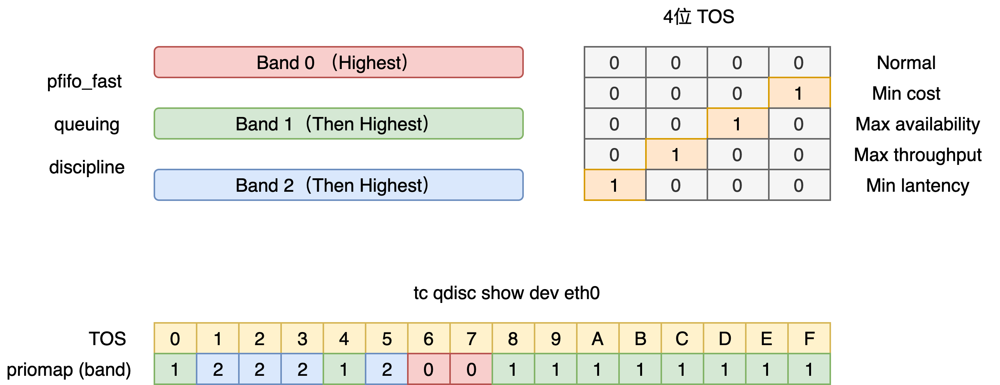


```c
struct net_device {
    struct netdev_rx_queue  *_rx;
    struct netdev_queue     *_tx;
};

struct netdev_queue {
    struct net_device   *dev;
    struct Qdisc        *qdisc;
    struct Qdisc        *qdisc_sleeping;

    unsigned long       tx_maxrate;
    unsigned long       trans_timeout;

    /* Subordinate device that the queue has been assigned to */
    struct net_device  *sb_dev;

    /* Time (in jiffies) of last Tx */
    unsigned long       trans_start;

    unsigned long       state;
};

struct Qdisc {
    int (*enqueue)(struct sk_buff *skb,struct Qdisc *sch, struct sk_buff **to_free);
    struct sk_buff* (*dequeue)(struct Qdisc *sch);

    const struct Qdisc_ops  *ops;
    struct qdisc_skb_head   q;
    struct netdev_queue     *dev_queue;
    long                    privdata[];
};

struct qdisc_skb_head {
    struct sk_buff  *head;
    struct sk_buff  *tail;
};

struct Qdisc_ops {
    const struct Qdisc_class_ops  *cl_ops;
    char                        id[IFNAMSIZ];
    int                         priv_size;
    unsigned int                static_flags;

    int (*init)(struct Qdisc *sch, struct nlattr *arg, struct netlink_ext_ack *extack);
    int (*enqueue)(struct sk_buff *skb, struct Qdisc *sch, struct sk_buff **to_free);
    struct sk_buff*  (*dequeue)(struct Qdisc*);
    struct sk_buff*  (*peek)(struct Qdisc*);
};

static inline int dev_queue_xmit(struct sk_buff *skb)
{
    return __dev_queue_xmit(skb, NULL);
}

int __dev_queue_xmit(struct sk_buff *skb, struct net_device *sb_dev)
{
    struct net_device *dev = skb->dev;
    struct netdev_queue *txq = NULL;
    enum skb_drop_reason reason;
    int cpu, rc = -ENOMEM;
    bool again = false;
    struct Qdisc *q;

/* 1: Sanity checks and early timestamps */
    skb_reset_mac_header(skb);
    skb_assert_len(skb);

    if (unlikely(skb_shinfo(skb)->tx_flags & (SKBTX_SCHED_TSTAMP | SKBTX_BPF)))
        __skb_tstamp_tx(skb, NULL, NULL, skb->sk, SCM_TSTAMP_SCHED);

    reason = qdisc_pkt_len_segs_init(skb);
    if (unlikely(reason)) {
        dev_core_stats_tx_dropped_inc(dev);
        kfree_skb_reason(skb, reason);`
        return -EINVAL;
    }

/* 2: Lock context + priority update */
    /* Disable soft irqs for various locks below. Also
     * stops preemption for RCU. */
    rcu_read_lock_bh();

    skb_update_prio(skb);

/* 3: Egress hooks (netfilter + TC/BPF) */
    tcx_set_ingress(skb, false);
#ifdef CONFIG_NET_EGRESS
    if (static_branch_unlikely(&egress_needed_key)) {
        if (nf_hook_egress_active()) {
            skb = nf_hook_egress(skb, &rc, dev);
            if (!skb)
                goto out;
        }

        netdev_xmit_skip_txqueue(false);

        nf_skip_egress(skb, true);
        skb = sch_handle_egress(skb, &rc, dev);
        if (!skb)
            goto out;
        nf_skip_egress(skb, false);

        if (netdev_xmit_txqueue_skipped())
            txq = netdev_tx_queue_mapping(dev, skb);
    }
#endif
    /* If device/qdisc don't need skb->dst, release it right now while
     * its hot in this cpu cache. */
    if (dev->priv_flags & IFF_XMIT_DST_RELEASE)
        skb_dst_drop(skb);
    else
        skb_dst_force(skb);

/* 4: TX queue selection + dst handling */
    if (!txq)
        txq = netdev_core_pick_tx(dev, skb, sb_dev);

/* 5: Two-path split — qdisc vs. no-qdisc */
    q = rcu_dereference_bh(txq->qdisc);

    trace_net_dev_queue(skb);
    if (q->enqueue) {
        rc = __dev_xmit_skb(skb, q, dev, txq);
        goto out;
    }

/* 6: No-qdisc direct path */
    /* The device has no queue. Common case for software devices:
     * loopback, all the sorts of tunnels...

     * Really, it is unlikely that netif_tx_lock protection is necessary
     * here.  (f.e. loopback and IP tunnels are clean ignoring statistics
     * counters.)
     * However, it is possible, that they rely on protection
     * made by us here.

     * Check this and shot the lock. It is not prone from deadlocks.
     *Either shot noqueue qdisc, it is even simpler 8) */
    if (unlikely(!(dev->flags & IFF_UP))) {
        reason = SKB_DROP_REASON_DEV_READY;
        goto drop;
    }

    cpu = smp_processor_id(); /* ok because BHs are off */

    if (likely(!netif_tx_owned(txq, cpu))) {
        bool is_list = false;

        if (dev_xmit_recursion())
            goto recursion_alert;

        skb = validate_xmit_skb(skb, dev, &again);
        if (!skb)
            goto out;

        HARD_TX_LOCK(dev, txq, cpu);

        if (!netif_xmit_stopped(txq)) {
            is_list = !!skb->next;

            dev_xmit_recursion_inc();
            skb = dev_hard_start_xmit(skb, dev, txq, &rc);
            dev_xmit_recursion_dec();

            /* GSO segments a single SKB into a list of frames.
             * TCP expects error to mean none of the data was sent. */
            if (is_list)
                rc = NETDEV_TX_OK;
        }
        HARD_TX_UNLOCK(dev, txq);
        if (!skb) /* xmit completed */
            goto out;

        net_crit_ratelimited("Virtual device %s asks to queue packet!\n", dev->name);
        /* NETDEV_TX_BUSY or queue was stopped */
        if (!is_list)
            rc = -ENETDOWN;
    } else {
        /* Recursion is detected! It is possible unfortunately. */
recursion_alert:
        net_crit_ratelimited("Dead loop on virtual device %s (net %llu), fix it urgently!\n", dev->name, dev_net(dev)->net_cookie);

        rc = -ENETDOWN;
    }

    reason = SKB_DROP_REASON_RECURSION_LIMIT;
drop:
    rcu_read_unlock_bh();

    dev_core_stats_tx_dropped_inc(dev);
    kfree_skb_list_reason(skb, reason);
    return rc;
out:
    rcu_read_unlock_bh();
    return rc;
}

# ip addr
1: lo: <LOOPBACK,UP,LOWER_UP> mtu 65536 qdisc noqueue state UNKNOWN group default qlen 1000
    link/loopback 00:00:00:00:00:00 brd 00:00:00:00:00:00
    inet 127.0.0.1/8 scope host lo
       valid_lft forever preferred_lft forever
    inet6 ::1/128 scope host
       valid_lft forever preferred_lft forever
2: eth0: <BROADCAST,MULTICAST,UP,LOWER_UP> mtu 1400 qdisc pfifo_fast state UP group default qlen 1000
    link/ether fa:16:3e:75:99:08 brd ff:ff:ff:ff:ff:ff
    inet 10.173.32.47/21 brd 10.173.39.255 scope global noprefixroute dynamic eth0
       valid_lft 67104sec preferred_lft 67104sec
    inet6 fe80::f816:3eff:fe75:9908/64 scope link
       valid_lft forever preferred_lft forever
```

```c
static inline int __dev_xmit_skb(struct sk_buff *skb, struct Qdisc *q,
                 struct net_device *dev,
                 struct netdev_queue *txq)
{
    struct sk_buff *next, *to_free = NULL, *to_free2 = NULL;
    spinlock_t *root_lock = qdisc_lock(q);
    struct llist_node *ll_list, *first_n;
    unsigned long defer_count = 0;
    int rc;

    qdisc_calculate_pkt_len(skb, q);

    tcf_set_qdisc_drop_reason(skb, QDISC_DROP_GENERIC);

    if (q->flags & TCQ_F_NOLOCK) {
        if (q->flags & TCQ_F_CAN_BYPASS && nolock_qdisc_is_empty(q) && qdisc_run_begin(q)) {
            /* Retest nolock_qdisc_is_empty() within the protection
             * of q->seqlock to protect from racing with requeuing. */
            if (unlikely(!nolock_qdisc_is_empty(q))) {
                rc = dev_qdisc_enqueue(skb, q, &to_free, txq);
                __qdisc_run(q);
                to_free2 = qdisc_run_end(q);

                goto free_skbs;
            }

            qdisc_bstats_cpu_update(q, skb);
            if (sch_direct_xmit(skb, q, dev, txq, NULL, true) && !nolock_qdisc_is_empty(q))
                __qdisc_run(q);

            to_free2 = qdisc_run_end(q);
            rc = NET_XMIT_SUCCESS;
            goto free_skbs;
        }

        rc = dev_qdisc_enqueue(skb, q, &to_free, txq);
        to_free2 = qdisc_run(q);
        goto free_skbs;
    }

    /* Open code llist_add(&skb->ll_node, &q->defer_list) + queue limit.
     * In the try_cmpxchg() loop, we want to increment q->defer_count
     * at most once to limit the number of skbs in defer_list.
     * We perform the defer_count increment only if the list is not empty,
     * because some arches have slow atomic_long_inc_return(). */
    first_n = READ_ONCE(q->defer_list.first);
    do {
        if (first_n && !defer_count) {
            defer_count = atomic_long_inc_return(&q->defer_count);
            if (unlikely(defer_count > READ_ONCE(net_hotdata.qdisc_max_burst))) {
                kfree_skb_reason(skb, SKB_DROP_REASON_QDISC_BURST_DROP);
                return NET_XMIT_DROP;
            }
        }
        skb->ll_node.next = first_n;
    } while (!try_cmpxchg(&q->defer_list.first, &first_n, &skb->ll_node));

    /* If defer_list was not empty, we know the cpu which queued
     * the first skb will process the whole list for us. */
    if (first_n)
        return NET_XMIT_SUCCESS;

    spin_lock(root_lock);

    ll_list = llist_del_all(&q->defer_list);
    /* There is a small race because we clear defer_count not atomically
     * with the prior llist_del_all(). This means defer_list could grow
     * over qdisc_max_burst. */
    atomic_long_set(&q->defer_count, 0);

    ll_list = llist_reverse_order(ll_list);

    if (unlikely(test_bit(__QDISC_STATE_DEACTIVATED, &q->state))) {
        llist_for_each_entry_safe(skb, next, ll_list, ll_node)
            __qdisc_drop(skb, &to_free);
        rc = NET_XMIT_DROP;
        goto unlock;
    }
    if ((q->flags & TCQ_F_CAN_BYPASS) && !qdisc_qlen(q) &&
        !llist_next(ll_list) && qdisc_run_begin(q)) {
        /* This is a work-conserving queue; there are no old skbs
         * waiting to be sent out; and the qdisc is not running -
         * xmit the skb directly. */

        DEBUG_NET_WARN_ON_ONCE(skb != llist_entry(ll_list,
                              struct sk_buff,
                              ll_node));
        qdisc_bstats_update(q, skb);
        if (sch_direct_xmit(skb, q, dev, txq, root_lock, true))
            __qdisc_run(q);
        to_free2 = qdisc_run_end(q);
        rc = NET_XMIT_SUCCESS;
    } else {
        int count = 0;

        llist_for_each_entry_safe(skb, next, ll_list, ll_node) {
            if (next) {
                prefetch(next);
                prefetch(&next->priority);
                skb_mark_not_on_list(skb);
            }
            rc = dev_qdisc_enqueue(skb, q, &to_free, txq);
            count++;
        }
        to_free2 = qdisc_run(q);
        if (count != 1)
            rc = NET_XMIT_SUCCESS;
    }
unlock:
    spin_unlock(root_lock);

free_skbs:
    tcf_kfree_skb_list(to_free, q, txq, dev);
    tcf_kfree_skb_list(to_free2, q, txq, dev);
    return rc;
}
```

### nf_hook_egress

```c
struct sk_buff *nf_hook_egress(struct sk_buff *skb, int *rc,
                         struct net_device *dev)
{
    struct nf_hook_entries *e;
    struct nf_hook_state state;
    int ret;

#ifdef CONFIG_NETFILTER_SKIP_EGRESS
    if (skb->nf_skip_egress)
        return skb;
#endif

    e = rcu_dereference_check(dev->nf_hooks_egress, rcu_read_lock_bh_held());
    if (!e)
        return skb;

    nf_hook_state_init(&state, NF_NETDEV_EGRESS,
               NFPROTO_NETDEV, NULL, dev, NULL,
               dev_net(dev), NULL);

    /* nf assumes rcu_read_lock, not just read_lock_bh */
    rcu_read_lock();
    ret = nf_hook_slow(skb, &state, e, 0);
    rcu_read_unlock();

    if (ret == 1) {
        return skb;
    } else if (ret < 0) {
        *rc = NET_XMIT_DROP;
        return NULL;
    } else { /* ret == 0 */
        *rc = NET_XMIT_SUCCESS;
        return NULL;
    }
}

int nf_hook_slow(struct sk_buff *skb, struct nf_hook_state *state,
         const struct nf_hook_entries *e, unsigned int s)
{
    unsigned int verdict;
    int ret;

    for (; s < e->num_hook_entries; s++) {
        verdict = nf_hook_entry_hookfn(&e->hooks[s], skb, state) {
            return entry->hook(entry->priv, skb, state);
        }
        switch (verdict & NF_VERDICT_MASK) {
        case NF_ACCEPT:
            break;
        case NF_DROP:
            kfree_skb_reason(skb, SKB_DROP_REASON_NETFILTER_DROP);
            ret = NF_DROP_GETERR(verdict);
            if (ret == 0)
                ret = -EPERM;
            return ret;
        case NF_QUEUE:
            ret = nf_queue(skb, state, s, verdict) {
                int ret;

                ret = __nf_queue(skb, state, index, verdict >> NF_VERDICT_QBITS);
                if (ret < 0) {
                    if (ret == -ESRCH &&
                        (verdict & NF_VERDICT_FLAG_QUEUE_BYPASS))
                        return 1;
                    kfree_skb(skb);
                }

                return 0;
            }
            if (ret == 1)
                continue;
            return ret;
        case NF_STOLEN:
            return NF_DROP_GETERR(verdict);
        default:
            WARN_ON_ONCE(1);
            return 0;
        }
    }

    return 1;
}

int __nf_queue(struct sk_buff *skb, const struct nf_hook_state *state,
              unsigned int index, unsigned int queuenum)
{
    struct nf_queue_entry *entry = NULL;
    const struct nf_queue_handler *qh;
    unsigned int route_key_size;
    int status;

    /* QUEUE == DROP if no one is waiting, to be safe. */
    qh = rcu_dereference(nf_queue_handler);
    if (!qh)
        return -ESRCH;

    switch (state->pf) {
    case AF_INET:
        route_key_size = sizeof(struct ip_rt_info);
        break;
    case AF_INET6:
        route_key_size = sizeof(struct ip6_rt_info);
        break;
    default:
        route_key_size = 0;
        break;
    }

    if (skb_sk_is_prefetched(skb)) {
        struct sock *sk = skb->sk;

        if (!sk_is_refcounted(sk)) {
            if (!refcount_inc_not_zero(&sk->sk_refcnt))
                return -ENOTCONN;

            /* drop refcount on skb_orphan */
            skb->destructor = sock_edemux;
        }
    }

    entry = kmalloc(sizeof(*entry) + route_key_size, GFP_ATOMIC);
    if (!entry)
        return -ENOMEM;

    if (skb_dst(skb) && !skb_dst_force(skb)) {
        kfree(entry);
        return -ENETDOWN;
    }

    *entry = (struct nf_queue_entry) {
        .skb    = skb,
        .skb_dev = skb->dev,
        .state    = *state,
        .hook_index = index,
        .size    = sizeof(*entry) + route_key_size,
    };
    __nf_queue_entry_init_physdevs(entry);

    if (!nf_queue_entry_get_refs(entry)) {
        kfree(entry);
        return -ENOTCONN;
    }

    switch (entry->state.pf) {
    case AF_INET:
        nf_ip_saveroute(skb, entry);
        break;
    case AF_INET6:
        nf_ip6_saveroute(skb, entry);
        break;
    }

    status = qh->outfn(entry, queuenum);
    if (status < 0) {
        nf_queue_entry_free(entry);
        return status;
    }

    return 0;
}
```

### sch_handle_egress

```c
struct sk_buff *
sch_handle_egress(struct sk_buff *skb, int *ret, struct net_device *dev)
{
    struct bpf_mprog_entry *entry = rcu_dereference_bh(dev->tcx_egress);
    enum skb_drop_reason drop_reason = SKB_DROP_REASON_TC_EGRESS;
    struct bpf_net_context __bpf_net_ctx, *bpf_net_ctx;
    int sch_ret;

    if (!entry)
        return skb;

    bpf_net_ctx = bpf_net_ctx_set(&__bpf_net_ctx);

    /* qdisc_skb_cb(skb)->pkt_len & tcx_set_ingress() was
     * already set by the caller. */
    if (static_branch_unlikely(&tcx_needed_key)) {
        sch_ret = tcx_run(entry, skb, false);
        if (sch_ret != TC_ACT_UNSPEC)
            goto egress_verdict;
    }
    sch_ret = tc_run(tcx_entry(entry), skb, &drop_reason);
egress_verdict:
    switch (sch_ret) {
    case TC_ACT_REDIRECT:
        /* No need to push/pop skb's mac_header here on egress! */
        skb_do_redirect(skb);
        *ret = NET_XMIT_SUCCESS;
        bpf_net_ctx_clear(bpf_net_ctx);
        return NULL;
    case TC_ACT_SHOT:
        kfree_skb_reason(skb, drop_reason);
        *ret = NET_XMIT_DROP;
        bpf_net_ctx_clear(bpf_net_ctx);
        return NULL;
    /* used by tc_run */
    case TC_ACT_STOLEN:
    case TC_ACT_QUEUED:
    case TC_ACT_TRAP:
        consume_skb(skb);
        fallthrough;
    case TC_ACT_CONSUMED:
        *ret = NET_XMIT_SUCCESS;
        bpf_net_ctx_clear(bpf_net_ctx);
        return NULL;
    }
    bpf_net_ctx_clear(bpf_net_ctx);

    return skb;
}
```

#### tcx_run

```c
static __always_inline enum tcx_action_base
tcx_run(const struct bpf_mprog_entry *entry, struct sk_buff *skb,
    const bool needs_mac)
{
    const struct bpf_mprog_fp *fp;
    const struct bpf_prog *prog;
    int ret = TCX_NEXT;

    if (needs_mac)
        __skb_push(skb, skb->mac_len);
    bpf_mprog_foreach_prog(entry, fp, prog) {
        bpf_compute_data_pointers(skb);
        ret = bpf_prog_run(prog, skb);
        if (ret != TCX_NEXT)
            break;
    }
    if (needs_mac)
        __skb_pull(skb, skb->mac_len);
    return tcx_action_code(skb, ret);
}

static __always_inline u32 bpf_prog_run(const struct bpf_prog *prog, const void *ctx)
{
    return __bpf_prog_run(prog, ctx, bpf_dispatcher_nop_func);
}

u32 __bpf_prog_run(const struct bpf_prog *prog,
                      const void *ctx,
                      bpf_dispatcher_fn dfunc)
{
    u32 ret;

    cant_migrate();
    if (static_branch_unlikely(&bpf_stats_enabled_key)) {
        struct bpf_prog_stats *stats;
        u64 duration, start = sched_clock();
        unsigned long flags;

        ret = dfunc(ctx, prog->insnsi, prog->bpf_func);

        duration = sched_clock() - start;
        if (likely(prog->stats)) {
            stats = this_cpu_ptr(prog->stats);
            flags = u64_stats_update_begin_irqsave(&stats->syncp);
            u64_stats_inc(&stats->cnt);
            u64_stats_add(&stats->nsecs, duration);
            u64_stats_update_end_irqrestore(&stats->syncp, flags);
        }
    } else {
        ret = dfunc(ctx, prog->insnsi, prog->bpf_func);
    }
    return ret;
}

unsigned int bpf_dispatcher_nop_func(
    const void *ctx,
    const struct bpf_insn *insnsi,
    bpf_func_t bpf_func)
{
    return bpf_func(ctx, insnsi);
}
```

#### tc_run

```c
static int tc_run(struct tcx_entry *entry, struct sk_buff *skb,
          enum skb_drop_reason *drop_reason)
{
    int ret = TC_ACT_UNSPEC;
#ifdef CONFIG_NET_CLS_ACT
    struct mini_Qdisc *miniq = rcu_dereference_bh(entry->miniq);
    struct tcf_result res;

    if (!miniq)
        return ret;

    /* Global bypass */
    if (!static_branch_likely(&tcf_sw_enabled_key))
        return ret;

    /* Block-wise bypass */
    if (tcf_block_bypass_sw(miniq->block))
        return ret;

    tc_skb_cb(skb)->mru = 0;
    qdisc_skb_cb(skb)->post_ct = false;
    tcf_set_drop_reason(skb, *drop_reason);

    mini_qdisc_bstats_cpu_update(miniq, skb);
    ret = tcf_classify(skb, miniq->block, miniq->filter_list, &res, false);
    /* Only tcf related quirks below. */
    switch (ret) {
    case TC_ACT_SHOT:
        *drop_reason = tcf_get_drop_reason(skb);
        mini_qdisc_qstats_cpu_drop(miniq);
        break;
    case TC_ACT_OK:
    case TC_ACT_RECLASSIFY:
        skb->tc_index = TC_H_MIN(res.classid);
        break;
    }
#endif /* CONFIG_NET_CLS_ACT */
    return ret;
}

int tcf_classify(struct sk_buff *skb,
         const struct tcf_block *block,
         const struct tcf_proto *tp,
         struct tcf_result *res, bool compat_mode)
{
#if !IS_ENABLED(CONFIG_NET_TC_SKB_EXT)
    u32 last_executed_chain = 0;

    return __tcf_classify(skb, tp, tp, res, compat_mode, NULL, 0, &last_executed_chain);
#else
    u32 last_executed_chain = tp ? tp->chain->index : 0;
    struct tcf_exts_miss_cookie_node *n = NULL;
    const struct tcf_proto *orig_tp = tp;
    struct tc_skb_ext *ext;
    int act_index = 0;
    int ret;

    if (block) {
        ext = skb_ext_find(skb, TC_SKB_EXT);

        if (ext && (ext->chain || ext->act_miss)) {
            struct tcf_chain *fchain;
            u32 chain;

            if (ext->act_miss) {
                n = tcf_exts_miss_cookie_lookup(ext->act_miss_cookie, &act_index);
                if (!n) {
                    tcf_set_drop_reason(skb, SKB_DROP_REASON_TC_COOKIE_ERROR);
                    return TC_ACT_SHOT;
                }

                chain = n->chain_index;
            } else {
                chain = ext->chain;
            }

            fchain = tcf_chain_lookup_rcu(block, chain);
            if (!fchain) {
                tcf_set_drop_reason(skb, SKB_DROP_REASON_TC_CHAIN_NOTFOUND);

                return TC_ACT_SHOT;
            }

            /* Consume, so cloned/redirect skbs won't inherit ext */
            skb_ext_del(skb, TC_SKB_EXT);

            tp = rcu_dereference_bh(fchain->filter_chain);
            last_executed_chain = fchain->index;
        }
    }

    ret = __tcf_classify(skb, tp, orig_tp, res, compat_mode, n, act_index, &last_executed_chain);

    if (tc_skb_ext_tc_enabled()) {
        /* If we missed on some chain */
        if (ret == TC_ACT_UNSPEC && last_executed_chain) {
            struct tc_skb_cb *cb = tc_skb_cb(skb);

            ext = tc_skb_ext_alloc(skb);
            if (!ext) {
                tcf_set_drop_reason(skb, SKB_DROP_REASON_NOMEM);
                return TC_ACT_SHOT;
            }
            ext->chain = last_executed_chain;
            ext->mru = cb->mru;
            ext->post_ct = qdisc_skb_cb(skb)->post_ct;
            ext->post_ct_snat = qdisc_skb_cb(skb)->post_ct_snat;
            ext->post_ct_dnat = qdisc_skb_cb(skb)->post_ct_dnat;
            ext->zone = cb->zone;
        }
    }

    return ret;
#endif
}

int __tcf_classify(struct sk_buff *skb,
                 const struct tcf_proto *tp,
                 const struct tcf_proto *orig_tp,
                 struct tcf_result *res,
                 bool compat_mode,
                 struct tcf_exts_miss_cookie_node *n,
                 int act_index,
                 u32 *last_executed_chain)
{
#ifdef CONFIG_NET_CLS_ACT
    const int max_reclassify_loop = 16;
    const struct tcf_proto *first_tp;
    int limit = 0;

reclassify:
#endif
    for (; tp; tp = rcu_dereference_bh(tp->next)) {
        __be16 protocol = skb_protocol(skb, false);
        int err = 0;

        if (n) {
            struct tcf_exts *exts;

            if (n->tp_prio != tp->prio)
                continue;

            /* We re-lookup the tp and chain based on index instead
             * of having hard refs and locks to them, so do a sanity
             * check if any of tp,chain,exts was replaced by the
             * time we got here with a cookie from hardware. */
            if (unlikely(n->tp != tp || n->tp->chain != n->chain ||
                     !tp->ops->get_exts)) {
                tcf_set_drop_reason(skb,
                            SKB_DROP_REASON_TC_COOKIE_ERROR);
                return TC_ACT_SHOT;
            }

            exts = tp->ops->get_exts(tp, n->handle);
            if (unlikely(!exts || n->exts != exts)) {
                tcf_set_drop_reason(skb,
                            SKB_DROP_REASON_TC_COOKIE_ERROR);
                return TC_ACT_SHOT;
            }

            n = NULL;
            err = tcf_exts_exec_ex(skb, exts, act_index, res);
        } else {
            if (tp->protocol != protocol &&
                tp->protocol != htons(ETH_P_ALL))
                continue;

            err = tc_classify(skb, tp, res);
        }
#ifdef CONFIG_NET_CLS_ACT
        if (unlikely(err == TC_ACT_RECLASSIFY && !compat_mode)) {
            first_tp = orig_tp;
            *last_executed_chain = first_tp->chain->index;
            goto reset;
        } else if (unlikely(TC_ACT_EXT_CMP(err, TC_ACT_GOTO_CHAIN))) {
            first_tp = res->goto_tp;
            *last_executed_chain = err & TC_ACT_EXT_VAL_MASK;
            goto reset;
        }
#endif
        if (err >= 0)
            return err;
    }

    if (unlikely(n)) {
        tcf_set_drop_reason(skb,
                    SKB_DROP_REASON_TC_COOKIE_ERROR);
        return TC_ACT_SHOT;
    }

    return TC_ACT_UNSPEC; /* signal: continue lookup */
#ifdef CONFIG_NET_CLS_ACT
reset:
    if (unlikely(limit++ >= max_reclassify_loop)) {
        net_notice_ratelimited("%u: reclassify loop, rule prio %u, protocol %02x\n",
                       tp->chain->block->index,
                       tp->prio & 0xffff,
                       ntohs(tp->protocol));
        tcf_set_drop_reason(skb,
                    SKB_DROP_REASON_TC_RECLASSIFY_LOOP);
        return TC_ACT_SHOT;
    }

    tp = first_tp;
    goto reclassify;
#endif
}

int tc_classify(struct sk_buff *skb, const struct tcf_proto *tp,
                struct tcf_result *res)
{
    if (static_branch_likely(&tc_skip_wrapper_cls))
        goto skip;

#if IS_BUILTIN(CONFIG_NET_CLS_BPF)
    if (tp->classify == cls_bpf_classify)
        return cls_bpf_classify(skb, tp, res);
#endif
#if IS_BUILTIN(CONFIG_NET_CLS_U32)
    if (tp->classify == u32_classify)
        return u32_classify(skb, tp, res);
#endif
#if IS_BUILTIN(CONFIG_NET_CLS_FLOWER)
    if (tp->classify == fl_classify)
        return fl_classify(skb, tp, res);
#endif
#if IS_BUILTIN(CONFIG_NET_CLS_FW)
    if (tp->classify == fw_classify)
        return fw_classify(skb, tp, res);
#endif
#if IS_BUILTIN(CONFIG_NET_CLS_MATCHALL)
    if (tp->classify == mall_classify)
        return mall_classify(skb, tp, res);
#endif
#if IS_BUILTIN(CONFIG_NET_CLS_BASIC)
    if (tp->classify == basic_classify)
        return basic_classify(skb, tp, res);
#endif
#if IS_BUILTIN(CONFIG_NET_CLS_CGROUP)
    if (tp->classify == cls_cgroup_classify)
        return cls_cgroup_classify(skb, tp, res);
#endif
#if IS_BUILTIN(CONFIG_NET_CLS_FLOW)
    if (tp->classify == flow_classify)
        return flow_classify(skb, tp, res);
#endif
#if IS_BUILTIN(CONFIG_NET_CLS_ROUTE4)
    if (tp->classify == route4_classify)
        return route4_classify(skb, tp, res);
#endif

skip:
    return tp->classify(skb, tp, res);
}
```

### netdev_core_pick_tx

```c
skb arrives on RX queue N
  └─ driver: skb_record_rx_queue(skb, N)    → queue_mapping = N+1

packet processed, reply generated
  └─ netdev_core_pick_tx()
       1. sk->sk_tx_queue_mapping cached?   → use it
       2. XPS map (rxq→txq or cpu→txq)?     → use it
       3. skb_rx_queue_recorded()?          → map RX queue → TX queue
       4. flow hash                         → skb_get_hash()
       └─ skb_set_queue_mapping(skb, index) → queue_mapping = TX index

driver reads skb_get_queue_mapping()        → picks hardware TX ring
```

```c
struct netdev_queue *netdev_core_pick_tx(struct net_device *dev,
                     struct sk_buff *skb,
                     struct net_device *sb_dev)
{
    int queue_index = 0;

#ifdef CONFIG_XPS
    u32 sender_cpu = skb->sender_cpu - 1;

    if (sender_cpu >= (u32)NR_CPUS)
        skb->sender_cpu = raw_smp_processor_id() + 1;
#endif

    if (dev->real_num_tx_queues != 1) {
        const struct net_device_ops *ops = dev->netdev_ops;

        if (ops->ndo_select_queue)
            queue_index = ops->ndo_select_queue(dev, skb, sb_dev);
        else
            queue_index = netdev_pick_tx(dev, skb, sb_dev);

        queue_index = netdev_cap_txqueue(dev, queue_index);
    }

    skb_set_queue_mapping(skb, queue_index);
    return netdev_get_tx_queue(dev, queue_index);
}

u16 netdev_pick_tx(struct net_device *dev, struct sk_buff *skb,
             struct net_device *sb_dev)
{
    struct sock *sk = skb->sk;
    int queue_index = sk_tx_queue_get(sk);

    sb_dev = sb_dev ? : dev;

    if (queue_index < 0 || skb->ooo_okay ||
        queue_index >= dev->real_num_tx_queues) {
        int new_index = get_xps_queue(dev, sb_dev, skb);

        if (new_index < 0)
            new_index = skb_tx_hash(dev, sb_dev, skb);

        if (sk && sk_fullsock(sk) &&
            rcu_access_pointer(sk->sk_dst_cache))
            sk_tx_queue_set(sk, new_index);

        queue_index = new_index;
    }

    return queue_index;
}
```

### dev_qdisc_enqueue

```c
static int dev_qdisc_enqueue(struct sk_buff *skb, struct Qdisc *q,
                 struct sk_buff **to_free,
                 struct netdev_queue *txq)
{
    int rc;

    rc = q->enqueue(skb, q, to_free) & NET_XMIT_MASK;
    if (rc == NET_XMIT_SUCCESS)
        trace_qdisc_enqueue(q, txq, skb);
    return rc;
}

static const struct Qdisc_class_ops multiq_class_ops = {
    .graft       = multiq_graft,
    .leaf        = multiq_leaf,
    .find        = multiq_find,
    .walk        = multiq_walk,
    .tcf_block   = multiq_tcf_block,
    .bind_tcf    = multiq_bind,
    .unbind_tcf  = multiq_unbind,
    .dump        = multiq_dump_class,
    .dump_stats  = multiq_dump_class_stats,
};

static struct Qdisc_ops multiq_qdisc_ops __read_mostly = {
    .next       = NULL,
    .cl_ops     = &multiq_class_ops,
    .id         = "multiq",
    .priv_size  = sizeof(struct multiq_sched_data),
    .enqueue    = multiq_enqueue,
    .dequeue    = multiq_dequeue,
    .peek       = multiq_peek,
    .init       = multiq_init,
    .reset      = multiq_reset,
    .destroy    = multiq_destroy,
    .change     = multiq_tune,
    .dump       = multiq_dump,
    .owner      = THIS_MODULE,
};
```

```c
static int
multiq_enqueue(struct sk_buff *skb, struct Qdisc *sch,
           struct sk_buff **to_free)
{
    struct Qdisc *qdisc;
    int ret;

    qdisc = multiq_classify(skb, sch, &ret);
#ifdef CONFIG_NET_CLS_ACT
    if (qdisc == NULL) {
        if (ret & __NET_XMIT_BYPASS)
            qdisc_qstats_drop(sch);
        __qdisc_drop(skb, to_free);
        return ret;
    }
#endif

    ret = qdisc_enqueue(skb, qdisc, to_free) {
        return sch->enqueue(skb, sch, to_free);
    }
    if (ret == NET_XMIT_SUCCESS) {
        sch->q.qlen++;
        return NET_XMIT_SUCCESS;
    }
    if (net_xmit_drop_count(ret))
        qdisc_qstats_drop(sch);
    return ret;
}

struct Qdisc * multiq_classify(struct sk_buff *skb, struct Qdisc *sch, int *qerr)
{
    struct multiq_sched_data *q = qdisc_priv(sch);
    u32 band;
    struct tcf_result res;
    struct tcf_proto *fl = rcu_dereference_bh(q->filter_list);
    int err;

    *qerr = NET_XMIT_SUCCESS | __NET_XMIT_BYPASS;
    err = tcf_classify(skb, NULL, fl, &res, false);
#ifdef CONFIG_NET_CLS_ACT
    switch (err) {
    case TC_ACT_STOLEN:
    case TC_ACT_QUEUED:
    case TC_ACT_TRAP:
        *qerr = NET_XMIT_SUCCESS | __NET_XMIT_STOLEN;
        fallthrough;
    case TC_ACT_SHOT:
        return NULL;
    }
#endif
    band = skb_get_queue_mapping(skb) {
        return skb->queue_mapping;
    }

    if (band >= q->bands)
        return q->queues[0];

    return q->queues[band];
}
```

### qdisc_run

```c
static inline struct sk_buff *qdisc_run(struct Qdisc *q)
{
    if (qdisc_run_begin(q)) {
        __qdisc_run(q);
        return qdisc_run_end(q);
    }
    return NULL;
}

static inline bool qdisc_run_begin(struct Qdisc *qdisc)
{
    if (qdisc->flags & TCQ_F_NOLOCK) {
        if (spin_trylock(&qdisc->seqlock))
            return true;

        /* No need to insist if the MISSED flag was already set.
         * Note that test_and_set_bit() also gives us memory ordering
         * guarantees wrt potential earlier enqueue() and below
         * spin_trylock(), both of which are necessary to prevent races */
        if (test_and_set_bit(__QDISC_STATE_MISSED, &qdisc->state))
            return false;

        /* Try to take the lock again to make sure that we will either
         * grab it or the CPU that still has it will see MISSED set
         * when testing it in qdisc_run_end() */
        return spin_trylock(&qdisc->seqlock);
    }
    if (READ_ONCE(qdisc->running))
        return false;
    WRITE_ONCE(qdisc->running, true);
    return true;
}

void __qdisc_run(struct Qdisc *q)
{
    int quota = READ_ONCE(net_hotdata.dev_tx_weight);
    int packets;

    while (qdisc_restart(q, &packets, quota)) {
        quota -= packets;
        if (quota <= 0) {
            if (q->flags & TCQ_F_NOLOCK)
                set_bit(__QDISC_STATE_MISSED, &q->state);
            else
                __netif_schedule(q);

            break;
        }
    }
}

/* net_tx_action -> qdisc_run -> __qdisc_run -> */
int qdisc_restart(struct Qdisc *q, int *packets)
{
    struct netdev_queue *txq;
    struct net_device *dev;
    spinlock_t *root_lock;
    struct sk_buff *skb;
    bool validate;

    /* Dequeue packet */
    skb = dequeue_skb(q, &validate, packets);
    if (unlikely(!skb))
        return 0;

    root_lock = qdisc_lock(q);
    dev = qdisc_dev(q);
    txq = skb_get_tx_queue(dev, skb);

    return sch_direct_xmit(skb, q, dev, txq, root_lock, validate);
}

int sch_direct_xmit(
  struct sk_buff *skb, struct Qdisc *q,
  struct net_device *dev, struct netdev_queue *txq,
  spinlock_t *root_lock, bool validate)
{
    int ret = NETDEV_TX_BUSY;

    if (likely(skb)) {
        if (!netif_xmit_frozen_or_stopped(txq))
            skb = dev_hard_start_xmit(skb, dev, txq, &ret);
    }

    if (dev_xmit_complete(ret)) {
        /* Driver sent out skb successfully or skb was consumed */
        ret = qdisc_qlen(q);
    } else {
        /* Driver returned NETDEV_TX_BUSY - requeue skb */
        ret = dev_requeue_skb(skb, q);
    }
}

struct sk_buff *dev_hard_start_xmit(struct sk_buff *first, struct net_device *dev,
                    struct netdev_queue *txq, int *ret)
{
    struct sk_buff *skb = first;
    int rc = NETDEV_TX_OK;

    while (skb) {
        struct sk_buff *next = skb->next;

        skb_mark_not_on_list(skb) {
            skb->next = NULL;
        }
        rc = xmit_one(skb, dev, txq, next != NULL/*more*/) {
            unsigned int len;
            int rc;

            if (dev_nit_active_rcu(dev))
                dev_queue_xmit_nit(skb, dev);

            len = skb->len;
            trace_net_dev_start_xmit(skb, dev);
            rc = netdev_start_xmit(skb, dev, txq, more) {
                const struct net_device_ops *ops = dev->netdev_ops;
                netdev_tx_t rc;

                rc = __netdev_start_xmit(ops, skb, dev, more) {
                    netdev_xmit_set_more(more) {
                        current->net_xmit.more = more;
                    }
                    return ops->ndo_start_xmit(skb, dev) {
                        ixgbe_xmit_frame();
                    }
                }
                if (rc == NETDEV_TX_OK)
                    txq_trans_update(dev, txq);

                return rc;
            }
            trace_net_dev_xmit(skb, rc, dev, len);

            return rc;
        }
        if (unlikely(!dev_xmit_complete(rc))) {
            skb->next = next;
            goto out;
        }

        skb = next;
        if (netif_tx_queue_stopped(txq) && skb) {
            rc = NETDEV_TX_BUSY;
            break;
        }
    }

out:
    *ret = rc;
    return skb;
}

void __netif_schedule(struct Qdisc *q)
{
    /* If q->defer_list is not empty, at least one thread is
     * in __dev_xmit_skb() before llist_del_all(&q->defer_list).
     * This thread will attempt to run the queue. */
    if (!llist_empty(&q->defer_list))
        return;

    if (!test_and_set_bit(__QDISC_STATE_SCHED, &q->state))
        __netif_reschedule(q);
}

static void __netif_reschedule(struct Qdisc *q)
{
    struct softnet_data *sd;
    unsigned long flags;

    local_irq_save(flags);
    sd = this_cpu_ptr(&softnet_data);
    q->next_sched = NULL;
    *sd->output_queue_tailp = q;
    sd->output_queue_tailp = &q->next_sched;
    raise_softirq_irqoff(NET_TX_SOFTIRQ);
    local_irq_restore(flags);
}

/* register soft irq when boot */
open_softirq(NET_TX_SOFTIRQ, net_tx_action); /* snd */
open_softirq(NET_RX_SOFTIRQ, net_rx_action); /* rcv */

void net_tx_action(void)
{
    struct softnet_data *sd = this_cpu_ptr(&softnet_data);

    if (sd->completion_queue) {
        struct sk_buff *clist;

        local_irq_disable();
        clist = sd->completion_queue;
        sd->completion_queue = NULL;
        local_irq_enable();

        while (clist) {
            struct sk_buff *skb = clist;

            clist = clist->next;

            WARN_ON(refcount_read(&skb->users));
            if (likely(get_kfree_skb_cb(skb)->reason == SKB_CONSUMED))
                trace_consume_skb(skb, net_tx_action);
            else
                trace_kfree_skb(skb, net_tx_action, get_kfree_skb_cb(skb)->reason, NULL);

            if (skb->fclone != SKB_FCLONE_UNAVAILABLE)
                __kfree_skb(skb);
            else
                __napi_kfree_skb(skb, get_kfree_skb_cb(skb)->reason);
        }
    }

    if (sd->output_queue) {
        struct Qdisc *head;

        local_irq_disable();
        head = sd->output_queue;
        sd->output_queue = NULL;
        sd->output_queue_tailp = &sd->output_queue;
        local_irq_enable();

        rcu_read_lock();

        while (head) {
            spinlock_t *root_lock = NULL;
            struct sk_buff *to_free;
            struct Qdisc *q = head;

            head = head->next_sched;

            /* We need to make sure head->next_sched is read
             * before clearing __QDISC_STATE_SCHED */
            smp_mb__before_atomic();

            if (!(q->flags & TCQ_F_NOLOCK)) {
                root_lock = qdisc_lock(q);
                spin_lock(root_lock);
            } else if (unlikely(test_bit(__QDISC_STATE_DEACTIVATED, &q->state))) {
                /* There is a synchronize_net() between
                 * STATE_DEACTIVATED flag being set and
                 * qdisc_reset()/some_qdisc_is_busy() in
                 * dev_deactivate(), so we can safely bail out
                 * early here to avoid data race between
                 * qdisc_deactivate() and some_qdisc_is_busy()
                 * for lockless qdisc. */
                clear_bit(__QDISC_STATE_SCHED, &q->state);
                continue;
            }

            clear_bit(__QDISC_STATE_SCHED, &q->state);
            to_free = qdisc_run(q);
            if (root_lock)
                spin_unlock(root_lock);
            tcf_kfree_skb_list(to_free, q, NULL, qdisc_dev(q));
        }

        rcu_read_unlock();
    }

    xfrm_dev_backlog(sd);
}
```

## driver layer tx

```c
/* internet trasaction gigabit */
/* drivers/net/ethernet/intel/ixgb/ixgbe_main.c */
const struct net_device_ops ixgbe_netdev_ops = {
    .ndo_open               = ixgbe_open,
    .ndo_stop               = ixgbe_close,
    .ndo_start_xmit         = ixgbe_xmit_frame,
    .ndo_set_rx_mode        = ixgbe_set_multi,
    .ndo_validate_addr      = eth_validate_addr,
    .ndo_set_mac_address    = ixgbe_set_mac,
    .ndo_change_mtu         = ixgbe_change_mtu,
    .ndo_tx_timeout         = ixgbe_tx_timeout,
    .ndo_vlan_rx_add_vid    = ixgbe_vlan_rx_add_vid,
    .ndo_vlan_rx_kill_vid   = ixgbe_vlan_rx_kill_vid,
    .ndo_fix_features       = ixgbe_fix_features,
    .ndo_set_features       = ixgbe_set_features,
};

netdev_tx_t
ixgbe_xmit_frame(struct sk_buff *skb, struct net_device *netdev)
{
    struct ixgbe_adapter *adapter = netdev_priv(netdev);

    if (count) {
        ixgbe_tx_queue(adapter, count, vlan_id, tx_flags);
        /* Make sure there is space in the ring for the next send. */
        ixgbe_maybe_stop_tx(netdev, &adapter->tx_ring, DESC_NEEDED);
    }

    return NETDEV_TX_OK;
}
```

# read

* [Monitoring and Tuning the Linux Networking Stack: Receiving Data](https://blog.packagecloud.io/monitoring-tuning-linux-networking-stack-receiving-data/)
* [Illustrated Guide to Monitoring and Tuning the Linux Networking Stack: Receiving Data](https://blog.packagecloud.io/illustrated-guide-monitoring-tuning-linux-networking-stack-receiving-data/)
* [NAPI description on Linux Foundation](https://wiki.linuxfoundation.org/networking/napi)

| Queue | Type | Scope | Purpose | Handler |
| :-: | :-: | :-: | :-: | :-: |
| Hardware RX Queue | Ring buffer | Per NIC/queue | Buffer raw frames | Driver (NAPI) |
| NAPI Poll Queue | Linked list | Per CPU | Schedule polling | net_rx_action() |
| Input Packet Queue | Linked list | Per CPU | Backlog for RPS/deferred | backlog_poll() |
| Out-of-Order Queue | Red-black tree | Per TCP socket | Reorder TCP segments | tcp_data_queue() |
| Socket Receive Queue | Linked list | Per socket | Buffer data for app | Application (recv()) |
| Socket Backlog Queue | Linked list | Per listen socket | Buffer pending connections | accept() |
| Process Queue | Linked list | Per CPU | Threaded deferred processing | NAPI thread |


---


---


---


## call-graph-read

```c
/* driver layer */
ixgbe_intr(int irq, void *data) {
    IXGB_WRITE_REG(&adapter->hw, IMC, ~0);    /* disable irq */
    __napi_schedule() {
        list_add_tail(&napi->poll_list, &sd->poll_list)
        __raise_softirq_irqoff(NET_RX_SOFTIRQ) {
            net_rx_action() {
                LIST_HEAD(list);
                list_splice_init(&sd->poll_list, &list)

                for (list_empty(list)) {
                    napi_poll() {
                        napi->poll() { /* .poll = ixgbe_poll */
                            ixgbe_clean_tx_irq(adapter); /* dma_unmap_page */
                            ixgbe_clean_rx_irq(adapter, &work_done, budget) {
                                ixgbe_rx_skb();
                                netif_receive_skb(skb);
                                    --->
                            }

                            if (work_done < budget) {
                                napi_complete_done(napi, work_done);
                                if (!test_bit(__IXGB_DOWN, &adapter->flags)) {
                                    ixgbe_irq_enable(adapter) {/* re-enable irq */
                                        IXGB_WRITE_REG(&adapter->hw, IMC, val);
                                    }
                                }
                            }
                        }
                    }
                }
            }
        }
    }
}

/* mac layer */
netif_receive_skb() {
    __netif_receive_skb_core() {
        /* 0. RPS handling */
        if (rps_needed) {
            enqueue_to_backlog(skb, cpu);
            return ret;
        }

        /* 1. XDP (eXpress Data Path) */
        do_xdp_generic(&skb);

        /* 2. Packet_all Type Delivery (Global and Device-Specific) */
        list_for_each_entry_rcu(ptype, &net_hotdata.ptype_all, list) {
            if (pt_prev)
                ret = deliver_skb(skb, pt_prev, orig_dev);
            pt_prev = ptype;
        }
        list_for_each_entry_rcu(ptype, &skb->dev->ptype_all, list) {
            if (pt_prev)
                ret = deliver_skb(skb, pt_prev, orig_dev);
            pt_prev = ptype;
        }

        /* 3. Ingress Hooks */
        sch_handle_ingress();
        nf_ingress();

        /* 4. Vlan */
        vlan_do_receive(&skb);

        /* 5. RX Handler (e.g., Bridging) */
        rx_handler = rcu_dereference(skb->dev->rx_handler); /* br_handle_frame */
        rx_handler(&skb);


        /* 6. Packet_specific Type Delivery (Global and Device-Specific) */
        type = skb->protocol;
        if (likely(!deliver_exact)) {
            deliver_ptype_list_skb(&ptype_base[ntohs(type) & PTYPE_HASH_MASK]);
        }
        deliver_ptype_list_skb(&orig_dev->ptype_specific);
        deliver_ptype_list_skb(&skb->dev->ptype_specific);
    }
}

/* ip layer */
ip_rcv() {
    NF_HOOK(NF_INET_PRE_ROUTING) {              /* 1. NF_INET_PRE_ROUTING */
        ip_rcv_finish() {
            ip_rcv_finish_core() {
                ip_route_input_noref()          /* 2. Routing Lookup */
                ip_rcv_options(skb, dev);       /* IP Options Handling, Multicast/Broadcast Handling */
            }
            dst_input() {
                skb_dst(skb)->input(skb).ip_local_deliver() {
                    ip_defrag()                 /* 3. defragment */
                    NF_HOOK(NF_INET_LOCAL_IN)   /* 4. NF_INET_LOCAL_IN */
                    ip_local_deliver_finish() {
                        inet_protos[protocol]->handler() {
                            net_protocol->handler()
                        }
                    }
                }
            }
        }
    }
}

/* tcp layer */
tcp_v4_rcv() {
    sk = __inet_lookup_skb() {
        __inet_lookup_established();
        __inet_lookup_listener();
    }

process:
    if (sk->sk_state == TCP_TIME_WAIT)
        goto do_time_wait;

    /* handle half-connection sock */
    if (sk->sk_state == TCP_NEW_SYN_RECV) {
        struct request_sock *req = inet_reqsk(sk);
        sk = req->rsk_listener;

        newsk = tcp_check_req() {
            /* 1. alloc sock and insert into ehash */
            child = inet_csk(sk)->icsk_af_ops->syn_recv_sock() {
                tcp_v4_syn_recv_sock() {
                    if (sk_acceptq_is_full());
                        goto drop;
                    newsk = tcp_create_openreq_child(sk, req, skb) {
                        inet_csk_clone_lock() {
                            struct proto *prot = READ_ONCE(sk->sk_prot);
                            newsk = sk_prot_alloc(prot, priority, sk->sk_family) {
                                slab = prot->slab;
                                newsk = kmem_cache_alloc(slab, priority & ~__GFP_ZERO);
                            }
                            sock_copy(newsk, sk);
                            inet_sk_set_state(newsk, TCP_SYN_RECV) {
                                sk->sk_state = TCP_SYN_RECV;
                            }
                        }
                        tcp_init_xmit_timers();
                    }

                    inet_ehash_nolisten() {
                        inet_ehash_insert() { /* hash insert the new sk and remove the old request_sk */
                            inet_ehash_bucket(hashinfo, sk->sk_hash);
                            __sk_nulls_add_node_rcu() {
                                hlist_nulls_add_head_rcu(&sk->sk_nulls_node, list);
                            }
                            if (osk) {
                                sk_nulls_del_node_init_rcu(osk);
                            }
                        }
                    }
                }
            }

            inet_csk_complete_hashdance(child) {
                /* 2. remove from request queue */
                inet_csk_reqsk_queue_drop() {
                    reqsk_queue_unlink() {
                        __sk_nulls_del_node_init_rcu(sk);
                            hlist_nulls_del_init_rcu(&sk->sk_nulls_node);
                    }
                    reqsk_queue_removed() {
                        --icsk_accept_queue.yong;
                        --icsk_accept_queue.qlen;
                    }
                }
                reqsk_queue_removed();

                /* 3. insert into accept queue */
                inet_csk_reqsk_queue_add() {
                    sk->rskq_accept_tail = reqst_sk;
                    sk_acceptq_added() {
                        icsk_accept_queue->rskq_accept_tail = req;
                        sk_acceptq_added();
                            ++sk->sk_ack_backlog
                    }
                }
            }
        }

        tcp_child_process() {
            if (!sock_owned_by_user(child)) {
                tcp_rcv_state_process(child, skb);
                sk_listener->sk_data_ready() /* sock_def_readable, wakeup accept->inet_csk_wait_for_connect */
            } else {
                __sk_add_backlog(child, skb);
            }
        }
    }

    tcp_filter(sk, skb);
    tcp_v4_fill_cb(skb, iph, th);

    tcp_v4_do_rcv() {
        /* Fast Path */
        if (sk->sk_state == TCP_ESTABLISHED) {
            tcp_rcv_established() {
                trace_tcp_probe(sk, skb);
                tcp_checksum_complete(skb);

                tcp_data_queue(sk, skb) {
                    /* 1. [seq = rcv_next < end_seq < win] Normal  tcp_queue_rcv() */
                    /* 2. [seq < end_seq < rcv_next < win] DSACK    tcp_dsack_set() */
                    /* 3. [rcv_next < win < seq < end_seq] Out of Window tcp_drop() */
                    /* 4. [seq < rcv_next < end_seq < win] Out of Window tcp_ofo_queue() */
                    /* 5. [rcv_next < seq < end_seq < win] Out of Order tcp_data_queue_ofo() */
                }
                tcp_data_snd_check(sk) {
                    tcp_check_space() {
                        if (SOCK_QUEUE_SHRUNK && SOCK_NOSPACE) {
                            sk->sk_write_space(sk); {
                                sock_def_write_space();
                            }
                        }
                    }
                }
                tcp_ack_snd_check(sk);
                return 0;
            }
        }

        /* Slow Path */
        tcp_rcv_state_process() {
            if (sk->sk_state == TCP_LISTEN) {
                icsk->icsk_af_ops->conn_request(); /* ipv4_specific.conn_request */
                    tcp_v4_conn_request() {
                        tcp_conn_request() {
                            /* 1. check reqsk queue and accept queue */
                            if (inet_csk_reqsk_queue_is_full(sk));
                                drop;
                            if (sk_acceptq_is_full(sk));
                                drop;

                            /* 2. allock reqsk and init */
                            inet_reqsk_alloc();
                                sk->sk_state = TCP_NEW_SYN_RECV;

                            af_ops->init_req(req, sk, skb) {
                                tcp_v4_init_req();
                                    sk_rcv_saddr_set();
                                    sk_daddr_set();
                            }

                            /* 3. insert into ehash */
                            if (fastopen) {
                                inet_csk_reqsk_queue_add() {
                                    sk->rskq_accept_tail = reqst_sk;
                                    sk_acceptq_added() {
                                        icsk_accept_queue->rskq_accept_tail = req;
                                        sk_acceptq_added();
                                            ++sk->sk_ack_backlog
                                    }
                                }
                            } else  {
                                inet_csk_reqsk_queue_hash_add() {
                                    reqsk_queue_hash_req() {
                                        timer_setup();
                                        mod_timer(&req->rsk_timer, jiffies + timeout);
                                        inet_ehash_insert() {
                                            inet_ehash_bucket(hashinfo, sk->sk_hash);
                                            __sk_nulls_add_node_rcu();
                                                hlist_nulls_add_head_rcu(&sk->sk_nulls_node, list);
                                            if (osk);
                                                sk_nulls_del_node_init_rcu(osk);
                                        }
                                    }
                                    inet_csk_reqsk_queue_added() {
                                        ++icsk_accept_queue->young;
                                        --icsk_accept_queue->qlen;
                                    }
                                }
                            }

                            /* 4. send synack */
                            af_ops->send_synack() {
                                tcp_v4_send_synack();
                            }
                        }
                    }
                return 0;
            } /* TCP_LISTEN */

            if (sk->sk_state == TCP_SYN_SENT) {
                tcp_rcv_synsent_state_process() {
                    tcp_finish_connect(sk, skb) {
                        tcp_set_state(sk, TCP_ESTABLISHED);
                        tcp_init_transfer() {
                            tcp_init_buffer_space();
                            tcp_init_congestion_control(sk);
                        }
                        inet_csk_reset_keepalive_timer();
                    }

                    sk->sk_state_change() {
                        /* wakup `connect` slept at inet_wait_for_connect */
                        sock_def_wakeup();
                    }
                    tcp_send_ack(sk);
                    tcp_set_state(sk, TCP_ESTABLISHED);
                }

                tcp_data_snd_check(sk);
                return 0;
            } /* TCP_SYN_SENT */

            tcp_check_req(); /* tp->fastopen_rsk */

            /* Step 1 2 3 4 */
            tcp_validate_incoming() {
                /* RFC1323: H1. Apply PAWS check first. */
                /* Step 1: check sequence number */
                /* Step 2: check RST bit */
                /* Step 3: check security and precedence [ignored] */
                /* Step 4: Check for a SYN RFC 5961 4.2 : Send a challenge ack */
            }

            /* step 5: check the ACK field */
            tcp_ack() {
                tcp_clean_rtx_queue();
                tcp_set_xmit_timer();
                tcp_cong_control() {
                    if (tcp_in_cwnd_reduction(sk)) {
                        /* Reduce cwnd if state mandates */
                        tcp_cwnd_reduction(sk, acked_sacked, rs->losses, flag);
                    } else if (tcp_may_raise_cwnd(sk, flag)) {
                        /* Advance cwnd if state allows */
                        tcp_cong_avoid(sk, ack, acked_sacked);
                    }
                    tcp_update_pacing_rate(sk);
                }
                tcp_xmit_recovery();
            }

            if (sk->sk_state == TCP_SYN_RECV) {
                tcp_init_transfer() {
                    tcp_snd_cwnd_set();
                    tcp_init_buffer_space()
                    tcp_init_congestion_control();
                }
                tcp_set_state(sk, TCP_ESTABLISHED);

                sk->sk_state_change() {
                    sock_def_wakeup() {
                        wake_up_interruptible_all() {
                            __wake_up() {
                                __wake_up_common_lock() {
                                    __wake_up_common();
                                }
                            }
                        }
                    }
                }
            } /* TCP_SYN_RECV */

            if (sk->sk_state == TCP_LAST_ACK)
                tcp_done();

            if (sk->sk_state == TCP_FIN_WAIT1) {
                tcp_set_state(sk, TCP_FIN_WAIT2);
                sk->sk_shutdown |= SEND_SHUTDOWN;
                tcp_time_wait(sk, TCP_FIN_WAIT2, tmo);
                sk->sk_state_change(); /* Wake up lingering close() */
                tcp_time_wait(sk, TCP_FIN_WAIT2, tmo);
            }

            if (sk->sk_state == TCP_FIN_WAIT2) {
                if (sk->sk_shutdown & RCV_SHUTDOWN);
                    tcp_reset();
            }

            if (sk->sk_state == TCP_ESTABLISHED) {
                tcp_data_queue();
            }

            if (sk->sk_state == TCP_CLOSING) {
                tcp_time_wait(sk, TCP_TIME_WAIT, 0);
            }

            /* Step 6: check the URG bit */
            tcp_urg(sk, skb, th);
        }
    }

    if (!sock_owned_by_user(sk)) {
        ret = tcp_v4_do_rcv(sk, skb);
    } else if (tcp_add_backlog(sk, skb)) {
        goto discard_and_relse;
    }

do_time_wait:
    if (sk->sk_state == TCP_TIME_WAIT) {
        tcp_v4_fill_cb(skb, iph, th);
        switch (tcp_timewait_state_process(inet_twsk(sk), skb, th)) {
            case TCP_TW_SYN: {
                /* reuse connection transition to SYN_RECV */
                goto process;
            }
            case TCP_TW_ACK: {
                /* send last ack */
                tcp_v4_timewait_ack(sk, skb);
                break;
            }
            case TCP_TW_RST: {
                tcp_v4_send_reset(sk, skb);
                inet_twsk_deschedule_put(inet_twsk(sk));
                goto discard_it;
            }
            case TCP_TW_SUCCESS: {

            }
        }
    }
}

tcp_data_queue() {
    /* 1. ACK [seq = rcv_next < end_seq < win] */
        tcp_queue_rcv();
        tcp_event_data_recv();
            tcp_grow_window();
        tcp_ofo_queue(sk); /* put data from the out_of_order queue into the receive_queue */

        kfree_skb_partial();
        tcp_data_ready() { /* wakeup `sk_wait_data` */
            sk->sk_data_ready();
                sock_def_readable();
        }

    /* 2. DROP [seq < end_seq < rcv_next < win] */
        tcp_dsack_set();
        tcp_enter_quickack_mode();
        inet_csk_schedule_ack(sk);
        tcp_drop();

    /* 3. DROP [rcv_next < win < seq < end_seq] */
        tcp_enter_quickack_mode();
        inet_csk_schedule_ack(sk);
        tcp_drop();

    /* 4. OFO [seq < rcv_next < end_seq < win] */
        tcp_dsack_set();

    /* 5. DACK [rcv_next < seq < end_seq < win] */
        tcp_data_queue_ofo();
}

/* vfs layer */
SYSCALL_DEFINE3(read, fd, buf, count) {
    vfs_read(file, buf, counts);
        file->f_op->read_iter(kio, iter);
}

sock_read_iter() {
    sock_recvmsg() {
        sock->ops->recvmsg() {
            sock_rps_record_flow(); /* RPS, RFS */
            inet_recvmsg() {
                sk->sk_prot->recvmsg() {
                    tcp_recvmsg() {
                        skb_peek_tail(&sk->sk_receive_queue)
                        skb_queue_walk(&sk->sk_receive_queue, skb) {
                            if (sk->sk_shutdown & RCV_SHUTDOWN)
                                break;
                            skb_copy_datagram_msg() /* copy data to user space */
                            tcp_rcv_space_adjust()    /* adjust receive buffer space */

                            sk_wait_data() { /* waiting for data, waked up by `tcp_data_ready` */
                                sk_wait_event() {
                                    wait_woken()
                                        schedule_timeout()
                                }
                                woken_wake_function() {
                                    default_wake_function()
                                        try_to_wake_up()
                                }
                            }
                        }

                        tcp_cleanup_rbuf()

                        /* process backlog */
                        release_sock(sk) {
                            sk_backlog_rcv() {
                                sk->sk_backlog_rcv() {
                                    tcp_v4_do_rcv()
                                }
                            }
                        }
                    }
                }
            }
        }
    }
}
```
* [try_to_wake_up](./linux-proc.md#ttwu)

## driver layer rx


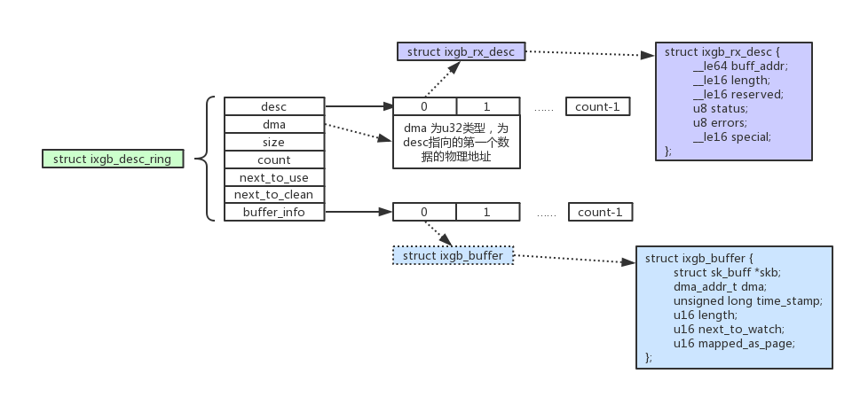

Ring | Buffer
:-: | :-:
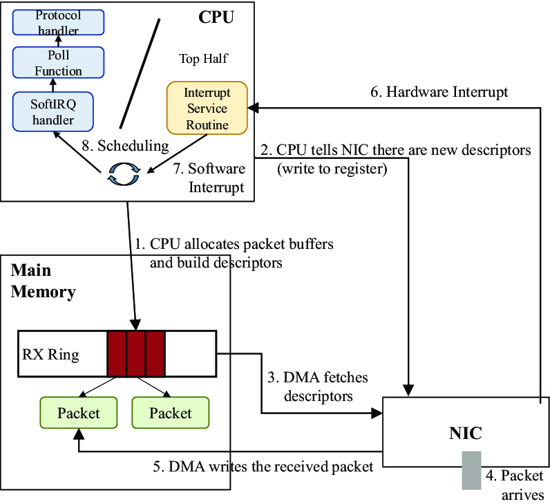 | 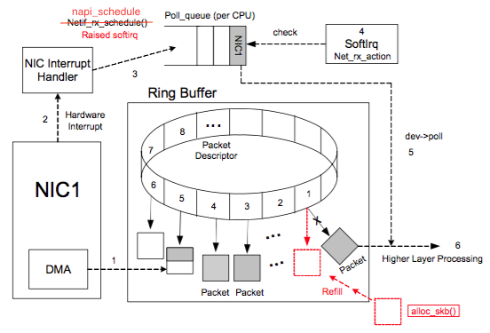

| Aspect | NIC Multiple Queues | Kernel Ring Buffer |
| :-: | :-: | :-: |
| Location | NIC hardware | Kernel memory |
| Scope | Multiple queues per NIC (e.g., 4 RX, 4 TX) | One ring buffer per queue per NIC |
| Purpose | Load balancing across CPU cores | Packet staging and kernel processing |
| Data Structure | Hardware ring buffers of descriptors | Software circular buffer of descriptors |
| Control | NIC firmware/hardware + driver config | Kernel network driver |
| Scalability | Scales with CPU cores via parallel queues | Scales with queue size and batching |
| Interaction | Feeds packets into kernel ring buffers | Receives packets from NIC queues |


* You can interpret a struct pci_dev as a representation of a struct net_device at the PCI level, but with some important nuances.
* The struct pci_dev represents the underlying PCI hardware device (e.g., a network interface card or NIC), while the struct net_device represents the network interface at the kernel’s networking layer.
* They are not the same object-they serve different purposes at different layers.


NAPI Usage:
1. embed `struct napi_struct` in the driver's private structure
2. initialise and register before the net device itself, using `netif_napi_add`, and unregistered after the net device, using `netif_napi_del`
3. changes to driver's interrupt handler
    * disabling interrupts
    * tell the networking subsystem to poll your driver shortly to pick up all available packets by `napi_schedule`
4. create a `poll` method for your driver; it's job is to obtain packets from the network interface and feed them into the kernel
    * The poll() function must return the amount of work done.
    * If and only if the return value is less than the budget, your driver must reenable interrupts and turn off polling by `napi_complete`

```c
struct pci_dev {
    struct device     dev;      /* Generic device interface */
    struct pci_driver *driver;  /* Driver bound to this device */
};

struct device {
    void                      *driver_data;  /* dev_set_drvdata/dev_get_drvdata */

    const char                *init_name;
    struct kobject            kobj;

    unsigned long             state;

    struct list_head          dev_list;
    struct list_head          napi_list;
    struct list_head          unreg_list;
    struct list_head          close_list;
    struct list_head          ptype_all;
    struct list_head          ptype_specific;

    struct device             *parent;
    const struct device_type  *type;
    struct device_driver      *driver;
    struct device_private     *p;

    struct bus_type           *bus;
    void                      *platform_data;
    int                       numa_node;
};

struct device_driver {
    const char          *name;
    struct bus_type     *bus;

    struct module       *owner;
    const char          *mod_name;  /* used for built-in modules */

    bool suppress_bind_attrs;  /* disables bind/unbind via sysfs */
    enum probe_type probe_type;

    const struct of_device_id     *of_match_table;
    const struct acpi_device_id   *acpi_match_table;

    int (*probe) (struct device *dev);
    int (*remove) (struct device *dev);

    void (*coredump) (struct device *dev);

    struct driver_private         *p;
    const struct dev_pm_ops       *pm;
};

struct net_device {
    struct device               dev;
    const struct net_device_ops *netdev_ops;
    const struct ethtool_ops    *ethtool_ops;

    struct netdev_rx_queue      *_rx;
    unsigned int                num_rx_queues;
    unsigned int                real_num_rx_queues;

    struct netdev_queue         *_tx;
    unsigned int                num_tx_queues;
    unsigned int                real_num_tx_queues;

    struct Qdisc                *qdisc;

    struct {
        struct list_head upper;
        struct list_head lower;
    } adj_list;
}

struct ixgbe_adapter {
    struct timer_list watchdog_timer;
    unsigned long active_vlans[BITS_TO_LONGS(VLAN_N_VID)];
    u32 bd_number;
    u32 rx_buffer_len;
    u32 part_num;
    u16 link_speed;
    u16 link_duplex;
    struct work_struct tx_timeout_task;

    /* TX */
    struct ixgbe_desc_ring tx_ring;
    unsigned int restart_queue;
    unsigned long timeo_start;
    u32 tx_cmd_type;
    u64 hw_csum_tx_good;
    u64 hw_csum_tx_error;
    u32 tx_int_delay;
    u32 tx_timeout_count;
    bool tx_int_delay_enable;
    bool detect_tx_hung;

    /* RX */
    struct ixgbe_desc_ring rx_ring;
    u64 hw_csum_rx_error;
    u64 hw_csum_rx_good;
    u32 rx_int_delay;
    bool rx_csum;

    /* OS defined structs */
    struct napi_struct  napi;
    struct net_device   *netdev;
    struct pci_dev      *pdev;

    /* structs defined in ixgbe_hw.h */
    struct ixgbe_hw hw;
    u16 msg_enable;
    struct ixgbe_hw_stats stats;
    u32 alloc_rx_buff_failed;
    bool have_msi;
    unsigned long flags;
};

struct ixgbe_desc_ring {
    void            *desc; /* pointer to ring array of ixgbe_{rx, tx}_desc */
    dma_addr_t      dma; /* physical address of the descriptor ring */
    unsigned int    size; /* length of descriptor ring in bytes */
    unsigned int    count; /* number of descriptors in the ring */
    unsigned int    next_to_use; /* next descriptor to associate a buffer with */
    unsigned int    next_to_clean; /* next descriptor to check for DD status bit */
    struct ixgbe_buffer *buffer_info; /* array of buffer information structs */
};

#ifdef CONFIG_ARCH_DMA_ADDR_T_64BIT
    typedef u64 dma_addr_t;
#else
    typedef u32 dma_addr_t;
#endif

/* ixgbe_alloc_rx_buffers maps skb to dma */
struct ixgbe_buffer {
    struct sk_buff  *skb;
    dma_addr_t      dma;
    unsigned long   time_stamp;
    u16             length;
    u16             next_to_watch;
    u16             mapped_as_page;
};

struct ixgbe_rx_desc {
    __le64        buff_addr;
    __le16        length;
    __le16        reserved;
    u8            status;
    u8            errors;
    __le16        special;
};

struct ixgbe_tx_desc {
    __le64        buff_addr;
    __le32        cmd_type_len;
    u8            status;
    u8            popts;
    __le16        vlan;
};

/* (GRO) allows the NIC driver to combine received packets
 * into a single large packet which is then passed to the IP stack */
struct napi_struct {
    struct list_head  poll_list; /* archoed */

    unsigned long     state;
    int               weight;
    unsigned long     gro_bitmask;
    int               (*poll)(struct napi_struct *, int);
    int               poll_owner;
    struct net_device *dev;
    struct gro_list   gro_hash[GRO_HASH_BUCKETS];
    struct sk_buff     *skb;
    struct list_head  rx_list; /* Pending GRO_NORMAL skbs */
    int               rx_count; /* length of rx_list */
    struct hrtimer    timer;
    struct list_head  dev_list;
    struct hlist_node napi_hash_node;
    unsigned int      napi_id;
};
```

```c
MODULE_AUTHOR("Intel Corporation, <linux.nics@intel.com>");
MODULE_DESCRIPTION("Intel(R) PRO/10GbE Network Driver");
MODULE_LICENSE("GPL");
MODULE_VERSION(DRV_VERSION);

int ixgbe_init_module(void)
{
    return pci_register_driver(&ixgbe_driver);
}

struct pci_driver {
    struct list_head  node;
    const char        *name;
    const struct pci_device_id *id_table;
    int  (*probe)(struct pci_dev *dev, const struct pci_device_id *id);
    void (*remove)(struct pci_dev *dev);
    int  (*suspend)(struct pci_dev *dev, pm_message_t state);
    int  (*suspend_late)(struct pci_dev *dev, pm_message_t state);
    int  (*resume_early)(struct pci_dev *dev);
    int  (*resume) (struct pci_dev *dev);
    void (*shutdown) (struct pci_dev *dev);
    int  (*sriov_configure) (struct pci_dev *dev, int num_vfs);
    const struct pci_error_handlers   *err_handler;
    const struct attribute_group      **groups;
    struct device_driver              driver;
    struct pci_dynids                 dynids;
};

static struct pci_driver ixgbe_driver = {
    .name               = ixgbe_driver_name,
    .id_table           = ixgbe_pci_tbl,
    .probe              = ixgbe_probe,
    .remove             = ixgbe_remove,
    .driver.pm          = pm_sleep_ptr(&ixgbe_pm_ops),
    .shutdown           = ixgbe_shutdown,
    .sriov_configure    = ixgbe_pci_sriov_configure,
    .err_handler        = &ixgbe_err_handler
};

static const struct pci_device_id ixgbe_pci_tbl[] = {
    {PCI_VDEVICE(INTEL, IXGBE_DEV_ID_82598), board_82598 },
    {PCI_VDEVICE(INTEL, IXGBE_DEV_ID_82598AF_DUAL_PORT), board_82598 },
    {PCI_VDEVICE(INTEL, IXGBE_DEV_ID_82598AF_SINGLE_PORT), board_82598 },
    {PCI_VDEVICE(INTEL, IXGBE_DEV_ID_82598AT), board_82598 },
    {PCI_VDEVICE(INTEL, IXGBE_DEV_ID_82598AT2), board_82598 },
};

enum ixgbe_boards {
    board_82598,
    board_82599,
    board_X540,
    board_X550,
    board_X550EM_x,
    board_x550em_x_fw,
    board_x550em_a,
    board_x550em_a_fw,
    board_e610,
};
```

### ixgbe_probe

```c
/* Device Initialization Routine */
int ixgbe_probe(
  struct pci_dev *pdev, const struct pci_device_id *ent)
{
    struct net_device *netdev = NULL;
    struct ixgbe_adapter *adapter;

    netdev = alloc_etherdev(sizeof(struct ixgbe_adapter));
    SET_NETDEV_DEV(netdev, &pdev->dev);

    pci_set_drvdata(pdev, netdev); /* pdev->dev->driver_data = netdev */
    adapter = netdev_priv(netdev);
    adapter->netdev = netdev;
    adapter->pdev = pdev;
    adapter->msg_enable = netif_msg_init(debug, DEFAULT_MSG_ENABLE);

    adapter->hw.back = adapter;
    adapter->hw.hw_addr = pci_ioremap_bar(pdev, BAR_0);

    netdev->netdev_ops = &ixgbe_netdev_ops;
    ixgbe_set_ethtool_ops(netdev);
    netdev->watchdog_timeo = 5 * HZ;

    /* register poll func: ixgbe_poll */
    netif_napi_add(netdev, &adapter->napi, ixgbe_poll, 64);

    strncpy(netdev->name, pci_name(pdev), sizeof(netdev->name) - 1);

    adapter->bd_number = cards_found;
    adapter->link_speed = 0;
    adapter->link_duplex = 0;
}

void netif_napi_add(struct net_device *dev, struct napi_struct *napi,
        int (*poll)(struct napi_struct *, int), int weight)
{
    netif_napi_add_weight(dev, napi, poll, NAPI_POLL_WEIGHT) {
        netdev_lock(dev);
        netif_napi_add_weight_locked(dev, napi, poll, weight);
        netdev_unlock(dev);
    }
}

void netif_napi_add_weight_locked(struct net_device *dev,
                  struct napi_struct *napi,
                  int (*poll)(struct napi_struct *, int),
                  int weight)
{
    netdev_assert_locked(dev);
    if (WARN_ON(test_and_set_bit(NAPI_STATE_LISTED, &napi->state)))
        return;

    INIT_LIST_HEAD(&napi->poll_list);
    INIT_HLIST_NODE(&napi->napi_hash_node);
    hrtimer_setup(&napi->timer, napi_watchdog, CLOCK_MONOTONIC, HRTIMER_MODE_REL_PINNED);
    gro_init(&napi->gro);
    napi->skb = NULL;
    napi->poll = poll;
    if (weight > NAPI_POLL_WEIGHT)
        netdev_err_once(dev, "%s() called with weight %d\n", __func__, weight);
    napi->weight = weight;
    napi->dev = dev;
#ifdef CONFIG_NETPOLL
    napi->poll_owner = -1;
#endif
    napi->list_owner = -1;
    set_bit(NAPI_STATE_SCHED, &napi->state);
    set_bit(NAPI_STATE_NPSVC, &napi->state);
    netif_napi_dev_list_add(dev, napi);

    /* default settings from sysfs are applied to all NAPIs. any per-NAPI
     * configuration will be loaded in napi_enable */
    napi_set_defer_hard_irqs(napi, READ_ONCE(dev->napi_defer_hard_irqs));
    napi_set_gro_flush_timeout(napi, READ_ONCE(dev->gro_flush_timeout));

    napi_get_frags_check(napi);
    /* Create kthread for this napi if dev->threaded is set.
     * Clear dev->threaded if kthread creation failed so that
     * threaded mode will not be enabled in napi_enable(). */
    if (napi_get_threaded_config(dev, napi))
        if (napi_kthread_create(napi))
            dev->threaded = NETDEV_NAPI_THREADED_DISABLED;
    netif_napi_set_irq_locked(napi, -1);
}
```

### ixgbe_intr

```c
/* internet trasaction gigabyte
  drivers/net/ethernet/intel/ixgb/ixgbe_main.c */
const struct net_device_ops ixgbe_netdev_ops = {
    .ndo_open               = ixgbe_open,
    .ndo_stop               = ixgbe_close,
    .ndo_start_xmit         = ixgbe_xmit_frame,
    .ndo_set_rx_mode        = ixgbe_set_multi,
    .ndo_validate_addr      = eth_validate_addr,
    .ndo_set_mac_address    = ixgbe_set_mac,
    .ndo_change_mtu         = ixgbe_change_mtu,
    .ndo_tx_timeout         = ixgbe_tx_timeout,
    .ndo_vlan_rx_add_vid    = ixgbe_vlan_rx_add_vid,
    .ndo_vlan_rx_kill_vid   = ixgbe_vlan_rx_kill_vid,
    .ndo_fix_features       = ixgbe_fix_features,
    .ndo_set_features       = ixgbe_set_features,
};

/* activate device: ixgbe_open ->
 * register interrupt */
int ixgbe_up(struct ixgbe_adapter *adapter)
{
    struct net_device *netdev = adapter->netdev;

    err = request_irq(adapter->pdev->irq, ixgbe_intr, irq_flags, netdev->name, netdev);
}

irqreturn_t ixgbe_intr(int irq, void *data)
{
    struct ixgbe_adapter *adapter = data;
    struct ixgbe_hw *hw = &adapter->hw;
    struct ixgbe_q_vector *q_vector = adapter->q_vector[0];
    u32 eicr;

    /* Workaround for silicon errata #26 on 82598.  Mask the interrupt
     * before the read of EICR. */
    IXGBE_WRITE_REG(hw, IXGBE_EIMC, IXGBE_IRQ_CLEAR_MASK);

    /* for NAPI, using EIAM to auto-mask tx/rx interrupt bits on read
     * therefore no explicit interrupt disable is necessary */
    eicr = IXGBE_READ_REG(hw, IXGBE_EICR);
    if (!eicr) {
        /* shared interrupt alert!
         * make sure interrupts are enabled because the read will
         * have disabled interrupts due to EIAM
         * finish the workaround of silicon errata on 82598.  Unmask
         * the interrupt that we masked before the EICR read. */
        if (!test_bit(__IXGBE_DOWN, &adapter->state))
            ixgbe_irq_enable(adapter, true, true);
        return IRQ_NONE;    /* Not our interrupt */
    }

    if (eicr & IXGBE_EICR_LSC)
        ixgbe_check_lsc(adapter);

    if (eicr & IXGBE_EICR_FW_EVENT)
        ixgbe_schedule_fw_event(adapter);

    switch (hw->mac.type) {
    case ixgbe_mac_82599EB:
        ixgbe_check_sfp_event(adapter, eicr);
        fallthrough;
    case ixgbe_mac_X540:
    case ixgbe_mac_X550:
    case ixgbe_mac_X550EM_x:
    case ixgbe_mac_x550em_a:
    case ixgbe_mac_e610:
        if (eicr & IXGBE_EICR_ECC) {
            e_info(link, "Received ECC Err, initiating reset\n");
            set_bit(__IXGBE_RESET_REQUESTED, &adapter->state);
            ixgbe_service_event_schedule(adapter);
            IXGBE_WRITE_REG(hw, IXGBE_EICR, IXGBE_EICR_ECC);
        }
        ixgbe_check_overtemp_event(adapter, eicr);
        break;
    default:
        break;
    }

    ixgbe_check_fan_failure(adapter, eicr);
    if (unlikely(eicr & IXGBE_EICR_TIMESYNC))
        ixgbe_ptp_check_pps_event(adapter);

    /* would disable interrupts here but EIAM disabled it */
    napi_schedule_irqoff(&q_vector->napi);

    /* re-enable link(maybe) and non-queue interrupts, no flush.
     * ixgbe_poll will re-enable the queue interrupts */
    if (!test_bit(__IXGBE_DOWN, &adapter->state))
        ixgbe_irq_enable(adapter, false, false);

    return IRQ_HANDLED;
}

static inline bool napi_schedule(struct napi_struct *n)
{
    if (napi_schedule_prep(n)) {
        __napi_schedule(n);
        return true;
    }

    return false;
}

static inline void napi_schedule_irqoff(struct napi_struct *n)
{
    ret = napi_schedule_prep(n) {
        unsigned long new, val = READ_ONCE(n->state);

        do {
            if (unlikely(val & NAPIF_STATE_DISABLE))
                return false;
            new = val | NAPIF_STATE_SCHED;

            /* Sets STATE_MISSED bit if STATE_SCHED was already set
            * This was suggested by Alexander Duyck, as compiler
            * emits better code than :
            * if (val & NAPIF_STATE_SCHED)
            *     new |= NAPIF_STATE_MISSED; */
            new |= (val & NAPIF_STATE_SCHED) / NAPIF_STATE_SCHED * NAPIF_STATE_MISSED;
        } while (!try_cmpxchg(&n->state, &val, new));

        return !(val & NAPIF_STATE_SCHED);
    }
    if (ret) {
        __napi_schedule_irqoff(n) {
            if (!IS_ENABLED(CONFIG_PREEMPT_RT))
                ____napi_schedule(this_cpu_ptr(&softnet_data), n);
            else
                __napi_schedule(n);
        }
    }
}

void __napi_schedule(struct napi_struct *n)
{
    unsigned long flags;

    local_irq_save(flags);
    ____napi_schedule(this_cpu_ptr(&softnet_data), n) {
        struct task_struct *thread;

        lockdep_assert_irqs_disabled();

        if (test_bit(NAPI_STATE_THREADED, &napi->state)) {
            /* Paired with smp_mb__before_atomic() in
            * napi_enable()/netif_set_threaded().
            * Use READ_ONCE() to guarantee a complete
            * read on napi->thread. Only call
            * wake_up_process() when it's not NULL. */
            thread = READ_ONCE(napi->thread);
            if (thread) {
                if (use_backlog_threads() && thread == raw_cpu_read(backlog_napi))
                    goto use_local_napi;

                set_bit(NAPI_STATE_SCHED_THREADED, &napi->state);
                wake_up_process(thread);
                return;
            }
        }

    use_local_napi:
        DEBUG_NET_WARN_ON_ONCE(!list_empty(&napi->poll_list));
        list_add_tail(&napi->poll_list, &sd->poll_list);
        WRITE_ONCE(napi->list_owner, smp_processor_id());
        /* If not called from net_rx_action()
        * we have to raise NET_RX_SOFTIRQ. */
        if (!sd->in_net_rx_action)
            raise_softirq_irqoff(NET_RX_SOFTIRQ);
    }
    local_irq_restore(flags);
}

open_softirq(NET_TX_SOFTIRQ, net_tx_action); /* snd */
open_softirq(NET_RX_SOFTIRQ, net_rx_action); /* rcv */
```

### net_rx_action

```c
void net_rx_action(struct softirq_action *h)
{
    struct softnet_data *sd = this_cpu_ptr(&softnet_data);
    unsigned long time_limit = jiffies + usecs_to_jiffies(netdev_budget_usecs);
    int budget = netdev_budget;
    LIST_HEAD(list);
    LIST_HEAD(repoll);

    local_irq_disable();
    list_splice_init(&sd->poll_list, &list);
    local_irq_enable();

    for (;;) {
        struct napi_struct *n;

        if (list_empty(&list)) {
            /* Receive Packet Steering */
            if (!sd_has_rps_ipi_waiting(sd) && list_empty(&repoll))
                goto out;
            break;
        }

        n = list_first_entry(&list, struct napi_struct, poll_list);
        budget -= napi_poll(n, &repoll);

        /* If softirq window is exhausted then punt.
         * Allow this to run for 2 jiffies since which will allow
         * an average latency of 1.5/HZ. */
        if (unlikely(budget <= 0 || time_after_eq(jiffies, time_limit))) {
            sd->time_squeeze++;
            break;
        }
    }

    local_irq_disable();

    list_splice_tail_init(&sd->poll_list, &list);
    list_splice_tail(&repoll, &list);
    list_splice(&list, &sd->poll_list);
    if (!list_empty(&sd->poll_list))
        __raise_softirq_irqoff(NET_RX_SOFTIRQ);

    net_rps_action_and_irq_enable(sd) {
        struct softnet_data *remsd = sd->rps_ipi_list;

        if (!use_backlog_threads() && remsd) {
            sd->rps_ipi_list = NULL;

            local_irq_enable();

            /* Send pending IPI's to kick RPS processing on remote cpus. */
            net_rps_send_ipi(remsd) {
                while (remsd) {
                    struct softnet_data *next = remsd->rps_ipi_next;

                    if (cpu_online(remsd->cpu))
                        smp_call_function_single_async(remsd->cpu, &remsd->csd);
                    remsd = next;
                }
            }
        } else
            local_irq_enable();
    }
out:
    __kfree_skb_flush();
}
```

#### napi_poll

```c
int napi_poll(struct napi_struct *n, struct list_head *repoll)
{
    bool do_repoll = false;
    void *have;
    int work;

    list_del_init(&n->poll_list);

    have = netpoll_poll_lock(n);

    work = __napi_poll(n, &do_repoll);

    if (do_repoll) {
#if defined(CONFIG_DEBUG_NET)
        if (unlikely(!napi_is_scheduled(n)))
            pr_crit("repoll requested for device %s %ps but napi is not scheduled.\n",
                n->dev->name, n->poll);
#endif
        list_add_tail(&n->poll_list, repoll);
    }
    netpoll_poll_unlock(have);

    return work;
}

static int __napi_poll(struct napi_struct *n, bool *repoll)
{
    int work, weight;

    weight = n->weight;

    /* This NAPI_STATE_SCHED test is for avoiding a race
     * with netpoll's poll_napi().  Only the entity which
     * obtains the lock and sees NAPI_STATE_SCHED set will
     * actually make the ->poll() call.  Therefore we avoid
     * accidentally calling ->poll() when NAPI is not scheduled. */
    work = 0;
    if (napi_is_scheduled(n)) {/* test_bit(NAPI_STATE_SCHED, &n->state) */
        work = n->poll(n, weight);
        trace_napi_poll(n, work, weight);

        xdp_do_check_flushed(n);
    }

    if (unlikely(work > weight))
        netdev_err_once(n->dev, "NAPI poll function %pS returned %d, exceeding its budget of %d.\n",
                n->poll, work, weight);

    if (likely(work < weight))
        return work;

    /* Drivers must not modify the NAPI state if they
     * consume the entire weight.  In such cases this code
     * still "owns" the NAPI instance and therefore can
     * move the instance around on the list at-will. */
    if (unlikely(napi_disable_pending(n))) {/* test_bit(NAPI_STATE_DISABLE, &n->state) */
        napi_complete(n);
        return work;
    }

    /* The NAPI context has more processing work, but busy-polling
     * is preferred. Exit early. */
    if (napi_prefer_busy_poll(n)) {
        if (napi_complete_done(n, work)) {
            /* If timeout is not set, we need to make sure
             * that the NAPI is re-scheduled. */
            napi_schedule(n);
        }
        return work;
    }

    /* Flush too old packets. If HZ < 1000, flush all packets */
    gro_flush_normal(&n->gro, HZ >= 1000);

    /* Some drivers may have called napi_schedule
     * prior to exhausting their budget. */
    if (unlikely(!list_empty(&n->poll_list))) {
        pr_warn_once("%s: Budget exhausted after napi rescheduled\n",
                 n->dev ? n->dev->name : "backlog");
        return work;
    }

    *repoll = true;

    return work;
}
```

#### ixgbe_poll

|Queue|Key Functions|Purpose|
|-----|-------------|-------|
|poll_list|`napi_schedule()`, `net_rx_action()`, `napi_complete_done()`|Holds NAPI contexts for polling|
|process_queue|`enqueue_to_backlog()`, `net_rx_action()`, `__netif_receive_skb_core()`|Packets for softIRQ processing|
|input_pkt_queue|`netif_rx()`, `enqueue_to_backlog()`, `net_rx_action()`, `dev_gro_receive()`|Incoming packets before processing|
|completion_queue|`net_tx_action()`, `kfree_skb()`, `napi_gro_complete()`|Processed packets awaiting cleanup|
|xfrm_backlog|`xfrm_input()`, `xfrm_offload()`, `net_rx_action()`|IPsec offload packet queue|
|defer_list|`net_defer_list_add()`, `net_defer_process()`, `smp_call_function_single_async()`|Deferred packets for later processing|

```c
/* Incoming packets are placed on per-CPU queues */
struct softnet_data {
    struct list_head    poll_list;  /* napi_struct list ready for polling */

    struct sk_buff_head process_queue; /*  Queue of packets to be processed in the softIRQ context */

    struct napi_struct  backlog; /* handle skbs in input_pkt_queue */
    struct sk_buff_head input_pkt_queue; /* Queue for incoming packets before they’re processed. */

    struct sk_buff_head xfrm_backlog;    /* Backlog for XFRM (IPsec) offloaded packets */

    /* stats */
    unsigned int        processed;
    unsigned int        time_squeeze;

#ifdef CONFIG_RPS
    struct softnet_data *rps_ipi_list;  /* Linked list of softnet_data structures for inter-CPU packet steering. */
#endif

    unsigned int        received_rps;
    bool                in_net_rx_action; /* Flag indicating if this CPU is currently in the network receive path. */
    bool                in_napi_threaded_poll; /* Flag indicating if NAPI polling is running in a threaded context. */

#ifdef CONFIG_NET_FLOW_LIMIT
    struct sd_flow_limit __rcu *flow_limit;
#endif
    struct Qdisc        *output_queue;
    struct Qdisc        **output_queue_tailp;
    struct sk_buff      *completion_queue; /* Queue of packets that have been processed and are awaiting */

    struct netdev_xmit xmit; /* Structure for tracking transmit-related data (specific fields depend on kernel version). */

#ifdef CONFIG_RPS
    call_single_data_t      csd; /* Structure for sending inter-CPU calls (e.g., IPIs for RPS). */
    struct softnet_data     *rps_ipi_next; /* Pointer to the next CPU’s softnet_data in the RPS chain. */
    unsigned int            cpu;
    unsigned int            input_queue_head; /* Indices for managing the input packet queue, aligned for cache efficiency. */
    unsigned int            input_queue_tail;
#endif


    atomic_t            dropped;
    spinlock_t          defer_lock;
    int                 defer_count;
    int                 defer_ipi_scheduled;
    struct sk_buff      *defer_list;
    call_single_data_t  defer_csd;
};

/* napi_poll -> ixgbe_poll -> */
int ixgbe_poll(struct napi_struct *napi, int budget)
{
    struct ixgbe_q_vector *q_vector = container_of(napi, struct ixgbe_q_vector, napi);
    struct ixgbe_adapter *adapter = q_vector->adapter;
    struct ixgbe_ring *ring;
    int per_ring_budget, work_done = 0;
    bool clean_complete = true;

#ifdef CONFIG_IXGBE_DCA
    if (adapter->flags & IXGBE_FLAG_DCA_ENABLED)
        ixgbe_update_dca(q_vector);
#endif

    ixgbe_for_each_ring(ring, q_vector->tx) {
        bool wd = ring->xsk_pool
            ? ixgbe_clean_xdp_tx_irq(q_vector, ring, budget)
            : ixgbe_clean_tx_irq(q_vector, ring, budget);

        if (!wd)
            clean_complete = false;
    }

    /* Exit if we are called by netpoll */
    if (budget <= 0)
        return budget;

    /* attempt to distribute budget to each queue fairly, but don't allow
     * the budget to go below 1 because we'll exit polling */
    if (q_vector->rx.count > 1)
        per_ring_budget = max(budget/q_vector->rx.count, 1);
    else
        per_ring_budget = budget;

    ixgbe_for_each_ring(ring, q_vector->rx) {
        int cleaned = ring->xsk_pool
            ? ixgbe_clean_rx_irq_zc(q_vector, ring, per_ring_budget)
            : ixgbe_clean_rx_irq(q_vector, ring, per_ring_budget);

        work_done += cleaned;
        if (cleaned >= per_ring_budget)
            clean_complete = false;
    }

    /* If all work not completed, return budget and keep polling */
    if (!clean_complete)
        return budget;

    /* all work done, exit the polling mode */
    if (likely(napi_complete_done(napi, work_done))) {
        if (adapter->rx_itr_setting & 1)
            ixgbe_set_itr(q_vector);
        if (!test_bit(__IXGBE_DOWN, &adapter->state))
            ixgbe_irq_enable_queues(adapter, BIT_ULL(q_vector->v_idx));
    }

    return min(work_done, budget - 1);
}

bool napi_complete_done(struct napi_struct *n, int work_done)
{
    unsigned long flags, val, new, timeout = 0;
    bool ret = true;

    /* 1) Don't let napi dequeue from the cpu poll list
     *    just in case its running on a different cpu.
     * 2) If we are busy polling, do nothing here, we have
     *    the guarantee we will be called later. */
    if (unlikely(n->state & (NAPIF_STATE_NPSVC | NAPIF_STATE_IN_BUSY_POLL)))
        return false;

    if (work_done) {
        if (n->gro.bitmask)
            timeout = napi_get_gro_flush_timeout(n);
        n->defer_hard_irqs_count = napi_get_defer_hard_irqs(n);
    }
    if (n->defer_hard_irqs_count > 0) {
        n->defer_hard_irqs_count--;
        timeout = napi_get_gro_flush_timeout(n);
        if (timeout)
            ret = false;
    }

    /* When the NAPI instance uses a timeout and keeps postponing
     * it, we need to bound somehow the time packets are kept in
     * the GRO layer. */
    gro_flush_normal(&n->gro, !!timeout);

    if (unlikely(!list_empty(&n->poll_list))) {
        /* If n->poll_list is not empty, we need to mask irqs */
        local_irq_save(flags);
        list_del_init(&n->poll_list);
        local_irq_restore(flags);
    }
    WRITE_ONCE(n->list_owner, -1);

    val = READ_ONCE(n->state);
    do {
        WARN_ON_ONCE(!(val & NAPIF_STATE_SCHED));

        new = val & ~(NAPIF_STATE_MISSED | NAPIF_STATE_SCHED |
                  NAPIF_STATE_SCHED_THREADED |
                  NAPIF_STATE_PREFER_BUSY_POLL);

        /* If STATE_MISSED was set, leave STATE_SCHED set,
         * because we will call napi->poll() one more time.
         * This C code was suggested by Alexander Duyck to help gcc. */
        new |= (val & NAPIF_STATE_MISSED) / NAPIF_STATE_MISSED *
                            NAPIF_STATE_SCHED;
    } while (!try_cmpxchg(&n->state, &val, new));

    if (unlikely(val & NAPIF_STATE_MISSED)) {
        __napi_schedule(n);
        return false;
    }

    if (timeout)
        hrtimer_start(&n->timer, ns_to_ktime(timeout), HRTIMER_MODE_REL_PINNED);
    return ret;
}
```

#### ixgbe_clean_rx_irq

```c
int ixgbe_clean_rx_irq(struct ixgbe_q_vector *q_vector,
                   struct ixgbe_ring *rx_ring,
                   const int budget)
{
    unsigned int total_rx_bytes = 0, total_rx_packets = 0, frame_sz = 0;
    struct ixgbe_adapter *adapter = q_vector->adapter;
#ifdef IXGBE_FCOE
    int ddp_bytes;
    unsigned int mss = 0;
#endif /* IXGBE_FCOE */
    u16 cleaned_count = ixgbe_desc_unused(rx_ring);
    unsigned int offset = rx_ring->rx_offset;
    unsigned int xdp_xmit = 0;
    struct xdp_buff xdp;
    int xdp_res = 0;

    /* Frame size depend on rx_ring setup when PAGE_SIZE=4K */
#if (PAGE_SIZE < 8192)
    frame_sz = ixgbe_rx_frame_truesize(rx_ring, 0);
#endif
    xdp_init_buff(&xdp, frame_sz, &rx_ring->xdp_rxq);

    while (likely(total_rx_packets < budget)) {
        union ixgbe_adv_rx_desc *rx_desc;
        struct ixgbe_rx_buffer *rx_buffer;
        struct sk_buff *skb;
        int rx_buffer_pgcnt;
        unsigned int size;

        /* return some buffers to hardware, one at a time is too slow */
        if (cleaned_count >= IXGBE_RX_BUFFER_WRITE) {
            ixgbe_alloc_rx_buffers(rx_ring, cleaned_count);
            cleaned_count = 0;
        }

        rx_desc = IXGBE_RX_DESC(rx_ring, rx_ring->next_to_clean);
        size = le16_to_cpu(rx_desc->wb.upper.length);
        if (!size)
            break;

        /* This memory barrier is needed to keep us from reading
         * any other fields out of the rx_desc until we know the
         * descriptor has been written back */
        dma_rmb();

        rx_buffer = ixgbe_get_rx_buffer(rx_ring, rx_desc, &skb, size, &rx_buffer_pgcnt);

        /* retrieve a buffer from the ring */
        if (!skb) {
            unsigned char *hard_start;

            hard_start = page_address(rx_buffer->page) + rx_buffer->page_offset - offset;
            xdp_prepare_buff(&xdp, hard_start, offset, size, true);
            xdp_buff_clear_frags_flag(&xdp);
#if (PAGE_SIZE > 4096)
            /* At larger PAGE_SIZE, frame_sz depend on len size */
            xdp.frame_sz = ixgbe_rx_frame_truesize(rx_ring, size);
#endif
            xdp_res = ixgbe_run_xdp(adapter, rx_ring, &xdp);
        }

        if (xdp_res) {
            if (xdp_res & (IXGBE_XDP_TX | IXGBE_XDP_REDIR)) {
                xdp_xmit |= xdp_res;
                ixgbe_rx_buffer_flip(rx_ring, rx_buffer, size);
            } else {
                rx_buffer->pagecnt_bias++;
            }
            total_rx_packets++;
            total_rx_bytes += size;
        } else if (skb) {
            ixgbe_add_rx_frag(rx_ring, rx_buffer, skb, size);
        } else if (ring_uses_build_skb(rx_ring)) {
            skb = ixgbe_build_skb(rx_ring, rx_buffer, &xdp, rx_desc);
        } else {
            skb = ixgbe_construct_skb(rx_ring, rx_buffer, &xdp, rx_desc);
        }

        /* exit if we failed to retrieve a buffer */
        if (!xdp_res && !skb) {
            rx_ring->rx_stats.alloc_rx_buff_failed++;
            rx_buffer->pagecnt_bias++;
            break;
        }

        ixgbe_put_rx_buffer(rx_ring, rx_buffer, skb, rx_buffer_pgcnt);
        cleaned_count++;

        /* place incomplete frames back on ring for completion */
        if (ixgbe_is_non_eop(rx_ring, rx_desc, skb))
            continue;

        /* verify the packet layout is correct */
        if (xdp_res || ixgbe_cleanup_headers(rx_ring, rx_desc, skb))
            continue;

        /* probably a little skewed due to removing CRC */
        total_rx_bytes += skb->len;

        /* populate checksum, timestamp, VLAN, and protocol */
        ixgbe_process_skb_fields(rx_ring, rx_desc, skb);

#ifdef IXGBE_FCOE
        /* if ddp, not passing to ULD unless for FCP_RSP or error */
        if (ixgbe_rx_is_fcoe(rx_ring, rx_desc)) {
            ddp_bytes = ixgbe_fcoe_ddp(adapter, rx_desc, skb);
            /* include DDPed FCoE data */
            if (ddp_bytes > 0) {
                if (!mss) {
                    mss = rx_ring->netdev->mtu -
                        sizeof(struct fcoe_hdr) -
                        sizeof(struct fc_frame_header) -
                        sizeof(struct fcoe_crc_eof);
                    if (mss > 512)
                        mss &= ~511;
                }
                total_rx_bytes += ddp_bytes;
                total_rx_packets += DIV_ROUND_UP(ddp_bytes, mss);
            }
            if (!ddp_bytes) {
                dev_kfree_skb_any(skb);
                continue;
            }
        }

#endif /* IXGBE_FCOE */
        ixgbe_rx_skb(q_vector, skb) {
            napi_gro_receive(&q_vector->napi, skb);
        }

        /* update budget accounting */
        total_rx_packets++;
    }

    if (xdp_xmit & IXGBE_XDP_REDIR)
        xdp_do_flush();

    if (xdp_xmit & IXGBE_XDP_TX) {
        struct ixgbe_ring *ring = ixgbe_determine_xdp_ring(adapter);

        ixgbe_xdp_ring_update_tail_locked(ring);
    }

    ixgbe_update_rx_ring_stats(rx_ring, q_vector, total_rx_packets, total_rx_bytes);

    return total_rx_packets;
}
```

#### napi_build_skb

```c
 struct sk_buff *ixgbe_build_skb(struct ixgbe_ring *rx_ring,
                       struct ixgbe_rx_buffer *rx_buffer,
                       struct xdp_buff *xdp,
                       union ixgbe_adv_rx_desc *rx_desc)
{
    unsigned int metasize = xdp->data - xdp->data_meta;
#if (PAGE_SIZE < 8192)
    unsigned int truesize = ixgbe_rx_pg_size(rx_ring) / 2;
#else
    unsigned int truesize = SKB_DATA_ALIGN(sizeof(struct skb_shared_info)) +
        SKB_DATA_ALIGN(xdp->data_end - xdp->data_hard_start);
#endif
    struct sk_buff *skb;

    /* Prefetch first cache line of first page. If xdp->data_meta
     * is unused, this points exactly as xdp->data, otherwise we
     * likely have a consumer accessing first few bytes of meta
     * data, and then actual data. */
    net_prefetch(xdp->data_meta);

    /* build an skb to around the page buffer */
    skb = napi_build_skb(xdp->data_hard_start, truesize);
    if (unlikely(!skb))
        return NULL;

    /* update pointers within the skb to store the data */
    skb_reserve(skb, xdp->data - xdp->data_hard_start) {
        skb->data += len;
        skb->tail += len;
    }
    __skb_put(skb, xdp->data_end - xdp->data) {
        void *tmp = skb_tail_pointer(skb);
        SKB_LINEAR_ASSERT(skb);
        skb->tail += len;
        skb->len  += len;
        return tmp;
    }
    if (metasize)
        skb_metadata_set(skb, metasize);

    /* record DMA address if this is the start of a chain of buffers */
    if (!ixgbe_test_staterr(rx_desc, IXGBE_RXD_STAT_EOP))
        IXGBE_CB(skb)->dma = rx_buffer->dma;

    /* update buffer offset */
#if (PAGE_SIZE < 8192)
    rx_buffer->page_offset ^= truesize;
#else
    rx_buffer->page_offset += truesize;
#endif

    return skb;
}

struct sk_buff *napi_build_skb(void *data, unsigned int frag_size)
{
    struct sk_buff *skb = __napi_build_skb(data, frag_size) {
        struct sk_buff *skb;

        skb = napi_skb_cache_get(true);
        if (unlikely(!skb))
            return NULL;

        skbuff_clear(skb);
        __build_skb_around(skb, data, frag_size) {
            if (WARN_ONCE(size == 0, "Use slab_build_skb() instead")) {
                data = __slab_build_skb(data, &size) {
                    void *resized;

                    *size = ksize(data);
                    resized = krealloc(data, *size, GFP_ATOMIC);
                    WARN_ON_ONCE(resized != data);
                    return resized;
                }
            }

            __finalize_skb_around(skb, data, size) {
                struct skb_shared_info *shinfo;

                size -= SKB_DATA_ALIGN(sizeof(struct skb_shared_info));

                /* Assumes caller memset cleared SKB */
                skb->truesize = SKB_TRUESIZE(size);
                refcount_set(&skb->users, 1);
                skb->head = data;
                skb->data = data;
                skb_reset_tail_pointer(skb) {
                    /* 64bit os stores data/tail/end as offset to head */
                    skb->tail = skb->data - skb->head;
                }
                skb_set_end_offset(skb, size) {
                    skb->end = offset;
                }
                skb->mac_header = (typeof(skb->mac_header))~0U;
                skb->transport_header = (typeof(skb->transport_header))~0U;
                skb->alloc_cpu = raw_smp_processor_id();
                /* make sure we initialize shinfo sequentially */
                shinfo = skb_shinfo(skb);
                memset(shinfo, 0, offsetof(struct skb_shared_info, dataref));
                atomic_set(&shinfo->dataref, 1);

                skb_set_kcov_handle(skb, kcov_common_handle());
            }
        }

        return skb;
    }

    if (likely(skb) && frag_size) {
        skb->head_frag = 1;
        skb_propagate_pfmemalloc(virt_to_head_page(data), skb) {
            /* set_page_pfmemalloc */
            if (page_is_pfmemalloc(page))
                skb->pfmemalloc = true;
        }
    }

    return skb;
}
```

#### ixgbe_process_skb_fields

```c
/* populate checksum, timestamp, VLAN, and protocol */
void ixgbe_process_skb_fields(struct ixgbe_ring *rx_ring,
                  union ixgbe_adv_rx_desc *rx_desc,
                  struct sk_buff *skb)
{
    struct net_device *dev = rx_ring->netdev;
    u32 flags = rx_ring->q_vector->adapter->flags;

    ixgbe_update_rsc_stats(rx_ring, skb);

    ixgbe_rx_hash(rx_ring, rx_desc, skb);

    ixgbe_rx_checksum(rx_ring, rx_desc, skb);

    if (unlikely(flags & IXGBE_FLAG_RX_HWTSTAMP_ENABLED))
        ixgbe_ptp_rx_hwtstamp(rx_ring, rx_desc, skb);

    if ((dev->features & NETIF_F_HW_VLAN_CTAG_RX) &&
        ixgbe_test_staterr(rx_desc, IXGBE_RXD_STAT_VP)) {
        u16 vid = le16_to_cpu(rx_desc->wb.upper.vlan);
        __vlan_hwaccel_put_tag(skb, htons(ETH_P_8021Q), vid);
    }

    if (ixgbe_test_staterr(rx_desc, IXGBE_RXDADV_STAT_SECP))
        ixgbe_ipsec_rx(rx_ring, rx_desc, skb);

    /* record Rx queue, or update MACVLAN statistics */
    if (netif_is_ixgbe(dev))
        skb_record_rx_queue(skb, rx_ring->queue_index);
    else
        macvlan_count_rx(netdev_priv(dev), skb->len + ETH_HLEN, true, false);

    skb->protocol = eth_type_trans(skb, dev);
}
```

### gro_receive_skb

```c
static inline gro_result_t napi_gro_receive(struct napi_struct *napi,
                        struct sk_buff *skb)
{
    return gro_receive_skb(&napi->gro, skb) {
        gro_result_t ret;

        __skb_mark_napi_id(skb, gro) {
            if (!napi_id_valid(skb->napi_id))
                skb->napi_id = gro->cached_napi_id;
        }
        trace_napi_gro_receive_entry(skb);

        skb_gro_reset_offset(skb, 0);

        ret = gro_skb_finish(gro, skb, dev_gro_receive(gro, skb)) {
          switch (ret) {
            case GRO_NORMAL:
                gro_normal_one(gro, skb, 1) {
                    list_add_tail(&skb->list, &gro->rx_list);
                    gro->rx_count += segs;
                    if (gro->rx_count >= READ_ONCE(net_hotdata.gro_normal_batch)) {
                        gro_normal_list(gro);
                    }
                }
                break;

            case GRO_MERGED_FREE:
                if (NAPI_GRO_CB(skb)->free == NAPI_GRO_FREE_STOLEN_HEAD)
                    napi_skb_free_stolen_head(skb);
                else if (skb->fclone != SKB_FCLONE_UNAVAILABLE)
                    __kfree_skb(skb);
                else
                    __napi_kfree_skb(skb, SKB_CONSUMED);
                break;

            case GRO_HELD:
            case GRO_MERGED:
            case GRO_CONSUMED:
                break;
            }

            return ret;
        }
        trace_napi_gro_receive_exit(ret);

        return ret;
    }
}

enum gro_result dev_gro_receive(struct gro_node *gro,
                       struct sk_buff *skb)
{
    u32 bucket = skb_get_hash_raw(skb) & (GRO_HASH_BUCKETS - 1);
    struct list_head *head = &net_hotdata.offload_base;
    struct gro_list *gro_list = &gro->hash[bucket];
    struct packet_offload *ptype;
    __be16 type = skb->protocol;
    struct sk_buff *pp = NULL;
    enum gro_result ret;
    int same_flow;

    if (netif_elide_gro(skb->dev))
        goto normal;

    /* mark which queued skbs share the same flow */
    gro_list_prepare(&gro_list->list, skb);

    rcu_read_lock();
    /* dev_add_offload(&eth_packet_offload);
     * dev_add_offload(&net_hotdata.ip_packet_offload);
     *(ETH_P_IP  → inet_gro_receive)
     * (ETH_P_IPV6 → ipv6_gro_receive) */
    list_for_each_entry_rcu(ptype, head, list) {
        if (ptype->type == type && ptype->callbacks.gro_receive)
            goto found_ptype;
    }
    rcu_read_unlock();
    goto normal;

found_ptype:
    skb_set_network_header(skb, skb_gro_offset(skb));
    skb_reset_mac_len(skb);

    BUILD_BUG_ON(sizeof_field(struct napi_gro_cb, zeroed) != sizeof(u32));
    BUILD_BUG_ON(!IS_ALIGNED(offsetof(struct napi_gro_cb, zeroed),
                    sizeof(u32))); /* Avoid slow unaligned acc */

    *(u32 *)&NAPI_GRO_CB(skb)->zeroed = 0;
    NAPI_GRO_CB(skb)->flush = skb_has_frag_list(skb);
    NAPI_GRO_CB(skb)->count = 1;
    if (unlikely(skb_is_gso(skb))) {
        NAPI_GRO_CB(skb)->count = skb_shinfo(skb)->gso_segs;
        /* Only support TCP and non DODGY users. */
        if (!skb_is_gso_tcp(skb) || (skb_shinfo(skb)->gso_type & SKB_GSO_DODGY))
            NAPI_GRO_CB(skb)->flush = 1;
    }

    /* Setup for GRO checksum validation */
    switch (skb->ip_summed) {
    case CHECKSUM_COMPLETE:
        NAPI_GRO_CB(skb)->csum = skb->csum;
        NAPI_GRO_CB(skb)->csum_valid = 1;
        break;
    case CHECKSUM_UNNECESSARY:
        NAPI_GRO_CB(skb)->csum_cnt = skb->csum_level + 1;
        break;
    }

    pp = INDIRECT_CALL_INET(ptype->callbacks.gro_receive,
        ipv6_gro_receive, inet_gro_receive,
        &gro_list->list, skb);

    rcu_read_unlock();

    if (PTR_ERR(pp) == -EINPROGRESS) {
        ret = GRO_CONSUMED;
        goto ok;
    }

    same_flow = NAPI_GRO_CB(skb)->same_flow;
    ret = NAPI_GRO_CB(skb)->free ? GRO_MERGED_FREE : GRO_MERGED;

    if (pp) {
        skb_list_del_init(pp);
        gro_complete(gro, pp);
        gro_list->count--;
    }

    if (same_flow)
        goto ok;

    if (NAPI_GRO_CB(skb)->flush)
        goto normal;

    if (unlikely(gro_list->count >= MAX_GRO_SKBS))
        gro_flush_oldest(gro, &gro_list->list);
    else
        gro_list->count++;

    /* Must be called before setting NAPI_GRO_CB(skb)->{age|last} */
    gro_try_pull_from_frag0(skb);
    NAPI_GRO_CB(skb)->age = jiffies;
    NAPI_GRO_CB(skb)->last = skb;
    if (!skb_is_gso(skb))
        skb_shinfo(skb)->gso_size = skb_gro_len(skb);
    list_add(&skb->list, &gro_list->list);
    ret = GRO_HELD;
ok:
    if (gro_list->count) {
        if (!test_bit(bucket, &gro->bitmask))
            __set_bit(bucket, &gro->bitmask);
    } else if (test_bit(bucket, &gro->bitmask)) {
        __clear_bit(bucket, &gro->bitmask);
    }

    return ret;

normal:
    ret = GRO_NORMAL;
    gro_try_pull_from_frag0(skb);
    goto ok;
}

struct sk_buff *inet_gro_receive(struct list_head *head, struct sk_buff *skb)
{
    const struct net_offload *ops;
    struct sk_buff *pp = NULL;
    const struct iphdr *iph;
    struct sk_buff *p;
    unsigned int hlen;
    unsigned int off;
    int flush = 1;
    int proto;

    off = skb_gro_offset(skb);
    hlen = off + sizeof(*iph);
    iph = skb_gro_header(skb, hlen, off);
    if (unlikely(!iph))
        goto out;

    proto = iph->protocol;

    ops = rcu_dereference(inet_offloads[proto]);
    if (!ops || !ops->callbacks.gro_receive)
        goto out;

    if (*(u8 *)iph != 0x45)
        goto out;

    if (ip_is_fragment(iph))
        goto out;

    if (unlikely(ip_fast_csum((u8 *)iph, 5)))
        goto out;

    NAPI_GRO_CB(skb)->proto = proto;
    flush = (u16)((ntohl(*(__be32 *)iph) ^ skb_gro_len(skb)) | (ntohl(*(__be32 *)&iph->id) & ~IP_DF));

    list_for_each_entry(p, head, list) {
        struct iphdr *iph2;

        if (!NAPI_GRO_CB(p)->same_flow)
            continue;

        iph2 = (struct iphdr *)(p->data + off);
        /* The above works because, with the exception of the top
         * (inner most) layer, we only aggregate pkts with the same
         * hdr length so all the hdrs we'll need to verify will start
         * at the same offset. */
        if ((iph->protocol ^ iph2->protocol) |
            ((__force u32)iph->saddr ^ (__force u32)iph2->saddr) |
            ((__force u32)iph->daddr ^ (__force u32)iph2->daddr)) {
            NAPI_GRO_CB(p)->same_flow = 0;
            continue;
        }
    }

    NAPI_GRO_CB(skb)->flush |= flush;
    NAPI_GRO_CB(skb)->network_offsets[NAPI_GRO_CB(skb)->encap_mark] = off;

    /* Note : No need to call skb_gro_postpull_rcsum() here,
     * as we already checked checksum over ipv4 header was 0 */
    skb_gro_pull(skb, sizeof(*iph)) {
        NAPI_GRO_CB(skb)->data_offset += len;
    }
    skb_set_transport_header(skb, skb_gro_offset(skb));

    pp = indirect_call_gro_receive(tcp4_gro_receive, udp4_gro_receive,
                       ops->callbacks.gro_receive, head, skb);

out:
    skb_gro_flush_final(skb, pp, flush);

    return pp;
}

struct sk_buff *tcp4_gro_receive(struct list_head *head, struct sk_buff *skb)
{
    struct tcphdr *th;

    /* Don't bother verifying checksum if we're going to flush anyway. */
    if (!NAPI_GRO_CB(skb)->flush &&
        skb_gro_checksum_validate(skb, IPPROTO_TCP, inet_gro_compute_pseudo))
        goto flush;

    th = tcp_gro_pull_header(skb);
    if (!th)
        goto flush;

    tcp4_check_fraglist_gro(head, skb, th) {
        const struct iphdr *iph;
        struct sk_buff *p;
        struct sock *sk;
        struct net *net;
        int iif, sdif;

        if (likely(!(skb->dev->features & NETIF_F_GRO_FRAGLIST)))
            return;

        p = tcp_gro_lookup(head, th);
        if (p) {
            /* is_flist.1 setup
             * When set, it switches TCP GRO from the
             * normal frag-splice coalescing mode to frag_list chain mode. */
            NAPI_GRO_CB(skb)->is_flist = NAPI_GRO_CB(p)->is_flist;
            return;
        }

        inet_get_iif_sdif(skb, &iif, &sdif);
        iph = skb_gro_network_header(skb);
        net = dev_net_rcu(skb->dev);
        sk = __inet_lookup_established(net, iph->saddr, th->source,
            iph->daddr, ntohs(th->dest), iif, sdif);
        /* socket found → is_flist=0 (local delivery)
         * no socket   → is_flist=1  (forwarding) */
        NAPI_GRO_CB(skb)->is_flist = !sk;
        if (sk)
            sock_gen_put(sk);
    }

    return tcp_gro_receive(head, skb, th);

flush:
    NAPI_GRO_CB(skb)->flush = 1;
    return NULL;
}

struct sk_buff *tcp_gro_receive(struct list_head *head, struct sk_buff *skb,
                struct tcphdr *th)
{
    unsigned int thlen = th->doff * 4;
    struct sk_buff *pp = NULL;
    struct sk_buff *p;
    struct tcphdr *th2;
    unsigned int len;
    __be32 flags;
    unsigned int mss = 1;
    int flush = 1;
    int i;

    len = skb_gro_len(skb);
    flags = tcp_flag_word(th);

    p = tcp_gro_lookup(head, th) {
        struct tcphdr *th2;
        struct sk_buff *p;

        list_for_each_entry(p, head, list) {
            if (!NAPI_GRO_CB(p)->same_flow)
                continue;

            th2 = tcp_hdr(p);
            if (*(u32 *)&th->source ^ *(u32 *)&th2->source) {
                NAPI_GRO_CB(p)->same_flow = 0;
                continue;
            }

            return p;
        }

        return NULL;
    }
    if (!p)
        goto out_check_final;

    th2 = tcp_hdr(p);
    flush = (__force int)((flags ^ tcp_flag_word(th2)) &
          ~(TCP_FLAG_FIN | TCP_FLAG_PSH));
    flush |= (__force int)(th->ack_seq ^ th2->ack_seq);
    for (i = sizeof(*th); i < thlen; i += 4)
        flush |= *(u32 *)((u8 *)th + i) ^
             *(u32 *)((u8 *)th2 + i);

    flush |= gro_receive_network_flush(th, th2, p);

    mss = skb_shinfo(p)->gso_size;

    /* If skb is a GRO packet, make sure its gso_size matches prior packet mss.
     * If it is a single frame, do not aggregate it if its length
     * is bigger than our mss. */
    if (unlikely(skb_is_gso(skb)))
        flush |= (mss != skb_shinfo(skb)->gso_size);
    else
        flush |= (len - 1) >= mss;

    flush |= (ntohl(th2->seq) + skb_gro_len(p)) ^ ntohl(th->seq);
    flush |= skb_cmp_decrypted(p, skb);

    /* is_flist.2 aggregation
     * is_flist mode flushes if any TCP flag differs - including PSH
     * - because the child skbs retain their original headers,
     * so flags cannot be merged. */
    if (unlikely(NAPI_GRO_CB(p)->is_flist)) {
        flush |= (__force int)(flags ^ tcp_flag_word(th2));
        flush |= skb->ip_summed != p->ip_summed;
        flush |= skb->csum_level != p->csum_level;
        flush |= NAPI_GRO_CB(p)->count >= 64;
        skb_set_network_header(skb, skb_gro_receive_network_offset(skb));

        if (flush || skb_gro_receive_list(p, skb))
            mss = 1;

        goto out_check_final;
    }

    if (flush || skb_gro_receive(p, skb)) {
        mss = 1;
        goto out_check_final;
    }

    tcp_flag_word(th2) |= flags & (TCP_FLAG_FIN | TCP_FLAG_PSH);

out_check_final:
    /* Force a flush if last segment is smaller than mss. */
    if (unlikely(skb_is_gso(skb)))
        flush = len != NAPI_GRO_CB(skb)->count * skb_shinfo(skb)->gso_size;
    else
        flush = len < mss;

    flush |= (__force int)(flags & (TCP_FLAG_URG | TCP_FLAG_PSH |
                    TCP_FLAG_RST | TCP_FLAG_SYN |
                    TCP_FLAG_FIN));

    if (p && (!NAPI_GRO_CB(skb)->same_flow || flush))
        pp = p;

    NAPI_GRO_CB(skb)->flush |= (flush != 0);

    return pp;
}
```

#### skb_gro_receive

```c
int skb_gro_receive(struct sk_buff *p, struct sk_buff *skb)
{
    struct skb_shared_info *pinfo, *skbinfo = skb_shinfo(skb);
    unsigned int offset = skb_gro_offset(skb) {
        /* bytes consumed by protocol parsers from skb->data */
        return NAPI_GRO_CB(skb)->data_offset;
    }
    unsigned int headlen = skb_headlen(skb) {
        /* total bytesin linear area */
        return skb->len - skb->data_len;
    }
    unsigned int len = skb_gro_len(skb) {
        return skb->len - NAPI_GRO_CB(skb)->data_offset;
    }
    unsigned int delta_truesize;
    unsigned int new_truesize;
    struct sk_buff *lp;
    int segs;

    /* Do not splice page pool based packets w/ non-page pool
     * packets. This can result in reference count issues as page
     * pool pages will not decrement the reference count and will
     * instead be immediately returned to the pool or have frag
     * count decremented. */
    if (p->pp_recycle != skb->pp_recycle)
        return -ETOOMANYREFS;

    if (skb_zcopy(p) || skb_zcopy(skb))
        return -ETOOMANYREFS;

    if (unlikely(p->len + len >= netif_get_gro_max_size(p->dev, p) || NAPI_GRO_CB(skb)->flush))
        return -E2BIG;

    if (unlikely(p->len + len >= GRO_LEGACY_MAX_SIZE)) {
        if (NAPI_GRO_CB(skb)->proto != IPPROTO_TCP || p->encapsulation)
            return -E2BIG;
    }

    segs = NAPI_GRO_CB(skb)->count;
    lp = NAPI_GRO_CB(p)->last;
    pinfo = skb_shinfo(lp);

/* Strategy A - frag splice (headlen <= offset): payload in nonlinear area

   skb->data                     skb->tail
    |                                |
    v                                v
    [ Ethernet | IP | TCP | payload? ]   frags[0]   frags[1] ...
    |<---------- headlen ----------->|   |<----- data_len ------>|
    |<---------- offset ------------>|
                                     ^
                            GRO parse cursor stops here


   skb->data           skb->tail
    |                   |
    [  IP hdr (20B)  ]  |  frags[0]: [ TCP hdr (20B) | payload (1400B) ]
    |<-- headlen=20 --->|
    |<-------------- offset=40 ----------------------------------------->|
                        ^                            ^
                        headlen          cursor after IP+TCP parsed */
    if (headlen <= offset) {
        skb_frag_t *frag;
        skb_frag_t *frag2;
        int i = skbinfo->nr_frags;
        int nr_frags = pinfo->nr_frags + i;

        if (nr_frags > MAX_SKB_FRAGS)
            goto merge;

        offset -= headlen;
        pinfo->nr_frags = nr_frags;
        skbinfo->nr_frags = 0;

        frag = pinfo->frags + nr_frags;
        frag2 = skbinfo->frags + i;
        do {
            *--frag = *--frag2;
        } while (--i);

        skb_frag_off_add(frag, offset);
        skb_frag_size_sub(frag, offset);

        /* all fragments truesize : remove (head size + sk_buff) */
        new_truesize = SKB_TRUESIZE(skb_end_offset(skb));
        delta_truesize = skb->truesize - new_truesize;

        skb->truesize = new_truesize;
        skb->len -= skb->data_len;
        skb->data_len = 0;

        NAPI_GRO_CB(skb)->free = NAPI_GRO_FREE;
        goto done;

/* Strategy B - head-frag promotion (skb->head_frag): payload in linear area and head_frag
                PAGE  (from napi_build_skb / page pool)
    ┌──────────────────────────────────────────────────────────────────────────────────┐
    │ hard_start │ ETH | IP | TCP hdr │ payload_head │  frags[0] payload │  shinfo...  │
    └──────────────────────────────────────────────────────────────────────────────────┘
    ^            ^                    ^              ^
    page_address  skb->head           skb->data+off  skb->tail
                  skb->data
                 |<------- headlen ----------------->|
                 |<-- offset -------->|
                                      |<-first_size->|
    |<---------first_offset --------->|*/

    } else if (skb->head_frag) {
        int nr_frags = pinfo->nr_frags;
        skb_frag_t *frag = pinfo->frags + nr_frags;
        struct page *page = virt_to_head_page(skb->head);
        /* payload bytes stuck in linear area */
        unsigned int first_size = headlen - offset;
        unsigned int first_offset;

        if (nr_frags + 1 + skbinfo->nr_frags > MAX_SKB_FRAGS)
            goto merge;

        first_offset = skb->data -
                   (unsigned char *)page_address(page) +
                   offset;

        pinfo->nr_frags = nr_frags + 1 + skbinfo->nr_frags;

        skb_frag_fill_page_desc(frag, page, first_offset, first_size) {
            skb_frag_fill_netmem_desc(frag, page_to_netmem(page), off, size) {
                frag->netmem = netmem;
                frag->offset = off;
                skb_frag_size_set(frag, size);
            }
        }

        memcpy(frag + 1, skbinfo->frags, sizeof(*frag) * skbinfo->nr_frags);
        /* We dont need to clear skbinfo->nr_frags here */

        new_truesize = SKB_DATA_ALIGN(sizeof(struct sk_buff));
        delta_truesize = skb->truesize - new_truesize;
        skb->truesize = new_truesize;
        NAPI_GRO_CB(skb)->free = NAPI_GRO_FREE_STOLEN_HEAD;
        goto done;
    }

/* Strategy C - frag_list chain: only payload in linear area no frag_head */
merge:
    /* sk ownership - if any - completely transferred to the aggregated packet */
    skb->destructor = NULL;
    skb->sk = NULL;
    delta_truesize = skb->truesize;
    if (offset > headlen) { /* partial header in page_frag */
        unsigned int eat = offset - headlen;

        skb_frag_off_add(&skbinfo->frags[0], eat);
        skb_frag_size_sub(&skbinfo->frags[0], eat);
        skb->data_len -= eat;
        skb->len -= eat;
        offset = headlen;
    }

    __skb_pull(skb, offset) {
        skb->len -= len;
        return skb->data += len;
    }

    if (NAPI_GRO_CB(p)->last == p)
        skb_shinfo(p)->frag_list = skb;
    else
        NAPI_GRO_CB(p)->last->next = skb;
    NAPI_GRO_CB(p)->last = skb;
    __skb_header_release(skb);
    lp = p;

done:
    NAPI_GRO_CB(p)->count += segs;
    p->data_len += len;
    p->truesize += delta_truesize;
    p->len += len;
    skb_shinfo(p)->flags |= skbinfo->flags & SKBFL_SHARED_FRAG;
    if (lp != p) {
        lp->data_len += len;
        lp->truesize += delta_truesize;
        lp->len += len;
        skb_shinfo(lp)->flags |= skbinfo->flags & SKBFL_SHARED_FRAG;
    }
    NAPI_GRO_CB(skb)->same_flow = 1;
    return 0;
}
```

#### skb_gro_receive_list

```c
int skb_gro_receive_list(struct sk_buff *p, struct sk_buff *skb)
{
    if (unlikely(p->len + skb->len >= 65536))
        return -E2BIG;

    if (NAPI_GRO_CB(p)->last == p)
        skb_shinfo(p)->frag_list = skb;
    else
        NAPI_GRO_CB(p)->last->next = skb;

    skb_pull(skb, skb_gro_offset(skb));

    NAPI_GRO_CB(p)->last = skb;
    NAPI_GRO_CB(p)->count++;
    p->data_len += skb->len;

    /* sk ownership - if any - completely transferred to the aggregated packet */
    skb->destructor = NULL;
    skb->sk = NULL;
    p->truesize += skb->truesize;
    p->len += skb->len;

    skb_shinfo(p)->flags |= skb_shinfo(skb)->flags & SKBFL_SHARED_FRAG;

    NAPI_GRO_CB(skb)->same_flow = 1;

    return 0;
}
```

### gro_flush_normal

```c
struct gro_node {
    unsigned long       bitmask;
    struct gro_list     hash[GRO_HASH_BUCKETS]; /* SKBs being actively coalesced into larger segments */
    struct list_head    rx_list; /* SKBs that cannot be merged (GRO_NORMAL — passed straight through) */
    u32                 rx_count;
    u32                 cached_napi_id;
};

static inline void gro_flush_normal(struct gro_node *gro, bool flush_old)
{
    /* flush merged list */
    gro_flush(gro, flush_old) {
        if (!gro->bitmask)
            return;

        __gro_flush(gro, flush_old) {
            unsigned long bitmask = gro->bitmask;
            unsigned int i, base = ~0U;

            /* iterate each hash bucket */
            while ((i = ffs(bitmask)) != 0) {
                bitmask >>= i;
                base += i;
                __gro_flush_chain(gro, base/*index*/, flush_old) {
                    struct list_head *head = &gro->hash[index].list;
                    struct sk_buff *skb, *p;

                    list_for_each_entry_safe_reverse(skb, p, head, list) {
                        if (flush_old && NAPI_GRO_CB(skb)->age == jiffies)
                            return;
                        skb_list_del_init(skb);
                        gro_complete(gro, skb);
                        gro->hash[index].count--;
                    }

                    if (!gro->hash[index].count)
                        __clear_bit(index, &gro->bitmask);
                }
            }
        }
    }

    /* flusth un-merged list */
    gro_normal_list(gro) {
        if (!gro->rx_count)
            return;
        netif_receive_skb_list_internal(&gro->rx_list) {
            struct sk_buff *skb, *next;
            LIST_HEAD(sublist);

            list_for_each_entry_safe(skb, next, head, list) {
                net_timestamp_check(READ_ONCE(net_hotdata.tstamp_prequeue), skb);
                skb_list_del_init(skb);
                if (!skb_defer_rx_timestamp(skb))
                    list_add_tail(&skb->list, &sublist);
            }
            list_splice_init(&sublist, head);

            rcu_read_lock();
            if (static_branch_unlikely(&rps_needed)) {
                list_for_each_entry_safe(skb, next, head, list) {
                    struct rps_dev_flow voidflow, *rflow = &voidflow;
                    int cpu = get_rps_cpu(skb->dev, skb, &rflow);

                    if (cpu >= 0) {
                        /* Will be handled, remove from list */
                        skb_list_del_init(skb);
                        enqueue_to_backlog(skb, cpu, &rflow->last_qtail);
                    }
                }
            }
            __netif_receive_skb_list(head);
            rcu_read_unlock();
        }
        INIT_LIST_HEAD(&gro->rx_list);
        gro->rx_count = 0;
    }
}

static void __netif_receive_skb_list(struct list_head *head)
{
    unsigned long noreclaim_flag = 0;
    struct sk_buff *skb, *next;
    bool pfmemalloc = false; /* Is current sublist PF_MEMALLOC? */

    list_for_each_entry_safe(skb, next, head, list) {
        if ((sk_memalloc_socks() && skb_pfmemalloc(skb)) != pfmemalloc) {
            struct list_head sublist;

            /* Handle the previous sublist */
            list_cut_before(&sublist, head, &skb->list);
            if (!list_empty(&sublist))
                __netif_receive_skb_list_core(&sublist, pfmemalloc);
            pfmemalloc = !pfmemalloc;
            /* See comments in __netif_receive_skb */
            if (pfmemalloc)
                noreclaim_flag = memalloc_noreclaim_save();
            else
                memalloc_noreclaim_restore(noreclaim_flag);
        }
    }
    /* Handle the remaining sublist */
    if (!list_empty(head))
        __netif_receive_skb_list_core(head, pfmemalloc);
    /* Restore pflags */
    if (pfmemalloc)
        memalloc_noreclaim_restore(noreclaim_flag);
}

static void __netif_receive_skb_list_core(struct list_head *head, bool pfmemalloc)
{
    /* Fast-path assumptions:
     * - There is no RX handler.
     * - Only one packet_type matches.
     * If either of these fails, we will end up doing some per-packet
     * processing in-line, then handling the 'last ptype' for the whole
     * sublist.  This can't cause out-of-order delivery to any single ptype,
     * because the 'last ptype' must be constant across the sublist, and all
     * other ptypes are handled per-packet. */
    /* Current (common) ptype of sublist */
    struct packet_type *pt_curr = NULL;
    /* Current (common) orig_dev of sublist */
    struct net_device *od_curr = NULL;
    struct sk_buff *skb, *next;
    LIST_HEAD(sublist);

    list_for_each_entry_safe(skb, next, head, list) {
        struct net_device *orig_dev = skb->dev;
        struct packet_type *pt_prev = NULL;

        skb_list_del_init(skb);
        __netif_receive_skb_core(&skb, pfmemalloc, &pt_prev);
        if (!pt_prev)
            continue;
        if (pt_curr != pt_prev || od_curr != orig_dev) {
            /* dispatch old sublist */
            __netif_receive_skb_list_ptype(&sublist, pt_curr, od_curr);
            /* start new sublist */
            INIT_LIST_HEAD(&sublist);
            pt_curr = pt_prev;
            od_curr = orig_dev;
        }
        list_add_tail(&skb->list, &sublist);
    }

    /* dispatch final sublist */
    __netif_receive_skb_list_ptype(&sublist, pt_curr, od_curr) {
        struct sk_buff *skb, *next;

        if (!pt_prev)
            return;
        if (list_empty(head))
            return;
        if (pt_prev->list_func != NULL)
            INDIRECT_CALL_INET(pt_prev->list_func, ipv6_list_rcv,
                    ip_list_rcv, head, pt_prev, orig_dev);
        else
            list_for_each_entry_safe(skb, next, head, list) {
                skb_list_del_init(skb);
                pt_prev->func(skb, skb->dev, pt_prev, orig_dev);
            }
    }
}
```

### gro_complete

```c
void gro_complete(struct gro_node *gro, struct sk_buff *skb)
{
    struct list_head *head = &net_hotdata.offload_base;
    struct packet_offload *ptype;
    __be16 type = skb->protocol;
    int err = -ENOENT;

    BUILD_BUG_ON(sizeof(struct napi_gro_cb) > sizeof(skb->cb));

    if (NAPI_GRO_CB(skb)->count == 1) {
        skb_shinfo(skb)->gso_size = 0;
        goto out;
    }

    /* NICs can feed encapsulated packets into GRO */
    skb->encapsulation = 0;
    rcu_read_lock();
    list_for_each_entry_rcu(ptype, head, list) {
        if (ptype->type != type || !ptype->callbacks.gro_complete)
            continue;

        err = INDIRECT_CALL_INET(ptype->callbacks.gro_complete,
                     ipv6_gro_complete, inet_gro_complete,
                     skb, 0);
        break;
    }
    rcu_read_unlock();

    if (err) {
        WARN_ON(&ptype->list == head);
        kfree_skb(skb);
        return;
    }

out:
    gro_normal_one(gro, skb, NAPI_GRO_CB(skb)->count);
}

int inet_gro_complete(struct sk_buff *skb, int nhoff)
{
    struct iphdr *iph = (struct iphdr *)(skb->data + nhoff);
    const struct net_offload *ops;
    __be16 totlen = iph->tot_len;
    int proto = iph->protocol;
    int err = -ENOSYS;

    if (skb->encapsulation) {
        skb_set_inner_protocol(skb, cpu_to_be16(ETH_P_IP));
        skb_set_inner_network_header(skb, nhoff);
    }

    iph_set_totlen(iph, skb->len - nhoff);
    csum_replace2(&iph->check, totlen, iph->tot_len);

    ops = rcu_dereference(inet_offloads[proto]);
    if (WARN_ON(!ops || !ops->callbacks.gro_complete))
        goto out;

    /* Only need to add sizeof(*iph) to get to the next hdr below
     * because any hdr with option will have been flushed in
     * inet_gro_receive(). */
    err = INDIRECT_CALL_2(ops->callbacks.gro_complete,
                  tcp4_gro_complete, udp4_gro_complete,
                  skb, nhoff + sizeof(*iph));

out:
    return err;
}

int tcp4_gro_complete(struct sk_buff *skb, int thoff)
{
    const u16 offset = NAPI_GRO_CB(skb)->network_offsets[skb->encapsulation];
    const struct iphdr *iph = (struct iphdr *)(skb->data + offset);
    struct tcphdr *th = tcp_hdr(skb);

    /* is_flist.3 flush
     * is_flist=0: recompute TCP csum, gso_type=TCPV4 */
    if (unlikely(NAPI_GRO_CB(skb)->is_flist)) {
        skb_shinfo(skb)->gso_type |= SKB_GSO_FRAGLIST | SKB_GSO_TCPV4;
        skb_shinfo(skb)->gso_segs = NAPI_GRO_CB(skb)->count;

        __skb_incr_checksum_unnecessary(skb);

        return 0;
    }

    /* is_flist=1: keep csum_unnecessary, gso_type=FRAGLIST|TCPV4 */
    th->check = ~tcp_v4_check(skb->len - thoff, iph->saddr,
                  iph->daddr, 0);

    BUILD_BUG_ON(SKB_GSO_TCP_FIXEDID << 1 != SKB_GSO_TCP_FIXEDID_INNER);
    skb_shinfo(skb)->gso_type |= SKB_GSO_TCPV4 |
            (NAPI_GRO_CB(skb)->ip_fixedid * SKB_GSO_TCP_FIXEDID);

    tcp_gro_complete(skb) {
        struct tcphdr *th = tcp_hdr(skb);
        struct skb_shared_info *shinfo;

        if (skb->encapsulation)
            skb->inner_transport_header = skb->transport_header;

        skb->csum_start = (unsigned char *)th - skb->head;
        skb->csum_offset = offsetof(struct tcphdr, check);
        skb->ip_summed = CHECKSUM_PARTIAL;

        shinfo = skb_shinfo(skb);
        shinfo->gso_segs = NAPI_GRO_CB(skb)->count;

        if (th->cwr)
            shinfo->gso_type |= SKB_GSO_TCP_ACCECN;
    }

    return 0;
}
```

## dev layer rx

RPS config:
```sh
ethtool -n <interface> # Check RSS indirection table
echo "0xf" > /sys/class/net/<interface>/queues/rx-<N>/rps_cpus # RPS to CPU0-3
echo "2048" > /sys/class/net/<interface>/queues/rx-<N>/rps_flow_cnt # RFS flows
echo "4096" > /proc/sys/net/<interface>/rps_sock_flow_entries # Global RFS table

static struct rx_queue_attribute rps_cpus_attribute __ro_after_init
    = __ATTR(rps_cpus, 0644, show_rps_map, store_rps_map);

static struct rx_queue_attribute rps_dev_flow_table_cnt_attribute __ro_after_init
    = __ATTR(rps_flow_cnt, 0644,
        show_rps_dev_flow_table_cnt, store_rps_dev_flow_table_cnt);
```

### netif_receive_skb

```c

int netif_receive_skb(struct sk_buff *skb)
{
    int ret;

    trace_netif_receive_skb_entry(skb);

    ret = netif_receive_skb_internal(skb);
    trace_netif_receive_skb_exit(ret);

    return ret;
}

int netif_receive_skb_internal(struct sk_buff *skb)
{
    int ret;

    net_timestamp_check(READ_ONCE(net_hotdata.tstamp_prequeue), skb);

    if (skb_defer_rx_timestamp(skb))
        return NET_RX_SUCCESS;

    rcu_read_lock();

    /* 0. RPS handling */
    if (static_branch_unlikely(&rps_needed)) {
        struct rps_dev_flow voidflow, *rflow = &voidflow;
        /* RPS is recored at sock_rps_record_flow_hash */
        int cpu = get_rps_cpu(skb->dev, skb, &rflow);

        if (cpu >= 0) {
            ret = enqueue_to_backlog(skb, cpu, &rflow->last_qtail);
            rcu_read_unlock();
            return ret;
        }
    }

    ret = __netif_receive_skb(skb) {
        int ret;

        if (sk_memalloc_socks() && skb_pfmemalloc(skb)) {
            unsigned int noreclaim_flag;

            /* PFMEMALLOC skbs are special, its memory was
             * taken from emergency reserves during pressure;
             * only trusted kernel/MEMALLOC paths should use it
             *
             * they should
             * - be delivered to SOCK_MEMALLOC sockets only
             * - stay away from userspace
             * - have bounded memory usage
             *
             * Use PF_MEMALLOC as this saves us from propagating the allocation
             * context down to all allocation sites. */
            noreclaim_flag = memalloc_noreclaim_save() {
                return memalloc_flags_save(PF_MEMALLOC) {
                    unsigned oldflags = ~current->flags & flags;
           F          return oldflags;
                }
            }
            ret = __netif_receive_skb_one_core(skb, true);
            memalloc_noreclaim_restore(noreclaim_flag);
        } else {
            ret = __netif_receive_skb_one_core(skb, false) {
                struct net_device *orig_dev = skb->dev;
                struct packet_type *pt_prev = NULL;
                int ret;

                ret = __netif_receive_skb_core(&skb, pfmemalloc, &pt_prev);
                if (pt_prev)
                    ret = INDIRECT_CALL_INET(pt_prev->func, ipv6_rcv, ip_rcv, skb,
                                skb->dev, pt_prev, orig_dev);
                return ret;
            }
        }

        return ret;
    }
    rcu_read_unlock();
    return ret;
}

int __netif_receive_skb_core(struct sk_buff **pskb, bool pfmemalloc,
            struct packet_type **ppt_prev)
{
    struct packet_type *ptype, *pt_prev;
    rx_handler_func_t *rx_handler;
    struct sk_buff *skb = *pskb;
    struct net_device *orig_dev;
    bool deliver_exact = false;
    int ret = NET_RX_DROP;
    __be16 type;

    net_timestamp_check(!READ_ONCE(net_hotdata.tstamp_prequeue), skb);

    trace_netif_receive_skb(skb);

    orig_dev = skb->dev;

    skb_reset_network_header(skb) {
        long offset = skb->data - skb->head;

        DEBUG_NET_WARN_ON_ONCE(offset != (typeof(skb->network_header))offset);
        skb->network_header = offset;
    }

    if (!skb_transport_header_was_set(skb)) {
        skb_reset_transport_header(skb) {
            long offset = skb->data - skb->head;

            DEBUG_NET_WARN_ON_ONCE(offset != (typeof(skb->transport_header))offset);
            skb->transport_header = offset;
        }
    }

    skb_reset_mac_len(skb) {
        if (!skb_mac_header_was_set(skb)) {
            DEBUG_NET_WARN_ON_ONCE(1);
            skb->mac_len = 0;
        } else {
            skb->mac_len = skb->network_header - skb->mac_header;
        }
    }

    pt_prev = NULL;

another_round:
    skb->skb_iif = skb->dev->ifindex; /* Records the ingress interface index. */

    __this_cpu_inc(softnet_data.processed);

/* 1. XDP (eXpress Data Path) */
    if (static_branch_unlikely(&generic_xdp_needed_key)) {
        int ret2;
        preempt_disable();
        ret2 = do_xdp_generic(rcu_dereference(skb->dev->xdp_prog), skb);
        preempt_enable();

        if (ret2 != XDP_PASS) {
            ret = NET_RX_DROP;
            goto out;
        }
        skb_reset_mac_len(skb);
    }

    if (eth_type_vlan(skb->protocol) {
        switch (ethertype) {
        case htons(ETH_P_8021Q):
        case htons(ETH_P_8021AD):
            return true;
        default:
            return false;
        }
    }) {
        skb = skb_vlan_untag(skb);
        if (unlikely(!skb))
            goto out;
    }

    if (skb_skip_tc_classify(skb))
        goto skip_classify;

    if (pfmemalloc)
        goto skip_taps;

/* 2. Packet_ALL Type Delivery (Global and Device-Specific) */
    list_for_each_entry_rcu(ptype, &dev_net_rcu(skb->dev)->ptype_all, list) {
        if (pt_prev)
            ret = deliver_skb(skb, pt_prev, orig_dev);
        pt_prev = ptype;
    }

    list_for_each_entry_rcu(ptype, &skb->dev->ptype_all, list) {
        if (pt_prev)
            ret = deliver_skb(skb, pt_prev, orig_dev);
        pt_prev = ptype;
    }

/* 3. Ingress Hooks */
skip_taps:
#ifdef CONFIG_NET_INGRESS
    if (static_branch_unlikely(&ingress_needed_key)) {
        bool another = false;

        nf_skip_egress(skb, true);
        skb = sch_handle_ingress(skb, &pt_prev, &ret, orig_dev, &another);
        if (another)
            goto another_round;
        if (!skb)
            goto out;

        nf_skip_egress(skb, false);
        if (nf_ingress(skb, &pt_prev, &ret, orig_dev) < 0)
            goto out;
    }
#endif
    skb_reset_redirect(skb);

skip_classify:
    if (pfmemalloc && !skb_pfmemalloc_protocol(skb) {
        switch (skb->protocol) {
        case htons(ETH_P_ARP):
        case htons(ETH_P_IP):
        case htons(ETH_P_IPV6):
        case htons(ETH_P_8021Q):
        case htons(ETH_P_8021AD):
            return true;
        default:
            return false;
        }
    }) {
        drop_reason = SKB_DROP_REASON_PFMEMALLOC;
        goto drop;
    }

/* 4. Vlan handle */
    if (skb_vlan_tag_present(skb)) {
        if (pt_prev) {
            ret = deliver_skb(skb, pt_prev, orig_dev);
            pt_prev = NULL;
        }
        if (vlan_do_receive(&skb))
            goto another_round;
        else if (unlikely(!skb))
            goto out;
    }

/* 5. RX Handler (e.g., Bridging) */
    rx_handler = rcu_dereference(skb->dev->rx_handler); /* br_handle_frame */
    if (rx_handler) {
        if (pt_prev) {
            ret = deliver_skb(skb, pt_prev, orig_dev);
            pt_prev = NULL;
        }
        switch (rx_handler(&skb)) {
        case RX_HANDLER_CONSUMED:
            ret = NET_RX_SUCCESS;
            goto out;
        case RX_HANDLER_ANOTHER:
            goto another_round;
        case RX_HANDLER_EXACT:
            deliver_exact = true;
        case RX_HANDLER_PASS:
            break;
        default:
            BUG();
        }
    }

    if (unlikely(skb_vlan_tag_present(skb)) && !netdev_uses_dsa(skb->dev)) {
check_vlan_id:
        if (skb_vlan_tag_get_id(skb)) {
            /* Vlan id is non 0 and vlan_do_receive() above couldn't
             * find vlan device. */
            skb->pkt_type = PACKET_OTHERHOST;
        } else if (eth_type_vlan(skb->protocol)) {
            /* Outer header is 802.1P with vlan 0, inner header is
             * 802.1Q or 802.1AD and vlan_do_receive() above could
             * not find vlan dev for vlan id 0. */
            __vlan_hwaccel_clear_tag(skb);
            skb = skb_vlan_untag(skb);
            if (unlikely(!skb))
                goto out;
            if (vlan_do_receive(&skb))
                /* After stripping off 802.1P header with vlan 0
                 * vlan dev is found for inner header. */
                goto another_round;
            else if (unlikely(!skb))
                goto out;
            else
                /* We have stripped outer 802.1P vlan 0 header.
                 * But could not find vlan dev.
                 * check again for vlan id to set OTHERHOST. */
                goto check_vlan_id;
        }
        /* Note: we might in the future use prio bits
         * and set skb->priority like in vlan_do_receive()
         * For the time being, just ignore Priority Code Point */
        __vlan_hwaccel_clear_tag(skb);
    }

    type = skb->protocol;

/* 6. Packet_specific Type Delivery (Global and Device-Specific) */
    if (likely(!deliver_exact)) {
        deliver_ptype_list_skb(skb, &pt_prev, orig_dev, type,
                       &ptype_base[ntohs(type) & PTYPE_HASH_MASK]);

        /* orig_dev and skb->dev could belong to different netns;
         * Even in such case we need to traverse only the list
         * coming from skb->dev, as the ptype owner (packet socket)
         * will use dev_net(skb->dev) to do namespace filtering. */
        deliver_ptype_list_skb(skb, &pt_prev, orig_dev, type,
                       &dev_net_rcu(skb->dev)->ptype_specific);
    }

    deliver_ptype_list_skb(skb, &pt_prev, orig_dev, type,
        &orig_dev->ptype_specific) {
            struct packet_type *ptype, *pt_prev = *pt;

        list_for_each_entry_rcu(ptype, ptype_list, list) {
            if (ptype->type != type)
                continue;
            if (pt_prev)
                deliver_skb(skb, pt_prev, orig_dev);
            pt_prev = ptype;
        }
        *pt = pt_prev;
    }

    if (unlikely(skb->dev != orig_dev)) {
        deliver_ptype_list_skb(skb, &pt_prev, orig_dev, type,
                &skb->dev->ptype_specific);
    }

    if (pt_prev) {
        if (unlikely(skb_orphan_frags_rx(skb, GFP_ATOMIC)))
            goto drop;
        *ppt_prev = pt_prev;
    } else {
drop:
        if (!deliver_exact)
            atomic_long_inc(&skb->dev->rx_dropped);
        else
            atomic_long_inc(&skb->dev->rx_nohandler);
        kfree_skb(skb);
        /* Jamal, now you will not able to escape explaining
        * me how you were going to use this. :-) */
        ret = NET_RX_DROP;
  }

out:
    /* The invariant here is that if *ppt_prev is not NULL
    * then skb should also be non-NULL.
    *
    * Apparently *ppt_prev assignment above holds this invariant due to
    * skb dereferencing near it. */
    *pskb = skb;
    return ret;
}

struct packet_type ip_packet_type = {
    .type = cpu_to_be16(ETH_P_IP),
    .func = ip_rcv,
};

struct packet_type arp_packet_type = {
    .type =  cpu_to_be16(ETH_P_ARP),
    .func =  arp_rcv,
};

/* if_ether.h inet_init -> dev_add_pack(&ip_packet_type) */
void dev_add_pack(struct packet_type *pt)
{
    struct list_head *head = ptype_head(pt);
    list_add_rcu(&pt->list, head);
}

struct list_head *ptype_head(const struct packet_type *pt)
{
  if (pt->type == htons(ETH_P_ALL))
      return pt->dev ? &pt->dev->ptype_all : &ptype_all;
  else
      return pt->dev ? &pt->dev->ptype_specific : &ptype_base[ntohs(pt->type) & PTYPE_HASH_MASK];
}
```

#### enqueue_to_backlog

```c
int enqueue_to_backlog(struct sk_buff *skb, int cpu, unsigned int *qtail)
{
    enum skb_drop_reason reason;
    struct softnet_data *sd;
    unsigned long flags;
    unsigned int qlen;
    int max_backlog;
    u32 tail;

    reason = SKB_DROP_REASON_DEV_READY;
    if (unlikely(!netif_running(skb->dev)))
        goto bad_dev;

    sd = &per_cpu(softnet_data, cpu);

    qlen = skb_queue_len_lockless(&sd->input_pkt_queue);
    max_backlog = READ_ONCE(net_hotdata.max_backlog);
    if (unlikely(qlen > max_backlog) || skb_flow_limit(skb, qlen, max_backlog))
        goto cpu_backlog_drop;

    backlog_lock_irq_save(sd, &flags);
    qlen = skb_queue_len(&sd->input_pkt_queue);
    if (likely(qlen <= max_backlog)) {
        if (!qlen) {
            /* Schedule NAPI for backlog device. We can use
             * non atomic operation as we own the queue lock. */
            if (!__test_and_set_bit(NAPI_STATE_SCHED, &sd->backlog.state)) {
                napi_schedule_rps(sd) {
                    struct softnet_data *mysd = this_cpu_ptr(&softnet_data);

                #ifdef CONFIG_RPS
                    if (sd != mysd) {
                        if (use_backlog_threads()) {
                            __napi_schedule_irqoff(&sd->backlog);
                            return;
                        }

                        sd->rps_ipi_next = mysd->rps_ipi_list;
                        mysd->rps_ipi_list = sd;

                        /* If not called from net_rx_action() or napi_threaded_poll()
                        * we have to raise NET_RX_SOFTIRQ. */
                        if (!mysd->in_net_rx_action && !mysd->in_napi_threaded_poll)
                            __raise_softirq_irqoff(NET_RX_SOFTIRQ);
                        return;
                    }
                #endif /* CONFIG_RPS */
                    __napi_schedule_irqoff(&mysd->backlog);
                }
            }
        }
        __skb_queue_tail(&sd->input_pkt_queue, skb);
        tail = rps_input_queue_tail_incr(sd) {
            return ++sd->input_queue_tail;
        }
        backlog_unlock_irq_restore(sd, flags);

        /* save the tail outside of the critical section */
        rps_input_queue_tail_save(qtail, tail) {
            WRITE_ONCE(*dest, tail);
        }
        return NET_RX_SUCCESS;
    }

    backlog_unlock_irq_restore(sd, flags);

cpu_backlog_drop:
    reason = SKB_DROP_REASON_CPU_BACKLOG;
    numa_drop_add(&sd->drop_counters, 1);
bad_dev:
    dev_core_stats_rx_dropped_inc(skb->dev);
    kfree_skb_reason(skb, reason);
    return NET_RX_DROP;
}

bool skb_flow_limit(struct sk_buff *skb, unsigned int qlen,
               int max_backlog)
{
    unsigned int old_flow, new_flow;
    const struct softnet_data *sd;
    struct sd_flow_limit *fl;

    if (likely(qlen < (max_backlog >> 1)))
        return false;

    sd = this_cpu_ptr(&softnet_data);

    rcu_read_lock();
    fl = rcu_dereference(sd->flow_limit);
    if (fl) {
        new_flow = hash_32(skb_get_hash(skb), fl->log_buckets);
        old_flow = fl->history[fl->history_head];
        fl->history[fl->history_head] = new_flow;

        fl->history_head++;
        fl->history_head &= FLOW_LIMIT_HISTORY - 1;

        if (likely(fl->buckets[old_flow]))
            fl->buckets[old_flow]--;

        if (++fl->buckets[new_flow] > (FLOW_LIMIT_HISTORY >> 1)) {
            /* Pairs with READ_ONCE() in softnet_seq_show() */
            WRITE_ONCE(fl->count, fl->count + 1);
            rcu_read_unlock();
            return true;
        }
    }
    rcu_read_unlock();

    return false;
}
```

### get_rps_cpu

```c
   Application (recvmsg)                  NIC RX path (softirq)
         |                                       |
         |                                       |
  rps_sock_flow_table              rps_flow_table[per rx-queue]
  (global, 1 system-wide)          (local, 1 per NIC hw queue)
  |-------------------|            |--------------------------|
  | flow → desired    |            | flow → current steering  |
  | CPU (where app    |            | CPU + last_qtail for     |
  | last did recvmsg) |            | in-order safety          |
  |-------------------|            |--------------------------|
            |                                 |
            |---------- get_rps_cpu() --------|
                       reconciles both
```

```c
int get_rps_cpu(struct net_device *dev, struct sk_buff *skb,
               struct rps_dev_flow **rflowp)
{
    struct netdev_rx_queue *rxqueue = dev->_rx;
    rps_tag_ptr global_tag_ptr, q_tag_ptr;
    struct rps_map *map;
    int cpu = -1;
    u32 tcpu;
    u32 hash;

    if (skb_rx_queue_recorded(skb)) { /* skb->queue_mapping != 0; */
        u16 index = skb_get_rx_queue(skb);

        if (unlikely(index >= dev->real_num_rx_queues)) {
            WARN_ONCE(dev->real_num_rx_queues > 1,
                  "%s received packet on queue %u, but number "
                  "of RX queues is %u\n",
                  dev->name, index, dev->real_num_rx_queues);
            goto done;
        }
        rxqueue += index;
    }

    /* Avoid computing hash if RFS/RPS is not active for this rxqueue */

    q_tag_ptr = READ_ONCE(rxqueue->rps_flow_table);
    map = rcu_dereference(rxqueue->rps_map);
    if (!q_tag_ptr && !map)
        goto done;

    skb_reset_network_header(skb);
    hash = skb_get_hash(skb);
    if (!hash)
        goto done;

    global_tag_ptr = READ_ONCE(net_hotdata.rps_sock_flow_table);
    if (q_tag_ptr && global_tag_ptr) {
        struct rps_sock_flow_table *sock_flow_table;
        struct rps_dev_flow *flow_table;
        struct rps_dev_flow *rflow;
        u32 next_cpu;
        u32 flow_id;
        u32 ident;

        /* First check into global flow table if there is a match.
         * This READ_ONCE() pairs with WRITE_ONCE() from rps_record_sock_flow(). */
        flow_id = hash & rps_tag_to_mask(global_tag_ptr);
        sock_flow_table = rps_tag_to_table(global_tag_ptr);
        ident = READ_ONCE(sock_flow_table[flow_id].ent);
        if ((ident ^ hash) & ~net_hotdata.rps_cpu_mask)
            goto try_rps;

        next_cpu = ident & net_hotdata.rps_cpu_mask;

        /* OK, now we know there is a match,
         * we can look at the local (per receive queue) flow table */
        flow_id = rfs_slot(hash, q_tag_ptr);
        flow_table = rps_tag_to_table(q_tag_ptr);
        rflow = flow_table + flow_id;
        tcpu = rflow->cpu;

        /* If the desired CPU (where last recvmsg was done) is
         * different from current CPU (one in the rx-queue flow
         * table entry), switch if one of the following holds:
         *   - Current CPU is unset (>= nr_cpu_ids).
         *   - Current CPU is offline.
         *   - The current CPU's queue tail has advanced beyond the
         *     last packet that was enqueued using this table entry.
         *     This guarantees that all previous packets for the flow
         *     have been dequeued, thus preserving in order delivery. */
        if (unlikely(tcpu != next_cpu) &&
            (tcpu >= nr_cpu_ids || !cpu_online(tcpu) ||
             ((int)(READ_ONCE(per_cpu(softnet_data, tcpu).input_queue_head) -
              rflow->last_qtail)) >= 0)) {
            tcpu = next_cpu;
            rflow = set_rps_cpu(dev, skb, rflow, next_cpu, hash);
        }

        if (tcpu < nr_cpu_ids && cpu_online(tcpu)) {
            *rflowp = rflow;
            cpu = tcpu;
            goto done;
        }
    }

try_rps:

    if (map) {
        tcpu = map->cpus[reciprocal_scale(hash, map->len)];
        if (cpu_online(tcpu)) {
            cpu = tcpu;
            goto done;
        }
    }

done:
    return cpu;
}

static struct rps_dev_flow *
set_rps_cpu(struct net_device *dev, struct sk_buff *skb,
        struct rps_dev_flow *rflow, u16 next_cpu, u32 hash)
{
    if (next_cpu < nr_cpu_ids) {
        u32 head;
        struct netdev_rx_queue *rxqueue;
        struct rps_dev_flow *flow_table;
        struct rps_dev_flow *old_rflow;
        struct rps_dev_flow *tmp_rflow;
        rps_tag_ptr q_tag_ptr;
        unsigned int tmp_cpu;
        u16 rxq_index;
        u32 flow_id;
        int rc;

        /* Should we steer this flow to a different hardware queue? */
        if (!skb_rx_queue_recorded(skb) || !dev->rx_cpu_rmap || !(dev->features & NETIF_F_NTUPLE))
            goto out;
        rxq_index = cpu_rmap_lookup_index(dev->rx_cpu_rmap, next_cpu);
        if (rxq_index == skb_get_rx_queue(skb))
            goto out;

        rxqueue = dev->_rx + rxq_index;
        q_tag_ptr = READ_ONCE(rxqueue->rps_flow_table);
        if (!q_tag_ptr)
            goto out;

        flow_id = rfs_slot(hash, q_tag_ptr);
        flow_table = rps_tag_to_table(q_tag_ptr);
        tmp_rflow = flow_table + flow_id;
        tmp_cpu = READ_ONCE(tmp_rflow->cpu);

        if (READ_ONCE(tmp_rflow->filter) != RPS_NO_FILTER) {
            if (rps_flow_is_active(tmp_rflow, rps_tag_to_log(q_tag_ptr), tmp_cpu)) {
                if (hash != READ_ONCE(tmp_rflow->hash) ||
                    next_cpu == tmp_cpu)
                    goto out;
            }
        }

        rc = dev->netdev_ops->ndo_rx_flow_steer(dev, skb, rxq_index, flow_id);
        if (rc < 0)
            goto out;

        old_rflow = rflow;
        rflow = tmp_rflow;
        WRITE_ONCE(rflow->filter, rc);
        WRITE_ONCE(rflow->hash, hash);

        if (old_rflow->filter == rc)
            WRITE_ONCE(old_rflow->filter, RPS_NO_FILTER);
    out:
        head = READ_ONCE(per_cpu(softnet_data, next_cpu).input_queue_head);
        rps_input_queue_tail_save(&rflow->last_qtail, head) {
            #ifdef CONFIG_RPS
                WRITE_ONCE(*dest, tail);
            #endif
        }
    }

    WRITE_ONCE(rflow->cpu, next_cpu);
    return rflow;
}
```

### do_xdp_generic

```c
```

### deliver_skb.ptype_all

```c
list_for_each_entry_rcu(ptype, &dev_net_rcu(skb->dev)->ptype_all, list) {
    if (unlikely(pt_prev))
        ret = deliver_skb(skb, pt_prev, orig_dev);
    pt_prev = ptype;
}

list_for_each_entry_rcu(ptype, &skb->dev->ptype_all, list) {
    if (unlikely(pt_prev))
        ret = deliver_skb(skb, pt_prev, orig_dev);
    pt_prev = ptype;
}

static int deliver_skb(struct sk_buff *skb,
               struct packet_type *pt_prev,
               struct net_device *orig_dev)
{
    if (unlikely(skb_orphan_frags_rx(skb, GFP_ATOMIC)))
        return -ENOMEM;
    refcount_inc(&skb->users);
    return pt_prev->func(skb, skb->dev, pt_prev, orig_dev);
}
```

### sch_handle_ingress

```c
struct sk_buff *
sch_handle_ingress(struct sk_buff *skb, struct packet_type **pt_prev, int *ret,
           struct net_device *orig_dev, bool *another)
{
    struct bpf_mprog_entry *entry = rcu_dereference_bh(skb->dev->tcx_ingress);
    enum skb_drop_reason drop_reason = SKB_DROP_REASON_TC_INGRESS;
    struct bpf_net_context __bpf_net_ctx, *bpf_net_ctx;
    int sch_ret;

    if (!entry)
        return skb;

    bpf_net_ctx = bpf_net_ctx_set(&__bpf_net_ctx);
    if (unlikely(*pt_prev)) {
        *ret = deliver_skb(skb, *pt_prev, orig_dev);
        *pt_prev = NULL;
    }

    qdisc_pkt_len_segs_init(skb);
    tcx_set_ingress(skb, true);

    if (static_branch_unlikely(&tcx_needed_key)) {
        sch_ret = tcx_run(entry, skb, true);
        if (sch_ret != TC_ACT_UNSPEC)
            goto ingress_verdict;
    }
    sch_ret = tc_run(tcx_entry(entry), skb, &drop_reason);
ingress_verdict:
    switch (sch_ret) {
    case TC_ACT_REDIRECT:
        /* skb_mac_header check was done by BPF, so we can safely
         * push the L2 header back before redirecting to another
         * netdev. */
        __skb_push(skb, skb->mac_len);
        if (skb_do_redirect(skb) == -EAGAIN) {
            __skb_pull(skb, skb->mac_len);
            *another = true;
            break;
        }
        *ret = NET_RX_SUCCESS;
        bpf_net_ctx_clear(bpf_net_ctx);
        return NULL;
    case TC_ACT_SHOT:
        kfree_skb_reason(skb, drop_reason);
        *ret = NET_RX_DROP;
        bpf_net_ctx_clear(bpf_net_ctx);
        return NULL;
    /* used by tc_run */
    case TC_ACT_STOLEN:
    case TC_ACT_QUEUED:
    case TC_ACT_TRAP:
        consume_skb(skb);
        fallthrough;
    case TC_ACT_CONSUMED:
        *ret = NET_RX_SUCCESS;
        bpf_net_ctx_clear(bpf_net_ctx);
        return NULL;
    }
    bpf_net_ctx_clear(bpf_net_ctx);

    return skb;
}
```

### nf_ingress


### vlan_do_receive

```c
bool vlan_do_receive(struct sk_buff **skbp)
{
    struct sk_buff *skb = *skbp;
    __be16 vlan_proto = skb->vlan_proto;
    u16 vlan_id = skb_vlan_tag_get_id(skb);
    struct net_device *vlan_dev;
    struct vlan_pcpu_stats *rx_stats;

    vlan_dev = vlan_find_dev(skb->dev, vlan_proto, vlan_id);
    if (!vlan_dev)
        return false;

    skb = *skbp = skb_share_check(skb, GFP_ATOMIC);
    if (unlikely(!skb))
        return false;

    if (unlikely(!(vlan_dev->flags & IFF_UP))) {
        kfree_skb(skb);
        *skbp = NULL;
        return false;
    }

    skb->dev = vlan_dev;
    if (unlikely(skb->pkt_type == PACKET_OTHERHOST)) {
        if (ether_addr_equal_64bits(eth_hdr(skb)->h_dest, vlan_dev->dev_addr))
        skb->pkt_type = PACKET_HOST;
    }

    if (!(vlan_dev_priv(vlan_dev)->flags & VLAN_FLAG_REORDER_HDR) &&
        !netif_is_macvlan_port(vlan_dev) &&
        !netif_is_bridge_port(vlan_dev))
    {
        unsigned int offset = skb->data - skb_mac_header(skb);

        skb_push(skb, offset);
        skb = *skbp = vlan_insert_inner_tag(skb, skb->vlan_proto,
                    skb->vlan_tci, skb->mac_len);
        if (!skb)
            return false;
        skb_pull(skb, offset + VLAN_HLEN);
        skb_reset_mac_len(skb);
    }

    skb->priority = vlan_get_ingress_priority(vlan_dev, skb->vlan_tci);
    __vlan_hwaccel_clear_tag(skb);

    rx_stats = this_cpu_ptr(vlan_dev_priv(vlan_dev)->vlan_pcpu_stats);

    u64_stats_update_begin(&rx_stats->syncp);
    rx_stats->rx_packets++;
    rx_stats->rx_bytes += skb->len;
    if (skb->pkt_type == PACKET_MULTICAST)
        rx_stats->rx_multicast++;
    u64_stats_update_end(&rx_stats->syncp);

    return true;
}

struct sk_buff *vlan_insert_inner_tag(struct sk_buff *skb,
  __be16 vlan_proto, u16 vlan_tci, unsigned int mac_len)
{
    int err;

    err = __vlan_insert_inner_tag(skb, vlan_proto, vlan_tci, mac_len);
    if (err) {
        dev_kfree_skb_any(skb);
        return NULL;
    }
    return skb;
}

int __vlan_insert_inner_tag(struct sk_buff *skb,
  __be16 vlan_proto, u16 vlan_tci, unsigned int mac_len)
{
    struct vlan_ethhdr *veth;

    if (skb_cow_head(skb, VLAN_HLEN) < 0)
        return -ENOMEM;

    skb_push(skb, VLAN_HLEN);

    /* Move the mac header sans proto to the beginning of the new header. */
    if (likely(mac_len > ETH_TLEN))
        memmove(skb->data, skb->data + VLAN_HLEN, mac_len - ETH_TLEN);
    skb->mac_header -= VLAN_HLEN;

    veth = (struct vlan_ethhdr *)(skb->data + mac_len - ETH_HLEN);

    /* first, the ethernet type */
    if (likely(mac_len >= ETH_TLEN)) {
        veth->h_vlan_proto = vlan_proto;
    } else {
        veth->h_vlan_encapsulated_proto = skb->protocol;
    }

    /* now, the TCI */
    veth->h_vlan_TCI = htons(vlan_tci);

    return 0;
}
```

### rx_handler

[:link: br_handle_frame](#br_handle_frame)

### deliver_skb.ptype_specific

```c
static inline void deliver_ptype_list_skb(struct sk_buff *skb,
                      struct packet_type **pt,
                      struct net_device *orig_dev,
                      __be16 type,
                      struct list_head *ptype_list)
{
    struct packet_type *ptype, *pt_prev = *pt;

    list_for_each_entry_rcu(ptype, ptype_list, list) {
        if (ptype->type != type)
            continue;
        if (unlikely(pt_prev))
            deliver_skb(skb, pt_prev, orig_dev);
        pt_prev = ptype;
    }
    *pt = pt_prev;
}
```

## mac layer rx

```c
__be16 eth_type_trans(struct sk_buff *skb, struct net_device *dev)
{
    const unsigned short *sap;
    const struct ethhdr *eth;
    __be16 res;

    skb->dev = dev;
    skb_reset_mac_header(skb) {
        long offset = skb->data - skb->head;

        DEBUG_NET_WARN_ON_ONCE(offset != (typeof(skb->mac_header))offset);
        skb->mac_header = offset;
    }

    eth = eth_skb_pull_mac(skb) {
        struct ethhdr *eth = (struct ethhdr *)skb->data;

        skb_pull_inline(skb, ETH_HLEN) {
            return unlikely(len > skb->len) ? NULL : __skb_pull(skb, len) {
                skb->len -= len;
                return skb->data += len;
            }
        }
        return eth;
    }
    eth_skb_pkt_type(skb, dev) {
        const struct ethhdr *eth = eth_hdr(skb);

        if (unlikely(!ether_addr_equal_64bits(eth->h_dest, dev->dev_addr))) {
            if (unlikely(is_multicast_ether_addr_64bits(eth->h_dest))) {
                if (ether_addr_equal_64bits(eth->h_dest, dev->broadcast))
                    skb->pkt_type = PACKET_BROADCAST;
                else
                    skb->pkt_type = PACKET_MULTICAST;
            } else {
                skb->pkt_type = PACKET_OTHERHOST;
            }
        }
    }

    /* Some variants of DSA tagging don't have an ethertype field
     * at all, so we check here whether one of those tagging
     * variants has been configured on the receiving interface,
     * and if so, set skb->protocol without looking at the packet. */
    if (unlikely(netdev_uses_dsa(dev)))
        return htons(ETH_P_XDSA);

    if (likely(eth_proto_is_802_3(eth->h_proto)))
        return eth->h_proto;

    /*      This is a magic hack to spot IPX packets. Older Novell breaks
     *      the protocol design and runs IPX over 802.3 without an 802.2 LLC
     *      layer. We look for FFFF which isn't a used 802.2 SSAP/DSAP. This
     *      won't work for fault tolerant netware but does for the rest.
     *    We use skb->dev as temporary storage to not hit
     *    CONFIG_STACKPROTECTOR_STRONG=y costs on some platforms. */
    sap = skb_header_pointer(skb, 0, sizeof(*sap), &skb->dev);
    res = (sap && *sap == 0xFFFF) ? htons(ETH_P_802_3) : htons(ETH_P_802_2);

    /* restore skb->dev in case it was mangled by skb_header_pointer(). */
    skb->dev = dev;
    return res;
}
```

## ip layer rx

```c
/*1. pre nf
  2. route
  2. defragment
  3. in nf */
int ip_rcv(struct sk_buff *skb, struct net_device *dev, struct packet_type *pt,
       struct net_device *orig_dev)
{
    struct net *net = dev_net(dev);

    skb = ip_rcv_core(skb, net);
    if (skb == NULL)
        return NET_RX_DROP;

    return NF_HOOK(NFPROTO_IPV4, NF_INET_PRE_ROUTING,
               net, NULL, skb, dev, NULL,
               ip_rcv_finish);
}

int ip_rcv_finish(struct net *net, struct sock *sk, struct sk_buff *skb)
{
    struct net_device *dev = skb->dev;
    int ret;

    ret = ip_rcv_finish_core(net, sk, skb, dev, NULL);
    if (ret != NET_RX_DROP) {
        ret = dst_input(skb) {
            return skb_dst(skb)->input(skb);
        }
    }

    return ret;
}

int ip_rcv_finish_core(struct net *net,
    struct sk_buff *skb, struct net_device *dev,
    const struct sk_buff *hint)
{
    const struct iphdr *iph = ip_hdr(skb);
    int err, drop_reason;
    struct rtable *rt;

/* 1. Routing Hint Check
 * Attempts to use a routing hint (from a previous packet) to speed up routing lookup. */
    if (ip_can_use_hint(skb, iph, hint)) {
        drop_reason = ip_route_use_hint(skb, iph->daddr, iph->saddr, ip4h_dscp(iph), dev, hint);
        if (unlikely(drop_reason))
            goto drop_error;
    }

/* 2. Early Demultiplexing
 * Performs early demultiplexing to direct packets to the correct socket before full routing. */

    drop_reason = SKB_DROP_REASON_NOT_SPECIFIED;
    if (READ_ONCE(net->ipv4.sysctl_ip_early_demux)
        && !skb_dst(skb) && !skb->sk && !ip_is_fragment(iph)) {

        switch (iph->protocol) {
        case IPPROTO_TCP:
            if (READ_ONCE(net->ipv4.sysctl_tcp_early_demux)) {
                tcp_v4_early_demux(skb); /* tries to match the packet to a listening socket. */

                /* must reload iph, skb->head might have changed */
                iph = ip_hdr(skb);
            }
            break;
        case IPPROTO_UDP:
            if (READ_ONCE(net->ipv4.sysctl_udp_early_demux)) {
                err = udp_v4_early_demux(skb); /* tries to match the packet to a listening socket. */
                if (unlikely(err))
                    goto drop_error;

                /* must reload iph, skb->head might have changed */
                iph = ip_hdr(skb);
            }
            break;
        }
    }

/* 3. Routing Lookup
 * Sets skb->dst with the route (struct rtable).
 * Determines the packet’s routing path if no destination is set. */
    if (!skb_valid_dst(skb)) {
        drop_reason = ip_route_input_noref(skb, iph->daddr, iph->saddr, ip4h_dscp(iph), dev);
        if (unlikely(drop_reason))
            goto drop_error;
        drop_reason = SKB_DROP_REASON_NOT_SPECIFIED;
    } else {
        struct in_device *in_dev = __in_dev_get_rcu(dev);

        if (in_dev && IN_DEV_ORCONF(in_dev, NOPOLICY))
            IPCB(skb)->flags |= IPSKB_NOPOLICY;
    }

/* 4. Traffic Class Accounting */

#ifdef CONFIG_IP_ROUTE_CLASSID
    if (unlikely(skb_dst(skb)->tclassid)) {
        struct ip_rt_acct *st = this_cpu_ptr(ip_rt_acct);
        u32 idx = skb_dst(skb)->tclassid;
        st[idx&0xFF].o_packets++;
        st[idx&0xFF].o_bytes += skb->len;
        st[(idx>>16)&0xFF].i_packets++;
        st[(idx>>16)&0xFF].i_bytes += skb->len;
    }
#endif

/* 5. IP Options Handling */
    if (iph->ihl > 5) {
        drop_reason = ip_rcv_options(skb, dev);
        if (drop_reason)
            goto drop;
    }

/* 6. Multicast/Broadcast Handling */
    rt = skb_rtable(skb);
    if (rt->rt_type == RTN_MULTICAST) {
        __IP_UPD_PO_STATS(net, IPSTATS_MIB_INMCAST, skb->len);
    } else if (rt->rt_type == RTN_BROADCAST) {
        __IP_UPD_PO_STATS(net, IPSTATS_MIB_INBCAST, skb->len);
    } else if (skb->pkt_type == PACKET_BROADCAST ||
        skb->pkt_type == PACKET_MULTICAST) {
        struct in_device *in_dev = __in_dev_get_rcu(dev);

        /* RFC 1122 3.3.6:
        *
        *   When a host sends a datagram to a link-layer broadcast
        *   address, the IP destination address MUST be a legal IP
        *   broadcast or IP multicast address.
        *
        *   A host SHOULD silently discard a datagram that is received
        *   via a link-layer broadcast (see Section 2.4) but does not
        *   specify an IP multicast or broadcast destination address.
        *
        * This doesn't explicitly say L2 *broadcast*, but broadcast is
        * in a way a form of multicast and the most common use case for
        * this is 802.11 protecting against cross-station spoofing (the
        * so-called "hole-196" attack) so do it for both. */
        if (in_dev && IN_DEV_ORCONF(in_dev, DROP_UNICAST_IN_L2_MULTICAST)) {
            drop_reason = SKB_DROP_REASON_UNICAST_IN_L2_MULTICAST;
            goto drop;
        }
    }

    return NET_RX_SUCCESS;

drop:
    kfree_skb_reason(skb, drop_reason);
    return NET_RX_DROP;

drop_error:
    if (drop_reason == SKB_DROP_REASON_IP_RPFILTER)
        __NET_INC_STATS(net, LINUX_MIB_IPRPFILTER);
    goto drop;
}

/* see at rt_dst_alloc(), rt.dst.input -> */
int ip_local_deliver(struct sk_buff *skb)
{
  struct net *net = dev_net(skb->dev);

  if (ip_is_fragment(ip_hdr(skb))) {
    if (ip_defrag(net, skb, IP_DEFRAG_LOCAL_DELIVER))
      return 0;
  }

  return NF_HOOK(NFPROTO_IPV4, NF_INET_LOCAL_IN,
           net, NULL, skb, skb->dev, NULL,
           ip_local_deliver_finish);
}

int ip_local_deliver_finish(struct net *net, struct sock *sk, struct sk_buff *skb)
{
    ret = skb_orphan_frags_rx(skb, GFP_ATOMIC) {
        if (likely(!skb_zcopy(skb)))
            return 0;
        return skb_copy_ubufs(skb, gfp_mask);
    }
    if (unlikely(ret)) {
        __IP_INC_STATS(net, IPSTATS_MIB_INDISCARDS);
        kfree_skb_reason(skb, SKB_DROP_REASON_NOMEM);
        return 0;
    }

    skb_clear_delivery_time(skb);
    __skb_pull(skb, skb_network_header_len(skb));

    rcu_read_lock();
    ip_protocol_deliver_rcu(net, skb, ip_hdr(skb)->protocol);
    rcu_read_unlock();

    return 0;
}

void ip_protocol_deliver_rcu(struct net *net, struct sk_buff *skb, int protocol)
{
    const struct net_protocol *ipprot;
    int raw, ret;

resubmit:
    raw = raw_local_deliver(skb, protocol);

    ipprot = rcu_dereference(inet_protos[protocol]);
    if (ipprot) {
        if (!ipprot->no_policy) {
            if (!xfrm4_policy_check(NULL, XFRM_POLICY_IN, skb)) {
                kfree_skb_reason(skb, SKB_DROP_REASON_XFRM_POLICY);
                return;
            }
            nf_reset_ct(skb);
        }
        ret = INDIRECT_CALL_2(ipprot->handler, tcp_v4_rcv, udp_rcv, skb);
        if (ret < 0) {
            protocol = -ret;
            goto resubmit;
        }
        __IP_INC_STATS(net, IPSTATS_MIB_INDELIVERS);
    } else {
        if (!raw) {
            if (xfrm4_policy_check(NULL, XFRM_POLICY_IN, skb)) {
                __IP_INC_STATS(net, IPSTATS_MIB_INUNKNOWNPROTOS);
                icmp_send(skb, ICMP_DEST_UNREACH, ICMP_PROT_UNREACH, 0);
            }
            kfree_skb_reason(skb, SKB_DROP_REASON_IP_NOPROTO);
        } else {
            __IP_INC_STATS(net, IPSTATS_MIB_INDELIVERS);
            consume_skb(skb);
        }
    }
}
```

### ip_defrag

```c
```

## tcp layer rx

```c
struct net_protocol *inet_protos[MAX_INET_PROTOS];

struct net_protocol {
    int   (*early_demux)(struct sk_buff *skb);
    int   (*early_demux_handler)(struct sk_buff *skb);
    int   (*handler)(struct sk_buff *skb);
    void  (*err_handler)(struct sk_buff *skb, u32 info);
};

int inet_add_protocol(const struct net_protocol *prot, unsigned char protocol)
{
    return !cmpxchg((const struct net_protocol **)&inet_protos[protocol],
        NULL, prot) ? 0 : -1;
}

int inet_init(void)
{
    inet_add_protocol(&udp_protocol, IPPROTO_UDP);
    inet_add_protocol(&tcp_protocol, IPPROTO_TCP);
}

struct net_protocol tcp_protocol = {
    .early_demux          =  tcp_v4_early_demux,
    .early_demux_handler  =  tcp_v4_early_demux,
    .handler              =  tcp_v4_rcv,
    .err_handler          =  tcp_v4_err,
    .no_policy            =  1,
    .netns_ok             =  1,
    .icmp_strict_tag_validation = 1,
};

struct net_protocol udp_protocol = {
    .early_demux          =  udp_v4_early_demux,
    .early_demux_handler  =  udp_v4_early_demux,
    .handler              =  udp_rcv,
    .err_handler          =  udp_err,
    .no_policy            =  1,
    .netns_ok             =  1,
};
```

### tcp_v4_rcv-TCP_NEW_SYN_RECV

```c
int tcp_v4_rcv(struct sk_buff *skb)
{
    struct net *net = dev_net(skb->dev);
    int sdif = inet_sdif(skb);
    const struct iphdr *iph;
    const struct tcphdr *th;
    bool refcounted;
    struct sock *sk;
    int ret;

    if (skb->pkt_type != PACKET_HOST)
        goto discard_it;

    th = (const struct tcphdr *)skb->data;
    iph = ip_hdr(skb);

lookup:
    sk = __inet_lookup_skb(
        net->ipv4.tcp_death_row.hashinfo,
        skb, __tcp_hdrlen(th), th->source,
        th->dest, sdif, &refcounted);
    if (!sk)
        goto no_tcp_socket;

    if (sk->sk_state == TCP_TIME_WAIT)
        goto do_time_wait;

    if (sk->sk_state == TCP_NEW_SYN_RECV) {
        struct request_sock *req = inet_reqsk(sk);
        bool req_stolen = false;
        struct sock *nsk;

        sk = req->rsk_listener;
        if (unlikely(tcp_v4_inbound_md5_hash(sk, skb))) {
            sk_drops_add(sk, skb);
            reqsk_put(req);
            goto discard_it;
        }
        if (tcp_checksum_complete(skb)) {
            reqsk_put(req);
            goto csum_error;
        }
        if (unlikely(sk->sk_state != TCP_LISTEN)) {
            nsk = reuseport_migrate_sock(sk, req_to_sk(req), skb);
            if (!nsk) {
                inet_csk_reqsk_queue_drop_and_put(sk, req);
                goto lookup;
            }
            sk = nsk;
            /* reuseport_migrate_sock() has already held one sk_refcnt
            * before returning. */
        } else {
            /* We own a reference on the listener, increase it again
            * as we might lose it too soon. */
            sock_hold(sk);
        }

        refcounted = true;
        nsk = NULL;
        if (!tcp_filter(sk, skb)) {
            th = (const struct tcphdr *)skb->data;
            iph = ip_hdr(skb);
            tcp_v4_fill_cb(skb, iph, th);
            nsk = tcp_check_req(sk, skb, req, false, &req_stolen);
        }

        if (!nsk) {
            reqsk_put(req);
            if (req_stolen) {
                /* Another cpu got exclusive access to req
                * and created a full blown socket.
                * Try to feed this packet to this socket
                * instead of discarding it. */
                tcp_v4_restore_cb(skb);
                sock_put(sk);
                goto lookup;
            }
            goto discard_and_relse;
        }

        nf_reset_ct(skb);
        if (nsk == sk) {
            reqsk_put(req);
            tcp_v4_restore_cb(skb);
        } else {
            drop_reason = tcp_child_process(sk, nsk, skb);
            if (drop_reason) {
                enum sk_rst_reason rst_reason;

                rst_reason = sk_rst_convert_drop_reason(drop_reason);
                tcp_v4_send_reset(nsk, skb, rst_reason);
                goto discard_and_relse;
            }
            sock_put(sk);
            return 0;
        }
    }

process:
    if (static_branch_unlikely(&ip4_min_ttl)) {
        /* min_ttl can be changed concurrently from do_ip_setsockopt() */
        if (unlikely(iph->ttl < READ_ONCE(inet_sk(sk)->min_ttl))) {
            __NET_INC_STATS(net, LINUX_MIB_TCPMINTTLDROP);
            drop_reason = SKB_DROP_REASON_TCP_MINTTL;
            goto discard_and_relse;
        }
    }

    if (!xfrm4_policy_check(sk, XFRM_POLICY_IN, skb)) {
        drop_reason = SKB_DROP_REASON_XFRM_POLICY;
        goto discard_and_relse;
    }

    drop_reason = tcp_inbound_hash(sk, NULL, skb, &iph->saddr, &iph->daddr,
                       AF_INET, dif, sdif);
    if (drop_reason)
        goto discard_and_relse;

    nf_reset_ct(skb);

    if (tcp_filter(sk, skb))
        goto discard_and_relse;

    th = (const struct tcphdr *)skb->data;
    iph = ip_hdr(skb);
    tcp_v4_fill_cb(skb, iph, th);
    TCP_SKB_CB(skb)->tcp_tw_isn = isn;

    skb->dev = NULL;

    if (sk->sk_state == TCP_LISTEN) {
        ret = tcp_v4_do_rcv(sk, skb);
        goto put_and_return;
    }

    sk_incoming_cpu_update(sk) {
        int cpu = raw_smp_processor_id();

        if (unlikely(READ_ONCE(sk->sk_incoming_cpu) != cpu))
            WRITE_ONCE(sk->sk_incoming_cpu, cpu);
    }

    bh_lock_sock_nested(sk);
    tcp_segs_in(tcp_sk(sk), skb);

    ret = 0;
    if (!sock_owned_by_user(sk)) {
        ret = tcp_v4_do_rcv(sk, skb);
    } else {
        if (tcp_add_backlog(sk, skb, &drop_reason))
            goto discard_and_relse;
    }
    bh_unlock_sock(sk);

put_and_return:
    if (refcounted)
        sock_put(sk);

    return ret;

no_tcp_socket:
    if (!xfrm4_policy_check(NULL, XFRM_POLICY_IN, skb))
        goto discard_it;

    tcp_v4_fill_cb(skb, iph, th);

    if (tcp_checksum_complete(skb)) {
csum_error:
        __TCP_INC_STATS(net, TCP_MIB_CSUMERRORS);
bad_packet:
        __TCP_INC_STATS(net, TCP_MIB_INERRS);
    } else {
        tcp_v4_send_reset(NULL, skb);
    }

discard_it:
  /* Discard frame. */
    kfree_skb(skb);
    return 0;

discard_and_relse:
    sk_drops_add(sk, skb);
    if (refcounted)
        sock_put(sk);
    goto discard_it;

do_time_wait:
    if (!xfrm4_policy_check(NULL, XFRM_POLICY_IN, skb)) {
        inet_twsk_put(inet_twsk(sk));
        goto discard_it;
    }

    tcp_v4_fill_cb(skb, iph, th);

    if (tcp_checksum_complete(skb)) {
        inet_twsk_put(inet_twsk(sk));
        goto csum_error;
    }

    tw_status = tcp_timewait_state_process(inet_twsk(sk), skb, th, &isn, &drop_reason);

    switch (tw_status) {
    case TCP_TW_SYN: {
        struct sock *sk2 = inet_lookup_listener(dev_net(skb->dev),
                &tcp_hashinfo, skb,
                __tcp_hdrlen(th),
                iph->saddr, th->source,
                iph->daddr, th->dest,
                inet_iif(skb),
                sdif);
        if (sk2) {
            inet_twsk_deschedule_put(inet_twsk(sk));
            sk = sk2;
            tcp_v4_restore_cb(skb);
            refcounted = false;
            goto process;
        }

        drop_reason = psp_twsk_rx_policy_check(inet_twsk(sk), skb);
        if (drop_reason)
            break;
    }
        /* to ACK */
        fallthrough;
    case TCP_TW_ACK:
    case TCP_TW_ACK_OOW:
        tcp_v4_timewait_ack(sk, skb);
        break;
    case TCP_TW_RST:
        tcp_v4_send_reset(sk, skb);
        inet_twsk_deschedule_put(inet_twsk(sk));
        goto discard_it;
    case TCP_TW_SUCCESS:;
    }

    goto discard_it;
}
```

#### tcp_child_process

```c
int tcp_child_process(struct sock *parent, struct sock *child,
          struct sk_buff *skb)
{
    int ret = 0;
    int state = child->sk_state;

    /* record NAPI ID of child */
    sk_mark_napi_id(child, skb);

    tcp_segs_in(tcp_sk(child), skb);
    if (!sock_owned_by_user(child)) {
        ret = tcp_rcv_state_process(child, skb);
        /* Wakeup parent, send SIGIO */
        if (state == TCP_SYN_RECV && child->sk_state != state)
            parent->sk_data_ready(parent);
    } else {
        /* Alas, it is possible again, because we do lookup
        * in main socket hash table and lock on listening
        * socket does not protect us more. */
        __sk_add_backlog(child, skb);
    }

    bh_unlock_sock(child);
    sock_put(child);
    return ret;
}
```

#### tcp_filter

### tcp_v4_do_rcv-TCP_ESTABLISHED

```c
int tcp_v4_do_rcv(struct sock *sk, struct sk_buff *skb)
{
    enum skb_drop_reason reason;

    reason = psp_sk_rx_policy_check(sk, skb);
    if (reason)
        goto err_discard;

    if (sk->sk_state == TCP_ESTABLISHED) { /* Fast path */
        struct dst_entry *dst;

        dst = rcu_dereference_protected(sk->sk_rx_dst,
                        lockdep_sock_is_held(sk));

        sock_rps_save_rxhash(sk, skb);
        sk_mark_napi_id(sk, skb) {
            if (unlikely(READ_ONCE(sk->sk_napi_id) != skb->napi_id))
                WRITE_ONCE(sk->sk_napi_id, skb->napi_id);

            sk_rx_queue_update(sk, skb) {
                if (skb_rx_queue_recorded(skb)) {
                    u16 rx_queue = skb_get_rx_queue(skb);

                    if (force_set ||
                        unlikely(READ_ONCE(sk->sk_rx_queue_mapping) != rx_queue))
                        WRITE_ONCE(sk->sk_rx_queue_mapping, rx_queue);
                }
            }
        }
        if (dst && unlikely(dst != skb_dst(skb))) {
            if (sk->sk_rx_dst_ifindex != skb->skb_iif ||
                !INDIRECT_CALL_1(dst->ops->check, ipv4_dst_check,
                         dst, 0)) {
                RCU_INIT_POINTER(sk->sk_rx_dst, NULL);
                dst_release(dst);
            }
        }
        tcp_rcv_established(sk, skb);
        return 0;
    }

    if (tcp_checksum_complete(skb))
        goto csum_err;

    if (sk->sk_state == TCP_LISTEN) {
        struct sock *nsk = tcp_v4_cookie_check(sk, skb);

        if (!nsk)
            return 0;
        if (nsk != sk) {
            reason = tcp_child_process(sk, nsk, skb);
            sock_put(nsk);
            if (reason)
                goto reset;
            return 0;
        }
    } else {
        sock_rps_save_rxhash(sk, skb) {
            if (unlikely(READ_ONCE(sk->sk_rxhash) != skb->hash))
                WRITE_ONCE(sk->sk_rxhash, skb->hash);
        }
    }

    reason = tcp_rcv_state_process(sk, skb);
    if (reason)
        goto reset;
    return 0;

reset:
    tcp_v4_send_reset(sk, skb, sk_rst_convert_drop_reason(reason));
discard:
    sk_skb_reason_drop(sk, skb, reason);
    /* Be careful here. If this function gets more complicated and
     * gcc suffers from register pressure on the x86, sk (in %ebx)
     * might be destroyed here. This current version compiles correctly,
     * but you have been warned. */
    return 0;

csum_err:
    reason = SKB_DROP_REASON_TCP_CSUM;
    trace_tcp_bad_csum(skb);
    TCP_INC_STATS(sock_net(sk), TCP_MIB_CSUMERRORS);
err_discard:
    TCP_INC_STATS(sock_net(sk), TCP_MIB_INERRS);
    goto discard;
}

void tcp_rcv_established(struct sock *sk, struct sk_buff *skb)
{
    const struct tcphdr *th = (const struct tcphdr *)skb->data;
    struct tcp_sock *tp = tcp_sk(sk);
    unsigned int len = skb->len;

    /* TCP congestion window tracking */
    trace_tcp_probe(sk, skb);

    tcp_mstamp_refresh(tp);
    if (unlikely(!sk->sk_rx_dst))
        inet_csk(sk)->icsk_af_ops->sk_rx_dst_set(sk, skb);

    tp->rx_opt.saw_tstamp = 0;

    if ((tcp_flag_word(th) & TCP_HP_BITS) == tp->pred_flags &&
        TCP_SKB_CB(skb)->seq == tp->rcv_nxt &&
        !after(TCP_SKB_CB(skb)->ack_seq, tp->snd_nxt))
    {
        int tcp_header_len = tp->tcp_header_len;

        /* Timestamp header prediction: tcp_header_len
        * is automatically equal to th->doff*4 due to pred_flags
        * match. */

        /* Check timestamp */
        if (tcp_header_len == sizeof(struct tcphdr) + TCPOLEN_TSTAMP_ALIGNED) {
            /* No? Slow path! */
            if (!tcp_parse_aligned_timestamp(tp, th))
                goto slow_path;

            /* If PAWS failed, check it more carefully in slow path */
            if ((s32)(tp->rx_opt.rcv_tsval - tp->rx_opt.ts_recent) < 0)
                goto slow_path;

            /* DO NOT update ts_recent here, if checksum fails
            * and timestamp was corrupted part, it will result
            * in a hung connection since we will drop all
            * future packets due to the PAWS test. */
        }

        if (len <= tcp_header_len) {
            /* Bulk data transfer: sender */
            if (len == tcp_header_len) {
                /* Predicted packet is in window by definition.
                * seq == rcv_nxt and rcv_wup <= rcv_nxt.
                * Hence, check seq<=rcv_wup reduces to: */
                if (tcp_header_len == (sizeof(struct tcphdr) + TCPOLEN_TSTAMP_ALIGNED)
                    && tp->rcv_nxt == tp->rcv_wup) {
                    tcp_store_ts_recent(tp);
                }

                /* We know that such packets are checksummed
                * on entry. */
                tcp_ack(sk, skb, 0);
                __kfree_skb(skb);
                tcp_data_snd_check(sk);
                /* When receiving pure ack in fast path, update
                * last ts ecr directly instead of calling
                * tcp_rcv_rtt_measure_ts() */
                tp->rcv_rtt_last_tsecr = tp->rx_opt.rcv_tsecr;
                return;
            } else { /* Header too small */
                TCP_INC_STATS(sock_net(sk), TCP_MIB_INERRS);
                goto discard;
            }
        } else {
            int eaten = 0;
            bool fragstolen = false;

            if (tcp_checksum_complete(skb))
                goto csum_error;

            if ((int)skb->truesize > sk->sk_forward_alloc)
                goto step5;

            /* Predicted packet is in window by definition.
            * seq == rcv_nxt and rcv_wup <= rcv_nxt.
            * Hence, check seq<=rcv_wup reduces to: */
            if (tcp_header_len == (sizeof(struct tcphdr) + TCPOLEN_TSTAMP_ALIGNED)
                && tp->rcv_nxt == tp->rcv_wup) {
                tcp_store_ts_recent(tp);
            }

            tcp_rcv_rtt_measure_ts(sk, skb);

            NET_INC_STATS(sock_net(sk), LINUX_MIB_TCPHPHITS);

            /* Bulk data transfer: receiver */
            tcp_cleanup_skb(skb);
            __skb_pull(skb, tcp_header_len);
            eaten = tcp_queue_rcv(sk, skb, tcp_header_len, &fragstolen);

            tcp_event_data_recv(sk, skb);

            if (TCP_SKB_CB(skb)->ack_seq != tp->snd_una) {
                /* Well, only one small jumplet in fast path... */
                tcp_ack(sk, skb, FLAG_DATA);
                tcp_data_snd_check(sk);
                if (!inet_csk_ack_scheduled(sk))
                    goto no_ack;
            } else {
                tcp_update_wl(tp, TCP_SKB_CB(skb)->seq);
            }

            __tcp_ack_snd_check(sk, 0);
no_ack:
            if (eaten)
                kfree_skb_partial(skb, fragstolen);
            tcp_data_ready(sk);
            return;
        }
    }

slow_path:
    if (len < (th->doff << 2) || tcp_checksum_complete(skb))
        goto csum_error;

    if (!th->ack && !th->rst && !th->syn)
        goto discard;

    /* Standard slow path. */
    if (!tcp_validate_incoming(sk, skb, th, 1))
        return;

step5:
    if (tcp_ack(sk, skb, FLAG_SLOWPATH | FLAG_UPDATE_TS_RECENT) < 0)
        goto discard;

    tcp_rcv_rtt_measure_ts(sk, skb);

    /* Process urgent data. */
    tcp_urg(sk, skb, th);

    /* step 7: process the segment text */
    tcp_data_queue(sk, skb);

    tcp_data_snd_check(sk);
    tcp_ack_snd_check(sk);
    return;

csum_error:
    TCP_INC_STATS(sock_net(sk), TCP_MIB_CSUMERRORS);
    TCP_INC_STATS(sock_net(sk), TCP_MIB_INERRS);

discard:
    tcp_drop(sk, skb);
}
```

### tcp_rcv_state_process

```c
int tcp_rcv_state_process(struct sock *sk, struct sk_buff *skb)
{
    struct tcp_sock *tp = tcp_sk(sk);
    struct inet_connection_sock *icsk = inet_csk(sk);
    const struct tcphdr *th = tcp_hdr(skb);
    struct request_sock *req;
    int queued = 0;
    bool acceptable;

    switch (sk->sk_state) {
    case TCP_CLOSE:
        goto discard;

    case TCP_LISTEN:
        if (th->ack)
            return 1;

        if (th->rst)
            goto discard;

        if (th->syn) {
            if (th->fin)
                goto discard;
            /* It is possible that we process SYN packets from backlog,
             * so we need to make sure to disable BH and RCU right there. */
            rcu_read_lock();
            local_bh_disable();
            acceptable = icsk->icsk_af_ops->conn_request(sk, skb) >= 0;
            local_bh_enable();
            rcu_read_unlock();

            if (!acceptable)
                return 1;
            consume_skb(skb);
            return 0;
        }
        goto discard;

    case TCP_SYN_SENT:
        tp->rx_opt.saw_tstamp = 0;
        tcp_mstamp_refresh(tp);
        queued = tcp_rcv_synsent_state_process(sk, skb, th);
        if (queued >= 0)
            return queued;

        /* Do step6 onward by hand. */
        tcp_urg(sk, skb, th);
        __kfree_skb(skb);
        tcp_data_snd_check(sk);
        return 0;
    }

    tcp_mstamp_refresh(tp);
    tp->rx_opt.saw_tstamp = 0;
    req = tp->fastopen_rsk;
    if (req) {
        bool req_stolen;
        if (!tcp_check_req(sk, skb, req, true, &req_stolen))
            goto discard;
    }

    if (!th->ack && !th->rst && !th->syn)
        goto discard;

    /* Step 1 2 3 4 */
    if (!tcp_validate_incoming(sk, skb, th, 0))
        return 0;

    /* Step 5: check the ACK field */
    reason = tcp_ack(sk, skb, FLAG_SLOWPATH | FLAG_UPDATE_TS_RECENT | FLAG_NO_CHALLENGE_ACK) > 0;

    if (reason <= 0) {
        if (sk->sk_state == TCP_SYN_RECV)
            return -reason;  /* send one RST */

        /* accept old ack during closing */
        if ((int)reason < 0) {
            tcp_send_challenge_ack(sk, false);
            reason = -reason;
            goto discard;
        }
    }

    switch (sk->sk_state) {
    case TCP_SYN_RECV:
        tp->delivered++; /* SYN-ACK delivery isn't tracked in tcp_ack */
        if (!tp->srtt_us)
            tcp_synack_rtt_meas(sk, req);

        if (tp->rx_opt.tstamp_ok)
            tp->advmss -= TCPOLEN_TSTAMP_ALIGNED;

        if (req) {
            tcp_rcv_synrecv_state_fastopen(sk);
        } else {
            tcp_try_undo_spurious_syn(sk);
            tp->retrans_stamp = 0;
            tcp_init_transfer(sk, BPF_SOCK_OPS_PASSIVE_ESTABLISHED_CB, skb);
            WRITE_ONCE(tp->copied_seq, tp->rcv_nxt);
        }

        tcp_ao_established(sk);
        smp_mb();
        tcp_set_state(sk, TCP_ESTABLISHED);
        sk->sk_state_change(sk);

        /* Note, that this wakeup is only for marginal crossed SYN case.
        * Passively open sockets are not waked up, because
        * sk->sk_sleep == NULL and sk->sk_socket == NULL. */
        if (sk->sk_socket)
            sk_wake_async(sk, SOCK_WAKE_IO, POLL_OUT);

        tp->snd_una = TCP_SKB_CB(skb)->ack_seq;
        tp->snd_wnd = ntohs(th->window) << tp->rx_opt.snd_wscale;
        tcp_init_wl(tp, TCP_SKB_CB(skb)->seq);

        if (!inet_csk(sk)->icsk_ca_ops->cong_control)
            tcp_update_pacing_rate(sk);

        /* Prevent spurious tcp_cwnd_restart() on first data packet */
        tp->lsndtime = tcp_jiffies32;

        tcp_initialize_rcv_mss(sk);
        if (tcp_ecn_mode_accecn(tp))
            tcp_accecn_third_ack(sk, skb, tp->syn_ect_snt);
        tcp_fast_path_on(tp);
        if (sk->sk_shutdown & SEND_SHUTDOWN)
            tcp_shutdown(sk, SEND_SHUTDOWN);

    case TCP_FIN_WAIT1: {
        int tmo;

        if (req)
            tcp_rcv_synrecv_state_fastopen(sk);

        if (tp->snd_una != tp->write_seq)
            break;

        tcp_set_state(sk, TCP_FIN_WAIT2);
        sk->sk_shutdown |= SEND_SHUTDOWN;

        sk_dst_confirm(sk);

        if (!sock_flag(sk, SOCK_DEAD)) {
            /* Wake up lingering close() */
            sk->sk_state_change(sk);
            break;
        }

        if (tp->linger2 < 0) {
            tcp_done(sk);
            return 1;
        }
        if (TCP_SKB_CB(skb)->end_seq != TCP_SKB_CB(skb)->seq
            && after(TCP_SKB_CB(skb)->end_seq - th->fin, tp->rcv_nxt))
        {
            /* Receive out of order FIN after close() */
            if (tp->syn_fastopen && th->fin)
                tcp_fastopen_active_disable(sk);
            tcp_done(sk);
            return 1;
        }

        tmo = tcp_fin_time(sk);
        if (tmo > TCP_TIMEWAIT_LEN) {
            tcp_reset_keepalive_timer(sk, tmo - TCP_TIMEWAIT_LEN);
        } else if (th->fin || sock_owned_by_user(sk)) {
            /* Bad case. We could lose such FIN otherwise.
             * It is not a big problem, but it looks confusing
             * and not so rare event. We still can lose it now,
             * if it spins in bh_lock_sock(), but it is really
             * marginal case. */
            tcp_reset_keepalive_timer(sk, tmo);
        } else {
            tcp_time_wait(sk, TCP_FIN_WAIT2, tmo);
            goto consume;
        }
        break;
    }

    case TCP_CLOSING:
        if (tp->snd_una == tp->write_seq) {
            tcp_time_wait(sk, TCP_TIME_WAIT, 0);
            goto consume;
        }
        break;

    case TCP_LAST_ACK:
        if (tp->snd_una == tp->write_seq) {
            tcp_update_metrics(sk);
            tcp_done(sk);
            goto consume;
        }
        break;
    }

    /* Step 6: check the URG bit */
    tcp_urg(sk, skb, th);

    /* Step 7: process the segment text */
    switch (sk->sk_state) {
    case TCP_CLOSE_WAIT:
    case TCP_CLOSING:
    case TCP_LAST_ACK:
        if (!before(TCP_SKB_CB(skb)->seq, tp->rcv_nxt)) {
            /* If a subflow has been reset, the packet should not
             * continue to be processed, drop the packet. */
            if (sk_is_mptcp(sk) && !mptcp_incoming_options(sk, skb))
                goto discard;
            break;
        }
        fallthrough;
    case TCP_FIN_WAIT1:
    case TCP_FIN_WAIT2:
        /* RFC 793 says to queue data in these states,
        * RFC 1122 says we MUST send a reset.
        * BSD 4.4 also does reset. */
        if (sk->sk_shutdown & RCV_SHUTDOWN) {
            if (TCP_SKB_CB(skb)->end_seq != TCP_SKB_CB(skb)->seq && after(TCP_SKB_CB(skb)->end_seq - th->fin, tp->rcv_nxt)) {
                tcp_reset(sk);
                return 1;
            }
        }
        /* Fall through */
    case TCP_ESTABLISHED:
        tcp_data_queue(sk, skb);
        queued = 1;
        break;
    }

    /* tcp_data could move socket to TIME-WAIT */
    if (sk->sk_state != TCP_CLOSE) {
        tcp_data_snd_check(sk);
        tcp_ack_snd_check(sk);
    }

    if (!queued) {
discard:
        tcp_drop(sk, skb);
    }
consume:
    __kfree_skb(skb);
    return 0;
}
```

#### tcp_validate_incoming

```c
/* Step 1 2 3 4 */
bool tcp_validate_incoming(
    struct sock *sk, struct sk_buff *skb,
    const struct tcphdr *th, int syn_inerr)
{
    struct tcp_sock *tp = tcp_sk(sk);
    bool rst_seq_match = false;

    /* RFC1323: H1. Apply PAWS check first. */
    if (tcp_fast_parse_options(sock_net(sk), skb, th, tp)
        && tp->rx_opt.saw_tstamp
        && tcp_paws_discard(sk, skb))
    {
        if (!th->rst) {
            if (!tcp_oow_rate_limited(sock_net(sk), skb,
                          LINUX_MIB_TCPACKSKIPPEDPAWS,
                          &tp->last_oow_ack_time))
                tcp_send_dupack(sk, skb);
            goto discard;
        }
        /* Reset is accepted even if it did not pass PAWS. */
    }

    /* Step 1: check sequence number */
    if (!tcp_sequence(tp, TCP_SKB_CB(skb)->seq, TCP_SKB_CB(skb)->end_seq)) {
        /* RFC793, page 37: "In all states except SYN-SENT, all reset
         * (RST) segments are validated by checking their SEQ-fields."
         * And page 69: "If an incoming segment is not acceptable,
         * an acknowledgment should be sent in reply (unless the RST
         * bit is set, if so drop the segment and return)". */
        if (!th->rst) {
            if (th->syn)
                goto syn_challenge;
            if (!tcp_oow_rate_limited(sock_net(sk), skb,
                          LINUX_MIB_TCPACKSKIPPEDSEQ,
                          &tp->last_oow_ack_time))
                tcp_send_dupack(sk, skb);
        } else if (tcp_reset_check(sk, skb)) {
            tcp_reset(sk);
        }
        goto discard;
    }

    /* Step 2: check RST bit */
    if (th->rst) {
        /* RFC 5961 3.2 (extend to match against (RCV.NXT - 1) after a
         * FIN and SACK too if available):
         * If seq num matches RCV.NXT or (RCV.NXT - 1) after a FIN, or
         * the right-most SACK block,
         * then
         *     RESET the connection
         * else
         *     Send a challenge ACK */
        if (TCP_SKB_CB(skb)->seq == tp->rcv_nxt || tcp_reset_check(sk, skb)) {
            rst_seq_match = true;
        } else if (tcp_is_sack(tp) && tp->rx_opt.num_sacks > 0) {
            struct tcp_sack_block *sp = &tp->selective_acks[0];
            int max_sack = sp[0].end_seq;
            int this_sack;

            for (this_sack = 1; this_sack < tp->rx_opt.num_sacks; ++this_sack) {
                max_sack = after(sp[this_sack].end_seq, max_sack) ? sp[this_sack].end_seq : max_sack;
            }

            if (TCP_SKB_CB(skb)->seq == max_sack)
                rst_seq_match = true;
        }

        if (rst_seq_match)
            tcp_reset(sk);
        else {
            /* Disable TFO if RST is out-of-order
             * and no data has been received
             * for current active TFO socket */
            if (tp->syn_fastopen && !tp->data_segs_in && sk->sk_state == TCP_ESTABLISHED)
                tcp_fastopen_active_disable(sk);
            tcp_send_challenge_ack(sk, skb);
        }
        goto discard;
    }

    /* Step 3: check security and precedence [ignored] */

    /* Step 4: Check for a SYN
     * RFC 5961 4.2 : Send a challenge ack */
    if (th->syn) {
syn_challenge:
        if (syn_inerr)
            TCP_INC_STATS(sock_net(sk), TCP_MIB_INERRS);
        tcp_send_challenge_ack(sk, skb);
        goto discard;
    }

    return true;

discard:
    tcp_drop(sk, skb);
    return false;
}
```

#### tcp_ack

```c
/* step 5: check the ACK field */
```

### tcp_data_queue

```c
/* tcp_rcv_established ->
 * Queues:
 * 1. backlog, push back when user is reading
 * 2. sk_receive_queue, push back when user not reading
 * 3. out_of_order_queue */
void tcp_data_queue(struct sock *sk, struct sk_buff *skb)
{
    struct tcp_sock *tp = tcp_sk(sk);
    bool fragstolen = false;

/* 1. Normal: [seq = rcv_next < end_seq < win] */
    if (TCP_SKB_CB(skb)->seq == tp->rcv_nxt) {
        if (tcp_receive_window(tp) == 0) {
            goto out_of_window;
        }

    queue_and_out:
        if (tcp_try_rmem_schedule(sk, skb, skb->truesize)) {
            /* TODO: maybe ratelimit these WIN 0 ACK ? */
            inet_csk(sk)->icsk_ack.pending |= (ICSK_ACK_NOMEM | ICSK_ACK_NOW);
            inet_csk_schedule_ack(sk);
            sk->sk_data_ready(sk);

            if (skb_queue_len(&sk->sk_receive_queue) && skb->len) {
                reason = SKB_DROP_REASON_PROTO_MEM;
                NET_INC_STATS(sock_net(sk), LINUX_MIB_TCPRCVQDROP);
                goto drop;
            }
            sk_forced_mem_schedule(sk, skb->truesize);
        }

        eaten = tcp_queue_rcv(sk, skb, 0, &fragstolen);
        if (skb->len)
            tcp_event_data_recv(sk, skb);
        if (TCP_SKB_CB(skb)->tcp_flags & TCPHDR_FIN)
            tcp_fin(sk);

        /* checks to see if we can put data from the
         * out_of_order queue into the receive_queue */
        if (!RB_EMPTY_ROOT(&tp->out_of_order_queue)) {
            tcp_ofo_queue(sk);

            /* RFC5681. 4.2. SHOULD send immediate ACK, when
             * gap in queue is filled. */
            if (RB_EMPTY_ROOT(&tp->out_of_order_queue))
                inet_csk(sk)->icsk_ack.pending |= ICSK_ACK_NOW;
        }

        if (tp->rx_opt.num_sacks)
            tcp_sack_remove(tp);

        tcp_fast_path_check(sk);

        if (eaten > 0)
            kfree_skb_partial(skb, fragstolen);
        if (!sock_flag(sk, SOCK_DEAD))
            /* wake up user blokced and waiting for data at: sk_wait_event */
            tcp_data_ready(sk);
        return;
    }

/* 2. DSACK: [seq < end_seq < rcv_next < win] */
    if (!after(TCP_SKB_CB(skb)->end_seq, tp->rcv_nxt)) {
        tcp_rcv_spurious_retrans(sk, skb);
        /* A retransmit, 2nd most common case.  Force an immediate ack. */
        tcp_dsack_set(sk, TCP_SKB_CB(skb)->seq, TCP_SKB_CB(skb)->end_seq);

    out_of_window:
        tcp_enter_quickack_mode(sk, TCP_MAX_QUICKACKS);
        inet_csk_schedule_ack(sk);
    drop:
        tcp_drop(sk, skb);
        return;
    }

/* 3. Out of Window: [rcv_next < win < seq < end_seq] */
    if (!before(TCP_SKB_CB(skb)->seq, tp->rcv_nxt + tcp_receive_window(tp)))
        goto out_of_window;

/* 4. Out of Window: [seq < rcv_next < end_seq < win] */
    if (before(TCP_SKB_CB(skb)->seq, tp->rcv_nxt)) {
        /* Partial packet, seq < rcv_next < end_seq */
        tcp_dsack_set(sk, TCP_SKB_CB(skb)->seq, tp->rcv_nxt);

        /* If window is closed, drop tail of packet. But after
        * remembering D-SACK for its head made in previous line. */
        if (!tcp_receive_window(tp)) {
            goto out_of_window;
        }
        goto queue_and_out;
    }

/* 5. Out of order: [rcv_next < seq < end_seq < win] */
    tcp_data_queue_ofo(sk, skb);
}

int tcp_queue_rcv(
    struct sock *sk, struct sk_buff *skb, int hdrlen, bool *fragstolen)
{
    int eaten;
    struct sk_buff *tail = skb_peek_tail(&sk->sk_receive_queue);

    __skb_pull(skb, hdrlen);
    eaten = (tail && tcp_try_coalesce(sk, tail, skb, fragstolen)) ? 1 : 0;
    tcp_rcv_nxt_update(tcp_sk(sk), TCP_SKB_CB(skb)->end_seq);
    if (!eaten) {
        __skb_queue_tail(&sk->sk_receive_queue, skb);
        skb_set_owner_r(skb, sk);
    }
    return eaten;
}

void tcp_data_queue_ofo(struct sock *sk, struct sk_buff *skb)
{
    struct tcp_sock *tp = tcp_sk(sk);
    struct rb_node **p, *parent;
    struct sk_buff *skb1;
    u32 seq, end_seq;
    bool fragstolen;

    tcp_ecn_check_ce(sk, skb);

    if (unlikely(tcp_try_rmem_schedule(sk, skb, skb->truesize))) {
        sk->sk_data_ready(sk); /* sock_def_readable */
        tcp_drop(sk, skb);
        return;
    }

    /* Disable header prediction. */
    tp->pred_flags = 0;
    inet_csk_schedule_ack(sk);

    seq = TCP_SKB_CB(skb)->seq;
    end_seq = TCP_SKB_CB(skb)->end_seq;

    p = &tp->out_of_order_queue.rb_node;
    if (RB_EMPTY_ROOT(&tp->out_of_order_queue)) {
        /* Initial out of order segment, build 1 SACK. */
        if (tcp_is_sack(tp)) {
            tp->rx_opt.num_sacks = 1;
            tp->selective_acks[0].start_seq = seq;
            tp->selective_acks[0].end_seq = end_seq;
        }
        rb_link_node(&skb->rbnode, NULL, p);
        rb_insert_color(&skb->rbnode, &tp->out_of_order_queue);
        tp->ooo_last_skb = skb;
        goto end;
    }

    /* In the typical case, we are adding an skb to the end of the list.
     * Use of ooo_last_skb avoids the O(Log(N)) rbtree lookup. */
    if (tcp_ooo_try_coalesce(sk, tp->ooo_last_skb, skb, &fragstolen)) {
coalesce_done:
        /* For non sack flows, do not grow window to force DUPACK
         * and trigger fast retransmit. */
        if (tcp_is_sack(tp))
            tcp_grow_window(sk, skb);
        kfree_skb_partial(skb, fragstolen);
        skb = NULL;
        goto add_sack;
    }
    /* Can avoid an rbtree lookup if we are adding skb after ooo_last_skb */
    if (!before(seq, TCP_SKB_CB(tp->ooo_last_skb)->end_seq)) {
        parent = &tp->ooo_last_skb->rbnode;
        p = &parent->rb_right;
        goto insert;
    }

    /* Find place to insert this segment. Handle overlaps on the way. */
    parent = NULL;
    while (*p) {
        parent = *p;
        skb1 = rb_to_skb(parent);
        if (before(seq, TCP_SKB_CB(skb1)->seq)) {
            p = &parent->rb_left;
            continue;
        }
        if (before(seq, TCP_SKB_CB(skb1)->end_seq)) {
            if (!after(end_seq, TCP_SKB_CB(skb1)->end_seq)) {
                /* All the bits are present. Drop. */
                tcp_drop(sk, skb);
                skb = NULL;
                tcp_dsack_set(sk, seq, end_seq);
                goto add_sack;
            }
            if (after(seq, TCP_SKB_CB(skb1)->seq)) {
                /* Partial overlap. */
                tcp_dsack_set(sk, seq, TCP_SKB_CB(skb1)->end_seq);
            } else {
                /* skb's seq == skb1's seq and skb covers skb1.
                 * Replace skb1 with skb. */
                rb_replace_node(&skb1->rbnode, &skb->rbnode, &tp->out_of_order_queue);
                tcp_dsack_extend(sk, TCP_SKB_CB(skb1)->seq, TCP_SKB_CB(skb1)->end_seq);
                tcp_drop(sk, skb1);
                goto merge_right;
            }
        } else if (tcp_ooo_try_coalesce(sk, skb1, skb, &fragstolen)) {
            goto coalesce_done;
        }
        p = &parent->rb_right;
    }
insert:
    /* Insert segment into RB tree. */
    rb_link_node(&skb->rbnode, parent, p);
    rb_insert_color(&skb->rbnode, &tp->out_of_order_queue);

merge_right:
    /* Remove other segments covered by skb. */
    while ((skb1 = skb_rb_next(skb)) != NULL) {
        if (!after(end_seq, TCP_SKB_CB(skb1)->seq))
            break;
        if (before(end_seq, TCP_SKB_CB(skb1)->end_seq)) {
            tcp_dsack_extend(sk, TCP_SKB_CB(skb1)->seq, end_seq);
            break;
        }
        rb_erase(&skb1->rbnode, &tp->out_of_order_queue);
        tcp_dsack_extend(sk, TCP_SKB_CB(skb1)->seq, TCP_SKB_CB(skb1)->end_seq);
        tcp_drop(sk, skb1);
    }
    /* If there is no skb after us, we are the last_skb ! */
    if (!skb1)
        tp->ooo_last_skb = skb;

add_sack:
    if (tcp_is_sack(tp))
        tcp_sack_new_ofo_skb(sk, seq, end_seq);
end:
    if (skb) {
        /* For non sack flows, do not grow window to force DUPACK
         * and trigger fast retransmit. */
        if (tcp_is_sack(tp))
            tcp_grow_window(sk, skb);
        skb_condense(skb);
        skb_set_owner_r(skb, sk);
    }
}

/* This one checks to see if we can put data from the
 * out_of_order queue into the receive_queue. */
void tcp_ofo_queue(struct sock *sk)
{
    struct tcp_sock *tp = tcp_sk(sk);
    __u32 dsack_high = tp->rcv_nxt;
    bool fin, fragstolen, eaten;
    struct sk_buff *skb, *tail;
    struct rb_node *p;

    p = rb_first(&tp->out_of_order_queue);
    while (p) {
        skb = rb_to_skb(p);
        if (after(TCP_SKB_CB(skb)->seq, tp->rcv_nxt))
            break;

        if (before(TCP_SKB_CB(skb)->seq, dsack_high)) {
            __u32 dsack = dsack_high;
            if (before(TCP_SKB_CB(skb)->end_seq, dsack_high))
                dsack_high = TCP_SKB_CB(skb)->end_seq;
            tcp_dsack_extend(sk, TCP_SKB_CB(skb)->seq, dsack);
        }
        p = rb_next(p);
        rb_erase(&skb->rbnode, &tp->out_of_order_queue);

        if (unlikely(!after(TCP_SKB_CB(skb)->end_seq, tp->rcv_nxt))) {
            tcp_drop(sk, skb);
            continue;
        }

        tail = skb_peek_tail(&sk->sk_receive_queue);
        eaten = tail && tcp_try_coalesce(sk, tail, skb, &fragstolen);
        tcp_rcv_nxt_update(tp, TCP_SKB_CB(skb)->end_seq);
        fin = TCP_SKB_CB(skb)->tcp_flags & TCPHDR_FIN;
        if (!eaten)
            __skb_queue_tail(&sk->sk_receive_queue, skb);
        else
            kfree_skb_partial(skb, fragstolen);

        if (unlikely(fin)) {
            tcp_fin(sk);
            /* tcp_fin() purges tp->out_of_order_queue,
             * so we must end this loop right now. */
            break;
        }
    }
}
```

### tcp_timewait_state_process


### udp layer rx

```c
net_hotdata.udp_protocol = (struct net_protocol) {
    .handler        = udp_rcv,
    .err_handler    = udp_err,
    .no_policy      = 1,
};
```

## vfs layer rx

```c
SYSCALL_DEFINE3(read, unsigned int, fd, char __user *, buf, size_t, count)
{
    struct fd f = fdget_pos(fd);
    loff_t pos = file_pos_read(f.file);
    ret = vfs_read(f.file, buf, count, &pos);
}

ssize_t __vfs_read(struct file *file, char __user *buf, size_t count,
       loff_t *pos)
{
    if (file->f_op->read)
        return file->f_op->read(file, buf, count, pos);
    else if (file->f_op->read_iter)
        return new_sync_read(file, buf, count, pos);
    else
        return -EINVAL;
}

static ssize_t new_sync_read(
  struct file *filp, char __user *buf, size_t len, loff_t *ppos)
{
    struct iovec iov = { .iov_base = buf, .iov_len = len };
    struct kiocb kiocb;
    struct iov_iter iter;
    ssize_t ret;

    init_sync_kiocb(&kiocb, filp);
    kiocb.ki_pos = *ppos;
    iov_iter_init(&iter, READ, &iov, 1, len);

    /* file->f_op->read_iter(kio, iter); */
    ret = call_read_iter(filp, &kiocb, &iter);
    *ppos = kiocb.ki_pos;
    return ret;
}

const struct file_operations socket_file_ops = {
    .read_iter    = sock_read_iter,
    .write_iter   = sock_write_iter,
};
```

## socket layer rx
```c
ssize_t sock_read_iter(struct kiocb *iocb, struct iov_iter *to)
{
    struct file *file = iocb->ki_filp;
    struct socket *sock = file->private_data;
    struct msghdr msg = {.msg_iter = *to, .msg_iocb = iocb};
    ssize_t res;

    if (file->f_flags & O_NONBLOCK)
        msg.msg_flags = MSG_DONTWAIT;

    res = sock_recvmsg(sock, &msg, msg.msg_flags);
    *to = msg.msg_iter;
    return res;
}

/* sock_recvmsg -> */
int sock_recvmsg_nosec(struct socket *sock, struct msghdr *msg, int flags)
{
    return sock->ops->recvmsg(sock, msg, msg_data_left(msg), flags);
}

/* inet_stream_ops.inet_recvmsg */
int inet_recvmsg(struct socket *sock, struct msghdr *msg, size_t size,
     int flags)
{
    struct sock *sk = sock->sk;
    int addr_len = 0;
    int err;

    if (likely(!(flags & MSG_ERRQUEUE))) {
        sock_rps_record_flow(sk);
    }

    err = sk->sk_prot->recvmsg(sk, msg, size, flags & MSG_DONTWAIT,
           flags & ~MSG_DONTWAIT, &addr_len);
}

int tcp_recvmsg(struct sock *sk, struct msghdr *msg, size_t len, int nonblock,
    int flags, int *addr_len)
{
    struct tcp_sock *tp = tcp_sk(sk);
    int copied = 0;
    u32 peek_seq;
    u32 *seq;
    unsigned long used;
    int err, inq;
    int target;    /* Read at least this many bytes */
    long timeo;
    struct sk_buff *skb, *last;
    u32 urg_hole = 0;
    struct scm_timestamping tss;
    bool has_tss = false;
    bool has_cmsg;

    if (unlikely(flags & MSG_ERRQUEUE))
        return inet_recv_error(sk, msg, len, addr_len);

    if (sk_can_busy_loop(sk) && skb_queue_empty_lockless(&sk->sk_receive_queue) &&
        (sk->sk_state == TCP_ESTABLISHED))
        sk_busy_loop(sk, nonblock) {
            unsigned int napi_id = READ_ONCE(sk->sk_napi_id);

            if (napi_id_valid(napi_id))
                napi_busy_loop(napi_id, nonblock ? NULL : sk_busy_loop_end, sk,
                    READ_ONCE(sk->sk_prefer_busy_poll),
                    READ_ONCE(sk->sk_busy_poll_budget) ?: BUSY_POLL_BUDGET);
        }

    lock_sock(sk);

    err = -ENOTCONN;
    if (sk->sk_state == TCP_LISTEN)
        goto out;

    has_cmsg = tp->recvmsg_inq;
    timeo = sock_rcvtimeo(sk, nonblock);

    /* Urgent data needs to be handled specially. */
    if (flags & MSG_OOB)
        goto recv_urg;

    if (unlikely(tp->repair)) {
        err = -EPERM;
        if (!(flags & MSG_PEEK))
            goto out;

        if (tp->repair_queue == TCP_SEND_QUEUE)
            goto recv_sndq;

        err = -EINVAL;
        if (tp->repair_queue == TCP_NO_QUEUE)
            goto out;

        /* 'common' recv queue MSG_PEEK-ing */
    }

    seq = &tp->copied_seq;
    if (flags & MSG_PEEK) {
        peek_seq = tp->copied_seq;
        seq = &peek_seq;
    }

    target = sock_rcvlowat(sk, flags & MSG_WAITALL, len);

    do {
        u32 offset;

        /* Are we at urgent data? Stop if we have read anything or have SIGURG pending. */
        if (tp->urg_data && tp->urg_seq == *seq) {
            if (copied)
                break;
            if (signal_pending(current)) {
                copied = timeo ? sock_intr_errno(timeo) : -EAGAIN;
                break;
            }
        }

        /* Next get a buffer. */

        last = skb_peek_tail(&sk->sk_receive_queue);
        skb_queue_walk(&sk->sk_receive_queue, skb) {
            last = skb;
            offset = *seq - TCP_SKB_CB(skb)->seq;

            if (offset < skb->len)
                goto found_ok_skb;
            if (TCP_SKB_CB(skb)->tcp_flags & TCPHDR_FIN)
                goto found_fin_ok;
        }

        /* Well, if we have backlog, try to process it now yet. */
        if (copied >= target && !sk->sk_backlog.tail)
            break;

        if (copied) {
            if (sk->sk_err ||
                sk->sk_state == TCP_CLOSE ||
                (sk->sk_shutdown & RCV_SHUTDOWN) ||
                !timeo || signal_pending(current))
                break;
        } else {
            if (sock_flag(sk, SOCK_DONE))
                break;

            if (sk->sk_err) {
                copied = sock_error(sk);
                break;
            }

            if (sk->sk_shutdown & RCV_SHUTDOWN)
                break;

            if (sk->sk_state == TCP_CLOSE) {
                /* This occurs when user tries to read
                * from never connected socket. */
                copied = -ENOTCONN;
                break;
            }

            if (!timeo) {
                copied = -EAGAIN;
                break;
            }

            if (signal_pending(current)) {
                copied = sock_intr_errno(timeo);
                break;
            }
        }

        tcp_cleanup_rbuf(sk, copied);

        if (copied >= target) {
            /* Do not sleep, just process backlog. */
            release_sock(sk);
            lock_sock(sk);
        } else {
            sk_wait_data(sk, &timeo, last);
        }

        if ((flags & MSG_PEEK)
            && (peek_seq - copied - urg_hole != tp->copied_seq))
        {
            peek_seq = tp->copied_seq;
        }

        continue;

    found_ok_skb:
        /* Ok so how much can we use? */
        used = skb->len - offset;
        if (len < used)
            used = len;

        /* Do we have urgent data here? */
        if (tp->urg_data) {
            u32 urg_offset = tp->urg_seq - *seq;
            if (urg_offset < used) {
                if (!urg_offset) {
                    if (!sock_flag(sk, SOCK_URGINLINE)) {
                    ++*seq;
                    urg_hole++;
                    offset++;
                    used--;
                    if (!used)
                        goto skip_copy;
                    }
                } else
                    used = urg_offset;
            }
        }

        if (!(flags & MSG_TRUNC)) {
            err = skb_copy_datagram_msg(skb, offset, msg, used);
            if (err) {
                /* Exception. Bailout! */
                if (!copied)
                    copied = -EFAULT;
                break;
            }
        }

        *seq += used;
        copied += used;
        len -= used;

        tcp_rcv_space_adjust(sk);

    skip_copy:
        if (tp->urg_data && after(tp->copied_seq, tp->urg_seq)) {
            tp->urg_data = 0;
            tcp_fast_path_check(sk);
        }

        if (TCP_SKB_CB(skb)->has_rxtstamp) {
            tcp_update_recv_tstamps(skb, &tss);
            has_tss = true;
            has_cmsg = true;
        }

        if (used + offset < skb->len)
            continue;

        if (TCP_SKB_CB(skb)->tcp_flags & TCPHDR_FIN)
            goto found_fin_ok;
        if (!(flags & MSG_PEEK))
            sk_eat_skb(sk, skb);

        continue;

        found_fin_ok:
        /* Process the FIN. */
        ++*seq;
        if (!(flags & MSG_PEEK))
            sk_eat_skb(sk, skb);
        break;
    } while (len > 0);

    /* Clean up data we have read: This will do ACK frames. */
    tcp_cleanup_rbuf(sk, copied);

    /* process backlog */
    release_sock(sk);

    if (has_cmsg) {
        if (has_tss)
            tcp_recv_timestamp(msg, sk, &tss);
        if (tp->recvmsg_inq) {
            inq = tcp_inq_hint(sk);
            put_cmsg(msg, SOL_TCP, TCP_CM_INQ, sizeof(inq), &inq);
        }
    }

    return copied;

out:
    release_sock(sk);
    return err;

recv_urg:
    err = tcp_recv_urg(sk, msg, len, flags);
    goto out;

recv_sndq:
    err = tcp_peek_sndq(sk, msg, len);
    goto out;
}

/* Clean up the receive buffer for full frames taken by the user,
 * then send an ACK if necessary.  COPIED is the number of bytes
 * tcp_recvmsg has given to the user so far, it speeds up the
 * calculation of whether or not we must ACK for the sake of
 * a window update. */
void tcp_cleanup_rbuf(struct sock *sk, int copied)
{
    struct tcp_sock *tp = tcp_sk(sk);
    bool time_to_ack = false;

    struct sk_buff *skb = skb_peek(&sk->sk_receive_queue);

    if (inet_csk_ack_scheduled(sk)) {
        const struct inet_connection_sock *icsk = inet_csk(sk);
        /* Delayed ACKs frequently hit locked sockets during bulk
            * receive. */
        if (icsk->icsk_ack.blocked ||
            /* Once-per-two-segments ACK was not sent by tcp_input.c */
            tp->rcv_nxt - tp->rcv_wup > icsk->icsk_ack.rcv_mss ||
            /* If this read emptied read buffer, we send ACK, if
            * connection is not bidirectional, user drained
            * receive buffer and there was a small segment
            * in queue. */
            (copied > 0 &&
            ((icsk->icsk_ack.pending & ICSK_ACK_PUSHED2) ||
            ((icsk->icsk_ack.pending & ICSK_ACK_PUSHED) &&
            !icsk->icsk_ack.pingpong)) &&
            !atomic_read(&sk->sk_rmem_alloc)))
        {
        time_to_ack = true;
        }
    }

  /* We send an ACK if we can now advertise a non-zero window
   * which has been raised "significantly".
   *
   * Even if window raised up to infinity, do not send window open ACK
   * in states, where we will not receive more. It is useless. */
    if (copied > 0 && !time_to_ack && !(sk->sk_shutdown & RCV_SHUTDOWN)) {
        __u32 rcv_window_now = tcp_receive_window(tp);

        /* Optimize, __tcp_select_window() is not cheap. */
        if (2*rcv_window_now <= tp->window_clamp) {
            __u32 new_window = __tcp_select_window(sk);

            /* Send ACK now, if this read freed lots of space
            * in our buffer. Certainly, new_window is new window.
            * We can advertise it now, if it is not less than current one.
            * "Lots" means "at least twice" here. */
            if (new_window && new_window >= 2 * rcv_window_now)
                time_to_ack = true;
        }
    }
    if (time_to_ack)
        tcp_send_ack(sk);
}

/* process backlog */
void release_sock(struct sock *sk)
{
    if (sk->sk_backlog.tail)
        __release_sock(sk);

    if (sk->sk_prot->release_cb)
        sk->sk_prot->release_cb(sk);

    sock_release_ownership(sk);
    if (waitqueue_active(&sk->sk_lock.wq))
        wake_up(&sk->sk_lock.wq);
    spin_unlock_bh(&sk->sk_lock.slock);
}

void __release_sock(struct sock *sk)
  __releases(&sk->sk_lock.slock)
  __acquires(&sk->sk_lock.slock)
{
    struct sk_buff *skb, *next;

    while ((skb = sk->sk_backlog.head) != NULL) {
        sk->sk_backlog.head = sk->sk_backlog.tail = NULL;
        do {
            next = skb->next;
            prefetch(next);
            skb->next = NULL;
            sk_backlog_rcv(sk, skb);
            cond_resched();
            skb = next;
        } while (skb != NULL);
    }
}

int __sk_backlog_rcv(struct sock *sk, struct sk_buff *skb)
{
    int ret;
    unsigned int noreclaim_flag;

    noreclaim_flag = memalloc_noreclaim_save();
    ret = sk->sk_backlog_rcv(sk, skb); /* tcp_v4_do_rcv */
    memalloc_noreclaim_restore(noreclaim_flag);

    return ret;
}

int sk_wait_data(struct sock *sk, long *timeo, const struct sk_buff *skb)
{
    DEFINE_WAIT_FUNC(wait, woken_wake_function);
    int rc;

    add_wait_queue(sk_sleep(sk), &wait);
    sk_set_bit(SOCKWQ_ASYNC_WAITDATA, sk);
    rc = sk_wait_event(sk, timeo, skb_peek_tail(&sk->sk_receive_queue) != skb, &wait);
    sk_clear_bit(SOCKWQ_ASYNC_WAITDATA, sk);
    remove_wait_queue(sk_sleep(sk), &wait);
    return rc;
}

#define sk_wait_event(__sk, __timeo, __condition, __wait)    \
  ({  int __rc;            \
    release_sock(__sk);          \
    __rc = __condition;          \
    if (!__rc) {            \
      *(__timeo) = wait_woken(__wait, TASK_INTERRUPTIBLE, *(__timeo));\
    }              \
    sched_annotate_sleep();          \
    lock_sock(__sk);          \
    __rc = __condition;          \
    __rc;              \
  })
```
* [wait_woken](./linux-proc.md#wait_woken)
* [wake_up](./linux-proc.md#wake_up)

---

# rtnl_link

```c
static const struct proto_ops netlink_ops = {
    .family              = PF_NETLINK,
    .owner               = THIS_MODULE,
    .release             = netlink_release,
    .bind                = netlink_bind,
    .connect             = netlink_connect,
    .socketpair          = sock_no_socketpair,
    .accept              = sock_no_accept,
    .getname             = netlink_getname,
    .poll                = datagram_poll,
    .ioctl               = netlink_ioctl,
    .listen              = sock_no_listen,
    .shutdown            = sock_no_shutdown,
    .setsockopt          = netlink_setsockopt,
    .getsockopt_iter     = netlink_getsockopt,
    .sendmsg             = netlink_sendmsg,
    .recvmsg             = netlink_recvmsg,
    .mmap                = sock_no_mmap,
};

struct rtnl_link {
    rtnl_doit_func          doit;
    rtnl_dumpit_func        dumpit;
    struct module           *owner;
    unsigned int            flags;
    struct rcu_head         rcu;
};
```

## rtnetlink_net_init

```c
void __init rtnetlink_init(void)
{
    if (register_pernet_subsys(&rtnetlink_net_ops))
        panic("rtnetlink_init: cannot initialize rtnetlink\n");

    register_netdevice_notifier(&rtnetlink_dev_notifier);

    rtnl_register_many(rtnetlink_rtnl_msg_handlers);
}

static struct pernet_operations rtnetlink_net_ops = {
    .init = rtnetlink_net_init,
    .exit = rtnetlink_net_exit,
};

static int __net_init rtnetlink_net_init(struct net *net)
{
    struct sock *sk;
    struct netlink_kernel_cfg cfg = {
        .groups         = RTNLGRP_MAX,
        .input          = rtnetlink_rcv,
        .flags          = NL_CFG_F_NONROOT_RECV,
        .bind           = rtnetlink_bind,
    };

    sk = netlink_kernel_create(net, NETLINK_ROUTE, &cfg) {
        return __netlink_kernel_create(net, unit, THIS_MODULE, cfg);
    }
    if (!sk)
        return -ENOMEM;
    net->rtnl = sk;
    return 0;
}

struct sock *
__netlink_kernel_create(struct net *net, int unit, struct module *module,
            struct netlink_kernel_cfg *cfg)
{
    struct socket *sock;
    struct sock *sk;
    struct netlink_sock *nlk;
    struct listeners *listeners = NULL;
    unsigned int groups;

    BUG_ON(!nl_table);

    if (unit < 0 || unit >= MAX_LINKS)
        return NULL;

    if (sock_create_lite(PF_NETLINK, SOCK_DGRAM, unit, &sock))
        return NULL;

    if (__netlink_create(net, sock, unit, 1) < 0)
        goto out_sock_release_nosk;

    sk = sock->sk;

    if (!cfg || cfg->groups < 32)
        groups = 32;
    else
        groups = cfg->groups;

    listeners = kzalloc(sizeof(*listeners) + NLGRPSZ(groups), GFP_KERNEL);
    if (!listeners)
        goto out_sock_release;

    sk->sk_data_ready = netlink_data_ready;
    if (cfg && cfg->input)
        nlk_sk(sk)->netlink_rcv = cfg->input;

    if (netlink_insert(sk, 0))
        goto out_sock_release;

    nlk = nlk_sk(sk);
    set_bit(NETLINK_F_KERNEL_SOCKET, &nlk->flags);

    netlink_table_grab();
    if (!nl_table[unit].registered) {
        nl_table[unit].groups = groups;
        rcu_assign_pointer(nl_table[unit].listeners, listeners);
        nl_table[unit].module = module;
        if (cfg) {
            nl_table[unit].bind = cfg->bind;
            nl_table[unit].unbind = cfg->unbind;
            nl_table[unit].release = cfg->release;
            nl_table[unit].flags = cfg->flags;
        }
        nl_table[unit].registered = 1;
    } else {
        kfree(listeners);
        nl_table[unit].registered++;
    }
    netlink_table_ungrab();
    return sk;

out_sock_release:
    kfree(listeners);
    netlink_kernel_release(sk);
    return NULL;

out_sock_release_nosk:
    sock_release(sock);
    return NULL;
}
```

## rtnetlink_rcv

```c
userspace: sendmsg(fd, msg, ...)          [syscall]
    │
    ▼
netlink_sendmsg(sock, msg, len)           [af_netlink.c:1818]
    │  copies user data into skb
    │  dst_portid = 0 (kernel socket)
    │
    ▼
netlink_unicast(ssk, skb, dst_portid=0)   [af_netlink.c:1328]
    │  netlink_is_kernel(sk) == true
    │
    ▼
netlink_unicast_kernel(sk, skb, ssk)      [af_netlink.c:1306]
    │  nlk->netlink_rcv != NULL
    │  calls nlk->netlink_rcv(skb)
    │    └─ set at socket creation time via cfg->input = rtnetlink_rcv
    │
    ▼
rtnetlink_rcv(skb)                        [rtnetlink.c:7093]
    │  thin wrapper
    │
    ▼
netlink_rcv_skb(skb, &rtnetlink_rcv_msg)  [af_netlink.c:2530]
    │  loops over all nlmsghdr in skb
    │  skips non-NLM_F_REQUEST messages
    │  skips control types < NLMSG_MIN_TYPE
    │  calls cb(skb, nlh, &extack)
    │  sends netlink_ack() on NLM_F_ACK or error
    │
    ▼
rtnetlink_rcv_msg(skb, nlh, extack)       [rtnetlink.c:~6969]
    │  → dispatch to doit/dumpit handler

static void rtnetlink_rcv(struct sk_buff *skb)
{
    netlink_rcv_skb(skb, &rtnetlink_rcv_msg/*cb*/) {
        struct netlink_ext_ack extack;
        struct nlmsghdr *nlh;
        int err;

        while (skb->len >= nlmsg_total_size(0)) {
            int msglen;

            memset(&extack, 0, sizeof(extack));
            nlh = nlmsg_hdr(skb);
            err = 0;

            if (nlh->nlmsg_len < NLMSG_HDRLEN || skb->len < nlh->nlmsg_len)
                return 0;

            /* Only requests are handled by the kernel */
            if (!(nlh->nlmsg_flags & NLM_F_REQUEST))
                goto ack;

            /* Skip control messages */
            if (nlh->nlmsg_type < NLMSG_MIN_TYPE)
                goto ack;

            err = cb(skb, nlh, &extack);
            if (err == -EINTR)
                goto skip;

    ack:
            if (nlh->nlmsg_flags & NLM_F_ACK || err)
                netlink_ack(skb, nlh, err, &extack);

    skip:
            msglen = NLMSG_ALIGN(nlh->nlmsg_len);
            if (msglen > skb->len)
                msglen = skb->len;
            skb_pull(skb, msglen);
        }

        return 0;
    }
}

int rtnetlink_rcv_msg(struct sk_buff *skb, struct nlmsghdr *nlh,
                 struct netlink_ext_ack *extack)
{
    struct net *net = sock_net(skb->sk);
    struct rtnl_link *link;
    enum rtnl_kinds kind;
    struct module *owner;
    int err = -EOPNOTSUPP;
    rtnl_doit_func doit;
    unsigned int flags;
    int family;
    int type;

    type = nlh->nlmsg_type;
    if (type > RTM_MAX)
        return -EOPNOTSUPP;

    type -= RTM_BASE;

    /* All the messages must have at least 1 byte length */
    if (nlmsg_len(nlh) < sizeof(struct rtgenmsg))
        return 0;

    family = ((struct rtgenmsg *)nlmsg_data(nlh))->rtgen_family;
    kind = rtnl_msgtype_kind(type) {
        return msgtype & RTNL_KIND_MASK;
    }

    if (kind != RTNL_KIND_GET && !netlink_net_capable(skb, CAP_NET_ADMIN))
        return -EPERM;

    rcu_read_lock();
    if (kind == RTNL_KIND_GET && (nlh->nlmsg_flags & NLM_F_DUMP)) {
        struct sock *rtnl;
        rtnl_dumpit_func dumpit;
        u32 min_dump_alloc = 0;

        link = rtnl_get_link(family, type);
        if (!link || !link->dumpit) {
            family = PF_UNSPEC;
            link = rtnl_get_link(family, type);
            if (!link || !link->dumpit)
                goto err_unlock;
        }
        owner = link->owner;
        dumpit = link->dumpit;
        flags = link->flags;

        if (type == RTM_GETLINK - RTM_BASE)
            min_dump_alloc = rtnl_calcit(skb, nlh);

        err = 0;
        /* need to do this before rcu_read_unlock() */
        if (!try_module_get(owner))
            err = -EPROTONOSUPPORT;

        rcu_read_unlock();

        rtnl = net->rtnl;
        if (err == 0) {
            struct netlink_dump_control c = {
                .dump               = dumpit,
                .min_dump_alloc     = min_dump_alloc,
                .module             = owner,
                .flags              = flags,
            };
            err = rtnetlink_dump_start(rtnl, skb, nlh, &c);
            /* netlink_dump_start() will keep a reference on
             * module if dump is still in progress. */
            module_put(owner);
        }
        return err;
    }

    link = rtnl_get_link(family, type);
    if (!link || !link->doit) {
        family = PF_UNSPEC;
        link = rtnl_get_link(PF_UNSPEC, type);
        if (!link || !link->doit)
            goto out_unlock;
    }

    owner = link->owner;
    if (!try_module_get(owner)) {
        err = -EPROTONOSUPPORT;
        goto out_unlock;
    }

    flags = link->flags;
    if (kind == RTNL_KIND_DEL && (nlh->nlmsg_flags & NLM_F_BULK) &&
        !(flags & RTNL_FLAG_BULK_DEL_SUPPORTED)) {
        NL_SET_ERR_MSG(extack, "Bulk delete is not supported");
        module_put(owner);
        goto err_unlock;
    }

    if (flags & RTNL_FLAG_DOIT_UNLOCKED) {
        doit = link->doit;
        rcu_read_unlock();
        if (doit)
            err = doit(skb, nlh, extack);
        module_put(owner);
        return err;
    }
    rcu_read_unlock();

    rtnl_lock();
    link = rtnl_get_link(family, type);
    if (link && link->doit)
        err = link->doit(skb, nlh, extack) {
            rtnl_newlink();
            rtm_new_nexthop();
            fib_nl_newrule();
            inet_rtm_newaddr();
        }
    rtnl_unlock();

    module_put(owner);

    return err;

out_unlock:
    rcu_read_unlock();
    return err;

err_unlock:
    rcu_read_unlock();
    return -EOPNOTSUPP;
}
```

## rtnl_msg_handler

```c
struct rtnl_msg_handler {
    struct module       *owner;
    int                 protocol;
    int                 msgtype;
    rtnl_doit_func      doit;
    rtnl_dumpit_func    dumpit;
    int                 flags;
};

#define rtnl_register_many(handlers)                \
    __rtnl_register_many(handlers, ARRAY_SIZE(handlers))

int __rtnl_register_many(const struct rtnl_msg_handler *handlers, int n)
{
    const struct rtnl_msg_handler *handler;
    int i, err;

    for (i = 0, handler = handlers; i < n; i++, handler++) {
        err = rtnl_register_internal(handler->owner, handler->protocol,
                         handler->msgtype, handler->doit,
                         handler->dumpit, handler->flags);
        if (err) {
            if (!handler->owner)
                panic("Unable to register rtnetlink message "
                      "handlers, %pS\n", handlers);

            __rtnl_unregister_many(handlers, i);
            break;
        }
    }

    return err;
}

static struct rtnl_link __rcu *__rcu *rtnl_msg_handlers[RTNL_FAMILY_MAX + 1];
/* rtnl_msg_handlers[protocol][msgtype - RTM_BASE] */

int rtnl_register_internal(struct module *owner,
                  int protocol, int msgtype,
                  rtnl_doit_func doit, rtnl_dumpit_func dumpit,
                  unsigned int flags)
{
    struct rtnl_link *link, *old;
    struct rtnl_link __rcu **tab;
    int msgindex;
    int ret = -ENOBUFS;

    BUG_ON(protocol < 0 || protocol > RTNL_FAMILY_MAX);
    msgindex = rtm_msgindex(msgtype) {
        return msgtype - RTM_BASE;
    }

    rtnl_lock();
    tab = rtnl_dereference(rtnl_msg_handlers[protocol]);
    if (tab == NULL) {
        tab = kcalloc(RTM_NR_MSGTYPES, sizeof(void *), GFP_KERNEL);
        if (!tab)
            goto unlock;

        /* ensures we see the 0 stores */
        rcu_assign_pointer(rtnl_msg_handlers[protocol], tab);
    }

    old = rtnl_dereference(tab[msgindex]);
    if (old) {
        link = kmemdup(old, sizeof(*old), GFP_KERNEL);
        if (!link)
            goto unlock;
    } else {
        link = kzalloc_obj(*link);
        if (!link)
            goto unlock;
    }

    WARN_ON(link->owner && link->owner != owner);
    link->owner = owner;

    WARN_ON(doit && link->doit && link->doit != doit);
    if (doit)
        link->doit = doit;
    WARN_ON(dumpit && link->dumpit && link->dumpit != dumpit);
    if (dumpit)
        link->dumpit = dumpit;

    WARN_ON(rtnl_msgtype_kind(msgtype) != RTNL_KIND_DEL &&
        (flags & RTNL_FLAG_BULK_DEL_SUPPORTED));
    link->flags |= flags;

    /* publish protocol:msgtype */
    rcu_assign_pointer(tab[msgindex], link);
    ret = 0;
    if (old)
        kfree_rcu(old, rcu);
unlock:
    rtnl_unlock();
    return ret;
}
```

### rtnetlink_rtnl_msg_handlers

> ip link [show, add, delete] COMMAND
> ip link add

```c
static const struct rtnl_msg_handler rtnetlink_rtnl_msg_handlers[] __initconst = {
    {
        .msgtype    = RTM_NEWLINK,
        .doit       = rtnl_newlink,
        .flags      = RTNL_FLAG_DOIT_PERNET
    }, {
        .msgtype    = RTM_DELLINK,
        .doit       = rtnl_dellink,
        .flags      = RTNL_FLAG_DOIT_PERNET_WIP
    }, {
        .msgtype    = RTM_GETLINK,
        .doit       = rtnl_getlink,
        .dumpit     = rtnl_dump_ifinfo,
        .flags      = RTNL_FLAG_DUMP_SPLIT_NLM_DONE |
            RTNL_FLAG_DOIT_UNLOCKED |
            RTNL_FLAG_DUMP_UNLOCKED
    },
};
```

#### rtnl_newlink

```c
int rtnl_newlink(struct sk_buff *skb, struct nlmsghdr *nlh,
            struct netlink_ext_ack *extack)
{
    struct net *tgt_net, *link_net = NULL, *peer_net = NULL;
    struct nlattr **tb, **linkinfo, **data = NULL;
    struct rtnl_link_ops *ops = NULL;
    struct rtnl_newlink_tbs *tbs;
    struct rtnl_nets rtnl_nets;
    int ops_srcu_index;
    int ret;

    tbs = kmalloc_obj(*tbs);
    if (!tbs)
        return -ENOMEM;

    tb = tbs->tb;
    ret = nlmsg_parse_deprecated(nlh, sizeof(struct ifinfomsg), tb, IFLA_MAX, ifla_policy, extack);
    if (ret < 0)
        goto free;

    ret = rtnl_ensure_unique_netns(tb, extack, false);
    if (ret < 0)
        goto free;

    linkinfo = tbs->linkinfo;
    if (tb[IFLA_LINKINFO]) {
        ret = nla_parse_nested_deprecated(linkinfo, IFLA_INFO_MAX,
                          tb[IFLA_LINKINFO],
                          ifla_info_policy, NULL);
        if (ret < 0)
            goto free;
    } else {
        memset(linkinfo, 0, sizeof(tbs->linkinfo));
    }

    if (linkinfo[IFLA_INFO_KIND]) {
        char kind[MODULE_NAME_LEN]; /* "vxlan", "veth" */

        nla_strscpy(kind, linkinfo[IFLA_INFO_KIND], sizeof(kind));
        ops = rtnl_link_ops_get(kind, &ops_srcu_index) {
            struct rtnl_link_ops *ops;

            rcu_read_lock();

            list_for_each_entry_rcu(ops, &link_ops, list) {
                if (!strcmp(ops->kind, kind)) {
                    *srcu_index = srcu_read_lock(&ops->srcu);
                    goto unlock;
                }
            }

            ops = NULL;
        unlock:
            rcu_read_unlock();

            return ops;
        }
#ifdef CONFIG_MODULES
        if (!ops) {
            request_module("rtnl-link-%s", kind);
            ops = rtnl_link_ops_get(kind, &ops_srcu_index);
        }
#endif
    }

    rtnl_nets_init(&rtnl_nets);

    if (ops) {
        if (ops->maxtype > RTNL_MAX_TYPE) {
            ret = -EINVAL;
            goto put_ops;
        }

        if (ops->maxtype && linkinfo[IFLA_INFO_DATA]) {
            ret = nla_parse_nested_deprecated(tbs->attr, ops->maxtype,
                              linkinfo[IFLA_INFO_DATA],
                              ops->policy, extack);
            if (ret < 0)
                goto put_ops;

            data = tbs->attr;
        }

        if (ops->validate) {
            ret = ops->validate(tb, data, extack);
            if (ret < 0)
                goto put_ops;
        }

        if (ops->peer_type) {
            peer_net = rtnl_get_peer_net(skb, ops, tb, data, extack);
            if (IS_ERR(peer_net)) {
                ret = PTR_ERR(peer_net);
                goto put_ops;
            }
            if (peer_net)
                rtnl_nets_add(&rtnl_nets, peer_net);
        }
    }

    tgt_net = rtnl_link_get_net_capable(skb, sock_net(skb->sk), tb, CAP_NET_ADMIN);
    if (IS_ERR(tgt_net)) {
        ret = PTR_ERR(tgt_net);
        goto put_net;
    }

    rtnl_nets_add(&rtnl_nets, tgt_net);

    if (tb[IFLA_LINK_NETNSID]) {
        int id = nla_get_s32(tb[IFLA_LINK_NETNSID]);

        link_net = get_net_ns_by_id(tgt_net, id);
        if (!link_net) {
            NL_SET_ERR_MSG(extack, "Unknown network namespace id");
            ret =  -EINVAL;
            goto put_net;
        }

        rtnl_nets_add(&rtnl_nets, link_net);

        if (!netlink_ns_capable(skb, link_net->user_ns, CAP_NET_ADMIN)) {
            ret = -EPERM;
            goto put_net;
        }
    }

    rtnl_nets_lock(&rtnl_nets);
    ret = __rtnl_newlink(skb, nlh, ops, tgt_net, link_net, peer_net, tbs, data, extack);
    rtnl_nets_unlock(&rtnl_nets);

put_net:
    rtnl_nets_destroy(&rtnl_nets);
put_ops:
    if (ops)
        rtnl_link_ops_put(ops, ops_srcu_index);
free:
    kfree(tbs);
    return ret;
}

 int __rtnl_newlink(struct sk_buff *skb, struct nlmsghdr *nlh,
              const struct rtnl_link_ops *ops,
              struct net *tgt_net, struct net *link_net,
              struct net *peer_net,
              struct rtnl_newlink_tbs *tbs,
              struct nlattr **data,
              struct netlink_ext_ack *extack)
{
    struct nlattr ** const tb = tbs->tb;
    struct net *net = sock_net(skb->sk);
    struct net *device_net;
    struct net_device *dev;
    struct ifinfomsg *ifm;
    bool link_specified;

    /* When creating, lookup for existing device in target net namespace */
    device_net = (nlh->nlmsg_flags & NLM_F_CREATE) &&
             (nlh->nlmsg_flags & NLM_F_EXCL) ?
             tgt_net : net;

    ifm = nlmsg_data(nlh);
    if (ifm->ifi_index > 0) {
        link_specified = true;
        dev = __dev_get_by_index(device_net, ifm->ifi_index);
    } else if (ifm->ifi_index < 0) {
        NL_SET_ERR_MSG(extack, "ifindex can't be negative");
        return -EINVAL;
    } else if (tb[IFLA_IFNAME] || tb[IFLA_ALT_IFNAME]) {
        link_specified = true;
        dev = rtnl_dev_get(device_net, tb);
    } else {
        link_specified = false;
        dev = NULL;
    }

    if (dev)
        return rtnl_changelink(skb, nlh, ops, dev, tgt_net, tbs, data, extack);

    if (!(nlh->nlmsg_flags & NLM_F_CREATE)) {
        /* No dev found and NLM_F_CREATE not set. Requested dev does not exist,
         * or it's for a group */
        if (link_specified || !tb[IFLA_GROUP])
            return -ENODEV;

        return rtnl_group_changelink(skb, net, tgt_net,
                         nla_get_u32(tb[IFLA_GROUP]),
                         ifm, extack, tb);
    }

    if (tb[IFLA_MAP] || tb[IFLA_PROTINFO])
        return -EOPNOTSUPP;

    if (!ops) {
        NL_SET_ERR_MSG(extack, "Unknown device type");
        return -EOPNOTSUPP;
    }

    return rtnl_newlink_create(skb, ifm, ops, tgt_net, link_net, peer_net, nlh,
                   tb, data, extack);
}

int rtnl_newlink_create(struct sk_buff *skb, struct ifinfomsg *ifm,
                   const struct rtnl_link_ops *ops,
                   struct net *tgt_net, struct net *link_net,
                   struct net *peer_net,
                   const struct nlmsghdr *nlh,
                   struct nlattr **tb, struct nlattr **data,
                   struct netlink_ext_ack *extack)
{
    unsigned char name_assign_type = NET_NAME_USER;
    struct rtnl_newlink_params params = {
        .src_net = sock_net(skb->sk),
        .link_net = link_net,
        .peer_net = peer_net,
        .tb = tb,
        .data = data,
    };
    u32 portid = NETLINK_CB(skb).portid;
    struct net_device *dev;
    char ifname[IFNAMSIZ];
    int err;

    if (!ops->alloc && !ops->setup)
        return -EOPNOTSUPP;

    if (tb[IFLA_IFNAME]) {
        nla_strscpy(ifname, tb[IFLA_IFNAME], IFNAMSIZ);
    } else {
        snprintf(ifname, IFNAMSIZ, "%s%%d", ops->kind);
        name_assign_type = NET_NAME_ENUM;
    }

    dev = rtnl_create_link(tgt_net, ifname, name_assign_type, ops, tb,
                   extack);
    if (IS_ERR(dev)) {
        err = PTR_ERR(dev);
        goto out;
    }

    dev->ifindex = ifm->ifi_index;

    if (ops->newlink) {
        err = ops->newlink(dev, &params, extack) {
            veth_newlink();
            vxlan_newlink();
        }
    }
    else
        err = register_netdevice(dev);
    if (err < 0) {
        free_netdev(dev);
        goto out;
    }

    netdev_lock_ops(dev);

    err = rtnl_configure_link(dev, ifm, portid, nlh);
    if (err < 0)
        goto out_unregister;
    if (tb[IFLA_MASTER]) {
        err = do_set_master(dev, nla_get_u32(tb[IFLA_MASTER]), extack);
        if (err)
            goto out_unregister;
    }

    netdev_unlock_ops(dev);
out:
    return err;
out_unregister:
    netdev_unlock_ops(dev);
    if (ops->newlink) {
        LIST_HEAD(list_kill);

        ops->dellink(dev, &list_kill);
        unregister_netdevice_many(&list_kill);
    } else {
        unregister_netdevice(dev);
    }
    goto out;
}
```

#### do_set_master

```c
int do_set_master(struct net_device *dev, int ifindex,
             struct netlink_ext_ack *extack)
{
    struct net_device *upper_dev = netdev_master_upper_dev_get(dev);
    const struct net_device_ops *ops;
    int err;

    /* Release the lower lock, the upper is responsible for locking
     * the lower if needed. None of the existing upper devices
     * use netdev instance lock, so don't grab it. */

    if (upper_dev) {
        if (upper_dev->ifindex == ifindex)
            return 0;
        ops = upper_dev->netdev_ops;
        if (ops->ndo_del_slave) {
            netdev_unlock_ops(dev);
            err = ops->ndo_del_slave(upper_dev, dev);
            netdev_lock_ops(dev);
            if (err)
                return err;
        } else {
            return -EOPNOTSUPP;
        }
    }

    if (ifindex) {
        upper_dev = __dev_get_by_index(dev_net(dev), ifindex) {
            struct net_device *dev;
            struct hlist_head *head = dev_index_hash(net, ifindex);

            hlist_for_each_entry(dev, head, index_hlist)
                if (dev->ifindex == ifindex)
                    return dev;

            return NULL;
        }
        if (!upper_dev)
            return -EINVAL;
        ops = upper_dev->netdev_ops;
        if (ops->ndo_add_slave) {
            netdev_unlock_ops(dev);
            err = ops->ndo_add_slave(upper_dev, dev, extack) {
                br_add_if();
            }
            netdev_lock_ops(dev);
            if (err)
                return err;
        } else {
            return -EOPNOTSUPP;
        }
    }
    return 0;
}
```

### fib_rules_rtnl_msg_handlers

```c
  ip rule add from 10.0.0.0/8 table 100     ← RTM_NEWRULE
  ip route add 192.168.1.0/24 via 10.0.0.1  ← RTM_NEWROUTE
       │ RTM_NEWRULE                              │ RTM_NEWROUTE
       │ "which TABLE to use"                     │ "what to do within a TABLE"
       ▼                                          ▼
  struct fib_rule                           struct fib_alias
   (policy selector)                         → fib_info
                                               → nexthop
```


```c
static const struct rtnl_msg_handler fib_rules_rtnl_msg_handlers[] __initconst = {
    {
        .msgtype    = RTM_NEWRULE,
        .doit       = fib_nl_newrule,
        .flags      = RTNL_FLAG_DOIT_PERNET
    }, {
        .msgtype    = RTM_DELRULE,
        .doit       = fib_nl_delrule,
        .flags      = RTNL_FLAG_DOIT_PERNET
    }, {
        .msgtype    = RTM_GETRULE,
        .dumpit     = fib_nl_dumprule,
        .flags      = RTNL_FLAG_DUMP_UNLOCKED
    },
};
```

```c
static const struct fib_rules_ops __net_initconst fib4_rules_ops_template = {
    .family             = AF_INET,
    .rule_size          = sizeof(struct fib4_rule),
    .addr_size          = sizeof(u32),
    .action             = fib4_rule_action,
    .suppress           = fib4_rule_suppress,
    .match              = fib4_rule_match,
    .configure          = fib4_rule_configure,
    .delete             = fib4_rule_delete,
    .compare            = fib4_rule_compare,
    .fill               = fib4_rule_fill,
    .nlmsg_payload      = fib4_rule_nlmsg_payload,
    .flush_cache        = fib4_rule_flush_cache,
    .nlgroup            = RTNLGRP_IPV4_RULE,
    .owner              = THIS_MODULE,
};

static int fib_nl_newrule(struct sk_buff *skb, struct nlmsghdr *nlh,
              struct netlink_ext_ack *extack)
{
    return fib_newrule(sock_net(skb->sk), skb, nlh, extack, false);
}

int fib_newrule(struct net *net, struct sk_buff *skb, struct nlmsghdr *nlh,
        struct netlink_ext_ack *extack, bool rtnl_held)
{
    struct fib_rule *rule = NULL, *r, *last = NULL;
    int err = -EINVAL, unresolved = 0;
    struct fib_rules_ops *ops = NULL;
    struct nlattr *tb[FRA_MAX + 1];
    bool user_priority = false;
    struct fib_rule_hdr *frh;

    frh = nlmsg_payload(nlh, sizeof(*frh));
    if (!frh) {
        NL_SET_ERR_MSG(extack, "Invalid msg length");
        goto errout;
    }

    ops = lookup_rules_ops(net, frh->family) {
        struct fib_rules_ops *ops;

        rcu_read_lock();
        list_for_each_entry_rcu(ops, &net->rules_ops, list) {
            if (ops->family == family) {
                if (!try_module_get(ops->owner))
                    ops = NULL;
                rcu_read_unlock();
                return ops;
            }
        }
        rcu_read_unlock();

        return NULL;
    }
    if (!ops) {
        err = -EAFNOSUPPORT;
        NL_SET_ERR_MSG(extack, "Rule family not supported");
        goto errout;
    }

    err = nlmsg_parse_deprecated(nlh, sizeof(*frh), tb, FRA_MAX, fib_rule_policy, extack);
    if (err < 0) {
        NL_SET_ERR_MSG(extack, "Error parsing msg");
        goto errout;
    }

    err = fib_nl2rule(net, nlh, extack, ops, tb, &rule, &user_priority);
    if (err)
        goto errout;

    if (!rtnl_held)
        rtnl_net_lock(net);

    err = fib_nl2rule_rtnl(rule, ops, tb, extack);
    if (err)
        goto errout_free;

    if ((nlh->nlmsg_flags & NLM_F_EXCL) && rule_exists(ops, frh, tb, rule)) {
        err = -EEXIST;
        goto errout_free;
    }

    err = ops->configure(rule, skb, frh, tb, extack);
    if (err < 0)
        goto errout_free;

    err = call_fib_rule_notifiers(net, FIB_EVENT_RULE_ADD, rule, ops, extack);
    if (err < 0)
        goto errout_free;

    list_for_each_entry(r, &ops->rules_list, list) {
        if (r->pref == rule->target) {
            RCU_INIT_POINTER(rule->ctarget, r);
            break;
        }
    }

    if (rcu_dereference_protected(rule->ctarget, 1) == NULL)
        unresolved = 1;

    list_for_each_entry(r, &ops->rules_list, list) {
        if (r->pref > rule->pref)
            break;
        last = r;
    }

    if (last)
        list_add_rcu(&rule->list, &last->list);
    else
        list_add_rcu(&rule->list, &ops->rules_list);

    if (ops->unresolved_rules) {
        /* There are unresolved goto rules in the list, check if
         * any of them are pointing to this new rule. */
        list_for_each_entry(r, &ops->rules_list, list) {
            if (r->action == FR_ACT_GOTO &&
                r->target == rule->pref &&
                rtnl_dereference(r->ctarget) == NULL) {
                rcu_assign_pointer(r->ctarget, rule);
                if (--ops->unresolved_rules == 0)
                    break;
            }
        }
    }

    if (rule->action == FR_ACT_GOTO)
        ops->nr_goto_rules++;

    if (unresolved)
        ops->unresolved_rules++;

    if (rule->tun_id)
        ip_tunnel_need_metadata();

    fib_rule_get(rule);

    if (!rtnl_held)
        rtnl_net_unlock(net);

    notify_rule_change(RTM_NEWRULE, rule, ops, nlh, NETLINK_CB(skb).portid);
    fib_rule_put(rule);
    flush_route_cache(ops);
    rules_ops_put(ops);
    return 0;

errout_free:
    if (!rtnl_held)
        rtnl_net_unlock(net);
    kfree(rule);
errout:
    rules_ops_put(ops);
    return err;
}
```

### fib_rtnl_msg_handlers

```c
  ip rule add from 10.0.0.0/8 table 100     ← RTM_NEWRULE
  ip route add 192.168.1.0/24 via 10.0.0.1  ← RTM_NEWROUTE
       │ RTM_NEWRULE                              │ RTM_NEWROUTE
       │ "which TABLE to use"                     │ "what to do within a TABLE"
       ▼                                          ▼
  struct fib_rule                           struct fib_alias
   (policy selector)                         → fib_info
                                               → nexthop
```

```c
static const struct rtnl_msg_handler fib_rtnl_msg_handlers[] __initconst = {
    {
        .protocol   = PF_INET,
        .msgtype    = RTM_NEWROUTE,
        .doit       = inet_rtm_newroute,
        .flags      = RTNL_FLAG_DOIT_PERNET
    }, {
        .protocol   = PF_INET,
        .msgtype    = RTM_DELROUTE,
        .doit       = inet_rtm_delroute,
        .flags      = RTNL_FLAG_DOIT_PERNET
    }, {
        .protocol   = PF_INET,
        .msgtype    = RTM_GETROUTE,
        .dumpit     = inet_dump_fib,
        .flags      = RTNL_FLAG_DUMP_UNLOCKED | RTNL_FLAG_DUMP_SPLIT_NLM_DONE
    },
};
```

#### inet_rtm_newroute

```c
static int inet_rtm_newroute(struct sk_buff *skb, struct nlmsghdr *nlh,
                 struct netlink_ext_ack *extack)
{
    struct net *net = sock_net(skb->sk);
    struct fib_config cfg;
    struct fib_table *tb;
    int err;

    err = rtm_to_fib_config(net, skb, nlh, &cfg, extack);
    if (err < 0)
        goto errout;

    rtnl_net_lock(net);

    tb = fib_new_table(net, cfg.fc_table);
    if (!tb) {
        err = -ENOBUFS;
        goto unlock;
    }

    err = fib_table_insert(net, tb, &cfg, extack);
    if (!err && cfg.fc_type == RTN_LOCAL)
        net->ipv4.fib_has_custom_local_routes = true;

unlock:
    rtnl_net_unlock(net);
errout:
    return err;
}

struct fib_table *fib_new_table(struct net *net, u32 id)
{
    struct fib_table *tb, *alias = NULL;
    unsigned int h;

    if (id == 0)
        id = RT_TABLE_MAIN;
    tb = fib_get_table(net, id) {
        struct fib_table *tb;
        struct hlist_head *head;
        unsigned int h;

        if (id == 0)
            id = RT_TABLE_MAIN;
        h = id & (FIB_TABLE_HASHSZ - 1);

        head = &net->ipv4.fib_table_hash[h];
        hlist_for_each_entry_rcu(tb, head, tb_hlist, lockdep_rtnl_is_held()) {
            if (tb->tb_id == id)
                return tb;
        }
        return NULL;
    }

    if (tb)
        return tb;

    if (id == RT_TABLE_LOCAL && !net->ipv4.fib_has_custom_rules)
        alias = fib_new_table(net, RT_TABLE_MAIN);

    if (check_net(net)) {
        tb = fib_trie_table(id, alias) {
            struct fib_table *tb;
            struct trie *t;
            size_t sz = sizeof(*tb);

            if (!alias)
                sz += sizeof(struct trie);

            tb = kzalloc(sz, GFP_KERNEL);
            if (!tb)
                return NULL;

            tb->tb_id = id;
            tb->tb_num_default = 0;
            tb->tb_data = (alias ? alias->__data : tb->__data);

            if (alias)
                return tb;

            t = (struct trie *) tb->tb_data;
            t->kv[0].pos = KEYLENGTH;
            t->kv[0].slen = KEYLENGTH;
        #ifdef CONFIG_IP_FIB_TRIE_STATS
            t->stats = alloc_percpu(struct trie_use_stats);
            if (!t->stats) {
                kfree(tb);
                tb = NULL;
            }
        #endif

            return tb;
        }
    }
    if (!tb)
        return NULL;

    switch (id) {
    case RT_TABLE_MAIN:
        rcu_assign_pointer(net->ipv4.fib_main, tb);
        break;
    case RT_TABLE_DEFAULT:
        rcu_assign_pointer(net->ipv4.fib_default, tb);
        break;
    default:
        break;
    }

    h = id & (FIB_TABLE_HASHSZ - 1);
    hlist_add_head_rcu(&tb->tb_hlist, &net->ipv4.fib_table_hash[h]);
    return tb;
}
```

```c
int fib_table_insert(struct net *net, struct fib_table *tb,
             struct fib_config *cfg, struct netlink_ext_ack *extack)
{
    struct trie *t = (struct trie *)tb->tb_data;
    struct fib_alias *fa, *new_fa;
    struct key_vector *l, *tp;
    u16 nlflags = NLM_F_EXCL;
    struct fib_info *fi;
    u8 plen = cfg->fc_dst_len;
    u8 slen = KEYLENGTH - plen;
    dscp_t dscp;
    u32 key;
    int err;

    key = ntohl(cfg->fc_dst);

    pr_debug("Insert table=%u %08x/%d\n", tb->tb_id, key, plen);

    fi = fib_create_info(cfg, extack);
    if (IS_ERR(fi)) {
        err = PTR_ERR(fi);
        goto err;
    }

    dscp = cfg->fc_dscp;
    l = fib_find_node(t, &tp, key);
    fa = l ? fib_find_alias(&l->leaf, slen, dscp, fi->fib_priority,
                tb->tb_id, false) : NULL;

    /* Now fa, if non-NULL, points to the first fib alias
     * with the same keys [prefix,dscp,priority], if such key already
     * exists or to the node before which we will insert new one.
     *
     * If fa is NULL, we will need to allocate a new one and
     * insert to the tail of the section matching the suffix length
     * of the new alias. */

    if (fa && fa->fa_dscp == dscp &&
        fa->fa_info->fib_priority == fi->fib_priority) {
        struct fib_alias *fa_first, *fa_match;

        err = -EEXIST;
        if (cfg->fc_nlflags & NLM_F_EXCL)
            goto out;

        nlflags &= ~NLM_F_EXCL;

        /* We have 2 goals:
         * 1. Find exact match for type, scope, fib_info to avoid
         * duplicate routes
         * 2. Find next 'fa' (or head), NLM_F_APPEND inserts before it */
        fa_match = NULL;
        fa_first = fa;
        hlist_for_each_entry_from(fa, fa_list) {
            if ((fa->fa_slen != slen) ||
                (fa->tb_id != tb->tb_id) ||
                (fa->fa_dscp != dscp))
                break;
            if (fa->fa_info->fib_priority != fi->fib_priority)
                break;
            if (fa->fa_type == cfg->fc_type &&
                fa->fa_info == fi) {
                fa_match = fa;
                break;
            }
        }

        if (cfg->fc_nlflags & NLM_F_REPLACE) {
            struct fib_info *fi_drop;
            u8 state;

            nlflags |= NLM_F_REPLACE;
            fa = fa_first;
            if (fa_match) {
                if (fa == fa_match)
                    err = 0;
                goto out;
            }
            err = -ENOBUFS;
            new_fa = kmem_cache_alloc(fn_alias_kmem, GFP_KERNEL);
            if (!new_fa)
                goto out;

            fi_drop = fa->fa_info;
            new_fa->fa_dscp = fa->fa_dscp;
            new_fa->fa_info = fi;
            new_fa->fa_type = cfg->fc_type;
            state = READ_ONCE(fa->fa_state);
            new_fa->fa_state = state & ~FA_S_ACCESSED;
            new_fa->fa_slen = fa->fa_slen;
            new_fa->tb_id = tb->tb_id;
            new_fa->fa_default = -1;
            new_fa->offload = 0;
            new_fa->trap = 0;
            new_fa->offload_failed = 0;

            hlist_replace_rcu(&fa->fa_list, &new_fa->fa_list);

            if (fib_find_alias(&l->leaf, fa->fa_slen, 0, 0,
                       tb->tb_id, true) == new_fa) {
                enum fib_event_type fib_event;

                fib_event = FIB_EVENT_ENTRY_REPLACE;
                err = call_fib_entry_notifiers(net, fib_event,
                                   key, plen,
                                   new_fa, extack);
                if (err) {
                    hlist_replace_rcu(&new_fa->fa_list,
                              &fa->fa_list);
                    goto out_free_new_fa;
                }
            }

            rtmsg_fib(RTM_NEWROUTE, htonl(key), new_fa, plen,
                  tb->tb_id, &cfg->fc_nlinfo, nlflags);

            alias_free_mem_rcu(fa);

            fib_release_info(fi_drop);
            if (state & FA_S_ACCESSED)
                rt_cache_flush(cfg->fc_nlinfo.nl_net);

            goto succeeded;
        }
        /* Error if we find a perfect match which
         * uses the same scope, type, and nexthop
         * information. */
        if (fa_match)
            goto out;

        if (cfg->fc_nlflags & NLM_F_APPEND)
            nlflags |= NLM_F_APPEND;
        else
            fa = fa_first;
    }
    err = -ENOENT;
    if (!(cfg->fc_nlflags & NLM_F_CREATE))
        goto out;

    nlflags |= NLM_F_CREATE;
    err = -ENOBUFS;
    new_fa = kmem_cache_alloc(fn_alias_kmem, GFP_KERNEL);
    if (!new_fa)
        goto out;

    new_fa->fa_info = fi;
    new_fa->fa_dscp = dscp;
    new_fa->fa_type = cfg->fc_type;
    new_fa->fa_state = 0;
    new_fa->fa_slen = slen;
    new_fa->tb_id = tb->tb_id;
    new_fa->fa_default = -1;
    new_fa->offload = 0;
    new_fa->trap = 0;
    new_fa->offload_failed = 0;

    /* Insert new entry to the list. */
    err = fib_insert_alias(t, tp, l, new_fa, fa, key);
    if (err)
        goto out_free_new_fa;

    /* The alias was already inserted, so the node must exist. */
    l = l ? l : fib_find_node(t, &tp, key);
    if (WARN_ON_ONCE(!l)) {
        err = -ENOENT;
        goto out_free_new_fa;
    }

    if (fib_find_alias(&l->leaf, new_fa->fa_slen, 0, 0, tb->tb_id, true) ==
        new_fa) {
        enum fib_event_type fib_event;

        fib_event = FIB_EVENT_ENTRY_REPLACE;
        err = call_fib_entry_notifiers(net, fib_event, key, plen,
                           new_fa, extack);
        if (err)
            goto out_remove_new_fa;
    }

    if (!plen)
        tb->tb_num_default++;

    rt_cache_flush(cfg->fc_nlinfo.nl_net);
    rtmsg_fib(RTM_NEWROUTE, htonl(key), new_fa, plen, new_fa->tb_id,
          &cfg->fc_nlinfo, nlflags);
succeeded:
    return 0;

out_remove_new_fa:
    fib_remove_alias(t, tp, l, new_fa);
out_free_new_fa:
    kmem_cache_free(fn_alias_kmem, new_fa);
out:
    fib_release_info(fi);
err:
    return err;
}
```

### neigh_rtnl_msg_handlers

```c
static const struct rtnl_msg_handler neigh_rtnl_msg_handlers[] __initconst = {
    {
        .msgtype    = RTM_NEWNEIGH,
        .doit       = neigh_add
    }, {
        .msgtype    = RTM_DELNEIGH,
        .doit       = neigh_delete
    }, {
        .msgtype    = RTM_GETNEIGH,
        .doit       = neigh_get,
        .dumpit     = neigh_dump_info,
        .flags      = RTNL_FLAG_DOIT_UNLOCKED | RTNL_FLAG_DUMP_UNLOCKED
    }, {
        .msgtype    = RTM_GETNEIGHTBL,
        .dumpit     = neightbl_dump_info,

        .flags      = RTNL_FLAG_DUMP_UNLOCKED
    }, {
        .msgtype    = RTM_SETNEIGHTBL,
        .doit       = neightbl_set,
        .flags      = RTNL_FLAG_DOIT_UNLOCKED
    },
};
```

### nexthop_rtnl_msg_handlers

```c
ip nexthop add id 10 via 192.168.1.1 dev eth0
         │
         ▼ netlink RTM_NEWNEXTHOP
         │
  rtm_new_nexthop()
         │
  nexthop_add()
    ├── cfg->nh_grp?
    │    ├── YES → nexthop_create_group()   builds nh_group + nh_grp_entry[]
    │    └── NO  → nexthop_create()         builds nh_info
    │                  ├── AF_INET  → nh_create_ipv4()  → fib_nh_init()
    │                  └── AF_INET6 → nh_create_ipv6()  → fib6_nh_init()
    │
    └── insert_nexthop()  →  rb_insert into net->nexthop.rb_root (keyed by id)
                          →  hlist_add into net->nexthop.devhash (for dev events)
```

```c
static const struct rtnl_msg_handler nexthop_rtnl_msg_handlers[] __initconst = {
    {
        .msgtype    = RTM_NEWNEXTHOP,
        .doit       = rtm_new_nexthop,
        .flags      = RTNL_FLAG_DOIT_PERNET},
    {
        .msgtype    = RTM_DELNEXTHOP,
        .doit       = rtm_del_nexthop,
        .flags      = RTNL_FLAG_DOIT_PERNET},
    {
        .msgtype    = RTM_GETNEXTHOP,
        .doit       = rtm_get_nexthop,
        .dumpit     = rtm_dump_nexthop},
    {
        .msgtype    = RTM_GETNEXTHOPBUCKET,
        .doit       = rtm_get_nexthop_bucket,
        .dumpit     = rtm_dump_nexthop_bucket},
    {
        .protocol   = PF_INET,
        .msgtype    = RTM_NEWNEXTHOP,
        .doit       = rtm_new_nexthop,
        .flags      = RTNL_FLAG_DOIT_PERNET},
    {
        .protocol   = PF_INET,
        .msgtype    = RTM_GETNEXTHOP,
        .dumpit     = rtm_dump_nexthop},
    {
        .protocol   = PF_INET6,
        .msgtype    = RTM_NEWNEXTHOP,
        .doit       = rtm_new_nexthop,
        .flags      = RTNL_FLAG_DOIT_PERNET},
    {
        .protocol   = PF_INET6,
        .msgtype    = RTM_GETNEXTHOP,
        .dumpit     = rtm_dump_nexthop},
};
```

#### rtm_new_nexthop

```c
int rtm_new_nexthop(struct sk_buff *skb, struct nlmsghdr *nlh,
               struct netlink_ext_ack *extack)
{
    struct nlattr *tb[ARRAY_SIZE(rtm_nh_policy_new)];
    struct net *net = sock_net(skb->sk);
    struct nh_config cfg;
    struct nexthop *nh;
    int err;

    err = nlmsg_parse(nlh, sizeof(struct nhmsg), tb,
              ARRAY_SIZE(rtm_nh_policy_new) - 1,
              rtm_nh_policy_new, extack);
    if (err < 0)
        goto out;

    err = rtm_to_nh_config(net, skb, nlh, tb, &cfg, extack);
    if (err)
        goto out;

    if (cfg.nlflags & NLM_F_REPLACE && !cfg.nh_id) {
        NL_SET_ERR_MSG(extack, "Replace requires nexthop id");
        err = -EINVAL;
        goto out;
    }

    rtnl_net_lock(net);

    err = rtm_to_nh_config_rtnl(net, tb, &cfg, extack);
    if (err)
        goto unlock;

    nh = nexthop_add(net, &cfg, extack);
    if (IS_ERR(nh))
        err = PTR_ERR(nh);

unlock:
    rtnl_net_unlock(net);
out:
    return err;
}

struct nexthop *nexthop_add(struct net *net, struct nh_config *cfg,
                   struct netlink_ext_ack *extack)
{
    struct nexthop *nh;
    int err;

    if (!cfg->nh_id) {
        cfg->nh_id = nh_find_unused_id(net);
        if (!cfg->nh_id) {
            NL_SET_ERR_MSG(extack, "No unused id");
            return ERR_PTR(-EINVAL);
        }
    }

    if (cfg->nh_grp)
        nh = nexthop_create_group(net, cfg);
    else
        nh = nexthop_create(net, cfg, extack);

    if (IS_ERR(nh))
        return nh;

    refcount_set(&nh->refcnt, 1);
    nh->id = cfg->nh_id;
    nh->protocol = cfg->nh_protocol;
    nh->net = net;

    err = insert_nexthop(net, nh, cfg, extack);
    if (err) {
        WARN_ON_ONCE(__remove_nexthop(net, nh, NULL));
        nexthop_put(nh);
        nh = ERR_PTR(err);
    }

    return nh;
}
```

### devinet_rtnl_msg_handlers

> ip addr add 10.0.0.1/24 dev vxlan

```c
static const struct rtnl_msg_handler devinet_rtnl_msg_handlers[] __initconst = {
    {
        .protocol   = PF_INET,
        .msgtype    = RTM_NEWADDR,
        .doit       = inet_rtm_newaddr,
        .flags      = RTNL_FLAG_DOIT_PERNET},
    {
        .protocol   = PF_INET,
        .msgtype    = RTM_DELADDR,
        .doit       = inet_rtm_deladdr,
        .flags      = RTNL_FLAG_DOIT_PERNET},
    {
        .protocol   = PF_INET,
        .msgtype    = RTM_GETADDR,
        .dumpit     = inet_dump_ifaddr,
        .flags      = RTNL_FLAG_DUMP_UNLOCKED | RTNL_FLAG_DUMP_SPLIT_NLM_DONE},
    {
        .protocol   = PF_INET, .msgtype = RTM_GETNETCONF,
        .doit       = inet_netconf_get_devconf,
        .dumpit     = inet_netconf_dump_devconf,
        .flags      = RTNL_FLAG_DOIT_UNLOCKED | RTNL_FLAG_DUMP_UNLOCKED},
    {
        .owner      = THIS_MODULE,
        .protocol   = PF_INET,
        .msgtype    = RTM_GETMULTICAST,
        .dumpit     = inet_dump_ifmcaddr,
        .flags      = RTNL_FLAG_DUMP_UNLOCKED},
};
```

### br_vlan_rtnl_msg_handlers

```sh
ip link add link eth0 name eth0.30 type vlan id 30
ip link set eth0.30 up
ip addr add 172.30.0.50/24 dev eth0.30
```

```c
static const struct rtnl_msg_handler br_vlan_rtnl_msg_handlers[] = {
    {THIS_MODULE, PF_BRIDGE, RTM_NEWVLAN, br_vlan_rtm_process, NULL, 0},
    {THIS_MODULE, PF_BRIDGE, RTM_DELVLAN, br_vlan_rtm_process, NULL, 0},
    {THIS_MODULE, PF_BRIDGE, RTM_GETVLAN, NULL, br_vlan_rtm_dump, 0},
};
```

## rtnl_link_ops

```c
static DEFINE_MUTEX(link_ops_mutex);
static LIST_HEAD(link_ops);

rtnl_link_register(&veth_link_ops);
rtnl_link_register(&vxlan_link_ops);

int rtnl_link_register(struct rtnl_link_ops *ops)
{
    struct rtnl_link_ops *tmp;
    int err;

    /* Sanity-check max sizes to avoid stack buffer overflow. */
    if (WARN_ON(ops->maxtype > RTNL_MAX_TYPE ||
            ops->slave_maxtype > RTNL_SLAVE_MAX_TYPE))
        return -EINVAL;

    /* The check for alloc/setup is here because if ops
     * does not have that filled up, it is not possible
     * to use the ops for creating device. So do not
     * fill up dellink as well. That disables rtnl_dellink. */
    if ((ops->alloc || ops->setup) && !ops->dellink)
        ops->dellink = unregister_netdevice_queue;

    err = init_srcu_struct(&ops->srcu);
    if (err)
        return err;

    mutex_lock(&link_ops_mutex);

    list_for_each_entry(tmp, &link_ops, list) {
        if (!strcmp(ops->kind, tmp->kind)) {
            err = -EEXIST;
            goto unlock;
        }
    }

    list_add_tail_rcu(&ops->list, &link_ops);
unlock:
    mutex_unlock(&link_ops_mutex);

    if (err)
        cleanup_srcu_struct(&ops->srcu);

    return err;
}
```

# route


---


---


---


```c
INHERITANCE / COMPOSITION SUMMARY

struct dst_entry          «abstract base for all routes»
  └── struct rtable       «IPv4 cached route, skb->dst»
        └── cached per-CPU inside fib_nh_common.nhc_pcpu_rth_output

struct fib_nh_common      «abstract nexthop forwarding info»
  ├── struct fib_nh       «IPv4 embedded nexthop (old-style fib_info)»
  └── struct fib6_nh      «IPv6 nexthop»
  └── (also accessed via nh_info inside struct nexthop, new-style)

fib_rules_ops               «pluggable policy routing engine»
    └── fib_rule[]          «individual rules, ordered by pref»
        └── selects → fib_table (by table id)
              └── trie → key_vector (LC-trie)
                    └── leaf → fib_alias[]  (sorted by priority)
                          └── fib_info      (shared forwarding state)
                                ├── nexthop*  (new API, id-based)
                                └── fib_nh[] (old API, embedded)
                                      └── fib_nh_common
                                            └── rtable* (per-CPU cache)
                                                  └── dst_entry
                                                        └── net_device
```

```c
struct net {
    struct netns_nexthop    nexthop;
    struct netns_ipv4       ipv4;
    struct net_device       *loopback_dev;
    struct sock             *rtnl;
#ifdef CONFIG_IP_MULTIPLE_TABLES
    struct fib_rules_ops    *rules_ops;
    struct fib_table __rcu    *fib_main;
    struct fib_table __rcu    *fib_default;
    unsigned int        fib_rules_require_fldissect;
    bool            fib_has_custom_rules;
#endif
};

struct netns_ipv4 {
    struct hlist_head    *fib_table_hash;
}

struct fib_table {
    struct hlist_node    tb_hlist;
    u32                  tb_id;
    int                  tb_num_default;
    struct rcu_head      rcu;
    unsigned long        *tb_data; /* struct trie */
    unsigned long        __data[0];
};

struct trie {
    struct key_vector kv[1];
    struct trie_use_stats __percpu *stats;
};

struct key_vector {
    t_key           key;
    unsigned char   pos;        /* 2log(KEYLENGTH) bits needed */
    unsigned char   bits;       /* 2log(KEYLENGTH) bits needed */
    unsigned char   slen;
    union {
        /* This list pointer if valid if (pos | bits) == 0 (LEAF) */
        struct hlist_head       leaf; /* fib_alias */
        /* This array is valid if (pos | bits) > 0 (TNODE) */
        DECLARE_FLEX_ARRAY(struct key_vector __rcu *, tnode);
    };
};

struct tnode {
    struct      rcu_head rcu;
    t_key       empty_children;        /* KEYLENGTH bits needed */
    t_key       full_children;        /* KEYLENGTH bits needed */
    struct key_vector __rcu *parent;
    struct key_vector kv[1];
#define tn_bits kv[0].bits
};

struct fib_alias {
    struct hlist_node   fa_list;
    struct fib_info     *fa_info;
    u8                  fa_tos;
    u8                  fa_type; /* RTN_* */
    u8                  fa_state;
    u8                  fa_slen;
    u32                 tb_id;
    s16                 fa_default;
    u8                  offload;
    u8                  trap;
    u8                  offload_failed;
    struct rcu_head     rcu;
};

struct fib_info {
    struct hlist_node   fib_hash;
    struct hlist_node   fib_lhash;
    struct list_head    nh_list;
    struct net          *fib_net;
    refcount_t          fib_treeref;
    refcount_t          fib_clntref;
    unsigned int        fib_flags;
    unsigned char       fib_dead;
    unsigned char       fib_protocol;
    unsigned char       fib_scope;
    unsigned char       fib_type;
    __be32              fib_prefsrc;
    u32                 fib_tb_id;
    u32                 fib_priority;
    struct dst_metrics  *fib_metrics;
#define fib_mtu         fib_metrics->metrics[RTAX_MTU-1]
#define fib_window      fib_metrics->metrics[RTAX_WINDOW-1]
#define fib_rtt         fib_metrics->metrics[RTAX_RTT-1]
#define fib_advmss      fib_metrics->metrics[RTAX_ADVMSS-1]
    int                 fib_nhs;
    bool                fib_nh_is_v6;
    bool                nh_updated;
    bool                pfsrc_removed;
    struct nexthop      *nh;                            /* new style */
    struct rcu_head     rcu;
    struct fib_nh       fib_nh[] __counted_by(fib_nhs); /* old style */
};

struct fib_nh {
    struct fib_nh_common    nh_common;
    struct hlist_node       nh_hash;
    struct fib_info         *nh_parent;
#ifdef CONFIG_IP_ROUTE_CLASSID
    __u32                   nh_tclassid;
#endif
    __be32                  nh_saddr;
    int                     nh_saddr_genid;
#define fib_nh_family       nh_common.nhc_family
#define fib_nh_dev          nh_common.nhc_dev
#define fib_nh_dev_tracker  nh_common.nhc_dev_tracker
#define fib_nh_oif          nh_common.nhc_oif
#define fib_nh_flags        nh_common.nhc_flags
#define fib_nh_lws          nh_common.nhc_lwtstate
#define fib_nh_scope        nh_common.nhc_scope
#define fib_nh_gw_family    nh_common.nhc_gw_family
#define fib_nh_gw4          nh_common.nhc_gw.ipv4
#define fib_nh_gw6          nh_common.nhc_gw.ipv6
#define fib_nh_weight       nh_common.nhc_weight
#define fib_nh_upper_bound  nh_common.nhc_upper_bound
};

struct fib_result {
    __be32                  prefix;
    unsigned char           prefixlen;
    unsigned char           nh_sel;
    unsigned char           type;
    unsigned char           scope;
    u32                     tclassid;
    dscp_t                  dscp;
    struct fib_nh_common    *nhc;
    struct fib_info         *fi;
    struct fib_table        *table;
    struct hlist_head       *fa_head;
};
```

## ip_route_output_flow

```c
struct rtable *ip_route_output_flow(struct net *net, struct flowi4 *flp4,
                    const struct sock *sk)
{
    struct rtable *rt = __ip_route_output_key(net, flp4) {
        return ip_route_output_key_hash(net, flp, NULL);
    }

    if (IS_ERR(rt))
        return rt;

    if (flp4->flowi4_proto) {
        flp4->flowi4_oif = rt->dst.dev->ifindex;
        rt = dst_rtable(xfrm_lookup_route(net, &rt->dst,
                          flowi4_to_flowi(flp4),
                          sk, 0));
    }

    return rt;
}

struct rtable *ip_route_output_key_hash(struct net *net, struct flowi4 *fl4,
                    const struct sk_buff *skb)
{
    struct fib_result res = {
        .type           = RTN_UNSPEC,
        .fi             = NULL,
        .table          = NULL,
        .tclassid       = 0,
    };
    struct rtable *rth;

    fl4->flowi4_iif = LOOPBACK_IFINDEX;

    rcu_read_lock();
    rth = ip_route_output_key_hash_rcu(net, fl4, &res, skb);
    rcu_read_unlock();

    return rth;
}

struct rtable *ip_route_output_key_hash_rcu(struct net *net, struct flowi4 *fl4,
                        struct fib_result *res,
                        const struct sk_buff *skb)
{
    struct net_device *dev_out = NULL;
    int orig_oif = fl4->flowi4_oif;
    unsigned int flags = 0;
    struct rtable *rth;
    int err;

    if (fl4->saddr) {
        if (ipv4_is_multicast(fl4->saddr) || ipv4_is_lbcast(fl4->saddr)) {
            rth = ERR_PTR(-EINVAL);
            goto out;
        }

        rth = ERR_PTR(-ENETUNREACH);

        /* I removed check for oif == dev_out->oif here.
         * It was wrong for two reasons:
         * 1. ip_dev_find(net, saddr) can return wrong iface, if saddr
         *    is assigned to multiple interfaces.
         * 2. Moreover, we are allowed to send packets with saddr
         *    of another iface. --ANK */

        if (fl4->flowi4_oif == 0 &&
            (ipv4_is_multicast(fl4->daddr) ||
             ipv4_is_lbcast(fl4->daddr)))
        {
            /* It is equivalent to inet_addr_type(saddr) == RTN_LOCAL */
            dev_out = __ip_dev_find(net, fl4->saddr, false);
            if (!dev_out)
                goto out;

            /* Special hack: user can direct multicasts
             * and limited broadcast via necessary interface
             * without fiddling with IP_MULTICAST_IF or IP_PKTINFO.
             * This hack is not just for fun, it allows
             * vic,vat and friends to work.
             * They bind socket to loopback, set ttl to zero
             * and expect that it will work.
             * From the viewpoint of routing cache they are broken,
             * because we are not allowed to build multicast path
             * with loopback source addr (look, routing cache
             * cannot know, that ttl is zero, so that packet
             * will not leave this host and route is valid).
             * Luckily, this hack is good workaround. */

            fl4->flowi4_oif = dev_out->ifindex;
            goto make_route;
        }

        if (!(fl4->flowi4_flags & FLOWI_FLAG_ANYSRC)) {
            /* It is equivalent to inet_addr_type(saddr) == RTN_LOCAL */
            if (!__ip_dev_find(net, fl4->saddr, false))
                goto out;
        }
    }


    if (fl4->flowi4_oif) {
        dev_out = dev_get_by_index_rcu(net, fl4->flowi4_oif);
        rth = ERR_PTR(-ENODEV);
        if (!dev_out)
            goto out;

        /* RACE: Check return value of inet_select_addr instead. */
        if (!(dev_out->flags & IFF_UP) || !__in_dev_get_rcu(dev_out)) {
            rth = ERR_PTR(-ENETUNREACH);
            goto out;
        }
        if (ipv4_is_local_multicast(fl4->daddr) || ipv4_is_lbcast(fl4->daddr) ||
            fl4->flowi4_proto == IPPROTO_IGMP) {
            if (!fl4->saddr)
                fl4->saddr = inet_select_addr(dev_out, 0, RT_SCOPE_LINK);
            goto make_route;
        }
        if (!fl4->saddr) {
            if (ipv4_is_multicast(fl4->daddr))
                fl4->saddr = inet_select_addr(dev_out, 0, fl4->flowi4_scope);
            else if (!fl4->daddr)
                fl4->saddr = inet_select_addr(dev_out, 0, RT_SCOPE_HOST);
        }
    }

    if (!fl4->daddr) {
        fl4->daddr = fl4->saddr;
        if (!fl4->daddr)
            fl4->daddr = fl4->saddr = htonl(INADDR_LOOPBACK);
        dev_out = net->loopback_dev;
        fl4->flowi4_oif = LOOPBACK_IFINDEX;
        res->type = RTN_LOCAL;
        flags |= RTCF_LOCAL;
        goto make_route;
    }

    err = fib_lookup(net, fl4, res, 0);
    if (err) {
        res->fi = NULL;
        res->table = NULL;
        if (fl4->flowi4_oif &&
            (ipv4_is_multicast(fl4->daddr) || !fl4->flowi4_l3mdev)) {
            /* Apparently, routing tables are wrong. Assume,
             * that the destination is on link.
             *
             * WHY? DW.
             * Because we are allowed to send to iface
             * even if it has NO routes and NO assigned
             * addresses. When oif is specified, routing
             * tables are looked up with only one purpose:
             * to catch if destination is gatewayed, rather than
             * direct. Moreover, if MSG_DONTROUTE is set,
             * we send packet, ignoring both routing tables
             * and ifaddr state. --ANK
             *
             *
             * We could make it even if oif is unknown,
             * likely IPv6, but we do not. */

            if (fl4->saddr == 0)
                fl4->saddr = inet_select_addr(dev_out, 0, RT_SCOPE_LINK);
            res->type = RTN_UNICAST;
            goto make_route;
        }
        rth = ERR_PTR(err);
        goto out;
    }

    if (res->type == RTN_LOCAL) {
        if (!fl4->saddr) {
            if (res->fi->fib_prefsrc)
                fl4->saddr = res->fi->fib_prefsrc;
            else
                fl4->saddr = fl4->daddr;
        }

        /* L3 master device is the loopback for that domain */
        dev_out = l3mdev_master_dev_rcu(FIB_RES_DEV(*res))
            ? : net->loopback_dev;

        /* make sure orig_oif points to fib result device even
         * though packet rx/tx happens over loopback or l3mdev */
        orig_oif = FIB_RES_OIF(*res);

        fl4->flowi4_oif = dev_out->ifindex;
        flags |= RTCF_LOCAL;
        goto make_route;
    }

    fib_select_path(net, res, fl4, skb);

    dev_out = FIB_RES_DEV(*res) {
        return (FIB_RES_NHC(res)->nhc_dev);
    }

make_route:
    rth = __mkroute_output(res, fl4, orig_oif, dev_out, flags);

out:
    return rth;
}
```

### inet_select_addr

```c
__be32 inet_select_addr(const struct net_device *dev, __be32 dst, int scope)
{
    const struct in_ifaddr *ifa;
    __be32 addr = 0;
    unsigned char localnet_scope = RT_SCOPE_HOST;
    struct in_device *in_dev;
    struct net *net;
    int master_idx;

    rcu_read_lock();
    net = dev_net_rcu(dev);
    in_dev = __in_dev_get_rcu(dev) {
        return rcu_dereference(dev->ip_ptr);
    }
    if (!in_dev)
        goto no_in_dev;

    if (unlikely(IN_DEV_ROUTE_LOCALNET(in_dev)))
        localnet_scope = RT_SCOPE_LINK;

    in_dev_for_each_ifa_rcu(ifa, in_dev) {
        if (READ_ONCE(ifa->ifa_flags) & IFA_F_SECONDARY)
            continue;
        if (min(ifa->ifa_scope, localnet_scope) > scope)
            continue;

        match = inet_ifa_match(dst, ifa) {
            return !((addr^ifa->ifa_address)&ifa->ifa_mask);
        }
        if (!dst || match) {
            addr = ifa->ifa_local;
            break;
        }
        if (!addr)
            addr = ifa->ifa_local;
    }

    if (addr)
        goto out_unlock;
no_in_dev:
    master_idx = l3mdev_master_ifindex_rcu(dev);

    /* For VRFs, the VRF device takes the place of the loopback device,
     * with addresses on it being preferred.  Note in such cases the
     * loopback device will be among the devices that fail the master_idx
     * equality check in the loop below. */
    if (master_idx &&
        (dev = dev_get_by_index_rcu(net, master_idx)) && (in_dev = __in_dev_get_rcu(dev))) {
        addr = in_dev_select_addr(in_dev, scope);
        if (addr)
            goto out_unlock;
    }

    /* Not loopback addresses on loopback should be preferred
       in this case. It is important that lo is the first interface
       in dev_base list. */
    for_each_netdev_rcu(net, dev) {
        if (l3mdev_master_ifindex_rcu(dev) != master_idx)
            continue;

        in_dev = __in_dev_get_rcu(dev);
        if (!in_dev)
            continue;

        addr = in_dev_select_addr(in_dev, scope);
        if (addr)
            goto out_unlock;
    }
out_unlock:
    rcu_read_unlock();
    return addr;
}

static __be32 in_dev_select_addr(const struct in_device *in_dev,
                 int scope)
{
    const struct in_ifaddr *ifa;

    in_dev_for_each_ifa_rcu(ifa, in_dev) {
        if (READ_ONCE(ifa->ifa_flags) & IFA_F_SECONDARY)
            continue;
        if (ifa->ifa_scope != RT_SCOPE_LINK && ifa->ifa_scope <= scope)
            return ifa->ifa_local;
    }

    return 0;
}
```

### fib_select_path

```c
void fib_select_path(struct net *net, struct fib_result *res,
             struct flowi4 *fl4, const struct sk_buff *skb)
{
    if (fl4->flowi4_oif)
        goto check_saddr;

#ifdef CONFIG_IP_ROUTE_MULTIPATH
    if (fib_info_num_path(res->fi) > 1) {
        int h = fib_multipath_hash(net, fl4, skb, NULL);

        fib_select_multipath(res, h, fl4);
    }
    else
#endif
    {
        if (!res->prefixlen &&
            res->table->tb_num_default > 1 &&
            res->type == RTN_UNICAST)
            fib_select_default(fl4, res);
    }

check_saddr:
    if (!fl4->saddr) {
        struct net_device *l3mdev;

        l3mdev = dev_get_by_index_rcu(net, fl4->flowi4_l3mdev);

        if (!l3mdev ||
            l3mdev_master_dev_rcu(FIB_RES_DEV(*res)) == l3mdev)
            fl4->saddr = fib_result_prefsrc(net, res);
        else
            fl4->saddr = inet_select_addr(l3mdev, 0, RT_SCOPE_LINK);
    }
}
```

#### fib_select_multipath

```c
int fib_multipath_hash(const struct net *net, const struct flowi4 *fl4,
               const struct sk_buff *skb, struct flow_keys *flkeys)
{
    u32 multipath_hash = fl4 ? fl4->flowi4_multipath_hash : 0;
    struct flow_keys hash_keys;
    u32 mhash = 0;

    switch (READ_ONCE(net->ipv4.sysctl_fib_multipath_hash_policy)) {
    case 0:
        memset(&hash_keys, 0, sizeof(hash_keys));
        hash_keys.control.addr_type = FLOW_DISSECTOR_KEY_IPV4_ADDRS;
        if (skb) {
            ip_multipath_l3_keys(skb, &hash_keys);
        } else {
            hash_keys.addrs.v4addrs.src = fl4->saddr;
            hash_keys.addrs.v4addrs.dst = fl4->daddr;
        }
        mhash = fib_multipath_hash_from_keys(net, &hash_keys);
        break;
    case 1:
        /* skb is currently provided only when forwarding */
        if (skb) {
            unsigned int flag = FLOW_DISSECTOR_F_STOP_AT_ENCAP;
            struct flow_keys keys;

            /* short-circuit if we already have L4 hash present */
            if (skb->l4_hash)
                return skb_get_hash_raw(skb) >> 1;

            memset(&hash_keys, 0, sizeof(hash_keys));

            if (!flkeys) {
                skb_flow_dissect_flow_keys(skb, &keys, flag);
                flkeys = &keys;
            }

            hash_keys.control.addr_type = FLOW_DISSECTOR_KEY_IPV4_ADDRS;
            hash_keys.addrs.v4addrs.src = flkeys->addrs.v4addrs.src;
            hash_keys.addrs.v4addrs.dst = flkeys->addrs.v4addrs.dst;
            hash_keys.ports.src = flkeys->ports.src;
            hash_keys.ports.dst = flkeys->ports.dst;
            hash_keys.basic.ip_proto = flkeys->basic.ip_proto;
        } else {
            memset(&hash_keys, 0, sizeof(hash_keys));
            hash_keys.control.addr_type = FLOW_DISSECTOR_KEY_IPV4_ADDRS;
            hash_keys.addrs.v4addrs.src = fl4->saddr;
            hash_keys.addrs.v4addrs.dst = fl4->daddr;
            if (fl4->flowi4_flags & FLOWI_FLAG_ANY_SPORT)
                hash_keys.ports.src = (__force __be16)get_random_u16();
            else
                hash_keys.ports.src = fl4->fl4_sport;
            hash_keys.ports.dst = fl4->fl4_dport;
            hash_keys.basic.ip_proto = fl4->flowi4_proto;
        }
        mhash = fib_multipath_hash_from_keys(net, &hash_keys);
        break;
    case 2:
        memset(&hash_keys, 0, sizeof(hash_keys));
        /* skb is currently provided only when forwarding */
        if (skb) {
            struct flow_keys keys;

            skb_flow_dissect_flow_keys(skb, &keys, 0);
            /* Inner can be v4 or v6 */
            if (keys.control.addr_type == FLOW_DISSECTOR_KEY_IPV4_ADDRS) {
                hash_keys.control.addr_type = FLOW_DISSECTOR_KEY_IPV4_ADDRS;
                hash_keys.addrs.v4addrs.src = keys.addrs.v4addrs.src;
                hash_keys.addrs.v4addrs.dst = keys.addrs.v4addrs.dst;
            } else if (keys.control.addr_type == FLOW_DISSECTOR_KEY_IPV6_ADDRS) {
                hash_keys.control.addr_type = FLOW_DISSECTOR_KEY_IPV6_ADDRS;
                hash_keys.addrs.v6addrs.src = keys.addrs.v6addrs.src;
                hash_keys.addrs.v6addrs.dst = keys.addrs.v6addrs.dst;
                hash_keys.tags.flow_label = keys.tags.flow_label;
                hash_keys.basic.ip_proto = keys.basic.ip_proto;
            } else {
                /* Same as case 0 */
                hash_keys.control.addr_type = FLOW_DISSECTOR_KEY_IPV4_ADDRS;
                ip_multipath_l3_keys(skb, &hash_keys);
            }
        } else {
            /* Same as case 0 */
            hash_keys.control.addr_type = FLOW_DISSECTOR_KEY_IPV4_ADDRS;
            hash_keys.addrs.v4addrs.src = fl4->saddr;
            hash_keys.addrs.v4addrs.dst = fl4->daddr;
        }
        mhash = fib_multipath_hash_from_keys(net, &hash_keys);
        break;
    case 3:
        if (skb)
            mhash = fib_multipath_custom_hash_skb(net, skb);
        else
            mhash = fib_multipath_custom_hash_fl4(net, fl4);
        break;
    }

    if (multipath_hash)
        mhash = jhash_2words(mhash, multipath_hash, 0);

    return mhash >> 1;
}

void fib_select_multipath(struct fib_result *res, int hash,
              const struct flowi4 *fl4)
{
    struct fib_info *fi = res->fi;
    struct net *net = fi->fib_net;
    bool use_neigh;
    int score = -1;
    __be32 saddr;

    if (unlikely(res->fi->nh)) {
        nexthop_path_fib_result(res, hash);
        return;
    }

    use_neigh = READ_ONCE(net->ipv4.sysctl_fib_multipath_use_neigh);
    saddr = fl4 ? fl4->saddr : 0;

#define change_nexthops(fi)                \
    int nhsel; struct fib_nh *nexthop_nh;   \
    for (nhsel = 0,    nexthop_nh = (struct fib_nh *)((fi)->fib_nh);   \
         nhsel < fib_info_num_path((fi));   \
         nexthop_nh++, nhsel++)

    change_nexthops(fi) {
        int nh_upper_bound, nh_score = 0;

        /* Nexthops without a carrier are assigned an upper bound of
         * minus one when "ignore_routes_with_linkdown" is set. */
        nh_upper_bound = atomic_read(&nexthop_nh->fib_nh_upper_bound);
        if (nh_upper_bound == -1 || (use_neigh && !fib_good_nh(nexthop_nh)))
            continue;

        if (saddr && nexthop_nh->nh_saddr == saddr)
            nh_score += 2;
        if (hash <= nh_upper_bound)
            nh_score++;
        if (score < nh_score) {
            res->nh_sel = nhsel;
            res->nhc = &nexthop_nh->nh_common;
            if (nh_score == 3 || (!saddr && nh_score == 1))
                return;
            score = nh_score;
        }

    } endfor_nexthops(fi);
}
```

#### fib_select_default

```c
void fib_select_default(const struct flowi4 *flp, struct fib_result *res)
{
    struct fib_info *fi = NULL, *last_resort = NULL;
    struct hlist_head *fa_head = res->fa_head;
    struct fib_table *tb = res->table;
    u8 slen = 32 - res->prefixlen;
    int order = -1, last_idx = -1;
    struct fib_alias *fa, *fa1 = NULL;
    u32 last_prio = res->fi->fib_priority;
    dscp_t last_dscp = 0;

    hlist_for_each_entry_rcu(fa, fa_head, fa_list) {
        struct fib_info *next_fi = fa->fa_info;
        struct fib_nh_common *nhc;

        if (fa->fa_slen != slen)
            continue;
        if (fa->fa_dscp && !fib_dscp_masked_match(fa->fa_dscp, flp))
            continue;
        if (fa->tb_id != tb->tb_id)
            continue;
        if (next_fi->fib_priority > last_prio && fa->fa_dscp == last_dscp) {
            if (last_dscp)
                continue;
            break;
        }
        if (next_fi->fib_flags & RTNH_F_DEAD)
            continue;
        last_dscp = fa->fa_dscp;
        last_prio = next_fi->fib_priority;

        if (next_fi->fib_scope != res->scope || fa->fa_type != RTN_UNICAST)
            continue;

        nhc = fib_info_nhc(next_fi, 0);
        if (!nhc->nhc_gw_family || nhc->nhc_scope != RT_SCOPE_LINK)
            continue;

        fib_alias_accessed(fa);

        if (!fi) {
            if (next_fi != res->fi)
                break;
            fa1 = fa;
        } else if (!fib_detect_death(fi, order, &last_resort, &last_idx, fa1->fa_default)) {
            fib_result_assign(res, fi);
            fa1->fa_default = order;
            goto out;
        }
        fi = next_fi;
        order++;
    }

    if (order <= 0 || !fi) {
        if (fa1)
            fa1->fa_default = -1;
        goto out;
    }

    if (!fib_detect_death(fi, order, &last_resort, &last_idx, fa1->fa_default)) {
        fib_result_assign(res, fi);
        fa1->fa_default = order;
        goto out;
    }

    if (last_idx >= 0)
        fib_result_assign(res, last_resort);
    fa1->fa_default = last_idx;
out:
    return;
}
```

### mkroute_output

```c
struct rtable *__mkroute_output(const struct fib_result *res,
                       const struct flowi4 *fl4, int orig_oif,
                       struct net_device *dev_out,
                       unsigned int flags)
{
    struct fib_info *fi = res->fi;
    struct fib_nh_exception *fnhe;
    struct in_device *in_dev;
    u16 type = res->type;
    struct rtable *rth;
    bool do_cache;

    in_dev = __in_dev_get_rcu(dev_out);
    if (!in_dev)
        return ERR_PTR(-EINVAL);

    if (likely(!IN_DEV_ROUTE_LOCALNET(in_dev)))
        if (ipv4_is_loopback(fl4->saddr) && !(dev_out->flags & IFF_LOOPBACK) && !netif_is_l3_master(dev_out))
            return ERR_PTR(-EINVAL);

    if (ipv4_is_lbcast(fl4->daddr)) {
        type = RTN_BROADCAST;

        /* reset fi to prevent gateway resolution */
        fi = NULL;
    } else if (ipv4_is_multicast(fl4->daddr)) {
        type = RTN_MULTICAST;
    } else if (ipv4_is_zeronet(fl4->daddr)) {
        return ERR_PTR(-EINVAL);
    }

    if (dev_out->flags & IFF_LOOPBACK)
        flags |= RTCF_LOCAL;

    do_cache = true;
    if (type == RTN_BROADCAST) {
        flags |= RTCF_BROADCAST | RTCF_LOCAL;
    } else if (type == RTN_MULTICAST) {
        flags |= RTCF_MULTICAST | RTCF_LOCAL;
        if (!ip_check_mc_rcu(in_dev, fl4->daddr, fl4->saddr, fl4->flowi4_proto))
            flags &= ~RTCF_LOCAL;
        else
            do_cache = false;
        /* If multicast route do not exist use
         * default one, but do not gateway in this case.
         * Yes, it is hack. */
        if (fi && res->prefixlen < 4)
            fi = NULL;
    } else if ((type == RTN_LOCAL) && (orig_oif != 0) &&
           (orig_oif != dev_out->ifindex)) {
        /* For local routes that require a particular output interface
         * we do not want to cache the result.  Caching the result
         * causes incorrect behaviour when there are multiple source
         * addresses on the interface, the end result being that if the
         * intended recipient is waiting on that interface for the
         * packet he won't receive it because it will be delivered on
         * the loopback interface and the IP_PKTINFO ipi_ifindex will
         * be set to the loopback interface as well. */
        do_cache = false;
    }

    fnhe = NULL;
    do_cache &= fi != NULL;
    if (fi) {
        struct fib_nh_common *nhc = FIB_RES_NHC(*res);
        struct rtable __rcu **prth;

        fnhe = find_exception(nhc, fl4->daddr);
        if (!do_cache)
            goto add;
        if (fnhe) {
            prth = &fnhe->fnhe_rth_output;
        } else {
            if (unlikely(fl4->flowi4_flags &
                     FLOWI_FLAG_KNOWN_NH &&
                     !(nhc->nhc_gw_family &&
                       nhc->nhc_scope == RT_SCOPE_LINK))) {
                do_cache = false;
                goto add;
            }
            prth = raw_cpu_ptr(nhc->nhc_pcpu_rth_output);
        }
        rth = rcu_dereference(*prth);
        if (rt_cache_valid(rth) && dst_hold_safe(&rth->dst))
            return rth;
    }

add:
    rth = rt_dst_alloc(dev_out, flags, type, IN_DEV_ORCONF(in_dev, NOXFRM));
        --->
    if (!rth)
        return ERR_PTR(-ENOBUFS);

    rth->rt_iif = orig_oif;

    RT_CACHE_STAT_INC(out_slow_tot);

    if (flags & (RTCF_BROADCAST | RTCF_MULTICAST)) {
        if (flags & RTCF_LOCAL &&
            !(dev_out->flags & IFF_LOOPBACK)) {
            rth->dst.output = ip_mc_output;
            RT_CACHE_STAT_INC(out_slow_mc);
        }
#ifdef CONFIG_IP_MROUTE
        if (type == RTN_MULTICAST) {
            if (IN_DEV_MFORWARD(in_dev) &&
                !ipv4_is_local_multicast(fl4->daddr)) {
                rth->dst.input = ip_mr_input;
                rth->dst.output = ip_mr_output;
            }
        }
#endif
    }

    rt_set_nexthop(rth, fl4->daddr, res, fnhe, fi, type, 0, do_cache);
    lwtunnel_set_redirect(&rth->dst);

    return rth;
}
```

### rt_dst_alloc

```c
struct rtable {
    struct dst_entry        dst;

    int                     rt_genid;
    unsigned int            rt_flags;
    __u16                   rt_type;
    __u8                    rt_is_input;
    __u8                    rt_uses_gateway;

    int                     rt_iif;

    u8                      rt_gw_family;
    /* Info on neighbour */
    union {
        __be32              rt_gw4;
        struct in6_addr     rt_gw6;
    };

    /* Miscellaneous cached information */
    u32                     rt_mtu_locked:1,
                            rt_pmtu:31;
};

struct dst_entry {
    struct net_device         *dev;
    struct  dst_ops           *ops;
    unsigned long             _metrics;
    unsigned long             expires;
    struct xfrm_state         *xfrm;
    int (*input)(struct sk_buff *);
    int (*output)(struct net *net, struct sock *sk, struct sk_buff *skb);
};

struct dst_ops ipv4_dst_ops = {
    .family           = AF_INET,
    .check            = ipv4_dst_check,
    .default_advmss   = ipv4_default_advmss,
    .mtu              = ipv4_mtu,
    .cow_metrics      = ipv4_cow_metrics,
    .destroy          = ipv4_dst_destroy,
    .negative_advice  = ipv4_negative_advice,
    .link_failure     = ipv4_link_failure,
    .update_pmtu      = ip_rt_update_pmtu,
    .redirect         = ip_do_redirect,
    .local_out        = __ip_local_out,
    .neigh_lookup     = ipv4_neigh_lookup,
    .confirm_neigh    = ipv4_confirm_neigh,
};
struct rtable *rt_dst_alloc(struct net_device *dev,
                unsigned int flags, u16 type,
                bool noxfrm)
{
    struct rtable *rt;

    rt = dst_alloc(&ipv4_dst_ops, dev, DST_OBSOLETE_FORCE_CHK,
               (noxfrm ? DST_NOXFRM : 0));

    if (rt) {
        rt->rt_genid = rt_genid_ipv4(dev_net(dev));
        rt->rt_flags = flags;
        rt->rt_type = type;
        rt->rt_is_input = 0;
        rt->rt_iif = 0;
        rt->rt_pmtu = 0;
        rt->rt_mtu_locked = 0;
        rt->rt_uses_gateway = 0;
        rt->rt_gw_family = 0;
        rt->rt_gw4 = 0;

        rt->dst.output = ip_output;
        if (flags & RTCF_LOCAL)
            rt->dst.input = ip_local_deliver;
    }

    return rt;
}

void *dst_alloc(struct dst_ops *ops, struct net_device *dev,
        int initial_obsolete, unsigned short flags)
{
    struct dst_entry *dst;

    if (ops->gc && !(flags & DST_NOCOUNT) &&
        dst_entries_get_fast(ops) > ops->gc_thresh)
        ops->gc(ops);

    dst = kmem_cache_alloc(ops->kmem_cachep, GFP_ATOMIC);
    if (!dst)
        return NULL;

    dst_init(dst, ops, dev, initial_obsolete, flags) {
        dst->dev = dev;
        netdev_hold(dev, &dst->dev_tracker, GFP_ATOMIC);
        dst->ops = ops;
        dst_init_metrics(dst, dst_default_metrics.metrics, true);
        dst->expires = 0UL;
    #ifdef CONFIG_XFRM
        dst->xfrm = NULL;
    #endif
        dst->input = dst_discard;
        dst->output = dst_discard_out;
        dst->error = 0;
        dst->obsolete = initial_obsolete;
        dst->header_len = 0;
        dst->trailer_len = 0;
    #ifdef CONFIG_IP_ROUTE_CLASSID
        dst->tclassid = 0;
    #endif
        dst->lwtstate = NULL;
        rcuref_init(&dst->__rcuref, 1);
        INIT_LIST_HEAD(&dst->rt_uncached);
        dst->rt_uncached_list = NULL;
        dst->__use = 0;
        dst->lastuse = jiffies;
        dst->flags = flags;
        if (!(flags & DST_NOCOUNT))
            dst_entries_add(ops, 1);
    }

    return dst;
}
```

### rt_set_nexthop

```c
void rt_set_nexthop(struct rtable *rt, __be32 daddr,
               const struct fib_result *res,
               struct fib_nh_exception *fnhe,
               struct fib_info *fi, u16 type, u32 itag,
               const bool do_cache)
{
    bool cached = false;

    if (fi) {
        struct fib_nh_common *nhc = FIB_RES_NHC(*res);

        if (nhc->nhc_gw_family && nhc->nhc_scope == RT_SCOPE_LINK) {
            rt->rt_uses_gateway = 1;
            rt->rt_gw_family = nhc->nhc_gw_family;
            /* only INET and INET6 are supported */
            if (likely(nhc->nhc_gw_family == AF_INET))
                rt->rt_gw4 = nhc->nhc_gw.ipv4;
            else
                rt->rt_gw6 = nhc->nhc_gw.ipv6;
        }

        ip_dst_init_metrics(&rt->dst, fi->fib_metrics);

#ifdef CONFIG_IP_ROUTE_CLASSID
        if (nhc->nhc_family == AF_INET) {
            struct fib_nh *nh;

            nh = container_of(nhc, struct fib_nh, nh_common);
            rt->dst.tclassid = nh->nh_tclassid;
        }
#endif
        rt->dst.lwtstate = lwtstate_get(nhc->nhc_lwtstate);
        if (unlikely(fnhe))
            cached = rt_bind_exception(rt, fnhe, daddr, do_cache);
        else if (do_cache)
            cached = rt_cache_route(nhc, rt);
        if (unlikely(!cached)) {
            /* Routes we intend to cache in nexthop exception or
             * FIB nexthop have the DST_NOCACHE bit clear.
             * However, if we are unsuccessful at storing this
             * route into the cache we really need to set it. */
            if (!rt->rt_gw4) {
                rt->rt_gw_family = AF_INET;
                rt->rt_gw4 = daddr;
            }
            rt_add_uncached_list(rt);
        }
    } else
        rt_add_uncached_list(rt);

#ifdef CONFIG_IP_ROUTE_CLASSID
#ifdef CONFIG_IP_MULTIPLE_TABLES
    set_class_tag(rt, res->tclassid);
#endif
    set_class_tag(rt, itag);
#endif
}

static bool rt_cache_route(struct fib_nh_common *nhc, struct rtable *rt)
{
    struct rtable *orig, *prev, **p;
    bool ret = true;

    if (rt_is_input_route(rt)) {
        p = (struct rtable **)&nhc->nhc_rth_input;
    } else {
        p = (struct rtable **)raw_cpu_ptr(nhc->nhc_pcpu_rth_output);
    }
    orig = *p;

    /* hold dst before doing cmpxchg() to avoid race condition
     * on this dst */
    dst_hold(&rt->dst);
    prev = cmpxchg(p, orig, rt);
    if (prev == orig) {
        if (orig) {
            rt_add_uncached_list(orig) {
                struct uncached_list *ul = raw_cpu_ptr(&rt_uncached_list);

                rt->dst.rt_uncached_list = ul;

                spin_lock_bh(&ul->lock);
                list_add_tail(&rt->dst.rt_uncached, &ul->head);
                spin_unlock_bh(&ul->lock);
            }
            dst_release(&orig->dst);
        }
    } else {
        dst_release(&rt->dst);
        ret = false;
    }

    return ret;
}
```


```c
# Linux Server A
default via 192.168.1.1 dev eth0
192.168.1.0/24 dev eth0 proto kernel scope link src 192.168.1.100 metric 100

# Linux router
192.168.1.0/24 dev eth0 proto kernel scope link src 192.168.1.1
192.168.2.0/24 dev eth1 proto kernel scope link src 192.168.2.1

# Linux Server B
default via 192.168.2.1 dev eth0
192.168.2.0/24 dev eth0 proto kernel scope link src 192.168.2.100 metric 100
```

## ip_route_input_noref

```c
enum skb_drop_reason ip_route_input_noref(struct sk_buff *skb, __be32 daddr,
                      __be32 saddr, dscp_t dscp,
                      struct net_device *dev)
{
    enum skb_drop_reason reason;
    struct fib_result res;

    rcu_read_lock();
    reason = ip_route_input_rcu(skb, daddr, saddr, dscp, dev, &res);
    rcu_read_unlock();

    return reason;
}

static enum skb_drop_reason
ip_route_input_rcu(struct sk_buff *skb, __be32 daddr, __be32 saddr,
           dscp_t dscp, struct net_device *dev,
           struct fib_result *res)
{
    /* Multicast recognition logic is moved from route cache to here.
     * The problem was that too many Ethernet cards have broken/missing
     * hardware multicast filters :-( As result the host on multicasting
     * network acquires a lot of useless route cache entries, sort of
     * SDR messages from all the world. Now we try to get rid of them.
     * Really, provided software IP multicast filter is organized
     * reasonably (at least, hashed), it does not result in a slowdown
     * comparing with route cache reject entries.
     * Note, that multicast routers are not affected, because
     * route cache entry is created eventually. */
    if (ipv4_is_multicast(daddr)) {
        enum skb_drop_reason reason = SKB_DROP_REASON_NOT_SPECIFIED;
        struct in_device *in_dev = __in_dev_get_rcu(dev);
        int our = 0;

        if (!in_dev)
            return reason;

        our = ip_check_mc_rcu(in_dev, daddr, saddr, ip_hdr(skb)->protocol);

        /* check l3 master if no match yet */
        if (!our && netif_is_l3_slave(dev)) {
            struct in_device *l3_in_dev;

            l3_in_dev = __in_dev_get_rcu(skb->dev);
            if (l3_in_dev)
                our = ip_check_mc_rcu(l3_in_dev, daddr, saddr, ip_hdr(skb)->protocol);
        }

        if (our
#ifdef CONFIG_IP_MROUTE
            ||
            (!ipv4_is_local_multicast(daddr) &&
             IN_DEV_MFORWARD(in_dev))
#endif
           ) {
            reason = ip_route_input_mc(skb, daddr, saddr, dscp, dev, our);
        }
        return reason;
    }

    return ip_route_input_slow(skb, daddr, saddr, dscp, dev, res);
}

enum skb_drop_reason
ip_route_input_slow(struct sk_buff *skb, __be32 daddr, __be32 saddr,
            dscp_t dscp, struct net_device *dev,
            struct fib_result *res)
{
    enum skb_drop_reason reason = SKB_DROP_REASON_NOT_SPECIFIED;
    struct in_device *in_dev = __in_dev_get_rcu(dev);
    struct flow_keys *flkeys = NULL, _flkeys;
    struct net    *net = dev_net(dev);
    struct ip_tunnel_info *tun_info;
    int        err = -EINVAL;
    unsigned int    flags = 0;
    u32        itag = 0;
    struct rtable    *rth;
    struct flowi4    fl4;
    bool do_cache = true;

    /* IP on this device is disabled. */

    if (!in_dev)
        goto out;

    /* Check for the most weird martians, which can be not detected
     * by fib_lookup. */

    tun_info = skb_tunnel_info(skb);
    if (tun_info && !(tun_info->mode & IP_TUNNEL_INFO_TX))
        fl4.flowi4_tun_key.tun_id = tun_info->key.tun_id;
    else
        fl4.flowi4_tun_key.tun_id = 0;
    skb_dst_drop(skb);

    if (ipv4_is_multicast(saddr) || ipv4_is_lbcast(saddr)) {
        reason = SKB_DROP_REASON_IP_INVALID_SOURCE;
        goto martian_source;
    }

    res->fi = NULL;
    res->table = NULL;
    if (ipv4_is_lbcast(daddr) || (saddr == 0 && daddr == 0))
        goto brd_input;

    /* Accept zero addresses only to limited broadcast;
     * I even do not know to fix it or not. Waiting for complains :-) */
    if (ipv4_is_zeronet(saddr)) {
        reason = SKB_DROP_REASON_IP_INVALID_SOURCE;
        goto martian_source;
    }

    if (ipv4_is_zeronet(daddr)) {
        reason = SKB_DROP_REASON_IP_INVALID_DEST;
        goto martian_destination;
    }

    /* Following code try to avoid calling IN_DEV_NET_ROUTE_LOCALNET(),
     * and call it once if daddr or/and saddr are loopback addresses */
    if (ipv4_is_loopback(daddr)) {
        if (!IN_DEV_NET_ROUTE_LOCALNET(in_dev, net)) {
            reason = SKB_DROP_REASON_IP_LOCALNET;
            goto martian_destination;
        }
    } else if (ipv4_is_loopback(saddr)) {
        if (!IN_DEV_NET_ROUTE_LOCALNET(in_dev, net)) {
            reason = SKB_DROP_REASON_IP_LOCALNET;
            goto martian_source;
        }
    }

    /*    Now we are ready to route packet. */
    fl4.flowi4_l3mdev = 0;
    fl4.flowi4_oif = 0;
    fl4.flowi4_iif = dev->ifindex;
    fl4.flowi4_mark = skb->mark;
    fl4.flowi4_dscp = dscp;
    fl4.flowi4_scope = RT_SCOPE_UNIVERSE;
    fl4.flowi4_flags = 0;
    fl4.daddr = daddr;
    fl4.saddr = saddr;
    fl4.flowi4_uid = sock_net_uid(net, NULL);
    fl4.flowi4_multipath_hash = 0;

    if (fib4_rules_early_flow_dissect(net, skb, &fl4, &_flkeys)) {
        flkeys = &_flkeys;
    } else {
        fl4.flowi4_proto = 0;
        fl4.fl4_sport = 0;
        fl4.fl4_dport = 0;
    }

    err = fib_lookup(net, &fl4, res, 0);
    if (err != 0) {
        if (!IN_DEV_FORWARD(in_dev))
            err = -EHOSTUNREACH;
        goto no_route;
    }

    if (res->type == RTN_BROADCAST) {
        if (IN_DEV_BFORWARD(in_dev))
            goto make_route;
        /* not do cache if bc_forwarding is enabled */
        if (IPV4_DEVCONF_ALL_RO(net, BC_FORWARDING))
            do_cache = false;
        goto brd_input;
    }

    err = -EINVAL;
    if (res->type == RTN_LOCAL) {
        reason = fib_validate_source_reason(skb, saddr, daddr, dscp, 0, dev, in_dev, &itag);
        if (reason)
            goto martian_source;
        goto local_input;
    }

    if (!IN_DEV_FORWARD(in_dev)) {
        err = -EHOSTUNREACH;
        goto no_route;
    }
    if (res->type != RTN_UNICAST) {
        reason = SKB_DROP_REASON_IP_INVALID_DEST;
        goto martian_destination;
    }

make_route:
    reason = ip_mkroute_input(skb, res, in_dev, daddr, saddr, dscp, flkeys);

out:
    return reason;

brd_input:
    if (skb->protocol != htons(ETH_P_IP)) {
        reason = SKB_DROP_REASON_INVALID_PROTO;
        goto out;
    }

    if (!ipv4_is_zeronet(saddr)) {
        reason = fib_validate_source_reason(skb, saddr, 0, dscp, 0, dev, in_dev, &itag);
        if (reason)
            goto martian_source;
    }
    flags |= RTCF_BROADCAST;
    res->type = RTN_BROADCAST;
    RT_CACHE_STAT_INC(in_brd);

local_input:
    if (IN_DEV_ORCONF(in_dev, NOPOLICY))
        IPCB(skb)->flags |= IPSKB_NOPOLICY;

    do_cache &= res->fi && !itag;
    if (do_cache) {
        struct fib_nh_common *nhc = FIB_RES_NHC(*res);

        rth = rcu_dereference(nhc->nhc_rth_input);
        if (rt_cache_valid(rth)) {
            skb_dst_set_noref(skb, &rth->dst);
            reason = SKB_NOT_DROPPED_YET;
            goto out;
        }
    }

    rth = rt_dst_alloc(ip_rt_get_dev(net, res), flags | RTCF_LOCAL, res->type, false);
    if (!rth)
        goto e_nobufs;

    rth->dst.output= ip_rt_bug;
#ifdef CONFIG_IP_ROUTE_CLASSID
    rth->dst.tclassid = itag;
#endif
    rth->rt_is_input = 1;

    RT_CACHE_STAT_INC(in_slow_tot);
    if (res->type == RTN_UNREACHABLE) {
        rth->dst.input= ip_error;
        rth->dst.error= -err;
        rth->rt_flags    &= ~RTCF_LOCAL;
    }

    if (do_cache) {
        struct fib_nh_common *nhc = FIB_RES_NHC(*res);

        rth->dst.lwtstate = lwtstate_get(nhc->nhc_lwtstate);
        if (lwtunnel_input_redirect(rth->dst.lwtstate)) {
            WARN_ON(rth->dst.input == lwtunnel_input);
            rth->dst.lwtstate->orig_input = rth->dst.input;
            rth->dst.input = lwtunnel_input;
        }

        if (unlikely(!rt_cache_route(nhc, rth)))
            rt_add_uncached_list(rth);
    }
    skb_dst_set(skb, &rth->dst);
    reason = SKB_NOT_DROPPED_YET;
    goto out;

no_route:
    RT_CACHE_STAT_INC(in_no_route);
    res->type = RTN_UNREACHABLE;
    res->fi = NULL;
    res->table = NULL;
    goto local_input;

    /*    Do not cache martian addresses: they should be logged (RFC1812) */
martian_destination:
    RT_CACHE_STAT_INC(in_martian_dst);
#ifdef CONFIG_IP_ROUTE_VERBOSE
    if (IN_DEV_LOG_MARTIANS(in_dev))
        net_warn_ratelimited("martian destination (src=%pI4, dst=%pI4, dev=%s)\n",
                     &saddr, &daddr, dev->name);
#endif
    goto out;

e_nobufs:
    reason = SKB_DROP_REASON_NOMEM;
    goto out;

martian_source:
    ip_handle_martian_source(dev, in_dev, skb, daddr, saddr);
    goto out;
}
```

### ip_route_input_mc

```c
 enum skb_drop_reason
ip_route_input_mc(struct sk_buff *skb, __be32 daddr, __be32 saddr,
          dscp_t dscp, struct net_device *dev, int our)
{
    struct in_device *in_dev = __in_dev_get_rcu(dev);
    unsigned int flags = RTCF_MULTICAST;
    enum skb_drop_reason reason;
    struct rtable *rth;
    u32 itag = 0;

    reason = ip_mc_validate_source(skb, daddr, saddr, dscp, dev, in_dev, &itag);
    if (reason)
        return reason;

    if (our)
        flags |= RTCF_LOCAL;

    if (IN_DEV_ORCONF(in_dev, NOPOLICY))
        IPCB(skb)->flags |= IPSKB_NOPOLICY;

    rth = rt_dst_alloc(dev_net(dev)->loopback_dev, flags, RTN_MULTICAST,
               false);
    if (!rth)
        return SKB_DROP_REASON_NOMEM;

#ifdef CONFIG_IP_ROUTE_CLASSID
    rth->dst.tclassid = itag;
#endif
    rth->dst.output = ip_rt_bug;
    rth->rt_is_input= 1;

#ifdef CONFIG_IP_MROUTE
    if (!ipv4_is_local_multicast(daddr) && IN_DEV_MFORWARD(in_dev))
        rth->dst.input = ip_mr_input;
#endif
    RT_CACHE_STAT_INC(in_slow_mc);

    skb_dst_drop(skb);
    skb_dst_set(skb, &rth->dst);
    return SKB_NOT_DROPPED_YET;
}
```

### mkroute_input

```c
static enum skb_drop_reason
ip_mkroute_input(struct sk_buff *skb, struct fib_result *res,
         struct in_device *in_dev, __be32 daddr,
         __be32 saddr, dscp_t dscp, struct flow_keys *hkeys)
{
#ifdef CONFIG_IP_ROUTE_MULTIPATH
    if (res->fi && fib_info_num_path(res->fi) > 1) {
        int h = fib_multipath_hash(res->fi->fib_net, NULL, skb, hkeys);

        fib_select_multipath(res, h, NULL);
        IPCB(skb)->flags |= IPSKB_MULTIPATH;
    }
#endif

    /* create a routing cache entry */
    return __mkroute_input(skb, res, in_dev, daddr, saddr, dscp);
}

 enum skb_drop_reason
__mkroute_input(struct sk_buff *skb, const struct fib_result *res,
        struct in_device *in_dev, __be32 daddr,
        __be32 saddr, dscp_t dscp)
{
    enum skb_drop_reason reason = SKB_DROP_REASON_NOT_SPECIFIED;
    struct fib_nh_common *nhc = FIB_RES_NHC(*res);
    struct net_device *dev = nhc->nhc_dev;
    struct fib_nh_exception *fnhe;
    struct rtable *rth;
    int err;
    struct in_device *out_dev;
    bool do_cache;
    u32 itag = 0;

    /* get a working reference to the output device */
    out_dev = __in_dev_get_rcu(dev);
    if (!out_dev) {
        net_crit_ratelimited("Bug in ip_route_input_slow(). Please report.\n");
        return reason;
    }

    err = fib_validate_source(skb, saddr, daddr, dscp, FIB_RES_OIF(*res), in_dev->dev, in_dev, &itag);
    if (err < 0) {
        reason = -err;
        ip_handle_martian_source(in_dev->dev, in_dev, skb, daddr, saddr);

        goto cleanup;
    }

    do_cache = res->fi && !itag;
    if (out_dev == in_dev && err && IN_DEV_TX_REDIRECTS(out_dev) &&
        skb->protocol == htons(ETH_P_IP)) {
        __be32 gw;

        gw = nhc->nhc_gw_family == AF_INET ? nhc->nhc_gw.ipv4 : 0;
        if (IN_DEV_SHARED_MEDIA(out_dev) ||
            inet_addr_onlink(out_dev, saddr, gw))
            IPCB(skb)->flags |= IPSKB_DOREDIRECT;
    }

    if (skb->protocol != htons(ETH_P_IP)) {
        /* Not IP (i.e. ARP). Do not create route, if it is
         * invalid for proxy arp. DNAT routes are always valid.
         *
         * Proxy arp feature have been extended to allow, ARP
         * replies back to the same interface, to support
         * Private VLAN switch technologies. See arp.c. */
        if (out_dev == in_dev &&
            IN_DEV_PROXY_ARP_PVLAN(in_dev) == 0) {
            reason = SKB_DROP_REASON_ARP_PVLAN_DISABLE;
            goto cleanup;
        }
    }

    if (IN_DEV_ORCONF(in_dev, NOPOLICY))
        IPCB(skb)->flags |= IPSKB_NOPOLICY;

    fnhe = find_exception(nhc, daddr);
    if (do_cache) {
        if (fnhe)
            rth = rcu_dereference(fnhe->fnhe_rth_input);
        else
            rth = rcu_dereference(nhc->nhc_rth_input);
        if (rt_cache_valid(rth)) {
            skb_dst_set_noref(skb, &rth->dst);
            goto out;
        }
    }

    rth = rt_dst_alloc(out_dev->dev, 0, res->type, IN_DEV_ORCONF(out_dev, NOXFRM));
    if (!rth) {
        reason = SKB_DROP_REASON_NOMEM;
        goto cleanup;
    }

    rth->rt_is_input = 1;
    RT_CACHE_STAT_INC(in_slow_tot);

    rth->dst.input = ip_forward;

    rt_set_nexthop(rth, daddr, res, fnhe, res->fi, res->type, itag, do_cache);
    lwtunnel_set_redirect(&rth->dst);
    skb_dst_set(skb, &rth->dst);
out:
    reason = SKB_NOT_DROPPED_YET;
cleanup:
    return reason;
}
```

## fib_lookup

```c
skb arrives → ip_rcv() → ip_forward()
                              │
                      fib_lookup(net, &fl4, &res)
                              │
                    fib_table_lookup()          ← LPM trie lookup
                              │
                    fi->nh?
                    ├── YES (nexthop object)
                    │     nexthop_get_nhc_lookup(fi->nh, flags, flp, &nhsel)
                    │       └── iterates nh_grp_entry[], returns first good nhc
                    │
                    └── NO (old embedded fib_nh[])
                        fib_info_nhc(fi, nhsel)
                            │
                    res.nhc = &nhi->fib_nhc    ← fib_nh_common ptr

                    [multipath case]
                    fib_select_multipath(res, hash, fl4)
                        └── nexthop_path_fib_result(res, hash)
                            └── nexthop_select_path(nh, hash)
```

```c
/* FIB: Forwarding Information Base*/
static inline int fib_lookup(struct net *net, struct flowi4 *flp,
                 struct fib_result *res, unsigned int flags)
{
    struct fib_table *tb;
    int err = -ENETUNREACH;

    flags |= FIB_LOOKUP_NOREF;
    if (net->ipv4.fib_has_custom_rules)
        return __fib_lookup(net, flp, res, flags);

    rcu_read_lock();

    res->tclassid = 0;

    tb = rcu_dereference_rtnl(net->ipv4.fib_main);
    if (tb)
        err = fib_table_lookup(tb, flp, res, flags);

    if (!err)
        goto out;

    tb = rcu_dereference_rtnl(net->ipv4.fib_default);
    if (tb)
        err = fib_table_lookup(tb, flp, res, flags);

out:
    if (err == -EAGAIN)
        err = -ENETUNREACH;

    rcu_read_unlock();

    return err;
}
```

### fib_table_lookup

```c
int fib_table_lookup(struct fib_table *tb, const struct flowi4 *flp,
             struct fib_result *res, int fib_flags)
{
    struct trie *t = (struct trie *) tb->tb_data;
#ifdef CONFIG_IP_FIB_TRIE_STATS
    struct trie_use_stats __percpu *stats = t->stats;
#endif
    const t_key key = ntohl(flp->daddr);
    struct key_vector *n, *pn;
    struct fib_alias *fa;
    unsigned long index;
    t_key cindex;

    pn = t->kv;
    cindex = 0;

    n = get_child_rcu(pn, cindex);
    if (!n) {
        trace_fib_table_lookup(tb->tb_id, flp, NULL, -EAGAIN);
        return -EAGAIN;
    }

#ifdef CONFIG_IP_FIB_TRIE_STATS
    this_cpu_inc(stats->gets);
#endif

    /* Step 1: Travel to the longest prefix match in the trie */
    for (;;) {
        index = get_cindex(key, n) {
            return (((key) ^ (kv)->key) >> (kv)->pos)
        }

        /* This bit of code is a bit tricky but it combines multiple
         * checks into a single check.  The prefix consists of the
         * prefix plus zeros for the "bits" in the prefix. The index
         * is the difference between the key and this value.  From
         * this we can actually derive several pieces of data.
         *   if (index >= (1ul << bits))
         *     we have a mismatch in skip bits and failed
         *   else
         *     we know the value is cindex
         *
         * This check is safe even if bits == KEYLENGTH due to the
         * fact that we can only allocate a node with 32 bits if a
         * long is greater than 32 bits. */
        if (index >= (1ul << n->bits))
            break;

        /* we have found a leaf. Prefixes have already been compared */
        if (IS_LEAF(n)) /* (!(n)->bits) */
            goto found;

        /* only record pn and cindex if we are going to be chopping
         * bits later.  Otherwise we are just wasting cycles. */
        if (n->slen > n->pos) {
            pn = n;
            cindex = index;
        }

        n = get_child_rcu(n, index); /* (tn)->tnode[i] */
        if (unlikely(!n))
            goto backtrace;
    }

    /* Step 2: Sort out leaves and begin backtracing for longest prefix */
    for (;;) {
        /* record the pointer where our next node pointer is stored */
        struct key_vector __rcu **cptr = n->tnode;

        /* This test verifies that none of the bits that differ
         * between the key and the prefix exist in the region of
         * the lsb and higher in the prefix. */
        if (unlikely(prefix_mismatch(key, n)) || (n->slen == n->pos))
            goto backtrace;

        /* exit out and process leaf */
        if (unlikely(IS_LEAF(n)))
            break;

        /* Don't bother recording parent info.  Since we are in
         * prefix match mode we will have to come back to wherever
         * we started this traversal anyway */

        while ((n = rcu_dereference(*cptr)) == NULL) {
backtrace:
#ifdef CONFIG_IP_FIB_TRIE_STATS
            if (!n)
                this_cpu_inc(stats->null_node_hit);
#endif
            /* If we are at cindex 0 there are no more bits for
             * us to strip at this level so we must ascend back
             * up one level to see if there are any more bits to
             * be stripped there. */
            while (!cindex) {
                t_key pkey = pn->key;

                /* If we don't have a parent then there is
                 * nothing for us to do as we do not have any
                 * further nodes to parse. */
                if (IS_TRIE(pn)) { /* ((n)->pos >= KEYLENGTH)*/
                    trace_fib_table_lookup(tb->tb_id, flp, NULL, -EAGAIN);
                    return -EAGAIN;
                }
#ifdef CONFIG_IP_FIB_TRIE_STATS
                this_cpu_inc(stats->backtrack);
#endif
                /* Get Child's index */
                pn = node_parent_rcu(pn);
                cindex = get_index(pkey, pn);
            }

            /* strip the least significant bit from the cindex */
            cindex &= cindex - 1;

            /* grab pointer for next child node */
            cptr = &pn->tnode[cindex];
        }
    }

found:
    /* this line carries forward the xor from earlier in the function */
    index = key ^ n->key;

    /* Step 3: Process the leaf, if that fails fall back to backtracing */
    hlist_for_each_entry_rcu(fa, &n->leaf, fa_list) {
        struct fib_info *fi = fa->fa_info;
        struct fib_nh_common *nhc;
        int nhsel, err;

        if ((BITS_PER_LONG > KEYLENGTH) || (fa->fa_slen < KEYLENGTH)) {
            if (index >= (1ul << fa->fa_slen))
                continue;
        }
        if (fa->fa_dscp && !fib_dscp_masked_match(fa->fa_dscp, flp))
            continue;
        /* Paired with WRITE_ONCE() in fib_release_info() */
        if (READ_ONCE(fi->fib_dead))
            continue;
        if (fa->fa_info->fib_scope < flp->flowi4_scope)
            continue;
        fib_alias_accessed(fa);
        err = fib_props[fa->fa_type].error;
        if (unlikely(err < 0)) {
out_reject:
#ifdef CONFIG_IP_FIB_TRIE_STATS
            this_cpu_inc(stats->semantic_match_passed);
#endif
            trace_fib_table_lookup(tb->tb_id, flp, NULL, err);
            return err;
        }
        if (fi->fib_flags & RTNH_F_DEAD)
            continue;

        if (unlikely(fi->nh)) {
            if (nexthop_is_blackhole(fi->nh)) {
                err = fib_props[RTN_BLACKHOLE].error;
                goto out_reject;
            }

            nhc = nexthop_get_nhc_lookup(fi->nh, fib_flags, flp, &nhsel);
            if (nhc)
                goto set_result;
            goto miss;
        }

        for (nhsel = 0; nhsel < fib_info_num_path(fi); nhsel++) {
            nhc = fib_info_nhc(fi, nhsel);

            if (!fib_lookup_good_nhc(nhc, fib_flags, flp))
                continue;
set_result:
            if (!(fib_flags & FIB_LOOKUP_NOREF))
                refcount_inc(&fi->fib_clntref);

            res->prefix = htonl(n->key);
            res->prefixlen = KEYLENGTH - fa->fa_slen;
            res->nh_sel = nhsel;
            res->nhc = nhc;
            res->type = fa->fa_type;
            res->scope = fi->fib_scope;
            res->dscp = fa->fa_dscp;
            res->fi = fi;
            res->table = tb;
            res->fa_head = &n->leaf;
#ifdef CONFIG_IP_FIB_TRIE_STATS
            this_cpu_inc(stats->semantic_match_passed);
#endif
            trace_fib_table_lookup(tb->tb_id, flp, nhc, err);

            return err;
        }
    }
miss:
#ifdef CONFIG_IP_FIB_TRIE_STATS
    this_cpu_inc(stats->semantic_match_miss);
#endif
    goto backtrace;
}
```

### fib_rule_lookup

```c

int __fib_lookup(struct net *net, struct flowi4 *flp,
         struct fib_result *res, unsigned int flags)
{
    struct fib_lookup_arg arg = {
        .result = res,
        .flags = flags,
    };
    int err;

    /* update flow if oif or iif point to device enslaved to l3mdev */
    l3mdev_update_flow(net, flowi4_to_flowi(flp));

    err = fib_rules_lookup(net->ipv4.rules_ops, flowi4_to_flowi(flp), 0, &arg);
#ifdef CONFIG_IP_ROUTE_CLASSID
    if (arg.rule)
        res->tclassid = ((struct fib4_rule *)arg.rule)->tclassid;
    else
        res->tclassid = 0;
#endif

    if (err == -ESRCH)
        err = -ENETUNREACH;

    return err;
}

int fib_rules_lookup(struct fib_rules_ops *ops, struct flowi *fl,
             int flags, struct fib_lookup_arg *arg)
{
    struct fib_rule *rule;
    int err;

    rcu_read_lock();

    list_for_each_entry_rcu(rule, &ops->rules_list, list) {
jumped:
        if (!fib_rule_match(rule, ops, fl, flags, arg))
            continue;

        if (rule->action == FR_ACT_GOTO) {
            struct fib_rule *target;

            target = rcu_dereference(rule->ctarget);
            if (target == NULL) {
                continue;
            } else {
                rule = target;
                goto jumped;
            }
        } else if (rule->action == FR_ACT_NOP)
            continue;
        else
            err = INDIRECT_CALL_MT(ops->action,
                           fib6_rule_action,
                           fib4_rule_action,
                           rule, fl, flags, arg);

        if (!err && ops->suppress && INDIRECT_CALL_MT(ops->suppress,
                                  fib6_rule_suppress,
                                  fib4_rule_suppress,
                                  rule, flags, arg))
            continue;

        if (err != -EAGAIN) {
            if ((arg->flags & FIB_LOOKUP_NOREF) ||
                likely(fib_rule_get_safe(rule))) {
                arg->rule = rule;
                goto out;
            }
            break;
        }
    }

    err = -ESRCH;
out:
    rcu_read_unlock();

    return err;
}
```

#### fib_rule_match

The generic layer checks common fields (iif, oif, mark, tun_id, uid) then delegates the address-family–specific fields to ops->match:

```c
int fib_rule_match(struct fib_rule *rule, struct fib_rules_ops *ops,
              struct flowi *fl, int flags,
              struct fib_lookup_arg *arg)
{
    int iifindex, oifindex, ret = 0;

    iifindex = READ_ONCE(rule->iifindex);
    if (iifindex && !fib_rule_iif_match(rule, iifindex, fl))
        goto out;

    oifindex = READ_ONCE(rule->oifindex);
    if (oifindex && !fib_rule_oif_match(rule, oifindex, fl))
        goto out;

    if ((rule->mark ^ fl->flowi_mark) & rule->mark_mask)
        goto out;

    if (rule->tun_id && (rule->tun_id != fl->flowi_tun_key.tun_id))
        goto out;

    if (rule->l3mdev && !l3mdev_fib_rule_match(rule->fr_net, fl, arg))
        goto out;

    if (uid_lt(fl->flowi_uid, rule->uid_range.start) ||
        uid_gt(fl->flowi_uid, rule->uid_range.end))
        goto out;

    ret = INDIRECT_CALL_MT(ops->match,
                   fib6_rule_match,
                   fib4_rule_match,
                   rule, fl, flags);
out:
    return (rule->flags & FIB_RULE_INVERT) ? !ret : ret;
}
```

#### fib4_rule_match

```c
int fib4_rule_match(struct fib_rule *rule,
                        struct flowi *fl, int flags)
{
    struct fib4_rule *r = (struct fib4_rule *) rule;
    struct flowi4 *fl4 = &fl->u.ip4;
    __be32 daddr = fl4->daddr;
    __be32 saddr = fl4->saddr;

    if (((saddr ^ r->src) & r->srcmask) || ((daddr ^ r->dst) & r->dstmask))
        return 0;

    /* When DSCP selector is used we need to match on the entire DSCP field
     * in the flow information structure. When TOS selector is used we need
     * to mask the upper three DSCP bits prior to matching to maintain
     * legacy behavior. */
    if (r->dscp_full && (r->dscp ^ fl4->flowi4_dscp) & r->dscp_mask)
        return 0;
    else if (!r->dscp_full && r->dscp && !fib_dscp_masked_match(r->dscp, fl4))
        return 0;

    if (rule->ip_proto && (rule->ip_proto != fl4->flowi4_proto))
        return 0;

    if (!fib_rule_port_match(&rule->sport_range, rule->sport_mask, fl4->fl4_sport))
        return 0;

    if (!fib_rule_port_match(&rule->dport_range, rule->dport_mask, fl4->fl4_dport))
        return 0;

    return 1;
}
```

#### fib4_rule_action

```c
int fib4_rule_action(struct fib_rule *rule,
                         struct flowi *flp, int flags,
                         struct fib_lookup_arg *arg)
{
    int err = -EAGAIN;
    struct fib_table *tbl;
    u32 tb_id;

    switch (rule->action) {
    case FR_ACT_TO_TBL:
        break;

    case FR_ACT_UNREACHABLE:
        return -ENETUNREACH;

    case FR_ACT_PROHIBIT:
        return -EACCES;

    case FR_ACT_BLACKHOLE:
    default:
        return -EINVAL;
    }

    rcu_read_lock();

    tb_id = fib_rule_get_table(rule, arg) {
        return rule->l3mdev ? arg->table : rule->table;
    }
    tbl = fib_get_table(rule->fr_net, tb_id) {
        struct fib_table *tb;
        struct hlist_head *head;
        unsigned int h;

        if (id == 0)
            id = RT_TABLE_MAIN;
        h = id & (FIB_TABLE_HASHSZ - 1);

        head = &net->ipv4.fib_table_hash[h];
        hlist_for_each_entry_rcu(tb, head, tb_hlist, lockdep_rtnl_is_held()) {
            if (tb->tb_id == id)
                return tb;
        }
        return NULL;
    }
    if (tbl)
        err = fib_table_lookup(tbl, &flp->u.ip4,
                       (struct fib_result *)arg->result,
                       arg->flags);

    rcu_read_unlock();
    return err;
}
```

#### fib4_rule_suppress

> ip rule add ... suppress_prefixlength 0

```c
bool fib4_rule_suppress(struct fib_rule *rule,
                        int flags,
                        struct fib_lookup_arg *arg)
{
    struct fib_result *result = arg->result;
    struct net_device *dev = NULL;

    if (result->fi) {
        struct fib_nh_common *nhc = fib_info_nhc(result->fi, 0);

        dev = nhc->nhc_dev;
    }

    /* do not accept result if the route does
     * not meet the required prefix length */
    if (result->prefixlen <= rule->suppress_prefixlen)
        goto suppress_route;

    /* do not accept result if the route uses a device
     * belonging to a forbidden interface group */
    if (rule->suppress_ifgroup != -1 && dev && dev->group == rule->suppress_ifgroup)
        goto suppress_route;

    return false;

suppress_route:
    if (!(arg->flags & FIB_LOOKUP_NOREF))
        fib_info_put(result->fi);
    return true;
}
```

# nexthop


```c
struct nexthop (group)
    │
    └─► struct nh_group
        ├── spare ──────────────► struct nh_group  (backup copy)
        ├── res_table ──────────► struct nh_res_table
        │                              └── nh_buckets[]
        │                                    └── struct nh_res_bucket
        │                                          └── nh_entry ──┐
        └── nh_entries[]                                          │
            └── struct nh_grp_entry ◄─────────────────────────────┘
                ├── stats ──► struct nh_grp_entry_stats (per-CPU)
                └── nh ────► struct nexthop (leaf)
                                └── nh_info ──► struct nh_info
                                                    └── union {
                                                        fib_nh_common
                                                        fib_nh
                                                        fib6_nh
                                                    }
```

```c
struct netns_nexthop {
    struct rb_root      rb_root;    /* tree of nexthops by id */
    struct hlist_head   *devhash;    /* nexthops by device */

    unsigned int        seq;        /* protected by rtnl_mutex */
    u32                 last_id_allocated;
    struct blocking_notifier_head notifier_chain;
};

struct nexthop {
    struct rb_node      rb_node;    /* entry on netns rbtree */
    struct list_head    fi_list;    /* v4 entries using nh */
    struct list_head    f6i_list;   /* v6 entries using nh */
    struct list_head    fdb_list;   /* fdb entries using this nh */
    struct list_head    grp_list;   /* nh group entries using this nh */
    struct net          *net;

    u32                 id;

    u8                  protocol;   /* app managing this nh */
    u8                  nh_flags;
    bool                is_group;
    bool                dead;
    spinlock_t          lock;       /* protect dead and f6i_list */

    refcount_t          refcnt;
    struct rcu_head     rcu;

    union {
        struct nh_info  __rcu *nh_info;
        struct nh_group __rcu *nh_grp;
    };
};

struct nh_info {
    struct hlist_node   dev_hash;    /* entry on netns devhash */
    struct nexthop      *nh_parent;

    u8                  family;
    bool                reject_nh;
    bool                fdb_nh;

    union {
        struct fib_nh_common    fib_nhc;
        struct fib_nh           fib_nh;
        struct fib6_nh          fib6_nh;
    };
};

struct nh_group {
    struct nh_group         *spare; /* spare group for removals */
    u16                     num_nh;
    bool                    is_multipath;
    bool                    hash_threshold;
    bool                    resilient;
    bool                    fdb_nh;
    bool                    has_v4;
    bool                    hw_stats;

    struct nh_res_table __rcu   *res_table;
    struct nh_grp_entry         nh_entries[] __counted_by(num_nh);
};


struct nh_grp_entry {
    struct nexthop                      *nh;
    struct nh_grp_entry_stats __percpu  *stats;
    u16                                 weight;

    union {
        struct {
            atomic_t            upper_bound;
        } hthr;
        struct {
            /* Member on uw_nh_entries. */
            struct list_head    uw_nh_entry;

            u16                 count_buckets;
            u16                 wants_buckets;
        } res;
    };

    struct list_head    nh_list;
    struct nexthop      *nh_parent;  /* nexthop of group with this entry */
    u64                 packets_hw;
};

struct fib_nh_common {
    struct net_device       *nhc_dev;
    netdevice_tracker       nhc_dev_tracker;
    int                     nhc_oif;
    unsigned char           nhc_scope;
    u8                      nhc_family;
    u8                      nhc_gw_family;
    unsigned char           nhc_flags;
    struct lwtunnel_state   *nhc_lwtstate;

    union {
        __be32              ipv4;
        struct in6_addr     ipv6;
    } nhc_gw;

    int                     nhc_weight;
    atomic_t                nhc_upper_bound;

    /* v4 specific, but allows fib6_nh with v4 routes */
    struct rtable __rcu * __percpu  *nhc_pcpu_rth_output;
    struct rtable __rcu             *nhc_rth_input;
    struct fnhe_hash_bucket __rcu   *nhc_exceptions;
};

struct rtable {
    struct dst_entry    dst;

    int                 rt_genid;
    unsigned int        rt_flags;       /* RTCF_* */
    __u16               rt_type;        /* RTN_* */
    __u8                rt_is_input;
    __u8                rt_uses_gateway;

    int                 rt_iif;

    u8                  rt_gw_family;
    /* Info on neighbour */
    union {
        __be32          rt_gw4;
        struct in6_addr rt_gw6;
    };

    /* Miscellaneous cached information */
    u32                 rt_mtu_locked:1,
                        rt_pmtu:31;
};

struct dst_entry {
    struct net_device         *dev;
    struct  dst_ops           *ops;
    unsigned long             _metrics;
    unsigned long             expires;
    struct xfrm_state         *xfrm;
    int (*input)(struct sk_buff *);
    int (*output)(struct net *net, struct sock *sk, struct sk_buff *skb);
};

struct dst_ops ipv4_dst_ops = {
    .family           = AF_INET,
    .check            = ipv4_dst_check,
    .default_advmss   = ipv4_default_advmss,
    .mtu              = ipv4_mtu,
    .cow_metrics      = ipv4_cow_metrics,
    .destroy          = ipv4_dst_destroy,
    .negative_advice  = ipv4_negative_advice,
    .link_failure     = ipv4_link_failure,
    .update_pmtu      = ip_rt_update_pmtu,
    .redirect         = ip_do_redirect,
    .local_out        = __ip_local_out,
    .neigh_lookup     = ipv4_neigh_lookup,
    .confirm_neigh    = ipv4_confirm_neigh,
};
```

# bridge


* [lab](https://github.com/yanfeizhang/coder-kung-fu/tree/main/tests/network/test05)
* [Linux虚拟网络设备之bridge(桥)](https://segmentfault.com/a/1190000009491002)
* **Purpose**: A bridge is a Layer 2 virtual device that connects multiple network interfaces (e.g., veth, tap, or physical NICs) to act as a virtual switch, forwarding Ethernet frames between them.
* **How it works**: It forwards traffic based on MAC addresses, enabling communication between interfaces attached to it.


```c
+----------------------------------------------------------------+
|                                                                |
|       +------------------------------------------------+       |
|       |             Network Protocol Stack             |       |
|       +------------------------------------------------+       |
|                         ↑                           ↑          |
|.........................|...........................|..........|
|                         ↓                           ↓          |
|        +------+     +--------+     +-------+    +-------+      |
|        |      |     | .3.101 |     |       |    | .3.102|      |
|        +------+     +--------+     +-------+    +-------+      |
|        | eth0 |<--->|   br0  |<--->| veth0 |    | veth1 |      |
|        +------+     +--------+     +-------+    +-------+      |
|            ↑                           ↑            ↑          |
|            |                           |            |          |
|            |                           +------------+          |
|            |                                                   |
+------------|---------------------------------------------------+
             ↓
     Physical Network
```


```c
+----------------------------------------------------------------+-----------------------------------------+-----------------------------------------+
|                          Host                                  |              VirtualMachine1            |              VirtualMachine2            |
|                                                                |                                         |                                         |
|       +------------------------------------------------+       |       +-------------------------+       |       +-------------------------+       |
|       |             Network Protocol Stack             |       |       |  Network Protocol Stack |       |       |  Network Protocol Stack |       |
|       +------------------------------------------------+       |       +-------------------------+       |       +-------------------------+       |
|                          ↑                                     |                   ↑                     |                    ↑                    |
|..........................|.....................................|...................|.....................|....................|....................|
|                          ↓                                     |                   ↓                     |                    ↓                    |
|                     +--------+                                 |               +-------+                 |                +-------+                |
|                     | .3.101 |                                 |               | .3.102|                 |                | .3.103|                |
|        +------+     +--------+     +-------+                   |               +-------+                 |                +-------+                |
|        | eth0 |<--->|   br0  |<--->|tun/tap|                   |               | eth0  |                 |                | eth0  |                |
|        +------+     +--------+     +-------+                   |               +-------+                 |                +-------+                |
|            ↑             ↑             ↑                       |                   ↑                     |                    ↑                    |
|            |             |             +-------------------------------------------+                     |                    |                    |
|            |             ↓                                     |                                         |                    |                    |
|            |         +-------+                                 |                                         |                    |                    |
|            |         |tun/tap|                                 |                                         |                    |                    |
|            |         +-------+                                 |                                         |                    |                    |
|            |             ↑                                     |                                         |                    |                    |
|            |             +-------------------------------------------------------------------------------|--------------------+                    |
|            |                                                   |                                         |                                         |
|            |                                                   |                                         |                                         |
|            |                                                   |                                         |                                         |
+------------|---------------------------------------------------+-----------------------------------------+-----------------------------------------+
             ↓
     Physical Network  (192.168.3.0/24)
```

```c
+----------------------------------------------------------------+-----------------------------------------+-----------------------------------------+
|                          Host                                  |              Container 1                |              Container 2                |
|                                                                |                                         |                                         |
|       +------------------------------------------------+       |       +-------------------------+       |       +-------------------------+       |
|       |             Network Protocol Stack             |       |       |  Network Protocol Stack |       |       |  Network Protocol Stack |       |
|       +------------------------------------------------+       |       +-------------------------+       |       +-------------------------+       |
|            ↑             ↑                                     |                   ↑                     |                    ↑                    |
|............|.............|.....................................|...................|.....................|....................|....................|
|            ↓             ↓                                     |                   ↓                     |                    ↓                    |
|        +------+     +--------+                                 |               +-------+                 |                +-------+                |
|        |.3.101|     |  .9.1  |                                 |               |  .9.2 |                 |                |  .9.3 |                |
|        +------+     +--------+     +-------+                   |               +-------+                 |                +-------+                |
|        | eth0 |     |   br0  |<--->|  veth |                   |               | eth0  |                 |                | eth0  |                |
|        +------+     +--------+     +-------+                   |               +-------+                 |                +-------+                |
|            ↑             ↑             ↑                       |                   ↑                     |                    ↑                    |
|            |             |             +-------------------------------------------+                     |                    |                    |
|            |             ↓                                     |                                         |                    |                    |
|            |         +-------+                                 |                                         |                    |                    |
|            |         |  veth |                                 |                                         |                    |                    |
|            |         +-------+                                 |                                         |                    |                    |
|            |             ↑                                     |                                         |                    |                    |
|            |             +-------------------------------------------------------------------------------|--------------------+                    |
|            |                                                   |                                         |                                         |
|            |                                                   |                                         |                                         |
|            |                                                   |                                         |                                         |
+------------|---------------------------------------------------+-----------------------------------------+-----------------------------------------+
             ↓
     Physical Network  (192.168.3.0/24)
```

```c
struct net_bridge {
    struct list_head      port_list;
    struct net_device     *dev;

    struct rhashtable     fdb_hash_tbl;

    spinlock_t            multicast_lock;
    struct net_bridge_mdb_htable __rcu *mdb;
    struct hlist_head     router_list;

    struct kobject        *ifobj;
    struct hlist_head     fdb_list;
};

struct net_bridge_port {
    struct net_bridge     *br;
    struct net_device     *dev;
    struct list_head      list;

    port_id               port_id;
    struct timer_list     forward_delay_timer;
    struct timer_list     hold_timer;
    struct timer_list     message_age_timer;
    struct kobject        kobj;
    struct rcu_head       rcu;
    struct netpoll        *np;
};

const struct net_device_ops br_netdev_ops = {
    .ndo_open           = br_dev_open,
    .ndo_stop           = br_dev_stop,
    .ndo_init           = br_dev_init,
    .ndo_do_ioctl       = br_dev_ioctl,
    .ndo_start_xmit     = br_dev_xmit,
    .ndo_add_slave      = br_add_slave,
    .ndo_fdb_add        = br_fdb_add,
};
```

## br_add_bridge

```c
int br_add_bridge(struct net *net, const char *name)
{
    struct net_device *dev;
    int res;

    dev = alloc_netdev(sizeof(struct net_bridge), name, NET_NAME_UNKNOWN, br_dev_setup);
    dev_net_set(dev, net);
    dev->rtnl_link_ops = &br_link_ops;

    /* making it visible to the network stack and user space (e.g., as eth0). */
    res = register_netdev(dev);

    return res;
}

#define alloc_netdev(sizeof_priv, name, setup) \
  alloc_netdev_mqs(sizeof_priv, name, setup, 1, 1)
```

## br_add_if

```c
int br_ioctl_stub(struct net *net, unsigned int cmd, void __user *uarg)
{
    int ret = -EOPNOTSUPP;
    struct ifreq ifr;

    if (cmd == SIOCBRADDIF || cmd == SIOCBRDELIF) {
        void __user *data;
        char *colon;

        if (!ns_capable(net->user_ns, CAP_NET_ADMIN))
            return -EPERM;

        if (get_user_ifreq(&ifr, &data, uarg))
            return -EFAULT;

        ifr.ifr_name[IFNAMSIZ - 1] = 0;
        colon = strchr(ifr.ifr_name, ':');
        if (colon)
            *colon = 0;
    }

    rtnl_lock();

    switch (cmd) {
    case SIOCGIFBR:
    case SIOCSIFBR:
        ret = old_deviceless(net, uarg);
        break;
    case SIOCBRADDBR:
    case SIOCBRDELBR:
    {
        char buf[IFNAMSIZ];

        if (!ns_capable(net->user_ns, CAP_NET_ADMIN)) {
            ret = -EPERM;
            break;
        }

        if (copy_from_user(buf, uarg, IFNAMSIZ)) {
            ret = -EFAULT;
            break;
        }

        buf[IFNAMSIZ-1] = 0;
        if (cmd == SIOCBRADDBR)
            ret = br_add_bridge(net, buf);
        else
            ret = br_del_bridge(net, buf);
    }
        break;
    case SIOCBRADDIF:
    case SIOCBRDELIF:
    {
        struct net_device *dev;

        dev = __dev_get_by_name(net, ifr.ifr_name);
        if (!dev || !netif_device_present(dev)) {
            ret = -ENODEV;
            break;
        }
        if (!netif_is_bridge_master(dev)) {
            ret = -EOPNOTSUPP;
            break;
        }

        ret = add_del_if(netdev_priv(dev), ifr.ifr_ifindex, cmd == SIOCBRADDIF);
    }
        break;
    }

    rtnl_unlock();

    return ret;
}

int add_del_if(struct net_bridge *br, int ifindex, int isadd)
{
    struct net *net = dev_net(br->dev);
    struct net_device *dev;
    int ret;

    if (!ns_capable(net->user_ns, CAP_NET_ADMIN))
        return -EPERM;

    dev = __dev_get_by_index(net, ifindex);
    if (dev == NULL)
        return -EINVAL;

    if (isadd)
        ret = br_add_if(br, dev, NULL);
    else
        ret = br_del_if(br, dev);

    return ret;
}

int br_add_if(struct net_bridge *br, struct net_device *dev,
          struct netlink_ext_ack *extack)
{
    struct net_bridge_port *p;
    int err = 0;
    unsigned br_hr, dev_hr;
    bool changed_addr, fdb_synced = false;

    /* Don't allow bridging non-ethernet like devices. */
    if ((dev->flags & IFF_LOOPBACK) ||
        dev->type != ARPHRD_ETHER || dev->addr_len != ETH_ALEN ||
        !is_valid_ether_addr(dev->dev_addr))
        return -EINVAL;

    /* No bridging of bridges */
    if (dev->netdev_ops->ndo_start_xmit == br_dev_xmit) {
        NL_SET_ERR_MSG(extack,
                   "Can not enslave a bridge to a bridge");
        return -ELOOP;
    }

    /* Device has master upper dev */
    if (netdev_master_upper_dev_get(dev))
        return -EBUSY;

    /* No bridging devices that dislike that (e.g. wireless) */
    if (dev->priv_flags & IFF_DONT_BRIDGE) {
        NL_SET_ERR_MSG(extack,
                   "Device does not allow enslaving to a bridge");
        return -EOPNOTSUPP;
    }

    /* Creates a net_bridge_port struct linking dev to br */
    p = new_nbp(br, dev);
    if (IS_ERR(p))
        return PTR_ERR(p);

    call_netdevice_notifiers(NETDEV_JOIN, dev);

    err = dev_set_allmulti(dev, 1);
    if (err) {
        br_multicast_del_port(p);
        netdev_put(dev, &p->dev_tracker);
        kfree(p);    /* kobject not yet init'd, manually free */
        goto err1;
    }

    err = kobject_init_and_add(&p->kobj, &brport_ktype, &(dev->dev.kobj),
                   SYSFS_BRIDGE_PORT_ATTR);
    if (err)
        goto err2;

    err = br_sysfs_addif(p);
    if (err)
        goto err2;

    err = br_netpoll_enable(p);
    if (err)
        goto err3;

    ret = br_get_rx_handler(dev) {
        if (netdev_uses_dsa(dev))
            return br_handle_frame_dummy;

        return br_handle_frame;
    }
    err = netdev_rx_handler_register(dev, ret, p) {
        if (netdev_is_rx_handler_busy(dev))
            return -EBUSY;

        if (dev->priv_flags & IFF_NO_RX_HANDLER)
            return -EINVAL;

        /* Note: rx_handler_data must be set before rx_handler */
        rcu_assign_pointer(dev->rx_handler_data, rx_handler_data);
        rcu_assign_pointer(dev->rx_handler, rx_handler);

        return 0;
    }
    if (err)
        goto err4;

    dev->priv_flags |= IFF_BRIDGE_PORT;

    err = netdev_master_upper_dev_link(dev, br->dev, NULL, NULL, extack);
    if (err)
        goto err5;

    dev_disable_lro(dev);

    list_add_rcu(&p->list, &br->port_list);

    nbp_update_port_count(br);
    if (!br_promisc_port(p) && (p->dev->priv_flags & IFF_UNICAST_FLT)) {
        /* When updating the port count we also update all ports'
         * promiscuous mode.
         * A port leaving promiscuous mode normally gets the bridge's
         * fdb synced to the unicast filter (if supported), however,
         * `br_port_clear_promisc` does not distinguish between
         * non-promiscuous ports and *new* ports, so we need to
         * sync explicitly here. */
        fdb_synced = br_fdb_sync_static(br, p) == 0;
        if (!fdb_synced)
            netdev_err(dev, "failed to sync bridge static fdb addresses to this port\n");
    }

    br_hr = br->dev->needed_headroom;
    dev_hr = netdev_get_fwd_headroom(dev);
    if (br_hr < dev_hr)
        update_headroom(br, dev_hr);
    else
        netdev_set_rx_headroom(dev, br_hr);

    if (br_fdb_add_local(br, p, dev->dev_addr, 0))
        netdev_err(dev, "failed insert local address bridge forwarding table\n");

    if (br->dev->addr_assign_type != NET_ADDR_SET) {
        /* Ask for permission to use this MAC address now, even if we
         * don't end up choosing it below. */
        err = netif_pre_changeaddr_notify(br->dev, dev->dev_addr,
                          extack);
        if (err)
            goto err6;
    }

    err = nbp_vlan_init(p, extack);
    if (err) {
        netdev_err(dev, "failed to initialize vlan filtering on this port\n");
        goto err6;
    }

    spin_lock_bh(&br->lock);
    changed_addr = br_stp_recalculate_bridge_id(br);

    if (netif_running(dev) && netif_oper_up(dev) &&
        (br->dev->flags & IFF_UP))
        br_stp_enable_port(p);
    spin_unlock_bh(&br->lock);

    br_ifinfo_notify(RTM_NEWLINK, NULL, p);

    if (changed_addr)
        call_netdevice_notifiers(NETDEV_CHANGEADDR, br->dev);

    br_mtu_auto_adjust(br);

    netdev_compute_master_upper_features(br->dev, false);

    kobject_uevent(&p->kobj, KOBJ_ADD);

    return 0;

err6:
    if (fdb_synced)
        br_fdb_unsync_static(br, p);
    list_del_rcu(&p->list);
    br_fdb_delete_by_port(br, p, 0, 1);
    nbp_update_port_count(br);
    netdev_upper_dev_unlink(dev, br->dev);
err5:
    dev->priv_flags &= ~IFF_BRIDGE_PORT;
    netdev_rx_handler_unregister(dev);
err4:
    br_netpoll_disable(p);
err3:
    sysfs_remove_link(br->ifobj, p->dev->name);
err2:
    br_multicast_del_port(p);
    netdev_put(dev, &p->dev_tracker);
    kobject_put(&p->kobj);
    dev_set_allmulti(dev, -1);
err1:
    return err;
}

int netdev_rx_handler_register(struct net_device *dev,
             rx_handler_func_t *rx_handler,
             void *rx_handler_data)
{
  if (netdev_is_rx_handler_busy(dev))
    return -EBUSY;

  if (dev->priv_flags & IFF_NO_RX_HANDLER)
    return -EINVAL;

  /* Note: rx_handler_data must be set before rx_handler */
  rcu_assign_pointer(dev->rx_handler_data, rx_handler_data);
  rcu_assign_pointer(dev->rx_handler, rx_handler);

  return 0;
}
```

## br_handle_frame

```c
rx_handler_result_t br_handle_frame(struct sk_buff **pskb)
{
    enum skb_drop_reason reason = SKB_DROP_REASON_NOT_SPECIFIED;
    struct net_bridge_port *p;
    struct sk_buff *skb = *pskb;
    const unsigned char *dest = eth_hdr(skb)->h_dest;

    if (unlikely(skb->pkt_type == PACKET_LOOPBACK))
        return RX_HANDLER_PASS;

    if (!is_valid_ether_addr(eth_hdr(skb)->h_source)) {
        reason = SKB_DROP_REASON_MAC_INVALID_SOURCE;
        goto drop;
    }

    skb = skb_share_check(skb, GFP_ATOMIC);
    if (!skb)
        return RX_HANDLER_CONSUMED;

    memset(skb->cb, 0, sizeof(struct br_input_skb_cb));
    br_tc_skb_miss_set(skb, false);

    p = br_port_get_rcu(skb->dev);
    if (test_bit(BR_VLAN_TUNNEL_BIT, &p->flags))
        br_handle_ingress_vlan_tunnel(skb, p, nbp_vlan_group_rcu(p));

    if (unlikely(is_link_local_ether_addr(dest))) {
        u16 fwd_mask = p->br->group_fwd_mask_required;

        /* See IEEE 802.1D Table 7-10 Reserved addresses
         *
         * Assignment                 Value
         * Bridge Group Address        01-80-C2-00-00-00
         * (MAC Control) 802.3        01-80-C2-00-00-01
         * (Link Aggregation) 802.3    01-80-C2-00-00-02
         * 802.1X PAE address        01-80-C2-00-00-03
         *
         * 802.1AB LLDP         01-80-C2-00-00-0E
         *
         * Others reserved for future standardization */
        fwd_mask |= p->group_fwd_mask;
        switch (dest[5]) {
        case 0x00:    /* Bridge Group Address */
            /* If STP is turned off,
               then must forward to keep loop detection */
            if (p->br->stp_enabled == BR_NO_STP ||
                fwd_mask & (1u << dest[5]))
                goto forward;
            *pskb = skb;
            __br_handle_local_finish(skb);
            return RX_HANDLER_PASS;

        case 0x01:    /* IEEE MAC (Pause) */
            reason = SKB_DROP_REASON_MAC_IEEE_MAC_CONTROL;
            goto drop;

        case 0x0E:    /* 802.1AB LLDP */
            fwd_mask |= p->br->group_fwd_mask;
            if (fwd_mask & (1u << dest[5]))
                goto forward;
            *pskb = skb;
            __br_handle_local_finish(skb);
            return RX_HANDLER_PASS;

        default:
            /* Allow selective forwarding for most other protocols */
            fwd_mask |= p->br->group_fwd_mask;
            if (fwd_mask & (1u << dest[5]))
                goto forward;
        }

        BR_INPUT_SKB_CB(skb)->promisc = false;

        /* The else clause should be hit when nf_hook():
         *   - returns < 0 (drop/error)
         *   - returns = 0 (stolen/nf_queue)
         * Thus return 1 from the okfn() to signal the skb is ok to pass */
        if (NF_HOOK(NFPROTO_BRIDGE, NF_BR_LOCAL_IN,
                dev_net(skb->dev), NULL, skb, skb->dev, NULL,
                br_handle_local_finish) == 1) {
            return RX_HANDLER_PASS;
        } else {
            return RX_HANDLER_CONSUMED;
        }
    }

    if (unlikely(br_process_frame_type(p, skb)))
        return RX_HANDLER_PASS;

forward:
    if (br_mst_is_enabled(p))
        goto defer_stp_filtering;

    switch (p->state) {
    case BR_STATE_FORWARDING:
    case BR_STATE_LEARNING:
defer_stp_filtering:
        if (ether_addr_equal(p->br->dev->dev_addr, dest))
            skb->pkt_type = PACKET_HOST;

        return nf_hook_bridge_pre(skb, pskb);
    default:
        reason = SKB_DROP_REASON_BRIDGE_INGRESS_STP_STATE;
drop:
        kfree_skb_reason(skb, reason);
    }
    return RX_HANDLER_CONSUMED;
}

int nf_hook_bridge_pre(struct sk_buff *skb, struct sk_buff **pskb)
{
#ifdef CONFIG_NETFILTER_FAMILY_BRIDGE
    struct nf_hook_entries *e = NULL;
    struct nf_hook_state state;
    unsigned int verdict, i;
    struct net *net;
    int ret;

    net = dev_net(skb->dev);
#ifdef CONFIG_JUMP_LABEL
    if (!static_key_false(&nf_hooks_needed[NFPROTO_BRIDGE][NF_BR_PRE_ROUTING]))
        goto frame_finish;
#endif

    e = rcu_dereference(net->nf.hooks_bridge[NF_BR_PRE_ROUTING]);
    if (!e)
        goto frame_finish;

    nf_hook_state_init(&state, NF_BR_PRE_ROUTING,
               NFPROTO_BRIDGE, skb->dev, NULL, NULL,
               net, br_handle_frame_finish);

    for (i = 0; i < e->num_hook_entries; i++) {
        verdict = nf_hook_entry_hookfn(&e->hooks[i], skb, &state);
        switch (verdict & NF_VERDICT_MASK) {
        case NF_ACCEPT:
            if (BR_INPUT_SKB_CB(skb)->br_netfilter_broute) {
                *pskb = skb;
                return RX_HANDLER_PASS;
            }
            break;
        case NF_DROP:
            kfree_skb(skb);
            return RX_HANDLER_CONSUMED;
        case NF_QUEUE:
            ret = nf_queue(skb, &state, i, verdict);
            if (ret == 1)
                continue;
            return RX_HANDLER_CONSUMED;
        default: /* STOLEN */
            return RX_HANDLER_CONSUMED;
        }
    }
frame_finish:
    net = dev_net(skb->dev);
    br_handle_frame_finish(net, NULL, skb);
#else
    br_handle_frame_finish(dev_net(skb->dev), NULL, skb);
#endif
    return RX_HANDLER_CONSUMED;
}

int br_handle_frame_finish(struct net *net, struct sock *sk, struct sk_buff *skb)
{
    enum skb_drop_reason reason = SKB_DROP_REASON_NOT_SPECIFIED;
    struct net_bridge_port *p = br_port_get_rcu(skb->dev);
    enum br_pkt_type pkt_type = BR_PKT_UNICAST;
    struct net_bridge_fdb_entry *dst = NULL;
    struct net_bridge_mcast_port *pmctx;
    struct net_bridge_mdb_entry *mdst;
    bool local_rcv, mcast_hit = false;
    struct net_bridge_mcast *brmctx;
    struct net_bridge_vlan *vlan;
    struct net_bridge *br;
    bool promisc;
    u16 vid = 0;
    u8 state;

    if (!p)
        goto drop;

    br = p->br;

    if (br_mst_is_enabled(p)) {
        state = BR_STATE_FORWARDING;
    } else {
        if (p->state == BR_STATE_DISABLED) {
            reason = SKB_DROP_REASON_BRIDGE_INGRESS_STP_STATE;
            goto drop;
        }

        state = p->state;
    }

    brmctx = &p->br->multicast_ctx;
    pmctx = &p->multicast_ctx;
    if (!br_allowed_ingress(p->br, nbp_vlan_group_rcu(p), skb, &vid, &state, &vlan))
        goto out;

    if (test_bit(BR_PORT_LOCKED_BIT, &p->flags)) {
        struct net_bridge_fdb_entry *fdb_src =
            br_fdb_find_rcu(br, eth_hdr(skb)->h_source, vid);

        if (!fdb_src) {
            /* FDB miss. Create locked FDB entry if MAB is enabled
             * and drop the packet. */
            if (test_bit(BR_PORT_MAB_BIT, &p->flags))
                br_fdb_update(br, p, eth_hdr(skb)->h_source, vid, BIT(BR_FDB_LOCKED));
            goto drop;
        } else if (READ_ONCE(fdb_src->dst) != p ||
               test_bit(BR_FDB_LOCAL, &fdb_src->flags)) {
            /* FDB mismatch. Drop the packet without roaming. */
            goto drop;
        } else if (test_bit(BR_FDB_LOCKED, &fdb_src->flags)) {
            /* FDB match, but entry is locked. Refresh it and drop
             * the packet. */
            br_fdb_update(br, p, eth_hdr(skb)->h_source, vid, BIT(BR_FDB_LOCKED));
            goto drop;
        }
    }

    nbp_switchdev_frame_mark(p, skb);

    /* insert into forwarding database after filtering to avoid spoofing */
    if (test_bit(BR_LEARNING_BIT, &p->flags))
        br_fdb_update(br, p, eth_hdr(skb)->h_source, vid, 0);

    promisc = !!(br->dev->flags & IFF_PROMISC);
    local_rcv = promisc;

    if (is_multicast_ether_addr(eth_hdr(skb)->h_dest)) {
        /* by definition the broadcast is also a multicast address */
        if (is_broadcast_ether_addr(eth_hdr(skb)->h_dest)) {
            pkt_type = BR_PKT_BROADCAST;
            local_rcv = true;
        } else {
            pkt_type = BR_PKT_MULTICAST;
            if (br_multicast_rcv(&brmctx, &pmctx, vlan, skb, vid))
                goto drop;
        }
    }

    if (state == BR_STATE_LEARNING) {
        reason = SKB_DROP_REASON_BRIDGE_INGRESS_STP_STATE;
        goto drop;
    }

    BR_INPUT_SKB_CB(skb)->brdev = br->dev;
    BR_INPUT_SKB_CB(skb)->src_port_isolated = test_bit(BR_ISOLATED_BIT, &p->flags);

    if (IS_ENABLED(CONFIG_INET) &&
        (skb->protocol == htons(ETH_P_ARP) || skb->protocol == htons(ETH_P_RARP))) {
        br_do_proxy_suppress_arp(skb, br, vid, p);
    } else if (ipv6_mod_enabled() &&
           skb->protocol == htons(ETH_P_IPV6) &&
           br_opt_get(br, BROPT_NEIGH_SUPPRESS_ENABLED) &&
           pskb_may_pull(skb, sizeof(struct ipv6hdr) + sizeof(struct nd_msg)) &&
           ipv6_hdr(skb)->nexthdr == IPPROTO_ICMPV6) {
            struct nd_msg *msg, _msg;

            msg = br_is_nd_neigh_msg(skb, &_msg);
            if (msg)
                br_do_suppress_nd(skb, br, vid, p, msg);
    }

    switch (pkt_type) {
    case BR_PKT_MULTICAST:
        mdst = br_mdb_entry_skb_get(brmctx, skb, vid);
        if ((mdst || BR_INPUT_SKB_CB_MROUTERS_ONLY(skb)) &&
            br_multicast_querier_exists(brmctx, eth_hdr(skb), mdst)) {
            if ((mdst && mdst->host_joined) ||
                br_multicast_is_router(brmctx, skb) ||
                br->dev->flags & IFF_ALLMULTI) {
                local_rcv = true;
                DEV_STATS_INC(br->dev, multicast);
            }
            mcast_hit = true;
        } else {
            local_rcv = true;
            DEV_STATS_INC(br->dev, multicast);
        }
        break;
    case BR_PKT_UNICAST:
        dst = br_fdb_find_rcu(br, eth_hdr(skb)->h_dest, vid);
        if (unlikely(!dst && vid && br_opt_get(br, BROPT_FDB_LOCAL_VLAN_0))) {
            dst = br_fdb_find_rcu(br, eth_hdr(skb)->h_dest, 0);
            if (dst && (!test_bit(BR_FDB_LOCAL, &dst->flags) || test_bit(BR_FDB_ADDED_BY_USER, &dst->flags)))
                dst = NULL;
        }
        break;
    default:
        break;
    }

    if (dst) {
        unsigned long now = jiffies;

        if (test_bit(BR_FDB_LOCAL, &dst->flags))
            return br_pass_frame_up(skb, false);

        if (now != READ_ONCE(dst->used))
            WRITE_ONCE(dst->used, now);
        br_forward(READ_ONCE(dst->dst), skb, local_rcv, false);
    } else {
        if (!mcast_hit)
            br_flood(br, skb, pkt_type, local_rcv, false, vid);
        else
            br_multicast_flood(mdst, skb, brmctx, local_rcv, false);
    }

    if (local_rcv)
        return br_pass_frame_up(skb, promisc);

out:
    return 0;
drop:
    kfree_skb_reason(skb, reason);
    goto out;
}
```

### br_pass_frame_up

```c
int br_pass_frame_up(struct sk_buff *skb, bool promisc)
{
    struct net_device *indev, *brdev = BR_INPUT_SKB_CB(skb)->brdev;
    struct net_bridge *br = netdev_priv(brdev);
    struct net_bridge_vlan_group *vg;

    dev_sw_netstats_rx_add(brdev, skb->len);

    vg = br_vlan_group_rcu(br);

    /* Reset the offload_fwd_mark because there could be a stacked
     * bridge above, and it should not think this bridge it doing
     * that bridge's work forwarding out its ports. */
    br_switchdev_frame_unmark(skb);

    /* Bridge is just like any other port.  Make sure the
     * packet is allowed except in promisc mode when someone
     * may be running packet capture. */
    if (!(brdev->flags & IFF_PROMISC) && !br_allowed_egress(vg, skb)) {
        kfree_skb(skb);
        return NET_RX_DROP;
    }

    indev = skb->dev;
    skb->dev = brdev;
    skb = br_handle_vlan(br, NULL, vg, skb);
    if (!skb)
        return NET_RX_DROP;
    /* update the multicast stats if the packet is IGMP/MLD */
    br_multicast_count(br, NULL, skb, br_multicast_igmp_type(skb), BR_MCAST_DIR_TX);

    BR_INPUT_SKB_CB(skb)->promisc = promisc;

    return NF_HOOK(NFPROTO_BRIDGE, NF_BR_LOCAL_IN,
               dev_net(indev), NULL, skb, indev, NULL,
               br_netif_receive_skb);
}

static int
br_netif_receive_skb(struct net *net, struct sock *sk, struct sk_buff *skb)
{
    br_drop_fake_rtable(skb);
    return netif_receive_skb(skb);
}
```

### br_forward

```c
void br_forward(const struct net_bridge_port *to,
        struct sk_buff *skb, bool local_rcv, bool local_orig)
{
    if (unlikely(!to))
        goto out;

    /* redirect to backup link if the destination port is down */
    if (rcu_access_pointer(to->backup_port) &&
        (!netif_carrier_ok(to->dev) || !netif_running(to->dev))) {
        struct net_bridge_port *backup_port;

        backup_port = rcu_dereference(to->backup_port);
        if (unlikely(!backup_port))
            goto out;
        BR_INPUT_SKB_CB(skb)->backup_nhid = READ_ONCE(to->backup_nhid);
        to = backup_port;
    }

    if (should_deliver(to, skb)) {
        if (local_rcv)
            deliver_clone(to, skb, local_orig);
        else
            __br_forward(to, skb, local_orig);
        return;
    }

out:
    if (!local_rcv)
        kfree_skb(skb);
}

void __br_forward(const struct net_bridge_port *to,
             struct sk_buff *skb, bool local_orig)
{
    struct net_bridge_vlan_group *vg;
    struct net_device *indev;
    struct net *net;
    int br_hook;

    /* Mark the skb for forwarding offload early so that br_handle_vlan()
     * can know whether to pop the VLAN header on egress or keep it. */
    nbp_switchdev_frame_mark_tx_fwd_offload(to, skb);

    vg = nbp_vlan_group_rcu(to);
    skb = br_handle_vlan(to->br, to, vg, skb);
    if (!skb)
        return;

    indev = skb->dev;
    skb->dev = to->dev;
    if (!local_orig) {
        if (skb_warn_if_lro(skb)) {
            kfree_skb(skb);
            return;
        }
        br_hook = NF_BR_FORWARD;
        skb_forward_csum(skb);
        net = dev_net(indev);
    } else {
        if (unlikely(netpoll_tx_running(to->br->dev))) {
            skb_push(skb, ETH_HLEN);
            if (!is_skb_forwardable(skb->dev, skb))
                kfree_skb(skb);
            else
                br_netpoll_send_skb(to, skb);
            return;
        }
        br_hook = NF_BR_LOCAL_OUT;
        net = dev_net(skb->dev);
        indev = NULL;
    }

    NF_HOOK(NFPROTO_BRIDGE, br_hook,
        net, NULL, skb, indev, skb->dev,
        br_forward_finish);
}

int br_forward_finish(struct net *net, struct sock *sk, struct sk_buff *skb)
{
    skb_clear_tstamp(skb);
    return NF_HOOK(NFPROTO_BRIDGE, NF_BR_POST_ROUTING,
        net, sk, skb, NULL, skb->dev,
        br_dev_queue_push_xmit);

}

int br_dev_queue_push_xmit(struct net *net, struct sock *sk, struct sk_buff *skb)
{
    skb_push(skb, ETH_HLEN);
    if (!is_skb_forwardable(skb->dev, skb))
        goto drop;

    br_drop_fake_rtable(skb);

    if (skb->ip_summed == CHECKSUM_PARTIAL &&
        eth_type_vlan(skb->protocol)) {
        int depth;

        if (!vlan_get_protocol_and_depth(skb, skb->protocol, &depth))
            goto drop;

        skb_set_network_header(skb, depth);
    }

    br_switchdev_frame_set_offload_fwd_mark(skb);

    dev_queue_xmit(skb);

    return 0;

drop:
    kfree_skb(skb);
    return 0;
}
```

### br_flood

### br_multicast_flood

---

```c
br_add_bridge()
    struct net_device* dev = alloc_netdev(sizeof(struct net_bridge));
    dev_net_set(dev, net);
    dev->rtnl_link_ops = &br_link_ops;
    register_netdev(dev);

br_dev_ioctl()
    br_add_if()
        struct net_bridge_port *p = new_nbp(br, dev);
        br_sysfs_addif(p);
        br_netpoll_enable(p);
        netdev_rx_handler_register(dev, br_handle_frame, p);
            dev->rx_handler_data = p;
          dev->rx_handler = br_handle_frame;
        list_add_rcu(&p->list, &br->port_list);
        br_fdb_insert(br, p, dev->dev_addr, 0);
        nbp_vlan_init(p);

br_handle_frame()
    NF_HOOK(NFPROTO_BRIDGE, NF_BR_PRE_ROUTING,br_handle_frame_finish);
        br_fdb_update(br, p, eth_hdr(skb)->h_source, vid, false)
        struct net_bridge_fdb_entry *dst = br_fdb_find_rcu(br, eth_hdr(skb)->h_dest, vid);

        br_pass_frame_up(skb);
            skb->dev = brdev;
            NF_HOOK(NFPROTO_BRIDGE, NF_BR_LOCAL_IN, br_netif_receive_skb);
                netif_receive_skb(skb);

        br_forward(dst->dst, skb);
            if (should_deliver(to, skb))
                skb->dev = to->dev;
                NF_HOOK(NFPROTO_BRIDGE, NF_BR_LOCAL_OUT br_forward_finish)
                    NF_HOOK(NFPROTO_BRIDGE,NF_BR_POST_ROUTING, br_dev_queue_push_xmit)
                        br_dev_queue_push_xmit()
                            dev_queue_xmit(skb);

        br_flood(br, skb);

        br_multicast_flood(mdst, skb);
```

## lab-bridge

```sh
brctl show
ip link show type bridge

# add new bridge
ip link add bridge1 type bridge
brctl show

# enable bridge
ip link set dev bridge1 up
ip link show type bridge

# create ns
ip netns add ns-br-client
ip netns add ns-br-server

# add veth
ip link add vbr-client-ns type veth peer name vbr-client-br
ip link add vbr-server-ns type veth peer name vbr-server-br

# add veth to br and ns
ip link set vbr-client-ns netns ns-br-client
ip link set vbr-server-ns netns ns-br-server
ip link set vbr-client-br master bridge1
ip link set vbr-server-br master bridge1

# set ip
ip netns exec ns-br-client ip addr add 172.30.0.11/24 dev vbr-client-ns
ip netns exec ns-br-server ip addr add 172.30.0.12/24 dev vbr-server-ns
ip addr add 172.30.0.1/24 dev bridge1

# up dev
ip link set vbr-client-br up
ip link set vbr-server-br up
ip netns exec ns-br-client ip link set vbr-client-ns up
ip netns exec ns-br-server ip link set vbr-server-ns up

# check ip
ip netns exec ns-br-client ip a
ip netns exec ns-br-server ip a

ip a | grep bridge1

# ping test
ip netns exec ns-br-client ping -c 4 172.30.0.12
ip netns exec ns-br-client ping -c 4 172.30.0.1
ip netns exec ns-br-server ping -c 4 172.30.0.11
ip netns exec ns-br-server ping -c 4 172.30.0.1
```

# veth

* **Purpose**: Virtual Ethernet interfaces are used to connect two network namespaces or virtual devices, acting like a virtual cable.
* **How it works**: A veth interface is created as a pair (e.g., veth0 and veth1). Data sent to one end is received on the other, enabling communication between namespaces or containers.
* [Linux虚拟网络设备之veth](https://segmentfault.com/a/1190000009251098)

```c
+----------------------------------------------------------------+
|                                                                |
|       +------------------------------------------------+       |
|       |             Network Protocol Stack             |       |
|       +------------------------------------------------+       |
|              ↑               ↑               ↑                 |
|..............|...............|...............|.................|
|              ↓               ↓               ↓                 |
|        +----------+    +-----------+   +-----------+           |
|        |   eth0   |    |   veth0   |   |   veth1   |           |
|        +----------+    +-----------+   +-----------+           |
|192.168.1.11  ↑               ↑               ↑                 |
|              |               +---------------+                 |
|              |         192.168.2.11     192.168.2.1            |
+--------------|-------------------------------------------------+
               ↓
         Physical Network
```

```c
static const struct net_device_ops veth_netdev_ops = {
    .ndo_init            = veth_dev_init,
    .ndo_open            = veth_open,
    .ndo_stop            = veth_close,
    .ndo_start_xmit      = veth_xmit,
    .ndo_get_stats64     = veth_get_stats64,
    .ndo_set_rx_mode     = veth_set_multicast_list,
    .ndo_set_mac_address = eth_mac_addr,
    .ndo_set_rx_headroom  = veth_set_rx_headroom,
    .ndo_bpf              = veth_xdp,
    .ndo_xdp_xmit         = veth_xdp_xmit,
};

static struct rtnl_link_ops veth_link_ops = {
    .kind               = DRV_NAME, /* "veth" */
    .priv_size          = sizeof(struct veth_priv),
    .setup              = veth_setup,
    .validate           = veth_validate,
    .newlink            = veth_newlink,
    .dellink            = veth_dellink,
    .policy             = veth_policy,
    .maxtype            = VETH_INFO_MAX,
    .get_link_net       = veth_get_link_net,
};

static __init int veth_init(void)
{
    return rtnl_link_register(&veth_link_ops);
}

static LIST_HEAD(link_ops);
```

## veth_newlink

```c
/* ip link add veth0 type veth peer name veth1 */
int veth_newlink(struct net_device *dev,
    struct rtnl_newlink_params *params,
    struct netlink_ext_ack *extack)
{
    struct net *peer_net = rtnl_newlink_peer_net(params);
    struct nlattr **data = params->data;
    struct nlattr **tb = params->tb;
    int err;
    struct net_device *peer;
    struct veth_priv *priv;
    char ifname[IFNAMSIZ];
    struct nlattr *peer_tb[IFLA_MAX + 1], **tbp;
    unsigned char name_assign_type;
    struct ifinfomsg *ifmp;

    /* create and register peer first */
    if (data && data[VETH_INFO_PEER]) {
        struct nlattr *nla_peer = data[VETH_INFO_PEER];

        ifmp = nla_data(nla_peer);
        rtnl_nla_parse_ifinfomsg(peer_tb, nla_peer, extack);
        tbp = peer_tb;
    } else {
        ifmp = NULL;
        tbp = tb;
    }

    if (ifmp && tbp[IFLA_IFNAME]) {
        nla_strscpy(ifname, tbp[IFLA_IFNAME], IFNAMSIZ);
        name_assign_type = NET_NAME_USER;
    } else {
        snprintf(ifname, IFNAMSIZ, DRV_NAME "%%d");
        name_assign_type = NET_NAME_ENUM;
    }

    peer = rtnl_create_link(peer_net, ifname, name_assign_type, &veth_link_ops, tbp, extack);
    if (IS_ERR(peer))
        return PTR_ERR(peer);

    if (!ifmp || !tbp[IFLA_ADDRESS])
        eth_hw_addr_random(peer);

    if (ifmp && (dev->ifindex != 0))
        peer->ifindex = ifmp->ifi_index;

    netif_inherit_tso_max(peer, dev);

    err = register_netdevice(peer);
    if (err < 0)
        goto err_register_peer;

    /* keep GRO disabled by default to be consistent with the established
     * veth behavior */
    veth_disable_gro(peer);
    netif_carrier_off(peer);

    err = rtnl_configure_link(peer, ifmp, 0, NULL);
    if (err < 0)
        goto err_configure_peer;

    /* register dev last
     *
     * note, that since we've registered new device the dev's name
     * should be re-allocated */

    if (tb[IFLA_ADDRESS] == NULL)
        eth_hw_addr_random(dev);

    if (tb[IFLA_IFNAME])
        nla_strscpy(dev->name, tb[IFLA_IFNAME], IFNAMSIZ);
    else
        snprintf(dev->name, IFNAMSIZ, DRV_NAME "%%d");

    err = register_netdevice(dev);
    if (err < 0)
        goto err_register_dev;

    netif_carrier_off(dev);

    /* tie the deviced together */
    priv = netdev_priv(dev);
    rcu_assign_pointer(priv->peer, peer);
    err = veth_init_queues(dev, tb);
    if (err)
        goto err_queues;

    priv = netdev_priv(peer);
    rcu_assign_pointer(priv->peer, dev);
    err = veth_init_queues(peer, tb);
    if (err)
        goto err_queues;

    veth_disable_gro(dev);
    /* update XDP supported features */
    veth_set_xdp_features(dev);
    veth_set_xdp_features(peer);

    return 0;

err_queues:
    unregister_netdevice(dev);
err_register_dev:
    /* nothing to do */
err_configure_peer:
    unregister_netdevice(peer);
    return err;

err_register_peer:
    free_netdev(peer);
    return err;
}
```

## veth_xmit

```c
netdev_tx_t veth_xmit(struct sk_buff *skb, struct net_device *dev)
{
    struct veth_priv *rcv_priv, *priv = netdev_priv(dev);
    struct veth_rq *rq = NULL;
    struct netdev_queue *txq;
    struct net_device *rcv;
    int length = skb->len;
    bool use_napi = false;
    int ret, rxq;

    rcu_read_lock();
    rcv = rcu_dereference(priv->peer);
    if (unlikely(!rcv) || !pskb_may_pull(skb, ETH_HLEN)) {
        kfree_skb(skb);
        goto drop;
    }

    rcv_priv = netdev_priv(rcv);
    rxq = skb_get_queue_mapping(skb);
    if (rxq < rcv->real_num_rx_queues) {
        rq = &rcv_priv->rq[rxq];

        /* The napi pointer is available when an XDP program is
         * attached or when GRO is enabled
         * Don't bother with napi/GRO if the skb can't be aggregated */
        use_napi = rcu_access_pointer(rq->napi) &&
               veth_skb_is_eligible_for_gro(dev, rcv, skb);
    }

    skb_tx_timestamp(skb);

    ret = veth_forward_skb(rcv, skb, rq, use_napi);
    switch (ret) {
    case NET_RX_SUCCESS: /* same as NETDEV_TX_OK */
        if (!use_napi)
            dev_sw_netstats_tx_add(dev, 1, length);
        else
            __veth_xdp_flush(rq);
        break;
    case NETDEV_TX_BUSY:
        /* If a qdisc is attached to our virtual device, returning
         * NETDEV_TX_BUSY is allowed. */
        txq = netdev_get_tx_queue(dev, rxq);

        if (qdisc_txq_has_no_queue(txq)) {
            dev_kfree_skb_any(skb);
            goto drop;
        }
        /* Restore Eth hdr pulled by dev_forward_skb/eth_type_trans */
        __skb_push(skb, ETH_HLEN);
        netif_tx_stop_queue(txq);
        /* Makes sure NAPI peer consumer runs. Consumer is responsible
         * for starting txq again, until then ndo_start_xmit (this
         * function) will not be invoked by the netstack again. */
        __veth_xdp_flush(rq);
        break;
    case NET_RX_DROP: /* same as NET_XMIT_DROP */
drop:
        atomic64_inc(&priv->dropped);
        ret = NET_XMIT_DROP;
        break;
    default:
        net_crit_ratelimited("%s(%s): Invalid return code(%d)",
                     __func__, dev->name, ret);
    }
    rcu_read_unlock();

    return ret;
}

static int veth_forward_skb(struct net_device *dev, struct sk_buff *skb,
                struct veth_rq *rq, bool xdp)
{
    return __dev_forward_skb(dev, skb) ?:
        xdp ? veth_xdp_rx(rq, skb) : __netif_rx(skb);
}

int netif_rx(struct sk_buff *skb)
{
    return netif_rx_internal(skb);
}

int __netif_rx(struct sk_buff *skb)
{
    int ret;

    lockdep_assert_once(hardirq_count() | softirq_count());

    trace_netif_rx_entry(skb);
    ret = netif_rx_internal(skb);
    trace_netif_rx_exit(ret);
    return ret;
}

static int netif_rx_internal(struct sk_buff *skb)
{
    int ret;

    net_timestamp_check(READ_ONCE(net_hotdata.tstamp_prequeue), skb);

    trace_netif_rx(skb);

    if (static_branch_unlikely(&rps_needed)) {
        struct rps_dev_flow voidflow, *rflow = &voidflow;
        int cpu;

        rcu_read_lock();

        cpu = get_rps_cpu(skb->dev, skb, &rflow);
        if (cpu < 0)
            cpu = smp_processor_id();

        ret = enqueue_to_backlog(skb, cpu, &rflow->last_qtail);

        rcu_read_unlock();
    }
    else
    {
        unsigned int qtail;

        ret = enqueue_to_backlog(skb, smp_processor_id(), &qtail);
    }
    return ret;
}
```

## lab-veth

```sh
# add cilent and sever netns
ip netns add client
ip netns add server

ip netns ls

# look the veth dev
ip link ls | grep veth

# add veth dev pair
ip link add veth-client type veth peer name veth-server
ip link ls | grep veth

# put the veth dev pair into their own netns
ip link set veth-client netns client
ip link set veth-server netns server

# check the veth dev in root ns
ip link ls | grep veth

# check the veth dev in client and sever ns
ip netns exec client ip link ls
ip netns exec server ip link ls

# config ip for client
ip netns exec client ip address add 10.0.0.11/24 dev veth-client
ip netns exec client ip link set veth-client up
ip netns exec client ip addr

# config ip for server
ip netns exec server ip address add 10.0.0.12/24 dev veth-server
ip netns exec server ip link set veth-server up
ip netns exec server ip addr

# test ping between client-server
ip netns exec client ping -c 4 10.0.0.12
ip netns exec server ping -c 4 10.0.0.11
```

# tun

* tun
    * **Purpose**: A TUN interface operates at the network layer (Layer 3, IP packets) and is used for routing IP traffic, often in VPNs or tunnels.
    * **How it works**: It captures IP packets from the kernel and passes them to a user-space program (e.g., a VPN client like OpenVPN) or vice versa.

* Tap (Ethernet Tap)
    * **Purpose**: A TAP interface operates at the data link layer (Layer 2, Ethernet frames) and is used for bridging Ethernet traffic.
    * **How it works**: Similar to TUN, but it handles full Ethernet frames, making it suitable for applications that need to process raw Ethernet traffic.

* [Linux虚拟网络设备之tun/tap](https://segmentfault.com/a/1190000009249039)

```c
+----------------------------------------------------------------+
|                                                                |
|  +--------------------+      +--------------------+            |
|  | User Application A |      | User Application B |<-----+     |
|  +--------------------+      +--------------------+      |     |
|               | 1                    | 5                 |     |
|...............|......................|...................|.....|
|               ↓                      ↓                   |     |
|         +----------+           +----------+              |     |
|         | socket A |           | socket B |              |     |
|         +----------+           +----------+              |     |
|                 | 2               | 6                    |     |
|.................|.................|......................|.....|
|                 ↓                 ↓                      |     |
|             +------------------------+                 4 |     |
|             | Network Protocol Stack |                   |     |
|             +------------------------+                   |     |
|                | 7                 | 3                   |     |
|................|...................|.....................|.....|
|                ↓                   ↓                     |     |
|        +----------------+    +----------------+          |     |
|        |      eth0      |    |      tun0      |          |     |
|        +----------------+    +----------------+          |     |
|    10.32.0.11  |                   |   192.168.3.11      |     |
|                | 8                 +---------------------+     |
|                |                                               |
+----------------|-----------------------------------------------+
                 ↓
         Physical Network
```

# vxlan

```sh
SETUP:
    ip addr add 10.0.0.1/24 dev vxlan0
        fib_add_ifaddr() → table 254: 10.0.0.0/24 dev vxlan0

    ip addr add 192.168.1.1/24 dev eth0
        fib_add_ifaddr() → table 254: 192.168.1.0/24 dev eth0

    ip link set vxlan0 id 100 remote 192.168.1.100 ...
        vxlan_newlink() → FDB: 00:00:00:00:00:00 → 192.168.1.100

    ip fdb add aa:bb:cc:dd:ee:ff dev vxlan0 dst 192.168.1.2 vni 100

SEND (TCP segment to 10.0.0.2):
    __ip_queue_xmit():
        fib_lookup(dst=10.0.0.2)
            → 10.0.0.0/24 dev vxlan0   ← inner/overlay route
        dev_queue_xmit(vxlan0)

    vxlan_xmit():
        FDB lookup(inner_dst_mac, vni=100)
            → remote_ip = 192.168.1.100  ← FDB, not FIB!

    udp_tunnel_dst_lookup():
        fib_lookup(dst=192.168.1.100)
            → 192.168.1.0/24 dev eth0   ← outer/underlay route
        dev_queue_xmit(eth0)
```

```txt
╔================================================================================================╗
║      VXLAN TCP PACKET FLOW  -  SEND (left)  ←→  RECEIVE (right)                                ║
║     Node 0: VM1=10.0.0.1, VTEP=192.168.1.1     Node 1: VM2=10.0.0.2, VTEP=192.168.1.2          ║
╚================================================================================================╝

  |-------------------------------------|             |-------------------------------------|
  |           VM1  (guest)              |             |           VM2  (guest)              |
  |                                     |             |                                     |
  |  App: send(fd, buf)                 |             |  App: recv(fd, buf)  ◄-- woken up   |
  |  tcp_sendmsg()                      |             |  tcp_data_queue()                   |
  |  tcp_transmit_skb()                 |             |  tcp_v4_rcv()                       |
  |  __ip_queue_xmit()                  |             |  ip_local_deliver_finish()          |
  |     fib → 10.0.0.0/24 dev vxlan0    |             |  ip_local_deliver()                 |
  |     ip_output()                     |             |  ip_rcv()  [inner]                  |
  |  dev_queue_xmit(vxlan0)             |             |  netif_receive_skb()  ← veth0       |
  |-------------------------------------|             |---------▲---------------------------|
            | [inner ETH|IP|TCP|data]                           | [inner ETH|IP|TCP|data]
            |                                                   | virtio/KVM
  |---------▼---------------------------|             |-------------------------------------|
  |         VETH PAIR                   |             |         VETH PAIR                   |
  |                                     |             |                                     |
  |  veth_xmit() → netif_rx()           |             |  veth_xmit() → netif_rx()           |
  |  skb appears on veth-peer (host)    |             |  skb appears on veth0 (VM side)     |
  |  netif_receive_skb()                |             |  dev_queue_xmit(veth-peer2)         |
  |     rx_handler = br_handle_frame    |             |     ← from bridge                   |
  |-------------------------------------|             |----------------▲--------------------|
                   |                                                   |
                   |                                                   |
  |----------------▼--------------------|             |-------------------------------------|
  |         BRIDGE  br0  (Node 0)       |             |         BRIDGE  br0  (Node 1)       |
  |                                     |             |                                     |
  |  br_handle_frame()                  |             |  br_handle_frame()                  |
  |  br_handle_frame_finish()           |             |  br_handle_frame_finish()           |
  |                                     |             |                                     |
  |  src learn: VM1_mac→veth-peer       |             |  src learn: VM1_mac→vxlan0 port     |
  |                                     |             |                                     |
  |  Bridge FDB lookup (dst=VM2_mac):   |             |  Bridge FDB lookup (dst=VM2_mac):   |
  |  |------------------------------|   |             |  |------------------------------|   |
  |  | VM2_mac → port=vxlan0   HIT  |   |             |  | VM2_mac → port=veth-peer2 HIT|   |
  |  |------------------------------|   |             |  |------------------------------|   |
  |  br_forward(vxlan0 port, skb)       |             |  br_forward(veth-peer2, skb):117    |
  |  __br_forward(): skb->dev=vxlan0    |             |  __br_forward(): skb->dev=veth-p2   |
  |  br_dev_queue_push_xmit()           |             |  br_dev_queue_push_xmit()           |
  |  dev_queue_xmit(vxlan0)             |             |  dev_queue_xmit(veth-peer2)         |
  |-------------------------------------|             |----------------▲--------------------|
                   |                                                   |
                   |                                                   |
  ╔================▼====================╗             ╔=====================================╗
  ║         VXLAN DEVICE  vxlan0        ║             ║         VXLAN DEVICE  vxlan0        ║
  ║                                     ║             ║                                     ║
  ║  vxlan_xmit()                       ║             ║  vxlan_rcv()                        ║
  ║                                     ║             ║  [called via encap_rcv hook]        ║
  ║  VXLAN FDB lookup:                  ║             ║                                     ║
  ║  vxlan_find_mac_tx(VM2_mac,100)     ║             ║  validate VXLAN hdr, VNI=100        ║
  ║  |------------------------------|   ║             ║  vxlan_vs_find_vni() → vxlan0       ║
  ║  |{VM2_mac,100}→192.168.1.2 HIT |   ║             ║                                     ║
  ║  |------------------------------|   ║             ║  iptunnel_pull_header():            ║
  ║                                     ║             ║     strip [outer IP][UDP][VXLAN]    ║
  ║  vxlan_xmit_one()                   ║             ║  skb_reset_network_header()         ║
  ║     udp_tunnel_dst_lookup():        ║             ║  vxlan_set_mac() → vxlan_snoop()    ║
  ║         fib(192.168.1.2) → eth0     ║             ║     learn {VM1_mac,100}→192.168.1.1 ║
  ║     vxlan_build_skb():              ║             ║                                     ║
  ║         push [VXLAN: VNI=100]       ║             ║  gro_cells_receive()        :1802   ║
  ║     udp_tunnel_xmit_skb():          ║             ║     napi_gro_receive()              ║
  ║         push [UDP: sp=hash, dp=4789]║             ║     netif_receive_skb()             ║
  ║     iptunnel_xmit():                ║             ║         rx_handler=br_handle_frame  ║
  ║         push [outer IPv4: 1.1→1.2]  ║             ║                                     ║
  ╚=====================================╝             ╚================▲====================╝
                   |                                                   |
                   |                                                   |
  |----------------▼--------------------|             |-------------------------------------|
  |         OUTER UDP LAYER             |             |         OUTER UDP LAYER             |
  |                                     |             |                                     |
  |  (UDP header pushed above by        |             |  __udp4_lib_rcv()                   |
  |   udp_tunnel_xmit_skb)              |             |  socket lookup: dport=4789          |
  |                                     |             |     → finds vxlan UDP sock          |
  |                                     |             |  udp_queue_rcv_one_skb()   :2349    |
  |                                     |             |     up->encap_rcv = vxlan_rcv       |
  |                                     |             |     encap_rcv(sk, skb)              |
  |-------------------------------------|             |----------------▲--------------------|
                   |                                                   |
                   |                                                   |
  |----------------▼--------------------|             |-------------------------------------|
  |         OUTER IP STACK              |             |         OUTER IP STACK              |
  |                                     |             |                                     |
  |  ip_local_out()                     |             |  ip_rcv()                           |
  |     NF_INET_LOCAL_OUT (iptables)    |             |     NF_INET_PRE_ROUTING             |
  |  ip_output()                        |             |  ip_rcv_finish()                    |
  |     NF_INET_POST_ROUTING (iptables) |             |  ip_route_input():                  |
  |  ip_finish_output2()                |             |     dst = LOCAL (192.168.1.2 ours)  |
  |     ip_neigh_for_gw() [ARP cache]   |             |  ip_local_deliver()                 |
  |     neigh_hh_output()               |             |     NF_INET_LOCAL_IN                |
  |-------------------------------------|             |----------------▲--------------------|
                   |                                                   |
                   |                                                   |
  |----------------▼--------------------|             |-------------------------------------|
  |       PHYSICAL NIC  eth0  (Node 0)  |             |       PHYSICAL NIC  eth0  (Node 1)  |
  |                                     |             |                                     |
  |  dev_queue_xmit()                   |             |  NIC IRQ → NAPI poll                |
  |  qdisc enqueue/dequeue              |             |  napi_gro_receive()                 |
  |  driver ndo_start_xmit()            |             |  netif_receive_skb()                |
  |  DMA → wire                         |             |      ip_rcv() (outer)               |
  |-------------------------------------|             |------------------▲------------------|
                    |                                                    |
                    |----------------------------------------------------|

━━━━━━━━━━━━━━━━━━━━━━━━━━━━━━━━━━━━━━━━━━━━━━━━━━━━━━━━━━━━━━━━━━━━━━━━━━━━━━━━━━━━━━━━━━━━━
 CORRESPONDING LAYER PAIRS  (same row = same protocol layer)
━━━━━━━━━━━━━━━━━━━━━━━━━━━━━━━━━━━━━━━━━━━━━━━━━━━━━━━━━━━━━━━━━━━━━━━━━━━━━━━━━━━━━━━━━━━━━
  VM (app/TCP/inner-IP)    ◄----------------------------►  VM (inner-IP/TCP/app)
  veth pair                ◄----------------------------►  veth pair
  bridge FDB lookup        ◄----------------------------►  bridge FDB lookup
  VXLAN FDB + encapsulate  ◄----------------------------►  VXLAN decapsulate + learn
  outer UDP                ◄----------------------------►  outer UDP (encap_rcv hook)
  outer IP                 ◄----------------------------►  outer IP
  eth0 (NIC xmit)          ◄------ wire ----------------►  eth0 (NIC recv)

━━━━━━━━━━━━━━━━━━━━━━━━━━━━━━━━━━━━━━━━━━━━━━━━━━━━━━━━━━━━━━━━━━━━━━━━━━━━━━━━━━━━━━━━━━━━━
  PACKET HEADERS ON THE WIRE
━━━━━━━━━━━━━━━━━━━━━━━━━━━━━━━━━━━━━━━━━━━━━━━━━━━━━━━━━━━━━━━━━━━━━━━━━━━━━━━━━━━━━━━━━━━━━
  |----------------------------------------------------------------------------------|
  |underlay  | outer IPv4   | UDP      | VXLAN    | inner Ethernet | inner IP | TCP  |
  |Ethernet  | src=192.1.1  | sp=hash  | VNI=100  | VM1→VM2 MACs   | .0.1→.2  | data |
  | 14B      | dst=192.1.2  | dp=4789  | 8B       | 14B            | 20B      |      |
  |----------------------------------------------------------------------------------|
  ◄- neigh -►◄- iptunnel_xmit --------►◄-udp_tun►◄- vxlan_build -►◄- original inner ----►

━━━━━━━━━━━━━━━━━━━━━━━━━━━━━━━━━━━━━━━━━━━━━━━━━━━━━━━━━━━━━━━━━━━━━━━━━━━━━━━━━━━━━━━━━━━━━
  KEY LOOKUP TABLES
━━━━━━━━━━━━━━━━━━━━━━━━━━━━━━━━━━━━━━━━━━━━━━━━━━━━━━━━━━━━━━━━━━━━━━━━━━━━━━━━━━━━━━━━━━━━━
  ① TCP socket cache   sk_dst_cache       inner dst → vxlan0     (set at connect())
  ② Bridge FDB         {dst_mac, vid}     VM2_mac   → vxlan0 port
  ③ VXLAN FDB          {dst_mac, vni}     VM2_mac   → VTEP 192.168.1.2
  ④ Underlay FIB       dst=192.168.1.2    → eth0    (ip_route_output_key)
  ⑤ ARP / neigh        192.168.1.2        → underlay L2 header

━━━━━━━━━━━━━━━━━━━━━━━━━━━━━━━━━━━━━━━━━━━━━━━━━━━━━━━━━━━━━━━━━━━━━━━━━━━━━━━━━━━━━━━━
 TWO FDB TABLES - DIFFERENT KEYS, DIFFERENT PURPOSES
━━━━━━━━━━━━━━━━━━━━━━━━━━━━━━━━━━━━━━━━━━━━━━━━━━━━━━━━━━━━━━━━━━━━━━━━━━━━━━━━━━━━━━━━

  Bridge FDB  (per bridge, net/bridge/br_fdb.c)
  |--------------------------------------------------------------------|
  |  key = {dst_mac, vlan_id}    value = net_bridge_port *dst          |
  |  VM1_mac → veth-peer1 port   (local VM, direct delivery)           |
  |  VM2_mac → vxlan0 port       (remote VM, send via tunnel)          |
  |  Learned from: br_fdb_update() when frames arrive on each port     |
  |--------------------------------------------------------------------|

  VXLAN FDB  (per vxlan device, drivers/net/vxlan/vxlan_core.c)
  |--------------------------------------------------------------------|
  |  key = {dst_mac, vni}        value = vxlan_rdst.remote_ip          |
  |  VM2_mac,vni=100 → 192.168.1.2  (Node1's VTEP IP)                  |
  |  VM3_mac,vni=100 → 192.168.1.3  (Node2's VTEP IP)                  |
  |  00:00:00:00:00  → 192.168.1.2  (BUM flood default)                |
  |  Learned from: vxlan_snoop() on RX (outer src IP = remote VTEP)    |
  |--------------------------------------------------------------------|
```

## vxlan_link_ops

```c
static struct rtnl_link_ops vxlan_link_ops __read_mostly = {
    .kind           = "vxlan",
    .maxtype        = IFLA_VXLAN_MAX,
    .policy         = vxlan_policy,
    .priv_size      = sizeof(struct vxlan_dev),
    .setup          = vxlan_setup,
    .validate       = vxlan_validate,
    .newlink        = vxlan_newlink,
    .changelink     = vxlan_changelink,
    .dellink        = vxlan_dellink,
    .get_size       = vxlan_get_size,
    .fill_info      = vxlan_fill_info,
    .get_link_net   = vxlan_get_link_net,
};
```

### vxlan_newlink

```c
static int vxlan_newlink(struct net_device *dev,
             struct rtnl_newlink_params *params,
             struct netlink_ext_ack *extack)
{
    struct net *link_net = rtnl_newlink_link_net(params);
    struct nlattr **data = params->data;
    struct nlattr **tb = params->tb;
    struct vxlan_config conf;
    int err;

    err = vxlan_nl2conf(tb, data, dev, &conf, false, extack);
    if (err)
        return err;

    return __vxlan_dev_create(link_net, dev, &conf, extack);
}

int __vxlan_dev_create(struct net *net, struct net_device *dev,
                  struct vxlan_config *conf,
                  struct netlink_ext_ack *extack)
{
    struct vxlan_net *vn = net_generic(net, vxlan_net_id);
    struct vxlan_dev *vxlan = netdev_priv(dev);
    struct net_device *remote_dev = NULL;
    struct vxlan_rdst *dst;
    int err;

    dst = &vxlan->default_dst;
    err = vxlan_dev_configure(net, dev, conf, extack);
    if (err)
        return err;

    dev->ethtool_ops = &vxlan_ethtool_ops;

    err = register_netdevice(dev);
    if (err)
        return err;

    if (dst->remote_ifindex) {
        remote_dev = __dev_get_by_index(net, dst->remote_ifindex);
        if (!remote_dev) {
            err = -ENODEV;
            goto unregister;
        }

        err = netdev_upper_dev_link(remote_dev, dev, extack);
        if (err)
            goto unregister;

        dst->remote_dev = remote_dev;
    }

    err = rtnl_configure_link(dev, NULL, 0, NULL);
    if (err < 0)
        goto unlink;

    /* create an fdb entry for a valid default destination */
    if (!vxlan_addr_any(&dst->remote_ip)) {
        spin_lock_bh(&vxlan->hash_lock);
        err = vxlan_fdb_update(vxlan, all_zeros_mac,
                       &dst->remote_ip,
                       NUD_REACHABLE | NUD_PERMANENT,
                       NLM_F_EXCL | NLM_F_CREATE,
                       vxlan->cfg.dst_port,
                       dst->remote_vni,
                       dst->remote_vni,
                       dst->remote_ifindex,
                       NTF_SELF, 0, true, extack);
        spin_unlock_bh(&vxlan->hash_lock);
        if (err)
            goto unlink;
    }

    list_add(&vxlan->next, &vn->vxlan_list);

    return 0;

unlink:
    if (remote_dev)
        netdev_upper_dev_unlink(remote_dev, dev);
unregister:
    unregister_netdevice(dev);
    return err;
}
```

## vxlan_netdev_ether_ops

```c
/* VXLAN protocol (RFC 7348) header:
 * +-+-+-+-+-+-+-+-+-+-+-+-+-+-+-+-+-+-+-+-+-+-+-+-+-+-+-+-+-+-+-+-+
 * |R|R|R|R|I|R|R|R|               Reserved                        |
 * +-+-+-+-+-+-+-+-+-+-+-+-+-+-+-+-+-+-+-+-+-+-+-+-+-+-+-+-+-+-+-+-+
 * |                VXLAN Network Identifier (VNI) |   Reserved    |
 * +-+-+-+-+-+-+-+-+-+-+-+-+-+-+-+-+-+-+-+-+-+-+-+-+-+-+-+-+-+-+-+-+
 *
 * I = VXLAN Network Identifier (VNI) present. */

static const struct net_device_ops vxlan_netdev_ether_ops = {
    .ndo_init           = vxlan_init,
    .ndo_uninit         = vxlan_uninit,
    .ndo_open           = vxlan_open,
    .ndo_stop           = vxlan_stop,
    .ndo_start_xmit     = vxlan_xmit,
};
```

### vxlan_open

```c
```

### vxlan_xmit

```c
vxlan_xmit(skb, dev)
│
├─ [1] COLLECT_METADATA mode?
│       if VXLAN_F_COLLECT_METADATA set:
│         - skb must carry ip_tunnel_info (from OVS/tc metadata)
│         - extract vni + nhid from info->key
│         - if non-bridge tunnel info → vxlan_xmit_one() directly + return
│         - if no TX info → drop (SKB_DROP_REASON_TUNNEL_TXINFO)
│
├─ [2] ARP/ND proxy? (VXLAN_F_PROXY)
│       if ARP  → arp_reduce()    (answer locally, suppress flood)
│       if NDP  → neigh_reduce()  (answer locally, suppress flood)
│       return
│
├─ [3] Nexthop group? (nhid != 0)
│       → vxlan_xmit_nhid()   (ECMP via nexthop object)
│         return
│
├─ [4] Multicast group DB? (VXLAN_F_MDB)
│       vxlan_mdb_entry_skb_get() → if found → vxlan_mdb_xmit()
│         return
│
├─ [5] FDB lookup on dst MAC
│       f = vxlan_find_mac_tx(vxlan, eth->h_dest, vni)
│
│       [5a] Route short-circuit (VXLAN_F_RSC)?
│              if f has NTF_ROUTER + VXLAN_F_RSC + IP payload:
│                route_shortcircuit() rewrites eth->h_dest → re-lookup f
│
│       [5b] f == NULL → try all-zeros MAC (default/flood entry)
│              if still NULL:
│                - VXLAN_F_L2MISS → vxlan_fdb_miss() upcall to userspace
│                - drop (SKB_DROP_REASON_NO_TX_TARGET)
│
├─ [6] Transmit via f
│       if f has nexthop (f->nh):
│         → vxlan_xmit_nh()          (nexthop-based ECMP)
│       else:
│         foreach rdst in f->remotes:   (multicast/multiple remotes)
│           skb_clone() for all but last
│           → vxlan_xmit_one(skb_clone, rdst)
│         → vxlan_xmit_one(skb, fdst)  (original skb to first remote)
│
└─ return NETDEV_TX_OK


vxlan_xmit_one(skb, dev, vni, rdst, did_rsc)
│
├─ [1] Resolve tunnel parameters
│       from rdst  → use vxlan device config (static FDB path)
│       from info  → use skb tunnel metadata (metadata/OVS path)
│       compute: src_port (UDP hash), dst_port, tos, ttl, vni, udp_sum
│
├─ [2] Route lookup
│       IPv4: udp_tunnel_dst_lookup() → rtable *rt
│       IPv6: udp_tunnel6_dst_lookup() → dst_entry *ndst
│       (cached in rdst->dst_cache / info->dst_cache)
│
├─ [3] Local bypass check
│       encap_bypass_if_local():
│         if route resolves to local → vxlan_encap_bypass()
│           (deliver directly to local vxlan RX, no UDP wire)
│
├─ [4] PMTU check
│       skb_tunnel_check_pmtu() - if too big:
│         send ICMP frag-needed and vxlan_encap_bypass()
│
├─ [5] Build VXLAN headers (vxlan_build_skb)
│       prepend:  [ VXLAN hdr | UDP hdr | IP/IPv6 hdr ]
│                  8 bytes      8 bytes    20/40 bytes
│       VXLAN header: flags(I=1) + VNI (24-bit)
│       UDP src = flow-hash port, dst = 4789 (default)
│
└─ [6] Hand off to UDP tunnel TX
        IPv4: udp_tunnel_xmit_skb()  → ip_local_out()
        IPv6: udp_tunnel6_xmit_skb() → ip6_local_out()
```

```c
static netdev_tx_t vxlan_xmit(struct sk_buff *skb, struct net_device *dev)
{
    struct vxlan_dev *vxlan = netdev_priv(dev);
    struct vxlan_rdst *rdst, *fdst = NULL;
    const struct ip_tunnel_info *info;
    struct vxlan_fdb *f;
    struct ethhdr *eth;
    __be32 vni = 0;
    u32 nhid = 0;
    bool did_rsc;

    info = skb_tunnel_info(skb);

    skb_reset_mac_header(skb);

    if (vxlan->cfg.flags & VXLAN_F_COLLECT_METADATA) {
        if (info && info->mode & IP_TUNNEL_INFO_BRIDGE &&
            info->mode & IP_TUNNEL_INFO_TX) {
            vni = tunnel_id_to_key32(info->key.tun_id);
            nhid = info->key.nhid;
        } else {
            if (info && info->mode & IP_TUNNEL_INFO_TX)
                vxlan_xmit_one(skb, dev, vni, NULL, false);
            else
                kfree_skb_reason(skb, SKB_DROP_REASON_TUNNEL_TXINFO);
            return NETDEV_TX_OK;
        }
    }

    if (vxlan->cfg.flags & VXLAN_F_PROXY) {
        eth = eth_hdr(skb);
        if (ntohs(eth->h_proto) == ETH_P_ARP)
            return arp_reduce(dev, skb, vni);
#if IS_ENABLED(CONFIG_IPV6)
        else if (ntohs(eth->h_proto) == ETH_P_IPV6 &&
             pskb_may_pull(skb, sizeof(struct ipv6hdr) + sizeof(struct nd_msg)) &&
             ipv6_hdr(skb)->nexthdr == IPPROTO_ICMPV6)
        {
            struct nd_msg *m = (struct nd_msg *)(ipv6_hdr(skb) + 1);

            if (m->icmph.icmp6_code == 0 &&
                m->icmph.icmp6_type == NDISC_NEIGHBOUR_SOLICITATION)
                return neigh_reduce(dev, skb, vni);
        }
#endif
    }

    if (nhid)
        return vxlan_xmit_nhid(skb, dev, nhid, vni);

    if (vxlan->cfg.flags & VXLAN_F_MDB) {
        struct vxlan_mdb_entry *mdb_entry;

        rcu_read_lock();
        mdb_entry = vxlan_mdb_entry_skb_get(vxlan, skb, vni);
        if (mdb_entry) {
            netdev_tx_t ret;

            ret = vxlan_mdb_xmit(vxlan, mdb_entry, skb);
            rcu_read_unlock();
            return ret;
        }
        rcu_read_unlock();
    }

    eth = eth_hdr(skb);
    rcu_read_lock();
    f = vxlan_find_mac_tx(vxlan, eth->h_dest, vni);
    did_rsc = false;

    if (f && (f->flags & NTF_ROUTER) && (vxlan->cfg.flags & VXLAN_F_RSC) &&
        (ntohs(eth->h_proto) == ETH_P_IP ||
         ntohs(eth->h_proto) == ETH_P_IPV6)) {
        did_rsc = route_shortcircuit(dev, skb);
        if (did_rsc)
            f = vxlan_find_mac_tx(vxlan, eth->h_dest, vni);
    }

    if (f == NULL) {
        f = vxlan_find_mac_tx(vxlan, all_zeros_mac, vni);
        if (f == NULL) {
            if ((vxlan->cfg.flags & VXLAN_F_L2MISS) &&
                !is_multicast_ether_addr(eth->h_dest))
                vxlan_fdb_miss(vxlan, eth->h_dest);

            dev_dstats_tx_dropped(dev);
            vxlan_vnifilter_count(vxlan, vni, NULL, VXLAN_VNI_STATS_TX_DROPS, 0);
            kfree_skb_reason(skb, SKB_DROP_REASON_NO_TX_TARGET);
            goto out;
        }
    }

    if (rcu_access_pointer(f->nh)) {
        vxlan_xmit_nh(skb, dev, f,
                  (vni ? : vxlan->default_dst.remote_vni), did_rsc);
    } else {
        list_for_each_entry_rcu(rdst, &f->remotes, list) {
            struct sk_buff *skb1;

            if (!fdst) {
                fdst = rdst;
                continue;
            }
            skb1 = skb_clone(skb, GFP_ATOMIC);
            if (skb1)
                vxlan_xmit_one(skb1, dev, vni, rdst, did_rsc);
        }
        if (fdst)
            vxlan_xmit_one(skb, dev, vni, fdst, did_rsc);
        else
            kfree_skb_reason(skb, SKB_DROP_REASON_NO_TX_TARGET);
    }

out:
    rcu_read_unlock();
    return NETDEV_TX_OK;
}

void vxlan_xmit_one(struct sk_buff *skb, struct net_device *dev,
            __be32 default_vni, struct vxlan_rdst *rdst, bool did_rsc)
{
    struct dst_cache *dst_cache;
    struct ip_tunnel_info *info;
    struct ip_tunnel_key *pkey;
    struct ip_tunnel_key key;
    struct vxlan_dev *vxlan = netdev_priv(dev);
    const struct iphdr *old_iph;
    struct vxlan_metadata _md;
    struct vxlan_metadata *md = &_md;
    unsigned int pkt_len = skb->len;
    __be16 src_port = 0, dst_port;
    struct dst_entry *ndst = NULL;
    int addr_family;
    __u8 tos, ttl;
    int ifindex;
    int err = 0;
    u32 flags = vxlan->cfg.flags;
    bool use_cache;
    bool udp_sum = false;
    bool xnet = !net_eq(vxlan->net, dev_net(vxlan->dev));
    enum skb_drop_reason reason;
    bool no_eth_encap;
    __be32 vni = 0;

    no_eth_encap = flags & VXLAN_F_GPE && skb->protocol != htons(ETH_P_TEB);
    reason = skb_vlan_inet_prepare(skb, no_eth_encap);
    if (reason)
        goto drop;

    reason = SKB_DROP_REASON_NOT_SPECIFIED;
    old_iph = ip_hdr(skb);

    info = skb_tunnel_info(skb);
    use_cache = ip_tunnel_dst_cache_usable(skb, info);

    if (rdst) {
        memset(&key, 0, sizeof(key));
        pkey = &key;

        if (vxlan_addr_any(&rdst->remote_ip)) {
            if (did_rsc) {
                /* short-circuited back to local bridge */
                vxlan_encap_bypass(skb, vxlan, vxlan, default_vni, true);
                return;
            }
            goto drop;
        }

        addr_family = vxlan->cfg.saddr.sa.sa_family;
        dst_port = rdst->remote_port ? rdst->remote_port : vxlan->cfg.dst_port;
        vni = (rdst->remote_vni) ? : default_vni;
        ifindex = rdst->remote_ifindex;

        if (addr_family == AF_INET) {
            key.u.ipv4.src = vxlan->cfg.saddr.sin.sin_addr.s_addr;
            key.u.ipv4.dst = rdst->remote_ip.sin.sin_addr.s_addr;
        } else {
            key.u.ipv6.src = vxlan->cfg.saddr.sin6.sin6_addr;
            key.u.ipv6.dst = rdst->remote_ip.sin6.sin6_addr;
        }

        dst_cache = &rdst->dst_cache;
        md->gbp = skb->mark;
        if (flags & VXLAN_F_TTL_INHERIT) {
            ttl = ip_tunnel_get_ttl(old_iph, skb);
        } else {
            ttl = vxlan->cfg.ttl;
            if (!ttl && vxlan_addr_multicast(&rdst->remote_ip))
                ttl = 1;
        }
        tos = vxlan->cfg.tos;
        if (tos == 1)
            tos = ip_tunnel_get_dsfield(old_iph, skb);
        if (tos && !info)
            use_cache = false;

        if (addr_family == AF_INET)
            udp_sum = !(flags & VXLAN_F_UDP_ZERO_CSUM_TX);
        else
            udp_sum = !(flags & VXLAN_F_UDP_ZERO_CSUM6_TX);
#if IS_ENABLED(CONFIG_IPV6)
        switch (vxlan->cfg.label_policy) {
        case VXLAN_LABEL_FIXED:
            key.label = vxlan->cfg.label;
            break;
        case VXLAN_LABEL_INHERIT:
            key.label = ip_tunnel_get_flowlabel(old_iph, skb);
            break;
        default:
            DEBUG_NET_WARN_ON_ONCE(1);
            goto drop;
        }
#endif
    } else {
        if (!info) {
            WARN_ONCE(1, "%s: Missing encapsulation instructions\n",
                  dev->name);
            goto drop;
        }
        pkey = &info->key;
        addr_family = ip_tunnel_info_af(info);
        dst_port = info->key.tp_dst ? : vxlan->cfg.dst_port;
        vni = tunnel_id_to_key32(info->key.tun_id);
        ifindex = 0;
        dst_cache = &info->dst_cache;
        if (test_bit(IP_TUNNEL_VXLAN_OPT_BIT, info->key.tun_flags)) {
            if (info->options_len < sizeof(*md))
                goto drop;
            md = ip_tunnel_info_opts(info);
        }
        ttl = info->key.ttl;
        tos = info->key.tos;
        udp_sum = test_bit(IP_TUNNEL_CSUM_BIT, info->key.tun_flags);
    }
    src_port = udp_flow_src_port(dev_net(dev), skb, vxlan->cfg.port_min,
                     vxlan->cfg.port_max, true);

    rcu_read_lock();
    if (addr_family == AF_INET) {
        struct vxlan_sock *sock4;
        u16 ipcb_flags = 0;
        struct rtable *rt;
        __be16 df = 0;
        __be32 saddr;

        sock4 = rcu_dereference(vxlan->vn4_sock);
        if (unlikely(!sock4)) {
            reason = SKB_DROP_REASON_DEV_READY;
            goto tx_error;
        }

        if (!ifindex)
            ifindex = sock4->sk->sk_bound_dev_if;

        rt = udp_tunnel_dst_lookup(skb, dev, vxlan->net, ifindex,
                       &saddr, pkey, src_port, dst_port,
                       tos, use_cache ? dst_cache : NULL);
        if (IS_ERR(rt)) {
            err = PTR_ERR(rt);
            reason = SKB_DROP_REASON_IP_OUTNOROUTES;
            goto tx_error;
        }

        if (flags & VXLAN_F_MC_ROUTE)
            ipcb_flags |= IPSKB_MCROUTE;

        if (!info) {
            /* Bypass encapsulation if the destination is local */
            err = encap_bypass_if_local(skb, dev, vxlan, AF_INET,
                            dst_port, ifindex, vni,
                            &rt->dst, rt->rt_flags);
            if (err)
                goto out_unlock;

            if (vxlan->cfg.df == VXLAN_DF_SET) {
                df = htons(IP_DF);
            } else if (vxlan->cfg.df == VXLAN_DF_INHERIT) {
                struct ethhdr *eth = eth_hdr(skb);

                if (ntohs(eth->h_proto) == ETH_P_IPV6 ||
                    (ntohs(eth->h_proto) == ETH_P_IP &&
                     old_iph->frag_off & htons(IP_DF)))
                    df = htons(IP_DF);
            }
        } else if (test_bit(IP_TUNNEL_DONT_FRAGMENT_BIT,
                    info->key.tun_flags)) {
            df = htons(IP_DF);
        }

        ndst = &rt->dst;
        err = skb_tunnel_check_pmtu(skb, ndst, vxlan_headroom(flags & VXLAN_F_GPE),
                        netif_is_any_bridge_port(dev));
        if (err < 0) {
            goto tx_error;
        } else if (err) {
            if (info) {
                struct ip_tunnel_info *unclone;

                unclone = skb_tunnel_info_unclone(skb);
                if (unlikely(!unclone))
                    goto tx_error;

                unclone->key.u.ipv4.src = pkey->u.ipv4.dst;
                unclone->key.u.ipv4.dst = saddr;
            }
            vxlan_encap_bypass(skb, vxlan, vxlan, vni, false);
            dst_release(ndst);
            goto out_unlock;
        }

        tos = ip_tunnel_ecn_encap(tos, ip_hdr(skb), skb);
        ttl = ttl ? : ip4_dst_hoplimit(&rt->dst);
        err = vxlan_build_skb(skb, ndst, sizeof(struct iphdr), vni, md, flags, udp_sum);
        if (err < 0) {
            reason = SKB_DROP_REASON_NOMEM;
            goto tx_error;
        }

        udp_tunnel_xmit_skb(rt, sock4->sk, skb, saddr,
                    pkey->u.ipv4.dst, tos, ttl, df,
                    src_port, dst_port, xnet, !udp_sum,
                    ipcb_flags);
#if IS_ENABLED(CONFIG_IPV6)
    } else {
        struct vxlan_sock *sock6;
        struct in6_addr saddr;
        u16 ip6cb_flags = 0;

        sock6 = rcu_dereference(vxlan->vn6_sock);
        if (unlikely(!sock6)) {
            reason = SKB_DROP_REASON_DEV_READY;
            goto tx_error;
        }

        if (!ifindex)
            ifindex = sock6->sk->sk_bound_dev_if;

        ndst = udp_tunnel6_dst_lookup(skb, dev, vxlan->net, sock6->sk,
                          ifindex, &saddr, pkey,
                          src_port, dst_port, tos,
                          use_cache ? dst_cache : NULL);
        if (IS_ERR(ndst)) {
            err = PTR_ERR(ndst);
            ndst = NULL;
            reason = SKB_DROP_REASON_IP_OUTNOROUTES;
            goto tx_error;
        }

        if (flags & VXLAN_F_MC_ROUTE)
            ip6cb_flags |= IP6SKB_MCROUTE;

        if (!info) {
            u32 rt6i_flags = dst_rt6_info(ndst)->rt6i_flags;

            err = encap_bypass_if_local(skb, dev, vxlan, AF_INET6,
                            dst_port, ifindex, vni,
                            ndst, rt6i_flags);
            if (err)
                goto out_unlock;
        }

        err = skb_tunnel_check_pmtu(skb, ndst,
                        vxlan_headroom((flags & VXLAN_F_GPE) | VXLAN_F_IPV6),
                        netif_is_any_bridge_port(dev));
        if (err < 0) {
            goto tx_error;
        } else if (err) {
            if (info) {
                struct ip_tunnel_info *unclone;

                unclone = skb_tunnel_info_unclone(skb);
                if (unlikely(!unclone))
                    goto tx_error;

                unclone->key.u.ipv6.src = pkey->u.ipv6.dst;
                unclone->key.u.ipv6.dst = saddr;
            }

            vxlan_encap_bypass(skb, vxlan, vxlan, vni, false);
            dst_release(ndst);
            goto out_unlock;
        }

        tos = ip_tunnel_ecn_encap(tos, ip_hdr(skb), skb);
        ttl = ttl ? : ip6_dst_hoplimit(ndst);
        skb_scrub_packet(skb, xnet);
        err = vxlan_build_skb(skb, ndst, sizeof(struct ipv6hdr), vni, md, flags, udp_sum);
        if (err < 0) {
            reason = SKB_DROP_REASON_NOMEM;
            goto tx_error;
        }

        udp_tunnel6_xmit_skb(ndst, sock6->sk, skb, dev,
                     &saddr, &pkey->u.ipv6.dst, tos, ttl,
                     pkey->label, src_port, dst_port, !udp_sum,
                     ip6cb_flags);
#endif /* CONFIG_IPV6 */
    }
    vxlan_vnifilter_count(vxlan, vni, NULL, VXLAN_VNI_STATS_TX, pkt_len);
out_unlock:
    rcu_read_unlock();
    return;

drop:
    dev_dstats_tx_dropped(dev);
    vxlan_vnifilter_count(vxlan, vni, NULL, VXLAN_VNI_STATS_TX_DROPS, 0);
    kfree_skb_reason(skb, reason);
    return;

tx_error:
    rcu_read_unlock();
    if (err == -ELOOP)
        DEV_STATS_INC(dev, collisions);
    else if (err == -ENETUNREACH)
        DEV_STATS_INC(dev, tx_carrier_errors);
    dst_release(ndst);
    DEV_STATS_INC(dev, tx_errors);
    vxlan_vnifilter_count(vxlan, vni, NULL, VXLAN_VNI_STATS_TX_ERRORS, 0);
    kfree_skb_reason(skb, reason);
}
```

#### vxlan_find_mac_tx

```c
static struct vxlan_fdb *vxlan_find_mac_tx(struct vxlan_dev *vxlan,
                       const u8 *mac, __be32 vni)
{
    struct vxlan_fdb *f;

    f = vxlan_find_mac_rcu(vxlan, mac, vni);
    if (f) {
        unsigned long now = jiffies;

        if (READ_ONCE(f->used) != now)
            WRITE_ONCE(f->used, now);
    }

    return f;
}

static struct vxlan_fdb *vxlan_find_mac_rcu(struct vxlan_dev *vxlan,
                        const u8 *mac, __be32 vni)
{
    struct vxlan_fdb_key key;

    memset(&key, 0, sizeof(key));
    memcpy(key.eth_addr, mac, sizeof(key.eth_addr));
    if (!(vxlan->cfg.flags & VXLAN_F_COLLECT_METADATA))
        key.vni = vxlan->default_dst.remote_vni;
    else
        key.vni = vni;

    return rhashtable_lookup(&vxlan->fdb_hash_tbl, &key,
                 vxlan_fdb_rht_params);
}

static __always_inline void *rhashtable_lookup(
    struct rhashtable *ht, const void *key,
    const struct rhashtable_params params)
    __must_hold_shared(RCU)
{
    struct rhash_head *he = __rhashtable_lookup(ht, key, params,
                            RHT_LOOKUP_NORMAL);

    return he ? rht_obj(ht, he) : NULL;
}

struct rhash_head *__rhashtable_lookup(
    struct rhashtable *ht, const void *key,
    const struct rhashtable_params params,
    const enum rht_lookup_freq freq)
    __must_hold_shared(RCU)
{
    struct rhashtable_compare_arg arg = {
        .ht = ht,
        .key = key,
    };
    struct rhash_lock_head __rcu *const *bkt;
    struct bucket_table *tbl;
    struct rhash_head *he;
    unsigned int hash;

    BUILD_BUG_ON(!__builtin_constant_p(freq));
    tbl = rht_dereference_rcu(ht->tbl, ht);
restart:
    hash = rht_key_hashfn(ht, tbl, key, params);

    bkt = rht_bucket(tbl, hash) {
        return unlikely(tbl->nest) ? rht_bucket_nested(tbl, hash) : &tbl->buckets[hash];
    }
    do {
        rht_for_each_rcu_from(he, __rht_ptr_rcu(bkt, freq), tbl, hash) {
            if (params.obj_cmpfn
                ? params.obj_cmpfn(&arg, rht_obj(ht, he))
                : rhashtable_compare(&arg, rht_obj(ht, he)))
                continue;
            return he;
        }
        /* An object might have been moved to a different hash chain,
         * while we walk along it - better check and retry. */
    } while (he != RHT_NULLS_MARKER(bkt));

    /* Ensure we see any new tables. */
    smp_rmb();

    tbl = rht_dereference_rcu(tbl->future_tbl, ht);
    if (unlikely(tbl))
        goto restart;

    return NULL;
}

unsigned int rht_key_hashfn(
    struct rhashtable *ht, const struct bucket_table *tbl,
    const void *key, const struct rhashtable_params params)
{
    unsigned int hash = rht_key_get_hash(ht, key, params, tbl->hash_rnd) {
        nsigned int hash;

        /* params must be equal to ht->p if it isn't constant. */
        if (!__builtin_constant_p(params.key_len)) {
            hash = ht->p.hashfn(key, ht->key_len, hash_rnd);
        } else {
            unsigned int key_len = params.key_len ? : ht->p.key_len;

            if (params.hashfn)
                hash = params.hashfn(key, key_len, hash_rnd);
            else if (key_len & (sizeof(u32) - 1))
                hash = jhash(key, key_len, hash_rnd);
            else
                hash = jhash2(key, key_len / sizeof(u32), hash_rnd);
        }

        return hash;
    }

    return rht_bucket_index(tbl, hash) {
        return hash & (tbl->size - 1);
    }
}
```

#### vxlan_build_skb

```c
int vxlan_build_skb(struct sk_buff *skb, struct dst_entry *dst,
               int iphdr_len, __be32 vni,
               struct vxlan_metadata *md, u32 vxflags,
               bool udp_sum)
{
    int type = udp_sum ? SKB_GSO_UDP_TUNNEL_CSUM : SKB_GSO_UDP_TUNNEL;
    __be16 inner_protocol = htons(ETH_P_TEB);
    struct vxlanhdr *vxh;
    bool double_encap;
    int min_headroom;
    int err;

    if ((vxflags & VXLAN_F_REMCSUM_TX) &&
        skb->ip_summed == CHECKSUM_PARTIAL) {
        int csum_start = skb_checksum_start_offset(skb);

        if (csum_start <= VXLAN_MAX_REMCSUM_START &&
            !(csum_start & VXLAN_RCO_SHIFT_MASK) &&
            (skb->csum_offset == offsetof(struct udphdr, check) ||
             skb->csum_offset == offsetof(struct tcphdr, check)))
            type |= SKB_GSO_TUNNEL_REMCSUM;
    }

    min_headroom = LL_RESERVED_SPACE(dst->dev) + dst->header_len
            + VXLAN_HLEN + iphdr_len;

    /* Need space for new headers (invalidates iph ptr) */
    err = skb_cow_head(skb, min_headroom);
    if (unlikely(err))
        return err;

    double_encap = udp_tunnel_handle_partial(skb);
    err = iptunnel_handle_offloads(skb, type);
    if (err)
        return err;

    vxh = __skb_push(skb, sizeof(*vxh));
    vxh->vx_flags = VXLAN_HF_VNI;
    vxh->vx_vni = vxlan_vni_field(vni);

    if (type & SKB_GSO_TUNNEL_REMCSUM) {
        unsigned int start;

        start = skb_checksum_start_offset(skb) - sizeof(struct vxlanhdr);
        vxh->vx_vni |= vxlan_compute_rco(start, skb->csum_offset);
        vxh->vx_flags |= VXLAN_HF_RCO;

        if (!skb_is_gso(skb)) {
            skb->ip_summed = CHECKSUM_NONE;
            skb->encapsulation = 0;
        }
    }

    if (vxflags & VXLAN_F_GBP) {
        vxlan_build_gbp_hdr(vxh, md) {
            struct vxlanhdr_gbp *gbp;

            if (!md->gbp)
                return;

            gbp = (struct vxlanhdr_gbp *)vxh;
            vxh->vx_flags |= VXLAN_HF_GBP;

            if (md->gbp & VXLAN_GBP_DONT_LEARN)
                gbp->dont_learn = 1;

            if (md->gbp & VXLAN_GBP_POLICY_APPLIED)
                gbp->policy_applied = 1;

            gbp->policy_id = htons(md->gbp & VXLAN_GBP_ID_MASK);
        }
    }
    if (vxflags & VXLAN_F_GPE) {
        err = vxlan_build_gpe_hdr(vxh, skb->protocol);
        if (err < 0)
            return err;
        inner_protocol = skb->protocol;
    }

    udp_tunnel_set_inner_protocol(skb, double_encap, inner_protocol) {
        if (!double_encap) {
            skb_set_inner_protocol(skb, inner_proto) {
                skb->inner_protocol = protocol;
                skb->inner_protocol_type = ENCAP_TYPE_ETHER;
            }
        }
    }
    return 0;
}
```

#### udp_tunnel_xmit_skb

```c
void udp_tunnel_xmit_skb(struct rtable *rt, struct sock *sk, struct sk_buff *skb,
             __be32 src, __be32 dst, __u8 tos, __u8 ttl,
             __be16 df, __be16 src_port, __be16 dst_port,
             bool xnet, bool nocheck, u16 ipcb_flags)
{
    struct udphdr *uh;

    __skb_push(skb, sizeof(*uh));
    skb_reset_transport_header(skb);
    uh = udp_hdr(skb);

    uh->dest = dst_port;
    uh->source = src_port;
    uh->len = htons(skb->len);

    memset(&(IPCB(skb)->opt), 0, sizeof(IPCB(skb)->opt));

    udp_set_csum(nocheck, skb, src, dst, skb->len);

    iptunnel_xmit(sk, rt, skb, src, dst, IPPROTO_UDP, tos, ttl, df, xnet,
              ipcb_flags);
}

void iptunnel_xmit(struct sock *sk, struct rtable *rt, struct sk_buff *skb,
           __be32 src, __be32 dst, __u8 proto,
           __u8 tos, __u8 ttl, __be16 df, bool xnet,
           u16 ipcb_flags)
{
    int pkt_len = skb->len - skb_inner_network_offset(skb);
    struct net *net = dev_net(rt->dst.dev);
    struct net_device *dev = skb->dev;
    struct iphdr *iph;
    int err;

    if (unlikely(dev_recursion_level() > IP_TUNNEL_RECURSION_LIMIT)) {
        if (dev) {
            net_crit_ratelimited("Dead loop on virtual device %s (net %llu), fix it urgently!\n",
                         dev->name, dev_net(dev)->net_cookie);
            DEV_STATS_INC(dev, tx_errors);
        }
        ip_rt_put(rt);
        kfree_skb_reason(skb, SKB_DROP_REASON_RECURSION_LIMIT);
        return;
    }

    dev_xmit_recursion_inc();

    skb_scrub_packet(skb, xnet);

    skb_clear_hash_if_not_l4(skb);
    skb_dst_set(skb, &rt->dst);
    memset(IPCB(skb), 0, sizeof(*IPCB(skb)));
    IPCB(skb)->flags = ipcb_flags;

    /* Push down and install the IP header. */
    skb_push(skb, sizeof(struct iphdr));
    skb_reset_network_header(skb);

    iph = ip_hdr(skb);

    iph->version    = 4;
    iph->ihl        = sizeof(struct iphdr) >> 2;
    iph->frag_off   = ip_mtu_locked(&rt->dst) ? 0 : df;
    iph->protocol   = proto;
    iph->tos        = tos;
    iph->daddr      = dst;
    iph->saddr      = src;
    iph->ttl        = ttl;
    __ip_select_ident(net, iph, skb_shinfo(skb)->gso_segs ?: 1);

    err = ip_local_out(net, sk, skb);

    if (dev) {
        if (unlikely(net_xmit_eval(err)))
            pkt_len = 0;
        iptunnel_xmit_stats(dev, pkt_len);
    }

    dev_xmit_recursion_dec();
}
```

## vxlan_rcv

```c
struct vxlan_sock *vxlan_socket_create(struct net *net, bool ipv6,
                          __be16 port, u32 flags,
                          int ifindex)
{
    struct udp_tunnel_sock_cfg tunnel_cfg;
    struct vxlan_sock *vs;
    struct sock *sk;
    unsigned int h;

    ASSERT_RTNL();

    vs = kzalloc_obj(*vs);
    if (!vs)
        return ERR_PTR(-ENOMEM);

    for (h = 0; h < VNI_HASH_SIZE; ++h)
        INIT_HLIST_HEAD(&vs->vni_list[h]);

    sk = vxlan_create_sock(net, ipv6, port, flags, ifindex);
    if (IS_ERR(sk)) {
        kfree(vs);
        return ERR_CAST(sk);
    }

    vs->sk = sk;
    refcount_set(&vs->refcnt, 1);
    vs->flags = (flags & VXLAN_F_RCV_FLAGS);

    hlist_add_head_rcu(&vs->hlist, vs_head(net, port));
    udp_tunnel_notify_add_rx_port(sk,
                      (vs->flags & VXLAN_F_GPE) ?
                      UDP_TUNNEL_TYPE_VXLAN_GPE :
                      UDP_TUNNEL_TYPE_VXLAN);

    /* Mark socket as an encapsulation socket. */
    memset(&tunnel_cfg, 0, sizeof(tunnel_cfg));
    tunnel_cfg.sk_user_data = vs;
    tunnel_cfg.encap_type = 1;
    tunnel_cfg.encap_rcv = vxlan_rcv;
    tunnel_cfg.encap_err_lookup = vxlan_err_lookup;
    tunnel_cfg.encap_destroy = NULL;
    if (vs->flags & VXLAN_F_GPE) {
        tunnel_cfg.gro_receive = vxlan_gpe_gro_receive;
        tunnel_cfg.gro_complete = vxlan_gpe_gro_complete;
    } else {
        tunnel_cfg.gro_receive = vxlan_gro_receive;
        tunnel_cfg.gro_complete = vxlan_gro_complete;
    }

    setup_udp_tunnel_sock(net, sk, &tunnel_cfg);

    return vs;
}

int vxlan_rcv(struct sock *sk, struct sk_buff *skb)
{
    struct vxlan_vni_node *vninode = NULL;
    const struct vxlanhdr *vh;
    struct vxlan_dev *vxlan;
    struct vxlan_sock *vs;
    struct vxlan_metadata _md;
    struct vxlan_metadata *md = &_md;
    __be16 protocol = htons(ETH_P_TEB);
    enum skb_drop_reason reason;
    bool raw_proto = false;
    void *oiph;
    __be32 vni = 0;
    int nh;

    /* Need UDP and VXLAN header to be present */
    reason = pskb_may_pull_reason(skb, VXLAN_HLEN);
    if (reason)
        goto drop;

    vh = vxlan_hdr(skb);
    /* VNI flag always required to be set */
    if (!(vh->vx_flags & VXLAN_HF_VNI)) {
        netdev_dbg(skb->dev, "invalid vxlan flags=%#x vni=%#x\n",
               ntohl(vh->vx_flags), ntohl(vh->vx_vni));
        reason = SKB_DROP_REASON_VXLAN_INVALID_HDR;
        /* Return non vxlan pkt */
        goto drop;
    }

    vs = rcu_dereference_sk_user_data(sk);
    if (!vs)
        goto drop;

    vni = vxlan_vni(vh->vx_vni);

    vxlan = vxlan_vs_find_vni(vs, skb->dev->ifindex, vni, &vninode);
    if (!vxlan) {
        reason = SKB_DROP_REASON_VXLAN_VNI_NOT_FOUND;
        goto drop;
    }

    if (vh->vx_flags & vxlan->cfg.reserved_bits.vx_flags ||
        vh->vx_vni & vxlan->cfg.reserved_bits.vx_vni) {
        /* If the header uses bits besides those enabled by the
         * netdevice configuration, treat this as a malformed packet.
         * This behavior diverges from VXLAN RFC (RFC7348) which
         * stipulates that bits in reserved in reserved fields are to be
         * ignored. The approach here maintains compatibility with
         * previous stack code, and also is more robust and provides a
         * little more security in adding extensions to VXLAN. */
        reason = SKB_DROP_REASON_VXLAN_INVALID_HDR;
        DEV_STATS_INC(vxlan->dev, rx_frame_errors);
        DEV_STATS_INC(vxlan->dev, rx_errors);
        vxlan_vnifilter_count(vxlan, vni, vninode, VXLAN_VNI_STATS_RX_ERRORS, 0);
        goto drop;
    }

    if (vxlan->cfg.flags & VXLAN_F_GPE) {
        if (!vxlan_parse_gpe_proto(vh, &protocol))
            goto drop;
        raw_proto = true;
    }

    if (__iptunnel_pull_header(skb, VXLAN_HLEN, protocol, raw_proto, !net_eq(vxlan->net, dev_net(vxlan->dev)))) {
        reason = SKB_DROP_REASON_NOMEM;
        goto drop;
    }

    if (vxlan->cfg.flags & VXLAN_F_REMCSUM_RX) {
        reason = vxlan_remcsum(skb, vxlan->cfg.flags);
        if (unlikely(reason))
            goto drop;
    }

    if (vxlan_collect_metadata(vs)) {
        IP_TUNNEL_DECLARE_FLAGS(flags) = { };
        struct metadata_dst *tun_dst;

        __set_bit(IP_TUNNEL_KEY_BIT, flags);
        tun_dst = udp_tun_rx_dst(skb, vxlan_get_sk_family(vs), flags,
                     key32_to_tunnel_id(vni), sizeof(*md));

        if (!tun_dst) {
            reason = SKB_DROP_REASON_NOMEM;
            goto drop;
        }

        md = ip_tunnel_info_opts(&tun_dst->u.tun_info);

        skb_dst_set(skb, (struct dst_entry *)tun_dst);
    } else {
        memset(md, 0, sizeof(*md));
    }

    if (vxlan->cfg.flags & VXLAN_F_GBP)
        vxlan_parse_gbp_hdr(skb, vxlan->cfg.flags, md);
    /* Note that GBP and GPE can never be active together. This is
     * ensured in vxlan_dev_configure. */

    if (!raw_proto) {
        reason = vxlan_set_mac(vxlan, vs, skb, vni);
        if (reason)
            goto drop;
    } else {
        skb_reset_mac_header(skb);
        skb->dev = vxlan->dev;
        skb->pkt_type = PACKET_HOST;
    }

    /* Save offset of outer header relative to skb->head,
     * because we are going to reset the network header to the inner header
     * and might change skb->head. */
    nh = skb_network_header(skb) - skb->head;

    skb_reset_network_header(skb);

    reason = pskb_inet_may_pull_reason(skb);
    if (reason) {
        DEV_STATS_INC(vxlan->dev, rx_length_errors);
        DEV_STATS_INC(vxlan->dev, rx_errors);
        vxlan_vnifilter_count(vxlan, vni, vninode, VXLAN_VNI_STATS_RX_ERRORS, 0);
        goto drop;
    }

    /* Get the outer header. */
    oiph = skb->head + nh;

    if (!vxlan_ecn_decapsulate(vs, oiph, skb)) {
        reason = SKB_DROP_REASON_IP_TUNNEL_ECN;
        DEV_STATS_INC(vxlan->dev, rx_frame_errors);
        DEV_STATS_INC(vxlan->dev, rx_errors);
        vxlan_vnifilter_count(vxlan, vni, vninode, VXLAN_VNI_STATS_RX_ERRORS, 0);
        goto drop;
    }

    rcu_read_lock();

    if (unlikely(!(vxlan->dev->flags & IFF_UP))) {
        rcu_read_unlock();
        dev_dstats_rx_dropped(vxlan->dev);
        vxlan_vnifilter_count(vxlan, vni, vninode, VXLAN_VNI_STATS_RX_DROPS, 0);
        reason = SKB_DROP_REASON_DEV_READY;
        goto drop;
    }

    dev_dstats_rx_add(vxlan->dev, skb->len);
    vxlan_vnifilter_count(vxlan, vni, vninode, VXLAN_VNI_STATS_RX, skb->len);
    gro_cells_receive(&vxlan->gro_cells, skb);

    rcu_read_unlock();

    return 0;

drop:
    reason = reason ?: SKB_DROP_REASON_NOT_SPECIFIED;
    /* Consume bad packet */
    kfree_skb_reason(skb, reason);
    return 0;
}
```

### gro_cells_receive

```c
int gro_cells_receive(struct gro_cells *gcells, struct sk_buff *skb)
{
    struct net_device *dev = skb->dev;
    bool have_bh_lock = false;
    struct gro_cell *cell;
    int res;

    rcu_read_lock();
    if (unlikely(!(dev->flags & IFF_UP)))
        goto drop;

    if (!gcells->cells || skb_cloned(skb) || netif_elide_gro(dev)) {
        res = netif_rx(skb);
        goto unlock;
    }

    local_lock_nested_bh(&gcells->cells->bh_lock);
    have_bh_lock = true;
    cell = this_cpu_ptr(gcells->cells);

    if (skb_queue_len(&cell->napi_skbs) > READ_ONCE(net_hotdata.max_backlog)) {
drop:
        dev_core_stats_rx_dropped_inc(dev);
        kfree_skb(skb);
        res = NET_RX_DROP;
        goto unlock;
    }

    __skb_queue_tail(&cell->napi_skbs, skb);
    if (skb_queue_len(&cell->napi_skbs) == 1)
        napi_schedule(&cell->napi);

    res = NET_RX_SUCCESS;

unlock:
    if (have_bh_lock)
        local_unlock_nested_bh(&gcells->cells->bh_lock);
    rcu_read_unlock();
    return res;
}

static int gro_cell_poll(struct napi_struct *napi, int budget)
{
    struct gro_cell *cell = container_of(napi, struct gro_cell, napi);
    struct sk_buff *skb;
    int work_done = 0;

    while (work_done < budget) {
        __local_lock_nested_bh(&cell->bh_lock);
        skb = __skb_dequeue(&cell->napi_skbs);
        __local_unlock_nested_bh(&cell->bh_lock);
        if (!skb)
            break;
        napi_gro_receive(napi, skb);
        work_done++;
    }

    if (work_done < budget)
        napi_complete_done(napi, work_done);
    return work_done;
}
```

# congestion control

```c
[root@VM-16-17-centos ~]# cat /proc/sys/net/ipv4/tcp_congestion_control
cubic
```

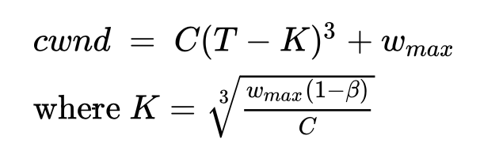
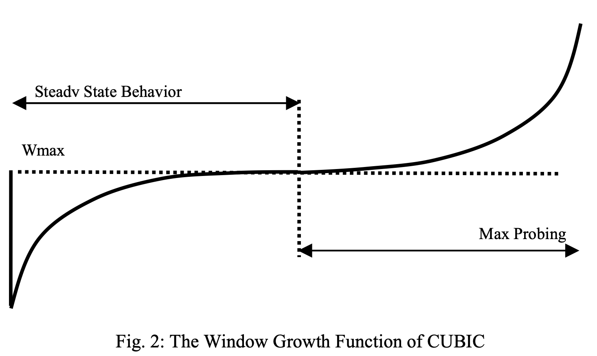

* β: Multiplicative decrease factor
* wmax: Window size just before the last reduction
* T: Time elapsed since the last window reduction
* C: A scaling constant
* cwnd: The congestion window at the current time

RFC 8312 indicates the following:
* The unit of all window sizes in this document is segments of the maximum segment size (MSS), and the unit of all times is seconds. (Section 4)
* β SHOULD be set to 0.7 (Section 4.5)
* C SHOULD be set to 0.4 (Section 5)

CUBIC is a less aggressive and more systematic derivative of BIC TCP, in which the window size is a cubic function of time since the last congestion event, with the inflection point set to the window size prior to the event.

Because it is a cubic function, there are two components to window growth. The first is a concave portion where the window size quickly ramps up to the size before the last congestion event. Next is the convex growth where CUBIC probes for more bandwidth, slowly at first then very rapidly.

CUBIC spends a lot of time at a plateau between the concave and convex growth region which allows the network to stabilize before CUBIC begins looking for more bandwidth.

Another major difference between CUBIC and many earlier TCP algorithms is that it does not rely on the cadence of RTTs to increase the window size. CUBIC's window size is dependent only on the last congestion event. With earlier algorithms like TCP New Reno, flows with very short round-trip delay times (RTTs) will receive ACKs faster and therefore have their congestion windows grow faster than other flows with longer RTTs. CUBIC allows for more fairness between flows since the window growth is independent of RTT.


## tcp_ca_state


Linux NewReno/SACK/ECN state machine.

* **Open** Normal state, no dubious events, fast path.
* **Disorder** In all the respects it is "Open", but requires a bit more attention. It is entered when we see some SACKs or dupacks. It is split of "Open" mainly to move some processing from fast path to slow one.
* **CWR** CWND was reduced due to some Congestion Notification event. It can be ECN, ICMP source quench, local device congestion.
* **Recovery** CWND was reduced, we are fast-retransmitting.
* **Loss** CWND was reduced due to RTO timeout or SACK reneging.

tcp_fastretrans_alert() is entered:
- each incoming ACK, if state is not "Open"
- when arrived ACK is unusual, namely:
    * SACK
    * Duplicate ACK.
    * ECN ECE.

 Counting packets in flight is pretty simple.
 * in_flight = packets_out - left_out + retrans_out
    * packets_out is SND.NXT-SND.UNA counted in packets.
    * retrans_out is number of retransmitted segments.
    * left_out is number of segments left network, but not ACKed yet.
    * left_out = sacked_out + lost_out
        * sacked_out: Packets, which arrived to receiver out of order and hence not ACKed. With SACKs this number is simply amount of SACKed data. Even without SACKs it is easy to give pretty reliable estimate of this number, counting duplicate ACKs.
        * lost_out: Packets lost by network. TCP has no explicit "loss notification" feedback from network (for now). It means that this number can be only _guessed_. Actually, it is the heuristics to predict lossage that distinguishes different algorithms.

* F.e. after RTO, when all the queue is considered as lost, lost_out = packets_out and in_flight = retrans_out.
    * Essentially, we have now a few algorithms detecting lost packets.
        * If the receiver supports SACK:
            * RFC6675/3517: It is the conventional algorithm. A packet is considered lost if the number of higher sequence packets SACKed is greater than or equal the DUPACK thoreshold (reordering). This is implemented in tcp_mark_head_lost and tcp_update_scoreboard.
            * RACK (draft-ietf-tcpm-rack-01): it is a newer algorithm (2017-) that checks timing instead of counting DUPACKs. Essentially a packet is considered lost if it's not S/ACKed after RTT + reordering_window, where both metrics are dynamically measured and adjusted. This is implemented in tcp_rack_mark_lost.

        * If the receiver does not support SACK:
            * NewReno (RFC6582): in Recovery we assume that one segment is lost (classic Reno). While we are in Recovery and a partial ACK arrives, we assume that one more packet is lost (NewReno). This heuristics are the same in NewReno and SACK.

* Really tricky (and requiring careful tuning) part of algorithm is hidden in functions **tcp_time_to_recover**() and tcp_xmit_retransmit_queue(). The first determines the moment _when_ we should reduce CWND and, hence, slow down forward transmission. In fact, it determines the moment when we decide that hole is caused by loss, rather than by a reorder.

* **tcp_xmit_retransmit_queue**() decides, _what_ we should retransmit to fill
    holes, caused by lost packets.

* And the most logically complicated part of algorithm is undo heuristics. We detect false retransmits due to both too early fast retransmit (reordering) and underestimated RTO, analyzing timestamps and D-SACKs. When we detect that some segments were retransmitted by mistake and CWND reduction was wrong, we undo window reduction and abort recovery phase. This logic is hidden inside several functions named tcp_try_undo_<something>.

```c
enum tcp_ca_state {
  TCP_CA_Open = 0,
#define TCPF_CA_Open  (1<<TCP_CA_Open)
  TCP_CA_Disorder = 1,
#define TCPF_CA_Disorder (1<<TCP_CA_Disorder)
  TCP_CA_CWR = 2,
#define TCPF_CA_CWR  (1<<TCP_CA_CWR)
  TCP_CA_Recovery = 3,
#define TCPF_CA_Recovery (1<<TCP_CA_Recovery)
  TCP_CA_Loss = 4
#define TCPF_CA_Loss  (1<<TCP_CA_Loss)
};

void tcp_set_ca_state(struct sock *sk, const u8 ca_state)
{
  struct inet_connection_sock *icsk = inet_csk(sk);

  if (icsk->icsk_ca_ops->set_state)
    icsk->icsk_ca_ops->set_state(sk, ca_state);
  icsk->icsk_ca_state = ca_state;
}
```

### TCPF_CA_Recovery

During the Recovery state, the size of the congestion window is reduced by one segment for every new acknowledgment, similar to the CWR state. This window reduction process terminates when the congestion window size equal to ssthresh, which is half of the window size when entering the Recovery state (sshresh = cwnd / 2). The congestion window does not increase during recovery, and the sender retransmits segments marked as lost, or marks forward transmission on new data according to the packet conservation principle. The sender remains in the Recovery state until all data segments being sent when entering the Recovery state are successfully acknowledged (snd_una > high_seq), after which the sender resumes the OPEN state, and the retransmission timeout may interrupt the Recovery state.

```c
void tcp_enter_recovery(struct sock *sk, bool ece_ack)
{
  struct tcp_sock *tp = tcp_sk(sk);
  int mib_idx;

  if (tcp_is_reno(tp))
    mib_idx = LINUX_MIB_TCPRENORECOVERY;
  else
    mib_idx = LINUX_MIB_TCPSACKRECOVERY;

  NET_INC_STATS(sock_net(sk), mib_idx);

  tp->prior_ssthresh = 0;
  tcp_init_undo(tp);

  if (!tcp_in_cwnd_reduction(sk)) {
    if (!ece_ack)
      tp->prior_ssthresh = tcp_current_ssthresh(sk);
    tcp_init_cwnd_reduction(sk);
  }
  tcp_set_ca_state(sk, TCP_CA_Recovery);
}

void tcp_init_cwnd_reduction(struct sock *sk)
{
  struct tcp_sock *tp = tcp_sk(sk);

  tp->high_seq = tp->snd_nxt;
  tp->tlp_high_seq = 0;
  tp->snd_cwnd_cnt = 0;
  tp->prior_cwnd = tp->snd_cwnd;
  tp->prr_delivered = 0;
  tp->prr_out = 0;
  tp->snd_ssthresh = inet_csk(sk)->icsk_ca_ops->ssthresh(sk);
  tcp_ecn_queue_cwr(tp);
}
```

### TCP_CA_CWR

When receiving a congestion notification, the sender does not reduce the congestion window immediately, but reduces the congestion window by one segment for every new ACK until the size of the window is halved. The sender will not have significant retransmissions in the process of reducing the congestion window size.

```c
void tcp_enter_cwr(struct sock *sk)
{
  struct tcp_sock *tp = tcp_sk(sk);

  tp->prior_ssthresh = 0;
  if (inet_csk(sk)->icsk_ca_state < TCP_CA_CWR) {
    tp->undo_marker = 0;
    tcp_init_cwnd_reduction(sk);
    tcp_set_ca_state(sk, TCP_CA_CWR);
  }
}

void tcp_init_cwnd_reduction(struct sock *sk)
{
  struct tcp_sock *tp = tcp_sk(sk);

  tp->high_seq = tp->snd_nxt;
  tp->tlp_high_seq = 0;
  tp->snd_cwnd_cnt = 0;
  tp->prior_cwnd = tp->snd_cwnd;
  tp->prr_delivered = 0;
  tp->prr_out = 0;
  tp->snd_ssthresh = inet_csk(sk)->icsk_ca_ops->ssthresh(sk);
  tcp_ecn_queue_cwr(tp);
}

void tcp_ecn_queue_cwr(struct tcp_sock *tp)
{
  if (tp->ecn_flags & TCP_ECN_OK)
    tp->ecn_flags |= TCP_ECN_QUEUE_CWR;
}

```

### TCP_CA_Loss
```c
void tcp_enter_loss(struct sock *sk)
{
  const struct inet_connection_sock *icsk = inet_csk(sk);
  struct tcp_sock *tp = tcp_sk(sk);
  struct net *net = sock_net(sk);
  bool new_recovery = icsk->icsk_ca_state < TCP_CA_Recovery;

  tcp_timeout_mark_lost(sk);

  /* Reduce ssthresh if it has not yet been made inside this window. */
  if (icsk->icsk_ca_state <= TCP_CA_Disorder ||
      !after(tp->high_seq, tp->snd_una) ||
      (icsk->icsk_ca_state == TCP_CA_Loss && !icsk->icsk_retransmits))
  {
    tp->prior_ssthresh = tcp_current_ssthresh(sk);
    tp->prior_cwnd = tp->snd_cwnd;
    tp->snd_ssthresh = icsk->icsk_ca_ops->ssthresh(sk);
    tcp_ca_event(sk, CA_EVENT_LOSS);
    tcp_init_undo(tp);
  }
  tp->snd_cwnd     = tcp_packets_in_flight(tp) + 1;
  tp->snd_cwnd_cnt   = 0;
  tp->snd_cwnd_stamp = tcp_jiffies32;

  /* Timeout in disordered state after receiving substantial DUPACKs
   * suggests that the degree of reordering is over-estimated. */
  if (icsk->icsk_ca_state <= TCP_CA_Disorder && tp->sacked_out >= net->ipv4.sysctl_tcp_reordering)
    tp->reordering = min_t(unsigned int, tp->reordering, net->ipv4.sysctl_tcp_reordering);
  tcp_set_ca_state(sk, TCP_CA_Loss);
  tp->high_seq = tp->snd_nxt;
  tcp_ecn_queue_cwr(tp);

  /* F-RTO RFC5682 sec 3.1 step 1: retransmit SND.UNA if no previous
   * loss recovery is underway except recurring timeout(s) on
   * the same SND.UNA (sec 3.2). Disable F-RTO on path MTU probing */
  tp->frto = net->ipv4.sysctl_tcp_frto &&
       (new_recovery || icsk->icsk_retransmits) &&
       !inet_csk(sk)->icsk_mtup.probe_size;
}
```

### TCP_CA_Disorder

In this state, the congestion window is not adjusted, but each newly arrived segment triggers the sending of a new data segment. Therefore, TCP senders follow the packet conservation principle, which states that a new packet is only sent after an old packet has left the network.

```c
void tcp_try_keep_open(struct sock *sk)
{
  struct tcp_sock *tp = tcp_sk(sk);
  int state = TCP_CA_Open;

  if (tcp_left_out(tp) || tcp_any_retrans_done(sk))
    state = TCP_CA_Disorder;

  if (inet_csk(sk)->icsk_ca_state != state) {
    tcp_set_ca_state(sk, state);
    tp->high_seq = tp->snd_nxt;
  }
}
```

## ecn
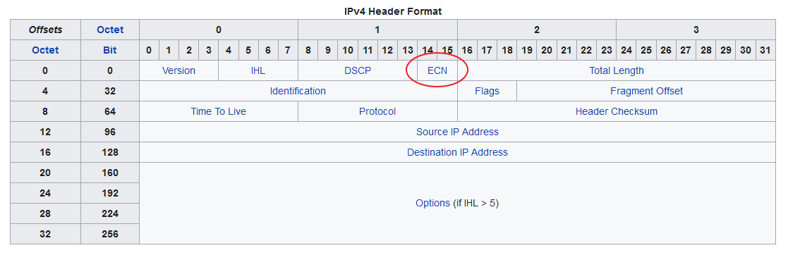

```c
/* ECE: Echo of Congestion Encountered */
enum {
  INET_ECN_NOT_ECT = 0, /* tos 00 - Non ECN-Capable Transport, Non-ECT */
  INET_ECN_ECT_1 = 1,   /* tos 01 - ECN Capable Transport ECT(1)*/
  INET_ECN_ECT_0 = 2,   /* tos 10 - ECN Capable Transport ECT(0) */
  INET_ECN_CE = 3,      /* tos 11 - Congestion Encountered*/
  INET_ECN_MASK = 3,
};

/* ip support */
int IP_ECN_set_ce(struct iphdr *iph)
{
  u32 check = (__force u32)iph->check;
  u32 ecn = (iph->tos + 1) & INET_ECN_MASK;

  /* After the last operation we have (in binary):
   * INET_ECN_NOT_ECT => 01
   * INET_ECN_ECT_1   => 10
   * INET_ECN_ECT_0   => 11
   * INET_ECN_CE      => 00 */
  if (!(ecn & 2))
    return !ecn;

  /* The following gives us:
   * INET_ECN_ECT_1 => check += htons(0xFFFD)
   * INET_ECN_ECT_0 => check += htons(0xFFFE) */
  check += (__force u16)htons(0xFFFB) + (__force u16)htons(ecn);

  iph->check = (__force __sum16)(check + (check>=0xFFFF));
  iph->tos |= INET_ECN_CE;
  return 1;
}
```

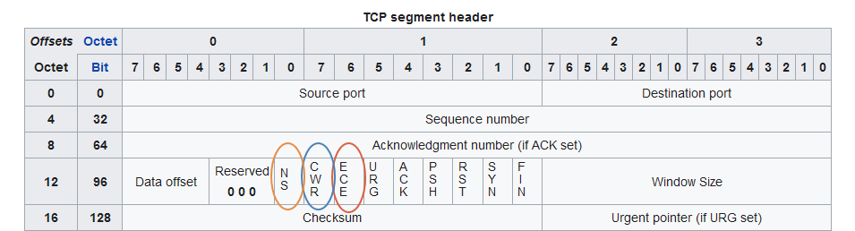

```c
/* tcp support */
#define TCPHDR_FIN 0x01
#define TCPHDR_SYN 0x02
#define TCPHDR_RST 0x04
#define TCPHDR_PSH 0x08
#define TCPHDR_ACK 0x10
#define TCPHDR_URG 0x20
#define TCPHDR_ECE 0x40
#define TCPHDR_CWR 0x80

#define TCPHDR_SYN_ECN  (TCPHDR_SYN | TCPHDR_ECE | TCPHDR_CWR)
```

## tcp_congestion_ops
```c
struct tcp_congestion_ops {
  struct list_head  list;
  u32 key;
  u32 flags;

  /* return slow start threshold (required) */
  u32 (*ssthresh)(struct sock *sk);
  /* do new cwnd calculation (required) */
  void (*cong_avoid)(struct sock *sk, u32 ack, u32 acked);
  /* call before changing ca_state (optional) */
  void (*set_state)(struct sock *sk, u8 new_state);
  /* call when cwnd event occurs (optional) */
  void (*cwnd_event)(struct sock *sk, enum tcp_ca_event ev);
  /* call when packets are delivered to update cwnd and pacing rate,
   * after all the ca_state processing. (optional) */
  void (*cong_control)(struct sock *sk, const struct rate_sample *rs);

  char     name[TCP_CA_NAME_MAX];
  struct module   *owner;
};

enum tcp_ca_event {
  CA_EVENT_TX_START,      /* first transmit when no packets in flight */
  CA_EVENT_CWND_RESTART,  /* congestion window restart */
  CA_EVENT_COMPLETE_CWR,  /* end of congestion recovery */
  CA_EVENT_LOSS,          /* loss timeout */
  CA_EVENT_ECN_NO_CE,     /* ECT set, but not CE marked */
  CA_EVENT_ECN_IS_CE,     /* received CE marked IP packet */
};

/* Information about inbound ACK, passed to cong_ops->in_ack_event() */
enum tcp_ca_ack_event_flags {
  CA_ACK_SLOWPATH     = (1 << 0),  /* In slow path processing */
  CA_ACK_WIN_UPDATE   = (1 << 1),  /* ACK updated window */
  CA_ACK_ECE          = (1 << 2),  /* ECE bit is set on ack */
};

struct tcp_congestion_ops cubictcp __read_mostly = {
  .init         = bictcp_init,
  .ssthresh     = bictcp_recalc_ssthresh,
  .cong_avoid   = bictcp_cong_avoid,
  .set_state    = bictcp_state,
  .undo_cwnd    = tcp_reno_undo_cwnd,
  .cwnd_event   = bictcp_cwnd_event,
  .pkts_acked   = bictcp_acked,
  .owner        = THIS_MODULE,
  .name         = "cubic",
};

void bictcp_state(struct sock *sk, u8 new_state)
{
  if (new_state == TCP_CA_Loss) {
    bictcp_reset(inet_csk_ca(sk));
    bictcp_hystart_reset(sk);
  }
}

void tcp_in_ack_event(struct sock *sk, u32 flags)
{
  const struct inet_connection_sock *icsk = inet_csk(sk);

  if (icsk->icsk_ca_ops->in_ack_event)
    icsk->icsk_ca_ops->in_ack_event(sk, flags);
}

struct bictcp {
  u32  cnt;           /* increase cwnd by 1 after ACKs */
  u32  last_max_cwnd; /* last maximum snd_cwnd */
  u32  last_cwnd;     /* the last snd_cwnd */
  u32  last_time;     /* time when updated last_cwnd */
  u32  bic_origin_point;/* origin point of bic function */
  u32  bic_K;         /* time to origin point from the beginning of the current epoch */
  u32  delay_min;     /* min delay (msec << 3) */
  u32  epoch_start;   /* beginning of an epoch */
  u32  ack_cnt;       /* number of acks */
  u32  tcp_cwnd;      /* estimated tcp cwnd */
  u16  unused;
  u8   sample_cnt;    /* number of samples to decide curr_rtt */
  u8   found;         /* the exit point is found? */
  u32  round_start;   /* beginning of each round */
  u32  end_seq;       /* end_seq of the round */
  u32  last_ack;      /* last time when the ACK spacing is close */
  u32  curr_rtt;      /* the minimum rtt of current round */
};
```

### bictcp_init
```c
void bictcp_init(struct sock *sk)
{
  struct bictcp *ca = inet_csk_ca(sk);

  bictcp_reset(ca);

  if (hystart)
    bictcp_hystart_reset(sk);

  if (!hystart && initial_ssthresh)
    tcp_sk(sk)->snd_ssthresh = initial_ssthresh;
}

void bictcp_reset(struct bictcp *ca)
{
  ca->cnt = 0;
  ca->last_max_cwnd = 0;
  ca->last_cwnd = 0;
  ca->last_time = 0;
  ca->bic_origin_point = 0;
  ca->bic_K = 0;
  ca->delay_min = 0;
  ca->epoch_start = 0;
  ca->ack_cnt = 0;
  ca->tcp_cwnd = 0;
  ca->found = 0;
}

void bictcp_hystart_reset(struct sock *sk)
{
  struct tcp_sock *tp = tcp_sk(sk);
  struct bictcp *ca = inet_csk_ca(sk);

  ca->round_start = ca->last_ack = bictcp_clock();
  ca->end_seq = tp->snd_nxt;
  ca->curr_rtt = 0;
  ca->sample_cnt = 0;
}
```

### ssthresh
```c

void tcp_init_cwnd_reduction(struct sock *sk)
{
  tp->snd_ssthresh = inet_csk(sk)->icsk_ca_ops->ssthresh(sk);
}

void tcp_enter_loss(struct sock *sk)
{
  /* Reduce ssthresh if it has not yet been made inside this window. */
  if (icsk->icsk_ca_state <= TCP_CA_Disorder ||
      !after(tp->high_seq, tp->snd_una) ||
      (icsk->icsk_ca_state == TCP_CA_Loss && !icsk->icsk_retransmits))
  {
    tp->snd_ssthresh = icsk->icsk_ca_ops->ssthresh(sk);
    tcp_ca_event(sk, CA_EVENT_LOSS);
    tcp_init_undo(tp);
  }
}

u32 bictcp_recalc_ssthresh(struct sock *sk)
{
  const struct tcp_sock *tp = tcp_sk(sk);
  struct bictcp *ca = inet_csk_ca(sk);

  ca->epoch_start = 0;  /* end of epoch */

  /* Wmax and fast convergence */
  if (tp->snd_cwnd < ca->last_max_cwnd && fast_convergence)
    ca->last_max_cwnd = (tp->snd_cwnd * (BICTCP_BETA_SCALE + beta)) / (2 * BICTCP_BETA_SCALE);
  else
    ca->last_max_cwnd = tp->snd_cwnd;

  return max((tp->snd_cwnd * beta) / BICTCP_BETA_SCALE, 2U);
}
```

### cong_avoid
```c
void bictcp_cong_avoid(struct sock *sk, u32 ack, u32 acked)
{
  struct tcp_sock *tp = tcp_sk(sk);
  struct bictcp *ca = inet_csk_ca(sk);

  if (!tcp_is_cwnd_limited(sk))
    return;

  if (tcp_in_slow_start(tp)) {
    if (hystart && after(ack, ca->end_seq))
      bictcp_hystart_reset(sk);
    acked = tcp_slow_start(tp, acked);
    if (!acked)
      return;
  }
  bictcp_update(ca, tp->snd_cwnd, acked);
  tcp_cong_avoid_ai(tp, ca->cnt, acked);
}

bool tcp_is_cwnd_limited(const struct sock *sk)
{
  const struct tcp_sock *tp = tcp_sk(sk);

  /* If in slow start, ensure cwnd grows to twice what was ACKed. */
  if (tcp_in_slow_start(tp))
    return tp->snd_cwnd < 2 * tp->max_packets_out;

  return tp->is_cwnd_limited;
}

/* implement cubic algorithm */
void bictcp_update(struct bictcp *ca, u32 cwnd, u32 acked)
{
  u32 delta, bic_target, max_cnt;
  u64 offs, t;

  ca->ack_cnt += acked;  /* count the number of ACKed packets */

  if (ca->last_cwnd == cwnd && (s32)(tcp_jiffies32 - ca->last_time) <= HZ / 32)
    return;

  /* The CUBIC function can update ca->cnt at most once per jiffy.
   * On all cwnd reduction events, ca->epoch_start is set to 0,
   * which will force a recalculation of ca->cnt. */
  if (ca->epoch_start && tcp_jiffies32 == ca->last_time)
    goto tcp_friendliness;

  ca->last_cwnd = cwnd;
  ca->last_time = tcp_jiffies32;

  if (ca->epoch_start == 0) {
    ca->epoch_start = tcp_jiffies32;  /* record beginning */
    ca->ack_cnt = acked;      /* start counting */
    ca->tcp_cwnd = cwnd;      /* syn with cubic */

    if (ca->last_max_cwnd <= cwnd) {
      ca->bic_K = 0;
      ca->bic_origin_point = cwnd;
    } else {
      /* Compute new K based on
       * (wmax-cwnd) * (srtt>>3 / HZ) / c * 2^(3*bictcp_HZ) */
      ca->bic_K = cubic_root(cube_factor * (ca->last_max_cwnd - cwnd));
      ca->bic_origin_point = ca->last_max_cwnd;
    }
  }

  /* cubic function - calc*/
  /* calculate c * time^3 / rtt,
   *  while considering overflow in calculation of time^3
   * (so time^3 is done by using 64 bit)
   * and without the support of division of 64bit numbers
   * (so all divisions are done by using 32 bit)
   *  also NOTE the unit of those veriables
   *    time  = (t - K) / 2^bictcp_HZ
   *    c = bic_scale >> 10
   * rtt  = (srtt >> 3) / HZ
   * !!! The following code does not have overflow problems,
   * if the cwnd < 1 million packets !!! */

  t = (s32)(tcp_jiffies32 - ca->epoch_start);
  t += msecs_to_jiffies(ca->delay_min >> 3);
  /* change the unit from HZ to bictcp_HZ */
  t <<= BICTCP_HZ;
  do_div(t, HZ);

  if (t < ca->bic_K)    /* t - K */
    offs = ca->bic_K - t;
  else
    offs = t - ca->bic_K;

  /* c/rtt * (t-K)^3 */
  delta = (cube_rtt_scale * offs * offs * offs) >> (10+3*BICTCP_HZ);
  if (t < ca->bic_K)                            /* below origin*/
    bic_target = ca->bic_origin_point - delta;
  else                                          /* above origin*/
    bic_target = ca->bic_origin_point + delta;

  /* cubic function - calc bictcp_cnt*/
  if (bic_target > cwnd) {
    ca->cnt = cwnd / (bic_target - cwnd);
  } else {
    ca->cnt = 100 * cwnd;              /* very small increment*/
  }

  /* The initial growth of cubic function may be too conservative
   * when the available bandwidth is still unknown. */
  if (ca->last_max_cwnd == 0 && ca->cnt > 20)
    ca->cnt = 20;  /* increase cwnd 5% per RTT */

tcp_friendliness:
  /* TCP Friendly */
  if (tcp_friendliness) {
    u32 scale = beta_scale;

    delta = (cwnd * scale) >> 3;
    while (ca->ack_cnt > delta) {    /* update tcp cwnd */
      ca->ack_cnt -= delta;
      ca->tcp_cwnd++;
    }

    if (ca->tcp_cwnd > cwnd) {  /* if bic is slower than tcp */
      delta = ca->tcp_cwnd - cwnd;
      max_cnt = cwnd / delta;
      if (ca->cnt > max_cnt)
        ca->cnt = max_cnt;
    }
  }

  /* The maximum rate of cwnd increase CUBIC allows is 1 packet per
   * 2 packets ACKed, meaning cwnd grows at 1.5x per RTT. */
  ca->cnt = max(ca->cnt, 2U);
}

/* In theory this is tp->snd_cwnd += 1 / tp->snd_cwnd (or alternative w),
 * for every packet that was ACKed. */
void tcp_cong_avoid_ai(struct tcp_sock *tp, u32 w, u32 acked)
{
  /* If credits accumulated at a higher w, apply them gently now. */
  if (tp->snd_cwnd_cnt >= w) {
    tp->snd_cwnd_cnt = 0;
    tp->snd_cwnd++;
  }

  tp->snd_cwnd_cnt += acked;
  if (tp->snd_cwnd_cnt >= w) {
    u32 delta = tp->snd_cwnd_cnt / w;

    tp->snd_cwnd_cnt -= delta * w;
    tp->snd_cwnd += delta;
  }
  tp->snd_cwnd = min(tp->snd_cwnd, tp->snd_cwnd_clamp);
}
```

```c
sk->sk_prot->init(sk)
  tcp_init_sock(sk);
    tcp_assign_congestion_control(sk);

void tcp_assign_congestion_control(struct sock *sk)
{
  struct net *net = sock_net(sk);
  struct inet_connection_sock *icsk = inet_csk(sk);
  const struct tcp_congestion_ops *ca;

  rcu_read_lock();
  ca = rcu_dereference(net->ipv4.tcp_congestion_control);
  if (unlikely(!try_module_get(ca->owner)))
    ca = &tcp_reno;
  icsk->icsk_ca_ops = ca;
  rcu_read_unlock();

  memset(icsk->icsk_ca_priv, 0, sizeof(icsk->icsk_ca_priv));
  if (ca->flags & TCP_CONG_NEEDS_ECN)
    INET_ECN_xmit(sk);
  else
    INET_ECN_dontxmit(sk);
}


void tcp_reno_cong_avoid(struct sock *sk, u32 ack, u32 acked)
{
  struct tcp_sock *tp = tcp_sk(sk);

  if (!tcp_is_cwnd_limited(sk))
    return;

  /* In "safe" area, increase. */
  if (tcp_in_slow_start(tp)) {
    acked = tcp_slow_start(tp, acked);
    if (!acked)
      return;
  }
  /* In dangerous area, increase slowly. */
  tcp_cong_avoid_ai(tp, tp->snd_cwnd, acked);
}
```

```c
tcp_rcv_state_process();
  if (!inet_csk(sk)->icsk_ca_ops->cong_control)
    tcp_update_pacing_rate(sk);

void tcp_update_pacing_rate(struct sock *sk)
{
  const struct tcp_sock *tp = tcp_sk(sk);
  u64 rate;

  /* set sk_pacing_rate to 200 % of current rate (mss * cwnd / srtt) */
  rate = (u64)tp->mss_cache * ((USEC_PER_SEC / 100) << 3);

  /* current rate is (cwnd * mss) / srtt
   * In Slow Start [1], set sk_pacing_rate to 200 % the current rate.
   * In Congestion Avoidance phase, set it to 120 % the current rate.
   *
   * [1] : Normal Slow Start condition is (tp->snd_cwnd < tp->snd_ssthresh)
   *   If snd_cwnd >= (tp->snd_ssthresh / 2), we are approaching
   *   end of slow start and should slow down. */
  if (tp->snd_cwnd < tp->snd_ssthresh / 2)
    rate *= sock_net(sk)->ipv4.sysctl_tcp_pacing_ss_ratio;
  else
    rate *= sock_net(sk)->ipv4.sysctl_tcp_pacing_ca_ratio;

  rate *= max(tp->snd_cwnd, tp->packets_out);

  if (likely(tp->srtt_us))
    do_div(rate, tp->srtt_us);

  /* WRITE_ONCE() is needed because sch_fq fetches sk_pacing_rate
   * without any lock. We want to make sure compiler wont store
   * intermediate values in this location. */
  WRITE_ONCE(sk->sk_pacing_rate, min_t(u64, rate,
               sk->sk_max_pacing_rate));
}
```

### cwnd_event
```c
void tcp_data_queue(struct sock *sk, struct sk_buff *skb)
{
  if (skb->len)
    tcp_event_data_recv(sk, skb);
}

void tcp_rcv_established(struct sock *sk, struct sk_buff *skb)
{
  tcp_event_data_recv(sk, skb);
}

void tcp_event_data_recv(struct sock *sk, struct sk_buff *skb)
{
  tcp_ecn_check_ce(sk, skb);
}

void tcp_data_queue_ofo(struct sock *sk, struct sk_buff *skb)
{
  tcp_ecn_check_ce(sk, skb);
}

void tcp_ecn_check_ce(struct sock *sk, const struct sk_buff *skb)
{
  if (tcp_sk(sk)->ecn_flags & TCP_ECN_OK)
    __tcp_ecn_check_ce(sk, skb);
}

void __tcp_ecn_check_ce(struct sock *sk, const struct sk_buff *skb)
{
  struct tcp_sock *tp = tcp_sk(sk);

  switch (TCP_SKB_CB(skb)->ip_dsfield & INET_ECN_MASK) {
  case INET_ECN_NOT_ECT:
    /* Funny extension: if ECT is not set on a segment,
     * and we already seen ECT on a previous segment,
     * it is probably a retransmit. */
    if (tp->ecn_flags & TCP_ECN_SEEN)
      tcp_enter_quickack_mode(sk, 2);
    break;

  case INET_ECN_CE:
    if (tcp_ca_needs_ecn(sk))
      tcp_ca_event(sk, CA_EVENT_ECN_IS_CE);

    if (!(tp->ecn_flags & TCP_ECN_DEMAND_CWR)) {
      /* Better not delay acks, sender can have a very low cwnd */
      tcp_enter_quickack_mode(sk, 2);
      tp->ecn_flags |= TCP_ECN_DEMAND_CWR;
    }
    tp->ecn_flags |= TCP_ECN_SEEN;
    break;

  default:
    if (tcp_ca_needs_ecn(sk))
      tcp_ca_event(sk, CA_EVENT_ECN_NO_CE);
    tp->ecn_flags |= TCP_ECN_SEEN;
    break;
  }
}

void tcp_ca_event(struct sock *sk, const enum tcp_ca_event event)
{
  const struct inet_connection_sock *icsk = inet_csk(sk);

  if (icsk->icsk_ca_ops->cwnd_event)
    icsk->icsk_ca_ops->cwnd_event(sk, event);
}

void bictcp_cwnd_event(struct sock *sk, enum tcp_ca_event event)
{
  if (event == CA_EVENT_TX_START) {
    struct bictcp *ca = inet_csk_ca(sk);
    u32 now = tcp_jiffies32;
    s32 delta;

    delta = now - tcp_sk(sk)->lsndtime;

    /* We were application limited (idle) for a while.
     * Shift epoch_start to keep cwnd growth to cubic curve. */
    if (ca->epoch_start && delta > 0) {
      ca->epoch_start += delta;
      if (after(ca->epoch_start, now))
        ca->epoch_start = now;
    }
    return;
  }
}
```

### pkts_acked
```c
int tcp_ack(struct sock *sk, const struct sk_buff *skb, int flag)
{
    tcp_clean_rtx_queue(sk, prior_fack, prior_snd_una, &sack_state);
}
int tcp_clean_rtx_queue(struct sock *sk, u32 prior_fack,
    u32 prior_snd_una,
    struct tcp_sacktag_state *sack)
{
    icsk->icsk_ca_ops->pkts_acked(sk, &sample);
}

/* Track delayed acknowledgment ratio using sliding window
 * ratio = (15*ratio + sample) / 16 */
void bictcp_acked(struct sock *sk, const struct ack_sample *sample)
{
  const struct tcp_sock *tp = tcp_sk(sk);
  struct bictcp *ca = inet_csk_ca(sk);
  u32 delay;

  /* Some calls are for duplicates without timetamps */
  if (sample->rtt_us < 0)
    return;

  /* Discard delay samples right after fast recovery */
  if (ca->epoch_start && (s32)(tcp_jiffies32 - ca->epoch_start) < HZ)
    return;

  delay = (sample->rtt_us << 3) / USEC_PER_MSEC;
  if (delay == 0)
    delay = 1;

  /* first time call or link delay decreases */
  if (ca->delay_min == 0 || ca->delay_min > delay)
    ca->delay_min = delay;

  /* hystart triggers when cwnd is larger than some threshold */
  if (hystart && tcp_in_slow_start(tp) && tp->snd_cwnd >= hystart_low_window)
    hystart_update(sk, delay);
}

void hystart_update(struct sock *sk, u32 delay)
{
  struct tcp_sock *tp = tcp_sk(sk);
  struct bictcp *ca = inet_csk_ca(sk);

  if (ca->found & hystart_detect)
    return;

  if (hystart_detect & HYSTART_ACK_TRAIN) {
    u32 now = bictcp_clock();

    /* first detection parameter - ack-train detection */
    if ((s32)(now - ca->last_ack) <= hystart_ack_delta) {
      ca->last_ack = now;
      if ((s32)(now - ca->round_start) > ca->delay_min >> 4) {
        ca->found |= HYSTART_ACK_TRAIN;
        tp->snd_ssthresh = tp->snd_cwnd;
      }
    }
  }

  if (hystart_detect & HYSTART_DELAY) {
    /* obtain the minimum delay of more than sampling packets */
    if (ca->curr_rtt > delay)
      ca->curr_rtt = delay;
    if (ca->sample_cnt < HYSTART_MIN_SAMPLES) {
      if (ca->curr_rtt == 0 || ca->curr_rtt > delay)
        ca->curr_rtt = delay;

      ca->sample_cnt++;
    } else {
      if (ca->curr_rtt > ca->delay_min + HYSTART_DELAY_THRESH(ca->delay_min >> 3)) {
        ca->found |= HYSTART_DELAY;
        tp->snd_ssthresh = tp->snd_cwnd;
      }
    }
  }
}
```

### hystart
```c
void bictcp_hystart_reset(struct sock *sk)
{
  struct tcp_sock *tp = tcp_sk(sk);
  struct bictcp *ca = inet_csk_ca(sk);

  ca->round_start = ca->last_ack = bictcp_clock();
  ca->end_seq = tp->snd_nxt;
  ca->curr_rtt = 0;
  ca->sample_cnt = 0;
}
```

### set_state
```c
void tcp_set_ca_state(struct sock *sk, const u8 ca_state)
{
  struct inet_connection_sock *icsk = inet_csk(sk);

  if (icsk->icsk_ca_ops->set_state)
    icsk->icsk_ca_ops->set_state(sk, ca_state);
  icsk->icsk_ca_state = ca_state;
}

void bictcp_state(struct sock *sk, u8 new_state)
{
  if (new_state == TCP_CA_Loss) {
    bictcp_reset(inet_csk_ca(sk));
    bictcp_hystart_reset(sk);
  }
}
```

## tcp_ack
```c
/* check the ACK field */
int tcp_ack(struct sock *sk, const struct sk_buff *skb, int flag)
{
  struct inet_connection_sock *icsk = inet_csk(sk);
  struct tcp_sock *tp = tcp_sk(sk);
  struct tcp_sacktag_state sack_state;
  struct rate_sample rs = { .prior_delivered = 0 };
  u32 prior_snd_una = tp->snd_una;
  bool is_sack_reneg = tp->is_sack_reneg;
  u32 ack_seq = TCP_SKB_CB(skb)->seq;
  u32 ack = TCP_SKB_CB(skb)->ack_seq;
  bool is_dupack = false;
  int prior_packets = tp->packets_out;
  u32 delivered = tp->delivered;
  u32 lost = tp->lost;
  int rexmit = REXMIT_NONE; /* Flag to (re)transmit to recover losses */
  u32 prior_fack;

  sack_state.first_sackt = 0;
  sack_state.rate = &rs;

  /* We very likely will need to access rtx queue. */
  prefetch(sk->tcp_rtx_queue.rb_node);

  /* If the ack is older than previous acks
   * then we can probably ignore it.  */
  if (before(ack, prior_snd_una)) {
    /* RFC 5961 5.2 [Blind Data Injection Attack].[Mitigation] */
    if (before(ack, prior_snd_una - tp->max_window)) {
      if (!(flag & FLAG_NO_CHALLENGE_ACK))
        tcp_send_challenge_ack(sk, skb);
      return -1;
    }
    goto old_ack;
  }

  /* If the ack includes data we haven't sent yet, discard
   * this segment (RFC793 Section 3.9). */
  if (after(ack, tp->snd_nxt))
    goto invalid_ack;

  if (after(ack, prior_snd_una)) {
    flag |= FLAG_SND_UNA_ADVANCED;
    icsk->icsk_retransmits = 0;

#if IS_ENABLED(CONFIG_TLS_DEVICE)
    if (static_branch_unlikely(&clean_acked_data_enabled))
      if (icsk->icsk_clean_acked)
        icsk->icsk_clean_acked(sk, ack);
#endif
  }

  prior_fack = tcp_is_sack(tp) ? tcp_highest_sack_seq(tp) : tp->snd_una;
  rs.prior_in_flight = tcp_packets_in_flight(tp);

  /* ts_recent update must be made after we are sure that the packet
   * is in window. */
  if (flag & FLAG_UPDATE_TS_RECENT)
    tcp_replace_ts_recent(tp, TCP_SKB_CB(skb)->seq);

  if (!(flag & FLAG_SLOWPATH) && after(ack, prior_snd_una)) {
    /* Window is constant, pure forward advance.
     * No more checks are required.
     * Note, we use the fact that SND.UNA>=SND.WL2. */
    tcp_update_wl(tp, ack_seq);
    tcp_snd_una_update(tp, ack);
    flag |= FLAG_WIN_UPDATE;

    tcp_in_ack_event(sk, CA_ACK_WIN_UPDATE);

  } else {
    u32 ack_ev_flags = CA_ACK_SLOWPATH;

    if (ack_seq != TCP_SKB_CB(skb)->end_seq)
      flag |= FLAG_DATA;

    flag |= tcp_ack_update_window(sk, skb, ack, ack_seq);

    if (TCP_SKB_CB(skb)->sacked)
      flag |= tcp_sacktag_write_queue(sk, skb, prior_snd_una, &sack_state);

    if (tcp_ecn_rcv_ecn_echo(tp, tcp_hdr(skb))) {
      flag |= FLAG_ECE;
      ack_ev_flags |= CA_ACK_ECE;
    }

    if (flag & FLAG_WIN_UPDATE)
      ack_ev_flags |= CA_ACK_WIN_UPDATE;

    tcp_in_ack_event(sk, ack_ev_flags);
  }

  /* This is a deviation from RFC3168 since it states that:
   * "When the TCP data sender is ready to set the CWR bit after reducing
   * the congestion window, it SHOULD set the CWR bit only on the first
   * new data packet that it transmits."
   * We accept CWR on pure ACKs to be more robust
   * with widely-deployed TCP implementations that do this. */
  tcp_ecn_accept_cwr(sk, skb);

  /* We passed data and got it acked, remove any soft error
   * log. Something worked... */
  sk->sk_err_soft = 0;
  icsk->icsk_probes_out = 0;
  tp->rcv_tstamp = tcp_jiffies32;
  if (!prior_packets)
    goto no_queue;

  /* See if we can take anything off of the retransmit queue. */
  flag |= tcp_clean_rtx_queue(sk, prior_fack, prior_snd_una, &sack_state);

  tcp_rack_update_reo_wnd(sk, &rs);

  if (tp->tlp_high_seq)
    tcp_process_tlp_ack(sk, ack, flag);
  /* If needed, reset TLP/RTO timer; RACK may later override this. */
  if (flag & FLAG_SET_XMIT_TIMER)
    tcp_set_xmit_timer(sk);

  if (tcp_ack_is_dubious(sk, flag)) {
    is_dupack = !(flag & (FLAG_SND_UNA_ADVANCED | FLAG_NOT_DUP));
    tcp_fastretrans_alert(sk, prior_snd_una, is_dupack, &flag, &rexmit);
  }

  if ((flag & FLAG_FORWARD_PROGRESS) || !(flag & FLAG_NOT_DUP))
    sk_dst_confirm(sk);

  delivered = tcp_newly_delivered(sk, delivered, flag);
  lost = tp->lost - lost;      /* freshly marked lost */
  rs.is_ack_delayed = !!(flag & FLAG_ACK_MAYBE_DELAYED);
  tcp_rate_gen(sk, delivered, lost, is_sack_reneg, sack_state.rate);
  tcp_cong_control(sk, ack, delivered, flag, sack_state.rate);
  tcp_xmit_recovery(sk, rexmit);
  return 1;

no_queue:
  /* If data was DSACKed, see if we can undo a cwnd reduction. */
  if (flag & FLAG_DSACKING_ACK) {
    tcp_fastretrans_alert(sk, prior_snd_una, is_dupack, &flag, &rexmit);
    tcp_newly_delivered(sk, delivered, flag);
  }
  /* If this ack opens up a zero window, clear backoff.  It was
   * being used to time the probes, and is probably far higher than
   * it needs to be for normal retransmission. */
  tcp_ack_probe(sk);

  if (tp->tlp_high_seq)
    tcp_process_tlp_ack(sk, ack, flag);
  return 1;

invalid_ack:
  SOCK_DEBUG(sk, "Ack %u after %u:%u\n", ack, tp->snd_una, tp->snd_nxt);
  return -1;

old_ack:
  /* If data was SACKed, tag it and see if we should send more data.
   * If data was DSACKed, see if we can undo a cwnd reduction. */
  if (TCP_SKB_CB(skb)->sacked) {
    flag |= tcp_sacktag_write_queue(sk, skb, prior_snd_una, &sack_state);
    tcp_fastretrans_alert(sk, prior_snd_una, is_dupack, &flag, &rexmit);
    tcp_newly_delivered(sk, delivered, flag);
    tcp_xmit_recovery(sk, rexmit);
  }

  SOCK_DEBUG(sk, "Ack %u before %u:%u\n", ack, tp->snd_una, tp->snd_nxt);
  return 0;
}

int tcp_clean_rtx_queue(struct sock *sk, u32 prior_fack,
  u32 prior_snd_una,
  struct tcp_sacktag_state *sack)
{
  const struct inet_connection_sock *icsk = inet_csk(sk);
  u64 first_ackt, last_ackt;
  struct tcp_sock *tp = tcp_sk(sk);
  u32 prior_sacked = tp->sacked_out;
  u32 reord = tp->snd_nxt; /* lowest acked un-retx un-sacked seq */
  struct sk_buff *skb, *next;
  bool fully_acked = true;
  long sack_rtt_us = -1L;
  long seq_rtt_us = -1L;
  long ca_rtt_us = -1L;
  u32 pkts_acked = 0;
  u32 last_in_flight = 0;
  bool rtt_update;
  int flag = 0;

  first_ackt = 0;

  for (skb = skb_rb_first(&sk->tcp_rtx_queue); skb; skb = next) {
    struct tcp_skb_cb *scb = TCP_SKB_CB(skb);
    const u32 start_seq = scb->seq;
    u8 sacked = scb->sacked;
    u32 acked_pcount;

    tcp_ack_tstamp(sk, skb, prior_snd_una);

    /* Determine how many packets and what bytes were acked, tso and else */
    if (after(scb->end_seq, tp->snd_una)) {
      if (tcp_skb_pcount(skb) == 1 || !after(tp->snd_una, scb->seq))
        break;

      acked_pcount = tcp_tso_acked(sk, skb);
      if (!acked_pcount)
        break;
      fully_acked = false;
    } else {
      acked_pcount = tcp_skb_pcount(skb);
    }

    if (unlikely(sacked & TCPCB_RETRANS)) {
      if (sacked & TCPCB_SACKED_RETRANS)
        tp->retrans_out -= acked_pcount;
      flag |= FLAG_RETRANS_DATA_ACKED;
    } else if (!(sacked & TCPCB_SACKED_ACKED)) {
      last_ackt = skb->skb_mstamp;
      WARN_ON_ONCE(last_ackt == 0);
      if (!first_ackt)
        first_ackt = last_ackt;

      last_in_flight = TCP_SKB_CB(skb)->tx.in_flight;
      if (before(start_seq, reord))
        reord = start_seq;
      if (!after(scb->end_seq, tp->high_seq))
        flag |= FLAG_ORIG_SACK_ACKED;
    }

    if (sacked & TCPCB_SACKED_ACKED) {
      tp->sacked_out -= acked_pcount;
    } else if (tcp_is_sack(tp)) {
      tp->delivered += acked_pcount;
      if (!tcp_skb_spurious_retrans(tp, skb))
        tcp_rack_advance(tp, sacked, scb->end_seq, skb->skb_mstamp);
    }
    if (sacked & TCPCB_LOST)
      tp->lost_out -= acked_pcount;

    tp->packets_out -= acked_pcount;
    pkts_acked += acked_pcount;
    tcp_rate_skb_delivered(sk, skb, sack->rate);

    /* Initial outgoing SYN's get put onto the write_queue
     * just like anything else we transmit.  It is not
     * true data, and if we misinform our callers that
     * this ACK acks real data, we will erroneously exit
     * connection startup slow start one packet too
     * quickly.  This is severely frowned upon behavior. */
    if (likely(!(scb->tcp_flags & TCPHDR_SYN))) {
      flag |= FLAG_DATA_ACKED;
    } else {
      flag |= FLAG_SYN_ACKED;
      tp->retrans_stamp = 0;
    }

    if (!fully_acked)
      break;

    next = skb_rb_next(skb);
    if (unlikely(skb == tp->retransmit_skb_hint))
      tp->retransmit_skb_hint = NULL;
    if (unlikely(skb == tp->lost_skb_hint))
      tp->lost_skb_hint = NULL;
    tcp_highest_sack_replace(sk, skb, next);
    tcp_rtx_queue_unlink_and_free(skb, sk);
  }

  if (!skb)
    tcp_chrono_stop(sk, TCP_CHRONO_BUSY);

  if (likely(between(tp->snd_up, prior_snd_una, tp->snd_una)))
    tp->snd_up = tp->snd_una;

  if (skb && (TCP_SKB_CB(skb)->sacked & TCPCB_SACKED_ACKED))
    flag |= FLAG_SACK_RENEGING;

  if (likely(first_ackt) && !(flag & FLAG_RETRANS_DATA_ACKED)) {
    seq_rtt_us = tcp_stamp_us_delta(tp->tcp_mstamp, first_ackt);
    ca_rtt_us = tcp_stamp_us_delta(tp->tcp_mstamp, last_ackt);

    if (pkts_acked == 1 && last_in_flight < tp->mss_cache &&
        last_in_flight && !prior_sacked && fully_acked &&
        sack->rate->prior_delivered + 1 == tp->delivered &&
        !(flag & (FLAG_CA_ALERT | FLAG_SYN_ACKED)))
    {
      /* Conservatively mark a delayed ACK. It's typically
       * from a lone runt packet over the round trip to
       * a receiver w/o out-of-order or CE events. */
      flag |= FLAG_ACK_MAYBE_DELAYED;
    }
  }
  if (sack->first_sackt) {
    sack_rtt_us = tcp_stamp_us_delta(tp->tcp_mstamp, sack->first_sackt);
    ca_rtt_us = tcp_stamp_us_delta(tp->tcp_mstamp, sack->last_sackt);
  }
  rtt_update = tcp_ack_update_rtt(sk, flag, seq_rtt_us, sack_rtt_us, ca_rtt_us, sack->rate);

  if (flag & FLAG_ACKED) {
    flag |= FLAG_SET_XMIT_TIMER;  /* set TLP or RTO timer */
    if (unlikely(icsk->icsk_mtup.probe_size && !after(tp->mtu_probe.probe_seq_end, tp->snd_una))) {
      tcp_mtup_probe_success(sk);
    }

    if (tcp_is_reno(tp)) {
      tcp_remove_reno_sacks(sk, pkts_acked);

      /* If any of the cumulatively ACKed segments was
       * retransmitted, non-SACK case cannot confirm that
       * progress was due to original transmission due to
       * lack of TCPCB_SACKED_ACKED bits even if some of
       * the packets may have been never retransmitted. */
      if (flag & FLAG_RETRANS_DATA_ACKED)
        flag &= ~FLAG_ORIG_SACK_ACKED;
    } else {
      int delta;

      /* Non-retransmitted hole got filled? That's reordering */
      if (before(reord, prior_fack))
        tcp_check_sack_reordering(sk, reord, 0);

      delta = prior_sacked - tp->sacked_out;
      tp->lost_cnt_hint -= min(tp->lost_cnt_hint, delta);
    }
  } else if (skb && rtt_update && sack_rtt_us >= 0 && sack_rtt_us > tcp_stamp_us_delta(tp->tcp_mstamp, skb->skb_mstamp)) {
    /* Do not re-arm RTO if the sack RTT is measured from data sent
     * after when the head was last (re)transmitted. Otherwise the
     * timeout may continue to extend in loss recovery. */
    flag |= FLAG_SET_XMIT_TIMER;  /* set TLP or RTO timer */
  }

  if (icsk->icsk_ca_ops->pkts_acked) {
    struct ack_sample sample = { .pkts_acked = pkts_acked,
               .rtt_us = sack->rate->rtt_us,
               .in_flight = last_in_flight };

    icsk->icsk_ca_ops->pkts_acked(sk, &sample);
  }

  return flag;
}
```

## tcp_fastretrans_alert
```c
/* Process an event, which can update packets-in-flight not trivially.
 * Main goal of this function is to calculate new estimate for left_out,
 * taking into account both packets sitting in receiver's buffer and
 * packets lost by network.
 *
 * Besides that it updates the congestion state when packet loss or ECN
 * is detected. But it does not reduce the cwnd, it is done by the
 * congestion control later.
 *
 * It does _not_ decide what to send, it is made in function
 * tcp_xmit_retransmit_queue(). */

int tcp_ack(struct sock *sk, const struct sk_buff *skb, int flag)
{
  if (tcp_ack_is_dubious(sk, flag)) {
    is_dupack = !(flag & (FLAG_SND_UNA_ADVANCED | FLAG_NOT_DUP));
    tcp_fastretrans_alert(sk, prior_snd_una, is_dupack, &flag, &rexmit);
  }

  if (flag & FLAG_DSACKING_ACK) {
    tcp_fastretrans_alert(sk, prior_snd_una, is_dupack, &flag, &rexmit);
    tcp_newly_delivered(sk, delivered, flag);
  }

  if (TCP_SKB_CB(skb)->sacked) {
    flag |= tcp_sacktag_write_queue(sk, skb, prior_snd_una, &sack_state);
    tcp_fastretrans_alert(sk, prior_snd_una, is_dupack, &flag, &rexmit);
    tcp_newly_delivered(sk, delivered, flag);
    tcp_xmit_recovery(sk, rexmit);
  }
}

void tcp_fastretrans_alert(struct sock *sk, const u32 prior_snd_una,
          bool is_dupack, int *ack_flag, int *rexmit)
{
  struct inet_connection_sock *icsk = inet_csk(sk);
  struct tcp_sock *tp = tcp_sk(sk);
  int fast_rexmit = 0, flag = *ack_flag;
  bool do_lost = is_dupack || ((flag & FLAG_DATA_SACKED) && tcp_force_fast_retransmit(sk));

  if (!tp->packets_out && tp->sacked_out)
    tp->sacked_out = 0;

  /* Now state machine starts.
   * A. ECE, hence prohibit cwnd undoing, the reduction is required. */
  if (flag & FLAG_ECE)
    tp->prior_ssthresh = 0;

  /* B. In all the states check for reneging SACKs. */
  if (tcp_check_sack_reneging(sk, flag))
    return;

  /* C. Check consistency of the current state. */
  tcp_verify_left_out(tp);

  /* D. Check state exit conditions. State can be terminated
   *    when high_seq is ACKed. */
  if (icsk->icsk_ca_state == TCP_CA_Open) {
    WARN_ON(tp->retrans_out != 0);
    tp->retrans_stamp = 0;
  } else if (!before(tp->snd_una, tp->high_seq)) {
    switch (icsk->icsk_ca_state) {
    case TCP_CA_CWR:
      /* CWR is to be held something *above* high_seq
       * is ACKed for CWR bit to reach receiver. */
      if (tp->snd_una != tp->high_seq) {
        tcp_end_cwnd_reduction(sk);
        tcp_set_ca_state(sk, TCP_CA_Open);
      }
      break;

    case TCP_CA_Recovery:
      if (tcp_is_reno(tp))
        tcp_reset_reno_sack(tp);
      if (tcp_try_undo_recovery(sk))
        return;
      tcp_end_cwnd_reduction(sk);
      break;
    }
  }

  /* E. Process state. */
  switch (icsk->icsk_ca_state) {
  case TCP_CA_Recovery:
    if (!(flag & FLAG_SND_UNA_ADVANCED)) {
      if (tcp_is_reno(tp) && is_dupack)
        tcp_add_reno_sack(sk);
    } else {
      if (tcp_try_undo_partial(sk, prior_snd_una))
        return;
      /* Partial ACK arrived. Force fast retransmit. */
      do_lost = tcp_is_reno(tp) || tcp_force_fast_retransmit(sk);
    }
    if (tcp_try_undo_dsack(sk)) {
      tcp_try_keep_open(sk);
      return;
    }
    tcp_identify_packet_loss(sk, ack_flag);
    break;

  case TCP_CA_Loss:
    tcp_process_loss(sk, flag, is_dupack, rexmit);
    tcp_identify_packet_loss(sk, ack_flag);
    if (!(icsk->icsk_ca_state == TCP_CA_Open || (*ack_flag & FLAG_LOST_RETRANS)))
      return;

    /* Change state if cwnd is undone or retransmits are lost */
    /* fall through */
  default:
    if (tcp_is_reno(tp)) {
      if (flag & FLAG_SND_UNA_ADVANCED)
        tcp_reset_reno_sack(tp);
      if (is_dupack)
        tcp_add_reno_sack(sk);
    }

    if (icsk->icsk_ca_state <= TCP_CA_Disorder)
      tcp_try_undo_dsack(sk);

    tcp_identify_packet_loss(sk, ack_flag);
    if (!tcp_time_to_recover(sk, flag)) { /* tp->sacked_out + 1 > tp->reordering */
      tcp_try_to_open(sk, flag);
      return;
    }

    /* MTU probe failure: don't reduce cwnd */
    if (icsk->icsk_ca_state < TCP_CA_CWR &&
        icsk->icsk_mtup.probe_size &&
        tp->snd_una == tp->mtu_probe.probe_seq_start)
    {
      tcp_mtup_probe_failed(sk);
      /* Restores the reduction we did in tcp_mtup_probe() */
      tp->snd_cwnd++;
      tcp_simple_retransmit(sk);
      return;
    }

    /* Otherwise enter Recovery state */
    tcp_enter_recovery(sk, (flag & FLAG_ECE));
    fast_rexmit = 1;
  }

  if (!tcp_is_rack(sk) && do_lost)
    tcp_update_scoreboard(sk, fast_rexmit);

  *rexmit = REXMIT_LOST;
}

void tcp_end_cwnd_reduction(struct sock *sk)
{
  struct tcp_sock *tp = tcp_sk(sk);

  if (inet_csk(sk)->icsk_ca_ops->cong_control)
    return;

  /* Reset cwnd to ssthresh in CWR or Recovery (unless it's undone) */
  if (tp->snd_ssthresh < TCP_INFINITE_SSTHRESH && (inet_csk(sk)->icsk_ca_state == TCP_CA_CWR || tp->undo_marker)) {
    tp->snd_cwnd = tp->snd_ssthresh;
    tp->snd_cwnd_stamp = tcp_jiffies32;
  }
  tcp_ca_event(sk, CA_EVENT_COMPLETE_CWR);
}

bool tcp_try_undo_recovery(struct sock *sk)
{
  struct tcp_sock *tp = tcp_sk(sk);

  if (tcp_may_undo(tp)) {
    int mib_idx;

    /* Happy end! We did not retransmit anything
     * or our original transmission succeeded. */
    DBGUNDO(sk, inet_csk(sk)->icsk_ca_state == TCP_CA_Loss ? "loss" : "retrans");
    tcp_undo_cwnd_reduction(sk, false);
    if (inet_csk(sk)->icsk_ca_state == TCP_CA_Loss)
      mib_idx = LINUX_MIB_TCPLOSSUNDO;
    else
      mib_idx = LINUX_MIB_TCPFULLUNDO;

    NET_INC_STATS(sock_net(sk), mib_idx);
  } else if (tp->rack.reo_wnd_persist) {
    tp->rack.reo_wnd_persist--;
  }
  if (tp->snd_una == tp->high_seq && tcp_is_reno(tp)) {
    /* Hold old state until something *above* high_seq
     * is ACKed. For Reno it is MUST to prevent false
     * fast retransmits (RFC2582). SACK TCP is safe. */
    if (!tcp_any_retrans_done(sk))
      tp->retrans_stamp = 0;
    return true;
  }
  tcp_set_ca_state(sk, TCP_CA_Open);
  tp->is_sack_reneg = 0;
  return false;
}

void tcp_update_scoreboard(struct sock *sk, int fast_rexmit)
{
  struct tcp_sock *tp = tcp_sk(sk);

  if (tcp_is_sack(tp)) {
    int sacked_upto = tp->sacked_out - tp->reordering;
    if (sacked_upto >= 0)
      tcp_mark_head_lost(sk, sacked_upto, 0);
    else if (fast_rexmit)
      tcp_mark_head_lost(sk, 1, 1);
  }
}

/* Detect loss in event "A" above by marking head of queue up as lost.
 * For non-SACK(Reno) senders, the first "packets" number of segments
 * are considered lost. For RFC3517 SACK, a segment is considered lost if it
 * has at least tp->reordering SACKed seqments above it; "packets" refers to
 * the maximum SACKed segments to pass before reaching this limit. */
void tcp_mark_head_lost(struct sock *sk, int packets, int mark_head)
{
  struct tcp_sock *tp = tcp_sk(sk);
  struct sk_buff *skb;
  int cnt, oldcnt, lost;
  unsigned int mss;
  /* Use SACK to deduce losses of new sequences sent during recovery */
  const u32 loss_high = tcp_is_sack(tp) ?  tp->snd_nxt : tp->high_seq;

  WARN_ON(packets > tp->packets_out);
  skb = tp->lost_skb_hint;
  if (skb) {
    /* Head already handled? */
    if (mark_head && after(TCP_SKB_CB(skb)->seq, tp->snd_una))
      return;
    cnt = tp->lost_cnt_hint;
  } else {
    skb = tcp_rtx_queue_head(sk);
    cnt = 0;
  }

  skb_rbtree_walk_from(skb) {
    /* TODO: do this better */
    /* this is not the most efficient way to do this... */
    tp->lost_skb_hint = skb;
    tp->lost_cnt_hint = cnt;

    if (after(TCP_SKB_CB(skb)->end_seq, loss_high))
      break;

    oldcnt = cnt;
    if (tcp_is_reno(tp) || (TCP_SKB_CB(skb)->sacked & TCPCB_SACKED_ACKED))
      cnt += tcp_skb_pcount(skb);

    if (cnt > packets) {
      if (tcp_is_sack(tp) || (TCP_SKB_CB(skb)->sacked & TCPCB_SACKED_ACKED) || (oldcnt >= packets))
        break;

      mss = tcp_skb_mss(skb);
      /* If needed, chop off the prefix to mark as lost. */
      lost = (packets - oldcnt) * mss;
      if (lost < skb->len &&
          tcp_fragment(sk, TCP_FRAG_IN_RTX_QUEUE, skb, lost, mss, GFP_ATOMIC) < 0)
        break;
      cnt = packets;
    }

    tcp_skb_mark_lost(tp, skb);

    if (mark_head)
      break;
  }

  tcp_verify_left_out(tp);
}

void tcp_skb_mark_lost(struct tcp_sock *tp, struct sk_buff *skb)
{
  if (!(TCP_SKB_CB(skb)->sacked & (TCPCB_LOST|TCPCB_SACKED_ACKED))) {
    tcp_verify_retransmit_hint(tp, skb);

    tp->lost_out += tcp_skb_pcount(skb);
    tcp_sum_lost(tp, skb);
    TCP_SKB_CB(skb)->sacked |= TCPCB_LOST;
  }
}
```

## tcp_cong_control
```c
int tcp_ack(struct sock *sk, const struct sk_buff *skb, int flag)
{
  tcp_cong_control(sk, ack, delivered, flag, sack_state.rate);
}

void tcp_cong_control(struct sock *sk, u32 ack, u32 acked_sacked,
           int flag, const struct rate_sample *rs)
{
  const struct inet_connection_sock *icsk = inet_csk(sk);

  if (icsk->icsk_ca_ops->cong_control) {
    icsk->icsk_ca_ops->cong_control(sk, rs);
    return;
  }

  /* return (TCPF_CA_CWR | TCPF_CA_Recovery) & (1 << inet_csk(sk)->icsk_ca_state) */
  if (tcp_in_cwnd_reduction(sk)) {
    /* Reduce cwnd if state mandates */
    tcp_cwnd_reduction(sk, acked_sacked, flag);
  } else if (tcp_may_raise_cwnd(sk, flag)) {
    /* Advance cwnd if state allows */
    tcp_cong_avoid(sk, ack, acked_sacked);
  }
  tcp_update_pacing_rate(sk);
}

void tcp_cwnd_reduction(struct sock *sk, int newly_acked_sacked, int flag)
{
  struct tcp_sock *tp = tcp_sk(sk);
  int sndcnt = 0;
  int delta = tp->snd_ssthresh - tcp_packets_in_flight(tp);

  if (newly_acked_sacked <= 0 || WARN_ON_ONCE(!tp->prior_cwnd))
    return;

  tp->prr_delivered += newly_acked_sacked;
  if (delta < 0) {
    u64 dividend = (u64)tp->snd_ssthresh * tp->prr_delivered + tp->prior_cwnd - 1;
    sndcnt = div_u64(dividend, tp->prior_cwnd) - tp->prr_out;
  } else if ((flag & FLAG_RETRANS_DATA_ACKED) && !(flag & FLAG_LOST_RETRANS)) {
    sndcnt = min_t(int, delta,
             max_t(int, tp->prr_delivered - tp->prr_out,
             newly_acked_sacked) + 1);
  } else {
    sndcnt = min(delta, newly_acked_sacked);
  }
  /* Force a fast retransmit upon entering fast recovery */
  sndcnt = max(sndcnt, (tp->prr_out ? 0 : 1));
  tp->snd_cwnd = tcp_packets_in_flight(tp) + sndcnt;
}

/* Decide wheather to run the increase function of congestion control. */
bool tcp_may_raise_cwnd(const struct sock *sk, const int flag)
{
  /* If reordering is high then always grow cwnd whenever data is
   * delivered regardless of its ordering. Otherwise stay conservative
   * and only grow cwnd on in-order delivery (RFC5681). A stretched ACK w/
   * new SACK or ECE mark may first advance cwnd here and later reduce
   * cwnd in tcp_fastretrans_alert() based on more states. */
  if (tcp_sk(sk)->reordering > sock_net(sk)->ipv4.sysctl_tcp_reordering)
    return flag & FLAG_FORWARD_PROGRESS;

  return flag & FLAG_DATA_ACKED;
}
```

## tcp_slow_start
```c
tcp_cong_avoid();
    bictcp_cong_avoid();
        tcp_slow_start();
```

```c
bool tcp_in_slow_start(const struct tcp_sock *tp)
{
  return tp->snd_cwnd < tp->snd_ssthresh;
}

u32 tcp_slow_start(struct tcp_sock *tp, u32 acked)
{
  u32 cwnd = min(tp->snd_cwnd + acked, tp->snd_ssthresh);

  acked -= cwnd - tp->snd_cwnd;
  tp->snd_cwnd = min(cwnd, tp->snd_cwnd_clamp);

  /* if cwnd < ssthresh return 0 */
  return acked;
}
```

## tcp_cong_avoid

```c
void tcp_cong_avoid(struct sock *sk, u32 ack, u32 acked)
{
  const struct inet_connection_sock *icsk = inet_csk(sk);

  icsk->icsk_ca_ops->cong_avoid(sk, ack, acked); /* bictcp_cong_avoid */
  tcp_sk(sk)->snd_cwnd_stamp = tcp_jiffies32;
}
```

[:point_right: bictcp_cong_avoid](#cong_avoid)

## tcp_xmit_recovery
```c
/* tcp_cong_control has updated the cwnd already. So if we're in
 * loss recovery then now we do any new sends (for FRTO) or
 * retransmits (for CA_Loss or CA_recovery) that make sense. */
void tcp_xmit_recovery(struct sock *sk, int rexmit)
{
  struct tcp_sock *tp = tcp_sk(sk);

  if (rexmit == REXMIT_NONE)
    return;

  if (unlikely(rexmit == 2)) {
    __tcp_push_pending_frames(sk, tcp_current_mss(sk), TCP_NAGLE_OFF);
    if (after(tp->snd_nxt, tp->high_seq))
      return;
    tp->frto = 0;
  }
  tcp_xmit_retransmit_queue(sk);
}

/* This gets called after a retransmit timeout, and the initially
 * retransmitted data is acknowledged.  It tries to continue
 * resending the rest of the retransmit queue, until either
 * we've sent it all or the congestion window limit is reached. */
void tcp_xmit_retransmit_queue(struct sock *sk)
{
  const struct inet_connection_sock *icsk = inet_csk(sk);
  struct sk_buff *skb, *rtx_head, *hole = NULL;
  struct tcp_sock *tp = tcp_sk(sk);
  u32 max_segs;
  int mib_idx;

  if (!tp->packets_out)
    return;

  rtx_head = tcp_rtx_queue_head(sk);
  skb = tp->retransmit_skb_hint ?: rtx_head;
  max_segs = tcp_tso_segs(sk, tcp_current_mss(sk));

  skb_rbtree_walk_from(skb) {
    __u8 sacked;
    int segs;

    if (tcp_pacing_check(sk))
      break;

    /* we could do better than to assign each time */
    if (!hole)
      tp->retransmit_skb_hint = skb;

    segs = tp->snd_cwnd - tcp_packets_in_flight(tp);
    if (segs <= 0)
      return;
    sacked = TCP_SKB_CB(skb)->sacked;
    /* In case tcp_shift_skb_data() have aggregated large skbs,
     * we need to make sure not sending too bigs TSO packets */
    segs = min_t(int, segs, max_segs);

    if (tp->retrans_out >= tp->lost_out) {
      break;
    } else if (!(sacked & TCPCB_LOST)) {
      if (!hole && !(sacked & (TCPCB_SACKED_RETRANS|TCPCB_SACKED_ACKED)))
        hole = skb;
      continue;

    } else {
      if (icsk->icsk_ca_state != TCP_CA_Loss)
        mib_idx = LINUX_MIB_TCPFASTRETRANS;
      else
        mib_idx = LINUX_MIB_TCPSLOWSTARTRETRANS;
    }

    if (sacked & (TCPCB_SACKED_ACKED|TCPCB_SACKED_RETRANS))
      continue;

    if (tcp_small_queue_check(sk, skb, 1))
      return;

    if (tcp_retransmit_skb(sk, skb, segs))
      return;

    NET_ADD_STATS(sock_net(sk), mib_idx, tcp_skb_pcount(skb));

    if (tcp_in_cwnd_reduction(sk))
      tp->prr_out += tcp_skb_pcount(skb);

    if (skb == rtx_head && icsk->icsk_pending != ICSK_TIME_REO_TIMEOUT)
      inet_csk_reset_xmit_timer(sk, ICSK_TIME_RETRANS, inet_csk(sk)->icsk_rto, TCP_RTO_MAX);
  }
}
```

## tcp_cwnd_test
```c
/* Can at least one segment of SKB be sent right now, according to the
 * congestion window rules?  If so, return how many segments are allowed. */
unsigned int tcp_cwnd_test(const struct tcp_sock *tp,
           const struct sk_buff *skb)
{
  u32 in_flight, cwnd, halfcwnd;

  /* Don't be strict about the congestion window for the final FIN.  */
  if ((TCP_SKB_CB(skb)->tcp_flags & TCPHDR_FIN) && tcp_skb_pcount(skb) == 1)
    return 1;

  in_flight = tcp_packets_in_flight(tp);
  cwnd = tp->snd_cwnd;
  if (in_flight >= cwnd)
    return 0;

  /* For better scheduling, ensure we have at least
   * 2 GSO packets in flight. */
  halfcwnd = max(cwnd >> 1, 1U);
  return min(halfcwnd, cwnd - in_flight);
}

/* Read this equation as:
 *
 *  "Packets sent once on transmission queue" MINUS
 *  "Packets left network, but not honestly ACKed yet" PLUS
 *  "Packets fast retransmitted" */
unsigned int tcp_packets_in_flight(const struct tcp_sock *tp)
{
  return tp->packets_out - tcp_left_out(tp) + tp->retrans_out;
}
```

## tcp_cwnd_validate
```c
void tcp_cwnd_validate(struct sock *sk, bool is_cwnd_limited)
{
  const struct tcp_congestion_ops *ca_ops = inet_csk(sk)->icsk_ca_ops;
  struct tcp_sock *tp = tcp_sk(sk);

  /* Track the maximum number of outstanding packets in each
   * window, and remember whether we were cwnd-limited then. */
  if (!before(tp->snd_una, tp->max_packets_seq) ||
      tp->packets_out > tp->max_packets_out ||
      is_cwnd_limited)
  {
    tp->max_packets_out = tp->packets_out;
    tp->max_packets_seq = tp->snd_nxt;
    tp->is_cwnd_limited = is_cwnd_limited;
  }

  if (tcp_is_cwnd_limited(sk)) {
    /* Network is feed fully. */
    tp->snd_cwnd_used = 0;
    tp->snd_cwnd_stamp = tcp_jiffies32;
  } else {
    /* Network starves. */
    if (tp->packets_out > tp->snd_cwnd_used)
      tp->snd_cwnd_used = tp->packets_out;

    if (sock_net(sk)->ipv4.sysctl_tcp_slow_start_after_idle &&
        (s32)(tcp_jiffies32 - tp->snd_cwnd_stamp) >= inet_csk(sk)->icsk_rto &&
        !ca_ops->cong_control)
      tcp_cwnd_application_limited(sk);

    /* The following conditions together indicate the starvation
     * is caused by insufficient sender buffer:
     * 1) just sent some data (see tcp_write_xmit)
     * 2) not cwnd limited (this else condition)
     * 3) no more data to send (tcp_write_queue_empty())
     * 4) application is hitting buffer limit (SOCK_NOSPACE) */
    if (tcp_write_queue_empty(sk) && sk->sk_socket &&
        test_bit(SOCK_NOSPACE, &sk->sk_socket->flags) &&
        (1 << sk->sk_state) & (TCPF_ESTABLISHED | TCPF_CLOSE_WAIT))
      tcp_chrono_start(sk, TCP_CHRONO_SNDBUF_LIMITED);
  }
}
```

```c
tcp_ack();
    int rexmit = REXMIT_NONE;

    tcp_ack_update_window();
        tp->bytes_acked += ack - tp->snd_una;
        tp->snd_una = ack;

    tcp_ecn_accept_cwr();
    tcp_clean_rtx_queue();
      icsk_ca_ops->pkts_acked();
        bictcp_acked();
            if (hystart && tcp_in_slow_start(tp) && tp->snd_cwnd >= hystart_low_window)
                hystart_update(sk, delay);

    if (tcp_ack_is_dubious(sk, flag))
/* updates the congestion state when packet loss or ECN is detected */
        tcp_fastretrans_alert(&rexmit);
            if (!before(tp->snd_una, tp->high_seq)) {
                switch (icsk->icsk_ca_state) {
                    case TCP_CA_CWR: {
                        tcp_end_cwnd_reduction(sk);
                        tcp_set_ca_state(sk, TCP_CA_Open);
                        break;
                    }
                    case TCP_CA_Recovery: {
                        tcp_try_undo_recovery(sk)
                            tcp_set_ca_state(sk, TCP_CA_Open);
                        tcp_end_cwnd_reduction(sk);
                        break;
                    }
                }
            }

            switch (icsk->icsk_ca_state) {
                case TCP_CA_Recovery:

                case TCP_CA_Loss:
                    tcp_process_loss(sk, flag, is_dupack, rexmit);

                default:
                    if (icsk->icsk_ca_state <= TCP_CA_Disorder)
                        tcp_try_undo_dsack(sk);
                    if (!tcp_time_to_recover(sk, flag)) {/* tp->sacked_out + 1 > tp->reordering */
                        tcp_try_to_open(sk, flag);
                            if (flag & FLAG_ECE)
                                tcp_enter_cwr(sk);
                                    tcp_set_ca_state(sk, TCP_CA_CWR);
                            else
                                tcp_try_keep_open();
                                    tcp_set_ca_state(sk, TCP_CA_Open | TCP_CA_Disorder);
                                    tp->high_seq = tp->snd_nxt;

                        return;
                    }

                    tcp_enter_recovery(sk, (flag & FLAG_ECE));
                        tcp_set_ca_state(sk, TCP_CA_Recovery);
                        tcp_init_cwnd_reduction();
                            snd_ssthresh = max((tp->snd_cwnd * beta) / BICTCP_BETA_SCALE, 2U);
                }

            *rexmit = REXMIT_LOST;

            if (do_lost)
                tcp_update_scoreboard();
                    tcp_mark_head_lost();
                        tcp_skb_mark_lost();
                            tp->lost_out += tcp_skb_pcount(skb);
                            TCP_SKB_CB(skb)->sacked |= TCPCB_LOST;

/* reduce the cwnd */
    tcp_cong_control();
        if (tcp_in_cwnd_reduction(sk)) {
            tcp_cwnd_reduction(sk, acked_sacked, flag);
                tp->snd_cwnd = tcp_packets_in_flight(tp) + sndcnt;
        } else if (tcp_may_raise_cwnd(sk, flag)) {
            tcp_cong_avoid(sk, ack, acked_sacked);
                icsk_ca_ops->cong_avoid();
                    bictcp_cong_avoid();
                        if (tcp_in_slow_start(tp)) {
                            acked = tcp_slow_start(tp, acked);
                                tp->snd_cwnd = min(cwnd, tp->snd_cwnd_clamp);
                            if (!acked) /* 0 if snd_cwnd < snd_ssthresh */
                            return;
                        }

                        bictcp_update(ca, tp->snd_cwnd, acked);
                            /* calculate ca->cnt */

                        /* tp->snd_cwnd += 1 / tp->snd_cwnd (or alternative w), for every packet that was ACKed. */
                        tcp_cong_avoid_ai(tp, ca->cnt, acked);
                            tp->snd_cwnd = min(tp->snd_cwnd, tp->snd_cwnd_clamp);
        }


/* retransmit */
    tcp_xmit_recovery(rexmit);
```

## bbr

```c
static struct tcp_congestion_ops tcp_bbr_cong_ops __read_mostly = {
    .flags              = TCP_CONG_NON_RESTRICTED,
    .name               = "bbr",
    .owner              = THIS_MODULE,
    .init               = bbr_init,
    .cong_control       = bbr_main,
    .sndbuf_expand      = bbr_sndbuf_expand,
    .undo_cwnd          = bbr_undo_cwnd,
    .cwnd_event         = bbr_cwnd_event,
    .ssthresh           = bbr_ssthresh,
    .min_tso_segs       = bbr_min_tso_segs,
    .get_info           = bbr_get_info,
    .set_state          = bbr_set_state,
};
```

## Refer
* [RFC 8312 - CUBIC for Fast Long-Distance Networks](https://datatracker.ietf.org/doc/html/rfc8312)
* [TCP’s Congestion Control Implementation in Linux Kernel.pdf](https://wiki.aalto.fi/download/attachments/69901948/TCP-CongestionControlFinal.pdf)
* [Cubic with Faster Convergence: An Improved Cubic Fast Convergence Mechanism](https://www.google.com/url?sa=t&rct=j&q=&esrc=s&source=web&cd=&ved=2ahUKEwiwgpvBjOP1AhWUgMYKHVfUAEIQFnoECBcQAw&url=https%3A%2F%2Fwww.atlantis-press.com%2Farticle%2F4642.pdf&usg=AOvVaw1hU80iGNUiyn7QUU43T2rq)


# tcp_timer

[深入探讨TCP中使用的定时器](https://mp.weixin.qq.com/s/VqkffGmZjHu9jMnx-0nAzw)

| Timer | Purpose | Typical Duration | Linux Function | Struct.Member
| :-: | :-: | :-: | :-: | :-: |
| Connect Req | Timeout SYN_RECV requests | RTT-based, backoff | reqsk_timer_handler | request_sock.rsk_timer
| Retransmission | Retransmit lost segments | RTT-based (adaptive) | tcp_write_timer->tcp_retransmit_timer | inet_connection_sock.icsk_retransmit_timer
| Delayed ACK | Batch ACKs | ~40ms (configurable) | tcp_delack_timer | inet_connection_sock.icsk_delack_timer
| Keepalive | Detect dead connections | 2 hours, then 75s intervals | tcp_keepalive_timer | sock.sk_timer
| TIME_WAIT | Handle late packets | 60s (2 * MSL) | tw_timer_handler | inet_timewait_sock.tw_timer
| Zero Window Probe | Check if window opens | Exponential backoff | tcp_probe_timer | inet_connection_sock.icsk_retransmit_timer
| Persist | Overlap with zero window probe | Exponential backoff | tcp_probe_timer | inet_connection_sock.icsk_retransmit_timer
| Fast Retransmit | Quick recovery (implicit) | N/A (duplicate ACK-driven) | tcp_fastretrans_alert |

## timer_lifecycle
### timer_init
```c
/* sk->sk_prot->init(sk) */
int tcp_v4_init_sock(struct sock *sk)
{
  struct inet_connection_sock *icsk = inet_csk(sk);

  tcp_init_sock(sk);

  icsk->icsk_af_ops = &ipv4_specific;

  tcp_sk(sk)->af_specific = &tcp_sock_ipv4_specific;

  return 0;
}

void tcp_init_sock(struct sock *sk)
{
  struct inet_connection_sock *icsk = inet_csk(sk);
  struct tcp_sock *tp = tcp_sk(sk);

  tp->out_of_order_queue = RB_ROOT;
  sk->tcp_rtx_queue = RB_ROOT;
  tcp_init_xmit_timers(sk);
  INIT_LIST_HEAD(&tp->tsq_node);
  INIT_LIST_HEAD(&tp->tsorted_sent_queue);

  icsk->icsk_rto = TCP_TIMEOUT_INIT;
  tp->mdev_us = jiffies_to_usecs(TCP_TIMEOUT_INIT);
  minmax_reset(&tp->rtt_min, tcp_jiffies32, ~0U);

  /* So many TCP implementations out there (incorrectly) count the
   * initial SYN frame in their delayed-ACK and congestion control
   * algorithms that we must have the following bandaid to talk
   * efficiently to them.  -DaveM */
  tp->snd_cwnd = TCP_INIT_CWND;

  /* There's a bubble in the pipe until at least the first ACK. */
  tp->app_limited = ~0U;

  /* See draft-stevens-tcpca-spec-01 for discussion of the
   * initialization of these values. */
  tp->snd_ssthresh = TCP_INFINITE_SSTHRESH;
  tp->snd_cwnd_clamp = ~0;
  tp->mss_cache = TCP_MSS_DEFAULT;

  tp->reordering = sock_net(sk)->ipv4.sysctl_tcp_reordering;
  tcp_assign_congestion_control(sk);
    /* ---> */

  tp->tsoffset = 0;
  tp->rack.reo_wnd_steps = 1;

  sk->sk_state = TCP_CLOSE;

  sk->sk_write_space = sk_stream_write_space;
  sock_set_flag(sk, SOCK_USE_WRITE_QUEUE);

  icsk->icsk_sync_mss = tcp_sync_mss;

  sk->sk_sndbuf = sock_net(sk)->ipv4.sysctl_tcp_wmem[1];
  sk->sk_rcvbuf = sock_net(sk)->ipv4.sysctl_tcp_rmem[1];

  sk_sockets_allocated_inc(sk);
  sk->sk_route_forced_caps = NETIF_F_GSO;
}

void tcp_init_xmit_timers(struct sock *sk)
{
  inet_csk_init_xmit_timers(sk, &tcp_write_timer, &tcp_delack_timer, &tcp_keepalive_timer);
  hrtimer_init(&tcp_sk(sk)->pacing_timer, CLOCK_MONOTONIC, HRTIMER_MODE_ABS_PINNED_SOFT);
  tcp_sk(sk)->pacing_timer.function = tcp_pace_kick;

  hrtimer_init(&tcp_sk(sk)->compressed_ack_timer, CLOCK_MONOTONIC, HRTIMER_MODE_REL_PINNED_SOFT);
  tcp_sk(sk)->compressed_ack_timer.function = tcp_compressed_ack_kick;
}

void inet_csk_init_xmit_timers(struct sock *sk,
  void (*retransmit_handler)(struct timer_list *t),
  void (*delack_handler)(struct timer_list *t),
  void (*keepalive_handler)(struct timer_list *t))
{
  struct inet_connection_sock *icsk = inet_csk(sk);

  timer_setup(&icsk->icsk_retransmit_timer, retransmit_handler, 0);
  timer_setup(&icsk->icsk_delack_timer, delack_handler, 0);
  timer_setup(&sk->sk_timer, keepalive_handler, 0);
  icsk->icsk_pending = icsk->icsk_ack.pending = 0;
}
```

### timer_reset
```c
/*
1. tcp_event_new_data_sent
2. case TCP_SYN_RECV
2. case TCP_FIN_WAIT1
4. tcp_rcv_fastopen_synack */
void tcp_rearm_rto(struct sock *sk)
{
  const struct inet_connection_sock *icsk = inet_csk(sk);
  struct tcp_sock *tp = tcp_sk(sk);

  if (tp->fastopen_rsk)
    return;

  if (!tp->packets_out) {
    inet_csk_clear_xmit_timer(sk, ICSK_TIME_RETRANS);
  } else {
    u32 rto = inet_csk(sk)->icsk_rto;
    /* Offset the time elapsed after installing regular RTO */
    if (icsk->icsk_pending == ICSK_TIME_REO_TIMEOUT ||
        icsk->icsk_pending == ICSK_TIME_LOSS_PROBE)
    {
      s64 delta_us = tcp_rto_delta_us(sk);
      /* delta_us may not be positive if the socket is locked
       * when the retrans timer fires and is rescheduled. */
      rto = usecs_to_jiffies(max_t(int, delta_us, 1));
    }
    inet_csk_reset_xmit_timer(sk, ICSK_TIME_RETRANS, rto, TCP_RTO_MAX);
  }
}

void inet_csk_reset_xmit_timer(struct sock *sk, const int what,
               unsigned long when,
               const unsigned long max_when)
{
  struct inet_connection_sock *icsk = inet_csk(sk);

  if (when > max_when) {
    pr_debug("reset_xmit_timer: sk=%p %d when=0x%lx, caller=%p\n",
       sk, what, when, (void *)_THIS_IP_);
    when = max_when;
  }

  if (what == ICSK_TIME_RETRANS || what == ICSK_TIME_PROBE0 ||
      what == ICSK_TIME_EARLY_RETRANS || what == ICSK_TIME_LOSS_PROBE ||
      what == ICSK_TIME_REO_TIMEOUT)
  {
    icsk->icsk_pending = what;
    icsk->icsk_timeout = jiffies + when;
    sk_reset_timer(sk, &icsk->icsk_retransmit_timer, icsk->icsk_timeout);
  } else if (what == ICSK_TIME_DACK) {
    icsk->icsk_ack.pending |= ICSK_ACK_TIMER;
    icsk->icsk_ack.timeout = jiffies + when;
    sk_reset_timer(sk, &icsk->icsk_delack_timer, icsk->icsk_ack.timeout);
  } else {
    pr_debug("inet_csk BUG: unknown timer value\n");
  }
}

void sk_reset_timer(struct sock *sk, struct timer_list* timer,
        unsigned long expires)
{
  if (!mod_timer(timer, expires))
    sock_hold(sk);
}
```

### timer_clear
```c
void inet_csk_clear_xmit_timer(struct sock *sk, const int what)
{
  struct inet_connection_sock *icsk = inet_csk(sk);

  if (what == ICSK_TIME_RETRANS || what == ICSK_TIME_PROBE0) {
    icsk->icsk_pending = 0;
    sk_stop_timer(sk, &icsk->icsk_retransmit_timer);
  } else if (what == ICSK_TIME_DACK) {
    icsk->icsk_ack.blocked = icsk->icsk_ack.pending = 0;
    sk_stop_timer(sk, &icsk->icsk_delack_timer);
  } else {
    pr_debug("inet_csk BUG: unknown timer value\n");
  }
}

void inet_csk_clear_xmit_timers(struct sock *sk)
{
  struct inet_connection_sock *icsk = inet_csk(sk);

  icsk->icsk_pending = icsk->icsk_ack.pending = icsk->icsk_ack.blocked = 0;

  sk_stop_timer(sk, &icsk->icsk_retransmit_timer);
  sk_stop_timer(sk, &icsk->icsk_delack_timer);
  sk_stop_timer(sk, &sk->sk_timer);
}

void sk_stop_timer(struct sock *sk, struct timer_list* timer)
{
  if (del_timer(timer))
    __sock_put(sk);
}
```

## tcp_write_timer
```c
void tcp_write_timer(struct timer_list *t)
{
  struct inet_connection_sock *icsk = from_timer(icsk, t, icsk_retransmit_timer);
  struct sock *sk = &icsk->icsk_inet.sk;

  bh_lock_sock(sk);
  if (!sock_owned_by_user(sk)) {
    tcp_write_timer_handler(sk);
  } else {
    /* delegate our work to tcp_release_cb() */
    if (!test_and_set_bit(TCP_WRITE_TIMER_DEFERRED, &sk->sk_tsq_flags))
      sock_hold(sk);
  }
  bh_unlock_sock(sk);
  sock_put(sk);
}

void tcp_write_timer_handler(struct sock *sk)
{
    struct inet_connection_sock *icsk = inet_csk(sk);
    int event;

    if (((1 << sk->sk_state) & (TCPF_CLOSE | TCPF_LISTEN)) || !icsk->icsk_pending)
        goto out;

    if (time_after(icsk->icsk_timeout, jiffies)) {
        sk_reset_timer(sk, &icsk->icsk_retransmit_timer, icsk->icsk_timeout);
        goto out;
    }

    tcp_mstamp_refresh(tcp_sk(sk));
    event = icsk->icsk_pending;

    switch (event) {
    case ICSK_TIME_REO_TIMEOUT:
        tcp_rack_reo_timeout(sk);
        break;
    case ICSK_TIME_LOSS_PROBE:
        tcp_send_loss_probe(sk);
        break;
    case ICSK_TIME_RETRANS:
        icsk->icsk_pending = 0;
        tcp_retransmit_timer(sk);
        break;
    case ICSK_TIME_PROBE0:
        icsk->icsk_pending = 0;
        tcp_probe_timer(sk);
        break;
    }

out:
  sk_mem_reclaim(sk);
}

void tcp_retransmit_timer(struct sock *sk)
{
  struct tcp_sock *tp = tcp_sk(sk);
  struct net *net = sock_net(sk);
  struct inet_connection_sock *icsk = inet_csk(sk);

  if (tp->fastopen_rsk) {
    tcp_fastopen_synack_timer(sk);
    /* Before we receive ACK to our SYN-ACK don't retransmit
     * anything else (e.g., data or FIN segments). */
    return;
  }

  if (!tp->packets_out || WARN_ON_ONCE(tcp_rtx_queue_empty(sk)))
    return;

  tp->tlp_high_seq = 0;

  if (!tp->snd_wnd && !sock_flag(sk, SOCK_DEAD) && !((1 << sk->sk_state) & (TCPF_SYN_SENT | TCPF_SYN_RECV))) {
    /* Receiver dastardly shrinks window. Our retransmits
     * become zero probes, but we should not timeout this
     * connection. If the socket is an orphan, time it out,
     * we cannot allow such beasts to hang infinitely. */
    struct inet_sock *inet = inet_sk(sk);

    if (tcp_jiffies32 - tp->rcv_tstamp > TCP_RTO_MAX) {
      tcp_write_err(sk);
      goto out;
    }
    tcp_enter_loss(sk);
    tcp_retransmit_skb(sk, tcp_rtx_queue_head(sk), 1);
    __sk_dst_reset(sk);
    goto out_reset_timer;
  }

  /* if too many retries, abandon the retransmit */
  if (tcp_write_timeout(sk))
    goto out;

  if (icsk->icsk_retransmits == 0) {
    int mib_idx = 0;

    if (icsk->icsk_ca_state == TCP_CA_Recovery) {
      if (tcp_is_sack(tp))
        mib_idx = LINUX_MIB_TCPSACKRECOVERYFAIL;
      else
        mib_idx = LINUX_MIB_TCPRENORECOVERYFAIL;
    } else if (icsk->icsk_ca_state == TCP_CA_Loss) {
      mib_idx = LINUX_MIB_TCPLOSSFAILURES;
    } else if ((icsk->icsk_ca_state == TCP_CA_Disorder) ||
         tp->sacked_out) {
      if (tcp_is_sack(tp))
        mib_idx = LINUX_MIB_TCPSACKFAILURES;
      else
        mib_idx = LINUX_MIB_TCPRENOFAILURES;
    }
  }

  tcp_enter_loss(sk);

  if (tcp_retransmit_skb(sk, tcp_rtx_queue_head(sk), 1) > 0) {
    /* Retransmission failed because of local congestion,
     * do not backoff. */
    if (!icsk->icsk_retransmits)
      icsk->icsk_retransmits = 1;
    inet_csk_reset_xmit_timer(sk, ICSK_TIME_RETRANS,
            min(icsk->icsk_rto, TCP_RESOURCE_PROBE_INTERVAL),
            TCP_RTO_MAX);
    goto out;
  }

  /* Increase the timeout each time we retransmit.  Note that
   * we do not increase the rtt estimate.  rto is initialized
   * from rtt, but increases here.  Jacobson (SIGCOMM 88) suggests
   * that doubling rto each time is the least we can get away with.
   * In KA9Q, Karn uses this for the first few times, and then
   * goes to quadratic.  netBSD doubles, but only goes up to *64,
   * and clamps at 1 to 64 sec afterwards.  Note that 120 sec is
   * defined in the protocol as the maximum possible RTT.  I guess
   * we'll have to use something other than TCP to talk to the
   * University of Mars.
   *
   * PAWS allows us longer timeouts and large windows, so once
   * implemented ftp to mars will work nicely. We will have to fix
   * the 120 second clamps though! */
  icsk->icsk_backoff++;
  icsk->icsk_retransmits++;

out_reset_timer:
  /* If stream is thin, use linear timeouts. Since 'icsk_backoff' is
   * used to reset timer, set to 0. Recalculate 'icsk_rto' as this
   * might be increased if the stream oscillates between thin and thick,
   * thus the old value might already be too high compared to the value
   * set by 'tcp_set_rto' in tcp_input.c which resets the rto without
   * backoff. Limit to TCP_THIN_LINEAR_RETRIES before initiating
   * exponential backoff behaviour to avoid continue hammering
   * linear-timeout retransmissions into a black hole */
  if (sk->sk_state == TCP_ESTABLISHED &&
      (tp->thin_lto || net->ipv4.sysctl_tcp_thin_linear_timeouts) &&
      tcp_stream_is_thin(tp) &&
      icsk->icsk_retransmits <= TCP_THIN_LINEAR_RETRIES)
  {
    icsk->icsk_backoff = 0;
    icsk->icsk_rto = min(__tcp_set_rto(tp), TCP_RTO_MAX);
  } else {
    /* Use normal (exponential) backoff */
    icsk->icsk_rto = min(icsk->icsk_rto << 1, TCP_RTO_MAX);
  }
  inet_csk_reset_xmit_timer(sk, ICSK_TIME_RETRANS,
          tcp_clamp_rto_to_user_timeout(sk), TCP_RTO_MAX);
  if (retransmits_timed_out(sk, net->ipv4.sysctl_tcp_retries1 + 1, 0))
    __sk_dst_reset(sk);

out:;
}

int tcp_write_timeout(struct sock *sk)
{
  struct inet_connection_sock *icsk = inet_csk(sk);
  struct tcp_sock *tp = tcp_sk(sk);
  struct net *net = sock_net(sk);
  bool expired = false, do_reset;
  int retry_until;

  if ((1 << sk->sk_state) & (TCPF_SYN_SENT | TCPF_SYN_RECV)) {
    if (icsk->icsk_retransmits) {
      dst_negative_advice(sk);
    } else {
      sk_rethink_txhash(sk);
    }
    retry_until = icsk->icsk_syn_retries ? : net->ipv4.sysctl_tcp_syn_retries;
    expired = icsk->icsk_retransmits >= retry_until;
  } else {
    if (retransmits_timed_out(sk, net->ipv4.sysctl_tcp_retries1, 0)) {
      /* Black hole detection */
      tcp_mtu_probing(icsk, sk);

      dst_negative_advice(sk);
    } else {
      sk_rethink_txhash(sk);
    }

    retry_until = net->ipv4.sysctl_tcp_retries2;
    if (sock_flag(sk, SOCK_DEAD)) {
      const bool alive = icsk->icsk_rto < TCP_RTO_MAX;

      retry_until = tcp_orphan_retries(sk, alive);
      do_reset = alive || !retransmits_timed_out(sk, retry_until, 0);

      if (tcp_out_of_resources(sk, do_reset))
        return 1;
    }
  }

  if (!expired)
    expired = retransmits_timed_out(sk, retry_until, icsk->icsk_user_timeout);

  tcp_fastopen_active_detect_blackhole(sk, expired);

  if (BPF_SOCK_OPS_TEST_FLAG(tp, BPF_SOCK_OPS_RTO_CB_FLAG))
    tcp_call_bpf_3arg(sk, BPF_SOCK_OPS_RTO_CB, icsk->icsk_retransmits, icsk->icsk_rto, (int)expired);

  if (expired) {
    /* Has it gone just too far? */
    tcp_write_err(sk);
    return 1;
  }

  return 0;
}
```

### tcp_retransmit_skb
```c
int tcp_retransmit_skb(struct sock *sk, struct sk_buff *skb, int segs)
{
  struct tcp_sock *tp = tcp_sk(sk);
  int err = __tcp_retransmit_skb(sk, skb, segs);

  if (err == 0) {
    TCP_SKB_CB(skb)->sacked |= TCPCB_RETRANS;
    tp->retrans_out += tcp_skb_pcount(skb);

    /* Save stamp of the first retransmit. */
    if (!tp->retrans_stamp)
      tp->retrans_stamp = tcp_skb_timestamp(skb);

  }

  if (tp->undo_retrans < 0)
    tp->undo_retrans = 0;
  tp->undo_retrans += tcp_skb_pcount(skb);
  return err;
}

int __tcp_retransmit_skb(struct sock *sk, struct sk_buff *skb, int segs)
{
  struct inet_connection_sock *icsk = inet_csk(sk);
  struct tcp_sock *tp = tcp_sk(sk);
  unsigned int cur_mss;
  int diff, len, err;


  /* Inconclusive MTU probe */
  if (icsk->icsk_mtup.probe_size)
    icsk->icsk_mtup.probe_size = 0;

  /* Do not sent more than we queued. 1/4 is reserved for possible
   * copying overhead: fragmentation, tunneling, mangling etc. */
  if (refcount_read(&sk->sk_wmem_alloc) > min_t(u32, sk->sk_wmem_queued + (sk->sk_wmem_queued >> 2), sk->sk_sndbuf))
    return -EAGAIN;

  if (skb_still_in_host_queue(sk, skb))
    return -EBUSY;

  if (before(TCP_SKB_CB(skb)->seq, tp->snd_una)) {
    if (unlikely(before(TCP_SKB_CB(skb)->end_seq, tp->snd_una))) {
      WARN_ON_ONCE(1);
      return -EINVAL;
    }
    if (tcp_trim_head(sk, skb, tp->snd_una - TCP_SKB_CB(skb)->seq))
      return -ENOMEM;
  }

  if (inet_csk(sk)->icsk_af_ops->rebuild_header(sk))
    return -EHOSTUNREACH; /* Routing failure or similar. */

  cur_mss = tcp_current_mss(sk);

  /* If receiver has shrunk his window, and skb is out of
   * new window, do not retransmit it. The exception is the
   * case, when window is shrunk to zero. In this case
   * our retransmit serves as a zero window probe. */
  if (!before(TCP_SKB_CB(skb)->seq, tcp_wnd_end(tp)) && TCP_SKB_CB(skb)->seq != tp->snd_una)
    return -EAGAIN;

  len = cur_mss * segs;
  if (skb->len > len) {
    if (tcp_fragment(sk, TCP_FRAG_IN_RTX_QUEUE, skb, len, cur_mss, GFP_ATOMIC))
      return -ENOMEM; /* We'll try again later. */
  } else {
    if (skb_unclone(skb, GFP_ATOMIC))
      return -ENOMEM;

    diff = tcp_skb_pcount(skb);
    tcp_set_skb_tso_segs(skb, cur_mss);
    diff -= tcp_skb_pcount(skb);
    if (diff)
      tcp_adjust_pcount(sk, skb, diff);
    if (skb->len < cur_mss)
      tcp_retrans_try_collapse(sk, skb, cur_mss);
  }

  /* RFC3168, section 6.1.1.1. ECN (Explicit Congestion Notification) fallback */
  if ((TCP_SKB_CB(skb)->tcp_flags & TCPHDR_SYN_ECN) == TCPHDR_SYN_ECN)
    tcp_ecn_clear_syn(sk, skb);

  /* Update global and local TCP statistics. */
  segs = tcp_skb_pcount(skb);
  TCP_ADD_STATS(sock_net(sk), TCP_MIB_RETRANSSEGS, segs);
  tp->total_retrans += segs;
  tp->bytes_retrans += skb->len;

  /* make sure skb->data is aligned on arches that require it
   * and check if ack-trimming & collapsing extended the headroom
   * beyond what csum_start can cover. */
  if (unlikely((NET_IP_ALIGN && ((unsigned long)skb->data & 3)) || skb_headroom(skb) >= 0xFFFF)) {
    struct sk_buff *nskb;

    tcp_skb_tsorted_save(skb) {
      nskb = __pskb_copy(skb, MAX_TCP_HEADER, GFP_ATOMIC);
      err = nskb ? tcp_transmit_skb(sk, nskb, 0, GFP_ATOMIC) : -ENOBUFS;
    } tcp_skb_tsorted_restore(skb);

    if (!err) {
      tcp_update_skb_after_send(tp, skb);
      tcp_rate_skb_sent(sk, skb);
    }
  } else {
    err = tcp_transmit_skb(sk, skb, 1, GFP_ATOMIC);
  }

  if (BPF_SOCK_OPS_TEST_FLAG(tp, BPF_SOCK_OPS_RETRANS_CB_FLAG))
    tcp_call_bpf_3arg(sk, BPF_SOCK_OPS_RETRANS_CB,
          TCP_SKB_CB(skb)->seq, segs, err);

  if (likely(!err)) {
    TCP_SKB_CB(skb)->sacked |= TCPCB_EVER_RETRANS;
    trace_tcp_retransmit_skb(sk, skb);
  } else if (err != -EBUSY) {
    NET_ADD_STATS(sock_net(sk), LINUX_MIB_TCPRETRANSFAIL, segs);
  }
  return err;
}
```

## tcp_delack_timer
```c
void tcp_delack_timer(struct timer_list *t)
{
  struct inet_connection_sock *icsk = from_timer(icsk, t, icsk_delack_timer);
  struct sock *sk = &icsk->icsk_inet.sk;

  bh_lock_sock(sk);
  if (!sock_owned_by_user(sk)) {
    tcp_delack_timer_handler(sk);
  } else {
    icsk->icsk_ack.blocked = 1;
    /* deleguate our work to tcp_release_cb() */
    if (!test_and_set_bit(TCP_DELACK_TIMER_DEFERRED, &sk->sk_tsq_flags))
      sock_hold(sk);
  }
  bh_unlock_sock(sk);
  sock_put(sk);
}

void tcp_delack_timer_handler(struct sock *sk)
{
  struct inet_connection_sock *icsk = inet_csk(sk);

  sk_mem_reclaim_partial(sk);

  if (((1 << sk->sk_state) & (TCPF_CLOSE | TCPF_LISTEN)) || !(icsk->icsk_ack.pending & ICSK_ACK_TIMER))
    goto out;

  if (time_after(icsk->icsk_ack.timeout, jiffies)) {
    sk_reset_timer(sk, &icsk->icsk_delack_timer, icsk->icsk_ack.timeout);
    goto out;
  }
  icsk->icsk_ack.pending &= ~ICSK_ACK_TIMER;

  if (inet_csk_ack_scheduled(sk)) {
    if (!icsk->icsk_ack.pingpong) {
      /* Delayed ACK missed: inflate ATO. */
      icsk->icsk_ack.ato = min(icsk->icsk_ack.ato << 1, icsk->icsk_rto);
    } else {
      /* Delayed ACK missed: leave pingpong mode and
       * deflate ATO. */
      icsk->icsk_ack.pingpong = 0;
      icsk->icsk_ack.ato      = TCP_ATO_MIN;
    }
    tcp_mstamp_refresh(tcp_sk(sk));
    tcp_send_ack(sk);
  }

out:
  if (tcp_under_memory_pressure(sk))
    sk_mem_reclaim(sk);
}

int inet_csk_ack_scheduled(const struct sock *sk)
{
  return inet_csk(sk)->icsk_ack.pending & ICSK_ACK_SCHED;
}
```

## tcp_keepalive_timer
```c
```

## reqsk_timer_handler
```c
```

## fast retransmit

# tcpdump
## register_prot_hook
```c
/* strace tcpdump -i eth0 */
/* pcap_can_set_rfmon_linux */
socket(PF_PACKET, SOCK_RAW, htons(ETH_P_ALL))

struct net_proto_family *net_families[NPROTO];
/* net/ipv4/af_inet.c */
const struct net_proto_family packet_family_ops = {
  .family =  PF_PACKET,
  .create =  packet_create,
  .owner  =  THIS_MODULE,
};

const struct proto_ops packet_ops = {
  .family =     PF_PACKET,
  .bind =       packet_bind,
  .connect =    sock_no_connect,
  .accept =     sock_no_accept,
  .poll =       packet_poll,
  .ioctl =      packet_ioctl,
  .listen =     sock_no_listen,
  .shutdown =   sock_no_shutdown,
  .setsockopt = packet_setsockopt,
  .getsockopt = packet_getsockopt,
  .sendmsg =    packet_sendmsg,
  .recvmsg =    packet_recvmsg,
  .mmap =       packet_mmap,
  .sendpage =   sock_no_sendpage,
};

struct packet_sock {
  /* struct sock has to be the first member of packet_sock */
  struct sock                sk;
  struct packet_fanout       *fanout;

  struct packet_ring_buffer   rx_ring;
  struct packet_ring_buffer   tx_ring;

  struct completion           skb_completion;
  struct net_device           *cached_dev;
  int      (*xmit)(struct sk_buff *skb);
  struct packet_type          prot_hook; /* packet_rcv */
};

int packet_create(
  struct net *net, struct socket *sock, int protocol, int kern)
{
  struct sock *sk;
  struct packet_sock *po;
  __be16 proto = (__force __be16)protocol; /* weird, but documented */
  int err;

  sock->state = SS_UNCONNECTED;

  err = -ENOBUFS;
  sk = sk_alloc(net, PF_PACKET, GFP_KERNEL, &packet_proto, kern);
  if (sk == NULL)
    goto out;

  sock->ops = &packet_ops;
  if (sock->type == SOCK_PACKET)
    sock->ops = &packet_ops_spkt;

  sock_init_data(sock, sk);

  po = pkt_sk(sk); /* return (struct packet_sock *)sk; */
  init_completion(&po->skb_completion);
  sk->sk_family = PF_PACKET;
  po->num = proto;
  po->xmit = dev_queue_xmit;

  err = packet_alloc_pending(po);
  if (err)
    goto out2;

  packet_cached_dev_reset(po);

  sk->sk_destruct = packet_sock_destruct;
  sk_refcnt_debug_inc(sk);

  /* Attach a protocol block */

  spin_lock_init(&po->bind_lock);
  mutex_init(&po->pg_vec_lock);
  po->rollover = NULL;
  po->prot_hook.func = packet_rcv;

  if (sock->type == SOCK_PACKET)
    po->prot_hook.func = packet_rcv_spkt;

  po->prot_hook.af_packet_priv = sk;

  if (proto) {
    po->prot_hook.type = proto;
    __register_prot_hook(sk);
  }

  sk_add_node_tail_rcu(sk, &net->packet.sklist);

  preempt_disable();
  sock_prot_inuse_add(net, &packet_proto, 1);
  preempt_enable();

  return 0;
out2:
  sk_free(sk);
out:
  return err;
}

void __register_prot_hook(struct sock *sk)
{
  struct packet_sock *po = pkt_sk(sk);

  if (!po->running) {
    if (po->fanout)
      __fanout_link(sk, po);
    else
      dev_add_pack(&po->prot_hook);

    sock_hold(sk);
    po->running = 1;
  }
}

void dev_add_pack(struct packet_type *pt)
{
  struct list_head *head = ptype_head(pt);

  list_add_rcu(&pt->list, head);
}

struct list_head *ptype_head(const struct packet_type *pt)
{
  if (pt->type == htons(ETH_P_ALL))
    return pt->dev ? &pt->dev->ptype_all : &ptype_all;
  else
    return pt->dev ? &pt->dev->ptype_specific :
         &ptype_base[ntohs(pt->type) & PTYPE_HASH_MASK];
}
```

## tcpdump_rcv
```c
/* net/core/dev.c */
int __netif_receive_skb_core(struct sk_buff *skb, bool pfmemalloc)
{
    list_for_each_entry_rcu(ptype, &ptype_all, list) {
        if (!ptype->dev || ptype->dev == skb->dev) {
            if (pt_prev)
                ret = deliver_skb(skb, pt_prev, orig_dev);
            pt_prev = ptype;
        }
    }

    deliver_ptype_list_skb(skb, &pt_prev, orig_dev, type, &orig_dev->ptype_specific);
    if (pt_prev) {
        ret = pt_prev->func(skb, skb->dev, pt_prev, orig_dev);
    }
}

static inline int deliver_skb(struct sk_buff *skb,
                struct packet_type *pt_prev,
                struct net_device *orig_dev)
{
    if (unlikely(skb_orphan_frags_rx(skb, GFP_ATOMIC)))
        return -ENOMEM;
    refcount_inc(&skb->users);
    return pt_prev->func(skb, skb->dev, pt_prev, orig_dev);
}

int packet_rcv(
  struct sk_buff *skb, struct net_device *dev,
  struct packet_type *pt, struct net_device *orig_dev)
{
  struct sock *sk;
  struct sockaddr_ll *sll;
  struct packet_sock *po;
  u8 *skb_head = skb->data;
  int skb_len = skb->len;
  unsigned int snaplen, res;
  bool is_drop_n_account = false;

  if (skb->pkt_type == PACKET_LOOPBACK)
    goto drop;

  sk = pt->af_packet_priv;
  po = pkt_sk(sk);

  if (!net_eq(dev_net(dev), sock_net(sk)))
    goto drop;

  skb->dev = dev;

  if (dev->header_ops) {
    /* The device has an explicit notion of ll header,
     * exported to higher levels.
     *
     * Otherwise, the device hides details of its frame
     * structure, so that corresponding packet head is
     * never delivered to user. */
    if (sk->sk_type != SOCK_DGRAM)
      skb_push(skb, skb->data - skb_mac_header(skb));
    else if (skb->pkt_type == PACKET_OUTGOING) {
      /* Special case: outgoing packets have ll header at head */
      skb_pull(skb, skb_network_offset(skb));
    }
  }

  snaplen = skb->len;

  res = run_filter(skb, sk, snaplen);
  if (!res)
    goto drop_n_restore;
  if (snaplen > res)
    snaplen = res;

  if (atomic_read(&sk->sk_rmem_alloc) >= sk->sk_rcvbuf)
    goto drop_n_acct;

  if (skb_shared(skb)) {
    struct sk_buff *nskb = skb_clone(skb, GFP_ATOMIC);
    if (nskb == NULL)
      goto drop_n_acct;

    if (skb_head != skb->data) {
      skb->data = skb_head;
      skb->len = skb_len;
    }
    consume_skb(skb);
    skb = nskb;
  }

  sock_skb_cb_check_size(sizeof(*PACKET_SKB_CB(skb)) + MAX_ADDR_LEN - 8);

  sll = &PACKET_SKB_CB(skb)->sa.ll;
  sll->sll_hatype = dev->type;
  sll->sll_pkttype = skb->pkt_type;
  if (unlikely(po->origdev))
    sll->sll_ifindex = orig_dev->ifindex;
  else
    sll->sll_ifindex = dev->ifindex;

  sll->sll_halen = dev_parse_header(skb, sll->sll_addr);

  /* sll->sll_family and sll->sll_protocol are set in packet_recvmsg().
   * Use their space for storing the original skb length. */
  PACKET_SKB_CB(skb)->sa.origlen = skb->len;

  if (pskb_trim(skb, snaplen))
    goto drop_n_acct;

  skb_set_owner_r(skb, sk);
  skb->dev = NULL;
  skb_dst_drop(skb);

  /* drop conntrack reference */
  nf_reset(skb);

  spin_lock(&sk->sk_receive_queue.lock);
  po->stats.stats1.tp_packets++;
  sock_skb_set_dropcount(sk, skb);

  __skb_queue_tail(&sk->sk_receive_queue, skb);

  spin_unlock(&sk->sk_receive_queue.lock);
  sk->sk_data_ready(sk); /* sock_def_readable */
  return 0;

drop_n_acct:
  is_drop_n_account = true;
  spin_lock(&sk->sk_receive_queue.lock);
  po->stats.stats1.tp_drops++;
  atomic_inc(&sk->sk_drops);
  spin_unlock(&sk->sk_receive_queue.lock);

drop_n_restore:
  if (skb_head != skb->data && skb_shared(skb)) {
    skb->data = skb_head;
    skb->len = skb_len;
  }
drop:
  if (!is_drop_n_account)
    consume_skb(skb);
  else
    kfree_skb(skb);
  return 0;
}

unsigned int run_filter(
  struct sk_buff *skb, const struct sock *sk, unsigned int res)
{
  struct sk_filter *filter;

  filter = rcu_dereference(sk->sk_filter);
  if (filter != NULL)
    res = bpf_prog_run_clear_cb(filter->prog, skb);

  return res;
}

u32 bpf_prog_run_clear_cb(const struct bpf_prog *prog, struct sk_buff *skb)
{
  u8 *cb_data = bpf_skb_cb(skb);

  if (unlikely(prog->cb_access))
    memset(cb_data, 0, BPF_SKB_CB_LEN);

  return BPF_PROG_RUN(prog, skb);
}

#define BPF_PROG_RUN(filter, ctx)  (*(filter)->bpf_func)(ctx, (filter)->insnsi)
```

## tcpdump_snd
```c
int xmit_one(struct sk_buff *skb, struct net_device *dev,
        struct netdev_queue *txq, bool more)
{
  unsigned int len;
  int rc;

  if (!list_empty(&ptype_all) || !list_empty(&dev->ptype_all))
    dev_queue_xmit_nit(skb, dev);

  len = skb->len;
  trace_net_dev_start_xmit(skb, dev);
  rc = netdev_start_xmit(skb, dev, txq, more);
  trace_net_dev_xmit(skb, rc, dev, len);

  return rc;
}

void dev_queue_xmit_nit(struct sk_buff *skb, struct net_device *dev)
{
  struct packet_type *ptype;
  struct sk_buff *skb2 = NULL;
  struct packet_type *pt_prev = NULL;
  struct list_head *ptype_list = &ptype_all;

  rcu_read_lock();
again:
  list_for_each_entry_rcu(ptype, ptype_list, list) {
    /* Never send packets back to the socket
     * they originated from - MvS (miquels@drinkel.ow.org) */
    if (skb_loop_sk(ptype, skb))
      continue;

    if (pt_prev) {
      deliver_skb(skb2, pt_prev, skb->dev);
      pt_prev = ptype;
      continue;
    }

    /* need to clone skb, done only once */
    skb2 = skb_clone(skb, GFP_ATOMIC);
    if (!skb2)
      goto out_unlock;

    net_timestamp_set(skb2);

    /* skb->nh should be correctly
     * set by sender, so that the second statement is
     * just protection against buggy protocols. */
    skb_reset_mac_header(skb2);

    if (skb_network_header(skb2) < skb2->data || skb_network_header(skb2) > skb_tail_pointer(skb2)) {
      net_crit_ratelimited("protocol %04x is buggy, dev %s\n", ntohs(skb2->protocol), dev->name);
      skb_reset_network_header(skb2);
    }

    skb2->transport_header = skb2->network_header;
    skb2->pkt_type = PACKET_OUTGOING;
    pt_prev = ptype;
  }

  if (ptype_list == &ptype_all) {
    ptype_list = &dev->ptype_all;
    goto again;
  }

out_unlock:
  if (pt_prev) {
    if (!skb_orphan_frags_rx(skb2, GFP_ATOMIC))
      pt_prev->func(skb2, skb->dev, pt_prev, skb->dev);
    else
      kfree_skb(skb2);
  }
  rcu_read_unlock();
}
```

```c
socket();
  sock_create();
    _sock_create();
      sock = sock_alloc();
        inode = new_inode_pseudo(sock_mnt->mnt_sb);
        sock = SOCKET_I(inode);
        inode->i_op = &sockfs_inode_ops;
      pf = net_families[family]; /* get AF */
      pf->create(); /* inet_family_ops.inet_create */
        packet_create()
          struct sock *sk = sk_alloc();
          sock->ops = &packet_ops;
          struct packet_sock *po = pkt_sk(sk); /* return (struct packet_sock *)sk; */
          po->prot_hook.func = packet_rcv;

          __register_prot_hook();
            dev_add_pack(&po->prot_hook);
              list_add_rcu(&pt->list, &ptype_all);

  sock_map_fd();
    sock_alloc_file();
      sock->file = file;
      file->private_data = sock;

/* receive packet */
  __netif_receive_skb_core();
    list_for_each_entry_rcu(ptype, &ptype_all, list);
      deliver_skb();
        pt_prev->func();
          packet_rcv();
            run_filter();
            __skb_queue_tail(&sk->sk_receive_queue, skb);
            sk->sk_data_ready(sk);
              sock_def_readable();
                if (skwq_has_sleeper(wq));
                  wake_up_interruptible_sync_poll();

/* send packet */
xmit_one()
  deliver_skb();
    ->
```

# ACK, SYN, FIN

## tcp_send_ack
```c
void tcp_send_ack(struct sock *sk)
{
  __tcp_send_ack(sk, tcp_sk(sk)->rcv_nxt);
}

void __tcp_send_ack(struct sock *sk, u32 rcv_nxt)
{
  struct sk_buff *buff;

  /* If we have been reset, we may not send again. */
  if (sk->sk_state == TCP_CLOSE)
    return;

  /* We are not putting this on the write queue, so
   * tcp_transmit_skb() will set the ownership to this sock. */
  buff = alloc_skb(MAX_TCP_HEADER, sk_gfp_mask(sk, GFP_ATOMIC | __GFP_NOWARN));
  if (unlikely(!buff)) {
    inet_csk_schedule_ack(sk);
    inet_csk(sk)->icsk_ack.ato = TCP_ATO_MIN;
    inet_csk_reset_xmit_timer(sk, ICSK_TIME_DACK, TCP_DELACK_MAX, TCP_RTO_MAX);
    return;
  }

  /* Reserve space for headers and prepare control bits. */
  skb_reserve(buff, MAX_TCP_HEADER);
  tcp_init_nondata_skb(buff, tcp_acceptable_seq(sk), TCPHDR_ACK);

  /* We do not want pure acks influencing TCP Small Queues or fq/pacing
   * too much.
   * SKB_TRUESIZE(max(1 .. 66, MAX_TCP_HEADER)) is unfortunately ~784 */
  skb_set_tcp_pure_ack(buff);

  /* Send it off, this clears delayed acks for us. */
  tcp_transmit_skb(sk, buff, 0, (__force gfp_t)0, rcv_nxt);
}

/* If SYN/FIN is present, auto increment end seqno. */
void tcp_init_nondata_skb(struct sk_buff *skb, u32 seq, u8 flags)
{
  skb->ip_summed = CHECKSUM_PARTIAL;

  TCP_SKB_CB(skb)->tcp_flags = flags;
  TCP_SKB_CB(skb)->sacked = 0;

  tcp_skb_pcount_set(skb, 1);

  TCP_SKB_CB(skb)->seq = seq;
  if (flags & (TCPHDR_SYN | TCPHDR_FIN))
    seq++;
  TCP_SKB_CB(skb)->end_seq = seq;
}
```

## tcp_send_delayed_ack
```c
tcp_v4_do_rcv();
  tcp_rcv_established();
    __tcp_ack_snd_check();
      tcp_send_delayed_ack();
```

## tcp_send_synack

## tcp_fin
```c
/* Process the FIN bit. This now behaves as it is supposed to work
 *  and the FIN takes effect when it is validly part of sequence
 *  space. Not before when we get holes.
 *
 *  If we are ESTABLISHED, a received fin moves us to CLOSE-WAIT
 *  (and thence onto LAST-ACK and finally, CLOSE, we never enter
 *  TIME-WAIT)
 *
 *  If we are in FINWAIT-1, a received FIN indicates simultaneous
 *  close and we go into CLOSING (and later onto TIME-WAIT)
 *
 *  If we are in FINWAIT-2, a received FIN moves us to TIME-WAIT. */
void tcp_fin(struct sock *sk)
{
    struct tcp_sock *tp = tcp_sk(sk);

    inet_csk_schedule_ack(sk);

    sk->sk_shutdown |= RCV_SHUTDOWN;
    sock_set_flag(sk, SOCK_DONE);

    switch (sk->sk_state) {
    case TCP_SYN_RECV:
    case TCP_ESTABLISHED:
        /* Move to CLOSE_WAIT */
        tcp_set_state(sk, TCP_CLOSE_WAIT);
        inet_csk(sk)->icsk_ack.pingpong = 1;
        break;

    case TCP_CLOSE_WAIT:
    case TCP_CLOSING:
        /* Received a retransmission of the FIN, do nothing.*/
        break;
    case TCP_LAST_ACK:
        /* RFC793: Remain in the LAST-ACK state. */
        break;

    case TCP_FIN_WAIT1:
        /* This case occurs when a simultaneous close
         * happens, we must ack the received FIN and
         * enter the CLOSING state. */
        tcp_send_ack(sk);
        tcp_set_state(sk, TCP_CLOSING);
        break;
    case TCP_FIN_WAIT2:
        /* Received a FIN -- send ACK and enter TIME_WAIT. */
        tcp_send_ack(sk);
        tcp_time_wait(sk, TCP_TIME_WAIT, 0);
        break;
    default:
        /* Only TCP_LISTEN and TCP_CLOSE are left, in these
         * cases we should never reach this piece of code. */
        break;
    }

    /* It _is_ possible, that we have something out-of-order _after_ FIN.
     * Probably, we should reset in this case. For now drop them. */
    skb_rbtree_purge(&tp->out_of_order_queue);
    if (tcp_is_sack(tp))
        tcp_sack_reset(&tp->rx_opt);
    sk_mem_reclaim(sk);

    if (!sock_flag(sk, SOCK_DEAD)) {
        sk->sk_state_change(sk); /* sock_def_wakeup */

        /* Do not send POLL_HUP for half duplex close. */
        if (sk->sk_shutdown == SHUTDOWN_MASK || sk->sk_state == TCP_CLOSE)
            sk_wake_async(sk, SOCK_WAKE_WAITD, POLL_HUP);
        else
            sk_wake_async(sk, SOCK_WAKE_WAITD, POLL_IN);
    }
}

void sk_wake_async(const struct sock *sk, int how, int band)
{
    if (sock_flag(sk, SOCK_FASYNC)) {
        rcu_read_lock();
        sock_wake_async(rcu_dereference(sk->sk_wq), how, band);
        rcu_read_unlock();
    }
}

int sock_wake_async(struct socket_wq *wq, int how, int band)
{
    if (!wq || !wq->fasync_list)
        return -1;

    switch (how) {
    case SOCK_WAKE_WAITD:
        if (test_bit(SOCKWQ_ASYNC_WAITDATA, &wq->flags))
            break;
        goto call_kill;
    case SOCK_WAKE_SPACE:
        if (!test_and_clear_bit(SOCKWQ_ASYNC_NOSPACE, &wq->flags))
            break;
        /* fall through */
    case SOCK_WAKE_IO:
call_kill:
        kill_fasync(&wq->fasync_list, SIGIO, band);
        break;
    case SOCK_WAKE_URG:
        kill_fasync(&wq->fasync_list, SIGURG, band);
    }

    return 0;
}

void kill_fasync(struct fasync_struct **fp, int sig, int band)
{
    /* First a quick test without locking: usually
     * the list is empty. */
    if (*fp) {
        rcu_read_lock();
        kill_fasync_rcu(rcu_dereference(*fp), sig, band);
        rcu_read_unlock();
    }
}

void kill_fasync_rcu(struct fasync_struct *fa, int sig, int band)
{
    while (fa) {
        struct fown_struct *fown;

        if (fa->magic != FASYNC_MAGIC) {
            return;
        }
        read_lock(&fa->fa_lock);
        if (fa->fa_file) {
            fown = &fa->fa_file->f_owner;
            /* Don't send SIGURG to processes which have not set a
               queued signum: SIGURG has its own default signalling
               mechanism. */
            if (!(sig == SIGURG && fown->signum == 0))
                send_sigio(fown, fa->fa_fd, band);
        }
        read_unlock(&fa->fa_lock);
        fa = rcu_dereference(fa->fa_next);
    }
}
```

## tcp_send_fin
```c
void tcp_send_fin(struct sock *sk)
{
    struct sk_buff *skb, *tskb = tcp_write_queue_tail(sk);
    struct tcp_sock *tp = tcp_sk(sk);

    /* Optimization, tack on the FIN if we have one skb in write queue and
     * this skb was not yet sent, or we are under memory pressure.
     * Note: in the latter case, FIN packet will be sent after a timeout,
     * as TCP stack thinks it has already been transmitted. */
    if (!tskb && tcp_under_memory_pressure(sk))
        tskb = skb_rb_last(&sk->tcp_rtx_queue);

    if (tskb) {
coalesce:
        TCP_SKB_CB(tskb)->tcp_flags |= TCPHDR_FIN;
        TCP_SKB_CB(tskb)->end_seq++;
        tp->write_seq++;
        if (tcp_write_queue_empty(sk)) {
            /* This means tskb was already sent.
             * Pretend we included the FIN on previous transmit.
             * We need to set tp->snd_nxt to the value it would have
             * if FIN had been sent. This is because retransmit path
             * does not change tp->snd_nxt. */
            tp->snd_nxt++;
            return;
        }
    } else {
        skb = alloc_skb_fclone(MAX_TCP_HEADER, sk->sk_allocation) {
            return __alloc_skb(size, priority, SKB_ALLOC_FCLONE, NUMA_NO_NODE);
        }
        if (unlikely(!skb)) {
            if (tskb)
                goto coalesce;
            return;
        }
        INIT_LIST_HEAD(&skb->tcp_tsorted_anchor);
        skb_reserve(skb, MAX_TCP_HEADER) {
            /* head=data=tail  ← all three equal, no data yet
             * [← MAX_TCP_HEADER headroom →][    tailroom    ][ skb_shared_info ] */
            skb->data += len;
            skb->tail += len;
        }
        sk_forced_mem_schedule(sk, skb->truesize);
        /* FIN eats a sequence byte, write_seq advanced by tcp_queue_skb(). */
        tcp_init_nondata_skb(skb, tp->write_seq, TCPHDR_ACK | TCPHDR_FIN);
        tcp_queue_skb(sk, skb);
    }
    __tcp_push_pending_frames(sk, tcp_current_mss(sk), TCP_NAGLE_OFF);
}

void __tcp_push_pending_frames(
    struct sock *sk, unsigned int cur_mss, int nonagle)
{
    /* If we are closed, the bytes will have to remain here.
     * In time closedown will finish, we empty the write queue and
     * all will be happy. */
    if (unlikely(sk->sk_state == TCP_CLOSE))
        return;

    if (tcp_write_xmit(sk, cur_mss, nonagle, 0, sk_gfp_mask(sk, GFP_ATOMIC)))
        tcp_check_probe_timer(sk);
}
```

# epoll


---


```c
typedef union epoll_data {
    void     *ptr;
    int      fd;
    uint32_t u32;
    uint64_t u64;
} epoll_data_t;

struct epoll_event {
    uint32_t     events;    /* Epoll events */
    epoll_data_t data;      /* User data variable */
};

int epoll_create(int size);
int epoll_ctl(int epfd, int op, int fd, struct epoll_event *event);
int epoll_wait(int epfd, struct epoll_event *events, int maxevents, int timeout);

struct file {
    struct list_head  f_ep_links;
    struct list_head  f_tfile_llink;
};

/* List of files with newly added links, where we may need to limit the number
 * of emanating paths. Protected by the epmutex.
 *
 * list_add(&tf.file->f_tfile_llink, &tfile_check_list); */
LIST_HEAD(tfile_check_list);

struct epitem {
    union {
        struct rb_node  rbn;
        struct rcu_head rcu;
    };

    struct list_head    rdllink;
    /* Nested epoll Support
     * support a collision chain in the hash table */
    struct epitem       *next;
    struct epoll_filefd  ffd;
    /* Number of active wait queue attached to poll operations */
    int                 nwait;
    struct eppoll_entry *pwqlist; /* List containing poll wait queues */
    struct eventpoll    *ep;
    struct list_head    fllink;
    struct wakeup_source *ws;
    struct epoll_event  event;
};

struct epoll_filefd {
    struct file *file;
    int         fd;
};

struct eventpoll {
    struct mutex mtx;
    /* Wait queue used by sys_epoll_wait() */
    wait_queue_head_t     wq;

    /* Nested epoll. Wait queue used by file->poll() */
    wait_queue_head_t     poll_wait;

    struct list_head      rdllist;
    struct rb_root_cached rbr;
    struct epitem         *ovflist;
    struct wakeup_source  *ws;
    struct user_struct    *user;
    struct file           *file;
    int                   visited;
    struct list_head      visited_list_link;
    unsigned int          napi_id;
};
```

## call-graph-epoll

```c
/* epoll_create */
epoll_create() {
    do_epoll_create() {
        ep_alloc();
        get_unused_fd_flags();
        anon_inode_getfile();
        fd_install();
    }
}

/* epoll_ctl - EPOLL_CTL_ADD */
ep_insert() {
    struct ep_pqueue epq;
    kmem_cache_alloc(epi_cache);
    init_poll_funcptr(&epq.pt, ep_ptable_queue_proc);
    revents = ep_item_poll(epi, &pt, 1) {
        if (!is_file_epoll(epi->ffd.file)) { /* return f->f_op == &eventpoll_fops; */
            vfs_poll(file,  &epq.pt, 1) {
                file->f_op->poll() {
                    = sock_poll(struct file *file, poll_table *wait) {
                        sock->ops->poll() {
                            = tcp_poll() {
                                /* 1. register observer
                                * pass _qproc NULL if only polling */
                                sock_poll_wait() {
                                    if (!poll_does_not_wait(p)) /* return p == NULL || p->_qproc == NULL */
                                        poll_wait(filp, &sock->wq->wait, p) {
                                            if (p && p->_qproc && wait_address) {
                                                p->_qproc() {
                                                    init_waitqueue_func_entry(&pwq->wait, ep_poll_callback);
                                                    add_wait_queue(whead, &pwq->wait);
                                                }
                                            }
                                        }
                                }
                                /* 2. poll listen socket */
                                if (state == TCP_LISTEN) {
                                    return inet_csk_listen_poll(sk) {
                                        return !reqsk_queue_empty(&inet_csk(sk)->icsk_accept_queue)
                                            ? (EPOLLIN | EPOLLRDNORM) : 0;
                                    }
                                }

                                /* 3. poll ready events */
                                if (tcp_stream_is_readable(tp, target, sk))
                                    mask |= EPOLLIN | EPOLLRDNORM;
                                if (sk_stream_is_writeable(sk))
                                    mask |= EPOLLOUT | EPOLLWRNORM;
                                return mask;
                            }
                        }
                    }
                    = eventfd_poll(struct file *file, poll_table *wait) {
                        poll_wait(struct file * filp, wait_queue_head_t * queue, poll_table *pt)
                            pt->_qproc(filep, queue, pt) {
                                /* ep_ptable_queue_proc,
                                 * virqfd_ptable_queue_proc,
                                 * irqfd_ptable_queue_proc,
                                 * memcg_event_ptable_queue_proc */
                            }
                        if (count > 0)
                            events |= EPOLLIN;
                        if (count == ULLONG_MAX)
                            events |= EPOLLERR;
                        if (ULLONG_MAX - 1 > count)
                            events |= EPOLLOUT;

                        return events;
                    }
                }
            }
        } else {
            poll_wait(epi->ffd.file, &ep->poll_wait, pt);
            return ep_scan_ready_list(ep_read_events_proc);
        }
    }

    list_add_tail_rcu(&epi->fllink, &tfile->f_ep_links);
    ep_rbtree_insert(ep, epi);

    if (revents && !ep_is_linked(epi)) {
        wake_up_locked(&ep->wq);
        ep_poll_safewake(&ep->poll_wait);
    }
}

/* epoll_ctl - EPOLL_CTL_DEL */
ep_remove() {
    ep_unregister_pollwait() {
        while ((pwq = *p) != NULL) {
            ep_remove_wait_queue(pwq);
        }
    }
}

/* epoll_ctl - EPOLL_CTL_MOD */
ep_modify();
    poll_table pt;
    init_poll_funcptr(&pt, NULL);
    if (ep_item_poll(epi, &pt, 1)) {
        spin_lock_irq(&ep->wq.lock);
        if (!ep_is_linked(epi)) {
            list_add_tail(&epi->rdllink, &ep->rdllist);
            ep_pm_stay_awake(epi);

            if (waitqueue_active(&ep->wq))
                wake_up_locked(&ep->wq);
            if (waitqueue_active(&ep->poll_wait))
                pwake++;
        }
        spin_unlock_irq(&ep->wq.lock);
    }

/* epoll_wait */
epoll_wait() {
    do_epoll_wait() {
        ep = f.file->private_data;
        ep_poll(ep) {
            eavail = ep_events_available(ep);
            while (1) {
                if (eavail) {
                    res = ep_send_events(ep, events, maxevents);
                    if (res) {
                        if (res > 0)
                            ep_suspend_napi_irqs(ep);
                        return res;
                    }
                }

                eavail = ep_busy_loop(ep) {
                    napi_busy_loop();
                }
                if (eavail)
                    continue;

                init_wait(&wait);
                wait.func = ep_autoremove_wake_function;

                eavail = ep_events_available(ep);
                if (!eavail)
                    __add_wait_queue_exclusive(&ep->wq, &wait);

                schedule_hrtimeout_range(to, slack, HRTIMER_MODE_ABS);

                if (!list_empty_careful(&wait.entry)) {
                    __remove_wait_queue(&ep->wq, &wait);
                }
            }

            ep_send_events() {
                /* 1. send ready events to user space */
                for (ep->rdlist) {
                    init_poll_funcptr(&pt, NULL);
                    revents = ep_item_poll(epi, &pt, 1) {
                        if (tcp_stream_is_readable(tp, target, sk))
                            revents |= EPOLLIN | EPOLLRDNORM;
                        if (sk_stream_is_writeable(sk))
                            revents |= EPOLLOUT | EPOLLWRNORM;
                        return revents & epi->event.events;
                    }

                    if (revents) {
                        if (__put_user(revents, &uevent->events));
                            list_add(&epi->rdllink, head);

                        if (epi->event.events & EPOLLONESHOT)
                            epi->event.events &= EP_PRIVATE_BITS;
                        else if (!(epi->event.events & EPOLLET)) {
                            list_add_tail(&epi->rdllink, &ep->rdllist);
                            ep_pm_stay_awake(epi);
                        }
                    }
                }

                ep_done_scan() {
                    /* 2. link overflow events */
                    for (ep->ovflist) {
                        if (!ep_is_linked(epi)) {
                            list_add_tail(&epi->rdllink, &ep->rdllist);
                        }
                    }

                    /* 3. wake up observers */
                    if (!list_empty(&ep->rdllist)) {
                        wake_up_locked(&ep->wq);
                        ep_poll_safewake(&ep->poll_wait);
                            __wake_up_common_lock();
                    }
                }
            }
        }
    }
}

/* wake epoll_wait */
tcp_data_ready() {
    sk->sk_data_ready(sk) {
        sock_def_readable() {
            if (skwq_has_sleeper(wq)) {
                wake_up_interruptible_sync_poll() {
                    __wake_up_common() {

                        list_for_each_entry_safe_from(curr, next, &wq_head->head) {
                            ret = curr->func(curr, mode, wake_flags, key) {
                                ep_poll_callback() {
                                    /* 1. check EPOLLONCESHOT */
                                    if (!(epi->event.events & ~EP_PRIVATE_BITS))
                                        return;
                                    /* 2. check interested events */
                                    if (!(pollflags & epi->event.events))
                                        return;
                                    /* 3. add to epoll ready list */
                                    if (!ep_is_linked(epi))
                                        list_add_tail(&epi->rdllink, &ep->rdllist);
                                    /* 4. wake up */
                                    wake_up_locked(&ep->wq);
                                        __wake_up_common();
                                    ep_poll_safewake(&ep->poll_wait);
                                        wake_up_poll();
                                }
                            }
                        }
                    }
                }
            }
        }
    }
}

tcp_rcv_state_process() {
    tcp_data_snd_check() {
        tcp_check_space() {
            if (sock_flag(sk, SOCK_QUEUE_SHRUNK)) {
                /* sock tranfroms from non-writale(SOCK_NOSPACE) to writable(SOCK_QUEUE_SHRUNK) */
                if (sk->sk_socket && test_bit(SOCK_NOSPACE, &sk->sk_socket->flags)) {
                    tcp_new_space(sk) {
                        if (tcp_should_expand_sndbuf(sk)) {
                            tcp_sndbuf_expand(sk);
                            tp->snd_cwnd_stamp = tcp_jiffies32;
                        }

                        sk->sk_write_space(sk); /* sock_def_write_space */
                    }
                }
            }
        }
    }
}
```

## epoll_create

```c
SYSCALL_DEFINE1(epoll_create, int, size)
{
    if (size <= 0)
        return -EINVAL;

    return do_epoll_create(0);
}

int do_epoll_create(int flags)
{
    int error, fd;
    struct eventpoll *ep = NULL;
    struct file *file;

    error = ep_alloc(&ep);

    fd = get_unused_fd_flags(O_RDWR | (flags & O_CLOEXEC));
    file = anon_inode_getfile("[eventpoll]", &eventpoll_fops, ep,
            O_RDWR | (flags & O_CLOEXEC));

    ep->file = file;
    fd_install(fd, file);
    return fd;
}

const struct file_operations eventpoll_fops = {
    .show_fdinfo  = ep_show_fdinfo,
    .release      = ep_eventpoll_release,
    .poll         = ep_eventpoll_poll,
    .llseek       = noop_llseek,
};

int ep_alloc(struct eventpoll **pep)
{
    int error;
    struct user_struct *user;
    struct eventpoll *ep;

    user = get_current_user();
    error = -ENOMEM;
    ep = kzalloc(sizeof(*ep), GFP_KERNEL);
    if (unlikely(!ep))
        goto free_uid;

    mutex_init(&ep->mtx);
    init_waitqueue_head(&ep->wq);
    init_waitqueue_head(&ep->poll_wait);
    INIT_LIST_HEAD(&ep->rdllist);
    ep->rbr = RB_ROOT_CACHED;
    ep->ovflist = EP_UNACTIVE_PTR;
    ep->user = user;

    *pep = ep;

    return 0;

free_uid:
    free_uid(user);
    return error;
}
```

## epoll_ctl

```c
SYSCALL_DEFINE4(epoll_ctl, int, epfd, int, op, int, fd,
    struct epoll_event __user *, event)
{
    int error;
    int full_check = 0;
    struct fd f, tf;
    struct eventpoll *ep;
    struct epitem *epi;
    struct epoll_event epds;
    struct eventpoll *tep = NULL;

    error = -EBADF;
    f = fdget(epfd);
    tf = fdget(fd);

    if (!file_can_poll(tf.file))
        goto error_tgt_fput;

    /* Check if EPOLLWAKEUP is allowed */
    if (ep_op_has_event(op))
        ep_take_care_of_epollwakeup(&epds);

    if (f.file == tf.file || !is_file_epoll(f.file))
        goto error_tgt_fput;

    ep = f.file->private_data;

    mutex_lock_nested(&ep->mtx, 0);
    if (op == EPOLL_CTL_ADD) {
        if (!list_empty(&f.file->f_ep_links) || is_file_epoll(tf.file)) {
            full_check = 1;
            mutex_unlock(&ep->mtx);
            mutex_lock(&epmutex);

            if (is_file_epoll(tf.file)) {
                error = -ELOOP;
                if (ep_loop_check(ep, tf.file) != 0) {
                    clear_tfile_check_list();
                    goto error_tgt_fput;
                }
            } else {
                list_add(&tf.file->f_tfile_llink, &tfile_check_list);
            }

            mutex_lock_nested(&ep->mtx, 0);
            if (is_file_epoll(tf.file)) {
                tep = tf.file->private_data;
                mutex_lock_nested(&tep->mtx, 1);
            }
        }
    }

    epi = ep_find(ep, tf.file, fd);

    switch (op) {
    case EPOLL_CTL_ADD:
        if (!epi) {
            epds.events |= EPOLLERR | EPOLLHUP;
            error = ep_insert(ep, &epds, tf.file, fd, full_check);
        } else
            error = -EEXIST;
            if (full_check)
                clear_tfile_check_list();
        break;

    case EPOLL_CTL_DEL:
        if (epi)
            error = ep_remove(ep, epi);
        else
            error = -ENOENT;
        break;

    case EPOLL_CTL_MOD:
        if (epi) {
            if (!(epi->event.events & EPOLLEXCLUSIVE)) {
                epds.events |= EPOLLERR | EPOLLHUP;
                error = ep_modify(ep, epi, &epds);
            }
        } else
            error = -ENOENT;
        break;
    }

    if (tep != NULL)
        mutex_unlock(&tep->mtx);
    mutex_unlock(&ep->mtx);

error_tgt_fput:
    if (full_check)
        mutex_unlock(&epmutex);

    fdput(tf);
error_fput:
    fdput(f);
error_return:

    return error;
}
```

### ep_insert

```c
struct ep_pqueue {
    poll_table      pt;
    struct epitem   *epi;
};

typedef struct poll_table_struct {
    /* register observer for file wait queue */
    poll_queue_proc _qproc; /* ep_ptable_queue_proc */
    __poll_t        _key;
} poll_table;

/* structures and helpers for f_op->poll implementations */
typedef void (*poll_queue_proc)(struct file *, wait_queue_head_t *, struct poll_table_struct *);

int ep_insert(
  struct eventpoll *ep, const struct epoll_event *event,
  struct file *tfile, int fd, int full_check)
{
    int error, pwake = 0;
    __poll_t revents;
    long user_watches;
    struct epitem *epi;
    struct ep_pqueue epq;

    if (!(epi = kmem_cache_alloc(epi_cache, GFP_KERNEL)))
        return -ENOMEM;

    INIT_LIST_HEAD(&epi->rdllink);
    INIT_LIST_HEAD(&epi->fllink);
    INIT_LIST_HEAD(&epi->pwqlist);
    epi->ep = ep;
    ep_set_ffd(&epi->ffd, tfile, fd);
    epi->event = *event;
    epi->nwait = 0;
    epi->next = EP_UNACTIVE_PTR;
    if (epi->event.events & EPOLLWAKEUP) {
        error = ep_create_wakeup_source(epi);
        if (error)
            goto error_create_wakeup_source;
    } else {
        RCU_INIT_POINTER(epi->ws, NULL);
    }

    epq.epi = epi;
    init_poll_funcptr(&epq.pt, ep_ptable_queue_proc) {
        pt->_qproc  = qproc;
        pt->_key    = ~(__poll_t)0; /* all events enabled */
    }

    revents = ep_item_poll(epi, &epq.pt, 1);
        --->

    if (epi->nwait < 0)
        goto error_unregister;

    /* Add the current item to the list of active epoll hook for this file */
    spin_lock(&tfile->f_lock);
    list_add_tail_rcu(&epi->fllink, &tfile->f_ep_links);
    spin_unlock(&tfile->f_lock);

    ep_rbtree_insert(ep, epi);

    /* now check if we've created too many backpaths */
    if (full_check && reverse_path_check())
        goto error_remove_epi;

    /* We have to drop the new item inside our item list to keep track of it */
    spin_lock_irq(&ep->wq.lock);

    /* Set epoll busy poll NAPI ID from sk. */
    ep_set_busy_poll_napi_id(epi);

    /* If the file is already "ready" we drop it inside the ready list */
    if (revents && !ep_is_linked(epi)) {
        list_add_tail(&epi->rdllink, &ep->rdllist);
        ep_pm_stay_awake(epi);

        /* Notify waiting tasks that events are available */
        if (waitqueue_active(&ep->wq))
            wake_up_locked(&ep->wq);
        if (waitqueue_active(&ep->poll_wait))
            pwake++;
    }

    spin_unlock_irq(&ep->wq.lock);

    atomic_long_inc(&ep->user->epoll_watches);

    /* We have to call this outside the lock */
    if (pwake)
        ep_poll_safewake(&ep->poll_wait);

    return 0;
}
```

### ep_modify

```c
int ep_modify(struct eventpoll *ep, struct epitem *epi,
         const struct epoll_event *event)
{
    int pwake = 0;
    poll_table pt;

    init_poll_funcptr(&pt, NULL);

    epi->event.events = event->events; /* need barrier below */
    epi->event.data = event->data; /* protected by mtx */
    if (epi->event.events & EPOLLWAKEUP) {
        if (!ep_has_wakeup_source(epi))
            ep_create_wakeup_source(epi);
    } else if (ep_has_wakeup_source(epi)) {
        ep_destroy_wakeup_source(epi);
    }

    smp_mb();

    if (ep_item_poll(epi, &pt, 1)) {
        spin_lock_irq(&ep->wq.lock);
        if (!ep_is_linked(epi)) {
            list_add_tail(&epi->rdllink, &ep->rdllist);
            ep_pm_stay_awake(epi);

            /* Notify waiting tasks that events are available */
            if (waitqueue_active(&ep->wq))
                wake_up_locked(&ep->wq);
            if (waitqueue_active(&ep->poll_wait))
                pwake++;
        }
        spin_unlock_irq(&ep->wq.lock);
    }

    /* We have to call this outside the lock */
    if (pwake)
        ep_poll_safewake(&ep->poll_wait);

    return 0;
}
```

### ep_remove

```c
static void ep_remove_safe(struct eventpoll *ep, struct epitem *epi)
{
    struct file *file = epi->ffd.file;
    struct epitems_head *to_free;
    struct hlist_head *head;

    lockdep_assert_irqs_enabled();

    ep_unregister_pollwait(ep, epi) {
        struct eppoll_entry **p = &epi->pwqlist;
        struct eppoll_entry *pwq;

        while ((pwq = *p) != NULL) {
            *p = pwq->next;
            ep_remove_wait_queue(pwq) {
                wait_queue_head_t *whead;

                rcu_read_lock();
                whead = smp_load_acquire(&pwq->whead);
                if (whead) {
                    remove_wait_queue(whead, &pwq->wait) {
                        list_del(&wq_entry->entry);
                    }
                }
                rcu_read_unlock();
            }
            kmem_cache_free(pwq_cache, pwq);
        }
    }

    /* Remove the current item from the list of epoll hooks */
    spin_lock(&file->f_lock);
    if (epi->dying && !force) {
        spin_unlock(&file->f_lock);
        return false;
    }

    to_free = NULL;
    head = file->f_ep;
    if (head->first == &epi->fllink && !epi->fllink.next) {
        /* See eventpoll_release() for details. */
        WRITE_ONCE(file->f_ep, NULL);
        if (!is_file_epoll(file)) {
            struct epitems_head *v;
            v = container_of(head, struct epitems_head, epitems);
            if (!smp_load_acquire(&v->next))
                to_free = v;
        }
    }
    hlist_del_rcu(&epi->fllink);
    spin_unlock(&file->f_lock);
    free_ephead(to_free);

    rb_erase_cached(&epi->rbn, &ep->rbr);

    write_lock_irq(&ep->lock);
    if (ep_is_linked(epi))
        list_del_init(&epi->rdllink);
    write_unlock_irq(&ep->lock);

    wakeup_source_unregister(ep_wakeup_source(epi));

    kfree_rcu(epi, rcu);

    percpu_counter_dec(&ep->user->epoll_watches);
    return ep_refcount_dec_and_test(ep);
}
```

## epoll_wait

```c
SYSCALL_DEFINE4(epoll_wait, int, epfd, struct epoll_event __user *, events,
    int, maxevents, int, timeout)
{
    return do_epoll_wait(epfd, events, maxevents, timeout);
}

int do_epoll_wait(int epfd, struct epoll_event __user *events,
       int maxevents, int timeout)
{
    int error;
    struct fd f;
    struct eventpoll *ep;

    f = fdget(epfd);
    ep = f.file->private_data;
    error = ep_poll(ep, events, maxevents, timeout);

    return error;
}

int ep_poll(
    struct eventpoll *ep, struct epoll_event __user *events,
    int maxevents, long timeout)
{
    int res = 0, eavail, timed_out = 0;
    u64 slack = 0;
    wait_queue_entry_t wait;
    ktime_t expires, *to = NULL;

    if (timeout && (timeout->tv_sec | timeout->tv_nsec)) {
        slack = select_estimate_accuracy(&end_time);
        to = &expires;
        *to = timespec64_to_ktime(end_time);
    } else if (timeout == 0) {
        timed_out = 1;
    }

    eavail = ep_events_available(ep) {
        return !list_empty_careful(&ep->rdllist) ||
            READ_ONCE(ep->ovflist) != EP_UNACTIVE_PTR;
    }

    while (1) {
        if (eavail) {
            res = ep_send_events(ep, events, maxevents);
            if (res) {
                if (res > 0)
                    ep_suspend_napi_irqs(ep);
                return res;
            }
        }

        if (timed_out)
            return 0;

        eavail = ep_busy_loop(ep);
            --->
        if (eavail)
            continue;

        if (signal_pending(current))
            return -EINTR;

        init_wait(&wait);
        wait.func = ep_autoremove_wake_function = []() {
            int ret = default_wake_function(wq_entry, mode, sync, key);
            list_del_init_careful(&wq_entry->entry);
            return ret;
        }

        write_lock_irq(&ep->lock);

        __set_current_state(TASK_INTERRUPTIBLE);

        eavail = ep_events_available(ep);
        if (!eavail) {
            /* both add and wake up wait_queue in exclusive mode */
            __add_wait_queue_exclusive(&ep->wq, &wait);
        }

        write_unlock_irq(&ep->lock);

        if (!eavail)
            timed_out = !schedule_hrtimeout_range(to, slack, HRTIMER_MODE_ABS);
        __set_current_state(TASK_RUNNING);

        eavail = 1;

        if (!list_empty_careful(&wait.entry)) {
            write_lock_irq(&ep->lock);

            if (timed_out)
                eavail = list_empty(&wait.entry);
            __remove_wait_queue(&ep->wq, &wait);
            write_unlock_irq(&ep->lock);
        }
    }
}

bool ep_busy_loop(struct eventpoll *ep)
{
    unsigned int napi_id = READ_ONCE(ep->napi_id);
    u16 budget = READ_ONCE(ep->busy_poll_budget);
    bool prefer_busy_poll = READ_ONCE(ep->prefer_busy_poll);

    if (!budget)
        budget = BUSY_POLL_BUDGET;

    if (napi_id_valid(napi_id) && ep_busy_loop_on(ep)) {
        napi_busy_loop(napi_id, ep_busy_loop_end, ep, prefer_busy_poll, budget);

        if (ep_events_available(ep))
            return true;

        if (prefer_busy_poll) {
            napi_resume_irqs(napi_id) {
                struct napi_struct *napi;

                rcu_read_lock();
                napi = napi_by_id(napi_id);
                if (napi) {
                    if (napi_get_irq_suspend_timeout(napi)) {
                        local_bh_disable();
                        napi_schedule(napi);
                        local_bh_enable();
                    }
                }
                rcu_read_unlock();
            }
        }
        ep->napi_id = 0;
        return false;
    }
    return false;
}

void napi_busy_loop(unsigned int napi_id,
            bool (*loop_end)(void *, unsigned long),
            void *loop_end_arg, bool prefer_busy_poll, u16 budget)
{
    unsigned flags = prefer_busy_poll ? NAPI_F_PREFER_BUSY_POLL : 0;

    rcu_read_lock();
    __napi_busy_loop(napi_id, loop_end, loop_end_arg, flags, budget);
    rcu_read_unlock();
}

void __napi_busy_loop(unsigned int napi_id,
              bool (*loop_end)(void *, unsigned long),
              void *loop_end_arg, unsigned flags, u16 budget)
{
    unsigned long start_time = loop_end ? busy_loop_current_time() : 0;
    int (*napi_poll)(struct napi_struct *napi, int budget);
    struct bpf_net_context __bpf_net_ctx, *bpf_net_ctx;
    void *have_poll_lock = NULL;
    struct napi_struct *napi;

    WARN_ON_ONCE(!rcu_read_lock_held());

restart:
    napi_poll = NULL;

    napi = napi_by_id(napi_id);
    if (!napi)
        return;

    if (!IS_ENABLED(CONFIG_PREEMPT_RT))
        preempt_disable();
    for (;;) {
        int work = 0;

        local_bh_disable();
        bpf_net_ctx = bpf_net_ctx_set(&__bpf_net_ctx);
        if (!napi_poll) {
            unsigned long val = READ_ONCE(napi->state);

            /* If multiple threads are competing for this napi,
             * we avoid dirtying napi->state as much as we can. */
            if (val & (NAPIF_STATE_DISABLE | NAPIF_STATE_SCHED | NAPIF_STATE_IN_BUSY_POLL)) {
                if (flags & NAPI_F_PREFER_BUSY_POLL)
                    set_bit(NAPI_STATE_PREFER_BUSY_POLL, &napi->state);
                goto count;
            }
            if (cmpxchg(&napi->state, val, val | NAPIF_STATE_IN_BUSY_POLL | NAPIF_STATE_SCHED) != val) {
                if (flags & NAPI_F_PREFER_BUSY_POLL)
                    set_bit(NAPI_STATE_PREFER_BUSY_POLL, &napi->state);
                goto count;
            }
            have_poll_lock = netpoll_poll_lock(napi);
            napi_poll = napi->poll;
        }
        work = napi_poll(napi, budget);
        trace_napi_poll(napi, work, budget);
        gro_normal_list(&napi->gro);
count:
        if (work > 0)
            __NET_ADD_STATS(dev_net(napi->dev), LINUX_MIB_BUSYPOLLRXPACKETS, work);
        skb_defer_free_flush();
        bpf_net_ctx_clear(bpf_net_ctx);
        local_bh_enable();

        if (!loop_end || loop_end(loop_end_arg, start_time))
            break;

        if (unlikely(need_resched())) {
            if (flags & NAPI_F_END_ON_RESCHED)
                break;
            if (napi_poll)
                busy_poll_stop(napi, have_poll_lock, flags, budget);
            if (!IS_ENABLED(CONFIG_PREEMPT_RT))
                preempt_enable();
            rcu_read_unlock();
            cond_resched();
            rcu_read_lock();
            if (loop_end(loop_end_arg, start_time))
                return;
            goto restart;
        }
        cpu_relax();
    }
    if (napi_poll)
        busy_poll_stop(napi, have_poll_lock, flags, budget);
    if (!IS_ENABLED(CONFIG_PREEMPT_RT))
        preempt_enable();
}
```

### ep_send_events

```c
int ep_send_events(struct eventpoll *ep,
        struct epoll_event __user *events, int maxevents)
{
    struct epitem *epi, *tmp;
    LIST_HEAD(txlist);
    poll_table pt;
    int res = 0;

    if (fatal_signal_pending(current))
        return -EINTR;

    /* ep_item_poll will add epi into ep wait queue if pt has _pqproc,
    * since epi has already added in ep_insert, we just check ready events
    * here, so set _qproc to NULL */
    init_poll_funcptr(&pt, NULL);

    mutex_lock(&ep->mtx);
    ep_start_scan(ep, &txlist) {
        list_splice_init(&ep->rdllist, txlist);
        WRITE_ONCE(ep->ovflist, NULL);
    }

    list_for_each_entry_safe(epi, tmp, &txlist, rdllink) {
        struct wakeup_source *ws;
        __poll_t revents;

        if (res >= maxevents)
            break;

        ws = ep_wakeup_source(epi);
        if (ws) {
            if (ws->active)
                __pm_stay_awake(ep->ws);
            __pm_relax(ws);
        }

        list_del_init(&epi->rdllink);

        revents = ep_item_poll(epi, &pt, 1);
            --->
        if (!revents)
            continue;

        events = epoll_put_uevent(revents, epi->event.data, events);
        if (!events) {
            list_add(&epi->rdllink, &txlist);
            ep_pm_stay_awake(epi);
            if (!res)
                res = -EFAULT;
            break;
        }
        res++;
        if (epi->event.events & EPOLLONESHOT)
            epi->event.events &= EP_PRIVATE_BITS;
        else if (!(epi->event.events & EPOLLET)) {
            list_add_tail(&epi->rdllink, &ep->rdllist);
            ep_pm_stay_awake(epi);
        }
    }
    ep_done_scan(ep, &txlist);
    mutex_unlock(&ep->mtx);

    return res;
}

/* splice ovflist into rdlist */
void ep_done_scan(struct eventpoll *ep, struct list_head *txlist)
{
    struct epitem *epi, *nepi;

    write_lock_irq(&ep->lock);

    for (nepi = READ_ONCE(ep->ovflist); (epi = nepi) != NULL;
        nepi = epi->next, epi->next = EP_UNACTIVE_PTR)
    {
        if (!ep_is_linked(epi)) {
            list_add(&epi->rdllink, &ep->rdllist);
            ep_pm_stay_awake(epi);
        }
    }

    WRITE_ONCE(ep->ovflist, EP_UNACTIVE_PTR);

    list_splice(txlist, &ep->rdllist);
    __pm_relax(ep->ws);

    if (!list_empty(&ep->rdllist)) {
        if (waitqueue_active(&ep->wq)) {
            wake_up(&ep->wq);
        }
    }

    write_unlock_irq(&ep->lock);
}
```


### ep_item_poll

```c
__poll_t ep_item_poll(const struct epitem *epi, poll_table *pt, int depth)
{
    struct file *file = epi->ffd.file;
    __poll_t res;

    pt->_key = epi->event.events;
    if (!is_file_epoll(file)) /* return f->f_op == &eventpoll_fops; epoll of epoll */
        res = vfs_poll(file, pt);
    else
        res = __ep_eventpoll_poll(file, pt, depth);
    return res & epi->event.events;
}

__poll_t vfs_poll(struct file *file, struct poll_table_struct *pt)
{
    if (unlikely(!file->f_op->poll))
        return DEFAULT_POLLMASK;
    return file->f_op->poll(file, pt); /* sock_poll, eventfd_poll */
}

__poll_t sock_poll(struct file *file, poll_table *wait)
{
    struct socket *sock = file->private_data;
    const struct proto_ops *ops = READ_ONCE(sock->ops);
    __poll_t events = poll_requested_events(wait), flag = 0;

    if (!ops->poll)
        return 0;

    if (sk_can_busy_loop(sock->sk)) {
        /* poll once if requested by the syscall */
        if (events & POLL_BUSY_LOOP)
            sk_busy_loop(sock->sk, 1);

        /* if this socket can poll_ll, tell the system call */
        flag = POLL_BUSY_LOOP;
    }

    return ops->poll(file, sock, wait) | flag;
}

/* inet_stream_ops.poll */
__poll_t tcp_poll(struct file *file, struct socket *sock, poll_table *wait)
{
    __poll_t mask;
    struct sock *sk = sock->sk;
    const struct tcp_sock *tp = tcp_sk(sk);
    int state;

    /* 1. register observer */
    sock_poll_wait(file, sock, wait);

    state = inet_sk_state_load(sk);
    if (state == TCP_LISTEN)
        return inet_csk_listen_poll(sk) {
            return !reqsk_queue_empty(&inet_csk(sk)->icsk_accept_queue) ? (EPOLLIN | EPOLLRDNORM) : 0;
        }

    mask = 0;

    if (sk->sk_shutdown == SHUTDOWN_MASK || state == TCP_CLOSE)
        mask |= EPOLLHUP;
    /* there might still be data in the receive buffer (sk->sk_receive_queue)
     * that hasn’t been read yet. Reporting EPOLLIN ensures the application
     * can drain this data before hitting EOF (read returns 0). */
    if (sk->sk_shutdown & RCV_SHUTDOWN)
        mask |= EPOLLIN | EPOLLRDNORM | EPOLLRDHUP;

    /* 2. poll ready events */
    if (state != TCP_SYN_SENT && (state != TCP_SYN_RECV || tp->fastopen_rsk)) {
        int target = sock_rcvlowat(sk, 0, INT_MAX) {
            int v = waitall ? len : min_t(int, READ_ONCE(sk->sk_rcvlowat), len);
            return v ?: 1;
        }

        if (tp->urg_seq == tp->copied_seq &&
            !sock_flag(sk, SOCK_URGINLINE) &&
            tp->urg_data)
            target++;

        ret = tcp_stream_is_readable(tp, target, sk) {
            ret = tcp_epollin_ready(sk, target) {
                const struct tcp_sock *tp = tcp_sk(sk);
                int avail = READ_ONCE(tp->rcv_nxt) - READ_ONCE(tp->copied_seq);

                if (avail <= 0)
                    return false;

                return (avail >= target) || tcp_rmem_pressure(sk) ||
                    (tcp_receive_window(tp) <= inet_csk(sk)->icsk_ack.rcv_mss);
            }
            if (ret)
                return true;
            return sk_is_readable(sk);
        }
        if (ret)
            mask |= EPOLLIN | EPOLLRDNORM;

        if (!(sk->sk_shutdown & SEND_SHUTDOWN)) {
            ret = sk_stream_is_writeable(sk) {
                wspace = sk_stream_wspace(sk) {
                    return READ_ONCE(sk->sk_sndbuf) - READ_ONCE(sk->sk_wmem_queued);
                }
                min = sk_stream_min_wspace(sk) {
                    return READ_ONCE(sk->sk_wmem_queued) >> 1;
                }
                return wspace >= min && __sk_stream_memory_free(sk, wake);
            }

            if (ret) {
                mask |= EPOLLOUT | EPOLLWRNORM;
            } else {  /* send SIGIO later */
                sk_set_bit(SOCKWQ_ASYNC_NOSPACE, sk);
                set_bit(SOCK_NOSPACE, &sk->sk_socket->flags);
                smp_mb__after_atomic();
                if (sk_stream_is_writeable(sk))
                    mask |= EPOLLOUT | EPOLLWRNORM;
            }
        } else {
            /* Reported despite writes failing, likely for compatibility
             * or to signal the shutdown state. */
            mask |= EPOLLOUT | EPOLLWRNORM;
        }

        if (tp->urg_data & TCP_URG_VALID)
            mask |= EPOLLPRI;
    } else if (state == TCP_SYN_SENT && inet_sk(sk)->defer_connect) {
        mask |= EPOLLOUT | EPOLLWRNORM;
    }

    smp_rmb();
    if (sk->sk_err || !skb_queue_empty_lockless(&sk->sk_error_queue))
        mask |= EPOLLERR;

    return mask;
}

void sock_poll_wait(struct file *filp, struct socket *sock, poll_table *p)
{
    if (!poll_does_not_wait(p)) {
        poll_wait(filp, &sock->wq->wait, p) {
            if (p && p->_qproc && wait_address) {
                /* ep_ptable_queue_proc      virqfd_ptable_queue_proc
                 * irqfd_ptable_queue_proc   memcg_event_ptable_queue_proc */
                p->_qproc(filp, wait_address, p);
            }
        }
        smp_mb();
    }
}

/* add our wait queue to the target file wakeup lists.
 *
 * Since different file implementation will put the wait queue head in
 * completely different locations, there is no way we could locate the
 * correct wait_queue_head_t without the use of the callback. */
void ep_ptable_queue_proc(
  struct file *file, wait_queue_head_t *whead, poll_table *pt)
{
    struct epitem *epi = ep_item_from_epqueue(pt);
    struct eppoll_entry *pwq;

    if (epi->nwait >= 0 && (pwq = kmem_cache_alloc(pwq_cache, GFP_KERNEL))) {
        init_waitqueue_func_entry(&pwq->wait, ep_poll_callback);
        pwq->whead = whead;
        pwq->base = epi;
        if (epi->event.events & EPOLLEXCLUSIVE)
            add_wait_queue_exclusive(whead, &pwq->wait) {
                wq_entry->flags |= WQ_FLAG_EXCLUSIVE;
                __add_wait_queue_entry_tail(wq_head, wq_entry);
            }
        else
            add_wait_queue(whead, &pwq->wait);
        list_add_tail(&pwq->llink, &epi->pwqlist);
        epi->nwait++;
    } else {
        /* We have to signal that an error occurred */
        epi->nwait = -1;
    }
}

/* Wait structure used by the poll hooks */
struct eppoll_entry {
    /* List header used to link this structure to the "struct epitem" */
    struct eppoll_entry *next;

    /* The "base" pointer is set to the container "struct epitem" */
    struct epitem *base;

    /* Wait queue item that will be linked to the target file wait
    * queue head. */
    wait_queue_entry_t wait;

    /* The wait queue head that linked the "wait" wait queue item */
    wait_queue_head_t *whead;
};

struct wait_queue_entry {
    unsigned int        flags;
    void                *private;
    wait_queue_func_t   func;
    struct list_head    entry;
};
```

## ep_poll_callback

```c
/* tcp_rcv_established -> tcp_data_queue */
void tcp_data_ready(struct sock *sk)
{
    const struct tcp_sock *tp = tcp_sk(sk);
    int avail = tp->rcv_nxt - tp->copied_seq;

    if (avail < sk->sk_rcvlowat && !tcp_rmem_pressure(sk) && !sock_flag(sk, SOCK_DONE))
        return;

    sk->sk_data_ready(sk); /* sock_def_readable */
}

void sock_def_readable(struct sock *sk)
{
    struct socket_wq *wq;

    rcu_read_lock();
    wq = rcu_dereference(sk->sk_wq);
    if (skwq_has_sleeper(wq))
        wake_up_interruptible_sync_poll(
            &wq->wait, EPOLLIN | EPOLLPRI | EPOLLRDNORM | EPOLLRDBAND);
    sk_wake_async(sk, SOCK_WAKE_WAITD, POLL_IN);
    rcu_read_unlock();
}

#define wake_up_interruptible_sync_poll(x, m)          \
    __wake_up_sync_key((x), TASK_INTERRUPTIBLE, 1, poll_to_key(m))

void __wake_up_sync_key(struct wait_queue_head *wq_head, unsigned int mode,
      int nr_exclusive, void *key)
{
    __wake_up_common_lock(wq_head, mode, nr_exclusive, wake_flags, key);
}

/* This is the callback that is passed to the wait queue wakeup
 * mechanism. It is called by the stored file descriptors when they
 * have events to report. */
int ep_poll_callback(
    wait_queue_entry_t *wait, unsigned mode, int sync, void *key)
{
    int pwake = 0;
    unsigned long flags;
    struct epitem *epi = ep_item_from_wait(wait);
    struct eventpoll *ep = epi->ep;
    __poll_t pollflags = key_to_poll(key);
    int ewake = 0;

    ep_set_busy_poll_napi_id(epi) {
        sock = sock_from_file(epi->ffd.file);
        sk = sock->sk;
        napi_id = READ_ONCE(sk->sk_napi_id);

        if (napi_id < MIN_NAPI_ID || napi_id == ep->napi_id)
            return;

        /* record NAPI ID for use in next busy poll */
        ep->napi_id = napi_id;
    }

    /* If the event mask does not contain any poll(2) event, we consider the
    * descriptor to be disabled. This condition is likely the effect of the
    * EPOLLONESHOT bit that disables the descriptor when an event is received,
    * until the next EPOLL_CTL_MOD will be issued. */
    if (!(epi->event.events & ~EP_PRIVATE_BITS))
        goto out_unlock;

    /* doesn't have events we are intrested */
    if (pollflags && !(pollflags & epi->event.events))
        goto out_unlock;

    /* #define EP_UNACTIVE_PTR ((void *) -1L) */
    if (READ_ONCE(ep->ovflist) != EP_UNACTIVE_PTR) {
        if (chain_epi_lockless(epi))
            ep_pm_stay_awake_rcu(epi);
    } else if (!ep_is_linked(epi)) {
        /* In the usual case, add event to ready list. */
        if (list_add_tail_lockless(&epi->rdllink, &ep->rdllist))
            ep_pm_stay_awake_rcu(epi);
    }

    /* Wake up ( if active ) both the eventpoll wait list and the ->poll()
     * wait list. */
    if (waitqueue_active(&ep->wq)) {
        if ((epi->event.events & EPOLLEXCLUSIVE) && !(pollflags & POLLFREE)) {
            switch (pollflags & EPOLLINOUT_BITS) {
            case EPOLLIN:
                if (epi->event.events & EPOLLIN)
                    ewake = 1;
                break;
            case EPOLLOUT:
                if (epi->event.events & EPOLLOUT)
                    ewake = 1;
                break;
            case 0:
                ewake = 1;
                break;
            }
        }
        /* wake up epoll_wait, exclusive 1 */
        if (sync) {
            wake_up_sync(&ep->wq);
        } else {
            wake_up(&ep->wq);
        }
    }

    if (waitqueue_active(&ep->poll_wait))
        pwake++;

out_unlock:
    spin_unlock_irqrestore(&ep->wq.lock, flags);

    /* Nested epoll Support */
    if (pwake)
        ep_poll_safewake(&ep->poll_wait);

    if (!(epi->event.events & EPOLLEXCLUSIVE))
        ewake = 1;

    if (pollflags & POLLFREE) {
        list_del_init(&wait->entry);
        smp_store_release(&ep_pwq_from_wait(wait)->whead, NULL);
    }

    return ewake;
}

void __wake_up_locked(
  struct wait_queue_head *wq_head, unsigned int mode, int nr)
{
    __wake_up_common(wq_head, mode, nr, 0, NULL, NULL);
}
```

* [__wake_up_common](./linux-proc.md#wake_up)

## sock_def_write_space

```c
/* tcp_rcv_established ->
 * tcp_rcv_state_process -> */
void tcp_data_snd_check(struct sock *sk)
{
    tcp_push_pending_frames(sk);
    tcp_check_space(sk);
}

/* tcp_event_new_data_sent -> */
void tcp_check_space(struct sock *sk)
{
    smp_mb();
    if (sk->sk_socket && test_bit(SOCK_NOSPACE, &sk->sk_socket->flags)) {
        tcp_new_space(sk) {
            struct tcp_sock *tp = tcp_sk(sk);

            if (tcp_should_expand_sndbuf(sk)) {
                tcp_sndbuf_expand(sk);
                tp->snd_cwnd_stamp = tcp_jiffies32;
            }

            sk->sk_write_space(sk) = sock_def_write_space(struct sock *sk) {
                struct socket_wq *wq;

                rcu_read_lock();

                /* Do not wake up a writer until he can make "significant"
                * progress.  --DaveM */
                if ((refcount_read(&sk->sk_wmem_alloc) << 1) <= sk->sk_sndbuf) {
                    wq = rcu_dereference(sk->sk_wq);
                    if (skwq_has_sleeper(wq))
                        wake_up_interruptible_sync_poll(&wq->wait, EPOLLOUT | EPOLLWRNORM | EPOLLWRBAND);

                    /* Should agree with poll, otherwise some programs break */
                    if (sock_writeable(sk)) /* sk->sk_wmem_alloc < (sk->sk_sndbuf >> 1) */
                        sk_wake_async(sk, SOCK_WAKE_SPACE, POLL_OUT);
                }

                rcu_read_unlock();
            }
        }
        if (!test_bit(SOCK_NOSPACE, &sk->sk_socket->flags)) {
            tcp_chrono_stop(sk, TCP_CHRONO_SNDBUF_LIMITED);
        }
    }
}
```

## evetfd

```c
static const struct file_operations eventfd_fops = {
    .release    = eventfd_release,
    .poll       = eventfd_poll,
    .read_iter  = eventfd_read,
    .write      = eventfd_write,
    .llseek     = noop_llseek,
};
```

```c
SYSCALL_DEFINE2(eventfd2, unsigned int, count, int, flags)
{
    return do_eventfd(count, flags);
}

int do_eventfd(unsigned int count, int flags)
{
  struct eventfd_ctx *ctx;
  struct file *file;
  int fd;

  ctx = kmalloc(sizeof(*ctx), GFP_KERNEL);
  if (!ctx)
    return -ENOMEM;

  kref_init(&ctx->kref);
  init_waitqueue_head(&ctx->wqh);
  ctx->count = count;
  ctx->flags = flags;
  ctx->id = ida_simple_get(&eventfd_ida, 0, 0, GFP_KERNEL);

  flags &= EFD_SHARED_FCNTL_FLAGS;
  flags |= O_RDWR;
  fd = get_unused_fd_flags(flags);
  if (fd < 0)
    goto err;

  file = anon_inode_getfile("[eventfd]", &eventfd_fops, ctx, flags);
  if (IS_ERR(file)) {
    put_unused_fd(fd);
    fd = PTR_ERR(file);
    goto err;
  }

  file->f_mode |= FMODE_NOWAIT;
  fd_install(fd, file);
  return fd;
err:
  eventfd_free_ctx(ctx);
  return fd;
}

struct eventfd_ctx {
  struct kref         kref;
  wait_queue_head_t   wqh;
  __u64               count;
  unsigned int        flags;
  int                 id;
};

static ssize_t eventfd_read(struct kiocb *iocb, struct iov_iter *to)
{
  struct file *file = iocb->ki_filp;
  struct eventfd_ctx *ctx = file->private_data;
  __u64 ucnt = 0;
  DECLARE_WAITQUEUE(wait, current); /* default_wake_function */

  if (iov_iter_count(to) < sizeof(ucnt))
    return -EINVAL;

  spin_lock_irq(&ctx->wqh.lock);
  if (!ctx->count) {
    if ((file->f_flags & O_NONBLOCK) || (iocb->ki_flags & IOCB_NOWAIT)) {
      spin_unlock_irq(&ctx->wqh.lock);
      return -EAGAIN;
    }

    __add_wait_queue(&ctx->wqh, &wait);

    for (;;) {
      set_current_state(TASK_INTERRUPTIBLE);
      if (ctx->count)
        break;
      if (signal_pending(current)) {
        __remove_wait_queue(&ctx->wqh, &wait);
        __set_current_state(TASK_RUNNING);
        spin_unlock_irq(&ctx->wqh.lock);
        return -ERESTARTSYS;
      }
      spin_unlock_irq(&ctx->wqh.lock);
      schedule();
      spin_lock_irq(&ctx->wqh.lock);
    }
    __remove_wait_queue(&ctx->wqh, &wait);
    __set_current_state(TASK_RUNNING);
  }
  eventfd_ctx_do_read(ctx, &ucnt);

  if (waitqueue_active(&ctx->wqh))
    wake_up_locked_poll(&ctx->wqh, EPOLLOUT);

  spin_unlock_irq(&ctx->wqh.lock);
  if (unlikely(copy_to_iter(&ucnt, sizeof(ucnt), to) != sizeof(ucnt)))
    return -EFAULT;

  return sizeof(ucnt);
}

void eventfd_ctx_do_read(struct eventfd_ctx *ctx, __u64 *cnt)
{
  lockdep_assert_held(&ctx->wqh.lock);

  *cnt = (ctx->flags & EFD_SEMAPHORE) ? 1 : ctx->count;
  ctx->count -= *cnt;
}

static __poll_t eventfd_poll(struct file *file, poll_table *wait)
{
  struct eventfd_ctx *ctx = file->private_data;
  __poll_t events = 0;
  u64 count;

  poll_wait(file, &ctx->wqh, wait);

  count = READ_ONCE(ctx->count);

  if (count > 0)
    events |= EPOLLIN;
  if (count == ULLONG_MAX)
    events |= EPOLLERR;
  if (ULLONG_MAX - 1 > count)
    events |= EPOLLOUT;

  return events;
}

static ssize_t eventfd_write(struct file *file, const char __user *buf, size_t count,
           loff_t *ppos)
{
  struct eventfd_ctx *ctx = file->private_data;
  ssize_t res;
  __u64 ucnt;
  DECLARE_WAITQUEUE(wait, current);

  if (count < sizeof(ucnt))
    return -EINVAL;
  if (copy_from_user(&ucnt, buf, sizeof(ucnt)))
    return -EFAULT;
  if (ucnt == ULLONG_MAX)
    return -EINVAL;

  spin_lock_irq(&ctx->wqh.lock);
  res = -EAGAIN;
  if (ULLONG_MAX - ctx->count > ucnt)
    res = sizeof(ucnt);
  else if (!(file->f_flags & O_NONBLOCK)) {
    __add_wait_queue(&ctx->wqh, &wait);
    for (res = 0;;) {
      set_current_state(TASK_INTERRUPTIBLE);
      if (ULLONG_MAX - ctx->count > ucnt) {
        res = sizeof(ucnt);
        break;
      }
      if (signal_pending(current)) {
        res = -ERESTARTSYS;
        break;
      }
      spin_unlock_irq(&ctx->wqh.lock);
      schedule();
      spin_lock_irq(&ctx->wqh.lock);
    }
    __remove_wait_queue(&ctx->wqh, &wait);
    __set_current_state(TASK_RUNNING);
  }

  if (likely(res > 0)) {
    ctx->count += ucnt;
    if (waitqueue_active(&ctx->wqh))
      wake_up_locked_poll(&ctx->wqh, EPOLLIN);
  }
  spin_unlock_irq(&ctx->wqh.lock);

  return res;
}
```

## signalfd

Will a User-Registered Signal Handler Be Triggered with signalfd Set?
* The short answer is no, a user-registered signal handler will not be triggered for signals handled by signalfd, provided those signals are blocked as part of the signalfd setup. Here’s why:

When you set up signalfd, you typically block the signals you want it to handle:

```c
sigset_t mask;
sigemptyset(&mask);
sigaddset(&mask, SIGINT);
sigprocmask(SIG_BLOCK, &mask, NULL); // Block SIGINT
int sfd = signalfd(-1, &mask, 0);
```

A blocked signal is not delivered to the process’s signal handler. Instead, it remains queued until it’s handled (e.g., read from the signalfd file descriptor) or unblocked.

```c
static const struct file_operations signalfd_fops = {
    .show_fdinfo    = signalfd_show_fdinfo,
    .release        = signalfd_release,
    .poll           = signalfd_poll,
    .read_iter      = signalfd_read_iter,
    .llseek         = noop_llseek,
};
```

### do_signalfd

```c
static int do_signalfd4(int ufd, sigset_t *mask, int flags)
{
    struct signalfd_ctx *ctx;

    /* Check the SFD_* constants for consistency.  */
    BUILD_BUG_ON(SFD_CLOEXEC != O_CLOEXEC);
    BUILD_BUG_ON(SFD_NONBLOCK != O_NONBLOCK);

    if (flags & ~(SFD_CLOEXEC | SFD_NONBLOCK))
        return -EINVAL;

    sigdelsetmask(mask, sigmask(SIGKILL) | sigmask(SIGSTOP));
    signotset(mask);

    if (ufd == -1) {
        struct file *file;

        ctx = kmalloc(sizeof(*ctx), GFP_KERNEL);
        if (!ctx)
            return -ENOMEM;

        ctx->sigmask = *mask;

        ufd = get_unused_fd_flags(flags & O_CLOEXEC);
        if (ufd < 0) {
            kfree(ctx);
            return ufd;
        }

        file = anon_inode_getfile("[signalfd]", &signalfd_fops, ctx,
                    O_RDWR | (flags & O_NONBLOCK));
        if (IS_ERR(file)) {
            put_unused_fd(ufd);
            kfree(ctx);
            return PTR_ERR(file);
        }
        file->f_mode |= FMODE_NOWAIT;

        fd_install(ufd, file);
    } else {
        CLASS(fd, f)(ufd);
        if (fd_empty(f))
            return -EBADF;
        ctx = fd_file(f)->private_data;
        if (fd_file(f)->f_op != &signalfd_fops)
            return -EINVAL;
        spin_lock_irq(&current->sighand->siglock);
        ctx->sigmask = *mask;
        spin_unlock_irq(&current->sighand->siglock);

        wake_up(&current->sighand->signalfd_wqh);
    }

    return ufd;
}
```

### signalfd_notify

```c
do_send_signal_info() {
    /* wake up signalfd_wqh when signal arrives */
    signalfd_notify(t, sig) {
        if (unlikely(waitqueue_active(&tsk->sighand->signalfd_wqh))) {
            wake_up(&tsk->sighand->signalfd_wqh);
        }
    }
}
```

```c
/* signalfd_notify -> ep_poll_callback -> epoll_wait -> ep_item_poll */
static __poll_t signalfd_poll(struct file *file, poll_table *wait)
{
    struct signalfd_ctx *ctx = file->private_data;
    __poll_t events = 0;

    poll_wait(file, &current->sighand->signalfd_wqh, wait);

    spin_lock_irq(&current->sighand->siglock);
    if (next_signal(&current->pending, &ctx->sigmask) ||
        next_signal(&current->signal->shared_pending, &ctx->sigmask))
        events |= EPOLLIN;
    spin_unlock_irq(&current->sighand->siglock);

    return events;
}
```

### signalfd_read_iter

```c
static ssize_t signalfd_read_iter(struct kiocb *iocb, struct iov_iter *to)
{
    struct file *file = iocb->ki_filp;
    struct signalfd_ctx *ctx = file->private_data;
    size_t count = iov_iter_count(to);
    ssize_t ret, total = 0;
    kernel_siginfo_t info;
    bool nonblock;

    count /= sizeof(struct signalfd_siginfo);
    if (!count)
        return -EINVAL;

    nonblock = file->f_flags & O_NONBLOCK || iocb->ki_flags & IOCB_NOWAIT;
    do {
        ret = signalfd_dequeue(ctx, &info, nonblock) {
            enum pid_type type;
            ssize_t ret;
            DECLARE_WAITQUEUE(wait, current);

            spin_lock_irq(&current->sighand->siglock);
            ret = dequeue_signal(&ctx->sigmask, info, &type);
            switch (ret) {
            case 0:
                if (!nonblock)
                    break;
                ret = -EAGAIN;
                fallthrough;
            default:
                spin_unlock_irq(&current->sighand->siglock);
                return ret;
            }

            /* block IO */

            add_wait_queue(&current->sighand->signalfd_wqh, &wait);

            for (;;) {
                set_current_state(TASK_INTERRUPTIBLE);
                ret = dequeue_signal(&ctx->sigmask, info, &type);
                if (ret != 0)
                    break;
                if (signal_pending(current)) {
                    ret = -ERESTARTSYS;
                    break;
                }
                spin_unlock_irq(&current->sighand->siglock);
                schedule();
                spin_lock_irq(&current->sighand->siglock);
            }
            spin_unlock_irq(&current->sighand->siglock);

            remove_wait_queue(&current->sighand->signalfd_wqh, &wait);
            __set_current_state(TASK_RUNNING);

            return ret;
        }
        if (unlikely(ret <= 0))
            break;

        ret = signalfd_copyinfo(to, &info);
        if (ret < 0)
            break;
        total += ret;
        nonblock = 1;
    } while (--count);

    return total ? total: ret;
}
```

## eventpoll_init

```c
int __init eventpoll_init(void)
{
    struct sysinfo si;

    si_meminfo(&si);

    max_user_watches = (((si.totalram - si.totalhigh) / 25) << PAGE_SHIFT) / EP_ITEM_COST;

    /* Allocates slab cache used to allocate "struct epitem" items */
    epi_cache = kmem_cache_create("eventpoll_epi", sizeof(struct epitem),
        0, SLAB_HWCACHE_ALIGN|SLAB_PANIC|SLAB_ACCOUNT, NULL);

    /* Allocates slab cache used to allocate "struct eppoll_entry" */
    pwq_cache = kmem_cache_create("eventpoll_pwq",
        sizeof(struct eppoll_entry), 0, SLAB_PANIC|SLAB_ACCOUNT, NULL);
    epoll_sysctls_init();

    ephead_cache = kmem_cache_create("ep_head",
        sizeof(struct epitems_head), 0, SLAB_PANIC|SLAB_ACCOUNT, NULL);

    return 0;
}
```

## Reference:
* [Segmentation Offloads](https://www.kernel.org/doc/html/latest/networking/segmentation-offloads.html)
* Epoll is fundamentally broken [:link: Part 1 ](https://idea.popcount.org/2017-02-20-epoll-is-fundamentally-broken-12) [:link: Part 2 ](https://idea.popcount.org/2017-03-20-epoll-is-fundamentally-broken-22)
* The implementation of epoll [:link: Part 1 ](https://idndx.com/the-implementation-of-epoll-1/) [:link: Part 2 ](https://idndx.com/the-implementation-of-epoll-2/) [:link: Part 3 ](https://idndx.com/the-implementation-of-epoll-3/) [:link: Part 4 ](https://idndx.com/the-implementation-of-epoll-4/)

## Q:
1. Alloc 0 sized sk_buff in `tcp_stream_alloc_skb` from `tcp_sendmsg_locked` when there is not enough space for the new data?
2. The segementation deails in tcp and ip layers?
3. What's the tcp header and data memory layout?
4. When rcv, how does mutil-core cpu work?
5. How does napi works, What does net card do when cpu polling?
6. Where does net driver put new data in when cpu polling?

## TODO:
1. Trie tree implementaion to in FIB

# select

```c
typedef struct {
    unsigned long fds_bits[__FD_SETSIZE / (8 * sizeof(long))];
} __kernel_fd_set;

typedef __kernel_fd_set     fd_set;

SYSCALL_DEFINE5(select, int, n, fd_set __user *, inp, fd_set __user *, outp,
        fd_set __user *, exp, struct __kernel_old_timeval __user *, tvp)
{
    return kern_select(n, inp, outp, exp, tvp) {
        struct timespec64 end_time, *to = NULL;
        struct __kernel_old_timeval tv;
        int ret;

        if (tvp) {
            if (copy_from_user(&tv, tvp, sizeof(tv)))
                return -EFAULT;

            to = &end_time;
            if (poll_select_set_timeout(to,
                    tv.tv_sec + (tv.tv_usec / USEC_PER_SEC),
                    (tv.tv_usec % USEC_PER_SEC) * NSEC_PER_USEC))
                return -EINVAL;
        }

        ret = core_sys_select(n, inp, outp, exp, to) {
            fd_set_bits {
                unsigned long *in, *out, *ex;
                unsigned long *res_in, *res_out, *res_ex;
            } fds;

            void *bits;
            int ret, max_fds;
            size_t size, alloc_size;
            struct fdtable *fdt;
            /* Allocate small arguments on the stack to save memory and be faster */
            long stack_fds[SELECT_STACK_ALLOC/sizeof(long)];

            ret = -EINVAL;
            if (n < 0)
                goto out_nofds;

            /* max_fds can increase, so grab it once to avoid race */
            rcu_read_lock();
            fdt = files_fdtable(current->files);
            max_fds = fdt->max_fds;
            rcu_read_unlock();
            if (n > max_fds)
                n = max_fds;

            /* We need 6 bitmaps (in/out/ex for both incoming and outgoing),
            * since we used fdset we need to allocate memory in units of
            * long-words. */
            size = FDS_BYTES(n);
            bits = stack_fds;
            if (size > sizeof(stack_fds) / 6) {
                /* Not enough space in on-stack array; must use kmalloc */
                ret = -ENOMEM;
                if (size > (SIZE_MAX / 6))
                    goto out_nofds;

                alloc_size = 6 * size;
                bits = kvmalloc(alloc_size, GFP_KERNEL);
                if (!bits)
                    goto out_nofds;
            }

            fds.in      = bits;
            fds.out     = bits +   size;
            fds.ex      = bits + 2*size;
            fds.res_in  = bits + 3*size;
            fds.res_out = bits + 4*size;
            fds.res_ex  = bits + 5*size;

            if ((ret = get_fd_set(n, inp, fds.in)) ||
                (ret = get_fd_set(n, outp, fds.out)) ||
                (ret = get_fd_set(n, exp, fds.ex)))
                goto out;

            zero_fd_set(n, fds.res_in);
            zero_fd_set(n, fds.res_out);
            zero_fd_set(n, fds.res_ex);

            ret = do_select(n, &fds, end_time);
                --->

            if (ret < 0)
                goto out;
            if (!ret) {
                ret = -ERESTARTNOHAND;
                if (signal_pending(current))
                    goto out;
                ret = 0;
            }

            if (set_fd_set(n, inp, fds.res_in) ||
                set_fd_set(n, outp, fds.res_out) ||
                set_fd_set(n, exp, fds.res_ex))
                ret = -EFAULT;

        out:
            if (bits != stack_fds)
                kvfree(bits);
        out_nofds:
            return ret;
        }

        return poll_select_finish(&end_time, tvp, PT_TIMEVAL, ret) {
            struct timespec64 rts;

            restore_saved_sigmask_unless(ret == -ERESTARTNOHAND);

            if (!p)
                return ret;

            if (current->personality & STICKY_TIMEOUTS)
                goto sticky;

            /* No update for zero timeout */
            if (!end_time->tv_sec && !end_time->tv_nsec)
                return ret;

            ktime_get_ts64(&rts);
            rts = timespec64_sub(*end_time, rts);
            if (rts.tv_sec < 0)
                rts.tv_sec = rts.tv_nsec = 0;


            switch (pt_type) {
            case PT_TIMEVAL:
                {
                    struct __kernel_old_timeval rtv;

                    if (sizeof(rtv) > sizeof(rtv.tv_sec) + sizeof(rtv.tv_usec))
                        memset(&rtv, 0, sizeof(rtv));
                    rtv.tv_sec = rts.tv_sec;
                    rtv.tv_usec = rts.tv_nsec / NSEC_PER_USEC;
                    if (!copy_to_user(p, &rtv, sizeof(rtv)))
                        return ret;
                }
                break;
            case PT_OLD_TIMEVAL:
                {
                    struct old_timeval32 rtv;

                    rtv.tv_sec = rts.tv_sec;
                    rtv.tv_usec = rts.tv_nsec / NSEC_PER_USEC;
                    if (!copy_to_user(p, &rtv, sizeof(rtv)))
                        return ret;
                }
                break;
            case PT_TIMESPEC:
                if (!put_timespec64(&rts, p))
                    return ret;
                break;
            case PT_OLD_TIMESPEC:
                if (!put_old_timespec32(&rts, p))
                    return ret;
                break;
            default:
                BUG();
            }
            /* If an application puts its timeval in read-only memory, we
            * don't want the Linux-specific update to the timeval to
            * cause a fault after the select has completed
            * successfully. However, because we're not updating the
            * timeval, we can't restart the system call. */

        sticky:
            if (ret == -ERESTARTNOHAND)
                ret = -EINTR;
            return ret;
        }
    }
}
```

## do_select

```c
struct poll_wqueues {
    poll_table pt;
    struct poll_table_page *table;
    struct task_struct *polling_task;
    int triggered;
    int error;
    int inline_index;
    struct poll_table_entry inline_entries[N_INLINE_POLL_ENTRIES];
};

typedef struct poll_table_struct {
    poll_queue_proc _qproc;
    __poll_t _key;
} poll_table;

struct poll_table_page {
    struct poll_table_page * next;
    struct poll_table_entry * entry;
    struct poll_table_entry entries[];
};

struct poll_table_entry {
    struct file *filp;
    __poll_t key;
    wait_queue_entry_t wait;
    wait_queue_head_t *wait_address;
};
```

```c
int do_select(int n, fd_set_bits *fds, struct timespec64 *end_time)
{
    ktime_t expire, *to = NULL;

    struct poll_wqueues table;
    poll_table *wait;
    int retval, i, timed_out = 0;
    u64 slack = 0;
    __poll_t busy_flag = net_busy_loop_on() ? POLL_BUSY_LOOP : 0;
    unsigned long busy_start = 0;

    rcu_read_lock();
    retval = max_select_fd(n, fds);
    rcu_read_unlock();

    if (retval < 0)
        return retval;
    n = retval;

    poll_initwait(&table) {
        init_poll_funcptr(&pwq->pt,
            __pollwait = [](struct file *filp, wait_queue_head_t *wait_address, poll_table *p) {
                struct poll_wqueues *pwq = container_of(p, struct poll_wqueues, pt);
                struct poll_table_entry *entry = poll_get_entry(pwq) {
                    struct poll_table_page *table = p->table;
                    if (p->inline_index < N_INLINE_POLL_ENTRIES)
                        return p->inline_entries + p->inline_index++;

                    if (!table || POLL_TABLE_FULL(table)) {
                        struct poll_table_page *new_table;

                        new_table = (struct poll_table_page *) __get_free_page(GFP_KERNEL);
                        if (!new_table) {
                            p->error = -ENOMEM;
                            return NULL;
                        }
                        new_table->entry = new_table->entries;
                        new_table->next = table;
                        p->table = new_table;
                        table = new_table;
                    }

                    return table->entry++;
                }
                if (!entry)
                    return;

                entry->filp = get_file(filp);
                entry->wait_address = wait_address;
                entry->key = p->_key;

                init_waitqueue_func_entry(&entry->wait,
                    pollwake = [](wait_queue_entry_t *wait, unsigned mode, int sync, void *key) {
                        struct poll_table_entry *entry;

                        entry = container_of(wait, struct poll_table_entry, wait);
                        if (key && !(key_to_poll(key) & entry->key))
                            return 0;

                        return __pollwake(wait, mode, sync, key) {
                            struct poll_wqueues *pwq = wait->private;
                            DECLARE_WAITQUEUE(dummy_wait, pwq->polling_task);

                            smp_wmb();
                            pwq->triggered = 1;

                            return default_wake_function(&dummy_wait, mode, sync, key);
                        }
                    }
                );

                entry->wait.private = pwq;
                add_wait_queue(wait_address, &entry->wait);
            }
        );

        pwq->polling_task = current;
        pwq->triggered = 0;
        pwq->error = 0;
        pwq->table = NULL;
        pwq->inline_index = 0;
    }

    wait = &table.pt;
    if (end_time && !end_time->tv_sec && !end_time->tv_nsec) {
        wait->_qproc = NULL;
        timed_out = 1;
    }

    if (end_time && !timed_out)
        slack = select_estimate_accuracy(end_time);

    retval = 0;
    for (;;) {
        unsigned long *rinp, *routp, *rexp, *inp, *outp, *exp;
        bool can_busy_loop = false;

        inp = fds->in; outp = fds->out; exp = fds->ex;
        rinp = fds->res_in; routp = fds->res_out; rexp = fds->res_ex;

        for (i = 0; i < n; ++rinp, ++routp, ++rexp) {
            unsigned long in, out, ex, all_bits, bit = 1, j;
            unsigned long res_in = 0, res_out = 0, res_ex = 0;
            __poll_t mask;

            in = *inp++; out = *outp++; ex = *exp++;
            all_bits = in | out | ex;
            if (all_bits == 0) {
                i += BITS_PER_LONG;
                continue;
            }

            for (j = 0; j < BITS_PER_LONG; ++j, ++i, bit <<= 1) {
                if (i >= n)
                    break;
                if (!(bit & all_bits))
                    continue;

                mask = select_poll_one(i, wait, in, out, bit, busy_flag) {
                    CLASS(fd, f)(fd);

                    if (fd_empty(f))
                        return EPOLLNVAL;

                    wait->_key = POLLEX_SET | ll_flag;
                    if (in & bit)
                        wait->_key |= POLLIN_SET;
                    if (out & bit)
                        wait->_key |= POLLOUT_SET;

                    return vfs_poll(fd_file(f), wait);
                        --->
                }
                if ((mask & POLLIN_SET) && (in & bit)) {
                    res_in |= bit;
                    retval++;
                    wait->_qproc = NULL;
                }
                if ((mask & POLLOUT_SET) && (out & bit)) {
                    res_out |= bit;
                    retval++;
                    wait->_qproc = NULL;
                }
                if ((mask & POLLEX_SET) && (ex & bit)) {
                    res_ex |= bit;
                    retval++;
                    wait->_qproc = NULL;
                }
                /* got something, stop busy polling */
                if (retval) {
                    can_busy_loop = false;
                    busy_flag = 0;

                /* only remember a returned
                 * POLL_BUSY_LOOP if we asked for it */
                } else if (busy_flag & mask)
                    can_busy_loop = true;

            }
            if (res_in)
                *rinp = res_in;
            if (res_out)
                *routp = res_out;
            if (res_ex)
                *rexp = res_ex;
            cond_resched();
        }

        wait->_qproc = NULL;
        if (retval || timed_out || signal_pending(current))
            break;
        if (table.error) {
            retval = table.error;
            break;
        }

        /* only if found POLL_BUSY_LOOP sockets && not out of time */
        if (can_busy_loop && !need_resched()) {
            if (!busy_start) {
                busy_start = busy_loop_current_time();
                continue;
            }
            if (!busy_loop_timeout(busy_start))
                continue;
        }
        busy_flag = 0;

        /* If this is the first loop and we have a timeout
        * given, then we convert to ktime_t and set the to
        * pointer to the expiry value. */
        if (end_time && !to) {
            expire = timespec64_to_ktime(*end_time);
            to = &expire;
        }

        ret = poll_schedule_timeout(&table, TASK_INTERRUPTIBLE, to, slack) {
            int rc = -EINTR;

            set_current_state(state);
            if (!pwq->triggered)
                rc = schedule_hrtimeout_range(expires, slack, HRTIMER_MODE_ABS);
            __set_current_state(TASK_RUNNING);

            /* Prepare for the next iteration.
            *
            * The following smp_store_mb() serves two purposes.  First, it's
            * the counterpart rmb of the wmb in pollwake() such that data
            * written before wake up is always visible after wake up.
            * Second, the full barrier guarantees that triggered clearing
            * doesn't pass event check of the next iteration.  Note that
            * this problem doesn't exist for the first iteration as
            * add_wait_queue() has full barrier semantics. */
            smp_store_mb(pwq->triggered, 0);

            return rc;
        }

        if (!ret)
            timed_out = 1;
    }

    poll_freewait(&table);

    return retval;
}
```

# poll

```c
struct pollfd {
    int fd;
    short events;
    short revents;
};

struct poll_list {
    struct poll_list *next;
    unsigned int len;
    struct pollfd entries[] __counted_by(len);
};
```

```c
SYSCALL_DEFINE3(poll, struct pollfd __user *, ufds, unsigned int, nfds,
        int, timeout_msecs)
{
    struct timespec64 end_time, *to = NULL;
    int ret;

    if (timeout_msecs >= 0) {
        to = &end_time;
        poll_select_set_timeout(to, timeout_msecs / MSEC_PER_SEC,
            NSEC_PER_MSEC * (timeout_msecs % MSEC_PER_SEC));
    }

    ret = do_sys_poll(ufds, nfds, to) {
        struct poll_wqueues table;
        int err = -EFAULT, fdcount;
        /* Allocate small arguments on the stack to save memory and be
        faster - use long to make sure the buffer is aligned properly
        on 64 bit archs to avoid unaligned access */
        long stack_pps[POLL_STACK_ALLOC/sizeof(long)];
        struct poll_list *const head = (struct poll_list *)stack_pps;
        struct poll_list *walk = head;
        unsigned int todo = nfds;
        unsigned int len;

        if (nfds > rlimit(RLIMIT_NOFILE))
            return -EINVAL;

        len = min_t(unsigned int, nfds, N_STACK_PPS);
        for (;;) {
            walk->next = NULL;
            walk->len = len;
            if (!len)
                break;

            if (copy_from_user(walk->entries, ufds + nfds-todo, sizeof(struct pollfd) * walk->len))
                goto out_fds;

            if (walk->len >= todo)
                break;
            todo -= walk->len;

            len = min(todo, POLLFD_PER_PAGE);
            walk = walk->next = kmalloc(struct_size(walk, entries, len), GFP_KERNEL);
            if (!walk) {
                err = -ENOMEM;
                goto out_fds;
            }
        }

        poll_initwait(&table);
            --->
        fdcount = do_poll(head, &table, end_time);
        poll_freewait(&table);

        if (!user_write_access_begin(ufds, nfds * sizeof(*ufds)))
            goto out_fds;

        for (walk = head; walk; walk = walk->next) {
            struct pollfd *fds = walk->entries;
            unsigned int j;

            for (j = walk->len; j; fds++, ufds++, j--)
                unsafe_put_user(fds->revents, &ufds->revents, Efault);
        }
        user_write_access_end();

        err = fdcount;
    out_fds:
        walk = head->next;
        while (walk) {
            struct poll_list *pos = walk;
            walk = walk->next;
            kfree(pos);
        }

        return err;

    Efault:
        user_write_access_end();
        err = -EFAULT;
        goto out_fds;
    }

    if (ret == -ERESTARTNOHAND) {
        struct restart_block *restart_block;

        restart_block = &current->restart_block;
        restart_block->poll.ufds = ufds;
        restart_block->poll.nfds = nfds;

        if (timeout_msecs >= 0) {
            restart_block->poll.tv_sec = end_time.tv_sec;
            restart_block->poll.tv_nsec = end_time.tv_nsec;
            restart_block->poll.has_timeout = 1;
        } else
            restart_block->poll.has_timeout = 0;

        ret = set_restart_fn(restart_block, do_restart_poll);
    }
    return ret;
}
```

## do_poll

```c
int do_poll(struct poll_list *list, struct poll_wqueues *wait,
        struct timespec64 *end_time)
{
    poll_table* pt = &wait->pt;
    ktime_t expire, *to = NULL;
    int timed_out = 0, count = 0;
    u64 slack = 0;
    __poll_t busy_flag = net_busy_loop_on() ? POLL_BUSY_LOOP : 0;
    unsigned long busy_start = 0;

    /* Optimise the no-wait case */
    if (end_time && !end_time->tv_sec && !end_time->tv_nsec) {
        pt->_qproc = NULL;
        timed_out = 1;
    }

    if (end_time && !timed_out)
        slack = select_estimate_accuracy(end_time);

    for (;;) {
        struct poll_list *walk;
        bool can_busy_loop = false;

        for (walk = list; walk != NULL; walk = walk->next) {
            struct pollfd * pfd, * pfd_end;

            pfd = walk->entries;
            pfd_end = pfd + walk->len;
            for (; pfd != pfd_end; pfd++) {
                __poll_t mask;
                /* Fish for events. If we found one, record it
                * and kill poll_table->_qproc, so we don't
                * needlessly register any other waiters after
                * this. They'll get immediately deregistered
                * when we break out and return. */
                mask = do_pollfd(pfd, pt, &can_busy_loop, busy_flag) {
                    int fd = pollfd->fd;
                    __poll_t mask, filter;

                    if (fd < 0)
                        return 0;

                    CLASS(fd, f)(fd);
                    if (fd_empty(f))
                        return EPOLLNVAL;

                    /* userland u16 ->events contains POLL... bitmap */
                    filter = demangle_poll(pollfd->events) | EPOLLERR | EPOLLHUP;
                    pwait->_key = filter | busy_flag;
                    mask = vfs_poll(fd_file(f), pwait);
                    if (mask & busy_flag)
                        *can_busy_poll = true;
                    return mask & filter;   /* Mask out unneeded events. */
                }

                pfd->revents = mangle_poll(mask);
                if (mask) {
                    count++;
                    pt->_qproc = NULL;
                    /* found something, stop busy polling */
                    busy_flag = 0;
                    can_busy_loop = false;
                }
            }
        }
        /* All waiters have already been registered, so don't provide
        * a poll_table->_qproc to them on the next loop iteration. */
        pt->_qproc = NULL;
        if (!count) {
            count = wait->error;
            if (signal_pending(current))
                count = -ERESTARTNOHAND;
        }
        if (count || timed_out)
            break;

        /* only if found POLL_BUSY_LOOP sockets && not out of time */
        if (can_busy_loop && !need_resched()) {
            if (!busy_start) {
                busy_start = busy_loop_current_time();
                continue;
            }
            if (!busy_loop_timeout(busy_start))
                continue;
        }
        busy_flag = 0;

        /* If this is the first loop and we have a timeout
        * given, then we convert to ktime_t and set the to
        * pointer to the expiry value. */
        if (end_time && !to) {
            expire = timespec64_to_ktime(*end_time);
            to = &expire;
        }

        if (!poll_schedule_timeout(wait, TASK_INTERRUPTIBLE, to, slack))
            timed_out = 1;
    }
    return count;
}
```
# io-uring

* [lore.io-uring](https://lore.kernel.org/io-uring/)

# inet_init

```c
/* include/linux/init.h */
#define ___define_initcall(fn, id, __sec) \
  static initcall_t __initcall_##fn##id __used \
    __attribute__((__section__(#__sec ".init"))) = fn;
#endif

#define __define_initcall(fn, id) ___define_initcall(fn, id, .initcall##id)

#define fs_initcall(fn)      __define_initcall(fn, 5)

/* net/ipv4/af_inet.c */
fs_initcall(inet_init);

int __init inet_init(void)
{
    struct inet_protosw *q;
    struct list_head *r;
    int rc;

    sock_skb_cb_check_size(sizeof(struct inet_skb_parm));

    raw_hashinfo_init(&raw_v4_hashinfo);

    rc = proto_register(&tcp_prot, 1);
    if (rc)
        goto out;

    rc = proto_register(&udp_prot, 1);
    if (rc)
        goto out_unregister_tcp_proto;

    rc = proto_register(&raw_prot, 1);
    if (rc)
        goto out_unregister_udp_proto;

    rc = proto_register(&ping_prot, 1);
    if (rc)
        goto out_unregister_raw_proto;

    /*    Tell SOCKET that we are alive... */

    (void)sock_register(&inet_family_ops);

#ifdef CONFIG_SYSCTL
    ip_static_sysctl_init();
#endif

    /*    Add all the base protocols. */

    if (inet_add_protocol(&icmp_protocol, IPPROTO_ICMP) < 0)
        pr_crit("%s: Cannot add ICMP protocol\n", __func__);

    net_hotdata.udp_protocol = (struct net_protocol) {
        .handler        = udp_rcv,
        .err_handler    = udp_err,
        .no_policy      = 1,
    };
    if (inet_add_protocol(&net_hotdata.udp_protocol, IPPROTO_UDP) < 0)
        pr_crit("%s: Cannot add UDP protocol\n", __func__);

    net_hotdata.tcp_protocol = (struct net_protocol) {
        .handler        = tcp_v4_rcv,
        .err_handler    = tcp_v4_err,
        .no_policy      = 1,
        .icmp_strict_tag_validation = 1,
    };
    if (inet_add_protocol(&net_hotdata.tcp_protocol, IPPROTO_TCP) < 0)
        pr_crit("%s: Cannot add TCP protocol\n", __func__);
#ifdef CONFIG_IP_MULTICAST
    if (inet_add_protocol(&igmp_protocol, IPPROTO_IGMP) < 0)
        pr_crit("%s: Cannot add IGMP protocol\n", __func__);
#endif

    /* Register the socket-side information for inet_create. */
    for (r = &inetsw[0]; r < &inetsw[SOCK_MAX]; ++r)
        INIT_LIST_HEAD(r);

    for (q = inetsw_array; q < &inetsw_array[INETSW_ARRAY_LEN]; ++q)
        inet_register_protosw(q);

    /*    Set the ARP module up */

    arp_init();

    /*    Set the IP module up */

    ip_init();

    /* Initialise per-cpu ipv4 mibs */
    if (init_ipv4_mibs())
        panic("%s: Cannot init ipv4 mibs\n", __func__);

    /* Setup TCP slab cache for open requests. */
    tcp_init();

    /* Setup UDP memory threshold */
    udp_init();

    raw_init();

    ping_init();

    /*    Set the ICMP layer up */

    if (icmp_init() < 0)
        panic("Failed to create the ICMP control socket.\n");

    /*    Initialise the multicast router */
#if defined(CONFIG_IP_MROUTE)
    if (ip_mr_init())
        pr_crit("%s: Cannot init ipv4 mroute\n", __func__);
#endif

    if (init_inet_pernet_ops())
        pr_crit("%s: Cannot init ipv4 inet pernet ops\n", __func__);

    ipv4_proc_init();

    ipfrag_init();

    dev_add_pack(&ip_packet_type);

    ip_tunnel_core_init();

    rc = 0;
out:
    return rc;
out_unregister_raw_proto:
    proto_unregister(&raw_prot);
out_unregister_udp_proto:
    proto_unregister(&udp_prot);
out_unregister_tcp_proto:
    proto_unregister(&tcp_prot);
    goto out;
}
```

## tcp_init

```c
void __init tcp_init(void)
{
    int max_rshare, max_wshare, cnt;
    unsigned long limit;
    unsigned int i;

    BUILD_BUG_ON(TCP_MIN_SND_MSS <= MAX_TCP_OPTION_SPACE);
    BUILD_BUG_ON(sizeof(struct tcp_skb_cb) >
             sizeof_field(struct sk_buff, cb));

    tcp_struct_check();

    percpu_counter_init(&tcp_sockets_allocated, 0, GFP_KERNEL);

    timer_setup(&tcp_orphan_timer, tcp_orphan_update, TIMER_DEFERRABLE);
    mod_timer(&tcp_orphan_timer, jiffies + TCP_ORPHAN_TIMER_PERIOD);

    inet_hashinfo2_init(&tcp_hashinfo, "tcp_listen_portaddr_hash",
                thash_entries, 21,  /* one slot per 2 MB*/
                0, 64 * 1024);
    tcp_hashinfo.bind_bucket_cachep =
        kmem_cache_create("tcp_bind_bucket",
                  sizeof(struct inet_bind_bucket), 0,
                  SLAB_HWCACHE_ALIGN | SLAB_PANIC |
                  SLAB_ACCOUNT,
                  NULL);
    tcp_hashinfo.bind2_bucket_cachep =
        kmem_cache_create("tcp_bind2_bucket",
                  sizeof(struct inet_bind2_bucket), 0,
                  SLAB_HWCACHE_ALIGN | SLAB_PANIC |
                  SLAB_ACCOUNT,
                  NULL);

    /* Size and allocate the main established and bind bucket
     * hash tables.
     *
     * The methodology is similar to that of the buffer cache. */
    tcp_hashinfo.ehash =
        alloc_large_system_hash("TCP established",
                    sizeof(struct inet_ehash_bucket),
                    thash_entries,
                    17, /* one slot per 128 KB of memory */
                    0,
                    NULL,
                    &tcp_hashinfo.ehash_mask,
                    0,
                    thash_entries ? 0 : 512 * 1024);
    for (i = 0; i <= tcp_hashinfo.ehash_mask; i++)
        INIT_HLIST_NULLS_HEAD(&tcp_hashinfo.ehash[i].chain, i);

    if (inet_ehash_locks_alloc(&tcp_hashinfo))
        panic("TCP: failed to alloc ehash_locks");
    tcp_hashinfo.bhash =
        alloc_large_system_hash("TCP bind",
                    2 * sizeof(struct inet_bind_hashbucket),
                    tcp_hashinfo.ehash_mask + 1,
                    17, /* one slot per 128 KB of memory */
                    0,
                    &tcp_hashinfo.bhash_size,
                    NULL,
                    0,
                    64 * 1024);
    tcp_hashinfo.bhash_size = 1U << tcp_hashinfo.bhash_size;
    tcp_hashinfo.bhash2 = tcp_hashinfo.bhash + tcp_hashinfo.bhash_size;
    for (i = 0; i < tcp_hashinfo.bhash_size; i++) {
        spin_lock_init(&tcp_hashinfo.bhash[i].lock);
        INIT_HLIST_HEAD(&tcp_hashinfo.bhash[i].chain);
        spin_lock_init(&tcp_hashinfo.bhash2[i].lock);
        INIT_HLIST_HEAD(&tcp_hashinfo.bhash2[i].chain);
    }

    tcp_hashinfo.pernet = false;

    cnt = tcp_hashinfo.ehash_mask + 1;
    sysctl_tcp_max_orphans = cnt / 2;

    tcp_init_mem();
    /* Set per-socket limits to no more than 1/128 the pressure threshold */
    limit = nr_free_buffer_pages() << (PAGE_SHIFT - 7);
    max_wshare = min(4UL*1024*1024, limit);
    max_rshare = min(32UL*1024*1024, limit);

    init_net.ipv4.sysctl_tcp_wmem[0] = PAGE_SIZE;
    init_net.ipv4.sysctl_tcp_wmem[1] = 16*1024;
    init_net.ipv4.sysctl_tcp_wmem[2] = max(64*1024, max_wshare);

    init_net.ipv4.sysctl_tcp_rmem[0] = PAGE_SIZE;
    init_net.ipv4.sysctl_tcp_rmem[1] = 131072;
    init_net.ipv4.sysctl_tcp_rmem[2] = max(131072, max_rshare);

    pr_info("Hash tables configured (established %u bind %u)\n",
        tcp_hashinfo.ehash_mask + 1, tcp_hashinfo.bhash_size);

    tcp_v4_init();
    tcp_metrics_init();
    BUG_ON(tcp_register_congestion_control(&tcp_reno) != 0);
    tcp_tsq_work_init();
    mptcp_init();
}

struct pernet_operations __net_initdata tcp_sk_ops = {
    .init         = tcp_sk_init,
    .exit         = tcp_sk_exit,
    .exit_batch   = tcp_sk_exit_batch,
};

void __init tcp_v4_init(void)
{
    if (register_pernet_subsys(&tcp_sk_ops))
        panic("Failed to create the TCP control socket.\n");
}

int __net_init tcp_sk_init(struct net *net)
{
    net->ipv4.sysctl_tcp_ecn = TCP_ECN_IN_ECN_OUT_NOECN;
    net->ipv4.sysctl_tcp_ecn_option = TCP_ACCECN_OPTION_FULL;
    net->ipv4.sysctl_tcp_ecn_option_beacon = TCP_ACCECN_OPTION_BEACON;
    net->ipv4.sysctl_tcp_ecn_fallback = 1;

    net->ipv4.sysctl_tcp_base_mss = TCP_BASE_MSS;
    net->ipv4.sysctl_tcp_min_snd_mss = TCP_MIN_SND_MSS;
    net->ipv4.sysctl_tcp_probe_threshold = TCP_PROBE_THRESHOLD;
    net->ipv4.sysctl_tcp_probe_interval = TCP_PROBE_INTERVAL;
    net->ipv4.sysctl_tcp_mtu_probe_floor = TCP_MIN_SND_MSS;

    net->ipv4.sysctl_tcp_keepalive_time = TCP_KEEPALIVE_TIME;
    net->ipv4.sysctl_tcp_keepalive_probes = TCP_KEEPALIVE_PROBES;
    net->ipv4.sysctl_tcp_keepalive_intvl = TCP_KEEPALIVE_INTVL;

    net->ipv4.sysctl_tcp_syn_retries = TCP_SYN_RETRIES;
    net->ipv4.sysctl_tcp_synack_retries = TCP_SYNACK_RETRIES;
    net->ipv4.sysctl_tcp_syncookies = 1;
    net->ipv4.sysctl_tcp_reordering = TCP_FASTRETRANS_THRESH;
    net->ipv4.sysctl_tcp_retries1 = TCP_RETR1;
    net->ipv4.sysctl_tcp_retries2 = TCP_RETR2;
    net->ipv4.sysctl_tcp_orphan_retries = 0;
    net->ipv4.sysctl_tcp_fin_timeout = TCP_FIN_TIMEOUT;
    net->ipv4.sysctl_tcp_notsent_lowat = UINT_MAX;
    net->ipv4.sysctl_tcp_tw_reuse = 2;
    net->ipv4.sysctl_tcp_tw_reuse_delay = 1 * MSEC_PER_SEC;
    net->ipv4.sysctl_tcp_no_ssthresh_metrics_save = 1;

    refcount_set(&net->ipv4.tcp_death_row.tw_refcount, 1);
    tcp_set_hashinfo(net);

    net->ipv4.sysctl_tcp_sack = 1;
    net->ipv4.sysctl_tcp_window_scaling = 1;
    net->ipv4.sysctl_tcp_timestamps = 1;
    net->ipv4.sysctl_tcp_early_retrans = 3;
    net->ipv4.sysctl_tcp_recovery = TCP_RACK_LOSS_DETECTION;
    net->ipv4.sysctl_tcp_slow_start_after_idle = 1; /* By default, RFC2861 behavior.  */
    net->ipv4.sysctl_tcp_retrans_collapse = 1;
    net->ipv4.sysctl_tcp_max_reordering = 300;
    net->ipv4.sysctl_tcp_dsack = 1;
    net->ipv4.sysctl_tcp_app_win = 31;
    net->ipv4.sysctl_tcp_adv_win_scale = 1;
    net->ipv4.sysctl_tcp_frto = 2;
    net->ipv4.sysctl_tcp_moderate_rcvbuf = 1;
    net->ipv4.sysctl_tcp_rcvbuf_low_rtt = USEC_PER_MSEC;
    /* This limits the percentage of the congestion window which we
     * will allow a single TSO frame to consume.  Building TSO frames
     * which are too large can cause TCP streams to be bursty. */
    net->ipv4.sysctl_tcp_tso_win_divisor = 3;
    /* Default TSQ limit of 4 MB */
    net->ipv4.sysctl_tcp_limit_output_bytes = 4 << 20;

    /* rfc5961 challenge ack rate limiting, per net-ns, disabled by default. */
    net->ipv4.sysctl_tcp_challenge_ack_limit = INT_MAX;

    net->ipv4.sysctl_tcp_min_tso_segs = 2;
    net->ipv4.sysctl_tcp_tso_rtt_log = 9;  /* 2^9 = 512 usec */
    net->ipv4.sysctl_tcp_min_rtt_wlen = 300;
    net->ipv4.sysctl_tcp_autocorking = 1;
    net->ipv4.sysctl_tcp_invalid_ratelimit = HZ/2;
    net->ipv4.sysctl_tcp_pacing_ss_ratio = 200;
    net->ipv4.sysctl_tcp_pacing_ca_ratio = 120;
    if (net != &init_net) {
        memcpy(net->ipv4.sysctl_tcp_rmem,
               init_net.ipv4.sysctl_tcp_rmem,
               sizeof(init_net.ipv4.sysctl_tcp_rmem));
        memcpy(net->ipv4.sysctl_tcp_wmem,
               init_net.ipv4.sysctl_tcp_wmem,
               sizeof(init_net.ipv4.sysctl_tcp_wmem));
    }
    net->ipv4.sysctl_tcp_comp_sack_delay_ns = NSEC_PER_MSEC;
    net->ipv4.sysctl_tcp_comp_sack_slack_ns = 10 * NSEC_PER_USEC;
    net->ipv4.sysctl_tcp_comp_sack_nr = 44;
    net->ipv4.sysctl_tcp_comp_sack_rtt_percent = 33;
    net->ipv4.sysctl_tcp_backlog_ack_defer = 1;
    net->ipv4.sysctl_tcp_fastopen = TFO_CLIENT_ENABLE;
    net->ipv4.sysctl_tcp_fastopen_blackhole_timeout = 0;
    atomic_set(&net->ipv4.tfo_active_disable_times, 0);

    /* Set default values for PLB */
    net->ipv4.sysctl_tcp_plb_enabled = 0; /* Disabled by default */
    net->ipv4.sysctl_tcp_plb_idle_rehash_rounds = 3;
    net->ipv4.sysctl_tcp_plb_rehash_rounds = 12;
    net->ipv4.sysctl_tcp_plb_suspend_rto_sec = 60;
    /* Default congestion threshold for PLB to mark a round is 50% */
    net->ipv4.sysctl_tcp_plb_cong_thresh = (1 << TCP_PLB_SCALE) / 2;

    /* Reno is always built in */
    if (!net_eq(net, &init_net) &&
        bpf_try_module_get(init_net.ipv4.tcp_congestion_control,
                   init_net.ipv4.tcp_congestion_control->owner))
        net->ipv4.tcp_congestion_control = init_net.ipv4.tcp_congestion_control;
    else
        net->ipv4.tcp_congestion_control = &tcp_reno;

    net->ipv4.sysctl_tcp_syn_linear_timeouts = 4;
    net->ipv4.sysctl_tcp_shrink_window = 0;

    net->ipv4.sysctl_tcp_pingpong_thresh = 1;
    net->ipv4.sysctl_tcp_rto_min_us = jiffies_to_usecs(TCP_RTO_MIN);
    net->ipv4.sysctl_tcp_rto_max_ms = TCP_RTO_MAX_SEC * MSEC_PER_SEC;

    return 0;
}
```

```c
inet_init()
    proto_register(&tcp_prot, 1);
    sock_register(&inet_family_ops);
    inet_add_protocol(&tcp_protocol, IPPROTO_TCP);

    for (q = inetsw_array; q < &inetsw_array[INETSW_ARRAY_LEN]; ++q)
        inet_register_protosw(q);

    ip_init();
    arp_init();
    udp_init();
    ping_init();

    tcp_init();
        inet_hashinfo_init(&tcp_hashinfo);
        tcp_init_mem();
        init_net.ipv4.sysctl_tcp_wmem[0] = ;

        tcp_v4_init();

        tcp_metrics_init();
        tcp_register_congestion_control(&tcp_reno);
        mptcp_init();

        tcp_tasklet_init();
            for_each_possible_cpu(i) {
                struct tsq_tasklet *tsq = &per_cpu(tsq_tasklet, i);
                INIT_LIST_HEAD(&tsq->head);
                tasklet_setup(&tsq->tasklet, tcp_tasklet_func);
            }
```

# net_dev_init


|Device Type|Physical/Virtual|Purpose|Example Use Case|
|-----------|----------------|-------|----------------|
|Ethernet (eth0)|Physical|Wired networking|LAN connection|
|Wireless (wlan0)|Physical|Wireless networking|Wi-Fi access|
|Loopback (lo)|Virtual|Localhost communication|Testing services|
|Bridge (br0)|Virtual|Connect multiple interfaces|Container/VM networking|
|Veth|Virtual|Namespace connectivity|Container-to-bridge link|
|TUN/TAP|Virtual|VPN or VM networking|OpenVPN, QEMU|
|Macvlan|Virtual|Direct LAN IP assignment|Container IPs on network|
|VXLAN|Virtual|Overlay networking|Cloud multi-host setups|
|Bonding (bond0)|Virtual|NIC aggregation|High availability|
|VLAN (eth0.10)|Virtual|Network segmentation|VLAN tagging|

```c
static int __init net_dev_init(void)
{
    int i, rc = -ENOMEM;

    BUG_ON(!dev_boot_phase);

    net_dev_struct_check();

    if (dev_proc_init())
        goto out;

    if (netdev_kobject_init())
        goto out;

    for (i = 0; i < PTYPE_HASH_SIZE; i++)
        INIT_LIST_HEAD(&ptype_base[i]);

    if (register_pernet_subsys(&netdev_net_ops))
        goto out;

    /*    Initialise the packet receive queues. */
    flush_backlogs_fallback = flush_backlogs_alloc() {
        return kmalloc(struct_size_t(struct flush_backlogs, w, nr_cpu_ids), GFP_KERNEL);
    }
    if (!flush_backlogs_fallback)
        goto out;

    for_each_possible_cpu(i) {
        struct softnet_data *sd = &per_cpu(softnet_data, i);

        skb_queue_head_init(&sd->input_pkt_queue);
        skb_queue_head_init(&sd->process_queue);

        skb_queue_head_init(&sd->xfrm_backlog);
        INIT_LIST_HEAD(&sd->poll_list);
        sd->output_queue_tailp = &sd->output_queue;

        INIT_CSD(&sd->csd, rps_trigger_softirq, sd);
        sd->cpu = i;

        INIT_CSD(&sd->defer_csd, trigger_rx_softirq, sd);
        spin_lock_init(&sd->defer_lock);

        init_gro_hash(&sd->backlog);
        sd->backlog.poll = process_backlog;
        sd->backlog.weight = weight_p;
        INIT_LIST_HEAD(&sd->backlog.poll_list);

        if (net_page_pool_create(i))
            goto out;
    }
    if (use_backlog_threads())
        smpboot_register_percpu_thread(&backlog_threads);

    dev_boot_phase = 0;

    if (register_pernet_device(&loopback_net_ops))
        goto out;

    if (register_pernet_device(&default_device_ops))
        goto out;

    open_softirq(NET_TX_SOFTIRQ, net_tx_action);
    open_softirq(NET_RX_SOFTIRQ, net_rx_action) {
        softirq_vec[nr].action = action;
    }

    rc = cpuhp_setup_state_nocalls(CPUHP_NET_DEV_DEAD, "net/dev:dead",
                    NULL, dev_cpu_dead);
    WARN_ON(rc < 0);
    rc = 0;

    /* avoid static key IPIs to isolated CPUs */
    if (housekeeping_enabled(HK_TYPE_MISC))
        net_enable_timestamp();
out:
    if (rc < 0) {
        for_each_possible_cpu(i) {
            struct page_pool *pp_ptr;

            pp_ptr = per_cpu(system_page_pool, i);
            if (!pp_ptr)
                continue;

            xdp_unreg_page_pool(pp_ptr);
            page_pool_destroy(pp_ptr);
            per_cpu(system_page_pool, i) = NULL;
        }
    }

    return rc;
}
```

# ebpf

* [OPPO - ebpf工作原理介绍](https://mp.weixin.qq.com/s/EODZfKRn15HVXZTKh6Vg3Q)

# Tunning

## System-Wide

On Linux, system-wide tunable parameters can be viewed and set using the sysctl(8) command and written to /etc/sysctl.conf. They can also be read and written from the /proc file system, under **/proc/sys/net**.

```sh
# Enabling auto-tuning of the TCP receive buffer:
net.ipv4.tcp_moderate_rcvbuf = 1

# Setting the auto-tuning parameters for the TCP read and write buffers:
# the minimum, default, and maximum number of bytes to use
net.ipv4.tcp_rmem = 4096 87380 16777216
net.ipv4.tcp_wmem = 4096 65536 16777216

# Socket and TCP Buffers
net.core.rmem_max = 16777216
net.core.wmem_max = 16777216

# TCP Backlog
# First backlog queue, for half-open connections:
net.ipv4.tcp_max_syn_backlog = 4096
# Second backlog queue, the listen backlog, for passing connections to accept(2):
net.core.somaxconn = 1024

# TCP Port
net.ipv4.ip_local_port_range = 1024 65535

# Device Backlog
# Increasing the length of the network device backlog queue, per CPU:
net.core.netdev_max_backlog = 10000

# TCP Congestion Control
# Linux supports pluggable congestion-control algorithms. Listing those currently available:
sysctl net.ipv4.tcp_available_congestion_control
net.ipv4.tcp_available_congestion_control = reno cubic

modprobe tcp_htcp
sysctl net.ipv4.tcp_available_congestion_control
net.ipv4.tcp_available_congestion_control = reno cubic htcp

# TCP Options
net.ipv4.tcp_sack = 1
net.ipv4.tcp_fack = 1
net.ipv4.tcp_tw_reuse = 1
net.ipv4.tcp_tw_recycle = 0

# ECN Explicit Congestion Notification
# 0 to disable ECN
# 1 to allow for incoming connections and request ECN on outgoing connections
# 2 to allow for incoming and not request ECN on outgoing.
net.ipv4.tcp_ecn = 1

# Byte Queue Limits
grep . /sys/devices/pci.../net/ens5/queues/tx-0/byte_queue_limits/limit*
/sys/devices/pci.../net/ens5/queues/tx-0/byte_queue_limits/limit:16654
/sys/devices/pci.../net/ens5/queues/tx-0/byte_queue_limits/limit_max:1879048192
/sys/devices/pci.../net/ens5/queues/tx-0/byte_queue_limits/limit_min:0

# Queueing Disciplines
# list the qdiscs on your system using:
man -k tc-
sysctl net.core.default_qdisc
net.core.default_qdisc = fq_codel
```

## Socket Options

Option Name | Description
- | -
SO_SNDBUF, SO_RCVBUF | Send and receive buffer sizes (these can be tuned up to the system limits described earlier; there is also SO_SNDBUFFORCE to override the send limit).
SO_REUSEPORT | Allows multiple processes or threads to bind to the same port, allowing the kernel to distribute load across them for scalability (since Linux 3.9).
SO_MAX_PACING_RATE | Sets the maximum pacing rate, in bytes per second (see tc-fq(8)).
SO_LINGER | Can be used to reduce TIME_WAIT latency.
SO_TXTIME | Request time-based packet transmission, where deadlines can be supplied (since Linux 4.19) [Corbet 18c] (used for UDP pacing [Bruijn 18]).
TCP_NODELAY | Disables Nagle, sending segments as soon as possible. This may improve latency at the cost of higher network utilization (more packets).
TCP_CORK | Pause transmission until full packets can be sent, improving throughput. (There is also a system-wide setting for the kernel to automatically attempt corking: net.ipv4.tcp_autocorking.)
TCP_QUICKACK | Send ACKs immediately (can increase send bandwidth).
TCP_CONGESTION | Congestion control algorithm for the socket.