# Table of Contents

* [LWN Kernel Index](https://lwn.net/Kernel/Index/)

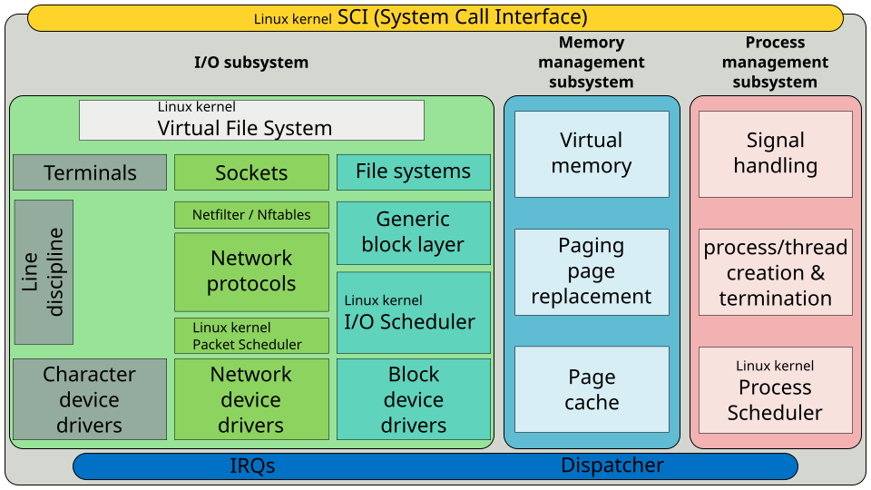

---

<details>
<summary>AArch64 Registers</summary>

In ARMv8-A AArch64 architecture, there are several types of registers. Below is an overview of the main registers used in this architecture:
* General-Purpose Registers
    - **x0 - x30**: These are the 64-bit general-purpose registers.
    - **x0 - x7**: Argument and result registers.
    - **x8**: Indirect result location register.
    - **x9 - x15**: Temporary registers.
    - **x16 - x17**: Intra-procedure call temporary registers.
    - **x18**: Platform register (may be used as a temporary register in some platforms).
    - **x19 - x28**: Callee-saved registers.
    - **x29**: Frame pointer (FP).
    - **x30**: Link register (LR).
    - **w0 - w30**: The lower 32 bits of the x0 - x30 registers.

* Stack Pointer Registers

    - **sp (stack pointer)**: Points to the top of the current stack.
    - **xzr/wzr (zero register)**: Reads as zero and discards writes (xzr for 64-bit, wzr for 32-bit).

* Special-Purpose Registers

    - **PC (program counter)**: Holds the address of the next instruction to be executed.
    - **PSTATE (processor state register)**: Contains flags and control bits.
    - **NZCV (condition flags)**: Stored in the PSTATE register.
        - **N (Negative)**: Set if the result of the operation was negative.
        - **Z (Zero)**: Set if the result of the operation was zero.
        - **C (Carry)**: Set if the operation resulted in a carry.
        - **V (Overflow)**: Set if the operation resulted in an overflow.

* SIMD and Floating-Point Registers

    - **v0 - v31**: These are the 128-bit SIMD and floating-point registers.
    - **d0 - d31**: The lower 64 bits of the v0 - v31 registers.
    - **s0 - s31**: The lower 32 bits of the v0 - v31 registers.
    - **h0 - h31**: The lower 16 bits of the v0 - v31 registers.
    - **b0 - b31**: The lower 8 bits of the v0 - v31 registers.

* System Registers

    - **SPSR (Saved Program Status Register)**: Holds the saved processor state when an exception is taken.
    - **ELR (Exception Link Register)**: Holds the address to return to after an exception.
    - **TPIDR_EL0**: Thread ID register for EL0.
    - **TPIDR_EL1**: Thread ID register for EL1.
    - **CNTVCT_EL0**: Virtual counter-timer.
    - **CNTFRQ_EL0**: Counter-timer frequency.

* Exception Level Registers

    - **SP_EL0**: Stack pointer for EL0.
    - **SP_EL1**: Stack pointer for EL1.
    - **SP_EL2**: Stack pointer for EL2.
    - **SP_EL3**: Stack pointer for EL3.
    - **ELR_EL1**: Exception Link Register for EL1.
    - **ELR_EL2**: Exception Link Register for EL2.
    - **ELR_EL3**: Exception Link Register for EL3.
    - **SPSR_EL1**: Saved Program Status Register for EL1.
    - **SPSR_EL2**: Saved Program Status Register for EL2.
    - **SPSR_EL3**: Saved Program Status Register for EL3.

* Summary

    - **General-purpose registers**: x0 - x30 (64-bit) and w0 - w30 (32-bit).
    - **Stack pointer**: sp.
    - **Special-purpose**: xzr/wzr, PC, PSTATE, NZCV.
    - **SIMD and floating-point registers**: v0 - v31.
    - **System registers**: Various registers for control and status.
    - **Exception level registers**: SP_EL0 - SP_EL3, ELR_EL1 - ELR_EL3, SPSR_EL1 - SPSR_EL3.

</details>

# Reference

* [git.sched/core](https://git.kernel.org/pub/scm/linux/kernel/git/tip/tip.git/log/?h=sched/core)
    * [[PATCH v2 00/23] Cache aware scheduling](https://lore.kernel.org/all/cover.1764801860.git.tim.c.chen@linux.intel.com/)
* [LNW - A proxy-execution baby step](https://lwn.net/Articles/1030842/)
    * [1. [RFC PATCH 00/11] Reviving the Proxy Execution Series](https://lore.kernel.org/lkml/20221003214501.2050087-1-connoro@google.com/)
    * [2. [PATCH v8 0/7] Preparatory changes for Proxy Execution v8](https://lore.kernel.org/lkml/20240224001153.2584030-1-jstultz@google.com/)
    * [3. [PATCH v12 0/7] Preparatory changes for Proxy Execution v12](https://lore.kernel.org/all/20241009235352.1614323-1-jstultz@google.com/)
    * [3. [PATCH v19 0/8] Single RunQueue Proxy Execution (v19)](https://lore.kernel.org/all/20250712033407.2383110-1-jstultz@google.com/)
    * [Phoronix - Linux 6.13 Poised To Land Prep Patches Working Toward Proxy Execution](https://www.phoronix.com/news/Linux-6.13-Prep-For-Proxy-Exec)

    The **scheduling context** is essentially a task's position in the scheduler's run queue, while the **execution context** describes the task that actually runs when the scheduling context is selected for execution.

    The CPU time used by the execution context will be charged against the scheduling context - the proxy will burn a bit of the donor's time slice so that it can get its work done. But the total CPU time usage of the execution context should be increased to reflect the time it spends running in the proxy mode. That is the time value that is visible to user space; having it reflect the actual execution time of the task makes it clear that the task is, indeed, executing.
* [[patch V6 00/11] rseq: Implement time slice extension mechanism](https://lore.kernel.org/lkml/20251215155615.870031952@linutronix.de)

* [A complete guide to Linux process scheduling.pdf](https://trepo.tuni.fi/bitstream/handle/10024/96864/GRADU-1428493916.pdf)
* [Linux kernel scheduler](https://helix979.github.io/jkoo/post/os-scheduler/)
* [Kernel Index Sched - LWN](https://lwn.net/Kernel/Index/#Scheduler)
    * [LWN Index - Realtime](https://lwn.net/Kernel/Index/#Realtime)
    * [LWN Index - Scheduler](https://lwn.net/Kernel/Index/#Scheduler)
        * [Scheduling domains](https://lwn.net/Articles/80911/)
    * [LWN Index - CFS scheduler](https://lwn.net/Kernel/Index/#Scheduler-Completely_fair_scheduler)
        * [An EEVDF CPU scheduler for Linux](https://lwn.net/Articles/925371/)
            * [[PATCH 00/15] sched: EEVDF and latency-nice and/or slice-attr](https://lore.kernel.org/all/20230531115839.089944915@infradead.org/)
                * [[PATCH 01/15] sched/fair: Add cfs_rq::avg_vruntime](https://github.com/torvalds/linux/commit/af4cf40470c22efa3987200fd19478199e08e103)
                * [[PATCH 03/15] sched/fair: Add lag based placement](https://github.com/torvalds/linux/commit/86bfbb7ce4f67a88df2639198169b685668e7349)
                * [[PATCH 04/15] rbtree: Add rb_add_augmented_cached() helper](https://github.com/torvalds/linux/commit/99d4d26551b56f4e523dd04e4970b94aa796a64e)
                * [[PATCH 05/15] sched/fair: Implement an EEVDF like policy](https://github.com/torvalds/linux/commit/147f3efaa24182a21706bca15eab2f3f4630b5fe)
                * [[PATCH 07/15] sched/smp: Use lag to simplify cross-runqueue placement](https://github.com/torvalds/linux/commit/e8f331bcc270354a803c2127c486190d33eac441)
                * [[PATCH 08/15] sched: Commit to EEVDF](https://github.com/torvalds/linux/commit/5e963f2bd4654a202a8a05aa3a86cb0300b10e6c)
            * [[PATCH 00/24] Complete EEVDF](https://lore.kernel.org/all/20240727102732.960974693@infradead.org/)
            * [Completing the EEVDF scheduler](https://lwn.net/Articles/969062/) `Delayed Dequeue` ⊙ `Wakeup Preemption`
        * [OSPM 2015 - The EEVDF verifier: a tale of trying to catch up](https://lwn.net/Articles/1022054)
        * [Linux 核心設計: Scheduler(5): EEVDF Scheduler 1](https://hackmd.io/@RinHizakura/SyG4t5u1a) ⊙ [2](https://hackmd.io/@RinHizakura/HkyEtNkjA)
        * [内核江湖·神仙打架(三): EEVDF--一个被鄙视了 16 年的算法, 以最不学术的方式合入了内核](https://mp.weixin.qq.com/s/Eicst-Mqq77CecemY3jDvw)
    * [LWN Index - Core scheduling](https://lwn.net/Kernel/Index/#Scheduler-Core_scheduling)
    * [LWN Index - Deadline scheduling](https://lwn.net/Kernel/Index/#Scheduler-Deadline_scheduling)
    * [LWN Index - Group scheduling](https://lwn.net/Kernel/Index/#Scheduler-Group_scheduling)
    * [The long road to lazy preemption](https://lwn.net/Articles/994322/)
        * [[PATCH 0/5] sched: Lazy preemption muck](https://lore.kernel.org/all/20241007074609.447006177@infradead.org/)
    * [LWN Index - Time-slice extension](https://lwn.net/Kernel/Index/#Scheduler-Time-slice_extension)
        * [[patch 00/12] rseq: Implement time slice extension mechanism](https://lore.kernel.org/all/20250908225709.144709889@linutronix.de/)

* [进程调度 - LoyenWang](https://www.cnblogs.com/LoyenWang/tag/进程调度/)
    * [1. 基础](https://www.cnblogs.com/LoyenWang/p/12249106.html)
    * [2. CPU负载](https://www.cnblogs.com/LoyenWang/p/12316660.html)
    * [3. 进程切换](https://www.cnblogs.com/LoyenWang/p/12386281.html)
    * [4. 组调度及带宽控制](https://www.cnblogs.com/LoyenWang/p/12459000.html)
    * [5. CFS调度器](https://www.cnblogs.com/LoyenWang/p/12495319.html)
    * [6. 实时调度器](https://www.cnblogs.com/LoyenWang/p/12584345.html)
    * [Linux进程调度器-CPU负载](https://www.cnblogs.com/LoyenWang/p/12316660.html)

* [Wowo Tech](http://www.wowotech.net/sort/process_management)
    * [进程切换分析 - :one:基本框架](http://www.wowotech.net/process_management/context-switch-arch.html) ⊙ [:two:TLB处理](http://www.wowotech.net/process_management/context-switch-tlb.html) ⊙ [:three:同步处理](http://www.wowotech.net/process_management/scheudle-sync.html)
    * [CFS调度器 - 组调度](http://www.wowotech.net/process_management/449.html)
    * [CFS调度器 - 带宽控制](http://www.wowotech.net/process_management/451.html)
    * [CFS调度器 - 总结](http://www.wowotech.net/process_management/452.html)
    * [ARM Linux上的系统调用代码分析](http://www.wowotech.net/process_management/syscall-arm.html)
    * [Linux调度器 - 用户空间接口](http://www.wowotech.net/process_management/scheduler-API.html)
    * [schedutil governor情景分析](http://www.wowotech.net/process_management/schedutil_governor.html)
    * [TLB flush](http://www.wowotech.net/memory_management/tlb-flush.html)

* [hellokitty2 进程管理](https://www.cnblogs.com/hellokitty2/category/1791168.html)

* [CHENG Jian Linux进程管理与调度](https://kernel.blog.csdn.net/article/details/51456569)
    * [WAKE_AFFINE](https://blog.csdn.net/gatieme/article/details/106315848)
    * [用户抢占和内核抢占](https://blog.csdn.net/gatieme/article/details/51872618)

* [汪辰]
    * [Linux 内核的抢占模型](https://gitee.com/aosp-riscv/working-group/blob/master/articles/20230805-linux-preemption-models.md)
    * [Linux "PREEMPT_RT" 抢占模式分析报告](https://gitee.com/aosp-riscv/working-group/blob/master/articles/20230806-linux-preempt-rt.md#/aosp-riscv/working-group/blob/master/articles/20230805-linux-preemption-models.md)
    * [实时 Linux(Real-Time Linux)](https://gitee.com/aosp-riscv/working-group/blob/master/articles/20230727-rt-linux.md)
    * [Linux 调度器(Schedular)](https://gitee.com/aosp-riscv/working-group/blob/master/articles/20230801-linux-scheduler.md)

* [PREEMPT_RT Linux](https://wiki.linuxfoundation.org/realtime/start)
    * [Download PREEMPT_RT patch set](https://www.kernel.org/pub/linux/kernel/projects/rt/)
    * [LWN - A realtime preemption overview](https://lwn.net/Articles/146861/)
    * [Preemption Models](https://wiki.linuxfoundation.org/realtime/documentation/technical_basics/preemption_models)
        Model | Case | Preempt Points
        --- | --- | ---
        PREEMPT_NONE | No Forced Preemption (server) | `system call returns` + `interrupts`
        PREEMPT_VOLUNTARY | Voluntary Kernel Preemption (Desktop) | `system call returns` + `interrupts` + `explicit preemption points`
        PREEMPT | Preemptible Kernel (Low-Latency Desktop) |`system call returns` + `interrupts` + `all kernel code(except critical section)`
        PREEMPT_RT | Fully Preemptible Kernel (RT) | `system call returns` + `interrupts` + `all kernel code(except a few critical section)` + `threaded interrupt handlers`

* [PREEMPT_LAZY](https://lore.kernel.org/all/20241007074609.447006177@infradead.org)
    * [AWS工程师报告PostgreSQL性能在Linux 7.0下降50%到底是怎么一回事？](https://mp.weixin.qq.com/s/T3uTJrUtqBovrzN52omA1Q)
    * [内核江湖·翻车现场(八): PREEMPT_NONE 之死--当架构洁癖撞上生产负载](https://mp.weixin.qq.com/s/bMElxAAksEY20ZQTyGWMOA)
    * Does not need_resched, so it won't preempt mid-execution on every **interrupt return**.

        ```c
        irqentry_exit_cond_resched() {
            if (!preempt_count()) {
                need = need_resched() {
                    return tif_test_bit(TIF_NEED_RESCHED);
                }
                if (need && arch_irqentry_exit_need_resched()) {
                    preempt_schedule_irq() {
                        __schedule(SM_PREEMPT);
                    }
                }
            }
        }
        ```

    * Only acted upon at **voluntary schedule points** (explicit **schedule()** calls, **returning to userspace**, etc.).

        ```c
        __exit_to_user_mode_loop() {
            while (ti_work & EXIT_TO_USER_MODE_WORK_LOOP) {
                if (ti_work & (_TIF_NEED_RESCHED | _TIF_NEED_RESCHED_LAZY)) {
                    if (!rseq_grant_slice_extension(ti_work & TIF_SLICE_EXT_DENY))
                        schedule();
                }
            }
        }
        ```

    * On the next **timer tick**, it gets promoted to _TIF_NEED_RESCHED

        ```c
        void sched_tick() {
            if (dynamic_preempt_lazy() && tif_test_bit(TIF_NEED_RESCHED_LAZY))
                resched_curr(rq);
        }
        ```

    * The **idle task** is never given LAZY - it's immediately upgraded to TIF_NEED_RESCHED

        ```c
        void __resched_curr(struct rq *rq, int tif) {
            if (is_idle_task(curr) && tif == TIF_NEED_RESCHED_LAZY)
                tif = TIF_NEED_RESCHED;
        }
        ```

* [Oracle Linux Blog](https://blogs.oracle.com/linux/category/lnx-linux-kernel-development)
    * [Understanding process thread priorities in Linux](https://blogs.oracle.com/linux/post/task-priority)
        * **static_prio**: maps the priority range used for normal tasks and is the priority according to the nice value of a task.
            > static_prio = 120 + nice
        * **rt_priority**: maps the priority range for real time tasks and indicates real time priority.
            > MAX_RT_PRIO-1 - rt_priority
            * POSIX high rt_priority value signifies high priority  while linux low priority value signifies high priority
        * **normal_prio**: indicates priority of a task without any temporary priority boosting from the kernel side. For normal tasks it is the same as static_prio and for RT tasks it is directly related to rt_priority
            * In absence of normal_prio, children of a priority boosted task will get boosted priority as well and this will cause CPU starvation for other tasks. To avoid such a situation, the kernel maintains nomral_prio of a task. Forked tasks usually get their effective prio set to normal_prio of the parent and hence don’t get boosted priority.
        * **prio**: is the effective priority of a task and is used in all scheduling related decision makings.

* [Linux 内核十大技术创新 - 2025](https://mp.weixin.qq.com/s/QwDOP2e7KuXq0T31Etx2rg) ⊙ [2024](https://mp.weixin.qq.com/s/3wWPcmNU4IJX6c088qfJJw) ⊙ [2023](https://mp.weixin.qq.com/s/nwwCReagfzmby491BSF6KA) ⊙ [2022](https://mp.weixin.qq.com/s/GkOtj_Nr7dGiQ7sPVfPEvg)
# cpu

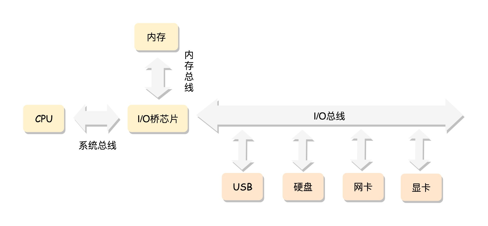

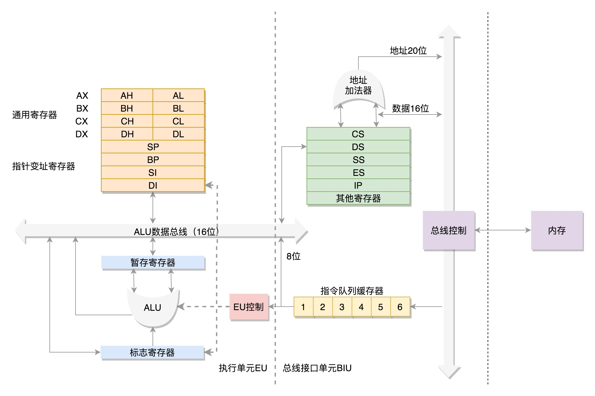

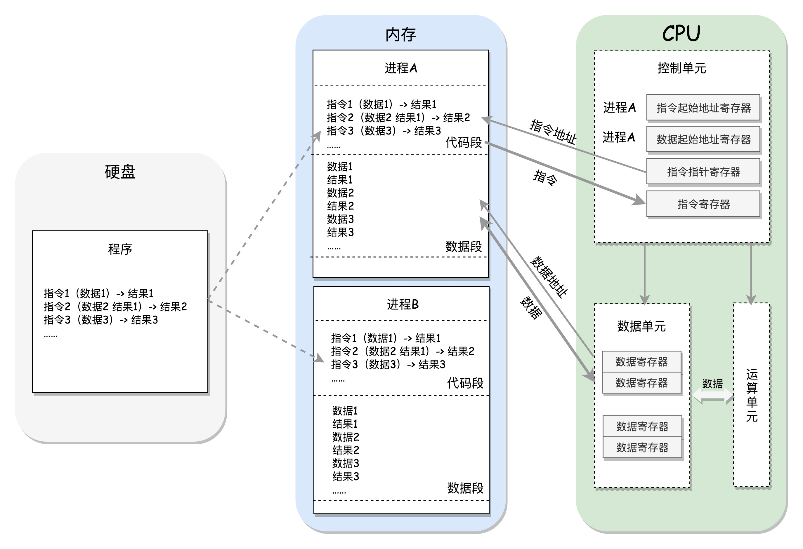

# bios
* 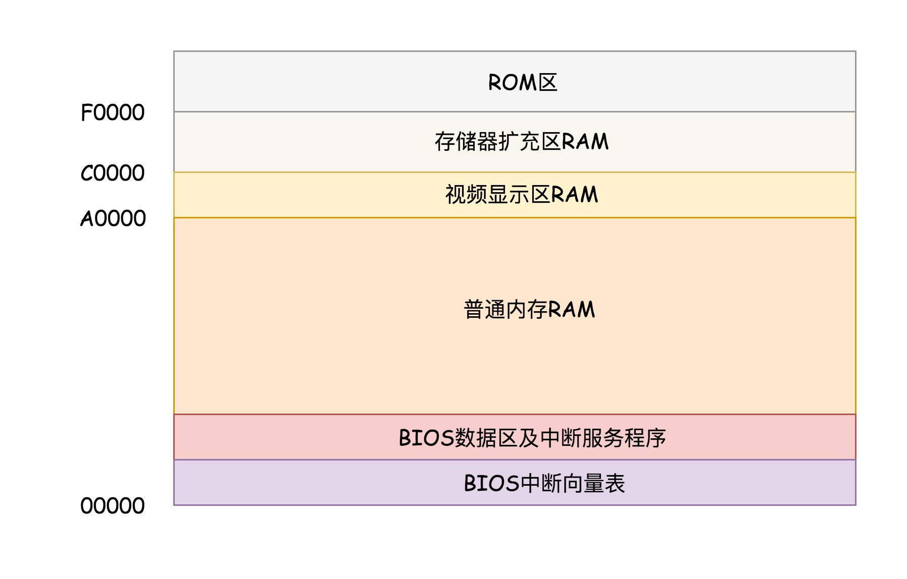

**UEFI** initializes hardware and hands off to the OS loader (e.g., GRUB).
|**Stage**|**Description**|
|:-:|:-:|
|**SEC (Security)**|Initializes CPU, temporary memory (cache-as-RAM), and security (e.g., TPM).|
|**PEI (Pre-EFI)**|Sets up permanent RAM, configures chipset, builds HOBs (early memory map).|
|**DXE (Driver Exec)**|Loads drivers, finalizes memory map, offers Boot Services (e.g., `GetMemoryMap`).|
|**BDS (Boot Device)**|Selects boot device (e.g., GRUB on ESP) from NVRAM variables.|
|**TSL (Transient)**|Runs OS loader (e.g., GRUB) until `ExitBootServices()`.|
|**RT (Runtime)**|Post-boot services (e.g., variables, time) for OS; memory reserved.|

- **Memory Role**: Maps RAM (e.g., `EfiConventionalMemory`) for kernel’s zonelists and buddy system.

**GRUB loads the kernel after UEFI hands off.**
|**Stage**|**Description**|
|:-:|:-:|
|**UEFI Load**|UEFI executes `grubx64.efi` from ESP using Boot Services.|
|**Core Image**|`grubx64.efi` loads core image, minimal drivers (e.g., FAT) in UEFI memory.|
|**Modules/Config**|Loads `grub.cfg` and modules (e.g., `linux.mod`) from `/boot/grub`.|
|**User Interaction**|Optional menu (via `normal` module); skips if timeout=0.|
|**Kernel Load**|Copies kernel (e.g., `vmlinuz`) and initrd to RAM via `AllocatePages()`.|
|**Handoff**|Calls `ExitBootServices()`, passes memory map, jumps to kernel entry point.|

- **Memory Role**: Uses UEFI-allocated memory, hands `EfiConventionalMemory` to kernel for buddy system setup.
- UEFI’s memory map becomes the kernel’s starting point-zonelists, pageblocks (e.g., 4 MB), and migrate types (e.g., `MIGRATE_UNMOVABLE` for runtime regions) kick in post-handoff.
---

* When power on, set CS to 0xFFFF, IP to 0x0000, the first instruction points to 0xFFFF0 within ROM, a JMP comamand will jump to ROM do init work, BIOS starts.
* Then BIOS checks the health state of each hardware.
* Grub2 (Grand Unified Bootloader Version 2)
  * grub2-mkconfig -o /boot/grub2/grub.cfg
    ```
    menuentry 'CentOS Linux (3.10.0-862.el7.x86_64) 7 (Core)' --class centos --class gnu-linux --class gnu --class os --unrestricted $menuentry_id_option 'gnulinux-3.10.0-862.el7.x86_64-advanced-b1aceb95-6b9e-464a-a589-bed66220ebee' {
      load_video
      set gfxpayload=keep
      insmod gzio
      insmod part_msdos
      insmod ext2 set root='hd0,msdos1'
      if [ x$feature_platform_search_hint = xy ]; then
        search --no-floppy --fs-uuid --set=root --hint='hd0,msdos1' b1aceb95-6b9e-464a-a589-bed66220ebee
      else search --no-floppy --fs-uuid --set=root b1aceb95-6b9e-464a-a589-bed66220ebee
      fi

      linux16 /boot/vmlinuz-3.10.0-862.el7.x86_64 root=UUID=b1aceb95-6b9e-464a-a589-bed66220ebee ro console=tty0 console=ttyS0,115200 crashkernel=auto net.ifnames=0 biosdevname=0 rhgb quiet
      initrd16 /boot/initramfs-3.10.0-862.el7.x86_64.img
    }
    ```
  * grub2-install /dev/sda
    * install boot.img into MBR(Master Boot Record), and load boot.img into memory at 0x7c00 to run
    * core.img: diskboot.img, lzma_decompress.img, kernel.img

*   ```c
    boot.img                    /* Power On Self Test */
    core.img
        diskboot.img            /* diskboot.S load other modules of grub into memory */
            lzma_decompress.img /* startup_raw.S */
                real_to_prot    /* enable segement, page, open Gate A20 */
                kernel.img      /* startup.S, grub's kernel img not Linux kernel */
                    grub_main   /* grub's main func */
                        grub_load_config()
                        grub_command_execute ("normal", 0, 0)
                            grub_normal_execute()
                                grub_show_menu() /* show which OS want to run */
                                    grub_menu_execute_entry() /* start linux kernel */
    ```
    * boot.img
        * checks the basic operability of the hardware and then it issues a BIOS interrupt, INT 13H, which locates the boot sectors on any attached bootable devices.
        * read the first sector of the core image from a local disk and jump to it. Because of the size restriction, boot.img cannot understand any file system structure, so grub-install hardcodes the location of the first sector of the core image into boot.img when installing GRUB.
    * diskboot.img
        * the first sector of the core image when booting from a hard disk. It reads the rest of the core image into memory and starts the kernel. Since file system handling is not yet available, it encodes the location of the core image using a block list format.
    * kernel.img
        * contains GRUB’s basic run-time facilities: frameworks for device and file handling, environment variables, the rescue mode command-line parser, and so on. It is rarely used directly, but is built into all core images.
    * core.img
        * built dynamically from the kernel image and an arbitrary list of modules by the grub-mkimage program. Usually, it contains enough modules to access /boot/grub, and loads everything else (including menu handling, the ability to load target operating systems, and so on) from the file system at run-time. The modular design allows the core image to be kept small, since the areas of disk where it must be installed are often as small as 32KB.

* [GNU GRUB Manual 2.06](https://www.gnu.org/software/grub/manual/grub/html_node/index.html#SEC_Contents)
* [GNU GRUB Manual 2.06: Images](https://www.gnu.org/software/grub/manual/grub/html_node/Images.html)

```c
/* arch/arm64/kernel/head.S */
 * Kernel startup entry point.
 * ---------------------------
 *
 * The requirements are:
 *   MMU = off, D-cache = off, I-cache = on or off,
 *   x0 = physical address to the FDT blob. */

__HEAD
    efi_signature_nop
    b  primary_entry
    .quad  0
    le64sym  _kernel_size_le
    le64sym  _kernel_flags_le
    .quad  0
    .quad  0
    .quad  0
    .ascii  ARM64_IMAGE_MAGIC
    .long  .Lpe_header_offset

    __EFI_PE_HEADER

    .section ".idmap.text","a"

primary_entry
    bl record_mmu_state

    /* Preserve the arguments passed by the bootloader in x0 .. x3 */
    bl preserve_boot_args

    bl create_idmap

    bl __cpu_setup

    b __primary_switch
        adrp x1, reserved_pg_dir
        adrp x2, init_idmap_pg_dir
        bl __enable_mmu

        bl clear_page_tables
        bl create_kernel_mapping

        adrp x1, init_pg_dir
        load_ttbr1 x1, x1, x2 /* install x1 as a TTBR1 page table */

        x0 = __pa(KERNEL_START)

        bl __primary_switched
            adr_l x4, init_task
            init_cpu_task x4, x5, x6

            adr_l x8, vectors /* load VBAR_EL1 with virtual */
            msr vbar_el1, x8 /* vector table address */

            ldr_l x4, _text // Save the offset between
            sub   x4, x4, x0 // the kernel virtual and
            str_l x4, kimage_voffset, x5 // physical mappings

            bl set_cpu_boot_mode_flag

            bl __pi_memset

            mov x0, x21 /* pass FDT address in x0 */
            bl early_fdt_map /* Try mapping the FDT early */

            mov x0, x20 /* pass the full boot status */
            bl init_feature_override  /* Parse cpu feature overrides */

            bl start_kernel
```

# start_kernel

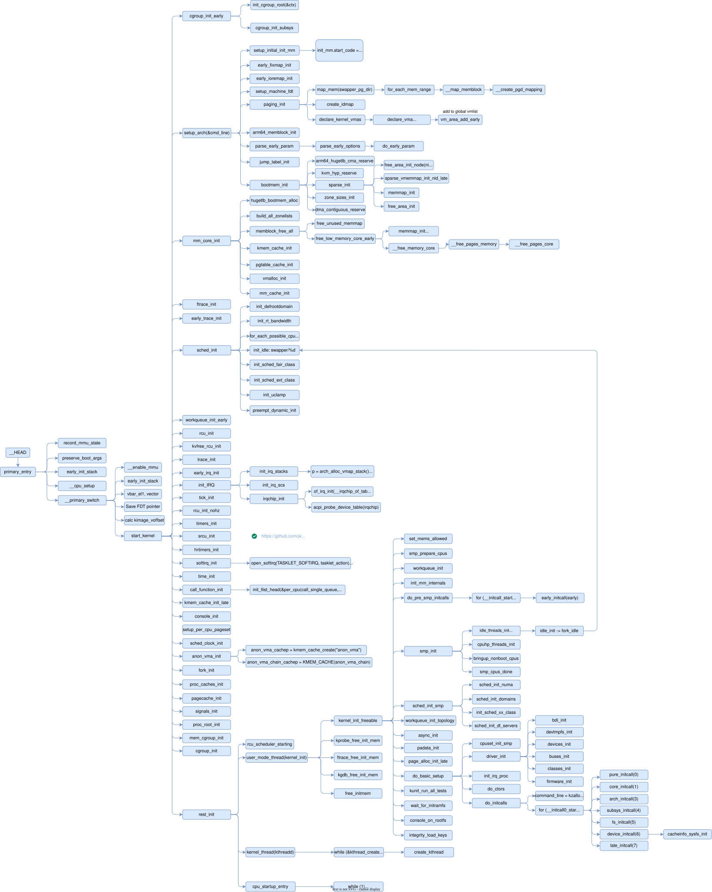

```c
/* init/main.c */
void start_kernel(void)
{
    char *command_line;
    char *after_dashes;

    set_task_stack_end_magic(&init_task);
    smp_setup_processor_id();
    debug_objects_early_init();
    init_vmlinux_build_id();

    cgroup_init_early();

    local_irq_disable();
    early_boot_irqs_disabled = true;

    /* Interrupts are still disabled. Do necessary setups, then
     * enable them. */
    boot_cpu_init();
    page_address_init();
    pr_notice("%s", linux_banner);
    setup_arch(&command_line);
    mm_core_init_early();
    /* Static keys and static calls are needed by LSMs */
    jump_label_init();
    static_call_init();
    early_security_init();
    setup_boot_config();
    setup_command_line(command_line);
    setup_nr_cpu_ids();
    setup_per_cpu_areas();
    smp_prepare_boot_cpu();    /* arch-specific boot-cpu hooks */
    early_numa_node_init();
    boot_cpu_hotplug_init();

    print_kernel_cmdline(saved_command_line);
    /* parameters may set static keys */
    parse_early_param();
    after_dashes = parse_args("Booting kernel",
                  static_command_line, __start___param,
                  __stop___param - __start___param,
                  -1, -1, NULL, &unknown_bootoption);
    print_unknown_bootoptions();
    if (!IS_ERR_OR_NULL(after_dashes))
        parse_args("Setting init args", after_dashes, NULL, 0, -1, -1,
               NULL, set_init_arg);
    if (extra_init_args)
        parse_args("Setting extra init args", extra_init_args,
               NULL, 0, -1, -1, NULL, set_init_arg);

    /* Architectural and non-timekeeping rng init, before allocator init */
    random_init_early(command_line);

    /* These use large bootmem allocations and must precede
     * initalization of page allocator */
    setup_log_buf(0);
    vfs_caches_init_early();
    sort_main_extable();
    trap_init();
    mm_core_init();
    maple_tree_init();
    poking_init();
    ftrace_init();

    /* trace_printk can be enabled here */
    early_trace_init();

    /* Set up the scheduler prior starting any interrupts (such as the
     * timer interrupt). Full topology setup happens at smp_init()
     * time - but meanwhile we still have a functioning scheduler. */
    sched_init();

    if (WARN(!irqs_disabled(),
         "Interrupts were enabled *very* early, fixing it\n"))
        local_irq_disable();
    radix_tree_init();

    /* Set up housekeeping before setting up workqueues to allow the unbound
     * workqueue to take non-housekeeping into account. */
    housekeeping_init();

    /* Allow workqueue creation and work item queueing/cancelling
     * early.  Work item execution depends on kthreads and starts after
     * workqueue_init(). */
    workqueue_init_early();

    rcu_init();
    kvfree_rcu_init();

    /* Trace events are available after this */
    trace_init();

    if (initcall_debug)
        initcall_debug_enable();

    context_tracking_init();
    /* init some links before init_ISA_irqs() */
    early_irq_init();
    init_IRQ();
    tick_init();
    rcu_init_nohz();
    timers_init();
    srcu_init();
    hrtimers_init();
    softirq_init();
    vdso_setup_data_pages();
    timekeeping_init();
    time_init();

    /* This must be after timekeeping is initialized */
    random_init();

    /* These make use of the fully initialized rng */
    kfence_init();
    boot_init_stack_canary();

    perf_event_init();
    profile_init();
    call_function_init();
    WARN(!irqs_disabled(), "Interrupts were enabled early\n");

    early_boot_irqs_disabled = false;
    local_irq_enable();

    kmem_cache_init_late();

    /* HACK ALERT! This is early. We're enabling the console before
     * we've done PCI setups etc, and console_init() must be aware of
     * this. But we do want output early, in case something goes wrong. */
    console_init();
    if (panic_later)
        panic("Too many boot %s vars at `%s'", panic_later,
              panic_param);

    lockdep_init();

    /* Need to run this when irqs are enabled, because it wants
     * to self-test [hard/soft]-irqs on/off lock inversion bugs
     * too: */
    locking_selftest();

#ifdef CONFIG_BLK_DEV_INITRD
    if (initrd_start && !initrd_below_start_ok &&
        page_to_pfn(virt_to_page((void *)initrd_start)) < min_low_pfn) {
        pr_crit("initrd overwritten (0x%08lx < 0x%08lx) - disabling it.\n",
            page_to_pfn(virt_to_page((void *)initrd_start)),
            min_low_pfn);
        initrd_start = 0;
    }
#endif
    setup_per_cpu_pageset();
    numa_policy_init();
    acpi_early_init();
    if (late_time_init)
        late_time_init();
    sched_clock_init();
    calibrate_delay();

    arch_cpu_finalize_init();

    pid_idr_init();
    anon_vma_init();
    thread_stack_cache_init();
    cred_init();
    fork_init();
    proc_caches_init();
    uts_ns_init();
    time_ns_init();
    key_init();
    security_init();
    dbg_late_init();
    net_ns_init();
    vfs_caches_init();
    pagecache_init();
    signals_init();
    seq_file_init();
    proc_root_init();
    nsfs_init();
    pidfs_init();
    cpuset_init();
    mem_cgroup_init();
    cgroup_init();
    taskstats_init_early();
    delayacct_init();

    acpi_subsystem_init();
    arch_post_acpi_subsys_init();
    kcsan_init();

    /* Do the rest non-__init'ed, we're now alive */
    rest_init();

    /* Avoid stack canaries in callers of boot_init_stack_canary for gcc-10
     * and older. */
#if !__has_attribute(__no_stack_protector__)
    prevent_tail_call_optimization();
#endif
}

static void rest_init(void)
{
    struct task_struct *tsk;
    int pid;

    pid = kernel_thread(kernel_init, NULL, CLONE_FS);

    pid = kernel_thread(kthreadd, NULL, CLONE_FS | CLONE_FILES);

    complete(&kthreadd_done);

    cpu_startup_entry(CPUHP_ONLINE) {
        current->flags |= PF_IDLE;
        arch_cpu_idle_prepare();
        cpuhp_online_idle(state);
        while (1) {
            do_idle();
        }
    }
}

/* init/init_task.c */
struct task_struct init_task
#ifdef CONFIG_ARCH_TASK_STRUCT_ON_STACK
  __init_task_data
#endif
= {
#ifdef CONFIG_THREAD_INFO_IN_TASK
  .thread_info      = INIT_THREAD_INFO(init_task),
  .stack_refcount   = ATOMIC_INIT(1),
#endif
  .state    = 0,
  .stack    = init_stack,
  .usage    = ATOMIC_INIT(2),
  .flags    = PF_KTHREAD,
};
```

```c
pid_t kernel_thread(int (*fn)(void *), void *arg, unsigned long flags)
{
  return _do_fork(flags|CLONE_VM|CLONE_UNTRACED, (unsigned long)fn,
    (unsigned long)arg, NULL, NULL, 0);
}

/* return from kernel to user space */
static int kernel_init(void *unused)
{
  if (ramdisk_execute_command) {
    ret = run_init_process(ramdisk_execute_command);
    if (!ret)
      return 0;
  }

  if (execute_command) {
    ret = run_init_process(execute_command);
    if (!ret)
      return 0;
  }

  if (!try_to_run_init_process("/sbin/init") ||
      !try_to_run_init_process("/etc/init") ||
      !try_to_run_init_process("/bin/init") ||
      !try_to_run_init_process("/bin/sh"))
    return 0;
}

static int run_init_process(const char *init_filename)
{
  argv_init[0] = init_filename;
  return do_execve(getname_kernel(init_filename),
    (const char __user *const __user *)argv_init,
    (const char __user *const __user *)envp_init);
}
```

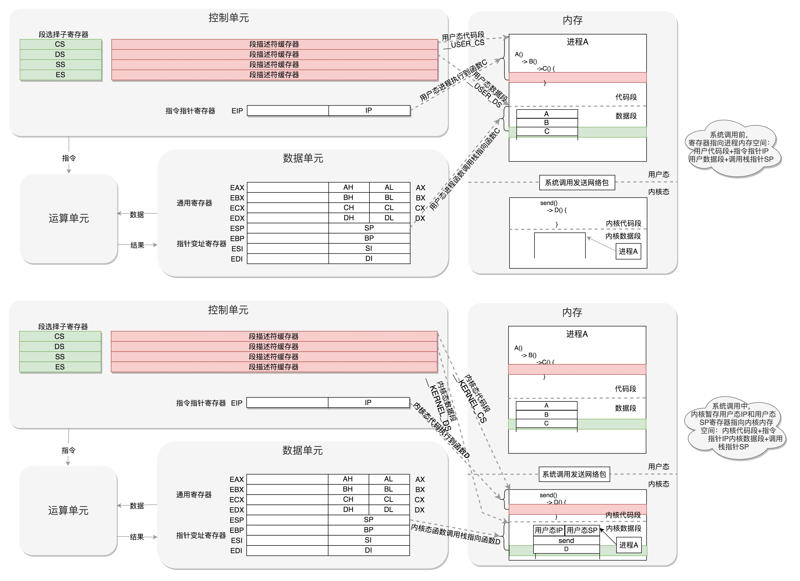


## smp_boot

* [ARM64 的多核启动流程分析](https://zhuanlan.zhihu.com/p/512099688?utm_id=0)
* [ARM64 SMP多核启动 spin-table](https://mp.weixin.qq.com/s/4T4WcbG5rMpHFtU8-xxTbg) ⊙ [PSCI](https://mp.weixin.qq.com/s/NaEvCuSDJMQ2dsN5rJ6GqA)

```c
SYM_FUNC_START(secondary_holding_pen)
    mov     x0, xzr
    bl      init_kernel_el
    mrs     x2, mpidr_el1
    mov_q   x1, MPIDR_HWID_BITMASK
    and     x2, x2, x1
    adr_l   x3, secondary_holding_pen_release
pen:    ldr    x4, [x3]
    cmp     x4, x2
    b.eq    secondary_startup
    wfe
    b       pen
SYM_FUNC_END(secondary_holding_pen)

void start_kernel(void) {
    setup_arch(&command_line) {
/* 1. cpu_init */
        smp_init_cpus() {
            smp_cpu_setup(cpu) {
                /* Read a cpu's enable method and record it in cpu_ops. */
                init_cpu_ops(cpu) {
                    const char *enable_method = cpu_read_enable_method(cpu);

                    cpu_ops[cpu] = cpu_get_ops(enable_method); /* "spin-table" or "psci" */
                }

                ops = get_cpu_ops(cpu);
                ops->cpu_init(cpu) {
                    smp_spin_table_ops->cpu_init() {
                        smp_spin_table_cpu_init() {
                            /*  Determine the address from which the CPU is polling */
                            of_property_read_u64(dn, "cpu-release-addr", &cpu_release_addr[cpu]);
                        }
                    }

                    cpu_psci_ops->cpu_psci_cpu_init() {

                    }
                }

                set_cpu_possible(cpu, true);
            }
        }
    }

/* 2. cpu_prepare */
    arch_call_rest_init() {
        rest_init() {
            user_mode_thread(kernel_init);
            kernel_init() {
                kernel_init_freeable() {
                    smp_prepare_cpus() {
                        cpu_ops[cpu]->cpu_prepare() {
                            smp_spin_table_ops->cpu_prepare() {
                                smp_spin_table_cpu_prepare() {
                                    __le64 __iomem *release_addr;
                                    phys_addr_t pa_holding_pen = __pa_symbol(secondary_holding_pen);

                                    release_addr = ioremap_cache(cpu_release_addr[cpu], sizeof(*release_addr));

                                    writeq_relaxed(pa_holding_pen, release_addr);
                                    dcache_clean_inval_poc((__force unsigned long)release_addr,
                                                (__force unsigned long)release_addr +
                                                    sizeof(*release_addr));
                                    sev();

                                    iounmap(release_addr);

                                    return 0;
                                }
                                cpu_psci_cpu_prepare() {

                                }
                            }
                        }
                    }
/* 3. cpu_boot */
                    smp_init() {
                        idle_threads_init() {
                            fork_idle(cpu)
                        }
                        cpuhp_threads_init();

                        bringup_nonboot_cpus(setup_max_cpus) {
                            cpuhp_bringup_mask(cpu_present_mask, setup_max_cpus, CPUHP_ONLINE) {
                                for_each_cpu::cpu_up(cpu, target) {
                                    try_online_node(cpu_to_node(cpu));
                                    _cpu_up(cpu, 0, target) {
                                        cpuhp_up_callbacks(cpu, st, target) {
                                            cpuhp_reset_state(cpu, st, prev_state)

                                            cpuhp_invoke_callback_range(false, cpu, st, prev_state) {
                                                while (cpuhp_next_state(bringup, &state, st, target)) {
                                                    cpuhp_invoke_callback(cpu, state, bringup, NULL, NULL);
                                                }
                                                cpuhp_invoke_callback(cpu, state, bringup, NULL, NULL) {
                                                    struct cpuhp_cpu_state *st = per_cpu_ptr(&cpuhp_state, cpu);
                                                    struct cpuhp_step *step = cpuhp_get_step(state);
                                                    cb = bringup ? step->startup.single : step->teardown.single;
                                                    ret = cb(cpu) {
                                                        bringup_cpu()
                                                            --->
                                                    }
                                                }
                                            }
                                        }
                                    }
                                }
                            }
                        }
                    }

                }
            }
        }
    }
}
```

```c
bringup_cpu() {
    __cpu_up(cpu, idle) { //arch/arm64/kernel/smp.c
        boot_secondary(cpu, idle) {
            ops = get_cpu_ops(cpu);
            ops->cpu_boot(cpu) {

                smp_spin_table_cpu_boot() {
                    u64 __cpu_logical_map[NR_CPUS] = { [0 ... NR_CPUS-1] = INVALID_HWID };
                    u64 cpu_logical_map(unsigned int cpu) {
                        return __cpu_logical_map[cpu];
                    }

                    write_pen_release(cpu_logical_map(cpu)/*val*/) {
                        void *start = (void *)&secondary_holding_pen_release;
                        unsigned long size = sizeof(secondary_holding_pen_release);

                        secondary_holding_pen_release = val;
                        dcache_clean_inval_poc((unsigned long)start, (unsigned long)start + size);
                    }
                    sev();
                }

                cpu_psci_cpu_boot() {
                    phys_addr_t pa_secondary_entry = __pa_symbol(secondary_entry);
                    err = psci_ops.cpu_on(cpu_logical_map(cpu), pa_secondary_entry) {
                        psci_0_2_cpu_on() {
                            __psci_cpu_on() {
                                invoke_psci_fn() {
                                    if (case SMCCC_CONDUIT_HVC) {
                                        invoke_psci_fn = __invoke_psci_fn_hvc() {
                                            arm_smccc_hvc()
                                        }
                                    } else if (case SMCCC_CONDUIT_SMC) {
                                        invoke_psci_fn = __invoke_psci_fn_smc() {
                                            arm_smccc_smc()
                                        }
                                    }
                                }
                            }
                        }
                    }
                }
            }
        }
    }
}
```

### cpuhp_hp_states

```c
static struct cpuhp_step cpuhp_hp_states[] = {
    [CPUHP_OFFLINE] = {
        .name                   = "offline",
        .startup.single         = NULL,
        .teardown.single        = NULL,
    },
    [CPUHP_AP_OFFLINE] = {
        .name                   = "ap:offline",
        .cant_stop              = true,
    },
    /* First state is scheduler control. Interrupts are disabled */
    [CPUHP_AP_SCHED_STARTING] = {
        .name                   = "sched:starting",
        .startup.single         = sched_cpu_starting,
        .teardown.single        = sched_cpu_dying,
    },
    [CPUHP_AP_RCUTREE_DYING] = {
        .name                   = "RCU/tree:dying",
        .startup.single         = NULL,
        .teardown.single        = rcutree_dying_cpu,
    },
    [CPUHP_AP_SMPCFD_DYING] = {
        .name                   = "smpcfd:dying",
        .startup.single         = NULL,
        .teardown.single        = smpcfd_dying_cpu,
    },
    [CPUHP_AP_HRTIMERS_DYING] = {
        .name                   = "hrtimers:dying",
        .startup.single         = hrtimers_cpu_starting,
        .teardown.single        = hrtimers_cpu_dying,
    },
    [CPUHP_AP_TICK_DYING] = {
        .name                   = "tick:dying",
        .startup.single         = NULL,
        .teardown.single        = tick_cpu_dying,
    },
    /* Entry state on starting. Interrupts enabled from here on. Transient
     * state for synchronsization */
    [CPUHP_AP_ONLINE] = {
        .name                   = "ap:online",
    },
    [CPUHP_TEARDOWN_CPU] = {
        .name                   = "cpu:teardown",
        .startup.single         = NULL,
        .teardown.single        = takedown_cpu,
        .cant_stop              = true,
    },
    [CPUHP_AP_ACTIVE] = {
        .name                   = "sched:active",
        .startup.single         = sched_cpu_activate,
        .teardown.single        = sched_cpu_deactivate,
    },
    /* CPU is fully up and running. */
    [CPUHP_ONLINE] = {
        .name                   = "online",
        .startup.single         = NULL,
        .teardown.single        = NULL,
    },
};
```

### sched_cpu_dying

```c
int sched_cpu_dying(unsigned int cpu)
{
    struct rq *rq = cpu_rq(cpu);
    struct rq_flags rf;

    /* Handle pending wakeups and then migrate everything off */
    sched_tick_stop(cpu) {
        struct tick_work *twork;
        int os;

        if (housekeeping_cpu(cpu, HK_TYPE_KERNEL_NOISE))
            return;

        WARN_ON_ONCE(!tick_work_cpu);

        twork = per_cpu_ptr(tick_work_cpu, cpu);
        /* There cannot be competing actions, but don't rely on stop-machine. */
        os = atomic_xchg(&twork->state, TICK_SCHED_REMOTE_OFFLINING);
        WARN_ON_ONCE(os != TICK_SCHED_REMOTE_RUNNING);
        /* Don't cancel, as this would mess up the state machine. */
    }

    rq_lock_irqsave(rq, &rf);
    update_rq_clock(rq);
    if (rq->nr_running != 1 || rq_has_pinned_tasks(rq)) {
        WARN(true, "Dying CPU not properly vacated!");
        dump_rq_tasks(rq, KERN_WARNING);
    }
    dl_server_stop(&rq->fair_server);
#ifdef CONFIG_SCHED_CLASS_EXT
    dl_server_stop(&rq->ext_server);
#endif
    rq_unlock_irqrestore(rq, &rf);

    calc_load_migrate(rq) {
        long delta = calc_load_fold_active(rq, 1) {
            long nr_active, delta = 0;

            nr_active = this_rq->nr_running - adjust;
            nr_active += (long)this_rq->nr_uninterruptible;

            if (nr_active != this_rq->calc_load_active) {
                delta = nr_active - this_rq->calc_load_active;
                this_rq->calc_load_active = nr_active;
            }

            return delta;
        }

        if (delta)
            atomic_long_add(delta, &calc_load_tasks);
    }

    update_max_interval() {
        max_load_balance_interval = HZ*num_online_cpus()/10;
    }

    hrtick_clear(rq);

    sched_core_cpu_dying(cpu) {
        struct rq *rq = cpu_rq(cpu);

        if (rq->core != rq)
            rq->core = rq;
    }
    return 0;
}
```

## kernel_init

```c
int __ref kernel_init(void *unused)
{
    int ret;

    /* Wait until kthreadd is all set-up. */
    wait_for_completion(&kthreadd_done);

    kernel_init_freeable();
    /* need to finish all async __init code before freeing the memory */
    async_synchronize_full();

    system_state = SYSTEM_FREEING_INITMEM;
    kprobe_free_init_mem();
    ftrace_free_init_mem();
    kgdb_free_init_mem();
    exit_boot_config();
    free_initmem();
    mark_readonly();

    /* Kernel mappings are now finalized - update the userspace page-table
     * to finalize PTI. */
    pti_finalize();

    system_state = SYSTEM_RUNNING;
    numa_default_policy();

    rcu_end_inkernel_boot();

    do_sysctl_args();

    if (ramdisk_execute_command) {
        ret = run_init_process(ramdisk_execute_command);
        if (!ret)
            return 0;
        pr_err("Failed to execute %s (error %d)\n",
               ramdisk_execute_command, ret);
    }

    /* We try each of these until one succeeds.
     *
     * The Bourne shell can be used instead of init if we are
     * trying to recover a really broken machine. */
    if (execute_command) {
        ret = run_init_process(execute_command);
        if (!ret)
            return 0;
        panic("Requested init %s failed (error %d).",
              execute_command, ret);
    }

    if (CONFIG_DEFAULT_INIT[0] != '\0') {
        ret = run_init_process(CONFIG_DEFAULT_INIT);
        if (ret)
            pr_err("Default init %s failed (error %d)\n",
                   CONFIG_DEFAULT_INIT, ret);
        else
            return 0;
    }

    if (!try_to_run_init_process("/sbin/init") ||
        !try_to_run_init_process("/etc/init") ||
        !try_to_run_init_process("/bin/init") ||
        !try_to_run_init_process("/bin/sh"))
        return 0;

    panic("No working init found.  Try passing init= option to kernel. "
          "See Linux Documentation/admin-guide/init.rst for guidance.");
}
```

# syscall

* [The Definitive Guide to Linux System Calls](https://blog.packagecloud.io/the-definitive-guide-to-linux-system-calls/)
* [Linux系统调用: 深入解析Hook技术](https://mp.weixin.qq.com/s/W3LYAFpuddA2a96k0iiczw)

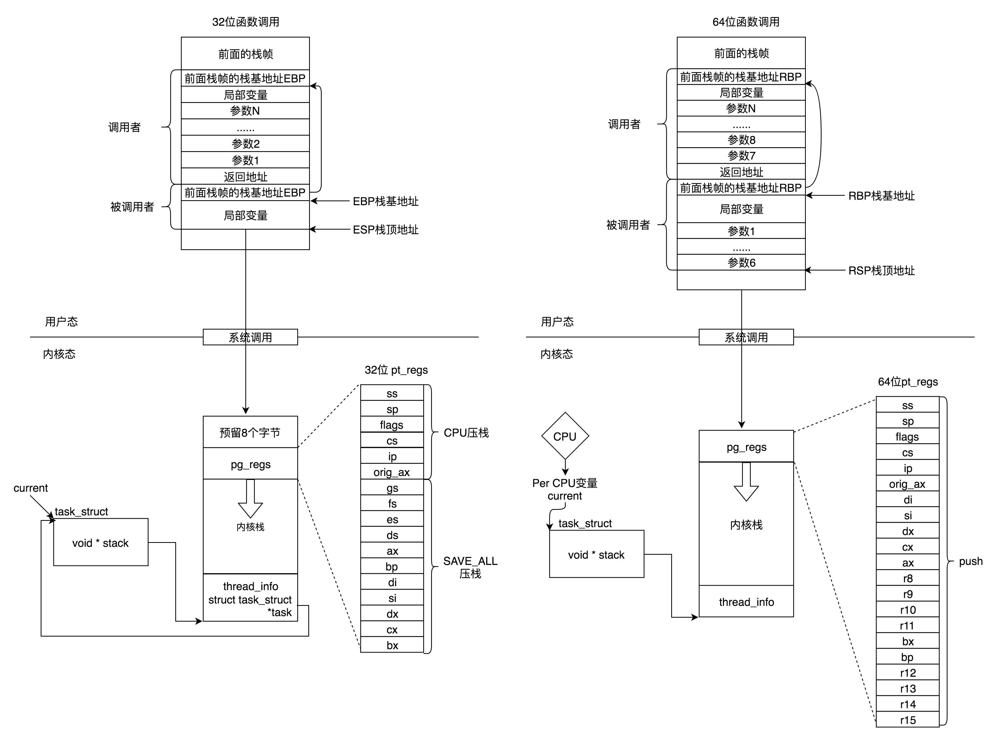

```c
/* arch/arm64/include/asm/ptrace.h
 * arch/x86/include/asm/ptrace.h */
struct pt_regs {
    union {
        struct user_pt_regs user_regs;
        struct {
            u64 regs[31];
            u64 sp;
            u64 pc;
            u64 pstate;
        };
    };
    u64 orig_x0;
    s32 syscallno;
    u32 pmr;

    u64 sdei_ttbr1;

    struct frame_record_meta{
        struct frame_record {
            u64     fp;
            u64     lr;
        }               record;
        u64 type;
    }                           stackframe;
};

struct user_pt_regs {
    __u64        regs[31];
    __u64        sp;
    __u64        pc;
    __u64        pstate;
};
```

```c
/* arch/arm64/kernel/sys.c */
#undef __SYSCALL
#define __SYSCALL(nr, sym)  asmlinkage long __arm64_##sym(const struct pt_regs *);
#include <asm/unistd.h>

#undef __SYSCALL
#define __SYSCALL(nr, sym)  [nr] = __arm64_##sym,

const syscall_fn_t sys_call_table[__NR_syscalls] = {
    [0 ... __NR_syscalls - 1] = __arm64_sys_ni_syscall,
#include <asm/unistd.h>
};

/* include/linux/syscalls.h */
#define SYSCALL_DEFINE1(name, ...) SYSCALL_DEFINEx(1, _##name, __VA_ARGS__)
#define SYSCALL_DEFINE2(name, ...) SYSCALL_DEFINEx(2, _##name, __VA_ARGS__)
#define SYSCALL_DEFINE3(name, ...) SYSCALL_DEFINEx(3, _##name, __VA_ARGS__)
#define SYSCALL_DEFINE4(name, ...) SYSCALL_DEFINEx(4, _##name, __VA_ARGS__)
#define SYSCALL_DEFINE5(name, ...) SYSCALL_DEFINEx(5, _##name, __VA_ARGS__)
#define SYSCALL_DEFINE6(name, ...) SYSCALL_DEFINEx(6, _##name, __VA_ARGS__)

#define SYSCALL_DEFINE_MAXARGS  6

#define SYSCALL_DEFINEx(x, sname, ...)  \
    SYSCALL_METADATA(sname, x, __VA_ARGS__) \
    __SYSCALL_DEFINEx(x, sname, __VA_ARGS__)


#define __SYSCALL_DEFINEx(x, name, ...) \
    asmlinkage long __arm64_sys##name(const struct pt_regs *regs); \
    \
    ALLOW_ERROR_INJECTION(__arm64_sys##name, ERRNO); \
    \
    static long __se_sys##name(__MAP(x,__SC_LONG,__VA_ARGS__)); \
    \
    static inline long __do_sys##name(__MAP(x,__SC_DECL,__VA_ARGS__)); \
    \
    asmlinkage long __arm64_sys##name(const struct pt_regs *regs) { \
        return __se_sys##name(SC_ARM64_REGS_TO_ARGS(x,__VA_ARGS__)); \
    } \
    \
    static long __se_sys##name(__MAP(x,__SC_LONG,__VA_ARGS__)) { \
        long ret = __do_sys##name(__MAP(x,__SC_CAST,__VA_ARGS__)); \
        __MAP(x,__SC_TEST,__VA_ARGS__); \
        __PROTECT(x, ret,__MAP(x,__SC_ARGS,__VA_ARGS__)); \
        return ret; \
    } \
    \
    static inline long __do_sys##name(__MAP(x,__SC_DECL,__VA_ARGS__))

/* __MAP - apply a macro to syscall arguments
 * __MAP(n, m, t1, a1, t2, a2, ..., tn, an) will expand to
 *    m(t1, a1), m(t2, a2), ..., m(tn, an) */
#define __MAP0(m,...)
#define __MAP1(m,t,a,...) m(t,a)
#define __MAP2(m,t,a,...) m(t,a), __MAP1(m,__VA_ARGS__)
#define __MAP3(m,t,a,...) m(t,a), __MAP2(m,__VA_ARGS__)
#define __MAP4(m,t,a,...) m(t,a), __MAP3(m,__VA_ARGS__)
#define __MAP5(m,t,a,...) m(t,a), __MAP4(m,__VA_ARGS__)
#define __MAP6(m,t,a,...) m(t,a), __MAP5(m,__VA_ARGS__)
#define __MAP(n,...) __MAP##n(__VA_ARGS__)
```

## glibc
```c
int open(const char *pathname, int flags, mode_t mode)

/* syscalls.list */
/* File name Caller  Syscall name    Args    Strong name    Weak names */
      open    -        open          i:siv   __libc_open   __open open
```

```c
/* syscall-template.S */
T_PSEUDO (SYSCALL_SYMBOL, SYSCALL_NAME, SYSCALL_NARGS)
    ret
T_PSEUDO_END (SYSCALL_SYMBOL)

#define T_PSEUDO(SYMBOL, NAME, N)    PSEUDO (SYMBOL, NAME, N)

#define PSEUDO(name, syscall_name, args) \
  .text; \
  ENTRY (name) \
    DO_CALL (syscall_name, args); \
    cmpl $-4095, %eax; \
    jae SYSCALL_ERROR_LABEL
```

## 64

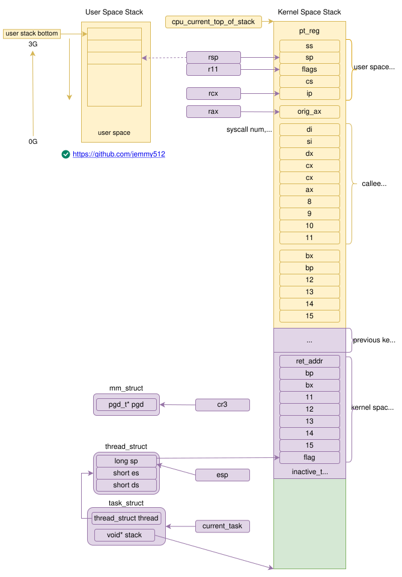

* glibc
    ```c
    /* glibc/sysdeps/unix/sysv/linux/aarch64/sysdep.h */
    # define PSEUDO(name, syscall_name, args) \
        .text; \
        ENTRY (name); \
        DO_CALL (syscall_name, args); \
        cmn x0, #4095; \
        b.cs .Lsyscall_error;

    # define DO_CALL(syscall_name, args) \
        mov x8, SYS_ify (syscall_name); \
        svc 0
    ```

    ```c
    /* glibc-2.28/sysdeps/unix/x86_64/sysdep.h
    The Linux/x86-64 kernel expects the system call parameters in
    registers according to the following table:
        syscall number  rax
        arg 1           rdi
        arg 2           rsi
        arg 3           rdx
        arg 4           r10
        arg 5           r8
        arg 6           r9 */
    #define DO_CALL(syscall_name, args) \
        lea SYS_ify (syscall_name), %rax; \
        syscall

    /* glibc-2.28/sysdeps/unix/sysv/linux/x86_64/sysdep.h */
    #define SYS_ify(syscall_name)  __NR_##syscall_name
    ```

* syscall_table
    1. declare syscall table: arch/x86/entry/syscalls/syscall_64.tbl
        ```c
        # 64-bit system call numbers and entry vectors

        # The __x64_sys_*() stubs are created on-the-fly for sys_*() system calls
        # The abi is "common", "64" or "x32" for this file.
        #
        # <number>  <abi>     <name>    <entry point>
            0       common    read      __x64_sys_read
            1       common    write     __x64_sys_write
            2       common    open      __x64_sys_open
        ```

    2. genrate syscall table: arch/x86/entry/syscalls/Makefile
        ```c
        /* 2.1 arch/x86/entry/syscalls/syscallhdr.sh generates #define __NR_open
        * arch/sh/include/uapi/asm/unistd_64.h */
        #define __NR_restart_syscall    0
        #define __NR_exit               1
        #define __NR_fork               2
        #define __NR_read               3
        #define __NR_write              4
        #define __NR_open               5

        /* 2.2 arch/x86/entry/syscalls/syscalltbl.sh
        * generates __SYSCALL_64(x, y) into asm/syscalls_64.h */
        __SYSCALL_64(__NR_open, __x64_sys_read)
        __SYSCALL_64(__NR_write, __x64_sys_write)
        __SYSCALL_64(__NR_open, __x64_sys_open)

        /* arch/x86/entry/syscall_64.c */
        #define __SYSCALL_64(nr, sym, qual) [nr] = sym

        asmlinkage const sys_call_ptr_t sys_call_table[__NR_syscall_max+1] = {
            /* Smells like a compiler bug -- it doesn't work
            * when the & below is removed. */
            [0 ... __NR_syscall_max] = &sys_ni_syscall,
            #include <asm/syscalls_64.h>
        };
        ```

    3. declare implemenation: include/linux/syscalls.h
        ```c
        asmlinkage long sys_write(unsigned int fd, const char __user *buf, size_t count);
        asmlinkage long sys_read(unsigned int fd, char __user *buf, size_t count);
        asmlinkage long sys_open(const char __user *filename, int flags, umode_t mode);
        ```

    4. define implemenation: fs/open.c
        ```c
        #include <linux/syscalls.h>

        SYSCALL_DEFINE3(open, const char __user *, filename, int, flags, umode_t, mode)
        {
            if (force_o_largefile())
                flags |= O_LARGEFILE;

            return do_sys_open(AT_FDCWD, filename, flags, mode);
        }
        ```

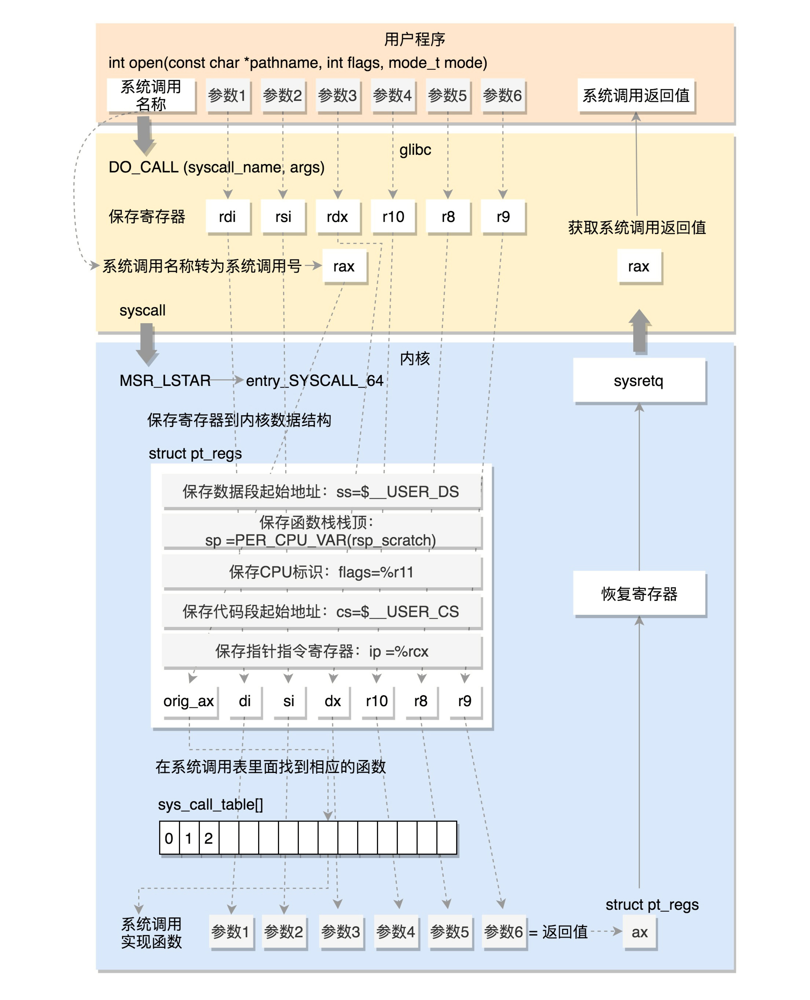

```c
entry_SYSCALL_64()
    /* 1. swap to kernel stack */
    movq  %rsp, PER_CPU_VAR(rsp_scratch)
    movq  PER_CPU_VAR(cpu_current_top_of_stack), %rsp

    /* 2. save user stack */
    pushq  $__USER_DS                 /* pt_regs->ss */
    pushq  PER_CPU_VAR(rsp_scratch)   /* pt_regs->sp */
    pushq  %r11                       /* pt_regs->flags */
    pushq  $__USER_CS                 /* pt_regs->cs */
    pushq  %rcx                       /* pt_regs->ip */
    pushq  %rax                       /* pt_regs->orig_ax */

    /* 3. do_syscall */
    movq  %rax, %rdi
    movq  %rsp, %rsi
    call  do_syscall_64
        regs->ax = __x64_sys_ni_syscall(regs);
        syscall_exit_to_user_mode(regs);
            __syscall_exit_to_user_mode_work();
                __exit_to_user_mode_prepare();
                    if (unlikely(ti_work & EXIT_TO_USER_MODE_WORK))
                        ti_work = exit_to_user_mode_loop(regs, ti_work);
                            if (ti_work & _TIF_NEED_RESCHED)
                                schedule();
                            if (ti_work & (_TIF_SIGPENDING | _TIF_NOTIFY_SIGNAL))
                                arch_do_signal_or_restart(regs);

            __exit_to_user_mode();
                arch_exit_to_user_mode();

    /* 4. restore user stack */
    swapgs_restore_regs_and_return_to_usermode()
        POP_REGS pop_rdi=0
        /* The stack is now user RDI, orig_ax, RIP, CS, EFLAGS, RSP, SS */

        movq  %rsp, %rdi /* save kernel sp */
        movq  PER_CPU_VAR(cpu_tss_rw + TSS_sp0), %rsp /* load user sp */

        /* Copy the IRET frame from kernel stack to the user trampoline stack. */
        pushq  6*8(%rdi)  /* SS */
        pushq  5*8(%rdi)  /* RSP */
        pushq  4*8(%rdi)  /* EFLAGS */
        pushq  3*8(%rdi)  /* CS */
        pushq  2*8(%rdi)  /* RIP */

        INTERRUPT_RETURN
```

# process



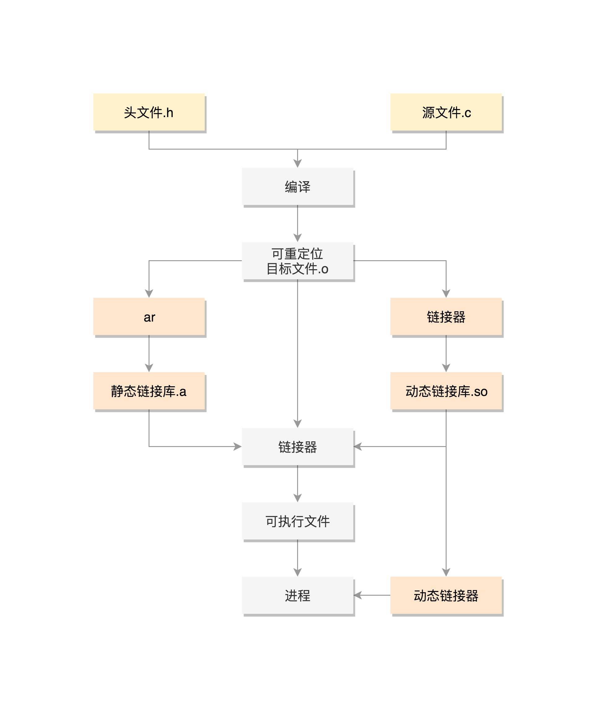

```c
/* compile */
gcc -c -fPIC process.c
gcc -c -fPIC createprocess.c

/* staic lib */
ar cr libstaticprocess.a process.o
/* static link */
gcc -o staticcreateprocess createprocess.o -L. -lstaticprocess

/* dynamic lib */
gcc -shared -fPIC -o libdynamicprocess.so process.o
/* dynamic link LD_LIBRARY_PATH /lib /usr/lib */
gcc -o dynamiccreateprocess createprocess.o -L. -ldynamicprocess
export LD_LIBRARY_PATH=
```

1. elf: relocatable file

    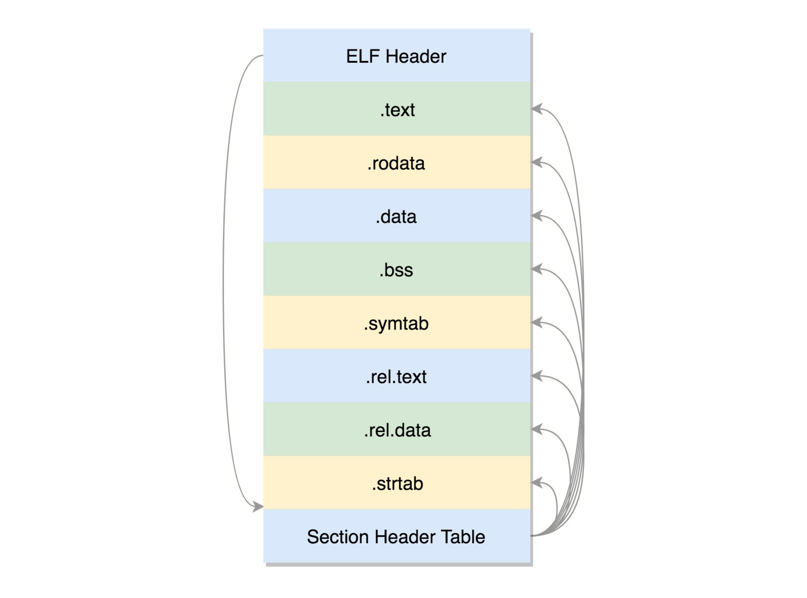

2. elf: executable file

    * [ELF Format Cheatsheet](https://gist.github.com/x0nu11byt3/bcb35c3de461e5fb66173071a2379779)
    * [Executable and Linkable Format (ELF).pdf](https://www.cs.cmu.edu/afs/cs/academic/class/15213-f00/docs/elf.pdf)
    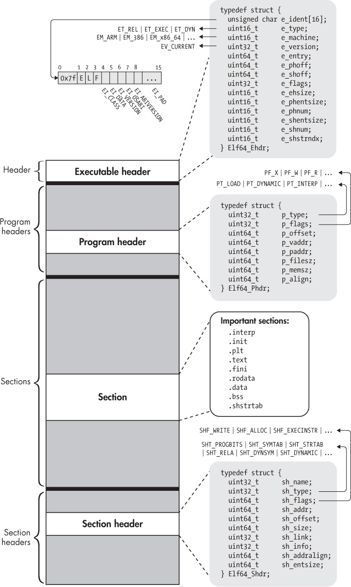

3. elf: shared object

4. elf: core dump

* [UEFI简介 - 内核工匠](https://mp.weixin.qq.com/s/tgW9-FDo2hgxm8Uwne8ySw)

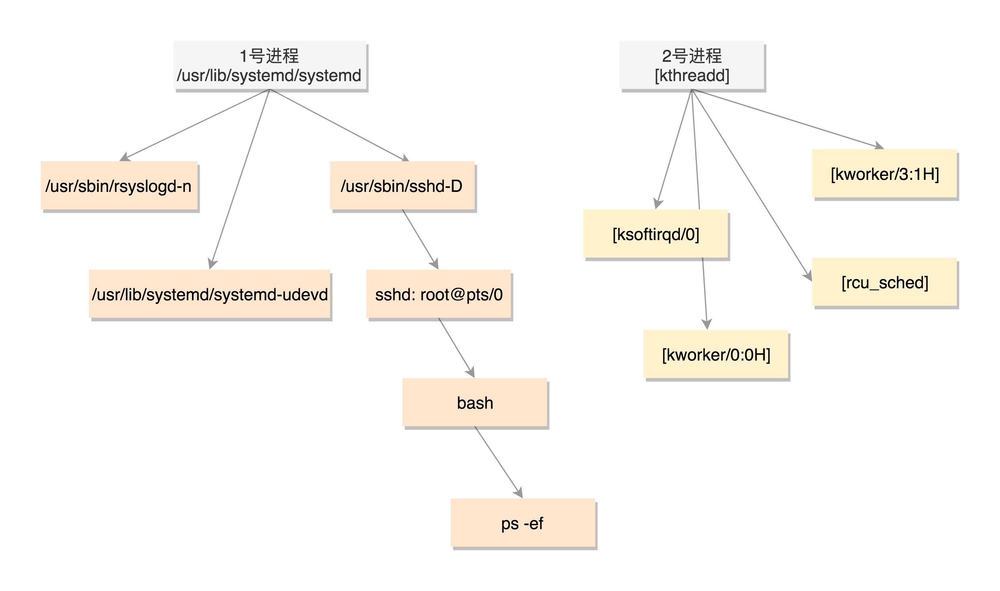

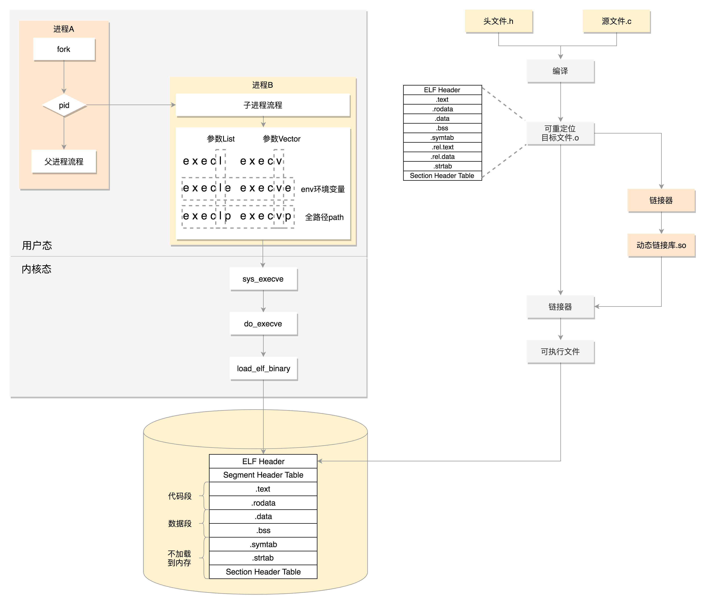

# thread
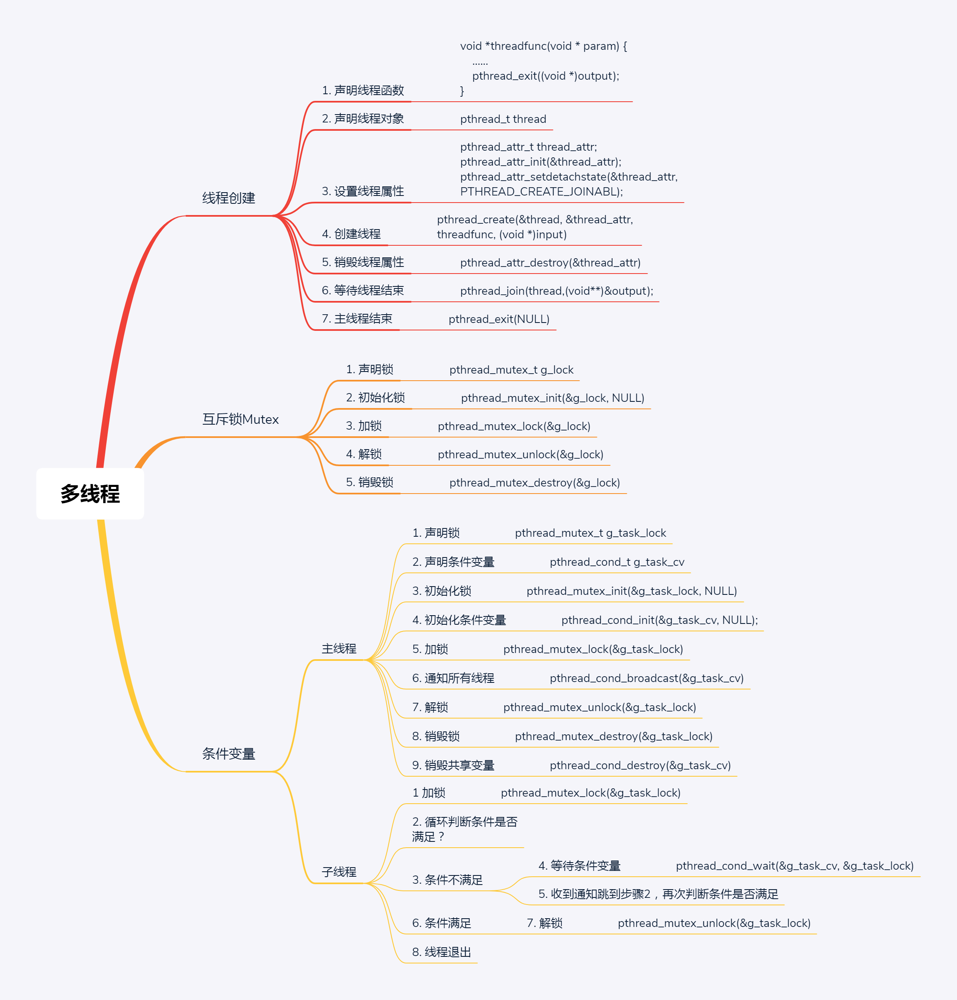

# task_struct
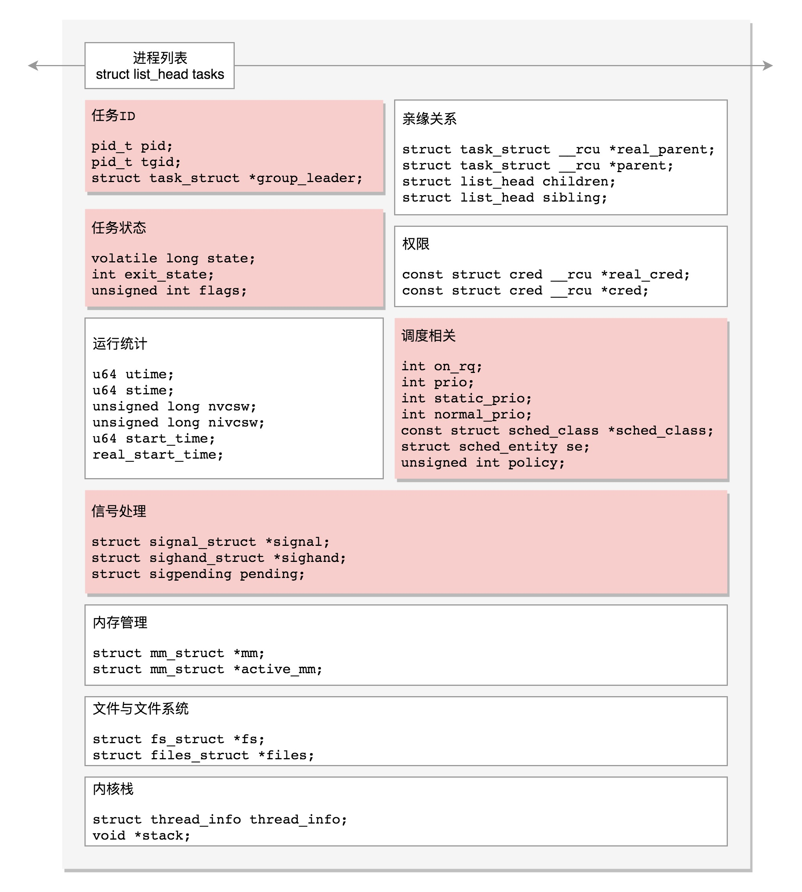

# sched

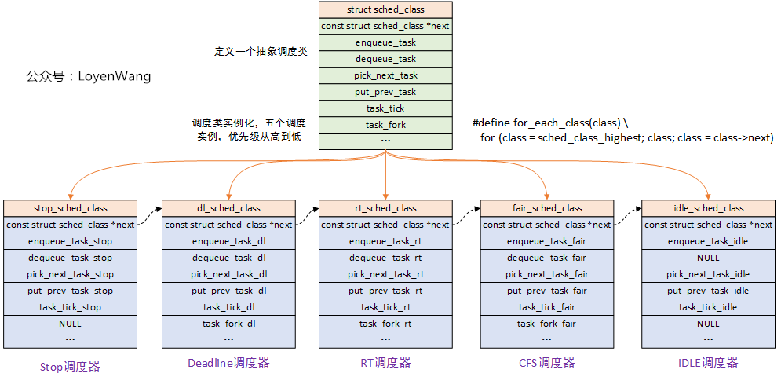

| PREEMT_RT | IRQs | Preemptible | Sleepable | Notes |
| :-: | :-: | :-: | :-: | :-: |
| Hard IRQ                  | ❌ | ❌ | ❌ | Fast, minimal, IRQ context |
| Soft IRQ - run_ksoftirqd  | ✅ | ✅ | ❌ | Process context |
| Soft IRQ - handle_softirqs| ✅ | ❌ | ❌ | Aotmic context |
| Workqueue                 | ✅ | ✅ | ✅ | Process context |
| Normal process            | ✅ | ✅ | ✅ | User/kernel mode |

> In the top half (hard IRQ handler), hardware disables interrupts automatically when the exception (interrupt) is taken.

> Soft IRQ is not-preemptable in handle_softirqs but preemptable run_ksoftirqd

* User Space Tasks Preemption Schedule Points:

    1. System Call Returns:

        When returning from a system call to user space.

    2. Interrupt Returns:

        When returning from an interrupt handler to user space.

    3. Signal Delivery:

        When a signal is delivered to a user space process.

    4. Timer Expiration:

        When a timer interrupt occurs (for time-slice based scheduling).

    5. I/O Completion:

        When an I/O operation completes and potentially wakes up a waiting process.

    6. Explicit Yield:

        When a process voluntarily yields the CPU (e.g., using sched_yield()).

* Kernel Space Tasks Preemption Schedule Points:

    1. Explicit Preemption Points:

        Calls to schedule() or similar functions within kernel code.

    2. Returning from Interrupt Context:

        After processing an interrupt, before returning to the previous context.

    3. Releasing Locks:

        After releasing certain types of locks that may have been preventing preemption.

    4. Preempt Enable/Disable Boundaries:

        When re-enabling preemption after it was explicitly disabled.

    5. Completion of Bottom Halves:

        After processing deferred work (e.g., softirqs, tasklets).

    6. Long-running Loops:

        Some kernel loops explicitly check for need_resched() and call schedule() if necessary.

    7. Memory Allocation/Deallocation:

        Some memory operations may include preemption points.

    8. End of Timer Callbacks:

        After executing kernel timer callbacks.

    9. Waking Up Higher Priority Tasks:

        When a kernel operation wakes up a higher priority task.

    10. Entering/Exiting Critical Sections:

        Some implementations check for pending preemptions when entering or exiting critical sections.

```c
/* Schedule Class:
 * Real time schedule: SCHED_FIFO, SCHED_RR, SCHED_DEADLINE
 * Normal schedule: SCHED_NORMAL, SCHED_BATCH, SCHED_IDLE */
#define SCHED_NORMAL        0
#define SCHED_FIFO          1
#define SCHED_RR            2
#define SCHED_BATCH         3
#define SCHED_IDLE          5
#define SCHED_DEADLINE      6

#define MAX_NICE            19
#define MIN_NICE            -20
#define NICE_WIDTH          (MAX_NICE - MIN_NICE + 1)
#define MAX_USER_RT_PRIO    100
#define MAX_RT_PRIO         MAX_USER_RT_PRIO
#define MAX_PRIO            (MAX_RT_PRIO + NICE_WIDTH)
#define DEFAULT_PRIO        (MAX_RT_PRIO + NICE_WIDTH / 2)

struct task_struct {
    struct thread_info {
        unsigned long       flags;  /* TIF_SIGPENDING, TIF_NEED_RESCHED */
        u64                 ttbr0;
        union {
            u64             preempt_count;  /* 0 => preemptible, <0 => bug */
            struct {
                u32         count;          /* preemption disable depth */
                u32         need_resched;   /* resched request pending */
            } preempt;
        };
        u32                 cpu;
    } thread_info;

    int                       on_rq; /* TASK_ON_RQ_{QUEUED, MIGRATING} */
    int                       on_cpu; /* Task is actively running on a CPU */

    int                       prio;
    int                       static_prio;
    int                       normal_prio;
    unsigned int              rt_priority;

    const struct sched_class  *sched_class;
    struct sched_entity       se;
    struct sched_rt_entity    rt;
    struct sched_dl_entity    dl;
    struct task_group         *sched_task_group;
    unsigned int              policy;

    struct mm_struct          *mm;
    struct mm_struct          *active_mm;

    void                      *stack; /* kernel stack */

    /* CPU-specific state of kernel mode,
     * used for kernel-mode context switching.
     * save/restored at cpu_switch_to */
    struct thread_struct {
        struct cpu_context {
            unsigned long x19;
            unsigned long x20;
            unsigned long x21;
            unsigned long x22;
            unsigned long x23;
            unsigned long x24;
            unsigned long x25;
            unsigned long x26;
            unsigned long x27;
            unsigned long x28;
            unsigned long fp;  /* x29 */
            unsigned long sp;  /* x9  */
            unsigned long pc;  /* lr  */
        } cpu_context;

        unsigned long        fault_address;    /* fault info */
        unsigned long        fault_code;    /* ESR_EL1 value */
    } thread;
};

struct rq {
    raw_spinlock_t  lock;
    unsigned int    nr_queued;
    unsigned long   cpu_load[CPU_LOAD_IDX_MAX];

    struct load_weight  load;
    unsigned long       nr_load_updates;
    u64                 nr_switches;

    struct list_head    cfs_tasks;

    struct cfs_rq           cfs;
    struct rt_rq            rt;
    struct dl_rq            dl;
    struct sched_dl_entity  fair_server;

#ifdef CONFIG_SCHED_PROXY_EXEC
    struct task_struct __rcu    *donor;  /* Scheduling context */
    struct task_struct __rcu    *curr;   /* Execution context */
#else
    union {
        struct task_struct __rcu *donor; /* Scheduler context */
        struct task_struct __rcu *curr;  /* Execution context */
    };
#endif

    struct sched_dl_entity  *dl_server;
    struct task_struct      *idle;
    struct task_struct      *stop;
    const struct sched_class *next_class;
    struct task_struct      *curr, *idle, *stop;

    struct mm_struct    *prev_mm;

    struct root_domain  *rd;
    struct sched_domain *sd;

    struct balance_callback *balance_callback;

    struct sched_avg    avg_rt;
    struct sched_avg    avg_dl;
    struct sched_avg    avg_irq;
    struct sched_avg    avg_hw;
};
```

**pt_regs** (processor register) VS **cpu_context**:

- Before a user space task can be scheduled out, there must always be a transition to kernel space. This can happen through various mechanisms:
    1. System calls
    2. Interrupts (e.g., timer interrupts used for preemptive multitasking)
    3. Exceptions (e.g., page faults)
- The full user space context is saved in `pt_regs` which is usually at the top of the kernel stack for that process.
- The `cpu_context` in thread_struct holds the kernel execution context when a task is scheduled out.
- The scheduler uses the information in cpu_context to resume a task's execution in kernel space.
- When returning to user space, the kernel uses the saved pt_regs to restore the full user space context.

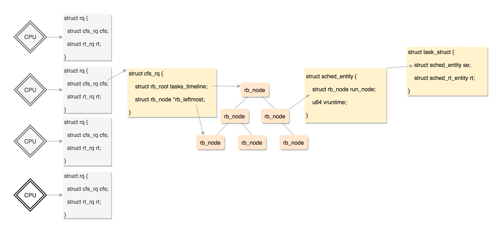

```c
struct sched_class {
    const struct sched_class *next;

    void (*enqueue_task) (struct rq *rq, struct task_struct *p, int flags);
    void (*dequeue_task) (struct rq *rq, struct task_struct *p, int flags);
    void (*yield_task) (struct rq *rq);
    bool (*yield_to_task) (struct rq *rq, struct task_struct *p, bool preempt);

    void (*wakeup_preempt) (struct rq *rq, struct task_struct *p, int flags);

    struct task_struct * (*pick_next_task) (struct rq *rq,
                struct task_struct *prev,
                struct rq_flags *rf);
    void (*put_prev_task) (struct rq *rq, struct task_struct *p);

    void (*set_next_task) (struct rq *rq, struct task_struct *p, bool first);
    void (*task_tick) (struct rq *rq, struct task_struct *p, int queued);
    void (*task_fork) (struct task_struct *p);
    void (*task_dead) (struct task_struct *p);

    void (*switched_from) (struct rq *this_rq, struct task_struct *task);
    void (*switched_to) (struct rq *this_rq, struct task_struct *task);
    void (*prio_changed) (struct rq *this_rq, struct task_struct *task, int oldprio);
    unsigned int (*get_rr_interval) (struct rq *rq,
            struct task_struct *task);
    void (*update_curr) (struct rq *rq);
};

extern const struct sched_class stop_sched_class;
extern const struct sched_class dl_sched_class;
extern const struct sched_class rt_sched_class;
extern const struct sched_class fair_sched_class;
extern const struct sched_class idle_sched_class;
/* stop_sched_class: highest priority process, will interrupt others
 * dl_sched_class: for deadline
 * rt_sched_class: for RR or FIFO, depend on task_struct->policy
 * fair_sched_class: for normal processes
 * idle_sched_class: idle */
```

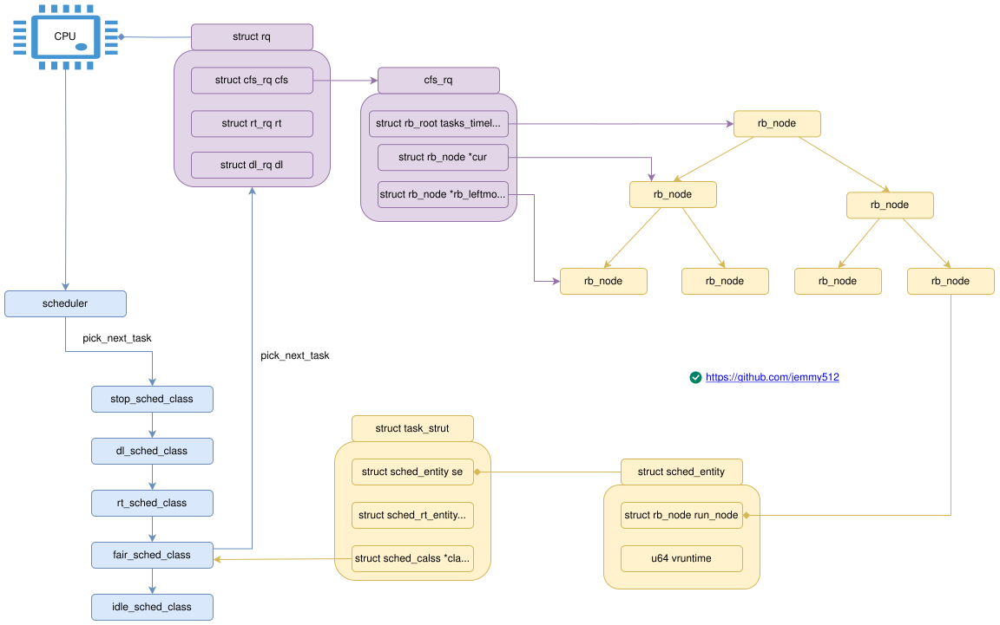

---

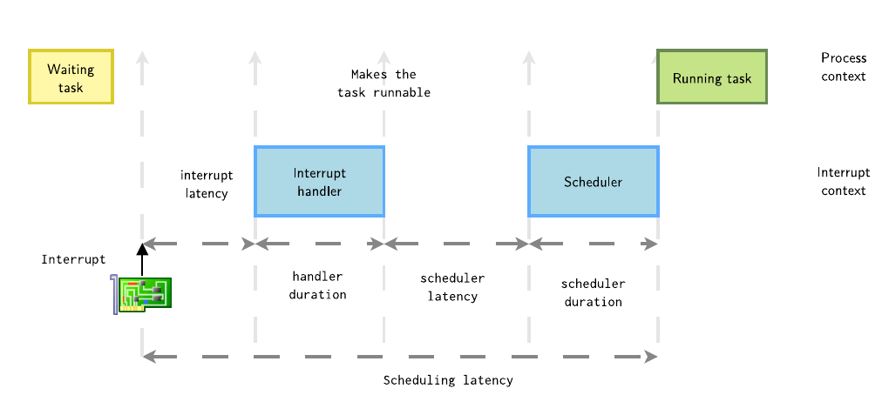

## voluntary schedule

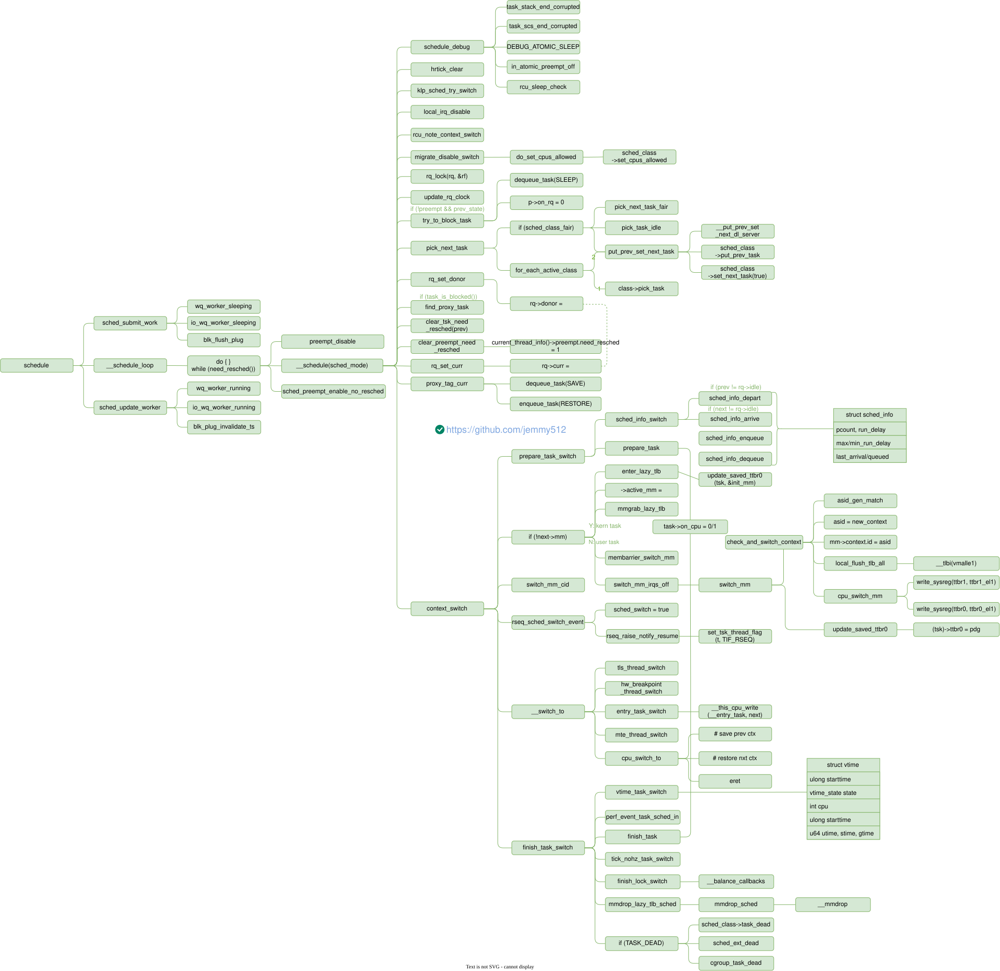

---

arm64 | x86_64
:-: | :-:
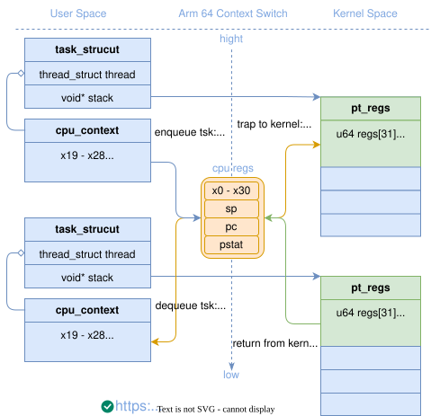 | 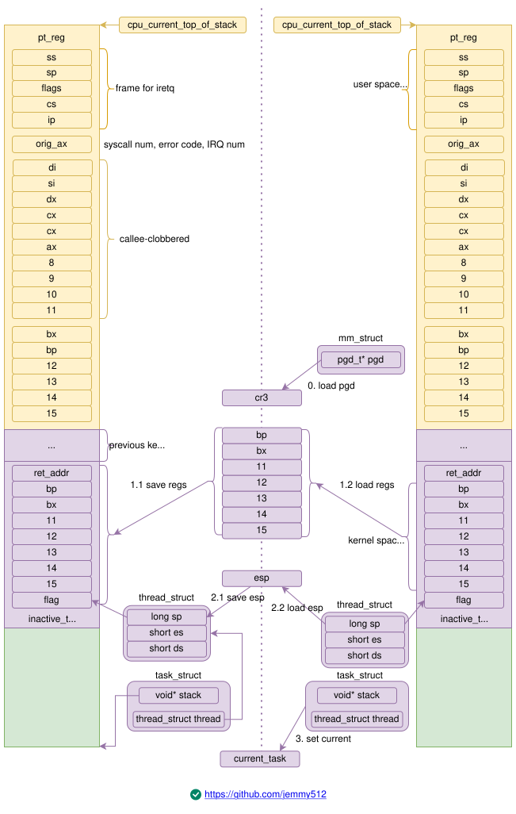


__sched | context_switch
--- | ---
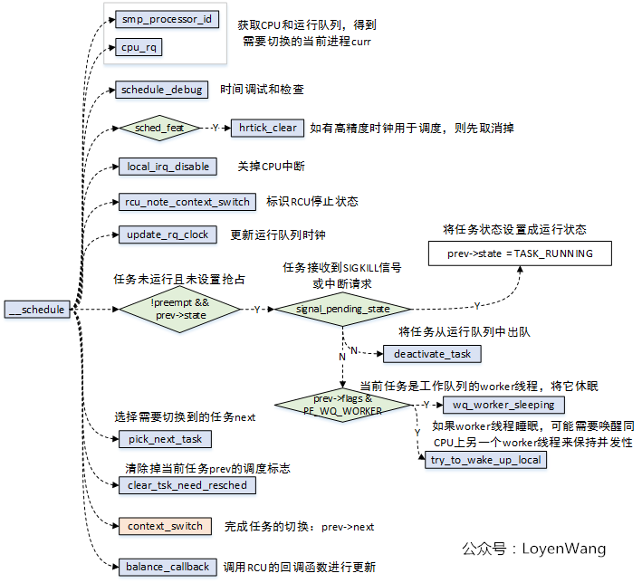 | 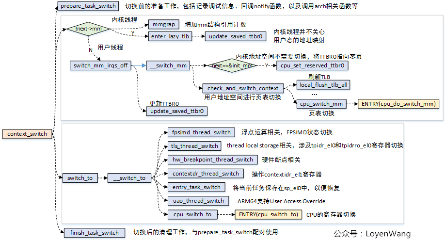

```c
asmlinkage __visible void __sched schedule(void)
{
    do {
        /* Disabling preemption before acquiring the spinlock ensures that
         * the current task will not be preempted while it is about to enter
         * or already within the critical section protected by the spinlock. */
        preempt_disable();  /* prev disables preemption */
        raw_spin_lock_irq(&rq->lock); /* prev acquires the rq lock and disables interrupts */
        next = select_next_task();
        switch_to(prev, next, prev);
        raw_spin_unlock_irq(&rq->lock); /* next releases the lock and enables interrupts */
        sched_preempt_enable_no_resched();  /* next re-enables preemption */
    } while (need_resched());
}
```

Reordering preempt_disable and raw_spin_lock_irq(&rq->lock) cloud leads to several issues?
1. Race Condition Risk:

    If the task is preempted between acquiring the spinlock and calling preempt_disable(), another task could potentially try to acquire the same spinlock, leading to a deadlock or race condition.

2. Interrupt Handling:

    Interrupts would be disabled by the raw_spin_lock_irq() call, but if the task is preempted before preempt_disable() is called, an interrupt handler might run on another CPU and interact with the same critical section, leading to inconsistent states.

3. Kernel Stability:

    The specific order ensures that once preemption is disabled, the task remains in control until it safely acquires the spinlock and disables interrupts. This maintains the atomicity of the critical section and ensures kernel stability.

```c
schedule(void) {
    if (!task_is_running(tsk)) {
        sched_submit_work(tsk) {
            task_flags = tsk->flags;
            if (task_flags & PF_WQ_WORKER)
                wq_worker_sleeping(tsk) {
                    if (need_more_worker(pool)) {
                        wake_up_worker(pool);
                    }
                }
            else if (task_flags & PF_IO_WORKER)
                io_wq_worker_sleeping(tsk);

            blk_flush_plug(tsk->plug, true);
        }
    }

    __schedule_loop(SM_NONE) {
        do {
            preempt_disable();
            __schedule(sched_mode);
            sched_preempt_enable_no_resched();
        } while (need_resched());
    }

    sched_update_worker(tsk) {
        if (tsk->flags & (PF_WQ_WORKER | PF_IO_WORKER)) {
            if (tsk->flags & PF_WQ_WORKER)
                wq_worker_running(tsk);
            else
                io_wq_worker_running(tsk);
        }
    }
}

static void __sched notrace __schedule(int sched_mode)
{
    struct task_struct *prev, *next;
    /* On PREEMPT_RT kernel, SM_RTLOCK_WAIT is noted
     * as a preemption by schedule_debug() and RCU. */
    bool preempt = sched_mode > SM_NONE;
    unsigned long *switch_count;
    unsigned long prev_state;
    struct rq_flags rf;
    struct rq *rq;
    int cpu;

    cpu = smp_processor_id();
    rq = cpu_rq(cpu);
    prev = rq->curr;

    schedule_debug(prev, preempt);

    klp_sched_try_switch(prev);

    local_irq_disable();
    rcu_note_context_switch(preempt);
    migrate_disable_switch(rq, prev);

    rq_lock(rq, &rf);
    smp_mb__after_spinlock();

    hrtick_schedule_enter(rq) {
        rq->hrtick_sched = HRTICK_SCHED_DEFER;
        if (hrtimer_test_and_clear_rearm_deferred())
            rq->hrtick_sched |= HRTICK_SCHED_REARM_HRTIMER;
    }

    /* Promote REQ to ACT */
    rq->clock_update_flags <<= 1;
    update_rq_clock(rq);
    rq->clock_update_flags = RQCF_UPDATED;

    switch_count = &prev->nivcsw;

    /* Task state changes only considers SM_PREEMPT as preemption */
    preempt = sched_mode == SM_PREEMPT;

    /* We must load prev->state once (task_struct::state is volatile), such
     * that we form a control dependency vs deactivate_task() below. */
    prev_state = READ_ONCE(prev->__state);
    if (sched_mode == SM_IDLE) {
        /* SCX must consult the BPF scheduler to tell if rq is empty */
        if (!rq->nr_running && !scx_enabled()) {
            next = prev;
            rq->next_class = &idle_sched_class;
            goto picked;
        }
    } else if (!preempt && prev_state/* tsk not running */) {
        /* We pass task_is_blocked() as the should_block arg
         * in order to keep mutex-blocked tasks on the runqueue
         * for slection with proxy-exec (without proxy-exec
         * task_is_blocked() will always be false). */
        try_to_block_task(rq, prev, &prev_state, !task_is_blocked(prev));
        switch_count = &prev->nvcsw;
    }

pick_again:
    next = pick_next_task(rq, prev, &rf);
    rq->next_class = next->sched_class;

    if (sched_proxy_exec()) {
        struct task_struct *prev_donor = rq->donor;

        rq_set_donor(rq, next);
        next->blocked_donor = NULL;
        if (unlikely(next->is_blocked)) {
            next = find_proxy_task(rq, next, &rf);
            if (!next) {
                zap_balance_callbacks(rq);
                goto pick_again;
            }
            if (next == rq->idle) {
                zap_balance_callbacks(rq);
                goto keep_resched;
            }
        }
        if (rq->donor == prev_donor && prev != next) {
            struct task_struct *donor = rq->donor;
            /* When transitioning like:
             *
             *         prev         next
             * donor:    B            B
             * curr:     A          B or C
             *
             * then put_prev_set_next_task() will not have done
             * anything, since B == B. However, A might have
             * missed a RT/DL balance opportunity due to being
             * on_cpu. */
            donor->sched_class->put_prev_task(rq, donor, donor); /* commit vruntime -> tree */
            donor->sched_class->set_next_task(rq, donor, true); /* dequeue, fresh vprot */
        }
    } else {
        rq_set_donor(rq, next);
    }

picked:
    clear_tsk_need_resched(prev) {
        atomic_long_andnot(_TIF_NEED_RESCHED | _TIF_NEED_RESCHED_LAZY,
            (atomic_long_t *)&task_thread_info(tsk)->flags);
    }
    clear_preempt_need_resched() {
        current_thread_info()->preempt.need_resched = 1;
    }

keep_resched:
    rq->last_seen_need_resched_ns = 0;

    is_switch = prev != next;
    if (likely(is_switch)) {
        rq->nr_switches++;
        RCU_INIT_POINTER(rq->curr, next);

        ++*switch_count;

        psi_account_irqtime(rq, prev, next);
        psi_sched_switch(prev, next, !task_on_rq_queued(prev) || prev->se.sched_delayed);

        rq = context_switch(rq, prev, next, &rf);
    } else {
        rq_unpin_lock(rq, &rf);
        __balance_callbacks(rq) {
            do_balance_callbacks(rq, __splice_balance_callbacks(rq, false)/*head*/) {
                void (*func)(struct rq *rq);
                struct balance_callback *next;

                while (head) {
                    func = (void (*)(struct rq *))head->func;
                    next = head->next;
                    head->next = NULL;
                    head = next;

                    func(rq);
                }
            }
        }
        hrtick_schedule_exit(rq);
        raw_spin_rq_unlock_irq(rq) {
            raw_spin_rq_unlock(rq);
            local_irq_enable();
        }
    }
}
```

### pick_next_task

```c
static struct task_struct *
pick_next_task(struct rq *rq, struct rq_flags *rf)
    __must_hold(__rq_lockp(rq))
{
    struct task_struct *next, *p, *max;
    const struct cpumask *smt_mask;
    int i, cpu, seq, occ = 0;
    bool fi_before = false;
    bool need_sync = false;
    unsigned long cookie;
    struct rq *rq_i;

    if (!sched_core_enabled(rq))
        return __pick_next_task(rq, rf);

    cpu = cpu_of(rq);

    /* Stopper task is switching into idle, no need core-wide selection. */
    if (cpu_is_offline(cpu)) {
        /* Reset core_pick so that we don't enter the fastpath when
         * coming online. core_pick would already be migrated to
         * another cpu during offline. */
        rq->core_pick = NULL;
        rq->core_dl_server = NULL;
        return __pick_next_task(rq, rf);
    }

    rq->core->core_pick_in_flight++;

    /* If there were no {en,de}queues since we picked (IOW, the task
     * pointers are all still valid), and we haven't scheduled the last
     * pick yet, do so now.
     *
     * rq->core_pick can be NULL if no selection was made for a CPU because
     * it was either offline or went offline during a sibling's core-wide
     * selection. In this case, do a core-wide selection. */
    if (rq->core->core_pick_seq == rq->core->core_task_seq &&
        rq->core->core_pick_seq != rq->core_sched_seq &&
        rq->core_pick) {
        WRITE_ONCE(rq->core_sched_seq, rq->core->core_pick_seq);

        next = rq->core_pick;
        rq->dl_server = rq->core_dl_server;
        rq->core_pick = NULL;
        rq->core_dl_server = NULL;
        goto out_set_next;
    }

    smt_mask = cpu_smt_mask(cpu);

restart:
    need_sync |= !!rq->core->core_cookie;

    /* reset state */
    rq->core->core_cookie = 0UL;
    if (rq->core->core_forceidle_count) {
        opt_update_rq_clock(rq->core);
        sched_core_account_forceidle(rq);
        /* reset after accounting force idle */
        rq->core->core_forceidle_start = 0;
        rq->core->core_forceidle_count = 0;
        rq->core->core_forceidle_occupation = 0;
        need_sync = true;
        fi_before = true;
    }

    /* core->core_task_seq, core->core_pick_seq, rq->core_sched_seq
     *
     * @task_seq guards the task state ({en,de}queues)
     * @pick_seq is the @task_seq we did a selection on
     * @sched_seq is the @pick_seq we scheduled
     *
     * However, preemptions can cause multiple picks on the same task set.
     * 'Fix' this by also increasing @task_seq for every pick. */
    seq = ++rq->core->core_task_seq;

    /* Optimize for common case where this CPU has no cookies
     * and there are no cookied tasks running on siblings. */
    if (!need_sync) {
        opt_update_rq_clock(rq);

        next = pick_task(rq, rf);
        if (unlikely(next == RETRY_TASK))
            goto restart;

        if (!next->core_cookie) {
            rq->core_pick = NULL;
            rq->core_dl_server = NULL;
            /* For robustness, update the min_vruntime_fi for
             * unconstrained picks as well. */
            WARN_ON_ONCE(fi_before);
            task_vruntime_update(rq, next, false);
            goto out_set_next;
        }
    }

    /* For each thread: do the regular task pick and find the max prio task
     * amongst them.
     *
     * Tie-break prio towards the current CPU */
    max = NULL;
    for_each_cpu_wrap(i, smt_mask, cpu) {
        struct rq_flags rf_i = *rf;
        rq_i = cpu_rq(i);

        /* Current cpu always has its clock updated on entrance to
         * pick_next_task(). If the current cpu is not the core,
         * the core may also have been updated above. */
        opt_update_rq_clock(rq_i);

        p = pick_task(rq_i, &rf_i);
        if (unlikely(seq != rq->core->core_task_seq ||
                 WARN_ON_ONCE(p == RETRY_TASK)))
            goto restart;

        rq_i->core_pick = p;
        rq_i->core_dl_server = rq_i->dl_server;

        if (!max || prio_less(max, p, fi_before))
            max = p;
    }

    /* The above loop does @cpu first, if any sibling (which comes later)
     * does a LOCK+UNLOCK of @rq in order to (try) steal a task, our
     * RQCF_UPDATED got lost. */
    rq->clock_update_flags |= RQCF_UPDATED;

    cookie = rq->core->core_cookie = max->core_cookie;

    /* For each thread: try and find a runnable task that matches @max or
     * force idle. */
    for_each_cpu(i, smt_mask) {
        rq_i = cpu_rq(i);
        p = rq_i->core_pick;

        if (!cookie_equals(p, cookie)) {
            p = NULL;
            if (cookie)
                p = sched_core_find(rq_i, cookie);
            if (!p)
                p = idle_sched_class.pick_task(rq_i, NULL);
        }

        rq_i->core_pick = p;
        rq_i->core_dl_server = NULL;

        if (p == rq_i->idle) {
            if (rq_i->nr_running) {
                rq->core->core_forceidle_count++;
                if (!fi_before)
                    rq->core->core_forceidle_seq++;
            }
        } else {
            occ++;
        }
    }

    if (schedstat_enabled() && rq->core->core_forceidle_count) {
        rq->core->core_forceidle_start = rq_clock(rq->core);
        rq->core->core_forceidle_occupation = occ;
    }

    rq->core->core_pick_seq = rq->core->core_task_seq;
    next = rq->core_pick;
    rq->core_sched_seq = rq->core->core_pick_seq;

    /* Something should have been selected for current CPU */
    WARN_ON_ONCE(!next);

    /* Reschedule siblings
     *
     * NOTE: L1TF -- at this point we're no longer running the old task and
     * sending an IPI (below) ensures the sibling will no longer be running
     * their task. This ensures there is no inter-sibling overlap between
     * non-matching user state. */
    for_each_cpu(i, smt_mask) {
        rq_i = cpu_rq(i);

        /* An online sibling might have gone offline before a task
         * could be picked for it, or it might be offline but later
         * happen to come online, but its too late and nothing was
         * picked for it.  That's Ok - it will pick tasks for itself,
         * so ignore it. */
        if (!rq_i->core_pick)
            continue;

        /* Update for new !FI->FI transitions, or if continuing to be in !FI:
         * fi_before     fi      update?
         *  0            0       1
         *  0            1       1
         *  1            0       1
         *  1            1       0 */
        if (!(fi_before && rq->core->core_forceidle_count))
            task_vruntime_update(rq_i, rq_i->core_pick, !!rq->core->core_forceidle_count);

        rq_i->core_pick->core_occupation = occ;

        if (i == cpu) {
            rq_i->core_pick = NULL;
            rq_i->core_dl_server = NULL;
            continue;
        }

        /* Did we break L1TF mitigation requirements? */
        WARN_ON_ONCE(!cookie_match(next, rq_i->core_pick));

        if (rq_i->curr == rq_i->core_pick) {
            rq_i->core_pick = NULL;
            rq_i->core_dl_server = NULL;
            continue;
        }

        resched_curr(rq_i);
    }

out_set_next:
    rq->core->core_pick_in_flight--;
    put_prev_set_next_task(rq, rq->donor, next);
    if (rq->core->core_forceidle_count && next == rq->idle)
        queue_core_balance(rq);

    return next;
}
```

#### __pick_next_task

```c
static inline struct task_struct *
__pick_next_task(struct rq *rq, struct rq_flags *rf)
    __must_hold(__rq_lockp(rq))
{
    onst struct sched_class *class;
    struct task_struct *p;

    rq->dl_server = NULL;

    if (scx_enabled())
        goto restart;

    if (likely(!sched_class_above(prev->sched_class, &fair_sched_class)
        && rq->nr_running == rq->cfs.h_nr_runnable)) {

        p = pick_task_fair(rq, rf);
        if (unlikely(p == RETRY_TASK))
            goto restart;

        /* Assume the next prioritized class is idle_sched_class */
        if (!p)
            p = pick_task_idle(rq, rf);

        put_prev_set_next_task(rq, rq->donor, p);
        return p;
    }

restart:
    prev_balance(rq, rf) {
        const struct sched_class *start_class = rq->donor->sched_class;
        const struct sched_class *class;

        for_active_class_range(class, start_class, &idle_sched_class) {
            if (class->balance && class->balance(rq, rf))
                break;
        }
    }

    for_each_active_class(class) {
        p = class->pick_task(rq);
        if (unlikely(p == RETRY_TASK))
            goto restart;
        if (p) {
            put_prev_set_next_task(rq, prev, p) {
                __put_prev_set_next_dl_server(rq, prev, next) {
                    prev->dl_server = NULL;
                    next->dl_server = rq->dl_server;
                    rq->dl_server = NULL;
                }

                if (next == prev)
                    return;

                prev->sched_class->put_prev_task(rq, prev, next);
                next->sched_class->set_next_task(rq, next, true);
            }
            return p;
        }
    }

    BUG();
}
```

#### task_vruntime_update

```c
void task_vruntime_update(struct rq *rq, struct task_struct *p, bool in_fi)
{
    struct sched_entity *se = &p->se;

    if (p->sched_class != &fair_sched_class)
        return;

    se_fi_update(se, rq->core->core_forceidle_seq, in_fi);
}

void se_fi_update(const struct sched_entity *se, unsigned int fi_seq,
             bool forceidle)
{
    for_each_sched_entity(se) {
        struct cfs_rq *cfs_rq = cfs_rq_of(se);

        if (forceidle) {
            if (cfs_rq->forceidle_seq == fi_seq)
                break;
            cfs_rq->forceidle_seq = fi_seq;
        }

        cfs_rq->zero_vruntime_fi = cfs_rq->zero_vruntime;
    }
}
```

### find_proxy_task

```c
static struct task_struct *
find_proxy_task(struct rq *rq, struct task_struct *donor, struct rq_flags *rf)
    __must_hold(__rq_lockp(rq))
{
    struct task_struct *owner = NULL;
    bool curr_in_chain = false;
    int this_cpu = cpu_of(rq);
    struct task_struct *p;
    int owner_cpu;

    /* Follow blocked_on chain. */
    for (p = donor; p->is_blocked; p = owner) {
        /* if its PROXY_WAKING, do return migration or run if current */
        struct mutex *mutex = p->blocked_on;
        if (!mutex) {
            clear_task_blocked_on(p, mutex);
            if (task_current(rq, p)) {
                p->is_blocked = 0;
                return p;
            }
            goto deactivate;
        }

        /* By taking mutex->wait_lock we hold off concurrent mutex_unlock()
         * and ensure @owner sticks around. */
        guard(raw_spinlock)(&mutex->wait_lock);
        guard(raw_spinlock)(&p->blocked_lock);

        /* Check again that p is blocked with blocked_lock held */
        if (mutex != __get_task_blocked_on(p)) {
            /* Something changed in the blocked_on chain and
             * we don't know if only at this level. So, let's
             * just bail out completely and let __schedule()
             * figure things out (pick_again loop). */
            return NULL;
        }

        if (task_current(rq, p))
            curr_in_chain = true;

        owner = __mutex_owner(mutex);
        if (!owner) {
            /* If there is no owner, either clear blocked_on
             * and return p (if it is current and safe to
             * just run on this rq), or return-migrate the task. */
            __clear_task_blocked_on(p, NULL);
            if (task_current(rq, p)) {
                p->is_blocked = 0;
                return p;
            }
            goto deactivate;
        }

        if (!READ_ONCE(owner->on_rq) || owner->se.sched_delayed) {
            /* XXX Don't handle blocked owners/delayed dequeue yet */
            if (curr_in_chain)
                return proxy_resched_idle(rq);
            __clear_task_blocked_on(p, NULL);
            goto deactivate;
        }

        owner_cpu = task_cpu(owner);
        if (owner_cpu != this_cpu) {
            /* @owner can disappear, simply migrate to @owner_cpu
             * and leave that CPU to sort things out. */
            if (curr_in_chain)
                return proxy_resched_idle(rq);
            goto migrate_task;
        }

        if (task_on_rq_migrating(owner)) {
            /* One of the chain of mutex owners is currently migrating to this
             * CPU, but has not yet been enqueued because we are holding the
             * rq lock. As a simple solution, just schedule rq->idle to give
             * the migration a chance to complete. Much like the migrate_task
             * case we should end up back in find_proxy_task(), this time
             * hopefully with all relevant tasks already enqueued. */
            return proxy_resched_idle(rq);
        }

        /* Its possible to race where after we check owner->on_rq
         * but before we check (owner_cpu != this_cpu) that the
         * task on another cpu was migrated back to this cpu. In
         * that case it could slip by our  checks. So double check
         * we are still on this cpu and not migrating. If we get
         * inconsistent results, try again. */
        if (!task_on_rq_queued(owner) || task_cpu(owner) != this_cpu)
            return NULL;

        if (owner == p) {
            /* It's possible we interleave with mutex_unlock like:
             *
             *                lock(&rq->lock);
             *                  find_proxy_task()
             * mutex_unlock()
             *   lock(&wait_lock);
             *   donor(owner) = current->blocked_donor;
             *   unlock(&wait_lock);
             *
             *   wake_up_q();
             *     ...
             *       ttwu_runnable()
             *         __task_rq_lock()
             *                  lock(&wait_lock);
             *                  owner == p
             *
             * Which leaves us to finish the ttwu_runnable() and make it go.
             *
             * So schedule rq->idle so that ttwu_runnable() can get the rq
             * lock and mark owner as running. */
            return proxy_resched_idle(rq);
        }
        /* OK, now we're absolutely sure @owner is on this
         * rq, therefore holding @rq->lock is sufficient to
         * guarantee its existence, as per ttwu_remote(). */
        owner->blocked_donor = p;
    }
    WARN_ON_ONCE(owner && !owner->on_rq);

    if (owner && !sched_cpu_cookie_match(rq, owner)) {
        if (curr_in_chain)
            return proxy_resched_idle(rq);
        p = donor; /* Deactivate the donor, not the runnable owner */
        clear_task_blocked_on(p, NULL);
        goto deactivate;
    }

    return owner;

deactivate:
    proxy_deactivate(rq, p) {
        unsigned long state = READ_ONCE(donor->__state);

        WARN_ON_ONCE(state == TASK_RUNNING);
        WARN_ON_ONCE(donor->blocked_on);

        proxy_resched_idle(rq);
        block_task(rq, donor, state);
    }
    return NULL;

migrate_task:
    proxy_migrate_task(rq, rf, p, owner_cpu);
    return NULL;
}
```

#### proxy_migrate_task

```c
void proxy_migrate_task(struct rq *rq, struct rq_flags *rf,
                   struct task_struct *p, int target_cpu)
    __must_hold(__rq_lockp(rq))
{
    struct rq *target_rq = cpu_rq(target_cpu);
    LIST_HEAD(migrate_list);

    lockdep_assert_rq_held(rq);
    WARN_ON(p == rq->curr);
    /* Since we are migrating a blocked donor, it could be rq->donor,
     * and we want to make sure there aren't any references from this
     * rq to it before we drop the lock. This avoids another cpu
     * jumping in and grabbing the rq lock and referencing rq->donor
     * or cfs_rq->curr, etc after we have migrated it to another cpu,
     * and before we pick_again in __schedule.
     *
     * So call proxy_resched_idle() to drop the rq->donor references
     * before we release the lock. */
    proxy_resched_idle(rq) {
        put_prev_set_next_task(rq, rq->donor, rq->idle);
        rq->next_class = &idle_sched_class;
        rq_set_donor(rq, rq->idle);
        set_tsk_need_resched(rq->idle);
        return rq->idle;
    }

    for (; p; p = p->blocked_donor) {
        WARN_ON(p == rq->curr);
        deactivate_task(rq, p, DEQUEUE_NOCLOCK);
        proxy_set_task_cpu(p, target_cpu) {
            unsigned int wake_cpu;

            wake_cpu = p->wake_cpu;
            __set_task_cpu(p, cpu);
            p->wake_cpu = wake_cpu;
        }
        /* We can re-use se.group_node to migrate the thing,
         * because @p is deactivated (won't be balanced) and
         * we hold the rq_lock. */
        list_add(&p->se.group_node, &migrate_list);
    }

    proxy_release_rq_lock(rq, rf);

    __attach_tasks(target_rq, &migrate_list);

    proxy_reacquire_rq_lock(rq, rf);
}

void __attach_tasks(struct rq *rq, struct list_head *tasks)
{
    guard(rq_lock)(rq);
    update_rq_clock(rq);

    while (!list_empty(tasks)) {
        struct task_struct *p;

        p = list_first_entry(tasks, struct task_struct, se.group_node);
        list_del_init(&p->se.group_node);

        attach_task(rq, p);
    }
}
```

### context_switch

```c
static __always_inline struct rq *
context_switch(struct rq *rq, struct task_struct *prev,
           struct task_struct *next, struct rq_flags *rf)
{
    prepare_task_switch(rq, prev, next);

    arch_start_context_switch(prev);

    /* kernel -> kernel   lazy + transfer active
    *   user -> kernel   lazy + mmgrab_lazy_tlb() active
    *
    * kernel ->   user   switch + mmdrop_lazy_tlb() active
    *   user ->   user   switch */
    if (!next->mm) { /* to kernel task */
        enter_lazy_tlb(prev->active_mm, next) {
            /* empty on arm64 */
        }
        next->active_mm = prev->active_mm;

        if (prev->mm) {/* from user */
            mmgrab_lazy_tlb(prev->active_mm) {
                /* kernel(next) task reuses user(prev) task' mm,
                    * inc refcnt to avoid the free of user mm */
                atomic_inc(&mm->mm_count);
            }
        } else {
            prev->active_mm = NULL;
        }
    } else { /* to user task */
        membarrier_switch_mm(rq, prev->active_mm, next->mm) {
            int membarrier_state;

            if (prev_mm == next_mm)
                return;

            membarrier_state = atomic_read(&next_mm->membarrier_state);
            if (READ_ONCE(rq->membarrier_state) == membarrier_state)
                return;

            WRITE_ONCE(rq->membarrier_state, membarrier_state);
        }

        switch_mm_irqs_off(prev->active_mm, next->mm, next);
        lru_gen_use_mm(next->mm);

        if (!prev->mm) { /* from kernel */
            /* kernel task no longer uses user mm, mark it
            * and free it in finish_task_switch(). */
            rq->prev_mm = prev->active_mm;
            prev->active_mm = NULL;
        }
    }

    mm_cid_switch_to(prev, next);

    /* Tell rseq that the task was scheduled in. Must be after
     * switch_mm_cid() to get the TIF flag set. */
    rseq_sched_switch_event(next);

    prepare_lock_switch(rq, next, rf);

    switch_to(prev, next, prev);

    /* @prev: the thread we just switched away from. */
    return finish_task_switch(prev);
}
```

#### prepare_task_switch

```c
static inline void
prepare_task_switch(struct rq *rq, struct task_struct *prev,
            struct task_struct *next)
    __must_hold(__rq_lockp(rq))
{
    kcov_prepare_switch(prev);
    sched_info_switch(rq, prev, next) {
        if (prev != rq->idle) {
            sched_info_depart(rq, prev); {
                unsigned long long delta = rq_clock(rq) - t->sched_info.last_arrival;

                rq_sched_info_depart(rq, delta) {
                    if (rq)
                        rq->rq_cpu_time += delta;
                }

                if (task_is_running(t)) {
                    sched_info_enqueue(rq, t) {
                        if (!t->sched_info.last_queued)
                            t->sched_info.last_queued = rq_clock(rq);
                    }
                }
            }
        }

        if (next != rq->idle) {
            sched_info_arrive(rq, next) {
                unsigned long long now, delta = 0;

                if (!t->sched_info.last_queued)
                    return;

                now = rq_clock(rq);
                delta = now - t->sched_info.last_queued;
                t->sched_info.last_queued = 0;
                t->sched_info.run_delay += delta;
                t->sched_info.last_arrival = now;
                t->sched_info.pcount++;
                if (delta > t->sched_info.max_run_delay)
                    t->sched_info.max_run_delay = delta;
                if (delta && (!t->sched_info.min_run_delay || delta < t->sched_info.min_run_delay))
                    t->sched_info.min_run_delay = delta;

                rq_sched_info_arrive(rq, delta) {
                    if (rq) {
                        rq->rq_sched_info.run_delay += delta;
                        rq->rq_sched_info.pcount++;
                    }
                }
            }
        }
    }
    perf_event_task_sched_out(prev, next);
    rseq_preempt(prev);
    fire_sched_out_preempt_notifiers(prev, next);
    kmap_local_sched_out();

    prepare_task(next) {
        /* prepare_task - finish_task */
        WRITE_ONCE(next->on_cpu, 1);
    }

    prepare_arch_switch(next);
}
```

#### switch_mm_irqs_off

```c
#define switch_mm_irqs_off switch_mm

static inline void
switch_mm(struct mm_struct *prev, struct mm_struct *next,
      struct task_struct *tsk)
{
    if (prev != next)
        __switch_mm(next);

    /* Update the saved TTBR0_EL1 of the scheduled-in task as the previous
     * value may have not been initialised yet (activate_mm caller) or the
     * ASID has changed since the last run (following the context switch
     * of another thread of the same process). */
    update_saved_ttbr0(tsk, next) {
        u64 ttbr;

        if (!system_uses_ttbr0_pan())
            return;

        if (mm == &init_mm)
            ttbr = phys_to_ttbr(__pa_symbol(reserved_pg_dir));
        else
            ttbr = phys_to_ttbr(virt_to_phys(mm->pgd)) | FIELD_PREP(TTBRx_EL1_ASID_MASK, ASID(mm));

        WRITE_ONCE(task_thread_info(tsk)->ttbr0, ttbr);
    }
}


static inline void __switch_mm(struct mm_struct *next)
{
    /* init_mm.pgd does not contain any user mappings and it is always
     * active for kernel addresses in TTBR1. Just set the reserved TTBR0. */
    if (next == &init_mm) {
        cpu_set_reserved_ttbr0();
        return;
    }

    check_and_switch_context(next);
}

void check_and_switch_context(struct mm_struct *mm)
{
    unsigned long flags;
    unsigned int cpu;
    u64 asid, old_active_asid;

    if (system_supports_cnp())
        cpu_set_reserved_ttbr0();

    asid = atomic64_read(&mm->context.id);

    /* The memory ordering here is subtle.
     * If our active_asids is non-zero and the ASID matches the current
     * generation, then we update the active_asids entry with a relaxed
     * cmpxchg. Racing with a concurrent rollover means that either:
     *
     * - We get a zero back from the cmpxchg and end up waiting on the
     *   lock. Taking the lock synchronises with the rollover and so
     *   we are forced to see the updated generation.
     *
     * - We get a valid ASID back from the cmpxchg, which means the
     *   relaxed xchg in flush_context will treat us as reserved
     *   because atomic RmWs are totally ordered for a given location. */
    old_active_asid = atomic64_read(this_cpu_ptr(&active_asids));
    if (old_active_asid && asid_gen_match(asid) &&
        atomic64_cmpxchg_relaxed(this_cpu_ptr(&active_asids), old_active_asid, asid))
        goto switch_mm_fastpath;

    raw_spin_lock_irqsave(&cpu_asid_lock, flags);
    /* Check that our ASID belongs to the current generation. */
    asid = atomic64_read(&mm->context.id);
    if (!asid_gen_match(asid)) {
        asid = new_context(mm);
        atomic64_set(&mm->context.id, asid);
    }

    cpu = smp_processor_id();
    if (cpumask_test_and_clear_cpu(cpu, &tlb_flush_pending))
        local_flush_tlb_all();

    atomic64_set(this_cpu_ptr(&active_asids), asid);
    raw_spin_unlock_irqrestore(&cpu_asid_lock, flags);

switch_mm_fastpath:

    arm64_apply_bp_hardening();

    /* Defer TTBR0_EL1 setting for user threads to uaccess_enable() when
     * emulating PAN. */
    if (!system_uses_ttbr0_pan())
        cpu_switch_mm(mm->pgd, mm);
}
```

#### switch_to

```c
#define switch_to(prev, next, last)                 \
    do {                                            \
        ((last) = __switch_to((prev), (next)));     \
    } while (0)

__notrace_funcgraph __sched
struct task_struct *__switch_to(struct task_struct *prev,
                struct task_struct *next)
{
    struct task_struct *last;

    debug_switch_state();

    /* Switches the floating-point and SIMD (Single Instruction, Multiple Data)
    * context to the next task. */
    fpsimd_thread_switch(next);

    /* Handles the Thread Local Storage (TLS) switch for the next task. */
    tls_thread_switch(next);

    /* Manages hardware breakpoint settings for the next task. */
    hw_breakpoint_thread_switch(next);

    /* Switches the Context ID Register (CONTEXTIDR) for the next task. */
    contextidr_thread_switch(next);

    entry_task_switch(next) {
        __this_cpu_write(__entry_task, next);
    }

    /* Handles the Speculative Store Bypass Safe (SSBS) state switch. */
    ssbs_thread_switch(next);
    erratum_1418040_thread_switch(next);
    ptrauth_thread_switch_user(next);

    permission_overlay_switch(next);
    gcs_thread_switch(next);

    /* Complete any pending TLB or cache maintenance on this CPU in case the
     * thread migrates to a different CPU. This full barrier is also
     * required by the membarrier system call. Additionally it makes any
     * in-progress pgtable writes visible to the table walker; See
     * emit_pte_barriers(). */
    dsb(ish);

    /* MTE thread switching must happen after the DSB above to ensure that
     * any asynchronous tag check faults have been logged in the TFSR*_EL1
     * registers. */
    mte_thread_switch(next);
    /* avoid expensive SCTLR_EL1 accesses if no change */
    if (prev->thread.sctlr_user != next->thread.sctlr_user)
        update_sctlr_el1(next->thread.sctlr_user);

    /* MPAM thread switch happens after the DSB to ensure prev's accesses
     * use prev's MPAM settings. */
    mpam_thread_switch(next);

    /* the actual thread switch */
    last = cpu_switch_to(prev, next);

    return last;
}

/* Register switch for AArch64. The callee-saved registers need to be saved
 * and restored. On entry:
 *   x0 = previous task_struct (must be preserved across the switch)
 *   x1 = next task_struct
 * Previous and next are guaranteed not to be the same. */
SYM_FUNC_START(cpu_switch_to)
    save_and_disable_daif x11
    mov    x10, #THREAD_CPU_CONTEXT /* offset of thread.cpu_context within task_struct */
    add    x8, x0, x10              /* calc prev task cpu_context addr (prev + offset) */
    mov    x9, sp                   /* save current x9(sp) to sp register */
    stp    x19, x20, [x8], #16      /* store callee-saved registers */
    stp    x21, x22, [x8], #16
    stp    x23, x24, [x8], #16
    stp    x25, x26, [x8], #16
    stp    x27, x28, [x8], #16
    stp    x29, x9, [x8], #16       /* x29-fp, x9-sp */
    str    lr, [x8]                 /* str pc to lr register */

    add    x8, x1, x10              /* calc next task cpu_context addr (next + offset) */
    ldp    x19, x20, [x8], #16      /* restore callee-saved registers */
    ldp    x21, x22, [x8], #16
    ldp    x23, x24, [x8], #16
    ldp    x25, x26, [x8], #16
    ldp    x27, x28, [x8], #16
    ldp    x29, x9, [x8], #16
    ldr    lr, [x8]                 /* load pc of next tsk */

    mov    sp, x9                   /* sp points to stack of next tsk */
    /* stack pointer of user-space points to next tsk,
    * linux doens't use it to track the stack of user-space while
    * retrieve the point of current tsk in kernel, see #define current */
    msr    sp_el0, x1
    ptrauth_keys_install_kernel x1, x8, x9, x10
    scs_save x0
    scs_load_current
    restore_irq x11
    ret
SYM_FUNC_END(cpu_switch_to)
NOKPROBE(cpu_switch_to)
```

#### finish_task_switch

```c
static struct rq *finish_task_switch(struct task_struct *prev)
    __releases(__rq_lockp(this_rq()))
{
    struct rq *rq = this_rq();
    struct mm_struct *mm = rq->prev_mm;
    unsigned int prev_state;

    /* The previous task will have left us with a preempt_count of 2
     * because it left us after:
     *
     *    schedule()
     *      preempt_disable();            // 1
     *      __schedule()
     *        raw_spin_lock_irq(&rq->lock)    // 2
     *
     * Also, see FORK_PREEMPT_COUNT. */
    if (WARN_ONCE(preempt_count() != 2*PREEMPT_DISABLE_OFFSET,
              "corrupted preempt_count: %s/%d/0x%x\n",
              current->comm, current->pid, preempt_count()))
        preempt_count_set(FORK_PREEMPT_COUNT);

    rq->prev_mm = NULL;

    prev_state = READ_ONCE(prev->__state);
    vtime_task_switch(prev);
    perf_event_task_sched_in(prev, current);

    finish_task(prev) {
        smp_store_release(&prev->on_cpu, 0);
    }

    tick_nohz_task_switch();
    finish_lock_switch(rq) {
        spin_acquire(&__rq_lockp(rq)->dep_map, 0, 0, _THIS_IP_);
        __balance_callbacks(rq, NULL);
        hrtick_schedule_exit(rq);
        raw_spin_rq_unlock_irq(rq);
    }
    finish_arch_post_lock_switch();
    kcov_finish_switch(current);
    kmap_local_sched_in();

    fire_sched_in_preempt_notifiers(current);

    if (mm) {
        membarrier_mm_sync_core_before_usermode(mm);
        mmdrop_lazy_tlb_sched(mm) {
            mmdrop_sched(mm) {
                if (unlikely(atomic_dec_and_test(&mm->mm_count))) {
                    __mmdrop(mm);
                }
            }
        }
    }

    if (unlikely(prev_state == TASK_DEAD)) {
        if (prev->sched_class->task_dead)
            prev->sched_class->task_dead(prev);

        sched_ext_dead(prev);
        cgroup_task_dead(prev);

        /* Task is done with its stack. */
        put_task_stack(prev);

        put_task_struct_rcu_user(prev);
    }

    return rq;
}
```

### try_to_block_task

```c
bool try_to_block_task(struct rq *rq, struct task_struct *p,
                  unsigned long *task_state_p, bool should_block)
{
    unsigned long task_state = *task_state_p;

    WARN_ON_ONCE(p->is_blocked);

    if (signal_pending_state(task_state, p)) {
        WRITE_ONCE(p->__state, TASK_RUNNING);
        *task_state_p = TASK_RUNNING;
        clear_task_blocked_on(p, NULL);

        return false;
    }

    p->is_blocked = 1;

    /* We check should_block after signal_pending because we
     * will want to wake the task in that case. But if
     * should_block is false, its likely due to the task being
     * blocked on a mutex, and we want to keep it on the runqueue
     * to be selectable for proxy-execution. */
    if (!should_block)
        return false;

    block_task(rq, p, task_state);
    return true;
}

void block_task(struct rq *rq, struct task_struct *p, unsigned long task_state)
{
    int flags = DEQUEUE_NOCLOCK;

    p->sched_contributes_to_load =
        (task_state & TASK_UNINTERRUPTIBLE) &&
        !(task_state & TASK_NOLOAD) &&
        !(task_state & TASK_FROZEN);

    if (unlikely(is_special_task_state(task_state)))
        flags |= DEQUEUE_SPECIAL;

    /* __schedule()            ttwu()
     *   prev_state = prev->state;    if (p->on_rq && ...)
     *   if (prev_state)            goto out;
     *     p->on_rq = 0;          smp_acquire__after_ctrl_dep();
     *                  p->state = TASK_WAKING
     *
     * Where __schedule() and ttwu() have matching control dependencies.
     *
     * After this, schedule() must not care about p->state any more. */
    if (dequeue_task(rq, p, DEQUEUE_SLEEP | flags))
        __block_task(rq, p);
}

void __block_task(struct rq *rq, struct task_struct *p)
{
    if (p->sched_contributes_to_load)
        rq->nr_uninterruptible++;

    if (p->in_iowait) {
        atomic_inc(&rq->nr_iowait);
        delayacct_blkio_start();
    }

    ASSERT_EXCLUSIVE_WRITER(p->on_rq);

    /* The moment this write goes through, ttwu() can swoop in and migrate
     * this task, rendering our rq->__lock ineffective.
     *
     * __schedule()                try_to_wake_up()
     *   LOCK rq->__lock              LOCK p->pi_lock
     *   pick_next_task()
     *     pick_next_task_fair()
     *       pick_next_entity()
     *         dequeue_entities()
     *           __block_task()
     *             RELEASE p->on_rq = 0      if (p->on_rq && ...)
     *                        break;
     *
     *                      ACQUIRE (after ctrl-dep)
     *
     *                      cpu = select_task_rq();
     *                      set_task_cpu(p, cpu);
     *                      ttwu_queue()
     *                        ttwu_do_activate()
     *                          LOCK rq->__lock
     *                          activate_task()
     *                            STORE p->on_rq = 1
     *   UNLOCK rq->__lock
     *
     * Callers must ensure to not reference @p after this -- we no longer
     * own it. */
    smp_store_release(&p->on_rq, 0);
}
```

## preempt schedule

* [Latency](https://hugh712.gitbooks.io/embeddedsystem/content/latency.html)
* [全方位剖析内核抢占机制](https://mp.weixin.qq.com/s/1JQl7WqRjwDVv_ETC3XGgQ)
* [从CPU资源大战, 看懂内核抢占机制](https://mp.weixin.qq.com/s/DeiJqUEDeHzXn0LWxSjxQA)
* [The PREEMPT_RT Approach To Real Time.pdf](https://tinylab.org/wp-content/uploads/2014/04/preempt_rt1.pdf)

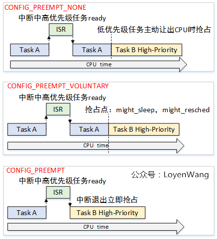

### user preempt

#### set_tsk_need_resched

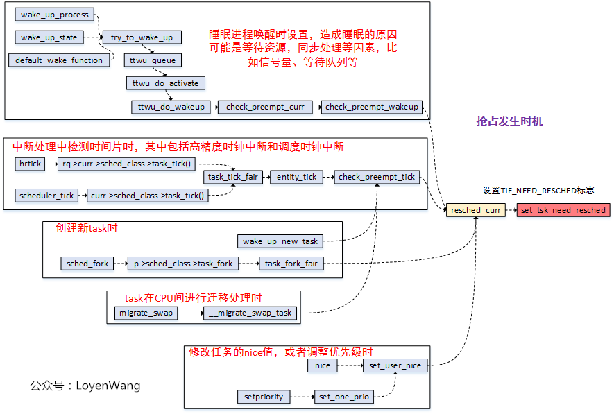

##### sched_tick

```c
void sched_tick(void)
{
    if (dynamic_preempt_lazy() && tif_test_bit(TIF_NEED_RESCHED_LAZY))
        resched_curr(rq);

    donor->sched_class->task_tick(rq, donor, 0);
}

void resched_curr(struct rq *rq)
{
    __resched_curr(rq, TIF_NEED_RESCHED);
}

static void __resched_curr(struct rq *rq, int tif) {
    struct task_struct *curr = rq->curr;
    struct thread_info *cti = task_thread_info(curr);
    int cpu;

    lockdep_assert_rq_held(rq);

    if (is_idle_task(curr) && tif == TIF_NEED_RESCHED_LAZY)
        tif = TIF_NEED_RESCHED;

    /* no other tif need to be set since _TIF_NEED_RESCHED has highest prio */
    if (cti->flags & ((1 << tif) | _TIF_NEED_RESCHED))
        return;

    cpu = cpu_of(rq);

    if (cpu == smp_processor_id()) {
        set_ti_thread_flag(cti, tif) {
            set_bit(flag, (unsigned long *)&ti->flags);
        }

        if (tif == TIF_NEED_RESCHED) {
            set_preempt_need_resched() {
                current_thread_info()->preempt.need_resched = 0;
            }
        }
        return;
    }

    ret = set_nr_and_not_polling(cti, tif) {
        return !(fetch_or(&ti->flags, 1 << tif) & _TIF_POLLING_NRFLAG);
    }
    if (ret) {
        if (tif == TIF_NEED_RESCHED)
            smp_send_reschedule(cpu);
    } else {
        trace_sched_wake_idle_without_ipi(cpu);
    }
}
```

##### try_to_wake_upp

##### sched_setscheduler

```c
SYSCALL_DEFINE3(sched_setscheduler) {
    do_sched_setscheduler() {
        p = find_process_by_pid(pid);
        get_task_struct(p);
        sched_setscheduler(p, policy, &lparam) {
            __sched_setscheduler() {

            }
        }
    }

        put_task_struct(p);
}
/* 1. check policy, prio args */

```

#### preempt time

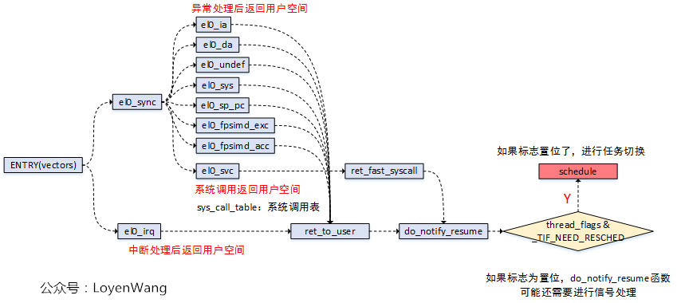

##### exit_to_user_mode_loop
```c
static void noinstr el0_svc(struct pt_regs *regs)
{
    arm64_enter_from_user_mode(regs) {
        enter_from_user_mode(regs) {
            arch_enter_from_user_mode(regs);
            lockdep_hardirqs_off(CALLER_ADDR0);

            CT_WARN_ON(__ct_state() != CT_STATE_USER);
            user_exit_irqoff();

            instrumentation_begin();
            kmsan_unpoison_entry_regs(regs);
            trace_hardirqs_off_finish();
            instrumentation_end();
        }
        mte_disable_tco_entry(current);
    }

    cortex_a76_erratum_1463225_svc_handler();
    fpsimd_syscall_enter();
    local_daif_restore(DAIF_PROCCTX);

    do_el0_svc(regs);

    arm64_exit_to_user_mode(regs) {
        local_irq_disable();
        irqentry_exit_to_us_mode_prepare(regs) {
            __exit_to_user_mode_prepare(regs, EXIT_TO_USER_MODE_WORK_IRQ);
            rseq_irqentry_exit_to_user_mode();
            __exit_to_user_mode_validate();
        }
        local_daif_mask();
        sme_exit_to_user_mode();
        mte_check_tfsr_exit();
        exit_to_user_mode();
    }
    fpsimd_syscall_exit();
}

void __exit_to_user_mode_prepare(struct pt_regs *regs)
{
    tick_nohz_user_enter_prepare();

    ti_work = read_thread_flags();
    if (unlikely(ti_work & EXIT_TO_USER_MODE_WORK)) {
        ti_work = exit_to_user_mode_loop(regs, ti_work) {
            for (;;) {
                ti_work = __exit_to_user_mode_loop(regs, ti_work);

                if (likely(!rseq_exit_to_user_mode_restart(regs, ti_work)))
                    return ti_work;
                ti_work = read_thread_flags();
            }

            __exit_to_user_mode_loop(struct pt_regs *regs, unsigned long ti_work) {
                while (ti_work & EXIT_TO_USER_MODE_WORK) {
                    local_irq_enable_exit_to_user(ti_work) {
                        local_irq_enable();
                    }

                    if (ti_work & (_TIF_NEED_RESCHED | _TIF_NEED_RESCHED_LAZY)) {
                        if (!rseq_grant_slice_extension(ti_work & TIF_SLICE_EXT_DENY))
                            schedule();
                    }

                    if (ti_work & _TIF_UPROBE)
                        uprobe_notify_resume(regs);

                    if (ti_work & _TIF_PATCH_PENDING)
                        klp_update_patch_state(current);

                    if (ti_work & (_TIF_SIGPENDING | _TIF_NOTIFY_SIGNAL)) {
                        futex_fixup_robust_unlock(regs);
                        arch_do_signal_or_restart(regs);
                    }

                    if (thread_flags & _TIF_NOTIFY_RESUME) {
                        resume_user_mode_work(regs) {
                            clear_thread_flag(TIF_NOTIFY_RESUME);
                            smp_mb__after_atomic();
                            if (unlikely(task_work_pending(current))) {
                                task_work_run();
                            }

                            if (unlikely(current->cached_requested_key)) {
                                key_put(current->cached_requested_key);
                                current->cached_requested_key = NULL;
                            }

                            mem_cgroup_handle_over_high(GFP_KERNEL);
                            blkcg_maybe_throttle_current();

                            /* rseq_raise_notify_resume */
                            rseq_handle_slowpath(regs);
                        }
                    }

                    /* Architecture specific TIF work */
                    arch_exit_to_user_mode_work(regs, ti_work);

                    local_irq_disable();

                    tick_nohz_user_enter_prepare() {
                        if (tick_nohz_full_cpu(smp_processor_id()))
                            rcu_nocb_flush_deferred_wakeup();
                    }

                    ti_work = read_thread_flags();
                }

                return ti_work;
            }
        }
    }

    arch_exit_to_user_mode_prepare(regs, ti_work);
}
```

### kernel preempt

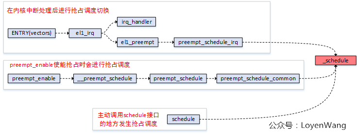

#### preempt_enble

```c
struct thread_info {
    unsigned long   flags;          /* low level flags */
    union {
        u64         preempt_count;  /* 0 => preemptible, <0 => bug */
        struct {
            u32     count;
            u32     need_resched;
        } preempt;
    };

    void            *scs_base;
    void            *scs_sp;
    u32             cpu;
};

#define preempt_enable() \
do { \
    if (unlikely(preempt_count_dec_and_test())) \
        __preempt_schedule(); \
} while (0)

#define preempt_count_dec_and_test() \
    ({ preempt_count_sub(1); should_resched(0); })

static  bool should_resched(int preempt_offset)
{
    /* preempt_count includes both count and need_resched */
    u64 pc = READ_ONCE(current_thread_info()->preempt_count);
    return pc == preempt_offset;
}

static inline int preempt_count(void)
{
    /* only include count exclude need_resched */
    return READ_ONCE(current_thread_info()->preempt.count);
}

#define __preempt_schedule()    preempt_schedule()

asmlinkage __visible void __sched notrace preempt_schedule(void)
{
    if (likely(!preemptible()))
        return;
    preempt_schedule_common();
}

#define preemptible()   (preempt_count() == 0 && !irqs_disabled())
static inline int preempt_count(void)
{
    return READ_ONCE(current_thread_info()->preempt.count);
}

static void __sched notrace preempt_schedule_common(void)
{
    do {
        preempt_disable_notrace();
        __schedule(SM_PREEMPT);
        preempt_enable_no_resched_notrace();
    } while (need_resched());
}

static __always_inline bool need_resched(void)
{
    ret = tif_need_resched(void) {
        return tif_test_bit(TIF_NEED_RESCHED) {
            return test_bit(bit, (unsigned long *)(&current_thread_info()->flags));
        }
    }
    return unlikely(ret);
}

#define preempt_disable_notrace() \
do { \
    __preempt_count_inc(); \
    barrier(); \
} while (0)

#define preempt_enable_no_resched_notrace() \
do { \
    barrier(); \
    __preempt_count_dec(); \
} while (0)

#define __preempt_count_inc() __preempt_count_add(1)
#define __preempt_count_dec() __preempt_count_sub(1)

static inline void __preempt_count_add(int val)
{
    u32 pc = READ_ONCE(current_thread_info()->preempt.count);
    pc += val;
    WRITE_ONCE(current_thread_info()->preempt.count, pc);
}

static inline void __preempt_count_sub(int val)
{
    u32 pc = READ_ONCE(current_thread_info()->preempt.count);
    pc -= val;
    WRITE_ONCE(current_thread_info()->preempt.count, pc);
}
```

#### preempt_schedule_irq

[:link: arm64_exit_to_kernel_mode](./linux-intr-arm64.md#arm64_exit_to_kernel_mode)

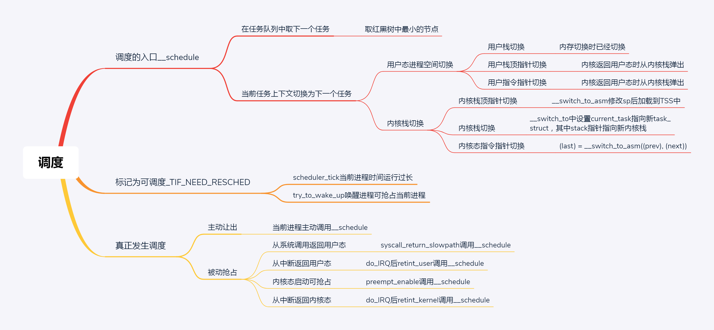

#### cond_resched

```c
#define cond_resched() ({   \
    __might_resched(__FILE__, __LINE__, 0); \
    _cond_resched();    \
})

static inline int _cond_resched(void)
{
    return __cond_resched() {
        if (should_resched(0) && !irqs_disabled()) {
            preempt_schedule_common();
            return 1;
        }

    #ifndef CONFIG_PREEMPT_RCU
        rcu_all_qs();
    #endif
        return 0;
    }
}

void __might_resched(const char *file, int line, unsigned int offsets)
{
    /* Ratelimiting timestamp: */
    static unsigned long prev_jiffy;

    unsigned long preempt_disable_ip;

    /* WARN_ON_ONCE() by default, no rate limit required: */
    rcu_sleep_check();

    ok = resched_offsets_ok(offsets) {
        unsigned int nested = preempt_count() {
            return READ_ONCE(current_thread_info()->preempt.count);
        }

        nested += rcu_preempt_depth() {
            READ_ONCE(current->rcu_read_lock_nesting)
        } << MIGHT_RESCHED_RCU_SHIFT;

        return nested == offsets;
    }
    if ((ok && !irqs_disabled() && !is_idle_task(current) && !current->non_block_count) ||
        system_state == SYSTEM_BOOTING || system_state > SYSTEM_RUNNING ||
        oops_in_progress)
        return;

    if (time_before(jiffies, prev_jiffy + HZ) && prev_jiffy)
        return;
    prev_jiffy = jiffies;

    /* Save this before calling printk(), since that will clobber it: */
    preempt_disable_ip = get_preempt_disable_ip(current);

    if (task_stack_end_corrupted(current))
        pr_emerg("Thread overran stack, or stack corrupted\n");

    debug_show_held_locks(current);
    if (irqs_disabled())
        print_irqtrace_events(current);

    print_preempt_disable_ip(offsets & MIGHT_RESCHED_PREEMPT_MASK, preempt_disable_ip);

    dump_stack();
    add_taint(TAINT_WARN, LOCKDEP_STILL_OK);
}
```

# SCHED_DL

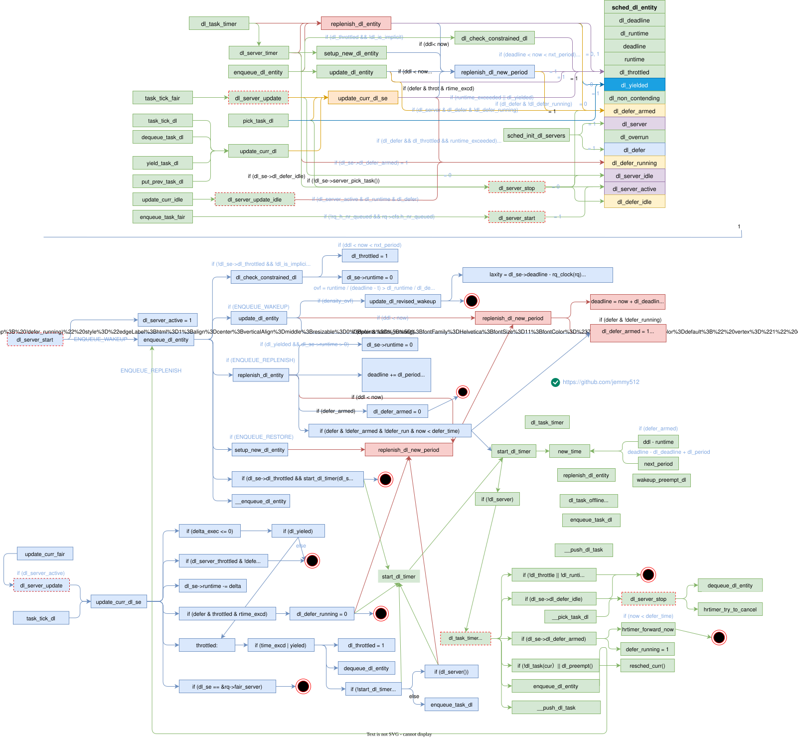

**EDF** picks who runs (earliest absolute deadline wins). **CBS** enforces how much each task can run before it has to wait for its next period. **Admission control** ensures the set is feasible. The **throttling timer** is the mechanism that ties the three together.

* [LWN - Deadline servers as a realtime throttling replacement](https://lwn.net/Articles/934415/)
    * [OSPM 2025 - Hierarchical CBS with deadline servers](https://lwn.net/Articles/1021332)
    * [[PATCH V7 0/9] SCHED_DEADLINE server infrastructure](https://lore.kernel.org/all/cover.1716811043.git.bristot@kernel.org/)
        * [[PATCH V7 5/9] sched/deadline: Deferrable dl server](https://lore.kernel.org/all/dd175943c72533cd9f0b87767c6499204879cc38.1716811044.git.bristot@kernel.org/)
    * [[PATCH V2 0/2] sched/deadline: Revised wakeup for suspending constrained dl tasks](https://lore.kernel.org/all/cover.1495803804.git.bristot@redhat.com/)
    * realtime throttling enforces the limit even when no lower-priority tasks are waiting to run, causing the CPU to go idle unnecessarily instead of allowing the RT task to continue.
* [LWN - The hierarchical constant bandwidth server scheduler](https://lwn.net/Articles/1024757/)
    * [[RFC PATCH v4 00/28] Hierarchical Constant Bandwidth Server](https://lore.kernel.org/all/20251201124205.11169-1-yurand2000@gmail.com/)

```c
DEFINE_SCHED_CLASS(dl) = {
    .enqueue_task           = enqueue_task_dl,
    .dequeue_task           = dequeue_task_dl,
    .yield_task             = yield_task_dl,

    .wakeup_preempt         = wakeup_preempt_dl,

    .pick_task              = pick_task_dl,
    .put_prev_task          = put_prev_task_dl,
    .set_next_task          = set_next_task_dl,

    .balance                = balance_dl,
    .select_task_rq         = select_task_rq_dl,
    .migrate_task_rq        = migrate_task_rq_dl,
    .set_cpus_allowed       = set_cpus_allowed_dl,
    .rq_online              = rq_online_dl,
    .rq_offline             = rq_offline_dl,
    .task_woken             = task_woken_dl,
    .find_lock_rq           = find_lock_later_rq,

    .task_tick              = task_tick_dl,
    .task_fork              = task_fork_dl,

    .prio_changed           = prio_changed_dl,
    .switched_from          = switched_from_dl,
    .switched_to            = switched_to_dl,

    .update_curr            = update_curr_dl,
#ifdef CONFIG_SCHED_CORE
    .task_is_throttled  = task_is_throttled_dl,
#endif
};

struct dl_rq {
    struct rb_root_cached   root;

    unsigned int            dl_nr_running;

    struct {
        u64        curr;
        u64        next;
    } earliest_dl;

    bool                    overloaded;

    struct rb_root_cached   pushable_dl_tasks_root;

    /* "Active utilization" for this runqueue: increased when a
     * task wakes up (becomes TASK_RUNNING) and decreased when a
     * task blocks */
    u64                     running_bw;

    /* Utilization of the tasks "assigned" to this runqueue (including
     * running, runnalbe and blokced tasks).
     * Increased when a task moves to this runqueue, and
     * decreased when the task moves away (migrates, changes scheduling
     * policy, or terminates).
     * This is needed to compute the "inactive utilization" for the
     * runqueue (inactive utilization = this_bw - running_bw). */
    u64                     this_bw;
    u64                     extra_bw;

    /* Maximum available bandwidth for reclaiming by SCHED_FLAG_RECLAIM
     * tasks of this rq. Used in calculation of reclaimable bandwidth(GRUB). */
    u64                     max_bw;

    /* Inverse of the fraction of CPU utilization that can be reclaimed
     * by the GRUB algorithm. */
    u64                     bw_ratio;
};

struct sched_dl_entity {
    struct rb_node  rb_node;

    /* Original scheduling parameters. Copied here from sched_attr
     * during sched_setattr(), they will remain the same until
     * the next sched_setattr(). */
    u64     dl_runtime; /* Maximum runtime for each instance */
    u64     dl_deadline;/* Relative deadline of each instance */
    u64     dl_period;  /* Separation of two instances (period) */
    u64     dl_bw;      /* dl_runtime / dl_period */
    u64     dl_density; /* dl_runtime / dl_deadline */

    s64             runtime;    /* Remaining runtime for this instance */
    u64             deadline;   /* Absolute deadline for this instance */
    unsigned int    flags;      /* Specifying the scheduler behaviour  */

    unsigned int    dl_throttled        : 1;
    unsigned int    dl_yielded          : 1;
    unsigned int    dl_non_contending   : 1; /* task is inactive while still
     * contributing to the active utilization. */
    unsigned int    dl_overrun          : 1;
    unsigned int    dl_server           : 1; /* if this is a server entity. */
    unsigned int    dl_server_active    : 1;
    unsigned int    dl_defer            : 1; /* deferred or regular server */
    unsigned int    dl_defer_armed      : 1; /* if the deferrable server is waiting
     * for the replenishment timer to activate it. */
    unsigned int    dl_defer_running    : 1; /* if the deferrable server is actually
     * running, skipping the defer phase. */

    /* Bandwidth enforcement timer. Each -deadline task has its
     * own bandwidth to be enforced, thus we need one timer per task. */
    struct hrtimer            dl_timer;

    /* Inactive timer, responsible for decreasing the active utilization
     * at the "0-lag time". When a -deadline task blocks, it contributes
     * to GRUB's active utilization until the "0-lag time", hence a
     * timer is needed to decrease the active utilization at the correct
     * time. */
    struct hrtimer            inactive_timer;

    struct rq                   *rq;
    dl_server_has_tasks_f       server_has_tasks;
    dl_server_pick_f            server_pick_task;

#ifdef CONFIG_RT_MUTEXES
    /* Priority Inheritance. When a DEADLINE scheduling entity is boosted
     * pi_se points to the donor, otherwise points to the dl_se it belongs
     * to (the original one/itself). */
    struct sched_dl_entity      *pi_se;
#endif
};
```

## task_tick_dl

```c
void task_tick_dl(struct rq *rq, struct task_struct *p, int queued)
{
    update_curr_dl(rq) {
        struct task_struct *donor = rq->donor;
        struct sched_dl_entity *dl_se = &donor->dl;
        s64 delta_exec;

        if (!dl_task(donor) || !on_dl_rq(dl_se))
            return;

        delta_exec = update_curr_common(rq);
        update_curr_dl_se(rq, dl_se, delta_exec);
    }

    update_dl_rq_load_avg(rq_clock_pelt(rq), rq, 1);

    if (hrtick_enabled_dl(rq) && queued && p->dl.runtime > 0 && is_leftmost(&p->dl, &rq->dl)) {
        start_hrtick_dl(rq, &p->dl) {
            hrtick_start(rq, dl_se->runtime);
        }
    }
}
```

### update_curr_dl_se

```c
void update_curr_dl_se(struct rq *rq, struct sched_dl_entity *dl_se, s64 delta_exec)
{
    bool idle = idle_rq(rq);
    s64 scaled_delta_exec;

    if (unlikely(delta_exec <= 0)) {
        if (unlikely(dl_se->dl_yielded))
            goto throttle;
        return;
    }

    if (dl_server(dl_se) && dl_se->dl_throttled && !dl_se->dl_defer)
        return;

    if (dl_entity_is_special(dl_se))
        return;

    scaled_delta_exec = delta_exec;
    if (!dl_server(dl_se)) {
        scaled_delta_exec = dl_scaled_delta_exec(rq, dl_se, delta_exec) {
            s64 scaled_delta_exec;

            /* For tasks that participate in GRUB, we implement
            * GRUB-PA(Greedy Reclamation of Unused Bandwidth - Power-Aware): the
            * spare reclaimed bandwidth is used to clock down frequency.
            *
            * For the others, we still need to scale reservation parameters
            * according to current frequency and CPU maximum capacity. */
            if (unlikely(dl_se->flags & SCHED_FLAG_RECLAIM)) {
                scaled_delta_exec = grub_reclaim(delta_exec, rq, dl_se) {
                    u64 u_act;
                    u64 u_inact = rq->dl.this_bw - rq->dl.running_bw; /* Utot - Uact */

                    /* Instead of computing max{u, (u_max - u_inact - u_extra)}, we
                    * compare u_inact + u_extra with u_max - u, because u_inact + u_extra
                    * can be larger than u_max. So, u_max - u_inact - u_extra would be
                    * negative leading to wrong results. */
                    if (u_inact + rq->dl.extra_bw > rq->dl.max_bw - dl_se->dl_bw)
                        u_act = dl_se->dl_bw;
                    else
                        u_act = rq->dl.max_bw - u_inact - rq->dl.extra_bw;

                    u_act = (u_act * rq->dl.bw_ratio) >> RATIO_SHIFT;
                    return (delta * u_act) >> BW_SHIFT;
                }
            } else {
                int cpu = cpu_of(rq);
                unsigned long scale_freq = arch_scale_freq_capacity(cpu);
                unsigned long scale_cpu = arch_scale_cpu_capacity(cpu);

                scaled_delta_exec = cap_scale(delta_exec, scale_freq);
                scaled_delta_exec = cap_scale(scaled_delta_exec, scale_cpu);
            }

            return scaled_delta_exec;
        }
    }

    dl_se->runtime -= scaled_delta_exec;

    /* https://lore.kernel.org/all/dd175943c72533cd9f0b87767c6499204879cc38.1716811044.git.bristot@kernel.org/
     * CFS/idle tasks get chance to run before dl_server_timer triggers,
     * so the fair server can consume its runtime while throttled.
     *
     * If the server consumes its entire runtime in this state. The server
     * is not required for the current period. Thus, reset the server by
     * starting a new period, pushing the activation. */
    if (dl_se->dl_defer && dl_se->dl_throttled && dl_runtime_exceeded(dl_se)) {
        /* While the server is marked idle, do not push out the
         * activation further, instead wait for the period timer
         * to lapse and stop the server. */
        if (dl_se->dl_defer_idle && idle) {
            /* The timer is at the zero-laxity point, this means
             * dl_server_stop() / dl_server_start() can happen
             * while now < deadline. This means update_dl_entity()
             * will not replenish. Additionally start_dl_timer()
             * will be set for 'deadline - runtime'. Negative
             * runtime will not do. */
            dl_se->runtime = 0;
            return;
        }

        /* If the server was previously activated - the starving condition
         * took place, it this point it went away because the fair scheduler
         * was able to get runtime in background. So return to the initial
         * state. */
        dl_se->dl_defer_running = 0;

        hrtimer_try_to_cancel(&dl_se->dl_timer);

        replenish_dl_new_period(dl_se, dl_se->rq) {
            /* for non-boosted task, pi_of(dl_se) == dl_se */
            dl_se->deadline = rq_clock(rq) + pi_of(dl_se)->dl_deadline;
            dl_se->runtime = pi_of(dl_se)->dl_runtime;

            /* If it is a deferred reservation, and the server
            * is not handling an starvation case, defer it. */
            if (dl_se->dl_defer && !dl_se->dl_defer_running) {
                dl_se->dl_throttled = 1;
                dl_se->dl_defer_armed = 1;
            }
        }

        if (idle)
            dl_se->dl_defer_idle = 1;

        /* Not being able to start the timer seems problematic. If it could not
         * be started for whatever reason, we need to "unthrottle" the DL server
         * and queue right away. Otherwise nothing might queue it. That's similar
         * to what enqueue_dl_entity() does on start_dl_timer==0. For now, just warn. */
        WARN_ON_ONCE(!start_dl_timer(dl_se));

        return;
    }

throttle:
    if (dl_runtime_exceeded(dl_se) || dl_se->dl_yielded) {
        dl_se->dl_throttled = 1;

        /* If requested, inform the user about runtime overruns. */
        if (dl_runtime_exceeded(dl_se) && (dl_se->flags & SCHED_FLAG_DL_OVERRUN))
            dl_se->dl_overrun = 1;

        dequeue_dl_entity(dl_se, 0);

        if (!dl_server(dl_se)) {
            update_stats_dequeue_dl(&rq->dl, dl_se, 0);
            dequeue_pushable_dl_task(rq, dl_task_of(dl_se));
        }

        if (unlikely(is_dl_boosted(dl_se) || !start_dl_timer(dl_se))) {
            /* The failure of `start_dl_timer` is caused by attempting to register a
             * timer with an expiration time that is already in the past. */
            if (dl_server(dl_se)) {
                if (dl_se->dl_defer) {
                    replenish_dl_new_period(dl_se, rq);
                    start_dl_timer(dl_se);
                } else {
                    enqueue_dl_entity(dl_se, ENQUEUE_REPLENISH);
                }
            } else {
                enqueue_task_dl(rq, dl_task_of(dl_se), ENQUEUE_REPLENISH);
            }
        }

        if (!is_leftmost(dl_se, &rq->dl))
            resched_curr(rq);
    }

    /* The dl_server does not account for real-time workload because it
     * is running fair work. */
    if (dl_se->dl_server)
        return;

#ifdef CONFIG_RT_GROUP_SCHED
    /* Because -- for now -- we share the rt bandwidth, we need to
     * account our runtime there too, otherwise actual rt tasks
     * would be able to exceed the shared quota.
     *
     * Account to the root rt group for now.
     *
     * The solution we're working towards is having the RT groups scheduled
     * using deadline servers -- however there's a few nasties to figure
     * out before that can happen. */
    if (rt_bandwidth_enabled()) {
        struct rt_rq *rt_rq = &rq->rt;

        raw_spin_lock(&rt_rq->rt_runtime_lock);
        /* We'll let actual RT tasks worry about the overflow here, we
         * have our own CBS to keep us inline; only account when RT
         * bandwidth is relevant. */
        if (sched_rt_bandwidth_account(rt_rq))
            rt_rq->rt_time += delta_exec;
        raw_spin_unlock(&rt_rq->rt_runtime_lock);
    }
#endif /* CONFIG_RT_GROUP_SCHED */
}
```

## enqueue_task_dl

```c
void enqueue_task_dl(struct rq *rq, struct task_struct *p, int flags)
{
    struct sched_dl_entity *dl_se = &p->dl;
    struct dl_rq *dl_rq = &rq->dl;

    if (is_dl_boosted(dl_se)) {
        /* Because of delays in the detection of the overrun of a
         * thread's runtime, it might be the case that a thread
         * goes to sleep in a rt mutex with negative runtime. As
         * a consequence, the thread will be throttled.
         *
         * While waiting for the mutex, this thread can also be
         * boosted via PI, resulting in a thread that is throttled
         * and boosted at the same time.
         *
         * In this case, the boost overrides the throttle. */
        if (dl_se->dl_throttled) {
            /* The replenish timer needs to be canceled. No
             * problem if it fires concurrently: boosted threads
             * are ignored in dl_task_timer(). */
            cancel_replenish_timer(dl_se);
            dl_se->dl_throttled = 0;
        }
    } else if (!dl_prio(p->normal_prio)) {
        /* Special case in which we have a !SCHED_DEADLINE task that is going
         * to be deboosted, but exceeds its runtime while doing so. No point in
         * replenishing it, as it's going to return back to its original
         * scheduling class after this. If it has been throttled, we need to
         * clear the flag, otherwise the task may wake up as throttled after
         * being boosted again with no means to replenish the runtime and clear
         * the throttle. */
        dl_se->dl_throttled = 0;
        if (!(flags & ENQUEUE_REPLENISH))
            printk_deferred_once("sched: DL de-boosted task PID %d: REPLENISH flag missing\n",
                         task_pid_nr(p));

        return;
    }

    check_schedstat_required();
    update_stats_wait_start_dl(dl_rq, dl_se);

    if (task_on_rq_migrating(p))
        flags |= ENQUEUE_MIGRATING;

    enqueue_dl_entity(dl_se, flags);

    if (dl_server(dl_se))
        return;

    if (task_is_blocked(p))
        return;

    if (dl_rq->curr == dl_se)
        return;

    if (!task_current(rq, p) && !dl_se->dl_throttled && p->nr_cpus_allowed > 1)
        enqueue_pushable_dl_task(rq, p);
}

void enqueue_dl_entity(struct sched_dl_entity *dl_se, int flags)
{
    WARN_ON_ONCE(on_dl_rq(dl_se));

    update_stats_enqueue_dl(dl_rq_of_se(dl_se), dl_se, flags);

    /* Check if a constrained deadline task(deadline < period) was activated
     * after the deadline but before the next period.
     * If that is the case, the task will be throttled and
     * the replenishment timer will be set to the next period. */
    if (!dl_se->dl_throttled && !dl_is_implicit(dl_se)) {
        dl_check_constrained_dl(dl_se) {
            struct rq *rq = rq_of_dl_se(dl_se);

            /* deadline < now < next_period */
            if (dl_time_before(dl_se->deadline, rq_clock(rq)) && dl_time_before(rq_clock(rq), dl_next_period(dl_se))) {
                if (unlikely(is_dl_boosted(dl_se) || !start_dl_timer(dl_se)))
                    return;

                dl_se->dl_throttled = 1;
                if (dl_se->runtime > 0)
                    dl_se->runtime = 0;
            }
        }
    }

    if (flags & (ENQUEUE_RESTORE|ENQUEUE_MIGRATING)) {
        struct dl_rq *dl_rq = dl_rq_of_se(dl_se);

        add_rq_bw(dl_se, dl_rq) {
            if (!dl_entity_is_special(dl_se)) {
                __add_rq_bw(dl_se->dl_bw, dl_rq) {
                    u64 old = dl_rq->this_bw;

                    lockdep_assert_rq_held(rq_of_dl_rq(dl_rq));
                    dl_rq->this_bw += dl_bw;
                    WARN_ON_ONCE(dl_rq->this_bw < old); /* overflow */
                }
            }
        }

        add_running_bw(dl_se, dl_rq) {
            if (!dl_entity_is_special(dl_se)) {
                __add_running_bw(dl_se->dl_bw, dl_rq) {
                    u64 old = dl_rq->running_bw;

                    lockdep_assert_rq_held(rq_of_dl_rq(dl_rq));
                    dl_rq->running_bw += dl_bw;
                    WARN_ON_ONCE(dl_rq->running_bw < old); /* overflow */
                    WARN_ON_ONCE(dl_rq->running_bw > dl_rq->this_bw);
                    /* kick cpufreq (see the comment in kernel/sched/sched.h). */
                    cpufreq_update_util(rq_of_dl_rq(dl_rq), 0);
                }
            }
        }
    }

    /* If p is throttled, we do not enqueue it. In fact, if it exhausted
     * its budget it needs a replenishment and, since it now is on
     * its rq, the bandwidth timer callback (which clearly has not
     * run yet) will take care of this.
     * However, the active utilization does not depend on the fact
     * that the task is on the runqueue or not (but depends on the
     * task's state - in GRUB parlance, "inactive" vs "active contending").
     * In other words, even if a task is throttled its utilization must
     * be counted in the active utilization; hence, we need to call
     * add_running_bw(). */
    if (!dl_se->dl_defer && dl_se->dl_throttled && !(flags & ENQUEUE_REPLENISH)) {
        if (flags & ENQUEUE_WAKEUP) {
            task_contending(dl_se, flags) {
                struct dl_rq *dl_rq = dl_rq_of_se(dl_se);

                /* If this is a non-deadline task that has been boosted,
                * do nothing */
                if (dl_se->dl_runtime == 0)
                    return;

                if (flags & ENQUEUE_MIGRATED)
                    add_rq_bw(dl_se, dl_rq);

                if (dl_se->dl_non_contending) {
                    dl_se->dl_non_contending = 0;
                    /* If the timer handler is currently running and the
                    * timer cannot be canceled, inactive_task_timer()
                    * will see that dl_not_contending is not set, and
                    * will not touch the rq's active utilization,
                    * so we are still safe. */
                    cancel_inactive_timer(dl_se);
                } else {
                    /* Since "dl_non_contending" is not set, the
                    * task's utilization has already been removed from
                    * active utilization (either when the task blocked,
                    * when the "inactive timer" fired).
                    * So, add it back. */
                    add_running_bw(dl_se, dl_rq);
                }
            }
        }

        return;
    }

    /* If this is a wakeup or a new instance, the scheduling
     * parameters of the task might need updating. Otherwise,
     * we want a replenishment of its runtime. */
    if (flags & ENQUEUE_WAKEUP) {
        task_contending(dl_se, flags);

        /* 1. handle density ovf
         * 2. handle deadline timeout
         * 3. handle dl_serfer_defer_not_running */
        update_dl_entity(dl_se) {
            struct rq *rq = rq_of_dl_se(dl_se);

            /* DL: admission control */
            bool ovf = dl_entity_overflow(dl_se, rq_clock(rq)) {
                /* return runtime / (deadline - t) > dl_runtime / dl_deadline */
                u64 left, right;

                left = (pi_of(dl_se)->dl_deadline >> DL_SCALE) * (dl_se->runtime >> DL_SCALE);
                right = ((dl_se->deadline - t) >> DL_SCALE) * (pi_of(dl_se)->dl_runtime >> DL_SCALE);

                return dl_time_before(right, left);
            }
            if (dl_time_before(dl_se->deadline, rq_clock(rq)) || ovf) {
                /* 1. Revised CBS -> constrained deadline: Reduces runtime for constrained-deadline tasks
                 * (deadline < period) to prevent bandwidth overruns. */
                if (unlikely(!dl_is_implicit(dl_se) && !dl_time_before(dl_se->deadline, rq_clock(rq)) && !is_dl_boosted(dl_se))) {
                    update_dl_revised_wakeup(dl_se, rq) {
                       /* Reasoning: a task may overrun the density if:
                        *    runtime / (deadline - t) > dl_runtime / dl_deadline
                        *
                        * Therefore, runtime can be adjusted to:
                        *     runtime = (dl_runtime / dl_deadline) * (deadline - t) */
                        u64 laxity = dl_se->deadline - rq_clock(rq);
                        WARN_ON(dl_time_before(dl_se->deadline, rq_clock(rq)));

                        dl_se->runtime = (dl_se->dl_density * laxity) >> BW_SHIFT;
                    }
                    return;
                }

                /* 2. Original CBS -> implicit deadline: Replenishes runtime and advances the deadline
                * for new periods or implicit-deadline tasks (deadline == period). */
                replenish_dl_new_period(dl_se, rq) {
                    /* for non-boosted task, pi_of(dl_se) == dl_se */
                    dl_se->deadline = rq_clock(rq) + pi_of(dl_se)->dl_deadline;
                    dl_se->runtime = pi_of(dl_se)->dl_runtime;

                    /* If it is a deferred reservation, and the server
                    * is not handling an starvation case, defer it. */
                    if (dl_se->dl_defer && !dl_se->dl_defer_running) {
                        dl_se->dl_throttled = 1;
                        dl_se->dl_defer_armed = 1;
                    }
                }
            } else if (dl_server(dl_se) && dl_se->dl_defer) {
                /* The server can still use its previous deadline, so check if
                * it left the dl_defer_running state. */
                if (!dl_se->dl_defer_running) {
                    dl_se->dl_defer_armed = 1;
                    dl_se->dl_throttled = 1;
                }
            }
        }
    } else if (flags & ENQUEUE_REPLENISH) {
        replenish_dl_entity(dl_se);
            --->
    } else if ((flags & ENQUEUE_RESTORE) &&
           !is_dl_boosted(dl_se) &&
           dl_time_before(dl_se->deadline, rq_clock(rq_of_dl_se(dl_se)))) {

        setup_new_dl_entity(dl_se) {
            struct dl_rq *dl_rq = dl_rq_of_se(dl_se);
            struct rq *rq = rq_of_dl_rq(dl_rq);

            update_rq_clock(rq);

            WARN_ON(is_dl_boosted(dl_se));
            WARN_ON(dl_time_before(rq_clock(rq), dl_se->deadline));

            if (dl_se->dl_throttled)
                return;

            replenish_dl_new_period(dl_se, rq);
        }
    }

    /* If the reservation is still throttled, e.g., it got replenished but is a
     * deferred task and still got to wait, don't enqueue. */
    if (dl_se->dl_throttled && start_dl_timer(dl_se))
        return;

    /* We're about to enqueue, make sure we're not ->dl_throttled!
     * In case the timer was not started, say because the defer time
     * has passed, mark as not throttled and mark unarmed.
     * Also cancel earlier timers, since letting those run is pointless. */
    if (dl_se->dl_throttled) {
        hrtimer_try_to_cancel(&dl_se->dl_timer);
        dl_se->dl_defer_armed = 0;
        dl_se->dl_throttled = 0;
    }

    __enqueue_dl_entity(dl_se) {
        struct dl_rq *dl_rq = dl_rq_of_se(dl_se);

        WARN_ON_ONCE(!RB_EMPTY_NODE(&dl_se->rb_node));

        rb_add_cached(&dl_se->rb_node, &dl_rq->root, __dl_less);

        inc_dl_tasks(dl_se, dl_rq) {
            u64 deadline = dl_se->deadline;

            dl_rq->dl_nr_running++;

            if (!dl_server(dl_se)) {
                add_nr_running(rq_of_dl_rq(dl_rq), 1) {
                    unsigned prev_nr = rq->nr_running;

                    rq->nr_running = prev_nr + count;
                    if (trace_sched_update_nr_running_tp_enabled()) {
                        call_trace_sched_update_nr_running(rq, count);
                    }

                    if (prev_nr < 2 && rq->nr_running >= 2) {
                        set_rd_overloaded(rq->rd, 1) {
                            if (get_rd_overloaded(rd) != status)
                                WRITE_ONCE(rd->overloaded, status);
                        }
                    }

                    sched_update_tick_dependency(rq) {
                        nt cpu = cpu_of(rq);

                        if (!tick_nohz_full_cpu(cpu))
                            return;

                        if (sched_can_stop_tick(rq)) {
                            tick_nohz_dep_clear_cpu(cpu, TICK_DEP_BIT_SCHED) {
                                struct tick_sched *ts = per_cpu_ptr(&tick_cpu_sched, cpu);
                                atomic_andnot(BIT(bit), &ts->tick_dep_mask);
                            }
                        } else {
                            tick_nohz_dep_set_cpu(cpu, TICK_DEP_BIT_SCHED) {
                                int prev;
                                struct tick_sched *ts;

                                ts = per_cpu_ptr(&tick_cpu_sched, cpu);

                                prev = atomic_fetch_or(BIT(bit), &ts->tick_dep_mask);
                                if (!prev) {
                                    preempt_disable();
                                    /* Perf needs local kick that is NMI safe */
                                    if (cpu == smp_processor_id()) {
                                        tick_nohz_full_kick();
                                    } else {
                                        /* Remote IRQ work not NMI-safe */
                                        if (!WARN_ON_ONCE(in_nmi()))
                                            tick_nohz_full_kick_cpu(cpu);
                                    }
                                    preempt_enable();
                                }
                            }
                        }
                    }
                }
            }

            inc_dl_deadline(dl_rq, deadline) {
                struct rq *rq = rq_of_dl_rq(dl_rq);

                if (dl_rq->earliest_dl.curr == 0 || dl_time_before(deadline, dl_rq->earliest_dl.curr)) {
                    if (dl_rq->earliest_dl.curr == 0) {
                        cpupri_set(&rq->rd->cpupri, rq->cpu, CPUPRI_HIGHER);
                    }
                    dl_rq->earliest_dl.curr = deadline;

                    cpudl_set(&rq->rd->cpudl, rq->cpu, deadline);
                }
            }
        }
    }
}

void replenish_dl_entity(struct sched_dl_entity *dl_se)
{
    struct dl_rq *dl_rq = dl_rq_of_se(dl_se);
    struct rq *rq = rq_of_dl_rq(dl_rq);

    WARN_ON_ONCE(pi_of(dl_se)->dl_runtime <= 0);

    /* This could be the case for a !-dl task that is boosted.
     * Just go with full inherited parameters.
     *
     * Or, it could be the case of a deferred reservation that
     * was not able to consume its runtime in background and
     * reached this point with current u > U.
     *
     * In both cases, set a new period. */
    if (dl_se->dl_deadline == 0 ||
        (dl_se->dl_defer_armed && dl_entity_overflow(dl_se, rq_clock(rq)))) {

        dl_se->deadline = rq_clock(rq) + pi_of(dl_se)->dl_deadline;
        dl_se->runtime = pi_of(dl_se)->dl_runtime;
    }

    if (dl_se->dl_yielded && dl_se->runtime > 0)
        dl_se->runtime = 0;

    /* We keep moving the deadline away until we get some
     * available runtime for the entity. This ensures correct
     * handling of situations where the runtime overrun is
     * arbitrary large. */
    while (dl_se->runtime <= 0) {
        dl_se->deadline += pi_of(dl_se)->dl_period;
        dl_se->runtime += pi_of(dl_se)->dl_runtime;
    }

    /* At this point, the deadline really should be "in
     * the future" with respect to rq->clock. If it's
     * not, we are, for some reason, lagging too much!
     * Anyway, after having warn userspace abut that,
     * we still try to keep the things running by
     * resetting the deadline and the budget of the
     * entity. */
    if (dl_time_before(dl_se->deadline, rq_clock(rq))) {
        replenish_dl_new_period(dl_se, rq);
    }

    if (dl_se->dl_yielded)
        dl_se->dl_yielded = 0;
    if (dl_se->dl_throttled)
        dl_se->dl_throttled = 0;

    /* If this is the replenishment of a deferred reservation,
     * clear the flag and return. */
    if (dl_se->dl_defer_armed) {
        dl_se->dl_defer_armed = 0;
        return;
    }

    /* A this point, if the deferred server is not armed, and the deadline
     * is in the future, if it is not running already, throttle the server
     * and arm the defer timer. */
    if (dl_se->dl_defer && !dl_se->dl_defer_running &&
        dl_time_before(rq_clock(dl_se->rq), dl_se->deadline - dl_se->runtime)) {
        if (!is_dl_boosted(dl_se) && dl_se->server_has_tasks(dl_se)) {

            /* Set dl_se->dl_defer_armed and dl_throttled variables to
             * inform the start_dl_timer() that this is a deferred
             * activation. */
            dl_se->dl_defer_armed = 1;
            dl_se->dl_throttled = 1;
            if (!start_dl_timer(dl_se)) {
                /* If for whatever reason (delays), a previous timer was
                 * queued but not serviced, cancel it and clean the
                 * deferrable server variables intended for start_dl_timer(). */
                hrtimer_try_to_cancel(&dl_se->dl_timer);
                dl_se->dl_defer_armed = 0;
                dl_se->dl_throttled = 0;
            }
        }
    }
}
```

### cpudl_set

```c
struct root_domain {
    cpumask_var_t       dlo_mask;
    atomic_t            dlo_count;
    struct dl_bw        dl_bw;
    struct cpudl        cpudl;
};

struct cpudl {
    raw_spinlock_t      lock;
    int                 size;
    cpumask_var_t       free_cpus;
    struct cpudl_item   *elements;
};

struct cpudl_item {
    u64                 dl;
    int                 cpu;
    int                 idx;
};

void cpudl_set(struct cpudl *cp, int cpu, u64 dl)
{
    int old_idx;
    unsigned long flags;

    WARN_ON(!cpu_present(cpu));

    raw_spin_lock_irqsave(&cp->lock, flags);

    old_idx = cp->elements[cpu].idx;
    if (old_idx == IDX_INVALID) {
        int new_idx = cp->size++;

        cp->elements[new_idx].dl = dl;
        cp->elements[new_idx].cpu = cpu;
        cp->elements[cpu].idx = new_idx;
        cpudl_heapify_up(cp, new_idx);
        cpumask_clear_cpu(cpu, cp->free_cpus);
    } else {
        cp->elements[old_idx].dl = dl;
        cpudl_heapify(cp, old_idx) {
            if (idx > 0 && dl_time_before(cp->elements[parent(idx)].dl, cp->elements[idx].dl)) {
                cpudl_heapify_up(cp, idx);
            } else {
                cpudl_heapify_down(cp, idx);
            }
        }
    }

    raw_spin_unlock_irqrestore(&cp->lock, flags);
}


static void cpudl_heapify_down(struct cpudl *cp, int idx)
{
    int l, r, largest;

    int orig_cpu = cp->elements[idx].cpu;
    u64 orig_dl = cp->elements[idx].dl;

    if (left_child(idx) >= cp->size)
        return;

    /* adapted from lib/prio_heap.c */
    while (1) {
        u64 largest_dl;

        l = left_child(idx);
        r = right_child(idx);
        largest = idx;
        largest_dl = orig_dl;

        if ((l < cp->size) && dl_time_before(orig_dl, cp->elements[l].dl)) {
            largest = l;
            largest_dl = cp->elements[l].dl;
        }
        if ((r < cp->size) && dl_time_before(largest_dl, cp->elements[r].dl))
            largest = r;

        if (largest == idx)
            break;

        /* pull largest child onto idx */
        cp->elements[idx].cpu = cp->elements[largest].cpu;
        cp->elements[idx].dl = cp->elements[largest].dl;
        cp->elements[cp->elements[idx].cpu].idx = idx;
        idx = largest;
    }
    /* actual push down of saved original values orig_* */
    cp->elements[idx].cpu = orig_cpu;
    cp->elements[idx].dl = orig_dl;
    cp->elements[cp->elements[idx].cpu].idx = idx;
}

static void cpudl_heapify_up(struct cpudl *cp, int idx)
{
    int p;

    int orig_cpu = cp->elements[idx].cpu;
    u64 orig_dl = cp->elements[idx].dl;

    if (idx == 0)
        return;

    do {
        p = parent(idx);
        if (dl_time_before(orig_dl, cp->elements[p].dl))
            break;
        /* pull parent onto idx */
        cp->elements[idx].cpu = cp->elements[p].cpu;
        cp->elements[idx].dl = cp->elements[p].dl;
        cp->elements[cp->elements[idx].cpu].idx = idx;
        idx = p;
    } while (idx != 0);
    /* actual push up of saved original values orig_* */
    cp->elements[idx].cpu = orig_cpu;
    cp->elements[idx].dl = orig_dl;
    cp->elements[cp->elements[idx].cpu].idx = idx;
}
```

## dequeue_task_dl

```c
bool dequeue_task_dl(struct rq *rq, struct task_struct *p, int flags)
{
    update_curr_dl(rq);

    if (p->on_rq == TASK_ON_RQ_MIGRATING)
        flags |= DEQUEUE_MIGRATING;

    dequeue_dl_entity(&p->dl, flags) {
        __dequeue_dl_entity(dl_se) {
            struct dl_rq *dl_rq = dl_rq_of_se(dl_se);

            if (RB_EMPTY_NODE(&dl_se->rb_node))
                return;

            rb_erase_cached(&dl_se->rb_node, &dl_rq->root);

            RB_CLEAR_NODE(&dl_se->rb_node);

            dec_dl_tasks(dl_se, dl_rq) {
                WARN_ON(!dl_rq->dl_nr_running);
                dl_rq->dl_nr_running--;

                if (!dl_server(dl_se))
                    sub_nr_running(rq_of_dl_rq(dl_rq), 1);

                dec_dl_deadline(dl_rq, dl_se->deadline) {
                    struct rq *rq = rq_of_dl_rq(dl_rq);

                    /* Since we may have removed our earliest (and/or next earliest)
                    * task we must recompute them. */
                    if (!dl_rq->dl_nr_running) {
                        dl_rq->earliest_dl.curr = 0;
                        dl_rq->earliest_dl.next = 0;
                        cpudl_clear(&rq->rd->cpudl, rq->cpu);
                        cpupri_set(&rq->rd->cpupri, rq->cpu, rq->rt.highest_prio.curr);
                    } else {
                        struct rb_node *leftmost = rb_first_cached(&dl_rq->root);
                        struct sched_dl_entity *entry = __node_2_dle(leftmost);

                        dl_rq->earliest_dl.curr = entry->deadline;
                        cpudl_set(&rq->rd->cpudl, rq->cpu, entry->deadline);
                    }
                }
            }
        }

        if (flags & (DEQUEUE_SAVE|DEQUEUE_MIGRATING)) {
            struct dl_rq *dl_rq = dl_rq_of_se(dl_se);

            sub_running_bw(dl_se, dl_rq);
            sub_rq_bw(dl_se, dl_rq);
        }

        /* This check allows to start the inactive timer (or to immediately
        * decrease the active utilization, if needed) in two cases:
        * 1. when the task blocks
        * 2. when it is terminating (p->state == TASK_DEAD).
        *
        * We can handle the two cases in the same
        * way, because from GRUB's point of view the same thing is happening
        * (the task moves from "active contending" to "active non contending"
        * or "inactive") */
        if (flags & DEQUEUE_SLEEP) {
            task_non_contending(dl_se);
        }
    }

    if (!p->dl.dl_throttled && !dl_server(&p->dl)) {
        dequeue_pushable_dl_task(rq, p) {
            struct dl_rq *dl_rq = &rq->dl;
            struct rb_root_cached *root = &dl_rq->pushable_dl_tasks_root;
            struct rb_node *leftmost;

            if (RB_EMPTY_NODE(&p->pushable_dl_tasks))
                return;

            leftmost = rb_erase_cached(&p->pushable_dl_tasks, root);
            if (leftmost)
                dl_rq->earliest_dl.next = __node_2_pdl(leftmost)->dl.deadline;

            RB_CLEAR_NODE(&p->pushable_dl_tasks);

            if (!has_pushable_dl_tasks(rq) && rq->dl.overloaded) {
                dl_clear_overload(rq) {
                    if (!rq->online)
                        return;

                    atomic_dec(&rq->rd->dlo_count);
                    cpumask_clear_cpu(rq->cpu, rq->rd->dlo_mask);
                }
                rq->dl.overloaded = 0;
            }
        }
    }

    return true;
}
```

## pick_task_dl

```c
struct task_struct *pick_task_dl(struct rq *rq)
{
    return __pick_task_dl(rq) {
        struct sched_dl_entity *dl_se;
        struct dl_rq *dl_rq = &rq->dl;
        struct task_struct *p;

    again:
        if (!sched_dl_runnable(rq)) /* return rq->dl.dl_nr_running > 0; */
            return NULL;

        dl_se = pick_next_dl_entity(dl_rq) {
            struct rb_node *left = rb_first_cached(&dl_rq->root);

            if (!left)
                return NULL;

            return __node_2_dle(left);
        }
        WARN_ON_ONCE(!dl_se);

        if (dl_server(dl_se)) {
            p = dl_se->server_pick_task(dl_se) {
                fair_server_pick_task(dl_se) {
                    return pick_task_fair(dl_se->rq);
                }

                ext_server_pick_task(dl_se) {
                    if (!scx_enabled())
                        return NULL;

                    return do_pick_task_scx(dl_se->rq, rf, true);
                }
            }
            if (!p) {
                dl_server_stop(dl_se);
                goto again;
            }
            rq->dl_server = dl_se;
        } else {
            p = dl_task_of(dl_se);
        }

        return p;
    }
}
```

## balance_dl

```c
int balance_dl(struct rq *rq, struct rq_flags *rf)
{
    /* Note, rq->donor may change during rq lock drops,
     * so don't re-use prev across lock drops */
    struct task_struct *p = rq->donor;

    ret = need_pull_dl_task(rq, p) {
        return rq->online && dl_task(prev);
    }
    if (!on_dl_rq(&p->dl) && ret) {
        /* This is OK, because current is on_cpu, which avoids it being
         * picked for load-balance and preemption/IRQs are still
         * disabled avoiding further scheduler activity on it and we've
         * not yet started the picking loop. */
        rq_unpin_lock(rq, rf);
        pull_dl_task(rq);
        rq_repin_lock(rq, rf);
    }

    return sched_stop_runnable(rq) || sched_dl_runnable(rq);
}

queue_balance_callback(rq, &per_cpu(dl_push_head, rq->cpu), push_dl_tasks);
```

### pull_dl_task

```c
void pull_dl_task(struct rq *this_rq)
{
    int this_cpu = this_rq->cpu, cpu;
    struct task_struct *p, *push_task;
    bool resched = false;
    struct rq *src_rq;
    u64 dmin = LONG_MAX;

    if (likely(!dl_overloaded(this_rq)))
        return;

    /* Match the barrier from dl_set_overloaded; this guarantees that if we
     * see overloaded we must also see the dlo_mask bit. */
    smp_rmb();

    for_each_cpu(cpu, this_rq->rd->dlo_mask) {
        if (this_cpu == cpu)
            continue;

        src_rq = cpu_rq(cpu);

        /* It looks racy, and it is! However, as in sched_rt.c,
         * we are fine with this. */
        if (this_rq->dl.dl_nr_running &&
            dl_time_before(this_rq->dl.earliest_dl.curr, src_rq->dl.earliest_dl.next))
            continue;

        /* Might drop this_rq->lock */
        push_task = NULL;
        double_lock_balance(this_rq, src_rq);

        /* If there are no more pullable tasks on the
         * rq, we're done with it. */
        if (src_rq->dl.dl_nr_running <= 1)
            goto skip;

        p = pick_earliest_pushable_dl_task(src_rq, this_cpu) {
            struct task_struct *p = NULL;
            struct rb_node *next_node;

            if (!has_pushable_dl_tasks(rq))
                return NULL;

            next_node = rb_first_cached(&rq->dl.pushable_dl_tasks_root);
            while (next_node) {
                p = __node_2_pdl(next_node);

                if (task_is_pushable(rq, p, cpu))
                    return p;

                next_node = rb_next(next_node);
            }

            return NULL;
        }

        /* We found a task to be pulled if:
         *  - it preempts our current (if there's one),
         *  - it will preempt the last one we pulled (if any). */
        if (p && dl_time_before(p->dl.deadline, dmin) &&
            dl_task_is_earliest_deadline(p, this_rq)) {
            WARN_ON(p == src_rq->curr);
            WARN_ON(!task_on_rq_queued(p));

            /* Then we pull iff p has actually an earlier
             * deadline than the current task of its runqueue. */
            if (dl_time_before(p->dl.deadline, src_rq->donor->dl.deadline))
                goto skip;

            if (is_migration_disabled(p)) {
                push_task = get_push_task(src_rq) {
                    struct task_struct *p = rq->donor;

                    lockdep_assert_rq_held(rq);

                    if (rq->push_busy)
                        return NULL;

                    if (p->nr_cpus_allowed == 1)
                        return NULL;

                    if (p->migration_disabled)
                        return NULL;

                    rq->push_busy = true;
                    return get_task_struct(p);
                }
            } else {
                move_queued_task_locked(src_rq, this_rq, p);
                dmin = p->dl.deadline;
                resched = true;
            }

            /* Is there any other task even earlier? */
        }
skip:
        double_unlock_balance(this_rq, src_rq);

        if (push_task) {
            preempt_disable();
            raw_spin_rq_unlock(this_rq);
            stop_one_cpu_nowait(src_rq->cpu, push_cpu_stop, push_task, &src_rq->push_work);
            preempt_enable();
            raw_spin_rq_lock(this_rq);
        }
    }

    if (resched)
        resched_curr(this_rq);
}
```

### push_dl_task

```c
static void push_dl_tasks(struct rq *rq)
{
    /* push_dl_task() will return true if it moved a -deadline task */
    while (push_dl_task(rq)) {

    }
}

int push_dl_task(struct rq *rq)
{
    struct task_struct *next_task;
    struct rq *later_rq;
    int ret = 0;

    next_task = pick_next_pushable_dl_task(rq);
    if (!next_task)
        return 0;

retry:
    /* If next_task preempts rq->curr, and rq->curr
     * can move away, it makes sense to just reschedule
     * without going further in pushing next_task. */
    if (dl_task(rq->donor) &&
        dl_time_before(next_task->dl.deadline, rq->donor->dl.deadline) &&
        rq->curr->nr_cpus_allowed > 1) {
        resched_curr(rq);
        return 0;
    }

    if (is_migration_disabled(next_task))
        return 0;

    if (WARN_ON(next_task == rq->curr))
        return 0;

    /* We might release rq lock */
    get_task_struct(next_task);

    /* Will lock the rq it'll find */
    later_rq = find_lock_later_rq(next_task, rq);
    if (!later_rq) {
        struct task_struct *task;

        /* We must check all this again, since
         * find_lock_later_rq releases rq->lock and it is
         * then possible that next_task has migrated. */
        task = pick_next_pushable_dl_task(rq);
        if (task == next_task) {
            /* The task is still there. We don't try
             * again, some other CPU will pull it when ready. */
            goto out;
        }

        if (!task)
            /* No more tasks */
            goto out;

        put_task_struct(next_task);
        next_task = task;
        goto retry;
    }

    move_queued_task_locked(rq, later_rq, next_task);
    ret = 1;

    resched_curr(later_rq);

    double_unlock_balance(rq, later_rq);

out:
    put_task_struct(next_task);

    return ret;
}

static struct task_struct *pick_next_pushable_dl_task(struct rq *rq)
{
    struct task_struct *i, *p = NULL;
    struct rb_node *next_node;

    if (!has_pushable_dl_tasks(rq))
        return NULL;

    next_node = rb_first_cached(&rq->dl.pushable_dl_tasks_root);
    while (next_node) {
        i = __node_2_pdl(next_node);
        /* skip tasks that cannot be migrated */
        if (!task_on_cpu(rq, i) && !is_migration_disabled(i)) {
            p = i;
            break;
        }

        next_node = rb_next(next_node);
    }

    if (!p)
        return NULL;

    WARN_ON_ONCE(rq->cpu != task_cpu(p));
    WARN_ON_ONCE(task_current(rq, p));
    WARN_ON_ONCE(p->nr_cpus_allowed <= 1);

    WARN_ON_ONCE(!task_on_rq_queued(p));
    WARN_ON_ONCE(!dl_task(p));

    return p;
}
```

## put_prev_task_dl

```c
void put_prev_task_dl(struct rq *rq, struct task_struct *p, struct task_struct *next)
{
    struct sched_dl_entity *dl_se = &p->dl;
    struct dl_rq *dl_rq = &rq->dl;

    if (on_dl_rq(&p->dl))
        update_stats_wait_start_dl(dl_rq, dl_se);

    update_curr_dl(rq);

    update_dl_rq_load_avg(rq_clock_pelt(rq), rq, 1) {
        if (___update_load_sum(now, &rq->avg_dl, running, running, running)) {
            ___update_load_avg(&rq->avg_dl, 1);
            trace_pelt_dl_tp(rq);
            return 1;
        }

        return 0;
    }

    WARN_ON_ONCE(dl_rq->curr != dl_se);
    dl_rq->curr = NULL;

    if (task_is_blocked(p))
        return;

    if (on_dl_rq(&p->dl) && p->nr_cpus_allowed > 1) {
        enqueue_pushable_dl_task(rq, p) {
            struct rb_node *leftmost;

            WARN_ON_ONCE(!RB_EMPTY_NODE(&p->pushable_dl_tasks));

            leftmost = rb_add_cached(&p->pushable_dl_tasks,
                &rq->dl.pushable_dl_tasks_root, __pushable_less);
            if (leftmost)
                rq->dl.earliest_dl.next = p->dl.deadline;

            if (!rq->dl.overloaded) {
                dl_set_overload(rq){
                    if (!rq->online)
                        return;

                    cpumask_set_cpu(rq->cpu, rq->rd->dlo_mask);
                    /* Must be visible before the overload count is
                    * set (as in sched_rt.c).
                    *
                    * Matched by the barrier in pull_dl_task(). */
                    smp_wmb();
                    atomic_inc(&rq->rd->dlo_count);
                }
                rq->dl.overloaded = 1;
            }
        }
    }
}
```

## set_next_task_dl

```c
void set_next_task_dl(struct rq *rq, struct task_struct *p, bool first)
{
    struct sched_dl_entity *dl_se = &p->dl;
    struct dl_rq *dl_rq = &rq->dl;

    p->se.exec_start = rq_clock_task(rq);
    if (on_dl_rq(&p->dl))
        update_stats_wait_end_dl(dl_rq, dl_se);

    /* You can't push away the running task */
    dequeue_pushable_dl_task(rq, p);

    WARN_ON_ONCE(dl_rq->curr);
    dl_rq->curr = dl_se;

    if (!first)
        return;

    if (rq->donor->sched_class != &dl_sched_class)
        update_dl_rq_load_avg(rq_clock_pelt(rq), rq, 0);

    deadline_queue_push_tasks(rq) {
        ret = has_pushable_dl_tasks(rq) {
            return !RB_EMPTY_ROOT(&rq->dl.pushable_dl_tasks_root.rb_root);
        }
        if (!ret)
            return;

        queue_balance_callback(rq, &per_cpu(dl_push_head, rq->cpu), push_dl_tasks);
    }

    if (hrtick_enabled_dl(rq))
        start_hrtick_dl(rq, &p->dl);
}
```

## select_task_rq_dl

```c
int select_task_rq_dl(struct task_struct *p, int cpu, int flags)
{
    struct task_struct *curr, *donor;
    bool select_rq;
    struct rq *rq;

    if (!(flags & WF_TTWU))
        return cpu;

    rq = cpu_rq(cpu);

    rcu_read_lock();
    curr = READ_ONCE(rq->curr); /* unlocked access */
    donor = READ_ONCE(rq->donor);

    /* If we are dealing with a -deadline task, we must
     * decide where to wake it up.
     * If it has a later deadline and the current task
     * on this rq can't move (provided the waking task
     * can!) we prefer to send it somewhere else. On the
     * other hand, if it has a shorter deadline, we
     * try to make it stay here, it might be important. */
    select_rq = unlikely(dl_task(donor)) &&
            (curr->nr_cpus_allowed < 2 ||
             !dl_entity_preempt(&p->dl, &donor->dl)) &&
            p->nr_cpus_allowed > 1;

    /* Take the capacity of the CPU into account to
     * ensure it fits the requirement of the task. */
    if (sched_asym_cpucap_active())
        select_rq |= !dl_task_fits_capacity(p, cpu);

    if (select_rq) {
        int target = find_later_rq(p);

        if (target != -1 &&
            dl_task_is_earliest_deadline(p, cpu_rq(target)))
            cpu = target;
    }
    rcu_read_unlock();

    return cpu;
}
```

## migrate_task_rq_dl

```c
void migrate_task_rq_dl(struct task_struct *p, int new_cpu __maybe_unused)
{
    struct rq_flags rf;
    struct rq *rq;

    if (READ_ONCE(p->__state) != TASK_WAKING)
        return;

    rq = task_rq(p);
    /* Since p->state == TASK_WAKING, set_task_cpu() has been called
     * from try_to_wake_up(). Hence, p->pi_lock is locked, but
     * rq->lock is not... So, lock it */
    rq_lock(rq, &rf);
    if (p->dl.dl_non_contending) {
        update_rq_clock(rq);
        sub_running_bw(&p->dl, &rq->dl);
        p->dl.dl_non_contending = 0;
        /* If the timer handler is currently running and the
         * timer cannot be canceled, inactive_task_timer()
         * will see that dl_not_contending is not set, and
         * will not touch the rq's active utilization,
         * so we are still safe. */
        cancel_inactive_timer(&p->dl);
    }
    sub_rq_bw(&p->dl, &rq->dl);
    rq_unlock(rq, &rf);
}

```

## find_lock_later_rq

```c
struct rq *find_lock_later_rq(struct task_struct *task, struct rq *rq)
{
    struct rq *later_rq = NULL;
    int tries;
    int cpu;

    for (tries = 0; tries < DL_MAX_TRIES; tries++) {
        cpu = find_later_rq(task);
            --->

        if ((cpu == -1) || (cpu == rq->cpu))
            break;

        later_rq = cpu_rq(cpu);

        if (!dl_task_is_earliest_deadline(task, later_rq)) {
            /* Target rq has tasks of equal or earlier deadline,
             * retrying does not release any lock and is unlikely
             * to yield a different result. */
            later_rq = NULL;
            break;
        }

        /* Retry if something changed. */
        if (double_lock_balance(rq, later_rq)) {
            /* double_lock_balance had to release rq->lock, in the
             * meantime, task may no longer be fit to be migrated.
             * Check the following to ensure that the task is
             * still suitable for migration:
             * 1. It is possible the task was scheduled,
             *    migrate_disabled was set and then got preempted,
             *    so we must check the task migration disable
             *    flag.
             * 2. The CPU picked is in the task's affinity.
             * 3. For throttled task (dl_task_offline_migration),
             *    check the following:
             *    - the task is not on the rq anymore (it was
             *      migrated)
             *    - the task is not on CPU anymore
             *    - the task is still a dl task
             *    - the task is not queued on the rq anymore
             * 4. For the non-throttled task (push_dl_task), the
             *    check to ensure that this task is still at the
             *    head of the pushable tasks list is enough. */
            if (unlikely(is_migration_disabled(task) ||
                     !cpumask_test_cpu(later_rq->cpu, &task->cpus_mask) ||
                     (task->dl.dl_throttled &&
                      (task_rq(task) != rq ||
                       task_on_cpu(rq, task) ||
                       !dl_task(task) ||
                       !task_on_rq_queued(task))) ||
                     (!task->dl.dl_throttled &&
                      task != pick_next_pushable_dl_task(rq)))) {

                double_unlock_balance(rq, later_rq);
                later_rq = NULL;
                break;
            }
        }

        /* If the rq we found has no -deadline task, or
         * its earliest one has a later deadline than our
         * task, the rq is a good one. */
        if (dl_task_is_earliest_deadline(task, later_rq))
            break;

        /* Otherwise we try again. */
        double_unlock_balance(rq, later_rq);
        later_rq = NULL;
    }

    return later_rq;
}
```

```c
int find_later_rq(struct task_struct *task)
{
    struct sched_domain *sd;
    struct cpumask *later_mask = this_cpu_cpumask_var_ptr(local_cpu_mask_dl);
    int this_cpu = smp_processor_id();
    int cpu = task_cpu(task);

    /* Make sure the mask is initialized first */
    if (unlikely(!later_mask))
        return -1;

    if (task->nr_cpus_allowed == 1)
        return -1;

    /* We have to consider system topology and task affinity
     * first, then we can look for a suitable CPU. */
    if (!cpudl_find(&task_rq(task)->rd->cpudl, task, later_mask))
        return -1;

    /* If we are here, some targets have been found, including
     * the most suitable which is, among the runqueues where the
     * current tasks have later deadlines than the task's one, the
     * rq with the latest possible one.
     *
     * Now we check how well this matches with task's
     * affinity and system topology.
     *
     * The last CPU where the task run is our first
     * guess, since it is most likely cache-hot there. */
    if (cpumask_test_cpu(cpu, later_mask))
        return cpu;
    /* Check if this_cpu is to be skipped (i.e., it is
     * not in the mask) or not. */
    if (!cpumask_test_cpu(this_cpu, later_mask))
        this_cpu = -1;

    rcu_read_lock();
    for_each_domain(cpu, sd) {
        if (sd->flags & SD_WAKE_AFFINE) {
            int best_cpu;

            /* If possible, preempting this_cpu is
             * cheaper than migrating. */
            if (this_cpu != -1 &&
                cpumask_test_cpu(this_cpu, sched_domain_span(sd))) {
                rcu_read_unlock();
                return this_cpu;
            }

            best_cpu = cpumask_any_and_distribute(later_mask, sched_domain_span(sd));
            /* Last chance: if a CPU being in both later_mask
             * and current sd span is valid, that becomes our
             * choice. Of course, the latest possible CPU is
             * already under consideration through later_mask. */
            if (best_cpu < nr_cpu_ids) {
                rcu_read_unlock();
                return best_cpu;
            }
        }
    }
    rcu_read_unlock();

    /* At this point, all our guesses failed, we just return
     * 'something', and let the caller sort the things out. */
    if (this_cpu != -1)
        return this_cpu;

    cpu = cpumask_any_distribute(later_mask);
    if (cpu < nr_cpu_ids)
        return cpu;

    return -1;
}
```

### cpudl_find

```c
int cpudl_find(struct cpudl *cp, struct task_struct *p,
           struct cpumask *later_mask)
{
    const struct sched_dl_entity *dl_se = &p->dl;

    if (later_mask && cpumask_and(later_mask, cp->free_cpus, &p->cpus_mask)) {
        unsigned long cap, max_cap = 0;
        int cpu, max_cpu = -1;

        if (!sched_asym_cpucap_active())
            return 1;

        /* Ensure the capacity of the CPUs fits the task. */
        for_each_cpu(cpu, later_mask) {
            fit = dl_task_fits_capacity(p, cpu) {
                unsigned long cap = arch_scale_cpu_capacity(cpu) {
                    return per_cpu(cpu_scale, cpu);
                }
                /* cap_scale(dl_deadline, cap) >= dl_runtime
                 * dl_deadline * cap >> SCHED_CAPACITY_SHIFT >= dl_runtime
                 * cap >= dl_runtime << SCHED_CAPACITY_SHIFT / dl_deadline
                 * cap >= (dl_runtime << BW_SHIFT / dl_deadline) >> BW_SHIFT - SCHED_CAPACITY_SHIFT
                 * cap >= dl_density >> BW_SHIFT - SCHED_CAPACITY_SHIFT */
                return cap >= p->dl.dl_density >> (BW_SHIFT - SCHED_CAPACITY_SHIFT);
            }
            if (!fit) {
                cpumask_clear_cpu(cpu, later_mask);

                cap = arch_scale_cpu_capacity(cpu);

                if (cap > max_cap || (cpu == task_cpu(p) && cap == max_cap)) {
                    max_cap = cap;
                    max_cpu = cpu;
                }
            }
        }

        if (cpumask_empty(later_mask))
            cpumask_set_cpu(max_cpu, later_mask);

        return 1;
    } else {
        int best_cpu = cpudl_maximum(cp) {
            return cp->elements[0].cpu;
        }

        WARN_ON(best_cpu != -1 && !cpu_present(best_cpu));

        if (cpumask_test_cpu(best_cpu, &p->cpus_mask) && dl_time_before(dl_se->deadline, cp->elements[0].dl)) {
            if (later_mask)
                cpumask_set_cpu(best_cpu, later_mask);

            return 1;
        }
    }
    return 0;
}
```

## wakeup_preempt_dl

```c
void wakeup_preempt_dl(struct rq *rq, struct task_struct *p,
                int flags)
{
    struct task_struct *donor = rq->donor;
    /* Can only get preempted by stop-class, and those should be
     * few and short lived, doesn't really make sense to push
     * anything away for that. */
    if (p->sched_class != &dl_sched_class || donor->sched_class != &dl_sched_class)
        return;

    ret = dl_entity_preempt(&p->dl, &rq->donor->dl) {
        return dl_entity_is_special(a) || dl_time_before(a->deadline, b->deadline);
    }
    if (ret) {
        resched_curr(rq);
        return;
    }

    /* In the unlikely case current and p have the same deadline
    * let us try to decide what's the best thing to do... */
    if ((p->dl.deadline == rq->donor->dl.deadline) && !test_tsk_need_resched(rq->curr)) {

        check_preempt_equal_dl(rq, p) {
            /* Current can't be migrated, useless to reschedule,
            * let's hope p can move out. */
            if (rq->curr->nr_cpus_allowed == 1 || !cpudl_find(&rq->rd->cpudl, rq->donor, NULL))
                return;

            /* p is migratable, so let's not schedule it and
            * see if it is pushed or pulled somewhere else. */
            if (p->nr_cpus_allowed != 1 && cpudl_find(&rq->rd->cpudl, p, NULL))
                return;

            resched_curr(rq);
        }
    }
}
```

### switched_from_dl

```c
void switched_from_dl(struct rq *rq, struct task_struct *p)
{
    /* task_non_contending() can start the "inactive timer" (if the 0-lag
     * time is in the future). If the task switches back to dl before
     * the "inactive timer" fires, it can continue to consume its current
     * runtime using its current deadline. If it stays outside of
     * SCHED_DEADLINE until the 0-lag time passes, inactive_task_timer()
     * will reset the task parameters. */
    if (task_on_rq_queued(p) && p->dl.dl_runtime) {
        task_non_contending(&p->dl) {
            struct hrtimer *timer = &dl_se->inactive_timer;
            struct rq *rq = rq_of_dl_se(dl_se);
            struct dl_rq *dl_rq = &rq->dl;
            s64 zerolag_time;

            /* If this is a non-deadline task that has been boosted,
            * do nothing */
            if (dl_se->dl_runtime == 0)
                return;

            if (dl_entity_is_special(dl_se))
                return;

            WARN_ON(dl_se->dl_non_contending);

            zerolag_time = dl_se->deadline -
                div64_long((dl_se->runtime * dl_se->dl_period),
                    dl_se->dl_runtime);

            /* Using relative times instead of the absolute "0-lag time"
            * allows to simplify the code */
            zerolag_time -= rq_clock(rq);

            /* If the "0-lag time" already passed, decrease the active
            * utilization now, instead of starting a timer */
            if ((zerolag_time < 0) || hrtimer_active(&dl_se->inactive_timer)) {
                if (dl_server(dl_se)) {
                    sub_running_bw(dl_se, dl_rq) {
                        if (!dl_entity_is_special(dl_se)) {
                            __sub_running_bw(dl_se->dl_bw, dl_rq) {
                                u64 old = dl_rq->running_bw;

                                lockdep_assert_rq_held(rq_of_dl_rq(dl_rq));
                                dl_rq->running_bw -= dl_bw;
                                WARN_ON_ONCE(dl_rq->running_bw > old); /* underflow */
                                if (dl_rq->running_bw > old)
                                    dl_rq->running_bw = 0;
                                /* kick cpufreq (see the comment in kernel/sched/sched.h). */
                                cpufreq_update_util(rq_of_dl_rq(dl_rq), 0);
                            }
                        }
                    }
                } else {
                    struct task_struct *p = dl_task_of(dl_se);

                    if (dl_task(p))
                        sub_running_bw(dl_se, dl_rq);

                    if (!dl_task(p) || READ_ONCE(p->__state) == TASK_DEAD) {
                        struct dl_bw *dl_b = dl_bw_of(task_cpu(p));

                        if (READ_ONCE(p->__state) == TASK_DEAD) {
                            sub_rq_bw(dl_se, &rq->dl) {
                                if (!dl_entity_is_special(dl_se)) {
                                    __sub_rq_bw(dl_se->dl_bw, dl_rq) {
                                        u64 old = dl_rq->this_bw;

                                        lockdep_assert_rq_held(rq_of_dl_rq(dl_rq));
                                        dl_rq->this_bw -= dl_bw;
                                        WARN_ON_ONCE(dl_rq->this_bw > old); /* underflow */
                                        if (dl_rq->this_bw > old)
                                            dl_rq->this_bw = 0;
                                        WARN_ON_ONCE(dl_rq->running_bw > dl_rq->this_bw);
                                    }
                                }
                            }
                        }
                        raw_spin_lock(&dl_b->lock);
                        __dl_sub(dl_b, dl_se->dl_bw, dl_bw_cpus(task_cpu(p)));
                        raw_spin_unlock(&dl_b->lock);
                        __dl_clear_params(dl_se);
                    }
                }

                return;
            }

            dl_se->dl_non_contending = 1;
            if (!dl_server(dl_se))
                get_task_struct(dl_task_of(dl_se));

            hrtimer_start(timer, ns_to_ktime(zerolag_time), HRTIMER_MODE_REL_HARD);
        }
    }

    /* In case a task is setscheduled out from SCHED_DEADLINE we need to
     * keep track of that on its cpuset (for correct bandwidth tracking). */
    dec_dl_tasks_cs(p);

    if (!task_on_rq_queued(p)) {
        /* Inactive timer is armed. However, p is leaving DEADLINE and
         * might migrate away from this rq while continuing to run on
         * some other class. We need to remove its contribution from
         * this rq running_bw now, or sub_rq_bw (below) will complain. */
        if (p->dl.dl_non_contending)
            sub_running_bw(&p->dl, &rq->dl);
        sub_rq_bw(&p->dl, &rq->dl);
    }

    /* We cannot use inactive_task_timer() to invoke sub_running_bw()
     * at the 0-lag time, because the task could have been migrated
     * while SCHED_OTHER in the meanwhile. */
    if (p->dl.dl_non_contending)
        p->dl.dl_non_contending = 0;

    /* Since this might be the only -deadline task on the rq,
     * this is the right place to try to pull some other one
     * from an overloaded CPU, if any. */
    if (!task_on_rq_queued(p) || rq->dl.dl_nr_running)
        return;

    deadline_queue_pull_task(rq) {
        queue_balance_callback(rq, &per_cpu(dl_pull_head, rq->cpu), pull_dl_task);
    }
}
```

### switched_to_dl

```c
void switched_to_dl(struct rq *rq, struct task_struct *p)
{
    cancel_inactive_timer(&p->dl);

    /* In case a task is setscheduled to SCHED_DEADLINE we need to keep
     * track of that on its cpuset (for correct bandwidth tracking). */
    inc_dl_tasks_cs(p);

    /* If p is not queued we will update its parameters at next wakeup. */
    if (!task_on_rq_queued(p)) {
        add_rq_bw(&p->dl, &rq->dl) {
            if (!dl_entity_is_special(dl_se)) {
                __add_rq_bw(dl_se->dl_bw, dl_rq) {
                    u64 old = dl_rq->this_bw;

                    lockdep_assert_rq_held(rq_of_dl_rq(dl_rq));
                    dl_rq->this_bw += dl_bw;
                    WARN_ON_ONCE(dl_rq->this_bw < old); /* overflow */
                }
            }
        }

        return;
    }

    if (rq->donor != p) {
        if (p->nr_cpus_allowed > 1 && rq->dl.overloaded)
            deadline_queue_push_tasks(rq);
        if (dl_task(rq->donor))
            wakeup_preempt_dl(rq, p, 0);
        else
            resched_curr(rq);
    } else {
        update_dl_rq_load_avg(rq_clock_pelt(rq), rq, 0);
    }
}
```

## dl_timer

```c
void fair_server_init(struct rq *rq)
{
    struct sched_dl_entity *dl_se = &rq->fair_server;

    init_dl_entity(dl_se) {
        RB_CLEAR_NODE(&dl_se->rb_node);
        init_dl_task_timer(dl_se) {
            struct hrtimer *timer = &dl_se->dl_timer;

            hrtimer_setup(timer, dl_task_timer, CLOCK_MONOTONIC, HRTIMER_MODE_REL_HARD);
        }

        init_dl_inactive_task_timer(dl_se) {
            struct hrtimer *timer = &dl_se->inactive_timer;

            hrtimer_setup(timer, inactive_task_timer, CLOCK_MONOTONIC, HRTIMER_MODE_REL_HARD);
        }

        __dl_clear_params(dl_se) {
            dl_se->dl_runtime           = 0;
            dl_se->dl_deadline          = 0;
            dl_se->dl_period            = 0;
            dl_se->flags                = 0;
            dl_se->dl_bw                = 0;
            dl_se->dl_density           = 0;

            dl_se->dl_throttled         = 0;
            dl_se->dl_yielded           = 0;
            dl_se->dl_non_contending    = 0;
            dl_se->dl_overrun           = 0;
            dl_se->dl_server            = 0;
            dl_se->pi_se                = dl_se;
        }
    }

    dl_server_init(dl_se, rq, fair_server_pick_task) {
        dl_se->rq = rq;
        dl_se->server_pick_task = pick_task;
    }
}
```

### dl_task_timer

```c
enum hrtimer_restart dl_task_timer(struct hrtimer *timer)
{
    struct sched_dl_entity *dl_se = container_of(timer,
                             struct sched_dl_entity,
                             dl_timer);
    struct task_struct *p;
    struct rq_flags rf;
    struct rq *rq;

    if (dl_server(dl_se)) {
        return dl_server_timer(timer, dl_se);
            --->
    }

    p = dl_task_of(dl_se);
    rq = task_rq_lock(p, &rf);

    /* The task might have changed its scheduling policy to something
     * different than SCHED_DEADLINE (through switched_from_dl()). */
    if (!dl_task(p))
        goto unlock;

    /* The task might have been boosted by someone else and might be in the
     * boosting/deboosting path, its not throttled. */
    if (is_dl_boosted(dl_se))
        goto unlock;

    /* Spurious timer due to start_dl_timer() race; or we already received
     * a replenishment from rt_mutex_setprio(). */
    if (!dl_se->dl_throttled)
        goto unlock;

    sched_clock_tick();
    update_rq_clock(rq);

    /* If the throttle happened during sched-out; like:
     *
     *   schedule()
     *     deactivate_task()
     *       dequeue_task_dl()
     *         update_curr_dl()
     *           start_dl_timer()
     *         __dequeue_task_dl()
     *     prev->on_rq = 0;
     *
     * We can be both throttled and !queued. Replenish the counter
     * but do not enqueue -- wait for our wakeup to do that. */
    if (!task_on_rq_queued(p)) {
        replenish_dl_entity(dl_se);
        goto unlock;
    }

    if (unlikely(!rq->online)) {
        /* If the runqueue is no longer available, migrate the
         * task elsewhere. This necessarily changes rq. */
        lockdep_unpin_lock(__rq_lockp(rq), rf.cookie);
        rq = dl_task_offline_migration(rq, p);
            --->
        rf.cookie = lockdep_pin_lock(__rq_lockp(rq));
        update_rq_clock(rq);

        /* Now that the task has been migrated to the new RQ and we
         * have that locked, proceed as normal and enqueue the task
         * there. */
    }

    enqueue_task_dl(rq, p, ENQUEUE_REPLENISH);
    if (dl_task(rq->donor))
        wakeup_preempt_dl(rq, p, 0);
    else
        resched_curr(rq);

    __push_dl_task(rq, &rf);

unlock:
    task_rq_unlock(rq, p, &rf);

    /* This can free the task_struct, including this hrtimer, do not touch
     * anything related to that after this. */
    put_task_struct(p);

    return HRTIMER_NORESTART;
}
```

### dl_server_timer

```c
static enum hrtimer_restart dl_server_timer(struct hrtimer *timer, struct sched_dl_entity *dl_se)
{
    struct rq *rq = rq_of_dl_se(dl_se);
    u64 fw;

    scoped_guard (rq_lock, rq) {
        struct rq_flags *rf = &scope.rf;

        if (!dl_se->dl_throttled || !dl_se->dl_runtime)
            return HRTIMER_NORESTART;

        sched_clock_tick();
        update_rq_clock(rq);

        /* Make sure current has propagated its pending runtime into
         * any relevant server through calling dl_server_update() and
         * friends. */
        rq->donor->sched_class->update_curr(rq);

        if (dl_se->dl_defer_idle) {
            dl_server_stop(dl_se);
            return HRTIMER_NORESTART;
        }

        if (dl_se->dl_defer_armed) {
            /* First check if the server could consume runtime in background.
             * If so, it is possible to push the defer timer for this amount
             * of time. The dl_server_min_res serves as a limit to avoid
             * forwarding the timer for a too small amount of time. */
            if (dl_time_before(rq_clock(dl_se->rq), (dl_se->deadline - dl_se->runtime - dl_server_min_res))) {
                /* reset the defer timer */
                fw = dl_se->deadline - rq_clock(dl_se->rq) - dl_se->runtime;

                hrtimer_forward_now(timer, ns_to_ktime(fw));
                return HRTIMER_RESTART;
            }

            dl_se->dl_defer_running = 1;
        }

        enqueue_dl_entity(dl_se, ENQUEUE_REPLENISH);

        if (!dl_task(dl_se->rq->curr) || dl_entity_preempt(dl_se, &dl_se->rq->curr->dl))
            resched_curr(rq);

        __push_dl_task(rq, rf);
    }

    return HRTIMER_NORESTART;
}
```

### inactive_task_timer

```c
enum hrtimer_restart inactive_task_timer(struct hrtimer *timer)
{
    struct sched_dl_entity *dl_se = container_of(timer,
                             struct sched_dl_entity,
                             inactive_timer);
    struct task_struct *p = NULL;
    struct rq_flags rf;
    struct rq *rq;

    if (!dl_server(dl_se)) {
        p = dl_task_of(dl_se);
        rq = task_rq_lock(p, &rf);
    } else {
        rq = dl_se->rq;
        rq_lock(rq, &rf);
    }

    sched_clock_tick();
    update_rq_clock(rq);

    if (dl_server(dl_se))
        goto no_task;

    if (!dl_task(p) || READ_ONCE(p->__state) == TASK_DEAD) {
        struct dl_bw *dl_b = dl_bw_of(task_cpu(p));

        if (READ_ONCE(p->__state) == TASK_DEAD && dl_se->dl_non_contending) {
            sub_running_bw(&p->dl, dl_rq_of_se(&p->dl));
            sub_rq_bw(&p->dl, dl_rq_of_se(&p->dl));
            dl_se->dl_non_contending = 0;
        }

        raw_spin_lock(&dl_b->lock);
        __dl_sub(dl_b, p->dl.dl_bw, dl_bw_cpus(task_cpu(p)));
        raw_spin_unlock(&dl_b->lock);
        __dl_clear_params(dl_se);

        goto unlock;
    }

no_task:
    if (dl_se->dl_non_contending == 0)
        goto unlock;

    sub_running_bw(dl_se, &rq->dl);
    dl_se->dl_non_contending = 0;
unlock:

    if (!dl_server(dl_se)) {
        task_rq_unlock(rq, p, &rf);
        put_task_struct(p);
    } else {
        rq_unlock(rq, &rf);
    }

    return HRTIMER_NORESTART;
}
```


### start_dl_timer

```c
static int start_dl_timer(struct sched_dl_entity *dl_se)
{
    struct hrtimer *timer = &dl_se->dl_timer;
    struct dl_rq *dl_rq = dl_rq_of_se(dl_se);
    struct rq *rq = rq_of_dl_rq(dl_rq);
    ktime_t now, act;
    s64 delta;

    lockdep_assert_rq_held(rq);

    if (dl_se->dl_defer_armed) {
        WARN_ON_ONCE(!dl_se->dl_throttled);
        act = ns_to_ktime(dl_se->deadline - dl_se->runtime);
    } else {
        /* act = deadline - rel-deadline + period */
        act = ns_to_ktime(dl_next_period(dl_se));
    }

    now = hrtimer_cb_get_time(timer);
    delta = ktime_to_ns(now) - rq_clock(rq);
    act = ktime_add_ns(act, delta);

    if (ktime_us_delta(act, now) < 0)
        return 0;

    /* !enqueued will guarantee another callback; even if one is already in
     * progress. This ensures a balanced {get,put}_task_struct().
     *
     * The race against __run_timer() clearing the enqueued state is
     * harmless because we're holding task_rq()->lock, therefore the timer
     * expiring after we've done the check will wait on its task_rq_lock()
     * and observe our state. */
    if (!hrtimer_is_queued(timer)) {
        if (!dl_server(dl_se))
            get_task_struct(dl_task_of(dl_se));
        hrtimer_start(timer, act, HRTIMER_MODE_ABS_HARD);
    }

    return 1;
}
```

## dl_server

```c
/* dl_server && dl_defer:
 *
 *                                        6
 *                            +--------------------+
 *                            v                    |
 *     +-------------+  4   +-----------+  5     +------------------+
 * +-> |   A:init    | <--- | D:running | -----> | E:replenish-wait |
 * |   +-------------+      +-----------+        +------------------+
 * |     |         |    1     ^    ^               |
 * |     | 1       +----------+    | 3             |
 * |     v                         |               |
 * |   +--------------------------------+   2      |
 * |   |                                | ----+    |
 * | 8 |       B:zero_laxity-wait       |     |    |
 * |   |                                | <---+    |
 * |   +--------------------------------+          |
 * |     |              ^         ^       2        |
 * |     | 7            | 2, 1    +----------------+
 * |     v              |
 * |   +-------------+  |
 * +-- | C:idle-wait | -+
 *     +-------------+
 *       ^ 7       |
 *       +---------+
 *
 *
 * [A] - init
 *   dl_server_active = 0
 *   dl_throttled = 0
 *   dl_defer_armed = 0
 *   dl_defer_running = 0/1
 *   dl_defer_idle = 0
 *
 * [B] - zero_laxity-wait
 *   dl_server_active = 1
 *   dl_throttled = 1
 *   dl_defer_armed = 1
 *   dl_defer_running = 0
 *   dl_defer_idle = 0
 *
 * [C] - idle-wait
 *   dl_server_active = 1
 *   dl_throttled = 1
 *   dl_defer_armed = 1
 *   dl_defer_running = 0
 *   dl_defer_idle = 1
 *
 * [D] - running
 *   dl_server_active = 1
 *   dl_throttled = 0
 *   dl_defer_armed = 0
 *   dl_defer_running = 1
 *   dl_defer_idle = 0
 *
 * [E] - replenish-wait
 *   dl_server_active = 1
 *   dl_throttled = 1
 *   dl_defer_armed = 0
 *   dl_defer_running = 1
 *   dl_defer_idle = 0
 *
 *
 * [1] A->B, A->D, C->B
 * dl_server_start()
 *   dl_defer_idle = 0;
 *   if (dl_server_active)
 *     return; // [B]
 *   dl_server_active = 1;
 *   enqueue_dl_entity()
 *     update_dl_entity(WAKEUP)
 *       if (dl_time_before() || dl_entity_overflow())
 *         dl_defer_running = 0;
 *         replenish_dl_new_period();
 *           // fwd period
 *           dl_throttled = 1;
 *           dl_defer_armed = 1;
 *       if (!dl_defer_running)
 *         dl_defer_armed = 1;
 *         dl_throttled = 1;
 *     if (dl_throttled && start_dl_timer())
 *       return; // [B]
 *     __enqueue_dl_entity();
 *     // [D]
 *
 * // deplete server runtime from client-class
 * [2] B->B, C->B, E->B
 * dl_server_update()
 *   update_curr_dl_se() // idle = false
 *     if (dl_defer_idle)
 *       dl_defer_idle = 0;
 *     if (dl_defer && dl_throttled && dl_runtime_exceeded())
 *       dl_defer_running = 0;
 *       hrtimer_try_to_cancel();   // stop timer
 *       replenish_dl_new_period()
 *         // fwd period
 *         dl_throttled = 1;
 *         dl_defer_armed = 1;
 *       start_dl_timer();        // restart timer
 *       // [B]
 *
 * // timer actually fires means we have runtime
 * [3] B->D
 * dl_server_timer()
 *   if (dl_defer_armed)
 *     dl_defer_running = 1;
 *   enqueue_dl_entity(REPLENISH)
 *     replenish_dl_entity()
 *       // fwd period
 *       if (dl_throttled)
 *         dl_throttled = 0;
 *       if (dl_defer_armed)
 *         dl_defer_armed = 0;
 *     __enqueue_dl_entity();
 *     // [D]
 *
 * // schedule server
 * [4] D->A
 * pick_task_dl()
 *   p = server_pick_task();
 *   if (!p)
 *     dl_server_stop()
 *       dequeue_dl_entity();
 *       hrtimer_try_to_cancel();
 *       dl_defer_armed = 0;
 *       dl_throttled = 0;
 *       dl_server_active = 0;
 *       // [A]
 *   return p;
 *
 * // server running
 * [5] D->E
 * update_curr_dl_se()
 *   if (dl_runtime_exceeded())
 *     dl_throttled = 1;
 *     dequeue_dl_entity();
 *     start_dl_timer();
 *     // [E]
 *
 * // server replenished
 * [6] E->D
 * dl_server_timer()
 *   enqueue_dl_entity(REPLENISH)
 *     replenish_dl_entity()
 *       fwd-period
 *       if (dl_throttled)
 *         dl_throttled = 0;
 *     __enqueue_dl_entity();
 *     // [D]
 *
 * // deplete server runtime from idle
 * [7] B->C, C->C
 * dl_server_update_idle()
 *   update_curr_dl_se() // idle = true
 *     if (dl_defer && dl_throttled && dl_runtime_exceeded())
 *       if (dl_defer_idle)
 *         return;
 *       dl_defer_running = 0;
 *       hrtimer_try_to_cancel();
 *       replenish_dl_new_period()
 *         // fwd period
 *         dl_throttled = 1;
 *         dl_defer_armed = 1;
 *       dl_defer_idle = 1;
 *       start_dl_timer();        // restart timer
 *       // [C]
 *
 * // stop idle server
 * [8] C->A
 * dl_server_timer()
 *   if (dl_defer_idle)
 *     dl_server_stop();
 *     // [A]
 *
 *
 * digraph dl_server {
 *   "A:init" -> "B:zero_laxity-wait"             [label="1:dl_server_start"]
 *   "A:init" -> "D:running"                      [label="1:dl_server_start"]
 *   "B:zero_laxity-wait" -> "B:zero_laxity-wait" [label="2:dl_server_update"]
 *   "B:zero_laxity-wait" -> "C:idle-wait"        [label="7:dl_server_update_idle"]
 *   "B:zero_laxity-wait" -> "D:running"          [label="3:dl_server_timer"]
 *   "C:idle-wait" -> "A:init"                    [label="8:dl_server_timer"]
 *   "C:idle-wait" -> "B:zero_laxity-wait"        [label="1:dl_server_start"]
 *   "C:idle-wait" -> "B:zero_laxity-wait"        [label="2:dl_server_update"]
 *   "C:idle-wait" -> "C:idle-wait"               [label="7:dl_server_update_idle"]
 *   "D:running" -> "A:init"                      [label="4:pick_task_dl"]
 *   "D:running" -> "E:replenish-wait"            [label="5:update_curr_dl_se"]
 *   "E:replenish-wait" -> "B:zero_laxity-wait"   [label="2:dl_server_update"]
 *   "E:replenish-wait" -> "D:running"            [label="6:dl_server_timer"]
 * }
 *
 *
 * Notes:
 *
 *  - When there are fair tasks running the most likely loop is [2]->[2].
 *    the dl_server never actually runs, the timer never fires.
 *
 *  - When there is actual fair starvation; the timer fires and starts the
 *    dl_server. This will then throttle and replenish like a normal DL
 *    task. Notably it will not 'defer' again.
 *
 *  - When idle it will push the actication forward once, and then wait
 *    for the timer to hit or a non-idle update to restart things. */
```

```c
/* called from update_curr_common(), propagates runtime to the server. */
void dl_server_update(struct sched_dl_entity *dl_se, s64 delta_exec)
{
    /* 0 runtime = fair server disabled */
    if (dl_se->dl_server_active && dl_se->dl_runtime)
        update_curr_dl_se(dl_se->rq, dl_se, delta_exec);
}

void dl_server_update_idle(struct sched_dl_entity *dl_se, s64 delta_exec)
{
    if (dl_se->dl_server_active && dl_se->dl_runtime && dl_se->dl_defer)
        update_curr_dl_se(dl_se->rq, dl_se, delta_exec);
}

void dl_server_start(struct sched_dl_entity *dl_se)
{
    struct rq *rq = dl_se->rq;

    dl_se->dl_defer_idle = 0;F
    if (!dl_server(dl_se) || dl_se->dl_server_active || !dl_se->dl_runtime)
        return;

    dl_se->dl_server_active = 1;
    enqueue_dl_entity(dl_se, ENQUEUE_WAKEUP);
    if (!dl_task(dl_se->rq->curr) || dl_entity_preempt(dl_se, &rq->curr->dl))
        resched_curr(dl_se->rq);
}

void dl_server_stop(struct sched_dl_entity *dl_se)
{
    if (!dl_server(dl_se) || !dl_server_active(dl_se))
        return;

    dequeue_dl_entity(dl_se, DEQUEUE_SLEEP);
    hrtimer_try_to_cancel(&dl_se->dl_timer);
    dl_se->dl_defer_armed = 0;
    dl_se->dl_throttled = 0;
    dl_se->dl_defer_idle = 0;
    dl_se->dl_server_active = 0;
}

void dl_server_init(struct sched_dl_entity *dl_se, struct rq *rq,
            dl_server_pick_f pick_task)
{
    dl_se->rq = rq;
    dl_se->server_pick_task = pick_task;
}

void sched_init_dl_servers(void)
{
    int cpu;
    struct rq *rq;
    struct sched_dl_entity *dl_se;

    for_each_online_cpu(cpu) {
        u64 runtime =  50 * NSEC_PER_MSEC;
        u64 period = 1000 * NSEC_PER_MSEC;

        rq = cpu_rq(cpu);

        guard(rq_lock_irq)(rq);

        dl_se = &rq->fair_server;

        WARN_ON(dl_server(dl_se));

        dl_server_apply_params(dl_se, runtime, period, 1);

        dl_se->dl_server = 1;
        dl_se->dl_defer = 1;
        setup_new_dl_entity(dl_se);

    #ifdef CONFIG_SCHED_CLASS_EXT
        dl_se = &rq->ext_server;

        WARN_ON(dl_server(dl_se));

        dl_server_apply_params(dl_se, runtime, period, 1);

        dl_se->dl_server = 1;
        dl_se->dl_defer = 1;
        setup_new_dl_entity(dl_se);
#endif
    }
}

int dl_server_apply_params(struct sched_dl_entity *dl_se, u64 runtime, u64 period, bool init)
{
    u64 old_bw = init ? 0 : to_ratio(dl_se->dl_period, dl_se->dl_runtime);
    u64 new_bw = to_ratio(period, runtime);
    struct rq *rq = dl_se->rq;
    int cpu = cpu_of(rq);
    struct dl_bw *dl_b;
    unsigned long cap;
    int retval = 0;
    int cpus;

    dl_b = dl_bw_of(cpu);
    guard(raw_spinlock)(&dl_b->lock);

    cpus = dl_bw_cpus(cpu);
    cap = dl_bw_capacity(cpu);

    if (__dl_overflow(dl_b, cap, old_bw, new_bw))
        return -EBUSY;

    if (init) {
        __add_rq_bw(new_bw, &rq->dl);
        __dl_add(dl_b, new_bw, cpus);
    } else {
        __dl_sub(dl_b, dl_se->dl_bw, cpus);
        __dl_add(dl_b, new_bw, cpus);

        dl_rq_change_utilization(rq, dl_se, new_bw);
    }

    dl_se->dl_runtime = runtime;
    dl_se->dl_deadline = period;
    dl_se->dl_period = period;

    dl_se->runtime = 0;
    dl_se->deadline = 0;

    dl_se->dl_bw = to_ratio(dl_se->dl_period, dl_se->dl_runtime);
    dl_se->dl_density = to_ratio(dl_se->dl_deadline, dl_se->dl_runtime);

    return retval;
}

void __dl_server_attach_root(struct sched_dl_entity *dl_se, struct rq *rq)
{
    u64 new_bw = dl_se->dl_bw;
    int cpu = cpu_of(rq);
    struct dl_bw *dl_b;

    dl_b = dl_bw_of(cpu_of(rq));
    guard(raw_spinlock)(&dl_b->lock);

    if (!dl_bw_cpus(cpu))
        return;

    __dl_add(dl_b, new_bw, dl_bw_cpus(cpu));
}
```

## dl_bw_capacity

```c
/* bw to cpu group */
struct dl_bw {
    raw_spinlock_t  lock;
    /* __dl_add: the max bw of the big core,
     * little core bw = bw * cap / SCHED_CAPACITY_SHIFT */

    /* (< 100%) is the deadline bandwidth of each CPU; */
    u64             bw;

    /* the currently allocated bandwidth in each root domain */
    u64             total_bw;
};


void __dl_add(struct dl_bw *dl_b, u64 tsk_bw, int cpus)
{
    dl_b->total_bw += tsk_bw;
    /* The task’s bandwidth is spread evenly across CPUs
     * Each CPU "loses": tsk_bw / cpus */
    __dl_update(dl_b, -((s32)tsk_bw / cpus));
}

void __dl_sub(struct dl_bw *dl_b, u64 tsk_bw, int cpus)
{
    dl_b->total_bw -= tsk_bw;
    __dl_update(dl_b, (s32)tsk_bw / cpus) {
        struct root_domain *rd = container_of(dl_b, struct root_domain, dl_bw);
        int i;

        for_each_cpu_and(i, rd->span, cpu_active_mask) {
            struct rq *rq = cpu_rq(i);

            rq->dl.extra_bw += bw;
        }
    }
}

static void dl_server_add_bw(struct root_domain *rd, int cpu)
{
    struct sched_dl_entity *dl_se;

    dl_se = &cpu_rq(cpu)->fair_server;
    if (dl_server(dl_se) && cpu_active(cpu))
        __dl_add(&rd->dl_bw, dl_se->dl_bw, dl_bw_cpus(cpu));

#ifdef CONFIG_SCHED_CLASS_EXT
    dl_se = &cpu_rq(cpu)->ext_server;
    if (dl_server(dl_se) && cpu_active(cpu))
        __dl_add(&rd->dl_bw, dl_se->dl_bw, dl_bw_cpus(cpu));
#endif
}
```

```c
/* bw for dl rq */
struct dl_rq {
    /* add_running_bw */
    u64             running_bw;  /* only running bw */
    /* add_rq_bw /
    u64             this_bw;     /* runnable, running, blocked bw */

    /* {__dl_add, __dl_sub} -> __dl_update */
    u64             extra_bw;
    u64             max_bw;
    u64             bw_ratio;
};

void add_rq_bw(struct sched_dl_entity *dl_se, struct dl_rq *dl_rq)
{
    if (!dl_entity_is_special(dl_se)) {
        __add_rq_bw(dl_se->dl_bw, dl_rq) {
            u64 old = dl_rq->this_bw;

            dl_rq->this_bw += dl_bw;
            WARN_ON_ONCE(dl_rq->this_bw < old); /* overflow */
        }
    }
}

void add_running_bw(struct sched_dl_entity *dl_se, struct dl_rq *dl_rq)
{
    if (!dl_entity_is_special(dl_se)) {
        __add_running_bw(dl_se->dl_bw, dl_rq) {
            u64 old = dl_rq->running_bw;

            lockdep_assert_rq_held(rq_of_dl_rq(dl_rq));
            dl_rq->running_bw += dl_bw;
            WARN_ON_ONCE(dl_rq->running_bw < old); /* overflow */
            WARN_ON_ONCE(dl_rq->running_bw > dl_rq->this_bw);
            /* kick cpufreq (see the comment in kernel/sched/sched.h). */
            cpufreq_update_util(rq_of_dl_rq(dl_rq), 0);
        }
    }
}
```

```c
/* bw for dl entity */
struct sched_dl_entity {
    u64             dl_bw;      /* dl_runtime / dl_period   */
    u64             dl_density; /* dl_runtime / dl_deadline */

};

int __sched_setscheduler(struct task_struct *p, const struct sched_attr *attr, bool user, bool pi) {
    if ((dl_policy(policy) || dl_task(p)) && sched_dl_overflow(p, policy, attr)) {
        retval = -EBUSY;
        goto unlock;
    }
}

void sched_dl_do_global(void)
{
    u64 new_bw = -1;
    u64 cookie = ++dl_cookie;
    struct dl_bw *dl_b;
    int cpu;
    unsigned long flags;

    if (global_rt_runtime() != RUNTIME_INF)
        new_bw = to_ratio(global_rt_period(), global_rt_runtime());

    for_each_possible_cpu(cpu) {
        init_dl_rq_bw_ratio(&cpu_rq(cpu)->dl) {
            if (global_rt_runtime() == RUNTIME_INF) {
                dl_rq->bw_ratio = 1 << RATIO_SHIFT;
                dl_rq->max_bw = dl_rq->extra_bw = 1 << BW_SHIFT;
            } else {
                dl_rq->bw_ratio = to_ratio(global_rt_runtime(), global_rt_period()) >> (BW_SHIFT - RATIO_SHIFT);
                dl_rq->max_bw = dl_rq->extra_bw = to_ratio(global_rt_period(), global_rt_runtime()) {
                    return div64_u64(runtime << BW_SHIFT, period);
                }
            }
        }
    }

    for_each_possible_cpu(cpu) {
        rcu_read_lock_sched();

        if (dl_bw_visited(cpu, cookie)) {
            rcu_read_unlock_sched();
            continue;
        }

        dl_b = dl_bw_of(cpu);

        raw_spin_lock_irqsave(&dl_b->lock, flags);
        dl_b->bw = new_bw;
        raw_spin_unlock_irqrestore(&dl_b->lock, flags);

        rcu_read_unlock_sched();
    }
}
```

```c
int sched_dl_overflow(struct task_struct *p, int policy, const struct sched_attr *attr)
{
    u64 period = attr->sched_period ?: attr->sched_deadline;
    u64 runtime = attr->sched_runtime;
    u64 new_bw = dl_policy(policy) ? to_ratio(period, runtime) : 0;
    int cpus, err = -1, cpu = task_cpu(p);
    struct dl_bw *dl_b = dl_bw_of(cpu) { return &cpu_rq(i)->rd->dl_bw; }
    unsigned long cap;

    if (attr->sched_flags & SCHED_FLAG_SUGOV)
        return 0;

    /* !deadline task may carry old deadline bandwidth */
    if (new_bw == p->dl.dl_bw && task_has_dl_policy(p))
        return 0;

    /* Either if a task, enters, leave, or stays -deadline but changes
    * its parameters, we may need to update accordingly the total
    * allocated bandwidth of the container. */
    raw_spin_lock(&dl_b->lock);
    cpus = dl_bw_cpus(cpu);
    cap = dl_bw_capacity(cpu) {
        if (!sched_asym_cpucap_active() && arch_scale_cpu_capacity(i) == SCHED_CAPACITY_SCALE) {
            return dl_bw_cpus(i) << SCHED_CAPACITY_SHIFT;
        } else {
            return __dl_bw_capacity(cpu_rq(i)->rd->span) {
                unsigned long cap = 0;
                int i;

                for_each_cpu_and(i, mask, cpu_active_mask)
                    cap += arch_scale_cpu_capacity(i);

                return cap;
            }
        }
    }

    ovf = __dl_overflow(dl_b, cap, 0, new_bw) {
        return dl_b->bw != -1 && cap_scale(dl_b->bw, cap) {
            (v)*(s) >> SCHED_CAPACITY_SHIFT
        } < dl_b->total_bw - old_bw + new_bw;
    }
    if (dl_policy(policy) && !task_has_dl_policy(p) && !ovf) {
        if (hrtimer_active(&p->dl.inactive_timer)) {
            __dl_sub(dl_b, p->dl.dl_bw, cpus);
        }
        __dl_add(dl_b, new_bw, cpus);
        err = 0;
    } else if (dl_policy(policy) && task_has_dl_policy(p) && !__dl_overflow(dl_b, cap, p->dl.dl_bw, new_bw)) {
        /* XXX this is slightly incorrect: when the task
        * utilization decreases, we should delay the total
        * utilization change until the task's 0-lag point.
        * But this would require to set the task's "inactive
        * timer" when the task is not inactive. */
        __dl_sub(dl_b, p->dl.dl_bw, cpus);
        __dl_add(dl_b, new_bw, cpus);

        dl_change_utilization(p, new_bw) {
            if (task_on_rq_queued(p))
                return;

            dl_rq_change_utilization(task_rq(p), &p->dl, new_bw) {
                if (dl_se->dl_non_contending) {
                    sub_running_bw(dl_se, &rq->dl);
                    dl_se->dl_non_contending = 0;

                    if (hrtimer_try_to_cancel(&dl_se->inactive_timer) == 1) {
                        if (!dl_server(dl_se))
                            put_task_struct(dl_task_of(dl_se));
                    }
                }
                __sub_rq_bw(dl_se->dl_bw, &rq->dl);

                __add_rq_bw(new_bw, &rq->dl);
            }
        }
        err = 0;
    } else if (!dl_policy(policy) && task_has_dl_policy(p)) {
        /* Do not decrease the total deadline utilization here,
        * switched_from_dl() will take care to do it at the correct
        * (0-lag) time. */
        err = 0;
    }
    raw_spin_unlock(&dl_b->lock);

    return err;
}
```

## dl_bw_manage

```c
int dl_bw_deactivate(int cpu)
{
    return dl_bw_manage(dl_bw_req_deactivate, cpu, 0);
}

int dl_bw_alloc(int cpu, u64 dl_bw)
{
    return dl_bw_manage(dl_bw_req_alloc, cpu, dl_bw);
}

void dl_bw_free(int cpu, u64 dl_bw)
{
    dl_bw_manage(dl_bw_req_free, cpu, dl_bw);
}

int dl_bw_manage(enum dl_bw_request req, int cpu, u64 dl_bw)
{
    unsigned long flags, cap;
    struct dl_bw *dl_b;
    bool overflow = 0;
    u64 dl_server_bw = 0;

    rcu_read_lock_sched();
    dl_b = dl_bw_of(cpu);
    raw_spin_lock_irqsave(&dl_b->lock, flags);

    cap = dl_bw_capacity(cpu);
    switch (req) {
    case dl_bw_req_free:
        __dl_sub(dl_b, dl_bw, dl_bw_cpus(cpu)) {
            dl_b->total_bw -= tsk_bw;
            __dl_update(dl_b, (s32)tsk_bw / cpus);
        }
        break;
    case dl_bw_req_alloc:
        overflow = __dl_overflow(dl_b, cap, 0, dl_bw) {
            return dl_b->bw != -1 &&
                cap_scale(dl_b->bw, cap) < dl_b->total_bw - old_bw + new_bw;
        }

        if (!overflow) {
            /* We reserve space in the destination
             * root_domain, as we can't fail after this point.
             * We will free resources in the source root_domain
             * later on (see set_cpus_allowed_dl()). */
            __dl_add(dl_b, dl_bw, dl_bw_cpus(cpu)) {
                dl_b->total_bw += tsk_bw;
                __dl_update(dl_b, -((s32)tsk_bw / cpus));
            }
        }
        break;
    case dl_bw_req_deactivate:
        /* cpu is not off yet, but we need to do the math by
         * considering it off already (i.e., what would happen if we
         * turn cpu off?). */
        cap -= arch_scale_cpu_capacity(cpu);

        /* cpu is going offline and NORMAL and EXT tasks will be
         * moved away from it. We can thus discount dl_server
         * bandwidth contribution as it won't need to be servicing
         * tasks after the cpu is off. */
        dl_server_bw = dl_server_read_bw(cpu) {
            u64 dl_bw = 0;

            if (cpu_rq(cpu)->fair_server.dl_server)
                dl_bw += cpu_rq(cpu)->fair_server.dl_bw;

        #ifdef CONFIG_SCHED_CLASS_EXT
            if (cpu_rq(cpu)->ext_server.dl_server)
                dl_bw += cpu_rq(cpu)->ext_server.dl_bw;
        #endif

            return dl_bw;
        }

        /* Not much to check if no DEADLINE bandwidth is present.
         * dl_servers we can discount, as tasks will be moved out the
         * offlined CPUs anyway. */
        if (dl_b->total_bw - dl_server_bw > 0) {
            /* Leaving at least one CPU for DEADLINE tasks seems a
             * wise thing to do. As said above, cpu is not offline
             * yet, so account for that. */
            if (dl_bw_cpus(cpu) - 1)
                overflow = __dl_overflow(dl_b, cap, dl_server_bw, 0);
            else
                overflow = 1;
        }

        break;
    }

    raw_spin_unlock_irqrestore(&dl_b->lock, flags);
    rcu_read_unlock_sched();

    return overflow ? -EBUSY : 0;
}
```

# SCHED_RT

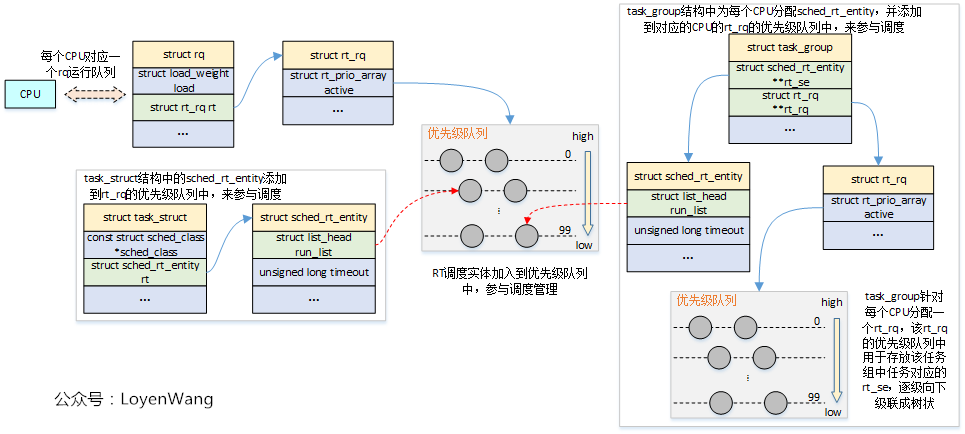

The PREEMPT_RT patch set implements real-time capabilities in Linux through several key modifications to the kernel. Here's a detailed explanation of how PREEMPT_RT achieves this:

1. Fully Preemptible Kernel:
   - Converts most spinlocks to RT-mutexes, allowing preemption even when locks are held.
   - Implements "sleeping spinlocks" to allow context switches during lock contention.
   - Makes interrupt handlers preemptible by converting them to kernel threads.

2. High-Resolution Timers:
   - Replaces the standard timer wheel with high-resolution timers (hrtimers).
   - Provides microsecond or nanosecond resolution for timers and scheduling.

3. Priority Inheritance:
   - Implements a comprehensive priority inheritance mechanism.
   - Helps prevent priority inversion scenarios in real-time tasks.

4. Threaded Interrupt Handlers:
   - Converts hardirq handlers into threaded interrupt handlers.
   - Allows interrupt handlers to be preempted by higher-priority tasks.

5. Real-Time Scheduler:
   - Enhances the existing SCHED_FIFO and SCHED_RR policies.
   - Implements a more deterministic scheduling algorithm for real-time tasks.

6. Preemptible RCU (Read-Copy-Update):
   - Modifies RCU to allow preemption during read-side critical sections.

7. Latency Reduction:
   - Identifies and modifies long non-preemptible sections in the kernel.
   - Introduces preemption points in long-running kernel operations.

8. Interrupt Threading:
   - Moves interrupt processing to kernel threads, making them schedulable.
   - Allows for prioritization of interrupt handling.

9. Locking Mechanisms:
   - Introduces rtmutex (real-time mutex) as a fundamental locking primitive.
   - Implements priority inheritance for mutexes and spinlocks.

10. Critical Section Management:
    - Reduces the size of critical sections where possible.
    - Implements fine-grained locking to minimize non-preemptible code paths.

11. Real-Time Throttling:
    - Implements mechanisms to prevent real-time tasks from monopolizing the CPU.

12. Sleeping in Atomic Contexts:
    - Allows certain operations that traditionally required spinlocks to sleep, improving system responsiveness.

13. Improved Timer Handling:
    - Implements more precise timer management to reduce scheduling latencies.

14. Preemptible Kernel-Level Threads:
    - Makes kernel threads preemptible, allowing real-time tasks to run when needed.

15. Real-Time Bandwidth Control:
    - Implements mechanisms to control CPU usage of real-time tasks to prevent system lockup.

16. Forced Preemption:
    - Introduces mechanisms to force preemption in long-running kernel code paths.

17. Debugging and Tracing:
    - Enhances existing tools and adds new ones for debugging real-time behavior.

Key Implementation Challenges:

1. Maintaining system stability while increasing preemptibility.
2. Balancing real-time performance with overall system throughput.
3. Ensuring backwards compatibility with existing applications and drivers.
4. Managing increased complexity in synchronization and locking mechanisms.

```c
struct rt_rq {
    struct rt_prio_array    active;
    unsigned int            rt_nr_running;
    unsigned int            rr_nr_running;
    struct {
        int     curr; /* highest queued rt task prio */
        int     next; /* next highest */
    } highest_prio;

    int                     overloaded;
    struct plist_head       pushable_tasks;

    /* rt_rq is enqueued into rq */
    int                     rt_queued;

    int                     rt_throttled;
    u64                     rt_time;    /* current time usage */
    u64                     rt_runtime; /* max time usage */

#ifdef CONFIG_RT_GROUP_SCHED
    unsigned int            rt_nr_boosted;
    struct rq               *rq;
    struct task_group       *tg;
#endif
};

struct sched_rt_entity {
    struct list_head            run_list;
    unsigned long               timeout;
    unsigned long               watchdog_stamp;
    unsigned int                time_slice;
    unsigned short              on_rq;
    unsigned short              on_list;

    struct sched_rt_entity      *back;
#ifdef CONFIG_RT_GROUP_SCHED
    struct sched_rt_entity      *parent;
    /* rq on which this entity is (to be) queued: */
    struct rt_rq                *rt_rq;
    /* rq "owned" by this entity/group: */
    struct rt_rq                *my_q;
#endif
};

DEFINE_SCHED_CLASS(rt) = {
    .enqueue_task           = enqueue_task_rt,
    .dequeue_task           = dequeue_task_rt,
    .yield_task             = yield_task_rt,

    .wakeup_preempt         = wakeup_preempt_rt,

    .pick_task              = pick_task_rt,
    .put_prev_task          = put_prev_task_rt,
    .set_next_task          = set_next_task_rt,

    .balance                = balance_rt,
    .select_task_rq         = select_task_rq_rt,
    .set_cpus_allowed       = set_cpus_allowed_common,
    .rq_online              = rq_online_rt,
    .rq_offline             = rq_offline_rt,
    .task_woken             = task_woken_rt,
    .switched_from          = switched_from_rt,
    .find_lock_rq           = find_lock_lowest_rq,

    .task_tick              = task_tick_rt,

    .get_rr_interval        = get_rr_interval_rt,

    .prio_changed           = prio_changed_rt,
    .switched_to            = switched_to_rt,

    .update_curr            = update_curr_rt,

    .task_is_throttled      = task_is_throttled_rt,

    .uclamp_enabled         = 1,
};
```

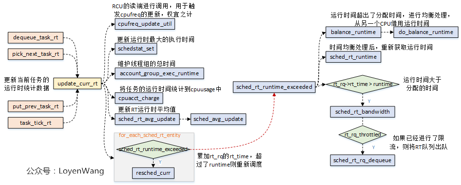

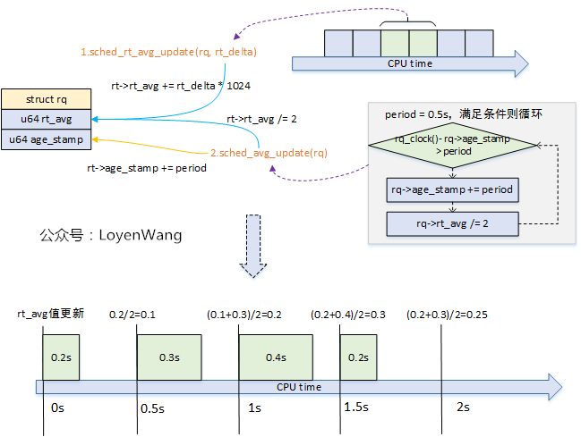

## task_tick_rt

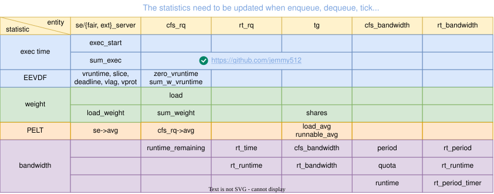

```c
/* default timeslice is 100 msecs (used only for SCHED_RR tasks).
 * Timeslices get refilled after they expire. */
#define RR_TIMESLICE        (100 * HZ / 1000)

task_tick_rt(struct rq *rq, struct task_struct *p, int queued)
{
    struct sched_rt_entity *rt_se = &p->rt;

    update_curr_rt(struct rq *rq);

    update_rt_rq_load_avg(rq_clock_pelt(rq), rq, 1);

    watchdog(rq, p);

    if (p->policy != SCHED_RR)
        return;

    if (--p->rt.time_slice)
        return;

    p->rt.time_slice = sched_rr_timeslice; /* RR_TIMESLICE: default 100 msecs */

    for_each_sched_rt_entity(rt_se) {
        if (rt_se->run_list.prev != rt_se->run_list.next) {
            requeue_task_rt(rq, p, 0);
            resched_curr(rq);
            return;
        }
    }
}
```

### update_curr_rt

```c
static void update_curr_rt(struct rq *rq)
{
    struct task_struct *donor = rq->donor;
    s64 delta_exec;

    if (curr->sched_class != &rt_sched_class)
        return;

    delta_exec = update_curr_common(rq);
    if (unlikely(delta_exec <= 0))
        return;

#ifdef CONFIG_RT_GROUP_SCHED
    if (!rt_bandwidth_enabled())
        return;

    for_each_sched_rt_entity(rt_se) {
        struct rt_rq *rt_rq = rt_rq_of_se(rt_se);
        int exceeded;

        if (sched_rt_runtime(rt_rq) != RUNTIME_INF) {
            raw_spin_lock(&rt_rq->rt_runtime_lock);
            rt_rq->rt_time += delta_exec;
            exceeded = sched_rt_runtime_exceeded(rt_rq);
            if (exceeded)
                resched_curr(rq);
            raw_spin_unlock(&rt_rq->rt_runtime_lock);
            if (exceeded) {
                do_start_rt_bandwidth(sched_rt_bandwidth(rt_rq)) {
                    if (!rt_b->rt_period_active) {
                        rt_b->rt_period_active = 1;
                        hrtimer_forward_now(&rt_b->rt_period_timer, ns_to_ktime(0));
                        hrtimer_start_expires(&rt_b->rt_period_timer,
                                    HRTIMER_MODE_ABS_PINNED_HARD);
                    }
                }
            }
        }
    }
#endif /* CONFIG_RT_GROUP_SCHED */
}
```

## enqueue_task_rt

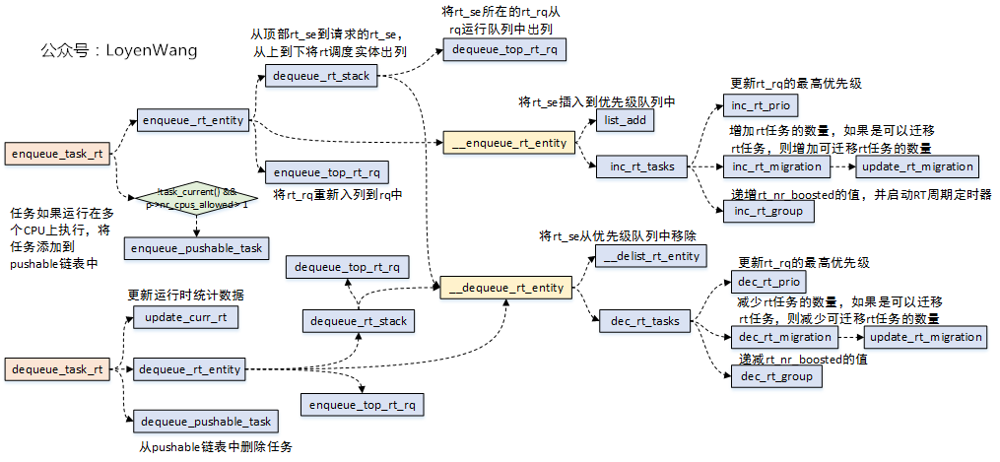

```c
enqueue_task_rt(struct rq *rq, struct task_struct *p, int flags) {
    if (flags & ENQUEUE_WAKEUP)
        rt_se->timeout = 0;

    check_schedstat_required();
    update_stats_wait_start_rt(rt_rq_of_se(rt_se), rt_se) {
        struct sched_statistics *stats;
        struct task_struct *p = NULL;

        if (!schedstat_enabled())
            return;

        if (rt_entity_is_task(rt_se))
            p = rt_task_of(rt_se);

        stats = __schedstats_from_rt_se(rt_se);
        if (!stats)
            return;

        __update_stats_wait_start(rq_of_rt_rq(rt_rq), p, stats) {
            u64 wait_start, prev_wait_start;

            wait_start = rq_clock(rq);
            prev_wait_start = schedstat_val(stats->wait_start);

            if (p && likely(wait_start > prev_wait_start))
                wait_start -= prev_wait_start;

            __schedstat_set(stats->wait_start, wait_start);
        }

    }

    enqueue_rt_entity(rt_se, flags) {
        update_stats_enqueue_rt(rt_rq_of_se(rt_se), rt_se, flags);

/* 1. dequeue rt stack */
        /* Because the prio of an upper entry depends on the lower
         * entries, we must remove entries top - down. */
        dequeue_rt_stack(rt_se, flags);

        for_each_sched_rt_entity(rt_se) {
            __enqueue_rt_entity(rt_se, flags) {
/* 2. insert into prio list */
                if (flags & ENQUEUE_HEAD)
                    list_add(&rt_se->run_list, queue);
                else
                    list_add_tail(&rt_se->run_list, queue);
                __set_bit(rt_se_prio(rt_se), array->bitmap);

                rt_se->on_list = 1;
                rt_se->on_rq = 1;

                inc_rt_tasks(rt_se, rt_rq) {
                    int prio = rt_se_prio(rt_se);

                    rt_rq->rt_nr_running += rt_se_nr_running(rt_se);
                    rt_rq->rr_nr_running += rt_se_rr_nr_running(rt_se);
/* 3. update cpu prio vec */
                    inc_rt_prio(rt_rq, prio) {
                        int prev_prio = rt_rq->highest_prio.curr;

                        if (prio < prev_prio)
                            rt_rq->highest_prio.curr = prio;

                        inc_rt_prio_smp(rt_rq, prio, prev_prio) {
                            struct rq *rq = rq_of_rt_rq(rt_rq);
                            if (&rq->rt != rt_rq) {
                                return;
                            }
                            if (rq->online && prio < prev_prio) {
                                cpupri_set(&rq->rd->cpupri/*cp*/, rq->cpu, prio) {
                                    int *currpri = &cp->cpu_to_pri[cpu];
                                    int oldpri = *currpri;

                                    /* 1. map [prio] = { cpu0, cpu1 }*/
                                    newpri = convert_prio(newpri);
                                    if (newpri == oldpri) {
                                        return;
                                    }

                                    if (likely(newpri != CPUPRI_INVALID)) {
                                        struct cpupri_vec *vec = &cp->pri_to_cpu[newpri];
                                        cpumask_set_cpu(cpu, vec->mask);
                                        atomic_inc(&(vec)->count);
                                    }
                                    if (likely(oldpri != CPUPRI_INVALID)) {
                                        struct cpupri_vec *vec  = &cp->pri_to_cpu[oldpri];
                                        atomic_dec(&(vec)->count);
                                        cpumask_clear_cpu(cpu, vec->mask);
                                    }

                                    /* 2. map [cpu] = { prio } */
                                    *currpri = newpri;
                                }
                            }
                        }
                    }
                    inc_rt_group(rt_se, rt_rq) {
                        if (rt_se_boosted(rt_se))
                            rt_rq->rt_nr_boosted++;

                        if (rt_rq->tg) {
                            start_rt_bandwidth(&rt_rq->tg->rt_bandwidth) {
                                if (!rt_b->rt_period_active) {
                                    rt_b->rt_period_active = 1;
                                    hrtimer_forward_now(&rt_b->rt_period_timer, ns_to_ktime(0));
                                    hrtimer_start_expires(&rt_b->rt_period_timer,
                                                HRTIMER_MODE_ABS_PINNED_HARD);
                                }
                            }
                        }
                    }
                }
            }
        }
        enqueue_top_rt_rq(&rq->rt) {
            struct rq *rq = rq_of_rt_rq(rt_rq);
            if (rt_rq->rt_queued)
                return;

            if (rt_rq_throttled(rt_rq))
                return;

            if (rt_rq->rt_nr_running) {
                add_nr_running(rq, rt_rq->rt_nr_running);
                rt_rq->rt_queued = 1;
            }

            /* Kick cpufreq (see the comment in kernel/sched/sched.h). */
            cpufreq_update_util(rq, 0);
        }
    }

    if (task_is_blocked(p))
        return;

/* 4. enqueue pushable task */
    if (!task_current(rq, p) && p->nr_cpus_allowed > 1) {
        enqueue_pushable_task(rq, p) {
            plist_del(&p->pushable_tasks, &rq->rt.pushable_tasks);
            plist_node_init(&p->pushable_tasks, p->prio);
            plist_add(&p->pushable_tasks, &rq->rt.pushable_tasks);

            if (p->prio < rq->rt.highest_prio.next) {
                rq->rt.highest_prio.next = p->prio;
            }

            if (!rq->rt.overloaded) {
                rt_set_overload(rq) {
                    if (!rq->online)
                        return;

                    /* used in pull_rt_task */
                    cpumask_set_cpu(rq->cpu, rq->rd->rto_mask);
                    smp_wmb();
                    atomic_inc(&rq->rd->rto_count);
                }
                rq->rt.overloaded = 1;
            }
        }
    }

}
```

### __update_stats_enqueue_sleeper

```c
static inline void
update_stats_enqueue_rt(struct rt_rq *rt_rq, struct sched_rt_entity *rt_se,
            int flags)
{
    if (!schedstat_enabled())
        return;

    if (flags & ENQUEUE_WAKEUP)
        update_stats_enqueue_sleeper_rt(rt_rq, rt_se);
}

static inline void
update_stats_enqueue_sleeper_rt(struct rt_rq *rt_rq, struct sched_rt_entity *rt_se)
{
    struct sched_statistics *stats;
    struct task_struct *p = NULL;

    if (!schedstat_enabled())
        return;

    if (rt_entity_is_task(rt_se))
        p = rt_task_of(rt_se);

    stats = __schedstats_from_rt_se(rt_se) {
        /* schedstats is not supported for rt group. */
        if (!rt_entity_is_task(rt_se))
            return NULL;

        return &rt_task_of(rt_se)->stats;
    }
    if (!stats)
        return;

    __update_stats_enqueue_sleeper(rq_of_rt_rq(rt_rq), p, stats);
}

void __update_stats_enqueue_sleeper(struct rq *rq, struct task_struct *p,
                    struct sched_statistics *stats)
{
    u64 sleep_start, block_start;

    sleep_start = schedstat_val(stats->sleep_start);
    block_start = schedstat_val(stats->block_start);

    if (sleep_start) {
        u64 delta = rq_clock(rq) - sleep_start;

        if ((s64)delta < 0)
            delta = 0;

        if (unlikely(delta > schedstat_val(stats->sleep_max)))
            __schedstat_set(stats->sleep_max, delta);

        __schedstat_set(stats->sleep_start, 0);
        __schedstat_add(stats->sum_sleep_runtime, delta);

        if (p) {
            account_scheduler_latency(p, delta >> 10, 1);
            trace_sched_stat_sleep(p, delta);
        }
    }

    if (block_start) {
        u64 delta = rq_clock(rq) - block_start;

        if ((s64)delta < 0)
            delta = 0;

        if (unlikely(delta > schedstat_val(stats->block_max)))
            __schedstat_set(stats->block_max, delta);

        __schedstat_set(stats->block_start, 0);
        __schedstat_add(stats->sum_sleep_runtime, delta);
        __schedstat_add(stats->sum_block_runtime, delta);

        if (p) {
            if (p->in_iowait) {
                __schedstat_add(stats->iowait_sum, delta);
                __schedstat_inc(stats->iowait_count);
                trace_sched_stat_iowait(p, delta);
            }

            trace_sched_stat_blocked(p, delta);

            account_scheduler_latency(p, delta >> 10, 0) {
                if (unlikely(latencytop_enabled))
                    __account_scheduler_latency(task, usecs, inter);
            }
        }
    }
}

void __sched
__account_scheduler_latency(struct task_struct *tsk, int usecs, int inter)
{
    unsigned long flags;
    int i, q;
    struct latency_record lat;

    /* Long interruptible waits are generally user requested... */
    if (inter && usecs > 5000)
        return;

    /* Negative sleeps are time going backwards */
    /* Zero-time sleeps are non-interesting */
    if (usecs <= 0)
        return;

    memset(&lat, 0, sizeof(lat));
    lat.count = 1;
    lat.time = usecs;
    lat.max = usecs;

    stack_trace_save_tsk(tsk, lat.backtrace, LT_BACKTRACEDEPTH, 0);

    raw_spin_lock_irqsave(&latency_lock, flags);

    account_global_scheduler_latency(tsk, &lat);

    for (i = 0; i < tsk->latency_record_count; i++) {
        struct latency_record *mylat;
        int same = 1;

        mylat = &tsk->latency_record[i];
        for (q = 0; q < LT_BACKTRACEDEPTH; q++) {
            unsigned long record = lat.backtrace[q];

            if (mylat->backtrace[q] != record) {
                same = 0;
                break;
            }

            /* 0 entry is end of backtrace */
            if (!record)
                break;
        }
        if (same) {
            mylat->count++;
            mylat->time += lat.time;
            if (lat.time > mylat->max)
                mylat->max = lat.time;
            goto out_unlock;
        }
    }

    /* short term hack; if we're > 32 we stop; future we recycle: */
    if (tsk->latency_record_count >= LT_SAVECOUNT)
        goto out_unlock;

    /* Allocated a new one: */
    i = tsk->latency_record_count++;
    memcpy(&tsk->latency_record[i], &lat, sizeof(struct latency_record));

out_unlock:
    raw_spin_unlock_irqrestore(&latency_lock, flags);
}
```

## dequeue_task_rt


```c
static void dequeue_task_rt(struct rq *rq, struct task_struct *p, int flags) {
    struct sched_rt_entity *rt_se = &p->rt;

    update_curr_rt(rq);
    dequeue_rt_entity(rt_se, flags) {
        struct rq *rq = rq_of_rt_se(rt_se);

        update_stats_dequeue_rt(rt_rq_of_se(rt_se), rt_se, flags);

/* 1. dequeue rt stack */
        dequeue_rt_stack(rt_se, flags) {
            /* Because the prio of an upper entry depends on the lower
             * entries, we must remove entries top - down. */
            for_each_sched_rt_entity(rt_se) {
                rt_se->back = back;
                back = rt_se;
            }

            rt_nr_running = rt_rq_of_se(back)->rt_nr_running;

            for (rt_se = back; rt_se; rt_se = rt_se->back) {
                if (on_rt_rq(rt_se)) { /* rt_se->on_rq */
                    __dequeue_rt_entity(rt_se, flags) {
                        struct rt_rq *rt_rq = rt_rq_of_se(rt_se);
                        struct rt_prio_array *array = &rt_rq->active;
/* 2. remove from prio list */
                        if (move_entity(flags)) {
                            __delist_rt_entity(rt_se, array) {
                                list_del_init(&rt_se->run_list);

                                if (list_empty(array->queue + rt_se_prio(rt_se))) {
                                    __clear_bit(rt_se_prio(rt_se), array->bitmap);
                                }

                                rt_se->on_list = 0;
                            }
                        }
                        rt_se->on_rq = 0;

                        dec_rt_tasks(rt_se, rt_rq) {
                            rt_rq->rt_nr_running -= rt_se_nr_running(rt_se);
                            rt_rq->rr_nr_running -= rt_se_rr_nr_running(rt_se);
/* 3. update cpu prio vec */
                            dec_rt_prio(rt_rq, rt_se_prio(rt_se)/*prio*/) {
                                int prev_prio = rt_rq->highest_prio.curr;

                                if (rt_rq->rt_nr_running) {
                                    if (prio == prev_prio) {
                                        struct rt_prio_array *array = &rt_rq->active;
                                        rt_rq->highest_prio.curr = sched_find_first_bit(array->bitmap);
                                    }
                                } else {
                                    rt_rq->highest_prio.curr = MAX_RT_PRIO-1;
                                }

                                dec_rt_prio_smp(rt_rq, prio, prev_prio) {
                                    /* for the last rt task, dequeue_pushable_task set
                                     * rq->rt.highest_prio.next = MAX_RT_PRIO-1;
                                     * which has 0 idx in rq->rd->cpupri.pri_to_cpu[] means cfs cpu */
                                    if (rq->online && rt_rq->highest_prio.curr != prev_prio) {
                                        cpupri_set(&rq->rd->cpupri, rq->cpu, rt_rq->highest_prio.curr);
                                    }
                                }
                            }
                            dec_rt_group(rt_se, rt_rq) {
                                if (rt_se_boosted(rt_se))
                                    rt_rq->rt_nr_boosted--;

                                WARN_ON(!rt_rq->rt_nr_running && rt_rq->rt_nr_boosted);
                            }
                        }
                    }
                }
            }

            dequeue_top_rt_rq(rt_rq_of_se(back), rt_nr_running) {
                struct rq *rq = rq_of_rt_rq(rt_rq);
                if (!rt_rq->rt_queued)
                    return;

                sub_nr_running(rq, count);
                rt_rq->rt_queued = 0;
            }
        }

        for_each_sched_rt_entity(rt_se) {
            struct rt_rq *rt_rq = group_rt_rq(rt_se);

            if (rt_rq && rt_rq->rt_nr_running)
                __enqueue_rt_entity(rt_se, flags);
        }

        enqueue_top_rt_rq(&rq->rt);
            --->
    }
/* 4. dequeue_pushable_task */
    dequeue_pushable_task(rq, p) {
        plist_del(&p->pushable_tasks, &rq->rt.pushable_tasks);

        if (has_pushable_tasks(rq)) {
            p = plist_first_entry(&rq->rt.pushable_tasks, struct task_struct, pushable_tasks);
            rq->rt.highest_prio.next = p->prio;
        } else {
            rq->rt.highest_prio.next = MAX_RT_PRIO-1;

            if (rq->rt.overloaded) {
                rt_clear_overload(rq) {
                    if (!rq->online)
                        return;

                    /* the order here really doesn't matter */
                    atomic_dec(&rq->rd->rto_count);
                    cpumask_clear_cpu(rq->cpu, rq->rd->rto_mask);
                }
                rq->rt.overloaded = 0;
            }
        }
    }
}
```

## pick_task_rt

```c
struct task_struct *pick_task_rt(struct rq *rq, struct rq_flags *rf)
{
    rq_modified_begin(rq, &rt_sched_class);
    balance_rt(rq, rf);
    if (rq_modified_above(rq, &rt_sched_class))
        return RETRY_TASK;

    if (!sched_rt_runnable(rq))
        return NULL;

    return _pick_next_task_rt(rq);
}

static struct task_struct *_pick_next_task_rt(struct rq *rq)
{
    struct sched_rt_entity *rt_se;
    struct rt_rq *rt_rq  = &rq->rt;

    do {
        rt_se = pick_next_rt_entity(rt_rq) {
            struct rt_prio_array *array = &rt_rq->active;
            struct sched_rt_entity *next = NULL;
            struct list_head *queue;
            int idx;

            idx = sched_find_first_bit(array->bitmap);
            BUG_ON(idx >= MAX_RT_PRIO);

            queue = array->queue + idx;
            if (WARN_ON_ONCE(list_empty(queue)))
                return NULL;
            next = list_entry(queue->next, struct sched_rt_entity, run_list);

            return next;
        }
        if (unlikely(!rt_se))
            return NULL;
        rt_rq = group_rt_rq(rt_se);
    } while (rt_rq);

    return rt_task_of(rt_se);
}
```

## balance_rt

* [hellokitty2 - 调度器34 - RT负载均衡](https://www.cnblogs.com/hellokitty2/p/15974333.html)

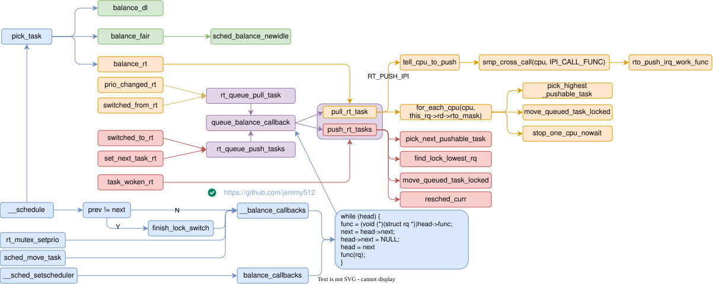

```c
balance_rt(struct rq *rq, struct rq_flags *rf)
{
    /* Note, rq->donor may change during rq lock drops,
     * so don't re-use p across lock drops */
    struct task_struct *p = rq->donor;

    ret = need_pull_rt_task(rq, p) {
        /* Try to pull RT tasks here if we lower this rq's prio */
        return rq->online && rq->rt.highest_prio.curr > prev->prio;
    }
    if (!on_rt_rq(&p->rt) && ret) {
        /* This is OK, because current is on_cpu, which avoids it being
         * picked for load-balance and preemption/IRQs are still
         * disabled avoiding further scheduler activity on it and we've
         * not yet started the picking loop. */
        rq_unpin_lock(rq, rf);
        pull_rt_task(rq);
        rq_repin_lock(rq, rf);
    }

    return sched_stop_runnable(rq) || sched_dl_runnable(rq) || sched_rt_runnable(rq);
}
```

### pull_rt_task

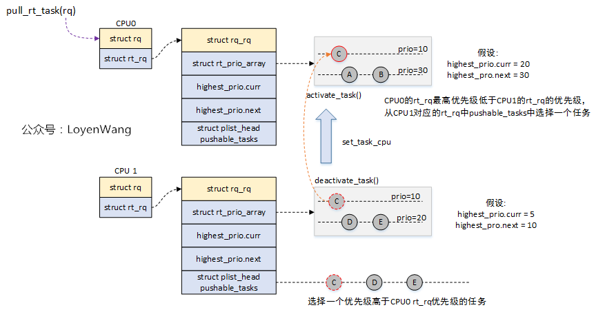

---

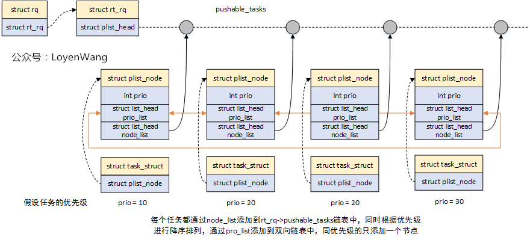

```c
/* pull tasks which has lower prio than this_rq from other cpus */
void pull_rt_task(struct rq *this_rq) {
    int this_cpu = this_rq->cpu, cpu;
    bool resched = false;
    struct task_struct *p, *push_task;
    struct rq *src_rq;
    int rt_overload_count = rt_overloaded(this_rq) {
        /* inc at enqueue_task_rt
         * dec at dequeue_pushable_task */
        return &rq->rd->rto_count;
    }

    if (likely(!rt_overload_count))
        return;

    /* Match the barrier from rt_set_overloaded; this guarantees that if we
     * see overloaded we must also see the rto_mask bit. */
    smp_rmb();

    /* If we are the only overloaded CPU do nothing */
    if (rt_overload_count == 1 &&  cpumask_test_cpu(this_rq->cpu, this_rq->rd->rto_mask))
        return;

    if (sched_feat(RT_PUSH_IPI)) {
        /* rd->rto_push_work = IRQ_WORK_INIT_HARD(rto_push_irq_work_func); */
        tell_cpu_to_push(this_rq);
            --->
        return;
    }

    /* rd->rto_maks is updated in enqueue_pushable_task */
    for_each_cpu(cpu, this_rq->rd->rto_mask) {
        if (this_cpu == cpu)
            continue;

        src_rq = cpu_rq(cpu);

        /* no need to pull task if this rq has higher prio */
        if (src_rq->rt.highest_prio.next >= this_rq->rt.highest_prio.curr)
            continue;

        push_task = NULL;
        double_lock_balance(this_rq, src_rq);

        p = pick_highest_pushable_task(src_rq, this_cpu) {
            struct plist_head *head = &rq->rt.pushable_tasks;
            struct task_struct *p;

            if (!has_pushable_tasks(rq))
                return NULL;

            plist_for_each_entry(p, head, pushable_tasks) {
                ret = pick_rt_task(rq, p, cpu) {
                    return (!task_on_cpu(rq, p) && cpumask_test_cpu(cpu, &p->cpus_mask));
                }
                if (ret)
                    return p;
            }

            return NULL;
        }

        if (p && (p->prio < this_rq->rt.highest_prio.curr)) {
            /* There's a chance that p is higher in priority
             * than what's currently running on its CPU.
             * This is just that p is waking up and hasn't
             * had a chance to schedule. We only pull
             * p if it is lower in priority than the
             * current task on the run queue */
            if (p->prio < src_rq->curr->prio)
                goto skip;

            if (is_migration_disabled(p)) {
                push_task = get_push_task(src_rq) {
                    struct task_struct *p = rq->curr;

                    if (rq->push_busy)
                        return NULL;

                    if (p->nr_cpus_allowed == 1)
                        return NULL;

                    if (p->migration_disabled)
                        return NULL;

                    rq->push_busy = true;
                    return get_task_struct(p);
                }
            } else {
                move_queued_task_locked(rq, later_rq, next_task);
                resched = true;
            }
        }
skip:
        double_unlock_balance(this_rq, src_rq);

        if (push_task) {
            preempt_disable();
            raw_spin_rq_unlock(this_rq);
            stop_one_cpu_nowait(src_rq->cpu, push_cpu_stop, push_task, &src_rq->push_work);
            preempt_enable();
            raw_spin_rq_lock(this_rq);
        }
    }

    if (resched)
        resched_curr(this_rq);
}
```

#### tell_cpu_to_push

```c
void tell_cpu_to_push(struct rq *rq)
{
    int cpu = -1;

    /* Keep the loop going if the IPI is currently active */
    atomic_inc(&rq->rd->rto_loop_next);

    /* Only one CPU can initiate a loop at a time */
    if (!rto_start_trylock(&rq->rd->rto_loop_start))
        return;

    raw_spin_lock(&rq->rd->rto_lock);

    /* The rto_cpu is updated under the lock, if it has a valid CPU
     * then the IPI is still running and will continue due to the
     * update to loop_next, and nothing needs to be done here.
     * Otherwise it is finishing up and an IPI needs to be sent. */
    if (rq->rd->rto_cpu < 0) {
        cpu = rto_next_cpu(rq->rd) {
            int this_cpu = smp_processor_id();
            int next;
            int cpu;

            /* When starting the IPI RT pushing, the rto_cpu is set to -1,
            * rt_next_cpu() will simply return the first CPU found in
            * the rto_mask.
            *
            * If rto_next_cpu() is called with rto_cpu is a valid CPU, it
            * will return the next CPU found in the rto_mask.
            *
            * If there are no more CPUs left in the rto_mask, then a check is made
            * against rto_loop and rto_loop_next. rto_loop is only updated with
            * the rto_lock held, but any CPU may increment the rto_loop_next
            * without any locking. */
            for (;;) {

                /* When rto_cpu is -1 this acts like cpumask_first() */
                cpu = cpumask_next(rd->rto_cpu, rd->rto_mask);

                rd->rto_cpu = cpu;

                /* Do not send IPI to self */
                if (cpu == this_cpu)
                    continue;

                if (cpu < nr_cpu_ids)
                    return cpu;

                rd->rto_cpu = -1;

                /* ACQUIRE ensures we see the @rto_mask changes
                * made prior to the @next value observed.
                *
                * Matches WMB in rt_set_overload(). */
                next = atomic_read_acquire(&rd->rto_loop_next);

                if (rd->rto_loop == next)
                    break;

                rd->rto_loop = next;
            }

            return -1;
        }
    }

    raw_spin_unlock(&rq->rd->rto_lock);

    rto_start_unlock(&rq->rd->rto_loop_start);

    if (cpu >= 0) {
        /* Make sure the rd does not get freed while pushing */
        sched_get_rd(rq->rd);
        irq_work_queue_on(&rq->rd->rto_push_work, cpu);
    }
}

/* Called from hardirq context */
void rto_push_irq_work_func(struct irq_work *work)
{
    struct root_domain *rd =
        container_of(work, struct root_domain, rto_push_work);
    struct rq *rq;
    int cpu;

    rq = this_rq();

    /* We do not need to grab the lock to check for has_pushable_tasks.
     * When it gets updated, a check is made if a push is possible. */
    if (has_pushable_tasks(rq)) {
        raw_spin_rq_lock(rq);
        while (push_rt_task(rq, true))
            ;
        raw_spin_rq_unlock(rq);
    }

    raw_spin_lock(&rd->rto_lock);

    /* Pass the IPI to the next rt overloaded queue */
    cpu = rto_next_cpu(rd);

    raw_spin_unlock(&rd->rto_lock);

    if (cpu < 0) {
        sched_put_rd(rd);
        return;
    }

    /* Try the next RT overloaded CPU */
    irq_work_queue_on(&rd->rto_push_work, cpu);
}
```

### push_rt_tasks

1. switched_to_rt

    ```c
    switched_to_rt() {
        if (p->nr_cpus_allowed > 1 && rq->rt.overloaded) {
            rt_queue_push_tasks(rq) {
                queue_balance_callback(push_rt_tasks);
            }
        }
    }
    ```

2. set_next_task_rt

    ```c
    set_next_task_rt() {
        rt_queue_push_tasks();
    }
    ```

3. try_to_wake_up

    ```c
    try_to_wake_up() {
        p->sched_class->task_woken(rq, p) {
            void task_woken_rt(struct rq *rq, struct task_struct *p) {
                bool need_to_push = !task_on_cpu(rq, p) &&
                    !test_tsk_need_resched(rq->curr) &&
                    p->nr_cpus_allowed > 1 &&
                    (dl_task(rq->donor) || rt_task(rq->donor)) &&
                    (rq->curr->nr_cpus_allowed < 2 ||
                        rq->donor->prio <= p->prio);
                if (need_to_push)
                    push_rt_tasks(rq);
            }
        }
    }
    ```

```c
static void push_rt_tasks(struct rq *rq)
{
    /* push_rt_task will return true if it moved an RT */
    while (push_rt_task(rq, false))
        ;
}

/* If the current CPU has more than one RT task, see if the non
 * running task can migrate over to a CPU that is running a task
 * of lesser priority. */
static int push_rt_task(struct rq *rq, bool pull) {
    if (!rq->rt.overloaded)
        return 0;

    next_task = pick_next_pushable_task(rq) {
        return plist_first_entry(&rq->rt.pushable_tasks,
            struct task_struct, pushable_tasks);
    }
    if (!next_task)
        return 0;

retry:
    if (unlikely(next_task->prio < rq->curr->prio)) {
        resched_curr(rq);
        return 0;
    }

    if (is_migration_disabled(next_task)) {
        struct task_struct *push_task = NULL;
        int cpu;

        if (!pull || rq->push_busy)
            return 0;

        if (rq->curr->sched_class != &rt_sched_class)
            return 0;

        cpu = find_lowest_rq(rq->curr);
            --->
        if (cpu == -1 || cpu == rq->cpu)
            return 0;

        push_task = get_push_task(rq);
        if (push_task) {
            raw_spin_rq_unlock(rq);
            stop_one_cpu_nowait(rq->cpu, push_cpu_stop, push_task, &rq->push_work) {

            }
            raw_spin_rq_lock(rq);
        }

        return 0;
    }

    if (WARN_ON(next_task == rq->curr))
        return 0;

    /* We might release rq lock */
    get_task_struct(next_task);

    /* find_lock_lowest_rq locks the rq if found */
    lowest_rq = find_lock_lowest_rq(next_task, rq);
    if (!lowest_rq) {
        struct task_struct *task;

        task = pick_next_pushable_task(rq);
        if (task == next_task) {
            /* we failed to find a run-queue to push next_task to.
             * Do not retry in this case, since
             * other CPUs will pull from us when ready. */
            goto out;
        }

        if (!task)
            /* No more tasks, just exit */
            goto out;

        put_task_struct(next_task);
        next_task = task;
        goto retry;
    }

    move_queued_task_locked(rq, lowest_rq, next_task);
    resched_curr(lowest_rq);
    ret = 1;

    double_unlock_balance(rq, lowest_rq);
out:
    put_task_struct(next_task);

    return ret;
}

static struct task_struct *pick_next_pushable_task(struct rq *rq)
{
    struct plist_head *head = &rq->rt.pushable_tasks;
    struct task_struct *i, *p = NULL;

    if (!has_pushable_tasks(rq))
        return NULL;

    plist_for_each_entry(i, head, pushable_tasks) {
        /* skip tasks that cannot be migrated */
        if (!task_on_cpu(rq, i) && !is_migration_disabled(i)) {
            p = i;
            break;
        }
    }

    if (!p)
        return NULL;

    BUG_ON(rq->cpu != task_cpu(p));
    BUG_ON(task_current(rq, p));
    BUG_ON(task_current_donor(rq, p));
    BUG_ON(p->nr_cpus_allowed <= 1);

    BUG_ON(!task_on_rq_queued(p));
    BUG_ON(!rt_task(p));

    return p;
}
```


### move_queued_task_locked

```c
void move_queued_task_locked(struct rq *src_rq, struct rq *dst_rq, struct task_struct *task)
{
    deactivate_task(rq, next_task, 0) {
        WRITE_ONCE(p->on_rq, TASK_ON_RQ_MIGRATING);
        dequeue_task(rq, p, flags) {
            if (sched_core_enabled(rq)) {
                sched_core_dequeue(rq, p, flags);
            }

            if (!(flags & DEQUEUE_NOCLOCK))
                update_rq_clock(rq);

            if (!(flags & DEQUEUE_SAVE)) {
                sched_info_dequeue(rq, p);
                psi_dequeue(p, flags & DEQUEUE_SLEEP);
            }

            uclamp_rq_dec(rq, p);
            p->sched_class->dequeue_task(rq, p, flags);
        }
    }

    set_task_cpu(next_task, lowest_rq->cpu);

    activate_task(lowest_rq, next_task, 0) {
        if (task_on_rq_migrating(p))
            flags |= ENQUEUE_MIGRATED;
        if (flags & ENQUEUE_MIGRATED)
            sched_mm_cid_migrate_to(rq, p);

        enqueue_task(rq, p, flags) {
            if (!(flags & ENQUEUE_NOCLOCK))
                update_rq_clock(rq);

            p->sched_class->enqueue_task(rq, p, flags);

            /*  Must be after ->enqueue_task() because ENQUEUE_DELAYED can clear
                * ->sched_delayed. */
            uclamp_rq_inc(rq, p) {
                enum uclamp_id clamp_id;

                if (!static_branch_unlikely(&sched_uclamp_used))
                    return;

                if (unlikely(!p->sched_class->uclamp_enabled))
                    return;

                if (p->se.sched_delayed)
                    return;

                for_each_clamp_id(clamp_id)
                    uclamp_rq_inc_id(rq, p, clamp_id);

                /* Reset clamp idle holding when there is one RUNNABLE task */
                if (rq->uclamp_flags & UCLAMP_FLAG_IDLE)
                    rq->uclamp_flags &= ~UCLAMP_FLAG_IDLE;
            }

            psi_enqueue(p, flags);

            if (!(flags & ENQUEUE_RESTORE))
                sched_info_enqueue(rq, p);

            if (sched_core_enabled(rq))
                sched_core_enqueue(rq, p);
        }

        p->on_rq = TASK_ON_RQ_QUEUED;
    }

    wakeup_preempt(dst_rq, task, 0);
}
```

## put_prev_task_rt

```c
put_prev_task_rt(struct rq *rq, struct task_struct *p) {
    struct sched_rt_entity *rt_se = &p->rt;
    struct rt_rq *rt_rq = &rq->rt;

    if (on_rt_rq(&p->rt))
        update_stats_wait_start_rt(rt_rq, rt_se);

    update_curr_rt(rq);

    update_rt_rq_load_avg(rq_clock_pelt(rq), rq, 1);

    if (task_is_blocked(p))
        return;

    if (on_rt_rq(&p->rt) && p->nr_cpus_allowed > 1) {
        enqueue_pushable_task(rq, p);
    }
}
```

## set_next_task_rt

```c
void set_next_task_rt(struct rq *rq, struct task_struct *p, bool first)
{
    struct sched_rt_entity *rt_se = &p->rt;
    struct rt_rq *rt_rq = &rq->rt;

    p->se.exec_start = rq_clock_task(rq);
    if (on_rt_rq(&p->rt))
        update_stats_wait_end_rt(rt_rq, rt_se);

    /* The running task is never eligible for pushing */
    dequeue_pushable_task(rq, p);

    if (!first)
        return;

    /* If prev task was rt, put_prev_task() has already updated the
     * utilization. We only care of the case where we start to schedule a
     * rt task */
    if (rq->donor->sched_class != &rt_sched_class)
        update_rt_rq_load_avg(rq_clock_pelt(rq), rq, 0);

    rt_queue_push_tasks(rq) {
        if (!has_pushable_tasks(rq))
            return;

        queue_balance_callback(rq, &per_cpu(rt_push_head, rq->cpu), push_rt_tasks);
    }
}
```

## select_task_rq_rt

* [内核工匠 - Linux Scheduler之rt选核流程](https://mp.weixin.qq.com/s/DByOOnJYTA2BDrwTXSDBmQ)
* [hellokitty2 - 调度器32 - RT选核](https://www.cnblogs.com/hellokitty2/p/15881574.html)

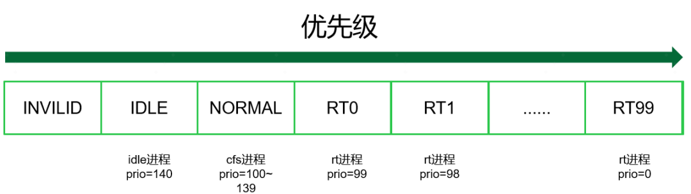

```c
try_to_wake_up() {
    select_task_rq(p, p->wake_cpu, WF_TTWU);
}

wake_up_new_task() {
    select_task_rq(p, task_cpu(p), WF_FORK);
}

sched_exec() {
    select_task_rq(p, task_cpu(p), WF_EXEC);
}
```

```c
#define CPUPRI_NR_PRIORITIES    (MAX_RT_PRIO+1)

struct cpupri {
    struct cpupri_vec   pri_to_cpu[CPUPRI_NR_PRIORITIES];
    int                 *cpu_to_pri;
};

struct cpupri_vec {
    atomic_t        count;
    cpumask_var_t   mask;
};
```

```c
static int
select_task_rq_rt(struct task_struct *p, int cpu, int flags)
{
    struct task_struct *curr;
    struct rq *rq;
    bool test;

    /* For anything but wake ups, just return the task_cpu */
    if (!(flags & (WF_TTWU | WF_FORK)))
        goto out;

    rq = cpu_rq(cpu);

    rcu_read_lock();
    curr = READ_ONCE(rq->curr); /* unlocked access */
    donor = READ_ONCE(rq->donor);

    /* test if curr must run on this core */
    test = curr &&
           unlikely(rt_task(donor)) &&
           (curr->nr_cpus_allowed < 2 || donor->prio <= p->prio);

    if (test || !rt_task_fits_capacity(p, cpu)) {
        /* 1. find lowest cpus */
        int target = find_lowest_rq(p);

        /* 2. pick tsk cpu: lowest target cpu is incapable */
        if (!test && target != -1 && !rt_task_fits_capacity(p, target))
            goto out_unlock;

        /* 3. pick target cpu: p prio is higher than the highest prio of target cpu */
        if (target != -1 && p->prio < cpu_rq(target)->rt.highest_prio.curr)
            cpu = target;
    }

out_unlock:
    rcu_read_unlock();

out:
    return cpu;
}

static inline bool rt_task_fits_capacity(struct task_struct *p, int cpu)
{
    unsigned int min_cap;
    unsigned int max_cap;
    unsigned int cpu_cap;

    /* Only heterogeneous systems can benefit from this check */
    if (!sched_asym_cpucap_active())
        return true;

    min_cap = uclamp_eff_value(p, UCLAMP_MIN);
    max_cap = uclamp_eff_value(p, UCLAMP_MAX);

    cpu_cap = arch_scale_cpu_capacity(cpu);

    return cpu_cap >= min(min_cap, max_cap);
}
```

## wakeup_preempt_rt

```c
void wakeup_preempt_rt(struct rq *rq, struct task_struct *p, int flags)
{
    struct task_struct *donor = rq->donor;

    /* XXX If we're preempted by DL, queue a push? */
    if (p->sched_class != &rt_sched_class || donor->sched_class != &rt_sched_class)
        return;

    if (p->prio < donor->prio) {
        resched_curr(rq);
        return;
    }

    /* If:
     * - the newly woken task prio == current task prio
     * - the newly woken task is non-migratable while current is migratable
     * - current will be preempted on the next reschedule
     *
     * we should check to see if current can readily move to a different
     * cpu.  If so, we will reschedule to allow the push logic to try
     * to move current somewhere else, making room for our non-migratable
     * task. */
    if (p->prio == rq->curr->prio && !test_tsk_need_resched(rq->curr)) {
        check_preempt_equal_prio(rq, p) {
            /* Current can't be migrated, useless to reschedule,
             * let's hope p can move out. */
            if (rq->curr->nr_cpus_allowed == 1
                || !cpupri_find(&rq->rd->cpupri, rq->curr, NULL)) {

                return;
            }

            /* p is migratable, so let's not schedule it and
             * see if it is pushed or pulled somewhere else.  */
            if (p->nr_cpus_allowed != 1
                && cpupri_find(&rq->rd->cpupri, p, NULL)) {

                return;
            }

            /* There appear to be other CPUs that can accept
             * the current task but none can run 'p', so lets reschedule
             * to try and push the current task away: */
            requeue_task_rt(rq, p, 1);
            resched_curr(rq);
        }
    }
}
```

## yield_task_rt

```c
static void yield_task_rt(struct rq *rq)
{
    requeue_task_rt(rq, rq->donor, 0);
}

static void requeue_task_rt(struct rq *rq, struct task_struct *p, int head)
{
    struct sched_rt_entity *rt_se = &p->rt;
    struct rt_rq *rt_rq;

    for_each_sched_rt_entity(rt_se) {
        rt_rq = rt_rq_of_se(rt_se);
        requeue_rt_entity(rt_rq, rt_se, head) {
            if (on_rt_rq(rt_se)) {
                struct rt_prio_array *array = &rt_rq->active;
                struct list_head *queue = array->queue + rt_se_prio(rt_se);

                if (head)
                    list_move(&rt_se->run_list, queue);
                else
                    list_move_tail(&rt_se->run_list, queue);
            }
        }
    }
}
```

## prio_changed_rt

```c
prio_changed_rt(struct rq *rq, struct task_struct *p, int oldprio) {
    if (!task_on_rq_queued(p))
        return;

    if (task_current_donor(rq, p)) {
        if (oldprio < p->prio) {
            rt_queue_pull_task(rq) {
                pull_rt_task(rq);
                    --->
            }
        }

        /* If there's a higher priority task waiting to run
         * then reschedule. */
        if (p->prio > rq->rt.highest_prio.curr) {
            resched_curr(rq);
        }
    } else {
        /* This task is not running, but if it is
         * greater than the current running task
         * then reschedule. */
        if (p->prio < rq->curr->prio)
            resched_curr(rq);
    }
}
```

### switched_from_rt

```c
void switched_from_rt(struct rq *rq, struct task_struct *p)
{
    /* If there are other RT tasks then we will reschedule
     * and the scheduling of the other RT tasks will handle
     * the balancing. But if we are the last RT task
     * we may need to handle the pulling of RT tasks now. */
    if (!task_on_rq_queued(p) || rq->rt.rt_nr_running)
        return;

    rt_queue_pull_task(rq) {
        queue_balance_callback(rq, &per_cpu(rt_pull_head, rq->cpu), pull_rt_task);
    }
}
```

### switched_to_rt

```c

/* When switching a task to RT, we may overload the runqueue
 * with RT tasks. In this case we try to push them off to
 * other runqueues. */
void switched_to_rt(struct rq *rq, struct task_struct *p)
{
    if (task_current(rq, p)) {
        update_rt_rq_load_avg(rq_clock_pelt(rq), rq, 0);
        return;
    }

    if (task_on_rq_queued(p)) {
        if (p->nr_cpus_allowed > 1 && rq->rt.overloaded) {
            rt_queue_push_tasks(rq);
        }
        if (p->prio < rq->curr->prio && cpu_online(cpu_of(rq))) {
            resched_curr(rq);
        }
    }
}
```

## find_lock_lowest_rq

```c
struct rq *find_lock_lowest_rq(struct task_struct *task, struct rq *rq) {
    struct rq *lowest_rq = NULL;
    int tries;
    int cpu;

    for (tries = 0; tries < RT_MAX_TRIES; tries++) {
        cpu = find_lowest_rq(task);
            --->
        if ((cpu == -1) || (cpu == rq->cpu))
            break;

        lowest_rq = cpu_rq(cpu);

        if (lowest_rq->rt.highest_prio.curr <= task->prio) {
            lowest_rq = NULL;
            break;
        }

        /* if the prio of this runqueue changed, try again */
        if (double_lock_balance(rq, lowest_rq)) {
            if (unlikely(task_rq(task) != rq
                || !cpumask_test_cpu(lowest_rq->cpu, &task->cpus_mask)
                || task_on_cpu(rq, task)
                || !rt_task(task)
                || is_migration_disabled(task)
                || !task_on_rq_queued(task))) {

                double_unlock_balance(rq, lowest_rq);
                lowest_rq = NULL;
                break;
            }
        }

        /* If this rq is still suitable use it. */
        if (lowest_rq->rt.highest_prio.curr > task->prio)
            break;

        /* try again */
        double_unlock_balance(rq, lowest_rq);
        lowest_rq = NULL;
    }

    return lowest_rq;
}
```

### find_lowest_rq

```c
int find_lowest_rq(struct task_struct *task) {
    struct sched_domain *sd;
    struct cpumask *lowest_mask = this_cpu_cpumask_var_ptr(local_cpu_mask);
    int this_cpu = smp_processor_id();
    int cpu      = task_cpu(task);
    int ret;

    if (unlikely(!lowest_mask))
        return -1;
    if (task->nr_cpus_allowed == 1)
        return -1; /* No other targets possible */

    if (sched_asym_cpucap_active()) {
        ret = cpupri_find_fitness(
            &task_rq(task)->rd->cpupri,
            task, lowest_mask,
            rt_task_fits_capacity/*fitness_fn*/
        ) {
            int task_pri = convert_prio(p->prio) {
                /* preempt order:
                    * INVILID > IDLE > NORMAL > RT0...RT99 */
            }
            int idx, cpu;

            /* for the last rt task, dequeue_pushable_task set
                * rq->rt.highest_prio.next = MAX_RT_PRIO-1;
                * which has 0 idx in rq->rd->cpupri.pri_to_cpu[] means cfs cpu */

            /* 1.1 find lowest cpus from vec[0, idx] */
            for (idx = 0; idx < task_pri; idx++) {
                /* 1.1.1 mask p and vec */
                ret = __cpupri_find(cp, p, lowest_mask, idx) {
                    struct cpupri_vec *vec  = &cp->pri_to_cpu[idx];
                    int skip = 0;

                    if (!atomic_read(&(vec)->count)) {
                        skip = 1;
                    }
                    smp_rmb();
                    if (skip) {
                        return 0;
                    }
                    if (cpumask_any_and(&p->cpus_mask, vec->mask) >= nr_cpu_ids) {
                        return 0;
                    }
                    if (lowest_mask) {
                        cpumask_and(lowest_mask, &p->cpus_mask, vec->mask);
                        cpumask_and(lowest_mask, lowest_mask, cpu_active_mask);
                        if (cpumask_empty(lowest_mask))
                            return 0;
                    }
                    return 1;
                }
                if (!ret) {
                    continue;
                }
                if (!lowest_mask || !fitness_fn) {
                    return 1;
                }

                /* 1.1.2 remove cpu which is incapable for this task */
                for_each_cpu(cpu, lowest_mask) {
                    if (!fitness_fn(p, cpu)) {
                        cpumask_clear_cpu(cpu, lowest_mask);
                    }
                }

                if (cpumask_empty(lowest_mask)) {
                    continue;
                }
                return 1;
            }
            /* If we failed to find a fitting lowest_mask, kick off a new search
                * but without taking into account any fitness criteria this time. */
            if (fitness_fn) {
                return cpupri_find(cp, p, lowest_mask);
            }

            return 0;
        }
    } else {
        ret = cpupri_find(&task_rq(task)->rd->cpupri, task, lowest_mask) {
            return cpupri_find_fitness(cp, p, lowest_mask, NULL);
        }
    }

    if (!ret) {
        return -1; /* No targets found */
    }

    /* 1.2 pick the cpu which run task previously
        * We prioritize the last CPU that the task executed on since
        * it is most likely cache-hot in that location. */
    if (cpumask_test_cpu(cpu, lowest_mask)) {
        return cpu;
    }

    /* 1.3 pick from sched domain
        * Otherwise, we consult the sched_domains span maps to figure
        * out which CPU is logically closest to our hot cache data. */
    if (!cpumask_test_cpu(this_cpu, lowest_mask)) {
        this_cpu = -1; /* Skip this_cpu opt if not among lowest */
    }

    rcu_read_lock();
    for_each_domain(cpu, sd) {
        if (sd->flags & SD_WAKE_AFFINE) {
            int best_cpu;

            /* 1.3.1 pick this_cpu which is in (lowest_mask & sched_domain) */
            if (this_cpu != -1 && cpumask_test_cpu(this_cpu, sched_domain_span(sd))) {
                rcu_read_unlock();
                return this_cpu;
            }

            /* 1.3.2 pick any cpu which from both (sched domain & lowest_mask) */
            best_cpu = cpumask_any_and_distribute(lowest_mask, sched_domain_span(sd));
            if (best_cpu < nr_cpu_ids) {
                rcu_read_unlock();
                return best_cpu;
            }
        }
    }
    rcu_read_unlock();

    /* 1.4 pick this_cpu if valid */
    if (this_cpu != -1) {
        return this_cpu;
    }

    /* 1.5 pick any lowest cpu if valid */
    cpu = cpumask_any_distribute(lowest_mask);
    if (cpu < nr_cpu_ids) {
        return cpu;
    }

    return -1;
}
```

## rt_sysctl

```c
/* default timeslice is 100 msecs (used only for SCHED_RR tasks).
 * Timeslices get refilled after they expire. */
#define RR_TIMESLICE        (100 * HZ / 1000)

/* Real-Time Scheduling Class (mapped to the SCHED_FIFO and SCHED_RR
 * policies) */
int sched_rr_timeslice = RR_TIMESLICE;

/* More than 4 hours if BW_SHIFT equals 20. */
static const u64 max_rt_runtime = MAX_BW;

/* period over which we measure -rt task CPU usage in us.
 * default: 1s */
int sysctl_sched_rt_period = 1000000;

/* part of the period that we allow rt tasks to run in us.
 * default: 0.95s */
int sysctl_sched_rt_runtime = 950000;

static int sysctl_sched_rr_timeslice = (MSEC_PER_SEC * RR_TIMESLICE) / HZ;

static const struct ctl_table sched_rt_sysctls[] = {
    {
        .procname       = "sched_rt_period_us",
        .data           = &sysctl_sched_rt_period,
        .maxlen         = sizeof(int),
        .mode           = 0644,
        .proc_handler   = sched_rt_handler,
        .extra1         = SYSCTL_ONE,
        .extra2         = SYSCTL_INT_MAX,
    },
    {
        .procname       = "sched_rt_runtime_us",
        .data           = &sysctl_sched_rt_runtime,
        .maxlen         = sizeof(int),
        .mode           = 0644,
        .proc_handler   = sched_rt_handler,
        .extra1         = SYSCTL_NEG_ONE,
        .extra2         = (void *)&sysctl_sched_rt_period,
    },
    {
        .procname       = "sched_rr_timeslice_ms",
        .data           = &sysctl_sched_rr_timeslice,
        .maxlen         = sizeof(int),
        .mode           = 0644,
        .proc_handler   = sched_rr_handler,
    },
};
```

### sched_rt_runtime_us

```c
int sched_rt_handler(const struct ctl_table *table, int write, void *buffer,
        size_t *lenp, loff_t *ppos)
{
    int old_period, old_runtime;
    static DEFINE_MUTEX(mutex);
    int ret;

    mutex_lock(&mutex);
    sched_domains_mutex_lock();
    old_period = sysctl_sched_rt_period;
    old_runtime = sysctl_sched_rt_runtime;

    ret = proc_dointvec_minmax(table, write, buffer, lenp, ppos);

    if (!ret && write) {
        ret = sched_rt_global_validate() {
            if ((sysctl_sched_rt_runtime != RUNTIME_INF) &&
                ((sysctl_sched_rt_runtime > sysctl_sched_rt_period) ||
                ((u64)sysctl_sched_rt_runtime *
                    NSEC_PER_USEC > max_rt_runtime)))
                return -EINVAL;

            return 0;
        }
        if (ret)
            goto undo;

        ret = sched_dl_global_validate();
        if (ret)
            goto undo;

        ret = sched_rt_global_constraints();
        if (ret)
            goto undo;

        sched_rt_do_global();
        sched_dl_do_global();
    }
    if (0) {
undo:
        sysctl_sched_rt_period = old_period;
        sysctl_sched_rt_runtime = old_runtime;
    }
    sched_domains_mutex_unlock();
    mutex_unlock(&mutex);

    /* After changing maximum available bandwidth for DEADLINE, we need to
     * recompute per root domain and per cpus variables accordingly. */
    rebuild_sched_domains();

    return ret;
}

void sched_dl_do_global(void)
{
    u64 new_bw = -1;
    u64 cookie = ++dl_cookie;
    struct dl_bw *dl_b;
    int cpu;
    unsigned long flags;

    if (global_rt_runtime() != RUNTIME_INF)
        new_bw = to_ratio(global_rt_period(), global_rt_runtime());

    for_each_possible_cpu(cpu)
        init_dl_rq_bw_ratio(&cpu_rq(cpu)->dl);

    for_each_possible_cpu(cpu) {
        rcu_read_lock_sched();

        if (dl_bw_visited(cpu, cookie)) {
            rcu_read_unlock_sched();
            continue;
        }

        dl_b = dl_bw_of(cpu);

        raw_spin_lock_irqsave(&dl_b->lock, flags);
        dl_b->bw = new_bw;
        raw_spin_unlock_irqrestore(&dl_b->lock, flags);

        rcu_read_unlock_sched();
    }
}
```

# SCHED_CFS

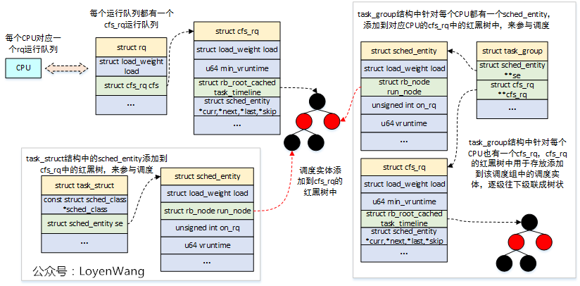

CFS focuses on distributing CPU time fairly in a weighted manner, but does not handle latency requirements well. The nice value in CFS can only give tasks more CPU time, but it cannot express the task's expectation of the delay in obtaining CPU resources. Even though realtime class (rt_sched_class) can be selected for latency-sensitive tasks in CFS, the latter is a privileged option, which means that excessive use of it may adversely affect other parts of the system.


---

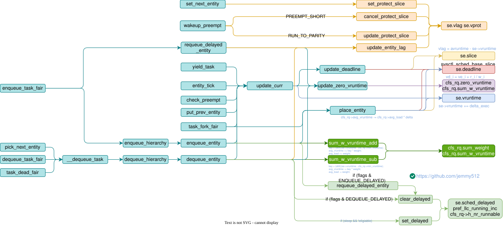

* [[PATCH v3 0/6] sched/fair: Manage lag and run to parity with different slices](https://lore.kernel.org/all/20250708165630.1948751-1-vincent.guittot@linaro.org/)

| pointer | lives on | points to | set by | clear by | notes |
|---|---|---|---|---|---|
| `se->on_rq` | `sched_entity` | `1` = accounted on its `cfs_rq` | `enqueue_entity()` | `dequeue_entity()` | Not "in the rbtree": `set_next` only `__dequeue_entity`, leaves `on_rq=1`. Sleep dequeue can clear it before `put_prev`. Delayed dequeue keeps `1`. Group `se`: queued on the parent |
| `p->on_cpu` | `task_struct` | `1` = physical runner on some CPU | `prepare_task()`: `WRITE_ONCE(next->on_cpu, 1)` before switch; idle boot → `1` | `finish_task()`: `smp_store_release(&prev->on_cpu, 0)` after switch | Tracks `rq->curr`, not donor. During switch both prev and next can be `1`. `ttwu` waits for `0` before migrate |
| `rq->curr` | CPU `rq` | physical runner | `__schedule()`: `RCU_INIT_POINTER(rq->curr, next)` when `prev != next`; boot → idle | next switch overwrites it | CFS `put`/`set_next` never touch it; proxy: may `!= rq->donor` |
| `rq->donor` | CPU `rq` | scheduling context (CFS-picked / lock owner) | `rq_set_donor()` after pick (`__schedule`); boot → idle; `proxy_reset_donor()` → `rq->curr` | next pick / reset overwrites it | `!PROXY_EXEC`: same union slot as `rq->curr` (`rq_set_donor` is a nop). Proxy: donor is the picked blocked task, curr is the runner |
| `cfs_rq->curr` | **only** `&rq->cfs` | donor **task** `se` (`&p->se`) | end of `set_next_task_fair`: dequeue from root tree, then `root->curr = se` | end of `put_prev_task_fair`: `root->curr = NULL`, enqueue back if `on_rq` | EEVDF current; not in the tree. Non-root `curr` stays `NULL` |
| `cfs_rq->h_curr` | **every** `cfs_rq` on the donor path | leaf: task `se`; ancestor: group `se` | `set_next_entity()` | `put_prev_entity()` | PELT / `update_curr` **read** it; dequeue of current does not clear it |

---

| while a fair donor is current | value |
|---|---|
| `rq->curr` | runner (proxy: maybe not the donor) |
| `rq->donor` | CFS-picked donor task |
| `root->curr` | `&donor->se` |
| leaf `h_curr` | `&donor->se` (same pointer as `root->curr`) |
| ancestor `h_curr` | that level’s group `se` |
| off-path `h_curr` | `NULL` |
| non-root `curr` | `NULL` |

---

| transition | `rq->curr` | `root->curr` | `h_curr` |
|---|---|---|---|
| fair → fair, **same group** (`first==true`) | only if runner changes | replace (prev into tree, next out) | clear/set **below LCA** only; ancestors kept |
| fair → fair, **different group** | only if runner changes | replace | full path: put then set |
| `first==false` (class change) | unchanged | full clear then set | full path clear then set (`next==NULL` on put) |
| `put_prev_set_next` with `prev==next` | may still change (proxy runner) | unchanged | unchanged |
| dequeue current before `put_prev` | still old task | still old `se` | still old `se` (`on_rq==0` already) |

---

```c
struct sched_entity {
    struct load_weight {
        /* The load.weight is a scaled value derived from shares or priorities,
         * used to compute the CPU time allocated to an entity. */
        unsigned long       weight;
        u32                 inv_weight;
    }                       load;
    struct load_weight        h_load;

    struct rb_node          run_node;
    /* link all tsk in a list of cfs_rq */
    struct list_head        group_node;
    unsigned int            on_rq;
    unsigned int            sched_delayed;
    unsigned char           rel_deadline; /* relative */
    unsigned char           custom_slice;

    u64                     exec_start;
    u64                     sum_exec_runtime;
    u64                     vruntime;
    u64                     prev_sum_exec_runtime;
    u64                     deadline;
    u64                     min_vruntime;
    u64                     min_slice;
    s64                     vlag;
    u64                     slice;

    u64                     nr_migrations;

#ifdef CONFIG_FAIR_GROUP_SCHED
    int                     depth;
    struct sched_entity     *parent;
    /* rq on which this entity is (to be) queued: */
    struct cfs_rq           *cfs_rq;
    /* rq "owned" by this entity/group: */
    struct cfs_rq           *my_q;
    /* for task se, its task weight
     * for group se, its my_q->h_nr_runnable */
    unsigned long           runnable_weight;
#endif

    struct sched_avg        avg;
};

struct cfs_rq {
    struct load_weight      load;
    unsigned int            nr_queued;      /* running and delayed dequeued tasks */
    unsigned int            h_nr_queued;    /* SCHED_{NORMAL,BATCH,IDLE} */
    unsigned int            h_nr_runnable;  /* SCHED_{NORMAL,BATCH,IDLE} */
    unsigned int            h_nr_idle;      /* SCHED_IDLE */

    u64                     exec_clock;
    u64                     min_vruntime;
#ifdef CONFIG_SCHED_CORE
    unsigned int            forceidle_seq;
    u64                     min_vruntime_fi;
#endif

    struct rb_root_cached   tasks_timeline;

    /* 'curr' points to currently running entity on this cfs_rq.
     * It is set to NULL otherwise (i.e when none are currently running) */
    struct sched_entity    *curr;
    struct sched_entity    *next;
    struct sched_entity    *last;

    /* CFS load tracking */
    struct sched_avg        avg;

    struct {
        raw_spinlock_t      lock ____cacheline_aligned;
        int        nr;
        unsigned long       load_avg;
        unsigned long       util_avg;
        unsigned long       runnable_avg;
    } removed;

#ifdef CONFIG_FAIR_GROUP_SCHED
    unsigned long           tg_load_avg_contrib;
    long                    propagate;
    long                    prop_runnable_sum;

    /* h_load = weight * f(tg) */
    unsigned long           h_load;
    u64                     last_h_load_update;
    struct sched_entity     *h_load_next;
#endif /* CONFIG_FAIR_GROUP_SCHED */

    struct rq               *rq; /* CPU runqueue to which this cfs_rq is attached */

    int                     on_list;
    struct list_head        leaf_cfs_rq_list;
    struct task_group       *tg; /* group that "owns" this runqueue */

    /* Locally cached copy of our task_group's idle value */
    int                     idle;

    int            runtime_enabled;
    s64            runtime_remaining;
    u64            throttled_pelt_idle;
    u64            throttled_pelt_idle_copy;

    u64            throttled_clock;
    u64            throttled_clock_pelt;
    /* the total time while throttling */
    u64            throttled_clock_pelt_time;
    int            throttled;
    int            throttle_count;
    struct list_head    throttled_list;
    struct list_head    throttled_csd_list;
};
```

```c
DEFINE_SCHED_CLASS(fair) = {
    .enqueue_task           = enqueue_task_fair,
    .dequeue_task           = dequeue_task_fair,
    .yield_task             = yield_task_fair,
    .yield_to_task          = yield_to_task_fair,

    .wakeup_preempt         = wakeup_preempt_fair,

    .pick_task              = pick_task_fair,
    .put_prev_task          = put_prev_task_fair,
    .set_next_task          = set_next_task_fair,

    .select_task_rq         = select_task_rq_fair,
    .migrate_task_rq        = migrate_task_rq_fair,

    .rq_online              = rq_online_fair,
    .rq_offline             = rq_offline_fair,

    .task_dead              = task_dead_fair,
    .set_cpus_allowed       = set_cpus_allowed_fair,

    .task_tick              = task_tick_fair,
    .task_fork              = task_fork_fair,

    .reweight_task          = reweight_task_fair,
    .prio_changed           = prio_changed_fair,
    .switching_from         = switching_from_fair,
    .switched_from          = switched_from_fair,
    .switched_to            = switched_to_fair,

    .get_rr_interval        = get_rr_interval_fair,

    .update_curr            = update_curr_fair,

#ifdef CONFIG_FAIR_GROUP_SCHED
    .task_change_group      = task_change_group_fair,
#endif

#ifdef CONFIG_SCHED_CORE
    .task_is_throttled      = task_is_throttled_fair,
#endif

#ifdef CONFIG_UCLAMP_TASK
    .uclamp_enabled         = 1,
#endif
};
```

## task_tick_fair


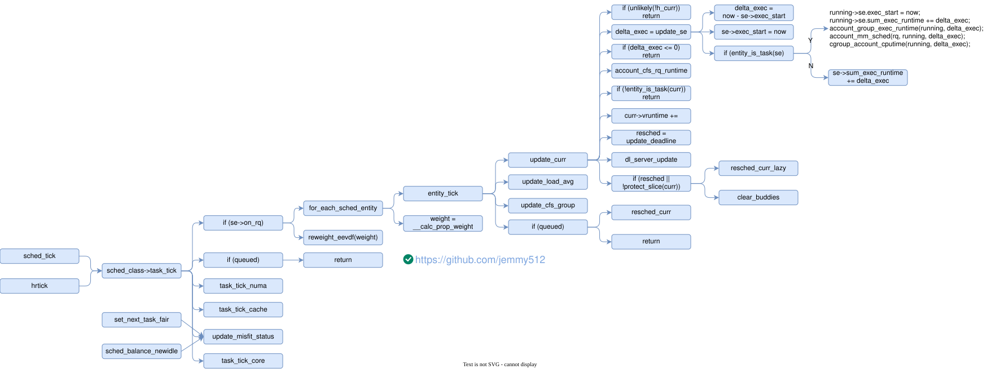

```c
sched_tick()
{
    donor->sched_class->task_tick(rq, donor, 0);
}

static enum hrtimer_restart hrtick(struct hrtimer *timer)
{
    rq->donor->sched_class->task_tick(rq, rq->curr, 1);
}

void task_tick_fair(struct rq *rq, struct task_struct *curr, int queued)
{
    struct sched_entity *se = &curr->se;

    if (se->on_rq) {
        unsigned long weight = NICE_0_LOAD;
        struct cfs_rq *cfs_rq;

        for_each_sched_entity(se) {
            cfs_rq = cfs_rq_of(se);
            entity_tick(cfs_rq, se, queued) {
                update_curr(cfs_rq);
                update_load_avg(cfs_rq, curr, UPDATE_TG);
                update_cfs_group(curr);

            #ifdef CONFIG_SCHED_HRTICK
                if (queued) {
                    resched_curr(rq_of(cfs_rq));
                    return;
                }
            #endif
            }

            weight = __calc_prop_weight(cfs_rq, se, weight);
        }

        se = &curr->se;
        reweight_eevdf(cfs_rq, se, weight, se->on_rq);
    }

    /* queued means this tick came from the hrtick which was already aimed at the slice,
     * not the periodic HZ sched_tick. */
    if (queued)
        return;

    if (static_branch_unlikely(&sched_numa_balancing))
        task_tick_numa(rq, curr);

    task_tick_cache(rq, curr);

    update_misfit_status(curr, rq);
    check_update_overutilized_status(task_rq(curr));

    task_tick_core(rq, curr);
}
```

### update_curr

```c
void update_curr_fair(struct rq *rq)
{
    struct sched_entity *se = &rq->donor->se;

    for_each_sched_entity(se)
        update_curr(cfs_rq_of(se));
}

void update_curr(struct cfs_rq *cfs_rq)
{
    /* Note: cfs_rq->curr corresponds to the task picked to
     * run (ie: rq->donor.se) which due to proxy-exec may
     * not necessarily be the actual task running
     * (rq->curr.se). This is easy to confuse! */
    struct sched_entity *curr = cfs_rq->h_curr;
    struct rq *rq = rq_of(cfs_rq);
    s64 delta_exec;
    bool resched;

    if (unlikely(!curr))
        return;

    delta_exec = update_se(rq, curr);
    if (unlikely(delta_exec <= 0))
        return;

    account_cfs_rq_runtime(cfs_rq, delta_exec);

    if (!entity_is_task(curr))
        return;

    cfs_rq = &rq->cfs;

    curr->vruntime += calc_delta_fair(delta_exec, curr);
    resched = update_deadline(cfs_rq, curr) {
        if (vruntime_cmp(se->vruntime, "<", se->deadline))
            return false;

        if (!se->custom_slice)
            se->slice = sysctl_sched_base_slice;

        se->deadline = se->vruntime + calc_delta_fair(se->slice, se);
        avg_vruntime(cfs_rq);

        return true;
    }

    /* If the fair_server is active, we need to account for the
     * fair_server time whether or not the task is running on
     * behalf of fair_server or not:
     *  - If the task is running on behalf of fair_server, we need
     *    to limit its time based on the assigned runtime.
     *  - Fair task that runs outside of fair_server should account
     *    against fair_server such that it can account for this time
     *    and possibly avoid running this period. */
    dl_server_update(&rq->fair_server, delta_exec) {
        /* 0 runtime = fair server disabled */
        if (dl_se->dl_server_active && dl_se->dl_runtime)
            update_curr_dl_se(dl_se->rq, dl_se, delta_exec);
    }

    if (cfs_rq->h_nr_queued == 1)
        return;

    if (resched || !protect_slice(curr)) {
        resched_curr_lazy(rq);
        clear_buddies(cfs_rq, curr);
    }
}
```

### update_se

```c
update_curr_common(struct rq *rq)
    update_se(rq, &rq->donor->se)

update_curr(struct cfs_rq *cfs_rq)
    update_se(rq, cfs_rq->h_curr)
```

| Type | Statistics / state | Charged to | Updating function |
|---|---|---|---|
| **Physical execution time**   | `se.sum_exec_runtime` | `Runner`, `rq->curr` | `update_se()` |
|                               | `se.exec_start` | `Both`: the donor `se` is advanced to compute future donor deltas, and `rq->curr->se.exec_start` is advanced for physical-runtime attribution | `update_se()` |
| **EEVDF**                     | `vruntime`, `vlag`, `deadline`, `vprot` | `Donor`, the entity selected to consume CFS service | `update_curr()`, `update_deadline()`, `update_protect_slice()` |
| **CFS bandwidth**             | `cfs_rq->runtime_remaining`, `throttling` | `Donor`'s `cfs_rq` hierarchy | `update_curr()` :point_right: `account_cfs_rq_runtime()` |
| **Fair-server accounting**    | `dl_server_update(&rq->fair_server, delta_exec)` | `Donor`'s Runqueue's fair server; it accounts the donated service interval | `update_curr()` :point_right: `dl_server_update()` |
| **se PELT**                   | `se->avg.{load,runnable,util}_{sum,avg}` | `Donor` The scheduled entity hierarchy being updated, normally the donor path | `entity_tick()` :point_right: `update_load_avg()` |
| **cfs_rq PELT**               | Root and group `cfs_rq->avg` | `Donor` Aggregates the entities on the donor's CFS hierarchy | `update_load_avg()` :point_right: `update_cfs_rq_load_avg()` |
| **sched_statistics**          | `sched_statistics.exec_max` | `Donor` entity (`__schedstats_from_se(se)`) | `update_se()` |
|                               | `Wait/sleep/block` scheduler statistics | Associated with the task being enqueued, dequeued, or selected; proxy execution does not transfer these to the physical runner | `update_stats_{enqueue,dequeue,curr_start}_fair()` |
|                               | | | |
| **NUMA periodic work**        | `numa_get_avg_runtime()`, `task_tick_numa()` | `Runner` Actual runner, because `task_tick_fair()` receives `curr` and its `sum_exec_runtime` is physical runtime | `task_tick_fair()` :point_right: `task_tick_numa()`; `task_numa_placement()` :point_right: `numa_get_avg_runtime()` |
| **MM / cache locality**       | `account_mm_sched()` | `Runner`'s `mm`; its per-CPU cache-occupancy accounting is updated | `update_se()` :point_right: `account_mm_sched()` |
| **Cache periodic work**       | `task_tick_cache()` | `Runner` | `task_tick_fair()` :point_right: `task_tick_cache()` |
| **CPU-time accounting**       | `cpuacct.cpuusage`, `cgroup_rstat_base_cpu.cputime.sum_exec_runtime` | `Runner`'s CPU cgroup | `update_se()` :point_right: `cgroup_account_cputime()` |
|                               | `thread_group_cputimer.cputime_atomic.sum_exec_runtime`      | `Runner`'s task group | `update_se()` :point_right: `account_group_exec_runtime()` |
| **Tracing**                   | `trace_sched_stat_runtime()` | `Runner` | `update_se()` :point_right: `trace_sched_stat_runtime()` |

In short: **identity/accounting statistics** follow `rq->curr`; **CFS scheduling-debt and capacity-control statistics** follow `rq->donor`.

```c
s64 update_se(struct rq *rq, struct sched_entity *se)
{
    u64 now = rq_clock_task(rq);
    s64 delta_exec;

    delta_exec = now - se->exec_start;
    if (unlikely(delta_exec <= 0))
        return delta_exec;

    se->exec_start = now;
    if (entity_is_task(se)) {
        struct task_struct *running = rq->curr;
        /* If se is a task, we account the time against the running
         * task, as w/ proxy-exec they may not be the same. */
        running->se.exec_start = now;
        running->se.sum_exec_runtime += delta_exec;

        trace_sched_stat_runtime(running, delta_exec);
        account_group_exec_runtime(running, delta_exec) {
            struct thread_group_cputimer *cputimer = get_running_cputimer(tsk);

            if (!cputimer)
                return;

            atomic64_add(ns, &cputimer->cputime_atomic.sum_exec_runtime);
        }
        account_mm_sched(rq, running, delta_exec);

        /* cgroup time is always accounted against the donor */
        cgroup_account_cputime(running, delta_exec) {
            struct cgroup *cgrp;

            cpuacct_charge(task, delta_exec) {
                unsigned int cpu = task_cpu(tsk);
                struct cpuacct *ca;

                lockdep_assert_rq_held(cpu_rq(cpu));

                for (ca = task_ca(tsk); ca; ca = parent_ca(ca))
                    *per_cpu_ptr(ca->cpuusage, cpu) += cputime;
            }

            cgrp = task_dfl_cgroup(task);
            if (cgroup_parent(cgrp))
                __cgroup_account_cputime(cgrp, delta_exec);
        }
    } else {
        /* If not task, account the time against donor se  */
        se->sum_exec_runtime += delta_exec;
    }

    if (schedstat_enabled()) {
        struct sched_statistics *stats;

        stats = __schedstats_from_se(se);
        __schedstat_set(stats->exec_max, max(delta_exec, stats->exec_max));
    }

    return delta_exec;
}
```

#### account_mm_sched

```c
void account_mm_sched(struct rq *rq, struct task_struct *p, s64 delta_exec)
{
    struct sched_cache_group *grp = rcu_dereference_all(p->sched_cache_grp);
    struct sched_cache_time *pcpu_sched;
    int mm_sched_llc = -1;
    unsigned long epoch;

    if (!sched_cache_enabled())
        return;

    if (p->sched_class != &fair_sched_class)
        return;
    /* init_task, kthreads and user thread created
     * by user_mode_thread() don't have a cache group.
     * In theory a kernel thread does not have any valid
     * cache group, because sched_cache_fork() is not
     * invoked for a kernel thread - !grp should gate the
     * kernel thread. Use the PF_KTHREAD check explicitly
     * here for safety reasons, to guard against future
     * modifications and to pair with task_tick_cache(). */
    if (p->flags & PF_KTHREAD || !grp || !grp->pcpu_sched)
        return;

    pcpu_sched = per_cpu_ptr(grp->pcpu_sched, cpu_of(rq));

    scoped_guard (raw_spinlock, &rq->cpu_epoch_lock) {
        __update_mm_sched(rq, pcpu_sched) {
            lockdep_assert_held(&rq->cpu_epoch_lock);

            unsigned int period = max(READ_ONCE(llc_epoch_period), 1U);
            unsigned long n, now = jiffies;
            long delta = now - rq->cpu_epoch_next;

            if (delta > 0) {
                n = (delta + period - 1) / period;
                rq->cpu_epoch += n;
                rq->cpu_epoch_next += n * period;
                __shr_u64(&rq->cpu_runtime, n);
            }

            n = rq->cpu_epoch - pcpu_sched->epoch;
            if (n) {
                pcpu_sched->epoch += n;
                __shr_u64(&pcpu_sched->runtime, n);
            }
        }
        pcpu_sched->runtime += delta_exec;
        rq->cpu_runtime += delta_exec;
        epoch = rq->cpu_epoch;
    }

    /* If this process hasn't hit task_cache_work() for a while invalidate
     * its preferred state. */
    if ((long)(epoch - READ_ONCE(grp->epoch)) > llc_epoch_affinity_timeout ||
        invalid_llc_nr(grp, p, cpu_of(rq)) || exceed_llc_capacity(grp, cpu_of(rq)))
    {
        if (READ_ONCE(grp->cpu) != -1)
            WRITE_ONCE(grp->cpu, -1);
    }

    mm_sched_llc = get_pref_llc(p, grp);

    /* task not on rq accounted later in account_entity_enqueue() */
    if (task_running_on_cpu(rq->cpu, p) &&
        READ_ONCE(p->preferred_llc) != mm_sched_llc) {
        account_llc_dequeue(rq, p);
        WRITE_ONCE(p->preferred_llc, mm_sched_llc);
        account_llc_enqueue(rq, p);
    }
}

int get_pref_llc(struct task_struct *p, struct sched_cache_group *grp)
{
    int mm_sched_llc = -1, mm_sched_cpu;

    if (!grp)
        return -1;

    mm_sched_cpu = READ_ONCE(grp->cpu);
    if (mm_sched_cpu != -1) {
        mm_sched_llc = llc_id(mm_sched_cpu);

#ifdef CONFIG_NUMA_BALANCING
        /* Don't assign preferred LLC if it
         * conflicts with NUMA balancing.
         * This can happen when sched_setnuma() gets
         * called, however it is not much of an issue
         * because we expect account_mm_sched() to get
         * called fairly regularly -- at a higher rate
         * than sched_setnuma() at least -- and thus the
         * conflict only exists for a short period of time. */
        if (static_branch_likely(&sched_numa_balancing) &&
            p->numa_preferred_nid >= 0 &&
            cpu_to_node(mm_sched_cpu) != p->numa_preferred_nid)
            mm_sched_llc = -1;
#endif
    }

    return mm_sched_llc;
}
```

### avg_vruntime

```c
u64 avg_vruntime(struct cfs_rq *cfs_rq)
{
    struct sched_entity *curr = cfs_rq->curr;
    long weight = cfs_rq->sum_weight;
    s64 delta = 0;

    if (curr && !curr->on_rq)
        curr = NULL;

    if (weight) {
        s64 runtime = cfs_rq->sum_w_vruntime;

        if (curr) {
            unsigned long w = avg_vruntime_weight(cfs_rq, curr->h_load.weight) {
                #ifdef CONFIG_64BIT
                    if (cfs_rq->sum_shift)
                        w = max(2UL, w >> cfs_rq->sum_shift);
                #endif
                    return w;
            }

            runtime += w * entity_key(cfs_rq, curr) {
                return vruntime_op(se->vruntime, "-", cfs_rq->zero_vruntime);
            }
            weight += w;
        }

        /* sign flips effective floor / ceiling */
        if (runtime < 0)
            runtime -= (weight - 1);

        delta = div64_long(runtime, weight);
    } else if (curr) {
        /* When there is but one element, it is the average. */
        delta = curr->vruntime - cfs_rq->zero_vruntime;
    }

    update_zero_vruntime(cfs_rq, delta) {
        /* sum_w_vruntime = ∑(vi - v0)wi
         * when zero_vruntime += delta Δ
         * (vi - (v0 + Δ)) = (vi - v0) - Δ
         * new_sum = ∑((vi - v0) - Δ)wi
         *         = ∑(vi - v0)wi - Δ∑wi
         *         = old_sum - Δ * sum_weight */
        cfs_rq->sum_w_vruntime -= cfs_rq->sum_weight * delta;
        cfs_rq->zero_vruntime += delta;
    }

    return cfs_rq->zero_vruntime;
}
```

### task_tick_numa

```c
void task_tick_numa(struct rq *rq, struct task_struct *curr)
{
    struct callback_head *work = &curr->numa_work;
    u64 period, now;

    /* We don't care about NUMA placement if we don't have memory. */
    if (!curr->mm || (curr->flags & (PF_EXITING | PF_KTHREAD)) || work->next != work)
        return;

    /* Using runtime rather than walltime has the dual advantage that
     * we (mostly) drive the selection from busy threads and that the
     * task needs to have done some actual work before we bother with
     * NUMA placement. */
    now = curr->se.sum_exec_runtime;
    period = (u64)curr->numa_scan_period * NSEC_PER_MSEC;

    if (now > curr->node_stamp + period) {
        if (!curr->node_stamp)
            curr->numa_scan_period = task_scan_start(curr);
        curr->node_stamp += period;

        if (!time_before(jiffies, curr->mm->numa_next_scan))
            task_work_add(curr, work, TWA_RESUME); /* task_numa_work */
    }
}
```

### task_tick_cache

```txt
1. Enable
    domain build
    -> top SD_SHARE_LLC has a strictly larger parent?
        no  -> sched_cache_present off, stop
        yes -> sched_cache_present on
    -> sysctl_sched_cache_user == 1?
        no  -> sched_cache_active off, stop
        yes -> sched_cache_active on
   every later step checks sched_cache_enabled()

2. Measure, while a fair task runs
    task_tick_cache -> update_se()
    -> account_mm_sched()
        add delta_exec to mm->sc_stat.pcpu_sched[cpu]
        epoch is ~10 ms
        if scan is stale, too many threads, or footprint exceeds sd->llc_bytes:
            mm->sc_stat.cpu = -1

3. Choose an LLC, at most one thread of the mm per epoch
    task tick
    -> task_tick_cache() queues task_cache_work
    -> task_cache_work()
        scan preferred NUMA node, current preferred LLC's node,
        and the node the task is running on
        sum this mm's occupancy per LLC
        winner must be > 2x the current LLC
        store the busiest CPU of that LLC in mm->sc_stat.cpu
        update nr_running_avg

4. Publish it onto the running task
    account_mm_sched(), only if this task is current on the rq
    -> llc = llc_id(mm->sc_stat.cpu)
    -> if that CPU's node != p->numa_preferred_nid: llc = -1
    -> if p->preferred_llc changed:
        account_llc_dequeue()
        p->preferred_llc = llc
        account_llc_enqueue()
    a new task starts at preferred_llc = -1

5. Count, on enqueue and on that republish
    account_llc_enqueue()
        rq->nr_llc_running++
        if this rq is in the preferred LLC:
            rq->nr_pref_llc_running++
            p->pref_llc_queued = 1
        rq->sd->llc_counts[preferred_llc]++
    dequeue uses pref_llc_queued, not a fresh task_llc(p) check,
    so hotplug cannot unpaired the counter

6. Pull, periodic balance only, and only above the LLC domain
    update_sg_lb_stats()
        for a group not already in dst LLC:
            add its llc_counts[dst_llc] to nr_pref_dst_llc
    llc_balance()
        if that count is nonzero and dst still has room:
            tag the group migrate_llc_task
    skip this for newidle, misfit, and after too many failed balances

7. Accept or refuse the task
    can_migrate_task()
        NUMA first: migrate_degrades_locality()
        only if that is neutral:
            migrate_degrades_llc()
                during migrate_llc_task, skip a task whose
                preferred_llc is not the destination
                otherwise block a move can_migrate_llc_task() forbids
                a block sets LBF_LLC_PINNED
        after cache_nice_tries + 1 failures, stop protecting the LLC
    active balance uses alb_break_llc() instead:
        do not pull the only preferred runnable task off its LLC
        unless it is a misfit
```

```c
void task_tick_cache(struct rq *rq, struct task_struct *p)
{
    struct sched_cache_group *grp = rcu_dereference_all(p->sched_cache_grp);
    struct callback_head *work = &p->cache_work;
    unsigned long epoch;

    if (!sched_cache_enabled())
        return;

    if (!grp || p->flags & PF_KTHREAD || !grp->pcpu_sched)
        return;

    epoch = rq->cpu_epoch;
    /* avoid moving backwards */
    if (time_after_eq(grp->epoch, epoch))
        return;

    guard(raw_spinlock)(&grp->lock);

    if (work->next == work) {
        task_work_add(p, work, TWA_RESUME);
        WRITE_ONCE(grp->epoch, epoch);
    }
}

void task_cache_work(struct callback_head *work)
{
    int cpu, m_a_cpu = -1, nr_running = 0, curr_cpu;
    unsigned long next_scan, now = jiffies;
    struct task_struct *p = current, *cur;
    unsigned long curr_m_a_occ = 0;
    struct sched_cache_group *grp;
    struct mm_struct *mm = p->mm;
    unsigned long m_a_occ = 0;
    cpumask_var_t cpus;

    WARN_ON_ONCE(work != &p->cache_work);

    work->next = work;

    if (p->flags & PF_EXITING)
        return;

    grp = READ_ONCE(mm->sched_cache_grp);
    if (!grp)
        return;

    next_scan = READ_ONCE(grp->next_scan);
    if (time_before(now, next_scan))
        return;

    /* only 1 thread is allowed to scan */
    if (!try_cmpxchg(&grp->next_scan, &next_scan, now + max_t(unsigned long, READ_ONCE(llc_epoch_period), 1)))
        return;

    curr_cpu = task_cpu(p);
    if (invalid_llc_nr(mm, p, curr_cpu) || exceed_llc_capacity(mm, curr_cpu)) {
        if (READ_ONCE(grp->cpu) != -1)
            WRITE_ONCE(grp->cpu, -1);

        return;
    }

    if (!zalloc_cpumask_var(&cpus, GFP_KERNEL))
        return;

    scoped_guard (cpus_read_lock) {
        guard(rcu)();

        get_scan_cpumasks(cpus, p, grp);

        for_each_cpu(cpu, cpus) {
            /* XXX sched_cluster_active */
            struct sched_domain *sd = rcu_dereference_all(per_cpu(sd_llc, cpu));
            unsigned long occ, m_occ = 0, a_occ = 0;
            int m_cpu = -1, i;

            if (!sd)
                continue;

            for_each_cpu(i, sched_domain_span(sd)) {
                occ = fraction_mm_sched(cpu_rq(i), per_cpu_ptr(grp->pcpu_sched, i));
                a_occ += occ;
                if (occ > m_occ) {
                    m_occ = occ;
                    m_cpu = i;
                }

                cur = rcu_dereference_all(cpu_rq(i)->curr);
                if (cur && !(cur->flags & (PF_EXITING | PF_KTHREAD)) && cur->mm == mm)
                    nr_running++;
            }

            /* Compare the accumulated occupancy of each LLC. The
             * reason for using accumulated occupancy rather than average
             * per CPU occupancy is that it works better in asymmetric LLC
             * scenarios.
             * For example, if there are 2 threads in a 4CPU LLC and 3
             * threads in an 8CPU LLC, it might be better to choose the one
             * with 3 threads. However, this would not be the case if the
             * occupancy is divided by the number of CPUs in an LLC (i.e.,
             * if average per CPU occupancy is used).
             * Besides, NUMA balancing fault statistics behave similarly:
             * the total number of faults per node is compared rather than
             * the average number of faults per CPU. This strategy is also
             * followed here. */
            if (a_occ > m_a_occ) {
                m_a_occ = a_occ;
                m_a_cpu = m_cpu;
            }

            if (llc_id(cpu) == llc_id(READ_ONCE(grp->cpu)))
                curr_m_a_occ = a_occ;

            cpumask_andnot(cpus, cpus, sched_domain_span(sd));
        }
    }

    if (m_a_occ > (2 * curr_m_a_occ)) {
        /* Avoid switching sched_cache_grp->cpu too fast.
         * The reason to choose 2X is because:
         * 1. It is better to keep the preferred LLC stable,
         *    rather than changing it frequently and cause migrations
         * 2. 2X means the new preferred LLC has at least 1 more
         *    busy CPU than the old one(200% vs 100%, eg)
         * 3. 2X is chosen based on test results, as it delivers
         *    the optimal performance gain so far. */
        WRITE_ONCE(grp->cpu, m_a_cpu);
    }

    update_avg_scale(&grp->nr_running_avg, nr_running);
    free_cpumask_var(cpus);
}

void get_scan_cpumasks(cpumask_var_t cpus, struct task_struct *p,
                  struct sched_cache_group *grp)
{
#ifdef CONFIG_NUMA_BALANCING
    int cpu, curr_cpu, nid, pref_nid;

    if (!static_branch_likely(&sched_numa_balancing))
        goto out;

    cpu = READ_ONCE(grp->cpu);
    if (cpu != -1)
        nid = cpu_to_node(cpu);
    curr_cpu = task_cpu(p);

    /* Scanning in the preferred NUMA node is ideal. However, the NUMA
     * preferred node is per-task rather than per-process. It is possible
     * for different threads of the process to have distinct preferred
     * nodes; consequently, the process-wide preferred LLC may bounce
     * between different nodes. As a workaround, maintain the scan
     * CPU mask to also cover the process's current preferred LLC and the
     * current running node to mitigate the bouncing risk.
     * TBD: numa_group should be considered during task aggregation. */
    pref_nid = p->numa_preferred_nid;
    /* honor the task's preferred node */
    if (pref_nid == NUMA_NO_NODE)
        goto out;

    cpumask_or(cpus, cpus, cpumask_of_node(pref_nid));

    /* honor the task's preferred LLC CPU */
    if (cpu != -1 && !cpumask_test_cpu(cpu, cpus) && nid != NUMA_NO_NODE)
        cpumask_or(cpus, cpus, cpumask_of_node(nid));

    /* make sure the task's current running node is included */
    if (!cpumask_test_cpu(curr_cpu, cpus))
        cpumask_or(cpus, cpus, cpumask_of_node(cpu_to_node(curr_cpu)));

    return;

out:
#endif
    cpumask_copy(cpus, cpu_online_mask);
}
```

### task_tick_core-TODO

## enqueue_task_fair

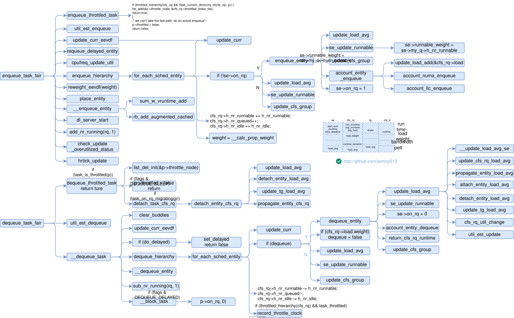

```c
void enqueue_task_fair(struct rq *rq, struct task_struct *p, int flags)
{
    int rq_h_nr_queued = rq->cfs.h_nr_queued;
    int task_new = !(flags & ENQUEUE_WAKEUP);
    struct sched_entity *se = &p->se;
    struct cfs_rq *cfs_rq = &rq->cfs;
    unsigned long weight;
    bool curr;

    if (task_is_throttled(p) && enqueue_throttled_task(p))
        return;

    /* The code below (indirectly) updates schedutil which looks at
     * the cfs_rq utilization to select a frequency.
     * Let's add the task's estimated utilization to the cfs_rq's
     * estimated utilization, before we update schedutil. */
    if (!p->se.sched_delayed || (flags & ENQUEUE_DELAYED)) {
        util_est_enqueue(cfs_rq, p) {
            enqueued  = cfs_rq->avg.util_est;
            enqueued += _task_util_est(p);
            WRITE_ONCE(cfs_rq->avg.util_est, enqueued);
        }
    }

    update_curr_eevdf(cfs_rq);

    if (flags & ENQUEUE_DELAYED) {
        requeue_delayed_entity(cfs_rq, se) {
            if (update_entity_lag(cfs_rq, se)) {
                cfs_rq->h_nr_queued--;
                if (se != cfs_rq->curr)
                    __dequeue_entity(cfs_rq, se);
                place_entity(cfs_rq, se, 0);
                if (se != cfs_rq->curr)
                    __enqueue_entity(cfs_rq, se);
                cfs_rq->h_nr_queued++;
            }

            update_load_avg(cfs_rq, se, 0);

            clear_delayed(se) {
                se->sched_delayed = 0;

                if (!entity_is_task(se))
                    return;

                pref_llc_running_inc(rq_of(cfs_rq_of(se)), task_of(se));

                for_each_sched_entity(se) {
                    struct cfs_rq *cfs_rq = cfs_rq_of(se);

                    cfs_rq->h_nr_runnable++;
                }
            }
        }
        return;
    }

    /* If in_iowait is set, the code below may not trigger any cpufreq
     * utilization updates, so do it here explicitly with the IOWAIT flag
     * passed. */
    if (p->in_iowait)
        cpufreq_update_util(rq, SCHED_CPUFREQ_IOWAIT);

    /* XXX comment on the curr thing */
    curr = (cfs_rq->curr == se);
    if (curr)
        place_entity(cfs_rq, se, flags);

    if (se->on_rq && se->sched_delayed)
        requeue_delayed_entity(cfs_rq, se);

    weight = enqueue_hierarchy(p, flags);

    if (!curr) {
        reweight_eevdf(cfs_rq, se, weight, false);
        place_entity(cfs_rq, se, flags | ENQUEUE_QUEUED);
        __enqueue_entity(cfs_rq, se);
    }

    if (!rq_h_nr_queued && rq->cfs.h_nr_queued)
        dl_server_start(&rq->fair_server);

    /* At this point se is NULL and we are at root level*/
    add_nr_running(rq, 1);

    /* Since new tasks are assigned an initial util_avg equal to
     * half of the spare capacity of their CPU, tiny tasks have the
     * ability to cross the overutilized threshold, which will
     * result in the load balancer ruining all the task placement
     * done by EAS. As a way to mitigate that effect, do not account
     * for the first enqueue operation of new tasks during the
     * overutilized flag detection.
     *
     * A better way of solving this problem would be to wait for
     * the PELT signals of tasks to converge before taking them
     * into account, but that is not straightforward to implement,
     * and the following generally works well enough in practice. */
    if (!task_new) {
        check_update_overutilized_status(rq) {
            if (!is_rd_overutilized(rq->rd) && cpu_overutilized(rq->cpu))
                set_rd_overutilized(rq->rd, 1);
        }
    }

    assert_list_leaf_cfs_rq(rq);

    hrtick_update(rq);
}
```

### place_entity

```c
unsigned int sysctl_sched_base_slice                        = 700000ULL;
static unsigned int normalized_sysctl_sched_base_slice      = 700000ULL;
__read_mostly unsigned int sysctl_sched_migration_cost      = 500000UL;

void place_entity(struct cfs_rq *cfs_rq, struct sched_entity *se, int flags)
{
    u64 vslice, vruntime = avg_vruntime(cfs_rq);
    unsigned int nr_queued = cfs_rq->h_nr_queued;
    bool update_zero = false;
    s64 lag = 0;

    if (!se->custom_slice)
        se->slice = sysctl_sched_base_slice;
    vslice = calc_delta_fair(se->slice, se);

    if (flags & ENQUEUE_QUEUED)
        nr_queued -= 1;

    /* Due to how V is constructed as the weighted average of entities,
     * adding tasks with positive lag, or removing tasks with negative lag
     * will move 'time' backwards, this can screw around with the lag of
     * other tasks.
     *
     * EEVDF: placement strategy #1 / #2 */
    if (sched_feat(PLACE_LAG) && nr_queued && se->vlag) {
        struct sched_entity *curr = cfs_rq->curr;
        long load, weight;

        lag = se->vlag;

        /* If we want to place a task and preserve lag, we have to
         * consider the effect of the new entity on the weighted
         * average and compensate for this, otherwise lag can quickly
         * evaporate.
         *
         * Lag is defined as:
         *
         *   lag_i = S - s_i = w_i * (V - v_i)
         *
         * To avoid the 'w_i' term all over the place, we only track
         * the virtual lag:
         *
         *   vl_i = V - v_i <=> v_i = V - vl_i
         *
         * And we take V to be the weighted average of all v:
         *
         *   V = (\Sum w_j*v_j) / W
         *
         * Where W is: \Sum w_j
         *
         * Then, the weighted average after adding an entity with lag
         * vl_i is given by:
         *
         *   V' = (\Sum w_j*v_j + w_i*v_i) / (W + w_i)
         *      = (W*V + w_i*(V - vl_i)) / (W + w_i)
         *      = (W*V + w_i*V - w_i*vl_i) / (W + w_i)
         *      = (V*(W + w_i) - w_i*vl_i) / (W + w_i)
         *      = V - w_i*vl_i / (W + w_i)
         *
         * And the actual lag after adding an entity with vl_i is:
         *
         *   vl'_i = V' - v_i
         *         = V - w_i*vl_i / (W + w_i) - (V - vl_i)
         *         = vl_i - w_i*vl_i / (W + w_i)
         *
         * Which is strictly less than vl_i. So in order to preserve lag
         * we should inflate the lag before placement such that the
         * effective lag after placement comes out right.
         *
         * As such, invert the above relation for vl'_i to get the vl_i
         * we need to use such that the lag after placement is the lag
         * we computed before dequeue.
         *
         *   vl'_i = vl_i - w_i*vl_i / (W + w_i)
         *         = ((W + w_i)*vl_i - w_i*vl_i) / (W + w_i)
         *
         *   (W + w_i)*vl'_i = (W + w_i)*vl_i - w_i*vl_i
         *                   = W*vl_i
         *
         *   vl_i = (W + w_i)*vl'_i / W */
        load = cfs_rq->sum_weight;
        if (curr && curr->on_rq)
            load += avg_vruntime_weight(cfs_rq, curr->h_load.weight);

        weight = avg_vruntime_weight(cfs_rq, se->h_load.weight);
        lag *= load + weight;
        if (WARN_ON_ONCE(!load))
            load = 1;
        lag = div64_long(lag, load);

        /* A heavy entity (relative to the tree) will pull the
         * avg_vruntime close to its vruntime position on enqueue. But
         * the zero_vruntime point is only updated at the next
         * update_deadline()/place_entity()/update_entity_lag().
         *
         * Specifically (see the comment near avg_vruntime_weight()):
         *
         *   sum_w_vruntime = \Sum (v_i - v0) * w_i
         *
         * Note that if v0 is near a light entity, both terms will be
         * small for the light entity, while in that case both terms
         * are large for the heavy entity, leading to risk of
         * overflow.
         *
         * OTOH if v0 is near the heavy entity, then the difference is
         * larger for the light entity, but the factor is small, while
         * for the heavy entity the difference is small but the factor
         * is large. Avoiding the multiplication overflow. */
        if (weight > load)
            update_zero = true;
    }

    se->vruntime = vruntime - lag;

    if (update_zero)
        update_zero_vruntime(cfs_rq, -lag);

    if (sched_feat(PLACE_REL_DEADLINE) && se->rel_deadline) {
        se->deadline += se->vruntime;
        se->rel_deadline = 0;
        return;
    }

    /* When joining the competition; the existing tasks will be,
     * on average, halfway through their slice, as such start tasks
     * off with half a slice to ease into the competition. */
    if (sched_feat(PLACE_DEADLINE_INITIAL) && (flags & ENQUEUE_INITIAL))
        vslice /= 2;

    /* EEVDF: vd_i = ve_i + r_i/w_i */
    se->deadline = se->vruntime + vslice;
}
```

### enqueue_hierarchy

```c
unsigned long enqueue_hierarchy(struct task_struct *p, int flags)
{
    unsigned long weight = NICE_0_LOAD;
    int task_new = !(flags & ENQUEUE_WAKEUP);
    struct sched_entity *se = &p->se;
    int h_nr_idle = task_has_idle_policy(p);
    int h_nr_runnable = 1;

    if (task_new && se->sched_delayed)
        h_nr_runnable = 0;

    for_each_sched_entity(se) {
        struct cfs_rq *cfs_rq = cfs_rq_of(se);

        update_curr(cfs_rq);

        if (!se->on_rq) {
            enqueue_entity(cfs_rq, se, flags);
        } else {
            update_load_avg(cfs_rq, se, UPDATE_TG);
            se_update_runnable(se);
            update_cfs_group(se);
        }

        cfs_rq->h_nr_runnable += h_nr_runnable;
        cfs_rq->h_nr_queued++;
        cfs_rq->h_nr_idle += h_nr_idle;

        if (cfs_rq_is_idle(cfs_rq))
            h_nr_idle = 1;

        weight = __calc_prop_weight(cfs_rq, se, weight);

        flags = ENQUEUE_WAKEUP;
    }

    return weight;
}
```

### enqueue_entity

```c
/* walks hierarchy for load tracking only */
void enqueue_entity(struct cfs_rq *cfs_rq, struct sched_entity *se, int flags)
{
    /* When enqueuing a sched_entity, we must:
     *   - Update loads to have both entity and cfs_rq synced with now.
     *   - For group_entity, update its runnable_weight to reflect the new
     *     h_nr_runnable of its group cfs_rq.
     *   - For group_entity, update its weight to reflect the new share of
     *     its group cfs_rq
     *   - Add its new weight to cfs_rq->load.weight */
    update_load_avg(cfs_rq, se, UPDATE_TG | DO_ATTACH);
    se_update_runnable(se) {
        if (!entity_is_task(se))
            se->runnable_weight = se->my_q->h_nr_runnable;
    }
    /* XXX update_load_avg() above will have attached us to the pelt sum;
     * but update_cfs_group() here will re-adjust the weight and have to
     * undo/redo all that. Seems wasteful. */
    update_cfs_group(se);

    account_entity_enqueue(cfs_rq, se);

    /* Entity has migrated, no longer consider this task hot */
    if (flags & ENQUEUE_MIGRATED)
        se->exec_start = 0;

    check_schedstat_required();
    update_stats_enqueue_fair(cfs_rq, se, flags);
    se->on_rq = 1;

    if (cfs_rq->nr_queued == 1) {
        check_enqueue_throttle(cfs_rq);
        list_add_leaf_cfs_rq(cfs_rq);
#ifdef CONFIG_CFS_BANDWIDTH
        if (cfs_rq->pelt_clock_throttled) {
            struct rq *rq = rq_of(cfs_rq);

            cfs_rq->throttled_clock_pelt_time += rq_clock_pelt(rq) -
                cfs_rq->throttled_clock_pelt;
            cfs_rq->pelt_clock_throttled = 0;
        }
#endif
    }
}
```

#### account_entity_enqueue

```c
static void
account_entity_enqueue(struct cfs_rq *cfs_rq, struct sched_entity *se)
{
    WARN_ON_ONCE(cfs_rq != cfs_rq_of(se));
    update_load_add(&cfs_rq->load, se->load.weight);
    if (entity_is_task(se)) {
        struct task_struct *p = task_of(se);
        struct rq *rq = rq_of(cfs_rq);

        account_numa_enqueue(rq, p) {
            rq->nr_numa_running += (p->numa_preferred_nid != NUMA_NO_NODE);
            rq->nr_preferred_running += (p->numa_preferred_nid == task_node(p));
        }

        account_llc_enqueue(rq, p);
        list_add(&se->group_node, &rq->cfs_tasks);
    }
    cfs_rq->nr_queued++;
}

void account_llc_enqueue(struct rq *rq, struct task_struct *p)
{
    int pref_llc, pref_llc_queued;
    struct sched_domain *sd;

    pref_llc = p->preferred_llc;
    if (pref_llc < 0)
        return;

    pref_llc_queued = (pref_llc == task_llc(p));
    rq->nr_llc_running++;

    /* Record whether p is enqueued on its preferred
     * LLC, in order to pair with account_llc_dequeue()
     * to maintain a consistent nr_pref_llc_running per
     * runqueue.
     * This is necessary because a race condition exists:
     * after a task is enqueued on a runqueue, task_llc(p)
     * may change due to CPU hotplug. Therefore, checking
     * task_llc(p) to determine whether the task is being
     * dequeued from its preferred LLC is unreliable and
     * can cause inconsistent values - checking the
     * p->pref_llc_queued in account_llc_dequeue() would
     * be reliable. */
    p->pref_llc_queued = pref_llc_queued;

    /* Skipped while delayed; clear_delayed() adds it back on wake. */
    pref_llc_running_inc(rq, p) {
        if (task_pref_llc_runnable(p))
            rq->nr_pref_llc_running++;
    }

    sd = rcu_dereference_all(rq->sd);
    if (sd && (unsigned int)pref_llc < sd->llc_max)
        sd->llc_counts[pref_llc]++;
}
```

### __enqueue_entity

```c
void __enqueue_entity(struct cfs_rq *cfs_rq, struct sched_entity *se)
{
    WARN_ON_ONCE(&rq_of(cfs_rq)->cfs != cfs_rq);
    WARN_ON_ONCE(!entity_is_task(se));

    sum_w_vruntime_add(cfs_rq, se);
    se->min_vruntime = se->vruntime;
    se->min_slice = se->slice;
    se->max_slice = se->slice;

    rb_add_augmented_cached(&se->run_node, &cfs_rq->tasks_timeline,
                __entity_less, &min_vruntime_cb);
}

static void
sum_w_vruntime_add(struct cfs_rq *cfs_rq, struct sched_entity *se)
{
    if (sched_feat(PARANOID_AVG))
        return sum_w_vruntime_add_paranoid(cfs_rq, se);

    __sum_w_vruntime_add(cfs_rq, se) {
        unsigned long weight = avg_vruntime_weight(cfs_rq, se->h_load.weight);
        s64 w_vruntime, key = entity_key(cfs_rq, se);

        w_vruntime = key * weight;
        WARN_ON_ONCE((w_vruntime >> 63) != (w_vruntime >> 62));

        cfs_rq->sum_w_vruntime += w_vruntime;
        cfs_rq->sum_weight += weight;
    }
}
```

## dequeue_task_fair

```c
static bool dequeue_task_fair(struct rq *rq, struct task_struct *p, int flags)
{
    if (task_is_throttled(p)) {
        dequeue_throttled_task(p, flags) {
            list_del_init(&p->throttle_node);

            /* task blocked after throttled */
            if (flags & DEQUEUE_SLEEP) {
                p->throttled = false;
                return;
            }

            /* task is migrating off its old cfs_rq, detach
            * the task's load from its old cfs_rq. */
            if (task_on_rq_migrating(p))
                detach_task_cfs_rq(p);
        }
        return true;
    }

    if (!p->se.sched_delayed)
        util_est_dequeue(&rq->cfs, p);

    if (!__dequeue_task(rq, p, flags))
        return false;

    /* Must not reference @p after __dequeue_task(DEQUEUE_DELAYED). */
    return true;
}

/* Returns:
 *   true  - dequeued
 *   false - delayed */
bool __dequeue_task(struct rq *rq, struct task_struct *p, int flags)
{
    struct sched_entity *se = &p->se;
    struct cfs_rq *cfs_rq = &rq->cfs;
    bool was_sched_idle = sched_idle_rq(rq);
    bool task_sleep = flags & DEQUEUE_SLEEP;
    bool task_delayed = flags & DEQUEUE_DELAYED;

    clear_buddies(cfs_rq, se);

    update_curr_eevdf(cfs_rq) {
        if (!cfs_rq->curr)
            return;

        update_curr(cfs_rq_of(cfs_rq->curr));
    }
    update_entity_lag(cfs_rq, se);

    if (flags & DEQUEUE_DELAYED) {
        WARN_ON_ONCE(!se->sched_delayed);
    } else {
        bool delay = task_sleep;
        /* DELAY_DEQUEUE relies on spurious wakeups, special task
         * states must not suffer spurious wakeups, excempt them. */
        if (flags & (DEQUEUE_SPECIAL | DEQUEUE_THROTTLE))
            delay = false;

        WARN_ON_ONCE(delay && se->sched_delayed);

        if (sched_feat(DELAY_DEQUEUE) && delay && !entity_eligible(cfs_rq, se)) {
            update_load_avg(cfs_rq_of(se), se, UPDATE_UTIL_EST);

            set_delayed(se) {
                    if (!entity_is_task(se)) {
                    se->sched_delayed = 1;
                    return;
                }

                pref_llc_running_dec(rq_of(cfs_rq_of(se)), task_of(se));
                se->sched_delayed = 1;

                for_each_sched_entity(se) {
                    struct cfs_rq *cfs_rq = cfs_rq_of(se);

                    cfs_rq->h_nr_runnable--;
                }
            }
            return false;
        }
    }

    dequeue_hierarchy(p, flags);

    if (sched_feat(PLACE_REL_DEADLINE) && !task_sleep) {
        se->deadline -= se->vruntime;
        se->rel_deadline = 1;
    }
    if (se != cfs_rq->curr) {
        __dequeue_entity(cfs_rq, se);
    }

    sub_nr_running(rq, 1);

    /* balance early to pull high priority tasks */
    if (unlikely(!was_sched_idle && sched_idle_rq(rq)))
        rq->next_balance = jiffies;

    if (task_delayed) {
        clear_delayed(se);

        WARN_ON_ONCE(!task_sleep);
        WARN_ON_ONCE(p->on_rq != 1);

        /* Fix-up what block_task() skipped.
         *
         * Must be last, @p might not be valid after this. */
        __block_task(rq, p) {
            if (p->sched_contributes_to_load)
                rq->nr_uninterruptible++;

            if (p->in_iowait) {
                atomic_inc(&rq->nr_iowait);
                delayacct_blkio_start();
            }

            smp_store_release(&p->on_rq, 0);
        }
    }

    return true;
}
```

### detach_task_cfs_rq

```c
static void detach_task_cfs_rq(struct task_struct *p)
{
    struct sched_entity *se = &p->se;

    detach_entity_cfs_rq(se);
}

static void detach_entity_cfs_rq(struct sched_entity *se)
{
    struct cfs_rq *cfs_rq = cfs_rq_of(se);

    /* In case the task sched_avg hasn't been attached:
     * - A forked task which hasn't been woken up by wake_up_new_task().
     * - A task which has been woken up by try_to_wake_up() but is
     *   waiting for actually being woken up by sched_ttwu_pending(). */
    if (!se->avg.last_update_time)
        return;

    /* Catch up with the cfs_rq and remove our load when we leave */
    update_load_avg(cfs_rq, se, 0);
    detach_entity_load_avg(cfs_rq, se);
    update_tg_load_avg(cfs_rq);
    propagate_entity_cfs_rq(se);
}

void propagate_entity_cfs_rq(struct sched_entity *se)
{
    struct cfs_rq *cfs_rq = cfs_rq_of(se);

    /* If a task gets attached to this cfs_rq and before being queued,
     * it gets migrated to another CPU due to reasons like affinity
     * change, make sure this cfs_rq stays on leaf cfs_rq list to have
     * that removed load decayed or it can cause faireness problem. */
    if (!cfs_rq_pelt_clock_throttled(cfs_rq))
        list_add_leaf_cfs_rq(cfs_rq);

    /* Start to propagate at parent */
    se = se->parent;

    for_each_sched_entity(se) {
        cfs_rq = cfs_rq_of(se);

        update_load_avg(cfs_rq, se, UPDATE_TG);

        if (!cfs_rq_pelt_clock_throttled(cfs_rq))
            list_add_leaf_cfs_rq(cfs_rq);
    }

    assert_list_leaf_cfs_rq(rq_of(cfs_rq));
}
```

### dequeue_hierarchy

```c
void dequeue_hierarchy(struct task_struct *p, int flags)
{
    struct sched_entity *se = &p->se;
    bool task_sleep = flags & DEQUEUE_SLEEP;
    bool task_delayed = flags & DEQUEUE_DELAYED;
    bool task_throttled = flags & DEQUEUE_THROTTLE;
    int h_nr_runnable = 0;
    int h_nr_idle = task_has_idle_policy(p);
    bool dequeue = true;

    if (task_sleep || task_delayed || !se->sched_delayed)
        h_nr_runnable = 1;

    for_each_sched_entity(se) {
        struct cfs_rq *cfs_rq = cfs_rq_of(se);

        update_curr(cfs_rq);

        if (dequeue) {
            dequeue_entity(cfs_rq, se, flags);
            /* Don't dequeue parent if it has other entities besides us */
            if (cfs_rq->load.weight)
                dequeue = false;
        } else {
            update_load_avg(cfs_rq, se, UPDATE_TG);
            se_update_runnable(se);
            update_cfs_group(se);
        }

        cfs_rq->h_nr_runnable -= h_nr_runnable;
        cfs_rq->h_nr_queued--;
        cfs_rq->h_nr_idle -= h_nr_idle;

        if (cfs_rq_is_idle(cfs_rq))
            h_nr_idle = 1;

        if (throttled_hierarchy(cfs_rq) && task_throttled) {
            record_throttle_clock(cfs_rq) {
                struct rq *rq = rq_of(cfs_rq);

                if (cfs_rq_throttled(cfs_rq) && !cfs_rq->throttled_clock)
                    cfs_rq->throttled_clock = rq_clock(rq);

                if (!cfs_rq->throttled_clock_self)
                    cfs_rq->throttled_clock_self = rq_clock(rq);
            }
        }

        flags |= DEQUEUE_SLEEP;
        flags &= ~(DEQUEUE_DELAYED | DEQUEUE_SPECIAL);
    }
}
```

### dequeue_entity

```c
void dequeue_entity(struct cfs_rq *cfs_rq, struct sched_entity *se, int flags)
{
    int action = UPDATE_TG;

    if (entity_is_task(se)) {
        if (task_on_rq_migrating(task_of(se)))
            action |= DO_DETACH;

        if ((flags & DEQUEUE_SLEEP) && !(flags & DEQUEUE_DELAYED))
            action |= UPDATE_UTIL_EST;
    }

    /* When dequeuing a sched_entity, we must:
     *   - Update loads to have both entity and cfs_rq synced with now.
     *   - For group_entity, update its runnable_weight to reflect the new
     *     h_nr_runnable of its group cfs_rq.
     *   - Subtract its previous weight from cfs_rq->load.weight.
     *   - For group entity, update its weight to reflect the new share
     *     of its group cfs_rq. */
    update_load_avg(cfs_rq, se, action);
    se_update_runnable(se) {
        if (!entity_is_task(se))
            se->runnable_weight = se->my_q->h_nr_runnable;
    }

    update_stats_dequeue_fair(cfs_rq, se, flags);

    se->on_rq = 0;
    account_entity_dequeue(cfs_rq, se);

    /* return excess runtime on last dequeue */
    return_cfs_rq_runtime(cfs_rq);

    update_cfs_group(se);

    if (cfs_rq->nr_queued == 0) {
        update_idle_cfs_rq_clock_pelt(cfs_rq) {
            u64 throttled;

            if (unlikely(cfs_rq->pelt_clock_throttled))
                throttled = U64_MAX;
            else
                throttled = cfs_rq->throttled_clock_pelt_time;

            u64_u32_store(cfs_rq->throttled_pelt_idle, throttled);
        }

#ifdef CONFIG_CFS_BANDWIDTH
        if (throttled_hierarchy(cfs_rq)) {
            struct rq *rq = rq_of(cfs_rq);

            list_del_leaf_cfs_rq(cfs_rq);
            cfs_rq->throttled_clock_pelt = rq_clock_pelt(rq);
            cfs_rq->pelt_clock_throttled = 1;
        }
#endif
    }
}
```


#### account_entity_dequeue

```c
static void
account_entity_dequeue(struct cfs_rq *cfs_rq, struct sched_entity *se)
{
    WARN_ON_ONCE(cfs_rq != cfs_rq_of(se));
    update_load_sub(&cfs_rq->load, se->load.weight);
    if (entity_is_task(se)) {
        struct task_struct *p = task_of(se);
        struct rq *rq = rq_of(cfs_rq);

        account_numa_dequeue(rq, p) {
            rq->nr_numa_running -= (p->numa_preferred_nid != NUMA_NO_NODE);
            rq->nr_preferred_running -= (p->numa_preferred_nid == task_node(p));
        }

        account_llc_dequeue(rq, p);
        list_del_init(&se->group_node);
    }
    cfs_rq->nr_queued--;
}

void account_llc_dequeue(struct rq *rq, struct task_struct *p)
{
    struct sched_domain *sd;
    int pref_llc;

    pref_llc = p->preferred_llc;
    if (pref_llc < 0)
        return;

    rq->nr_llc_running--;
    if (p->pref_llc_queued) {
        /* Skipped if still delayed (set_delayed() already removed it);
         * clearing pref_llc_queued below also stops clear_delayed()
         * from re-adding it. */
        pref_llc_running_dec(rq, p);
        /* Update the status in case
         * other logic might query
         * this. */
        p->pref_llc_queued = 0;
    }

    sd = rcu_dereference_all(rq->sd);
    if (sd && (unsigned int)pref_llc < sd->llc_max) {
        /* There is a race condition between dequeue
         * and CPU hotplug. After a task has been enqueued
         * on CPUx, a CPU hotplug event occurs, and all online
         * CPUs (including CPUx) rebuild their sched_domains
         * and reset statistics to zero(including sd->llc_counts).
         * This can cause temporary undercount and we have to
         * check for such underflow in sd->llc_counts.
         *
         * This undercount is temporary and accurate accounting
         * will resume once the rq has a chance to be idle. */
        if (sd->llc_counts[pref_llc])
            sd->llc_counts[pref_llc]--;
    }
}
```

### __dequeue_entity

```c
void __dequeue_entity(struct cfs_rq *cfs_rq, struct sched_entity *se)
{
    WARN_ON_ONCE(&rq_of(cfs_rq)->cfs != cfs_rq);
    WARN_ON_ONCE(!entity_is_task(se));

    rb_erase_augmented_cached(&se->run_node, &cfs_rq->tasks_timeline, &min_vruntime_cb);
    sum_w_vruntime_sub(cfs_rq, se);
}

static void
sum_w_vruntime_sub(struct cfs_rq *cfs_rq, struct sched_entity *se)
{
    unsigned long weight = avg_vruntime_weight(cfs_rq, se->h_load.weight);
    s64 key = entity_key(cfs_rq, se);

    cfs_rq->sum_w_vruntime -= key * weight;
    cfs_rq->sum_weight -= weight;
}
```

### return_cfs_rq_runtime

```c
void return_cfs_rq_runtime(struct cfs_rq *cfs_rq)
{
    if (!cfs_bandwidth_used())
        return;

    if (!cfs_rq->runtime_enabled || cfs_rq->nr_queued)
        return;

    __return_cfs_rq_runtime(cfs_rq) {
        struct cfs_bandwidth *cfs_b = tg_cfs_bandwidth(cfs_rq->tg);
        s64 slack_runtime = cfs_rq->runtime_remaining - min_cfs_rq_runtime;

        if (slack_runtime <= 0)
            return;

        guard(raw_spinlock)(&cfs_b->lock);

        if (cfs_b->quota != RUNTIME_INF) {
            cfs_b->runtime += slack_runtime;

            /* we are under rq->lock, defer unthrottling using a timer */
            if (cfs_b->runtime > sched_cfs_bandwidth_slice() &&
                !list_empty(&cfs_b->throttled_cfs_rq))
                start_cfs_slack_bandwidth(cfs_b);
        }

        /* even if it's not valid for return we don't want to try again */
        cfs_rq->runtime_remaining -= slack_runtime;
    }
}
```

## pick_task_fair

```c
struct task_struct *pick_task_fair(struct rq *rq, struct rq_flags *rf)
    __must_hold(__rq_lockp(rq))
{
    struct cfs_rq *cfs_rq = &rq->cfs;
    struct sched_entity *se;
    struct task_struct *p;
    int new_tasks;

again:
    if (!cfs_rq->h_nr_queued)
        goto idle;

    /* Might not have done put_prev_entity() */
    if (cfs_rq->curr && cfs_rq->curr->on_rq)
        update_curr_eevdf(cfs_rq);

    se = pick_next_entity(rq, true);
    if (!se)
        goto again;

    p = task_of(se);
    return p;

idle:
    if (sched_core_enabled(rq))
        return NULL;

    new_tasks = sched_balance_newidle(rq, rf);
    if (new_tasks < 0)
        return RETRY_TASK;
    if (new_tasks > 0)
        goto again;
    return NULL;
}

static struct sched_entity *
pick_next_entity(struct rq *rq, bool protect)
{
    struct cfs_rq *cfs_rq = &rq->cfs;
    struct sched_entity *se;

    se = pick_eevdf(cfs_rq, protect);
    if (se->sched_delayed) {
        __dequeue_task(rq, task_of(se), DEQUEUE_SLEEP | DEQUEUE_DELAYED);
        /* Must not reference @se again, see __block_task(). */
        return NULL;
    }
    return se;
}
```

### pick_eevdf

```c
struct sched_entity *pick_eevdf(struct cfs_rq *cfs_rq, bool protect)
{
    struct rb_node *node = cfs_rq->tasks_timeline.rb_root.rb_node;
    struct sched_entity *se = __pick_first_entity(cfs_rq);
    struct sched_entity *curr = cfs_rq->curr;
    struct sched_entity *best = NULL;

    /* We can safely skip eligibility check if there is only one entity
     * in this cfs_rq, saving some cycles. */
    if (cfs_rq->h_nr_queued == 1)
        return curr && curr->on_rq ? curr : se;

    /* Picking the ->next buddy will affect latency but not fairness. */
    if (sched_feat(PICK_BUDDY) && protect &&
        cfs_rq->next && entity_eligible(cfs_rq, cfs_rq->next)) {
        /* ->next will never be delayed */
        WARN_ON_ONCE(cfs_rq->next->sched_delayed);
        return cfs_rq->next;
    }

    if (curr && (!curr->on_rq || !entity_eligible(cfs_rq, curr)))
        curr = NULL;

    if (curr && protect && protect_slice(curr))
        return curr;

    /* Pick the leftmost entity if it's eligible */
    if (se && entity_eligible(cfs_rq, se)) {
        best = se;
        goto found;
    }

    /* Heap search for the EEVD entity */
    while (node) {
        struct rb_node *left = node->rb_left;

        /* Eligible entities in left subtree are always better
         * choices, since they have earlier deadlines. */
        if (left && vruntime_eligible(cfs_rq, __node_2_se(left)->min_vruntime)) {
            node = left;
            continue;
        }

        se = __node_2_se(node);

        /* The left subtree either is empty or has no eligible
         * entity, so check the current node since it is the one
         * with earliest deadline that might be eligible. */
        if (entity_eligible(cfs_rq, se)) {
            best = se;
            break;
        }

        node = node->rb_right;
    }
found:
    if (!best || (curr && entity_before(curr, best)))
        best = curr;

    return best;
}

int entity_eligible(struct cfs_rq *cfs_rq, struct sched_entity *se)
{
    return vruntime_eligible(cfs_rq, se->vruntime);
}

int vruntime_eligible(struct cfs_rq *cfs_rq, u64 vruntime)
{
    struct sched_entity *curr = cfs_rq->curr;
    s64 key, avg = cfs_rq->sum_w_vruntime;
    long load = cfs_rq->sum_weight;

    if (curr && curr->on_rq) {
        unsigned long weight = avg_vruntime_weight(cfs_rq, curr->h_load.weight);

        avg += entity_key(cfs_rq, curr) * weight;
        load += weight;
    }

    key = vruntime_op(vruntime, "-", cfs_rq->zero_vruntime);

    /* The worst case term for @key includes 'NSEC_TICK * NICE_0_LOAD'
     * and @load obviously includes NICE_0_LOAD. NSEC_TICK is around 24
     * bits, while NICE_0_LOAD is 20 on 64bit and 10 otherwise.
     *
     * This gives that on 64bit the product will be at least 64bit which
     * overflows s64, while on 32bit it will only be 44bits and should fit
     * comfortably. */
#ifdef CONFIG_64BIT
#ifdef CONFIG_ARCH_SUPPORTS_INT128
    /* This often results in simpler code than __builtin_mul_overflow(). */
    return avg >= (__int128)key * load;
#else
    s64 rhs;
    /* On overflow, the sign of key tells us the correct answer: a large
     * positive key means vruntime >> V, so not eligible; a large negative
     * key means vruntime << V, so eligible. */
    if (check_mul_overflow(key, load, &rhs))
        return key <= 0;

    return avg >= rhs;
#endif
#else /* 32bit */
    return avg >= key * load;
#endif
}
```

## put_prev_task_fair

```c
void put_prev_task_fair(struct rq *rq, struct task_struct *prev, struct task_struct *next)
{
    struct sched_entity *se = &prev->se;
    struct cfs_rq *cfs_rq = &rq->cfs;
    struct sched_entity *nse = NULL;

#ifdef CONFIG_FAIR_GROUP_SCHED
    if (next && next->sched_class == &fair_sched_class)
        nse = &next->se;
#endif

    while (se) {
        cfs_rq = cfs_rq_of(se);
        if (!nse || cfs_rq->h_curr) {
            put_prev_entity(cfs_rq, se);
        }

#ifdef CONFIG_FAIR_GROUP_SCHED
        if (nse) {
            if (is_same_group(se, nse))
                break;

            int d = nse->depth - se->depth;
            if (d >= 0) {
                /* nse has equal or greater depth, ascend */
                nse = parent_entity(nse);
                /* if nse is the deeper, do not ascend se */
                if (d > 0)
                    continue;
            }
        }
#endif
        se = parent_entity(se);
    }

    /* Put 'current' back into the tree. */
    cfs_rq = &rq->cfs;
    se = &prev->se;
    WARN_ON_ONCE(cfs_rq->curr != se);
    cfs_rq->curr = NULL;
    if (se->on_rq)
        __enqueue_entity(cfs_rq, se);
}
```

### put_prev_entity

```c
static void put_prev_entity(struct cfs_rq *cfs_rq, struct sched_entity *prev)
{
    /* If still on the runqueue then deactivate_task()
     * was not called and update_curr() has to be done: */
    if (prev->on_rq)
        update_curr(cfs_rq);

    if (prev->on_rq) {
        update_stats_wait_start_fair(cfs_rq, prev);
        /* in !on_rq case, update occurred at dequeue */
        update_load_avg(cfs_rq, prev, 0);
    }
    WARN_ON_ONCE(cfs_rq->h_curr != prev);
    cfs_rq->h_curr = NULL;
}
```

## set_next_task_fair

```c
void set_next_task_fair(struct rq *rq, struct task_struct *p, bool first)
{
    struct sched_entity *se = &p->se;
    bool throttled = false;
    struct cfs_rq *cfs_rq = &rq->cfs;
    unsigned long weight = NICE_0_LOAD;
    bool on_rq = se->on_rq;

    clear_buddies(cfs_rq, se);

    if (on_rq)
        __dequeue_entity(cfs_rq, se);

    for_each_sched_entity(se) {
        cfs_rq = cfs_rq_of(se);

        /* cfs_rq->h_curr below the same group of prev and next is set NULL at put_prev_task_fair */
        if (!IS_ENABLED(CONFIG_FAIR_GROUP_SCHED) || !first || !cfs_rq->h_curr)
            set_next_entity(cfs_rq, se);

        /* ensure bandwidth has been allocated on our new cfs_rq */
        throttled |= account_cfs_rq_runtime(cfs_rq, 0);

        if (on_rq) {
            weight = __calc_prop_weight(cfs_rq, se, weight);
        }
    }

    if (throttled)
        task_throttle_setup_work(p);

    se = &p->se;
    /* 1. only set at root rq */
    cfs_rq->curr = se;

    if (on_rq) {
        reweight_eevdf(cfs_rq, se, weight, se->on_rq);
        if (first)
            set_protect_slice(cfs_rq, se);
    }

    if (task_on_rq_queued(p)) {
        /* Move the next running task to the front of the list, so our
         * cfs_tasks list becomes MRU one. */
        list_move(&se->group_node, &rq->cfs_tasks);
    }
    if (!first)
        return;

    WARN_ON_ONCE(se->sched_delayed);

    if (hrtick_enabled_fair(rq))
        hrtick_start_fair(rq, p);

    update_misfit_status(p, rq);
    sched_fair_update_stop_tick(rq, p);
}

void update_misfit_status(struct task_struct *p, struct rq *rq)
{
    int cpu = cpu_of(rq);

    if (!sched_asym_cpucap_active())
        return;

    /* Affinity allows us to go somewhere higher?  Or are we on biggest
     * available CPU already? Or do we fit into this CPU ? */
    if (!p || (p->nr_cpus_allowed == 1) ||
        (arch_scale_cpu_capacity(cpu) == p->max_allowed_capacity) ||
        task_fits_cpu(p, cpu)) {

        rq->misfit_task_load = 0;
        return;
    }

    /* Make sure that misfit_task_load will not be null even if
     * task_h_load() returns 0. */
    rq->misfit_task_load = max_t(unsigned long, task_h_load(p), 1);
}
```

### set_next_entity

```c
static void
set_next_entity(struct cfs_rq *cfs_rq, struct sched_entity *se)
{
    /* 'current' is not kept within the tree. */
    if (se->on_rq) {
        /* Any task has to be enqueued before it get to execute on
         * a CPU. So account for the time it spent waiting on the
         * runqueue. */
        update_stats_wait_end_fair(cfs_rq, se);
        update_load_avg(cfs_rq, se, UPDATE_TG);
    }

    update_stats_curr_start(cfs_rq, se);
    WARN_ON_ONCE(cfs_rq->h_curr);
    /* 2. only set on cfs_rq hierarchy */
    cfs_rq->h_curr = se;

    /* Track our maximum slice length, if the CPU's load is at
     * least twice that of our own weight (i.e. don't track it
     * when there are only lesser-weight tasks around): */
    if (schedstat_enabled() &&
        rq_of(cfs_rq)->cfs.load.weight >= 2*se->load.weight) {
        struct sched_statistics *stats;

        stats = __schedstats_from_se(se);
        __schedstat_set(stats->slice_max,
                max((u64)stats->slice_max,
                    se->sum_exec_runtime - se->prev_sum_exec_runtime));
    }

    se->prev_sum_exec_runtime = se->sum_exec_runtime;
}
```

### set_protect_slice

```c
void set_protect_slice(struct cfs_rq *cfs_rq, struct sched_entity *se)
{
    u64 slice = normalized_sysctl_sched_base_slice;
    u64 vprot = se->deadline;

    if (sched_feat(RUN_TO_PARITY))
        slice = cfs_rq_min_slice(cfs_rq);

    slice = min(slice, se->slice);

    /* If there are shorter slices than se's one */
    if (slice != se->slice) {
        if (sched_feat(PREEMPT_SHORT))
            vprot = min_vruntime(vprot, ineligible_vruntime(cfs_rq));
        else
            vprot = min_vruntime(vprot, se->vruntime + calc_delta_fair(slice, se));
    }

    se->vprot = vprot;
}

static u64 ineligible_vruntime(struct cfs_rq *cfs_rq)
{
    struct sched_entity *curr = cfs_rq->curr;
    long weight = cfs_rq->sum_weight;
    s64 delta = 0;

    if (curr && !curr->on_rq)
        curr = NULL;

    /* This is called from set_next_task_fair(.first=true) /
     * set_protect_slice() so curr had better be set and on_rq. */
    WARN_ON_ONCE(!curr);

    if (weight) {
        s64 runtime = cfs_rq->sum_w_vruntime;

        /* Do not add @curr to obtain the effective '- w_j' terms. */

        /* sign flips effective floor / ceiling */
        if (runtime < 0)
            runtime -= (weight - 1);

        delta = div64_long(runtime, weight);
    }

    return cfs_rq->zero_vruntime + delta + 1;
}
```

## select_task_rq_fair

* [hellokitty2 - 调度器24 - CFS任务选核](https://www.cnblogs.com/hellokitty2/p/15750931.html)

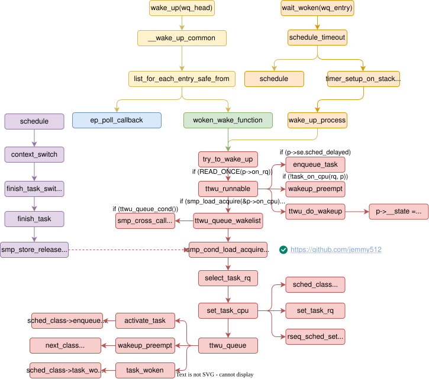

```c
/* wake up select
 * 1. Previous CPU Preference
 * 2. Wake Affine */
try_to_wake_up() {
    select_task_rq(p, p->wake_cpu, WF_TTWU);
}

/* fork select
 * 1. Start with Parent's CPU
 * 2. Check CPU's Capacity */
wake_up_new_task() {
    select_task_rq(p, task_cpu(p), WF_FORK);
}

/* exec select */
sched_exec() {
    select_task_rq(p, task_cpu(p), WF_EXEC);
}
```

1. Initial Task Creation:

    When a new task is created (e.g., through fork()):

    a. Start with Parent's CPU:
        - The scheduler first considers the CPU where the parent task is running.

    b. Check CPU's Capacity:
        - It checks if this CPU has enough capacity to handle the new task.

2. Task Wakeup:

    When a task wakes up from sleep:

    a. Previous CPU Preference:
        - The scheduler first considers the CPU where the task last ran (cache-hot placement).

    b. Wake Affine:
        - If `SD_WAKE_AFFINE` is set, it may prefer to wake the task on the same CPU or within the same scheduling domain.

3. Load Balancing Considerations:

    a. CPU Load:
        - CFS aims to distribute load evenly across CPUs.
        - It calculates the load of each CPU and prefers less loaded CPUs.

    b. Task's Weight:
        - The scheduler considers the task's priority and CPU requirements.

4. Topology Awareness:

    a. Cache Domains:
        - Prefers CPUs that share cache with the task's last ran CPU.

    b. NUMA Nodes:
        - In NUMA systems, prefers CPUs in the same NUMA node as the task's memory.

    c. SMT Siblings:
        - If `CONFIG_SCHED_SMT` is enabled, it may consider SMT sibling CPUs.

5. Energy Efficiency:

    a. CPU Idle States:
        - May consider the current idle state of CPUs to optimize for power efficiency.

    b. Heterogeneous Systems:
        - In systems with different types of cores (e.g., big.LITTLE), it considers the task's demands and core efficiencies.

6. CPU Affinity:

    a. Hard Affinity:
        - Respects any CPU affinity set by the user or system.

    b. Soft Affinity:
        - Considers any soft affinity hints.

7. Real-time and Deadline Tasks:

    - For real-time or deadline tasks, different rules may apply to ensure responsiveness.

8. Selection Process:

    The actual selection often follows these steps:

    a. `select_task_rq_fair()`:
        - This is the main function for selecting a CPU in CFS.

    b. Iteration through Domains:
        - Starts from the highest scheduling domain and works down.

    c. Finding the Ideal CPU:
        - Within each domain, it looks for the best CPU based on the above factors.

    d. Load Balancing Check:
        - Ensures the selected CPU wouldn't immediately trigger load balancing.

9. Special Cases:

    a. Newly Created Tasks:
        - May use `select_task_rq_fair()` with special flags.

    b. Task Migration:
        - During load balancing, uses similar principles but may prioritize different factors.

```c
select_task_rq_fair(struct task_struct *p, int prev_cpu, int wake_flags)
    /* WF_SYNC: Waker goes to sleep after wakeup */
    int sync = (wake_flags & WF_SYNC) && !(current->flags & PF_EXITING);
    struct sched_domain *tmp, *sd = NULL;
    int cpu = smp_processor_id();
    int new_cpu = prev_cpu;
    int want_affine = 0;
    /* SD_flags and WF_flags share the first nibble */
    int sd_flag = wake_flags & 0xF;

    lockdep_assert_held(&p->pi_lock);
/* 1. WF_TTWU flag */
    if (wake_flags & WF_TTWU) {
/* 1.1 update wake flips */
        record_wakee(p) {
            if (time_after(jiffies, current->wakee_flip_decay_ts + HZ)) {
                current->wakee_flips >>= 1;
                current->wakee_flip_decay_ts = jiffies;
            }

            if (current->last_wakee != p) {
                current->last_wakee = p;
                current->wakee_flips++;
            }
        }

        if (sched_energy_enabled()) {
            new_cpu = find_energy_efficient_cpu(p, prev_cpu);
            if (new_cpu >= 0)
                return new_cpu;
            new_cpu = prev_cpu;
        }

/* 1.2. calc wake affine */
        /* Detect M:N waker/wakee relationships via a switching-frequency heuristic. */
        ret = wake_wide(p) {
            unsigned int master = current->wakee_flips;
            unsigned int slave = p->wakee_flips;
            /* nr of cpus which share the llc */
            int factor = __this_cpu_read(sd_llc_size);

            if (master < slave)
                swap(master, slave);
            if (slave < factor || master < slave * factor)
                return 0;
            return 1;
        }
        want_affine = !ret && cpumask_test_cpu(cpu, p->cpus_ptr);
    }

/* 2. find new cpu if want_affine otherwise find highest domain with wake_flags */
    for_each_domain(cpu, tmp) {
        /* If both 'cpu' and 'prev_cpu' are part of this domain,
         * cpu is a valid SD_WAKE_AFFINE target. */
        if (want_affine && (tmp->flags & SD_WAKE_AFFINE)
            && cpumask_test_cpu(prev_cpu, sched_domain_span(tmp))) {

            if (cpu != prev_cpu) {
/* 2.1 wake affine. SD_WAKE_AFFINE: Consider waking task on waking CPU */
                new_cpu = wake_affine(tmp, p, cpu/*this_cpu*/, prev_cpu, sync);
            }

            sd = NULL; /* Prefer wake_affine over balance flags */
            break;
        }
/* 2.2 find highest domain */
        if (tmp->flags & sd_flag) {
            sd = tmp;
        } else if (!want_affine) {
            break;
        }
    }

    if (unlikely(sd)) {
/* 3. Slow path, no wake_affine, only for WF_EXEC and WF_FORK
 * Balances load by selecting the idlest CPU in the idlest group */
        new_cpu = sched_balance_find_dst_cpu(sd, p, cpu, prev_cpu, sd_flag)
            --->
    } else if (wake_flags & WF_TTWU) {
/* 4. Fast path, select idle sibling CPU from sd_llc if the domain has SD_WAKE_AFFINE set. */
        new_cpu = select_idle_sibling(p, prev_cpu, new_cpu)
            --->
    }

    return new_cpu;
```

### wake_affine

```c
int wake_affine(struct sched_domain *sd, struct task_struct *p,
               int this_cpu, int prev_cpu, int sync)
{
    int target = nr_cpumask_bits;
    /* only considers 'now', it check if the waking CPU is
    * cache-affine and is (or will be) idle */
    if (sched_feat(WA_IDLE)) {
        target = wake_affine_idle(this_cpu, prev_cpu, sync) {
            if (available_idle_cpu(this_cpu) && cpus_share_cache(this_cpu, prev_cpu)) {
                return available_idle_cpu(prev_cpu) ? prev_cpu : this_cpu;
            }

            if (sync && cpu_rq(this_cpu)->nr_running == 1) {
                return this_cpu;
            }

            if (available_idle_cpu(prev_cpu)) {
                return prev_cpu;
            }

            return nr_cpumask_bits;
        }
    }
    /* considers the weight to reflect the average
        * scheduling latency of the CPUs. This seems to work
        * for the overloaded case. */
    if (sched_feat(WA_WEIGHT) && target == nr_cpumask_bits) {
        target = wake_affine_weight(sd, p, this_cpu, prev_cpu, sync) {
            s64 this_eff_load, prev_eff_load;
            unsigned long task_load;

            this_eff_load = cpu_load(cpu_rq(this_cpu));

            if (sync) {
                unsigned long current_load = task_h_load(current);

                if (current_load > this_eff_load)
                    return this_cpu;

                this_eff_load -= current_load;
            }

            task_load = task_h_load(p);

            this_eff_load += task_load;
            if (sched_feat(WA_BIAS))
                this_eff_load *= 100;
            this_eff_load *= capacity_of(prev_cpu);

            prev_eff_load = cpu_load(cpu_rq(prev_cpu));
            prev_eff_load -= task_load;
            if (sched_feat(WA_BIAS))
                prev_eff_load *= 100 + (sd->imbalance_pct - 100) / 2;
            prev_eff_load *= capacity_of(this_cpu);

            if (sync)
                prev_eff_load += 1;

            return this_eff_load < prev_eff_load ? this_cpu : nr_cpumask_bits;
        }
    }

    schedstat_inc(p->stats.nr_wakeups_affine_attempts);
    if (target != this_cpu)
        return prev_cpu;

    schedstat_inc(sd->ttwu_move_affine);
    schedstat_inc(p->stats.nr_wakeups_affine);
    return target;
}
```

### sched_balance_find_dst_cpu

```c
new_cpu = sched_balance_find_dst_cpu(sd, p, cpu, prev_cpu, sd_flag) {
    int new_cpu = cpu;

    if (!cpumask_intersects(sched_domain_span(sd), p->cpus_ptr))
        return prev_cpu;

    if (!(sd_flag & SD_BALANCE_FORK)) {
        sync_entity_load_avg(&p->se) {
            struct cfs_rq *cfs_rq = cfs_rq_of(se);
            u64 last_update_time;

            last_update_time = cfs_rq_last_update_time(cfs_rq);
            __update_load_avg_blocked_se(last_update_time, se) {
                if (___update_load_sum(now, &se->avg, 0, 0, 0)) {
                    ___update_load_avg(&se->avg, se_weight(se));
                    trace_pelt_se_tp(se);
                    return 1;
                }

                return 0;
            }
        }
    }

    /* search sd downwards
     * sd the highest sd with sd_flag */
    while (sd) {
        struct sched_group *group;
        struct sched_domain *tmp;
        int weight;

        if (!(sd->flags & sd_flag)) {
            sd = sd->child;
            continue;
        }

        group = sched_balance_find_dst_group(sd, p, cpu)
            --->
        if (!group) {
            sd = sd->child;
            continue;
        }

        new_cpu = sched_balance_find_dst_group_cpu(group, p, cpu)
            --->
        if (new_cpu == cpu) {
            sd = sd->child;
            continue;
        }

        cpu = new_cpu;
        weight = sd->span_weight;
        sd = NULL;
        for_each_domain(cpu, tmp) {
            /* Ensures we don't go beyond the original domain's scope
             * span_weight represents number of CPUs in domain
             * Larger span_weight means higher/broader domain level */
            if (weight <= tmp->span_weight)
                break;

            /* Checks if domain supports required operation (sd_flag)
             * Updates sd if domain is suitable
             * Keeps track of last valid domain */
            if (tmp->flags & sd_flag)
                sd = tmp;
        }
    }

    return new_cpu;
}
```

#### sched_balance_find_dst_group

```c
static struct sched_group *
sched_balance_find_dst_group(struct sched_domain *sd, struct task_struct *p, int this_cpu)
{
    struct sched_group *idlest = NULL, *local = NULL, *group = sd->groups;
    struct sg_lb_stats local_sgs, tmp_sgs;
    struct sg_lb_stats *sgs;
    unsigned long imbalance;
    struct sg_lb_stats idlest_sgs = {
        .avg_load = UINT_MAX,
        .group_type = group_overloaded,
    };

    do {
        int local_group;

        if (!cpumask_intersects(sched_group_span(group), p->cpus_ptr))
            continue;

        if (!sched_group_cookie_match(cpu_rq(this_cpu), p, group))
            continue;

        local_group = cpumask_test_cpu(this_cpu, sched_group_span(group));

        if (local_group) {
            sgs = &local_sgs;
            local = group;
        } else {
            sgs = &tmp_sgs;
        }

        update_sg_wakeup_stats(sd, group, sgs, p) {
            int i, nr_running;

            memset(sgs, 0, sizeof(*sgs));

            /* Assume that task can't fit any CPU of the group */
            if (sd->flags & SD_ASYM_CPUCAPACITY)
                sgs->group_misfit_task_load = 1;

            for_each_cpu(i, sched_group_span(group)) {
                struct rq *rq = cpu_rq(i);
                unsigned int local;

                /* compute CPU load without any contributions from *p */
                sgs->group_load += cpu_load_without(rq, p);
                sgs->group_util += cpu_util_without(i, p);
                sgs->group_runnable += cpu_runnable_without(rq, p);
                local = task_running_on_cpu(i, p);
                sgs->sum_h_nr_running += rq->cfs.h_nr_runnable - local;

                nr_running = rq->nr_running - local;
                sgs->sum_nr_running += nr_running;

                if (!nr_running && idle_cpu_without(i, p))
                    sgs->idle_cpus++;

                /* Check if task fits in the CPU */
                if (sd->flags & SD_ASYM_CPUCAPACITY
                    && sgs->group_misfit_task_load
                    && task_fits_cpu(p, i)) {

                    sgs->group_misfit_task_load = 0;
                }
            }

            sgs->group_capacity = group->sgc->capacity;
            sgs->group_weight = group->group_weight;
            sgs->group_type = group_classify(sd->imbalance_pct, group, sgs);

            if (sgs->group_type == group_fully_busy || sgs->group_type == group_overloaded)
                sgs->avg_load = (sgs->group_load * SCHED_CAPACITY_SCALE) / sgs->group_capacity;
        }

        ret = update_pick_idlest(idlest, &idlest_sgs, group, sgs) {
            if (sgs->group_type < idlest_sgs->group_type)
                return true;

            if (sgs->group_type > idlest_sgs->group_type)
                return false;

            switch (sgs->group_type) {
            case group_overloaded:
            case group_fully_busy:
                /* Select the group with lowest avg_load. */
                if (idlest_sgs->avg_load <= sgs->avg_load)
                    return false;
                break;

            case group_imbalanced:
            case group_asym_packing:
            case group_smt_balance:
                /* Those types are not used in the slow wakeup path */
                return false;

            case group_misfit_task:
                /* Select group with the highest max capacity */
                if (idlest->sgc->max_capacity >= group->sgc->max_capacity)
                    return false;
                break;

            case group_has_spare:
                /* Select group with most idle CPUs */
                if (idlest_sgs->idle_cpus > sgs->idle_cpus)
                    return false;

                /* Select group with lowest group_util */
                if (idlest_sgs->idle_cpus == sgs->idle_cpus
                    && idlest_sgs->group_util <= sgs->group_util) {

                    return false;
                }

                break;
            }

            return true;
        }
        if (!local_group && ret) {
            idlest = group;
            idlest_sgs = *sgs;
        }
    } while (group = group->next, group != sd->groups);

    if (!idlest)
        return NULL;

    /* The local group has been skipped because of CPU affinity */
    if (!local)
        return idlest;

    /* If the local group is idler than the selected idlest group
     * don't try and push the task. */
    if (local_sgs.group_type < idlest_sgs.group_type)
        return NULL;

    /* If the local group is busier than the selected idlest group
     * try and push the task. */
    if (local_sgs.group_type > idlest_sgs.group_type)
        return idlest;

    switch (local_sgs.group_type) {
    case group_overloaded:
    case group_fully_busy:

        /* Calculate allowed imbalance based on load */
        imbalance = scale_load_down(NICE_0_LOAD) * (sd->imbalance_pct-100) / 100;

        if ((sd->flags & SD_NUMA) && ((idlest_sgs.avg_load + imbalance) >= local_sgs.avg_load))
            return NULL;

        /* If the local group is less loaded than the selected
         * idlest group don't try and push any tasks. */
        if (idlest_sgs.avg_load >= (local_sgs.avg_load + imbalance))
            return NULL;

        if (100 * local_sgs.avg_load <= sd->imbalance_pct * idlest_sgs.avg_load)
            return NULL;
        break;

    case group_imbalanced:
    case group_asym_packing:
    case group_smt_balance:
        /* Those type are not used in the slow wakeup path */
        return NULL;

    case group_misfit_task:
        /* Select group with the highest max capacity */
        if (local->sgc->max_capacity >= idlest->sgc->max_capacity)
            return NULL;
        break;

    case group_has_spare:
#ifdef CONFIG_NUMA
        if (sd->flags & SD_NUMA) {
            int imb_numa_nr = sd->imb_numa_nr;
#ifdef CONFIG_NUMA_BALANCING
            int idlest_cpu;
            /* If there is spare capacity at NUMA, try to select
             * the preferred node */
            if (cpu_to_node(this_cpu) == p->numa_preferred_nid)
                return NULL;

            idlest_cpu = cpumask_first(sched_group_span(idlest));
            if (cpu_to_node(idlest_cpu) == p->numa_preferred_nid)
                return idlest;
#endif /* CONFIG_NUMA_BALANCING */
            /* Otherwise, keep the task close to the wakeup source
             * and improve locality if the number of running tasks
             * would remain below threshold where an imbalance is
             * allowed while accounting for the possibility the
             * task is pinned to a subset of CPUs. If there is a
             * real need of migration, periodic load balance will
             * take care of it. */
            if (p->nr_cpus_allowed != NR_CPUS) {
                struct cpumask *cpus = this_cpu_cpumask_var_ptr(select_rq_mask);

                cpumask_and(cpus, sched_group_span(local), p->cpus_ptr);
                imb_numa_nr = min(cpumask_weight(cpus), sd->imb_numa_nr);
            }

            imbalance = abs(local_sgs.idle_cpus - idlest_sgs.idle_cpus);
            if (!adjust_numa_imbalance(imbalance,
                           local_sgs.sum_nr_running + 1,
                           imb_numa_nr)) {
                return NULL;
            }
        }
#endif /* CONFIG_NUMA */

        /* Select group with highest number of idle CPUs. We could also
         * compare the utilization which is more stable but it can end
         * up that the group has less spare capacity but finally more
         * idle CPUs which means more opportunity to run task. */
        if (local_sgs.idle_cpus >= idlest_sgs.idle_cpus)
            return NULL;
        break;
    }

    return idlest;
}
```

#### sched_balance_find_dst_group_cpu

```c
/* find out shallowest_idle_cpu or least_loaded_cpu */
static int
sched_balance_find_dst_group_cpu(struct sched_group *group, struct task_struct *p, int this_cpu)
{
    unsigned long load, min_load = ULONG_MAX;
    unsigned int min_exit_latency = UINT_MAX;
    u64 latest_idle_timestamp = 0;
    int least_loaded_cpu = this_cpu;
    int shallowest_idle_cpu = -1;
    int i;

    /* Check if we have any choice: */
    if (group->group_weight == 1)
        return cpumask_first(sched_group_span(group));

    /* Traverse only the allowed CPUs */
    for_each_cpu_and(i, sched_group_span(group), p->cpus_ptr) {
        struct rq *rq = cpu_rq(i);

        if (!sched_core_cookie_match(rq, p))
            continue;

        /* Runqueue only has SCHED_IDLE tasks enqueued */
        if (sched_idle_cpu(i))
            return i;

        if (available_idle_cpu(i)) {
            struct cpuidle_state *idle = idle_get_state(rq);
            if (idle && idle->exit_latency < min_exit_latency) {
                /* We give priority to a CPU whose idle state
                 * has the smallest exit latency irrespective
                 * of any idle timestamp. */
                min_exit_latency = idle->exit_latency;
                latest_idle_timestamp = rq->idle_stamp;
                shallowest_idle_cpu = i;
            } else if ((!idle || idle->exit_latency == min_exit_latency)
                && rq->idle_stamp > latest_idle_timestamp) {

                /* If equal or no active idle state, then
                 * the most recently idled CPU might have
                 * a warmer cache. */
                latest_idle_timestamp = rq->idle_stamp;
                shallowest_idle_cpu = i;
            }
        } else if (shallowest_idle_cpu == -1) {
            load = cpu_load(cpu_rq(i));
            if (load < min_load) {
                min_load = load;
                least_loaded_cpu = i;
            }
        }
    }

    return shallowest_idle_cpu != -1 ? shallowest_idle_cpu : least_loaded_cpu;
}
```

### select_idle_sibling

```c
/* Try and locate an idle core/thread in the LLC cache domain. */
static int select_idle_sibling(struct task_struct *p, int prev, int target)
{
    bool has_idle_core = false;
    struct sched_domain *sd;
    unsigned long task_util, util_min, util_max;
    int i, recent_used_cpu, prev_aff = -1;

    if (sched_asym_cpucap_active()) {
        sync_entity_load_avg(&p->se);
        task_util = task_util_est(p);
        util_min = uclamp_eff_value(p, UCLAMP_MIN);
        util_max = uclamp_eff_value(p, UCLAMP_MAX);
    }

    /* 1. check target cpu: idle and capacity fit */
    if (choose_idle_cpu(target, p)
        && asym_fits_cpu(task_util, util_min, util_max, target)) {
        return target;
    }

    /* 2. check prev cpu: idle, capacity fit, shared cache */
    if (prev != target
        && cpus_share_cache(prev, target)
        && choose_idle_cpu(prev, p)
        && asym_fits_cpu(task_util, util_min, util_max, prev)) {

        if (!static_branch_unlikely(&sched_cluster_active) ||
            cpus_share_resources(prev, target))
            return prev;

        prev_aff = prev;
    }

    if (is_per_cpu_kthread(current)
        && in_task()
        && prev == smp_processor_id()
        && this_rq()->nr_running <= 1
        && asym_fits_cpu(task_util, util_min, util_max, prev)) {
        return prev;
    }

    /* 3. Check a recently used CPU: shared cache, idle, capacity fit */
    recent_used_cpu = p->recent_used_cpu;
    p->recent_used_cpu = prev;
    if (recent_used_cpu != prev
        && recent_used_cpu != target
        && cpus_share_cache(recent_used_cpu, target)
        && choose_idle_cpu(recent_used_cpu, p)
        && cpumask_test_cpu(recent_used_cpu, p->cpus_ptr)
        && asym_fits_cpu(task_util, util_min, util_max, recent_used_cpu)){

        if (!static_branch_unlikely(&sched_cluster_active) ||
            cpus_share_resources(recent_used_cpu, target))
            return recent_used_cpu;

    } else {
        recent_used_cpu = -1;
    }

    /* 4. For asymmetric CPU capacity systems, our domain of interest is
     * sd_asym_cpucapacity rather than sd_llc. */
    if (sched_asym_cpucap_active()) {
        sd = rcu_dereference(per_cpu(sd_asym_cpucapacity, target));
        if (sd) {
            /* Scan the asym_capacity domain for idle CPUs */
            i = select_idle_capacity(p, sd, target);
            return ((unsigned)i < nr_cpumask_bits) ? i : target;
        }
    }

    /* Scan the sd_llc domain for idle CPUs */
    sd = rcu_dereference(per_cpu(sd_llc, target));
    if (!sd)
        return target;

    /* 5. select_idle_smt of prev if
     * target is not idle and
     * prev is shared cache with target */
    if (sched_smt_active()) {
        has_idle_core = test_idle_cores(target);
        if (!has_idle_core && cpus_share_cache(prev, sd, target)) {
            i = select_idle_smt(p, sd, prev/*target*/);
            if ((unsigned int)i < nr_cpumask_bits) {
                return i;
            }
        }
    }

    /* 6. select idle cpu from llc domain */
    i = select_idle_cpu(p, sd, has_idle_core, target);

    if ((unsigned)i < nr_cpumask_bits)
        return i;

    return target;
}
```

#### select_idle_capacity

```c
int
select_idle_capacity(struct task_struct *p, struct sched_domain *sd, int target)
{
    /* On !SMT systems, has_idle_core is always false and preferred_core
     * is always true (CPU == core), so the SMT preference logic below
     * collapses to the plain capacity scan. */
    bool has_idle_core = sched_smt_active() && test_idle_cores(target);
    unsigned long task_util, util_min, util_max, best_cap = 0;
    int fits, best_fits = ASYM_IDLE_THREAD_MISFIT;
    int cpu, best_cpu = -1;
    struct cpumask *cpus;
    int nr = INT_MAX;

    cpus = this_cpu_cpumask_var_ptr(select_rq_mask);
    cpumask_and(cpus, sched_domain_span(sd), p->cpus_ptr);

    task_util = task_util_est(p);
    util_min = uclamp_eff_value(p, UCLAMP_MIN);
    util_max = uclamp_eff_value(p, UCLAMP_MAX);

    if (sched_feat(SIS_UTIL) && sd->shared) {
        /* Same nr_idle_scan hint as select_idle_cpu(), nr only limits
         * the scan when not preferring an idle core. */
        nr = READ_ONCE(sd->shared->nr_idle_scan) + 1;
        /* overloaded domain is unlikely to have idle cpu/core */
        if (nr == 1)
            return -1;
    }

    for_each_cpu_wrap(cpu, cpus, target) {
        bool preferred_core = !has_idle_core || is_core_idle(cpu);
        unsigned long cpu_cap = capacity_of(cpu);

        /* Stop when the nr_idle_scan is exhausted (mirrors
         * select_idle_cpu() logic). */
        if (!has_idle_core && --nr <= 0)
            return best_cpu;

        if (!choose_idle_cpu(cpu, p))
            continue;

        fits = util_fits_cpu(task_util, util_min, util_max, cpu);

        /* Perfect fit: capacity satisfies util + uclamp and the CPU
         * sits on a fully-idle SMT core, this is a !SMT system, or
         * there is no idle core to find.
         * Short-circuit the rank-based selection and return
         * immediately. */
        if (fits > 0 && preferred_core)
            return cpu;
        /* Only the min performance hint (i.e. uclamp_min) doesn't fit.
         * Look for the CPU with best capacity. */
        else if (fits < 0)
            cpu_cap = get_actual_cpu_capacity(cpu);
        /* fits > 0 implies we are not on a preferred core, but the util
         * fits CPU capacity. Set fits to ASYM_IDLE_THREAD_FITS
         * so the effective range becomes
         * [ASYM_IDLE_THREAD_FITS, ASYM_IDLE_THREAD_MISFIT], where:
         *    ASYM_IDLE_THREAD_MISFIT - does not fit
         *    ASYM_IDLE_THREAD_UCLAMP_MISFIT - fits with the exception of UCLAMP_MIN
         *    ASYM_IDLE_THREAD_FITS - fits with the exception of preferred_core */
        else if (fits > 0)
            fits = ASYM_IDLE_THREAD_FITS;

        /* If we are on a preferred core, translate the range of fits
         * of [ASYM_IDLE_THREAD_UCLAMP_MISFIT, ASYM_IDLE_THREAD_MISFIT] to
         * [ASYM_IDLE_UCLAMP_MISFIT, ASYM_IDLE_COMPLETE_MISFIT].
         * This ensures that an idle core is always given priority over
         * (partially) busy core.
         *
         * A fully fitting idle core would have returned early and hence
         * fits > 0 for preferred_core need not be dealt with. */
        if (preferred_core)
            fits += ASYM_IDLE_CORE_BIAS;

        /* First, select CPU which fits better (lower is more preferred).
         * Then, select the one with best capacity at same level. */
        if ((fits < best_fits) ||
            ((fits == best_fits) && (cpu_cap > best_cap))) {
            best_cap = cpu_cap;
            best_cpu = cpu;
            best_fits = fits;
        }
    }

    /* A value in the [ASYM_IDLE_UCLAMP_MISFIT, ASYM_IDLE_COMPLETE_MISFIT]
     * range means the chosen CPU is in a fully idle SMT core. Values above
     * ASYM_IDLE_COMPLETE_MISFIT mean we never ranked such a CPU best.
     *
     * The asym-capacity wakeup path returns from select_idle_sibling()
     * after this function and never runs select_idle_cpu(), so the usual
     * select_idle_cpu() tail that clears idle cores must live here when the
     * idle-core preference did not win. */
    if (has_idle_core && best_fits > ASYM_IDLE_COMPLETE_MISFIT)
        set_idle_cores(target, false);

    return best_cpu;
}
```

####  select_idle_smt

```c
static int select_idle_smt(struct task_struct *p, struct sched_domain *sd, int target)
{
    int cpu;

    for_each_cpu_and(cpu, cpu_smt_mask(target), p->cpus_ptr) {
        if (cpu == target)
            continue;
        /* Check if the CPU is in the LLC scheduling domain of @target.
         * Due to isolcpus, there is no guarantee that all the siblings are in the domain. */
        if (!cpumask_test_cpu(cpu, sched_domain_span(sd)))
            continue;
        if (choose_idle_cpu(cpu, p))
            return cpu;
    }

    return -1;
}
```

#### select_idle_cpu

```c
int select_idle_cpu(struct task_struct *p, struct sched_domain *sd, bool has_idle_core, int target)
{
    struct cpumask *cpus = this_cpu_cpumask_var_ptr(select_rq_mask);
    int i, cpu, idle_cpu = -1, nr = INT_MAX;

    if (sched_feat(SIS_UTIL) && sd->shared) {
        /* Increment because !--nr is the condition to stop scan.
         *
         * Since "sd" is "sd_llc" for target CPU dereferenced in the
         * caller, it is safe to directly dereference "sd->shared".
         * Topology bits always ensure it assigned for "sd_llc" abd it
         * cannot disappear as long as we have a RCU protected
         * reference to one the associated "sd" here. */
        nr = READ_ONCE(sd->shared->nr_idle_scan) + 1;
        /* overloaded LLC is unlikely to have idle cpu/core */
        if (nr == 1)
            return -1;
    }

    if (!cpumask_and(cpus, sched_domain_span(sd), p->cpus_ptr))
        return -1;

    if (static_branch_unlikely(&sched_cluster_active)) {
        struct sched_group *sg = sd->groups;

        if (sg->flags & SD_CLUSTER) {
            for_each_cpu_wrap(cpu, sched_group_span(sg), target + 1) {
                if (!cpumask_test_cpu(cpu, cpus))
                    continue;

                if (has_idle_core) {
                    i = select_idle_core(p, cpu, cpus, &idle_cpu);
                    if ((unsigned int)i < nr_cpumask_bits)
                        return i;
                } else {
                    if (--nr <= 0)
                        return -1;
                    idle_cpu = __select_idle_cpu(cpu, p);
                    if ((unsigned int)idle_cpu < nr_cpumask_bits)
                        return idle_cpu;
                }
            }
            cpumask_andnot(cpus, cpus, sched_group_span(sg));
        }
    }

    for_each_cpu_wrap(cpu, cpus, target + 1) {
        if (has_idle_core) {
            i = select_idle_core(p, cpu, cpus, &idle_cpu);
            if ((unsigned int)i < nr_cpumask_bits)
                return i;
        } else {
            if (--nr <= 0)
                return -1;
            idle_cpu = __select_idle_cpu(cpu, p) {
                if ((available_idle_cpu(cpu) || sched_idle_cpu(cpu))
                    && sched_cpu_cookie_match(cpu_rq(cpu), p))
                    return cpu;

                return -1;
            }
            if ((unsigned int)idle_cpu < nr_cpumask_bits)
                break;
        }
    }

    if (has_idle_core)
        set_idle_cores(target, false);

    return idle_cpu;
}
```

#### select_idle_core

```c
int select_idle_core(struct task_struct *p, int core, struct cpumask *cpus, int *idle_cpu)
{
    bool idle = true;
    int cpu;

    for_each_cpu(cpu, cpu_smt_mask(core)) {
        if (!available_idle_cpu(cpu)) {
            idle = false;
            if (*idle_cpu == -1) {
                if (choose_sched_idle_rq(cpu_rq(cpu), p) &&
                    cpumask_test_cpu(cpu, cpus)) {
                    *idle_cpu = cpu;
                    break;
                }
                continue;
            }
            break;
        }
        if (*idle_cpu == -1 && cpumask_test_cpu(cpu, cpus))
            *idle_cpu = cpu;
    }

    if (idle)
        return core;

    cpumask_andnot(cpus, cpus, cpu_smt_mask(core));
    return -1;
}
```

### find_energy_efficient_cpu

* [Linux EAS介绍](https://mp.weixin.qq.com/s/HgEJ_IO-Gcy66vxMdsIGkQ)

## migrate_task_rq_fair

```c
static void migrate_task_rq_fair(struct task_struct *p, int new_cpu)
{
    struct sched_entity *se = &p->se;

    /* A task is marked WRITE_ONCE(p->on_rq, TASK_ON_RQ_MIGRATING);
     * if it is temporarily detached */
    if (!task_on_rq_migrating(p)) {
        /* The block only executes for regular migrations, not for ongoing detach/attach transitions. */
        remove_entity_load_avg(se) {
            struct cfs_rq *cfs_rq = cfs_rq_of(se);
            unsigned long flags;

            sync_entity_load_avg(se) {
                struct cfs_rq *cfs_rq = cfs_rq_of(se);
                u64 last_update_time;

                last_update_time = cfs_rq_last_update_time(cfs_rq);
                __update_load_avg_blocked_se(last_update_time, se);
            }

            raw_spin_lock_irqsave(&cfs_rq->removed.lock, flags);
            ++cfs_rq->removed.nr;
            cfs_rq->removed.util_avg        += se->avg.util_avg;
            cfs_rq->removed.load_avg        += se->avg.load_avg;
            cfs_rq->removed.runnable_avg    += se->avg.runnable_avg;
            raw_spin_unlock_irqrestore(&cfs_rq->removed.lock, flags);
        }

        /* Iestimates the missing time (lag) since the last update of the
        * source runqueue’s clock (cfs_rq->last_update_time) and adjusts the
        * task’s sched_avg metrics accordingly. */
        migrate_se_pelt_lag(se);
    }

    /* Tell new CPU we are migrated */
    se->avg.last_update_time = 0;

    update_scan_period(p, new_cpu);
}
```

### migrate_se_pelt_lag

```c
void migrate_se_pelt_lag(struct sched_entity *se)
{
    u64 throttled = 0, now, lut;
    struct cfs_rq *cfs_rq;
    struct rq *rq;
    bool is_idle;

    if (load_avg_is_decayed(&se->avg))
        return;

    cfs_rq = cfs_rq_of(se);
    rq = rq_of(cfs_rq);

    rcu_read_lock();
    is_idle = is_idle_task(rcu_dereference_all(rq->curr));
    rcu_read_unlock();

    /* The lag estimation comes with a cost we don't want to pay all the
     * time. Hence, limiting to the case where the source CPU is idle and
     * we know we are at the greatest risk to have an outdated clock. */
    if (!is_idle)
        return;

    /* Estimated "now" is: last_update_time + cfs_idle_lag + rq_idle_lag, where:
     *
     *   last_update_time (the cfs_rq's last_update_time)
     *    = cfs_rq_clock_pelt()@cfs_rq_idle
     *      = rq_clock_pelt()@cfs_rq_idle
     *        - cfs->throttled_clock_pelt_time@cfs_rq_idle
     *
     *   cfs_idle_lag (delta between rq's update and cfs_rq's update)
     *      = rq_clock_pelt()@rq_idle - rq_clock_pelt()@cfs_rq_idle
     *
     *   rq_idle_lag (delta between now and rq's update)
     *      = sched_clock_cpu() - rq_clock()@rq_idle
     *
     * We can then write:
     *
     *    now = rq_clock_pelt()@rq_idle - cfs->throttled_clock_pelt_time +
     *          sched_clock_cpu() - rq_clock()@rq_idle
     * Where:
     *      rq_clock_pelt()@rq_idle is rq->clock_pelt_idle
     *      rq_clock()@rq_idle      is rq->clock_idle
     *      cfs->throttled_clock_pelt_time@cfs_rq_idle
     *                              is cfs_rq->throttled_pelt_idle */

#ifdef CONFIG_CFS_BANDWIDTH
    throttled = u64_u32_load(cfs_rq->throttled_pelt_idle);
    /* The clock has been stopped for throttling */
    if (throttled == U64_MAX)
        return;
#endif
    now = u64_u32_load(rq->clock_pelt_idle);
    /* Paired with _update_idle_rq_clock_pelt(). It ensures at the worst case
     * is observed the old clock_pelt_idle value and the new clock_idle,
     * which lead to an underestimation. The opposite would lead to an
     * overestimation. */
    smp_rmb();
    lut = cfs_rq_last_update_time(cfs_rq);

    now -= throttled;
    if (now < lut)
        /* cfs_rq->avg.last_update_time is more recent than our
         * estimation, let's use it. */
        now = lut;
    else
        now += sched_clock_cpu(cpu_of(rq)) - u64_u32_load(rq->clock_idle);

    __update_load_avg_blocked_se(now, se);
}
```

## wakeup_preempt_fair

```c
void wakeup_preempt_fair(struct rq *rq, struct task_struct *p, int wake_flags)
{
    enum preempt_wakeup_action preempt_action = PREEMPT_WAKEUP_PICK;
    struct task_struct *donor = rq->donor;
    struct sched_entity *nse, *se = &donor->se, *pse = &p->se;
    struct cfs_rq *cfs_rq = &rq->cfs;
    int cse_is_idle, pse_is_idle;

    /* XXX Getting preempted by higher class, try and find idle CPU? */
    if (p->sched_class != &fair_sched_class || donor->sched_class != &fair_sched_class)
        return;

    if (unlikely(se == pse))
        return;

    /* This is possible from callers such as attach_tasks(), in which we
     * unconditionally wakeup_preempt() after an enqueue (which may have
     * lead to a throttle).  This both saves work and prevents false
     * next-buddy nomination below. */
    if (task_is_throttled(p))
        return;

    /* We can come here with TIF_NEED_RESCHED already set from new task
     * wake up path.
     *
     * Note: this also catches the edge-case of curr being in a throttled
     * group (e.g. via set_curr_task), since update_curr() (in the
     * enqueue of curr) will have resulted in resched being set.  This
     * prevents us from potentially nominating it as a false LAST_BUDDY
     * below. */
    if (!sched_feat(PREEMPT_SHORT) && test_tsk_need_resched(rq->curr))
        return;

    if (!sched_feat(WAKEUP_PREEMPTION))
        return;

    WARN_ON_ONCE(!pse);

    cse_is_idle = se_is_idle(se);
    pse_is_idle = se_is_idle(pse);

    nse = se;
    /* Preempt an idle entity in favor of a non-idle entity (and don't preempt
     * in the inverse case). */
    if (cse_is_idle && !pse_is_idle)
        goto preempt;

    update_curr_fair(rq);

    if (cse_is_idle != pse_is_idle)
        goto update;

    /* BATCH and IDLE tasks do not preempt others. */
    if (unlikely(!normal_policy(p->policy)))
        goto update;

    /* Do not preempt for tasks that are sched_delayed as it would violate
     * EEVDF to forcibly queue an ineligible task. */
    if (pse->sched_delayed)
        goto update;

    /* If @p has a shorter slice than current and @p is eligible, override
     * current's slice protection in order to allow preemption. */
    if (sched_feat(PREEMPT_SHORT) && (pse->slice < se->slice)) {
        preempt_action = PREEMPT_WAKEUP_SHORT;
        goto pick;
    }

    /* Ignore wakee preemption on WF_FORK as it is less likely that
     * there is shared data as exec often follow fork. */
    if (wake_flags & WF_FORK)
        goto update;

    /* Prefer picking wakee soon if appropriate. */
    if (sched_feat(NEXT_BUDDY) && set_preempt_buddy(cfs_rq, pse)) {
        /* Decide whether to obey WF_SYNC hint for a new buddy. Old
         * buddies are ignored as they may not be relevant to the
         * waker and less likely to be cache hot. */
        if (wake_flags & WF_SYNC)
            preempt_action = preempt_sync(rq, wake_flags, pse, se);
    }

    switch (preempt_action) {
    case PREEMPT_WAKEUP_NONE:
        return;
    case PREEMPT_WAKEUP_RESCHED:
        goto preempt;
    case PREEMPT_WAKEUP_SHORT:
        fallthrough;
    case PREEMPT_WAKEUP_PICK:
        break;
    }

pick:
    if (cfs_rq->h_nr_queued) {
        nse = pick_next_entity(rq, preempt_action != PREEMPT_WAKEUP_SHORT);
        if (unlikely(!nse))
            goto pick;

        /* If @p has become the most eligible task, force preemption */
        if (nse == pse)
            goto preempt;
    }

    /* If @p is eligible but not the next task to run then cancel protection
     * to prevent large scheduling latency */
    if (preempt_action == PREEMPT_WAKEUP_SHORT && entity_eligible(cfs_rq, pse))
        goto preempt;
update:
    if (sched_feat(RUN_TO_PARITY))
        update_protect_slice(cfs_rq, se);

    return;

preempt:
    cancel_protect_slice(se);

    if (preempt_action == PREEMPT_WAKEUP_SHORT)
        set_short_buddy(cfs_rq, pse);

    resched_curr_lazy(rq);
}

enum preempt_wakeup_action
preempt_sync(struct rq *rq, int wake_flags,
         struct sched_entity *pse, struct sched_entity *se)
{
    u64 threshold, delta;

    /* WF_SYNC without WF_TTWU is not expected so warn if it happens even
     * though it is likely harmless. */
    WARN_ON_ONCE(!(wake_flags & WF_TTWU));

    threshold = sysctl_sched_migration_cost;
    delta = rq_clock_task(rq) - se->exec_start;
    if ((s64)delta < 0)
        delta = 0;

    /* WF_RQ_SELECTED implies the tasks are stacking on a CPU when they
     * could run on other CPUs. Reduce the threshold before preemption is
     * allowed to an arbitrary lower value as it is more likely (but not
     * guaranteed) the waker requires the wakee to finish. */
    if (wake_flags & WF_RQ_SELECTED)
        threshold >>= 2;

    /* As WF_SYNC is not strictly obeyed, allow some runtime for batch
     * wakeups to be issued. */
    if (entity_before(pse, se) && delta >= threshold)
        return PREEMPT_WAKEUP_RESCHED;

    return PREEMPT_WAKEUP_NONE;
}
```

## task_fork_fair

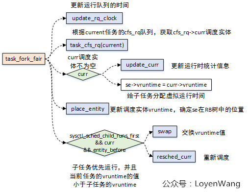

```c
static void task_fork_fair(struct task_struct *p)
{
    set_task_max_allowed_capacity(p) {
        struct asym_cap_data *entry;

        if (!sched_asym_cpucap_active())
            return;

        rcu_read_lock();
        list_for_each_entry_rcu(entry, &asym_cap_list, link) {
            cpumask_t *cpumask;

            cpumask = cpu_capacity_span(entry);
            if (!cpumask_intersects(p->cpus_ptr, cpumask))
                continue;

            p->max_allowed_capacity = entry->capacity;
            break;
        }
        rcu_read_unlock();
    }
}
```

## yield_task_fair

```c
void yield_task_fair(struct rq *rq)
{
    struct task_struct *curr = rq->donor;
    struct sched_entity *se = &curr->se;
    struct cfs_rq *cfs_rq = &rq->cfs;

    /* Are we the only task in the tree? */
    if (unlikely(rq->nr_running == 1))
        return;

    clear_buddies(cfs_rq, se);

    update_rq_clock(rq);
    /* Update run-time statistics of the 'current'. */
    update_curr(cfs_rq);
    /* Tell update_rq_clock() that we've just updated,
     * so we don't do microscopic update in schedule()
     * and double the fastpath cost. */
    rq_clock_skip_update(rq);

    /* Forfeit the remaining vruntime, only if the entity is eligible. This
     * condition is necessary because in core scheduling we prefer to run
     * ineligible tasks rather than force idling. If this happens we may
     * end up in a loop where the core scheduler picks the yielding task,
     * which yields immediately again; without the condition the vruntime
     * ends up quickly running away. */
    if (entity_eligible(cfs_rq, se)) {
        se->vruntime = se->deadline;
        update_deadline(cfs_rq, se);
    }
}
```

## task_change_group_fair

```c
void task_change_group_fair(struct task_struct *p)
{
    /* We couldn't detach or attach a forked task which
     * hasn't been woken up by wake_up_new_task(). */
    if (READ_ONCE(p->__state) == TASK_NEW)
        return;

    detach_task_cfs_rq(p);

    /* Tell se's cfs_rq has been changed -- migrated */
    p->se.avg.last_update_time = 0;
    set_task_rq(p, task_cpu(p));
    attach_task_cfs_rq(p);
}
```

## prio_changed_fair

```c
static void
prio_changed_fair(struct rq *rq, struct task_struct *p, int oldprio)
{
    if (!task_on_rq_queued(p))
        return;

    if (p->prio == oldprio)
        return;

    if (rq->cfs.h_nr_queued == 1)
        return;

    /* Reschedule if we are currently running on this runqueue and
     * our priority decreased, or if we are not currently running on
     * this runqueue and our priority is higher than the current's */
    if (task_current(rq, p)) {
        if (p->prio > oldprio)
            resched_curr(rq);
    } else {
        wakeup_preempt(rq, p, 0);
    }
}

```

### switched_from_fair

```c
/* detach load_avg */
void switched_from_fair(struct rq *rq, struct task_struct *p)
{
    detach_task_cfs_rq(p);
}
```

### switched_to_fair

```c
/* attach load_avg */
void switched_to_fair(struct rq *rq, struct task_struct *p)
{
    attach_task_cfs_rq(p);

    set_task_max_allowed_capacity(p);

    if (task_on_rq_queued(p)) {
        /* We were most likely switched from sched_rt, so
         * kick off the schedule if running, otherwise just see
         * if we can still preempt the current task. */
        if (task_current(rq, p))
            resched_curr(rq);
        else
            wakeup_preempt(rq, p, 0);
    }
}

static void attach_task_cfs_rq(struct task_struct *p)
{
    struct sched_entity *se = &p->se;

    attach_entity_cfs_rq(se) {
        struct cfs_rq *cfs_rq = cfs_rq_of(se);

        /* Synchronize entity with its cfs_rq */
        update_load_avg(cfs_rq, se, sched_feat(ATTACH_AGE_LOAD) ? 0 : SKIP_AGE_LOAD);
        attach_entity_load_avg(cfs_rq, se);
        update_tg_load_avg(cfs_rq);
        propagate_entity_cfs_rq(se);
    }
}
```

### switching_from

```c
static void switching_from_fair(struct rq *rq, struct task_struct *p)
{
    if (p->se.sched_delayed)
        dequeue_task(rq, p, DEQUEUE_SLEEP | DEQUEUE_DELAYED | DEQUEUE_NOCLOCK);
}
```

## reweight_task_fair

```c
void reweight_task_fair(struct rq *rq, struct task_struct *p,
                   const struct load_weight *lw)
{
    struct sched_entity *se = &p->se;
    unsigned long weight = NICE_0_LOAD;

    if (se->on_rq)
        update_curr_fair(rq);

    reweight_entity(cfs_rq_of(se), se, lw->weight);
    se->load.inv_weight = lw->inv_weight;

    if (!se->on_rq)
        return;

    for_each_sched_entity(se) {
        weight = __calc_prop_weight(cfs_rq_of(se), se, weight) {
            weight *= se->load.weight;
            if (parent_entity(se))
                weight /= cfs_rq->load.weight;
            else
                weight /= NICE_0_LOAD;

            return max(weight, MIN_SHARES);
        }
    }

    reweight_eevdf(&rq->cfs, &p->se, weight, p->se.on_rq);
}
```

### reweight_entity

```c
void reweight_entity(struct cfs_rq *cfs_rq, struct sched_entity *se,
                unsigned long weight)
{
    if (se->load.weight == weight)
        return;

    if (se->on_rq) {
        WARN_ON_ONCE(cfs_rq != cfs_rq_of(se));
        update_load_sub(&cfs_rq->load, se->load.weight);
    }
    dequeue_load_avg(cfs_rq, se);

    update_load_set(&se->load, weight) {
        lw->weight = w;
        lw->inv_weight = 0;
    }

    do {
        u32 divider = get_pelt_divider(&se->avg);
        se->avg.load_avg = div_u64(se_weight(se) * se->avg.load_sum, divider);
    } while (0);

    enqueue_load_avg(cfs_rq, se);

    if (se->on_rq)
        update_load_add(&cfs_rq->load, se->load.weight);
}
```

* `reweight_entity` updates local/hierarchical bookkeeping.
* `reweight_eevdf` updates flat-queue competitive behavior with effective weight.


### reweight_eevdf

```c
void reweight_eevdf(struct cfs_rq *cfs_rq, struct sched_entity *se,
               unsigned long weight, bool on_rq)
{
    bool curr = cfs_rq->curr == se;
    bool rel_vprot = false;
    u64 avruntime = 0;

    if (se->h_load.weight == weight)
        return;

    if (on_rq) {
        avruntime = avg_vruntime(cfs_rq);
        se->vlag = entity_lag(cfs_rq, se, avruntime) {
            u64 max_slice = cfs_rq_max_slice(cfs_rq) + TICK_NSEC;
            s64 vlag, limit;

            vlag = avruntime - se->vruntime;
            limit = calc_delta_fair(max_slice, se);

            return clamp(vlag, -limit, limit);
        }
        se->deadline -= avruntime;
        se->rel_deadline = 1;
        if (curr && protect_slice(se)) {
            se->vprot -= avruntime;
            rel_vprot = true;
        }

        cfs_rq->h_nr_queued--;
        if (!curr)
            __dequeue_entity(cfs_rq, se);
    }

    rescale_entity(se, weight, rel_vprot) {
        long old_weight = se->h_load.weight;
        se->vlag = div64_long(se->vlag * old_weight, weight);
        if (se->rel_deadline)
            se->deadline = div64_long(se->deadline * old_weight, weight);

        if (rel_vprot)
            se->vprot = div64_long(se->vprot * old_weight, weight);
    }

    update_load_set(&se->h_load, weight) {
        lw->weight = w;
        lw->inv_weight = 0;
    }

    if (on_rq) {
        if (rel_vprot)
            se->vprot += avruntime;
        se->deadline += avruntime;
        se->rel_deadline = 0;
        se->vruntime = avruntime - se->vlag;

        if (!curr)
            __enqueue_entity(cfs_rq, se);
        cfs_rq->h_nr_queued++;
    }
}
```

## sched_vslice

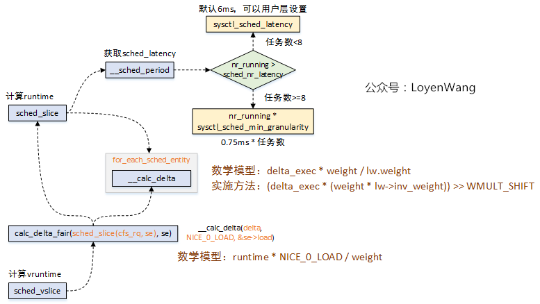
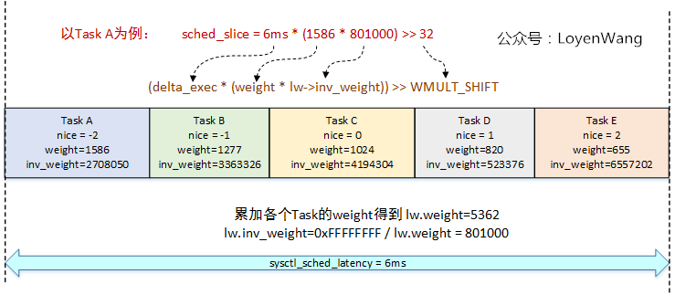

```c
const int sched_prio_to_weight[40] = {
 /* -20 */     88761,     71755,     56483,     46273,     36291,
 /* -15 */     29154,     23254,     18705,     14949,     11916,
 /* -10 */      9548,      7620,      6100,      4904,      3906,
 /*  -5 */      3121,      2501,      1991,      1586,      1277,
 /*   0 */      1024,       820,       655,       526,       423,
 /*   5 */       335,       272,       215,       172,       137,
 /*  10 */       110,        87,        70,        56,        45,
 /*  15 */        36,        29,        23,        18,        15,
};

sched_vslice(struct cfs_rq *cfs_rq, struct sched_entity *se)
    slice = sched_slice(cfs_rq, se) {
        slice = __sched_period(nr_running + !se->on_rq) {
            if (unlikely(nr_running > sched_nr_latency/*8*/))
                return nr_running * sysctl_sched_base_slice/*0.75 msec*/;
            else
                return sysctl_sched_latency/*6ms*/;
        }
        for_each_sched_entity(se) {
            struct load_weight *load;
            struct load_weight lw;
            struct cfs_rq *qcfs_rq;

            qcfs_rq = cfs_rq_of(se);
            load = &qcfs_rq->load;

            if (unlikely(!se->on_rq)) {
                lw = qcfs_rq->load;
                update_load_add(&lw, se->load.weight);
                load = &lw;
            }

            slice = __calc_delta(slice, se->load.weight, load) {
                /* delta_exec * weight / lw.weight
                 *   OR
                 * (delta_exec * (weight * lw->inv_weight)) >> WMULT_SHIFT */
            }
        }
        if (sched_feat(BASE_SLICE)) {
            if (se_is_idle(init_se) && !sched_idle_cfs_rq(cfs_rq))
                min_gran = sysctl_sched_idle_min_granularity;
            else
                min_gran = sysctl_sched_base_slice;

            slice = max_t(u64, slice, min_gran);
        }
        return slice;
    }
    calc_delta_fair(slice, se) {
        if (se->h_load.weight != NICE_0_LOAD)
            delta = __calc_delta(delta, NICE_0_LOAD, &se->load) {
                /* delta_exec * weight / lw.weight
                 *   OR
                 * (delta_exec * (weight * lw->inv_weight)) >> WMULT_SHIFT */
        }

        return delta;
    }

```

## cfs_feature

### protect_slice

1. **Core concept**

    protect_slice answers: "has this entity used up its protected vruntime window yet?"

    ```c
    static inline bool protect_slice(struct sched_entity *se) {
        return vruntime_cmp(se->vruntime, "<", se->vprot);
    }
    ```

    se->vprot is a vruntime deadline - a virtual time threshold up to which the currently-running entity is shielded from preemption. While vruntime < vprot, the entity is in its protected window.


2. **Setting the protection: set_protect_slice**

    Called when a task is first picked to run (set_next_task_fair(..., first=true)):

    ```c
    static inline void set_protect_slice(struct cfs_rq *cfs_rq, struct sched_entity *se) {
        u64 slice = normalized_sysctl_sched_base_slice;  // minimum quantum fallback
        u64 vprot  = se->deadline;

        if (sched_feat(RUN_TO_PARITY))
            slice = cfs_rq_min_slice(cfs_rq);  // shortest slice among all queued entities

        slice = min(slice, se->slice);         // cap at entity's own earned slice
        if (slice != se->slice)
            vprot = min(vprot, vruntime + calc_delta_fair(slice, se));
    }
    ```

    se->vprot = vprot;
    Two modes depending on RUN_TO_PARITY feature flag:

    | Mode | slice used | Effect |
    | :-: | :-: | :-: |
    | RUN_TO_PARITY on | cfs_rq_min_slice() - shortest among all runnable entities | Protection lasts until the most-starved competitor's slice, encouraging fairness parity
    | RUN_TO_PARITY off | sysctl_sched_base_slice | Minimum progress guarantee - prevents constant preemption of a newly-scheduled task

3. **Where it matters**

    * 3.1. Pick decision - the most important use:

        ```c
        static struct sched_entity *pick_eevdf(struct cfs_rq *cfs_rq, bool protect) {
            if (curr && protect && protect_slice(curr))
                return curr;  // don't switch away from current task
        }
        ```

        Even if EEVDF's tree has an eligible entity ready, the current task wins if still in its protected window. This prevents the "thrashing" problem where tasks constantly preempt each other before making real progress.

    * 3.2. Resched gate:

        ```c
        void update_curr(struct cfs_rq *cfs_rq) {
            if (resched || !protect_slice(curr)) {
                resched_curr_lazy(rq);
                clear_buddies(cfs_rq, curr);
            }
        }
        ```
        Only sets the lazy resched flag if either something urgent happened or the protection has expired.

    * 3.3. Wakeup preemption (fair.c:8929-8936):

        ```c
        void wakeup_preempt_fair(struct rq *rq, struct task_struct *p, int wake_flags) {
        update:
            if (sched_feat(RUN_TO_PARITY))
                update_protect_slice(cfs_rq, se);   // tighten protection as new tasks arrive

            return;

        preempt:
            cancel_protect_slice(se);               // short waker forfeits its protection

            if (preempt_action == PREEMPT_WAKEUP_SHORT)
                set_short_buddy(cfs_rq, pse);
        }
        ```

        If a waking task is "short" (burst-y), it cancels the current task's protection and gets preempted.

    * 3.4. Reweight (fair.c:3859)

        when a task's weight changes (nice value), the relative vprot offset is preserved so the protection window scales correctly with the new weight.

### next_buddy

The **next buddy** is a hint stored in `cfs_rq->next` — a pointer to a `sched_entity` that the scheduler *should prefer to pick next*, ahead of the normal EEVDF-ordered leftmost entity in the run queue. It's a lightweight scheduling hint, not a hard guarantee.

```c
    struct sched_entity    *curr;
    struct sched_entity    *next;
```

#### Core Function: `set_next_buddy`

```c
static void set_next_buddy(struct cfs_rq *cfs_rq, struct sched_entity *se)
{
    if (WARN_ON_ONCE(!se->on_rq || se->sched_delayed))
        return;
    if (se_is_idle(se))
        return;
    cfs_rq->next = se;
}
```

Guards:
- The entity must be **on the run queue** (`on_rq`) and not **DELAY_DEQUEUE** deferred (`sched_delayed`).
- Idle tasks are **never** promoted to buddy — that would defeat the purpose.

#### Where It's Set

1. Wakeup Preemption - set_preempt_buddy

    ```c
    void wakeup_preempt_fair(struct rq *rq, struct task_struct *p, int wake_flags) {
        /* Prefer picking wakee soon if appropriate. */
        if (sched_feat(NEXT_BUDDY) && set_preempt_buddy(cfs_rq, pse)) {
            /* Decide whether to obey WF_SYNC hint for a new buddy. Old
            * buddies are ignored as they may not be relevant to the
            * waker and less likely to be cache hot. */
            if (wake_flags & WF_SYNC)
                preempt_action = preempt_sync(rq, wake_flags, pse, se);
        }
    }
    ```

    When a task wakes up another but **preemption is not triggered immediately**, the woken task is set as the next buddy so it gets priority at the next scheduling decision. The rationale: if task A just woke task B, B likely needs data A just produced — keep it cache-warm.

    `set_preempt_buddy` applies an EEVDF-aware filter: only set the buddy if the candidate doesn't have a *sooner* deadline than the existing buddy:

    ```c
    static inline bool set_preempt_buddy(struct cfs_rq *cfs_rq, struct sched_entity *pse)
    {
        /* Keep existing buddy if the deadline is sooner than pse.
        * The older buddy may be cache cold and completely unrelated
        * to the current wakeup but that is unpredictable where as
        * obeying the deadline is more in line with EEVDF objectives. */
        if (cfs_rq->next && entity_before(cfs_rq->next, pse))
            return false;

        set_next_buddy(cfs_rq, pse);
        return true;
    }
    ```

2. Wakeup Preemption - set_short_buddy

    ```c
    static void wakeup_preempt_fair(struct rq *rq, struct task_struct *p, int wake_flags) {
    preempt:
        cancel_protect_slice(se);

        if (preempt_action == PREEMPT_WAKEUP_SHORT)
            set_short_buddy(cfs_rq, pse);

        resched_curr_lazy(rq);
    }

    static inline bool set_short_buddy(struct cfs_rq *cfs_rq, struct sched_entity *pse)
    {
        if (cfs_rq->next && cfs_rq->next->slice < pse->slice)
            return false;

        set_next_buddy(cfs_rq, pse);
        return true;
    }
    ```

    When a newly woken task has a **shorter time slice** than the current one, it's a signal it should run soon (it's a short/interactive burst). It's set as the next buddy unless there's already a buddy with an even shorter slice.

3. `yield_to_task_fair()` — explicit CPU yield

    ```c
    static bool yield_to_task_fair(struct rq *rq, struct task_struct *p)
    {
        struct sched_entity *se = &p->se;

        /* !se->on_rq also covers throttled task */
        if (!se->on_rq || se->sched_delayed)
            return false;

        /* Tell the scheduler that we'd really like se to run next. */
        set_next_buddy(&task_rq(p)->cfs, se);

        yield_task_fair(rq);

        return true;
    }
    ```

    When a task calls `sched_yield()` targeting a specific peer (e.g., from `pthread_yield` or futex operations), the target is pinned as the next buddy.

#### Where It's Consumed: `pick_next_entity`

```c
struct sched_entity *pick_eevdf(struct cfs_rq *cfs_rq, bool protect) {
    /* Picking the ->next buddy will affect latency but not fairness. */
    if (sched_feat(PICK_BUDDY) && protect &&
        cfs_rq->next && entity_eligible(cfs_rq, cfs_rq->next)) {
        /* ->next will never be delayed */
        WARN_ON_ONCE(cfs_rq->next->sched_delayed);
        return cfs_rq->next;
    }
}
```

The buddy is only honored if:
1. **`PICK_BUDDY`** scheduler feature is enabled (**on** by default).
2. The current task is in a **"protect"** window (e.g., slice protection is active).
3. The buddy is **eligible** (its virtual deadline hasn't been violated; i.e., it's not so far behind that picking it would break fairness too badly).

#### Scheduler Feature Flags

| Feature | Default | Purpose |
|---|---|---|
| `NEXT_BUDDY` | **off** | Set the woken task as buddy on failed preemption |
| `PICK_BUDDY` | **on** | Actually honor `cfs_rq->next` when picking next task |
| `CACHE_HOT_BUDDY` | **on** | Don't migrate a buddy away — treat it as cache-hot |

#### Summary

```
Task wakes up / yields →
    set_next_buddy(cfs_rq, woken_se)     ← store hint in cfs_rq->next
        ↓
Next schedule tick / context switch →
    pick_next_entity()
        if PICK_BUDDY && protect && next->eligible
            → skip leftmost EEVDF entity, pick cfs_rq->next instead
        clear_buddies()                  ← consumed; pointer cleared
```

The next buddy mechanism is a **pure hint** that trades a tiny amount of theoretical EEVDF fairness for **cache locality and reduced wakeup latency**. It only fires when the chosen entity is still EEVDF-eligible, so fairness is never severely compromised.

# SCHED_EXT

* [[PATCHSET v12 sched_ext/for-6.20] Add a deadline server for sched_ext tasks](https://lore.kernel.org/all/20260126100050.3854740-1-arighi@nvidia.com/)

* [[PATCHSET v1 sched_ext/for-6.20] sched_ext: Implement cgroup sub-scheduler support](https://lore.kernel.org/lkml/20260121231140.832332-1-tj@kernel.org/)

```c
DEFINE_SCHED_CLASS(ext) = {
    .enqueue_task           = enqueue_task_scx,
    .dequeue_task           = dequeue_task_scx,
    .yield_task             = yield_task_scx,
    .yield_to_task          = yield_to_task_scx,

    .wakeup_preempt         = wakeup_preempt_scx,

    .pick_task              = pick_task_scx,

    .put_prev_task          = put_prev_task_scx,
    .set_next_task          = set_next_task_scx,

    .select_task_rq         = select_task_rq_scx,
    .task_woken             = task_woken_scx,
    .set_cpus_allowed       = set_cpus_allowed_scx,

    .rq_online              = rq_online_scx,
    .rq_offline             = rq_offline_scx,

    .task_tick              = task_tick_scx,

    .switching_to           = switching_to_scx,
    .switched_from          = switched_from_scx,
    .switched_to            = switched_to_scx,
    .reweight_task          = reweight_task_scx,
    .prio_changed           = prio_changed_scx,

    .update_curr            = update_curr_scx,

#ifdef CONFIG_UCLAMP_TASK
    .uclamp_enabled     = 1,
#endif
};

struct rq {
    #ifdef CONFIG_SCHED_CLASS_EXT
    struct scx_rq        scx;
    struct sched_dl_entity    ext_server;
#endif
};

struct scx_rq {
    struct scx_dispatch_q   local_dsq;
    struct list_head        runnable_list;          /* runnable tasks on this rq */
    struct list_head        ddsp_deferred_locals;   /* deferred ddsps from enq */
    unsigned long           ops_qseq;
    u64                     extra_enq_flags;    /* see move_task_to_local_dsq() */
    u32                     nr_running;
    u32                     cpuperf_target; /* [0, SCHED_CAPACITY_SCALE] */
    bool                    cpu_released;
    u32                     flags;
    u64                     clock;      /* current per-rq clock -- see scx_bpf_now() */
    cpumask_var_t           cpus_to_kick;
    cpumask_var_t           cpus_to_kick_if_idle;
    cpumask_var_t           cpus_to_preempt;
    cpumask_var_t           cpus_to_wait;
    unsigned long           kick_sync;
    local_t                 reenq_local_deferred;
    struct balance_callback deferred_bal_cb;
    struct irq_work         deferred_irq_work;
    struct irq_work         kick_cpus_irq_work;
    struct scx_dispatch_q   bypass_dsq;
};

struct scx_dispatch_q {
    raw_spinlock_t        lock;
    struct task_struct __rcu *first_task; /* lockless peek at head */
    struct list_head        list;   /* tasks in dispatch order */
    struct rb_root          priq;   /* used to order by p->scx.dsq_vtime */
    u32                     nr;
    u32                     seq;    /* used by BPF iter */
    u64                     id;
    struct rhash_head       hash_node;
    struct llist_node       free_node;
    struct rcu_head         rcu;
};
```

```c
void sched_init()
{
    for_each_possible_cpu(i) {
        struct rq *rq;

        rq = cpu_rq(i);
        ext_server_init(rq);
    }
}

void ext_server_init(struct rq *rq)
{
    struct sched_dl_entity *dl_se = &rq->ext_server;

    init_dl_entity(dl_se) {
        RB_CLEAR_NODE(&dl_se->rb_node);
        init_dl_task_timer(dl_se) {
            struct hrtimer *timer = &dl_se->dl_timer;

            hrtimer_setup(timer, dl_task_timer, CLOCK_MONOTONIC, HRTIMER_MODE_REL_HARD);

        }

        init_dl_inactive_task_timer(dl_se) {
            struct hrtimer *timer = &dl_se->inactive_timer;

            hrtimer_setup(timer, inactive_task_timer, CLOCK_MONOTONIC, HRTIMER_MODE_REL_HARD);

        }
        __dl_clear_params(dl_se);
    }

    dl_server_init(dl_se, rq, ext_server_pick_task) {
        dl_se->rq = rq;
        dl_se->server_pick_task = pick_task;
    }
}

static struct task_struct *
ext_server_pick_task(struct sched_dl_entity *dl_se, struct rq_flags *rf)
{
    if (!scx_enabled())
        return NULL;

    return do_pick_task_scx(dl_se->rq, rf, true);
}
```

## task_tick_scx

```c
static void task_tick_scx(struct rq *rq, struct task_struct *curr, int queued)
{
    struct scx_sched *sch = scx_task_sched(curr);

    update_curr_scx(rq);

    /* While disabling, always resched as we can't trust the slice
     * management. */
    if (scx_bypassing(sch, cpu_of(rq)))
        scx_set_task_slice(curr, 0);
    else if (SCX_HAS_OP(sch, tick))
        SCX_CALL_OP_TASK(sch, tick, rq, curr);

    if (!curr->scx.slice)
        resched_curr(rq);
}
```

## enqueue_task_scx

```c
void enqueue_task_scx(struct rq *rq, struct task_struct *p, int enq_flags)
{
    struct scx_sched *sch = scx_root;
    int sticky_cpu = p->scx.sticky_cpu;

    if (enq_flags & ENQUEUE_WAKEUP)
        rq->scx.flags |= SCX_RQ_IN_WAKEUP;

    enq_flags |= rq->scx.extra_enq_flags;

    if (sticky_cpu >= 0)
        p->scx.sticky_cpu = -1;

    /* Restoring a running task will be immediately followed by
     * set_next_task_scx() which expects the task to not be on the BPF
     * scheduler as tasks can only start running through local DSQs. Force
     * direct-dispatch into the local DSQ by setting the sticky_cpu. */
    if (unlikely(enq_flags & ENQUEUE_RESTORE) && task_current(rq, p))
        sticky_cpu = cpu_of(rq);

    if (p->scx.flags & SCX_TASK_QUEUED) {
        WARN_ON_ONCE(!task_runnable(p));
        goto out;
    }

    set_task_runnable(rq, p);
    p->scx.flags |= SCX_TASK_QUEUED;
    rq->scx.nr_running++;
    add_nr_running(rq, 1);

    if (SCX_HAS_OP(sch, runnable) && !task_on_rq_migrating(p))
        SCX_CALL_OP_TASK(sch, SCX_KF_REST, runnable, rq, p, enq_flags);

    if (enq_flags & SCX_ENQ_WAKEUP)
        touch_core_sched(rq, p);

    /* Start dl_server if this is the first task being enqueued */
    if (rq->scx.nr_running == 1)
        dl_server_start(&rq->ext_server);

    do_enqueue_task(rq, p, enq_flags, sticky_cpu);
out:
    rq->scx.flags &= ~SCX_RQ_IN_WAKEUP;

    if ((enq_flags & SCX_ENQ_CPU_SELECTED) &&
        unlikely(cpu_of(rq) != p->scx.selected_cpu))
        __scx_add_event(sch, SCX_EV_SELECT_CPU_FALLBACK, 1);
}

void do_enqueue_task(struct rq *rq, struct task_struct *p, u64 enq_flags,
                int sticky_cpu)
{
    struct scx_sched *sch = scx_root;
    struct task_struct **ddsp_taskp;
    struct scx_dispatch_q *dsq;
    unsigned long qseq;

    WARN_ON_ONCE(!(p->scx.flags & SCX_TASK_QUEUED));

    /* rq migration */
    if (sticky_cpu == cpu_of(rq))
        goto local_norefill;

    /* If !scx_rq_online(), we already told the BPF scheduler that the CPU
     * is offline and are just running the hotplug path. Don't bother the
     * BPF scheduler. */
    if (!scx_rq_online(rq))
        goto local;

    if (scx_rq_bypassing(rq)) {
        __scx_add_event(sch, SCX_EV_BYPASS_DISPATCH, 1);
        goto bypass;
    }

    if (p->scx.ddsp_dsq_id != SCX_DSQ_INVALID)
        goto direct;

    /* see %SCX_OPS_ENQ_EXITING */
    if (!(sch->ops.flags & SCX_OPS_ENQ_EXITING) &&
        unlikely(p->flags & PF_EXITING)) {
        __scx_add_event(sch, SCX_EV_ENQ_SKIP_EXITING, 1);
        goto local;
    }

    /* see %SCX_OPS_ENQ_MIGRATION_DISABLED */
    if (!(sch->ops.flags & SCX_OPS_ENQ_MIGRATION_DISABLED) &&
        is_migration_disabled(p)) {
        __scx_add_event(sch, SCX_EV_ENQ_SKIP_MIGRATION_DISABLED, 1);
        goto local;
    }

    if (unlikely(!SCX_HAS_OP(sch, enqueue)))
        goto global;

    /* DSQ bypass didn't trigger, enqueue on the BPF scheduler */
    qseq = rq->scx.ops_qseq++ << SCX_OPSS_QSEQ_SHIFT;

    WARN_ON_ONCE(atomic_long_read(&p->scx.ops_state) != SCX_OPSS_NONE);
    atomic_long_set(&p->scx.ops_state, SCX_OPSS_QUEUEING | qseq);

    ddsp_taskp = this_cpu_ptr(&direct_dispatch_task);
    WARN_ON_ONCE(*ddsp_taskp);
    *ddsp_taskp = p;

    SCX_CALL_OP_TASK(sch, SCX_KF_ENQUEUE, enqueue, rq, p, enq_flags);

    *ddsp_taskp = NULL;
    if (p->scx.ddsp_dsq_id != SCX_DSQ_INVALID)
        goto direct;

    /* If not directly dispatched, QUEUEING isn't clear yet and dispatch or
     * dequeue may be waiting. The store_release matches their load_acquire. */
    atomic_long_set_release(&p->scx.ops_state, SCX_OPSS_QUEUED | qseq);
    return;

direct:
    direct_dispatch(sch, p, enq_flags);
    return;
local_norefill:
    dispatch_enqueue(sch, &rq->scx.local_dsq, p, enq_flags);
    return;
local:
    dsq = &rq->scx.local_dsq;
    goto enqueue;
global:
    dsq = find_global_dsq(sch, p);
    goto enqueue;
bypass:
    dsq = &task_rq(p)->scx.bypass_dsq;
    goto enqueue;

enqueue:
    /* For task-ordering, slice refill must be treated as implying the end
     * of the current slice. Otherwise, the longer @p stays on the CPU, the
     * higher priority it becomes from scx_prio_less()'s POV. */
    touch_core_sched(rq, p);
    refill_task_slice_dfl(sch, p);
    dispatch_enqueue(sch, dsq, p, enq_flags);
}
```

## dequeue_task_scx

```c
static bool dequeue_task_scx(struct rq *rq, struct task_struct *p, int deq_flags)
{
    struct scx_sched *sch = scx_root;

    if (!(p->scx.flags & SCX_TASK_QUEUED)) {
        WARN_ON_ONCE(task_runnable(p));
        return true;
    }

    ops_dequeue(rq, p, deq_flags);

    /* A currently running task which is going off @rq first gets dequeued
     * and then stops running. As we want running <-> stopping transitions
     * to be contained within runnable <-> quiescent transitions, trigger
     * ->stopping() early here instead of in put_prev_task_scx().
     *
     * @p may go through multiple stopping <-> running transitions between
     * here and put_prev_task_scx() if task attribute changes occur while
     * balance_one() leaves @rq unlocked. However, they don't contain any
     * information meaningful to the BPF scheduler and can be suppressed by
     * skipping the callbacks if the task is !QUEUED. */
    if (SCX_HAS_OP(sch, stopping) && task_current(rq, p)) {
        update_curr_scx(rq);
        SCX_CALL_OP_TASK(sch, SCX_KF_REST, stopping, rq, p, false);
    }

    if (SCX_HAS_OP(sch, quiescent) && !task_on_rq_migrating(p))
        SCX_CALL_OP_TASK(sch, SCX_KF_REST, quiescent, rq, p, deq_flags);

    if (deq_flags & SCX_DEQ_SLEEP)
        p->scx.flags |= SCX_TASK_DEQD_FOR_SLEEP;
    else
        p->scx.flags &= ~SCX_TASK_DEQD_FOR_SLEEP;

    p->scx.flags &= ~SCX_TASK_QUEUED;
    rq->scx.nr_running--;
    sub_nr_running(rq, 1);

    dispatch_dequeue(rq, p);
    return true;
}
```


# SCHED_IDLE

```c
DEFINE_SCHED_CLASS(idle) = {
    /* no enqueue/yield_task for idle tasks */

    /* dequeue is not valid, we print a debug message there: */
    .dequeue_task           = dequeue_task_idle,

    .wakeup_preempt         = wakeup_preempt_idle,

    .pick_task              = pick_task_idle,
    .put_prev_task          = put_prev_task_idle,
    .set_next_task          = set_next_task_idle,

    .balance                = balance_idle,
    .select_task_rq         = select_task_rq_idle,
    .set_cpus_allowed       = set_cpus_allowed_common,

    .task_tick              = task_tick_idle,

    .prio_changed           = prio_changed_idle,
    .switching_to           = switching_to_idle,
    .update_curr            = update_curr_idle,
};
```

## init_task

```c
struct task_struct init_task __aligned(L1_CACHE_BYTES) = {
#ifdef CONFIG_THREAD_INFO_IN_TASK
    .thread_info            = INIT_THREAD_INFO(init_task),
    .stack_refcount         = REFCOUNT_INIT(1),
#endif
    .__state              = 0,
    .stack                = init_stack,
    .usage                = REFCOUNT_INIT(2),
    .flags                = PF_KTHREAD,
    .prio                 = MAX_PRIO - 20,
    .static_prio          = MAX_PRIO - 20,
    .normal_prio          = MAX_PRIO - 20,
    .policy               = SCHED_NORMAL,
    .cpus_ptr             = &init_task.cpus_mask,
    .user_cpus_ptr        = NULL,
    .cpus_mask            = CPU_MASK_ALL,
    .max_allowed_capacity = SCHED_CAPACITY_SCALE,
    .nr_cpus_allowed      = NR_CPUS,
    .mm                   = NULL,
    .active_mm            = &init_mm,
    .exec_state           = &init_task_exec_state,
    .restart_block        = {
        .fn = do_no_restart_syscall,
    },
    .se        = {
        .group_node     = LIST_HEAD_INIT(init_task.se.group_node),
    },
    .rt        = {
        .run_list       = LIST_HEAD_INIT(init_task.rt.run_list),
        .time_slice     = RR_TIMESLICE,
    },
    .tasks              = LIST_HEAD_INIT(init_task.tasks),
#ifdef CONFIG_SMP
    .pushable_tasks     = PLIST_NODE_INIT(init_task.pushable_tasks, MAX_PRIO),
#endif
#ifdef CONFIG_CGROUP_SCHED
    .sched_task_group   = &root_task_group,
#endif
#ifdef CONFIG_SCHED_CLASS_EXT
    .scx        = {
        .dsq_list.node = LIST_HEAD_INIT(init_task.scx.dsq_list.node),
        .sticky_cpu    = -1,
        .holding_cpu   = -1,
        .runnable_cpu  = -1,
        .runnable_node = LIST_HEAD_INIT(init_task.scx.runnable_node),
        .runnable_at   = INITIAL_JIFFIES,
        .ddsp_dsq_id   = SCX_DSQ_INVALID,
        .slice         = SCX_SLICE_DFL,
    },
#endif
    .ptraced                    = LIST_HEAD_INIT(init_task.ptraced),
    .ptrace_entry               = LIST_HEAD_INIT(init_task.ptrace_entry),
    .real_parent                = &init_task,
    .parent                     = &init_task,
    .children                   = LIST_HEAD_INIT(init_task.children),
    .sibling                    = LIST_HEAD_INIT(init_task.sibling),
    .group_leader               = &init_task,
    RCU_POINTER_INITIALIZER(real_cred, &init_cred),
    RCU_POINTER_INITIALIZER(cred, &init_cred),
    .comm                       = INIT_TASK_COMM,
    .thread                     = INIT_THREAD,
    .real_fs                    = &init_fs,
    .fs                         = &init_fs,
    .files                      = &init_files,
#ifdef CONFIG_IO_URING
    .io_uring                   = NULL,
#endif
    .signal                     = &init_signals,
    .sighand                    = &init_sighand,
    .nsproxy                    = &init_nsproxy,
    .pending = {
        .list                   = LIST_HEAD_INIT(init_task.pending.list),
        .signal                 = {{0}}
    },
    .blocked                    = {{0}},
    .alloc_lock                 = __SPIN_LOCK_UNLOCKED(init_task.alloc_lock),
    .journal_info               = NULL,
    INIT_CPU_TIMERS(init_task)
    .pi_lock                    = __RAW_SPIN_LOCK_UNLOCKED(init_task.pi_lock),
    .blocked_lock               = __RAW_SPIN_LOCK_UNLOCKED(init_task.blocked_lock),
    .timer_slack_ns             = 50000, /* 50 usec default slack */
    .thread_pid                 = &init_struct_pid,
    .thread_node                = LIST_HEAD_INIT(init_signals.thread_head),
#ifdef CONFIG_AUDIT
    .loginuid  = INVALID_UID,
    .sessionid = AUDIT_SID_UNSET,
#endif
#ifdef CONFIG_PERF_EVENTS
    .perf_event_mutex           = __MUTEX_INITIALIZER(init_task.perf_event_mutex),
    .perf_event_list            = LIST_HEAD_INIT(init_task.perf_event_list),
#endif
#ifdef CONFIG_PREEMPT_RCU
    .rcu_read_lock_nesting      = 0,
    .rcu_read_unlock_special.s  = 0,
    .rcu_node_entry             = LIST_HEAD_INIT(init_task.rcu_node_entry),
    .rcu_blocked_node           = NULL,
#endif
#ifdef CONFIG_TASKS_RCU
    .rcu_tasks_holdout          = false,
    .rcu_tasks_holdout_list     = LIST_HEAD_INIT(init_task.rcu_tasks_holdout_list),
    .rcu_tasks_idle_cpu         = -1,
    .rcu_tasks_exit_list        = LIST_HEAD_INIT(init_task.rcu_tasks_exit_list),
#endif
#ifdef CONFIG_TASKS_TRACE_RCU
    .trc_reader_nesting         = 0,
#endif
#ifdef CONFIG_CPUSETS
    .mems_allowed_seq           = SEQCNT_SPINLOCK_ZERO(init_task.mems_allowed_seq,
                                &init_task.alloc_lock),
#endif
    .blocked_donor              = NULL,
#ifdef CONFIG_RT_MUTEXES
    .pi_waiters                 = RB_ROOT_CACHED,
    .pi_top_task                = NULL,
#endif
    INIT_PREV_CPUTIME(init_task)
#ifdef CONFIG_VIRT_CPU_ACCOUNTING_GEN
    .vtime.seqcount             = SEQCNT_ZERO(init_task.vtime_seqcount),
    .vtime.starttime            = 0,
    .vtime.state                = VTIME_SYS,
#endif
#ifdef CONFIG_NUMA_BALANCING
    .numa_preferred_nid         = NUMA_NO_NODE,
    .numa_group                 = NULL,
    .numa_faults                = NULL,
#endif
#ifdef CONFIG_SCHED_CACHE
    .preferred_llc              = -1,
    .pref_llc_queued            = 0,
#endif
#if defined(CONFIG_KASAN_GENERIC) || defined(CONFIG_KASAN_SW_TAGS)
    .kasan_depth                = 1,
#endif
#ifdef CONFIG_KCSAN
    .kcsan_ctx = {
        .scoped_accesses        = {LIST_POISON1, NULL},
    },
#endif
#ifdef CONFIG_TRACE_IRQFLAGS
    .softirqs_enabled           = 1,
#endif
#ifdef CONFIG_LOCKDEP
    .lockdep_depth              = 0, /* no locks held yet */
    .curr_chain_key             = INITIAL_CHAIN_KEY,
    .lockdep_recursion          = 0,
#endif
#ifdef CONFIG_FUNCTION_GRAPH_TRACER
    .ret_stack                  = NULL,
    .tracing_graph_pause        = ATOMIC_INIT(0),
#endif
#if defined(CONFIG_TRACING) && defined(CONFIG_PREEMPTION)
    .trace_recursion            = 0,
#endif
#ifdef CONFIG_LIVEPATCH
    .patch_state                = KLP_TRANSITION_IDLE,
#endif
#ifdef CONFIG_SECURITY
    .security                   = NULL,
#endif
#ifdef CONFIG_SECCOMP_FILTER
    .seccomp                    = { .filter_count = ATOMIC_INIT(0) },
#endif
#ifdef CONFIG_SCHED_MM_CID
    .mm_cid                     = { .cid = MM_CID_UNSET, },
#endif
};
```

## task_tick_idle

```c
static void task_tick_idle(struct rq *rq, struct task_struct *curr, int queued)
{
    update_curr_idle(rq);
}

static void update_curr_idle(struct rq *rq)
{
    struct sched_entity *se = &rq->idle->se;
    u64 now = rq_clock_task(rq);
    s64 delta_exec;

    delta_exec = now - se->exec_start;
    if (unlikely(delta_exec <= 0))
        return;

    se->exec_start = now;

    dl_server_update_idle(&rq->fair_server, delta_exec);
#ifdef CONFIG_SCHED_CLASS_EXT
    dl_server_update_idle(&rq->ext_server, delta_exec);
#endif
}
```

## pick_task_idle

```c
struct task_struct *pick_task_idle(struct rq *rq, struct rq_flags *rf)
{
    /* Notify scx only on an idle-to-idle re-pick (the cpu was already idle).
     * A real task->idle transition is delivered by set_next_task_idle(), so
     * calling here too would duplicate it. */
    if (scx_enabled() && is_idle_task(rq->curr))
        scx_update_idle(rq, true, false);
    return rq->idle;
}
```

## update_curr_idle

```c
static void update_curr_idle(struct rq *rq)
{
    struct sched_entity *se = &rq->idle->se;
    u64 now = rq_clock_task(rq);
    s64 delta_exec;

    delta_exec = now - se->exec_start;
    if (unlikely(delta_exec <= 0))
        return;

    se->exec_start = now;

    dl_server_update_idle(&rq->fair_server, delta_exec);

#ifdef CONFIG_SCHED_CLASS_EXT
    dl_server_update_idle(&rq->ext_server, delta_exec) {
        if (dl_se->dl_server_active && dl_se->dl_runtime && dl_se->dl_defer)
            update_curr_dl_se(dl_se->rq, dl_se, delta_exec);
    }
#endif
}
```

## do_idle

```c
void cpu_startup_entry(enum cpuhp_state state)
{
    current->flags |= PF_IDLE;
    arch_cpu_idle_prepare();
    cpuhp_online_idle(state);
    while (1)
        do_idle();
}

void do_idle(void)
{
    int cpu = smp_processor_id();
    bool got_tick = false;

    if (cpu_is_offline(cpu)) {
        local_irq_disable();
        /* All per-CPU kernel threads should be done by now. */
        WARN_ON_ONCE(need_resched());
        cpuhp_report_idle_dead();
        arch_cpu_idle_dead();
    }

    /* Check if we need to update blocked load */
    nohz_run_idle_balance(cpu);

    /* If the arch has a polling bit, we maintain an invariant:
     *
     * Our polling bit is clear if we're not scheduled (i.e. if rq->curr !=
     * rq->idle). This means that, if rq->idle has the polling bit set,
     * then setting need_resched is guaranteed to cause the CPU to
     * reschedule. */

    __current_set_polling();
    tick_nohz_idle_enter();

    while (!need_resched()) {

        /* Interrupts shouldn't be re-enabled from that point on until
         * the CPU sleeping instruction is reached. Otherwise an interrupt
         * may fire and queue a timer that would be ignored until the CPU
         * wakes from the sleeping instruction. And testing need_resched()
         * doesn't tell about pending needed timer reprogram.
         *
         * Several cases to consider:
         *
         * - SLEEP-UNTIL-PENDING-INTERRUPT based instructions such as
         *   "wfi" or "mwait" are fine because they can be entered with
         *   interrupt disabled.
         *
         * - sti;mwait() couple is fine because the interrupts are
         *   re-enabled only upon the execution of mwait, leaving no gap
         *   in-between.
         *
         * - ROLLBACK based idle handlers with the sleeping instruction
         *   called with interrupts enabled are NOT fine. In this scheme
         *   when the interrupt detects it has interrupted an idle handler,
         *   it rolls back to its beginning which performs the
         *   need_resched() check before re-executing the sleeping
         *   instruction. This can leak a pending needed timer reprogram.
         *   If such a scheme is really mandatory due to the lack of an
         *   appropriate CPU sleeping instruction, then a FAST-FORWARD
         *   must instead be applied: when the interrupt detects it has
         *   interrupted an idle handler, it must resume to the end of
         *   this idle handler so that the generic idle loop is iterated
         *   again to reprogram the tick. */
        local_irq_disable();

        arch_cpu_idle_enter();
        rcu_nocb_flush_deferred_wakeup();

        /* In poll mode we re-enable interrupts and spin. Also if we
         * detected in the wakeup from idle path that the tick
         * broadcast device expired for us, we don't want to go deep
         * idle as we know that the IPI is going to arrive right away. */
        if (cpu_idle_force_poll || tick_check_broadcast_expired()) {
            tick_nohz_idle_restart_tick();
            cpu_idle_poll();
        } else {
            cpuidle_idle_call(got_tick);
        }
        got_tick = tick_nohz_idle_got_tick();
        arch_cpu_idle_exit();
    }

    /* Since we fell out of the loop above, we know TIF_NEED_RESCHED must
     * be set, propagate it into PREEMPT_NEED_RESCHED.
     *
     * This is required because for polling idle loops we will not have had
     * an IPI to fold the state for us. */
    preempt_set_need_resched();
    tick_nohz_idle_exit();
    __current_clr_polling();

    /* We promise to call sched_ttwu_pending() and reschedule if
     * need_resched() is set while polling is set. That means that clearing
     * polling needs to be visible before doing these things. */
    smp_mb__after_atomic();

    /* RCU relies on this call to be done outside of an RCU read-side
     * critical section. */
    flush_smp_call_function_queue();
    schedule_idle();

    if (unlikely(klp_patch_pending(current)))
        klp_update_patch_state(current);
}

void cpuidle_idle_call(void)
{
    struct cpuidle_device *dev = cpuidle_get_device();
    struct cpuidle_driver *drv = cpuidle_get_cpu_driver(dev);
    int next_state, entered_state;

    /* Check if the idle task must be rescheduled. If it is the
     * case, exit the function after re-enabling the local IRQ. */
    if (need_resched()) {
        local_irq_enable();
        return;
    }

    if (cpuidle_not_available(drv, dev)) {
        tick_nohz_idle_stop_tick();

        default_idle_call();
        goto exit_idle;
    }

    /* Suspend-to-idle ("s2idle") is a system state in which all user space
     * has been frozen, all I/O devices have been suspended and the only
     * activity happens here and in interrupts (if any). In that case bypass
     * the cpuidle governor and go straight for the deepest idle state
     * available.  Possibly also suspend the local tick and the entire
     * timekeeping to prevent timer interrupts from kicking us out of idle
     * until a proper wakeup interrupt happens. */

    if (idle_should_enter_s2idle() || dev->forced_idle_latency_limit_ns) {
        u64 max_latency_ns;

        if (idle_should_enter_s2idle()) {
            max_latency_ns = cpu_wakeup_latency_qos_limit() *
                     NSEC_PER_USEC;

            entered_state = call_cpuidle_s2idle(drv, dev,
                                max_latency_ns);
            if (entered_state > 0)
                goto exit_idle;
        } else {
            max_latency_ns = dev->forced_idle_latency_limit_ns;
        }

        tick_nohz_idle_stop_tick();

        next_state = cpuidle_find_deepest_state(drv, dev, max_latency_ns);
        call_cpuidle(drv, dev, next_state);
    } else {
        bool stop_tick = true;

        /* Ask the cpuidle framework to choose a convenient idle state. */
        next_state = cpuidle_select(drv, dev, &stop_tick);

        if (stop_tick || tick_nohz_tick_stopped())
            tick_nohz_idle_stop_tick();
        else
            tick_nohz_idle_retain_tick();

        entered_state = call_cpuidle(drv, dev, next_state) {
            /* The idle task must be scheduled, it is pointless to go to idle, just
            * update no idle residency and return. */
            if (current_clr_polling_and_test()) {
                dev->last_residency_ns = 0;
                local_irq_enable();
                return -EBUSY;
            }

            /* Enter the idle state previously returned by the governor decision.
            * This function will block until an interrupt occurs and will take
            * care of re-enabling the local interrupts */
            return cpuidle_enter(drv, dev, next_state) {
                int ret = 0;

                /* Store the next hrtimer, which becomes either next tick or the next
                * timer event, whatever expires first. Additionally, to make this data
                * useful for consumers outside cpuidle, we rely on that the governor's
                * ->select() callback have decided, whether to stop the tick or not. */
                WRITE_ONCE(dev->next_hrtimer, tick_nohz_get_next_hrtimer());

                if (cpuidle_state_is_coupled(drv, index))
                    ret = cpuidle_enter_state_coupled(dev, drv, index);
                else
                    ret = cpuidle_enter_state(dev, drv, index);

                WRITE_ONCE(dev->next_hrtimer, 0);
                return ret;
            }
        }
        /* Give the governor an opportunity to reflect on the outcome */
        cpuidle_reflect(dev, entered_state);
    }

exit_idle:
    __current_set_polling();

    /* It is up to the idle functions to re-enable local interrupts */
    if (WARN_ON_ONCE(irqs_disabled()))
        local_irq_enable();
}

int cpuidle_enter_state(struct cpuidle_device *dev,
                 struct cpuidle_driver *drv,
                 int index)
{
    int entered_state;

    struct cpuidle_state *target_state = &drv->states[index];
    bool broadcast = !!(target_state->flags & CPUIDLE_FLAG_TIMER_STOP);
    ktime_t time_start, time_end;

    instrumentation_begin();

    /* Tell the time framework to switch to a broadcast timer because our
     * local timer will be shut down.  If a local timer is used from another
     * CPU as a broadcast timer, this call may fail if it is not available. */
    if (broadcast && tick_broadcast_enter()) {
        index = find_deepest_state(drv, dev, target_state->exit_latency_ns,
                       CPUIDLE_FLAG_TIMER_STOP, false);

        target_state = &drv->states[index];
        broadcast = false;
    }

    if (target_state->flags & CPUIDLE_FLAG_TLB_FLUSHED)
        leave_mm();

    /* Take note of the planned idle state. */
    sched_idle_set_state(target_state);

    trace_cpu_idle(index, dev->cpu);
    time_start = ns_to_ktime(local_clock_noinstr());

    stop_critical_timings();
    if (!(target_state->flags & CPUIDLE_FLAG_RCU_IDLE)) {
        ct_cpuidle_enter();
        /* Annotate away the indirect call */
        instrumentation_begin();
    }

    /* NOTE!!
     *
     * For cpuidle_state::enter() methods that do *NOT* set
     * CPUIDLE_FLAG_RCU_IDLE RCU will be disabled here and these functions
     * must be marked either noinstr or __cpuidle.
     *
     * For cpuidle_state::enter() methods that *DO* set
     * CPUIDLE_FLAG_RCU_IDLE this isn't required, but they must mark the
     * function calling ct_cpuidle_enter() as noinstr/__cpuidle and all
     * functions called within the RCU-idle region. */
    entered_state = target_state->enter(dev, drv, index); /* psci_enter_domain_idle_state */

    if (WARN_ONCE(!irqs_disabled(), "%ps leaked IRQ state", target_state->enter))
        raw_local_irq_disable();

    if (!(target_state->flags & CPUIDLE_FLAG_RCU_IDLE)) {
        instrumentation_end();
        ct_cpuidle_exit();
    }
    start_critical_timings();

    sched_clock_idle_wakeup_event();
    time_end = ns_to_ktime(local_clock_noinstr());
    trace_cpu_idle(PWR_EVENT_EXIT, dev->cpu);

    /* The cpu is no longer idle or about to enter idle. */
    sched_idle_set_state(NULL);

    if (broadcast)
        tick_broadcast_exit();

    if (!cpuidle_state_is_coupled(drv, index))
        local_irq_enable();

    if (entered_state >= 0) {
        s64 diff, delay = drv->states[entered_state].exit_latency_ns;
        int i;

        /* Update cpuidle counters
         * This can be moved to within driver enter routine,
         * but that results in multiple copies of same code. */
        diff = ktime_sub(time_end, time_start);

        dev->last_residency_ns = diff;
        dev->states_usage[entered_state].time_ns += diff;
        dev->states_usage[entered_state].usage++;

        if (diff < drv->states[entered_state].target_residency_ns) {
            for (i = entered_state - 1; i >= 0; i--) {
                if (dev->states_usage[i].disable)
                    continue;

                /* Shallower states are enabled, so update. */
                dev->states_usage[entered_state].above++;
                trace_cpu_idle_miss(dev->cpu, entered_state, false);
                break;
            }
        } else if (diff > delay) {
            for (i = entered_state + 1; i < drv->state_count; i++) {
                if (dev->states_usage[i].disable)
                    continue;

                /* Update if a deeper state would have been a
                 * better match for the observed idle duration. */
                if (diff - delay >= drv->states[i].target_residency_ns) {
                    dev->states_usage[entered_state].below++;
                    trace_cpu_idle_miss(dev->cpu, entered_state, true);
                }

                break;
            }
        }
    } else {
        dev->last_residency_ns = 0;
        dev->states_usage[index].rejected++;
    }

    instrumentation_end();

    return entered_state;
}

static int psci_enter_domain_idle_state(struct cpuidle_device *dev,
                    struct cpuidle_driver *drv, int idx)
{
    return __psci_enter_domain_idle_state(dev, drv, idx, false) {
        struct psci_cpuidle_data *data = this_cpu_ptr(&psci_cpuidle_data);
        u32 *states = data->psci_states;
        struct device *pd_dev = data->dev;
        struct psci_cpuidle_domain_state *ds;
        u32 state = states[idx];
        int ret;

        ret = cpu_pm_enter();
        if (ret)
            return -1;

        /* Do runtime PM to manage a hierarchical CPU toplogy. */
        if (s2idle)
            dev_pm_genpd_suspend(pd_dev);
        else
            pm_runtime_put_sync_suspend(pd_dev);

        ds = this_cpu_ptr(&psci_domain_state);
        if (ds->state)
            state = ds->state;

        trace_psci_domain_idle_enter(dev->cpu, state, s2idle);
        ret = psci_cpu_suspend_enter(state) {
            int ret;

            if (!psci_power_state_loses_context(state)) {
                struct arm_cpuidle_irq_context context;

                ct_cpuidle_enter();
                arm_cpuidle_save_irq_context(&context);
                ret = psci_ops.cpu_suspend(state, 0);
                arm_cpuidle_restore_irq_context(&context);
                ct_cpuidle_exit();
            } else {
                /* ARM64 cpu_suspend() wants to do ct_cpuidle_*() itself. */
                if (!IS_ENABLED(CONFIG_ARM64))
                    ct_cpuidle_enter();

                ret = cpu_suspend(state, psci_suspend_finisher);

                if (!IS_ENABLED(CONFIG_ARM64))
                    ct_cpuidle_exit();
            }

            return ret;
        }
        ? -1 : idx;
        trace_psci_domain_idle_exit(dev->cpu, state, s2idle);

        if (s2idle)
            dev_pm_genpd_resume(pd_dev);
        else
            pm_runtime_get_sync(pd_dev);

        cpu_pm_exit();

        /* Correct domain-idlestate statistics if we failed to enter. */
        if (ret == -1 && ds->state)
            pm_genpd_inc_rejected(ds->pd, ds->state_idx);

        /* Clear the domain state to start fresh when back from idle. */
        psci_clear_domain_state();
        return ret;
    }
}
```

# sched_domain

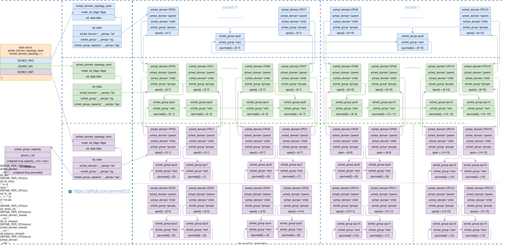

* [极致Linux内核 - Scheduling Domain](https://zhuanlan.zhihu.com/p/589693879)
* [CPU的拓扑结构](https://s3.shizhz.me/linux-sched/lb/lb-cpu-topo) ⊙ [数据结构](https://s3.shizhz.me/linux-sched/lb/lb-data-structure)


| Flag | SMT | CLUSTER | MC | PKG | NUMA | Notes |
|---|:---:|:---:|:---:|:---:|:---:|---|
| `SD_BALANCE_NEWIDLE` | ✓ | ✓ | ✓ | ✓ | ✓* | Balance when going idle. Disabled if `relax_domain_level` reached |
| `SD_BALANCE_EXEC` | ✓ | ✓ | ✓ | ✓ | ✓* | Balance on `exec()`. *Removed at far NUMA distances |
| `SD_BALANCE_FORK` | ✓ | ✓ | ✓ | ✓ | ✓* | Balance on `fork()`. *Removed at far NUMA distances |
| `SD_BALANCE_WAKE` |   |   |   |   |   | Off by default everywhere |
| `SD_WAKE_AFFINE` | ✓ | ✓ | ✓ | ✓ | ✓* | Pull wakee to waker's CPU. *Removed at far NUMA |
| `SD_PREFER_SIBLING` | ✓ | ✓ | ✓ | ✓ |   | Spread tasks to sibling domains. **Removed** at NUMA |
| `SD_SERIALIZE` |   |   |   |   | ✓ | Single load-balance instance. **Added** at NUMA |
| `SD_SHARE_CPUCAPACITY` | ✓ |   |   |   |   | SMT siblings share a core's capacity |
| `SD_SHARE_LLC` | ✓ | ✓ | ✓ |   |   | CPUs share a Last Level Cache |
| `SD_CLUSTER` |   | ✓ |   |   |   | CPUs share L2 / LLC-tags cluster |
| `SD_NUMA` |   |   |   |   | ✓ | Cross-node domain |
| `SD_ASYM_CPUCAPACITY` |   |   |   | ✓* |   | Heterogeneous CPU capacity (big.LITTLE). Added dynamically by `asym_cpu_capacity_classify()` |
| `SD_ASYM_CPUCAPACITY_FULL`|   |   |   | ✓* |   | All capacity values visible in span |
| `SD_ASYM_PACKING` | ✓* |   |   |   |   | Prefer to pack tasks on high-priority SMT sibling. Arch-specific |

* far NUMA: `SD_BALANCE_EXEC`/`FORK`/`WAKE_AFFINE` also removed

---

| **Aspect** | **SMT (Simultaneous Multi-Threading)** | **CLS (Cluster Level Scheduling)** | **MC (Multi-Core)** | **PKG (Package)** |
|:-:|:-:|:-:|:-:|:-:|
| **Scope** | Logical CPUs (threads) in a single core. | A group of cores that share resources (e.g., L2 or L3 cache). | All cores within a physical package (socket). | All CPUs in a processor package. |
| **Configuration** | Enabled with `CONFIG_SCHED_SMT`. | Enabled with `CONFIG_SCHED_CLUSTER`. | Enabled with `CONFIG_SCHED_MC`. | Always included (default). |
| **Purpose** | Optimize task placement between sibling threads (logical CPUs). | Optimize task placement across cores in a cluster. | Optimize task placement across all cores in a socket. | Balance task loads across sockets. |
| **Shared Resources** | Execution pipelines, L1 cache. | L2 or L3 cache. | L3 cache or interconnects. | Memory controller, inter-socket links. |
| **Granularity** | Finest (threads). | Intermediate (clusters). | Coarse (cores). | Coarsest (package/socket). |
| **Load Balancing** | Between sibling threads. | Between cores in a cluster. | Between cores in a socket. | Between sockets in multi-socket systems. |
| **Use Case** | Hyperthreading (Intel, AMD SMT). | ARM big.LITTLE or similar designs. | Multi-core processors. | Multi-socket NUMA systems. |
| **Example Topology** | A single core with 2 threads (logical CPUs). | ARM clusters with 4 LITTLE cores and 4 big cores. | 8-core processor in a single socket. | Dual sockets with multiple cores. |

---

```c
if (sched_domains_numa_distance[tl->numa_level] > node_reclaim_distance) {
    sd->flags &= ~(SD_BALANCE_EXEC | SD_BALANCE_FORK | SD_WAKE_AFFINE);
}
```

---

Consider the following system:
- **2 sockets** (packages).
- Each socket has **4 cores**.
- Each core has **2 threads** (SMT enabled).
- The system supports ARM-style clusters (e.g., `CONFIG_SCHED_CLUSTER` is enabled).

The scheduler topology would look like this:

| **Domain** | **Hierarchy Level** | **Example CPUs in Domain** |
|:-:|:-:|:-:|
| **SMT** | Thread-level | CPU 0, CPU 1 (threads of Core 0, Socket 0). |
| **CLS** | Cluster-level | CPUs 0-3 (Cluster 0 in Socket 0). |
| **MC** | Core-level | CPUs 0-7 (All cores in Socket 0). |
| **PKG** | Package-level | CPUs 0-7 (Socket 0) and CPUs 8-15 (Socket 1). |

```text
System (Global View)
└── sched_domain (Package Level: PKG)
    ├── sched_group (Socket 0: CPUs 0-7)
    │   └── CPUs: 0, 1, 2, 3, 4, 5, 6, 7
    └── sched_group (Socket 1: CPUs 8-15)
        └── CPUs: 8, 9, 10, 11, 12, 13, 14, 15

Socket 0 (Package View: PKG)
└── sched_domain (Core Level: MC)
    ├── sched_group (Core 0: CPUs 0-1)
    │   └── CPUs: 0, 1
    ├── sched_group (Core 1: CPUs 2-3)
    │   └── CPUs: 2, 3
    ├── sched_group (Core 2: CPUs 4-5)
    │   └── CPUs: 4, 5
    └── sched_group (Core 3: CPUs 6-7)
        └── CPUs: 6, 7

Core 0 (Thread View: SMT)
└── sched_domain (Thread Level: SMT)
    ├── sched_group (Thread 0: CPU 0)
    │   └── CPU: 0
    └── sched_group (Thread 1: CPU 1)
        └── CPU: 1
```

---

```text
System (2 Sockets)
├── Package (PKG) Level: Socket 0
│   ├── Cluster (CLS) Level: Cluster 0
│   │   ├── Core 0
│   │   │   ├── Thread 0 (CPU 0)
│   │   │   └── Thread 1 (CPU 1)
│   │   ├── Core 1
│   │   │   ├── Thread 0 (CPU 2)
│   │   │   └── Thread 1 (CPU 3)
│   ├── Cluster (CLS) Level: Cluster 1
│   │   ├── Core 2
│   │   │   ├── Thread 0 (CPU 4)
│   │   │   └── Thread 1 (CPU 5)
│   │   ├── Core 3
│   │   │   ├── Thread 0 (CPU 6)
│   │   │   └── Thread 1 (CPU 7)
├── Package (PKG) Level: Socket 1
│   ├── Cluster (CLS) Level: Cluster 0
│   │   ├── Core 0
│   │   |   ├── Thread 0 (CPU 8)
│   │   │   └── Thread 1 (CPU 9)
│   │   ├── Core 1
│   │   │   ├── Thread 0 (CPU 10)
│   │   │   └── Thread 1 (CPU 11)
│   ├── Cluster (CLS) Level: Cluster 1
│   │   ├── Core 2
│   │   │   ├── Thread 0 (CPU 12)
│   │   │   └── Thread 1 (CPU 13)
│   │   ├── Core 3
│   │   │   ├── Thread 0 (CPU 14)
│   │   │   └── Thread 1 (CPU 15)
```

---

```c
struct sched_domain_topology_level {
    sched_domain_mask_f     mask;
    sched_domain_flags_f    sd_flags;
    int                     flags;
    int                     numa_level;
    struct sd_data          data;
};

static struct sched_domain_topology_level *sched_domain_topology
= default_topology = {
#ifdef CONFIG_SCHED_SMT
    { cpu_smt_mask, cpu_smt_flags, SD_INIT_NAME(SMT) },
#endif

#ifdef CONFIG_SCHED_CLUSTER
    { cpu_clustergroup_mask, cpu_cluster_flags, SD_INIT_NAME(CLS) },
#endif

#ifdef CONFIG_SCHED_MC
    { cpu_coregroup_mask, cpu_core_flags, SD_INIT_NAME(MC) },
#endif
    { cpu_cpu_mask, SD_INIT_NAME(PKG) },
    { NULL, },
};

static inline int cpu_smt_flags(void) { return SD_SHARE_CPUCAPACITY | SD_SHARE_LLC; }
static inline int cpu_cluster_flags(void) { return SD_CLUSTER | SD_SHARE_LLC; }
static inline int cpu_core_flags(void) { return SD_SHARE_LLC; }
static inline int cpu_numa_flags(void) { return SD_NUMA; }

DEFINE_PER_CPU(struct sched_domain __rcu *, sd_llc);
DEFINE_PER_CPU(int, sd_llc_size);       /* nr of cpus */
DEFINE_PER_CPU(int, sd_llc_id) = -1;    /* id of 1st cpu */
DEFINE_PER_CPU(int, sd_share_id);
DEFINE_PER_CPU(struct sched_domain_shared __rcu *, sd_llc_shared);
DEFINE_PER_CPU(struct sched_domain_shared __rcu *, sd_balance_shared);
DEFINE_PER_CPU(struct sched_domain __rcu *, sd_numa);
DEFINE_PER_CPU(struct sched_domain __rcu *, sd_asym_packing);
DEFINE_PER_CPU(struct sched_domain __rcu *, sd_asym_cpucapacity);

struct sd_data {
    struct sched_domain *__percpu           *sd;
    struct sched_group *__percpu            *sg;
    struct sched_group_capacity *__percpu   *sgc;
};

struct sched_domain_shared {
    atomic_t    ref;
    atomic_t    nr_busy_cpus;
    int         has_idle_cores;
    int         nr_idle_scan;
};

struct sched_domain {
    /* These fields must be setup */
    struct sched_domain __rcu *parent; /* top domain must be null terminated */
    struct sched_domain __rcu *child; /* bottom domain must be null terminated */
    struct sched_group *groups; /* the balancing groups of the domain */
    unsigned long min_interval; /* Minimum balance interval ms */
    unsigned long max_interval; /* Maximum balance interval ms */
    unsigned int busy_factor; /* less balancing by factor if busy */
    unsigned int imbalance_pct; /* No balance until over watermark */
    unsigned int cache_nice_tries; /* Leave cache hot tasks for # tries */
    unsigned int imb_numa_nr; /* Nr running tasks that allows a NUMA imbalance */

    int nohz_idle;          /* NOHZ IDLE status */
    int flags;              /* See SD_* */
    int level;

    /* Runtime fields. */
    unsigned long last_balance; /* init to jiffies. units in jiffies */
    unsigned int balance_interval; /* initialise to 1. units in ms. */
    unsigned int nr_balance_failed; /* initialise to 0 */

    /* idle_balance() stats */
    u64 max_newidle_lb_cost;
    unsigned long last_decay_max_lb_cost;

    union {
        void *private;  /* used during construction */
        struct rcu_head rcu; /* used during destruction */
    };

    struct sched_domain_shared *shared; /* point to 'shared' of sd_data*/

    unsigned int span_weight; /* number of CPUs */
    unsigned long span[];

    char *name;
    union {
        void *private;          /* used during construction, point to sd_data */
        struct rcu_head rcu;    /* used during destruction */
    };
};

struct sched_group {
    struct sched_group  *next; /* Must be a circular list */
    atomic_t            ref;

    unsigned int        group_weight;
    unsigned int        cores;
    struct sched_group_capacity *sgc;
    int                 asym_prefer_cpu; /* CPU of highest priority in group */
    int                 flags;

    /* The CPUs this group covers. */
    unsigned long       cpumask[];
};

struct sched_group_capacity {
    atomic_t            ref;
    unsigned long       capacity;
    unsigned long       min_capacity; /* Min per-CPU capacity in group */
    unsigned long       max_capacity; /* Max per-CPU capacity in group */
    unsigned long       next_update;
    int                 imbalance; /* XXX unrelated to capacity but shared group state */

    unsigned long       cpumask[]; /* Balance mask */
};
```

```c
kernel_init() {
    kernel_init_freeable() {
        void __init sched_init_smp(void) {
            sched_init_numa(void);
            sched_init_domains(cpu_active_mask);
        }
    }
}

sched_init_domains(cpu_active_mask) {
    bool multi_llcs;
    int err;

    zalloc_cpumask_var(&sched_domains_llc_id_allocmask, GFP_KERNEL);
    zalloc_cpumask_var(&sched_domains_tmpmask, GFP_KERNEL);
    zalloc_cpumask_var(&sched_domains_tmpmask2, GFP_KERNEL);
    zalloc_cpumask_var(&fallback_doms, GFP_KERNEL);

    arch_update_cpu_topology();
    asym_cpu_capacity_scan();

    ndoms_cur = 1;
    doms_cur = alloc_sched_domains(ndoms_cur);
    if (!doms_cur)
        doms_cur = &fallback_doms;
    cpumask_and(doms_cur[0], cpu_map, housekeeping_cpumask(HK_TYPE_DOMAIN));
    err = build_sched_domains(doms_cur[0], NULL, &multi_llcs);
    if (!err)
        sched_cache_set(multi_llcs);

    return err;
}

static int
build_sched_domains(const struct cpumask *cpu_map, struct sched_domain_attr *attr,
            bool *multi_llcs)
{
    enum s_alloc alloc_state = sa_none;
    bool has_multi_llcs = false;
    struct sched_domain *sd;
    struct s_data d;
    struct rq *rq = NULL;
    int i, ret = -ENOMEM;
    bool has_asym = false;
    bool has_cluster = false;

    if (WARN_ON(cpumask_empty(cpu_map)))
        goto error;

    alloc_state = __visit_domain_allocation_hell(&d, cpu_map);
    if (alloc_state != sa_rootdomain)
        goto error;

    /* Set up domains for CPUs specified by the cpu_map: */
    for_each_cpu(i, cpu_map) {
        struct sched_domain_topology_level *tl;
        int lid;

        sd = NULL;
        for_each_sd_topology(tl) {

            sd = build_sched_domain(tl, cpu_map, attr, sd, i);

            has_asym |= sd->flags & SD_ASYM_CPUCAPACITY;

            if (tl == sched_domain_topology)
                *per_cpu_ptr(d.sd, i) = sd;
            if (cpumask_equal(cpu_map, sched_domain_span(sd)))
                break;
        }

        lid = per_cpu(sd_llc_id, i);
        if (lid == -1) {
            /* try to reuse the llc_id of its siblings */
            for (int j = cpumask_first(llc_mask(i));
                 j < nr_cpu_ids;
                 j = cpumask_next(j, llc_mask(i))) {
                if (i == j)
                    continue;

                lid = per_cpu(sd_llc_id, j);

                if (lid != -1) {
                    per_cpu(sd_llc_id, i) = lid;

                    break;
                }
            }

            /* a new LLC is detected */
            if (lid == -1)
                per_cpu(sd_llc_id, i) = __sched_domains_alloc_llc_id();
        }
    }

    if (WARN_ON(!topology_span_sane(cpu_map)))
        goto error;

    /* Build the groups for the domains */
    for_each_cpu(i, cpu_map) {
        for (sd = *per_cpu_ptr(d.sd, i); sd; sd = sd->parent) {
            sd->span_weight = cpumask_weight(sched_domain_span(sd));
            if (sd->flags & SD_NUMA) {
                if (build_overlap_sched_groups(sd, i))
                    goto error;
            } else {
                if (build_sched_groups(sd, i))
                    goto error;
            }
        }
    }

    for_each_cpu(i, cpu_map) {
        sd = *per_cpu_ptr(d.sd, i);
        if (!sd)
            continue;

        if (has_asym)
            claim_asym_sched_domain_shared(&d, i);

        /* First, find the topmost SD_SHARE_LLC domain */
        while (sd->parent && (sd->parent->flags & SD_SHARE_LLC))
            sd = sd->parent;

        if (sd->flags & SD_SHARE_LLC) {
            init_sched_domain_shared(&d, sd, SD_SHARE_LLC);

            /* In presence of higher domains, adjust the
             * NUMA imbalance stats for the hierarchy. */
            if (sd->parent) {
                if (IS_ENABLED(CONFIG_NUMA))
                    adjust_numa_imbalance(sd);

                if (sd_in_multi_llcs(sd))
                    has_multi_llcs = true;
            }
        }
    }

    /* Calculate CPU capacity for physical packages and nodes */
    for (i = nr_cpumask_bits-1; i >= 0; i--) {
        if (!cpumask_test_cpu(i, cpu_map))
            continue;

        claim_allocations(i, &d);

        for (sd = *per_cpu_ptr(d.sd, i); sd; sd = sd->parent)
            init_sched_groups_capacity(i, sd);
    }

    alloc_sd_llc(cpu_map, &d);

    /* Attach the domains */
    rcu_read_lock();
    for_each_cpu(i, cpu_map) {
        rq = cpu_rq(i);
        sd = *per_cpu_ptr(d.sd, i);

        cpu_attach_domain(sd, d.rd, i);

        if (lowest_flag_domain(i, SD_CLUSTER))
            has_cluster = true;
    }
    rcu_read_unlock();

    if (has_asym)
        static_branch_inc_cpuslocked(&sched_asym_cpucapacity);

    if (has_cluster)
        static_branch_inc_cpuslocked(&sched_cluster_active);

    if (rq && sched_debug_verbose)
        pr_info("root domain span: %*pbl\n", cpumask_pr_args(cpu_map));

    ret = 0;
error:
    *multi_llcs = has_multi_llcs;
    __free_domain_allocs(&d, alloc_state, cpu_map);

    return ret;
}
```

## build_sched_domain

```c
static struct sched_domain *build_sched_domain(struct sched_domain_topology_level *tl,
        const struct cpumask *cpu_map, struct sched_domain_attr *attr,
        struct sched_domain *child, int cpu)
{
    struct sched_domain *sd = sd_init(tl, cpu_map, child, cpu) {
        struct sd_data *sdd = &tl->data;
        struct sched_domain *sd = *per_cpu_ptr(sdd->sd, cpu);
        int sd_id, sd_weight, sd_flags = 0;
        struct cpumask *sd_span;

        sched_domains_curr_level = tl->numa_level;
        /* Count of bits in *srcp */
        sd_weight = cpumask_weight(tl->mask(cpu));

        if (tl->sd_flags) {
            sd_flags = (*tl->sd_flags)();
        }
        *sd = (struct sched_domain) {
            .min_interval       = sd_weight,
            .max_interval       = 2*sd_weight,
            .busy_factor        = 16,
            .imbalance_pct      = 117,

            .cache_nice_tries   = 0,

            .flags = 1*SD_BALANCE_NEWIDLE
                | 1*SD_BALANCE_EXEC
                | 1*SD_BALANCE_FORK
                | 0*SD_BALANCE_WAKE
                | 1*SD_WAKE_AFFINE
                | 0*SD_SHARE_CPUCAPACITY
                | 0*SD_SHARE_LLC
                | 0*SD_SERIALIZE
                | 1*SD_PREFER_SIBLING
                | 0*SD_NUMA
                | sd_flags,
            .last_balance           = jiffies,
            .balance_interval       = sd_weight,
            .max_newidle_lb_cost    = 0,
            .last_decay_max_lb_cost = jiffies,
            .child                  = child,
            .name                   = tl->name,
        };

        sd_span = sched_domain_span(sd);
        cpumask_and(sd_span, cpu_map, tl->mask(cpu));
        sd_id = cpumask_first(sd_span);

        sd->flags |= asym_cpu_capacity_classify(sd_span, cpu_map)

        /* Convert topological properties into behaviour. */
        /* Don't attempt to spread across CPUs of different capacities. */
        if ((sd->flags & SD_ASYM_CPUCAPACITY) && sd->child)
            sd->child->flags &= ~SD_PREFER_SIBLING;

        if (sd->flags & SD_SHARE_CPUCAPACITY) {
            sd->imbalance_pct = 110;
        } else if (sd->flags & SD_SHARE_LLC) {
            sd->imbalance_pct = 117;
            sd->cache_nice_tries = 1;
        } else if (sd->flags & SD_NUMA) {
            sd->cache_nice_tries = 2;
            sd->flags &= ~SD_PREFER_SIBLING;
            sd->flags |= SD_SERIALIZE;
            if (sched_domains_numa_distance[tl->numa_level] > node_reclaim_distance/*30*/) {
                sd->flags &= ~(SD_BALANCE_EXEC | SD_BALANCE_FORK | SD_WAKE_AFFINE);
            }
        } else {
            sd->cache_nice_tries = 1;
        }

        /* For all levels sharing cache; connect a sched_domain_shared instance. */
        if (sd->flags & SD_SHARE_LLC) {
            sd->shared = *per_cpu_ptr(sdd->sds, sd_id);
            atomic_inc(&sd->shared->ref);
            atomic_set(&sd->shared->nr_busy_cpus, sd_weight);
        }

        sd->private = sdd;

        return sd;
    }

    if (child) {
        sd->level = child->level + 1;
        sched_domain_level_max = max(sched_domain_level_max, sd->level);
        child->parent = sd;

        if (!cpumask_subset(sched_domain_span(child), sched_domain_span(sd))) {
            /* Fixup, ensure @sd has at least @child CPUs. */
            cpumask_or(
                sched_domain_span(sd),
                sched_domain_span(sd),
                sched_domain_span(child)
            );
        }

    }
    set_domain_attribute(sd, attr);

    return sd;
}

```

## build_sched_groups

```c
for_each_cpu(i, cpu_map) {
    for (sd = *per_cpu_ptr(d.sd, i); sd; sd = sd->parent) {
        build_sched_groups(sd, i);
    }
}

static int
build_sched_groups(struct sched_domain *sd, int cpu)
{
    struct sched_group *first = NULL, *last = NULL;
    struct sd_data *sdd = sd->private;
    const struct cpumask *span = sched_domain_span(sd);
    struct cpumask *covered;
    int i;

    lockdep_assert_held(&sched_domains_mutex);
    covered = sched_domains_tmpmask;

    cpumask_clear(covered);

    /* span = {0, 1, 2, 3}, start at cpu: 3, iterate: 3-0-1-2 */
    for_each_cpu_wrap(i, span, cpu) {
        struct sched_group *sg;

        if (cpumask_test_cpu(i, covered))
            continue;

        /* returns the same group for CPUs in the same core (e.g., cpu0 and cpu1 both map to sg-cpu0). */
        sg = get_group(i, sdd) {
            struct sched_domain *sd = *per_cpu_ptr(sdd->sd, cpu);
            struct sched_domain *child = sd->child;
            struct sched_group *sg;
            bool already_visited;

            if (child)
                cpu = cpumask_first(sched_domain_span(child));

            sg = *per_cpu_ptr(sdd->sg, cpu);
            sg->sgc = *per_cpu_ptr(sdd->sgc, cpu);

            /* Increase refcounts for claim_allocations: */
            already_visited = atomic_inc_return(&sg->ref) > 1;
            /* sgc visits should follow a similar trend as sg */
            WARN_ON(already_visited != (atomic_inc_return(&sg->sgc->ref) > 1));

            /* If we have already visited that group, it's already initialized. */
            if (already_visited)
                return sg;

            if (child) {
                cpumask_copy(sched_group_span(sg)/*dst*/, sched_domain_span(child)/*src*/);
                cpumask_copy(group_balance_mask(sg), sched_group_span(sg));
                sg->flags = child->flags;
            } else {
                cpumask_set_cpu(cpu, sched_group_span(sg));
                cpumask_set_cpu(cpu, group_balance_mask(sg));
            }

            sg->sgc->capacity = SCHED_CAPACITY_SCALE * cpumask_weight(sched_group_span(sg));
            sg->sgc->min_capacity = SCHED_CAPACITY_SCALE;
            sg->sgc->max_capacity = SCHED_CAPACITY_SCALE;

            return sg;
        }

        cpumask_or(covered, covered, sched_group_span(sg));

        if (!first)
            first = sg;
        if (last)
            last->next = sg;
        last = sg;
    }

    /* SMT level:
     * build(sd, cpu0):
     * for_each_cpu_wrap(i, {0, 1}, 0)
     *      i = cpu0: get_group = sg0{0}
     *      i = cpu1: get_group = sg1{1}
     *      sdcpu0 -> sg0{0} -> sg1{1}
     *
     * build(sd, cpu1):
     * for_each_cpu_wrap(i, {0, 1}, 1)
     *      i = cpu1: get_group = sg1{1}
     *      i = cpu0: get_group = sg0{0}
     *      sdcpu1 -> sg1{1} -> sg0{0}
     *
     * MC level:
     * build(sd, cpu0):
     * for_each_cpu_wrap(i, {0, 1, 2, 3}, 0)
     *      i = cpu0: get_group = sg0{0, 1}, covered{0, 1}
     *      i = cpu1: skipped
     *      i = cpu2: get_group = sg2{2, 3}, covered{0, 1, 2, 3}
     *      i = cpu3: skipped
     *      sdcpu0 -> sg0{0, 1} -> sg2{2, 3}
     *
     * build(sd, cpu1):
     * for_each_cpu_wrap(i, {0, 1, 2, 3}, 1)
     *      i = cpu1: get_group = sg0{0, 1}, covered{0, 1}
     *      i = cpu2: get_group = sg2{2, 3}, covered{0, 1, 2, 3}
     *      i = cpu3: skipped
     *      i = cpu0: skipped
     *      sdcpu1 -> sg0{0, 1} -> sg2{2, 3}
     *
     * build(sd, cpu2):
     * for_each_cpu_wrap(i, {0, 1, 2, 3}, 2)
     *      i = cpu2: get_group = sg2{2, 3}, covered{2, 3}
     *      i = cpu3: skipped
     *      i = cpu0: get_group = sg0{0, 1}, covered{2, 3, 0, 1}
     *      i = cpu1: skipped
     *      sdcpu2 -> sg2{2, 3} -> sg0{0, 1} */
    last->next = first;
    sd->groups = first;

    return 0;
}
```

## build_overlap_sched_groups-TODO

## claim_allocations

```c
static void claim_allocations(int cpu, struct s_data *d)
{
    struct sched_domain *sd;

    if (atomic_read(&(*per_cpu_ptr(d->sds, cpu))->ref))
        *per_cpu_ptr(d->sds, cpu) = NULL;

    for (sd = *per_cpu_ptr(d->sd, cpu); sd; sd = sd->parent) {
        struct sd_data *sdd = sd->private;

        WARN_ON_ONCE(*per_cpu_ptr(sdd->sd, cpu) != sd);
        *per_cpu_ptr(sdd->sd, cpu) = NULL;

        if (atomic_read(&(*per_cpu_ptr(sdd->sg, cpu))->ref))
            *per_cpu_ptr(sdd->sg, cpu) = NULL;

        if (atomic_read(&(*per_cpu_ptr(sdd->sgc, cpu))->ref))
            *per_cpu_ptr(sdd->sgc, cpu) = NULL;
    }
}
```

## alloc_sd_llc

```c
bool alloc_sd_llc(const struct cpumask *cpu_map,
             struct s_data *d)
{
    struct sched_domain *sd, *top_llc, *parent;
    unsigned int *p;
    int i;

    for_each_cpu(i, cpu_map) {
        sd = *per_cpu_ptr(d->sd, i);
        if (!sd)
            goto err;

        p = kcalloc_node(max_lid + 1, sizeof(unsigned int),
                 GFP_KERNEL, cpu_to_node(i));
        if (!p)
            goto err;

        top_llc = sd;
        /* Find the topmost SD_SHARE_LLC domain.
         * Not yet attached to the CPU, so per_cpu(sd_llc, i)
         * can not be used. */
        while ((parent = rcu_dereference_protected(top_llc->parent, true)) && (parent->flags & SD_SHARE_LLC))
            top_llc = parent;

        if (top_llc->flags & SD_SHARE_LLC) {
            sd->llc_max = max_lid + 1;
            sd->llc_counts = p;
            sd->llc_bytes = get_effective_llc_bytes(i, top_llc);
        } else {
            /* avoid memory leak */
            kfree(p);
        }
    }

    return true;

err:
    for_each_cpu(i, cpu_map) {
        sd = *per_cpu_ptr(d->sd, i);
        if (sd) {
            kfree(sd->llc_counts);
            sd->llc_counts = NULL;
            sd->llc_max = 0;
            sd->llc_bytes = 0;
        }
    }

    return false;
}

static unsigned long get_effective_llc_bytes(int cpu,
                         struct sched_domain *sd)
{
    struct cacheinfo *ci;
    unsigned int hw_weight;

    ci = get_cpu_cacheinfo_llc(cpu) {
        struct cacheinfo *llc;

        if (!last_level_cache_is_valid(cpu))
            return NULL;

        llc = per_cpu_cacheinfo_idx(cpu, cache_leaves(cpu) - 1);
        if (llc->type != CACHE_TYPE_DATA && llc->type != CACHE_TYPE_UNIFIED)
            return NULL;

        return llc;
    }
    if (!ci)
        return 0;

    hw_weight = cpumask_weight(&ci->shared_cpu_map);
    if (!hw_weight)
        return 0;

    return div_u64((u64)ci->size * sd->span_weight, hw_weight);
}
```

## cpu_attach_domain

```c
/* Attach the domain 'sd' to 'cpu' as its base domain. Callers must
 * hold the hotplug lock. */
static void
cpu_attach_domain(struct sched_domain *sd, struct root_domain *rd, int cpu)
{
    struct rq *rq = cpu_rq(cpu);
    struct sched_domain *tmp;

    /* Remove the sched domains which do not contribute to scheduling. */
    for (tmp = sd; tmp; ) {
        struct sched_domain *parent = tmp->parent;
        if (!parent)
            break;

        if (sd_parent_degenerate(tmp, parent)) {
            tmp->parent = parent->parent;

            if (parent->parent) {
                parent->parent->child = tmp;
                parent->parent->groups->flags = tmp->flags;
            }

            /* Transfer SD_PREFER_SIBLING down in case of a
            * degenerate parent; the spans match for this
            * so the property transfers. */
            if (parent->flags & SD_PREFER_SIBLING)
                tmp->flags |= SD_PREFER_SIBLING;
            destroy_sched_domain(parent);
        } else
            tmp = tmp->parent;
    }

    if (sd && sd_degenerate(sd)) {
        tmp = sd;
        sd = sd->parent;
        destroy_sched_domain(tmp);
        if (sd) {
            struct sched_group *sg = sd->groups;

            /* sched groups hold the flags of the child sched
            * domain for convenience. Clear such flags since
            * the child is being destroyed. */
            do {
                sg->flags = 0;
            } while (sg != sd->groups);

            sd->child = NULL;
        }
    }

    sched_domain_debug(sd, cpu);

    rq_attach_root(rq, rd);
        --->
    tmp = rq->sd;
    rcu_assign_pointer(rq->sd, sd);
    dirty_sched_domain_sysctl(cpu);
    destroy_sched_domains(tmp);

    update_top_cache_domain(cpu) {
        struct sched_domain_shared *sds = NULL;
        struct sched_domain *sd;
        int id = cpu;
        int size = 1;

        sd = highest_flag_domain(cpu, SD_SHARE_LLC);
        if (sd) {
            id = cpumask_first(sched_domain_span(sd));
            size = cpumask_weight(sched_domain_span(sd));
            sds = sd->shared;
        }

        rcu_assign_pointer(per_cpu(sd_llc, cpu), sd);
        per_cpu(sd_llc_size, cpu) = size;
        per_cpu(sd_llc_id, cpu) = id;
        rcu_assign_pointer(per_cpu(sd_balance_shared, cpu), sds);

        sd = lowest_flag_domain(cpu, SD_CLUSTER);
        if (sd)
            id = cpumask_first(sched_domain_span(sd));

        per_cpu(sd_share_id, cpu) = id;

        sd = lowest_flag_domain(cpu, SD_NUMA);
        rcu_assign_pointer(per_cpu(sd_numa, cpu), sd);

        sd = highest_flag_domain(cpu, SD_ASYM_PACKING);
        rcu_assign_pointer(per_cpu(sd_asym_packing, cpu), sd);

        sd = lowest_flag_domain(cpu, SD_ASYM_CPUCAPACITY_FULL);
        rcu_assign_pointer(per_cpu(sd_asym_cpucapacity, cpu), sd);
    }
}

void rq_attach_root(struct rq *rq, struct root_domain *rd)
{
    struct root_domain *old_rd = NULL;
    struct rq_flags rf;

    rq_lock_irqsave(rq, &rf);

    if (rq->rd) {
        old_rd = rq->rd;

        if (cpumask_test_cpu(rq->cpu, old_rd->online))
            set_rq_offline(rq);

        cpumask_clear_cpu(rq->cpu, old_rd->span);

        /* If we don't want to free the old_rd yet then
         * set old_rd to NULL to skip the freeing later
         * in this function: */
        if (!atomic_dec_and_test(&old_rd->refcount))
            old_rd = NULL;
    }

    atomic_inc(&rd->refcount);
    rq->rd = rd;

    cpumask_set_cpu(rq->cpu, rd->span);
    if (cpumask_test_cpu(rq->cpu, cpu_active_mask))
        set_rq_online(rq);

    /* Because the rq is not a task, dl_add_task_root_domain() did not
     * move the fair server bw to the rd if it already started.
     * Add it now. */
    if (rq->fair_server.dl_server)
        __dl_server_attach_root(&rq->fair_server, rq);

#ifdef CONFIG_SCHED_CLASS_EXT
    if (rq->ext_server.dl_server)
        __dl_server_attach_root(&rq->ext_server, rq);
#endif

    rq_unlock_irqrestore(rq, &rf);

    if (old_rd)
        call_rcu(&old_rd->rcu, free_rootdomain);
}
```

## rebuild_sched_domains

```c
static inline void cpuset_update_active_cpus(void)
{
    partition_sched_domains(1, NULL, NULL);
}

static inline void rebuild_sched_domains(void)
{
    cpus_read_lock();
    rebuild_sched_domains_cpuslocked();
    cpus_read_unlock();
}

static inline void cpuset_reset_sched_domains(void)
{
    partition_sched_domains(1, NULL, NULL);
}

void cpuset_reset_sched_domains(void)
{
    mutex_lock(&cpuset_mutex);
    partition_sched_domains(1, NULL, NULL);
    mutex_unlock(&cpuset_mutex);
}
```

```c
void partition_sched_domains(int ndoms_new, cpumask_var_t doms_new[],
                 struct sched_domain_attr *dattr_new)
{
    sched_domains_mutex_lock();
    partition_sched_domains_locked(ndoms_new, doms_new, dattr_new);
    sched_domains_mutex_unlock();
}

void partition_sched_domains_locked(int ndoms_new, cpumask_var_t doms_new[],
                    struct sched_domain_attr *dattr_new)
{
    bool __maybe_unused has_eas = false;
    int i, j, n;
    int new_topology;

    lockdep_assert_held(&sched_domains_mutex);

    /* Let the architecture update CPU core mappings: */
    new_topology = arch_update_cpu_topology();
    /* Trigger rebuilding CPU capacity asymmetry data */
    if (new_topology)
        asym_cpu_capacity_scan();

    if (!doms_new) {
        WARN_ON_ONCE(dattr_new);
        n = 0;
        doms_new = alloc_sched_domains(1);
        if (doms_new) {
            n = 1;
            cpumask_and(doms_new[0], cpu_active_mask, housekeeping_cpumask(HK_TYPE_DOMAIN));
        }
    } else {
        n = ndoms_new;
    }

    /* Destroy deleted domains: */
    for (i = 0; i < ndoms_cur; i++) {
        for (j = 0; j < n && !new_topology; j++) {
            if (cpumask_equal(doms_cur[i], doms_new[j]) && dattrs_equal(dattr_cur, i, dattr_new, j))
                goto match1;
        }
        /* No match - a current sched domain not in new doms_new[] */
        detach_destroy_domains(doms_cur[i]);
match1:
        ;
    }

    n = ndoms_cur;
    if (!doms_new) {
        n = 0;
        doms_new = &fallback_doms;
        cpumask_and(doms_new[0], cpu_active_mask, housekeeping_cpumask(HK_TYPE_DOMAIN));
    }

    /* Build new domains: */
    for (i = 0; i < ndoms_new; i++) {
        for (j = 0; j < n && !new_topology; j++) {
            if (cpumask_equal(doms_new[i], doms_cur[j]) && dattrs_equal(dattr_new, i, dattr_cur, j))
                goto match2;
        }
        /* No match - add a new doms_new */
        build_sched_domains(doms_new[i], dattr_new ? dattr_new + i : NULL);
match2:
        ;
    }

#if defined(CONFIG_ENERGY_MODEL) && defined(CONFIG_CPU_FREQ_GOV_SCHEDUTIL)
    /* Build perf domains: */
    for (i = 0; i < ndoms_new; i++) {
        for (j = 0; j < n && !sched_energy_update; j++) {
            if (cpumask_equal(doms_new[i], doms_cur[j]) && cpu_rq(cpumask_first(doms_cur[j]))->rd->pd) {
                has_eas = true;
                goto match3;
            }
        }
        /* No match - add perf domains for a new rd */
        has_eas |= build_perf_domains(doms_new[i]);
match3:
        ;
    }
    sched_energy_set(has_eas);
#endif

    /* Remember the new sched domains: */
    if (doms_cur != &fallback_doms)
        free_sched_domains(doms_cur, ndoms_cur);

    kfree(dattr_cur);
    doms_cur = doms_new;
    dattr_cur = dattr_new;
    ndoms_cur = ndoms_new;

    update_sched_domain_debugfs();
    dl_rebuild_rd_accounting();
}

void dl_rebuild_rd_accounting(void)
{
    struct cpuset *cs = NULL;
    struct cgroup_subsys_state *pos_css;
    int cpu;
    u64 cookie = ++dl_cookie;

    lockdep_assert_held(&cpuset_mutex);
    lockdep_assert_cpus_held();
    lockdep_assert_held(&sched_domains_mutex);

    rcu_read_lock();

    for_each_possible_cpu(cpu) {
        if (dl_bw_visited(cpu, cookie))
            continue;

        dl_clear_root_domain_cpu(cpu) {
            dl_clear_root_domain(cpu_rq(cpu)->rd) {
                int i;

                guard(raw_spinlock_irqsave)(&rd->dl_bw.lock);

                /* Reset total_bw to zero and extra_bw to max_bw so that next
                * loop will add dl-servers contributions back properly, */
                rd->dl_bw.total_bw = 0;
                for_each_cpu(i, rd->span)
                    cpu_rq(i)->dl.extra_bw = cpu_rq(i)->dl.max_bw;

                /* dl_servers are not tasks. Since dl_add_task_root_domain ignores
                * them, we need to account for them here explicitly. */
                for_each_cpu(i, rd->span)
                    dl_server_add_bw(rd, i);
                        --->
            }
        }
    }

    cpuset_for_each_descendant_pre(cs, pos_css, &top_cpuset) {

        if (cpumask_empty(cs->effective_cpus)) {
            pos_css = css_rightmost_descendant(pos_css);
            continue;
        }

        css_get(&cs->css);

        rcu_read_unlock();

        dl_update_tasks_root_domain(cs) {struct css_task_iter it;
            struct task_struct *task;

            if (cs->nr_deadline_tasks == 0)
                return;

            css_task_iter_start(&cs->css, 0, &it);

            while ((task = css_task_iter_next(&it))) {
                dl_add_task_root_domain(task) {
                    struct rq_flags rf;
                    struct rq *rq;
                    struct dl_bw *dl_b;
                    unsigned int cpu;
                    struct cpumask *msk;

                    raw_spin_lock_irqsave(&p->pi_lock, rf.flags);
                    if (!dl_task(p) || dl_entity_is_special(&p->dl)) {
                        raw_spin_unlock_irqrestore(&p->pi_lock, rf.flags);
                        return;
                    }

                    msk = this_cpu_cpumask_var_ptr(local_cpu_mask_dl);
                    dl_get_task_effective_cpus(p, msk);
                    cpu = cpumask_first_and(cpu_active_mask, msk);
                    BUG_ON(cpu >= nr_cpu_ids);
                    rq = cpu_rq(cpu);
                    dl_b = &rq->rd->dl_bw;

                    raw_spin_lock(&dl_b->lock);
                    __dl_add(dl_b, p->dl.dl_bw, cpumask_weight(rq->rd->span));
                    raw_spin_unlock(&dl_b->lock);
                    raw_spin_unlock_irqrestore(&p->pi_lock, rf.flags);
                }
            }

            css_task_iter_end(&it);
        }

        rcu_read_lock();
        css_put(&cs->css);
    }
    rcu_read_unlock();
}
```

# cpu_topology

* [深入探索Linux Kernel: CPU 拓扑结构探测](https://mp.weixin.qq.com/s/O4ieRkms_OkY_X9TOGvgNw)

```c
dmips = dmips_mhz * policy->cpuinfo.max_freq
cpu_scale = (dmips * 1024) / dmips[MAX]
```

* raw_capacity
* cpu_scale

    Normalized cpu capacity towards the maximum core and highest frequency, a fixed value.

    * arch_scale_cpu_capacity(): get cpu capacity
    * topology_get_cpu_scale(): get cpu_scale of a cpu
    * topology_set_cpu_scale(): set the cpu_scale of a cpu

* arch_freq_scale

    The percpu variable is a changing value that represents the CPU's current frequency normalized to 1024, relative to the maximum frequency of that CPU.

    * arch_scale_freq_capacity()
    * topology_get_freq_scale()
    * arch_set_freq_scale()
    * topology_set_freq_scale()
    * set time point
        * cpufreq_driver_fast_switch()
        * cpufreq_freq_transition_end()
* cpu_capacity_orig vs cpu_capacity
    * capacity_of(): capacity for cfs tasks
    * capacity_orig_of()
    * update_cpu_capacity(): update both cpu_capacity_orig and cpu_capacity
    * scale_rt_capacity(): caculate cfs capacity

```c
struct cpu_topology cpu_topology[NR_CPUS];

struct cpu_topology {
    int             thread_id;
    int             core_id;
    int             cluster_id;
    int             package_id;
    cpumask_t       thread_sibling;
    cpumask_t       core_sibling;
    cpumask_t       cluster_sibling;
    cpumask_t       llc_sibling;
};

#define topology_physical_package_id(cpu)   (cpu_topology[cpu].package_id)
#define topology_cluster_id(cpu)            (cpu_topology[cpu].cluster_id)
#define topology_core_id(cpu)               (cpu_topology[cpu].core_id)
#define topology_core_cpumask(cpu)          (&cpu_topology[cpu].core_sibling)
#define topology_sibling_cpumask(cpu)       (&cpu_topology[cpu].thread_sibling)
#define topology_cluster_cpumask(cpu)       (&cpu_topology[cpu].cluster_sibling)
#define topology_llc_cpumask(cpu)           (&cpu_topology[cpu].llc_sibling)
```

## init_cpu_topology

```c
void __init init_cpu_topology(void)
{
    int cpu, ret;

    reset_cpu_topology() {
        unsigned int cpu;
        for_each_possible_cpu(cpu) {
            struct cpu_topology *cpu_topo = &cpu_topology[cpu];

            cpu_topo->thread_id = -1;
            cpu_topo->core_id = -1;
            cpu_topo->cluster_id = -1;
            cpu_topo->package_id = -1;

            clear_cpu_topology(cpu) {
                struct cpu_topology *cpu_topo = &cpu_topology[cpu];

                cpumask_clear(&cpu_topo->llc_sibling);
                cpumask_set_cpu(cpu, &cpu_topo->llc_sibling);

                cpumask_clear(&cpu_topo->cluster_sibling);
                cpumask_set_cpu(cpu, &cpu_topo->cluster_sibling);

                cpumask_clear(&cpu_topo->core_sibling);
                cpumask_set_cpu(cpu, &cpu_topo->core_sibling);
                cpumask_clear(&cpu_topo->thread_sibling);
                cpumask_set_cpu(cpu, &cpu_topo->thread_sibling);
            }
        }
    }

    ret = parse_acpi_topology() {
        int cpu, topology_id;

        if (acpi_disabled)
            return 0;

        for_each_possible_cpu(cpu) {
            topology_id = find_acpi_cpu_topology(cpu, 0);
            if (topology_id < 0)
                return topology_id;

            if (acpi_cpu_is_threaded(cpu)) {
                cpu_topology[cpu].thread_id = topology_id;
                topology_id = find_acpi_cpu_topology(cpu, 1);
                cpu_topology[cpu].core_id   = topology_id;
            } else {
                cpu_topology[cpu].thread_id  = -1;
                cpu_topology[cpu].core_id    = topology_id;
            }
            topology_id = find_acpi_cpu_topology_cluster(cpu);
            cpu_topology[cpu].cluster_id = topology_id;
            topology_id = find_acpi_cpu_topology_package(cpu);
            cpu_topology[cpu].package_id = topology_id;
        }

        return 0;
    }
    if (!ret)
        ret = of_have_populated_dt() && parse_dt_topology();

    if (ret) {
        /* Discard anything that was parsed if we hit an error so we
        * don't use partial information. But do not return yet to give
        * arch-specific early cache level detection a chance to run. */
        reset_cpu_topology();
    }

    for_each_possible_cpu(cpu) {
        ret = fetch_cache_info(cpu);
        if (!ret)
            continue;
        else if (ret != -ENOENT)
            pr_err("Early cacheinfo failed, ret = %d\n", ret);
        return;
    }
}
```

## parse_dt_topology

```c
parse_dt_topology(void)
{
    struct device_node *cn, *map;
    int ret = 0;
    int cpu;

    cn = of_find_node_by_path("/cpus");
    map = of_get_child_by_name(cn, "cpu-map");
    ret = parse_socket(map);

    topology_normalize_cpu_scale() {
        u64 capacity;
        u64 capacity_scale;
        int cpu;

        capacity_scale = 1;
        for_each_possible_cpu(cpu) {
            capacity = raw_capacity[cpu] * per_cpu(freq_factor, cpu);
            capacity_scale = max(capacity, capacity_scale);
        }

        for_each_possible_cpu(cpu) {
            capacity = raw_capacity[cpu] * per_cpu(freq_factor, cpu);
            capacity = div64_u64(capacity << SCHED_CAPACITY_SHIFT, capacity_scale);
            topology_set_cpu_scale(cpu, capacity) {
                per_cpu(cpu_scale, cpu) = capacity;
            }
        }
    }

    return ret;
}
```

## parse_socket

```c
parse_socket(struct device_node *socket)
{
    char name[20];
    struct device_node *c;
    bool has_socket = false;
    int package_id = 0, ret;

    do {
        snprintf(name, sizeof(name), "socket%d", package_id);
        c = of_get_child_by_name(socket, name);
        if (c) {
            has_socket = true;
            ret = parse_cluster(c, package_id, -1, 0);
            of_node_put(c);
            if (ret != 0)
                return ret;
        }
        package_id++;
    } while (c);

    if (!has_socket)
        ret = parse_cluster(socket, 0, -1, 0);

    return ret;
}
```

## parse_cluster

```c
parse_cluster(struct device_node *cluster, int package_id,
                int cluster_id, int depth)
{
    char name[20];
    bool leaf = true;
    bool has_cores = false;
    struct device_node *c;
    int core_id = 0;
    int i, ret;

    /* First check for child clusters */
    i = 0;
    do {
        snprintf(name, sizeof(name), "cluster%d", i);
        c = of_get_child_by_name(cluster, name);
        if (c) {
            leaf = false;
            ret = parse_cluster(c, package_id, i, depth + 1);
            of_node_put(c);
            if (ret != 0)
                return ret;
        }
        i++;
    } while (c);

    /* Now check for cores */
    i = 0;
    do {
        snprintf(name, sizeof(name), "core%d", i);
        c = of_get_child_by_name(cluster, name);
        if (c) {
            has_cores = true;

            if (depth == 0) {
                of_node_put(c);
                return -EINVAL;
            }

            if (leaf) {
                ret = parse_core(c, package_id, cluster_id, core_id++);
            } else {
                ret = -EINVAL;
            }

            of_node_put(c);
            if (ret != 0)
                return ret;
        }
        i++;
    } while (c);

    return 0;
}
```

## parse_core

```c
parse_core(struct device_node *core, int package_id,
                int cluster_id, int core_id)
{
    char name[20];
    bool leaf = true;
    int i = 0;
    int cpu;
    struct device_node *t;

    do {
        snprintf(name, sizeof(name), "thread%d", i);
        t = of_get_child_by_name(core, name);
        if (t) {
            leaf = false;
            cpu = get_cpu_for_node(t);
            if (cpu >= 0) {
                cpu_topology[cpu].package_id = package_id;
                cpu_topology[cpu].cluster_id = cluster_id;
                cpu_topology[cpu].core_id = core_id;
                cpu_topology[cpu].thread_id = i;
            } else if (cpu != -ENODEV) {
                of_node_put(t);
                return -EINVAL;
            }
            of_node_put(t);
        }
        i++;
    } while (t);

    cpu = get_cpu_for_node(core);
    if (cpu >= 0) {
        if (!leaf) {
            return -EINVAL;
        }

        cpu_topology[cpu].package_id = package_id;
        cpu_topology[cpu].cluster_id = cluster_id;
        cpu_topology[cpu].core_id = core_id;
    } else if (leaf && cpu != -ENODEV) {
        return -EINVAL;
    }

    return 0;
}
```

```c
get_cpu_for_node(struct device_node *node)
{
    struct device_node *cpu_node;
    int cpu;

    cpu_node = of_parse_phandle(node, "cpu", 0);
    if (!cpu_node)
        return -1;

    cpu = of_cpu_node_to_id(cpu_node);
    if (cpu >= 0) {
        topology_parse_cpu_capacity(cpu_node, cpu) {
            struct clk *cpu_clk;
            static bool cap_parsing_failed;
            int ret;
            u32 cpu_capacity;

            if (cap_parsing_failed)
                return false;

            ret = of_property_read_u32(cpu_node, "capacity-dmips-mhz", &cpu_capacity);
            if (!ret) {
                if (!raw_capacity) {
                    raw_capacity = kcalloc(num_possible_cpus(),
                                sizeof(*raw_capacity),
                                GFP_KERNEL);
                    if (!raw_capacity) {
                        cap_parsing_failed = true;
                        return false;
                    }
                }
                raw_capacity[cpu] = cpu_capacity;

                cpu_clk = of_clk_get(cpu_node, 0);
                if (!PTR_ERR_OR_ZERO(cpu_clk)) {
                    per_cpu(freq_factor, cpu) = clk_get_rate(cpu_clk) / 1000;
                    clk_put(cpu_clk);
                }
            } else {
                cap_parsing_failed = true;
                free_raw_capacity();
            }

            return !ret;
        }
    }
    of_node_put(cpu_node);
    return cpu;
}
```

# PELT

* [[RFC PATCH 0/3] sched: Introduce Window Assisted Load Tracking](https://lore.kernel.org/all/1477638642-17428-1-git-send-email-markivx@codeaurora.org/)
* [DumpStack - PELT](http://www.dumpstack.cn/index.php/2022/08/13/785.html)
* [Wowo Tech - PELT](http://www.wowotech.net/process_management/450.html) ⊙ [PELT算法浅析](http://www.wowotech.net/process_management/pelt.html)
* [Linux核心概念详解 - 2.7 负载追踪](https://s3.shizhz.me/linux-sched/load-trace)
* [Linux 核心設計: Scheduler(4): PELT](https://hackmd.io/@RinHizakura/Bk4y_5o-9)

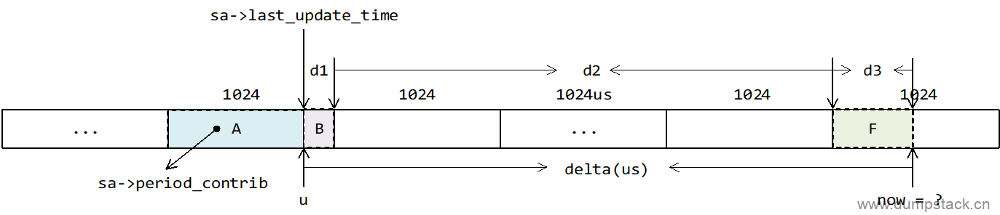

---

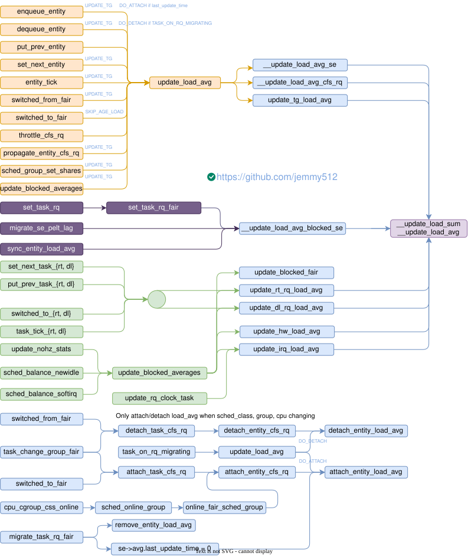

---

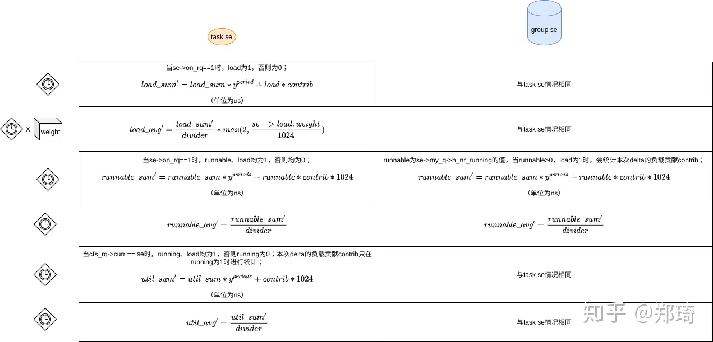

---



```c
/* Exponential Moving Average (EMA) or Exponentially Weighted Moving Average (EWMA)
 * Accumulate the three separate parts of the sum:
 * d1 the remainder of the last (incomplete) period
 * d2 the span of full periods and
 * d3 the remainder of the (incomplete) current period.
 *
 *           d1          d2           d3
 *           ^           ^            ^
 *           |           |            |
 *         |<->|<----------------->|<--->|
 * ... |---x---|------| ... |------|-----x (now)
 *
 *                           p-1
 * u' = (u + d1) y^p + 1024 \Sum y^n + d3 y^0
 *                           n=1
 *
 *    = u y^p                               (Step 1)
 *
 *                       p-1
 *      + d1 y^p + 1024 \Sum y^n + d3 y^0   (Step 2)
 *                       n=1                */
```

| **Metric** | **Tracks** | **Includes Blocked Tasks?** | **Includes Runnable Tasks?** | **Includes Running Tasks?** | **Use Case** |
| :-: | :-: | :-: | :-: | :-: | :-: |
| **load_avg** | Weighted load of tasks contributing to system load (runnable + blocked). | :x: | :white_check_mark: | :white_check_mark: | Load balancing between CPUs. |
| **runnable_avg**  | Average time tasks spend in the runnable state. | :x: | :white_check_mark: | :white_check_mark: | Measuring CPU contention and task latency. |
| **util_avg** | Average CPU utilization (time tasks spend running). | :x: | :x: | :white_check_mark: | CPU frequency scaling and power management. |
* **load_avg**: This metric considers the task's weight (se.load.weight) when the task is runnable or running. If the task is not runnable (e.g., blocked or sleeping), its weight is considered 0. This metric is used to represent the **traditional "load" concept**, which is influenced by the task's priority (nice value).
* **runnable_avg**: This metric is similar to load_avg but it doesn't consider the task's weight. When the task is runnable or running, its weight is considered 1, and 0 otherwise. This metric provides a more direct measure of **how many tasks are runnable**, regardless of their priority.

* **util_avg**: This metric only considers the task's weight when it is actually running on a CPU. If the task is runnable but not currently running, or if it is not runnable at all, its weight is considered 0. This metric represents the actual **CPU utilization** caused by the task.

---

* An entity's **contribution** to the system load in a period pi is just **the portion of that period** that the entity was runnable - either actually running, or waiting for an available CPU.
* [**Load** :link:](https://lwn.net/Articles/531853/) is also meant to be an **instantaneous quantity** - how much is a process loading the system right now? - as opposed to a **cumulative property** like **CPU usage**. A long-running process that consumed vast amounts of processor time last week may have very modest needs at the moment; such a process is contributing very little to load now, despite its rather more demanding behavior in the past.
* A **blocked task** is neither runnable nor running, for example while waiting for I/O or sleeping. Its PELT state is aged with zero load, runnable, and running contributions when the scheduler synchronizes it, commonly when the task wakes or migrates. The task's old PELT contribution remains in the `cfs_rq` aggregate and decays there; on tickless idle CPUs, `__sched_balance_update_blocked_averages()` explicitly advances those runqueue-level averages.

    ```c
    /* kernel/sched/pelt.c: age a blocked entity with zero contributions */
    int __update_load_avg_blocked_se(u64 now, struct sched_entity *se)
    {
        if (___update_load_sum(now, &se->avg, 0, 0, 0)) {
            ___update_load_avg(&se->avg, se_weight(se));
            return 1;
        }
        return 0;
    }

    /* kernel/sched/fair.c: synchronize it against its former cfs_rq */
    last_update_time = cfs_rq_last_update_time(cfs_rq);
    __update_load_avg_blocked_se(last_update_time, se);
    ```

    * **Dequeue-to-wakeup timeline:** `dequeue_entity()` calls `update_load_avg()` before clearing `se->on_rq`, so PELT first accounts the task's positive runnable/running contribution up to the dequeue instant. Normal sleep does not detach `load_avg` or `util_avg` from `cfs_rq->avg`; that retained contribution becomes blocked load and decays over time. On wakeup, `enqueue_entity()` again calls `update_load_avg()` before setting `se->on_rq`, which ages the task through its blocked interval with zero samples. This is decay, not an explicitly stored negative contribution; after `se->on_rq = 1`, the task resumes positive contribution.

* **CFS bandwidth throttling** is different from ordinary blocking. A cgroup may have runnable tasks but be forbidden to run after exhausting its `cpu.max` quota. Its `cfs_rq` therefore freezes its PELT clock: when throttling starts, it records `throttled_clock_pelt = rq_clock_pelt(rq)` and sets `pelt_clock_throttled`. While set, `cfs_rq_clock_pelt()` returns that saved value, so the PELT time seen by the cgroup does not advance.

    * When quota is replenished, the scheduler adds the frozen interval to `throttled_clock_pelt_time` and clears `pelt_clock_throttled`. Subsequent PELT updates use `rq_clock_pelt(rq) - throttled_clock_pelt_time`, permanently excluding time spent quota-throttled. This prevents runnable demand from decaying as though the tasks voluntarily slept; their utilization and load remain meaningful when the cgroup can run again.

    ```c
    /* kernel/sched/pelt.h */
    static inline u64 cfs_rq_clock_pelt(struct cfs_rq *cfs_rq)
    {
        if (cfs_rq->pelt_clock_throttled)
            return cfs_rq->throttled_clock_pelt -
                   cfs_rq->throttled_clock_pelt_time;

        return rq_clock_pelt(rq_of(cfs_rq)) -
               cfs_rq->throttled_clock_pelt_time;
    }

    /* kernel/sched/fair.c: freeze when the throttled cfs_rq becomes empty */
    cfs_rq->throttled_clock_pelt = rq_clock_pelt(rq);
    cfs_rq->pelt_clock_throttled = 1;

    /* on unthrottle: retain the elapsed interval as an offset */
    cfs_rq->throttled_clock_pelt_time += rq_clock_pelt(rq) -
                                         cfs_rq->throttled_clock_pelt;
    cfs_rq->pelt_clock_throttled = 0;
    ```


* [sched/pelt: Add a new runnable average signal](https://github.com/torvalds/linux/commit/9f68395333ad7f5bfe2f83473fed363d4229f11c) - Now that runnable_load_avg has been removed, we can replace it by a new signal that will highlight the runnable pressure on a cfs_rq. This signal track the waiting time of tasks on rq and can help to better define the state of rqs.
    * The new runnable_avg will track the runnable time of a task which simply adds the waiting time to the running time.

* **load_avg attach/detach**

    * Dont detach load_avg and util_avg when a task sleeps, but detach runnable_avg since runnable is the count nr of se.on_rq
    * Detach load_avg, runnable_avg and util_avg when changing **sched class**, **group** or **cpu**

        ```c
        enqueue_entity(cfs_rq, se, flags) {
            update_load_avg(cfs_rq, se, UPDATE_TG | DO_ATTACH) {
                /* last_update_time is set to 0 when changing group or cpu */
                if (!se->avg.last_update_time && (flags & DO_ATTACH)) {
                    attach_entity_load_avg(cfs_rq, se);
                } else if (flag & DO_DETACH) {
                    detach_entity_load_avg(cfs_rq, se);
                }
            }
        }

        dequeue_entity(cfs_rq, se, flags) {
            int action = UPDATE_TG;

            /* detach load_avg only if task is migrating when dequeue_entity */
            if (entity_is_task(se) && task_on_rq_migrating(task_of(se)))
                action |= DO_DETACH;

            update_load_avg(cfs_rq, se, action);
        }
        ```

        ```c
        /* cpu change */
        migrate_task_rq_fair(struct task_struct *p, int new_cpu) {
            struct sched_entity *se = &p->se;
            se->avg.last_update_time = 0; /* set to 0, attach load avg at enqueue_entity */
        }

        /* group change */
        task_change_group_fair(struct task_struct *p) {
            detach_task_cfs_rq(p);
            p->se.avg.last_update_time = 0;
        }

        /* sched class change */
        truct sched_change_ctx *sched_change_begin() {
            if ((flags & DEQUEUE_CLASS) && p->sched_class->switched_from) {
                p->sched_class->switched_from(rq, p) {
                    switched_from_fair() {
                        detach_task_cfs_rq(p);
                    }
                }
            }
        }

        void sched_change_end(struct sched_change_ctx *ctx) {
            if (ctx->flags & ENQUEUE_CLASS) {
                if (p->sched_class->switched_to)
                    p->sched_class->switched_to(rq, p);
            }
        }
        ```

```c
struct sched_avg {
    u64                 last_update_time;

    /* running + waiting time, scaled to weight
     * load_avg = runnable% * scale_load_down(load)
     * For tsk se, it's time contribution
     * For task group, it's time contribution * load */
    u64                 load_sum;
    unsigned long       load_avg;

    /* running + waiting time, scaled to cpu capabity
     * runnable_avg = runnable% * SCHED_CAPACITY_SCALE */
    u64                 runnable_sum;
    unsigned long       runnable_avg;

    /* running state, scaled to cpu capabity
     * util_avg = running% * SCHED_CAPACITY_SCALE */
    u32                 util_sum;
    unsigned long       util_avg;

    /* the part that was less than one pelt cycle(1024 us)
     * when last updated, unit in us */
    u32                 period_contrib;

    unsigned int        util_est; /* saved util before sleep */
}
```

load, runnable and running function as:
1. switch: controlling whether to update the corresponding load contribution
2. scaling factor:
    * on one hand, because the importance of different processes varies, the load caused by running for the same duration should also differ;
    * on the other hand, for tasks and groups, if a certain group SE which has several tasks waiting together has been waiting in the queue for 1 ms, the pressure it causes should be multiplied.

```c
/* sched_entity:
 *
 *   task:
 *     se_weight()   = se->load.weight
 *     se_runnable() = !!on_rq
 *
 *   group: [ see update_cfs_group() ]
 *     se_weight()   = tg->weight * grq->load_avg / tg->load_avg
 *     se_runnable() = grq->h_nr_runnable
 *
 *   runnable_sum = se_runnable() * runnable = grq->runnable_sum
 *   runnable_avg = runnable_sum
 *
 *   load_sum := runnable
 *   load_avg = se_weight(se) * load_sum
 *
 * cfq_rq:
 *
 *   runnable_sum = \Sum se->avg.runnable_sum
 *   runnable_avg = \Sum se->avg.runnable_avg
 *
 *   load_sum = \Sum se_weight(se) * se->avg.load_sum
 *   load_avg = \Sum se->avg.load_avg */

int __update_load_avg_blocked_se(u64 now, struct sched_entity *se)
{
    if (___update_load_sum(now, &se->avg, 0, 0, 0)) {
        ___update_load_avg(&se->avg, se_weight(se));
        trace_pelt_se_tp(se);
        return 1;
    }

    return 0;
}

int __update_load_avg_se(u64 now, struct cfs_rq *cfs_rq, struct sched_entity *se)
{
    if (___update_load_sum(now, &se->avg, !!se->on_rq, se_runnable(se),
                cfs_rq->curr == se)) {

        ___update_load_avg(&se->avg, se_weight(se));
        cfs_se_util_change(&se->avg);
        trace_pelt_se_tp(se);
        return 1;
    }

    return 0;
}

int __update_load_avg_cfs_rq(u64 now, struct cfs_rq *cfs_rq)
{
    if (___update_load_sum(now, &cfs_rq->avg,
                scale_load_down(cfs_rq->load.weight),
                cfs_rq->h_nr_runnable,
                cfs_rq->curr != NULL)) {
        /* Since cfs_rq->load.weight is multipled in load_sum, just past 1 */
        ___update_load_avg(&cfs_rq->avg, 1);
        trace_pelt_cfs_tp(cfs_rq);
        return 1;
    }

    return 0;
}
```

## ___update_load_sum

```c
int ___update_load_sum(u64 now, struct sched_avg *sa,
    unsigned long load,
    unsigned long runnable,
    int running)
{
    u64 delta = now - sa->last_update_time /* ns */;

    /* s64 ns clock overflow */
    if ((s64)delta < 0) {
        sa->last_update_time = now;
        return 0;
    }

    /* Converts delta from ns to units of approximately 1ms (1024ns). */
    delta >>= 10;
    if (!delta)
        return 0;

    sa->last_update_time += delta << 10;

    /* running is a subset of runnable (weight) so running can't be set if
     * runnable is clear. */
    if (!load)
        runnable = running = 0;

    ret = accumulate_sum(delta, sa, load, runnable, running) {
        u32 contrib = (u32)delta; /* p == 0 -> delta < 1024 */
        u64 periods;

        delta += sa->period_contrib;
        periods = delta / 1024; /* A period is 1024us (~1ms) */

        if (periods) {
            /* 1: decay old *_sum */
            sa->load_sum = decay_load(sa->load_sum, periods);
            sa->runnable_sum = decay_load(sa->runnable_sum, periods);
            sa->util_sum = decay_load((u64)(sa->util_sum), periods) {
                unsigned int local_n;

                if (unlikely(n > LOAD_AVG_PERIOD * 63))
                    return 0;

                /* after bounds checking we can collapse to 32-bit */
                local_n = n;

                /* As y^PERIOD = 1/2, we can combine
                 *    y^n = 1/2^(n/PERIOD) * y^(n%PERIOD)
                 * With a look-up table which covers y^n (n<PERIOD)
                 *
                 * To achieve constant time decay_load. */
                if (unlikely(local_n >= LOAD_AVG_PERIOD)) {
                    val >>= local_n / LOAD_AVG_PERIOD;
                    local_n %= LOAD_AVG_PERIOD;
                }

                return mul_u64_u32_shr(val, runnable_avg_yN_inv[local_n], 32);
            }

            /* 2: calc new load: d1 + d2 + d3 */
            delta %= 1024;
            if (load) {
                contrib = __accumulate_pelt_segments(periods, 1024 - sa->period_contrib/*d1*/, delta/*d3*/) {
                    u32 c1, c2, c3 = d3; /* y^0 == 1 */

                    /* c1 = d1 y^p */
                    c1 = decay_load((u64)d1, periods);

                    /*            p-1
                     * c2 = 1024 \Sum y^n
                     *            n=1
                     *
                     *              inf        inf
                     *    = 1024 ( \Sum y^n - \Sum y^n - y^0 )
                     *              n=0        n=p
                     *
                     *              inf            inf
                     *    = 1024 ( \Sum y^n - y^p \Sum y^n - y^0 )
                     *              n=0            n=0
                     *
                     *                        inf
                     * LOAD_AVG_MAX = 1024 * \Sum y^n
                     *                        n=0       */
                    c2 = LOAD_AVG_MAX - decay_load(LOAD_AVG_MAX, periods) - 1024;

                    return c1 + c2 + c3;
                }
            }
        }
        sa->period_contrib = delta;

        if (load) {
            sa->load_sum += load * contrib; /* scale to load weight */
        }
        if (runnable) {
            /* time passed `contrib us` since last time, one tsk contributes `contrib` us,
             * N task contribute `N * contrib` us */
            sa->runnable_sum += runnable * contrib << SCHED_CAPACITY_SHIFT;
        }
        if (running) {/* scale to SCHED_CAPACITY_SHIFT 1024 */
            sa->util_sum += contrib << SCHED_CAPACITY_SHIFT;
        }

        return periods;
    }
    if (!ret)
        return 0;

    return 1;
}
```

## ___update_load_avg

```c
static __always_inline void
___update_load_avg(struct sched_avg *sa, unsigned long se_weight)
{
    u32 divider = get_pelt_divider(sa) {
        #define LOAD_AVG_MAX        47742
        #define PELT_MIN_DIVIDER    (LOAD_AVG_MAX - 1024)
        return PELT_MIN_DIVIDER + avg->period_contrib;
    }

    /* task se: load = !!se->on_rq,         se_weight = se->load.weight
     * grp  se: load = cfs_rq->load.weight, se_weight = 1
     *
     *                      load_sum = load * contrib
     * load_avg = --------------------------------------------- * se_weight
     *              LOAD_AVG_MAX - (1024 - sa->period_contrib) */
    sa->load_avg = div_u64(se_weight * sa->load_sum, divider);

    /*                      runnable_sum = runnable_nr * contrib
     * runnable_avg = --------------------------------------------- * 1024
     *              LOAD_AVG_MAX - (1024 - sa->period_contrib) */
    sa->runnable_avg = div_u64(sa->runnable_sum, divider);

    /*                              contrib
     * util_avg = --------------------------------------------- * 1024
     *              LOAD_AVG_MAX - (1024 - sa->period_contrib) */
    WRITE_ONCE(sa->util_avg, sa->util_sum / divider);
}
```

## update_load_avg

```c
void update_load_avg(struct cfs_rq *cfs_rq, struct sched_entity *se, int flags)
{
    u64 now = cfs_rq_clock_pelt(cfs_rq);
    int decayed;

/* 1. udpate se load avg */
    /* a new forked or migrated task's last_update_time is 0 */
    if (se->avg.last_update_time && !(flags & SKIP_AGE_LOAD)) {
        __update_load_avg_se(now, cfs_rq, se) {
            ret = ___update_load_sum(now, &se->avg, !!se->on_rq, se_runnable(se),
                cfs_rq->h_curr == se);
           if (ret) {
                ___update_load_avg(&se->avg, se_weight(se));
                cfs_se_util_change(&se->avg) {
                    int enqueued = avg->util_est;
                    if (enqueued & UTIL_AVG_UNCHANGED) {
                        enqueued &= ~UTIL_AVG_UNCHANGED;
                        WRITE_ONCE(avg->util_est, enqueued);
                    }
                }
                return 1;
            }
        }
    }
/* 2. update cfs_rq load avg */
    /* decayed indicates wheather load has been updated and freq needs to be updated */
    decayed = update_cfs_rq_load_avg(now, cfs_rq);

/* 3. update tg cfs util-load-runnable */
    /* propogate path: child gcfs_rq -> child se -> parent cfs_rq */
    decayed |= propagate_entity_load_avg(se);
        --->

/* 4. attach/detach entity load avg */
    /* last_update_time == 0: new forked or migrated task */
    if (!se->avg.last_update_time && (flags & DO_ATTACH)) {
        /* attach this entity to its cfs_rq load avg
         *
         * DO_ATTACH means we're here from enqueue_entity().
         * !last_update_time means we've passed through
         * migrate_task_rq_fair() indicating we migrated. */
        attach_entity_load_avg(cfs_rq, se);

/* 5. update tg load avg */
        update_tg_load_avg(cfs_rq);
    } else if (flags & DO_DETACH) {
        /* detach this entity from its cfs_rq load avg
         * DO_DETACH means we're here from dequeue_entity()
         * and we are migrating task out of the CPU. */
        detach_entity_load_avg(cfs_rq, se);

        update_tg_load_avg(cfs_rq);
    } else if (decayed) {
        cfs_rq_util_change(cfs_rq, 0) {
            struct rq *rq = rq_of(cfs_rq);
            if (&rq->cfs == cfs_rq) {
                cpufreq_update_util(rq, flags);
            }
        }
        if (flags & UPDATE_TG) {
            update_tg_load_avg(cfs_rq);
        }
    }

    if (flags & UPDATE_UTIL_EST)
        util_est_update(se);
}
```

### update_cfs_rq_load_avg

```c
static inline int
update_cfs_rq_load_avg(u64 now, struct cfs_rq *cfs_rq)
{
    unsigned long removed_load = 0, removed_util = 0, removed_runnable = 0;
    struct sched_avg *sa = &cfs_rq->avg;
    int decayed = 0;

    if (cfs_rq->removed.nr) {
        unsigned long r;
        u32 divider = get_pelt_divider(&cfs_rq->avg);

        raw_spin_lock(&cfs_rq->removed.lock);
        swap(cfs_rq->removed.util_avg, removed_util);
        swap(cfs_rq->removed.load_avg, removed_load);
        swap(cfs_rq->removed.runnable_avg, removed_runnable);
        cfs_rq->removed.nr = 0;
        raw_spin_unlock(&cfs_rq->removed.lock);

        r = removed_load;
        sub_positive(&sa->load_avg, r);
        sub_positive(&sa->load_sum, r * divider);
        /* See sa->util_sum below */
        sa->load_sum = max_t(u32, sa->load_sum, sa->load_avg * PELT_MIN_DIVIDER);

        r = removed_util;
        sub_positive(&sa->util_avg, r);
        sub_positive(&sa->util_sum, r * divider);
        sa->util_sum = max_t(u32, sa->util_sum, sa->util_avg * PELT_MIN_DIVIDER);

        r = removed_runnable;
        sub_positive(&sa->runnable_avg, r);
        sub_positive(&sa->runnable_sum, r * divider);
        /* See sa->util_sum above */
        sa->runnable_sum = max_t(u32, sa->runnable_sum,
                            sa->runnable_avg * PELT_MIN_DIVIDER);

        add_tg_cfs_propagate(cfs_rq, -(long)(removed_runnable * divider) >> SCHED_CAPACITY_SHIFT);

        decayed = 1;
    }

    decayed |= __update_load_avg_cfs_rq(now, cfs_rq) {
        if (___update_load_sum(now, &cfs_rq->avg,
            scale_load_down(cfs_rq->load.weight),
            cfs_rq->h_nr_runnable,
            cfs_rq->h_curr != NULL)) {

            ___update_load_avg(&cfs_rq->avg, 1);
            return 1;
        }

        return 0;
    }
    u64_u32_store_copy(sa->last_update_time,
                cfs_rq->last_update_time_copy,
                sa->last_update_time);
    return decayed;
}
```

### propagate_entity_load_avg

```c
static inline int propagate_entity_load_avg(struct sched_entity *se)
{
    struct cfs_rq *cfs_rq, *gcfs_rq;

    if (entity_is_task(se))
        return 0;

    gcfs_rq = group_cfs_rq(se); /* 1. rq that se owns */
    if (!gcfs_rq->propagate)
        return 0;

    gcfs_rq->propagate = 0;

    cfs_rq = cfs_rq_of(se);     /* 2. rq that se belongs to */

    /* 3.1 propagate to parent cfs_rq */
    add_tg_cfs_propagate(cfs_rq, gcfs_rq->prop_runnable_sum) {
        cfs_rq->propagate = 1;
        cfs_rq->prop_runnable_sum += runnable_sum;
    }

    /* 3.2 util propagate path: child gcfs_rq -> grp se -> parent cfs_rq */
    update_tg_cfs_util(cfs_rq, se, gcfs_rq) {
        /* gcfs_rq->avg.util_avg only updated when gcfs_rq->curr != NULL,
         * which means the grp has running tasks
         *
         * se->avg.util_avg only updated when cfs_rq->curr == se,
         * which means cfs_rq picks se to run */
        long delta_sum, delta_avg = gcfs_rq->avg.util_avg - se->avg.util_avg;
        u32 new_sum, divider;

        /* Nothing to update */
        if (!delta_avg)
            return;

        divider = get_pelt_divider(&cfs_rq->avg);

        /* Set new sched_entity's utilization */
        se->avg.util_avg = gcfs_rq->avg.util_avg;
        new_sum = se->avg.util_avg * divider;
        delta_sum = (long)new_sum - (long)se->avg.util_sum;
        se->avg.util_sum = new_sum;

        /* Update parent cfs_rq utilization */
        __update_sa(&cfs_rq->avg, util, delta_avg, delta_sum);
    }

    /* 3.3 runnable propagate path: child gcfs_rq -> grp se -> parent cfs_rq */
    update_tg_cfs_runnable(cfs_rq, se, gcfs_rq) {
        long delta_sum, delta_avg = gcfs_rq->avg.runnable_avg - se->avg.runnable_avg;
        u32 new_sum, divider;

        /* Nothing to update */
        if (!delta_avg)
            return;

        divider = get_pelt_divider(&cfs_rq->avg);

        /* Set new sched_entity's runnable */
        se->avg.runnable_avg = gcfs_rq->avg.runnable_avg;
        new_sum = se->avg.runnable_avg * divider;
        delta_sum = (long)new_sum - (long)se->avg.runnable_sum;
        se->avg.runnable_sum = new_sum;

        /* Update parent cfs_rq runnable */
        __update_sa(&cfs_rq->avg, runnable, delta_avg, delta_sum);
    }

    /* 3.4 load propagate path: child gcfs_rq -> grp se -> parent cfs_rq */
    update_tg_cfs_load(cfs_rq, se, gcfs_rq) {
        long delta_avg, running_sum, runnable_sum = gcfs_rq->prop_runnable_sum;
        unsigned long load_avg;
        u64 load_sum = 0;
        s64 delta_sum;
        u32 divider;

        if (!runnable_sum)
            return;

        gcfs_rq->prop_runnable_sum = 0;

        divider = get_pelt_divider(&cfs_rq->avg);

        if (runnable_sum >= 0) {    /* attach task */
            /* Add runnable; clip at LOAD_AVG_MAX. Reflects that until
             * the CPU is saturated running == runnable. */
            runnable_sum += se->avg.load_sum;
            runnable_sum = min_t(long, runnable_sum, divider);
        } else {                    /* detach task */
            /* Estimate the new unweighted runnable_sum of the gcfs_rq by
             * assuming all tasks are equally runnable. */
            if (scale_load_down(gcfs_rq->load.weight)) {
                /* gcfs_rq avg.load_sum Accumulates Weighted Contributions Over Time
                 * while tsk se does not */
                load_sum = div_u64(gcfs_rq->avg.load_sum,
                    scale_load_down(gcfs_rq->load.weight));
            }

            /* But make sure to not inflate se's runnable */
            runnable_sum = min(se->avg.load_sum, load_sum);
        }

        /* runnable_sum can't be lower than running_sum
         * Rescale running sum to be in the same range as runnable sum
         * running_sum is in  [0 : LOAD_AVG_MAX <<  SCHED_CAPACITY_SHIFT]
         * runnable_sum is in [0 : LOAD_AVG_MAX] */
        running_sum = se->avg.util_sum >> SCHED_CAPACITY_SHIFT;
        runnable_sum = max(runnable_sum, running_sum);

        load_sum = se_weight(se) * runnable_sum;
        load_avg = div_u64(load_sum, divider);

        delta_avg = load_avg - se->avg.load_avg;
        if (!delta_avg)
            return;

        delta_sum = load_sum - (s64)se_weight(se) * se->avg.load_sum;

        se->avg.load_sum = runnable_sum;
        se->avg.load_avg = load_avg;
        __update_sa(&cfs_rq->avg, load, delta_avg, delta_sum);
    }

    return 1;
}
```

### attach_entity_load_avg

```c
void attach_entity_load_avg(struct cfs_rq *cfs_rq, struct sched_entity *se)
{
    /* cfs_rq->avg.period_contrib can be used for both cfs_rq and se.
     * See ___update_load_avg() for details. */
    u32 divider = get_pelt_divider(&cfs_rq->avg);

    /* When we attach the @se to the @cfs_rq, we must align the decay
     * window because without that, really weird and wonderful things can
     * happen.
     *
     * XXX illustrate */
    se->avg.last_update_time = cfs_rq->avg.last_update_time;
    se->avg.period_contrib = cfs_rq->avg.period_contrib;

    /* Hell(o) Nasty stuff.. we need to recompute _sum based on the new
     * period_contrib. This isn't strictly correct, but since we're
     * entirely outside of the PELT hierarchy, nobody cares if we truncate
     * _sum a little. */
    se->avg.util_sum = se->avg.util_avg * divider;

    se->avg.runnable_sum = se->avg.runnable_avg * divider;

    se->avg.load_sum = se->avg.load_avg * divider;
    if (se_weight(se) < se->avg.load_sum)
        se->avg.load_sum = div_u64(se->avg.load_sum, se_weight(se));
    else
        se->avg.load_sum = 1;

    enqueue_load_avg(cfs_rq, se);
    cfs_rq->avg.util_avg += se->avg.util_avg;
    cfs_rq->avg.util_sum += se->avg.util_sum;
    cfs_rq->avg.runnable_avg += se->avg.runnable_avg;
    cfs_rq->avg.runnable_sum += se->avg.runnable_sum;

    add_tg_cfs_propagate(cfs_rq, se->avg.load_sum) {
        cfs_rq->propagate = 1;
        cfs_rq->prop_runnable_sum += runnable_sum;
    }

    cfs_rq_util_change(cfs_rq, 0);

    trace_pelt_cfs_tp(cfs_rq);
}
```

### detach_entity_load_avg

```c
void detach_entity_load_avg(struct cfs_rq *cfs_rq, struct sched_entity *se)
{
    dequeue_load_avg(cfs_rq, se);
    __update_sa(&cfs_rq->avg, util, -se->avg.util_avg, -se->avg.util_sum);
    __update_sa(&cfs_rq->avg, runnable, -se->avg.runnable_avg, -se->avg.runnable_sum);

    add_tg_cfs_propagate(cfs_rq, -se->avg.load_sum);

    cfs_rq_util_change(cfs_rq, 0);

    trace_pelt_cfs_tp(cfs_rq);
}
```

### update_tg_load_avg

```c
void update_tg_load_avg(struct cfs_rq *cfs_rq)
{
    long dl, dr;
    u64 now;

    /* No need to update load_avg for root_task_group as it is not used. */
    if (cfs_rq->tg == &root_task_group)
        return;

    /* rq has been offline and doesn't contribute to the share anymore: */
    if (!cpu_active(cpu_of(rq_of(cfs_rq))))
        return;

    /* For migration heavy workloads, access to tg->load_avg can be
     * unbound. Limit the update rate to at most once per ms. */
    now = rq_clock(rq_of(cfs_rq));
    if (now - cfs_rq->last_update_tg_load_avg < NSEC_PER_MSEC)
        return;

    dl = cfs_rq->avg.load_avg - cfs_rq->tg_load_avg_contrib;
    dr = cfs_rq->avg.runnable_avg - cfs_rq->tg_runnable_avg_contrib;
    if (abs(dl) > cfs_rq->tg_load_avg_contrib / 64 ||
        abs(dr) > cfs_rq->tg_runnable_avg_contrib / 64) {
        atomic_long_add(dl, &cfs_rq->tg->load_avg);
        atomic_long_add(dr, &cfs_rq->tg->runnable_avg);
        cfs_rq->tg_load_avg_contrib = cfs_rq->avg.load_avg;
        cfs_rq->tg_runnable_avg_contrib = cfs_rq->avg.runnable_avg;
        cfs_rq->last_update_tg_load_avg = now;
    }
}
```

### util_est_update

```c
void util_est_update(struct sched_entity *se)
{
    unsigned int ewma, dequeued, last_ewma_diff;

    if (!sched_feat(UTIL_EST))
        return;

    /* Get current estimate of utilization */
    ewma = READ_ONCE(se->avg.util_est);

    /* If the PELT values haven't changed since enqueue time,
     * skip the util_est update. */
    if (ewma & UTIL_AVG_UNCHANGED)
        return;

    /* Get utilization at dequeue */
    dequeued = READ_ONCE(se->avg.util_avg);

    /* Reset EWMA on utilization increases, the moving average is used only
     * to smooth utilization decreases. */
    if (ewma <= dequeued) {
        ewma = dequeued;
        goto done;
    }

    /* Skip update of task's estimated utilization when its members are
     * already ~1% close to its last activation value. */
    last_ewma_diff = ewma - dequeued;
    if (last_ewma_diff < UTIL_EST_MARGIN)
        goto done;

    /* To avoid underestimate of task utilization, skip updates of EWMA if
     * we cannot grant that thread got all CPU time it wanted. */
    if ((dequeued + UTIL_EST_MARGIN) < READ_ONCE(se->avg.runnable_avg))
        goto done;

    /* Update Task's estimated utilization
     *
     * When *p completes an activation we can consolidate another sample
     * of the task size. This is done by using this value to update the
     * Exponential Weighted Moving Average (EWMA):
     *
     *  ewma(t) = w *  task_util(p) + (1-w) * ewma(t-1)
     *          = w *  task_util(p) +         ewma(t-1)  - w * ewma(t-1)
     *          = w * (task_util(p) -         ewma(t-1)) +     ewma(t-1)
     *          = w * (      -last_ewma_diff           ) +     ewma(t-1)
     *          = w * (-last_ewma_diff +  ewma(t-1) / w)
     *
     * Where 'w' is the weight of new samples, which is configured to be
     * 0.25, thus making w=1/4 ( >>= UTIL_EST_WEIGHT_SHIFT) */
    ewma <<= UTIL_EST_WEIGHT_SHIFT;
    ewma  -= last_ewma_diff;
    ewma >>= UTIL_EST_WEIGHT_SHIFT;
done:
    ewma |= UTIL_AVG_UNCHANGED;
    WRITE_ONCE(se->avg.util_est, ewma);

    trace_sched_util_est_se_tp(se);
}
```

## rq_clock

```c
struct rq {
    u64             clock;  /* Wall-time monotonic ns - pure elapsed time on this CPU */
    u64             clock_task; /* Task-time: clock minus IRQ time and hypervisor steal time */
    /* based on clock_task, align to the largest core with highest frequency
     * only updated when task running exclude intr and idle time */
    u64             clock_pelt;

    u64             clock_idle;
    u64             clock_pelt_idle;
    unsigned long   lost_idle_time;
};
```

```c
void update_rq_clock(struct rq *rq)
{
    s64 delta;
    u64 clock;

    lockdep_assert_rq_held(rq);

    if (rq->clock_update_flags & RQCF_ACT_SKIP)
        return;

    if (sched_feat(WARN_DOUBLE_CLOCK))
        WARN_ON_ONCE(rq->clock_update_flags & RQCF_UPDATED);
    rq->clock_update_flags |= RQCF_UPDATED;

    clock = sched_clock_cpu(cpu_of(rq));
    scx_rq_clock_update(rq, clock);

    delta = clock - rq->clock;
    if (delta < 0)
        return;
    rq->clock += delta;

    update_rq_clock_task(rq, delta);
}

void update_rq_clock_task(struct rq *rq, s64 delta)
{
/* In theory, the compile should just see 0 here, and optimize out the call
 * to sched_rt_avg_update. But I don't trust it... */
    s64 __maybe_unused steal = 0, irq_delta = 0;

#ifdef CONFIG_IRQ_TIME_ACCOUNTING
    if (irqtime_enabled()) {
        irq_delta = irq_time_read(cpu_of(rq)) - rq->prev_irq_time;

        /* Since irq_time is only updated on {soft,}irq_exit, we might run into
         * this case when a previous update_rq_clock() happened inside a
         * {soft,}IRQ region.
         *
         * When this happens, we stop ->clock_task and only update the
         * prev_irq_time stamp to account for the part that fit, so that a next
         * update will consume the rest. This ensures ->clock_task is
         * monotonic.
         *
         * It does however cause some slight miss-attribution of {soft,}IRQ
         * time, a more accurate solution would be to update the irq_time using
         * the current rq->clock timestamp, except that would require using
         * atomic ops. */
        if (irq_delta > delta)
            irq_delta = delta;

        rq->prev_irq_time += irq_delta;
        delta -= irq_delta;
        delayacct_irq(rq->curr, irq_delta);
    }
#endif
#ifdef CONFIG_PARAVIRT_TIME_ACCOUNTING
    if (static_key_false((&paravirt_steal_rq_enabled))) {
        u64 prev_steal;

        steal = prev_steal = paravirt_steal_clock(cpu_of(rq));
        steal -= rq->prev_steal_time_rq;

        if (unlikely(steal > delta))
            steal = delta;

        rq->prev_steal_time_rq = prev_steal;
        delta -= steal;
    }
#endif

    rq->clock_task += delta;

#ifdef CONFIG_HAVE_SCHED_AVG_IRQ
    if ((irq_delta + steal) && sched_feat(NONTASK_CAPACITY))
        update_irq_load_avg(rq, irq_delta + steal);
#endif

    update_rq_clock_pelt(rq, delta) {
        if (unlikely(is_idle_task(rq->curr))) {
            _update_idle_rq_clock_pelt(rq);
            return;
        }

        delta = cap_scale(delta, arch_scale_cpu_capacity(cpu_of(rq)));
        delta = cap_scale(delta, arch_scale_freq_capacity(cpu_of(rq)));

        rq->clock_pelt += delta;
    }
}
```
# schedutil

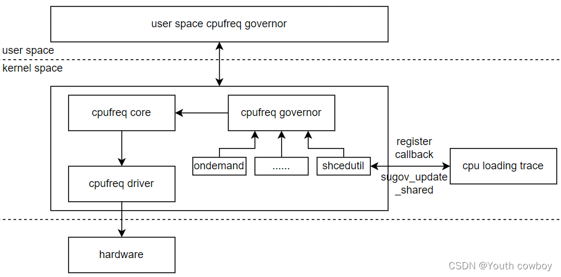

* [wowo-tech schedutil governor情景分析](http://www.wowotech.net/process_management/schedutil_governor.html)
* linux cpufreq framework [概述](http://www.wowotech.net/pm_subsystem/cpufreq_overview.html) ⊙ [cpufreq driver](http://www.wowotech.net/pm_subsystem/cpufreq_driver.html) ⊙ [cpufreq core](http://www.wowotech.net/pm_subsystem/cpufreq_core.html) ⊙ [cpufreq governor](http://www.wowotech.net/pm_subsystem/cpufreq_governor.html) ⊙ [ARM big Little driver](http://www.wowotech.net/pm_subsystem/arm_big_little_driver.html)

```c
struct cpu {
    int node_id;        /* The node which contains the CPU */
    int hotpluggable;   /* creates sysfs control file if hotpluggable */
    struct device dev;
};

struct cpufreq_policy {
    /* CPUs sharing clock, require sw coordination */
    cpumask_var_t        cpus;    /* Online CPUs only */
    cpumask_var_t        related_cpus; /* Online + Offline CPUs */
    cpumask_var_t        real_cpus; /* Related and present */

    unsigned int        shared_type; /* ACPI: ANY or ALL affected CPUs should set cpufreq */
    unsigned int        cpu;    /* cpu managing this policy, must be online */

    struct clk          *clk;
    struct cpufreq_cpuinfo {
        unsigned int        max_freq;
        unsigned int        min_freq;

        /* in 10^(-9) s = nanoseconds */
        unsigned int        transition_latency;
    } cpuinfo;

    unsigned int        min;    /* in kHz */
    unsigned int        max;    /* in kHz */
    unsigned int        cur;    /* in kHz, only needed if cpufreq governors are used */
    unsigned int        suspend_freq; /* freq to set during suspend */

    unsigned int        policy; /* see above */
    unsigned int        last_policy; /* policy before unplug */
    struct cpufreq_governor     *governor; /* see below */
    void                        *governor_data;
    char            last_governor[CPUFREQ_NAME_LEN]; /* last governor used */

    struct work_struct    update; /* if update_policy() needs to be
                    * called, but you're in IRQ context */

    struct freq_constraints    constraints;
    struct freq_qos_request    *min_freq_req;
    struct freq_qos_request    *max_freq_req;

    struct cpufreq_frequency_table      *freq_table; /* all freq point */
    enum cpufreq_table_sorting          freq_table_sorted;

    struct list_head        policy_list; /* global list */
    struct kobject          kobj;
    struct completion       kobj_unregister;

    /* cpufreq-stats */
    struct cpufreq_stats    *stats;

    /* For cpufreq driver's internal use */
    void            *driver_data;

    /* Pointer to the cooling device if used for thermal mitigation */
    struct thermal_cooling_device *cdev;

    struct notifier_block nb_min;
    struct notifier_block nb_max;
};
```

```c
static struct cpufreq_governor schedutil_gov = {
    .name           = "schedutil",
    .owner          = THIS_MODULE,
    .flags          = CPUFREQ_GOV_DYNAMIC_SWITCHING,
    .init           = sugov_init,
    .exit           = sugov_exit,
    .start          = sugov_start,
    .stop           = sugov_stop,
    .limits         = sugov_limits,
};

struct sugov_policy {
    struct cpufreq_policy       *policy;

    struct sugov_tunables       *tunables;
    struct list_head            tunables_hook;

    raw_spinlock_t              update_lock;
    u64                         last_freq_update_time;
    s64                         freq_update_delay_ns;
    unsigned int                next_freq;
    unsigned int                cached_raw_freq; /* target frequency */

    /* The next fields are only needed if fast switch cannot be used: */
    struct irq_work             irq_work;
    struct kthread_work         work;
    struct mutex                work_lock;
    struct kthread_worker       worker;
    struct task_struct          *thread;
    bool                        work_in_progress;

    bool                        limits_changed; /* min max changed */
    /* set to true to ignore ratlimit when minmax changes or dl bw > bw_min */
    bool                        need_freq_update;
};

struct sugov_tunables {
    struct gov_attr_set     attr_set;
    unsigned int            rate_limit_us;
};

struct gov_attr_set {
    struct kobject      kobj;
    struct list_head    policy_list;
    struct mutex        update_lock;
    int                 usage_count;
};

struct sugov_cpu {
    /* void (*func)(struct update_util_data *data, u64 time, unsigned int flags); */
    struct update_util_data update_util;
    struct sugov_policy     *sg_policy;
    unsigned int            cpu;

    bool                    iowait_boost_pending;
    unsigned int            iowait_boost;
    u64                     last_update;

    unsigned long           util;
    unsigned long           bw_min;

    /* The field below is for single-CPU policies only: */
#ifdef CONFIG_NO_HZ_COMMON
    unsigned long           saved_idle_calls;
#endif
};

DEFINE_PER_CPU(struct update_util_data __rcu *, cpufreq_update_util_data);

static DEFINE_PER_CPU(struct sugov_cpu, sugov_cpu);

```

## sugov_init

```c
static const struct kobj_type sugov_tunables_ktype = {
    .default_groups = sugov_groups,
    .sysfs_ops = &governor_sysfs_ops,
    .release = &sugov_tunables_free,
};

static int sugov_init(struct cpufreq_policy *policy)
{
    struct sugov_policy *sg_policy;
    struct sugov_tunables *tunables;
    int ret = 0;

    /* State should be equivalent to EXIT */
    if (policy->governor_data)
        return -EBUSY;

    cpufreq_enable_fast_switch(policy);

    sg_policy = sugov_policy_alloc(policy);

    ret = sugov_kthread_create(sg_policy);

    mutex_lock(&global_tunables_lock);

    if (global_tunables) {
        if (WARN_ON(have_governor_per_policy())) {
            ret = -EINVAL;
            goto stop_kthread;
        }
        policy->governor_data = sg_policy;
        sg_policy->tunables = global_tunables;

        gov_attr_set_get(&global_tunables->attr_set, &sg_policy->tunables_hook);
        goto out;
    }

    tunables = sugov_tunables_alloc(sg_policy) {
        struct sugov_tunables *tunables;

        tunables = kzalloc(sizeof(*tunables), GFP_KERNEL);
        if (tunables) {
            gov_attr_set_init(&tunables->attr_set, &sg_policy->tunables_hook);
            if (!have_governor_per_policy())
                global_tunables = tunables;
        }
        return tunables;
    }

    tunables->rate_limit_us = cpufreq_policy_transition_delay_us(policy);

    policy->governor_data = sg_policy;
    sg_policy->tunables = tunables;

    ret = kobject_init_and_add(&tunables->attr_set.kobj, &sugov_tunables_ktype,
                get_governor_parent_kobj(policy), "%s",
                schedutil_gov.name);

out:
    em_rebuild_sched_domains();
    mutex_unlock(&global_tunables_lock);
    return 0;
}
```

## sugov_start

```c
int sugov_start(struct cpufreq_policy *policy)
{
    struct sugov_policy *sg_policy = policy->governor_data;
    void (*uu)(struct update_util_data *data, u64 time, unsigned int flags);
    unsigned int cpu;

    sg_policy->freq_update_delay_ns = sg_policy->tunables->rate_limit_us * NSEC_PER_USEC;
    sg_policy->last_freq_update_time    = 0;
    sg_policy->next_freq                = 0;
    sg_policy->work_in_progress         = false;
    sg_policy->limits_changed           = false;
    sg_policy->cached_raw_freq          = 0;

    sg_policy->need_freq_update = cpufreq_driver_test_flags(CPUFREQ_NEED_UPDATE_LIMITS);

    if (policy_is_shared(policy)) /* return cpumask_weight(policy->cpus) > 1; */
        uu = sugov_update_shared;
    else if (policy->fast_switch_enabled && cpufreq_driver_has_adjust_perf())
        uu = sugov_update_single_perf;
    else
        uu = sugov_update_single_freq;

    for_each_cpu(cpu, policy->cpus) {
        struct sugov_cpu *sg_cpu = &per_cpu(sugov_cpu, cpu);

        memset(sg_cpu, 0, sizeof(*sg_cpu));
        sg_cpu->cpu = cpu;
        sg_cpu->sg_policy = sg_policy;
        cpufreq_add_update_util_hook(cpu, &sg_cpu->update_util/*data*/, uu/*func*/) {
            if (WARN_ON(!data || !func))
                return;

            if (WARN_ON(per_cpu(cpufreq_update_util_data, cpu)))
                return;

            data->func = func;
            rcu_assign_pointer(per_cpu(cpufreq_update_util_data, cpu), data);
        }
    }
    return 0;
}
```

## sugov_update_single_perf

```c
static void sugov_update_single_perf(struct update_util_data *hook, u64 time,
                    unsigned int flags)
{
    struct sugov_cpu *sg_cpu = container_of(hook, struct sugov_cpu, update_util);
    unsigned long prev_util = sg_cpu->util;
    unsigned long max_cap;

    /* Fall back to the "frequency" path if frequency invariance is not
     * supported, because the direct mapping between the utilization and
     * the performance levels depends on the frequency invariance. */
    if (!arch_scale_freq_invariant()) {
        sugov_update_single_freq(hook, time, flags);
        return;
    }

    max_cap = arch_scale_cpu_capacity(sg_cpu->cpu);

    ret = sugov_update_single_common(sg_cpu, time, max_cap, flags);
    if (!ret)
        return;

    if (sugov_hold_freq(sg_cpu) && sg_cpu->util < prev_util)
        sg_cpu->util = prev_util;

    cpufreq_driver_adjust_perf(sg_cpu->cpu, sg_cpu->bw_min, sg_cpu->util, max_cap) {
        cpufreq_driver->adjust_perf(cpu, min_perf, target_perf, capacity);
    }

    sg_cpu->sg_policy->last_freq_update_time = time;
}
```

## sugov_update_single_freq

```c
void sugov_update_single_freq(struct update_util_data *hook, u64 time,
                    unsigned int flags)
{
    struct sugov_cpu *sg_cpu = container_of(hook, struct sugov_cpu, update_util);
    struct sugov_policy *sg_policy = sg_cpu->sg_policy;
    unsigned int cached_freq = sg_policy->cached_raw_freq;
    unsigned long max_cap;
    unsigned int next_f;

    max_cap = arch_scale_cpu_capacity(sg_cpu->cpu);

    ret = sugov_update_single_common(sg_cpu, time, max_cap, flags) {
        unsigned long boost;

        sugov_iowait_boost(sg_cpu, time, flags);
        sg_cpu->last_update = time;

        ignore_dl_rate_limit(sg_cpu) {
            if (cpu_bw_dl(cpu_rq(sg_cpu->cpu)) > sg_cpu->bw_min)
                sg_cpu->sg_policy->need_freq_update = true;
        }

        /* 1. cpumask check
         * 2. min max limists change
         * 3. dl rate limit
         * 4. update delay */
        if (!sugov_should_update_freq(sg_cpu->sg_policy, time))
            return false;

        boost = sugov_iowait_apply(sg_cpu, time, max_cap) {
            /* No boost currently required */
            if (!sg_cpu->iowait_boost)
                return 0;

            /* Reset boost if the CPU appears to have been idle enough */
            if (sugov_iowait_reset(sg_cpu, time, false))
                return 0;

            if (!sg_cpu->iowait_boost_pending) {
                /* No boost pending; reduce the boost value. */
                sg_cpu->iowait_boost >>= 1;
                if (sg_cpu->iowait_boost < IOWAIT_BOOST_MIN) {
                    sg_cpu->iowait_boost = 0;
                    return 0;
                }
            }

            sg_cpu->iowait_boost_pending = false;

            /* sg_cpu->util is already in capacity scale; convert iowait_boost
             * into the same scale so we can compare. */
            return (sg_cpu->iowait_boost * max_cap) >> SCHED_CAPACITY_SHIFT;
        }

        sugov_get_util(sg_cpu, boost);
            --->

        return true;
    }
    if (!ret)
        return;

    next_f = get_next_freq(sg_policy, sg_cpu->util, max_cap);

    if (sugov_hold_freq(sg_cpu) && next_f < sg_policy->next_freq && !sg_policy->need_freq_update) {
        next_f = sg_policy->next_freq;

        /* Restore cached freq as next_freq has changed */
        sg_policy->cached_raw_freq = cached_freq;
    }

    ret = sugov_update_next_freq(sg_policy, time, next_f) {
        if (sg_policy->need_freq_update) {
            sg_policy->need_freq_update = false;
            if (sg_policy->next_freq == next_freq && !cpufreq_driver_test_flags(CPUFREQ_NEED_UPDATE_LIMITS))
                return false;
        } else if (sg_policy->next_freq == next_freq) {
            return false;
        }

        sg_policy->next_freq = next_freq;
        sg_policy->last_freq_update_time = time;

        return true;
    }
    if (!ret)
        return;

    if (sg_policy->policy->fast_switch_enabled) {
        cpufreq_driver_fast_switch(sg_policy->policy, next_f);
    } else {
        raw_spin_lock(&sg_policy->update_lock);
        sugov_deferred_update(sg_policy);
        raw_spin_unlock(&sg_policy->update_lock);
    }
}
```

## sugov_update_shared

```c
sugov_update_shared(struct update_util_data *hook, u64 time, unsigned int flags)
{
    struct sugov_cpu *sg_cpu = container_of(hook, struct sugov_cpu, update_util);
    struct sugov_policy *sg_policy = sg_cpu->sg_policy;
    unsigned int next_f;

    raw_spin_lock(&sg_policy->update_lock);

/* iowait boost */
    sugov_iowait_boost(sg_cpu, time, flags) {
        bool set_iowait_boost = flags & SCHED_CPUFREQ_IOWAIT;

        /* Reset boost if the CPU appears to have been idle enough */
        ret = sugov_iowait_reset(sg_cpu, time, set_iowait_boost) {
            s64 delta_ns = time - sg_cpu->last_update;

            /* Reset boost only if a tick has elapsed since last request */
            if (delta_ns <= TICK_NSEC)
                return false;

            sg_cpu->iowait_boost = set_iowait_boost ? IOWAIT_BOOST_MIN : 0;
            sg_cpu->iowait_boost_pending = set_iowait_boost;

            return true;
        }
        if (sg_cpu->iowait_boost && ret)
            return;

        /* Boost only tasks waking up after IO */
        if (!set_iowait_boost)
            return;

        /* Ensure boost doubles only one time at each request */
        if (sg_cpu->iowait_boost_pending)
            return;
        sg_cpu->iowait_boost_pending = true;

        /* Double the boost at each request */
        if (sg_cpu->iowait_boost) {
            sg_cpu->iowait_boost =
                min_t(unsigned int, sg_cpu->iowait_boost << 1, SCHED_CAPACITY_SCALE);
            return;
        }

        /* First wakeup after IO: start with minimum boost */
        sg_cpu->iowait_boost = IOWAIT_BOOST_MIN; /* 128 = (SCHED_CAPACITY_SCALE / 8) */
    }
    sg_cpu->last_update = time;

    ignore_dl_rate_limit(sg_cpu);

/* 2. update check */
    ret= sugov_should_update_freq(sg_policy, time) {
        /* 2.1. cpumask check */
        ret = cpufreq_this_cpu_can_update(sg_policy->policy) {
            return cpumask_test_cpu(smp_processor_id(), policy->cpus) ||
                (policy->dvfs_possible_from_any_cpu &&
                rcu_dereference_sched(*this_cpu_ptr(&cpufreq_update_util_data)));
        }
        if (!ret)
            return false;

        /* 2.2. min max limists change */
        if (unlikely(READ_ONCE(sg_policy->limits_changed))) {
            WRITE_ONCE(sg_policy->limits_changed, false);
            sg_policy->need_freq_update = true;

            smp_mb();

            return true;
        /* 2.3. dl rate limit */
        } else if (sg_policy->need_freq_update) {
            /* ignore_dl_rate_limit() wants a new frequency to be found. */
            return true;
        }

        /* 2.4. update delay */
        delta_ns = time - sg_policy->last_freq_update_time;

        return delta_ns >= sg_policy->freq_update_delay_ns;
    }
/* 3. calc next freq */
    if (ret) {
        next_f = sugov_next_freq_shared(sg_cpu, time) {
            struct sugov_policy *sg_policy = sg_cpu->sg_policy;
            struct cpufreq_policy *policy = sg_policy->policy;
            unsigned long util = 0, max_cap;
            unsigned int j;

            max_cap = arch_scale_cpu_capacity(sg_cpu->cpu);

            /* 3.1 get acutual max util of the policy cluster */
            for_each_cpu(j, policy->cpus) {
                struct sugov_cpu *j_sg_cpu = &per_cpu(sugov_cpu, j);
                unsigned long boost;

                boost = sugov_iowait_apply(j_sg_cpu, time, max_cap);
                sugov_get_util(j_sg_cpu, boost)  {
                    unsigned long min, max, util = scx_cpuperf_target(sg_cpu->cpu);

                    if (!scx_switched_all())
                        util += cpu_util_cfs_boost(sg_cpu->cpu);
                    util = effective_cpu_util(sg_cpu->cpu, util, &min, &max);
                    util = max(util, boost);
                    sg_cpu->bw_min = min;
                    sg_cpu->util = sugov_effective_cpu_perf(sg_cpu->cpu, util, min, max) {
                        /* Add dvfs headroom to actual utilization */
                        actual = map_util_perf(actual) {
                            return util + (util >> 2);
                        }
                        /* Actually we don't need to target the max performance */
                        if (actual < max)
                            max = actual;

                        /* Ensure at least minimum performance while providing more compute
                         * capacity when possible. */
                        return max(min, max);
                    }
                }

                util = max(j_sg_cpu->util, util);
            }

            /* 3.2. driver resolve the freq */
            return get_next_freq(sg_policy, util, max_cap) {
                struct cpufreq_policy *policy = sg_policy->policy;
                unsigned int freq;

                freq = get_capacity_ref_freq(policy);
                freq = map_util_freq(util, freq, max) {
                    return freq * util / cap;
                }

                if (freq == sg_policy->cached_raw_freq && !sg_policy->need_freq_update)
                    return sg_policy->next_freq;

                sg_policy->cached_raw_freq = freq;
                /* Map a target frequency to a driver-supported */
                return cpufreq_driver_resolve_freq(policy, freq) {
                    unsigned int min = READ_ONCE(policy->min);
                    unsigned int max = READ_ONCE(policy->max);

                    if (unlikely(min > max))
                        min = max;

                    return __resolve_freq(policy, target_freq, min, max, CPUFREQ_RELATION_LE)  {
                        unsigned int idx;

                        target_freq = clamp_val(target_freq, min, max);

                        if (!policy->freq_table)
                            return target_freq;

                        idx = cpufreq_frequency_table_target(policy, target_freq, min, max, relation) {
                            bool efficiencies = policy->efficiencies_available && (relation & CPUFREQ_RELATION_E);
                            int idx;

                            /* cpufreq_table_index_unsorted() has no use for this flag anyway */
                            relation &= ~CPUFREQ_RELATION_E;

                            if (unlikely(policy->freq_table_sorted == CPUFREQ_TABLE_UNSORTED))
                                return cpufreq_table_index_unsorted(
                                    policy, target_freq, min, max, relation);
                        retry:
                            switch (relation) {
                            case CPUFREQ_RELATION_L:
                                idx = find_index_l(policy, target_freq, min, max, efficiencies);
                                break;
                            case CPUFREQ_RELATION_H:
                                idx = find_index_h(policy, target_freq, min, max, efficiencies);
                                break;
                            case CPUFREQ_RELATION_C:
                                idx = find_index_c(policy, target_freq, min, max, efficiencies);
                                break;
                            default:
                                WARN_ON_ONCE(1);
                                return 0;
                            }

                            /* Limit frequency index to honor min and max */
                            if (!cpufreq_is_in_limits(policy, min, max, idx) && efficiencies) {
                                efficiencies = false;
                                goto retry;
                            }

                            return idx;
                        }
                        policy->cached_resolved_idx = idx;
                        policy->cached_target_freq = target_freq;
                        return policy->freq_table[idx].frequency;
                    }
                }
            }
        }

/* 4. policy update next freq, switch takes the next freq from policy */
        if (!sugov_update_next_freq(sg_policy, time, next_f))
            goto unlock;

/* 5. fast or slow switch */
        if (sg_policy->policy->fast_switch_enabled) {
            cpufreq_driver_fast_switch(sg_policy->policy, next_f) {
                unsigned int freq;
                int cpu;

                target_freq = clamp_val(target_freq, policy->min, policy->max);
                freq = cpufreq_driver->fast_switch(policy, target_freq);

                if (!freq)
                    return 0;

                policy->cur = freq;
                arch_set_freq_scale(policy->related_cpus, freq,
                            arch_scale_freq_ref(policy->cpu));
                cpufreq_stats_record_transition(policy, freq);

                if (trace_cpu_frequency_enabled()) {
                    for_each_cpu(cpu, policy->cpus)
                        trace_cpu_frequency(freq, cpu);
                }

                return freq;
            }
        } else {
            sugov_deferred_update(sg_policy) {
                if (!sg_policy->work_in_progress) {
                    sg_policy->work_in_progress = true;
                    irq_work_queue(&sg_policy->irq_work); /* sugov_irq_work -> sugov_work */
                }
            }
        }
    }
unlock:
    raw_spin_unlock(&sg_policy->update_lock);
}
```

### sugov_work

```c
static void sugov_work(struct kthread_work *work)
{
    struct sugov_policy *sg_policy = container_of(work, struct sugov_policy, work);
    unsigned int freq;
    unsigned long flags;

    /* Hold sg_policy->update_lock shortly to handle the case where:
     * in case sg_policy->next_freq is read here, and then updated by
     * sugov_deferred_update() just before work_in_progress is set to false
     * here, we may miss queueing the new update.
     *
     * Note: If a work was queued after the update_lock is released,
     * sugov_work() will just be called again by kthread_work code; and the
     * request will be proceed before the sugov thread sleeps. */
    raw_spin_lock_irqsave(&sg_policy->update_lock, flags);
    freq = sg_policy->next_freq;
    sg_policy->work_in_progress = false;
    raw_spin_unlock_irqrestore(&sg_policy->update_lock, flags);

    mutex_lock(&sg_policy->work_lock);
    __cpufreq_driver_target(sg_policy->policy, freq, CPUFREQ_RELATION_L) {
        unsigned int old_target_freq = target_freq;

        if (cpufreq_disabled())
            return -ENODEV;

        target_freq = __resolve_freq(policy, target_freq, policy->min, policy->max, relation);
        if (target_freq == policy->cur
            && !(cpufreq_driver->flags & CPUFREQ_NEED_UPDATE_LIMITS))
            return 0;

        if (cpufreq_driver->target) {
            if (!policy->efficiencies_available)
                relation &= ~CPUFREQ_RELATION_E;

            return cpufreq_driver->target(policy, target_freq, relation);
        }

        if (!cpufreq_driver->target_index)
            return -EINVAL;

        return __target_index(policy, policy->cached_resolved_idx) {
            struct cpufreq_freqs freqs = {.old = policy->cur, .flags = 0};
            unsigned int restore_freq, intermediate_freq = 0;
            unsigned int newfreq = policy->freq_table[index].frequency;
            int retval = -EINVAL;
            bool notify;

            if (newfreq == policy->cur)
                return 0;

            /* Save last value to restore later on errors */
            restore_freq = policy->cur;

            notify = !(cpufreq_driver->flags & CPUFREQ_ASYNC_NOTIFICATION);
            if (notify) {
                /* Handle switching to intermediate frequency */
                if (cpufreq_driver->get_intermediate) {
                    retval = __target_intermediate(policy, &freqs, index);
                    if (retval)
                        return retval;

                    intermediate_freq = freqs.new;
                    /* Set old freq to intermediate */
                    if (intermediate_freq)
                        freqs.old = freqs.new;
                }

                freqs.new = newfreq;

                cpufreq_freq_transition_begin(policy, &freqs);
            }

            retval = cpufreq_driver->target_index(policy, index);
            if (retval)
                pr_err("%s: Failed to change cpu frequency: %d\n", __func__,
                    retval);

            if (notify) {
                cpufreq_freq_transition_end(policy, &freqs, retval);

                if (unlikely(retval && intermediate_freq)) {
                    freqs.old = intermediate_freq;
                    freqs.new = restore_freq;
                    cpufreq_freq_transition_begin(policy, &freqs);
                    cpufreq_freq_transition_end(policy, &freqs, 0);
                }
            }

            return retval;
        }
    }
    mutex_unlock(&sg_policy->work_lock);
}
```

## cpufreq_update_util

1. deadline:  __add_running_bw, __sub_running_bw
2. cfs:
    * cfs_rq_util_change
        * attach_entity_load_avg, detach_entity_load_avg, update_load_avg
    * enqueue_task_fair
    * sched_balance_update_blocked_averages
3. rt: sched_rt_rq_dequeue/dequeue_top_rt_rq, enqueue_top_rt_rq

```c
static inline void cpufreq_update_util(struct rq *rq, unsigned int flags)
{
    struct update_util_data *data;

    data = rcu_dereference_sched(*per_cpu_ptr(&cpufreq_update_util_data, cpu_of(rq)));
    if (data)
        data->func(data, rq_clock(rq), flags);
}
```

```sh
/sys/devices/system/cpu/cpu0/cpufreq/  # CPU frequency scaling control for CPU0
├── affected_cpus       # List of CPUs affected by frequency changes to this CPU (space-separated CPU IDs)
├── base_frequency      # Base frequency of the CPU in kHz (nominal frequency without boost)
├── cpuinfo_max_freq    # Maximum supported CPU frequency in kHz (hardware limit)
├── cpuinfo_min_freq    # Minimum supported CPU frequency in kHz (hardware limit)
├── cpuinfo_transition_latency  # Time in nanoseconds for CPU frequency transition
├── energy_performance_available_preferences  # Available energy-performance preferences (e.g., performance, balance_performance, balance_power, power)
├── energy_performance_preference   # Current energy-performance preference setting (e.g., balance_performance)
├── related_cpus        # CPUs sharing the same clock domain as this CPU (space-separated CPU IDs)
├── scaling_available_governors # List of available cpufreq governors (e.g., performance, powersave, ondemand, schedutil)
├── scaling_cur_freq    # Current CPU frequency in kHz (actual operating frequency)
├── scaling_driver      # Driver providing cpufreq support (e.g., acpi-cpufreq, intel_pstate)
├── scaling_governor    # Current cpufreq governor controlling frequency scaling
├── scaling_max_freq    # Maximum allowed frequency for scaling in kHz (user-configurable limit)
├── scaling_min_freq    # Minimum allowed frequency for scaling in kHz (user-configurable limit)
└── scaling_setspeed    # Target frequency for userspace governor in kHz (write-only; used with userspace governor)
```

# uclap

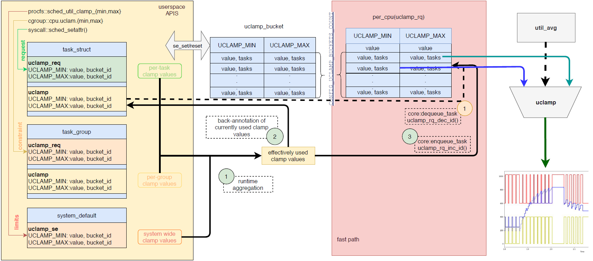

* [dumpstack - uclamp](http://www.dumpstack.cn/index.php/2022/08/13/788.html)

# load_balance

* [OSPM 2025 - Reduce, reuse, recycle: propagating load-balancer statistics up the hierarchy](https://lwn.net/Articles/1021332/)
* [蜗窝科技 - CFS负载均衡 - 概述](http://www.wowotech.net/process_management/load_balance.html) ⊙ [任务放置](http://www.wowotech.net/process_management/task_placement.html) ⊙ [CFS选核](http://www.wowotech.net/process_management/task_placement_detail.html) ⊙ [load balance触发场景](http://www.wowotech.net/process_management/load_balance_detail.html) ⊙ [sched_balance_rq](http://www.wowotech.net/process_management/load_balance_function.html)

* [DumpSatck - 负载跟踪](http://www.dumpstack.cn/index.php/category/tracking) ⊙ [cpu capacity](http://www.dumpstack.cn/index.php/2022/06/02/743.html) ⊙ [PELT](http://www.dumpstack.cn/index.php/2022/08/13/785.html) ⊙ [util_est](http://www.dumpstack.cn/index.php/2022/08/13/787.html) ⊙ [uclamp](http://www.dumpstack.cn/index.php/2022/08/13/788.html) ⊙ [walt](http://www.dumpstack.cn/index.php/2022/08/13/789.html)

* [[RFC PATCH v4 00/28] Cache aware load-balancing](https://lore.kernel.org/all/cover.1754712565.git.tim.c.chen@linux.intel.com/)

---



---


Load balance trigger time:
1. From CPU perspective:
    * tick_balance

        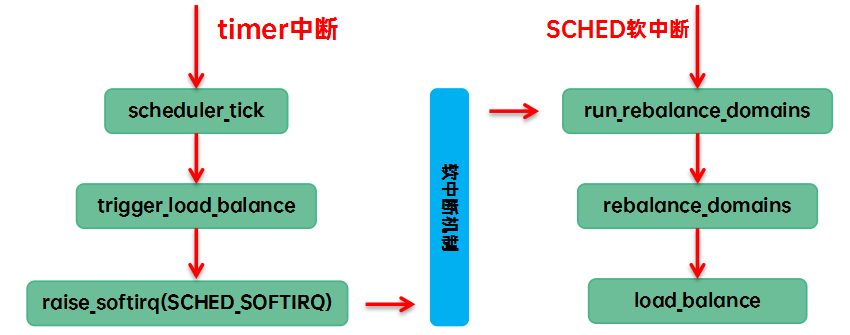

    * sched_balance_newidle

        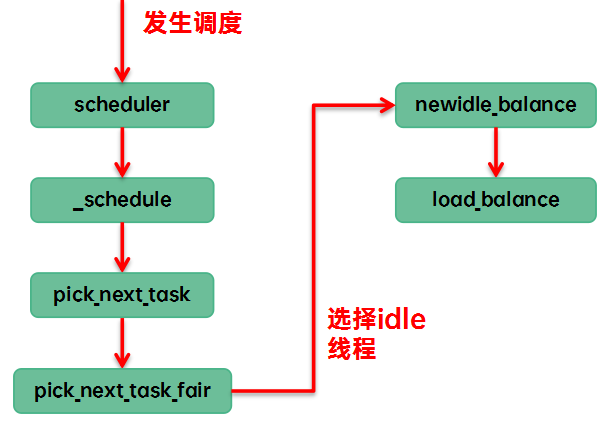

    * nohzidle_banlance

        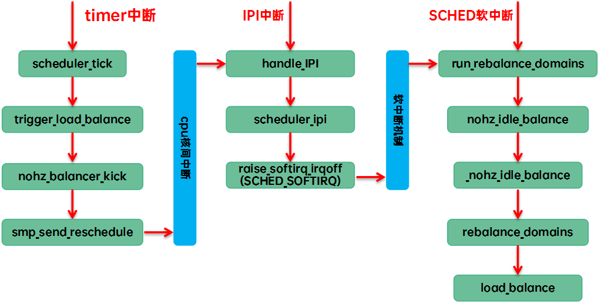

2. Form task perspective: select_task_rq
    * try_to_wake_up
    * wake_up_new_task
    * sched_exec
    * 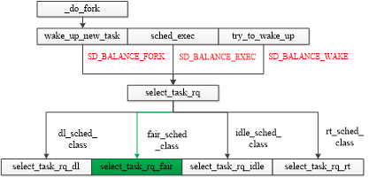

---

| Load Balance Stop mechanism | Periodic | New-idle | Scope |
|---|---|---|---|
| `sd->last_balance + interval` not elapsed | `continue` (skip level) | — | Per domain |
| `should_we_balance()` → `continue_balancing=0` | `break` (stop all) | `break` (stop all) | All remaining |
| `SD_SERIALIZE` lock taken | `continue` (skip level) | `continue` (skip level) | Per domain |
| `avg_idle < curr_cost + max_newidle_lb_cost` | — | `break` (stop all) | All remaining |
| `SD_BALANCE_NEWIDLE` not set | — | `continue` (skip level) | Per domain |
| Task successfully pulled | — | `break` (stop all) | All remaining |

## tick_balance

```c
void sched_tick(void) {
    rq->idle_balance = idle_cpu(cpu);
    sched_balance_trigger(rq) {
        if (unlikely(on_null_domain(rq) || !cpu_active(cpu_of(rq))))
            return;

        if (time_after_eq(jiffies, rq->next_balance))
            raise_softirq(SCHED_SOFTIRQ);

        nohz_balancer_kick(rq) {
            --->
        }
    }
}

init_sched_fair_class(void) {
    open_softirq(SCHED_SOFTIRQ, sched_balance_softirq);
}

void sched_balance_softirq(struct softirq_action *h)
{
    struct rq *this_rq = this_rq();
    enum cpu_idle_type idle = this_rq->idle_balance;

    /* If this CPU has a pending NOHZ_BALANCE_KICK, then do the
     * balancing on behalf of the other idle CPUs whose ticks are stopped. */
    if (nohz_idle_balance(this_rq, idle)) {
        return;
    }

    sched_balance_update_blocked_averages(this_rq->cpu);
    sched_balance_domains(this_rq, idle);
}
```

## nohz_idle_balance

```c
static struct {
    cpumask_var_t   idle_cpus_mask;
    int             has_blocked_load; /* Idle CPUS has blocked load */
    int             needs_update; /* Newly idle CPUs need their next_balance collated */
    unsigned long   next_balance; /* in jiffy units */
    unsigned long   next_blocked; /* Next update of blocked load in jiffies */
} nohz;
```

| Flag | Bit | Purpose |
|---|---|---|
| `NOHZ_BALANCE_KICK` | 0 | Trigger a full `sched_balance_domains()` - actively migrate tasks across the topology |
| `NOHZ_STATS_KICK` | 1 | Update **blocked load** statistics on idle CPUs (without necessarily migrating tasks) |
| `NOHZ_NEWILB_KICK` | 2 | Update blocked load specifically **when entering idle** (new-idle load balance path) |
| `NOHZ_NEXT_KICK` | 3 | Refresh `nohz.next_balance`, the timestamp for the next scheduled balancing |

### nohz_balancer_kick

```c
static void nohz_balancer_kick(struct rq *rq)
{
    unsigned long now = jiffies;
    struct sched_domain_shared *sds;
    struct sched_domain *sd;
    int nr_busy, i, cpu = rq->cpu;
    unsigned int flags = 0;

    if (unlikely(rq->idle_balance))
        return;

    nohz_balance_exit_idle(rq) {
        if (likely(!rq->nohz_tick_stopped))
            return;

        rq->nohz_tick_stopped = 0;
        cpumask_clear_cpu(rq->cpu, nohz.idle_cpus_mask);

        set_cpu_sd_state_busy(rq->cpu) {
            struct sched_domain *sd;
            sd = rcu_dereference_all(per_cpu(sd_llc, cpu));

            /* sd->nohz_idle only pairs with nr_busy_cpus on sd->shared; if this
             * domain has no shared object there is nothing to clear or account. */
            if (!sd || !sd->shared || !sd->nohz_idle)
                return;
            sd->nohz_idle = 0;

            atomic_inc(&sd->shared->nr_busy_cpus);
        }
    }

    if (READ_ONCE(nohz.has_blocked_load) && time_after(now, READ_ONCE(nohz.next_blocked)))
        flags = NOHZ_STATS_KICK;

    if (time_before(now, nohz.next_balance))
        goto out;

    if (unlikely(cpumask_empty(nohz.idle_cpus_mask)))
        return;

    if (rq->nr_running >= 2) {
        flags = NOHZ_STATS_KICK | NOHZ_BALANCE_KICK;
        goto out;
    }

    /* cpu capacity is reduced */
    sd = rcu_dereference(rq->sd);
    if (sd) {
        ret = check_cpu_capacity(rq, sd) {
            return ((rq->cpu_capacity * sd->imbalance_pct) < (rq->cpu_capacity_orig * 100));
        }
        if (rq->cfs.h_nr_runnable >= 1 && ret) {
            flags |= NOHZ_STATS_KICK | NOHZ_BALANCE_KICK;
            goto out;
        }
    }

    /* idle asym cpu i (lower nubmer) has higher priority */
    sd = rcu_dereference(per_cpu(sd_asym_packing, cpu));
    if (sd) {
        for_each_cpu_and(i, sched_domain_span(sd), nohz.idle_cpus_mask) {
            if (sched_use_asym_prio(sd, i) && sched_asym_prefer(i, cpu)) {
                flags |= NOHZ_STATS_KICK | NOHZ_BALANCE_KICK;
                goto out;
            }
        }
    }

    /* has misfit tasks */
    sd = rcu_dereference(per_cpu(sd_asym_cpucapacity, cpu));
    if (sd) {
        if (check_misfit_status(rq, sd)) {
            flags = NOHZ_STATS_KICK | NOHZ_BALANCE_KICK;
            goto out;
        }
        goto out;
    }

    /* has busy cpus */
    sds = rcu_dereference_all(per_cpu(sd_balance_shared, cpu));
    if (sds) {
        nr_busy = atomic_read(&sds->nr_busy_cpus);
        if (nr_busy > 1)
            flags |= NOHZ_STATS_KICK | NOHZ_BALANCE_KICK;
    }

out:
    if (READ_ONCE(nohz.needs_update))
        flags |= NOHZ_NEXT_KICK;

    if (flags) {
        kick_ilb(flags);
    }
}

static void kick_ilb(unsigned int flags) {
    int ilb_cpu;

    if (flags & NOHZ_BALANCE_KICK)
        nohz.next_balance = jiffies+1;

    ilb_cpu = find_new_ilb() {
        struct cpumask *ilb_cpus;
        int ilb_cpu, fallback = -1;

        ilb_cpus = this_cpu_cpumask_var_ptr(select_rq_mask);
        cpumask_and(ilb_cpus, nohz.idle_cpus_mask, housekeeping_cpumask(HK_TYPE_KERNEL_NOISE));

        for_each_cpu(ilb_cpu, ilb_cpus) {
            if (!idle_cpu(ilb_cpu)) {
                /* Once an idle fallback exists, a busy CPU proves that
                * this core cannot be fully idle. Skip its siblings. */
                if (sched_smt_active() && fallback >= 0)
                    cpumask_andnot(ilb_cpus, ilb_cpus, cpu_smt_mask(ilb_cpu));
                continue;
            }

            if (sched_smt_active() && !is_core_idle(ilb_cpu)) {
                if (fallback < 0)
                    fallback = ilb_cpu;

                /* The core is not idle, so there is no need to check
                * any of its other SMT siblings. */
                cpumask_andnot(ilb_cpus, ilb_cpus, cpu_smt_mask(ilb_cpu));
                continue;
            }

            /* idle_cpu && is_core_idle */
            return ilb_cpu;
        }

        return fallback;
    }

    if (ilb_cpu >= nr_cpu_ids)
        return;

    /* Return: The original value */
    flags = atomic_fetch_or(flags, nohz_flags(ilb_cpu));
    if (flags & NOHZ_KICK_MASK)
        return;

    /* INIT_CSD(&rq->nohz_csd, nohz_csd_func, rq); */
    smp_call_function_single_async(ilb_cpu, &cpu_rq(ilb_cpu)->nohz_csd) {
        arch_send_call_function_single_ipi() {
            smp_cross_call(cpumask_of(cpu), IPI_CALL_FUNC) {
                __ipi_send_mask(ipi_desc[ipinr], target);
            }
        }
    }
}

static void nohz_csd_func(void *info)
{
    struct rq *rq = info;
    int cpu = cpu_of(rq);
    unsigned int flags;

    /* Release the rq::nohz_csd. */
    flags = atomic_fetch_andnot(NOHZ_KICK_MASK | NOHZ_NEWILB_KICK, nohz_flags(cpu));
    WARN_ON(!(flags & NOHZ_KICK_MASK));

    rq->idle_balance = idle_cpu(cpu);
    if (rq->idle_balance) {
        rq->nohz_idle_balance = flags;
        __raise_softirq_irqoff(SCHED_SOFTIRQ);
    }
}
```

### _nohz_idle_balance

```c
static void do_idle(void)
{
    nohz_run_idle_balance(cpu) {
        unsigned int flags;

        flags = atomic_fetch_andnot(NOHZ_NEWILB_KICK, nohz_flags(cpu));

        /* Update the blocked load only if no SCHED_SOFTIRQ is about to happen
         * (i.e. NOHZ_STATS_KICK set) and will do the same. */
        if ((flags == NOHZ_NEWILB_KICK) && !need_resched())
            _nohz_idle_balance(cpu_rq(cpu), NOHZ_STATS_KICK);
    }
}

static bool nohz_idle_balance(struct rq *this_rq, enum cpu_idle_type idle)
{

    unsigned int flags = this_rq->nohz_idle_balance;

    if (!flags)
        return false;

    this_rq->nohz_idle_balance = 0;

    if (idle != CPU_IDLE)
        return false;

    _nohz_idle_balance(this_rq, flags);

    return true;
}

void _nohz_idle_balance(struct rq *this_rq, unsigned int flags)
{
    /* Earliest time when we have to do rebalance again */
    unsigned long now = jiffies;
    unsigned long next_balance = now + 60*HZ;
    bool has_blocked_load = false;
    int update_next_balance = 0;
    int this_cpu = this_rq->cpu;
    int balance_cpu;
    struct rq *rq;

    SCHED_WARN_ON((flags & NOHZ_KICK_MASK) == NOHZ_BALANCE_KICK);

    if (flags & NOHZ_STATS_KICK)
        WRITE_ONCE(nohz.has_blocked_load, 0);
    if (flags & NOHZ_NEXT_KICK)
        WRITE_ONCE(nohz.needs_update, 0);

    smp_mb();

    for_each_cpu_wrap(balance_cpu,  nohz.idle_cpus_mask, this_cpu+1) {
        if (!idle_cpu(balance_cpu))
            continue;

        if (!idle_cpu(this_cpu) && need_resched()) {
            if (flags & NOHZ_STATS_KICK)
                has_blocked_load = true;
            if (flags & NOHZ_NEXT_KICK)
                WRITE_ONCE(nohz.needs_update, 1);
            goto abort;
        }

        rq = cpu_rq(balance_cpu);

        if (flags & NOHZ_STATS_KICK)
            has_blocked_load |= update_nohz_stats(rq);

        if (time_after_eq(jiffies, rq->next_balance)) {
            struct rq_flags rf;

            rq_lock_irqsave(rq, &rf);
            update_rq_clock(rq);
            rq_unlock_irqrestore(rq, &rf);

            if (flags & NOHZ_BALANCE_KICK) {
                sched_balance_domains(rq, CPU_IDLE);
                    --->
            }
        }

        if (time_after(next_balance, rq->next_balance)) {
            next_balance = rq->next_balance;
            update_next_balance = 1;
        }
    }

    if (likely(update_next_balance))
        nohz.next_balance = next_balance;

    if (flags & NOHZ_STATS_KICK)
        WRITE_ONCE(nohz.next_blocked, now + msecs_to_jiffies(LOAD_AVG_PERIOD));

abort:
    /* There is still blocked load, enable periodic update */
    if (has_blocked_load)
        WRITE_ONCE(nohz.has_blocked_load, 1);
}
```

## sched_balance_newidle

```c
int sched_balance_newidle(struct rq *this_rq, struct rq_flags *rf)
    __must_hold(__rq_lockp(this_rq))
{
    unsigned long next_balance = jiffies + HZ;
    int this_cpu = this_rq->cpu;
    int continue_balancing = 1;
    u64 t0, t1, curr_cost = 0;
    struct sched_domain *sd;
    int pulled_task = 0;

    update_misfit_status(NULL, this_rq);

    /* There is a task waiting to run. No need to search for one.
     * Return 0; the task will be enqueued when switching to idle. */
    if (this_rq->ttwu_pending)
        return 0;

    /* We must set idle_stamp _before_ calling sched_balance_rq()
     * for CPU_NEWLY_IDLE, such that we measure the this duration
     * as idle time. */
    this_rq->idle_stamp = rq_clock(this_rq);

    /* Do not pull tasks towards !active CPUs... */
    if (!cpu_active(this_cpu))
        return 0;

    /* This is OK, because current is on_cpu, which avoids it being picked
     * for load-balance and preemption/IRQs are still disabled avoiding
     * further scheduler activity on it and we're being very careful to
     * re-start the picking loop. */
    rq_unpin_lock(this_rq, rf);

    sd = rcu_dereference_sched_domain(this_rq->sd);
    if (!sd)
        goto out;

    if (!get_rd_overloaded(this_rq->rd) || this_rq->avg_idle < sd->max_newidle_lb_cost) {
        update_next_balance(sd, &next_balance);
        goto out;
    }

    /* Include sched_balance_update_blocked_averages() in the cost
     * calculation because it can be quite costly -- this ensures we skip
     * it when avg_idle gets to be very low. */
    t0 = sched_clock_cpu(this_cpu);
    __sched_balance_update_blocked_averages(this_rq);

    rq_modified_begin(this_rq, &fair_sched_class);
    raw_spin_rq_unlock(this_rq);

    for_each_domain(this_cpu, sd) {
        u64 domain_cost;

        update_next_balance(sd, &next_balance);

        if (this_rq->avg_idle < curr_cost + sd->max_newidle_lb_cost)
            break;

        if (sd->flags & SD_BALANCE_NEWIDLE) {
            unsigned int weight = 1;

            if (sched_feat(NI_RANDOM) && sd->newidle_ratio < 1024) {
                /* Throw a 1k sided dice; and only run
                 * newidle_balance according to the success
                 * rate. */
                u32 d1k = sched_rng() % 1024;
                weight = 1 + sd->newidle_ratio;
                if (d1k > weight) {
                    update_newidle_stats(sd, 0);
                    continue;
                }
                weight = (1024 + weight/2) / weight;
            }

            pulled_task = sched_balance_rq(this_cpu, this_rq,
                           sd, CPU_NEWLY_IDLE,
                           &continue_balancing);

            t1 = sched_clock_cpu(this_cpu);
            domain_cost = t1 - t0;
            curr_cost += domain_cost;
            t0 = t1;

            /* Track max cost of a domain to make sure to not delay the
             * next wakeup on the CPU. */
            update_newidle_cost(sd, domain_cost, weight * !!pulled_task);
        }

        /* Stop searching for tasks to pull if there are
         * now runnable tasks on this rq. */
        if (pulled_task || !continue_balancing)
            break;
    }

    raw_spin_rq_lock(this_rq);

    if (curr_cost > this_rq->max_idle_balance_cost)
        this_rq->max_idle_balance_cost = curr_cost;

    /* While browsing the domains, we released the rq lock, a task could
     * have been enqueued in the meantime. Since we're not going idle,
     * pretend we pulled a task. */
    if (this_rq->cfs.h_nr_queued && !pulled_task)
        pulled_task = 1;

    /* If a higher prio class was modified, restart the pick */
    if (rq_modified_above(this_rq, &fair_sched_class))
        pulled_task = -1;

out:
    /* Move the next balance forward */
    if (time_after(this_rq->next_balance, next_balance))
        this_rq->next_balance = next_balance;

    if (pulled_task)
        this_rq->idle_stamp = 0;
    else {
        nohz_newidle_balance(this_rq) {
            int this_cpu = this_rq->cpu;

            /* Will wake up very soon. No time for doing anything else*/
            if (this_rq->avg_idle < sysctl_sched_migration_cost)
                return;

            /* Don't need to update blocked load of idle CPUs*/
            if (!READ_ONCE(nohz.has_blocked_load) ||
                time_before(jiffies, READ_ONCE(nohz.next_blocked)))
                return;

            /* Set the need to trigger ILB in order to update blocked load
            * before entering idle state. */
            atomic_or(NOHZ_NEWILB_KICK, nohz_flags(this_cpu));
        }
    }

    rq_repin_lock(this_rq, rf);

    return pulled_task;
}
```

### sched_balance_update_blocked_averages

```txt
CPU goes idle
└─► nohz_balance_enter_idle()
    ├─► rq->has_blocked_load = 1        (per-CPU flag)
    └─► nohz.has_blocked_load = 1       (global flag, wake up balancer)

Busy CPU's tick
└─► nohz_balancer_kick()
        └─► if (nohz.has_blocked_load) → schedule NOHZ_STATS_KICK

Idle balance (on idle CPU)
└─► _nohz_idle_balance()
    ├─► nohz.has_blocked_load = 0       (optimistic clear)
    └─► for each idle CPU:
        └─► update_nohz_stats(rq)
            ├─► if (!rq->has_blocked_load) → skip  ✓
            └─► sched_balance_update_blocked_averages()
                └─► decay CFS/RT/DL/IRQ load_avg
                └─► if all zero: rq->has_blocked_load = 0
    └─► if any still had load: nohz.has_blocked_load = 1  (reschedule)
```

```c
bool update_nohz_stats(struct rq *rq)
{
    unsigned int cpu = rq->cpu;

    if (!rq->has_blocked_load)
        return false;

    if (!cpumask_test_cpu(cpu, nohz.idle_cpus_mask))
        return false;

    if (!time_after(jiffies, READ_ONCE(rq->last_blocked_load_update_tick)))
        return true;

    sched_balance_update_blocked_averages(cpu);

    return rq->has_blocked_load;
}

void sched_balance_update_blocked_averages(int cpu)
{
    struct rq *rq = cpu_rq(cpu);

    guard(rq_lock_irqsave)(rq);
    update_rq_clock(rq);
    __sched_balance_update_blocked_averages(rq);
}

static void __sched_balance_update_blocked_averages(struct rq *rq)
{
    bool decayed = false, done = true;

    update_blocked_load_tick(rq) {
        WRITE_ONCE(rq->last_blocked_load_update_tick, jiffies);
    }

    decayed |= __update_blocked_others(rq, &done);
    decayed |= __update_blocked_fair(rq, &done);

    update_has_blocked_load_status(rq, !done) {
        if (!has_blocked_load)
            rq->has_blocked_load = 0;
    }
    if (decayed)
        cpufreq_update_util(rq, 0);
}

static bool __update_blocked_others(struct rq *rq, bool *done)
{
    bool updated;

    /* update_load_avg() can call cpufreq_update_util(). Make sure that RT,
     * DL and IRQ signals have been updated before updating CFS. */
    updated = update_other_load_avgs(rq) {
        u64 now = rq_clock_pelt(rq);
        const struct sched_class *curr_class = rq->donor->sched_class;
        unsigned long hw_pressure = arch_scale_hw_pressure(cpu_of(rq));

        lockdep_assert_rq_held(rq);

        /* hw_pressure doesn't care about invariance */
        return update_rt_rq_load_avg(now, rq, curr_class == &rt_sched_class) |
            update_dl_rq_load_avg(now, rq, curr_class == &dl_sched_class) |
            update_hw_load_avg(rq_clock_task(rq), rq, hw_pressure) |
            update_irq_load_avg(rq, 0);
    }

    ret = others_have_blocked(rq) {
        if (cpu_util_rt(rq))
            return true;

        if (cpu_util_dl(rq))
            return true;

        if (hw_load_avg(rq))
            return true;

        if (cpu_util_irq(rq))
            return true;

        return false;
    }
    if (ret)
        *done = false;

    return updated;
}

bool __update_blocked_fair(struct rq *rq, bool *done)
{
    struct cfs_rq *cfs_rq, *pos;
    bool decayed = false;

    /* Iterates the task_group tree in a bottom up fashion, see
     * list_add_leaf_cfs_rq() for details. */
    for_each_leaf_cfs_rq_safe(rq, cfs_rq, pos) {
        struct sched_entity *se;

        if (update_cfs_rq_load_avg(cfs_rq_clock_pelt(cfs_rq), cfs_rq)) {
            update_tg_load_avg(cfs_rq);

            if (cfs_rq->nr_queued == 0)
                update_idle_cfs_rq_clock_pelt(cfs_rq);

            if (cfs_rq == &rq->cfs)
                decayed = true;
        }

        /* Propagate pending load changes to the parent, if any: */
        se = cfs_rq_se(cfs_rq);
        if (se && !skip_blocked_update(se))
            update_load_avg(cfs_rq_of(se), se, UPDATE_TG);

        /* There can be a lot of idle CPU cgroups.  Don't let fully
         * decayed cfs_rqs linger on the list. */
        if (cfs_rq_is_decayed(cfs_rq))
            list_del_leaf_cfs_rq(cfs_rq);

        /* Don't need periodic decay once load/util_avg are null */
        ret = cfs_rq_has_blocked_load(cfs_rq) {
            if (cfs_rq->avg.load_avg)
                return true;

            if (cfs_rq->avg.util_avg)
                return true;

            return false;
        }
        if (ret)
            *done = false;
    }

    return decayed;
}
```

## sched_balance_domains


```c
void sched_balance_domains(struct rq *rq, enum cpu_idle_type idle)
{
    int continue_balancing = 1;
    int cpu = rq->cpu;
    int busy = idle != CPU_IDLE && !sched_idle_rq(rq);
    unsigned long interval;
    struct sched_domain *sd;
    /* Earliest time when we have to do rebalance again */
    unsigned long next_balance = jiffies + 60*HZ;
    int update_next_balance = 0;
    int need_decay = 0;
    u64 max_cost = 0;

    rcu_read_lock();
    for_each_domain(cpu, sd) {
        /* Decay the newidle max times here because this is a regular
         * visit to all the domains. */
        need_decay = update_newidle_cost(sd, 0, 0);
        max_cost += sd->max_newidle_lb_cost;

        /* Stop the load balance at this level. There is another
         * CPU in our sched group which is doing load balancing more
         * actively. */
        if (!continue_balancing) {
            if (need_decay)
                continue;
            break;
        }

        interval = get_sd_balance_interval(sd, busy);
        if (time_after_eq(jiffies, sd->last_balance + interval)) {
            if (sched_balance_rq(cpu, rq, sd, idle, &continue_balancing)) {
                /* The LBF_DST_PINNED logic could have changed
                 * env->dst_cpu, so we can't know our idle
                 * state even if we migrated tasks. Update it. */
                idle = idle_cpu(cpu);
                busy = !idle && !sched_idle_rq(rq);
            }
            sd->last_balance = jiffies;
            interval = get_sd_balance_interval(sd, busy);
        }
        if (time_after(next_balance, sd->last_balance + interval)) {
            next_balance = sd->last_balance + interval;
            update_next_balance = 1;
        }
    }
    if (need_decay) {
        /* Ensure the rq-wide value also decays but keep it at a
         * reasonable floor to avoid funnies with rq->avg_idle. */
        rq->max_idle_balance_cost =
            max((u64)sysctl_sched_migration_cost, max_cost);
    }
    rcu_read_unlock();

    /* next_balance will be updated only when there is a need.
     * When the cpu is attached to null domain for ex, it will not be
     * updated. */
    if (likely(update_next_balance))
        rq->next_balance = next_balance;

}
```

### sched_balance_rq

```c
static int sched_balance_rq(int this_cpu, struct rq *this_rq,
            struct sched_domain *sd, enum cpu_idle_type idle,
            int *continue_balancing)
{
    int ld_moved, cur_ld_moved, active_balance = 0;
    struct sched_domain *sd_parent = sd->parent;
    struct sched_group *group;
    struct rq *busiest;
    struct rq_flags rf;
    struct cpumask *cpus = this_cpu_cpumask_var_ptr(load_balance_mask);
    struct lb_env env = {
        .sd             = sd,
        .dst_cpu        = this_cpu,
        .dst_rq         = this_rq,
        .dst_grpmask    = group_balance_mask(sd->groups),
        .idle           = idle,
        .loop_break     = SCHED_NR_MIGRATE_BREAK, /* 8 for RT ohterwise 32 */
        .cpus           = cpus,
        .fbq_type       = all,
        .tasks          = LIST_HEAD_INIT(env.tasks),
    };

    bool need_unlock = false;

    cpumask_and(cpus, sched_domain_span(sd), cpu_active_mask);

    schedstat_inc(sd->lb_count[idle]);

redo:
    if (!should_we_balance(&env)) {
        *continue_balancing = 0;
        goto out_balanced;
    }

    if (!need_unlock && (sd->flags & SD_SERIALIZE)) {
        int zero = 0;
        if (!atomic_try_cmpxchg_acquire(&sched_balance_running, &zero, 1))
            goto out_balanced;

        need_unlock = true;
    }

    group = sched_balance_find_src_group(&env);
    if (!group) {
        schedstat_inc(sd->lb_nobusyg[idle]);
        goto out_balanced;
    }

    busiest = sched_balance_find_src_rq(&env, group);
    if (!busiest) {
        schedstat_inc(sd->lb_nobusyq[idle]);
        goto out_balanced;
    }

    update_lb_imbalance_stat(&env, sd, idle);

    env.src_cpu = busiest->cpu;
    env.src_rq = busiest;

    ld_moved = 0;
    /* Clear this flag as soon as we find a pullable task */
    env.flags |= LBF_ALL_PINNED;
    if (busiest->nr_running > 1) {
        env.loop_max  = min(sysctl_sched_nr_migrate, busiest->nr_running);

more_balance:
        rq_lock_irqsave(busiest, &rf);
        update_rq_clock(busiest);

        /* cur_ld_moved - load moved in current iteration
         * ld_moved     - cumulative load moved across iterations */
        cur_ld_moved = detach_tasks(&env);

        rq_unlock(busiest, &rf);

        if (cur_ld_moved) {
            attach_tasks(&env);
            ld_moved += cur_ld_moved;
        }

        local_irq_restore(rf.flags);

        if (env.flags & LBF_NEED_BREAK) {
            env.flags &= ~LBF_NEED_BREAK;
            goto more_balance;
        }

        if ((env.flags & LBF_DST_PINNED) && env.imbalance > 0) {
            /* Prevent to re-select dst_cpu via env's CPUs */
            __cpumask_clear_cpu(env.dst_cpu, env.cpus);

            env.dst_rq      = cpu_rq(env.new_dst_cpu);
            env.dst_cpu     = env.new_dst_cpu;
            env.flags       &= ~LBF_DST_PINNED;
            env.loop        = 0;
            env.loop_break  = SCHED_NR_MIGRATE_BREAK; /* 8 for RT ohterwise 32 */

            goto more_balance;
        }

        if (sd_parent) {
            /* notify parent the imbalance of child */
            int *group_imbalance = &sd_parent->groups->sgc->imbalance;
            if ((env.flags & LBF_SOME_PINNED) && env.imbalance > 0)
                *group_imbalance = 1;
        }

        /* All tasks on this runqueue were pinned by CPU affinity */
        if (unlikely(env.flags & LBF_ALL_PINNED)) {
            __cpumask_clear_cpu(cpu_of(busiest), cpus);

            if (!cpumask_subset(cpus, env.dst_grpmask)) {
                env.loop = 0;
                env.loop_break = SCHED_NR_MIGRATE_BREAK; /* 8 for RT ohterwise 32 */
                goto redo;
            }
            goto out_all_pinned;
        }
    }

    if (ld_moved) {
        sd->nr_balance_failed = 0;
        goto out_unbalanced;
    }

    schedstat_inc(sd->lb_failed[idle]);

    if (idle != CPU_NEWLY_IDLE &&
        env.migration_type != migrate_misfit &&
        !(env.flags & LBF_LLC_PINNED))
        sd->nr_balance_failed++;

    if (!need_active_balance(&env))
        goto out_unbalanced;

    scoped_guard (raw_spin_rq_lock_irqsave, busiest) {
        /* Don't kick the active_load_balance_cpu_stop,
         * if the curr task on busiest CPU can't be
         * moved to this_cpu: */
        if (!cpumask_test_cpu(this_cpu, busiest->curr->cpus_ptr))
            goto out_one_pinned;

        /* Record that we found at least one task that could run on this_cpu */
        env.flags &= ~LBF_ALL_PINNED;

        /* ->active_balance synchronizes accesses to
         * ->active_balance_work.  Once set, it's cleared
         * only after active load balance is finished. */
        if (busiest->active_balance)
            goto out_unbalanced;

        /* @busiest dropped its rq_lock in the middle of
         * scheduling out its ->curr task (->on_rq := 0), no
         * need to forcefully punt it away with active balance. */
        if (!busiest->curr->on_rq)
            goto out_unbalanced;

        busiest->active_balance = 1;
        busiest->push_cpu = this_cpu;
        active_balance = 1;
        preempt_disable();
    }
    if (active_balance) {
        stop_one_cpu_nowait(cpu_of(busiest),
                    alb_stop_fn(&env), busiest,
                    &busiest->active_balance_work);
    }
    preempt_enable();

out_unbalanced:
    /* We were unbalanced, so reset the balancing interval */
    sd->balance_interval = sd->min_interval;
    goto out;

out_balanced:
    /* We reach balance although we may have faced some affinity
     * constraints. Clear the imbalance flag only if other tasks got
     * a chance to move and fix the imbalance. */
    if (sd_parent && !(env.flags & LBF_ALL_PINNED)) {
        int *group_imbalance = &sd_parent->groups->sgc->imbalance;

        if (*group_imbalance)
            *group_imbalance = 0;
    }

out_all_pinned:
    /* We reach balance because all tasks are pinned at this level so
     * we can't migrate them. Let the imbalance flag set so parent level
     * can try to migrate them. */
    schedstat_inc(sd->lb_balanced[idle]);

    sd->nr_balance_failed = 0;

out_one_pinned:
    ld_moved = 0;

    /* sched_balance_newidle() disregards balance intervals, so we could
     * repeatedly reach this code, which would lead to balance_interval
     * skyrocketing in a short amount of time. Skip the balance_interval
     * increase logic to avoid that.
     *
     * Similarly misfit migration which is not necessarily an indication of
     * the system being busy and requires lb to backoff to let it settle
     * down. */
    if (env.idle == CPU_NEWLY_IDLE ||
        env.migration_type == migrate_misfit)
        goto out;

    /* tune up the balancing interval */
    if ((env.flags & LBF_ALL_PINNED &&
         sd->balance_interval < MAX_PINNED_INTERVAL) ||
        sd->balance_interval < sd->max_interval)
        sd->balance_interval *= 2;
out:
    if (need_unlock)
        atomic_set_release(&sched_balance_running, 0);

    return ld_moved;
}
```

#### should_we_balance

**Only the first idle CPU** (or the most suitable CPU based on the balancing rules) in a scheduling group is allowed to perform load balancing at a given time.

* **Fully Idle Core Available**:
    * If a CPU in the scheduling group is fully idle (all threads in the core are idle), that CPU is prioritized for balancing.
    * If the CPU is the first idle CPU in the group, it performs the balancing operation.
* **No Fully Idle Core**:
    * If no idle core is available, the system looks for idle SMT siblings.
    * The first idle SMT sibling within the group is selected to perform balancing.


```c
int should_we_balance(struct lb_env *env)
{
    struct cpumask *swb_cpus = this_cpu_cpumask_var_ptr(should_we_balance_tmpmask);
    struct sched_group *sg = env->sd->groups;
    int cpu, idle_smt = -1;

    /* Ensure the balancing environment is consistent; can happen
     * when the softirq triggers 'during' hotplug. */
    if (!cpumask_test_cpu(env->dst_cpu, env->cpus)) {
        return 0;
    }

    /* Newly idle cpu without nr_running and ttwu_pending */
    if (env->idle == CPU_NEWLY_IDLE) {
        if (env->dst_rq->nr_running > 0 || env->dst_rq->ttwu_pending) {
            return 0;
        }
        return 1;
    }

    cpumask_copy(swb_cpus, group_balance_mask(sg));

    /* Try to find first idle CPU */
    for_each_cpu_and(cpu, swb_cpus, env->cpus) {
        if (!idle_cpu(cpu)) {
            continue;
        }

        /* Don't balance to idle SMT in busy core right away when
         * balancing cores, but remember the first idle SMT CPU for
         * later consideration.  Find CPU on an idle core first. */
        if (sched_smt_active() && !(env->sd->flags & SD_SHARE_CPUCAPACITY) && !is_core_idle(cpu)) {
            if (idle_smt == -1) {
                idle_smt = cpu;
            }
            /* If the core is not idle, and first SMT sibling which is
             * idle has been found, then its not needed to check other
             * SMT siblings for idleness: */
#ifdef CONFIG_SCHED_SMT
            cpumask_andnot(swb_cpus, swb_cpus, cpu_smt_mask(cpu));
#endif
            continue;
        }

        /* 1. Are we the first idle core CPU in a non-SMT domain or higher,
         * or the first idle CPU in a SMT domain? */
        return cpu == env->dst_cpu;
    }

    /* 2. Are we the first idle SMT CPU with busy siblings? */
    if (idle_smt != -1) {
        return idle_smt == env->dst_cpu;
    }

    /* 3. Fallback to the first CPU in the group */
    return env->dst_cpu == group_balance_cpu(sg) {
        cpumask_first(group_balance_mask(sg))
    };
}
```

#### need_active_balance

```c
int need_active_balance(struct lb_env *env)
{
    struct sched_domain *sd = env->sd;

    if (alb_break_llc(env))
        return 0;

    ret = asym_active_balance(env) {
        return env->idle && sched_use_asym_prio(env->sd, env->dst_cpu) &&
	       (sched_asym_prefer(env->dst_cpu, env->src_cpu) || !sched_use_asym_prio(env->sd, env->src_cpu));
    }
    if (ret)
        return 1;

    ret = imbalanced_active_balance(env) {
        if ((env->migration_type == migrate_task) && (sd->nr_balance_failed > sd->cache_nice_tries+2))
            return 1;

        return 0;
    }
    if (ret)
        return 1;

    /* The dst_cpu is idle and the src_cpu CPU has only 1 CFS task.
     * It's worth migrating the task if the src_cpu's capacity is reduced
     * because of other sched_class or IRQs if more capacity stays
     * available on dst_cpu. */
    if (env->idle && (env->src_rq->cfs.h_nr_runnable == 1)) {
        if ((check_cpu_capacity(env->src_rq, sd)) &&
            (capacity_of(env->src_cpu)*sd->imbalance_pct < capacity_of(env->dst_cpu)*100))
            return 1;
    }

    if (env->migration_type == migrate_misfit || env->migration_type == migrate_llc_task)
        return 1;

    return 0;
}

static inline bool
alb_break_llc(struct lb_env *env)
{
    if (!sched_cache_enabled())
        return false;

    if (cpus_share_cache(env->src_cpu, env->dst_cpu))
        return false;

    /* All tasks prefer to stay on their current CPU.
     * Do not pull a task from its preferred CPU if:
     * 1. It is the only task running and does not exceed
     *    imbalance allowance; OR
     * 2. Migrating it away from its preferred LLC would violate
     *    the cache-aware scheduling policy. */
    if (env->src_rq->nr_pref_llc_running &&
        env->src_rq->nr_pref_llc_running == env->src_rq->cfs.h_nr_runnable) {
        unsigned long util = 0;
        struct task_struct *cur;

        /* Migrating misfit tasks from current CPU
         * to CPU with a better fit.
         * Prioritize that over LLC preference. */
        if (env->migration_type == migrate_misfit)
            return false;

        if (env->src_rq->nr_running <= 1)
            return true;

        cur = rcu_dereference_all(env->src_rq->curr);
        if (cur && cur->sched_class == &fair_sched_class)
            util = task_util(cur);

        if (task_misfits_asym_cpu(env, cur) ||
            can_migrate_llc(env->src_cpu, env->dst_cpu, util, false) == mig_forbid)
            return true;
    }

    return false;
}
```

### sched_balance_find_src_group

```c
/* Decision matrix according to the local and busiest group type:
 *
 * busiest \ local has_spare   fully    misfit asym imbalanced overloaded
 * has_spare        nr_idle   balanced   N/A    N/A  balanced   balanced
 * fully_busy       nr_idle   nr_idle    N/A    N/A  balanced   balanced
 * misfit_task      force     N/A        N/A    N/A  N/A        N/A
 * asym_packing     force     force      N/A    N/A  force      force
 * imbalanced       force     force      N/A    N/A  force      force
 * overloaded       force     force      N/A    N/A  force      avg_load
 *
 * N/A :      Not Applicable because already filtered while updating
 *            statistics.
 * balanced : The system is balanced for these 2 groups.
 * force :    Calculate the imbalance as load migration is probably needed.
 * avg_load : Only if imbalance is significant enough.
 * nr_idle :  dst_cpu is not busy and the number of idle CPUs is quite
 *            different in groups. */

struct sched_group *sched_balance_find_src_group(struct lb_env *env)
{
    struct sg_lb_stats *local, *busiest;
    struct sd_lb_stats sds;

    init_sd_lb_stats(&sds);

    /* Compute the various statistics relevant for load balancing at
     * this level. */
    update_sd_lb_stats(env, &sds);

    /* There is no busy sibling group to pull tasks from */
    if (!sds.busiest)
        goto out_balanced;

    busiest = &sds.busiest_stat;

    /* Misfit tasks should be dealt with regardless of the avg load */
    if (busiest->group_type == group_misfit_task)
        goto force_balance;

    if (!is_rd_overutilized(env->dst_rq->rd) && rcu_dereference_all(env->dst_rq->rd->pd))
        goto out_balanced;

    /* ASYM feature bypasses nice load balance check */
    if (busiest->group_type == group_asym_packing)
        goto force_balance;

    /* If the busiest group is imbalanced the below checks don't
     * work because they assume all things are equal, which typically
     * isn't true due to cpus_ptr constraints and the like. */
    if (busiest->group_type == group_imbalanced)
        goto force_balance;

    local = &sds.local_stat;
    /* If the local group is busier than the selected busiest group
     * don't try and pull any tasks. */
    if (local->group_type > busiest->group_type)
        goto out_balanced;

    /* When groups are overloaded, use the avg_load to ensure fairness
     * between tasks. */
    if (local->group_type == group_overloaded) {
        /* If the local group is more loaded than the selected
         * busiest group don't try to pull any tasks. */
        if (local->avg_load >= busiest->avg_load)
            goto out_balanced;

        /* XXX broken for overlapping NUMA groups */
        sds.avg_load = (sds.total_load * SCHED_CAPACITY_SCALE) / sds.total_capacity;

        /* Don't pull any tasks if this group is already above the
         * domain average load. */
        if (local->avg_load >= sds.avg_load)
            goto out_balanced;

        /* If the busiest group is more loaded, use imbalance_pct to be
         * conservative. */
        if (100 * busiest->avg_load <= env->sd->imbalance_pct * local->avg_load)
            goto out_balanced;
    }

    /* Try to move all excess tasks to a sibling domain of the busiest
     * group's child domain. */
    if (sds.prefer_sibling && local->group_type == group_has_spare &&
        (busiest->group_type == group_llc_balance ||
        sibling_imbalance(env, &sds, busiest, local) > 1))
        goto force_balance;

/* has_spare, fully_busy, pinned -> nr_idle */
    if (busiest->group_type != group_overloaded) {
        if (!env->idle) {
            /* If the busiest group is not overloaded (and as a
             * result the local one too) but this CPU is already
             * busy, let another idle CPU try to pull task. */
            goto out_balanced;
        }

        if (busiest->group_type == group_smt_balance &&
            smt_vs_nonsmt_groups(sds.local, sds.busiest)) {
            /* Let non SMT CPU pull from SMT CPU sharing with sibling */
            goto force_balance;
        }

        if (busiest->group_weight > 1 &&
            local->idle_cpus <= (busiest->idle_cpus + 1)) {
            /* If the busiest group is not overloaded
             * and there is no imbalance between this and busiest
             * group wrt idle CPUs, it is balanced. The imbalance
             * becomes significant if the diff is greater than 1
             * otherwise we might end up to just move the imbalance
             * on another group. Of course this applies only if
             * there is more than 1 CPU per group. */
            goto out_balanced;
        }

        if (busiest->sum_h_nr_running == 1) {
            /* busiest doesn't have any tasks waiting to run */
            goto out_balanced;
        }
    }

force_balance:
    /* Looks like there is an imbalance. Compute it */
    calculate_imbalance(env, &sds);
    return env->imbalance ? sds.busiest : NULL;

out_balanced:
    env->imbalance = 0;
    return NULL;
}
```

#### update_sd_lb_stats

```c
static inline void update_sd_lb_stats(struct lb_env *env, struct sd_lb_stats *sds)
{
    struct sched_group *sg = env->sd->groups;
    struct sg_lb_stats *local = &sds->local_stat;
    struct sg_lb_stats tmp_sgs;
    unsigned long sum_util = 0;
    bool sg_overloaded = 0, sg_overutilized = 0;

    env->dst_core_idle = !sched_smt_active() || is_core_idle(env->dst_cpu);

    do {
        struct sg_lb_stats *sgs = &tmp_sgs;
        int local_group;

        local_group = cpumask_test_cpu(env->dst_cpu, sched_group_span(sg));
        if (local_group) {
            sds->local = sg;
            sgs = local;

            if (env->idle != CPU_NEWLY_IDLE || time_after_eq(jiffies, sg->sgc->next_update)) {
                update_group_capacity(env->sd, env->dst_cpu);
            }
        }

        update_sg_lb_stats(env, sds, sg, sgs, &sg_overloaded);

        if (!local_group && update_sd_pick_busiest(env, sds, sg, sgs)) {
            sds->busiest = sg;
            sds->busiest_stat = *sgs;
        }

        sg_overutilized |= sgs->group_overutilized;

        /* Now, start updating sd_lb_stats */
        sds->total_load += sgs->group_load;
        sds->total_capacity += sgs->group_capacity;

        sum_util += sgs->group_util;
        sg = sg->next;
    } while (sg != env->sd->groups);

    /* Indicate that the child domain of the busiest group prefers tasks
    * go to a child's sibling domains first. NB the flags of a sched group
    * are those of the child domain. */
    if (sds->busiest)
        sds->prefer_sibling = !!(sds->busiest->flags & SD_PREFER_SIBLING);

    if (env->sd->flags & SD_NUMA)
        env->fbq_type = fbq_classify_group(&sds->busiest_stat);

    if (!env->sd->parent) {
        /* update overload indicator if we are at root domain */
        set_rd_overloaded(env->dst_rq->rd, sg_overloaded);

        /* Update over-utilization (tipping point, U >= 0) indicator */
        set_rd_overutilized(env->dst_rq->rd, sg_overutilized);
    } else if (sg_overutilized) {
        set_rd_overutilized(env->dst_rq->rd, sg_overutilized);
    }

    update_idle_cpu_scan(env, sum_util);
}
```

#### update_sg_lb_stats

```c
static inline void update_sg_lb_stats(struct lb_env *env,
                      struct sd_lb_stats *sds,
                      struct sched_group *group,
                      struct sg_lb_stats *sgs,
                      bool *sg_overloaded)
{
    int i, nr_running, local_group, sd_flags = env->sd->flags;
    bool balancing_at_rd = !env->sd->parent;

    memset(sgs, 0, sizeof(*sgs));

    local_group = group == sds->local;

    for_each_cpu_and(i, sched_group_span(group), env->cpus) {
        struct rq *rq = cpu_rq(i);
        unsigned long load = cpu_load(rq);

        sgs->group_load += load;
        sgs->group_util += cpu_util_cfs(i);
        sgs->group_runnable += cpu_runnable(rq);
        sgs->sum_h_nr_running += rq->cfs.h_nr_runnable;

        nr_running = rq->nr_running;
        sgs->sum_nr_running += nr_running;

        if (cpu_overutilized(i))
            sgs->group_overutilized = 1;

        if (sched_cache_enabled()) {
            struct sched_domain *sd_tmp;
            int dst_llc;

            dst_llc = llc_id(env->dst_cpu);
            if (llc_id(i) != dst_llc) {
                sd_tmp = rcu_dereference_all(rq->sd);
                if (sd_tmp && (unsigned int)dst_llc < sd_tmp->llc_max)
                    sgs->nr_pref_dst_llc += sd_tmp->llc_counts[dst_llc];
            }
        }

        /* * No need to call idle_cpu() if nr_running is not 0 */
        if (!nr_running && idle_cpu(i)) {
            sgs->idle_cpus++;
            /* Idle cpu can't have misfit task */
            continue;
        }

        /* Overload indicator is only updated at root domain */
        if (balancing_at_rd && nr_running > 1)
            *sg_overloaded = 1;

#ifdef CONFIG_NUMA_BALANCING
        /* Only fbq_classify_group() uses this to classify NUMA groups */
        if (sd_flags & SD_NUMA) {
            sgs->nr_numa_running += rq->nr_numa_running;
            sgs->nr_preferred_running += rq->nr_preferred_running;
        }
#endif
        if (local_group)
            continue;

        if (sd_flags & SD_ASYM_CPUCAPACITY) {
            if (rq->misfit_task_load) {
                /* Always mark the root domain overloaded so big
                 * CPUs can pick up misfit tasks via newly idle
                 * balance. */
                if (balancing_at_rd)
                    *sg_overloaded = 1;

                /* Only account misfit load if @dst_cpu can
                 * help; otherwise, the group may be classified
                 * as misfit_task and update_sd_pick_busiest()
                 * will skip it. */
                if (capacity_greater(capacity_of(env->dst_cpu),
                        group->sgc->max_capacity) &&
                        (sgs->group_misfit_task_load < rq->misfit_task_load))
                    sgs->group_misfit_task_load = rq->misfit_task_load;
            }
        } else if (env->idle && sched_reduced_capacity(rq, env->sd)) {
            /* Check for a task running on a CPU with reduced capacity */
            if (sgs->group_misfit_task_load < load)
                sgs->group_misfit_task_load = load;
        }
    }

    sgs->group_capacity = group->sgc->capacity;

    sgs->group_weight = group->group_weight; /* nr of cpu */

    if (!local_group) {
        /* Check if dst CPU is idle and preferred to this group */
        if (env->idle && sgs->sum_h_nr_running && sched_group_asym(env, sgs, group))
            sgs->group_asym_packing = 1;

        /* Check for loaded SMT group to be balanced to dst CPU */
        if (smt_balance(env, sgs, group))
            sgs->group_smt_balance = 1;

        /* Check for tasks in this group can be moved to their preferred LLC */
        if (llc_balance(env, sgs, group))
            sgs->group_llc_balance = 1;
    }

    sgs->group_type = group_classify(env->sd->imbalance_pct, group, sgs);

    record_sg_llc_stats(env, sgs, group);
    /* Computing avg_load makes sense only when group is overloaded */
    if (sgs->group_type == group_overloaded)
        sgs->avg_load = (sgs->group_load * SCHED_CAPACITY_SCALE) /
                sgs->group_capacity;
}

static void record_sg_llc_stats(struct lb_env *env,
                struct sg_lb_stats *sgs,
                struct sched_group *group)
{
    struct sched_domain_shared *sd_share;
    int cpu;

    if (!sched_cache_enabled() || env->idle == CPU_NEWLY_IDLE)
        return;

    /* Only care about sched domain spanning multiple LLCs */
    if (env->sd->child != rcu_dereference_all(per_cpu(sd_llc, env->dst_cpu)))
        return;

    /* At this point we know this group spans a LLC domain.
     * Record the statistic of this group in its corresponding
     * shared LLC domain.
     * Note: sd_share cannot be obtained via sd->child->shared,
     * because the latter refers to the domain that covers the
     * local group. Instead, sd_share should be located using
     * the first CPU of the LLC group. */
    cpu = cpumask_first(sched_group_span(group));
    sd_share = rcu_dereference_all(per_cpu(sd_llc_shared, cpu));
    if (!sd_share)
        return;

    if (READ_ONCE(sd_share->util_avg) != sgs->group_util)
        WRITE_ONCE(sd_share->util_avg, sgs->group_util);

    if (unlikely(READ_ONCE(sd_share->capacity) != sgs->group_capacity))
        WRITE_ONCE(sd_share->capacity, sgs->group_capacity);
}
```

##### group_classify

```c
static inline enum
group_type group_classify(unsigned int imbalance_pct,
              struct sched_group *group,
              struct sg_lb_stats *sgs)
{
    if (group_is_overloaded(imbalance_pct, sgs) {
        /* nr_running, util or runnable overload */
        if (sgs->sum_nr_running <= sgs->group_weight)
            return false;

        /* imbalance_pct is always > 100 (110 for SMT, 117 for LLC */

        /* group_util / group_capacity > 100 / imbalance_pct → threshold = 80% */
        if ((sgs->group_capacity * 100) < (sgs->group_util * imbalance_pct))
            return true;

        /* group_runnable / group_capacity > imbalance_pct / 100 → threshold = 125% */
        if ((sgs->group_capacity * imbalance_pct) < (sgs->group_runnable * 100))
            return true;

        return false;
    }) {
        return group_overloaded;
    }

    /* sub-sd failed to reach balance because of affinity */
    if (sg_imbalanced(group) { return group->sgc->imbalance; })
        return group_imbalanced; /* tasks' affinity */

    if (sgs->group_asym_packing)
        return group_asym_packing;

    if (sgs->group_smt_balance)
        return group_smt_balance;

    if (sgs->group_misfit_task_load)
        return group_misfit_task;

    ret = group_has_capacity(imbalance_pct, sgs) {
        /* nr task is smaller than the nr CPUs
            * the utilization is lower than the available capacity */
        if (sgs->sum_nr_running < sgs->group_weight)
            return true;

        if ((sgs->group_capacity * imbalance_pct) < (sgs->group_runnable * 100))
            return false;

        if ((sgs->group_util * imbalance_pct) < (sgs->group_capacity * 100))
            return true;

        return false;
    }
    if (!ret)
        return group_fully_busy;

    return group_has_spare;
}
```

##### llc_balance

```c
bool llc_balance(struct lb_env *env, struct sg_lb_stats *sgs,
                   struct sched_group *group)
{
    if (!sched_cache_enabled())
        return false;

    if (env->sd->flags & SD_SHARE_LLC)
        return false;

    /* On asymmetric domains, group_misfit_task_load
     * should be prioritized to move tasks to CPU that fit them
     * over aggregating tasks to their preferred LLC. */
    if ((env->sd->flags & SD_ASYM_CPUCAPACITY) && sgs->group_misfit_task_load)
        return false;

    /* Skip cache aware tagging if nr_balanced_failed is sufficiently high.
     * Threshold of cache_nice_tries is set to 1 higher than nr_balance_failed
     * to avoid excessive task migration at the same time. */
    if (env->sd->nr_balance_failed >= env->sd->cache_nice_tries + 1)
        return false;

    if (sgs->nr_pref_dst_llc &&
        can_migrate_llc(cpumask_first(sched_group_span(group)), env->dst_cpu, 0, true) == mig_llc)
        return true;

    return false;
}

enum llc_mig can_migrate_llc(int src_cpu, int dst_cpu,
                    unsigned long tsk_util,
                    bool to_pref)
{
    unsigned long src_util, dst_util, src_cap, dst_cap;

    if (!get_llc_stats(src_cpu, &src_util, &src_cap) ||
        !get_llc_stats(dst_cpu, &dst_util, &dst_cap))
        return mig_unrestricted;

    src_util = src_util < tsk_util ? 0 : src_util - tsk_util;
    dst_util = dst_util + tsk_util;

    if (!fits_llc_capacity(dst_util, dst_cap) &&
        !fits_llc_capacity(src_util, src_cap))
        return mig_unrestricted;

    if (to_pref) {
        /* Don't migrate if we will get preferred LLC too
         * heavily loaded and if the dest is much busier
         * than the src, in which case migration will
         * increase the imbalance too much. */
        if (!fits_llc_capacity(dst_util, dst_cap) &&
            util_greater(dst_util, src_util))
            return mig_forbid;
    } else {
        /* Don't migrate if we will leave preferred LLC
         * too idle, or if this migration leads to the
         * non-preferred LLC falls within sysctl_aggr_imb percent
         * of preferred LLC, leading to migration again
         * back to preferred LLC. */
        if (fits_llc_capacity(src_util, src_cap) ||
            !util_greater(src_util, dst_util))
            return mig_forbid;
    }
    return mig_llc;
}

bool fits_llc_capacity(unsigned long util, unsigned long max)
{
    u32 aggr_pct = llc_overaggr_pct; /* 50 by default */

    /* For single core systems, raise the aggregation
     * threshold to accommodate more tasks. */
    if (cpu_smt_num_threads == 1)
        aggr_pct = (aggr_pct * 3 / 2);

    return util * 100 < max * aggr_pct;
}

#define util_greater(util1, util2) \
    ((util1) * 100 > (util2) * (100 + llc_imb_pct))
```

##### update_group_capacity

```c
update_group_capacity(env->sd, env->dst_cpu) {
    struct sched_domain *child = sd->child;
    struct sched_group *group, *sdg = sd->groups;
    unsigned long capacity, min_capacity, max_capacity;
    unsigned long interval;

    interval = msecs_to_jiffies(sd->balance_interval);
    interval = clamp(interval, 1UL, max_load_balance_interval);
    sdg->sgc->next_update = jiffies + interval;

    if (!child) {
        update_cpu_capacity(sd, cpu) {
            /* calc the remaining usable capacity of a CPU for cfs tasks:
             * max - rt - dl - irq */
            unsigned long capacity = scale_rt_capacity(cpu) {
                struct rq *rq = cpu_rq(cpu);
                unsigned long max = arch_scale_cpu_capacity(cpu);
                unsigned long used, free;
                unsigned long irq;

                irq = cpu_util_irq(rq);

                if (unlikely(irq >= max))
                    return 1;

                used = cpu_util_rt(rq);
                used += cpu_util_dl(rq);

                if (unlikely(used >= max))
                    return 1;

                free = max - used;

                return scale_irq_capacity(free, irq, max);
            }
            struct sched_group *sdg = sd->groups;

            cpu_rq(cpu)->cpu_capacity_orig = arch_scale_cpu_capacity(cpu);

            if (!capacity)
                capacity = 1;

            cpu_rq(cpu)->cpu_capacity = capacity;

            sdg->sgc->capacity = capacity;
            sdg->sgc->min_capacity = capacity;
            sdg->sgc->max_capacity = capacity;
        }
        return;
    }

    capacity = 0;
    min_capacity = ULONG_MAX;
    max_capacity = 0;

    if (child->flags & SD_OVERLAP) {
        /* SD_OVERLAP domains cannot assume that child groups
         * span the current group. */
        for_each_cpu(cpu, sched_group_span(sdg)) {
            unsigned long cpu_cap = capacity_of(cpu);

            capacity += cpu_cap;
            min_capacity = min(cpu_cap, min_capacity);
            max_capacity = max(cpu_cap, max_capacity);
        }
    } else  {
        /* !SD_OVERLAP domains can assume that child groups
         * span the current group. */
        group = child->groups;
        do {
            struct sched_group_capacity *sgc = group->sgc;

            capacity += sgc->capacity;
            min_capacity = min(sgc->min_capacity, min_capacity);
            max_capacity = max(sgc->max_capacity, max_capacity);
            group = group->next;
        } while (group != child->groups);
    }

    sdg->sgc->capacity = capacity;
    sdg->sgc->min_capacity = min_capacity;
    sdg->sgc->max_capacity = max_capacity;
}
```

#### update_sd_pick_busiest

```c
update_sd_pick_busiest(struct lb_env *env,
                struct sd_lb_stats *sds,
                struct sched_group *sg,
                struct sg_lb_stats *sgs)
{
    struct sg_lb_stats *busiest = &sds->busiest_stat;

    /* Make sure that there is at least one task to pull */
    if (!sgs->sum_h_nr_running)
        return false;

    /* Don't try to pull misfit tasks we can't help.
     * We can use max_capacity here as reduction in capacity on some
     * CPUs in the group should either be possible to resolve
     * internally or be covered by avg_load imbalance (eventually). */
    if ((env->sd->flags & SD_ASYM_CPUCAPACITY)
        && (sgs->group_type == group_misfit_task)
        && (!capacity_greater(capacity_of(env->dst_cpu), sg->sgc->max_capacity)
        || sds->local_stat.group_type != group_has_spare)) {

        return false;
    }

    if (sgs->group_type > busiest->group_type)
        return true;

    if (sgs->group_type < busiest->group_type)
        return false;

    /* sgs->group_type == busiest->group_type */
    switch (sgs->group_type) {
    case group_overloaded:
        /* Select the overloaded group with highest avg_load. */
        if (sgs->avg_load <= busiest->avg_load)
            return false;
        break;

    case group_llc_balance:
        /* Select the group with most tasks preferring dst LLC */
        return update_llc_busiest(env, busiest, sgs) {
            return sgs->nr_pref_dst_llc > busiest->nr_pref_dst_llc;
        }

    case group_imbalanced:
        /* Select the 1st imbalanced group as we don't have any way to
         * choose one more than another. */
        return false;

    case group_asym_packing:
        /* Prefer to move from lowest priority CPU's work */
        if (sched_asym_prefer(sg->asym_prefer_cpu, sds->busiest->asym_prefer_cpu))
            return false;
        break;

    case group_misfit_task:
        /* If we have more than one misfit sg go with the biggest misfit. */
        if (sgs->group_misfit_task_load < busiest->group_misfit_task_load)
            return false;
        break;

    case group_smt_balance:
        /* Check if we have spare CPUs on either SMT group to
         * choose has spare or fully busy handling. */
        if (sgs->idle_cpus != 0 || busiest->idle_cpus != 0)
            goto has_spare;

        fallthrough;

    case group_fully_busy:
        /* Select the fully busy group with highest avg_load. In
         * theory, there is no need to pull task from such kind of
         * group because tasks have all compute capacity that they need
         * but we can still improve the overall throughput by reducing
         * contention when accessing shared HW resources.
         *
         * XXX for now avg_load is not computed and always 0 so we
         * select the 1st one, except if @sg is composed of SMT
         * siblings. */

        if (sgs->avg_load < busiest->avg_load)
            return false;

        if (sgs->avg_load == busiest->avg_load) {
            /* SMT sched groups need more help than non-SMT groups.
             * If @sg happens to also be SMT, either choice is good. */
            if (sds->busiest->flags & SD_SHARE_CPUCAPACITY)
                return false;
        }

        break;

    case group_has_spare:
        /* Do not pick sg with SMT CPUs over sg with pure CPUs,
         * as we do not want to pull task off SMT core with one task
         * and make the core idle. */
        if (smt_vs_nonsmt_groups(sds->busiest, sg)) {
            if (sg->flags & SD_SHARE_CPUCAPACITY && sgs->sum_h_nr_running <= 1)
                return false;
            else
                return true;
        }
has_spare:

        /* Select not overloaded group with lowest number of idle cpus
         * and highest number of running tasks. We could also compare
         * the spare capacity which is more stable but it can end up
         * that the group has less spare capacity but finally more idle
         * CPUs which means less opportunity to pull tasks. */
        if (sgs->idle_cpus > busiest->idle_cpus)
            return false;
        else if ((sgs->idle_cpus == busiest->idle_cpus)
            && (sgs->sum_nr_running <= busiest->sum_nr_running)) {

            return false;
        }

        break;
    }

    return true;
}
```

#### calculate_imbalance

```c
static inline void calculate_imbalance(struct lb_env *env, struct sd_lb_stats *sds)
{
    struct sg_lb_stats *local, *busiest;

    local = &sds->local_stat;
    busiest = &sds->busiest_stat;

/* 1. handle busiest state:
 * group_misfit_task,
 * group_asym_packing,
 * group_smt_balance,
 * group_imbalanced */
    if (busiest->group_type == group_misfit_task) {
        if (env->sd->flags & SD_ASYM_CPUCAPACITY) {
            /* Set imbalance to allow misfit tasks to be balanced. */
            env->migration_type = migrate_misfit;
            env->imbalance = 1;
        } else {
            /* Set load imbalance to allow moving task from cpu
             * with reduced capacity. */
            env->migration_type = migrate_load;
            env->imbalance = busiest->group_misfit_task_load;
        }
        return;
    }

    if (busiest->group_type == group_asym_packing) {
        /* In case of asym capacity, we will try to migrate all load to
         * the preferred CPU. */
        env->migration_type = migrate_task;
        env->imbalance = busiest->sum_h_nr_running;
        return;
    }

    if (busiest->group_type == group_smt_balance) {
        /* Reduce number of tasks sharing CPU capacity */
        env->migration_type = migrate_task;
        env->imbalance = 1;
        return;
    }

    if (busiest->group_type == group_llc_balance) {
        /* Move a task that prefer local LLC */
        env->migration_type = migrate_llc_task;
        env->imbalance = 1;
        return;
    }

    if (busiest->group_type == group_imbalanced) {
        env->migration_type = migrate_task;
        env->imbalance = 1;
        return;
    }

/* 2. local group_has_spare */
    if (local->group_type == group_has_spare) {
        if ((busiest->group_type > group_fully_busy) && !(env->sd->flags & SD_SHARE_LLC)) {
            env->migration_type = migrate_util;
            env->imbalance = max(local->group_capacity, local->group_util) -
                    local->group_util;

            if (env->idle && env->imbalance == 0) {
                env->migration_type = migrate_task;
                env->imbalance = 1;
            }

            return;
        }

        if (busiest->group_weight == 1 || sds->prefer_sibling) {
            /* When prefer sibling, evenly spread running tasks on groups. */
            env->migration_type = migrate_task;
            env->imbalance = sibling_imbalance(env, sds, busiest, local);
        } else {
            /* If there is no overload, we just want to even the number of
             * idle cpus. */
            env->migration_type = migrate_task;
            env->imbalance = max_t(long, 0, (local->idle_cpus - busiest->idle_cpus));
        }

#ifdef CONFIG_NUMA
        /* Consider allowing a small imbalance between NUMA groups */
        if (env->sd->flags & SD_NUMA) {
            env->imbalance = adjust_numa_imbalance(
                env->imbalance,
                local->sum_nr_running + 1,
                env->sd->imb_numa_nr
            );
        }
#endif

        /* Number of tasks to move to restore balance */
        env->imbalance >>= 1;

        return;
    }

/* 3. Local is fully busy but has to take more load to relieve the busiest group */
    if (local->group_type < group_overloaded) {
        /* Local will become overloaded so the avg_load metrics are
         * finally needed. */
        local->avg_load = (local->group_load * SCHED_CAPACITY_SCALE) /
                local->group_capacity;

        /* If the local group is more loaded than the selected
         * busiest group don't try to pull any tasks. */
        if (local->avg_load >= busiest->avg_load) {
            env->imbalance = 0;
            return;
        }

        /* represents the average load per unit of capacity for a scheduling domain */
        sds->avg_load = (sds->total_load * SCHED_CAPACITY_SCALE) /
                sds->total_capacity;

        /* If the local group is more loaded than the average system
         * load, don't try to pull any tasks. */
        if (local->avg_load >= sds->avg_load) {
            env->imbalance = 0;
            return;
        }
    }

/* 4. migrate average load */
    /* Both group are or will become overloaded and we're trying to get all
     * the CPUs to the average_load, so we don't want to push ourselves
     * above the average load, nor do we wish to reduce the max loaded CPU
     * below the average load. At the same time, we also don't want to
     * reduce the group load below the group capacity. Thus we look for
     * the minimum possible imbalance. */
    env->migration_type = migrate_load;
    env->imbalance = min(
        (busiest->avg_load - sds->avg_load) * busiest->group_capacity,
        (sds->avg_load - local->avg_load) * local->group_capacity
    ) / SCHED_CAPACITY_SCALE;
}
```

### sched_balance_find_src_rq

```c
static struct rq *sched_balance_find_src_rq(struct lb_env *env,
                     struct sched_group *group)
{
    struct rq *busiest = NULL, *rq;
    unsigned long busiest_util = 0, busiest_load = 0, busiest_capacity = 1;
    unsigned int __maybe_unused busiest_pref_llc = 0;
    struct sched_domain __maybe_unused *sd_tmp;
    unsigned int busiest_nr = 0;
    int __maybe_unused dst_llc;
    int i;

    for_each_cpu_and(i, sched_group_span(group), env->cpus) {
        unsigned long capacity, load, util;
        unsigned int nr_running;
        enum fbq_type rt;

        rq = cpu_rq(i);
        rt = fbq_classify_rq(rq);

        if (rt > env->fbq_type)
            continue;

        nr_running = rq->cfs.h_nr_runnable;
        if (!nr_running)
            continue;

        capacity = capacity_of(i);

        if (env->sd->flags & SD_ASYM_CPUCAPACITY && nr_running == 1) {
            bool cluster_equal_cap = static_branch_unlikely(&sched_cluster_active)
                && (get_actual_cpu_capacity(env->dst_cpu) == get_actual_cpu_capacity(i));
            bool smt_degraded_cap = sched_smt_active() && !is_core_idle(i);

            /* Busy SMT siblings reduce the capacity of CPU @i. Do
             * not skip it in this case.
             *
             * CONFIG_SCHED_CLUSTER requires balancing load across
             * clusters of identical capacity, accounting for
             * hardware and cpufreq pressure. */
            if (!smt_degraded_cap && !cluster_equal_cap &&
                !capacity_greater(capacity_of(env->dst_cpu), capacity))
                continue;
        }

        if (sched_asym(env->sd, i, env->dst_cpu) && nr_running == 1)
            continue;

        switch (env->migration_type) {
        case migrate_load:
            load = cpu_load(rq);

            if (nr_running == 1 && load > env->imbalance && !check_cpu_capacity(rq, env->sd))
                break;

            if (load * busiest_capacity > busiest_load * capacity) {
                busiest_load = load;
                busiest_capacity = capacity;
                busiest = rq;
            }
            break;

        case migrate_util:
            util = cpu_util_cfs_boost(i);

            if (nr_running <= 1)
                continue;

            if (busiest_util < util) {
                busiest_util = util;
                busiest = rq;
            }
            break;

        case migrate_task:
            if (busiest_nr < nr_running) {
                busiest_nr = nr_running;
                busiest = rq;
            }
            break;

        case migrate_misfit:
            if (rq->misfit_task_load > busiest_load) {
                busiest_load = rq->misfit_task_load;
                busiest = rq;
            }

            break;

        case migrate_llc_task:
            sd_tmp = rcu_dereference_all(rq->sd);
            dst_llc = llc_id(env->dst_cpu);

            if (sd_tmp && (unsigned)dst_llc < sd_tmp->llc_max) {
                unsigned int this_pref_llc = sd_tmp->llc_counts[dst_llc];

                if (busiest_pref_llc < this_pref_llc) {
                    busiest_pref_llc = this_pref_llc;
                    busiest = rq;
                }
            }
            break;
        }
    }

    return busiest;
}
```

### detach_tasks

```c
int detach_tasks(struct lb_env *env)
{
    struct list_head *tasks = &env->src_rq->cfs_tasks;
    unsigned long util, load;
    struct task_struct *p;
    int detached = 0;

    lockdep_assert_rq_held(env->src_rq);

    /* Source run queue has been emptied by another CPU, clear
     * LBF_ALL_PINNED flag as we will not test any task. */
    if (env->src_rq->nr_running <= 1) {
        env->flags &= ~LBF_ALL_PINNED;
        return 0;
    }

    if (env->imbalance <= 0)
        return 0;

    while (!list_empty(tasks)) {
        /* We don't want to steal all, otherwise we may be treated likewise,
         * which could at worst lead to a livelock crash. */
        if (env->idle && env->src_rq->nr_running <= 1)
            break;

        env->loop++;
        /* We've more or less seen every task there is, call it quits */
        if (env->loop > env->loop_max)
            break;

        /* take a breather every nr_migrate tasks */
        if (env->loop > env->loop_break) {
            env->loop_break += SCHED_NR_MIGRATE_BREAK; /* 8 for RT ohterwise 32 */
            env->flags |= LBF_NEED_BREAK;
            break;
        }

        p = list_last_entry(tasks, struct task_struct, se.group_node);

        if (!can_migrate_task(p, env))
            goto next;

        switch (env->migration_type) {
        case migrate_load:
            /* Depending of the number of CPUs and tasks and the
             * cgroup hierarchy, task_h_load() can return a null
             * value. Make sure that env->imbalance decreases
             * otherwise detach_tasks() will stop only after
             * detaching up to loop_max tasks. */
            load = max_t(unsigned long, task_h_load(p), 1);

            if (sched_feat(LB_MIN) && load < 16 && !env->sd->nr_balance_failed) {
                goto next;
            }

            /* Make sure that we don't migrate too much load.
             * Nevertheless, let relax the constraint if
             * scheduler fails to find a good waiting task to
             * migrate. */
            if (shr_bound(load, env->sd->nr_balance_failed) > env->imbalance)
                goto next;

            env->imbalance -= load;
            break;

        case migrate_util:
            util = task_util_est(p);

            if (util > env->imbalance)
                goto next;

            env->imbalance -= util;
            break;

        case migrate_task:
            env->imbalance--;
            break;

        case migrate_misfit:
            /* This is not a misfit task */
            if (task_fits_cpu(p, env->src_cpu))
                goto next;

            env->imbalance = 0;
            break;
        }

        detach_task(p, env);
        list_add(&p->se.group_node, &env->tasks);

        detached++;

#ifdef CONFIG_PREEMPTION
        /* NEWIDLE balancing is a source of latency, so preemptible
         * kernels will stop after the first task is detached to minimize
         * the critical section. */
        if (env->idle == CPU_NEWLY_IDLE)
            break;
#endif

        /* We only want to steal up to the prescribed amount of
         * load/util/tasks. */
        if (env->imbalance <= 0)
            break;

        continue;
next:
        list_move(&p->se.group_node, tasks);
    }

    /* Right now, this is one of only two places we collect this stat
     * so we can safely collect detach_one_task() stats here rather
     * than inside detach_one_task(). */
    schedstat_add(env->sd->lb_gained[env->idle], detached);

    return detached;
}
```

#### can_migrate_task

```c
int can_migrate_task(struct task_struct *p, struct lb_env *env)
{
    long degrades, hot;

    lockdep_assert_rq_held(env->src_rq);

    /* We do not migrate tasks that are:
     * 1) delayed dequeued unless we migrate load, or
     * 2) target cfs_rq is in throttled hierarchy, or
     * 3) cannot be migrated to this CPU due to cpus_ptr, or
     * 4) running (obviously), or
     * 5) are cache-hot on their current CPU, or
     * 6) are blocked on mutexes (if SCHED_PROXY_EXEC is enabled) */

    if ((p->se.sched_delayed) && (env->migration_type != migrate_load))
        return 0;

    if (lb_throttled_hierarchy(p, env->dst_cpu))
        return 0;

    /* We want to prioritize the migration of eligible tasks.
     * For ineligible tasks we soft-limit them and only allow
     * them to migrate when nr_balance_failed is non-zero to
     * avoid load-balancing trying very hard to balance the load. */
    if (!env->sd->nr_balance_failed &&
        task_is_ineligible_on_dst_cpu(p, env->dst_cpu))
        return 0;

    /* Disregard pcpu kthreads; they are where they need to be. */
    if (kthread_is_per_cpu(p))
        return 0;

    if (task_is_blocked(p))
        return 0;

    if (!cpumask_test_cpu(env->dst_cpu, p->cpus_ptr)) {
        int cpu;

        schedstat_inc(p->stats.nr_failed_migrations_affine);

        env->flags |= LBF_SOME_PINNED;

        /* Remember if this task can be migrated to any other CPU in
         * our sched_group. We may want to revisit it if we couldn't
         * meet load balance goals by pulling other tasks on src_cpu.
         *
         * Avoid computing new_dst_cpu
         * - for NEWLY_IDLE
         * - if we have already computed one in current iteration
         * - if it's an active balance */
        if (env->idle == CPU_NEWLY_IDLE || env->flags & (LBF_DST_PINNED | LBF_ACTIVE_LB)) {
            return 0;
        }

        /* Prevent to re-select dst_cpu via env's CPUs: */
        cpu = cpumask_first_and_and(env->dst_grpmask, env->cpus, p->cpus_ptr);

        if (cpu < nr_cpu_ids) {
            env->flags |= LBF_DST_PINNED;
            env->new_dst_cpu = cpu;
        }

        return 0;
    }

    /* Record that we found at least one task that could run on dst_cpu */
    env->flags &= ~LBF_ALL_PINNED;

    if (task_on_cpu(env->src_rq, p) || task_current_donor(env->src_rq, p)) {
        schedstat_inc(p->stats.nr_failed_migrations_running);
        return 0;
    }

    /* Aggressive migration if:
     * 1) active balance
     * 2) destination numa is preferred
     * 3) task is cache cold, or
     * 4) too many balance attempts have failed. */
    if (env->flags & LBF_ACTIVE_LB)
        return 1;

    /* 1 degrades, -1 improves, 0 not affected locality */
    degrades = migrate_degrades_locality(p, env);
    if (!degrades) {
        /* If the NUMA locality is not broken,
         * further check if migration would hurt
         * LLC locality. */
        if (migrate_degrades_llc(p, env)) {
            /* If regular load balancing fails to pull a task
             * due to LLC locality, this is expected behavior
             * and we set LBF_LLC_PINNED so we don't increase
             * nr_balance_failed unecessarily. */
            if (env->migration_type != migrate_llc_task)
                env->flags |= LBF_LLC_PINNED;

            return 0;
        }

        hot = task_hot(p, env);
    } else {
        hot = degrades > 0;
    }

    if (!hot || env->sd->nr_balance_failed > env->sd->cache_nice_tries) {
        if (hot)
            p->sched_task_hot = 1;
        return 1;
    }

    schedstat_inc(p->stats.nr_failed_migrations_hot);
    return 0;
}

static int task_hot(struct task_struct *p, struct lb_env *env)
{
    s64 delta;

    lockdep_assert_rq_held(env->src_rq);

    if (p->sched_class != &fair_sched_class)
        return 0;

    if (unlikely(task_has_idle_policy(p)))
        return 0;

    /* SMT siblings share cache */
    if (env->sd->flags & SD_SHARE_CPUCAPACITY)
        return 0;

    /* Buddy candidates are cache hot: */
    if (sched_feat(CACHE_HOT_BUDDY) && env->dst_rq->nr_running &&
        (&p->se == cfs_rq_of(&p->se)->next))
        return 1;

    if (sysctl_sched_migration_cost == -1)
        return 1;

    /* Don't migrate task if the task's cookie does not match
        * with the destination CPU's core cookie. */
    if (!sched_core_cookie_match(cpu_rq(env->dst_cpu), p))
        return 1;

    if (sysctl_sched_migration_cost == 0)
        return 0;

    delta = rq_clock_task(env->src_rq) - p->se.exec_start;

    return delta < (s64)sysctl_sched_migration_cost;
}
```

#### migrate_degrades_locality

```c
long migrate_degrades_locality(struct task_struct *p, struct lb_env *env)
{
    struct numa_group *numa_group = rcu_dereference_all(p->numa_group);
    unsigned long src_weight, dst_weight;
    int src_nid, dst_nid, dist;

    if (!static_branch_likely(&sched_numa_balancing))
        return 0;

    if (!p->numa_faults || !(env->sd->flags & SD_NUMA))
        return 0;

    src_nid = cpu_to_node(env->src_cpu);
    dst_nid = cpu_to_node(env->dst_cpu);

    if (src_nid == dst_nid)
        return 0;

    /* Migrating away from the preferred node is always bad. */
    if (src_nid == p->numa_preferred_nid) {
        if (env->src_rq->nr_running > env->src_rq->nr_preferred_running)
            return 1;
        else
            return 0;
    }

    /* Encourage migration to the preferred node. */
    if (dst_nid == p->numa_preferred_nid)
        return -1;

    /* Leaving a core idle is often worse than degrading locality. */
    if (env->idle == CPU_IDLE)
        return 0;

    dist = node_distance(src_nid, dst_nid);
    if (numa_group) {
        src_weight = group_weight(p, src_nid, dist);
        dst_weight = group_weight(p, dst_nid, dist);
    } else {
        src_weight = task_weight(p, src_nid, dist);
        dst_weight = task_weight(p, dst_nid, dist);
    }

    return src_weight - dst_weight;
}
```

#### migrate_degrades_llc

```c
static bool migrate_degrades_llc(struct task_struct *p, struct lb_env *env)
{
    if (!sched_cache_enabled())
        return false;

    if (task_has_sched_core(p))
        return false;
    /* Skip over tasks that would degrade LLC locality;
     * only when nr_balanced_failed is sufficiently high do we
     * ignore this constraint.
     *
     * Threshold of cache_nice_tries is set to 1 higher
     * than nr_balance_failed to avoid excessive task
     * migration at the same time. */
    if (env->sd->nr_balance_failed >= env->sd->cache_nice_tries + 1)
        return false;

    /* We know the env->src_cpu has some tasks prefer to
     * run on env->dst_cpu, skip the tasks do not prefer
     * env->dst_cpu, and find the one that prefers. */
    if (migrate_llc_task_wrong_dst(p, env) {
        return sched_cache_enabled() &&
            (env->migration_type == migrate_llc_task || env->flags & LBF_ACTIVE_LB_LLC) &&
            READ_ONCE(p->preferred_llc) != llc_id(env->dst_cpu);
    })
        return true;

    if (can_migrate_llc_task(env, p) != mig_forbid)
        return false;

    return true;
}

enum llc_mig can_migrate_llc_task(struct lb_env *env,
                     struct task_struct *p)
{
    struct sched_cache_group *grp;
    bool to_pref;
    int cpu, src_cpu, dst_cpu;

    if (task_misfits_asym_cpu(env, p))
        return mig_forbid;

    src_cpu = env->src_cpu;
    dst_cpu = env->dst_cpu;
    grp = rcu_dereference_all(p->sched_cache_grp);
    if (!grp)
        return mig_unrestricted;

    cpu = READ_ONCE(grp->cpu);
    if (cpu < 0 || cpus_share_cache(src_cpu, dst_cpu))
        return mig_unrestricted;

    /* skip cache aware load balance for too many threads */
    if (invalid_llc_nr(grp, p, dst_cpu) || exceed_llc_capacity(grp, dst_cpu)) {
        if (READ_ONCE(grp->cpu) != -1)
            WRITE_ONCE(grp->cpu, -1);
        return mig_unrestricted;
    }

    if (cpus_share_cache(dst_cpu, cpu))
        to_pref = true;
    else if (cpus_share_cache(src_cpu, cpu))
        to_pref = false;
    else
        return mig_unrestricted;

    return can_migrate_llc(src_cpu, dst_cpu, task_util(p), to_pref);
}

static bool invalid_llc_nr(struct sched_cache_group *grp, struct task_struct *p,
               int cpu)
{
    int scale;

    if (get_nr_threads(p) <= 1)
        return true;

    /* Scale the number of 'cores' in a LLC by llc_aggr_tolerance
     * and compare it to the task's active threads. */
    scale = get_sched_cache_scale(1) {
        unsigned int tol = READ_ONCE(llc_aggr_tolerance);

        if (!tol)
            return 0;

        if (tol >= 100)
            return INT_MAX;

        return (1 + (tol - 1) * mul);
    }
    if (scale == INT_MAX)
        return false;

    return !fits_capacity((READ_ONCE(grp->nr_running_avg) * cpu_smt_num_threads),
            (scale * per_cpu(sd_llc_size, cpu)));
}

bool exceed_llc_capacity(struct sched_cache_group *grp, int cpu)
{
#ifdef CONFIG_NUMA_BALANCING
    unsigned long llc, footprint;
    struct sched_domain *sd;
    int scale;

    guard(rcu)();

    sd = rcu_dereference_sched_domain(cpu_rq(cpu)->sd);
    if (!sd)
        return true;

    if (static_branch_likely(&sched_numa_balancing)) {
        /* TBD: RDT exclusive LLC ways reserved should be
         * excluded. */
        llc = sd->llc_bytes;
        footprint = READ_ONCE(grp->footprint);

        /* Scale the LLC size by 256*llc_aggr_tolerance
         * and compare it to the task's footprint.
         *
         * Suppose the L3 size is 32MB. If the
         * llc_aggr_tolerance is 1:
         * When the footprint is larger than 32MB, the
         * process is regarded as exceeding the LLC
         * capacity. If the llc_aggr_tolerance is 99:
         * When the footprint is larger than 784GB, the
         * process is regarded as exceeding the LLC
         * capacity:
         * 784GB = (1 + (99 - 1) * 256) * 32MB
         * If the llc_aggr_tolerance is 100:
         * ignore the footprint and do the aggregation
         * anyway. */
        scale = get_sched_cache_scale(256);
        if (scale == INT_MAX)
            return false;

        return ((llc * (u64)scale) < (footprint * PAGE_SIZE));
    }
#endif
    return false;
}
```

#### task_h_load

```c
static unsigned long task_h_load(struct task_struct *p)
{
    struct cfs_rq *cfs_rq = task_cfs_rq(p);

    update_cfs_rq_h_load(cfs_rq);
    return div64_ul(p->se.avg.load_avg * cfs_rq->h_load, cfs_rq_load_avg(cfs_rq) + 1);
}

void update_cfs_rq_h_load(struct cfs_rq *cfs_rq)
{
    struct sched_entity *se = cfs_rq_se(cfs_rq);
    unsigned long now = jiffies;
    unsigned long load;

    if (cfs_rq->last_h_load_update == now)
        return;

    WRITE_ONCE(cfs_rq->h_load_next, NULL);
    for_each_sched_entity(se) {
        cfs_rq = cfs_rq_of(se);
        WRITE_ONCE(cfs_rq->h_load_next, se);
        if (cfs_rq->last_h_load_update == now)
            break;
    }

    if (!se) {
        cfs_rq->h_load = cfs_rq_load_avg(cfs_rq);
        cfs_rq->last_h_load_update = now;
    }

    while ((se = READ_ONCE(cfs_rq->h_load_next)) != NULL) {
        load = cfs_rq->h_load;
        load = div64_ul(load * se->avg.load_avg, cfs_rq_load_avg(cfs_rq) + 1);
        cfs_rq = group_cfs_rq(se);
        cfs_rq->h_load = load;
        cfs_rq->last_h_load_update = now;
    }
}
```

# wait_wake_up

## wake_up


```c
#define wake_up(x)                        __wake_up(x, TASK_NORMAL, 1, NULL)
#define wake_up_nr(x, nr)                 __wake_up(x, TASK_NORMAL, nr, NULL)
#define wake_up_all(x)                    __wake_up(x, TASK_NORMAL, 0, NULL)
#define wake_up_locked(x)                 __wake_up_locked((x), TASK_NORMAL, 1)
#define wake_up_all_locked(x)             __wake_up_locked((x), TASK_NORMAL, 0)

#define wake_up_interruptible(x)          __wake_up(x, TASK_INTERRUPTIBLE, 1, NULL)
#define wake_up_interruptible_nr(x, nr)   __wake_up(x, TASK_INTERRUPTIBLE, nr, NULL)
#define wake_up_interruptible_all(x)      __wake_up(x, TASK_INTERRUPTIBLE, 0, NULL)
#define wake_up_interruptible_sync(x)     __wake_up_sync((x), TASK_INTERRUPTIBLE, 1)

void __wake_up(
  struct wait_queue_head *wq_head, unsigned int mode,
  int nr_exclusive, void *key)
{
    __wake_up_common_lock(wq_head, mode, nr_exclusive, 0, key) {
        unsigned long flags;
        int remaining;

        spin_lock_irqsave(&wq_head->lock, flags);
        remaining = __wake_up_common(wq_head, mode, nr_exclusive, wake_flags, key);
        spin_unlock_irqrestore(&wq_head->lock, flags);

        return nr_exclusive - remaining;
    }
}

static int __wake_up_common(
  struct wait_queue_head *wq_head, unsigned int mode,
  int nr_exclusive, int wake_flags, void *key,
  wait_queue_entry_t *bookmark)
{
    wait_queue_entry_t *curr, *next;

    lockdep_assert_held(&wq_head->lock);

    curr = list_first_entry(&wq_head->head, wait_queue_entry_t, entry);

    if (&curr->entry == &wq_head->head)
        return nr_exclusive;

    list_for_each_entry_safe_from(curr, next, &wq_head->head, entry) {
        unsigned flags = curr->flags;
        int ret;

        ret = curr->func(curr, mode, wake_flags, key);
        if (ret < 0)
            break;
        if (ret && (flags & WQ_FLAG_EXCLUSIVE) && !--nr_exclusive)
            break;
    }

    return nr_exclusive;
}
```

## wait_woken


```c
long inet_wait_for_connect(struct sock *sk, long timeo, int writebias)
{
    DEFINE_WAIT_FUNC(wait, woken_wake_function);

    add_wait_queue(sk_sleep(sk), &wait);
    sk->sk_write_pending += writebias;

    while ((1 << sk->sk_state) & (TCPF_SYN_SENT | TCPF_SYN_RECV)) {
        timeo = wait_woken(&wait, TASK_INTERRUPTIBLE, timeo) {
            /* The below executes an smp_mb(), which matches with the full barrier
            * executed by the try_to_wake_up() in woken_wake_function() such that
            * either we see the store to wq_entry->flags in woken_wake_function()
            * or woken_wake_function() sees our store to current->state. */
            set_current_state(mode); /* A */
            if (!(wq_entry->flags & WQ_FLAG_WOKEN) && !is_kthread_should_stop()) {
                timeout = schedule_timeout(timeout) {

                }
            }
            __set_current_state(TASK_RUNNING);

            /* The below executes an smp_mb(), which matches with the smp_mb() (C)
            * in woken_wake_function() such that either we see the wait condition
            * being true or the store to wq_entry->flags in woken_wake_function()
            * follows ours in the coherence order. */
            smp_store_mb(wq_entry->flags, wq_entry->flags & ~WQ_FLAG_WOKEN); /* B */

            return timeout;
        }
        if (signal_pending(current) || !timeo)
            break;
    }
    remove_wait_queue(sk_sleep(sk), &wait);
    sk->sk_write_pending -= writebias;
    return timeo;
}


long __sched schedule_timeout(signed long timeout)
{
    struct process_timer timer;
    unsigned long expire;

    switch (timeout)
    {
    case MAX_SCHEDULE_TIMEOUT:
        schedule();
        goto out;
    default:
        if (timeout < 0) {
            printk(KERN_ERR "schedule_timeout: wrong timeout "
                "value %lx\n", timeout);
            dump_stack();
            current->state = TASK_RUNNING;
            goto out;
        }
    }

    expire = timeout + jiffies;

    timer.task = current;
    timer_setup_on_stack(&timer.timer, process_timeout, 0);
    __mod_timer(&timer.timer, expire, 0);
    schedule();
    del_singleshot_timer_sync(&timer.timer);

    /* Remove the timer from the object tracker */
    destroy_timer_on_stack(&timer.timer);

    timeout = expire - jiffies;

out:
    return timeout < 0 ? 0 : timeout;
}

void process_timeout(struct timer_list *t)
{
    struct process_timer *timeout = from_timer(timeout, t, timer);

    wake_up_process(timeout->task) {
        return try_to_wake_up(p, TASK_NORMAL, 0) {

        }
    }
}

/* wait_queue_entry::flags */
#define WQ_FLAG_EXCLUSIVE   0x01
#define WQ_FLAG_WOKEN       0x02
#define WQ_FLAG_CUSTOM      0x04
#define WQ_FLAG_DONE        0x08
#define WQ_FLAG_PRIORITY    0x10

struct wait_queue_entry {
    unsigned int      flags;
    void              *private; /* struct_task */
    wait_queue_func_t func;
    struct list_head  entry;
};
```

## try_to_wake_up


```c
int try_to_wake_up(struct task_struct *p, unsigned int state, int wake_flags)
{
    guard(preempt)();
    int cpu, success = 0;

    wake_flags |= WF_TTWU;

    if (p == current) {
        /* We're waking current, this means 'p->on_rq' and 'task_cpu(p)
         * == smp_processor_id()'. Together this means we can special
         * case the whole 'p->on_rq && ttwu_runnable()' case below
         * without taking any locks.
         *
         * Specifically, given current runs ttwu() we must be before
         * schedule()'s block_task(), as such this must not observe
         * sched_delayed.
         *
         * In particular:
         *  - we rely on Program-Order guarantees for all the ordering,
         *  - we're serialized against set_special_state() by virtue of
         *    it disabling IRQs (this allows not taking ->pi_lock). */
        WARN_ON_ONCE(p->se.sched_delayed);
        clear_task_blocked_on(p, NULL);
        if (!ttwu_state_match(p, state, &success))
            goto out;

        trace_sched_waking(p);
        ttwu_do_wakeup(p) {
            p->is_blocked = 0;
            WRITE_ONCE(p->__state, TASK_RUNNING);
            trace_sched_wakeup(p);
        }
        goto out;
    }

    /* If we are going to wake up a thread waiting for CONDITION we
     * need to ensure that CONDITION=1 done by the caller can not be
     * reordered with p->state check below. This pairs with smp_store_mb()
     * in set_current_state() that the waiting thread does. */
    scoped_guard (raw_spinlock_irqsave, &p->pi_lock) {
        smp_mb__after_spinlock();
        if (!ttwu_state_match(p, state, &success))
            break;

        trace_sched_waking(p);

        /* Ensure we load p->on_rq _after_ p->state, otherwise it would
         * be possible to, falsely, observe p->on_rq == 0 and get stuck
         * in smp_cond_load_acquire() below.
         *
         * sched_ttwu_pending()            try_to_wake_up()
         *   STORE p->on_rq = 1              LOAD p->state
         *   UNLOCK rq->lock
         *
         * __schedule() (switch to task 'p')
         *   LOCK rq->lock              smp_rmb();
         *   smp_mb__after_spinlock();
         *   UNLOCK rq->lock
         *
         * [task p]
         *   STORE p->state = UNINTERRUPTIBLE      LOAD p->on_rq
         *
         * Pairs with the LOCK+smp_mb__after_spinlock() on rq->lock in
         * __schedule().  See the comment for smp_mb__after_spinlock().
         *
         * A similar smp_rmb() lives in __task_needs_rq_lock(). */
        smp_rmb();
        if (READ_ONCE(p->on_rq) && ttwu_runnable(p, wake_flags))
            break;

        /* Ensure we load p->on_cpu _after_ p->on_rq, otherwise it would be
         * possible to, falsely, observe p->on_cpu == 0.
         *
         * One must be running (->on_cpu == 1) in order to remove oneself
         * from the runqueue.
         *
         * __schedule() (switch to task 'p')    try_to_wake_up()
         *   STORE p->on_cpu = 1          LOAD p->on_rq
         *   UNLOCK rq->lock
         *
         * __schedule() (put 'p' to sleep)
         *   LOCK rq->lock              smp_rmb();
         *   smp_mb__after_spinlock();
         *   STORE p->on_rq = 0              LOAD p->on_cpu
         *
         * Pairs with the LOCK+smp_mb__after_spinlock() on rq->lock in
         * __schedule().  See the comment for smp_mb__after_spinlock().
         *
         * Form a control-dep-acquire with p->on_rq == 0 above, to ensure
         * schedule()'s block_task() has 'happened' and p will no longer
         * care about it's own p->state. See the comment in __schedule(). */
        smp_acquire__after_ctrl_dep();

        /* We're doing the wakeup (@success == 1), they did a dequeue (p->on_rq
         * == 0), which means we need to do an enqueue, change p->state to
         * TASK_WAKING such that we can unlock p->pi_lock before doing the
         * enqueue, such as ttwu_queue_wakelist(). */
        WRITE_ONCE(p->__state, TASK_WAKING);

        /* If the owning (remote) CPU is still in the middle of schedule() with
         * this task as prev, considering queueing p on the remote CPUs wake_list
         * which potentially sends an IPI instead of spinning on p->on_cpu to
         * let the waker make forward progress. This is safe because IRQs are
         * disabled and the IPI will deliver after on_cpu is cleared.
         *
         * Ensure we load task_cpu(p) after p->on_cpu:
         *
         * set_task_cpu(p, cpu);
         *   STORE p->cpu = @cpu
         * __schedule() (switch to task 'p')
         *   LOCK rq->lock
         *   smp_mb__after_spin_lock()        smp_cond_load_acquire(&p->on_cpu)
         *   STORE p->on_cpu = 1        LOAD p->cpu
         *
         * to ensure we observe the correct CPU on which the task is currently
         * scheduling. */
        if (smp_load_acquire(&p->on_cpu) && ttwu_queue_wakelist(p, task_cpu(p), wake_flags))
            break;

        /* If the owning (remote) CPU is still in the middle of schedule() with
         * this task as prev, wait until it's done referencing the task.
         *
         * Pairs with the smp_store_release() in finish_task().
         *
         * This ensures that tasks getting woken will be fully ordered against
         * their previous state and preserve Program Order. */
        smp_cond_load_acquire(&p->on_cpu, !VAL) {
            #define smp_cond_load_acquire(ptr, cond_expr)   \
            ({                                              \
                typeof(ptr) __PTR = (ptr);                  \
                __unqual_scalar_typeof(*ptr) VAL;           \
                for (;;) {                                  \
                    VAL = smp_load_acquire(__PTR);          \
                    if (cond_expr)                          \
                        break;                              \
                    __cmpwait_relaxed(__PTR, VAL);          \
                }                                           \
                (typeof(*ptr))VAL;                          \
            })
        }

        cpu = select_task_rq(p, p->wake_cpu, &wake_flags);
        if (task_cpu(p) != cpu) {
            if (p->in_iowait) {
                delayacct_blkio_end(p);
                atomic_dec(&task_rq(p)->nr_iowait);
            }

            wake_flags |= WF_MIGRATED;
            psi_ttwu_dequeue(p);
            set_task_cpu(p, cpu);
                --->
        } else if (cpu != p->wake_cpu) {
            /* If we were proxy-migrated to cpu, then
             * select_task_rq() picks cpu instead of wake_cpu
             * to return to, we won't call set_task_cpu(),
             * leaving a stale wake_cpu pointing to where we
             * proxy-migrated from. So just fixup wake_cpu here
             * if its not correct */
            p->wake_cpu = cpu;
        }

        ttwu_queue(p, cpu, wake_flags);
    }
out:
    if (success)
        ttwu_stat(p, task_cpu(p), wake_flags);

    return success;
}
```

### ttwu_runnable

```c
int ttwu_runnable(struct task_struct *p, int wake_flags)
{
    ACQUIRE(__task_rq_lock, guard)(p);
    struct rq *rq = guard.rq;

    if (!task_on_rq_queued(p))
        return 0;

    update_rq_clock(rq);
    if (p->is_blocked) {
        if (p->se.sched_delayed)
            enqueue_task(rq, p, ENQUEUE_NOCLOCK | ENQUEUE_DELAYED);
        if (proxy_needs_return(rq, p))
            return 0;
    }
    if (!task_on_cpu(rq, p)) {
        /* When on_rq && !on_cpu the task is preempted, see if
         * it should preempt the task that is current now. */
        wakeup_preempt(rq, p, wake_flags);
    }
    ttwu_do_wakeup(p);
    return 1;
}

bool proxy_needs_return(struct rq *rq, struct task_struct *p)
{
    /* Typically per __set_task_cpu(), task_cpu(p) == p->wake_cpu.
     *
     * However, proxy_set_task_cpu() is such that it preserves the
     * original cpu in p->wake_cpu while migrating p for proxy reasons
     * (possibly outside of the allowed p->cpus_ptr).
     *
     * Furthermore, migration_cpu_stop() / __migrate_swap_task(), will
     * only set p->wake_cpu when !p->on_rq, and since here p->on_rq, this
     * will not apply. But if it did, this check is the safe way around
     * and would migrate. */
    if (task_cpu(p) == p->wake_cpu)
        return false;

    scoped_guard(raw_spinlock, &p->blocked_lock) {
        /* Task is waking up; clear any blocked_on relationship */
        __clear_task_blocked_on(p, NULL);

        /* If already current, don't need to return migrate */
        if (task_current(rq, p))
            return false;

        /* If we're return migrating the rq->donor, switch it out for idle */
        if (task_current_donor(rq, p)) {
            proxy_reset_donor(rq) {
                put_prev_set_next_task(rq, rq->donor, rq->curr);
                rq->next_class = rq->curr->sched_class;
                rq_set_donor(rq, rq->curr);
                zap_balance_callbacks(rq);
                resched_curr(rq);
            }
        }
    }
    block_task(rq, p, TASK_WAKING);
    return true;
}
```

### ttwu_queue_wakelist

```c
static bool ttwu_queue_wakelist(struct task_struct *p, int cpu, int wake_flags)
{
    if (sched_feat(TTWU_QUEUE) && ttwu_queue_cond(p, cpu)) {
        sched_clock_cpu(cpu); /* Sync clocks across CPUs */
        __ttwu_queue_wakelist(p, cpu, wake_flags) {
            struct rq *rq = cpu_rq(cpu);

            p->sched_remote_wakeup = !!(wake_flags & WF_MIGRATED);

            WRITE_ONCE(rq->ttwu_pending, 1);
        #ifdef CONFIG_SMP
            /* p->wake_entry.u_flags = CSD_TYPE_TTWU; */
            __smp_call_single_queue(cpu, &p->wake_entry.llist) {
                if (llist_add(node, &per_cpu(call_single_queue, cpu))) {
                    send_call_function_single_ipi(cpu) {
                        smp_cross_call(cpumask_of(cpu), IPI_CALL_FUNC);
                    }
                }
            }
        #endif
        }
        return true;
    }

    return false;
}

bool ttwu_queue_cond(struct task_struct *p, int cpu)
{
    int this_cpu = smp_processor_id();

    /* See SCX_OPS_ALLOW_QUEUED_WAKEUP. */
    if (!scx_allow_ttwu_queue(p))
        return false;

#ifdef CONFIG_SMP
    if (p->sched_class == &stop_sched_class)
        return false;
#endif

    /* Do not complicate things with the async wake_list while the CPU is
     * in hotplug state. */
    if (!cpu_active(cpu))
        return false;

    /* Ensure the task will still be allowed to run on the CPU. */
    if (!cpumask_test_cpu(cpu, p->cpus_ptr))
        return false;

    /* If the CPU does not share cache, then queue the task on the
     * remote rqs wakelist to avoid accessing remote data. */
    if (!cpus_share_cache(this_cpu, cpu))
        return true;

    if (cpu == this_cpu)
        return false;

    /* If the wakee cpu is idle, or the task is descheduling and the
     * only running task on the CPU, then use the wakelist to offload
     * the task activation to the idle (or soon-to-be-idle) CPU as
     * the current CPU is likely busy. nr_running is checked to
     * avoid unnecessary task stacking.
     *
     * Note that we can only get here with (wakee) p->on_rq=0,
     * p->on_cpu can be whatever, we've done the dequeue, so
     * the wakee has been accounted out of ->nr_running. */
    if (!cpu_rq(cpu)->nr_running)
        return true;

    return false;
}
```

### select_task_rq

```c
int select_task_rq(struct task_struct *p, int cpu, int *wake_flags)
{
    lockdep_assert_held(&p->pi_lock);

    if (p->nr_cpus_allowed > 1 && !is_migration_disabled(p)) {
        cpu = p->sched_class->select_task_rq(p, cpu, *wake_flags);
        *wake_flags |= WF_RQ_SELECTED;
    } else {
        cpu = cpumask_any(p->cpus_ptr);
    }

    /* In order not to call set_task_cpu() on a blocking task we need
     * to rely on ttwu() to place the task on a valid ->cpus_ptr
     * CPU.
     *
     * Since this is common to all placement strategies, this lives here.
     *
     * [ this allows ->select_task() to simply return task_cpu(p) and
     *   not worry about this generic constraint ] */
    if (unlikely(!is_cpu_allowed(p, cpu)))
        cpu = select_fallback_rq(task_cpu(p), p);

    return cpu;
}

int select_fallback_rq(int cpu, struct task_struct *p)
{
    int nid = cpu_to_node(cpu);
    const struct cpumask *nodemask = NULL;
    enum { cpuset, possible, fail } state = cpuset;
    int dest_cpu;

    /* If the node that the CPU is on has been offlined, cpu_to_node()
     * will return -1. There is no CPU on the node, and we should
     * select the CPU on the other node. */
    if (nid != -1) {
        nodemask = cpumask_of_node(nid);

        /* Look for allowed, online CPU in same node. */
        for_each_cpu(dest_cpu, nodemask) {
            if (is_cpu_allowed(p, dest_cpu))
                return dest_cpu;
        }
    }

    for (;;) {
        /* Any allowed, online CPU? */
        for_each_cpu(dest_cpu, p->cpus_ptr) {
            if (!is_cpu_allowed(p, dest_cpu))
                continue;

            goto out;
        }

        /* No more Mr. Nice Guy. */
        switch (state) {
        case cpuset:
            if (cpuset_cpus_allowed_fallback(p)) {
                state = possible;
                break;
            }
            fallthrough;
        case possible:
            set_cpus_allowed_force(p, task_cpu_fallback_mask(p));
            state = fail;
            break;
        case fail:
            BUG();
            break;
        }
    }

out:
    if (state != cpuset) {
        /* Don't tell them about moving exiting tasks or
         * kernel threads (both mm NULL), since they never
         * leave kernel. */
        if (p->mm && printk_ratelimit()) {
            printk_deferred("process %d (%s) no longer affine to cpu%d\n",
                    task_pid_nr(p), p->comm, cpu);
        }
    }

    return dest_cpu;
}

bool is_cpu_allowed(struct task_struct *p, int cpu)
{
    /* When not in the task's cpumask, no point in looking further. */
    if (!task_allowed_on_cpu(p, cpu))
        return false;

    /* migrate_disabled() must be allowed to finish. */
    if (is_migration_disabled(p))
        return cpu_online(cpu);

    /* Non kernel threads are not allowed during either online or offline. */
    if (!(p->flags & PF_KTHREAD))
        return cpu_active(cpu);

    /* KTHREAD_IS_PER_CPU is always allowed. */
    if (kthread_is_per_cpu(p))
        return cpu_online(cpu);

    /* Regular kernel threads don't get to stay during offline. */
    if (cpu_dying(cpu))
        return false;

    /* But are allowed during online. */
    return cpu_online(cpu);
}
```

### set_task_cpu

```c
void set_task_cpu(struct task_struct *p, unsigned int new_cpu) {
    unsigned int state = READ_ONCE(p->__state);

    if (task_cpu(p) != new_cpu) {
        if (p->sched_class->migrate_task_rq)
            p->sched_class->migrate_task_rq(p, new_cpu);
        p->se.nr_migrations++;
        perf_event_task_migrate(p);
    }

    WARN_ON_ONCE(state != TASK_RUNNING && state != TASK_WAKING && !p->on_rq);
    WARN_ON_ONCE(state == TASK_RUNNING &&
             p->sched_class == &fair_sched_class &&
             (p->on_rq && !task_on_rq_migrating(p)));
    WARN_ON_ONCE(!cpu_online(new_cpu));

    WARN_ON_ONCE(is_migration_disabled(p));

    if (task_cpu(p) != new_cpu) {
        if (p->sched_class->migrate_task_rq)
            p->sched_class->migrate_task_rq(p, new_cpu);
        p->se.nr_migrations++;
        perf_event_task_migrate(p);
    }

    __set_task_cpu(p, new_cpu) {
        set_task_rq(p, cpu) {
            struct task_group *tg = task_group(p);

            if (CONFIG_FAIR_GROUP_SCHED) {
                set_task_rq_fair(&p->se, p->se.cfs_rq, tg_cfs_rq(tg, cpu)) {
                    if (!(se->avg.last_update_time && prev))
                        return;

                    p_last_update_time = cfs_rq_last_update_time(prev);
                    n_last_update_time = cfs_rq_last_update_time(next);

                    __update_load_avg_blocked_se(p_last_update_time, se);
                    se->avg.last_update_time = n_last_update_time;
                }
                p->se.cfs_rq = tg_cfs_rq(tg, cpu);
                p->se.parent = tg_se(tg, cpu);
                p->se.depth = p->se.parent ? p->se.parent->depth + 1 : 0;
            }

            if (CONFIG_RT_GROUP_SCHED) {
                if (!rt_group_sched_enabled())
                    tg = &root_task_group;
                p->rt.rt_rq  = tg->rt_rq[cpu];
                p->rt.parent = tg->rt_se[cpu];
            }
        }

        /* After ->cpu is set up to a new value, task_rq_lock(p, ...) can be
        * successfully executed on another CPU. We must ensure that updates of
        * per-task data have been completed by this moment. */
        smp_wmb();
        WRITE_ONCE(task_thread_info(p)->cpu, cpu);
        p->wake_cpu = cpu;
        rseq_sched_set_ids_changed(p) {
            t->rseq.event.ids_changed = true;
        }
    }
}
```

### ttwu_queue

```c
static void ttwu_queue(struct task_struct *p, int cpu, int wake_flags)
{
    struct rq *rq = cpu_rq(cpu);
    struct rq_flags rf;

    if (ttwu_queue_wakelist(p, cpu, wake_flags))
        return;

    rq_lock(rq, &rf);
    update_rq_clock(rq);
    ttwu_do_activate(rq, p, wake_flags, &rf);
    rq_unlock(rq, &rf);
}

static void
ttwu_do_activate(struct rq *rq, struct task_struct *p, int wake_flags,
         struct rq_flags *rf)
{
    int en_flags = ENQUEUE_WAKEUP | ENQUEUE_NOCLOCK;

    lockdep_assert_rq_held(rq);

    if (p->sched_contributes_to_load)
        rq->nr_uninterruptible--;

    if (wake_flags & WF_RQ_SELECTED)
        en_flags |= ENQUEUE_RQ_SELECTED;
    if (wake_flags & WF_MIGRATED)
        en_flags |= ENQUEUE_MIGRATED;
    else
    if (p->in_iowait) {
        delayacct_blkio_end(p);
        atomic_dec(&task_rq(p)->nr_iowait);
    }

    activate_task(rq, p, en_flags) {
        if (task_on_rq_migrating(p))
            flags |= ENQUEUE_MIGRATED;

        enqueue_task(rq, p, flags) {
            if (!(flags & ENQUEUE_NOCLOCK))
                update_rq_clock(rq);

            /* Can be before ->enqueue_task() because uclamp considers the
            * ENQUEUE_DELAYED task before its ->sched_delayed gets cleared
            * in ->enqueue_task(). */
            uclamp_rq_inc(rq, p, flags);

            p->sched_class->enqueue_task(rq, p, flags);

            psi_enqueue(p, flags);

            if (!(flags & ENQUEUE_RESTORE))
                sched_info_enqueue(rq, p);

            if (sched_core_enabled(rq))
                sched_core_enqueue(rq, p);
        }

        WRITE_ONCE(p->on_rq, TASK_ON_RQ_QUEUED);
        ASSERT_EXCLUSIVE_WRITER(p->on_rq);
    }

    wakeup_preempt(rq, p, wake_flags) {
        struct task_struct *donor = rq->donor;

        if (p->sched_class == rq->next_class) {
            rq->next_class->wakeup_preempt(rq, p, flags);

        } else if (sched_class_above(p->sched_class, rq->next_class)) {
            rq->next_class->wakeup_preempt(rq, p, flags);
            resched_curr(rq);
            rq->next_class = p->sched_class;
        }

        /* A queue event has occurred, and we're going to schedule.  In
        * this case, we can save a useless back to back clock update. */
        if (task_on_rq_queued(donor) && test_tsk_need_resched(rq->curr))
            rq_clock_skip_update(rq);
    }

    ttwu_do_wakeup(p) {
        p->is_blocked = 0;
        WRITE_ONCE(p->__state, TASK_RUNNING);
        trace_sched_wakeup(p);
    }

    if (p->sched_class->task_woken) {
        /* Our task @p is fully woken up and running; so it's safe to
         * drop the rq->lock, hereafter rq is only used for statistics. */
        rq_unpin_lock(rq, rf);
        p->sched_class->task_woken(rq, p);
        rq_repin_lock(rq, rf);
    }
}
```

# fork

* [Misc on Linux fork, switch_to, and scheduling](http://lastweek.io/notes/linux/fork/)
* [man fork, inheritance behavior](https://man7.org/linux/man-pages/man2/fork.2.html)
* [Fork() and File Descriptors: The Unix Gotcha Every Developer Should Know](https://chessman7.substack.com/p/fork-and-file-descriptors-the-unix)

| Resource/Behavior | Process (fork-like) Flags | Thread (pthread-like) Flags|
| :-: | :-: | :-: |
| CLONE_VM | Separate | :white_check_mark:|
| CLONE_FILES | Copied | :white_check_mark:|
| CLONE_FS | Copied | :white_check_mark:|
| CLONE_SIGHAND | Copied | :white_check_mark:|
| CLONE_THREAD | New | :white_check_mark:|
| SIGCHLD (exit sig) | :white_check_mark: ||
| CLONE_SETTLS | | :white_check_mark:|
| CLONE_CHILD_SETTID | :white_check_mark: | :white_check_mark:|
| CLONE_CHILD_CLEARTID | :white_check_mark: | :white_check_mark:|
| CLONE_SYSVSEM |  | :white_check_mark:|
| PATH | sysdeps/unix/sysv/linux/arch-fork.h | nptl/pthread_create.c|

x86 Fork Frame | Fork Flow
--- | ---
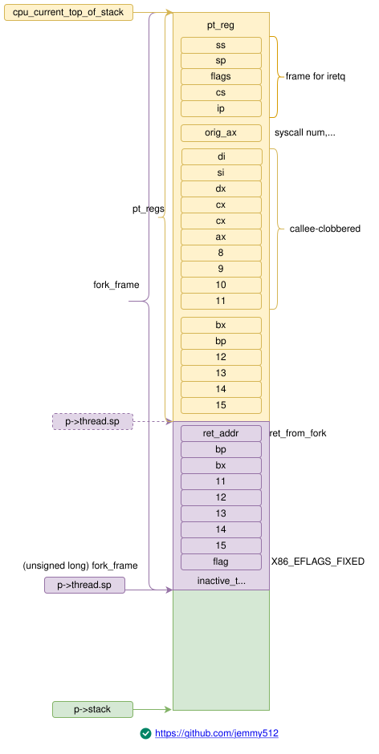 | 

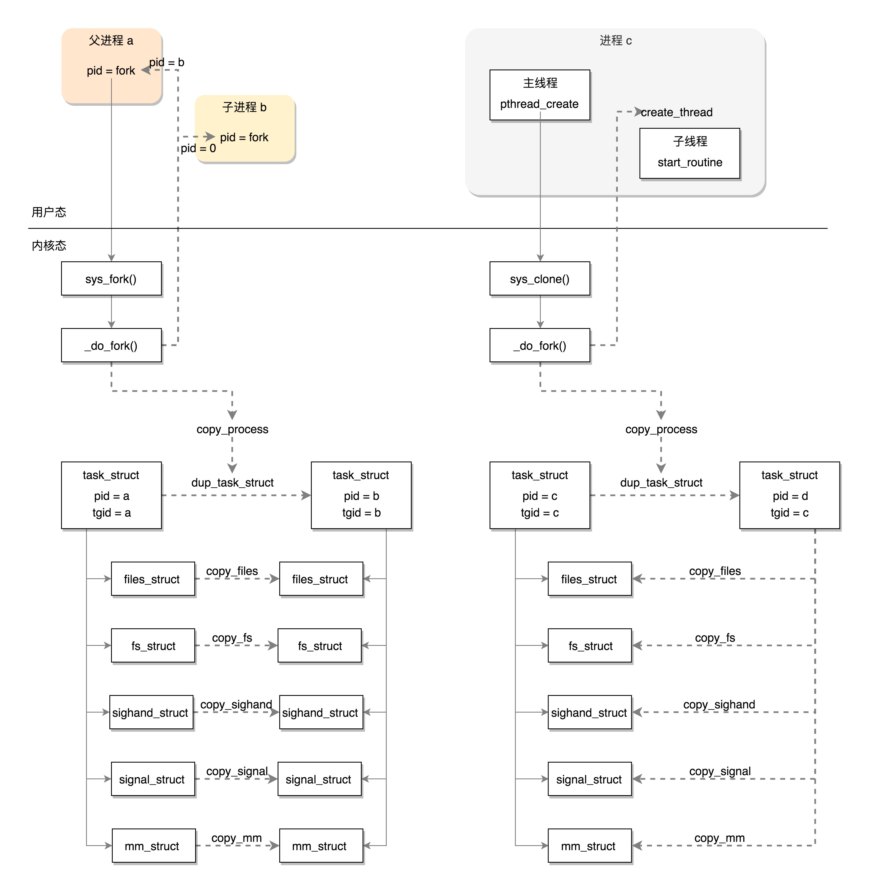

```c
SYSCALL_DEFINE0(fork)
{
    struct kernel_clone_args args = {
        .exit_signal = SIGCHLD,
    };
    return kernel_clone(&args);
}

kernel_clone(struct kernel_clone_args *args) {
    if (!(clone_flags & CLONE_UNTRACED)) {
        if (clone_flags & CLONE_VFORK)
            trace = PTRACE_EVENT_VFORK;
        else if (args->exit_signal != SIGCHLD)
            trace = PTRACE_EVENT_CLONE;
        else
            trace = PTRACE_EVENT_FORK;

        if (likely(!ptrace_event_enabled(current, trace)))
            trace = 0;
    }

    copy_process(struct pid *pid, int trace, int node, struct kernel_clone_args *args) {
        task_struct* tsk = dup_task_struct(current, node) {
            tsk = alloc_task_struct_node(node);

            alloc_thread_stack_node(tsk, node) {
                stack = __vmalloc_node_range(
                    THREAD_SIZE, THREAD_ALIGN, VMALLOC_START, VMALLOC_END
                );
                vm = find_vm_area(stack);
                tsk->stack_vm_area = vm;
                tsk->stack = stack; /* kernel stack */
            }
            arch_dup_task_struct(tsk, orig) {
                *tsk = *orig;
            }
            setup_thread_stack(tsk, orig);
            clear_user_return_notifier(tsk);
            clear_tsk_need_resched(tsk);
            set_task_stack_end_magic(tsk);
            clear_syscall_work_syscall_user_dispatch(tsk);
            return tsk;
        }

        cgroup_fork();
        sched_fork() {
            __sched_fork(clone_flags, p) {
                p->on_rq                    = 0;
                p->se.on_rq                 = 0;
                p->se.exec_start            = 0;
                p->se.sum_exec_runtime      = 0;
                p->se.prev_sum_exec_runtime = 0;
                p->se.nr_migrations         = 0;
                p->se.vruntime              = 0;
                p->se.vlag                  = 0;
                INIT_LIST_HEAD(&p->se.group_node);

                /* A delayed task cannot be in clone(). */
                WARN_ON_ONCE(p->se.sched_delayed);

            #ifdef CONFIG_FAIR_GROUP_SCHED
                p->se.cfs_rq            = NULL;
            #ifdef CONFIG_CFS_BANDWIDTH
                init_cfs_throttle_work(p) {
                    init_task_work(&p->sched_throttle_work, throttle_cfs_rq_work);
                    /* Protect against double add, see throttle_cfs_rq() and throttle_cfs_rq_work() */
                    p->sched_throttle_work.next = &p->sched_throttle_work;
                    INIT_LIST_HEAD(&p->throttle_node);
                }
            #endif
            #endif

            #ifdef CONFIG_SCHEDSTATS
                /* Even if schedstat is disabled, there should not be garbage */
                memset(&p->stats, 0, sizeof(p->stats));
            #endif

                init_dl_entity(&p->dl);

                INIT_LIST_HEAD(&p->rt.run_list);
                p->rt.timeout        = 0;
                p->rt.time_slice    = sched_rr_timeslice;
                p->rt.on_rq        = 0;
                p->rt.on_list        = 0;

            #ifdef CONFIG_SCHED_CLASS_EXT
                init_scx_entity(&p->scx);
            #endif

            #ifdef CONFIG_PREEMPT_NOTIFIERS
                INIT_HLIST_HEAD(&p->preempt_notifiers);
            #endif

            #ifdef CONFIG_COMPACTION
                p->capture_control = NULL;
            #endif
                init_numa_balancing(clone_flags, p);
                p->wake_entry.u_flags = CSD_TYPE_TTWU;
                p->migration_pending = NULL;
                init_sched_mm_cid(p);
            }

            p->__state = TASK_NEW;
            /* Make sure we do not leak PI boosting priority to the child. */
            p->prio = current->normal_prio;
            p->sched_class = &fair_sched_class, &rt_sched_class;
            p->sched_class->task_fork(p) {
                task_fork_fair() {
                    set_task_max_allowed_capacity(p);
                }
            }
            init_entity_runnable_average(&p->se) {
                struct sched_avg *sa = &se->avg;
                memset(sa, 0, sizeof(*sa));

                /* Tasks are initialized with full load to be seen as heavy tasks until
                 * they get a chance to stabilize to their real load level.
                 * Group entities are initialized with zero load to reflect the fact that
                 * nothing has been attached to the task group yet. */
                if (entity_is_task(se)) {
                    sa->load_avg = scale_load_down(se->load.weight);
                }
                /* when this task is enqueued, it will contribute to its cfs_rq's load_avg */
            }
        }
        /* The child inherits the parent’s file descriptor table (struct files_struct),
         * sharing the same struct file */
        copy_files();
        copy_fs();
        copy_sighand();
        copy_signal();
        copy_mm(); /* see ./linux-mem.md#fork */
        copy_namespaces();
        copy_io();
        copy_thread(p, args) {
            unsigned long clone_flags = args->flags;
            unsigned long stack_start = args->stack;
            unsigned long tls = args->tls;
            struct pt_regs *childregs = task_pt_regs(p) {
                ((struct pt_regs *)(THREAD_SIZE + task_stack_page(p)) - 1)
            }

            memset(&p->thread.cpu_context, 0, sizeof(struct cpu_context));

            if (likely(!args->fn)) {
                *childregs = *current_pt_regs() {
                    return task_pt_regs(current);
                }
                childregs->regs[0] = 0;

                *task_user_tls(p) = read_sysreg(tpidr_el0);
                if (system_supports_tpidr2())
                    p->thread.tpidr2_el0 = read_sysreg_s(SYS_TPIDR2_EL0);

                if (stack_start) {
                    if (is_compat_thread(task_thread_info(p)))
                        childregs->compat_sp = stack_start;
                    else
                        childregs->sp = stack_start;
                }

                if (clone_flags & CLONE_SETTLS) {
                    p->thread.uw.tp_value = tls;
                    p->thread.tpidr2_el0 = 0;
                }
            } else {
                /* A kthread has no context to ERET to, so ensure any buggy
                 * ERET is treated as an illegal exception return.
                 *
                 * When a user task is created from a kthread, childregs will
                 * be initialized by start_thread() or start_compat_thread(). */
                memset(childregs, 0, sizeof(struct pt_regs));
                childregs->pstate = PSR_MODE_EL1h | PSR_IL_BIT;

                p->thread.cpu_context.x19 = (unsigned long)args->fn;
                p->thread.cpu_context.x20 = (unsigned long)args->fn_arg;
            }
            p->thread.cpu_context.pc = (unsigned long)ret_from_fork;
            p->thread.cpu_context.sp = (unsigned long)childregs;
            /* For the benefit of the unwinder, set up childregs->stackframe
             * as the final frame for the new task. */
            p->thread.cpu_context.fp = (unsigned long)childregs->stackframe;

            ptrace_hw_copy_thread(p);

            return 0;
        }

        pid = alloc_pid(p->nsproxy->pid_ns_for_children);
        p->pid = pid_nr(pid) {
            pid_t nr = 0;
            if (pid)
                nr = pid->numbers[0].nr; /* numbers[0] global id */
            return nr;
        }
        init_task_pid(p, PIDTYPE_PID, pid);

        if (clone_flags & CLONE_THREAD) {
            p->group_leader = current->group_leader;
            p->tgid = current->tgid;
        } else {
            p->group_leader = p;
            p->tgid = p->pid;
        }

        /* Don't start children in a dying pid namespace */
        if (!(ns_of_pid(pid)->pid_allocated & PIDNS_ADDING)) {
            retval = -ENOMEM;
            goto bad_fork_cancel_cgroup;
        }

        init_task_pid_links(p);
        if (likely(p->pid)) {
            init_task_pid(p, PIDTYPE_PID, pid);
            if (thread_group_leader(p)) {
                init_task_pid(p, PIDTYPE_TGID, pid);
                init_task_pid(p, PIDTYPE_PGID, task_pgrp(current));
                init_task_pid(p, PIDTYPE_SID, task_session(current));

                if (is_child_reaper(pid)) {
                    ns_of_pid(pid)->child_reaper = p;
                    p->signal->flags |= SIGNAL_UNKILLABLE;
                }
                p->signal->shared_pending.signal = delayed.signal;
                p->signal->tty = tty_kref_get(current->signal->tty);
                p->signal->has_child_subreaper = p->real_parent->signal->has_child_subreaper
                    || p->real_parent->signal->is_child_subreaper;

                list_add_tail(&p->sibling, &p->real_parent->children);
                list_add_tail_rcu(&p->tasks, &init_task.tasks);
                attach_pid(p, PIDTYPE_TGID);
                attach_pid(p, PIDTYPE_PGID);
                attach_pid(p, PIDTYPE_SID);
                __this_cpu_inc(process_counts);
            } else {
                current->signal->nr_threads++;
                current->signal->quick_threads++;
                atomic_inc(&current->signal->live);
                refcount_inc(&current->signal->sigcnt);
                task_join_group_stop(p);
                list_add_tail_rcu(&p->thread_node, &p->signal->thread_head);
            }
            attach_pid(p, PIDTYPE_PID);
            nr_threads++;
        }

        futex_init_task(p);
    }

    wake_up_new_task(p) {
        WRITE_ONCE(p->__state, TASK_RUNNING);
        p->recent_used_cpu = task_cpu(p);
        rseq_migrate(p);
        __set_task_cpu(p, select_task_rq(p, task_cpu(p), &wake_flags));

        rq = __task_rq_lock(p, &rf);
        update_rq_clock(rq);
        post_init_entity_util_avg(p) {
            struct sched_entity *se = &p->se;
            struct cfs_rq *cfs_rq = cfs_rq_of(se);
            struct sched_avg *sa = &se->avg;
            long cpu_scale = arch_scale_cpu_capacity(cpu_of(rq_of(cfs_rq)));
            long cap = (long)(cpu_scale - cfs_rq->avg.util_avg) / 2;

            if (p->sched_class != &fair_sched_class) {
                se->avg.last_update_time = cfs_rq_clock_pelt(cfs_rq);
                return;
            }

            if (cap > 0) {
                if (cfs_rq->avg.util_avg != 0) {
                    sa->util_avg  = cfs_rq->avg.util_avg * se->load.weight;
                    sa->util_avg /= (cfs_rq->avg.load_avg + 1);

                    if (sa->util_avg > cap)
                        sa->util_avg = cap;
                } else {
                    sa->util_avg = cap;
                }
            }

            sa->runnable_avg = sa->util_avg;
        }

        activate_task(rq, p, ENQUEUE_NOCLOCK | ENQUEUE_INITIAL);
        wakeup_preempt(rq, p, wake_flags);
        p->sched_class->task_woken(rq, p);
    }

    /* forking complete and child started to run, tell ptracer */
    if (unlikely(trace))
        ptrace_event_pid(trace, pid);

    if (clone_flags & CLONE_VFORK) {
        if (!wait_for_vfork_done(p, &vfork))
            ptrace_event_pid(PTRACE_EVENT_VFORK_DONE, pid);
    }
}

SYM_CODE_START(ret_from_fork)
    bl    schedule_tail
    cbz    x19, 1f                // not a kernel thread
    mov    x0, x20
    blr    x19
1:    get_current_task tsk
    mov    x0, sp
    bl    asm_exit_to_user_mode
    b    ret_to_user
SYM_CODE_END(ret_from_fork)
```

# exec



* [ELF Format Cheatsheet](https://gist.github.com/x0nu11byt3/bcb35c3de461e5fb66173071a2379779)


* **Program header** are used at runtime while **sections** are primarily used during linking and debugging
* The **program header** is a structure that tells the system how to load an ELF file into memory for execution.
* **Sections** in an ELF file contain the actual data or metadata, such as code, data, symbol tables, or debugging information.

Program Header | Note
:-: | :-:
PT_NULL (0x0) | Unused entry.
PT_LOAD (0x1) | Loadable segment (e.g., code or data to be mapped into memory).
PT_DYNAMIC (0x2) | Dynamic linking information.
PT_INTERP (0x3) | Path to the interpreter (e.g., the dynamic linker /lib/ld-linux.so.2).
PT_NOTE (0x4) | Auxiliary information, such as vendor-specific notes.
PT_SHLIB (0x5) | Reserved (not commonly used).
PT_PHDR (0x6) | Location of the program header table itself.
PT_TLS (0x7) | Thread-local storage template.
PT_GNU_EH_FRAME (0x6474E550) | GCC exception handling data.
PT_GNU_STACK (0x6474E551) | Stack attributes (e.g., executable or non-executable stack).
PT_GNU_RELRO (0x6474E552) | Read-only after relocation segment.

---

Section Header | Note
:-: | :-:
SHT_NULL (0x0) | Inactive or null section.
SHT_PROGBITS (0x1) | Program data (e.g., .text for code, .data for initialized data).
SHT_SYMTAB (0x2) | Symbol table (used for linking).
SHT_STRTAB (0x3) | String table (e.g., for section or symbol names).
SHT_RELA (0x4) | Relocation entries with explicit addends.
SHT_HASH (0x5) | Symbol hash table for dynamic linking.
SHT_DYNAMIC (0x6) | Dynamic linking information.
SHT_NOTE (0x7) | Notes or auxiliary information.
SHT_NOBITS (0x8) | Uninitialized data (e.g., .bss; occupies no space in the file).
SHT_REL (0x9) | Relocation entries without addends.
SHT_SHLIB (0x0A) | Reserved.
SHT_DYNSYM (0x0B) | Dynamic symbol table.
SHT_INIT_ARRAY (0x0E) | Array of pointers to initialization functions.
SHT_FINI_ARRAY (0x0F) | Array of pointers to termination functions.
SHT_PREINIT_ARRAY (0x10) | Array of pointers to pre-initialization functions.
SHT_GROUP (0x11) | Section group (for COMDAT sections).
SHT_SYMTAB_SHNDX (0x12) | Extended section indices for symbol tables.

```c
struct linux_binfmt {
    struct list_head lh;
    struct module *module;
    int (*load_binary)(struct linux_binprm *);
    int (*load_shlib)(struct file *);
    int (*core_dump)(struct coredump_params *cprm);
    unsigned long min_coredump;     /* minimal dump size */
};

static struct linux_binfmt elf_format = {
    .module         = THIS_MODULE,
    .load_binary    = load_elf_binary,
    .load_shlib     = load_elf_library,
    .core_dump      = elf_core_dump,
    .min_coredump   = ELF_EXEC_PAGESIZE,
};

struct linux_binprm {
    struct vm_area_struct   *vma;
    unsigned long           vma_pages;

    struct mm_struct        *mm;
    unsigned long           p; /* sp pointer */
    unsigned long           argmin; /* rlimit marker for copy_strings() */
    struct file *executable; /* Executable to pass to the interpreter */
    struct file *interpreter;
    struct file *file;
    struct cred *cred;  /* new credentials */
    int unsafe;         /* how unsafe this exec is (mask of LSM_UNSAFE_*) */
    unsigned int per_clear; /* bits to clear in current->personality */
    int argc, envc;
    const char *filename;   /* Name of binary as seen by procps */
    const char *interp;     /* Name of the binary really executed. Most
                of the time same as filename, but could be
                different for binfmt_{misc,script} */
    const char *fdpath;     /* generated filename for execveat */
    unsigned interp_flags;
    int execfd;         /* File descriptor of the executable */
    unsigned long loader;   /* loader filename */
    unsigned long exec;     /* filename of program */

    struct rlimit rlim_stack; /* Saved RLIMIT_STACK used during exec. */

    char buf[BINPRM_BUF_SIZE];
}
```

```c
/* do_execve -> do_execveat_common -> exec_binprm -> search_binary_handler */
SYSCALL_DEFINE3(execve,
  const char __user *, filename,
  const char __user *const __user *, argv,
  const char __user *const __user *, envp)
{
    return do_execve(getname(filename), argv, envp) {
        struct user_arg_ptr argv = { .ptr.native = __argv };
        struct user_arg_ptr envp = { .ptr.native = __envp };
        return do_execveat_common(AT_FDCWD, filename, argv, envp, 0) {
            struct linux_binprm *bprm;
            int retval;

            /* We're below the limit (still or again), so we don't want to make
             * further execve() calls fail. */
            current->flags &= ~PF_NPROC_EXCEEDED;

            bprm = alloc_bprm(fd, filename) {
                *bprm = kzalloc();
                bprm->filename = filename->name;
                bprm->interp = bprm->filename;
                bprm_mm_init(bprm) {
                    bprm->mm = mm = mm_alloc();
                    bprm->rlim_stack = current->signal->rlim[RLIMIT_STACK];

                    __bprm_mm_init(bprm) {
                        bprm->vma = vma = vm_area_alloc(mm);
                        vma_set_anonymous(vma);

                        vma->vm_end = STACK_TOP_MAX;
                        vma->vm_start = vma->vm_end - PAGE_SIZE;
                        vm_flags_init(vma, VM_SOFTDIRTY | VM_STACK_FLAGS | VM_STACK_INCOMPLETE_SETUP);
                        vma->vm_page_prot = vm_get_page_prot(vma->vm_flags);

                        err = insert_vm_struct(mm, vma);
                        mm->stack_vm = mm->total_vm = 1;
                        bprm->p = vma->vm_end - sizeof(void *);
                    }
                }
            }

            retval = bprm_stack_limits(bprm) {
                limit = _STK_LIM / 4 * 3;
                limit = min(limit, bprm->rlim_stack.rlim_cur / 4);
                ptr_size = (max(bprm->argc, 1) + bprm->envc) * sizeof(void *);
                limit -= ptr_size;
                bprm->argmin = bprm->p - limit;
            }
            copy_string_kernel(bprm->filename, bprm)

            bprm->exec = bprm->p;

            retval = copy_strings(bprm->envc, envp, bprm);
            retval = copy_strings(bprm->argc, argv, bprm);

            retval = bprm_execve(bprm, fd, filename, flags) {
                retval = prepare_bprm_creds(bprm);

                check_unsafe_exec(bprm);
                current->in_execve = 1;
                sched_mm_cid_before_execve(current);

                file = do_open_execat(fd, filename, flags) {
                    do_filp_open(fd, name, &open_exec_flags);

                    deny_write_access(file);
                }

                sched_exec() {
                    struct task_struct *p = current;
                    struct migration_arg arg;
                    int dest_cpu;

                    scoped_guard (raw_spinlock_irqsave, &p->pi_lock) {
                        dest_cpu = p->sched_class->select_task_rq(p, task_cpu(p), WF_EXEC);
                        if (dest_cpu == smp_processor_id())
                            return;

                        if (unlikely(!cpu_active(dest_cpu)))
                            return;

                        arg = (struct migration_arg){ p, dest_cpu };
                    }
                    stop_one_cpu(task_cpu(p), migration_cpu_stop, &arg);
                }

                bprm->file = file;

                retval = exec_binprm(bprm) {
                    /* Need to fetch pid before load_binary changes it */
                    old_pid = current->pid;
                    rcu_read_lock();
                    old_vpid = task_pid_nr_ns(current, task_active_pid_ns(current->parent));
                    rcu_read_unlock();

                    /* This allows 4 levels of binfmt rewrites before failing hard. */
                    for (depth = 0;; depth++) {
                        struct file *exec;
                        if (depth > 5)
                        return -ELOOP;

                        ret = search_binary_handler(bprm) {
                            bool need_retry = IS_ENABLED(CONFIG_MODULES);
                            struct linux_binfmt *fmt;
                            int retval;

                            retval = prepare_binprm(bprm) {
                                memset(bprm->buf, 0, BINPRM_BUF_SIZE/*256*/);
                                return kernel_read(bprm->file, bprm->buf, BINPRM_BUF_SIZE, &pos);
                            }

                            retval = -ENOENT;
                        retry:
                            read_lock(&binfmt_lock);
                            list_for_each_entry(fmt, &formats, lh) {
                                if (!try_module_get(fmt->module))
                                    continue;
                                read_unlock(&binfmt_lock);

                                retval = fmt->load_binary(bprm); /* load_elf_binary */

                                read_lock(&binfmt_lock);
                                put_binfmt(fmt);
                                if (bprm->point_of_no_return || (retval != -ENOEXEC)) {
                                    read_unlock(&binfmt_lock);
                                    return retval;
                                }
                            }
                            read_unlock(&binfmt_lock);

                            return retval;
                        }

                        if (ret < 0)
                            return ret;
                        if (!bprm->interpreter)
                            break;

                        exec = bprm->file;
                        bprm->file = bprm->interpreter;
                        bprm->interpreter = NULL;

                        allow_write_access(exec);
                    }

                    return 0;
                }

                sched_mm_cid_after_execve(current);
                /* execve succeeded */
                current->fs->in_exec = 0;
                current->in_execve = 0;
                rseq_execve(current);
                user_events_execve(current);
                acct_update_integrals(current);
                task_numa_free(current, false);
                return retval;
            }

            return retval;
        }
    }
}
```

## load_elf_binary

```c
int load_elf_binary(struct linux_binprm *bprm)
{
    struct file *interpreter = NULL; /* to shut gcc up */
    unsigned long load_bias = 0, phdr_addr = 0;
    int first_pt_load = 1;
    unsigned long error;
    struct elf_phdr *elf_ppnt, *elf_phdata, *interp_elf_phdata = NULL;
    struct elf_phdr *elf_property_phdata = NULL;
    unsigned long elf_brk;
    int retval, i;
    unsigned long elf_entry;
    unsigned long e_entry;
    unsigned long interp_load_addr = 0;
    unsigned long start_code, end_code, start_data, end_data;
    unsigned long reloc_func_desc __maybe_unused = 0;
    int executable_stack = EXSTACK_DEFAULT;
    struct elfhdr *elf_ex = (struct elfhdr *)bprm->buf;
    struct elfhdr *interp_elf_ex = NULL;
    struct arch_elf_state arch_state = INIT_ARCH_ELF_STATE;
    struct mm_struct *mm;
    struct pt_regs *regs;

    retval = -ENOEXEC;
    /* First of all, some simple consistency checks */
    if (memcmp(elf_ex->e_ident, ELFMAG, SELFMAG) != 0)
        goto out;

    if (elf_ex->e_type != ET_EXEC && elf_ex->e_type != ET_DYN)
        goto out;
    if (!elf_check_arch(elf_ex))
        goto out;
    if (elf_check_fdpic(elf_ex))
        goto out;
    if (!bprm->file->f_op->mmap)
        goto out;

    elf_phdata = load_elf_phdrs(elf_ex, bprm->file) {
        size = sizeof(struct elf_phdr) * elf_ex->e_phnum;
        elf_phdata = kmalloc(size, GFP_KERNEL);
        elf_read(elf_file, elf_phdata, size, elf_ex->e_phoff);
        return elf_data;
    }
    if (!elf_phdata)
        goto out;

    /* This is the program interpreter used for shared libraries -
     * for now assume that this is an a.out format binary. */
    elf_ppnt = elf_phdata;
    for (i = 0; i < elf_ex->e_phnum; i++, elf_ppnt++) {
        char *elf_interpreter;

        if (elf_ppnt->p_type == PT_GNU_PROPERTY) {
            elf_property_phdata = elf_ppnt;
            continue;
        }

        if (elf_ppnt->p_type != PT_INTERP)
            continue;

        elf_interpreter = kmalloc(elf_ppnt->p_filesz, GFP_KERNEL);

        retval = elf_read(bprm->file, elf_interpreter, elf_ppnt->p_filesz,
                elf_ppnt->p_offset);

        interpreter = open_exec(elf_interpreter) {
            do_open_execat() {
                do_filp_open();
                deny_write_access();
            }
        }

        interp_elf_ex = kmalloc(sizeof(*interp_elf_ex), GFP_KERNEL);
        if (!interp_elf_ex) {
            retval = -ENOMEM;
            goto out_free_file;
        }

        /* Get the exec headers */
        retval = elf_read(interpreter, interp_elf_ex, sizeof(*interp_elf_ex), 0);
        if (retval < 0)
            goto out_free_dentry;

        break;

out_free_interp:
        kfree(elf_interpreter);
        goto out_free_ph;
    }

    /* Some simple consistency checks for the interpreter */
    if (interpreter) {
        retval = -ELIBBAD;
        /* Not an ELF interpreter */
        if (memcmp(interp_elf_ex->e_ident, ELFMAG, SELFMAG) != 0)
            goto out_free_dentry;
        /* Verify the interpreter has a valid arch */
        if (!elf_check_arch(interp_elf_ex) ||
            elf_check_fdpic(interp_elf_ex))
            goto out_free_dentry;

        /* Load the interpreter program headers */
        interp_elf_phdata = load_elf_phdrs(interp_elf_ex, interpreter);
    }

    retval = parse_elf_properties(interpreter ?: bprm->file, elf_property_phdata, &arch_state);

    /* Flush all traces of the currently running executable */
    retval = begin_new_exec(bprm) {
        /* Make this the only thread in the thread group. */
        retval = de_thread(me);
        io_uring_task_cancel();
        /* Ensure the files table is not shared. */
        retval = unshare_files();

        set_mm_exe_file(bprm->mm, bprm->file) {
            deny_write_access(new_exe_file);
            rcu_assign_pointer(mm->exe_file, new_exe_file);
            allow_write_access(old_exe_file);
        }

        /* Maps the mm_struct mm into the current task struct. */
        exec_mmap(bprm->mm);
        bprm->mm = NULL;

        exec_task_namespaces() {
            if (tsk->nsproxy->time_ns_for_children == tsk->nsproxy->time_ns)
                return 0;

            new = create_new_namespaces(0, tsk, current_user_ns(), tsk->fs);
            timens_on_fork(new, tsk);
            switch_task_namespaces(tsk, new);
        }

        posix_cpu_timers_exit(me);
        exit_itimers(me);
        flush_itimer_signals();

        unshare_sighand(me) {
            struct sighand_struct *oldsighand = me->sighand;

            if (refcount_read(&oldsighand->count) != 1) {
                struct sighand_struct *newsighand;
                newsighand = kmem_cache_alloc(sighand_cachep, GFP_KERNEL);
                if (!newsighand)
                    return -ENOMEM;

                refcount_set(&newsighand->count, 1);

                write_lock_irq(&tasklist_lock);
                spin_lock(&oldsighand->siglock);
                memcpy(newsighand->action, oldsighand->action,
                    sizeof(newsighand->action));
                rcu_assign_pointer(me->sighand, newsighand);
                spin_unlock(&oldsighand->siglock);
                write_unlock_irq(&tasklist_lock);

                __cleanup_sighand(oldsighand) {
                    if (refcount_dec_and_test(&sighand->count)) {
                        signalfd_cleanup(sighand) {
                            wake_up_pollfree(&sighand->signalfd_wqh);
                        }
                        kmem_cache_free(sighand_cachep, sighand);
                    }
                }
            }
        }

        do_close_on_exec(me->files) {
            for (i = 0; ; i++) {
                filp_close(file, files);
            }
        }

        perf_event_exec();

        setup_new_exec(bprm) {
            arch_pick_mmap_layout() {
                mm->mmap_base = TASK_UNMAPPED_BASE + random_factor;
                mm->get_unmapped_area = arch_get_unmapped_area;
            }
        }
    }

    /* Finalizes the stack vm_area_struct */
    setup_arg_pages(bprm, randomize_stack_top(STACK_TOP), executable_stack) {
        stack_top = arch_align_stack(stack_top);
        stack_top = PAGE_ALIGN(stack_top);
        stack_shift = vma->vm_end - stack_top;

        bprm->p -= stack_shift;
        mm->arg_start = bprm->p;

        if (bprm->loader)
            bprm->loader -= stack_shift;
        /* tracks the location of the program’s initial stack pointer
         * (used for setting up argc, argv, and envp). */
        bprm->exec -= stack_shift;

        tlb_gather_mmu(&tlb, mm);
        ret = mprotect_fixup(&vmi, &tlb, vma, &prev, vma->vm_start, vma->vm_end,
                vm_flags);
        tlb_finish_mmu(&tlb);

        ret = relocate_vma_down(vma, stack_shift);

        stack_expand = 131072UL; /* randomly 32*4k (or 2*64k) pages */
        stack_size = vma->vm_end - vma->vm_start;
        rlim_stack = bprm->rlim_stack.rlim_cur & PAGE_MASK;

        stack_expand = min(rlim_stack, stack_size + stack_expand);
        stack_base = vma->vm_end - stack_expand;

        current->mm->start_stack = bprm->p;
        ret = expand_stack_locked(vma, stack_base) {
            expand_downwards(vma, address) {

            }
        }
    }

    elf_brk = 0;

    start_code = ~0UL;
    end_code = 0;
    start_data = 0;
    end_data = 0;

    /* Now we do a little grungy work by mmapping the ELF image into
     * the correct location in memory. */
    for (i = 0, elf_ppnt = elf_phdata; i < elf_ex->e_phnum; i++, elf_ppnt++) {
        int elf_prot, elf_flags;
        unsigned long k, vaddr;
        unsigned long total_size = 0;
        unsigned long alignment;

        if (elf_ppnt->p_type != PT_LOAD)
            continue;

        elf_prot = make_prot(elf_ppnt->p_flags, &arch_state, !!interpreter, false);

        elf_flags = MAP_PRIVATE;

        vaddr = elf_ppnt->p_vaddr;

        if (!first_pt_load) {
            elf_flags |= MAP_FIXED;
        } else if (elf_ex->e_type == ET_EXEC) {
            elf_flags |= MAP_FIXED_NOREPLACE;
        } else if (elf_ex->e_type == ET_DYN) {
            if (interpreter) {
                load_bias = ELF_ET_DYN_BASE; /* (2 * TASK_SIZE_64 / 3) */
                if (current->flags & PF_RANDOMIZE) {
                    load_bias += arch_mmap_rnd();
                }
                alignment = maximum_alignment(elf_phdata, elf_ex->e_phnum);
                if (alignment) {
                    load_bias &= ~(alignment - 1);
                }
                elf_flags |= MAP_FIXED_NOREPLACE;
            } else {
                load_bias = 0;
            }

            load_bias = ELF_PAGESTART(load_bias - vaddr);

            total_size = total_mapping_size(elf_phdata, elf_ex->e_phnum);
            if (!total_size) {
                retval = -EINVAL;
                goto out_free_dentry;
            }
        }

        /* Map "eppnt->p_filesz" bytes from "filep" offset "eppnt->p_offset"
         * into memory at "addr". Memory from "p_filesz" through "p_memsz"
         * rounded up to the next page is zeroed. */
        error = elf_load(bprm->file, load_bias + vaddr, elf_ppnt, elf_prot, elf_flags, total_size) {
            if (eppnt->p_filesz) {
                map_addr = elf_map(filep, addr, eppnt, prot, type, total_size) {
                    do_mmap();
                }
                if (BAD_ADDR(map_addr))
                    return map_addr;
                if (eppnt->p_memsz > eppnt->p_filesz) {
                    zero_start = map_addr + ELF_PAGEOFFSET(eppnt->p_vaddr) + eppnt->p_filesz;
                    zero_end = map_addr + ELF_PAGEOFFSET(eppnt->p_vaddr) + eppnt->p_memsz;

                    if (padzero(zero_start) && (prot & PROT_WRITE))
                        return -EFAULT;
                }
            } else {
                map_addr = zero_start = ELF_PAGESTART(addr);
                zero_end = zero_start + ELF_PAGEOFFSET(eppnt->p_vaddr) + eppnt->p_memsz;
            }

            if (eppnt->p_memsz > eppnt->p_filesz) {
                int error;

                zero_start = ELF_PAGEALIGN(zero_start);
                zero_end = ELF_PAGEALIGN(zero_end);
                /* handling a memory break operation (expanding or contracting process memory) */
                error = vm_brk_flags(zero_start, zero_end - zero_start, prot & PROT_EXEC ? VM_EXEC : 0);
                if (error)
                    map_addr = error;
            }
            return map_addr;
        }

        if (first_pt_load) {
            first_pt_load = 0;
            if (elf_ex->e_type == ET_DYN) {
                load_bias += error - ELF_PAGESTART(load_bias + vaddr);
                reloc_func_desc = load_bias;
            }
        }

        /* Figure out which segment in the file contains the Program
         * Header table, and map to the associated memory address. */
        if (elf_ppnt->p_offset <= elf_ex->e_phoff &&
            elf_ex->e_phoff < elf_ppnt->p_offset + elf_ppnt->p_filesz) {
            phdr_addr = elf_ex->e_phoff - elf_ppnt->p_offset + elf_ppnt->p_vaddr;
        }

        k = elf_ppnt->p_vaddr;
        if ((elf_ppnt->p_flags & PF_X) && k < start_code)
            start_code = k;
        if (start_data < k)
            start_data = k;

        if (BAD_ADDR(k) || elf_ppnt->p_filesz > elf_ppnt->p_memsz ||
            elf_ppnt->p_memsz > TASK_SIZE ||
            TASK_SIZE - elf_ppnt->p_memsz < k) {
            /* set_brk can never work. Avoid overflows. */
            retval = -EINVAL;
            goto out_free_dentry;
        }

        k = elf_ppnt->p_vaddr + elf_ppnt->p_filesz;

        if ((elf_ppnt->p_flags & PF_X) && end_code < k)
            end_code = k;
        if (end_data < k)
            end_data = k;
        k = elf_ppnt->p_vaddr + elf_ppnt->p_memsz;
        if (elf_brk < k)
            elf_brk = k;
    }

    e_entry = elf_ex->e_entry + load_bias;
    phdr_addr += load_bias;
    elf_brk += load_bias;
    start_code += load_bias;
    end_code += load_bias;
    start_data += load_bias;
    end_data += load_bias;

    current->mm->start_brk = current->mm->brk = ELF_PAGEALIGN(elf_brk);

    if (interpreter) {
        /* load and map interpreter into current addr space */
        elf_entry = load_elf_interp(interp_elf_ex,
            interpreter, load_bias, interp_elf_phdata, &arch_state
        );
        if (!IS_ERR_VALUE(elf_entry)) {
            interp_load_addr = elf_entry;
            elf_entry += interp_elf_ex->e_entry;
        }
        reloc_func_desc = interp_load_addr;

        allow_write_access(interpreter);
    } else {
        elf_entry = e_entry;
    }

    kfree(elf_phdata);

    set_binfmt(&elf_format) {
        mm->binfmt = new;
    }

    retval = create_elf_tables(bprm, elf_ex, interp_load_addr, e_entry, phdr_addr) {
        items = (argc + 1) + (envc + 1) + 1;
        bprm->p = STACK_ROUND(sp, items);
        sp = (elf_addr_t __user *)bprm->p;

        /* Populate aux vector */
        NEW_AUX_ENT(AT_SYSINFO_EHDR, (elf_addr_t)current->mm->context.vdso);
        NEW_AUX_ENT(AT_CLKTCK, CLOCKS_PER_SEC);
        NEW_AUX_ENT(AT_PHDR, phdr_addr);
        NEW_AUX_ENT(AT_PHENT, sizeof(struct elf_phdr));
        NEW_AUX_ENT(AT_PHNUM, exec->e_phnum);

        /* Now, let's put argc (and argv, envp if appropriate) on the stack */
        if (put_user(argc, sp++))
            return -EFAULT;

        /* Populate list of argv pointers back to argv strings. */
        p = mm->arg_end = mm->arg_start;
        while (argc-- > 0) {
            size_t len;
            if (put_user((elf_addr_t)p, sp++))
                return -EFAULT;
            len = strnlen_user((void __user *)p, MAX_ARG_STRLEN);
            if (!len || len > MAX_ARG_STRLEN)
                return -EINVAL;
            p += len;
        }
        if (put_user(0, sp++))
            return -EFAULT;
        mm->arg_end = p;

        /* Populate list of envp pointers back to envp strings. */
        mm->env_end = mm->env_start = p;
        while (envc-- > 0) {
            size_t len;
            if (put_user((elf_addr_t)p, sp++))
                return -EFAULT;
            len = strnlen_user((void __user *)p, MAX_ARG_STRLEN);
            if (!len || len > MAX_ARG_STRLEN)
                return -EINVAL;
            p += len;
        }
        if (put_user(0, sp++))
            return -EFAULT;
        mm->env_end = p;

        /* Put the elf_info on the stack in the right place.  */
        if (copy_to_user(sp, mm->saved_auxv, ei_index * sizeof(elf_addr_t)))
            return -EFAULT;
        return 0;
    }
    if (retval < 0)
        goto out;

    mm = current->mm;
    mm->end_code = end_code;
    mm->start_code = start_code;
    mm->start_data = start_data;
    mm->end_data = end_data;
    mm->start_stack = bprm->p;

    if (current->personality & MMAP_PAGE_ZERO) {
        error = vm_mmap(NULL, 0, PAGE_SIZE, PROT_READ | PROT_EXEC, MAP_FIXED | MAP_PRIVATE, 0);
    }

    regs = current_pt_regs() {
        return ((struct pt_regs *)(THREAD_SIZE + task_stack_page(p)) - 1)
    }

    finalize_exec(bprm) {
        current->signal->rlim[RLIMIT_STACK] = bprm->rlim_stack;
    }

    START_THREAD(elf_ex, regs, elf_entry, bprm->p) {
        start_thread(regs, elf_entry, start_stack) {
            regs->syscallno = previous_syscall;
            regs->pc = pc;
            regs->sp = sp;
        }
    }
}
```

## exec_mmap

```c
static int exec_mmap(struct linux_binprm *bprm)
{
    struct task_exec_state *exec_state __free(put_task_exec_state) = NULL;
    struct mm_struct *mm = bprm->mm;
    struct task_struct *tsk;
    struct mm_struct *old_mm, *active_mm;
    int ret;

    exec_state = alloc_task_exec_state(bprm->user_ns);
    if (!exec_state)
        return -ENOMEM;

    /* Notify parent that we're no longer interested in the old VM */
    tsk = current;
    old_mm = current->mm;
    /* Clean up futexes and release the mm */
    mm_exit_exec_release(tsk, old_mm);

    ret = down_write_killable(&tsk->signal->exec_update_lock);
    if (ret)
        return ret;

    if (old_mm) {
        /* If there is a pending fatal signal perhaps a signal
         * whose default action is to create a coredump get
         * out and die instead of going through with the exec. */
        ret = mmap_read_lock_killable(old_mm);
        if (ret) {
            up_write(&tsk->signal->exec_update_lock);
            return ret;
        }
    }

    task_lock(tsk);
    membarrier_exec_mmap(mm);

    local_irq_disable();
    active_mm = tsk->active_mm;
    tsk->active_mm = mm;
    tsk->mm = mm;

    sched_cache_exec_mmap(tsk, mm) {
        struct sched_cache_group *old;

        old = sched_cache_replace_grp(p, sched_cache_group_get(mm->sched_cache_grp));
        sched_cache_group_put(old);
    }

    mm_init_cid(mm, tsk);
    exec_state = task_exec_state_replace(tsk, exec_state);
    /* This prevents preemption while active_mm is being loaded and
     * it and mm are being updated, which could cause problems for
     * lazy tlb mm refcounting when these are updated by context
     * switches. Not all architectures can handle irqs off over
     * activate_mm yet. */
    if (!IS_ENABLED(CONFIG_ARCH_WANT_IRQS_OFF_ACTIVATE_MM))
        local_irq_enable();
    activate_mm(active_mm, mm);
    if (IS_ENABLED(CONFIG_ARCH_WANT_IRQS_OFF_ACTIVATE_MM))
        local_irq_enable();
    lru_gen_add_mm(mm);
    task_unlock(tsk);
    lru_gen_use_mm(mm);
    if (old_mm) {
        mmap_read_unlock(old_mm);
        BUG_ON(active_mm != old_mm);
        /* Defer teardown to setup_new_exec(), outside the exec locks. */
        bprm->old_mm = old_mm;
    } else {
        mmdrop_lazy_tlb(active_mm);
    }
    futex_exec_done(tsk);
    return 0;
}
```

## exec_call_graph

```c
SYSCALL_DEFINE3(execve) {
    do_execve() {
        do_execveat_common() {
            struct linux_binprm* bprm = alloc_bprm(fd, filename) {
                bprm = kzalloc(sizeof(*bprm), GFP_KERNEL);
                bprm->filename = bprm->fdpath;
                bprm->interp = bprm->filename;

                bprm_mm_init(bprm) {
                    bprm->mm = mm = mm_alloc();
                    bprm->rlim_stack = current->signal->rlim[RLIMIT_STACK];

                    __bprm_mm_init(bprm) {
                        bprm->vma = vma = vm_area_alloc(mm);
                        vma->vm_end = STACK_TOP_MAX;
                        vma->vm_start = vma->vm_end - PAGE_SIZE;
                        vma->vm_flags = VM_SOFTDIRTY | VM_STACK_FLAGS | VM_STACK_INCOMPLETE_SETUP;
                        vma->vm_page_prot = vm_get_page_prot(vma->vm_flags);

                        insert_vm_struct(mm, vma);

                        mm->stack_vm = mm->total_vm = 1;
                        bprm->p = vma->vm_end - sizeof(void *);
                    }
                }
            }
            bprm_execve(bprm, fd, filename, flags) {
                file = do_open_execat(fd, filename, flags);

                sched_exec();

                bprm->file = file;

                exec_binprm(bprm) {
                    search_binary_handler(bprm) {
                        prepare_binprm(bprm) {
                            /* read the first 128 (BINPRM_BUF_SIZE) bytes */
                            kernel_read(bprm->file, bprm->buf, BINPRM_BUF_SIZE, &pos) {
                                vfs_read(file, (void __user *)buf, count, pos)
                            }
                        }

                        list_for_each_entry(fmt, &formats, lh) {
                            fmt->load_binary(bprm) {
                                load_elf_binary() {
                                    /* consistency checks */
                                    if (memcmp(elf_ex->e_ident, ELFMAG, SELFMAG) != 0)
                                        goto out;
                                    if (elf_ex->e_type != ET_EXEC && elf_ex->e_type != ET_DYN)
                                        goto out;
                                    if (!elf_check_arch(elf_ex))
                                        goto out;
                                    if (elf_check_fdpic(elf_ex))
                                        goto out;
                                    if (!bprm->file->f_op->mmap)
                                        goto out;

                                    elf_ppnt = elf_phdata = load_elf_phdrs();

                                    /* find PT_INTERP header */
                                    for (i = 0; i < elf_ex->e_phnum; i++, elf_ppnt++) {
                                        if (elf_ppnt->p_type != PT_INTERP)
                                            continue;
                                        /* read interprete name */
                                        char* elf_interpreter = kmalloc(elf_ppnt->p_filesz, GFP_KERNEL);
                                        elf_read(bprm->file, elf_interpreter, elf_ppnt->p_filesz, elf_ppnt->p_offset);
                                        /* open interpreter file */
                                        interpreter = open_exec(elf_interpreter);
                                        /* read interpreter elfhdr */
                                        interp_elf_ex = kmalloc(sizeof(*interp_elf_ex), GFP_KERNEL);
                                        elf_read(interpreter, interp_elf_ex, sizeof(*interp_elf_ex), 0);
                                    }

                                    if (interpreter) {
                                        /* Load the interpreter program headers */
                                        interp_elf_phdata = load_elf_phdrs(interp_elf_ex, interpreter);
                                    }

                                    /* Flush all traces of the currently running executable */
                                    retval = begin_new_exec(bprm);

                                    setup_new_exec(bprm) {
                                        arch_pick_mmap_layout() {
                                            mm->mmap_base = TASK_UNMAPPED_BASE + random_factor;
                                            mm->get_unmapped_area = arch_get_unmapped_area;
                                        }
                                    }

                                    /* Finalizes the stack vm_area_struct. */
                                    setup_arg_pages(bprm, randomize_stack_top(STACK_TOP), executable_stack) {
                                        relocate_vma_down() {
                                            vma_adjust(vma, new_start, old_end);
                                            move_page_tables();
                                            free_pgd_range();
                                            vma_adjust(vma, new_start, new_end);
                                        }
                                        current->mm->start_stack = bprm->p;
                                        expand_stack();
                                    }

                                    elf_bss = 0;
                                    elf_brk = 0;
                                    start_code = ~0UL;
                                    end_code = 0;
                                    start_data = 0;
                                    end_data = 0;

                                    /* mmapping the ELF image into the correct location in memory. */
                                    for (i < loc->elf_ex.e_phnum) {
                                        if (elf_ppnt->p_type != PT_LOAD)
                                            continue;

                                        vaddr = elf_ppnt->p_vaddr;
                                        if (interpreter) {
                                            load_bias = ELF_ET_DYN_BASE;
                                        } else
                                            load_bias = 0;

                                        elf_map(bprm->file, load_bias + vaddr, elf_ppnt, elf_prot, elf_flags, total_size);
                                    }

                                    e_entry = elf_ex->e_entry + load_bias;
                                    phdr_addr += load_bias;
                                    elf_bss += load_bias;
                                    elf_brk += load_bias;
                                    start_code += load_bias;
                                    end_code += load_bias;
                                    start_data += load_bias;
                                    end_data += load_bias;

                                    set_brk(elf_bss + load_bias, elf_brk + load_bias, bss_prot);

                                    if (elf_interpreter)
                                        elf_entry = load_elf_interp(&loc->interp_elf_ex, interpreter, &interp_map_addr, load_bias, interp_elf_phdata);
                                    else
                                        elf_entry = loc->elf_ex.e_entry;

                                    mm = current->mm;
                                    mm->end_code = end_code;
                                    mm->start_code = start_code;
                                    mm->start_data = start_data;
                                    mm->end_data = end_data;
                                    mm->start_stack = bprm->p;

                                    regs = current_pt_regs();
                                    start_thread(regs, elf_entry/* new_ip */, bprm->p/* new_sp */) {
                                        regs->ip = new_ip;
                                        regs->sp = new_sp;
                                        force_iret();
                                    }
                                }
                            }
                        }
                    }
                }
            }
        }
    }
}

```

# wait4

pid val | note
--- | ---
< -1 |  meaning wait for any child process whose `process group ID is equal` to the absolute value of pid.
-1 | meaning wait for `any child process`.
## 0 | meaning wait for any child process whose `process group ID is equal` to that of the calling process at the time of the call to waitpid()
\> 0 | meaning wait for the child whose `process ID is equal` to the value of pid.

```c
SYSCALL_DEFINE4(wait4, pid_t, upid, int __user *, stat_addr,
        int, options, struct rusage __user *, ru)
{
    struct rusage r;
    long err = kernel_wait4(upid, stat_addr, options, ru ? &r : NULL) {
        struct wait_opts wo;
        struct pid *pid = NULL;
        enum pid_type type;
        long ret;

        if (options & ~(WNOHANG|WUNTRACED|WCONTINUED| __WNOTHREAD|__WCLONE|__WALL))
            return -EINVAL;

        /* -INT_MIN is not defined */
        if (upid == INT_MIN)
            return -ESRCH;

        if (upid == -1)
            type = PIDTYPE_MAX;
        else if (upid < 0) { /* upid < -1 */
            type = PIDTYPE_PGID;
            pid = find_get_pid(-upid);
        } else if (upid == 0) {
            type = PIDTYPE_PGID;
            pid = get_task_pid(current, PIDTYPE_PGID);
        } else { /* upid > 0 */
            type = PIDTYPE_PID;
            pid = find_get_pid(upid);
        }

        wo.wo_type      = type;
        wo.wo_pid       = pid;
        wo.wo_flags     = options | WEXITED;
        wo.wo_info      = NULL;
        wo.wo_stat      = 0;
        wo.wo_rusage    = ru;

        ret = do_wait(&wo) {
            int retval;

            child_wait_callback = []() {
                struct wait_opts *wo = container_of(wait, struct wait_opts, child_wait);
                struct task_struct *p = key;

                ret = pid_child_should_wake(wo, p) {
                    ret = !eligible_pid(wo, p) {
                        return (wo->wo_type == PIDTYPE_MAX) ||
                            (task_pid_type(p, wo->wo_type) == wo->wo_pid);
                    }
                    if (ret)
                        return false;
                    if ((wo->wo_flags & __WNOTHREAD) && wo->child_wait.private != p->parent)
                        return false;
                    return true;
                }

                if (ret) {
                    return default_wake_function(wait, mode, sync, key);
                }

                return 0;
            }
            init_waitqueue_func_entry(&wo->child_wait, child_wait_callback);
            wo->child_wait.private = current;
            add_wait_queue(&current->signal->wait_chldexit, &wo->child_wait);

            do {
                set_current_state(TASK_INTERRUPTIBLE);
                retval = __do_wait(wo) {
                    long retval;

                    wo->notask_error = -ECHILD;
                    if ((wo->wo_type < PIDTYPE_MAX)
                        && (!wo->wo_pid || !pid_has_task(wo->wo_pid, wo->wo_type))) {

                        goto notask;
                    }

                    read_lock(&tasklist_lock);

                    if (wo->wo_type == PIDTYPE_PID) {
                        retval = do_wait_pid(wo) {
                            bool ptrace;
                            struct task_struct *target;
                            int retval;

                            ptrace = false;
                            /* only thread leader added into PIDTYPE_TGID */
                            target = pid_task(wo->wo_pid, PIDTYPE_TGID);
                            ret = is_effectively_child(wo, ptrace, target) {
                                struct task_struct *parent = !ptrace
                                    ? target->real_parent : target->parent;
                                return current == parent ||
                                    (!(wo->wo_flags & __WNOTHREAD)
                                        && same_thread_group(current, parent) {
                                            return p1->signal == p2->signal
                                        }
                                    );
                            }
                            if (target && ret) {
                                retval = wait_consider_task(wo, ptrace, target);
                                if (retval)
                                    return retval;
                            }

                            ptrace = true;
                            target = pid_task(wo->wo_pid, PIDTYPE_PID);
                            if (target && target->ptrace && (wo, ptrace, target)) {
                                retval = wait_consider_task(wo, ptrace, target);
                                if (retval)
                                    return retval;
                            }

                            return 0;
                        }
                        if (retval)
                            return retval;
                    } else {
                        struct task_struct *tsk = current;

                        do {
                            retval = do_wait_thread(wo, tsk){
                                struct task_struct *p;
                                list_for_each_entry(p, &tsk->children, sibling) {
                                    int ret = wait_consider_task(wo, 0, p);
                                    if (ret)
                                        return ret;
                                }
                                return 0;
                            }
                            if (retval)
                                return retval;

                            retval = ptrace_do_wait(wo, tsk);
                            if (retval)
                                return retval;

                            if (wo->wo_flags & __WNOTHREAD)
                                break;
                        } while_each_thread(current, tsk);
                    }
                    read_unlock(&tasklist_lock);

                notask:
                    retval = wo->notask_error;
                    if (!retval && !(wo->wo_flags & WNOHANG))
                        return -ERESTARTSYS;

                    return retval;
                }

                if (retval != -ERESTARTSYS)
                    break;
                if (signal_pending(current))
                    break;

                schedule();
            } while (1);

            __set_current_state(TASK_RUNNING);
            remove_wait_queue(&current->signal->wait_chldexit, &wo->child_wait);
            return retval;
        }

        put_pid(pid);
        if (ret > 0 && stat_addr && put_user(wo.wo_stat, stat_addr))
            ret = -EFAULT;

        return ret;
    }

    if (err > 0 && (ru && copy_to_user(ru, &r, sizeof(struct rusage)))) {
        return -EFAULT;
    }

    return err;
}
```

## wait_consider_task

```c
/* Returns zero if the search for a child should continue */
retval = wait_consider_task(wo, ptrace, p) {
    int exit_state = READ_ONCE(p->exit_state);
    int ret;

    if (unlikely(exit_state == EXIT_DEAD))
        return 0;

    ret = eligible_child(wo, ptrace, p) {
        if (!eligible_pid(wo, p))
            return 0;

        if (ptrace || (wo->wo_flags & __WALL))
            return 1;

        if ((p->exit_signal != SIGCHLD) ^ !!(wo->wo_flags & __WCLONE))
            return 0;

        return 1;
    }
    if (!ret)
        return ret;

    if (unlikely(exit_state == EXIT_TRACE)) {
        if (likely(!ptrace))
            wo->notask_error = 0;
        return 0;
    }

    if (likely(!ptrace) && unlikely(p->ptrace)) {
        if (!ptrace_reparented(p))
            ptrace = 1;
    }

    /* slay zombie? */
    if (exit_state == EXIT_ZOMBIE) {
        /* we don't reap group leaders with subthreads */
        if (!delay_group_leader(p)) {
            if (unlikely(ptrace) || likely(!p->ptrace))
                return wait_task_zombie(wo, p);
        }

        if (likely(!ptrace) || (wo->wo_flags & (WCONTINUED | WEXITED)))
            wo->notask_error = 0;
    } else {
        wo->notask_error = 0;
    }

    ret = wait_task_stopped(wo, ptrace, p) {
        struct waitid_info *infop;
        int exit_code, *p_code, why;
        uid_t uid = 0; /* unneeded, required by compiler */
        pid_t pid;

        /* Traditionally we see ptrace'd stopped tasks regardless of options. */
        if (!ptrace && !(wo->wo_flags & WUNTRACED))
            return 0;

        if (!task_stopped_code(p, ptrace))
            return 0;

        exit_code = 0;
        spin_lock_irq(&p->sighand->siglock);

        p_code = task_stopped_code(p, ptrace);
        if (unlikely(!p_code))
            goto unlock_sig;

        exit_code = *p_code;
        if (!exit_code)
            goto unlock_sig;

        if (!unlikely(wo->wo_flags & WNOWAIT))
            *p_code = 0;

        uid = from_kuid_munged(current_user_ns(), task_uid(p));

    unlock_sig:
        spin_unlock_irq(&p->sighand->siglock);
        if (!exit_code)
            return 0;

        get_task_struct(p);
        pid = task_pid_vnr(p);
        why = ptrace ? CLD_TRAPPED : CLD_STOPPED;
        read_unlock(&tasklist_lock);
        sched_annotate_sleep();
        if (wo->wo_rusage)
            getrusage(p, RUSAGE_BOTH, wo->wo_rusage);
        put_task_struct(p);

        if (likely(!(wo->wo_flags & WNOWAIT)))
            wo->wo_stat = (exit_code << 8) | 0x7f;

        infop = wo->wo_info;
        if (infop) {
            infop->cause = why;
            infop->status = exit_code;
            infop->pid = pid;
            infop->uid = uid;
        }
        return pid;
    }
    if (ret)
        return ret;

    return wait_task_continued(wo, p) {
        struct waitid_info *infop;
        pid_t pid;
        uid_t uid;

        if (!unlikely(wo->wo_flags & WCONTINUED))
            return 0;

        if (!(p->signal->flags & SIGNAL_STOP_CONTINUED))
            return 0;

        spin_lock_irq(&p->sighand->siglock);
        /* Re-check with the lock held.  */
        if (!(p->signal->flags & SIGNAL_STOP_CONTINUED)) {
            spin_unlock_irq(&p->sighand->siglock);
            return 0;
        }
        if (!unlikely(wo->wo_flags & WNOWAIT))
            p->signal->flags &= ~SIGNAL_STOP_CONTINUED;
        uid = from_kuid_munged(current_user_ns(), task_uid(p));
        spin_unlock_irq(&p->sighand->siglock);

        pid = task_pid_vnr(p);
        get_task_struct(p);
        read_unlock(&tasklist_lock);
        sched_annotate_sleep();
        if (wo->wo_rusage)
            getrusage(p, RUSAGE_BOTH, wo->wo_rusage);
        put_task_struct(p);

        infop = wo->wo_info;
        if (!infop) {
            wo->wo_stat = 0xffff;
        } else {
            infop->cause = CLD_CONTINUED;
            infop->pid = pid;
            infop->uid = uid;
            infop->status = SIGCONT;
        }
        return pid;
    }
}
```

## wait_task_zombie
```c
int wait_task_zombie(struct wait_opts *wo, struct task_struct *p)
{
    int state, status;
    pid_t pid = task_pid_vnr(p);
    uid_t uid = from_kuid_munged(current_user_ns(), task_uid(p));
    struct waitid_info *infop;

    if (!likely(wo->wo_flags & WEXITED))
        return 0;

    if (unlikely(wo->wo_flags & WNOWAIT)) {
        status = (p->signal->flags & SIGNAL_GROUP_EXIT)
            ? p->signal->group_exit_code : p->exit_code;
        get_task_struct(p);
        read_unlock(&tasklist_lock);
        sched_annotate_sleep();
        if (wo->wo_rusage)
            getrusage(p, RUSAGE_BOTH, wo->wo_rusage);
        put_task_struct(p);
        goto out_info;
    }
    /* Move the task's state to DEAD/TRACE, only one thread can do this. */
    state = (ptrace_reparented(p) && thread_group_leader(p)) ?
        EXIT_TRACE : EXIT_DEAD;
    if (cmpxchg(&p->exit_state, EXIT_ZOMBIE, state) != EXIT_ZOMBIE)
        return 0;
    /* We own this thread, nobody else can reap it. */
    read_unlock(&tasklist_lock);
    sched_annotate_sleep();

    /* Check thread_group_leader() to exclude the traced sub-threads. */
    if (state == EXIT_DEAD && thread_group_leader(p)) {
        struct signal_struct *sig = p->signal;
        struct signal_struct *psig = current->signal;
        unsigned long maxrss;
        u64 tgutime, tgstime;

        thread_group_cputime_adjusted(p, &tgutime, &tgstime);
        spin_lock_irq(&current->sighand->siglock);
        write_seqlock(&psig->stats_lock);
        psig->cutime += tgutime + sig->cutime;
        psig->cstime += tgstime + sig->cstime;
        psig->cgtime += task_gtime(p) + sig->gtime + sig->cgtime;
        psig->cmin_flt += p->min_flt + sig->min_flt + sig->cmin_flt;
        psig->cmaj_flt += p->maj_flt + sig->maj_flt + sig->cmaj_flt;
        psig->cnvcsw += p->nvcsw + sig->nvcsw + sig->cnvcsw;
        psig->cnivcsw += p->nivcsw + sig->nivcsw + sig->cnivcsw;
        psig->cinblock +=
            task_io_get_inblock(p) + sig->inblock + sig->cinblock;
        psig->coublock +=
            task_io_get_oublock(p) + sig->oublock + sig->coublock;
        maxrss = max(sig->maxrss, sig->cmaxrss);
        if (psig->cmaxrss < maxrss)
            psig->cmaxrss = maxrss;
        task_io_accounting_add(&psig->ioac, &p->ioac);
        task_io_accounting_add(&psig->ioac, &sig->ioac);
        write_sequnlock(&psig->stats_lock);
        spin_unlock_irq(&current->sighand->siglock);
    }

    if (wo->wo_rusage)
        getrusage(p, RUSAGE_BOTH, wo->wo_rusage);
    status = (p->signal->flags & SIGNAL_GROUP_EXIT)
        ? p->signal->group_exit_code : p->exit_code;
    wo->wo_stat = status;

    if (state == EXIT_TRACE) {
        write_lock_irq(&tasklist_lock);
        /* We dropped tasklist, ptracer could die and untrace */
        ptrace_unlink(p);

        /* If parent wants a zombie, don't release it now */
        state = EXIT_ZOMBIE;
        if (do_notify_parent(p, p->exit_signal))
            state = EXIT_DEAD;
        p->exit_state = state;
        write_unlock_irq(&tasklist_lock);
    }
    if (state == EXIT_DEAD)
        release_task(p);

out_info:
    infop = wo->wo_info;
    if (infop) {
        if ((status & 0x7f) == 0) {
            infop->cause = CLD_EXITED;
            infop->status = status >> 8;
        } else {
            infop->cause = (status & 0x80) ? CLD_DUMPED : CLD_KILLED;
            infop->status = status & 0x7f;
        }
        infop->pid = pid;
        infop->uid = uid;
    }

    return pid;
}
```

# do_exit

```c
void __noreturn do_exit(long code)
{
    struct task_struct *tsk = current;
    struct kthread *kthread;
    int group_dead;

    WARN_ON(irqs_disabled());
    WARN_ON(tsk->plug);

    kthread = tsk_is_kthread(tsk);
    if (unlikely(kthread)) {
        kthread_do_exit(kthread, code) {
            kthread->result = result;
            if (!list_empty(&kthread->affinity_node)) {
                mutex_lock(&kthread_affinity_lock);
                list_del(&kthread->affinity_node);
                mutex_unlock(&kthread_affinity_lock);

                if (kthread->preferred_affinity) {
                    kfree(kthread->preferred_affinity);
                    kthread->preferred_affinity = NULL;
                }
            }
        }
    }

    kcov_task_exit(tsk);
    kmsan_task_exit(tsk);

    synchronize_group_exit(tsk, code);
    ptrace_event(PTRACE_EVENT_EXIT, code);
    user_events_exit(tsk);

    io_uring_files_cancel();
    sched_mm_cid_exit(tsk);
    exit_signals(tsk);  /* sets PF_EXITING */

    seccomp_filter_release(tsk);

    acct_update_integrals(tsk);
    group_dead = atomic_dec_and_test(&tsk->signal->live);
    if (group_dead) {
        /* If the last thread of global init has exited, panic
         * immediately to get a useable coredump. */
        if (unlikely(is_global_init(tsk)))
            panic("Attempted to kill init! exitcode=0x%08x\n",
                tsk->signal->group_exit_code ?: (int)code);

#ifdef CONFIG_POSIX_TIMERS
        hrtimer_cancel(&tsk->signal->real_timer);
        exit_itimers(tsk);
#endif
        if (tsk->mm)
            setmax_mm_hiwater_rss(&tsk->signal->maxrss, tsk->mm);
    }
    acct_collect(code, group_dead);
    if (group_dead)
        tty_audit_exit();
    audit_free(tsk);

    tsk->exit_code = code;
    taskstats_exit(tsk, group_dead);
    trace_sched_process_exit(tsk, group_dead);

    /* Since sampling can touch ->mm, make sure to stop everything before we
     * tear it down.
     *
     * Also flushes inherited counters to the parent - before the parent
     * gets woken up by child-exit notifications. */
    perf_event_exit_task(tsk);
    /* PF_EXITING (above) ensures unwind_deferred_request() will no
     * longer add new unwinds. While exit_mm() (below) will destroy the
     * abaility to do unwinds. So flush any pending unwinds here. */
    unwind_deferred_task_exit(tsk);

    exit_mm();

    if (group_dead)
        acct_process();

    exit_sem(tsk);
    exit_shm(tsk);
    exit_files(tsk);
    exit_fs(tsk);
    if (group_dead)
        disassociate_ctty(1);

    exit_nsproxy_namespaces(tsk) {
        switch_task_namespaces(p, NULL) {
            p->nsproxy = new;
        }
    }

    exit_task_work(tsk) {
        task_work_run();
    }

    exit_thread(tsk);

    sched_autogroup_exit_task(tsk);

    cgroup_task_exit(tsk) {
        do_each_subsys_mask(ss, i, have_exit_callback) {
            ss->exit(tsk);
        } while_each_subsys_mask();
    }

    /* FIXME: do that only when needed, using sched_exit tracepoint */
    flush_ptrace_hw_breakpoint(tsk);

    exit_tasks_rcu_start();
    exit_notify(tsk, group_dead);
    proc_exit_connector(tsk);
    mpol_put_task_policy(tsk);
#ifdef CONFIG_FUTEX
    if (unlikely(current->futex.pi_state_cache))
        kfree(current->futex.pi_state_cache);
#endif
    /* Make sure we are holding no locks: */
    debug_check_no_locks_held();

    if (tsk->io_context)
        exit_io_context(tsk);

    if (tsk->splice_pipe)
        free_pipe_info(tsk->splice_pipe);

    if (tsk->task_frag.page)
        put_page(tsk->task_frag.page);

    exit_task_stack_account(tsk);

    check_stack_usage();
    preempt_disable();
    if (tsk->nr_dirtied)
        __this_cpu_add(dirty_throttle_leaks, tsk->nr_dirtied);
    exit_rcu();
    exit_tasks_rcu_finish();

    lockdep_free_task(tsk);
    do_task_dead();
}
```

## exit_signals

```c
void exit_signals(struct task_struct *tsk)
{
    int group_stop = 0;
    sigset_t unblocked;

    cgroup_threadgroup_change_begin(tsk);

    if (thread_group_empty(tsk) || (tsk->signal->flags & SIGNAL_GROUP_EXIT)) {
        sched_mm_cid_exit_signals(tsk);
        tsk->flags |= PF_EXITING;
        cgroup_threadgroup_change_end(tsk);
        return;
    }

    spin_lock_irq(&tsk->sighand->siglock);
    /* From now this task is not visible for group-wide signals,
     * see wants_signal(), do_signal_stop(). */
    sched_mm_cid_exit_signals(tsk);
    tsk->flags |= PF_EXITING;

    cgroup_threadgroup_change_end(tsk);

    if (!task_sigpending(tsk))
        goto out;

    unblocked = tsk->blocked;
    signotset(&unblocked);

    retarget_shared_pending(tsk, &unblocked/*which*/) {
        sigset_t retarget;
        struct task_struct *t;

        sigandsets(&retarget, &tsk->signal->shared_pending.signal, which);
        if (sigisemptyset(&retarget))
            return;

        for_other_threads(tsk, t) {
            if (t->flags & PF_EXITING)
                continue;

            if (!has_pending_signals(&retarget, &t->blocked))
                continue;
            /* Remove the signals this thread can handle. */
            sigandsets(&retarget, &retarget, &t->blocked);

            if (!task_sigpending(t))
                signal_wake_up(t, 0);

            if (sigisemptyset(&retarget))
                break;
        }
    }

    if (unlikely(tsk->jobctl & JOBCTL_STOP_PENDING) &&
        task_participate_group_stop(tsk))
        group_stop = CLD_STOPPED;
out:
    spin_unlock_irq(&tsk->sighand->siglock);

    /* If group stop has completed, deliver the notification.  This
     * should always go to the real parent of the group leader. */
    if (unlikely(group_stop)) {
        read_lock(&tasklist_lock);
        do_notify_parent_cldstop(tsk, false/*for_ptracer*/, group_stop/*why*/);
        read_unlock(&tasklist_lock);
    }
}
```

## exit_notify

```c
void exit_notify(struct task_struct *tsk, int group_dead)
{
    bool autoreap;
    struct task_struct *p, *n;
    LIST_HEAD(dead);

    write_lock_irq(&tasklist_lock);

    /* A. Make init inherit all the child processes
     * B. Check to see if any process groups have become orphaned
     * as a result of our exiting, and if they have any stopped
     * jobs, send them a SIGHUP and then a SIGCONT.  (POSIX 3.2.2.2) */
    forget_original_parent(tsk/*father*/, &dead) {
        struct task_struct *p, *t, *reaper;

        if (unlikely(!list_empty(&father->ptraced)))
            exit_ptrace(father, dead);

        reaper = find_child_reaper(father, dead) {
            struct pid_namespace *pid_ns = task_active_pid_ns(father);
            struct task_struct *reaper = pid_ns->child_reaper;
            struct task_struct *p, *n;

            if (likely(reaper != father))
                return reaper;

            reaper = find_alive_thread(father) {
                for_each_thread(p, t) {
                    if (!(t->flags & PF_EXITING))
                        return t;
                }
            }
            if (reaper) {
                pid_ns->child_reaper = reaper;
                return reaper;
            }

            write_unlock_irq(&tasklist_lock);

            list_for_each_entry_safe(p, n, dead, ptrace_entry) {
                list_del_init(&p->ptrace_entry);
                release_task(p);
                    --->
            }

            /* Q: kill all processes in the ns? */
            zap_pid_ns_processes(pid_ns) {
                struct task_struct *task, *me = current;
                int init_pids = thread_group_leader(me) ? 1 : 2;
                struct pid *pid;

                /* Don't allow any more processes into the pid namespace */
                disable_pid_allocation(pid_ns);

                me->sighand->action[SIGCHLD - 1].sa.sa_handler = SIG_IGN;

                nr = 2;
                idr_for_each_entry_continue(&pid_ns->idr, pid, nr) {
                    task = pid_task(pid, PIDTYPE_PID);
                    if (task && !__fatal_signal_pending(task))
                        group_send_sig_info(SIGKILL, SEND_SIG_PRIV, task, PIDTYPE_MAX);
                }

                do {
                    clear_thread_flag(TIF_SIGPENDING);
                    rc = kernel_wait4(-1, NULL, __WALL, NULL);
                } while (rc != -ECHILD);

                for (;;) {
                    set_current_state(TASK_INTERRUPTIBLE);
                    if (pid_ns->pid_allocated == init_pids)
                        break;

                    exit_tasks_rcu_stop();
                    schedule();
                    exit_tasks_rcu_start();
                }
                __set_current_state(TASK_RUNNING);

                if (pid_ns->reboot)
                    current->signal->group_exit_code = pid_ns->reboot;
            }
            return father;
        }

        if (list_empty(&father->children))
            return;

        /* When we die, we re-parent all our children, and try to:
         * 3. give it to the init process (PID 1) in our pid namespace */
        reaper = find_new_reaper(father, reaper/*child_reaper*/) {
            /* 1. give them to another thread in our thread group, if such a member exists */
            thread = find_alive_thread(father);
            if (thread)
                return thread;

            /* 2. give it to the first ancestor process which prctl'd itself as a
             *    child_subreaper for its children (like a service manager) */
            if (father->signal->has_child_subreaper) {
                unsigned int ns_level = task_pid(father)->level;
                for (reaper = father->real_parent;
                    task_pid(reaper)->level == ns_level;
                    reaper = reaper->real_parent) {

                    if (reaper == &init_task)
                        break;
                    if (!reaper->signal->is_child_subreaper)
                        continue;
                    thread = find_alive_thread(reaper);
                    if (thread)
                        return thread;
                }
            }

            return child_reaper;
        }

        list_for_each_entry(p, &father->children, sibling) {
            for_each_thread(p, t) {
                RCU_INIT_POINTER(t->real_parent, reaper);
                if (likely(!t->ptrace))
                    t->parent = t->real_parent;
                if (t->pdeath_signal)
                    group_send_sig_info(t->pdeath_signal, SEND_SIG_NOINFO, t, PIDTYPE_TGID);
            }
            /* If this is a threaded reparent there is no need to
             * notify anyone anything has happened. */
            if (!same_thread_group(reaper, father)) {
                reparent_leader(father, p, dead) {
                    if (unlikely(p->exit_state == EXIT_DEAD))
                        return;

                    /* We don't want people slaying init. */
                    p->exit_signal = SIGCHLD;

                    /* If it has exited notify the new parent about this child's death. */
                    if (!p->ptrace &&
                        p->exit_state == EXIT_ZOMBIE && thread_group_empty(p)) {
                        if (do_notify_parent(p, p->exit_signal)) {
                            p->exit_state = EXIT_DEAD;
                            list_add(&p->ptrace_entry, dead);
                        }
                    }

                    kill_orphaned_pgrp(p, father);
                }
            }
        }
        list_splice_tail_init(&father->children, &reaper->children);
    }

    if (group_dead) {
        kill_orphaned_pgrp(tsk->group_leader, NULL/*parent*/) {
            struct pid *pgrp = task_pgrp(tsk);
            struct task_struct *ignored_task = tsk;

            if (!parent)
                /* exit: our father is in a different pgrp than
                 * we are and we were the only connection outside. */
                parent = tsk->real_parent;
            else
                /* reparent: our child is in a different pgrp than
                 * we are, and it was the only connection outside. */
                ignored_task = NULL;

            if (task_pgrp(parent) != pgrp
                && task_session(parent) == task_session(tsk)
                && will_become_orphaned_pgrp(pgrp, ignored_task)
                && has_stopped_jobs(pgrp)) {

                __kill_pgrp_info(SIGHUP, SEND_SIG_PRIV, pgrp);
                __kill_pgrp_info(SIGCONT, SEND_SIG_PRIV, pgrp) {
                    do_each_pid_task(pgrp, PIDTYPE_PGID, p) {
                        int err = group_send_sig_info(sig, info, p, PIDTYPE_PGID) {
                            do_send_sig_info(sig, info, p, type);
                        }
                    } while_each_pid_task(pgrp, PIDTYPE_PGID, p);
                }
            }
        }
    }

    tsk->exit_state = EXIT_ZOMBIE;
    if (unlikely(tsk->ptrace)) {
        int sig = thread_group_leader(tsk) &&
                thread_group_empty(tsk) &&
                !ptrace_reparented(tsk)
            ? tsk->exit_signal : SIGCHLD;
        autoreap = do_notify_parent(tsk, sig);
    } else if (thread_group_leader(tsk)) {
        autoreap = thread_group_empty(tsk) &&
            do_notify_parent(tsk, tsk->exit_signal);
    } else {
        autoreap = true;
    }

    if (autoreap) {
        tsk->exit_state = EXIT_DEAD;
        list_add(&tsk->ptrace_entry, &dead);
    }

    /* mt-exec, de_thread() is waiting for group leader */
    if (unlikely(tsk->signal->notify_count < 0))
        wake_up_process(tsk->signal->group_exec_task);
    write_unlock_irq(&tasklist_lock);

    list_for_each_entry_safe(p, n, &dead, ptrace_entry) {
        list_del_init(&p->ptrace_entry);
        release_task(p) {
            struct task_struct *leader;
            struct pid *thread_pid;
            int zap_leader;
        repeat:
            /* don't need to get the RCU readlock here - the process is dead and
            * can't be modifying its own credentials. But shut RCU-lockdep up */
            rcu_read_lock();
            dec_rlimit_ucounts(task_ucounts(p), UCOUNT_RLIMIT_NPROC, 1);
            rcu_read_unlock();

            cgroup_release(p);

            write_lock_irq(&tasklist_lock);
            ptrace_release_task(p);
            thread_pid = get_pid(p->thread_pid);
            __exit_signal(p);

            /* If we are the last non-leader member of the thread
             * group, and the leader is zombie, then notify the
             * group leader's parent process. (if it wants notification.) */
            zap_leader = 0;
            leader = p->group_leader;
            if (leader != p && thread_group_empty(leader)
                && leader->exit_state == EXIT_ZOMBIE) {

                zap_leader = do_notify_parent(leader, leader->exit_signal);
                if (zap_leader)
                    leader->exit_state = EXIT_DEAD;
            }

            write_unlock_irq(&tasklist_lock);
            seccomp_filter_release(p);
            proc_flush_pid(thread_pid);
            put_pid(thread_pid);
            release_thread(p);
            put_task_struct_rcu_user(p);

            p = leader;
            if (unlikely(zap_leader))
                goto repeat;
        }
    }
}
```

# kthreadd

|Type|Scope|Examples|Purpose|
| :-: | :-: | :-:  :-: | :-: |
|System Daemons|User Space|`systemd`, `cron`|Core system services|
|Network Daemons|User Space|`sshd`, `httpd`|Network service provision|
|Hardware Daemons|User Space|`cupsd`, `udevd`|Hardware interaction|
|User Daemons|User Space|User-defined|User-specific tasks|
|Housekeeping|Kernel Space|`kswapd`, `kworker`|Resource management|
|Filesystem|Kernel Space|`jbd2`, `pdflush`|Filesystem operations|
|Device Management|Kernel Space|`khubd`, `kblockd`|Hardware event handling|
|Scheduling|Kernel Space|`kthreadd`|Thread management|

```c
/* kernel/kthread.c */
static DEFINE_SPINLOCK(kthread_create_lock);
static LIST_HEAD(kthread_create_list);
struct task_struct *kthreadd_task;

struct kthread_create_info
{
    int (*threadfn)(void *data);
    void *data;
    int node;

    /* Result passed back to kthread_create() from kthreadd. */
    struct task_struct *result;
    struct completion *done;

    struct list_head list;
};

 rest_init(void)
{
    pid = kernel_thread(kthreadd, NULL, NULL, CLONE_FS | CLONE_FILES);
    rcu_read_lock();
    kthreadd_task = find_task_by_pid_ns(pid, &init_pid_ns);
    rcu_read_unlock();
}

int kthreadd(void *unused)
{
    struct task_struct *tsk = current;

    /* Setup a clean context for our children to inherit. */
    set_task_comm(tsk, "kthreadd");
    ignore_signals(tsk);
    set_cpus_allowed_ptr(tsk, cpu_all_mask);
    set_mems_allowed(node_states[N_MEMORY]);

    current->flags |= PF_NOFREEZE;
    cgroup_init_kthreadd();

    for (;;) {
        set_current_state(TASK_INTERRUPTIBLE);
        if (list_empty(&kthread_create_list))
            schedule();
        __set_current_state(TASK_RUNNING);

        spin_lock(&kthread_create_lock);
        while (!list_empty(&kthread_create_list)) {
            struct kthread_create_info *create;

            create = list_entry(kthread_create_list.next, struct kthread_create_info, list);
            list_del_init(&create->list);
            spin_unlock(&kthread_create_lock);

            create_kthread(create) {
                pid = kernel_thread(kthread, create, CLONE_FS | CLONE_FILES | SIGCHLD) {
                    return _do_fork(flags|CLONE_VM|CLONE_UNTRACED, (unsigned long)fn,
                        (unsigned long)arg, NULL, NULL, 0);
                }
                if (pid < 0) {
                /* Release the structure when caller killed by a fatal signal. */
                struct completion *done = xchg(&create->done, NULL);

                kfree(create->full_name);
                if (!done) {
                    kfree(create);
                    return;
                }
                create->result = ERR_PTR(pid);
                complete(done);
            }
            }

            spin_lock(&kthread_create_lock);
        }
        spin_unlock(&kthread_create_lock);
    }

  return 0;
}

static int kthread(void *_create)
{
    /* Copy data: it's on kthread's stack */
    struct kthread_create_info *create = _create;
    int (*threadfn)(void *data) = create->threadfn;
    void *data = create->data;
    struct completion *done;
    struct kthread *self;
    int ret;

    self = kzalloc(sizeof(*self), GFP_KERNEL);
    set_kthread_struct(self);

    /* If user was SIGKILLed, I release the structure. */
    done = xchg(&create->done, NULL);
    if (!done) {
        kfree(create);
        do_exit(-EINTR);
    }

    if (!self) {
        create->result = ERR_PTR(-ENOMEM);
        complete(done);
        do_exit(-ENOMEM);
    }

    self->data = data;
    init_completion(&self->exited);
    init_completion(&self->parked);
    current->vfork_done = &self->exited;

    /* OK, tell user we're spawned, wait for stop or wakeup */
    __set_current_state(TASK_UNINTERRUPTIBLE);
    create->result = current;
    /* Thread is going to call schedule(), do not preempt it,
    * or the creator may spend more time in wait_task_inactive(). */
    preempt_disable();
    complete(done);
    schedule_preempt_disabled();
    preempt_enable();

    ret = -EINTR;
    if (!test_bit(KTHREAD_SHOULD_STOP, &self->flags)) {
        cgroup_kthread_ready();
        __kthread_parkme(self) {
            __kthread_parkme(struct kthread *self) {
                for (;;) {

                    set_special_state(TASK_PARKED);
                    if (!test_bit(KTHREAD_SHOULD_PARK, &self->flags))
                        break;

                    preempt_disable();
                    complete(&self->parked);
                    schedule_preempt_disabled();
                    preempt_enable();
                }
                __set_current_state(TASK_RUNNING);
            }
        }
        ret = threadfn(data);
    }
    do_exit(ret);
}
```

## set_cpus_allowed_ptr

```c
int set_cpus_allowed_ptr(struct task_struct *p, const struct cpumask *new_mask)
{
    struct affinity_context ac = {
        .new_mask  = new_mask,
        .flags     = 0,
    };

    return __set_cpus_allowed_ptr(p, &ac);
}

int __set_cpus_allowed_ptr(struct task_struct *p, struct affinity_context *ctx)
{
    struct rq_flags rf;
    struct rq *rq;

    rq = task_rq_lock(p, &rf);
    /* Masking should be skipped if SCA_USER or any of the SCA_MIGRATE_*
     * flags are set. */
    if (p->user_cpus_ptr &&
        !(ctx->flags & (SCA_USER | SCA_MIGRATE_ENABLE | SCA_MIGRATE_DISABLE)) &&
        cpumask_and(rq->scratch_mask, ctx->new_mask, p->user_cpus_ptr))
        ctx->new_mask = rq->scratch_mask;

    return __set_cpus_allowed_ptr_locked(p, ctx, rq, &rf);
}

int __set_cpus_allowed_ptr_locked(struct task_struct *p,
                     struct affinity_context *ctx,
                     struct rq *rq,
                     struct rq_flags *rf)
    __releases(__rq_lockp(rq), &p->pi_lock)
{
    const struct cpumask *cpu_allowed_mask = task_cpu_possible_mask(p);
    const struct cpumask *cpu_valid_mask = cpu_active_mask;
    bool kthread = p->flags & PF_KTHREAD;
    unsigned int dest_cpu;
    int ret = 0;

    if (kthread || is_migration_disabled(p)) {
        /* Kernel threads are allowed on online && !active CPUs,
         * however, during cpu-hot-unplug, even these might get pushed
         * away if not KTHREAD_IS_PER_CPU.
         *
         * Specifically, migration_disabled() tasks must not fail the
         * cpumask_any_and_distribute() pick below, esp. so on
         * SCA_MIGRATE_ENABLE, otherwise we'll not call
         * set_cpus_allowed_common() and actually reset p->cpus_ptr. */
        cpu_valid_mask = cpu_online_mask;
    }

    if (!kthread && !cpumask_subset(ctx->new_mask, cpu_allowed_mask)) {
        ret = -EINVAL;
        goto out;
    }

    /* Must re-check here, to close a race against __kthread_bind(),
     * sched_setaffinity() is not guaranteed to observe the flag. */
    if ((ctx->flags & SCA_CHECK) && (p->flags & PF_NO_SETAFFINITY)) {
        ret = -EINVAL;
        goto out;
    }

    if (!(ctx->flags & SCA_MIGRATE_ENABLE)) {
        if (cpumask_equal(&p->cpus_mask, ctx->new_mask)) {
            if (ctx->flags & SCA_USER)
                swap(p->user_cpus_ptr, ctx->user_mask);
            goto out;
        }

        if (WARN_ON_ONCE(p == current &&
                 is_migration_disabled(p) &&
                 !cpumask_test_cpu(task_cpu(p), ctx->new_mask))) {
            ret = -EBUSY;
            goto out;
        }
    }

    /* Picking a ~random cpu helps in cases where we are changing affinity
     * for groups of tasks (ie. cpuset), so that load balancing is not
     * immediately required to distribute the tasks within their new mask. */
    dest_cpu = cpumask_any_and_distribute(cpu_valid_mask, ctx->new_mask);
    if (dest_cpu >= nr_cpu_ids) {
        ret = -EINVAL;
        goto out;
    }

    do_set_cpus_allowed(p, ctx) {
        scoped_guard (sched_change, p, DEQUEUE_SAVE)
            p->sched_class->set_cpus_allowed(p, ctx);
    }

    return affine_move_task(rq, p, rf, dest_cpu, ctx->flags);

out:
    task_rq_unlock(rq, p, rf);

    return ret;
}
```

## affine_move_task

```c
int affine_move_task(struct rq *rq, struct task_struct *p, struct rq_flags *rf,
                int dest_cpu, unsigned int flags)
    __releases(__rq_lockp(rq), &p->pi_lock)
{
    struct set_affinity_pending my_pending = { }, *pending = NULL;
    bool stop_pending, complete = false;

    /* Can the task run on the task's current CPU? If so, we're done
     *
     * We are also done if the task is the current donor, boosting a lock-
     * holding proxy, (and potentially has been migrated outside its
     * current or previous affinity mask) */
    if (cpumask_test_cpu(task_cpu(p), &p->cpus_mask) ||
        (task_current_donor(rq, p) && !task_current(rq, p))) {
        struct task_struct *push_task = NULL;

        if ((flags & SCA_MIGRATE_ENABLE) &&
            (p->migration_flags & MDF_PUSH) && !rq->push_busy) {
            rq->push_busy = true;
            push_task = get_task_struct(p);
        }

        /* If there are pending waiters, but no pending stop_work,
         * then complete now. */
        pending = p->migration_pending;
        if (pending && !pending->stop_pending) {
            p->migration_pending = NULL;
            complete = true;
        }

        preempt_disable();
        task_rq_unlock(rq, p, rf);
        if (push_task) {
            stop_one_cpu_nowait(rq->cpu, push_cpu_stop, p, &rq->push_work);
        }
        preempt_enable();

        if (complete)
            complete_all(&pending->done);

        return 0;
    }

    if (!(flags & SCA_MIGRATE_ENABLE)) {
        /* serialized by p->pi_lock */
        if (!p->migration_pending) {
            /* Install the request */
            refcount_set(&my_pending.refs, 1);
            init_completion(&my_pending.done);
            my_pending.arg = (struct migration_arg) {
                .task = p,
                .dest_cpu = dest_cpu,
                .pending = &my_pending,
            };

            p->migration_pending = &my_pending;
        } else {
            pending = p->migration_pending;
            refcount_inc(&pending->refs);
            /* Affinity has changed, but we've already installed a
             * pending. migration_cpu_stop() *must* see this, else
             * we risk a completion of the pending despite having a
             * task on a disallowed CPU.
             *
             * Serialized by p->pi_lock, so this is safe. */
            pending->arg.dest_cpu = dest_cpu;
        }
    }
    pending = p->migration_pending;
    /* - !MIGRATE_ENABLE:
     *   we'll have installed a pending if there wasn't one already.
     *
     * - MIGRATE_ENABLE:
     *   we're here because the current CPU isn't matching anymore,
     *   the only way that can happen is because of a concurrent
     *   set_cpus_allowed_ptr() call, which should then still be
     *   pending completion.
     *
     * Either way, we really should have a @pending here. */
    if (WARN_ON_ONCE(!pending)) {
        task_rq_unlock(rq, p, rf);
        return -EINVAL;
    }

    if (task_on_cpu(rq, p) || READ_ONCE(p->__state) == TASK_WAKING) {
        /* MIGRATE_ENABLE gets here because 'p == current', but for
         * anything else we cannot do is_migration_disabled(), punt
         * and have the stopper function handle it all race-free. */
        stop_pending = pending->stop_pending;
        if (!stop_pending)
            pending->stop_pending = true;

        if (flags & SCA_MIGRATE_ENABLE)
            p->migration_flags &= ~MDF_PUSH;

        preempt_disable();
        task_rq_unlock(rq, p, rf);
        if (!stop_pending) {
            stop_one_cpu_nowait(cpu_of(rq), migration_cpu_stop, &pending->arg, &pending->stop_work);
        }
        preempt_enable();

        if (flags & SCA_MIGRATE_ENABLE)
            return 0;
    } else {

        if (!is_migration_disabled(p)) {
            if (task_on_rq_queued(p))
                rq = move_queued_task(rq, rf, p, dest_cpu);

            if (!pending->stop_pending) {
                p->migration_pending = NULL;
                complete = true;
            }
        }
        task_rq_unlock(rq, p, rf);

        if (complete)
            complete_all(&pending->done);
    }

    wait_for_completion(&pending->done);

    if (refcount_dec_and_test(&pending->refs))
        wake_up_var(&pending->refs); /* No UaF, just an address */

    /* Block the original owner of &pending until all subsequent callers
     * have seen the completion and decremented the refcount */
    wait_var_event(&my_pending.refs, !refcount_read(&my_pending.refs));

    /* ARGH */
    WARN_ON_ONCE(my_pending.stop_pending);

    return 0;
}

static struct rq *move_queued_task(struct rq *rq, struct rq_flags *rf,
                   struct task_struct *p, int new_cpu)
    __must_hold(__rq_lockp(rq))
{
    lockdep_assert_rq_held(rq);

    deactivate_task(rq, p, DEQUEUE_NOCLOCK);
    set_task_cpu(p, new_cpu);
    rq_unlock(rq, rf);

    rq = cpu_rq(new_cpu);

    rq_lock(rq, rf);
    WARN_ON_ONCE(task_cpu(p) != new_cpu);
    activate_task(rq, p, 0);
    wakeup_preempt(rq, p, 0);

    return rq;
}
```

# cmwq

* [Kernel Doc](https://docs.kernel.org/core-api/workqueue.html)

* Wowo Tech [:one: Basic Concept](http://www.wowotech.net/irq_subsystem/workqueue.html) ⊙ [:two: Overview](http://www.wowotech.net/irq_subsystem/cmwq-intro.html) ⊙ [:three: Code Anatomy](http://www.wowotech.net/irq_subsystem/alloc_workqueue.html) ⊙ [:four: Handle Work](http://www.wowotech.net/irq_subsystem/queue_and_handle_work.html)
* [[PATCHSET wq/for-6.9] workqueue: Implement BH workqueue and convert several tasklet users](https://lore.kernel.org/all/20240130091300.2968534-1-tj@kernel.org/)



---

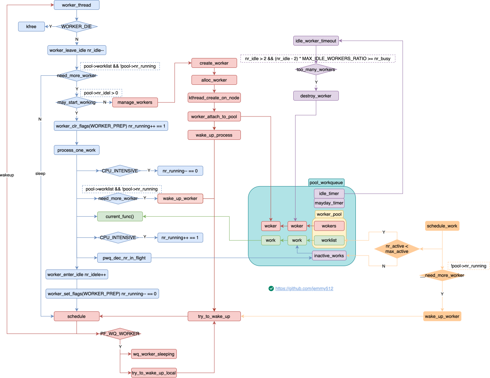

* `nr_running`    `nr_active`    `max_active`    `CPU_INTENSIVE` control the concurrency
---

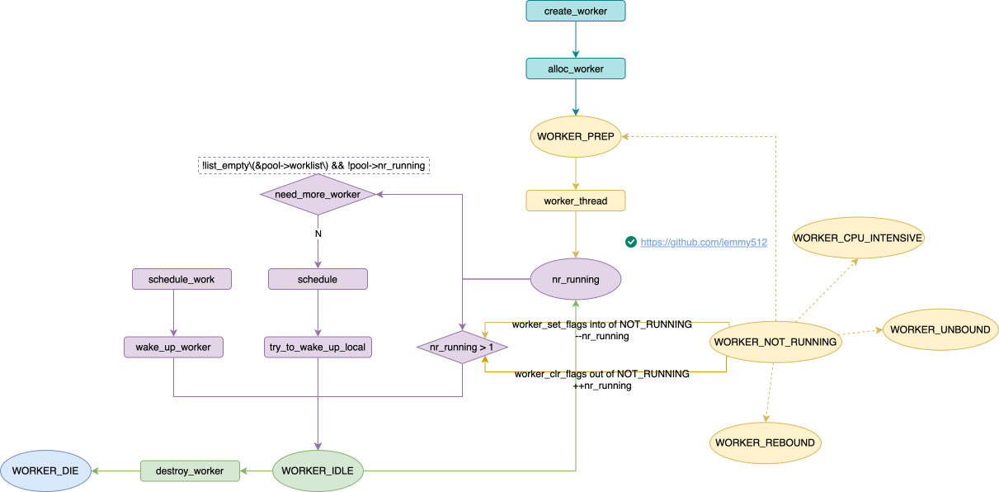

---

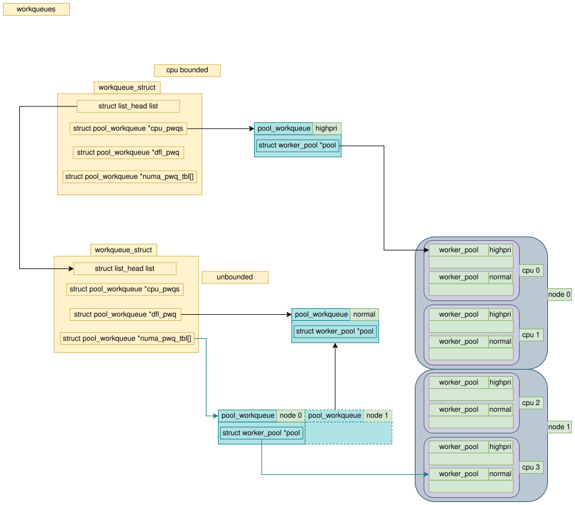

* [Kernel 4.19: Concurrency Managed Workqueue (cmwq)](https://www.kernel.org/doc/html/v4.19/core-api/workqueue.html)
* http://www.wowotech.net/irq_subsystem/cmwq-intro.html :cn:
* https://zhuanlan.zhihu.com/p/91106844 :cn:
* https://zhuanlan.zhihu.com/p/94561631 :cn:
* http://kernel.meizu.com/linux-workqueue.html :cn:


```c
struct workqueue_struct {
    /* Bound Workqueues: Many pool_workqueue Instances
    * Unbound Workqueues: One pool_workqueue Instance */
    struct list_head      pwqs;  /* WR: all pwqs of this wq */
    struct list_head      list;  /* PR: list of all workqueues */

    struct list_head      maydays; /* MD: pwqs requesting rescue */
    struct worker         *rescuer; /* I: rescue worker */

    struct pool_workqueue *dfl_pwq; /* PW: only for unbound wqs */
    struct pool_workqueue *cpu_pwqs; /* I: per-cpu pwqs */
    struct pool_workqueue *numa_pwq_tbl[]; /* PWR: unbound pwqs indexed by node */
    struct wq_node_nr_active *node_nr_active[]; /* I: per-node nr_active */
};

/* The per-pool workqueue. */
struct pool_workqueue {
  struct worker_pool      *pool;    /* I: the associated pool */
  /* When pwq->nr_active >= max_active, new work item is queued to
   * pwq->inactive_works instead of pool->worklist and marked with
   * WORK_STRUCT_INACTIVE. */
  struct list_head        inactive_works;  /* L: inactive works */
  struct list_head        mayday_node;  /* MD: node on wq->maydays */
  struct list_head        pwqs_node;  /* WR: node on wq->pwqs */
  struct workqueue_struct *wq;    /* I: the owning workqueue */
  int                     work_color;  /* L: current color */
  int                     flush_color;  /* L: flushing color */
  int                     refcnt;    /* L: reference count */
  int                     nr_in_flight[WORK_NR_COLORS];/* L: nr of in_flight works */
  int                     nr_active;  /* L: nr of active works */
  int                     max_active;  /* L: max active works, the elements of pool->worklist */

  /* Release of unbound pwq is punted to system_wq.  See put_pwq()
   * and pwq_unbound_release_workfn() for details.  pool_workqueue
   * itself is also sched-RCU protected so that the first pwq can be
   * determined without grabbing wq->mutex. */
  struct work_struct  unbound_release_work;
  struct rcu_head    rcu;
} __aligned(1 << WORK_STRUCT_FLAG_BITS);

struct worker_pool {
  spinlock_t          lock;   /* the pool lock */
  int                 cpu;    /* I: the associated cpu */
  int                 node;   /* I: the associated node ID */
  int                 id;     /* I: pool ID */
  unsigned int        flags;  /* X: flags */

  unsigned long       watchdog_ts;  /* L: watchdog timestamp */

  struct list_head    worklist;  /* L: list of pending works */

  int                 nr_workers;  /* L: total number of workers */
  int                 nr_idle;  /* L: currently idle workers */

  struct list_head    workers;  /* A: attached workers */
  struct list_head    idle_list;  /* X: list of idle workers */
  /* a workers is either on busy_hash or idle_list, or the manager */
  DECLARE_HASHTABLE(busy_hash, BUSY_WORKER_HASH_ORDER); /* L: hash of busy workers */

  struct timer_list   idle_timer;  /* L: worker idle timeout */
  struct timer_list   mayday_timer;  /* L: SOS timer for workers */

  struct worker       *manager;  /* L: purely informational */
  struct completion   *detach_completion; /* all workers detached */

  struct ida          worker_ida;  /* worker IDs for task name */

  struct workqueue_attrs  *attrs;    /* I: worker attributes */
  struct hlist_node       hash_node;  /* PL: unbound_pool_hash node */
  int                     refcnt;    /* PL: refcnt for unbound pools */

  /* The current concurrency level.  As it's likely to be accessed
   * from other CPUs during try_to_wake_up(), put it in a separate
   * cacheline. */
  atomic_t    nr_running ____cacheline_aligned_in_smp;

  /* Destruction of pool is sched-RCU protected to allow dereferences
   * from get_work_pool(). */
  struct rcu_head    rcu;
} ____cacheline_aligned_in_smp;

struct workqueue_attrs {
  int             nice;
  cpumask_var_t   cpumask;
  bool            no_numa;
};

/* worker flags */
WORKER_DIE            = 1 << 1,  /* die die die */
WORKER_IDLE           = 1 << 2,  /* is idle */
WORKER_PREP           = 1 << 3,  /* preparing to run works */
WORKER_CPU_INTENSIVE  = 1 << 6,  /* cpu intensive */
WORKER_UNBOUND        = 1 << 7,  /* worker is unbound */
WORKER_REBOUND        = 1 << 8,  /* worker was rebound */
WORKER_NOT_RUNNING    = WORKER_PREP | WORKER_CPU_INTENSIVE | WORKER_UNBOUND | WORKER_REBOUND;

struct worker {
    /* on idle list while idle, on busy hash table while busy */
    union {
        struct list_head      entry;  /* L: while idle */
        struct hlist_node     hentry;  /* L: while busy */
    };

    struct work_struct      *current_work;  /* L: work being processed */
    work_func_t             current_func;   /* L: current_work's fn */
    struct pool_workqueue   *current_pwq;   /* L: current_work's pwq */
    struct list_head        scheduled;      /* L: scheduled works */

    /* 64 bytes boundary on 64bit, 32 on 32bit */

    struct task_struct      *task;    /* I: worker task */
    struct worker_pool      *pool;    /* A: the associated pool */
                /* L: for rescuers */
    struct list_head        node;    /* A: anchored at pool->workers */
                /* A: runs through worker->node */

    unsigned long           last_active;  /* L: last active timestamp */
    unsigned int            flags;    /* X: flags */
    int                     id;    /* I: worker id */

    /* Opaque string set with work_set_desc().  Printed out with task
    * dump for debugging - WARN, BUG, panic or sysrq. */
    char      desc[WORKER_DESC_LEN];

    /* used only by rescuers to point to the target workqueue */
    struct workqueue_struct  *rescue_wq;  /* I: the workqueue to rescue */
};

struct work_struct {
    atomic_long_t     data;
    struct list_head  entry;
    work_func_t       func;
};
```

```c
[root@VM-16-17-centos ~]# ps -ef | grep worker
root           6       2  0  2021 ?        00:00:00 [kworker/0:0H-events_highpri]
root          33       2  0  2021 ?        00:01:41 [kworker/0:1H-kblockd]
root     2747154       2  0 Jan15 ?        00:00:00 [kworker/0:8-events]
root     2751953       2  0 00:09 ?        00:00:00 [kworker/0:1-ata_sff]
root     2756345       2  0 00:30 ?        00:00:00 [kworker/0:6-events]
root     2756347       2  0 00:30 ?        00:00:00 [kworker/0:7-cgroup_pidlist_destroy]
root     2757595       2  0 00:36 ?        00:00:00 [kworker/0:0-cgroup_pidlist_destroy]
root     2757754       2  0 00:37 ?        00:00:00 [kworker/u2:1-events_unbound]
root     2759049       2  0 00:43 ?        00:00:00 [kworker/u2:2-events_unbound]
root     2760459 2760373  0 00:48 pts/4    00:00:00 grep --color=auto worker

kworker/<cpu-id>:<worker-id-in-pool><High priority>
kworker/<unbound>:<worker-id-in-pool><High priority>
```

```c
/* to raise softirq for the BH worker pools on other CPUs */
static DEFINE_PER_CPU_SHARED_ALIGNED(struct irq_work [NR_STD_WORKER_POOLS], bh_pool_irq_works);

/* the BH worker pools */
static DEFINE_PER_CPU_SHARED_ALIGNED(struct worker_pool [NR_STD_WORKER_POOLS], bh_worker_pools);

/* the per-cpu worker pools */
static DEFINE_PER_CPU_SHARED_ALIGNED(struct worker_pool [NR_STD_WORKER_POOLS], cpu_worker_pools);

static DEFINE_IDR(worker_pool_idr);  /* PR: idr of all pools */

/* PL: hash of all unbound pools keyed by pool->attrs */
static DEFINE_HASHTABLE(unbound_pool_hash, UNBOUND_POOL_HASH_ORDER);

/* I: attributes used when instantiating standard unbound pools on demand */
static struct workqueue_attrs *unbound_std_wq_attrs[NR_STD_WORKER_POOLS];

/* I: attributes used when instantiating ordered pools on demand */
static struct workqueue_attrs *ordered_wq_attrs[NR_STD_WORKER_POOLS];

struct workqueue_struct *system_wq;
struct workqueue_struct *system_highpri_wq;
struct workqueue_struct *system_long_wq;
struct workqueue_struct *system_unbound_wq;
struct workqueue_struct *system_freezable_wq;
struct workqueue_struct *system_power_efficient_wq;
struct workqueue_struct *system_freezable_power_efficient_wq;
```


## workqueue_init

```c
start_kernel();
    workqueue_init_early() {
        int std_nice[NR_STD_WORKER_POOLS] = { 0, HIGHPRI_NICE_LEVEL/* -19 */ };
        void (*irq_work_fns[2])(struct irq_work *) = {
            bh_pool_kick_normal,
            bh_pool_kick_highpri
        };
        pwq_cache = KMEM_CACHE(pool_workqueue, SLAB_PANIC);

        /* initialize BH and CPU pools */
        for_each_possible_cpu(cpu) {
            i = 0;
            for_each_bh_worker_pool(pool, cpu) {
                init_cpu_worker_pool(pool, cpu, std_nice[i]);
                pool->flags |= POOL_BH;

                irq_work = bh_pool_irq_work(struct worker_pool *pool) {
                    int high = pool->attrs->nice == HIGHPRI_NICE_LEVEL ? 1 : 0;
                    return &per_cpu(bh_pool_irq_works, pool->cpu)[high];
                }
                init_irq_work(irq_work, irq_work_fns[i]) {
                    *work = IRQ_WORK_INIT(func);
                }
                i++;
            }

            i = 0;
            for_each_cpu_worker_pool(pool, cpu) {
                init_cpu_worker_pool(pool, cpu, std_nice[i++]) {
                    init_worker_pool(pool) {
                        pool->id = -1;
                        pool->cpu = -1;
                        pool->node = NUMA_NO_NODE;
                        pool->flags |= POOL_DISASSOCIATED;
                        pool->watchdog_ts = jiffies;
                        INIT_LIST_HEAD(&pool->worklist);
                        INIT_LIST_HEAD(&pool->idle_list);
                        hash_init(pool->busy_hash);

                        timer_setup(&pool->idle_timer, idle_worker_timeout, TIMER_DEFERRABLE);
                        timer_setup(&pool->mayday_timer, pool_mayday_timeout, 0);
                        alloc_workqueue_attrs();
                    }

                    pool->cpu = cpu;
                    cpumask_copy(pool->attrs->cpumask, cpumask_of(cpu));
                    cpumask_copy(pool->attrs->__pod_cpumask, cpumask_of(cpu));
                    pool->attrs->nice = nice;
                    pool->attrs->affn_strict = true;
                    pool->node = cpu_to_node(cpu);
                }
            }
        }

        system_wq = alloc_workqueue("events");
        system_highpri_wq = alloc_workqueue("events_highpri");
        system_long_wq = alloc_workqueue("events_long");
        system_freezable_wq = alloc_workqueue("events_freezable");
        system_power_efficient_wq = alloc_workqueue("events_power_efficient");
        system_freezable_power_efficient_wq = alloc_workqueue("events_freezable_power_efficient");
        alloc_workqueue();
            --->
    }

    rest_init() {
        kernel_thread(kernel_init) {
            kernel_init() {
                kernel_init_freeable() {
                    workqueue_init() {
                        wq_cpu_intensive_thresh_init() {

                        }

                        wq_numa_init() {
                            wq_numa_possible_cpumask = tbl;
                        }
                        for_each_possible_cpu(cpu) {
                            for_each_bh_worker_pool(pool, cpu)
                                pool->node = cpu_to_node(cpu);
                            for_each_cpu_worker_pool(pool, cpu)
                                pool->node = cpu_to_node(cpu);
                        }
                        list_for_each_entry(wq, &workqueues, list) {
                            init_rescuer(wq) {
                                struct worker *rescuer;
                                char id_buf[WORKER_ID_LEN];
                                int ret;

                                lockdep_assert_held(&wq_pool_mutex);

                                if (!(wq->flags & WQ_MEM_RECLAIM))
                                    return 0;

                                rescuer = alloc_worker(NUMA_NO_NODE);
                                if (!rescuer) {
                                    return -ENOMEM;
                                }

                                rescuer->rescue_wq = wq;
                                format_worker_id(id_buf, sizeof(id_buf), rescuer, NULL);

                                rescuer->task = kthread_create(rescuer_thread, rescuer, "%s", id_buf);
                                if (IS_ERR(rescuer->task)) {
                                    ret = PTR_ERR(rescuer->task);
                                    kfree(rescuer);
                                    return ret;
                                }

                                wq->rescuer = rescuer;
                                if (wq->flags & WQ_UNBOUND)
                                    kthread_bind_mask(rescuer->task, unbound_effective_cpumask(wq));
                                else
                                    kthread_bind_mask(rescuer->task, cpu_possible_mask);
                                wake_up_process(rescuer->task);

                                return 0;
                            }
                        }
                        for_each_online_cpu(cpu) {
                            for_each_cpu_worker_pool(pool, cpu) {
                                create_worker(pool); /* each pool has at leat one worker */
                            }
                        }
                        hash_for_each(unbound_pool_hash, bkt, pool, hash_node) {
                            create_worker(pool);
                        }
                        wq_watchdog_init() {
                            timer_setup(&wq_watchdog_timer, wq_watchdog_timer_fn, TIMER_DEFERRABLE);
                            wq_watchdog_set_thresh(wq_watchdog_thresh);
                        }
                    }
                }
            }
        }
    }
```

## alloc_workqueue

* All bound workqueues-those created with the default behavior or explicitly tied to a CPU-share these per-CPU worker pools.

```c
alloc_workqueue() {
    struct workqueue_struct* wq = kzalloc(sizeof(*wq) + tbl_size, GFP_KERNEL);
    alloc_and_link_pwqs() {
        if (!(wq->flags & WQ_UNBOUND)) {
            wq->cpu_pwqs = alloc_percpu(struct pool_workqueue*);
            for_each_possible_cpu(cpu) {
                struct worker_pool* pool = &(per_cpu_ptr(pools, cpu)[highpri]);
                struct pool_workqueue** pwq_p = per_cpu_ptr(wq->cpu_pwq, cpu);
                *pwq_p = kmem_cache_alloc_node(pwq_cache);

                init_pwq(*pwq_p, wq, pool) {
                    pwq->pool = pool;
                    pwq->wq = wq;
                    pwq->flush_color = -1;
                    pwq->refcnt = 1;
                    INIT_LIST_HEAD(&pwq->inactive_works);
                    INIT_LIST_HEAD(&pwq->pending_node);
                    INIT_LIST_HEAD(&pwq->pwqs_node);
                    INIT_LIST_HEAD(&pwq->mayday_node);
                    kthread_init_work(&pwq->release_work, pwq_release_workfn);
                }
                link_pwq(*pwq_p) {
                    list_add_rcu(&pwq->pwqs_node, &wq->pwqs);
                }
            }
        } else if (wq->flags & __WQ_ORDERED) {
            apply_workqueue_attrs(wq, ordered_wq_attrs[priority]);
        } else {
            apply_workqueue_attrs(wq, unbound_std_wq_attrs[priority]) {
                apply_wqattrs_prepare(wq, attrs) {
                    apply_wqattrs_ctx* ctx = kzalloc(struct_size(ctx, pwq_tbl, nr_node_ids), GFP_KERNEL);
                    ctx->dfl_pwq = alloc_unbound_pwq(wq, new_attrs);
                        --->
                    for_each_node(node) {
                        if (wq_calc_node_cpumask(new_attrs, node, -1, tmp_attrs->cpumask)) {
                            ctx->pwq_tbl[node] = alloc_unbound_pwq(wq, tmp_attrs);
                        } else {
                            ctx->dfl_pwq->refcnt++;
                            ctx->pwq_tbl[node] = ctx->dfl_pwq;
                        }
                    }
                }
                apply_wqattrs_commit(ctx) {
                    for_each_node(node) {
                        ctx->pwq_tbl[node] = numa_pwq_tbl_install(ctx->wq, node, ctx->pwq_tbl[node] /*pwq*/) {
                            link_pwq(pwq);
                            rcu_assign_pointer(wq->numa_pwq_tbl[node], pwq);
                        }
                        link_pwq(ctx->dfl_pwq);
                        swap(ctx->wq->dfl_pwq, ctx->dfl_pwq);
                    }
                }
                apply_wqattrs_cleanup(ctx);
            }
        }
    }
    init_rescuer();
    list_add_tail_rcu(&wq->list, &workqueues);
}
```

## alloc_unbound_pwq

* Unbound workqueues don’t tie their work items to a specific CPU’s worker pool. Instead, they use separate, dynamically configurable worker pools that aren’t bound to any single CPU.
* These unbound pools are managed independently and aren’t shared with the per-CPU pools used by bound workqueues. Their concurrency and CPU affinity can be customized via apply_workqueue_attrs().

```c
alloc_unbound_pwq() {
    worker_pool* pool = get_unbound_pool() {
        hash_for_each_possible(unbound_pool_hash, pool, hash_node, hash) {
            if (wqattrs_equal(pool->attrs, attrs)) {
                pool->refcnt++;
                return pool;
            }
        }

        for_each_node(node) {
            if (cpumask_subset(attrs->cpumask, wq_numa_possible_cpumask[node])) {
                target_node = node;
                break;
            }
        }
        pool = kzalloc_node(sizeof(*pool), GFP_KERNEL, target_node);
        init_worker_pool(pool) {
            timer_setup(&pool->idle_timer, idle_worker_timeout, TIMER_DEFERRABLE);
            timer_setup(&pool->mayday_timer, pool_mayday_timeout, 0);
            alloc_workqueue_attrs();
        }
        copy_workqueue_attrs(pool->attrs, attrs);
        create_worker(pool);
            --->
        hash_add(unbound_pool_hash, &pool->hash_node, hash);
    }

    pwq = kmem_cache_alloc_node(pwq_cache);

    init_pwq(pwq, wq, pool) {
        pwq->pool = pool;
        pwq->wq = wq;
    }
}
```

## create_worker

```c
create_worker(pool) {
    id = ida_alloc(&pool->worker_ida, GFP_KERNEL);
    woker = alloc_worker(pool->node) {
        worker->flags = WORKER_PREP;
    }
    worker->id = id;

    if (!(pool->flags & POOL_BH)) {
        worker->task = kthread_create_on_node(worker_thread) {
            kthreadd() {
                create_kthread() {
                    kernel_thread() {
                        _do_fork();
                    }
                }
            }
            wake_up_process(kthreadd_task); /* kthreadd */
            wait_for_completion_killable(&done);
        }
        set_user_nice(worker->task, pool->attrs->nice);
        kthread_bind_mask(worker->task, pool_allowed_cpus(pool));
    }

    worker_attach_to_pool();

    worker->pool->nr_workers++;
    worker_enter_idle(worker) {
        pool->nr_idle++;
    }

    if (worker->task)
        wake_up_process(worker->task);
}

void set_user_nice(struct task_struct *p, long nice)
{
    bool queued, running;
    struct rq *rq;
    int old_prio;

    if (task_nice(p) == nice || nice < MIN_NICE || nice > MAX_NICE)
        return;

    CLASS(task_rq_lock, rq_guard)(p);
    rq = rq_guard.rq;

    update_rq_clock(rq);

    if (task_has_dl_policy(p) || task_has_rt_policy(p)) {
        p->static_prio = NICE_TO_PRIO(nice);
        return;
    }

    scoped_guard (sched_change, p, DEQUEUE_SAVE | DEQUEUE_NOCLOCK) {
        p->static_prio = NICE_TO_PRIO(nice) {
            return ((nice) + DEFAULT_PRIO);
        }
        set_load_weight(p, true) {
            int prio = p->static_prio - MAX_RT_PRIO;
            struct load_weight lw;

            if (task_has_idle_policy(p)) {
                lw.weight = scale_load(WEIGHT_IDLEPRIO);
                lw.inv_weight = WMULT_IDLEPRIO;
            } else {
                lw.weight = scale_load(sched_prio_to_weight[prio]);
                lw.inv_weight = sched_prio_to_wmult[prio];
            }

            /* SCHED_OTHER tasks have to update their load when changing their
            * weight */
            if (update_load && p->sched_class->reweight_task)
                p->sched_class->reweight_task(task_rq(p), p, &lw);
            else
                p->se.load = lw;
        }

        old_prio = p->prio;
        p->prio = effective_prio(p) {
            p->normal_prio = normal_prio(p)  {
                return __normal_prio(p->policy, p->rt_priority, PRIO_TO_NICE(p->static_prio)) {
                    int prio;

                    if (dl_policy(policy))
                        prio = MAX_DL_PRIO - 1;
                    else if (rt_policy(policy))
                        prio = MAX_RT_PRIO - 1 - rt_prio;
                    else
                        prio = NICE_TO_PRIO(nice);

                    return prio;
                }
            }

            if (!rt_or_dl_prio(p->prio))
                return p->normal_prio;
            return p->prio;
        }
    }
}
```

## worker_thread

```c
worker_thread() {
    struct worker *worker = __worker;
    struct worker_pool *pool = worker->pool;

    /* tell the scheduler that this is a workqueue worker */
    set_pf_worker(true) {
        mutex_lock(&wq_pool_attach_mutex);
        if (val)
            current->flags |= PF_WQ_WORKER;
        else
            current->flags &= ~PF_WQ_WORKER;
        mutex_unlock(&wq_pool_attach_mutex);
    }

woke_up:
    if (unlikely(worker->flags & WORKER_DIE)) {
        raw_spin_unlock_irq(&pool->lock);
        set_pf_worker(false);

        worker->pool = NULL;
        ida_free(&pool->worker_ida, worker->id);
        return 0;
    }

    worker_leave_idle() {
        pool->nr_idle--;
        worker_clr_flags(worker, WORKER_IDLE) {
            worker->flags &= ~flags;
            if ((flags & WORKER_NOT_RUNNING) && (oflags & WORKER_NOT_RUNNING)) {
                if (!(worker->flags & WORKER_NOT_RUNNING)) {
                    atomic_inc(&pool->nr_running);
                }
            }
        }
        list_del_init(&worker->entry);
    }

recheck:
    /* keep only one running worker for non-cpu-intensive workqueue */
    if (!need_more_worker(pool))  {/* !list_empty(&pool->worklist) && !pool->nr_running */
        goto sleep;
    }

    if (!may_start_working() /* pool->nr_idle */ && manage_workers() {
        maybe_create_worker() {
            mod_timer(&pool->mayday_timer, jiffies + MAYDAY_INITIAL_TIMEOUT);
            create_worker()
                --->
        }
        wake_up(&wq_manager_wait);
    }) {
        goto recheck;
    }

    /* nr_running is inced when entering and deced when leaving */
    worker_clr_flags(worker, WORKER_PREP | WORKER_REBOUND);         /* 1.1 [nr_running]++ == 1 */

    do {
        struct work_struct *work = list_first_entry(&pool->worklist, struct work_struct, entry);

        ret = assign_work(work, worker, NULL) {
            struct worker_pool *pool = worker->pool;
            struct worker *collision = find_worker_executing_work(pool, work) {
                struct worker *worker;

                hash_for_each_possible(pool->busy_hash, worker, hentry, (unsigned long)work)
                    if (worker->current_work == work && worker->current_func == work->func)
                        return worker;

                return NULL;
            }
            if (unlikely(collision)) {
                move_linked_works(work, &collision->scheduled, nextp);
                return false;
            }

            move_linked_works(work, &worker->scheduled, nextp) {
                struct work_struct *n;

                /* Linked worklist will always end before the end of the list,
                * use NULL for list head. */
                list_for_each_entry_safe_from(work, n, NULL, entry) {
                    list_move_tail(&work->entry, head);
                    if (!(*work_data_bits(work) & WORK_STRUCT_LINKED))
                        break;
                }

                /* If we're already inside safe list traversal and have moved
                * multiple works to the scheduled queue, the next position
                * needs to be updated. */
                if (nextp)
                    *nextp = n;
            }

            return true;
        }
        if (ret) {
            process_scheduled_works(worker) {
                struct work_struct *work;
                bool first = true;

                while ((work = list_first_entry_or_null(&worker->scheduled, struct work_struct, entry))) {
                    if (first) {
                        worker->pool->watchdog_ts = jiffies;
                        first = false;
                    }

                    process_one_work(worker, work) {
                        hash_add(pool->busy_hash, &worker->hentry, (unsigned long)work);

                        worker->current_work = work;
                        worker->current_func = work->func;
                        worker->current_pwq = pwq;

                        if (worker->task)
                            worker->current_at = worker->task->se.sum_exec_runtime;

                        work_data = *work_data_bits(work);
                        worker->current_color = get_work_color(work_data);
                        strscpy(worker->desc, pwq->wq->name, WORKER_DESC_LEN);

                        list_del_init(&work->entry);

                        if (pwq->wq->flags & WQ_CPU_INTENSIVE) {
                            worker_set_flags(worker, WORKER_CPU_INTENSIVE) {     /* 2.1 [nr_running]-- == 0 */
                                worker->flags |= flags;
                                if ((flags & WORKER_NOT_RUNNING) && !(worker->flags & WORKER_NOT_RUNNING)) {
                                    atomic_dec(&pool->nr_running);
                                }
                            }
                        }

                        /* wake up an idle worker if necessary */
                        kick_pool(pool) {
                            struct worker *worker = first_idle_worker(pool);
                            struct task_struct *p;

                            /* !list_empty(&pool->worklist) && !pool->nr_running */
                            if (!need_more_worker(pool) || !worker)
                                return false;

                            if (pool->flags & POOL_BH) {
                                kick_bh_pool(pool) {
                                    if (unlikely(pool->cpu != smp_processor_id() && !(pool->flags & POOL_BH_DRAINING))) {
                                        /* bh_pool_kick_normal, bh_pool_kick_highpri */
                                        irq_work_queue_on(bh_pool_irq_work(pool), pool->cpu);
                                        return;
                                    }
                                    if (pool->attrs->nice == HIGHPRI_NICE_LEVEL)
                                        raise_softirq_irqoff(HI_SOFTIRQ);
                                    else
                                        raise_softirq_irqoff(TASKLET_SOFTIRQ);
                                }
                                return true;
                            }

                            p = worker->task;

                            if (!pool->attrs->affn_strict && !cpumask_test_cpu(p->wake_cpu, pool->attrs->__pod_cpumask)) {
                                struct work_struct *work = list_first_entry(&pool->worklist, struct work_struct, entry);
                                int wake_cpu = cpumask_any_and_distribute(pool->attrs->__pod_cpumask, cpu_online_mask);
                                if (wake_cpu < nr_cpu_ids) {
                                    p->wake_cpu = wake_cpu;
                                    get_work_pwq(work)->stats[PWQ_STAT_REPATRIATED]++;
                                }
                            }

                            wake_up_process(p);
                            return true;
                        }

                        worker->current_func(work);

                        if (pwq->wq->flags & WQ_CPU_INTENSIVE) {
                            worker_clr_flags(worker, WORKER_CPU_INTENSIVE);     /* 2.1 [nr_running]++ == 1 */
                        }

                        pwq_dec_nr_in_flight() {
                            if (!(work_data & WORK_STRUCT_INACTIVE)) {
                                pwq_dec_nr_active(pwq);
                            }

                            pwq->nr_in_flight[color]--;
                        }
                    }
                }
            }
        }
    } while (keep_working(pool)); /* !list_empty(&pool->worklist) && atomic_read(&pool->nr_running) <= 1; */

    worker_set_flags(worker, WORKER_PREP);                          /* 1.2 [nr_running]-- == 0 */
    worker_enter_idle(worker) {
        worker->flags |= WORKER_IDLE;
        pool->nr_idle++;
        worker->last_active = jiffies;
        list_add(&worker->entry, &pool->idle_list);
        ret = too_many_workers(pool) {
            bool managing = pool->flags & POOL_MANAGER_ACTIVE;
            int nr_idle = pool->nr_idle + managing; /* manager is considered idle */
            int nr_busy = pool->nr_workers - nr_idle;

            return nr_idle > 2 && (nr_idle - 2) * MAX_IDLE_WORKERS_RATIO >= nr_busy;

        }
        if (ret && !timer_pending(&pool->idle_timer)) {
            mod_timer(&pool->idle_timer, jiffies + IDLE_WORKER_TIMEOUT);
        }

    }

    schedule() {
        if (prev->flags & PF_WQ_WORKER) {
            wq_worker_sleeping() {
                struct worker *worker = kthread_data(task);
                struct worker_pool *pool;

                if (worker->flags & WORKER_NOT_RUNNING)
                    return;

                pool = worker->pool;

                /* Return if preempted before wq_worker_running() was reached */
                if (READ_ONCE(worker->sleeping))
                    return;

                WRITE_ONCE(worker->sleeping, 1);
                raw_spin_lock_irq(&pool->lock);

                /* Recheck in case unbind_workers() preempted us. We don't
                * want to decrement nr_running after the worker is unbound
                * and nr_running has been reset. */
                if (worker->flags & WORKER_NOT_RUNNING) {
                    raw_spin_unlock_irq(&pool->lock);
                    return;
                }

                pool->nr_running--;
                if (kick_pool(pool))
                    worker->current_pwq->stats[PWQ_STAT_CM_WAKEUP]++;

                raw_spin_unlock_irq(&pool->lock);
            }
        }
    }

    goto woke_up;
}
```

## nna

```c
bool pwq_tryinc_nr_active(struct pool_workqueue *pwq, bool fill)
{
    struct workqueue_struct *wq = pwq->wq;
    struct worker_pool *pool = pwq->pool;
    struct wq_node_nr_active *nna = wq_node_nr_active(wq, pool->node) {
        if (!(wq->flags & WQ_UNBOUND))
            return NULL;

        if (node == NUMA_NO_NODE)
            node = nr_node_ids;

        return wq->node_nr_active[node];
    }
    bool obtained = false;

    lockdep_assert_held(&pool->lock);

    if (!nna) {
        /* BH or per-cpu workqueue, pwq->nr_active is sufficient */
        obtained = pwq->nr_active < READ_ONCE(wq->max_active);
        goto out;
    }

    if (unlikely(pwq->plugged))
        return false;

    if (!list_empty(&pwq->pending_node) && likely(!fill))
        goto out;

    obtained = tryinc_node_nr_active(nna) {
        int max = READ_ONCE(nna->max);
        int old = atomic_read(&nna->nr);

        do {
            if (old >= max)
                return false;
        } while (!atomic_try_cmpxchg_relaxed(&nna->nr, &old, old + 1));

        return true;
    }
    if (obtained)
        goto out;

    /* Lockless acquisition failed. Lock, add ourself to $nna->pending_pwqs
     * and try again. The smp_mb() is paired with the implied memory barrier
     * of atomic_dec_return() in pwq_dec_nr_active() to ensure that either
     * we see the decremented $nna->nr or they see non-empty
     * $nna->pending_pwqs. */
    raw_spin_lock(&nna->lock);

    if (list_empty(&pwq->pending_node))
        list_add_tail(&pwq->pending_node, &nna->pending_pwqs);
    else if (likely(!fill))
        goto out_unlock;

    smp_mb();

    obtained = tryinc_node_nr_active(nna);

    /* If @fill, @pwq might have already been pending. Being spuriously
     * pending in cold paths doesn't affect anything. Let's leave it be. */
    if (obtained && likely(!fill))
        list_del_init(&pwq->pending_node);

out_unlock:
    raw_spin_unlock(&nna->lock);
out:
    if (obtained)
        pwq->nr_active++;
    return obtained;
}

void pwq_dec_nr_active(struct pool_workqueue *pwq)
{
    struct worker_pool *pool = pwq->pool;
    struct wq_node_nr_active *nna = wq_node_nr_active(pwq->wq, pool->node);

    lockdep_assert_held(&pool->lock);

    pwq->nr_active--;

    /* For a percpu workqueue */
    if (!nna) {
        pwq_activate_first_inactive(pwq, false) {
            struct work_struct *work =
            list_first_entry_or_null(&pwq->inactive_works, struct work_struct, entry);

            if (work && pwq_tryinc_nr_active(pwq, fill)) {
                __pwq_activate_work(pwq, work) {
                    unsigned long *wdb = work_data_bits(work);

                    WARN_ON_ONCE(!(*wdb & WORK_STRUCT_INACTIVE));
                    trace_workqueue_activate_work(work);
                    if (list_empty(&pwq->pool->worklist))
                        pwq->pool->watchdog_ts = jiffies;
                    move_linked_works(work, &pwq->pool->worklist, NULL);
                    __clear_bit(WORK_STRUCT_INACTIVE_BIT, wdb);
                }
                return true;
            } else {
                return false;
            }
        }
        return;
    }

    if (atomic_dec_return(&nna->nr) >= READ_ONCE(nna->max))
        return;

    if (!list_empty(&nna->pending_pwqs))
        node_activate_pending_pwq(nna, pool);
}

void node_activate_pending_pwq(struct wq_node_nr_active *nna,
                      struct worker_pool *caller_pool)
{
    struct worker_pool *locked_pool = caller_pool;
    struct pool_workqueue *pwq;
    struct work_struct *work;

    lockdep_assert_held(&caller_pool->lock);

    raw_spin_lock(&nna->lock);
retry:
    pwq = list_first_entry_or_null(&nna->pending_pwqsnna->pending_pwqs, struct pool_workqueue, pending_node);
    if (!pwq)
        goto out_unlock;

    /* If @pwq is for a different pool than @locked_pool, we need to lock
     * @pwq->pool->lock. Let's trylock first. If unsuccessful, do the unlock
     * / lock dance. For that, we also need to release @nna->lock as it's
     * nested inside pool locks. */
    if (pwq->pool != locked_pool) {
        raw_spin_unlock(&locked_pool->lock);
        locked_pool = pwq->pool;
        if (!raw_spin_trylock(&locked_pool->lock)) {
            raw_spin_unlock(&nna->lock);
            raw_spin_lock(&locked_pool->lock);
            raw_spin_lock(&nna->lock);
            goto retry;
        }
    }

    /* $pwq may not have any inactive work items due to e.g. cancellations.
     * Drop it from pending_pwqs and see if there's another one. */
    work = list_first_entry_or_null(&pwq->inactive_works, struct work_struct, entry);
    if (!work) {
        list_del_init(&pwq->pending_node);
        goto retry;
    }

    /* Acquire an nr_active count and activate the inactive work item. If
     * $pwq still has inactive work items, rotate it to the end of the
     * pending_pwqs so that we round-robin through them. This means that
     * inactive work items are not activated in queueing order which is fine
     * given that there has never been any ordering across different pwqs. */
    if (likely(tryinc_node_nr_active(nna))) {
        pwq->nr_active++;
        __pwq_activate_work(pwq, work);

        if (list_empty(&pwq->inactive_works))
            list_del_init(&pwq->pending_node);
        else
            list_move_tail(&pwq->pending_node, &nna->pending_pwqs);

        /* if activating a foreign pool, make sure it's running */
        if (pwq->pool != caller_pool)
            kick_pool(pwq->pool);
    }

out_unlock:
    raw_spin_unlock(&nna->lock);
    if (locked_pool != caller_pool) {
        raw_spin_unlock(&locked_pool->lock);
        raw_spin_lock(&caller_pool->lock);
    }
}
```

## rescure_thread

```c
int rescuer_thread(void *__rescuer)
{
    struct worker *rescuer = __rescuer;
    struct workqueue_struct *wq = rescuer->rescue_wq;
    bool should_stop;

    set_user_nice(current, RESCUER_NICE_LEVEL);

    /* Mark rescuer as worker too.  As WORKER_PREP is never cleared, it
     * doesn't participate in concurrency management. */
    set_pf_worker(true);
repeat:
    set_current_state(TASK_IDLE);

    /* By the time the rescuer is requested to stop, the workqueue
     * shouldn't have any work pending, but @wq->maydays may still have
     * pwq(s) queued.  This can happen by non-rescuer workers consuming
     * all the work items before the rescuer got to them.  Go through
     * @wq->maydays processing before acting on should_stop so that the
     * list is always empty on exit. */
    should_stop = kthread_should_stop();

    /* see whether any pwq is asking for help */
    raw_spin_lock_irq(&wq_mayday_lock);

    while (!list_empty(&wq->maydays)) {
        struct pool_workqueue *pwq = list_first_entry(&wq->maydays, struct pool_workqueue, mayday_node);
        struct worker_pool *pool = pwq->pool;
        struct work_struct *work, *n;

        __set_current_state(TASK_RUNNING);
        list_del_init(&pwq->mayday_node);

        raw_spin_unlock_irq(&wq_mayday_lock);

        worker_attach_to_pool(rescuer, pool);

        raw_spin_lock_irq(&pool->lock);

        /* Slurp in all works issued via this workqueue and
         * process'em. */
        WARN_ON_ONCE(!list_empty(&rescuer->scheduled));
        list_for_each_entry_safe(work, n, &pool->worklist, entry) {
            if (get_work_pwq(work) == pwq && assign_work(work, rescuer, &n))
                pwq->stats[PWQ_STAT_RESCUED]++;
        }

        if (!list_empty(&rescuer->scheduled)) {
            process_scheduled_works(rescuer);

            /* The above execution of rescued work items could
             * have created more to rescue through
             * pwq_activate_first_inactive() or chained
             * queueing.  Let's put @pwq back on mayday list so
             * that such back-to-back work items, which may be
             * being used to relieve memory pressure, don't
             * incur MAYDAY_INTERVAL delay inbetween. */
            if (pwq->nr_active && need_to_create_worker(pool)) {
                raw_spin_lock(&wq_mayday_lock);
                /* Queue iff we aren't racing destruction
                 * and somebody else hasn't queued it already. */
                if (wq->rescuer && list_empty(&pwq->mayday_node)) {
                    get_pwq(pwq);
                    list_add_tail(&pwq->mayday_node, &wq->maydays);
                }
                raw_spin_unlock(&wq_mayday_lock);
            }
        }

        /* Leave this pool. Notify regular workers; otherwise, we end up
         * with 0 concurrency and stalling the execution. */
        kick_pool(pool);

        raw_spin_unlock_irq(&pool->lock);

        worker_detach_from_pool(rescuer);

        /* Put the reference grabbed by send_mayday().  @pool might
         * go away any time after it. */
        put_pwq_unlocked(pwq);

        raw_spin_lock_irq(&wq_mayday_lock);
    }

    raw_spin_unlock_irq(&wq_mayday_lock);

    if (should_stop) {
        __set_current_state(TASK_RUNNING);
        set_pf_worker(false);
        return 0;
    }

    /* rescuers should never participate in concurrency management */
    WARN_ON_ONCE(!(rescuer->flags & WORKER_NOT_RUNNING));
    schedule();
    goto repeat;
}
```

## queue_work

```c
schedule_work(wq, work) {
    queue_work(WORK_CPU_UNBOUND, wq, work) {
        queue_work_on(cpu, wq, work) {
            if (!test_and_set_bit(WORK_STRUCT_PENDING_BIT, work_data_bits(work)) && !clear_pending_if_disabled(work)) {
                __queue_work(cpu, wq, work);
                ret = true;
            }
        }
    }
}

void __queue_work(int cpu, struct workqueue_struct *wq,
             struct work_struct *work)
{
    struct pool_workqueue *pwq;
    struct worker_pool *last_pool, *pool;
    unsigned int work_flags;
    unsigned int req_cpu = cpu;

    /* For a draining wq, only works from the same workqueue are
     * allowed. The __WQ_DESTROYING helps to spot the issue that
     * queues a new work item to a wq after destroy_workqueue(wq). */
    if (unlikely(wq->flags & (__WQ_DESTROYING | __WQ_DRAINING) &&
             WARN_ONCE(!is_chained_work(wq), "workqueue: cannot queue %ps on wq %s\n",
                   work->func, wq->name))) {
        return;
    }
    rcu_read_lock();
retry:
    /* pwq which will be used unless @work is executing elsewhere */
    if (req_cpu == WORK_CPU_UNBOUND) {
        if (wq->flags & WQ_UNBOUND)
            cpu = wq_select_unbound_cpu(raw_smp_processor_id()) {
                int new_cpu;

            if (likely(!wq_debug_force_rr_cpu)) {
                if (cpumask_test_cpu(cpu, wq_unbound_cpumask))
                    return cpu;
            } else {
                pr_warn_once("workqueue: round-robin CPU selection forced, expect performance impact\n");
            }

            new_cpu = __this_cpu_read(wq_rr_cpu_last);
            new_cpu = cpumask_next_and_wrap(new_cpu, wq_unbound_cpumask, cpu_online_mask);
            if (unlikely(new_cpu >= nr_cpu_ids))
                return cpu;
            __this_cpu_write(wq_rr_cpu_last, new_cpu);

            return new_cpu;}
        else
            cpu = raw_smp_processor_id();
    }

    pwq = rcu_dereference(*per_cpu_ptr(wq->cpu_pwq, cpu));
    pool = pwq->pool;

    /* If @work was previously on a different pool, it might still be
     * running there, in which case the work needs to be queued on that
     * pool to guarantee non-reentrancy.
     *
     * For ordered workqueue, work items must be queued on the newest pwq
     * for accurate order management.  Guaranteed order also guarantees
     * non-reentrancy.  See the comments above unplug_oldest_pwq(). */
    last_pool = get_work_pool(work) {
        unsigned long data = atomic_long_read(&work->data);
        int pool_id;

        assert_rcu_or_pool_mutex();

        if (data & WORK_STRUCT_PWQ)
            return work_struct_pwq(data)->pool;

        pool_id = data >> WORK_OFFQ_POOL_SHIFT;
        if (pool_id == WORK_OFFQ_POOL_NONE)
            return NULL;

        return idr_find(&worker_pool_idr, pool_id);
    }
    if (last_pool && last_pool != pool && !(wq->flags & __WQ_ORDERED)) {
        struct worker *worker;

        raw_spin_lock(&last_pool->lock);

        worker = find_worker_executing_work(last_pool, work);

        if (worker && worker->current_pwq->wq == wq) {
            pwq = worker->current_pwq;
            pool = pwq->pool;
            WARN_ON_ONCE(pool != last_pool);
        } else {
            /* meh... not running there, queue here */
            raw_spin_unlock(&last_pool->lock);
            raw_spin_lock(&pool->lock);
        }
    } else {
        raw_spin_lock(&pool->lock);
    }

    /* pwq is determined and locked. For unbound pools, we could have raced
     * with pwq release and it could already be dead. If its refcnt is zero,
     * repeat pwq selection. Note that unbound pwqs never die without
     * another pwq replacing it in cpu_pwq or while work items are executing
     * on it, so the retrying is guaranteed to make forward-progress. */
    if (unlikely(!pwq->refcnt)) {
        if (wq->flags & WQ_UNBOUND) {
            raw_spin_unlock(&pool->lock);
            cpu_relax();
            goto retry;
        }
        /* oops */
        WARN_ONCE(true, "workqueue: per-cpu pwq for %s on cpu%d has 0 refcnt",
              wq->name, cpu);
    }

    /* pwq determined, queue */
    trace_workqueue_queue_work(req_cpu, pwq, work);

    if (WARN_ON(!list_empty(&work->entry)))
        goto out;

    pwq->nr_in_flight[pwq->work_color]++;
    work_flags = work_color_to_flags(pwq->work_color);

    /* Limit the number of concurrently active work items to max_active.
     * @work must also queue behind existing inactive work items to maintain
     * ordering when max_active changes. See wq_adjust_max_active(). */
    if (list_empty(&pwq->inactive_works) && pwq_tryinc_nr_active(pwq, false)) {
        if (list_empty(&pool->worklist))
            pool->watchdog_ts = jiffies;

        trace_workqueue_activate_work(work);
        insert_work(pwq, work, &pool->worklist, work_flags);
        kick_pool(pool);
    } else {
        work_flags |= WORK_STRUCT_INACTIVE;
        insert_work(pwq, work, &pwq->inactive_works, work_flags);
    }

out:
    raw_spin_unlock(&pool->lock);
    rcu_read_unlock();
}

idle_worker_timeout() {
    while (too_many_workers(pool)) {
        mod_timer(&pool->idle_timer, expires);
        destroy_worker(worker) {
            pool->nr_workers--;
            pool->nr_idle--;
            list_del_init(&worker->entry);
            worker->flags |= WORKER_DIE;
            wake_up_process(worker->task);
        }
    }
}

pool_mayday_timeout() {
    if (need_to_create_worker(pool)) { /* need_more_worker(pool) && !may_start_working(pool) */
        list_for_each_entry(work, &pool->worklist, entry) {
            send_mayday(work) {
                list_add_tail(&pwq->mayday_node, &wq->maydays);
                wake_up_process(wq->rescuer->task);
            }
        }
    }
    mod_timer(&pool->mayday_timer, jiffies + MAYDAY_INTERVAL);
}
```

## wq_worker_tick

```c
sched_tick(void) {
    if (donor->flags & PF_WQ_WORKER)
        wq_worker_tick(donor);
}

void wq_worker_tick(struct task_struct *task)
{
    struct worker *worker = kthread_data(task);
    struct pool_workqueue *pwq = worker->current_pwq;
    struct worker_pool *pool = worker->pool;

    if (!pwq)
        return;

    pwq->stats[PWQ_STAT_CPU_TIME] += TICK_USEC;

    if (!wq_cpu_intensive_thresh_us)
        return;

    ret = worker->task->se.sum_exec_runtime - worker->current_at <
        wq_cpu_intensive_thresh_us * NSEC_PER_USEC;
    if ((worker->flags & WORKER_NOT_RUNNING) || READ_ONCE(worker->sleeping) || ret)
        return;

    raw_spin_lock(&pool->lock);

    worker_set_flags(worker, WORKER_CPU_INTENSIVE);
    wq_cpu_intensive_report(worker->current_func);
    pwq->stats[PWQ_STAT_CPU_INTENSIVE]++;

    if (kick_pool(pool))
        pwq->stats[PWQ_STAT_CM_WAKEUP]++;

    raw_spin_unlock(&pool->lock);
}
```

## workqueue_softirq_action

```c
void workqueue_softirq_action(bool highpri)
{
    struct worker_pool *pool =
        &per_cpu(bh_worker_pools, smp_processor_id())[highpri];
    if (need_more_worker(pool))
        bh_worker(list_first_entry(&pool->workers, struct worker, node));
}

void bh_worker(struct worker *worker)
{
    struct worker_pool *pool = worker->pool;
    int nr_restarts = BH_WORKER_RESTARTS;
    unsigned long end = jiffies + BH_WORKER_JIFFIES;

    worker_lock_callback(pool);
    raw_spin_lock_irq(&pool->lock);
    worker_leave_idle(worker);

    /* This function follows the structure of worker_thread(). See there for
     * explanations on each step. */
    if (!need_more_worker(pool))
        goto done;

    WARN_ON_ONCE(!list_empty(&worker->scheduled));
    worker_clr_flags(worker, WORKER_PREP | WORKER_REBOUND);

    do {
        struct work_struct *work =
            list_first_entry(&pool->worklist, struct work_struct, entry);

        if (assign_work(work, worker, NULL))
            process_scheduled_works(worker);
    } while (keep_working(pool) && --nr_restarts && time_before(jiffies, end));

    worker_set_flags(worker, WORKER_PREP);

done:
    worker_enter_idle(worker);
    kick_pool(pool);
    raw_spin_unlock_irq(&pool->lock);
    worker_unlock_callback(pool);
}
```

# cpu_hotplug

* [CPU hotplug in the Kernel](https://docs.kernel.org/core-api/cpu_hotplug.html)

# fs_proc

```sh
/proc/stat
/proc/schedstat
/proc/loadavg
/proc/sys/kernel/pid_max
/proc/sys/kernel/threads-max

/proc/<pid>/sched</pid>
/proc/<pid>/status</pid>
/proc/<pid>/task/</pid>
/proc/<pid>/cmdline</pid>
/proc/<pid>/fd/</pid>
/proc/<pid>/limits</pid>
/proc/<pid>/cgroup</pid>
```

# rseq

* [[patch V6 00/11] rseq: Implement time slice extension mechanism](https://lore.kernel.org/all/20251215155615.870031952@linutronix.de/)

```c
struct rseq {
    __u32 cpu_id_start;

    __u32 cpu_id;

    /* init by user, set NULL by kernel when restart */
    __u64 rseq_cs;

    __u32 flags;

    __u32 node_id;

    __u32 mm_cid;

    /* Time slice extension control structure. CPU local updates from
     * kernel and user space. */
    struct rseq_slice_ctrl slice_ctrl;

    __u8 __reserved;

    /* Flexible array member at end of structure, after last feature field. */
    char end[];
} __attribute__((aligned(32)));

struct rseq_slice_ctrl {
    union {
        __u32        all;
        struct {
            __u8    request;
            __u8    granted;
            __u16    __reserved;
        };
    };
};

struct rseq_cs {
    __u32       version;
    __u32       flags;
    __u64       start_ip;
    __u64       post_commit_offset; /* Offset from start_ip. */
    __u64       abort_ip;
} __attribute__((aligned(4 * sizeof(__u64))));
```

```c
struct task_struct {
    struct rseq_data            rseq;
};

struct rseq_data {
    struct rseq __user          *usrptr;
    u32                         len;
    u32                         sig;
    struct rseq_event           event;
    struct rseq_ids             ids;
    struct rseq_slice           slice;
};

struct rseq_slice {
    union rseq_slice_state      state;
    u64                         expires;
    u8                          yielded;
};

union rseq_slice_state {
    u16                         state;
    struct {
        u8                      enabled;
        u8                      granted;
    };
};

struct rseq_ids {
    union {
        u64                     cpu_cid;
        struct {
            u32                 cpu_id;
            u32                 mm_cid;
        };
    };
};


struct rseq_event {
    union {
        u64                all;
        struct {
            union {
                u32        events;
                struct {
                    u8    sched_switch;
                    u8    ids_changed;
                    u8    user_irq;
                };
            };

            u8            has_rseq;
            u8            __pad;
            union {
                u16        error;
                struct {
                    u8    fatal;
                    u8    slowpath;
                };
            };
        };
    };
};
```

## demo

```c
#define _GNU_SOURCE
#include <stdio.h>
#include <stdlib.h>
#include <stdint.h>
#include <unistd.h>
#include <sys/syscall.h>
#include <sys/auxv.h>
#include <errno.h>

// ------------------- Thread-local RSEQ area -------------------
static __thread volatile struct rseq __rseq_abi __attribute__((aligned(32)));

// Signature used by kernel to validate
#define RSEQ_SIG 0x53053053ULL

// Simple per-CPU counter for demonstration
#define MAX_CPUS 1024
static uint64_t per_cpu_counter[MAX_CPUS] = {0};

// ------------------- Registration -------------------
int rseq_register(void)
{
    unsigned long feature_size = getauxval(AT_RSEQ_FEATURE_SIZE);
    unsigned long rseq_align   = getauxval(AT_RSEQ_ALIGN);

    if (rseq_align == 0)
        rseq_align = 32;

    size_t rseq_len = feature_size ? feature_size : sizeof(struct rseq);

    // Enable slice extension at registration (optional but recommended)
    int flags = RSEQ_FLAG_SLICE_EXT_DEFAULT_ON;

    long ret = syscall(__NR_rseq, &__rseq_abi, (uint32_t)rseq_len, flags, RSEQ_SIG);
    if (ret < 0) {
        perror("rseq registration failed");
        if (errno == ENOSYS)
            fprintf(stderr, "RSEQ not supported by this kernel\n");
        return -1;
    }
    return 0;
}

// ------------------- Critical Section with Slice Extension -------------------
void rseq_per_cpu_inc(void)
{
    static struct rseq_cs cs;   // one descriptor per function is fine

restart:
    // Activate the critical section descriptor
    __rseq_abi.rseq_cs = (uintptr_t)&cs;

    // Fill addresses using GCC/Clang label extension (must be done before use)
    cs.version            = 0;
    cs.flags              = 0;
    cs.start_ip           = (uintptr_t)&&start_label;
    cs.post_commit_offset = (uintptr_t)&&commit_label - (uintptr_t)&&start_label;
    cs.abort_ip           = (uintptr_t)&&abort_label;

    // === Request time-slice extension (as early as possible) ===
    __rseq_abi.slice_ctrl.request = 1;

start_label:
    // --- Critical section begins here ---
    // Must be restart-safe and purely CPU-local

    uint32_t cpu = __rseq_abi.cpu_id;
    if (cpu != __rseq_abi.cpu_id_start || cpu >= MAX_CPUS)
        goto abort_label;

    // Example operation: increment per-CPU counter
    per_cpu_counter[cpu]++;

    // --- Last store of the critical section is the commit point ---

commit_label:
    __rseq_abi.rseq_cs = 0;                    // Success: clear active CS

    // === Handle slice extension if the kernel granted it ===
    __rseq_abi.slice_ctrl.request = 0;
    if (__rseq_abi.slice_ctrl.granted) {
        // Preferred: side-effect free yield
        syscall(__NR_rseq_slice_yield);
    }
    return;

abort_label:
    __rseq_abi.rseq_cs = 0;
    __rseq_abi.slice_ctrl.request = 0;
    goto restart;        // Retry the whole sequence
}

// ------------------- Main -------------------
int main(void)
{
    if (rseq_register() != 0) {
        fprintf(stderr, "Failed to register RSEQ. Exiting.\n");
        return 1;
    }

    printf("RSEQ registered successfully.\n");
    printf("cpu_id = %u, node_id = %u\n", __rseq_abi.cpu_id, __rseq_abi.node_id);

    // Run many increments to demonstrate the fast path + occasional restarts
    const long iterations = 20'000'000;
    for (long i = 0; i < iterations; i++) {
        rseq_per_cpu_inc();
    }

    // Compute total
    uint64_t total = 0;
    for (int i = 0; i < MAX_CPUS; i++) {
        total += per_cpu_counter[i];
    }

    printf("Total increments: %lu (expected ~%ld)\n", total, iterations);
    printf("Demo finished.\n");

    return 0;
}
```

## rseq_syscall

```c
SYSCALL_DEFINE4(rseq, struct rseq __user *, rseq, u32, rseq_len, int, flags, u32, sig)
{
    u32 rseqfl = 0;

    if (flags & RSEQ_FLAG_UNREGISTER) {
        if (flags & ~RSEQ_FLAG_UNREGISTER)
            return -EINVAL;
        /* Unregister rseq for current thread. */
        if (current->rseq.usrptr != rseq || !current->rseq.usrptr)
            return -EINVAL;
        if (rseq_len != current->rseq.len)
            return -EINVAL;
        if (current->rseq.sig != sig)
            return -EPERM;
        if (!rseq_reset_ids())
            return -EFAULT;
        rseq_reset(current);
        return 0;
    }

    if (unlikely(flags & ~(RSEQ_FLAG_SLICE_EXT_DEFAULT_ON)))
        return -EINVAL;

    if (current->rseq.usrptr) {
        /* If rseq is already registered, check whether
         * the provided address differs from the prior
         * one. */
        if (current->rseq.usrptr != rseq || rseq_len != current->rseq.len)
            return -EINVAL;
        if (current->rseq.sig != sig)
            return -EPERM;
        /* Already registered. */
        return -EBUSY;
    }

    /* If there was no rseq previously registered, ensure the provided rseq
     * is properly aligned, as communcated to user-space through the ELF
     * auxiliary vector AT_RSEQ_ALIGN. If rseq_len is the original rseq
     * size, the required alignment is the original struct rseq alignment.
     *
     * The rseq_len is required to be greater or equal to the original rseq
     * size. In order to be valid, rseq_len is either the original rseq size,
     * or large enough to contain all supported fields, as communicated to
     * user-space through the ELF auxiliary vector AT_RSEQ_FEATURE_SIZE. */
    if (rseq_len < ORIG_RSEQ_SIZE ||
        (rseq_len == ORIG_RSEQ_SIZE && !IS_ALIGNED((unsigned long)rseq, ORIG_RSEQ_SIZE)) ||
        (rseq_len != ORIG_RSEQ_SIZE && (!IS_ALIGNED((unsigned long)rseq, rseq_alloc_align()) ||
                        rseq_len < offsetof(struct rseq, end))))
        return -EINVAL;
    if (!access_ok(rseq, rseq_len))
        return -EFAULT;

    if (IS_ENABLED(CONFIG_RSEQ_SLICE_EXTENSION)) {
        rseqfl |= RSEQ_CS_FLAG_SLICE_EXT_AVAILABLE;
        if (rseq_slice_extension_enabled() &&
            (flags & RSEQ_FLAG_SLICE_EXT_DEFAULT_ON))
            rseqfl |= RSEQ_CS_FLAG_SLICE_EXT_ENABLED;
    }

    scoped_user_write_access(rseq, efault) {
        /* If the rseq_cs pointer is non-NULL on registration, clear it to
         * avoid a potential segfault on return to user-space. The proper thing
         * to do would have been to fail the registration but this would break
         * older libcs that reuse the rseq area for new threads without
         * clearing the fields. Don't bother reading it, just reset it. */
        unsafe_put_user(0UL, &rseq->rseq_cs, efault);
        unsafe_put_user(rseqfl, &rseq->flags, efault);
        /* Initialize IDs in user space */
        unsafe_put_user(RSEQ_CPU_ID_UNINITIALIZED, &rseq->cpu_id_start, efault);
        unsafe_put_user(RSEQ_CPU_ID_UNINITIALIZED, &rseq->cpu_id, efault);
        unsafe_put_user(0U, &rseq->node_id, efault);
        unsafe_put_user(0U, &rseq->mm_cid, efault);
        unsafe_put_user(0U, &rseq->slice_ctrl.all, efault);
    }

    /* Activate the registration by setting the rseq area address, length
     * and signature in the task struct. */
    current->rseq.usrptr = rseq;
    current->rseq.len = rseq_len;
    current->rseq.sig = sig;

#ifdef CONFIG_RSEQ_SLICE_EXTENSION
    current->rseq.slice.state.enabled = !!(rseqfl & RSEQ_CS_FLAG_SLICE_EXT_ENABLED);
#endif

    /* If rseq was previously inactive, and has just been
     * registered, ensure the cpu_id_start and cpu_id fields
     * are updated before returning to user-space. */
    current->rseq.event.has_rseq = true;
    rseq_force_update() {
        if (current->rseq.event.has_rseq) {
            current->rseq.event.ids_changed = true;
            current->rseq.event.sched_switch = true;
            rseq_raise_notify_resume(current) {
                set_tsk_thread_flag(t, TIF_RSEQ);
            }
        }
    }
    return 0;

efault:
    return -EFAULT;
}
```

## prctl

```c
prctl(PR_RSEQ_SLICE_EXTENSION, PR_RSEQ_SLICE_EXTENSION_SET,
      PR_RSEQ_SLICE_EXT_ENABLE, 0, 0);

SYSCALL_DEFINE5(prctl, int, option, unsigned long, arg2, unsigned long, arg3,
        unsigned long, arg4, unsigned long, arg5)
{
    struct task_struct *me = current;
    unsigned char comm[sizeof(me->comm)];
    long error;

    case PR_RSEQ_SLICE_EXTENSION:
        if (arg4 || arg5)
            return -EINVAL;
        error = rseq_slice_extension_prctl(arg2, arg3);
        break;
}

int rseq_slice_extension_prctl(unsigned long arg2, unsigned long arg3)
{
    switch (arg2) {
    case PR_RSEQ_SLICE_EXTENSION_GET:
        if (arg3)
            return -EINVAL;
        return current->rseq.slice.state.enabled ? PR_RSEQ_SLICE_EXT_ENABLE : 0;

    case PR_RSEQ_SLICE_EXTENSION_SET: {
        u32 rflags, valid = RSEQ_CS_FLAG_SLICE_EXT_AVAILABLE;
        bool enable = !!(arg3 & PR_RSEQ_SLICE_EXT_ENABLE);

        if (arg3 & ~PR_RSEQ_SLICE_EXT_ENABLE)
            return -EINVAL;
        if (!rseq_slice_extension_enabled())
            return -ENOTSUPP;
        if (!current->rseq.usrptr)
            return -ENXIO;

        /* No change? */
        if (enable == !!current->rseq.slice.state.enabled)
            return 0;

        if (get_user(rflags, &current->rseq.usrptr->flags))
            goto die;

        if (current->rseq.slice.state.enabled)
            valid |= RSEQ_CS_FLAG_SLICE_EXT_ENABLED;

        if ((rflags & valid) != valid)
            goto die;

        rflags &= ~RSEQ_CS_FLAG_SLICE_EXT_ENABLED;
        rflags |= RSEQ_CS_FLAG_SLICE_EXT_AVAILABLE;
        if (enable)
            rflags |= RSEQ_CS_FLAG_SLICE_EXT_ENABLED;

        if (put_user(rflags, &current->rseq.usrptr->flags))
            goto die;

        current->rseq.slice.state.enabled = enable;
        return 0;
    }
    default:
        return -EINVAL;
    }
die:
    force_sig(SIGSEGV);
    return -EFAULT;
}
```

## rseq_grant_slice_extension

```c
void __exit_to_user_mode_prepare(struct pt_regs *regs)
{
    tick_nohz_user_enter_prepare();

    ti_work = read_thread_flags();
    if (unlikely(ti_work & EXIT_TO_USER_MODE_WORK)) {
        ti_work = exit_to_user_mode_loop(regs, ti_work) {
            for (;;) {
                ti_work = __exit_to_user_mode_loop(regs, ti_work);

                if (likely(!rseq_exit_to_user_mode_restart(regs, ti_work)))
                    return ti_work;
                ti_work = read_thread_flags();
            }

            __exit_to_user_mode_loop(struct pt_regs *regs, unsigned long ti_work) {
                while (ti_work & EXIT_TO_USER_MODE_WORK) {
                    local_irq_enable_exit_to_user(ti_work) {
                        local_irq_enable();
                    }

                    if (ti_work & (_TIF_NEED_RESCHED | _TIF_NEED_RESCHED_LAZY)) {
                        if (!rseq_grant_slice_extension(ti_work & TIF_SLICE_EXT_DENY))
                            schedule();
                    }
                }
            }
        }
    }
}

bool rseq_grant_slice_extension(bool work_pending)
{
    struct task_struct *curr = current;
    struct rseq_slice_ctrl usr_ctrl;
    union rseq_slice_state state;
    struct rseq __user *rseq;

    if (!rseq_slice_extension_enabled())
        return false;

    /* If not enabled or not a return from interrupt, nothing to do. */
    state = curr->rseq.slice.state;
    state.enabled &= curr->rseq.event.user_irq;
    if (likely(!state.state))
        return false;

    rseq = curr->rseq.usrptr;
    scoped_user_rw_access(rseq, efault) {

        /* Quick check conditions where a grant is not possible or
         * needs to be revoked.
         *
         *  1) Any TIF bit which needs to do extra work aside of
         *     rescheduling prevents a grant.
         *
         *  2) A previous rescheduling request resulted in a slice
         *     extension grant. */
        if (unlikely(work_pending || state.granted)) {
            /* Clear user control unconditionally. No point for checking */
            unsafe_put_user(0U, &rseq->slice_ctrl.all, efault);
            rseq_slice_clear_grant(curr);
            return false;
        }

        unsafe_get_user(usr_ctrl.all, &rseq->slice_ctrl.all, efault);
        if (likely(!(usr_ctrl.request)))
            return false;

        /* Grant the slice extention */
        usr_ctrl.request = 0;
        usr_ctrl.granted = 1;
        unsafe_put_user(usr_ctrl.all, &rseq->slice_ctrl.all, efault);
    }

    rseq_stat_inc(rseq_stats.s_granted);

    curr->rseq.slice.state.granted = true;
    /* Store expiry time for arming the timer on the way out */
    curr->rseq.slice.expires = data_race(rseq_slice_ext_nsecs) + ktime_get_mono_fast_ns();
    /* This is racy against a remote CPU setting TIF_NEED_RESCHED in
     * several ways:
     *
     * 1)
     *    CPU0            CPU1
     *    clear_tsk()
     *                set_tsk()
     *    clear_preempt()
     *                Raise scheduler IPI on CPU0
     *    --> IPI
     *        fold_need_resched() -> Folds correctly
     * 2)
     *    CPU0            CPU1
     *                set_tsk()
     *    clear_tsk()
     *    clear_preempt()
     *                Raise scheduler IPI on CPU0
     *    --> IPI
     *        fold_need_resched() <- NOOP as TIF_NEED_RESCHED is false
     *
     * #1 is not any different from a regular remote reschedule as it
     *    sets the previously not set bit and then raises the IPI which
     *    folds it into the preempt counter
     *
     * #2 is obviously incorrect from a scheduler POV, but it's not
     *    differently incorrect than the code below clearing the
     *    reschedule request with the safety net of the timer.
     *
     * The important part is that the clearing is protected against the
     * scheduler IPI and also against any other interrupt which might
     * end up waking up a task and setting the bits in the middle of
     * the operation:
     *
     *    clear_tsk()
     *    ---> Interrupt
     *        wakeup_on_this_cpu()
     *        set_tsk()
     *        set_preempt()
     *    clear_preempt()
     *
     * which would be inconsistent state. */
    scoped_guard(irq) {
        clear_tsk_need_resched(curr);
        clear_preempt_need_resched();
    }
    return true;

efault:
    force_sig(SIGSEGV);
    return false;
}
```

## rseq_exit_to_user_mode_restart

```c
static __always_inline bool
rseq_exit_to_user_mode_restart(struct pt_regs *regs, unsigned long ti_work)
{
    if (unlikely(test_tif_rseq(ti_work))) { /* __TIF_RSEQ */
        if (unlikely(__rseq_exit_to_user_mode_restart(regs))) {
            current->rseq.event.slowpath = true;
            set_tsk_thread_flag(current, TIF_NOTIFY_RESUME);
            return true;
        }
        clear_tif_rseq();
    }
    /* Arm the slice extension timer if nothing to do anymore and the
     * task really goes out to user space. */
    return rseq_arm_slice_extension_timer() {
        if (!rseq_slice_extension_enabled())
            return false;

        if (likely(!current->rseq.slice.state.granted))
            return false;

        return __rseq_arm_slice_extension_timer() {
            struct slice_timer *st = this_cpu_ptr(&slice_timer);
            struct task_struct *curr = current;

            lockdep_assert_irqs_disabled();

            if ((unlikely(curr->rseq.slice.expires < ktime_get_mono_fast_ns()))) {
                set_need_resched_current();
                return true;
            }

            st->cookie = curr;
            hrtimer_start(&st->timer, curr->rseq.slice.expires, HRTIMER_MODE_ABS_PINNED_HARD);
            /* Arm the syscall entry work */
            set_task_syscall_work(curr, SYSCALL_RSEQ_SLICE);
            return false;
        }
    }
}

static int __init rseq_slice_init(void)
{
    unsigned int cpu;

    for_each_possible_cpu(cpu) {
        hrtimer_setup(
            per_cpu_ptr(&slice_timer.timer, cpu),
            rseq_slice_expired = {
                struct slice_timer *st = container_of(tmr, struct slice_timer, timer);

                if (st->cookie == current && current->rseq.slice.state.granted) {
                    rseq_stat_inc(rseq_stats.s_expired);
                    set_need_resched_current();
                }
                return HRTIMER_NORESTART;
            },
            CLOCK_MONOTONIC, HRTIMER_MODE_REL_PINNED_HARD);
    }
    return 0;
}

bool __rseq_exit_to_user_mode_restart(struct pt_regs *regs)
{
    struct task_struct *t = current;

    if (unlikely((t->rseq.event.sched_switch))) {
        rseq_stat_inc(rseq_stats.fastpath);

        if (unlikely(!rseq_exit_user_update(regs, t)))
            return true;
    }
    /* Clear state so next entry starts from a clean slate */
    t->rseq.event.events = 0;
    return false;
}

bool rseq_exit_user_update(struct pt_regs *regs, struct task_struct *t)
{
    /* Page faults need to be disabled as this is called with
     * interrupts disabled */
    guard(pagefault)();
    if (likely(!t->rseq.event.ids_changed)) {
        struct rseq __user *rseq = t->rseq.usrptr;
        /* If IDs have not changed rseq_event::user_irq must be true
         * See rseq_sched_switch_event(). */
        u64 csaddr;

        scoped_user_rw_access(rseq, efault) {
            unsafe_get_user(csaddr, &rseq->rseq_cs, efault);

            /* Open coded, so it's in the same user access region */
            if (rseq_slice_extension_enabled()) {
                /* Unconditionally clear it, no point in conditionals */
                unsafe_put_user(0U, &rseq->slice_ctrl.all, efault);
            }
        }

        rseq_slice_clear_grant(t) {
            if (IS_ENABLED(CONFIG_RSEQ_STATS) && t->rseq.slice.state.granted)
                rseq_stat_inc(rseq_stats.s_revoked);
            t->rseq.slice.state.granted = false;
        }

        if (static_branch_unlikely(&rseq_debug_enabled) || unlikely(csaddr)) {
            if (unlikely(!rseq_update_user_cs(t, regs, csaddr)))
                return false;
        }
        return true;
    }

    struct rseq_ids ids = {
        .cpu_id = task_cpu(t),
        .mm_cid = task_mm_cid(t),
    };
    u32 node_id = cpu_to_node(ids.cpu_id);

    return rseq_update_usr(t, regs, &ids, node_id);

efault:
    return false;
}

bool rseq_update_usr(struct task_struct *t, struct pt_regs *regs,
                    struct rseq_ids *ids, u32 node_id)
{
    u64 csaddr;

    if (!rseq_set_ids_get_csaddr(t, ids, node_id, &csaddr))
        return false;

    /* On architectures which utilize the generic entry code this
     * allows to skip the critical section when the entry was not from
     * a user space interrupt, unless debug mode is enabled. */
    if (IS_ENABLED(CONFIG_GENERIC_IRQ_ENTRY)) {
        if (!static_branch_unlikely(&rseq_debug_enabled)) {
            if (likely(!t->rseq.event.user_irq))
                return true;
        }
    }
    if (likely(!csaddr))
        return true;
    /* Sigh, this really needs to do work */
    return rseq_update_user_cs(t, regs, csaddr);
}

bool
rseq_update_user_cs(struct task_struct *t, struct pt_regs *regs, unsigned long csaddr)
{
    struct rseq_cs __user *ucs = (struct rseq_cs __user *)(unsigned long)csaddr;
    unsigned long ip = instruction_pointer(regs);
    unsigned long tasksize = TASK_SIZE;
    u64 start_ip, abort_ip, offset;
    u32 usig, __user *uc_sig;

    rseq_stat_inc(rseq_stats.cs);

    if (unlikely(csaddr >= tasksize)) {
        t->rseq.event.fatal = true;
        return false;
    }

    if (static_branch_unlikely(&rseq_debug_enabled))
        return rseq_debug_update_user_cs(t, regs, csaddr);

    scoped_user_rw_access(ucs, efault) {
        unsafe_get_user(start_ip, &ucs->start_ip, efault);
        unsafe_get_user(offset, &ucs->post_commit_offset, efault);
        unsafe_get_user(abort_ip, &ucs->abort_ip, efault);

        /* No sanity checks. If user space screwed it up, it can
         * keep the pieces. That's what debug code is for.
         *
         * If outside, just clear the critical section. */
        if (ip - start_ip >= offset)
            goto clear;

        /* Two requirements for @abort_ip:
         *   - Must be in user space as x86 IRET would happily return to
         *     the kernel.
         *   - The four bytes preceding the instruction at @abort_ip must
         *     contain the signature.
         *
         * The latter protects against the following attack vector:
         *
         * An attacker with limited abilities to write, creates a critical
         * section descriptor, sets the abort IP to a library function or
         * some other ROP gadget and stores the address of the descriptor
         * in TLS::rseq::rseq_cs. An RSEQ abort would then evade ROP
         * protection. */
        if (unlikely(abort_ip >= tasksize || abort_ip < sizeof(*uc_sig)))
            goto die;

        /* The address is guaranteed to be >= 0 and < TASK_SIZE */
        uc_sig = (u32 __user *)(unsigned long)(abort_ip - sizeof(*uc_sig));
        unsafe_get_user(usig, uc_sig, efault);
        if (unlikely(usig != t->rseq.sig))
            goto die;

        /* Invalidate the critical section */
        unsafe_put_user(0ULL, &t->rseq.usrptr->rseq_cs, efault);
        /* Update the instruction pointer */
        instruction_pointer_set(regs, (unsigned long)abort_ip);
        rseq_stat_inc(rseq_stats.fixup);
        break;

    clear:
        unsafe_put_user(0ULL, &t->rseq.usrptr->rseq_cs, efault);
        rseq_stat_inc(rseq_stats.clear);
        abort_ip = 0ULL;
    }

    if (unlikely(abort_ip))
        rseq_trace_ip_fixup(ip, start_ip, offset, abort_ip);
    return true;
die:
    t->rseq.event.fatal = true;
efault:
    return false;
}
```

## rseq_slice_yield

```c
SYSCALL_DEFINE0(rseq_slice_yield)
{
    int yielded = !!current->rseq.slice.yielded;

    current->rseq.slice.yielded = 0;
    return yielded;
}
```

## rseq_syscall_enter_work

```c
void rseq_syscall_enter_work(long syscall)
{
    struct task_struct *curr = current;
    struct rseq_slice_ctrl ctrl = { .granted = curr->rseq.slice.state.granted };

    clear_task_syscall_work(curr, SYSCALL_RSEQ_SLICE);

    if (static_branch_unlikely(&rseq_debug_enabled))
        rseq_slice_validate_ctrl(ctrl.all);

    /* The kernel might have raced, revoked the grant and updated
     * userspace, but kept the SLICE work set. */
    if (!ctrl.granted)
        return;

    /* Required to stabilize the per CPU timer pointer and to make
     * set_tsk_need_resched() correct on PREEMPT[RT] kernels.
     *
     * Leaving the scope will reschedule on preemption models FULL,
     * LAZY and RT if necessary. */
    scoped_guard(preempt) {
        rseq_cancel_slice_extension_timer();
        /* Now that preemption is disabled, quickly check whether
         * the task was already rescheduled before arriving here. */
        if (!curr->rseq.event.sched_switch) {
            rseq_slice_set_need_resched(curr);

            if (syscall == __NR_rseq_slice_yield) {
                rseq_stat_inc(rseq_stats.s_yielded);
                /* Update the yielded state for syscall return */
                curr->rseq.slice.yielded = 1;
            } else {
                rseq_stat_inc(rseq_stats.s_aborted);
            }
        }
    }
    /* Reschedule on NONE/VOLUNTARY preemption models */
    cond_resched();

    /* Clear the grant in kernel state and user space */
    curr->rseq.slice.state.granted = false;
    if (put_user(0U, &curr->rseq.usrptr->slice_ctrl.all))
        force_sig(SIGSEGV);
}
```

## rseq_handle_slowpath

```c
/* Invoked from resume_user_mode_work() */
static inline void rseq_handle_slowpath(struct pt_regs *regs)
{
    if (IS_ENABLED(CONFIG_GENERIC_ENTRY)) {
        if (current->rseq.event.slowpath)
            __rseq_handle_slowpath(regs);
    } else {
        /* '&' is intentional to spare one conditional branch */
        if (current->rseq.event.sched_switch & current->rseq.event.has_rseq)
            __rseq_handle_slowpath(regs);
    }
}

void __rseq_handle_slowpath(struct pt_regs *regs)
{
    /* If invoked from hypervisors before entering the guest via
     * resume_user_mode_work(), then @regs is a NULL pointer.
     *
     * resume_user_mode_work() clears TIF_NOTIFY_RESUME and re-raises
     * it before returning from the ioctl() to user space when
     * rseq_event.sched_switch is set.
     *
     * So it's safe to ignore here instead of pointlessly updating it
     * in the vcpu_run() loop. */
    if (!regs)
        return;

    rseq_slowpath_update_usr(regs);
}

void rseq_slowpath_update_usr(struct pt_regs *regs)
{
    /* Preserve rseq state and user_irq state. The generic entry code
     * clears user_irq on the way out, the non-generic entry
     * architectures are not having user_irq. */
    const struct rseq_event evt_mask = { .has_rseq = true, .user_irq = true, };
    struct task_struct *t = current;
    struct rseq_ids ids;
    u32 node_id;
    bool event;

    if (unlikely(t->flags & PF_EXITING))
        return;

    rseq_stat_inc(rseq_stats.slowpath);

    /* Read and clear the event pending bit first. If the task
     * was not preempted or migrated or a signal is on the way,
     * there is no point in doing any of the heavy lifting here
     * on production kernels. In that case TIF_NOTIFY_RESUME
     * was raised by some other functionality.
     *
     * This is correct because the read/clear operation is
     * guarded against scheduler preemption, which makes it CPU
     * local atomic. If the task is preempted right after
     * re-enabling preemption then TIF_NOTIFY_RESUME is set
     * again and this function is invoked another time _before_
     * the task is able to return to user mode.
     *
     * On a debug kernel, invoke the fixup code unconditionally
     * with the result handed in to allow the detection of
     * inconsistencies. */
    scoped_guard(irq) {
        event = t->rseq.event.sched_switch;
        t->rseq.event.all &= evt_mask.all;
        ids.cpu_id = task_cpu(t);
        ids.mm_cid = task_mm_cid(t);
    }

    if (!event)
        return;

    node_id = cpu_to_node(ids.cpu_id);

    if (unlikely(!rseq_update_usr(t, regs, &ids, node_id))) {
        /* Clear the errors just in case this might survive magically, but
         * leave the rest intact. */
        t->rseq.event.error = 0;
        force_sig(SIGSEGV);
    }
}

```

## rseq_signal_deliver

```c
static inline void rseq_signal_deliver(struct ksignal *ksig, struct pt_regs *regs)
{
    if (IS_ENABLED(CONFIG_GENERIC_IRQ_ENTRY)) {
        /* '&' is intentional to spare one conditional branch */
        if (current->rseq.event.has_rseq & current->rseq.event.user_irq)
            __rseq_signal_deliver(ksig->sig, regs);
    } else {
        if (current->rseq.event.has_rseq)
            __rseq_signal_deliver(ksig->sig, regs);
    }
}

void __rseq_signal_deliver(int sig, struct pt_regs *regs)
{
    rseq_stat_inc(rseq_stats.signal);
    /* Don't update IDs, they are handled on exit to user if
     * necessary. The important thing is to abort a critical section of
     * the interrupted context as after this point the instruction
     * pointer in @regs points to the signal handler. */
    if (unlikely(!rseq_handle_cs(current, regs))) {
        /* Clear the errors just in case this might survive
         * magically, but leave the rest intact. */
        current->rseq.event.error = 0;
        force_sigsegv(sig);
    }
}

static bool rseq_handle_cs(struct task_struct *t, struct pt_regs *regs)
{
    struct rseq __user *urseq = t->rseq.usrptr;
    u64 csaddr;

    scoped_user_read_access(urseq, efault)
        unsafe_get_user(csaddr, &urseq->rseq_cs, efault);
    if (likely(!csaddr))
        return true;
    return rseq_update_user_cs(t, regs, csaddr);
        --->

efault:
    return false;
}
```

## rseq_sched_switch_event

```c
void rseq_sched_switch_event(struct task_struct *t)
{
    struct rseq_event *ev = &t->rseq.event;

    if (IS_ENABLED(CONFIG_GENERIC_IRQ_ENTRY)) {
        /* Avoid a boat load of conditionals by using simple logic
         * to determine whether NOTIFY_RESUME needs to be raised.
         *
         * It's required when the CPU or MM CID has changed or
         * the entry was from user space. */
        bool raise = (ev->user_irq | ev->ids_changed) & ev->has_rseq;

        if (raise) {
            ev->sched_switch = true;
            rseq_raise_notify_resume(t);
        }
    } else {
        if (ev->has_rseq) {
            t->rseq.event.sched_switch = true;
            rseq_raise_notify_resume(t) {
                set_tsk_thread_flag(t, TIF_RSEQ);
            }
        }
    }
}
```

# freezer

```c
       freeze_processes()
              │
 ┌────────────▼────────────┐
 │  static_branch_inc()    │  (turn on freezer_active fast-path)
 │  pm_freezing = true     │
 │  UMH disabled           │
 └────────────┬────────────┘
              │
 try_to_freeze_tasks(user_only)
         │           │
┌────────▼──┐   ┌────▼───────────┐
│ in-place  │   │ signal wakeup  │
│ freeze:   │   │ (fake signal / │
│ TASK_FRZE │   │  kthread wake) │
│ ABLE→FRZN │   └───────┬────────┘
└───────────┘           │
            arch_do_signal_or_restart()
                        │
                    get_signal()
                        │
                 try_to_freeze()
                        │
                 __refrigerator()
                        │
              TASK_FROZEN + schedule()
                        │
                  ┌─────▼──────┐
                  │  FROZEN    │◄── parked by scheduler
                  └─────┬──────┘
                        │  thaw_processes()
                  __thaw_task()
                        │
              restore saved_state
              wake_up_state(TASK_FROZEN)
                        │
                  TASK_RUNNING
```

| Bit    | Meaning |
| - | - |
TASK_FREEZABLE | Task is in a safe sleep state that can be frozen in-place
TASK_FROZEN | Task has been frozen (parked, not schedulable)
TASK_FREEZABLE_UNSAFE | Same but may hold a lock; only used with lockdep disabled

```c
#define PF_NOFREEZE         0x00008000  /* This thread should not be frozen */
#define PF_SUSPEND_TASK     0x80000000  /* This thread called freeze_processes() and should not be frozen */
```

```c
bool freezing(struct task_struct *p)
{
    if (static_branch_unlikely(&freezer_active))
        return freezing_slow_path(p);

    return false;
}

bool freezing_slow_path(struct task_struct *p)
{
    if (p->flags & (PF_NOFREEZE | PF_SUSPEND_TASK))
        return false;

    if (tsk_is_oom_victim(p))
        return false;

    /* kthread freezeing is active */
    if (pm_nosig_freezing || cgroup1_freezing(p))
        return true;

    /* user thread freezing is active */
    if (pm_freezing && !(p->flags & PF_KTHREAD))
        return true;

    return false;
}
```

## try_to_freeze

```c
exit_to_user_mode_loop()
    └── TIF_SIGPENDING set
        arch_do_signal_or_restart()
            └── get_signal()
                ├── task_sigpending() = true
                └── try_to_freeze()
                        └── freezing(current) = true
                            __refrigerator()
                                ├── __state = TASK_FROZEN
                                ├── saved_state = TASK_RUNNING
                                └── schedule()
                                    └── task removed from runqueue - FROZEN

static inline bool try_to_freeze(void)
{
    might_sleep();
    if (likely(!freezing(current)))
        return false;
    if (!(current->flags & PF_NOFREEZE))
        debug_check_no_locks_held();
    return __refrigerator(false);
}

bool __refrigerator(bool check_kthr_stop)
{
    unsigned int state = get_current_state();
    bool was_frozen = false;

    pr_debug("%s entered refrigerator\n", current->comm);

    WARN_ON_ONCE(state && !(state & TASK_NORMAL));

    for (;;) {
        bool freeze;

        raw_spin_lock_irq(&current->pi_lock);
        WRITE_ONCE(current->__state, TASK_FROZEN);
        /* unstale saved_state so that __thaw_task() will wake us up */
        current->saved_state = TASK_RUNNING;
        raw_spin_unlock_irq(&current->pi_lock);

        spin_lock_irq(&freezer_lock);
        freeze = freezing(current) && !(check_kthr_stop && kthread_should_stop());
        spin_unlock_irq(&freezer_lock);

        if (!freeze)
            break;

        was_frozen = true;
        schedule();
    }
    __set_current_state(TASK_RUNNING);

    pr_debug("%s left refrigerator\n", current->comm);

    return was_frozen;
}
```

## freeze_processes

```c
suspend_freeze_processes()
    ├── freeze_processes()       ← Phase 1: user tasks only
    │       sets pm_freezing = true
    │       static_branch_inc(&freezer_active)
    │       disables usermodehelper (UMH_FREEZING)
    │       calls try_to_freeze_tasks(user_only=true)
    │       disables OOM killer
    │
    └── freeze_kernel_threads()  ← Phase 2: kernel threads
            sets pm_nosig_freezing = true
            calls try_to_freeze_tasks(user_only=false)
            also freezes workqueues

int suspend_freeze_processes(void)
{
    int error;

    error = freeze_processes();
    /* freeze_processes() automatically thaws every task if freezing
     * fails. So we need not do anything extra upon error. */
    if (error)
        return error;

    error = freeze_kernel_threads();
    /* freeze_kernel_threads() thaws only kernel threads upon freezing
     * failure. So we have to thaw the userspace tasks ourselves. */
    if (error)
        thaw_processes();

    return error;
}

int freeze_processes(void)
{
    int error;

    error = __usermodehelper_disable(UMH_FREEZING);
    if (error)
        return error;

    /* Make sure this task doesn't get frozen */
    current->flags |= PF_SUSPEND_TASK;

    if (!pm_freezing)
        static_branch_inc(&freezer_active);

    pm_wakeup_clear(0);
    pm_freezing = true;
    error = try_to_freeze_tasks(true);
    if (!error)
        __usermodehelper_set_disable_depth(UMH_DISABLED);

    BUG_ON(in_atomic());

    /* Now that the whole userspace is frozen we need to disable
     * the OOM killer to disallow any further interference with
     * killable tasks. There is no guarantee oom victims will
     * ever reach a point they go away we have to wait with a timeout. */
    if (!error && !oom_killer_disable(msecs_to_jiffies(freeze_timeout_msecs)))
        error = -EBUSY;

    if (error)
        thaw_processes();
    return error;
}

int try_to_freeze_tasks(bool user_only)
{
    const char *what = user_only ? "user space processes" :
                    "remaining freezable tasks";
    struct task_struct *g, *p;
    unsigned long end_time;
    unsigned int todo;
    bool wq_busy = false;
    ktime_t start, end, elapsed;
    unsigned int elapsed_msecs;
    bool wakeup = false;
    int sleep_usecs = USEC_PER_MSEC;

    pr_info("Freezing %s\n", what);

    start = ktime_get_boottime();

    end_time = jiffies + msecs_to_jiffies(freeze_timeout_msecs);

    if (!user_only)
        freeze_workqueues_begin();


    while (true) {
        todo = 0;
        read_lock(&tasklist_lock);
        for_each_process_thread(g, p) {
            if (p == current || !freeze_task(p))
                continue;

            todo++;
        }
        read_unlock(&tasklist_lock);

        if (!user_only) {
            /* are freezable workqueues still busy? */
            wq_busy = freeze_workqueues_busy();
            todo += wq_busy;
        }

        if (!todo || time_after(jiffies, end_time))
            break;

        if (pm_wakeup_pending()) {
            wakeup = true;
            break;
        }

        /* We need to retry, but first give the freezing tasks some
         * time to enter the refrigerator.  Start with an initial
         * 1 ms sleep followed by exponential backoff until 8 ms. */
        usleep_range(sleep_usecs / 2, sleep_usecs);
        if (sleep_usecs < 8 * USEC_PER_MSEC)
            sleep_usecs *= 2;
    }

    end = ktime_get_boottime();
    elapsed = ktime_sub(end, start);
    elapsed_msecs = ktime_to_ms(elapsed);

    if (todo) {
        pr_err("Freezing %s %s after %d.%03d seconds "
               "(%d tasks refusing to freeze, wq_busy=%d):\n", what,
               wakeup ? "aborted" : "failed",
               elapsed_msecs / 1000, elapsed_msecs % 1000,
               todo - wq_busy, wq_busy);

        if (wq_busy)
            show_freezable_workqueues();

        if (!wakeup || pm_debug_messages_on) {
            read_lock(&tasklist_lock);
            for_each_process_thread(g, p) {
                if (p != current && freezing(p) && !frozen(p))
                    sched_show_task(p);
            }
            read_unlock(&tasklist_lock);
        }
    } else {
        pr_info("Freezing %s completed (elapsed %d.%03d seconds)\n",
            what, elapsed_msecs / 1000, elapsed_msecs % 1000);
    }

    return todo ? -EBUSY : 0;
}
```

### freeze_task

```c
bool freeze_task(struct task_struct *p)
{
    unsigned long flags;

    /* fast path: just change state in-place */
    spin_lock_irqsave(&freezer_lock, flags);
    if (!freezing(p) || frozen(p) || __freeze_task(p)) {
        spin_unlock_irqrestore(&freezer_lock, flags);
        return false;
    }

    /* slow path: send signal */
    if (!(p->flags & PF_KTHREAD)) {
        fake_signal_wake_up(p) {
            unsigned long flags;

            if (lock_task_sighand(p, &flags)) {
                signal_wake_up(p, 0);
                unlock_task_sighand(p, &flags);
            }
        }
    } else
        wake_up_state(p, TASK_NORMAL);

    spin_unlock_irqrestore(&freezer_lock, flags);
    return true;
}

bool __freeze_task(struct task_struct *p)
{
    /* TASK_FREEZABLE|TASK_STOPPED|TASK_TRACED -> TASK_FROZEN */
    return task_call_func(p, __set_task_frozen, NULL);
}

int __set_task_frozen(struct task_struct *p, void *arg)
{
    unsigned int state = READ_ONCE(p->__state);

    /* Allow freezing the sched_delayed tasks; they will not execute until
     * ttwu() fixes them up, so it is safe to swap their state now, instead
     * of waiting for them to get fully dequeued. */
    if (task_is_runnable(p))
        return 0;

    if (p != current && task_curr(p))
        return 0;

    if (!(state & (TASK_FREEZABLE | __TASK_STOPPED | __TASK_TRACED)))
        return 0;

    /* Only TASK_NORMAL can be augmented with TASK_FREEZABLE, since they
     * can suffer spurious wakeups. */
    if (state & TASK_FREEZABLE)
        WARN_ON_ONCE(!(state & TASK_NORMAL));

#ifdef CONFIG_LOCKDEP
    /* It's dangerous to freeze with locks held; there be dragons there. */
    if (!(state & __TASK_FREEZABLE_UNSAFE))
        WARN_ON_ONCE(debug_locks && p->lockdep_depth);
#endif

    p->saved_state = p->__state;
    WRITE_ONCE(p->__state, TASK_FROZEN);
    return TASK_FROZEN;
}
```

## thaw_processes

```c

void thaw_processes(void)
{
    struct task_struct *g, *p;
    struct task_struct *curr = current;

    trace_suspend_resume(TPS("thaw_processes"), 0, true);
    if (pm_freezing)
        static_branch_dec(&freezer_active);
    pm_freezing = false;
    pm_nosig_freezing = false;

    oom_killer_enable();

    pr_info("Restarting tasks: Starting\n");

    __usermodehelper_set_disable_depth(UMH_FREEZING);
    thaw_workqueues() {
        struct workqueue_struct *wq;

        mutex_lock(&wq_pool_mutex);

        if (!workqueue_freezing)
            goto out_unlock;

        workqueue_freezing = false;

        /* restore max_active and repopulate worklist */
        list_for_each_entry(wq, &workqueues, list) {
            mutex_lock(&wq->mutex);
            wq_adjust_max_active(wq);
            mutex_unlock(&wq->mutex);
        }

    out_unlock:
        mutex_unlock(&wq_pool_mutex);
    }

    read_lock(&tasklist_lock);
    for_each_process_thread(g, p) {
        /* No other threads should have PF_SUSPEND_TASK set */
        WARN_ON((p != curr) && (p->flags & PF_SUSPEND_TASK));
        __thaw_task(p);
    }
    read_unlock(&tasklist_lock);

    WARN_ON(!(curr->flags & PF_SUSPEND_TASK));
    curr->flags &= ~PF_SUSPEND_TASK;

    usermodehelper_enable();

    schedule();
    pr_info("Restarting tasks: Done\n");
    trace_suspend_resume(TPS("thaw_processes"), 0, false);
}

void thaw_process(struct task_struct *p)
{
    struct task_struct *t;

    rcu_read_lock();
    for_each_thread(p, t) {
        __thaw_task(t);
    }
    rcu_read_unlock();
}

void __thaw_task(struct task_struct *p)
{
    guard(spinlock_irqsave)(&freezer_lock);
    if (frozen(p) && !task_call_func(p, __restore_freezer_state, NULL)) {
        wake_up_state(p, TASK_FROZEN) {
            return try_to_wake_up(p, state, 0);
        }
    }
}


static int __restore_freezer_state(struct task_struct *p, void *arg)
{
    unsigned int state = p->saved_state;

    if (state != TASK_RUNNING) {
        WRITE_ONCE(p->__state, state);
        p->saved_state = TASK_RUNNING;
        return 1;
    }

    return 0;
}
```

## cgroup_freeze

```sh
/sys/fs/cgroup/<group>/cgroup.freeze    # write "1" to freeze, "0" to thaw
/sys/fs/cgroup/<group>/cgroup.events    # contains "frozen 1" when fully frozen
```

```sh
# Trigger Path - Freezing a task
User / systemd writes "1" to cgroup.freeze
  └─ kernfs_fop_write_iter()
       └─ cgroup_freeze_write()
            └─ cgroup_freeze(cgrp, true)
                 └─ cgroup_freeze_task(task, true)
                      ├─ task->jobctl |= JOBCTL_TRAP_FREEZE   ← sets bit 23
                      └─ signal_wake_up(task, false)          ← wakes task to process it

# Task Response Path - Entering the freeze
do_signal() / get_signal()
  │
  ├─ recalc_sigpending_tsk()
  │    └─ checks JOBCTL_TRAP_FREEZE → sets TIF_SIGPENDING
  │
  └─ get_signal() main loop
       │
       ├─ [JOBCTL_STOP_PENDING?]  → do_signal_stop()
       │
       ├─ [JOBCTL_TRAP_MASK?]     → do_jobctl_trap()   (ptrace traps, not here)
       │
       └─ [JOBCTL_TRAP_FREEZE?]   → do_freezer_trap()
               │
               ├─ guard: bail if other JOBCTL_PENDING_MASK bits are set
               ├─ __set_current_state(TASK_INTERRUPTIBLE | TASK_FREEZABLE)
               ├─ clear_thread_flag(TIF_SIGPENDING)
               ├─ spin_unlock_irq(&sighand->siglock)
               ├─ cgroup_enter_frozen()       [kernel/cgroup/freezer.c:104]
               │    └─ current->frozen = true
               │    └─ cgroup_inc_frozen_cnt() → triggers cgroup_update_frozen()
               └─ schedule()                   ← task sleeps here ◀───────┐
                                                                          │
                                                              (stays here until thawed)

# Thaw Path - Unfreezing
User writes "0" to cgroup.freeze
  └─ cgroup_freeze_write() → cgroup_freeze(cgrp, false)
       └─ cgroup_freeze_task(task, false)
            ├─ task->jobctl &= ~JOBCTL_TRAP_FREEZE   ← clears bit 23
            └─ wake_up_process(task)                 ← task wakes from schedule()


# Task resumes inside do_freezer_trap() after schedule() returns:
schedule()  ← returns
clear_notify_signal()
task_work_run()   (if pending)
← returns to get_signal() loop
→ goto relock → check cgroup_task_frozen()
     └─ cgroup_leave_frozen(false)
          ├─ current->frozen = false
          └─ cgroup_dec_frozen_cnt() → cgroup_update_frozen()
← task continues normally back to userspace


# Summary Diagram
write(cgroup.freeze, "1")
        │
        ▼
cgroup_freeze_task()
    jobctl |= JOBCTL_TRAP_FREEZE
    signal_wake_up()
        │
        ▼ (task wakes, enters signal handling)
get_signal()
    └─ do_freezer_trap()
        ├─ cgroup_enter_frozen()  → frozen=true, bump counter
        └─ schedule()  ◀──── SLEEPS HERE
                │
write(cgroup.freeze, "0")
                │
        cgroup_freeze_task()
            jobctl &= ~JOBCTL_TRAP_FREEZE
            wake_up_process()
                │
                ▼
            schedule() returns
            cgroup_leave_frozen()  → frozen=false, decrement counter
            task resumes userspace
```

```c
void cgroup_freeze(struct cgroup *cgrp, bool freeze)
{
    struct cgroup_subsys_state *css;
    struct cgroup *parent;
    struct cgroup *dsct;
    bool applied = false;
    u64 ts_nsec;
    bool old_e;

    lockdep_assert_held(&cgroup_mutex);

    /* Nothing changed? Just exit. */
    if (cgrp->freezer.freeze == freeze)
        return;

    cgrp->freezer.freeze = freeze;
    ts_nsec = ktime_get_ns();

    /* Propagate changes downwards the cgroup tree. */
    css_for_each_descendant_pre(css, &cgrp->self) {
        dsct = css->cgroup;

        if (cgroup_is_dead(dsct))
            continue;

        /* e_freeze is affected by parent's e_freeze and dst's freeze.
         * If old e_freeze eq new e_freeze, no change, its children
         * will not be affected. So do nothing and skip the subtree */
        old_e = dsct->freezer.e_freeze;
        parent = cgroup_parent(dsct);
        dsct->freezer.e_freeze = (dsct->freezer.freeze || parent->freezer.e_freeze);
        if (dsct->freezer.e_freeze == old_e) {
            css = css_rightmost_descendant(css);
            continue;
        }

        /* Do change actual state: freeze or unfreeze. */
        cgroup_do_freeze(dsct, freeze, ts_nsec);
        applied = true;
    }

    /* Even if the actual state hasn't changed, let's notify a user.
     * The state can be enforced by an ancestor cgroup: the cgroup
     * can already be in the desired state or it can be locked in the
     * opposite state, so that the transition will never happen.
     * In both cases it's better to notify a user, that there is
     * nothing to wait for. */
    if (!applied) {
        TRACE_CGROUP_PATH(notify_frozen, cgrp,
                  test_bit(CGRP_FROZEN, &cgrp->flags));
        cgroup_file_notify(&cgrp->events_file);
    }
}

 void cgroup_do_freeze(struct cgroup *cgrp, bool freeze, u64 ts_nsec)
{
    struct css_task_iter it;
    struct task_struct *task;

    lockdep_assert_held(&cgroup_mutex);

    spin_lock_irq(&css_set_lock);
    write_seqcount_begin(&cgrp->freezer.freeze_seq);
    if (freeze) {
        set_bit(CGRP_FREEZE, &cgrp->flags);
        cgrp->freezer.freeze_start_nsec = ts_nsec;
    } else {
        clear_bit(CGRP_FREEZE, &cgrp->flags);
        cgrp->freezer.frozen_nsec += (ts_nsec -
            cgrp->freezer.freeze_start_nsec);
    }
    write_seqcount_end(&cgrp->freezer.freeze_seq);
    spin_unlock_irq(&css_set_lock);

    if (freeze)
        TRACE_CGROUP_PATH(freeze, cgrp);
    else
        TRACE_CGROUP_PATH(unfreeze, cgrp);

    css_task_iter_start(&cgrp->self, 0, &it);
    while ((task = css_task_iter_next(&it))) {
        /* Ignore kernel threads here. Freezing cgroups containing
         * kthreads isn't supported. */
        if (task->flags & PF_KTHREAD)
            continue;
        cgroup_freeze_task(task, freeze);
    }
    css_task_iter_end(&it);

    /* Cgroup state should be revisited here to cover empty leaf cgroups
     * and cgroups which descendants are already in the desired state. */
    spin_lock_irq(&css_set_lock);
    if (cgrp->nr_descendants == cgrp->freezer.nr_frozen_descendants)
        cgroup_update_frozen(cgrp);
    spin_unlock_irq(&css_set_lock);
}

void cgroup_freeze_task(struct task_struct *task, bool freeze)
{
    unsigned long flags;

    /* If the task is about to die, don't bother with freezing it. */
    if (!lock_task_sighand(task, &flags))
        return;

    if (freeze) {
        task->jobctl |= JOBCTL_TRAP_FREEZE;
        signal_wake_up(task, false);
    } else {
        task->jobctl &= ~JOBCTL_TRAP_FREEZE;
        wake_up_process(task);
    }

    unlock_task_sighand(task, &flags);
}
```

## cgroup_enter_frozen

```c
void cgroup_enter_frozen(void)
{
    struct cgroup *cgrp;

    if (current->frozen)
        return;

    spin_lock_irq(&css_set_lock);
    current->frozen = true;
    cgrp = task_dfl_cgroup(current);
    cgroup_inc_frozen_cnt(cgrp);
    cgroup_update_frozen(cgrp) {
        bool frozen;

        /* If the cgroup has to be frozen (CGRP_FREEZE bit set),
        * and all tasks are frozen and/or stopped, let's consider
        * the cgroup frozen. Otherwise it's not frozen. */
        frozen = test_bit(CGRP_FREEZE, &cgrp->flags) &&
            cgrp->freezer.nr_frozen_tasks == __cgroup_task_count(cgrp);

        /* If flags is updated, update the state of ancestor cgroups. */
        if (cgroup_update_frozen_flag(cgrp, frozen))
            cgroup_propagate_frozen(cgrp, frozen);
    }
    spin_unlock_irq(&css_set_lock);
}


bool cgroup_update_frozen_flag(struct cgroup *cgrp, bool frozen)
{
    lockdep_assert_held(&css_set_lock);

    /* Already there? */
    if (test_bit(CGRP_FROZEN, &cgrp->flags) == frozen)
        return false;

    if (frozen)
        set_bit(CGRP_FROZEN, &cgrp->flags);
    else
        clear_bit(CGRP_FROZEN, &cgrp->flags);

    cgroup_file_notify(&cgrp->events_file);
    TRACE_CGROUP_PATH(notify_frozen, cgrp, frozen);
    return true;
}

void cgroup_propagate_frozen(struct cgroup *cgrp, bool frozen)
{
    int desc = 1;

    /* If the new state is frozen, some freezing ancestor cgroups may change
     * their state too, depending on if all their descendants are frozen.
     *
     * Otherwise, all ancestor cgroups are forced into the non-frozen state. */
    while ((cgrp = cgroup_parent(cgrp))) {
        if (frozen) {
            cgrp->freezer.nr_frozen_descendants += desc;
            if (!test_bit(CGRP_FREEZE, &cgrp->flags) ||
                (cgrp->freezer.nr_frozen_descendants !=
                cgrp->nr_descendants))
                continue;
        } else {
            cgrp->freezer.nr_frozen_descendants -= desc;
        }

        if (cgroup_update_frozen_flag(cgrp, frozen))
            desc++;
    }
}
```

## cgroup_leave_frozen

```c
void cgroup_leave_frozen(bool always_leave)
{
    struct cgroup *cgrp;

    spin_lock_irq(&css_set_lock);
    cgrp = task_dfl_cgroup(current);
    if (always_leave || !test_bit(CGRP_FREEZE, &cgrp->flags)) {
        cgroup_dec_frozen_cnt(cgrp);
        cgroup_update_frozen(cgrp);
        WARN_ON_ONCE(!current->frozen);
        current->frozen = false;
    } else if (!(current->jobctl & JOBCTL_TRAP_FREEZE)) {
        spin_lock(&current->sighand->siglock);
        current->jobctl |= JOBCTL_TRAP_FREEZE;
        set_thread_flag(TIF_SIGPENDING);
        spin_unlock(&current->sighand->siglock);
    }
    spin_unlock_irq(&css_set_lock);
}
```

# Tuning

## Compiler Options

## Scheduling Priority and Class

## Scheduler Options

Option | Default | Description
:-- | :-: | :--
CONFIG_CGROUP_SCHED | y | Allows tasks to be grouped, allocating CPU time on a group basis
CONFIG_FAIR_GROUP_SCHED | y | Allows CFS tasks to be grouped
CONFIG_RT_GROUP_SCHED | n | Allows real-time tasks to be grouped
CONFIG_SCHED_AUTOGROUP | y | Automatically identifies and creates task groups (e.g., build jobs)
CONFIG_SCHED_SMT | y | Hyperthreading support
CONFIG_SCHED_MC | y | Multicore support
CONFIG_HZ | 250 | Sets kernel clock rate (timer interrupt)
CONFIG_NO_HZ | y | Tickless kernel behavior
CONFIG_SCHED_HRTICK | y | Use high-resolution timers
CONFIG_PREEMPT | n | Full kernel preemption (except spin lock regions and interrupts)
CONFIG_PREEMPT_NONE | n | No preemption
CONFIG_PREEMPT_VOLUNTARY | y | Preemption at voluntary kernel code points

---

Linux scheduler sysctl(8) tunables which can also be set from `/proc/sys/kernel`
sysctl | Default | Description
:-: | :-: | :-:
sched_cfs_bandwidth_slice_us | 5ms | CPU time quanta used for CFS bandwidth calculations.
sysctl_sched_nr_migrate | 32 | Sets how many tasks can be migrated at a time for load balancing.
sched_schedstats | 0 | Enables additional scheduler statistics, including sched:sched_stat* tracepoints.
sched_autogroup_enabled |
sched_deadline_period_max_us |
sched_deadline_period_min_us |
sched_energy_aware |
sched_rr_timeslice_ms |
sched_rt_period_us |
sched_rt_runtime_us |
sched_util_clamp_max |
sched_util_clamp_min |
sched_util_clamp_min_rt_default |
sysctl_sched_base_slice | 0.7 msec
sysctl_sched_migration_cost | 500000 | Task migration latency cost, used for affinity calculations. Tasks that have run more recently than this value are considered cache hot.

## Scaling Governors

Linux supports different CPU scaling governors that control the CPU clock frequencies via soft-
ware (the kernel). These can be set via /sys files. For example, for CPU 0:
```sh
# cat /sys/devices/system/cpu/cpufreq/policy0/scaling_available_governors
performance powersave
# cat /sys/devices/system/cpu/cpufreq/policy0/scaling_governor
powersave

This is an example of an untuned system: the current governor is "powersave," which will use
lower CPU frequencies to save power. This can be set to "performance" to always use the maxi-
mum frequency. For example:

```sh
# echo performance > /sys/devices/system/cpu/cpufreq/policy0/scaling_governor
```

## Power States

Processor power states can be enabled and disabled using the cpupower(1) tool. As seen earlier
in Section 6.6.21, Other Tools, deeper sleep states can have high exit latency (890 μs for C10
was shown). Individual states can be disabled using -d, and -D latency will disable all states
with higher exit latency than that given (in microseconds). This allows you to fine-tune which
lower-power states may be used, disabling those with excessive latency.

## CPU Binding

```sh
taskset -pc 7-10 10790
pid 10790's current affinity list: 0-15
pid 10790's new affinity list: 7-10
```

## Exclusive CPU Sets

Linux provides cpusets, which allow CPUs to be grouped and processes assigned to them. performance can be further improved by making the cpuset exclusive, preventing other processes from using it.

```sh
mount -t cgroup -ocpuset cpuset /sys/fs/cgroup/cpuset # may not be necessary
cd /sys/fs/cgroup/cpuset
mkdir prodset                   # create a cpuset called "prodset"
cd prodset
echo 7-10 > cpuset.cpus         # assign CPUs 7-10
echo 1 > cpuset.cpu_exclusive   # make prodset exclusive
echo 1159 > tasks               # assign PID 1159 to prodset
```

## Resource Controls

control groups (cgroups), which can also control resource usage by processes or groups of processes.

CPU usage can be controlled using shares, and the CFS scheduler allows fixed limits to be imposed (CPU bandwidth), in terms of allocating microseconds of CPU cycles per interval.