# Table of Contents

* [CPU](#cpu)
* [bios](#bios)
* [start_kernel](#start_kernel)
    * [smp_boot](#smp_boot)
* [syscall](#syscall)
    * [glibs](#glibc)
    * [64](#64)

* [process](#process)
* [thread](#thread)
* [task_struct](#task_struct)
* [schedule](#schedule)
    * [voluntary schedule](#voluntary-schedule)
    * [preempt schedule](#preempt-schedule)
        * [user preempt](#user-preempt)
            * [set_tsk_need_resched](#set_tsk_need_resched)
                * [scheduler_tick](#scheduler_tick)
                * [try_to_wake_up](#try_to_wake_upp)
                * [sched_setscheduler](#sched_setscheduler)
            * [prempt time](#preempt-time)
                * [return from system call](#return-from-system-call)
                * [return from interrupt](#return-from-interrupt)
        * [kernel preempt](#kernel-preempt)
            * [preempt_enable](#preempt_enble)
            * [preempt_schedule_irq](#preempt_schedule_irq)
    * [SCHED_RT](#SCHED_RR)
        * [enqueue_task_rt](#enqueue_task_rt)
        * [dequeue_task_rt](#dequeue_task_rt)
        * [put_prev_task_rt](#put_prev_task_rt)
        * [pick_next_task_rt](#pick_next_task_rt)
        * [set_next_task_rt](#set_next_task_rt)
        * [select_task_rq_rt](#select_task_rq_rt)
        * [wakeup_preempt_rt](#wakeup_preempt_rt)
        * [task_tick_rt](#task_tick_rt)
        * [yield_task_rt](#yield_task_rt)
        * [prio_changed_rt](#prio_changed_rt)
        * [switched_from_rt](#switched_from_rt)
        * [switched_to_rt](#switched_to_rq)
        * [balance_rt](#balance_rt)
            * [push_rt_task](#push_rt_task)
            * [pull_rt_task](#pull_rt_task)
    * [SCHED_CFS](#SCHED_CFS)
        * [enqueue_task_fair](#enqueue_task_fair)
        * [dequeue_task_fair](#dequeue_task_fair)
        * [put_prev_task_fair](#put_prev_task_fair)
        * [pick_next_task_fair](#pick_next_task_fair)
        * [set_next_task_fair](#set_next_task_fair)
        * [select_task_rq_fair](#select_task_rq_fair)
            * [find_idlest_cpu](#find_idlest_cpu)
                * [find_idlest_group](#find_idlest_group)
                * [find_idlest_group_cpu](#find_idlest_group_cpu)
            * [select_idle_sibling](#select_idle_sibling)
        * [wakeup_preempt_fair](#wakeup_preempt_fair)
        * [sched_vslice](#sched_vslice)
        * [task_tick_fair](#task_tick_fair)
        * [task_fork_fair](#task_fork_fair)
        * [yield_task_fair](#yield_task_fair)
        * [prio_changed_fair](#prio_changed_fair)
        * [switched_from_fair](#switched_from_fair)
        * [switched_to_fair](#switched_to_fair)

* [sched_domain](#sched_domain)
* [cpu capacity](#cpu_capacity)
    * [parse_dt_topology](#parse_dt_topology)
    * [parse_socket](#parse_socket)
    * [parse_cluster](#parse_cluster)
    * [parse_core](#parse_core)

* [PELT](#PELT)
    * [update_load_sum](#update_load_sum)
    * [update_load_avg](#update_load_avg)
        * [update_cfs_rq_load_avg](#update_cfs_rq_load_avg)
    * [rq_clock](#rq_clock)

* [load_balance](#load_balance)
    * [tick_balance](#tick_balance)
    * [nohz_idle_balance](#nohz_idle_balance)
    * [newidle_balance](#newidle_balance)
    * [do_load_balance](#do_load_balance)
        * [should_we_balance](#should_we_balance)
        * [find_busiest_group](#find_busiest_group)
            * [update_sd_lb_stats](#update_sd_lb_stats)
            * [update_sd_pick_busiest](#update_sd_pick_busiest)
            * [calculate_imbalance](#calculate_imbalance)
        * [find_busiest_queue](#find_busiest_queue)
        * [detach_tasks](#detach_tasks)
            * [can_migrate_task](#can_migrate_task)

* [wake_up](#wake_up)
* [wait_woken](#wait_woken)
* [try_to_wake_up](#try_to_wake_up)

* [fork](#fork)

* [wait4](#wait4)
    * [wait_consider_task](#wait_consider_task)
    * [wait_task_zombie](#wait_task_zombie)

* [exec](#exec)
    * [load_elf_binary](#load_elf_binary)

* [exit](#exit)
    * [exit_signals](#exit_signals)
    * [exit_notify](#exit_notify)

* [kthreadd](#kthreadd)

* [cmwq](#cmwq)
    * [wq-struct](#wq-struct)

* [task_group](#task_group)
    * [sched_create_group](#sched_create_group)

* [cfs_bandwidth](#cfs_bandwidth)
    * [init_cfs_bandwidth](#init_cfs_bandwidth)
    * [sched_cfs_period_timer](#sched_cfs_period_timer)
    * [sched_cfs_slack_timer](#sched_cfs_slack_timer)
    * [tg_set_cfs_bandwidth](#tg_set_cfs_bandwidth)
    * [throttle_cfs_rq](#throttle_cfs_rq)
    * [unthrottle_cfs_rq](#unthrottle_cfs_rq)
    * [sched_group_set_shares](#sched_group_set_shares)
    * [update_cfs_group](#update_cfs_group)

* [rt_bandwidth](#rt_bandwidth)
    * [tg_set_rt_bandwidth](#tg_set_rt_bandwidth)
    * [sched_rt_period_timer](#sched_rt_period_timer)

* [cgroup](#cgroup)
    * [cgrou_init](#cgroup_init)
        * [cgroup_init_cftypes](#cgroup_init_cftypes)
        * [cgroup_init_subsys](#cgroup_init_subsys)
        * [cgroup_setup_root](#cgroup_setup_root)
    * [cgroup_create](#cgroup_create)
    * [cgroup_attach_task](#cgroup_attach_task)
    * [cgroup_fork](#cgroup_fork)
    * [mem_cgroup](#mem_cgroup)
        * [mem_cgroup_write](#mem_cgroup_write)
        * [mem_cgroup_charge](#mem_cgroup_charge)
        * [mem_cgroup_can_attach](#mem_cgroup_can_attach)
        * [mem_](#mem_cgroup_post_attach)
    * [cpu_cgroup](#cpu_cgroup)
        * [cpu_cgroup_css_alloc](#cpu_cgroup_css_alloc)
        * [cpu_cgroup_attach](#cpu_cgroup_attach)
        * [cpu_weight_write_u64](#cpu_weight_write_u64)
        * [cpu_max_write](#cpu_max_write)


# cpu


# bios
* 
* When power on, set CS to 0xFFFF, IP to 0x0000, the first instruction points to 0xFFFF0 within ROM, a JMP comamand will jump to ROM do init work, BIOS starts.
* Then BIOS checks the health state of each hardware.
* Grub2 (Grand Unified Bootloader Version 2)
  * grub2-mkconfig -o /boot/grub2/grub.cfg
    ```
    menuentry 'CentOS Linux (3.10.0-862.el7.x86_64) 7 (Core)' --class centos --class gnu-linux --class gnu --class os --unrestricted $menuentry_id_option 'gnulinux-3.10.0-862.el7.x86_64-advanced-b1aceb95-6b9e-464a-a589-bed66220ebee' {
      load_video
      set gfxpayload=keep
      insmod gzio
      insmod part_msdos
      insmod ext2 set root='hd0,msdos1'
      if [ x$feature_platform_search_hint = xy ]; then
        search --no-floppy --fs-uuid --set=root --hint='hd0,msdos1' b1aceb95-6b9e-464a-a589-bed66220ebee
      else search --no-floppy --fs-uuid --set=root b1aceb95-6b9e-464a-a589-bed66220ebee
      fi

      linux16 /boot/vmlinuz-3.10.0-862.el7.x86_64 root=UUID=b1aceb95-6b9e-464a-a589-bed66220ebee ro console=tty0 console=ttyS0,115200 crashkernel=auto net.ifnames=0 biosdevname=0 rhgb quiet
      initrd16 /boot/initramfs-3.10.0-862.el7.x86_64.img
    }
    ```
  * grub2-install /dev/sda
    * install boot.img into MBR(Master Boot Record), and load boot.img into memory at 0x7c00 to run
    * core.img: diskboot.img, lzma_decompress.img, kernel.img

*   ```c
    boot.img                    /* Power On Self Test */
    core.img
        diskboot.img            /* diskboot.S load other modules of grub into memory */
            lzma_decompress.img /* startup_raw.S */
                real_to_prot    /* enable segement, page, open Gate A20 */
                kernel.img      /* startup.S, grub's kernel img not Linux kernel */
                    grub_main   /* grub's main func */
                        grub_load_config()
                        grub_command_execute ("normal", 0, 0)
                            grub_normal_execute()
                                grub_show_menu() /* show which OS want to run */
                                    grub_menu_execute_entry() /* start linux kernel */
    ```
    * boot.img
        * checks the basic operability of the hardware and then it issues a BIOS interrupt, INT 13H, which locates the boot sectors on any attached bootable devices.
        * read the first sector of the core image from a local disk and jump to it. Because of the size restriction, boot.img cannot understand any file system structure, so grub-install hardcodes the location of the first sector of the core image into boot.img when installing GRUB.
    * diskboot.img
        * the first sector of the core image when booting from a hard disk. It reads the rest of the core image into memory and starts the kernel. Since file system handling is not yet available, it encodes the location of the core image using a block list format.
    * kernel.img
        * contains GRUB’s basic run-time facilities: frameworks for device and file handling, environment variables, the rescue mode command-line parser, and so on. It is rarely used directly, but is built into all core images.
    * core.img
        * built dynamically from the kernel image and an arbitrary list of modules by the grub-mkimage program. Usually, it contains enough modules to access /boot/grub, and loads everything else (including menu handling, the ability to load target operating systems, and so on) from the file system at run-time. The modular design allows the core image to be kept small, since the areas of disk where it must be installed are often as small as 32KB.

* [GNU GRUB Manual 2.06](https://www.gnu.org/software/grub/manual/grub/html_node/index.html#SEC_Contents)
* [GNU GRUB Manual 2.06: Images](https://www.gnu.org/software/grub/manual/grub/html_node/Images.html)

```c
/* arch/arm64/kernel/head.S */
 * Kernel startup entry point.
 * ---------------------------
 *
 * The requirements are:
 *   MMU = off, D-cache = off, I-cache = on or off,
 *   x0 = physical address to the FDT blob. */

__HEAD
    efi_signature_nop
    b  primary_entry
    .quad  0
    le64sym  _kernel_size_le
    le64sym  _kernel_flags_le
    .quad  0
    .quad  0
    .quad  0
    .ascii  ARM64_IMAGE_MAGIC
    .long  .Lpe_header_offset

    __EFI_PE_HEADER

    .section ".idmap.text","a"

primary_entry
    bl record_mmu_state

    /* Preserve the arguments passed by the bootloader in x0 .. x3 */
    bl preserve_boot_args

    bl create_idmap

    bl __cpu_setup

    b __primary_switch
        adrp x1, reserved_pg_dir
        adrp x2, init_idmap_pg_dir
        bl __enable_mmu

        bl clear_page_tables
        bl create_kernel_mapping

        adrp x1, init_pg_dir
        load_ttbr1 x1, x1, x2 /* install x1 as a TTBR1 page table */

        x0 = __pa(KERNEL_START)

        bl __primary_switched
            adr_l x4, init_task
            init_cpu_task x4, x5, x6

            adr_l x8, vectors /* load VBAR_EL1 with virtual */
            msr vbar_el1, x8 /* vector table address */

            ldr_l x4, _text // Save the offset between
            sub   x4, x4, x0 // the kernel virtual and
            str_l x4, kimage_voffset, x5 // physical mappings

            bl set_cpu_boot_mode_flag

            bl __pi_memset

            mov x0, x21 /* pass FDT address in x0 */
            bl early_fdt_map /* Try mapping the FDT early */

            mov x0, x20 /* pass the full boot status */
            bl init_feature_override  /* Parse cpu feature overrides */

            bl start_kernel
```

# start_kernel


```c
/* init/main.c */
void start_kernel(void)
{
    /* #0 process, the only one doesn't created by fork or kernel_thread */
    set_task_stack_end_magic(&init_task);

    local_irq_disable();

    setup_arch(&command_line);

    /* set_system_intr_gate(IA32_SYSCALL_VECTOR, entry_INT80_32) */
    trap_init();

    /* mnt_init()->init_rootfs() register_filesystem(&rootfs_fs_type) */
    vfs_caches_init()
    setup_arch(&command_line)
    mm_init();
    sched_init();
    init_IRQ();
    softirq_init();
    signals_init();
    cpuset_init();
    cgroup_init();

    rest_init()
}

static void rest_init(void)
{
    struct task_struct *tsk;
    int pid;

    pid = kernel_thread(kernel_init, NULL, CLONE_FS);

    pid = kernel_thread(kthreadd, NULL, CLONE_FS | CLONE_FILES);

    complete(&kthreadd_done);

    cpu_startup_entry(CPUHP_ONLINE);
}

/* init/init_task.c */
struct task_struct init_task
#ifdef CONFIG_ARCH_TASK_STRUCT_ON_STACK
  __init_task_data
#endif
= {
#ifdef CONFIG_THREAD_INFO_IN_TASK
  .thread_info      = INIT_THREAD_INFO(init_task),
  .stack_refcount   = ATOMIC_INIT(1),
#endif
  .state    = 0,
  .stack    = init_stack,
  .usage    = ATOMIC_INIT(2),
  .flags    = PF_KTHREAD,
};
```

```c
pid_t kernel_thread(int (*fn)(void *), void *arg, unsigned long flags)
{
  return _do_fork(flags|CLONE_VM|CLONE_UNTRACED, (unsigned long)fn,
    (unsigned long)arg, NULL, NULL, 0);
}

/* return from kernel to user space */
static int kernel_init(void *unused)
{
  if (ramdisk_execute_command) {
    ret = run_init_process(ramdisk_execute_command);
    if (!ret)
      return 0;
  }

  if (execute_command) {
    ret = run_init_process(execute_command);
    if (!ret)
      return 0;
  }

  if (!try_to_run_init_process("/sbin/init") ||
      !try_to_run_init_process("/etc/init") ||
      !try_to_run_init_process("/bin/init") ||
      !try_to_run_init_process("/bin/sh"))
    return 0;
}

static int run_init_process(const char *init_filename)
{
  argv_init[0] = init_filename;
  return do_execve(getname_kernel(init_filename),
    (const char __user *const __user *)argv_init,
    (const char __user *const __user *)envp_init);
}
```


## smp_boot

* [ARM64 的多核启动流程分析](https://zhuanlan.zhihu.com/p/512099688?utm_id=0)
* [ARM64 SMP多核启动 spin-table](https://mp.weixin.qq.com/s/4T4WcbG5rMpHFtU8-xxTbg) [PSCI](https://mp.weixin.qq.com/s/NaEvCuSDJMQ2dsN5rJ6GqA)

```c
SYM_FUNC_START(secondary_holding_pen)
    mov     x0, xzr
    bl      init_kernel_el
    mrs     x2, mpidr_el1
    mov_q   x1, MPIDR_HWID_BITMASK
    and     x2, x2, x1
    adr_l   x3, secondary_holding_pen_release
pen:    ldr    x4, [x3]
    cmp     x4, x2
    b.eq    secondary_startup
    wfe
    b       pen
SYM_FUNC_END(secondary_holding_pen)

void start_kernel(void) {
    setup_arch(&command_line) {
/* 1. cpu_init */
        smp_init_cpus() {
            smp_cpu_setup(cpu) {
                /* Read a cpu's enable method and record it in cpu_ops. */
                init_cpu_ops(cpu) {
                    const char *enable_method = cpu_read_enable_method(cpu);

                    cpu_ops[cpu] = cpu_get_ops(enable_method); /* "spin-table" or "psci" */
                }

                ops = get_cpu_ops(cpu);
                ops->cpu_init(cpu) {
                    smp_spin_table_ops->cpu_init() {
                        smp_spin_table_cpu_init() {
                            /*  Determine the address from which the CPU is polling */
                            of_property_read_u64(dn, "cpu-release-addr", &cpu_release_addr[cpu]);
                        }
                    }

                    cpu_psci_ops->cpu_psci_cpu_init() {

                    }
                }

                set_cpu_possible(cpu, true);
            }
        }
    }

/* 2. cpu_prepare */
    arch_call_rest_init() {
        rest_init() {
            user_mode_thread(kernel_init);
            kernel_init() {
                kernel_init_freeable() {
                    smp_prepare_cpus() {
                        cpu_ops[cpu]->cpu_prepare() {
                            smp_spin_table_ops->cpu_prepare() {
                                smp_spin_table_cpu_prepare() {
                                    __le64 __iomem *release_addr;
                                    phys_addr_t pa_holding_pen = __pa_symbol(secondary_holding_pen);

                                    release_addr = ioremap_cache(cpu_release_addr[cpu], sizeof(*release_addr));

                                    writeq_relaxed(pa_holding_pen, release_addr);
                                    dcache_clean_inval_poc((__force unsigned long)release_addr,
                                                (__force unsigned long)release_addr +
                                                    sizeof(*release_addr));
                                    sev();

                                    iounmap(release_addr);

                                    return 0;
                                }
                                cpu_psci_cpu_prepare() {

                                }
                            }
                        }
                    }
/* 3. cpu_boot */
                    smp_init() {
                        idle_threads_init() {
                            fork_idle(cpu)
                        }
                        cpuhp_threads_init();

                        bringup_nonboot_cpus(setup_max_cpus) {
                            cpuhp_bringup_mask(cpu_present_mask, setup_max_cpus, CPUHP_ONLINE) {
                                for_each_cpu::cpu_up(cpu, target) {
                                    try_online_node(cpu_to_node(cpu));
                                    _cpu_up(cpu, 0, target) {
                                        cpuhp_up_callbacks(cpu, st, target) {
                                            cpuhp_reset_state(cpu, st, prev_state)

                                            cpuhp_invoke_callback_range(false, cpu, st, prev_state) {
                                                while (cpuhp_next_state(bringup, &state, st, target)) {
                                                    cpuhp_invoke_callback(cpu, state, bringup, NULL, NULL);
                                                }
                                                cpuhp_invoke_callback(cpu, state, bringup, NULL, NULL) {
                                                    struct cpuhp_cpu_state *st = per_cpu_ptr(&cpuhp_state, cpu);
                                                    struct cpuhp_step *step = cpuhp_get_step(state);
                                                    cb = bringup ? step->startup.single : step->teardown.single;
                                                    ret = cb(cpu) {
                                                        bringup_cpu()
                                                            --->
                                                    }
                                                }
                                            }
                                        }
                                    }
                                }
                            }
                        }
                    }

                }
            }
        }
    }
}
```

```c
bringup_cpu() {
    __cpu_up(cpu, idle) { //arch/arm64/kernel/smp.c
        boot_secondary(cpu, idle) {
            ops = get_cpu_ops(cpu);
            ops->cpu_boot(cpu) {

                smp_spin_table_cpu_boot() {
                    u64 __cpu_logical_map[NR_CPUS] = { [0 ... NR_CPUS-1] = INVALID_HWID };
                    u64 cpu_logical_map(unsigned int cpu) {
                        return __cpu_logical_map[cpu];
                    }

                    write_pen_release(cpu_logical_map(cpu)/*val*/) {
                        void *start = (void *)&secondary_holding_pen_release;
                        unsigned long size = sizeof(secondary_holding_pen_release);

                        secondary_holding_pen_release = val;
                        dcache_clean_inval_poc((unsigned long)start, (unsigned long)start + size);
                    }
                    sev();
                }

                cpu_psci_cpu_boot() {
                    phys_addr_t pa_secondary_entry = __pa_symbol(secondary_entry);
                    err = psci_ops.cpu_on(cpu_logical_map(cpu), pa_secondary_entry) {
                        psci_0_2_cpu_on() {
                            __psci_cpu_on() {
                                invoke_psci_fn() {
                                    if (case SMCCC_CONDUIT_HVC) {
                                        invoke_psci_fn = __invoke_psci_fn_hvc() {
                                            arm_smccc_hvc()
                                        }
                                    } else if (case SMCCC_CONDUIT_SMC) {
                                        invoke_psci_fn = __invoke_psci_fn_smc() {
                                            arm_smccc_smc()
                                        }
                                    }
                                }
                            }
                        }
                    }
                }
            }
        }
    }
}
```

# syscall


```c
struct pt_regs {
    union {
        struct user_pt_regs user_regs;
        struct {
            u64 regs[31];
            u64 sp;
            u64 pc;
            u64 pstate;
        };
    };
    u64 orig_x0;
#ifdef __AARCH64EB__
    u32 unused2;
    s32 syscallno;
#else
    s32 syscallno;
    u32 unused2;
#endif
    u64 sdei_ttbr1;
    /* Only valid when ARM64_HAS_GIC_PRIO_MASKING is enabled. */
    u64 pmr_save;
    u64 stackframe[2];

    /* Only valid for some EL1 exceptions. */
    u64 lockdep_hardirqs;
    u64 exit_rcu;
};

struct user_pt_regs {
    __u64        regs[31];
    __u64        sp;
    __u64        pc;
    __u64        pstate;
};
```

```c
/* arch/x86/include/asm/ptrace.h */
struct pt_regs {
/* C ABI says these regs are callee-preserved. They aren't saved on kernel entry
 * unless syscall needs a complete, fully filled "struct pt_regs". */
  unsigned long r15;
  unsigned long r14;
  unsigned long r13;
  unsigned long r12;
  unsigned long bp;
  unsigned long bx;
/* These regs are callee-clobbered. Always saved on kernel entry. */
  unsigned long r11;
  unsigned long r10;
  unsigned long r9;
  unsigned long r8;
  unsigned long ax;
  unsigned long cx;
  unsigned long dx;
  unsigned long si;
  unsigned long di;
/* On syscall entry, this is syscall#. On CPU exception, this is error code.
 * On hw interrupt, it's IRQ number: */
  unsigned long orig_ax;
/* Return frame for iretq */
  unsigned long ip;
  unsigned long cs;
  unsigned long flags;
  unsigned long sp;
  unsigned long ss;
/* top of stack page */
};

/* This is the structure pointed to by thread.sp for an inactive task.
 * The order of the fields must match the code in __switch_to_asm(). */
struct inactive_task_frame {
  unsigned long flags;
#ifdef CONFIG_X86_64
  unsigned long r15;
  unsigned long r14;
  unsigned long r13;
  unsigned long r12;
#else
  unsigned long si;
  unsigned long di;
#endif
  unsigned long bx;

  /* These two fields must be together.
   * They form a stack frame header, needed by get_frame_pointer(). */
  unsigned long bp;
  unsigned long ret_addr;
};

struct fork_frame {
  struct inactive_task_frame frame;
  struct pt_regs regs;
};
```

## glibc
```c
int open(const char *pathname, int flags, mode_t mode)

/* syscalls.list */
/* File name Caller  Syscall name    Args    Strong name    Weak names */
      open    -        open          i:siv   __libc_open   __open open
```

```c
/* syscall-template.S */
T_PSEUDO (SYSCALL_SYMBOL, SYSCALL_NAME, SYSCALL_NARGS)
    ret
T_PSEUDO_END (SYSCALL_SYMBOL)

#define T_PSEUDO(SYMBOL, NAME, N)    PSEUDO (SYMBOL, NAME, N)

#define PSEUDO(name, syscall_name, args) \
  .text; \
  ENTRY (name) \
    DO_CALL (syscall_name, args); \
    cmpl $-4095, %eax; \
    jae SYSCALL_ERROR_LABEL
```

## 64


* glibc
    ```c
    /* glibc-2.28/sysdeps/unix/x86_64/sysdep.h
    The Linux/x86-64 kernel expects the system call parameters in
    registers according to the following table:
        syscall number  rax
        arg 1           rdi
        arg 2           rsi
        arg 3           rdx
        arg 4           r10
        arg 5           r8
        arg 6           r9 */
    #define DO_CALL(syscall_name, args) \
        lea SYS_ify (syscall_name), %rax; \
        syscall

    /* glibc-2.28/sysdeps/unix/sysv/linux/x86_64/sysdep.h */
    #define SYS_ify(syscall_name)  __NR_##syscall_name
    ```

* syscall_table
    1. declare syscall table: arch/x86/entry/syscalls/syscall_64.tbl
        ```c
        # 64-bit system call numbers and entry vectors

        # The __x64_sys_*() stubs are created on-the-fly for sys_*() system calls
        # The abi is "common", "64" or "x32" for this file.
        #
        # <number>  <abi>     <name>    <entry point>
            0       common    read      __x64_sys_read
            1       common    write     __x64_sys_write
            2       common    open      __x64_sys_open
        ```

    2. genrate syscall table: arch/x86/entry/syscalls/Makefile
        ```c
        /* 2.1 arch/x86/entry/syscalls/syscallhdr.sh generates #define __NR_open
        * arch/sh/include/uapi/asm/unistd_64.h */
        #define __NR_restart_syscall    0
        #define __NR_exit               1
        #define __NR_fork               2
        #define __NR_read               3
        #define __NR_write              4
        #define __NR_open               5

        /* 2.2 arch/x86/entry/syscalls/syscalltbl.sh
        * generates __SYSCALL_64(x, y) into asm/syscalls_64.h */
        __SYSCALL_64(__NR_open, __x64_sys_read)
        __SYSCALL_64(__NR_write, __x64_sys_write)
        __SYSCALL_64(__NR_open, __x64_sys_open)

        /* arch/x86/entry/syscall_64.c */
        #define __SYSCALL_64(nr, sym, qual) [nr] = sym

        asmlinkage const sys_call_ptr_t sys_call_table[__NR_syscall_max+1] = {
            /* Smells like a compiler bug -- it doesn't work
            * when the & below is removed. */
            [0 ... __NR_syscall_max] = &sys_ni_syscall,
            #include <asm/syscalls_64.h>
        };
        ```

    3. declare implemenation: include/linux/syscalls.h
        ```c
        asmlinkage long sys_write(unsigned int fd, const char __user *buf, size_t count);
        asmlinkage long sys_read(unsigned int fd, char __user *buf, size_t count);
        asmlinkage long sys_open(const char __user *filename, int flags, umode_t mode);
        ```

    4. define implemenation: fs/open.c
        ```c
        #include <linux/syscalls.h>

        SYSCALL_DEFINE3(open, const char __user *, filename, int, flags, umode_t, mode)
        {
            if (force_o_largefile())
                flags |= O_LARGEFILE;

            return do_sys_open(AT_FDCWD, filename, flags, mode);
        }
        ```


```c
entry_SYSCALL_64()
    /* 1. swap to kernel stack */
    movq  %rsp, PER_CPU_VAR(rsp_scratch)
    movq  PER_CPU_VAR(cpu_current_top_of_stack), %rsp

    /* 2. save user stack */
    pushq  $__USER_DS                 /* pt_regs->ss */
    pushq  PER_CPU_VAR(rsp_scratch)   /* pt_regs->sp */
    pushq  %r11                       /* pt_regs->flags */
    pushq  $__USER_CS                 /* pt_regs->cs */
    pushq  %rcx                       /* pt_regs->ip */
    pushq  %rax                       /* pt_regs->orig_ax */

    /* 3. do_syscall */
    movq  %rax, %rdi
    movq  %rsp, %rsi
    call  do_syscall_64
        regs->ax = __x64_sys_ni_syscall(regs);
        syscall_exit_to_user_mode(regs);
            __syscall_exit_to_user_mode_work();
                exit_to_user_mode_prepare();
                    if (unlikely(ti_work & EXIT_TO_USER_MODE_WORK))
                        ti_work = exit_to_user_mode_loop(regs, ti_work);
                            if (ti_work & _TIF_NEED_RESCHED)
                                schedule();
                            if (ti_work & (_TIF_SIGPENDING | _TIF_NOTIFY_SIGNAL))
                                arch_do_signal_or_restart(regs);

            __exit_to_user_mode();
                arch_exit_to_user_mode();

    /* 4. restore user stack */
    swapgs_restore_regs_and_return_to_usermode()
        POP_REGS pop_rdi=0
        /* The stack is now user RDI, orig_ax, RIP, CS, EFLAGS, RSP, SS */

        movq  %rsp, %rdi /* save kernel sp */
        movq  PER_CPU_VAR(cpu_tss_rw + TSS_sp0), %rsp /* load user sp */

        /* Copy the IRET frame from kernel stack to the user trampoline stack. */
        pushq  6*8(%rdi)  /* SS */
        pushq  5*8(%rdi)  /* RSP */
        pushq  4*8(%rdi)  /* EFLAGS */
        pushq  3*8(%rdi)  /* CS */
        pushq  2*8(%rdi)  /* RIP */

        INTERRUPT_RETURN
```

# process


```c
/* compile */
gcc -c -fPIC process.c
gcc -c -fPIC createprocess.c

/* staic lib */
ar cr libstaticprocess.a process.o
/* static link */
gcc -o staticcreateprocess createprocess.o -L. -lstaticprocess

/* dynamic lib */
gcc -shared -fPIC -o libdynamicprocess.so process.o
/* dynamic link LD_LIBRARY_PATH /lib /usr/lib */
gcc -o dynamiccreateprocess createprocess.o -L. -ldynamicprocess
export LD_LIBRARY_PATH=
```

1. elf: relocatable file

    

2. elf: executable file

    * [ELF Format Cheatsheet](https://gist.github.com/x0nu11byt3/bcb35c3de461e5fb66173071a2379779)
    * [Executable and Linkable Format (ELF).pdf](https://www.cs.cmu.edu/afs/cs/academic/class/15213-f00/docs/elf.pdf)
    

3. elf: shared object

4. elf: core dump

* [UEFI简介 - 内核工匠](https://mp.weixin.qq.com/s/tgW9-FDo2hgxm8Uwne8ySw)


# thread


# task_struct


# schedule

* [Kernel Index Sched - LWN](https://lwn.net/Kernel/Index/#Scheduler)


* [LWN Kernel Index](https://lwn.net/Kernel/Index/)
    * [LWN Index - Realtime](https://lwn.net/Kernel/Index/#Realtime)
    * [LWN Index - Scheduler](https://lwn.net/Kernel/Index/#Scheduler)
        * [Scheduling domains](https://lwn.net/Articles/80911/)
    * [LWN Index - CFS scheduler](https://lwn.net/Kernel/Index/#Scheduler-Completely_fair_scheduler)
        * [An EEVDF CPU scheduler for Linux](https://lwn.net/Articles/925371/)
            * [[PATCH 00/15] sched: EEVDF and latency-nice and/or slice-attr](https://lore.kernel.org/all/20230531115839.089944915@infradead.org/#t)
            * [[PATCH 01/15] sched/fair: Add cfs_rq::avg_vruntime](https://github.com/torvalds/linux/commit/af4cf40470c22efa3987200fd19478199e08e103)
            * [[PATCH 03/15] sched/fair: Add lag based placement](https://github.com/torvalds/linux/commit/86bfbb7ce4f67a88df2639198169b685668e7349)
            * [[PATCH 04/15] rbtree: Add rb_add_augmented_cached() helper](https://github.com/torvalds/linux/commit/99d4d26551b56f4e523dd04e4970b94aa796a64e)
            * [[PATCH 05/15] sched/fair: Implement an EEVDF like policy](https://github.com/torvalds/linux/commit/147f3efaa24182a21706bca15eab2f3f4630b5fe)
            * [[PATCH 07/15] sched/smp: Use lag to simplify cross-runqueue placement](https://github.com/torvalds/linux/commit/e8f331bcc270354a803c2127c486190d33eac441)
            * [[PATCH 08/15] sched: Commit to EEVDF](https://github.com/torvalds/linux/commit/5e963f2bd4654a202a8a05aa3a86cb0300b10e6c)
            * 
    * [LWN Index - Core scheduling](https://lwn.net/Kernel/Index/#Scheduler-Core_scheduling)
    * [LWN Index - Deadline scheduling](https://lwn.net/Kernel/Index/#Scheduler-Deadline_scheduling)
    * [LWN Index - Group scheduling](https://lwn.net/Kernel/Index/#Scheduler-Group_scheduling)

* [进程调度 - LoyenWang](https://www.cnblogs.com/LoyenWang/tag/进程调度/)
    * [1. 基础](https://www.cnblogs.com/LoyenWang/p/12249106.html)
    * [2. CPU负载](https://www.cnblogs.com/LoyenWang/p/12316660.html)
    * [3. 进程切换](https://www.cnblogs.com/LoyenWang/p/12386281.html)
    * [4. 组调度及带宽控制](https://www.cnblogs.com/LoyenWang/p/12459000.html)
    * [5. CFS调度器](https://www.cnblogs.com/LoyenWang/p/12495319.html)
    * [6. 实时调度器](https://www.cnblogs.com/LoyenWang/p/12584345.html)

* [Wowo Tech](http://www.wowotech.net/sort/process_management)
    * [进程切换分析 - :one:基本框架](http://www.wowotech.net/process_management/context-switch-arch.html)     [:two:TLB处理](http://www.wowotech.net/process_management/context-switch-tlb.html)   [:three:同步处理](http://www.wowotech.net/process_management/scheudle-sync.html)
    * [CFS调度器 - 组调度](http://www.wowotech.net/process_management/449.html)
    * [CFS调度器 - 带宽控制](http://www.wowotech.net/process_management/451.html)
    * [CFS调度器 - 总结](http://www.wowotech.net/process_management/452.html)
    * [ARM Linux上的系统调用代码分析](http://www.wowotech.net/process_management/syscall-arm.html)
    * [Linux调度器 - 用户空间接口](http://www.wowotech.net/process_management/scheduler-API.html)
    * [schedutil governor情景分析](http://www.wowotech.net/process_management/schedutil_governor.html)
    * [TLB flush](http://www.wowotech.net/memory_management/tlb-flush.html)

* [hellokitty2 进程管理](https://www.cnblogs.com/hellokitty2/category/1791168.html)

* [CHENG Jian Linux进程管理与调度](https://kernel.blog.csdn.net/article/details/51456569)
    * [WAKE_AFFINE](https://blog.csdn.net/gatieme/article/details/106315848)
    * [用户抢占和内核抢占](https://blog.csdn.net/gatieme/article/details/51872618)

* [汪辰]
    * [Linux 内核的抢占模型](https://gitee.com/aosp-riscv/working-group/blob/master/articles/20230805-linux-preemption-models.md)
    * [Linux "PREEMPT_RT" 抢占模式分析报告](https://gitee.com/aosp-riscv/working-group/blob/master/articles/20230806-linux-preempt-rt.md#/aosp-riscv/working-group/blob/master/articles/20230805-linux-preemption-models.md)
    * [实时 Linux(Real-Time Linux)](https://gitee.com/aosp-riscv/working-group/blob/master/articles/20230727-rt-linux.md)
    * [Linux 调度器(Schedular)](https://gitee.com/aosp-riscv/working-group/blob/master/articles/20230801-linux-scheduler.md)

* [PREEMPT_RT Linux](https://wiki.linuxfoundation.org/realtime/start)
    * [LWN - A realtime preemption overview](https://lwn.net/Articles/146861/)
    * [Preemption Models](https://wiki.linuxfoundation.org/realtime/documentation/technical_basics/preemption_models)
        Model | Case | Preempt Points
        --- | --- | ---
        PREEMPT_NONE | No Forced Preemption (server) | `system call returns` + `interrupts`
        PREEMPT_VOLUNTARY | Voluntary Kernel Preemption (Desktop) | `system call returns` + `interrupts` + `explicit preemption points`
        PREEMPT | Preemptible Kernel (Low-Latency Desktop) |`system call returns` + `interrupts` + `all kernel code(except critical section)`
        PREEMPT_RT | Fully Preemptible Kernel (RT) | `system call returns` + `interrupts` + `all kernel code(except a few critical section)` + `threaded interrupt handlers`

* [Linux kernel scheduler](https://helix979.github.io/jkoo/post/os-scheduler/)

```c
/* Schedule Class:
 * Real time schedule: SCHED_FIFO, SCHED_RR, SCHED_DEADLINE
 * Normal schedule: SCHED_NORMAL, SCHED_BATCH, SCHED_IDLE */
#define SCHED_NORMAL    0
#define SCHED_FIFO      1
#define SCHED_RR        2
#define SCHED_BATCH     3
#define SCHED_IDLE      5
#define SCHED_DEADLINE  6

#define MAX_NICE  19
#define MIN_NICE  -20
#define NICE_WIDTH        (MAX_NICE - MIN_NICE + 1)
#define MAX_USER_RT_PRIO  100
#define MAX_RT_PRIO        MAX_USER_RT_PRIO
#define MAX_PRIO          (MAX_RT_PRIO + NICE_WIDTH)
#define DEFAULT_PRIO      (MAX_RT_PRIO + NICE_WIDTH / 2)

struct task_struct {
    struct thread_info        thread_info;

    int                       on_rq; /* TASK_ON_RQ_{QUEUED, MIGRATING} */

    int                       prio;
    int                       static_prio;
    int                       normal_prio;
    unsigned int              rt_priority;

    const struct sched_class  *sched_class;
    struct sched_entity       se;
    struct sched_rt_entity    rt;
    struct sched_dl_entity    dl;
    struct task_group         *sched_task_group;
    unsigned int              policy;

    struct mm_struct          *mm;
    struct mm_struct          *active_mm;

    void                      *stack; /* kernel stack */

    /* CPU-specific state of this task: */
    struct thread_struct      thread;
};

struct thread_info {
    unsigned long       flags;  /* TIF_SIGPENDING, TIF_NEED_RESCHED */
    u64                 ttbr0;
    union {
        u64             preempt_count;  /* 0 => preemptible, <0 => bug */
        struct {
            u32         count;
            u32         need_resched;
        } preempt;
    };
    u32                 cpu;
};


/* arch/arm64/include/asm/thread_info.h */
struct thread_struct {
    struct cpu_context    cpu_context;    /* cpu context */

    unsigned long        fault_address;    /* fault info */
    unsigned long        fault_code;    /* ESR_EL1 value */
};

struct rq {
    raw_spinlock_t  lock;
    unsigned int    nr_running;
    unsigned long   cpu_load[CPU_LOAD_IDX_MAX];

    struct load_weight  load;
    unsigned long       nr_load_updates;
    u64                 nr_switches;

    struct cfs_rq cfs;
    struct rt_rq  rt;
    struct dl_rq  dl;
    struct task_struct *curr, *idle, *stop;
};
```


```c
struct sched_class {
    const struct sched_class *next;

    void (*enqueue_task) (struct rq *rq, struct task_struct *p, int flags);
    void (*dequeue_task) (struct rq *rq, struct task_struct *p, int flags);
    void (*yield_task) (struct rq *rq);
    bool (*yield_to_task) (struct rq *rq, struct task_struct *p, bool preempt);

    void (*wakeup_preempt) (struct rq *rq, struct task_struct *p, int flags);

    struct task_struct * (*pick_next_task) (struct rq *rq,
                struct task_struct *prev,
                struct rq_flags *rf);
    void (*put_prev_task) (struct rq *rq, struct task_struct *p);

    void (*set_curr_task) (struct rq *rq);
    void (*task_tick) (struct rq *rq, struct task_struct *p, int queued);
    void (*task_fork) (struct task_struct *p);
    void (*task_dead) (struct task_struct *p);

    void (*switched_from) (struct rq *this_rq, struct task_struct *task);
    void (*switched_to) (struct rq *this_rq, struct task_struct *task);
    void (*prio_changed) (struct rq *this_rq, struct task_struct *task, int oldprio);
    unsigned int (*get_rr_interval) (struct rq *rq,
            struct task_struct *task);
    void (*update_curr) (struct rq *rq);
};

extern const struct sched_class stop_sched_class;
extern const struct sched_class dl_sched_class;
extern const struct sched_class rt_sched_class;
extern const struct sched_class fair_sched_class;
extern const struct sched_class idle_sched_class;
/* stop_sched_class: highest priority process, will interrupt others
 * dl_sched_class: for deadline
 * rt_sched_class: for RR or FIFO, depend on task_struct->policy
 * fair_sched_class: for normal processes
 * idle_sched_class: idle */
```


## voluntary schedule


```c
schedule(void) {
    sched_submit_work(tsk) {
        if (task_is_running(tsk))
            return;

        if (task_flags & (PF_WQ_WORKER | PF_IO_WORKER)) {
            if (task_flags & PF_WQ_WORKER)
                wq_worker_sleeping(tsk) {
                    if (need_more_worker(pool)) {
                        wake_up_worker(pool);
                    }
                }
            else
                io_wq_worker_sleeping(tsk);
        }

        blk_flush_plug(tsk->plug, true);
    }

    do {
        preempt_disable();
        __schedule(SM_NONE);
        sched_preempt_enable_no_resched();
    } while (need_resched());

    sched_update_worker(tsk) {
        if (tsk->flags & (PF_WQ_WORKER | PF_IO_WORKER)) {
            if (tsk->flags & PF_WQ_WORKER)
                wq_worker_running(tsk);
            else
                io_wq_worker_running(tsk);
        }
    }
}

__schedule(SM_NONE) {/* kernel/sched/core.c */
    if (sched_feat(HRTICK) || sched_feat(HRTICK_DL))
        hrtick_clear(rq);

    local_irq_disable();
    rq_lock(rq, &rf);
    update_rq_clock(rq);

    prev = rq->curr;
    prev_state = READ_ONCE(prev->__state);
    if (!(sched_mode & SM_MASK_PREEMPT) && prev_state/* tsk not running */) {
        if (signal_pending_state(prev_state, prev)) {
            WRITE_ONCE(prev->__state, TASK_RUNNING);
        } else {
            prev->sched_contributes_to_load =
                (prev_state & TASK_UNINTERRUPTIBLE) &&
                !(prev_state & TASK_NOLOAD) &&
                !(prev_state & TASK_FROZEN);

            if (prev->sched_contributes_to_load)
                rq->nr_uninterruptible++;

            deactivate_task(rq, prev, DEQUEUE_SLEEP | DEQUEUE_NOCLOCK) {
                p->on_rq = (flags & DEQUEUE_SLEEP) ? 0 : TASK_ON_RQ_MIGRATING;
                dequeue_task(rq, p, flags);
            }

            if (prev->in_iowait) {
                atomic_inc(&rq->nr_iowait);
                delayacct_blkio_start();
            }
        }
        switch_count = &prev->nvcsw;
    }

    next = pick_next_task(rq, prev, &rf) {
        if (!sched_core_enabled(rq)) {
            return __pick_next_task(rq, prev, rf) {
                if (likely(!sched_class_above(prev->sched_class, &fair_sched_class)
                    && rq->nr_running == rq->cfs.h_nr_running)) {

                    p = pick_next_task_fair(rq, prev, rf);
                    if (unlikely(p == RETRY_TASK))
                        goto restart;

                    /* Assume the next prioritized class is idle_sched_class */
                    if (!p) {
                        put_prev_task(rq, prev);
                        p = pick_next_task_idle(rq);
                    }

                    return p;
                }

            restart:
                put_prev_task_balance(rq, prev, rf) {
                    for_class_range(class, prev->sched_class, &idle_sched_class) {
                        if (class->balance(rq, prev, rf))
                            break;
                    }

                    put_prev_task(rq, prev);
                        --->
                }

                for_each_class(class) {
                    p = class->pick_next_task(rq);
                    if (p)
                        return p;
                }
            }
        }

        cpu = cpu_of(rq);

        /* Stopper task is switching into idle, no need core-wide selection. */
        if (cpu_is_offline(cpu)) {
            rq->core_pick = NULL;
            return __pick_next_task(rq, prev, rf);
        }

        /* do core sched */
    }

    clear_tsk_need_resched(prev);
    clear_preempt_need_resched();

    if (likely(prev != next)) {
        context_switch(rq, prev, next, &rf) {
            prepare_task_switch(rq, prev, next);
            arch_start_context_switch(prev);

            if (!next->mm) { /* to kernel task */
                enter_lazy_tlb(prev->active_mm, next) {
                    update_saved_ttbr0(tsk, &init_mm) {
                        if (mm == &init_mm)
                            ttbr = phys_to_ttbr(__pa_symbol(reserved_pg_dir));
                        else
                            ttbr = phys_to_ttbr(virt_to_phys(mm->pgd)) | ASID(mm) << 48;

                        WRITE_ONCE(task_thread_info(tsk)->ttbr0, ttbr);
                    }
                }

                next->active_mm = prev->active_mm;

                if (prev->mm) /* from user */
                    mmgrab_lazy_tlb(prev->active_mm) {
                        atomic_inc(&mm->mm_count);
                    }
                else
                    prev->active_mm = NULL;

            } else { /* to user task */
                membarrier_switch_mm(rq, prev->active_mm, next->mm);
                switch_mm_irqs_off(prev->active_mm, next->mm, next) {
                    /* arch/arm64/include/asm/mmu_context.h */
                    switch_mm(mm_prev, mm_next, tsk) {
                        if (prev != next) {
                            __switch_mm(next) {
                                if (next == &init_mm) {
                                    cpu_set_reserved_ttbr0() {
                                        ttbr = phys_to_ttbr(__pa_symbol(reserved_pg_dir));
                                        write_sysreg(ttbr, ttbr0_el1);
                                    }
                                    return;
                                }

                                check_and_switch_context(next) {
                                    local_flush_tlb_all() {
                                        __tlbi(vmalle1);
                                    }

                                    cpu_switch_mm(mm->pgd, mm) {
                                        BUG_ON(pgd == swapper_pg_dir);
                                        cpu_set_reserved_ttbr0();
                                            --->
                                        cpu_do_switch_mm(virt_to_phys(pgd),mm) {
                                            ttbr1 = read_sysreg(ttbr1_el1);
                                            write_sysreg(ttbr1, ttbr1_el1);
                                            isb();
                                            ttbr0 = phys_to_ttbr(pgd_phys);
                                            write_sysreg(ttbr0, ttbr0_el1);
                                        }
                                    }
                                }
                            }
                        }

                        update_saved_ttbr0(tsk, next);
                            --->
                    }
                }
                lru_gen_use_mm(next->mm);

                if (!prev->mm) { /* from kernel */
                    /* will mmdrop_lazy_tlb() in finish_task_switch(). */
                    rq->prev_mm = prev->active_mm;
                    prev->active_mm = NULL;
                }
            }

            switch_to(prev, next, prev) {
                __switch_to() {
                    fpsimd_thread_switch(next);
                    tls_thread_switch(next);
                    hw_breakpoint_thread_switch(next);
                    contextidr_thread_switch(next);
                    entry_task_switch(next) {
                        __this_cpu_write(__entry_task, next);
                    }
                    ssbs_thread_switch(next);
                    erratum_1418040_thread_switch(next);
                    ptrauth_thread_switch_user(next);

                    /* arch/arm64/kernel/entry.S */
                    last = cpu_switch_to(prev, next) {
                        /* x0 = previous task_struct (must be preserved across the switch)
                         * x1 = next task_struct
                         * Previous and next are guaranteed not to be the same. */
                        SYM_FUNC_START(cpu_switch_to)
                            mov    x10, #THREAD_CPU_CONTEXT /* task.thread.cpu_context */
                            add    x8, x0, x10 /* calc prev task cpu_context addr */
                            mov    x9, sp
                            stp    x19, x20, [x8], #16 /* store callee-saved registers */
                            stp    x21, x22, [x8], #16
                            stp    x23, x24, [x8], #16
                            stp    x25, x26, [x8], #16
                            stp    x27, x28, [x8], #16
                            stp    x29, x9, [x8], #16
                            str    lr, [x8]

                            add    x8, x1, x10  /* calc next task cpu_context addr */
                            ldp    x19, x20, [x8], #16 /* restore callee-saved registers */
                            ldp    x21, x22, [x8], #16
                            ldp    x23, x24, [x8], #16
                            ldp    x25, x26, [x8], #16
                            ldp    x27, x28, [x8], #16
                            ldp    x29, x9, [x8], #16
                            ldr    lr, [x8]
                            mov    sp, x9
                            msr    sp_el0, x1

                            ptrauth_keys_install_kernel x1, x8, x9, x10
                            scs_save x0
                            scs_load_current
                            ret
                    }
                }
            }

            return finish_task_switch(prev) {
                struct rq *rq = this_rq();
                struct mm_struct *mm = rq->prev_mm;

                rq->prev_mm = NULL;

                prev_state = READ_ONCE(prev->__state);
                vtime_task_switch(prev);
                perf_event_task_sched_in(prev, current);
                finish_task(prev) {
                    smp_store_release(&prev->on_cpu, 0);
                }
                tick_nohz_task_switch();
                finish_lock_switch(rq) {
                    spin_acquire(&__rq_lockp(rq)->dep_map, 0, 0, _THIS_IP_);
                    __balance_callbacks(rq);
                    raw_spin_rq_unlock_irq(rq)
                        --->
                }
                finish_arch_post_lock_switch();
                kcov_finish_switch(current);
                kmap_local_sched_in();

                fire_sched_in_preempt_notifiers(current);

                if (mm) {
                    membarrier_mm_sync_core_before_usermode(mm);
                    mmdrop_lazy_tlb_sched(mm) {
                        mmdrop_sched(mm) {
                            if (unlikely(atomic_dec_and_test(&mm->mm_count))) {
                                __mmdrop(mm) {
                                    cleanup_lazy_tlbs(mm);

                                    WARN_ON_ONCE(mm == current->active_mm);
                                    mm_free_pgd(mm) {
                                        pgd_free(mm, mm->pgd) {
                                            if (PGD_SIZE == PAGE_SIZE)
                                                free_page((unsigned long)pgd);
                                            else
                                                kmem_cache_free(pgd_cache, pgd);
                                        }
                                    }
                                    destroy_context(mm);
                                    mmu_notifier_subscriptions_destroy(mm);
                                    check_mm(mm);
                                    put_user_ns(mm->user_ns);
                                    mm_pasid_drop(mm);
                                    mm_destroy_cid(mm);

                                    for (i = 0; i < NR_MM_COUNTERS; i++)
                                        percpu_counter_destroy(&mm->rss_stat[i]);
                                    free_mm(mm);
                                }
                            }
                        }
                    }
                }

                if (unlikely(prev_state == TASK_DEAD)) {
                    if (prev->sched_class->task_dead)
                        prev->sched_class->task_dead(prev);

                    /* Task is done with its stack. */
                    put_task_stack(prev);

                    put_task_struct_rcu_user(prev);
                }

                return rq;
            }
        }
    } else {
        __balance_callbacks(rq) {
            do_balance_callbacks(rq, __splice_balance_callbacks(rq, false)/*head*/) {
                void (*func)(struct rq *rq);
                struct balance_callback *next;

                while (head) {
                    func = (void (*)(struct rq *))head->func;
                    next = head->next;
                    head->next = NULL;
                    head = next;

                    func(rq);
                }
            }
        }
        raw_spin_rq_unlock_irq(rq) {
            raw_spin_rq_unlock(rq);
            local_irq_enable();
        }
    }
}
```


## preempt schedule

### user preempt

#### set_tsk_need_resched


##### scheduler_tick
```c
void scheduler_tick(void)
{
    int cpu = smp_processor_id();
    struct rq *rq = cpu_rq(cpu);
    struct task_struct *curr = rq->curr;
    struct rq_flags rf;

    sched_clock_tick();

    rq_lock(rq, &rf);

    update_rq_clock(rq);
    curr->sched_class->task_tick(rq, curr, 0); /* task_tick_fair */
    cpu_load_update_active(rq);
    calc_global_load_tick(rq);

    rq_unlock(rq, &rf);

    perf_event_task_tick();

    #ifdef CONFIG_SMP
    rq->idle_balance = idle_cpu(cpu);
    trigger_load_balance(rq);
    #endif
}
```

##### try_to_wake_upp

##### sched_setscheduler
```c
SYSCALL_DEFINE3(sched_setscheduler) {
    do_sched_setscheduler() {
        p = find_process_by_pid(pid);
        get_task_struct(p);
        sched_setscheduler(p, policy, &lparam) {
            __sched_setscheduler() {

            }
        }
    }

        put_task_struct(p);
}
/* 1. check policy, prio args */

```

#### preempt time


##### return from system call
```c
/* do_syscall_64 -> syscall_return_slowpath
 * -> prepare_exit_to_usermode -> exit_to_usermode_loop */
static void exit_to_usermode_loop(struct pt_regs *regs, u32 cached_flags)
{
    while (true) {
        local_irq_enable();

        if (cached_flags & _TIF_NEED_RESCHED)
            schedule();

        if (cached_flags & _TIF_SIGPENDING)
            do_signal(regs);
    }
}
```

##### return from interrupt

```c
irqentry_exit() {
    if (user_mode(regs)) {
        irqentry_exit_to_user_mode(regs);
            exit_to_user_mode_prepare(ress);
                exit_to_user_mode_loop(regs);
                    if (ti_work & _TIF_NEED_RESCHED)
                        schedule();
                arch_exit_to_user_mode_prepare(regs, ti_work);
    }
}
```

### kernel preempt


#### preempt_enble
```c
#define preempt_enable() \
do { \
    if (unlikely(preempt_count_dec_and_test())) \
        __preempt_schedule(); \
} while (0)

#define preempt_count_dec_and_test() \
    ({ preempt_count_sub(1); should_resched(0); })

static  bool should_resched(int preempt_offset)
{
    return unlikely(preempt_count() == preempt_offset &&
        tif_need_resched());
}

#define tif_need_resched() test_thread_flag(TIF_NEED_RESCHED)

/* __preempt_schedule -> */
static void __sched notrace preempt_schedule_common(void)
{
    do {
        preempt_disable_notrace();
        __schedule(SM_PREEMPT);
        preempt_enable_no_resched_notrace();
    } while (need_resched());
}
```

#### preempt_schedule_irq
```c
/* do_IRQ -> retint_kernel */
el1t_64_irq_handler() {
    el1_interrupt(regs, handle_arch_irq) {
        write_sysreg(DAIF_PROCCTX_NOIRQ, daif);

        if (IS_ENABLED(CONFIG_ARM64_PSEUDO_NMI) && !interrupts_enabled(regs)) {
            __el1_pnmi(regs, handler);
        } else {
            __el1_irq(regs, handler) {
                enter_from_kernel_mode(regs);

                irq_enter_rcu();
                do_interrupt_handler(regs, handler);
                irq_exit_rcu();

                arm64_preempt_schedule_irq() {
                    if (!need_irq_preemption())
                        return;

                    if (READ_ONCE(current_thread_info()->preempt_count) != 0)
                        return;

                    if (system_uses_irq_prio_masking() && read_sysreg(daif))
                        return;

                    if (system_capabilities_finalized()) {
                        preempt_schedule_irq() {
                            do {
                                preempt_disable();
                                local_irq_enable();
                                __schedule(SM_PREEMPT);
                                local_irq_disable();
                                sched_preempt_enable_no_resched();
                            } while (need_resched());
                        }
                    }
                }
            }
        }
    }
}
```


## SCHED_RT


```c
struct rt_rq {
    struct rt_prio_array    active;
    unsigned int            rt_nr_running;
    unsigned int            rr_nr_running;
    struct {
        int     curr; /* highest queued rt task prio */
        int     next; /* next highest */
    } highest_prio;

    int                     overloaded;
    struct plist_head       pushable_tasks;

    /* rt_rq is enqueued into rq */
    int                     rt_queued;

    int                     rt_throttled;
    u64                     rt_time;    /* current time usage */
    u64                     rt_runtime; /* max time usage */

#ifdef CONFIG_RT_GROUP_SCHED
    unsigned int            rt_nr_boosted;
    struct rq               *rq;
    struct task_group       *tg;
#endif
};

struct sched_rt_entity {
    struct list_head            run_list;
    unsigned long               timeout;
    unsigned long               watchdog_stamp;
    unsigned int                time_slice;
    unsigned short              on_rq;
    unsigned short              on_list;

    struct sched_rt_entity      *back;
#ifdef CONFIG_RT_GROUP_SCHED
    struct sched_rt_entity      *parent;
    /* rq on which this entity is (to be) queued: */
    struct rt_rq                *rt_rq;
    /* rq "owned" by this entity/group: */
    struct rt_rq                *my_q;
#endif
};
```


### enqueue_task_rt


```c
enqueue_task_rt(struct rq *rq, struct task_struct *p, int flags) {
    if (flags & ENQUEUE_WAKEUP)
        rt_se->timeout = 0;

    check_schedstat_required();
    update_stats_wait_start_rt(rt_rq_of_se(rt_se), rt_se);

    enqueue_rt_entity(rt_se, flags) {
        update_stats_enqueue_rt(rt_rq_of_se(rt_se), rt_se, flags);

        dequeue_rt_stack(rt_se, flags) {

        }

        for_each_sched_rt_entity(rt_se) {
            __enqueue_rt_entity(rt_se, flags) {
                if (flags & ENQUEUE_HEAD)
                    list_add(&rt_se->run_list, queue);
                else
                    list_add_tail(&rt_se->run_list, queue);
                __set_bit(rt_se_prio(rt_se), array->bitmap);

                rt_se->on_list = 1;
                rt_se->on_rq = 1;

                inc_rt_tasks(rt_se, rt_rq) {
                    int prio = rt_se_prio(rt_se);

                    rt_rq->rt_nr_running += rt_se_nr_running(rt_se);
                    rt_rq->rr_nr_running += rt_se_rr_nr_running(rt_se);

                    inc_rt_prio(rt_rq, prio) {
                        int prev_prio = rt_rq->highest_prio.curr;

                        if (prio < prev_prio)
                            rt_rq->highest_prio.curr = prio;

                        inc_rt_prio_smp(rt_rq, prio, prev_prio) {
                            struct rq *rq = rq_of_rt_rq(rt_rq);
                            if (&rq->rt != rt_rq) {
                                return;
                            }
                            if (rq->online && prio < prev_prio) {
                                cpupri_set(&rq->rd->cpupri/*cp*/, rq->cpu, prio) {
                                    int *currpri = &cp->cpu_to_pri[cpu];
                                    int oldpri = *currpri;

                                    newpri = convert_prio(newpri);
                                    if (newpri == oldpri) {
                                        return;
                                    }

                                    if (likely(newpri != CPUPRI_INVALID)) {
                                        struct cpupri_vec *vec = &cp->pri_to_cpu[newpri];
                                        cpumask_set_cpu(cpu, vec->mask);
                                        atomic_inc(&(vec)->count);
                                    }
                                    if (likely(oldpri != CPUPRI_INVALID)) {
                                        struct cpupri_vec *vec  = &cp->pri_to_cpu[oldpri];
                                        atomic_dec(&(vec)->count);
                                        cpumask_clear_cpu(cpu, vec->mask);
                                    }

                                    *currpri = newpri;
                                }
                            }
                        }
                    }
                    inc_rt_group(rt_se, rt_rq) {
                        if (rt_se_boosted(rt_se))
                            rt_rq->rt_nr_boosted++;

                        if (rt_rq->tg) {
                            start_rt_bandwidth(&rt_rq->tg->rt_bandwidth) {
                                if (!rt_b->rt_period_active) {
                                    rt_b->rt_period_active = 1;
                                    hrtimer_forward_now(&rt_b->rt_period_timer, ns_to_ktime(0));
                                    hrtimer_start_expires(&rt_b->rt_period_timer,
                                                HRTIMER_MODE_ABS_PINNED_HARD);
                                }
                            }
                        }
                    }
                }
            }
        }
        enqueue_top_rt_rq(&rq->rt) {
            struct rq *rq = rq_of_rt_rq(rt_rq);
            if (rt_rq->rt_queued)
                return;

            if (rt_rq_throttled(rt_rq))
                return;

            if (rt_rq->rt_nr_running) {
                add_nr_running(rq, rt_rq->rt_nr_running);
                rt_rq->rt_queued = 1;
            }

            /* Kick cpufreq (see the comment in kernel/sched/sched.h). */
            cpufreq_update_util(rq, 0);
        }
    }

    if (!task_current(rq, p) && p->nr_cpus_allowed > 1) {
        enqueue_pushable_task(rq, p) {
            plist_del(&p->pushable_tasks, &rq->rt.pushable_tasks);
            plist_node_init(&p->pushable_tasks, p->prio);
            plist_add(&p->pushable_tasks, &rq->rt.pushable_tasks);

            if (p->prio < rq->rt.highest_prio.next) {
                rq->rt.highest_prio.next = p->prio;
            }

            if (!rq->rt.overloaded) {
                rt_set_overload(rq) {
                    if (!rq->online)
                        return;

                    cpumask_set_cpu(rq->cpu, rq->rd->rto_mask);
                    smp_wmb();
                    atomic_inc(&rq->rd->rto_count);
                }
                rq->rt.overloaded = 1;
            }
        }
    }

}
```

### dequeue_task_rt
```c
static void dequeue_task_rt(struct rq *rq, struct task_struct *p, int flags) {
    struct sched_rt_entity *rt_se = &p->rt;

    update_curr_rt(rq);
    dequeue_rt_entity(rt_se, flags) {
        struct rq *rq = rq_of_rt_se(rt_se);

        update_stats_dequeue_rt(rt_rq_of_se(rt_se), rt_se, flags);

        dequeue_rt_stack(rt_se, flags) {
            /* Because the prio of an upper entry depends on the lower
             * entries, we must remove entries top - down. */
            for_each_sched_rt_entity(rt_se) {
                rt_se->back = back;
                back = rt_se;
            }

            rt_nr_running = rt_rq_of_se(back)->rt_nr_running;

            for (rt_se = back; rt_se; rt_se = rt_se->back) {
                if (on_rt_rq(rt_se)) { /* rt_se->on_rq */
                    __dequeue_rt_entity(rt_se, flags) {
                        struct rt_rq *rt_rq = rt_rq_of_se(rt_se);
                        struct rt_prio_array *array = &rt_rq->active;

                        if (move_entity(flags)) {
                            __delist_rt_entity(rt_se, array) {
                                list_del_init(&rt_se->run_list);

                                if (list_empty(array->queue + rt_se_prio(rt_se))) {
                                    __clear_bit(rt_se_prio(rt_se), array->bitmap);
                                }

                                rt_se->on_list = 0;
                            }
                        }
                        rt_se->on_rq = 0;

                        dec_rt_tasks(rt_se, rt_rq) {
                            rt_rq->rt_nr_running -= rt_se_nr_running(rt_se);
                            rt_rq->rr_nr_running -= rt_se_rr_nr_running(rt_se);

                            dec_rt_prio(rt_rq, rt_se_prio(rt_se)/*prio*/) {
                                int prev_prio = rt_rq->highest_prio.curr;

                                if (rt_rq->rt_nr_running) {
                                    if (prio == prev_prio) {
                                        struct rt_prio_array *array = &rt_rq->active;
                                        rt_rq->highest_prio.curr = sched_find_first_bit(array->bitmap);
                                    }
                                } else {
                                    rt_rq->highest_prio.curr = MAX_RT_PRIO-1;
                                }

                                dec_rt_prio_smp(rt_rq, prio, prev_prio) {
                                    if (rq->online && rt_rq->highest_prio.curr != prev_prio) {
                                        cpupri_set(&rq->rd->cpupri, rq->cpu, rt_rq->highest_prio.curr);
                                    }
                                }
                            }
                            dec_rt_group(rt_se, rt_rq) {
                                if (rt_se_boosted(rt_se))
                                    rt_rq->rt_nr_boosted--;

                                WARN_ON(!rt_rq->rt_nr_running && rt_rq->rt_nr_boosted);
                            }
                        }
                    }
                }
            }

            dequeue_top_rt_rq(rt_rq_of_se(back), rt_nr_running) {
                struct rq *rq = rq_of_rt_rq(rt_rq);
                if (!rt_rq->rt_queued)
                    return;

                sub_nr_running(rq, count);
                rt_rq->rt_queued = 0;
            }
        }

        for_each_sched_rt_entity(rt_se) {
            struct rt_rq *rt_rq = group_rt_rq(rt_se);

            if (rt_rq && rt_rq->rt_nr_running)
                __enqueue_rt_entity(rt_se, flags);
        }

        enqueue_top_rt_rq(&rq->rt);
            --->
    }

    dequeue_pushable_task(rq, p) {
        plist_del(&p->pushable_tasks, &rq->rt.pushable_tasks);

        if (has_pushable_tasks(rq)) {
            p = plist_first_entry(&rq->rt.pushable_tasks, struct task_struct, pushable_tasks);
            rq->rt.highest_prio.next = p->prio;
        } else {
            rq->rt.highest_prio.next = MAX_RT_PRIO-1;

            if (rq->rt.overloaded) {
                rt_clear_overload(rq);
                rq->rt.overloaded = 0;
            }
        }
    }
}
```

### put_prev_task_rt

```c
put_prev_task_rt(struct rq *rq, struct task_struct *p) {
    struct sched_rt_entity *rt_se = &p->rt;
    struct rt_rq *rt_rq = &rq->rt;

    if (on_rt_rq(&p->rt))
        update_stats_wait_start_rt(rt_rq, rt_se);

    update_curr_rt(rq);

    update_rt_rq_load_avg(rq_clock_pelt(rq), rq, 1);

    if (on_rt_rq(&p->rt) && p->nr_cpus_allowed > 1) {
        enqueue_pushable_task(rq, p);
    }
}
```

### pick_next_task_rt


```c
pick_next_task_rt(struct rq *rq)
    struct task_struct *p = pick_task_rt(rq) {
        ret = sched_rt_runnable(rq) {
            return rq->rt.rt_queued > 0;
        }
        if (!ret) {
            return NULL;
        }

        p = _pick_next_task_rt(rq) {
            do {
                rt_se = pick_next_rt_entity(rt_rq) {
                    struct rt_prio_array *array = &rt_rq->active;
                    struct sched_rt_entity *next = NULL;
                    struct list_head *queue;
                    int idx;

                    idx = sched_find_first_bit(array->bitmap);
                    queue = array->queue + idx;

                    next = list_entry(queue->next, struct sched_rt_entity, run_list);

                    return next;
                }
                if (unlikely(!rt_se))
                    return NULL;
                rt_rq = group_rt_rq(rt_se);
            } while (rt_rq);

            return rt_task_of(rt_se);
        }
    }
    if (p) {
        set_next_task_rt(rq, p, true)
            --->
    }
```

### set_next_task_rt

```c
set_next_task_rt(struct rq *rq, struct task_struct *p, bool first) {
    p->se.exec_start = rq_clock_task(rq);

    dequeue_pushable_task(rq, p)
        --->

    if (!first)
        return;

    if (rq->curr->sched_class != &rt_sched_class) {
        update_rt_rq_load_avg(rq_clock_pelt(rq), rq, 0);
    }

    rt_queue_push_tasks(rq) {
        if (!has_pushable_tasks(rq))
            return;

        queue_balance_callback(rq, &per_cpu(rt_push_head, rq->cpu)/*head*/, push_rt_tasks/*func*/) {
            head->func = func;
            head->next = rq->balance_callback;
            rq->balance_callback = head;
        }
    }
```

### select_task_rq_rt

* [内核工匠 - Linux Scheduler之rt选核流程](https://mp.weixin.qq.com/s/DByOOnJYTA2BDrwTXSDBmQ)
* [hellokitty2 - 调度器32 - RT选核](https://www.cnblogs.com/hellokitty2/p/15881574.html)


```c
try_to_wake_up() { /* wake up select */
    select_task_rq(p, p->wake_cpu, SD_BALANCE_WAKE, wake_flags);
}

wake_up_new_task() { /* fork select */
    select_task_rq(p, task_cpu(p), SD_BALANCE_FORK, 0);
}

sched_exec() { /* exec select */
    select_task_rq(p, task_cpu(p), SD_BALANCE_EXEC, 0);
}
```

```c
select_task_rq_rt(struct task_struct *p, int cpu, int flags)
    struct task_struct *curr;
    struct rq *rq;
    bool test;

    /* For anything but wake ups, just return the task_cpu */
    if (!(flags & (WF_TTWU | WF_FORK)))
        goto out;

    rq = cpu_rq(cpu);

    rcu_read_lock();
    curr = READ_ONCE(rq->curr); /* unlocked access */

    /* test if curr must run on this core */
    test = curr && unlikely(rt_task(curr))
        && (curr->nr_cpus_allowed < 2 || curr->prio <= p->prio);

    if (test || !rt_task_fits_capacity(p, cpu)) {
        /* 1. find lowest cpus */
        int target = find_lowest_rq(p) {
            struct sched_domain *sd;
            struct cpumask *lowest_mask = this_cpu_cpumask_var_ptr(local_cpu_mask);
            int this_cpu = smp_processor_id();
            int cpu      = task_cpu(task);
            int ret;

            if (unlikely(!lowest_mask))
                return -1;
            if (task->nr_cpus_allowed == 1)
                return -1; /* No other targets possible */

            if (sched_asym_cpucap_active()) {
                ret = cpupri_find_fitness(
                    &task_rq(task)->rd->cpupri,
                    task, lowest_mask,
                    rt_task_fits_capacity/*fitness_fn*/
                ) {
                    int task_pri = convert_prio(p->prio) {
                        /* preempt order:
                         * INVILID > IDLE > NORMAL > RT0...RT99 */
                    }
                    int idx, cpu;

                    /* 1.1 find lowest cpus from vec[0, idx] */
                    for (idx = 0; idx < task_pri; idx++) {
                        /* 1.1.1 mask p and vec*/
                        ret = __cpupri_find(cp, p, lowest_mask, idx) {
                            struct cpupri_vec *vec  = &cp->pri_to_cpu[idx];
                            int skip = 0;

                            if (!atomic_read(&(vec)->count)) {
                                skip = 1;
                            }
                            smp_rmb();
                            if (skip) {
                                return 0;
                            }
                            if (cpumask_any_and(&p->cpus_mask, vec->mask) >= nr_cpu_ids) {
                                return 0;
                            }
                            if (lowest_mask) {
                                cpumask_and(lowest_mask, &p->cpus_mask, vec->mask);
                                cpumask_and(lowest_mask, lowest_mask, cpu_active_mask);
                                if (cpumask_empty(lowest_mask))
                                    return 0;
                            }
                            return 1;
                        }
                        if (!ret) {
                            continue;
                        }
                        if (!lowest_mask || !fitness_fn) {
                            return 1;
                        }

                        /* 1.1.2 remove cpu which is incapable for this task */
                        for_each_cpu(cpu, lowest_mask) {
                            if (!fitness_fn(p, cpu)) {
                                cpumask_clear_cpu(cpu, lowest_mask);
                            }
                        }

                        if (cpumask_empty(lowest_mask)) {
                            continue;
                        }
                        return 1;
                    }
                    /* If we failed to find a fitting lowest_mask, kick off a new search
                     * but without taking into account any fitness criteria this time. */
                    if (fitness_fn) {
                        return cpupri_find(cp, p, lowest_mask);
                    }

                    return 0;
                }
            } else {
                ret = cpupri_find(&task_rq(task)->rd->cpupri, task, lowest_mask) {
                    return cpupri_find_fitness(cp, p, lowest_mask, NULL);
                }
            }

            if (!ret) {
                return -1; /* No targets found */
            }

            /* 1.2 pick the cpu which run task previously
             * We prioritize the last CPU that the task executed on since
             * it is most likely cache-hot in that location. */
            if (cpumask_test_cpu(cpu, lowest_mask)) {
                return cpu;
            }

            /* 1.3 pick from sched domain
             * Otherwise, we consult the sched_domains span maps to figure
             * out which CPU is logically closest to our hot cache data. */
            if (!cpumask_test_cpu(this_cpu, lowest_mask)) {
                this_cpu = -1; /* Skip this_cpu opt if not among lowest */
            }

            rcu_read_lock();
            for_each_domain(cpu, sd) {
                if (sd->flags & SD_WAKE_AFFINE) {
                    int best_cpu;

                    /* 1.3.1 sd find this_cpu */
                    if (this_cpu != -1 && cpumask_test_cpu(this_cpu, sched_domain_span(sd))) {
                        rcu_read_unlock();
                        return this_cpu;
                    }

                    /* 1.3.2 pick any cpu from sched domain if best_cpu < nr_cpu_ids */
                    best_cpu = cpumask_any_and_distribute(lowest_mask, sched_domain_span(sd));
                    if (best_cpu < nr_cpu_ids) {
                        rcu_read_unlock();
                        return best_cpu;
                    }
                }
            }
            rcu_read_unlock();

            /* 1.4 pick this_cpu if valid */
            if (this_cpu != -1) {
                return this_cpu;
            }

            /* 1.5 pick any lowest cpu if valid */
            cpu = cpumask_any_distribute(lowest_mask);
            if (cpu < nr_cpu_ids) {
                return cpu;
            }

            return -1;
        }

        /* 2. pick tsk cpu: target lowest target cpu is incapable */
        if (!test && target != -1 && !rt_task_fits_capacity(p, target))
            goto out_unlock;

        /* 3. pick target cpu: p prio is higher than the prio of task from target cpu */
        if (target != -1 && p->prio < cpu_rq(target)->rt.highest_prio.curr)
            cpu = target;
    }

out_unlock:
    return cpu;
```

### wakeup_preempt_rt

```c
void wakeup_preempt_rt(struct rq *rq, struct task_struct *p, int flags)
{
    if (p->prio < rq->curr->prio) {
        resched_curr(rq);
        return;
    }

    /* If:
     * - the newly woken task is of equal priority to the current task
     * - the newly woken task is non-migratable while current is migratable
     * - current will be preempted on the next reschedule
     *
     * we should check to see if current can readily move to a different
     * cpu.  If so, we will reschedule to allow the push logic to try
     * to move current somewhere else, making room for our non-migratable
     * task. */
    if (p->prio == rq->curr->prio && !test_tsk_need_resched(rq->curr)) {
        check_preempt_equal_prio(rq, p) {
            /* Current can't be migrated, useless to reschedule,
             * let's hope p can move out. */
            if (rq->curr->nr_cpus_allowed == 1
                || !cpupri_find(&rq->rd->cpupri, rq->curr, NULL)) {

                return;
            }

            /* p is migratable, so let's not schedule it and
             * see if it is pushed or pulled somewhere else.  */
            if (p->nr_cpus_allowed != 1
                && cpupri_find(&rq->rd->cpupri, p, NULL)) {

                return;
            }

            /* There appear to be other CPUs that can accept
             * the current task but none can run 'p', so lets reschedule
             * to try and push the current task away: */
            requeue_task_rt(rq, p, 1);
            resched_curr(rq);
        }
    }
}
```

### task_tick_rt

```c
task_tick_rt(struct rq *rq, struct task_struct *p, int queued)
{
    struct sched_rt_entity *rt_se = &p->rt;

    update_curr_rt(struct rq *rq) {
        if (curr->sched_class != &rt_sched_class)
            return;

        delta_exec = update_curr_common(rq) {
            delta_exec = update_curr_se(rq, &curr->se) {
                u64 now = rq_clock_task(rq);
                s64 delta_exec;

                delta_exec = now - curr->exec_start;
                if (unlikely(delta_exec <= 0))
                    return delta_exec;

                curr->exec_start = now;
                curr->sum_exec_runtime += delta_exec;

                return delta_exec;
            }
            if (likely(delta_exec > 0)) {
                update_curr_task(curr, delta_exec) {
                    account_group_exec_runtime(p, delta_exec) {
                        struct thread_group_cputimer *cputimer = get_running_cputimer(tsk);
                        if (!cputimer)
                            return;
                        atomic64_add(ns, &cputimer->cputime_atomic.sum_exec_runtime);
                    }
                    cgroup_account_cputime(p, delta_exec);
                    if (p->dl_server)
                        dl_server_update(p->dl_server, delta_exec);
                }
            }

            return delta_exec;
        }
        if (unlikely(delta_exec <= 0))
            return;

        if (!rt_bandwidth_enabled())
            return;

        for_each_sched_rt_entity(rt_se) {
            struct rt_rq *rt_rq = rt_rq_of_se(rt_se);
            int exceeded;

            if (sched_rt_runtime(rt_rq) != RUNTIME_INF) {
                raw_spin_lock(&rt_rq->rt_runtime_lock);
                rt_rq->rt_time += delta_exec;
                exceeded = sched_rt_runtime_exceeded(rt_rq) {
                    u64 runtime = sched_rt_runtime(rt_rq);

                    if (rt_rq->rt_throttled)
                        return rt_rq_throttled(rt_rq);

                    if (runtime >= sched_rt_period(rt_rq))
                        return 0;

                    balance_runtime(rt_rq);
                        --->
                    runtime = sched_rt_runtime(rt_rq);
                    if (runtime == RUNTIME_INF)
                        return 0;

                    if (rt_rq->rt_time > runtime) {
                        struct rt_bandwidth *rt_b = sched_rt_bandwidth(rt_rq);

                        if (likely(rt_b->rt_runtime)) {
                            rt_rq->rt_throttled = 1;
                            printk_deferred_once("sched: RT throttling activated\n");
                        } else {
                            /* In case we did anyway, make it go away,
                             * replenishment is a joke, since it will replenish us
                             * with exactly 0 ns. */
                            rt_rq->rt_time = 0;
                        }

                        if (rt_rq_throttled(rt_rq)) {
                            /* sched_rt_rq_enqueue at sched_rt_period_timer */
                            sched_rt_rq_dequeue(rt_rq) {
                                struct sched_rt_entity *rt_se;
                                int cpu = cpu_of(rq_of_rt_rq(rt_rq));

                                rt_se = rt_rq->tg->rt_se[cpu];

                                if (!rt_se) {
                                    dequeue_top_rt_rq(rt_rq, rt_rq->rt_nr_running);
                                    /* Kick cpufreq (see the comment in kernel/sched/sched.h). */
                                    cpufreq_update_util(rq_of_rt_rq(rt_rq), 0);
                                }
                                else if (on_rt_rq(rt_se))
                                    dequeue_rt_entity(rt_se, 0);
                            }
                            return 1;
                        }
                    }

                    return 0;
                }
                if (exceeded)
                    resched_curr(rq);
                raw_spin_unlock(&rt_rq->rt_runtime_lock);
                if (exceeded) {
                    do_start_rt_bandwidth(sched_rt_bandwidth(rt_rq)) {
                        if (!rt_b->rt_period_active) {
                            rt_b->rt_period_active = 1;
                            hrtimer_forward_now(&rt_b->rt_period_timer, ns_to_ktime(0));
                            hrtimer_start_expires(&rt_b->rt_period_timer,
                                        HRTIMER_MODE_ABS_PINNED_HARD);
                        }
                    }
                }
            }
        }
    }
    update_rt_rq_load_avg(rq_clock_pelt(rq), rq, 1);

    watchdog(rq, p);

    if (p->policy != SCHED_RR)
        return;

    if (--p->rt.time_slice)
        return;

    p->rt.time_slice = sched_rr_timeslice;

    for_each_sched_rt_entity(rt_se) {
        if (rt_se->run_list.prev != rt_se->run_list.next) {
            requeue_task_rt(rq, p, 0);
            resched_curr(rq);
            return;
        }
    }
}
```

### yield_task_rt

```c
requeue_task_rt(rq, rq->curr, 0) {
    struct sched_rt_entity *rt_se = &p->rt;
    struct rt_rq *rt_rq;

    for_each_sched_rt_entity(rt_se) {
        rt_rq = rt_rq_of_se(rt_se);
        requeue_rt_entity(rt_rq, rt_se, head) {
            if (on_rt_rq(rt_se)) {
                struct rt_prio_array *array = &rt_rq->active;
                struct list_head *queue = array->queue + rt_se_prio(rt_se);

                if (head)
                    list_move(&rt_se->run_list, queue);
                else
                    list_move_tail(&rt_se->run_list, queue);
            }
        }
    }
}
```

### prio_changed_rt

```c
prio_changed_rt(struct rq *rq, struct task_struct *p, int oldprio) {
    if (!task_on_rq_queued(p))
        return;

    if (task_current(rq, p)) {
        if (oldprio < p->prio) {
            rt_queue_pull_task(rq) {
                pull_rt_task(rq);
                    --->
            }
        }

        /* If there's a higher priority task waiting to run
         * then reschedule. */
        if (p->prio > rq->rt.highest_prio.curr) {
            resched_curr(rq);
        }
    } else {
        /* This task is not running, but if it is
         * greater than the current running task
         * then reschedule. */
        if (p->prio < rq->curr->prio)
            resched_curr(rq);
    }
}
```

#### switched_from_rt

```c
void switched_from_rt(struct rq *rq, struct task_struct *p)
{
    /* If there are other RT tasks then we will reschedule
     * and the scheduling of the other RT tasks will handle
     * the balancing. But if we are the last RT task
     * we may need to handle the pulling of RT tasks
     * now. */
    if (!task_on_rq_queued(p) || rq->rt.rt_nr_running)
        return;

    rt_queue_pull_task(rq);
}
```

#### switched_to_rt
```c

/* When switching a task to RT, we may overload the runqueue
 * with RT tasks. In this case we try to push them off to
 * other runqueues. */
void switched_to_rt(struct rq *rq, struct task_struct *p)
{
    if (task_current(rq, p)) {
        update_rt_rq_load_avg(rq_clock_pelt(rq), rq, 0);
        return;
    }

    if (task_on_rq_queued(p)) {
        if (p->nr_cpus_allowed > 1 && rq->rt.overloaded)
            rt_queue_push_tasks(rq);
        if (p->prio < rq->curr->prio && cpu_online(cpu_of(rq)))
            resched_curr(rq);
    }
}
```

### balance_rt

* [hellokitty2 - 调度器34 - RT负载均衡](https://www.cnblogs.com/hellokitty2/p/15974333.html)

```c
balance_rt(struct rq *rq, struct task_struct *p, struct rq_flags *rf)
    if (!on_rt_rq(&p->rt) && need_pull_rt_task(rq, p)) {
        rq_unpin_lock(rq, rf);
        pull_rt_task(rq)
            --->
        rq_repin_lock(rq, rf);
    }

    return sched_stop_runnable(rq) || sched_dl_runnable(rq) || sched_rt_runnable(rq);
```

#### pull_rt_task

```c
void pull_rt_task(struct rq *this_rq) {
    int this_cpu = this_rq->cpu, cpu;
    bool resched = false;
    struct task_struct *p, *push_task;
    struct rq *src_rq;
    int rt_overload_count = rt_overloaded(this_rq);

    if (likely(!rt_overload_count))
        return;

    smp_rmb();

    if (rt_overload_count == 1 &&  cpumask_test_cpu(this_rq->cpu, this_rq->rd->rto_mask))
        return;

    for_each_cpu(cpu, this_rq->rd->rto_mask) {
        if (this_cpu == cpu)
            continue;

        src_rq = cpu_rq(cpu);

        /* no need to pull task if this rq has higher prio */
        if (src_rq->rt.highest_prio.next >= this_rq->rt.highest_prio.curr)
            continue;

        push_task = NULL;
        double_lock_balance(this_rq, src_rq);

        p = pick_highest_pushable_task(src_rq, this_cpu) {
            struct plist_head *head = &rq->rt.pushable_tasks;
            struct task_struct *p;

            if (!has_pushable_tasks(rq))
                return NULL;

            plist_for_each_entry(p, head, pushable_tasks) {
                ret = pick_rt_task(rq, p, cpu) {
                    return (!task_on_cpu(rq, p) && cpumask_test_cpu(cpu, &p->cpus_mask));
                }
                if (ret)
                    return p;
            }

            return NULL;
        }

        if (p && (p->prio < this_rq->rt.highest_prio.curr)) {
            if (p->prio < src_rq->curr->prio)
                goto skip;

            if (is_migration_disabled(p)) {
                push_task = get_push_task(src_rq);
            } else {
                deactivate_task(src_rq, p, 0);
                set_task_cpu(p, this_cpu);
                activate_task(this_rq, p, 0);
                resched = true;
            }
        }
skip:
        double_unlock_balance(this_rq, src_rq);

        if (push_task) {
            raw_spin_rq_unlock(this_rq);
            stop_one_cpu_nowait(src_rq->cpu, push_cpu_stop,
                        push_task, &src_rq->push_work);
            raw_spin_rq_lock(this_rq);
        }
    }

    if (resched)
        resched_curr(this_rq);
}
```

#### push_rt_tasks

```c
/* If the current CPU has more than one RT task, see if the non
 * running task can migrate over to a CPU that is running a task
 * of lesser priority. */
push_rt_tasks()
    push_rt_task(rq, false/*pull*/) {
        if (!rq->rt.overloaded)
            return 0;

        next_task = pick_next_pushable_task(rq) {
            return plist_first_entry(&rq->rt.pushable_tasks,
                struct task_struct, pushable_tasks);
        }
        if (!next_task)
            return 0;

    retry:
        if (unlikely(next_task->prio < rq->curr->prio)) {
            resched_curr(rq);
            return 0;
        }

        if (is_migration_disabled(next_task)) {
            struct task_struct *push_task = NULL;
            int cpu;

            if (!pull || rq->push_busy)
                return 0;

            if (rq->curr->sched_class != &rt_sched_class)
                return 0;

            cpu = find_lowest_rq(rq->curr);
                --->
            if (cpu == -1 || cpu == rq->cpu)
                return 0;

            push_task = get_push_task(rq);
            if (push_task) {
                raw_spin_rq_unlock(rq);
                stop_one_cpu_nowait(rq->cpu, push_cpu_stop, push_task, &rq->push_work) {

                }
                raw_spin_rq_lock(rq);
            }

            return 0;
        }

        if (WARN_ON(next_task == rq->curr))
            return 0;

        /* We might release rq lock */
        get_task_struct(next_task);

        /* find_lock_lowest_rq locks the rq if found */
        lowest_rq = find_lock_lowest_rq(next_task, rq) {
            struct rq *lowest_rq = NULL;
            int tries;
            int cpu;

            for (tries = 0; tries < RT_MAX_TRIES; tries++) {
                cpu = find_lowest_rq(task);
                    --->
                if ((cpu == -1) || (cpu == rq->cpu))
                    break;

                lowest_rq = cpu_rq(cpu);

                if (lowest_rq->rt.highest_prio.curr <= task->prio) {
                    lowest_rq = NULL;
                    break;
                }

                /* if the prio of this runqueue changed, try again */
                if (double_lock_balance(rq, lowest_rq)) {
                    if (unlikely(task_rq(task) != rq
                        || !cpumask_test_cpu(lowest_rq->cpu, &task->cpus_mask)
                        || task_on_cpu(rq, task)
                        || !rt_task(task)
                        || is_migration_disabled(task)
                        || !task_on_rq_queued(task))) {

                        double_unlock_balance(rq, lowest_rq);
                        lowest_rq = NULL;
                        break;
                    }
                }

                /* If this rq is still suitable use it. */
                if (lowest_rq->rt.highest_prio.curr > task->prio)
                    break;

                /* try again */
                double_unlock_balance(rq, lowest_rq);
                lowest_rq = NULL;
            }

            return lowest_rq;
        }
        if (!lowest_rq) {
            struct task_struct *task;

            task = pick_next_pushable_task(rq);
            if (task == next_task) {
                goto out;
            }

            if (!task)
                /* No more tasks, just exit */
                goto out;

            put_task_struct(next_task);
            next_task = task;
            goto retry;
        }

        deactivate_task(rq, next_task, 0) {
            p->on_rq = (flags & DEQUEUE_SLEEP) ? 0 : TASK_ON_RQ_MIGRATING;
            dequeue_task(rq, p, flags) {
                if (sched_core_enabled(rq)) {
                    sched_core_dequeue(rq, p, flags);
                }

                if (!(flags & DEQUEUE_NOCLOCK))
                    update_rq_clock(rq);

                if (!(flags & DEQUEUE_SAVE)) {
                    sched_info_dequeue(rq, p);
                    psi_dequeue(p, flags & DEQUEUE_SLEEP);
                }

                uclamp_rq_dec(rq, p);
                p->sched_class->dequeue_task(rq, p, flags);
            }
        }

        set_task_cpu(next_task, lowest_rq->cpu) {
            if (task_cpu(p) != new_cpu) {
                if (p->sched_class->migrate_task_rq) {
                    p->sched_class->migrate_task_rq(p, new_cpu);
                }
                p->se.nr_migrations++;
                rseq_migrate(p);
                sched_mm_cid_migrate_from(p);
                perf_event_task_migrate(p);
            }

            __set_task_cpu(p, new_cpu) {
                set_task_rq(p, cpu) {
                    struct task_group *tg = task_group(p);

                    set_task_rq_fair(&p->se, p->se.cfs_rq, tg->cfs_rq[cpu]) {
                        p_last_update_time = cfs_rq_last_update_time(prev);
                        n_last_update_time = cfs_rq_last_update_time(next);

                        __update_load_avg_blocked_se(p_last_update_time, se);
                        se->avg.last_update_time = n_last_update_time;
                    }
                    p->se.cfs_rq = tg->cfs_rq[cpu];
                    p->se.parent = tg->se[cpu];
                    p->se.depth = tg->se[cpu] ? tg->se[cpu]->depth + 1 : 0;

                    p->rt.rt_rq  = tg->rt_rq[cpu];
                    p->rt.parent = tg->rt_se[cpu];
                }
                WRITE_ONCE(task_thread_info(p)->cpu, cpu);
                p->wake_cpu = cpu;
            }
        }
        activate_task(lowest_rq, next_task, 0) {
            if (task_on_rq_migrating(p))
                flags |= ENQUEUE_MIGRATED;
            if (flags & ENQUEUE_MIGRATED)
                sched_mm_cid_migrate_to(rq, p);

            enqueue_task(rq, p, flags) {
                if (!(flags & ENQUEUE_NOCLOCK))
                    update_rq_clock(rq);

                if (!(flags & ENQUEUE_RESTORE)) {
                    sched_info_enqueue(rq, p);
                    psi_enqueue(p, (flags & ENQUEUE_WAKEUP) && !(flags & ENQUEUE_MIGRATED));
                }

                uclamp_rq_inc(rq, p);
                p->sched_class->enqueue_task(rq, p, flags);

                if (sched_core_enabled(rq))
                    sched_core_enqueue(rq, p);
            }

            p->on_rq = TASK_ON_RQ_QUEUED;
        }
        resched_curr(lowest_rq);
        ret = 1;

        double_unlock_balance(rq, lowest_rq);
    out:
        put_task_struct(next_task);

        return ret;
    }
}
```

## SCHED_CFS


```c
struct sched_entity {
    struct load_weight      load;
    struct rb_node          run_node;
    struct list_head        group_node;
    unsigned int            on_rq;

    u64                     exec_start;
    u64                     sum_exec_runtime;
    u64                     vruntime;
    u64                     prev_sum_exec_runtime;

    u64                     nr_migrations;

#ifdef CONFIG_FAIR_GROUP_SCHED
    int                     depth;
    struct sched_entity     *parent;
    /* rq on which this entity is (to be) queued: */
    struct cfs_rq           *cfs_rq;
    /* rq "owned" by this entity/group: */
    struct cfs_rq           *my_q;
    /* for task se, its task weight
     * for group se, its my_q->h_nr_running */
    unsigned long           runnable_weight;
#endif

#ifdef CONFIG_SMP
    struct sched_avg        avg;
#endif
};

struct cfs_rq {
    struct load_weight      load;
    unsigned int            nr_running;
    unsigned int            h_nr_running;      /* SCHED_{NORMAL,BATCH,IDLE} */
    unsigned int            idle_nr_running;   /* SCHED_IDLE */
    unsigned int            idle_h_nr_running; /* SCHED_IDLE */

    u64                     exec_clock;
    u64                     min_vruntime;
#ifdef CONFIG_SCHED_CORE
    unsigned int            forceidle_seq;
    u64                     min_vruntime_fi;
#endif

#ifndef CONFIG_64BIT
    u64                     min_vruntime_copy;
#endif

    struct rb_root_cached   tasks_timeline;

    /* 'curr' points to currently running entity on this cfs_rq.
     * It is set to NULL otherwise (i.e when none are currently running) */
    struct sched_entity    *curr;
    struct sched_entity    *next;
    struct sched_entity    *last;
    struct sched_entity    *skip;

#ifdef CONFIG_SMP
    /* CFS load tracking */
    struct sched_avg        avg;
#ifndef CONFIG_64BIT
    u64                     last_update_time_copy;
#endif

    struct {
        raw_spinlock_t      lock ____cacheline_aligned;
        int        nr;
        unsigned long       load_avg;
        unsigned long       util_avg;
        unsigned long       runnable_avg;
    } removed;

#ifdef CONFIG_FAIR_GROUP_SCHED
    unsigned long           tg_load_avg_contrib;
    long                    propagate;
    long                    prop_runnable_sum;

    /* h_load = weight * f(tg) */
    unsigned long           h_load;
    u64                     last_h_load_update;
    struct sched_entity     *h_load_next;
#endif /* CONFIG_FAIR_GROUP_SCHED */

#ifdef CONFIG_FAIR_GROUP_SCHED
    struct rq               *rq; /* CPU runqueue to which this cfs_rq is attached */

    int                     on_list;
    struct list_head        leaf_cfs_rq_list;
    struct task_group       *tg; /* group that "owns" this runqueue */

    /* Locally cached copy of our task_group's idle value */
    int                     idle;

#ifdef CONFIG_CFS_BANDWIDTH
    int            runtime_enabled;
    s64            runtime_remaining;
    u64            throttled_pelt_idle;
    u64            throttled_pelt_idle_copy;

    u64            throttled_clock;
    u64            throttled_clock_pelt;
    /* the total time while throttling */
    u64            throttled_clock_pelt_time;
    int            throttled;
    int            throttle_count;
    struct list_head    throttled_list;
    struct list_head    throttled_csd_list;
#endif
};
```

```c
DEFINE_SCHED_CLASS(fair) = {
    .enqueue_task       = enqueue_task_fair,
    .dequeue_task       = dequeue_task_fair,
    .yield_task         = yield_task_fair,
    .yield_to_task      = yield_to_task_fair,
    .wakeup_preempt     = check_preempt_wakeup_fair,
    .pick_next_task     = __pick_next_task_fair,
    .put_prev_task      = put_prev_task_fair,
    .set_next_task      = set_next_task_fair,
}
```

#### enqueue_task_fair


```c
enqueue_task_fair(struct rq *rq, struct task_struct *p, int flags) {
    util_est_enqueue(&rq->cfs, p) {
        int enqueued  = cfs_rq->avg.util_est;
        enqueued += _task_util_est(p) {
            return READ_ONCE(p->se.avg.util_est) & ~UTIL_AVG_UNCHANGED;
        }
        WRITE_ONCE(cfs_rq->avg.util_est, enqueued);
    }

    /* walk up until meet a parent which is !on_rq */
    for_each_sched_entity(se) {
        if (se->on_rq)
            break;
        cfs_rq = cfs_rq_of(se);

        enqueue_entity(cfs_rq, se, flags) {
            bool curr = cfs_rq->curr == se;

            /* If we're the current task, we must renormalise before calling update_curr(). */
            if (curr) {
                place_entity(cfs_rq, se, flags) {
                    u64 vslice;
                    u64 vruntime = avg_vruntime(cfs_rq) {
                        struct sched_entity *curr = cfs_rq->curr;
                        s64 avg = cfs_rq->avg_vruntime;
                        long load = cfs_rq->avg_load;

                        if (curr && curr->on_rq) {
                            unsigned long weight = scale_load_down(curr->load.weight);

                            avg += entity_key(cfs_rq, curr) * weight;
                            load += weight;
                        }

                        if (load) {
                            if (avg < 0) { /* sign flips effective floor / ceil */
                                avg -= (load - 1);
                            }
                            avg = div_s64(avg, load);
                        }

                        return cfs_rq->min_vruntime + avg;
                    }
                    s64 lag = 0;

                    se->slice = sysctl_sched_base_slice;
                    vslice = calc_delta_fair(se->slice, se);

                    if (sched_feat(PLACE_LAG) && cfs_rq->nr_running) {
                        struct sched_entity *curr = cfs_rq->curr;
                        unsigned long load;

                        lag = se->vlag;

                        load = cfs_rq->avg_load;
                        if (curr && curr->on_rq) {
                            load += scale_load_down(curr->load.weight);
                        }
                        lag *= load + scale_load_down(se->load.weight);
                        if (WARN_ON_ONCE(!load)) {
                            load = 1;
                        }
                        /* old_lag * old_load == new_lag * new_load */
                        lag = div_s64(lag, load);
                    }

                    se->vruntime = vruntime - lag;

                    if (sched_feat(PLACE_DEADLINE_INITIAL) && (flags & ENQUEUE_INITIAL))
                        vslice /= 2;

                    /* EEVDF: vd_i = ve_i + r_i/w_i
                     * r_i: request time, w_i: weight(nice) */
                    se->deadline = se->vruntime + vslice;
                }
            }

            update_curr(cfs_rq);

            /* When enqueuing a sched_entity, we must:
             *   - Update loads to have both entity and cfs_rq synced with now.
             *   - For group_entity, update its runnable_weight to reflect the new
             *     h_nr_running of its group cfs_rq.
             *   - For group_entity, update its weight to reflect the new share of
             *     its group cfs_rq
             *   - Add its new weight to cfs_rq->load.weight */
            update_load_avg(cfs_rq, se, UPDATE_TG | DO_ATTACH);
            se_update_runnable(se) {
                if (!entity_is_task(se))
                    se->runnable_weight = se->my_q->h_nr_running;
            }

            /* update task group entity shares */
            update_cfs_group(se);

            if (!curr)
                place_entity(cfs_rq, se, flags);

            /* enqueue se weight */
            account_entity_enqueue(cfs_rq, se) {
                update_load_add(&cfs_rq->load, se->load.weight) {
                    lw->weight += inc;
                    lw->inv_weight = 0;
                }
                if (entity_is_task(se)) {
                    struct rq *rq = rq_of(cfs_rq);
                    account_numa_enqueue(rq, task_of(se));
                    list_add(&se->group_node, &rq->cfs_tasks);
                }
                cfs_rq->nr_running++;
                if (se_is_idle(se))
                    cfs_rq->idle_nr_running++;
            }

            /* Entity has migrated, no longer consider this task hot */
            if (flags & ENQUEUE_MIGRATED)
                se->exec_start = 0;

            check_schedstat_required();
            update_stats_enqueue_fair(cfs_rq, se, flags);

            if (!curr) {
                __enqueue_entity(cfs_rq, se) {
                    avg_vruntime_add(cfs_rq, se) {
                        unsigned long weight = scale_load_down(se->load.weight);
                        s64 key = entity_key(cfs_rq, se) {
                            return (s64)(se->vruntime - cfs_rq->min_vruntime);
                        }

                        cfs_rq->avg_vruntime += key * weight;
                        cfs_rq->avg_load += weight;
                    }
                    se->min_vruntime = se->deadline;

                    RB_DECLARE_CALLBACKS(static, min_vruntime_cb, struct sched_entity,
                        run_node, min_vruntime, min_vruntime_update);
                    rb_add_augmented_cached(&se->run_node, &cfs_rq->tasks_timeline,
                                __entity_less, &min_vruntime_cb);

                    /* se->min_vruntime = min(se->deadline, left->min_vruntime, right->min_vruntime) */
                    bool min_vruntime_update(struct sched_entity *se, bool exit) {
                        u64 old_min_vruntime = se->min_vruntime;
                        struct rb_node *node = &se->run_node;

                        se->min_vruntime = se->deadline;
                        __min_vruntime_update(se, node->rb_right);
                        __min_vruntime_update(se, node->rb_left) {
                            if (node) {
                                struct sched_entity *rse = __node_2_se(node);
                                if (deadline_gt(min_vruntime, se, rse))
                                    se->min_vruntime = rse->min_vruntime;
                            }
                        }

                        return se->min_vruntime == old_min_vruntime;
                    }
                }
            }
            se->on_rq = 1;

            if (cfs_rq->nr_running == 1) {
                check_enqueue_throttle(cfs_rq);
                if (!throttled_hierarchy(cfs_rq)) {
                    list_add_leaf_cfs_rq(cfs_rq);
                } else {
        #ifdef CONFIG_CFS_BANDWIDTH
                    struct rq *rq = rq_of(cfs_rq);

                    if (cfs_rq_throttled(cfs_rq) && !cfs_rq->throttled_clock)
                        cfs_rq->throttled_clock = rq_clock(rq);
                    if (!cfs_rq->throttled_clock_self)
                        cfs_rq->throttled_clock_self = rq_clock(rq);
        #endif
                }
            }
        }

        cfs_rq->h_nr_running++;
        cfs_rq->idle_h_nr_running += idle_h_nr_running;

        if (cfs_rq_is_idle(cfs_rq))
            idle_h_nr_running = 1;

        if (cfs_rq_throttled(cfs_rq))
            goto enqueue_throttle;

        flags = ENQUEUE_WAKEUP;
    }

    /* continue to wake up the remaining parents */
    for_each_sched_entity(se) {
        cfs_rq = cfs_rq_of(se);

        update_load_avg(cfs_rq, se, UPDATE_TG);
        se_update_runnable(se);
        update_cfs_group(se);

        cfs_rq->h_nr_running++;
        cfs_rq->idle_h_nr_running += idle_h_nr_running;

        if (cfs_rq_is_idle(cfs_rq))
            idle_h_nr_running = 1;

        /* end evaluation on encountering a throttled cfs_rq */
        if (cfs_rq_throttled(cfs_rq))
            goto enqueue_throttle;
    }

    add_nr_running(rq, 1);

enqueue_throttle:
    assert_list_leaf_cfs_rq(rq);

    hrtick_update(rq);
}
```

#### dequeue_task_fair

```c
dequeue_task_fair()
    for_each_sched_entity() {
        dequeue_entity() {
            update_curr()
            update_load_avg()
            clear_buddies()
            update_entity_lag()
            __dequeue_entity() {
                rb_erase_augmented_cached()
                avg_vruntime_sub()
            }
            account_entity_dequeue() {
                update_load_sub()
            }
            return_cfs_rq_runtime()
            update_cfs_group()
        }
    }

    for_each_sched_entity() {
        update_load_avg()
        se_update_runnable()
        update_cfs_group()
    }

    sub_nr_running()
```

```c
dequeue_task_fair(struct rq *rq, struct task_struct *p, int flags) {
    struct cfs_rq *cfs_rq;
    struct sched_entity *se = &p->se;
    int task_sleep = flags & DEQUEUE_SLEEP;
    int idle_h_nr_running = task_has_idle_policy(p);
    bool was_sched_idle = sched_idle_rq(rq);

    util_est_dequeue(&rq->cfs, p) {
        int enqueued  = cfs_rq->avg.util_est;
        enqueued -= min_t(unsigned int, enqueued, _task_util_est(p) {
            return READ_ONCE(p->se.avg.util_est) & ~UTIL_AVG_UNCHANGED
        });
        WRITE_ONCE(cfs_rq->avg.util_est, enqueued);
    }

    for_each_sched_entity(se) {
        cfs_rq = cfs_rq_of(se);
        dequeue_entity(cfs_rq, se, flags) {
            int action = UPDATE_TG;

            if (entity_is_task(se) && task_on_rq_migrating(task_of(se)))
                action |= DO_DETACH;

            update_curr(cfs_rq);
            update_load_avg(cfs_rq, se, action);

            update_stats_dequeue_fair(cfs_rq, se, flags);
            clear_buddies(cfs_rq, se);

            update_entity_lag(cfs_rq, se) {
                s64 lag, limit;

                lag = avg_vruntime(cfs_rq) - se->vruntime;
                limit = calc_delta_fair(max_t(u64, 2*se->slice, TICK_NSEC), se);
                se->vlag = clamp(lag, -limit, limit);
            }

            if (se != cfs_rq->curr) {
                __dequeue_entity(cfs_rq, se) {
                    rb_erase_augmented_cached(&se->run_node, &cfs_rq->tasks_timeline, &min_vruntime_cb);
                    avg_vruntime_sub(cfs_rq, se);
                }
            }
            se->on_rq = 0;
            /* dequeue se weight */
            account_entity_dequeue(cfs_rq, se) {
                update_load_sub(&cfs_rq->load, se->load.weight) {
                    lw->weight -= dec;
                    lw->inv_weight = 0;
                }
                if (entity_is_task(se)) {
                    account_numa_dequeue(rq_of(cfs_rq), task_of(se));
                    list_del_init(&se->group_node);
                }
                cfs_rq->nr_running--;
                if (se_is_idle(se))
                    cfs_rq->idle_nr_running--;
            }

            /* return excess runtime on last dequeue */
            return_cfs_rq_runtime(cfs_rq) {
                struct cfs_bandwidth *cfs_b = tg_cfs_bandwidth(cfs_rq->tg);
                s64 slack_runtime = cfs_rq->runtime_remaining - min_cfs_rq_runtime;

                if (slack_runtime <= 0)
                    return;

                raw_spin_lock(&cfs_b->lock);
                if (cfs_b->quota != RUNTIME_INF) {
                    cfs_b->runtime += slack_runtime;

                    if (cfs_b->runtime > sched_cfs_bandwidth_slice()
                        && !list_empty(&cfs_b->throttled_cfs_rq)) {

                        start_cfs_slack_bandwidth(cfs_b);
                    }
                }
                raw_spin_unlock(&cfs_b->lock);

                /* even if it's not valid for return we don't want to try again */
                cfs_rq->runtime_remaining -= slack_runtime;
            }

            update_cfs_group(se);

            if ((flags & (DEQUEUE_SAVE | DEQUEUE_MOVE)) != DEQUEUE_SAVE)
                update_min_vruntime(cfs_rq);

            if (cfs_rq->nr_running == 0)
                update_idle_cfs_rq_clock_pelt(cfs_rq);
        }

        cfs_rq->h_nr_running--;
        cfs_rq->idle_h_nr_running -= idle_h_nr_running;

        if (cfs_rq_is_idle(cfs_rq))
            idle_h_nr_running = 1;

        /* end evaluation on encountering a throttled cfs_rq */
        if (cfs_rq_throttled(cfs_rq))
            goto dequeue_throttle;

        /* Don't dequeue parent if it has other entities besides us */
        if (cfs_rq->load.weight) {
            /* Avoid re-evaluating load for this entity: */
            se = parent_entity(se);

            if (task_sleep && se && !throttled_hierarchy(cfs_rq))
                set_next_buddy(se);
            break;
        }
        flags |= DEQUEUE_SLEEP;
    }

    for_each_sched_entity(se) {
        cfs_rq = cfs_rq_of(se);

        update_load_avg(cfs_rq, se, UPDATE_TG);
        se_update_runnable(se);
        update_cfs_group(se);

        cfs_rq->h_nr_running--;
        cfs_rq->idle_h_nr_running -= idle_h_nr_running;

        if (cfs_rq_is_idle(cfs_rq))
            idle_h_nr_running = 1;

        /* end evaluation on encountering a throttled cfs_rq */
        if (cfs_rq_throttled(cfs_rq))
            goto dequeue_throttle;

    }

    /* At this point se is NULL and we are at root level*/
    sub_nr_running(rq, 1);

    /* balance early to pull high priority tasks */
    if (unlikely(!was_sched_idle && sched_idle_rq(rq)))
        rq->next_balance = jiffies;

dequeue_throttle:
    util_est_update(&rq->cfs/*cfs_rq*/, p, task_sleep) {
        if (!task_sleep)
            return;

        ewma = READ_ONCE(p->se.avg.util_est);

        /* If the PELT values haven't changed since enqueue time,
         * skip the util_est update. */
        if (ewma & UTIL_AVG_UNCHANGED)
            return;

        dequeued = task_util(p) {
            return READ_ONCE(p->se.avg.util_avg);
        }

        /* Reset EWMA on utilization increases, the moving average is used only
         * to smooth utilization decreases. */
        if (ewma <= dequeued) {
            ewma = dequeued;
            goto done;
        }

        last_ewma_diff = ewma - dequeued;
        if (last_ewma_diff < UTIL_EST_MARGIN)
            goto done;

        /* To avoid overestimation of actual task utilization, skip updates if
         * we cannot grant there is idle time in this CPU. */
        if (dequeued > arch_scale_cpu_capacity(cpu_of(rq_of(cfs_rq))))
            return;

        /* To avoid underestimate of task utilization, skip updates of EWMA if
         * we cannot grant that thread got all CPU time it wanted. */
        if ((dequeued + UTIL_EST_MARGIN) < task_runnable(p))
            goto done;


        ewma <<= UTIL_EST_WEIGHT_SHIFT;
        ewma  -= last_ewma_diff;
        ewma >>= UTIL_EST_WEIGHT_SHIFT;
    done:
        ewma |= UTIL_AVG_UNCHANGED;
        WRITE_ONCE(p->se.avg.util_est, ewma);
    }
    hrtick_update(rq);
}
```

#### put_prev_task_fair

```c
put_prev_task_fair(struct rq *rq, struct task_struct *prev)
    struct sched_entity *se = &prev->se;
    struct cfs_rq *cfs_rq;

    for_each_sched_entity(se) {
        cfs_rq = cfs_rq_of(se);
        put_prev_entity(cfs_rq, se) {
            if (prev->on_rq) {
                update_curr(cfs_rq);
                    --->
            }

            check_cfs_rq_runtime(cfs_rq) {
                if (!cfs_bandwidth_used())
                    return false;
                if (likely(!cfs_rq->runtime_enabled || cfs_rq->runtime_remaining > 0))
                    return false;
                if (cfs_rq_throttled(cfs_rq))
                    return true;

                return throttle_cfs_rq(cfs_rq);
            }
            check_spread(cfs_rq, prev);

            if (prev->on_rq) {
                update_stats_wait_start_fair(cfs_rq, prev);
                __enqueue_entity(cfs_rq, prev);
                update_load_avg(cfs_rq, prev, 0);
            }
            cfs_rq->curr = NULL;
        }
    }
```

#### pick_next_task_fair


```c
pick_next_task_fair(struct rq *rq, struct task_struct *prev, struct rq_flags *rf)

again:
    if (!sched_fair_runnable(rq))
        goto idle;

#ifdef CONFIG_FAIR_GROUP_SCHED
    if (!prev || prev->sched_class != &fair_sched_class)
        goto simple;

    do {
        struct sched_entity *curr = cfs_rq->curr;

        if (curr) {
            if (curr->on_rq)
                update_curr(cfs_rq);
            else
                curr = NULL;

            /* do the throttle and dequeue its entity in the parent(s) */
            if (unlikely(check_cfs_rq_runtime(cfs_rq))) {
                cfs_rq = &rq->cfs;

                if (!cfs_rq->nr_running)
                    goto idle;

                goto simple;
            }
        }

        se = pick_next_entity(cfs_rq, curr);
        cfs_rq = group_cfs_rq(se);
    } while (cfs_rq);

    p = task_of(se);

    if (prev != p) {
        struct sched_entity *pse = &prev->se;

        while (!(cfs_rq = is_same_group(se, pse))) {
            int se_depth = se->depth;
            int pse_depth = pse->depth;

            if (se_depth <= pse_depth) {
                put_prev_entity(cfs_rq_of(pse), pse);
                    --->
                pse = parent_entity(pse);
            }
            if (se_depth >= pse_depth) {
                set_next_entity(cfs_rq_of(se), se);
                se = parent_entity(se);
            }
        }

        put_prev_entity(cfs_rq, pse);
            --->
        set_next_entity(cfs_rq, se);
    }

    goto done;

simple:
#endif

    if (prev) {
        put_prev_task(rq, prev)
            --->
    }

    do {
        se = pick_next_entity(cfs_rq) {
            ret = entity_eligible(cfs_rq, cfs_rq->next/*se*/) {
                return vruntime_eligible(cfs_rq, se->vruntime) {
                    struct sched_entity *curr = cfs_rq->curr;
                    s64 avg = cfs_rq->avg_vruntime;
                    long load = cfs_rq->avg_load;

                    if (curr && curr->on_rq) {
                        unsigned long weight = scale_load_down(curr->load.weight);

                        avg += entity_key(cfs_rq, curr) * weight;
                        load += weight;
                    }

                    return avg >= (s64)(vruntime - cfs_rq->min_vruntime) * load;
                }
            }

            if (sched_feat(NEXT_BUDDY) && cfs_rq->next && ret)
                return cfs_rq->next;

            return pick_eevdf(cfs_rq) {
                /* the root note of the rbt */
                struct rb_node *node = cfs_rq->tasks_timeline.rb_root.rb_node;
                struct sched_entity *curr = cfs_rq->curr;
                struct sched_entity *best = NULL;

                if (curr && (!curr->on_rq || !entity_eligible(cfs_rq, curr)))
                    curr = NULL;

                if (sched_feat(RUN_TO_PARITY) && curr && curr->vlag == curr->deadline)
                    return curr;

                while (node) {
                    struct sched_entity *se = __node_2_se(node);

                    if (!entity_eligible(cfs_rq, se)) {
                        node = node->rb_left;
                        continue;
                    }

                    if (!best || deadline_gt(deadline, best, se)) {
                        best = se;
                        if (best->deadline == best->min_vruntime)
                            break;
                    }

                    if (node->rb_left &&
                        __node_2_se(node->rb_left)->min_vruntime == se->min_vruntime) {
                        node = node->rb_left;
                        continue;
                    }

                    node = node->rb_right;
                }

                if (!best || (curr && deadline_gt(deadline, best, curr)))
                    best = curr;

                if (unlikely(!best)) {
                    /* pick the left most node */
                    struct sched_entity *left = __pick_first_entity(cfs_rq);
                    if (left) {
                        return left;
                    }
                }

                return best;
            }
        }

        set_next_entity(cfs_rq, se)
            --->
        cfs_rq = group_cfs_rq(se);
    } while (cfs_rq);

    p = task_of(se);

done: __maybe_unused;

    list_move(&p->se.group_node, &rq->cfs_tasks);

    if (hrtick_enabled_fair(rq))
        hrtick_start_fair(rq, p);

    update_misfit_status(p, rq);

    return p;

idle:
    if (!rf)
        return NULL;

    new_tasks = newidle_balance(rq, rf);
        --->

    if (new_tasks < 0)
        return RETRY_TASK;

    if (new_tasks > 0)
        goto again;

    update_idle_rq_clock_pelt(rq);
```

#### set_next_task_fair

```c
set_next_task_fair(struct rq *rq, struct task_struct *p, bool first)
    struct sched_entity *se = &p->se;

    if (task_on_rq_queued(p)) {
        list_move(&se->group_node, &rq->cfs_tasks);
    }

    for_each_sched_entity(se) {
        struct cfs_rq *cfs_rq = cfs_rq_of(se);

        set_next_entity(cfs_rq, se) {
            clear_buddies(cfs_rq, se);

            /* 'current' is not kept within the tree. */
            if (se->on_rq) {
                update_stats_wait_end_fair(cfs_rq, se);
                __dequeue_entity(cfs_rq, se);
                update_load_avg(cfs_rq, se, UPDATE_TG);
                /* HACK, stash a copy of deadline at the point of pick in vlag,
                 * which isn't used until dequeue. */
                se->vlag = se->deadline;
            }

            update_stats_curr_start(cfs_rq, se);
            cfs_rq->curr = se;

            se->prev_sum_exec_runtime = se->sum_exec_runtime;
        }
        /* ensure bandwidth has been allocated on our new cfs_rq */
        account_cfs_rq_runtime(cfs_rq, 0);
    }
```

#### select_task_rq_fair

* [hellokitty2 - 调度器24 - CFS任务选核](https://www.cnblogs.com/hellokitty2/p/15750931.html)

```c
try_to_wake_up() { /* wake up select */
    select_task_rq(p, p->wake_cpu, SD_BALANCE_WAKE, wake_flags);
}

wake_up_new_task() { /* fork select */
    select_task_rq(p, task_cpu(p), SD_BALANCE_FORK, 0);
}

sched_exec() { /* exec select */
    select_task_rq(p, task_cpu(p), SD_BALANCE_EXEC, 0);
}
```

```c
select_task_rq_fair(struct task_struct *p, int prev_cpu, int wake_flags)
    int sync = (wake_flags & WF_SYNC) && !(current->flags & PF_EXITING);
    struct sched_domain *tmp, *sd = NULL;
    int cpu = smp_processor_id();
    int new_cpu = prev_cpu;
    int want_affine = 0;
    /* SD_flags and WF_flags share the first nibble */
    int sd_flag = wake_flags & 0xF;

    lockdep_assert_held(&p->pi_lock);
    if (wake_flags & WF_TTWU) {
        record_wakee(p) {
            if (time_after(jiffies, current->wakee_flip_decay_ts + HZ)) {
                current->wakee_flips >>= 1;
                current->wakee_flip_decay_ts = jiffies;
            }

            if (current->last_wakee != p) {
                current->last_wakee = p;
                current->wakee_flips++;
            }
        }

        if (sched_energy_enabled()) {
            new_cpu = find_energy_efficient_cpu(p, prev_cpu);
            if (new_cpu >= 0)
                return new_cpu;
            new_cpu = prev_cpu;
        }

        /* Detect M:N waker/wakee relationships via a switching-frequency heuristic. */
        ret = wake_wide(p) {
            unsigned int master = current->wakee_flips;
            unsigned int slave = p->wakee_flips;
            /* nr of cpus which share the llc */
            int factor = __this_cpu_read(sd_llc_size);

            if (master < slave)
                swap(master, slave);
            if (slave < factor || master < slave * factor)
                return 0;
            return 1;
        }
        want_affine = !ret && cpumask_test_cpu(cpu, p->cpus_ptr);
    }

    rcu_read_lock();
    for_each_domain(cpu, tmp) {
        if (want_affine && (tmp->flags & SD_WAKE_AFFINE)
            && cpumask_test_cpu(prev_cpu, sched_domain_span(tmp))) {

            if (cpu != prev_cpu) {
                new_cpu = wake_affine(tmp, p, cpu/*this_cpu*/, prev_cpu, sync) {
                    int target = nr_cpumask_bits;

                    /* only considers 'now', it check if the waking CPU is
                     * cache-affine and is (or    will be) idle */
                    if (sched_feat(WA_IDLE)) {
                        target = wake_affine_idle(this_cpu, prev_cpu, sync) {
                            if (available_idle_cpu(this_cpu) && cpus_share_cache(this_cpu, prev_cpu)) {
                                return available_idle_cpu(prev_cpu) ? prev_cpu : this_cpu;
                            }

                            if (sync && cpu_rq(this_cpu)->nr_running == 1) {
                                return this_cpu;
                            }

                            if (available_idle_cpu(prev_cpu)) {
                                return prev_cpu;
                            }

                            return nr_cpumask_bits;
                        }
                    }

                    /* considers the weight to reflect the average
                     * scheduling latency of the CPUs. This seems to work
                     * for the overloaded case. */
                    if (sched_feat(WA_WEIGHT) && target == nr_cpumask_bits) {
                        target = wake_affine_weight(sd, p, this_cpu, prev_cpu, sync) {
                            s64 this_eff_load, prev_eff_load;
                            unsigned long task_load;

                            this_eff_load = cpu_load(cpu_rq(this_cpu));

                            if (sync) {
                                unsigned long current_load = task_h_load(current);

                                if (current_load > this_eff_load)
                                    return this_cpu;

                                this_eff_load -= current_load;
                            }

                            task_load = task_h_load(p);

                            this_eff_load += task_load;
                            if (sched_feat(WA_BIAS))
                                this_eff_load *= 100;
                            this_eff_load *= capacity_of(prev_cpu);

                            prev_eff_load = cpu_load(cpu_rq(prev_cpu));
                            prev_eff_load -= task_load;
                            if (sched_feat(WA_BIAS))
                                prev_eff_load *= 100 + (sd->imbalance_pct - 100) / 2;
                            prev_eff_load *= capacity_of(this_cpu);

                            if (sync)
                                prev_eff_load += 1;

                            return this_eff_load < prev_eff_load ? this_cpu : nr_cpumask_bits;
                        }
                    }

                    schedstat_inc(p->stats.nr_wakeups_affine_attempts);
                    if (target != this_cpu)
                        return prev_cpu;

                    schedstat_inc(sd->ttwu_move_affine);
                    schedstat_inc(p->stats.nr_wakeups_affine);
                    return target;
                }
            }

            sd = NULL; /* Prefer wake_affine over balance flags */
            break;
        }

        if (tmp->flags & sd_flag)
            sd = tmp;
        else if (!want_affine)
            break;
    }

    if (unlikely(sd)) { /* Slow path, only true for WF_EXEC and WF_FORK */
        new_cpu = find_idlest_cpu(sd, p, cpu, prev_cpu, sd_flag)
            --->
    } else if (wake_flags & WF_TTWU) { /* Fast path */
        new_cpu = select_idle_sibling(p, prev_cpu, new_cpu)
            --->
    }
    rcu_read_unlock();

    return new_cpu;
```

##### find_idlest_cpu
```c
new_cpu = find_idlest_cpu(sd, p, cpu, prev_cpu, sd_flag) {
    int new_cpu = cpu;

    if (!cpumask_intersects(sched_domain_span(sd), p->cpus_ptr))
        return prev_cpu;

    if (!(sd_flag & SD_BALANCE_FORK)) {
        sync_entity_load_avg(&p->se);
    }

    while (sd) {
        struct sched_group *group;
        struct sched_domain *tmp;
        int weight;

        if (!(sd->flags & sd_flag)) {
            sd = sd->child;
            continue;
        }

        group = find_idlest_group(sd, p, cpu)
            --->
        if (!group) {
            sd = sd->child;
            continue;
        }

        new_cpu = find_idlest_group_cpu(group, p, cpu)
            --->
        if (new_cpu == cpu) {
            sd = sd->child;
            continue;
        }

        cpu = new_cpu;
        weight = sd->span_weight;
        sd = NULL;
        for_each_domain(cpu, tmp) {
            if (weight <= tmp->span_weight)
                break;
            if (tmp->flags & sd_flag)
                sd = tmp;
        }
    }

    return new_cpu;
}
```

###### find_idlest_group

```c
static struct sched_group *
find_idlest_group(struct sched_domain *sd, struct task_struct *p, int this_cpu)
{
    struct sched_group *idlest = NULL, *local = NULL, *group = sd->groups;
    struct sg_lb_stats local_sgs, tmp_sgs;
    struct sg_lb_stats *sgs;
    unsigned long imbalance;
    struct sg_lb_stats idlest_sgs = {
        .avg_load = UINT_MAX,
        .group_type = group_overloaded,
    };

    do {
        int local_group;

        if (!cpumask_intersects(sched_group_span(group), p->cpus_ptr))
            continue;

        if (!sched_group_cookie_match(cpu_rq(this_cpu), p, group))
            continue;

        local_group = cpumask_test_cpu(this_cpu, sched_group_span(group));

        if (local_group) {
            sgs = &local_sgs;
            local = group;
        } else {
            sgs = &tmp_sgs;
        }

        update_sg_wakeup_stats(sd, group, sgs, p) {
            int i, nr_running;

            memset(sgs, 0, sizeof(*sgs));

            /* Assume that task can't fit any CPU of the group */
            if (sd->flags & SD_ASYM_CPUCAPACITY)
                sgs->group_misfit_task_load = 1;

            for_each_cpu(i, sched_group_span(group)) {
                struct rq *rq = cpu_rq(i);
                unsigned int local;

                sgs->group_load += cpu_load_without(rq, p);
                sgs->group_util += cpu_util_without(i, p);
                sgs->group_runnable += cpu_runnable_without(rq, p);
                local = task_running_on_cpu(i, p);
                sgs->sum_h_nr_running += rq->cfs.h_nr_running - local;

                nr_running = rq->nr_running - local;
                sgs->sum_nr_running += nr_running;

                if (!nr_running && idle_cpu_without(i, p))
                    sgs->idle_cpus++;

                /* Check if task fits in the CPU */
                if (sd->flags & SD_ASYM_CPUCAPACITY
                    && sgs->group_misfit_task_load
                    && task_fits_cpu(p, i)) {

                    sgs->group_misfit_task_load = 0;
                }
            }

            sgs->group_capacity = group->sgc->capacity;
            sgs->group_weight = group->group_weight;
            sgs->group_type = group_classify(sd->imbalance_pct, group, sgs);

            if (sgs->group_type == group_fully_busy || sgs->group_type == group_overloaded)
                sgs->avg_load = (sgs->group_load * SCHED_CAPACITY_SCALE) / sgs->group_capacity;
        }

        if (!local_group && update_pick_idlest(idlest, &idlest_sgs, group, sgs)) {
            idlest = group;
            idlest_sgs = *sgs;
        }
    } while (group = group->next, group != sd->groups);

    if (!idlest)
        return NULL;

    /* The local group has been skipped because of CPU affinity */
    if (!local)
        return idlest;

    /* If the local group is idler than the selected idlest group
     * don't try and push the task. */
    if (local_sgs.group_type < idlest_sgs.group_type)
        return NULL;

    /* If the local group is busier than the selected idlest group
     * try and push the task. */
    if (local_sgs.group_type > idlest_sgs.group_type)
        return idlest;

    switch (local_sgs.group_type) {
    case group_overloaded:
    case group_fully_busy:

        /* Calculate allowed imbalance based on load */
        imbalance = scale_load_down(NICE_0_LOAD) * (sd->imbalance_pct-100) / 100;

        if ((sd->flags & SD_NUMA) && ((idlest_sgs.avg_load + imbalance) >= local_sgs.avg_load))
            return NULL;

        /* If the local group is less loaded than the selected
         * idlest group don't try and push any tasks. */
        if (idlest_sgs.avg_load >= (local_sgs.avg_load + imbalance))
            return NULL;

        if (100 * local_sgs.avg_load <= sd->imbalance_pct * idlest_sgs.avg_load)
            return NULL;
        break;

    case group_imbalanced:
    case group_asym_packing:
    case group_smt_balance:
        /* Those type are not used in the slow wakeup path */
        return NULL;

    case group_misfit_task:
        /* Select group with the highest max capacity */
        if (local->sgc->max_capacity >= idlest->sgc->max_capacity)
            return NULL;
        break;

    case group_has_spare:
#ifdef CONFIG_NUMA
        if (sd->flags & SD_NUMA) {
            int imb_numa_nr = sd->imb_numa_nr;
#ifdef CONFIG_NUMA_BALANCING
            int idlest_cpu;
            /* If there is spare capacity at NUMA, try to select
             * the preferred node */
            if (cpu_to_node(this_cpu) == p->numa_preferred_nid)
                return NULL;

            idlest_cpu = cpumask_first(sched_group_span(idlest));
            if (cpu_to_node(idlest_cpu) == p->numa_preferred_nid)
                return idlest;
#endif /* CONFIG_NUMA_BALANCING */
            /* Otherwise, keep the task close to the wakeup source
             * and improve locality if the number of running tasks
             * would remain below threshold where an imbalance is
             * allowed while accounting for the possibility the
             * task is pinned to a subset of CPUs. If there is a
             * real need of migration, periodic load balance will
             * take care of it. */
            if (p->nr_cpus_allowed != NR_CPUS) {
                struct cpumask *cpus = this_cpu_cpumask_var_ptr(select_rq_mask);

                cpumask_and(cpus, sched_group_span(local), p->cpus_ptr);
                imb_numa_nr = min(cpumask_weight(cpus), sd->imb_numa_nr);
            }

            imbalance = abs(local_sgs.idle_cpus - idlest_sgs.idle_cpus);
            if (!adjust_numa_imbalance(imbalance,
                           local_sgs.sum_nr_running + 1,
                           imb_numa_nr)) {
                return NULL;
            }
        }
#endif /* CONFIG_NUMA */

        /* Select group with highest number of idle CPUs. We could also
         * compare the utilization which is more stable but it can end
         * up that the group has less spare capacity but finally more
         * idle CPUs which means more opportunity to run task. */
        if (local_sgs.idle_cpus >= idlest_sgs.idle_cpus)
            return NULL;
        break;
    }

    return idlest;
}
```

###### find_idlest_group_cpu

```c
static int
find_idlest_group_cpu(struct sched_group *group, struct task_struct *p, int this_cpu)
{
    unsigned long load, min_load = ULONG_MAX;
    unsigned int min_exit_latency = UINT_MAX;
    u64 latest_idle_timestamp = 0;
    int least_loaded_cpu = this_cpu;
    int shallowest_idle_cpu = -1;
    int i;

    /* Check if we have any choice: */
    if (group->group_weight == 1)
        return cpumask_first(sched_group_span(group));

    /* Traverse only the allowed CPUs */
    for_each_cpu_and(i, sched_group_span(group), p->cpus_ptr) {
        struct rq *rq = cpu_rq(i);

        if (!sched_core_cookie_match(rq, p))
            continue;

        if (sched_idle_cpu(i))
            return i;

        if (available_idle_cpu(i)) {
            struct cpuidle_state *idle = idle_get_state(rq);
            if (idle && idle->exit_latency < min_exit_latency) {
                /* We give priority to a CPU whose idle state
                 * has the smallest exit latency irrespective
                 * of any idle timestamp. */
                min_exit_latency = idle->exit_latency;
                latest_idle_timestamp = rq->idle_stamp;
                shallowest_idle_cpu = i;
            } else if ((!idle || idle->exit_latency == min_exit_latency)
                && rq->idle_stamp > latest_idle_timestamp) {

                /* If equal or no active idle state, then
                 * the most recently idled CPU might have
                 * a warmer cache. */
                latest_idle_timestamp = rq->idle_stamp;
                shallowest_idle_cpu = i;
            }
        } else if (shallowest_idle_cpu == -1) {
            load = cpu_load(cpu_rq(i));
            if (load < min_load) {
                min_load = load;
                least_loaded_cpu = i;
            }
        }
    }

    return shallowest_idle_cpu != -1 ? shallowest_idle_cpu : least_loaded_cpu;
}
```

##### select_idle_sibling

```c
new_cpu = select_idle_sibling(p, prev_cpu/*prev*/, new_cpu/*target*/) {
    bool has_idle_core = false;
    struct sched_domain *sd;
    unsigned long task_util, util_min, util_max;
    int i, recent_used_cpu;

    if (sched_asym_cpucap_active()) {
        sync_entity_load_avg(&p->se);
        task_util = task_util_est(p);
        util_min = uclamp_eff_value(p, UCLAMP_MIN);
        util_max = uclamp_eff_value(p, UCLAMP_MAX);
    }

    lockdep_assert_irqs_disabled();

    if ((available_idle_cpu(target) || sched_idle_cpu(target))
        && asym_fits_cpu(task_util, util_min, util_max, target)) {
        return target;
    }

    /* If the previous CPU is cache affine and idle, don't be stupid: */
    if (prev != target && cpus_share_cache(prev, target)
        && (available_idle_cpu(prev) || sched_idle_cpu(prev))
        && asym_fits_cpu(task_util, util_min, util_max, prev))
        return prev;

    if (is_per_cpu_kthread(current)
        && in_task()
        && prev == smp_processor_id()
        && this_rq()->nr_running <= 1
        && asym_fits_cpu(task_util, util_min, util_max, prev)) {
        return prev;
    }

    /* Check a recently used CPU as a potential idle candidate: */
    recent_used_cpu = p->recent_used_cpu;
    p->recent_used_cpu = prev;
    if (recent_used_cpu != prev
        && recent_used_cpu != target
        && cpus_share_cache(recent_used_cpu, target)
        && (available_idle_cpu(recent_used_cpu) || sched_idle_cpu(recent_used_cpu))
        && cpumask_test_cpu(recent_used_cpu, p->cpus_ptr)
        && asym_fits_cpu(task_util, util_min, util_max, recent_used_cpu)) {
        return recent_used_cpu;
    }

    /* For asymmetric CPU capacity systems, our domain of interest is
     * sd_asym_cpucapacity rather than sd_llc. */
    if (sched_asym_cpucap_active()) {
        sd = rcu_dereference(per_cpu(sd_asym_cpucapacity, target));
        if (sd) {
            i = select_idle_capacity(p, sd, target) {

            }
            return ((unsigned)i < nr_cpumask_bits) ? i : target;
        }
    }

    sd = rcu_dereference(per_cpu(sd_llc, target));
    if (!sd)
        return target;

    if (sched_smt_active()) {
        has_idle_core = test_idle_cores(target);
        if (!has_idle_core && cpus_share_cache(prev, target)) {
            i = select_idle_smt(p, prev) {
                int cpu;
                for_each_cpu_and(cpu, cpu_smt_mask(target), p->cpus_ptr) {
                    if (cpu == target)
                        continue;
                    if (available_idle_cpu(cpu) || sched_idle_cpu(cpu))
                        return cpu;
                }
                return -1;
            }
            if ((unsigned int)i < nr_cpumask_bits) {
                return i;
            }
        }
    }

    i = select_idle_cpu(p, sd, has_idle_core, target) {
        struct cpumask *cpus = this_cpu_cpumask_var_ptr(select_rq_mask);
        int i, cpu, idle_cpu = -1, nr = INT_MAX;
        struct sched_domain_shared *sd_share;

        cpumask_and(cpus, sched_domain_span(sd), p->cpus_ptr);

        if (sched_feat(SIS_UTIL)) {
            sd_share = rcu_dereference(per_cpu(sd_llc_shared, target));
            if (sd_share) {
                /* because !--nr is the condition to stop scan */
                nr = READ_ONCE(sd_share->nr_idle_scan) + 1;
                /* overloaded LLC is unlikely to have idle cpu/core */
                if (nr == 1)
                    return -1;
            }
        }

        if (static_branch_unlikely(&sched_cluster_active)) {
            struct sched_group *sg = sd->groups;

            if (sg->flags & SD_CLUSTER) {
                for_each_cpu_wrap(cpu, sched_group_span(sg), target + 1) {
                    if (!cpumask_test_cpu(cpu, cpus))
                        continue;

                    if (has_idle_core) {
                        i = select_idle_core(p, cpu, cpus, &idle_cpu);
                        if ((unsigned int)i < nr_cpumask_bits)
                            return i;
                    } else {
                        if (--nr <= 0)
                            return -1;
                        idle_cpu = __select_idle_cpu(cpu, p);
                        if ((unsigned int)idle_cpu < nr_cpumask_bits)
                            return idle_cpu;
                    }
                }
                cpumask_andnot(cpus, cpus, sched_group_span(sg));
            }
        }

        for_each_cpu_wrap(cpu, cpus, target + 1) {
            if (has_idle_core) {
                i = select_idle_core(p, cpu, cpus, &idle_cpu);
                if ((unsigned int)i < nr_cpumask_bits)
                    return i;

            } else {
                if (--nr <= 0)
                    return -1;
                idle_cpu = __select_idle_cpu(cpu, p);
                if ((unsigned int)idle_cpu < nr_cpumask_bits)
                    break;
            }
        }

        if (has_idle_core)
            set_idle_cores(target, false);

        return idle_cpu;
    }

    if ((unsigned)i < nr_cpumask_bits)
        return i;

    return target;
}
```

#### wakeup_preempt_fair

```c
void check_preempt_wakeup_fair(struct rq *rq, struct task_struct *p, int wake_flags)
{
    struct task_struct *curr = rq->curr;
    struct sched_entity *se = &curr->se, *pse = &p->se;
    struct cfs_rq *cfs_rq = task_cfs_rq(curr);
    int next_buddy_marked = 0;
    int cse_is_idle, pse_is_idle;

    if (unlikely(se == pse))
        return;

    if (unlikely(throttled_hierarchy(cfs_rq_of(pse))))
        return;

    if (sched_feat(NEXT_BUDDY) && !(wake_flags & WF_FORK)) {
        set_next_buddy(pse);
        next_buddy_marked = 1;
    }

    if (test_tsk_need_resched(curr))
        return;

    /* Idle tasks are by definition preempted by non-idle tasks. */
    if (unlikely(task_has_idle_policy(curr))
        && likely(!task_has_idle_policy(p))) {

        goto preempt;
    }

    /* Batch and idle tasks do not preempt non-idle tasks (their preemption
     * is driven by the tick): */
    if (unlikely(p->policy != SCHED_NORMAL) || !sched_feat(WAKEUP_PREEMPTION))
        return;

    find_matching_se(&se, &pse) {
        int se_depth, pse_depth;

        /* preemption test can be made between sibling entities who are in the
         * same cfs_rq i.e who have a common parent. Walk up the hierarchy of
         * both tasks until we find their ancestors who are siblings of common
         * parent. */

        /* First walk up until both entities are at same depth */
        se_depth = (*se)->depth;
        pse_depth = (*pse)->depth;

        while (se_depth > pse_depth) {
            se_depth--;
            *se = parent_entity(*se);
        }

        while (pse_depth > se_depth) {
            pse_depth--;
            *pse = parent_entity(*pse);
        }

        while (!is_same_group(*se, *pse)) {
            *se = parent_entity(*se);
            *pse = parent_entity(*pse);
        }
    }
    WARN_ON_ONCE(!pse);

    cse_is_idle = se_is_idle(se);
    pse_is_idle = se_is_idle(pse);

    /* Preempt an idle group in favor of a non-idle group (and don't preempt
     * in the inverse case). */
    if (cse_is_idle && !pse_is_idle)
        goto preempt;
    if (cse_is_idle != pse_is_idle)
        return;

    cfs_rq = cfs_rq_of(se);
    update_curr(cfs_rq);

    /* XXX pick_eevdf(cfs_rq) != se ? */
    if (pick_eevdf(cfs_rq) == pse) {
        goto preempt;
    }

    return;

preempt:
    resched_curr(rq);
}
```

#### sched_vslice


```c
const int sched_prio_to_weight[40] = {
 /* -20 */     88761,     71755,     56483,     46273,     36291,
 /* -15 */     29154,     23254,     18705,     14949,     11916,
 /* -10 */      9548,      7620,      6100,      4904,      3906,
 /*  -5 */      3121,      2501,      1991,      1586,      1277,
 /*   0 */      1024,       820,       655,       526,       423,
 /*   5 */       335,       272,       215,       172,       137,
 /*  10 */       110,        87,        70,        56,        45,
 /*  15 */        36,        29,        23,        18,        15,
};

sched_vslice(struct cfs_rq *cfs_rq, struct sched_entity *se)
    slice = sched_slice(cfs_rq, se) {
        slice = __sched_period(nr_running + !se->on_rq) {
            if (unlikely(nr_running > sched_nr_latency/*8*/))
                return nr_running * sysctl_sched_base_slice/*0.75 msec*/;
            else
                return sysctl_sched_latency/*6ms*/;
        }
        for_each_sched_entity(se) {
            struct load_weight *load;
            struct load_weight lw;
            struct cfs_rq *qcfs_rq;

            qcfs_rq = cfs_rq_of(se);
            load = &qcfs_rq->load;

            if (unlikely(!se->on_rq)) {
                lw = qcfs_rq->load;
                update_load_add(&lw, se->load.weight);
                load = &lw;
            }

            slice = __calc_delta(slice, se->load.weight, load) {
                /* delta_exec * weight / lw.weight
                 *   OR
                 * (delta_exec * (weight * lw->inv_weight)) >> WMULT_SHIFT */
            }
        }
        if (sched_feat(BASE_SLICE)) {
            if (se_is_idle(init_se) && !sched_idle_cfs_rq(cfs_rq))
                min_gran = sysctl_sched_idle_min_granularity;
            else
                min_gran = sysctl_sched_base_slice;

            slice = max_t(u64, slice, min_gran);
        }
        return slice;
    }
    calc_delta_fair(slice, se) {
        if (unlikely(se->load.weight != NICE_0_LOAD)) {
            delta = __calc_delta(delta, NICE_0_LOAD, &se->load) {
                /* delta_exec * weight / lw.weight
                 *   OR
                 * (delta_exec * (weight * lw->inv_weight)) >> WMULT_SHIFT */
            }
        }

        return delta;
    }
```

#### task_tick_fair


```c
task_tick_fair(struct rq *rq, struct task_struct *curr, int queued) {
    for_each_sched_entity(se) {
        cfs_rq = cfs_rq_of(se);
        entity_tick(cfs_rq, se, queued) {
            update_curr(cfs_rq) {
                delta_exec = now - curr->exec_start;
                curr->exec_start = now;
                curr->sum_exec_runtime += delta_exec;
                schedstat_add(cfs_rq->exec_clock, delta_exec);
                curr->vruntime += calc_delta_fair(delta_exec, curr);

                update_deadline(cfs_rq, curr) {
                    if ((s64)(se->vruntime - se->deadline) < 0)
                        return;
                    se->slice = sysctl_sched_base_slice;

                    /* EEVDF: vd_i = ve_i + r_i / w_i */
                    se->deadline = se->vruntime + calc_delta_fair(se->slice, se);

                    /* The task has consumed its request, reschedule. */
                    if (cfs_rq->nr_running > 1) {
                        resched_curr(rq_of(cfs_rq));
                        clear_buddies(cfs_rq, se);
                    }
                }
                update_min_vruntime(cfs_rq) {
                    struct sched_entity *se = __pick_first_entity(cfs_rq);
                    struct sched_entity *curr = cfs_rq->curr;

                    u64 vruntime = cfs_rq->min_vruntime;

                    if (curr) {
                        if (curr->on_rq)
                            vruntime = curr->vruntime;
                        else
                            curr = NULL;
                    }

                    if (se) {
                        if (!curr) {
                            vruntime = se->vruntime;
                        } else {
                            vruntime = min_vruntime(vruntime, se->vruntime/*vruntime*/) {
                                s64 delta = (s64)(vruntime - min_vruntime);
                                if (delta < 0) {
                                    min_vruntime = vruntime;
                                }
                                return min_vruntime;
                            }
                        }
                    }

                    /* ensure we never gain time by being placed backwards. */
                    u64_u32_store(cfs_rq->min_vruntime,
                        __update_min_vruntime(cfs_rq, vruntime) {
                            u64 min_vruntime = cfs_rq->min_vruntime;
                            s64 delta = (s64)(vruntime - min_vruntime);
                            if (delta > 0) {
                                avg_vruntime_update(cfs_rq, delta) {
                                    /* TODO: why?
                                     * v' = v + d ==> avg_vruntime' = avg_runtime - d*avg_load */
                                    cfs_rq->avg_vruntime -= cfs_rq->avg_load * delta;
                                }
                                min_vruntime = vruntime;
                            }
                            return min_vruntime;
                        }
                    );
                }

                if (entity_is_task(curr)) {
                    struct task_struct *curtask = task_of(curr);
                    cgroup_account_cputime(curtask, delta_exec);
                    account_group_exec_runtime(curtask, delta_exec);
                }

                account_cfs_rq_runtime(cfs_rq, delta_exec) {
                    cfs_rq->runtime_remaining -= delta_exec;

                    if (likely(cfs_rq->runtime_remaining > 0))
                        return;

                    if (cfs_rq->throttled)
                        return;

                    ret = assign_cfs_rq_runtime(cfs_rq) {
                        cfs_b = tg_cfs_bandwidth(cfs_rq->tg);
                        __assign_cfs_rq_runtime(cfs_b, cfs_rq, sched_cfs_bandwidth_slice()) {
                            --->
                        }
                    }
                    if (!ret && likely(cfs_rq->curr))
                        resched_curr(rq_of(cfs_rq));
                }
            }

            update_load_avg(cfs_rq, curr, UPDATE_TG);
            update_cfs_group(curr);

        #ifdef CONFIG_SCHED_HRTICK
            if (queued) {
                resched_curr(rq_of(cfs_rq));
                return;
            }

            if (!sched_feat(DOUBLE_TICK) && hrtimer_active(&rq_of(cfs_rq)->hrtick_timer))
                return;
        #endif
        }
    }

    if (static_branch_unlikely(&sched_numa_balancing)){
        task_tick_numa(rq, curr) {

        }
    }

    update_misfit_status(curr, rq);
    update_overutilized_status(task_rq(curr));

    task_tick_core(rq, curr) {

    }
}
```

#### task_fork_fair


```c
task_fork_fair(struct task_struct *p)
    update_rq_clock(rq);
    cfs_rq = task_cfs_rq(current);
    curr = cfs_rq->curr;
    if (curr) {
        update_curr(cfs_rq);
        se->vruntime = curr->vruntime;
    }
    place_entity(cfs_rq, se, ENQUEUE_INITIAL);
        --->
```

#### yield_task_fair

```c
yield_task_fair(struct rq *rq)
{
    struct task_struct *curr = rq->curr;
    struct cfs_rq *cfs_rq = task_cfs_rq(curr);
    struct sched_entity *se = &curr->se;

    if (unlikely(rq->nr_running == 1))
        return;

    clear_buddies(cfs_rq, se);

    update_rq_clock(rq);
    update_curr(cfs_rq);
    rq_clock_skip_update(rq);

    se->deadline += calc_delta_fair(se->slice, se);
}
```

#### prio_changed_fair

```c
static void
prio_changed_fair(struct rq *rq, struct task_struct *p, int oldprio)
{
    if (!task_on_rq_queued(p))
        return;

    if (rq->cfs.nr_running == 1)
        return;

    /* Reschedule if we are currently running on this runqueue and
     * our priority decreased, or if we are not currently running on
     * this runqueue and our priority is higher than the current's */
    if (task_current(rq, p)) {
        if (p->prio > oldprio)
            resched_curr(rq);
    } else
        wakeup_preempt(rq, p, 0);
}

```

#### switched_from_fair

```c
void switched_from_fair(struct rq *rq, struct task_struct *p)
{
    detach_task_cfs_rq(p) {
        struct sched_entity *se = &p->se;

        detach_entity_cfs_rq(se) {
            struct cfs_rq *cfs_rq = cfs_rq_of(se);

            /* In case the task sched_avg hasn't been attached:
            * - A forked task which hasn't been woken up by wake_up_new_task().
            * - A task which has been woken up by try_to_wake_up() but is
            *   waiting for actually being woken up by sched_ttwu_pending(). */
            if (!se->avg.last_update_time)
                return;

            /* Catch up with the cfs_rq and remove our load when we leave */
            update_load_avg(cfs_rq, se, 0);
            detach_entity_load_avg(cfs_rq, se);
            update_tg_load_avg(cfs_rq);
            propagate_entity_cfs_rq(se);
        }
    }
}
```

#### switched_to_fair

```c
void switched_to_fair(struct rq *rq, struct task_struct *p)
{
    attach_task_cfs_rq(p) {
        struct sched_entity *se = &p->se;

        attach_entity_cfs_rq(se) {
            struct cfs_rq *cfs_rq = cfs_rq_of(se);

            update_load_avg(cfs_rq, se, sched_feat(ATTACH_AGE_LOAD) ? 0 : SKIP_AGE_LOAD);
            attach_entity_load_avg(cfs_rq, se);
            update_tg_load_avg(cfs_rq);
            propagate_entity_cfs_rq(se);
        }
    }

    if (task_on_rq_queued(p)) {
        /* We were most likely switched from sched_rt, so
         * kick off the schedule if running, otherwise just see
         * if we can still preempt the current task. */
        if (task_current(rq, p))
            resched_curr(rq);
        else
            wakeup_preempt(rq, p, 0);
    }
}
```

# sched_domain

* [极致Linux内核 - Scheduling Domain](https://zhuanlan.zhihu.com/p/589693879)
* [CPU的拓扑结构](https://s3.shizhz.me/linux-sched/lb/lb-cpu-topo)      [数据结构](https://s3.shizhz.me/linux-sched/lb/lb-data-structure)

```c
sched_init_numa() {

}
```

```c
sched_init_domains(cpu_active_mask) {
    zalloc_cpumask_var(&sched_domains_tmpmask, GFP_KERNEL);
    zalloc_cpumask_var(&sched_domains_tmpmask2, GFP_KERNEL);
    zalloc_cpumask_var(&fallback_doms, GFP_KERNEL);

    arch_update_cpu_topology();
    asym_cpu_capacity_scan();

    ndoms_cur = 1;
    doms_cur = alloc_sched_domains(ndoms_cur);
    if (!doms_cur)
        doms_cur = &fallback_doms;
    cpumask_and(doms_cur[0], cpu_map, housekeeping_cpumask(HK_TYPE_DOMAIN));
    err = build_sched_domains(doms_cur[0], NULL) {
        enum s_alloc alloc_state = sa_none;
        struct sched_domain *sd;
        struct s_data d;
        struct rq *rq = NULL;
        int i, ret = -ENOMEM;
        bool has_asym = false;

        if (WARN_ON(cpumask_empty(cpu_map)))
            goto error;

        alloc_state = __visit_domain_allocation_hell(&d, cpu_map);
        if (alloc_state != sa_rootdomain)
            goto error;

        /* Set up domains for CPUs specified by the cpu_map: */
        for_each_cpu(i, cpu_map) {
            struct sched_domain_topology_level *tl;

            sd = NULL;
            for_each_sd_topology(tl) {
                sd = build_sched_domain(tl, cpu_map, attr, sd, i) {
                    struct sched_domain *sd = sd_init(tl, cpu_map, child, cpu) {
                        struct sd_data *sdd = &tl->data;
                        struct sched_domain *sd = *per_cpu_ptr(sdd->sd, cpu);
                        int sd_id, sd_weight, sd_flags = 0;
                        struct cpumask *sd_span;

                        sched_domains_curr_level = tl->numa_level;
                        sd_weight = cpumask_weight(tl->mask(cpu));

                        if (tl->sd_flags) {
                            sd_flags = (*tl->sd_flags)();
                        }
                        *sd = (struct sched_domain) {
                            .min_interval       = sd_weight,
                            .max_interval       = 2*sd_weight,
                            .busy_factor        = 16,
                            .imbalance_pct      = 117,

                            .cache_nice_tries   = 0,

                            .flags = 1*SD_BALANCE_NEWIDLE
                                | 1*SD_BALANCE_EXEC
                                | 1*SD_BALANCE_FORK
                                | 0*SD_BALANCE_WAKE
                                | 1*SD_WAKE_AFFINE
                                | 0*SD_SHARE_CPUCAPACITY
                                | 0*SD_SHARE_PKG_RESOURCES
                                | 0*SD_SERIALIZE
                                | 1*SD_PREFER_SIBLING
                                | 0*SD_NUMA
                                | sd_flags ,
                            .last_balance           = jiffies,
                            .balance_interval       = sd_weight,
                            .max_newidle_lb_cost    = 0,
                            .last_decay_max_lb_cost = jiffies,
                            .child                  = child,
                        };

                        sd_span = sched_domain_span(sd);
                        cpumask_and(sd_span, cpu_map, tl->mask(cpu));
                        sd_id = cpumask_first(sd_span);

                        sd->flags |= asym_cpu_capacity_classify(sd_span, cpu_map)

                        /* Convert topological properties into behaviour. */
                        /* Don't attempt to spread across CPUs of different capacities. */
                        if ((sd->flags & SD_ASYM_CPUCAPACITY) && sd->child)
                            sd->child->flags &= ~SD_PREFER_SIBLING;

                        if (sd->flags & SD_SHARE_CPUCAPACITY) {
                            sd->imbalance_pct = 110;

                        } else if (sd->flags & SD_SHARE_PKG_RESOURCES) {
                            sd->imbalance_pct = 117;
                            sd->cache_nice_tries = 1;
                        } else if (sd->flags & SD_NUMA) {
                            sd->cache_nice_tries = 2;
                            sd->flags &= ~SD_PREFER_SIBLING;
                            sd->flags |= SD_SERIALIZE;
                            if (sched_domains_numa_distance[tl->numa_level] > node_reclaim_distance) {
                                sd->flags &= ~(
                                    SD_BALANCE_EXEC | SD_BALANCE_FORK | SD_WAKE_AFFINE
                                );
                            }
                        } else {
                            sd->cache_nice_tries = 1;
                        }

                        /* For all levels sharing cache; connect a sched_domain_shared
                         * instance. */
                        if (sd->flags & SD_SHARE_PKG_RESOURCES) {
                            sd->shared = *per_cpu_ptr(sdd->sds, sd_id);
                            atomic_inc(&sd->shared->ref);
                            atomic_set(&sd->shared->nr_busy_cpus, sd_weight);
                        }

                        sd->private = sdd;

                        return sd;
                    }

                    if (child) {
                        sd->level = child->level + 1;
                        sched_domain_level_max = max(sched_domain_level_max, sd->level);
                        child->parent = sd;

                        if (!cpumask_subset(sched_domain_span(child), sched_domain_span(sd))) {
                            /* Fixup, ensure @sd has at least @child CPUs. */
                            cpumask_or(
                                sched_domain_span(sd),
                                sched_domain_span(sd),
                                sched_domain_span(child)
                            );
                        }

                    }
                    set_domain_attribute(sd, attr);

                    return sd;
                }

                has_asym |= sd->flags & SD_ASYM_CPUCAPACITY;

                if (tl == sched_domain_topology)
                    *per_cpu_ptr(d.sd, i) = sd;
                if (tl->flags & SDTL_OVERLAP)
                    sd->flags |= SD_OVERLAP;
                if (cpumask_equal(cpu_map, sched_domain_span(sd)))
                    break;
            }
        }

        /* Build the groups for the domains */
        for_each_cpu(i, cpu_map) {
            for (sd = *per_cpu_ptr(d.sd, i); sd; sd = sd->parent) {
                sd->span_weight = cpumask_weight(sched_domain_span(sd));
                if (sd->flags & SD_OVERLAP) {
                    if (build_overlap_sched_groups(sd, i)) {
                        goto error;
                    }
                } else {
                    if (build_sched_groups(sd, i)) {
                        goto error;
                    }
                }
            }
        }

        /* Calculate an allowed NUMA imbalance such that LLCs do not get
        * imbalanced. */
        for_each_cpu(i, cpu_map) {
            unsigned int imb = 0;
            unsigned int imb_span = 1;

            for (sd = *per_cpu_ptr(d.sd, i); sd; sd = sd->parent) {
                struct sched_domain *child = sd->child;

                if (!(sd->flags & SD_SHARE_PKG_RESOURCES) && child &&
                    (child->flags & SD_SHARE_PKG_RESOURCES)) {
                    struct sched_domain __rcu *top_p;
                    unsigned int nr_llcs;

                    /* For a single LLC per node, allow an
                    * imbalance up to 12.5% of the node. This is
                    * arbitrary cutoff based two factors -- SMT and
                    * memory channels. For SMT-2, the intent is to
                    * avoid premature sharing of HT resources but
                    * SMT-4 or SMT-8 *may* benefit from a different
                    * cutoff. For memory channels, this is a very
                    * rough estimate of how many channels may be
                    * active and is based on recent CPUs with
                    * many cores.
                    *
                    * For multiple LLCs, allow an imbalance
                    * until multiple tasks would share an LLC
                    * on one node while LLCs on another node
                    * remain idle. This assumes that there are
                    * enough logical CPUs per LLC to avoid SMT
                    * factors and that there is a correlation
                    * between LLCs and memory channels. */
                    nr_llcs = sd->span_weight / child->span_weight;
                    if (nr_llcs == 1)
                        imb = sd->span_weight >> 3;
                    else
                        imb = nr_llcs;
                    imb = max(1U, imb);
                    sd->imb_numa_nr = imb;

                    /* Set span based on the first NUMA domain. */
                    top_p = sd->parent;
                    while (top_p && !(top_p->flags & SD_NUMA)) {
                        top_p = top_p->parent;
                    }
                    imb_span = top_p ? top_p->span_weight : sd->span_weight;
                } else {
                    int factor = max(1U, (sd->span_weight / imb_span));

                    sd->imb_numa_nr = imb * factor;
                }
            }
        }

        /* Calculate CPU capacity for physical packages and nodes */
        for (i = nr_cpumask_bits-1; i >= 0; i--) {
            if (!cpumask_test_cpu(i, cpu_map))
                continue;

            for (sd = *per_cpu_ptr(d.sd, i); sd; sd = sd->parent) {
                claim_allocations(i, sd);
                init_sched_groups_capacity(i, sd);
            }
        }

        /* Attach the domains */
        rcu_read_lock();
        for_each_cpu(i, cpu_map) {
            rq = cpu_rq(i);
            sd = *per_cpu_ptr(d.sd, i);

            /* Use READ_ONCE()/WRITE_ONCE() to avoid load/store tearing: */
            if (rq->cpu_capacity_orig > READ_ONCE(d.rd->max_cpu_capacity))
                WRITE_ONCE(d.rd->max_cpu_capacity, rq->cpu_capacity_orig);

            cpu_attach_domain(sd, d.rd, i);
        }
        rcu_read_unlock();

        if (has_asym)
            static_branch_inc_cpuslocked(&sched_asym_cpucapacity);

        if (rq && sched_debug_verbose) {
            pr_info("root domain span: %*pbl (max cpu_capacity = %lu)\n",
                cpumask_pr_args(cpu_map), rq->rd->max_cpu_capacity);
        }

        ret = 0;
    error:
        __free_domain_allocs(&d, alloc_state, cpu_map);

        return ret;
    }
}
```

# cpu_capacity

* [DumpStack - 负载跟踪 - cpu算力](http://www.dumpstack.cn/index.php/2022/06/02/743.html  )

```c
dmips = dmips_mhz * policy->cpuinfo.max_freq
cpu_scale = (dmips * 1024) / dmips[MAX]
```

* raw_capacity
* cpu_scale

    Normalized cpu capacity towards the maximum core and highest frequency, a fixed value.

    * arch_scale_cpu_capacity(): get cpu capacity
    * topology_get_cpu_scale(): get cpu_scale of a cpu
    * topology_set_cpu_scale(): set the cpu_scale of a cpu

* arch_freq_scale

    The percpu variable is a changing value that represents the CPU's current frequency normalized to 1024, relative to the maximum frequency of that CPU.

    * arch_scale_freq_capacity()
    * topology_get_freq_scale()
    * arch_set_freq_scale()
    * topology_set_freq_scale()
    * set time point
        * cpufreq_driver_fast_switch()
        * cpufreq_freq_transition_end()
* cpu_capacity_orig vs cpu_capacity
    * capacity_of(): capacity for cfs tasks
    * capacity_orig_of()
    * update_cpu_capacity(): update both cpu_capacity_orig and cpu_capacity
    * scale_rt_capacity(): caculate cfs capacity

## parse_dt_topology

```c
parse_dt_topology(void)
{
    struct device_node *cn, *map;
    int ret = 0;
    int cpu;

    cn = of_find_node_by_path("/cpus");
    map = of_get_child_by_name(cn, "cpu-map");
    ret = parse_socket(map);

    topology_normalize_cpu_scale() {
        u64 capacity;
        u64 capacity_scale;
        int cpu;

        capacity_scale = 1;
        for_each_possible_cpu(cpu) {
            capacity = raw_capacity[cpu] * per_cpu(freq_factor, cpu);
            capacity_scale = max(capacity, capacity_scale);
        }

        for_each_possible_cpu(cpu) {
            capacity = raw_capacity[cpu] * per_cpu(freq_factor, cpu);
            capacity = div64_u64(capacity << SCHED_CAPACITY_SHIFT, capacity_scale);
            topology_set_cpu_scale(cpu, capacity) {
                per_cpu(cpu_scale, cpu) = capacity;
            }
        }
    }

    return ret;
}
```

## parse_socket

```c
parse_socket(struct device_node *socket)
{
    char name[20];
    struct device_node *c;
    bool has_socket = false;
    int package_id = 0, ret;

    do {
        snprintf(name, sizeof(name), "socket%d", package_id);
        c = of_get_child_by_name(socket, name);
        if (c) {
            has_socket = true;
            ret = parse_cluster(c, package_id, -1, 0);
            of_node_put(c);
            if (ret != 0)
                return ret;
        }
        package_id++;
    } while (c);

    if (!has_socket)
        ret = parse_cluster(socket, 0, -1, 0);

    return ret;
}
```

## parse_cluster

```c
parse_cluster(struct device_node *cluster, int package_id,
                int cluster_id, int depth)
{
    char name[20];
    bool leaf = true;
    bool has_cores = false;
    struct device_node *c;
    int core_id = 0;
    int i, ret;

    /* First check for child clusters */
    i = 0;
    do {
        snprintf(name, sizeof(name), "cluster%d", i);
        c = of_get_child_by_name(cluster, name);
        if (c) {
            leaf = false;
            ret = parse_cluster(c, package_id, i, depth + 1);
            of_node_put(c);
            if (ret != 0)
                return ret;
        }
        i++;
    } while (c);

    /* Now check for cores */
    i = 0;
    do {
        snprintf(name, sizeof(name), "core%d", i);
        c = of_get_child_by_name(cluster, name);
        if (c) {
            has_cores = true;

            if (depth == 0) {
                of_node_put(c);
                return -EINVAL;
            }

            if (leaf) {
                ret = parse_core(c, package_id, cluster_id, core_id++);
            } else {
                ret = -EINVAL;
            }

            of_node_put(c);
            if (ret != 0)
                return ret;
        }
        i++;
    } while (c);

    return 0;
}
```

## parse_core

```c
parse_core(struct device_node *core, int package_id,
                int cluster_id, int core_id)
{
    char name[20];
    bool leaf = true;
    int i = 0;
    int cpu;
    struct device_node *t;

    do {
        snprintf(name, sizeof(name), "thread%d", i);
        t = of_get_child_by_name(core, name);
        if (t) {
            leaf = false;
            cpu = get_cpu_for_node(t);
            if (cpu >= 0) {
                cpu_topology[cpu].package_id = package_id;
                cpu_topology[cpu].cluster_id = cluster_id;
                cpu_topology[cpu].core_id = core_id;
                cpu_topology[cpu].thread_id = i;
            } else if (cpu != -ENODEV) {
                of_node_put(t);
                return -EINVAL;
            }
            of_node_put(t);
        }
        i++;
    } while (t);

    cpu = get_cpu_for_node(core);
    if (cpu >= 0) {
        if (!leaf) {
            return -EINVAL;
        }

        cpu_topology[cpu].package_id = package_id;
        cpu_topology[cpu].cluster_id = cluster_id;
        cpu_topology[cpu].core_id = core_id;
    } else if (leaf && cpu != -ENODEV) {
        return -EINVAL;
    }

    return 0;
}
```

```c
get_cpu_for_node(struct device_node *node)
{
    struct device_node *cpu_node;
    int cpu;

    cpu_node = of_parse_phandle(node, "cpu", 0);
    if (!cpu_node)
        return -1;

    cpu = of_cpu_node_to_id(cpu_node);
    if (cpu >= 0) {
        topology_parse_cpu_capacity(cpu_node, cpu) {
            struct clk *cpu_clk;
            static bool cap_parsing_failed;
            int ret;
            u32 cpu_capacity;

            if (cap_parsing_failed)
                return false;

            ret = of_property_read_u32(cpu_node, "capacity-dmips-mhz", &cpu_capacity);
            if (!ret) {
                if (!raw_capacity) {
                    raw_capacity = kcalloc(num_possible_cpus(),
                                sizeof(*raw_capacity),
                                GFP_KERNEL);
                    if (!raw_capacity) {
                        cap_parsing_failed = true;
                        return false;
                    }
                }
                raw_capacity[cpu] = cpu_capacity;

                cpu_clk = of_clk_get(cpu_node, 0);
                if (!PTR_ERR_OR_ZERO(cpu_clk)) {
                    per_cpu(freq_factor, cpu) = clk_get_rate(cpu_clk) / 1000;
                    clk_put(cpu_clk);
                }
            } else {
                cap_parsing_failed = true;
                free_raw_capacity();
            }

            return !ret;
        }
    }
    of_node_put(cpu_node);
    return cpu;
}
```

# PELT

* [DumpStack - PELT](http://www.dumpstack.cn/index.php/2022/08/13/785.html)
* [Wowo Tech - :one:PELT](http://www.wowotech.net/process_management/450.html)     [:two:PELT算法浅析](http://www.wowotech.net/process_management/pelt.html)
* [Linux核心概念详解 - 2.7 负载追踪](https://s3.shizhz.me/linux-sched/load-trace)


---

 /* EXPORT */

* [**Load** :link:](https://lwn.net/Articles/531853/) is also meant to be an instantaneous quantity — how much is a process loading the system right now? — as opposed to a cumulative property like **CPU usage**. A long-running process that consumed vast amounts of processor time last week may have very modest needs at the moment; such a process is contributing very little to load now, despite its rather more demanding behavior in the past.

```c
struct sched_avg {
    u64                 last_update_time;

    /* running + waiting, scaled to weight */
    u64                 load_sum;
    /* runnable includes either actually running,
     * or waiting for an available CPU */
    u64                 runnable_sum;
    /* running state, scaled to 1024, no weight */
    u32                 util_sum;

    /* the part that was less than one pelt cycle(1024 us)
     * when last updated,  unit in us */
    u32                 period_contrib;

    unsigned long       load_avg;
    unsigned long       runnable_avg;
    unsigned long       util_avg;
    unsigned int        util_est; /* saved util before sleep */
}
```

## update_load_sum

load, runnable and running function as:
1. switch: controlling whether to update the corresponding load contribution
2. scaling factor:
    * on one hand, because the importance of different processes varies, the load caused by running for the same duration should also differ;
    * on the other hand, for tasks and groups, if a certain group SE which has several tasks waiting together has been waiting in the queue for 1 ms, the pressure it causes should be multiplied.

```c
/* sched_entity:
 *
 *   task:
 *     se_weight()   = se->load.weight
 *     se_runnable() = !!on_rq
 *
 *   group: [ see update_cfs_group() ]
 *     se_weight()   = tg->weight * grq->load_avg / tg->load_avg
 *     se_runnable() = grq->h_nr_running
 *
 *   runnable_sum = se_runnable() * runnable = grq->runnable_sum
 *   runnable_avg = runnable_sum
 *
 *   load_sum := runnable
 *   load_avg = se_weight(se) * load_sum
 *
 * cfq_rq:
 *
 *   runnable_sum = \Sum se->avg.runnable_sum
 *   runnable_avg = \Sum se->avg.runnable_avg
 *
 *   load_sum = \Sum se_weight(se) * se->avg.load_sum
 *   load_avg = \Sum se->avg.load_avg */

int ___update_load_sum(u64 now, struct sched_avg *sa,
        unsigned long load, unsigned long runnable, int running)
{
    u64 delta;

    delta = now - sa->last_update_time /* ns */;

    /* s64 ns clock overflow */
    if ((s64)delta < 0) {
        sa->last_update_time = now;
        return 0;
    }

    /* ns -> us */
    delta >>= 10;
    if (!delta) /* less than 1us, return */
        return 0;

    sa->last_update_time += delta << 10;

    if (!load)
        runnable = running = 0;

    ret = accumulate_sum(delta, sa, load, runnable, running) {
        u32 contrib = (u32)delta; /* p == 0 -> delta < 1024 */
        u64 periods;

        delta += sa->period_contrib;
        periods = delta / 1024; /* A period is 1024us (~1ms) */

        if (periods) {
            /* Step 1: decay old *_sum if we crossed period boundaries. */
            sa->load_sum = decay_load(sa->load_sum, periods);
            sa->runnable_sum = decay_load(sa->runnable_sum, periods);
            sa->util_sum = decay_load((u64)(sa->util_sum), periods);

            /* Step 2: calc new load: d1 + d2 + d3 */
            delta %= 1024;
            if (load) {
                contrib = __accumulate_pelt_segments(periods, 1024 - sa->period_contrib/*d1*/, delta/*d3*/) {
                    u32 c1, c2, c3 = d3; /* y^0 == 1 */

                    /* c1 = d1 y^p */
                    c1 = decay_load((u64)d1, periods);

                    /*            p-1
                     * c2 = 1024 \Sum y^n
                     *            n=1
                     *
                     *              inf        inf
                     *    = 1024 ( \Sum y^n - \Sum y^n - y^0 )
                     *              n=0        n=p */
                    c2 = LOAD_AVG_MAX - decay_load(LOAD_AVG_MAX, periods) - 1024;

                    return c1 + c2 + c3;
                }
            }
        }
        sa->period_contrib = delta;

        if (load)
            sa->load_sum += load * contrib; /* scale to load */
        if (runnable)
            sa->runnable_sum += runnable * contrib << SCHED_CAPACITY_SHIFT;
        if (running) /* scale to SCHED_CAPACITY_SHIFT 1024 */
            sa->util_sum += contrib << SCHED_CAPACITY_SHIFT;

        return periods;
    }
    if (!ret)
        return 0;

    return 1;
}

static __always_inline void
___update_load_avg(struct sched_avg *sa, unsigned long load/* se_weight */)
{
    u32 divider = get_pelt_divider(sa) {
        #define LOAD_AVG_MAX        47742
        #define PELT_MIN_DIVIDER    (LOAD_AVG_MAX - 1024)
        return PELT_MIN_DIVIDER + avg->period_contrib;
    }

    /* ___update_load_sum also takes load arg, only one of the two loads takes affect,
     * when one takes affect, the another is set to 1 */

    /*                             contrib
     * load_avg = --------------------------------------------- * load
     *              LOAD_AVG_MAX - (1024 - sa->period_contrib) */
    sa->load_avg = div_u64(load * sa->load_sum, divider);

    /*                      runnable_sum = runnable * contrib
     * runnable_avg = --------------------------------------------- * 1024
     *              LOAD_AVG_MAX - (1024 - sa->period_contrib) */
    sa->runnable_avg = div_u64(sa->runnable_sum, divider);

    /*                              contrib
     * util_avg = --------------------------------------------- * 1024
     *              LOAD_AVG_MAX - (1024 - sa->period_contrib) */
    WRITE_ONCE(sa->util_avg, sa->util_sum / divider);
}
```

## update_load_avg

```c
/* Update task and its cfs_rq load average */
void update_load_avg(struct cfs_rq *cfs_rq, struct sched_entity *se, int flags)
{
    u64 now = cfs_rq_clock_pelt(cfs_rq);
    int decayed;

    /* a new forked or migrated task's last_update_time is 0 */
    if (se->avg.last_update_time && !(flags & SKIP_AGE_LOAD)) {
        __update_load_avg_se(now, cfs_rq, se) {
            ret = ___update_load_sum(now, &se->avg, !!se->on_rq, se_runnable(se),
                cfs_rq->curr == se);
           if (ret) {
                ___update_load_avg(&se->avg, se_weight(se));
                cfs_se_util_change(&se->avg) {
                    int enqueued = avg->util_est;
                    if (enqueued & UTIL_AVG_UNCHANGED) {
                        enqueued &= ~UTIL_AVG_UNCHANGED;
                        WRITE_ONCE(avg->util_est, enqueued);
                    }
                }
                return 1;
            }
        }
    }

    /* decayed indicates wheather load has been updated and freq needs to be updated */
    decayed = update_cfs_rq_load_avg(now, cfs_rq);
    decayed |= propagate_entity_load_avg(se) {
        struct cfs_rq *cfs_rq, *gcfs_rq;

        if (entity_is_task(se))
            return 0;

        gcfs_rq = group_cfs_rq(se); /* 1. rq se owns */
        if (!gcfs_rq->propagate)
            return 0;

        gcfs_rq->propagate = 0;

        cfs_rq = cfs_rq_of(se);     /* 2. rq se belongs to */

        /* propagate to parent */
        add_tg_cfs_propagate(cfs_rq, gcfs_rq->prop_runnable_sum) {
            cfs_rq->propagate = 1;
            cfs_rq->prop_runnable_sum += runnable_sum;
        }

        update_tg_cfs_util(cfs_rq, se, gcfs_rq) {
            /* gcfs_rq->avg.util_avg only updated when gcfs_rq->curr != NULL,
             * which means the grp has running tasks
             *
             * se->avg.util_avg only updated when cfs_rq->curr == se,
             * which means cfs_rq picks se to run */
            long delta_sum, delta_avg = gcfs_rq->avg.util_avg - se->avg.util_avg;
            u32 new_sum, divider;

            /* Nothing to update */
            if (!delta_avg)
                return;

            divider = get_pelt_divider(&cfs_rq->avg);

            /* Set new sched_entity's utilization */
            se->avg.util_avg = gcfs_rq->avg.util_avg;
            new_sum = se->avg.util_avg * divider;
            delta_sum = (long)new_sum - (long)se->avg.util_sum;
            se->avg.util_sum = new_sum;

            /* Update parent cfs_rq utilization */
            add_positive(&cfs_rq->avg.util_avg, delta_avg);
            add_positive(&cfs_rq->avg.util_sum, delta_sum);

            /* See update_cfs_rq_load_avg() */
            cfs_rq->avg.util_sum = max_t(u32, cfs_rq->avg.util_sum,
                            cfs_rq->avg.util_avg * PELT_MIN_DIVIDER);
        }

        update_tg_cfs_runnable(cfs_rq, se, gcfs_rq) {
            long delta_sum, delta_avg = gcfs_rq->avg.runnable_avg - se->avg.runnable_avg;
            u32 new_sum, divider;

            /* Nothing to update */
            if (!delta_avg)
                return;

            divider = get_pelt_divider(&cfs_rq->avg);

            /* Set new sched_entity's runnable */
            se->avg.runnable_avg = gcfs_rq->avg.runnable_avg;
            new_sum = se->avg.runnable_avg * divider;
            delta_sum = (long)new_sum - (long)se->avg.runnable_sum;
            se->avg.runnable_sum = new_sum;

            /* Update parent cfs_rq runnable */
            add_positive(&cfs_rq->avg.runnable_avg, delta_avg);
            add_positive(&cfs_rq->avg.runnable_sum, delta_sum);
            /* See update_cfs_rq_load_avg() */
            cfs_rq->avg.runnable_sum = max_t(u32, cfs_rq->avg.runnable_sum,
                                cfs_rq->avg.runnable_avg * PELT_MIN_DIVIDER);
        }

        update_tg_cfs_load(cfs_rq, se, gcfs_rq) {
            long delta_avg, running_sum, runnable_sum = gcfs_rq->prop_runnable_sum;
            unsigned long load_avg;
            u64 load_sum = 0;
            s64 delta_sum;
            u32 divider;

            if (!runnable_sum)
                return;

            gcfs_rq->prop_runnable_sum = 0;

            divider = get_pelt_divider(&cfs_rq->avg);

            if (runnable_sum >= 0) {
                /* Add runnable; clip at LOAD_AVG_MAX. Reflects that until
                 * the CPU is saturated running == runnable. */
                runnable_sum += se->avg.load_sum;
                runnable_sum = min_t(long, runnable_sum, divider);
            } else {
                /* Estimate the new unweighted runnable_sum of the gcfs_rq by
                 * assuming all tasks are equally runnable. */
                if (scale_load_down(gcfs_rq->load.weight)) {
                    load_sum = div_u64(gcfs_rq->avg.load_sum,
                        scale_load_down(gcfs_rq->load.weight));
                }

                /* But make sure to not inflate se's runnable */
                runnable_sum = min(se->avg.load_sum, load_sum);
            }

            /* runnable_sum can't be lower than running_sum
             * Rescale running sum to be in the same range as runnable sum
             * running_sum is in [0 : LOAD_AVG_MAX <<  SCHED_CAPACITY_SHIFT]
             * runnable_sum is in [0 : LOAD_AVG_MAX] */
            running_sum = se->avg.util_sum >> SCHED_CAPACITY_SHIFT;
            runnable_sum = max(runnable_sum, running_sum);

            load_sum = se_weight(se) * runnable_sum;
            load_avg = div_u64(load_sum, divider);

            delta_avg = load_avg - se->avg.load_avg;
            if (!delta_avg)
                return;

            delta_sum = load_sum - (s64)se_weight(se) * se->avg.load_sum;

            se->avg.load_sum = runnable_sum;
            se->avg.load_avg = load_avg;
            add_positive(&cfs_rq->avg.load_avg, delta_avg);
            add_positive(&cfs_rq->avg.load_sum, delta_sum);
            /* See update_cfs_rq_load_avg() */
            cfs_rq->avg.load_sum = max_t(u32, cfs_rq->avg.load_sum,
                            cfs_rq->avg.load_avg * PELT_MIN_DIVIDER);
        }

        return 1;
    }

    /* new forked or migrated task */
    if (!se->avg.last_update_time && (flags & DO_ATTACH)) {
        /* attach this entity to its cfs_rq load avg
         *
         * DO_ATTACH means we're here from enqueue_entity().
         * !last_update_time means we've passed through
         * migrate_task_rq_fair() indicating we migrated. */
        attach_entity_load_avg(cfs_rq, se) {
            u32 divider = get_pelt_divider(&cfs_rq->avg);

            se->avg.last_update_time = cfs_rq->avg.last_update_time;
            se->avg.period_contrib = cfs_rq->avg.period_contrib;

            se->avg.util_sum = se->avg.util_avg * divider;
            se->avg.runnable_sum = se->avg.runnable_avg * divider;

            se->avg.load_sum = se->avg.load_avg * divider;
            if (se_weight(se) < se->avg.load_sum)
                se->avg.load_sum = div_u64(se->avg.load_sum, se_weight(se));
            else
                se->avg.load_sum = 1;

            enqueue_load_avg(cfs_rq, se) {
                cfs_rq->avg.load_avg += se->avg.load_avg;
                cfs_rq->avg.load_sum += se_weight(se) * se->avg.load_sum;
            }
            cfs_rq->avg.util_avg += se->avg.util_avg;
            cfs_rq->avg.util_sum += se->avg.util_sum;
            cfs_rq->avg.runnable_avg += se->avg.runnable_avg;
            cfs_rq->avg.runnable_sum += se->avg.runnable_sum;

            add_tg_cfs_propagate(cfs_rq, se->avg.load_sum);

            cfs_rq_util_change(cfs_rq, 0);
        }

        update_tg_load_avg(cfs_rq) {
            long delta;
            u64 now;

            if (cfs_rq->tg == &root_task_group)
                return;

            now = sched_clock_cpu(cpu_of(rq_of(cfs_rq)));
            if (now - cfs_rq->last_update_tg_load_avg < NSEC_PER_MSEC)
                return;

            delta = cfs_rq->avg.load_avg - cfs_rq->tg_load_avg_contrib;
            if (abs(delta) > cfs_rq->tg_load_avg_contrib / 64) {
                atomic_long_add(delta, &cfs_rq->tg->load_avg);
                cfs_rq->tg_load_avg_contrib = cfs_rq->avg.load_avg;
                cfs_rq->last_update_tg_load_avg = now;
            }
        }
    } else if (flags & DO_DETACH) {
        /* detach this entity from its cfs_rq load avg */
        detach_entity_load_avg(cfs_rq, se) {
            dequeue_load_avg(cfs_rq, se) {
                sub_positive(&cfs_rq->avg.load_avg, se->avg.load_avg);
                sub_positive(&cfs_rq->avg.load_sum, se_weight(se) * se->avg.load_sum);
                cfs_rq->avg.load_sum = max_t(u32, cfs_rq->avg.load_sum,
                                cfs_rq->avg.load_avg * PELT_MIN_DIVIDER);
            }
            sub_positive(&cfs_rq->avg.util_avg, se->avg.util_avg);
            sub_positive(&cfs_rq->avg.util_sum, se->avg.util_sum);
            /* See update_cfs_rq_load_avg() */
            cfs_rq->avg.util_sum = max_t(u32, cfs_rq->avg.util_sum,
                            cfs_rq->avg.util_avg * PELT_MIN_DIVIDER);

            sub_positive(&cfs_rq->avg.runnable_avg, se->avg.runnable_avg);
            sub_positive(&cfs_rq->avg.runnable_sum, se->avg.runnable_sum);
            /* See update_cfs_rq_load_avg() */
            cfs_rq->avg.runnable_sum = max_t(u32, cfs_rq->avg.runnable_sum,
                                cfs_rq->avg.runnable_avg * PELT_MIN_DIVIDER);

            add_tg_cfs_propagate(cfs_rq, -se->avg.load_sum);

            cfs_rq_util_change(cfs_rq, 0);
        }

        update_tg_load_avg(cfs_rq);
    } else if (decayed) {
        cfs_rq_util_change(cfs_rq, 0) {
            struct rq *rq = rq_of(cfs_rq);
            if (&rq->cfs == cfs_rq) {
                cpufreq_update_util(rq, flags);
            }
        }
        if (flags & UPDATE_TG) {
            update_tg_load_avg(cfs_rq);
        }
    }
}
```

### update_cfs_rq_load_avg

```c
static inline int
update_cfs_rq_load_avg(u64 now, struct cfs_rq *cfs_rq)
{
    unsigned long removed_load = 0, removed_util = 0, removed_runnable = 0;
    struct sched_avg *sa = &cfs_rq->avg;
    int decayed = 0;

    if (cfs_rq->removed.nr) {
        unsigned long r;
        u32 divider = get_pelt_divider(&cfs_rq->avg);

        raw_spin_lock(&cfs_rq->removed.lock);
        swap(cfs_rq->removed.util_avg, removed_util);
        swap(cfs_rq->removed.load_avg, removed_load);
        swap(cfs_rq->removed.runnable_avg, removed_runnable);
        cfs_rq->removed.nr = 0;
        raw_spin_unlock(&cfs_rq->removed.lock);

        r = removed_load;
        sub_positive(&sa->load_avg, r);
        sub_positive(&sa->load_sum, r * divider);
        /* See sa->util_sum below */
        sa->load_sum = max_t(u32, sa->load_sum, sa->load_avg * PELT_MIN_DIVIDER);

        r = removed_util;
        sub_positive(&sa->util_avg, r);
        sub_positive(&sa->util_sum, r * divider);
        sa->util_sum = max_t(u32, sa->util_sum, sa->util_avg * PELT_MIN_DIVIDER);

        r = removed_runnable;
        sub_positive(&sa->runnable_avg, r);
        sub_positive(&sa->runnable_sum, r * divider);
        /* See sa->util_sum above */
        sa->runnable_sum = max_t(u32, sa->runnable_sum,
                            sa->runnable_avg * PELT_MIN_DIVIDER);

        add_tg_cfs_propagate(cfs_rq,
            -(long)(removed_runnable * divider) >> SCHED_CAPACITY_SHIFT);

        decayed = 1;
    }

    decayed |= __update_load_avg_cfs_rq(now, cfs_rq) {
        if (___update_load_sum(now, &cfs_rq->avg,
            scale_load_down(cfs_rq->load.weight),
            cfs_rq->h_nr_running,
            cfs_rq->curr != NULL)) {

            ___update_load_avg(&cfs_rq->avg, 1);
            return 1;
        }

        return 0;
    }
    u64_u32_store_copy(sa->last_update_time,
                cfs_rq->last_update_time_copy,
                sa->last_update_time);
    return decayed;
}
```

## rq_clock

```c
struct rq {
    u64             clock;  /* real clock of rq */
    u64             clock_task; /* update only when task running */
    /* based on clock_task, align to the largest core with highest frequency
     * only updated when task running
     * exclude intr time
     * exclude idle time */
    u64             clock_pelt;

    u64             clock_idle;
    u64             clock_pelt_idle;
    unsigned long   lost_idle_time;
};
```

```c
update_rq_clock(rq) {
    s64 delta;

    lockdep_assert_rq_held(rq);

    if (rq->clock_update_flags & RQCF_ACT_SKIP)
        return;

    delta = sched_clock_cpu(cpu_of(rq)) - rq->clock;
    if (delta < 0)
        return;

    rq->clock += delta;

    update_rq_clock_task(rq, delta) {
        s64 __maybe_unused steal = 0, irq_delta = 0;

    #ifdef CONFIG_IRQ_TIME_ACCOUNTING
        irq_delta = irq_time_read(cpu_of(rq)) - rq->prev_irq_time;

        if (irq_delta > delta)
            irq_delta = delta;

        rq->prev_irq_time += irq_delta;
        delta -= irq_delta;
        psi_account_irqtime(rq->curr, irq_delta);
        delayacct_irq(rq->curr, irq_delta);
    #endif

        /* real task exec clock exclude irq */
        rq->clock_task += delta;

        update_rq_clock_pelt(rq, delta) {
            if (unlikely(is_idle_task(rq->curr))) {
                /* sync back to clock_task when rq is idle. */
                _update_idle_rq_clock_pelt(rq) {
                    rq->clock_pelt  = rq_clock_task(rq);
                    u64_u32_store(rq->clock_idle, rq_clock(rq));
                    u64_u32_store(rq->clock_pelt_idle, rq_clock_pelt(rq));
                }
                return;
            }

            /* Scale the elapsed time to reflect the real amount of computation */
            delta = cap_scale(delta, arch_scale_cpu_capacity(cpu_of(rq)));
            delta = cap_scale(delta, arch_scale_freq_capacity(cpu_of(rq)));

            rq->clock_pelt += delta;
        }
    }
}
```

# uclap


* [dumpstack - uclamp](http://www.dumpstack.cn/index.php/2022/08/13/788.html)

# load_balance


* [蜗窝科技 - CFS负载均衡 - :one:概述](http://www.wowotech.net/process_management/load_balance.html)    [:two: 任务放置](http://www.wowotech.net/process_management/task_placement.html)    [:three: CFS选核](http://www.wowotech.net/process_management/task_placement_detail.html)    [:four: load balance触发场景](http://www.wowotech.net/process_management/load_balance_detail.html)    [:five: load_balance](http://www.wowotech.net/process_management/load_balance_function.html)

---

1. Load balance
    * tick_balance

        

    * newidle_balance

        

    * nohzidle_banlance

        

2. Task placement - select_task_rq
    * try_to_wake_up
    * wake_up_new_task
    * sched_exec
    * 

## tick_balance

```c
void scheduler_tick(void){
    rq->idle_balance = idle_cpu(cpu);
    trigger_load_balance(rq) {
        if (unlikely(on_null_domain(rq) || !cpu_active(cpu_of(rq))))
            return;

        if (time_after_eq(jiffies, rq->next_balance))
            raise_softirq(SCHED_SOFTIRQ);

        nohz_balancer_kick(rq) {
            --->
        }
    }
}

init_sched_fair_class(void) {
    open_softirq(SCHED_SOFTIRQ, run_rebalance_domains);
}

void run_rebalance_domains(struct softirq_action *h)
{
    struct rq *this_rq = this_rq();
    enum cpu_idle_type idle = this_rq->idle_balance
        ? CPU_IDLE : CPU_NOT_IDLE;

    if (nohz_idle_balance(this_rq, idle)) {
        return;
    }

    update_blocked_averages(this_rq->cpu) {
        bool decayed = false, done = true;
        struct rq *rq = cpu_rq(cpu);
        struct rq_flags rf;

        rq_lock_irqsave(rq, &rf);
        update_blocked_load_tick(rq) {
            WRITE_ONCE(rq->last_blocked_load_update_tick, jiffies);
        }
        update_rq_clock(rq);

        decayed |= __update_blocked_others(rq, &done) {
            const struct sched_class *curr_class;
            u64 now = rq_clock_pelt(rq);
            unsigned long thermal_pressure;
            bool decayed;
            curr_class = rq->curr->sched_class;

            thermal_pressure = arch_scale_thermal_pressure(cpu_of(rq));

            decayed |= update_rt_rq_load_avg(now, rq, curr_class == &rt_sched_class);
            decayed |= update_dl_rq_load_avg(now, rq, curr_class == &dl_sched_class);
            decayed |= update_thermal_load_avg(rq_clock_thermal(rq), rq, thermal_pressure);
            decayed |= update_irq_load_avg(rq, 0) {
                running = cap_scale(running, arch_scale_freq_capacity(cpu_of(rq)));
                running = cap_scale(running, arch_scale_cpu_capacity(cpu_of(rq)));

                /* before (rq->clock - running) cpu exec the normal task not interrupt work
                 * 0: just decay the past time do not accumulate */
                ret = ___update_load_sum(rq->clock - running, &rq->avg_irq,
                            0, 0, 0);

                /* [rq->clock - running, rq->clock] cpu exec interrupt work
                 * 1: decay interrupt time */
                ret += ___update_load_sum(rq->clock, &rq->avg_irq, 1, 1, 1);
                if (ret) {
                    ___update_load_avg(&rq->avg_irq, 1);
                }
            }

            if (others_have_blocked(rq))
                *done = false;

            return decayed;
        }

        decayed |= __update_blocked_fair(rq, &done) {
            struct cfs_rq *cfs_rq = &rq->cfs;
            bool decayed;

            decayed = update_cfs_rq_load_avg(cfs_rq_clock_pelt(cfs_rq), cfs_rq);
            if (cfs_rq_has_blocked(cfs_rq))
                *done = false;

            return decayed;
        }

        update_blocked_load_status(rq, !done);
        if (decayed) {
            cpufreq_update_util(rq, 0);
        }
        rq_unlock_irqrestore(rq, &rf);
    }

    rebalance_domains(this_rq, idle) {
        int continue_balancing = 1;
        int cpu = rq->cpu;
        int busy = idle != CPU_IDLE && !sched_idle_cpu(cpu);
        unsigned long interval;
        struct sched_domain *sd;
        /* Earliest time when we have to do rebalance again */
        unsigned long next_balance = jiffies + 60*HZ;
        int update_next_balance = 0;
        int need_serialize, need_decay = 0;
        u64 max_cost = 0;

        rcu_read_lock();
        for_each_domain(cpu, sd) {
            need_decay = update_newidle_cost(sd, 0/*cost*/)  {
                if (cost > sd->max_newidle_lb_cost) {
                    sd->max_newidle_lb_cost = cost;
                    sd->last_decay_max_lb_cost = jiffies;
                } else if (time_after(jiffies, sd->last_decay_max_lb_cost + HZ)) {
                    sd->max_newidle_lb_cost = (sd->max_newidle_lb_cost * 253) / 256;
                    sd->last_decay_max_lb_cost = jiffies;
                    return true;
                }

                return false;
            }
            max_cost += sd->max_newidle_lb_cost;

            if (!continue_balancing) {
                if (need_decay)
                    continue;
                break;
            }

            interval = get_sd_balance_interval(sd, busy) {
                unsigned long interval = sd->balance_interval;

                if (cpu_busy)
                    interval *= sd->busy_factor;

                interval = msecs_to_jiffies(interval);
                if (cpu_busy)
                    interval -= 1;

                return clamp(interval, 1UL, max_load_balance_interval);
            }

            need_serialize = sd->flags & SD_SERIALIZE;
            if (need_serialize) {
                if (!spin_trylock(&balancing))
                    goto out;
            }

            if (time_after_eq(jiffies, sd->last_balance + interval)) {
                ret = load_balance(cpu, rq, sd, idle, &continue_balancing);
                    --->
                if (ret) {
                    idle = idle_cpu(cpu) ? CPU_IDLE : CPU_NOT_IDLE;
                    busy = idle != CPU_IDLE && !sched_idle_cpu(cpu);
                }
                sd->last_balance = jiffies;
                interval = get_sd_balance_interval(sd, busy);
            }
            if (need_serialize)
                spin_unlock(&balancing);
    out:
            if (time_after(next_balance, sd->last_balance + interval)) {
                next_balance = sd->last_balance + interval;
                update_next_balance = 1;
            }
        }
        if (need_decay) {
            rq->max_idle_balance_cost =
                max((u64)sysctl_sched_migration_cost, max_cost);
        }
        rcu_read_unlock();

        if (likely(update_next_balance))
            rq->next_balance = next_balance;
    }
}
```

## nohz_idle_balance

```c
static struct {
    cpumask_var_t idle_cpus_mask;
    atomic_t nr_cpus;
    int has_blocked; /* Idle CPUS has blocked load */
    int needs_update; /* Newly idle CPUs need their next_balance collated */
    unsigned long next_balance; /* in jiffy units */
    unsigned long next_blocked; /* Next update of blocked load in jiffies */
} nohz;

nohz_balancer_kick(rq) {
    unsigned long now = jiffies;
    struct sched_domain_shared *sds;
    struct sched_domain *sd;
    int nr_busy, i, cpu = rq->cpu;
    unsigned int flags = 0;

    if (unlikely(rq->idle_balance))
        return;

    nohz_balance_exit_idle(rq) {
        if (likely(!rq->nohz_tick_stopped))
            return;

        rq->nohz_tick_stopped = 0;
        cpumask_clear_cpu(rq->cpu, nohz.idle_cpus_mask);
        atomic_dec(&nohz.nr_cpus);

        set_cpu_sd_state_busy(rq->cpu) {
            struct sched_domain *sd;

            rcu_read_lock();
            sd = rcu_dereference(per_cpu(sd_llc, cpu));

            if (!sd || !sd->nohz_idle)
                goto unlock;
            sd->nohz_idle = 0;

            atomic_inc(&sd->shared->nr_busy_cpus);
        unlock:
            rcu_read_unlock();
        }
    }

    if (likely(!atomic_read(&nohz.nr_cpus)))
        return;

    if (READ_ONCE(nohz.has_blocked) && time_after(now, READ_ONCE(nohz.next_blocked)))
        flags = NOHZ_STATS_KICK;

    if (time_before(now, nohz.next_balance))
        goto out;

    if (rq->nr_running >= 2) {
        flags = NOHZ_STATS_KICK | NOHZ_BALANCE_KICK;
        goto out;
    }

    rcu_read_lock();

    sd = rcu_dereference(rq->sd);
    if (sd) {
        ret = check_cpu_capacity(rq, sd) {
            return ((rq->cpu_capacity * sd->imbalance_pct) < (rq->cpu_capacity_orig * 100));
        }
        if (rq->cfs.h_nr_running >= 1 && ret) {
            flags = NOHZ_STATS_KICK | NOHZ_BALANCE_KICK;
            goto unlock;
        }
    }

    sd = rcu_dereference(per_cpu(sd_asym_packing, cpu));
    if (sd) {
        for_each_cpu_and(i, sched_domain_span(sd), nohz.idle_cpus_mask) {
            if (sched_use_asym_prio(sd, i) && sched_asym_prefer(i, cpu)) {
                flags = NOHZ_STATS_KICK | NOHZ_BALANCE_KICK;
                goto unlock;
            }
        }
    }

    sd = rcu_dereference(per_cpu(sd_asym_cpucapacity, cpu));
    if (sd) {
        if (check_misfit_status(rq, sd)) {
            flags = NOHZ_STATS_KICK | NOHZ_BALANCE_KICK;
            goto unlock;
        }
        goto unlock;
    }

    sds = rcu_dereference(per_cpu(sd_llc_shared, cpu));
    if (sds) {
        nr_busy = atomic_read(&sds->nr_busy_cpus);
        if (nr_busy > 1) {
            flags = NOHZ_STATS_KICK | NOHZ_BALANCE_KICK;
            goto unlock;
        }
    }
unlock:
    rcu_read_unlock();
out:
    if (READ_ONCE(nohz.needs_update))
        flags |= NOHZ_NEXT_KICK;

    if (flags) {
        kick_ilb(flags) {
            int ilb_cpu;

            if (flags & NOHZ_BALANCE_KICK)
                nohz.next_balance = jiffies+1;

            ilb_cpu = find_new_ilb() {
                int ilb;
                const struct cpumask *hk_mask;

                hk_mask = housekeeping_cpumask(HK_TYPE_MISC);

                for_each_cpu_and(ilb, nohz.idle_cpus_mask, hk_mask) {
                    if (ilb == smp_processor_id())
                        continue;

                    ret = idle_cpu(ilb) {
                        struct rq *rq = cpu_rq(cpu);
                        if (rq->curr != rq->idle)
                            return 0;
                        if (rq->nr_running)
                            return 0;
                        if (rq->ttwu_pending)
                            return 0;
                        return 1;;
                    }
                    if (ret)
                        return ilb;
                }

                return nr_cpu_ids;
            }

            if (ilb_cpu >= nr_cpu_ids)
                return;

            flags = atomic_fetch_or(flags, nohz_flags(ilb_cpu));
            if (flags & NOHZ_KICK_MASK)
                return;

            smp_call_function_single_async(ilb_cpu, &cpu_rq(ilb_cpu)->nohz_csd) {
                arch_send_call_function_single_ipi() {
                    smp_cross_call(cpumask_of(cpu), IPI_CALL_FUNC) {
                        __ipi_send_mask(ipi_desc[ipinr], target);
                    }
                }
            }
        }
    }
}
```

```c
nohz_idle_balance(this_rq, idle) {
    unsigned int flags = this_rq->nohz_idle_balance;

    if (!flags)
        return false;

    this_rq->nohz_idle_balance = 0;

    if (idle != CPU_IDLE)
        return false;

    _nohz_idle_balance(this_rq, flags) {
        /* Earliest time when we have to do rebalance again */
        unsigned long now = jiffies;
        unsigned long next_balance = now + 60*HZ;
        bool has_blocked_load = false;
        int update_next_balance = 0;
        int this_cpu = this_rq->cpu;
        int balance_cpu;
        struct rq *rq;

        SCHED_WARN_ON((flags & NOHZ_KICK_MASK) == NOHZ_BALANCE_KICK);

        if (flags & NOHZ_STATS_KICK)
            WRITE_ONCE(nohz.has_blocked, 0);
        if (flags & NOHZ_NEXT_KICK)
            WRITE_ONCE(nohz.needs_update, 0);

        smp_mb();

        for_each_cpu_wrap(balance_cpu,  nohz.idle_cpus_mask, this_cpu+1) {
            if (!idle_cpu(balance_cpu))
                continue;

            if (need_resched()) {
                if (flags & NOHZ_STATS_KICK)
                    has_blocked_load = true;
                if (flags & NOHZ_NEXT_KICK)
                    WRITE_ONCE(nohz.needs_update, 1);
                goto abort;
            }

            rq = cpu_rq(balance_cpu);

            if (flags & NOHZ_STATS_KICK) {
                has_blocked_load |= update_nohz_stats(rq) {
                    unsigned int cpu = rq->cpu;

                    if (!rq->has_blocked_load)
                        return false;

                    if (!cpumask_test_cpu(cpu, nohz.idle_cpus_mask))
                        return false;

                    if (!time_after(jiffies, READ_ONCE(rq->last_blocked_load_update_tick)))
                        return true;

                    update_blocked_averages(cpu);

                    return rq->has_blocked_load;
                }
            }

            if (time_after_eq(jiffies, rq->next_balance)) {
                struct rq_flags rf;

                rq_lock_irqsave(rq, &rf);
                update_rq_clock(rq);
                rq_unlock_irqrestore(rq, &rf);

                if (flags & NOHZ_BALANCE_KICK) {
                    rebalance_domains(rq, CPU_IDLE);
                        --->
                }
            }

            if (time_after(next_balance, rq->next_balance)) {
                next_balance = rq->next_balance;
                update_next_balance = 1;
            }
        }

        if (likely(update_next_balance))
            nohz.next_balance = next_balance;

        if (flags & NOHZ_STATS_KICK)
            WRITE_ONCE(nohz.next_blocked, now + msecs_to_jiffies(LOAD_AVG_PERIOD));

    abort:
        /* There is still blocked load, enable periodic update */
        if (has_blocked_load)
            WRITE_ONCE(nohz.has_blocked, 1);
    }
}
```

## newidle_balance

```c
int newidle_balance(rq, rf) {
    unsigned long next_balance = jiffies + HZ;
    int this_cpu = this_rq->cpu;
    u64 t0, t1, curr_cost = 0;
    struct sched_domain *sd;
    int pulled_task = 0;

    update_misfit_status(NULL/*p*/, this_rq/*rq*/) {
        if (!sched_asym_cpucap_active())
            return;

        if (!p || p->nr_cpus_allowed == 1) {
            rq->misfit_task_load = 0;
            return;
        }

        if (task_fits_cpu(p, cpu_of(rq))) {
            rq->misfit_task_load = 0;
            return;
        }

        rq->misfit_task_load = max_t(unsigned long, task_h_load(p), 1);
    }

    if (this_rq->ttwu_pending)
        return 0;

    this_rq->idle_stamp = rq_clock(this_rq);

    if (!cpu_active(this_cpu))
        return 0;

    rq_unpin_lock(this_rq, rf);

    rcu_read_lock();
    sd = rcu_dereference_check_sched_domain(this_rq->sd);

    if (!READ_ONCE(this_rq->rd->overload) || (sd && this_rq->avg_idle < sd->max_newidle_lb_cost)) {
        if (sd) {
            update_next_balance(sd, &next_balance) {
                unsigned long interval, next;

                interval = get_sd_balance_interval(sd, 0);
                next = sd->last_balance + interval;

                if (time_after(*next_balance, next))
                    *next_balance = next;
            }
        }
        rcu_read_unlock();

        goto out;
    }
    rcu_read_unlock();

    raw_spin_rq_unlock(this_rq);

    t0 = sched_clock_cpu(this_cpu);
    update_blocked_averages(this_cpu);

    rcu_read_lock();
    for_each_domain(this_cpu, sd) {
        int continue_balancing = 1;
        u64 domain_cost;

        update_next_balance(sd, &next_balance);

        if (this_rq->avg_idle < curr_cost + sd->max_newidle_lb_cost)
            break;

        if (sd->flags & SD_BALANCE_NEWIDLE) {
            pulled_task = load_balance(this_cpu, this_rq, sd, CPU_NEWLY_IDLE, &continue_balancing);
                --->
            t1 = sched_clock_cpu(this_cpu);
            domain_cost = t1 - t0;
            update_newidle_cost(sd, domain_cost);

            curr_cost += domain_cost;
            t0 = t1;
        }

        if (pulled_task || this_rq->nr_running > 0 || this_rq->ttwu_pending)
            break;
    }
    rcu_read_unlock();

    raw_spin_rq_lock(this_rq);

    if (curr_cost > this_rq->max_idle_balance_cost)
        this_rq->max_idle_balance_cost = curr_cost;

    if (this_rq->cfs.h_nr_running && !pulled_task)
        pulled_task = 1;

    /* Is there a task of a high priority class? */
    if (this_rq->nr_running != this_rq->cfs.h_nr_running)
        pulled_task = -1;

out:
    /* Move the next balance forward */
    if (time_after(this_rq->next_balance, next_balance))
        this_rq->next_balance = next_balance;

    if (pulled_task)
        this_rq->idle_stamp = 0;
    else
        nohz_newidle_balance(this_rq);

    rq_repin_lock(this_rq, rf);

    return pulled_task;
}
```

## do_load_balance



```c
ret = load_balance(cpu, rq, sd, idle, &continue_balancing) {
    int ld_moved, cur_ld_moved, active_balance = 0;
    struct sched_domain *sd_parent = sd->parent;
    struct sched_group *group;
    struct rq *busiest;
    struct rq_flags rf;
    struct cpumask *cpus = this_cpu_cpumask_var_ptr(load_balance_mask);
    struct lb_env env = {
        .sd             = sd,
        .dst_cpu        = this_cpu,
        .dst_rq         = this_rq,
        .dst_grpmask    = group_balance_mask(sd->groups),
        .idle           = idle,
        .loop_break     = SCHED_NR_MIGRATE_BREAK,
        .cpus           = cpus,
        .fbq_type       = all,
        .tasks          = LIST_HEAD_INIT(env.tasks),
    };

    cpumask_and(cpus, sched_domain_span(sd), cpu_active_mask);

redo:
    if (!should_we_balance(&env)) {
        *continue_balancing = 0;
        goto out_balanced;
    }

    group = find_busiest_group(&env);
    busiest = find_busiest_queue(&env, group);

    env.src_cpu = busiest->cpu;
    env.src_rq = busiest;

    ld_moved = 0;
    /* Clear this flag as soon as we find a pullable task */
    env.flags |= LBF_ALL_PINNED;
    if (busiest->nr_running > 1) {
        env.loop_max  = min(sysctl_sched_nr_migrate, busiest->nr_running);

more_balance:
        rq_lock_irqsave(busiest, &rf);
        update_rq_clock(busiest);

        /* cur_ld_moved - load moved in current iteration
         * ld_moved     - cumulative load moved across iterations */
        cur_ld_moved = detach_tasks(&env);

        rq_unlock(busiest, &rf);

        if (cur_ld_moved) {
            attach_tasks(&env) {
                struct list_head *tasks = &env->tasks;
                struct task_struct *p;
                struct rq_flags rf;

                rq_lock(env->dst_rq, &rf);
                update_rq_clock(env->dst_rq);

                while (!list_empty(tasks)) {
                    p = list_first_entry(tasks, struct task_struct, se.group_node);
                    list_del_init(&p->se.group_node);

                    attach_task(env->dst_rq, p) {
                        activate_task(rq, p, ENQUEUE_NOCLOCK);
                        wakeup_preempt(rq, p, 0);
                    }
                }

                rq_unlock(env->dst_rq, &rf);
            }
            ld_moved += cur_ld_moved;
        }

        local_irq_restore(rf.flags);

        if (env.flags & LBF_NEED_BREAK) {
            env.flags &= ~LBF_NEED_BREAK;
            if (env.loop < busiest->nr_running)
                goto more_balance;
        }

        if ((env.flags & LBF_DST_PINNED) && env.imbalance > 0) {
            /* Prevent to re-select dst_cpu via env's CPUs */
            __cpumask_clear_cpu(env.dst_cpu, env.cpus);

            env.dst_rq  = cpu_rq(env.new_dst_cpu);
            env.dst_cpu = env.new_dst_cpu;
            env.flags   &= ~LBF_DST_PINNED;
            env.loop    = 0;
            env.loop_break     = SCHED_NR_MIGRATE_BREAK;

            goto more_balance;
        }

        if (sd_parent) {
            /* notify parent the imbalance of child */
            int *group_imbalance = &sd_parent->groups->sgc->imbalance;
            if ((env.flags & LBF_SOME_PINNED) && env.imbalance > 0)
                *group_imbalance = 1;
        }

        /* All tasks on this runqueue were pinned by CPU affinity */
        if (unlikely(env.flags & LBF_ALL_PINNED)) {
            __cpumask_clear_cpu(cpu_of(busiest), cpus);

            if (!cpumask_subset(cpus, env.dst_grpmask)) {
                env.loop = 0;
                env.loop_break = SCHED_NR_MIGRATE_BREAK;
                goto redo;
            }
            goto out_all_pinned;
        }
    }

    if (!ld_moved) {
        schedstat_inc(sd->lb_failed[idle]);

        if (idle != CPU_NEWLY_IDLE)
            sd->nr_balance_failed++;

        /* migrate cur task */
        if (need_active_balance(&env)) {
            unsigned long flags;

            raw_spin_rq_lock_irqsave(busiest, flags);

            if (!cpumask_test_cpu(this_cpu, busiest->curr->cpus_ptr)) {
                raw_spin_rq_unlock_irqrestore(busiest, flags);
                goto out_one_pinned;
            }

            env.flags &= ~LBF_ALL_PINNED;

            if (!busiest->active_balance) {
                busiest->active_balance = 1;
                busiest->push_cpu = this_cpu;
                active_balance = 1;
            }
            raw_spin_rq_unlock_irqrestore(busiest, flags);

            if (active_balance) {
                stop_one_cpu_nowait(
                    cpu_of(busiest)/*cpu*/,
                    active_load_balance_cpu_stop/*fn*/,
                    busiest,/*arg*/
                    &busiest->active_balance_work/*work_buf*/) {

                    *work_buf = (struct cpu_stop_work){ .fn = fn, .arg = arg, .caller = _RET_IP_, };
                    return cpu_stop_queue_work(cpu, work_buf);
                }
            }
        }
    } else {
        sd->nr_balance_failed = 0;
    }

    if (likely(!active_balance) || need_active_balance(&env)) {
        /* We were unbalanced, so reset the balancing interval */
        sd->balance_interval = sd->min_interval;
    }

    goto out;

out_balanced:
    if (sd_parent && !(env.flags & LBF_ALL_PINNED)) {
        int *group_imbalance = &sd_parent->groups->sgc->imbalance;
        if (*group_imbalance) {
            *group_imbalance = 0;
        }
    }

out_all_pinned:
    schedstat_inc(sd->lb_balanced[idle]);

    sd->nr_balance_failed = 0;

out_one_pinned:
    ld_moved = 0;

    if (env.idle == CPU_NEWLY_IDLE)
        goto out;

    /* tune up the balancing interval */
    if ((env.flags & LBF_ALL_PINNED &&
        sd->balance_interval < MAX_PINNED_INTERVAL) ||
        sd->balance_interval < sd->max_interval)
        sd->balance_interval *= 2;
out:
    return ld_moved;
}
```

### should_we_balance

```c
int should_we_balance(struct lb_env *env)
{
    struct cpumask *swb_cpus = this_cpu_cpumask_var_ptr(should_we_balance_tmpmask);
    struct sched_group *sg = env->sd->groups;
    int cpu, idle_smt = -1;

    /* Ensure the balancing environment is consistent; can happen
     * when the softirq triggers 'during' hotplug. */
    if (!cpumask_test_cpu(env->dst_cpu, env->cpus)) {
        return 0;
    }

    /* In the newly idle case, we will allow all the CPUs
     * to do the newly idle load balance.
     *
     * However, we bail out if we already have tasks or a wakeup pending,
     * to optimize wakeup latency. */
    if (env->idle == CPU_NEWLY_IDLE) {
        if (env->dst_rq->nr_running > 0 || env->dst_rq->ttwu_pending) {
            return 0;
        }
        return 1;
    }

    cpumask_copy(swb_cpus, group_balance_mask(sg));
    /* Try to find first idle CPU */
    for_each_cpu_and(cpu, swb_cpus, env->cpus) {
        if (!idle_cpu(cpu)) {
            continue;
        }

        /* Don't balance to idle SMT in busy core right away when
         * balancing cores, but remember the first idle SMT CPU for
         * later consideration.  Find CPU on an idle core first. */
        if (!(env->sd->flags & SD_SHARE_CPUCAPACITY) && !is_core_idle(cpu)) {
            if (idle_smt == -1) {
                idle_smt = cpu;
            }
            /* If the core is not idle, and first SMT sibling which is
             * idle has been found, then its not needed to check other
             * SMT siblings for idleness: */
#ifdef CONFIG_SCHED_SMT
            cpumask_andnot(swb_cpus, swb_cpus, cpu_smt_mask(cpu));
#endif
            continue;
        }

        /* Are we the first idle core in a non-SMT domain or higher,
         * or the first idle CPU in a SMT domain? */
        return cpu == env->dst_cpu;
    }

    /* Are we the first idle CPU with busy siblings? */
    if (idle_smt != -1) {
        return idle_smt == env->dst_cpu;
    }

    /* Are we the first CPU of this group ? */
    return group_balance_cpu(sg) == env->dst_cpu;
}
```

### find_busiest_group

```c
/* Decision matrix according to the local and busiest group type:
 *
 * busiest \ local has_spare fully_busy misfit asym imbalanced overloaded
 * has_spare        nr_idle   balanced   N/A    N/A  balanced   balanced
 * fully_busy       nr_idle   nr_idle    N/A    N/A  balanced   balanced
 * misfit_task      force     N/A        N/A    N/A  N/A        N/A
 * asym_packing     force     force      N/A    N/A  force      force
 * imbalanced       force     force      N/A    N/A  force      force
 * overloaded       force     force      N/A    N/A  force      avg_load
 *
 * N/A :      Not Applicable because already filtered while updating
 *            statistics.
 * balanced : The system is balanced for these 2 groups.
 * force :    Calculate the imbalance as load migration is probably needed.
 * avg_load : Only if imbalance is significant enough.
 * nr_idle :  dst_cpu is not busy and the number of idle CPUs is quite
 *            different in groups. */

struct sched_group *find_busiest_group(struct lb_env *env)
{
    struct sg_lb_stats *local, *busiest;
    struct sd_lb_stats sds;

    init_sd_lb_stats(&sds);

    update_sd_lb_stats(env, &sds) {
        --->
    }

    if (!sds.busiest)
        goto out_balanced;

    busiest = &sds.busiest_stat;

    /* Misfit tasks should be dealt with regardless of the avg load */
    if (busiest->group_type == group_misfit_task)
        goto force_balance;

    if (sched_energy_enabled()) {
        struct root_domain *rd = env->dst_rq->rd;

        if (rcu_dereference(rd->pd) && !READ_ONCE(rd->overutilized))
            goto out_balanced;
    }

    if (busiest->group_type == group_asym_packing)
        goto force_balance;

    if (busiest->group_type == group_imbalanced)
        goto force_balance;

    local = &sds.local_stat;

    /* local group is busier than busiest group */
    if (local->group_type > busiest->group_type)
        goto out_balanced;

    if (local->group_type == group_overloaded) {
        if (local->avg_load >= busiest->avg_load)
            goto out_balanced;

        /* XXX broken for overlapping NUMA groups */
        sds.avg_load = (sds.total_load * SCHED_CAPACITY_SCALE)
            / sds.total_capacity;

        if (local->avg_load >= sds.avg_load)
            goto out_balanced;

        if (100 * busiest->avg_load <= env->sd->imbalance_pct * local->avg_load)
            goto out_balanced;
    }

    if (sds.prefer_sibling && local->group_type == group_has_spare
        && sibling_imbalance(env, &sds, busiest, local) > 1) {
        goto force_balance;
    }

    if (busiest->group_type != group_overloaded) {
        if (env->idle == CPU_NOT_IDLE) {
            goto out_balanced;
        }

        if (busiest->group_type == group_smt_balance
            && smt_vs_nonsmt_groups(sds.local, sds.busiest)) {
            /* Let non SMT CPU pull from SMT CPU sharing with sibling */
            goto force_balance;
        }

        if (busiest->group_weight > 1 && local->idle_cpus <= (busiest->idle_cpus + 1)) {
            goto out_balanced;
        }

        if (busiest->sum_h_nr_running == 1) {
            goto out_balanced;
        }
    }

force_balance:
    calculate_imbalance(env, &sds) {
        --->
    }
    return env->imbalance ? sds.busiest : NULL;

out_balanced:
    env->imbalance = 0;
    return NULL;
}
```

#### calculate_imbalance

```c
calculate_imbalance(env, &sds) {
    struct sg_lb_stats *local, *busiest;

    local = &sds->local_stat;
    busiest = &sds->busiest_stat;

    if (busiest->group_type == group_misfit_task) {
        if (env->sd->flags & SD_ASYM_CPUCAPACITY) {
            /* Set imbalance to allow misfit tasks to be balanced. */
            env->migration_type = migrate_misfit;
            env->imbalance = 1;
        } else {
            /* Set load imbalance to allow moving task from cpu
             * with reduced capacity. */
            env->migration_type = migrate_load;
            env->imbalance = busiest->group_misfit_task_load;
        }
        return;
    }

    if (busiest->group_type == group_asym_packing) {
        /* In case of asym capacity, we will try to migrate all load to
         * the preferred CPU. */
        env->migration_type = migrate_task;
        env->imbalance = busiest->sum_h_nr_running;
        return;
    }

    if (busiest->group_type == group_smt_balance) {
        /* Reduce number of tasks sharing CPU capacity */
        env->migration_type = migrate_task;
        env->imbalance = 1;
        return;
    }

    if (busiest->group_type == group_imbalanced) {
        env->migration_type = migrate_task;
        env->imbalance = 1;
        return;
    }

    if (local->group_type == group_has_spare) {
        if ((busiest->group_type > group_fully_busy)
            && !(env->sd->flags & SD_SHARE_PKG_RESOURCES)) {

            env->migration_type = migrate_util;
            env->imbalance = max(local->group_capacity, local->group_util) -
                    local->group_util;

            if (env->idle != CPU_NOT_IDLE && env->imbalance == 0) {
                env->migration_type = migrate_task;
                env->imbalance = 1;
            }

            return;
        }

        if (busiest->group_weight == 1 || sds->prefer_sibling) {
            /* When prefer sibling, evenly spread running tasks on groups. */
            env->migration_type = migrate_task;
            env->imbalance = sibling_imbalance(env, sds, busiest, local) {
                int ncores_busiest, ncores_local;
                long imbalance;

                if (env->idle == CPU_NOT_IDLE || !busiest->sum_nr_running)
                    return 0;

                ncores_busiest = sds->busiest->cores;
                ncores_local = sds->local->cores;

                if (ncores_busiest == ncores_local) {
                    imbalance = busiest->sum_nr_running;
                    lsub_positive(&imbalance, local->sum_nr_running);
                    return imbalance;
                }

                /* Balance such that nr_running/ncores ratio are same on both groups */
                imbalance = ncores_local * busiest->sum_nr_running;
                lsub_positive(&imbalance, ncores_busiest * local->sum_nr_running);
                /* Normalize imbalance and do rounding on normalization */
                imbalance = 2 * imbalance + ncores_local + ncores_busiest;
                imbalance /= ncores_local + ncores_busiest;

                /* Take advantage of resource in an empty sched group */
                if (imbalance <= 1 && local->sum_nr_running == 0
                    && busiest->sum_nr_running > 1) {

                    imbalance = 2;
                }

                return imbalance;
            }
        } else {
            /* If there is no overload, we just want to even the number of
             * idle cpus. */
            env->migration_type = migrate_task;
            env->imbalance = max_t(long, 0, (local->idle_cpus - busiest->idle_cpus));
        }

#ifdef CONFIG_NUMA
        /* Consider allowing a small imbalance between NUMA groups */
        if (env->sd->flags & SD_NUMA) {
            env->imbalance = adjust_numa_imbalance(
                env->imbalance,
                local->sum_nr_running + 1,
                env->sd->imb_numa_nr
            );
        }
#endif

        /* Number of tasks to move to restore balance */
        env->imbalance >>= 1;

        return;
    }

    /* Local is fully busy but has to take more load to relieve the
     * busiest group */
    if (local->group_type < group_overloaded) {
        /* Local will become overloaded so the avg_load metrics are
         * finally needed. */
        local->avg_load = (local->group_load * SCHED_CAPACITY_SCALE) /
                local->group_capacity;

        /* If the local group is more loaded than the selected
         * busiest group don't try to pull any tasks. */
        if (local->avg_load >= busiest->avg_load) {
            env->imbalance = 0;
            return;
        }

        sds->avg_load = (sds->total_load * SCHED_CAPACITY_SCALE) /
                sds->total_capacity;

        /* If the local group is more loaded than the average system
         * load, don't try to pull any tasks. */
        if (local->avg_load >= sds->avg_load) {
            env->imbalance = 0;
            return;
        }
    }

    /* Both group are or will become overloaded and we're trying to get all
     * the CPUs to the average_load, so we don't want to push ourselves
     * above the average load, nor do we wish to reduce the max loaded CPU
     * below the average load. At the same time, we also don't want to
     * reduce the group load below the group capacity. Thus we look for
     * the minimum possible imbalance. */
    env->migration_type = migrate_load;
    env->imbalance = min(
        (busiest->avg_load - sds->avg_load) * busiest->group_capacity,
        (sds->avg_load - local->avg_load) * local->group_capacity
    ) / SCHED_CAPACITY_SCALE;
}
```

#### update_sd_lb_stats

```c
update_sd_lb_stats(env, &sds) {
    struct sched_group *sg = env->sd->groups;
    struct sg_lb_stats *local = &sds->local_stat;
    struct sg_lb_stats tmp_sgs;
    unsigned long sum_util = 0;
    int sg_status = 0;

    do {
        struct sg_lb_stats *sgs = &tmp_sgs;
        int local_group;

        local_group = cpumask_test_cpu(env->dst_cpu, sched_group_span(sg));
        if (local_group) {
            sds->local = sg;
            sgs = local;

            if (env->idle != CPU_NEWLY_IDLE || time_after_eq(jiffies, sg->sgc->next_update)) {
                update_group_capacity(env->sd, env->dst_cpu) {
                    struct sched_domain *child = sd->child;
                    struct sched_group *group, *sdg = sd->groups;
                    unsigned long capacity, min_capacity, max_capacity;
                    unsigned long interval;

                    interval = msecs_to_jiffies(sd->balance_interval);
                    interval = clamp(interval, 1UL, max_load_balance_interval);
                    sdg->sgc->next_update = jiffies + interval;

                    if (!child) {
                        update_cpu_capacity(sd, cpu) {
                            /* capacity which only for cfs */
                            unsigned long capacity = scale_rt_capacity(cpu) {
                                struct rq *rq = cpu_rq(cpu);
                                unsigned long max = arch_scale_cpu_capacity(cpu);
                                unsigned long used, free;
                                unsigned long irq;

                                irq = cpu_util_irq(rq);

                                if (unlikely(irq >= max))
                                    return 1;

                                used = READ_ONCE(rq->avg_rt.util_avg);
                                used += READ_ONCE(rq->avg_dl.util_avg);
                                used += thermal_load_avg(rq);

                                if (unlikely(used >= max))
                                    return 1;

                                free = max - used;

                                return scale_irq_capacity(free, irq, max);
                            }
                            struct sched_group *sdg = sd->groups;

                            cpu_rq(cpu)->cpu_capacity_orig = arch_scale_cpu_capacity(cpu);

                            if (!capacity)
                                capacity = 1;

                            cpu_rq(cpu)->cpu_capacity = capacity;

                            sdg->sgc->capacity = capacity;
                            sdg->sgc->min_capacity = capacity;
                            sdg->sgc->max_capacity = capacity;
                        }
                        return;
                    }

                    capacity = 0;
                    min_capacity = ULONG_MAX;
                    max_capacity = 0;

                    if (child->flags & SD_OVERLAP) {
                        /* SD_OVERLAP domains cannot assume that child groups
                         * span the current group. */

                        for_each_cpu(cpu, sched_group_span(sdg)) {
                            unsigned long cpu_cap = capacity_of(cpu);

                            capacity += cpu_cap;
                            min_capacity = min(cpu_cap, min_capacity);
                            max_capacity = max(cpu_cap, max_capacity);
                        }
                    } else  {
                        /* !SD_OVERLAP domains can assume that child groups
                         * span the current group. */

                        group = child->groups;
                        do {
                            struct sched_group_capacity *sgc = group->sgc;

                            capacity += sgc->capacity;
                            min_capacity = min(sgc->min_capacity, min_capacity);
                            max_capacity = max(sgc->max_capacity, max_capacity);
                            group = group->next;
                        } while (group != child->groups);
                    }

                    sdg->sgc->capacity = capacity;
                    sdg->sgc->min_capacity = min_capacity;
                    sdg->sgc->max_capacity = max_capacity;
                }
            }
        }

        update_sg_lb_stats(env, sds, sg/*group*/, sgs, &sg_status) {
            int i, nr_running, local_group;

            memset(sgs, 0, sizeof(*sgs));

            local_group = group == sds->local;

            for_each_cpu_and(i, sched_group_span(group), env->cpus) {
                struct rq *rq = cpu_rq(i);
                unsigned long load = cpu_load(rq) {
                    return cfs_rq->avg.load_avg;
                }

                sgs->group_load += load;
                sgs->group_util += cpu_util_cfs(i) {
                    return cpu_util(
                        cpu, NULL,
                        -1, /* @dst_cpu: CPU @p migrates to, -1 if @p moves from @cpu or @p == NULL */
                        0 /* 1 to enable boosting, otherwise 0 */
                        ) {
                        struct cfs_rq *cfs_rq = &cpu_rq(cpu)->cfs;
                        unsigned long util = READ_ONCE(cfs_rq->avg.util_avg);
                        unsigned long runnable;

                        if (boost) {
                            runnable = READ_ONCE(cfs_rq->avg.runnable_avg);
                            util = max(util, runnable);
                        }

                        if (p && task_cpu(p) == cpu && dst_cpu != cpu)
                            lsub_positive(&util, task_util(p));
                        else if (p && task_cpu(p) != cpu && dst_cpu == cpu)
                            util += task_util(p);

                        if (sched_feat(UTIL_EST)) {
                            unsigned long util_est;

                            util_est = READ_ONCE(cfs_rq->avg.util_est);

                            if (dst_cpu == cpu)
                                util_est += _task_util_est(p);
                            else if (p && unlikely(task_on_rq_queued(p) || current == p))
                                lsub_positive(&util_est, _task_util_est(p));

                            util = max(util, util_est);
                        }

                        return min(util, arch_scale_cpu_capacity(cpu));
                    }
                }
                sgs->group_runnable += cpu_runnable(rq) {
                    return cfs_rq->avg.runnable_avg;
                }
                sgs->sum_h_nr_running += rq->cfs.h_nr_running;

                nr_running = rq->nr_running;
                sgs->sum_nr_running += nr_running;

                if (nr_running > 1)
                    *sg_status |= SG_OVERLOAD;

                if (cpu_overutilized(i))
                    *sg_status |= SG_OVERUTILIZED;

        #ifdef CONFIG_NUMA_BALANCING
                sgs->nr_numa_running += rq->nr_numa_running;
                sgs->nr_preferred_running += rq->nr_preferred_running;
        #endif
                /* No need to call idle_cpu() if nr_running is not 0 */
                if (!nr_running && idle_cpu(i)) {
                    sgs->idle_cpus++;
                    /* Idle cpu can't have misfit task */
                    continue;
                }

                if (local_group)
                    continue;

                if (env->sd->flags & SD_ASYM_CPUCAPACITY) {
                    /* Check for a misfit task on the cpu */
                    if (sgs->group_misfit_task_load < rq->misfit_task_load) {
                        sgs->group_misfit_task_load = rq->misfit_task_load;
                        *sg_status |= SG_OVERLOAD;
                    }
                } else if ((env->idle != CPU_NOT_IDLE) && sched_reduced_capacity(rq, env->sd)) {
                    /* Check for a task running on a CPU with reduced capacity */
                    if (sgs->group_misfit_task_load < load)
                        sgs->group_misfit_task_load = load;
                }
            }

            sgs->group_capacity = group->sgc->capacity;

            sgs->group_weight = group->group_weight; /* nr of cpu */

            /* Check if dst CPU is idle and preferred to this group */
            if (!local_group && env->sd->flags & SD_ASYM_PACKING
                && env->idle != CPU_NOT_IDLE && sgs->sum_h_nr_running
                && sched_asym(env, sds, sgs, group)) {
                sgs->group_asym_packing = 1;
            }

            /* Check for loaded SMT group to be balanced to dst CPU */
            if (!local_group && smt_balance(env, sgs, group))
                sgs->group_smt_balance = 1;

            sgs->group_type = group_classify(env->sd->imbalance_pct, group, sgs) {
                if (group_is_overloaded(imbalance_pct, sgs))
                    return group_overloaded;

                /* sub-sd failed to reach balance because of affinity */
                if (sg_imbalanced(group))
                    return group_imbalanced;

                if (sgs->group_asym_packing)
                    return group_asym_packing;

                if (sgs->group_smt_balance)
                    return group_smt_balance;

                if (sgs->group_misfit_task_load)
                    return group_misfit_task;

                ret = group_has_capacity(imbalance_pct, sgs) {
                    /* nr task is smaller than the nr CPUs
                     * the utilization is lower than the available capacity */
                    if (sgs->sum_nr_running < sgs->group_weight)
                        return true;

                    /* group_runnable > group_capacity imblance_pct */
                    if ((sgs->group_capacity * imbalance_pct) < (sgs->group_runnable * 100))
                        return false;

                    if ((sgs->group_util * imbalance_pct) < (sgs->group_capacity * 100))
                        return true;

                    return false;
                }
                if (!ret)
                    return group_fully_busy;

                return group_has_spare;
            }

            /* Computing avg_load makes sense only when group is overloaded */
            if (sgs->group_type == group_overloaded)
                sgs->avg_load = (sgs->group_load * SCHED_CAPACITY_SCALE) /
                        sgs->group_capacity;
        }

        if (local_group)
            goto next_group;


        if (update_sd_pick_busiest(env, sds, sg, sgs)) {
            sds->busiest = sg;
            sds->busiest_stat = *sgs;
        }

next_group:
        /* Now, start updating sd_lb_stats */
        sds->total_load += sgs->group_load;
        sds->total_capacity += sgs->group_capacity;

        sum_util += sgs->group_util;
        sg = sg->next;
    } while (sg != env->sd->groups);

    /* Indicate that the child domain of the busiest group prefers tasks
    * go to a child's sibling domains first. NB the flags of a sched group
    * are those of the child domain. */
    if (sds->busiest)
        sds->prefer_sibling = !!(sds->busiest->flags & SD_PREFER_SIBLING);


    if (env->sd->flags & SD_NUMA)
        env->fbq_type = fbq_classify_group(&sds->busiest_stat);

    if (!env->sd->parent) {
        struct root_domain *rd = env->dst_rq->rd;

        /* update overload indicator if we are at root domain */
        WRITE_ONCE(rd->overload, sg_status & SG_OVERLOAD);

        /* Update over-utilization (tipping point, U >= 0) indicator */
        WRITE_ONCE(rd->overutilized, sg_status & SG_OVERUTILIZED);
    } else if (sg_status & SG_OVERUTILIZED) {
        struct root_domain *rd = env->dst_rq->rd;

        WRITE_ONCE(rd->overutilized, SG_OVERUTILIZED);
    }

    update_idle_cpu_scan(env, sum_util);
}
```

#### update_sd_pick_busiest

```c
update_sd_pick_busiest(struct lb_env *env,
                struct sd_lb_stats *sds,
                struct sched_group *sg,
                struct sg_lb_stats *sgs)
{
    struct sg_lb_stats *busiest = &sds->busiest_stat;

    /* Make sure that there is at least one task to pull */
    if (!sgs->sum_h_nr_running)
        return false;

    /* Don't try to pull misfit tasks we can't help.
     * We can use max_capacity here as reduction in capacity on some
     * CPUs in the group should either be possible to resolve
     * internally or be covered by avg_load imbalance (eventually). */
    if ((env->sd->flags & SD_ASYM_CPUCAPACITY)
        && (sgs->group_type == group_misfit_task)
        && (!capacity_greater(capacity_of(env->dst_cpu), sg->sgc->max_capacity)
        || sds->local_stat.group_type != group_has_spare)) {

        return false;
    }

    if (sgs->group_type > busiest->group_type)
        return true;

    if (sgs->group_type < busiest->group_type)
        return false;

    /* sgs->group_type == busiest->group_type */
    switch (sgs->group_type) {
    case group_overloaded:
        /* Select the overloaded group with highest avg_load. */
        if (sgs->avg_load <= busiest->avg_load)
            return false;
        break;

    case group_imbalanced:
        /* Select the 1st imbalanced group as we don't have any way to
         * choose one more than another. */
        return false;

    case group_asym_packing:
        /* Prefer to move from lowest priority CPU's work */
        if (sched_asym_prefer(sg->asym_prefer_cpu, sds->busiest->asym_prefer_cpu))
            return false;
        break;

    case group_misfit_task:
        /* If we have more than one misfit sg go with the biggest misfit. */
        if (sgs->group_misfit_task_load < busiest->group_misfit_task_load)
            return false;
        break;

    case group_smt_balance:
        /* Check if we have spare CPUs on either SMT group to
         * choose has spare or fully busy handling. */
        if (sgs->idle_cpus != 0 || busiest->idle_cpus != 0)
            goto has_spare;

        fallthrough;

    case group_fully_busy:
        /* Select the fully busy group with highest avg_load. In
         * theory, there is no need to pull task from such kind of
         * group because tasks have all compute capacity that they need
         * but we can still improve the overall throughput by reducing
         * contention when accessing shared HW resources.
         *
         * XXX for now avg_load is not computed and always 0 so we
         * select the 1st one, except if @sg is composed of SMT
         * siblings. */

        if (sgs->avg_load < busiest->avg_load)
            return false;

        if (sgs->avg_load == busiest->avg_load) {
            /* SMT sched groups need more help than non-SMT groups.
             * If @sg happens to also be SMT, either choice is good. */
            if (sds->busiest->flags & SD_SHARE_CPUCAPACITY)
                return false;
        }

        break;

    case group_has_spare:
        /* Do not pick sg with SMT CPUs over sg with pure CPUs,
         * as we do not want to pull task off SMT core with one task
         * and make the core idle. */
        if (smt_vs_nonsmt_groups(sds->busiest, sg)) {
            if (sg->flags & SD_SHARE_CPUCAPACITY && sgs->sum_h_nr_running <= 1)
                return false;
            else
                return true;
        }
has_spare:

        /* Select not overloaded group with lowest number of idle cpus
         * and highest number of running tasks. We could also compare
         * the spare capacity which is more stable but it can end up
         * that the group has less spare capacity but finally more idle
         * CPUs which means less opportunity to pull tasks. */
        if (sgs->idle_cpus > busiest->idle_cpus)
            return false;
        else if ((sgs->idle_cpus == busiest->idle_cpus)
            && (sgs->sum_nr_running <= busiest->sum_nr_running)) {

            return false;
        }

        break;
    }

    /* Candidate sg has no more than one task per CPU and has higher
     * per-CPU capacity. Migrating tasks to less capable CPUs may harm
     * throughput. Maximize throughput, power/energy consequences are not
     * considered. */
    if ((env->sd->flags & SD_ASYM_CPUCAPACITY) &&
        (sgs->group_type <= group_fully_busy) &&
        (capacity_greater(sg->sgc->min_capacity, capacity_of(env->dst_cpu))))
        return false;

    return true;
}
```

### find_busiest_queue

```c
struct rq *find_busiest_queue(struct lb_env *env, struct sched_group *group) {
    struct rq *busiest = NULL, *rq;
    unsigned long busiest_util = 0, busiest_load = 0, busiest_capacity = 1;
    unsigned int busiest_nr = 0;
    int i;

    for_each_cpu_and(i, sched_group_span(group), env->cpus) {
        unsigned long capacity, load, util;
        unsigned int nr_running;
        enum fbq_type rt;

        rq = cpu_rq(i);
        rt = fbq_classify_rq(rq);

        if (rt > env->fbq_type)
            continue;

        nr_running = rq->cfs.h_nr_running;
        if (!nr_running)
            continue;

        capacity = capacity_of(i);

        if (env->sd->flags & SD_ASYM_CPUCAPACITY
            && !capacity_greater(capacity_of(env->dst_cpu), capacity)
            && nr_running == 1) {

            continue;
        }

        if ((env->sd->flags & SD_ASYM_PACKING)
            && sched_use_asym_prio(env->sd, i)
            && sched_asym_prefer(i, env->dst_cpu)
            && nr_running == 1) {

            continue;
        }

        switch (env->migration_type) {
        case migrate_load:
            load = cpu_load(rq);

            if (nr_running == 1 && load > env->imbalance && !check_cpu_capacity(rq, env->sd))
                break;

            if (load * busiest_capacity > busiest_load * capacity) {
                busiest_load = load;
                busiest_capacity = capacity;
                busiest = rq;
            }
            break;

        case migrate_util:
            util = cpu_util_cfs_boost(i);

            if (nr_running <= 1)
                continue;

            if (busiest_util < util) {
                busiest_util = util;
                busiest = rq;
            }
            break;

        case migrate_task:
            if (busiest_nr < nr_running) {
                busiest_nr = nr_running;
                busiest = rq;
            }
            break;

        case migrate_misfit:
            if (rq->misfit_task_load > busiest_load) {
                busiest_load = rq->misfit_task_load;
                busiest = rq;
            }

            break;
        }
    }

    return busiest;
}
```

### detach_tasks

```c
int detach_tasks(struct lb_env *env)
{
    struct list_head *tasks = &env->src_rq->cfs_tasks;
    unsigned long util, load;
    struct task_struct *p;
    int detached = 0;

    lockdep_assert_rq_held(env->src_rq);

    /* Source run queue has been emptied by another CPU, clear
     * LBF_ALL_PINNED flag as we will not test any task. */
    if (env->src_rq->nr_running <= 1) {
        env->flags &= ~LBF_ALL_PINNED;
        return 0;
    }

    if (env->imbalance <= 0)
        return 0;

    while (!list_empty(tasks)) {
        /* We don't want to steal all, otherwise we may be treated likewise,
         * which could at worst lead to a livelock crash. */
        if (env->idle != CPU_NOT_IDLE && env->src_rq->nr_running <= 1)
            break;

        env->loop++;
        /* We've more or less seen every task there is, call it quits
         * unless we haven't found any movable task yet. */
        if (env->loop > env->loop_max && !(env->flags & LBF_ALL_PINNED))
            break;

        /* take a breather every nr_migrate tasks */
        if (env->loop > env->loop_break) {
            env->loop_break += SCHED_NR_MIGRATE_BREAK;
            env->flags |= LBF_NEED_BREAK;
            break;
        }

        p = list_last_entry(tasks, struct task_struct, se.group_node);

        if (!can_migrate_task(p, env))
            goto next;

        switch (env->migration_type) {
        case migrate_load:
            /* Depending of the number of CPUs and tasks and the
             * cgroup hierarchy, task_h_load() can return a null
             * value. Make sure that env->imbalance decreases
             * otherwise detach_tasks() will stop only after
             * detaching up to loop_max tasks. */
            load = task_h_load(p) {
                update_cfs_rq_h_load(cfs_rq);
                return div64_ul(p->se.avg.load_avg * cfs_rq->h_load,
                        cfs_rq_load_avg(cfs_rq) + 1);
            }
            load = max_t(unsigned long, load, 1);

            if (sched_feat(LB_MIN)
                && load < 16 && !env->sd->nr_balance_failed) {

                goto next;
            }

            /* Make sure that we don't migrate too much load.
             * Nevertheless, let relax the constraint if
             * scheduler fails to find a good waiting task to
             * migrate. */
            if (shr_bound(load, env->sd->nr_balance_failed) > env->imbalance)
                goto next;

            env->imbalance -= load;
            break;

        case migrate_util:
            util = task_util_est(p);

            if (util > env->imbalance)
                goto next;

            env->imbalance -= util;
            break;

        case migrate_task:
            env->imbalance--;
            break;

        case migrate_misfit:
            /* This is not a misfit task */
            if (task_fits_cpu(p, env->src_cpu))
                goto next;

            env->imbalance = 0;
            break;
        }

        detach_task(p, env);
        list_add(&p->se.group_node, &env->tasks);

        detached++;

#ifdef CONFIG_PREEMPTION
        /* NEWIDLE balancing is a source of latency, so preemptible
         * kernels will stop after the first task is detached to minimize
         * the critical section. */
        if (env->idle == CPU_NEWLY_IDLE)
            break;
#endif

        /* We only want to steal up to the prescribed amount of
         * load/util/tasks. */
        if (env->imbalance <= 0)
            break;

        continue;
next:
        list_move(&p->se.group_node, tasks);
    }

    /* Right now, this is one of only two places we collect this stat
     * so we can safely collect detach_one_task() stats here rather
     * than inside detach_one_task(). */
    schedstat_add(env->sd->lb_gained[env->idle], detached);

    return detached;
}
```

#### can_migrate_task

```c
ret = can_migrate_task(p, env) {
    int tsk_cache_hot;

    lockdep_assert_rq_held(env->src_rq);

    /* We do not migrate tasks that are:
     * 1) throttled_lb_pair, or
     * 2) cannot be migrated to this CPU due to cpus_ptr, or
     * 3) running (obviously), or
     * 4) are cache-hot on their current CPU. */
    if (throttled_lb_pair(task_group(p), env->src_cpu, env->dst_cpu))
        return 0;

    /* Disregard pcpu kthreads; they are where they need to be. */
    if (kthread_is_per_cpu(p))
        return 0;

    if (!cpumask_test_cpu(env->dst_cpu, p->cpus_ptr)) {
        int cpu;

        schedstat_inc(p->stats.nr_failed_migrations_affine);

        env->flags |= LBF_SOME_PINNED;

        /* Remember if this task can be migrated to any other CPU in
         * our sched_group. We may want to revisit it if we couldn't
         * meet load balance goals by pulling other tasks on src_cpu.
         *
         * Avoid computing new_dst_cpu
         * - for NEWLY_IDLE
         * - if we have already computed one in current iteration
         * - if it's an active balance */
        if (env->idle == CPU_NEWLY_IDLE
            || env->flags & (LBF_DST_PINNED | LBF_ACTIVE_LB)) {

            return 0;
        }

        /* Prevent to re-select dst_cpu via env's CPUs: */
        for_each_cpu_and(cpu, env->dst_grpmask, env->cpus) {
            if (cpumask_test_cpu(cpu, p->cpus_ptr)) {
                env->flags |= LBF_DST_PINNED;
                env->new_dst_cpu = cpu;
                break;
            }
        }

        return 0;
    }

    /* Record that we found at least one task that could run on dst_cpu */
    env->flags &= ~LBF_ALL_PINNED;

    if (task_on_cpu(env->src_rq, p)) {
        schedstat_inc(p->stats.nr_failed_migrations_running);
        return 0;
    }

    /* Aggressive migration if:
     * 1) active balance
     * 2) destination numa is preferred
     * 3) task is cache cold, or
     * 4) too many balance attempts have failed. */
    if (env->flags & LBF_ACTIVE_LB)
        return 1;

    /* 1 degrades, 0 improves, -1 not affected locality */
    tsk_cache_hot = migrate_degrades_locality(p, env) {

    }
    if (tsk_cache_hot == -1) {
        tsk_cache_hot = task_hot(p, env) {
            s64 delta;

            lockdep_assert_rq_held(env->src_rq);

            if (p->sched_class != &fair_sched_class)
                return 0;

            if (unlikely(task_has_idle_policy(p)))
                return 0;

            /* SMT siblings share cache */
            if (env->sd->flags & SD_SHARE_CPUCAPACITY)
                return 0;

            /* Buddy candidates are cache hot: */
            if (sched_feat(CACHE_HOT_BUDDY) && env->dst_rq->nr_running &&
                (&p->se == cfs_rq_of(&p->se)->next))
                return 1;

            if (sysctl_sched_migration_cost == -1)
                return 1;

            /* Don't migrate task if the task's cookie does not match
             * with the destination CPU's core cookie. */
            if (!sched_core_cookie_match(cpu_rq(env->dst_cpu), p))
                return 1;

            if (sysctl_sched_migration_cost == 0)
                return 0;

            delta = rq_clock_task(env->src_rq) - p->se.exec_start;

            return delta < (s64)sysctl_sched_migration_cost;
        }
    }

    if (tsk_cache_hot <= 0
        || env->sd->nr_balance_failed > env->sd->cache_nice_tries) {

        if (tsk_cache_hot == 1) {
            schedstat_inc(env->sd->lb_hot_gained[env->idle]);
            schedstat_inc(p->stats.nr_forced_migrations);
        }
        return 1;
    }

    schedstat_inc(p->stats.nr_failed_migrations_hot);
    return 0;
}
```

# wake_up


```c
#define wake_up(x)                        __wake_up(x, TASK_NORMAL, 1, NULL)
#define wake_up_nr(x, nr)                 __wake_up(x, TASK_NORMAL, nr, NULL)
#define wake_up_all(x)                    __wake_up(x, TASK_NORMAL, 0, NULL)
#define wake_up_locked(x)                 __wake_up_locked((x), TASK_NORMAL, 1)
#define wake_up_all_locked(x)             __wake_up_locked((x), TASK_NORMAL, 0)

#define wake_up_interruptible(x)          __wake_up(x, TASK_INTERRUPTIBLE, 1, NULL)
#define wake_up_interruptible_nr(x, nr)   __wake_up(x, TASK_INTERRUPTIBLE, nr, NULL)
#define wake_up_interruptible_all(x)      __wake_up(x, TASK_INTERRUPTIBLE, 0, NULL)
#define wake_up_interruptible_sync(x)     __wake_up_sync((x), TASK_INTERRUPTIBLE, 1)

void __wake_up(
  struct wait_queue_head *wq_head, unsigned int mode,
  int nr_exclusive, void *key)
{
    __wake_up_common_lock(wq_head, mode, nr_exclusive, 0, key) {
        unsigned long flags;
        wait_queue_entry_t bookmark;

        bookmark.flags = 0;
        bookmark.private = NULL;
        bookmark.func = NULL;
        INIT_LIST_HEAD(&bookmark.entry);

        spin_lock_irqsave(&wq_head->lock, flags);
        nr_exclusive = __wake_up_common(wq_head, mode, nr_exclusive, wake_flags, key, &bookmark);
        spin_unlock_irqrestore(&wq_head->lock, flags);

        while (bookmark.flags & WQ_FLAG_BOOKMARK) {
            spin_lock_irqsave(&wq_head->lock, flags);
            nr_exclusive = __wake_up_common(wq_head, mode, nr_exclusive, wake_flags, key, &bookmark);
            spin_unlock_irqrestore(&wq_head->lock, flags);
        }
    }
}

static int __wake_up_common(
  struct wait_queue_head *wq_head, unsigned int mode,
  int nr_exclusive, int wake_flags, void *key,
  wait_queue_entry_t *bookmark)
{
    wait_queue_entry_t *curr, *next;
    int cnt = 0;

    lockdep_assert_held(&wq_head->lock);

    if (bookmark && (bookmark->flags & WQ_FLAG_BOOKMARK)) {
        curr = list_next_entry(bookmark, entry);

        list_del(&bookmark->entry);
        bookmark->flags = 0;
    } else
        curr = list_first_entry(&wq_head->head, wait_queue_entry_t, entry);

    if (&curr->entry == &wq_head->head)
        return nr_exclusive;

    list_for_each_entry_safe_from(curr, next, &wq_head->head, entry) {
        unsigned flags = curr->flags;
        int ret;

        if (flags & WQ_FLAG_BOOKMARK)
            continue;

        /* ep_poll_callback, default_wake_func, woken_wake_function */
        ret = curr->func(curr, mode, wake_flags, key);
        if (ret < 0)
            break;
        /* WQ_FLAG_EXCLUSIVE : fix Thundering Herd problem */
        if (ret && (flags & WQ_FLAG_EXCLUSIVE) && !--nr_exclusive)
            break;

        if (bookmark && (++cnt > WAITQUEUE_WALK_BREAK_CNT)
            && (&next->entry != &wq_head->head)) {

            bookmark->flags = WQ_FLAG_BOOKMARK;
            list_add_tail(&bookmark->entry, &next->entry);
            break;
        }
    }

    return nr_exclusive;
}
```

# wait_woken

```c
long inet_wait_for_connect(struct sock *sk, long timeo, int writebias)
{
    DEFINE_WAIT_FUNC(wait, woken_wake_function);

    add_wait_queue(sk_sleep(sk), &wait);
    sk->sk_write_pending += writebias;

    while ((1 << sk->sk_state) & (TCPF_SYN_SENT | TCPF_SYN_RECV)) {
        timeo = wait_woken(&wait, TASK_INTERRUPTIBLE, timeo) {
            /* The below executes an smp_mb(), which matches with the full barrier
            * executed by the try_to_wake_up() in woken_wake_function() such that
            * either we see the store to wq_entry->flags in woken_wake_function()
            * or woken_wake_function() sees our store to current->state. */
            set_current_state(mode); /* A */
            if (!(wq_entry->flags & WQ_FLAG_WOKEN) && !is_kthread_should_stop()) {
                timeout = schedule_timeout(timeout) {

                }
            }
            __set_current_state(TASK_RUNNING);

            /* The below executes an smp_mb(), which matches with the smp_mb() (C)
            * in woken_wake_function() such that either we see the wait condition
            * being true or the store to wq_entry->flags in woken_wake_function()
            * follows ours in the coherence order. */
            smp_store_mb(wq_entry->flags, wq_entry->flags & ~WQ_FLAG_WOKEN); /* B */

            return timeout;
        }
        if (signal_pending(current) || !timeo)
            break;
    }
    remove_wait_queue(sk_sleep(sk), &wait);
    sk->sk_write_pending -= writebias;
    return timeo;
}


long __sched schedule_timeout(signed long timeout)
{
    struct process_timer timer;
    unsigned long expire;

    switch (timeout)
    {
    case MAX_SCHEDULE_TIMEOUT:
        schedule();
        goto out;
    default:
        if (timeout < 0) {
            printk(KERN_ERR "schedule_timeout: wrong timeout "
                "value %lx\n", timeout);
            dump_stack();
            current->state = TASK_RUNNING;
            goto out;
        }
    }

    expire = timeout + jiffies;

    timer.task = current;
    timer_setup_on_stack(&timer.timer, process_timeout, 0);
    __mod_timer(&timer.timer, expire, 0);
    schedule();
    del_singleshot_timer_sync(&timer.timer);

    /* Remove the timer from the object tracker */
    destroy_timer_on_stack(&timer.timer);

    timeout = expire - jiffies;

out:
    return timeout < 0 ? 0 : timeout;
}

void process_timeout(struct timer_list *t)
{
    struct process_timer *timeout = from_timer(timeout, t, timer);

    wake_up_process(timeout->task) {
        return try_to_wake_up(p, TASK_NORMAL, 0) {

        }
    }
}

/* wait_queue_entry::flags */
#define WQ_FLAG_EXCLUSIVE  0x01
#define WQ_FLAG_WOKEN      0x02
#define WQ_FLAG_BOOKMARK   0x04

struct wait_queue_entry {
    unsigned int      flags;
    void              *private; /* struct_task */
    wait_queue_func_t func;
    struct list_head  entry;
};
```

# try_to_wake_up
```c
/* try_to_wake_up -> ttwu_queue -> ttwu_do_activate -> ttwu_do_wakeup
 * -> wakeup_preempt -> resched_curr */

try_to_wake_up() {
    if (p == current) {
        ttwu_do_wakeup(p) {
            WRITE_ONCE(p->__state, TASK_RUNNING);
        }
        goto out;
    }

    cpu = select_task_rq(p, p->wake_cpu, wake_flags | WF_TTWU) {
        if (p->nr_cpus_allowed > 1 && !is_migration_disabled(p))
            cpu = p->sched_class->select_task_rq(p, cpu, wake_flags);
        else
            cpu = cpumask_any(p->cpus_ptr);
    }
    set_task_cpu(p, cpu);

    ttwu_queue(p, cpu, wake_flags) {
        ttwu_do_activate(rq, p, wake_flags, &rf) {
            if (p->in_iowait) {
                delayacct_blkio_end(p);
                atomic_dec(&task_rq(p)->nr_iowait);
            }

            activate_task(rq, p, en_flags) {
                if (task_on_rq_migrating(p))
                    flags |= ENQUEUE_MIGRATED;
                if (flags & ENQUEUE_MIGRATED)
                    sched_mm_cid_migrate_to(rq, p);

                enqueue_task(rq, p, flags) {
                    uclamp_rq_inc(rq, p);
                    p->sched_class->enqueue_task(rq, p, flags);
                }

                p->on_rq = TASK_ON_RQ_QUEUED;
            }

            wakeup_preempt(rq, p, wake_flags) {
                if (p->sched_class == rq->curr->sched_class) {
                    rq->curr->sched_class->wakeup_preempt(rq, p, flags);
                } else if (sched_class_above(p->sched_class, rq->curr->sched_class) ) {
                    resched_curr(rq) {
                                set_tsk_thread_flag(tsk,TIF_NEED_RESCHED);
                                set_tsk_thread_flag(tsk,TIF_NEED_RESCHED);
                            }
                            set_preempt_need_resched() {
                                current_thread_info()->preempt.need_resched = 0;
                            }
                            return;
                        }

                        if (set_nr_and_not_polling(curr)) {
                            smp_send_reschedule(cpu) {
                                arch_smp_send_reschedule(cpu);
                            }
                        }
                        set_tsk_thread_flag(tsk,TIF_NEED_RESCHED);
                            }
                            set_preempt_need_resched() {
                                current_thread_info()->preempt.need_resched = 0;
                            }
                            return;
                        }

                        if (set_nr_and_not_polling(curr)) {
                            smp_send_reschedule(cpu) {
                                arch_smp_send_reschedule(cpu);
                            }
                        }
                    }
                }

                /* A queue event has occurred, and we're going to schedule.  In
                * this case, we can save a useless back to back clock update. */
                if (task_on_rq_queued(rq->curr) && test_tsk_need_resched(rq->curr))
                    rq_clock_skip_update(rq);
            }

            ttwu_do_wakeup(p) {
                WRITE_ONCE(p->__state, TASK_RUNNING);
            }

            p->sched_class->task_woken(rq, p) {
                void task_woken_rt(struct rq *rq, struct task_struct *p) {
                    bool need_to_push = !task_on_cpu(rq, p)
                        && !test_tsk_need_resched(rq->curr)
                        && p->nr_cpus_allowed > 1 &&
                        && (dl_task(rq->curr) || rt_task(rq->curr))
                        && (rq->curr->nr_cpus_allowed < 2 || rq->curr->prio <= p->prio);

                    if (need_to_push)
                        push_rt_tasks(rq);
                }
            }

            if (rq->idle_stamp) {
                u64 delta = rq_clock(rq) - rq->idle_stamp;
                u64 max = 2*rq->max_idle_balance_cost;

                update_avg(&rq->avg_idle, delta);

                if (rq->avg_idle > max)
                    rq->avg_idle = max;

                rq->idle_stamp = 0;
            }
        }
    }
    preempt_enable();
}
```

# fork

* [Misc on Linux fork, switch_to, and scheduling](http://lastweek.io/notes/linux/fork/)


```c
SYSCALL_DEFINE0(fork)
{
    return _do_fork(SIGCHLD, 0, 0, NULL, NULL, 0);
}

do_fork(clone_flags, stack_start, stack_size, parent_tidptr, child_tidptr, tls);
kernel_clone(struct kernel_clone_args *args) {
    copy_process() {
        task_struct* tsk = dup_task_struct(current, node) {
            tsk = alloc_task_struct_node(node);

            alloc_thread_stack_node(tsk, node) {
                stack = __vmalloc_node_range(
                    THREAD_SIZE, THREAD_ALIGN, VMALLOC_START, VMALLOC_END
                );
                vm = find_vm_area(stack);
                tsk->stack_vm_area = vm;
                tsk->stack = stack; /* kernel stack */
            }
            arch_dup_task_struct(tsk, orig) {
                *tsk = *orig;
            }
            setup_thread_stack(tsk, orig);
            clear_user_return_notifier(tsk);
            clear_tsk_need_resched(tsk);
            set_task_stack_end_magic(tsk);
            clear_syscall_work_syscall_user_dispatch(tsk);
            return tsk;
        }

        cgroup_fork();
        sched_fork() {
            p->__state = TASK_NEW;
            p->sched_class = &fair_sched_class;
            p->sched_class->task_fork(p) {
                task_fork_fair();
                    se->vruntime = curr->vruntime;
                    place_entity(cfs_rq, se, 1);
                    if (sysctl_sched_child_runs_first && curr && entity_before(curr, se))
                        swap(curr->vruntime, se->vruntime);
                        resched_curr(rq);
                            set_tsk_thread_flag(tsk, TIF_NEED_RESCHED);
            }
            init_entity_runnable_average(&p->se) {
                struct sched_avg *sa = &se->avg;
                memset(sa, 0, sizeof(*sa));
                if (entity_is_task(se)) {
                    sa->load_avg = scale_load_down(se->load.weight);
                }
            }
        }
        copy_files();
        copy_fs();
        copy_sighand();
        copy_signal();
        copy_mm();
        copy_namespaces();
        copy_io();
        copy_thread(clone_flags, stack_start/*sp*/, stack_size/*arg*/, p, tls) {
            unsigned long clone_flags = args->flags;
            unsigned long stack_start = args->stack;
            unsigned long tls = args->tls;
            struct pt_regs *childregs = task_pt_regs(p);

            memset(&p->thread.cpu_context, 0, sizeof(struct cpu_context));

            if (likely(!args->fn)) {
                *childregs = *current_pt_regs();
                childregs->regs[0] = 0;

                *task_user_tls(p) = read_sysreg(tpidr_el0);
                if (system_supports_tpidr2())
                    p->thread.tpidr2_el0 = read_sysreg_s(SYS_TPIDR2_EL0);

                if (stack_start) {
                    if (is_compat_thread(task_thread_info(p)))
                        childregs->compat_sp = stack_start;
                    else
                        childregs->sp = stack_start;
                }

                if (clone_flags & CLONE_SETTLS) {
                    p->thread.uw.tp_value = tls;
                    p->thread.tpidr2_el0 = 0;
                }
            } else {
                /* A kthread has no context to ERET to, so ensure any buggy
                 * ERET is treated as an illegal exception return.
                 *
                 * When a user task is created from a kthread, childregs will
                 * be initialized by start_thread() or start_compat_thread(). */
                memset(childregs, 0, sizeof(struct pt_regs));
                childregs->pstate = PSR_MODE_EL1h | PSR_IL_BIT;

                p->thread.cpu_context.x19 = (unsigned long)args->fn;
                p->thread.cpu_context.x20 = (unsigned long)args->fn_arg;
            }
            p->thread.cpu_context.pc = (unsigned long)ret_from_fork;
            p->thread.cpu_context.sp = (unsigned long)childregs;
            /* For the benefit of the unwinder, set up childregs->stackframe
             * as the final frame for the new task. */
            p->thread.cpu_context.fp = (unsigned long)childregs->stackframe;

            ptrace_hw_copy_thread(p);

            return 0;
        }

        pid = alloc_pid(p->nsproxy->pid_ns_for_children);
        p->pid = pid_nr(pid) {
            pid_t nr = 0;
            if (pid)
                nr = pid->numbers[0].nr; /* numbers[0] global id */
            return nr;
        }
        init_task_pid(p, PIDTYPE_PID, pid);

        if (clone_flags & CLONE_THREAD) {
            p->group_leader = current->group_leader;
            p->tgid = current->tgid;
        } else {
            p->group_leader = p;
            p->tgid = p->pid;
        }

        futex_init_task(p);
    }

    wake_up_new_task(p) {
        post_init_entity_util_avg(p) {
            struct sched_entity *se = &p->se;
            struct cfs_rq *cfs_rq = cfs_rq_of(se);
            struct sched_avg *sa = &se->avg;
            long cpu_scale = arch_scale_cpu_capacity(cpu_of(rq_of(cfs_rq)));
            long cap = (long)(cpu_scale - cfs_rq->avg.util_avg) / 2;

            if (p->sched_class != &fair_sched_class) {
                se->avg.last_update_time = cfs_rq_clock_pelt(cfs_rq);
                return;
            }

            if (cap > 0) {
                if (cfs_rq->avg.util_avg != 0) {
                    sa->util_avg  = cfs_rq->avg.util_avg * se->load.weight;
                    sa->util_avg /= (cfs_rq->avg.load_avg + 1);

                    if (sa->util_avg > cap)
                        sa->util_avg = cap;
                } else {
                    sa->util_avg = cap;
                }
            }

            sa->runnable_avg = sa->util_avg;
        }

        activate_task();
        wakeup_preempt();
        p->sched_class->task_woken(rq, p);
    }
}

SYM_CODE_START(ret_from_fork)
    bl    schedule_tail
    cbz    x19, 1f                // not a kernel thread
    mov    x0, x20
    blr    x19
1:    get_current_task tsk
    mov    x0, sp
    bl    asm_exit_to_user_mode
    b    ret_to_user
SYM_CODE_END(ret_from_fork)
```

# exec


* [ELF Format Cheatsheet](https://gist.github.com/x0nu11byt3/bcb35c3de461e5fb66173071a2379779)


```c
struct linux_binfmt {
    struct list_head lh;
    struct module *module;
    int (*load_binary)(struct linux_binprm *);
    int (*load_shlib)(struct file *);
    int (*core_dump)(struct coredump_params *cprm);
    unsigned long min_coredump;     /* minimal dump size */
};

static struct linux_binfmt elf_format = {
    .module         = THIS_MODULE,
    .load_binary    = load_elf_binary,
    .load_shlib     = load_elf_library,
    .core_dump      = elf_core_dump,
    .min_coredump   = ELF_EXEC_PAGESIZE,
};

struct linux_binprm {
    struct vm_area_struct   *vma;
    unsigned long           vma_pages;

    struct mm_struct        *mm;
    unsigned long           p; /* sp pointer */
    unsigned long           argmin; /* rlimit marker for copy_strings() */
    struct file *executable; /* Executable to pass to the interpreter */
    struct file *interpreter;
    struct file *file;
    struct cred *cred;	/* new credentials */
    int unsafe;		/* how unsafe this exec is (mask of LSM_UNSAFE_*) */
    unsigned int per_clear;	/* bits to clear in current->personality */
    int argc, envc;
    const char *filename;	/* Name of binary as seen by procps */
    const char *interp;	/* Name of the binary really executed. Most
                of the time same as filename, but could be
                different for binfmt_{misc,script} */
    const char *fdpath;	/* generated filename for execveat */
    unsigned interp_flags;
    int execfd;		/* File descriptor of the executable */
    unsigned long loader; /* loader filename */
    unsigned long exec; /* filename of program */

    struct rlimit rlim_stack; /* Saved RLIMIT_STACK used during exec. */

    char buf[BINPRM_BUF_SIZE];
}
```

```c
/* do_execve -> do_execveat_common -> exec_binprm -> search_binary_handler */
SYSCALL_DEFINE3(execve,
  const char __user *, filename,
  const char __user *const __user *, argv,
  const char __user *const __user *, envp)
{
    return do_execve(getname(filename), argv, envp) {
        struct user_arg_ptr argv = { .ptr.native = __argv };
        struct user_arg_ptr envp = { .ptr.native = __envp };
        return do_execveat_common(AT_FDCWD, filename, argv, envp, 0) {
            struct linux_binprm *bprm;
            int retval;

            /* We're below the limit (still or again), so we don't want to make
            * further execve() calls fail. */
            current->flags &= ~PF_NPROC_EXCEEDED;

            bprm = alloc_bprm(fd, filename) {
                *bprm = kzalloc();
                bprm->filename = filename->name;
                bprm->interp = bprm->filename;
                bprm_mm_init(bprm) {
                    bprm->mm = mm = mm_alloc();
                    bprm->rlim_stack = current->signal->rlim[RLIMIT_STACK];

                    __bprm_mm_init(bprm) {
                        bprm->vma = vma = vm_area_alloc(mm);
                        vma_set_anonymous(vma);

                        vma->vm_end = STACK_TOP_MAX;
                        vma->vm_start = vma->vm_end - PAGE_SIZE;
                        vm_flags_init(vma, VM_SOFTDIRTY | VM_STACK_FLAGS | VM_STACK_INCOMPLETE_SETUP);
                        vma->vm_page_prot = vm_get_page_prot(vma->vm_flags);

                        err = insert_vm_struct(mm, vma);
                        mm->stack_vm = mm->total_vm = 1;
                        bprm->p = vma->vm_end - sizeof(void *);
                    }
                }
            }

            retval = bprm_stack_limits(bprm) {
                limit = _STK_LIM / 4 * 3;
	            limit = min(limit, bprm->rlim_stack.rlim_cur / 4);
                ptr_size = (max(bprm->argc, 1) + bprm->envc) * sizeof(void *);
                limit -= ptr_size;
                bprm->argmin = bprm->p - limit;
            }
            copy_string_kernel(bprm->filename, bprm)

            bprm->exec = bprm->p;

            retval = copy_strings(bprm->envc, envp, bprm);
            retval = copy_strings(bprm->argc, argv, bprm);

            retval = bprm_execve(bprm, fd, filename, flags) {
                retval = prepare_bprm_creds(bprm);

                check_unsafe_exec(bprm);
                current->in_execve = 1;
                sched_mm_cid_before_execve(current);

                file = do_open_execat(fd, filename, flags) {
                    do_filp_open(fd, name, &open_exec_flags);

                    deny_write_access(file);
                }

                sched_exec() {
                    struct task_struct *p = current;
                    struct migration_arg arg;
                    int dest_cpu;

                    scoped_guard (raw_spinlock_irqsave, &p->pi_lock) {
                        dest_cpu = p->sched_class->select_task_rq(p, task_cpu(p), WF_EXEC);
                        if (dest_cpu == smp_processor_id())
                            return;

                        if (unlikely(!cpu_active(dest_cpu)))
                            return;

                        arg = (struct migration_arg){ p, dest_cpu };
                    }
                    stop_one_cpu(task_cpu(p), migration_cpu_stop, &arg);
                }

                bprm->file = file;

                retval = exec_binprm(bprm) {
                    /* Need to fetch pid before load_binary changes it */
                    old_pid = current->pid;
                    rcu_read_lock();
                    old_vpid = task_pid_nr_ns(current, task_active_pid_ns(current->parent));
                    rcu_read_unlock();

                    /* This allows 4 levels of binfmt rewrites before failing hard. */
                    for (depth = 0;; depth++) {
                        struct file *exec;
                        if (depth > 5)
                        return -ELOOP;

                        ret = search_binary_handler(bprm) {
                            bool need_retry = IS_ENABLED(CONFIG_MODULES);
                            struct linux_binfmt *fmt;
                            int retval;

                            retval = prepare_binprm(bprm) {
                                memset(bprm->buf, 0, BINPRM_BUF_SIZE);
                                return kernel_read(bprm->file, bprm->buf, BINPRM_BUF_SIZE, &pos);
                            }

                            retval = -ENOENT;
                        retry:
                            read_lock(&binfmt_lock);
                            list_for_each_entry(fmt, &formats, lh) {
                                if (!try_module_get(fmt->module))
                                    continue;
                                read_unlock(&binfmt_lock);

                                retval = fmt->load_binary(bprm); /* load_elf_binary */

                                read_lock(&binfmt_lock);
                                put_binfmt(fmt);
                                if (bprm->point_of_no_return || (retval != -ENOEXEC)) {
                                    read_unlock(&binfmt_lock);
                                    return retval;
                                }
                            }
                            read_unlock(&binfmt_lock);

                            return retval;
                        }

                        if (ret < 0)
                            return ret;
                        if (!bprm->interpreter)
                            break;

                        exec = bprm->file;
                        bprm->file = bprm->interpreter;
                        bprm->interpreter = NULL;

                        allow_write_access(exec);
                    }

                    return 0;
                }

                sched_mm_cid_after_execve(current);
                /* execve succeeded */
                current->fs->in_exec = 0;
                current->in_execve = 0;
                rseq_execve(current);
                user_events_execve(current);
                acct_update_integrals(current);
                task_numa_free(current, false);
                return retval;
            }

            return retval;
        }
    }
}
```

## load_elf_binary

```c
int load_elf_binary(struct linux_binprm *bprm)
{
    struct file *interpreter = NULL; /* to shut gcc up */
    unsigned long load_bias = 0, phdr_addr = 0;
    int first_pt_load = 1;
    unsigned long error;
    struct elf_phdr *elf_ppnt, *elf_phdata, *interp_elf_phdata = NULL;
    struct elf_phdr *elf_property_phdata = NULL;
    unsigned long elf_brk;
    int retval, i;
    unsigned long elf_entry;
    unsigned long e_entry;
    unsigned long interp_load_addr = 0;
    unsigned long start_code, end_code, start_data, end_data;
    unsigned long reloc_func_desc __maybe_unused = 0;
    int executable_stack = EXSTACK_DEFAULT;
    struct elfhdr *elf_ex = (struct elfhdr *)bprm->buf;
    struct elfhdr *interp_elf_ex = NULL;
    struct arch_elf_state arch_state = INIT_ARCH_ELF_STATE;
    struct mm_struct *mm;
    struct pt_regs *regs;

    retval = -ENOEXEC;
    /* First of all, some simple consistency checks */
    if (memcmp(elf_ex->e_ident, ELFMAG, SELFMAG) != 0)
        goto out;

    if (elf_ex->e_type != ET_EXEC && elf_ex->e_type != ET_DYN)
        goto out;
    if (!elf_check_arch(elf_ex))
        goto out;
    if (elf_check_fdpic(elf_ex))
        goto out;
    if (!bprm->file->f_op->mmap)
        goto out;

    elf_phdata = load_elf_phdrs(elf_ex, bprm->file) {
        size = sizeof(struct elf_phdr) * elf_ex->e_phnum;
        elf_phdata = kmalloc(size, GFP_KERNEL);
        elf_read(elf_file, elf_phdata, size, elf_ex->e_phoff);
        return elf_data;
    }
    if (!elf_phdata)
        goto out;

    /* This is the program interpreter used for shared libraries -
     * for now assume that this is an a.out format binary. */
    elf_ppnt = elf_phdata;
    for (i = 0; i < elf_ex->e_phnum; i++, elf_ppnt++) {
        char *elf_interpreter;

        if (elf_ppnt->p_type == PT_GNU_PROPERTY) {
            elf_property_phdata = elf_ppnt;
            continue;
        }

        if (elf_ppnt->p_type != PT_INTERP)
            continue;

        elf_interpreter = kmalloc(elf_ppnt->p_filesz, GFP_KERNEL);

        retval = elf_read(bprm->file, elf_interpreter, elf_ppnt->p_filesz,
                elf_ppnt->p_offset);

        interpreter = open_exec(elf_interpreter) {
            do_open_execat() {
                do_filp_open();
                deny_write_access();
            }
        }

        interp_elf_ex = kmalloc(sizeof(*interp_elf_ex), GFP_KERNEL);
        if (!interp_elf_ex) {
            retval = -ENOMEM;
            goto out_free_file;
        }

        /* Get the exec headers */
        retval = elf_read(interpreter, interp_elf_ex, sizeof(*interp_elf_ex), 0);
        if (retval < 0)
            goto out_free_dentry;

        break;

out_free_interp:
        kfree(elf_interpreter);
        goto out_free_ph;
    }

    /* Some simple consistency checks for the interpreter */
    if (interpreter) {
        retval = -ELIBBAD;
        /* Not an ELF interpreter */
        if (memcmp(interp_elf_ex->e_ident, ELFMAG, SELFMAG) != 0)
            goto out_free_dentry;
        /* Verify the interpreter has a valid arch */
        if (!elf_check_arch(interp_elf_ex) ||
            elf_check_fdpic(interp_elf_ex))
            goto out_free_dentry;

        /* Load the interpreter program headers */
        interp_elf_phdata = load_elf_phdrs(interp_elf_ex, interpreter);
    }

    retval = parse_elf_properties(interpreter ?: bprm->file, elf_property_phdata, &arch_state);

    /* Flush all traces of the currently running executable */
    retval = begin_new_exec(bprm) {
        /* Make this the only thread in the thread group. */
        retval = de_thread(me);

        /* Ensure the files table is not shared. */
	    retval = unshare_files();

        set_mm_exe_file(bprm->mm, bprm->file) {
            deny_write_access(new_exe_file);
            rcu_assign_pointer(mm->exe_file, new_exe_file);
            allow_write_access(old_exe_file);
        }

        /* Maps the mm_struct mm into the current task struct. */
        retval = exec_mmap(bprm->mm) {
            activate_mm(active_mm, mm) {
                switch_mm(prev_mm, next_mm, current);
            }
        }

        posix_cpu_timers_exit(me);
        exit_itimers(me);
        flush_itimer_signals();

        do_close_on_exec(me->files) {
            for (i = 0; ; i++) {
                filp_close(file, files);
            }
        }

        setup_new_exec(bprm) {
            arch_pick_mmap_layout() {
                mm->mmap_base = TASK_UNMAPPED_BASE + random_factor;
                mm->get_unmapped_area = arch_get_unmapped_area;
            }
        }
    }

    /* Finalizes the stack vm_area_struct */
    setup_arg_pages(bprm, randomize_stack_top(STACK_TOP), executable_stack) {
        stack_top = arch_align_stack(stack_top);
        stack_top = PAGE_ALIGN(stack_top);
        stack_shift = vma->vm_end - stack_top;

        bprm->p -= stack_shift;
        mm->arg_start = bprm->p;

        if (bprm->loader)
		    bprm->loader -= stack_shift;
	    bprm->exec -= stack_shift;

        tlb_gather_mmu(&tlb, mm);
        ret = mprotect_fixup(&vmi, &tlb, vma, &prev, vma->vm_start, vma->vm_end,
                vm_flags);
        tlb_finish_mmu(&tlb);

        /* shift tmp stack to its final location */
        shift_arg_pages(vma, stack_shift);

        stack_expand = 131072UL; /* randomly 32*4k (or 2*64k) pages */
        stack_size = vma->vm_end - vma->vm_start;
        rlim_stack = bprm->rlim_stack.rlim_cur & PAGE_MASK;

        stack_expand = min(rlim_stack, stack_size + stack_expand);
        stack_base = vma->vm_end - stack_expand;

        current->mm->start_stack = bprm->p;
	    ret = expand_stack_locked(vma, stack_base) {
            expand_downwards(vma, address) {

            }
        }
    }

    elf_brk = 0;

    start_code = ~0UL;
    end_code = 0;
    start_data = 0;
    end_data = 0;

    /* Now we do a little grungy work by mmapping the ELF image into
     * the correct location in memory. */
    for(i = 0, elf_ppnt = elf_phdata; i < elf_ex->e_phnum; i++, elf_ppnt++) {
        int elf_prot, elf_flags;
        unsigned long k, vaddr;
        unsigned long total_size = 0;
        unsigned long alignment;

        if (elf_ppnt->p_type != PT_LOAD)
            continue;

        elf_prot = make_prot(elf_ppnt->p_flags, &arch_state, !!interpreter, false);

        elf_flags = MAP_PRIVATE;

        vaddr = elf_ppnt->p_vaddr;

        if (!first_pt_load) {
            elf_flags |= MAP_FIXED;
        } else if (elf_ex->e_type == ET_EXEC) {
            elf_flags |= MAP_FIXED_NOREPLACE;
        } else if (elf_ex->e_type == ET_DYN) {
            if (interpreter) {
                load_bias = ELF_ET_DYN_BASE; /* (2 * TASK_SIZE_64 / 3) */
                if (current->flags & PF_RANDOMIZE) {
                    load_bias += arch_mmap_rnd();
                }
                alignment = maximum_alignment(elf_phdata, elf_ex->e_phnum);
                if (alignment) {
                    load_bias &= ~(alignment - 1);
                }
                elf_flags |= MAP_FIXED_NOREPLACE;
            } else {
                load_bias = 0;
            }

            load_bias = ELF_PAGESTART(load_bias - vaddr);

            total_size = total_mapping_size(elf_phdata, elf_ex->e_phnum);
            if (!total_size) {
                retval = -EINVAL;
                goto out_free_dentry;
            }
        }

        /* Map "eppnt->p_filesz" bytes from "filep" offset "eppnt->p_offset"
         * into memory at "addr". Memory from "p_filesz" through "p_memsz"
         * rounded up to the next page is zeroed. */
        error = elf_load(bprm->file, load_bias + vaddr, elf_ppnt, elf_prot, elf_flags, total_size) {
            if (eppnt->p_filesz) {
                map_addr = elf_map(filep, addr, eppnt, prot, type, total_size) {
                    do_mmap();
                }
                if (BAD_ADDR(map_addr))
                    return map_addr;
                if (eppnt->p_memsz > eppnt->p_filesz) {
                    zero_start = map_addr + ELF_PAGEOFFSET(eppnt->p_vaddr) + eppnt->p_filesz;
                    zero_end = map_addr + ELF_PAGEOFFSET(eppnt->p_vaddr) + eppnt->p_memsz;

                    if (padzero(zero_start) && (prot & PROT_WRITE))
                        return -EFAULT;
                }
            } else {
                map_addr = zero_start = ELF_PAGESTART(addr);
                zero_end = zero_start + ELF_PAGEOFFSET(eppnt->p_vaddr) + eppnt->p_memsz;
            }
            if (eppnt->p_memsz > eppnt->p_filesz) {
                int error;

                zero_start = ELF_PAGEALIGN(zero_start);
                zero_end = ELF_PAGEALIGN(zero_end);

                error = vm_brk_flags(zero_start, zero_end - zero_start, prot & PROT_EXEC ? VM_EXEC : 0);
                if (error)
                    map_addr = error;
            }
            return map_addr;
        }

        if (first_pt_load) {
            first_pt_load = 0;
            if (elf_ex->e_type == ET_DYN) {
                load_bias += error - ELF_PAGESTART(load_bias + vaddr);
                reloc_func_desc = load_bias;
            }
        }

        /* Figure out which segment in the file contains the Program
         * Header table, and map to the associated memory address. */
        if (elf_ppnt->p_offset <= elf_ex->e_phoff &&
            elf_ex->e_phoff < elf_ppnt->p_offset + elf_ppnt->p_filesz) {
            phdr_addr = elf_ex->e_phoff - elf_ppnt->p_offset + elf_ppnt->p_vaddr;
        }

        k = elf_ppnt->p_vaddr;
        if ((elf_ppnt->p_flags & PF_X) && k < start_code)
            start_code = k;
        if (start_data < k)
            start_data = k;

        if (BAD_ADDR(k) || elf_ppnt->p_filesz > elf_ppnt->p_memsz ||
            elf_ppnt->p_memsz > TASK_SIZE ||
            TASK_SIZE - elf_ppnt->p_memsz < k) {
            /* set_brk can never work. Avoid overflows. */
            retval = -EINVAL;
            goto out_free_dentry;
        }

        k = elf_ppnt->p_vaddr + elf_ppnt->p_filesz;

        if ((elf_ppnt->p_flags & PF_X) && end_code < k)
            end_code = k;
        if (end_data < k)
            end_data = k;
        k = elf_ppnt->p_vaddr + elf_ppnt->p_memsz;
        if (elf_brk < k)
            elf_brk = k;
    }

    e_entry = elf_ex->e_entry + load_bias;
    phdr_addr += load_bias;
    elf_brk += load_bias;
    start_code += load_bias;
    end_code += load_bias;
    start_data += load_bias;
    end_data += load_bias;

    current->mm->start_brk = current->mm->brk = ELF_PAGEALIGN(elf_brk);

    if (interpreter) {
        elf_entry = load_elf_interp(interp_elf_ex,
            interpreter, load_bias, interp_elf_phdata, &arch_state
        );
        if (!IS_ERR_VALUE(elf_entry)) {
            interp_load_addr = elf_entry;
            elf_entry += interp_elf_ex->e_entry;
        }
        reloc_func_desc = interp_load_addr;

        allow_write_access(interpreter);
    } else {
        elf_entry = e_entry;
    }

    kfree(elf_phdata);

    set_binfmt(&elf_format) {
        mm->binfmt = new;
    }

    retval = create_elf_tables(bprm, elf_ex, interp_load_addr, e_entry, phdr_addr) {
        items = (argc + 1) + (envc + 1) + 1;
	    bprm->p = STACK_ROUND(sp, items);
        sp = (elf_addr_t __user *)bprm->p;

        /* Now, let's put argc (and argv, envp if appropriate) on the stack */
        if (put_user(argc, sp++))
            return -EFAULT;

        /* Populate list of argv pointers back to argv strings. */
        p = mm->arg_end = mm->arg_start;
        while (argc-- > 0) {
            size_t len;
            if (put_user((elf_addr_t)p, sp++))
                return -EFAULT;
            len = strnlen_user((void __user *)p, MAX_ARG_STRLEN);
            if (!len || len > MAX_ARG_STRLEN)
                return -EINVAL;
            p += len;
        }
        if (put_user(0, sp++))
            return -EFAULT;
        mm->arg_end = p;

        /* Populate list of envp pointers back to envp strings. */
        mm->env_end = mm->env_start = p;
        while (envc-- > 0) {
            size_t len;
            if (put_user((elf_addr_t)p, sp++))
                return -EFAULT;
            len = strnlen_user((void __user *)p, MAX_ARG_STRLEN);
            if (!len || len > MAX_ARG_STRLEN)
                return -EINVAL;
            p += len;
        }
        if (put_user(0, sp++))
            return -EFAULT;
        mm->env_end = p;

        /* Put the elf_info on the stack in the right place.  */
        if (copy_to_user(sp, mm->saved_auxv, ei_index * sizeof(elf_addr_t)))
            return -EFAULT;
        return 0;
    }
    if (retval < 0)
        goto out;

    mm = current->mm;
    mm->end_code = end_code;
    mm->start_code = start_code;
    mm->start_data = start_data;
    mm->end_data = end_data;
    mm->start_stack = bprm->p;

    if (current->personality & MMAP_PAGE_ZERO) {
        error = vm_mmap(NULL, 0, PAGE_SIZE, PROT_READ | PROT_EXEC, MAP_FIXED | MAP_PRIVATE, 0);
    }

    regs = current_pt_regs();

    finalize_exec(bprm) {
        current->signal->rlim[RLIMIT_STACK] = bprm->rlim_stack;
    }

    START_THREAD(elf_ex, regs, elf_entry, bprm->p) {
        start_thread(regs, elf_entry, start_stack) {
            regs->syscallno = previous_syscall;
	        regs->pc = pc;
            regs->sp = sp;
        }
    }
}
```

```c
SYSCALL_DEFINE3(execve);
  do_execve();
    do_execveat_common();
        struct linux_binprm* bprm = alloc_bprm(fd, filename);
            bprm = kzalloc(sizeof(*bprm), GFP_KERNEL);
            bprm->filename = bprm->fdpath;
            bprm->interp = bprm->filename;

            bprm_mm_init(bprm);
                bprm->mm = mm = mm_alloc();
                bprm->rlim_stack = current->signal->rlim[RLIMIT_STACK];

                __bprm_mm_init(bprm);
                    bprm->vma = vma = vm_area_alloc(mm);
                    vma->vm_end = STACK_TOP_MAX;
                    vma->vm_start = vma->vm_end - PAGE_SIZE;
                    vma->vm_flags = VM_SOFTDIRTY | VM_STACK_FLAGS | VM_STACK_INCOMPLETE_SETUP;
                    vma->vm_page_prot = vm_get_page_prot(vma->vm_flags);

                    insert_vm_struct(mm, vma);

                    mm->stack_vm = mm->total_vm = 1;
                    bprm->p = vma->vm_end - sizeof(void *);

        bprm_execve(bprm, fd, filename, flags);
            file = do_open_execat(fd, filename, flags);

            sched_exec();

            bprm->file = file;

            exec_binprm(bprm);
                search_binary_handler(bprm);
                    prepare_binprm(bprm);
                        /* read the first 128 (BINPRM_BUF_SIZE) bytes */
                        kernel_read(bprm->file, bprm->buf, BINPRM_BUF_SIZE, &pos);
                            vfs_read(file, (void __user *)buf, count, pos)

                    list_for_each_entry(fmt, &formats, lh) {
                        fmt->load_binary(bprm);
                            load_elf_binary();
                                /* consistency checks */
                                if (memcmp(elf_ex->e_ident, ELFMAG, SELFMAG) != 0)
                                    goto out;
                                if (elf_ex->e_type != ET_EXEC && elf_ex->e_type != ET_DYN)
                                    goto out;
                                if (!elf_check_arch(elf_ex))
                                    goto out;
                                if (elf_check_fdpic(elf_ex))
                                    goto out;
                                if (!bprm->file->f_op->mmap)
                                    goto out;

                                elf_ppnt = elf_phdata = load_elf_phdrs();

                                /* find PT_INTERP header */
                                for (i = 0; i < elf_ex->e_phnum; i++, elf_ppnt++) {
                                    if (elf_ppnt->p_type != PT_INTERP)
                                        continue;
                                    /* read interprete name */
                                    char* elf_interpreter = kmalloc(elf_ppnt->p_filesz, GFP_KERNEL);
                                    elf_read(bprm->file, elf_interpreter, elf_ppnt->p_filesz, elf_ppnt->p_offset);
                                    /* open interpreter file */
                                    interpreter = open_exec(elf_interpreter);
                                    /* read interpreter elfhdr */
                                    interp_elf_ex = kmalloc(sizeof(*interp_elf_ex), GFP_KERNEL);
                                    elf_read(interpreter, interp_elf_ex, sizeof(*interp_elf_ex), 0);
                                }

                                if (interpreter) {
                                    /* Load the interpreter program headers */
                                    interp_elf_phdata = load_elf_phdrs(interp_elf_ex, interpreter);
                                }

                                /* Flush all traces of the currently running executable */
                                retval = begin_new_exec(bprm);

                                setup_new_exec(bprm);
                                    arch_pick_mmap_layout();
                                        mm->mmap_base = TASK_UNMAPPED_BASE + random_factor;
                                        mm->get_unmapped_area = arch_get_unmapped_area;

                                /* Finalizes the stack vm_area_struct. */
                                setup_arg_pages(bprm, randomize_stack_top(STACK_TOP), executable_stack);
                                    shift_arg_pages();
                                        vma_adjust(vma, new_start, old_end);
                                        move_page_tables();
                                        free_pgd_range();
                                        vma_adjust(vma, new_start, new_end);
                                    current->mm->start_stack = bprm->p;
                                    expand_stack();

                                elf_bss = 0;
                                elf_brk = 0;
                                start_code = ~0UL;
                                end_code = 0;
                                start_data = 0;
                                end_data = 0;

                                /* mmapping the ELF image into the correct location in memory. */
                                for (i < loc->elf_ex.e_phnum) {
                                    if (elf_ppnt->p_type != PT_LOAD)
                                        continue;

                                    vaddr = elf_ppnt->p_vaddr;
                                    if (interpreter) {
                                        load_bias = ELF_ET_DYN_BASE;
                                    } else
                                        load_bias = 0;

                                    elf_map(bprm->file, load_bias + vaddr, elf_ppnt, elf_prot, elf_flags, total_size);
                                }

                                e_entry = elf_ex->e_entry + load_bias;
                                phdr_addr += load_bias;
                                elf_bss += load_bias;
                                elf_brk += load_bias;
                                start_code += load_bias;
                                end_code += load_bias;
                                start_data += load_bias;
                                end_data += load_bias;

                                set_brk(elf_bss + load_bias, elf_brk + load_bias, bss_prot);

                                if (elf_interpreter)
                                    elf_entry = load_elf_interp(&loc->interp_elf_ex, interpreter, &interp_map_addr, load_bias, interp_elf_phdata);
                                else
                                    elf_entry = loc->elf_ex.e_entry;

                                mm = current->mm;
                                mm->end_code = end_code;
                                mm->start_code = start_code;
                                mm->start_data = start_data;
                                mm->end_data = end_data;
                                mm->start_stack = bprm->p;

                                regs = current_pt_regs();
                                start_thread(regs, elf_entry/* new_ip */, bprm->p/* new_sp */);
                                    regs->ip = new_ip;
                                    regs->sp = new_sp;
                                    force_iret();
                    }

```

# wait4

pid val | note
--- | ---
< -1 |  meaning wait for any child process whose `process group ID is equal` to the absolute value of pid.
-1 | meaning wait for `any child process`.
0 | meaning wait for any child process whose `process group ID is equal` to that of the calling process at the time of the call to waitpid()
\> 0 | meaning wait for the child whose `process ID is equal` to the value of pid.

```c
SYSCALL_DEFINE4(wait4, pid_t, upid, int __user *, stat_addr,
        int, options, struct rusage __user *, ru)
{
    struct rusage r;
    long err = kernel_wait4(upid, stat_addr, options, ru ? &r : NULL) {
        struct wait_opts wo;
        struct pid *pid = NULL;
        enum pid_type type;
        long ret;

        if (options & ~(WNOHANG|WUNTRACED|WCONTINUED| __WNOTHREAD|__WCLONE|__WALL))
            return -EINVAL;

        /* -INT_MIN is not defined */
        if (upid == INT_MIN)
            return -ESRCH;

        if (upid == -1)
            type = PIDTYPE_MAX;
        else if (upid < 0) { /* upid < -1 */
            type = PIDTYPE_PGID;
            pid = find_get_pid(-upid);
        } else if (upid == 0) {
            type = PIDTYPE_PGID;
            pid = get_task_pid(current, PIDTYPE_PGID);
        } else { /* upid > 0 */
            type = PIDTYPE_PID;
            pid = find_get_pid(upid);
        }

        wo.wo_type      = type;
        wo.wo_pid       = pid;
        wo.wo_flags     = options | WEXITED;
        wo.wo_info      = NULL;
        wo.wo_stat      = 0;
        wo.wo_rusage    = ru;

        ret = do_wait(&wo) {
            int retval;

            child_wait_callback = []() {
                struct wait_opts *wo = container_of(wait, struct wait_opts, child_wait);
                struct task_struct *p = key;

                ret = pid_child_should_wake(wo, p) {
                    ret = !eligible_pid(wo, p) {
                        return (wo->wo_type == PIDTYPE_MAX) ||
                            (task_pid_type(p, wo->wo_type) == wo->wo_pid);
                    }
                    if (ret)
                        return false;
                    if ((wo->wo_flags & __WNOTHREAD) && wo->child_wait.private != p->parent)
                        return false;
                    return true;
                }

                if (ret) {
                    return default_wake_function(wait, mode, sync, key);
                }

                return 0;
            }
            init_waitqueue_func_entry(&wo->child_wait, child_wait_callback);
            wo->child_wait.private = current;
            add_wait_queue(&current->signal->wait_chldexit, &wo->child_wait);

            do {
                set_current_state(TASK_INTERRUPTIBLE);
                retval = __do_wait(wo) {
                    long retval;

                    wo->notask_error = -ECHILD;
                    if ((wo->wo_type < PIDTYPE_MAX)
                        && (!wo->wo_pid || !pid_has_task(wo->wo_pid, wo->wo_type))) {

                        goto notask;
                    }

                    read_lock(&tasklist_lock);

                    if (wo->wo_type == PIDTYPE_PID) {
                        retval = do_wait_pid(wo) {
                            bool ptrace;
                            struct task_struct *target;
                            int retval;

                            ptrace = false;
                            /* only thread leader added into PIDTYPE_TGID */
                            target = pid_task(wo->wo_pid, PIDTYPE_TGID);
                            ret = is_effectively_child(wo, ptrace, target) {
                                struct task_struct *parent = !ptrace
                                    ? target->real_parent : target->parent;
                                return current == parent ||
                                    (!(wo->wo_flags & __WNOTHREAD)
                                        && same_thread_group(current, parent) {
                                            return p1->signal == p2->signal
                                        }
                                    );
                            }
                            if (target && ret) {
                                retval = wait_consider_task(wo, ptrace, target);
                                if (retval)
                                    return retval;
                            }

                            ptrace = true;
                            target = pid_task(wo->wo_pid, PIDTYPE_PID);
                            if (target && target->ptrace && (wo, ptrace, target)) {
                                retval = wait_consider_task(wo, ptrace, target);
                                if (retval)
                                    return retval;
                            }

                            return 0;
                        }
                        if (retval)
                            return retval;
                    } else {
                        struct task_struct *tsk = current;

                        do {
                            retval = do_wait_thread(wo, tsk){
                                struct task_struct *p;
                                list_for_each_entry(p, &tsk->children, sibling) {
                                    int ret = wait_consider_task(wo, 0, p);
                                    if (ret)
                                        return ret;
                                }
                                return 0;
                            }
                            if (retval)
                                return retval;

                            retval = ptrace_do_wait(wo, tsk);
                            if (retval)
                                return retval;

                            if (wo->wo_flags & __WNOTHREAD)
                                break;
                        } while_each_thread(current, tsk);
                    }
                    read_unlock(&tasklist_lock);

                notask:
                    retval = wo->notask_error;
                    if (!retval && !(wo->wo_flags & WNOHANG))
                        return -ERESTARTSYS;

                    return retval;
                }

                if (retval != -ERESTARTSYS)
                    break;
                if (signal_pending(current))
                    break;

                schedule();
            } while (1);

            __set_current_state(TASK_RUNNING);
            remove_wait_queue(&current->signal->wait_chldexit, &wo->child_wait);
            return retval;
        }

        put_pid(pid);
        if (ret > 0 && stat_addr && put_user(wo.wo_stat, stat_addr))
            ret = -EFAULT;

        return ret;
    }

    if (err > 0 && (ru && copy_to_user(ru, &r, sizeof(struct rusage)))) {
        return -EFAULT;
    }

    return err;
}
```

## wait_consider_task

```c
/* Returns zero if the search for a child should continue */
retval = wait_consider_task(wo, ptrace, p) {
    int exit_state = READ_ONCE(p->exit_state);
    int ret;

    if (unlikely(exit_state == EXIT_DEAD))
        return 0;

    ret = eligible_child(wo, ptrace, p) {
        if (!eligible_pid(wo, p))
            return 0;

        if (ptrace || (wo->wo_flags & __WALL))
            return 1;

        if ((p->exit_signal != SIGCHLD) ^ !!(wo->wo_flags & __WCLONE))
            return 0;

        return 1;
    }
    if (!ret)
        return ret;

    if (unlikely(exit_state == EXIT_TRACE)) {
        if (likely(!ptrace))
            wo->notask_error = 0;
        return 0;
    }

    if (likely(!ptrace) && unlikely(p->ptrace)) {
        if (!ptrace_reparented(p))
            ptrace = 1;
    }

    /* slay zombie? */
    if (exit_state == EXIT_ZOMBIE) {
        /* we don't reap group leaders with subthreads */
        if (!delay_group_leader(p)) {
            if (unlikely(ptrace) || likely(!p->ptrace))
                return wait_task_zombie(wo, p);
        }

        if (likely(!ptrace) || (wo->wo_flags & (WCONTINUED | WEXITED)))
            wo->notask_error = 0;
    } else {
        wo->notask_error = 0;
    }

    ret = wait_task_stopped(wo, ptrace, p) {
        struct waitid_info *infop;
        int exit_code, *p_code, why;
        uid_t uid = 0; /* unneeded, required by compiler */
        pid_t pid;

        /* Traditionally we see ptrace'd stopped tasks regardless of options. */
        if (!ptrace && !(wo->wo_flags & WUNTRACED))
            return 0;

        if (!task_stopped_code(p, ptrace))
            return 0;

        exit_code = 0;
        spin_lock_irq(&p->sighand->siglock);

        p_code = task_stopped_code(p, ptrace);
        if (unlikely(!p_code))
            goto unlock_sig;

        exit_code = *p_code;
        if (!exit_code)
            goto unlock_sig;

        if (!unlikely(wo->wo_flags & WNOWAIT))
            *p_code = 0;

        uid = from_kuid_munged(current_user_ns(), task_uid(p));

    unlock_sig:
        spin_unlock_irq(&p->sighand->siglock);
        if (!exit_code)
            return 0;

        get_task_struct(p);
        pid = task_pid_vnr(p);
        why = ptrace ? CLD_TRAPPED : CLD_STOPPED;
        read_unlock(&tasklist_lock);
        sched_annotate_sleep();
        if (wo->wo_rusage)
            getrusage(p, RUSAGE_BOTH, wo->wo_rusage);
        put_task_struct(p);

        if (likely(!(wo->wo_flags & WNOWAIT)))
            wo->wo_stat = (exit_code << 8) | 0x7f;

        infop = wo->wo_info;
        if (infop) {
            infop->cause = why;
            infop->status = exit_code;
            infop->pid = pid;
            infop->uid = uid;
        }
        return pid;
    }
    if (ret)
        return ret;

    return wait_task_continued(wo, p) {
        struct waitid_info *infop;
        pid_t pid;
        uid_t uid;

        if (!unlikely(wo->wo_flags & WCONTINUED))
            return 0;

        if (!(p->signal->flags & SIGNAL_STOP_CONTINUED))
            return 0;

        spin_lock_irq(&p->sighand->siglock);
        /* Re-check with the lock held.  */
        if (!(p->signal->flags & SIGNAL_STOP_CONTINUED)) {
            spin_unlock_irq(&p->sighand->siglock);
            return 0;
        }
        if (!unlikely(wo->wo_flags & WNOWAIT))
            p->signal->flags &= ~SIGNAL_STOP_CONTINUED;
        uid = from_kuid_munged(current_user_ns(), task_uid(p));
        spin_unlock_irq(&p->sighand->siglock);

        pid = task_pid_vnr(p);
        get_task_struct(p);
        read_unlock(&tasklist_lock);
        sched_annotate_sleep();
        if (wo->wo_rusage)
            getrusage(p, RUSAGE_BOTH, wo->wo_rusage);
        put_task_struct(p);

        infop = wo->wo_info;
        if (!infop) {
            wo->wo_stat = 0xffff;
        } else {
            infop->cause = CLD_CONTINUED;
            infop->pid = pid;
            infop->uid = uid;
            infop->status = SIGCONT;
        }
        return pid;
    }
}
```

## wait_task_zombie
```c
int wait_task_zombie(struct wait_opts *wo, struct task_struct *p)
{
    int state, status;
    pid_t pid = task_pid_vnr(p);
    uid_t uid = from_kuid_munged(current_user_ns(), task_uid(p));
    struct waitid_info *infop;

    if (!likely(wo->wo_flags & WEXITED))
        return 0;

    if (unlikely(wo->wo_flags & WNOWAIT)) {
        status = (p->signal->flags & SIGNAL_GROUP_EXIT)
            ? p->signal->group_exit_code : p->exit_code;
        get_task_struct(p);
        read_unlock(&tasklist_lock);
        sched_annotate_sleep();
        if (wo->wo_rusage)
            getrusage(p, RUSAGE_BOTH, wo->wo_rusage);
        put_task_struct(p);
        goto out_info;
    }
    /* Move the task's state to DEAD/TRACE, only one thread can do this. */
    state = (ptrace_reparented(p) && thread_group_leader(p)) ?
        EXIT_TRACE : EXIT_DEAD;
    if (cmpxchg(&p->exit_state, EXIT_ZOMBIE, state) != EXIT_ZOMBIE)
        return 0;
    /* We own this thread, nobody else can reap it. */
    read_unlock(&tasklist_lock);
    sched_annotate_sleep();

    /* Check thread_group_leader() to exclude the traced sub-threads. */
    if (state == EXIT_DEAD && thread_group_leader(p)) {
        struct signal_struct *sig = p->signal;
        struct signal_struct *psig = current->signal;
        unsigned long maxrss;
        u64 tgutime, tgstime;

        thread_group_cputime_adjusted(p, &tgutime, &tgstime);
        spin_lock_irq(&current->sighand->siglock);
        write_seqlock(&psig->stats_lock);
        psig->cutime += tgutime + sig->cutime;
        psig->cstime += tgstime + sig->cstime;
        psig->cgtime += task_gtime(p) + sig->gtime + sig->cgtime;
        psig->cmin_flt += p->min_flt + sig->min_flt + sig->cmin_flt;
        psig->cmaj_flt += p->maj_flt + sig->maj_flt + sig->cmaj_flt;
        psig->cnvcsw += p->nvcsw + sig->nvcsw + sig->cnvcsw;
        psig->cnivcsw += p->nivcsw + sig->nivcsw + sig->cnivcsw;
        psig->cinblock +=
            task_io_get_inblock(p) + sig->inblock + sig->cinblock;
        psig->coublock +=
            task_io_get_oublock(p) + sig->oublock + sig->coublock;
        maxrss = max(sig->maxrss, sig->cmaxrss);
        if (psig->cmaxrss < maxrss)
            psig->cmaxrss = maxrss;
        task_io_accounting_add(&psig->ioac, &p->ioac);
        task_io_accounting_add(&psig->ioac, &sig->ioac);
        write_sequnlock(&psig->stats_lock);
        spin_unlock_irq(&current->sighand->siglock);
    }

    if (wo->wo_rusage)
        getrusage(p, RUSAGE_BOTH, wo->wo_rusage);
    status = (p->signal->flags & SIGNAL_GROUP_EXIT)
        ? p->signal->group_exit_code : p->exit_code;
    wo->wo_stat = status;

    if (state == EXIT_TRACE) {
        write_lock_irq(&tasklist_lock);
        /* We dropped tasklist, ptracer could die and untrace */
        ptrace_unlink(p);

        /* If parent wants a zombie, don't release it now */
        state = EXIT_ZOMBIE;
        if (do_notify_parent(p, p->exit_signal))
            state = EXIT_DEAD;
        p->exit_state = state;
        write_unlock_irq(&tasklist_lock);
    }
    if (state == EXIT_DEAD)
        release_task(p);

out_info:
    infop = wo->wo_info;
    if (infop) {
        if ((status & 0x7f) == 0) {
            infop->cause = CLD_EXITED;
            infop->status = status >> 8;
        } else {
            infop->cause = (status & 0x80) ? CLD_DUMPED : CLD_KILLED;
            infop->status = status & 0x7f;
        }
        infop->pid = pid;
        infop->uid = uid;
    }

    return pid;
}
```

# exit

```c
do_exit(code) {
    WARN_ON(irqs_disabled());
    synchronize_group_exit(tsk, code) {
        struct sighand_struct *sighand = tsk->sighand;
        struct signal_struct *signal = tsk->signal;

        spin_lock_irq(&sighand->siglock);
        signal->quick_threads--;
        if ((signal->quick_threads == 0) &&
            !(signal->flags & SIGNAL_GROUP_EXIT)) {
            signal->flags = SIGNAL_GROUP_EXIT;
            signal->group_exit_code = code;
            signal->group_stop_count = 0;
        }
        spin_unlock_irq(&sighand->siglock);
    }

    kcov_task_exit(tsk);
    kmsan_task_exit(tsk);

    coredump_task_exit(tsk);
    ptrace_event(PTRACE_EVENT_EXIT, code);

    validate_creds_for_do_exit(tsk);

    io_uring_files_cancel();
    exit_signals(tsk);

    group_dead = atomic_dec_and_test(&tsk->signal->live);

    exit_mm();
    exit_sem(tsk);

    exit_shm(tsk);
    exit_files(tsk);
    exit_fs(tsk);
    exit_task_namespaces(tsk);
    exit_task_work(tsk);
    exit_thread(tsk);
    perf_event_exit_task(tsk);
    sched_autogroup_exit_task(tsk);
    cgroup_exit(tsk);
    exit_tasks_rcu_start();
    exit_notify(tsk, group_dead);
    proc_exit_connector(tsk);
    mpol_put_task_policy(tsk);
    exit_io_context(tsk);
    free_pipe_info(tsk->splice_pipe);
    put_page(tsk->task_frag.page);
    exit_rcu();
    exit_tasks_rcu_finish();
    lockdep_free_task(tsk);

    do_task_dead() {
        /* Causes final put_task_struct in finish_task_switch(): */
        set_special_state(TASK_DEAD);

        /* Tell freezer to ignore us: */
        current->flags |= PF_NOFREEZE;

        __schedule(SM_NONE);
        BUG();

        /* Avoid "noreturn function does return" - but don't continue if BUG() is a NOP: */
        for (;;)
            cpu_relax();
    }
}
```

## exit_signals

```c
void exit_signals(struct task_struct *tsk)
{
    int group_stop = 0;
    sigset_t unblocked;

    cgroup_threadgroup_change_begin(tsk);

    if (thread_group_empty(tsk) || (tsk->signal->flags & SIGNAL_GROUP_EXIT)) {
        sched_mm_cid_exit_signals(tsk);
        tsk->flags |= PF_EXITING;
        cgroup_threadgroup_change_end(tsk);
        return;
    }

    spin_lock_irq(&tsk->sighand->siglock);
    /* From now this task is not visible for group-wide signals,
     * see wants_signal(), do_signal_stop(). */
    sched_mm_cid_exit_signals(tsk);
    tsk->flags |= PF_EXITING;

    cgroup_threadgroup_change_end(tsk);

    if (!task_sigpending(tsk))
        goto out;

    unblocked = tsk->blocked;
    signotset(&unblocked);

    retarget_shared_pending(tsk, &unblocked/*which*/) {
        sigset_t retarget;
        struct task_struct *t;

        sigandsets(&retarget, &tsk->signal->shared_pending.signal, which);
        if (sigisemptyset(&retarget))
            return;

        for_other_threads(tsk, t) {
            if (t->flags & PF_EXITING)
                continue;

            if (!has_pending_signals(&retarget, &t->blocked))
                continue;
            /* Remove the signals this thread can handle. */
            sigandsets(&retarget, &retarget, &t->blocked);

            if (!task_sigpending(t))
                signal_wake_up(t, 0);

            if (sigisemptyset(&retarget))
                break;
        }
    }

    if (unlikely(tsk->jobctl & JOBCTL_STOP_PENDING) &&
        task_participate_group_stop(tsk))
        group_stop = CLD_STOPPED;
out:
    spin_unlock_irq(&tsk->sighand->siglock);

    /* If group stop has completed, deliver the notification.  This
     * should always go to the real parent of the group leader. */
    if (unlikely(group_stop)) {
        read_lock(&tasklist_lock);
        do_notify_parent_cldstop(tsk, false/*for_ptracer*/, group_stop/*why*/) {
            if (for_ptracer) {
                parent = tsk->parent;
            } else {
                tsk = tsk->group_leader;
                parent = tsk->real_parent;
            }

            clear_siginfo(&info);
            info.si_signo = SIGCHLD;
            info.si_errno = 0;

            rcu_read_lock();
            info.si_pid = task_pid_nr_ns(tsk, task_active_pid_ns(parent));
            info.si_uid = from_kuid_munged(task_cred_xxx(parent, user_ns), task_uid(tsk));
            rcu_read_unlock();

            task_cputime(tsk, &utime, &stime);
            info.si_utime = nsec_to_clock_t(utime);
            info.si_stime = nsec_to_clock_t(stime);

            info.si_code = why;
            switch (why) {
            case CLD_CONTINUED:
                info.si_status = SIGCONT;
                break;
            case CLD_STOPPED:
                info.si_status = tsk->signal->group_exit_code & 0x7f;
                break;
            case CLD_TRAPPED:
                info.si_status = tsk->exit_code & 0x7f;
                break;
            default:
                BUG();
            }

            sighand = parent->sighand;
            spin_lock_irqsave(&sighand->siglock, flags);
            if (sighand->action[SIGCHLD-1].sa.sa_handler != SIG_IGN
                && !(sighand->action[SIGCHLD-1].sa.sa_flags & SA_NOCLDSTOP)) {

                send_signal_locked(SIGCHLD, &info, parent, PIDTYPE_TGID);
            }
            /* Even if SIGCHLD is not generated, we must wake up wait4 calls. */
            __wake_up_parent(tsk, parent);
            spin_unlock_irqrestore(&sighand->siglock, flags);
        }
        read_unlock(&tasklist_lock);
    }
}
```

## exit_notify

```c
void exit_notify(struct task_struct *tsk, int group_dead)
{
    bool autoreap;
    struct task_struct *p, *n;
    LIST_HEAD(dead);

    write_lock_irq(&tasklist_lock);

    /* A. Make init inherit all the child processes
     * B. Check to see if any process groups have become orphaned
     * as a result of our exiting, and if they have any stopped
     * jobs, send them a SIGHUP and then a SIGCONT.  (POSIX 3.2.2.2) */
    forget_original_parent(tsk/*father*/, &dead) {
        struct task_struct *p, *t, *reaper;

        if (unlikely(!list_empty(&father->ptraced)))
            exit_ptrace(father, dead);

        /* Can drop and reacquire tasklist_lock */
        reaper = find_child_reaper(father, dead) {
            struct pid_namespace *pid_ns = task_active_pid_ns(father);
            struct task_struct *reaper = pid_ns->child_reaper;
            struct task_struct *p, *n;

            if (likely(reaper != father))
                return reaper;

            reaper = find_alive_thread(father) {
                for_each_thread(p, t) {
                    if (!(t->flags & PF_EXITING))
                        return t;
                }
            }
            if (reaper) {
                pid_ns->child_reaper = reaper;
                return reaper;
            }

            write_unlock_irq(&tasklist_lock);

            list_for_each_entry_safe(p, n, dead, ptrace_entry) {
                list_del_init(&p->ptrace_entry);
                release_task(p);
                    --->
            }

            zap_pid_ns_processes(pid_ns);
            write_lock_irq(&tasklist_lock);

            return father;
        }

        if (list_empty(&father->children))
            return;

        reaper = find_new_reaper(father, reaper/*child_reaper*/) {
            thread = find_alive_thread(father);
            if (thread)
                return thread;

            if (father->signal->has_child_subreaper) {
                unsigned int ns_level = task_pid(father)->level;
                /* Find the first ->is_child_subreaper ancestor in our pid_ns.
                 * We can't check reaper != child_reaper to ensure we do not
                 * cross the namespaces, the exiting parent could be injected
                 * by setns() + fork().
                 * We check pid->level, this is slightly more efficient than
                 * task_active_pid_ns(reaper) != task_active_pid_ns(father). */
                for (reaper = father->real_parent;
                    task_pid(reaper)->level == ns_level;
                    reaper = reaper->real_parent) {

                    if (reaper == &init_task)
                        break;
                    if (!reaper->signal->is_child_subreaper)
                        continue;
                    thread = find_alive_thread(reaper);
                    if (thread)
                        return thread;
                }
            }

            return child_reaper;
        }

        list_for_each_entry(p, &father->children, sibling) {
            for_each_thread(p, t) {
                RCU_INIT_POINTER(t->real_parent, reaper);
                if (likely(!t->ptrace))
                    t->parent = t->real_parent;
                if (t->pdeath_signal)
                    group_send_sig_info(t->pdeath_signal, SEND_SIG_NOINFO, t, PIDTYPE_TGID);
            }
            /* If this is a threaded reparent there is no need to
             * notify anyone anything has happened. */
            if (!same_thread_group(reaper, father)) {
                reparent_leader(father, p, dead) [
                    if (unlikely(p->exit_state == EXIT_DEAD))
                        return;

                    /* We don't want people slaying init. */
                    p->exit_signal = SIGCHLD;

                    /* If it has exited notify the new parent about this child's death. */
                    if (!p->ptrace &&
                        p->exit_state == EXIT_ZOMBIE && thread_group_empty(p)) {
                        if (do_notify_parent(p, p->exit_signal)) {
                            p->exit_state = EXIT_DEAD;
                            list_add(&p->ptrace_entry, dead);
                        }
                    }

                    kill_orphaned_pgrp(p, father);
                ]
            }
        }
        list_splice_tail_init(&father->children, &reaper->children);
    }

    if (group_dead) {
        kill_orphaned_pgrp(tsk->group_leader, NULL/*parent*/) {
            struct pid *pgrp = task_pgrp(tsk);
            struct task_struct *ignored_task = tsk;

            if (!parent)
                /* exit: our father is in a different pgrp than
                 * we are and we were the only connection outside. */
                parent = tsk->real_parent;
            else
                /* reparent: our child is in a different pgrp than
                 * we are, and it was the only connection outside. */
                ignored_task = NULL;

            if (task_pgrp(parent) != pgrp &&
                task_session(parent) == task_session(tsk) &&
                will_become_orphaned_pgrp(pgrp, ignored_task) &&
                has_stopped_jobs(pgrp)) {

                __kill_pgrp_info(SIGHUP, SEND_SIG_PRIV, pgrp);
                __kill_pgrp_info(SIGCONT, SEND_SIG_PRIV, pgrp) {
                    do_each_pid_task(pgrp, PIDTYPE_PGID, p) {
                        int err = group_send_sig_info(sig, info, p, PIDTYPE_PGID) {
                            do_send_sig_info(sig, info, p, type);
                        }
                    } while_each_pid_task(pgrp, PIDTYPE_PGID, p);
                }
            }
        }
    }

    tsk->exit_state = EXIT_ZOMBIE;
    if (unlikely(tsk->ptrace)) {
        int sig = thread_group_leader(tsk) &&
                thread_group_empty(tsk) &&
                !ptrace_reparented(tsk)
            ? tsk->exit_signal : SIGCHLD;
        autoreap = do_notify_parent(tsk, sig);
    } else if (thread_group_leader(tsk)) {
        autoreap = thread_group_empty(tsk) &&
            do_notify_parent(tsk, tsk->exit_signal);
    } else {
        autoreap = true;
    }

    if (autoreap) {
        tsk->exit_state = EXIT_DEAD;
        list_add(&tsk->ptrace_entry, &dead);
    }

    /* mt-exec, de_thread() is waiting for group leader */
    if (unlikely(tsk->signal->notify_count < 0))
        wake_up_process(tsk->signal->group_exec_task);
    write_unlock_irq(&tasklist_lock);

    list_for_each_entry_safe(p, n, &dead, ptrace_entry) {
        list_del_init(&p->ptrace_entry);
        release_task(p) {
            struct task_struct *leader;
            struct pid *thread_pid;
            int zap_leader;
        repeat:
            /* don't need to get the RCU readlock here - the process is dead and
            * can't be modifying its own credentials. But shut RCU-lockdep up */
            rcu_read_lock();
            dec_rlimit_ucounts(task_ucounts(p), UCOUNT_RLIMIT_NPROC, 1);
            rcu_read_unlock();

            cgroup_release(p);

            write_lock_irq(&tasklist_lock);
            ptrace_release_task(p);
            thread_pid = get_pid(p->thread_pid);
            __exit_signal(p);

            /* If we are the last non-leader member of the thread
             * group, and the leader is zombie, then notify the
             * group leader's parent process. (if it wants notification.) */
            zap_leader = 0;
            leader = p->group_leader;
            if (leader != p && thread_group_empty(leader)
                && leader->exit_state == EXIT_ZOMBIE) {

                zap_leader = do_notify_parent(leader, leader->exit_signal);
                if (zap_leader)
                    leader->exit_state = EXIT_DEAD;
            }

            write_unlock_irq(&tasklist_lock);
            seccomp_filter_release(p);
            proc_flush_pid(thread_pid);
            put_pid(thread_pid);
            release_thread(p);
            put_task_struct_rcu_user(p);

            p = leader;
            if (unlikely(zap_leader))
                goto repeat;
        }
    }
}
```

# kthreadd

```c
/* kernel/kthread.c */
static DEFINE_SPINLOCK(kthread_create_lock);
static LIST_HEAD(kthread_create_list);
struct task_struct *kthreadd_task;

struct kthread_create_info
{
    int (*threadfn)(void *data);
    void *data;
    int node;

    /* Result passed back to kthread_create() from kthreadd. */
    struct task_struct *result;
    struct completion *done;

    struct list_head list;
};

int kthreadd(void *unused)
{
    struct task_struct *tsk = current;

    /* Setup a clean context for our children to inherit. */
    set_task_comm(tsk, "kthreadd");
    ignore_signals(tsk);
    set_cpus_allowed_ptr(tsk, cpu_all_mask);
    set_mems_allowed(node_states[N_MEMORY]);

    current->flags |= PF_NOFREEZE;
    cgroup_init_kthreadd();

    for (;;) {
        set_current_state(TASK_INTERRUPTIBLE);
        if (list_empty(&kthread_create_list))
        schedule();
        __set_current_state(TASK_RUNNING);

        spin_lock(&kthread_create_lock);
        while (!list_empty(&kthread_create_list)) {
            struct kthread_create_info *create;

            create = list_entry(kthread_create_list.next, struct kthread_create_info, list);
            list_del_init(&create->list);
            spin_unlock(&kthread_create_lock);

            create_kthread(create) {
                kernel_thread(kthread, create, CLONE_FS | CLONE_FILES | SIGCHLD) {
                    return _do_fork(flags|CLONE_VM|CLONE_UNTRACED, (unsigned long)fn,
                        (unsigned long)arg, NULL, NULL, 0);
                }
            }

            spin_lock(&kthread_create_lock);
        }
        spin_unlock(&kthread_create_lock);
    }

  return 0;
}

static int kthread(void *_create)
{
    /* Copy data: it's on kthread's stack */
    struct kthread_create_info *create = _create;
    int (*threadfn)(void *data) = create->threadfn;
    void *data = create->data;
    struct completion *done;
    struct kthread *self;
    int ret;

    self = kzalloc(sizeof(*self), GFP_KERNEL);
    set_kthread_struct(self);

    /* If user was SIGKILLed, I release the structure. */
    done = xchg(&create->done, NULL);
    if (!done) {
        kfree(create);
        do_exit(-EINTR);
    }

    if (!self) {
        create->result = ERR_PTR(-ENOMEM);
        complete(done);
        do_exit(-ENOMEM);
    }

    self->data = data;
    init_completion(&self->exited);
    init_completion(&self->parked);
    current->vfork_done = &self->exited;

    /* OK, tell user we're spawned, wait for stop or wakeup */
    __set_current_state(TASK_UNINTERRUPTIBLE);
    create->result = current;
    /* Thread is going to call schedule(), do not preempt it,
    * or the creator may spend more time in wait_task_inactive(). */
    preempt_disable();
    complete(done);
    schedule_preempt_disabled();
    preempt_enable();

    ret = -EINTR;
    if (!test_bit(KTHREAD_SHOULD_STOP, &self->flags)) {
        cgroup_kthread_ready();
        __kthread_parkme(self) {
            __kthread_parkme(struct kthread *self) {
                for (;;) {

                    set_special_state(TASK_PARKED);
                    if (!test_bit(KTHREAD_SHOULD_PARK, &self->flags))
                        break;

                    preempt_disable();
                    complete(&self->parked);
                    schedule_preempt_disabled();
                    preempt_enable();
                }
                __set_current_state(TASK_RUNNING);
            }
        }
        ret = threadfn(data);
    }
    do_exit(ret);
}
```

# cmwq

* [Kernel Doc](https://docs.kernel.org/core-api/workqueue.html)

* Wowo Tech [:one: Basic Concept](http://www.wowotech.net/irq_subsystem/workqueue.html) [:two: Overview](http://www.wowotech.net/irq_subsystem/cmwq-intro.html)  [:three: Code Anatomy](http://www.wowotech.net/irq_subsystem/alloc_workqueue.html)  [:four: Handle Work](http://www.wowotech.net/irq_subsystem/queue_and_handle_work.html)


---


* `nr_running`    `nr_active`    `max_active`    `CPU_INTENSIVE` control the concurrency
---


---


* [Kernel 4.19: Concurrency Managed Workqueue (cmwq)](https://www.kernel.org/doc/html/v4.19/core-api/workqueue.html)
* http://www.wowotech.net/irq_subsystem/cmwq-intro.html :cn:
* https://zhuanlan.zhihu.com/p/91106844 :cn:
* https://zhuanlan.zhihu.com/p/94561631 :cn:
* http://kernel.meizu.com/linux-workqueue.html :cn:


```c
start_kernel();
    workqueue_init_early();
        pwq_cache = KMEM_CACHE(pool_workqueue, SLAB_PANIC);

        for_each_possible_cpu(cpu)
            for_each_cpu_worker_pool()
                init_worker_pool();
                    timer_setup(&pool->idle_timer, idle_worker_timeout, TIMER_DEFERRABLE);
                    timer_setup(&pool->mayday_timer, pool_mayday_timeout, 0);
                    alloc_workqueue_attrs();

        system_wq = alloc_workqueue("events");
        system_highpri_wq = alloc_workqueue("events_highpri");
        system_long_wq = alloc_workqueue("events_long");
        system_freezable_wq = alloc_workqueue("events_freezable");
        system_power_efficient_wq = alloc_workqueue("events_power_efficient");
        system_freezable_power_efficient_wq = alloc_workqueue("events_freezable_power_efficient");
        alloc_workqueue();
            --->

    rest_init();
        kernel_thread(kernel_init);
            kernel_init();
                kernel_init_freeable();
                    workqueue_init();
                        wq_numa_init();
                            wq_numa_possible_cpumask = tbl;
                        for_each_online_cpu(cpu);
                            for_each_cpu_worker_pool(pool, cpu);
                                create_worker(pool); /* each pool has at leat one worker */
                        hash_for_each(unbound_pool_hash, bkt, pool, hash_node)
                            create_worker(pool);
                        wq_watchdog_init();

alloc_workqueue();
    struct workqueue_struct* wq = kzalloc(sizeof(*wq) + tbl_size, GFP_KERNEL);
    alloc_and_link_pwqs();
        if (!(wq->flags & WQ_UNBOUND)) {
            wq->cpu_pwqs = alloc_percpu(struct pool_workqueue);
            for_each_possible_cpu(cpu) {
                init_pwq(pwq, wq);
                    pwq->pool = &cpu_pools[priority];
                    pwq->wq = wq;
                link_pwq();
                    pwq_adjust_max_active();
                    list_add_rcu(&pwq->pwqs_node, &wq->pwqs);
            }
        } else if (wq->flags & __WQ_ORDERED) {
            apply_workqueue_attrs(wq, ordered_wq_attrs[priority]);
        } else {
            apply_workqueue_attrs(wq, unbound_std_wq_attrs[priority]);
                apply_wqattrs_prepare(wq, attrs);
                    apply_wqattrs_ctx* ctx = kzalloc(struct_size(ctx, pwq_tbl, nr_node_ids), GFP_KERNEL);
                    ctx->dfl_pwq = alloc_unbound_pwq(wq, new_attrs);
                        --->
                    for_each_node(node) {
                        if (wq_calc_node_cpumask(new_attrs, node, -1, tmp_attrs->cpumask)) {
                            ctx->pwq_tbl[node] = alloc_unbound_pwq(wq, tmp_attrs);
                        } else {
                            ctx->dfl_pwq->refcnt++;
                            ctx->pwq_tbl[node] = ctx->dfl_pwq;
                        }
                    }
                apply_wqattrs_commit(ctx);
                    for_each_node(node)
                        ctx->pwq_tbl[node] = numa_pwq_tbl_install(ctx->wq, node, ctx->pwq_tbl[node] /*pwq*/);
                            link_pwq(pwq);
                            rcu_assign_pointer(wq->numa_pwq_tbl[node], pwq);
                        link_pwq(ctx->dfl_pwq);
                        swap(ctx->wq->dfl_pwq, ctx->dfl_pwq);
                apply_wqattrs_cleanup(ctx);
        }
    for_each_pwq(pwq, wq)
        pwq_adjust_max_active(pwq);
    init_rescuer();
    list_add_tail_rcu(&wq->list, &workqueues);

alloc_unbound_pwq();
    worker_pool* pool = get_unbound_pool();
        hash_for_each_possible(unbound_pool_hash, pool, hash_node, hash) {
            if (wqattrs_equal(pool->attrs, attrs)) {
                pool->refcnt++;
                return pool;
            }
        }

        for_each_node(node) {
            if (cpumask_subset(attrs->cpumask, wq_numa_possible_cpumask[node])) {
                target_node = node;
                break;
            }
        }
        pool = kzalloc_node(sizeof(*pool), GFP_KERNEL, target_node);
        init_worker_pool(pool);
            timer_setup(&pool->idle_timer, idle_worker_timeout, TIMER_DEFERRABLE);
            timer_setup(&pool->mayday_timer, pool_mayday_timeout, 0);
            alloc_workqueue_attrs();
        copy_workqueue_attrs(pool->attrs, attrs);
        create_worker(pool);
            --->
        hash_add(unbound_pool_hash, &pool->hash_node, hash);

    pwq = kmem_cache_alloc_node(pwq_cache);
    init_pwq(pwq, wq, pool);
        pwq->pool = pool;
        pwq->wq = wq;

create_worker(pool);
    woker = alloc_worker(pool->node);
        worker->flags = WORKER_PREP;
    worker->task = kthread_create_on_node(worker_thread);
        kthreadd();
            create_kthread();
                kernel_thread();
                    _do_fork();
        wake_up_process(kthreadd_task); /* kthreadd */
        wait_for_completion_killable(&done);
    worker_attach_to_pool();
    worker_enter_idle(worker);
        pool->nr_idle++;
    wake_up_process(worker->task);
        try_to_wake_up();

worker_thread();
woke_up:
    if (worker->flags & WORKER_DIE) {
        kfree(worker);
        return;
    }

    worker_leave_idle();
        pool->nr_idle--;
        worker_clr_flags(worker, WORKER_IDLE);
            worker->flags &= ~flags;
            if ((flags & WORKER_NOT_RUNNING) && (oflags & WORKER_NOT_RUNNING))
                if (!(worker->flags & WORKER_NOT_RUNNING))
                    atomic_inc(&pool->nr_running);

    /* keep only one running worker for non-cpu-intensive workqueue */
    if (!need_more_worker(pool)) /* !list_empty(&pool->worklist) && !pool->nr_running */
        goto sleep;

    if (!may_start_working()) /* pool->nr_idle */
        manage_workers();
            maybe_create_worker();
                mod_timer(&pool->mayday_timer, jiffies + MAYDAY_INITIAL_TIMEOUT);
                create_worker();
                    --->
            wake_up(&wq_manager_wait);

    /* nr_running is inced when entering and deced when leaving */
    worker_clr_flags(worker, WORKER_PREP | WORKER_REBOUND);         /* 1.1 [nr_running]++ == 1 */

    do {
        work = list_first_entry(&pool->worklist, struct work_struct, entry);
        if (likely(!(*work_data_bits(work) & WORK_STRUCT_LINKED))) {
            process_one_work(worker, work);
            if (unlikely(!list_empty(&worker->scheduled)))
                process_scheduled_works(worker);
        } else {
            move_linked_works(work, &worker->scheduled, NULL);
            process_scheduled_works(worker);
        }

        process_one_work();
            if (unlikely(cpu_intensive))
                worker_set_flags(worker, WORKER_CPU_INTENSIVE);     /* 2.1 [nr_running]-- == 0 */
                    worker->flags |= flags;
                    if ((flags & WORKER_NOT_RUNNING) && !(worker->flags & WORKER_NOT_RUNNING)) {
                        atomic_dec(&pool->nr_running);
                    }

            if (need_more_worker(pool)) /* !list_empty(&pool->worklist) && !pool->nr_running */
                wake_up_worker(pool);
                    try_to_wake_up();

            worker->current_func(work);

            if (unlikely(cpu_intensive))
                worker_clr_flags(worker, WORKER_CPU_INTENSIVE);     /* 2.1 [nr_running]++ == 1 */

            pwq_dec_nr_in_flight();
                pwq->nr_active--;
                if (!list_empty(&pwq->inactive_works))
                    if (pwq->nr_active < pwq->max_active)
                        pwq_activate_first_inactive(pwq);
                            move_linked_works(work, &pwq->pool->worklist, NULL);
                            pwq->nr_active++;
    } while (keep_working(pool)); /* !list_empty(&pool->worklist) && atomic_read(&pool->nr_running) <= 1; */

    worker_set_flags(worker, WORKER_PREP);                          /* 1.2 [nr_running]-- == 0 */
    worker_enter_idle(worker);
        pool->nr_idle++;

    schedule();
        if (prev->flags & PF_WQ_WORKER)
            to_wakeup = wq_worker_sleeping()
                if (pool->cpu != raw_smp_processor_id())
                    return NULL;
                /* only wakeup idle thread when running task is going to suspend in process_one_work */
                if (atomic_dec_and_test(&pool->nr_running) && !list_empty(&pool->worklist))
                    to_wakeup = first_idle_worker(pool);
            try_to_wake_up_local(to_wakeup, &rf);

    goto woke_up;

schedule_work();
    queue_work();
        queue_work_on(cpu, wq, work);
            if (wq->flags & WQ_UNBOUND) {
                if (req_cpu == WORK_CPU_UNBOUND)
                    cpu = wq_select_unbound_cpu(raw_smp_processor_id());
                pwq = unbound_pwq_by_node(wq, cpu_to_node(cpu));
            } else {
                if (req_cpu == WORK_CPU_UNBOUND)
                    cpu = raw_smp_processor_id();
                pwq = per_cpu_ptr(wq->cpu_pwqs, cpu);
            }

            if (likely(pwq->nr_active < pwq->max_active)) {
                pwq->nr_active++;
                worklist = &pwq->pool->worklist;
            } else {
                work_flags |= WORK_STRUCT_DELAYED;
                worklist = &pwq->inactive_works;
            }

            insert_work(pwq, work, worklist, work_flags);
                list_add_tail(&work->entry, head);
                if (__need_more_worker(pool)) /* return !pool->nr_running */
                    wake_up_worker(pool);
                        try_to_wake_up();

idle_worker_timeout();
    while (too_many_workers(pool)) {
        mod_timer(&pool->idle_timer, expires);
        destroy_worker(worker);
            pool->nr_workers--;
            pool->nr_idle--;
            list_del_init(&worker->entry);
            worker->flags |= WORKER_DIE;
            wake_up_process(worker->task);
    }

pool_mayday_timeout();
    if (need_to_create_worker(pool)) /* need_more_worker(pool) && !may_start_working(pool) */
        send_mayday(work);
            list_add_tail(&pwq->mayday_node, &wq->maydays);
            wake_up_process(wq->rescuer->task);
    mod_timer(&pool->mayday_timer, jiffies + MAYDAY_INTERVAL);
```

Reference:
* [A complete guide to Linux process scheduling.pdf](https://trepo.tuni.fi/bitstream/handle/10024/96864/GRADU-1428493916.pdf)


## wq-struct
```c
struct workqueue_struct {
  struct list_head      pwqs;  /* WR: all pwqs of this wq */
  struct list_head      list;  /* PR: list of all workqueues */

  struct list_head      maydays; /* MD: pwqs requesting rescue */
  struct worker         *rescuer; /* I: rescue worker */

  struct pool_workqueue *dfl_pwq; /* PW: only for unbound wqs */
  struct pool_workqueue *cpu_pwqs; /* I: per-cpu pwqs */
  struct pool_workqueue *numa_pwq_tbl[]; /* PWR: unbound pwqs indexed by node */
};

/* The per-pool workqueue. */
struct pool_workqueue {
  struct worker_pool      *pool;    /* I: the associated pool */
  struct list_head        inactive_works;  /* L: inactive works */
  struct list_head        mayday_node;  /* MD: node on wq->maydays */
  struct list_head        pwqs_node;  /* WR: node on wq->pwqs */
  struct workqueue_struct *wq;    /* I: the owning workqueue */
  int                     work_color;  /* L: current color */
  int                     flush_color;  /* L: flushing color */
  int                     refcnt;    /* L: reference count */
  int                     nr_in_flight[WORK_NR_COLORS];/* L: nr of in_flight works */
  int                     nr_active;  /* L: nr of active works */
  int                     max_active;  /* L: max active works, the elements of pool->worklist */

  /* Release of unbound pwq is punted to system_wq.  See put_pwq()
   * and pwq_unbound_release_workfn() for details.  pool_workqueue
   * itself is also sched-RCU protected so that the first pwq can be
   * determined without grabbing wq->mutex. */
  struct work_struct  unbound_release_work;
  struct rcu_head    rcu;
} __aligned(1 << WORK_STRUCT_FLAG_BITS);

struct worker_pool {
  spinlock_t          lock;   /* the pool lock */
  int                 cpu;    /* I: the associated cpu */
  int                 node;   /* I: the associated node ID */
  int                 id;     /* I: pool ID */
  unsigned int        flags;  /* X: flags */

  unsigned long       watchdog_ts;  /* L: watchdog timestamp */

  struct list_head    worklist;  /* L: list of pending works */

  int                 nr_workers;  /* L: total number of workers */
  int                 nr_idle;  /* L: currently idle workers */

  struct list_head    workers;  /* A: attached workers */
  struct list_head    idle_list;  /* X: list of idle workers */
  /* a workers is either on busy_hash or idle_list, or the manager */
  DECLARE_HASHTABLE(busy_hash, BUSY_WORKER_HASH_ORDER); /* L: hash of busy workers */

  struct timer_list   idle_timer;  /* L: worker idle timeout */
  struct timer_list   mayday_timer;  /* L: SOS timer for workers */

  struct worker       *manager;  /* L: purely informational */
  struct completion   *detach_completion; /* all workers detached */

  struct ida          worker_ida;  /* worker IDs for task name */

  struct workqueue_attrs  *attrs;    /* I: worker attributes */
  struct hlist_node       hash_node;  /* PL: unbound_pool_hash node */
  int                     refcnt;    /* PL: refcnt for unbound pools */

  /* The current concurrency level.  As it's likely to be accessed
   * from other CPUs during try_to_wake_up(), put it in a separate
   * cacheline. */
  atomic_t    nr_running ____cacheline_aligned_in_smp;

  /* Destruction of pool is sched-RCU protected to allow dereferences
   * from get_work_pool(). */
  struct rcu_head    rcu;
} ____cacheline_aligned_in_smp;

struct workqueue_attrs {
  int             nice;
  cpumask_var_t   cpumask;
  bool            no_numa;
};

/* worker flags */
WORKER_DIE            = 1 << 1,  /* die die die */
WORKER_IDLE           = 1 << 2,  /* is idle */
WORKER_PREP           = 1 << 3,  /* preparing to run works */
WORKER_CPU_INTENSIVE  = 1 << 6,  /* cpu intensive */
WORKER_UNBOUND        = 1 << 7,  /* worker is unbound */
WORKER_REBOUND        = 1 << 8,  /* worker was rebound */
WORKER_NOT_RUNNING    = WORKER_PREP | WORKER_CPU_INTENSIVE | WORKER_UNBOUND | WORKER_REBOUND;

struct worker {
    /* on idle list while idle, on busy hash table while busy */
    union {
        struct list_head      entry;  /* L: while idle */
        struct hlist_node     hentry;  /* L: while busy */
    };

    struct work_struct      *current_work;  /* L: work being processed */
    work_func_t             current_func;   /* L: current_work's fn */
    struct pool_workqueue   *current_pwq;   /* L: current_work's pwq */
    struct list_head        scheduled;      /* L: scheduled works */

    /* 64 bytes boundary on 64bit, 32 on 32bit */

    struct task_struct      *task;    /* I: worker task */
    struct worker_pool      *pool;    /* A: the associated pool */
                /* L: for rescuers */
    struct list_head        node;    /* A: anchored at pool->workers */
                /* A: runs through worker->node */

    unsigned long           last_active;  /* L: last active timestamp */
    unsigned int            flags;    /* X: flags */
    int                     id;    /* I: worker id */

    /* Opaque string set with work_set_desc().  Printed out with task
    * dump for debugging - WARN, BUG, panic or sysrq. */
    char      desc[WORKER_DESC_LEN];

    /* used only by rescuers to point to the target workqueue */
    struct workqueue_struct  *rescue_wq;  /* I: the workqueue to rescue */
};

struct work_struct {
    atomic_long_t     data;
    struct list_head  entry;
    work_func_t       func;
};
```

```c
[root@VM-16-17-centos ~]# ps -ef | grep worker
root           6       2  0  2021 ?        00:00:00 [kworker/0:0H-events_highpri]
root          33       2  0  2021 ?        00:01:41 [kworker/0:1H-kblockd]
root     2747154       2  0 Jan15 ?        00:00:00 [kworker/0:8-events]
root     2751953       2  0 00:09 ?        00:00:00 [kworker/0:1-ata_sff]
root     2756345       2  0 00:30 ?        00:00:00 [kworker/0:6-events]
root     2756347       2  0 00:30 ?        00:00:00 [kworker/0:7-cgroup_pidlist_destroy]
root     2757595       2  0 00:36 ?        00:00:00 [kworker/0:0-cgroup_pidlist_destroy]
root     2757754       2  0 00:37 ?        00:00:00 [kworker/u2:1-events_unbound]
root     2759049       2  0 00:43 ?        00:00:00 [kworker/u2:2-events_unbound]
root     2760459 2760373  0 00:48 pts/4    00:00:00 grep --color=auto worker

kworker/<cpu-id>:<worker-id-in-pool><High priority>
kworker/<unbound>:<worker-id-in-pool><High priority>
```

```c
/* the per-cpu worker pools */
static DEFINE_PER_CPU_SHARED_ALIGNED(struct worker_pool [NR_STD_WORKER_POOLS], cpu_worker_pools);

static DEFINE_IDR(worker_pool_idr);  /* PR: idr of all pools */

/* PL: hash of all unbound pools keyed by pool->attrs */
static DEFINE_HASHTABLE(unbound_pool_hash, UNBOUND_POOL_HASH_ORDER);

/* I: attributes used when instantiating standard unbound pools on demand */
static struct workqueue_attrs *unbound_std_wq_attrs[NR_STD_WORKER_POOLS];

/* I: attributes used when instantiating ordered pools on demand */
static struct workqueue_attrs *ordered_wq_attrs[NR_STD_WORKER_POOLS];

struct workqueue_struct *system_wq;
struct workqueue_struct *system_highpri_wq;
struct workqueue_struct *system_long_wq;
struct workqueue_struct *system_unbound_wq;
struct workqueue_struct *system_freezable_wq;
struct workqueue_struct *system_power_efficient_wq;
struct workqueue_struct *system_freezable_power_efficient_wq;
```

# task_group

* [内核工匠 - CFS组调度](https://mp.weixin.qq.com/s/BbXFZSq6xFclRahX7oPD9A)
* [Dumpstack](http://www.dumpstack.cn/index.php/2022/04/05/726.html)


---


---


---


---


```c
struct task_group {
    struct cgroup_subsys_state  css;

#ifdef CONFIG_FAIR_GROUP_SCHED
    struct sched_entity         **se;
    struct cfs_rq               **cfs_rq;
    unsigned long               shares;
    int                         idle;
    atomic_long_t               load_avg;
#endif

#ifdef CONFIG_RT_GROUP_SCHED
    struct sched_rt_entity      **rt_se;
    struct rt_rq                **rt_rq;
    struct rt_bandwidth         rt_bandwidth;
#endif

    struct rcu_head             rcu;
    struct list_head            list;

    struct task_group           *parent;
    struct list_head            siblings;
    struct list_head            children;

#ifdef CONFIG_SCHED_AUTOGROUP
    struct autogroup            *autogroup;
#endif

    struct cfs_bandwidth        cfs_bandwidth;
};
```

## sched_create_group

```c
struct task_group *sched_create_group(struct task_group *parent) {
    struct task_group *tg;

    tg = kmem_cache_alloc(task_group_cache, GFP_KERNEL | __GFP_ZERO);

    alloc_fair_sched_group(tg, parent) {
        tg->cfs_rq = kcalloc(nr_cpu_ids, sizeof(cfs_rq), GFP_KERNEL);

        tg->se = kcalloc(nr_cpu_ids, sizeof(se), GFP_KERNEL);

        tg->shares = NICE_0_LOAD;

        init_cfs_bandwidth(tg_cfs_bandwidth(tg), tg_cfs_bandwidth(parent)) {
            --->
        }

        for_each_possible_cpu(i) {
            cfs_rq = kzalloc_node(sizeof(struct cfs_rq), GFP_KERNEL, cpu_to_node(i));
            se = kzalloc_node(sizeof(struct sched_entity_stats), GFP_KERNEL, cpu_to_node(i));

            init_cfs_rq(cfs_rq) {
                cfs_rq->tasks_timeline = RB_ROOT_CACHED;
                u64_u32_store(cfs_rq->min_vruntime, (u64)(-(1LL << 20)));
                raw_spin_lock_init(&cfs_rq->removed.lock);
            }

            init_tg_cfs_entry(tg, cfs_rq, se, i/*cpu*/, parent->se[i]/*parent*/) {
                struct rq *rq = cpu_rq(cpu);

                cfs_rq->tg = tg;
                cfs_rq->rq = rq;
                init_cfs_rq_runtime(cfs_rq) {
                    cfs_rq->runtime_enabled = 0;
                INIT_LIST_HEAD(&cfs_rq->throttled_list);
                INIT_LIST_HEAD(&cfs_rq->throttled_csd_list);
                }

                tg->cfs_rq[cpu] = cfs_rq;
                tg->se[cpu] = se;

                /* se could be NULL for root_task_group */
                if (!se)
                    return;

                if (!parent) {
                    se->cfs_rq = &rq->cfs;
                    se->depth = 0;
                } else {
                    se->cfs_rq = parent->my_q;
                    se->depth = parent->depth + 1;
                }

                se->my_q = cfs_rq;
                /* guarantee group entities always have weight */
                update_load_set(&se->load, NICE_0_LOAD);
                se->parent = parent;
            }
            init_entity_runnable_average(se);
        }
    }

    alloc_rt_sched_group(tg, parent) {
        struct rt_rq *rt_rq;
        struct sched_rt_entity *rt_se;
        int i;

        tg->rt_rq = kcalloc(nr_cpu_ids, sizeof(rt_rq), GFP_KERNEL);
        tg->rt_se = kcalloc(nr_cpu_ids, sizeof(rt_se), GFP_KERNEL);

        init_rt_bandwidth(&tg->rt_bandwidth,
                ktime_to_ns(def_rt_bandwidth.rt_period), 0);

        for_each_possible_cpu(i) {
            rt_rq = kzalloc_node(sizeof(struct rt_rq), GFP_KERNEL, cpu_to_node(i));
            rt_se = kzalloc_node(sizeof(struct sched_rt_entity), GFP_KERNEL, cpu_to_node(i));

            init_rt_rq(rt_rq);
            rt_rq->rt_runtime = tg->rt_bandwidth.rt_runtime;
            init_tg_rt_entry(tg, rt_rq, rt_se, i/*cpu*/, parent->rt_se[i]/*parent*/) {
                struct rq *rq = cpu_rq(cpu);

                rt_rq->highest_prio.curr = MAX_RT_PRIO-1;
                rt_rq->rt_nr_boosted = 0;
                rt_rq->rq = rq;
                rt_rq->tg = tg;

                tg->rt_rq[cpu] = rt_rq;
                tg->rt_se[cpu] = rt_se;

                if (!parent)
                    rt_se->rt_rq = &rq->rt;
                else
                    rt_se->rt_rq = parent->my_q;

                rt_se->my_q = rt_rq;
                rt_se->parent = parent;
                INIT_LIST_HEAD(&rt_se->run_list);
            }
        }
    }

    alloc_uclamp_sched_group(tg, parent);

    return tg;
}
```

# cfs_bandwidth


```c
struct cfs_bandwidth {
    raw_spinlock_t      lock;
    /* in each period time, the grp has quota time to run */
    ktime_t             period;
    u64                 quota;
    u64                 runtime; /* the remaining time of the quota */
    u64                 burst;
    u64                 runtime_snap;
    s64                 hierarchical_quota;

    u8                  idle;
    u8                  period_active;
    u8                  slack_started;
    struct hrtimer      period_timer; /* refill the runtime */
    struct hrtimer      slack_timer; /* return the remaining time to tg time pool */
    struct list_head    throttled_cfs_rq;

    int                 nr_periods;
    int                 nr_throttled;
    int                 nr_burst;
    u64                 throttled_time;
    u64                 burst_time;
};
```

## init_cfs_bandwidth


```c
void init_cfs_bandwidth(struct cfs_bandwidth *cfs_b, struct cfs_bandwidth *parent)
{
    raw_spin_lock_init(&cfs_b->lock);
    cfs_b->runtime = 0;
    cfs_b->quota = RUNTIME_INF;
    cfs_b->period = ns_to_ktime(default_cfs_period());
    cfs_b->burst = 0;
    cfs_b->hierarchical_quota = parent ? parent->hierarchical_quota : RUNTIME_INF;

    INIT_LIST_HEAD(&cfs_b->throttled_cfs_rq);
    hrtimer_init(&cfs_b->period_timer, CLOCK_MONOTONIC, HRTIMER_MODE_ABS_PINNED);
    cfs_b->period_timer.function = sched_cfs_period_timer;

    /* Add a random offset so that timers interleave */
    hrtimer_set_expires(&cfs_b->period_timer,
                get_random_u32_below(cfs_b->period));
    hrtimer_init(&cfs_b->slack_timer, CLOCK_MONOTONIC, HRTIMER_MODE_REL);
    cfs_b->slack_timer.function = sched_cfs_slack_timer;
    cfs_b->slack_started = false;
}
```

## sched_cfs_period_timer

```c
enum hrtimer_restart sched_cfs_period_timer(struct hrtimer *timer)
{
    struct cfs_bandwidth *cfs_b = container_of(timer, struct cfs_bandwidth, period_timer);
    unsigned long flags;
    int overrun;
    int idle = 0;
    int count = 0;

    raw_spin_lock_irqsave(&cfs_b->lock, flags);
    for (;;) {
        overrun = hrtimer_forward_now(timer, cfs_b->period);
        if (!overrun)
            break;

        idle = do_sched_cfs_period_timer(cfs_b, overrun, flags) {
            int throttled;

            /* no need to continue the timer with no bandwidth constraint */
            if (cfs_b->quota == RUNTIME_INF)
                goto out_deactivate;

            throttled = !list_empty(&cfs_b->throttled_cfs_rq);
            cfs_b->nr_periods += overrun;

            /* Refill extra burst quota even if cfs_b->idle */
            __refill_cfs_bandwidth_runtime(cfs_b) {
                cfs_b->runtime += cfs_b->quota;
                runtime = cfs_b->runtime_snap - cfs_b->runtime;
                if (runtime > 0) {
                    cfs_b->burst_time += runtime;
                    cfs_b->nr_burst++;
                }

                cfs_b->runtime = min(cfs_b->runtime, cfs_b->quota + cfs_b->burst);
                cfs_b->runtime_snap = cfs_b->runtime;
            }

            if (cfs_b->idle && !throttled)
                goto out_deactivate;

            if (!throttled) {
                cfs_b->idle = 1;
                return 0;
            }

            cfs_b->nr_throttled += overrun;

            while (throttled && cfs_b->runtime > 0) {
                raw_spin_unlock_irqrestore(&cfs_b->lock, flags);
                throttled = distribute_cfs_runtime(cfs_b);
                raw_spin_lock_irqsave(&cfs_b->lock, flags);
            }

            cfs_b->idle = 0;

            return 0;

        out_deactivate:
            return 1;
        }

        if (++count > 3) {
            u64 new, old = ktime_to_ns(cfs_b->period);

            /* Grow period by a factor of 2 to avoid losing precision.
            * Precision loss in the quota/period ratio can cause __cfs_schedulable
            * to fail. */
            new = old * 2;
            if (new < max_cfs_quota_period) {
                cfs_b->period = ns_to_ktime(new);
                cfs_b->quota *= 2;
                cfs_b->burst *= 2;
            }

            /* reset count so we don't come right back in here */
            count = 0;
        }
    }
    if (idle)
        cfs_b->period_active = 0;
    raw_spin_unlock_irqrestore(&cfs_b->lock, flags);

    return idle ? HRTIMER_NORESTART : HRTIMER_RESTART;
}
```

## sched_cfs_slack_timer

```c
enum hrtimer_restart sched_cfs_slack_timer(struct hrtimer *timer)
{
    struct cfs_bandwidth *cfs_b =
        container_of(timer, struct cfs_bandwidth, slack_timer);

    do_sched_cfs_slack_timer(cfs_b) {
        u64 runtime = 0, slice = sched_cfs_bandwidth_slice();
        unsigned long flags;

        /* confirm we're still not at a refresh boundary */
        raw_spin_lock_irqsave(&cfs_b->lock, flags);
        cfs_b->slack_started = false;

        /* Are we near the end of the current quota period?
         * Yes: throttled tasks will be unthrottled in sched_cfs_period_timer
         * NO: throttled tasks need to be unthrottled here */
        if (runtime_refresh_within(cfs_b, min_bandwidth_expiration)) {
            raw_spin_unlock_irqrestore(&cfs_b->lock, flags);
            return;
        }

        if (cfs_b->quota != RUNTIME_INF && cfs_b->runtime > slice)
            runtime = cfs_b->runtime;

        raw_spin_unlock_irqrestore(&cfs_b->lock, flags);

        if (!runtime)
            return;

        distribute_cfs_runtime(cfs_b) {
            int this_cpu = smp_processor_id();
            u64 runtime, remaining = 1;
            bool throttled = false;
            struct cfs_rq *cfs_rq, *tmp;
            struct rq_flags rf;
            struct rq *rq;
            LIST_HEAD(local_unthrottle);

            rcu_read_lock();
            list_for_each_entry_rcu(cfs_rq, &cfs_b->throttled_cfs_rq, throttled_list) {
                rq = rq_of(cfs_rq);

                if (!remaining) {
                    throttled = true;
                    break;
                }

                rq_lock_irqsave(rq, &rf);
                if (!cfs_rq_throttled(cfs_rq))
                    goto next;

                /* Already queued for async unthrottle */
                if (!list_empty(&cfs_rq->throttled_csd_list))
                    goto next;

                raw_spin_lock(&cfs_b->lock);
                /* By the above checks, this should never be true */
                SCHED_WARN_ON(cfs_rq->runtime_remaining > 0);
                runtime = -cfs_rq->runtime_remaining + 1;
                if (runtime > cfs_b->runtime) {
                    runtime = cfs_b->runtime;
                }
                cfs_b->runtime -= runtime;
                remaining = cfs_b->runtime;
                raw_spin_unlock(&cfs_b->lock);

                cfs_rq->runtime_remaining += runtime;

                /* we check whether we're throttled above */
                if (cfs_rq->runtime_remaining > 0) {
                    if (cpu_of(rq) != this_cpu) {
                        unthrottle_cfs_rq_async(cfs_rq);
                    } else {
                        list_add_tail(&cfs_rq->throttled_csd_list, &local_unthrottle);
                    }
                } else {
                    throttled = true;
                }

        next:
                rq_unlock_irqrestore(rq, &rf);
            }

            list_for_each_entry_safe(cfs_rq, tmp, &local_unthrottle, throttled_csd_list) {
                struct rq *rq = rq_of(cfs_rq);

                rq_lock_irqsave(rq, &rf);

                list_del_init(&cfs_rq->throttled_csd_list);

                if (cfs_rq_throttled(cfs_rq)) {
                    unthrottle_cfs_rq(cfs_rq);
                }

                rq_unlock_irqrestore(rq, &rf);
            }

            rcu_read_unlock();

            return throttled;
        }
    }

    return HRTIMER_NORESTART;
}
```

## tg_set_cfs_bandwidth


```c
int tg_set_cfs_bandwidth(struct task_group *tg, u64 period, u64 quota,
                u64 burst) {
    int i, ret = 0, runtime_enabled, runtime_was_enabled;
    struct cfs_bandwidth *cfs_b = &tg->cfs_bandwidth;

    if (tg == &root_task_group)
        return -EINVAL;

    guard(cpus_read_lock)();
    guard(mutex)(&cfs_constraints_mutex);

    ret = __cfs_schedulable(tg, period, quota) {
        struct cfs_schedulable_data data = {
            .tg = tg,
            .period = period,
            .quota = quota,
        };

        if (quota != RUNTIME_INF) {
            do_div(data.period, NSEC_PER_USEC);
            do_div(data.quota, NSEC_PER_USEC);
        }

        return walk_tg_tree(tg_cfs_schedulable_down, tg_nop, &data);
    }
    if (ret)
        return ret;

    runtime_enabled = quota != RUNTIME_INF;
    runtime_was_enabled = cfs_b->quota != RUNTIME_INF;

    if (runtime_enabled && !runtime_was_enabled)
        cfs_bandwidth_usage_inc();

    scoped_guard (raw_spinlock_irq, &cfs_b->lock) {
        cfs_b->period = ns_to_ktime(period);
        cfs_b->quota = quota;
        cfs_b->burst = burst;

        __refill_cfs_bandwidth_runtime(cfs_b);

        if (runtime_enabled) {
            start_cfs_bandwidth(cfs_b) {
                if (cfs_b->period_active)
                    return;

                cfs_b->period_active = 1;
                hrtimer_forward_now(&cfs_b->period_timer, cfs_b->period);
                hrtimer_start_expires(&cfs_b->period_timer, HRTIMER_MODE_ABS_PINNED);
            }
        }
    }

    for_each_online_cpu(i) {
        struct cfs_rq *cfs_rq = tg->cfs_rq[i];
        struct rq *rq = cfs_rq->rq;

        guard(rq_lock_irq)(rq);
        cfs_rq->runtime_enabled = runtime_enabled;
        cfs_rq->runtime_remaining = 0;

        if (cfs_rq->throttled)
            unthrottle_cfs_rq(cfs_rq);
    }

    if (runtime_was_enabled && !runtime_enabled)
        cfs_bandwidth_usage_dec();

    return 0;
}
```

## throttle_cfs_rq


```c
bool throttle_cfs_rq(struct cfs_rq *cfs_rq)
{
    struct rq *rq = rq_of(cfs_rq);
    struct cfs_bandwidth *cfs_b = tg_cfs_bandwidth(cfs_rq->tg);
    struct sched_entity *se;
    long task_delta, idle_task_delta, dequeue = 1;

    raw_spin_lock(&cfs_b->lock);
    /* This will start the period timer if necessary */
    ret = __assign_cfs_rq_runtime(cfs_b, cfs_rq, 1/*target_runtime*/) {
        u64 min_amount, amount = 0;

        /* note: this is a positive sum as runtime_remaining <= 0 */
        min_amount = target_runtime - cfs_rq->runtime_remaining;

        if (cfs_b->quota == RUNTIME_INF)
            amount = min_amount;
        else {
            start_cfs_bandwidth(cfs_b);

            if (cfs_b->runtime > 0) {
                amount = min(cfs_b->runtime, min_amount);
                cfs_b->runtime -= amount;
                cfs_b->idle = 0;
            }
        }

        cfs_rq->runtime_remaining += amount;

        return cfs_rq->runtime_remaining > 0;
    }
    if (ret) {
        dequeue = 0;
    } else {
        list_add_tail_rcu(&cfs_rq->throttled_list, &cfs_b->throttled_cfs_rq);
    }
    raw_spin_unlock(&cfs_b->lock);

    if (!dequeue)
        return false;  /* Throttle no longer required. */

    se = cfs_rq->tg->se[cpu_of(rq_of(cfs_rq))];

    /* freeze hierarchy runnable averages while throttled */
    rcu_read_lock();
    walk_tg_tree_from(cfs_rq->tg, tg_throttle_down, tg_nop, (void *)rq) {
        struct rq *rq = data;
        struct cfs_rq *cfs_rq = tg->cfs_rq[cpu_of(rq)];

        /* group is entering throttled state, stop time */
        if (!cfs_rq->throttle_count) {
            cfs_rq->throttled_clock_pelt = rq_clock_pelt(rq);
            list_del_leaf_cfs_rq(cfs_rq);

            SCHED_WARN_ON(cfs_rq->throttled_clock_self);
            if (cfs_rq->nr_running)
                cfs_rq->throttled_clock_self = rq_clock(rq);
        }
        cfs_rq->throttle_count++;

        return 0;
    }
    rcu_read_unlock();

    task_delta = cfs_rq->h_nr_running;
    idle_task_delta = cfs_rq->idle_h_nr_running;

    for_each_sched_entity(se) {
        struct cfs_rq *qcfs_rq = cfs_rq_of(se) {
            return se->cfs_rq;
        }
        if (!se->on_rq)
            goto done;

        dequeue_entity(qcfs_rq, se, DEQUEUE_SLEEP);

        if (cfs_rq_is_idle(group_cfs_rq(se)))
            idle_task_delta = cfs_rq->h_nr_running;

        qcfs_rq->h_nr_running -= task_delta;
        qcfs_rq->idle_h_nr_running -= idle_task_delta;

        /* parent cfs_rq has more than one se, stop dequeue parent */
        if (qcfs_rq->load.weight) {
            /* Avoid re-evaluating load for this entity: */
            se = parent_entity(se);
            break;
        }

        /* parent cfs_rq owns only one scheduling entity,
         * proceed with dequeuing towards the hierarchy upward */
    }

    for_each_sched_entity(se) {
        struct cfs_rq *qcfs_rq = cfs_rq_of(se);
        /* throttled entity or throttle-on-deactivate */
        if (!se->on_rq)
            goto done;

        update_load_avg(qcfs_rq, se, 0);
        se_update_runnable(se);

        if (cfs_rq_is_idle(group_cfs_rq(se)))
            idle_task_delta = cfs_rq->h_nr_running;

        qcfs_rq->h_nr_running -= task_delta;
        qcfs_rq->idle_h_nr_running -= idle_task_delta;
    }

    /* At this point se is NULL and we are at root level*/
    sub_nr_running(rq, task_delta);

done:

    cfs_rq->throttled = 1;
    if (cfs_rq->nr_running)
        cfs_rq->throttled_clock = rq_clock(rq);

    return true;
}
```

## unthrottle_cfs_rq

```c
void unthrottle_cfs_rq(struct cfs_rq *cfs_rq)
{
    struct rq *rq = rq_of(cfs_rq);
    struct cfs_bandwidth *cfs_b = tg_cfs_bandwidth(cfs_rq->tg);
    struct sched_entity *se;
    long task_delta, idle_task_delta;

    se = cfs_rq->tg->se[cpu_of(rq)];

    cfs_rq->throttled = 0;

    update_rq_clock(rq);

    raw_spin_lock(&cfs_b->lock);
    if (cfs_rq->throttled_clock) {
        cfs_b->throttled_time += rq_clock(rq) - cfs_rq->throttled_clock;
        cfs_rq->throttled_clock = 0;
    }
    list_del_rcu(&cfs_rq->throttled_list);
    raw_spin_unlock(&cfs_b->lock);

    /* update hierarchical throttle state */
    walk_tg_tree_from(cfs_rq->tg, tg_nop, tg_unthrottle_up, (void *)rq) {
        struct rq *rq = data;
        struct cfs_rq *cfs_rq = tg->cfs_rq[cpu_of(rq)];

        cfs_rq->throttle_count--;
        if (!cfs_rq->throttle_count) {
            cfs_rq->throttled_clock_pelt_time +=
                rq_clock_pelt(rq) - cfs_rq->throttled_clock_pelt;

            /* Add cfs_rq with load or one or more already running entities to the list */
            if (!cfs_rq_is_decayed(cfs_rq))
                list_add_leaf_cfs_rq(cfs_rq);

            if (cfs_rq->throttled_clock_self) {
                u64 delta = rq_clock(rq) - cfs_rq->throttled_clock_self;
                cfs_rq->throttled_clock_self = 0;
                if (SCHED_WARN_ON((s64)delta < 0))
                    delta = 0;
                cfs_rq->throttled_clock_self_time += delta;
            }
        }
    }

    if (!cfs_rq->load.weight) {
        if (!cfs_rq->on_list)
            return;
        for_each_sched_entity(se) {
            if (list_add_leaf_cfs_rq(cfs_rq_of(se)))
                break;
        }
        goto unthrottle_throttle;
    }

    task_delta = cfs_rq->h_nr_running;
    idle_task_delta = cfs_rq->idle_h_nr_running;
    /* update hierarchy up on the se which is !on_rq*/
    for_each_sched_entity(se) {
        struct cfs_rq *qcfs_rq = cfs_rq_of(se);

        if (se->on_rq)
            break;
        enqueue_entity(qcfs_rq, se, ENQUEUE_WAKEUP);

        if (cfs_rq_is_idle(group_cfs_rq(se)))
            idle_task_delta = cfs_rq->h_nr_running;

        qcfs_rq->h_nr_running += task_delta;
        qcfs_rq->idle_h_nr_running += idle_task_delta;

        /* end evaluation on encountering a throttled cfs_rq */
        if (cfs_rq_throttled(qcfs_rq))
            goto unthrottle_throttle;
    }

    /* continue update hierarchy up on the se which is on_rq */
    for_each_sched_entity(se) {
        struct cfs_rq *qcfs_rq = cfs_rq_of(se);

        update_load_avg(qcfs_rq, se, UPDATE_TG);
        se_update_runnable(se);

        if (cfs_rq_is_idle(group_cfs_rq(se)))
            idle_task_delta = cfs_rq->h_nr_running;

        qcfs_rq->h_nr_running += task_delta;
        qcfs_rq->idle_h_nr_running += idle_task_delta;

        /* end evaluation on encountering a throttled cfs_rq */
        if (cfs_rq_throttled(qcfs_rq))
            goto unthrottle_throttle;
    }

    /* At this point se is NULL and we are at root level*/
    add_nr_running(rq, task_delta);

unthrottle_throttle:
    assert_list_leaf_cfs_rq(rq);

    /* Determine whether we need to wake up potentially idle CPU: */
    if (rq->curr == rq->idle && rq->cfs.nr_running)
        resched_curr(rq);
}
```

## sched_group_set_shares


```c
static struct cftype cpu_legacy_files[] = {
    {
        .name = "shares",
        .read_u64 = cpu_shares_read_u64,
        .write_u64 = cpu_shares_write_u64,
    },
    {
        .name = "idle",
        .read_s64 = cpu_idle_read_s64,
        .write_s64 = cpu_idle_write_s64,
    }
};

cpu_shares_write_u64() {
    sched_group_set_shares(css_tg(css), scale_load(shareval)) {
        __sched_group_set_shares(tg, shares) {
            tg->shares = shares;
            for_each_possible_cpu(i) {
                struct rq *rq = cpu_rq(i);
                struct sched_entity *se = tg->se[i];
                struct rq_flags rf;

                /* Propagate contribution to hierarchy */
                rq_lock_irqsave(rq, &rf);
                update_rq_clock(rq);
                for_each_sched_entity(se) {
                    update_load_avg(cfs_rq_of(se), se, UPDATE_TG);
                    update_cfs_group(se);
                }
                rq_unlock_irqrestore(rq, &rf);
            }
        }
    }
}

```

## update_cfs_group


```c
/* recalc group shares based on the current state of its group runqueue */
void update_cfs_group(struct sched_entity *se) {
    struct cfs_rq *gcfs_rq = group_cfs_rq(se);
    long shares;

    if (!gcfs_rq) {
        return;
    }

    shares = calc_group_shares(gcfs_rq/*cfs_rq*/) {
        long tg_weight, tg_shares, load, shares;
        struct task_group *tg = cfs_rq->tg;

        tg_shares = READ_ONCE(tg->shares);
        load = max(scale_load_down(cfs_rq->load.weight), cfs_rq->avg.load_avg);
        tg_weight = atomic_long_read(&tg->load_avg);

        /* Ensure tg_weight >= load */
        tg_weight -= cfs_rq->tg_load_avg_contrib;
        tg_weight += load;

        shares = (tg_shares * load);
        if (tg_weight) {
            shares /= tg_weight;
        }

        return clamp_t(long, shares, MIN_SHARES, tg_shares);
    }

    if (unlikely(se->load.weight != shares)) {
        reweight_entity(cfs_rq_of(se)/*cfs_rq*/, se, shares/*weight*/) {
            bool curr = cfs_rq->curr == se;
            if (se->on_rq) {
                if (curr)
                    update_curr(cfs_rq);
                else
                    __dequeue_entity(cfs_rq, se);
                update_load_sub(&cfs_rq->load, se->load.weight);
            }
            dequeue_load_avg(cfs_rq, se);

            if (!se->on_rq) {
                /* old_vlag * old_weight == new_vlag * new_weight */
                se->vlag = div_s64(se->vlag * se->load.weight, weight);
            } else {
                reweight_eevdf(cfs_rq, se, weight) {
                    unsigned long old_weight = se->load.weight;
                    u64 avruntime = avg_vruntime(cfs_rq);
                    s64 vlag, vslice;

                    if (avruntime != se->vruntime) {
                        vlag = (s64)(avruntime - se->vruntime);
                        vlag = div_s64(vlag * old_weight, weight);
                        se->vruntime = avruntime - vlag;
                    }

                    vslice = (s64)(se->deadline - avruntime);
                    vslice = div_s64(vslice * old_weight, weight);
                    se->deadline = avruntime + vslice;
                }
            }

            update_load_set(&se->load, weight);

            u32 divider = get_pelt_divider(&se->avg);
            se->avg.load_avg = div_u64(se_weight(se) * se->avg.load_sum, divider);

            enqueue_load_avg(cfs_rq, se);
            if (se->on_rq) {
                update_load_add(&cfs_rq->load, se->load.weight);
                if (!curr) {
                    __enqueue_entity(cfs_rq, se);
                    update_min_vruntime(cfs_rq);
                }
            }
        }
    }
}
```

# rt_bandwidth

```c
struct rt_bandwidth {
    raw_spinlock_t  rt_runtime_lock;
    ktime_t         rt_period; /* timer interval of checking */
    u64             rt_runtime; /* remaining run time */
    struct hrtimer  rt_period_timer;
    unsigned int    rt_period_active;
};
```

## tg_set_rt_bandwidth

```c
int tg_set_rt_bandwidth(struct task_group *tg,
        u64 rt_period, u64 rt_runtime)
{
    int i, err = 0;

    if (tg == &root_task_group && rt_runtime == 0)
        return -EINVAL;

    /* No period doesn't make any sense. */
    if (rt_period == 0)
        return -EINVAL;

    if (rt_runtime != RUNTIME_INF && rt_runtime > max_rt_runtime)
        return -EINVAL;

    mutex_lock(&rt_constraints_mutex);
    err = __rt_schedulable(tg, rt_period, rt_runtime) {
        struct rt_schedulable_data data = {
            .tg = tg,
            .rt_period = period,
            .rt_runtime = runtime,
        };

        return walk_tg_tree(tg_rt_schedulable, tg_nop, &data);
    }
    if (err)
        goto unlock;

    raw_spin_lock_irq(&tg->rt_bandwidth.rt_runtime_lock);
    tg->rt_bandwidth.rt_period = ns_to_ktime(rt_period);
    tg->rt_bandwidth.rt_runtime = rt_runtime;

    for_each_possible_cpu(i) {
        struct rt_rq *rt_rq = tg->rt_rq[i];

        raw_spin_lock(&rt_rq->rt_runtime_lock);
        rt_rq->rt_runtime = rt_runtime;
        raw_spin_unlock(&rt_rq->rt_runtime_lock);
    }
    raw_spin_unlock_irq(&tg->rt_bandwidth.rt_runtime_lock);
unlock:
    mutex_unlock(&rt_constraints_mutex);

    return err;
}

int tg_rt_schedulable(struct task_group *tg, void *data)
{
    struct rt_schedulable_data *d = data;
    struct task_group *child;
    unsigned long total, sum = 0;
    u64 period, runtime;

    period = ktime_to_ns(tg->rt_bandwidth.rt_period);
    runtime = tg->rt_bandwidth.rt_runtime;

    if (tg == d->tg) {
        period = d->rt_period;
        runtime = d->rt_runtime;
    }

    if (runtime > period && runtime != RUNTIME_INF)
        return -EINVAL;

    /* Ensure we don't starve existing RT tasks if runtime turns zero. */
    if (rt_bandwidth_enabled() && !runtime &&
        tg->rt_bandwidth.rt_runtime && tg_has_rt_tasks(tg))
        return -EBUSY;

    total = to_ratio(period, runtime);

    /* Nobody can have more than the global setting allows. */
    if (total > to_ratio(global_rt_period(), global_rt_runtime()))
        return -EINVAL;

    /* The sum of our children's runtime should not exceed our own. */
    list_for_each_entry_rcu(child, &tg->children, siblings) {
        period = ktime_to_ns(child->rt_bandwidth.rt_period);
        runtime = child->rt_bandwidth.rt_runtime;

        if (child == d->tg) {
            period = d->rt_period;
            runtime = d->rt_runtime;
        }

        sum += to_ratio(period, runtime);
    }

    if (sum > total)
        return -EINVAL;

    return 0;
}
```

## sched_rt_period_timer

```c
void init_rt_bandwidth(struct rt_bandwidth *rt_b, u64 period, u64 runtime)
{
    rt_b->rt_period = ns_to_ktime(period);
    rt_b->rt_runtime = runtime;

    raw_spin_lock_init(&rt_b->rt_runtime_lock);

    hrtimer_init(&rt_b->rt_period_timer, CLOCK_MONOTONIC,
            HRTIMER_MODE_REL_HARD);
    rt_b->rt_period_timer.function = sched_rt_period_timer;
}
```

```c
enum hrtimer_restart sched_rt_period_timer(struct hrtimer *timer)
{
    struct rt_bandwidth *rt_b =
        container_of(timer, struct rt_bandwidth, rt_period_timer);
    int idle = 0;
    int overrun;

    raw_spin_lock(&rt_b->rt_runtime_lock);
    for (;;) {
        overrun = hrtimer_forward_now(timer, rt_b->rt_period);
        if (!overrun)
            break;

        raw_spin_unlock(&rt_b->rt_runtime_lock);
        idle = do_sched_rt_period_timer(rt_b, overrun) {
            int i, idle = 1, throttled = 0;
            const struct cpumask *span;

            span = sched_rt_period_mask();
        #ifdef CONFIG_RT_GROUP_SCHED
            if (rt_b == &root_task_group.rt_bandwidth)
                span = cpu_online_mask;
        #endif

            for_each_cpu(i, span) {
                int enqueue = 0;
                struct rt_rq *rt_rq = sched_rt_period_rt_rq(rt_b, i);
                struct rq *rq = rq_of_rt_rq(rt_rq);
                struct rq_flags rf;
                int skip;

                raw_spin_lock(&rt_rq->rt_runtime_lock);
                if (!sched_feat(RT_RUNTIME_SHARE) && rt_rq->rt_runtime != RUNTIME_INF)
                    rt_rq->rt_runtime = rt_b->rt_runtime;
                skip = !rt_rq->rt_time && !rt_rq->rt_nr_running;
                raw_spin_unlock(&rt_rq->rt_runtime_lock);
                if (skip)
                    continue;

                rq_lock(rq, &rf);
                update_rq_clock(rq);

                if (rt_rq->rt_time) {
                    u64 runtime;

                    raw_spin_lock(&rt_rq->rt_runtime_lock);
                    if (rt_rq->rt_throttled) {
                        balance_runtime(rt_rq) {
                            if (!sched_feat(RT_RUNTIME_SHARE))
                                return;

                            if (rt_rq->rt_time > rt_rq->rt_runtime) {
                                raw_spin_unlock(&rt_rq->rt_runtime_lock);
                                /* borrow some from our neighbours. */
                                do_balance_runtime(rt_rq) {
                                    struct rt_bandwidth *rt_b = sched_rt_bandwidth(rt_rq);
                                    struct root_domain *rd = rq_of_rt_rq(rt_rq)->rd;
                                    int i, weight;
                                    u64 rt_period;

                                    weight = cpumask_weight(rd->span);

                                    raw_spin_lock(&rt_b->rt_runtime_lock);
                                    rt_period = ktime_to_ns(rt_b->rt_period);
                                    for_each_cpu(i, rd->span) {
                                        struct rt_rq *iter = sched_rt_period_rt_rq(rt_b, i);
                                        s64 diff;

                                        if (iter == rt_rq)
                                            continue;

                                        raw_spin_lock(&iter->rt_runtime_lock);
                                        if (iter->rt_runtime == RUNTIME_INF)
                                            goto next;

                                        /* From runqueues with spare time, take 1/n part of their
                                         * spare time, but no more than our period. */
                                        diff = iter->rt_runtime - iter->rt_time;
                                        if (diff > 0) {
                                            diff = div_u64((u64)diff, weight);
                                            if (rt_rq->rt_runtime + diff > rt_period)
                                                diff = rt_period - rt_rq->rt_runtime;
                                            iter->rt_runtime -= diff;
                                            rt_rq->rt_runtime += diff;
                                            if (rt_rq->rt_runtime == rt_period) {
                                                raw_spin_unlock(&iter->rt_runtime_lock);
                                                break;
                                            }
                                        }
                                next:
                                        raw_spin_unlock(&iter->rt_runtime_lock);
                                    }
                                    raw_spin_unlock(&rt_b->rt_runtime_lock);
                                }
                                raw_spin_lock(&rt_rq->rt_runtime_lock);
                            }
                        }
                    }
                    runtime = rt_rq->rt_runtime;
                    rt_rq->rt_time -= min(rt_rq->rt_time, overrun * runtime);
                    if (rt_rq->rt_throttled && rt_rq->rt_time < runtime) {
                        rt_rq->rt_throttled = 0;
                        enqueue = 1;

                        if (rt_rq->rt_nr_running && rq->curr == rq->idle)
                            rq_clock_cancel_skipupdate(rq);
                    }
                    if (rt_rq->rt_time || rt_rq->rt_nr_running)
                        idle = 0;
                    raw_spin_unlock(&rt_rq->rt_runtime_lock);
                } else if (rt_rq->rt_nr_running) {
                    idle = 0;
                    if (!rt_rq_throttled(rt_rq))
                        enqueue = 1;
                }
                if (rt_rq->rt_throttled)
                    throttled = 1;

                if (enqueue) {
                    /* sched_rt_rq_dequeue at task_tick_rt */
                    sched_rt_rq_enqueue(rt_rq) {
                        struct task_struct *curr = rq_of_rt_rq(rt_rq)->curr;
                        struct rq *rq = rq_of_rt_rq(rt_rq);
                        struct sched_rt_entity *rt_se;

                        int cpu = cpu_of(rq);

                        rt_se = rt_rq->tg->rt_se[cpu];

                        if (rt_rq->rt_nr_running) {
                            if (!rt_se)
                                enqueue_top_rt_rq(rt_rq);
                            else if (!on_rt_rq(rt_se))
                                enqueue_rt_entity(rt_se, 0);

                            if (rt_rq->highest_prio.curr < curr->prio)
                                resched_curr(rq);
                        }
                    }
                }
                rq_unlock(rq, &rf);
            }

            if (!throttled && (!rt_bandwidth_enabled() || rt_b->rt_runtime == RUNTIME_INF))
                return 1;

            return idle;
        }
        raw_spin_lock(&rt_b->rt_runtime_lock);
    }
    if (idle)
        rt_b->rt_period_active = 0;
    raw_spin_unlock(&rt_b->rt_runtime_lock);

    return idle ? HRTIMER_NORESTART : HRTIMER_RESTART;
}
```

# cgroup

* [开发内功修炼 - cgroup](https://mp.weixin.qq.com/s/rUQLM8WfjMqa__Nvhjhmxw)
* [奇小葩 - linux cgroup](https://blog.csdn.net/u012489236/category_11288796.html)
* [极客时间](https://time.geekbang.org/column/article/115582)

* Kernel cgroup v2 https://docs.kernel.org/admin-guide/cgroup-v2.html
* Domain cgroup:

    1. migrate: Controllers which are not in active use in the v2 hierarchy can be bound to other hierarchies.
    2. migrate: If a process is composed of multiple threads, writing the PID of any thread migrates all threads of the process.
    3. fork: When a process forks a child process, the new process is born into the cgroup that the forking process belongs to at the time of the operation
    4. destroy: A cgroup which doesn't have any children or live processes can be destroyed by removing the directory.
    5. No Internal Process Constraint

* Threaded cgroup:

    1. threads of a process can be put in different cgroups and are not subject to the no internal process constraint - threaded controllers can be enabled on non-leaf cgroups whether they have threads in them or not.
    2. As the threaded domain cgroup hosts all the domain resource consumptions of the subtree, it is considered to have internal resource consumptions whether there are processes in it or not and can't have populated child cgroups which aren't threaded.  Because the root cgroup is not subject to no internal process constraint, it can serve both as a threaded domain and a parent to domain cgroups.
    3. As the cgroup will join the parent's resource domain.  The parent  must either be a valid (threaded) domain or a threaded cgroup.
    4. A domain cgroup is turned into a threaded domain when one of its child cgroup becomes threaded or threaded controllers are enabled
    5. The threaded domain cgroup serves as the resource domain for the whole subtree, and, while the threads can be scattered across the subtree

* Memory cgroup
    1. Migrating a process to a different cgroup doesn't move the memory usages that it instantiated while in the previous cgroup to the new cgroup.


```c
struct task_struct {
    struct css_set      *cgroups;
    struct list_head    cg_list; /* anchored to css_set mg_tasks, dying_tasks */
};
```

```c
const struct file_operations kernfs_file_fops = {
    .read_iter  = kernfs_fop_read_iter,
    .write_iter = kernfs_fop_write_iter,
    .llseek     = kernfs_fop_llseek,
    .mmap       = kernfs_fop_mmap,
    .open       = kernfs_fop_open,
    .release    = kernfs_fop_release,
    .poll       = kernfs_fop_poll,
    .fsync      = noop_fsync,
    .splice_read    = copy_splice_read,
    .splice_write   = iter_file_splice_write,
};

static struct file_system_type cgroup2_fs_type = {
    .name               = "cgroup2",
    .init_fs_context    = cgroup_init_fs_context,
    .parameters         = cgroup2_fs_parameters,
    .kill_sb            = cgroup_kill_sb,
    .fs_flags           = FS_USERNS_MOUNT,
};

static struct kernfs_syscall_ops cgroup_kf_syscall_ops = {
    .show_options   = cgroup_show_options,
    .mkdir          = cgroup_mkdir,
    .rmdir          = cgroup_rmdir,
    .show_path      = cgroup_show_path,
};

/* cgroup v2 base files */
static struct cftype cgroup_base_files[] = {
    {
        .name = "cgroup.type",
        .flags = CFTYPE_NOT_ON_ROOT,
        .seq_show = cgroup_type_show,
        .write = cgroup_type_write,
    },
    {
        .name = "cgroup.procs",
        .flags = CFTYPE_NS_DELEGATABLE,
        .file_offset = offsetof(struct cgroup, procs_file),
        .release = cgroup_procs_release,
        .seq_start = cgroup_procs_start,
        .seq_next = cgroup_procs_next,
        .seq_show = cgroup_procs_show,
        .write = cgroup_procs_write,
    },
}

static struct kernfs_ops cgroup_kf_ops = {
    .atomic_write_len   = PAGE_SIZE,
    .open               = cgroup_file_open,
    .release            = cgroup_file_release,
    .write              = cgroup_file_write,
    .poll               = cgroup_file_poll,
    .seq_start          = cgroup_seqfile_start,
    .seq_next           = cgroup_seqfile_next,
    .seq_stop           = cgroup_seqfile_stop,
    .seq_show           = cgroup_seqfile_show,
};
```

## cgroup_init

```c
int __init cgroup_init_early(void)
{
    static struct cgroup_fs_context __initdata ctx;
    struct cgroup_subsys *ss;
    int i;

    ctx.root = &cgrp_dfl_root;
    init_cgroup_root(&ctx);
    cgrp_dfl_root.cgrp.self.flags |= CSS_NO_REF;

    RCU_INIT_POINTER(init_task.cgroups, &init_css_set);

    for_each_subsys(ss, i) {
        ss->id = i;
        ss->name = cgroup_subsys_name[i];
        if (!ss->legacy_name)
            ss->legacy_name = cgroup_subsys_name[i];

        if (ss->early_init)
            cgroup_init_subsys(ss, true);
    }
    return 0;
}

```
```c
int __init cgroup_init(void)
{
    struct cgroup_subsys *ss;
    int ssid;

    BUILD_BUG_ON(CGROUP_SUBSYS_COUNT > 16);
    BUG_ON(cgroup_init_cftypes(NULL, cgroup_base_files));
    BUG_ON(cgroup_init_cftypes(NULL, cgroup_psi_files));
    BUG_ON(cgroup_init_cftypes(NULL, cgroup1_base_files));

    cgroup_rstat_boot();

    get_user_ns(init_cgroup_ns.user_ns);

    cgroup_lock();

    hash_add(css_set_table,
        &init_css_set.hlist,
        css_set_hash(init_css_set.subsys)
    );

    cgroup_setup_root(&cgrp_dfl_root, 0);

    cgroup_unlock();

    for_each_subsys(ss, ssid) {
        if (ss->early_init) {
            struct cgroup_subsys_state *css = init_css_set.subsys[ss->id];
            css->id = cgroup_idr_alloc(&ss->css_idr, css, 1, 2, GFP_KERNEL);
        } else {
            cgroup_init_subsys(ss, false);
        }

        list_add_tail(&init_css_set.e_cset_node[ssid],
            &cgrp_dfl_root.cgrp.e_csets[ssid]);

        if (!cgroup_ssid_enabled(ssid))
            continue;

        cgrp_dfl_root.subsys_mask |= 1 << ss->id;

        if (ss->implicit_on_dfl) {
            cgrp_dfl_implicit_ss_mask |= 1 << ss->id;
        } else if (!ss->dfl_cftypes) {
            cgrp_dfl_inhibit_ss_mask |= 1 << ss->id;
        }

        if (ss->threaded) {
            cgrp_dfl_threaded_ss_mask |= 1 << ss->id;
        }

        if (ss->dfl_cftypes == ss->legacy_cftypes) {
            WARN_ON(cgroup_add_cftypes(ss, ss->dfl_cftypes));
        } else {
            WARN_ON(cgroup_add_dfl_cftypes(ss, ss->dfl_cftypes));
            WARN_ON(cgroup_add_legacy_cftypes(ss, ss->legacy_cftypes));
        }

        if (ss->bind) {
            ss->bind(init_css_set.subsys[ssid]);
        }

        cgroup_lock();
        css_populate_dir(init_css_set.subsys[ssid]) {
            --->
        }
        cgroup_unlock();
    }

    /* init_css_set.subsys[] has been updated, re-hash */
    hash_del(&init_css_set.hlist);
    hash_add(css_set_table, &init_css_set.hlist,
        css_set_hash(init_css_set.subsys));

    sysfs_create_mount_point(fs_kobj, "cgroup");
    register_filesystem(&cgroup_fs_type);
    register_filesystem(&cgroup2_fs_type);
    proc_create_single("cgroups", 0, NULL, proc_cgroupstats_show);
    register_filesystem(&cpuset_fs_type);

    return 0;
}
```

### cgroup_init_cftypes

```c
int cgroup_init_cftypes(struct cgroup_subsys *ss, struct cftype *cfts)
{
    struct cftype *cft;
    int ret = 0;

    for (cft = cfts; cft->name[0] != '\0'; cft++) {
        struct kernfs_ops *kf_ops;

        if (cft->flags & __CFTYPE_ADDED) {
            ret = -EBUSY;
            break;
        }

        if (cft->seq_start)
            kf_ops = &cgroup_kf_ops;
        else
            kf_ops = &cgroup_kf_single_ops;

        if (cft->max_write_len && cft->max_write_len != PAGE_SIZE) {
            kf_ops = kmemdup(kf_ops, sizeof(*kf_ops), GFP_KERNEL);
            if (!kf_ops) {
                ret = -ENOMEM;
                break;
            }
            kf_ops->atomic_write_len = cft->max_write_len;
        }

        cft->kf_ops = kf_ops;
        cft->ss = ss;
        cft->flags |= __CFTYPE_ADDED;
    }

    if (ret)
        cgroup_exit_cftypes(cfts);
    return ret;
}
```

### cgroup_init_subsys

```c
void __init cgroup_init_subsys(struct cgroup_subsys *ss, bool early)
{
    struct cgroup_subsys_state *css;

    idr_init(&ss->css_idr);
    INIT_LIST_HEAD(&ss->cfts);

    /* Create the root cgroup state for this subsystem */
    ss->root = &cgrp_dfl_root;
    css = ss->css_alloc(NULL);
    /* We don't handle early failures gracefully */
    BUG_ON(IS_ERR(css));
    init_and_link_css(css, ss, &cgrp_dfl_root.cgrp);

    css->flags |= CSS_NO_REF;

    if (early) {
        css->id = 1;
    } else {
        css->id = cgroup_idr_alloc(&ss->css_idr, css, 1, 2, GFP_KERNEL);
    }

    init_css_set.subsys[ss->id] = css;

    have_fork_callback |= (bool)ss->fork << ss->id;
    have_exit_callback |= (bool)ss->exit << ss->id;
    have_release_callback |= (bool)ss->release << ss->id;
    have_canfork_callback |= (bool)ss->can_fork << ss->id;

    online_css(css);
}
```

### cgroup_setup_root

```c
int cgroup_setup_root(struct cgroup_root *root, u16 ss_mask) {
    LIST_HEAD(tmp_links);
    struct cgroup *root_cgrp = &root->cgrp;
    struct kernfs_syscall_ops *kf_sops;
    struct css_set *cset;
    int i, ret;

    lockdep_assert_held(&cgroup_mutex);

    ret = percpu_ref_init(&root_cgrp->self.refcnt, css_release,
                0, GFP_KERNEL);
    ret = allocate_cgrp_cset_links(2 * css_set_count, &tmp_links);
    ret = cgroup_init_root_id(root);

    kf_sops = (root == &cgrp_dfl_root)
        ? &cgroup_kf_syscall_ops
        : &cgroup1_kf_syscall_ops;

    root->kf_root = kernfs_create_root(
        kf_sops,
        KERNFS_ROOT_CREATE_DEACTIVATED
            | KERNFS_ROOT_SUPPORT_EXPORTOP
            | KERNFS_ROOT_SUPPORT_USER_XATTR,
        root_cgrp);
    root_cgrp->kn = kernfs_root_to_node(root->kf_root);
    root_cgrp->ancestors[0] = root_cgrp;

    ret = css_populate_dir(&root_cgrp->self);

    ret = cgroup_rstat_init(root_cgrp);
    ret = rebind_subsystems(root, ss_mask);
    ret = cgroup_bpf_inherit(root_cgrp);
    list_add(&root->root_list, &cgroup_roots);
    cgroup_root_count++;

    spin_lock_irq(&css_set_lock);
    hash_for_each(css_set_table, i, cset, hlist) {
        link_css_set(&tmp_links, cset, root_cgrp);
        if (css_set_populated(cset))
            cgroup_update_populated(root_cgrp, true);
    }
    spin_unlock_irq(&css_set_lock);

    ret = 0;
}
```

## cgroup_create

```c
cgroup_mkdir() {
    cgrp = cgroup_create(parent, name, mode);

    css_populate_dir(&cgrp->self/*css*/) {
        if (css->flags & CSS_VISIBLE)
            return 0;

        if (!css->ss) {
            if (cgroup_on_dfl(cgrp)) {
                ret = cgroup_addrm_files(css, cgrp, cgroup_base_files, true);
                if (cgroup_psi_enabled()) {
                    ret = cgroup_addrm_files(css, cgrp, cgroup_psi_files, true);
                }
            } else {
                ret = cgroup_addrm_files(css, cgrp, cgroup1_base_files, true);
            }
        } else {
            list_for_each_entry(cfts, &css->ss->cfts, node) {
                ret = cgroup_addrm_files(css, cgrp, cfts, true) {
                    struct cftype *cft, *cft_end = NULL;
                    int ret = 0;
                restart:
                    for (cft = cfts; cft != cft_end && cft->name[0] != '\0'; cft++) {
                        if (is_add) {
                            ret = cgroup_add_file(css, cgrp, cft) {
                                __kernfs_create_file();
                            }
                        } else {
                            cgroup_rm_file(cgrp, cft) {
                                kernfs_remove_by_name();
                            }
                        }
                    }
                    return ret;
                }
            }
        }

        css->flags |= CSS_VISIBLE;
    }

    cgroup_apply_control_enable(cgrp) {
        for_each_subsys(ss, ssid) {
            css = css_create(dsct, ss) {
                css = ss->css_alloc(parent_css);
                init_and_link_css(css, ss, cgrp);
                err = percpu_ref_init(&css->refcnt, css_release, 0, GFP_KERNEL);
                err = cgroup_idr_alloc(&ss->css_idr, NULL, 2, 0, GFP_KERNEL);
                css->id = err;

                list_add_tail_rcu(&css->sibling, &parent_css->children);
                cgroup_idr_replace(&ss->css_idr, css, css->id);
                err = online_css(css) {
                    if (ss->css_online) {
                        ret = ss->css_online(css);
                    }
                    if (!ret) {
                        css->flags |= CSS_ONLINE;
                        rcu_assign_pointer(css->cgroup->subsys[ss->id], css);
                        atomic_inc(&css->online_cnt);
                        if (css->parent) {
                            atomic_inc(&css->parent->online_cnt);
                        }
                    }
                }
                return css;
            }
            if (css_visible(css)) {
                ret = css_populate_dir(css);
                if (ret) {
                    return ret;
                }
            }
        }
        return 0;
    }
}
```

## cgroup_attach_task

```c
cgroup_procs_write()
    cgroup_attach_task()

write() {
    kernfs_fop_write() {
        cgroup_file_write() {
            cgroup_procs_write() {
                cgroup_attach_task() {
                    cgroup_migrate() {
                        cgroup_migrate_execute();
                    }
                }
                cgroup_procs_write_finish() {
                    for_each_subsys(ss, ssid) {
                        if (ss->post_attach) {
                            ss->post_attach();
                        }
                    }
                }
            }
        }
    }
}

int cgroup_attach_task(struct cgroup *dst_cgrp, struct task_struct *leader, bool threadgroup)
{
    DEFINE_CGROUP_MGCTX(mgctx);

/* 1. prepare src csets */
    task = leader;
    do {
        cgroup_migrate_add_src(task_css_set(task), dst_cgrp, &mgctx) {
            src_cgrp = cset_cgroup_from_root(src_cset, dst_cgrp->root);
            src_cset->mg_src_cgrp = src_cgrp;
            src_cset->mg_dst_cgrp = dst_cgrp;
            list_add_tail(&src_cset->mg_src_preload_node, &mgctx->preloaded_src_csets);
        }
        if (!threadgroup) {
            break;
        }
    } while_each_thread(leader, task);

/* 2. prepare dst csets and commit */
    ret = cgroup_migrate_prepare_dst(&mgctx) {
        struct css_set *src_cset, *tmp_cset;

        /* look up the dst cset for each src cset and link it to src */
        list_for_each_entry_safe(src_cset, tmp_cset, &mgctx->preloaded_src_csets, mg_src_preload_node) {
            struct css_set *dst_cset;
            struct cgroup_subsys *ss;
            int ssid;

            dst_cset = find_css_set(src_cset, src_cset->mg_dst_cgrp) {
                cset = find_existing_css_set(old_cset, cgrp, template) {
                    struct cgroup_root *root = cgrp->root;
                    struct cgroup_subsys *ss;
                    struct css_set *cset;
                    unsigned long key;
                    int i;

                    for_each_subsys(ss, i) {
                        if (root->subsys_mask & (1UL << i)) {
                            template[i] = cgroup_e_css_by_mask(cgrp, ss);
                        } else {
                            template[i] = old_cset->subsys[i];
                        }
                    }

                    key = css_set_hash(template);
                    hash_for_each_possible(css_set_table, cset, hlist, key) {
                        if (!compare_css_sets(cset, old_cset, cgrp, template)) {
                            continue;
                        }
                        return cset;
                    }
                    return NULL;
                }
                if (cset) {
                    get_css_set(cset);
                }
                spin_unlock_irq(&css_set_lock);

                if (cset)
                    return cset;

                cset = kzalloc(sizeof(*cset), GFP_KERNEL);
                if (!cset)
                    return NULL;

                memcpy(cset->subsys, template, sizeof(cset->subsys));

                /* Add reference counts and links from the new css_set. */
                list_for_each_entry(link, &old_cset->cgrp_links, cgrp_link) {
                    struct cgroup *c = link->cgrp;
                    if (c->root == cgrp->root) {
                        c = cgrp;
                    }
                    link_css_set(&tmp_links, cset, c);
                }

                css_set_count++;

                /* Add @cset to the hash table */
                key = css_set_hash(cset->subsys);
                hash_add(css_set_table, &cset->hlist, key);

                for_each_subsys(ss, ssid) {
                    struct cgroup_subsys_state *css = cset->subsys[ssid];
                    list_add_tail(&cset->e_cset_node[ssid], &css->cgroup->e_csets[ssid]);
                    css_get(css);
                }

                if (cgroup_is_threaded(cset->dfl_cgrp)) {
                    struct css_set *dcset;

                    dcset = find_css_set(cset, cset->dfl_cgrp->dom_cgrp);
                    if (!dcset) {
                        put_css_set(cset);
                        return NULL;
                    }

                    spin_lock_irq(&css_set_lock);
                    cset->dom_cset = dcset;
                    list_add_tail(&cset->threaded_csets_node, &dcset->threaded_csets);
                    spin_unlock_irq(&css_set_lock);
                }

                return cset;
            }
            if (!dst_cset) {
                return -ENOMEM;
            }

            if (src_cset == dst_cset) {
                src_cset->mg_src_cgrp = NULL;
                src_cset->mg_dst_cgrp = NULL;
                list_del_init(&src_cset->mg_src_preload_node);
                put_css_set(src_cset);
                put_css_set(dst_cset);
                continue;
            }

            src_cset->mg_dst_cset = dst_cset;

            if (list_empty(&dst_cset->mg_dst_preload_node)) {
                list_add_tail(&dst_cset->mg_dst_preload_node, &mgctx->preloaded_dst_csets);
            } else {
                put_css_set(dst_cset);
            }

            for_each_subsys(ss, ssid) {
                if (src_cset->subsys[ssid] != dst_cset->subsys[ssid]) {
                    mgctx->ss_mask |= 1 << ssid;
                }
            }
        }
    }

    if (ret) {
        goto error;
    }

/* 3. do migrate */
    ret = cgroup_migrate(leader, threadgroup, &mgctx) {
    /* 3.1 add task to mgctx */
        task = leader;
        do {
            cgroup_migrate_add_task(task, mgctx) {
                cset = task_css_set(task);
                if (!cset->mg_src_cgrp) {
                    return;
                }

                mgctx->tset.nr_tasks++;

                list_move_tail(&task->cg_list, &cset->mg_tasks);
                if (list_empty(&cset->mg_node)) {
                    list_add_tail(&cset->mg_node, &mgctx->tset.src_csets);
                }
                if (list_empty(&cset->mg_dst_cset->mg_node)) {
                    list_add_tail(&cset->mg_dst_cset->mg_node, &mgctx->tset.dst_csets);
                }
            }
            if (!threadgroup) {
                break;
            }
        } while_each_thread(leader, task);

        return cgroup_migrate_execute(mgctx) {
    /* 3.2 test can attach */
            if (tset->nr_tasks) {
                do_each_subsys_mask(ss, ssid, mgctx->ss_mask) {
                    if (ss->can_attach) {
                        tset->ssid = ssid;
                        ret = ss->can_attach(tset) {
                            cpu_cgroup_can_attach();
                            mem_cgroup_can_attach();
                        }
                        if (ret) {
                            failed_ssid = ssid;
                            goto out_cancel_attach;
                        }
                    }
                } while_each_subsys_mask();
            }

    /* 3.3 css_set_move_task */
            list_for_each_entry(cset, &tset->src_csets, mg_node) {
                list_for_each_entry_safe(task, tmp_task, &cset->mg_tasks, cg_list) {
                    struct css_set *from_cset = task_css_set(task);
                    struct css_set *to_cset = cset->mg_dst_cset;

                    get_css_set(to_cset);
                    to_cset->nr_tasks++;
                    css_set_move_task(task, from_cset, to_cset, true) {
                        if (from_cset) {
                            WARN_ON_ONCE(list_empty(&task->cg_list));

                            css_set_skip_task_iters(from_cset, task);
                            list_del_init(&task->cg_list);
                            if (!css_set_populated(from_cset)) {
                                css_set_update_populated(from_cset, false) {
                                    list_for_each_entry(link, &cset->cgrp_links, cgrp_link) {
                                        cgroup_update_populated(link->cgrp, populated);
                                    }
                                }
                            }
                        }

                        if (to_cset) {
                            cgroup_move_task(task, to_cset) {
                                rcu_assign_pointer(task->cgroups, to);
                            }
                            list_add_tail(&task->cg_list, use_mg_tasks
                                ? &to_cset->mg_tasks : &to_cset->tasks);
                        }
                    }
                    from_cset->nr_tasks--;
                }
            }

            tset->csets = &tset->dst_csets;

    /* 3.4 do attach */
            if (tset->nr_tasks) {
                do_each_subsys_mask(ss, ssid, mgctx->ss_mask) {
                    if (ss->attach) {
                        tset->ssid = ssid;
                        ss->attach(tset) {
                            cpu_cgroup_attach();
                            mem_cgroup_attach();
                        }
                    }
                } while_each_subsys_mask();
            }
        }
    }

/* 4. cleanup after attach */
    cgroup_migrate_finish(&mgctx) {
        list_for_each_entry_safe(cset, tmp_cset, &mgctx->preloaded_src_csets, mg_src_preload_node) {
            cset->mg_src_cgrp = NULL;
            cset->mg_dst_cgrp = NULL;
            cset->mg_dst_cset = NULL;
            list_del_init(&cset->mg_src_preload_node);
            put_css_set_locked(cset);
        }

        list_for_each_entry_safe(cset, tmp_cset, &mgctx->preloaded_dst_csets,
                    mg_dst_preload_node) {
            cset->mg_src_cgrp = NULL;
            cset->mg_dst_cgrp = NULL;
            cset->mg_dst_cset = NULL;
            list_del_init(&cset->mg_dst_preload_node);
            put_css_set_locked(cset);
        }
    }
}
```

## mem_cgroup

```c
struct cgroup_subsys memory_cgrp_subsys = {
    .css_alloc          = mem_cgroup_css_alloc,
    .css_online         = mem_cgroup_css_online,
    .css_offline        = mem_cgroup_css_offline,
    .css_released       = mem_cgroup_css_released,
    .css_free           = mem_cgroup_css_free,
    .css_reset          = mem_cgroup_css_reset,
    .css_rstat_flush    = mem_cgroup_css_rstat_flush,
    .can_attach         = mem_cgroup_can_attach,
    .attach             = mem_cgroup_attach,
    .cancel_attach      = mem_cgroup_cancel_attach,
    .post_attach        = mem_cgroup_move_task,
    .fork               = mem_cgroup_fork,
    .exit               = mem_cgroup_exit,
    .dfl_cftypes        = memory_files,
    .legacy_cftypes     = mem_cgroup_legacy_files,
    .early_init = 0,
};

struct cftype mem_cgroup_legacy_files[] = {
    {
        .name = "usage_in_bytes",
        .private = MEMFILE_PRIVATE(_MEM, RES_USAGE),
        .read_u64 = mem_cgroup_read_u64,
    },
    {
        .name = "kmem.limit_in_bytes",
        .private = MEMFILE_PRIVATE(_KMEM, RES_LIMIT),
        .write = mem_cgroup_write,
        .read_u64 = mem_cgroup_read_u64,
    },
    {
        .name = "kmem.usage_in_bytes",
        .private = MEMFILE_PRIVATE(_KMEM, RES_USAGE),
        .read_u64 = mem_cgroup_read_u64,
    }
    { },
};
```

### mem_cgroup_write

```c
ssize_t mem_cgroup_write(struct kernfs_open_file *of,
                char *buf, size_t nbytes, loff_t off)
{
    struct mem_cgroup *memcg = mem_cgroup_from_css(of_css(of));
    unsigned long nr_pages;
    int ret;

    buf = strstrip(buf);
    ret = page_counter_memparse(buf, "-1", &nr_pages);
    if (ret)
        return ret;

    switch (MEMFILE_ATTR(of_cft(of)->private)) {
    case RES_LIMIT:
        if (mem_cgroup_is_root(memcg)) { /* Can't set limit on root */
            ret = -EINVAL;
            break;
        }
        switch (MEMFILE_TYPE(of_cft(of)->private)) {
        case _MEM:
            ret = mem_cgroup_resize_max(memcg, nr_pages, false);
            break;
        case _MEMSWAP:
            ret = mem_cgroup_resize_max(memcg, nr_pages, true);
            break;
        case _KMEM:
            ret = 0;
            break;
        case _TCP:
            ret = memcg_update_tcp_max(memcg, nr_pages);
            break;
        }
        break;
    case RES_SOFT_LIMIT:
        if (IS_ENABLED(CONFIG_PREEMPT_RT)) {
            ret = -EOPNOTSUPP;
        } else {
            WRITE_ONCE(memcg->soft_limit, nr_pages);
            ret = 0;
        }
        break;
    }
    return ret ?: nbytes;
}
```

```c
int mem_cgroup_resize_max(struct mem_cgroup *memcg,
                unsigned long max, bool memsw)
{
    bool enlarge = false;
    bool drained = false;
    int ret;
    bool limits_invariant;
    struct page_counter *counter = memsw ? &memcg->memsw : &memcg->memory;

    do {
        if (signal_pending(current)) {
            ret = -EINTR;
            break;
        }

        mutex_lock(&memcg_max_mutex);

        limits_invariant = memsw ? max >= READ_ONCE(memcg->memory.max) :
                    max <= memcg->memsw.max;
        if (!limits_invariant) {
            mutex_unlock(&memcg_max_mutex);
            ret = -EINVAL;
            break;
        }
        if (max > counter->max)
            enlarge = true;
        ret = page_counter_set_max(counter, max) {

        }
        mutex_unlock(&memcg_max_mutex);

        if (!ret)
            break;

        if (!drained) {
            drain_all_stock(memcg);
            drained = true;
            continue;
        }

        if (!try_to_free_mem_cgroup_pages(memcg, 1, GFP_KERNEL,
                    memsw ? 0 : MEMCG_RECLAIM_MAY_SWAP)) {
            ret = -EBUSY;
            break;
        }
    } while (true);

    if (!ret && enlarge)
        memcg_oom_recover(memcg);

    return ret;
}
```

### mem_cgroup_charge

```c
mem_cgroup_charge(struct folio *folio, struct mm_struct *mm, gfp_t gfp)
{
    struct mem_cgroup *memcg;
    int ret;

    memcg = get_mem_cgroup_from_mm(mm);
    ret = charge_memcg(folio, memcg, gfp) {
        ret = try_charge(memcg, gfp, folio_nr_pages(folio)) {
            page_counter_charge(&memcg->memory, nr_pages);
        }
        if (ret)
            goto out;

        mem_cgroup_commit_charge(folio, memcg) {
            css_get(&memcg->css);
            commit_charge(folio, memcg) {
                folio->memcg_data = (unsigned long)memcg;
            }

            local_irq_disable();
            mem_cgroup_charge_statistics(memcg, folio_nr_pages(folio));
            memcg_check_events(memcg, folio_nid(folio));
            local_irq_enable();
        }
    }
    css_put(&memcg->css);

    return ret;
}
```

### mem_cgroup_can_attach

```c
int mem_cgroup_can_attach(struct cgroup_taskset *tset)
{
    struct cgroup_subsys_state *css;
    struct mem_cgroup *memcg = NULL; /* unneeded init to make gcc happy */
    struct mem_cgroup *from;
    struct task_struct *leader, *p;
    struct mm_struct *mm;
    unsigned long move_flags;
    int ret = 0;

    p = NULL;
    cgroup_taskset_for_each_leader(leader, css, tset) {
        WARN_ON_ONCE(p);
        p = leader;
        memcg = mem_cgroup_from_css(css);
    }
    if (!p)
        return 0;

    from = mem_cgroup_from_task(p);

    mm = get_task_mm(p);
    /* We move charges only when we move a owner of the mm */
    if (mm->owner == p) {
        spin_lock(&mc.lock);
        mc.mm = mm;
        mc.from = from;
        mc.to = memcg;
        mc.flags = move_flags;
        spin_unlock(&mc.lock);
        ret = mem_cgroup_precharge_mc(mm) {
            unsigned long precharge = mem_cgroup_count_precharge(mm) {
                mmap_read_lock(mm);
                walk_page_range(mm, 0, ULONG_MAX, &precharge_walk_ops, NULL) {
                    mem_cgroup_count_precharge_pte_range() {
                        for (; addr != end; pte++, addr += PAGE_SIZE) {
                            if (get_mctgt_type(vma, addr, ptep_get(pte), NULL)) {
                                mc.precharge++;
                            }
                        }
                    }
                }
                mmap_read_unlock(mm);

                precharge = mc.precharge;
                mc.precharge = 0;

                return precharge;
            }

            mc.moving_task = current;
            return mem_cgroup_do_precharge(precharge) {
                ret = try_charge(mc.to, GFP_KERNEL & ~__GFP_DIRECT_RECLAIM, count) {
                    page_counter_charge(&memcg->memory, nr_pages);
                }
                if (!ret) {
                    mc.precharge += count;
                    return ret;
                }
            }
        }
        if (ret) {
            mem_cgroup_clear_mc();
        }
    } else {
        mmput(mm);
    }
    return ret;
}
```

### mem_cgroup_post_attach

```c
static void mem_cgroup_move_task(void)
{
    if (mc.to) {
        mem_cgroup_move_charge() {
            walk_page_range(mc.mm, 0, ULONG_MAX, &charge_walk_ops, NULL) {
                mem_cgroup_move_charge_pte_range(pmd_t *pmd,
                    unsigned long addr, unsigned long end, struct mm_walk *walk) {

                    if (target_type == MC_TARGET_PAGE) {
                        page = target.page;
                        if (isolate_lru_page(page)) {
                            ret = mem_cgroup_move_account(page, true, mc.from, mc.to) {
                                folio->memcg_data = (unsigned long)to;
                            }
                            if (!ret) {
                                mc.precharge -= HPAGE_PMD_NR;
                                mc.moved_charge += HPAGE_PMD_NR;
                            }
                            putback_lru_page(page);
                        }
                        unlock_page(page);
                        put_page(page);
                    }
                }
            }
        }

        mem_cgroup_clear_mc() {
            mc.moving_task = NULL;
            __mem_cgroup_clear_mc() {
                if (mc.precharge) {
                    mem_cgroup_cancel_charge(mc.to, mc.precharge) {
                        page_counter_uncharge(&memcg->memory, nr_pages);
                    }
                    mc.precharge = 0;
                }

                if (mc.moved_charge) {
                    mem_cgroup_cancel_charge(mc.from, mc.moved_charge);
                    mc.moved_charge = 0;
                }
            }
            spin_lock(&mc.lock);
            mc.from = NULL;
            mc.to = NULL;
            mc.mm = NULL;
            spin_unlock(&mc.lock);
        }
    }
}
```

## cpu_cgroup

```c
struct cgroup_subsys cpu_cgrp_subsys = {
    .css_alloc          = cpu_cgroup_css_alloc,
    .css_online         = cpu_cgroup_css_online,
    .css_released       = cpu_cgroup_css_released,
    .css_free           = cpu_cgroup_css_free,
    .css_extra_stat_show = cpu_extra_stat_show,
    .css_local_stat_show = cpu_local_stat_show,
#ifdef CONFIG_RT_GROUP_SCHED
    .can_attach         = cpu_cgroup_can_attach,
#endif
    .attach             = cpu_cgroup_attach,
    .legacy_cftypes     = cpu_legacy_files,
    .dfl_cftypes        = cpu_files,
    .early_init         = true,
    .threaded           = true,
};

static struct cftype cpu_files[] = {
#ifdef CONFIG_FAIR_GROUP_SCHED
    {
        .name = "weight",
        .flags = CFTYPE_NOT_ON_ROOT,
        .read_u64 = cpu_weight_read_u64,
        .write_u64 = cpu_weight_write_u64,
    },
    {
        .name = "weight.nice",
        .flags = CFTYPE_NOT_ON_ROOT,
        .read_s64 = cpu_weight_nice_read_s64,
        .write_s64 = cpu_weight_nice_write_s64,
    },
    {
        .name = "idle",
        .flags = CFTYPE_NOT_ON_ROOT,
        .read_s64 = cpu_idle_read_s64,
        .write_s64 = cpu_idle_write_s64,
    },
#endif
#ifdef CONFIG_CFS_BANDWIDTH
    {
        .name = "max",
        .flags = CFTYPE_NOT_ON_ROOT,
        .seq_show = cpu_max_show,
        .write = cpu_max_write,
    },
    {
        .name = "max.burst",
        .flags = CFTYPE_NOT_ON_ROOT,
        .read_u64 = cpu_cfs_burst_read_u64,
        .write_u64 = cpu_cfs_burst_write_u64,
    },
#endif
#ifdef CONFIG_UCLAMP_TASK_GROUP
    {
        .name = "uclamp.min",
        .flags = CFTYPE_NOT_ON_ROOT,
        .seq_show = cpu_uclamp_min_show,
        .write = cpu_uclamp_min_write,
    },
    {
        .name = "uclamp.max",
        .flags = CFTYPE_NOT_ON_ROOT,
        .seq_show = cpu_uclamp_max_show,
        .write = cpu_uclamp_max_write,
    },
#endif
    { }    /* terminate */
};
```

### cpu_cgroup_css_alloc

```c
struct cgroup_subsys_state *
cpu_cgroup_css_alloc(struct cgroup_subsys_state *parent_css)
{
    struct task_group *parent = css_tg(parent_css);
    struct task_group *tg;

    if (!parent) {
        return &root_task_group.css;
    }

    tg = sched_create_group(parent);

    return &tg->css;
}
```

### cpu_cgroup_attach

```c
void cpu_cgroup_attach(struct cgroup_taskset *tset)
{
    struct task_struct *task;
    struct cgroup_subsys_state *css;

    cgroup_taskset_for_each(task, css, tset) {
        sched_move_task(task) {
            group = sched_get_task_group(tsk);
            if (group == tsk->sched_task_group)
                return;

            update_rq_clock(rq);

            running = task_current(rq, tsk);
            queued = task_on_rq_queued(tsk);

            if (queued)
                dequeue_task(rq, tsk, queue_flags);
            if (running)
                put_prev_task(rq, tsk);

            sched_change_group(tsk, group) {
                tsk->sched_task_group = group;

                if (tsk->sched_class->task_change_group) {
                    tsk->sched_class->task_change_group(tsk);
                } else {
                    set_task_rq(tsk, task_cpu(tsk)) {
                        struct task_group *tg = task_group(p);

                        if (CONFIG_FAIR_GROUP_SCHED) {
                            set_task_rq_fair(&p->se, p->se.cfs_rq, tg->cfs_rq[cpu]) {
                                p_last_update_time = cfs_rq_last_update_time(prev);
                                n_last_update_time = cfs_rq_last_update_time(next);

                                __update_load_avg_blocked_se(p_last_update_time, se);
                                se->avg.last_update_time = n_last_update_time;
                            }
                            p->se.cfs_rq = tg->cfs_rq[cpu];
                            p->se.parent = tg->se[cpu];
                            p->se.depth = tg->se[cpu] ? tg->se[cpu]->depth + 1 : 0;
                        }

                        if (CONFIG_RT_GROUP_SCHED) {
                            p->rt.rt_rq  = tg->rt_rq[cpu];
                            p->rt.parent = tg->rt_se[cpu];
                        }
                    }
                }
            }

            if (queued)
                enqueue_task(rq, tsk, queue_flags);
            if (running) {
                set_next_task(rq, tsk);
                resched_curr(rq);
            }
        }
    }
}
```

### cpu_weight_write_u64

```c
int cpu_weight_write_u64(struct cgroup_subsys_state *css,
                struct cftype *cft, u64 weight)
{
    if (weight < CGROUP_WEIGHT_MIN || weight > CGROUP_WEIGHT_MAX)
        return -ERANGE;

    weight = DIV_ROUND_CLOSEST_ULL(weight * 1024, CGROUP_WEIGHT_DFL);

    return sched_group_set_shares(css_tg(css), scale_load(weight)) {
        if (!tg->se[0])
            return -EINVAL;

        shares = clamp(shares, scale_load(MIN_SHARES), scale_load(MAX_SHARES));

        if (tg->shares == shares)
            return 0;

        tg->shares = shares;
        for_each_possible_cpu(i) {
            struct rq *rq = cpu_rq(i);
            struct sched_entity *se = tg->se[i];
            struct rq_flags rf;

            /* Propagate contribution to hierarchy */
            rq_lock_irqsave(rq, &rf);
            update_rq_clock(rq);
            for_each_sched_entity(se) {
                update_load_avg(cfs_rq_of(se), se, UPDATE_TG);
                update_cfs_group(se);
            }
            rq_unlock_irqrestore(rq, &rf);
        }

        return 0;
    }
}
```

### cpu_max_write

```c
ssize_t cpu_max_write(struct kernfs_open_file *of,
                char *buf, size_t nbytes, loff_t off)
{
    struct task_group *tg = css_tg(of_css(of));
    u64 period = tg_get_cfs_period(tg);
    u64 burst = tg_get_cfs_burst(tg);
    u64 quota;
    int ret;

    ret = cpu_period_quota_parse(buf, &period, &quota);
    if (!ret) {
        ret = tg_set_cfs_bandwidth(tg, period, quota, burst);
    }
    return ret ?: nbytes;
}
```

## cgroup_fork

```c
cgroup_fork(p) {
    RCU_INIT_POINTER(child->cgroups, &init_css_set);
    INIT_LIST_HEAD(&child->cg_list);
}

int cgroup_can_fork(struct task_struct *child, struct kernel_clone_args *kargs)
{
    struct cgroup_subsys *ss;
    int i, j, ret;

    ret = cgroup_css_set_fork(kargs) {
        int ret;
        struct cgroup *dst_cgrp = NULL;
        struct css_set *cset;
        struct super_block *sb;
        struct file *f;

        if (kargs->flags & CLONE_INTO_CGROUP)
            cgroup_lock();

        cgroup_threadgroup_change_begin(current);

        spin_lock_irq(&css_set_lock);
        cset = task_css_set(current);
        get_css_set(cset);
        spin_unlock_irq(&css_set_lock);

        if (!(kargs->flags & CLONE_INTO_CGROUP)) {
            kargs->cset = cset;
            return 0;
        }

        f = fget_raw(kargs->cgroup);
        sb = f->f_path.dentry->d_sb;

        dst_cgrp = cgroup_get_from_file(f);

        ret = cgroup_may_write(dst_cgrp, sb);
        if (ret)
            goto err;

        ret = cgroup_attach_permissions(cset->dfl_cgrp, dst_cgrp, sb,
                        !(kargs->flags & CLONE_THREAD),
                        current->nsproxy->cgroup_ns);
        if (ret)
            goto err;

        kargs->cset = find_css_set(cset, dst_cgrp);
        if (!kargs->cset) {
            ret = -ENOMEM;
            goto err;
        }

        put_css_set(cset);
        fput(f);
        kargs->cgrp = dst_cgrp;
        return ret;
    }
    if (ret)
        return ret;

    do_each_subsys_mask(ss, i, have_canfork_callback) {
        ret = ss->can_fork(child, kargs->cset);
        if (ret)
            goto out_revert;
    } while_each_subsys_mask();

    return 0;

out_revert:
    for_each_subsys(ss, j) {
        if (j >= i)
            break;
        if (ss->cancel_fork)
            ss->cancel_fork(child, kargs->cset);
    }

    cgroup_css_set_put_fork(kargs);

    return ret;
}


sched_cgroup_fork

cgroup_post_fork

cgroup_cancel_fork

cgroup_free
```


## cgroup_subtree_control_write
```c
ssize_t cgroup_subtree_control_write(
    struct kernfs_open_file *of,
    char *buf, size_t nbytes, loff_t off)
{
    u16 enable = 0, disable = 0;
    struct cgroup *cgrp, *child;
    struct cgroup_subsys *ss;
    char *tok;
    int ssid, ret;

    buf = strstrip(buf);
    while ((tok = strsep(&buf, " "))) {
        if (tok[0] == '\0')
            continue;
        do_each_subsys_mask(ss, ssid, ~cgrp_dfl_inhibit_ss_mask) {
            if (!cgroup_ssid_enabled(ssid) ||
                strcmp(tok + 1, ss->name))
                continue;

            if (*tok == '+') {
                enable |= 1 << ssid;
                disable &= ~(1 << ssid);
            } else if (*tok == '-') {
                disable |= 1 << ssid;
                enable &= ~(1 << ssid);
            } else {
                return -EINVAL;
            }
            break;
        } while_each_subsys_mask();
        if (ssid == CGROUP_SUBSYS_COUNT)
            return -EINVAL;
    }

    cgrp = cgroup_kn_lock_live(of->kn, true);
    if (!cgrp)
        return -ENODEV;

    for_each_subsys(ss, ssid) {
        if (enable & (1 << ssid)) {
            if (cgrp->subtree_control & (1 << ssid)) {
                enable &= ~(1 << ssid);
                continue;
            }

            if (!(cgroup_control(cgrp) & (1 << ssid))) {
                ret = -ENOENT;
                goto out_unlock;
            }
        } else if (disable & (1 << ssid)) {
            if (!(cgrp->subtree_control & (1 << ssid))) {
                disable &= ~(1 << ssid);
                continue;
            }

            /* a child has it enabled? */
            cgroup_for_each_live_child(child, cgrp) {
                if (child->subtree_control & (1 << ssid)) {
                    ret = -EBUSY;
                    goto out_unlock;
                }
            }
        }
    }

    if (!enable && !disable) {
        ret = 0;
        goto out_unlock;
    }

    ret = cgroup_vet_subtree_control_enable(cgrp, enable);
    if (ret)
        goto out_unlock;

    /* save and update control masks and prepare csses */
    cgroup_save_control(cgrp);

    cgrp->subtree_control |= enable;
    cgrp->subtree_control &= ~disable;

    ret = cgroup_apply_control(cgrp);
    cgroup_finalize_control(cgrp, ret);
    if (ret)
        goto out_unlock;

    kernfs_activate(cgrp->kn);
out_unlock:
    cgroup_kn_unlock(of->kn);
    return ret ?: nbytes;
}
```

# namespace

* [Linux - Namespace](https://blog.csdn.net/summer_fish/article/details/134437688)
* [Pid Namespace 原理与源码分析](https://zhuanlan.zhihu.com/p/335171876)

```c
struct task_struct {
    struct nsproxy *nsproxy;
}

struct nsproxy {
    refcount_t count;
    struct uts_namespace    *uts_ns;
    struct ipc_namespace    *ipc_ns;
    struct mnt_namespace    *mnt_ns;
    struct pid_namespace    *pid_ns_for_children;
    struct net              *net_ns;
    struct time_namespace   *time_ns;
    struct time_namespace   *time_ns_for_children;
    struct cgroup_namespace *cgroup_ns;
};

int setns(int fd, int nstype);
int unshare(int flags);

int     copy_namespaces(unsigned long flags, struct task_struct *tsk);
void    exit_task_namespaces(struct task_struct *tsk);
void    switch_task_namespaces(struct task_struct *tsk, struct nsproxy *new);
void    free_nsproxy(struct nsproxy *ns);
int     nsproxy_cache_init(void);
```

## setns

* PID Namespace
    * When setns/unshare, the caller creats a new namespace for its chilren, but the caller itself doesn't move into the new namespace.
    * The 1st process with pid 1 created by caller is init process in new namespace

```c
SYSCALL_DEFINE2(setns, int, fd, int, flags)
{
    /* fd of namespace file */
    struct fd f = fdget(fd);
    struct ns_common *ns = NULL;
    struct nsset nsset = {};
    int err = 0;

    if (!f.file)
        return -EBADF;

    if (proc_ns_file(f.file)) {
        ns = get_proc_ns(file_inode(f.file));
        if (flags && (ns->ops->type != flags)) {
            err = -EINVAL;
        }
        flags = ns->ops->type;
    } else if (!IS_ERR(pidfd_pid(f.file))) {
        err = check_setns_flags(flags);
    } else {
        err = -EINVAL;
    }
    if (err)
        goto out;

    err = prepare_nsset(flags, &nsset) {
        struct task_struct *me = current;

        /* flags arg is 0, copy current ns, dont create a new one */
        nsset->nsproxy = create_new_namespaces(0, me, current_user_ns(), me->fs) {
            struct nsproxy *new_nsp;
            int err;

            new_nsp = create_nsproxy() {
                return kmem_cache_alloc(nsproxy_cachep, GFP_KERNEL);
            }

            new_nsp->mnt_ns = copy_mnt_ns(flags, tsk->nsproxy->mnt_ns, user_ns, new_fs);
            new_nsp->uts_ns = copy_utsname(flags, user_ns, tsk->nsproxy->uts_ns);
            new_nsp->ipc_ns = copy_ipcs(flags, user_ns, tsk->nsproxy->ipc_ns);

            new_nsp->pid_ns_for_children =
                copy_pid_ns(flags, user_ns, tsk->nsproxy->pid_ns_for_children);

            new_nsp->cgroup_ns = copy_cgroup_ns(flags, user_ns,
                                tsk->nsproxy->cgroup_ns);

            new_nsp->net_ns = copy_net_ns(flags, user_ns, tsk->nsproxy->net_ns);

            new_nsp->time_ns_for_children = copy_time_ns(flags, user_ns,
                tsk->nsproxy->time_ns_for_children);

            new_nsp->time_ns = get_time_ns(tsk->nsproxy->time_ns);

            return new_nsp;
        }
        if (IS_ERR(nsset->nsproxy))
            return PTR_ERR(nsset->nsproxy);

        if (flags & CLONE_NEWUSER)
            nsset->cred = prepare_creds();
        else
            nsset->cred = current_cred();
        if (!nsset->cred)
            goto out;

        /* Only create a temporary copy of fs_struct if we really need to. */
        if (flags == CLONE_NEWNS) {
            nsset->fs = me->fs;
        } else if (flags & CLONE_NEWNS) {
            nsset->fs = copy_fs_struct(me->fs);
            if (!nsset->fs)
                goto out;
        }

        nsset->flags = flags;
        return 0;
    }
    if (err)
        goto out;

    if (proc_ns_file(f.file)) {
        err = validate_ns(&nsset, ns) {
            return ns->ops->install(nsset, ns) {
                pidns_install() {
                    struct nsproxy *nsproxy = nsset->nsproxy;
                    struct pid_namespace *active = task_active_pid_ns(current);
                    struct pid_namespace *ancestor, *new = to_pid_ns(ns);

                    ancestor = new;
                    while (ancestor->level > active->level) {
                        ancestor = ancestor->parent;
                    }
                    if (ancestor != active) {
                        return -EINVAL;
                    }

                    put_pid_ns(nsproxy->pid_ns_for_children);
                    nsproxy->pid_ns_for_children = get_pid_ns(new) {
                        if (ns != &init_pid_ns)
                            refcount_inc(&ns->ns.count);
                        return ns;
                    }
                }

                timens_install();
                ipcns_install();
                mntns_install();
                netns_install();
            }
        }
    } else {
        err = validate_nsset(&nsset, pidfd_pid(f.file));
    }
    if (!err) {
        commit_nsset(&nsset) {
            unsigned flags = nsset->flags;
            struct task_struct *me = current;

        #ifdef CONFIG_USER_NS
            if (flags & CLONE_NEWUSER) {
                /* transfer ownership */
                commit_creds(nsset_cred(nsset));
                nsset->cred = NULL;
            }
        #endif

            /* We only need to commit if we have used a temporary fs_struct. */
            if ((flags & CLONE_NEWNS) && (flags & ~CLONE_NEWNS)) {
                set_fs_root(me->fs, &nsset->fs->root);
                set_fs_pwd(me->fs, &nsset->fs->pwd);
            }

        #ifdef CONFIG_IPC_NS
            if (flags & CLONE_NEWIPC)
                exit_sem(me);
        #endif

        #ifdef CONFIG_TIME_NS
            if (flags & CLONE_NEWTIME)
                timens_commit(me, nsset->nsproxy->time_ns);
        #endif

            /* transfer ownership */
            switch_task_namespaces(me, nsset->nsproxy) {
                p->nsproxy = new;
            }
            nsset->nsproxy = NULL;
        }
        perf_event_namespaces(current);
    }
    put_nsset(&nsset);
out:
    fdput(f);
    return err;
}
```

## unshare

```c
SYSCALL_DEFINE1(unshare, unsigned long, unshare_flags)
{
    return ksys_unshare(unshare_flags) {
        struct fs_struct *fs, *new_fs = NULL;
        struct files_struct *new_fd = NULL;
        struct cred *new_cred = NULL;
        struct nsproxy *new_nsproxy = NULL;
        int do_sysvsem = 0;
        int err;

        if (unshare_flags & (CLONE_NEWIPC|CLONE_SYSVSEM))
            do_sysvsem = 1;
        err = unshare_fs(unshare_flags, &new_fs);

        err = unshare_fd(unshare_flags, NR_OPEN_MAX, &new_fd);

        err = unshare_userns(unshare_flags, &new_cred);

        err = unshare_nsproxy_namespaces(
            unshare_flags, &new_nsproxy, new_cred, new_fs) {

            *new_nsp = create_new_namespaces(unshare_flags, current, user_ns,
                new_fs ? new_fs : current->fs);
        }


        if (new_fs || new_fd || do_sysvsem || new_cred || new_nsproxy) {
            if (do_sysvsem) {
                /* CLONE_SYSVSEM is equivalent to sys_exit(). */
                exit_sem(current);
            }
            if (unshare_flags & CLONE_NEWIPC) {
                /* Orphan segments in old ns (see sem above). */
                exit_shm(current);
                shm_init_task(current);
            }

            if (new_nsproxy)
                switch_task_namespaces(current, new_nsproxy);

            task_lock(current);

            if (new_fs) {
                fs = current->fs;
                spin_lock(&fs->lock);
                current->fs = new_fs;
                if (--fs->users)
                    new_fs = NULL;
                else
                    new_fs = fs;
                spin_unlock(&fs->lock);
            }

            if (new_fd)
                swap(current->files, new_fd);

            task_unlock(current);

            if (new_cred) {
                /* Install the new user namespace */
                commit_creds(new_cred);
                new_cred = NULL;
            }
        }

        return err;
    }
}
```

## pid_namespace

* [wowotech - Linux系统如何标识进程？](http://www.wowotech.net/process_management/pid.html)

* the 1st process with pid 1 is init process in each namespace and has sepcial privilege
* a process in one namspace cant affect processes in parent or sibling namespaces
* If mounted, the /proc filesystem for a new PID namespace only shows processes belonging to the same namespace
* root namespace can show all processes

```c
struct task_struct {
    /* PID/PID hash table linkage. */
    struct pid          *thread_pid;
    struct hlist_node   pid_links[PIDTYPE_MAX];
    struct list_head    thread_node;
};

enum pid_type {
    PIDTYPE_PID,
    PIDTYPE_TGID,
    PIDTYPE_PGID,
    PIDTYPE_SID,
    PIDTYPE_MAX,
};

struct pid
{
    atomic_t count;
    unsigned int level;
    /* lists of tasks that use this pid */
    struct hlist_head tasks[PIDTYPE_MAX];
    struct rcu_head rcu;
    struct upid numbers[1];  //存储每层的pid信息的变成数组，长度就是上面的level
};

struct pid
{
    refcount_t      count;
    unsigned int    level;
    spinlock_t      lock;
    struct dentry   *stashed;
    u64             ino;

    /* lists of tasks that use this pid */
    struct hlist_head tasks[PIDTYPE_MAX];
    struct hlist_head inodes;

    /* wait queue for pidfd notifications */
    wait_queue_head_t wait_pidfd;
    struct rcu_head rcu;

    /* a pid in level x has at least x upid,
     * which means parent ns can see pids in children ns */
    struct upid numbers[];
};

struct upid {
    int nr; /* pid nr in current level */
    struct pid_namespace *ns /* current level's ns */;
};
```

### getpid_xxx

```c
/* the helpers to get the pid's id seen from different namespaces
 *
 * pid_nr()    : global id, i.e. the id seen from the init namespace;
 * pid_vnr()   : virtual id, i.e. the id seen from the pid namespace of
 *               current.
 * pid_nr_ns() : id seen from the ns specified.
 *
 * see also task_xid_nr() etc in include/linux/sched.h */

static inline pid_t pid_nr(struct pid *pid)
{
	pid_t nr = 0;
	if (pid)
		nr = pid->numbers[0].nr;
	return nr;
}

pid_t pid_vnr(struct pid *pid)
{
    ns = task_active_pid_ns(current) {
        pid = task_pid(tsk) {
            return task->thread_pid;
        }
        return ns_of_pid(pid) {
            struct pid_namespace *ns = NULL;
            if (pid)
                ns = pid->numbers[pid->level].ns;
            return ns;
        };
    }
    return pid_nr_ns(pid, ns) {
        struct upid *upid;
        pid_t nr = 0;

        if (pid && ns->level <= pid->level) {
            upid = &pid->numbers[ns->level];
            if (upid->ns == ns)
                nr = upid->nr;
        }
        return nr;
    }
}

struct pid *get_task_pid(struct task_struct *task, enum pid_type type)
{
    struct pid *pid;
    pid_ptr =  return (type == PIDTYPE_PID)
        ? &task->thread_pid : &task->signal->pids[type];
    pid = get_pid(rcu_dereference(*pid_ptr)) {
        if (pid)
            refcount_inc(&pid->count);
        return pid;
    }
    return pid;
}

struct pid *find_pid_ns(int nr, struct pid_namespace *ns)
{
    return idr_find(&ns->idr, nr);
}
```

```c
SYSCALL_DEFINE0(getpid)
{
    return task_tgid_vnr(current) {
        return __task_pid_nr_ns(tsk, PIDTYPE_TGID, NULL/*ns*/) {
            pid_t nr = 0;

            rcu_read_lock();
            if (!ns) {
                ns = task_active_pid_ns(current);
            }
            nr = pid_nr_ns(*task_pid_ptr(task, type), ns);
            rcu_read_unlock();

            return nr;
        }
    }
}

SYSCALL_DEFINE1(getpgid, pid_t, pid)
{
    return do_getpgid(pid) {
        struct task_struct *p;
        struct pid *grp;
        int retval;

        rcu_read_lock();
        if (!pid) {
            grp = task_pgrp(current) {
                return task->signal->pids[PIDTYPE_PGID];
            }
        } else {
            retval = -ESRCH;
            p = find_task_by_vpid(pid) {
                return find_task_by_pid_ns(pid/*nr*/, task_active_pid_ns(current)) {
                    pid = find_pid_ns(nr, ns) {
                        return idr_find(&ns->idr, nr);
                    }
                    return pid_task(pid, PIDTYPE_PID/*type*/) {
                        struct task_struct *result = NULL;
                        if (pid) {
                            struct hlist_node *first;
                            first = rcu_dereference_check(
                                hlist_first_rcu(&pid->tasks[type]),
                                lockdep_tasklist_lock_is_held()
                            );
                            if (first)
                                result = hlist_entry(first, struct task_struct,
                                    pid_links[(type)]
                                );
                        }
                        return result;
                    }
                }
            }
            if (!p)
                goto out;
            grp = task_pgrp(p);
            if (!grp)
                goto out;

            retval = security_task_getpgid(p);
            if (retval)
                goto out;
        }
        retval = pid_vnr(grp) {
            return pid_nr_ns(pid, task_active_pid_ns(current));
        }
    out:
        rcu_read_unlock();
        return retval;
    }
}
```

### copy_pid_ns

```c
struct pid_namespace *copy_pid_ns(unsigned long flags,
	struct user_namespace *user_ns, struct pid_namespace *old_ns)
{
	if (!(flags & CLONE_NEWPID))
		return get_pid_ns(old_ns);
	if (task_active_pid_ns(current) != old_ns)
		return ERR_PTR(-EINVAL);
	return create_pid_namespace(user_ns, old_ns) {
        struct pid_namespace *ns;
        unsigned int level = parent_pid_ns->level + 1;
        struct ucounts *ucounts;
        int err;

        err = -EINVAL;
        if (!in_userns(parent_pid_ns->user_ns, user_ns))
            goto out;

        err = -ENOSPC;
        if (level > MAX_PID_NS_LEVEL)
            goto out;
        ucounts = inc_pid_namespaces(user_ns);
        if (!ucounts)
            goto out;

        err = -ENOMEM;
        ns = kmem_cache_zalloc(pid_ns_cachep, GFP_KERNEL);
        if (ns == NULL)
            goto out_dec;

        idr_init(&ns->idr);

        ns->pid_cachep = create_pid_cachep(level) {
            /* Level 0 is init_pid_ns.pid_cachep */
            struct kmem_cache **pkc = &pid_cache[level - 1];
            struct kmem_cache *kc;
            char name[4 + 10 + 1];
            unsigned int len;

            kc = READ_ONCE(*pkc);
            if (kc)
                return kc;

            snprintf(name, sizeof(name), "pid_%u", level + 1);
            len = struct_size_t(struct pid, numbers, level + 1);
            mutex_lock(&pid_caches_mutex);
            /* Name collision forces to do allocation under mutex. */
            if (!*pkc)
                *pkc = kmem_cache_create(name, len, 0,
                            SLAB_HWCACHE_ALIGN | SLAB_ACCOUNT, NULL);
            mutex_unlock(&pid_caches_mutex);
            /* current can fail, but someone else can succeed. */
            return READ_ONCE(*pkc);
        }
        if (ns->pid_cachep == NULL)
            goto out_free_idr;

        err = ns_alloc_inum(&ns->ns);
        if (err)
            goto out_free_idr;
        ns->ns.ops = &pidns_operations;

        refcount_set(&ns->ns.count, 1);
        ns->level = level;
        ns->parent = get_pid_ns(parent_pid_ns);
        ns->user_ns = get_user_ns(user_ns);
        ns->ucounts = ucounts;
        ns->pid_allocated = PIDNS_ADDING;
    #if defined(CONFIG_SYSCTL) && defined(CONFIG_MEMFD_CREATE)
        ns->memfd_noexec_scope = pidns_memfd_noexec_scope(parent_pid_ns);
    #endif

        return ns;

    out_free_idr:
        idr_destroy(&ns->idr);
        kmem_cache_free(pid_ns_cachep, ns);
    out_dec:
        dec_pid_namespaces(ucounts);
    out:
        return ERR_PTR(err);
    }
}
```

### alloc_pid

```c
struct pid *alloc_pid(struct pid_namespace *ns, pid_t *set_tid, size_t set_tid_size)
{
    struct pid *pid;
    enum pid_type type;
    int i, nr;
    struct pid_namespace *tmp;
    struct upid *upid;
    int retval = -ENOMEM;

    if (set_tid_size > ns->level + 1)
        return ERR_PTR(-EINVAL);

    pid = kmem_cache_alloc(ns->pid_cachep, GFP_KERNEL);

    tmp = ns;
    pid->level = ns->level;

    for (i = ns->level; i >= 0; i--) {
        int tid = 0;

        if (set_tid_size) {
            tid = set_tid[ns->level - i];

            retval = -EINVAL;
            if (tid < 1 || tid >= pid_max)
                goto out_free;
            if (tid != 1 && !tmp->child_reaper)
                goto out_free;
            retval = -EPERM;
            if (!checkpoint_restore_ns_capable(tmp->user_ns))
                goto out_free;
            set_tid_size--;
        }

        idr_preload(GFP_KERNEL);
        spin_lock_irq(&pidmap_lock);

        if (tid) {
            nr = idr_alloc(&tmp->idr, NULL, tid, tid + 1, GFP_ATOMIC);
            if (nr == -ENOSPC) {
                nr = -EEXIST;
            }
        } else {
            int pid_min = 1;
            if (idr_get_cursor(&tmp->idr) > RESERVED_PIDS) {
                pid_min = RESERVED_PIDS;
            }
            nr = idr_alloc_cyclic(&tmp->idr, NULL, pid_min, pid_max, GFP_ATOMIC);
        }
        spin_unlock_irq(&pidmap_lock);
        idr_preload_end();

        if (nr < 0) {
            retval = (nr == -ENOSPC) ? -EAGAIN : nr;
            goto out_free;
        }

        pid->numbers[i].nr = nr;
        pid->numbers[i].ns = tmp;
        tmp = tmp->parent;
    }

    retval = -ENOMEM;

    get_pid_ns(ns);
    refcount_set(&pid->count, 1);
    spin_lock_init(&pid->lock);
    for (type = 0; type < PIDTYPE_MAX; ++type) {
        INIT_HLIST_HEAD(&pid->tasks[type]);
    }

    init_waitqueue_head(&pid->wait_pidfd);
    INIT_HLIST_HEAD(&pid->inodes);

    upid = pid->numbers + ns->level;
    spin_lock_irq(&pidmap_lock);
    if (!(ns->pid_allocated & PIDNS_ADDING)) {
        goto out_unlock;
    }
    pid->stashed = NULL;
    pid->ino = ++pidfs_ino;

    /* Make the PID visible to find_pid_ns. */
    for ( ; upid >= pid->numbers; --upid) {
        idr_replace(&upid->ns->idr, pid, upid->nr);
        upid->ns->pid_allocated++;
    }
    spin_unlock_irq(&pidmap_lock);

    return pid;
}
```

## ipc_namespace

```c

```