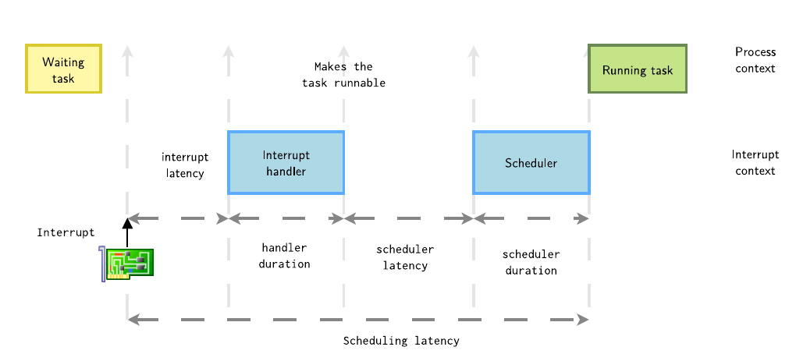
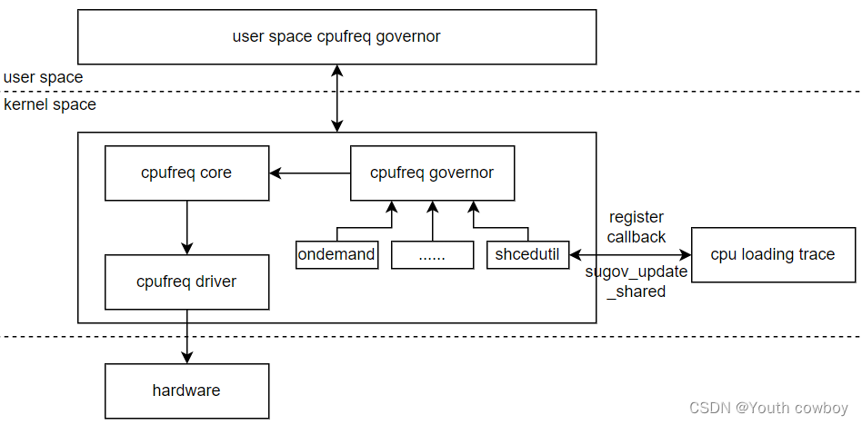

# Table of Contents

<details>
<summary>▾ Expand ▴ Collapse</summary>

* [CPU](#cpu)
* [bios](#bios)
* [start_kernel](#start_kernel)
    * [smp_boot](#smp_boot)
* [syscall](#syscall)
    * [glibs](#glibc)
    * [64](#64)

* [process](#process)
* [thread](#thread)
* [task_struct](#task_struct)
* [sched](#sched)
    * [voluntary schedule](#voluntary-schedule)
    * [preempt schedule](#preempt-schedule)
        * [user preempt](#user-preempt)
            * [set_tsk_need_resched](#set_tsk_need_resched)
                * [sched_tick](#sched_tick)
                * [try_to_wake_up](#try_to_wake_upp)
                * [sched_setscheduler](#sched_setscheduler)
            * [prempt time](#preempt-time)
                * [return from system call](#return-from-system-call)
                * [return from interrupt](#return-from-interrupt)
        * [kernel preempt](#kernel-preempt)
            * [preempt_enable](#preempt_enble)
            * [preempt_schedule_irq](#preempt_schedule_irq)

* [SCHED_RT](#SCHED_RR)
    * [enqueue_task_rt](#enqueue_task_rt)
    * [dequeue_task_rt](#dequeue_task_rt)
    * [put_prev_task_rt](#put_prev_task_rt)
    * [pick_next_task_rt](#pick_next_task_rt)
    * [set_next_task_rt](#set_next_task_rt)
    * [select_task_rq_rt](#select_task_rq_rt)
    * [wakeup_preempt_rt](#wakeup_preempt_rt)
    * [task_tick_rt](#task_tick_rt)
    * [yield_task_rt](#yield_task_rt)
    * [prio_changed_rt](#prio_changed_rt)
    * [check_class_changed_rt](#check_class_changed_rt)
        * [switched_from_rt](#switched_from_rt)
        * [switched_to_rt](#switched_to_rq)
    * [balance_rt](#balance_rt)
        * [push_rt_task](#push_rt_task)
        * [pull_rt_task](#pull_rt_task)
* [SCHED_CFS](#SCHED_CFS)
    * [enqueue_task_fair](#enqueue_task_fair)
    * [dequeue_task_fair](#dequeue_task_fair)
    * [put_prev_task_fair](#put_prev_task_fair)
    * [pick_next_task_fair](#pick_next_task_fair)
    * [set_next_task_fair](#set_next_task_fair)
    * [select_task_rq_fair](#select_task_rq_fair)
        * [sched_balance_find_dst_cpu](#sched_balance_find_dst_cpu)
            * [sched_balance_find_dst_group](#sched_balance_find_dst_group)
            * [sched_balance_find_dst_group_cpu](#sched_balance_find_dst_group_cpu)
        * [select_idle_sibling](#select_idle_sibling)
    * [wakeup_preempt_fair](#wakeup_preempt_fair)
    * [task_tick_fair](#task_tick_fair)
    * [task_fork_fair](#task_fork_fair)
    * [yield_task_fair](#yield_task_fair)
    * [prio_changed_fair](#prio_changed_fair)
    * [check_class_changed_fair](#check_class_changed_fair)
        * [switched_from_fair](#switched_from_fair)
        * [switched_to_fair](#switched_to_fair)
    * [balance_fair](#balance_fair)
    * [sched_vslice](#sched_vslice)

* [sched_domain](#sched_domain)
* [cpu_topology](#cpu_topology)
    * [init_cpu_topology](#init_cpu_topology)
    * [parse_dt_topology](#parse_dt_topology)
    * [parse_socket](#parse_socket)
    * [parse_cluster](#parse_cluster)
    * [parse_core](#parse_core)

* [PELT](#PELT)
    * [update_load_sum_avg](#update_load_sum_avg)
    * [update_load_avg](#update_load_avg)
        * [update_cfs_rq_load_avg](#update_cfs_rq_load_avg)
    * [rq_clock](#rq_clock)

* [sched_balance_rq](#sched_balance_rq)
    * [tick_balance](#tick_balance)
    * [nohz_idle_balance](#nohz_idle_balance)
    * [sched_balance_newidle](#sched_balance_newidle)
    * [sched_balance_rq](#sched_balance_rq)
        * [should_we_balance](#should_we_balance)
        * [sched_balance_find_src_group](#sched_balance_find_src_group)
            * [update_sd_lb_stats](#update_sd_lb_stats)
            * [update_sd_pick_busiest](#update_sd_pick_busiest)
            * [calculate_imbalance](#calculate_imbalance)
        * [sched_balance_find_src_rq](#sched_balance_find_src_rq)
        * [detach_tasks](#detach_tasks)
            * [can_migrate_task](#can_migrate_task)

* [wake_up](#wake_up)
* [wait_woken](#wait_woken)
* [try_to_wake_up](#try_to_wake_up)

* [fork](#fork)

* [wait4](#wait4)
    * [wait_consider_task](#wait_consider_task)
    * [wait_task_zombie](#wait_task_zombie)

* [exec](#exec)
    * [load_elf_binary](#load_elf_binary)
    * [exec_call_graph](#exec_call_graph)

* [exit](#exit)
    * [exit_signals](#exit_signals)
    * [exit_notify](#exit_notify)

* [kthreadd](#kthreadd)

* [cmwq](#cmwq)
    * [workqueue_init](#workqueue_init)
    * [alloc_workqueue](#alloc_workqueue)
    * [alloc_unbound_pwq](#alloc_unbound_pwq)
    * [create_worker](#create_worker)
    * [worker_thread](#worker_thread)
    * [queue_work](#queue_work)
    * [wq-struct](#wq-struct)

</details>

* [LWN Kernel Index](https://lwn.net/Kernel/Index/)


---

In ARMv8-A AArch64 architecture, there are several types of registers. Below is an overview of the main registers used in this architecture:
* General-Purpose Registers
    - **x0 - x30**: These are the 64-bit general-purpose registers.
    - **x0 - x7**: Argument and result registers.
    - **x8**: Indirect result location register.
    - **x9 - x15**: Temporary registers.
    - **x16 - x17**: Intra-procedure call temporary registers.
    - **x18**: Platform register (may be used as a temporary register in some platforms).
    - **x19 - x28**: Callee-saved registers.
    - **x29**: Frame pointer (FP).
    - **x30**: Link register (LR).
    - **w0 - w30**: The lower 32 bits of the x0 - x30 registers.

* Stack Pointer Registers

    - **sp (stack pointer)**: Points to the top of the current stack.
    - **xzr/wzr (zero register)**: Reads as zero and discards writes (xzr for 64-bit, wzr for 32-bit).

* Special-Purpose Registers

    - **PC (program counter)**: Holds the address of the next instruction to be executed.
    - **PSTATE (processor state register)**: Contains flags and control bits.
    - **NZCV (condition flags)**: Stored in the PSTATE register.
        - **N (Negative)**: Set if the result of the operation was negative.
        - **Z (Zero)**: Set if the result of the operation was zero.
        - **C (Carry)**: Set if the operation resulted in a carry.
        - **V (Overflow)**: Set if the operation resulted in an overflow.

* SIMD and Floating-Point Registers

    - **v0 - v31**: These are the 128-bit SIMD and floating-point registers.
    - **d0 - d31**: The lower 64 bits of the v0 - v31 registers.
    - **s0 - s31**: The lower 32 bits of the v0 - v31 registers.
    - **h0 - h31**: The lower 16 bits of the v0 - v31 registers.
    - **b0 - b31**: The lower 8 bits of the v0 - v31 registers.

* System Registers

    - **SPSR (Saved Program Status Register)**: Holds the saved processor state when an exception is taken.
    - **ELR (Exception Link Register)**: Holds the address to return to after an exception.
    - **TPIDR_EL0**: Thread ID register for EL0.
    - **TPIDR_EL1**: Thread ID register for EL1.
    - **CNTVCT_EL0**: Virtual counter-timer.
    - **CNTFRQ_EL0**: Counter-timer frequency.

* Exception Level Registers

    - **SP_EL0**: Stack pointer for EL0.
    - **SP_EL1**: Stack pointer for EL1.
    - **SP_EL2**: Stack pointer for EL2.
    - **SP_EL3**: Stack pointer for EL3.
    - **ELR_EL1**: Exception Link Register for EL1.
    - **ELR_EL2**: Exception Link Register for EL2.
    - **ELR_EL3**: Exception Link Register for EL3.
    - **SPSR_EL1**: Saved Program Status Register for EL1.
    - **SPSR_EL2**: Saved Program Status Register for EL2.
    - **SPSR_EL3**: Saved Program Status Register for EL3.

* Summary

    - **General-purpose registers**: x0 - x30 (64-bit) and w0 - w30 (32-bit).
    - **Stack pointer**: sp.
    - **Special-purpose**: xzr/wzr, PC, PSTATE, NZCV.
    - **SIMD and floating-point registers**: v0 - v31.
    - **System registers**: Various registers for control and status.
    - **Exception level registers**: SP_EL0 - SP_EL3, ELR_EL1 - ELR_EL3, SPSR_EL1 - SPSR_EL3.

# Reference

* [TIP: sched/core](https://git.kernel.org/pub/scm/linux/kernel/git/tip/tip.git/log/?h=sched/core)
* [LNW - A proxy-execution baby step](https://lwn.net/Articles/1030842/)
    * [1. [RFC PATCH 00/11] Reviving the Proxy Execution Series](https://lore.kernel.org/lkml/20221003214501.2050087-1-connoro@google.com/)
    * [2. [PATCH v8 0/7] Preparatory changes for Proxy Execution v8](https://lore.kernel.org/lkml/20240224001153.2584030-1-jstultz@google.com/)
    * [3. [PATCH v12 0/7] Preparatory changes for Proxy Execution v12](https://lore.kernel.org/all/20241009235352.1614323-1-jstultz@google.com/)
    * [3. [PATCH v19 0/8] Single RunQueue Proxy Execution (v19)](https://lore.kernel.org/all/20250712033407.2383110-1-jstultz@google.com/)
    * [Phoronix - Linux 6.13 Poised To Land Prep Patches Working Toward Proxy Execution](https://www.phoronix.com/news/Linux-6.13-Prep-For-Proxy-Exec)

    The **scheduling context** is essentially a task's position in the scheduler's run queue, while the **execution context** describes the task that actually runs when the scheduling context is selected for execution.

    The CPU time used by the execution context will be charged against the scheduling context — the proxy will burn a bit of the donor's time slice so that it can get its work done. But the total CPU time usage of the execution context should be increased to reflect the time it spends running in the proxy mode. That is the time value that is visible to user space; having it reflect the actual execution time of the task makes it clear that the task is, indeed, executing.

* [A complete guide to Linux process scheduling.pdf](https://trepo.tuni.fi/bitstream/handle/10024/96864/GRADU-1428493916.pdf)
* [Linux kernel scheduler](https://helix979.github.io/jkoo/post/os-scheduler/)
* [Kernel Index Sched - LWN](https://lwn.net/Kernel/Index/#Scheduler)
    * [LWN Index - Realtime](https://lwn.net/Kernel/Index/#Realtime)
    * [LWN Index - Scheduler](https://lwn.net/Kernel/Index/#Scheduler)
        * [Scheduling domains](https://lwn.net/Articles/80911/)
    * [LWN Index - CFS scheduler](https://lwn.net/Kernel/Index/#Scheduler-Completely_fair_scheduler)
        * [An EEVDF CPU scheduler for Linux](https://lwn.net/Articles/925371/)
            * [[PATCH 00/15] sched: EEVDF and latency-nice and/or slice-attr](https://lore.kernel.org/all/20230531115839.089944915@infradead.org/)
                * [[PATCH 01/15] sched/fair: Add cfs_rq::avg_vruntime](https://github.com/torvalds/linux/commit/af4cf40470c22efa3987200fd19478199e08e103)
                * [[PATCH 03/15] sched/fair: Add lag based placement](https://github.com/torvalds/linux/commit/86bfbb7ce4f67a88df2639198169b685668e7349)
                * [[PATCH 04/15] rbtree: Add rb_add_augmented_cached() helper](https://github.com/torvalds/linux/commit/99d4d26551b56f4e523dd04e4970b94aa796a64e)
                * [[PATCH 05/15] sched/fair: Implement an EEVDF like policy](https://github.com/torvalds/linux/commit/147f3efaa24182a21706bca15eab2f3f4630b5fe)
                * [[PATCH 07/15] sched/smp: Use lag to simplify cross-runqueue placement](https://github.com/torvalds/linux/commit/e8f331bcc270354a803c2127c486190d33eac441)
                * [[PATCH 08/15] sched: Commit to EEVDF](https://github.com/torvalds/linux/commit/5e963f2bd4654a202a8a05aa3a86cb0300b10e6c)
            * [[PATCH 00/24] Complete EEVDF](https://lore.kernel.org/all/20240727102732.960974693@infradead.org/)
            * [Completing the EEVDF scheduler](https://lwn.net/Articles/969062/) `Delayed Dequeue` ⊙ `Wakeup Preemption`
        * [OSPM 2015 - The EEVDF verifier: a tale of trying to catch up](https://lwn.net/Articles/1022054)
        * [CFS的覆灭，Linux新调度器EEVDF详解](https://blog.csdn.net/qq_41603411/article/details/136277735)
        * [Linux 核心設計: Scheduler(5): EEVDF Scheduler 1](https://hackmd.io/@RinHizakura/SyG4t5u1a) ⊙ [2](https://hackmd.io/@RinHizakura/HkyEtNkjA)
    * [LWN Index - Core scheduling](https://lwn.net/Kernel/Index/#Scheduler-Core_scheduling)
    * [LWN Index - Deadline scheduling](https://lwn.net/Kernel/Index/#Scheduler-Deadline_scheduling)
    * [LWN Index - Group scheduling](https://lwn.net/Kernel/Index/#Scheduler-Group_scheduling)
    * [The long road to lazy preemption](https://lwn.net/Articles/994322/)
        * [[PATCH 0/5] sched: Lazy preemption muck](https://lore.kernel.org/all/20241007074609.447006177@infradead.org/)
    * [LWN Index - Time-slice extension](https://lwn.net/Kernel/Index/#Scheduler-Time-slice_extension)
        * [[patch 00/12] rseq: Implement time slice extension mechanism](https://lore.kernel.org/all/20250908225709.144709889@linutronix.de/)

* [进程调度 - LoyenWang](https://www.cnblogs.com/LoyenWang/tag/进程调度/)
    * [1. 基础](https://www.cnblogs.com/LoyenWang/p/12249106.html)
    * [2. CPU负载](https://www.cnblogs.com/LoyenWang/p/12316660.html)
    * [3. 进程切换](https://www.cnblogs.com/LoyenWang/p/12386281.html)
    * [4. 组调度及带宽控制](https://www.cnblogs.com/LoyenWang/p/12459000.html)
    * [5. CFS调度器](https://www.cnblogs.com/LoyenWang/p/12495319.html)
    * [6. 实时调度器](https://www.cnblogs.com/LoyenWang/p/12584345.html)
    * [Linux进程调度器-CPU负载](https://www.cnblogs.com/LoyenWang/p/12316660.html)

* [Wowo Tech](http://www.wowotech.net/sort/process_management)
    * [进程切换分析 - :one:基本框架](http://www.wowotech.net/process_management/context-switch-arch.html) ⊙ [:two:TLB处理](http://www.wowotech.net/process_management/context-switch-tlb.html) ⊙ [:three:同步处理](http://www.wowotech.net/process_management/scheudle-sync.html)
    * [CFS调度器 - 组调度](http://www.wowotech.net/process_management/449.html)
    * [CFS调度器 - 带宽控制](http://www.wowotech.net/process_management/451.html)
    * [CFS调度器 - 总结](http://www.wowotech.net/process_management/452.html)
    * [ARM Linux上的系统调用代码分析](http://www.wowotech.net/process_management/syscall-arm.html)
    * [Linux调度器 - 用户空间接口](http://www.wowotech.net/process_management/scheduler-API.html)
    * [schedutil governor情景分析](http://www.wowotech.net/process_management/schedutil_governor.html)
    * [TLB flush](http://www.wowotech.net/memory_management/tlb-flush.html)

* [hellokitty2 进程管理](https://www.cnblogs.com/hellokitty2/category/1791168.html)

* [CHENG Jian Linux进程管理与调度](https://kernel.blog.csdn.net/article/details/51456569)
    * [WAKE_AFFINE](https://blog.csdn.net/gatieme/article/details/106315848)
    * [用户抢占和内核抢占](https://blog.csdn.net/gatieme/article/details/51872618)

* [汪辰]
    * [Linux 内核的抢占模型](https://gitee.com/aosp-riscv/working-group/blob/master/articles/20230805-linux-preemption-models.md)
    * [Linux "PREEMPT_RT" 抢占模式分析报告](https://gitee.com/aosp-riscv/working-group/blob/master/articles/20230806-linux-preempt-rt.md#/aosp-riscv/working-group/blob/master/articles/20230805-linux-preemption-models.md)
    * [实时 Linux(Real-Time Linux)](https://gitee.com/aosp-riscv/working-group/blob/master/articles/20230727-rt-linux.md)
    * [Linux 调度器(Schedular)](https://gitee.com/aosp-riscv/working-group/blob/master/articles/20230801-linux-scheduler.md)

* [PREEMPT_RT Linux](https://wiki.linuxfoundation.org/realtime/start)
    * [Download PREEMPT_RT patch set](https://www.kernel.org/pub/linux/kernel/projects/rt/)
    * [LWN - A realtime preemption overview](https://lwn.net/Articles/146861/)
    * [Preemption Models](https://wiki.linuxfoundation.org/realtime/documentation/technical_basics/preemption_models)
        Model | Case | Preempt Points
        --- | --- | ---
        PREEMPT_NONE | No Forced Preemption (server) | `system call returns` + `interrupts`
        PREEMPT_VOLUNTARY | Voluntary Kernel Preemption (Desktop) | `system call returns` + `interrupts` + `explicit preemption points`
        PREEMPT | Preemptible Kernel (Low-Latency Desktop) |`system call returns` + `interrupts` + `all kernel code(except critical section)`
        PREEMPT_RT | Fully Preemptible Kernel (RT) | `system call returns` + `interrupts` + `all kernel code(except a few critical section)` + `threaded interrupt handlers`

* [Oracle Linux Blog](https://blogs.oracle.com/linux/category/lnx-linux-kernel-development)
    * [Understanding process thread priorities in Linux](https://blogs.oracle.com/linux/post/task-priority)
        * **static_prio**: maps the priority range used for normal tasks and is the priority according to the nice value of a task.
            > static_prio = 120 + nice
        * **rt_priority**: maps the priority range for real time tasks and indicates real time priority.
            > MAX_RT_PRIO-1 - rt_priority
            * POSIX high rt_priority value signifies high priority  while linux low priority value signifies high priority
        * **normal_prio**: indicates priority of a task without any temporary priority boosting from the kernel side. For normal tasks it is the same as static_prio and for RT tasks it is directly related to rt_priority
            * In absence of normal_prio, children of a priority boosted task will get boosted priority as well and this will cause CPU starvation for other tasks. To avoid such a situation, the kernel maintains nomral_prio of a task. Forked tasks usually get their effective prio set to normal_prio of the parent and hence don’t get boosted priority.
        * **prio**: is the effective priority of a task and is used in all scheduling related decision makings.

# cpu


# bios
* 

**UEFI** initializes hardware and hands off to the OS loader (e.g., GRUB).
|**Stage**|**Description**|
|:-:|:-:|
|**SEC (Security)**|Initializes CPU, temporary memory (cache-as-RAM), and security (e.g., TPM).|
|**PEI (Pre-EFI)**|Sets up permanent RAM, configures chipset, builds HOBs (early memory map).|
|**DXE (Driver Exec)**|Loads drivers, finalizes memory map, offers Boot Services (e.g., `GetMemoryMap`).|
|**BDS (Boot Device)**|Selects boot device (e.g., GRUB on ESP) from NVRAM variables.|
|**TSL (Transient)**|Runs OS loader (e.g., GRUB) until `ExitBootServices()`.|
|**RT (Runtime)**|Post-boot services (e.g., variables, time) for OS; memory reserved.|

- **Memory Role**: Maps RAM (e.g., `EfiConventionalMemory`) for kernel’s zonelists and buddy system.

**GRUB loads the kernel after UEFI hands off.**
|**Stage**|**Description**|
|:-:|:-:|
|**UEFI Load**|UEFI executes `grubx64.efi` from ESP using Boot Services.|
|**Core Image**|`grubx64.efi` loads core image, minimal drivers (e.g., FAT) in UEFI memory.|
|**Modules/Config**|Loads `grub.cfg` and modules (e.g., `linux.mod`) from `/boot/grub`.|
|**User Interaction**|Optional menu (via `normal` module); skips if timeout=0.|
|**Kernel Load**|Copies kernel (e.g., `vmlinuz`) and initrd to RAM via `AllocatePages()`.|
|**Handoff**|Calls `ExitBootServices()`, passes memory map, jumps to kernel entry point.|

- **Memory Role**: Uses UEFI-allocated memory, hands `EfiConventionalMemory` to kernel for buddy system setup.
- UEFI’s memory map becomes the kernel’s starting point—zonelists, pageblocks (e.g., 4 MB), and migrate types (e.g., `MIGRATE_UNMOVABLE` for runtime regions) kick in post-handoff.
---

* When power on, set CS to 0xFFFF, IP to 0x0000, the first instruction points to 0xFFFF0 within ROM, a JMP comamand will jump to ROM do init work, BIOS starts.
* Then BIOS checks the health state of each hardware.
* Grub2 (Grand Unified Bootloader Version 2)
  * grub2-mkconfig -o /boot/grub2/grub.cfg
    ```
    menuentry 'CentOS Linux (3.10.0-862.el7.x86_64) 7 (Core)' --class centos --class gnu-linux --class gnu --class os --unrestricted $menuentry_id_option 'gnulinux-3.10.0-862.el7.x86_64-advanced-b1aceb95-6b9e-464a-a589-bed66220ebee' {
      load_video
      set gfxpayload=keep
      insmod gzio
      insmod part_msdos
      insmod ext2 set root='hd0,msdos1'
      if [ x$feature_platform_search_hint = xy ]; then
        search --no-floppy --fs-uuid --set=root --hint='hd0,msdos1' b1aceb95-6b9e-464a-a589-bed66220ebee
      else search --no-floppy --fs-uuid --set=root b1aceb95-6b9e-464a-a589-bed66220ebee
      fi

      linux16 /boot/vmlinuz-3.10.0-862.el7.x86_64 root=UUID=b1aceb95-6b9e-464a-a589-bed66220ebee ro console=tty0 console=ttyS0,115200 crashkernel=auto net.ifnames=0 biosdevname=0 rhgb quiet
      initrd16 /boot/initramfs-3.10.0-862.el7.x86_64.img
    }
    ```
  * grub2-install /dev/sda
    * install boot.img into MBR(Master Boot Record), and load boot.img into memory at 0x7c00 to run
    * core.img: diskboot.img, lzma_decompress.img, kernel.img

*   ```c
    boot.img                    /* Power On Self Test */
    core.img
        diskboot.img            /* diskboot.S load other modules of grub into memory */
            lzma_decompress.img /* startup_raw.S */
                real_to_prot    /* enable segement, page, open Gate A20 */
                kernel.img      /* startup.S, grub's kernel img not Linux kernel */
                    grub_main   /* grub's main func */
                        grub_load_config()
                        grub_command_execute ("normal", 0, 0)
                            grub_normal_execute()
                                grub_show_menu() /* show which OS want to run */
                                    grub_menu_execute_entry() /* start linux kernel */
    ```
    * boot.img
        * checks the basic operability of the hardware and then it issues a BIOS interrupt, INT 13H, which locates the boot sectors on any attached bootable devices.
        * read the first sector of the core image from a local disk and jump to it. Because of the size restriction, boot.img cannot understand any file system structure, so grub-install hardcodes the location of the first sector of the core image into boot.img when installing GRUB.
    * diskboot.img
        * the first sector of the core image when booting from a hard disk. It reads the rest of the core image into memory and starts the kernel. Since file system handling is not yet available, it encodes the location of the core image using a block list format.
    * kernel.img
        * contains GRUB’s basic run-time facilities: frameworks for device and file handling, environment variables, the rescue mode command-line parser, and so on. It is rarely used directly, but is built into all core images.
    * core.img
        * built dynamically from the kernel image and an arbitrary list of modules by the grub-mkimage program. Usually, it contains enough modules to access /boot/grub, and loads everything else (including menu handling, the ability to load target operating systems, and so on) from the file system at run-time. The modular design allows the core image to be kept small, since the areas of disk where it must be installed are often as small as 32KB.

* [GNU GRUB Manual 2.06](https://www.gnu.org/software/grub/manual/grub/html_node/index.html#SEC_Contents)
* [GNU GRUB Manual 2.06: Images](https://www.gnu.org/software/grub/manual/grub/html_node/Images.html)

```c
/* arch/arm64/kernel/head.S */
 * Kernel startup entry point.
 * ---------------------------
 *
 * The requirements are:
 *   MMU = off, D-cache = off, I-cache = on or off,
 *   x0 = physical address to the FDT blob. */

__HEAD
    efi_signature_nop
    b  primary_entry
    .quad  0
    le64sym  _kernel_size_le
    le64sym  _kernel_flags_le
    .quad  0
    .quad  0
    .quad  0
    .ascii  ARM64_IMAGE_MAGIC
    .long  .Lpe_header_offset

    __EFI_PE_HEADER

    .section ".idmap.text","a"

primary_entry
    bl record_mmu_state

    /* Preserve the arguments passed by the bootloader in x0 .. x3 */
    bl preserve_boot_args

    bl create_idmap

    bl __cpu_setup

    b __primary_switch
        adrp x1, reserved_pg_dir
        adrp x2, init_idmap_pg_dir
        bl __enable_mmu

        bl clear_page_tables
        bl create_kernel_mapping

        adrp x1, init_pg_dir
        load_ttbr1 x1, x1, x2 /* install x1 as a TTBR1 page table */

        x0 = __pa(KERNEL_START)

        bl __primary_switched
            adr_l x4, init_task
            init_cpu_task x4, x5, x6

            adr_l x8, vectors /* load VBAR_EL1 with virtual */
            msr vbar_el1, x8 /* vector table address */

            ldr_l x4, _text // Save the offset between
            sub   x4, x4, x0 // the kernel virtual and
            str_l x4, kimage_voffset, x5 // physical mappings

            bl set_cpu_boot_mode_flag

            bl __pi_memset

            mov x0, x21 /* pass FDT address in x0 */
            bl early_fdt_map /* Try mapping the FDT early */

            mov x0, x20 /* pass the full boot status */
            bl init_feature_override  /* Parse cpu feature overrides */

            bl start_kernel
```

# start_kernel


```c
/* init/main.c */
void start_kernel(void)
{
    /* #0 process, the only one doesn't created by fork or kernel_thread */
    set_task_stack_end_magic(&init_task);

    local_irq_disable();

    setup_arch(&command_line);

    /* set_system_intr_gate(IA32_SYSCALL_VECTOR, entry_INT80_32) */
    trap_init();

    /* mnt_init()->init_rootfs() register_filesystem(&rootfs_fs_type) */
    vfs_caches_init()
    setup_arch(&command_line)
    mm_init();
    sched_init();
    init_IRQ();
    softirq_init();
    signals_init();
    cpuset_init();
    cgroup_init();

    rest_init()
}

static void rest_init(void)
{
    struct task_struct *tsk;
    int pid;

    pid = kernel_thread(kernel_init, NULL, CLONE_FS);

    pid = kernel_thread(kthreadd, NULL, CLONE_FS | CLONE_FILES);

    complete(&kthreadd_done);

    cpu_startup_entry(CPUHP_ONLINE) {
        current->flags |= PF_IDLE;
        arch_cpu_idle_prepare();
        cpuhp_online_idle(state);
        while (1) {
            do_idle();
        }
    }
}

/* init/init_task.c */
struct task_struct init_task
#ifdef CONFIG_ARCH_TASK_STRUCT_ON_STACK
  __init_task_data
#endif
= {
#ifdef CONFIG_THREAD_INFO_IN_TASK
  .thread_info      = INIT_THREAD_INFO(init_task),
  .stack_refcount   = ATOMIC_INIT(1),
#endif
  .state    = 0,
  .stack    = init_stack,
  .usage    = ATOMIC_INIT(2),
  .flags    = PF_KTHREAD,
};
```

```c
pid_t kernel_thread(int (*fn)(void *), void *arg, unsigned long flags)
{
  return _do_fork(flags|CLONE_VM|CLONE_UNTRACED, (unsigned long)fn,
    (unsigned long)arg, NULL, NULL, 0);
}

/* return from kernel to user space */
static int kernel_init(void *unused)
{
  if (ramdisk_execute_command) {
    ret = run_init_process(ramdisk_execute_command);
    if (!ret)
      return 0;
  }

  if (execute_command) {
    ret = run_init_process(execute_command);
    if (!ret)
      return 0;
  }

  if (!try_to_run_init_process("/sbin/init") ||
      !try_to_run_init_process("/etc/init") ||
      !try_to_run_init_process("/bin/init") ||
      !try_to_run_init_process("/bin/sh"))
    return 0;
}

static int run_init_process(const char *init_filename)
{
  argv_init[0] = init_filename;
  return do_execve(getname_kernel(init_filename),
    (const char __user *const __user *)argv_init,
    (const char __user *const __user *)envp_init);
}
```


## smp_boot

* [ARM64 的多核启动流程分析](https://zhuanlan.zhihu.com/p/512099688?utm_id=0)
* [ARM64 SMP多核启动 spin-table](https://mp.weixin.qq.com/s/4T4WcbG5rMpHFtU8-xxTbg) ⊙ [PSCI](https://mp.weixin.qq.com/s/NaEvCuSDJMQ2dsN5rJ6GqA)

```c
SYM_FUNC_START(secondary_holding_pen)
    mov     x0, xzr
    bl      init_kernel_el
    mrs     x2, mpidr_el1
    mov_q   x1, MPIDR_HWID_BITMASK
    and     x2, x2, x1
    adr_l   x3, secondary_holding_pen_release
pen:    ldr    x4, [x3]
    cmp     x4, x2
    b.eq    secondary_startup
    wfe
    b       pen
SYM_FUNC_END(secondary_holding_pen)

void start_kernel(void) {
    setup_arch(&command_line) {
/* 1. cpu_init */
        smp_init_cpus() {
            smp_cpu_setup(cpu) {
                /* Read a cpu's enable method and record it in cpu_ops. */
                init_cpu_ops(cpu) {
                    const char *enable_method = cpu_read_enable_method(cpu);

                    cpu_ops[cpu] = cpu_get_ops(enable_method); /* "spin-table" or "psci" */
                }

                ops = get_cpu_ops(cpu);
                ops->cpu_init(cpu) {
                    smp_spin_table_ops->cpu_init() {
                        smp_spin_table_cpu_init() {
                            /*  Determine the address from which the CPU is polling */
                            of_property_read_u64(dn, "cpu-release-addr", &cpu_release_addr[cpu]);
                        }
                    }

                    cpu_psci_ops->cpu_psci_cpu_init() {

                    }
                }

                set_cpu_possible(cpu, true);
            }
        }
    }

/* 2. cpu_prepare */
    arch_call_rest_init() {
        rest_init() {
            user_mode_thread(kernel_init);
            kernel_init() {
                kernel_init_freeable() {
                    smp_prepare_cpus() {
                        cpu_ops[cpu]->cpu_prepare() {
                            smp_spin_table_ops->cpu_prepare() {
                                smp_spin_table_cpu_prepare() {
                                    __le64 __iomem *release_addr;
                                    phys_addr_t pa_holding_pen = __pa_symbol(secondary_holding_pen);

                                    release_addr = ioremap_cache(cpu_release_addr[cpu], sizeof(*release_addr));

                                    writeq_relaxed(pa_holding_pen, release_addr);
                                    dcache_clean_inval_poc((__force unsigned long)release_addr,
                                                (__force unsigned long)release_addr +
                                                    sizeof(*release_addr));
                                    sev();

                                    iounmap(release_addr);

                                    return 0;
                                }
                                cpu_psci_cpu_prepare() {

                                }
                            }
                        }
                    }
/* 3. cpu_boot */
                    smp_init() {
                        idle_threads_init() {
                            fork_idle(cpu)
                        }
                        cpuhp_threads_init();

                        bringup_nonboot_cpus(setup_max_cpus) {
                            cpuhp_bringup_mask(cpu_present_mask, setup_max_cpus, CPUHP_ONLINE) {
                                for_each_cpu::cpu_up(cpu, target) {
                                    try_online_node(cpu_to_node(cpu));
                                    _cpu_up(cpu, 0, target) {
                                        cpuhp_up_callbacks(cpu, st, target) {
                                            cpuhp_reset_state(cpu, st, prev_state)

                                            cpuhp_invoke_callback_range(false, cpu, st, prev_state) {
                                                while (cpuhp_next_state(bringup, &state, st, target)) {
                                                    cpuhp_invoke_callback(cpu, state, bringup, NULL, NULL);
                                                }
                                                cpuhp_invoke_callback(cpu, state, bringup, NULL, NULL) {
                                                    struct cpuhp_cpu_state *st = per_cpu_ptr(&cpuhp_state, cpu);
                                                    struct cpuhp_step *step = cpuhp_get_step(state);
                                                    cb = bringup ? step->startup.single : step->teardown.single;
                                                    ret = cb(cpu) {
                                                        bringup_cpu()
                                                            --->
                                                    }
                                                }
                                            }
                                        }
                                    }
                                }
                            }
                        }
                    }

                }
            }
        }
    }
}
```

```c
bringup_cpu() {
    __cpu_up(cpu, idle) { //arch/arm64/kernel/smp.c
        boot_secondary(cpu, idle) {
            ops = get_cpu_ops(cpu);
            ops->cpu_boot(cpu) {

                smp_spin_table_cpu_boot() {
                    u64 __cpu_logical_map[NR_CPUS] = { [0 ... NR_CPUS-1] = INVALID_HWID };
                    u64 cpu_logical_map(unsigned int cpu) {
                        return __cpu_logical_map[cpu];
                    }

                    write_pen_release(cpu_logical_map(cpu)/*val*/) {
                        void *start = (void *)&secondary_holding_pen_release;
                        unsigned long size = sizeof(secondary_holding_pen_release);

                        secondary_holding_pen_release = val;
                        dcache_clean_inval_poc((unsigned long)start, (unsigned long)start + size);
                    }
                    sev();
                }

                cpu_psci_cpu_boot() {
                    phys_addr_t pa_secondary_entry = __pa_symbol(secondary_entry);
                    err = psci_ops.cpu_on(cpu_logical_map(cpu), pa_secondary_entry) {
                        psci_0_2_cpu_on() {
                            __psci_cpu_on() {
                                invoke_psci_fn() {
                                    if (case SMCCC_CONDUIT_HVC) {
                                        invoke_psci_fn = __invoke_psci_fn_hvc() {
                                            arm_smccc_hvc()
                                        }
                                    } else if (case SMCCC_CONDUIT_SMC) {
                                        invoke_psci_fn = __invoke_psci_fn_smc() {
                                            arm_smccc_smc()
                                        }
                                    }
                                }
                            }
                        }
                    }
                }
            }
        }
    }
}
```

### cpuhp_hp_states

```c
static struct cpuhp_step cpuhp_hp_states[] = {
    [CPUHP_OFFLINE] = {
        .name                   = "offline",
        .startup.single         = NULL,
        .teardown.single        = NULL,
    },
    [CPUHP_AP_OFFLINE] = {
        .name                   = "ap:offline",
        .cant_stop              = true,
    },
    /* First state is scheduler control. Interrupts are disabled */
    [CPUHP_AP_SCHED_STARTING] = {
        .name                   = "sched:starting",
        .startup.single         = sched_cpu_starting,
        .teardown.single        = sched_cpu_dying,
    },
    [CPUHP_AP_RCUTREE_DYING] = {
        .name                   = "RCU/tree:dying",
        .startup.single         = NULL,
        .teardown.single        = rcutree_dying_cpu,
    },
    [CPUHP_AP_SMPCFD_DYING] = {
        .name                   = "smpcfd:dying",
        .startup.single         = NULL,
        .teardown.single        = smpcfd_dying_cpu,
    },
    [CPUHP_AP_HRTIMERS_DYING] = {
        .name                   = "hrtimers:dying",
        .startup.single         = hrtimers_cpu_starting,
        .teardown.single        = hrtimers_cpu_dying,
    },
    [CPUHP_AP_TICK_DYING] = {
        .name                   = "tick:dying",
        .startup.single         = NULL,
        .teardown.single        = tick_cpu_dying,
    },
    /* Entry state on starting. Interrupts enabled from here on. Transient
     * state for synchronsization */
    [CPUHP_AP_ONLINE] = {
        .name                   = "ap:online",
    },
    [CPUHP_TEARDOWN_CPU] = {
        .name                   = "cpu:teardown",
        .startup.single         = NULL,
        .teardown.single        = takedown_cpu,
        .cant_stop              = true,
    },
    [CPUHP_AP_ACTIVE] = {
        .name                   = "sched:active",
        .startup.single         = sched_cpu_activate,
        .teardown.single        = sched_cpu_deactivate,
    },
    /* CPU is fully up and running. */
    [CPUHP_ONLINE] = {
        .name                   = "online",
        .startup.single         = NULL,
        .teardown.single        = NULL,
    },
};
```

# syscall

* [The Definitive Guide to Linux System Calls](https://blog.packagecloud.io/the-definitive-guide-to-linux-system-calls/)
* [Linux系统调用：深入解析Hook技术](https://mp.weixin.qq.com/s/W3LYAFpuddA2a96k0iiczw)


```c
/* arch/arm64/include/asm/ptrace.h
 * arch/x86/include/asm/ptrace.h */
struct pt_regs {
    union {
        struct user_pt_regs user_regs;
        struct {
            u64 regs[31];
            u64 sp;
            u64 pc;
            u64 pstate;
        };
    };
    u64 orig_x0;
#ifdef __AARCH64EB__
    u32 unused2;
    s32 syscallno;
#else
    s32 syscallno;
    u32 unused2;
#endif
    u64 sdei_ttbr1;
    /* Only valid when ARM64_HAS_GIC_PRIO_MASKING is enabled. */
    u64 pmr_save;
    u64 stackframe[2]; /* store FP and LR */

    /* Only valid for some EL1 exceptions. */
    u64 lockdep_hardirqs;
    u64 exit_rcu;
};

struct user_pt_regs {
    __u64        regs[31];
    __u64        sp;
    __u64        pc;
    __u64        pstate;
};
```

```c
/* arch/arm64/kernel/sys.c */
#undef __SYSCALL
#define __SYSCALL(nr, sym)  asmlinkage long __arm64_##sym(const struct pt_regs *);
#include <asm/unistd.h>

#undef __SYSCALL
#define __SYSCALL(nr, sym)  [nr] = __arm64_##sym,

const syscall_fn_t sys_call_table[__NR_syscalls] = {
    [0 ... __NR_syscalls - 1] = __arm64_sys_ni_syscall,
#include <asm/unistd.h>
};

/* include/linux/syscalls.h */
#define SYSCALL_DEFINE1(name, ...) SYSCALL_DEFINEx(1, _##name, __VA_ARGS__)
#define SYSCALL_DEFINE2(name, ...) SYSCALL_DEFINEx(2, _##name, __VA_ARGS__)
#define SYSCALL_DEFINE3(name, ...) SYSCALL_DEFINEx(3, _##name, __VA_ARGS__)
#define SYSCALL_DEFINE4(name, ...) SYSCALL_DEFINEx(4, _##name, __VA_ARGS__)
#define SYSCALL_DEFINE5(name, ...) SYSCALL_DEFINEx(5, _##name, __VA_ARGS__)
#define SYSCALL_DEFINE6(name, ...) SYSCALL_DEFINEx(6, _##name, __VA_ARGS__)

#define SYSCALL_DEFINE_MAXARGS  6

#define SYSCALL_DEFINEx(x, sname, ...)  \
    SYSCALL_METADATA(sname, x, __VA_ARGS__) \
    __SYSCALL_DEFINEx(x, sname, __VA_ARGS__)


#define __SYSCALL_DEFINEx(x, name, ...) \
    asmlinkage long __arm64_sys##name(const struct pt_regs *regs); \
    \
    ALLOW_ERROR_INJECTION(__arm64_sys##name, ERRNO); \
    \
    static long __se_sys##name(__MAP(x,__SC_LONG,__VA_ARGS__)); \
    \
    static inline long __do_sys##name(__MAP(x,__SC_DECL,__VA_ARGS__)); \
    \
    asmlinkage long __arm64_sys##name(const struct pt_regs *regs) { \
        return __se_sys##name(SC_ARM64_REGS_TO_ARGS(x,__VA_ARGS__)); \
    } \
    \
    static long __se_sys##name(__MAP(x,__SC_LONG,__VA_ARGS__)) { \
        long ret = __do_sys##name(__MAP(x,__SC_CAST,__VA_ARGS__)); \
        __MAP(x,__SC_TEST,__VA_ARGS__); \
        __PROTECT(x, ret,__MAP(x,__SC_ARGS,__VA_ARGS__)); \
        return ret; \
    } \
    \
    static inline long __do_sys##name(__MAP(x,__SC_DECL,__VA_ARGS__))

/* __MAP - apply a macro to syscall arguments
 * __MAP(n, m, t1, a1, t2, a2, ..., tn, an) will expand to
 *    m(t1, a1), m(t2, a2), ..., m(tn, an) */
#define __MAP0(m,...)
#define __MAP1(m,t,a,...) m(t,a)
#define __MAP2(m,t,a,...) m(t,a), __MAP1(m,__VA_ARGS__)
#define __MAP3(m,t,a,...) m(t,a), __MAP2(m,__VA_ARGS__)
#define __MAP4(m,t,a,...) m(t,a), __MAP3(m,__VA_ARGS__)
#define __MAP5(m,t,a,...) m(t,a), __MAP4(m,__VA_ARGS__)
#define __MAP6(m,t,a,...) m(t,a), __MAP5(m,__VA_ARGS__)
#define __MAP(n,...) __MAP##n(__VA_ARGS__)
```

## glibc
```c
int open(const char *pathname, int flags, mode_t mode)

/* syscalls.list */
/* File name Caller  Syscall name    Args    Strong name    Weak names */
      open    -        open          i:siv   __libc_open   __open open
```

```c
/* syscall-template.S */
T_PSEUDO (SYSCALL_SYMBOL, SYSCALL_NAME, SYSCALL_NARGS)
    ret
T_PSEUDO_END (SYSCALL_SYMBOL)

#define T_PSEUDO(SYMBOL, NAME, N)    PSEUDO (SYMBOL, NAME, N)

#define PSEUDO(name, syscall_name, args) \
  .text; \
  ENTRY (name) \
    DO_CALL (syscall_name, args); \
    cmpl $-4095, %eax; \
    jae SYSCALL_ERROR_LABEL
```

## 64


* glibc
    ```c
    /* glibc/sysdeps/unix/sysv/linux/aarch64/sysdep.h */
    # define PSEUDO(name, syscall_name, args) \
        .text; \
        ENTRY (name); \
        DO_CALL (syscall_name, args); \
        cmn x0, #4095; \
        b.cs .Lsyscall_error;

    # define DO_CALL(syscall_name, args) \
        mov x8, SYS_ify (syscall_name); \
        svc 0
    ```

    ```c
    /* glibc-2.28/sysdeps/unix/x86_64/sysdep.h
    The Linux/x86-64 kernel expects the system call parameters in
    registers according to the following table:
        syscall number  rax
        arg 1           rdi
        arg 2           rsi
        arg 3           rdx
        arg 4           r10
        arg 5           r8
        arg 6           r9 */
    #define DO_CALL(syscall_name, args) \
        lea SYS_ify (syscall_name), %rax; \
        syscall

    /* glibc-2.28/sysdeps/unix/sysv/linux/x86_64/sysdep.h */
    #define SYS_ify(syscall_name)  __NR_##syscall_name
    ```

* syscall_table
    1. declare syscall table: arch/x86/entry/syscalls/syscall_64.tbl
        ```c
        # 64-bit system call numbers and entry vectors

        # The __x64_sys_*() stubs are created on-the-fly for sys_*() system calls
        # The abi is "common", "64" or "x32" for this file.
        #
        # <number>  <abi>     <name>    <entry point>
            0       common    read      __x64_sys_read
            1       common    write     __x64_sys_write
            2       common    open      __x64_sys_open
        ```

    2. genrate syscall table: arch/x86/entry/syscalls/Makefile
        ```c
        /* 2.1 arch/x86/entry/syscalls/syscallhdr.sh generates #define __NR_open
        * arch/sh/include/uapi/asm/unistd_64.h */
        #define __NR_restart_syscall    0
        #define __NR_exit               1
        #define __NR_fork               2
        #define __NR_read               3
        #define __NR_write              4
        #define __NR_open               5

        /* 2.2 arch/x86/entry/syscalls/syscalltbl.sh
        * generates __SYSCALL_64(x, y) into asm/syscalls_64.h */
        __SYSCALL_64(__NR_open, __x64_sys_read)
        __SYSCALL_64(__NR_write, __x64_sys_write)
        __SYSCALL_64(__NR_open, __x64_sys_open)

        /* arch/x86/entry/syscall_64.c */
        #define __SYSCALL_64(nr, sym, qual) [nr] = sym

        asmlinkage const sys_call_ptr_t sys_call_table[__NR_syscall_max+1] = {
            /* Smells like a compiler bug -- it doesn't work
            * when the & below is removed. */
            [0 ... __NR_syscall_max] = &sys_ni_syscall,
            #include <asm/syscalls_64.h>
        };
        ```

    3. declare implemenation: include/linux/syscalls.h
        ```c
        asmlinkage long sys_write(unsigned int fd, const char __user *buf, size_t count);
        asmlinkage long sys_read(unsigned int fd, char __user *buf, size_t count);
        asmlinkage long sys_open(const char __user *filename, int flags, umode_t mode);
        ```

    4. define implemenation: fs/open.c
        ```c
        #include <linux/syscalls.h>

        SYSCALL_DEFINE3(open, const char __user *, filename, int, flags, umode_t, mode)
        {
            if (force_o_largefile())
                flags |= O_LARGEFILE;

            return do_sys_open(AT_FDCWD, filename, flags, mode);
        }
        ```


```c
entry_SYSCALL_64()
    /* 1. swap to kernel stack */
    movq  %rsp, PER_CPU_VAR(rsp_scratch)
    movq  PER_CPU_VAR(cpu_current_top_of_stack), %rsp

    /* 2. save user stack */
    pushq  $__USER_DS                 /* pt_regs->ss */
    pushq  PER_CPU_VAR(rsp_scratch)   /* pt_regs->sp */
    pushq  %r11                       /* pt_regs->flags */
    pushq  $__USER_CS                 /* pt_regs->cs */
    pushq  %rcx                       /* pt_regs->ip */
    pushq  %rax                       /* pt_regs->orig_ax */

    /* 3. do_syscall */
    movq  %rax, %rdi
    movq  %rsp, %rsi
    call  do_syscall_64
        regs->ax = __x64_sys_ni_syscall(regs);
        syscall_exit_to_user_mode(regs);
            __syscall_exit_to_user_mode_work();
                exit_to_user_mode_prepare();
                    if (unlikely(ti_work & EXIT_TO_USER_MODE_WORK))
                        ti_work = exit_to_user_mode_loop(regs, ti_work);
                            if (ti_work & _TIF_NEED_RESCHED)
                                schedule();
                            if (ti_work & (_TIF_SIGPENDING | _TIF_NOTIFY_SIGNAL))
                                arch_do_signal_or_restart(regs);

            __exit_to_user_mode();
                arch_exit_to_user_mode();

    /* 4. restore user stack */
    swapgs_restore_regs_and_return_to_usermode()
        POP_REGS pop_rdi=0
        /* The stack is now user RDI, orig_ax, RIP, CS, EFLAGS, RSP, SS */

        movq  %rsp, %rdi /* save kernel sp */
        movq  PER_CPU_VAR(cpu_tss_rw + TSS_sp0), %rsp /* load user sp */

        /* Copy the IRET frame from kernel stack to the user trampoline stack. */
        pushq  6*8(%rdi)  /* SS */
        pushq  5*8(%rdi)  /* RSP */
        pushq  4*8(%rdi)  /* EFLAGS */
        pushq  3*8(%rdi)  /* CS */
        pushq  2*8(%rdi)  /* RIP */

        INTERRUPT_RETURN
```

# process


```c
/* compile */
gcc -c -fPIC process.c
gcc -c -fPIC createprocess.c

/* staic lib */
ar cr libstaticprocess.a process.o
/* static link */
gcc -o staticcreateprocess createprocess.o -L. -lstaticprocess

/* dynamic lib */
gcc -shared -fPIC -o libdynamicprocess.so process.o
/* dynamic link LD_LIBRARY_PATH /lib /usr/lib */
gcc -o dynamiccreateprocess createprocess.o -L. -ldynamicprocess
export LD_LIBRARY_PATH=
```

1. elf: relocatable file

    

2. elf: executable file

    * [ELF Format Cheatsheet](https://gist.github.com/x0nu11byt3/bcb35c3de461e5fb66173071a2379779)
    * [Executable and Linkable Format (ELF).pdf](https://www.cs.cmu.edu/afs/cs/academic/class/15213-f00/docs/elf.pdf)
    

3. elf: shared object

4. elf: core dump

* [UEFI简介 - 内核工匠](https://mp.weixin.qq.com/s/tgW9-FDo2hgxm8Uwne8ySw)


# thread


# task_struct


# sched


| PREEMT_RT | IRQs | Preemptible | Sleepable | Notes |
| :-: | :-: | :-: | :-: | :-: |
| Hard IRQ                  | ❌ | ❌ | ❌ | Fast, minimal, IRQ context |
| Soft IRQ - run_ksoftirqd  | ✅ | ✅ | ❌ | Process context |
| Soft IRQ - handle_softirqs| ✅ | ❌ | ❌ | Aotmic context |
| Workqueue                 | ✅ | ✅ | ✅ | Process context |
| Normal process            | ✅ | ✅ | ✅ | User/kernel mode |

> In the top half (hard IRQ handler), hardware disables interrupts automatically when the exception (interrupt) is taken.

> Soft IRQ is not-preemptable in handle_softirqs but preemptable run_ksoftirqd

* User Space Tasks Preemption Schedule Points:

    1. System Call Returns:

        When returning from a system call to user space.

    2. Interrupt Returns:

        When returning from an interrupt handler to user space.

    3. Signal Delivery:

        When a signal is delivered to a user space process.

    4. Timer Expiration:

        When a timer interrupt occurs (for time-slice based scheduling).

    5. I/O Completion:

        When an I/O operation completes and potentially wakes up a waiting process.

    6. Explicit Yield:

        When a process voluntarily yields the CPU (e.g., using sched_yield()).

* Kernel Space Tasks Preemption Schedule Points:

    1. Explicit Preemption Points:

        Calls to schedule() or similar functions within kernel code.

    2. Returning from Interrupt Context:

        After processing an interrupt, before returning to the previous context.

    3. Releasing Locks:

        After releasing certain types of locks that may have been preventing preemption.

    4. Preempt Enable/Disable Boundaries:

        When re-enabling preemption after it was explicitly disabled.

    5. Completion of Bottom Halves:

        After processing deferred work (e.g., softirqs, tasklets).

    6. Long-running Loops:

        Some kernel loops explicitly check for need_resched() and call schedule() if necessary.

    7. Memory Allocation/Deallocation:

        Some memory operations may include preemption points.

    8. End of Timer Callbacks:

        After executing kernel timer callbacks.

    9. Waking Up Higher Priority Tasks:

        When a kernel operation wakes up a higher priority task.

    10. Entering/Exiting Critical Sections:

        Some implementations check for pending preemptions when entering or exiting critical sections.

```c
/* Schedule Class:
 * Real time schedule: SCHED_FIFO, SCHED_RR, SCHED_DEADLINE
 * Normal schedule: SCHED_NORMAL, SCHED_BATCH, SCHED_IDLE */
#define SCHED_NORMAL        0
#define SCHED_FIFO          1
#define SCHED_RR            2
#define SCHED_BATCH         3
#define SCHED_IDLE          5
#define SCHED_DEADLINE      6

#define MAX_NICE            19
#define MIN_NICE            -20
#define NICE_WIDTH          (MAX_NICE - MIN_NICE + 1)
#define MAX_USER_RT_PRIO    100
#define MAX_RT_PRIO         MAX_USER_RT_PRIO
#define MAX_PRIO            (MAX_RT_PRIO + NICE_WIDTH)
#define DEFAULT_PRIO        (MAX_RT_PRIO + NICE_WIDTH / 2)

struct task_struct {
    struct thread_info {
        unsigned long       flags;  /* TIF_SIGPENDING, TIF_NEED_RESCHED */
        u64                 ttbr0;
        union {
            u64             preempt_count;  /* 0 => preemptible, <0 => bug */
            struct {
                u32         count;          /* preemption disable depth */
                u32         need_resched;   /* resched request pending */
            } preempt;
        };
        u32                 cpu;
    } thread_info;

    int                       on_rq; /* TASK_ON_RQ_{QUEUED, MIGRATING} */
    int                       on_cpu; /* Task is actively running on a CPU */

    int                       prio;
    int                       static_prio;
    int                       normal_prio;
    unsigned int              rt_priority;

    const struct sched_class  *sched_class;
    struct sched_entity       se;
    struct sched_rt_entity    rt;
    struct sched_dl_entity    dl;
    struct task_group         *sched_task_group;
    unsigned int              policy;

    struct mm_struct          *mm;
    struct mm_struct          *active_mm;

    void                      *stack; /* kernel stack */

    /* CPU-specific state of kernel mode,
     * used for kernel-mode context switching.
     * save/restored at cpu_switch_to */
    struct thread_struct {
        struct cpu_context {
            unsigned long x19;
            unsigned long x20;
            unsigned long x21;
            unsigned long x22;
            unsigned long x23;
            unsigned long x24;
            unsigned long x25;
            unsigned long x26;
            unsigned long x27;
            unsigned long x28;
            unsigned long fp;  /* x29 */
            unsigned long sp;  /* x9  */
            unsigned long pc;  /* lr  */
        } cpu_context;

        unsigned long        fault_address;    /* fault info */
        unsigned long        fault_code;    /* ESR_EL1 value */
    } thread;
};

struct rq {
    raw_spinlock_t  lock;
    unsigned int    nr_queued;
    unsigned long   cpu_load[CPU_LOAD_IDX_MAX];

    struct load_weight  load;
    unsigned long       nr_load_updates;
    u64                 nr_switches;

    struct list_head    cfs_tasks;

    struct cfs_rq           cfs;
    struct rt_rq            rt;
    struct dl_rq            dl;
    struct sched_dl_entity  fair_server;

#ifdef CONFIG_SCHED_PROXY_EXEC
    struct task_struct __rcu    *donor;  /* Scheduling context */
    struct task_struct __rcu    *curr;   /* Execution context */
#else
    union {
        struct task_struct __rcu *donor; /* Scheduler context */
        struct task_struct __rcu *curr;  /* Execution context */
    };
#endif

    struct sched_dl_entity  *dl_server;
    struct task_struct      *idle;
    struct task_struct      *stop;
    struct task_struct      *curr, *idle, *stop;

    struct mm_struct    *prev_mm;

    struct root_domain  *rd;
    struct sched_domain *sd;

    struct balance_callback *balance_callback;

    struct sched_avg    avg_rt;
    struct sched_avg    avg_dl;
    struct sched_avg    avg_irq;
    struct sched_avg    avg_hw;
};
```

**pt_regs** (processor register) VS **cpu_context**:

- Before a user space task can be scheduled out, there must always be a transition to kernel space. This can happen through various mechanisms:
    1. System calls
    2. Interrupts (e.g., timer interrupts used for preemptive multitasking)
    3. Exceptions (e.g., page faults)
- The full user space context is saved in `pt_regs` which is usually at the top of the kernel stack for that process.
- The `cpu_context` in thread_struct holds the kernel execution context when a task is scheduled out.
- The scheduler uses the information in cpu_context to resume a task's execution in kernel space.
- When returning to user space, the kernel uses the saved pt_regs to restore the full user space context.


```c
struct sched_class {
    const struct sched_class *next;

    void (*enqueue_task) (struct rq *rq, struct task_struct *p, int flags);
    void (*dequeue_task) (struct rq *rq, struct task_struct *p, int flags);
    void (*yield_task) (struct rq *rq);
    bool (*yield_to_task) (struct rq *rq, struct task_struct *p, bool preempt);

    void (*wakeup_preempt) (struct rq *rq, struct task_struct *p, int flags);

    struct task_struct * (*pick_next_task) (struct rq *rq,
                struct task_struct *prev,
                struct rq_flags *rf);
    void (*put_prev_task) (struct rq *rq, struct task_struct *p);

    void (*set_next_task) (struct rq *rq, struct task_struct *p, bool first);
    void (*task_tick) (struct rq *rq, struct task_struct *p, int queued);
    void (*task_fork) (struct task_struct *p);
    void (*task_dead) (struct task_struct *p);

    void (*switched_from) (struct rq *this_rq, struct task_struct *task);
    void (*switched_to) (struct rq *this_rq, struct task_struct *task);
    void (*prio_changed) (struct rq *this_rq, struct task_struct *task, int oldprio);
    unsigned int (*get_rr_interval) (struct rq *rq,
            struct task_struct *task);
    void (*update_curr) (struct rq *rq);
};

extern const struct sched_class stop_sched_class;
extern const struct sched_class dl_sched_class;
extern const struct sched_class rt_sched_class;
extern const struct sched_class fair_sched_class;
extern const struct sched_class idle_sched_class;
/* stop_sched_class: highest priority process, will interrupt others
 * dl_sched_class: for deadline
 * rt_sched_class: for RR or FIFO, depend on task_struct->policy
 * fair_sched_class: for normal processes
 * idle_sched_class: idle */
```


---



## voluntary schedule

arm64 | x86_64
:-: | :-:
 | 


__sched | context_switch
--- | ---
 | 


```c
asmlinkage __visible void __sched schedule(void)
{
    do {
        /* Disabling preemption before acquiring the spinlock ensures that
         * the current task will not be preempted while it is about to enter
         * or already within the critical section protected by the spinlock. */
        preempt_disable();  /* prev disables preemption */
        raw_spin_lock_irq(&rq->lock); /* prev acquires the rq lock and disables interrupts */
        next = select_next_task();
        switch_to(prev, next, prev);
        raw_spin_unlock_irq(&rq->lock); /* next releases the lock and enables interrupts */
        sched_preempt_enable_no_resched();  /* next re-enables preemption */
    } while (need_resched());
}
```

Reordering preempt_disable and raw_spin_lock_irq(&rq->lock) cloud leads to several issues?
1. Race Condition Risk:

    If the task is preempted between acquiring the spinlock and calling preempt_disable(), another task could potentially try to acquire the same spinlock, leading to a deadlock or race condition.

2. Interrupt Handling:

    Interrupts would be disabled by the raw_spin_lock_irq() call, but if the task is preempted before preempt_disable() is called, an interrupt handler might run on another CPU and interact with the same critical section, leading to inconsistent states.

3. Kernel Stability:

    The specific order ensures that once preemption is disabled, the task remains in control until it safely acquires the spinlock and disables interrupts. This maintains the atomicity of the critical section and ensures kernel stability.

```c
schedule(void) {
    if (!task_is_running(tsk)) {
        sched_submit_work(tsk) {
            task_flags = tsk->flags;
            if (task_flags & PF_WQ_WORKER)
                wq_worker_sleeping(tsk) {
                    if (need_more_worker(pool)) {
                        wake_up_worker(pool);
                    }
                }
            else if (task_flags & PF_IO_WORKER)
                io_wq_worker_sleeping(tsk);

            blk_flush_plug(tsk->plug, true);
        }
    }

    __schedule_loop(SM_NONE) {
        do {
            preempt_disable();
            __schedule(sched_mode);
            sched_preempt_enable_no_resched();
        } while (need_resched());
    }

    sched_update_worker(tsk) {
        if (tsk->flags & (PF_WQ_WORKER | PF_IO_WORKER | PF_BLOCK_TS)) {
            if (tsk->flags & PF_BLOCK_TS)
                blk_plug_invalidate_ts(tsk);
            if (tsk->flags & PF_WQ_WORKER)
                wq_worker_running(tsk);
            else if (tsk->flags & PF_IO_WORKER)
                io_wq_worker_running(tsk);
        }
    }
}

__schedule(sched_mode) { /* kernel/sched/core.c */
    struct task_struct *prev, *next;
    /* On PREEMPT_RT kernel, SM_RTLOCK_WAIT is noted
     * as a preemption by schedule_debug() and RCU. */
    bool preempt = sched_mode > SM_NONE;
    unsigned long *switch_count;
    unsigned long prev_state;
    struct rq_flags rf;
    struct rq *rq;
    int cpu;

    cpu = smp_processor_id();
    rq = cpu_rq(cpu);
    prev = rq->curr;

    if (sched_feat(HRTICK) || sched_feat(HRTICK_DL))
        hrtick_clear(rq);

    local_irq_disable();
    rcu_note_context_switch(preempt);

    /* Promote REQ to ACT */
    rq->clock_update_flags <<= 1;
    update_rq_clock(rq);
    rq->clock_update_flags = RQCF_UPDATED;

    switch_count = &prev->nivcsw;

    /* Task state changes only considers SM_PREEMPT as preemption */
    preempt = sched_mode == SM_PREEMPT;

    /* We must load prev->state once (task_struct::state is volatile), such
     * that we form a control dependency vs deactivate_task() below. */
    prev_state = READ_ONCE(prev->__state);
    if (sched_mode == SM_IDLE) {
        /* SCX must consult the BPF scheduler to tell if rq is empty */
        if (!rq->nr_running && !scx_enabled()) {
            next = prev;
            goto picked;
        }
    } else if (!preempt && prev_state/* tsk not running */) {
        try_to_block_task(rq, prev, &prev_state, !task_is_blocked(prev)) {
            unsigned long task_state = *task_state_p;
            int flags = DEQUEUE_NOCLOCK;

            if (signal_pending_state(task_state, p)) {
                WRITE_ONCE(p->__state, TASK_RUNNING);
                *task_state_p = TASK_RUNNING;
                return false;
            }

            if (!should_block)
                return false;

            p->sched_contributes_to_load =
                (task_state & TASK_UNINTERRUPTIBLE) &&
                !(task_state & TASK_NOLOAD) &&
                !(task_state & TASK_FROZEN);

            if (unlikely(is_special_task_state(task_state)))
                flags |= DEQUEUE_SPECIAL;

            block_task(rq, p, flags) {
                ret = dequeue_task(rq, p, DEQUEUE_SLEEP | flags) {
                    if (sched_core_enabled(rq))
                        sched_core_dequeue(rq, p, flags);

                    if (!(flags & DEQUEUE_NOCLOCK))
                        update_rq_clock(rq);

                    if (!(flags & DEQUEUE_SAVE))
                        sched_info_dequeue(rq, p);

                    psi_dequeue(p, flags);

                    /* Must be before ->dequeue_task() because ->dequeue_task() can 'fail'
                     * and mark the task ->sched_delayed. */
                    uclamp_rq_dec(rq, p);
                    return p->sched_class->dequeue_task(rq, p, flags);
                }
                if (ret) {
                    __block_task(rq, p) {
                        if (p->sched_contributes_to_load)
                            rq->nr_uninterruptible++;

                        if (p->in_iowait) {
                            atomic_inc(&rq->nr_iowait);
                            delayacct_blkio_start();
                        }

                        smp_store_release(&p->on_rq, 0);
                    }
                }
            }
            return true;
        }
        switch_count = &prev->nvcsw;
    }

pick_again:
    next = pick_next_task(rq, prev, &rf);
        --->
    rq_set_donor(rq, next);
    if (unlikely(task_is_blocked(next))) {
        next = find_proxy_task(rq, next, &rf);
            --->
        if (!next)
            goto pick_again;
        if (next == rq->idle)
            goto keep_resched;
    }

picked:
    clear_tsk_need_resched(prev) {
        atomic_long_andnot(_TIF_NEED_RESCHED | _TIF_NEED_RESCHED_LAZY,
            (atomic_long_t *)&task_thread_info(tsk)->flags);
    }
    clear_preempt_need_resched() {
        current_thread_info()->preempt.need_resched = 1;
    }

keep_resched:
    rq->last_seen_need_resched_ns = 0;

    if (likely(prev != next)) {
        rq->nr_switches++;
        RCU_INIT_POINTER(rq->curr, next);

        if (!task_current_donor(rq, next))
            proxy_tag_curr(rq, next);

        ++*switch_count;

        migrate_disable_switch(rq, prev);
        psi_account_irqtime(rq, prev, next);
        psi_sched_switch(prev, next, !task_on_rq_queued(prev) || prev->se.sched_delayed);

        rq = context_switch(rq, prev, next, &rf);
    } else {
        if (!task_current_donor(rq, next)) {
            /* both donor and proxy tasks are not push/pull-able.
             * donor is setted in pick_next_task -> set_next_task
             * proxy need to be setted here by qeueue-enqueue cycle:
             * if (task_is_blocked(p)) prevents from putting the task into push/pullable queue */
            proxy_tag_curr(rq, next) {
                if (!sched_proxy_exec())
                    return;
                dequeue_task(rq, owner, DEQUEUE_NOCLOCK | DEQUEUE_SAVE);
                enqueue_task(rq, owner, ENQUEUE_NOCLOCK | ENQUEUE_RESTORE);
            }
        }

        __balance_callbacks(rq) {
            do_balance_callbacks(rq, __splice_balance_callbacks(rq, false)/*head*/) {
                void (*func)(struct rq *rq);
                struct balance_callback *next;

                while (head) {
                    func = (void (*)(struct rq *))head->func;
                    next = head->next;
                    head->next = NULL;
                    head = next;

                    func(rq);
                }
            }
        }
        raw_spin_rq_unlock_irq(rq) {
            raw_spin_rq_unlock(rq);
            local_irq_enable();
        }
    }
}
```

### pick_next_task

```c
next = pick_next_task(rq, prev, &rf) {
    if (!sched_core_enabled(rq)) {
        return __pick_next_task(rq, prev, rf) {
            onst struct sched_class *class;
            struct task_struct *p;

            rq->dl_server = NULL;

            if (scx_enabled())
                goto restart;

            if (likely(!sched_class_above(prev->sched_class, &fair_sched_class)
                && rq->nr_running == rq->cfs.h_nr_runnable)) {

                p = pick_next_task_fair(rq, prev, rf);
                if (unlikely(p == RETRY_TASK))
                    goto restart;

                /* Assume the next prioritized class is idle_sched_class */
                if (!p) {
                    put_prev_task(rq, prev);
                    p = pick_next_task_idle(rq);
                }

                return p;
            }

        restart:
            prev_balance(rq, prev, rf) {
                const struct sched_class *start_class = prev->sched_class;
                const struct sched_class *class;

            #ifdef CONFIG_SCHED_CLASS_EXT
                /* SCX requires a balance() call before every pick_task() including when
                    * waking up from SCHED_IDLE. If @start_class is below SCX, start from
                    * SCX instead. Also, set a flag to detect missing balance() call. */
                if (scx_enabled()) {
                    rq->scx.flags |= SCX_RQ_BAL_PENDING;
                    if (sched_class_above(&ext_sched_class, start_class))
                        start_class = &ext_sched_class;
                }
            #endif

                for_active_class_range(class, start_class, &idle_sched_class) {
                    if (class->balance && class->balance(rq, prev, rf))
                        break;
                }
            }

            for_each_active_class(class) {
                if (class->pick_next_task) {
                    p = class->pick_next_task(rq, prev);
                    if (p)
                        return p;
                } else {
                    p = class->pick_task(rq);
                    if (p) {
                        put_prev_set_next_task(rq, prev, p) {
                            __put_prev_set_next_dl_server(rq, prev, next) {
                                prev->dl_server = NULL;
                                next->dl_server = rq->dl_server;
                                rq->dl_server = NULL;
                            }

                            if (next == prev)
                                return;

                            prev->sched_class->put_prev_task(rq, prev, next);
                            next->sched_class->set_next_task(rq, next, true);
                        }
                        return p;
                    }
                }
            }

            BUG();
        }
    }

    cpu = cpu_of(rq);

    /* Stopper task is switching into idle, no need core-wide selection. */
    if (cpu_is_offline(cpu)) {
        rq->core_pick = NULL;
        return __pick_next_task(rq, prev, rf);
    }

    /* do core sched */
}
```

### find_proxy_task

```c
static struct task_struct *
find_proxy_task(struct rq *rq, struct task_struct *donor, struct rq_flags *rf)
{
    struct task_struct *owner = NULL;
    int this_cpu = cpu_of(rq);
    struct task_struct *p;
    struct mutex *mutex;

    for (p = donor; task_is_blocked(p); p = owner) {
        mutex = p->blocked_on;
        /* Something changed in the chain, so pick again */
        if (!mutex)
            return NULL;
        /* By taking mutex->wait_lock we hold off concurrent mutex_unlock()
         * and ensure @owner sticks around. */
        guard(raw_spinlock)(&mutex->wait_lock);

        /* Check again that p is blocked with wait_lock held */
        if (mutex != __get_task_blocked_on(p)) {
            /* Something changed in the blocked_on chain and
             * we don't know if only at this level. So, let's
             * just bail out completely and let __schedule()
             * figure things out (pick_again loop). */
            return NULL;
        }

        owner = __mutex_owner(mutex);
        if (!owner) {
            __clear_task_blocked_on(p, mutex);
            return p;
        }

        if (!READ_ONCE(owner->on_rq) || owner->se.sched_delayed) {
            /* XXX Don't handle blocked owners/delayed dequeue yet */
            return proxy_deactivate(rq, donor);
        }

        if (task_cpu(owner) != this_cpu) {
            /* XXX Don't handle migrations yet */
            return proxy_deactivate(rq, donor) {
                ret = __proxy_deactivate(rq, donor) {
                    unsigned long state = READ_ONCE(donor->__state);

                    /* Don't deactivate if the state has been changed to TASK_RUNNING */
                    if (state == TASK_RUNNING)
                        return false;

                    /* Because we got donor from pick_next_task(), it is *crucial*
                    * that we call proxy_resched_idle() before we deactivate it.
                    * As once we deactivate donor, donor->on_rq is set to zero,
                    * which allows ttwu() to immediately try to wake the task on
                    * another rq. So we cannot use *any* references to donor
                    * after that point. So things like cfs_rq->curr or rq->donor
                    * need to be changed from next *before* we deactivate. */
                    proxy_resched_idle(rq) {
                        put_prev_set_next_task(rq, rq->donor, rq->idle);
                        rq_set_donor(rq, rq->idle);
                        set_tsk_need_resched(rq->idle);
                        return rq->idle;
                    }
                    return try_to_block_task(rq, donor, &state, true);
                }
                if (!ret) {
                    /* XXX: For now, if deactivation failed, set donor
                    * as unblocked, as we aren't doing proxy-migrations
                    * yet (more logic will be needed then). */
                    donor->blocked_on = NULL;
                }
                return NULL;
            }
        }

        if (task_on_rq_migrating(owner)) {
            /* One of the chain of mutex owners is currently migrating to this
             * CPU, but has not yet been enqueued because we are holding the
             * rq lock. As a simple solution, just schedule rq->idle to give
             * the migration a chance to complete. Much like the migrate_task
             * case we should end up back in find_proxy_task(), this time
             * hopefully with all relevant tasks already enqueued. */
            return proxy_resched_idle(rq);
        }

        /* Its possible to race where after we check owner->on_rq
         * but before we check (owner_cpu != this_cpu) that the
         * task on another cpu was migrated back to this cpu. In
         * that case it could slip by our  checks. So double check
         * we are still on this cpu and not migrating. If we get
         * inconsistent results, try again. */
        if (!task_on_rq_queued(owner) || task_cpu(owner) != this_cpu)
            return NULL;

        if (owner == p) {
            /* It's possible we interleave with mutex_unlock like:
             *
             *                              lock(&rq->lock);
             *                                      find_proxy_task()
             * mutex_unlock()
             *      lock(&wait_lock);
             *      donor(owner) = current->blocked_donor;
             *      unlock(&wait_lock);
             *
             *      wake_up_q();
             *          ...
             *          ttwu_runnable()
             *                  __task_rq_lock()
             *                                      lock(&wait_lock);
             *                                      owner == p
             *
             * Which leaves us to finish the ttwu_runnable() and make it go.
             *
             * So schedule rq->idle so that ttwu_runnable() can get the rq
             * lock and mark owner as running. */
            return proxy_resched_idle(rq);
        }
        /* OK, now we're absolutely sure @owner is on this
         * rq, therefore holding @rq->lock is sufficient to
         * guarantee its existence, as per ttwu_remote(). */
    }

    WARN_ON_ONCE(owner && !owner->on_rq);
    return owner;
}
```

### context_switch

```c
static __always_inline struct rq *
context_switch(struct rq *rq, struct task_struct *prev,
           struct task_struct *next, struct rq_flags *rf)
{
    prepare_task_switch(rq, prev, next) {
        kcov_prepare_switch(prev);
        sched_info_switch(rq, prev, next) {
            if (prev != rq->idle) {
                sched_info_depart(rq, prev); {
                    unsigned long long delta = rq_clock(rq) - t->sched_info.last_arrival;

                    rq_sched_info_depart(rq, delta) {
                        if (rq)
                            rq->rq_cpu_time += delta;
                    }

                    if (task_is_running(t)) {
                        sched_info_enqueue(rq, t) {
                            if (!t->sched_info.last_queued)
                                t->sched_info.last_queued = rq_clock(rq);
                        }
                    }
                }
            }

            if (next != rq->idle) {
                sched_info_arrive(rq, next) {
                    unsigned long long now, delta = 0;

                    if (!t->sched_info.last_queued)
                        return;

                    now = rq_clock(rq);
                    delta = now - t->sched_info.last_queued;
                    t->sched_info.last_queued = 0;
                    t->sched_info.run_delay += delta;
                    t->sched_info.last_arrival = now;
                    t->sched_info.pcount++;
                    if (delta > t->sched_info.max_run_delay)
                        t->sched_info.max_run_delay = delta;
                    if (delta && (!t->sched_info.min_run_delay || delta < t->sched_info.min_run_delay))
                        t->sched_info.min_run_delay = delta;

                    rq_sched_info_arrive(rq, delta) {
                        if (rq) {
                            rq->rq_sched_info.run_delay += delta;
                            rq->rq_sched_info.pcount++;
                        }
                    }
                }
            }
        }
        perf_event_task_sched_out(prev, next);
        rseq_preempt(prev);
        fire_sched_out_preempt_notifiers(prev, next);
        kmap_local_sched_out();
        prepare_task(next) {
            WRITE_ONCE(next->on_cpu, 1);
        }
        prepare_arch_switch(next);
    }

    arch_start_context_switch(prev);

    /* kernel -> kernel   lazy + transfer active
    *   user -> kernel   lazy + mmgrab_lazy_tlb() active
    *
    * kernel ->   user   switch + mmdrop_lazy_tlb() active
    *   user ->   user   switch */
    if (!next->mm) { /* to kernel task */
        enter_lazy_tlb(prev->active_mm, next) {
            /* empty on arm64 */
        }
        next->active_mm = prev->active_mm;

        if (prev->mm) {/* from user */
            mmgrab_lazy_tlb(prev->active_mm) {
                /* kernel(next) task reuses user(prev) task' mm,
                    * inc refcnt to avoid the free of user mm */
                atomic_inc(&mm->mm_count);
            }
        } else {
            prev->active_mm = NULL;
        }
    } else { /* to user task */
        membarrier_switch_mm(rq, prev->active_mm, next->mm) {
            int membarrier_state;

            if (prev_mm == next_mm)
                return;

            membarrier_state = atomic_read(&next_mm->membarrier_state);
            if (READ_ONCE(rq->membarrier_state) == membarrier_state)
                return;

            WRITE_ONCE(rq->membarrier_state, membarrier_state);
        }

        switch_mm_irqs_off(prev->active_mm, next->mm, next) {
            /* arch/arm64/include/asm/mmu_context.h */
            switch_mm(mm_prev, mm_next, tsk) {
                if (prev != next) {
                    __switch_mm(next) {
                        if (next == &init_mm) {
                            cpu_set_reserved_ttbr0() {
                                ttbr = phys_to_ttbr(__pa_symbol(reserved_pg_dir));
                                write_sysreg(ttbr, ttbr0_el1);
                            }
                            return;
                        }

                        check_and_switch_context(next) {
                            if (system_supports_cnp())
                                cpu_set_reserved_ttbr0();

                            asid = atomic64_read(&mm->context.id);

                            old_active_asid = atomic64_read(this_cpu_ptr(&active_asids));
                            if (old_active_asid && asid_gen_match(asid)
                                && atomic64_cmpxchg_relaxed(this_cpu_ptr(&active_asids), old_active_asid, asid))
                                goto switch_mm_fastpath;

                            asid = atomic64_read(&mm->context.id);
                            if (!asid_gen_match(asid)) {
                                asid = new_context(mm);
                                atomic64_set(&mm->context.id, asid);
                            }

                            cpu = smp_processor_id();
                            if (cpumask_test_and_clear_cpu(cpu, &tlb_flush_pending))
                                local_flush_tlb_all();

                            atomic64_set(this_cpu_ptr(&active_asids), asid);

                        switch_mm_fastpath:
                            if (!system_uses_ttbr0_pan()) { /* Context Name Propagation */
                                cpu_switch_mm(mm->pgd, mm) {
                                    BUG_ON(pgd == swapper_pg_dir);
                                    cpu_set_reserved_ttbr0();
                                        --->
                                    cpu_do_switch_mm(virt_to_phys(pgd)/*pgd_phys*/, mm) {
                                        /* TTBR0_EL1: Typically holds the base address of the user-space page tables.
                                        * TTBR1_EL1: Typically holds the base address of the kernel-space page tables
                                        * and includes the ASID when TCR_EL1.A1 is set. */

                                        /* Set ASID in TTBR1 since TCR.A1 is set */
                                        ttbr1 &= ~TTBR_ASID_MASK;
                                        ttbr1 |= FIELD_PREP(TTBR_ASID_MASK, asid);

                                        cpu_set_reserved_ttbr0_nosync();
                                        write_sysreg(ttbr1, ttbr1_el1);
                                        write_sysreg(ttbr0, ttbr0_el1);
                                        isb();
                                        post_ttbr_update_workaround();
                                    }
                                }
                            }
                        }
                    }
                }

                update_saved_ttbr0(tsk, next) {
                    if (mm == &init_mm)
                        ttbr = phys_to_ttbr(__pa_symbol(reserved_pg_dir));
                    else
                        ttbr = phys_to_ttbr(virt_to_phys(mm->pgd)) | ASID(mm) << 48;

                    WRITE_ONCE(task_thread_info(tsk)->ttbr0, ttbr);
                }
            }
        }
        lru_gen_use_mm(next->mm);

        if (!prev->mm) { /* from kernel */
            /* kernel task no longer uses user mm, mark it
            * and free it in finish_task_switch(). */
            rq->prev_mm = prev->active_mm;
            prev->active_mm = NULL;
        }
    }

    /* switch_mm_cid() requires the memory barriers above. */
    switch_mm_cid(rq, prev, next);

    switch_to(prev, next, prev) {
        __switch_to() {
            /* Switches the floating-point and SIMD (Single Instruction, Multiple Data)
            * context to the next task. */
            fpsimd_thread_switch(next);

            /* Handles the Thread Local Storage (TLS) switch for the next task. */
            tls_thread_switch(next);

            /* Manages hardware breakpoint settings for the next task. */
            hw_breakpoint_thread_switch(next);

            /* Switches the Context ID Register (CONTEXTIDR) for the next task. */
            contextidr_thread_switch(next);

            entry_task_switch(next) {
                __this_cpu_write(__entry_task, next);
            }

            /* Handles the Speculative Store Bypass Safe (SSBS) state switch. */
            ssbs_thread_switch(next);
            erratum_1418040_thread_switch(next);
            ptrauth_thread_switch_user(next);

            /* arch/arm64/kernel/entry.S */
            last = cpu_switch_to(prev, next) {
               /* x0 = previous task_struct (must be preserved across the switch)
                * x1 = next task_struct
                * Previous and next are guaranteed not to be the same. */
                SYM_FUNC_START(cpu_switch_to)
                    mov    x10, #THREAD_CPU_CONTEXT /* offset of thread.cpu_context within task_struct */
                    add    x8, x0, x10         /* calc prev task cpu_context addr (prev + offset) */
                    mov    x9, sp              /* save current x9(sp) to sp register */
                    stp    x19, x20, [x8], #16
                    stp    x21, x22, [x8], #16
                    stp    x23, x24, [x8], #16
                    stp    x25, x26, [x8], #16
                    stp    x27, x28, [x8], #16
                    stp    x29, x9, [x8], #16   /* x29-fp, x9-sp */
                    str    lr, [x8]             /* str pc to lr register */

                    add    x8, x1, x10  /* calc next task cpu_context addr (next + offset) */
                    ldp    x19, x20, [x8], #16
                    ldp    x21, x22, [x8], #16
                    ldp    x23, x24, [x8], #16
                    ldp    x25, x26, [x8], #16
                    ldp    x27, x28, [x8], #16
                    ldp    x29, x9, [x8], #16
                    ldr    lr, [x8]             /* load pc of next tsk */

                    mov    sp, x9       /* sp points to stack of next tsk */
                    /* stack pointer of user-space points to next tsk,
                        * linux doens't use it to track the stack of user-space while
                        * retrieve the point of current tsk in kernel, see #define current */
                    msr    sp_el0, x1

                    /* the user-space stack pointer is restored from the pt_regs structure,
                        * which is typically stored at the top of the kernel stack,
                        * during the transition from kernel mode (EL1) to user mode (EL0). */

                    /* Installs pointer authentication keys for the kernel */
                    ptrauth_keys_install_kernel x1, x8, x9, x10
                    scs_save x0
                    scs_load_current
                    ret
            }
            return last; /* lr points here when a task scheduled in */
        }
    }

    /* @prev: the thread we just switched away from. */
    return finish_task_switch(prev) {
        struct rq *rq = this_rq();
        struct mm_struct *mm = rq->prev_mm;

        rq->prev_mm = NULL;

        prev_state = READ_ONCE(prev->__state);
        vtime_task_switch(prev);
        perf_event_task_sched_in(prev, current);
        finish_task(prev) {
            smp_store_release(&prev->on_cpu, 0);
        }
        tick_nohz_task_switch();
        finish_lock_switch(rq) {
            __balance_callbacks(rq);
                --->
        }
        finish_arch_post_lock_switch();
        kcov_finish_switch(current);
        kmap_local_sched_in();

        fire_sched_in_preempt_notifiers(current);

        if (mm) {
            membarrier_mm_sync_core_before_usermode(mm);
            mmdrop_lazy_tlb_sched(mm) {
                mmdrop_sched(mm) {
                    if (unlikely(atomic_dec_and_test(&mm->mm_count))) {
                        __mmdrop(mm);
                    }
                }
            }
        }

        if (unlikely(prev_state == TASK_DEAD)) {
            if (prev->sched_class->task_dead)
                prev->sched_class->task_dead(prev);

            /* Task is done with its stack. */
            put_task_stack(prev);

            put_task_struct_rcu_user(prev);
        }

        return rq;
    }
}
```


## preempt schedule

* [Latency](https://hugh712.gitbooks.io/embeddedsystem/content/latency.html)
* [全方位剖析内核抢占机制](https://mp.weixin.qq.com/s/1JQl7WqRjwDVv_ETC3XGgQ)
* [从CPU资源大战，看懂内核抢占机制](https://mp.weixin.qq.com/s/DeiJqUEDeHzXn0LWxSjxQA)
* [The PREEMPT_RT Approach To Real Time.pdf](https://tinylab.org/wp-content/uploads/2014/04/preempt_rt1.pdf)


### user preempt

#### set_tsk_need_resched


##### sched_tick

```c
void sched_tick(void)
{
    int cpu = smp_processor_id();
    struct rq *rq = cpu_rq(cpu);
    /* accounting goes to the donor task */
    struct task_struct *donor;
    struct rq_flags rf;
    unsigned long hw_pressure;
    u64 resched_latency;

    if (housekeeping_cpu(cpu, HK_TYPE_KERNEL_NOISE))
        arch_scale_freq_tick();

    sched_clock_tick();

    rq_lock(rq, &rf);
    donor = rq->donor;

    psi_account_irqtime(rq, donor, NULL);

    update_rq_clock(rq);
    hw_pressure = arch_scale_hw_pressure(cpu_of(rq));
    update_hw_load_avg(rq_clock_task(rq), rq, hw_pressure);

    if (dynamic_preempt_lazy() && tif_test_bit(TIF_NEED_RESCHED_LAZY))
        resched_curr(rq);

    donor->sched_class->task_tick(rq, donor, 0);
    if (sched_feat(LATENCY_WARN))
        resched_latency = cpu_resched_latency(rq);

    calc_global_load_tick(rq) {
        long delta;

        if (time_before(jiffies, this_rq->calc_load_update))
            return;

        delta  = calc_load_fold_active(this_rq, 0) {
            long nr_active, delta = 0;

            nr_active = this_rq->nr_running - adjust;
            nr_active += (int)this_rq->nr_uninterruptible;

            if (nr_active != this_rq->calc_load_active) {
                delta = nr_active - this_rq->calc_load_active;
                this_rq->calc_load_active = nr_active;
            }

            return delta;
        }
        if (delta)
            atomic_long_add(delta, &calc_load_tasks);

        this_rq->calc_load_update += LOAD_FREQ;
    }

    sched_core_tick(rq);
    task_tick_mm_cid(rq, donor);
    scx_tick(rq);

    rq_unlock(rq, &rf);

    if (sched_feat(LATENCY_WARN) && resched_latency)
        resched_latency_warn(cpu, resched_latency);

    perf_event_task_tick();

    if (donor->flags & PF_WQ_WORKER)
        wq_worker_tick(donor);
            -->

    if (!scx_switched_all()) {
        rq->idle_balance = idle_cpu(cpu);
        sched_balance_trigger(rq);
    }
}

void resched_curr(struct rq *rq)
{
    __resched_curr(rq, TIF_NEED_RESCHED);
}

static void __resched_curr(struct rq *rq, int tif) {
    struct task_struct *curr = rq->curr;
    struct thread_info *cti = task_thread_info(curr);
    int cpu;

    lockdep_assert_rq_held(rq);

    if (is_idle_task(curr) && tif == TIF_NEED_RESCHED_LAZY)
        tif = TIF_NEED_RESCHED;

    /* no other tif need to be set since _TIF_NEED_RESCHED has highest prio */
    if (cti->flags & ((1 << tif) | _TIF_NEED_RESCHED))
        return;

    cpu = cpu_of(rq);

    if (cpu == smp_processor_id()) {
        set_ti_thread_flag(cti, tif) {
            set_bit(flag, (unsigned long *)&ti->flags);
        }

        if (tif == TIF_NEED_RESCHED) {
            set_preempt_need_resched() {
                current_thread_info()->preempt.need_resched = 0;
            }
        }
        return;
    }

    ret = set_nr_and_not_polling(cti, tif) {
        return !(fetch_or(&ti->flags, 1 << tif) & _TIF_POLLING_NRFLAG);
    }
    if (ret) {
        if (tif == TIF_NEED_RESCHED)
            smp_send_reschedule(cpu);
    } else {
        trace_sched_wake_idle_without_ipi(cpu);
    }
}
```

##### try_to_wake_upp

##### sched_setscheduler

```c
SYSCALL_DEFINE3(sched_setscheduler) {
    do_sched_setscheduler() {
        p = find_process_by_pid(pid);
        get_task_struct(p);
        sched_setscheduler(p, policy, &lparam) {
            __sched_setscheduler() {

            }
        }
    }

        put_task_struct(p);
}
/* 1. check policy, prio args */

```

#### preempt time


##### return from system call
```c
static void noinstr el0_svc(struct pt_regs *regs)
{
    arm64_enter_from_user_mode(regs);
    do_el0_svc(regs);
    arm64_exit_to_user_mode(regs) {
        exit_to_user_mode_prepare(regs);
    }
}

void exit_to_user_mode_prepare(struct pt_regs *regs)
{
    tick_nohz_user_enter_prepare();

    ti_work = read_thread_flags();
    if (unlikely(ti_work & EXIT_TO_USER_MODE_WORK)) {
        ti_work = exit_to_user_mode_loop(regs, ti_work) {
            while (ti_work & EXIT_TO_USER_MODE_WORK) {
                local_irq_enable_exit_to_user(ti_work) {
                    local_irq_enable();
                }

                if (ti_work & (_TIF_NEED_RESCHED | _TIF_NEED_RESCHED_LAZY))
                    schedule();

                if (ti_work & _TIF_UPROBE)
                    uprobe_notify_resume(regs);

                if (ti_work & _TIF_PATCH_PENDING)
                    klp_update_patch_state(current);

                if (ti_work & (_TIF_SIGPENDING | _TIF_NOTIFY_SIGNAL))
                    arch_do_signal_or_restart(regs);

                if (thread_flags & _TIF_NOTIFY_RESUME) {
                    resume_user_mode_work(regs) {
                        clear_thread_flag(TIF_NOTIFY_RESUME);
                        smp_mb__after_atomic();
                        if (unlikely(task_work_pending(current))) {
                            task_work_run();
                        }

                        if (unlikely(current->cached_requested_key)) {
                            key_put(current->cached_requested_key);
                            current->cached_requested_key = NULL;
                        }

                        mem_cgroup_handle_over_high(GFP_KERNEL);
                        blkcg_maybe_throttle_current();

                        rseq_handle_notify_resume(NULL, regs);
                    }
                }

                /* Architecture specific TIF work */
                arch_exit_to_user_mode_work(regs, ti_work);

                local_irq_disable_exit_to_user() {
                    local_irq_disable();
                }

                tick_nohz_user_enter_prepare();

                ti_work = read_thread_flags();
            }
        }
    }
}
```

##### return from interrupt

```c
static __always_inline void __el1_irq(struct pt_regs *regs,
                      void (*handler)(struct pt_regs *))
{
    irqentry_state_t state;

    state = enter_from_kernel_mode(regs);

    irq_enter_rcu();
    do_interrupt_handler(regs, handler);
    irq_exit_rcu();

    exit_to_kernel_mode(regs, state) {
        irqentry_exit() {
            if (user_mode(regs)) {
                irqentry_exit_to_user_mode(regs) {
                    exit_to_user_mode_prepare(ress);
                }
            } else if (!regs_irqs_disabled(regs)) {
                irqentry_exit_cond_resched() {
                    if (!preempt_count()) {
                        rcu_irq_exit_check_preempt();
                        if (need_resched() && arch_irqentry_exit_need_resched()) {
                            preempt_schedule_irq() {
                                prev_state = exception_enter();

                                do {
                                    preempt_disable();
                                    local_irq_enable();
                                    __schedule(SM_PREEMPT);
                                    local_irq_disable();
                                    sched_preempt_enable_no_resched();
                                } while (need_resched());

                                exception_exit(prev_state);
                            }
                        }
                    }
                }
            }
        }
    }
}
```

### kernel preempt


#### preempt_enble

```c
struct thread_info {
    unsigned long   flags;          /* low level flags */
    union {
        u64         preempt_count;  /* 0 => preemptible, <0 => bug */
        struct {
            u32     count;
            u32     need_resched;
        } preempt;
    };

    void            *scs_base;
    void            *scs_sp;
    u32             cpu;
};

#define preempt_enable() \
do { \
    if (unlikely(preempt_count_dec_and_test())) \
        __preempt_schedule(); \
} while (0)

#define preempt_count_dec_and_test() \
    ({ preempt_count_sub(1); should_resched(0); })

static  bool should_resched(int preempt_offset)
{
    /* preempt_count includes both count and need_resched */
    u64 pc = READ_ONCE(current_thread_info()->preempt_count);
    return pc == preempt_offset;
}

static inline int preempt_count(void)
{
    /* only include count exclude need_resched */
    return READ_ONCE(current_thread_info()->preempt.count);
}

#define __preempt_schedule()    preempt_schedule()

asmlinkage __visible void __sched notrace preempt_schedule(void)
{
    if (likely(!preemptible()))
        return;
    preempt_schedule_common();
}

#define preemptible()   (preempt_count() == 0 && !irqs_disabled())
static inline int preempt_count(void)
{
    return READ_ONCE(current_thread_info()->preempt.count);
}

static void __sched notrace preempt_schedule_common(void)
{
    do {
        preempt_disable_notrace();
        __schedule(SM_PREEMPT);
        preempt_enable_no_resched_notrace();
    } while (need_resched());
}

static __always_inline bool need_resched(void)
{
    ret = tif_need_resched(void) {
        return tif_test_bit(TIF_NEED_RESCHED) {
            return test_bit(bit, (unsigned long *)(&current_thread_info()->flags));
        }
    }
    return unlikely(ret);
}

#define preempt_disable_notrace() \
do { \
    __preempt_count_inc(); \
    barrier(); \
} while (0)

#define preempt_enable_no_resched_notrace() \
do { \
    barrier(); \
    __preempt_count_dec(); \
} while (0)

#define __preempt_count_inc() __preempt_count_add(1)
#define __preempt_count_dec() __preempt_count_sub(1)

static inline void __preempt_count_add(int val)
{
    u32 pc = READ_ONCE(current_thread_info()->preempt.count);
    pc += val;
    WRITE_ONCE(current_thread_info()->preempt.count, pc);
}

static inline void __preempt_count_sub(int val)
{
    u32 pc = READ_ONCE(current_thread_info()->preempt.count);
    pc -= val;
    WRITE_ONCE(current_thread_info()->preempt.count, pc);
}
```

#### preempt_schedule_irq

```c
/* do_IRQ -> retint_kernel */
el1t_64_irq_handler() {
    el1_interrupt(regs, handle_arch_irq) {
        write_sysreg(DAIF_PROCCTX_NOIRQ, daif);

        if (IS_ENABLED(CONFIG_ARM64_PSEUDO_NMI) && !interrupts_enabled(regs)) {
            __el1_pnmi(regs, handler);
        } else {
            __el1_irq(regs, handler) {
                irqentry_state_t state;

                state = enter_from_kernel_mode(regs);

                irq_enter_rcu();
                do_interrupt_handler(regs, handler);
                irq_exit_rcu();

                exit_to_kernel_mode(regs, state); {
                    irqentry_exit(regs, state) {
                        if (user_mode(regs)) {
                            irqentry_exit_to_user_mode(regs);
                        } else if (!regs_irqs_disabled(regs)) {
                            if (IS_ENABLED(CONFIG_PREEMPTION)) {
                                irqentry_exit_cond_resched() {
                                    if (!preempt_count()) {
                                        /* Sanity check RCU and thread stack */
                                        rcu_irq_exit_check_preempt();
                                        if (IS_ENABLED(CONFIG_DEBUG_ENTRY))
                                            WARN_ON_ONCE(!on_thread_stack());
                                        if (need_resched() && arch_irqentry_exit_need_resched()) {
                                            preempt_schedule_irq() {
                                                do {
                                                    preempt_disable();
                                                    local_irq_enable();
                                                    __schedule(SM_PREEMPT);
                                                    local_irq_disable();
                                                    sched_preempt_enable_no_resched();
                                                } while (need_resched());
                                            }
                                        }
                                    }
                                }
                            }
                        } else {
                            if (state.exit_rcu)
                                ct_irq_exit();
                        }
                    }
                }
            }
        }
    }
}
```


#### cond_resched

```c
#define cond_resched() ({   \
    __might_resched(__FILE__, __LINE__, 0); \
    _cond_resched();    \
})

static inline int _cond_resched(void)
{
    return __cond_resched() {
        if (should_resched(0) && !irqs_disabled()) {
            preempt_schedule_common();
            return 1;
        }

    #ifndef CONFIG_PREEMPT_RCU
        rcu_all_qs();
    #endif
        return 0;
    }
}

void __might_resched(const char *file, int line, unsigned int offsets)
{
    /* Ratelimiting timestamp: */
    static unsigned long prev_jiffy;

    unsigned long preempt_disable_ip;

    /* WARN_ON_ONCE() by default, no rate limit required: */
    rcu_sleep_check();

    ok = resched_offsets_ok(offsets) {
        unsigned int nested = preempt_count() {
            return READ_ONCE(current_thread_info()->preempt.count);
        }

        nested += rcu_preempt_depth() {
            READ_ONCE(current->rcu_read_lock_nesting)
        } << MIGHT_RESCHED_RCU_SHIFT;

        return nested == offsets;
    }
    if ((ok && !irqs_disabled() && !is_idle_task(current) && !current->non_block_count) ||
        system_state == SYSTEM_BOOTING || system_state > SYSTEM_RUNNING ||
        oops_in_progress)
        return;

    if (time_before(jiffies, prev_jiffy + HZ) && prev_jiffy)
        return;
    prev_jiffy = jiffies;

    /* Save this before calling printk(), since that will clobber it: */
    preempt_disable_ip = get_preempt_disable_ip(current);

    if (task_stack_end_corrupted(current))
        pr_emerg("Thread overran stack, or stack corrupted\n");

    debug_show_held_locks(current);
    if (irqs_disabled())
        print_irqtrace_events(current);

    print_preempt_disable_ip(offsets & MIGHT_RESCHED_PREEMPT_MASK, preempt_disable_ip);

    dump_stack();
    add_taint(TAINT_WARN, LOCKDEP_STILL_OK);
}
```

# SCHED_DL


* [LWN - Deadline servers as a realtime throttling replacement](https://lwn.net/Articles/934415/)
    * [OSPM 2025 - Hierarchical CBS with deadline servers](https://lwn.net/Articles/1021332)
    * [[PATCH V7 0/9] SCHED_DEADLINE server infrastructure](https://lore.kernel.org/all/cover.1716811043.git.bristot@kernel.org/)
        * [[PATCH V7 5/9] sched/deadline: Deferrable dl server](https://lore.kernel.org/all/dd175943c72533cd9f0b87767c6499204879cc38.1716811044.git.bristot@kernel.org/)
    * [[PATCH V2 0/2] sched/deadline: Revised wakeup for suspending constrained dl tasks](https://lore.kernel.org/all/cover.1495803804.git.bristot@redhat.com/)
    * realtime throttling enforces the limit even when no lower-priority tasks are waiting to run, causing the CPU to go idle unnecessarily instead of allowing the RT task to continue.
* [LWN - The hierarchical constant bandwidth server scheduler](https://lwn.net/Articles/1024757/)
    * [[RFC PATCH v3 00/24] Hierarchical Constant Bandwidth Server](https://lore.kernel.org/all/20250929092221.10947-1-yurand2000@gmail.com/)

```c
DEFINE_SCHED_CLASS(dl) = {
    .enqueue_task       = enqueue_task_dl,
    .dequeue_task       = dequeue_task_dl,
    .yield_task         = yield_task_dl,

    .wakeup_preempt     = wakeup_preempt_dl,

    .pick_task          = pick_task_dl,
    .put_prev_task      = put_prev_task_dl,
    .set_next_task      = set_next_task_dl,

    .balance            = balance_dl,
    .select_task_rq     = select_task_rq_dl,
    .migrate_task_rq    = migrate_task_rq_dl,
    .set_cpus_allowed   = set_cpus_allowed_dl,
    .rq_online          = rq_online_dl,
    .rq_offline         = rq_offline_dl,
    .task_woken         = task_woken_dl,
    .find_lock_rq       = find_lock_later_rq,

    .task_tick          = task_tick_dl,
    .task_fork          = task_fork_dl,

    .prio_changed       = prio_changed_dl,
    .switched_from      = switched_from_dl,
    .switched_to        = switched_to_dl,

    .update_curr        = update_curr_dl,
#ifdef CONFIG_SCHED_CORE
    .task_is_throttled  = task_is_throttled_dl,
#endif
};

struct dl_rq {
    struct rb_root_cached   root;

    unsigned int            dl_nr_running;

    struct {
        u64        curr;
        u64        next;
    } earliest_dl;

    bool                    overloaded;

    struct rb_root_cached   pushable_dl_tasks_root;

    /* "Active utilization" for this runqueue: increased when a
     * task wakes up (becomes TASK_RUNNING) and decreased when a
     * task blocks */
    u64                     running_bw;

    /* Utilization of the tasks "assigned" to this runqueue (including
     * running, runnalbe and blokced tasks).
     * Increased when a task moves to this runqueue, and
     * decreased when the task moves away (migrates, changes scheduling
     * policy, or terminates).
     * This is needed to compute the "inactive utilization" for the
     * runqueue (inactive utilization = this_bw - running_bw). */
    u64                     this_bw;
    u64                     extra_bw;

    /* Maximum available bandwidth for reclaiming by SCHED_FLAG_RECLAIM
     * tasks of this rq. Used in calculation of reclaimable bandwidth(GRUB). */
    u64                     max_bw;

    /* Inverse of the fraction of CPU utilization that can be reclaimed
     * by the GRUB algorithm. */
    u64                     bw_ratio;
};

struct sched_dl_entity {
    struct rb_node  rb_node;

    /* Original scheduling parameters. Copied here from sched_attr
     * during sched_setattr(), they will remain the same until
     * the next sched_setattr(). */
    u64     dl_runtime; /* Maximum runtime for each instance */
    u64     dl_deadline;/* Relative deadline of each instance */
    u64     dl_period;  /* Separation of two instances (period) */
    u64     dl_bw;      /* dl_runtime / dl_period */
    u64     dl_density; /* dl_runtime / dl_deadline */

    s64             runtime;    /* Remaining runtime for this instance */
    u64             deadline;   /* Absolute deadline for this instance */
    unsigned int    flags;      /* Specifying the scheduler behaviour  */

    unsigned int    dl_throttled        : 1;
    unsigned int    dl_yielded          : 1;
    unsigned int    dl_non_contending   : 1; /* task is inactive while still
     * contributing to the active utilization. */
    unsigned int    dl_overrun          : 1;
    unsigned int    dl_server           : 1; /* if this is a server entity. */
    unsigned int    dl_server_active    : 1;
    unsigned int    dl_defer            : 1; /* deferred or regular server */
    unsigned int    dl_defer_armed      : 1; /* if the deferrable server is waiting
     * for the replenishment timer to activate it. */
    unsigned int    dl_defer_running    : 1; /* if the deferrable server is actually
     * running, skipping the defer phase. */
    unsigned int    dl_server_idle      : 1;

    /* Bandwidth enforcement timer. Each -deadline task has its
     * own bandwidth to be enforced, thus we need one timer per task. */
    struct hrtimer            dl_timer;

    /* Inactive timer, responsible for decreasing the active utilization
     * at the "0-lag time". When a -deadline task blocks, it contributes
     * to GRUB's active utilization until the "0-lag time", hence a
     * timer is needed to decrease the active utilization at the correct
     * time. */
    struct hrtimer            inactive_timer;

    struct rq                   *rq;
    dl_server_has_tasks_f       server_has_tasks;
    dl_server_pick_f            server_pick_task;

#ifdef CONFIG_RT_MUTEXES
    /* Priority Inheritance. When a DEADLINE scheduling entity is boosted
     * pi_se points to the donor, otherwise points to the dl_se it belongs
     * to (the original one/itself). */
    struct sched_dl_entity      *pi_se;
#endif
};
```

## task_tick_dl

```c
static void hrtick_rq_init(struct rq *rq)
{
    INIT_CSD(&rq->hrtick_csd, __hrtick_start, rq);
    hrtimer_setup(&rq->hrtick_timer, hrtick, CLOCK_MONOTONIC, HRTIMER_MODE_REL_HARD);
}

static enum hrtimer_restart hrtick(struct hrtimer *timer)
{
    struct rq *rq = container_of(timer, struct rq, hrtick_timer);
    struct rq_flags rf;

    rq_lock(rq, &rf);
    update_rq_clock(rq);
    rq->donor->sched_class->task_tick(rq, rq->curr, 1);
    rq_unlock(rq, &rf);

    return HRTIMER_NORESTART;
}

void task_tick_dl(struct rq *rq, struct task_struct *p, int queued)
{
    update_curr_dl(rq) {
        struct task_struct *donor = rq->donor;
        struct sched_dl_entity *dl_se = &donor->dl;
        s64 delta_exec;

        if (!dl_task(donor) || !on_dl_rq(dl_se))
            return;

        delta_exec = update_curr_common(rq) {
            return update_se(rq, &rq->donor->se);
        }
        update_curr_dl_se(rq, dl_se, delta_exec);
    }

    update_dl_rq_load_avg(rq_clock_pelt(rq), rq, 1);

    if (hrtick_enabled_dl(rq) && queued && p->dl.runtime > 0 && is_leftmost(&p->dl, &rq->dl)) {
        start_hrtick_dl(rq, &p->dl) {
            hrtick_start(rq, dl_se->runtime);
        }
    }
}

void update_curr_dl_se(struct rq *rq, struct sched_dl_entity *dl_se, s64 delta_exec)
{
    s64 scaled_delta_exec;

    if (unlikely(delta_exec <= 0)) {
        if (unlikely(dl_se->dl_yielded))
            goto throttle;
        return;
    }

    if (dl_server(dl_se) && dl_se->dl_throttled && !dl_se->dl_defer)
        return;

    if (dl_entity_is_special(dl_se))
        return;

    scaled_delta_exec = delta_exec;
    if (!dl_server(dl_se)) {
        scaled_delta_exec = dl_scaled_delta_exec(rq, dl_se, delta_exec) {
            s64 scaled_delta_exec;

            /* For tasks that participate in GRUB, we implement
            * GRUB-PA(Greedy Reclamation of Unused Bandwidth - Power-Aware): the
            * spare reclaimed bandwidth is used to clock down frequency.
            *
            * For the others, we still need to scale reservation parameters
            * according to current frequency and CPU maximum capacity. */
            if (unlikely(dl_se->flags & SCHED_FLAG_RECLAIM)) {
                scaled_delta_exec = grub_reclaim(delta_exec, rq, dl_se) {
                    u64 u_act;
                    u64 u_inact = rq->dl.this_bw - rq->dl.running_bw; /* Utot - Uact */

                    /* Instead of computing max{u, (u_max - u_inact - u_extra)}, we
                    * compare u_inact + u_extra with u_max - u, because u_inact + u_extra
                    * can be larger than u_max. So, u_max - u_inact - u_extra would be
                    * negative leading to wrong results. */
                    if (u_inact + rq->dl.extra_bw > rq->dl.max_bw - dl_se->dl_bw)
                        u_act = dl_se->dl_bw;
                    else
                        u_act = rq->dl.max_bw - u_inact - rq->dl.extra_bw;

                    u_act = (u_act * rq->dl.bw_ratio) >> RATIO_SHIFT;
                    return (delta * u_act) >> BW_SHIFT;
                }
            } else {
                int cpu = cpu_of(rq);
                unsigned long scale_freq = arch_scale_freq_capacity(cpu);
                unsigned long scale_cpu = arch_scale_cpu_capacity(cpu);

                scaled_delta_exec = cap_scale(delta_exec, scale_freq);
                scaled_delta_exec = cap_scale(scaled_delta_exec, scale_cpu);
            }

            return scaled_delta_exec;
        }
    }

    dl_se->runtime -= scaled_delta_exec;

    /* https://lore.kernel.org/all/dd175943c72533cd9f0b87767c6499204879cc38.1716811044.git.bristot@kernel.org/
     * CFS/idle tasks get chance to run before dl_server_timer triggers,
     * so the fair server can consume its runtime while throttled.
     *
     * If the server consumes its entire runtime in this state. The server
     * is not required for the current period. Thus, reset the server by
     * starting a new period, pushing the activation. */
    if (dl_se->dl_defer && dl_se->dl_throttled && dl_runtime_exceeded(dl_se)) {
        /* If the server was previously activated - the starving condition
         * took place, it this point it went away because the fair scheduler
         * was able to get runtime in background. So return to the initial
         * state. */
        dl_se->dl_defer_running = 0;

        hrtimer_try_to_cancel(&dl_se->dl_timer);

        replenish_dl_new_period(dl_se, dl_se->rq) {
            /* for non-boosted task, pi_of(dl_se) == dl_se */
            dl_se->deadline = rq_clock(rq) + pi_of(dl_se)->dl_deadline;
            dl_se->runtime = pi_of(dl_se)->dl_runtime;

            /* If it is a deferred reservation, and the server
            * is not handling an starvation case, defer it. */
            if (dl_se->dl_defer && !dl_se->dl_defer_running) {
                dl_se->dl_throttled = 1;
                dl_se->dl_defer_armed = 1;
            }
        }

        /* Not being able to start the timer seems problematic. If it could not
         * be started for whatever reason, we need to "unthrottle" the DL server
         * and queue right away. Otherwise nothing might queue it. That's similar
         * to what enqueue_dl_entity() does on start_dl_timer==0. For now, just warn. */
        WARN_ON_ONCE(!start_dl_timer(dl_se));

        return;
    }

throttle:
    if (dl_runtime_exceeded(dl_se) || dl_se->dl_yielded) {
        dl_se->dl_throttled = 1;

        /* If requested, inform the user about runtime overruns. */
        if (dl_runtime_exceeded(dl_se) && (dl_se->flags & SCHED_FLAG_DL_OVERRUN))
            dl_se->dl_overrun = 1;

        dequeue_dl_entity(dl_se, 0);

        if (!dl_server(dl_se)) {
            update_stats_dequeue_dl(&rq->dl, dl_se, 0);
            dequeue_pushable_dl_task(rq, dl_task_of(dl_se));
        }

        if (unlikely(is_dl_boosted(dl_se) || !start_dl_timer(dl_se))) {
            /* The failure of `start_dl_timer` is caused by attempting to register a
             * timer with an expiration time that is already in the past. */
            if (dl_server(dl_se)) {
                replenish_dl_new_period(dl_se, rq);
                start_dl_timer(dl_se);
            } else {
                enqueue_task_dl(rq, dl_task_of(dl_se), ENQUEUE_REPLENISH);
            }
        }

        if (!is_leftmost(dl_se, &rq->dl))
            resched_curr(rq);
    }

    /* The fair server (sole dl_server) does not account for real-time
     * workload because it is running fair work. */
    if (dl_se == &rq->fair_server)
        return;

#ifdef CONFIG_RT_GROUP_SCHED
    /* Because -- for now -- we share the rt bandwidth, we need to
     * account our runtime there too, otherwise actual rt tasks
     * would be able to exceed the shared quota.
     *
     * Account to the root rt group for now.
     *
     * The solution we're working towards is having the RT groups scheduled
     * using deadline servers -- however there's a few nasties to figure
     * out before that can happen. */
    if (rt_bandwidth_enabled()) {
        struct rt_rq *rt_rq = &rq->rt;

        raw_spin_lock(&rt_rq->rt_runtime_lock);
        /* We'll let actual RT tasks worry about the overflow here, we
         * have our own CBS to keep us inline; only account when RT
         * bandwidth is relevant. */
        if (sched_rt_bandwidth_account(rt_rq))
            rt_rq->rt_time += delta_exec;
        raw_spin_unlock(&rt_rq->rt_runtime_lock);
    }
#endif /* CONFIG_RT_GROUP_SCHED */
}
```

## enqueue_task_dl

```c
void enqueue_task_dl(struct rq *rq, struct task_struct *p, int flags)
{
    if (is_dl_boosted(&p->dl)) {
        /* Because of delays in the detection of the overrun of a
        * thread's runtime, it might be the case that a thread
        * goes to sleep in a rt mutex with negative runtime. As
        * a consequence, the thread will be throttled.
        *
        * While waiting for the mutex, this thread can also be
        * boosted via PI, resulting in a thread that is throttled
        * and boosted at the same time.
        *
        * In this case, the boost overrides the throttle. */
        if (p->dl.dl_throttled) {
            /* The replenish timer needs to be canceled. No
            * problem if it fires concurrently: boosted threads
            * are ignored in dl_task_timer(). */
            cancel_replenish_timer(&p->dl);
            p->dl.dl_throttled = 0;
        }
    } else if (!dl_prio(p->normal_prio)) {
        /* Special case in which we have a !SCHED_DEADLINE task that is going
        * to be deboosted, but exceeds its runtime while doing so. No point in
        * replenishing it, as it's going to return back to its original
        * scheduling class after this. If it has been throttled, we need to
        * clear the flag, otherwise the task may wake up as throttled after
        * being boosted again with no means to replenish the runtime and clear
        * the throttle. */
        p->dl.dl_throttled = 0;
        if (!(flags & ENQUEUE_REPLENISH))
            printk_deferred_once("sched: DL de-boosted task PID %d: REPLENISH flag missing\n",
                        task_pid_nr(p));

        return;
    }

    check_schedstat_required();
    update_stats_wait_start_dl(dl_rq_of_se(&p->dl), &p->dl);

    if (p->on_rq == TASK_ON_RQ_MIGRATING)
        flags |= ENQUEUE_MIGRATING;

    enqueue_dl_entity(&p->dl, flags);

    if (dl_server(&p->dl))
        return;

    if (task_is_blocked(p))
        return;

    if (!task_current(rq, p) && !p->dl.dl_throttled && p->nr_cpus_allowed > 1)
        enqueue_pushable_dl_task(rq, p);
}

enqueue_dl_entity(struct sched_dl_entity *dl_se, int flags)
{
    WARN_ON_ONCE(on_dl_rq(dl_se));

    update_stats_enqueue_dl(dl_rq_of_se(dl_se), dl_se, flags);

    /* Check if a constrained deadline task(deadline < period) was activated
     * after the deadline but before the next period.
     * If that is the case, the task will be throttled and
     * the replenishment timer will be set to the next period. */
    if (!dl_se->dl_throttled && !dl_is_implicit(dl_se)) {
        dl_check_constrained_dl(dl_se) {
            struct rq *rq = rq_of_dl_se(dl_se);

            /* deadline < now < next_period */
            if (dl_time_before(dl_se->deadline, rq_clock(rq)) && dl_time_before(rq_clock(rq), dl_next_period(dl_se))) {
                if (unlikely(is_dl_boosted(dl_se) || !start_dl_timer(dl_se)))
                    return;

                dl_se->dl_throttled = 1;
                if (dl_se->runtime > 0)
                    dl_se->runtime = 0;
            }
        }
    }

    if (flags & (ENQUEUE_RESTORE|ENQUEUE_MIGRATING)) {
        struct dl_rq *dl_rq = dl_rq_of_se(dl_se);

        add_rq_bw(dl_se, dl_rq) {
            if (!dl_entity_is_special(dl_se)) {
                __add_rq_bw(dl_se->dl_bw, dl_rq) {
                    u64 old = dl_rq->this_bw;

                    lockdep_assert_rq_held(rq_of_dl_rq(dl_rq));
                    dl_rq->this_bw += dl_bw;
                    WARN_ON_ONCE(dl_rq->this_bw < old); /* overflow */
                }
            }
        }

        add_running_bw(dl_se, dl_rq) {
            if (!dl_entity_is_special(dl_se)) {
                __add_running_bw(dl_se->dl_bw, dl_rq) {
                    u64 old = dl_rq->running_bw;

                    lockdep_assert_rq_held(rq_of_dl_rq(dl_rq));
                    dl_rq->running_bw += dl_bw;
                    WARN_ON_ONCE(dl_rq->running_bw < old); /* overflow */
                    WARN_ON_ONCE(dl_rq->running_bw > dl_rq->this_bw);
                    /* kick cpufreq (see the comment in kernel/sched/sched.h). */
                    cpufreq_update_util(rq_of_dl_rq(dl_rq), 0);
                }
            }
        }
    }

    /* If p is throttled, we do not enqueue it. In fact, if it exhausted
     * its budget it needs a replenishment and, since it now is on
     * its rq, the bandwidth timer callback (which clearly has not
     * run yet) will take care of this.
     * However, the active utilization does not depend on the fact
     * that the task is on the runqueue or not (but depends on the
     * task's state - in GRUB parlance, "inactive" vs "active contending").
     * In other words, even if a task is throttled its utilization must
     * be counted in the active utilization; hence, we need to call
     * add_running_bw(). */
    if (!dl_se->dl_defer && dl_se->dl_throttled && !(flags & ENQUEUE_REPLENISH)) {
        if (flags & ENQUEUE_WAKEUP) {
            task_contending(dl_se, flags) {
                struct dl_rq *dl_rq = dl_rq_of_se(dl_se);

                /* If this is a non-deadline task that has been boosted,
                * do nothing */
                if (dl_se->dl_runtime == 0)
                    return;

                if (flags & ENQUEUE_MIGRATED)
                    add_rq_bw(dl_se, dl_rq);

                if (dl_se->dl_non_contending) {
                    dl_se->dl_non_contending = 0;
                    /* If the timer handler is currently running and the
                    * timer cannot be canceled, inactive_task_timer()
                    * will see that dl_not_contending is not set, and
                    * will not touch the rq's active utilization,
                    * so we are still safe. */
                    cancel_inactive_timer(dl_se);
                } else {
                    /* Since "dl_non_contending" is not set, the
                    * task's utilization has already been removed from
                    * active utilization (either when the task blocked,
                    * when the "inactive timer" fired).
                    * So, add it back. */
                    add_running_bw(dl_se, dl_rq);
                }
            }
        }

        return;
    }

    /* If this is a wakeup or a new instance, the scheduling
     * parameters of the task might need updating. Otherwise,
     * we want a replenishment of its runtime. */
    if (flags & ENQUEUE_WAKEUP) {
        task_contending(dl_se, flags);

        /* 1. handle density ovf
         * 2. handle deadline timeout
         * 3. handle dl_serfer_defer_not_running */
        update_dl_entity(dl_se) {
            struct rq *rq = rq_of_dl_se(dl_se);

            /* DL: admission control */
            bool ovf = dl_entity_overflow(dl_se, rq_clock(rq)) {
                /* return runtime / (deadline - t) > dl_runtime / dl_deadline */
                u64 left, right;

                left = (pi_of(dl_se)->dl_deadline >> DL_SCALE) * (dl_se->runtime >> DL_SCALE);
                right = ((dl_se->deadline - t) >> DL_SCALE) * (pi_of(dl_se)->dl_runtime >> DL_SCALE);

                return dl_time_before(right, left);
            }
            if (dl_time_before(dl_se->deadline, rq_clock(rq)) || ovf) {
                /* 1. Revised CBS -> constrained deadline: Reduces runtime for constrained-deadline tasks
                 * (deadline < period) to prevent bandwidth overruns. */
                if (unlikely(!dl_is_implicit(dl_se) && !dl_time_before(dl_se->deadline, rq_clock(rq)) && !is_dl_boosted(dl_se))) {
                    update_dl_revised_wakeup(dl_se, rq) {
                       /* Reasoning: a task may overrun the density if:
                        *    runtime / (deadline - t) > dl_runtime / dl_deadline
                        *
                        * Therefore, runtime can be adjusted to:
                        *     runtime = (dl_runtime / dl_deadline) * (deadline - t) */
                        u64 laxity = dl_se->deadline - rq_clock(rq);
                        WARN_ON(dl_time_before(dl_se->deadline, rq_clock(rq)));

                        dl_se->runtime = (dl_se->dl_density * laxity) >> BW_SHIFT;
                    }
                    return;
                }

                /* 2. Original CBS -> implicit deadline: Replenishes runtime and advances the deadline
                * for new periods or implicit-deadline tasks (deadline == period). */
                replenish_dl_new_period(dl_se, rq) {
                    /* for non-boosted task, pi_of(dl_se) == dl_se */
                    dl_se->deadline = rq_clock(rq) + pi_of(dl_se)->dl_deadline;
                    dl_se->runtime = pi_of(dl_se)->dl_runtime;

                    /* If it is a deferred reservation, and the server
                    * is not handling an starvation case, defer it. */
                    if (dl_se->dl_defer && !dl_se->dl_defer_running) {
                        dl_se->dl_throttled = 1;
                        dl_se->dl_defer_armed = 1;
                    }
                }
            } else if (dl_server(dl_se) && dl_se->dl_defer) {
                /* The server can still use its previous deadline, so check if
                * it left the dl_defer_running state. */
                if (!dl_se->dl_defer_running) {
                    dl_se->dl_defer_armed = 1;
                    dl_se->dl_throttled = 1;
                }
            }
        }
    } else if (flags & ENQUEUE_REPLENISH) {
        replenish_dl_entity(dl_se);
            --->
    } else if ((flags & ENQUEUE_RESTORE) &&
           !is_dl_boosted(dl_se) &&
           dl_time_before(dl_se->deadline, rq_clock(rq_of_dl_se(dl_se)))) {

        setup_new_dl_entity(dl_se) {
            struct dl_rq *dl_rq = dl_rq_of_se(dl_se);
            struct rq *rq = rq_of_dl_rq(dl_rq);

            update_rq_clock(rq);

            WARN_ON(is_dl_boosted(dl_se));
            WARN_ON(dl_time_before(rq_clock(rq), dl_se->deadline));

            if (dl_se->dl_throttled)
                return;

            replenish_dl_new_period(dl_se, rq);
        }
    }

    /* If the reservation is still throttled, e.g., it got replenished but is a
     * deferred task and still got to wait, don't enqueue. */
    if (dl_se->dl_throttled && start_dl_timer(dl_se))
        return;

    /* We're about to enqueue, make sure we're not ->dl_throttled!
     * In case the timer was not started, say because the defer time
     * has passed, mark as not throttled and mark unarmed.
     * Also cancel earlier timers, since letting those run is pointless. */
    if (dl_se->dl_throttled) {
        hrtimer_try_to_cancel(&dl_se->dl_timer);
        dl_se->dl_defer_armed = 0;
        dl_se->dl_throttled = 0;
    }

    __enqueue_dl_entity(dl_se) {
        struct dl_rq *dl_rq = dl_rq_of_se(dl_se);

        WARN_ON_ONCE(!RB_EMPTY_NODE(&dl_se->rb_node));

        rb_add_cached(&dl_se->rb_node, &dl_rq->root, __dl_less);

        inc_dl_tasks(dl_se, dl_rq) {
            u64 deadline = dl_se->deadline;

            dl_rq->dl_nr_running++;

            if (!dl_server(dl_se)) {
                add_nr_running(rq_of_dl_rq(dl_rq), 1) {
                    unsigned prev_nr = rq->nr_running;

                    rq->nr_running = prev_nr + count;
                    if (trace_sched_update_nr_running_tp_enabled()) {
                        call_trace_sched_update_nr_running(rq, count);
                    }

                    if (prev_nr < 2 && rq->nr_running >= 2) {
                        set_rd_overloaded(rq->rd, 1) {
                            if (get_rd_overloaded(rd) != status)
                                WRITE_ONCE(rd->overloaded, status);
                        }
                    }

                    sched_update_tick_dependency(rq) {
                        nt cpu = cpu_of(rq);

                        if (!tick_nohz_full_cpu(cpu))
                            return;

                        if (sched_can_stop_tick(rq)) {
                            tick_nohz_dep_clear_cpu(cpu, TICK_DEP_BIT_SCHED) {
                                struct tick_sched *ts = per_cpu_ptr(&tick_cpu_sched, cpu);
                                atomic_andnot(BIT(bit), &ts->tick_dep_mask);
                            }
                        } else {
                            tick_nohz_dep_set_cpu(cpu, TICK_DEP_BIT_SCHED) {
                                int prev;
                                struct tick_sched *ts;

                                ts = per_cpu_ptr(&tick_cpu_sched, cpu);

                                prev = atomic_fetch_or(BIT(bit), &ts->tick_dep_mask);
                                if (!prev) {
                                    preempt_disable();
                                    /* Perf needs local kick that is NMI safe */
                                    if (cpu == smp_processor_id()) {
                                        tick_nohz_full_kick();
                                    } else {
                                        /* Remote IRQ work not NMI-safe */
                                        if (!WARN_ON_ONCE(in_nmi()))
                                            tick_nohz_full_kick_cpu(cpu);
                                    }
                                    preempt_enable();
                                }
                            }
                        }
                    }
                }
            }

            inc_dl_deadline(dl_rq, deadline) {
                struct rq *rq = rq_of_dl_rq(dl_rq);

                if (dl_rq->earliest_dl.curr == 0 || dl_time_before(deadline, dl_rq->earliest_dl.curr)) {
                    if (dl_rq->earliest_dl.curr == 0) {
                        cpupri_set(&rq->rd->cpupri, rq->cpu, CPUPRI_HIGHER);
                    }
                    dl_rq->earliest_dl.curr = deadline;

                    cpudl_set(&rq->rd->cpudl, rq->cpu, deadline) {
                        int old_idx;
                        unsigned long flags;

                        WARN_ON(!cpu_present(cpu));

                        raw_spin_lock_irqsave(&cp->lock, flags);

                        old_idx = cp->elements[cpu].idx;
                        if (old_idx == IDX_INVALID) {
                            int new_idx = cp->size++;

                            cp->elements[new_idx].dl = dl;
                            cp->elements[new_idx].cpu = cpu;
                            cp->elements[cpu].idx = new_idx;
                            cpudl_heapify_up(cp, new_idx);
                            cpumask_clear_cpu(cpu, cp->free_cpus);
                        } else {
                            cp->elements[old_idx].dl = dl;
                            cpudl_heapify(cp, old_idx) {
                                if (idx > 0 && dl_time_before(cp->elements[parent(idx)].dl, cp->elements[idx].dl)) {
                                    cpudl_heapify_up(cp, idx);
                                } else {
                                    cpudl_heapify_down(cp, idx);
                                }
                            }
                        }

                        raw_spin_unlock_irqrestore(&cp->lock, flags);
                    }
                }
            }
        }
    }
}

void replenish_dl_entity(struct sched_dl_entity *dl_se)
{
    struct dl_rq *dl_rq = dl_rq_of_se(dl_se);
    struct rq *rq = rq_of_dl_rq(dl_rq);

    WARN_ON_ONCE(pi_of(dl_se)->dl_runtime <= 0);

    /* This could be the case for a !-dl task that is boosted.
     * Just go with full inherited parameters.
     *
     * Or, it could be the case of a deferred reservation that
     * was not able to consume its runtime in background and
     * reached this point with current u > U.
     *
     * In both cases, set a new period. */
    if (dl_se->dl_deadline == 0 ||
        (dl_se->dl_defer_armed && dl_entity_overflow(dl_se, rq_clock(rq)))) {
        dl_se->deadline = rq_clock(rq) + pi_of(dl_se)->dl_deadline;
        dl_se->runtime = pi_of(dl_se)->dl_runtime;
    }

    if (dl_se->dl_yielded && dl_se->runtime > 0)
        dl_se->runtime = 0;

    /* We keep moving the deadline away until we get some
     * available runtime for the entity. This ensures correct
     * handling of situations where the runtime overrun is
     * arbitrary large. */
    while (dl_se->runtime <= 0) {
        dl_se->deadline += pi_of(dl_se)->dl_period;
        dl_se->runtime += pi_of(dl_se)->dl_runtime;
    }

    /* At this point, the deadline really should be "in
     * the future" with respect to rq->clock. If it's
     * not, we are, for some reason, lagging too much!
     * Anyway, after having warn userspace abut that,
     * we still try to keep the things running by
     * resetting the deadline and the budget of the
     * entity. */
    if (dl_time_before(dl_se->deadline, rq_clock(rq))) {
        replenish_dl_new_period(dl_se, rq);
    }

    if (dl_se->dl_yielded)
        dl_se->dl_yielded = 0;
    if (dl_se->dl_throttled)
        dl_se->dl_throttled = 0;

    /* If this is the replenishment of a deferred reservation,
     * clear the flag and return. */
    if (dl_se->dl_defer_armed) {
        dl_se->dl_defer_armed = 0;
        return;
    }

    /* A this point, if the deferred server is not armed, and the deadline
     * is in the future, if it is not running already, throttle the server
     * and arm the defer timer. */
    if (dl_se->dl_defer && !dl_se->dl_defer_running &&
        dl_time_before(rq_clock(dl_se->rq), dl_se->deadline - dl_se->runtime)) {
        if (!is_dl_boosted(dl_se) && dl_se->server_has_tasks(dl_se)) {

            /* Set dl_se->dl_defer_armed and dl_throttled variables to
             * inform the start_dl_timer() that this is a deferred
             * activation. */
            dl_se->dl_defer_armed = 1;
            dl_se->dl_throttled = 1;
            if (!start_dl_timer(dl_se)) {
                /* If for whatever reason (delays), a previous timer was
                 * queued but not serviced, cancel it and clean the
                 * deferrable server variables intended for start_dl_timer(). */
                hrtimer_try_to_cancel(&dl_se->dl_timer);
                dl_se->dl_defer_armed = 0;
                dl_se->dl_throttled = 0;
            }
        }
    }
}
```

## dequeue_task_dl

```c
bool dequeue_task_dl(struct rq *rq, struct task_struct *p, int flags)
{
    update_curr_dl(rq);

    if (p->on_rq == TASK_ON_RQ_MIGRATING)
        flags |= DEQUEUE_MIGRATING;

    dequeue_dl_entity(&p->dl, flags) {
        __dequeue_dl_entity(dl_se) {
            struct dl_rq *dl_rq = dl_rq_of_se(dl_se);

            if (RB_EMPTY_NODE(&dl_se->rb_node))
                return;

            rb_erase_cached(&dl_se->rb_node, &dl_rq->root);

            RB_CLEAR_NODE(&dl_se->rb_node);

            dec_dl_tasks(dl_se, dl_rq) {
                WARN_ON(!dl_rq->dl_nr_running);
                dl_rq->dl_nr_running--;

                if (!dl_server(dl_se))
                    sub_nr_running(rq_of_dl_rq(dl_rq), 1);

                dec_dl_deadline(dl_rq, dl_se->deadline) {
                    struct rq *rq = rq_of_dl_rq(dl_rq);

                    /* Since we may have removed our earliest (and/or next earliest)
                    * task we must recompute them. */
                    if (!dl_rq->dl_nr_running) {
                        dl_rq->earliest_dl.curr = 0;
                        dl_rq->earliest_dl.next = 0;
                        cpudl_clear(&rq->rd->cpudl, rq->cpu);
                        cpupri_set(&rq->rd->cpupri, rq->cpu, rq->rt.highest_prio.curr);
                    } else {
                        struct rb_node *leftmost = rb_first_cached(&dl_rq->root);
                        struct sched_dl_entity *entry = __node_2_dle(leftmost);

                        dl_rq->earliest_dl.curr = entry->deadline;
                        cpudl_set(&rq->rd->cpudl, rq->cpu, entry->deadline);
                    }
                }
            }
        }

        if (flags & (DEQUEUE_SAVE|DEQUEUE_MIGRATING)) {
            struct dl_rq *dl_rq = dl_rq_of_se(dl_se);

            sub_running_bw(dl_se, dl_rq);
            sub_rq_bw(dl_se, dl_rq);
        }

        /* This check allows to start the inactive timer (or to immediately
        * decrease the active utilization, if needed) in two cases:
        * 1. when the task blocks
        * 2. when it is terminating (p->state == TASK_DEAD).
        *
        * We can handle the two cases in the same
        * way, because from GRUB's point of view the same thing is happening
        * (the task moves from "active contending" to "active non contending"
        * or "inactive") */
        if (flags & DEQUEUE_SLEEP) {
            task_non_contending(dl_se) {
                struct hrtimer *timer = &dl_se->inactive_timer;
                struct rq *rq = rq_of_dl_se(dl_se);
                struct dl_rq *dl_rq = &rq->dl;
                s64 zerolag_time;

                /* If this is a non-deadline task that has been boosted,
                * do nothing */
                if (dl_se->dl_runtime == 0)
                    return;

                if (dl_entity_is_special(dl_se))
                    return;

                WARN_ON(dl_se->dl_non_contending);

                zerolag_time = dl_se->deadline -
                    div64_long((dl_se->runtime * dl_se->dl_period), dl_se->dl_runtime);

                /* Using relative times instead of the absolute "0-lag time"
                * allows to simplify the code */
                zerolag_time -= rq_clock(rq);

                /* If the "0-lag time" already passed, decrease the active
                * utilization now, instead of starting a timer */
                if ((zerolag_time < 0) || hrtimer_active(&dl_se->inactive_timer)) {
                    if (dl_server(dl_se)) {
                        sub_running_bw(dl_se, dl_rq);
                    } else {
                        struct task_struct *p = dl_task_of(dl_se);

                        if (dl_task(p))
                            sub_running_bw(dl_se, dl_rq);

                        if (!dl_task(p) || READ_ONCE(p->__state) == TASK_DEAD) {
                            struct dl_bw *dl_b = dl_bw_of(task_cpu(p));

                            if (READ_ONCE(p->__state) == TASK_DEAD)
                                sub_rq_bw(dl_se, &rq->dl);
                            raw_spin_lock(&dl_b->lock);
                            __dl_sub(dl_b, dl_se->dl_bw, dl_bw_cpus(task_cpu(p)));
                            raw_spin_unlock(&dl_b->lock);
                            __dl_clear_params(dl_se);
                        }
                    }

                    return;
                }

                dl_se->dl_non_contending = 1;
                if (!dl_server(dl_se))
                    get_task_struct(dl_task_of(dl_se));

                hrtimer_start(timer, ns_to_ktime(zerolag_time), HRTIMER_MODE_REL_HARD);
            }
        }
    }

    if (!p->dl.dl_throttled && !dl_server(&p->dl)) {
        dequeue_pushable_dl_task(rq, p) {
            struct dl_rq *dl_rq = &rq->dl;
            struct rb_root_cached *root = &dl_rq->pushable_dl_tasks_root;
            struct rb_node *leftmost;

            if (RB_EMPTY_NODE(&p->pushable_dl_tasks))
                return;

            leftmost = rb_erase_cached(&p->pushable_dl_tasks, root);
            if (leftmost)
                dl_rq->earliest_dl.next = __node_2_pdl(leftmost)->dl.deadline;

            RB_CLEAR_NODE(&p->pushable_dl_tasks);

            if (!has_pushable_dl_tasks(rq) && rq->dl.overloaded) {
                dl_clear_overload(rq) {
                    if (!rq->online)
                        return;

                    atomic_dec(&rq->rd->dlo_count);
                    cpumask_clear_cpu(rq->cpu, rq->rd->dlo_mask);
                }
                rq->dl.overloaded = 0;
            }
        }
    }

    return true;
}
```

## put_prev_task_dl

```c
void put_prev_task_dl(struct rq *rq, struct task_struct *p, struct task_struct *next)
{
    struct sched_dl_entity *dl_se = &p->dl;
    struct dl_rq *dl_rq = &rq->dl;

    if (on_dl_rq(&p->dl))
        update_stats_wait_start_dl(dl_rq, dl_se);

    update_curr_dl(rq);

    update_dl_rq_load_avg(rq_clock_pelt(rq), rq, 1) {
        if (___update_load_sum(now, &rq->avg_dl, running, running, running)) {
            ___update_load_avg(&rq->avg_dl, 1);
            trace_pelt_dl_tp(rq);
            return 1;
        }

        return 0;
    }

    if (task_is_blocked(p))
        return;

    if (on_dl_rq(&p->dl) && p->nr_cpus_allowed > 1) {
        enqueue_pushable_dl_task(rq, p) {
            struct rb_node *leftmost;

            WARN_ON_ONCE(!RB_EMPTY_NODE(&p->pushable_dl_tasks));

            leftmost = rb_add_cached(&p->pushable_dl_tasks,
                &rq->dl.pushable_dl_tasks_root, __pushable_less);
            if (leftmost)
                rq->dl.earliest_dl.next = p->dl.deadline;

            if (!rq->dl.overloaded) {
                dl_set_overload(rq){
                    if (!rq->online)
                        return;

                    cpumask_set_cpu(rq->cpu, rq->rd->dlo_mask);
                    /* Must be visible before the overload count is
                    * set (as in sched_rt.c).
                    *
                    * Matched by the barrier in pull_dl_task(). */
                    smp_wmb();
                    atomic_inc(&rq->rd->dlo_count);
                }
                rq->dl.overloaded = 1;
            }
        }
    }
}
```

## pick_task_dl

```c
struct task_struct *pick_task_dl(struct rq *rq)
{
    return __pick_task_dl(rq) {
        struct sched_dl_entity *dl_se;
        struct dl_rq *dl_rq = &rq->dl;
        struct task_struct *p;

    again:
        if (!sched_dl_runnable(rq)) /* return rq->dl.dl_nr_running > 0; */
            return NULL;

        dl_se = pick_next_dl_entity(dl_rq) {
            struct rb_node *left = rb_first_cached(&dl_rq->root);

            if (!left)
                return NULL;

            return __node_2_dle(left);
        }
        WARN_ON_ONCE(!dl_se);

        if (dl_server(dl_se)) {
            p = dl_se->server_pick_task(dl_se) {
                fair_server_pick_task(dl_se) {
                    return pick_task_fair(dl_se->rq);
                }
            }
            if (!p) {
                ret = dl_server_stopped(dl_se) {
                    if (!dl_se->dl_server_active)
                        return true;

                    if (dl_se->dl_server_idle) {
                        dl_server_stop(dl_se) {
                            if (!dl_server(dl_se) || !dl_server_active(dl_se))
                                return;

                            dequeue_dl_entity(dl_se, DEQUEUE_SLEEP);
                            hrtimer_try_to_cancel(&dl_se->dl_timer);
                            dl_se->dl_defer_armed = 0;
                            dl_se->dl_throttled = 0;
                            dl_se->dl_server_active = 0;
                        }
                        return true;
                    }

                    dl_se->dl_server_idle = 1;
                    return false;
                }

                if (!ret) {
                    dl_se->dl_yielded = 1;
                    update_curr_dl_se(rq, dl_se, 0);
                }
                goto again;
            }
            rq->dl_server = dl_se;
        } else {
            p = dl_task_of(dl_se);
        }

        return p;
    }
}
```

## set_next_task_dl

```c
void set_next_task_dl(struct rq *rq, struct task_struct *p, bool first)
{
    struct sched_dl_entity *dl_se = &p->dl;
    struct dl_rq *dl_rq = &rq->dl;

    p->se.exec_start = rq_clock_task(rq);
    if (on_dl_rq(&p->dl))
        update_stats_wait_end_dl(dl_rq, dl_se);

    /* You can't push away the running task */
    dequeue_pushable_dl_task(rq, p);

    if (!first)
        return;

    if (rq->donor->sched_class != &dl_sched_class)
        update_dl_rq_load_avg(rq_clock_pelt(rq), rq, 0);

    deadline_queue_push_tasks(rq) {
        ret = has_pushable_dl_tasks(rq) {
            return !RB_EMPTY_ROOT(&rq->dl.pushable_dl_tasks_root.rb_root);
        }
        if (!ret)
            return;

        queue_balance_callback(rq, &per_cpu(dl_push_head, rq->cpu), push_dl_tasks);
    }

    if (hrtick_enabled_dl(rq))
        start_hrtick_dl(rq, &p->dl);
}
```

## balance_dl

```c
int balance_dl(struct rq *rq, struct task_struct *p, struct rq_flags *rf)
{
    ret = need_pull_dl_task(rq, p) {
        return rq->online && dl_task(prev);
    }
    if (!on_dl_rq(&p->dl) && ret) {
        /* This is OK, because current is on_cpu, which avoids it being
         * picked for load-balance and preemption/IRQs are still
         * disabled avoiding further scheduler activity on it and we've
         * not yet started the picking loop. */
        rq_unpin_lock(rq, rf);
        pull_dl_task(rq);
        rq_repin_lock(rq, rf);
    }

    return sched_stop_runnable(rq) || sched_dl_runnable(rq);
}

queue_balance_callback(rq, &per_cpu(dl_push_head, rq->cpu), push_dl_tasks);
```

### pull_dl_task

```c
void pull_dl_task(struct rq *this_rq)
{
    int this_cpu = this_rq->cpu, cpu;
    struct task_struct *p, *push_task;
    bool resched = false;
    struct rq *src_rq;
    u64 dmin = LONG_MAX;

    if (likely(!dl_overloaded(this_rq)))
        return;

    /* Match the barrier from dl_set_overloaded; this guarantees that if we
     * see overloaded we must also see the dlo_mask bit. */
    smp_rmb();

    for_each_cpu(cpu, this_rq->rd->dlo_mask) {
        if (this_cpu == cpu)
            continue;

        src_rq = cpu_rq(cpu);

        /* It looks racy, and it is! However, as in sched_rt.c,
         * we are fine with this. */
        if (this_rq->dl.dl_nr_running &&
            dl_time_before(this_rq->dl.earliest_dl.curr, src_rq->dl.earliest_dl.next))
            continue;

        /* Might drop this_rq->lock */
        push_task = NULL;
        double_lock_balance(this_rq, src_rq);

        /* If there are no more pullable tasks on the
         * rq, we're done with it. */
        if (src_rq->dl.dl_nr_running <= 1)
            goto skip;

        p = pick_earliest_pushable_dl_task(src_rq, this_cpu) {
            struct task_struct *p = NULL;
            struct rb_node *next_node;

            if (!has_pushable_dl_tasks(rq))
                return NULL;

            next_node = rb_first_cached(&rq->dl.pushable_dl_tasks_root);
            while (next_node) {
                p = __node_2_pdl(next_node);

                if (task_is_pushable(rq, p, cpu))
                    return p;

                next_node = rb_next(next_node);
            }

            return NULL;
        }

        /* We found a task to be pulled if:
         *  - it preempts our current (if there's one),
         *  - it will preempt the last one we pulled (if any). */
        if (p && dl_time_before(p->dl.deadline, dmin) &&
            dl_task_is_earliest_deadline(p, this_rq)) {
            WARN_ON(p == src_rq->curr);
            WARN_ON(!task_on_rq_queued(p));

            /* Then we pull iff p has actually an earlier
             * deadline than the current task of its runqueue. */
            if (dl_time_before(p->dl.deadline, src_rq->donor->dl.deadline))
                goto skip;

            if (is_migration_disabled(p)) {
                push_task = get_push_task(src_rq) {
                    struct task_struct *p = rq->donor;

                    lockdep_assert_rq_held(rq);

                    if (rq->push_busy)
                        return NULL;

                    if (p->nr_cpus_allowed == 1)
                        return NULL;

                    if (p->migration_disabled)
                        return NULL;

                    rq->push_busy = true;
                    return get_task_struct(p);
                }
            } else {
                move_queued_task_locked(src_rq, this_rq, p);
                dmin = p->dl.deadline;
                resched = true;
            }

            /* Is there any other task even earlier? */
        }
skip:
        double_unlock_balance(this_rq, src_rq);

        if (push_task) {
            preempt_disable();
            raw_spin_rq_unlock(this_rq);
            stop_one_cpu_nowait(src_rq->cpu, push_cpu_stop, push_task, &src_rq->push_work);
            preempt_enable();
            raw_spin_rq_lock(this_rq);
        }
    }

    if (resched)
        resched_curr(this_rq);
}
```

### push_dl_task

```c
static void push_dl_tasks(struct rq *rq)
{
    /* push_dl_task() will return true if it moved a -deadline task */
    while (push_dl_task(rq)) {

    }
}

int push_dl_task(struct rq *rq)
{
    struct task_struct *next_task;
    struct rq *later_rq;
    int ret = 0;

    next_task = pick_next_pushable_dl_task(rq);
    if (!next_task)
        return 0;

retry:
    /* If next_task preempts rq->curr, and rq->curr
     * can move away, it makes sense to just reschedule
     * without going further in pushing next_task. */
    if (dl_task(rq->donor) &&
        dl_time_before(next_task->dl.deadline, rq->donor->dl.deadline) &&
        rq->curr->nr_cpus_allowed > 1) {
        resched_curr(rq);
        return 0;
    }

    if (is_migration_disabled(next_task))
        return 0;

    if (WARN_ON(next_task == rq->curr))
        return 0;

    /* We might release rq lock */
    get_task_struct(next_task);

    /* Will lock the rq it'll find */
    later_rq = find_lock_later_rq(next_task, rq);
    if (!later_rq) {
        struct task_struct *task;

        /* We must check all this again, since
         * find_lock_later_rq releases rq->lock and it is
         * then possible that next_task has migrated. */
        task = pick_next_pushable_dl_task(rq);
        if (task == next_task) {
            /* The task is still there. We don't try
             * again, some other CPU will pull it when ready. */
            goto out;
        }

        if (!task)
            /* No more tasks */
            goto out;

        put_task_struct(next_task);
        next_task = task;
        goto retry;
    }

    move_queued_task_locked(rq, later_rq, next_task);
    ret = 1;

    resched_curr(later_rq);

    double_unlock_balance(rq, later_rq);

out:
    put_task_struct(next_task);

    return ret;
}
```

## find_lock_later_rq

```c
struct rq *find_lock_later_rq(struct task_struct *task, struct rq *rq)
{
    struct rq *later_rq = NULL;
    int tries;
    int cpu;

    for (tries = 0; tries < DL_MAX_TRIES; tries++) {
        cpu = find_later_rq(task);
            --->

        if ((cpu == -1) || (cpu == rq->cpu))
            break;

        later_rq = cpu_rq(cpu);

        if (!dl_task_is_earliest_deadline(task, later_rq)) {
            /* Target rq has tasks of equal or earlier deadline,
             * retrying does not release any lock and is unlikely
             * to yield a different result. */
            later_rq = NULL;
            break;
        }

        /* Retry if something changed. */
        if (double_lock_balance(rq, later_rq)) {
            /* double_lock_balance had to release rq->lock, in the
             * meantime, task may no longer be fit to be migrated.
             * Check the following to ensure that the task is
             * still suitable for migration:
             * 1. It is possible the task was scheduled,
             *    migrate_disabled was set and then got preempted,
             *    so we must check the task migration disable
             *    flag.
             * 2. The CPU picked is in the task's affinity.
             * 3. For throttled task (dl_task_offline_migration),
             *    check the following:
             *    - the task is not on the rq anymore (it was
             *      migrated)
             *    - the task is not on CPU anymore
             *    - the task is still a dl task
             *    - the task is not queued on the rq anymore
             * 4. For the non-throttled task (push_dl_task), the
             *    check to ensure that this task is still at the
             *    head of the pushable tasks list is enough. */
            if (unlikely(is_migration_disabled(task) ||
                     !cpumask_test_cpu(later_rq->cpu, &task->cpus_mask) ||
                     (task->dl.dl_throttled &&
                      (task_rq(task) != rq ||
                       task_on_cpu(rq, task) ||
                       !dl_task(task) ||
                       !task_on_rq_queued(task))) ||
                     (!task->dl.dl_throttled &&
                      task != pick_next_pushable_dl_task(rq)))) {

                double_unlock_balance(rq, later_rq);
                later_rq = NULL;
                break;
            }
        }

        /* If the rq we found has no -deadline task, or
         * its earliest one has a later deadline than our
         * task, the rq is a good one. */
        if (dl_task_is_earliest_deadline(task, later_rq))
            break;

        /* Otherwise we try again. */
        double_unlock_balance(rq, later_rq);
        later_rq = NULL;
    }

    return later_rq;
}
```

```c
int find_later_rq(struct task_struct *task)
{
    struct sched_domain *sd;
    struct cpumask *later_mask = this_cpu_cpumask_var_ptr(local_cpu_mask_dl);
    int this_cpu = smp_processor_id();
    int cpu = task_cpu(task);

    /* Make sure the mask is initialized first */
    if (unlikely(!later_mask))
        return -1;

    if (task->nr_cpus_allowed == 1)
        return -1;

    /* We have to consider system topology and task affinity
     * first, then we can look for a suitable CPU. */
    if (!cpudl_find(&task_rq(task)->rd->cpudl, task, later_mask))
        return -1;

    /* If we are here, some targets have been found, including
     * the most suitable which is, among the runqueues where the
     * current tasks have later deadlines than the task's one, the
     * rq with the latest possible one.
     *
     * Now we check how well this matches with task's
     * affinity and system topology.
     *
     * The last CPU where the task run is our first
     * guess, since it is most likely cache-hot there. */
    if (cpumask_test_cpu(cpu, later_mask))
        return cpu;
    /* Check if this_cpu is to be skipped (i.e., it is
     * not in the mask) or not. */
    if (!cpumask_test_cpu(this_cpu, later_mask))
        this_cpu = -1;

    rcu_read_lock();
    for_each_domain(cpu, sd) {
        if (sd->flags & SD_WAKE_AFFINE) {
            int best_cpu;

            /* If possible, preempting this_cpu is
             * cheaper than migrating. */
            if (this_cpu != -1 &&
                cpumask_test_cpu(this_cpu, sched_domain_span(sd))) {
                rcu_read_unlock();
                return this_cpu;
            }

            best_cpu = cpumask_any_and_distribute(later_mask, sched_domain_span(sd));
            /* Last chance: if a CPU being in both later_mask
             * and current sd span is valid, that becomes our
             * choice. Of course, the latest possible CPU is
             * already under consideration through later_mask. */
            if (best_cpu < nr_cpu_ids) {
                rcu_read_unlock();
                return best_cpu;
            }
        }
    }
    rcu_read_unlock();

    /* At this point, all our guesses failed, we just return
     * 'something', and let the caller sort the things out. */
    if (this_cpu != -1)
        return this_cpu;

    cpu = cpumask_any_distribute(later_mask);
    if (cpu < nr_cpu_ids)
        return cpu;

    return -1;
}

int cpudl_find(struct cpudl *cp, struct task_struct *p,
           struct cpumask *later_mask)
{
    const struct sched_dl_entity *dl_se = &p->dl;

    if (later_mask && cpumask_and(later_mask, cp->free_cpus, &p->cpus_mask)) {
        unsigned long cap, max_cap = 0;
        int cpu, max_cpu = -1;

        if (!sched_asym_cpucap_active())
            return 1;

        /* Ensure the capacity of the CPUs fits the task. */
        for_each_cpu(cpu, later_mask) {
            fit = dl_task_fits_capacity(p, cpu) {
                unsigned long cap = arch_scale_cpu_capacity(cpu) {
                    return per_cpu(cpu_scale, cpu);
                }
                /* cap_scale(dl_deadline, cap) >= dl_runtime
                 * dl_deadline * cap >> SCHED_CAPACITY_SHIFT >= dl_runtime
                 * cap >= dl_runtime << SCHED_CAPACITY_SHIFT / dl_deadline
                 * cap >= (dl_runtime << BW_SHIFT / dl_deadline) >> BW_SHIFT - SCHED_CAPACITY_SHIFT
                 * cap >= dl_density >> BW_SHIFT - SCHED_CAPACITY_SHIFT */
                return cap >= p->dl.dl_density >> (BW_SHIFT - SCHED_CAPACITY_SHIFT);
            }
            if (!fit) {
                cpumask_clear_cpu(cpu, later_mask);

                cap = arch_scale_cpu_capacity(cpu);

                if (cap > max_cap || (cpu == task_cpu(p) && cap == max_cap)) {
                    max_cap = cap;
                    max_cpu = cpu;
                }
            }
        }

        if (cpumask_empty(later_mask))
            cpumask_set_cpu(max_cpu, later_mask);

        return 1;
    } else {
        int best_cpu = cpudl_maximum(cp) {
            return cp->elements[0].cpu;
        }

        WARN_ON(best_cpu != -1 && !cpu_present(best_cpu));

        if (cpumask_test_cpu(best_cpu, &p->cpus_mask) && dl_time_before(dl_se->deadline, cp->elements[0].dl)) {
            if (later_mask)
                cpumask_set_cpu(best_cpu, later_mask);

            return 1;
        }
    }
    return 0;
}
```

## wakeup_preempt_dl

```c
void wakeup_preempt_dl(struct rq *rq, struct task_struct *p,
                int flags)
{
    ret = dl_entity_preempt(&p->dl, &rq->donor->dl) {
        return dl_entity_is_special(a) ||
           dl_time_before(a->deadline, b->deadline);
    }
    if (ret) {
        resched_curr(rq);
        return;
    }

    /* In the unlikely case current and p have the same deadline
    * let us try to decide what's the best thing to do... */
    if ((p->dl.deadline == rq->donor->dl.deadline) &&
        !test_tsk_need_resched(rq->curr)) {

        check_preempt_equal_dl(rq, p) {
            /* Current can't be migrated, useless to reschedule,
            * let's hope p can move out. */
            if (rq->curr->nr_cpus_allowed == 1 || !cpudl_find(&rq->rd->cpudl, rq->donor, NULL))
                return;

            /* p is migratable, so let's not schedule it and
            * see if it is pushed or pulled somewhere else. */
            if (p->nr_cpus_allowed != 1 && cpudl_find(&rq->rd->cpudl, p, NULL))
                return;

            resched_curr(rq);
        }
    }
}
```

## check_class_changed_dl

### switched_from_dl

```c
void switched_from_dl(struct rq *rq, struct task_struct *p)
{
    /* task_non_contending() can start the "inactive timer" (if the 0-lag
     * time is in the future). If the task switches back to dl before
     * the "inactive timer" fires, it can continue to consume its current
     * runtime using its current deadline. If it stays outside of
     * SCHED_DEADLINE until the 0-lag time passes, inactive_task_timer()
     * will reset the task parameters. */
    if (task_on_rq_queued(p) && p->dl.dl_runtime) {
        task_non_contending(&p->dl) {
            struct hrtimer *timer = &dl_se->inactive_timer;
            struct rq *rq = rq_of_dl_se(dl_se);
            struct dl_rq *dl_rq = &rq->dl;
            s64 zerolag_time;

            /* If this is a non-deadline task that has been boosted,
            * do nothing */
            if (dl_se->dl_runtime == 0)
                return;

            if (dl_entity_is_special(dl_se))
                return;

            WARN_ON(dl_se->dl_non_contending);

            zerolag_time = dl_se->deadline -
                div64_long((dl_se->runtime * dl_se->dl_period),
                    dl_se->dl_runtime);

            /* Using relative times instead of the absolute "0-lag time"
            * allows to simplify the code */
            zerolag_time -= rq_clock(rq);

            /* If the "0-lag time" already passed, decrease the active
            * utilization now, instead of starting a timer */
            if ((zerolag_time < 0) || hrtimer_active(&dl_se->inactive_timer)) {
                if (dl_server(dl_se)) {
                    sub_running_bw(dl_se, dl_rq) {
                        if (!dl_entity_is_special(dl_se)) {
                            __sub_running_bw(dl_se->dl_bw, dl_rq) {
                                u64 old = dl_rq->running_bw;

                                lockdep_assert_rq_held(rq_of_dl_rq(dl_rq));
                                dl_rq->running_bw -= dl_bw;
                                WARN_ON_ONCE(dl_rq->running_bw > old); /* underflow */
                                if (dl_rq->running_bw > old)
                                    dl_rq->running_bw = 0;
                                /* kick cpufreq (see the comment in kernel/sched/sched.h). */
                                cpufreq_update_util(rq_of_dl_rq(dl_rq), 0);
                            }
                        }
                    }
                } else {
                    struct task_struct *p = dl_task_of(dl_se);

                    if (dl_task(p))
                        sub_running_bw(dl_se, dl_rq);

                    if (!dl_task(p) || READ_ONCE(p->__state) == TASK_DEAD) {
                        struct dl_bw *dl_b = dl_bw_of(task_cpu(p));

                        if (READ_ONCE(p->__state) == TASK_DEAD) {
                            sub_rq_bw(dl_se, &rq->dl) {
                                if (!dl_entity_is_special(dl_se)) {
                                    __sub_rq_bw(dl_se->dl_bw, dl_rq) {
                                        u64 old = dl_rq->this_bw;

                                        lockdep_assert_rq_held(rq_of_dl_rq(dl_rq));
                                        dl_rq->this_bw -= dl_bw;
                                        WARN_ON_ONCE(dl_rq->this_bw > old); /* underflow */
                                        if (dl_rq->this_bw > old)
                                            dl_rq->this_bw = 0;
                                        WARN_ON_ONCE(dl_rq->running_bw > dl_rq->this_bw);
                                    }
                                }
                            }
                        }
                        raw_spin_lock(&dl_b->lock);
                        __dl_sub(dl_b, dl_se->dl_bw, dl_bw_cpus(task_cpu(p)));
                        raw_spin_unlock(&dl_b->lock);
                        __dl_clear_params(dl_se);
                    }
                }

                return;
            }

            dl_se->dl_non_contending = 1;
            if (!dl_server(dl_se))
                get_task_struct(dl_task_of(dl_se));

            hrtimer_start(timer, ns_to_ktime(zerolag_time), HRTIMER_MODE_REL_HARD);
        }
    }

    /* In case a task is setscheduled out from SCHED_DEADLINE we need to
     * keep track of that on its cpuset (for correct bandwidth tracking). */
    dec_dl_tasks_cs(p);

    if (!task_on_rq_queued(p)) {
        /* Inactive timer is armed. However, p is leaving DEADLINE and
         * might migrate away from this rq while continuing to run on
         * some other class. We need to remove its contribution from
         * this rq running_bw now, or sub_rq_bw (below) will complain. */
        if (p->dl.dl_non_contending)
            sub_running_bw(&p->dl, &rq->dl);
        sub_rq_bw(&p->dl, &rq->dl);
    }

    /* We cannot use inactive_task_timer() to invoke sub_running_bw()
     * at the 0-lag time, because the task could have been migrated
     * while SCHED_OTHER in the meanwhile. */
    if (p->dl.dl_non_contending)
        p->dl.dl_non_contending = 0;

    /* Since this might be the only -deadline task on the rq,
     * this is the right place to try to pull some other one
     * from an overloaded CPU, if any. */
    if (!task_on_rq_queued(p) || rq->dl.dl_nr_running)
        return;

    deadline_queue_pull_task(rq) {
        queue_balance_callback(rq, &per_cpu(dl_pull_head, rq->cpu), pull_dl_task);
    }
}
```

### switched_to_dl

```c
void switched_to_dl(struct rq *rq, struct task_struct *p)
{
    cancel_inactive_timer(&p->dl);

    /* In case a task is setscheduled to SCHED_DEADLINE we need to keep
     * track of that on its cpuset (for correct bandwidth tracking). */
    inc_dl_tasks_cs(p);

    /* If p is not queued we will update its parameters at next wakeup. */
    if (!task_on_rq_queued(p)) {
        add_rq_bw(&p->dl, &rq->dl) {
            if (!dl_entity_is_special(dl_se)) {
                __add_rq_bw(dl_se->dl_bw, dl_rq) {
                    u64 old = dl_rq->this_bw;

                    lockdep_assert_rq_held(rq_of_dl_rq(dl_rq));
                    dl_rq->this_bw += dl_bw;
                    WARN_ON_ONCE(dl_rq->this_bw < old); /* overflow */
                }
            }
        }

        return;
    }

    if (rq->donor != p) {
        if (p->nr_cpus_allowed > 1 && rq->dl.overloaded)
            deadline_queue_push_tasks(rq);
        if (dl_task(rq->donor))
            wakeup_preempt_dl(rq, p, 0);
        else
            resched_curr(rq);
    } else {
        update_dl_rq_load_avg(rq_clock_pelt(rq), rq, 0);
    }
}
```

## dl_timer

```c
void fair_server_init(struct rq *rq)
{
    struct sched_dl_entity *dl_se = &rq->fair_server;

    init_dl_entity(dl_se) {
        RB_CLEAR_NODE(&dl_se->rb_node);
        init_dl_task_timer(dl_se) {
            struct hrtimer *timer = &dl_se->dl_timer;

            hrtimer_setup(timer, dl_task_timer, CLOCK_MONOTONIC, HRTIMER_MODE_REL_HARD);
        }

        init_dl_inactive_task_timer(dl_se) {
            struct hrtimer *timer = &dl_se->inactive_timer;

            hrtimer_setup(timer, inactive_task_timer, CLOCK_MONOTONIC, HRTIMER_MODE_REL_HARD);
        }

        __dl_clear_params(dl_se) {
            dl_se->dl_runtime           = 0;
            dl_se->dl_deadline          = 0;
            dl_se->dl_period            = 0;
            dl_se->flags                = 0;
            dl_se->dl_bw                = 0;
            dl_se->dl_density           = 0;

            dl_se->dl_throttled         = 0;
            dl_se->dl_yielded           = 0;
            dl_se->dl_non_contending    = 0;
            dl_se->dl_overrun           = 0;
            dl_se->dl_server            = 0;
            dl_se->pi_se                = dl_se;
        }
    }

    dl_server_init(dl_se, rq, fair_server_pick_task) {
        dl_se->rq = rq;
        dl_se->server_pick_task = pick_task;
    }
}
```

### dl_task_timer

```c
enum hrtimer_restart dl_task_timer(struct hrtimer *timer)
{
    struct sched_dl_entity *dl_se = container_of(timer,
                             struct sched_dl_entity,
                             dl_timer);
    struct task_struct *p;
    struct rq_flags rf;
    struct rq *rq;

    if (dl_server(dl_se)) {
        return dl_server_timer(timer, dl_se);
            --->
    }

    p = dl_task_of(dl_se);
    rq = task_rq_lock(p, &rf);

    /* The task might have changed its scheduling policy to something
     * different than SCHED_DEADLINE (through switched_from_dl()). */
    if (!dl_task(p))
        goto unlock;

    /* The task might have been boosted by someone else and might be in the
     * boosting/deboosting path, its not throttled. */
    if (is_dl_boosted(dl_se))
        goto unlock;

    /* Spurious timer due to start_dl_timer() race; or we already received
     * a replenishment from rt_mutex_setprio(). */
    if (!dl_se->dl_throttled)
        goto unlock;

    sched_clock_tick();
    update_rq_clock(rq);

    /* If the throttle happened during sched-out; like:
     *
     *   schedule()
     *     deactivate_task()
     *       dequeue_task_dl()
     *         update_curr_dl()
     *           start_dl_timer()
     *         __dequeue_task_dl()
     *     prev->on_rq = 0;
     *
     * We can be both throttled and !queued. Replenish the counter
     * but do not enqueue -- wait for our wakeup to do that. */
    if (!task_on_rq_queued(p)) {
        replenish_dl_entity(dl_se);
        goto unlock;
    }

    if (unlikely(!rq->online)) {
        /* If the runqueue is no longer available, migrate the
         * task elsewhere. This necessarily changes rq. */
        lockdep_unpin_lock(__rq_lockp(rq), rf.cookie);
        rq = dl_task_offline_migration(rq, p);
            --->
        rf.cookie = lockdep_pin_lock(__rq_lockp(rq));
        update_rq_clock(rq);

        /* Now that the task has been migrated to the new RQ and we
         * have that locked, proceed as normal and enqueue the task
         * there. */
    }

    enqueue_task_dl(rq, p, ENQUEUE_REPLENISH);
    if (dl_task(rq->donor))
        wakeup_preempt_dl(rq, p, 0);
    else
        resched_curr(rq);

    __push_dl_task(rq, &rf);

unlock:
    task_rq_unlock(rq, p, &rf);

    /* This can free the task_struct, including this hrtimer, do not touch
     * anything related to that after this. */
    put_task_struct(p);

    return HRTIMER_NORESTART;
}
```

### dl_server_timer

```c
static enum hrtimer_restart dl_server_timer(struct hrtimer *timer, struct sched_dl_entity *dl_se)
{
    struct rq *rq = rq_of_dl_se(dl_se);
    u64 fw;

    scoped_guard (rq_lock, rq) {
        struct rq_flags *rf = &scope.rf;

        if (!dl_se->dl_throttled || !dl_se->dl_runtime)
            return HRTIMER_NORESTART;

        sched_clock_tick();
        update_rq_clock(rq);

        /* Make sure current has propagated its pending runtime into
         * any relevant server through calling dl_server_update() and
         * friends. */
        rq->donor->sched_class->update_curr(rq);

        if (dl_se->dl_defer_idle) {
            dl_server_stop(dl_se);
            return HRTIMER_NORESTART;
        }

        if (dl_se->dl_defer_armed) {
            /* First check if the server could consume runtime in background.
             * If so, it is possible to push the defer timer for this amount
             * of time. The dl_server_min_res serves as a limit to avoid
             * forwarding the timer for a too small amount of time. */
            if (dl_time_before(rq_clock(dl_se->rq), (dl_se->deadline - dl_se->runtime - dl_server_min_res))) {
                /* reset the defer timer */
                fw = dl_se->deadline - rq_clock(dl_se->rq) - dl_se->runtime;

                hrtimer_forward_now(timer, ns_to_ktime(fw));
                return HRTIMER_RESTART;
            }

            dl_se->dl_defer_running = 1;
        }

        enqueue_dl_entity(dl_se, ENQUEUE_REPLENISH);

        if (!dl_task(dl_se->rq->curr) || dl_entity_preempt(dl_se, &dl_se->rq->curr->dl))
            resched_curr(rq);

        __push_dl_task(rq, rf);
    }

    return HRTIMER_NORESTART;
}
```

### inactive_task_timer

```c
enum hrtimer_restart inactive_task_timer(struct hrtimer *timer)
{
    struct sched_dl_entity *dl_se = container_of(timer,
                             struct sched_dl_entity,
                             inactive_timer);
    struct task_struct *p = NULL;
    struct rq_flags rf;
    struct rq *rq;

    if (!dl_server(dl_se)) {
        p = dl_task_of(dl_se);
        rq = task_rq_lock(p, &rf);
    } else {
        rq = dl_se->rq;
        rq_lock(rq, &rf);
    }

    sched_clock_tick();
    update_rq_clock(rq);

    if (dl_server(dl_se))
        goto no_task;

    if (!dl_task(p) || READ_ONCE(p->__state) == TASK_DEAD) {
        struct dl_bw *dl_b = dl_bw_of(task_cpu(p));

        if (READ_ONCE(p->__state) == TASK_DEAD && dl_se->dl_non_contending) {
            sub_running_bw(&p->dl, dl_rq_of_se(&p->dl));
            sub_rq_bw(&p->dl, dl_rq_of_se(&p->dl));
            dl_se->dl_non_contending = 0;
        }

        raw_spin_lock(&dl_b->lock);
        __dl_sub(dl_b, p->dl.dl_bw, dl_bw_cpus(task_cpu(p)));
        raw_spin_unlock(&dl_b->lock);
        __dl_clear_params(dl_se);

        goto unlock;
    }

no_task:
    if (dl_se->dl_non_contending == 0)
        goto unlock;

    sub_running_bw(dl_se, &rq->dl);
    dl_se->dl_non_contending = 0;
unlock:

    if (!dl_server(dl_se)) {
        task_rq_unlock(rq, p, &rf);
        put_task_struct(p);
    } else {
        rq_unlock(rq, &rf);
    }

    return HRTIMER_NORESTART;
}
```


### start_dl_timer

```c
static int start_dl_timer(struct sched_dl_entity *dl_se)
{
    struct hrtimer *timer = &dl_se->dl_timer;
    struct dl_rq *dl_rq = dl_rq_of_se(dl_se);
    struct rq *rq = rq_of_dl_rq(dl_rq);
    ktime_t now, act;
    s64 delta;

    lockdep_assert_rq_held(rq);

    if (dl_se->dl_defer_armed) {
        WARN_ON_ONCE(!dl_se->dl_throttled);
        act = ns_to_ktime(dl_se->deadline - dl_se->runtime);
    } else {
        /* act = deadline - rel-deadline + period */
        act = ns_to_ktime(dl_next_period(dl_se));
    }

    now = hrtimer_cb_get_time(timer);
    delta = ktime_to_ns(now) - rq_clock(rq);
    act = ktime_add_ns(act, delta);

    if (ktime_us_delta(act, now) < 0)
        return 0;

    /* !enqueued will guarantee another callback; even if one is already in
     * progress. This ensures a balanced {get,put}_task_struct().
     *
     * The race against __run_timer() clearing the enqueued state is
     * harmless because we're holding task_rq()->lock, therefore the timer
     * expiring after we've done the check will wait on its task_rq_lock()
     * and observe our state. */
    if (!hrtimer_is_queued(timer)) {
        if (!dl_server(dl_se))
            get_task_struct(dl_task_of(dl_se));
        hrtimer_start(timer, act, HRTIMER_MODE_ABS_HARD);
    }

    return 1;
}
```

## dl_server

```c
/* called from update_curr_common(), propagates runtime to the server. */
void dl_server_update(struct sched_dl_entity *dl_se, s64 delta_exec)
{
    /* 0 runtime = fair server disabled */
    if (dl_se->dl_runtime)
        update_curr_dl_se(dl_se->rq, dl_se, delta_exec);
}

void dl_server_start(struct sched_dl_entity *dl_se)
{
    struct rq *rq = dl_se->rq;

    if (!dl_server(dl_se) || dl_se->dl_server_active)
        return;

    dl_se->dl_server_active = 1;
    enqueue_dl_entity(dl_se, ENQUEUE_WAKEUP);
    if (!dl_task(dl_se->rq->curr) || dl_entity_preempt(dl_se, &rq->curr->dl))
        resched_curr(dl_se->rq);
}

void dl_server_stop(struct sched_dl_entity *dl_se)
{
    if (!dl_server(dl_se) || !dl_server_active(dl_se))
        return;

    dequeue_dl_entity(dl_se, DEQUEUE_SLEEP);
    hrtimer_try_to_cancel(&dl_se->dl_timer);
    dl_se->dl_defer_armed = 0;
    dl_se->dl_throttled = 0;
    dl_se->dl_server_active = 0;
}

void dl_server_init(struct sched_dl_entity *dl_se, struct rq *rq,
            dl_server_pick_f pick_task)
{
    dl_se->rq = rq;
    dl_se->server_pick_task = pick_task;
}

void sched_init_dl_servers(void)
{
    int cpu;
    struct rq *rq;
    struct sched_dl_entity *dl_se;

    for_each_online_cpu(cpu) {
        u64 runtime =  50 * NSEC_PER_MSEC;
        u64 period = 1000 * NSEC_PER_MSEC;

        rq = cpu_rq(cpu);

        guard(rq_lock_irq)(rq);

        dl_se = &rq->fair_server;

        WARN_ON(dl_server(dl_se));

        dl_server_apply_params(dl_se, runtime, period, 1);

        dl_se->dl_server = 1;
        dl_se->dl_defer = 1;
        setup_new_dl_entity(dl_se);
    }
}

int dl_server_apply_params(struct sched_dl_entity *dl_se, u64 runtime, u64 period, bool init)
{
    u64 old_bw = init ? 0 : to_ratio(dl_se->dl_period, dl_se->dl_runtime);
    u64 new_bw = to_ratio(period, runtime);
    struct rq *rq = dl_se->rq;
    int cpu = cpu_of(rq);
    struct dl_bw *dl_b;
    unsigned long cap;
    int retval = 0;
    int cpus;

    dl_b = dl_bw_of(cpu);
    guard(raw_spinlock)(&dl_b->lock);

    cpus = dl_bw_cpus(cpu);
    cap = dl_bw_capacity(cpu);

    if (__dl_overflow(dl_b, cap, old_bw, new_bw))
        return -EBUSY;

    if (init) {
        __add_rq_bw(new_bw, &rq->dl);
        __dl_add(dl_b, new_bw, cpus);
    } else {
        __dl_sub(dl_b, dl_se->dl_bw, cpus);
        __dl_add(dl_b, new_bw, cpus);

        dl_rq_change_utilization(rq, dl_se, new_bw);
    }

    dl_se->dl_runtime = runtime;
    dl_se->dl_deadline = period;
    dl_se->dl_period = period;

    dl_se->runtime = 0;
    dl_se->deadline = 0;

    dl_se->dl_bw = to_ratio(dl_se->dl_period, dl_se->dl_runtime);
    dl_se->dl_density = to_ratio(dl_se->dl_deadline, dl_se->dl_runtime);

    return retval;
}

void __dl_server_attach_root(struct sched_dl_entity *dl_se, struct rq *rq)
{
    u64 new_bw = dl_se->dl_bw;
    int cpu = cpu_of(rq);
    struct dl_bw *dl_b;

    dl_b = dl_bw_of(cpu_of(rq));
    guard(raw_spinlock)(&dl_b->lock);

    if (!dl_bw_cpus(cpu))
        return;

    __dl_add(dl_b, new_bw, dl_bw_cpus(cpu));
}
```

## dl_bw_capacity

```c
struct dl_bw {
    raw_spinlock_t  lock;
    /* __dl_add: the max bw of the big core,
     * little core bw = bw * cap / SCHED_CAPACITY_SHIFT */
    u64             bw;         /* (< 100%) is the deadline bandwidth of each CPU; */
    u64             total_bw;   /* the currently allocated bandwidth in each root domain */
};

void __dl_add(struct dl_bw *dl_b, u64 tsk_bw, int cpus)
{
    dl_b->total_bw += tsk_bw;
    __dl_update(dl_b, -((s32)tsk_bw / cpus)) {
        struct root_domain *rd = container_of(dl_b, struct root_domain, dl_bw);
        int i;

        for_each_cpu_and(i, rd->span, cpu_active_mask) {
            struct rq *rq = cpu_rq(i);

            rq->dl.extra_bw += bw;
        }
    }
}
```

```c
struct dl_rq {
    /* add_running_bw */
    u64             running_bw;  /* only running bw */
    /* add_rq_bw /
    u64             this_bw;     /* runnable, running, blocked bw */

    u64             extra_bw;
    u64             max_bw;
    u64             bw_ratio;
};

void add_rq_bw(struct sched_dl_entity *dl_se, struct dl_rq *dl_rq)
{
    if (!dl_entity_is_special(dl_se)) {
        __add_rq_bw(dl_se->dl_bw, dl_rq) {
            u64 old = dl_rq->this_bw;

            dl_rq->this_bw += dl_bw;
            WARN_ON_ONCE(dl_rq->this_bw < old); /* overflow */
        }
    }
}

void add_running_bw(struct sched_dl_entity *dl_se, struct dl_rq *dl_rq)
{
    if (!dl_entity_is_special(dl_se)) {
        __add_running_bw(dl_se->dl_bw, dl_rq) {
            u64 old = dl_rq->running_bw;

            lockdep_assert_rq_held(rq_of_dl_rq(dl_rq));
            dl_rq->running_bw += dl_bw;
            WARN_ON_ONCE(dl_rq->running_bw < old); /* overflow */
            WARN_ON_ONCE(dl_rq->running_bw > dl_rq->this_bw);
            /* kick cpufreq (see the comment in kernel/sched/sched.h). */
            cpufreq_update_util(rq_of_dl_rq(dl_rq), 0);
        }
    }
}
```

```c
struct sched_dl_entity {
    u64             dl_bw;      /* dl_runtime / dl_period   */
    u64             dl_density; /* dl_runtime / dl_deadline */

};

int __sched_setscheduler(struct task_struct *p, const struct sched_attr *attr, bool user, bool pi) {
    if ((dl_policy(policy) || dl_task(p)) && sched_dl_overflow(p, policy, attr)) {
        retval = -EBUSY;
        goto unlock;
    }
}

void sched_dl_do_global(void)
{
    u64 new_bw = -1;
    u64 cookie = ++dl_cookie;
    struct dl_bw *dl_b;
    int cpu;
    unsigned long flags;

    if (global_rt_runtime() != RUNTIME_INF)
        new_bw = to_ratio(global_rt_period(), global_rt_runtime());

    for_each_possible_cpu(cpu) {
        init_dl_rq_bw_ratio(&cpu_rq(cpu)->dl) {
            if (global_rt_runtime() == RUNTIME_INF) {
                dl_rq->bw_ratio = 1 << RATIO_SHIFT;
                dl_rq->max_bw = dl_rq->extra_bw = 1 << BW_SHIFT;
            } else {
                dl_rq->bw_ratio = to_ratio(global_rt_runtime(), global_rt_period()) >> (BW_SHIFT - RATIO_SHIFT);
                dl_rq->max_bw = dl_rq->extra_bw = to_ratio(global_rt_period(), global_rt_runtime()) {
                    return div64_u64(runtime << BW_SHIFT, period);
                }
            }
        }
    }

    for_each_possible_cpu(cpu) {
        rcu_read_lock_sched();

        if (dl_bw_visited(cpu, cookie)) {
            rcu_read_unlock_sched();
            continue;
        }

        dl_b = dl_bw_of(cpu);

        raw_spin_lock_irqsave(&dl_b->lock, flags);
        dl_b->bw = new_bw;
        raw_spin_unlock_irqrestore(&dl_b->lock, flags);

        rcu_read_unlock_sched();
    }
}
```

```c
int sched_dl_overflow(struct task_struct *p, int policy, const struct sched_attr *attr)
{
    u64 period = attr->sched_period ?: attr->sched_deadline;
    u64 runtime = attr->sched_runtime;
    u64 new_bw = dl_policy(policy) ? to_ratio(period, runtime) : 0;
    int cpus, err = -1, cpu = task_cpu(p);
    struct dl_bw *dl_b = dl_bw_of(cpu) { return &cpu_rq(i)->rd->dl_bw; }
    unsigned long cap;

    if (attr->sched_flags & SCHED_FLAG_SUGOV)
        return 0;

    /* !deadline task may carry old deadline bandwidth */
    if (new_bw == p->dl.dl_bw && task_has_dl_policy(p))
        return 0;

    /* Either if a task, enters, leave, or stays -deadline but changes
    * its parameters, we may need to update accordingly the total
    * allocated bandwidth of the container. */
    raw_spin_lock(&dl_b->lock);
    cpus = dl_bw_cpus(cpu);
    cap = dl_bw_capacity(cpu) {
        if (!sched_asym_cpucap_active() && arch_scale_cpu_capacity(i) == SCHED_CAPACITY_SCALE) {
            return dl_bw_cpus(i) << SCHED_CAPACITY_SHIFT;
        } else {
            return __dl_bw_capacity(cpu_rq(i)->rd->span) {
                unsigned long cap = 0;
                int i;

                for_each_cpu_and(i, mask, cpu_active_mask)
                    cap += arch_scale_cpu_capacity(i);

                return cap;
            }
        }
    }

    ovf = __dl_overflow(dl_b, cap, 0, new_bw) {
        return dl_b->bw != -1 && cap_scale(dl_b->bw, cap) {
            (v)*(s) >> SCHED_CAPACITY_SHIFT
        } < dl_b->total_bw - old_bw + new_bw;
    }
    if (dl_policy(policy) && !task_has_dl_policy(p) && !ovf) {
        if (hrtimer_active(&p->dl.inactive_timer)) {
            __dl_sub(dl_b, p->dl.dl_bw, cpus);
        }
        __dl_add(dl_b, new_bw, cpus);
        err = 0;
    } else if (dl_policy(policy) && task_has_dl_policy(p) && !__dl_overflow(dl_b, cap, p->dl.dl_bw, new_bw)) {
        /* XXX this is slightly incorrect: when the task
        * utilization decreases, we should delay the total
        * utilization change until the task's 0-lag point.
        * But this would require to set the task's "inactive
        * timer" when the task is not inactive. */
        __dl_sub(dl_b, p->dl.dl_bw, cpus);
        __dl_add(dl_b, new_bw, cpus);

        dl_change_utilization(p, new_bw) {
            if (task_on_rq_queued(p))
                return;

            dl_rq_change_utilization(task_rq(p), &p->dl, new_bw) {
                if (dl_se->dl_non_contending) {
                    sub_running_bw(dl_se, &rq->dl);
                    dl_se->dl_non_contending = 0;

                    if (hrtimer_try_to_cancel(&dl_se->inactive_timer) == 1) {
                        if (!dl_server(dl_se))
                            put_task_struct(dl_task_of(dl_se));
                    }
                }
                __sub_rq_bw(dl_se->dl_bw, &rq->dl);

                __add_rq_bw(new_bw, &rq->dl);
            }
        }
        err = 0;
    } else if (!dl_policy(policy) && task_has_dl_policy(p)) {
        /* Do not decrease the total deadline utilization here,
        * switched_from_dl() will take care to do it at the correct
        * (0-lag) time. */
        err = 0;
    }
    raw_spin_unlock(&dl_b->lock);

    return err;
}
```

# SCHED_RT


The PREEMPT_RT patch set implements real-time capabilities in Linux through several key modifications to the kernel. Here's a detailed explanation of how PREEMPT_RT achieves this:

1. Fully Preemptible Kernel:
   - Converts most spinlocks to RT-mutexes, allowing preemption even when locks are held.
   - Implements "sleeping spinlocks" to allow context switches during lock contention.
   - Makes interrupt handlers preemptible by converting them to kernel threads.

2. High-Resolution Timers:
   - Replaces the standard timer wheel with high-resolution timers (hrtimers).
   - Provides microsecond or nanosecond resolution for timers and scheduling.

3. Priority Inheritance:
   - Implements a comprehensive priority inheritance mechanism.
   - Helps prevent priority inversion scenarios in real-time tasks.

4. Threaded Interrupt Handlers:
   - Converts hardirq handlers into threaded interrupt handlers.
   - Allows interrupt handlers to be preempted by higher-priority tasks.

5. Real-Time Scheduler:
   - Enhances the existing SCHED_FIFO and SCHED_RR policies.
   - Implements a more deterministic scheduling algorithm for real-time tasks.

6. Preemptible RCU (Read-Copy-Update):
   - Modifies RCU to allow preemption during read-side critical sections.

7. Latency Reduction:
   - Identifies and modifies long non-preemptible sections in the kernel.
   - Introduces preemption points in long-running kernel operations.

8. Interrupt Threading:
   - Moves interrupt processing to kernel threads, making them schedulable.
   - Allows for prioritization of interrupt handling.

9. Locking Mechanisms:
   - Introduces rtmutex (real-time mutex) as a fundamental locking primitive.
   - Implements priority inheritance for mutexes and spinlocks.

10. Critical Section Management:
    - Reduces the size of critical sections where possible.
    - Implements fine-grained locking to minimize non-preemptible code paths.

11. Real-Time Throttling:
    - Implements mechanisms to prevent real-time tasks from monopolizing the CPU.

12. Sleeping in Atomic Contexts:
    - Allows certain operations that traditionally required spinlocks to sleep, improving system responsiveness.

13. Improved Timer Handling:
    - Implements more precise timer management to reduce scheduling latencies.

14. Preemptible Kernel-Level Threads:
    - Makes kernel threads preemptible, allowing real-time tasks to run when needed.

15. Real-Time Bandwidth Control:
    - Implements mechanisms to control CPU usage of real-time tasks to prevent system lockup.

16. Forced Preemption:
    - Introduces mechanisms to force preemption in long-running kernel code paths.

17. Debugging and Tracing:
    - Enhances existing tools and adds new ones for debugging real-time behavior.

Key Implementation Challenges:

1. Maintaining system stability while increasing preemptibility.
2. Balancing real-time performance with overall system throughput.
3. Ensuring backwards compatibility with existing applications and drivers.
4. Managing increased complexity in synchronization and locking mechanisms.

```c
struct rt_rq {
    struct rt_prio_array    active;
    unsigned int            rt_nr_running;
    unsigned int            rr_nr_running;
    struct {
        int     curr; /* highest queued rt task prio */
        int     next; /* next highest */
    } highest_prio;

    int                     overloaded;
    struct plist_head       pushable_tasks;

    /* rt_rq is enqueued into rq */
    int                     rt_queued;

    int                     rt_throttled;
    u64                     rt_time;    /* current time usage */
    u64                     rt_runtime; /* max time usage */

#ifdef CONFIG_RT_GROUP_SCHED
    unsigned int            rt_nr_boosted;
    struct rq               *rq;
    struct task_group       *tg;
#endif
};

struct sched_rt_entity {
    struct list_head            run_list;
    unsigned long               timeout;
    unsigned long               watchdog_stamp;
    unsigned int                time_slice;
    unsigned short              on_rq;
    unsigned short              on_list;

    struct sched_rt_entity      *back;
#ifdef CONFIG_RT_GROUP_SCHED
    struct sched_rt_entity      *parent;
    /* rq on which this entity is (to be) queued: */
    struct rt_rq                *rt_rq;
    /* rq "owned" by this entity/group: */
    struct rt_rq                *my_q;
#endif
};

DEFINE_SCHED_CLASS(rt) = {
    .enqueue_task           = enqueue_task_rt,
    .dequeue_task           = dequeue_task_rt,
    .yield_task             = yield_task_rt,

    .wakeup_preempt         = wakeup_preempt_rt,

    .pick_task              = pick_task_rt,
    .put_prev_task          = put_prev_task_rt,
    .set_next_task          = set_next_task_rt,

    .balance                = balance_rt,
    .select_task_rq        = select_task_rq_rt,
    .set_cpus_allowed       = set_cpus_allowed_common,
    .rq_online              = rq_online_rt,
    .rq_offline             = rq_offline_rt,
    .task_woken             = task_woken_rt,
    .switched_from          = switched_from_rt,
    .find_lock_rq           = find_lock_lowest_rq,

    .task_tick              = task_tick_rt,

    .get_rr_interval        = get_rr_interval_rt,

    .prio_changed           = prio_changed_rt,
    .switched_to            = switched_to_rt,

    .update_curr            = update_curr_rt,

    .task_is_throttled      = task_is_throttled_rt,

    .uclamp_enabled         = 1,
};
```


## enqueue_task_rt


```c
enqueue_task_rt(struct rq *rq, struct task_struct *p, int flags) {
    if (flags & ENQUEUE_WAKEUP)
        rt_se->timeout = 0;

    check_schedstat_required();
    update_stats_wait_start_rt(rt_rq_of_se(rt_se), rt_se);

    enqueue_rt_entity(rt_se, flags) {
        update_stats_enqueue_rt(rt_rq_of_se(rt_se), rt_se, flags);

/* 1. dequeue rt stack */
        /* Because the prio of an upper entry depends on the lower
         * entries, we must remove entries top - down. */
        dequeue_rt_stack(rt_se, flags);

        for_each_sched_rt_entity(rt_se) {
            __enqueue_rt_entity(rt_se, flags) {
/* 2. insert into prio list */
                if (flags & ENQUEUE_HEAD)
                    list_add(&rt_se->run_list, queue);
                else
                    list_add_tail(&rt_se->run_list, queue);
                __set_bit(rt_se_prio(rt_se), array->bitmap);

                rt_se->on_list = 1;
                rt_se->on_rq = 1;

                inc_rt_tasks(rt_se, rt_rq) {
                    int prio = rt_se_prio(rt_se);

                    rt_rq->rt_nr_running += rt_se_nr_running(rt_se);
                    rt_rq->rr_nr_running += rt_se_rr_nr_running(rt_se);
/* 3. update cpu prio vec */
                    inc_rt_prio(rt_rq, prio) {
                        int prev_prio = rt_rq->highest_prio.curr;

                        if (prio < prev_prio)
                            rt_rq->highest_prio.curr = prio;

                        inc_rt_prio_smp(rt_rq, prio, prev_prio) {
                            struct rq *rq = rq_of_rt_rq(rt_rq);
                            if (&rq->rt != rt_rq) {
                                return;
                            }
                            if (rq->online && prio < prev_prio) {
                                cpupri_set(&rq->rd->cpupri/*cp*/, rq->cpu, prio) {
                                    int *currpri = &cp->cpu_to_pri[cpu];
                                    int oldpri = *currpri;

                                    /* 1. Set which CPU runs at the specified priority */
                                    newpri = convert_prio(newpri);
                                    if (newpri == oldpri) {
                                        return;
                                    }

                                    if (likely(newpri != CPUPRI_INVALID)) {
                                        struct cpupri_vec *vec = &cp->pri_to_cpu[newpri];
                                        cpumask_set_cpu(cpu, vec->mask);
                                        atomic_inc(&(vec)->count);
                                    }
                                    if (likely(oldpri != CPUPRI_INVALID)) {
                                        struct cpupri_vec *vec  = &cp->pri_to_cpu[oldpri];
                                        atomic_dec(&(vec)->count);
                                        cpumask_clear_cpu(cpu, vec->mask);
                                    }

                                    /* 2. Set the priority level the CPU runs at */
                                    *currpri = newpri;
                                }
                            }
                        }
                    }
                    inc_rt_group(rt_se, rt_rq) {
                        if (rt_se_boosted(rt_se))
                            rt_rq->rt_nr_boosted++;

                        if (rt_rq->tg) {
                            start_rt_bandwidth(&rt_rq->tg->rt_bandwidth) {
                                if (!rt_b->rt_period_active) {
                                    rt_b->rt_period_active = 1;
                                    hrtimer_forward_now(&rt_b->rt_period_timer, ns_to_ktime(0));
                                    hrtimer_start_expires(&rt_b->rt_period_timer,
                                                HRTIMER_MODE_ABS_PINNED_HARD);
                                }
                            }
                        }
                    }
                }
            }
        }
        enqueue_top_rt_rq(&rq->rt) {
            struct rq *rq = rq_of_rt_rq(rt_rq);
            if (rt_rq->rt_queued)
                return;

            if (rt_rq_throttled(rt_rq))
                return;

            if (rt_rq->rt_nr_running) {
                add_nr_running(rq, rt_rq->rt_nr_running);
                rt_rq->rt_queued = 1;
            }

            /* Kick cpufreq (see the comment in kernel/sched/sched.h). */
            cpufreq_update_util(rq, 0);
        }
    }

    if (task_is_blocked(p))
        return;

/* 4. enqueue pushable task */
    if (!task_current(rq, p) && p->nr_cpus_allowed > 1) {
        enqueue_pushable_task(rq, p) {
            plist_del(&p->pushable_tasks, &rq->rt.pushable_tasks);
            plist_node_init(&p->pushable_tasks, p->prio);
            plist_add(&p->pushable_tasks, &rq->rt.pushable_tasks);

            if (p->prio < rq->rt.highest_prio.next) {
                rq->rt.highest_prio.next = p->prio;
            }

            if (!rq->rt.overloaded) {
                rt_set_overload(rq) {
                    if (!rq->online)
                        return;

                    /* used in pull_rt_task */
                    cpumask_set_cpu(rq->cpu, rq->rd->rto_mask);
                    smp_wmb();
                    atomic_inc(&rq->rd->rto_count);
                }
                rq->rt.overloaded = 1;
            }
        }
    }

}
```

## dequeue_task_rt


```c
static void dequeue_task_rt(struct rq *rq, struct task_struct *p, int flags) {
    struct sched_rt_entity *rt_se = &p->rt;

    update_curr_rt(rq);
    dequeue_rt_entity(rt_se, flags) {
        struct rq *rq = rq_of_rt_se(rt_se);

        update_stats_dequeue_rt(rt_rq_of_se(rt_se), rt_se, flags);

/* 1. dequeue rt stack */
        dequeue_rt_stack(rt_se, flags) {
            /* Because the prio of an upper entry depends on the lower
             * entries, we must remove entries top - down. */
            for_each_sched_rt_entity(rt_se) {
                rt_se->back = back;
                back = rt_se;
            }

            rt_nr_running = rt_rq_of_se(back)->rt_nr_running;

            for (rt_se = back; rt_se; rt_se = rt_se->back) {
                if (on_rt_rq(rt_se)) { /* rt_se->on_rq */
                    __dequeue_rt_entity(rt_se, flags) {
                        struct rt_rq *rt_rq = rt_rq_of_se(rt_se);
                        struct rt_prio_array *array = &rt_rq->active;
/* 2. remove from prio list */
                        if (move_entity(flags)) {
                            __delist_rt_entity(rt_se, array) {
                                list_del_init(&rt_se->run_list);

                                if (list_empty(array->queue + rt_se_prio(rt_se))) {
                                    __clear_bit(rt_se_prio(rt_se), array->bitmap);
                                }

                                rt_se->on_list = 0;
                            }
                        }
                        rt_se->on_rq = 0;

                        dec_rt_tasks(rt_se, rt_rq) {
                            rt_rq->rt_nr_running -= rt_se_nr_running(rt_se);
                            rt_rq->rr_nr_running -= rt_se_rr_nr_running(rt_se);
/* 3. update cpu prio vec */
                            dec_rt_prio(rt_rq, rt_se_prio(rt_se)/*prio*/) {
                                int prev_prio = rt_rq->highest_prio.curr;

                                if (rt_rq->rt_nr_running) {
                                    if (prio == prev_prio) {
                                        struct rt_prio_array *array = &rt_rq->active;
                                        rt_rq->highest_prio.curr = sched_find_first_bit(array->bitmap);
                                    }
                                } else {
                                    rt_rq->highest_prio.curr = MAX_RT_PRIO-1;
                                }

                                dec_rt_prio_smp(rt_rq, prio, prev_prio) {
                                    /* for the last rt task, dequeue_pushable_task set
                                     * rq->rt.highest_prio.next = MAX_RT_PRIO-1;
                                     * which has 0 idx in rq->rd->cpupri.pri_to_cpu[] means cfs cpu */
                                    if (rq->online && rt_rq->highest_prio.curr != prev_prio) {
                                        cpupri_set(&rq->rd->cpupri, rq->cpu, rt_rq->highest_prio.curr);
                                    }
                                }
                            }
                            dec_rt_group(rt_se, rt_rq) {
                                if (rt_se_boosted(rt_se))
                                    rt_rq->rt_nr_boosted--;

                                WARN_ON(!rt_rq->rt_nr_running && rt_rq->rt_nr_boosted);
                            }
                        }
                    }
                }
            }

            dequeue_top_rt_rq(rt_rq_of_se(back), rt_nr_running) {
                struct rq *rq = rq_of_rt_rq(rt_rq);
                if (!rt_rq->rt_queued)
                    return;

                sub_nr_running(rq, count);
                rt_rq->rt_queued = 0;
            }
        }

        for_each_sched_rt_entity(rt_se) {
            struct rt_rq *rt_rq = group_rt_rq(rt_se);

            if (rt_rq && rt_rq->rt_nr_running)
                __enqueue_rt_entity(rt_se, flags);
        }

        enqueue_top_rt_rq(&rq->rt);
            --->
    }
/* 4. dequeue_pushable_task */
    dequeue_pushable_task(rq, p) {
        plist_del(&p->pushable_tasks, &rq->rt.pushable_tasks);

        if (has_pushable_tasks(rq)) {
            p = plist_first_entry(&rq->rt.pushable_tasks, struct task_struct, pushable_tasks);
            rq->rt.highest_prio.next = p->prio;
        } else {
            rq->rt.highest_prio.next = MAX_RT_PRIO-1;

            if (rq->rt.overloaded) {
                rt_clear_overload(rq);
                rq->rt.overloaded = 0;
            }
        }
    }
}
```

## put_prev_task_rt

```c
put_prev_task_rt(struct rq *rq, struct task_struct *p) {
    struct sched_rt_entity *rt_se = &p->rt;
    struct rt_rq *rt_rq = &rq->rt;

    if (on_rt_rq(&p->rt))
        update_stats_wait_start_rt(rt_rq, rt_se);

    update_curr_rt(rq);

    update_rt_rq_load_avg(rq_clock_pelt(rq), rq, 1);

    if (task_is_blocked(p))
        return;

    if (on_rt_rq(&p->rt) && p->nr_cpus_allowed > 1) {
        enqueue_pushable_task(rq, p);
    }
}
```

## pick_next_task_rt

```c
pick_next_task_rt(struct rq *rq)
    struct task_struct *p = pick_task_rt(rq) {
        ret = sched_rt_runnable(rq) {
            return rq->rt.rt_queued > 0;
        }
        if (!ret) {
            return NULL;
        }

        p = _pick_next_task_rt(rq) {
            do {
                rt_se = pick_next_rt_entity(rt_rq) {
                    struct rt_prio_array *array = &rt_rq->active;
                    struct sched_rt_entity *next = NULL;
                    struct list_head *queue;
                    int idx;

                    idx = sched_find_first_bit(array->bitmap);
                    queue = array->queue + idx;

                    next = list_entry(queue->next, struct sched_rt_entity, run_list);

                    return next;
                }
                if (unlikely(!rt_se))
                    return NULL;
                rt_rq = group_rt_rq(rt_se);
            } while (rt_rq);

            return rt_task_of(rt_se);
        }
    }
    if (p) {
        set_next_task_rt(rq, p, true)
            --->
    }
```

## set_next_task_rt

```c
set_next_task_rt(struct rq *rq, struct task_struct *p, bool first) {
    p->se.exec_start = rq_clock_task(rq);

    dequeue_pushable_task(rq, p)
        --->

    if (!first)
        return;

    /* If prev task was rt, put_prev_task() has already updated the
     * utilization. We need to decay the passed time for rt load_avg
     * since the time is used by non-rt task */
    if (rq->curr->sched_class != &rt_sched_class) {
        update_rt_rq_load_avg(rq_clock_pelt(rq), rq, 0);
    }

    rt_queue_push_tasks(rq) {
        if (!has_pushable_tasks(rq))
            return;

        queue_balance_callback(rq, &per_cpu(rt_push_head, rq->cpu)/*head*/, push_rt_tasks/*func*/) {
            head->func = func;
            head->next = rq->balance_callback;
            rq->balance_callback = head;
        }
    }
```

## select_task_rq_rt

* [内核工匠 - Linux Scheduler之rt选核流程](https://mp.weixin.qq.com/s/DByOOnJYTA2BDrwTXSDBmQ)
* [hellokitty2 - 调度器32 - RT选核](https://www.cnblogs.com/hellokitty2/p/15881574.html)


```c
try_to_wake_up() { /* wake up select */
    select_task_rq(p, p->wake_cpu, WF_TTWU);
}

wake_up_new_task() { /* fork select */
    select_task_rq(p, task_cpu(p), WF_FORK);
}

sched_exec() { /* exec select */
    select_task_rq(p, task_cpu(p), WF_EXEC);
}
```

```c
#define CPUPRI_NR_PRIORITIES    (MAX_RT_PRIO+1)

struct cpupri {
    struct cpupri_vec   pri_to_cpu[CPUPRI_NR_PRIORITIES];
    int                 *cpu_to_pri;
};

struct cpupri_vec {
    atomic_t        count;
    cpumask_var_t   mask;
};
```

```c
select_task_rq_rt(struct task_struct *p, int cpu, int flags)
    struct task_struct *curr;
    struct rq *rq;
    bool test;

    /* For anything but wake ups, just return the task_cpu */
    if (!(flags & (WF_TTWU | WF_FORK)))
        goto out;

    rq = cpu_rq(cpu);

    rcu_read_lock();
    curr = READ_ONCE(rq->curr); /* unlocked access */

    /* test if curr must run on this core */
    test = curr && unlikely(rt_task(curr))
        && (curr->nr_cpus_allowed < 2 || curr->prio <= p->prio);

    if (test || !rt_task_fits_capacity(p, cpu)) {
        /* 1. find lowest cpus */
        int target = find_lowest_rq(p);

        /* 2. pick tsk cpu: lowest target cpu is incapable */
        if (!test && target != -1 && !rt_task_fits_capacity(p, target))
            goto out_unlock;

        /* 3. pick target cpu: p prio is higher than the highest prio of target cpu */
        if (target != -1 && p->prio < cpu_rq(target)->rt.highest_prio.curr)
            cpu = target;
    }

out_unlock:
    return cpu;
```

## wakeup_preempt_rt

```c
void wakeup_preempt_rt(struct rq *rq, struct task_struct *p, int flags)
{
    if (p->prio < rq->curr->prio) {
        resched_curr(rq);
        return;
    }

    /* If:
     * - the newly woken task prio == current task prio
     * - the newly woken task is non-migratable while current is migratable
     * - current will be preempted on the next reschedule
     *
     * we should check to see if current can readily move to a different
     * cpu.  If so, we will reschedule to allow the push logic to try
     * to move current somewhere else, making room for our non-migratable
     * task. */
    if (p->prio == rq->curr->prio && !test_tsk_need_resched(rq->curr)) {
        check_preempt_equal_prio(rq, p) {
            /* Current can't be migrated, useless to reschedule,
             * let's hope p can move out. */
            if (rq->curr->nr_cpus_allowed == 1
                || !cpupri_find(&rq->rd->cpupri, rq->curr, NULL)) {

                return;
            }

            /* p is migratable, so let's not schedule it and
             * see if it is pushed or pulled somewhere else.  */
            if (p->nr_cpus_allowed != 1
                && cpupri_find(&rq->rd->cpupri, p, NULL)) {

                return;
            }

            /* There appear to be other CPUs that can accept
             * the current task but none can run 'p', so lets reschedule
             * to try and push the current task away: */
            requeue_task_rt(rq, p, 1);
            resched_curr(rq);
        }
    }
}
```

## task_tick_rt


```c
task_tick_rt() {
    update_curr_rt() {
        update_se();
        sched_rt_runtime_exceeded();
    }

    update_rt_rq_load_avg();

    if (p->policy == SCHED_RR) {
        if (--p->rt.time_slice)
            return;

        p->rt.time_slice = sched_rr_timeslice; /* default 100 msecs */
        requeue_task_rt(rq, p, 0);
        resched_curr(rq);
    }
}

task_tick_rt(struct rq *rq, struct task_struct *p, int queued)
{
    struct sched_rt_entity *rt_se = &p->rt;

    update_curr_rt(struct rq *rq) {
        if (curr->sched_class != &rt_sched_class)
            return;

        delta_exec = update_curr_common(rq) {
            return update_se(rq, &curr->se) {
                u64 now = rq_clock_task(rq);
                s64 delta_exec;

                delta_exec = now - se->exec_start;
                if (unlikely(delta_exec <= 0))
                    return delta_exec;

                se->exec_start = now;
                if (entity_is_task(se)) {
                    struct task_struct *donor = task_of(se);
                    struct task_struct *running = rq->curr;
                    /* charge the execution context rq->curr (ie: proxy/lock holder) execution
                    * time to its sum_exec_runtime (so it's clear to userland the
                    * rq->curr task *is* running), as well as its thread group. */
                    running->se.exec_start = now;
                    running->se.sum_exec_runtime += delta_exec;

                    trace_sched_stat_runtime(running, delta_exec);
                    account_group_exec_runtime(running, delta_exec) {
                        struct thread_group_cputimer *cputimer = get_running_cputimer(tsk);

                        if (!cputimer)
                            return;

                        atomic64_add(ns, &cputimer->cputime_atomic.sum_exec_runtime);
                    }

                    /* we charge the rest of the time accounting (such a vruntime and cgroup accounting)
                    * against the scheduler context(rq->donor) task,
                    * because it is from that task that the time is being "donated". */
                    cgroup_account_cputime(donor, delta_exec);
                } else {
                    /* If not task, account the time against donor se  */
                    se->sum_exec_runtime += delta_exec;
                }

                return delta_exec;
            }
        }
        if (unlikely(delta_exec <= 0))
            return;

        if (!rt_bandwidth_enabled())
            return;

        for_each_sched_rt_entity(rt_se) {
            struct rt_rq *rt_rq = rt_rq_of_se(rt_se);
            int exceeded;

            if (sched_rt_runtime(rt_rq) != RUNTIME_INF) {
                raw_spin_lock(&rt_rq->rt_runtime_lock);
                rt_rq->rt_time += delta_exec;
                exceeded = sched_rt_runtime_exceeded(rt_rq);
                if (exceeded)
                    resched_curr(rq);
                raw_spin_unlock(&rt_rq->rt_runtime_lock);
                if (exceeded) {
                    do_start_rt_bandwidth(sched_rt_bandwidth(rt_rq)) {
                        if (!rt_b->rt_period_active) {
                            rt_b->rt_period_active = 1;
                            hrtimer_forward_now(&rt_b->rt_period_timer, ns_to_ktime(0));
                            hrtimer_start_expires(&rt_b->rt_period_timer,
                                        HRTIMER_MODE_ABS_PINNED_HARD);
                        }
                    }
                }
            }
        }
    }
    update_rt_rq_load_avg(rq_clock_pelt(rq), rq, 1);

    watchdog(rq, p);

    if (p->policy != SCHED_RR)
        return;

    if (--p->rt.time_slice)
        return;

    p->rt.time_slice = sched_rr_timeslice; /* default 100 msecs */

    for_each_sched_rt_entity(rt_se) {
        if (rt_se->run_list.prev != rt_se->run_list.next) {
            requeue_task_rt(rq, p, 0);
            resched_curr(rq);
            return;
        }
    }
}
```

## yield_task_rt

```c
requeue_task_rt(rq, rq->curr, 0) {
    struct sched_rt_entity *rt_se = &p->rt;
    struct rt_rq *rt_rq;

    for_each_sched_rt_entity(rt_se) {
        rt_rq = rt_rq_of_se(rt_se);
        requeue_rt_entity(rt_rq, rt_se, head) {
            if (on_rt_rq(rt_se)) {
                struct rt_prio_array *array = &rt_rq->active;
                struct list_head *queue = array->queue + rt_se_prio(rt_se);

                if (head)
                    list_move(&rt_se->run_list, queue);
                else
                    list_move_tail(&rt_se->run_list, queue);
            }
        }
    }
}
```

## prio_changed_rt

```c
prio_changed_rt(struct rq *rq, struct task_struct *p, int oldprio) {
    if (!task_on_rq_queued(p))
        return;

    if (task_current(rq, p)) {
        if (oldprio < p->prio) {
            rt_queue_pull_task(rq) {
                pull_rt_task(rq);
                    --->
            }
        }

        /* If there's a higher priority task waiting to run
         * then reschedule. */
        if (p->prio > rq->rt.highest_prio.curr) {
            resched_curr(rq);
        }
    } else {
        /* This task is not running, but if it is
         * greater than the current running task
         * then reschedule. */
        if (p->prio < rq->curr->prio)
            resched_curr(rq);
    }
}
```

## check_class_changed_rt

```c
rt_mutex_setprio()
    check_class_changed()

__sched_setscheduler()
    check_class_changed() {
        if (prev_class != p->sched_class) {
            if (prev_class->switched_from) {
                prev_class->switched_from(rq, p);
            }
            p->sched_class->switched_to(rq, p);
        } else if (oldprio != p->prio || dl_task(p)) {
            p->sched_class->prio_changed(rq, p, oldprio);
        }
    }
```

### switched_from_rt

```c
void switched_from_rt(struct rq *rq, struct task_struct *p)
{
    /* If there are other RT tasks then we will reschedule
     * and the scheduling of the other RT tasks will handle
     * the balancing. But if we are the last RT task
     * we may need to handle the pulling of RT tasks now. */
    if (!task_on_rq_queued(p) || rq->rt.rt_nr_running)
        return;

    rt_queue_pull_task(rq);
}
```

### switched_to_rt

```c

/* When switching a task to RT, we may overload the runqueue
 * with RT tasks. In this case we try to push them off to
 * other runqueues. */
void switched_to_rt(struct rq *rq, struct task_struct *p)
{
    if (task_current(rq, p)) {
        update_rt_rq_load_avg(rq_clock_pelt(rq), rq, 0);
        return;
    }

    if (task_on_rq_queued(p)) {
        if (p->nr_cpus_allowed > 1 && rq->rt.overloaded) {
            rt_queue_push_tasks(rq);
        }
        if (p->prio < rq->curr->prio && cpu_online(cpu_of(rq))) {
            resched_curr(rq);
        }
    }
}
```

## balance_rt

* [hellokitty2 - 调度器34 - RT负载均衡](https://www.cnblogs.com/hellokitty2/p/15974333.html)


```c
put_prev_task_balance(struct rq *rq, struct task_struct *prev,
    struct rq_flags *rf)
{
    const struct sched_class *class;
    for_class_range(class, prev->sched_class, &idle_sched_class) {
        if (class->balance(rq, prev, rf)) {
            break;
        }
    }

    put_prev_task(rq, prev);
}

balance_rt(struct rq *rq, struct task_struct *p, struct rq_flags *rf)
    ret = need_pull_rt_task(rq, p) {
        return rq->online && rq->rt.highest_prio.curr > prev->prio;
    }
    if (!on_rt_rq(&p->rt) { return rt_se->on_rq; } && ret) {
        pull_rt_task(rq)
            --->
    }

    return sched_stop_runnable(rq) || sched_dl_runnable(rq) || sched_rt_runnable(rq);
```

### pull_rt_task


---


```c
/* pull tasks which has lower prio than this_rq from other cpus */
void pull_rt_task(struct rq *this_rq) {
    int this_cpu = this_rq->cpu, cpu;
    bool resched = false;
    struct task_struct *p, *push_task;
    struct rq *src_rq;
    int rt_overload_count = rt_overloaded(this_rq) {
        /* inc at enqueue_task_rt
         * dec at dequeue_pushable_task */
        return &rq->rd->rto_count;
    }

    if (likely(!rt_overload_count))
        return;

    if (rt_overload_count == 1 &&  cpumask_test_cpu(this_rq->cpu, this_rq->rd->rto_mask))
        return;

    if (sched_feat(RT_PUSH_IPI)) {
        /* rd->rto_push_work = IRQ_WORK_INIT_HARD(rto_push_irq_work_func); */
        tell_cpu_to_push(this_rq);
        return;
    }

    /* rd->rto_maks is updated in enqueue_pushable_task */
    for_each_cpu(cpu, this_rq->rd->rto_mask) {
        if (this_cpu == cpu)
            continue;

        src_rq = cpu_rq(cpu);

        /* no need to pull task if this rq has higher prio */
        if (src_rq->rt.highest_prio.next >= this_rq->rt.highest_prio.curr)
            continue;

        push_task = NULL;
        p = pick_highest_pushable_task(src_rq, this_cpu) {
            struct plist_head *head = &rq->rt.pushable_tasks;
            struct task_struct *p;

            if (!has_pushable_tasks(rq))
                return NULL;

            plist_for_each_entry(p, head, pushable_tasks) {
                ret = pick_rt_task(rq, p, cpu) {
                    return (!task_on_cpu(rq, p) && cpumask_test_cpu(cpu, &p->cpus_mask));
                }
                if (ret)
                    return p;
            }

            return NULL;
        }

        if (p && (p->prio < this_rq->rt.highest_prio.curr)) {
            /* dont pull tasks which prio is higher than src_rq curr prio */
            if (p->prio < src_rq->curr->prio)
                goto skip;

            if (is_migration_disabled(p)) {
                push_task = get_push_task(src_rq) {
                    struct task_struct *p = rq->curr;

                    if (rq->push_busy)
                        return NULL;

                    if (p->nr_cpus_allowed == 1)
                        return NULL;

                    if (p->migration_disabled)
                        return NULL;

                    rq->push_busy = true;
                    return get_task_struct(p);
                }
            } else {
                move_queued_task_locked(rq, later_rq, next_task);
                resched = true;
            }
        }
skip:
        if (push_task) {
            preempt_disable();
            raw_spin_rq_unlock(this_rq);
            stop_one_cpu_nowait(src_rq->cpu, push_cpu_stop, push_task, &src_rq->push_work);
            preempt_enable();
            raw_spin_rq_lock(this_rq);
        }
    }

    if (resched)
        resched_curr(this_rq);
}
```

### push_rt_tasks

1. switched_to_rt

    ```c
    switched_to_rt() {
        if (p->nr_cpus_allowed > 1 && rq->rt.overloaded) {
            rt_queue_push_tasks(rq) {
                queue_balance_callback(push_rt_tasks);
            }
        }
    }
    ```

2. set_next_task_rt

    ```c
    set_next_task_rt() {
        rt_queue_push_tasks();
    }
    ```

3. try_to_wake_up

    ```c
    try_to_wake_up() {
        p->sched_class->task_woken(rq, p) {
            void task_woken_rt(struct rq *rq, struct task_struct *p) {
                bool need_to_push = !task_on_cpu(rq, p) &&
                    !test_tsk_need_resched(rq->curr) &&
                    p->nr_cpus_allowed > 1 &&
                    (dl_task(rq->donor) || rt_task(rq->donor)) &&
                    (rq->curr->nr_cpus_allowed < 2 ||
                        rq->donor->prio <= p->prio);
                if (need_to_push)
                    push_rt_tasks(rq);
            }
        }
    }
    ```

```c
/* If the current CPU has more than one RT task, see if the non
 * running task can migrate over to a CPU that is running a task
 * of lesser priority. */
push_rt_task(rq, false/*pull*/) {
    if (!rq->rt.overloaded)
        return 0;

    next_task = pick_next_pushable_task(rq) {
        return plist_first_entry(&rq->rt.pushable_tasks,
            struct task_struct, pushable_tasks);
    }
    if (!next_task)
        return 0;

retry:
    if (unlikely(next_task->prio < rq->curr->prio)) {
        resched_curr(rq);
        return 0;
    }

    if (is_migration_disabled(next_task)) {
        struct task_struct *push_task = NULL;
        int cpu;

        if (!pull || rq->push_busy)
            return 0;

        if (rq->curr->sched_class != &rt_sched_class)
            return 0;

        cpu = find_lowest_rq(rq->curr);
            --->
        if (cpu == -1 || cpu == rq->cpu)
            return 0;

        push_task = get_push_task(rq);
        if (push_task) {
            raw_spin_rq_unlock(rq);
            stop_one_cpu_nowait(rq->cpu, push_cpu_stop, push_task, &rq->push_work) {

            }
            raw_spin_rq_lock(rq);
        }

        return 0;
    }

    if (WARN_ON(next_task == rq->curr))
        return 0;

    /* We might release rq lock */
    get_task_struct(next_task);

    /* find_lock_lowest_rq locks the rq if found */
    lowest_rq = find_lock_lowest_rq(next_task, rq);
    if (!lowest_rq) {
        struct task_struct *task;

        task = pick_next_pushable_task(rq);
        if (task == next_task) {
            /* we failed to find a run-queue to push next_task to.
             * Do not retry in this case, since
             * other CPUs will pull from us when ready. */
            goto out;
        }

        if (!task)
            /* No more tasks, just exit */
            goto out;

        put_task_struct(next_task);
        next_task = task;
        goto retry;
    }

    move_queued_task_locked(rq, lowest_rq, next_task) {
        deactivate_task(rq, next_task, 0) {
            WRITE_ONCE(p->on_rq, TASK_ON_RQ_MIGRATING);
            dequeue_task(rq, p, flags) {
                if (sched_core_enabled(rq)) {
                    sched_core_dequeue(rq, p, flags);
                }

                if (!(flags & DEQUEUE_NOCLOCK))
                    update_rq_clock(rq);

                if (!(flags & DEQUEUE_SAVE)) {
                    sched_info_dequeue(rq, p);
                    psi_dequeue(p, flags & DEQUEUE_SLEEP);
                }

                uclamp_rq_dec(rq, p);
                p->sched_class->dequeue_task(rq, p, flags);
            }
        }

        set_task_cpu(next_task, lowest_rq->cpu);

        activate_task(lowest_rq, next_task, 0) {
            if (task_on_rq_migrating(p))
                flags |= ENQUEUE_MIGRATED;
            if (flags & ENQUEUE_MIGRATED)
                sched_mm_cid_migrate_to(rq, p);

            enqueue_task(rq, p, flags) {
                if (!(flags & ENQUEUE_NOCLOCK))
                    update_rq_clock(rq);

                p->sched_class->enqueue_task(rq, p, flags);

                /*  Must be after ->enqueue_task() because ENQUEUE_DELAYED can clear
                 * ->sched_delayed. */
                uclamp_rq_inc(rq, p) {
                    enum uclamp_id clamp_id;

                    if (!static_branch_unlikely(&sched_uclamp_used))
                        return;

                    if (unlikely(!p->sched_class->uclamp_enabled))
                        return;

                    if (p->se.sched_delayed)
                        return;

                    for_each_clamp_id(clamp_id)
                        uclamp_rq_inc_id(rq, p, clamp_id);

                    /* Reset clamp idle holding when there is one RUNNABLE task */
                    if (rq->uclamp_flags & UCLAMP_FLAG_IDLE)
                        rq->uclamp_flags &= ~UCLAMP_FLAG_IDLE;
                }

                psi_enqueue(p, flags);

                if (!(flags & ENQUEUE_RESTORE))
                    sched_info_enqueue(rq, p);

                if (sched_core_enabled(rq))
                    sched_core_enqueue(rq, p);
            }

            p->on_rq = TASK_ON_RQ_QUEUED;
        }
    }
    resched_curr(lowest_rq);
    ret = 1;

    double_unlock_balance(rq, lowest_rq);
out:
    put_task_struct(next_task);

    return ret;
}
```

## find_lock_lowest_rq

```c
struct rq *find_lock_lowest_rq(struct task_struct *task, struct rq *rq) {
    struct rq *lowest_rq = NULL;
    int tries;
    int cpu;

    for (tries = 0; tries < RT_MAX_TRIES; tries++) {
        cpu = find_lowest_rq(task);
            --->
        if ((cpu == -1) || (cpu == rq->cpu))
            break;

        lowest_rq = cpu_rq(cpu);

        if (lowest_rq->rt.highest_prio.curr <= task->prio) {
            lowest_rq = NULL;
            break;
        }

        /* if the prio of this runqueue changed, try again */
        if (double_lock_balance(rq, lowest_rq)) {
            if (unlikely(task_rq(task) != rq
                || !cpumask_test_cpu(lowest_rq->cpu, &task->cpus_mask)
                || task_on_cpu(rq, task)
                || !rt_task(task)
                || is_migration_disabled(task)
                || !task_on_rq_queued(task))) {

                double_unlock_balance(rq, lowest_rq);
                lowest_rq = NULL;
                break;
            }
        }

        /* If this rq is still suitable use it. */
        if (lowest_rq->rt.highest_prio.curr > task->prio)
            break;

        /* try again */
        double_unlock_balance(rq, lowest_rq);
        lowest_rq = NULL;
    }

    return lowest_rq;
}
```

```c
int find_lowest_rq(struct task_struct *task) {
    struct sched_domain *sd;
    struct cpumask *lowest_mask = this_cpu_cpumask_var_ptr(local_cpu_mask);
    int this_cpu = smp_processor_id();
    int cpu      = task_cpu(task);
    int ret;

    if (unlikely(!lowest_mask))
        return -1;
    if (task->nr_cpus_allowed == 1)
        return -1; /* No other targets possible */

    if (sched_asym_cpucap_active()) {
        ret = cpupri_find_fitness(
            &task_rq(task)->rd->cpupri,
            task, lowest_mask,
            rt_task_fits_capacity/*fitness_fn*/
        ) {
            int task_pri = convert_prio(p->prio) {
                /* preempt order:
                    * INVILID > IDLE > NORMAL > RT0...RT99 */
            }
            int idx, cpu;

            /* for the last rt task, dequeue_pushable_task set
                * rq->rt.highest_prio.next = MAX_RT_PRIO-1;
                * which has 0 idx in rq->rd->cpupri.pri_to_cpu[] means cfs cpu */

            /* 1.1 find lowest cpus from vec[0, idx] */
            for (idx = 0; idx < task_pri; idx++) {
                /* 1.1.1 mask p and vec */
                ret = __cpupri_find(cp, p, lowest_mask, idx) {
                    struct cpupri_vec *vec  = &cp->pri_to_cpu[idx];
                    int skip = 0;

                    if (!atomic_read(&(vec)->count)) {
                        skip = 1;
                    }
                    smp_rmb();
                    if (skip) {
                        return 0;
                    }
                    if (cpumask_any_and(&p->cpus_mask, vec->mask) >= nr_cpu_ids) {
                        return 0;
                    }
                    if (lowest_mask) {
                        cpumask_and(lowest_mask, &p->cpus_mask, vec->mask);
                        cpumask_and(lowest_mask, lowest_mask, cpu_active_mask);
                        if (cpumask_empty(lowest_mask))
                            return 0;
                    }
                    return 1;
                }
                if (!ret) {
                    continue;
                }
                if (!lowest_mask || !fitness_fn) {
                    return 1;
                }

                /* 1.1.2 remove cpu which is incapable for this task */
                for_each_cpu(cpu, lowest_mask) {
                    if (!fitness_fn(p, cpu)) {
                        cpumask_clear_cpu(cpu, lowest_mask);
                    }
                }

                if (cpumask_empty(lowest_mask)) {
                    continue;
                }
                return 1;
            }
            /* If we failed to find a fitting lowest_mask, kick off a new search
                * but without taking into account any fitness criteria this time. */
            if (fitness_fn) {
                return cpupri_find(cp, p, lowest_mask);
            }

            return 0;
        }
    } else {
        ret = cpupri_find(&task_rq(task)->rd->cpupri, task, lowest_mask) {
            return cpupri_find_fitness(cp, p, lowest_mask, NULL);
        }
    }

    if (!ret) {
        return -1; /* No targets found */
    }

    /* 1.2 pick the cpu which run task previously
        * We prioritize the last CPU that the task executed on since
        * it is most likely cache-hot in that location. */
    if (cpumask_test_cpu(cpu, lowest_mask)) {
        return cpu;
    }

    /* 1.3 pick from sched domain
        * Otherwise, we consult the sched_domains span maps to figure
        * out which CPU is logically closest to our hot cache data. */
    if (!cpumask_test_cpu(this_cpu, lowest_mask)) {
        this_cpu = -1; /* Skip this_cpu opt if not among lowest */
    }

    rcu_read_lock();
    for_each_domain(cpu, sd) {
        if (sd->flags & SD_WAKE_AFFINE) {
            int best_cpu;

            /* 1.3.1 pick this_cpu which is in (lowest_mask & sched_domain) */
            if (this_cpu != -1 && cpumask_test_cpu(this_cpu, sched_domain_span(sd))) {
                rcu_read_unlock();
                return this_cpu;
            }

            /* 1.3.2 pick any cpu which from both (sched domain & lowest_mask) */
            best_cpu = cpumask_any_and_distribute(lowest_mask, sched_domain_span(sd));
            if (best_cpu < nr_cpu_ids) {
                rcu_read_unlock();
                return best_cpu;
            }
        }
    }
    rcu_read_unlock();

    /* 1.4 pick this_cpu if valid */
    if (this_cpu != -1) {
        return this_cpu;
    }

    /* 1.5 pick any lowest cpu if valid */
    cpu = cpumask_any_distribute(lowest_mask);
    if (cpu < nr_cpu_ids) {
        return cpu;
    }

    return -1;
}
```

## rt_sysctl

```c
/* default timeslice is 100 msecs (used only for SCHED_RR tasks).
 * Timeslices get refilled after they expire. */
#define RR_TIMESLICE        (100 * HZ / 1000)

/* Real-Time Scheduling Class (mapped to the SCHED_FIFO and SCHED_RR
 * policies) */
int sched_rr_timeslice = RR_TIMESLICE;

/* More than 4 hours if BW_SHIFT equals 20. */
static const u64 max_rt_runtime = MAX_BW;

/* period over which we measure -rt task CPU usage in us.
 * default: 1s */
int sysctl_sched_rt_period = 1000000;

/* part of the period that we allow rt tasks to run in us.
 * default: 0.95s */
int sysctl_sched_rt_runtime = 950000;

static int sysctl_sched_rr_timeslice = (MSEC_PER_SEC * RR_TIMESLICE) / HZ;

static const struct ctl_table sched_rt_sysctls[] = {
    {
        .procname       = "sched_rt_period_us",
        .data           = &sysctl_sched_rt_period,
        .maxlen         = sizeof(int),
        .mode           = 0644,
        .proc_handler   = sched_rt_handler,
        .extra1         = SYSCTL_ONE,
        .extra2         = SYSCTL_INT_MAX,
    },
    {
        .procname       = "sched_rt_runtime_us",
        .data           = &sysctl_sched_rt_runtime,
        .maxlen         = sizeof(int),
        .mode           = 0644,
        .proc_handler   = sched_rt_handler,
        .extra1         = SYSCTL_NEG_ONE,
        .extra2         = (void *)&sysctl_sched_rt_period,
    },
    {
        .procname       = "sched_rr_timeslice_ms",
        .data           = &sysctl_sched_rr_timeslice,
        .maxlen         = sizeof(int),
        .mode           = 0644,
        .proc_handler   = sched_rr_handler,
    },
};
```

# SCHED_CFS


CFS focuses on distributing CPU time fairly in a weighted manner, but does not handle latency requirements well. The nice value in CFS can only give tasks more CPU time, but it cannot express the task's expectation of the delay in obtaining CPU resources. Even though realtime class (rt_sched_class) can be selected for latency-sensitive tasks in CFS, the latter is a privileged option, which means that excessive use of it may adversely affect other parts of the system.


---


* [[PATCH v3 0/6] sched/fair: Manage lag and run to parity with different slices](https://lore.kernel.org/all/20250708165630.1948751-1-vincent.guittot@linaro.org/)

```c
struct sched_entity {
    struct load_weight {
        /* The load.weight is a scaled value derived from shares or priorities,
         * used to compute the CPU time allocated to an entity. */
        unsigned long   weight;
        u32             inv_weight;
    }                       load;
    struct rb_node          run_node;
    /* link all tsk in a list of cfs_rq */
    struct list_head        group_node;
    unsigned int            on_rq;
    unsigned int            sched_delayed;
    unsigned char           rel_deadline; /* relative */
    unsigned char           custom_slice;

    u64                     exec_start;
    u64                     sum_exec_runtime;
    u64                     vruntime;
    u64                     prev_sum_exec_runtime;
    u64                     deadline;
    u64                     min_vruntime;
    u64                     min_slice;
    s64                     vlag;
    u64                     slice;

    u64                     nr_migrations;

#ifdef CONFIG_FAIR_GROUP_SCHED
    int                     depth;
    struct sched_entity     *parent;
    /* rq on which this entity is (to be) queued: */
    struct cfs_rq           *cfs_rq;
    /* rq "owned" by this entity/group: */
    struct cfs_rq           *my_q;
    /* for task se, its task weight
     * for group se, its my_q->h_nr_runnable */
    unsigned long           runnable_weight;
#endif

    struct sched_avg        avg;
};

struct cfs_rq {
    struct load_weight      load;
    unsigned int            nr_queued;      /* running and delayed dequeued tasks */
    unsigned int            h_nr_queued;    /* SCHED_{NORMAL,BATCH,IDLE} */
    unsigned int            h_nr_runnable;  /* SCHED_{NORMAL,BATCH,IDLE} */
    unsigned int            h_nr_idle;      /* SCHED_IDLE */

    u64                     exec_clock;
    u64                     min_vruntime;
#ifdef CONFIG_SCHED_CORE
    unsigned int            forceidle_seq;
    u64                     min_vruntime_fi;
#endif

    struct rb_root_cached   tasks_timeline;

    /* 'curr' points to currently running entity on this cfs_rq.
     * It is set to NULL otherwise (i.e when none are currently running) */
    struct sched_entity    *curr;
    struct sched_entity    *next;
    struct sched_entity    *last;

    /* CFS load tracking */
    struct sched_avg        avg;

    struct {
        raw_spinlock_t      lock ____cacheline_aligned;
        int        nr;
        unsigned long       load_avg;
        unsigned long       util_avg;
        unsigned long       runnable_avg;
    } removed;

#ifdef CONFIG_FAIR_GROUP_SCHED
    unsigned long           tg_load_avg_contrib;
    long                    propagate;
    long                    prop_runnable_sum;

    /* h_load = weight * f(tg) */
    unsigned long           h_load;
    u64                     last_h_load_update;
    struct sched_entity     *h_load_next;
#endif /* CONFIG_FAIR_GROUP_SCHED */

    struct rq               *rq; /* CPU runqueue to which this cfs_rq is attached */

    int                     on_list;
    struct list_head        leaf_cfs_rq_list;
    struct task_group       *tg; /* group that "owns" this runqueue */

    /* Locally cached copy of our task_group's idle value */
    int                     idle;

    int            runtime_enabled;
    s64            runtime_remaining;
    u64            throttled_pelt_idle;
    u64            throttled_pelt_idle_copy;

    u64            throttled_clock;
    u64            throttled_clock_pelt;
    /* the total time while throttling */
    u64            throttled_clock_pelt_time;
    int            throttled;
    int            throttle_count;
    struct list_head    throttled_list;
    struct list_head    throttled_csd_list;
};
```

```c
DEFINE_SCHED_CLASS(fair) = {
    .enqueue_task       = enqueue_task_fair,
    .dequeue_task       = dequeue_task_fair,
    .yield_task         = yield_task_fair,
    .yield_to_task      = yield_to_task_fair,
    .wakeup_preempt     = check_preempt_wakeup_fair,
    .pick_next_task     = __pick_next_task_fair,
    .put_prev_task      = put_prev_task_fair,
    .set_next_task      = set_next_task_fair,
}
```

## enqueue_task_fair


```c
enqueue_task_fair(struct rq *rq, struct task_struct *p, int flags) {
    struct cfs_rq *cfs_rq;
    struct sched_entity *se = &p->se;
    int h_nr_idle = task_has_idle_policy(p);
    int h_nr_runnable = 1;
    int task_new = !(flags & ENQUEUE_WAKEUP);
    int rq_h_nr_queued = rq->cfs.h_nr_queued;
    u64 slice = 0;

    ret = enqueue_throttled_task(p) {
        struct cfs_rq *cfs_rq = cfs_rq_of(&p->se);

        if (throttled_hierarchy(cfs_rq) && !task_current_donor(rq_of(cfs_rq), p)) {
            list_add(&p->throttle_node, &cfs_rq->throttled_limbo_list);
            return true;
        }

        /* we can't take the fast path, do an actual enqueue*/
        p->throttled = false;
        return false;
    }
    if (task_is_throttled(p) && ret)
        return;

    /* The code below (indirectly) updates schedutil which looks at
     * the cfs_rq utilization to select a frequency.
     * Let's add the task's estimated utilization to the cfs_rq's
     * estimated utilization, before we update schedutil. */
    if (!p->se.sched_delayed || (flags & ENQUEUE_DELAYED)) {
        util_est_enqueue(&rq->cfs, p) {
            int enqueued  = cfs_rq->avg.util_est;
            enqueued += _task_util_est(p) {
                return READ_ONCE(p->se.avg.util_est) & ~UTIL_AVG_UNCHANGED;
            }
            WRITE_ONCE(cfs_rq->avg.util_est, enqueued);
        }
    }

    if (flags & ENQUEUE_DELAYED) {
        requeue_delayed_entity(se) {
            struct cfs_rq *cfs_rq = cfs_rq_of(se);

            /* se->sched_delayed should imply: se->on_rq == 1.
             * Because a delayed entity is one that is still on
             * the runqueue competing until elegibility. */
            SCHED_WARN_ON(!se->sched_delayed);
            SCHED_WARN_ON(!se->on_rq);

            if (sched_feat(DELAY_ZERO)) {
                update_entity_lag(cfs_rq, se);
                if (se->vlag > 0) {
                    cfs_rq->nr_queued--;
                    if (se != cfs_rq->curr)
                        __dequeue_entity(cfs_rq, se);
                    se->vlag = 0;
                    place_entity(cfs_rq, se, 0);
                    if (se != cfs_rq->curr)
                        __enqueue_entity(cfs_rq, se);
                    cfs_rq->nr_queued++;
                }
            }

            update_load_avg(cfs_rq, se, 0);
            clear_delayed(se);
        }
        return;
    }

    if (p->in_iowait)
        cpufreq_update_util(rq, SCHED_CPUFREQ_IOWAIT);

    if (task_new && se->sched_delayed)
        h_nr_runnable = 0;

    /* walk up until meet a parent which is !on_rq */
    for_each_sched_entity(se) {
        if (se->on_rq) {
            if (se->sched_delayed)
                requeue_delayed_entity(se);
            break;
        }
        cfs_rq = cfs_rq_of(se);

        /* Basically set the slice of group entries to the min_slice of
         * their respective cfs_rq. This ensures the group can service
         * its entities in the desired time-frame. */
        if (slice) {
            se->slice = slice;
            se->custom_slice = 1;
        }
        enqueue_entity(cfs_rq, se, flags) {
            --->
        }

        /* Propagate min_slice up the cgroup hierarchy */
        slice = cfs_rq_min_slice(cfs_rq) {
            struct sched_entity *root = __pick_root_entity(cfs_rq);
            struct sched_entity *curr = cfs_rq->curr;
            u64 min_slice = ~0ULL;

            if (curr && curr->on_rq)
                min_slice = curr->slice;

            if (root)
                min_slice = min(min_slice, root->min_slice);

            return min_slice;
        }
        cfs_rq->h_nr_runnable += h_nr_runnable;
        cfs_rq->h_nr_queued++;
        cfs_rq->h_nr_idle += h_nr_idle;

        if (cfs_rq_is_idle(cfs_rq))
            h_nr_idle = 1;

        flags = ENQUEUE_WAKEUP;
    }

    /* continue to wake up the remaining parents */
    for_each_sched_entity(se) {
        cfs_rq = cfs_rq_of(se);

        update_load_avg(cfs_rq, se, UPDATE_TG);
        se_update_runnable(se);
        update_cfs_group(se);

        se->slice = slice;
        slice = cfs_rq_min_slice(cfs_rq);

        cfs_rq->h_nr_runnable += h_nr_runnable;
        cfs_rq->h_nr_queued++;
        cfs_rq->h_nr_idle += h_nr_idle;

        if (cfs_rq_is_idle(cfs_rq))
            h_nr_idle = 1;
    }

    if (!rq_h_nr_queued && rq->cfs.h_nr_queued) {
        if (!rq->nr_running) {
            dl_server_update_idle(rq, rq->curr) {
                if (dl_se->dl_server_active && dl_se->dl_runtime && dl_se->dl_defer)
                    update_curr_dl_se(dl_se->rq, dl_se, delta_exec);
            }
        }
        dl_server_start(&rq->fair_server);
            --->
    }

    add_nr_running(rq, 1);

    if (!task_new)
        check_update_overutilized_status(rq);

    assert_list_leaf_cfs_rq(rq);

    hrtick_update(rq);
}
```

### enqueue_entity

```c
enqueue_entity(struct cfs_rq *cfs_rq, struct sched_entity *se, int flags) {
    bool curr = cfs_rq->curr == se;

    /* If we're the current task, we must renormalise before calling update_curr(). */
    if (curr) {
        place_entity(cfs_rq, se, flags);
    }

    update_curr(cfs_rq);

    /* When enqueuing a sched_entity, we must:
     *   - Update loads to have both entity and cfs_rq synced with now.
     *   - For group_entity, update its runnable_weight to reflect the new
     *     h_nr_runnable of its group cfs_rq.
     *   - For group_entity, update its weight to reflect the new share of
     *     its group cfs_rq
     *   - Add its new weight to cfs_rq->load.weight */
    update_load_avg(cfs_rq, se, UPDATE_TG | DO_ATTACH);
    se_update_runnable(se) {
        if (!entity_is_task(se))
            se->runnable_weight = se->my_q->h_nr_runnable;
    }

    /* update task group entity shares */
    update_cfs_group(se);

    if (!curr) {
        /* udpate se: slice, vruntime, deadline */
        place_entity(cfs_rq, se, flags) {
            u64 vslice;
            u64 vruntime = avg_vruntime(cfs_rq) {
                struct sched_entity *curr = cfs_rq->curr;
                s64 avg = cfs_rq->avg_vruntime;
                long load = cfs_rq->avg_load;

                if (curr && curr->on_rq) {
                    unsigned long weight = scale_load_down(curr->load.weight);

                    avg += weight * entity_key(cfs_rq, curr) {
                        return (s64)(se->vruntime - cfs_rq->min_vruntime);
                    }
                    load += weight;
                }

                if (load) {
                    if (avg < 0) { /* sign flips effective floor / ceil */
                        avg -= (load - 1);
                    }
                    avg = div_s64(avg, load);
                }

                return cfs_rq->min_vruntime + avg;
            }
            s64 lag = 0;

            if (!se->custom_slice) {
                se->slice = sysctl_sched_base_slice;
            }
            vslice = calc_delta_fair(se->slice, se);

            if (sched_feat(PLACE_LAG) && cfs_rq->nr_queued) {
                struct sched_entity *curr = cfs_rq->curr;
                unsigned long load;

                lag = se->vlag;

                load = cfs_rq->avg_load;
                if (curr && curr->on_rq) {
                    load += scale_load_down(curr->load.weight);
                }
                lag *= load + scale_load_down(se->load.weight);
                if (WARN_ON_ONCE(!load)) {
                    load = 1;
                }
                /* lag_i = S - s_i = w_i * (V - v_i)
                 * old_lag / old_load == new_lag / new_load
                 * old_lag * new_load == new_lag * old_load */
                lag = div_s64(lag, load);
            }

            se->vruntime = vruntime - lag;

            if (se->rel_deadline) {
                se->deadline += se->vruntime;
                se->rel_deadline = 0;
                return;
            }

            if (sched_feat(PLACE_DEADLINE_INITIAL) && (flags & ENQUEUE_INITIAL))
                vslice /= 2;

            /* EEVDF: vd_i = ve_i + r_i/w_i
             * r_i: request time, w_i: weight(nice) */
            se->deadline = se->vruntime + vslice;
        }
    }

    /* enqueue se weight */
    account_entity_enqueue(cfs_rq, se) {
        update_load_add(&cfs_rq->load, se->load.weight) {
            lw->weight += inc;
            lw->inv_weight = 0;
        }
        if (entity_is_task(se)) {
            struct rq *rq = rq_of(cfs_rq);
            account_numa_enqueue(rq, task_of(se));
            list_add(&se->group_node, &rq->cfs_tasks);
        }
        cfs_rq->nr_queued++;
    }

    /* Entity has migrated, no longer consider this task hot */
    if (flags & ENQUEUE_MIGRATED)
        se->exec_start = 0;

    check_schedstat_required();
    update_stats_enqueue_fair(cfs_rq, se, flags);

    if (!curr) {
        __enqueue_entity(cfs_rq, se) {
            avg_vruntime_add(cfs_rq, se) {
                unsigned long weight = scale_load_down(se->load.weight);
                s64 key = entity_key(cfs_rq, se) {
                    return (s64)(se->vruntime - cfs_rq->min_vruntime);
                }

                cfs_rq->avg_vruntime += key * weight;
                cfs_rq->avg_load += weight;
            }
            se->min_vruntime = se->vruntime;
            se->min_slice = se->slice;

            RB_DECLARE_CALLBACKS(static, min_vruntime_cb, struct sched_entity,
                run_node, min_vruntime, min_vruntime_update);
            rb_add_augmented_cached(&se->run_node, &cfs_rq->tasks_timeline,
                        __entity_less, &min_vruntime_cb);

            /* se->min_vruntime = min(se->deadline, left->min_vruntime, right->min_vruntime) */
            bool min_vruntime_update(struct sched_entity *se, bool exit) {
                u64 old_min_slice = se->min_slice;
                u64 old_min_vruntime = se->min_vruntime;
                struct rb_node *node = &se->run_node;

                se->min_vruntime = se->vruntime;;
                __min_vruntime_update(se, node->rb_right);
                __min_vruntime_update(se, node->rb_left) {
                    if (node) {
                        struct sched_entity *rse = __node_2_se(node);
                        if (deadline_gt(min_vruntime, se, rse))
                            se->min_vruntime = rse->min_vruntime;
                    }
                }

                se->min_slice = se->slice;
                __min_slice_update(se, node->rb_right);
                __min_slice_update(se, node->rb_left) {
                    if (node) {
                        struct sched_entity *rse = __node_2_se(node);
                        if (rse->min_slice < se->min_slice)
                            se->min_slice = rse->min_slice;
                    }
                }

                return se->min_vruntime == old_min_vruntime
                    && se->min_slice == old_min_slice;
            }
        }
    }
    se->on_rq = 1;

    if (cfs_rq->nr_queued == 1) {
        check_enqueue_throttle(cfs_rq) {
            if (!cfs_bandwidth_used())
                return;

            /* an active group must be handled by the update_curr()->put() path */
            if (!cfs_rq->runtime_enabled || cfs_rq->curr)
                return;

            /* ensure the group is not already throttled */
            if (cfs_rq_throttled(cfs_rq))
                return;

            /* update runtime allocation */
            account_cfs_rq_runtime(cfs_rq, 0);
            if (cfs_rq->runtime_remaining <= 0)
                throttle_cfs_rq(cfs_rq);
        }
        list_add_leaf_cfs_rq(cfs_rq);
        #ifdef CONFIG_CFS_BANDWIDTH
            if (cfs_rq->pelt_clock_throttled) {
                struct rq *rq = rq_of(cfs_rq);

                cfs_rq->throttled_clock_pelt_time += rq_clock_pelt(rq) - cfs_rq->throttled_clock_pelt;
                cfs_rq->pelt_clock_throttled = 0;
            }
        #endif
        }
    }
}
```

## dequeue_task_fair

```c
dequeue_task_fair() {
    util_est_dequeue()

    for_each_sched_entity() {
        dequeue_entity() {
            update_curr()
            update_load_avg() /* detach {load|runnable|uitl}_{sum|avg} */
            update_entity_lag()
            __dequeue_entity() {
                rb_erase_augmented_cached()
                avg_vruntime_sub()
            }
            account_entity_dequeue() {
                update_load_sub() /* dec load weight from cfs_rq */
            }
            return_cfs_rq_runtime() /* return excess runtime on last dequeue */
            update_cfs_group() /* recalc group shares */
            update_min_vruntime()
        }
    }

    for_each_sched_entity() {
        update_load_avg()
        se_update_runnable()
        update_cfs_group()
    }

    sub_nr_running()
    util_est_update()
    hrtick_update()
}
```

```c
static bool dequeue_task_fair(struct rq *rq, struct task_struct *p, int flags)
{
    if (task_is_throttled(p)) {
        dequeue_throttled_task(p, flags) {
            list_del_init(&p->throttle_node);

            /* task blocked after throttled */
            if (flags & DEQUEUE_SLEEP) {
                p->throttled = false;
                return;
            }

            /* task is migrating off its old cfs_rq, detach
            * the task's load from its old cfs_rq. */
            if (task_on_rq_migrating(p))
                detach_task_cfs_rq(p);
        }
        return true;
    }

    if (!p->se.sched_delayed)
        util_est_dequeue(&rq->cfs, p);

    util_est_update(&rq->cfs, p, flags & DEQUEUE_SLEEP) {
        if (!task_sleep)
            return;

        ewma = READ_ONCE(p->se.avg.util_est);

        /* If the PELT values haven't changed since enqueue time,
         * skip the util_est update. */
        if (ewma & UTIL_AVG_UNCHANGED)
            return;

        dequeued = task_util(p) {
            return READ_ONCE(p->se.avg.util_avg);
        }

        /* Reset EWMA on utilization increases, the moving average is used only
         * to smooth utilization decreases. */
        if (ewma <= dequeued) {
            ewma = dequeued;
            goto done;
        }

        last_ewma_diff = ewma - dequeued;
        if (last_ewma_diff < UTIL_EST_MARGIN)
            goto done;

        /* To avoid overestimation of actual task utilization, skip updates if
         * we cannot grant there is idle time in this CPU. */
        if (dequeued > arch_scale_cpu_capacity(cpu_of(rq_of(cfs_rq))))
            return;

        /* To avoid underestimate of task utilization, skip updates of EWMA if
         * we cannot grant that thread got all CPU time it wanted. */
        if ((dequeued + UTIL_EST_MARGIN) < task_runnable(p))
            goto done;


        ewma <<= UTIL_EST_WEIGHT_SHIFT;
        ewma  -= last_ewma_diff;
        ewma >>= UTIL_EST_WEIGHT_SHIFT;
    done:
        ewma |= UTIL_AVG_UNCHANGED;
        WRITE_ONCE(p->se.avg.util_est, ewma);
    }

    if (dequeue_entities(rq, &p->se, flags) < 0)
        return false;

    hrtick_update(rq);
    return true;
}

/* * Returns:
 * -1 - dequeue delayed
 *  0 - dequeue throttled
 *  1 - dequeue complete */
bool dequeue_entities(struct rq *rq, struct task_struct *p, int flags) {
    bool was_sched_idle = sched_idle_rq(rq);
    bool task_sleep = flags & DEQUEUE_SLEEP;
    bool task_delayed = flags & DEQUEUE_DELAYED;
    bool task_throttled = flags & DEQUEUE_THROTTLE;
    struct task_struct *p = NULL;
    int h_nr_idle = 0;
    int h_nr_queued = 0;
    int h_nr_runnable = 0;
    struct cfs_rq *cfs_rq;
    u64 slice = 0;

    if (entity_is_task(se)) {
        p = task_of(se);
        h_nr_queued = 1;
        h_nr_idle = task_has_idle_policy(p);
        if (task_sleep || task_delayed || !se->sched_delayed)
            h_nr_runnable = 1;
    } else {
        cfs_rq = group_cfs_rq(se);
        slice = cfs_rq_min_slice(cfs_rq);
    }

    for_each_sched_entity(se) {
        cfs_rq = cfs_rq_of(se);

        ret = dequeue_entity(cfs_rq, se, flags) {
            --->
        }
        if (!ret) { /* dequeue delayed, tsk is not eligible to run */
            if (p && &p->se == se)
                return -1;

            break;
        }

        cfs_rq->h_nr_runnable -= h_nr_runnable;
        cfs_rq->h_nr_queued -= h_nr_queued;
        cfs_rq->h_nr_idle -= h_nr_idle;

        if (cfs_rq_is_idle(cfs_rq))
            h_nr_idle = 1;

        if (throttled_hierarchy(cfs_rq) && task_throttled)
            record_throttle_clock(cfs_rq);

        /* Don't dequeue parent if it has other entities besides us */
        if (cfs_rq->load.weight) {
            slice = cfs_rq_min_slice(cfs_rq);

            /* Avoid re-evaluating load for this entity: */
            se = parent_entity(se);

            if (task_sleep && se && !throttled_hierarchy(cfs_rq))
                set_next_buddy(se);
            break;
        }
        flags |= DEQUEUE_SLEEP;
        flags &= ~(DEQUEUE_DELAYED | DEQUEUE_SPECIAL);
    }

    for_each_sched_entity(se) {
        cfs_rq = cfs_rq_of(se);

        update_load_avg(cfs_rq, se, UPDATE_TG);
        se_update_runnable(se);
        update_cfs_group(se);

        se->slice = slice;
        slice = cfs_rq_min_slice(cfs_rq);

        cfs_rq->h_nr_runnable -= h_nr_runnable;
        cfs_rq->h_nr_queued -= h_nr_queued;
        cfs_rq->h_nr_idle -= h_nr_idle;

        if (cfs_rq_is_idle(cfs_rq))
            h_nr_idle = h_nr_queued;

        if (throttled_hierarchy(cfs_rq) && task_throttled)
            record_throttle_clock(cfs_rq);
    }

    /* At this point se is NULL and we are at root level*/
    sub_nr_running(rq, 1);

    if (rq_h_nr_queued && !rq->cfs.h_nr_queued) {
        dl_server_stop(&rq->fair_server) {
            if (!dl_server(dl_se) || !dl_server_active(dl_se))
                return;

            dequeue_dl_entity(dl_se, DEQUEUE_SLEEP);
            hrtimer_try_to_cancel(&dl_se->dl_timer);
            dl_se->dl_defer_armed = 0;
            dl_se->dl_throttled = 0;
            dl_se->dl_server_active = 0;
        }
    }

    /* balance early to pull high priority tasks */
    if (unlikely(!was_sched_idle && sched_idle_rq(rq)))
        rq->next_balance = jiffies;

    if (p && task_delayed) {
        SCHED_WARN_ON(!task_sleep);
        SCHED_WARN_ON(p->on_rq != 1);

        /* Fix-up what dequeue_task_fair() skipped */
        hrtick_update(rq);

        /* Fix-up what block_task() skipped.
         *
         * Must be last, @p might not be valid after this. */
        __block_task(rq, p) {
            if (p->sched_contributes_to_load)
                rq->nr_uninterruptible++;

            if (p->in_iowait) {
                atomic_inc(&rq->nr_iowait);
                delayacct_blkio_start();
            }

            ASSERT_EXCLUSIVE_WRITER(p->on_rq);

            smp_store_release(&p->on_rq, 0);
        }
    }

    return 1;
}
```

### dequeue_entity

```c
bool dequeue_entity(struct cfs_rq *cfs_rq, struct sched_entity *se, int flags) {
    bool sleep = flags & DEQUEUE_SLEEP;
    int action = UPDATE_TG;

    update_curr(cfs_rq);
    clear_buddies(cfs_rq, se);

    if (flags & DEQUEUE_DELAYED) {
        SCHED_WARN_ON(!se->sched_delayed);
    } else {
        bool delay = sleep;
        /* DELAY_DEQUEUE relies on spurious wakeups, special task
         * states must not suffer spurious wakeups, excempt them. */
        if (flags & (DEQUEUE_SPECIAL | DEQUEUE_THROTTLE))
            delay = false;

        SCHED_WARN_ON(delay && se->sched_delayed);

        if (sched_feat(DELAY_DEQUEUE) && delay && !entity_eligible(cfs_rq, se)) {
            update_load_avg(cfs_rq, se, 0);
            set_delayed(se) {
                se->sched_delayed = 1;

                if (!entity_is_task(se))
                    return;

                for_each_sched_entity(se) {
                    struct cfs_rq *cfs_rq = cfs_rq_of(se);

                    cfs_rq->h_nr_runnable--;
                    if (cfs_rq_throttled(cfs_rq))
                        break;
                }
            }
            return false;
        }
    }

    if (entity_is_task(se) && task_on_rq_migrating(task_of(se)))
        action |= DO_DETACH;

    /* only detach load_avg/runnable_avg/util_avg when a se is migrating */
    update_load_avg(cfs_rq, se, action);
    se_update_runnable(se) {
        if (!entity_is_task(se))
            se->runnable_weight = se->my_q->h_nr_runnable;
    }
    update_stats_dequeue_fair(cfs_rq, se, flags);

    update_entity_lag(cfs_rq, se) {
        s64 vlag, limit;

        SCHED_WARN_ON(!se->on_rq);

        vlag = avg_vruntime(cfs_rq) - se->vruntime;
        limit = calc_delta_fair(max_t(u64, 2*se->slice, TICK_NSEC), se);

        se->vlag = clamp(vlag, -limit, limit);
    }

    if (sched_feat(PLACE_REL_DEADLINE) && !sleep) {
        se->deadline -= se->vruntime;
        se->rel_deadline = 1;
    }

    if (se != cfs_rq->curr) {
        __dequeue_entity(cfs_rq, se) {
            rb_erase_augmented_cached(&se->run_node, &cfs_rq->tasks_timeline, &min_vruntime_cb);
            avg_vruntime_sub(cfs_rq, se) {
                unsigned long weight = scale_load_down(se->load.weight);
                s64 key = entity_key(cfs_rq, se) {
                    return (s64)(se->vruntime - cfs_rq->min_vruntime);
                }

                cfs_rq->avg_vruntime -= key * weight;
                cfs_rq->avg_load -= weight;
            }
        }
    }
    se->on_rq = 0;

    /* dequeue se weight */
    account_entity_dequeue(cfs_rq, se) {
        update_load_sub(&cfs_rq->load, se->load.weight) {
            lw->weight -= dec;
            lw->inv_weight = 0;
        }
        if (entity_is_task(se)) {
            account_numa_dequeue(rq_of(cfs_rq), task_of(se));
            list_del_init(&se->group_node);
        }
        cfs_rq->nr_queued--;
    }

    /* return excess runtime when last se dequeue */
    return_cfs_rq_runtime(cfs_rq) {
        if (!cfs_bandwidth_used())
            return;

        if (!cfs_rq->runtime_enabled || cfs_rq->nr_queued)
            return;

        __return_cfs_rq_runtime(cfs_rq) {
            struct cfs_bandwidth *cfs_b = tg_cfs_bandwidth(cfs_rq->tg);
            s64 slack_runtime = cfs_rq->runtime_remaining - min_cfs_rq_runtime;

            if (slack_runtime <= 0)
                return;

            raw_spin_lock(&cfs_b->lock);
            if (cfs_b->quota != RUNTIME_INF) {
                cfs_b->runtime += slack_runtime;

                if (cfs_b->runtime > sched_cfs_bandwidth_slice()
                    && !list_empty(&cfs_b->throttled_cfs_rq)) {

                    start_cfs_slack_bandwidth(cfs_b);
                }
            }
            raw_spin_unlock(&cfs_b->lock);

            /* even if it's not valid for return we don't want to try again */
            cfs_rq->runtime_remaining -= slack_runtime;
        }
    }

    update_cfs_group(se);

    if ((flags & (DEQUEUE_SAVE | DEQUEUE_MOVE)) != DEQUEUE_SAVE)
        update_min_vruntime(cfs_rq);

    if (flags & DEQUEUE_DELAYED) {
        finish_delayed_dequeue_entity(se) {
            clear_delayed(se) {
                se->sched_delayed = 0;

                if (!entity_is_task(se))
                    return;

                for_each_sched_entity(se) {
                    struct cfs_rq *cfs_rq = cfs_rq_of(se);

                    cfs_rq->h_nr_runnable++;
                    if (cfs_rq_throttled(cfs_rq))
                        break;
                }
            }

            if (sched_feat(DELAY_ZERO) && se->vlag > 0)
                se->vlag = 0;
        }
    }

    if (cfs_rq->nr_queued == 0) {
        update_idle_cfs_rq_clock_pelt(cfs_rq);
#ifdef CONFIG_CFS_BANDWIDTH
        if (throttled_hierarchy(cfs_rq)) {
            struct rq *rq = rq_of(cfs_rq);

            list_del_leaf_cfs_rq(cfs_rq);
            cfs_rq->throttled_clock_pelt = rq_clock_pelt(rq);
            cfs_rq->pelt_clock_throttled = 1;
        }
#endif
    }

    return true;
}
```

## put_prev_task_fair

```c
put_prev_task_fair(struct rq *rq, struct task_struct *prev)
    struct sched_entity *se = &prev->se;
    struct cfs_rq *cfs_rq;

    for_each_sched_entity(se) {
        cfs_rq = cfs_rq_of(se);
        put_prev_entity(cfs_rq, se) {
            if (prev->on_rq) {
                update_curr(cfs_rq);
                    --->
            }

            check_cfs_rq_runtime(cfs_rq) {
                if (!cfs_bandwidth_used())
                    return false;
                if (likely(!cfs_rq->runtime_enabled || cfs_rq->runtime_remaining > 0))
                    return false;
                if (cfs_rq_throttled(cfs_rq))
                    return true;

                return throttle_cfs_rq(cfs_rq);
            }
            check_spread(cfs_rq, prev);

            if (prev->on_rq) {
                update_stats_wait_start_fair(cfs_rq, prev);
                __enqueue_entity(cfs_rq, prev);
                update_load_avg(cfs_rq, prev, 0);
            }
            cfs_rq->curr = NULL;
        }
    }
```

## pick_next_task_fair


```c
pick_next_task_fair(struct rq *rq, struct task_struct *prev, struct rq_flags *rf) {
    struct sched_entity *se;
    struct task_struct *p;
    int new_tasks;

again:
/* 1. pick next by EEVDF */
    p = pick_task_fair(rq) {
        struct sched_entity *se;
        struct cfs_rq *cfs_rq;
        struct task_struct *p;
        bool throttled;

    again:
        cfs_rq = &rq->cfs;
        if (!cfs_rq->nr_queued)
            return NULL;

        throttled = false;

        do {
            /* Might not have done put_prev_entity() */
            if (cfs_rq->curr && cfs_rq->curr->on_rq)
                update_curr(cfs_rq);

            throttled |= check_cfs_rq_runtime(cfs_rq);

            /* Pick the next process, keeping these things in mind, in this order:
             * 1) keep things fair between processes/task groups
             * 2) pick the "next" process, since someone really wants that to run
             * 3) pick the "last" process, for cache locality
             * 4) do not run the "skip" process, if something else is available */
            se = pick_next_entity(rq, cfs_rq) {
                struct sched_entity *se;

                /* Picking the ->next buddy will affect latency but not fairness. */
                if (sched_feat(PICK_BUDDY) && cfs_rq->next && entity_eligible(cfs_rq, cfs_rq->next)) {
                    /* ->next will never be delayed */
                    SCHED_WARN_ON(cfs_rq->next->sched_delayed);
                    return cfs_rq->next;
                }

                /* EEVDF selects the best runnable task from two criteria:
                 *  1) the task must be eligible (must be owed service)
                 *  2) the one with the earliest virtual deadline. */
                se = pick_eevdf(cfs_rq, protect) {
                    struct rb_node *node = cfs_rq->tasks_timeline.rb_root.rb_node;
                    struct sched_entity *se = __pick_first_entity(cfs_rq); /* leftmost se */
                    struct sched_entity *curr = cfs_rq->curr;
                    struct sched_entity *best = NULL;

                    /* We can safely skip eligibility check if there is only one entity
                     * in this cfs_rq, saving some cycles. */
                    if (cfs_rq->nr_queued == 1)
                        return curr && curr->on_rq ? curr : se;

                    if (curr && (!curr->on_rq || !entity_eligible(cfs_rq, curr)))
                        curr = NULL;

                    ret = protect_slice(curr) {
                        return ((s64)(se->vprot - se->vruntime) > 0);
                    }
                    if (curr && protect && ret)
                        return curr;

                    /* Pick the leftmost entity if it's eligible */
                    if (se && entity_eligible(cfs_rq, se)) {
                        best = se;
                        goto found;
                    }

                    /* RBTree search for the EEVD entity */
                    while (node) {
                        /* 1. check left child */
                        struct rb_node *left = node->rb_left;

                        /* Eligible entities in left subtree are always better
                         * choices, since they have earlier deadlines. */
                        if (left && vruntime_eligible(cfs_rq, __node_2_se(left)->min_vruntime)) {
                            node = left;
                            continue;
                        }

                        /* 2. check cur node */
                        se = __node_2_se(node);

                        /* The left subtree either is empty or has no eligible
                         * entity, so check the current node since it is the one
                         * with earliest deadline that might be eligible. */
                        if (entity_eligible(cfs_rq, se)) {
                            best = se;
                            break;
                        }

                        /* 3. check right node */
                        node = node->rb_right;
                    }
                found:
                    if (!best || (curr && entity_before(curr, best)))
                        best = curr;

                    return best;
                }
                /* Delayed dequeue has tasks sit around on the runqueue that are not
                 * actually runnable -- specifically, they will be dequeued the moment
                 * they get picked. */
                if (se->sched_delayed) {
                    dequeue_entities(rq, se, DEQUEUE_SLEEP | DEQUEUE_DELAYED);
                    /* Must not reference @se again, see __block_task(). */
                    return NULL;
                }
                return se;
            }
            if (!se)
                goto again;
            cfs_rq = group_cfs_rq(se);
        } while (cfs_rq);

        p = task_of(se);
        if (unlikely(throttled)) {
            task_throttle_setup_work(p) {
                if (task_has_throttle_work(p))
                    return;

                /* Kthreads and exiting tasks don't return to userspace, so adding the
                 * work is pointless */
                if ((p->flags & (PF_EXITING | PF_KTHREAD)))
                    return;

                task_work_add(p, &p->sched_throttle_work, TWA_RESUME);
            }
        }

        return p;
    }
    if (!p)
        goto idle;
    se = &p->se;

    if (prev->sched_class != &fair_sched_class)
        goto simple;

/* 2. prev is fair class */
    __put_prev_set_next_dl_server(rq, prev, p);

    /* Because of the set_next_buddy() in dequeue_task_fair() it is rather
     * likely that a next task is from the same cgroup as the current.
     *
     * Therefore attempt to avoid putting and setting the entire cgroup
     * hierarchy, only change the part that actually changes.
     *
     * Since we haven't yet done put_prev_entity and if the selected task
     * is a different task than we started out with, try and touch the
     * least amount of cfs_rqs. */
    if (prev != p) {
        struct sched_entity *pse = &prev->se;
        struct cfs_rq *cfs_rq;

        while (!(cfs_rq = is_same_group(se, pse))) {
            int se_depth = se->depth;
            int pse_depth = pse->depth;

            if (se_depth <= pse_depth) {
                put_prev_entity(cfs_rq_of(pse), pse);
                pse = parent_entity(pse);
            }
            if (se_depth >= pse_depth) {
                set_next_entity(cfs_rq_of(se), se);
                se = parent_entity(se);
            }
        }

        put_prev_entity(cfs_rq, pse);
        set_next_entity(cfs_rq, se);

        __set_next_task_fair(rq, p, true) {
            struct sched_entity *se = &p->se;

            if (task_on_rq_queued(p)) {
                /* Move the next running task to the front of the list, so our
                 * cfs_tasks list becomes MRU one. */
                list_move(&se->group_node, &rq->cfs_tasks);
            }

            if (!first)
                return;

            SCHED_WARN_ON(se->sched_delayed);

            if (hrtick_enabled_fair(rq)) {
                hrtick_start_fair(rq, p) {
                    struct sched_entity *se = &p->se;

                    if (rq->cfs.h_nr_queued > 1) {
                        u64 ran = se->sum_exec_runtime - se->prev_sum_exec_runtime;
                        u64 slice = se->slice;
                        s64 delta = slice - ran;

                        if (delta < 0) {
                            if (task_current_donor(rq, p))
                                resched_curr(rq);
                            return;
                        }
                        hrtick_start(rq, delta);
                    }
                }
            }

            update_misfit_status(p, rq);
            sched_fair_update_stop_tick(rq, p);
        }
    }

    return p;

/* 3. prev is not fair class */
simple:
    put_prev_set_next_task(rq, prev, p) {
        WARN_ON_ONCE(rq->curr != prev);

        __put_prev_set_next_dl_server(rq, prev, next);

        if (next == prev)
            return;

        prev->sched_class->put_prev_task(rq, prev, next);
        next->sched_class->set_next_task(rq, next, true);
    }
    return p;

/* 3. new idle */
idle:
    if (!rf)
        return NULL;

    new_tasks = sched_balance_newidle(rq, rf);

    /* Because sched_balance_newidle() releases (and re-acquires) rq->lock, it is
     * possible for any higher priority task to appear. In that case we
     * must re-start the pick_next_entity() loop. */
    if (new_tasks < 0)
        return RETRY_TASK;

    if (new_tasks > 0)
        goto again;

    /* rq is about to be idle, check if we need to update the
     * lost_idle_time of clock_pelt */
    update_idle_rq_clock_pelt(rq);

    return NULL;
}

void throttle_cfs_rq_work(struct callback_head *work)
{
    struct task_struct *p = container_of(work, struct task_struct, sched_throttle_work);
    struct sched_entity *se;
    struct cfs_rq *cfs_rq;
    struct rq *rq;

    WARN_ON_ONCE(p != current);
    p->sched_throttle_work.next = &p->sched_throttle_work;

    if ((p->flags & PF_EXITING))
        return;

    scoped_guard(task_rq_lock, p) {
        se = &p->se;
        cfs_rq = cfs_rq_of(se);

        /* Raced, forget */
        if (p->sched_class != &fair_sched_class)
            return;

        if (!cfs_rq->throttle_count)
            return;
        rq = scope.rq;
        update_rq_clock(rq);
        WARN_ON_ONCE(p->throttled || !list_empty(&p->throttle_node));
        dequeue_task_fair(rq, p, DEQUEUE_SLEEP | DEQUEUE_THROTTLE);
        list_add(&p->throttle_node, &cfs_rq->throttled_limbo_list);
        /* Must not set throttled before dequeue or dequeue will
         * mistakenly regard this task as an already throttled one. */
        p->throttled = true;
        resched_curr(rq);
    }
}
```

## set_next_task_fair

```c
set_next_task_fair(struct rq *rq, struct task_struct *p, bool first)
    struct sched_entity *se = &p->se;

    if (task_on_rq_queued(p)) {
        list_move(&se->group_node, &rq->cfs_tasks);
    }

    for_each_sched_entity(se) {
        struct cfs_rq *cfs_rq = cfs_rq_of(se);

        set_next_entity(cfs_rq, se) {
            clear_buddies(cfs_rq, se) {
                if (cfs_rq->next == se) {
                    __clear_buddies_next(se) {
                        for_each_sched_entity(se) {
                            struct cfs_rq *cfs_rq = cfs_rq_of(se);
                            if (cfs_rqb->next != se)
                                break;

                            cfs_rq->next = NULL;
                        }
                    }
                }
            }

            /* 'current' is not kept within the tree. */
            if (se->on_rq) {
                update_stats_wait_end_fair(cfs_rq, se);
                __dequeue_entity(cfs_rq, se);
                update_load_avg(cfs_rq, se, UPDATE_TG);
                set_protect_slice(cfs_rq, se) {
                    u64 slice = normalized_sysctl_sched_base_slice; /* 0.70 msec */
                    u64 vprot = se->deadline;

                    if (sched_feat(RUN_TO_PARITY))
                        slice = cfs_rq_min_slice(cfs_rq);

                    slice = min(slice, se->slice);
                    if (slice != se->slice)
                        vprot = min_vruntime(vprot, se->vruntime + calc_delta_fair(slice, se));

                    se->vprot = vprot;
                }
            }

            update_stats_curr_start(cfs_rq, se);
            cfs_rq->curr = se;

            se->prev_sum_exec_runtime = se->sum_exec_runtime;
        }
        /* ensure bandwidth has been allocated on our new cfs_rq
         * throttle task if cant allot runtime */
        account_cfs_rq_runtime(cfs_rq, 0);
    }
```

## select_task_rq_fair

* [hellokitty2 - 调度器24 - CFS任务选核](https://www.cnblogs.com/hellokitty2/p/15750931.html)


```c
/* wake up select
 * 1. Previous CPU Preference
 * 2. Wake Affine */
try_to_wake_up() {
    select_task_rq(p, p->wake_cpu, WF_TTWU);
}

/* fork select
 * 1. Start with Parent's CPU
 * 2. Check CPU's Capacity */
wake_up_new_task() {
    select_task_rq(p, task_cpu(p), WF_FORK);
}

/* exec select */
sched_exec() {
    select_task_rq(p, task_cpu(p), WF_EXEC);
}
```

1. Initial Task Creation:

    When a new task is created (e.g., through fork()):

    a. Start with Parent's CPU:
        - The scheduler first considers the CPU where the parent task is running.

    b. Check CPU's Capacity:
        - It checks if this CPU has enough capacity to handle the new task.

2. Task Wakeup:

    When a task wakes up from sleep:

    a. Previous CPU Preference:
        - The scheduler first considers the CPU where the task last ran (cache-hot placement).

    b. Wake Affine:
        - If `SD_WAKE_AFFINE` is set, it may prefer to wake the task on the same CPU or within the same scheduling domain.

3. Load Balancing Considerations:

    a. CPU Load:
        - CFS aims to distribute load evenly across CPUs.
        - It calculates the load of each CPU and prefers less loaded CPUs.

    b. Task's Weight:
        - The scheduler considers the task's priority and CPU requirements.

4. Topology Awareness:

    a. Cache Domains:
        - Prefers CPUs that share cache with the task's last ran CPU.

    b. NUMA Nodes:
        - In NUMA systems, prefers CPUs in the same NUMA node as the task's memory.

    c. SMT Siblings:
        - If `CONFIG_SCHED_SMT` is enabled, it may consider SMT sibling CPUs.

5. Energy Efficiency:

    a. CPU Idle States:
        - May consider the current idle state of CPUs to optimize for power efficiency.

    b. Heterogeneous Systems:
        - In systems with different types of cores (e.g., big.LITTLE), it considers the task's demands and core efficiencies.

6. CPU Affinity:

    a. Hard Affinity:
        - Respects any CPU affinity set by the user or system.

    b. Soft Affinity:
        - Considers any soft affinity hints.

7. Real-time and Deadline Tasks:

    - For real-time or deadline tasks, different rules may apply to ensure responsiveness.

8. Selection Process:

    The actual selection often follows these steps:

    a. `select_task_rq_fair()`:
        - This is the main function for selecting a CPU in CFS.

    b. Iteration through Domains:
        - Starts from the highest scheduling domain and works down.

    c. Finding the Ideal CPU:
        - Within each domain, it looks for the best CPU based on the above factors.

    d. Load Balancing Check:
        - Ensures the selected CPU wouldn't immediately trigger load balancing.

9. Special Cases:

    a. Newly Created Tasks:
        - May use `select_task_rq_fair()` with special flags.

    b. Task Migration:
        - During load balancing, uses similar principles but may prioritize different factors.

```c
select_task_rq_fair(struct task_struct *p, int prev_cpu, int wake_flags)
    /* WF_SYNC: Waker goes to sleep after wakeup */
    int sync = (wake_flags & WF_SYNC) && !(current->flags & PF_EXITING);
    struct sched_domain *tmp, *sd = NULL;
    int cpu = smp_processor_id();
    int new_cpu = prev_cpu;
    int want_affine = 0;
    /* SD_flags and WF_flags share the first nibble */
    int sd_flag = wake_flags & 0xF;

    lockdep_assert_held(&p->pi_lock);
/* 1. WF_TTWU flag */
    if (wake_flags & WF_TTWU) {
/* 1.1 update wake flips */
        record_wakee(p) {
            if (time_after(jiffies, current->wakee_flip_decay_ts + HZ)) {
                current->wakee_flips >>= 1;
                current->wakee_flip_decay_ts = jiffies;
            }

            if (current->last_wakee != p) {
                current->last_wakee = p;
                current->wakee_flips++;
            }
        }

        if (sched_energy_enabled()) {
            new_cpu = find_energy_efficient_cpu(p, prev_cpu);
            if (new_cpu >= 0)
                return new_cpu;
            new_cpu = prev_cpu;
        }

/* 1.2. calc wake affine */
        /* Detect M:N waker/wakee relationships via a switching-frequency heuristic. */
        ret = wake_wide(p) {
            unsigned int master = current->wakee_flips;
            unsigned int slave = p->wakee_flips;
            /* nr of cpus which share the llc */
            int factor = __this_cpu_read(sd_llc_size);

            if (master < slave)
                swap(master, slave);
            if (slave < factor || master < slave * factor)
                return 0;
            return 1;
        }
        want_affine = !ret && cpumask_test_cpu(cpu, p->cpus_ptr);
    }

/* 2. find new cpu if want_affine otherwise find highest domain with wake_flags */
    for_each_domain(cpu, tmp) {
        /* If both 'cpu' and 'prev_cpu' are part of this domain,
         * cpu is a valid SD_WAKE_AFFINE target. */
        if (want_affine && (tmp->flags & SD_WAKE_AFFINE)
            && cpumask_test_cpu(prev_cpu, sched_domain_span(tmp))) {

            if (cpu != prev_cpu) {
/* 2.1 wake affine. SD_WAKE_AFFINE: Consider waking task on waking CPU */
                new_cpu = wake_affine(tmp, p, cpu/*this_cpu*/, prev_cpu, sync) {
                    int target = nr_cpumask_bits;
/* 2.1.1 wake affine idle */
                    /* only considers 'now', it check if the waking CPU is
                     * cache-affine and is (or will be) idle */
                    if (sched_feat(WA_IDLE)) {
                        target = wake_affine_idle(this_cpu, prev_cpu, sync) {
                            if (available_idle_cpu(this_cpu) && cpus_share_cache(this_cpu, prev_cpu)) {
                                return available_idle_cpu(prev_cpu) ? prev_cpu : this_cpu;
                            }

                            if (sync && cpu_rq(this_cpu)->nr_running == 1) {
                                return this_cpu;
                            }

                            if (available_idle_cpu(prev_cpu)) {
                                return prev_cpu;
                            }

                            return nr_cpumask_bits;
                        }
                    }
/* 2.1.2 wake affine weight */
                    /* considers the weight to reflect the average
                     * scheduling latency of the CPUs. This seems to work
                     * for the overloaded case. */
                    if (sched_feat(WA_WEIGHT) && target == nr_cpumask_bits) {
                        target = wake_affine_weight(sd, p, this_cpu, prev_cpu, sync) {
                            s64 this_eff_load, prev_eff_load;
                            unsigned long task_load;

                            this_eff_load = cpu_load(cpu_rq(this_cpu));

                            if (sync) {
                                unsigned long current_load = task_h_load(current);

                                if (current_load > this_eff_load)
                                    return this_cpu;

                                this_eff_load -= current_load;
                            }

                            task_load = task_h_load(p);

                            this_eff_load += task_load;
                            if (sched_feat(WA_BIAS))
                                this_eff_load *= 100;
                            this_eff_load *= capacity_of(prev_cpu);

                            prev_eff_load = cpu_load(cpu_rq(prev_cpu));
                            prev_eff_load -= task_load;
                            if (sched_feat(WA_BIAS))
                                prev_eff_load *= 100 + (sd->imbalance_pct - 100) / 2;
                            prev_eff_load *= capacity_of(this_cpu);

                            if (sync)
                                prev_eff_load += 1;

                            return this_eff_load < prev_eff_load ? this_cpu : nr_cpumask_bits;
                        }
                    }

                    return (target != this_cpu) ? prev_cpu : target;
                }
            }

            sd = NULL; /* Prefer wake_affine over balance flags */
            break;
        }
/* 2.2 find highest domain */
        if (tmp->flags & sd_flag) {
            sd = tmp;
        } else if (!want_affine) {
            break;
        }
    }

    if (unlikely(sd)) {
/* 3. Slow path, no wake_affine, only for WF_EXEC and WF_FORK
 * Balances load by selecting the idlest CPU in the idlest group */
        new_cpu = sched_balance_find_dst_cpu(sd, p, cpu, prev_cpu, sd_flag)
            --->
    } else if (wake_flags & WF_TTWU) {
/* 4. Fast path, select idle sibling CPU from sd_llc if the domain has SD_WAKE_AFFINE set. */
        new_cpu = select_idle_sibling(p, prev_cpu, new_cpu)
            --->
    }

    return new_cpu;
```

### sched_balance_find_dst_cpu

```c
new_cpu = sched_balance_find_dst_cpu(sd, p, cpu, prev_cpu, sd_flag) {
    int new_cpu = cpu;

    if (!cpumask_intersects(sched_domain_span(sd), p->cpus_ptr))
        return prev_cpu;

    if (!(sd_flag & SD_BALANCE_FORK)) {
        sync_entity_load_avg(&p->se) {
            struct cfs_rq *cfs_rq = cfs_rq_of(se);
            u64 last_update_time;

            last_update_time = cfs_rq_last_update_time(cfs_rq);
            __update_load_avg_blocked_se(last_update_time, se) {
                if (___update_load_sum(now, &se->avg, 0, 0, 0)) {
                    ___update_load_avg(&se->avg, se_weight(se));
                    trace_pelt_se_tp(se);
                    return 1;
                }

                return 0;
            }
        }
    }

    /* search sd downwards
     * sd the highest sd with sd_flag */
    while (sd) {
        struct sched_group *group;
        struct sched_domain *tmp;
        int weight;

        if (!(sd->flags & sd_flag)) {
            sd = sd->child;
            continue;
        }

        group = sched_balance_find_dst_group(sd, p, cpu)
            --->
        if (!group) {
            sd = sd->child;
            continue;
        }

        new_cpu = sched_balance_find_dst_group_cpu(group, p, cpu)
            --->
        if (new_cpu == cpu) {
            sd = sd->child;
            continue;
        }

        cpu = new_cpu;
        weight = sd->span_weight;
        sd = NULL;
        for_each_domain(cpu, tmp) {
            /* Ensures we don't go beyond the original domain's scope
             * span_weight represents number of CPUs in domain
             * Larger span_weight means higher/broader domain level */
            if (weight <= tmp->span_weight)
                break;

            /* Checks if domain supports required operation (sd_flag)
             * Updates sd if domain is suitable
             * Keeps track of last valid domain */
            if (tmp->flags & sd_flag)
                sd = tmp;
        }
    }

    return new_cpu;
}
```

#### sched_balance_find_dst_group

```c
static struct sched_group *
sched_balance_find_dst_group(struct sched_domain *sd, struct task_struct *p, int this_cpu)
{
    struct sched_group *idlest = NULL, *local = NULL, *group = sd->groups;
    struct sg_lb_stats local_sgs, tmp_sgs;
    struct sg_lb_stats *sgs;
    unsigned long imbalance;
    struct sg_lb_stats idlest_sgs = {
        .avg_load = UINT_MAX,
        .group_type = group_overloaded,
    };

    do {
        int local_group;

        if (!cpumask_intersects(sched_group_span(group), p->cpus_ptr))
            continue;

        if (!sched_group_cookie_match(cpu_rq(this_cpu), p, group))
            continue;

        local_group = cpumask_test_cpu(this_cpu, sched_group_span(group));

        if (local_group) {
            sgs = &local_sgs;
            local = group;
        } else {
            sgs = &tmp_sgs;
        }

        update_sg_wakeup_stats(sd, group, sgs, p) {
            int i, nr_running;

            memset(sgs, 0, sizeof(*sgs));

            /* Assume that task can't fit any CPU of the group */
            if (sd->flags & SD_ASYM_CPUCAPACITY)
                sgs->group_misfit_task_load = 1;

            for_each_cpu(i, sched_group_span(group)) {
                struct rq *rq = cpu_rq(i);
                unsigned int local;

                /* compute CPU load without any contributions from *p */
                sgs->group_load += cpu_load_without(rq, p);
                sgs->group_util += cpu_util_without(i, p);
                sgs->group_runnable += cpu_runnable_without(rq, p);
                local = task_running_on_cpu(i, p);
                sgs->sum_h_nr_running += rq->cfs.h_nr_runnable - local;

                nr_running = rq->nr_running - local;
                sgs->sum_nr_running += nr_running;

                if (!nr_running && idle_cpu_without(i, p))
                    sgs->idle_cpus++;

                /* Check if task fits in the CPU */
                if (sd->flags & SD_ASYM_CPUCAPACITY
                    && sgs->group_misfit_task_load
                    && task_fits_cpu(p, i)) {

                    sgs->group_misfit_task_load = 0;
                }
            }

            sgs->group_capacity = group->sgc->capacity;
            sgs->group_weight = group->group_weight;
            sgs->group_type = group_classify(sd->imbalance_pct, group, sgs);

            if (sgs->group_type == group_fully_busy || sgs->group_type == group_overloaded)
                sgs->avg_load = (sgs->group_load * SCHED_CAPACITY_SCALE) / sgs->group_capacity;
        }

        ret = update_pick_idlest(idlest, &idlest_sgs, group, sgs) {
            if (sgs->group_type < idlest_sgs->group_type)
                return true;

            if (sgs->group_type > idlest_sgs->group_type)
                return false;

            switch (sgs->group_type) {
            case group_overloaded:
            case group_fully_busy:
                /* Select the group with lowest avg_load. */
                if (idlest_sgs->avg_load <= sgs->avg_load)
                    return false;
                break;

            case group_imbalanced:
            case group_asym_packing:
            case group_smt_balance:
                /* Those types are not used in the slow wakeup path */
                return false;

            case group_misfit_task:
                /* Select group with the highest max capacity */
                if (idlest->sgc->max_capacity >= group->sgc->max_capacity)
                    return false;
                break;

            case group_has_spare:
                /* Select group with most idle CPUs */
                if (idlest_sgs->idle_cpus > sgs->idle_cpus)
                    return false;

                /* Select group with lowest group_util */
                if (idlest_sgs->idle_cpus == sgs->idle_cpus
                    && idlest_sgs->group_util <= sgs->group_util) {

                    return false;
                }

                break;
            }

            return true;
        }
        if (!local_group && ret) {
            idlest = group;
            idlest_sgs = *sgs;
        }
    } while (group = group->next, group != sd->groups);

    if (!idlest)
        return NULL;

    /* The local group has been skipped because of CPU affinity */
    if (!local)
        return idlest;

    /* If the local group is idler than the selected idlest group
     * don't try and push the task. */
    if (local_sgs.group_type < idlest_sgs.group_type)
        return NULL;

    /* If the local group is busier than the selected idlest group
     * try and push the task. */
    if (local_sgs.group_type > idlest_sgs.group_type)
        return idlest;

    switch (local_sgs.group_type) {
    case group_overloaded:
    case group_fully_busy:

        /* Calculate allowed imbalance based on load */
        imbalance = scale_load_down(NICE_0_LOAD) * (sd->imbalance_pct-100) / 100;

        if ((sd->flags & SD_NUMA) && ((idlest_sgs.avg_load + imbalance) >= local_sgs.avg_load))
            return NULL;

        /* If the local group is less loaded than the selected
         * idlest group don't try and push any tasks. */
        if (idlest_sgs.avg_load >= (local_sgs.avg_load + imbalance))
            return NULL;

        if (100 * local_sgs.avg_load <= sd->imbalance_pct * idlest_sgs.avg_load)
            return NULL;
        break;

    case group_imbalanced:
    case group_asym_packing:
    case group_smt_balance:
        /* Those type are not used in the slow wakeup path */
        return NULL;

    case group_misfit_task:
        /* Select group with the highest max capacity */
        if (local->sgc->max_capacity >= idlest->sgc->max_capacity)
            return NULL;
        break;

    case group_has_spare:
#ifdef CONFIG_NUMA
        if (sd->flags & SD_NUMA) {
            int imb_numa_nr = sd->imb_numa_nr;
#ifdef CONFIG_NUMA_BALANCING
            int idlest_cpu;
            /* If there is spare capacity at NUMA, try to select
             * the preferred node */
            if (cpu_to_node(this_cpu) == p->numa_preferred_nid)
                return NULL;

            idlest_cpu = cpumask_first(sched_group_span(idlest));
            if (cpu_to_node(idlest_cpu) == p->numa_preferred_nid)
                return idlest;
#endif /* CONFIG_NUMA_BALANCING */
            /* Otherwise, keep the task close to the wakeup source
             * and improve locality if the number of running tasks
             * would remain below threshold where an imbalance is
             * allowed while accounting for the possibility the
             * task is pinned to a subset of CPUs. If there is a
             * real need of migration, periodic load balance will
             * take care of it. */
            if (p->nr_cpus_allowed != NR_CPUS) {
                struct cpumask *cpus = this_cpu_cpumask_var_ptr(select_rq_mask);

                cpumask_and(cpus, sched_group_span(local), p->cpus_ptr);
                imb_numa_nr = min(cpumask_weight(cpus), sd->imb_numa_nr);
            }

            imbalance = abs(local_sgs.idle_cpus - idlest_sgs.idle_cpus);
            if (!adjust_numa_imbalance(imbalance,
                           local_sgs.sum_nr_running + 1,
                           imb_numa_nr)) {
                return NULL;
            }
        }
#endif /* CONFIG_NUMA */

        /* Select group with highest number of idle CPUs. We could also
         * compare the utilization which is more stable but it can end
         * up that the group has less spare capacity but finally more
         * idle CPUs which means more opportunity to run task. */
        if (local_sgs.idle_cpus >= idlest_sgs.idle_cpus)
            return NULL;
        break;
    }

    return idlest;
}
```

#### sched_balance_find_dst_group_cpu

```c
/* find out shallowest_idle_cpu or least_loaded_cpu */
static int
sched_balance_find_dst_group_cpu(struct sched_group *group, struct task_struct *p, int this_cpu)
{
    unsigned long load, min_load = ULONG_MAX;
    unsigned int min_exit_latency = UINT_MAX;
    u64 latest_idle_timestamp = 0;
    int least_loaded_cpu = this_cpu;
    int shallowest_idle_cpu = -1;
    int i;

    /* Check if we have any choice: */
    if (group->group_weight == 1)
        return cpumask_first(sched_group_span(group));

    /* Traverse only the allowed CPUs */
    for_each_cpu_and(i, sched_group_span(group), p->cpus_ptr) {
        struct rq *rq = cpu_rq(i);

        if (!sched_core_cookie_match(rq, p))
            continue;

        /* Runqueue only has SCHED_IDLE tasks enqueued */
        if (sched_idle_cpu(i))
            return i;

        if (available_idle_cpu(i)) {
            struct cpuidle_state *idle = idle_get_state(rq);
            if (idle && idle->exit_latency < min_exit_latency) {
                /* We give priority to a CPU whose idle state
                 * has the smallest exit latency irrespective
                 * of any idle timestamp. */
                min_exit_latency = idle->exit_latency;
                latest_idle_timestamp = rq->idle_stamp;
                shallowest_idle_cpu = i;
            } else if ((!idle || idle->exit_latency == min_exit_latency)
                && rq->idle_stamp > latest_idle_timestamp) {

                /* If equal or no active idle state, then
                 * the most recently idled CPU might have
                 * a warmer cache. */
                latest_idle_timestamp = rq->idle_stamp;
                shallowest_idle_cpu = i;
            }
        } else if (shallowest_idle_cpu == -1) {
            load = cpu_load(cpu_rq(i));
            if (load < min_load) {
                min_load = load;
                least_loaded_cpu = i;
            }
        }
    }

    return shallowest_idle_cpu != -1 ? shallowest_idle_cpu : least_loaded_cpu;
}
```

### select_idle_sibling

```c
/* Try and locate an idle core/thread in the LLC cache domain. */
new_cpu = select_idle_sibling(p, prev_cpu/*prev*/, new_cpu/*target*/) {
    bool has_idle_core = false;
    struct sched_domain *sd;
    unsigned long task_util, util_min, util_max;
    int i, recent_used_cpu;

    if (sched_asym_cpucap_active()) {
        sync_entity_load_avg(&p->se);
        task_util = task_util_est(p);
        util_min = uclamp_eff_value(p, UCLAMP_MIN);
        util_max = uclamp_eff_value(p, UCLAMP_MAX);
    }

    /* 1. check target cpu: idle and capacity fit */
    if ((available_idle_cpu(target) || sched_idle_cpu(target))
        && asym_fits_cpu(task_util, util_min, util_max, target)) {
        return target;
    }

    /* 2. check prev cpu: idle, capacity fit, shared cache */
    if (prev != target && cpus_share_cache(prev, target)
        && (available_idle_cpu(prev) || sched_idle_cpu(prev))
        && asym_fits_cpu(task_util, util_min, util_max, prev))
        return prev;

    if (is_per_cpu_kthread(current)
        && in_task()
        && prev == smp_processor_id()
        && this_rq()->nr_running <= 1
        && asym_fits_cpu(task_util, util_min, util_max, prev)) {
        return prev;
    }

    /* 3. Check a recently used CPU: shared cache, idle, capacity fit */
    recent_used_cpu = p->recent_used_cpu;
    p->recent_used_cpu = prev;
    if (recent_used_cpu != prev
        && recent_used_cpu != target
        && cpus_share_cache(recent_used_cpu, target)
        && (available_idle_cpu(recent_used_cpu) || sched_idle_cpu(recent_used_cpu))
        && cpumask_test_cpu(recent_used_cpu, p->cpus_ptr)
        && asym_fits_cpu(task_util, util_min, util_max, recent_used_cpu)) {
        return recent_used_cpu;
    }

    /* 4. For asymmetric CPU capacity systems, our domain of interest is
     * sd_asym_cpucapacity rather than sd_llc. */
    if (sched_asym_cpucap_active()) {
        sd = rcu_dereference(per_cpu(sd_asym_cpucapacity, target));
        if (sd) {
            /* Scan the asym_capacity domain for idle CPUs */
            i = select_idle_capacity(p, sd, target);
            return ((unsigned)i < nr_cpumask_bits) ? i : target;
        }
    }

    /* Scan the sd_llc domain for idle CPUs */
    sd = rcu_dereference(per_cpu(sd_llc, target));
    if (!sd)
        return target;

    /* 5. select_idle_smt of prev if
     * target is not idle and
     * prev is shared cache with target */
    if (sched_smt_active()) {
        has_idle_core = test_idle_cores(target);
        if (!has_idle_core && cpus_share_cache(prev, sd, target)) {
            i = select_idle_smt(p, sd, prev/*target*/) {
                int cpu;
                for_each_cpu_and(cpu, cpu_smt_mask(target), p->cpus_ptr) {
                    if (cpu == target)
                        continue;
                    /* isolated cpu is removed from sd */
                    if (!cpumask_test_cpu(cpu, sched_domain_span(sd)))
                        continue;
                    if (available_idle_cpu(cpu) || sched_idle_cpu(cpu))
                        return cpu;
                }
                return -1;
            }
            if ((unsigned int)i < nr_cpumask_bits) {
                return i;
            }
        }
    }

    /* 6. select idle cpu from llc domain */
    i = select_idle_cpu(p, sd, has_idle_core, target) {
        struct cpumask *cpus = this_cpu_cpumask_var_ptr(select_rq_mask);
        int i, cpu, idle_cpu = -1, nr = INT_MAX;
        struct sched_domain_shared *sd_share;

        cpumask_and(cpus, sched_domain_span(sd), p->cpus_ptr);

        if (sched_feat(SIS_UTIL)) {
            sd_share = rcu_dereference(per_cpu(sd_llc_shared, target));
            if (sd_share) {
                /* because !--nr is the condition to stop scan */
                nr = READ_ONCE(sd_share->nr_idle_scan) + 1;
                /* overloaded LLC is unlikely to have idle cpu/core */
                if (nr == 1)
                    return -1;
            }
        }

        if (static_branch_unlikely(&sched_cluster_active)) {
            struct sched_group *sg = sd->groups;

            if (sg->flags & SD_CLUSTER) {
                for_each_cpu_wrap(cpu, sched_group_span(sg), target + 1) {
                    if (!cpumask_test_cpu(cpu, cpus))
                        continue;

                    if (has_idle_core) {
                        i = select_idle_core(p, cpu, cpus, &idle_cpu);
                        if ((unsigned int)i < nr_cpumask_bits)
                            return i;
                    } else {
                        if (--nr <= 0)
                            return -1;
                        idle_cpu = __select_idle_cpu(cpu, p);
                        if ((unsigned int)idle_cpu < nr_cpumask_bits)
                            return idle_cpu;
                    }
                }
                cpumask_andnot(cpus, cpus, sched_group_span(sg));
            }
        }

        for_each_cpu_wrap(cpu, cpus, target + 1) {
            if (has_idle_core) {
                i = select_idle_core(p, cpu, cpus, &idle_cpu) {
                    bool idle = true;
                    int cpu;

                    for_each_cpu(cpu, cpu_smt_mask(core)) {
                        if (!available_idle_cpu(cpu)) {
                            idle = false;
                            if (*idle_cpu == -1) {
                                if (sched_idle_cpu(cpu) && cpumask_test_cpu(cpu, cpus)) {
                                    *idle_cpu = cpu;
                                    break;
                                }
                                continue;
                            }
                            break;
                        }
                        if (*idle_cpu == -1 && cpumask_test_cpu(cpu, cpus))
                            *idle_cpu = cpu;
                    }

                    if (idle)
                        return core;

                    cpumask_andnot(cpus, cpus, cpu_smt_mask(core));
                    return -1;
                }
                if ((unsigned int)i < nr_cpumask_bits)
                    return i;
            } else {
                if (--nr <= 0)
                    return -1;
                idle_cpu = __select_idle_cpu(cpu, p) {
                    if ((available_idle_cpu(cpu) || sched_idle_cpu(cpu))
                        && sched_cpu_cookie_match(cpu_rq(cpu), p))
                        return cpu;

                    return -1;
                }
                if ((unsigned int)idle_cpu < nr_cpumask_bits)
                    break;
            }
        }

        if (has_idle_core)
            set_idle_cores(target, false);

        return idle_cpu;
    }

    if ((unsigned)i < nr_cpumask_bits)
        return i;

    return target;
}
```

### find_energy_efficient_cpu

* [Linux EAS介绍](https://mp.weixin.qq.com/s/HgEJ_IO-Gcy66vxMdsIGkQ)

## wakeup_preempt_fair

```c
void check_preempt_wakeup_fair(struct rq *rq, struct task_struct *p, int wake_flags)
{
    struct task_struct *donor = rq->donor;
    struct sched_entity *se = &donor->se, *pse = &p->se;
    struct cfs_rq *cfs_rq = task_cfs_rq(donor);
    int cse_is_idle, pse_is_idle;
    bool do_preempt_short = false;

    if (unlikely(se == pse))
        return;

    /* This is possible from callers such as attach_tasks(), in which we
     * unconditionally wakeup_preempt() after an enqueue (which may have
     * lead to a throttle).  This both saves work and prevents false
     * next-buddy nomination below. */
    if (unlikely(throttled_hierarchy(cfs_rq_of(pse))))
        return;

    if (sched_feat(NEXT_BUDDY) && !(wake_flags & WF_FORK) && !pse->sched_delayed) {
        set_next_buddy(pse);
    }

    /* We can come here with TIF_NEED_RESCHED already set from new task
     * wake up path.
     *
     * Note: this also catches the edge-case of curr being in a throttled
     * group (e.g. via set_curr_task), since update_curr() (in the
     * enqueue of curr) will have resulted in resched being set.  This
     * prevents us from potentially nominating it as a false LAST_BUDDY
     * below. */
    if (test_tsk_need_resched(rq->curr))
        return;

    if (!sched_feat(WAKEUP_PREEMPTION))
        return;

    find_matching_se(&se, &pse) {
        int se_depth, pse_depth;

        /* preemption test can be made between sibling entities who are in the
        * same cfs_rq i.e who have a common parent. Walk up the hierarchy of
        * both tasks until we find their ancestors who are siblings of common
        * parent. */

        /* First walk up until both entities are at same depth */
        se_depth = (*se)->depth;
        pse_depth = (*pse)->depth;

        while (se_depth > pse_depth) {
            se_depth--;
            *se = parent_entity(*se);
        }

        while (pse_depth > se_depth) {
            pse_depth--;
            *pse = parent_entity(*pse);
        }

        while (!is_same_group(*se, *pse)) {
            *se = parent_entity(*se);
            *pse = parent_entity(*pse);
        }
    }
    WARN_ON_ONCE(!pse);

    cse_is_idle = se_is_idle(se);
    pse_is_idle = se_is_idle(pse);

    /* Preempt an idle entity in favor of a non-idle entity (and don't preempt
     * in the inverse case). */
    if (cse_is_idle && !pse_is_idle) {
        /* When non-idle entity preempt an idle entity,
         * don't give idle entity slice protection. */
        do_preempt_short = true;
        goto preempt;
    }

    if (cse_is_idle != pse_is_idle)
        return;

    /* BATCH and IDLE tasks do not preempt others. */
    if (unlikely(!normal_policy(p->policy)))
        return;

    cfs_rq = cfs_rq_of(se);
    update_curr(cfs_rq);

    /* If @p has a shorter slice than current and @p is eligible, override
     * current's slice protection in order to allow preemption. */
    do_preempt_short = sched_feat(PREEMPT_SHORT) && (pse->slice < se->slice);

    /* If @p has become the most eligible task, force preemption. */
    if (__pick_eevdf(cfs_rq, !do_preempt_short) == pse)
        goto preempt;

    if (sched_feat(RUN_TO_PARITY) && do_preempt_short) {
        update_protect_slice(cfs_rq, se) {
            u64 slice = cfs_rq_min_slice(cfs_rq);

            se->vprot = min_vruntime(se->vprot, se->vruntime + calc_delta_fair(slice, se));

        }
    }

    return;

preempt:
    if (do_preempt_short) {
        cancel_protect_slice(se) {
            if (protect_slice(se))
                se->vprot = se->vruntime;
        }
    }

    resched_curr_lazy(rq) {
        __resched_curr(rq, get_lazy_tif_bit());
    }
}
```

## task_tick_fair


```c
task_tick_fair(struct rq *rq, struct task_struct *curr, int queued) {
    for_each_sched_entity(se) {
        cfs_rq = cfs_rq_of(se);
        entity_tick(cfs_rq, se, queued) {
/* 1. udpate:
 * se: exec_start, sum_exec, slice, vruntime, deadline,
 * cfs_rq: load_weight, min_vruntime, runtime_remaining
 * cfs_b: runtime
 * load_avg: se, cfs_rq, tg
 * cfs_group:  weight */
            update_curr(cfs_rq);
/* 2. udpate load_avg, cfs group shares */
            update_load_avg(cfs_rq, curr, UPDATE_TG);
            update_cfs_group(curr);

        #ifdef CONFIG_SCHED_HRTICK
            if (queued) {
                resched_curr_lazy(rq_of(cfs_rq));
                return;
            }
        #endif
        }
    }

    if (static_branch_unlikely(&sched_numa_balancing)){
        task_tick_numa(rq, curr) {

        }
    }

    update_misfit_status(curr, rq);
    update_overutilized_status(task_rq(curr));

    task_tick_core(rq, curr) {

    }
}

void update_curr(struct cfs_rq *cfs_rq) {
    struct sched_entity *curr = cfs_rq->curr;
    struct rq *rq = rq_of(cfs_rq);
    s64 delta_exec;
    bool resched;

    if (unlikely(!curr))
        return;

    delta_exec = now - curr->exec_start;
    curr->exec_start = now;
    curr->sum_exec_runtime += delta_exec;
    schedstat_add(cfs_rq->exec_clock, delta_exec);
    curr->vruntime += calc_delta_fair(delta_exec, curr);

    resched = update_deadline(cfs_rq, curr) {
        /* check time slice usage */
        if ((s64)(se->vruntime - se->deadline) < 0)
            return false;

        /* The task has consumed its request,
            * update slice, deadline and resched */
        if (!se->custom_slice) {
            se->slice = sysctl_sched_base_slice;
        }

        /* EEVDF: vd_i = ve_i + r_i / w_i */
        se->deadline = se->vruntime + calc_delta_fair(se->slice, se);

        /* The task has consumed its request, reschedule. */
        return true;
    }

    update_min_vruntime(cfs_rq) {
        struct sched_entity *se = __pick_first_entity(cfs_rq); /* leftmost */
        struct sched_entity *curr = cfs_rq->curr;

        u64 vruntime = cfs_rq->min_vruntime;

        if (curr) {
            if (curr->on_rq)
                vruntime = curr->vruntime;
            else
                curr = NULL;
        }

        if (se) {
            if (!curr) {
                vruntime = se->min_vruntime;
            } else {
                vruntime = min_vruntime(vruntime, se->min_vruntime/*vruntime*/) {
                    s64 delta = (s64)(vruntime - min_vruntime);
                    if (delta < 0) {
                        min_vruntime = vruntime;
                    }
                    return min_vruntime;
                }
            }
        }

        /* ensure we never gain time by being placed backwards. */
        cfs_rq->min_vruntime = __update_min_vruntime(cfs_rq, vruntime) {
            u64 min_vruntime = cfs_rq->min_vruntime;
            s64 delta = (s64)(vruntime - min_vruntime);
            if (delta > 0) {
                avg_vruntime_update(cfs_rq, delta) {
                    /* For each entity i:
                        * old: relative_vruntime_i  = actual_vruntime_i - old_min_vruntime
                        * new: relative_vruntime_i' = actual_vruntime_i - (old_min_vruntime + min_delta)
                        *                           = relative_vruntime_i - min_delta
                        * Therefore:
                        * new weighted sum = \Sum((relative_vruntime_i - min_delta) * weight_i)
                        *                  = \Sum(relative_vruntime_i * weight_i) - min_delta * \Sum(weight_i)
                        *                  = avg_vruntime - min_delta * avg_load */
                    cfs_rq->avg_vruntime -= cfs_rq->avg_load * delta;
                }
                min_vruntime = vruntime;
            }
            return min_vruntime;
        }
    }

    if (entity_is_task(curr)) {
        if (dl_server_active(&rq->fair_server))
            dl_server_update(&rq->fair_server, delta_exec) {
                /* 0 runtime = fair server disabled */
                if (dl_se->dl_server_active && dl_se->dl_runtime)
                    dl_se->dl_server_idle = 0;
                    update_curr_dl_se(dl_se->rq, dl_se, delta_exec);
                }
            }
        }
    }

    account_cfs_rq_runtime(cfs_rq, delta_exec) {
        cfs_rq->runtime_remaining -= delta_exec;

        if (likely(cfs_rq->runtime_remaining > 0))
            return;

        if (cfs_rq->throttled)
            return;

        ret = assign_cfs_rq_runtime(cfs_rq) {
            cfs_b = tg_cfs_bandwidth(cfs_rq->tg);
            __assign_cfs_rq_runtime(cfs_b, cfs_rq, sched_cfs_bandwidth_slice()) {
                --->
            }
        }
        /* throttle task if cant assign runtime */
        if (!ret && likely(cfs_rq->curr)) {
            resched_curr(rq_of(cfs_rq));
        }
    }

    if (cfs_rq->nr_queued == 1)
        return;

    if (resched || !protect_slice(curr)) {
        resched_curr_lazy(rq) {
            bit = get_lazy_tif_bit() {
                if (dynamic_preempt_lazy())
                    return TIF_NEED_RESCHED_LAZY;

                return TIF_NEED_RESCHED;
            }
            __resched_curr(rq, bit);
        }
        clear_buddies(cfs_rq, curr);
    }
}
```

## task_fork_fair


```c
static void task_fork_fair(struct task_struct *p)
{
    set_task_max_allowed_capacity(p) {
        struct asym_cap_data *entry;

        if (!sched_asym_cpucap_active())
            return;

        rcu_read_lock();
        list_for_each_entry_rcu(entry, &asym_cap_list, link) {
            cpumask_t *cpumask;

            cpumask = cpu_capacity_span(entry);
            if (!cpumask_intersects(p->cpus_ptr, cpumask))
                continue;

            p->max_allowed_capacity = entry->capacity;
            break;
        }
        rcu_read_unlock();
    }
}
```

## yield_task_fair

```c
yield_task_fair(struct rq *rq)
{
    struct task_struct *curr = rq->curr;
    struct cfs_rq *cfs_rq = task_cfs_rq(curr);
    struct sched_entity *se = &curr->se;

    if (unlikely(rq->nr_running == 1))
        return;

    clear_buddies(cfs_rq, se);

    update_rq_clock(rq);
    update_curr(cfs_rq);
    rq_clock_skip_update(rq);

    se->deadline += calc_delta_fair(se->slice, se);
}
```

## prio_changed_fair

```c
static void
prio_changed_fair(struct rq *rq, struct task_struct *p, int oldprio)
{
    if (!task_on_rq_queued(p))
        return;

    if (rq->cfs.nr_queued == 1)
        return;

    /* Reschedule if we are currently running on this runqueue and
     * our priority decreased, or if we are not currently running on
     * this runqueue and our priority is higher than the current's */
    if (task_current(rq, p)) {
        if (p->prio > oldprio)
            resched_curr(rq);
    } else
        wakeup_preempt(rq, p, 0);
}

```

## check_class_changed_fair

```c
check_class_changed(rq, p, prev_class, oldprio) {
    if (prev_class != p->sched_class) {
        if (prev_class->switched_from)
            prev_class->switched_from(rq, p);

        p->sched_class->switched_to(rq, p);
    } else if (oldprio != p->prio || dl_task(p))
        p->sched_class->prio_changed(rq, p, oldprio);
}
```

### switched_from_fair

```c
/* detach load_avg */
void switched_from_fair(struct rq *rq, struct task_struct *p)
{
    detach_task_cfs_rq(p) {
        struct sched_entity *se = &p->se;

        detach_entity_cfs_rq(se) {
            struct cfs_rq *cfs_rq = cfs_rq_of(se);

            /* In case the task sched_avg hasn't been attached:
             * - A forked task which hasn't been woken up by wake_up_new_task().
             * - A task which has been woken up by try_to_wake_up() but is
             *   waiting for actually being woken up by sched_ttwu_pending(). */
            if (!se->avg.last_update_time)
                return;

            /* Catch up with the cfs_rq and remove our load when we leave */
            update_load_avg(cfs_rq, se, 0);
            detach_entity_load_avg(cfs_rq, se);
            update_tg_load_avg(cfs_rq);

            /* Propagate the changes of the sched_entity across the tg tree to make it
             * visible to the root */
            propagate_entity_cfs_rq(se) {
                struct cfs_rq *cfs_rq = cfs_rq_of(se);

                if (cfs_rq_throttled(cfs_rq))
                    return;

                if (!throttled_hierarchy(cfs_rq))
                    list_add_leaf_cfs_rq(cfs_rq);

                /* Start to propagate at parent */
                se = se->parent;

                for_each_sched_entity(se) {
                    cfs_rq = cfs_rq_of(se);

                    update_load_avg(cfs_rq, se, UPDATE_TG);

                    if (cfs_rq_throttled(cfs_rq))
                        break;

                    if (!throttled_hierarchy(cfs_rq))
                        list_add_leaf_cfs_rq(cfs_rq);
                }
            }
        }
    }
}
```

### switched_to_fair

```c
/* attach load_avg */
void switched_to_fair(struct rq *rq, struct task_struct *p)
{
    attach_task_cfs_rq(p) {
        struct sched_entity *se = &p->se;

        attach_entity_cfs_rq(se) {
            struct cfs_rq *cfs_rq = cfs_rq_of(se);

            update_load_avg(cfs_rq, se, sched_feat(ATTACH_AGE_LOAD) ? 0 : SKIP_AGE_LOAD);
            attach_entity_load_avg(cfs_rq, se);
            update_tg_load_avg(cfs_rq);
            propagate_entity_cfs_rq(se);
        }
    }

    if (task_on_rq_queued(p)) {
        /* We were most likely switched from sched_rt, so
         * kick off the schedule if running, otherwise just see
         * if we can still preempt the current task. */
        if (task_current(rq, p))
            resched_curr(rq);
        else
            wakeup_preempt(rq, p, 0);
    }
}
```

## balance_fair


```c
int balance_fair(struct rq *rq, struct task_struct *prev, struct rq_flags *rf)
{
    if (rq->nr_running)
        return 1;

    return sched_balance_newidle(rq, rf) != 0;
}
```

## migrate_task_rq

```c
static void migrate_task_rq_fair(struct task_struct *p, int new_cpu)
{
    struct sched_entity *se = &p->se;

    /* A task is marked WRITE_ONCE(p->on_rq, TASK_ON_RQ_MIGRATING);
     * if it istemporarily detached */
    if (!task_on_rq_migrating(p)) {
        /* The block only executes for regular migrations, not for ongoing detach/attach transitions. */
        remove_entity_load_avg(se) {
            struct cfs_rq *cfs_rq = cfs_rq_of(se);
            unsigned long flags;

            sync_entity_load_avg(se) {
                struct cfs_rq *cfs_rq = cfs_rq_of(se);
                u64 last_update_time;

                last_update_time = cfs_rq_last_update_time(cfs_rq);
                __update_load_avg_blocked_se(last_update_time, se);
            }

            raw_spin_lock_irqsave(&cfs_rq->removed.lock, flags);
            ++cfs_rq->removed.nr;
            cfs_rq->removed.util_avg        += se->avg.util_avg;
            cfs_rq->removed.load_avg        += se->avg.load_avg;
            cfs_rq->removed.runnable_avg    += se->avg.runnable_avg;
            raw_spin_unlock_irqrestore(&cfs_rq->removed.lock, flags);
        }

        /* Iestimates the missing time (lag) since the last update of the
        * source runqueue’s clock (cfs_rq->last_update_time) and adjusts the
        * task’s sched_avg metrics accordingly. */
        migrate_se_pelt_lag(se) {
            u64 throttled = 0, now, lut;
            struct cfs_rq *cfs_rq;
            struct rq *rq;
            bool is_idle;

            if (load_avg_is_decayed(&se->avg))
                return;

            cfs_rq = cfs_rq_of(se);
            rq = rq_of(cfs_rq);

            rcu_read_lock();
            is_idle = is_idle_task(rcu_dereference(rq->curr));
            rcu_read_unlock();

            /* The lag estimation comes with a cost we don't want to pay all the
            * time. Hence, limiting to the case where the source CPU is idle and
            * we know we are at the greatest risk to have an outdated clock. */
            if (!is_idle)
                return;

        /* Estimated "now" is: last_update_time + cfs_idle_lag + rq_idle_lag, where:
        *
        *   last_update_time (the cfs_rq's last_update_time)
        *    = cfs_rq_clock_pelt()@cfs_rq_idle
        *      = rq_clock_pelt()@cfs_rq_idle
        *        - cfs->throttled_clock_pelt_time@cfs_rq_idle
        *
        *   cfs_idle_lag (delta between rq's update and cfs_rq's update)
        *      = rq_clock_pelt()@rq_idle - rq_clock_pelt()@cfs_rq_idle
        *
        *   rq_idle_lag (delta between now and rq's update)
        *      = sched_clock_cpu() - rq_clock()@rq_idle
        *
        * We can then write:
        *
        *    now = rq_clock_pelt()@rq_idle - cfs->throttled_clock_pelt_time +
        *          sched_clock_cpu() - rq_clock()@rq_idle
        * Where:
        *      rq_clock_pelt()@rq_idle is rq->clock_pelt_idle
        *      rq_clock()@rq_idle      is rq->clock_idle
        *      cfs->throttled_clock_pelt_time@cfs_rq_idle
        *                              is cfs_rq->throttled_pelt_idle */

        #ifdef CONFIG_CFS_BANDWIDTH
            throttled = u64_u32_load(cfs_rq->throttled_pelt_idle);
            /* The clock has been stopped for throttling */
            if (throttled == U64_MAX)
                return;
        #endif
            now = u64_u32_load(rq->clock_pelt_idle);
            /* Paired with _update_idle_rq_clock_pelt(). It ensures at the worst case
            * is observed the old clock_pelt_idle value and the new clock_idle,
            * which lead to an underestimation. The opposite would lead to an
            * overestimation. */
            smp_rmb();
            lut = cfs_rq_last_update_time(cfs_rq);

            now -= throttled;
            if (now < lut)
                /* cfs_rq->avg.last_update_time is more recent than our
                * estimation, let's use it. */
                now = lut;
            else
                now += sched_clock_cpu(cpu_of(rq)) - u64_u32_load(rq->clock_idle);

            __update_load_avg_blocked_se(now, se);
        }
    }

    /* Tell new CPU we are migrated */
    se->avg.last_update_time = 0;

    update_scan_period(p, new_cpu);
}
```

## sched_vslice


```c
const int sched_prio_to_weight[40] = {
 /* -20 */     88761,     71755,     56483,     46273,     36291,
 /* -15 */     29154,     23254,     18705,     14949,     11916,
 /* -10 */      9548,      7620,      6100,      4904,      3906,
 /*  -5 */      3121,      2501,      1991,      1586,      1277,
 /*   0 */      1024,       820,       655,       526,       423,
 /*   5 */       335,       272,       215,       172,       137,
 /*  10 */       110,        87,        70,        56,        45,
 /*  15 */        36,        29,        23,        18,        15,
};

sched_vslice(struct cfs_rq *cfs_rq, struct sched_entity *se)
    slice = sched_slice(cfs_rq, se) {
        slice = __sched_period(nr_running + !se->on_rq) {
            if (unlikely(nr_running > sched_nr_latency/*8*/))
                return nr_running * sysctl_sched_base_slice/*0.75 msec*/;
            else
                return sysctl_sched_latency/*6ms*/;
        }
        for_each_sched_entity(se) {
            struct load_weight *load;
            struct load_weight lw;
            struct cfs_rq *qcfs_rq;

            qcfs_rq = cfs_rq_of(se);
            load = &qcfs_rq->load;

            if (unlikely(!se->on_rq)) {
                lw = qcfs_rq->load;
                update_load_add(&lw, se->load.weight);
                load = &lw;
            }

            slice = __calc_delta(slice, se->load.weight, load) {
                /* delta_exec * weight / lw.weight
                 *   OR
                 * (delta_exec * (weight * lw->inv_weight)) >> WMULT_SHIFT */
            }
        }
        if (sched_feat(BASE_SLICE)) {
            if (se_is_idle(init_se) && !sched_idle_cfs_rq(cfs_rq))
                min_gran = sysctl_sched_idle_min_granularity;
            else
                min_gran = sysctl_sched_base_slice;

            slice = max_t(u64, slice, min_gran);
        }
        return slice;
    }
    calc_delta_fair(slice, se) {
        if (unlikely(se->load.weight != NICE_0_LOAD)) {
            delta = __calc_delta(delta, NICE_0_LOAD, &se->load) {
                /* delta_exec * weight / lw.weight
                 *   OR
                 * (delta_exec * (weight * lw->inv_weight)) >> WMULT_SHIFT */
            }
        }

        return delta;
    }
```

# sched_domain


* [极致Linux内核 - Scheduling Domain](https://zhuanlan.zhihu.com/p/589693879)
* [CPU的拓扑结构](https://s3.shizhz.me/linux-sched/lb/lb-cpu-topo) ⊙ [数据结构](https://s3.shizhz.me/linux-sched/lb/lb-data-structure)

| **Aspect** | **SMT (Simultaneous Multi-Threading)** | **CLS (Cluster Level Scheduling)** | **MC (Multi-Core)** | **PKG (Package)** |
|:-:|:-:|:-:|:-:|:-:|
| **Scope** | Logical CPUs (threads) in a single core. | A group of cores that share resources (e.g., L2 or L3 cache). | All cores within a physical package (socket). | All CPUs in a processor package. |
| **Configuration** | Enabled with `CONFIG_SCHED_SMT`. | Enabled with `CONFIG_SCHED_CLUSTER`. | Enabled with `CONFIG_SCHED_MC`. | Always included (default). |
| **Purpose** | Optimize task placement between sibling threads (logical CPUs). | Optimize task placement across cores in a cluster. | Optimize task placement across all cores in a socket. | Balance task loads across sockets. |
| **Shared Resources** | Execution pipelines, L1 cache. | L2 or L3 cache. | L3 cache or interconnects. | Memory controller, inter-socket links. |
| **Granularity** | Finest (threads). | Intermediate (clusters). | Coarse (cores). | Coarsest (package/socket). |
| **Load Balancing** | Between sibling threads. | Between cores in a cluster. | Between cores in a socket. | Between sockets in multi-socket systems. |
| **Use Case** | Hyperthreading (Intel, AMD SMT). | ARM big.LITTLE or similar designs. | Multi-core processors. | Multi-socket NUMA systems. |
| **Example Topology** | A single core with 2 threads (logical CPUs). | ARM clusters with 4 LITTLE cores and 4 big cores. | 8-core processor in a single socket. | Dual sockets with multiple cores. |

---

|  | SMT Doamin | CLS Domain | MC Domain | PGK Domain |
| :-: | :-: | :-: | :-: | :-: |
| **SD_BALANCE_NEWIDLE** | :white_check_mark: | :white_check_mark: | :white_check_mark: | :white_check_mark: |
| **SD_BALANCE_FORK** | :white_check_mark: | :white_check_mark: | :white_check_mark: | :white_check_mark: |
| **SD_BALANCE_EXEC** | :white_check_mark: | :white_check_mark: | :white_check_mark: | :white_check_mark: |
| **SD_BALANCE_WAKE** |||||
| **SD_WAKE_AFFINE**  | :white_check_mark: | :white_check_mark: | :white_check_mark: | :white_check_mark: |
| **SD_SHARE_CPUCAPACITY** | :white_check_mark: | | | |
| **SD_SHARE_LLC** | :white_check_mark: |:white_check_mark:|:white_check_mark:||

```c
if (sched_domains_numa_distance[tl->numa_level] > node_reclaim_distance) {
    sd->flags &= ~(SD_BALANCE_EXEC | SD_BALANCE_FORK | SD_WAKE_AFFINE);
}
```

---

Consider the following system:
- **2 sockets** (packages).
- Each socket has **4 cores**.
- Each core has **2 threads** (SMT enabled).
- The system supports ARM-style clusters (e.g., `CONFIG_SCHED_CLUSTER` is enabled).

The scheduler topology would look like this:

| **Domain** | **Hierarchy Level** | **Example CPUs in Domain** |
|:-:|:-:|:-:|
| **SMT** | Thread-level | CPU 0, CPU 1 (threads of Core 0, Socket 0). |
| **CLS** | Cluster-level | CPUs 0-3 (Cluster 0 in Socket 0). |
| **MC** | Core-level | CPUs 0-7 (All cores in Socket 0). |
| **PKG** | Package-level | CPUs 0-7 (Socket 0) and CPUs 8-15 (Socket 1). |

```text
System (Global View)
└── sched_domain (Package Level: PKG)
    ├── sched_group (Socket 0: CPUs 0-7)
    │   └── CPUs: 0, 1, 2, 3, 4, 5, 6, 7
    └── sched_group (Socket 1: CPUs 8-15)
        └── CPUs: 8, 9, 10, 11, 12, 13, 14, 15

Socket 0 (Package View: PKG)
└── sched_domain (Core Level: MC)
    ├── sched_group (Core 0: CPUs 0-1)
    │   └── CPUs: 0, 1
    ├── sched_group (Core 1: CPUs 2-3)
    │   └── CPUs: 2, 3
    ├── sched_group (Core 2: CPUs 4-5)
    │   └── CPUs: 4, 5
    └── sched_group (Core 3: CPUs 6-7)
        └── CPUs: 6, 7

Core 0 (Thread View: SMT)
└── sched_domain (Thread Level: SMT)
    ├── sched_group (Thread 0: CPU 0)
    │   └── CPU: 0
    └── sched_group (Thread 1: CPU 1)
        └── CPU: 1
```

---

```text
System (2 Sockets)
├── Package (PKG) Level: Socket 0
│   ├── Cluster (CLS) Level: Cluster 0
│   │   ├── Core 0
│   │   │   ├── Thread 0 (CPU 0)
│   │   │   └── Thread 1 (CPU 1)
│   │   ├── Core 1
│   │   │   ├── Thread 0 (CPU 2)
│   │   │   └── Thread 1 (CPU 3)
│   ├── Cluster (CLS) Level: Cluster 1
│   │   ├── Core 2
│   │   │   ├── Thread 0 (CPU 4)
│   │   │   └── Thread 1 (CPU 5)
│   │   ├── Core 3
│   │   │   ├── Thread 0 (CPU 6)
│   │   │   └── Thread 1 (CPU 7)
├── Package (PKG) Level: Socket 1
│   ├── Cluster (CLS) Level: Cluster 0
│   │   ├── Core 0
│   │   |   ├── Thread 0 (CPU 8)
│   │   │   └── Thread 1 (CPU 9)
│   │   ├── Core 1
│   │   │   ├── Thread 0 (CPU 10)
│   │   │   └── Thread 1 (CPU 11)
│   ├── Cluster (CLS) Level: Cluster 1
│   │   ├── Core 2
│   │   │   ├── Thread 0 (CPU 12)
│   │   │   └── Thread 1 (CPU 13)
│   │   ├── Core 3
│   │   │   ├── Thread 0 (CPU 14)
│   │   │   └── Thread 1 (CPU 15)
```

---

```c
struct sched_domain_topology_level {
    sched_domain_mask_f     mask;
    sched_domain_flags_f    sd_flags;
    int                     flags;
    int                     numa_level;
    struct sd_data          data;
};

static struct sched_domain_topology_level *sched_domain_topology
= default_topology = {
#ifdef CONFIG_SCHED_SMT
    { cpu_smt_mask, cpu_smt_flags, SD_INIT_NAME(SMT) },
#endif

#ifdef CONFIG_SCHED_CLUSTER
    { cpu_clustergroup_mask, cpu_cluster_flags, SD_INIT_NAME(CLS) },
#endif

#ifdef CONFIG_SCHED_MC
    { cpu_coregroup_mask, cpu_core_flags, SD_INIT_NAME(MC) },
#endif
    { cpu_cpu_mask, SD_INIT_NAME(PKG) },
    { NULL, },
};

static inline int cpu_smt_flags(void) { return SD_SHARE_CPUCAPACITY | SD_SHARE_LLC; }
static inline int cpu_cluster_flags(void) { return SD_CLUSTER | SD_SHARE_LLC; }
static inline int cpu_core_flags(void) { return SD_SHARE_LLC; }
static inline int cpu_numa_flags(void) { return SD_NUMA; }

DEFINE_PER_CPU(struct sched_domain __rcu *, sd_llc);
DEFINE_PER_CPU(int, sd_llc_size); /* nr of cpus */
DEFINE_PER_CPU(int, sd_llc_id); /* id of 1st cpu */
DEFINE_PER_CPU(int, sd_share_id);
DEFINE_PER_CPU(struct sched_domain_shared __rcu *, sd_llc_shared);
DEFINE_PER_CPU(struct sched_domain __rcu *, sd_numa);
DEFINE_PER_CPU(struct sched_domain __rcu *, sd_asym_packing);
DEFINE_PER_CPU(struct sched_domain __rcu *, sd_asym_cpucapacity);

struct sd_data {
    struct sched_domain *__percpu           *sd;
    struct sched_domain_shared *__percpu    *sds;
    struct sched_group *__percpu            *sg;
    struct sched_group_capacity *__percpu   *sgc;
};

struct sched_domain_shared {
    atomic_t    ref;
    atomic_t    nr_busy_cpus;
    int         has_idle_cores;
    int         nr_idle_scan;
};

struct sched_domain {
    /* These fields must be setup */
    struct sched_domain __rcu *parent; /* top domain must be null terminated */
    struct sched_domain __rcu *child; /* bottom domain must be null terminated */
    struct sched_group *groups; /* the balancing groups of the domain */
    unsigned long min_interval; /* Minimum balance interval ms */
    unsigned long max_interval; /* Maximum balance interval ms */
    unsigned int busy_factor; /* less balancing by factor if busy */
    unsigned int imbalance_pct; /* No balance until over watermark */
    unsigned int cache_nice_tries; /* Leave cache hot tasks for # tries */
    unsigned int imb_numa_nr; /* Nr running tasks that allows a NUMA imbalance */

    int nohz_idle;          /* NOHZ IDLE status */
    int flags;              /* See SD_* */
    int level;

    /* Runtime fields. */
    unsigned long last_balance; /* init to jiffies. units in jiffies */
    unsigned int balance_interval; /* initialise to 1. units in ms. */
    unsigned int nr_balance_failed; /* initialise to 0 */

    /* idle_balance() stats */
    u64 max_newidle_lb_cost;
    unsigned long last_decay_max_lb_cost;

    union {
        void *private;  /* used during construction */
        struct rcu_head rcu; /* used during destruction */
    };

    struct sched_domain_shared *shared; /* point to 'shared' of sd_data*/

    unsigned int span_weight; /* number of CPUs */
    unsigned long span[];

    char *name;
    union {
        void *private;          /* used during construction, point to sd_data */
        struct rcu_head rcu;    /* used during destruction */
    };
};

struct sched_group {
    struct sched_group  *next; /* Must be a circular list */
    atomic_t            ref;

    unsigned int        group_weight;
    unsigned int        cores;
    struct sched_group_capacity *sgc;
    int                 asym_prefer_cpu; /* CPU of highest priority in group */
    int                 flags;

    /* The CPUs this group covers. */
    unsigned long       cpumask[];
};

struct sched_group_capacity {
    atomic_t            ref;
    unsigned long       capacity;
    unsigned long       min_capacity; /* Min per-CPU capacity in group */
    unsigned long       max_capacity; /* Max per-CPU capacity in group */
    unsigned long       next_update;
    int                 imbalance; /* XXX unrelated to capacity but shared group state */

    unsigned long       cpumask[]; /* Balance mask */
};
```

```c
kernel_init() {
    kernel_init_freeable() {
        void __init sched_init_smp(void) {
            sched_init_numa(void);
            sched_init_domains(cpu_active_mask);
        }
    }
}

sched_init_domains(cpu_active_mask) {
    zalloc_cpumask_var(&sched_domains_tmpmask, GFP_KERNEL);
    zalloc_cpumask_var(&sched_domains_tmpmask2, GFP_KERNEL);
    zalloc_cpumask_var(&fallback_doms, GFP_KERNEL);

    arch_update_cpu_topology();
    asym_cpu_capacity_scan();

    ndoms_cur = 1;
    doms_cur = alloc_sched_domains(ndoms_cur);
    if (!doms_cur)
        doms_cur = &fallback_doms;
    cpumask_and(doms_cur[0], cpu_map, housekeeping_cpumask(HK_TYPE_DOMAIN));

    err = build_sched_domains(const struct cpumask *cpu_map, NULL) {
        enum s_alloc alloc_state = sa_none;
        struct sched_domain *sd;
        struct s_data {
            struct sched_domain * __percpu *sd;
            struct root_domain    *rd;
        } d;
        struct rq *rq = NULL;
        int i, ret = -ENOMEM;
        bool has_asym = false;

        if (WARN_ON(cpumask_empty(cpu_map)))
            goto error;

        alloc_state = __visit_domain_allocation_hell(&d, cpu_map) {
            memset(d, 0, sizeof(*d));

            if (__sdt_alloc(cpu_map)) /* alloc per-cpu memrbers in sd_data */
                return sa_sd_storage;

            d->sd = alloc_percpu(struct sched_domain *);
            if (!d->sd)
                return sa_sd_storage;
            d->rd = alloc_rootdomain() {
                struct root_domain *rd;

                rd = kzalloc(sizeof(*rd), GFP_KERNEL);
                if (!rd)
                    return NULL;

                if (init_rootdomain(rd) != 0) {
                    kfree(rd);
                    return NULL;
                }

                return rd;
            }
            if (!d->rd)
                return sa_sd;

            return sa_rootdomain;
        }
        if (alloc_state != sa_rootdomain)
            goto error;

        /* Set up domains for CPUs specified by the cpu_map: */
        for_each_cpu(i, cpu_map) {
            struct sched_domain_topology_level *tl;
            sd = NULL;
            for_each_sd_topology(tl) {
                /* return sd of tl.sd_data.sd */
                sd = build_sched_domain(tl, cpu_map, attr, sd/*child*/, i);
                    --->
                has_asym |= sd->flags & SD_ASYM_CPUCAPACITY;

                if (tl == sched_domain_topology)
                    *per_cpu_ptr(d.sd, i) = sd; /* assign sd pointer only for SMT domain */
                if (tl->flags & SDTL_OVERLAP)
                    sd->flags |= SD_OVERLAP;
                if (cpumask_equal(cpu_map, sched_domain_span(sd)))
                    break;
            }
        }

        if (WARN_ON(!topology_span_sane(cpu_map)))
            goto error;

        /* Build the groups for the domains */
        for_each_cpu(i, cpu_map) {
            for (sd = *per_cpu_ptr(d.sd, i); sd; sd = sd->parent) {
                sd->span_weight = cpumask_weight(sched_domain_span(sd));
                if (sd->flags & SD_OVERLAP) {
                    if (build_overlap_sched_groups(sd, i)) {
                        goto error;
                    }
                } else {
                    if (build_sched_groups(sd, i)) {
                        goto error;
                    }
                }
            }
        }

        /* Calculate an allowed NUMA imbalance such that LLCs do not get imbalanced. */
        for_each_cpu(i, cpu_map) {
            unsigned int imb = 0;
            unsigned int imb_span = 1;

            for (sd = *per_cpu_ptr(d.sd, i); sd; sd = sd->parent) {
                struct sched_domain *child = sd->child;

                if (!(sd->flags & SD_SHARE_LLC) && child && (child->flags & SD_SHARE_LLC)) {
                    struct sched_domain __rcu *top_p;
                    unsigned int nr_llcs;

                    /* For a single LLC per node, allow an
                     * imbalance up to 12.5% of the node. */
                    nr_llcs = sd->span_weight / child->span_weight;
                    if (nr_llcs == 1)
                        imb = sd->span_weight >> 3;
                    else
                        imb = nr_llcs;
                    imb = max(1U, imb);
                    sd->imb_numa_nr = imb;

                    /* Set span based on the first NUMA domain. */
                    top_p = sd->parent;
                    while (top_p && !(top_p->flags & SD_NUMA)) {
                        top_p = top_p->parent;
                    }
                    imb_span = top_p ? top_p->span_weight : sd->span_weight;
                } else {
                    int factor = max(1U, (sd->span_weight / imb_span));

                    sd->imb_numa_nr = imb * factor;
                }
            }
        }

        /* Calculate CPU capacity for physical packages and nodes */
        for (i = nr_cpumask_bits-1; i >= 0; i--) {
            if (!cpumask_test_cpu(i, cpu_map))
                continue;

            for (sd = *per_cpu_ptr(d.sd, i); sd; sd = sd->parent) {
                claim_allocations(i, sd);
                init_sched_groups_capacity(i, sd);
            }
        }

        /* Attach the domains */
        rcu_read_lock();
        for_each_cpu(i, cpu_map) {
            rq = cpu_rq(i);
            sd = *per_cpu_ptr(d.sd, i);

            /* Use READ_ONCE()/WRITE_ONCE() to avoid load/store tearing: */
            if (rq->cpu_capacity_orig > READ_ONCE(d.rd->max_cpu_capacity))
                WRITE_ONCE(d.rd->max_cpu_capacity, rq->cpu_capacity_orig);

            cpu_attach_domain(sd, d.rd, i);
                --->

            if (lowest_flag_domain(i, SD_CLUSTER))
                has_cluster = true;
        }
        rcu_read_unlock();

        if (has_asym)
            static_branch_inc_cpuslocked(&sched_asym_cpucapacity);

        if (has_cluster)
            static_branch_inc_cpuslocked(&sched_cluster_active);

        if (rq && sched_debug_verbose) {
            pr_info("root domain span: %*pbl (max cpu_capacity = %lu)\n",
                cpumask_pr_args(cpu_map), rq->rd->max_cpu_capacity);
        }

        ret = 0;

    error:
        __free_domain_allocs(&d, alloc_state, cpu_map);

        return ret;
    }
}

/* Attach the domain 'sd' to 'cpu' as its base domain. Callers must
 * hold the hotplug lock. */
static void
cpu_attach_domain(struct sched_domain *sd, struct root_domain *rd, int cpu)
{
    struct rq *rq = cpu_rq(cpu);
    struct sched_domain *tmp;

    /* Remove the sched domains which do not contribute to scheduling. */
    for (tmp = sd; tmp; ) {
        struct sched_domain *parent = tmp->parent;
        if (!parent)
            break;

        if (sd_parent_degenerate(tmp, parent)) {
            tmp->parent = parent->parent;

            if (parent->parent) {
                parent->parent->child = tmp;
                parent->parent->groups->flags = tmp->flags;
            }

            /* Transfer SD_PREFER_SIBLING down in case of a
            * degenerate parent; the spans match for this
            * so the property transfers. */
            if (parent->flags & SD_PREFER_SIBLING)
                tmp->flags |= SD_PREFER_SIBLING;
            destroy_sched_domain(parent);
        } else
            tmp = tmp->parent;
    }

    if (sd && sd_degenerate(sd)) {
        tmp = sd;
        sd = sd->parent;
        destroy_sched_domain(tmp);
        if (sd) {
            struct sched_group *sg = sd->groups;

            /* sched groups hold the flags of the child sched
            * domain for convenience. Clear such flags since
            * the child is being destroyed. */
            do {
                sg->flags = 0;
            } while (sg != sd->groups);

            sd->child = NULL;
        }
    }

    sched_domain_debug(sd, cpu);

    rq_attach_root(rq, rd);
    tmp = rq->sd;
    rcu_assign_pointer(rq->sd, sd);
    dirty_sched_domain_sysctl(cpu);
    destroy_sched_domains(tmp);

    update_top_cache_domain(cpu) {
        struct sched_domain_shared *sds = NULL;
        struct sched_domain *sd;
        int id = cpu;
        int size = 1;

        sd = highest_flag_domain(cpu, SD_SHARE_LLC);
        if (sd) {
            id = cpumask_first(sched_domain_span(sd));
            size = cpumask_weight(sched_domain_span(sd));
            sds = sd->shared;
        }

        rcu_assign_pointer(per_cpu(sd_llc, cpu), sd);
        per_cpu(sd_llc_size, cpu) = size;
        per_cpu(sd_llc_id, cpu) = id;
        rcu_assign_pointer(per_cpu(sd_llc_shared, cpu), sds);

        sd = lowest_flag_domain(cpu, SD_CLUSTER);
        if (sd)
            id = cpumask_first(sched_domain_span(sd));

        per_cpu(sd_share_id, cpu) = id;

        sd = lowest_flag_domain(cpu, SD_NUMA);
        rcu_assign_pointer(per_cpu(sd_numa, cpu), sd);

        sd = highest_flag_domain(cpu, SD_ASYM_PACKING);
        rcu_assign_pointer(per_cpu(sd_asym_packing, cpu), sd);

        sd = lowest_flag_domain(cpu, SD_ASYM_CPUCAPACITY_FULL);
        rcu_assign_pointer(per_cpu(sd_asym_cpucapacity, cpu), sd);
    }
}
```

## build_sched_domain

```c
static struct sched_domain *build_sched_domain(struct sched_domain_topology_level *tl,
        const struct cpumask *cpu_map, struct sched_domain_attr *attr,
        struct sched_domain *child, int cpu)
{
    struct sched_domain *sd = sd_init(tl, cpu_map, child, cpu) {
        struct sd_data *sdd = &tl->data;
        struct sched_domain *sd = *per_cpu_ptr(sdd->sd, cpu);
        int sd_id, sd_weight, sd_flags = 0;
        struct cpumask *sd_span;

        sched_domains_curr_level = tl->numa_level;
        /* Count of bits in *srcp */
        sd_weight = cpumask_weight(tl->mask(cpu));

        if (tl->sd_flags) {
            sd_flags = (*tl->sd_flags)();
        }
        *sd = (struct sched_domain) {
            .min_interval       = sd_weight,
            .max_interval       = 2*sd_weight,
            .busy_factor        = 16,
            .imbalance_pct      = 117,

            .cache_nice_tries   = 0,

            .flags = 1*SD_BALANCE_NEWIDLE
                | 1*SD_BALANCE_EXEC
                | 1*SD_BALANCE_FORK
                | 0*SD_BALANCE_WAKE
                | 1*SD_WAKE_AFFINE
                | 0*SD_SHARE_CPUCAPACITY
                | 0*SD_SHARE_LLC
                | 0*SD_SERIALIZE
                | 1*SD_PREFER_SIBLING
                | 0*SD_NUMA
                | sd_flags,
            .last_balance           = jiffies,
            .balance_interval       = sd_weight,
            .max_newidle_lb_cost    = 0,
            .last_decay_max_lb_cost = jiffies,
            .child                  = child,
            .name                   = tl->name,
        };

        sd_span = sched_domain_span(sd);
        cpumask_and(sd_span, cpu_map, tl->mask(cpu));
        sd_id = cpumask_first(sd_span);

        sd->flags |= asym_cpu_capacity_classify(sd_span, cpu_map)

        /* Convert topological properties into behaviour. */
        /* Don't attempt to spread across CPUs of different capacities. */
        if ((sd->flags & SD_ASYM_CPUCAPACITY) && sd->child)
            sd->child->flags &= ~SD_PREFER_SIBLING;

        if (sd->flags & SD_SHARE_CPUCAPACITY) {
            sd->imbalance_pct = 110;
        } else if (sd->flags & SD_SHARE_LLC) {
            sd->imbalance_pct = 117;
            sd->cache_nice_tries = 1;
        } else if (sd->flags & SD_NUMA) {
            sd->cache_nice_tries = 2;
            sd->flags &= ~SD_PREFER_SIBLING;
            sd->flags |= SD_SERIALIZE;
            if (sched_domains_numa_distance[tl->numa_level] > node_reclaim_distance/*30*/) {
                sd->flags &= ~(SD_BALANCE_EXEC | SD_BALANCE_FORK | SD_WAKE_AFFINE);
            }
        } else {
            sd->cache_nice_tries = 1;
        }

        /* For all levels sharing cache; connect a sched_domain_shared instance. */
        if (sd->flags & SD_SHARE_LLC) {
            sd->shared = *per_cpu_ptr(sdd->sds, sd_id);
            atomic_inc(&sd->shared->ref);
            atomic_set(&sd->shared->nr_busy_cpus, sd_weight);
        }

        sd->private = sdd;

        return sd;
    }

    if (child) {
        sd->level = child->level + 1;
        sched_domain_level_max = max(sched_domain_level_max, sd->level);
        child->parent = sd;

        if (!cpumask_subset(sched_domain_span(child), sched_domain_span(sd))) {
            /* Fixup, ensure @sd has at least @child CPUs. */
            cpumask_or(
                sched_domain_span(sd),
                sched_domain_span(sd),
                sched_domain_span(child)
            );
        }

    }
    set_domain_attribute(sd, attr);

    return sd;
}

```

## build_sched_groups

```c
for_each_cpu(i, cpu_map) {
    for (sd = *per_cpu_ptr(d.sd, i); sd; sd = sd->parent) {
        build_sched_groups(sd, i);
    }
}

static int
build_sched_groups(struct sched_domain *sd, int cpu)
{
    struct sched_group *first = NULL, *last = NULL;
    struct sd_data *sdd = sd->private;
    const struct cpumask *span = sched_domain_span(sd);
    struct cpumask *covered;
    int i;

    lockdep_assert_held(&sched_domains_mutex);
    covered = sched_domains_tmpmask;

    cpumask_clear(covered);

    /* span = {0, 1, 2, 3}, start at cpu: 3, iterate: 3-0-1-2 */
    for_each_cpu_wrap(i, span, cpu) {
        struct sched_group *sg;

        if (cpumask_test_cpu(i, covered))
            continue;

        /* returns the same group for CPUs in the same core (e.g., cpu0 and cpu1 both map to sg-cpu0). */
        sg = get_group(i, sdd) {
            struct sched_domain *sd = *per_cpu_ptr(sdd->sd, cpu);
            struct sched_domain *child = sd->child;
            struct sched_group *sg;
            bool already_visited;

            if (child)
                cpu = cpumask_first(sched_domain_span(child));

            sg = *per_cpu_ptr(sdd->sg, cpu);
            sg->sgc = *per_cpu_ptr(sdd->sgc, cpu);

            /* Increase refcounts for claim_allocations: */
            already_visited = atomic_inc_return(&sg->ref) > 1;
            /* sgc visits should follow a similar trend as sg */
            WARN_ON(already_visited != (atomic_inc_return(&sg->sgc->ref) > 1));

            /* If we have already visited that group, it's already initialized. */
            if (already_visited)
                return sg;

            if (child) {
                cpumask_copy(sched_group_span(sg)/*dst*/, sched_domain_span(child)/*src*/);
                cpumask_copy(group_balance_mask(sg), sched_group_span(sg));
                sg->flags = child->flags;
            } else {
                cpumask_set_cpu(cpu, sched_group_span(sg));
                cpumask_set_cpu(cpu, group_balance_mask(sg));
            }

            sg->sgc->capacity = SCHED_CAPACITY_SCALE * cpumask_weight(sched_group_span(sg));
            sg->sgc->min_capacity = SCHED_CAPACITY_SCALE;
            sg->sgc->max_capacity = SCHED_CAPACITY_SCALE;

            return sg;
        }

        cpumask_or(covered, covered, sched_group_span(sg));

        if (!first)
            first = sg;
        if (last)
            last->next = sg;
        last = sg;
    }

    /* SMT level:
     * build(sd, cpu0):
     * for_each_cpu_wrap(i, {0, 1}, 0)
     *      i = cpu0: get_group = sg0{0}
     *      i = cpu1: get_group = sg1{1}
     *      sdcpu0 -> sg0{0} -> sg1{1}
     *
     * build(sd, cpu1):
     * for_each_cpu_wrap(i, {0, 1}, 0)
     *      i = cpu1: get_group = sg1{1}
     *      i = cpu0: get_group = sg0{0}
     *      sdcpu0 -> sg1{1} -> sg0{0}
     *
     * MC level:
     * build(sd, cpu0):
     * for_each_cpu_wrap(i, {0, 1, 2, 3}, 0)
     *      i = cpu0: get_group = sg0{0, 1}, covered{0, 1}
     *      i = cpu1: skipped
     *      i = cpu2: get_group = sg2{2, 3}, covered{0, 1, 2, 3}
     *      i = cpu3: skipped
     *      sdcpu0 -> sg0{0, 1} -> sg2{2, 3}
     *
     * build(sd, cpu1):
     * for_each_cpu_wrap(i, {0, 1, 2, 3}, 1)
     *      i = cpu1: get_group = sg0{0, 1}, covered{0, 1}
     *      i = cpu2: get_group = sg2{2, 3}, covered{0, 1, 2, 3}
     *      i = cpu3: skipped
     *      i = cpu0: skipped
     *      sdcpu1 -> sg0{0, 1} -> sg2{2, 3}
     *
     * build(sd, cpu2):
     * for_each_cpu_wrap(i, {0, 1, 2, 3}, 2)
     *      i = cpu2: get_group = sg2{2, 3}, covered{2, 3}
     *      i = cpu3: skipped
     *      i = cpu0: get_group = sg0{0, 1}, covered{2, 3, 0, 1}
     *      i = cpu1: skipped
     *      sdcpu2 -> sg2{2, 3} -> sg0{0, 1} */
    last->next = first;
    sd->groups = first;

    return 0;
}
```

# cpu_topology

* [深入探索Linux Kernel：CPU 拓扑结构探测](https://mp.weixin.qq.com/s/O4ieRkms_OkY_X9TOGvgNw)

```c
dmips = dmips_mhz * policy->cpuinfo.max_freq
cpu_scale = (dmips * 1024) / dmips[MAX]
```

* raw_capacity
* cpu_scale

    Normalized cpu capacity towards the maximum core and highest frequency, a fixed value.

    * arch_scale_cpu_capacity(): get cpu capacity
    * topology_get_cpu_scale(): get cpu_scale of a cpu
    * topology_set_cpu_scale(): set the cpu_scale of a cpu

* arch_freq_scale

    The percpu variable is a changing value that represents the CPU's current frequency normalized to 1024, relative to the maximum frequency of that CPU.

    * arch_scale_freq_capacity()
    * topology_get_freq_scale()
    * arch_set_freq_scale()
    * topology_set_freq_scale()
    * set time point
        * cpufreq_driver_fast_switch()
        * cpufreq_freq_transition_end()
* cpu_capacity_orig vs cpu_capacity
    * capacity_of(): capacity for cfs tasks
    * capacity_orig_of()
    * update_cpu_capacity(): update both cpu_capacity_orig and cpu_capacity
    * scale_rt_capacity(): caculate cfs capacity

## init_cpu_topology

```c
void __init init_cpu_topology(void)
{
    int cpu, ret;

    reset_cpu_topology() {
        unsigned int cpu;
        for_each_possible_cpu(cpu) {
            struct cpu_topology *cpu_topo = &cpu_topology[cpu];

            cpu_topo->thread_id = -1;
            cpu_topo->core_id = -1;
            cpu_topo->cluster_id = -1;
            cpu_topo->package_id = -1;

            clear_cpu_topology(cpu) {
                struct cpu_topology *cpu_topo = &cpu_topology[cpu];

                cpumask_clear(&cpu_topo->llc_sibling);
                cpumask_set_cpu(cpu, &cpu_topo->llc_sibling);

                cpumask_clear(&cpu_topo->cluster_sibling);
                cpumask_set_cpu(cpu, &cpu_topo->cluster_sibling);

                cpumask_clear(&cpu_topo->core_sibling);
                cpumask_set_cpu(cpu, &cpu_topo->core_sibling);
                cpumask_clear(&cpu_topo->thread_sibling);
                cpumask_set_cpu(cpu, &cpu_topo->thread_sibling);
            }
        }
    }

    ret = parse_acpi_topology() {
        int cpu, topology_id;

        if (acpi_disabled)
            return 0;

        for_each_possible_cpu(cpu) {
            topology_id = find_acpi_cpu_topology(cpu, 0);
            if (topology_id < 0)
                return topology_id;

            if (acpi_cpu_is_threaded(cpu)) {
                cpu_topology[cpu].thread_id = topology_id;
                topology_id = find_acpi_cpu_topology(cpu, 1);
                cpu_topology[cpu].core_id   = topology_id;
            } else {
                cpu_topology[cpu].thread_id  = -1;
                cpu_topology[cpu].core_id    = topology_id;
            }
            topology_id = find_acpi_cpu_topology_cluster(cpu);
            cpu_topology[cpu].cluster_id = topology_id;
            topology_id = find_acpi_cpu_topology_package(cpu);
            cpu_topology[cpu].package_id = topology_id;
        }

        return 0;
    }
    if (!ret)
        ret = of_have_populated_dt() && parse_dt_topology();

    if (ret) {
        /* Discard anything that was parsed if we hit an error so we
        * don't use partial information. But do not return yet to give
        * arch-specific early cache level detection a chance to run. */
        reset_cpu_topology();
    }

    for_each_possible_cpu(cpu) {
        ret = fetch_cache_info(cpu);
        if (!ret)
            continue;
        else if (ret != -ENOENT)
            pr_err("Early cacheinfo failed, ret = %d\n", ret);
        return;
    }
}
```

## parse_dt_topology

```c
parse_dt_topology(void)
{
    struct device_node *cn, *map;
    int ret = 0;
    int cpu;

    cn = of_find_node_by_path("/cpus");
    map = of_get_child_by_name(cn, "cpu-map");
    ret = parse_socket(map);

    topology_normalize_cpu_scale() {
        u64 capacity;
        u64 capacity_scale;
        int cpu;

        capacity_scale = 1;
        for_each_possible_cpu(cpu) {
            capacity = raw_capacity[cpu] * per_cpu(freq_factor, cpu);
            capacity_scale = max(capacity, capacity_scale);
        }

        for_each_possible_cpu(cpu) {
            capacity = raw_capacity[cpu] * per_cpu(freq_factor, cpu);
            capacity = div64_u64(capacity << SCHED_CAPACITY_SHIFT, capacity_scale);
            topology_set_cpu_scale(cpu, capacity) {
                per_cpu(cpu_scale, cpu) = capacity;
            }
        }
    }

    return ret;
}
```

## parse_socket

```c
parse_socket(struct device_node *socket)
{
    char name[20];
    struct device_node *c;
    bool has_socket = false;
    int package_id = 0, ret;

    do {
        snprintf(name, sizeof(name), "socket%d", package_id);
        c = of_get_child_by_name(socket, name);
        if (c) {
            has_socket = true;
            ret = parse_cluster(c, package_id, -1, 0);
            of_node_put(c);
            if (ret != 0)
                return ret;
        }
        package_id++;
    } while (c);

    if (!has_socket)
        ret = parse_cluster(socket, 0, -1, 0);

    return ret;
}
```

## parse_cluster

```c
parse_cluster(struct device_node *cluster, int package_id,
                int cluster_id, int depth)
{
    char name[20];
    bool leaf = true;
    bool has_cores = false;
    struct device_node *c;
    int core_id = 0;
    int i, ret;

    /* First check for child clusters */
    i = 0;
    do {
        snprintf(name, sizeof(name), "cluster%d", i);
        c = of_get_child_by_name(cluster, name);
        if (c) {
            leaf = false;
            ret = parse_cluster(c, package_id, i, depth + 1);
            of_node_put(c);
            if (ret != 0)
                return ret;
        }
        i++;
    } while (c);

    /* Now check for cores */
    i = 0;
    do {
        snprintf(name, sizeof(name), "core%d", i);
        c = of_get_child_by_name(cluster, name);
        if (c) {
            has_cores = true;

            if (depth == 0) {
                of_node_put(c);
                return -EINVAL;
            }

            if (leaf) {
                ret = parse_core(c, package_id, cluster_id, core_id++);
            } else {
                ret = -EINVAL;
            }

            of_node_put(c);
            if (ret != 0)
                return ret;
        }
        i++;
    } while (c);

    return 0;
}
```

## parse_core

```c
parse_core(struct device_node *core, int package_id,
                int cluster_id, int core_id)
{
    char name[20];
    bool leaf = true;
    int i = 0;
    int cpu;
    struct device_node *t;

    do {
        snprintf(name, sizeof(name), "thread%d", i);
        t = of_get_child_by_name(core, name);
        if (t) {
            leaf = false;
            cpu = get_cpu_for_node(t);
            if (cpu >= 0) {
                cpu_topology[cpu].package_id = package_id;
                cpu_topology[cpu].cluster_id = cluster_id;
                cpu_topology[cpu].core_id = core_id;
                cpu_topology[cpu].thread_id = i;
            } else if (cpu != -ENODEV) {
                of_node_put(t);
                return -EINVAL;
            }
            of_node_put(t);
        }
        i++;
    } while (t);

    cpu = get_cpu_for_node(core);
    if (cpu >= 0) {
        if (!leaf) {
            return -EINVAL;
        }

        cpu_topology[cpu].package_id = package_id;
        cpu_topology[cpu].cluster_id = cluster_id;
        cpu_topology[cpu].core_id = core_id;
    } else if (leaf && cpu != -ENODEV) {
        return -EINVAL;
    }

    return 0;
}
```

```c
get_cpu_for_node(struct device_node *node)
{
    struct device_node *cpu_node;
    int cpu;

    cpu_node = of_parse_phandle(node, "cpu", 0);
    if (!cpu_node)
        return -1;

    cpu = of_cpu_node_to_id(cpu_node);
    if (cpu >= 0) {
        topology_parse_cpu_capacity(cpu_node, cpu) {
            struct clk *cpu_clk;
            static bool cap_parsing_failed;
            int ret;
            u32 cpu_capacity;

            if (cap_parsing_failed)
                return false;

            ret = of_property_read_u32(cpu_node, "capacity-dmips-mhz", &cpu_capacity);
            if (!ret) {
                if (!raw_capacity) {
                    raw_capacity = kcalloc(num_possible_cpus(),
                                sizeof(*raw_capacity),
                                GFP_KERNEL);
                    if (!raw_capacity) {
                        cap_parsing_failed = true;
                        return false;
                    }
                }
                raw_capacity[cpu] = cpu_capacity;

                cpu_clk = of_clk_get(cpu_node, 0);
                if (!PTR_ERR_OR_ZERO(cpu_clk)) {
                    per_cpu(freq_factor, cpu) = clk_get_rate(cpu_clk) / 1000;
                    clk_put(cpu_clk);
                }
            } else {
                cap_parsing_failed = true;
                free_raw_capacity();
            }

            return !ret;
        }
    }
    of_node_put(cpu_node);
    return cpu;
}
```

# PELT

* [[RFC PATCH 0/3] sched: Introduce Window Assisted Load Tracking](https://lore.kernel.org/all/1477638642-17428-1-git-send-email-markivx@codeaurora.org/)
* [DumpStack - PELT](http://www.dumpstack.cn/index.php/2022/08/13/785.html)
* [Wowo Tech - PELT](http://www.wowotech.net/process_management/450.html) ⊙ [PELT算法浅析](http://www.wowotech.net/process_management/pelt.html)
* [Linux核心概念详解 - 2.7 负载追踪](https://s3.shizhz.me/linux-sched/load-trace)
* [Linux 核心設計: Scheduler(4): PELT](https://hackmd.io/@RinHizakura/Bk4y_5o-9)


---


---


---


```c
/* Exponential Moving Average (EMA) or Exponentially Weighted Moving Average (EWMA)
 * Accumulate the three separate parts of the sum:
 * d1 the remainder of the last (incomplete) period
 * d2 the span of full periods and
 * d3 the remainder of the (incomplete) current period.
 *
 *           d1          d2           d3
 *           ^           ^            ^
 *           |           |            |
 *         |<->|<----------------->|<--->|
 * ... |---x---|------| ... |------|-----x (now)
 *
 *                           p-1
 * u' = (u + d1) y^p + 1024 \Sum y^n + d3 y^0
 *                           n=1
 *
 *    = u y^p                               (Step 1)
 *
 *                       p-1
 *      + d1 y^p + 1024 \Sum y^n + d3 y^0   (Step 2)
 *                       n=1                */
```

| **Metric** | **Tracks** | **Includes Blocked Tasks?** | **Includes Runnable Tasks?** | **Includes Running Tasks?** | **Use Case** |
| :-: | :-: | :-: | :-: | :-: | :-: |
| **load_avg** | Weighted load of tasks contributing to system load (runnable + blocked). | :white_check_mark: | :white_check_mark: | :white_check_mark: | Load balancing between CPUs. |
| **runnable_avg**  | Average time tasks spend in the runnable state. | :x: | :white_check_mark: | :white_check_mark: | Measuring CPU contention and task latency. |
| **util_avg** | Average CPU utilization (time tasks spend running). | :x: | :x: | :white_check_mark: | CPU frequency scaling and power management. |
* **load_avg**: This metric considers the task's weight (se.load.weight) when the task is runnable or running. If the task is not runnable (e.g., blocked or sleeping), its weight is considered 0. This metric is used to represent the **traditional "load" concept**, which is influenced by the task's priority (nice value).
* **runnable_avg**: This metric is similar to load_avg but it doesn't consider the task's weight. When the task is runnable or running, its weight is considered 1, and 0 otherwise. This metric provides a more direct measure of **how many tasks are runnable**, regardless of their priority.

* **util_avg**: This metric only considers the task's weight when it is actually running on a CPU. If the task is runnable but not currently running, or if it is not runnable at all, its weight is considered 0. This metric represents the actual **CPU utilization** caused by the task.

---

* An entity's **contribution** to the system load in a period pi is just **the portion of that period** that the entity was runnable - either actually running, or waiting for an available CPU.
* [**Load** :link:](https://lwn.net/Articles/531853/) is also meant to be an **instantaneous quantity** - how much is a process loading the system right now? - as opposed to a **cumulative property** like **CPU usage**. A long-running process that consumed vast amounts of processor time last week may have very modest needs at the moment; such a process is contributing very little to load now, despite its rather more demanding behavior in the past.
* A **blocked task** is one that is not currently running or ready to run, such as a task that is waiting for I/O or sleeping.  When a task is blocked, its PELT metrics are updated during periodic scheduler ticks or when the task becomes runnable again.
* **Throttled processes** thus cannot contribute to load, so removing their contribution while they languish makes sense. But allowing their load contribution to decay while they are waiting to be allowed to run again would tend to skew their contribution downward. So, in the throttled case, time simply stops for the affected processes until they emerge from the throttled state.

* [sched/pelt: Add a new runnable average signal](https://github.com/torvalds/linux/commit/9f68395333ad7f5bfe2f83473fed363d4229f11c) - Now that runnable_load_avg has been removed, we can replace it by a new signal that will highlight the runnable pressure on a cfs_rq. This signal track the waiting time of tasks on rq and can help to better define the state of rqs.
    * The new runnable_avg will track the runnable time of a task which simply adds the waiting time to the running time.

* **load_avg attach/detach**

    * Dont detach load_avg and util_avg when a task sleeps, but detach runnable_avg since runnable is the count nr of se.on_rq
    * Detach load_avg, runnable_avg and util_avg when changing **sched class**, **group **or **cpu**

        ```c
        enqueue_entity(cfs_rq, se, flags) {
            update_load_avg(cfs_rq, se, UPDATE_TG | DO_ATTACH) {
                /* last_update_time is set to 0 when changing group or cpu */
                if (!se->avg.last_update_time && (flags & DO_ATTACH)) {
                    attach_entity_load_avg(cfs_rq, se);
                } else if (flag & DO_DETACH) {
                    detach_entity_load_avg(cfs_rq, se);
                }
            }
        }

        dequeue_entity(cfs_rq, se, flags) {
            int action = UPDATE_TG;

            /* detach load_avg only if task is migrating when dequeue_entity */
            if (entity_is_task(se) && task_on_rq_migrating(task_of(se)))
                action |= DO_DETACH;

            update_load_avg(cfs_rq, se, action);
        }
        ```

        ```c
        /* cpu change */
        migrate_task_rq_fair(struct task_struct *p, int new_cpu) {
            struct sched_entity *se = &p->se;
            se->avg.last_update_time = 0; /* set to 0, attach load avg at enqueue_entity */
        }

        /* group change */
        task_change_group_fair(struct task_struct *p) {
            detach_task_cfs_rq(p);
            p->se.avg.last_update_time = 0;
        }

        /* sched class change */
        check_class_changed(rq, p, prev_class, oldprio) {
            if (prev_class != p->sched_class) {
                if (prev_class->switched_from) {
                    prev_class->switched_from(rq, p) {
                        switched_from_fair() {
                            detach_task_cfs_rq(p) {
                                detach_entity_cfs_rq(se) {
                                    if (!se->avg.last_update_time)
                                        return;
                                    detach_entity_load_avg(cfs_rq, se) {
                                        dequeue_load_avg(cfs_rq, se) {
                                            sub_positive(&cfs_rq->avg.load_avg, se->avg.load_avg);
                                            sub_positive(&cfs_rq->avg.load_sum, se_weight(se) * se->avg.load_sum);

                                            sub_positive(&cfs_rq->avg.util_avg, se->avg.util_avg);
                                            sub_positive(&cfs_rq->avg.util_sum, se->avg.util_sum);

                                            sub_positive(&cfs_rq->avg.runnable_avg, se->avg.runnable_avg);
                                            sub_positive(&cfs_rq->avg.runnable_sum, se->avg.runnable_sum);
                                    }
                                }
                            }
                        }
                    }
                }
            }
        }
        ```

```c
struct sched_avg {
    u64                 last_update_time;

    /* running + waiting + blocked time, scaled to weight
     * load_avg = runnable% * scale_load_down(load)
     * For tsk se, it's time contribution
     * For task group, it's time contribution * load */
    u64                 load_sum;
    unsigned long       load_avg;

    /* running + waiting time, scaled to cpu capabity
     * runnable_avg = runnable% * SCHED_CAPACITY_SCALE */
    u64                 runnable_sum;
    unsigned long       runnable_avg;

    /* running state, scaled to cpu capabity
     * util_avg = running% * SCHED_CAPACITY_SCALE */
    u32                 util_sum;
    unsigned long       util_avg;

    /* the part that was less than one pelt cycle(1024 us)
     * when last updated, unit in us */
    u32                 period_contrib;

    unsigned int        util_est; /* saved util before sleep */
}
```

## update_load_sum_avg

load, runnable and running function as:
1. switch: controlling whether to update the corresponding load contribution
2. scaling factor:
    * on one hand, because the importance of different processes varies, the load caused by running for the same duration should also differ;
    * on the other hand, for tasks and groups, if a certain group SE which has several tasks waiting together has been waiting in the queue for 1 ms, the pressure it causes should be multiplied.

```c
/* sched_entity:
 *
 *   task:
 *     se_weight()   = se->load.weight
 *     se_runnable() = !!on_rq
 *
 *   group: [ see update_cfs_group() ]
 *     se_weight()   = tg->weight * grq->load_avg / tg->load_avg
 *     se_runnable() = grq->h_nr_runnable
 *
 *   runnable_sum = se_runnable() * runnable = grq->runnable_sum
 *   runnable_avg = runnable_sum
 *
 *   load_sum := runnable
 *   load_avg = se_weight(se) * load_sum
 *
 * cfq_rq:
 *
 *   runnable_sum = \Sum se->avg.runnable_sum
 *   runnable_avg = \Sum se->avg.runnable_avg
 *
 *   load_sum = \Sum se_weight(se) * se->avg.load_sum
 *   load_avg = \Sum se->avg.load_avg */

int __update_load_avg_blocked_se(u64 now, struct sched_entity *se)
{
    if (___update_load_sum(now, &se->avg, 0, 0, 0)) {
        ___update_load_avg(&se->avg, se_weight(se));
        trace_pelt_se_tp(se);
        return 1;
    }

    return 0;
}

int __update_load_avg_se(u64 now, struct cfs_rq *cfs_rq, struct sched_entity *se)
{
    if (___update_load_sum(now, &se->avg, !!se->on_rq, se_runnable(se),
                cfs_rq->curr == se)) {

        ___update_load_avg(&se->avg, se_weight(se));
        cfs_se_util_change(&se->avg);
        trace_pelt_se_tp(se);
        return 1;
    }

    return 0;
}

int __update_load_avg_cfs_rq(u64 now, struct cfs_rq *cfs_rq)
{
    if (___update_load_sum(now, &cfs_rq->avg,
                scale_load_down(cfs_rq->load.weight),
                cfs_rq->h_nr_runnable,
                cfs_rq->curr != NULL)) {
        /* Since cfs_rq->load.weight is multipled in load_sum, just past 1 */
        ___update_load_avg(&cfs_rq->avg, 1);
        trace_pelt_cfs_tp(cfs_rq);
        return 1;
    }

    return 0;
}

int ___update_load_sum(u64 now, struct sched_avg *sa,
    unsigned long load,
    unsigned long runnable,
    int running)
{
    u64 delta = now - sa->last_update_time /* ns */;

    /* s64 ns clock overflow */
    if ((s64)delta < 0) {
        sa->last_update_time = now;
        return 0;
    }

    /* Converts delta from ns to units of approximately 1ms (1024ns). */
    delta >>= 10;
    if (!delta)
        return 0;

    sa->last_update_time += delta << 10;

    /* running is a subset of runnable (weight) so running can't be set if
     * runnable is clear. */
    if (!load)
        runnable = running = 0;

    ret = accumulate_sum(delta, sa, load, runnable, running) {
        u32 contrib = (u32)delta; /* p == 0 -> delta < 1024 */
        u64 periods;

        delta += sa->period_contrib;
        periods = delta / 1024; /* A period is 1024us (~1ms) */

        if (periods) {
            /* 1: decay old *_sum */
            sa->load_sum = decay_load(sa->load_sum, periods);
            sa->runnable_sum = decay_load(sa->runnable_sum, periods);
            sa->util_sum = decay_load((u64)(sa->util_sum), periods) {
                unsigned int local_n;

                if (unlikely(n > LOAD_AVG_PERIOD * 63))
                    return 0;

                /* after bounds checking we can collapse to 32-bit */
                local_n = n;

                /* As y^PERIOD = 1/2, we can combine
                 *    y^n = 1/2^(n/PERIOD) * y^(n%PERIOD)
                 * With a look-up table which covers y^n (n<PERIOD)
                 *
                 * To achieve constant time decay_load. */
                if (unlikely(local_n >= LOAD_AVG_PERIOD)) {
                    val >>= local_n / LOAD_AVG_PERIOD;
                    local_n %= LOAD_AVG_PERIOD;
                }

                return mul_u64_u32_shr(val, runnable_avg_yN_inv[local_n], 32);
            }

            /* 2: calc new load: d1 + d2 + d3 */
            delta %= 1024;
            if (load) {
                contrib = __accumulate_pelt_segments(periods, 1024 - sa->period_contrib/*d1*/, delta/*d3*/) {
                    u32 c1, c2, c3 = d3; /* y^0 == 1 */

                    /* c1 = d1 y^p */
                    c1 = decay_load((u64)d1, periods);

                    /*            p-1
                     * c2 = 1024 \Sum y^n
                     *            n=1
                     *
                     *              inf        inf
                     *    = 1024 ( \Sum y^n - \Sum y^n - y^0 )
                     *              n=0        n=p
                     *
                     *              inf            inf
                     *    = 1024 ( \Sum y^n - y^p \Sum y^n - y^0 )
                     *              n=0            n=0
                     *
                     *                        inf
                     * LOAD_AVG_MAX = 1024 * \Sum y^n
                     *                        n=0       */
                    c2 = LOAD_AVG_MAX - decay_load(LOAD_AVG_MAX, periods) - 1024;

                    return c1 + c2 + c3;
                }
            }
        }
        sa->period_contrib = delta;

        if (load) {
            sa->load_sum += load * contrib; /* scale to load weight */
        }
        if (runnable) {
            /* time passed `contrib us` since last time, one tsk contributes `contrib` us,
             * N task contribute `N * contrib` us */
            sa->runnable_sum += runnable * contrib << SCHED_CAPACITY_SHIFT;
        }
        if (running) {/* scale to SCHED_CAPACITY_SHIFT 1024 */
            sa->util_sum += contrib << SCHED_CAPACITY_SHIFT;
        }

        return periods;
    }
    if (!ret)
        return 0;

    return 1;
}

static __always_inline void
___update_load_avg(struct sched_avg *sa, unsigned long se_weight)
{
    u32 divider = get_pelt_divider(sa) {
        #define LOAD_AVG_MAX        47742
        #define PELT_MIN_DIVIDER    (LOAD_AVG_MAX - 1024)
        return PELT_MIN_DIVIDER + avg->period_contrib;
    }

    /* task se: load = !!se->on_rq,         se_weight = se->load.weight
     * grp  se: load = cfs_rq->load.weight, se_weight = 1
     *
     *                      load_sum = load * contrib
     * load_avg = --------------------------------------------- * se_weight
     *              LOAD_AVG_MAX - (1024 - sa->period_contrib) */
    sa->load_avg = div_u64(se_weight * sa->load_sum, divider);

    /*                      runnable_sum = runnable_nr * contrib
     * runnable_avg = --------------------------------------------- * 1024
     *              LOAD_AVG_MAX - (1024 - sa->period_contrib) */
    sa->runnable_avg = div_u64(sa->runnable_sum, divider);

    /*                              contrib
     * util_avg = --------------------------------------------- * 1024
     *              LOAD_AVG_MAX - (1024 - sa->period_contrib) */
    WRITE_ONCE(sa->util_avg, sa->util_sum / divider);
}
```

## update_load_avg

```c
void update_load_avg(struct cfs_rq *cfs_rq, struct sched_entity *se, int flags)
{
    u64 now = cfs_rq_clock_pelt(cfs_rq);
    int decayed;

/* 1. udpate se load avg */
    /* a new forked or migrated task's last_update_time is 0 */
    if (se->avg.last_update_time && !(flags & SKIP_AGE_LOAD)) {
        __update_load_avg_se(now, cfs_rq, se) {
            ret = ___update_load_sum(now, &se->avg, !!se->on_rq, se_runnable(se),
                cfs_rq->curr == se);
           if (ret) {
                ___update_load_avg(&se->avg, se_weight(se));
                cfs_se_util_change(&se->avg) {
                    int enqueued = avg->util_est;
                    if (enqueued & UTIL_AVG_UNCHANGED) {
                        enqueued &= ~UTIL_AVG_UNCHANGED;
                        WRITE_ONCE(avg->util_est, enqueued);
                    }
                }
                return 1;
            }
        }
    }
/* 2. update cfs_rq load avg */
    /* decayed indicates wheather load has been updated and freq needs to be updated */
    decayed = update_cfs_rq_load_avg(now, cfs_rq);

/* 3. update tg cfs util-load-runnable */
    /* propogate path: child gcfs_rq -> child se -> parent cfs_rq */
    decayed |= propagate_entity_load_avg(se);
        --->

/* 4. attach/detach entity load avg */
    /* last_update_time == 0: new forked or migrated task */
    if (!se->avg.last_update_time && (flags & DO_ATTACH)) {
        /* attach this entity to its cfs_rq load avg
         *
         * DO_ATTACH means we're here from enqueue_entity().
         * !last_update_time means we've passed through
         * migrate_task_rq_fair() indicating we migrated. */
        attach_entity_load_avg(cfs_rq, se) {
            u32 divider = get_pelt_divider(&cfs_rq->avg);

            se->avg.last_update_time = cfs_rq->avg.last_update_time;
            se->avg.period_contrib = cfs_rq->avg.period_contrib;

            se->avg.util_sum = se->avg.util_avg * divider;
            se->avg.runnable_sum = se->avg.runnable_avg * divider;
            se->avg.load_sum = se->avg.load_avg * divider;

            if (se_weight(se) < se->avg.load_sum)
                se->avg.load_sum = div_u64(se->avg.load_sum, se_weight(se));
            else
                se->avg.load_sum = 1;

            enqueue_load_avg(cfs_rq, se) {
                cfs_rq->avg.load_avg += se->avg.load_avg;
                cfs_rq->avg.load_sum += se_weight(se) * se->avg.load_sum;
            }
            cfs_rq->avg.util_avg += se->avg.util_avg;
            cfs_rq->avg.util_sum += se->avg.util_sum;
            cfs_rq->avg.runnable_avg += se->avg.runnable_avg;
            cfs_rq->avg.runnable_sum += se->avg.runnable_sum;

            add_tg_cfs_propagate(cfs_rq, se->avg.load_sum);

            cfs_rq_util_change(cfs_rq, 0);
        }

/* 5. update tg load avg */
        update_tg_load_avg(cfs_rq) {
            long delta;
            u64 now;

            if (cfs_rq->tg == &root_task_group)
                return;

            now = sched_clock_cpu(cpu_of(rq_of(cfs_rq)));
            if (now - cfs_rq->last_update_tg_load_avg < NSEC_PER_MSEC)
                return;

            delta = cfs_rq->avg.load_avg - cfs_rq->tg_load_avg_contrib;
            if (abs(delta) > cfs_rq->tg_load_avg_contrib / 64) {
                atomic_long_add(delta, &cfs_rq->tg->load_avg);
                cfs_rq->tg_load_avg_contrib = cfs_rq->avg.load_avg;
                cfs_rq->last_update_tg_load_avg = now;
            }
        }
    } else if (flags & DO_DETACH) {
        /* detach this entity from its cfs_rq load avg
         * DO_DETACH means we're here from dequeue_entity()
         * and we are migrating task out of the CPU. */
        detach_entity_load_avg(cfs_rq, se) {
            dequeue_load_avg(cfs_rq, se) {
                sub_positive(&cfs_rq->avg.load_avg, se->avg.load_avg);
                sub_positive(&cfs_rq->avg.load_sum, se_weight(se) * se->avg.load_sum);
                cfs_rq->avg.load_sum = max_t(u32, cfs_rq->avg.load_sum,
                                cfs_rq->avg.load_avg * PELT_MIN_DIVIDER);
            }
            sub_positive(&cfs_rq->avg.util_avg, se->avg.util_avg);
            sub_positive(&cfs_rq->avg.util_sum, se->avg.util_sum);
            /* See update_cfs_rq_load_avg() */
            cfs_rq->avg.util_sum = max_t(u32, cfs_rq->avg.util_sum,
                            cfs_rq->avg.util_avg * PELT_MIN_DIVIDER);

            sub_positive(&cfs_rq->avg.runnable_avg, se->avg.runnable_avg);
            sub_positive(&cfs_rq->avg.runnable_sum, se->avg.runnable_sum);
            /* See update_cfs_rq_load_avg() */
            cfs_rq->avg.runnable_sum = max_t(u32, cfs_rq->avg.runnable_sum,
                                cfs_rq->avg.runnable_avg * PELT_MIN_DIVIDER);

            add_tg_cfs_propagate(cfs_rq, -se->avg.load_sum);

            cfs_rq_util_change(cfs_rq, 0);
        }

        update_tg_load_avg(cfs_rq);
    } else if (decayed) {
        cfs_rq_util_change(cfs_rq, 0) {
            struct rq *rq = rq_of(cfs_rq);
            if (&rq->cfs == cfs_rq) {
                cpufreq_update_util(rq, flags);
            }
        }
        if (flags & UPDATE_TG) {
            update_tg_load_avg(cfs_rq);
        }
    }
}
```

### update_cfs_rq_load_avg

```c
static inline int
update_cfs_rq_load_avg(u64 now, struct cfs_rq *cfs_rq)
{
    unsigned long removed_load = 0, removed_util = 0, removed_runnable = 0;
    struct sched_avg *sa = &cfs_rq->avg;
    int decayed = 0;

    if (cfs_rq->removed.nr) {
        unsigned long r;
        u32 divider = get_pelt_divider(&cfs_rq->avg);

        raw_spin_lock(&cfs_rq->removed.lock);
        swap(cfs_rq->removed.util_avg, removed_util);
        swap(cfs_rq->removed.load_avg, removed_load);
        swap(cfs_rq->removed.runnable_avg, removed_runnable);
        cfs_rq->removed.nr = 0;
        raw_spin_unlock(&cfs_rq->removed.lock);

        r = removed_load;
        sub_positive(&sa->load_avg, r);
        sub_positive(&sa->load_sum, r * divider);
        /* See sa->util_sum below */
        sa->load_sum = max_t(u32, sa->load_sum, sa->load_avg * PELT_MIN_DIVIDER);

        r = removed_util;
        sub_positive(&sa->util_avg, r);
        sub_positive(&sa->util_sum, r * divider);
        sa->util_sum = max_t(u32, sa->util_sum, sa->util_avg * PELT_MIN_DIVIDER);

        r = removed_runnable;
        sub_positive(&sa->runnable_avg, r);
        sub_positive(&sa->runnable_sum, r * divider);
        /* See sa->util_sum above */
        sa->runnable_sum = max_t(u32, sa->runnable_sum,
                            sa->runnable_avg * PELT_MIN_DIVIDER);

        add_tg_cfs_propagate(cfs_rq, -(long)(removed_runnable * divider) >> SCHED_CAPACITY_SHIFT);

        decayed = 1;
    }

    decayed |= __update_load_avg_cfs_rq(now, cfs_rq) {
        if (___update_load_sum(now, &cfs_rq->avg,
            scale_load_down(cfs_rq->load.weight),
            cfs_rq->h_nr_runnable,
            cfs_rq->curr != NULL)) {

            ___update_load_avg(&cfs_rq->avg, 1);
            return 1;
        }

        return 0;
    }
    u64_u32_store_copy(sa->last_update_time,
                cfs_rq->last_update_time_copy,
                sa->last_update_time);
    return decayed;
}
```

### propagate_entity_load_avg

```c
decayed |= propagate_entity_load_avg(se) {
    struct cfs_rq *cfs_rq, *gcfs_rq;

    if (entity_is_task(se))
        return 0;

    gcfs_rq = group_cfs_rq(se); /* 1. rq that se owns */
    if (!gcfs_rq->propagate)
        return 0;

    gcfs_rq->propagate = 0;

    cfs_rq = cfs_rq_of(se);     /* 2. rq that se belongs to */

    /* 3.1 propagate to parent cfs_rq */
    add_tg_cfs_propagate(cfs_rq, gcfs_rq->prop_runnable_sum) {
        cfs_rq->propagate = 1;
        cfs_rq->prop_runnable_sum += runnable_sum;
    }

    /* 3.2 util propagate path: child gcfs_rq -> grp se -> parent cfs_rq */
    update_tg_cfs_util(cfs_rq, se, gcfs_rq) {
        /* gcfs_rq->avg.util_avg only updated when gcfs_rq->curr != NULL,
         * which means the grp has running tasks
         *
         * se->avg.util_avg only updated when cfs_rq->curr == se,
         * which means cfs_rq picks se to run */
        long delta_sum, delta_avg = gcfs_rq->avg.util_avg - se->avg.util_avg;
        u32 new_sum, divider;

        /* Nothing to update */
        if (!delta_avg)
            return;

        divider = get_pelt_divider(&cfs_rq->avg);

        /* Set new sched_entity's utilization */
        se->avg.util_avg = gcfs_rq->avg.util_avg;
        new_sum = se->avg.util_avg * divider;
        delta_sum = (long)new_sum - (long)se->avg.util_sum;
        se->avg.util_sum = new_sum;

        /* Update parent cfs_rq utilization */
        add_positive(&cfs_rq->avg.util_avg, delta_avg);
        add_positive(&cfs_rq->avg.util_sum, delta_sum);

        /* See update_cfs_rq_load_avg() */
        cfs_rq->avg.util_sum = max_t(u32, cfs_rq->avg.util_sum,
                        cfs_rq->avg.util_avg * PELT_MIN_DIVIDER);
    }

    /* 3.3 runnable propagate path: child gcfs_rq -> grp se -> parent cfs_rq */
    update_tg_cfs_runnable(cfs_rq, se, gcfs_rq) {
        long delta_sum, delta_avg = gcfs_rq->avg.runnable_avg - se->avg.runnable_avg;
        u32 new_sum, divider;

        /* Nothing to update */
        if (!delta_avg)
            return;

        divider = get_pelt_divider(&cfs_rq->avg);

        /* Set new sched_entity's runnable */
        se->avg.runnable_avg = gcfs_rq->avg.runnable_avg;
        new_sum = se->avg.runnable_avg * divider;
        delta_sum = (long)new_sum - (long)se->avg.runnable_sum;
        se->avg.runnable_sum = new_sum;

        /* Update parent cfs_rq runnable */
        add_positive(&cfs_rq->avg.runnable_avg, delta_avg);
        add_positive(&cfs_rq->avg.runnable_sum, delta_sum);
        /* See update_cfs_rq_load_avg() */
        cfs_rq->avg.runnable_sum = max_t(u32, cfs_rq->avg.runnable_sum,
                            cfs_rq->avg.runnable_avg * PELT_MIN_DIVIDER);
    }

    /* 3.4 load propagate path: child gcfs_rq -> grp se -> parent cfs_rq */
    update_tg_cfs_load(cfs_rq, se, gcfs_rq) {
        long delta_avg, running_sum, runnable_sum = gcfs_rq->prop_runnable_sum;
        unsigned long load_avg;
        u64 load_sum = 0;
        s64 delta_sum;
        u32 divider;

        if (!runnable_sum)
            return;

        gcfs_rq->prop_runnable_sum = 0;

        divider = get_pelt_divider(&cfs_rq->avg);

        if (runnable_sum >= 0) {    /* attach task */
            /* Add runnable; clip at LOAD_AVG_MAX. Reflects that until
             * the CPU is saturated running == runnable. */
            runnable_sum += se->avg.load_sum;
            runnable_sum = min_t(long, runnable_sum, divider);
        } else {                    /* detach task */
            /* Estimate the new unweighted runnable_sum of the gcfs_rq by
             * assuming all tasks are equally runnable. */
            if (scale_load_down(gcfs_rq->load.weight)) {
                /* gcfs_rq avg.load_sum Accumulates Weighted Contributions Over Time
                 * while tsk se does not */
                load_sum = div_u64(gcfs_rq->avg.load_sum,
                    scale_load_down(gcfs_rq->load.weight));
            }

            /* But make sure to not inflate se's runnable */
            runnable_sum = min(se->avg.load_sum, load_sum);
        }

        /* runnable_sum can't be lower than running_sum
         * Rescale running sum to be in the same range as runnable sum
         * running_sum is in  [0 : LOAD_AVG_MAX <<  SCHED_CAPACITY_SHIFT]
         * runnable_sum is in [0 : LOAD_AVG_MAX] */
        running_sum = se->avg.util_sum >> SCHED_CAPACITY_SHIFT;
        runnable_sum = max(runnable_sum, running_sum);

        load_sum = se_weight(se) * runnable_sum;
        load_avg = div_u64(load_sum, divider);

        delta_avg = load_avg - se->avg.load_avg;
        if (!delta_avg)
            return;

        delta_sum = load_sum - (s64)se_weight(se) * se->avg.load_sum;

        se->avg.load_sum = runnable_sum;
        se->avg.load_avg = load_avg;
        add_positive(&cfs_rq->avg.load_avg, delta_avg);
        add_positive(&cfs_rq->avg.load_sum, delta_sum);
        /* See update_cfs_rq_load_avg() */
        cfs_rq->avg.load_sum = max_t(u32, cfs_rq->avg.load_sum,
                        cfs_rq->avg.load_avg * PELT_MIN_DIVIDER);
    }

    return 1;
}
```

## rq_clock

```c
struct rq {
    u64             clock;  /* real clock of rq */
    u64             clock_task; /* task running clock */
    /* based on clock_task, align to the largest core with highest frequency
     * only updated when task running exclude intr and idle time */
    u64             clock_pelt;

    u64             clock_idle;
    u64             clock_pelt_idle;
    unsigned long   lost_idle_time;
};
```

```c
update_rq_clock(rq) {
    s64 delta;

    if (rq->clock_update_flags & RQCF_ACT_SKIP)
        return;

    delta = sched_clock_cpu(cpu_of(rq)) - rq->clock;
    if (delta < 0)
        return;

    rq->clock += delta;

    update_rq_clock_task(rq, delta) {
        s64 __maybe_unused steal = 0, irq_delta = 0;

    #ifdef CONFIG_IRQ_TIME_ACCOUNTING
        irq_delta = irq_time_read(cpu_of(rq)) - rq->prev_irq_time;

        if (irq_delta > delta)
            irq_delta = delta;

        rq->prev_irq_time += irq_delta;
        delta -= irq_delta;
        psi_account_irqtime(rq->curr, irq_delta);
        delayacct_irq(rq->curr, irq_delta);
    #endif

        /* real task exec clock exclude irq */
        rq->clock_task += delta;

        update_rq_clock_pelt(rq, delta) {
            if (unlikely(is_idle_task(rq->curr))) {
                /* sync back to clock_task when rq is idle. */
                _update_idle_rq_clock_pelt(rq) {
                    rq->clock_pelt  = rq_clock_task(rq);
                    u64_u32_store(rq->clock_idle, rq_clock(rq));
                    u64_u32_store(rq->clock_pelt_idle, rq_clock_pelt(rq));
                }
                return;
            }

            /* Scale the elapsed time to reflect the real amount of computation */
            delta = cap_scale(delta, arch_scale_cpu_capacity(cpu_of(rq)));
            delta = cap_scale(delta, arch_scale_freq_capacity(cpu_of(rq)));

            rq->clock_pelt += delta;
        }
    }
}
```
# schedutil



* [wowo-tech schedutil governor情景分析](http://www.wowotech.net/process_management/schedutil_governor.html)
* linux cpufreq framework [概述](http://www.wowotech.net/pm_subsystem/cpufreq_overview.html) ⊙ [cpufreq driver](http://www.wowotech.net/pm_subsystem/cpufreq_driver.html) ⊙ [cpufreq core](http://www.wowotech.net/pm_subsystem/cpufreq_core.html) ⊙ [cpufreq governor](http://www.wowotech.net/pm_subsystem/cpufreq_governor.html) ⊙ [ARM big Little driver](http://www.wowotech.net/pm_subsystem/arm_big_little_driver.html)

```c
struct cpu {
    int node_id;        /* The node which contains the CPU */
    int hotpluggable;   /* creates sysfs control file if hotpluggable */
    struct device dev;
};

struct cpufreq_policy {
    /* CPUs sharing clock, require sw coordination */
    cpumask_var_t        cpus;    /* Online CPUs only */
    cpumask_var_t        related_cpus; /* Online + Offline CPUs */
    cpumask_var_t        real_cpus; /* Related and present */

    unsigned int        shared_type; /* ACPI: ANY or ALL affected CPUs should set cpufreq */
    unsigned int        cpu;    /* cpu managing this policy, must be online */

    struct clk          *clk;
    struct cpufreq_cpuinfo {
        unsigned int        max_freq;
        unsigned int        min_freq;

        /* in 10^(-9) s = nanoseconds */
        unsigned int        transition_latency;
    } cpuinfo;

    unsigned int        min;    /* in kHz */
    unsigned int        max;    /* in kHz */
    unsigned int        cur;    /* in kHz, only needed if cpufreq governors are used */
    unsigned int        suspend_freq; /* freq to set during suspend */

    unsigned int        policy; /* see above */
    unsigned int        last_policy; /* policy before unplug */
    struct cpufreq_governor     *governor; /* see below */
    void                        *governor_data;
    char            last_governor[CPUFREQ_NAME_LEN]; /* last governor used */

    struct work_struct    update; /* if update_policy() needs to be
                    * called, but you're in IRQ context */

    struct freq_constraints    constraints;
    struct freq_qos_request    *min_freq_req;
    struct freq_qos_request    *max_freq_req;

    struct cpufreq_frequency_table      *freq_table; /* all freq point */
    enum cpufreq_table_sorting          freq_table_sorted;

    struct list_head        policy_list; /* global list */
    struct kobject          kobj;
    struct completion       kobj_unregister;

    /* cpufreq-stats */
    struct cpufreq_stats    *stats;

    /* For cpufreq driver's internal use */
    void            *driver_data;

    /* Pointer to the cooling device if used for thermal mitigation */
    struct thermal_cooling_device *cdev;

    struct notifier_block nb_min;
    struct notifier_block nb_max;
};
```

```c
static struct cpufreq_governor schedutil_gov = {
    .name           = "schedutil",
    .owner          = THIS_MODULE,
    .flags          = CPUFREQ_GOV_DYNAMIC_SWITCHING,
    .init           = sugov_init,
    .exit           = sugov_exit,
    .start          = sugov_start,
    .stop           = sugov_stop,
    .limits         = sugov_limits,
};

struct sugov_policy {
    struct cpufreq_policy       *policy;

    struct sugov_tunables       *tunables;
    struct list_head            tunables_hook;

    raw_spinlock_t              update_lock;
    u64                         last_freq_update_time;
    s64                         freq_update_delay_ns;
    unsigned int                next_freq;
    unsigned int                cached_raw_freq; /* target frequency */

    /* The next fields are only needed if fast switch cannot be used: */
    struct irq_work             irq_work;
    struct kthread_work         work;
    struct mutex                work_lock;
    struct kthread_worker       worker;
    struct task_struct          *thread;
    bool                        work_in_progress;

    bool                        limits_changed; /* min max changed */
    /* set to true to ignore ratlimit when minmax changes or dl bw > bw_min */
    bool                        need_freq_update;
};

struct sugov_tunables {
    struct gov_attr_set     attr_set;
    unsigned int            rate_limit_us;
};

struct gov_attr_set {
    struct kobject      kobj;
    struct list_head    policy_list;
    struct mutex        update_lock;
    int                 usage_count;
};

struct sugov_cpu {
    /* void (*func)(struct update_util_data *data, u64 time, unsigned int flags); */
    struct update_util_data update_util;
    struct sugov_policy     *sg_policy;
    unsigned int            cpu;

    bool                    iowait_boost_pending;
    unsigned int            iowait_boost;
    u64                     last_update;

    unsigned long           util;
    unsigned long           bw_min;

    /* The field below is for single-CPU policies only: */
#ifdef CONFIG_NO_HZ_COMMON
    unsigned long           saved_idle_calls;
#endif
};

DEFINE_PER_CPU(struct update_util_data __rcu *, cpufreq_update_util_data);

static DEFINE_PER_CPU(struct sugov_cpu, sugov_cpu);

```

## sugov_init

```c
static const struct kobj_type sugov_tunables_ktype = {
    .default_groups = sugov_groups,
    .sysfs_ops = &governor_sysfs_ops,
    .release = &sugov_tunables_free,
};

static int sugov_init(struct cpufreq_policy *policy)
{
    struct sugov_policy *sg_policy;
    struct sugov_tunables *tunables;
    int ret = 0;

    /* State should be equivalent to EXIT */
    if (policy->governor_data)
        return -EBUSY;

    cpufreq_enable_fast_switch(policy);

    sg_policy = sugov_policy_alloc(policy);

    ret = sugov_kthread_create(sg_policy);

    mutex_lock(&global_tunables_lock);

    if (global_tunables) {
        if (WARN_ON(have_governor_per_policy())) {
            ret = -EINVAL;
            goto stop_kthread;
        }
        policy->governor_data = sg_policy;
        sg_policy->tunables = global_tunables;

        gov_attr_set_get(&global_tunables->attr_set, &sg_policy->tunables_hook);
        goto out;
    }

    tunables = sugov_tunables_alloc(sg_policy) {
        struct sugov_tunables *tunables;

        tunables = kzalloc(sizeof(*tunables), GFP_KERNEL);
        if (tunables) {
            gov_attr_set_init(&tunables->attr_set, &sg_policy->tunables_hook);
            if (!have_governor_per_policy())
                global_tunables = tunables;
        }
        return tunables;
    }

    tunables->rate_limit_us = cpufreq_policy_transition_delay_us(policy);

    policy->governor_data = sg_policy;
    sg_policy->tunables = tunables;

    ret = kobject_init_and_add(&tunables->attr_set.kobj, &sugov_tunables_ktype,
                get_governor_parent_kobj(policy), "%s",
                schedutil_gov.name);

out:
    em_rebuild_sched_domains();
    mutex_unlock(&global_tunables_lock);
    return 0;
}
```

## sugov_start

```c
int sugov_start(struct cpufreq_policy *policy)
{
    struct sugov_policy *sg_policy = policy->governor_data;
    void (*uu)(struct update_util_data *data, u64 time, unsigned int flags);
    unsigned int cpu;

    sg_policy->freq_update_delay_ns = sg_policy->tunables->rate_limit_us * NSEC_PER_USEC;
    sg_policy->last_freq_update_time    = 0;
    sg_policy->next_freq                = 0;
    sg_policy->work_in_progress         = false;
    sg_policy->limits_changed           = false;
    sg_policy->cached_raw_freq          = 0;

    sg_policy->need_freq_update = cpufreq_driver_test_flags(CPUFREQ_NEED_UPDATE_LIMITS);

    if (policy_is_shared(policy)) /* return cpumask_weight(policy->cpus) > 1; */
        uu = sugov_update_shared;
    else if (policy->fast_switch_enabled && cpufreq_driver_has_adjust_perf())
        uu = sugov_update_single_perf;
    else
        uu = sugov_update_single_freq;

    for_each_cpu(cpu, policy->cpus) {
        struct sugov_cpu *sg_cpu = &per_cpu(sugov_cpu, cpu);

        memset(sg_cpu, 0, sizeof(*sg_cpu));
        sg_cpu->cpu = cpu;
        sg_cpu->sg_policy = sg_policy;
        cpufreq_add_update_util_hook(cpu, &sg_cpu->update_util/*data*/, uu/*func*/) {
            if (WARN_ON(!data || !func))
                return;

            if (WARN_ON(per_cpu(cpufreq_update_util_data, cpu)))
                return;

            data->func = func;
            rcu_assign_pointer(per_cpu(cpufreq_update_util_data, cpu), data);
        }
    }
    return 0;
}
```

## sugov_update_single_perf

```c
static void sugov_update_single_perf(struct update_util_data *hook, u64 time,
                    unsigned int flags)
{
    struct sugov_cpu *sg_cpu = container_of(hook, struct sugov_cpu, update_util);
    unsigned long prev_util = sg_cpu->util;
    unsigned long max_cap;

    /* Fall back to the "frequency" path if frequency invariance is not
     * supported, because the direct mapping between the utilization and
     * the performance levels depends on the frequency invariance. */
    if (!arch_scale_freq_invariant()) {
        sugov_update_single_freq(hook, time, flags);
        return;
    }

    max_cap = arch_scale_cpu_capacity(sg_cpu->cpu);

    ret = sugov_update_single_common(sg_cpu, time, max_cap, flags);
    if (!ret)
        return;

    if (sugov_hold_freq(sg_cpu) && sg_cpu->util < prev_util)
        sg_cpu->util = prev_util;

    cpufreq_driver_adjust_perf(sg_cpu->cpu, sg_cpu->bw_min, sg_cpu->util, max_cap) {
        cpufreq_driver->adjust_perf(cpu, min_perf, target_perf, capacity);
    }

    sg_cpu->sg_policy->last_freq_update_time = time;
}
```

## sugov_update_single_freq

```c
void sugov_update_single_freq(struct update_util_data *hook, u64 time,
                    unsigned int flags)
{
    struct sugov_cpu *sg_cpu = container_of(hook, struct sugov_cpu, update_util);
    struct sugov_policy *sg_policy = sg_cpu->sg_policy;
    unsigned int cached_freq = sg_policy->cached_raw_freq;
    unsigned long max_cap;
    unsigned int next_f;

    max_cap = arch_scale_cpu_capacity(sg_cpu->cpu);

    ret = sugov_update_single_common(sg_cpu, time, max_cap, flags) {
        unsigned long boost;

        sugov_iowait_boost(sg_cpu, time, flags);
        sg_cpu->last_update = time;

        ignore_dl_rate_limit(sg_cpu) {
            if (cpu_bw_dl(cpu_rq(sg_cpu->cpu)) > sg_cpu->bw_min)
                sg_cpu->sg_policy->need_freq_update = true;
        }

        /* 1. cpumask check
         * 2. min max limists change
         * 3. dl rate limit
         * 4. update delay */
        if (!sugov_should_update_freq(sg_cpu->sg_policy, time))
            return false;

        boost = sugov_iowait_apply(sg_cpu, time, max_cap) {
            /* No boost currently required */
            if (!sg_cpu->iowait_boost)
                return 0;

            /* Reset boost if the CPU appears to have been idle enough */
            if (sugov_iowait_reset(sg_cpu, time, false))
                return 0;

            if (!sg_cpu->iowait_boost_pending) {
                /* No boost pending; reduce the boost value. */
                sg_cpu->iowait_boost >>= 1;
                if (sg_cpu->iowait_boost < IOWAIT_BOOST_MIN) {
                    sg_cpu->iowait_boost = 0;
                    return 0;
                }
            }

            sg_cpu->iowait_boost_pending = false;

            /* sg_cpu->util is already in capacity scale; convert iowait_boost
             * into the same scale so we can compare. */
            return (sg_cpu->iowait_boost * max_cap) >> SCHED_CAPACITY_SHIFT;
        }

        sugov_get_util(sg_cpu, boost);
            --->

        return true;
    }
    if (!ret)
        return;

    next_f = get_next_freq(sg_policy, sg_cpu->util, max_cap);

    if (sugov_hold_freq(sg_cpu) && next_f < sg_policy->next_freq && !sg_policy->need_freq_update) {
        next_f = sg_policy->next_freq;

        /* Restore cached freq as next_freq has changed */
        sg_policy->cached_raw_freq = cached_freq;
    }

    ret = sugov_update_next_freq(sg_policy, time, next_f) {
        if (sg_policy->need_freq_update) {
            sg_policy->need_freq_update = false;
            if (sg_policy->next_freq == next_freq && !cpufreq_driver_test_flags(CPUFREQ_NEED_UPDATE_LIMITS))
                return false;
        } else if (sg_policy->next_freq == next_freq) {
            return false;
        }

        sg_policy->next_freq = next_freq;
        sg_policy->last_freq_update_time = time;

        return true;
    }
    if (!ret)
        return;

    if (sg_policy->policy->fast_switch_enabled) {
        cpufreq_driver_fast_switch(sg_policy->policy, next_f);
    } else {
        raw_spin_lock(&sg_policy->update_lock);
        sugov_deferred_update(sg_policy);
        raw_spin_unlock(&sg_policy->update_lock);
    }
}
```

## sugov_update_shared

```c
sugov_update_shared(struct update_util_data *hook, u64 time, unsigned int flags)
{
    struct sugov_cpu *sg_cpu = container_of(hook, struct sugov_cpu, update_util);
    struct sugov_policy *sg_policy = sg_cpu->sg_policy;
    unsigned int next_f;

    raw_spin_lock(&sg_policy->update_lock);

/* iowait boost */
    sugov_iowait_boost(sg_cpu, time, flags) {
        bool set_iowait_boost = flags & SCHED_CPUFREQ_IOWAIT;

        /* Reset boost if the CPU appears to have been idle enough */
        ret = sugov_iowait_reset(sg_cpu, time, set_iowait_boost) {
            s64 delta_ns = time - sg_cpu->last_update;

            /* Reset boost only if a tick has elapsed since last request */
            if (delta_ns <= TICK_NSEC)
                return false;

            sg_cpu->iowait_boost = set_iowait_boost ? IOWAIT_BOOST_MIN : 0;
            sg_cpu->iowait_boost_pending = set_iowait_boost;

            return true;
        }
        if (sg_cpu->iowait_boost && ret)
            return;

        /* Boost only tasks waking up after IO */
        if (!set_iowait_boost)
            return;

        /* Ensure boost doubles only one time at each request */
        if (sg_cpu->iowait_boost_pending)
            return;
        sg_cpu->iowait_boost_pending = true;

        /* Double the boost at each request */
        if (sg_cpu->iowait_boost) {
            sg_cpu->iowait_boost =
                min_t(unsigned int, sg_cpu->iowait_boost << 1, SCHED_CAPACITY_SCALE);
            return;
        }

        /* First wakeup after IO: start with minimum boost */
        sg_cpu->iowait_boost = IOWAIT_BOOST_MIN; /* 128 = (SCHED_CAPACITY_SCALE / 8) */
    }
    sg_cpu->last_update = time;

    ignore_dl_rate_limit(sg_cpu);

/* 2. update check */
    ret= sugov_should_update_freq(sg_policy, time) {
        /* 2.1. cpumask check */
        ret = cpufreq_this_cpu_can_update(sg_policy->policy) {
            return cpumask_test_cpu(smp_processor_id(), policy->cpus) ||
                (policy->dvfs_possible_from_any_cpu &&
                rcu_dereference_sched(*this_cpu_ptr(&cpufreq_update_util_data)));
        }
        if (!ret)
            return false;

        /* 2.2. min max limists change */
        if (unlikely(READ_ONCE(sg_policy->limits_changed))) {
            WRITE_ONCE(sg_policy->limits_changed, false);
            sg_policy->need_freq_update = true;

            smp_mb();

            return true;
        /* 2.3. dl rate limit */
        } else if (sg_policy->need_freq_update) {
            /* ignore_dl_rate_limit() wants a new frequency to be found. */
            return true;
        }

        /* 2.4. update delay */
        delta_ns = time - sg_policy->last_freq_update_time;

        return delta_ns >= sg_policy->freq_update_delay_ns;
    }
/* 3. calc next freq */
    if (ret) {
        next_f = sugov_next_freq_shared(sg_cpu, time) {
            struct sugov_policy *sg_policy = sg_cpu->sg_policy;
            struct cpufreq_policy *policy = sg_policy->policy;
            unsigned long util = 0, max_cap;
            unsigned int j;

            max_cap = arch_scale_cpu_capacity(sg_cpu->cpu);

            /* 3.1 get acutual max util of the policy cluster */
            for_each_cpu(j, policy->cpus) {
                struct sugov_cpu *j_sg_cpu = &per_cpu(sugov_cpu, j);
                unsigned long boost;

                boost = sugov_iowait_apply(j_sg_cpu, time, max_cap);
                sugov_get_util(j_sg_cpu, boost)  {
                    unsigned long min, max, util = scx_cpuperf_target(sg_cpu->cpu);

                    if (!scx_switched_all())
                        util += cpu_util_cfs_boost(sg_cpu->cpu);
                    util = effective_cpu_util(sg_cpu->cpu, util, &min, &max);
                    util = max(util, boost);
                    sg_cpu->bw_min = min;
                    sg_cpu->util = sugov_effective_cpu_perf(sg_cpu->cpu, util, min, max) {
                        /* Add dvfs headroom to actual utilization */
                        actual = map_util_perf(actual) {
                            return util + (util >> 2);
                        }
                        /* Actually we don't need to target the max performance */
                        if (actual < max)
                            max = actual;

                        /* Ensure at least minimum performance while providing more compute
                         * capacity when possible. */
                        return max(min, max);
                    }
                }

                util = max(j_sg_cpu->util, util);
            }

            /* 3.2. driver resolve the freq */
            return get_next_freq(sg_policy, util, max_cap) {
                struct cpufreq_policy *policy = sg_policy->policy;
                unsigned int freq;

                freq = get_capacity_ref_freq(policy);
                freq = map_util_freq(util, freq, max) {
                    return freq * util / cap;
                }

                if (freq == sg_policy->cached_raw_freq && !sg_policy->need_freq_update)
                    return sg_policy->next_freq;

                sg_policy->cached_raw_freq = freq;
                /* Map a target frequency to a driver-supported */
                return cpufreq_driver_resolve_freq(policy, freq) {
                    unsigned int min = READ_ONCE(policy->min);
                    unsigned int max = READ_ONCE(policy->max);

                    if (unlikely(min > max))
                        min = max;

                    return __resolve_freq(policy, target_freq, min, max, CPUFREQ_RELATION_LE)  {
                        unsigned int idx;

                        target_freq = clamp_val(target_freq, min, max);

                        if (!policy->freq_table)
                            return target_freq;

                        idx = cpufreq_frequency_table_target(policy, target_freq, min, max, relation) {
                            bool efficiencies = policy->efficiencies_available && (relation & CPUFREQ_RELATION_E);
                            int idx;

                            /* cpufreq_table_index_unsorted() has no use for this flag anyway */
                            relation &= ~CPUFREQ_RELATION_E;

                            if (unlikely(policy->freq_table_sorted == CPUFREQ_TABLE_UNSORTED))
                                return cpufreq_table_index_unsorted(
                                    policy, target_freq, min, max, relation);
                        retry:
                            switch (relation) {
                            case CPUFREQ_RELATION_L:
                                idx = find_index_l(policy, target_freq, min, max, efficiencies);
                                break;
                            case CPUFREQ_RELATION_H:
                                idx = find_index_h(policy, target_freq, min, max, efficiencies);
                                break;
                            case CPUFREQ_RELATION_C:
                                idx = find_index_c(policy, target_freq, min, max, efficiencies);
                                break;
                            default:
                                WARN_ON_ONCE(1);
                                return 0;
                            }

                            /* Limit frequency index to honor min and max */
                            if (!cpufreq_is_in_limits(policy, min, max, idx) && efficiencies) {
                                efficiencies = false;
                                goto retry;
                            }

                            return idx;
                        }
                        policy->cached_resolved_idx = idx;
                        policy->cached_target_freq = target_freq;
                        return policy->freq_table[idx].frequency;
                    }
                }
            }
        }

/* 4. policy update next freq, switch takes the next freq from policy */
        if (!sugov_update_next_freq(sg_policy, time, next_f))
            goto unlock;

/* 5. fast or slow switch */
        if (sg_policy->policy->fast_switch_enabled) {
            cpufreq_driver_fast_switch(sg_policy->policy, next_f) {
                unsigned int freq;
                int cpu;

                target_freq = clamp_val(target_freq, policy->min, policy->max);
                freq = cpufreq_driver->fast_switch(policy, target_freq);

                if (!freq)
                    return 0;

                policy->cur = freq;
                arch_set_freq_scale(policy->related_cpus, freq,
                            arch_scale_freq_ref(policy->cpu));
                cpufreq_stats_record_transition(policy, freq);

                if (trace_cpu_frequency_enabled()) {
                    for_each_cpu(cpu, policy->cpus)
                        trace_cpu_frequency(freq, cpu);
                }

                return freq;
            }
        } else {
            sugov_deferred_update(sg_policy) {
                if (!sg_policy->work_in_progress) {
                    sg_policy->work_in_progress = true;
                    irq_work_queue(&sg_policy->irq_work); /* sugov_irq_work -> sugov_work */
                }
            }
        }
    }
unlock:
    raw_spin_unlock(&sg_policy->update_lock);
}
```

### sugov_work

```c
static void sugov_work(struct kthread_work *work)
{
    struct sugov_policy *sg_policy = container_of(work, struct sugov_policy, work);
    unsigned int freq;
    unsigned long flags;

    /* Hold sg_policy->update_lock shortly to handle the case where:
     * in case sg_policy->next_freq is read here, and then updated by
     * sugov_deferred_update() just before work_in_progress is set to false
     * here, we may miss queueing the new update.
     *
     * Note: If a work was queued after the update_lock is released,
     * sugov_work() will just be called again by kthread_work code; and the
     * request will be proceed before the sugov thread sleeps. */
    raw_spin_lock_irqsave(&sg_policy->update_lock, flags);
    freq = sg_policy->next_freq;
    sg_policy->work_in_progress = false;
    raw_spin_unlock_irqrestore(&sg_policy->update_lock, flags);

    mutex_lock(&sg_policy->work_lock);
    __cpufreq_driver_target(sg_policy->policy, freq, CPUFREQ_RELATION_L) {
        unsigned int old_target_freq = target_freq;

        if (cpufreq_disabled())
            return -ENODEV;

        target_freq = __resolve_freq(policy, target_freq, policy->min, policy->max, relation);
        if (target_freq == policy->cur
            && !(cpufreq_driver->flags & CPUFREQ_NEED_UPDATE_LIMITS))
            return 0;

        if (cpufreq_driver->target) {
            if (!policy->efficiencies_available)
                relation &= ~CPUFREQ_RELATION_E;

            return cpufreq_driver->target(policy, target_freq, relation);
        }

        if (!cpufreq_driver->target_index)
            return -EINVAL;

        return __target_index(policy, policy->cached_resolved_idx) {
            struct cpufreq_freqs freqs = {.old = policy->cur, .flags = 0};
            unsigned int restore_freq, intermediate_freq = 0;
            unsigned int newfreq = policy->freq_table[index].frequency;
            int retval = -EINVAL;
            bool notify;

            if (newfreq == policy->cur)
                return 0;

            /* Save last value to restore later on errors */
            restore_freq = policy->cur;

            notify = !(cpufreq_driver->flags & CPUFREQ_ASYNC_NOTIFICATION);
            if (notify) {
                /* Handle switching to intermediate frequency */
                if (cpufreq_driver->get_intermediate) {
                    retval = __target_intermediate(policy, &freqs, index);
                    if (retval)
                        return retval;

                    intermediate_freq = freqs.new;
                    /* Set old freq to intermediate */
                    if (intermediate_freq)
                        freqs.old = freqs.new;
                }

                freqs.new = newfreq;

                cpufreq_freq_transition_begin(policy, &freqs);
            }

            retval = cpufreq_driver->target_index(policy, index);
            if (retval)
                pr_err("%s: Failed to change cpu frequency: %d\n", __func__,
                    retval);

            if (notify) {
                cpufreq_freq_transition_end(policy, &freqs, retval);

                if (unlikely(retval && intermediate_freq)) {
                    freqs.old = intermediate_freq;
                    freqs.new = restore_freq;
                    cpufreq_freq_transition_begin(policy, &freqs);
                    cpufreq_freq_transition_end(policy, &freqs, 0);
                }
            }

            return retval;
        }
    }
    mutex_unlock(&sg_policy->work_lock);
}
```

## cpufreq_update_util

1. deadline:  __add_running_bw, __sub_running_bw
2. cfs:
    * cfs_rq_util_change
        * attach_entity_load_avg, detach_entity_load_avg, update_load_avg
    * enqueue_task_fair
    * sched_balance_update_blocked_averages
3. rt: sched_rt_rq_dequeue/dequeue_top_rt_rq, enqueue_top_rt_rq

```c
static inline void cpufreq_update_util(struct rq *rq, unsigned int flags)
{
    struct update_util_data *data;

    data = rcu_dereference_sched(*per_cpu_ptr(&cpufreq_update_util_data, cpu_of(rq)));
    if (data)
        data->func(data, rq_clock(rq), flags);
}
```

```sh
/sys/devices/system/cpu/cpu0/cpufreq/  # CPU frequency scaling control for CPU0
├── affected_cpus       # List of CPUs affected by frequency changes to this CPU (space-separated CPU IDs)
├── base_frequency      # Base frequency of the CPU in kHz (nominal frequency without boost)
├── cpuinfo_max_freq    # Maximum supported CPU frequency in kHz (hardware limit)
├── cpuinfo_min_freq    # Minimum supported CPU frequency in kHz (hardware limit)
├── cpuinfo_transition_latency  # Time in nanoseconds for CPU frequency transition
├── energy_performance_available_preferences  # Available energy-performance preferences (e.g., performance, balance_performance, balance_power, power)
├── energy_performance_preference   # Current energy-performance preference setting (e.g., balance_performance)
├── related_cpus        # CPUs sharing the same clock domain as this CPU (space-separated CPU IDs)
├── scaling_available_governors # List of available cpufreq governors (e.g., performance, powersave, ondemand, schedutil)
├── scaling_cur_freq    # Current CPU frequency in kHz (actual operating frequency)
├── scaling_driver      # Driver providing cpufreq support (e.g., acpi-cpufreq, intel_pstate)
├── scaling_governor    # Current cpufreq governor controlling frequency scaling
├── scaling_max_freq    # Maximum allowed frequency for scaling in kHz (user-configurable limit)
├── scaling_min_freq    # Minimum allowed frequency for scaling in kHz (user-configurable limit)
└── scaling_setspeed    # Target frequency for userspace governor in kHz (write-only; used with userspace governor)
```

# uclap


* [dumpstack - uclamp](http://www.dumpstack.cn/index.php/2022/08/13/788.html)

# load_balance

* [OSPM 2025 - Reduce, reuse, recycle: propagating load-balancer statistics up the hierarchy](https://lwn.net/Articles/1021332/)
* [蜗窝科技 - CFS负载均衡 - 概述](http://www.wowotech.net/process_management/load_balance.html) ⊙ [任务放置](http://www.wowotech.net/process_management/task_placement.html) ⊙ [CFS选核](http://www.wowotech.net/process_management/task_placement_detail.html) ⊙ [load balance触发场景](http://www.wowotech.net/process_management/load_balance_detail.html) ⊙ [sched_balance_rq](http://www.wowotech.net/process_management/load_balance_function.html)

* [DumpSatck - 负载跟踪](http://www.dumpstack.cn/index.php/category/tracking) ⊙ [cpu capacity](http://www.dumpstack.cn/index.php/2022/06/02/743.html) ⊙ [PELT](http://www.dumpstack.cn/index.php/2022/08/13/785.html) ⊙ [util_est](http://www.dumpstack.cn/index.php/2022/08/13/787.html) ⊙ [uclamp](http://www.dumpstack.cn/index.php/2022/08/13/788.html) ⊙ [walt](http://www.dumpstack.cn/index.php/2022/08/13/789.html)

* [[RFC PATCH v4 00/28] Cache aware load-balancing](https://lore.kernel.org/all/cover.1754712565.git.tim.c.chen@linux.intel.com/)

---


---


Load balance trigger time:
1. From CPU perspective:
    * tick_balance

        

    * sched_balance_newidle

        

    * nohzidle_banlance

        

2. Form task perspective: select_task_rq
    * try_to_wake_up
    * wake_up_new_task
    * sched_exec
    * 


**Call stack**

```c
sched_balance_rq() {
    ret = should_we_balance(&env) {
        /* 1. check_cpumaks
         * 2. idle cpu and have no tasks and wakeup pending
         * 3. first idle cpu with busy sibling
         * 4. first idle cpu of this group */
    }
    if (!ret) {
        return;
    }

    group = sched_balance_find_src_group(&env) {
        update_sd_lb_stats() {
            do {
                update_sg_lb_stats() {
                    for_each_cpu_and() {
                        sgs->group_load += load;
                        sgs->group_util += cpu_util_cfs(i)
                        sgs->group_runnable += cpu_runnable(rq);
                        sgs->sum_h_nr_running += ;
                        sgs->group_type = group_classify();
                        /* ... */
                        if (update_sd_pick_busiest(env, sds, sg, sgs)) {
                            sds->busiest = sg;
                            sds->busiest_stat = *sgs;
                        }
                    }
                }
            } while (sg != env->sd->groups);
        }

        /* Decision matrix according to the local and busiest group type:
         *
         * busiest \ local has_spare   fully   misfit asym imbalanced overloaded
         * has_spare        nr_idle   balanced   N/A    N/A  balanced   balanced
         * fully_busy       nr_idle   nr_idle    N/A    N/A  balanced   balanced
         * misfit_task      force     N/A        N/A    N/A  N/A        N/A
         * asym_packing     force     force      N/A    N/A  force      force
         * imbalanced       force     force      N/A    N/A  force      force
         * overloaded       force     force      N/A    N/A  force      avg_load */

        calculate_imbalance() {
            /* group_type           migration_type  imbalance                       note
             *              busiest cpu
             * group_misfit_task    migrate_misfit      1                       SD_ASYM_CPUCAPACITY
             * group_misfit_task    migrate_load    group_misfit_task_load

             * group_asym_packing   migrate_task    sum_h_nr_running
             * group_smt_balance    migrate_task        1
             * group_imbalanced     migrate_task        1

             *              local cpu
             * group_has_spare      migrate_util
             * group_has_spare      migrate_task        1
             * group_overloaded     migrate_load    average_load delta */
        }
    }

    busiest = sched_balance_find_src_rq(&env, group) {

    }

    cur_ld_moved = detach_tasks(&env) {

    }
    attach_tasks(&env) {
        activate_task();
        wakeup_preempt();
    }

}
```

## tick_balance

```c
void sched_tick(void) {
    rq->idle_balance = idle_cpu(cpu);
    sched_balance_trigger(rq) {
        if (unlikely(on_null_domain(rq) || !cpu_active(cpu_of(rq))))
            return;

        if (time_after_eq(jiffies, rq->next_balance))
            raise_softirq(SCHED_SOFTIRQ);

        nohz_balancer_kick(rq) {
            --->
        }
    }
}

init_sched_fair_class(void) {
    open_softirq(SCHED_SOFTIRQ, sched_balance_softirq);
}

void sched_balance_softirq(struct softirq_action *h)
{
    struct rq *this_rq = this_rq();
    enum cpu_idle_type idle = this_rq->idle_balance
        ? CPU_IDLE : CPU_NOT_IDLE;

    /* If this CPU has a pending NOHZ_BALANCE_KICK, then do the
     * balancing on behalf of the other idle CPUs whose ticks are stopped. */
    if (nohz_idle_balance(this_rq, idle)) {
        return;
    }

    sched_balance_update_blocked_averages(this_rq->cpu) {
        bool decayed = false, done = true;
        struct rq *rq = cpu_rq(cpu);
        struct rq_flags rf;

        rq_lock_irqsave(rq, &rf);
        update_blocked_load_tick(rq) {
            WRITE_ONCE(rq->last_blocked_load_update_tick, jiffies);
        }
        update_rq_clock(rq);

        decayed |= __update_blocked_others(rq, &done) {
            const struct sched_class *curr_class;
            u64 now = rq_clock_pelt(rq);
            unsigned long thermal_pressure;
            bool decayed;
            curr_class = rq->curr->sched_class;

            thermal_pressure = arch_scale_thermal_pressure(cpu_of(rq));

            decayed |= update_rt_rq_load_avg(now, rq, curr_class == &rt_sched_class);
            decayed |= update_dl_rq_load_avg(now, rq, curr_class == &dl_sched_class);
            decayed |= update_thermal_load_avg(rq_clock_thermal(rq), rq, thermal_pressure);
            decayed |= update_irq_load_avg(rq, 0) {
                running = cap_scale(running, arch_scale_freq_capacity(cpu_of(rq)));
                running = cap_scale(running, arch_scale_cpu_capacity(cpu_of(rq)));

                /* before (rq->clock - running) cpu exec the normal task not interrupt work
                 * 0: just decay the past time do not accumulate */
                ret = ___update_load_sum(rq->clock - running, &rq->avg_irq,
                            0, 0, 0);

                /* [rq->clock - running, rq->clock] cpu exec interrupt work
                 * 1: decay interrupt time */
                ret += ___update_load_sum(rq->clock, &rq->avg_irq, 1, 1, 1);
                if (ret) {
                    ___update_load_avg(&rq->avg_irq, 1);
                }
            }

            if (others_have_blocked(rq))
                *done = false;

            return decayed;
        }

        decayed |= __update_blocked_fair(rq, &done) {
            struct cfs_rq *cfs_rq = &rq->cfs;
            bool decayed;

            decayed = update_cfs_rq_load_avg(cfs_rq_clock_pelt(cfs_rq), cfs_rq);
            if (cfs_rq_has_blocked(cfs_rq))
                *done = false;

            return decayed;
        }

        update_blocked_load_status(rq, !done);
        if (decayed) {
            cpufreq_update_util(rq, 0);
        }
        rq_unlock_irqrestore(rq, &rf);
    }

    sched_balance_domains(this_rq, idle);
}
```

## nohz_idle_balance

```c
/* fair.c */
static struct {
    cpumask_var_t idle_cpus_mask;
    atomic_t nr_cpus;
    int has_blocked; /* Idle CPUS has blocked load */
    int needs_update; /* Newly idle CPUs need their next_balance collated */
    unsigned long next_balance; /* in jiffy units */
    unsigned long next_blocked; /* Next update of blocked load in jiffies */
} nohz;

void sched_tick(void) {
    rq->idle_balance = idle_cpu(cpu); /* is a given cpu idle? */
    sched_balance_trigger(rq) {
        if (unlikely(on_null_domain(rq) || !cpu_active(cpu_of(rq))))
            return;

        if (time_after_eq(jiffies, rq->next_balance))
            raise_softirq(SCHED_SOFTIRQ);

        nohz_balancer_kick(rq);
    }
}

nohz_balancer_kick(rq) {
    unsigned long now = jiffies;
    struct sched_domain_shared *sds;
    struct sched_domain *sd;
    int nr_busy, i, cpu = rq->cpu;
    unsigned int flags = 0;

    if (unlikely(rq->idle_balance))
        return;

    nohz_balance_exit_idle(rq) {
        if (likely(!rq->nohz_tick_stopped))
            return;

        rq->nohz_tick_stopped = 0;
        cpumask_clear_cpu(rq->cpu, nohz.idle_cpus_mask);
        atomic_dec(&nohz.nr_cpus);

        set_cpu_sd_state_busy(rq->cpu) {
            struct sched_domain *sd;

            rcu_read_lock();
            sd = rcu_dereference(per_cpu(sd_llc, cpu));

            if (!sd || !sd->nohz_idle)
                goto unlock;
            sd->nohz_idle = 0;

            atomic_inc(&sd->shared->nr_busy_cpus);
        unlock:
            rcu_read_unlock();
        }
    }

    if (likely(!atomic_read(&nohz.nr_cpus)))
        return; /* no idle cpu */

    if (READ_ONCE(nohz.has_blocked) && time_after(now, READ_ONCE(nohz.next_blocked)))
        flags = NOHZ_STATS_KICK;

    if (time_before(now, nohz.next_balance))
        goto out;

    if (rq->nr_running >= 2) {
        flags = NOHZ_STATS_KICK | NOHZ_BALANCE_KICK;
        goto out;
    }

    rcu_read_lock();

    /* cpu capacity is reduced */
    sd = rcu_dereference(rq->sd);
    if (sd) {
        ret = check_cpu_capacity(rq, sd) {
            return ((rq->cpu_capacity * sd->imbalance_pct) < (rq->cpu_capacity_orig * 100));
        }
        if (rq->cfs.h_nr_runnable >= 1 && ret) {
            flags = NOHZ_STATS_KICK | NOHZ_BALANCE_KICK;
            goto unlock;
        }
    }

    /* idle asym cpu i (lower nubmer) has higher priority */
    sd = rcu_dereference(per_cpu(sd_asym_packing, cpu));
    if (sd) {
        for_each_cpu_and(i, sched_domain_span(sd), nohz.idle_cpus_mask) {
            if (sched_use_asym_prio(sd, i) && sched_asym_prefer(i, cpu)) {
                flags = NOHZ_STATS_KICK | NOHZ_BALANCE_KICK;
                goto unlock;
            }
        }
    }

    /* has misfit tasks */
    sd = rcu_dereference(per_cpu(sd_asym_cpucapacity, cpu));
    if (sd) {
        if (check_misfit_status(rq, sd)) {
            flags = NOHZ_STATS_KICK | NOHZ_BALANCE_KICK;
            goto unlock;
        }
        goto unlock;
    }

    /* has busy cpus */
    sds = rcu_dereference(per_cpu(sd_llc_shared, cpu));
    if (sds) {
        nr_busy = atomic_read(&sds->nr_busy_cpus);
        if (nr_busy > 1) {
            flags = NOHZ_STATS_KICK | NOHZ_BALANCE_KICK;
            goto unlock;
        }
    }
unlock:
    rcu_read_unlock();
out:
    if (READ_ONCE(nohz.needs_update))
        flags |= NOHZ_NEXT_KICK;

    if (flags) {
        kick_ilb(flags) {
            int ilb_cpu;

            if (flags & NOHZ_BALANCE_KICK)
                nohz.next_balance = jiffies+1;

            ilb_cpu = find_new_ilb() {
                int ilb;
                const struct cpumask *hk_mask;

                hk_mask = housekeeping_cpumask(HK_TYPE_MISC);

                for_each_cpu_and(ilb, nohz.idle_cpus_mask, hk_mask) {
                    if (ilb == smp_processor_id())
                        continue;

                    ret = idle_cpu(ilb) {
                        struct rq *rq = cpu_rq(cpu);
                        if (rq->curr != rq->idle)
                            return 0;
                        if (rq->nr_running)
                            return 0;
                        if (rq->ttwu_pending)
                            return 0;
                        return 1;
                    }
                    if (ret)
                        return ilb;
                }

                return nr_cpu_ids;
            }

            if (ilb_cpu >= nr_cpu_ids)
                return;

            flags = atomic_fetch_or(flags, nohz_flags(ilb_cpu));
            if (flags & NOHZ_KICK_MASK)
                return;

            smp_call_function_single_async(ilb_cpu, &cpu_rq(ilb_cpu)->nohz_csd) {
                arch_send_call_function_single_ipi() {
                    smp_cross_call(cpumask_of(cpu), IPI_CALL_FUNC) {
                        __ipi_send_mask(ipi_desc[ipinr], target);
                    }
                }
            }
        }
    }
}
```

```c
void nohz_run_idle_balance(int cpu)
{
    unsigned int flags;

    flags = atomic_fetch_andnot(NOHZ_NEWILB_KICK, nohz_flags(cpu));

    /* Update the blocked load only if no SCHED_SOFTIRQ is about to happen
     * (i.e. NOHZ_STATS_KICK set) and will do the same. */
    if ((flags == NOHZ_NEWILB_KICK) && !need_resched())
        _nohz_idle_balance(cpu_rq(cpu), NOHZ_STATS_KICK);
}

nohz_idle_balance(this_rq, idle) {
    unsigned int flags = this_rq->nohz_idle_balance;

    if (!flags)
        return false;

    this_rq->nohz_idle_balance = 0;

    if (idle != CPU_IDLE)
        return false;

    /* do_idle -> nohz_run_idle_balance -> */
    _nohz_idle_balance(this_rq, flags) {
        /* Earliest time when we have to do rebalance again */
        unsigned long now = jiffies;
        unsigned long next_balance = now + 60*HZ;
        bool has_blocked_load = false;
        int update_next_balance = 0;
        int this_cpu = this_rq->cpu;
        int balance_cpu;
        struct rq *rq;

        SCHED_WARN_ON((flags & NOHZ_KICK_MASK) == NOHZ_BALANCE_KICK);

        if (flags & NOHZ_STATS_KICK)
            WRITE_ONCE(nohz.has_blocked, 0);
        if (flags & NOHZ_NEXT_KICK)
            WRITE_ONCE(nohz.needs_update, 0);

        smp_mb();

        for_each_cpu_wrap(balance_cpu,  nohz.idle_cpus_mask, this_cpu+1) {
            if (!idle_cpu(balance_cpu))
                continue;

            if (need_resched()) {
                if (flags & NOHZ_STATS_KICK)
                    has_blocked_load = true;
                if (flags & NOHZ_NEXT_KICK)
                    WRITE_ONCE(nohz.needs_update, 1);
                goto abort;
            }

            rq = cpu_rq(balance_cpu);

            if (flags & NOHZ_STATS_KICK) {
                has_blocked_load |= update_nohz_stats(rq) {
                    unsigned int cpu = rq->cpu;

                    if (!rq->has_blocked_load)
                        return false;

                    if (!cpumask_test_cpu(cpu, nohz.idle_cpus_mask))
                        return false;

                    if (!time_after(jiffies, READ_ONCE(rq->last_blocked_load_update_tick)))
                        return true;

                    sched_balance_update_blocked_averages(cpu);

                    return rq->has_blocked_load;
                }
            }

            if (time_after_eq(jiffies, rq->next_balance)) {
                struct rq_flags rf;

                rq_lock_irqsave(rq, &rf);
                update_rq_clock(rq);
                rq_unlock_irqrestore(rq, &rf);

                if (flags & NOHZ_BALANCE_KICK) {
                    sched_balance_domains(rq, CPU_IDLE);
                        --->
                }
            }

            if (time_after(next_balance, rq->next_balance)) {
                next_balance = rq->next_balance;
                update_next_balance = 1;
            }
        }

        if (likely(update_next_balance))
            nohz.next_balance = next_balance;

        if (flags & NOHZ_STATS_KICK)
            WRITE_ONCE(nohz.next_blocked, now + msecs_to_jiffies(LOAD_AVG_PERIOD));

    abort:
        /* There is still blocked load, enable periodic update */
        if (has_blocked_load)
            WRITE_ONCE(nohz.has_blocked, 1);
    }
}
```

## sched_balance_newidle

```c
int balance_fair(struct rq *rq, struct task_struct *prev, struct rq_flags *rf)
{
    if (rq->nr_running)
        return 1;

    return sched_balance_newidle(rq, rf) != 0;
}

pick_next_task_fair(struct rq *rq, struct task_struct *prev, struct rq_flags *rf)
{
    struct sched_entity *se;
    struct task_struct *p;
    int new_tasks;

again:
    p = pick_task_fair(rq);
    if (!p)
        goto idle;
    se = &p->se;

    /* ... */

idle:
    if (!rf)
        return NULL;

    new_tasks = sched_balance_newidle(rq, rf);
}
```

```c
int sched_balance_newidle(rq, rf) {
    unsigned long next_balance = jiffies + HZ;
    int this_cpu = this_rq->cpu;
    u64 t0, t1, curr_cost = 0;
    struct sched_domain *sd;
    int pulled_task = 0;

    update_misfit_status(NULL/*p*/, this_rq/*rq*/) {
        if (!sched_asym_cpucap_active())
            return;

        if (!p || p->nr_cpus_allowed == 1) {
            rq->misfit_task_load = 0;
            return;
        }

        if (task_fits_cpu(p, cpu_of(rq))) {
            rq->misfit_task_load = 0;
            return;
        }

        rq->misfit_task_load = max_t(unsigned long, task_h_load(p), 1);
    }

    if (this_rq->ttwu_pending)
        return 0;

    this_rq->idle_stamp = rq_clock(this_rq);

    if (!cpu_active(this_cpu))
        return 0;

    rq_unpin_lock(this_rq, rf);

    rcu_read_lock();
    sd = rcu_dereference_check_sched_domain(this_rq->sd);

    if (!READ_ONCE(this_rq->rd->overload) || (sd && this_rq->avg_idle < sd->max_newidle_lb_cost)) {
        if (sd) {
            update_next_balance(sd, &next_balance) {
                unsigned long interval, next;

                interval = get_sd_balance_interval(sd, 0);
                next = sd->last_balance + interval;

                if (time_after(*next_balance, next))
                    *next_balance = next;
            }
        }
        rcu_read_unlock();

        goto out;
    }
    rcu_read_unlock();

    raw_spin_rq_unlock(this_rq);

    t0 = sched_clock_cpu(this_cpu);
    sched_balance_update_blocked_averages(this_cpu);

    rcu_read_lock();
    for_each_domain(this_cpu, sd) {
        int continue_balancing = 1;
        u64 domain_cost;

        update_next_balance(sd, &next_balance);

        if (this_rq->avg_idle < curr_cost + sd->max_newidle_lb_cost)
            break;

        if (sd->flags & SD_BALANCE_NEWIDLE) {
            pulled_task = sched_balance_rq(this_cpu, this_rq, sd, CPU_NEWLY_IDLE, &continue_balancing);
                --->
            t1 = sched_clock_cpu(this_cpu);
            domain_cost = t1 - t0;
            update_newidle_cost(sd, domain_cost);

            curr_cost += domain_cost;
            t0 = t1;
        }

        if (pulled_task || this_rq->nr_running > 0 || this_rq->ttwu_pending)
            break;
    }
    rcu_read_unlock();

    raw_spin_rq_lock(this_rq);

    if (curr_cost > this_rq->max_idle_balance_cost)
        this_rq->max_idle_balance_cost = curr_cost;

    if (this_rq->cfs.h_nr_runnable && !pulled_task)
        pulled_task = 1;

    /* Is there a task of a high priority class? */
    if (this_rq->nr_running != this_rq->cfs.h_nr_runnable)
        pulled_task = -1;

out:
    /* Move the next balance forward */
    if (time_after(this_rq->next_balance, next_balance))
        this_rq->next_balance = next_balance;

    if (pulled_task)
        this_rq->idle_stamp = 0;
    else
        nohz_newidle_balance(this_rq);

    rq_repin_lock(this_rq, rf);

    return pulled_task;
}
```

## sched_balance_domains


```c
sched_balance_domains(this_rq, idle) {
    int continue_balancing = 1;
    int cpu = rq->cpu;
    int busy = idle != CPU_IDLE && !sched_idle_cpu(cpu);
    unsigned long interval;
    struct sched_domain *sd;
    /* Earliest time when we have to do rebalance again */
    unsigned long next_balance = jiffies + 60*HZ;
    int update_next_balance = 0;
    int need_serialize, need_decay = 0;
    u64 max_cost = 0;

    rcu_read_lock();
    for_each_domain(cpu, sd) {
        need_decay = update_newidle_cost(sd, 0/*cost*/)  {
            if (cost > sd->max_newidle_lb_cost) {
                sd->max_newidle_lb_cost = cost;
                sd->last_decay_max_lb_cost = jiffies;
            } else if (time_after(jiffies, sd->last_decay_max_lb_cost + HZ)) {
                sd->max_newidle_lb_cost = (sd->max_newidle_lb_cost * 253) / 256;
                sd->last_decay_max_lb_cost = jiffies;
                return true;
            }

            return false;
        }
        max_cost += sd->max_newidle_lb_cost;

        if (!continue_balancing) {
            if (need_decay)
                continue;
            break;
        }

        interval = get_sd_balance_interval(sd, busy) {
            unsigned long interval = sd->balance_interval;

            if (cpu_busy)
                interval *= sd->busy_factor;

            interval = msecs_to_jiffies(interval);
            if (cpu_busy)
                interval -= 1;

            return clamp(interval, 1UL, max_load_balance_interval);
        }

        need_serialize = sd->flags & SD_SERIALIZE;
        if (need_serialize) {
            if (!spin_trylock(&balancing))
                goto out;
        }

        if (time_after_eq(jiffies, sd->last_balance + interval)) {
            ret = sched_balance_rq(cpu, rq, sd, idle, &continue_balancing);
                --->
            if (ret) {
                idle = idle_cpu(cpu) ? CPU_IDLE : CPU_NOT_IDLE;
                busy = idle != CPU_IDLE && !sched_idle_cpu(cpu);
            }
            sd->last_balance = jiffies;
            interval = get_sd_balance_interval(sd, busy);
        }
        if (need_serialize)
            spin_unlock(&balancing);
out:
        if (time_after(next_balance, sd->last_balance + interval)) {
            next_balance = sd->last_balance + interval;
            update_next_balance = 1;
        }
    }

    if (need_decay) {
        rq->max_idle_balance_cost =
            max((u64)sysctl_sched_migration_cost, max_cost);
    }
    rcu_read_unlock();

    if (likely(update_next_balance))
        rq->next_balance = next_balance;
}
```

```c
ret = sched_balance_rq(cpu, rq, sd, idle, &continue_balancing) {
    int ld_moved, cur_ld_moved, active_balance = 0;
    struct sched_domain *sd_parent = sd->parent;
    struct sched_group *group;
    struct rq *busiest;
    struct rq_flags rf;
    struct cpumask *cpus = this_cpu_cpumask_var_ptr(load_balance_mask);
    struct lb_env env = {
        .sd             = sd,
        .dst_cpu        = this_cpu,
        .dst_rq         = this_rq,
        .dst_grpmask    = group_balance_mask(sd->groups),
        .idle           = idle,
        .loop_break     = SCHED_NR_MIGRATE_BREAK, /* 8 for RT ohterwise 32 */
        .cpus           = cpus,
        .fbq_type       = all,
        .tasks          = LIST_HEAD_INIT(env.tasks),
    };

    cpumask_and(cpus, sched_domain_span(sd), cpu_active_mask);

redo:
    if (!should_we_balance(&env)) {
        *continue_balancing = 0;
        goto out_balanced;
    }

    group = sched_balance_find_src_group(&env);
    busiest = sched_balance_find_src_rq(&env, group);

    env.src_cpu = busiest->cpu;
    env.src_rq = busiest;

    ld_moved = 0;
    /* Clear this flag as soon as we find a pullable task */
    env.flags |= LBF_ALL_PINNED;
    if (busiest->nr_running > 1) {
        env.loop_max  = min(sysctl_sched_nr_migrate, busiest->nr_running);

more_balance:
        rq_lock_irqsave(busiest, &rf);
        update_rq_clock(busiest);

        /* cur_ld_moved - load moved in current iteration
         * ld_moved     - cumulative load moved across iterations */
        cur_ld_moved = detach_tasks(&env);

        rq_unlock(busiest, &rf);

        if (cur_ld_moved) {
            attach_tasks(&env) {
                struct list_head *tasks = &env->tasks;
                struct task_struct *p;
                struct rq_flags rf;

                rq_lock(env->dst_rq, &rf);
                update_rq_clock(env->dst_rq);

                while (!list_empty(tasks)) {
                    p = list_first_entry(tasks, struct task_struct, se.group_node);
                    list_del_init(&p->se.group_node);

                    attach_task(env->dst_rq, p) {
                        activate_task(rq, p, ENQUEUE_NOCLOCK);
                        wakeup_preempt(rq, p, 0);
                    }
                }

                rq_unlock(env->dst_rq, &rf);
            }
            ld_moved += cur_ld_moved;
        }

        local_irq_restore(rf.flags);

        if (env.flags & LBF_NEED_BREAK) {
            env.flags &= ~LBF_NEED_BREAK;
            if (env.loop < busiest->nr_running)
                goto more_balance;
        }

        if ((env.flags & LBF_DST_PINNED) && env.imbalance > 0) {
            /* Prevent to re-select dst_cpu via env's CPUs */
            __cpumask_clear_cpu(env.dst_cpu, env.cpus);

            env.dst_rq  = cpu_rq(env.new_dst_cpu);
            env.dst_cpu = env.new_dst_cpu;
            env.flags   &= ~LBF_DST_PINNED;
            env.loop    = 0;
            env.loop_break     = SCHED_NR_MIGRATE_BREAK; /* 8 for RT ohterwise 32 */

            goto more_balance;
        }

        if (sd_parent) {
            /* notify parent the imbalance of child */
            int *group_imbalance = &sd_parent->groups->sgc->imbalance;
            if ((env.flags & LBF_SOME_PINNED) && env.imbalance > 0)
                *group_imbalance = 1;
        }

        /* All tasks on this runqueue were pinned by CPU affinity */
        if (unlikely(env.flags & LBF_ALL_PINNED)) {
            __cpumask_clear_cpu(cpu_of(busiest), cpus);

            if (!cpumask_subset(cpus, env.dst_grpmask)) {
                env.loop = 0;
                env.loop_break = SCHED_NR_MIGRATE_BREAK; /* 8 for RT ohterwise 32 */
                goto redo;
            }
            goto out_all_pinned;
        }
    }

    if (!ld_moved) {
        schedstat_inc(sd->lb_failed[idle]);

        if (idle != CPU_NEWLY_IDLE)
            sd->nr_balance_failed++;

        /* migrate cur task */
        if (need_active_balance(&env)) {
            unsigned long flags;

            raw_spin_rq_lock_irqsave(busiest, flags);

            if (!cpumask_test_cpu(this_cpu, busiest->curr->cpus_ptr)) {
                raw_spin_rq_unlock_irqrestore(busiest, flags);
                goto out_one_pinned;
            }

            env.flags &= ~LBF_ALL_PINNED;

            if (!busiest->active_balance) {
                busiest->active_balance = 1;
                busiest->push_cpu = this_cpu;
                active_balance = 1;
            }
            raw_spin_rq_unlock_irqrestore(busiest, flags);

            if (active_balance) {
                stop_one_cpu_nowait(
                    cpu_of(busiest)/*cpu*/,
                    active_load_balance_cpu_stop/*fn*/,
                    busiest,/*arg*/
                    &busiest->active_balance_work/*work_buf*/) {

                    *work_buf = (struct cpu_stop_work){ .fn = fn, .arg = arg, .caller = _RET_IP_, };
                    return cpu_stop_queue_work(cpu, work_buf);
                }
            }
        }
    } else {
        sd->nr_balance_failed = 0;
    }

    if (likely(!active_balance) || need_active_balance(&env)) {
        /* We were unbalanced, so reset the balancing interval */
        sd->balance_interval = sd->min_interval;
    }

    goto out;

out_balanced:
    if (sd_parent && !(env.flags & LBF_ALL_PINNED)) {
        int *group_imbalance = &sd_parent->groups->sgc->imbalance;
        if (*group_imbalance) {
            *group_imbalance = 0;
        }
    }

out_all_pinned:
    schedstat_inc(sd->lb_balanced[idle]);

    sd->nr_balance_failed = 0;

out_one_pinned:
    ld_moved = 0;

    if (env.idle == CPU_NEWLY_IDLE)
        goto out;

    /* tune up the balancing interval */
    if ((env.flags & LBF_ALL_PINNED &&
        sd->balance_interval < MAX_PINNED_INTERVAL) ||
        sd->balance_interval < sd->max_interval)
        sd->balance_interval *= 2;
out:
    return ld_moved;
}
```

### should_we_balance

**Only the first idle CPU** (or the most suitable CPU based on the balancing rules) in a scheduling group is allowed to perform load balancing at a given time.

* **Fully Idle Core Available**:
    * If a CPU in the scheduling group is fully idle (all threads in the core are idle), that CPU is prioritized for balancing.
    * If the CPU is the first idle CPU in the group, it performs the balancing operation.
* **No Fully Idle Core**:
    * If no idle core is available, the system looks for idle SMT siblings.
    * The first idle SMT sibling within the group is selected to perform balancing.


```c
/* Is newly idle or first idle cpu */
int should_we_balance(struct lb_env *env)
{
    struct cpumask *swb_cpus = this_cpu_cpumask_var_ptr(should_we_balance_tmpmask);
    struct sched_group *sg = env->sd->groups;
    int cpu, idle_smt = -1;

    /* 1. Ensure the balancing environment is consistent; can happen
     * when the softirq triggers 'during' hotplug. */
    if (!cpumask_test_cpu(env->dst_cpu, env->cpus)) {
        return 0;
    }

    /* 2. Newly idle cpu without nr_running and ttwu_pending */
    if (env->idle == CPU_NEWLY_IDLE) {
        if (env->dst_rq->nr_running > 0 || env->dst_rq->ttwu_pending) {
            return 0;
        }
        return 1;
    }

    /* 3. The first idle CPU */
    cpumask_copy(swb_cpus, group_balance_mask(sg));
    for_each_cpu_and(cpu, swb_cpus, env->cpus) {
        if (!idle_cpu(cpu)) {
            continue;
        }

        /* Don't balance to idle SMT in busy core right away when
         * balancing cores, but remember the first idle SMT CPU for
         * later consideration.  Find CPU on an idle core first. */
        if (!(env->sd->flags & SD_SHARE_CPUCAPACITY) && !is_core_idle(cpu)) {
            if (idle_smt == -1) {
                idle_smt = cpu;
            }
            /* If the core is not idle, and first SMT sibling which is
             * idle has been found, then its not needed to check other
             * SMT siblings for idleness: */
#ifdef CONFIG_SCHED_SMT
            cpumask_andnot(swb_cpus, swb_cpus, cpu_smt_mask(cpu));
#endif
            continue;
        }

        /* Are we the first idle core in a non-SMT domain or higher,
         * or the first idle CPU in a SMT domain? */
        return cpu == env->dst_cpu;
    }

    if (idle_smt != -1) {
        return idle_smt == env->dst_cpu;
    }

    /* 4. Fallback to the first CPU in the group */
    return env->dst_cpu == group_balance_cpu(sg) {
        cpumask_first(group_balance_mask(sg))
    };
}
```

### sched_balance_find_src_group

```c
/* Decision matrix according to the local and busiest group type:
 *
 * busiest \ local has_spare   fully    misfit asym imbalanced overloaded
 * has_spare        nr_idle   balanced   N/A    N/A  balanced   balanced
 * fully_busy       nr_idle   nr_idle    N/A    N/A  balanced   balanced
 * misfit_task      force     N/A        N/A    N/A  N/A        N/A
 * asym_packing     force     force      N/A    N/A  force      force
 * imbalanced       force     force      N/A    N/A  force      force
 * overloaded       force     force      N/A    N/A  force      avg_load
 *
 * N/A :      Not Applicable because already filtered while updating
 *            statistics.
 * balanced : The system is balanced for these 2 groups.
 * force :    Calculate the imbalance as load migration is probably needed.
 * avg_load : Only if imbalance is significant enough.
 * nr_idle :  dst_cpu is not busy and the number of idle CPUs is quite
 *            different in groups. */

struct sched_group *sched_balance_find_src_group(struct lb_env *env)
{
    struct sg_lb_stats *local, *busiest;
    struct sd_lb_stats sds;

    init_sd_lb_stats(&sds) {
        *sds = (struct sd_lb_stats){
            .busiest = NULL,
            .local = NULL,
            .total_load = 0UL,
            .total_capacity = 0UL,
            .busiest_stat = {
                .idle_cpus = UINT_MAX,
                .group_type = group_has_spare,
            },
        };
    }

    update_sd_lb_stats(env, &sds) {
        --->
    }

    if (!sds.busiest)
        goto out_balanced;

    busiest = &sds.busiest_stat;

    if (busiest->group_type == group_misfit_task)
        goto force_balance;
    if (busiest->group_type == group_asym_packing)
        goto force_balance;
    if (busiest->group_type == group_imbalanced)
        goto force_balance;

    if (sched_energy_enabled()) {
        struct root_domain *rd = env->dst_rq->rd;

        if (rcu_dereference(rd->pd) && !READ_ONCE(rd->overutilized))
            goto out_balanced;
    }

    local = &sds.local_stat;

    /* local group is busier than busiest group */
    if (local->group_type > busiest->group_type)
        goto out_balanced;

    if (local->group_type == group_overloaded) {
        if (local->avg_load >= busiest->avg_load)
            goto out_balanced;

        /* XXX broken for overlapping NUMA groups */
        sds.avg_load = (sds.total_load * SCHED_CAPACITY_SCALE)
            / sds.total_capacity;

        if (local->avg_load >= sds.avg_load)
            goto out_balanced;

        if (100 * busiest->avg_load <= env->sd->imbalance_pct * local->avg_load)
            goto out_balanced;
    }

    if (sds.prefer_sibling && local->group_type == group_has_spare
        && sibling_imbalance(env, &sds, busiest, local) > 1) {
        goto force_balance;
    }

    if (busiest->group_type != group_overloaded) {
        if (env->idle == CPU_NOT_IDLE) {
            goto out_balanced;
        }

        if (busiest->group_type == group_smt_balance
            && smt_vs_nonsmt_groups(sds.local, sds.busiest)) {
            /* Let non SMT CPU pull from SMT CPU sharing with sibling */
            goto force_balance;
        }

        if (busiest->group_weight > 1 && local->idle_cpus <= (busiest->idle_cpus + 1)) {
            goto out_balanced;
        }

        if (busiest->sum_h_nr_running == 1) {
            goto out_balanced;
        }
    }

force_balance:
    calculate_imbalance(env, &sds) {
        --->
    }
    return env->imbalance ? sds.busiest : NULL;

out_balanced:
    env->imbalance = 0;
    return NULL;
}
```

#### update_sd_lb_stats

```c
update_sd_lb_stats(env, &sds) {
    struct sched_group *sg = env->sd->groups;
    struct sg_lb_stats *local = &sds->local_stat;
    struct sg_lb_stats tmp_sgs;
    unsigned long sum_util = 0;
    int sg_status = 0;

    do {
        struct sg_lb_stats *sgs = &tmp_sgs;
        int local_group;

        local_group = cpumask_test_cpu(env->dst_cpu, sched_group_span(sg));
        if (local_group) {
            sds->local = sg;
            sgs = local;

            if (env->idle != CPU_NEWLY_IDLE || time_after_eq(jiffies, sg->sgc->next_update)) {
                update_group_capacity(env->sd, env->dst_cpu);
                    --->
            }
        }

        update_sg_lb_stats(env, sds, sg/*group*/, sgs, &sg_status) {
            int i, nr_running, local_group;

            memset(sgs, 0, sizeof(*sgs));

            local_group = group == sds->local;

            for_each_cpu_and(i, sched_group_span(group), env->cpus) {
                struct rq *rq = cpu_rq(i);
                unsigned long load = cpu_load(rq) {
                    return cfs_rq->avg.load_avg;
                }

                sgs->group_load += load;
                sgs->group_util += cpu_util_cfs(i) {
                    return cpu_util(
                        cpu, NULL/*p*/,
                        -1, /* @dst_cpu: CPU @p migrates to, -1 if @p moves from @cpu or @p == NULL */
                        0 /* @boost: 1 to enable boosting, otherwise 0 */
                        )
                    {
                        struct cfs_rq *cfs_rq = &cpu_rq(cpu)->cfs;
                        unsigned long util = READ_ONCE(cfs_rq->avg.util_avg);
                        unsigned long runnable;

                        if (boost) {
                            runnable = READ_ONCE(cfs_rq->avg.runnable_avg);
                            util = max(util, runnable);
                        }

                        /* move task from cur_cpu to dst_cpu */
                        if (p && task_cpu(p) == cpu && dst_cpu != cpu) {
                            lsub_positive(&util, task_util(p));
                        } else if (p && task_cpu(p) != cpu && dst_cpu == cpu) {
                        /* move task from dst_cpu to cur_cpu */
                            util += task_util(p);
                        }

                        if (sched_feat(UTIL_EST)) {
                            unsigned long util_est;

                            util_est = READ_ONCE(cfs_rq->avg.util_est);

                            if (dst_cpu == cpu)
                                util_est += _task_util_est(p);
                            else if (p && unlikely(task_on_rq_queued(p) || current == p))
                                lsub_positive(&util_est, _task_util_est(p));

                            util = max(util, util_est);
                        }

                        return min(util, arch_scale_cpu_capacity(cpu));
                    }
                }
                sgs->group_runnable += cpu_runnable(rq) {
                    return cfs_rq->avg.runnable_avg;
                }
                sgs->sum_h_nr_running += rq->cfs.h_nr_runnable;

                nr_running = rq->nr_running;
                sgs->sum_nr_running += nr_running;

                if (nr_running > 1)
                    *sg_status |= SG_OVERLOAD;

                ret = cpu_overutilized(i) {
                    unsigned long  rq_util_min, rq_util_max;

                    if (!sched_energy_enabled())
                        return false;

                    rq_util_min = uclamp_rq_get(cpu_rq(cpu), UCLAMP_MIN);
                    rq_util_max = uclamp_rq_get(cpu_rq(cpu), UCLAMP_MAX);

                    return !util_fits_cpu(cpu_util_cfs(cpu), rq_util_min, rq_util_max, cpu);
                }
                if (ret) {
                    *sg_status |= SG_OVERUTILIZED;
                }

        #ifdef CONFIG_NUMA_BALANCING
                sgs->nr_numa_running += rq->nr_numa_running;
                sgs->nr_preferred_running += rq->nr_preferred_running;
        #endif
                /* No need to call idle_cpu() if nr_running is not 0 */
                if (!nr_running && idle_cpu(i)) {
                    sgs->idle_cpus++;
                    /* Idle cpu can't have misfit task */
                    continue;
                }

                if (local_group)
                    continue;

                if (env->sd->flags & SD_ASYM_CPUCAPACITY) {
                    /* Check for a misfit task on the cpu */
                    if (sgs->group_misfit_task_load < rq->misfit_task_load) {
                        sgs->group_misfit_task_load = rq->misfit_task_load;
                        *sg_status |= SG_OVERLOAD;
                    }
                } else if ((env->idle != CPU_NOT_IDLE) && sched_reduced_capacity(rq, env->sd)) {
                    /* Check for a task running on a CPU with reduced capacity */
                    if (sgs->group_misfit_task_load < load)
                        sgs->group_misfit_task_load = load;
                }
            }

            sgs->group_capacity = group->sgc->capacity;

            sgs->group_weight = group->group_weight; /* nr of cpu */

            /* Check if dst CPU is idle and preferred to this group */
            if (!local_group && env->sd->flags & SD_ASYM_PACKING
                && env->idle != CPU_NOT_IDLE && sgs->sum_h_nr_running
                && sched_asym(env, sds, sgs, group)) {
                sgs->group_asym_packing = 1;
            }

            /* Check for loaded SMT group to be balanced to dst CPU */
            if (!local_group && smt_balance(env, sgs, group) {
                if (!env->idle)
                    return false;
                /* if a group has a single SMT, SD_SHARE_CPUCAPACITY will not be on. */
                return (group->flags & SD_SHARE_CPUCAPACITY && sgs->sum_h_nr_running > 1);
            }) {
                sgs->group_smt_balance = 1;
                /* group_smt_balance is a flag or logic in the CFS load balancer
                 * that influences how tasks within scheduling groups are distributed across SMT siblings.
                 * It ensures that tasks from a group are preferentially spread across physical cores
                 * rather than packed onto SMT siblings of the same core,
                 * improving performance by reducing resource contention. */
            }

            sgs->group_type = group_classify(env->sd->imbalance_pct, group, sgs) {
                if (group_is_overloaded(imbalance_pct, sgs) {
                    /* nr_running, util or runnable overload */
                    if (sgs->sum_nr_running <= sgs->group_weight)
                        return false;

                    /* group_uitl > (group_capabity * 100 / imbalance_pct) */
                    if ((sgs->group_capacity * 100) < (sgs->group_util * imbalance_pct))
                        return true;

                    /* group_runnable > (group_capabity * imbalance / 100) */
                    if ((sgs->group_capacity * imbalance_pct) < (sgs->group_runnable * 100))
                        return true;

                    return false;
                }) {
                    return group_overloaded;
                }

                /* sub-sd failed to reach balance because of affinity */
                if (sg_imbalanced(group) { return group->sgc->imbalance; })
                    return group_imbalanced; /* tasks' affinity */

                if (sgs->group_asym_packing)
                    return group_asym_packing;

                if (sgs->group_smt_balance)
                    return group_smt_balance;

                if (sgs->group_misfit_task_load)
                    return group_misfit_task;

                ret = group_has_capacity(imbalance_pct, sgs) {
                    /* nr task is smaller than the nr CPUs
                     * the utilization is lower than the available capacity */
                    if (sgs->sum_nr_running < sgs->group_weight)
                        return true;

                    /* group_runnable > group_capacity imblance_pct */
                    if ((sgs->group_capacity * imbalance_pct) < (sgs->group_runnable * 100))
                        return false;

                    if ((sgs->group_util * imbalance_pct) < (sgs->group_capacity * 100))
                        return true;

                    return false;
                }
                if (!ret)
                    return group_fully_busy;

                return group_has_spare;
            }

            /* Computing avg_load makes sense only when group is overloaded */
            if (sgs->group_type == group_overloaded)
                sgs->avg_load = (sgs->group_load * SCHED_CAPACITY_SCALE)
                    / sgs->group_capacity;
        }

        if (local_group)
            goto next_group;

        if (update_sd_pick_busiest(env, sds, sg, sgs)) {
            sds->busiest = sg;
            sds->busiest_stat = *sgs;
        }

next_group:
        /* Now, start updating sd_lb_stats */
        sds->total_load += sgs->group_load;
        sds->total_capacity += sgs->group_capacity;

        sum_util += sgs->group_util;
        sg = sg->next;
    } while (sg != env->sd->groups);

    /* Indicate that the child domain of the busiest group prefers tasks
    * go to a child's sibling domains first. NB the flags of a sched group
    * are those of the child domain. */
    if (sds->busiest)
        sds->prefer_sibling = !!(sds->busiest->flags & SD_PREFER_SIBLING);


    if (env->sd->flags & SD_NUMA)
        env->fbq_type = fbq_classify_group(&sds->busiest_stat);

    if (!env->sd->parent) {
        struct root_domain *rd = env->dst_rq->rd;

        /* update overload indicator if we are at root domain */
        WRITE_ONCE(rd->overload, sg_status & SG_OVERLOAD);

        /* Update over-utilization (tipping point, U >= 0) indicator */
        WRITE_ONCE(rd->overutilized, sg_status & SG_OVERUTILIZED);
    } else if (sg_status & SG_OVERUTILIZED) {
        struct root_domain *rd = env->dst_rq->rd;

        WRITE_ONCE(rd->overutilized, SG_OVERUTILIZED);
    }

    update_idle_cpu_scan(env, sum_util);
}
```

##### update_group_capacity

```c
update_group_capacity(env->sd, env->dst_cpu) {
    struct sched_domain *child = sd->child;
    struct sched_group *group, *sdg = sd->groups;
    unsigned long capacity, min_capacity, max_capacity;
    unsigned long interval;

    interval = msecs_to_jiffies(sd->balance_interval);
    interval = clamp(interval, 1UL, max_load_balance_interval);
    sdg->sgc->next_update = jiffies + interval;

    if (!child) {
        update_cpu_capacity(sd, cpu) {
            /* calc the remaining usable capacity of a CPU for cfs tasks:
             * max - rt - dl - irq */
            unsigned long capacity = scale_rt_capacity(cpu) {
                struct rq *rq = cpu_rq(cpu);
                unsigned long max = arch_scale_cpu_capacity(cpu);
                unsigned long used, free;
                unsigned long irq;

                irq = cpu_util_irq(rq);

                if (unlikely(irq >= max))
                    return 1;

                used = cpu_util_rt(rq);
                used += cpu_util_dl(rq);

                if (unlikely(used >= max))
                    return 1;

                free = max - used;

                return scale_irq_capacity(free, irq, max);
            }
            struct sched_group *sdg = sd->groups;

            cpu_rq(cpu)->cpu_capacity_orig = arch_scale_cpu_capacity(cpu);

            if (!capacity)
                capacity = 1;

            cpu_rq(cpu)->cpu_capacity = capacity;

            sdg->sgc->capacity = capacity;
            sdg->sgc->min_capacity = capacity;
            sdg->sgc->max_capacity = capacity;
        }
        return;
    }

    capacity = 0;
    min_capacity = ULONG_MAX;
    max_capacity = 0;

    if (child->flags & SD_OVERLAP) {
        /* SD_OVERLAP domains cannot assume that child groups
         * span the current group. */
        for_each_cpu(cpu, sched_group_span(sdg)) {
            unsigned long cpu_cap = capacity_of(cpu);

            capacity += cpu_cap;
            min_capacity = min(cpu_cap, min_capacity);
            max_capacity = max(cpu_cap, max_capacity);
        }
    } else  {
        /* !SD_OVERLAP domains can assume that child groups
         * span the current group. */
        group = child->groups;
        do {
            struct sched_group_capacity *sgc = group->sgc;

            capacity += sgc->capacity;
            min_capacity = min(sgc->min_capacity, min_capacity);
            max_capacity = max(sgc->max_capacity, max_capacity);
            group = group->next;
        } while (group != child->groups);
    }

    sdg->sgc->capacity = capacity;
    sdg->sgc->min_capacity = min_capacity;
    sdg->sgc->max_capacity = max_capacity;
}
```

#### update_sd_pick_busiest

```c
update_sd_pick_busiest(struct lb_env *env,
                struct sd_lb_stats *sds,
                struct sched_group *sg,
                struct sg_lb_stats *sgs)
{
    struct sg_lb_stats *busiest = &sds->busiest_stat;

    /* Make sure that there is at least one task to pull */
    if (!sgs->sum_h_nr_running)
        return false;

    /* Don't try to pull misfit tasks we can't help.
     * We can use max_capacity here as reduction in capacity on some
     * CPUs in the group should either be possible to resolve
     * internally or be covered by avg_load imbalance (eventually). */
    if ((env->sd->flags & SD_ASYM_CPUCAPACITY)
        && (sgs->group_type == group_misfit_task)
        && (!capacity_greater(capacity_of(env->dst_cpu), sg->sgc->max_capacity)
        || sds->local_stat.group_type != group_has_spare)) {

        return false;
    }

    if (sgs->group_type > busiest->group_type)
        return true;

    if (sgs->group_type < busiest->group_type)
        return false;

    /* sgs->group_type == busiest->group_type */
    switch (sgs->group_type) {
    case group_overloaded:
        /* Select the overloaded group with highest avg_load. */
        if (sgs->avg_load <= busiest->avg_load)
            return false;
        break;

    case group_imbalanced:
        /* Select the 1st imbalanced group as we don't have any way to
         * choose one more than another. */
        return false;

    case group_asym_packing:
        /* Prefer to move from lowest priority CPU's work */
        if (sched_asym_prefer(sg->asym_prefer_cpu, sds->busiest->asym_prefer_cpu))
            return false;
        break;

    case group_misfit_task:
        /* If we have more than one misfit sg go with the biggest misfit. */
        if (sgs->group_misfit_task_load < busiest->group_misfit_task_load)
            return false;
        break;

    case group_smt_balance:
        /* Check if we have spare CPUs on either SMT group to
         * choose has spare or fully busy handling. */
        if (sgs->idle_cpus != 0 || busiest->idle_cpus != 0)
            goto has_spare;

        fallthrough;

    case group_fully_busy:
        /* Select the fully busy group with highest avg_load. In
         * theory, there is no need to pull task from such kind of
         * group because tasks have all compute capacity that they need
         * but we can still improve the overall throughput by reducing
         * contention when accessing shared HW resources.
         *
         * XXX for now avg_load is not computed and always 0 so we
         * select the 1st one, except if @sg is composed of SMT
         * siblings. */

        if (sgs->avg_load < busiest->avg_load)
            return false;

        if (sgs->avg_load == busiest->avg_load) {
            /* SMT sched groups need more help than non-SMT groups.
             * If @sg happens to also be SMT, either choice is good. */
            if (sds->busiest->flags & SD_SHARE_CPUCAPACITY)
                return false;
        }

        break;

    case group_has_spare:
        /* Do not pick sg with SMT CPUs over sg with pure CPUs,
         * as we do not want to pull task off SMT core with one task
         * and make the core idle. */
        if (smt_vs_nonsmt_groups(sds->busiest, sg)) {
            if (sg->flags & SD_SHARE_CPUCAPACITY && sgs->sum_h_nr_running <= 1)
                return false;
            else
                return true;
        }
has_spare:

        /* Select not overloaded group with lowest number of idle cpus
         * and highest number of running tasks. We could also compare
         * the spare capacity which is more stable but it can end up
         * that the group has less spare capacity but finally more idle
         * CPUs which means less opportunity to pull tasks. */
        if (sgs->idle_cpus > busiest->idle_cpus)
            return false;
        else if ((sgs->idle_cpus == busiest->idle_cpus)
            && (sgs->sum_nr_running <= busiest->sum_nr_running)) {

            return false;
        }

        break;
    }

    /* Candidate sg has no more than one task per CPU and has higher
     * per-CPU capacity. Migrating tasks to less capable CPUs may harm
     * throughput. Maximize throughput, power/energy consequences are not
     * considered. */
    if ((env->sd->flags & SD_ASYM_CPUCAPACITY) &&
        (sgs->group_type <= group_fully_busy) &&
        (capacity_greater(sg->sgc->min_capacity, capacity_of(env->dst_cpu))))
        return false;

    return true;
}
```

#### calculate_imbalance

```c
calculate_imbalance(env, &sds) {
    struct sg_lb_stats *local, *busiest;

    local = &sds->local_stat;
    busiest = &sds->busiest_stat;

/* 1. handle busiest state:
 * group_misfit_task,
 * group_asym_packing,
 * group_smt_balance,
 * group_imbalanced */
    if (busiest->group_type == group_misfit_task) {
        if (env->sd->flags & SD_ASYM_CPUCAPACITY) {
            /* Set imbalance to allow misfit tasks to be balanced. */
            env->migration_type = migrate_misfit;
            env->imbalance = 1;
        } else {
            /* Set load imbalance to allow moving task from cpu
             * with reduced capacity. */
            env->migration_type = migrate_load;
            env->imbalance = busiest->group_misfit_task_load;
        }
        return;
    }

    if (busiest->group_type == group_asym_packing) {
        /* In case of asym capacity, we will try to migrate all load to
         * the preferred CPU. */
        env->migration_type = migrate_task;
        env->imbalance = busiest->sum_h_nr_running;
        return;
    }

    if (busiest->group_type == group_smt_balance) {
        /* Reduce number of tasks sharing CPU capacity */
        env->migration_type = migrate_task;
        env->imbalance = 1;
        return;
    }

    if (busiest->group_type == group_imbalanced) {
        env->migration_type = migrate_task;
        env->imbalance = 1;
        return;
    }

/* 2. local group_has_spare */
    if (local->group_type == group_has_spare) {
        if ((busiest->group_type > group_fully_busy) && !(env->sd->flags & SD_SHARE_LLC)) {
            env->migration_type = migrate_util;
            env->imbalance = max(local->group_capacity, local->group_util) -
                    local->group_util;

            if (env->idle != CPU_NOT_IDLE && env->imbalance == 0) {
                env->migration_type = migrate_task;
                env->imbalance = 1;
            }

            return;
        }

        if (busiest->group_weight == 1 || sds->prefer_sibling) {
            /* When prefer sibling, evenly spread running tasks on groups. */
            env->migration_type = migrate_task;
            env->imbalance = sibling_imbalance(env, sds, busiest, local) {
                int ncores_busiest, ncores_local;
                long imbalance;

                if (env->idle == CPU_NOT_IDLE || !busiest->sum_nr_running)
                    return 0;

                ncores_busiest = sds->busiest->cores;
                ncores_local = sds->local->cores;

                if (ncores_busiest == ncores_local) {
                    imbalance = busiest->sum_nr_running;
                    lsub_positive(&imbalance, local->sum_nr_running);
                    return imbalance;
                }

                /* Balance such that nr_running/ncores ratio are same on both groups */
                imbalance = ncores_local * busiest->sum_nr_running;
                lsub_positive(&imbalance, ncores_busiest * local->sum_nr_running);
                /* Normalize imbalance and do rounding on normalization */
                imbalance = 2 * imbalance + ncores_local + ncores_busiest;
                imbalance /= ncores_local + ncores_busiest;

                /* Take advantage of resource in an empty sched group */
                if (imbalance <= 1 && local->sum_nr_running == 0
                    && busiest->sum_nr_running > 1) {

                    imbalance = 2;
                }

                return imbalance;
            }
        } else {
            /* If there is no overload, we just want to even the number of
             * idle cpus. */
            env->migration_type = migrate_task;
            env->imbalance = max_t(long, 0, (local->idle_cpus - busiest->idle_cpus));
        }

#ifdef CONFIG_NUMA
        /* Consider allowing a small imbalance between NUMA groups */
        if (env->sd->flags & SD_NUMA) {
            env->imbalance = adjust_numa_imbalance(
                env->imbalance,
                local->sum_nr_running + 1,
                env->sd->imb_numa_nr
            );
        }
#endif

        /* Number of tasks to move to restore balance */
        env->imbalance >>= 1;

        return;
    }

/* 3. Local is fully busy but has to take more load to relieve the busiest group */
    if (local->group_type < group_overloaded) {
        /* Local will become overloaded so the avg_load metrics are
         * finally needed. */
        local->avg_load = (local->group_load * SCHED_CAPACITY_SCALE) /
                local->group_capacity;

        /* If the local group is more loaded than the selected
         * busiest group don't try to pull any tasks. */
        if (local->avg_load >= busiest->avg_load) {
            env->imbalance = 0;
            return;
        }

        /* represents the average load per unit of capacity for a scheduling domain */
        sds->avg_load = (sds->total_load * SCHED_CAPACITY_SCALE) /
                sds->total_capacity;

        /* If the local group is more loaded than the average system
         * load, don't try to pull any tasks. */
        if (local->avg_load >= sds->avg_load) {
            env->imbalance = 0;
            return;
        }
    }

/* 4. migrate average load */
    /* Both group are or will become overloaded and we're trying to get all
     * the CPUs to the average_load, so we don't want to push ourselves
     * above the average load, nor do we wish to reduce the max loaded CPU
     * below the average load. At the same time, we also don't want to
     * reduce the group load below the group capacity. Thus we look for
     * the minimum possible imbalance. */
    env->migration_type = migrate_load;
    env->imbalance = min(
        (busiest->avg_load - sds->avg_load) * busiest->group_capacity,
        (sds->avg_load - local->avg_load) * local->group_capacity
    ) / SCHED_CAPACITY_SCALE;
}
```

### sched_balance_find_src_rq

```c
struct rq *sched_balance_find_src_rq(struct lb_env *env, struct sched_group *group) {
    struct rq *busiest = NULL, *rq;
    unsigned long busiest_util = 0, busiest_load = 0, busiest_capacity = 1;
    unsigned int busiest_nr = 0;
    int i;

    for_each_cpu_and(i, sched_group_span(group), env->cpus) {
        unsigned long capacity, load, util;
        unsigned int nr_running;
        enum fbq_type rt;

        rq = cpu_rq(i);
        rt = fbq_classify_rq(rq);

        if (rt > env->fbq_type)
            continue;

        nr_running = rq->cfs.h_nr_runnable;
        if (!nr_running)
            continue;

        capacity = capacity_of(i);

        if (env->sd->flags & SD_ASYM_CPUCAPACITY
            && !capacity_greater(capacity_of(env->dst_cpu), capacity)
            && nr_running == 1) {

            continue;
        }

        if ((env->sd->flags & SD_ASYM_PACKING)
            && sched_use_asym_prio(env->sd, i)
            && sched_asym_prefer(i, env->dst_cpu)
            && nr_running == 1) {

            continue;
        }

        switch (env->migration_type) {
        case migrate_load:
            load = cpu_load(rq);

            if (nr_running == 1 && load > env->imbalance && !check_cpu_capacity(rq, env->sd))
                break;

            if (load * busiest_capacity > busiest_load * capacity) {
                busiest_load = load;
                busiest_capacity = capacity;
                busiest = rq;
            }
            break;

        case migrate_util:
            util = cpu_util_cfs_boost(i);

            if (nr_running <= 1)
                continue;

            if (busiest_util < util) {
                busiest_util = util;
                busiest = rq;
            }
            break;

        case migrate_task:
            if (busiest_nr < nr_running) {
                busiest_nr = nr_running;
                busiest = rq;
            }
            break;

        case migrate_misfit:
            if (rq->misfit_task_load > busiest_load) {
                busiest_load = rq->misfit_task_load;
                busiest = rq;
            }

            break;
        }
    }

    return busiest;
}
```

### detach_tasks

```c
int detach_tasks(struct lb_env *env)
{
    struct list_head *tasks = &env->src_rq->cfs_tasks;
    unsigned long util, load;
    struct task_struct *p;
    int detached = 0;

    lockdep_assert_rq_held(env->src_rq);

    /* Source run queue has been emptied by another CPU, clear
     * LBF_ALL_PINNED flag as we will not test any task. */
    if (env->src_rq->nr_running <= 1) {
        env->flags &= ~LBF_ALL_PINNED;
        return 0;
    }

    if (env->imbalance <= 0)
        return 0;

    while (!list_empty(tasks)) {
        /* We don't want to steal all, otherwise we may be treated likewise,
         * which could at worst lead to a livelock crash. */
        if (env->idle != CPU_NOT_IDLE && env->src_rq->nr_running <= 1)
            break;

        env->loop++;
        /* We've more or less seen every task there is, call it quits
         * unless we haven't found any movable task yet. */
        if (env->loop > env->loop_max && !(env->flags & LBF_ALL_PINNED))
            break;

        /* take a breather every nr_migrate tasks */
        if (env->loop > env->loop_break) {
            env->loop_break += SCHED_NR_MIGRATE_BREAK; /* 8 for RT ohterwise 32 */
            env->flags |= LBF_NEED_BREAK;
            break;
        }

        p = list_last_entry(tasks, struct task_struct, se.group_node);

        if (!can_migrate_task(p, env))
            goto next;

        switch (env->migration_type) {
        case migrate_load:
            /* Depending of the number of CPUs and tasks and the
             * cgroup hierarchy, task_h_load() can return a null
             * value. Make sure that env->imbalance decreases
             * otherwise detach_tasks() will stop only after
             * detaching up to loop_max tasks. */
            load = task_h_load(p) {
                /* This needs to be done in a top-down fashion because the load of a child
                 * group is a fraction of its parents load. */
                update_cfs_rq_h_load(cfs_rq) {
                    struct rq *rq = rq_of(cfs_rq);
                    struct sched_entity *se = cfs_rq->tg->se[cpu_of(rq)];
                    unsigned long now = jiffies;
                    unsigned long load;

                    if (cfs_rq->last_h_load_update == now)
                        return;

                    WRITE_ONCE(cfs_rq->h_load_next, NULL);
                    for_each_sched_entity(se) { /* se = se->parent, walk up */
                        cfs_rq = cfs_rq_of(se);
                        WRITE_ONCE(cfs_rq->h_load_next, se);
                        if (cfs_rq->last_h_load_update == now)
                            break;
                    }

                    if (!se) { /* reach the top se */
                        cfs_rq->h_load = cfs_rq_load_avg(cfs_rq) {
                            return cfs_rq->avg.load_avg;
                        }
                        cfs_rq->last_h_load_update = now;
                    }
                    /* load_avg: actual usage/demand
                     * h_load: hierarchical share
                     * ratio: (child_load_avg/parent_load_avg) gives fair proportion
                     * multiplying by parent_h_load maintains total system load */

                     /* why we need h_load in addition to load_avg:
                      *
                      * load_avg: Local load within a group
                      * h_load: Global load considering entire hierarchy path
                      *
                      * Example:
                      * Group A (weight: 1024)
                      *     |- Subgroup B (weight: 512, 50%)
                      *         |- Task C (weight: 256, 50% of B)
                      *
                      * With only load_avg:
                      * - C's load_avg only shows 50% of B
                      * - Loses information about B being 50% of A
                      *
                      * With h_load:
                      * - C's h_load = A's load * 50% * 50%
                      * - Preserves complete hierarchical proportion */
                    while ((se = READ_ONCE(cfs_rq->h_load_next)) != NULL) { /* walk down */
                        load = cfs_rq->h_load;
                        load = div64_ul(load * se->avg.load_avg, cfs_rq_load_avg(cfs_rq) + 1);
                        cfs_rq = group_cfs_rq(se) {
                            return grp->my_q;
                        }
                        cfs_rq->h_load = load;
                        cfs_rq->last_h_load_update = now;
                    }
                }

                /* Since root se's cfs_rq->h_load = cfs_rq_load_avg(cfs_rq),
                 * the formula can represents the load proportion of the whole hierarchy */
                return div64_ul(p->se.avg.load_avg * cfs_rq->h_load,
                        cfs_rq_load_avg(cfs_rq) + 1);
            }
            load = max_t(unsigned long, load, 1);

            if (sched_feat(LB_MIN)
                && load < 16 && !env->sd->nr_balance_failed) {

                goto next;
            }

            /* Make sure that we don't migrate too much load.
             * Nevertheless, let relax the constraint if
             * scheduler fails to find a good waiting task to
             * migrate. */
            if (shr_bound(load, env->sd->nr_balance_failed) > env->imbalance)
                goto next;

            env->imbalance -= load;
            break;

        case migrate_util:
            util = task_util_est(p);

            if (util > env->imbalance)
                goto next;

            env->imbalance -= util;
            break;

        case migrate_task:
            env->imbalance--;
            break;

        case migrate_misfit:
            /* This is not a misfit task */
            if (task_fits_cpu(p, env->src_cpu))
                goto next;

            env->imbalance = 0;
            break;
        }

        detach_task(p, env);
        list_add(&p->se.group_node, &env->tasks);

        detached++;

#ifdef CONFIG_PREEMPTION
        /* NEWIDLE balancing is a source of latency, so preemptible
         * kernels will stop after the first task is detached to minimize
         * the critical section. */
        if (env->idle == CPU_NEWLY_IDLE)
            break;
#endif

        /* We only want to steal up to the prescribed amount of
         * load/util/tasks. */
        if (env->imbalance <= 0)
            break;

        continue;
next:
        list_move(&p->se.group_node, tasks);
    }

    /* Right now, this is one of only two places we collect this stat
     * so we can safely collect detach_one_task() stats here rather
     * than inside detach_one_task(). */
    schedstat_add(env->sd->lb_gained[env->idle], detached);

    return detached;
}
```

#### can_migrate_task

```c
ret = can_migrate_task(p, env) {
    int tsk_cache_hot;

    lockdep_assert_rq_held(env->src_rq);

    /* We do not migrate tasks that are:
     * 1) delayed dequeued unless we migrate load, or
     * 2) target cfs_rq is in throttled hierarchy, or
     * 3) cannot be migrated to this CPU due to cpus_ptr, or
     * 4) running (obviously), or
     * 5) are cache-hot on their current CPU, or
     * 6) are blocked on mutexes (if SCHED_PROXY_EXEC is enabled) */

    if ((p->se.sched_delayed) && (env->migration_type != migrate_load))
        return 0;

    /* Disregard pcpu kthreads; they are where they need to be. */
    if (kthread_is_per_cpu(p))
        return 0;

    if (task_is_blocked(p))
        return 0;

    if (!cpumask_test_cpu(env->dst_cpu, p->cpus_ptr)) {
        int cpu;

        schedstat_inc(p->stats.nr_failed_migrations_affine);

        env->flags |= LBF_SOME_PINNED;

        /* Remember if this task can be migrated to any other CPU in
         * our sched_group. We may want to revisit it if we couldn't
         * meet load balance goals by pulling other tasks on src_cpu.
         *
         * Avoid computing new_dst_cpu
         * - for NEWLY_IDLE
         * - if we have already computed one in current iteration
         * - if it's an active balance */
        if (env->idle == CPU_NEWLY_IDLE
            || env->flags & (LBF_DST_PINNED | LBF_ACTIVE_LB)) {

            return 0;
        }

        /* Prevent to re-select dst_cpu via env's CPUs: */
        for_each_cpu_and(cpu, env->dst_grpmask, env->cpus) {
            if (cpumask_test_cpu(cpu, p->cpus_ptr)) {
                env->flags |= LBF_DST_PINNED;
                env->new_dst_cpu = cpu;
                break;
            }
        }

        return 0;
    }

    /* Record that we found at least one task that could run on dst_cpu */
    env->flags &= ~LBF_ALL_PINNED;

    if (task_on_cpu(env->src_rq, p) || task_current_donor(env->src_rq, p)) {
        schedstat_inc(p->stats.nr_failed_migrations_running);
        return 0;
    }

    /* Aggressive migration if:
     * 1) active balance
     * 2) destination numa is preferred
     * 3) task is cache cold, or
     * 4) too many balance attempts have failed. */
    if (env->flags & LBF_ACTIVE_LB)
        return 1;

    /* 1 degrades, 0 improves, -1 not affected locality */
    tsk_cache_hot = migrate_degrades_locality(p, env) {

    }
    if (tsk_cache_hot == -1) {
        tsk_cache_hot = task_hot(p, env) {
            s64 delta;

            lockdep_assert_rq_held(env->src_rq);

            if (p->sched_class != &fair_sched_class)
                return 0;

            if (unlikely(task_has_idle_policy(p)))
                return 0;

            /* SMT siblings share cache */
            if (env->sd->flags & SD_SHARE_CPUCAPACITY)
                return 0;

            /* Buddy candidates are cache hot: */
            if (sched_feat(CACHE_HOT_BUDDY) && env->dst_rq->nr_running &&
                (&p->se == cfs_rq_of(&p->se)->next))
                return 1;

            if (sysctl_sched_migration_cost == -1)
                return 1;

            /* Don't migrate task if the task's cookie does not match
             * with the destination CPU's core cookie. */
            if (!sched_core_cookie_match(cpu_rq(env->dst_cpu), p))
                return 1;

            if (sysctl_sched_migration_cost == 0)
                return 0;

            delta = rq_clock_task(env->src_rq) - p->se.exec_start;

            return delta < (s64)sysctl_sched_migration_cost;
        }
    }

    if (tsk_cache_hot <= 0
        || env->sd->nr_balance_failed > env->sd->cache_nice_tries) {

        if (tsk_cache_hot == 1) {
            schedstat_inc(env->sd->lb_hot_gained[env->idle]);
            schedstat_inc(p->stats.nr_forced_migrations);
        }
        return 1;
    }

    schedstat_inc(p->stats.nr_failed_migrations_hot);
    return 0;
}
```

# wake_up


```c
#define wake_up(x)                        __wake_up(x, TASK_NORMAL, 1, NULL)
#define wake_up_nr(x, nr)                 __wake_up(x, TASK_NORMAL, nr, NULL)
#define wake_up_all(x)                    __wake_up(x, TASK_NORMAL, 0, NULL)
#define wake_up_locked(x)                 __wake_up_locked((x), TASK_NORMAL, 1)
#define wake_up_all_locked(x)             __wake_up_locked((x), TASK_NORMAL, 0)

#define wake_up_interruptible(x)          __wake_up(x, TASK_INTERRUPTIBLE, 1, NULL)
#define wake_up_interruptible_nr(x, nr)   __wake_up(x, TASK_INTERRUPTIBLE, nr, NULL)
#define wake_up_interruptible_all(x)      __wake_up(x, TASK_INTERRUPTIBLE, 0, NULL)
#define wake_up_interruptible_sync(x)     __wake_up_sync((x), TASK_INTERRUPTIBLE, 1)

void __wake_up(
  struct wait_queue_head *wq_head, unsigned int mode,
  int nr_exclusive, void *key)
{
    __wake_up_common_lock(wq_head, mode, nr_exclusive, 0, key) {
        unsigned long flags;
        int remaining;

        spin_lock_irqsave(&wq_head->lock, flags);
        remaining = __wake_up_common(wq_head, mode, nr_exclusive, wake_flags, key);
        spin_unlock_irqrestore(&wq_head->lock, flags);

        return nr_exclusive - remaining;
    }
}

static int __wake_up_common(
  struct wait_queue_head *wq_head, unsigned int mode,
  int nr_exclusive, int wake_flags, void *key,
  wait_queue_entry_t *bookmark)
{
    wait_queue_entry_t *curr, *next;

    lockdep_assert_held(&wq_head->lock);

    curr = list_first_entry(&wq_head->head, wait_queue_entry_t, entry);

    if (&curr->entry == &wq_head->head)
        return nr_exclusive;

    list_for_each_entry_safe_from(curr, next, &wq_head->head, entry) {
        unsigned flags = curr->flags;
        int ret;

        ret = curr->func(curr, mode, wake_flags, key);
        if (ret < 0)
            break;
        if (ret && (flags & WQ_FLAG_EXCLUSIVE) && !--nr_exclusive)
            break;
    }

    return nr_exclusive;
}
```

# wait_woken


```c
long inet_wait_for_connect(struct sock *sk, long timeo, int writebias)
{
    DEFINE_WAIT_FUNC(wait, woken_wake_function);

    add_wait_queue(sk_sleep(sk), &wait);
    sk->sk_write_pending += writebias;

    while ((1 << sk->sk_state) & (TCPF_SYN_SENT | TCPF_SYN_RECV)) {
        timeo = wait_woken(&wait, TASK_INTERRUPTIBLE, timeo) {
            /* The below executes an smp_mb(), which matches with the full barrier
            * executed by the try_to_wake_up() in woken_wake_function() such that
            * either we see the store to wq_entry->flags in woken_wake_function()
            * or woken_wake_function() sees our store to current->state. */
            set_current_state(mode); /* A */
            if (!(wq_entry->flags & WQ_FLAG_WOKEN) && !is_kthread_should_stop()) {
                timeout = schedule_timeout(timeout) {

                }
            }
            __set_current_state(TASK_RUNNING);

            /* The below executes an smp_mb(), which matches with the smp_mb() (C)
            * in woken_wake_function() such that either we see the wait condition
            * being true or the store to wq_entry->flags in woken_wake_function()
            * follows ours in the coherence order. */
            smp_store_mb(wq_entry->flags, wq_entry->flags & ~WQ_FLAG_WOKEN); /* B */

            return timeout;
        }
        if (signal_pending(current) || !timeo)
            break;
    }
    remove_wait_queue(sk_sleep(sk), &wait);
    sk->sk_write_pending -= writebias;
    return timeo;
}


long __sched schedule_timeout(signed long timeout)
{
    struct process_timer timer;
    unsigned long expire;

    switch (timeout)
    {
    case MAX_SCHEDULE_TIMEOUT:
        schedule();
        goto out;
    default:
        if (timeout < 0) {
            printk(KERN_ERR "schedule_timeout: wrong timeout "
                "value %lx\n", timeout);
            dump_stack();
            current->state = TASK_RUNNING;
            goto out;
        }
    }

    expire = timeout + jiffies;

    timer.task = current;
    timer_setup_on_stack(&timer.timer, process_timeout, 0);
    __mod_timer(&timer.timer, expire, 0);
    schedule();
    del_singleshot_timer_sync(&timer.timer);

    /* Remove the timer from the object tracker */
    destroy_timer_on_stack(&timer.timer);

    timeout = expire - jiffies;

out:
    return timeout < 0 ? 0 : timeout;
}

void process_timeout(struct timer_list *t)
{
    struct process_timer *timeout = from_timer(timeout, t, timer);

    wake_up_process(timeout->task) {
        return try_to_wake_up(p, TASK_NORMAL, 0) {

        }
    }
}

/* wait_queue_entry::flags */
#define WQ_FLAG_EXCLUSIVE   0x01
#define WQ_FLAG_WOKEN       0x02
#define WQ_FLAG_CUSTOM      0x04
#define WQ_FLAG_DONE        0x08
#define WQ_FLAG_PRIORITY    0x10

struct wait_queue_entry {
    unsigned int      flags;
    void              *private; /* struct_task */
    wait_queue_func_t func;
    struct list_head  entry;
};
```

# try_to_wake_up


```c
/* try_to_wake_up -> ttwu_queue -> ttwu_do_activate -> ttwu_do_wakeup
 * -> wakeup_preempt -> resched_curr */

try_to_wake_up() {
    guard(preempt)();
    wake_flags |= WF_TTWU;

    if (p == current) {
        if (!ttwu_state_match(p, state, &success))
            goto out;

        ttwu_do_wakeup(p) {
            WRITE_ONCE(p->__state, TASK_RUNNING);
        }
        goto out;
    }

scoped_guard (raw_spinlock_irqsave, &p->pi_lock) {
    smp_mb__after_spinlock();
    if (!ttwu_state_match(p, state, &success))
        break;

    if (READ_ONCE(p->on_rq) && ttwu_runnable(p, wake_flags))
            break;

/* fast path to wakeup a delyed task */
    ret = ttwu_runnable(p, wake_flags) {
        struct rq_flags rf;
        struct rq *rq;
        int ret = 0;

        rq = __task_rq_lock(p, &rf);
        if (task_on_rq_queued(p)) {
            update_rq_clock(rq);
            if (p->se.sched_delayed)
                enqueue_task(rq, p, ENQUEUE_NOCLOCK | ENQUEUE_DELAYED);
            if (!task_on_cpu(rq, p)) {
                /* When on_rq && !on_cpu the task is preempted, see if
                 * it should preempt the task that is current now. */
                wakeup_preempt(rq, p, wake_flags);
            }
            ttwu_do_wakeup(p) {
                WRITE_ONCE(p->__state, TASK_RUNNING);
            }
            ret = 1;
        }
        __task_rq_unlock(rq, &rf);

        return ret;
    }
    if (READ_ONCE(p->on_rq) && ret)
        break;

    WRITE_ONCE(p->__state, TASK_WAKING);

    /* defer the placement of a waking task to a per-CPU wakelist
     * instead of immediately queuing it on the runqueue
     * to minimize contention and latency during task wakeups */
    ret = ttwu_queue_wakelist(p, task_cpu(p), wake_flags) {
        if (sched_feat(TTWU_QUEUE) && ttwu_queue_cond(p, cpu)) {
            sched_clock_cpu(cpu); /* Sync clocks across CPUs */
            __ttwu_queue_wakelist(p, cpu, wake_flags) {
                struct rq *rq = cpu_rq(cpu);

                    p->sched_remote_wakeup = !!(wake_flags & WF_MIGRATED);

                    WRITE_ONCE(rq->ttwu_pending, 1);
                    __smp_call_single_queue(cpu, &p->wake_entry.llist) {
                        if (llist_add(node, &per_cpu(call_single_queue, cpu)))
                            send_call_function_single_ipi(cpu);
                    }
            }
            return true;
        }

        return false;
    }
    if (smp_load_acquire(&p->on_cpu) && ret)
        break;

    cpu = select_task_rq(p, p->wake_cpu, &wake_flags) {
        if (p->nr_cpus_allowed > 1 && !is_migration_disabled(p))
            cpu = p->sched_class->select_task_rq(p, cpu, wake_flags);
        else
            cpu = cpumask_any(p->cpus_ptr);
    }

    if (task_cpu(p) != cpu) {
        if (p->in_iowait) {
            delayacct_blkio_end(p);
            atomic_dec(&task_rq(p)->nr_iowait);
        }

        wake_flags |= WF_MIGRATED;
        psi_ttwu_dequeue(p);
        set_task_cpu(p, cpu) {
            if (task_cpu(p) != new_cpu) {
                if (p->sched_class->migrate_task_rq) {
                    p->sched_class->migrate_task_rq(p, new_cpu);
                }
                p->se.nr_migrations++;
                rseq_migrate(p);
                sched_mm_cid_migrate_from(p);
                perf_event_task_migrate(p);
            }

            __set_task_cpu(p, new_cpu) {
                set_task_rq(p, cpu) {
                    struct task_group *tg = task_group(p);

                    set_task_rq_fair(&p->se, p->se.cfs_rq, tg->cfs_rq[cpu]) {
                        p_last_update_time = cfs_rq_last_update_time(prev);
                        n_last_update_time = cfs_rq_last_update_time(next);

                        __update_load_avg_blocked_se(p_last_update_time, se);
                        se->avg.last_update_time = n_last_update_time;
                    }
                    p->se.cfs_rq = tg->cfs_rq[cpu];
                    p->se.parent = tg->se[cpu];
                    p->se.depth = tg->se[cpu] ? tg->se[cpu]->depth + 1 : 0;

                    if (!rt_group_sched_enabled())
                        tg = &root_task_group;
                    p->rt.rt_rq  = tg->rt_rq[cpu];
                    p->rt.parent = tg->rt_se[cpu];
                }
                WRITE_ONCE(task_thread_info(p)->cpu, cpu);
                p->wake_cpu = cpu;
            }
        }
    }

    ttwu_queue(p, cpu, wake_flags) {
        ttwu_do_activate(rq, p, wake_flags, &rf) {
            if (p->in_iowait) {
                delayacct_blkio_end(p);
                atomic_dec(&task_rq(p)->nr_iowait);
            }

            activate_task(rq, p, en_flags) {
                if (task_on_rq_migrating(p))
                    flags |= ENQUEUE_MIGRATED;
                if (flags & ENQUEUE_MIGRATED)
                    sched_mm_cid_migrate_to(rq, p);

                enqueue_task(rq, p, flags) {
                    uclamp_rq_inc(rq, p);
                    p->sched_class->enqueue_task(rq, p, flags);
                }

                p->on_rq = TASK_ON_RQ_QUEUED;
            }

            wakeup_preempt(rq, p, wake_flags) {
                if (p->sched_class == rq->curr->sched_class) {
                    rq->curr->sched_class->wakeup_preempt(rq, p, flags);
                } else if (sched_class_above(p->sched_class, rq->curr->sched_class)) {
                    resched_curr(rq) {
                        if (test_tsk_need_resched(curr))
                            return;

                        if (cpu == smp_processor_id()) {
                            set_tsk_need_resched(curr);
                            set_preempt_need_resched() {
                                current_thread_info()->preempt.need_resched = 0;
                            }
                            return;
                        }

                        if (set_nr_and_not_polling(curr)) {
                            smp_send_reschedule(cpu) {
                                arch_smp_send_reschedule(cpu) {
                                    smp_cross_call(cpumask_of(cpu), IPI_RESCHEDULE) {
                                        void do_handle_IPI(int ipinr) {
                                            unsigned int cpu = smp_processor_id();
                                            switch (ipinr) {
                                            case IPI_RESCHEDULE:
                                                scheduler_ipi() {
                                                    preempt_fold_need_resched() {
                                                        if (tif_need_resched())
                                                            set_preempt_need_resched();
                                                    }
                                                }
                                                break;
                                            }
                                        }
                                    }
                                }
                            }
                        }
                    }
                }

                /* A queue event has occurred, and we're going to schedule.  In
                * this case, we can save a useless back to back clock update. */
                if (task_on_rq_queued(rq->curr) && test_tsk_need_resched(rq->curr))
                    rq_clock_skip_update(rq);
            }

            ttwu_do_wakeup(p) {
                WRITE_ONCE(p->__state, TASK_RUNNING);
            }

            p->sched_class->task_woken(rq, p) {
                void task_woken_rt(struct rq *rq, struct task_struct *p) {
                    bool need_to_push = !task_on_cpu(rq, p)
                        && !test_tsk_need_resched(rq->curr)
                        && p->nr_cpus_allowed > 1 &&
                        && (dl_task(rq->curr) || rt_task(rq->curr))
                        && (rq->curr->nr_cpus_allowed < 2 || rq->curr->prio <= p->prio);

                    if (need_to_push)
                        push_rt_tasks(rq);
                }
            }

            if (rq->idle_stamp) {
                u64 delta = rq_clock(rq) - rq->idle_stamp;
                u64 max = 2*rq->max_idle_balance_cost;

                update_avg(&rq->avg_idle, delta);

                if (rq->avg_idle > max)
                    rq->avg_idle = max;

                rq->idle_stamp = 0;
            }
        }
    }
}

    preempt_enable();

    return success;
}
```

# fork

* [Misc on Linux fork, switch_to, and scheduling](http://lastweek.io/notes/linux/fork/)
* [man fork, inheritance behavior](https://man7.org/linux/man-pages/man2/fork.2.html)
* [Fork() and File Descriptors: The Unix Gotcha Every Developer Should Know](https://chessman7.substack.com/p/fork-and-file-descriptors-the-unix)

| Resource/Behavior | Process (fork-like) Flags | Thread (pthread-like) Flags|
| :-: | :-: | :-: |
| CLONE_VM | Separate | :white_check_mark:|
| CLONE_FILES | Copied | :white_check_mark:|
| CLONE_FS | Copied | :white_check_mark:|
| CLONE_SIGHAND | Copied | :white_check_mark:|
| CLONE_THREAD | New | :white_check_mark:|
| SIGCHLD (exit sig) | :white_check_mark: ||
| CLONE_SETTLS | | :white_check_mark:|
| CLONE_CHILD_SETTID | :white_check_mark: | :white_check_mark:|
| CLONE_CHILD_CLEARTID | :white_check_mark: | :white_check_mark:|
| CLONE_SYSVSEM |  | :white_check_mark:|
| PATH | sysdeps/unix/sysv/linux/arch-fork.h | nptl/pthread_create.c|

x86 Fork Frame | Fork Flow
--- | ---
 | 


```c
SYSCALL_DEFINE0(fork)
{
    struct kernel_clone_args args = {
        .exit_signal = SIGCHLD,
    };
    return kernel_clone(&args);
}

kernel_clone(struct kernel_clone_args *args) {
    if (!(clone_flags & CLONE_UNTRACED)) {
        if (clone_flags & CLONE_VFORK)
            trace = PTRACE_EVENT_VFORK;
        else if (args->exit_signal != SIGCHLD)
            trace = PTRACE_EVENT_CLONE;
        else
            trace = PTRACE_EVENT_FORK;

        if (likely(!ptrace_event_enabled(current, trace)))
            trace = 0;
    }

    copy_process(struct pid *pid, int trace, int node, struct kernel_clone_args *args) {
        task_struct* tsk = dup_task_struct(current, node) {
            tsk = alloc_task_struct_node(node);

            alloc_thread_stack_node(tsk, node) {
                stack = __vmalloc_node_range(
                    THREAD_SIZE, THREAD_ALIGN, VMALLOC_START, VMALLOC_END
                );
                vm = find_vm_area(stack);
                tsk->stack_vm_area = vm;
                tsk->stack = stack; /* kernel stack */
            }
            arch_dup_task_struct(tsk, orig) {
                *tsk = *orig;
            }
            setup_thread_stack(tsk, orig);
            clear_user_return_notifier(tsk);
            clear_tsk_need_resched(tsk);
            set_task_stack_end_magic(tsk);
            clear_syscall_work_syscall_user_dispatch(tsk);
            return tsk;
        }

        cgroup_fork();
        sched_fork() {
            __sched_fork(clone_flags, p) {
                p->on_rq                    = 0;
                p->se.on_rq                 = 0;
                p->se.exec_start            = 0;
                p->se.sum_exec_runtime      = 0;
                p->se.prev_sum_exec_runtime = 0;
                p->se.nr_migrations         = 0;
                p->se.vruntime              = 0;
                p->se.vlag                  = 0;
                INIT_LIST_HEAD(&p->se.group_node);

                /* A delayed task cannot be in clone(). */
                WARN_ON_ONCE(p->se.sched_delayed);

            #ifdef CONFIG_FAIR_GROUP_SCHED
                p->se.cfs_rq            = NULL;
            #ifdef CONFIG_CFS_BANDWIDTH
                init_cfs_throttle_work(p) {
                    init_task_work(&p->sched_throttle_work, throttle_cfs_rq_work);
                    /* Protect against double add, see throttle_cfs_rq() and throttle_cfs_rq_work() */
                    p->sched_throttle_work.next = &p->sched_throttle_work;
                    INIT_LIST_HEAD(&p->throttle_node);
                }
            #endif
            #endif

            #ifdef CONFIG_SCHEDSTATS
                /* Even if schedstat is disabled, there should not be garbage */
                memset(&p->stats, 0, sizeof(p->stats));
            #endif

                init_dl_entity(&p->dl);

                INIT_LIST_HEAD(&p->rt.run_list);
                p->rt.timeout        = 0;
                p->rt.time_slice    = sched_rr_timeslice;
                p->rt.on_rq        = 0;
                p->rt.on_list        = 0;

            #ifdef CONFIG_SCHED_CLASS_EXT
                init_scx_entity(&p->scx);
            #endif

            #ifdef CONFIG_PREEMPT_NOTIFIERS
                INIT_HLIST_HEAD(&p->preempt_notifiers);
            #endif

            #ifdef CONFIG_COMPACTION
                p->capture_control = NULL;
            #endif
                init_numa_balancing(clone_flags, p);
                p->wake_entry.u_flags = CSD_TYPE_TTWU;
                p->migration_pending = NULL;
                init_sched_mm_cid(p);
            }

            p->__state = TASK_NEW;
            /* Make sure we do not leak PI boosting priority to the child. */
            p->prio = current->normal_prio;
            p->sched_class = &fair_sched_class, &rt_sched_class;
            p->sched_class->task_fork(p) {
                task_fork_fair() {
                    set_task_max_allowed_capacity(p);
                }
            }
            init_entity_runnable_average(&p->se) {
                struct sched_avg *sa = &se->avg;
                memset(sa, 0, sizeof(*sa));

                /* Tasks are initialized with full load to be seen as heavy tasks until
                 * they get a chance to stabilize to their real load level.
                 * Group entities are initialized with zero load to reflect the fact that
                 * nothing has been attached to the task group yet. */
                if (entity_is_task(se)) {
                    sa->load_avg = scale_load_down(se->load.weight);
                }
                /* when this task is enqueued, it will contribute to its cfs_rq's load_avg */
            }
        }
        /* The child inherits the parent’s file descriptor table (struct files_struct),
         * sharing the same struct file */
        copy_files();
        copy_fs();
        copy_sighand();
        copy_signal();
        copy_mm(); /* see ./linux-mem.md#fork */
        copy_namespaces();
        copy_io();
        copy_thread(p, args) {
            unsigned long clone_flags = args->flags;
            unsigned long stack_start = args->stack;
            unsigned long tls = args->tls;
            struct pt_regs *childregs = task_pt_regs(p) {
                ((struct pt_regs *)(THREAD_SIZE + task_stack_page(p)) - 1)
            }

            memset(&p->thread.cpu_context, 0, sizeof(struct cpu_context));

            if (likely(!args->fn)) {
                *childregs = *current_pt_regs() {
                    return task_pt_regs(current);
                }
                childregs->regs[0] = 0;

                *task_user_tls(p) = read_sysreg(tpidr_el0);
                if (system_supports_tpidr2())
                    p->thread.tpidr2_el0 = read_sysreg_s(SYS_TPIDR2_EL0);

                if (stack_start) {
                    if (is_compat_thread(task_thread_info(p)))
                        childregs->compat_sp = stack_start;
                    else
                        childregs->sp = stack_start;
                }

                if (clone_flags & CLONE_SETTLS) {
                    p->thread.uw.tp_value = tls;
                    p->thread.tpidr2_el0 = 0;
                }
            } else {
                /* A kthread has no context to ERET to, so ensure any buggy
                 * ERET is treated as an illegal exception return.
                 *
                 * When a user task is created from a kthread, childregs will
                 * be initialized by start_thread() or start_compat_thread(). */
                memset(childregs, 0, sizeof(struct pt_regs));
                childregs->pstate = PSR_MODE_EL1h | PSR_IL_BIT;

                p->thread.cpu_context.x19 = (unsigned long)args->fn;
                p->thread.cpu_context.x20 = (unsigned long)args->fn_arg;
            }
            p->thread.cpu_context.pc = (unsigned long)ret_from_fork;
            p->thread.cpu_context.sp = (unsigned long)childregs;
            /* For the benefit of the unwinder, set up childregs->stackframe
             * as the final frame for the new task. */
            p->thread.cpu_context.fp = (unsigned long)childregs->stackframe;

            ptrace_hw_copy_thread(p);

            return 0;
        }

        pid = alloc_pid(p->nsproxy->pid_ns_for_children);
        p->pid = pid_nr(pid) {
            pid_t nr = 0;
            if (pid)
                nr = pid->numbers[0].nr; /* numbers[0] global id */
            return nr;
        }
        init_task_pid(p, PIDTYPE_PID, pid);

        if (clone_flags & CLONE_THREAD) {
            p->group_leader = current->group_leader;
            p->tgid = current->tgid;
        } else {
            p->group_leader = p;
            p->tgid = p->pid;
        }

        /* Don't start children in a dying pid namespace */
        if (!(ns_of_pid(pid)->pid_allocated & PIDNS_ADDING)) {
            retval = -ENOMEM;
            goto bad_fork_cancel_cgroup;
        }

        init_task_pid_links(p);
        if (likely(p->pid)) {
            init_task_pid(p, PIDTYPE_PID, pid);
            if (thread_group_leader(p)) {
                init_task_pid(p, PIDTYPE_TGID, pid);
                init_task_pid(p, PIDTYPE_PGID, task_pgrp(current));
                init_task_pid(p, PIDTYPE_SID, task_session(current));

                if (is_child_reaper(pid)) {
                    ns_of_pid(pid)->child_reaper = p;
                    p->signal->flags |= SIGNAL_UNKILLABLE;
                }
                p->signal->shared_pending.signal = delayed.signal;
                p->signal->tty = tty_kref_get(current->signal->tty);
                p->signal->has_child_subreaper = p->real_parent->signal->has_child_subreaper
                    || p->real_parent->signal->is_child_subreaper;

                list_add_tail(&p->sibling, &p->real_parent->children);
                list_add_tail_rcu(&p->tasks, &init_task.tasks);
                attach_pid(p, PIDTYPE_TGID);
                attach_pid(p, PIDTYPE_PGID);
                attach_pid(p, PIDTYPE_SID);
                __this_cpu_inc(process_counts);
            } else {
                current->signal->nr_threads++;
                current->signal->quick_threads++;
                atomic_inc(&current->signal->live);
                refcount_inc(&current->signal->sigcnt);
                task_join_group_stop(p);
                list_add_tail_rcu(&p->thread_node, &p->signal->thread_head);
            }
            attach_pid(p, PIDTYPE_PID);
            nr_threads++;
        }

        futex_init_task(p);
    }

    wake_up_new_task(p) {
        WRITE_ONCE(p->__state, TASK_RUNNING);
        p->recent_used_cpu = task_cpu(p);
        rseq_migrate(p);
        __set_task_cpu(p, select_task_rq(p, task_cpu(p), &wake_flags));

        rq = __task_rq_lock(p, &rf);
        update_rq_clock(rq);
        post_init_entity_util_avg(p) {
            struct sched_entity *se = &p->se;
            struct cfs_rq *cfs_rq = cfs_rq_of(se);
            struct sched_avg *sa = &se->avg;
            long cpu_scale = arch_scale_cpu_capacity(cpu_of(rq_of(cfs_rq)));
            long cap = (long)(cpu_scale - cfs_rq->avg.util_avg) / 2;

            if (p->sched_class != &fair_sched_class) {
                se->avg.last_update_time = cfs_rq_clock_pelt(cfs_rq);
                return;
            }

            if (cap > 0) {
                if (cfs_rq->avg.util_avg != 0) {
                    sa->util_avg  = cfs_rq->avg.util_avg * se->load.weight;
                    sa->util_avg /= (cfs_rq->avg.load_avg + 1);

                    if (sa->util_avg > cap)
                        sa->util_avg = cap;
                } else {
                    sa->util_avg = cap;
                }
            }

            sa->runnable_avg = sa->util_avg;
        }

        activate_task(rq, p, ENQUEUE_NOCLOCK | ENQUEUE_INITIAL);
        wakeup_preempt();
        p->sched_class->task_woken(rq, p);
    }

    /* forking complete and child started to run, tell ptracer */
    if (unlikely(trace))
        ptrace_event_pid(trace, pid);

    if (clone_flags & CLONE_VFORK) {
        if (!wait_for_vfork_done(p, &vfork))
            ptrace_event_pid(PTRACE_EVENT_VFORK_DONE, pid);
    }
}

SYM_CODE_START(ret_from_fork)
    bl    schedule_tail
    cbz    x19, 1f                // not a kernel thread
    mov    x0, x20
    blr    x19
1:    get_current_task tsk
    mov    x0, sp
    bl    asm_exit_to_user_mode
    b    ret_to_user
SYM_CODE_END(ret_from_fork)
```

# exec


* [ELF Format Cheatsheet](https://gist.github.com/x0nu11byt3/bcb35c3de461e5fb66173071a2379779)


* **Program header** are used at runtime while **sections** are primarily used during linking and debugging
* The **program header** is a structure that tells the system how to load an ELF file into memory for execution.
* **Sections** in an ELF file contain the actual data or metadata, such as code, data, symbol tables, or debugging information.

Program Header | Note
:-: | :-:
PT_NULL (0x0) | Unused entry.
PT_LOAD (0x1) | Loadable segment (e.g., code or data to be mapped into memory).
PT_DYNAMIC (0x2) | Dynamic linking information.
PT_INTERP (0x3) | Path to the interpreter (e.g., the dynamic linker /lib/ld-linux.so.2).
PT_NOTE (0x4) | Auxiliary information, such as vendor-specific notes.
PT_SHLIB (0x5) | Reserved (not commonly used).
PT_PHDR (0x6) | Location of the program header table itself.
PT_TLS (0x7) | Thread-local storage template.
PT_GNU_EH_FRAME (0x6474E550) | GCC exception handling data.
PT_GNU_STACK (0x6474E551) | Stack attributes (e.g., executable or non-executable stack).
PT_GNU_RELRO (0x6474E552) | Read-only after relocation segment.

---

Section Header | Note
:-: | :-:
SHT_NULL (0x0) | Inactive or null section.
SHT_PROGBITS (0x1) | Program data (e.g., .text for code, .data for initialized data).
SHT_SYMTAB (0x2) | Symbol table (used for linking).
SHT_STRTAB (0x3) | String table (e.g., for section or symbol names).
SHT_RELA (0x4) | Relocation entries with explicit addends.
SHT_HASH (0x5) | Symbol hash table for dynamic linking.
SHT_DYNAMIC (0x6) | Dynamic linking information.
SHT_NOTE (0x7) | Notes or auxiliary information.
SHT_NOBITS (0x8) | Uninitialized data (e.g., .bss; occupies no space in the file).
SHT_REL (0x9) | Relocation entries without addends.
SHT_SHLIB (0x0A) | Reserved.
SHT_DYNSYM (0x0B) | Dynamic symbol table.
SHT_INIT_ARRAY (0x0E) | Array of pointers to initialization functions.
SHT_FINI_ARRAY (0x0F) | Array of pointers to termination functions.
SHT_PREINIT_ARRAY (0x10) | Array of pointers to pre-initialization functions.
SHT_GROUP (0x11) | Section group (for COMDAT sections).
SHT_SYMTAB_SHNDX (0x12) | Extended section indices for symbol tables.

```c
struct linux_binfmt {
    struct list_head lh;
    struct module *module;
    int (*load_binary)(struct linux_binprm *);
    int (*load_shlib)(struct file *);
    int (*core_dump)(struct coredump_params *cprm);
    unsigned long min_coredump;     /* minimal dump size */
};

static struct linux_binfmt elf_format = {
    .module         = THIS_MODULE,
    .load_binary    = load_elf_binary,
    .load_shlib     = load_elf_library,
    .core_dump      = elf_core_dump,
    .min_coredump   = ELF_EXEC_PAGESIZE,
};

struct linux_binprm {
    struct vm_area_struct   *vma;
    unsigned long           vma_pages;

    struct mm_struct        *mm;
    unsigned long           p; /* sp pointer */
    unsigned long           argmin; /* rlimit marker for copy_strings() */
    struct file *executable; /* Executable to pass to the interpreter */
    struct file *interpreter;
    struct file *file;
    struct cred *cred;  /* new credentials */
    int unsafe;         /* how unsafe this exec is (mask of LSM_UNSAFE_*) */
    unsigned int per_clear; /* bits to clear in current->personality */
    int argc, envc;
    const char *filename;   /* Name of binary as seen by procps */
    const char *interp;     /* Name of the binary really executed. Most
                of the time same as filename, but could be
                different for binfmt_{misc,script} */
    const char *fdpath;     /* generated filename for execveat */
    unsigned interp_flags;
    int execfd;         /* File descriptor of the executable */
    unsigned long loader;   /* loader filename */
    unsigned long exec;     /* filename of program */

    struct rlimit rlim_stack; /* Saved RLIMIT_STACK used during exec. */

    char buf[BINPRM_BUF_SIZE];
}
```

```c
/* do_execve -> do_execveat_common -> exec_binprm -> search_binary_handler */
SYSCALL_DEFINE3(execve,
  const char __user *, filename,
  const char __user *const __user *, argv,
  const char __user *const __user *, envp)
{
    return do_execve(getname(filename), argv, envp) {
        struct user_arg_ptr argv = { .ptr.native = __argv };
        struct user_arg_ptr envp = { .ptr.native = __envp };
        return do_execveat_common(AT_FDCWD, filename, argv, envp, 0) {
            struct linux_binprm *bprm;
            int retval;

            /* We're below the limit (still or again), so we don't want to make
             * further execve() calls fail. */
            current->flags &= ~PF_NPROC_EXCEEDED;

            bprm = alloc_bprm(fd, filename) {
                *bprm = kzalloc();
                bprm->filename = filename->name;
                bprm->interp = bprm->filename;
                bprm_mm_init(bprm) {
                    bprm->mm = mm = mm_alloc();
                    bprm->rlim_stack = current->signal->rlim[RLIMIT_STACK];

                    __bprm_mm_init(bprm) {
                        bprm->vma = vma = vm_area_alloc(mm);
                        vma_set_anonymous(vma);

                        vma->vm_end = STACK_TOP_MAX;
                        vma->vm_start = vma->vm_end - PAGE_SIZE;
                        vm_flags_init(vma, VM_SOFTDIRTY | VM_STACK_FLAGS | VM_STACK_INCOMPLETE_SETUP);
                        vma->vm_page_prot = vm_get_page_prot(vma->vm_flags);

                        err = insert_vm_struct(mm, vma);
                        mm->stack_vm = mm->total_vm = 1;
                        bprm->p = vma->vm_end - sizeof(void *);
                    }
                }
            }

            retval = bprm_stack_limits(bprm) {
                limit = _STK_LIM / 4 * 3;
                limit = min(limit, bprm->rlim_stack.rlim_cur / 4);
                ptr_size = (max(bprm->argc, 1) + bprm->envc) * sizeof(void *);
                limit -= ptr_size;
                bprm->argmin = bprm->p - limit;
            }
            copy_string_kernel(bprm->filename, bprm)

            bprm->exec = bprm->p;

            retval = copy_strings(bprm->envc, envp, bprm);
            retval = copy_strings(bprm->argc, argv, bprm);

            retval = bprm_execve(bprm, fd, filename, flags) {
                retval = prepare_bprm_creds(bprm);

                check_unsafe_exec(bprm);
                current->in_execve = 1;
                sched_mm_cid_before_execve(current);

                file = do_open_execat(fd, filename, flags) {
                    do_filp_open(fd, name, &open_exec_flags);

                    deny_write_access(file);
                }

                sched_exec() {
                    struct task_struct *p = current;
                    struct migration_arg arg;
                    int dest_cpu;

                    scoped_guard (raw_spinlock_irqsave, &p->pi_lock) {
                        dest_cpu = p->sched_class->select_task_rq(p, task_cpu(p), WF_EXEC);
                        if (dest_cpu == smp_processor_id())
                            return;

                        if (unlikely(!cpu_active(dest_cpu)))
                            return;

                        arg = (struct migration_arg){ p, dest_cpu };
                    }
                    stop_one_cpu(task_cpu(p), migration_cpu_stop, &arg);
                }

                bprm->file = file;

                retval = exec_binprm(bprm) {
                    /* Need to fetch pid before load_binary changes it */
                    old_pid = current->pid;
                    rcu_read_lock();
                    old_vpid = task_pid_nr_ns(current, task_active_pid_ns(current->parent));
                    rcu_read_unlock();

                    /* This allows 4 levels of binfmt rewrites before failing hard. */
                    for (depth = 0;; depth++) {
                        struct file *exec;
                        if (depth > 5)
                        return -ELOOP;

                        ret = search_binary_handler(bprm) {
                            bool need_retry = IS_ENABLED(CONFIG_MODULES);
                            struct linux_binfmt *fmt;
                            int retval;

                            retval = prepare_binprm(bprm) {
                                memset(bprm->buf, 0, BINPRM_BUF_SIZE/*256*/);
                                return kernel_read(bprm->file, bprm->buf, BINPRM_BUF_SIZE, &pos);
                            }

                            retval = -ENOENT;
                        retry:
                            read_lock(&binfmt_lock);
                            list_for_each_entry(fmt, &formats, lh) {
                                if (!try_module_get(fmt->module))
                                    continue;
                                read_unlock(&binfmt_lock);

                                retval = fmt->load_binary(bprm); /* load_elf_binary */

                                read_lock(&binfmt_lock);
                                put_binfmt(fmt);
                                if (bprm->point_of_no_return || (retval != -ENOEXEC)) {
                                    read_unlock(&binfmt_lock);
                                    return retval;
                                }
                            }
                            read_unlock(&binfmt_lock);

                            return retval;
                        }

                        if (ret < 0)
                            return ret;
                        if (!bprm->interpreter)
                            break;

                        exec = bprm->file;
                        bprm->file = bprm->interpreter;
                        bprm->interpreter = NULL;

                        allow_write_access(exec);
                    }

                    return 0;
                }

                sched_mm_cid_after_execve(current);
                /* execve succeeded */
                current->fs->in_exec = 0;
                current->in_execve = 0;
                rseq_execve(current);
                user_events_execve(current);
                acct_update_integrals(current);
                task_numa_free(current, false);
                return retval;
            }

            return retval;
        }
    }
}
```

## load_elf_binary

```c
int load_elf_binary(struct linux_binprm *bprm)
{
    struct file *interpreter = NULL; /* to shut gcc up */
    unsigned long load_bias = 0, phdr_addr = 0;
    int first_pt_load = 1;
    unsigned long error;
    struct elf_phdr *elf_ppnt, *elf_phdata, *interp_elf_phdata = NULL;
    struct elf_phdr *elf_property_phdata = NULL;
    unsigned long elf_brk;
    int retval, i;
    unsigned long elf_entry;
    unsigned long e_entry;
    unsigned long interp_load_addr = 0;
    unsigned long start_code, end_code, start_data, end_data;
    unsigned long reloc_func_desc __maybe_unused = 0;
    int executable_stack = EXSTACK_DEFAULT;
    struct elfhdr *elf_ex = (struct elfhdr *)bprm->buf;
    struct elfhdr *interp_elf_ex = NULL;
    struct arch_elf_state arch_state = INIT_ARCH_ELF_STATE;
    struct mm_struct *mm;
    struct pt_regs *regs;

    retval = -ENOEXEC;
    /* First of all, some simple consistency checks */
    if (memcmp(elf_ex->e_ident, ELFMAG, SELFMAG) != 0)
        goto out;

    if (elf_ex->e_type != ET_EXEC && elf_ex->e_type != ET_DYN)
        goto out;
    if (!elf_check_arch(elf_ex))
        goto out;
    if (elf_check_fdpic(elf_ex))
        goto out;
    if (!bprm->file->f_op->mmap)
        goto out;

    elf_phdata = load_elf_phdrs(elf_ex, bprm->file) {
        size = sizeof(struct elf_phdr) * elf_ex->e_phnum;
        elf_phdata = kmalloc(size, GFP_KERNEL);
        elf_read(elf_file, elf_phdata, size, elf_ex->e_phoff);
        return elf_data;
    }
    if (!elf_phdata)
        goto out;

    /* This is the program interpreter used for shared libraries -
     * for now assume that this is an a.out format binary. */
    elf_ppnt = elf_phdata;
    for (i = 0; i < elf_ex->e_phnum; i++, elf_ppnt++) {
        char *elf_interpreter;

        if (elf_ppnt->p_type == PT_GNU_PROPERTY) {
            elf_property_phdata = elf_ppnt;
            continue;
        }

        if (elf_ppnt->p_type != PT_INTERP)
            continue;

        elf_interpreter = kmalloc(elf_ppnt->p_filesz, GFP_KERNEL);

        retval = elf_read(bprm->file, elf_interpreter, elf_ppnt->p_filesz,
                elf_ppnt->p_offset);

        interpreter = open_exec(elf_interpreter) {
            do_open_execat() {
                do_filp_open();
                deny_write_access();
            }
        }

        interp_elf_ex = kmalloc(sizeof(*interp_elf_ex), GFP_KERNEL);
        if (!interp_elf_ex) {
            retval = -ENOMEM;
            goto out_free_file;
        }

        /* Get the exec headers */
        retval = elf_read(interpreter, interp_elf_ex, sizeof(*interp_elf_ex), 0);
        if (retval < 0)
            goto out_free_dentry;

        break;

out_free_interp:
        kfree(elf_interpreter);
        goto out_free_ph;
    }

    /* Some simple consistency checks for the interpreter */
    if (interpreter) {
        retval = -ELIBBAD;
        /* Not an ELF interpreter */
        if (memcmp(interp_elf_ex->e_ident, ELFMAG, SELFMAG) != 0)
            goto out_free_dentry;
        /* Verify the interpreter has a valid arch */
        if (!elf_check_arch(interp_elf_ex) ||
            elf_check_fdpic(interp_elf_ex))
            goto out_free_dentry;

        /* Load the interpreter program headers */
        interp_elf_phdata = load_elf_phdrs(interp_elf_ex, interpreter);
    }

    retval = parse_elf_properties(interpreter ?: bprm->file, elf_property_phdata, &arch_state);

    /* Flush all traces of the currently running executable */
    retval = begin_new_exec(bprm) {
        /* Make this the only thread in the thread group. */
        retval = de_thread(me);
        io_uring_task_cancel();
        /* Ensure the files table is not shared. */
        retval = unshare_files();

        set_mm_exe_file(bprm->mm, bprm->file) {
            deny_write_access(new_exe_file);
            rcu_assign_pointer(mm->exe_file, new_exe_file);
            allow_write_access(old_exe_file);
        }

        /* Maps the mm_struct mm into the current task struct. */
        exec_mmap(bprm->mm) {
            tsk = current;
            old_mm = current->mm;
            exec_mm_release(tsk, old_mm);

            active_mm = tsk->active_mm;
            tsk->active_mm = mm;
            tsk->mm = mm;

            activate_mm(active_mm, mm) {
                switch_mm(prev_mm, next_mm, current) {
                    if (prev != next) {
                        __switch_mm(next);
                            --->
                    }
                    update_saved_ttbr0(tsk, next);
                }
            }
        }
        bprm->mm = NULL;

        exec_task_namespaces() {
            if (tsk->nsproxy->time_ns_for_children == tsk->nsproxy->time_ns)
                return 0;

            new = create_new_namespaces(0, tsk, current_user_ns(), tsk->fs);
            timens_on_fork(new, tsk);
            switch_task_namespaces(tsk, new);
        }

        posix_cpu_timers_exit(me);
        exit_itimers(me);
        flush_itimer_signals();

        unshare_sighand(me) {
            struct sighand_struct *oldsighand = me->sighand;

            if (refcount_read(&oldsighand->count) != 1) {
                struct sighand_struct *newsighand;
                newsighand = kmem_cache_alloc(sighand_cachep, GFP_KERNEL);
                if (!newsighand)
                    return -ENOMEM;

                refcount_set(&newsighand->count, 1);

                write_lock_irq(&tasklist_lock);
                spin_lock(&oldsighand->siglock);
                memcpy(newsighand->action, oldsighand->action,
                    sizeof(newsighand->action));
                rcu_assign_pointer(me->sighand, newsighand);
                spin_unlock(&oldsighand->siglock);
                write_unlock_irq(&tasklist_lock);

                __cleanup_sighand(oldsighand) {
                    if (refcount_dec_and_test(&sighand->count)) {
                        signalfd_cleanup(sighand) {
                            wake_up_pollfree(&sighand->signalfd_wqh);
                        }
                        kmem_cache_free(sighand_cachep, sighand);
                    }
                }
            }
        }

        do_close_on_exec(me->files) {
            for (i = 0; ; i++) {
                filp_close(file, files);
            }
        }

        perf_event_exec();

        setup_new_exec(bprm) {
            arch_pick_mmap_layout() {
                mm->mmap_base = TASK_UNMAPPED_BASE + random_factor;
                mm->get_unmapped_area = arch_get_unmapped_area;
            }
        }
    }

    /* Finalizes the stack vm_area_struct */
    setup_arg_pages(bprm, randomize_stack_top(STACK_TOP), executable_stack) {
        stack_top = arch_align_stack(stack_top);
        stack_top = PAGE_ALIGN(stack_top);
        stack_shift = vma->vm_end - stack_top;

        bprm->p -= stack_shift;
        mm->arg_start = bprm->p;

        if (bprm->loader)
            bprm->loader -= stack_shift;
        /* tracks the location of the program’s initial stack pointer
         * (used for setting up argc, argv, and envp). */
        bprm->exec -= stack_shift;

        tlb_gather_mmu(&tlb, mm);
        ret = mprotect_fixup(&vmi, &tlb, vma, &prev, vma->vm_start, vma->vm_end,
                vm_flags);
        tlb_finish_mmu(&tlb);

        ret = relocate_vma_down(vma, stack_shift);

        stack_expand = 131072UL; /* randomly 32*4k (or 2*64k) pages */
        stack_size = vma->vm_end - vma->vm_start;
        rlim_stack = bprm->rlim_stack.rlim_cur & PAGE_MASK;

        stack_expand = min(rlim_stack, stack_size + stack_expand);
        stack_base = vma->vm_end - stack_expand;

        current->mm->start_stack = bprm->p;
        ret = expand_stack_locked(vma, stack_base) {
            expand_downwards(vma, address) {

            }
        }
    }

    elf_brk = 0;

    start_code = ~0UL;
    end_code = 0;
    start_data = 0;
    end_data = 0;

    /* Now we do a little grungy work by mmapping the ELF image into
     * the correct location in memory. */
    for (i = 0, elf_ppnt = elf_phdata; i < elf_ex->e_phnum; i++, elf_ppnt++) {
        int elf_prot, elf_flags;
        unsigned long k, vaddr;
        unsigned long total_size = 0;
        unsigned long alignment;

        if (elf_ppnt->p_type != PT_LOAD)
            continue;

        elf_prot = make_prot(elf_ppnt->p_flags, &arch_state, !!interpreter, false);

        elf_flags = MAP_PRIVATE;

        vaddr = elf_ppnt->p_vaddr;

        if (!first_pt_load) {
            elf_flags |= MAP_FIXED;
        } else if (elf_ex->e_type == ET_EXEC) {
            elf_flags |= MAP_FIXED_NOREPLACE;
        } else if (elf_ex->e_type == ET_DYN) {
            if (interpreter) {
                load_bias = ELF_ET_DYN_BASE; /* (2 * TASK_SIZE_64 / 3) */
                if (current->flags & PF_RANDOMIZE) {
                    load_bias += arch_mmap_rnd();
                }
                alignment = maximum_alignment(elf_phdata, elf_ex->e_phnum);
                if (alignment) {
                    load_bias &= ~(alignment - 1);
                }
                elf_flags |= MAP_FIXED_NOREPLACE;
            } else {
                load_bias = 0;
            }

            load_bias = ELF_PAGESTART(load_bias - vaddr);

            total_size = total_mapping_size(elf_phdata, elf_ex->e_phnum);
            if (!total_size) {
                retval = -EINVAL;
                goto out_free_dentry;
            }
        }

        /* Map "eppnt->p_filesz" bytes from "filep" offset "eppnt->p_offset"
         * into memory at "addr". Memory from "p_filesz" through "p_memsz"
         * rounded up to the next page is zeroed. */
        error = elf_load(bprm->file, load_bias + vaddr, elf_ppnt, elf_prot, elf_flags, total_size) {
            if (eppnt->p_filesz) {
                map_addr = elf_map(filep, addr, eppnt, prot, type, total_size) {
                    do_mmap();
                }
                if (BAD_ADDR(map_addr))
                    return map_addr;
                if (eppnt->p_memsz > eppnt->p_filesz) {
                    zero_start = map_addr + ELF_PAGEOFFSET(eppnt->p_vaddr) + eppnt->p_filesz;
                    zero_end = map_addr + ELF_PAGEOFFSET(eppnt->p_vaddr) + eppnt->p_memsz;

                    if (padzero(zero_start) && (prot & PROT_WRITE))
                        return -EFAULT;
                }
            } else {
                map_addr = zero_start = ELF_PAGESTART(addr);
                zero_end = zero_start + ELF_PAGEOFFSET(eppnt->p_vaddr) + eppnt->p_memsz;
            }

            if (eppnt->p_memsz > eppnt->p_filesz) {
                int error;

                zero_start = ELF_PAGEALIGN(zero_start);
                zero_end = ELF_PAGEALIGN(zero_end);
                /* handling a memory break operation (expanding or contracting process memory) */
                error = vm_brk_flags(zero_start, zero_end - zero_start, prot & PROT_EXEC ? VM_EXEC : 0);
                if (error)
                    map_addr = error;
            }
            return map_addr;
        }

        if (first_pt_load) {
            first_pt_load = 0;
            if (elf_ex->e_type == ET_DYN) {
                load_bias += error - ELF_PAGESTART(load_bias + vaddr);
                reloc_func_desc = load_bias;
            }
        }

        /* Figure out which segment in the file contains the Program
         * Header table, and map to the associated memory address. */
        if (elf_ppnt->p_offset <= elf_ex->e_phoff &&
            elf_ex->e_phoff < elf_ppnt->p_offset + elf_ppnt->p_filesz) {
            phdr_addr = elf_ex->e_phoff - elf_ppnt->p_offset + elf_ppnt->p_vaddr;
        }

        k = elf_ppnt->p_vaddr;
        if ((elf_ppnt->p_flags & PF_X) && k < start_code)
            start_code = k;
        if (start_data < k)
            start_data = k;

        if (BAD_ADDR(k) || elf_ppnt->p_filesz > elf_ppnt->p_memsz ||
            elf_ppnt->p_memsz > TASK_SIZE ||
            TASK_SIZE - elf_ppnt->p_memsz < k) {
            /* set_brk can never work. Avoid overflows. */
            retval = -EINVAL;
            goto out_free_dentry;
        }

        k = elf_ppnt->p_vaddr + elf_ppnt->p_filesz;

        if ((elf_ppnt->p_flags & PF_X) && end_code < k)
            end_code = k;
        if (end_data < k)
            end_data = k;
        k = elf_ppnt->p_vaddr + elf_ppnt->p_memsz;
        if (elf_brk < k)
            elf_brk = k;
    }

    e_entry = elf_ex->e_entry + load_bias;
    phdr_addr += load_bias;
    elf_brk += load_bias;
    start_code += load_bias;
    end_code += load_bias;
    start_data += load_bias;
    end_data += load_bias;

    current->mm->start_brk = current->mm->brk = ELF_PAGEALIGN(elf_brk);

    if (interpreter) {
        /* load and map interpreter into current addr space */
        elf_entry = load_elf_interp(interp_elf_ex,
            interpreter, load_bias, interp_elf_phdata, &arch_state
        );
        if (!IS_ERR_VALUE(elf_entry)) {
            interp_load_addr = elf_entry;
            elf_entry += interp_elf_ex->e_entry;
        }
        reloc_func_desc = interp_load_addr;

        allow_write_access(interpreter);
    } else {
        elf_entry = e_entry;
    }

    kfree(elf_phdata);

    set_binfmt(&elf_format) {
        mm->binfmt = new;
    }

    retval = create_elf_tables(bprm, elf_ex, interp_load_addr, e_entry, phdr_addr) {
        items = (argc + 1) + (envc + 1) + 1;
        bprm->p = STACK_ROUND(sp, items);
        sp = (elf_addr_t __user *)bprm->p;

        /* Populate aux vector */
        NEW_AUX_ENT(AT_SYSINFO_EHDR, (elf_addr_t)current->mm->context.vdso);
        NEW_AUX_ENT(AT_CLKTCK, CLOCKS_PER_SEC);
        NEW_AUX_ENT(AT_PHDR, phdr_addr);
        NEW_AUX_ENT(AT_PHENT, sizeof(struct elf_phdr));
        NEW_AUX_ENT(AT_PHNUM, exec->e_phnum);

        /* Now, let's put argc (and argv, envp if appropriate) on the stack */
        if (put_user(argc, sp++))
            return -EFAULT;

        /* Populate list of argv pointers back to argv strings. */
        p = mm->arg_end = mm->arg_start;
        while (argc-- > 0) {
            size_t len;
            if (put_user((elf_addr_t)p, sp++))
                return -EFAULT;
            len = strnlen_user((void __user *)p, MAX_ARG_STRLEN);
            if (!len || len > MAX_ARG_STRLEN)
                return -EINVAL;
            p += len;
        }
        if (put_user(0, sp++))
            return -EFAULT;
        mm->arg_end = p;

        /* Populate list of envp pointers back to envp strings. */
        mm->env_end = mm->env_start = p;
        while (envc-- > 0) {
            size_t len;
            if (put_user((elf_addr_t)p, sp++))
                return -EFAULT;
            len = strnlen_user((void __user *)p, MAX_ARG_STRLEN);
            if (!len || len > MAX_ARG_STRLEN)
                return -EINVAL;
            p += len;
        }
        if (put_user(0, sp++))
            return -EFAULT;
        mm->env_end = p;

        /* Put the elf_info on the stack in the right place.  */
        if (copy_to_user(sp, mm->saved_auxv, ei_index * sizeof(elf_addr_t)))
            return -EFAULT;
        return 0;
    }
    if (retval < 0)
        goto out;

    mm = current->mm;
    mm->end_code = end_code;
    mm->start_code = start_code;
    mm->start_data = start_data;
    mm->end_data = end_data;
    mm->start_stack = bprm->p;

    if (current->personality & MMAP_PAGE_ZERO) {
        error = vm_mmap(NULL, 0, PAGE_SIZE, PROT_READ | PROT_EXEC, MAP_FIXED | MAP_PRIVATE, 0);
    }

    regs = current_pt_regs() {
        return ((struct pt_regs *)(THREAD_SIZE + task_stack_page(p)) - 1)
    }

    finalize_exec(bprm) {
        current->signal->rlim[RLIMIT_STACK] = bprm->rlim_stack;
    }

    START_THREAD(elf_ex, regs, elf_entry, bprm->p) {
        start_thread(regs, elf_entry, start_stack) {
            regs->syscallno = previous_syscall;
            regs->pc = pc;
            regs->sp = sp;
        }
    }
}
```

## exec_call_graph

```c
SYSCALL_DEFINE3(execve) {
    do_execve() {
        do_execveat_common() {
            struct linux_binprm* bprm = alloc_bprm(fd, filename) {
                bprm = kzalloc(sizeof(*bprm), GFP_KERNEL);
                bprm->filename = bprm->fdpath;
                bprm->interp = bprm->filename;

                bprm_mm_init(bprm) {
                    bprm->mm = mm = mm_alloc();
                    bprm->rlim_stack = current->signal->rlim[RLIMIT_STACK];

                    __bprm_mm_init(bprm) {
                        bprm->vma = vma = vm_area_alloc(mm);
                        vma->vm_end = STACK_TOP_MAX;
                        vma->vm_start = vma->vm_end - PAGE_SIZE;
                        vma->vm_flags = VM_SOFTDIRTY | VM_STACK_FLAGS | VM_STACK_INCOMPLETE_SETUP;
                        vma->vm_page_prot = vm_get_page_prot(vma->vm_flags);

                        insert_vm_struct(mm, vma);

                        mm->stack_vm = mm->total_vm = 1;
                        bprm->p = vma->vm_end - sizeof(void *);
                    }
                }
            }
            bprm_execve(bprm, fd, filename, flags) {
                file = do_open_execat(fd, filename, flags);

                sched_exec();

                bprm->file = file;

                exec_binprm(bprm) {
                    search_binary_handler(bprm) {
                        prepare_binprm(bprm) {
                            /* read the first 128 (BINPRM_BUF_SIZE) bytes */
                            kernel_read(bprm->file, bprm->buf, BINPRM_BUF_SIZE, &pos) {
                                vfs_read(file, (void __user *)buf, count, pos)
                            }
                        }

                        list_for_each_entry(fmt, &formats, lh) {
                            fmt->load_binary(bprm) {
                                load_elf_binary() {
                                    /* consistency checks */
                                    if (memcmp(elf_ex->e_ident, ELFMAG, SELFMAG) != 0)
                                        goto out;
                                    if (elf_ex->e_type != ET_EXEC && elf_ex->e_type != ET_DYN)
                                        goto out;
                                    if (!elf_check_arch(elf_ex))
                                        goto out;
                                    if (elf_check_fdpic(elf_ex))
                                        goto out;
                                    if (!bprm->file->f_op->mmap)
                                        goto out;

                                    elf_ppnt = elf_phdata = load_elf_phdrs();

                                    /* find PT_INTERP header */
                                    for (i = 0; i < elf_ex->e_phnum; i++, elf_ppnt++) {
                                        if (elf_ppnt->p_type != PT_INTERP)
                                            continue;
                                        /* read interprete name */
                                        char* elf_interpreter = kmalloc(elf_ppnt->p_filesz, GFP_KERNEL);
                                        elf_read(bprm->file, elf_interpreter, elf_ppnt->p_filesz, elf_ppnt->p_offset);
                                        /* open interpreter file */
                                        interpreter = open_exec(elf_interpreter);
                                        /* read interpreter elfhdr */
                                        interp_elf_ex = kmalloc(sizeof(*interp_elf_ex), GFP_KERNEL);
                                        elf_read(interpreter, interp_elf_ex, sizeof(*interp_elf_ex), 0);
                                    }

                                    if (interpreter) {
                                        /* Load the interpreter program headers */
                                        interp_elf_phdata = load_elf_phdrs(interp_elf_ex, interpreter);
                                    }

                                    /* Flush all traces of the currently running executable */
                                    retval = begin_new_exec(bprm);

                                    setup_new_exec(bprm) {
                                        arch_pick_mmap_layout() {
                                            mm->mmap_base = TASK_UNMAPPED_BASE + random_factor;
                                            mm->get_unmapped_area = arch_get_unmapped_area;
                                        }
                                    }

                                    /* Finalizes the stack vm_area_struct. */
                                    setup_arg_pages(bprm, randomize_stack_top(STACK_TOP), executable_stack) {
                                        relocate_vma_down() {
                                            vma_adjust(vma, new_start, old_end);
                                            move_page_tables();
                                            free_pgd_range();
                                            vma_adjust(vma, new_start, new_end);
                                        }
                                        current->mm->start_stack = bprm->p;
                                        expand_stack();
                                    }

                                    elf_bss = 0;
                                    elf_brk = 0;
                                    start_code = ~0UL;
                                    end_code = 0;
                                    start_data = 0;
                                    end_data = 0;

                                    /* mmapping the ELF image into the correct location in memory. */
                                    for (i < loc->elf_ex.e_phnum) {
                                        if (elf_ppnt->p_type != PT_LOAD)
                                            continue;

                                        vaddr = elf_ppnt->p_vaddr;
                                        if (interpreter) {
                                            load_bias = ELF_ET_DYN_BASE;
                                        } else
                                            load_bias = 0;

                                        elf_map(bprm->file, load_bias + vaddr, elf_ppnt, elf_prot, elf_flags, total_size);
                                    }

                                    e_entry = elf_ex->e_entry + load_bias;
                                    phdr_addr += load_bias;
                                    elf_bss += load_bias;
                                    elf_brk += load_bias;
                                    start_code += load_bias;
                                    end_code += load_bias;
                                    start_data += load_bias;
                                    end_data += load_bias;

                                    set_brk(elf_bss + load_bias, elf_brk + load_bias, bss_prot);

                                    if (elf_interpreter)
                                        elf_entry = load_elf_interp(&loc->interp_elf_ex, interpreter, &interp_map_addr, load_bias, interp_elf_phdata);
                                    else
                                        elf_entry = loc->elf_ex.e_entry;

                                    mm = current->mm;
                                    mm->end_code = end_code;
                                    mm->start_code = start_code;
                                    mm->start_data = start_data;
                                    mm->end_data = end_data;
                                    mm->start_stack = bprm->p;

                                    regs = current_pt_regs();
                                    start_thread(regs, elf_entry/* new_ip */, bprm->p/* new_sp */) {
                                        regs->ip = new_ip;
                                        regs->sp = new_sp;
                                        force_iret();
                                    }
                                }
                            }
                        }
                    }
                }
            }
        }
    }
}

```

# wait4

pid val | note
--- | ---
< -1 |  meaning wait for any child process whose `process group ID is equal` to the absolute value of pid.
-1 | meaning wait for `any child process`.
## 0 | meaning wait for any child process whose `process group ID is equal` to that of the calling process at the time of the call to waitpid()
\> 0 | meaning wait for the child whose `process ID is equal` to the value of pid.

```c
SYSCALL_DEFINE4(wait4, pid_t, upid, int __user *, stat_addr,
        int, options, struct rusage __user *, ru)
{
    struct rusage r;
    long err = kernel_wait4(upid, stat_addr, options, ru ? &r : NULL) {
        struct wait_opts wo;
        struct pid *pid = NULL;
        enum pid_type type;
        long ret;

        if (options & ~(WNOHANG|WUNTRACED|WCONTINUED| __WNOTHREAD|__WCLONE|__WALL))
            return -EINVAL;

        /* -INT_MIN is not defined */
        if (upid == INT_MIN)
            return -ESRCH;

        if (upid == -1)
            type = PIDTYPE_MAX;
        else if (upid < 0) { /* upid < -1 */
            type = PIDTYPE_PGID;
            pid = find_get_pid(-upid);
        } else if (upid == 0) {
            type = PIDTYPE_PGID;
            pid = get_task_pid(current, PIDTYPE_PGID);
        } else { /* upid > 0 */
            type = PIDTYPE_PID;
            pid = find_get_pid(upid);
        }

        wo.wo_type      = type;
        wo.wo_pid       = pid;
        wo.wo_flags     = options | WEXITED;
        wo.wo_info      = NULL;
        wo.wo_stat      = 0;
        wo.wo_rusage    = ru;

        ret = do_wait(&wo) {
            int retval;

            child_wait_callback = []() {
                struct wait_opts *wo = container_of(wait, struct wait_opts, child_wait);
                struct task_struct *p = key;

                ret = pid_child_should_wake(wo, p) {
                    ret = !eligible_pid(wo, p) {
                        return (wo->wo_type == PIDTYPE_MAX) ||
                            (task_pid_type(p, wo->wo_type) == wo->wo_pid);
                    }
                    if (ret)
                        return false;
                    if ((wo->wo_flags & __WNOTHREAD) && wo->child_wait.private != p->parent)
                        return false;
                    return true;
                }

                if (ret) {
                    return default_wake_function(wait, mode, sync, key);
                }

                return 0;
            }
            init_waitqueue_func_entry(&wo->child_wait, child_wait_callback);
            wo->child_wait.private = current;
            add_wait_queue(&current->signal->wait_chldexit, &wo->child_wait);

            do {
                set_current_state(TASK_INTERRUPTIBLE);
                retval = __do_wait(wo) {
                    long retval;

                    wo->notask_error = -ECHILD;
                    if ((wo->wo_type < PIDTYPE_MAX)
                        && (!wo->wo_pid || !pid_has_task(wo->wo_pid, wo->wo_type))) {

                        goto notask;
                    }

                    read_lock(&tasklist_lock);

                    if (wo->wo_type == PIDTYPE_PID) {
                        retval = do_wait_pid(wo) {
                            bool ptrace;
                            struct task_struct *target;
                            int retval;

                            ptrace = false;
                            /* only thread leader added into PIDTYPE_TGID */
                            target = pid_task(wo->wo_pid, PIDTYPE_TGID);
                            ret = is_effectively_child(wo, ptrace, target) {
                                struct task_struct *parent = !ptrace
                                    ? target->real_parent : target->parent;
                                return current == parent ||
                                    (!(wo->wo_flags & __WNOTHREAD)
                                        && same_thread_group(current, parent) {
                                            return p1->signal == p2->signal
                                        }
                                    );
                            }
                            if (target && ret) {
                                retval = wait_consider_task(wo, ptrace, target);
                                if (retval)
                                    return retval;
                            }

                            ptrace = true;
                            target = pid_task(wo->wo_pid, PIDTYPE_PID);
                            if (target && target->ptrace && (wo, ptrace, target)) {
                                retval = wait_consider_task(wo, ptrace, target);
                                if (retval)
                                    return retval;
                            }

                            return 0;
                        }
                        if (retval)
                            return retval;
                    } else {
                        struct task_struct *tsk = current;

                        do {
                            retval = do_wait_thread(wo, tsk){
                                struct task_struct *p;
                                list_for_each_entry(p, &tsk->children, sibling) {
                                    int ret = wait_consider_task(wo, 0, p);
                                    if (ret)
                                        return ret;
                                }
                                return 0;
                            }
                            if (retval)
                                return retval;

                            retval = ptrace_do_wait(wo, tsk);
                            if (retval)
                                return retval;

                            if (wo->wo_flags & __WNOTHREAD)
                                break;
                        } while_each_thread(current, tsk);
                    }
                    read_unlock(&tasklist_lock);

                notask:
                    retval = wo->notask_error;
                    if (!retval && !(wo->wo_flags & WNOHANG))
                        return -ERESTARTSYS;

                    return retval;
                }

                if (retval != -ERESTARTSYS)
                    break;
                if (signal_pending(current))
                    break;

                schedule();
            } while (1);

            __set_current_state(TASK_RUNNING);
            remove_wait_queue(&current->signal->wait_chldexit, &wo->child_wait);
            return retval;
        }

        put_pid(pid);
        if (ret > 0 && stat_addr && put_user(wo.wo_stat, stat_addr))
            ret = -EFAULT;

        return ret;
    }

    if (err > 0 && (ru && copy_to_user(ru, &r, sizeof(struct rusage)))) {
        return -EFAULT;
    }

    return err;
}
```

## wait_consider_task

```c
/* Returns zero if the search for a child should continue */
retval = wait_consider_task(wo, ptrace, p) {
    int exit_state = READ_ONCE(p->exit_state);
    int ret;

    if (unlikely(exit_state == EXIT_DEAD))
        return 0;

    ret = eligible_child(wo, ptrace, p) {
        if (!eligible_pid(wo, p))
            return 0;

        if (ptrace || (wo->wo_flags & __WALL))
            return 1;

        if ((p->exit_signal != SIGCHLD) ^ !!(wo->wo_flags & __WCLONE))
            return 0;

        return 1;
    }
    if (!ret)
        return ret;

    if (unlikely(exit_state == EXIT_TRACE)) {
        if (likely(!ptrace))
            wo->notask_error = 0;
        return 0;
    }

    if (likely(!ptrace) && unlikely(p->ptrace)) {
        if (!ptrace_reparented(p))
            ptrace = 1;
    }

    /* slay zombie? */
    if (exit_state == EXIT_ZOMBIE) {
        /* we don't reap group leaders with subthreads */
        if (!delay_group_leader(p)) {
            if (unlikely(ptrace) || likely(!p->ptrace))
                return wait_task_zombie(wo, p);
        }

        if (likely(!ptrace) || (wo->wo_flags & (WCONTINUED | WEXITED)))
            wo->notask_error = 0;
    } else {
        wo->notask_error = 0;
    }

    ret = wait_task_stopped(wo, ptrace, p) {
        struct waitid_info *infop;
        int exit_code, *p_code, why;
        uid_t uid = 0; /* unneeded, required by compiler */
        pid_t pid;

        /* Traditionally we see ptrace'd stopped tasks regardless of options. */
        if (!ptrace && !(wo->wo_flags & WUNTRACED))
            return 0;

        if (!task_stopped_code(p, ptrace))
            return 0;

        exit_code = 0;
        spin_lock_irq(&p->sighand->siglock);

        p_code = task_stopped_code(p, ptrace);
        if (unlikely(!p_code))
            goto unlock_sig;

        exit_code = *p_code;
        if (!exit_code)
            goto unlock_sig;

        if (!unlikely(wo->wo_flags & WNOWAIT))
            *p_code = 0;

        uid = from_kuid_munged(current_user_ns(), task_uid(p));

    unlock_sig:
        spin_unlock_irq(&p->sighand->siglock);
        if (!exit_code)
            return 0;

        get_task_struct(p);
        pid = task_pid_vnr(p);
        why = ptrace ? CLD_TRAPPED : CLD_STOPPED;
        read_unlock(&tasklist_lock);
        sched_annotate_sleep();
        if (wo->wo_rusage)
            getrusage(p, RUSAGE_BOTH, wo->wo_rusage);
        put_task_struct(p);

        if (likely(!(wo->wo_flags & WNOWAIT)))
            wo->wo_stat = (exit_code << 8) | 0x7f;

        infop = wo->wo_info;
        if (infop) {
            infop->cause = why;
            infop->status = exit_code;
            infop->pid = pid;
            infop->uid = uid;
        }
        return pid;
    }
    if (ret)
        return ret;

    return wait_task_continued(wo, p) {
        struct waitid_info *infop;
        pid_t pid;
        uid_t uid;

        if (!unlikely(wo->wo_flags & WCONTINUED))
            return 0;

        if (!(p->signal->flags & SIGNAL_STOP_CONTINUED))
            return 0;

        spin_lock_irq(&p->sighand->siglock);
        /* Re-check with the lock held.  */
        if (!(p->signal->flags & SIGNAL_STOP_CONTINUED)) {
            spin_unlock_irq(&p->sighand->siglock);
            return 0;
        }
        if (!unlikely(wo->wo_flags & WNOWAIT))
            p->signal->flags &= ~SIGNAL_STOP_CONTINUED;
        uid = from_kuid_munged(current_user_ns(), task_uid(p));
        spin_unlock_irq(&p->sighand->siglock);

        pid = task_pid_vnr(p);
        get_task_struct(p);
        read_unlock(&tasklist_lock);
        sched_annotate_sleep();
        if (wo->wo_rusage)
            getrusage(p, RUSAGE_BOTH, wo->wo_rusage);
        put_task_struct(p);

        infop = wo->wo_info;
        if (!infop) {
            wo->wo_stat = 0xffff;
        } else {
            infop->cause = CLD_CONTINUED;
            infop->pid = pid;
            infop->uid = uid;
            infop->status = SIGCONT;
        }
        return pid;
    }
}
```

## wait_task_zombie
```c
int wait_task_zombie(struct wait_opts *wo, struct task_struct *p)
{
    int state, status;
    pid_t pid = task_pid_vnr(p);
    uid_t uid = from_kuid_munged(current_user_ns(), task_uid(p));
    struct waitid_info *infop;

    if (!likely(wo->wo_flags & WEXITED))
        return 0;

    if (unlikely(wo->wo_flags & WNOWAIT)) {
        status = (p->signal->flags & SIGNAL_GROUP_EXIT)
            ? p->signal->group_exit_code : p->exit_code;
        get_task_struct(p);
        read_unlock(&tasklist_lock);
        sched_annotate_sleep();
        if (wo->wo_rusage)
            getrusage(p, RUSAGE_BOTH, wo->wo_rusage);
        put_task_struct(p);
        goto out_info;
    }
    /* Move the task's state to DEAD/TRACE, only one thread can do this. */
    state = (ptrace_reparented(p) && thread_group_leader(p)) ?
        EXIT_TRACE : EXIT_DEAD;
    if (cmpxchg(&p->exit_state, EXIT_ZOMBIE, state) != EXIT_ZOMBIE)
        return 0;
    /* We own this thread, nobody else can reap it. */
    read_unlock(&tasklist_lock);
    sched_annotate_sleep();

    /* Check thread_group_leader() to exclude the traced sub-threads. */
    if (state == EXIT_DEAD && thread_group_leader(p)) {
        struct signal_struct *sig = p->signal;
        struct signal_struct *psig = current->signal;
        unsigned long maxrss;
        u64 tgutime, tgstime;

        thread_group_cputime_adjusted(p, &tgutime, &tgstime);
        spin_lock_irq(&current->sighand->siglock);
        write_seqlock(&psig->stats_lock);
        psig->cutime += tgutime + sig->cutime;
        psig->cstime += tgstime + sig->cstime;
        psig->cgtime += task_gtime(p) + sig->gtime + sig->cgtime;
        psig->cmin_flt += p->min_flt + sig->min_flt + sig->cmin_flt;
        psig->cmaj_flt += p->maj_flt + sig->maj_flt + sig->cmaj_flt;
        psig->cnvcsw += p->nvcsw + sig->nvcsw + sig->cnvcsw;
        psig->cnivcsw += p->nivcsw + sig->nivcsw + sig->cnivcsw;
        psig->cinblock +=
            task_io_get_inblock(p) + sig->inblock + sig->cinblock;
        psig->coublock +=
            task_io_get_oublock(p) + sig->oublock + sig->coublock;
        maxrss = max(sig->maxrss, sig->cmaxrss);
        if (psig->cmaxrss < maxrss)
            psig->cmaxrss = maxrss;
        task_io_accounting_add(&psig->ioac, &p->ioac);
        task_io_accounting_add(&psig->ioac, &sig->ioac);
        write_sequnlock(&psig->stats_lock);
        spin_unlock_irq(&current->sighand->siglock);
    }

    if (wo->wo_rusage)
        getrusage(p, RUSAGE_BOTH, wo->wo_rusage);
    status = (p->signal->flags & SIGNAL_GROUP_EXIT)
        ? p->signal->group_exit_code : p->exit_code;
    wo->wo_stat = status;

    if (state == EXIT_TRACE) {
        write_lock_irq(&tasklist_lock);
        /* We dropped tasklist, ptracer could die and untrace */
        ptrace_unlink(p);

        /* If parent wants a zombie, don't release it now */
        state = EXIT_ZOMBIE;
        if (do_notify_parent(p, p->exit_signal))
            state = EXIT_DEAD;
        p->exit_state = state;
        write_unlock_irq(&tasklist_lock);
    }
    if (state == EXIT_DEAD)
        release_task(p);

out_info:
    infop = wo->wo_info;
    if (infop) {
        if ((status & 0x7f) == 0) {
            infop->cause = CLD_EXITED;
            infop->status = status >> 8;
        } else {
            infop->cause = (status & 0x80) ? CLD_DUMPED : CLD_KILLED;
            infop->status = status & 0x7f;
        }
        infop->pid = pid;
        infop->uid = uid;
    }

    return pid;
}
```

# exit

```c
do_exit(code) {
    WARN_ON(irqs_disabled());
    synchronize_group_exit(tsk, code) {
        struct sighand_struct *sighand = tsk->sighand;
        struct signal_struct *signal = tsk->signal;

        spin_lock_irq(&sighand->siglock);
        signal->quick_threads--;
        if ((signal->quick_threads == 0) &&
            !(signal->flags & SIGNAL_GROUP_EXIT)) {
            signal->flags = SIGNAL_GROUP_EXIT;
            signal->group_exit_code = code;
            signal->group_stop_count = 0;
        }
        spin_unlock_irq(&sighand->siglock);
    }

    kcov_task_exit(tsk);
    kmsan_task_exit(tsk);

    coredump_task_exit(tsk);
    ptrace_event(PTRACE_EVENT_EXIT, code);

    validate_creds_for_do_exit(tsk);

    io_uring_files_cancel();
    exit_signals(tsk);

    group_dead = atomic_dec_and_test(&tsk->signal->live);

    exit_mm();
    exit_sem(tsk);

    exit_shm(tsk);
    exit_files(tsk);
    exit_fs(tsk);
    exit_task_namespaces(tsk);
    exit_task_work(tsk);
    exit_thread(tsk);
    perf_event_exit_task(tsk);
    sched_autogroup_exit_task(tsk);
    cgroup_exit(tsk);
    exit_tasks_rcu_start();
    exit_notify(tsk, group_dead);
    proc_exit_connector(tsk);
    mpol_put_task_policy(tsk);
    exit_io_context(tsk);
    free_pipe_info(tsk->splice_pipe);
    put_page(tsk->task_frag.page);
    exit_rcu();
    exit_tasks_rcu_finish();
    lockdep_free_task(tsk);

    do_task_dead() {
        /* Causes final put_task_struct in finish_task_switch(): */
        set_special_state(TASK_DEAD);

        /* Tell freezer to ignore us: */
        current->flags |= PF_NOFREEZE;

        __schedule(SM_NONE);
        BUG();

        /* Avoid "noreturn function does return" - but don't continue if BUG() is a NOP: */
        for (;;)
            cpu_relax();
    }
}
```

## exit_signals

```c
void exit_signals(struct task_struct *tsk)
{
    int group_stop = 0;
    sigset_t unblocked;

    cgroup_threadgroup_change_begin(tsk);

    if (thread_group_empty(tsk) || (tsk->signal->flags & SIGNAL_GROUP_EXIT)) {
        sched_mm_cid_exit_signals(tsk);
        tsk->flags |= PF_EXITING;
        cgroup_threadgroup_change_end(tsk);
        return;
    }

    spin_lock_irq(&tsk->sighand->siglock);
    /* From now this task is not visible for group-wide signals,
     * see wants_signal(), do_signal_stop(). */
    sched_mm_cid_exit_signals(tsk);
    tsk->flags |= PF_EXITING;

    cgroup_threadgroup_change_end(tsk);

    if (!task_sigpending(tsk))
        goto out;

    unblocked = tsk->blocked;
    signotset(&unblocked);

    retarget_shared_pending(tsk, &unblocked/*which*/) {
        sigset_t retarget;
        struct task_struct *t;

        sigandsets(&retarget, &tsk->signal->shared_pending.signal, which);
        if (sigisemptyset(&retarget))
            return;

        for_other_threads(tsk, t) {
            if (t->flags & PF_EXITING)
                continue;

            if (!has_pending_signals(&retarget, &t->blocked))
                continue;
            /* Remove the signals this thread can handle. */
            sigandsets(&retarget, &retarget, &t->blocked);

            if (!task_sigpending(t))
                signal_wake_up(t, 0);

            if (sigisemptyset(&retarget))
                break;
        }
    }

    if (unlikely(tsk->jobctl & JOBCTL_STOP_PENDING) &&
        task_participate_group_stop(tsk))
        group_stop = CLD_STOPPED;
out:
    spin_unlock_irq(&tsk->sighand->siglock);

    /* If group stop has completed, deliver the notification.  This
     * should always go to the real parent of the group leader. */
    if (unlikely(group_stop)) {
        read_lock(&tasklist_lock);
        do_notify_parent_cldstop(tsk, false/*for_ptracer*/, group_stop/*why*/) {
            if (for_ptracer) {
                parent = tsk->parent;
            } else {
                tsk = tsk->group_leader;
                parent = tsk->real_parent;
            }

            clear_siginfo(&info);
            info.si_signo = SIGCHLD;
            info.si_errno = 0;

            rcu_read_lock();
            info.si_pid = task_pid_nr_ns(tsk, task_active_pid_ns(parent));
            info.si_uid = from_kuid_munged(task_cred_xxx(parent, user_ns), task_uid(tsk));
            rcu_read_unlock();

            task_cputime(tsk, &utime, &stime);
            info.si_utime = nsec_to_clock_t(utime);
            info.si_stime = nsec_to_clock_t(stime);

            info.si_code = why;
            switch (why) {
            case CLD_CONTINUED:
                info.si_status = SIGCONT;
                break;
            case CLD_STOPPED:
                info.si_status = tsk->signal->group_exit_code & 0x7f;
                break;
            case CLD_TRAPPED:
                info.si_status = tsk->exit_code & 0x7f;
                break;
            default:
                BUG();
            }

            sighand = parent->sighand;
            spin_lock_irqsave(&sighand->siglock, flags);
            if (sighand->action[SIGCHLD-1].sa.sa_handler != SIG_IGN
                && !(sighand->action[SIGCHLD-1].sa.sa_flags & SA_NOCLDSTOP)) {

                send_signal_locked(SIGCHLD, &info, parent, PIDTYPE_TGID);
            }
            /* Even if SIGCHLD is not generated, we must wake up wait4 calls. */
            __wake_up_parent(tsk, parent);
            spin_unlock_irqrestore(&sighand->siglock, flags);
        }
        read_unlock(&tasklist_lock);
    }
}
```

## exit_notify

```c
void exit_notify(struct task_struct *tsk, int group_dead)
{
    bool autoreap;
    struct task_struct *p, *n;
    LIST_HEAD(dead);

    write_lock_irq(&tasklist_lock);

    /* A. Make init inherit all the child processes
     * B. Check to see if any process groups have become orphaned
     * as a result of our exiting, and if they have any stopped
     * jobs, send them a SIGHUP and then a SIGCONT.  (POSIX 3.2.2.2) */
    forget_original_parent(tsk/*father*/, &dead) {
        struct task_struct *p, *t, *reaper;

        if (unlikely(!list_empty(&father->ptraced)))
            exit_ptrace(father, dead);

        reaper = find_child_reaper(father, dead) {
            struct pid_namespace *pid_ns = task_active_pid_ns(father);
            struct task_struct *reaper = pid_ns->child_reaper;
            struct task_struct *p, *n;

            if (likely(reaper != father))
                return reaper;

            reaper = find_alive_thread(father) {
                for_each_thread(p, t) {
                    if (!(t->flags & PF_EXITING))
                        return t;
                }
            }
            if (reaper) {
                pid_ns->child_reaper = reaper;
                return reaper;
            }

            write_unlock_irq(&tasklist_lock);

            list_for_each_entry_safe(p, n, dead, ptrace_entry) {
                list_del_init(&p->ptrace_entry);
                release_task(p);
                    --->
            }

            /* Q: kill all processes in the ns? */
            zap_pid_ns_processes(pid_ns) {
                struct task_struct *task, *me = current;
                int init_pids = thread_group_leader(me) ? 1 : 2;
                struct pid *pid;

                /* Don't allow any more processes into the pid namespace */
                disable_pid_allocation(pid_ns);

                me->sighand->action[SIGCHLD - 1].sa.sa_handler = SIG_IGN;

                nr = 2;
                idr_for_each_entry_continue(&pid_ns->idr, pid, nr) {
                    task = pid_task(pid, PIDTYPE_PID);
                    if (task && !__fatal_signal_pending(task))
                        group_send_sig_info(SIGKILL, SEND_SIG_PRIV, task, PIDTYPE_MAX);
                }

                do {
                    clear_thread_flag(TIF_SIGPENDING);
                    rc = kernel_wait4(-1, NULL, __WALL, NULL);
                } while (rc != -ECHILD);

                for (;;) {
                    set_current_state(TASK_INTERRUPTIBLE);
                    if (pid_ns->pid_allocated == init_pids)
                        break;

                    exit_tasks_rcu_stop();
                    schedule();
                    exit_tasks_rcu_start();
                }
                __set_current_state(TASK_RUNNING);

                if (pid_ns->reboot)
                    current->signal->group_exit_code = pid_ns->reboot;
            }
            return father;
        }

        if (list_empty(&father->children))
            return;

        /* When we die, we re-parent all our children, and try to:
         * 3. give it to the init process (PID 1) in our pid namespace */
        reaper = find_new_reaper(father, reaper/*child_reaper*/) {
            /* 1. give them to another thread in our thread group, if such a member exists */
            thread = find_alive_thread(father);
            if (thread)
                return thread;

            /* 2. give it to the first ancestor process which prctl'd itself as a
             *    child_subreaper for its children (like a service manager) */
            if (father->signal->has_child_subreaper) {
                unsigned int ns_level = task_pid(father)->level;
                for (reaper = father->real_parent;
                    task_pid(reaper)->level == ns_level;
                    reaper = reaper->real_parent) {

                    if (reaper == &init_task)
                        break;
                    if (!reaper->signal->is_child_subreaper)
                        continue;
                    thread = find_alive_thread(reaper);
                    if (thread)
                        return thread;
                }
            }

            return child_reaper;
        }

        list_for_each_entry(p, &father->children, sibling) {
            for_each_thread(p, t) {
                RCU_INIT_POINTER(t->real_parent, reaper);
                if (likely(!t->ptrace))
                    t->parent = t->real_parent;
                if (t->pdeath_signal)
                    group_send_sig_info(t->pdeath_signal, SEND_SIG_NOINFO, t, PIDTYPE_TGID);
            }
            /* If this is a threaded reparent there is no need to
             * notify anyone anything has happened. */
            if (!same_thread_group(reaper, father)) {
                reparent_leader(father, p, dead) {
                    if (unlikely(p->exit_state == EXIT_DEAD))
                        return;

                    /* We don't want people slaying init. */
                    p->exit_signal = SIGCHLD;

                    /* If it has exited notify the new parent about this child's death. */
                    if (!p->ptrace &&
                        p->exit_state == EXIT_ZOMBIE && thread_group_empty(p)) {
                        if (do_notify_parent(p, p->exit_signal)) {
                            p->exit_state = EXIT_DEAD;
                            list_add(&p->ptrace_entry, dead);
                        }
                    }

                    kill_orphaned_pgrp(p, father);
                }
            }
        }
        list_splice_tail_init(&father->children, &reaper->children);
    }

    if (group_dead) {
        kill_orphaned_pgrp(tsk->group_leader, NULL/*parent*/) {
            struct pid *pgrp = task_pgrp(tsk);
            struct task_struct *ignored_task = tsk;

            if (!parent)
                /* exit: our father is in a different pgrp than
                 * we are and we were the only connection outside. */
                parent = tsk->real_parent;
            else
                /* reparent: our child is in a different pgrp than
                 * we are, and it was the only connection outside. */
                ignored_task = NULL;

            if (task_pgrp(parent) != pgrp
                && task_session(parent) == task_session(tsk)
                && will_become_orphaned_pgrp(pgrp, ignored_task)
                && has_stopped_jobs(pgrp)) {

                __kill_pgrp_info(SIGHUP, SEND_SIG_PRIV, pgrp);
                __kill_pgrp_info(SIGCONT, SEND_SIG_PRIV, pgrp) {
                    do_each_pid_task(pgrp, PIDTYPE_PGID, p) {
                        int err = group_send_sig_info(sig, info, p, PIDTYPE_PGID) {
                            do_send_sig_info(sig, info, p, type);
                        }
                    } while_each_pid_task(pgrp, PIDTYPE_PGID, p);
                }
            }
        }
    }

    tsk->exit_state = EXIT_ZOMBIE;
    if (unlikely(tsk->ptrace)) {
        int sig = thread_group_leader(tsk) &&
                thread_group_empty(tsk) &&
                !ptrace_reparented(tsk)
            ? tsk->exit_signal : SIGCHLD;
        autoreap = do_notify_parent(tsk, sig);
    } else if (thread_group_leader(tsk)) {
        autoreap = thread_group_empty(tsk) &&
            do_notify_parent(tsk, tsk->exit_signal);
    } else {
        autoreap = true;
    }

    if (autoreap) {
        tsk->exit_state = EXIT_DEAD;
        list_add(&tsk->ptrace_entry, &dead);
    }

    /* mt-exec, de_thread() is waiting for group leader */
    if (unlikely(tsk->signal->notify_count < 0))
        wake_up_process(tsk->signal->group_exec_task);
    write_unlock_irq(&tasklist_lock);

    list_for_each_entry_safe(p, n, &dead, ptrace_entry) {
        list_del_init(&p->ptrace_entry);
        release_task(p) {
            struct task_struct *leader;
            struct pid *thread_pid;
            int zap_leader;
        repeat:
            /* don't need to get the RCU readlock here - the process is dead and
            * can't be modifying its own credentials. But shut RCU-lockdep up */
            rcu_read_lock();
            dec_rlimit_ucounts(task_ucounts(p), UCOUNT_RLIMIT_NPROC, 1);
            rcu_read_unlock();

            cgroup_release(p);

            write_lock_irq(&tasklist_lock);
            ptrace_release_task(p);
            thread_pid = get_pid(p->thread_pid);
            __exit_signal(p);

            /* If we are the last non-leader member of the thread
             * group, and the leader is zombie, then notify the
             * group leader's parent process. (if it wants notification.) */
            zap_leader = 0;
            leader = p->group_leader;
            if (leader != p && thread_group_empty(leader)
                && leader->exit_state == EXIT_ZOMBIE) {

                zap_leader = do_notify_parent(leader, leader->exit_signal);
                if (zap_leader)
                    leader->exit_state = EXIT_DEAD;
            }

            write_unlock_irq(&tasklist_lock);
            seccomp_filter_release(p);
            proc_flush_pid(thread_pid);
            put_pid(thread_pid);
            release_thread(p);
            put_task_struct_rcu_user(p);

            p = leader;
            if (unlikely(zap_leader))
                goto repeat;
        }
    }
}
```

# kthreadd

|Type|Scope|Examples|Purpose|
| :-: | :-: | :-:  :-: | :-: |
|System Daemons|User Space|`systemd`, `cron`|Core system services|
|Network Daemons|User Space|`sshd`, `httpd`|Network service provision|
|Hardware Daemons|User Space|`cupsd`, `udevd`|Hardware interaction|
|User Daemons|User Space|User-defined|User-specific tasks|
|Housekeeping|Kernel Space|`kswapd`, `kworker`|Resource management|
|Filesystem|Kernel Space|`jbd2`, `pdflush`|Filesystem operations|
|Device Management|Kernel Space|`khubd`, `kblockd`|Hardware event handling|
|Scheduling|Kernel Space|`kthreadd`|Thread management|

```c
/* kernel/kthread.c */
static DEFINE_SPINLOCK(kthread_create_lock);
static LIST_HEAD(kthread_create_list);
struct task_struct *kthreadd_task;

struct kthread_create_info
{
    int (*threadfn)(void *data);
    void *data;
    int node;

    /* Result passed back to kthread_create() from kthreadd. */
    struct task_struct *result;
    struct completion *done;

    struct list_head list;
};

 rest_init(void)
{
    pid = kernel_thread(kthreadd, NULL, NULL, CLONE_FS | CLONE_FILES);
    rcu_read_lock();
    kthreadd_task = find_task_by_pid_ns(pid, &init_pid_ns);
    rcu_read_unlock();
}

int kthreadd(void *unused)
{
    struct task_struct *tsk = current;

    /* Setup a clean context for our children to inherit. */
    set_task_comm(tsk, "kthreadd");
    ignore_signals(tsk);
    set_cpus_allowed_ptr(tsk, cpu_all_mask);
    set_mems_allowed(node_states[N_MEMORY]);

    current->flags |= PF_NOFREEZE;
    cgroup_init_kthreadd();

    for (;;) {
        set_current_state(TASK_INTERRUPTIBLE);
        if (list_empty(&kthread_create_list))
            schedule();
        __set_current_state(TASK_RUNNING);

        spin_lock(&kthread_create_lock);
        while (!list_empty(&kthread_create_list)) {
            struct kthread_create_info *create;

            create = list_entry(kthread_create_list.next, struct kthread_create_info, list);
            list_del_init(&create->list);
            spin_unlock(&kthread_create_lock);

            create_kthread(create) {
                pid = kernel_thread(kthread, create, CLONE_FS | CLONE_FILES | SIGCHLD) {
                    return _do_fork(flags|CLONE_VM|CLONE_UNTRACED, (unsigned long)fn,
                        (unsigned long)arg, NULL, NULL, 0);
                }
                if (pid < 0) {
                /* Release the structure when caller killed by a fatal signal. */
                struct completion *done = xchg(&create->done, NULL);

                kfree(create->full_name);
                if (!done) {
                    kfree(create);
                    return;
                }
                create->result = ERR_PTR(pid);
                complete(done);
            }
            }

            spin_lock(&kthread_create_lock);
        }
        spin_unlock(&kthread_create_lock);
    }

  return 0;
}

static int kthread(void *_create)
{
    /* Copy data: it's on kthread's stack */
    struct kthread_create_info *create = _create;
    int (*threadfn)(void *data) = create->threadfn;
    void *data = create->data;
    struct completion *done;
    struct kthread *self;
    int ret;

    self = kzalloc(sizeof(*self), GFP_KERNEL);
    set_kthread_struct(self);

    /* If user was SIGKILLed, I release the structure. */
    done = xchg(&create->done, NULL);
    if (!done) {
        kfree(create);
        do_exit(-EINTR);
    }

    if (!self) {
        create->result = ERR_PTR(-ENOMEM);
        complete(done);
        do_exit(-ENOMEM);
    }

    self->data = data;
    init_completion(&self->exited);
    init_completion(&self->parked);
    current->vfork_done = &self->exited;

    /* OK, tell user we're spawned, wait for stop or wakeup */
    __set_current_state(TASK_UNINTERRUPTIBLE);
    create->result = current;
    /* Thread is going to call schedule(), do not preempt it,
    * or the creator may spend more time in wait_task_inactive(). */
    preempt_disable();
    complete(done);
    schedule_preempt_disabled();
    preempt_enable();

    ret = -EINTR;
    if (!test_bit(KTHREAD_SHOULD_STOP, &self->flags)) {
        cgroup_kthread_ready();
        __kthread_parkme(self) {
            __kthread_parkme(struct kthread *self) {
                for (;;) {

                    set_special_state(TASK_PARKED);
                    if (!test_bit(KTHREAD_SHOULD_PARK, &self->flags))
                        break;

                    preempt_disable();
                    complete(&self->parked);
                    schedule_preempt_disabled();
                    preempt_enable();
                }
                __set_current_state(TASK_RUNNING);
            }
        }
        ret = threadfn(data);
    }
    do_exit(ret);
}
```

# cmwq

* [Kernel Doc](https://docs.kernel.org/core-api/workqueue.html)

* Wowo Tech [:one: Basic Concept](http://www.wowotech.net/irq_subsystem/workqueue.html) ⊙ [:two: Overview](http://www.wowotech.net/irq_subsystem/cmwq-intro.html) ⊙ [:three: Code Anatomy](http://www.wowotech.net/irq_subsystem/alloc_workqueue.html) ⊙ [:four: Handle Work](http://www.wowotech.net/irq_subsystem/queue_and_handle_work.html)
* [[PATCHSET wq/for-6.9] workqueue: Implement BH workqueue and convert several tasklet users](https://lore.kernel.org/all/20240130091300.2968534-1-tj@kernel.org/)


---


* `nr_running`    `nr_active`    `max_active`    `CPU_INTENSIVE` control the concurrency
---


---


* [Kernel 4.19: Concurrency Managed Workqueue (cmwq)](https://www.kernel.org/doc/html/v4.19/core-api/workqueue.html)
* http://www.wowotech.net/irq_subsystem/cmwq-intro.html :cn:
* https://zhuanlan.zhihu.com/p/91106844 :cn:
* https://zhuanlan.zhihu.com/p/94561631 :cn:
* http://kernel.meizu.com/linux-workqueue.html :cn:


```c
struct workqueue_struct {
    /* Bound Workqueues: Many pool_workqueue Instances
    * Unbound Workqueues: One pool_workqueue Instance */
    struct list_head      pwqs;  /* WR: all pwqs of this wq */
    struct list_head      list;  /* PR: list of all workqueues */

    struct list_head      maydays; /* MD: pwqs requesting rescue */
    struct worker         *rescuer; /* I: rescue worker */

    struct pool_workqueue *dfl_pwq; /* PW: only for unbound wqs */
    struct pool_workqueue *cpu_pwqs; /* I: per-cpu pwqs */
    struct pool_workqueue *numa_pwq_tbl[]; /* PWR: unbound pwqs indexed by node */
    struct wq_node_nr_active *node_nr_active[]; /* I: per-node nr_active */
};

/* The per-pool workqueue. */
struct pool_workqueue {
  struct worker_pool      *pool;    /* I: the associated pool */
  /* When pwq->nr_active >= max_active, new work item is queued to
   * pwq->inactive_works instead of pool->worklist and marked with
   * WORK_STRUCT_INACTIVE. */
  struct list_head        inactive_works;  /* L: inactive works */
  struct list_head        mayday_node;  /* MD: node on wq->maydays */
  struct list_head        pwqs_node;  /* WR: node on wq->pwqs */
  struct workqueue_struct *wq;    /* I: the owning workqueue */
  int                     work_color;  /* L: current color */
  int                     flush_color;  /* L: flushing color */
  int                     refcnt;    /* L: reference count */
  int                     nr_in_flight[WORK_NR_COLORS];/* L: nr of in_flight works */
  int                     nr_active;  /* L: nr of active works */
  int                     max_active;  /* L: max active works, the elements of pool->worklist */

  /* Release of unbound pwq is punted to system_wq.  See put_pwq()
   * and pwq_unbound_release_workfn() for details.  pool_workqueue
   * itself is also sched-RCU protected so that the first pwq can be
   * determined without grabbing wq->mutex. */
  struct work_struct  unbound_release_work;
  struct rcu_head    rcu;
} __aligned(1 << WORK_STRUCT_FLAG_BITS);

struct worker_pool {
  spinlock_t          lock;   /* the pool lock */
  int                 cpu;    /* I: the associated cpu */
  int                 node;   /* I: the associated node ID */
  int                 id;     /* I: pool ID */
  unsigned int        flags;  /* X: flags */

  unsigned long       watchdog_ts;  /* L: watchdog timestamp */

  struct list_head    worklist;  /* L: list of pending works */

  int                 nr_workers;  /* L: total number of workers */
  int                 nr_idle;  /* L: currently idle workers */

  struct list_head    workers;  /* A: attached workers */
  struct list_head    idle_list;  /* X: list of idle workers */
  /* a workers is either on busy_hash or idle_list, or the manager */
  DECLARE_HASHTABLE(busy_hash, BUSY_WORKER_HASH_ORDER); /* L: hash of busy workers */

  struct timer_list   idle_timer;  /* L: worker idle timeout */
  struct timer_list   mayday_timer;  /* L: SOS timer for workers */

  struct worker       *manager;  /* L: purely informational */
  struct completion   *detach_completion; /* all workers detached */

  struct ida          worker_ida;  /* worker IDs for task name */

  struct workqueue_attrs  *attrs;    /* I: worker attributes */
  struct hlist_node       hash_node;  /* PL: unbound_pool_hash node */
  int                     refcnt;    /* PL: refcnt for unbound pools */

  /* The current concurrency level.  As it's likely to be accessed
   * from other CPUs during try_to_wake_up(), put it in a separate
   * cacheline. */
  atomic_t    nr_running ____cacheline_aligned_in_smp;

  /* Destruction of pool is sched-RCU protected to allow dereferences
   * from get_work_pool(). */
  struct rcu_head    rcu;
} ____cacheline_aligned_in_smp;

struct workqueue_attrs {
  int             nice;
  cpumask_var_t   cpumask;
  bool            no_numa;
};

/* worker flags */
WORKER_DIE            = 1 << 1,  /* die die die */
WORKER_IDLE           = 1 << 2,  /* is idle */
WORKER_PREP           = 1 << 3,  /* preparing to run works */
WORKER_CPU_INTENSIVE  = 1 << 6,  /* cpu intensive */
WORKER_UNBOUND        = 1 << 7,  /* worker is unbound */
WORKER_REBOUND        = 1 << 8,  /* worker was rebound */
WORKER_NOT_RUNNING    = WORKER_PREP | WORKER_CPU_INTENSIVE | WORKER_UNBOUND | WORKER_REBOUND;

struct worker {
    /* on idle list while idle, on busy hash table while busy */
    union {
        struct list_head      entry;  /* L: while idle */
        struct hlist_node     hentry;  /* L: while busy */
    };

    struct work_struct      *current_work;  /* L: work being processed */
    work_func_t             current_func;   /* L: current_work's fn */
    struct pool_workqueue   *current_pwq;   /* L: current_work's pwq */
    struct list_head        scheduled;      /* L: scheduled works */

    /* 64 bytes boundary on 64bit, 32 on 32bit */

    struct task_struct      *task;    /* I: worker task */
    struct worker_pool      *pool;    /* A: the associated pool */
                /* L: for rescuers */
    struct list_head        node;    /* A: anchored at pool->workers */
                /* A: runs through worker->node */

    unsigned long           last_active;  /* L: last active timestamp */
    unsigned int            flags;    /* X: flags */
    int                     id;    /* I: worker id */

    /* Opaque string set with work_set_desc().  Printed out with task
    * dump for debugging - WARN, BUG, panic or sysrq. */
    char      desc[WORKER_DESC_LEN];

    /* used only by rescuers to point to the target workqueue */
    struct workqueue_struct  *rescue_wq;  /* I: the workqueue to rescue */
};

struct work_struct {
    atomic_long_t     data;
    struct list_head  entry;
    work_func_t       func;
};
```

```c
[root@VM-16-17-centos ~]# ps -ef | grep worker
root           6       2  0  2021 ?        00:00:00 [kworker/0:0H-events_highpri]
root          33       2  0  2021 ?        00:01:41 [kworker/0:1H-kblockd]
root     2747154       2  0 Jan15 ?        00:00:00 [kworker/0:8-events]
root     2751953       2  0 00:09 ?        00:00:00 [kworker/0:1-ata_sff]
root     2756345       2  0 00:30 ?        00:00:00 [kworker/0:6-events]
root     2756347       2  0 00:30 ?        00:00:00 [kworker/0:7-cgroup_pidlist_destroy]
root     2757595       2  0 00:36 ?        00:00:00 [kworker/0:0-cgroup_pidlist_destroy]
root     2757754       2  0 00:37 ?        00:00:00 [kworker/u2:1-events_unbound]
root     2759049       2  0 00:43 ?        00:00:00 [kworker/u2:2-events_unbound]
root     2760459 2760373  0 00:48 pts/4    00:00:00 grep --color=auto worker

kworker/<cpu-id>:<worker-id-in-pool><High priority>
kworker/<unbound>:<worker-id-in-pool><High priority>
```

```c
/* to raise softirq for the BH worker pools on other CPUs */
static DEFINE_PER_CPU_SHARED_ALIGNED(struct irq_work [NR_STD_WORKER_POOLS], bh_pool_irq_works);

/* the BH worker pools */
static DEFINE_PER_CPU_SHARED_ALIGNED(struct worker_pool [NR_STD_WORKER_POOLS], bh_worker_pools);

/* the per-cpu worker pools */
static DEFINE_PER_CPU_SHARED_ALIGNED(struct worker_pool [NR_STD_WORKER_POOLS], cpu_worker_pools);

static DEFINE_IDR(worker_pool_idr);  /* PR: idr of all pools */

/* PL: hash of all unbound pools keyed by pool->attrs */
static DEFINE_HASHTABLE(unbound_pool_hash, UNBOUND_POOL_HASH_ORDER);

/* I: attributes used when instantiating standard unbound pools on demand */
static struct workqueue_attrs *unbound_std_wq_attrs[NR_STD_WORKER_POOLS];

/* I: attributes used when instantiating ordered pools on demand */
static struct workqueue_attrs *ordered_wq_attrs[NR_STD_WORKER_POOLS];

struct workqueue_struct *system_wq;
struct workqueue_struct *system_highpri_wq;
struct workqueue_struct *system_long_wq;
struct workqueue_struct *system_unbound_wq;
struct workqueue_struct *system_freezable_wq;
struct workqueue_struct *system_power_efficient_wq;
struct workqueue_struct *system_freezable_power_efficient_wq;
```


## workqueue_init

```c
start_kernel();
    workqueue_init_early() {
        int std_nice[NR_STD_WORKER_POOLS] = { 0, HIGHPRI_NICE_LEVEL/* -19 */ };
        void (*irq_work_fns[2])(struct irq_work *) = {
            bh_pool_kick_normal,
            bh_pool_kick_highpri
        };
        pwq_cache = KMEM_CACHE(pool_workqueue, SLAB_PANIC);

        /* initialize BH and CPU pools */
        for_each_possible_cpu(cpu) {
            i = 0;
            for_each_bh_worker_pool(pool, cpu) {
                init_cpu_worker_pool(pool, cpu, std_nice[i]);
                pool->flags |= POOL_BH;

                irq_work = bh_pool_irq_work(struct worker_pool *pool) {
                    int high = pool->attrs->nice == HIGHPRI_NICE_LEVEL ? 1 : 0;
                    return &per_cpu(bh_pool_irq_works, pool->cpu)[high];
                }
                init_irq_work(irq_work, irq_work_fns[i]) {
                    *work = IRQ_WORK_INIT(func);
                }
                i++;
            }

            i = 0;
            for_each_cpu_worker_pool(pool, cpu) {
                init_cpu_worker_pool(pool, cpu, std_nice[i++]) {
                    init_worker_pool(pool) {
                        pool->id = -1;
                        pool->cpu = -1;
                        pool->node = NUMA_NO_NODE;
                        pool->flags |= POOL_DISASSOCIATED;
                        pool->watchdog_ts = jiffies;
                        INIT_LIST_HEAD(&pool->worklist);
                        INIT_LIST_HEAD(&pool->idle_list);
                        hash_init(pool->busy_hash);

                        timer_setup(&pool->idle_timer, idle_worker_timeout, TIMER_DEFERRABLE);
                        timer_setup(&pool->mayday_timer, pool_mayday_timeout, 0);
                        alloc_workqueue_attrs();
                    }

                    pool->cpu = cpu;
                    cpumask_copy(pool->attrs->cpumask, cpumask_of(cpu));
                    cpumask_copy(pool->attrs->__pod_cpumask, cpumask_of(cpu));
                    pool->attrs->nice = nice;
                    pool->attrs->affn_strict = true;
                    pool->node = cpu_to_node(cpu);
                }
            }
        }

        system_wq = alloc_workqueue("events");
        system_highpri_wq = alloc_workqueue("events_highpri");
        system_long_wq = alloc_workqueue("events_long");
        system_freezable_wq = alloc_workqueue("events_freezable");
        system_power_efficient_wq = alloc_workqueue("events_power_efficient");
        system_freezable_power_efficient_wq = alloc_workqueue("events_freezable_power_efficient");
        alloc_workqueue();
            --->
    }

    rest_init() {
        kernel_thread(kernel_init) {
            kernel_init() {
                kernel_init_freeable() {
                    workqueue_init() {
                        wq_cpu_intensive_thresh_init() {

                        }

                        wq_numa_init() {
                            wq_numa_possible_cpumask = tbl;
                        }
                        for_each_possible_cpu(cpu) {
                            for_each_bh_worker_pool(pool, cpu)
                                pool->node = cpu_to_node(cpu);
                            for_each_cpu_worker_pool(pool, cpu)
                                pool->node = cpu_to_node(cpu);
                        }
                        list_for_each_entry(wq, &workqueues, list) {
                            init_rescuer(wq) {
                                struct worker *rescuer;
                                char id_buf[WORKER_ID_LEN];
                                int ret;

                                lockdep_assert_held(&wq_pool_mutex);

                                if (!(wq->flags & WQ_MEM_RECLAIM))
                                    return 0;

                                rescuer = alloc_worker(NUMA_NO_NODE);
                                if (!rescuer) {
                                    return -ENOMEM;
                                }

                                rescuer->rescue_wq = wq;
                                format_worker_id(id_buf, sizeof(id_buf), rescuer, NULL);

                                rescuer->task = kthread_create(rescuer_thread, rescuer, "%s", id_buf);
                                if (IS_ERR(rescuer->task)) {
                                    ret = PTR_ERR(rescuer->task);
                                    kfree(rescuer);
                                    return ret;
                                }

                                wq->rescuer = rescuer;
                                if (wq->flags & WQ_UNBOUND)
                                    kthread_bind_mask(rescuer->task, unbound_effective_cpumask(wq));
                                else
                                    kthread_bind_mask(rescuer->task, cpu_possible_mask);
                                wake_up_process(rescuer->task);

                                return 0;
                            }
                        }
                        for_each_online_cpu(cpu) {
                            for_each_cpu_worker_pool(pool, cpu) {
                                create_worker(pool); /* each pool has at leat one worker */
                            }
                        }
                        hash_for_each(unbound_pool_hash, bkt, pool, hash_node) {
                            create_worker(pool);
                        }
                        wq_watchdog_init();
                    }
                }
            }
        }
    }
```

## alloc_workqueue

* All bound workqueues—those created with the default behavior or explicitly tied to a CPU—share these per-CPU worker pools.

```c
alloc_workqueue() {
    struct workqueue_struct* wq = kzalloc(sizeof(*wq) + tbl_size, GFP_KERNEL);
    alloc_and_link_pwqs() {
        if (!(wq->flags & WQ_UNBOUND)) {
            wq->cpu_pwqs = alloc_percpu(struct pool_workqueue*);
            for_each_possible_cpu(cpu) {
                struct worker_pool* pool = &(per_cpu_ptr(pools, cpu)[highpri]);
                struct pool_workqueue** pwq_p = per_cpu_ptr(wq->cpu_pwq, cpu);
                *pwq_p = kmem_cache_alloc_node(pwq_cache);

                init_pwq(*pwq_p, wq, pool) {
                    pwq->pool = pool;
                    pwq->wq = wq;
                    pwq->flush_color = -1;
                    pwq->refcnt = 1;
                    INIT_LIST_HEAD(&pwq->inactive_works);
                    INIT_LIST_HEAD(&pwq->pending_node);
                    INIT_LIST_HEAD(&pwq->pwqs_node);
                    INIT_LIST_HEAD(&pwq->mayday_node);
                    kthread_init_work(&pwq->release_work, pwq_release_workfn);
                }
                link_pwq(*pwq_p) {
                    list_add_rcu(&pwq->pwqs_node, &wq->pwqs);
                }
            }
        } else if (wq->flags & __WQ_ORDERED) {
            apply_workqueue_attrs(wq, ordered_wq_attrs[priority]);
        } else {
            apply_workqueue_attrs(wq, unbound_std_wq_attrs[priority]) {
                apply_wqattrs_prepare(wq, attrs) {
                    apply_wqattrs_ctx* ctx = kzalloc(struct_size(ctx, pwq_tbl, nr_node_ids), GFP_KERNEL);
                    ctx->dfl_pwq = alloc_unbound_pwq(wq, new_attrs);
                        --->
                    for_each_node(node) {
                        if (wq_calc_node_cpumask(new_attrs, node, -1, tmp_attrs->cpumask)) {
                            ctx->pwq_tbl[node] = alloc_unbound_pwq(wq, tmp_attrs);
                        } else {
                            ctx->dfl_pwq->refcnt++;
                            ctx->pwq_tbl[node] = ctx->dfl_pwq;
                        }
                    }
                }
                apply_wqattrs_commit(ctx) {
                    for_each_node(node) {
                        ctx->pwq_tbl[node] = numa_pwq_tbl_install(ctx->wq, node, ctx->pwq_tbl[node] /*pwq*/) {
                            link_pwq(pwq);
                            rcu_assign_pointer(wq->numa_pwq_tbl[node], pwq);
                        }
                        link_pwq(ctx->dfl_pwq);
                        swap(ctx->wq->dfl_pwq, ctx->dfl_pwq);
                    }
                }
                apply_wqattrs_cleanup(ctx);
            }
        }
    }
    init_rescuer();
    list_add_tail_rcu(&wq->list, &workqueues);
}
```

## alloc_unbound_pwq

* Unbound workqueues don’t tie their work items to a specific CPU’s worker pool. Instead, they use separate, dynamically configurable worker pools that aren’t bound to any single CPU.
* These unbound pools are managed independently and aren’t shared with the per-CPU pools used by bound workqueues. Their concurrency and CPU affinity can be customized via apply_workqueue_attrs().

```c
alloc_unbound_pwq() {
    worker_pool* pool = get_unbound_pool() {
        hash_for_each_possible(unbound_pool_hash, pool, hash_node, hash) {
            if (wqattrs_equal(pool->attrs, attrs)) {
                pool->refcnt++;
                return pool;
            }
        }

        for_each_node(node) {
            if (cpumask_subset(attrs->cpumask, wq_numa_possible_cpumask[node])) {
                target_node = node;
                break;
            }
        }
        pool = kzalloc_node(sizeof(*pool), GFP_KERNEL, target_node);
        init_worker_pool(pool) {
            timer_setup(&pool->idle_timer, idle_worker_timeout, TIMER_DEFERRABLE);
            timer_setup(&pool->mayday_timer, pool_mayday_timeout, 0);
            alloc_workqueue_attrs();
        }
        copy_workqueue_attrs(pool->attrs, attrs);
        create_worker(pool);
            --->
        hash_add(unbound_pool_hash, &pool->hash_node, hash);
    }

    pwq = kmem_cache_alloc_node(pwq_cache);

    init_pwq(pwq, wq, pool) {
        pwq->pool = pool;
        pwq->wq = wq;
    }
}
```

## create_worker

```c
create_worker(pool) {
    id = ida_alloc(&pool->worker_ida, GFP_KERNEL);
    woker = alloc_worker(pool->node) {
        worker->flags = WORKER_PREP;
    }
    worker->id = id;

    if (!(pool->flags & POOL_BH)) {
        worker->task = kthread_create_on_node(worker_thread) {
            kthreadd() {
                create_kthread() {
                    kernel_thread() {
                        _do_fork();
                    }
                }
            }
            wake_up_process(kthreadd_task); /* kthreadd */
            wait_for_completion_killable(&done);
        }
        set_user_nice(worker->task, pool->attrs->nice);
        kthread_bind_mask(worker->task, pool_allowed_cpus(pool));
    }

    worker_attach_to_pool();

    worker->pool->nr_workers++;
    worker_enter_idle(worker) {
        pool->nr_idle++;
    }

    if (worker->task)
        wake_up_process(worker->task);
}

void set_user_nice(struct task_struct *p, long nice)
{
    bool queued, running;
    struct rq *rq;
    int old_prio;

    if (task_nice(p) == nice || nice < MIN_NICE || nice > MAX_NICE)
        return;

    CLASS(task_rq_lock, rq_guard)(p);
    rq = rq_guard.rq;

    update_rq_clock(rq);

    if (task_has_dl_policy(p) || task_has_rt_policy(p)) {
        p->static_prio = NICE_TO_PRIO(nice);
        return;
    }

    queued = task_on_rq_queued(p);
    running = task_current_donor(rq, p);
    if (queued)
        dequeue_task(rq, p, DEQUEUE_SAVE | DEQUEUE_NOCLOCK);
    if (running)
        put_prev_task(rq, p);

    p->static_prio = NICE_TO_PRIO(nice) {
        return ((nice) + DEFAULT_PRIO);
    }
    set_load_weight(p, true) {
        int prio = p->static_prio - MAX_RT_PRIO;
        struct load_weight lw;

        if (task_has_idle_policy(p)) {
            lw.weight = scale_load(WEIGHT_IDLEPRIO);
            lw.inv_weight = WMULT_IDLEPRIO;
        } else {
            lw.weight = scale_load(sched_prio_to_weight[prio]);
            lw.inv_weight = sched_prio_to_wmult[prio];
        }

        /* SCHED_OTHER tasks have to update their load when changing their
        * weight */
        if (update_load && p->sched_class->reweight_task)
            p->sched_class->reweight_task(task_rq(p), p, &lw);
        else
            p->se.load = lw;
    }

    old_prio = p->prio;
    p->prio = effective_prio(p) {
        p->normal_prio = normal_prio(p)  {
            return __normal_prio(p->policy, p->rt_priority, PRIO_TO_NICE(p->static_prio)) {
                int prio;

                if (dl_policy(policy))
                    prio = MAX_DL_PRIO - 1;
                else if (rt_policy(policy))
                    prio = MAX_RT_PRIO - 1 - rt_prio;
                else
                    prio = NICE_TO_PRIO(nice);

                return prio;
            }
        }

        if (!rt_or_dl_prio(p->prio))
            return p->normal_prio;
        return p->prio;
    }

    if (queued)
        enqueue_task(rq, p, ENQUEUE_RESTORE | ENQUEUE_NOCLOCK);
    if (running)
        set_next_task(rq, p);

    /* If the task increased its priority or is running and
     * lowered its priority, then reschedule its CPU: */
    p->sched_class->prio_changed(rq, p, old_prio);
}
```

## worker_thread

```c
worker_thread() {
    struct worker *worker = __worker;
    struct worker_pool *pool = worker->pool;

    /* tell the scheduler that this is a workqueue worker */
    set_pf_worker(true) {
        mutex_lock(&wq_pool_attach_mutex);
        if (val)
            current->flags |= PF_WQ_WORKER;
        else
            current->flags &= ~PF_WQ_WORKER;
        mutex_unlock(&wq_pool_attach_mutex);
    }

woke_up:
    if (unlikely(worker->flags & WORKER_DIE)) {
        raw_spin_unlock_irq(&pool->lock);
        set_pf_worker(false);

        worker->pool = NULL;
        ida_free(&pool->worker_ida, worker->id);
        return 0;
    }

    worker_leave_idle() {
        pool->nr_idle--;
        worker_clr_flags(worker, WORKER_IDLE) {
            worker->flags &= ~flags;
            if ((flags & WORKER_NOT_RUNNING) && (oflags & WORKER_NOT_RUNNING)) {
                if (!(worker->flags & WORKER_NOT_RUNNING)) {
                    atomic_inc(&pool->nr_running);
                }
            }
        }
        list_del_init(&worker->entry);
    }

recheck:
    /* keep only one running worker for non-cpu-intensive workqueue */
    if (!need_more_worker(pool))  {/* !list_empty(&pool->worklist) && !pool->nr_running */
        goto sleep;
    }

    if (!may_start_working() /* pool->nr_idle */ && manage_workers() {
        maybe_create_worker() {
            mod_timer(&pool->mayday_timer, jiffies + MAYDAY_INITIAL_TIMEOUT);
            create_worker()
                --->
        }
        wake_up(&wq_manager_wait);
    }) {
        goto recheck;
    }

    /* nr_running is inced when entering and deced when leaving */
    worker_clr_flags(worker, WORKER_PREP | WORKER_REBOUND);         /* 1.1 [nr_running]++ == 1 */

    do {
        struct work_struct *work = list_first_entry(&pool->worklist, struct work_struct, entry);

        ret = assign_work(work, worker, NULL) {
            struct worker_pool *pool = worker->pool;
            struct worker *collision = find_worker_executing_work(pool, work) {
                struct worker *worker;

                hash_for_each_possible(pool->busy_hash, worker, hentry, (unsigned long)work)
                    if (worker->current_work == work && worker->current_func == work->func)
                        return worker;

                return NULL;
            }
            if (unlikely(collision)) {
                move_linked_works(work, &collision->scheduled, nextp);
                return false;
            }

            move_linked_works(work, &worker->scheduled, nextp) {
                struct work_struct *n;

                /* Linked worklist will always end before the end of the list,
                * use NULL for list head. */
                list_for_each_entry_safe_from(work, n, NULL, entry) {
                    list_move_tail(&work->entry, head);
                    if (!(*work_data_bits(work) & WORK_STRUCT_LINKED))
                        break;
                }

                /* If we're already inside safe list traversal and have moved
                * multiple works to the scheduled queue, the next position
                * needs to be updated. */
                if (nextp)
                    *nextp = n;
            }

            return true;
        }
        if (ret) {
            process_scheduled_works(worker) {
                struct work_struct *work;
                bool first = true;

                while ((work = list_first_entry_or_null(&worker->scheduled, struct work_struct, entry))) {
                    if (first) {
                        worker->pool->watchdog_ts = jiffies;
                        first = false;
                    }

                    process_one_work(worker, work) {
                        hash_add(pool->busy_hash, &worker->hentry, (unsigned long)work);

                        worker->current_work = work;
                        worker->current_func = work->func;
                        worker->current_pwq = pwq;

                        if (worker->task)
                            worker->current_at = worker->task->se.sum_exec_runtime;

                        work_data = *work_data_bits(work);
                        worker->current_color = get_work_color(work_data);
                        strscpy(worker->desc, pwq->wq->name, WORKER_DESC_LEN);

                        list_del_init(&work->entry);

                        if (pwq->wq->flags & WQ_CPU_INTENSIVE) {
                            worker_set_flags(worker, WORKER_CPU_INTENSIVE) {     /* 2.1 [nr_running]-- == 0 */
                                worker->flags |= flags;
                                if ((flags & WORKER_NOT_RUNNING) && !(worker->flags & WORKER_NOT_RUNNING)) {
                                    atomic_dec(&pool->nr_running);
                                }
                            }
                        }

                        /* wake up an idle worker if necessary */
                        kick_pool(pool) {
                            struct worker *worker = first_idle_worker(pool);
                            struct task_struct *p;

                            /* !list_empty(&pool->worklist) && !pool->nr_running */
                            if (!need_more_worker(pool) || !worker)
                                return false;

                            if (pool->flags & POOL_BH) {
                                kick_bh_pool(pool) {
                                    if (unlikely(pool->cpu != smp_processor_id() && !(pool->flags & POOL_BH_DRAINING))) {
                                        /* bh_pool_kick_normal, bh_pool_kick_highpri */
                                        irq_work_queue_on(bh_pool_irq_work(pool), pool->cpu);
                                        return;
                                    }
                                    if (pool->attrs->nice == HIGHPRI_NICE_LEVEL)
                                        raise_softirq_irqoff(HI_SOFTIRQ);
                                    else
                                        raise_softirq_irqoff(TASKLET_SOFTIRQ);
                                }
                                return true;
                            }

                            p = worker->task;

                            if (!pool->attrs->affn_strict && !cpumask_test_cpu(p->wake_cpu, pool->attrs->__pod_cpumask)) {
                                struct work_struct *work = list_first_entry(&pool->worklist, struct work_struct, entry);
                                int wake_cpu = cpumask_any_and_distribute(pool->attrs->__pod_cpumask, cpu_online_mask);
                                if (wake_cpu < nr_cpu_ids) {
                                    p->wake_cpu = wake_cpu;
                                    get_work_pwq(work)->stats[PWQ_STAT_REPATRIATED]++;
                                }
                            }

                            wake_up_process(p);
                            return true;
                        }

                        worker->current_func(work);

                        if (pwq->wq->flags & WQ_CPU_INTENSIVE) {
                            worker_clr_flags(worker, WORKER_CPU_INTENSIVE);     /* 2.1 [nr_running]++ == 1 */
                        }

                        pwq_dec_nr_in_flight() {
                            if (!(work_data & WORK_STRUCT_INACTIVE)) {
                                pwq_dec_nr_active(pwq);
                            }

                            pwq->nr_in_flight[color]--;
                        }
                    }
                }
            }
        }
    } while (keep_working(pool)); /* !list_empty(&pool->worklist) && atomic_read(&pool->nr_running) <= 1; */

    worker_set_flags(worker, WORKER_PREP);                          /* 1.2 [nr_running]-- == 0 */
    worker_enter_idle(worker) {
        worker->flags |= WORKER_IDLE;
        pool->nr_idle++;
        worker->last_active = jiffies;
        list_add(&worker->entry, &pool->idle_list);
        ret = too_many_workers(pool) {
            bool managing = pool->flags & POOL_MANAGER_ACTIVE;
            int nr_idle = pool->nr_idle + managing; /* manager is considered idle */
            int nr_busy = pool->nr_workers - nr_idle;

            return nr_idle > 2 && (nr_idle - 2) * MAX_IDLE_WORKERS_RATIO >= nr_busy;

        }
        if (ret && !timer_pending(&pool->idle_timer)) {
            mod_timer(&pool->idle_timer, jiffies + IDLE_WORKER_TIMEOUT);
        }

    }

    schedule() {
        if (prev->flags & PF_WQ_WORKER) {
            wq_worker_sleeping() {
                struct worker *worker = kthread_data(task);
                struct worker_pool *pool;

                if (worker->flags & WORKER_NOT_RUNNING)
                    return;

                pool = worker->pool;

                /* Return if preempted before wq_worker_running() was reached */
                if (READ_ONCE(worker->sleeping))
                    return;

                WRITE_ONCE(worker->sleeping, 1);
                raw_spin_lock_irq(&pool->lock);

                /* Recheck in case unbind_workers() preempted us. We don't
                * want to decrement nr_running after the worker is unbound
                * and nr_running has been reset. */
                if (worker->flags & WORKER_NOT_RUNNING) {
                    raw_spin_unlock_irq(&pool->lock);
                    return;
                }

                pool->nr_running--;
                if (kick_pool(pool))
                    worker->current_pwq->stats[PWQ_STAT_CM_WAKEUP]++;

                raw_spin_unlock_irq(&pool->lock);
            }
        }
    }

    goto woke_up;
}
```

## nna

```c
bool pwq_tryinc_nr_active(struct pool_workqueue *pwq, bool fill)
{
    struct workqueue_struct *wq = pwq->wq;
    struct worker_pool *pool = pwq->pool;
    struct wq_node_nr_active *nna = wq_node_nr_active(wq, pool->node) {
        if (!(wq->flags & WQ_UNBOUND))
            return NULL;

        if (node == NUMA_NO_NODE)
            node = nr_node_ids;

        return wq->node_nr_active[node];
    }
    bool obtained = false;

    lockdep_assert_held(&pool->lock);

    if (!nna) {
        /* BH or per-cpu workqueue, pwq->nr_active is sufficient */
        obtained = pwq->nr_active < READ_ONCE(wq->max_active);
        goto out;
    }

    if (unlikely(pwq->plugged))
        return false;

    if (!list_empty(&pwq->pending_node) && likely(!fill))
        goto out;

    obtained = tryinc_node_nr_active(nna) {
        int max = READ_ONCE(nna->max);
        int old = atomic_read(&nna->nr);

        do {
            if (old >= max)
                return false;
        } while (!atomic_try_cmpxchg_relaxed(&nna->nr, &old, old + 1));

        return true;
    }
    if (obtained)
        goto out;

    /* Lockless acquisition failed. Lock, add ourself to $nna->pending_pwqs
     * and try again. The smp_mb() is paired with the implied memory barrier
     * of atomic_dec_return() in pwq_dec_nr_active() to ensure that either
     * we see the decremented $nna->nr or they see non-empty
     * $nna->pending_pwqs. */
    raw_spin_lock(&nna->lock);

    if (list_empty(&pwq->pending_node))
        list_add_tail(&pwq->pending_node, &nna->pending_pwqs);
    else if (likely(!fill))
        goto out_unlock;

    smp_mb();

    obtained = tryinc_node_nr_active(nna);

    /* If @fill, @pwq might have already been pending. Being spuriously
     * pending in cold paths doesn't affect anything. Let's leave it be. */
    if (obtained && likely(!fill))
        list_del_init(&pwq->pending_node);

out_unlock:
    raw_spin_unlock(&nna->lock);
out:
    if (obtained)
        pwq->nr_active++;
    return obtained;
}

void pwq_dec_nr_active(struct pool_workqueue *pwq)
{
    struct worker_pool *pool = pwq->pool;
    struct wq_node_nr_active *nna = wq_node_nr_active(pwq->wq, pool->node);

    lockdep_assert_held(&pool->lock);

    pwq->nr_active--;

    /* For a percpu workqueue */
    if (!nna) {
        pwq_activate_first_inactive(pwq, false) {
            struct work_struct *work =
            list_first_entry_or_null(&pwq->inactive_works, struct work_struct, entry);

            if (work && pwq_tryinc_nr_active(pwq, fill)) {
                __pwq_activate_work(pwq, work) {
                    unsigned long *wdb = work_data_bits(work);

                    WARN_ON_ONCE(!(*wdb & WORK_STRUCT_INACTIVE));
                    trace_workqueue_activate_work(work);
                    if (list_empty(&pwq->pool->worklist))
                        pwq->pool->watchdog_ts = jiffies;
                    move_linked_works(work, &pwq->pool->worklist, NULL);
                    __clear_bit(WORK_STRUCT_INACTIVE_BIT, wdb);
                }
                return true;
            } else {
                return false;
            }
        }
        return;
    }

    if (atomic_dec_return(&nna->nr) >= READ_ONCE(nna->max))
        return;

    if (!list_empty(&nna->pending_pwqs))
        node_activate_pending_pwq(nna, pool);
}

void node_activate_pending_pwq(struct wq_node_nr_active *nna,
                      struct worker_pool *caller_pool)
{
    struct worker_pool *locked_pool = caller_pool;
    struct pool_workqueue *pwq;
    struct work_struct *work;

    lockdep_assert_held(&caller_pool->lock);

    raw_spin_lock(&nna->lock);
retry:
    pwq = list_first_entry_or_null(&nna->pending_pwqsnna->pending_pwqs, struct pool_workqueue, pending_node);
    if (!pwq)
        goto out_unlock;

    /* If @pwq is for a different pool than @locked_pool, we need to lock
     * @pwq->pool->lock. Let's trylock first. If unsuccessful, do the unlock
     * / lock dance. For that, we also need to release @nna->lock as it's
     * nested inside pool locks. */
    if (pwq->pool != locked_pool) {
        raw_spin_unlock(&locked_pool->lock);
        locked_pool = pwq->pool;
        if (!raw_spin_trylock(&locked_pool->lock)) {
            raw_spin_unlock(&nna->lock);
            raw_spin_lock(&locked_pool->lock);
            raw_spin_lock(&nna->lock);
            goto retry;
        }
    }

    /* $pwq may not have any inactive work items due to e.g. cancellations.
     * Drop it from pending_pwqs and see if there's another one. */
    work = list_first_entry_or_null(&pwq->inactive_works, struct work_struct, entry);
    if (!work) {
        list_del_init(&pwq->pending_node);
        goto retry;
    }

    /* Acquire an nr_active count and activate the inactive work item. If
     * $pwq still has inactive work items, rotate it to the end of the
     * pending_pwqs so that we round-robin through them. This means that
     * inactive work items are not activated in queueing order which is fine
     * given that there has never been any ordering across different pwqs. */
    if (likely(tryinc_node_nr_active(nna))) {
        pwq->nr_active++;
        __pwq_activate_work(pwq, work);

        if (list_empty(&pwq->inactive_works))
            list_del_init(&pwq->pending_node);
        else
            list_move_tail(&pwq->pending_node, &nna->pending_pwqs);

        /* if activating a foreign pool, make sure it's running */
        if (pwq->pool != caller_pool)
            kick_pool(pwq->pool);
    }

out_unlock:
    raw_spin_unlock(&nna->lock);
    if (locked_pool != caller_pool) {
        raw_spin_unlock(&locked_pool->lock);
        raw_spin_lock(&caller_pool->lock);
    }
}
```

## rescure_thread

```c
int rescuer_thread(void *__rescuer)
{
    struct worker *rescuer = __rescuer;
    struct workqueue_struct *wq = rescuer->rescue_wq;
    bool should_stop;

    set_user_nice(current, RESCUER_NICE_LEVEL);

    /* Mark rescuer as worker too.  As WORKER_PREP is never cleared, it
     * doesn't participate in concurrency management. */
    set_pf_worker(true);
repeat:
    set_current_state(TASK_IDLE);

    /* By the time the rescuer is requested to stop, the workqueue
     * shouldn't have any work pending, but @wq->maydays may still have
     * pwq(s) queued.  This can happen by non-rescuer workers consuming
     * all the work items before the rescuer got to them.  Go through
     * @wq->maydays processing before acting on should_stop so that the
     * list is always empty on exit. */
    should_stop = kthread_should_stop();

    /* see whether any pwq is asking for help */
    raw_spin_lock_irq(&wq_mayday_lock);

    while (!list_empty(&wq->maydays)) {
        struct pool_workqueue *pwq = list_first_entry(&wq->maydays, struct pool_workqueue, mayday_node);
        struct worker_pool *pool = pwq->pool;
        struct work_struct *work, *n;

        __set_current_state(TASK_RUNNING);
        list_del_init(&pwq->mayday_node);

        raw_spin_unlock_irq(&wq_mayday_lock);

        worker_attach_to_pool(rescuer, pool);

        raw_spin_lock_irq(&pool->lock);

        /* Slurp in all works issued via this workqueue and
         * process'em. */
        WARN_ON_ONCE(!list_empty(&rescuer->scheduled));
        list_for_each_entry_safe(work, n, &pool->worklist, entry) {
            if (get_work_pwq(work) == pwq && assign_work(work, rescuer, &n))
                pwq->stats[PWQ_STAT_RESCUED]++;
        }

        if (!list_empty(&rescuer->scheduled)) {
            process_scheduled_works(rescuer);

            /* The above execution of rescued work items could
             * have created more to rescue through
             * pwq_activate_first_inactive() or chained
             * queueing.  Let's put @pwq back on mayday list so
             * that such back-to-back work items, which may be
             * being used to relieve memory pressure, don't
             * incur MAYDAY_INTERVAL delay inbetween. */
            if (pwq->nr_active && need_to_create_worker(pool)) {
                raw_spin_lock(&wq_mayday_lock);
                /* Queue iff we aren't racing destruction
                 * and somebody else hasn't queued it already. */
                if (wq->rescuer && list_empty(&pwq->mayday_node)) {
                    get_pwq(pwq);
                    list_add_tail(&pwq->mayday_node, &wq->maydays);
                }
                raw_spin_unlock(&wq_mayday_lock);
            }
        }

        /* Leave this pool. Notify regular workers; otherwise, we end up
         * with 0 concurrency and stalling the execution. */
        kick_pool(pool);

        raw_spin_unlock_irq(&pool->lock);

        worker_detach_from_pool(rescuer);

        /* Put the reference grabbed by send_mayday().  @pool might
         * go away any time after it. */
        put_pwq_unlocked(pwq);

        raw_spin_lock_irq(&wq_mayday_lock);
    }

    raw_spin_unlock_irq(&wq_mayday_lock);

    if (should_stop) {
        __set_current_state(TASK_RUNNING);
        set_pf_worker(false);
        return 0;
    }

    /* rescuers should never participate in concurrency management */
    WARN_ON_ONCE(!(rescuer->flags & WORKER_NOT_RUNNING));
    schedule();
    goto repeat;
}
```

## queue_work

```c
schedule_work(wq, work) {
    queue_work(WORK_CPU_UNBOUND, wq, work) {
        queue_work_on(cpu, wq, work) {
            if (!test_and_set_bit(WORK_STRUCT_PENDING_BIT, work_data_bits(work)) && !clear_pending_if_disabled(work)) {
                __queue_work(cpu, wq, work);
                ret = true;
            }
        }
    }
}

void __queue_work(int cpu, struct workqueue_struct *wq,
             struct work_struct *work)
{
    struct pool_workqueue *pwq;
    struct worker_pool *last_pool, *pool;
    unsigned int work_flags;
    unsigned int req_cpu = cpu;

    /* For a draining wq, only works from the same workqueue are
     * allowed. The __WQ_DESTROYING helps to spot the issue that
     * queues a new work item to a wq after destroy_workqueue(wq). */
    if (unlikely(wq->flags & (__WQ_DESTROYING | __WQ_DRAINING) &&
             WARN_ONCE(!is_chained_work(wq), "workqueue: cannot queue %ps on wq %s\n",
                   work->func, wq->name))) {
        return;
    }
    rcu_read_lock();
retry:
    /* pwq which will be used unless @work is executing elsewhere */
    if (req_cpu == WORK_CPU_UNBOUND) {
        if (wq->flags & WQ_UNBOUND)
            cpu = wq_select_unbound_cpu(raw_smp_processor_id()) {
                int new_cpu;

            if (likely(!wq_debug_force_rr_cpu)) {
                if (cpumask_test_cpu(cpu, wq_unbound_cpumask))
                    return cpu;
            } else {
                pr_warn_once("workqueue: round-robin CPU selection forced, expect performance impact\n");
            }

            new_cpu = __this_cpu_read(wq_rr_cpu_last);
            new_cpu = cpumask_next_and_wrap(new_cpu, wq_unbound_cpumask, cpu_online_mask);
            if (unlikely(new_cpu >= nr_cpu_ids))
                return cpu;
            __this_cpu_write(wq_rr_cpu_last, new_cpu);

            return new_cpu;}
        else
            cpu = raw_smp_processor_id();
    }

    pwq = rcu_dereference(*per_cpu_ptr(wq->cpu_pwq, cpu));
    pool = pwq->pool;

    /* If @work was previously on a different pool, it might still be
     * running there, in which case the work needs to be queued on that
     * pool to guarantee non-reentrancy.
     *
     * For ordered workqueue, work items must be queued on the newest pwq
     * for accurate order management.  Guaranteed order also guarantees
     * non-reentrancy.  See the comments above unplug_oldest_pwq(). */
    last_pool = get_work_pool(work) {
        unsigned long data = atomic_long_read(&work->data);
        int pool_id;

        assert_rcu_or_pool_mutex();

        if (data & WORK_STRUCT_PWQ)
            return work_struct_pwq(data)->pool;

        pool_id = data >> WORK_OFFQ_POOL_SHIFT;
        if (pool_id == WORK_OFFQ_POOL_NONE)
            return NULL;

        return idr_find(&worker_pool_idr, pool_id);
    }
    if (last_pool && last_pool != pool && !(wq->flags & __WQ_ORDERED)) {
        struct worker *worker;

        raw_spin_lock(&last_pool->lock);

        worker = find_worker_executing_work(last_pool, work);

        if (worker && worker->current_pwq->wq == wq) {
            pwq = worker->current_pwq;
            pool = pwq->pool;
            WARN_ON_ONCE(pool != last_pool);
        } else {
            /* meh... not running there, queue here */
            raw_spin_unlock(&last_pool->lock);
            raw_spin_lock(&pool->lock);
        }
    } else {
        raw_spin_lock(&pool->lock);
    }

    /* pwq is determined and locked. For unbound pools, we could have raced
     * with pwq release and it could already be dead. If its refcnt is zero,
     * repeat pwq selection. Note that unbound pwqs never die without
     * another pwq replacing it in cpu_pwq or while work items are executing
     * on it, so the retrying is guaranteed to make forward-progress. */
    if (unlikely(!pwq->refcnt)) {
        if (wq->flags & WQ_UNBOUND) {
            raw_spin_unlock(&pool->lock);
            cpu_relax();
            goto retry;
        }
        /* oops */
        WARN_ONCE(true, "workqueue: per-cpu pwq for %s on cpu%d has 0 refcnt",
              wq->name, cpu);
    }

    /* pwq determined, queue */
    trace_workqueue_queue_work(req_cpu, pwq, work);

    if (WARN_ON(!list_empty(&work->entry)))
        goto out;

    pwq->nr_in_flight[pwq->work_color]++;
    work_flags = work_color_to_flags(pwq->work_color);

    /* Limit the number of concurrently active work items to max_active.
     * @work must also queue behind existing inactive work items to maintain
     * ordering when max_active changes. See wq_adjust_max_active(). */
    if (list_empty(&pwq->inactive_works) && pwq_tryinc_nr_active(pwq, false)) {
        if (list_empty(&pool->worklist))
            pool->watchdog_ts = jiffies;

        trace_workqueue_activate_work(work);
        insert_work(pwq, work, &pool->worklist, work_flags);
        kick_pool(pool);
    } else {
        work_flags |= WORK_STRUCT_INACTIVE;
        insert_work(pwq, work, &pwq->inactive_works, work_flags);
    }

out:
    raw_spin_unlock(&pool->lock);
    rcu_read_unlock();
}

idle_worker_timeout() {
    while (too_many_workers(pool)) {
        mod_timer(&pool->idle_timer, expires);
        destroy_worker(worker) {
            pool->nr_workers--;
            pool->nr_idle--;
            list_del_init(&worker->entry);
            worker->flags |= WORKER_DIE;
            wake_up_process(worker->task);
        }
    }
}

pool_mayday_timeout() {
    if (need_to_create_worker(pool)) { /* need_more_worker(pool) && !may_start_working(pool) */
        list_for_each_entry(work, &pool->worklist, entry) {
            send_mayday(work) {
                list_add_tail(&pwq->mayday_node, &wq->maydays);
                wake_up_process(wq->rescuer->task);
            }
        }
    }
    mod_timer(&pool->mayday_timer, jiffies + MAYDAY_INTERVAL);
}
```

## wq_worker_tick

```c
sched_tick(void) {
    if (donor->flags & PF_WQ_WORKER)
        wq_worker_tick(donor);
}

void wq_worker_tick(struct task_struct *task)
{
    struct worker *worker = kthread_data(task);
    struct pool_workqueue *pwq = worker->current_pwq;
    struct worker_pool *pool = worker->pool;

    if (!pwq)
        return;

    pwq->stats[PWQ_STAT_CPU_TIME] += TICK_USEC;

    if (!wq_cpu_intensive_thresh_us)
        return;

    ret = worker->task->se.sum_exec_runtime - worker->current_at <
        wq_cpu_intensive_thresh_us * NSEC_PER_USEC;
    if ((worker->flags & WORKER_NOT_RUNNING) || READ_ONCE(worker->sleeping) || ret)
        return;

    raw_spin_lock(&pool->lock);

    worker_set_flags(worker, WORKER_CPU_INTENSIVE);
    wq_cpu_intensive_report(worker->current_func);
    pwq->stats[PWQ_STAT_CPU_INTENSIVE]++;

    if (kick_pool(pool))
        pwq->stats[PWQ_STAT_CM_WAKEUP]++;

    raw_spin_unlock(&pool->lock);
}
```

## workqueue_softirq_action

```c
void workqueue_softirq_action(bool highpri)
{
    struct worker_pool *pool =
        &per_cpu(bh_worker_pools, smp_processor_id())[highpri];
    if (need_more_worker(pool))
        bh_worker(list_first_entry(&pool->workers, struct worker, node));
}

void bh_worker(struct worker *worker)
{
    struct worker_pool *pool = worker->pool;
    int nr_restarts = BH_WORKER_RESTARTS;
    unsigned long end = jiffies + BH_WORKER_JIFFIES;

    worker_lock_callback(pool);
    raw_spin_lock_irq(&pool->lock);
    worker_leave_idle(worker);

    /* This function follows the structure of worker_thread(). See there for
     * explanations on each step. */
    if (!need_more_worker(pool))
        goto done;

    WARN_ON_ONCE(!list_empty(&worker->scheduled));
    worker_clr_flags(worker, WORKER_PREP | WORKER_REBOUND);

    do {
        struct work_struct *work =
            list_first_entry(&pool->worklist, struct work_struct, entry);

        if (assign_work(work, worker, NULL))
            process_scheduled_works(worker);
    } while (keep_working(pool) && --nr_restarts && time_before(jiffies, end));

    worker_set_flags(worker, WORKER_PREP);

done:
    worker_enter_idle(worker);
    kick_pool(pool);
    raw_spin_unlock_irq(&pool->lock);
    worker_unlock_callback(pool);
}
```

# cpu_hotplug

* [CPU hotplug in the Kernel](https://docs.kernel.org/core-api/cpu_hotplug.html)

# fs_proc

```sh
/proc/stat
/proc/schedstat
/proc/loadavg
/proc/sys/kernel/pid_max
/proc/sys/kernel/threads-max

/proc/<pid>/sched</pid>
/proc/<pid>/status</pid>
/proc/<pid>/task/</pid>
/proc/<pid>/cmdline</pid>
/proc/<pid>/fd/</pid>
/proc/<pid>/limits</pid>
/proc/<pid>/cgroup</pid>
```

# Tuning

## Compiler Options

## Scheduling Priority and Class

## Scheduler Options

Option | Default | Description
:-- | :-: | :--
CONFIG_CGROUP_SCHED | y | Allows tasks to be grouped, allocating CPU time on a group basis
CONFIG_FAIR_GROUP_SCHED | y | Allows CFS tasks to be grouped
CONFIG_RT_GROUP_SCHED | n | Allows real-time tasks to be grouped
CONFIG_SCHED_AUTOGROUP | y | Automatically identifies and creates task groups (e.g., build jobs)
CONFIG_SCHED_SMT | y | Hyperthreading support
CONFIG_SCHED_MC | y | Multicore support
CONFIG_HZ | 250 | Sets kernel clock rate (timer interrupt)
CONFIG_NO_HZ | y | Tickless kernel behavior
CONFIG_SCHED_HRTICK | y | Use high-resolution timers
CONFIG_PREEMPT | n | Full kernel preemption (except spin lock regions and interrupts)
CONFIG_PREEMPT_NONE | n | No preemption
CONFIG_PREEMPT_VOLUNTARY | y | Preemption at voluntary kernel code points

---

Linux scheduler sysctl(8) tunables which can also be set from `/proc/sys/kernel`
sysctl | Default | Description
:-: | :-: | :-:
sched_cfs_bandwidth_slice_us | 5ms | CPU time quanta used for CFS bandwidth calculations.
sysctl_sched_nr_migrate | 32 | Sets how many tasks can be migrated at a time for load balancing.
sched_schedstats | 0 | Enables additional scheduler statistics, including sched:sched_stat* tracepoints.
sched_autogroup_enabled |
sched_deadline_period_max_us |
sched_deadline_period_min_us |
sched_energy_aware |
sched_rr_timeslice_ms |
sched_rt_period_us |
sched_rt_runtime_us |
sched_util_clamp_max |
sched_util_clamp_min |
sched_util_clamp_min_rt_default |
sysctl_sched_base_slice | 0.7 msec
sysctl_sched_migration_cost | 500000 | Task migration latency cost, used for affinity calculations. Tasks that have run more recently than this value are considered cache hot.

## Scaling Governors

Linux supports different CPU scaling governors that control the CPU clock frequencies via soft-
ware (the kernel). These can be set via /sys files. For example, for CPU 0:
```sh
# cat /sys/devices/system/cpu/cpufreq/policy0/scaling_available_governors
performance powersave
# cat /sys/devices/system/cpu/cpufreq/policy0/scaling_governor
powersave

This is an example of an untuned system: the current governor is “powersave,” which will use
lower CPU frequencies to save power. This can be set to “performance” to always use the maxi-
mum frequency. For example:

```sh
# echo performance > /sys/devices/system/cpu/cpufreq/policy0/scaling_governor
```

## Power States

Processor power states can be enabled and disabled using the cpupower(1) tool. As seen earlier
in Section 6.6.21, Other Tools, deeper sleep states can have high exit latency (890 μs for C10
was shown). Individual states can be disabled using -d, and -D latency will disable all states
with higher exit latency than that given (in microseconds). This allows you to fine-tune which
lower-power states may be used, disabling those with excessive latency.

## CPU Binding

```sh
taskset -pc 7-10 10790
pid 10790's current affinity list: 0-15
pid 10790's new affinity list: 7-10
```

## Exclusive CPU Sets

Linux provides cpusets, which allow CPUs to be grouped and processes assigned to them. performance can be further improved by making the cpuset exclusive, preventing other processes from using it.

```sh
mount -t cgroup -ocpuset cpuset /sys/fs/cgroup/cpuset # may not be necessary
cd /sys/fs/cgroup/cpuset
mkdir prodset                   # create a cpuset called "prodset"
cd prodset
echo 7-10 > cpuset.cpus         # assign CPUs 7-10
echo 1 > cpuset.cpu_exclusive   # make prodset exclusive
echo 1159 > tasks               # assign PID 1159 to prodset
```

## Resource Controls

control groups (cgroups), which can also control resource usage by processes or groups of processes.

CPU usage can be controlled using shares, and the CFS scheduler allows fixed limits to be imposed (CPU bandwidth), in terms of allocating microseconds of CPU cycles per interval.