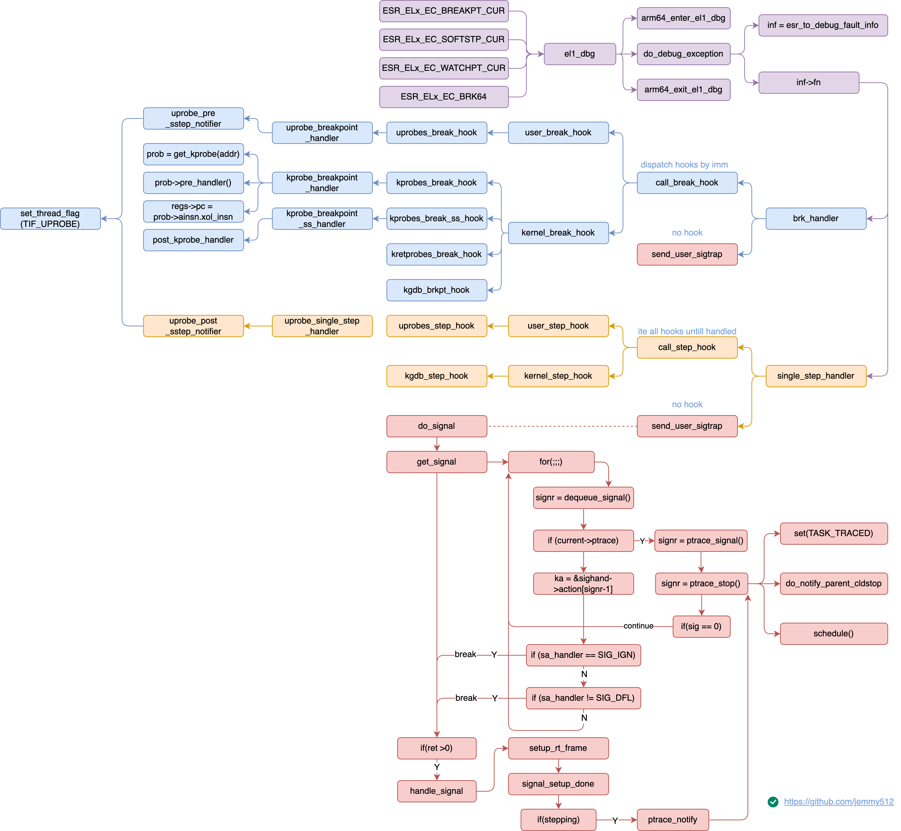
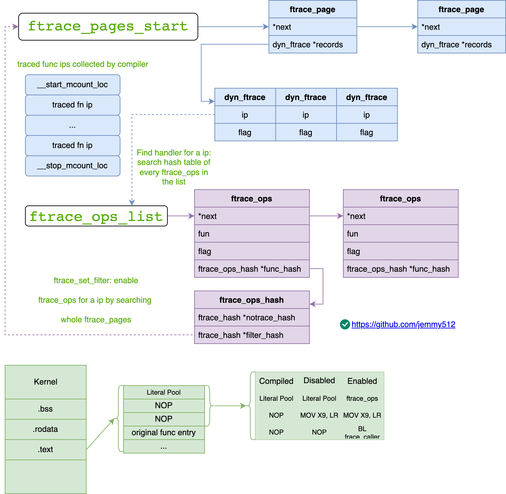
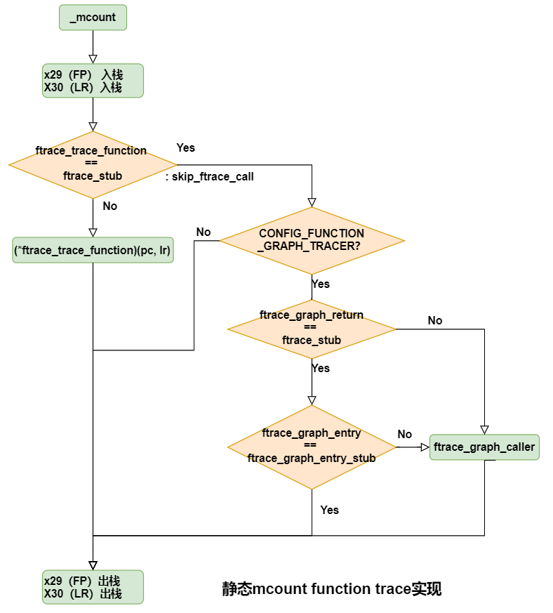

**Comparison of Kernel Technologies**

| Tool | Core Kernel Technology | Primary Focus |
|---|---|---|
| **DTrace** | `kprobes`, `uprobes`, tracepoints, eBPF | Dynamic tracing of kernel/user events. |
| **strace** | `ptrace` system call | System call tracing in user space. |
| **ftrace** | Tracepoints, function tracing, mcount/fentry | Kernel function and event tracing. |
| **kprobes**| Dynamic probes, breakpoint handling | Dynamic kernel function instrumentation. |
| **perf** | PMU, tracepoints, kprobes, uprobes, eBPF | Performance profiling and tracing. |

---

* [LWN - Tracing](https://lwn.net/Kernel/Index/#Tracing)
* [Linux tracing systems & how they fit together](https://jvns.ca/blog/2017/07/05/linux-tracing-systems/#kprobes)
* [Kernel - Linux Tracing Technologies](https://www.kernel.org/doc/html/latest/trace/index.html)
* [Linux tracing systems & how they fit together](https://jvns.ca/blog/2017/07/05/linux-tracing-systems/)


# ptrace



```c
SYSCALL_DEFINE4(ptrace, long, request, long, pid, unsigned long, addr,
        unsigned long, data)
{
    struct task_struct *child;
    long ret;

    if (request == PTRACE_TRACEME) {
        /* 1. mark curret PT_TRACED
         * 2. ptrace_link current with its real parent */
        ret = ptrace_traceme() {
            int ret = -EPERM;
            write_lock_irq(&tasklist_lock);
            if (!current->ptrace) {
                ret = security_ptrace_traceme(current->parent);
                /*
                * Check PF_EXITING to ensure ->real_parent has not passed
                * exit_ptrace(). Otherwise we don't report the error but
                * pretend ->real_parent untraces us right after return.
                */
                if (!ret && !(current->real_parent->flags & PF_EXITING)) {
                    current->ptrace = PT_PTRACED;
                    ptrace_link(current, current->real_parent);
                }
            }
            write_unlock_irq(&tasklist_lock);

            return ret;
        }
        goto out;
    }

    child = find_get_task_by_vpid(pid);

    if (request == PTRACE_ATTACH || request == PTRACE_SEIZE) {
        ret = ptrace_attach(child, request, addr, data);
        goto out_put_task_struct;
    }

    ret = ptrace_check_attach(child, request == PTRACE_KILL ||
                request == PTRACE_INTERRUPT);
    if (ret < 0)
        goto out_put_task_struct;

    ret = arch_ptrace(child, request, addr, data) {
        return ptrace_request(child, request, addr, data) {
            bool seized = child->ptrace & PT_SEIZED;
            int ret = -EIO;
            kernel_siginfo_t siginfo, *si;
            void __user *datavp = (void __user *) data;
            unsigned long __user *datalp = datavp;
            unsigned long flags;

            switch (request) {
            case PTRACE_PEEKTEXT:
            case PTRACE_PEEKDATA:
                return generic_ptrace_peekdata(child, addr, data);
            case PTRACE_POKETEXT:
            case PTRACE_POKEDATA:
                return generic_ptrace_pokedata(child, addr, data);

            case PTRACE_OLDSETOPTIONS:
            case PTRACE_SETOPTIONS:
                ret = ptrace_setoptions(child, data);
                break;
            case PTRACE_GETEVENTMSG:
                ret = put_user(child->ptrace_message, datalp);
                break;

            case PTRACE_PEEKSIGINFO:
                ret = ptrace_peek_siginfo(child, addr, data);
                break;

            case PTRACE_GETSIGINFO:
                ret = ptrace_getsiginfo(child, &siginfo);
                if (!ret)
                    ret = copy_siginfo_to_user(datavp, &siginfo);
                break;

            case PTRACE_SETSIGINFO:
                ret = copy_siginfo_from_user(&siginfo, datavp);
                if (!ret)
                    ret = ptrace_setsiginfo(child, &siginfo);
                break;

            case PTRACE_GETSIGMASK: {
                sigset_t *mask;

                if (addr != sizeof(sigset_t)) {
                    ret = -EINVAL;
                    break;
                }

                if (test_tsk_restore_sigmask(child))
                    mask = &child->saved_sigmask;
                else
                    mask = &child->blocked;

                if (copy_to_user(datavp, mask, sizeof(sigset_t)))
                    ret = -EFAULT;
                else
                    ret = 0;

                break;
            }

            case PTRACE_SETSIGMASK: {
                sigset_t new_set;

                if (addr != sizeof(sigset_t)) {
                    ret = -EINVAL;
                    break;
                }

                if (copy_from_user(&new_set, datavp, sizeof(sigset_t))) {
                    ret = -EFAULT;
                    break;
                }

                sigdelsetmask(&new_set, sigmask(SIGKILL)|sigmask(SIGSTOP));

                /*
                * Every thread does recalc_sigpending() after resume, so
                * retarget_shared_pending() and recalc_sigpending() are not
                * called here.
                */
                spin_lock_irq(&child->sighand->siglock);
                child->blocked = new_set;
                spin_unlock_irq(&child->sighand->siglock);

                clear_tsk_restore_sigmask(child);

                ret = 0;
                break;
            }

            case PTRACE_INTERRUPT:
                /*
                * Stop tracee without any side-effect on signal or job
                * control.  At least one trap is guaranteed to happen
                * after this request.  If @child is already trapped, the
                * current trap is not disturbed and another trap will
                * happen after the current trap is ended with PTRACE_CONT.
                *
                * The actual trap might not be PTRACE_EVENT_STOP trap but
                * the pending condition is cleared regardless.
                */
                if (unlikely(!seized || !lock_task_sighand(child, &flags)))
                    break;

                /*
                * INTERRUPT doesn't disturb existing trap sans one
                * exception.  If ptracer issued LISTEN for the current
                * STOP, this INTERRUPT should clear LISTEN and re-trap
                * tracee into STOP.
                */
                if (likely(task_set_jobctl_pending(child, JOBCTL_TRAP_STOP)))
                    ptrace_signal_wake_up(child, child->jobctl & JOBCTL_LISTENING);

                unlock_task_sighand(child, &flags);
                ret = 0;
                break;

            case PTRACE_LISTEN:
                /*
                * Listen for events.  Tracee must be in STOP.  It's not
                * resumed per-se but is not considered to be in TRACED by
                * wait(2) or ptrace(2).  If an async event (e.g. group
                * stop state change) happens, tracee will enter STOP trap
                * again.  Alternatively, ptracer can issue INTERRUPT to
                * finish listening and re-trap tracee into STOP.
                */
                if (unlikely(!seized || !lock_task_sighand(child, &flags)))
                    break;

                si = child->last_siginfo;
                if (likely(si && (si->si_code >> 8) == PTRACE_EVENT_STOP)) {
                    child->jobctl |= JOBCTL_LISTENING;
                    /*
                    * If NOTIFY is set, it means event happened between
                    * start of this trap and now.  Trigger re-trap.
                    */
                    if (child->jobctl & JOBCTL_TRAP_NOTIFY)
                        ptrace_signal_wake_up(child, true);
                    ret = 0;
                }
                unlock_task_sighand(child, &flags);
                break;

            case PTRACE_DETACH:  /* detach a process that was attached. */
                ret = ptrace_detach(child, data);
                break;

        #ifdef CONFIG_BINFMT_ELF_FDPIC
            case PTRACE_GETFDPIC: {
                struct mm_struct *mm = get_task_mm(child);
                unsigned long tmp = 0;

                ret = -ESRCH;
                if (!mm)
                    break;

                switch (addr) {
                case PTRACE_GETFDPIC_EXEC:
                    tmp = mm->context.exec_fdpic_loadmap;
                    break;
                case PTRACE_GETFDPIC_INTERP:
                    tmp = mm->context.interp_fdpic_loadmap;
                    break;
                default:
                    break;
                }
                mmput(mm);

                ret = put_user(tmp, datalp);
                break;
            }
        #endif

            case PTRACE_SINGLESTEP:
        #ifdef PTRACE_SINGLEBLOCK
            case PTRACE_SINGLEBLOCK:
        #endif
        #ifdef PTRACE_SYSEMU
            case PTRACE_SYSEMU:
            case PTRACE_SYSEMU_SINGLESTEP:
        #endif
            case PTRACE_SYSCALL:
            case PTRACE_CONT:
                return ptrace_resume(child, request, data);

            case PTRACE_KILL:
                send_sig_info(SIGKILL, SEND_SIG_NOINFO, child);
                return 0;

        #ifdef CONFIG_HAVE_ARCH_TRACEHOOK
            case PTRACE_GETREGSET:
            case PTRACE_SETREGSET: {
                struct iovec kiov;
                struct iovec __user *uiov = datavp;

                if (!access_ok(uiov, sizeof(*uiov)))
                    return -EFAULT;

                if (__get_user(kiov.iov_base, &uiov->iov_base) ||
                    __get_user(kiov.iov_len, &uiov->iov_len))
                    return -EFAULT;

                ret = ptrace_regset(child, request, addr, &kiov);
                if (!ret)
                    ret = __put_user(kiov.iov_len, &uiov->iov_len);
                break;
            }

            case PTRACE_GET_SYSCALL_INFO:
                ret = ptrace_get_syscall_info(child, addr, datavp);
                break;
        #endif

            case PTRACE_SECCOMP_GET_FILTER:
                ret = seccomp_get_filter(child, addr, datavp);
                break;

            case PTRACE_SECCOMP_GET_METADATA:
                ret = seccomp_get_metadata(child, addr, datavp);
                break;

        #ifdef CONFIG_RSEQ
            case PTRACE_GET_RSEQ_CONFIGURATION:
                ret = ptrace_get_rseq_configuration(child, addr, datavp);
                break;
        #endif

            case PTRACE_SET_SYSCALL_USER_DISPATCH_CONFIG:
                ret = syscall_user_dispatch_set_config(child, addr, datavp);
                break;

            case PTRACE_GET_SYSCALL_USER_DISPATCH_CONFIG:
                ret = syscall_user_dispatch_get_config(child, addr, datavp);
                break;

            default:
                break;
            }

            return ret;
        }
    }
    if (ret || request != PTRACE_DETACH)
        ptrace_unfreeze_traced(child);

out_put_task_struct:
    put_task_struct(child);
out:
    return ret;
}
```

## PTRACE_ATTACH

```c
/* ptrace_link tracee to tracer */
static int ptrace_attach(struct task_struct *task, long request,
            unsigned long addr,
            unsigned long flags)
{
    bool seize = (request == PTRACE_SEIZE);
    int retval;

    if (seize) {
        flags = PT_PTRACED | PT_SEIZED | (flags << PT_OPT_FLAG_SHIFT);
    } else {
        flags = PT_PTRACED;
    }

    audit_ptrace(task);

    if (unlikely(task->flags & PF_KTHREAD))
        return -EPERM;
    if (same_thread_group(task, current))
        return -EPERM;

    /*
    * Protect exec's credential calculations against our interference;
    * SUID, SGID and LSM creds get determined differently
    * under ptrace.
    */
    scoped_cond_guard (mutex_intr, return -ERESTARTNOINTR,
            &task->signal->cred_guard_mutex) {

        scoped_guard (task_lock, task) {
            retval = __ptrace_may_access(task, PTRACE_MODE_ATTACH_REALCREDS);
            if (retval)
                return retval;
        }

        scoped_guard (write_lock_irq, &tasklist_lock) {
            if (unlikely(task->exit_state))
                return -EPERM;
            if (task->ptrace)
                return -EPERM;

            task->ptrace = flags;
            ptrace_link(task, current) {
                list_add(&child->ptrace_entry, &new_parent->ptraced);
                child->parent = new_parent;
                child->ptracer_cred = get_cred(ptracer_cred);
            }
            ptrace_set_stopped(task, seize) {
                guard(spinlock)(&task->sighand->siglock);

                /* SEIZE doesn't trap tracee on attach */
                if (!seize)
                    send_signal_locked(SIGSTOP, SEND_SIG_PRIV, task, PIDTYPE_PID);

                if (task_is_stopped(task) &&
                    task_set_jobctl_pending(task, JOBCTL_TRAP_STOP | JOBCTL_TRAPPING)) {
                    task->jobctl &= ~JOBCTL_STOPPED;
                    signal_wake_up_state(task, __TASK_STOPPED);
                }
            }
        }
    }

    /*
    * We do not bother to change retval or clear JOBCTL_TRAPPING
    * if wait_on_bit() was interrupted by SIGKILL. The tracer will
    * not return to user-mode, it will exit and clear this bit in
    * __ptrace_unlink() if it wasn't already cleared by the tracee;
    * and until then nobody can ptrace this task.
    */
    wait_on_bit(&task->jobctl, JOBCTL_TRAPPING_BIT, TASK_KILLABLE);
    proc_ptrace_connector(task, PTRACE_ATTACH);

    return 0;
}
```

## PTRACE_SYSCALL

```c
/* Set SYSCALL_TRACE flag for tracee */
int ptrace_resume(struct task_struct *child, long request,
            unsigned long data)
{
    if (!valid_signal(data))
        return -EIO;

    if (request == PTRACE_SYSCALL)
        set_task_syscall_work(child, SYSCALL_TRACE);
    else
        clear_task_syscall_work(child, SYSCALL_TRACE);
}
```

```c
/* The SYSCALL_TRACE flag works when tracee triggers a sys call */
void el0_svc_common(struct pt_regs *regs, int scno, int sc_nr,
            const syscall_fn_t syscall_table[])
{
    unsigned long flags = read_thread_flags();

    regs->orig_x0 = regs->regs[0];
    regs->syscallno = scno;

    if (flags & _TIF_MTE_ASYNC_FAULT) {
        syscall_set_return_value(current, regs, -ERESTARTNOINTR, 0);
        return;
    }

    if (has_syscall_work(flags)) {
        if (scno == NO_SYSCALL)
            syscall_set_return_value(current, regs, -ENOSYS, 0);

        scno = syscall_trace_enter(regs) {
            unsigned long flags = read_thread_flags();
            if (flags & (_TIF_SYSCALL_EMU | _TIF_SYSCALL_TRACE)) {
                report_syscall(regs, PTRACE_SYSCALL_ENTER/*dir*/) {
                    int regno;
                    unsigned long saved_reg;

                    regno = (is_compat_task() ? 12 : 7);
                    saved_reg = regs->regs[regno];
                    regs->regs[regno] = dir;

                    if (dir == PTRACE_SYSCALL_ENTER) {
                        ret = ptrace_report_syscall_entry(regs) {
                            return ptrace_report_syscall(PTRACE_EVENTMSG_SYSCALL_ENTRY) {
                                int ptrace = current->ptrace;
                                int signr;

                                if (!(ptrace & PT_PTRACED))
                                    return 0;

                                /* Notify tracer ptrace event */
                                signr = ptrace_notify(SIGTRAP | ((ptrace & PT_TRACESYSGOOD) ? 0x80 : 0)/*exit_code*/, message) {
                                    int signr;

                                    BUG_ON((exit_code & (0x7f | ~0xffff)) != SIGTRAP);
                                    if (unlikely(task_work_pending(current)))
                                        task_work_run();

                                    spin_lock_irq(&current->sighand->siglock);
                                    signr = ptrace_do_notify(SIGTRAP, exit_code, CLD_TRAPPED/*why*/, message) {
                                        kernel_siginfo_t info;

                                        clear_siginfo(&info);
                                        info.si_signo = signr;
                                        info.si_code = exit_code;
                                        info.si_pid = task_pid_vnr(current);
                                        info.si_uid = from_kuid_munged(current_user_ns(), current_uid());

                                        /* Let the debugger run. */
                                        return ptrace_stop(exit_code, why, message, &info) {
                                            bool gstop_done = false;

                                            if (arch_ptrace_stop_needed()) {
                                                spin_unlock_irq(&current->sighand->siglock);
                                                arch_ptrace_stop();
                                                spin_lock_irq(&current->sighand->siglock);
                                            }

                                            if (!current->ptrace || __fatal_signal_pending(current))
                                                return exit_code;

                                            /* 1. set curretn TASK_TRACED so scheduler wont run this task */
                                            set_special_state(TASK_TRACED);
                                            current->jobctl |= JOBCTL_TRACED;

                                            smp_wmb();

                                            current->ptrace_message = message;
                                            current->last_siginfo = info;
                                            current->exit_code = exit_code;

                                            if (why == CLD_STOPPED && (current->jobctl & JOBCTL_STOP_PENDING))
                                                gstop_done = task_participate_group_stop(current);

                                            /* any trap clears pending STOP trap, STOP trap clears NOTIFY */
                                            task_clear_jobctl_pending(current, JOBCTL_TRAP_STOP);
                                            if (info && info->si_code >> 8 == PTRACE_EVENT_STOP)
                                                task_clear_jobctl_pending(current, JOBCTL_TRAP_NOTIFY);

                                            /* entering a trap, clear TRAPPING */
                                            task_clear_jobctl_trapping(current);

                                            spin_unlock_irq(&current->sighand->siglock);
                                            read_lock(&tasklist_lock);

                                            /* 2. notify tracer and real parent */
                                            if (current->ptrace)
                                                do_notify_parent_cldstop(current, true, why);
                                            if (gstop_done && (!current->ptrace || ptrace_reparented(current)))
                                                do_notify_parent_cldstop(current, false, why);

                                            if (!IS_ENABLED(CONFIG_PREEMPT_RT))
                                                preempt_disable();
                                            read_unlock(&tasklist_lock);
                                            cgroup_enter_frozen();
                                            if (!IS_ENABLED(CONFIG_PREEMPT_RT))
                                                preempt_enable_no_resched();

                                            /* 3. schedule out of runqueue */
                                            schedule();
                                            cgroup_leave_frozen(true);

                                            spin_lock_irq(&current->sighand->siglock);
                                            exit_code = current->exit_code;
                                            current->last_siginfo = NULL;
                                            current->ptrace_message = 0;
                                            current->exit_code = 0;

                                            /* LISTENING can be set only during STOP traps, clear it */
                                            current->jobctl &= ~(JOBCTL_LISTENING | JOBCTL_PTRACE_FROZEN);

                                            recalc_sigpending_tsk(current);
                                            return exit_code;
                                        }
                                    }
                                    spin_unlock_irq(&current->sighand->siglock);
                                    return signr;
                                }

                                if (signr)
                                    send_sig(signr, current, 1);

                                return fatal_signal_pending(current);
                            }
                        }
                        if (ret)
                            forget_syscall(regs);
                        regs->regs[regno] = saved_reg;
                    } else if (!test_thread_flag(TIF_SINGLESTEP)) {
                        ptrace_report_syscall_exit(regs, 0);
                        regs->regs[regno] = saved_reg;
                    } else {
                        regs->regs[regno] = saved_reg;

                        /*
                        * Signal a pseudo-step exception since we are stepping but
                        * tracer modifications to the registers may have rewound the
                        * state machine.
                        */
                        ptrace_report_syscall_exit(regs, 1);
                    }
                }
                if (flags & _TIF_SYSCALL_EMU)
                    return NO_SYSCALL;
            }

            /* Do the secure computing after ptrace; failures should be fast. */
            if (secure_computing() == -1)
                return NO_SYSCALL;

            if (test_thread_flag(TIF_SYSCALL_TRACEPOINT))
                trace_sys_enter(regs, regs->syscallno);

            audit_syscall_entry(regs->syscallno, regs->orig_x0, regs->regs[1],
                        regs->regs[2], regs->regs[3]);

            return regs->syscallno;
        }
        if (scno == NO_SYSCALL)
            goto trace_exit;
    }
}
```

## PTRACE_SINGLESTEP

**What Happens in `PTRACE_SINGLESTEP`**
1. **Setup for Single-Stepping**:
   - The tracer (parent process) requests the kernel to enable single-stepping on the tracee (child process) by issuing the `PTRACE_SINGLESTEP` request.
   - Single-stepping is a debugging feature where the tracee executes one instruction and then stops, trapping into the kernel.

2. **Tracee Executes One Instruction**:
   - After the tracer invokes `PTRACE_SINGLESTEP`, the tracee is allowed to execute a single machine instruction.
   - The CPU hardware or kernel sets up the appropriate mechanism (e.g., hardware instruction breakpoint or trap flag in the CPU) to generate a trap after the instruction.

3. **Tracee Traps into the Kernel**:
   - Once the tracee completes the single instruction, the CPU generates a **trap exception**. This exception is handled by the kernel in the tracee’s context.
   - The kernel's `single_step_handler` function (or its architecture-specific equivalent) handles this exception. The kernel recognizes that this is a single-step trap by ESR register.

4. **Kernel Sends `SIGTRAP`**:
   - After handling the single-step trap, the kernel sends a **`SIGTRAP` signal** with the `TRAP_TRACE` code to the tracee to notify it about the single-step event.
   - The `SIGTRAP` signal is queued for the tracee.

5. **Tracee Stops and Notifies the Tracer**:
   - The tracee `do_signal` when exiting `single_step_handler`, and notifies the tracer (e.g., via `waitpid()` or `waitid()`) that the tracee has stopped due to the single-step event by sending `SIGCLD` signal. Tracee call `schedule` to stop.
   - Tracer is notified in kernel mode in do_signal not the signal handler of tracee in user space

6. **Tracer Handles the Event**:
   - The tracer inspects the tracee's state using `ptrace()` (e.g., by reading registers or memory).
   - The tracer can then decide what to do next (e.g., continue execution, single-step again, or inspect the tracee further).

---

**How `SIGTRAP` Works in This Context**

- The `SIGTRAP` signal is special in the context of `ptrace`. It is used to communicate events (e.g., single-stepping, breakpoints) between the kernel and the tracer.
- For `PTRACE_SINGLESTEP`, the `SIGTRAP` signal is not delivered to a user-space signal handler in the tracee. Instead, it is caught by the kernel and used to stop the tracee and notify the tracer.
- The tracee remains in a stopped state until the tracer resumes it (e.g., with `PTRACE_CONT`, `PTRACE_SINGLESTEP`, etc.).
---

### user_enable_single_step

```c
int ptrace_resume(struct task_struct *child, long request,
            unsigned long data)
{
    if (!valid_signal(data))
        return -EIO;

    if (request == PTRACE_SYSCALL)
        set_task_syscall_work(child, SYSCALL_TRACE);
    else
        clear_task_syscall_work(child, SYSCALL_TRACE);

#if defined(CONFIG_GENERIC_ENTRY) || defined(TIF_SYSCALL_EMU)
    if (request == PTRACE_SYSEMU || request == PTRACE_SYSEMU_SINGLESTEP)
        set_task_syscall_work(child, SYSCALL_EMU);
    else
        clear_task_syscall_work(child, SYSCALL_EMU);
#endif

    if (is_singleblock(request)) {
        if (unlikely(!arch_has_block_step()))
            return -EIO;
        user_enable_block_step(child);
    } else if (is_singlestep(request) || is_sysemu_singlestep(request)) {
        if (unlikely(!arch_has_single_step()))
            return -EIO;
        user_enable_single_step(child) {
            struct thread_info *ti = task_thread_info(task);
            if (!test_and_set_ti_thread_flag(ti, TIF_SINGLESTEP))
                set_regs_spsr_ss(task_pt_regs(task));
        }
    } else { /* PTRACE_CONT, PTRACE_SYSCALL, PTRACE_SYSEMU */
        user_disable_single_step(child);
    }

    /* Change ->exit_code and ->state under siglock to avoid the race
     * with wait_task_stopped() in between; a non-zero ->exit_code will
     * wrongly look like another report from tracee.
     *
     * Note that we need siglock even if ->exit_code == data and/or this
     * status was not reported yet, the new status must not be cleared by
     * wait_task_stopped() after resume. */
    spin_lock_irq(&child->sighand->siglock);
    child->exit_code = data;
    child->jobctl &= ~JOBCTL_TRACED;
    wake_up_state(child, __TASK_TRACED);
    spin_unlock_irq(&child->sighand->siglock);

    return 0;
}
```

### el1_dbg

```c
static const struct fault_info fault_info[];
static struct fault_info debug_fault_info[];

static inline const struct fault_info *esr_to_fault_info(unsigned long esr)
{
    return fault_info + (esr & ESR_ELx_FSC);
}

static inline const struct fault_info *esr_to_debug_fault_info(unsigned long esr)
{
    return debug_fault_info + DBG_ESR_EVT(esr);
}

void __init debug_traps_init(void)
{
    hook_debug_fault_code(DBG_ESR_EVT_HWSS, single_step_handler, SIGTRAP,
                TRAP_TRACE, "single-step handler");
    hook_debug_fault_code(DBG_ESR_EVT_BRK, brk_handler, SIGTRAP,
                TRAP_BRKPT, "BRK handler") {

        debug_fault_info[nr].fn     = fn;
        debug_fault_info[nr].sig    = sig;
        debug_fault_info[nr].code   = code;
        debug_fault_info[nr].name   = name;
    }
}
```

```c
void noinstr el1h_64_sync_handler(struct pt_regs *regs)
{
    unsigned long esr = read_sysreg(esr_el1);

    switch (ESR_ELx_EC(esr)) {
    case ESR_ELx_EC_BREAKPT_CUR: /* Stops at specific instruction address */
    case ESR_ELx_EC_SOFTSTP_CUR: /* Stops after each instruction */
    case ESR_ELx_EC_WATCHPT_CUR: /* Stops on data access */
    case ESR_ELx_EC_BRK64:       /* Software-inserted breakpoint instruction */
        el1_dbg(regs, esr) {
            unsigned long far = read_sysreg(far_el1);

            arm64_enter_el1_dbg(regs);
            do_debug_exception(far, esr, regs) {
                const struct fault_info *inf = esr_to_debug_fault_info(esr) {
                    return debug_fault_info + DBG_ESR_EVT(esr);
                }
                unsigned long pc = instruction_pointer(regs);

                debug_exception_enter(regs);

                if (user_mode(regs) && !is_ttbr0_addr(pc)) {
                    arm64_apply_bp_hardening() {
                        struct bp_hardening_data *d;

                        if (!alternative_has_cap_unlikely(ARM64_SPECTRE_V2))
                            return;

                        d = this_cpu_ptr(&bp_hardening_data);
                        if (d->fn)
                            d->fn();
                    }
                }

                /* brk_handler, single_step_handler */
                if (inf->fn(addr_if_watchpoint, esr, regs)) {
                    arm64_notify_die(inf->name, regs, inf->sig, inf->code, pc, esr);
                }

                debug_exception_exit(regs);
            }
            arm64_exit_el1_dbg(regs);
        }
        break;
    case ESR_ELx_EC_FPAC:
        el1_fpac(regs, esr);
        break;
    default:
        __panic_unhandled(regs, "64-bit el1h sync", esr);
    }
}
```

### single_step_handler

```c
void register_kernel_step_hook(struct step_hook *hook)
{
    register_debug_hook(&hook->node, &kernel_step_hook);
}

int single_step_handler(unsigned long unused, unsigned long esr,
                struct pt_regs *regs)
{
    bool handler_found = false;

    if (!reinstall_suspended_bps(regs))
        return 0;

    ret = call_step_hook(regs, esr) {
        struct step_hook *hook;
        struct list_head *list;
        int retval = DBG_HOOK_ERROR;

        list = user_mode(regs) ? &user_step_hook : &kernel_step_hook;

        list_for_each_entry_rcu(hook, list, node)	{
            retval = hook->fn(regs, esr);
            if (retval == DBG_HOOK_HANDLED)
                break;
        }

        return retval;
    }
    if (!handler_found && ret == DBG_HOOK_HANDLED)
        handler_found = true;

    if (!handler_found && user_mode(regs)) {
        send_user_sigtrap(TRAP_TRACE) {
            struct pt_regs *regs = current_pt_regs();

            if (WARN_ON(!user_mode(regs)))
                return;

            if (interrupts_enabled(regs))
                local_irq_enable();

            arm64_force_sig_fault(SIGTRAP, si_code, instruction_pointer(regs),
                        "User debug trap");
        }

        /*
        * ptrace will disable single step unless explicitly
        * asked to re-enable it. For other clients, it makes
        * sense to leave it enabled (i.e. rewind the controls
        * to the active-not-pending state).
        */
        user_rewind_single_step(current);
    } else if (!handler_found) {
        pr_warn("Unexpected kernel single-step exception at EL1\n");
        /* Re-enable stepping since we know that we will be
         * returning to regs. */
        set_regs_spsr_ss(regs);
    }

    return 0;
}
```

### do_signal

```c
void do_signal(struct pt_regs *regs)
{
    ret = get_signal(&ksig) {
        for (;;) {
            type = PIDTYPE_PID;
            signr = dequeue_synchronous_signal(&ksig->info);
            if (!signr)
                signr = dequeue_signal(&current->blocked, &ksig->info, &type);

            if (!signr)
                break; /* will return 0 */

            /* handle singals in ptrace state */
            if (unlikely(current->ptrace) && (signr != SIGKILL) &&
                !(sighand->action[signr -1].sa.sa_flags & SA_IMMUTABLE)) {
                signr = ptrace_signal(signr, &ksig->info, type) {
                    current->jobctl |= JOBCTL_STOP_DEQUEUED;

/* 1. Tracer's First notification:
 *  Happens when the signal is detected for the tracee.
 *  Allows the tracer to control whether the signal is canceled, modified, or delivered. */
                    /* 1. notify tracer 2. schedule current */
                    signr = ptrace_stop(signr, CLD_TRAPPED, 0, info);

                    /* We're back. Tracer may call ptrace(PTRACE_CONT, pid, 0, signal = 0) to cancel */
                    if (signr == 0) {
                        return signr;
                    }

                    /* Update the siginfo structure if the signal has
                     * changed.  If the debugger wanted something
                     * specific in the siginfo structure then it should
                     * have updated *info via PTRACE_SETSIGINFO. */
                    if (signr != info->si_signo) {
                        clear_siginfo(info);
                        info->si_signo = signr;
                        info->si_errno = 0;
                        info->si_code = SI_USER;
                        rcu_read_lock();
                        info->si_pid = task_pid_vnr(current->parent);
                        info->si_uid = from_kuid_munged(current_user_ns(),
                                        task_uid(current->parent));
                        rcu_read_unlock();
                    }

                    /* If the (new) signal is now blocked, requeue it.  */
                    if (sigismember(&current->blocked, signr) ||
                        fatal_signal_pending(current)) {
                        send_signal_locked(signr, info, current, type);
                        signr = 0;
                    }

                    return signr;
                }

                if (!signr)
                    continue;
            }

            ka = &sighand->action[signr-1];

            if (ka->sa.sa_handler == SIG_IGN) /* Do nothing.  */
                continue;
            if (ka->sa.sa_handler != SIG_DFL) {
                /* Run the handler.  */
                ksig->ka = *ka;

                if (ka->sa.sa_flags & SA_ONESHOT)
                    ka->sa.sa_handler = SIG_DFL;

                break; /* will return non-zero "signr" value */
            }
        }

        return sig > 0;
    }

    if (ret) {
        handle_signal(&ksig, regs) {
            sigset_t *oldset = sigmask_to_save();
            int usig = ksig->sig;
            int ret;

            rseq_signal_deliver(ksig, regs);

            ret = setup_rt_frame(usig, ksig, oldset, regs);
            ret |= !valid_user_regs(&regs->user_regs, current);

            /* Step into the signal handler if we are stepping */
            signal_setup_done(ret, ksig, test_thread_flag(TIF_SINGLESTEP)) {
                if (failed) {
                    force_sigsegv(ksig->sig);
                } else {
                    signal_delivered(ksig, stepping) {
/* 2. Tracer's Second notification:
 *  Happens after the kernel prepares the rt frame for the signal handler
 *  but before the tracee actually begins executing the signal handler.
 *
 *  Only occurs when 1. tracee has sighandler 2. tracee in single-stepping mode
 *
 *  Allow the tracer to track the tracee's execution
 *  in single-step mode while handling a signal. */
                        if (stepping) {
                            ptrace_notify(SIGTRAP, 0) {
                                --->
                            }
                        }
                    }
                }
            }
        }
        return;
    }
}
```

## PTRACE_POKETEXT

1. GDB implements breakpoints on ARM64 by replacing the target instruction with the **BRK** instruction.
2. When the program executes the BRK, it generates a trap exception, and the kernel notifies GDB.
3. GDB temporarily restores the original instruction, single-steps over it, and reinserts the breakpoint to allow seamless debugging.
4. ARM64-specific considerations include instruction alignment, shared library handling, and optional hardware breakpoints.

```c
int generic_ptrace_pokedata(struct task_struct *tsk, unsigned long addr,
                unsigned long data)
{
    int copied;

    copied = ptrace_access_vm(tsk, addr, &data, sizeof(data),
        FOLL_FORCE | FOLL_WRITE) {

        struct mm_struct *mm;
        int ret;

        mm = get_task_mm(tsk);
        if (!mm)
            return 0;

        if (!tsk->ptrace ||
            (current != tsk->parent) ||
            ((get_dumpable(mm) != SUID_DUMP_USER) &&
            !ptracer_capable(tsk, mm->user_ns))) {
            mmput(mm);
            return 0;
        }

        ret = access_remote_vm(mm, addr, buf, len, gup_flags) {
            return __access_remote_vm(mm, addr, buf, len, gup_flags) {
                void *old_buf = buf;
                int write = gup_flags & FOLL_WRITE;

                if (mmap_read_lock_killable(mm))
                    return 0;

                /* Untag the address before looking up the VMA */
                addr = untagged_addr_remote(mm, addr);

                /* Avoid triggering the temporary warning in __get_user_pages */
                if (!vma_lookup(mm, addr) && !expand_stack(mm, addr))
                    return 0;

                /* ignore errors, just check how much was successfully transferred */
                while (len) {
                    int bytes, offset;
                    void *maddr;
                    struct vm_area_struct *vma = NULL;
                    struct page *page = get_user_page_vma_remote(
                        mm, addr, gup_flags, &vma
                    );

                    if (IS_ERR(page)) {
                        /* ... */
                    } else {
                        bytes = len;
                        offset = addr & (PAGE_SIZE-1);
                        if (bytes > PAGE_SIZE-offset)
                            bytes = PAGE_SIZE-offset;

                        maddr = kmap_local_page(page);
                        if (write) { /* PTRACE_POKETEXT */
                            copy_to_user_page(vma, page, addr, maddr + offset, buf, bytes);
                            set_page_dirty_lock(page);
                        } else {     /* PTRACE_PEEKTEXT */
                            copy_from_user_page(vma, page, addr, buf, maddr + offset, bytes);
                        }
                        unmap_and_put_page(page, maddr);
                    }
                    len -= bytes;
                    buf += bytes;
                    addr += bytes;
                }
                mmap_read_unlock(mm);

                return buf - old_buf;
            }
        }
        mmput(mm);

        return ret;
    }
    return (copied == sizeof(data)) ? 0 : -EIO;
}
```

# kprobe


Feature | ftrace | kprobes
--- | --- | ---
Primary Purpose | Function tracing, performance analysis | Dynamic tracing, debugging
Mechanism | Compile-time instrumentation (dynamic patching) | Runtime instruction rewriting
Overhead | Low | Higher
Flexibility | Limited | High
Data Collection | Mostly function entry/exit, pre-defined events | Arbitrary registers, memory, arguments
Complexity | Simpler to use | More complex to configure and use
Stability Risk | Low | Higher (if used incorrectly)

* [深入剖析linux kprobe的技术实现原理](https://mp.weixin.qq.com/s/FnTU0i4kgnph2o9E7xJjTg)
* [Kernel调试追踪技术之 Kprobe on ARM64](https://www.cnblogs.com/hpyu/p/14257305.html)

**Summary of Technologies Using Kprobes**

| **Technology** | **Purpose** | **Dependent Feature** |
|---|---|---|
| **kretprobes** | Function return probing | Kprobe framework |
| **eBPF** | Dynamic tracing and monitoring | Kprobe events |
| **ftrace** | Function-level and dynamic tracing | Kprobes integration |
| **perf** | Performance profiling and analysis | Kprobe-based events |
| **SystemTap** | Dynamic instrumentation for debugging/tracing | Kprobes |
| **Tracepoints** | Static and dynamic tracing | Kprobe as dynamic tracepoints |
| **Live Patching** | Patching kernel functions at runtime | Function redirection via kprobes |
| **LTTng** | High-performance tracing | Kprobe integration |

---

```c
struct kprobe {
    struct hlist_node hlist;

    /* list of kprobes for multi-handler support */
    struct list_head list;

    /*count the number of times this probe was temporarily disarmed */
    unsigned long nmissed;

    /* location of the probe point */
    kprobe_opcode_t *addr;

    /* Allow user to indicate symbol name of the probe point */
    const char *symbol_name;

    /* Offset into the symbol */
    unsigned int offset;

    /* Called before addr is executed. */
    kprobe_pre_handler_t pre_handler;

    /* Called after addr is executed, unless... */
    kprobe_post_handler_t post_handler;

    /* Saved opcode (which has been replaced with breakpoint) */
    kprobe_opcode_t opcode;

    /* copy of the original instruction */
    struct arch_specific_insn ainsn;

    /*
    * Indicates various status flags.
    * Protected by kprobe_mutex after this kprobe is registered.
    */
    u32 flags;
};
```

```c
int __init init_kprobes(void)
{
    int i, err;

    /* FIXME allocate the probe table, currently defined statically */
    /* initialize all list heads */
    for (i = 0; i < KPROBE_TABLE_SIZE; i++)
        INIT_HLIST_HEAD(&kprobe_table[i]);

    err = populate_kprobe_blacklist(__start_kprobe_blacklist, __stop_kprobe_blacklist);
    if (kretprobe_blacklist_size) {
        for (i = 0; kretprobe_blacklist[i].name != NULL; i++) {
            kretprobe_blacklist[i].addr = kprobe_lookup_name(
                kretprobe_blacklist[i].name, 0
            );
        }
    }

    /* By default, kprobes are armed */
    kprobes_all_disarmed = false;

#if defined(CONFIG_OPTPROBES) && defined(__ARCH_WANT_KPROBES_INSN_SLOT)
    /* Init 'kprobe_optinsn_slots' for allocation */
    kprobe_optinsn_slots.insn_size = MAX_OPTINSN_SIZE;
#endif

    err = arch_init_kprobes() {
        register_kernel_break_hook(&kprobes_break_hook);    /* pre_handler */
        register_kernel_break_hook(&kprobes_break_ss_hook); /* post_handler */
        register_kernel_break_hook(&kretprobes_break_hook);
    }
    if (!err)
        err = register_die_notifier(&kprobe_exceptions_nb);
    if (!err)
        err = kprobe_register_module_notifier();

    kprobes_initialized = (err == 0);
    kprobe_sysctls_init();
    return err;
}

static LIST_HEAD(user_break_hook);
static LIST_HEAD(kernel_break_hook);

void register_user_break_hook(struct break_hook *hook)
{
    register_debug_hook(&hook->node, &user_break_hook);
}

void register_kernel_break_hook(struct break_hook *hook)
{
    register_debug_hook(&hook->node, &kernel_break_hook);
}

/* Different IMM can be used to identify the 1st or 2nd BRK before/after probed inst */
static struct break_hook kprobes_break_hook = {
    .imm = KPROBES_BRK_IMM, /* pre-BRK which is encoded into BRK insn before probed insn */
    .fn = kprobe_breakpoint_handler,
};

static struct break_hook kprobes_break_ss_hook = {
    .imm = KPROBES_BRK_SS_IMM, /* post-BRK after probed insn */
    .fn = kprobe_breakpoint_ss_handler,
};
```

## register_kprobe

```c
int register_kprobe(struct kprobe *p)
{
    int ret;
    struct kprobe *old_p;
    struct module *probed_mod;
    kprobe_opcode_t *addr;
    bool on_func_entry;

    /* Adjust probe address from symbol */
    addr = _kprobe_addr(p->addr, p->symbol_name, p->offset, &on_func_entry);
    p->addr = addr;

    ret = warn_kprobe_rereg(p);

    /* User can pass only KPROBE_FLAG_DISABLED to register_kprobe */
    p->flags &= KPROBE_FLAG_DISABLED;
    p->nmissed = 0;
    INIT_LIST_HEAD(&p->list);

    /* Ensure the address is in a text area, and find a module if exists. */
    /* Ensure it is not in reserved area. */
    /* Get module refcount and reject __init functions for loaded modules. */
    ret = check_kprobe_address_safe(p, &probed_mod);

    mutex_lock(&kprobe_mutex);

    if (on_func_entry)
        p->flags |= KPROBE_FLAG_ON_FUNC_ENTRY;

    old_p = get_kprobe(p->addr) {
        struct hlist_head *head;
        struct kprobe *p;

        head = &kprobe_table[hash_ptr(addr, KPROBE_HASH_BITS)];
        hlist_for_each_entry_rcu(p, head, hlist, lockdep_is_held(&kprobe_mutex)) {
            if (p->addr == addr) {
                return p;
            }
        }

        return NULL;
    }
    if (old_p) {
        /* Since this may unoptimize 'old_p', locking 'text_mutex'. */
        ret = register_aggr_kprobe(old_p, p);
        goto out;
    }

    cpus_read_lock();
    /* Prevent text modification */
    mutex_lock(&text_mutex);
    ret = prepare_kprobe(p) {
        /* Must ensure p->addr is really on ftrace */
        if (kprobe_ftrace(p))
            return arch_prepare_kprobe_ftrace(p);

        return arch_prepare_kprobe(p) {
            unsigned long probe_addr = (unsigned long)p->addr;

            if (probe_addr & 0x3)
                return -EINVAL;

            /* copy instruction */
            p->opcode = *p->addr;

            if (search_exception_tables(probe_addr))
                return -EINVAL;

            /* decode instruction */
            switch (ret = arm_kprobe_decode_insn(p->addr, &p->ainsn) {
                if (aarch64_insn_is_ldr_lit(insn)) {
                    api->handler = simulate_ldr_literal;
                    decoded = INSN_GOOD_NO_SLOT;
                } else if (aarch64_insn_is_ldrsw_lit(insn)) {
                    api->handler = simulate_ldrsw_literal;
                    decoded = INSN_GOOD_NO_SLOT;
                } else {
                    decoded = arm_probe_decode_insn(insn, &asi->api);
                }
                return decoded;
            }) {
            case INSN_REJECTED: /* insn not supported */
                return -EINVAL;

            case INSN_GOOD_NO_SLOT: /* insn need simulation */
                p->ainsn.xol_insn = NULL;
                break;

            case INSN_GOOD: /* instruction uses slot */
                p->ainsn.xol_insn = get_insn_slot();
                if (!p->ainsn.xol_insn)
                    return -ENOMEM;
                break;
            }

            /* prepare the instruction */
            if (p->ainsn.xol_insn) {
                arch_prepare_ss_slot(p) {
                    kprobe_opcode_t *addr = p->ainsn.xol_insn;
                    aarch64_insn_patch_text_nosync(addr, le32_to_cpu(p->opcode));
                    /* Ensures that execution stops or traps after the probed instruction
                     * is executed in the SS slot.
                     * This allows the kprobe framework to regain control
                     * after single-stepping the probed instruction. */

                    /* The 1st and 2nd BRK differ in IMM:
                     * #define BRK64_OPCODE_KPROBES    (AARCH64_BREAK_MON | (KPROBES_BRK_IMM << 5))
                     * #define BRK64_OPCODE_KPROBES_SS (AARCH64_BREAK_MON | (KPROBES_BRK_SS_IMM << 5)) */
                    aarch64_insn_patch_text_nosync(addr + 1, BRK64_OPCODE_KPROBES_SS);
                    /* store the next pc after brk point */
                    p->ainsn.xol_restore = (unsigned long) p->addr + sizeof(kprobe_opcode_t);
                }
            } else {
                arch_prepare_simulate(p) {
                    /* This instructions is not executed xol. No need to adjust the PC */
                    p->ainsn.xol_restore = 0;
                }
            }

            return 0;
        }
    }
    mutex_unlock(&text_mutex);
    cpus_read_unlock();
    if (ret)
        goto out;

    INIT_HLIST_NODE(&p->hlist);
    hlist_add_head_rcu(&p->hlist, &kprobe_table[hash_ptr(p->addr, KPROBE_HASH_BITS)]);

    if (!kprobes_all_disarmed && !kprobe_disabled(p)) {
        ret = arm_kprobe(p) {
            if (unlikely(kprobe_ftrace(kp)))
                return arm_kprobe_ftrace(kp);

            cpus_read_lock();
            mutex_lock(&text_mutex);
            __arm_kprobe(kp) {
                struct kprobe *_p;

                lockdep_assert_held(&text_mutex);

                /* Find the overlapping optimized kprobes. */
                _p = get_optimized_kprobe(p->addr);
                if (unlikely(_p))
                    /* Fallback to unoptimized kprobe */
                    unoptimize_kprobe(_p, true);

                arch_arm_kprobe(p) {
                    void *addr = p->addr;
                    u32 insn = BRK64_OPCODE_KPROBES;

                    aarch64_insn_patch_text(&addr, &insn, 1) {
                        struct aarch64_insn_patch patch = {
                            .text_addrs = addrs,
                            .new_insns = insns,
                            .insn_cnt = cnt,
                            .cpu_count = ATOMIC_INIT(0),
                        };

                        if (cnt <= 0)
                            return -EINVAL;

                        return stop_machine_cpuslocked(aarch64_insn_patch_text_cb, &patch,
                                        cpu_online_mask);
                    }
                }
                optimize_kprobe(p); /* Try to optimize (add kprobe to a list) */
            }
            mutex_unlock(&text_mutex);
            cpus_read_unlock();

            return 0;
        }
        if (ret) {
            hlist_del_rcu(&p->hlist);
            synchronize_rcu();
            goto out;
        }
    }

    /* Try to optimize kprobe */
    try_to_optimize_kprobe(p);
out:
    mutex_unlock(&kprobe_mutex);

    if (probed_mod)
        module_put(probed_mod);

    return ret;
}
```

```c
static int __kprobes aarch64_insn_patch_text_cb(void *arg)
{
    int i, ret = 0;
    struct aarch64_insn_patch *pp = arg;

    /* The last CPU becomes master */
    if (atomic_inc_return(&pp->cpu_count) == num_online_cpus()) {
        for (i = 0; ret == 0 && i < pp->insn_cnt; i++) {
            ret = aarch64_insn_patch_text_nosync(pp->text_addrs[i], pp->new_insns[i]) {
                u32 *tp = addr;
                int ret;

                /* A64 instructions must be word aligned */
                if ((uintptr_t)tp & 0x3)
                    return -EINVAL;

                ret = aarch64_insn_write(tp, insn) {
                    return __aarch64_insn_write(addr, cpu_to_le32(insn)) {
                        void *waddr = addr;
                        unsigned long flags = 0;
                        int ret;

                        raw_spin_lock_irqsave(&patch_lock, flags);
                        /* On ARM64, kernel text sections are often read-only
                         * and may be mapped as "execute-only" for security reasons.
                         * To modify the instruction at addr,
                         * the kernel maps the memory page as writable using the FIX_TEXT_POKE0 slot.
                         * FIX_TEXT_POKE0 is a special fixmap slot,
                         * which provides a temporary virtual address space for patching purposes. */
                        waddr = patch_map(addr, FIX_TEXT_POKE0/*fixmap*/) {
                            phys_addr_t phys;

                            if (is_image_text((unsigned long)addr)) {
                                phys = __pa_symbol(addr);
                            } else {
                                struct page *page = vmalloc_to_page(addr);
                                BUG_ON(!page);
                                phys = page_to_phys(page) + offset_in_page(addr);
                            }

                            return (void *)set_fixmap_offset(fixmap, phys);
                        }

                        ret = copy_to_kernel_nofault(waddr, &insn, AARCH64_INSN_SIZE);

                        patch_unmap(FIX_TEXT_POKE0);
                        raw_spin_unlock_irqrestore(&patch_lock, flags);
                    }
                }
                if (ret == 0)
                    caches_clean_inval_pou((uintptr_t)tp, (uintptr_t)tp + AARCH64_INSN_SIZE);

                return ret;
            }
        }
        /* Notify other processors with an additional increment. */
        atomic_inc(&pp->cpu_count);
    } else {
        while (atomic_read(&pp->cpu_count) <= num_online_cpus()) {
            cpu_relax();
        }
        isb();
    }

    return ret;
}
```

## brk_handle

```c
static const struct fault_info fault_info[];
static struct fault_info debug_fault_info[];

static inline const struct fault_info *esr_to_fault_info(unsigned long esr)
{
    return fault_info + (esr & ESR_ELx_FSC);
}

static inline const struct fault_info *esr_to_debug_fault_info(unsigned long esr)
{
    return debug_fault_info + DBG_ESR_EVT(esr);
}

void __init debug_traps_init(void)
{
    hook_debug_fault_code(DBG_ESR_EVT_HWSS, single_step_handler, SIGTRAP,
                TRAP_TRACE, "single-step handler");
    hook_debug_fault_code(DBG_ESR_EVT_BRK, brk_handler, SIGTRAP,
                TRAP_BRKPT, "BRK handler") {

        debug_fault_info[nr].fn     = fn;
        debug_fault_info[nr].sig    = sig;
        debug_fault_info[nr].code   = code;
        debug_fault_info[nr].name   = name;
    }
}
```

```c
static int brk_handler(unsigned long unused, unsigned long esr,
            struct pt_regs *regs)
{
    ret = call_break_hook(regs, esr) {
        struct break_hook *hook;
        struct list_head *list;

        list = user_mode(regs) ? &user_break_hook : &kernel_break_hook;

        list_for_each_entry_rcu(hook, list, node) {
            if ((esr_brk_comment(esr) & ~hook->mask) == hook->imm)
                return hook->fn(regs, esr);
        }

        return DBG_HOOK_ERROR;
    }
    if (ret == DBG_HOOK_HANDLED)
        return 0;

    /* If not handled by hook, send TRAP_BRKPT to task */
    if (user_mode(regs)) {
        send_user_sigtrap(TRAP_BRKPT) {
            struct pt_regs *regs = current_pt_regs();

            if (WARN_ON(!user_mode(regs)))
                return;

            if (interrupts_enabled(regs))
                local_irq_enable();

            arm64_force_sig_fault(SIGTRAP, si_code, instruction_pointer(regs),
                        "User debug trap");
        }
    } else {
        pr_warn("Unexpected kernel BRK exception at EL1\n");
        return -EFAULT;
    }

    return 0;
}
```

### kprobe_breakpoint_handler

```c
static int __kprobes
kprobe_breakpoint_handler(struct pt_regs *regs, unsigned long esr)
{
    struct kprobe *p, *cur_kprobe;
    struct kprobe_ctlblk *kcb;
    unsigned long addr = instruction_pointer(regs);

    kcb = get_kprobe_ctlblk();
    cur_kprobe = kprobe_running();

    p = get_kprobe((kprobe_opcode_t *) addr);
    if (WARN_ON_ONCE(!p)) {
        return DBG_HOOK_ERROR;
    }

    if (cur_kprobe) {
        /* Hit a kprobe inside another kprobe */
        ret = reenter_kprobe(p, regs, kcb) {

        }
        if (!ret)
            return DBG_HOOK_ERROR;
    } else {
        set_current_kprobe(p);
        kcb->kprobe_status = KPROBE_HIT_ACTIVE;

        if (!p->pre_handler || !p->pre_handler(p, regs)) {
            setup_singlestep(p, regs, kcb, 0) {
                unsigned long slot;

                if (reenter) {
                    save_previous_kprobe(kcb);
                    set_current_kprobe(p);
                    kcb->kprobe_status = KPROBE_REENTER;
                } else {
                    kcb->kprobe_status = KPROBE_HIT_SS;
                }

                if (p->ainsn.xol_insn) {
                    /* prepare for single stepping */
                    slot = (unsigned long)p->ainsn.xol_insn;

                    kprobes_save_local_irqflag(kcb, regs);
                    instruction_pointer_set(regs, slot) {
                        regs->pc = val;
                    }
                } else {
                    /* insn simulation */
                    arch_simulate_insn(p, regs) {
                        struct kprobe_ctlblk *kcb = get_kprobe_ctlblk();

                        if (p->ainsn.api.handler)
                            p->ainsn.api.handler(le32_to_cpu(p->opcode), (long)p->addr, regs);

                        /* single step simulated, now go for post processing */
                        post_kprobe_handler(p, kcb, regs) {
                            /* return addr restore if non-branching insn */
                            if (cur->ainsn.xol_restore != 0)
                                instruction_pointer_set(regs, cur->ainsn.xol_restore);

                            /* restore back original saved kprobe variables and continue */
                            if (kcb->kprobe_status == KPROBE_REENTER) {
                                restore_previous_kprobe(kcb);
                                return;
                            }
                            /* call post handler */
                            kcb->kprobe_status = KPROBE_HIT_SSDONE;
                            if (cur->post_handler)
                                cur->post_handler(cur, regs, 0);

                            reset_current_kprobe();
                        }
                    }
                }
            }
        } else {
            reset_current_kprobe();
        }
    }

    return DBG_HOOK_HANDLED;
}
```

### kprobe_breakpoint_ss_handler

```c
/* the 2nd BRK handler after probed instruction */
kprobe_breakpoint_ss_handler(struct pt_regs *regs, unsigned long esr)
{
    struct kprobe_ctlblk *kcb = get_kprobe_ctlblk();
    unsigned long addr = instruction_pointer(regs);
    struct kprobe *cur = kprobe_running();

    if (cur && (kcb->kprobe_status & (KPROBE_HIT_SS | KPROBE_REENTER))
        && ((unsigned long)&cur->ainsn.xol_insn[1] == addr)) {

        kprobes_restore_local_irqflag(kcb, regs);
        post_kprobe_handler(cur, kcb, regs);

        return DBG_HOOK_HANDLED;
    }

    /* not ours, kprobes should ignore it */
    return DBG_HOOK_ERROR;
}
```

# kretprobe


```c
struct kretprobe {
    struct kprobe       kp;
    kretprobe_handler_t handler;
    kretprobe_handler_t entry_handler;
    int maxactive;
    int nmissed;
    size_t data_size;
#ifdef CONFIG_KRETPROBE_ON_RETHOOK
    struct rethook *rh;
#else
    struct kretprobe_holder *rph;
#endif
};
```

# kprobe_events

```text
 p[:[GRP/][EVENT]] [MOD:]SYM[+offs]|MEMADDR [FETCHARGS]        : Set a probe
 r[MAXACTIVE][:[GRP/][EVENT]] [MOD:]SYM[+0] [FETCHARGS]        : Set a return probe
 p[:[GRP/][EVENT]] [MOD:]SYM[+0]%return [FETCHARGS]    : Set a return probe
 -:[GRP/][EVENT]                                               : Clear a probe

GRP            : Group name. If omitted, use "kprobes" for it.
EVENT          : Event name. If omitted, the event name is generated
                 based on SYM+offs or MEMADDR.
MOD            : Module name which has given SYM.
SYM[+offs]     : Symbol+offset where the probe is inserted.
SYM%return     : Return address of the symbol
MEMADDR        : Address where the probe is inserted.
MAXACTIVE      : Maximum number of instances of the specified function that
                 can be probed simultaneously, or 0 for the default value
                 as defined in Documentation/trace/kprobes.rst section 1.3.1.

FETCHARGS      : Arguments. Each probe can have up to 128 args.
 %REG          : Fetch register REG
 @ADDR         : Fetch memory at ADDR (ADDR should be in kernel)
 @SYM[+|-offs] : Fetch memory at SYM +|- offs (SYM should be a data symbol)
 $stackN       : Fetch Nth entry of stack (N >= 0)
 $stack        : Fetch stack address.
 $argN         : Fetch the Nth function argument. (N >= 1) (\*1)
 $retval       : Fetch return value.(\*2)
 $comm         : Fetch current task comm.
 +|-[u]OFFS(FETCHARG) : Fetch memory at FETCHARG +|- OFFS address.(\*3)(\*4)
 \IMM          : Store an immediate value to the argument.
 NAME=FETCHARG : Set NAME as the argument name of FETCHARG.
 FETCHARG:TYPE : Set TYPE as the type of FETCHARG. Currently, basic types
                 (u8/u16/u32/u64/s8/s16/s32/s64), hexadecimal types
                 (x8/x16/x32/x64), VFS layer common type(%pd/%pD), "char",
                 "string", "ustring", "symbol", "symstr" and bitfield are
                 supported.

 (\*1) only for the probe on function entry (offs == 0). Note, this argument access
       is best effort, because depending on the argument type, it may be passed on
       the stack. But this only support the arguments via registers.
 (\*2) only for return probe. Note that this is also best effort. Depending on the
       return value type, it might be passed via a pair of registers. But this only
       accesses one register.
 (\*3) this is useful for fetching a field of data structures.
 (\*4) "u" means user-space dereference. See :ref:`user_mem_access`.
```

```c
static const struct file_operations kprobe_events_ops = {
    .owner          = THIS_MODULE,
    .open           = probes_open,
    .read           = seq_read,
    .llseek         = seq_lseek,
    .release        = seq_release,
    .write          = probes_write,
};

static __init int init_kprobe_trace(void)
{
    int ret;

    ret = tracing_init_dentry();
    if (ret)
        return 0;

    /* Event list interface */
    trace_create_file("kprobe_events", TRACE_MODE_WRITE,
        NULL, NULL, &kprobe_events_ops) {

        tracefs_create_file(name, mode, parent, data, fops) {
            struct tracefs_inode *ti;
            struct dentry *dentry;
            struct inode *inode;

            if (security_locked_down(LOCKDOWN_TRACEFS))
                return NULL;

            if (!(mode & S_IFMT))
                mode |= S_IFREG;
            BUG_ON(!S_ISREG(mode));
            dentry = tracefs_start_creating(name, parent);

            if (IS_ERR(dentry))
                return NULL;

            inode = tracefs_get_inode(dentry->d_sb);
            if (unlikely(!inode))
                return tracefs_failed_creating(dentry);

            ti = get_tracefs(inode);
            ti->private = instance_inode(parent, inode);

            inode->i_mode = mode;
            inode->i_op = &tracefs_file_inode_operations;
            inode->i_fop = fops ? fops : &tracefs_file_operations;
            inode->i_private = data;
            inode->i_uid = d_inode(dentry->d_parent)->i_uid;
            inode->i_gid = d_inode(dentry->d_parent)->i_gid;
            d_instantiate(dentry, inode);
            fsnotify_create(d_inode(dentry->d_parent), dentry);
            return tracefs_end_creating(dentry);
        }
    }

    /* Profile interface */
    trace_create_file("kprobe_profile", TRACE_MODE_READ,
            NULL, NULL, &kprobe_profile_ops);

    setup_boot_kprobe_events();

    return 0;
}
```

## probes_open

```c
static int probes_open(struct inode *inode, struct file *file)
{
    int ret;

    ret = security_locked_down(LOCKDOWN_TRACEFS);
    if (ret)
        return ret;

    if ((file->f_mode & FMODE_WRITE) && (file->f_flags & O_TRUNC)) {
        ret = dyn_events_release_all(&trace_kprobe_ops/*type*/) {
            struct dyn_event *ev, *tmp;
            int ret = 0;

            mutex_lock(&event_mutex);
            for_each_dyn_event(ev) {
                if (type && ev->ops != type)
                    continue;
                if (ev->ops->is_busy(ev)) {
                    ret = -EBUSY;
                    goto out;
                }
            }
            for_each_dyn_event_safe(ev, tmp) {
                if (type && ev->ops != type)
                    continue;
                ret = ev->ops->free(ev);
                if (ret)
                    break;
            }
        out:
            tracing_reset_all_online_cpus();
            mutex_unlock(&event_mutex);

            return ret;
        }
        if (ret < 0)
            return ret;
    }

    return seq_open(file, &probes_seq_op);
}
```

## probes_write

```c
static ssize_t probes_write(struct file *file, const char __user *buffer,
                size_t count, loff_t *ppos)
{
    return trace_parse_run_command(file, buffer, count, ppos,
        create_or_delete_trace_kprobe);
}

static int create_or_delete_trace_kprobe(const char *raw_command)
{
    int ret;

    if (raw_command[0] == '-')
        return dyn_event_release(raw_command, &trace_kprobe_ops);

    ret = trace_kprobe_create(raw_command) {

    }
    return ret == -ECANCELED ? -EINVAL : ret;
}
```

## trace_kprobe_create

```c
static struct dyn_event_operations trace_kprobe_ops = {
    /* created dynamically via the ftrace/kprobe interface,
     * specifically through the kprobe_events file in the debugfs tracing subsystem. */
    .create     = trace_kprobe_create,
    .show       = trace_kprobe_show,
    .is_busy    = trace_kprobe_is_busy,
    .free       = trace_kprobe_release,
    .match      = trace_kprobe_match,
};

struct trace_kprobe {
    struct dyn_event {
        struct list_head            list;
        struct dyn_event_operations {
            struct list_head    list;
            int (*create)(const char *raw_command);
            int (*show)(struct seq_file *m, struct dyn_event *ev);
            bool (*is_busy)(struct dyn_event *ev);
            int (*free)(struct dyn_event *ev);
            bool (*match)(const char *system, const char *event)
        } *ops;
    } devent;

    struct kretprobe    rp;         /* Use rp.kp for kprobe use */
    unsigned long __percpu *nhit;
    const char          *symbol;    /* symbol name */

    struct trace_probe  tp;
};

struct trace_probe {
    struct list_heat            list;
    struct trace_probe_event    *event;

    ssize_t                     size; /* trace entry size */
    unsigned int                nr_args;

    struct probe_entry_arg {
        struct fetch_insn   *code;
        unsigned int        size;
    } *entry_arg; /* This is only for return probe */

    struct probe_arg {
        struct fetch_insn {
            enum fetch_op op;
            union {
                unsigned int param;
                struct {
                    unsigned int size;
                    int offset;
                };
                struct {
                    unsigned char basesize;
                    unsigned char lshift;
                    unsigned char rshift;
                };
                unsigned long immediate;
                void *data;
            };
        } *code;

        bool                dynamic;/* Dynamic array (string) is used */
        unsigned int        offset; /* Offset from argument entry */
        unsigned int        count; /* Array count */
        const char          *name; /* Name of this argument */
        const char          *comm; /* Command of this argument */
        char                *fmt; /* Format string if needed */
        const struct fetch_type *type; /* Type of this argument */
    } args[];
};

struct trace_probe_event {
    unsigned int                flags; /* For TP_FLAG_* */
    struct trace_event_class {
        const char      *system;
        void            *probe;
        void            *perf_probe;
        int (*reg)(struct trace_event_call *event, enum trace_reg type, void *data);

        struct trace_event_fields {
            const char *type;
            union {
                struct {
                    const char *name;
                    const int  size;
                    const int  align;
                    const unsigned int is_signed:1;
                    unsigned int needs_test:1;
                    const int  filter_type;
                    const int  len;
                };
                int (*define_fields)(struct trace_event_call *);
            };
        } *fields_array;

        struct list_head    *(*get_fields)(struct trace_event_call *);
        struct list_head    fields;
        int (*raw_init)(struct trace_event_call *);
    } class;

    struct trace_event_call {
        struct list_head            list;
        struct trace_event_class    *class;
        union {
            const char              *name;
            /* Set TRACE_EVENT_FL_TRACEPOINT flag when using "tp" */
            struct tracepoint       *tp;
        };

        struct trace_event {
            struct hlist_node       node;
            int                     type;
            struct trace_event_functions {
                trace_print_func    trace;
                trace_print_func    raw;
                trace_print_func    hex;
                trace_print_func    binary;
            } *funcs;
        } event;

        char                        *print_fmt;

        union {
            void        *module;
            atomic_t    refcnt;
        };
        void            *data;

        /* See the TRACE_EVENT_FL_* flags above */
        int             flags; /* static flags of different events */
    } call;

    struct list_head            files;
    struct list_head            probes;
    struct trace_uprobe_filter {
        rwlock_t            rwlock;
        int                 nr_systemwide;
        struct list_head    perf_events;
    } filter[];
};
```

```c
static int trace_kprobe_create(const char *raw_command)
{
    return trace_probe_create(raw_command, __trace_kprobe_create);
}

static int __trace_kprobe_create(int argc, const char *argv[])
{
    /*
    * Argument syntax:
    *  - Add kprobe:
    *      p[:[GRP/][EVENT]] [MOD:]KSYM[+OFFS]|KADDR [FETCHARGS]
    *  - Add kretprobe:
    *      r[MAXACTIVE][:[GRP/][EVENT]] [MOD:]KSYM[+0] [FETCHARGS]
    *    Or
    *      p[:[GRP/][EVENT]] [MOD:]KSYM[+0]%return [FETCHARGS]
    *
    * Fetch args:
    *  $retval : fetch return value
    *  $stack : fetch stack address
    *  $stackN : fetch Nth of stack (N:0-)
    *  $comm       : fetch current task comm
    *  @ADDR : fetch memory at ADDR (ADDR should be in kernel)
    *  @SYM[+|-offs] : fetch memory at SYM +|- offs (SYM is a data symbol)
    *  %REG : fetch register REG
    * Dereferencing memory fetch:
    *  +|-offs(ARG) : fetch memory at ARG +|- offs address.
    * Alias name of args:
    *  NAME=FETCHARG : set NAME as alias of FETCHARG.
    * Type of args:
    *  FETCHARG:TYPE : use TYPE instead of unsigned long.
    */
    struct trace_kprobe *tk = NULL;
    int i, len, new_argc = 0, ret = 0;
    bool is_return = false;
    char *symbol = NULL, *tmp = NULL;
    const char **new_argv = NULL;
    const char *event = NULL, *group = KPROBE_EVENT_SYSTEM;
    enum probe_print_type ptype;
    int maxactive = 0;
    long offset = 0;
    void *addr = NULL;
    char buf[MAX_EVENT_NAME_LEN];
    char gbuf[MAX_EVENT_NAME_LEN];
    char abuf[MAX_BTF_ARGS_LEN];
    char *dbuf = NULL;
    struct traceprobe_parse_context ctx = { .flags = TPARG_FL_KERNEL };

/* 1. parse command line */
    switch (argv[0][0]) {
    case 'r':
        is_return = true;
        break;
    case 'p':
        break;
    default:
        return -ECANCELED;
    }
    if (argc < 2)
        return -ECANCELED;

    trace_probe_log_init("trace_kprobe", argc, argv);

    event = strchr(&argv[0][1], ':');
    if (event)
        event++;

    if (isdigit(argv[0][1])) {
        if (!is_return) {
            trace_probe_log_err(1, BAD_MAXACT_TYPE);
            goto parse_error;
        }
        if (event)
            len = event - &argv[0][1] - 1;
        else
            len = strlen(&argv[0][1]);
        if (len > MAX_EVENT_NAME_LEN - 1) {
            trace_probe_log_err(1, BAD_MAXACT);
            goto parse_error;
        }
        memcpy(buf, &argv[0][1], len);
        buf[len] = '\0';
        ret = kstrtouint(buf, 0, &maxactive);
        if (ret || !maxactive) {
            trace_probe_log_err(1, BAD_MAXACT);
            goto parse_error;
        }
        /* kretprobes instances are iterated over via a list. The
        * maximum should stay reasonable.
        */
        if (maxactive > KRETPROBE_MAXACTIVE_MAX) {
            trace_probe_log_err(1, MAXACT_TOO_BIG);
            goto parse_error;
        }
    }

    /* try to parse an address. if that fails, try to read the
    * input as a symbol. */
    if (kstrtoul(argv[1], 0, (unsigned long *)&addr)) {
        trace_probe_log_set_index(1);
        /* Check whether uprobe event specified */
        if (strchr(argv[1], '/') && strchr(argv[1], ':')) {
            ret = -ECANCELED;
            goto error;
        }
        /* a symbol specified */
        symbol = kstrdup(argv[1], GFP_KERNEL);
        if (!symbol)
            return -ENOMEM;

        tmp = strchr(symbol, '%');
        if (tmp) {
            if (!strcmp(tmp, "%return")) {
                *tmp = '\0';
                is_return = true;
            } else {
                trace_probe_log_err(tmp - symbol, BAD_ADDR_SUFFIX);
                goto parse_error;
            }
        }

        /* TODO: support .init module functions */
        ret = traceprobe_split_symbol_offset(symbol, &offset);
        if (ret || offset < 0 || offset > UINT_MAX) {
            trace_probe_log_err(0, BAD_PROBE_ADDR);
            goto parse_error;
        }
        ret = validate_probe_symbol(symbol);
        if (ret) {
            if (ret == -EADDRNOTAVAIL)
                trace_probe_log_err(0, NON_UNIQ_SYMBOL);
            else
                trace_probe_log_err(0, BAD_PROBE_ADDR);
            goto parse_error;
        }
        if (is_return)
            ctx.flags |= TPARG_FL_RETURN;
        ret = kprobe_on_func_entry(NULL, symbol, offset);
        if (ret == 0 && !is_return)
            ctx.flags |= TPARG_FL_FENTRY;
        /* Defer the ENOENT case until register kprobe */
        if (ret == -EINVAL && is_return) {
            trace_probe_log_err(0, BAD_RETPROBE);
            goto parse_error;
        }
    }

    trace_probe_log_set_index(0);
    if (event) {
        ret = traceprobe_parse_event_name(&event, &group, gbuf,
                        event - argv[0]);
        if (ret)
            goto parse_error;
    }

    if (!event) {
        /* Make a new event name */
        if (symbol)
            snprintf(buf, MAX_EVENT_NAME_LEN, "%c_%s_%ld",
                is_return ? 'r' : 'p', symbol, offset);
        else
            snprintf(buf, MAX_EVENT_NAME_LEN, "%c_0x%p",
                is_return ? 'r' : 'p', addr);
        sanitize_event_name(buf);
        event = buf;
    }

    argc -= 2; argv += 2;
    ctx.funcname = symbol;
    new_argv = traceprobe_expand_meta_args(argc, argv, &new_argc,
                        abuf, MAX_BTF_ARGS_LEN, &ctx);
    if (IS_ERR(new_argv)) {
        ret = PTR_ERR(new_argv);
        new_argv = NULL;
        goto out;
    }
    if (new_argv) {
        argc = new_argc;
        argv = new_argv;
    }
    if (argc > MAX_TRACE_ARGS) {
        ret = -E2BIG;
        goto out;
    }

    ret = traceprobe_expand_dentry_args(argc, argv, &dbuf);
    if (ret)
        goto out;

/* 2. alloc a probe */
    tk = alloc_trace_kprobe(group, event, addr, symbol,
        offset, maxactive,  argc, is_return) {

        struct trace_kprobe *tk;
        int ret = -ENOMEM;

        tk = kzalloc(struct_size(tk, tp.args, nargs), GFP_KERNEL);
        tk->nhit = alloc_percpu(unsigned long);

        if (symbol) {
            tk->symbol = kstrdup(symbol, GFP_KERNEL);
            if (!tk->symbol)
                goto error;
            tk->rp.kp.symbol_name = tk->symbol;
            tk->rp.kp.offset = offs;
        } else
            tk->rp.kp.addr = addr;

        if (is_return)
            tk->rp.handler = kretprobe_dispatcher;
        else
            tk->rp.kp.pre_handler = kprobe_dispatcher;

        tk->rp.maxactive = maxactive;
        INIT_HLIST_NODE(&tk->rp.kp.hlist);
        INIT_LIST_HEAD(&tk->rp.kp.list);

        ret = trace_probe_init(&tk->tp, event, group, false, nargs);
        if (ret < 0)
            goto error;

        dyn_event_init(&tk->devent, &trace_kprobe_ops) {
            INIT_LIST_HEAD(&ev->list);
            ev->ops = ops;
        }
        return tk;
    }

    /* parse arguments */
    for (i = 0; i < argc; i++) {
        trace_probe_log_set_index(i + 2);
        ctx.offset = 0;
        ret = traceprobe_parse_probe_arg(&tk->tp, i, argv[i], &ctx);
        if (ret)
            goto error; /* This can be -ENOMEM */
    }
    /* entry handler for kretprobe */
    if (is_return && tk->tp.entry_arg) {
        tk->rp.entry_handler = trace_kprobe_entry_handler;
        tk->rp.data_size = traceprobe_get_entry_data_size(&tk->tp);
    }

    ptype = is_return ? PROBE_PRINT_RETURN : PROBE_PRINT_NORMAL;
    ret = traceprobe_set_print_fmt(&tk->tp, ptype);
    if (ret < 0)
        goto error;

/* 3. register trace kprobe */
    ret = register_trace_kprobe(tk) {
        struct trace_kprobe *old_tk;
        int ret;

        mutex_lock(&event_mutex);

        old_tk = find_trace_kprobe(trace_probe_name(&tk->tp),
                    trace_probe_group_name(&tk->tp));
        if (old_tk) {
            /* ... */
            goto end;
        }

/* 3.1 Register new event */
        ret = register_kprobe_event(tk) {
            init_trace_event_call(tk) {
                struct trace_event_call *call = trace_probe_event_call(&tk->tp);

                if (trace_kprobe_is_return(tk)) {
                    call->event.funcs = &kretprobe_funcs = {
                        .trace  = print_kretprobe_event
                    };
                    call->class->fields_array = kretprobe_fields_array;
                } else {
                    call->event.funcs = &kprobe_funcs = {
                        .trace  = print_kprobe_event
                    };
                    call->class->fields_array = kprobe_fields_array {
                        {
                            .type = TRACE_FUNCTION_TYPE,
                            .define_fields = kprobe_event_define_fields(struct trace_event_call *event_call) {
                                int ret;
                                struct kprobe_trace_entry_head field;
                                struct trace_probe *tp;

                                tp = trace_probe_primary_from_call(event_call);
                                if (WARN_ON_ONCE(!tp))
                                    return -ENOENT;

                                DEFINE_FIELD(unsigned long, ip, FIELD_STRING_IP, 0);

                                return traceprobe_define_arg_fields(event_call, sizeof(field), tp) {
                                    for (i = 0; i < tp->nr_args; i++) {
                                        struct probe_arg *parg = &tp->args[i];
                                        const char *fmt = parg->type->fmttype;
                                        int size = parg->type->size;

                                        if (parg->fmt)
                                            fmt = parg->fmt;
                                        if (parg->count)
                                            size *= parg->count;
                                        ret = trace_define_field(event_call, fmt, parg->name,
                                                    offset + parg->offset, size,
                                                    parg->type->is_signed,
                                                    FILTER_OTHER) {

                                            head = trace_get_fields(call);
                                            return __trace_define_field(head, type, name, offset, size,
                                                            is_signed, filter_type, 0, 0) {
                                                struct ftrace_event_field {
                                                    struct list_head    link;
                                                    const char          *name;
                                                    const char          *type;
                                                    int                 filter_type;
                                                    int                 offset;
                                                    int                 size;
                                                    unsigned int        is_signed:1;
                                                    unsigned int        needs_test:1;
                                                    int                 len;
                                                } *field;

                                                field = kmem_cache_alloc(field_cachep, GFP_TRACE);
                                                if (!field)
                                                    return -ENOMEM;

                                                field->name = name;
                                                field->type = type;

                                                if (filter_type == FILTER_OTHER)
                                                    field->filter_type = filter_assign_type(type);
                                                else
                                                    field->filter_type = filter_type;

                                                field->offset = offset;
                                                field->size = size;
                                                field->is_signed = is_signed;
                                                field->needs_test = need_test;
                                                field->len = len;

                                                list_add(&field->link, head);

                                                return 0;
                                            }
                                        }
                                        if (ret)
                                            return ret;
                                    }
                                }
                            }
                        },
                        {}
                    };
                }

                call->flags = TRACE_EVENT_FL_KPROBE;
                call->class->reg = kprobe_register;
            }

            return trace_probe_register_event_call(&tk->tp) {
                struct trace_event_call *call = trace_probe_event_call(tp);
                int ret;

                lockdep_assert_held(&event_mutex);

                if (find_trace_event_call(trace_probe_group_name(tp),
                            trace_probe_name(tp)))
                    return -EEXIST;

                ret = register_trace_event(&call->event) {
                    if (event->funcs->trace == NULL)
                        event->funcs->trace = trace_nop_print;
                    if (event->funcs->raw == NULL)
                        event->funcs->raw = trace_nop_print;
                    if (event->funcs->hex == NULL)
                        event->funcs->hex = trace_nop_print;
                    if (event->funcs->binary == NULL)
                        event->funcs->binary = trace_nop_print;

                    key = event->type & (EVENT_HASHSIZE - 1);

                    hlist_add_head(&event->node, &event_hash[key]);
                }
                if (!ret)
                    return -ENODEV;

                ret = trace_add_event_call(call) {
                    ret = __register_event(call, NULL) {
                        ret = event_init(call) {
                            name = trace_event_name(call);
                            if (call->class->raw_init) {
                                ret = call->class->raw_init(call);
                            }
                        }
                        list_add(&call->list, &ftrace_events);
                        if (call->flags & TRACE_EVENT_FL_DYNAMIC)
                            atomic_set(&call->refcnt, 0);
                        else
                            call->module = mod;
                    }
                    if (ret >= 0) {
                        __add_event_to_tracers(call) {
                            struct trace_array *tr;
                            list_for_each_entry(tr, &ftrace_trace_arrays, list)
                                __trace_add_new_event(call, tr);
                        }
                    }
                }
                if (ret)
                    unregister_trace_event(&call->event);

                return ret;
            }
        }

/* 3.2 Register k*probe */
        ret = __register_trace_kprobe(tk) {
            int i, ret;

            ret = security_locked_down(LOCKDOWN_KPROBES);
            if (ret)
                return ret;

            if (trace_kprobe_is_registered(tk))
                return -EINVAL;

            if (within_notrace_func(tk)) {
                return -EINVAL;
            }

            for (i = 0; i < tk->tp.nr_args; i++) {
                ret = traceprobe_update_arg(&tk->tp.args[i]);
                if (ret)
                    return ret;
            }

            /* Set/clear disabled flag according to tp->flag */
            if (trace_probe_is_enabled(&tk->tp))
                tk->rp.kp.flags &= ~KPROBE_FLAG_DISABLED;
            else
                tk->rp.kp.flags |= KPROBE_FLAG_DISABLED;

            if (trace_kprobe_is_return(tk))
                ret = register_kretprobe(&tk->rp);
            else
                ret = register_kprobe(&tk->rp.kp);

            return ret;
        }

        if (ret < 0) {
            unregister_kprobe_event(tk);
        } else {
            dyn_event_add(&tk->devent, trace_probe_event_call(&tk->tp)) {
                call->flags |= TRACE_EVENT_FL_DYNAMIC;
                list_add_tail(&ev->list, &dyn_event_list);
            }
        }

    end:
        mutex_unlock(&event_mutex);
        return ret;
    }

out:
    traceprobe_finish_parse(&ctx);
    trace_probe_log_clear();
    kfree(new_argv);
    kfree(symbol);
    kfree(dbuf);
    return ret;

parse_error:
    ret = -EINVAL;
error:
    free_trace_kprobe(tk);
    goto out;
}
```

# ftrace



* [Kernel调试追踪技术之 Ftrace on ARM64](https://www.cnblogs.com/hpyu/p/14348523.html)
* [什么是ftrace？怎么使用ftrace？](https://mp.weixin.qq.com/s/JYC-V-G3Y6Yd5LPSflBM_A)

1. Function Tracers:

    - function        : traces every kernel function call
    - function_graph  : traces function entry/exit with timing
    - hwlat          : hardware latency tracer
    - irqsoff        : traces areas with interrupts disabled
    - preemptoff     : traces areas where preemption disabled


2. Schedule/Process Tracers:

    - sched_switch   : traces task switches
    - wakeup         : traces task wakeup paths
    - wakeup_rt      : RT task wakeup latency tracer
    - wakeup_dl      : Deadline task wakeup latency tracer


3. Performance/Latency:

    - blk            : block layer tracer
    - mmiotrace      : memory    -mapped I/O operations
    - branch         : likely/unlikely branch tracing
    - nop           : baseline tracer (does nothing)


4. Special Purpose:

    - kmemtrace     : memory allocator tracing
    - events        : trace specific kernel events
    - systrace      : Android system trace

```bash
# List available tracers
cat /sys/kernel/debug/tracing/available_tracers

# Set current tracer
echo function > /sys/kernel/debug/tracing/current_tracer
```

## ftrace_function

`arch/arm64/kernel/entry-ftrace.S`



### ftrace_caller

In ARM64 (AArch64) architecture, the **literal pool** is a region of memory used to store constants that cannot be directly encoded within an instruction.
* The literal pool is used with `BL` when the target function's address is outside the direct range of the BL instruction's immediate offset.
* The literal pool is not interleaved with the instructions. It is placed in a separate area of memory (usually after the function or in a separate data section).

```c
#ifdef CONFIG_DYNAMIC_FTRACE_WITH_ARGS
SYM_CODE_START(ftrace_caller)
    bti c

    /* The literal pointer to the ops is at an 8-byte aligned boundary
     * which is either 12 or 16 bytes before the BL instruction in the call
     * site. See ftrace_call_adjust() for details.
     *
     * Therefore here the LR points at `literal + 16` or `literal + 20`,
     * and we can find the address of the literal in either case by
     * aligning to an 8-byte boundary and subtracting 16. We do the
     * alignment first as this allows us to fold the subtraction into the
     * LDR. */

/* 1. load ftrace_ops */
    /* aligns the LR value (x30) to the nearest 8-byte boundary by clearing the lower 3 bits. */
    bic x11, x30, 0x7
    /* subtracts 4 * AARCH64_INSN_SIZE (typically 4 * 4 = 16 bytes)
     * from x11 to locate the ftrace_ops pointer.
     * The ftrace_ops pointer is stored 16 bytes before the aligned LR. */
    ldr x11, [x11, #-(4 * AARCH64_INSN_SIZE)] // op

/* 2. save context */
    /* Save original SP, function arguments
     * the callsite's FP, LR, SP
     * the PC after the ftrace callsite */

/* 3. create a frame record for the callsite above the ftrace regs */

/* 4. call ftrace_ops */
    #ifdef CONFIG_DYNAMIC_FTRACE_WITH_CALL_OPS
        mov x2, x11                     // op
        ldr x4, [x2, #FTRACE_OPS_FUNC]  // op->func
        blr x4                          // op->func(ip, parent_ip, op, regs)
    #else
        ldr_l   x2, function_trace_op   // op

    SYM_INNER_LABEL(ftrace_call, SYM_L_GLOBAL)
        /* Wont be replaced with "bl xxx" */
        bl      ftrace_stub             // func(ip, parent_ip, op, regs)
    #endif

/* 5. restore context */
SYM_CODE_END(ftrace_caller)

#else /* CONFIG_DYNAMIC_FTRACE_WITH_ARGS */

    SYM_FUNC_START(_mcount)
        ret
    SYM_FUNC_END(_mcount)

SYM_FUNC_START(ftrace_caller)
    mcount_enter

    mcount_get_pc0  x0      //  function's pc
    mcount_get_lr   x1      //  function's lr

SYM_INNER_LABEL(ftrace_call, SYM_L_GLOBAL)  // tracer(pc, lr);
    nop             // This will be replaced with "bl xxx"
                    // where xxx can be any kind of tracer.

#ifdef CONFIG_FUNCTION_GRAPH_TRACER
SYM_INNER_LABEL(ftrace_graph_call, SYM_L_GLOBAL) // ftrace_graph_caller();
    nop             // If enabled, this will be replaced
                    // "b ftrace_graph_caller"
#endif

    mcount_exit
SYM_FUNC_END(ftrace_caller)

#endif /* CONFIG_DYNAMIC_FTRACE_WITH_ARGS */
```

### trace_init

```c
/* Global variables */
static struct ftrace_page    *ftrace_pages_start;
static struct ftrace_page    *ftrace_pages;

/* Basic structures for ftrace pages (kernel/trace/ftrace.c) */
struct ftrace_page {
    struct ftrace_page    *next;    /* Next page */
    struct dyn_ftrace    *records;  /* Array of trace records */
    int            index;           /* Current record index */
    int            size;            /* Number of records in page */
};

/* Record for each traced function */
struct dyn_ftrace {
    unsigned long        ip;        /* Instruction pointer */
    unsigned long        flags;     /* Status flags */
    struct dyn_arch_ftrace    arch;    /* Architecture specific data */
};
```

Main jobs of ftrace_init:
1. Initialize ftrace pages (memory allocation):
    - Allocate memory for ftrace pages
    - Setup ftrace_pages list
    - Initialize dyn_ftrace structure for each site

2. Process kernel code:
    - Scan kernel code for ftrace call sites
    - Record locations of all __mcount / mcount calls
    - Convert these calls into NOPs initially

3. Setup data structures:
    - Initialize ftrace_ops_list
    - Setup ftrace_lock (mutex)
    - Initialize ftrace_enabled flag
    - Setup hash tables for filter/notrace

4. Register callbacks:
    - Register for module load/unload notifications
    - Setup debugfs interface

5. Architecture specific setup:
    - Initialize architecture specific trampolines
    - Setup register save/restore areas
    - Verify if CPU supports needed instructions

This initialization ensures the ftrace infrastructure is ready but dormant (NOPs) until explicitly enabled.

```c
void __init ftrace_init(void)
{
    extern unsigned long __start_mcount_loc[];
    extern unsigned long __stop_mcount_loc[];
    unsigned long count, flags;
    int ret;

    local_irq_save(flags);
    ret = ftrace_dyn_arch_init();
    local_irq_restore(flags);

    count = __stop_mcount_loc - __start_mcount_loc;
    if (!count) {
        goto failed;
    }

    /* | Compiled | Disabled   | Enabled    |
     * +----------+------------+------------+
     * |        Literal Pool   | ftrace_op  |
     * | NOP      | MOV X9, LR | MOV X9, LR |
     * | NOP      | NOP        | BL <entry> | */

    /* Identify and process locations of function call sites that can be traced.
     *
     * Replace specific instructions at these function call locations
     * with calls to the Ftrace trampoline handler (e.g., ftrace_caller).
     *
     * Enable or disable function tracing in a dynamic and efficient way. */
    ret = ftrace_process_locs(NULL, __start_mcount_loc, __stop_mcount_loc);

    last_ftrace_enabled = ftrace_enabled = 1;

    set_ftrace_early_filters();

    return;
failed:
    ftrace_disabled = 1;
}
```

### register_ftrace_function

```c
register_ftrace_function(ops) {
    ftrace_startup(ops, 0);
}

int ftrace_startup(struct ftrace_ops *ops, int command)
{
    int ret;

    if (unlikely(ftrace_disabled))
        return -ENODEV;

/* 1. add to global ftrace_ops_list
     * ftraced funciont own frace_ops is encoded in trampoline
     * at ftrace_make_call */
    ret = __register_ftrace_function(ops);

    ftrace_start_up++;

    ops->flags |= FTRACE_OPS_FL_ENABLED | FTRACE_OPS_FL_ADDING;

/* 2. handle ipmodify */
    ret = ftrace_hash_ipmodify_enable(ops) {
        struct ftrace_hash *hash = ops->func_hash->filter_hash;

        if (ftrace_hash_empty(hash))
            hash = NULL;

        return __ftrace_hash_update_ipmodify(ops, EMPTY_HASH, hash) {
            struct ftrace_page *pg;
            struct dyn_ftrace *rec, *end = NULL;
            int in_old, in_new;
            bool is_ipmodify, is_direct;

            /* Only update if the ops has been registered */
            if (!(ops->flags & FTRACE_OPS_FL_ENABLED))
                return 0;

            is_ipmodify = ops->flags & FTRACE_OPS_FL_IPMODIFY;
            is_direct = ops->flags & FTRACE_OPS_FL_DIRECT;

            /* neither IPMODIFY nor DIRECT, skip */
            if (!is_ipmodify && !is_direct)
                return 0;

            if (WARN_ON_ONCE(is_ipmodify && is_direct))
                return 0;

            /* Since the IPMODIFY and DIRECT are very address sensitive
             * actions, we do not allow ftrace_ops to set all functions to new
             * hash. */
            if (!new_hash || !old_hash)
                return -EINVAL;

            /* Update rec->flags */
            do_for_each_ftrace_rec(pg, rec) {

                if (rec->flags & FTRACE_FL_DISABLED)
                    continue;

                /* We need to update only differences of filter_hash */
                in_old = !!ftrace_lookup_ip(old_hash, rec->ip);
                in_new = !!ftrace_lookup_ip(new_hash, rec->ip);
                if (in_old == in_new)
                    continue;

                if (in_new) {
                    if (rec->flags & FTRACE_FL_IPMODIFY) {
                        int ret;

                        /* Cannot have two ipmodify on same rec */
                        if (is_ipmodify)
                            goto rollback;

                        FTRACE_WARN_ON(rec->flags & FTRACE_FL_DIRECT);

                        /*bAnother ops with IPMODIFY is already
                         * attached. We are now attaching a direct
                         * ops. Run SHARE_IPMODIFY_SELF, to check
                         * whether sharing is supported. */
                        if (!ops->ops_func)
                            return -EBUSY;
                        ret = ops->ops_func(ops, FTRACE_OPS_CMD_ENABLE_SHARE_IPMODIFY_SELF);
                        if (ret)
                            return ret;
                    } else if (is_ipmodify) {
                        rec->flags |= FTRACE_FL_IPMODIFY;
                    }
                } else if (is_ipmodify) {
                    rec->flags &= ~FTRACE_FL_IPMODIFY;
                }
            } while_for_each_ftrace_rec();

            return 0;
        }
    }

    if (ftrace_hash_rec_enable(ops))
        command |= FTRACE_UPDATE_CALLS;

/* 3. enable ftrace by iterate whole ftrace_ops_list */
    ftrace_startup_enable(command);

    ops->flags &= ~FTRACE_OPS_FL_ADDING;

    return 0;
}
```

### ftrace_startup_enable

```c
ftrace_startup_enable(command) {
    if (saved_ftrace_func != ftrace_trace_function) {
        saved_ftrace_func = ftrace_trace_function;
        command |= FTRACE_UPDATE_TRACE_FUNC;
    }

    if (!command || !ftrace_enabled)
        return;

    ftrace_run_update_code(command) {
        ftrace_arch_code_modify_prepare();
        arch_ftrace_update_code(command) {
            command |= FTRACE_MAY_SLEEP;
            ftrace_modify_all_code(command) {
                int update = command & FTRACE_UPDATE_TRACE_FUNC;
                int mod_flags = 0;
                int err = 0;

                if (command & FTRACE_MAY_SLEEP)
                    mod_flags = FTRACE_MODIFY_MAY_SLEEP_FL;

                if (update) {
                    err = update_ftrace_func(ftrace_ops_list_func);
                    if (FTRACE_WARN_ON(err))
                        return;
                }

                if (command & FTRACE_UPDATE_CALLS) {
                    ftrace_replace_code(mod_flags | FTRACE_MODIFY_ENABLE_FL);
                } else if (command & FTRACE_DISABLE_CALLS) {
                    ftrace_replace_code(mod_flags) {
                        struct dyn_ftrace *rec;
                        struct ftrace_page *pg;
                        bool enable = mod_flags & FTRACE_MODIFY_ENABLE_FL;
                        int schedulable = mod_flags & FTRACE_MODIFY_MAY_SLEEP_FL;
                        int failed;

                        if (unlikely(ftrace_disabled))
                            return;

                        do_for_each_ftrace_rec(pg, rec) {
                            if (skip_record(rec))
                                continue;

                            failed = __ftrace_replace_code(rec, enable) {
                                unsigned long ftrace_old_addr;
                                unsigned long ftrace_addr;
                                int ret;

                                ftrace_addr = ftrace_get_addr_new(rec);

                                /* This needs to be done before we call ftrace_update_record */
                                ftrace_old_addr = ftrace_get_addr_curr(rec);

                                ftrace_bug_type = FTRACE_BUG_UNKNOWN;

                                /* set a record that now is tracing or not */
                                ret = ftrace_update_record(rec, enable);
                                switch (ret) {
                                case FTRACE_UPDATE_IGNORE:
                                    return 0;

                                case FTRACE_UPDATE_MAKE_CALL:
                                    ftrace_bug_type = FTRACE_BUG_CALL;
                                    return ftrace_make_call(rec, ftrace_addr) {
                                        unsigned long pc = rec->ip;
                                        u32 old, new;
                                        int ret;

                                        /* Memory Layout After Patching:
                                         * 0x0FF0  Pointer to ftrace_ops (literal pool entry)
                                         * 0x1000  MOV X9, LR (save return address)
                                         * 0x1004  BL ftrace_caller (branch to trampoline)
                                         * 0x1008  Start of the original function body */
                                        ret = ftrace_rec_update_ops(rec) {
                                            /* search rec->ip in hash table of every ftrace_ops linked in ftrace_ops_list*/
                                            ops = arm64_rec_get_ops(rec);
                                            return ftrace_rec_set_ops(rec, ops) {
                                                unsigned long literal = ALIGN_DOWN(rec->ip - 12, 8);
                                                return aarch64_insn_write_literal_u64((void *)literal, (unsigned long)ops) {
                                                    u64 *waddr;
                                                    unsigned long flags;
                                                    int ret;

                                                    raw_spin_lock_irqsave(&patch_lock, flags);
                                                    waddr = patch_map(addr, FIX_TEXT_POKE0);

                                                    ret = copy_to_kernel_nofault(waddr, &val, sizeof(val));

                                                    patch_unmap(FIX_TEXT_POKE0);
                                                    raw_spin_unlock_irqrestore(&patch_lock, flags);

                                                    return ret;
                                                }
                                            }
                                        }
                                        if (ret)
                                            return ret;

                                        if (!ftrace_find_callable_addr(rec, NULL, &addr))
                                            return -EINVAL;

                                        old = aarch64_insn_gen_nop();
                                        new = aarch64_insn_gen_branch_imm(pc, addr, AARCH64_INSN_BRANCH_LINK);

                                        return ftrace_modify_code(pc, old, new, true) {
                                            aarch64_insn_patch_text_nosync((void *)pc, new);
                                        }
                                    }

                                case FTRACE_UPDATE_MAKE_NOP:
                                    ftrace_bug_type = FTRACE_BUG_NOP;
                                    return ftrace_make_nop(NULL, rec, ftrace_old_addr);

                                case FTRACE_UPDATE_MODIFY_CALL:
                                    ftrace_bug_type = FTRACE_BUG_UPDATE;
                                    return ftrace_modify_call(rec, ftrace_old_addr, ftrace_addr) {
                                        unsigned long pc = rec->ip;
                                        u32 old, new;
                                        int ret;

                                        ret = ftrace_rec_set_ops(rec, arm64_rec_get_ops(rec));
                                        if (ret)
                                            return ret;

                                        if (!ftrace_find_callable_addr(rec, NULL, &old_addr))
                                            return -EINVAL;
                                        if (!ftrace_find_callable_addr(rec, NULL, &addr))
                                            return -EINVAL;

                                        old = aarch64_insn_gen_branch_imm(pc, old_addr, AARCH64_INSN_BRANCH_LINK);
                                        new = aarch64_insn_gen_branch_imm(pc, addr, AARCH64_INSN_BRANCH_LINK);

                                        return ftrace_modify_code(pc, old, new, true) {
                                            aarch64_insn_patch_text_nosync((void *)pc, new) {
                                                --->
                                            }
                                        }
                                    }
                                }

                                return -1; /* unknown ftrace bug */
                            }

                            if (schedulable)
                                cond_resched();
                        } while_for_each_ftrace_rec();
                    }
                }

                if (update && ftrace_trace_function != ftrace_ops_list_func) {
                    function_trace_op = set_function_trace_op;
                    smp_wmb();
                    /* If irqs are disabled, we are in stop machine */
                    if (!irqs_disabled())
                        smp_call_function(ftrace_sync_ipi, NULL, 1);

                    err = update_ftrace_func(ftrace_trace_function) {
                        static ftrace_func_t save_func;

                        /* Avoid updating if it hasn't changed */
                        if (func == save_func)
                            return 0;

                        save_func = func;

                        /* Replace tracer function in ftrace_caller() */
                        return ftrace_update_ftrace_func(func) {
                            unsigned long pc;
                            u32 new;

                            /* When using CALL_OPS, the function to call is associated with the
                             * call site, and we don't have a global function pointer to update. */
                            if (IS_ENABLED(CONFIG_DYNAMIC_FTRACE_WITH_CALL_OPS))
                                return 0;

                            pc = (unsigned long)ftrace_call;
                            new = aarch64_insn_gen_branch_imm(
                                pc,
                                (unsigned long)func,
                                AARCH64_INSN_BRANCH_LINK
                            );

                            return ftrace_modify_code(pc, 0, new, false);
                        }
                    }
                    if (FTRACE_WARN_ON(err))
                        return;
                }

                if (command & FTRACE_START_FUNC_RET)
                    err = ftrace_enable_ftrace_graph_caller();
                else if (command & FTRACE_STOP_FUNC_RET)
                    err = ftrace_disable_ftrace_graph_caller();
                FTRACE_WARN_ON(err);
            }
        }
        ftrace_arch_code_modify_post_process();
    }
}
```

### ftrace_set_filter

```c
struct ftrace_ops {
#ifdef CONFIG_DYNAMIC_FTRACE
    struct ftrace_ops_hash      local_hash; /* Temporary working hash table */
    struct ftrace_ops_hash      *func_hash;
    struct ftrace_ops_hash      old_hash;
#endif
};

struct ftrace_ops_hash {
    struct ftrace_hash __rcu    *notrace_hash;
    struct ftrace_hash __rcu    *filter_hash;
    struct mutex                regex_lock;
};

struct ftrace_hash {
    unsigned long       size_bits;
    struct hlist_head   *buckets;
    unsigned long       count;
    unsigned long       flags;
    struct rcu_head     rcu;
};
```

```c
int ftrace_set_filter(struct ftrace_ops *ops, unsigned char *buf,
            int len, int reset)
{
    ftrace_ops_init(ops) {
        #ifdef CONFIG_DYNAMIC_FTRACE
        if (!(ops->flags & FTRACE_OPS_FL_INITIALIZED)) {
            mutex_init(&ops->local_hash.regex_lock);
            INIT_LIST_HEAD(&ops->subop_list);
            ops->func_hash = &ops->local_hash;
            ops->flags |= FTRACE_OPS_FL_INITIALIZED;
        }
        #endif
    }
    return ftrace_set_regex(ops, buf, len, reset, 1) {
        return ftrace_set_hash(ops, buf, len, NULL/*ips*/, 0, 0, reset, enable) {
            struct ftrace_hash **orig_hash;
            struct ftrace_hash *hash;
            int ret;

            if (unlikely(ftrace_disabled))
                return -ENODEV;

            mutex_lock(&ops->func_hash->regex_lock);

            if (enable)
                orig_hash = &ops->func_hash->filter_hash;
            else
                orig_hash = &ops->func_hash->notrace_hash;

            if (reset)
                hash = alloc_ftrace_hash(FTRACE_HASH_DEFAULT_BITS);
            else
                hash = alloc_and_copy_ftrace_hash(FTRACE_HASH_DEFAULT_BITS, *orig_hash);

            if (!hash) {
                ret = -ENOMEM;
                goto out_regex_unlock;
            }

            ret = ftrace_match_records(hash, buf, len) {
                return match_records(hash, buff, len, NULL/*mod*/) {
                    struct ftrace_page *pg;
                    struct dyn_ftrace *rec;
                    struct ftrace_glob func_g = { .type = MATCH_FULL };
                    struct ftrace_glob mod_g = { .type = MATCH_FULL };
                    struct ftrace_glob {
                        char *search;
                        unsigned len;
                        int type;
                    } *mod_match = (mod) ? &mod_g : NULL;

                    int exclude_mod = 0;
                    int found = 0;
                    int ret;
                    int clear_filter = 0;

                    if (func) {
                        func_g.type = filter_parse_regex(func, len, &func_g.search, &clear_filter);
                        func_g.len = strlen(func_g.search);
                    }

                    if (mod) {
                        mod_g.type = filter_parse_regex(mod, strlen(mod), &mod_g.search, &exclude_mod);
                        mod_g.len = strlen(mod_g.search);
                    }

                    guard(mutex)(&ftrace_lock);

                    if (unlikely(ftrace_disabled))
                        return 0;

                    if (func_g.type == MATCH_INDEX)
                        return add_rec_by_index(hash, &func_g, clear_filter);

                    /* search whole ftrace_pages records for matching functions */
                    do_for_each_ftrace_rec(pg, rec) {
                        if (rec->flags & FTRACE_FL_DISABLED)
                            continue;

                        if (ftrace_match_record(rec, &func_g, mod_match, exclude_mod)) {
                            ret = enter_record(hash, rec, clear_filter) {
                                struct ftrace_func_entry *entry;
                                int ret = 0;

                                entry = ftrace_lookup_ip(hash, rec->ip);
                                if (clear_filter) { /* Do nothing if it doesn't exist */
                                    if (!entry)
                                        return 0;

                                    free_hash_entry(hash, entry);
                                } else {
                                    if (entry) /* Do nothing if it exists */
                                        return 0;
                                    /* add ip into ftrace_ops hash table */
                                    if (add_hash_entry(hash, rec->ip) == NULL)
                                        ret = -ENOMEM;
                                }
                                return ret;
                            }
                            if (ret < 0)
                                return ret;
                            found = 1;
                        }
                        cond_resched();
                    } while_for_each_ftrace_rec();

                    return found;
                }
            }
            if (buf && !ret) {
                ret = -EINVAL;
                goto out_regex_unlock;
            }
            if (ips) {
                ret = ftrace_match_addr(hash, ips, cnt, remove);
                if (ret < 0)
                    goto out_regex_unlock;
            }

            mutex_lock(&ftrace_lock);
            ret = ftrace_hash_move_and_update_ops(ops, orig_hash, hash, enable) {
                if (ops->flags & FTRACE_OPS_FL_SUBOP) {
                    /* ... */
                }

                return __ftrace_hash_move_and_update_ops(ops, orig_hash, hash, enable) {
                    struct ftrace_ops_hash old_hash_ops;
                    struct ftrace_hash *old_hash;
                    int ret;

                    old_hash = *orig_hash;
                    old_hash_ops.filter_hash = ops->func_hash->filter_hash;
                    old_hash_ops.notrace_hash = ops->func_hash->notrace_hash;
                    ret = ftrace_hash_move(ops, enable, orig_hash, hash) {
                        struct ftrace_hash *new_hash;
                        int ret;

                        /* Reject setting notrace hash on IPMODIFY ftrace_ops */
                        if (ops->flags & FTRACE_OPS_FL_IPMODIFY && !enable)
                            return -EINVAL;

                        /* Move the @src entries to a newly allocated hash */
                        new_hash = __ftrace_hash_move(src);
                        if (!new_hash)
                            return -ENOMEM;

                        /* Make sure this can be applied if it is IPMODIFY ftrace_ops */
                        if (enable) {
                            /* IPMODIFY should be updated only when filter_hash updating */
                            ret = ftrace_hash_ipmodify_update(ops, new_hash) {
                                /* ---> */
                            }
                            if (ret < 0) {
                                free_ftrace_hash(new_hash);
                                return ret;
                            }
                        }

                        /* Remove the current set, update the hash and add
                         * them back. */
                        ftrace_hash_rec_disable_modify(ops);

                        rcu_assign_pointer(*dst, new_hash);

                        ftrace_hash_rec_enable_modify(ops);

                        return 0;
                    }
                    if (!ret) {
                        ftrace_ops_update_code(ops, &old_hash_ops);
                        free_ftrace_hash_rcu(old_hash);
                    }
                    return ret;
                }
            }
            mutex_unlock(&ftrace_lock);

        out_regex_unlock:
            mutex_unlock(&ops->func_hash->regex_lock);

            free_ftrace_hash(hash);
            return ret;
        }
    }
}
```

## trace_event

| **Event Type** | **Description** |
| --- | --- |
| **Syscalls**           | Events triggered by system calls (e.g., `sys_enter`, `sys_exit`) to track entry and exit points of syscalls. |
| **IRQ Events** | Events related to hardware interrupts, such as `irq_handler_entry` and `irq_handler_exit`. |
| **SoftIRQ Events** | Events for software interrupts, such as `softirq_entry` and `softirq_exit`. |
| **Sched Events** | Events related to the scheduler, such as `sched_switch`, `sched_wakeup`, and `sched_process_exit`. |
| **Process Events** | Events related to process lifecycle, such as `task_newtask` and `task_rename`. |
| **Memory Events** | Events related to memory management, such as `kmalloc`, `kmem_cache_alloc`, and `mm_page_alloc`. |
| **Block I/O Events** | Events related to block I/O operations, such as `block_rq_insert`, `block_rq_complete`, and `block_bio_queue`.|
| **Network Events** | Events for networking activities, such as `net_dev_xmit`, `netif_receive_skb`, and `tcp_probe`. |
| **Filesystem Events** | Events related to filesystems, such as `vfs_read`, `vfs_write`, and `file_open`. |
| **Power Management** | Events related to power states, such as `cpu_idle` and `cpu_frequency`. |
| **Timer Events** | Events for timer-related activities, such as `timer_start` and `timer_expire_entry`. |
| **Workqueue Events** | Events related to workqueues, such as `workqueue_execute_start` and `workqueue_execute_end`. |
| **Thermal Events** | Events related to thermal management, such as `thermal_temperature` and `thermal_power_cpu_limit`. |
| **Device Events** | Events for device-specific operations, such as `devfreq_switch` and `i2c_read_transfer`. |
| **Lock Events** | Events for locking mechanisms, such as `lock_acquire`, `lock_release`, and `lock_contended`. |
| **Module Events** | Events related to kernel modules, such as `module_load` and `module_free`. |

TracePoints employee **static key** to eliminate **branch check/mispredict** overhead.

```c
struct tracepoint {
    const char *name;       /* Tracepoint name */
    struct static_key_false key;
    struct static_call_key *static_call_key;
    void *static_call_tramp;
    void *iterator;
    void *probestub;

    struct tracepoint_func {
        void *func;
        void *data;
        int prio;
    } __rcu *funcs;

    struct tracepoint_ext *ext;
};
```

```c
#define TRACE_EVENT(name, proto, args, struct, assign, print) \
    DECLARE_TRACE(name, PARAMS(proto), PARAMS(args))

#define TRACE_EVENT(name, proto, args, tstruct, assign, print) \
    DECLARE_EVENT_CLASS(name,   \
                PARAMS(proto),  \
                PARAMS(args),   \
                PARAMS(tstruct),\
                PARAMS(assign), \
                PARAMS(print)); \
    DEFINE_EVENT(name, name, PARAMS(proto), PARAMS(args));

#define DECLARE_TRACE(name, proto, args) \
    __DECLARE_TRACE(name, PARAMS(proto), PARAMS(args), \
            cpu_online(raw_smp_processor_id()), \
            PARAMS(void *__data, proto))


#define __DECLARE_TRACE(name, proto, args, cond, data_proto) \
    __DECLARE_TRACE_COMMON(name, PARAMS(proto), PARAMS(args), PARAMS(data_proto)) \
    static inline void __rust_do_trace_##name(proto) \
    { \
        if (cond) { \
            guard(preempt_notrace)(); \
            __DO_TRACE_CALL(name, TP_ARGS(args)); \
        } \
    } \
    static inline void trace_##name(proto) \
    { \
        if (static_branch_unlikely(&__tracepoint_##name.key)) { \
            if (cond) { \
                guard(preempt_notrace)(); \
                __DO_TRACE_CALL(name, TP_ARGS(args)); \
            } \
        } \
        if (IS_ENABLED(CONFIG_LOCKDEP) && (cond)) { \
            WARN_ONCE(!rcu_is_watching(), \
                "RCU not watching for tracepoint"); \
        } \
    }

#define __DO_TRACE_CALL(name, args) \
    do {    \
        struct tracepoint_func *it_func_ptr;    \
        void *__data;   \
        it_func_ptr =   \
            rcu_dereference_raw((&__tracepoint_##name)->funcs); \
        if (it_func_ptr) {  \
            __data = (it_func_ptr)->data;   \
            static_call(tp_func_##name)(__data, args);  \
        }   \
    } while (0)

#define __DECLARE_TRACE_COMMON(name, proto, args, data_proto) \
    extern int __traceiter_##name(data_proto); \
    DECLARE_STATIC_CALL(tp_func_##name, __traceiter_##name); \
    extern struct tracepoint __tracepoint_##name; \
    extern void rust_do_trace_##name(proto); \
    static inline int \
    register_trace_##name(void (*probe)(data_proto), void *data) \
    { \
        return tracepoint_probe_register(&__tracepoint_##name, \
                        (void *)probe, data); \
    } \
    static inline int \
    register_trace_prio_##name(void (*probe)(data_proto), void *data,\
                int prio) \
    { \
        return tracepoint_probe_register_prio(&__tracepoint_##name, \
                        (void *)probe, data, prio); \
    } \
    static inline int \
    unregister_trace_##name(void (*probe)(data_proto), void *data) \
    { \
        return tracepoint_probe_unregister(&__tracepoint_##name,\
                        (void *)probe, data); \
    } \
    static inline void \
    check_trace_callback_type_##name(void (*cb)(data_proto)) \
    { \
    } \
    static inline bool \
    trace_##name##_enabled(void) \
    { \
        return static_branch_unlikely(&__tracepoint_##name.key);\
    }
```

```c
TRACE_EVENT(sched_switch,

    /* A function has a regular function arguments
     * prototype, declare it via TP_PROTO(): */
    TP_PROTO(bool preempt,
        struct task_struct *prev,
        struct task_struct *next,
        unsigned int prev_state),

    /* Define the call signature of the 'function'.
    * (Design sidenote: we use this instead of a
    *  TP_PROTO1/TP_PROTO2/TP_PROTO3 ugliness.) */
    TP_ARGS(preempt, prev, next, prev_state),

    /* it like a regular C structure local variable definition.
     * This is how the trace record is structured and will
     * be saved into the ring buffer. */
    TP_STRUCT__entry(
        __array( char, prev_comm, TASK_COMM_LEN )
        __field( pid_t, prev_pid   )
        __field( int, prev_prio   )
        __field( long, prev_state   )
        __array( char, next_comm, TASK_COMM_LEN )
        __field( pid_t, next_pid   )
        __field( int, next_prio   )
    ),

    /* assign data to be stored into ring buffer and coming from TP_ARGS */
    TP_fast_assign(
        memcpy(__entry->prev_comm, prev->comm, TASK_COMM_LEN);
        __entry->prev_pid = prev->pid;
        __entry->prev_prio = prev->prio;
        __entry->prev_state = __trace_sched_switch_state(preempt, prev_state, prev);
        memcpy(__entry->next_comm, next->comm, TASK_COMM_LEN);
        __entry->next_pid = next->pid;
        __entry->next_prio = next->prio;
        /* XXX SCHED_DEADLINE */
    ),

    /* print format */
    TP_printk("prev_comm=%s prev_pid=%d prev_prio=%d prev_state=%s%s ==> next_comm=%s next_pid=%d next_prio=%d",
        __entry->prev_comm, __entry->prev_pid, __entry->prev_prio,

        (__entry->prev_state & (TASK_REPORT_MAX - 1))
            ? __print_flags(__entry->prev_state & (TASK_REPORT_MAX - 1), "|",
                { TASK_INTERRUPTIBLE, "S" },
                { TASK_UNINTERRUPTIBLE, "D" },
                { __TASK_STOPPED, "T" },
                { __TASK_TRACED, "t" },
                { EXIT_DEAD, "X" },
                { EXIT_ZOMBIE, "Z" },
                { TASK_PARKED, "P" },
                { TASK_DEAD, "I" } )
            : "R",

        __entry->prev_state & TASK_REPORT_MAX ? "+" : "",
        __entry->next_comm, __entry->next_pid, __entry->next_prio
    )
);
```

# static_key

1. At compiple time, compiler adds add a **jump_entry** in **_jump_table section** for each `static_branch_likely/unlikey` call
2. At runnning time, `jump_label_init` sorts **jump_entry** by key so entries of same key are placed together, and points the `entries` filed of **static_key** to first entry, establishes `N:1` relationship between **jump_entry table**(sorted by key) and **key**
3. `static_key_enable/disable` modify branch condition code with **NOP** or **b label**

```c
extern struct jump_entry __start___jump_table[];
extern struct jump_entry __stop___jump_table[];

struct jump_entry {
    s32 code;    /* Relative offset to the jump instruction */
    s32 target;  /* branch target code */
    long key;    /* static_key address */
};

struct static_key {
	atomic_t enabled;
#ifdef CONFIG_JUMP_LABEL
/* bit 0 => 1 if key is initially true
 *	        0 if initially false
 * bit 1 => 1 if points to struct static_key_mod
 *	        0 if points to struct jump_entry */
    union {
        unsigned long type;
        struct jump_entry *entries; /* a key has multiple jump_entry */
        struct static_key_mod *next;
    };
#endif	/* CONFIG_JUMP_LABEL */
};

/* Combine the right initial value (type) with the right branch order
 * to generate the desired result.
 *
 * type\branch| likely (1)              |   unlikely (0)
 * -----------+-------------------------+------------------
 *            |                         |
 *  true (1)  |     ...                 |   ...
 *            |     NOP                 |   JMP L
 *            |     <br-stmts>          |   1: ...
 *            |     L: ...              |
 *            |                         |
 *            |                         |   L: <br-stmts>
 *            |                         |   jmp 1b
 *            |                         |
 * -----------+-----------------------+------------------
 *            |                         |
 *  false (0) |     ...                 |   ...
 *            |    JMP L                |   NOP
 *            |    <br-stmts>           |   1: ...
 *            |     L: ...              |
 *            |                         |
 *            |                         |   L: <br-stmts>
 *            |                         |   jmp 1b
 *            |                         |
 * -----------+-----------------------+------------------
 *
 * The initial value is encoded in the LSB of static_key::entries,
 * type: 0 = false, 1 = true.
 *
 * The branch type is encoded in the LSB of jump_entry::key,
 * branch: 0 = unlikely, 1 = likely.
 *
 * This gives the following logic table:
 *
 * enabled  type    branch  instuction
 * -------------------------+-----------
 *  0       0       0       | NOP
 *  0       0       1       | JMP
 *  0       1       0       | NOP
 *  0       1       1       | JMP
 *
 *  1       0       0       | JMP
 *  1       0       1       | NOP
 *  1       1       0       | JMP
 *  1       1       1       | NOP
 *
 * Which gives the following functions:
 *
 *   dynamic: instruction = enabled ^ branch
 *   static:  instruction = type ^ branch
 *
 * See jump_label_type() / jump_label_init_type(). */
```

```c
void foo(void) {
    if (static_branch_likely(&key)) {
        do_key_enbled();
        return;
    }

    do_key_disabled();
}

foo:
    stp     x29, x30, [sp, #-16]!   /* Function prologue */
    mov     x29, sp

/* After patching (key enabled):
 * 1:  b       enabled_path */
1:  nop                             /* Patchable instruction */
    b       disabled_path           /* Fall through to disabled path */

enabled_path:
    bl      do_key_enabled
    ldp     x29, x30, [sp], #16
    ret

disabled_path:
    bl      do_key_disabled
    ldp     x29, x30, [sp], #16
    ret
```

## jump_label_init

```c
void __init jump_label_init(void)
{
    struct jump_entry *iter_start = __start___jump_table;
    struct jump_entry *iter_stop = __stop___jump_table;
    struct static_key *key = NULL;
    struct jump_entry *iter;

    if (static_key_initialized)
        return;

    cpus_read_lock();
    jump_label_lock();

    /* 1. sort Entrires by key. */
    jump_label_sort_entries(iter_start, iter_stop);

    /* 2. iterate jump table to init key */
    for (iter = iter_start; iter < iter_stop; iter++) {
        struct static_key *iterk;
        bool in_init;

        /* rewrite NOPs */
        if (jump_label_type(iter) == JUMP_LABEL_NOP)
            arch_jump_label_transform_static(iter, JUMP_LABEL_NOP);

        in_init = init_section_contains((void *)jump_entry_code(iter), 1) {
            return memory_contains(__init_begin, __init_end, virt, size);
        }

        jump_entry_set_init(iter, in_init/*set*/) {
            if (set)
                entry->key |= 2;
            else
                entry->key &= ~2;
        }

        iterk = jump_entry_key(iter) {
            return (struct static_key *)((unsigned long)entry->key & ~3UL);
        }

        /* 2.1 just init key at the 1st iteration of a jump_entry which has the same key */
        if (iterk == key)
            continue;

        key = iterk;
        static_key_set_entries(key, iter) {
            unsigned long type;

            WARN_ON_ONCE((unsigned long)entries & JUMP_TYPE_MASK);
            type = key->type & JUMP_TYPE_MASK;
            key->entries = entries;
            key->type |= type;
        }
    }
    static_key_initialized = true;
    jump_label_unlock();
    cpus_read_unlock();
}
```

## static_key_enable

```c
void static_key_enable(struct static_key *key)
{
    cpus_read_lock();
    static_key_enable_cpuslocked(key) {
        STATIC_KEY_CHECK_USE(key);
        lockdep_assert_cpus_held();

        if (atomic_read(&key->enabled) > 0) {
            WARN_ON_ONCE(atomic_read(&key->enabled) != 1);
            return;
        }

        jump_label_lock();
        if (atomic_read(&key->enabled) == 0) {
            atomic_set(&key->enabled, -1);

            jump_label_update(key) {
                struct jump_entry *stop = __stop___jump_table;
                bool init = system_state < SYSTEM_RUNNING;
                struct jump_entry {
                    s32 code;
                    s32 target;
                    long key;
                } *entry;
            #ifdef CONFIG_MODULES
                struct module *mod;

                if (static_key_linked(key)) {
                    __jump_label_mod_update(key);
                    return;
                }

                preempt_disable();
                mod = __module_address((unsigned long)key);
                if (mod) {
                    stop = mod->jump_entries + mod->num_jump_entries;
                    init = mod->state == MODULE_STATE_COMING;
                }
                preempt_enable();
            #endif
                entry = static_key_entries(key) {
                    WARN_ON_ONCE(key->type & JUMP_TYPE_LINKED);
                    return (struct jump_entry *)(key->type & ~JUMP_TYPE_MASK);
                }
                /* if there are no users, entry can be NULL */
                if (entry) {
                    __jump_label_update(key, entry, stop, init) {
                        /* all jump_entry for a key are placed together since entrires are sorted by key */
                        for (; (entry < stop) && (jump_entry_key(entry) == key); entry++) {
                            if (!jump_label_can_update(entry, init))
                                continue;

                            /* arch/arm64/kernel/jump_label.c */
                            ret = arch_jump_label_transform_queue(entry, jump_label_type(entry)) {
                                void *addr = (void *)jump_entry_code(entry);
                                u32 insn;

                                if (type == JUMP_LABEL_JMP) {
                                    insn = aarch64_insn_gen_branch_imm(
                                        jump_entry_code(entry),
                                        jump_entry_target(entry),
                                        AARCH64_INSN_BRANCH_NOLINK
                                    );
                                } else {
                                    insn = aarch64_insn_gen_nop();
                                }

                                aarch64_insn_patch_text_nosync(addr, insn);
                                return true;
                            }
                            if (!ret) {
                                /* Queue is full: Apply the current queue and try again. */
                                arch_jump_label_transform_apply();
                                BUG_ON(!arch_jump_label_transform_queue(entry, jump_label_type(entry)));
                            }
                        }
                        arch_jump_label_transform_apply();
                    }
                }
            }
            /* See static_key_slow_inc(). */
            atomic_set_release(&key->enabled, 1);
        }
        jump_label_unlock();
    }
    cpus_read_unlock();
}
```

## static_branch_likely

```c
#define static_branch_likely(x) \
({  \
    bool branch;    \
    if (__builtin_types_compatible_p(typeof(*x), struct static_key_true))   \
        branch = !arch_static_branch(&(x)->key, true);  \
    else if (__builtin_types_compatible_p(typeof(*x), struct static_key_false)) \
        branch = !arch_static_branch_jump(&(x)->key, true); \
    else    \
        branch = ____wrong_branch_error();  \
    likely_notrace(branch); \
})
```

The asm goto in arch_static_branch_jump() sets up two possible control flow paths:
1. **Default path** (no jump): This is the path the program takes if the branch condition is false (i.e., the jump does not occur). This corresponds to the code **before the l_yes label**.
2. **Jump path**: This is the path the program takes if the branch condition is true (i.e., the jump to l_yes happens). This corresponds to the code at and **after the l_yes label**.

```c
/* asm goto (
 *      assembler template
 *      : output operands
 *      : input operands
 *      : clobbered registers that are modified by the assembly code.
 *      : goto labels
 * ); */
static __always_inline bool arch_static_branch(
    struct static_key * const key,
    const bool branch)
{
    char *k = &((char *)key)[branch];

    asm goto(
        ARCH_STATIC_BRANCH_ASM("%c0", "%l[l_yes]")
        :  :  "i"(k) :  : l_yes
    );

    return false;
l_yes:
    return true;
}

/* This macro generates a jump table entry for the static branch.
 * The jump table allows the kernel to dynamically modify branch destinations. */
#define ARCH_STATIC_BRANCH_ASM(key, label)  \
    "1: nop\n\t"    \
    JUMP_TABLE_ENTRY(key, label)

/* long 1b - ., # the nop instruction (the "default" branch location)
 * label - .    # the destination label for the branch.
 * These offsets are relative to the current position (.).
 *
 * .quad key - . # the offset of the static key,
 * which the kernel uses to decide the branch target */
#define JUMP_TABLE_ENTRY(key, label)    \
    ".pushsection   __jump_table, \"aw\"\n\t"   \
    ".align         3\n\t"  \
    ".long          1b - ., " label " - .\n\t"  \
    ".quad          " key " - .\n\t"    \
    ".popsection\n\t"

static __always_inline bool arch_static_branch_jump(struct static_key * const key,
                            const bool branch)
{
    char *k = &((char *)key)[branch];

    /* k is passed as an immediate input ("i"),
     * representing the address of the static key. */
    asm goto(
        "1:	b       %l[l_yes]   \n\t"   /* jumps to the label l_yes. */
        JUMP_TABLE_ENTRY("%c0", "%l[l_yes]")
        :  :  "i"(k) :  : l_yes
        );
    return false;
l_yes:
    return true;
}
```