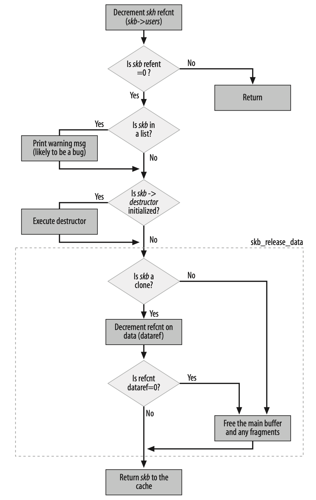
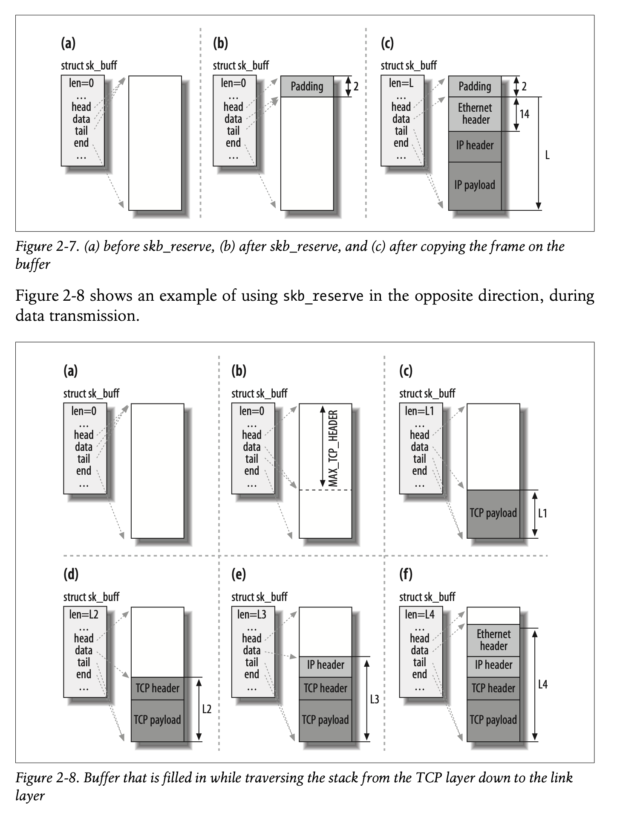
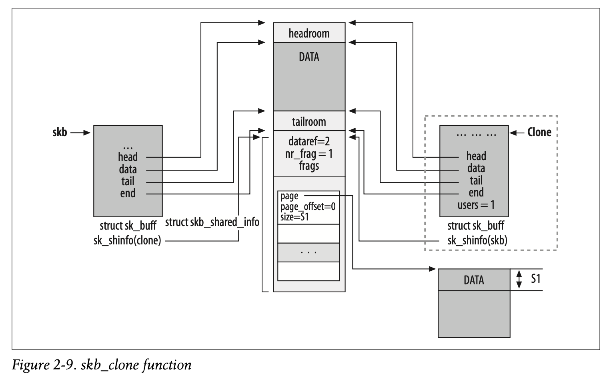

# Topics
[I. General Background 1 - 3](#1-Introduction)

[II. System Initialization 4 - 8](#4-Notification-Chains)

[III. Transmission and Reception 9 - 13](#9-Interrupts-and-Network-Drivers)

[IV. Bridging 14 - 17](#14-Bridging-Concepts)

[V. Internet Protocol Version 4 (IPv4) 18 - 25](#18-IPv4)

[VI. Neighboring Subsystem 26 - 30](#26-Neighboring-Subsystem-Concepts)

[VII. Routing 30 - 36](#30-Routing-Concepts)

# 1. Introduction
## 1.1. Basic Terminology
## 1.2. Common Coding Patterns
### 1.2.1. Memory Caches
### 1.2.2. Caching and Hash Tables
### 1.2.3. Reference Counts
### 1.2.4. Garbage Collection
### 1.2.5. Function Pointers and Virtual Function Tables (VFTs)
### 1.2.6. goto Statements
### 1.2.7. Vector Definitions
### 1.2.8. Conditional Directives (#ifdef and family)
### 1.2.9. Compile-Time Optimization for Condition Checks
### 1.2.10. Mutual Exclusion
### 1.2.11. Conversions Between Host and Network Order
### 1.2.12. Catching Bugs
### 1.2.13. Statistics
### 1.2.14. Measuring Time
## 1.3. User-Space Tools
## 1.4. Browsing the Source Code
### 1.4.1. Dead Code
## 1.5. When a Feature Is Offered as a Patch

# 2. Critical Data Structures
## 2.1 The Socket Buffer: sk_buff Structure
One of the first things done by each protocol, as the buffer passes down through layers, is to call skb_ reserve to reserve space for the protocol’s header.

### 2.1.1 Networking Options and Kernel Structures
sk_buff is peppered with C preprocessor #ifdef directives.

In general, any option that causes a change in a kernel data structure (such as adding the tc_index field to the sk_buff structure) renders the option unfit to be compiled as a module.

To find out which compile option from make config or its variants is associated with a given #ifdef symbol, to understand when a block of code is included in the kernel. The fastest way to make the association, in the 2.6 kernels, is to look for the symbol in the `kconfig` files.

### 2.1.2 Layout Fields


### 2.1.3 General Fields

### 2.1.4 Feature-Specific Fields

### 2.1.5 Management Functions


#### 2.1.5.1 Allocating memory: alloc_skb and dev_alloc_skb

Creating a single buffer involves two allocations of memory (one for the buffer and one for the sk_buff structure).
```c++
skb = kmem_cache_alloc(skbuff_head_cache, gfp_mask & ~__GFP_DMA);
size = SKB_DATA_ALIGN(size);
data = kmalloc(size + sizeof(struct skb_shared_info), gfp_mask);
```


**dev_alloc_skb** is the buffer allocation function meant for use by device drivers and expected to be executed in interrupt mode.
```c++
static inline struct sk_buff *dev_alloc_skb(unsigned int length) {
    return __dev_alloc_skb(length, GFP_ATOMIC);
}

static inline
struct sk_buff *__dev_alloc_skb(unsigned int length, int gfp_mask) {
    struct sk_buff *skb = alloc_skb(length + 16, gfp_mask);
    if (likely(skb))
        skb_reserve(skb, 16);
    return skb;
}
```

#### 2.1.5.2 Freeing memory: kfree_skb and dev_kfree_skb

These two functions release a buffer, which results in its return to the buffer pool (cache).

This basic function releases a buffer only when the skb->users counter is 1 (when no users of the buffer are left). Otherwise, the function simply decrements that counter.



#### 2.1.5.3 Data reservation and alignment: skb_reserve, skb_put, skb_push, and skb_pull



1. When TCP is asked to transmit some data, it allocates a buffer following certain criteria (TCP Maximum Segment Size (mss), support for scatter gather I/O, etc.).
2. TCP reserves (withskb_reserve) enough space at the head of the buffer to hold all the headers of all layers (TCP, IP, link layer). The parameter MAX_TCP_HEADER is the sum of all headers of all levels and is calculated taking into account the worst-case scenarios: because the TCP layer does notknow what type of interface will be used for the transmission, it reserves the biggest possible header for eachlayer. It even accounts for the possibility of multiple IPheaders (because you can have multiple IPheaders when the kernel is compiled with support for IP over IP).
3. The TCP payload is copied into the buffer. Note that Figure2-8 is just an example. The TCP payload could be organized differently; forexample, it could be stored as fragments. In Chapter 21, we will see what a fragmented buffer (also commonly called a paged buffer) looks like.
4. The TCP layer adds its header.
5. The TCP layer hands the buffer to the IP layer, which adds its header as well.
6. The IPlayer hands the IP packet to the neighboring layer, which adds the link layer header.

#### 2.1.5.4 The skb_shared_info structure and the skb_shinfo function

#### 2.1.5.5 Cloning and copying buffers



When a buffer is cloned, the contents of the data block cannot be modified. This means that code can access the data without any need for locking. When, however, a function needs to modify not only the contents of the sk_buff structure but the data too, it needs to clone the data block as well.


#### 2.1.5.6 List management functions

## 2.2 net_device Structure

The `net_device` structures for all devices are put into a global list to which the global variable `dev_base` points.


# 3. User-Space-to-Kernel Interface
## 3.1. Overview
## 3.2. procfs Versus sysctl
### 3.2.1. procfs
### 3.2.2. sysctl: Directory /proc/sys
#### 3.2.2.1 Examples of ctl_table initialization
#### 3.2.2.2 Registering a file in /proc/sys
#### 3.2.2.3 Core networking files and directories
## 3.3. ioctl
## 3.4. Netlink
## 3.5. Serializing Configuration Changes

# 4 Notification Chains
## 4.1. Reasons for Notification Chains
## 4.2. Overview
## 4.3. Defining a Chain
## 4.4. Registering with a Chain
## 4.5. Notifying Events on a Chain
## 4.6. Notification Chains for the Networking Subsystems
### 4.6.1. Wrappers
### 4.6.2. Examples
## 4.7. Tuning via /proc Filesystem
## 4.8. Functions and Variables Featured in This Chapter
## 4.9. Files and Directories Featured in This Chapter
# 5. Network Device Initialization
## 5.1. System Initialization Overview
## 5.2. Device Registration and Initialization
## 5.3. Basic Goals of NIC Initialization
## 5.4. Interaction Between Devices and Kernel
### 5.4.1. Hardware Interrupts
#### 5.4.1.1 Interrupt types
#### 5.4.1.2 Interrupt sharing
#### 5.4.1.3 Organization of IRQs to handler mappings
## 5.5. Initialization Options
## 5.6. Module Options
## 5.7. Initializing the Device Handling Layer: net_dev_init
### 5.7.1. Legacy Code
## 5.8. User-Space Helpers
### 5.8.1. kmod
### 5.8.2. Hotplug
#### 5.8.2.1 /sbin/hotplug
## 5.9. Virtual Devices
### 5.9.1. Examples of Virtual Devices
### 5.9.2. Interaction with the Kernel Network Stack
## 5.10. Tuning via /proc Filesystem
## 5.11. Functions and Variables Featured in This Chapter
## 5.12. Files and Directories Featured in This Chapter
# 6. The PCI Layer and Network Interface Cards
## 6.1. Data Structures Featured in This Chapter
## 6.2. Registering a PCI NIC Device Driver
## 6.3. Power Management and Wake-on-LAN
## 6.4. Example of PCI NIC Driver Registration
## 6.5. The Big Picture
## 6.6. Tuning via /proc Filesystem
## 6.7. Functions and Variables Featured in This Chapter
## 6.8. Files and Directories Featured in This Chapter
# 7. Kernel Infrastructure for Component Initialization
## 7.1. Boot-Time Kernel Options
### 7.1.1. Registering a Keyword
### 7.1.2. Two-Pass Parsing
### 7.1.3. .init.setup Memory Section
### 7.1.4. Use of Boot Options to Configure Network Devices
## 7.2. Module Initialization Code
### 7.2.1. Old Model: Conditional Code
### 7.2.2. New Model: Macro-Based Tagging
## 7.3. Optimized Macro-Based Tagging
### 7.3.1. Initialization Macros for Device Initialization Routines
## 7.4. Boot-Time Initialization Routines
### 7.4.1. xxx_initcall Macros
#### 7.4.1.1 Example of _ _initcall and _ _exitcall routines: modules
#### 7.4.1.2 Example of dependency between initialization routines
#### 7.4.1.3 Legacy code
## 7.5. Memory Optimizations
### 7.5.1. _ _init and _ _exit Macros
### 7.5.2. xxx_initcall and _ _exitcall Sections
### 7.5.3. Other Optimizations
### 7.5.4. Dynamic Macros’ Definition
## 7.6. Tuning via /proc Filesystem
## 7.7. Functions and Variables Featured in This Chapter
## 7.8. Files and Directories Featured in This Chapter
# 8. Device Registration and Initialization
## 8.1. When a Device Is Registered
## 8.2. When a Device Is Unregistered
## 8.3. Allocating net_device Structures
## 8.4. Skeleton of NIC Registration and Unregistration
## 8.5. Device Initialization
### 8.5.1. Device Driver Initializations
### 8.5.2. Device Type Initialization: xxx_setup Functions
### 8.5.3. Optional Initializations and Special Cases
## 8.6. Organization of net_device Structures
### 8.6.1. Lookups
## 8.7. Device State
### 8.7.1. Queuing Discipline State
### 8.7.2. Registration State
## 8.8. Registering and Unregistering Devices
### 8.8.1. Split Operations: netdev_run_todo
### 8.8.2. Device Registration Status Notification
#### 8.8.2.1 netdev_chain notification chain
#### 8.8.2.2 RTnetlink link notifications
## 8.9. Device Registration
### 8.9.1. register_netdevice Function
## 8.10. Device Unregistration
### 8.10.1. unregister_netdevice Function
### 8.10.2. Reference Counts
#### 8.10.2.1 Function netdev_wait_allrefs
## 8.11. Enabling and Disabling a Network Device
## 8.12. Updating the Device Queuing Discipline State
### 8.12.1. Interactions with Power Management
#### 8.12.1.1 Suspending a device
#### 8.12.1.2 Resuming a device
### 8.12.2. Link State Change Detection
#### 8.12.2.1 Scheduling and processing link state change events
#### 8.12.2.2 Linkwatch flags
## 8.13. Configuring Device-Related Information from User Space
### 8.13.1. Ethtool
#### 8.13.1.1 Drivers that do not support ethtool
### 8.13.2. Media Independent Interface (MII)
## 8.14. Virtual Devices
## 8.15. Locking
## 8.16. Tuning via /proc Filesystem
## 8.17. Functions and Variables Featured in This Chapter
## 8.18. Files and Directories Featured in This Chapter

# 9. Interrupts and Network Drivers
## 9.1. Decisions and Traffic Direction
## 9.2. Notifying Drivers When Frames Are Received
### 9.2.1. Polling
### 9.2.2. Interrupts
### 9.2.3. Processing Multiple Frames During an Interrupt
### 9.2.4. Timer-Driven Interrupts
### 9.2.5. Combinations
### 9.2.6. Example
## 9.3. Interrupt Handlers
### 9.3.1. Reasons for Bottom Half Handlers
### 9.3.2. Bottom Halves Solutions
### 9.3.3. Concurrency and Locking
### 9.3.4. Preemption
### 9.3.5. Bottom-Half Handlers
#### 9.3.5.1 Bottom-half handlers in kernel 2.2
#### 9.3.5.2 Bottom-half handlers in kernel 2.4 and above: the introduction of the softirq
### 9.3.6. Tasklets
### 9.3.7. Softirq Initialization
### 9.3.8. Pending softirq Handling
#### 9.3.8.1 _ _do_softirq function
### 9.3.9. Per-Architecture Processing of softirq
### 9.3.10. ksoftirqd Kernel Threads
#### 9.3.10.1 Starting the threads
### 9.3.11. Tasklet Processing
### 9.3.12. How the Networking Code Uses softirqs
## 9.4. softnet_data Structure
### 9.4.1. Fields of softnet_data
### 9.4.2. Initialization of softnet_data
# 10. Frame Reception
## 10.1. Interactions with Other Features
## 10.2. Enabling and Disabling a Device
## 10.3. Queues
## 10.4. Notifying the Kernel of Frame Reception: NAPI and netif_rx
### 10.4.1. Introduction to the New API (NAPI)
### 10.4.2. net_device Fields Used by NAPI
### 10.4.3. net_rx_action and NAPI
### 10.4.4. Old Versus New Driver Interfaces
### 10.4.5. Manipulating poll_list
## 10.5. Old Interface Between Device Drivers and Kernel: First Part of netif_rx
### 10.5.1. Initial Tasks of netif_rx
### 10.5.2. Managing Queues and Scheduling the Bottom Half
## 10.6. Congestion Management
### 10.6.1. Congestion Management in netif_rx
### 10.6.2. Average Queue Length and Congestion-Level Computation
## 10.7. Processing the NET_RX_SOFTIRQ: net_rx_action
### 10.7.1. Backlog Processing: The process_backlog Poll Virtual Function
### 10.7.2. Ingress Frame Processing
#### 10.7.2.1 Handling special features
# 11. Frame Transmission
## 11.1. Enabling and Disabling Transmissions
### 11.1.1. Scheduling a Device for Transmission
### 11.1.2. Queuing Discipline Interface
#### 11.1.2.1 qdisc_restart function
### 11.1.3. dev_queue_xmit Function
#### 11.1.3.1 Queueful devices
#### 11.1.3.2 Queueless devices
### 11.1.4. Processing the NET_TX_SOFTIRQ: net_tx_action
#### 11.1.4.1 Watchdog timer
# 12. General and Reference Material About Interrupts
## 12.1. Statistics
## 12.2. Tuning via /proc and sysfs Filesystems
## 12.3. Functions and Variables Featured in This Part of the Book
## 12.4. Files and Directories Featured in This Part of the Book
# 13. Protocol Handlers
## 13.1. Overview of Network Stack
### 13.1.1. The Big Picture
### 13.1.2. Link Layer Choices for Ethernet (LLC and SNAP)
### 13.1.3. How the Network Stack Operates
## 13.2. Executing the Right Protocol Handler
### 13.2.1. Special Media Encapsulation
## 13.3. Protocol Handler Organization
## 13.4. Protocol Handler Registration
## 13.5. Ethernet Versus IEEE 802.3 Frames
### 13.5.1. Setting the Packet Type
### 13.5.2. Setting the Ethernet Protocol and Length
### 13.5.3. Logical Link Control (LLC)
#### 13.5.3.1 The IPX case
#### 13.5.3.2 Linux’s LLC implementation
#### 13.5.3.3 Processing ingress LLC frames
### 13.5.4. Subnetwork Access Protocol (SNAP)
## 13.6. Tuning via /proc Filesystem
## 13.7. Functions and Variables Featured in This Chapter
## 13.8. Files and Directories Featured in This Chapter

# 14. Bridging: Concepts
## 14.1. Repeaters, Bridges, and Routers
## 14.2. Bridges Versus Switches
## 14.3. Hosts
## 14.4. Merging LANs with Bridges
## 14.5. Bridging Different LAN Technologies
## 14.6. Address Learning
### 14.6.1. Broadcast and Multicast Addresses
### 14.6.2. Aging
## 14.7. Multiple Bridges
### 14.7.1. Bridging Loops
### 14.7.2. Loop-Free Topologies
### 14.7.3. Defining a Loop-Free Topology
# 15. Bridging: The Spanning Tree Protocol
## 15.1. Basic Terminology
## 15.2. Example of Hierarchical Switched L2 Topology
## 15.3. Basic Elements of the Spanning Tree Protocol
### 15.3.1. Root Bridge
### 15.3.2. Designated Bridges
### 15.3.3. Spanning Tree Ports
#### 15.3.3.1 Port states
#### 15.3.3.2 Port roles
## 15.4. Bridge and Port IDs
## 15.5. Bridge Protocol Data Units (BPDUs)
### 15.5.1. Configuration BPDU
### 15.5.2. Priority Vector
### 15.5.3. When to Transmit Configuration BPDUs
### 15.5.4. BPDU Aging
## 15.6. Defining the Active Topology
### 15.6.1. Root Bridge Selection
### 15.6.2. Root Port Selection
### 15.6.3. Designated Port Selection
### 15.6.4. Examples of STP in Action
## 15.7. Timers
### 15.7.1. Avoiding Temporary Loops
## 15.8. Topology Changes
### 15.8.1. Short Aging Timer
### 15.8.2. Letting All Bridges Know About a Topology Change
### 15.8.3. Example of a Topology Change
## 15.9. BPDU Encapsulation
## 15.10. Transmitting Configuration BPDUs
## 15.11. Processing Ingress Frames
### 15.11.1. Ingress BPDUs
### 15.11.2. Ingress Configuration BPDUs
## 15.12. Convergence Time
## 15.13. Overview of Newer Spanning Tree Protocols
### 15.13.1. Rapid Spanning Tree Protocol (RSTP)
### 15.13.2. Multiple Spanning Tree Protocol (MSTP)
# 16. Bridging: Linux Implementation
## 16.1. Bridge Device Abstraction
## 16.2. Important Data Structures
## 16.3. Initialization of Bridging Code
## 16.4. Creating Bridge Devices and Bridge Ports
## 16.5. Creating a New Bridge Device
## 16.6. Bridge Device Setup Routine
## 16.7. Deleting a Bridge
## 16.8. Adding Ports to a Bridge
### 16.8.1. Deleting a Bridge Port
## 16.9. Enabling and Disabling a Bridge Device
## 16.10. Enabling and Disabling a Bridge Port
## 16.11. Changing State on a Bridge Port
## 16.12. The Big Picture
## 16.13. Forwarding Database
### 16.13.1. Lookups
### 16.13.2. Reference Counts
### 16.13.3. Adding, Updating, and Removing Entries
### 16.13.4. Aging
## 16.14. Handling Ingress Traffic
### 16.14.1. Data Frames Versus BPDUs
### 16.14.2. Processing Data Frames
## 16.15. Transmitting on a Bridge Device
## 16.16. Spanning Tree Protocol (STP)
### 16.16.1. Key Spanning Tree Routines
### 16.16.2. Bridge IDs and Port IDs
### 16.16.3. Enabling the Spanning Tree Protocol on a Bridge Device
### 16.16.4. Processing Ingress BPDUs
### 16.16.5. Transmitting BPDUs
### 16.16.6. Configuration Updates
### 16.16.7. Root Bridge Selection
#### 16.16.7.1 Becoming the root bridge
#### 16.16.7.2 Giving up the root bridge role
### 16.16.8. Timers
### 16.16.9. Handling Topology Changes
## 16.17. netdevice Notification Chain
# 17. Bridging: Miscellaneous Topics
## 17.1. User-Space Configuration Tools
### 17.1.1. Handling Configuration Changes
### 17.1.2. Old Interface Versus New Interface
### 17.1.3. Creating Bridge Devices and Bridge Ports
### 17.1.4. Configuring Bridge Devices and Ports
## 17.2. Tuning via /proc Filesystem
## 17.3. Tuning via /sys Filesystem
## 17.4. Statistics
## 17.5. Data Structures Featured in This Part of the Book
### 17.5.1. bridge_id Structure
### 17.5.2. net_bridge_fdb_entry Structure
### 17.5.3. net_bridge_port Structure
### 17.5.4. net_bridge Structure
## 17.6. Functions and Variables Featured in This Part of the Book
## 17.7. Files and Directories Featured in This Part of the Book

# 18. Internet Protocol Version 4 (IPv4): Concepts
## 18.1. IP Protocol: The Big Picture
## 18.2. IP Header
## 18.3. IP Options
### 18.3.1. “End of Option List” and “No Operation” Options
### 18.3.2. Source Route Option
### 18.3.3. Record Route Option
### 18.3.4. Timestamp Option
### 18.3.5. Router Alert Option
## 18.4. Packet Fragmentation/Defragmentation
### 18.4.1. Effect of Fragmentation on Higher Layers
### 18.4.2. IP Header Fields Used by Fragmentation/Defragmentation
### 18.4.3. Examples of Problems with Fragmentation/Defragmentation
#### 18.4.3.1 Retransmissions
#### 18.4.3.2 Associating fragments with their IP packets
#### 18.4.3.3 Example of IP ID generation
#### 18.4.3.4 Example of unsolvable defragmentation problem: NAT
### 18.4.4. Path MTU Discovery
## 18.5. Checksums
### 18.5.1. APIs for Checksum Computation
### 18.5.2. Changes to the L4 Checksum
# 19. Internet Protocol Version 4 (IPv4): Linux Foundations and Features
## 19.1. Main IPv4 Data Structures
### 19.1.1. Checksum-Related Fields from sk_buff and net_device Structures
#### 19.1.1.1 net_device structure
#### 19.1.1.2 sk_buff structure
## 19.2. General Packet Handling
### 19.2.1. Protocol Initialization
### 19.2.2. Interaction with Netfilter
### 19.2.3. Interaction with the Routing Subsystem
### 19.2.4. Processing Input IP Packets
### 19.2.5. The ip_rcv_finish Function
## 19.3. IP Options
### 19.3.1. Option Processing
### 19.3.2. Option Parsing
#### 19.3.2.1 Option: strict and loose Source Routing
#### 19.3.2.2 Option: Record Route
#### 19.3.2.3 Option: Timestamp
#### 19.3.2.4 Option: Router Alert
#### 19.3.2.5 Handling parsing errors
# 20. Internet Protocol Version 4 (IPv4): Forwarding and Local Delivery
## 20.1. Forwarding
### 20.1.1. ICMP Redirect
### 20.1.2. ip_forward Function
### 20.1.3. ip_forward_finish Function
### 20.1.4. dst_output Function
## 20.2. Local Delivery
# 21. Internet Protocol Version 4 (IPv4): Transmission
## 21.1. Key Functions That Perform Transmission
### 21.1.1. Multicast Traffic
### 21.1.2. Relevant Socket Data Structures for Local Traffic
### 21.1.3. The ip_queue_xmit Function
#### 21.1.3.1 Setting the route
#### 21.1.3.2 Building the IP header
### 21.1.4. The ip_append_data Function
#### 21.1.4.1 Basic memory allocation and buffer organization for ip_append_data
#### 21.1.4.2 Memory allocation and buffer organization for ip_append_data with Scatter Gather I/O
#### 21.1.4.3 Key routines for handling fragmented buffers
#### 21.1.4.4 Further handling of the buffers
#### 21.1.4.5 Setting the context
#### 21.1.4.6 Getting ready for fragment generation
#### 21.1.4.7 Copying data into the fragments: getfrag
#### 21.1.4.8 Buffer allocation
#### 21.1.4.9 Main loop
#### 21.1.4.10 L4 checksum
### 21.1.5. The ip_append_page Function
### 21.1.6. The ip_push_pending_frames Function
### 21.1.7. Putting Together the Transmission Functions
### 21.1.8. Raw Sockets
## 21.2. Interface to the Neighboring Subsystem
# 22. Internet Protocol Version 4 (IPv4): Handling Fragmentation
## 22.1. IP Fragmentation
### 22.1.1. Functions Involved with IP Fragmentation
### 22.1.2. The ip_fragment Function
### 22.1.3. Slow Fragmentation
### 22.1.4. Fast Fragmentation
## 22.2. IP Defragmentation
### 22.2.1. Organization of the IP Fragments Hash Table
### 22.2.2. Key Issues in Defragmentation
### 22.2.3. Functions Involved with Defragmentation
### 22.2.4. New ipq Instance Initialization
### 22.2.5. The ip_defrag Function
### 22.2.6. The ip_frag_queue Function
#### 22.2.6.1 Handling overlaps
#### 22.2.6.2 L4 checksum
### 22.2.7. Garbage Collection
### 22.2.8. Hash Table Reorganization
# 23. Internet Protocol Version 4 (IPv4): Miscellaneous Topics
## 23.1. Long-Living IP Peer Information
### 23.1.1. Initialization
### 23.1.2. Lookups
### 23.1.3. How the IP Layer Uses inet_peer Structures
### 23.1.4. Garbage Collection
## 23.2. Selecting the IP Header’s ID Field
## 23.3. IP Statistics
## 23.4. IP Configuration
### 23.4.1. Main Functions That Manipulate IP Addresses and Configuration
### 23.4.2. Change Notification: rtmsg_ifa
### 23.4.3. inetaddr_chain Notification Chain
### 23.4.4. IP Configuration via ip
### 23.4.5. IP Configuration via ifconfig
## 23.5. IP-over-IP
## 23.6. IPv4: What’s Wrong with It?
## 23.7. Tuning via /proc Filesystem
## 23.8. Data Structures Featured in This Part of the Book
### 23.8.1. iphdr Structure
### 23.8.2. ip_options Structure
### 23.8.3. ipcm_cookie Structure
### 23.8.4. ipq Structure
### 23.8.5. inet_peer Structure
### 23.8.6. ipstats_mib Structure
### 23.8.7. in_device Structure
### 23.8.8. in_ifaddr Structure
### 23.8.9. ipv4_devconf Structure
### 23.8.10. ipv4_config Structure
### 23.8.11. cork Structure
### 23.8.12. skb_frag_t Structure
## 23.9. Functions and Variables Featured in This Part of the Book
## 23.10. Files and Directories Featured in This Part of the Book
# 24. Layer Four Protocol and Raw IP Handling
## 24.1. Available L4 Protocols
## 24.2. L4 Protocol Registration
### 24.2.1. Registration: inet_add_protocol and inet_del_protocol
## 24.3. L3 to L4 Delivery: ip_local_deliver_finish
### 24.3.1. Raw Sockets and Raw IP
### 24.3.2. Delivering Raw Input Datagrams to the Recipient Application
### 24.3.3. IPsec
## 24.4. IPv4 Versus IPv6
## 24.5. Tuning via /proc Filesystem
## 24.6. Functions and Variables Featured in This Chapter
## 24.7. Files and Directories Featured in This Chapter
# 25. Internet Control Message Protocol (ICMPv4)
## 25.1. ICMP Header
## 25.2. ICMP Payload
## 25.3. ICMP Types
### 25.3.1. ICMP_ECHO and ICMP_ECHOREPLY
### 25.3.2. ICMP_DEST_UNREACH
### 25.3.3. ICMP_SOURCE_QUENCH
### 25.3.4. ICMP_REDIRECT
### 25.3.5. ICMP_TIME_EXCEEDED
### 25.3.6. ICMP_PARAMETERPROB
### 25.3.7. ICMP_TIMESTAMP and ICMP_TIMESTAMPREPLY
### 25.3.8. ICMP_INFO_REQUEST and ICMP_INFO_REPLY
### 25.3.9. ICMP_ADDRESS and ICMP_ADDRESSREPLY
## 25.4. Applications of the ICMP Protocol
### 25.4.1. ping
### 25.4.2. traceroute
## 25.5. The Big Picture
## 25.6. Protocol Initialization
## 25.7. Data Structures Featured in This Chapter
### 25.7.1. icmphdr Structure
### 25.7.2. icmp_control Structure
### 25.7.3. icmp_bxm Structure
## 25.8. Transmitting ICMP Messages
### 25.8.1. Transmitting ICMP Error Messages
### 25.8.2. Replying to Ingress ICMP Messages
### 25.8.3. Rate Limiting
### 25.8.4. Implementation of Rate Limiting
### 25.8.5. Receiving ICMP Messages
### 25.8.6. Processing ICMP_ECHO and ICMP_ECHOREPLY Messages
### 25.8.7. Processing the Common ICMP Messages
### 25.8.8. Processing ICMP_REDIRECT Messages
### 25.8.9. Processing ICMP_TIMESTAMP and ICMP_TIMESTAMPREPLY Messages
### 25.8.10. Processing ICMP_ADDRESS and ICMP_ADDRESSREPLY Messages
## 25.9. ICMP Statistics
## 25.10. Passing Error Notifications to the Transport Layer
## 25.11. Tuning via /proc Filesystem
## 25.12. Functions and Variables Featured in This Chapter
## 25.13. Files and Directories Featured in This Chapter

# 26. Neighboring Subsystem: Concepts
It covers such general issues as:
* The tasks taken on by a general neighboring infrastructure
* Why caching is valuable
* The states a neighbor entry in the cache can take
* Reachability detection and Network Unreachability Detection (NUD)
* What proxying is for

## 26.1. What Is a Neighbor?

A host is your neighbor if it is connected to the same LAN and it is config- uredonthesameL3network.

Hosts that are not neighbors must communicate through a gateway or router.

Two hosts can still be neighbors if they are separated by a system on the L2 layer (a bridge).

## 26.2. Reasons That Neighboring Protocols Are Needed
### 26.2.1. When L3 Addresses Need to Be Translated to L2 Addresses
### 26.2.2. Shared Medium
### 26.2.3. Why Static Assignment of Addresses Is Not Sufficient
### 26.2.4. Special Cases
### 26.2.5. Solicitation Requests and Replies
## 26.3. Linux Implementation
### 26.3.1. Neighboring Protocols
## 26.4. Proxying the Neighboring Protocol
### 26.4.1. Conditions Required by the Proxy
## 26.5. When Solicitation Requests Are Transmitted and Processed
## 26.6. Neighbor States and Network Unreachability Detection (NUD)
### 26.6.1. Reachability
### 26.6.2. Transitions Between NUD States
#### 26.6.2.1 Basic states
#### 26.6.2.2 Derived states
#### 26.6.2.3 Initial state
### 26.6.3. Reachability Confirmation

# 27. Neighboring Subsystem: Infrastructure
## 27.1. Main Data Structures
## 27.2. Common Interface Between L3 Protocols and Neighboring Protocols
### 27.2.1. Initialization of neigh->ops
### 27.2.2. Initialization of neigh->output and neigh->nud_state
#### 27.2.2.1 Common state changes: neigh_connect and neigh_suspect
#### 27.2.2.2 Routines used for neigh->output
### 27.2.3. Updating a Neighbor’s Information: neigh_update
#### 27.2.3.1 neigh_update optimization
#### 27.2.3.2 Initial neigh_update operations
#### 27.2.3.3 Changes of link layer address
#### 27.2.3.4 Notifications to arpd
## 27.3. General Tasks of the Neighboring Infrastructure
### 27.3.1. Caching
### 27.3.2. Timers
## 27.4. Reference Counts on neighbour Structures
## 27.5. Creating a neighbour Entry
### 27.5.1. The neigh_create Function’s Parameters
### 27.5.2. Neighbor Initialization
## 27.6. Neighbor Deletion
### 27.6.1. Garbage Collection
#### 27.6.1.1 Synchronous cleanup: the neigh_forced_gc function
#### 27.6.1.2 Asynchronous cleanup: the neigh_periodic_timer function
## 27.7. Acting As a Proxy
### 27.7.1. Delayed Processing of Solicitation Requests
### 27.7.2. Per-Device Proxying and Per-Destination Proxying
## 27.8. L2 Header Caching
### 27.8.1. Methods Provided by the Device Driver
### 27.8.2. Link Between Routing and L2 Header Caching
### 27.8.3. Cache Invalidation and Updating
## 27.9. Protocol Initialization and Cleanup
## 27.10. Interaction with Other Subsystems
### 27.10.1. Events Generated by the Neighboring Layer
### 27.10.2. Events Received by the Neighboring Layer
#### 27.10.2.1 Updates via neigh_ifdown
#### 27.10.2.2 Updates via neigh_changeaddr (netdevice notification chain)
## 27.11. Interaction Between Neighboring Protocols and L3 Transmission Functions
## 27.12. Queuing
### 27.12.1. Ingress Queuing
### 27.12.2. Egress Queuing
# 28. Neighboring Subsystem: Address Resolution Protocol (ARP)
## 28.1. ARP Packet Format
### 28.1.1. Destination Address Types for ARP Packets
## 28.2. Example of an ARP Transaction
## 28.3. Gratuitous ARP
### 28.3.1. Change of L2 Address
### 28.3.2. Duplicate Address Detection
### 28.3.3. Virtual IP
## 28.4. Responding from Multiple Interfaces
## 28.5. Tunable ARP Options
### 28.5.1. Compile-Time Options
### 28.5.2. /proc Options
#### 28.5.2.1 ARP_ANNOUNCE
#### 28.5.2.2 ARP_IGNORE
#### 28.5.2.3 ARP_FILTER
#### 28.5.2.4 Medium ID
## 28.6. ARP Protocol Initialization
### 28.6.1. The arp_tbl Table
## 28.7. Initialization of a neighbour Structure
### 28.7.1. Basic Initialization Sequence
### 28.7.2. Virtual Functions in the ops Field
### 28.7.3. Start of the arp_constructor Function
### 28.7.4. Devices That Do Not Need ARP
### 28.7.5. Devices That Need ARP
## 28.8. Transmitting and Receiving ARP Packets
### 28.8.1. Transmitting ARP Packets: Introduction to arp_send
### 28.8.2. Solicitations
#### 28.8.2.1 ARP_ANNOUNCE and selection of source IP address
## 28.9. Processing Ingress ARP Packets
### 28.9.1. Initial Common Processing
### 28.9.2. Processing ARPOP_REQUEST Packets
#### 28.9.2.1 Passive learning and ARP optimization
#### 28.9.2.2 Requests with zero addresses
### 28.9.3. Processing ARPOP_REPLY Packets
### 28.9.4. Final Common Processing
## 28.10. Proxy ARP
### 28.10.1. Destination NAT (DNAT)
### 28.10.2. Proxy ARP Server as Router
## 28.11. Examples
## 28.12. External Events
### 28.12.1. Received Events
### 28.12.2. Generated Events
### 28.12.3. Wake-on-LAN Events
## 28.13. ARPD
### 28.13.1. Kernel Side
### 28.13.2. User-Space Side
## 28.14. Reverse Address Resolution Protocol (RARP)
## 28.15. Improvements in ND (IPv6) over ARP (IPv4)
# 29. Neighboring Subsystem: Miscellaneous Topics
## 29.1. System Administration of Neighbors
### 29.1.1. Common Routines
### 29.1.2. New-Generation Tool: IPROUTE2’s ip Command
### 29.1.3. Old-Generation Tool: net-tools’s arp Command
## 29.2. Tuning via /proc Filesystem
### 29.2.1. The /proc/sys/net/ipv4/neigh Directory
#### 29.2.1.1 Initialization of global and per-device directories
#### 29.2.1.2 Directory creation
### 29.2.2. The /proc/sys/net/ipv4/conf Directory
## 29.3. Data Structures Featured in This Part of the Book
### 29.3.1. neighbour Structure
### 29.3.2. neigh_table Structure
### 29.3.3. neigh_parms Structure
### 29.3.4. neigh_ops Structure
### 29.3.5. hh_cache Structure
### 29.3.6. neigh_statistics Structure
### 29.3.7. Data Structures Featured in This Part of the Book
## 29.4. Files and Directories Featured in This Part of the Book

# 30. Routing: Concepts
## 30.1. Routers, Routes, and Routing Tables
### 30.1.1. Nonrouting Multihomed Hosts
### 30.1.2. Varieties of Routing Configurations
### 30.1.3. Questions Answered in This Part of the Book
## 30.2. Essential Elements of Routing
### 30.2.1. Scope
#### 30.2.1.1 Use of the scope
### 30.2.2. Default Gateway
### 30.2.3. Directed Broadcasts
### 30.2.4. Primary and Secondary Addresses
#### 30.2.4.1 Old-generation configuration: aliasing interfaces
#### 30.2.4.2 Relationship between aliasing devices and primary/secondary status
## 30.3. Routing Table
### 30.3.1. Special Routes
### 30.3.2. Route Types and Actions
### 30.3.3. Routing Cache
### 30.3.4. Routing Table Versus Routing Cache
### 30.3.5. Routing Cache Garbage Collection
#### 30.3.5.1 Examples of events that can expire cache entries
#### 30.3.5.2 Examples of eligible cache victims
## 30.4. Lookups
### 30.4.1. Longest Prefix Match
## 30.5. Packet Reception Versus Packet Transmission
# 31. Routing: Advanced
## 31.1. Concepts Behind Policy Routing
### 31.1.1. Lookup with Policy Routing
### 31.1.2. Routing Table Selection
## 31.2. Concepts Behind Multipath Routing
### 31.2.1. Next Hop Selection
### 31.2.2. Cache Support for Multipath
#### 31.2.2.1 Weighted random algorithm
#### 31.2.2.2 Device round-robin algorithm
### 31.2.3. Per-Flow, Per-Connection, and Per-Packet Distribution
#### 31.2.3.1 Equalizer algorithm
## 31.3. Interactions with Other Kernel Subsystems
### 31.3.1. Routing Table Based Classifier
#### 31.3.1.1 Configuring policy realms
#### 31.3.1.2 Configuring route realms
#### 31.3.1.3 Computing the routing tag
### 31.3.2. Policy Routing and Firewall-Based Classifier
## 31.4. Routing Protocol Daemons
## 31.5. Verbose Monitoring
## 31.6. ICMP_REDIRECT Messages
### 31.6.1. Shared Media
### 31.6.2. Transmitting ICMP_REDIRECT Messages
### 31.6.3. Processing Ingress ICMP_REDIRECT Messages
## 31.7. Reverse Path Filtering
# 32. Routing: Li nux Implementation
## 32.1. Kernel Options
### 32.1.1. Basic Options
### 32.1.2. Advanced Options
### 32.1.3. Recently Dropped Options
## 32.2. Main Data Structures
### 32.2.1. Lists and Hash Tables
## 32.3. Route and Address Scopes
### 32.3.1. Route Scopes
### 32.3.2. Address Scopes
### 32.3.3. Relationship Between Route and Next-Hop Scopes
## 32.4. Primary and Secondary IP Addresses
## 32.5. Generic Helper Routines and Macros
## 32.6. Global Locks
## 32.7. Routing Subsystem Initialization
## 32.8. External Events
### 32.8.1. Helper Routines
### 32.8.2. Changes in IP Configuration
#### 32.8.2.1 Adding an IP address
#### 32.8.2.2 Removing an IP address
### 32.8.3. Changes in Device Status
#### 32.8.3.1 Impacts on the routing tables
#### 32.8.3.2 Impacts on the policy database
#### 32.8.3.3 Impacts on the IP configuration
## 32.9. Interactions with Other Subsystems
### 32.9.1. Netlink Notifications
### 32.9.2. Policy Routing and Firewall-Based Classifier
### 32.9.3. Routing Protocol Daemons
# 33. Routing: The Routing Cache
## 33.1. Routing Cache Initialization
## 33.2. Hash Table Organization
## 33.3. Major Cache Operations
### 33.3.1. Cache Locking
### 33.3.2. Cache Entry Allocation and Reference Counts
### 33.3.3. Adding Elements to the Cache
### 33.3.4. Binding the Route Cache to the ARP Cache
### 33.3.5. Cache Lookup
#### 33.3.5.1 Ingress lookup
#### 33.3.5.2 Egress lookup
## 33.4. Multipath Caching
### 33.4.1. Registering a Caching Algorithm
### 33.4.2. Interface Between the Routing Cache and Multipath
### 33.4.3. Helper Routines
### 33.4.4. Common Elements Between Algorithms
### 33.4.5. Random Algorithm
### 33.4.6. Weighted Random Algorithm
### 33.4.7. Round-Robin Algorithm
### 33.4.8. Device Round-Robin Algorithm
## 33.5. Interface Between the DST and Calling Protocols
### 33.5.1. IPsec Transformations and the Use of dst_entry
### 33.5.2. External Events
## 33.6. Flushing the Routing Cache
## 33.7. Garbage Collection
### 33.7.1. Synchronous Cleanup
### 33.7.2. rt_garbage_collect Function
### 33.7.3. Asynchronous Cleanup
### 33.7.4. Expiration Criteria
### 33.7.5. Deleting DST Entries
### 33.7.6. Variables That Tune and Control Garbage Collection
## 33.8. Egress ICMP REDIRECT Rate Limiting
# 34. Routing: Routing Tables
## 34.1. Organization of Routing Hash Tables
### 34.1.1. Organization of Per-Netmask Tables
#### 34.1.1.1 Basic structures for hash table organization
#### 34.1.1.2 Dynamic resizing of per-netmask hash tables
### 34.1.2. Organization of fib_info Structures
#### 34.1.2.1 Dynamic resizing of global hash tables
### 34.1.3. Organization of Next-Hop Router Structures
### 34.1.4. The Two Default Routing Tables: ip_fib_main_table and ip_fib_local_table
## 34.2. Routing Table Initialization
## 34.3. Adding and Removing Routes
### 34.3.1. Adding a Route
### 34.3.2. Deleting a Route
### 34.3.3. Garbage Collection
## 34.4. Policy Routing and Its Effects on Routing Table Definitions
### 34.4.1. Variable and Structure Definitions
### 34.4.2. Double Definitions for Functions
# 35. Routing: Lookups
## 35.1. High-Level View of Lookup Functions
## 35.2. Helper Routines
## 35.3. The Table Lookup: fn_hash_lookup
### 35.3.1. Semantic Matching on Subsidiary Criteria
#### 35.3.1.1 Criteria for rejecting routes
#### 35.3.1.2 Return value from fib_semantic_match
## 35.4. fib_lookup Function
## 35.5. Setting Functions for Reception and Transmission
### 35.5.1. Initialization of Function Pointers for Ingress Traffic
### 35.5.2. Initialization of Function Pointers for Egress Traffic
### 35.5.3. Special Cases
## 35.6. General Structure of the Input and Output Routing Routines
## 35.7. Input Routing
### 35.7.1. Creation of a Cache Entry
### 35.7.2. Preferred Source Address Selection
### 35.7.3. Local Delivery
### 35.7.4. Forwarding
### 35.7.5. Routing Failure
## 35.8. Output Routing
### 35.8.1. Search Key Initialization
### 35.8.2. Selecting the Source IP Address
### 35.8.3. Local Delivery
### 35.8.4. Transmission to Other Hosts
### 35.8.5. Interaction Between Multipath and Default Gateway Selection
### 35.8.6. Default Gateway Selection
### 35.8.7. fn_hash_select_default Function
## 35.9. Effects of Multipath on Next Hop Selection
### 35.9.1. Multipath Caching
## 35.10. Policy Routing
### 35.10.1. fib_lookup with Policy Routing
### 35.10.2. Default Gateway Selection with Policy Routing
## 35.11. Source Routing
## 35.12. Policy Routing and Routing Table Based Classifier
### 35.12.1. Storing the Realms
### 35.12.2. Helper Routines
### 35.12.3. Computing the Routing Tag
# 36. Routing: Miscellaneous Topics
## 36.1. User-Space Configuration Tools
### 36.1.1. Configuring Routing with IPROUTE2
#### 36.1.1.1 Correspondence between IPROUTE2 user commands and kernel functions
#### 36.1.1.2 inet_rtm_newroute and inet_rtm_delroute functions
### 36.1.2. Configuring Routing with net-tools
### 36.1.3. Change Notifications
### 36.1.4. Routes Inserted by the Kernel: The fib_magic Function
## 36.2. Statistics
## 36.3. Tuning via /proc Filesystem
### 36.3.1. The /proc/sys/net/ipv4 Directory
### 36.3.2. The /proc/sys/net/ipv4/route Directory
### 36.3.3. The /proc/sys/net/ipv4/conf Directory
#### 36.3.3.1 Special subdirectories
#### 36.3.3.2 Use of the special subdirectories
#### 36.3.3.3 File descriptions
### 36.3.4. The /proc/net and /proc/net/stat Directories
## 36.4. Enabling and Disabling Forwarding
## 36.5. Data Structures Featured in This Part of the Book
### 36.5.1. fib_table Structure
### 36.5.2. fn_zone Structure
### 36.5.3. fib_node Structure
### 36.5.4. fib_alias Structure
### 36.5.5. fib_info Structure
### 36.5.6. fib_nh Structure
### 36.5.7. fib_rule Structure
### 36.5.8. fib_result Structure
### 36.5.9. rtable Structure
### 36.5.10. dst_entry Structure
### 36.5.11. dst_ops Structure
### 36.5.12. flowi Structure
### 36.5.13. rt_cache_stat Structure
### 36.5.14. ip_mp_alg_ops Structure
## 36.6. Functions and Variables Featured in This Part of the Book
## 36.7. Files and Directories Featured in This Part of the Book