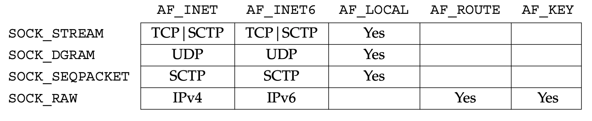
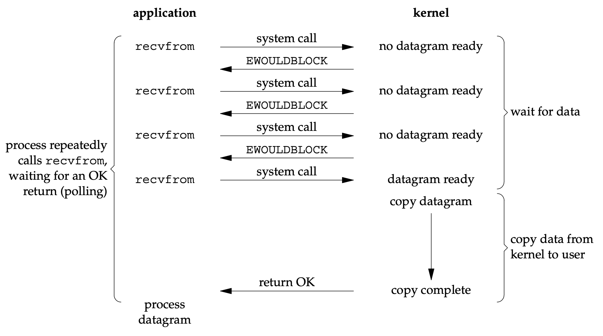
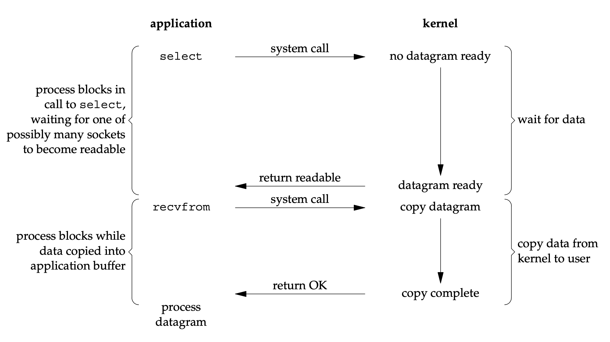
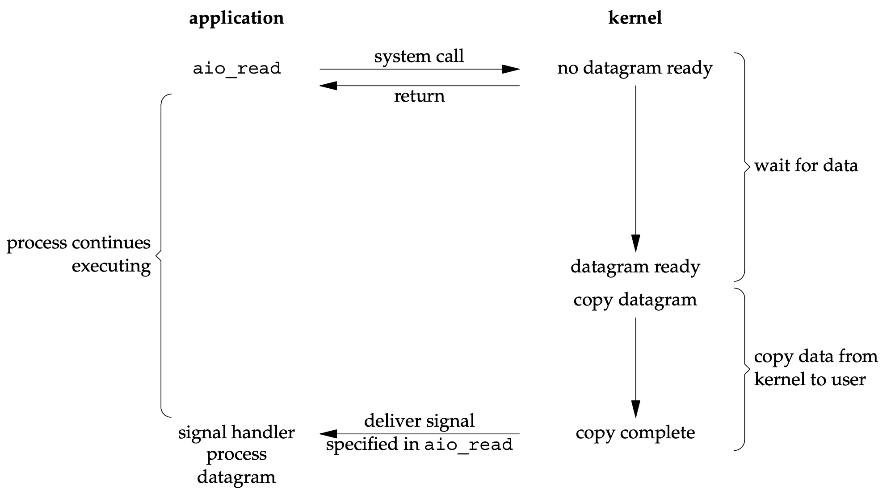
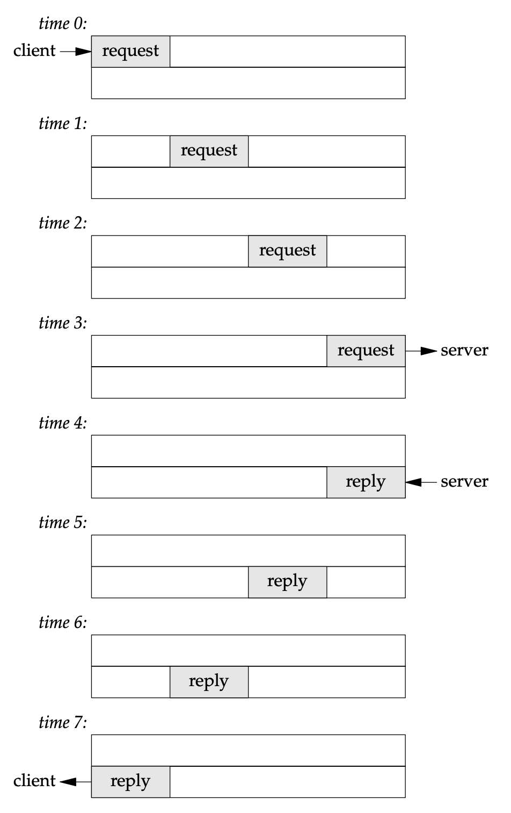
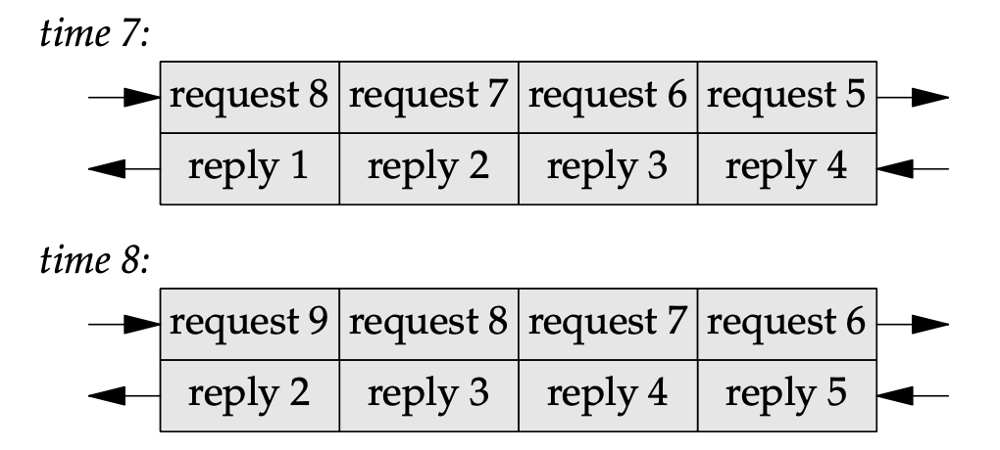
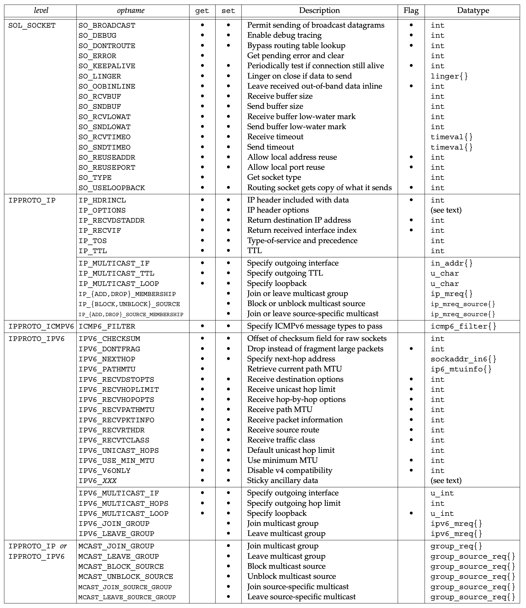
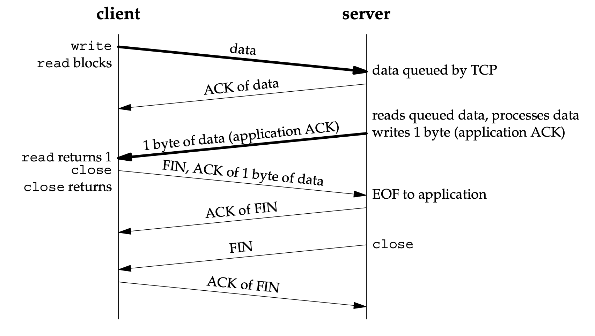
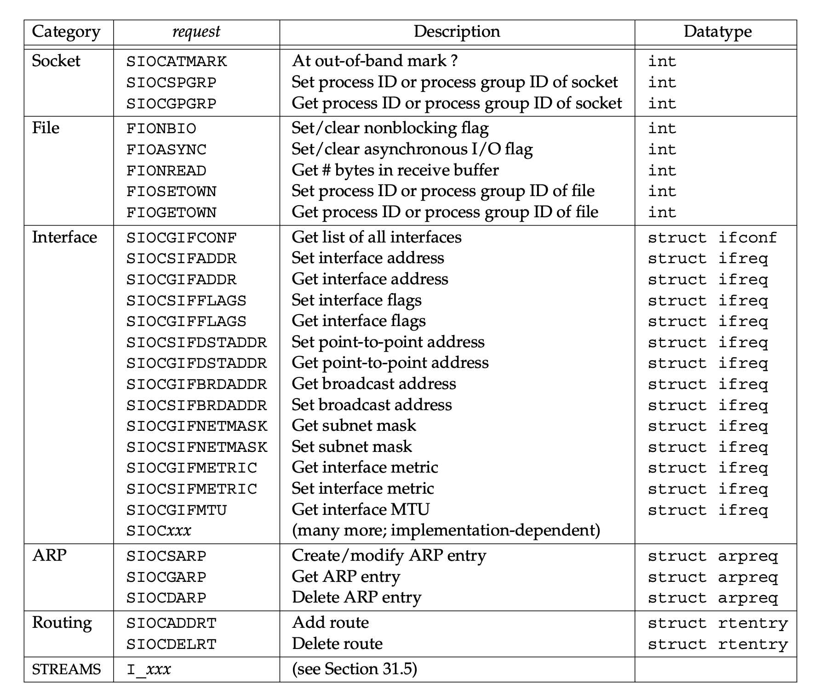

# 2 The Transport Layer: TCP, UDP, SCTP
## 2.3 TCP:
Reliable, full-duplex byte stream, acknowlegments, timeouts, sequence number, RTT estimate, retransmissions.

TCP is not a 100% reliable protocol, it provides reliable delivery of data or reliable notification of failure.

TCP contains algorithms to estimate the round-trip time(RTT) between a client and server dynamically.

TCP sequences the data by associating a sequence number with every byte that it sends.

TCP provides flow control which is called advertised window.

## 2.4 UDP
The application writes a msg to a UDP socket, which is then encapsulated in a UDP datagram and then further encapsulated as an IP datagram. And sent to its destination.

Each UDP datagram has a length while TCP is a bytes-stream protocol without any record boundaries at all.

* Three-Way Handshake:
    * SYN: tell server/client client/server inital sequence number. Contain an IP header, a TCP header and options.
    * The ACK of each FIN is the sequence number of the FIN plus one.

* TCP Options:
    * MSS(maxmium segment size): fetch this option by TCP_MAXSEG
    * Window scale option: fetch by SO_REVBUF
    * Timestamp option.

* TCP Termination:

* TIME_WAIT State:
    * The duration that this endpoint remains in this state is twice the maxmium segment lifetime, 2MSL.
    * Two reasons for TIME_WAIT:
        1. To implement TCP's full-duplex connection termination reliably
        2. To allow old duplicate segments to expire in the network

* Port Numbers:
    1. The well-know ports: 0 1023
    2. The regisered ports: 1024 49151
    3. The dynamic or private ports: 49152 65535

4 Elementary of TCP Sockets

5 TCP Client and Server Example

## 2.7 TIME_WAIT State
* There are two reasons for the TIME_WAIT state:
    1. To implement TCP’s full-duplex connection termination reliably: retransmit the final ACK.
    2. To allow old duplicate segments to expire in the network

## 2.11 Buffer Sizes and Limitations
* The maximum size of an IPv4 datagram is 65,535 bytes, including the IPv4 header. This is because of the 16-bit total length field.
* Many networks have an **MTU** which can be dictated by the hardware. For example, the Ethernet MTU is 1,500 bytes.
* The smallest MTU in the path between two hosts is called the **path MTU**. Today, the Ethernet MTU of 1,500 bytes is often the path MTU.
* When an IP datagram is to be sent out an interface, if the size of the datagram exceeds the link MTU, **fragmentation** is performed by both IPv4 and IPv6. The fragments are not normally reassembled until they reach the final destination. IPv4 hosts perform fragmentation on datagrams that they generate and IPv4 routers perform fragmentation on datagrams that they forward.
* If the ‘‘**don’t fragment**’’ (DF) bit is set in the IPv4 header (Figure A.1), it specifies that this datagram must not be fragmented, either by the sending host or by any router. A router that receives an IPv4 datagram with the DF bit set whose size exceeds the outgoing link’s MTU generates an ICMPv4 ‘‘destination unreachable, fragmentation needed but DF bit set’’ error message
* IPv4 and IPv6 define a **minimum reassembly buffer size**, the minimum datagram size that we are guaranteed any implementation must support. For IPv4, this is 576 bytes.
* TCP has a **maximum segment size (MSS)** that announces to the peer TCP the maximum amount of TCP data that the peer can send per segment.

### TCP Output
* The successful return from a write to a TCP socket only tells us that we can reuse our application buffer. It does not tell us that either the peer TCP has received the data or that the peer application has received the data.

# 3 Sockets Introduction

## 3.2 Socket Address Structures
* Generic Socket Address Structure

    ```c++
    struct sockaddr {
        uint8_t      sa_len;
        sa_family_t  sa_family;    /* address family: AF_xxx value */
        char         sa_data[14];  /* protocol-specific address */
    };
    ```

* IPv4 Socket Address Structure

    ```c++
    struct in_addr {
        in_addr_t   s_addr; /* 32-bit IPv4 address */
    };                      /* network byte ordered */

    struct sockaddr_in {
        uint8_t         sin_len;    /* length of structure (16) */
        sa_family_t     sin_family; /* AF_INET */
        in_port_t       sin_port;   /* 16-bit TCP or UDP port number */
                                    /* network byte ordered */
        struct in_addr  sin_addr;   /* 32-bit IPv4 address */
                                    /* network byte ordered */
        char            sin_zero[8];/* unused */
    };
    ```

* IPv6 Socket Address Structure

    ```c++
    struct in6_addr {
        uint8_t  s6_addr[16];   /* 128-bit IPv6 address */
                                /* network byte ordered */
    };

    #define SIN6_LEN      /* required for compile-time tests */

    struct sockaddr_in6 {
        uint8_t         sin6_len;       /* length of this struct (28) */
        sa_family_t     sin6_family;    /* AF_INET6 */
        in_port_t       sin6_port;      /* transport layer port# */
                                        /* network byte ordered */
        uint32_t        sin6_flowinfo;  /* flow information, undefined */
        struct in6_addr sin6_addr;      /* IPv6 address */
        uint32_t        sin6_scope_id;  /* set of interfaces for a scope */
    };
    ```

* New Generic Socket Address Structure

    ```c++
    struct sockaddr_storage {
    uint8_t ss_len;         /* length of this struct (implementation dependent) */
    sa_family_t ss_family;  /* address family: AF_xxx value */
        /* implementation-dependent elements to provide:
        * a) alignment sufficient to fulfill the alignment requirements of
        *    all socket address types that the system supports.
        * b) enough storage to hold any type of socket address that the
        *    system supports. */
    };
    ```


## 3.4 Byte Ordering Functions
* with the low-order byte at the starting address, known as **little-endian byte order**, or with the high-order byte at the starting address, known as **big-endian byte order**.
* ```c++
    #include <netinet/in.h>
    uint16_t htons(uint16_t host16bitvalue);
    uint32_t htonl(uint32_t host32bitvalue);
    uint16_t ntohs(uint16_t net16bitvalue);
    uint32_t ntohl(uint32_t net32bitvalue);
    ```
* ```c++
    union {
        short s;
        char c[sizeof(short)]
    } un;

    un.s = 0x0102;
    printf("%s", CPU_VENDOR_OS);
    if (sizeof(short) == 2) {
        if (un.c[0] == 1 && un.c[1] == 2) {
            printf("big endian\n");
        } else if (un.c[0] == 2 && un.c[1] == 1) {
            pritnf("little endian\n");
        } else {
            printf("unkown\n");
        }
    } else {
        printf("sizeof(short) = %d\n", sizeof(short));
    }
    ```

## 3.5 ByteManipulationFunctions
```c++
#include <strings.h>
void bzero(void *dest, size_t nbytes);
void bcopy(const void *src, void *dest, size_t nbytes);
int bcmp(const void *ptr1, const void *ptr2, size_t nbytes);
```
```c++
#include <string.h>
void *memset(void *dest, int c, size_t len);
void *memcpy(void *dest, const void *src, size_t nbytes);
int memcmp(const void *ptr1, const void *ptr2, size_t nbytes);
```

## 3.6 inet_aton, inet_addr, and inet_ntoa
```c++
#include <arpa/inet.h>
int inet_aton(const char *strptr, struct in_addr *addrptr);
// Returns: 1 if string was valid, 0 on error

in_addr_t inet_addr(const char *strptr);
// Returns: 32-bit binary network byte ordered IPv4 address; INADDR_NONE if error

char *inet_ntoa(struct in_addr inaddr);
// Returns: pointer to dotted-decimal string
```

## 3.7 inet_pton and inet_ntop
The letters ‘‘p’’ and ‘‘n’’ stand for presentation and numeric.
```c++
#include <arpa/inet.h>
int inet_pton(int family, const char *strptr, void *addrptr);
// Returns: 1 if OK, 0 if input not a valid presentation format, −1 on error

const char *inet_ntop(int family, const void *addrptr, char *strptr, size_t len);
// Returns: pointer to result if OK, NULL on error
```


## 3.8 sock_ntop and Related Functions


# 4 Elementary TCP Sockets


## 4.2 socket
```c++
#include <sys/socket.h>
int socket(int family, int type, int protocol);
```
* 
* There is usually a limit to the number of descriptors that any process can have open at any time.

## 4.3 connect
```c++
#include <sys/socket.h>
int connect(int sockfd, const struct sockaddr *servaddr, socklen_t addrlen);
```

* The connect function initiates TCP’s three-way handshake (Section 2.6). The function returns only when the connection is established or an error occurs. There are several different error returns possible.
    * If the client TCP receives no response to its SYN segment, `ETIMEDOUT` is returned.
    * If the server’s response to the client’s SYN is a reset (RST), this indicates that no process is waiting for connections on the server host at the port specified. `ECONNREFUSED` is returned to the client as soon as the RST is received.
    * If the client’s SYN elicits an ICMP ‘‘destination unreachable’’ from some intermediate router, this is considered a soft error. The client kernel saves the message but keeps sending SYNs with the same time between each SYN as in the first scenario. If no response is received after some fixed amount of time (75 seconds for 4.4BSD), the saved ICMP error is returned to the process as either `EHOSTUNREACH` or `ENETUNREACH`.

* Three conditions that generate an RST are:
    * when a SYN arrives for a port that has no listening server (what we just described)
    * when TCP wants to abort an existing connection
    * when TCP receives a segment for a connection that does not exist.

* If connect fails, the socket is no longer usable and must be closed. We cannot call connect again on the socket.

## 4.4 bind
```c++
#include <sys/socket.h>
int bind(int sockfd, const struct sockaddr *myaddr, socklen_t addrlen);
```

* If a TCP client or server does bind, the kernel chooses an ephemeral port for the socket when either connect or listen is called.
* Normally, a TCP client does not bind an IP address to its socket. The kernel chooses the source IP address when the socket is connected, based on the outgoing interface that is used, which in turn is based on the route required to reach the server (p. 737 of TCPv2).
* If a TCP server does not bind an IP address to its socket, the kernel uses the destination IP address of the client’s SYN as the server’s source IP address (p. 943 of TCPv2).

* 

* ```c++
    #include <netinet/in.h>
    struct sockaddr_in   servaddr;
    servaddr.sin_addr.s_addr = htonl(INADDR_ANY);   /* wildcard */

    struct sockaddr_in6    serv;
    serv.sin6_addr = in6addr_any;    /* wildcard */
    ```
* If we tell the kernel to choose an ephemeral port number for our socket, notice that bind does not return the chosen value. Indeed, it cannot return this value since the second argument to bind has the const qualifier. To obtain the value of the ephemeral port assigned by the kernel, we must call getsockname to return the protocol address.

## 4.5 listen
* There are several points to consider regarding the handling of these two queues.
    * The backlog argument to the listen function has historically specified the maximum value for the sum of both queues.
    * Berkeley-derived implementations add a fudge factor to the backlog: It is multiplied by 1.5 (p. 257 of TCPv1 and p. 462 of TCPv2).
    * Do not specify a backlog of 0, as different implementations interpret this differently.
    * If the queues are full when a client SYN arrives, TCP ignores the arriving SYN (pp. 930–931 of TCPv2); it does not send an RST. If the server TCP immediately responded with an RST, the client’s connect would return an error.
    * Data that arrives after the three-way handshake completes, but before the server calls accept, should be queued by the server TCP, up to the size of the connected socket’s receive buffer.

## 4.6 accept

## 4.7 fork and exec
* There are two typical uses of fork:
    1. A process makes a copy of itself so that one copy can handle one operation while the other copy does another task. This is typical for network servers.
    2. A process wants to execute another program.

* ```c++
    #include <unistd.h>
    int execl(const char *pathname, const char *arg0, ... /* (char *) 0 */ );
    int execv(const char *pathname, char *const argv[]);
    int execle(const char *pathname, const char *arg0, ... /* (char *) 0, char *const envp[] */ );
    int execve(const char *pathname, char *const argv[], char *const envp[]);
    int execlp(const char *filename, const char *arg0, ... /* (char *) 0 */ );
    int execvp(const char *filename, char *const argv[]);
    ```
    1. The three functions in the top row specify each argument string as a separate argument to the exec function, with a null pointer terminating the variable number of arguments. The three functions in the second row have an argv array, containing pointers to the argument strings. This argv array must contain a **null pointer** to specify its end, since a count is not specified.
    2. The two functions in the left column specify a filename argument. This is converted into a pathname using the current **PATH** environment variable. If the filename argument to execlp or execvp contains a slash (/) anywhere in the string, the PATH variable is not used. The four functions in the right two columns specify a fully qualified pathname argument.
    3. The four functions in the left two columns do not specify an explicit environment pointer. Instead, the current value of the external variable environ is used for building an environment list that is passed to the new program. The two functions in the right column specify an explicit environment list. The envp array of pointers must be terminated by a **null pointer**.

* Descriptors open in the process before calling exec normally remain open across the exec except use **fcntl** to set the `FD_CLOEXEC` descriptor flag.

## 4.9 close
* The default action of close with a TCP socket is to mark the socket as closed and return to the process immediately. TCP will try to send any data that is already queued to be sent to the other end, and after this occurs, the normal TCP connection termination sequence takes place (Section 2.6).
* Descriptor Reference Counts
    * When the parent process in our concurrent server closes the connected socket, this just decrements the reference count for the descriptor. Since the reference count was still greater than 0, this call to close did not initiate TCP’s four-packet connection termination sequence. This is the behavior we want with our concurrent server with the connected socket that is shared between the parent and child.
    * If we really want to send a FIN on a TCP connection, the shutdown function can be used (Section 6.6) instead of close.
* There are two limitations with close that can be avoided with shutdown:
    1. close decrements the descriptor’s reference count and closes the socket only if the count reaches 0. We talked about this in Section 4.8. With shutdown, we can initiate TCP’s normal connection termination sequence (the four segments beginning with a FIN), regardless of the reference count.
    2. close terminates both directions of data transfer, reading and writing.

## 4.10 getsockname and getpeername
* ```c++
    #include <sys/socket.h>
    int getsockname(int sockfd, struct sockaddr *localaddr, socklen_t *addrlen);
    int getpeername(int sockfd, struct sockaddr *peeraddr, socklen_t *addrlen);
    ```
    * Final argument for both functions is a value-result argument.
* These two functions are required for the following reasons:
    * After connect successfully returns in a TCP client that does not call bind or bind whith wildcard address and 0 port, getsockname returns the local IP address and local port number assigned to the connection by the kernel.
    * When a server is execed by the process that calls accept, the only way the server can obtain the identity of the client is to call getpeername.

# 6 I/O Multiplexing: The select and poll Functions
## 6.2 I/OModels
* Five Models:
    * blocking I/O
    * nonblocking I/O
    * I/O multiplexing (select and poll, epoll)
    * signal driven I/O (SIGIO)
    * asynchronous I/O (the POSIX aio_ functions)
*  There are normally two distinct phases for an input operation:
    1. Waiting for the data to be ready
    2. Copying the data from the kernel to the process

### Blocking I/O Model
* 

### Nonblocking I/O Model
* When we set a socket to be nonblocking, we are telling the kernel when an I/O operation that I request cannot be completed without putting the process to sleep, do not put the process to sleep, but return an error instead.
* 

### I/O Multiplexing
* With I/O multiplexing, we call select or poll and block in one of these two system calls, instead of blocking in the actual I/O system call.
* Disadvantage: using select requires two system calls instead of one.
* Advantage: wait for more than one descriptor to be ready.
* 

### Signal-Driven I/O
* 

### Asynchronous I/O
* These functions work by telling the kernel to start the operation and to notify us when the entire operation (including the copy of the data from the kernel to our buffer) is complete.
* The main difference between this model and the signal-driven I/O model in the previous section is that:
    * with signal-driven I/O, the kernel tells us when an I/O operation can be **initiated**,
    * with asynchronous I/O, the kernel tells us when an I/O operation is **complete**.
* 

### Comparison of the I/O Models
* 


### Synchronous I/O versus Asynchronous I/O
* POSIX defines these two terms as follows:
    * A synchronous I/O operation causes the requesting process to be blocked until that I/O operation completes.
    * An asynchronous I/O operation does not cause the requesting process to be blocked.

## 6.3 select Function
### Under What Conditions Is a Descriptor Ready?
1. A socket is **ready for reading** if any of the following four conditions is true:
    * The number of bytes of data in the socket receive buffer is greater than or equal to the current size of the `low-water mark` for the socket receive buffer. A read operation on the socket will not block and will return a value greater than 0 (i.e., the data that is ready to be read). We can set this low-water mark using the SO_RCVLOWAT socket option. It defaults to 1 for TCP and UDP sockets.
    * The read half of the connection is `closed` (i.e., a TCP connection that has received a FIN). A read operation on the socket will not block and will return 0 (i.e., EOF).
    * The socket is a listening socket and the number of completed connections is nonzero. An `accept` on the listening socket will normally not block, although we will describe a timing condition in Section 16.6 under which the accept can block.
    * A socket `error` is pending. A read operation on the socket will not block and will return an error (−1) with errno set to the specific error condition. These pending errors can also be fetched and cleared by calling getsockopt and specifying the SO_ERROR socket option.

2. A socket is **ready for writing** if any of the following four conditions is true:
    * The number of bytes of available space in the socket send buffer is greater than or equal to the current size of the `low-water mark` for the socket send buffer and either: (i) the socket is connected, or (ii) the socket does not require a connection (e.g., UDP). This means that if we set the socket to nonblocking (Chapter 16), a write operation will not block and will return a positive value (e.g., the number of bytes accepted by the transport layer). We can set this low-water mark using the SO_SNDLOWAT socket option. This low-water mark normally defaults to 2048 for TCP and UDP sockets.
    * The write half of the connection is `closed`. A write operation on the socket will generate SIGPIPE (Section 5.12).
    * A socket using a non-blocking connect has completed the connection, or the connect has failed.
    * A socket `error` is pending. A write operation on the socket will not block and will return an error (−1) with errno set to the specific error condition. These pending errors can also be fetched and cleared by calling getsockopt with the SO_ERROR socket option.

* Notice that when an error occurs on a socket, it is marked as both readable and writable by select.

* 

## 6.5 Batch Input and Buffering
* If we consider the network between the client and server as a full-duplex pipe, with requests going from the client to the server and replies in the reverse direction, then Figure shows our stop-and-wait mode.
    * 
    * since the pipe is full-duplex, in this example, we are only using one-eighth of the pipe’s capacity.
* In a batch mode, we can keep sending requests as fast as the network can accept them. The server processes them and sends back the replies at the same rate.
    * 

## 6.6 shutdown Function
* There are two limitations with close that can be avoided with shutdown:
    1. close decrements the descriptor’s reference count and closes the socket only if the count reaches 0. We talked about this in Section 4.8. With shutdown, we can initiate TCP’s normal connection termination sequence (the four segments beginning with a FIN), regardless of the reference count.
    2. close terminates both directions of data transfer, reading and writing.

* ```c++
    #include <sys/socket.h>
    int shutdown(int sockfd, int howto);
    ```
    * **SHUT_RD**: No more data can be received on the socket and any data currently in the socket receive buffer is discarded. The process can no longer issue any of the read functions on the socket. Any data received after this call for a TCP socket is acknowledged and then silently discarded.
    * **SHUT_WR**: Any data currently in the socket send buffer will be sent, followed by TCP’s normal connection termination sequence. This closing of the write half is done regardless of whether or not the socket descriptor’s reference count is currently greater than 0. The process can no longer issue any of the write functions on the socket.
    * **SHUT_RDWR**: The read half and the write half of the connection are both closed—This is equivalent to calling shutdown twice: first with SHUT_RD and then with SHUT_WR.

# 7 Sockets Options
## 7.1 Introduction
* There are various ways to get and set the options that affect a socket:
    * The getsockopt and setsockopt functions
    * The fcntl function: it is the POSIX way to set a socket for nonblocking I/O, signal-driven I/O, and to set the owner of a socket
    * The ioctl function

## 7.2 getsockopt and setsockopt Functions
```c++
#include <sys/socket.h>
int getsockopt(int sockfd, int level, int optname, void *optval,       socklen_t *optlen);
int setsockopt(int sockfd, int level, int optname, const void *optval, socklen_t optlen);
```

* Options  

## 7.4 Socket States

The following socket options are inherited by a connected TCP socket from the listening socket (pp. 462–463 of TCPv2): SO_DEBUG, SO_DONTROUTE, SO_KEEPALIVE, SO_LINGER, SO_OOBINLINE, SO_RCVBUF, SO_RCVLOWAT, SO_SNDBUF, SO_SND LOWAT, TCP_MAXSEG, and TCP_NODELAY.

## 7.5 Generic Socket Options
### SO_KEEPALIVE
* Scenarios:
    1. The peer responds with the expected ACK. The application is not notified (since everything is okay). TCP will send another probe following another two hours of inactivity.
    2. The peer responds with an RST, which tells the local TCP that the peer host has crashed and rebooted. The socket’s pending error is set to `ECONNRESET` and the socket is closed.
    3. There is no response from the peer to the keep-alive probe. Berkeley-derived TCPs send 8 additional probes, 75 seconds apart, trying to elicit a response. TCP will give up if there is no response within 11 minutes and 15 seconds after sending the first probe. If there is no response at all to TCP’s keep-alive probes, the socket’s pending error is set to `ETIMEDOUT` and the socket is closed. But if the socket receives an ICMP error in response to one of the keep-alive probes, the corresponding error (Figures A.15 and A.16) is returned instead (and the socket is still closed). A common ICMP error in this scenario is 'host unreachable,' indicating that the peer host is unreachable, in which case, the pending error is set to `EHOSTUNREACH`. This can occur either because of a network failure or because the remote host has crashed and the last-hop router has detected the crash.

Most kernels maintain these parameters on a per-kernel basis, not on a per-socket basis, so changing the inactivity period from 2 hours to 15 minutes, for example, will affect all sockets on the host that enable this option.

The purpose of this option is to detect if the peer **host** crashes or becomes unreachable. If the peer **process** crashes, its TCP will send a FIN across the connection, which we can easily detect with select.

Also realize that if there is no response to any of the keep-alive probes (scenario 3), we are not guaranteed that the peer host has crashed, and TCP may well terminate a valid connection. It could be that some intermediate router has crashed for 15 minutes, and that period of time just happens to completely overlap our host’s 11-minute and 15-second keep-alive probe period.

This option is normally used by servers, although clients can also use the option. Servers use the option because they spend most of their time blocked waiting for input across the TCP connection, that is, waiting for a client request. But if the client host’s connection drops, is powered off, or crashes, the server process will never know about it, and the server will continually wait for input that can never arrive. This is called a half-open connection. The keep-alive option will detect these half-open connections and terminate them.

Scenario | Peer process crashes | Peer host crashes | Peer host is unreachable
--- | --- | --- | ---
Our TCP is actively receiving data | Peer TCP will send a `FIN`, which we will read as a (possibly premature) `EOF`. | We will stop receiving data. | We will stop receiving data.
Our TCP is actively sending data | Peer TCP sends a `FIN`, which we can detect immediately using select for readability. If TCP sends another segment, peer TCP responds with an RST. If the application attempts to write to the socket after TCP has received an RST, our socket implementation sends us `SIGPIPE`. | Our TCP will time out and our socket’s pending error will be set to `ETIMEDOUT`. | Our TCP will time out and our socket’s pending error will be set to `EHOSTUNREACH`.
Connection is idle, keep-alive set | Peer TCP sends a `FIN`, which we can detect immediately using select for readability. | Nine keep-alive probes are sent after two hours of inactivity and then our socket’s pending error is set to `ETIMEDOUT`. | Nine keep-alive probes are sent after two hours of inactivity and then our socket’s pending error is set to `EHOSTUNREACH`.
Connection is idle, keep-alive not set | Peer TCP sends a `FIN`, which we can detect immediately using select for readability. | (Nothing) | (Nothing)

### SO_LINGER
* By default, close returns immediately, but if there is any data still remaining in the socket send buffer, the system will try to deliver the data to the peer.

* Three scenarios of SO_LINGER:
    1. If `l_onoff is 0`, the option is turned off. The value of l_linger is ignored and the previously discussed TCP default applies: close returns immediately.
    2. If `l_onoff is nonzero` and `l_linger is zero`, TCP aborts the connection when it is closed (pp. 1019–1020 of TCPv2). That is, TCP discards any data still remaining in the socket send buffer and sends an `RST` to the peer, not the normal four-packet connection termination sequence. This avoids TCP’s `TIME_WAIT` state, but in doing so, leaves open the possibility of another incarnation of this connection being created within 2MSL seconds (Section 2.7) and having old duplicate segments from the just-terminated connection being incorrectly delivered to the new incarnation.
    3. If `l_onoff is nonzero` and `l_linger is nonzero`, then the kernel will linger when the socket is closed (p. 472 of TCPv2). That is, if there is any data still remaining in the socket send buffer, the process is put to sleep until either:
        * (i) all the data is sent and acknowledged by the peer TCP, or
        * (ii) the linger time expires. If the socket has been set to nonblocking (Chapter 16), it will not wait for the close to complete, even if the linger time is nonzero. When using this feature of the SO_LINGER option, it is important for the application to check the return value from close, because if the linger time expires before the remaining data is sent and acknowledged, close returns `EWOULDBLOCK` and any remaining data in the send buffer is discarded.

 * The client’s close can return before the server reads the remaining data in its socket receive buffer. Therefore, it is possible for the server host to crash before the server application reads this remaining data, and the client application will never know.

 * Default operation of close: it returns immediately. 
 * close with SO_LINGER socket option set and l_linger a positive value. 
 * close with SO_LINGER socket option set and l_linger a small positive value. 
 * A successful return from close, with the SO_LINGER socket option set, only tells us that the data we sent (and our FIN) have been acknowledged by the peer TCP. This does not tell us whether the peer application has read the data. **If we do not set the SO_LINGER socket option, we do not know whether the peer TCP has acknowledged the data**.
* Using SHUT_WR to know that peer has received our data. 
* Another way to know that the peer application has read our data is to use an application-level acknowledgment, or application ACK. 

* Depending on the function called (close or shutdown) and whether the SO_LINGER socket option is set, the return can occur at three different times:
    1. close returns immediately, without waiting at all
    2. close lingers until the ACK of our FIN is received
    3. shutdown followed by a read waits until we receive

Function | Description
--- | ---
shutdown SHUT_RD | No more receives can be issued on socket; process can still send on socket; socket receive buffer discarded; any further data received is discarded by TCP (Exercise 6.5); no effect on socket send buffer.
shutdown SHUT_WR | No more sends can be issued on socket; process can still receive on socket; contents of socket send buffer sent to other end, followed by normal TCP connection termination (FIN); no effect on socket receive buffer.
close l_onoff = 0 (default) | No more receives or sends can be issued on socket; contents of socket send buffer sent to other end. If descriptor reference count becomes 0: normal TCP connection termination (FIN) sent following data in send buffer and socket receive buffer discarded.
close l_onoff = 1 l_linger = 0 | No more receives or sends can be issued on socket. If descriptor reference count becomes 0: RST sent to other end; connection state set to CLOSED (no TIME_WAIT state); socket send buffer and socket receive buffer discarded.
close l_onoff = 1 l_linger != 0 | No more receives or sends can be issued on socket; contents of socket send buffer sent to other end. If descriptor reference count becomes 0: normal TCP connection termination (FIN) sent following data in send buffer; socket receive buffer discarded; and if linger time expires before connection CLOSED, close returns `EWOULDBLOCK`.

### SO_RCVBUF and SO_SNDBUF
* When setting the size of the TCP socket receive buffer, the **ordering** of the function calls is **important**. This is because of TCP’s window scale option (Section 2.6), which is exchanged with the peer on the SYN segments when the connection is established.
    * For a client, this means the SO_RCVBUF socket option must be set before calling `connect`.
    * For a server, this means the socket option must be set for the listening socket before calling `listen`.
    * Setting this option for the connected socket will have no effect whatsoever on the possible window scale option because accept does not return with the connected socket until TCP’s three-way handshake is complete. . That is why this option must be set for the listening socket. (The sizes of the socket buffers are always inherited from the listening socket by the newly created connected socket: pp. 462–463 of TCPv2.)

* The TCP socket buffer sizes should be at least four times the MSS for the connection.
* To avoid wasting potential buffer space, the TCP socket buffer sizes should also be an even multiple of the MSS for the connection. Some implementations handle this detail for the application, rounding up the socket buffer size after the connection is established (p. 902 of TCPv2).
* Another consideration in setting the socket buffer sizes deals with performance.
    * 
    * The capacity of the pipe is called the **bandwidth-delay product** and we calculate this by multiplying the bandwidth (in bits/sec) times the RTT (in seconds), converting the result from bits to bytes.

### SO_RCVLOWAT and SO_SNDLOWAT
* The `receive low-water mark` is the amount of data that must be in the socket receive buffer for select to return 'readable.' It defaults to 1 for TCP, UDP, and SCTP sockets.
* The `send low-water mark` is the amount of available space that must exist in the socket send buffer for select to return 'writable.' This low-water mark normally defaults to 2,048 for TCP sockets.

### SO_REUSEADDR and SO_REUSEPOR
* The SO_REUSEADDR socket option serves four different purposes:
    1. SO_REUSEADDR allows a listening server to start and bind its well-known port, even if previously established connections exist that use this port as their local port. This condition is typically encountered as follows:
        * A listening server is started.
        * A connection request arrives and a child process is spawned to handle that client.
        * The listening server terminates, but the child continues to service the client on the existing connection.
        * The listening server is restarted.
    2. SO_REUSEADDR allows a new server to be started on the same port as an existing server that is bound to the wildcard address, as long as each instance binds a different local IP address.
        * The wildcard means ‘‘everything that doesn’t have a better (more specific) match.’’
        * With TCP, we are never able to start multiple servers that bind the same IP address and the same port: a completely duplicate binding.
    3. SO_REUSEADDR allows a single process to bind the same port to multiple sockets, as long as each bind specifies a different local IP address.
    4. SO_REUSEADDR allows completely duplicate bindings: a bind of an IP address and port, when that same IP address and port are already bound to another socket, if the transport protocol supports it. Normally this feature is supported only for UDP sockets.

## 7.9 TCP Socket Options

### TCP_NODELAY
* The algorithm states that if a given connection has outstanding data (i.e., data that our TCP has sent, and for which it is currently awaiting an acknowledgment), then no small packets (smaller than the MSS) will be sent on the connection in response to a user write operation until the existing data is acknowledged.
* Another type of client that interacts badly with the Nagle algorithm and TCP’s delayed ACKs is a client that sends a single logical request to its server in small pieces.
    * E.g., assume a client sends a 400-byte request to its server, but this is a 4-byte request type followed by 396 bytes of request data. The second write will not be sent by the client TCP until the server TCP acknowledges the 4-byte write.
    * There are three ways to fix this type of client:
        * Use writev (Section 14.4) instead of two calls to write.
        * Copy the 4 bytes of data and the 396 bytes of data into a single buffer and call write once for this buffer.
        * Set the TCP_NODELAY socket option and continue to call write two times.

## 7.11 fcntl Function

```c++
#include <fcntl.h>
int fcntl(int fd, int cmd, ... /* int arg */ );
```

* 


# 14 Advanced I/O Functions
## 14.2 Socket Timeouts
* There are three ways to place a timeout on an I/O operation involving a socket:
    1. Call `alarm`, which generates the SIGALRM signal when the specified time has expired.
    2. Block waiting for I/O in `select`, which has a time limit built-in, instead of blocking in a call to read or write.
    3. Use the newer `SO_RCVTIMEO` and `SO_SNDTIMEO` socket options.


## 14.3 recv and send
* ```c++
    #include <sys/socket.h>
    ssize_t recv(int sockfd, void *buff, size_t nbytes, int flags);
    ssize_t send(int sockfd, const void *buff, size_t nbytes, int flags);
    ```
* Flags
    flags | Description | recv | send
    --- | --- | --- | --- | ---
    MSG_DONTROUTE | Bypass routing table lookup | | Y
    MSG_DONTWAIT | Only this operation is nonblocking | Y | Y
    MSG_OOB | Send or receive out-of-band data | Y | Y
    MSG_PEEK | Peek at incoming message | Y |
    MSG_WAITALL | Wait for all the data | Y |
* **MSG_WAITALL** It tells the kernel not to return from a read operation until the requested number of bytes have been read. The function can stillreturn fewer than the requested number of bytes if
    1. a signal is caught
    2. the connection is terminated
    3. an error is pending for the socket

## 14.4 readv and writev
* ```c++
    #include <sys/uio.h>
    ssize_t readv(int filedes, const struct iovec *iov, int iovcnt);
    ssize_t writev(int filedes, const struct iovec *iov, int iovcnt);

    struct iovec {
        void   *iov_base;  /* starting address of buffer */
        size_t  iov_len;   /* size of buffer */
    };
    ```
* There is some limit (`IOV_MAX`) to the number of elements in the array of iovec structures that an implementation allows.

## 14.5 recvmsg and sendmsg
* These two functions are the most general of all the I/O functions. Indeed, we could replace all calls to read, readv, recv, and recvfrom with calls to recvmsg.
* ```c++
    #include <sys/socket.h>
    ssize_t recvmsg(int sockfd, struct msghdr *msg, int flags);
    ssize_t sendmsg(int sockfd, struct msghdr *msg, int flags);

    struct msghdr {
        void            *msg_name;      /* protocol address */
        socklen_t       msg_namelen;    /* size of protocol address */
        struct iovec    *msg_iov;       /* scatter/gather array */
        int             msg_iovlen;     /* # elements in msg_iov */
        void            *msg_control;   /* ancillary data (cmsghdr struct) */
        socklen_t       msg_controllen; /* length of ancillary data */
        int             msg_flags;       /* flags returned by recvmsg() */
    };
    ```

## 14.7 How Much Data Is Queued?
1. If the goal is not to block in the kernel because we have something else to do when nothing is ready to be read, nonblocking I/O can be used. We will describe this in Chapter 16.
2. If we want to examine the data but still leave it on the receive queue for some other part of our process to read, we can use the `MSG_PEEK` flag. If we want to do this, but we are not sure that something is ready to be read, we can use this flag with a nonblocking socket or combine this flag with the `MSG_DONTWAIT` flag.
3. Some implementations support the `FIONREAD` command of ioctl.

# 16 Nonblocking I/O
## 16.1 Introduction
* We can divide the socket calls that may block into four categories:
    1. **Input operations** — These include the read, readv, recv, recvfrom, and recvmsg functions.
        * If we want to wait until some fixed amount of data is available, we can call our own function readn or specify the `MSG_WAITALL` flag.
        * With a nonblocking socket, if the operation cannot be satisfied, return `EWOULDBLOCK`
    2. **Output operations** — These include the write, writev, send, sendto, and sendmsg functions.
        * Kernel copies data from the application’s buffer into the socket send buffer. If there is no room in the socket send buffer for a blocking socket, the process is put to sleep until there is room.
        * With a nonblocking socket, if the operation cannot be satisfied, return `EWOULDBLOCK`
    3. **Accepting incoming connections** — This is the accept function. If accept is called for a blocking socket and a new connection is not available, the process is put to sleep.
        * With a nonblocking socket, if the operation cannot be satisfied, return `EWOULDBLOCK`
    4. **Initiating outgoing connections** — This is the connect function for TCP.
        * connect can be used with UDP, but it does not cause a ‘‘real’’ connection to be established; it just causes the kernel to store the peer’s IP address and port number.
        * With a nonblocking socket, if the operation cannot be satisfied, return `EINPROGRESS`

## 16.2 Nonblocking Reads and Writes

## 16.3 Nonblocking connect
* There are three uses for a nonblocking connect:
    1. We can overlap other processing with the three-way handshake.
    2. We can establish multiple connections at the same time using this technique.
    3. Since we wait for the connection to be established using select, we can specify a time limit for select, allowing us to shorten the timeout for the connect.

* There are other details we must handle:
    * **Connect to self** Even though the socket is nonblocking, if the server to which we are connecting is on the same host, the connection is normally established immediately when we call connect. We must handle this scenario.
    * **Readable writable** Berkeley-derived implementations (and POSIX) have the following two rules regarding select and nonblocking connects:
        1. When the connection completes successfully, the descriptor becomes writable
        2. When the connection establishment encounters an error, the descriptor becomes both readable and writable (p. 530 of TCPv2).

* Interrupted connect
    * What happens if our call to connect on a normal blocking socket is interrupted:
        * Assuming the connect is not automatically restarted, it returns `EINTR`. But, we cannot call connect again to wait for the connection to complete. Doing so will return `EADDRINUSE`.
        * We should call select. select returns when the connection completes successfully (making the socket writable) or when the connection fails (making the socket readable and writable).

## 16.6 Nonblocking accept
* If we are using select to wait for incoming connections, we should not need to set the listening socket to nonblocking because if select tells us that the connection is ready, accept should not block.
* Unfortunately, there is a timing problem that can trip us up here:
* When the client aborts the connection before the server calls accept, Berkeley-derived implementations do not return the aborted connection to the server, while other implementations should return ECONNABORTED but often return EPROTO instead.
    * The client establishes the connection and then aborts it.
    * select returns readable to the server process, but it takes the server a short time to call accept.
    * Between the server’s return from select and its calling accept, the RST is received from the client.
    * The completed connection is removed from the queue and we assume that no other completed connections exist.
    * The server calls accept, but since there are no completed connections, it blocks.

* The fix for this problem is as follows:
    1. Always set a listening socket to nonblocking when you use select to indicate when a connection is ready to be accepted.
    2. Ignore the following errors on the subsequent call to accept: `EWOULDBLOCK` (Berkeley-derived), `ECONNABORTED` (POSIX), `EPROTO` (SVR4), and `EINTR` (if signals are being caught).

# 17 ioctl Operations
## 17.1 Introduction
The ioctl function has traditionally been the system interface used for everything that didn’t fit into some other nicely defined category. POSIX is getting rid of ioctl for certain functionality by creating specific wrapper functions to replace ioctls whose functionality is being standardized by POSIX.

## 17.2 ioctl Function
* ```c++
    #include <unistd.h>
    int ioctl(int fd, int request, ... /* void *arg */ );
    ```
* We can divide the requests related to networking into six categories:
    * Socket operations
    * File operations
    * Interface operations
    * ARP cache operations
    * Routing table operations
    * STREAMS system (Chapter 31)

* 
    * Socket: SIOC\_{ATMASK, {S, G}_SPGRP}
    * File: FIO\_{NBIO, ASYNC, NREAD, {SET, GET}_OWN}
    * Interface: SIOCIF\_{CONF, FLAG, ADDR, DSTADDR, BRDADDR, NETMASK, METRIC, MTU}
    * ARP: SIOC\_{S, G, D}_ARP
    * Routing: SIOC\_{ADD, DEL}_RT
    * STREAM:

## 17.3 Socket Operations
* **SIOCATMARK** Return through the integer pointed to by the third argument a nonzero value if the socket’s read pointer is currently at the out-of-band mark, or a zero value if the read pointer is not at the out-of-band mark.
* **SIOCGPGRP** Return through the integer pointed to by the third argument either the process ID or the process group ID that is set to receive the SIGIO or SIGURG signal for this socket. This request is identical to an fcntl of F_GETOWN
* **SIOCSGPGRP** Set either the process ID or process group ID to receive the SIGIO or SIGURG signal for this socket from the integer pointed to by the third argument. This request is identical to an fcntl of F_SETOWN

## 17.4 File Operations
* **FIONREAD** Return in the integer pointed to by the third argument to ioctl the number of bytes currently in the socket receive buffer. This feature also works for files, pipes, and terminals. We said more about this request in Section 14.7.

## 17.5 Interface Configuration
```c++
struct ifconf {
    int  ifc_len;                   /* size of buffer, value-result */
    union {
        caddr_t ifcu_buf;           /* input from user -> kernel */
        struct  ifreq *ifcu_req;    /* return from kernel -> user */
    } ifc_ifcu;
};

#define  ifc_buf  ifc_ifcu.ifcu_buf /* buffer address */
#define  ifc_req  ifc_ifcu.ifcu_req /* array of structures returned */
#define  IFNAMSIZ    16

struct ifreq {
    char    ifr_name[IFNAMSIZ];     /* interface name, e.g., "le0" */
    union {
        struct  sockaddr ifru_addr;
        struct  sockaddr ifru_dstaddr;
        struct  sockaddr ifru_broadaddr;
        short   ifru_flags;
        int     ifru_metric;
        caddr_t ifru_data;
    } ifr_ifru;
};

#define  ifr_addr       ifr_ifru.ifru_addr
#define  ifr_dstaddr    ifr_ifru.ifru_dstaddr
#define  ifr_broadaddr  ifr_ifru.ifru_broadaddr
#define  ifr_flags       ifr_ifru.ifru_flags
#define  ifr_metric     ifr_ifru.ifru_metric
#define  ifr_data       ifr_ifru.ifru_data
```

## 17.6 get_ifi_info Function

## 17.8 ARP Cache Operations
```c++
#include <net/if_arp.h>
struct arpreq {
    struct  sockaddr  arp_pa;     /* protocol address */
    struct  sockaddr  arp_ha;     /* hardware address */
    int               arp_flags;   /* flags */
};

#define  ATF_INUSE  0x01  /* entry in use */
#define  ATF_COM    0x02  /* completed entry (hardware addr valid) */
#define  ATF_PERM   0x04  /* permanent entry */
#define  ATF_PUBL   0x08  /* published entry (respond for other host) */
```

# 29 Datalink Access
## 29.1 Introduction
* Providing access to the datalink layer for an application provides the following capabilities:
    * The ability to watch the packets received by the datalink layer, allowing programs such as tcpdump to be run on normal computer systems (as opposed to dedicated hardware devices to watch packets).
    * The ability to run certain programs as normal applications instead of as part of the kernel.
* The three common methods to access the datalink layer under Unix are:
    * the BSD Packet Filter (BPF)
    * the SVR4 Datalink Provider Interface (DLPI)
    * the Linux SOCK_PACKET interface

## 29.2 BSD Packet Filter (BPF)
* Each datalink driver calls BPF right before a packet is transmitted and right after a packet is received
    * 
* Three techniques are used by BPF to reduce its overhead:
    * The BPF filtering is within the kernel, which minimizes the amount of data copied from BPF to the application. This copy, from kernel space to user space, is expensive. If every packet was copied, BPF could have trouble keeping up with fast datalinks.
    * Only a portion of each packet is passed by BPF to the application. This is called the snapshot length, or snaplen.
        * This also reduces the amount of data copied by BPF to the application.
    * BPF buffers the data destined for an application and this buffer is copied to the application only when the buffer is full, or when the read timeout expires.
        * The purpose of the buffering is to reduce the number of system calls. The same number of packets are still copied between BPF and the application, but each system call has an overhead, and reducing the number of system calls always reduces the overhead.
        * BPF maintains two buffers for each application and fills one while the other is being copied to the application. This is the standard **double-buffering** technique.

## 29.4 Linux:SOCK_PACKET and PF_PACKET